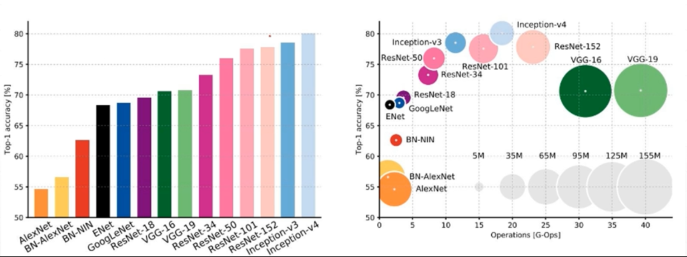

**个人学习内容整理，来自吴恩达以及龙曲良的视频教程**

# 1. 神经网络和深度学习

## 1.1. 什么是神经网络

## 1.2. 神经网络编程基础

### 1.2.1. 二分类(Binary Classification)

### 1.2.2. 逻辑回归(Logistic Regression)

### 1.2.3. 多分类 softmax

### 1.2.4. 损失函数(Cost Function)

#### 1.2.4.1. 回归模型

#### 1.2.4.2. 分类模型

### 1.2.5. 逻辑回归的损失函数(Logistic Regression Cost Function)

### 1.2.6. 梯度下降(Gradient Descent)

### 1.2.7. 梯度下降的例子(Gradient Descent on m Examples)

### 1.2.8. 导数(Derivatives)

### 1.2.9. 计算图(Computation Graph)

### 1.2.10. 计算图导数(Derivatives with a Computation Graph)

### 1.2.11. 向量化(Vectorization)

### 1.2.12. 逻辑回归损失函数详解(Explanation of logistic regression cost function)

## 1.3. 浅层神经网络

### 1.3.1. 神经网络概述(Neural Network Overview)

### 1.3.2. 神经网络的表示(Neural Network Representation)

### 1.3.3. 多样本向量化(Vectorizing across multiple examples)

向量化实现的解释(Justification for vectorized implementation)

### 1.3.4. 神经网络计算输出(Computing a Neural Network's output)

### 1.3.5. 激活函数(Activation functions)

### 1.3.6. 激活函数的导数(Derivatives of activation functions)

### 1.3.7. 神经网络的梯度下降(Gradient descent for neural networks)

### 1.3.8. 前向传播与反向传播(Forward and backward propagation)

### 1.3.9. 直观理解反向传播(Backpropagation intuition)

### 1.3.10. 权重随机初始化(Random+Initialization)

## 1.4. 深层神经网络

### 1.4.1. 深层神经网络(Deep L-layer neural network)

为什么使用深层表示？(Why deep representations?)

### 1.4.2. 深层网络中的前向和反向传播(Forward propagation in a Deep Network)

### 1.4.3. 搭建神经网络块(Building blocks of deep neural networks)

### 1.4.4. 参数 VS 超参数(Parameters vs Hyperparameters)

### 1.4.5. 代码检查:核对矩阵的维数(Getting your matrix dimensions right)

# 2. 超参数调试、正则化以及优化

## 2.1. 基本概念

### 2.1.1. 训练，验证，测试集(Train / Dev / Test sets)

### 2.1.2. 偏差，方差(Bias /Variance)

过拟合

### 2.1.3. 过拟合、欠拟合与网络调整

## 2.2. 正则化(Regularization)

### 2.2.1. 种类

#### 2.2.1.1. L1

#### 2.2.1.2. L2

#### 2.2.1.3. dropout 正则化(Dropout Regularization)

#### 2.2.1.4. 数据扩增

#### 2.2.1.5. early stopping

### 2.2.2. 为何正则化有利于预防过拟合(Why regularization reduces overfitting?)

## 2.3. 深度网络训练面临的问题

### 2.3.1. 梯度消失(Vanishing gradients)

### 2.3.2. 梯度爆炸(Exploding gradients)

### 2.3.3. 解决方法

#### 2.3.3.1. 权重初始化

#### 2.3.3.2. pre-training+fine-tunning

#### 2.3.3.3. 梯度剪切：对梯度设定阈值

#### 2.3.3.4. 权重正则化

#### 2.3.3.5. 激活函数选择

选择 relu 等梯度大部分落在常数上的激活函数

relu 函数的导数在正数部分是恒等于 1 的，因此在深层网络中使用 relu 激活函数就不会导致梯度消失和爆炸的问题。

relu、leakrelu、elu 等激活函数

#### 2.3.3.6. batch normalization

BN 就是通过对每一层的输出规范为均值和方差一致的方法，消除了权重参数放大缩小带来的影响，进而解决梯度消失和爆炸的问题，或者可以理解为 BN 将输出从饱和区拉倒了非饱和区。

#### 2.3.3.7. 残差网络的捷径

#### 2.3.3.8. LSTM 的门

## 2.4. 检验反响传播是否正常进行

### 2.4.1. 梯度的数值逼近(Numerical approximation of gradients)

### 2.4.2. 梯度检验(Gradient checking)

### 2.4.3. 梯度检验应用的注意事项(Gradient Checking Implementation Notes)

## 2.5. 优化算法

### 2.5.1. Mini-batch 梯度下降(Mini-batch gradient descent)

### 2.5.2. 指数加权平均(Exponentially weighted averages)

### 2.5.3. 指数加权平均的偏差修正(Bias correction in exponentially weighted averages)

### 2.5.4. momentum 梯度下降(Gradient descent with momentum)

### 2.5.5. RMSprop——root mean square prop(RMSprop)

### 2.5.6. Adam 优化算法(Adam optimization algorithm)

### 2.5.7. 学习率衰减(Learning rate decay)

### 2.5.8. 局部最优问题(The problem of local optima)

## 2.6. 超参数调试

### 2.6.1. 调试处理(Tuning process)

### 2.6.2. 为超参数选择和适合范围(Using an appropriate scale to pick hyperparameters)

### 2.6.3. 超参数训练的实践：Pandas vs. Caviar(Hyperparameters tuning in practice: Pandas vs. Caviar)

## 2.7. Batch Normalization

## 2.8. SoftMax

# 3. 结构化学习

# 4. 卷积神经网络

## 4.1. 卷积神经网络基础(Foundations of Convolutional Neural Networks)

### 4.1.1. 计算机视觉

### 4.1.2. 单通道卷积运算构成

#### 4.1.2.1. 卷积核/过滤器

#### 4.1.2.2. padding

#### 4.1.2.3. 卷积步长(stride)

### 4.1.3. 边缘检测示例

### 4.1.4. 多通道卷积运算

### 4.1.5. 常用基本单元

卷积神经网络中的基本单元：conv2d->batch normalization->pooling->Relu

后面三个的顺序没有主流选择，顺序颠倒也没关系

### 4.1.6. 单层卷积网络

### 4.1.7. 多层卷积网络

### 4.1.8. 池化层,向上取样,向下取样

### 4.1.9. 为什么使用卷积

## 4.2. 经典卷积神经网络

### 4.2.1. 发展图



### 4.2.2. LeNet-5

### 4.2.3. AlexNet

### 4.2.4. VGGNet

### 4.2.5. ResNets

### 4.2.6. Inception

## 4.3. 数据扩充

- Flip：镜像翻转
  - transforms.RandomHorizontalFlip()
  - transforms.RandomVerticalFlip()
- Rotate:旋转
  - transforms.Rotation()
- scale:缩放，只取中心部分数据。resize也可以实现缩放
- crop:随机裁剪。和缩放不同的是不是从中心裁剪
- Noise：添加噪声。pytorch没有提供该接口
- gan

## 4.4. 迁移学习

## 4.5. 目标检测(Object detection)

### 4.5.1. 目标定位(Object localization)

### 4.5.2. 特征点检测(Landmark detection)

### 4.5.3. 目标检测(Object detection)

### 4.5.4. 卷积的滑动窗口实现(Convolutional implementation of sliding windows)

### 4.5.5. Bounding Box 预测(Bounding box predictions)

### 4.5.6. 交并比(Intersection over union)

### 4.5.7. 非极大值抑制(Non-max suppression)

### 4.5.8. Anchor Boxes

### 4.5.9. YOLO 算法(Putting it together: YOLO algorithm)

### 4.5.10. 候选区域(选修)(Region proposals (Optional))

## 4.6. 人脸识别(Face recognition)

### 4.6.1. 什么是人脸识别？(What is face recognition?)

### 4.6.2. One-Shot 学习(One-shot learning)

### 4.6.3. Siamese 网络(Siamese network)

### 4.6.4. Triplet 损失(Triplet 损失)

### 4.6.5. 面部验证与二分类(Face verification and binary classification)

### 4.6.6. 什么是神经风格转换？(What is neural style transfer?)

### 4.6.7. 什么是深度卷积网络？(What are deep ConvNets learning?)

### 4.6.8. 代价函数(Cost function)

### 4.6.9. 内容代价函数(Content cost function)

### 4.6.10. 风格代价函数(Style cost function)

### 4.6.11. 一维到三维推广(1D and 3D generalizations of models)

## 4.7. 神经风格转换(Neural style transfer)

# 5. 序列模型

- 数据格式：
  - [word_num,batch_idx,word_vector] 更常用
  - [batch_idx,word_num,word_vector] 需要设置batch_first为true

- 查表： nn.Embedding(word_num,feature_length)
  - 一开始是随机初始化
  - 如果仅进行查表是无法优化的。
- GloVe查表:下载的表数据上G
  ```python
  from torchnlp.word_to_vector import Glove
  vectors = GloVe()
  vectors['hello']  #  返回hello对应的featur：
  ```

- 输出：以两层RNN为例
  - out:第二个RDD每个时间节点得到的激活值
  - h:两层RNN最后一个时间节点得到的激活值

# 计算机视觉

## 常用组件

## 经典网络

# 边缘部署

## libtorch


