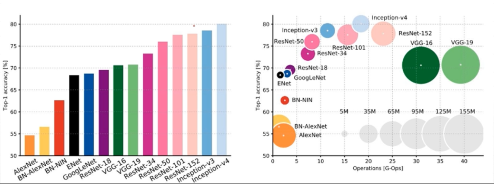

**个人学习内容整理，来自吴恩达以及龙曲良的视频教程**

# 1. 神经网络和深度学习

## 1.1. 什么是神经网络

神经网络是一种模仿生物神经元连接方式的计算模型，通过多层节点的加权连接来学习输入与输出之间的映射关系。

## 1.2. 神经网络编程基础

### 1.2.1. 二分类(Binary Classification)

- 输出标签 y 只有 0 和 1 两个值，表示属于或不属于某一类
- 输入特征向量 x 维度为 n_x，训练集有 m 个样本
- 目标：学习一个分类器，输入 x 输出预测 y_hat = P(y=1|x)
- 训练集表示为矩阵 X.shape = (n_x, m)，标签 Y.shape = (1, m)
- 图像输入时将 RGB 三通道像素展开为一维向量作为特征

### 1.2.2. 逻辑回归(Logistic Regression)

- 用于二分类问题的线性模型，输出经过 sigmoid 函数映射到 [0,1]
- 模型：y_hat = sigmoid(w^T * x + b)，其中 sigmoid(z) = 1 / (1 + e^(-z))
- 参数：权重向量 w (n_x 维) 和偏置标量 b
- 当 z 很大时 sigmoid 趋近 1，z 很小时趋近 0，z=0 时输出 0.5
- 与线性回归的区别：加了 sigmoid 将输出限制在概率范围内

### 1.2.3. 多分类 softmax

- 将逻辑回归推广到 C 个类别的多分类问题
- softmax 函数：对输出层每个节点 z_i 计算 e^(z_i) / sum(e^(z_j))
- 输出为 C 维概率向量，所有分量之和为 1
- 最终预测类别为概率最大的那个类：argmax(y_hat)
- 当 C=2 时退化为逻辑回归

### 1.2.4. 损失函数(Cost Function)

#### 1.2.4.1. 回归模型

- 均方误差 MSE：L = (1/m) * sum((y_hat - y)^2)
- 均方根误差 RMSE：对 MSE 开根号，量纲与目标一致
- 平均绝对误差 MAE：L = (1/m) * sum(|y_hat - y|)
- MSE 对异常值更敏感（平方放大误差），MAE 更鲁棒
- Huber Loss：在误差较小时用 MSE，较大时用 MAE，兼顾两者优点

#### 1.2.4.2. 分类模型

- 交叉熵损失：L = -[y*log(y_hat) + (1-y)*log(1-y_hat)]（二分类）
- 多分类交叉熵：L = -sum(y_i * log(y_hat_i))，i=1..C
- 当预测值接近真实标签时损失趋近 0，偏离时损失急剧增大
- Focal Loss：对容易分类的样本降低权重，关注难分类样本，用于类别不平衡
- Hinge Loss：用于 SVM，L = max(0, 1 - y * y_hat)

### 1.2.5. 逻辑回归的损失函数(Logistic Regression Cost Function)

- 单样本损失：L(y_hat, y) = -[y*log(y_hat) + (1-y)*log(1-y_hat)]
- 代价函数（全体样本）：J(w,b) = (1/m) * sum(L(y_hat_i, y_i))
- 当 y=1 时，L = -log(y_hat)，希望 y_hat 越大损失越小
- 当 y=0 时，L = -log(1-y_hat)，希望 y_hat 越小损失越小
- 不用 MSE 的原因：sigmoid + MSE 会导致非凸优化，存在多个局部最优

### 1.2.6. 梯度下降(Gradient Descent)

- 目标：找到使代价函数 J(w,b) 最小的参数 w 和 b
- 更新规则：w := w - alpha * dJ/dw，b := b - alpha * dJ/db
- alpha 为学习率，控制每次更新的步长
- 梯度指向函数增长最快的方向，负梯度方向为下降最快方向
- 凸函数保证梯度下降能收敛到全局最优
- 学习率过大会震荡发散，过小会收敛极慢

### 1.2.7. 梯度下降的例子(Gradient Descent on m Examples)

- 对 m 个样本的梯度是各样本梯度的平均值
- dw = (1/m) * sum(x_i * (a_i - y_i))，db = (1/m) * sum(a_i - y_i)
- 使用 for 循环遍历所有样本累加梯度（效率低）
- 向量化可以消除显式 for 循环，大幅提升计算速度
- 每次迭代使用全部训练数据，称为 Batch Gradient Descent

### 1.2.8. 导数(Derivatives)

- 导数表示函数在某点的变化率/斜率：df/dx = lim(f(x+h)-f(x))/h
- 对于 f(x)=x^2，导数为 2x；对于 f(x)=x^3，导数为 3x^2
- 导数大小表示函数变化的快慢，符号表示增减方向
- 在神经网络中，导数用于计算参数更新的方向和幅度
- 偏导数是多元函数对其中一个变量的导数，其余变量视为常数

### 1.2.9. 计算图(Computation Graph)

- 将复合函数的计算过程用有向无环图表示
- 每个节点代表一个基本运算（加、乘、激活函数等）
- 前向传播：从输入到输出，逐步计算中间变量和最终输出
- 反向传播：从输出到输入，逐步计算各变量的梯度
- 计算图使复杂函数的求导变得系统化和模块化
- 例如 J = 3(a+bc)，可分解为 u=bc, v=a+u, J=3v

### 1.2.10. 计算图导数(Derivatives with a Computation Graph)

- 利用链式法则从输出节点反向计算每个节点的导数
- 链式法则：dJ/da = (dJ/dv) * (dv/da)
- 代码中通常用 da 表示 dJ/da（最终输出对中间变量 a 的导数）
- 反向传播时每个节点只需知道局部导数和上游传回的梯度
- 计算效率高：一次反向传播即可得到所有参数的梯度

### 1.2.11. 向量化(Vectorization)

- 用矩阵/向量运算替代显式 for 循环，利用 CPU/GPU 并行指令（SIMD）
- 例如：z = np.dot(w, x) + b 替代逐元素循环计算
- 向量化后速度可提升 100-1000 倍
- 规则：尽可能避免在训练中使用显式 for 循环
- numpy 广播机制支持不同形状数组的自动运算
- Z = np.dot(W, X) + b 一次计算所有样本的线性变换

### 1.2.12. 逻辑回归损失函数详解(Explanation of logistic regression cost function)

- 从最大似然估计角度推导：P(y|x) = y_hat^y * (1-y_hat)^(1-y)
- 取对数得：log P(y|x) = y*log(y_hat) + (1-y)*log(1-y_hat)
- 最大化对数似然等价于最小化负对数似然，即交叉熵损失
- 整个训练集的代价函数：J = -(1/m) * sum(log P(y_i|x_i))
- 该损失函数是凸函数，梯度下降保证找到全局最优

## 1.3. 浅层神经网络

### 1.3.1. 神经网络概述(Neural Network Overview)

- 神经网络由输入层、隐藏层、输出层组成
- 每一层执行线性变换 z = Wx + b 后接激活函数 a = g(z)
- 前向传播：逐层计算从输入到输出
- 反向传播：从输出层到输入层逐层计算梯度
- 浅层网络指只有一个隐藏层的网络

### 1.3.2. 神经网络的表示(Neural Network Representation)

- 输入层（第 0 层）：接收特征向量 x，记为 a[0]
- 隐藏层（第 1 层）：用户不直接观察其值，有多个神经元
- 输出层（最后一层）：输出预测值 y_hat
- 约定：输入层不算在网络层数中，如"2层网络"有1个隐藏层+1个输出层
- 参数记法：W[l] 表示第 l 层权重，b[l] 表示第 l 层偏置
- 激活值：a[l] 表示第 l 层的输出

### 1.3.3. 多样本向量化(Vectorizing across multiple examples)

向量化实现的解释(Justification for vectorized implementation)

- 将 m 个样本的前向传播合并为矩阵运算
- X 矩阵：每列是一个样本，shape=(n_x, m)
- Z[1] = W[1] * X + b[1]，一次计算所有样本的第一层线性变换
- A[1] = g(Z[1])，对矩阵逐元素应用激活函数
- 矩阵列索引对应不同样本，行索引对应不同神经元
- 避免了对 m 个样本的显式 for 循环

### 1.3.4. 神经网络计算输出(Computing a Neural Network's output)

- 每个神经元执行两步：线性变换 z = w^T*x + b，激活 a = g(z)
- 第一层：z[1] = W[1]*a[0] + b[1]，a[1] = g[1](z[1])
- 第二层：z[2] = W[2]*a[1] + b[2]，a[2] = g[2](z[2])
- W[l] 的 shape 为 (n[l], n[l-1])，b[l] 的 shape 为 (n[l], 1)
- 输出 a[L] 即为网络的预测值 y_hat

### 1.3.5. 激活函数(Activation functions)

- sigmoid：g(z) = 1/(1+e^(-z))，输出[0,1]，用于输出层二分类
- tanh：g(z) = (e^z - e^(-z))/(e^z + e^(-z))，输出[-1,1]，均值为0效果通常优于sigmoid
- ReLU：g(z) = max(0, z)，计算简单，缓解梯度消失，隐藏层默认选择
- Leaky ReLU：g(z) = max(0.01z, z)，解决 ReLU 神经元死亡问题
- 选择建议：隐藏层用 ReLU，输出层根据任务选择（二分类sigmoid，多分类softmax，回归线性）

### 1.3.6. 激活函数的导数(Derivatives of activation functions)

- sigmoid 导数：g'(z) = g(z) * (1 - g(z)) = a * (1-a)
- tanh 导数：g'(z) = 1 - (tanh(z))^2 = 1 - a^2
- ReLU 导数：g'(z) = 0 (z<0)，g'(z) = 1 (z>0)，z=0 时通常设为 0 或 1
- Leaky ReLU 导数：g'(z) = 0.01 (z<0)，g'(z) = 1 (z>=0)
- sigmoid/tanh 在 z 值很大或很小时梯度接近 0，导致梯度消失

### 1.3.7. 神经网络的梯度下降(Gradient descent for neural networks)

- 参数：W[1], b[1], W[2], b[2]；代价函数 J(W[1],b[1],W[2],b[2])
- 前向传播计算 a[2]，再计算损失
- 反向传播计算 dW[2], db[2], dW[1], db[1]
- 更新：W[l] = W[l] - alpha * dW[l]，b[l] = b[l] - alpha * db[l]
- 关键公式：dZ[2] = A[2]-Y，dW[2] = (1/m)*dZ[2]*A[1]^T
- dZ[1] = W[2]^T * dZ[2] .* g[1]'(Z[1])

### 1.3.8. 前向传播与反向传播(Forward and backward propagation)

- 前向传播：输入 a[l-1]，计算 z[l]=W[l]*a[l-1]+b[l]，a[l]=g(z[l])，缓存 z[l]
- 反向传播：输入 da[l]，计算 dz[l]=da[l].*g'(z[l])
- 继续计算：dW[l]=(1/m)*dz[l]*a[l-1]^T，db[l]=(1/m)*sum(dz[l])
- 传递到前一层：da[l-1]=W[l]^T * dz[l]
- 前向传播需要缓存 z[l] 和 a[l-1] 以供反向传播使用
- 两者交替进行构成一次完整的训练迭代

### 1.3.9. 直观理解反向传播(Backpropagation intuition)

- 反向传播本质是链式法则的系统化应用
- 从最终损失开始，逐层向前传递"误差信号"
- 每个节点的梯度 = 上游梯度 * 本地梯度
- 加法节点：梯度直接传递；乘法节点：梯度乘以另一个输入值
- 分支节点：梯度相加（多条路径的梯度之和）
- 直观理解：告诉每个参数它应该增大还是减小，以及幅度多大

### 1.3.10. 权重随机初始化(Random+Initialization)

- 不能将所有权重初始化为 0：所有隐藏单元完全对称，梯度相同，永远无法打破对称
- 解决方案：随机初始化 W，b 可以初始化为 0
- 常用方法：W = np.random.randn(shape) * 0.01，用小随机数
- 权重太大会导致 sigmoid/tanh 饱和，梯度消失，训练缓慢
- Xavier 初始化：W * sqrt(1/n[l-1])，适合 tanh
- He 初始化：W * sqrt(2/n[l-1])，适合 ReLU

## 1.4. 深层神经网络

### 1.4.1. 深层神经网络(Deep L-layer neural network)

为什么使用深层表示？(Why deep representations?)

- 深层网络能学习从简单到复杂的层次化特征表示
- 浅层检测边缘，中层检测部件（眼睛、鼻子），深层检测完整对象（人脸）
- 深层网络用较少的神经元可以表示复杂函数（指数级优势）
- 类比电路理论：某些函数用浅层网络需要指数级节点，深层只需多项式级
- 实践中从浅层开始尝试，逐步加深直到过拟合

### 1.4.2. 深层网络中的前向和反向传播(Forward propagation in a Deep Network)

- 前向传播通用公式：Z[l] = W[l]*A[l-1] + b[l]，A[l] = g[l](Z[l])
- 从 l=1 到 l=L 依次计算，需要一个 for 循环遍历各层
- 缓存每层的 Z[l] 用于反向传播
- 反向传播：从 dA[L] 开始，逐层计算 dZ[l], dW[l], db[l], dA[l-1]
- 整体形成一个系统的前向-反向计算流程

### 1.4.3. 搭建神经网络块(Building blocks of deep neural networks)

- 每一层可视为一个"块"，包含前向函数和反向函数
- 前向块：输入 a[l-1]，输出 a[l]，缓存(W[l], b[l], z[l], a[l-1])
- 反向块：输入 da[l] 和缓存，输出 da[l-1], dW[l], db[l]
- 将多个块串联起来构成完整的深层网络
- 模块化设计便于实现、调试和复用

### 1.4.4. 参数 VS 超参数(Parameters vs Hyperparameters)

- 参数：模型通过学习得到的值，如 W 和 b
- 超参数：需要人为设定的值，控制参数的学习过程
- 常见超参数：学习率 alpha、迭代次数、隐藏层数 L、隐藏单元数 n[l]、激活函数选择
- 其他超参数：mini-batch 大小、momentum 参数、正则化参数等
- 超参数的最优值需要通过实验反复尝试来确定
- 不同问题的最优超参数通常不同，需要定期重新评估

### 1.4.5. 代码检查:核对矩阵的维数(Getting your matrix dimensions right)

- W[l].shape = (n[l], n[l-1])，b[l].shape = (n[l], 1)
- Z[l].shape = A[l].shape = (n[l], m)，其中 m 为样本数
- dW[l].shape = W[l].shape，db[l].shape = b[l].shape
- 调试技巧：在代码中加 assert 语句检查维度
- 例如：assert(W1.shape == (n1, n0))
- 维度不匹配是神经网络编程中最常见的 bug 之一

# 2. 超参数调试、正则化以及优化

## 2.1. 基本概念

### 2.1.1. 训练，验证，测试集(Train / Dev / Test sets)

- 训练集：用于训练模型参数
- 验证集（dev set）：用于调超参数、选择模型，不参与训练
- 测试集：最终评估模型泛化性能，只用一次
- 小数据时代：70/30 或 60/20/20 划分
- 大数据时代（百万级）：98/1/1 甚至 99.5/0.25/0.25
- 确保 dev 和 test 来自同一分布

### 2.1.2. 偏差，方差(Bias /Variance)

过拟合

- 高偏差（欠拟合）：训练集误差高，模型太简单无法拟合数据
- 高方差（过拟合）：训练集误差低但验证集误差高，模型过于复杂
- 判断方法：比较训练误差和验证误差与人类基准（贝叶斯误差）的差距
- 高偏差+高方差：训练集某些区域拟合差，某些区域过拟合
- 理想状态：低偏差+低方差，训练和验证误差都接近贝叶斯误差

### 2.1.3. 过拟合、欠拟合与网络调整

- 高偏差（欠拟合）解决：增加网络层数/单元数、换更复杂模型、训练更久
- 高方差（过拟合）解决：增加数据、正则化、减小模型复杂度、dropout、early stopping
- 深度学习时代的"偏差-方差权衡"不再严格：更大网络通常不损害偏差
- 诊断流程：先解决高偏差问题（训练集表现），再解决高方差问题（验证集表现）
- 数据量充足时，增大网络规模可以同时降低偏差和方差

## 2.2. 正则化(Regularization)

### 2.2.1. 种类

#### 2.2.1.1. L1

- 在代价函数中加入权重绝对值之和：J += (lambda/2m) * sum(|w|)
- L1 正则化倾向于产生稀疏权重矩阵（很多权重变为 0）
- 可用于特征选择，非零权重对应重要特征
- 梯度中增加 lambda/m * sign(w) 项
- 实际深度学习中 L1 使用较少，L2 更常用

#### 2.2.1.2. L2

- 又称权重衰减（weight decay），最常用的正则化方法
- 代价函数增加项：J += (lambda/2m) * sum(W^2)（Frobenius 范数的平方）
- 梯度更新：dW += (lambda/m) * W
- 效果：W := W * (1 - alpha*lambda/m) - alpha * dW_原始，权重每次乘以小于1的系数
- lambda 越大正则化越强，权重越小，模型越简单

#### 2.2.1.3. dropout 正则化(Dropout Regularization)

- 训练时随机"丢弃"（置零）每层一定比例的神经元
- Inverted Dropout 实现：a[l] = a[l] * mask / keep_prob（除以 keep_prob 保持期望不变）
- keep_prob 通常设为 0.5-0.8，参数多的层可以设更低
- 直觉：网络不依赖任何单一特征，权重分散，类似 L2 效果
- 测试时不使用 dropout，使用完整网络
- 缺点：代价函数不再明确定义，难以用曲线监控收敛

#### 2.2.1.4. 数据扩增

- 通过对现有数据施加变换来增加训练数据量
- 图像常用：水平翻转、随机裁剪、旋转、缩放、颜色扰动
- 文本常用：同义词替换、随机插入/删除、回译
- 相当于正则化，增加了数据多样性，减少过拟合
- 计算代价低，不需要额外收集数据

#### 2.2.1.5. early stopping

- 在训练过程中同时监控训练误差和验证误差
- 当验证误差开始上升时（过拟合开始），停止训练
- 选择验证误差最小时对应的参数作为最终模型
- 优点：简单有效，只需训练一次
- 缺点：将优化和正则化耦合在一起，不能独立调整
- 吴恩达建议：优先用 L2 正则化，它不耦合优化问题

### 2.2.2. 为何正则化有利于预防过拟合(Why regularization reduces overfitting?)

- lambda 增大 -> W 减小 -> z = Wx+b 范围变小
- z 小时 tanh(z) 近似线性 -> 网络近似线性模型 -> 不易过拟合
- 直觉：正则化使很多隐藏单元影响减小，等效于更简单的网络
- Dropout 角度：不能依赖任何一个特征，被迫学习更鲁棒的特征
- 本质：限制模型复杂度，在偏差和方差之间找到平衡

## 2.3. 深度网络训练面临的问题

### 2.3.1. 梯度消失(Vanishing gradients)

- 深层网络中，梯度从输出层向输入层传播时可能指数级衰减
- 原因：每层梯度乘以权重矩阵，若 |W| < 1 则梯度越来越小
- 表现：靠近输入的层参数几乎不更新，训练极其缓慢
- sigmoid/tanh 在饱和区梯度接近 0，加剧梯度消失
- 影响：深层网络难以训练，浅层特征学习不充分

### 2.3.2. 梯度爆炸(Exploding gradients)

- 梯度从输出层向输入层传播时指数级增长
- 原因：每层梯度乘以权重矩阵，若 |W| > 1 则梯度越来越大
- 表现：参数更新过大，训练不稳定，loss 出现 NaN
- 在 RNN 中尤其严重，因为同一权重矩阵连乘多次
- 数值溢出导致训练完全崩溃

### 2.3.3. 解决方法

#### 2.3.3.1. 权重初始化

- 合理的初始化可以部分缓解梯度消失/爆炸问题
- Xavier 初始化：Var(W) = 1/n[l-1]，适合 sigmoid 和 tanh
- He 初始化：Var(W) = 2/n[l-1]，适合 ReLU 激活函数
- 目标：保持每层激活值和梯度的方差稳定
- PyTorch 中：nn.init.kaiming_normal_(W) 或 nn.init.xavier_normal_(W)

#### 2.3.3.2. pre-training+fine-tunning

- 逐层预训练：先训练第一层，固定后训练第二层，依次进行
- 自编码器或 RBM 进行无监督逐层预训练
- 预训练提供较好的初始化点，避免随机初始化陷入不良局部最优
- Fine-tuning：在预训练基础上用有标签数据端到端微调全网络
- 现代深度学习中由于 BN 和 ReLU 的出现，逐层预训练已较少使用

#### 2.3.3.3. 梯度剪切：对梯度设定阈值

- 当梯度范数超过阈值时，按比例缩放梯度：g = g * threshold / ||g||
- 主要用于解决梯度爆炸问题，特别是在 RNN 训练中
- 不改变梯度方向，只限制其大小
- PyTorch 实现：torch.nn.utils.clip_grad_norm_(model.parameters(), max_norm)
- 阈值通常设为 1.0 或 5.0，需根据具体任务调整

#### 2.3.3.4. 权重正则化

- L2 正则化限制权重大小，间接防止梯度爆炸
- 权重衰减使 W 不会增长到很大的值
- 正则化后权重矩阵的谱范数（最大奇异值）受到约束
- 谱归一化（Spectral Normalization）：直接约束权重矩阵的谱范数为 1
- 与梯度剪切配合使用效果更好

#### 2.3.3.5. 激活函数选择

选择 relu 等梯度大部分落在常数上的激活函数

relu 函数的导数在正数部分是恒等于 1 的，因此在深层网络中使用 relu 激活函数就不会导致梯度消失和爆炸的问题。

relu、leakrelu、elu 等激活函数

#### 2.3.3.6. batch normalization

BN 就是通过对每一层的输出规范为均值和方差一致的方法，消除了权重参数放大缩小带来的影响，进而解决梯度消失和爆炸的问题，或者可以理解为 BN 将输出从饱和区拉倒了非饱和区。

#### 2.3.3.7. 残差网络的捷径

残差连接（skip connection）允许梯度直接跨层传播，绕过中间层的梯度衰减。即使中间层梯度接近 0，梯度仍可通过捷径路径回传，保证深层网络可训练。

#### 2.3.3.8. LSTM 的门

## 2.4. 检验反向传播是否正常进行

### 2.4.1. 梯度的数值逼近(Numerical approximation of gradients)

- 双侧差分：f'(x) ≈ (f(x+epsilon) - f(x-epsilon)) / (2*epsilon)
- 精度为 O(epsilon^2)，比单侧差分 O(epsilon) 更准确
- epsilon 通常取 1e-7
- 用于验证反向传播实现的正确性
- 数值梯度计算代价高，仅用于调试不用于训练

### 2.4.2. 梯度检验(Gradient checking)

- 将所有参数 W, b 展开为一个大向量 theta
- 对每个 theta_i 计算数值梯度 d_theta_approx[i]
- 比较数值梯度和反向传播梯度的差异
- 检验公式：||d_theta_approx - d_theta|| / (||d_theta_approx|| + ||d_theta||)
- 差异 < 1e-7 表示实现正确，> 1e-5 可能有 bug，> 1e-3 肯定有问题

### 2.4.3. 梯度检验应用的注意事项(Gradient Checking Implementation Notes)

- 不要在训练中使用梯度检验，仅用于调试（计算太慢）
- 如果梯度检验失败，检查各个分量找到出错的层
- 记得加入正则化项的梯度
- 梯度检验不能和 dropout 同时使用（先关闭 dropout 再检验）
- 在随机初始化后尽早运行梯度检验

## 2.5. 优化算法

### 2.5.1. Mini-batch 梯度下降(Mini-batch gradient descent)

- 将训练集分为大小为 B 的小批量，每次用一个 mini-batch 更新参数
- Batch GD (B=m)：每次遍历全部数据，准确但慢
- SGD (B=1)：每次一个样本，噪声大但快，难以利用向量化
- Mini-batch (B=64/128/256/512)：兼顾速度和稳定性
- 一个 epoch = 遍历所有 mini-batch 一次
- 典型选择：B 为 2 的幂次方，适配 GPU 内存对齐

### 2.5.2. 指数加权平均(Exponentially weighted averages)

- 公式：v_t = beta * v_{t-1} + (1-beta) * theta_t
- v_t 约等于过去 1/(1-beta) 个数据的平均值
- beta=0.9 约等于 10 天的平均，beta=0.98 约等于 50 天
- beta 越大曲线越平滑但延迟越大，beta 越小越灵敏但噪声大
- 优点：只需存储一个变量，内存效率 O(1)
- 是 Momentum、RMSprop、Adam 等优化器的基础

### 2.5.3. 指数加权平均的偏差修正(Bias correction in exponentially weighted averages)

- 问题：v_0=0 导致初期估计偏低（向零偏置）
- 修正公式：v_t_corrected = v_t / (1 - beta^t)
- 当 t 较大时 beta^t 趋近 0，修正项趋近 1，影响消失
- 当 t 较小时修正项显著，使估计更准确
- 实践中常在训练初期使用，后期影响可忽略

### 2.5.4. momentum 梯度下降(Gradient descent with momentum)

- 在梯度方向上使用指数加权平均来积累"速度"
- v_dW = beta*v_dW + (1-beta)*dW，W = W - alpha*v_dW
- 直觉：像球从坡上滚下，积累动量加速收敛
- 减少垂直方向的振荡（正负梯度相消），加速水平方向的前进
- 超参数 beta 通常设为 0.9
- 在狭长的等高线地形中效果尤为明显

### 2.5.5. RMSprop——root mean square prop(RMSprop)

- 对梯度的平方进行指数加权平均：s_dW = beta*s_dW + (1-beta)*dW^2
- 更新：W = W - alpha * dW / (sqrt(s_dW) + epsilon)
- 梯度大的方向（振荡方向）除以大数，步长变小
- 梯度小的方向除以小数，步长相对变大
- 自适应地调整各参数的学习率
- epsilon 通常取 1e-8 防止除零

### 2.5.6. Adam 优化算法(Adam optimization algorithm)

- Adam = Adaptive Moment Estimation，结合 Momentum 和 RMSprop
- 一阶矩估计：v_dW = beta1*v_dW + (1-beta1)*dW（类似 Momentum）
- 二阶矩估计：s_dW = beta2*s_dW + (1-beta2)*dW^2（类似 RMSprop）
- 偏差修正：v_corrected = v/(1-beta1^t)，s_corrected = s/(1-beta2^t)
- 更新：W = W - alpha * v_corrected / (sqrt(s_corrected) + epsilon)
- 推荐默认超参数：beta1=0.9, beta2=0.999, epsilon=1e-8
- 目前最广泛使用的优化器，适用于大多数场景

### 2.5.7. 学习率衰减(Learning rate decay)

- 训练初期用大学习率快速收敛，后期减小学习率精细调整
- 指数衰减：alpha = alpha_0 * decay_rate^epoch
- 时间衰减：alpha = alpha_0 / (1 + decay_rate * epoch)
- 阶梯衰减：每隔 N 个 epoch 将学习率乘以系数（如 0.1）
- 余弦退火：alpha = alpha_min + 0.5*(alpha_max-alpha_min)*(1+cos(pi*t/T))
- 学习率预热（warmup）：训练最初几个 epoch 线性增大学习率

### 2.5.8. 局部最优问题(The problem of local optima)

- 高维空间中真正的局部最优很少，更常见的是鞍点
- 鞍点：某些方向是极小值，某些方向是极大值
- 真正困难的是"高原"区域：梯度长期接近 0，训练停滞
- Momentum、Adam 等方法有助于逃离鞍点和高原
- 现代深度学习中局部最优通常不是主要障碍

## 2.6. 超参数调试

### 2.6.1. 调试处理(Tuning process)

- 超参数重要性排序：学习率 > mini-batch大小/隐藏单元数/beta > 层数/学习率衰减
- 不要使用网格搜索，用随机搜索：每个超参数能尝试更多不同值
- 由粗到细搜索：先大范围随机搜索，找到效果好的区域后缩小范围精搜
- 不同超参数的重要性不同，随机搜索能更高效地探索重要超参数

### 2.6.2. 为超参数选择和适合范围(Using an appropriate scale to pick hyperparameters)

- 某些超参数在对数尺度上均匀采样更合理
- 学习率：在 [0.0001, 1] 范围内用 10^r 采样，r 从 [-4, 0] 均匀取
- beta（momentum）：在 [0.9, 0.999] 中搜索 1-beta 从 [0.001, 0.1]，用对数尺度
- 层数、隐藏单元数可以在线性尺度上搜索
- 对数尺度确保在参数敏感区域有更多采样点

### 2.6.3. 超参数训练的实践：Pandas vs. Caviar(Hyperparameters tuning in practice: Pandas vs. Caviar)

- Panda 策略（babysitting）：计算资源有限时，精心照看一个模型，逐步调参
- Caviar 策略：并行训练多个模型，使用不同超参数，选最好的
- 计算资源充足选 Caviar，资源有限选 Panda
- 超参数会随时间"过期"：数据变化、硬件变化后需要重新调参
- 建议每隔几个月重新评估超参数设置

## 2.7. Batch Normalization

- 对每一层的输入（或激活前的 z 值）进行归一化
- 步骤：计算 mini-batch 的均值 mu 和方差 sigma^2，归一化 z_norm = (z-mu)/sqrt(sigma^2+eps)
- 引入可学习参数：z_tilde = gamma * z_norm + beta（允许网络恢复原始分布）
- 作用：加速训练收敛、允许更大学习率、减少对初始化的依赖
- 轻微正则化效果：mini-batch 的均值/方差引入噪声
- 测试时使用训练期间的指数加权平均值代替 mini-batch 统计量
- 通常放在线性变换之后、激活函数之前：Conv -> BN -> ReLU

## 2.8. SoftMax

- 多分类输出层激活函数：a_i = e^(z_i) / sum(e^(z_j))，j=1..C
- 输出 C 个概率值，和为 1，表示属于各类的概率
- 温度系数 T：a_i = e^(z_i/T) / sum(e^(z_j/T))，T 越大分布越平滑
- 损失函数：交叉熵 L = -sum(y_i * log(a_i))
- 梯度简洁：dz = a - y（预测概率减去 one-hot 标签）
- 数值稳定技巧：z_i = z_i - max(z) 防止指数溢出

# 3. 结构化学习

结构化学习关注输出为结构化对象（如序列、树、图）的问题，输出空间通常很大且元素之间存在依赖关系。

# 4. 卷积神经网络

## 4.1. 卷积神经网络基础(Foundations of Convolutional Neural Networks)

### 4.1.1. 计算机视觉

- 计算机视觉任务：图像分类、目标检测、语义分割、图像生成等
- 图像输入维度高：64x64x3=12288，1000x1000x3=3M 参数
- 全连接层处理图像参数量爆炸，需要卷积操作降低参数
- 卷积利用局部连接和参数共享大幅减少参数数量
- 视觉特征具有层次性：边缘 -> 纹理 -> 部件 -> 物体

### 4.1.2. 单通道卷积运算构成

#### 4.1.2.1. 卷积核/过滤器

- 卷积核是一个小的权重矩阵，如 3x3、5x5、7x7
- 在输入图像上滑动，每个位置做元素乘法再求和
- 不同卷积核检测不同特征（边缘、角点、纹理等）
- 卷积核的参数通过反向传播学习得到
- 输出特征图大小：(n-f+1) x (n-f+1)，n为输入大小，f为核大小

#### 4.1.2.2. padding

- 在输入图像边缘填充像素（通常填 0），防止尺寸持续缩小
- Valid 卷积：不填充，输出 (n-f+1) x (n-f+1)
- Same 卷积：填充使输出与输入相同大小，p = (f-1)/2
- 作用：保持特征图尺寸、保留边缘信息
- 3x3 卷积 Same padding: p=1；5x5 卷积 Same padding: p=2

#### 4.1.2.3. 卷积步长(stride)

- 卷积核每次滑动的像素数，stride=1 逐像素滑动
- 输出大小：floor((n + 2p - f) / s + 1)
- stride > 1 可以起到下采样效果，减小特征图尺寸
- 常见设置：stride=1 保持大小（配合 padding），stride=2 尺寸减半
- 大步长可替代池化层实现降维

### 4.1.3. 边缘检测示例

- 垂直边缘检测核：[[1,0,-1],[1,0,-1],[1,0,-1]]
- 水平边缘检测核：[[1,1,1],[0,0,0],[-1,-1,-1]]
- 图像与核卷积，亮暗交界处产生大的响应值
- Sobel 核：中间行/列加权，对噪声更鲁棒
- 深度学习中不需要手工设计核，让网络自己学习最优的边缘检测器

### 4.1.4. 多通道卷积运算

- 输入为 n x n x c（c 为通道数，如 RGB 图像 c=3）
- 卷积核大小为 f x f x c，必须与输入通道数相同
- 每个卷积核在所有通道上卷积再相加，输出单通道特征图
- 使用多个卷积核（如 k 个），输出为 n' x n' x k
- 卷积核数量 k 决定输出通道数（特征图数量）

### 4.1.5. 常用基本单元

卷积神经网络中的基本单元：conv2d->batch normalization->pooling->Relu

后面三个的顺序没有主流选择，顺序颠倒也没关系

### 4.1.6. 单层卷积网络

- 一层卷积 = 卷积运算 + 偏置 + 激活函数：a = ReLU(conv(input, W) + b)
- 参数数量 = f * f * c_in * c_out + c_out（权重 + 偏置）
- 参数数量与输入图像大小无关，只与核大小和通道数有关
- 例：10个 3x3x3 的核，参数量 = 3*3*3*10 + 10 = 280
- 这就是卷积网络相比全连接的参数优势

### 4.1.7. 多层卷积网络

- 典型结构：多个卷积层 -> 池化层 -> ... -> 全连接层 -> 输出层
- 随着网络加深：特征图尺寸 (n_H, n_W) 逐渐减小，通道数 (n_C) 逐渐增大
- 浅层学习低级特征（边缘），深层学习高级语义特征（物体）
- 参数主要集中在全连接层，计算量主要在卷积层
- 现代网络趋势：用全局平均池化替代全连接层减少参数

### 4.1.8. 池化层,向上取样,向下取样

- 最大池化（Max Pooling）：取窗口内最大值，保留最强激活，常用 2x2 stride=2
- 平均池化（Average Pooling）：取窗口内平均值，常用于最后一层（全局平均池化）
- 池化层无参数需要学习，超参数为窗口大小和步长
- 下采样作用：减小特征图尺寸，减少计算量，增大感受野
- 上采样（反卷积/转置卷积）：用于分割网络恢复空间分辨率
- 常见上采样方法：双线性插值、最近邻插值、转置卷积

### 4.1.9. 为什么使用卷积

- 参数共享：同一个卷积核在图像所有位置使用，大幅减少参数
- 稀疏连接：每个输出只依赖局部输入（感受野），而非全部输入
- 平移不变性：物体出现在图像任何位置都能被检测到
- 相比全连接：参数量从 n_in * n_out 降低到 f * f * c_in * c_out
- 更少参数 -> 更不容易过拟合 -> 需要更少的训练数据

## 4.2. 经典卷积神经网络

### 4.2.1. 发展图



### 4.2.2. LeNet-5

- 1998年 LeCun 提出，用于手写数字识别（MNIST）
- 结构：Input(32x32) -> Conv5x5 -> Pool -> Conv5x5 -> Pool -> FC -> FC -> Output(10)
- 约 60K 参数，使用 sigmoid/tanh 激活函数
- 特点：第一个成功应用的 CNN，奠定了 Conv+Pool+FC 的经典范式
- 现代改进版使用 ReLU 和 Max Pooling 替代原始设计
- 网络较浅（5层），适合简单任务

### 4.2.3. AlexNet

- 2012年 Krizhevsky 提出，ImageNet 比赛冠军，深度学习复兴标志
- 结构：5个卷积层 + 3个全连接层，约 60M 参数
- 关键创新：使用 ReLU 激活函数、Dropout 正则化、数据增强、GPU 训练
- 输入 227x227x3，使用 11x11/5x5/3x3 卷积核
- 使用局部响应归一化 LRN（后来被 BN 取代）
- 证明了深层 CNN + 大数据 + GPU 的威力

### 4.2.4. VGGNet

- 2014年 Simonyan 提出，强调网络深度的重要性
- 核心思想：只使用 3x3 小卷积核，通过增加深度来增强表达能力
- 两个 3x3 卷积等效于一个 5x5 的感受野，但参数更少（18 vs 25）
- VGG-16（16层）和 VGG-19（19层）最常用
- 结构规律：特征图尺寸减半时通道数翻倍（64->128->256->512）
- 约 138M 参数，模型较大但结构简洁统一
- 常用作特征提取器（迁移学习的 backbone）

### 4.2.5. ResNets

- 2015年何恺明提出残差网络，解决深层网络退化问题
- 核心创新：残差连接（skip connection），a[l+2] = g(z[l+2] + a[l])
- 学习残差 F(x) = H(x) - x 比直接学习 H(x) 更容易
- 恒等映射使梯度可以直接回传，缓解梯度消失
- 网络可以很深（ResNet-50, 101, 152）而不退化
- 残差块类型：BasicBlock（两个3x3）和 Bottleneck（1x1+3x3+1x1）
- Bottleneck 设计：先 1x1 降维 -> 3x3 卷积 -> 1x1 升维，减少计算量
- 当维度不匹配时，使用 1x1 卷积进行投影调整
- 在 ImageNet 上首次超越人类水平，影响了后续几乎所有网络设计

### 4.2.6. Inception

- Google 2014年提出（GoogLeNet），核心思想：让网络自己选择卷积核大小
- Inception 模块：并行使用 1x1、3x3、5x5 卷积和 3x3 MaxPool，concat输出
- 1x1 卷积用于降维（瓶颈层），大幅减少计算量
- 例：28x28x192 -> 不加1x1需要120M计算量，加1x1后降到12M
- Inception v2：用两个 3x3 替代 5x5
- Inception v3：引入非对称卷积 1xn 和 nx1
- Inception v4：结合残差连接
- 22层网络仅 5M 参数（远少于 VGG），计算效率高

## 4.3. 数据扩充

- Flip：镜像翻转
  - transforms.RandomHorizontalFlip()
  - transforms.RandomVerticalFlip()
- Rotate:旋转
  - transforms.Rotation()
- scale:缩放，只取中心部分数据。resize也可以实现缩放
- crop:随机裁剪。和缩放不同的是不是从中心裁剪
- Noise：添加噪声。pytorch没有提供该接口
- gan

## 4.4. 迁移学习

- 用在大数据集（如 ImageNet）上预训练的模型作为起点
- 策略1：冻结前面的层，只训练最后几层/新加的层（数据少时）
- 策略2：用预训练权重初始化，全网络微调（数据较多时）
- 策略3：仅使用预训练模型作为特征提取器，训练新分类器
- 数据越少越应该冻结更多层，数据越多可以微调更多层
- 领域差异大时微调更多层，差异小时冻结更多层
- 几乎所有 CV 应用都使用迁移学习，很少从头训练

## 4.5. 目标检测(Object detection)

### 4.5.1. 目标定位(Object localization)

- 不仅分类图像，还输出目标的位置（边界框坐标）
- 输出向量：[Pc, bx, by, bh, bw, c1, c2, ..., cn]
- Pc：是否存在目标，bx/by：中心坐标，bh/bw：高宽
- 损失函数：Pc=1 时对所有输出计算损失，Pc=0 时只对 Pc 计算损失
- 边界框坐标通常归一化到 [0,1] 相对于图像尺寸

### 4.5.2. 特征点检测(Landmark detection)

- 输出图像中特定关键点的坐标，如人脸 68 个关键点
- 输出：(l1x, l1y, l2x, l2y, ..., lnx, lny) 共 2n 个值
- 应用：人脸关键点（眼角、嘴角）、人体姿态估计（关节位置）
- 训练需要标注好关键点坐标的数据集
- 关键点的定义在所有训练样本中必须一致（如 l1 始终是左眼角）

### 4.5.3. 目标检测(Object detection)

- 滑动窗口检测：不同大小窗口在图像上滑动，每个位置用分类器判断
- 缺点：计算量极大，窗口大小和步长难以选择
- 步长小精度高但计算量大，步长大计算快但可能漏检
- 改进思路：将滑动窗口转化为卷积实现，一次前向传播完成所有位置检测

### 4.5.4. 卷积的滑动窗口实现(Convolutional implementation of sliding windows)

- 将全连接层转换为 1x1 卷积层
- 输入整张图片（而非裁剪窗口），一次前向传播得到所有窗口的预测
- 输出特征图的每个位置对应原图一个窗口的检测结果
- 共享计算：重叠区域的卷积运算只做一次
- 缺点：边界框位置不够精确，依赖窗口步长

### 4.5.5. Bounding Box 预测(Bounding box predictions)

- YOLO 方法：将图像划分为 S x S 的网格
- 每个网格单元负责预测中心落在其中的目标
- 输出编码：bx, by 相对于网格单元的偏移 [0,1]，bh, bw 相对于图像的比例
- 精确输出边界框坐标，不受滑动窗口步长限制
- 一次前向传播同时预测所有网格的目标，速度快

### 4.5.6. 交并比(Intersection over union)

- IoU = 预测框与真实框交集面积 / 预测框与真实框并集面积
- IoU >= 0.5 通常认为检测正确（阈值可调，严格时用 0.6 或 0.75）
- IoU = 1 表示完美重合，IoU = 0 表示完全不重叠
- 用于评估目标检测算法的定位精度
- 在 NMS 中用于判断两个框是否检测同一目标

### 4.5.7. 非极大值抑制(Non-max suppression)

- 问题：同一目标可能被多个网格/锚框重复检测
- NMS 步骤：1)丢弃置信度低于阈值的框 2)选置信度最高的框 3)删除与其IoU>阈值的框 4)重复
- 对每个类别独立进行 NMS
- IoU 阈值通常设为 0.5，置信度阈值通常设为 0.6
- 确保每个目标只保留一个最佳检测框

### 4.5.8. Anchor Boxes

- 预定义一组不同宽高比的参考框（如竖长、横扁、方形）
- 每个网格单元为每个 Anchor Box 分别预测一个目标
- 允许同一网格单元检测多个不同形状的目标
- 训练时将真实框分配给 IoU 最大的 Anchor Box
- 网络预测相对于 Anchor Box 的偏移量（而非绝对坐标）
- K-means 聚类可用于从数据中学习最优 Anchor Box 形状

### 4.5.9. YOLO 算法(Putting it together: YOLO algorithm)

- You Only Look Once：将检测视为回归问题，一次前向传播完成
- 输入图像 -> CNN -> S x S x (B*5 + C) 的输出张量
- 每个网格单元预测 B 个框，每框 5 个值(Pc,bx,by,bh,bw) + C 个类别概率
- YOLOv1：7x7 网格，2个框，速度快但小目标检测差
- YOLOv2/v3：引入 Anchor Box、多尺度预测、Darknet 骨干网络
- YOLOv4/v5：CSPDarknet 骨干、PANet 颈部、CIOU 损失
- 优势：实时检测（>30FPS），端到端训练，全局推理减少误检
- 局限：密集小目标检测精度不如两阶段方法

### 4.5.10. 候选区域(选修)(Region proposals (Optional))

- R-CNN：选择性搜索提取约2000个候选区域，逐个CNN分类，速度慢
- Fast R-CNN：整张图一次CNN提取特征，RoI Pooling从特征图裁剪候选区域
- Faster R-CNN：用 RPN（Region Proposal Network）替代选择性搜索生成候选框
- RPN 与检测网络共享卷积特征，端到端训练
- 两阶段方法精度高但速度比 YOLO 慢
- 发展趋势：一阶段检测器精度追上两阶段（YOLO, RetinaNet）

## 4.6. 人脸识别(Face recognition)

### 4.6.1. 什么是人脸识别？(What is face recognition?)

- 人脸验证（Verification）：1:1 比对，判断是否是同一人
- 人脸识别（Recognition）：1:K 比对，从数据库中识别是谁
- 识别比验证更难：验证错误率 1% 时，100人识别错误率可达约 100%
- 应用：门禁系统、手机解锁、考勤、安防监控
- 挑战：光照变化、角度变化、年龄变化、遮挡

### 4.6.2. One-Shot 学习(One-shot learning)

- 每人只有一张（或极少）照片，无法用传统分类器训练
- 解决方案：学习相似度函数 d(img1, img2)
- d 值小于阈值则判断为同一人，大于阈值则判断为不同人
- 新增员工只需添加照片，无需重新训练模型
- Siamese 网络用于学习这种相似度度量

### 4.6.3. Siamese 网络(Siamese network)

- 两个共享参数的 CNN 分别处理两张图片，输出各自的编码向量 f(x)
- 比较两个编码的距离：d(x1,x2) = ||f(x1) - f(x2)||^2
- 同一人的编码距离小，不同人的编码距离大
- 训练目标：学习参数使编码能区分不同身份
- 编码维度通常为 128 维向量

### 4.6.4. Triplet 损失(Triplet 损失)

- 三元组：Anchor(A)、Positive(P，同一人)、Negative(N，不同人)
- 目标：||f(A)-f(P)||^2 + alpha <= ||f(A)-f(N)||^2
- 损失：L = max(0, ||f(A)-f(P)||^2 - ||f(A)-f(N)||^2 + alpha)
- alpha 为间隔（margin），防止所有编码坍缩到相同值
- 训练技巧：选择"难"三元组（hard negative mining）加速学习
- 需要大量同一人的不同照片来构建训练对

### 4.6.5. 面部验证与二分类(Face verification and binary classification)

- 替代 Triplet Loss 的方法：将人脸验证转化为二分类问题
- 输入两张图的编码差异特征，输出 0（不同人）或 1（同一人）
- 特征构造：|f(x1)_i - f(x2)_i| 或 (f(x1)_i - f(x2)_i)^2 / (f(x1)_i + f(x2)_i)
- 部署时可预先计算数据库中所有人的编码并存储
- 验证时只需计算新图编码并与数据库比较，效率高

### 4.6.6. 什么是神经风格转换？(What is neural style transfer?)

- 将一张内容图像(C)和一张风格图像(S)融合，生成新图像(G)
- G 保留 C 的内容结构，同时具有 S 的艺术风格
- 利用预训练 CNN（如 VGG）提取内容特征和风格特征
- 通过优化生成图像 G 的像素值来最小化内容+风格损失
- 应用：将照片转换为油画、水彩画等艺术风格

### 4.6.7. 什么是深度卷积网络？(What are deep ConvNets learning?)

- 可视化各层学到的特征：找到最大化某个神经元激活的输入图像块
- 第1层：检测边缘、颜色、简单纹理
- 第2层：检测角点、简单形状
- 第3-4层：检测复杂纹理、部件（轮子、眼睛）
- 第5层：检测完整物体（狗、花）
- 层次化特征学习是 CNN 强大能力的根基

### 4.6.8. 代价函数(Cost function)

- 总代价：J(G) = alpha * J_content(C,G) + beta * J_style(S,G)
- alpha 和 beta 是超参数，控制内容和风格的相对权重
- 优化过程：随机初始化 G，用梯度下降更新 G 的像素值
- 与普通训练不同：这里优化的是输入图像（非网络参数）
- 通常迭代数百次即可生成效果良好的图像

### 4.6.9. 内容代价函数(Content cost function)

- 选择 CNN 中间层 l 的激活值来表示内容
- J_content = (1/2) * ||a[l](C) - a[l](G)||^2
- 层太浅则约束像素级相似，层太深则只约束高级语义
- 通常选择网络中间层（如 VGG conv4_2）
- 使生成图像与内容图像在该层特征表示上接近

### 4.6.10. 风格代价函数(Style cost function)

- 风格用 Gram 矩阵表示：G[l]_ij = sum_k(a[l]_ik * a[l]_jk)（通道间相关性）
- Gram 矩阵捕获纹理信息：哪些特征倾向于同时出现
- J_style[l] = ||G[l](S) - G[l](G)||^2_F / (2*nH*nW*nC)^2
- 通常对多层求风格损失再加权求和，效果更好
- 浅层捕获低级纹理风格，深层捕获高级风格模式

### 4.6.11. 一维到三维推广(1D and 3D generalizations of models)

- 1D 卷积：用于时间序列、音频信号，核在一个方向滑动
- 2D 卷积：用于图像处理，核在高和宽两个方向滑动
- 3D 卷积：用于视频（时间+空间）或医学体积数据（CT切片）
- 核的维度对应数据的空间维度，通道维度不算
- 应用：1D-心电图/NLP，2D-图像，3D-视频理解/3D点云

## 4.7. 神经风格转换(Neural style transfer)

- 结合内容图像和风格图像生成新的艺术化图像
- 使用预训练 VGG 网络提取特征，不训练网络参数
- 优化目标是生成图像的像素值，使其同时最小化内容损失和风格损失
- 内容损失：生成图像与内容图像在中间层的特征差异
- 风格损失：生成图像与风格图像的 Gram 矩阵差异（多层加权）
- 快速风格转换：训练前馈网络直接输出风格化图像，无需迭代优化

# 5. 序列模型

- 数据格式：
  - [word_num,batch_idx,word_vector] 更常用
  - [batch_idx,word_num,word_vector] 需要设置batch_first为true

- 查表： nn.Embedding(word_num,feature_length)
  - 一开始是随机初始化
  - 如果仅进行查表是无法优化的。
- GloVe查表:下载的表数据上G
  ```python
  from torchnlp.word_to_vector import Glove
  vectors = GloVe()
  vectors['hello']  #  返回hello对应的featur：
  ```

- 输出：以两层RNN为例
  - out:第二个RNN每个时间节点得到的激活值
  - h:两层RNN最后一个时间节点得到的激活值

## 5.1. RNN 循环神经网络

- 专门处理序列数据的网络，具有时间维度上的参数共享
- 核心思想：隐藏状态 h_t 既接收当前输入 x_t，也接收上一时刻 h_{t-1}
- 前向传播：h_t = tanh(W_hh * h_{t-1} + W_xh * x_t + b_h)，y_t = W_hy * h_t + b_y
- 通过时间反向传播（BPTT）：沿时间步展开计算梯度
- 问题：长序列中梯度消失/爆炸，难以学习长距离依赖
- 应用：语言模型、文本生成、时间序列预测

## 5.2. LSTM 长短期记忆网络

- 通过门控机制解决 RNN 的长距离依赖问题
- 三个门：遗忘门 f_t、输入门 i_t、输出门 o_t（均为 sigmoid 输出 [0,1]）
- 细胞状态 C_t：信息的"高速公路"，可以无损地传递长距离信息
- 遗忘门：f_t = sigmoid(W_f * [h_{t-1}, x_t] + b_f)，决定丢弃多少旧信息
- 输入门：i_t = sigmoid(W_i * [h_{t-1}, x_t] + b_i)，决定写入多少新信息
- 更新：C_t = f_t * C_{t-1} + i_t * tanh(W_C * [h_{t-1}, x_t] + b_C)
- 输出门：o_t = sigmoid(W_o * [h_{t-1}, x_t] + b_o)，h_t = o_t * tanh(C_t)
- 变体：GRU（门控循环单元），将遗忘门和输入门合并为更新门，参数更少

## 5.3. Transformer

- 2017年 "Attention is All You Need" 提出，完全基于注意力机制
- 抛弃 RNN 的循环结构，支持并行计算，训练速度大幅提升
- 核心组件：Multi-Head Self-Attention + Feed-Forward Network + Layer Norm
- Self-Attention：Q = XW_Q, K = XW_K, V = XW_V
- 注意力计算：Attention(Q,K,V) = softmax(QK^T / sqrt(d_k)) * V
- Multi-Head：多组 Q/K/V 并行计算后拼接，捕获不同子空间的关系
- 位置编码：用正弦/余弦函数编码位置信息（因为去掉了循环结构）
- Encoder：N 层(Self-Attention + FFN)堆叠
- Decoder：N 层(Masked Self-Attention + Cross-Attention + FFN)堆叠
- 影响：BERT/GPT/ViT 等基于 Transformer 的模型统治了 NLP 和 CV

## 5.4. 注意力机制

- 核心思想：让模型学会"关注"输入中最相关的部分
- Bahdanau Attention（加性）：score = V^T * tanh(W1*h_i + W2*s_j)
- Luong Attention（乘性）：score = h_i^T * W * s_j 或 h_i^T * s_j
- 注意力权重 = softmax(scores)，上下文向量 = 加权求和
- Self-Attention：Q/K/V 都来自同一序列，建模序列内部关系
- Cross-Attention：Q 来自解码器，K/V 来自编码器，用于 seq2seq

# 计算机视觉

## 常用组件

卷积层、池化层、BatchNorm、激活函数、注意力机制等构成深度视觉网络的基础模块。

## 经典网络

包括VGG、ResNet、Inception、EfficientNet等在ImageNet上取得突破性成果的网络架构。


# 参考资料

- [迁移学习综述与未来展望](https://juejin.cn/post/7067100433898012679#heading-3)
- [《迁移学习简明手册》](https://github.com/jindongwang/transferlearning-tutorial)
