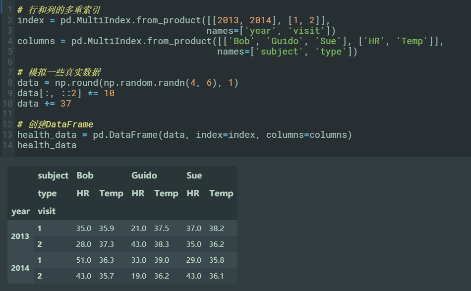
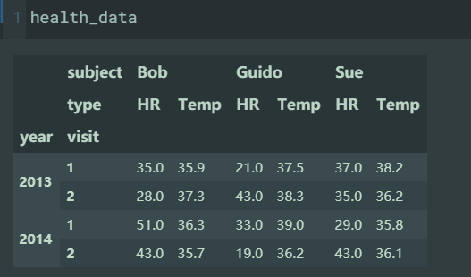
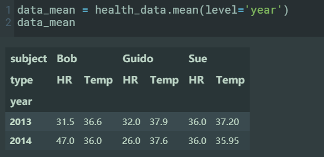

# 1. numpy

## 1.1. 数组的创建

- 数组的创建：

  - np.array([1, 2, 3, 4], dtype='float32')
  - np.zeros(10, dtype=int)
    > zeros 将数组元素都填充为 0，10 是数组长度
  - np.ones((3, 5), dtype=float)
    > ones 将数组元素都填充为 1，(3, 5)是数组的维度说明，表明数组是二维的 3 行 5 列
  - np.full((3, 5), 3.14)
    > full 将数组元素都填充为参数值 3.14，(3, 5)是数组的维度说明，表明数组是二维的 3 行 5 列
  - np.arange(0, 20, 2)
    > arange 类似 range，创建一段序列值, 起始值是 0（包含），结束值是 20（不包含），步长为 2
  - np.linspace(0, 1, 5)
    > linspace 创建一段序列值，其中元素按照区域进行线性（平均）划分<br />
    > 起始值是 0（包含），结束值是 1（包含），共 5 个元素
  - np.random.random((3, 3))
    > random.random 随机分布创建数组<br />
    > 随机值范围为[0, 1)，(3, 3)是维度说明，二维数组 3 行 3 列
  - np.random.random((3, 3))
    > random.random 随机分布创建数组<br />
    > 随机值范围为[0, 1)，(3, 3)是维度说明，二维数组 3 行 3 列
  - np.random.normal(0, 1, (3, 3))
    > random.normal 正态分布创建数组<br />
    > 均值 0，标准差 1，(3, 3)是维度说明，二维数组 3 行 3 列
  - np.random.randint(0, 10, (3, 3))
    > random.randint 随机整数创建数组，随机数范围[0, 10)
  - np.eye(3)

    > 3x3 的单位矩阵数组

  - np.empty(3)
    > empty 创建一个未初始化的数组，数组元素的值保持为原有的内存空间值

## 1.2. 数值类型：

| Data type    | Description                                                      |
| ------------ | ---------------------------------------------------------------- |
| `bool_`      | 布尔(True 或 False) 一个字节                                     |
| `int_`       | 默认整数类型 (类似 C 的`long`; 通常可以是`int64`或`int32`)       |
| `intc`       | 类似 C 的`int` (通常可以是`int32`或`int64`)                      |
| `intp`       | 用于索引值的整数(类似 C 的`ssize_t`; 通常可以是`int32`或`int64`) |
| `int8`       | 整数，1 字节 (-128 ～ 127)                                       |
| `int16`      | 整数，2 字节 (-32768 ～ 32767)                                   |
| `int32`      | 整数，4 字节 (-2147483648 ～ 2147483647)                         |
| `int64`      | 整数，8 字节 (-9223372036854775808 ～ 9223372036854775807)       |
| `uint8`      | 字节 (0 ～ 255)                                                  |
| `uint16`     | 无符号整数 (0 ～ 65535)                                          |
| `uint32`     | 无符号整数 (0 ～ 4294967295)                                     |
| `uint64`     | 无符号整数 (0 ～ 18446744073709551615)                           |
| `float_`     | `float64`的简写                                                  |
| `float16`    | 半精度浮点数: 1 比特符号位, 5 比特指数位, 10 比特尾数位          |
| `float32`    | 单精度浮点数: 1 比特符号位, 8 比特指数位, 23 比特尾数位          |
| `float64`    | 双精度浮点数: 1 比特符号位, 11 比特指数位, 52 比特尾数位         |
| `complex_`   | `complex128`的简写                                               |
| `complex64`  | 复数, 由 2 个单精度浮点数组成                                    |
| `complex128` | 复数, 由 2 个双精度浮点数组成                                    |

## 1.3. 数组的属性

- 数组属性：
  - ndim，代表数组的维度，
  - shape 代表每个维度的长度（形状）
  - size 代表数组的总长度（元素个数）
  - dtype，数组的数据类型
  - itemsize 代表每个数组元素的长度（单位字节）
  - nbytes 代表数组的总字节长度：
    > 通常，我们可以认为 nbytes 等于 itemsize 乘以 size。

## 1.4. 数组操作

- 变形

  - reshape
  - newaxis

- 连接：

  - np.concatenate([grid, grid], axis=1)
    > 沿着第二个维度进行连接，即按照列连接，axis=1
  - np.vstack（垂直堆叠）
  - np.hstack（水平堆叠）
  - np.dstack 会沿着第三个维度（深度）进行堆叠。

- 切分：
  - np.split
    > x1, x2, x3 = np.split(x, [3, 5]) # 在序号 3 和序号 5 处进行切分，返回三个数组
  - np.vsplit
    > upper, lower = np.vsplit(grid, [2]) # 沿垂直方向切分(横着切一刀)，切分点行序号为 2
  - np.hsplit
    > left, right = np.hsplit(grid, [2]) # 沿水平方向切分数组(竖着切一刀)，切分点列序号为 2
  - np.dsplit：会沿着第三个维度切分数组。

## 1.5. 通用函数

- 数组运算：

  | 运算符 | 对应的 ufunc 函数 | 说明                      |
  | ------ | ----------------- | ------------------------- |
  | `+`    | `np.add`          | 加法 (例如 `1 + 1 = 2`)   |
  | `-`    | `np.subtract`     | 减法 (例如 `3 - 2 = 1`)   |
  | `-`    | `np.negative`     | 一元取负 (例如 `-2`)      |
  | `*`    | `np.multiply`     | 乘法 (例如 `2 * 3 = 6`)   |
  | `/`    | `np.divide`       | 除法 (例如 `3 / 2 = 1.5`) |
  | `//`   | `np.floor_divide` | 整除 (例如 `3 // 2 = 1`)  |
  | `**`   | `np.power`        | 求幂 (例如 `2 ** 3 = 8`)  |
  | `%`    | `np.mod`          | 模除 (例如 `9 % 4 = 1`)   |

- 绝对值
  - np.absolute
  - np.abs
- 三角函数
  - sin(theta)
  - cos(theta)
  - tan(theta)
  - arcsin(x)
  - arccos(x)
  - arctan(x)
- 指数
  ```python
  x = [1, 2, 3]
  print("e^x   =", np.exp(x))
  print("2^x   =", np.exp2(x))
  print("3^x   =", np.power(3, x))
  ```
- 对数
  - np.log(x)
    > 以 e 为底，就是 ln
  - np.log2(x))
  - np.log10(x))
- 还有当输入值很小时，可以保持精度的指数和对数函数：

  - np.expm1(x)
  - np.log1p(x)

- 数学相关函数

  ```python
  # 伽玛函数（通用阶乘函数）及相关函数
  x = [1, 5, 10]
  print("gamma(x)     =", special.gamma(x)) # 伽玛函数
  print("ln|gamma(x)| =", special.gammaln(x)) # 伽玛函数的自然对数
  print("beta(x, 2)   =", special.beta(x, 2)) # 贝塔函数（第一类欧拉积分）

  # 误差函数 (高斯函数积分)
  # 互补误差函数，逆误差函数
  x = np.array([0, 0.3, 0.7, 1.0])
  print("erf(x)  =", special.erf(x)) # 误差函数
  print("erfc(x) =", special.erfc(x)) # 互补误差函数
  print("erfinv(x) =", special.erfinv(x)) # 逆误差函数
  ```

- 函数特性

  - 指定输出
    > out=...
  - 聚合
    - np.add.reduce()
    - np.add.accumulate(x)
    - np.add.at()
  - 外积

    - np.multiply.outer(x, x)

      > 可以得到乘法表效果

      ```python
      x = np.arange(1, 6)
      np.multiply.outer(x, x)

      # out:
      # array([[ 1,  2,  3,  4,  5],
      #       [ 2,  4,  6,  8, 10],
      #       [ 3,  6,  9, 12, 15],
      #       [ 4,  8, 12, 16, 20],
      #       [ 5, 10, 15, 20, 25]])
      ```

- 其他
  - `np.count_nonzero(x < 6)`

ufunc.at 和 ufunc.reduceat 方法也非常有用，我们会在高级索引中详细讨论。

## 1.6. 聚合

- np.sum 或 array.sum([axis=..])
- np.max 或 array.max([axis=..])
- np.min 或 array.min([axis=..])
  | 函数名称 | NaN 安全版本 | 说明 |
  | --------------- | ------------------ | ---------------------- |
  | `np.sum` | `np.nansum` | 计算总和 |
  | `np.prod` | `np.nanprod` | 计算乘积 |
  | `np.mean` | `np.nanmean` | 计算平均值 |
  | `np.std` | `np.nanstd` | 计算标准差 |
  | `np.var` | `np.nanvar` | 计算方差 |
  | `np.min` | `np.nanmin` | 计算最小值 |
  | `np.max` | `np.nanmax` | 计算最大值 |
  | `np.argmin` | `np.nanargmin` | 寻找最小值的序号 |
  | `np.argmax` | `np.nanargmax` | 寻找最大值的序号 |
  | `np.median` | `np.nanmedian` | 计算中位值 |
  | `np.percentile` | `np.nanpercentile` | 计算百分比分布的对应值 |
  | `np.any` | N/A | 是否含有 True 值 |
  | `np.all` | N/A | 是否全为 True 值 |

## 1.7. 索引和切片

## 1.8. 广播

> 广播可以应用到任何的二元 ufunc 上<br />
> 以及高级索引上

- 规则 1：如果两个数组有着不同的维度，维度较小的那个数组会沿着最前（或最左）的维度进行扩增，扩增的维度尺寸为 1，这时两个数组具有相同的维度。
- 规则 2：如果两个数组形状在任何某个维度上存在不相同，那么两个数组中形状为 1 的维度都会广播到另一个数组对应唯独的尺寸，最终双方都具有相同的形状。
- 规则 3：如果两个数组在同一个维度上具有不为 1 的不同长度，那么将产生一个错误。

## 1.9. 比较运算符和 mask 和位运算符

| 运算符 | 相应的 ufunc       |
| ------ | ------------------ |
| `==`   | `np.equal`         |
| `<`    | `np.less`          |
| `>`    | `np.greater`       |
| `!=`   | `np.not_equal`     |
| `<=`   | `np.less_equal`    |
| `>=`   | `np.greater_equal` |

- np.any
- np.all

| 运算符 | 相应的 ufunc     |
| ------ | ---------------- |
| `&`    | `np.bitwise_and` |
| `^`    | `np.bitwise_xor` |
| &#124; | `np.bitwise_or`  |
| `~`    | `np.bitwise_not` |

> and 和 or 用在将整个对象当成真值或假值进行运算的场合，而&和|会针对每个对象内的二进制位进行运算<br />
> 当你使用 and 或 or 的时候，相当于要求 Python 将对象当成是一个布尔值的整体。在 Python 中，所有的非 0 值都会被演算成 True

## 1.10. 高级索引和组合索引

**高级索引的多个维度组合方式也遵守广播的规则**。
**高级索引结果的形状是索引数组广播后的形状而不是被索引数组形状**

- 高级索引的计算误区

  ```python
  x = np.zeros(10)

  i = [2, 3, 3, 4, 4, 4]
  x[i] += 1
  # array([6., 0., 1., 1., 1., 0., 0., 0., 0., 0.])

  # 我们期望的结果可能是x[3]的值是2，而x[4]的值是3，因为这两个元素都多次执行了加法操作。
  # 但是为何结果不是呢？这是因为x[i] += 1是操作x[i] = x[i] + 1的简写，而x[i] + 1表达式的值已经计算好了，
  # 然后才被赋值给x[i]。因此，上面的操作不会被扩展为重复的运算，而是一次的赋值操作，造成了这种难以理解的结果。
  #
  # 如果我们真的需要这种重复的操作怎么办？对此，NumPy（版本1.8以上）提供了at()ufunc方法可以满足这个目的，如下：

  np.add.at(x, i, 1)
  # [0. 0. 1. 2. 3. 0. 0. 0. 0. 0.]
  ```

## 1.11. 排序

- np.sort(axis=...)
- np.argsort(axis=...)
- np.partition(x,3,axis=0)
  > 分区，五个较小的放在前面，剩下的放在后面，两块内部没有顺序（类似堆）
- np.argpartition()

## 1.12. 格式化数据

> 感觉不太可能用到，以后用到的时候再说

```python
name = ['Alice', 'Bob', 'Cathy', 'Doug']
age = [25, 45, 37, 19]
weight = [55.0, 85.5, 68.0, 61.5]

# 使用复合的dtype参数来创建结构化数组
data = np.zeros(4, dtype={'names':('name', 'age', 'weight'),
                          'formats':('U10', 'i4', 'f8')})
print(data.dtype)
```

| 字符         | 说明           | 举例                               |
| ------------ | -------------- | ---------------------------------- |
| `'b'`        | 字节           | `np.dtype('b')`                    |
| `'i'`        | 带符号整数     | `np.dtype('i4') == np.int32`       |
| `'u'`        | 无符号整数     | `np.dtype('u1') == np.uint8`       |
| `'f'`        | 浮点数         | `np.dtype('f8') == np.int64`       |
| `'c'`        | 复数           | `np.dtype('c16') == np.complex128` |
| `'S'`, `'a'` | 字符串         | `np.dtype('S5')`                   |
| `'U'`        | Unicode 字符串 | `np.dtype('U') == np.str_`         |
| `'V'`        | 原始数据       | `np.dtype('V') == np.void`         |

## 1.13. 转置

- arr.transpose()
- arr.T
- arr.swapaxes()

## 1.14. 去重

- np.unique()
- np.title()
  > 进行重复
- numpy.repeat(a, repeats, axis=None)
  - 参数“a”是需要重复的数组元素，
  - 参数“repeats”是重复次数，
  - 参数“axis”指定沿着哪个轴进行重复，axis = 0 表示按行进行元素重复；
  - axis =1 表示按列进行元素重复

## 1.15. 随机数

## 1.16. 特征值和特征向量

# 2. pandas

## 2.1. 构建 Series 对象

> Series 可以看作数组或字典

- 通过数组创建
  > data = pd.Series([0.25, 0.5, 0.75, 1.0], index=[2, 5, 3, 7])
- 通过字典创建
  > population_dict = {'California': 38332521, 'Texas': 26448193, 'New York': 19651127, 'Florida': 19552860, 'Illinois': 12882135}<br />
  > population = pd.Series(population_dict)

## 2.2. 构建 DataFrame 对象

> DataFrame 可以作为数个 Series，字典列表(一个 key 去多个字典中取 value)，二维数组

- 单个 Series 构建：
  > 一列为一个 Series
  > pd.DataFrame(population, columns=['population'])
- 多个 Series 构建：
  > states = pd.DataFrame({'population': population, 'area': area})
- 从字典**列表**构建
  > data = [{'a': i, 'b': 2 * i} for i in range(3)]<br />
  > pd.DataFrame(data)<br />
  > 注意：**Series：一个字典对应一个 Series，字典的所有 key 对应 index** 。<br /> > **DataFrame 所有字典所有 key 对应一行，字典的所有 key 对应 column**
- 从二维 numpy 构建

  > pd.DataFrame(np.random.rand(3, 2), columns=['foo', 'bar'], index=['a', 'b', 'c'])

- 从 NumPy 结构化数组构建
  > A = np.zeros(3, dtype=[('A', 'i8'), ('B', 'f8')])<br />
  > np.DataFrame(A)

```
这里要注意一下容易混淆的地方：NumPy的二维数组中，data[0]会返回第一行数据，
而在DataFrame中，data['col0']会返回第一列数据。正因为此，
最好还是将DataFrame当成是一个特殊的字典而不是通用的二维数组
```

## 2.3. index 对象

- 创建：
  > pd.Index([2,3,4,5,6,7])
- 特性：
  - 不可变数组
  - 可以包含重复的值
  - 可以进行集合运算
    - 交集 &
    - 并集 |
    - 互斥差集 ^

## 2.4. Series 和 dataframe 的索引和 mask


- 注意：

  > 单个的时候

  - 索引是针对列的
    - 对行： `data['Florida':'Illinois']` = `data[1:3]`
  - 而切片是针对行的：
    - 对列： `data["area"]` = `data[0]`
  - 直接的遮盖操作也是对行的操作而不是对列的操作：
    - `data[data.density > 100]`。获得满足 density 大于 100 的所有行

- loc,iloc,ix
  - loc 属性允许用户永远使用显式索引来进行定位和切片，包含**头尾**
    > loc 索引符中我们可以结合遮盖和高级索引模式：`data.loc[data.density > 100, ['pop', 'density']]`
  - iloc 属性允许用户永远使用隐式索引来定位和切片,不包含头尾
  - ix:混用，但是不推荐

## 2.5. Series 和 DataFrame 的计算

- 索引对齐

| Python 运算符 | Pandas 方法                      |
| ------------- | -------------------------------- |
| `+`           | `add()`                          |
| `-`           | `sub()`, `subtract()`            |
| `*`           | `mul()`, `multiply()`            |
| `/`           | `truediv()`, `div()`, `divide()` |
| `//`          | `floordiv()`                     |
| `%`           | `mod()`                          |
| `**`          | `pow()`                          |

- 使用广播
  - dataFrame 和 Series
  - dataFrame 和 dataFrame

## 2.6. 缺失值

| 大类型   | 当 NA 值存在时转换规则 | NA 哨兵值          |
| -------- | ---------------------- | ------------------ |
| `浮点数` | 保持不变               | `np.nan`           |
| `object` | 保持不变               | `None` 或 `np.nan` |
| `整数`   | 转换为`float64`        | `np.nan`           |
| `布尔`   | 转换为`object`         | `None` 或 `np.nan` |

- `isnull()`：生成一个布尔遮盖数组指示缺失值的位置
- `notnull()`：`isnull()`相反方法
- `dropna()`：返回一个过滤掉缺失值、空值的数据集
  - axis
  - how
- `fillna()`：返回一个数据集的副本，里面的缺失值、空值使用另外的值来替代
  - axis
  - method

## 2.7. 多层索引

### 2.7.1. 行的 multiindex

- 不推荐的方式：

  > 仅仅是使用元组作为 index

  - Series
    - 创建
      - 创建 index = [(key,key),(key,key),...]
      - s = pd.Series(data,index=index)
    - 使用
      - 行的切片：s[(key,key):(key,key)]

- MultiIndex

  - 创建
    - from_tuble
      - index = pd.MultiIndex.from_tuples(index)
    - from_array
      - index = pd.MultiIndex.from_array(index)
    - pop.reIndex(index)
      > reset_index（）函数作用是重新设置索引，不加 drop=True 的话，原始的 index 会作为新的列保存在 DataFrame 中<br>
      > reindex()函数作为也是重新设置索引，但不用使用 drop=True

- 创建带有多重索引的 DataFrame 或者 Series：
  - 向 index 传递一个多重列表
    ```python
    df = pd.DataFrame(np.random.rand(4, 2),
                      index=[['a', 'a', 'b', 'b'], [1, 2, 1, 2]],
                      columns=['data1', 'data2'])
    ```
- 层次名称：
  - pop.index.names = ['state', 'year']

### 2.7.2. 列的 multiindex



### 2.7.3. 多重索引上的检索和切片

#### 2.7.3.1. Series

- 获取单个元素:pop['California', 2000]
- 按照第一个索引选取多个元素：pop['California']
- 按照第二个索引选取多个元素：pop[:,column1]

  > 这个是先选第一个索引，然后再选下一个索引，不是先取行再取列

- 允许
  - mask：pop[pop > 22000000]
  - 高级索引：pop[['California', 'Texas']]

#### 2.7.3.2. DataFrame



> 索引是列，切片是行

- 取一列：health_data['Guido', 'HR']
- 取一行：health_data.loc[:, ('Bob', 'HR')]
- 撇去索引，使用隐式：health_data.iloc[:2, :2]
- 注意：
  - 在元组中使用切片会产生错误
  - 比如；health_data.loc[(:, 1), (:, 'HR')]
  - 可以使用 slice()
    ```python
    idx = pd.IndexSlice
    health_data.loc[idx[:, 1], idx[:, 'HR']]
    ```

### 2.7.4. 排序与堆叠

- 索引排序：data.sort_index()
- 多重索引与多维间的转换
  - unstack:转为多维
  - stack:转为多重索引
- 重新设置索引；
  - 例：pop.reset_index(name='population')
  - 例：pop_flat.set_index(['state', 'year'])

### 2.7.5. 数据聚合




## 2.8. 组合数据集

- pd.concat()

  > np.contenate 和 pd.concat 的一个重要区别是 Pandas 的连接会保留行索引，甚至在结果中包含重复索引的情况下

  - axis
  - ignore_index
    > 给函数传递一个 ignore_index=True 的参数，pd.concat 函数会忽略连接时的行索引，并在结果中重新创建一个整数的索引值：
  - keys
    > 使用 keys 参数来指定不同数据集的索引标签；这时 pd.concat 的结果会是包含着连接数据集的多重索引数据集
  - join
    - inner
    - outer
    - left
    - right

- df1.append(df2)

  > 功能和 concat 相同
  > 会创建一个新的对象，浪费内存，也不高效，应该尽量避免使用

- pd.merge()

  > 会自动识别每个 DataFrame 都有的列，因此会自动按照这个列作为键对双方进行合并。合并的结果是一个新的 DataFrame,其中的数据是两个输入数据集的联合

  - on:指定依照列名(两表都有)
  - left_on 和 right_on: 指定依照列名(可不同名称)
  - left_index 和 right_index：给定 True 或 False，指定依照 index
    > 类似:left_index right_on，可以混用
  - how:
    - inner
    - outer
    - left
    - right
  - suffixes:列名冲突时的选项
    > pd.merge(df8, df9, on="name", suffixes=["_L", "_R"])

- pd.drop():移除列
  - inplace=true 会直接作用到数据中。否则需要 copy，才会在副本中修改

## 2.9. 聚合和分组

| 聚合函数             | 描述                 |
| -------------------- | -------------------- |
| `count()`            | 元素个数             |
| `first()`, `last()`  | 第一个和最后一个元素 |
| `mean()`, `median()` | 平均值和中位数       |
| `min()`, `max()`     | 最小和最大值         |
| `std()`, `var()`     | 标准差和方差         |
| `mad()`              | 平均绝对离差         |
| `prod()`             | 所有元素的乘积       |
| `sum()`              | 所有元素的总和       |

- groupby()

  - 返回一个 DataFrameGroupBy 对象
  - GroupBy 对象支持列索引
  - 懒运算
  - 再调用聚合函数

- GroupBy 对象

  - aggregate()：
    - 例：df.groupby('key').aggregate(['min', np.median, max])
    - 例：df.groupby('key').aggregate({'data1': 'min', 'data2': 'max'})
  - filter()

    ```python
    def filter_func(x):
        return x['data2'].std() > 4

    df.groupby('key').filter(filter_func)"
    ```

  - transfrom()
    - 例：df.groupby('key').transform(lambda x: x - x.mean())
  - apply()

    > apply()方法能让你将分组的结果应用到任意的函数上。
    > 该函数必须接受一个 DataFrame 参数，返回一个 Pandas 对象（如 DataFrame、Series）或者一个标量；
    > 组合操作会根据返回的类型进行适配。

    ```python
    def norm_by_data2(x):
        # x is a DataFrame of group values
        x['data1'] /= x['data2'].sum()
        return x

    df.groupby('key').apply(norm_by_data2)
    ```

- 其他分组方法：
  - 逐一指定分组：
    ```python
    # 其实就是指定每行分到哪一组
    L = [0, 1, 0, 1, 2, 0]
    df.groupby(L).sum()
    ```
  - 使用 map
    > 
    - 主要是会给分组重命名
  - 使用函数：
    - df2.groupby(str.lower).mean()
    - 主要是会给分组重命名

## 2.10. 数据透视表

- 单层

  ```py
  titanic.groupby(['sex', 'class'])['survived'].aggregate('mean').unstack()
  # 等同于
  titanic.pivot_table('survived', index='sex', columns='class') # 默认使用mean
  ```

- 分桶：

  - cut，自己指定范围分桶
  - qcut，自动按比例分桶

- 多层

  ```py
  fare = pd.qcut(titanic['fare'], 2)
  titanic.pivot_table('survived', ['sex', age], [fare, 'class'])
  ```

- 所有参数：

  ```py
  pd.pivot_table(
      data, # DataFrame，当为方法时，这里是self
      values=None, # 用来聚合的列
      index=None, # 行索引，行分组的条件
      columns=None, # 列索引，列分组的条件
      aggfunc='mean', # 聚合函数，默认平均值
      # aggfunc参数指定数据透视表使用的聚合函数，默认是平均值'mean'。
      # 就像GroupBy中一样，聚合函数可以通过函数名称的字符串来指定
      # （例如'sum'、'mean'、'count'、'min'、'max'等）。
      # 除此之外，也可以通过一个字典将列与聚合函数对应起来作为aggfunc的参数。

      fill_value=None, # NA值的替代值
      margins=False, # 总计，行与列相加的结果
      dropna=True, # 是否移除含有NA值的列
      margins_name='All', # 总计的行和列的标签
  )
  ```

## 2.11. 字符串

- series.str.xxx()

- 常用方法：

|            |                |                |                |
| ---------- | -------------- | -------------- | -------------- |
| `len()`    | `lower()`      | `translate()`  | `islower()`    |
| `ljust()`  | `upper()`      | `startswith()` | `isupper()`    |
| `rjust()`  | `find()`       | `endswith()`   | `isnumeric()`  |
| `center()` | `rfind()`      | `isalnum()`    | `isdecimal()`  |
| `zfill()`  | `index()`      | `isalpha()`    | `split()`      |
| `strip()`  | `rindex()`     | `isdigit()`    | `rsplit()`     |
| `rstrip()` | `capitalize()` | `isspace()`    | `partition()`  |
| `lstrip()` | `swapcase()`   | `istitle()`    | `rpartition()` |

- 使用正则：

| 方法         | 描述                                                                |
| ------------ | ------------------------------------------------------------------- |
| `match()`    | 在每个元素上调用`re.match()`方法，返回布尔类型 Series               |
| `extract()`  | 在每个元素上调用`re.match()`方法，返回匹配到模式的正则分组的 Series |
| `findall()`  | 在每个元素上调用`re.findall()`方法                                  |
| `replace()`  | 将匹配模式的字符串部分替换成其他字符串值                            |
| `contains()` | 在每个元素上调用`re.search()`，返回布尔类型 Series                  |
| `count()`    | 计算匹配到模式的次数                                                |
| `split()`    | 等同于`str.split()`，但是能接受正则表达式参数                       |
| `rsplit()`   | 等同于`str.rsplit()`, 但是能接受正则表达式参数                      |

- 其他方法

| 方法              | 描述                                                           |
| ----------------- | -------------------------------------------------------------- |
| `get()`           | 对每个元素使用索引值获取字符中的字符                           |
| `slice()`         | 对每个元素进行字符串切片 df.str[:3]等同于 df.str.slice(0, 3) |
| `slice_replace()` | 将每个元素的字符串切片替换成另一个字符串值                     |
| `cat()`           | 将所有字符串元素连接成一个字符串                               |
| `repeat()`        | 对每个字符串元素进行重复操作                                   |
| `normalize()`     | 返回字符串的 unicode 标准化结果                                |
| `pad()`           | 字符串对齐                                                     |
| `wrap()`          | 字符串换行                                                     |
| `join()`          | 字符串中字符的连接                                             |
| `get_dummies()`   | 将字符串按照分隔符分割后形成一个二维的 dummy DataFrame         |

- get()和slice()方法还能支持对split()返回的**列表**进行取值操作。例如我们使用split()和get()方法可以提取出每个人的姓：
  > monte.str.split().str.get(-1)

# 3. 数据处理常用方法

- 了解数据
- head()
- shape
- columns
- index
- info()
- describe()
- unique()
- nunique

- apply 函数
- query 函数


> read_csv():index_col=0将第0列作为索引，不写则认为第0列为特征
