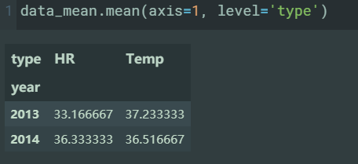
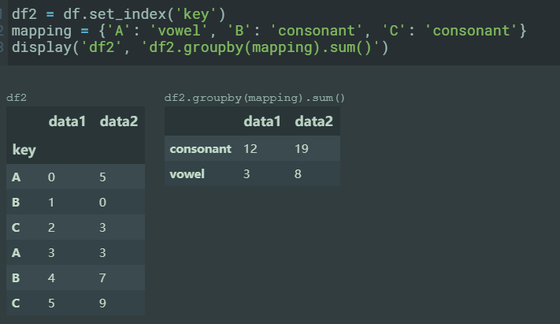

# 1. numpy

## 1.1. 简介

- 提供了高效存储和操作密集数据缓存的接口。
- 在某些方面，NumPy数组与 Python 内置的列表类型非常相似。
- 但是随着 **数组在维度上变大** ，NumPy 数组 **提供了更加高效的存储和数据操作** 。
- NumPy数组几乎是整个Python 数据科学工具生态系统的核心。

## 1.2. 数组的创建

- 数组的创建：

  - np.array([1, 2.1, 3, 4], dtype='float32')
    - 如果不添加dtype参数，类型不一致时， NumPy 将会向上转换（如果可行）
  - np.zeros(10, dtype=int)
    - zeros 将数组元素都填充为 0，10 是数组长度
  - np.ones((3, 5), dtype=float)
    - ones 将数组元素都填充为 1，(3, 5)是数组的维度说明，表明数组是二维的 3 行 5 列
  - np.full((3, 5), 3.14)
    - full 将数组元素都填充为参数值 3.14，(3, 5)是数组的维度说明，表明数组是二维的 3 行 5 列
  - np.arange(0, 20, 2)
    - arange 类似 range，创建一段序列值, 起始值是 0（包含），结束值是 20（不包含），步长为 2
  - np.linspace(0, 1, 5)
    - linspace 创建一段序列值，其中元素按照区域进行线性（平均）划分
    - 起始值是 0（包含），结束值是 1（包含），共 5 个元素
  - np.random.random((3, 3))
    - random.random 随机分布创建数组
    - 随机值范围为[0, 1)，(3, 3)是维度说明，二维数组 3 行 3 列
  - np.random.random((3, 3))
    - random.random 随机分布创建数组
    - 随机值范围为[0, 1)，(3, 3)是维度说明，二维数组 3 行 3 列
  - np.random.normal(0, 1, (3, 3))
    - random.normal 正态分布创建数组
    - 均值 0，标准差 1，(3, 3)是维度说明，二维数组 3 行 3 列
  - np.random.randint(0, 10, (3, 3))
    - random.randint 随机整数创建数组，随机数范围[0, 10)
  - np.eye(3)
    - 3x3 的单位矩阵数组
  - np.empty(3)
    - empty 创建一个未初始化的数组，数组元素的值保持为原有的内存空间值

## 1.3. 数值类型

| Data type    | Description                                                      |
| ------------ | ---------------------------------------------------------------- |
| `bool_`      | 布尔(True 或 False) 一个字节                                     |
| `int_`       | 默认整数类型 (类似 C 的`long`; 通常可以是`int64`或`int32`)       |
| `intc`       | 类似 C 的`int` (通常可以是`int32`或`int64`)                      |
| `intp`       | 用于索引值的整数(类似 C 的`ssize_t`; 通常可以是`int32`或`int64`) |
| `int8`       | 整数，1 字节 (-128 ～ 127)                                       |
| `int16`      | 整数，2 字节 (-32768 ～ 32767)                                   |
| `int32`      | 整数，4 字节 (-2147483648 ～ 2147483647)                         |
| `int64`      | 整数，8 字节 (-9223372036854775808 ～ 9223372036854775807)       |
| `uint8`      | 字节 (0 ～ 255)                                                  |
| `uint16`     | 无符号整数 (0 ～ 65535)                                          |
| `uint32`     | 无符号整数 (0 ～ 4294967295)                                     |
| `uint64`     | 无符号整数 (0 ～ 18446744073709551615)                           |
| `float_`     | `float64`的简写                                                  |
| `float16`    | 半精度浮点数: 1 比特符号位, 5 比特指数位, 10 比特尾数位          |
| `float32`    | 单精度浮点数: 1 比特符号位, 8 比特指数位, 23 比特尾数位          |
| `float64`    | 双精度浮点数: 1 比特符号位, 11 比特指数位, 52 比特尾数位         |
| `complex_`   | `complex128`的简写                                               |
| `complex64`  | 复数, 由 2 个单精度浮点数组成                                    |
| `complex128` | 复数, 由 2 个双精度浮点数组成                                    |

## 1.4. 数组的属性

- ndim 代表数组的维度，
- shape 代表每个维度的长度（形状）

  ```
  shape 经常容易搞晕，以(3,4,5)为例，可以拆起来看，不要强迫自己想象二维或者三维图形。
  有三个维度:
    第一个维度有3个元素，元素shape为(4,5)
    第二个维度有4个元素, 元素shape为(5,)
    第三个维度有5个元素，每个元素就是一个数字
  ```
- size 代表数组的总长度（元素个数）
- dtype，数组的数据类型
- itemsize 代表每个数组元素的长度（单位字节）
- nbytes 代表数组的总字节长度：
  > 通常，我们可以认为 nbytes 等于 itemsize 乘以 size。

## 1.5. 索引和切片

```
In [1]: import numpy as np

In [2]: arr = np.arange(0,25).reshape(5,5)

In [3]: arr
Out[3]:
array([[ 0,  1,  2,  3,  4],
      [ 5,  6,  7,  8,  9],
      [10, 11, 12, 13, 14],
      [15, 16, 17, 18, 19],
      [20, 21, 22, 23, 24]])
```

### 1.5.1. 获取单个元素

  ```python

  In [4]: arr[0,1]
  Out[4]: 1

  In [10]: arr[-1,-1]
  Out[10]: 24
  ```

### 1.5.2. 一维数组，切片

  ```python
  In [12]: arr[0]
  Out[12]: array([0, 1, 2, 3, 4])

  # 获取子数组
  In [13]: arr[0][1:3]
  Out[13]: array([1, 2])

  # 从头
  In [14]: arr[0][:3]
  Out[14]: array([0, 1, 2])

  # 到尾
  In [15]: arr[0][3:]
  Out[15]: array([3, 4])

  # 跳选
  In [16]: arr[0][::2]
  Out[16]: array([0, 2, 4])

  # 跳选，逆序
  In [17]: arr[0][::-2]
  Out[17]: array([4, 2, 0])
  ```

### 1.5.3. 多维数组切片（不同维度用逗号分隔)

- **不同维度用逗号分隔** 。

  ```python
  In [18]: arr[1:3,2:5]
  Out[18]:
  array([[ 7,  8,  9],
        [12, 13, 14]])

  In [19]: arr[::-1,::-1]
  Out[19]:
  array([[24, 23, 22, 21, 20],
         [19, 18, 17, 16, 15],
         [14, 13, 12, 11, 10],
         [ 9,  8,  7,  6,  5],
         [ 4,  3,  2,  1,  0]])

  In [20]: arr[3,:]
  Out[20]: array([15, 16, 17, 18, 19])
  ```

### 1.5.4. numpy视图的修改

- numpy切片只是逻辑上的切片，使用的底层数据依旧是同一个。
- 切片视图的修改会反映到底层数据上。

  ```python
  In [21]: x1 = np.arange(0,5)

  In [22]: x1_sub = x1[1:3]

  In [23]: x1_sub
  Out[23]: array([1, 2])

  In [26]: x1_sub[0] =99

  In [27]: x1
  Out[27]: array([ 0, 99,  2,  3,  4])
  ```

- 为了避免这种情况，可以使用copy

  ```python
  x1_sub_copy = x1[1:3].copy()
  x1_sub_copy[0,0] = 99
  ```

## 1.6. 数组操作

```python
In [1]: import numpy as np

In [2]: arr = np.arange(0,25).reshape(5,5)

In [3]: arr
Out[3]:
array([[ 0,  1,  2,  3,  4],
      [ 5,  6,  7,  8,  9],
      [10, 11, 12, 13, 14],
      [15, 16, 17, 18, 19],
      [20, 21, 22, 23, 24]])
```

### 1.6.1. 变形

- reshape

  ```python
  In [3]: arr.reshape(1,25)
  Out[3]:
  array([[ 0,  1,  2,  3,  4,  5,  6,  7,  8,  9, 10, 11, 12, 13, 14, 15,
          16, 17, 18, 19, 20, 21, 22, 23, 24]])

  In [5]: arr.reshape((1,5,5))
  Out[5]:
  array([[[ 0,  1,  2,  3,  4],
          [ 5,  6,  7,  8,  9],
          [10, 11, 12, 13, 14],
          [15, 16, 17, 18, 19],
          [20, 21, 22, 23, 24]]])
  ```
- newaxis: 使用newaxis添加新的维度

  ```python
  In [6]: arr[np.newaxis,:]
  Out[6]:
  array([[[ 0,  1,  2,  3,  4],
          [ 5,  6,  7,  8,  9],
          [10, 11, 12, 13, 14],
          [15, 16, 17, 18, 19],
          [20, 21, 22, 23, 24]]])
  In [9]: arr[np.newaxis,:].shape
  Out[9]: (1, 5, 5)

  In [7]: arr[:,np.newaxis]
  Out[7]:
  array([[[ 0,  1,  2,  3,  4]],

        [[ 5,  6,  7,  8,  9]],

        [[10, 11, 12, 13, 14]],

        [[15, 16, 17, 18, 19]],

        [[20, 21, 22, 23, 24]]])
  In [8]: arr[:,np.newaxis].shape
  Out[8]: (5, 1, 5)
  ```

- reshape到一维：
  - arr.flatten() :返回一份copy
  - arr.ravel(): 返回一份视图

### 1.6.2. 连接

> numpy 的concat，要求两个连接的arr拥有相同的维度数量。
> 并且除了连接维度上，其他维度上的元素个数都要相同。

- np.concatenate([grid, grid], axis=1)
  - 对数组指定维度进行连接，axis默认为0

  ```python
  In [21]: z
  Out[21]:
  array([[1, 2, 3],
        [3, 2, 1]])

  In [22]: np.concatenate([z,z])
  Out[22]:
  array([[1, 2, 3],
        [3, 2, 1],
        [1, 2, 3],
        [3, 2, 1]])

  In [23]: np.concatenate([z,z],axis=1)
  Out[23]:
  array([[1, 2, 3, 1, 2, 3],
        [3, 2, 1, 3, 2, 1]])
  ```

- 堆叠
  - np.vstack（垂直堆叠）(axis = 0)
  - np.hstack（水平堆叠）(axis = 1)
  - np.dstack 会沿着第三个维度（深度）进行堆叠。 (axis =2)

  ```python
  In [7]: z
  Out[7]:
  array([[1, 2, 3],
        [3, 2, 1]])

  In [14]: z[np.newaxis,np.newaxis,np.newaxis,:,:].shape
  Out[14]: (1, 1, 1, 2, 3)

  # 相当于 concatenate([,],axis=0)
  In [15]: np.vstack([z[np.newaxis,np.newaxis,np.newaxis,:,:],z[np.newaxis,np.newaxis,np.newaxis,:,:]]).shape
  Out[15]: (2, 1, 1, 2, 3)

  # 相当于 concatenate([,],axis=1)
  In [13]: np.hstack([z[np.newaxis,np.newaxis,np.newaxis,:,:],z[np.newaxis,np.newaxis,np.newaxis,:,:]]).shape
  Out[13]: (1, 2, 1, 2, 3)

  # 相当于 concatenate([,],axis=2)
  In [16]: np.dstack([z[np.newaxis,np.newaxis,np.newaxis,:,:],z[np.newaxis,np.newaxis,np.newaxis,:,:]]).shape
  Out[16]: (1, 1, 2, 2, 3)

  ```

### 1.6.3. 切分

- np.split
  - 默认在axis=0维度上，按照给定的位置进行切分

  ```python
  In [4]: x = [1, 2, 3, 99, 99, 3, 2, 1]

  In [5]: x1, x2, x3 = np.split(x, [3, 5]) # default axis = 0

  In [6]: print(x1, x2, x3)
  [1 2 3] [99 99] [3 2 1]
  ```
- np.vsplit
  - 等价于`np.split(,axis=0)`
- np.hsplit
  - 等价于`np.split(,axis=1)`
- np.dsplit：会沿着第三个维度切分数组。
  - 等价于`np.split(,axis=2)`

### 1.6.4. 转置

- arr.transpose()
- arr.T
- arr.swapaxes()

## 1.7. 通用函数

### 1.7.1. 数组运算

| 运算符 | 对应的 ufunc 函数 | 说明                      |
| ------ | ----------------- | ------------------------- |
| `+`    | `np.add`          | 加法 (例如 `1 + 1 = 2`)   |
| `-`    | `np.subtract`     | 减法 (例如 `3 - 2 = 1`)   |
| `-`    | `np.negative`     | 一元取负 (例如 `-2`)      |
| `*`    | `np.multiply`     | 乘法 (例如 `2 * 3 = 6`)   |
| `/`    | `np.divide`       | 除法 (例如 `3 / 2 = 1.5`) |
| `//`   | `np.floor_divide` | 整除 (例如 `3 // 2 = 1`)  |
| `**`   | `np.power`        | 求幂 (例如 `2 ** 3 = 8`)  |
| `%`    | `np.mod`          | 模除 (例如 `9 % 4 = 1`)   |

- 绝对值
  - np.absolute
  - np.abs

  ```python
  In [9]: np.abs == np.absolute
  Out[9]: True
  ```

### 1.7.2. 三角函数

- sin(theta)
- cos(theta)
- tan(theta)
- arcsin(x)
- arccos(x)
- arctan(x)

### 1.7.3. 指数与对数

- 指数
  - `np.exp(x)`
  - `np.exp2(x)`
  - `np.power(3,x)`

  ```python
  x = [1, 2, 3]
  print("e^x   =", np.exp(x))
  print("2^x   =", np.exp2(x))
  print("3^x   =", np.power(3, x))
  ```
- 对数
  - np.log(x)
    > 以 e 为底，就是 ln
  - np.log2(x))
  - np.log10(x))

- 当输入值很小时，可以保持精度的指数和对数函数：
  - np.expm1(x)
  - np.log1p(x)

### 1.7.4. 比较运算符

| 运算符 | 相应的 ufunc       |
| ------ | ------------------ |
| `==`   | `np.equal`         |
| `<`    | `np.less`          |
| `>`    | `np.greater`       |
| `!=`   | `np.not_equal`     |
| `<=`   | `np.less_equal`    |
| `>=`   | `np.greater_equal` |

### 1.7.5. mask 和位运算符

| 运算符 | 相应的 ufunc     |
| ------ | ---------------- |
| `&`    | `np.bitwise_and` |
| `^`    | `np.bitwise_xor` |
| `\|`   | `np.bitwise_or`  |
| `~`    | `np.bitwise_not` |

- np.any：有一个元素为True时返回True
- np.all：所有元素尾True时返回True

> and 和 or 用在将整个对象当成真值或假值进行运算的场合，而&和|会针对每个对象内的二进制位进行运算<br />
> 当你使用 and 或 or 的时候，相当于要求 Python 将对象当成是一个布尔值的整体。在 Python 中，所有的非 0 值都会被演算成 True

### 1.7.6. 其他数学相关函数

  ```python
  # 伽玛函数（通用阶乘函数）及相关函数
  x = [1, 5, 10]
  print("gamma(x)     =", special.gamma(x)) # 伽玛函数
  print("ln|gamma(x)| =", special.gammaln(x)) # 伽玛函数的自然对数
  print("beta(x, 2)   =", special.beta(x, 2)) # 贝塔函数（第一类欧拉积分）

  # 误差函数 (高斯函数积分)
  # 互补误差函数，逆误差函数
  x = np.array([0, 0.3, 0.7, 1.0])
  print("erf(x)  =", special.erf(x)) # 误差函数
  print("erfc(x) =", special.erfc(x)) # 互补误差函数
  print("erfinv(x) =", special.erfinv(x)) # 逆误差函数
  ```

### 1.7.7. 高级的通用函数特性

#### 1.7.7.1. 指定输出

  ```python
  In [12]: x = np.arange(5)

  In [13]: y = np.empty(5)

  In [14]: y
  Out[14]:
  array([6.95288142e-310, 9.50182622e-312, 0.00000000e+000, 6.95288139e-310,
        0.00000000e+000])

  # 指定将结果输出到y中
  In [15]: np.multiply(x, 10, out=y)
  Out[15]: array([ 0., 10., 20., 30., 40.])

  In [16]: y
  Out[16]: array([ 0., 10., 20., 30., 40.])
  ```

#### 1.7.7.2. 聚合

- `ufunc.reduce` 运算

  ```python
  In [21]: x = np.arange(1,6)

  In [22]: np.add.reduce(x)
  Out[22]: 15

  In [23]: np.multiply.reduce(x)
  Out[23]: 120
  ```
- `ufunc.accumulate` 运算：存储每次计算的中间结果

  ```python
  In [21]: x = np.arange(1,6)

  In [24]: np.add.accumulate(x)
  Out[24]: array([ 1,  3,  6, 10, 15])

  In [26]: np.multiply.accumulate(x)
  Out[26]: array([  1,   2,   6,  24, 120])
  ```

- `ufunc.at`运算:对指定切片下的数据进行运算并更新
  - `np.add.at(a,indices,b)`为：a[indices] += b
  - indices需要搭配numpy的`np.indices()`使用

  ```python
  In [41]: x
  Out[41]: array([1, 2, 3, 4, 5])

  In [43]: np.add.at(x,[0,3],3)

  In [44]: x
  Out[44]: array([4, 2, 3, 7, 5])
  ```

- `ufunc.outer`：相当于数据库中的`outer join`

  ```python
  # 可以得到乘法表效果
  x = np.arange(1, 6)
  np.multiply.outer(x, x)

  # out:
  # array([[ 1,  2,  3,  4,  5],
  #       [ 2,  4,  6,  8, 10],
  #       [ 3,  6,  9, 12, 15],
  #       [ 4,  8, 12, 16, 20],
  #       [ 5, 10, 15, 20, 25]])
  ```

- `ufunc.reduceat`

### 1.7.8. 其他

- `np.count_nonzero(x < 6)`

## 1.8. 聚合函数

- 注意：
  - np提供全局聚合函数，同时ndarray对象本身也提供聚合函数
    - `np.sum(arr)` 等价于 `arr.sum()`，只是习惯问题。
  - 同时可以指定axis进行聚合
    - 比如`np.sum(x,axis=0)`

    ```python
    In [78]: arr1 = np.arange(0,24)

    In [82]: arr1.shape
    Out[82]: (2, 3, 4)

    In [83]: np.sum(arr1,axis=0)
    Out[83]:
    array([[12, 14, 16, 18],
          [20, 22, 24, 26],
          [28, 30, 32, 34]])

    # 以哪个维度聚合，哪个维度就没了
    # axis=0时,arr1[0,0] = arr1[0,0,0]+arr1[1,0,0]
    In [84]: np.sum(arr1,axis=0).shape
    Out[84]: (3, 4)

    # axis=1时,arr1[0,0] = arr1[0,0,0]+arr1[0,1,0]+arr1[0,2,0]
    In [85]: np.sum(arr1,axis=1).shape
    Out[85]: (2, 4)

    # axis=3时,arr1[0,0] = arr1[0,0,0]+arr1[0,0,1]+arr1[0,0,2]+arr1[0,0,3]
    In [86]: np.sum(arr1,axis=2).shape
    Out[86]: (2, 3)

    # 依此类推
    ```

| 函数名称        | NaN 安全版本       | 说明                   |
| --------------- | ------------------ | ---------------------- |
| `np.sum`        | `np.nansum`        | 计算总和               |
| `np.prod`       | `np.nanprod`       | 计算乘积               |
| `np.mean`       | `np.nanmean`       | 计算平均值             |
| `np.std`        | `np.nanstd`        | 计算标准差             |
| `np.var`        | `np.nanvar`        | 计算方差               |
| `np.min`        | `np.nanmin`        | 计算最小值             |
| `np.max`        | `np.nanmax`        | 计算最大值             |
| `np.argmin`     | `np.nanargmin`     | 寻找最小值的序号       |
| `np.argmax`     | `np.nanargmax`     | 寻找最大值的序号       |
| `np.median`     | `np.nanmedian`     | 计算中位值             |
| `np.percentile` | `np.nanpercentile` | 计算百分比分布的对应值 |
| `np.any`        | N/A                | 是否含有 True 值       |
| `np.all`        | N/A                | 是否全为 True 值       |

## 1.9. 广播

- 说明
  - 广播可以应用到任何的二元 ufunc 上
  - 以及高级索引上

- 规则
  - 规则 1：如果两个数组有着不同的维度，维度较小的那个数组会沿着最前（或最左）的维度进行扩增，扩增的维度尺寸为 1，这时两个数组具有相同的维度。
  - 规则 2：如果两个数组形状在任何某个维度上存在不相同，那么两个数组中形状为 1 的维度都会广播到另一个数组对应唯独的尺寸，最终双方都具有相同的形状。
  - 规则 3：如果两个数组在同一个维度上具有不为 1 的不同长度，那么将产生一个错误。

- 示例

  ```python
  # 广播成功：
  (2,3)和(3,)
    (3,)->(1,3)->(2,3)

  (3,1)和(3,)
    (3,1)->(3,3)
    (3,)->(1,3)->(3,3)

  # 广播失败：
  (3,2)和(3,)
    (3,)->(1,3)->(3,3)
  ```

## 1.10. 高级索引和组合索引

- 说明：
  - 通过数组进行枚举索引。
  - 并且 **高级索引的多个维度组合方式也遵守广播的规则**
  - **结果的形状与索引数组的形状一致， 而不是与被索引数组的形状一致**

- 示例：

  ```python
  # 一维
  In [30]: arr1 = np.arange(4,10)
  In [32]: arr = np.arange(0,25).reshape(5,5)

  In [31]: arr1[[1,3]]
  Out[31]: array([5, 7])

  In [32]: arr = np.arange(0,25).reshape(5,5)

  In [33]: arr[[1]]
  Out[33]: array([[5, 6, 7, 8, 9]])

  # 解析：
    # arr.shape 为 (5,5)，索引数组shape为(2,1)。arr.shape的一级元素shape为(5,)
    # shape为(2,1)的索引数组中，每个元素会索引到arr指定位置的一级元素。
    # 结果shape就成了 (2,1,5)
  In [34]: arr[[[1],[2]]]
  Out[34]:
  array([[[ 5,  6,  7,  8,  9]],

        [[10, 11, 12, 13, 14]]])
  ```

- mask和高级索引组合使用

  ```python
  # shape: (3,4)
  In [38]: X = np.arange(12).reshape((3, 4))

  # shape:(4,)
  In [39]: mask = np.array([1, 0, 1, 0], dtype=bool)

  # shape:(3,)
  In [41]: row = np.array([0, 1, 2])

  # row[:,np.newaxis]: shape (3,1)
  # 对X axis=0 维度进行高级索引，得到值shape: (3,1,4)
    # 此处必须加一个维度，(3,1)可以广播到(3,4)
    # 否则(3,)会广播失败
  In [43]: X[row[:,np.newaxis]]
  Out[43]:
  array([[[ 0,  1,  2,  3]],

        [[ 4,  5,  6,  7]],

        [[ 8,  9, 10, 11]]])

  # 同时使用mask对axis = 1 进行取值。结果shape为(3,2)
  In [42]: X[row[:, np.newaxis], mask]
  Out[42]:
  array([[ 0,  2],
         [ 4,  6],
         [ 8, 10]])

  # 同时对 axis=1 进行切片。shape为 (3,1,2)
  In [53]: X[row[:, np.newaxis], 1:3]
  Out[53]:
  array([[[ 1,  2]],
        [[ 5,  6]],
        [[ 9, 10]]])

  # TODO: # 高级索引+mask 和 高级索引+切片 shape不同。源码解析
  ```

- 高级索引的计算误区

  ```python

  In [2]: x = np.zeros(10)
  In [5]: i = [2,3,3,4,4,4]
  In [6]: x[i]+1
  Out[6]: array([1., 1., 1., 1., 1., 1.])

  # 我们期望的结果可能是x[3]的值是2，而x[4]的值是3，因为这两个元素都多次执行了加法操作。
  # 但是为何结果不是呢？这是因为x[i] += 1是操作x[i] = x[i] + 1的简写，而x[i] + 1表达式的值已经计算好了，
  # 然后才被赋值给x[i]。因此，上面的操作不会被扩展为重复的运算，而是一次的赋值操作，造成了这种难以理解的结果。
  #
  # 如果我们真的需要这种重复的操作怎么办？对此，NumPy（版本1.8以上）提供了at() ufunc方法可以满足这个目的，如下：

  np.add.at(x, i, 1)
  # [0. 0. 1. 2. 3. 0. 0. 0. 0. 0.]
  ```

## 1.11. 排序

- np.sort(axis=...)
- np.argsort(axis=...)

  ```python
  In [7]: x = np.array([2, 1, 4, 3, 5])

  In [8]: i = np.argsort(x)

  In [9]: x[i]
  Out[9]: array([1, 2, 3, 4, 5])
  ```
- np.partition(x,k,axis=0)
  - 分区，k个较小的放在前面，剩下的放在后面，两块内部没有顺序（类似堆）
  - 也就是小堆
- np.argpartition()
  - arg和partition 合并的操作

## 1.12. 格式化数据

> 感觉不太可能用到，以后用到的时候再说

```python
 name = ['Alice', 'Bob', 'Cathy', 'Doug']
 age = [25, 45, 37, 19]
 weight = [55.0, 85.5, 68.0, 61.5]

 # 使用复合的dtype参数来创建结构化数组
 data = np.zeros(4, dtype={'names':('name', 'age', 'weight'),
                           'formats':('U10', 'i4', 'f8')})
 print(data.dtype)
```

| 字符         | 说明           | 举例                               |
| ------------ | -------------- | ---------------------------------- |
| `'b'`        | 字节           | `np.dtype('b')`                    |
| `'i'`        | 带符号整数     | `np.dtype('i4') == np.int32`       |
| `'u'`        | 无符号整数     | `np.dtype('u1') == np.uint8`       |
| `'f'`        | 浮点数         | `np.dtype('f8') == np.int64`       |
| `'c'`        | 复数           | `np.dtype('c16') == np.complex128` |
| `'S'`, `'a'` | 字符串         | `np.dtype('S5')`                   |
| `'U'`        | Unicode 字符串 | `np.dtype('U') == np.str_`         |
| `'V'`        | 原始数据       | `np.dtype('V') == np.void`         |

## 1.13. 去重

- np.unique()
- np.title()
  > 进行重复
- numpy.repeat(a, repeats, axis=None)
  - 参数“a”是需要重复的数组元素，
  - 参数“repeats”是重复次数，
  - 参数“axis”指定沿着哪个轴进行重复，axis = 0 表示按行进行元素重复；
  - axis =1 表示按列进行元素重复

## 1.14. 随机数

- `np.random.random()`

## 1.15. 特征值和特征向量

- `np.linalg.det()`
- `np.linalg.eig()`

# 2. pandas

## 2.1. 基本对象构建

### 2.1.1. 构建 Series 对象

> Series 可以看作数组或字典

- 通过数组创建

  ```python
  data = pd.Series([0.25, 0.5, 0.75, 1.0], index=[2, 5, 3, 7])
  ```
- 通过字典创建

  ```python
  population_dict = {'California': 38332521, 'Texas': 26448193, 'New York': 19651127, 'Florida': 19552860, 'Illinois': 12882135}
  population = pd.Series(population_dict)
  ```

### 2.1.2. 构建 DataFrame 对象

> DataFrame 可以作为数个 Series，
> 字典列表(一个 key 去多个字典中取 value)，
> 二维数组

- 单个 Series 构建，index和Series保持一致

  ```python
  In [32]: s1 = pd.Series({"a":1,"b":2})
  In [38]: pd.DataFrame(s1)
  Out[38]:
     0
  a  1
  b  2

  In [39]: pd.DataFrame(s1,columns=["c1"])
  Out[39]:
     c1
  a   1
  b   2
  ```
- 多个 Series 构建，index和Series保持一直

  ```python
  In [32]: s1 = pd.Series({"a":1,"b":2})
  In [33]: s2 = pd.Series({"b":2,"c":3})
  In [34]: s1
  Out[34]:
  a    1
  b    2
  dtype: int64

  In [35]: s2
  Out[35]:
  b    2
  c    3
  dtype: int64

  In [37]: pd.DataFrame({"s1":s1,"s2":s2})
  Out[37]:
      s1   s2
  a  1.0  NaN
  b  2.0  2.0
  c  NaN  3.0
  ```
- 从字典列表构建,index为列表index,column为字典中的key

  ```python
  In [26]: data = [{'a': i, 'b': 2 * i} for i in range(3)]

  In [27]: pd.DataFrame(data)
  Out[27]:
     a  b
  0  0  0
  1  1  2
  2  2  4

  # 注意：
    # Series：一个字典对应一个 Series，字典的所有 key 对应 index
    # DataFrame: 数组中的dict元素所在的索引作为index ，字典的所有 key 对应 column
  ```
- 从二维 numpy 构建。默认index为axis=0的索引，column为axis=1的索引。

  ```python
  In [46]: pd.DataFrame(np.arange(0,6).reshape(3,2))
  Out[46]:
     0  1
  0  0  1
  1  2  3
  2  4  5

  In [44]: pd.DataFrame(np.arange(0,6).reshape(3,2), columns=['foo', 'bar'], index=['a', 'b', 'c'])
  Out[44]:
      foo  bar
  a    0    1
  b    2    3
  c    4    5
  ```

- 从 NumPy 结构化数组构建,默认 index为数组中的索引，column为结构化数据中的key

  ```python
  In [53]: A = np.zeros(3, dtype=[('A', 'i8'), ('B', 'f8')])

  In [54]: pd.DataFrame(A)
  Out[54]:
     A    B
  0  0  0.0
  1  0  0.0
  2  0  0.0
  ```

- 注意：

  ```
  这里要注意一下容易混淆的地方：NumPy的二维数组中，data[0]会返回第一行数据，
  而在DataFrame中，data['col0']会返回第一列数据。正因为此，
  最好还是将DataFrame当成是一个特殊的字典而不是通用的二维数组
  ```

## 2.2. index 对象

- 说明
  - 可以将它看作是一个不可变数组或有序集合
  - 实际上是一个多集， 因为 Index 对象可能会包含重复值

- 看作不可变数组

  ```python
  In [57]: index = pd.Index([2,3,4,5,6,7])

  In [58]: index[::2]
  Out[58]: Int64Index([2, 4, 6], dtype='int64')

  In [60]: (index.size,index.shape,index.ndim,index.dtype)
  Out[60]: (6, (6,), 1, dtype('int64'))
  ```

  - index对象与numpy对象区别
    - Index 对象与 NumPy 数组之间的不同在于， Index 对象的索引是不可变的，
    - 也就是说不能通过通常的方式进行调整

- 看作有序集合 可以进行集合运算

  ```python
  In [61]: indA = pd.Index([1, 3, 5, 7, 9])

  In [62]: indB = pd.Index([2, 3, 5, 7, 11])

  In [64]: indA & indB
  Out[64]: Int64Index([3, 5, 7], dtype='int64') # Use index.intersection(other) instead

  In [65]: indA | indB
  Out[65]: Int64Index([1, 2, 3, 5, 7, 9, 11], dtype='int64') # Use index.union(other) instead.

  In [66]: indA ^ indB
  Out[66]: Int64Index([1, 2, 9, 11], dtype='int64') # Use index.symmetric_difference(other) instead
  ```

## 2.3. 切片与取值

```python
In [4]: arr = np.arange(0,25).reshape(5,5)
In [5]: df = pd.DataFrame(arr[::-1,::-1],
                          index=['a1','b1','c1','d1','e1'],
                          columns=['a1','b1','c1','d1','e1'])
In [7]: se = pd.Series(arr[0],index=["a","b","c","d","e"])
```

### 2.3.1. Series 的数据选择

- 通过显式索引和隐式索引取值

  ```python
  In [17]: se["a"]
  Out[17]: 0

  In [16]: se[0]
  Out[16]: 0
  ```

- 通过显式索引和隐式索引切片

  ```python
  # 包含头尾
  In [12]: se["a":"b"]
  Out[12]:
  a    0
  b    1
  dtype: int32

  # 不包含尾
  In [15]: se[0:1]
  Out[15]:
  a    0
  dtype: int32
  ```

- 通过掩码进行查询

  ```python
  In [20]: se>2
  Out[20]:
  a    False
  b    False
  c    False
  d     True
  e     True
  dtype: bool

  In [21]: se[se>2]
  Out[21]:
  d    3
  e    4
  dtype: int32
  ```

- 通过高级索引

  ```python
  In [24]: se[["a","b"]]
  Out[24]:
  a    0
  b    1
  dtype: int32
  ```

### 2.3.2. DataFrame 的数据选择

```python
In [9]: df
Out[9]:
    a1  b1  c1  d1  e1
a1  24  23  22  21  20
b1  19  18  17  16  15
c1  14  13  12  11  10
d1   9   8   7   6   5
e1   4   3   2   1   0
```

- **切片** 是使用index选取行：
  - 可使用隐式索引切片

  ```python
  # 显式切片
  In [7]: df['a1':'b1']
  Out[7]:
      a1  b1  c1  d1  e1
  a1  24  23  22  21  20
  b1  19  18  17  16  15

  # 隐式切片
  In [8]: df[0:1]
  Out[8]:
      a1  b1  c1  d1  e1
  a1  24  23  22  21  20

  # 无法对column_name进行切片，下面一句会报错，需要使用索引器loc
  In [13]: df['a1':'b1','a1':'c1']
  ```

- **取值** 使用column_name选取列
  - 会降级为Series
  - 无法使用隐式索引进行取值

  ```python
  In [10]: df["a1"]
  Out[10]:
  a1    24
  b1    19
  c1    14
  d1     9
  e1     4
  Name: a1, dtype: int32
  ```

- 高级索引，使用column_name选取列。
  - 高级索引不会导致降级为Series

  ```python
  In [37]: df[['a1','b1']]
  Out[37]:
      a1  b1
  a1  24  23
  b1  19  18
  c1  14  13
  d1   9   8
  e1   4   3

  In [38]: df[['a1','b1'],['a1','b1']] # 会报错，要使用下面的索引器
  ```

### 2.3.3. 索引器loc,iloc,ix

**可以用在Series 和 DataFrame中**

#### 2.3.3.1. loc

- 说明
  - loc 属性允许用户永远使用 **显式索引** 来进行 **定位和切片** ， **包含头尾**
  - 逗号前是对index进行选取，逗号后是对column_name进行选取
  - 可以结合mask和高级索引模式: `data.loc[data.density > 100, ['pop', 'density']]`
  - 索引顺序是与维度顺序一致

---

- 显式对index和column_name进行切片

  ```python
  In [10]: df.loc['a1':'b1','a1':'c1']
  Out[10]:
      a1  b1  c1
  a1  24  23  22
  b1  19  18  17
  ```

- 显式对index和column_name进行高级索引

  ```python
  In [11]: df.loc[['a1','b1'],['a1','c1']]
  Out[11]:
      a1  c1
  a1  24  22
  b1  19  17
  ```

- 显式对index进行取值
  - 只指定index或者column_name，会降级为Series

  ```python
  In [18]: df.loc['a1']
  Out[18]:
  a1    24
  b1    23
  c1    22
  d1    21
  e1    20
  Name: a1, dtype: int32

  # 不使用索引器，是对column_name进行取值
  # 下面等同于 df.loc[:,'a1']
  In [20]: df['a1']
  Out[20]:
  a1    24
  b1    19
  c1    14
  d1     9
  e1     4
  Name: a1, dtype: int32
  ```

#### 2.3.3.2. iloc

- 说明
  - 允许用户永远使用 **隐式索引** 来定位和切片, **包含头，不包含尾(左闭右开)**
  - 同loc，逗号前是对index进行选取，逗号后是对icolumn_name进行选取

---

> 使用同loc，不再详细说明

- 切片示例

  ```python
  In [26]: df.iloc[0:1,0:1]
  Out[26]:
      a1
  a1  24
  ```

- 取值示例

  ```python
  In [32]: df.iloc[1,1]
  Out[32]: 18

  # 单独指定index或者column_name，降级
  In [31]: df.iloc[:,1]
  Out[31]:
  a1    23
  b1    18
  c1    13
  d1     8
  e1     3
  Name: b1, dtype: int32

  In [33]: df.iloc[1]
  Out[33]:
  a1    19
  b1    18
  c1    17
  d1    16
  e1    15
  Name: b1, dtype: int32
  ```

#### 2.3.3.3. ix

- ix:以上两种混用，但是不推荐

### 2.3.4. 其他常用数据处理方法

- 获取内部数据

  ```python
  In [34]: df.values
  Out[34]:
  array([[24, 23, 22, 21, 20],
        [19, 18, 17, 16, 15],
        [14, 13, 12, 11, 10],
        [ 9,  8,  7,  6,  5],
        [ 4,  3,  2,  1,  0]])
  ```
- 转置

  ```python
  In [35]: df.T
  Out[35]:
      a1  b1  c1  d1  e1
  a1  24  19  14   9   4
  b1  23  18  13   8   3
  c1  22  17  12   7   2
  d1  21  16  11   6   1
  e1  20  15  10   5   0
  ```

- mask只有loc索引器可以使用

  ```python
  In [18]: df.loc[df.a1>10,:]
  Out[18]:
      a1  b1  c1  d1  e1
  a1  24  23  22  21  20
  b1  19  18  17  16  15
  c1  14  13  12  11  10
  ```

## 2.4. 通用函数计算

### 2.4.1. 通用函数

| Python 运算符 | Pandas 方法                      |
| ------------- | -------------------------------- |
| `+`           | `add()`                          |
| `-`           | `sub()`, `subtract()`            |
| `*`           | `mul()`, `multiply()`            |
| `/`           | `truediv()`, `div()`, `divide()` |
| `//`          | `floordiv()`                     |
| `%`           | `mod()`                          |
| `**`          | `pow()`                          |

### 2.4.2. 保留索引

```python
  # 索引会保留
  In [5]: df = pd.DataFrame(arr[::-1,::-1],
                            index=['a1','b1','c1','d1','e1'],
                            columns=['a1','b1','c1','d1','e1'])
  In [21]: np.add(df,100)
  Out[21]:
      a1   b1   c1   d1   e1
  a1  124  123  122  121  120
  b1  119  118  117  116  115
  c1  114  113  112  111  110
  d1  109  108  107  106  105
  e1  104  103  102  101  100
```

### 2.4.3. 索引对齐，使用广播

#### 2.4.3.1. 基本说明

- series 索引对齐
  - 索引会进行union操作
  - 没有值的列进行计算，默认会补为NaN。
  - 可以使用`fill_value`参数，指定补全值。

  ```python
  In [22]: area = pd.Series({'Alaska': 1723337, 'Texas': 695662,
      ...:           'California': 423967}, name='area')

  In [23]: population = pd.Series({'California': 38332521, 'Texas': 26448193,
      ...:           'New York': 19651127}, name='population')

  In [24]: area/population
  Out[24]:
  Alaska             NaN
  California    0.011060
  New York           NaN
  Texas         0.026303
  dtype: float64

  # 指定fill_value
  In [37]: area.divide(population,fill_value=1)
  Out[37]:
  Alaska        1.723337e+06
  California    1.106024e-02
  New York      5.088767e-08
  Texas         2.630282e-02
  dtype: float64

  In [28]: area.index.union(population.index)
  Out[28]: Index(['Alaska', 'California', 'New York', 'Texas'], dtype='object')
  ```

- DataFrame的 索引对齐和column_name对齐

  ```python
  In [32]: A = pd.DataFrame(np.random.randint(0, 20, (2, 2)), columns=list('AB'))
  In [33]: B = pd.DataFrame(np.random.randint(0, 10, (3, 3)), columns=list('BAC'))
  In [35]: A+B
  Out[35]:
        A     B   C
  0  15.0  25.0 NaN
  1  27.0   0.0 NaN
  2   NaN   NaN NaN
  ```

#### 2.4.3.2. 使用广播

- dataFrame 和 Series
- dataFrame 和 dataFrame

### 2.4.4. 缺失值处理

- 缺失值形式
  - null: 也就是 `None`
  - NaN: `np.nan`，表示 not a number
  - NA: `pd.NA`，表示not available

- 缺失值处理
  - isnull(): 创建一个布尔类型的掩码标签缺失值。
  - notnull(): 与 isnull() 操作相反。
  - dropna(): 返回一个剔除缺失值的数据。
    - axis: 按行剔除还是按列剔除
    - how: any/all
  - fillna(): 返回一个填充了缺失值的数据副本

  ```python
  In [48]: null_test = pd.Series([1,None,pd.NA,np.nan])
  In [49]: null_test.isnull()
  Out[49]:
  0    False
  1     True
  2     True
  3     True
  dtype: bool

  In [50]: null_test.isna()
  Out[50]:
  0    False
  1     True
  2     True
  3     True
  dtype: bool
  ```

- 转换规则

  | 大类型   | 当 NA 值存在时转换规则 | NA 哨兵值          |
  | -------- | ---------------------- | ------------------ |
  | `浮点数` | 保持不变               | `np.nan`           |
  | `object` | 保持不变               | `None` 或 `np.nan` |
  | `整数`   | 转换为`float64`        | `np.nan`           |
  | `布尔`   | 转换为`object`         | `None` 或 `np.nan` |

- `isnull()`：生成一个布尔遮盖数组指示缺失值的位置
- `notnull()`：`isnull()`相反方法
- `dropna()`：返回一个过滤掉缺失值、空值的数据集
  - axis
  - how
- `fillna()`：返回一个数据集的副本，里面的缺失值、空值使用另外的值来替代
  - axis
  - method


## 2.5. 多层索引

TODO: pandas 数据处理相关

### 2.5.1. 行的 multiindex

- 不推荐的方式：

  > 仅仅是使用元组作为 index

  - Series
    - 创建
      - 创建 index = [(key,key),(key,key),...]
      - s = pd.Series(data,index=index)
    - 使用
      - 行的切片：s[(key,key):(key,key)]

- MultiIndex

  - 创建
    - from_tuble
      - index = pd.MultiIndex.from_tuples(index)
    - from_array
      - index = pd.MultiIndex.from_array(index)
    - pop.reIndex(index)
      > reset_index（）函数作用是重新设置索引，不加 drop=True 的话，原始的 index 会作为新的列保存在 DataFrame 中<br>
      > reindex()函数作为也是重新设置索引，但不用使用 drop=True

- 创建带有多重索引的 DataFrame 或者 Series：
  - 向 index 传递一个多重列表
    ```python
    df = pd.DataFrame(np.random.rand(4, 2),
                      index=[['a', 'a', 'b', 'b'], [1, 2, 1, 2]],
                      columns=['data1', 'data2'])
    ```
- 层次名称：
  - pop.index.names = ['state', 'year']

### 2.5.2. 列的 multiindex


### 2.5.3. 多重索引上的检索和切片

#### 2.5.3.1. Series

- 获取单个元素:pop['California', 2000]
- 按照第一个索引选取多个元素：pop['California']
- 按照第二个索引选取多个元素：pop[:,column1]

  > 这个是先选第一个索引，然后再选下一个索引，不是先取行再取列

- 允许
  - mask：pop[pop > 22000000]
  - 高级索引：pop[['California', 'Texas']]

#### 2.5.3.2. DataFrame


> 索引是列，切片是行

- 取一列：health_data['Guido', 'HR']
- 取一行：health_data.loc[:, ('Bob', 'HR')]
- 撇去索引，使用隐式：health_data.iloc[:2, :2]
- 注意：
  - 在元组中使用切片会产生错误
  - 比如；health_data.loc[(:, 1), (:, 'HR')]
  - 可以使用 slice()
    ```python
    idx = pd.IndexSlice
    health_data.loc[idx[:, 1], idx[:, 'HR']]
    ```

### 2.5.4. 排序与堆叠

- 索引排序：data.sort_index()
- 多重索引与多维间的转换
  - unstack:转为多维
  - stack:转为多重索引
- 重新设置索引；
  - 例：pop.reset_index(name='population')
  - 例：pop_flat.set_index(['state', 'year'])

### 2.5.5. 数据聚合




## 2.6. 组合数据集

- pd.concat()

  > np.contenate 和 pd.concat 的一个重要区别是 Pandas 的连接会保留行索引，甚至在结果中包含重复索引的情况下

  - axis
  - ignore_index
    > 给函数传递一个 ignore_index=True 的参数，pd.concat 函数会忽略连接时的行索引，并在结果中重新创建一个整数的索引值：
  - keys
    > 使用 keys 参数来指定不同数据集的索引标签；这时 pd.concat 的结果会是包含着连接数据集的多重索引数据集
  - join
    - inner
    - outer
    - left
    - right

- df1.append(df2)

  > 功能和 concat 相同
  > 会创建一个新的对象，浪费内存，也不高效，应该尽量避免使用

- pd.merge()

  > 会自动识别每个 DataFrame 都有的列，因此会自动按照这个列作为键对双方进行合并。合并的结果是一个新的 DataFrame,其中的数据是两个输入数据集的联合

  - on:指定依照列名(两表都有)
  - left_on 和 right_on: 指定依照列名(可不同名称)
  - left_index 和 right_index：给定 True 或 False，指定依照 index
    > 类似:left_index right_on，可以混用
  - how:
    - inner
    - outer
    - left
    - right
  - suffixes:列名冲突时的选项
    > pd.merge(df8, df9, on="name", suffixes=["_L", "_R"])

- pd.drop():移除列
  - inplace=true 会直接作用到数据中。否则需要 copy，才会在副本中修改

## 2.7. 聚合和分组

| 聚合函数             | 描述                 |
| -------------------- | -------------------- |
| `count()`            | 元素个数             |
| `first()`, `last()`  | 第一个和最后一个元素 |
| `mean()`, `median()` | 平均值和中位数       |
| `min()`, `max()`     | 最小和最大值         |
| `std()`, `var()`     | 标准差和方差         |
| `mad()`              | 平均绝对离差         |
| `prod()`             | 所有元素的乘积       |
| `sum()`              | 所有元素的总和       |

- groupby()

  - 返回一个 DataFrameGroupBy 对象
  - GroupBy 对象支持列索引
  - 懒运算
  - 再调用聚合函数

- GroupBy 对象

  - aggregate()：
    - 例：df.groupby('key').aggregate(['min', np.median, max])
    - 例：df.groupby('key').aggregate({'data1': 'min', 'data2': 'max'})
  - filter()

    ```python
    def filter_func(x):
        return x['data2'].std() > 4

    df.groupby('key').filter(filter_func)"
    ```

  - transfrom()
    - 例：df.groupby('key').transform(lambda x: x - x.mean())
  - apply()

    > apply()方法能让你将分组的结果应用到任意的函数上。
    > 该函数必须接受一个 DataFrame 参数，返回一个 Pandas 对象（如 DataFrame、Series）或者一个标量；
    > 组合操作会根据返回的类型进行适配。

    ```python
    def norm_by_data2(x):
        # x is a DataFrame of group values
        x['data1'] /= x['data2'].sum()
        return x

    df.groupby('key').apply(norm_by_data2)
    ```

- 其他分组方法：
  - 逐一指定分组：
    ```python
    # 其实就是指定每行分到哪一组
    L = [0, 1, 0, 1, 2, 0]
    df.groupby(L).sum()
    ```
  - 使用 map
    > 
    - 主要是会给分组重命名
  - 使用函数：
    - df2.groupby(str.lower).mean()
    - 主要是会给分组重命名

## 2.8. 数据透视表

- 单层

  ```py
  titanic.groupby(['sex', 'class'])['survived'].aggregate('mean').unstack()
  # 等同于
  titanic.pivot_table('survived', index='sex', columns='class') # 默认使用mean
  ```

- 分桶：

  - cut，自己指定范围分桶
  - qcut，自动按比例分桶

- 多层

  ```py
  fare = pd.qcut(titanic['fare'], 2)
  titanic.pivot_table('survived', ['sex', age], [fare, 'class'])
  ```

- 所有参数：

  ```py
  pd.pivot_table(
      data, # DataFrame，当为方法时，这里是self
      values=None, # 用来聚合的列
      index=None, # 行索引，行分组的条件
      columns=None, # 列索引，列分组的条件
      aggfunc='mean', # 聚合函数，默认平均值
      # aggfunc参数指定数据透视表使用的聚合函数，默认是平均值'mean'。
      # 就像GroupBy中一样，聚合函数可以通过函数名称的字符串来指定
      # （例如'sum'、'mean'、'count'、'min'、'max'等）。
      # 除此之外，也可以通过一个字典将列与聚合函数对应起来作为aggfunc的参数。

      fill_value=None, # NA值的替代值
      margins=False, # 总计，行与列相加的结果
      dropna=True, # 是否移除含有NA值的列
      margins_name='All', # 总计的行和列的标签
  )
  ```

## 2.9. 字符串

- series.str.xxx()

- 常用方法：

|            |                |                |                |
| ---------- | -------------- | -------------- | -------------- |
| `len()`    | `lower()`      | `translate()`  | `islower()`    |
| `ljust()`  | `upper()`      | `startswith()` | `isupper()`    |
| `rjust()`  | `find()`       | `endswith()`   | `isnumeric()`  |
| `center()` | `rfind()`      | `isalnum()`    | `isdecimal()`  |
| `zfill()`  | `index()`      | `isalpha()`    | `split()`      |
| `strip()`  | `rindex()`     | `isdigit()`    | `rsplit()`     |
| `rstrip()` | `capitalize()` | `isspace()`    | `partition()`  |
| `lstrip()` | `swapcase()`   | `istitle()`    | `rpartition()` |

- 使用正则：

| 方法         | 描述                                                                |
| ------------ | ------------------------------------------------------------------- |
| `match()`    | 在每个元素上调用`re.match()`方法，返回布尔类型 Series               |
| `extract()`  | 在每个元素上调用`re.match()`方法，返回匹配到模式的正则分组的 Series |
| `findall()`  | 在每个元素上调用`re.findall()`方法                                  |
| `replace()`  | 将匹配模式的字符串部分替换成其他字符串值                            |
| `contains()` | 在每个元素上调用`re.search()`，返回布尔类型 Series                  |
| `count()`    | 计算匹配到模式的次数                                                |
| `split()`    | 等同于`str.split()`，但是能接受正则表达式参数                       |
| `rsplit()`   | 等同于`str.rsplit()`, 但是能接受正则表达式参数                      |

- 其他方法

| 方法              | 描述                                                           |
| ----------------- | -------------------------------------------------------------- |
| `get()`           | 对每个元素使用索引值获取字符中的字符                           |
| `slice()`         | 对每个元素进行字符串切片 df.str[:3]等同于 df.str.slice(0, 3) |
| `slice_replace()` | 将每个元素的字符串切片替换成另一个字符串值                     |
| `cat()`           | 将所有字符串元素连接成一个字符串                               |
| `repeat()`        | 对每个字符串元素进行重复操作                                   |
| `normalize()`     | 返回字符串的 unicode 标准化结果                                |
| `pad()`           | 字符串对齐                                                     |
| `wrap()`          | 字符串换行                                                     |
| `join()`          | 字符串中字符的连接                                             |
| `get_dummies()`   | 将字符串按照分隔符分割后形成一个二维的 dummy DataFrame         |

- get()和slice()方法还能支持对split()返回的**列表**进行取值操作。例如我们使用split()和get()方法可以提取出每个人的姓：
  > monte.str.split().str.get(-1)

## 其他

### 相关性

- `dataframe.corr()`
  - method:
    - pearson : standard correlation coefficient
    - kendall : Kendall Tau correlation coefficient
    - spearman : Spearman rank correlation
    - callable: callable with input two 1d ndarrays
  - min_periods
    - minimum number of observations required per pair of columns to have a valid result. Currently only available for Pearson and Spearman correlation.
  - numeric_onlybool, default False
    - include only float, int or boolean data.

# 3. 数据处理常用方法

- 了解数据
- head()
- shape
- columns
- index
- info()
- describe()
- unique()
- nunique

- apply 函数
- query 函数

> read_csv():index_col=0将第0列作为索引，不写则认为第0列为特征
