# 1. Gui Features in OpenCV

> Here you will learn how to display and save images and videos, control mouse events and create trackbar.

## 1.1. Getting Started with Images

> Learn to load an image, display it, and save it back

### 1.1.1. example code

```python
  import cv2 as cv
  import sys
  # load an image
  img = cv.imread(cv.samples.findFile("./temp/image/temp.png"))
  if img is None:
      sys.exit("Could not read the image.")
  # display it
  cv.imshow("Display window", img)
  # wait key
  k = cv.waitKey(0) # show time,0: don't close
  if k == ord("s"):
      # save it
      cv.imwrite("starry_night.png", img)
```

### 1.1.2. function

- `cv.imread(image_path,format)`
  - image path
  - format way
    - cv2.IMREAD_COLOR loads the image in the **BGR 8-bit format**(not RGB!!). This is the default that is used here.
    - cv2.IMREAD_UNCHANGED loads the image as is (including the alpha channel if present)
    - cv2.IMREAD_GRAYSCALE loads the image as an intensity one

- `cv.imshow(title_of_window,img)`

- `cv.waitKey(wait_time)`
  - how long should it wait for a user input
  - if `0`:displayed until the user presses a key 
  - return pressed key

- `cv.imrite(image_name,img)`

## 1.2. Getting Started with Videos

> Learn to play videos, capture videos from a camera, and write videos

### 1.2.1. expample code

> **Make sure a proper version of ffmpeg or gstreamer is installed.**
> **Sometimes it is a headache to work with video capture, mostly due to wrong installation of ffmpeg/gstreamer.** 

#### 1.2.1.1. Capture Video from Camera

```python
  import numpy as np
  import cv2 as cv
  # create a VideoCapture object
  cap = cv.VideoCapture(0)
  if not cap.isOpened():
      print("Cannot open camera")
      exit()
  while True:
      # Capture frame-by-frame
      ret, frame = cap.read()
      # if frame is read correctly ret is True
      if not ret:
          print("Can't receive frame (stream end?). Exiting ...")
          break
      # Our operations on the frame come here
      gray = cv.cvtColor(frame, cv.COLOR_BGR2GRAY)
      # Display the resulting frame
      cv.imshow('frame', gray)
      if cv.waitKey(1) == ord('q'):
          break
  # When everything done, release the capture
  cap.release()
  cv.destroyAllWindows()
```

#### 1.2.1.2. Playing Video from file

```python
  import numpy as np
  import cv2 as cv
  cap = cv.VideoCapture('vtest.avi')
  while cap.isOpened():
      ret, frame = cap.read()
      # if frame is read correctly ret is True
      if not ret:
          print("Can't receive frame (stream end?). Exiting ...")
          break
      gray = cv.cvtColor(frame, cv.COLOR_BGR2GRAY)
      cv.imshow('frame', gray)
      if cv.waitKey(1) == ord('q'):
          break
  cap.release()
  cv.destroyAllWindows()
```

#### 1.2.1.3. saving a video

```python
  # capture a video and process it frame-by-frame, and we want to save that video
  import numpy as np
  import cv2 as cv
  cap = cv.VideoCapture(0)
  # Define the codec and create VideoWriter object
  fourcc = cv.VideoWriter_fourcc(*'XVID') # or cv.VideoWriter_fourcc('X','V','I','D')
  out = cv.VideoWriter('output.avi', fourcc, 20.0, (640,  480))
  while cap.isOpened():
      ret, frame = cap.read()
      if not ret:
          print("Can't receive frame (stream end?). Exiting ...")
          break
      frame = cv.flip(frame, 0)
      # write the flipped frame
      out.write(frame)
      cv.imshow('frame', frame)
      if cv.waitKey(1) == ord('q'):
          break
  # Release everything if job is finished
  cap.release()
  out.release()
  cv.destroyAllWindows()
```

### 1.2.2. function

- `cv.VideoCapture(deviceIndex_or_videoFile)`
  - device index 
    - the number to specify which camera
    - Normally one camera will be connected
    - just simply pass 0 (or -1). 
    - can select the second camera by passing 1 and so on
  - the name of a video file

- `cap.read()`
  - retunr (is_read_correctly,frame_img)

- `cap.isopen()`
  - check whether capture is initialized or not
  - if not,use 'cap.open()'

- `cap.get(video_property_id)`
  - For example, 
    - width : `cap.get(cv.CAP_PROP_FRAME_WIDTH)` 
    - height :`cap.get(cv.CAP_PROP_FRAME_HEIGHT)`
  - [cv::VideoCapture::get()](https://docs.opencv.org/4.x/d8/dfe/classcv_1_1VideoCapture.html#aa6480e6972ef4c00d74814ec841a2939)
  - [18 properties](https://docs.opencv.org/4.x/d4/d15/group__videoio__flags__base.html#gaeb8dd9c89c10a5c63c139bf7c4f5704d)

- `cap.read()`
  - returns a bool (True/False)
  - If the frame is read correctly, it will be True.
  - So you can check for the end of the video by checking this returned value. 

 - `cv.cvtColor(frame, ColorConversionCodes)`
  - Converts an image from one color space to another.
  - **can convert BGR to RGB**
  - [ColorConversionCodes](https://docs.opencv.org/4.x/d8/d01/group__imgproc__color__conversions.html#ga4e0972be5de079fed4e3a10e24ef5ef0)

- `cv.VideoWriter(file_name,fourcc,number_of_frames_per_second(fps),frame_size)`
  - fourcc code example:
    - In Fedora: DIVX, XVID, MJPG, X264, WMV1, WMV2. (XVID is more preferable. MJPG results in high size video. X264 gives very small size video)
    - In Windows: DIVX (More to be tested and added)
    - In OSX: MJPG (.mp4), DIVX (.avi), X264 (.mkv).
  - [The list of available fourcc codes](fourcc.org)

- `cv.destroyAllWindows()`

## 1.3. Drawing Functions in OpenCV

> Learn to draw lines, rectangles, ellipses, circles, etc with OpenCV

### 1.3.1. example code

#### 1.3.1.1. Drawing Line

To draw a line, you need to pass starting and ending coordinates of line. 

We will create a black image and draw a blue line on it from top-left to bottom-right corners.

```python
  import numpy as np
  import cv2 as cv
  # Create a black image
  img = np.zeros((512,512,3), np.uint8)
  # Draw a diagonal blue line with thickness of 5 px
  cv.line(img,(0,0),(511,511),(255,0,0),5)
```

#### 1.3.1.2. Drawing Rectangle

To draw a rectangle, you need top-left corner and bottom-right corner of rectangle.

This time we will draw a green rectangle at the top-right corner of image.

```python
cv.rectangle(img,(384,0),(510,128),(0,255,0),3)
```

#### 1.3.1.3. Drawing Circle

To draw a circle, you need its center coordinates and radius. We will draw a circle inside the rectangle drawn above.

```python
cv.circle(img,(447,63), 63, (0,0,255), -1)
```

#### 1.3.1.4. Drawing Ellipse

To draw the ellipse, we need to pass several arguments.

- One argument is the center location (x,y).
- Next argument is axes lengths (major axis length, minor axis length).
- angle is the angle of rotation of ellipse in anti-clockwise direction.
- startAngle and endAngle denotes the starting and ending of ellipse arc measured in clockwise direction from major axis. i.e. giving values 0 and 360 gives the full ellipse. 

For more details, check the documentation of `cv.ellipse()`. Below example draws a half ellipse at the center of the image.

```python
cv.ellipse(img,(256,256),(100,50),0,0,180,255,-1)
```
#### 1.3.1.5. Drawing Polygon

To draw a polygon, first you need coordinates of vertices.

Make those points into an array of shape ROWSx1x2 where ROWS are number of vertices and it should be of type int32.

Here we draw a small polygon of with four vertices in yellow color.

```python
pts = np.array([[10,5],[20,30],[70,20],[50,10]], np.int32)
pts = pts.reshape((-1,1,2))
cv.polylines(img,[pts],True,(0,255,255))
```

#### 1.3.1.6. Adding Text to Images:

To put texts in images, you need specify following things.

- Text data that you want to write
- Position coordinates of where you want put it (i.e. bottom-left corner where data starts).
- Font type (Check cv.putText() docs for supported fonts)
- Font Scale (specifies the size of font)
- regular things like color, thickness, lineType etc. For better look, lineType = cv.LINE_AA is recommended. <a href="#line_type">line_type</a>

```python
  font = cv.FONT_HERSHEY_SIMPLEX
  # We will write OpenCV on our image in white color.
  cv.putText(img,'OpenCV',(10,500), font, 4,(255,255,255),2,cv.LINE_AA)
```

#### 1.3.1.7. result

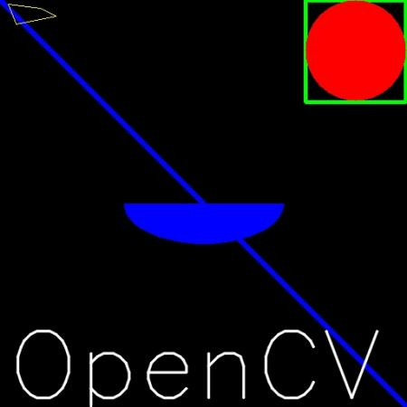

### 1.3.2. function

#### 1.3.2.1. common

- function
  - `cv.line()`
  - `cv.circle()`
  - `cv.rectangle()`
  - `cv.ellipse()`
  - `cv.putText()`
- args:
  - img : The image where you want to draw the shapes
  - color : Color of the shape. for BGR, pass it as a tuple, eg: (255,0,0) for blue. For grayscale, just pass the scalar value.
  - thickness : Thickness of the line or circle etc. If -1 is passed for closed figures like circles, it will fill the shape. default thickness = 1
  - [linetype](https://docs.opencv.org/4.x/d6/d6e/group__imgproc__draw.html#gaf076ef45de481ac96e0ab3dc2c29a777): <a name="line_type" id="line_type"></a>
    - Type of line, whether 8-connected, anti-aliased line etc. By default, it is 8-connected
    - cv.LINE_AA gives anti-aliased line which looks great for curves.

#### 1.3.2.2. others

- `cv.polygon(img,points,is_closed,color)`
  - If third argument is False, you will get a polylines joining all the points, not a closed shape.
  - cv.polylines() can be used to draw multiple lines. 
    > - cv.ellipse(	img, center, axes, angle, startAngle, endAngle, color[, thickness[, lineType[, shift]]]	) ->	img
    > - cv.ellipse(	img, box, color[, thickness[, lineType]]	) ->	img
    - Just create a list of all the lines you want to draw and pass it to the function.
    - All lines will be drawn individually.
    - It is a much better and faster way to draw a group of lines than calling cv.line() for each line.

- `cv.text()`
  > cv.putText(	img, text, org, fontFace, fontScale, color[, thickness[, lineType[, bottomLeftOrigin]]]	) ->	img

## 1.4. Get Start With Event

> Mouse as a Paint-Brush: Draw stuff with your mouse

### 1.4.1. example code

#### 1.4.1.1. Simple Demo

**Here, we create a simple application which draws a circle on an image wherever we double-click on it.**

- create a mouse callback function which is executed when a mouse event take place
  - Mouse event can be anything related to mouse like left-button down, left-button up, left-button double-click etc.
  - It gives us the coordinates (x,y) for every mouse event.
  - With this event and location, we can do whatever we like.

- all event:
  ```python
  import cv2 as cv
  events = [i for i in dir(cv) if 'EVENT' in i]
  print( events )
  ```

- Creating mouse callback function has a specific format which is same everywhere.
  - It differs only in what the function does. 
  - So our mouse callback function does one thing, it draws a circle where we double-click.
  - So see the code below. Code is self-explanatory from comments :

  ```python
  import numpy as np
  import cv2 as cv
  # mouse callback function
  def draw_circle(event,x,y,flags,param):
      if event == cv.EVENT_LBUTTONDBLCLK:
          cv.circle(img,(x,y),100,(255,0,0),-1)
  # Create a black image, a window and bind the function to window
  img = np.zeros((512,512,3), np.uint8)
  cv.namedWindow('image')
  cv.setMouseCallback('image',draw_circle) # bind function in `image` window
  while(1):
      cv.imshow('image',img)
      # 20ms is update frequency
      if cv.waitKey(20) & 0xFF == 27: # key esc to quit
          break
  cv.destroyAllWindows()
  ```

#### 1.4.1.2. More Advanced Demo

**draw either rectangles or circles (depending on the mode we select) by dragging the mouse like we do in Paint application**

- mouse callback function has two parts
  - one to draw rectangle and other to draw the circles
  - This specific example will be really helpful in creating and understanding some interactive applications like object tracking, image segmentation etc.

- draw_function
  ```python
  import numpy as np
  import cv2 as cv
  drawing = False # true if mouse is pressed
  mode = True # if True, draw rectangle. Press 'm' to toggle to curve
  ix,iy = -1,-1
  # mouse callback function
  def draw_circle(event,x,y,flags,param):
      global ix,iy,drawing,mode
      if event == cv.EVENT_LBUTTONDOWN:
          drawing = True
          ix,iy = x,y
      elif event == cv.EVENT_MOUSEMOVE:
          if drawing == True:
              if mode == True:
                  cv.rectangle(img,(ix,iy),(x,y),(0,255,0),-1)
              else:
                  cv.circle(img,(x,y),5,(0,0,255),-1)
      elif event == cv.EVENT_LBUTTONUP:
          drawing = False
          if mode == True:
              cv.rectangle(img,(ix,iy),(x,y),(0,255,0),-1)
          else:
              cv.circle(img,(x,y),5,(0,0,255),-1)
  ```

- bind this mouse callback function to OpenCV window
  - In the main loop, we should set a keyboard binding for key 'm' to toggle between rectangle and circle.

  ```python
    img = np.zeros((512,512,3), np.uint8)
    cv.namedWindow('image')
    cv.setMouseCallback('image',draw_circle)
    while(1):
        cv.imshow('image',img)
        k = cv.waitKey(1) & 0xFF
        if k == ord('m'):
            mode = not mode
        elif k == 27:
            break
    cv.destroyAllWindows()
  ```

### 1.4.2. function

- `cv.namedWindow(window_name)`
- `cv.setMouseCallback(window_name,fun)`

## 1.5. Exercise:Trackbar as the Color Palette

> Create trackbar to control certain parameters

### 1.5.1. example code

```python
  import numpy as np
  import cv2 as cv
  def nothing(x):
      pass
  # Create a black image, a window
  img = np.zeros((300,512,3), np.uint8)
  cv.namedWindow('image')
  # create trackbars for color change
  cv.createTrackbar('R','image',0,255,nothing) # (bar_name,in_which_window,initial_value,max_value,callback)
  cv.createTrackbar('G','image',0,255,nothing)
  cv.createTrackbar('B','image',0,255,nothing)
  # create switch for ON/OFF functionality
  switch = '0 : OFF \n1 : ON'
  cv.createTrackbar(switch, 'image',0,1,nothing)
  while(1):
      cv.imshow('image',img)
      k = cv.waitKey(1) & 0xFF
      if k == 27:
          break
      # get current positions of four trackbars
      r = cv.getTrackbarPos('R','image')
      g = cv.getTrackbarPos('G','image')
      b = cv.getTrackbarPos('B','image')
      s = cv.getTrackbarPos(switch,'image')
      if s == 0:
          img[:] = 0
      else:
          img[:] = [b,g,r]
  cv.destroyAllWindows()
```

### 1.5.2. function

- cv.createTrackbar() 
- cv.getTrackbarPos()

# 2. Core Operations

> In this section you will learn basic operations on image like pixel editing, geometric transformations, code optimization, some mathematical tools etc.

## 2.1. Basic Operations on Images(numpy operations)

> Learn to read and edit pixel values, working with image ROI and other basic operations.
>
> - Access pixel values and modify them
> - Access image properties
> - Set a Region of Interest (ROI)
> - Split and merge images

### 2.1.1. expample code

#### 2.1.1.1. Image ROI(Region Of Interest)

```python
import numpy as np
import cv2 as cv

img = cv.imread('messi5.jpg')
ball = img[280:340, 330:390]
img[273:333, 100:160] = ball
```

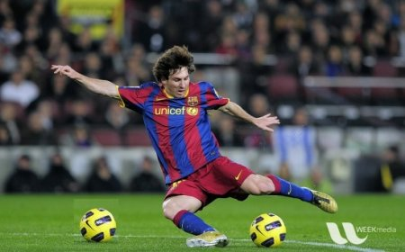

#### 2.1.1.2. Splitting and Merging Image Channels

```python
  b,g,r = cv.split(img) # don't use split
  img = cv.merge((b,g,r))
  # or
  b = img[:,:,0]
  g = img[:,:,1]
  r = img[:,:,2]
```

- Notice:
  - cv.split() is a costly operation (in terms of time).
  - So use it only if necessary. Otherwise go for Numpy indexing.

#### 2.1.1.3. Making Borders for Images (Padding)

If you want to create a border around an image, something like a photo frame, you can use `cv.copyMakeBorder()`

But it has more applications for convolution operation, zero padding etc. This function takes following arguments:

```python
  import cv2 as cv
  import numpy as np
  from matplotlib import pyplot as plt
  BLUE = [255,0,0]
  img1 = cv.imread('opencv-logo.png')
  replicate = cv.copyMakeBorder(img1,10,10,10,10,cv.BORDER_REPLICATE)
  reflect = cv.copyMakeBorder(img1,10,10,10,10,cv.BORDER_REFLECT)
  reflect101 = cv.copyMakeBorder(img1,10,10,10,10,cv.BORDER_REFLECT_101)
  wrap = cv.copyMakeBorder(img1,10,10,10,10,cv.BORDER_WRAP)
  constant= cv.copyMakeBorder(img1,10,10,10,10,cv.BORDER_CONSTANT,value=BLUE)
  plt.subplot(231),plt.imshow(img1,'gray'),plt.title('ORIGINAL')
  plt.subplot(232),plt.imshow(replicate,'gray'),plt.title('REPLICATE')
  plt.subplot(233),plt.imshow(reflect,'gray'),plt.title('REFLECT')
  plt.subplot(234),plt.imshow(reflect101,'gray'),plt.title('REFLECT_101')
  plt.subplot(235),plt.imshow(wrap,'gray'),plt.title('WRAP')
  plt.subplot(236),plt.imshow(constant,'gray'),plt.title('CONSTANT')
  plt.show()
```

See the result below. (Image is displayed with matplotlib. So RED and BLUE channels will be interchanged):

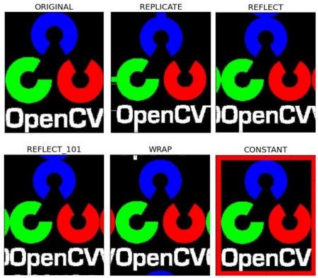

### 2.1.2. function

- `cv.split()`
  > don't use

- `cv.copyMakeBorder()`
  - src - input image
  - top, bottom, left, right - border width in number of pixels in corresponding directions
  - borderType - Flag defining what kind of border to be added. It can be following types:
    - cv.BORDER_CONSTANT - Adds a constant colored border. The value should be given as next argument.
    - cv.BORDER_REFLECT - Border will be mirror reflection of the border elements, like this : fedcba|abcdefgh|hgfedcb
    - cv.BORDER_REFLECT_101 or cv.BORDER_DEFAULT - Same as above, but with a slight change, like this : gfedcb|abcdefgh|gfedcba
    - cv.BORDER_REPLICATE - Last element is replicated throughout, like this: aaaaaa|abcdefgh|hhhhhhh
    - cv.BORDER_WRAP - Can't explain, it will look like this : cdefgh|abcdefgh|abcdefg
  - value - Color of border if border type is cv.BORDER_CONSTANT

## 2.2. Arithmetic Operations on Images

> Perform arithmetic operations on images
>
> - Learn several arithmetic operations on images, like addition, subtraction, bitwise operations, and etc.
> - Learn these functions: cv.add(), cv.addWeighted(), etc.

### 2.2.1. expample code

#### 2.2.1.1. Image Addition

- There is a difference between **OpenCV addition** and **Numpy addition**
  - OpenCV addition is a saturated operation 
  - Numpy addition is a modulo operation.

  ```python
  >>> x = np.uint8([250])
  >>> y = np.uint8([10])
  >>> print( cv.add(x,y) ) # 250+10 = 260 => 255
  [[255]]
  >>> print( x+y )          # 250+10 = 260 % 256 = 4
  [4]
  ```

- Stick with OpenCV functions
  - because they will provide a better result.
  - This will be more visible when you add two images.

#### 2.2.1.2. Image Blending

This is also image addition, but different weights are given to images in order to give a feeling of blending or transparency.

- Images are added as per the equation below:
  - $g(x)=(1−α)f_{0}(x)+αf_{1}(x)$ 
  - By varying α from 0→1, you can perform a cool transition between one image to another.

  ```python
  img1 = cv.imread('ml.png')
  img2 = cv.imread('opencv-logo.png')
  # The first image is given a weight of 0.7 and the second image is given 0.3.
  dst = cv.addWeighted(img1,0.7,img2,0.3,0)
  cv.imshow('dst',dst)
  cv.waitKey(0)
  cv.destroyAllWindows()
  Check the result below:
  ```

- result
  

#### 2.2.1.3. Bitwise Operations

- explain
  - This includes the bitwise AND, OR, NOT, and XOR operations
  - They will be highly useful while extracting any part of the image (as we will see in coming chapters), defining and working with non-rectangular ROI's, and etc.
  - Below we will see an example of how to change a particular region of an image.

- put the OpenCV logo above an image
  - If I add two images, it will change the color. 
  - If I blend them, I get a transparent effect. But I want it to be opaque(不透明的). 
  - If it was a rectangular region, I could use ROI as we did in the last chapter. But the OpenCV logo is a not a rectangular shape. 
  - So you can do it with bitwise operations as shown below:

  ```python
  # Load two images
  img1 = cv.imread('messi5.jpg')
  img2 = cv.imread('opencv-logo-white.png')
  # I want to put logo on top-left corner, So I create a ROI
  rows,cols,channels = img2.shape
  roi = img1[0:rows, 0:cols]
  # Now create a mask of logo and create its inverse mask also
  img2gray = cv.cvtColor(img2,cv.COLOR_BGR2GRAY)
  ret, mask = cv.threshold(img2gray, 10, 255, cv.THRESH_BINARY) # Later chapters will explain 'threshold' 
  mask_inv = cv.bitwise_not(mask) # 0->255,255->0
  # Now black-out the area of logo in ROI
  img1_bg = cv.bitwise_and(roi,roi,mask = mask_inv)
  # Take only region of logo from logo image.
  img2_fg = cv.bitwise_and(img2,img2,mask = mask)
  # Put logo in ROI and modify the main image
  dst = cv.add(img1_bg,img2_fg)

  plt.figure(figsize = (10,10))
  def plt_bgr(img):
      plt.imshow(cv.cvtColor(img, cv.COLOR_BGR2RGB))
  plt.subplot(331),plt_bgr(img1),plt.title("img1")
  plt.subplot(332),plt_bgr(img2),plt.title("img2")
  plt.subplot(333),plt_bgr(roi),plt.title("roi")
  plt.subplot(334),plt_bgr(img2gray),plt.title("img2gray")
  plt.subplot(335),plt_bgr(mask),plt.title("mask")
  plt.subplot(336),plt_bgr(mask_inv),plt.title("mask_inv")
  plt.subplot(337),plt_bgr(img1_bg),plt.title("img1_bg")
  plt.subplot(338),plt_bgr(img2_fg),plt.title("img2_fg")
  plt.subplot(339),plt_bgr(dst),plt.title("dst")

  img1[0:rows, 0:cols ] = dst
  cv.imshow('res',img1)
  cv.waitKey(0)
  cv.destroyAllWindows()
  ```
  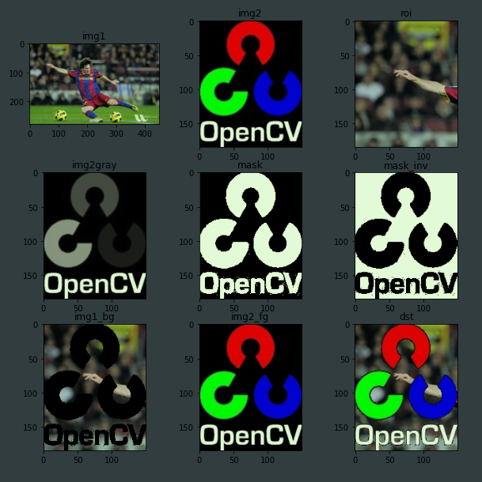

  

  > See the result above. Left image shows the mask we created. Right image shows the final result.
  >
  > For more understanding, display all the intermediate images in the above code, especially img1_bg and img2_fg.

### 2.2.2. function

- `cv.add(arg1,arg2)`
  > better than numpy add <br/>
  > `cv.add(	src1, src2[, dst[, mask[, dtype]]]	) ->	dst`
- `cv.addWeighted(img1,weight1,img2,weight2,offset) `
  - applies the following equation to the image: $dst=α⋅img1+β⋅img2+γ$
- `cv.threshold()`
  > explain in later chapter
- `cv.bitwise_not`
- `cv.bitwise_and`
- `cv.bitwise_xor`
-` cv.bitwise_or`

## 2.3. Performance Measurement and Improvement Techniques

> Getting a solution is important. But getting it in the fastest way is more important. Learn to check the speed of your code, optimize the code etc.
>
> - Measure the performance of your code.
> - Some tips to improve the performance of your code.

### 2.3.1. expample code

#### 2.3.1.1. Measuring Performance with OpenCV

- `cv.getTickCount`: 
  - returns the number of clock-cycles after a reference event (like the moment the machine was switched ON) to the moment this function is called. 
  - So if you call it before and after the function execution, you get the number of clock-cycles used to execute a function.
- `cv.getTickFrequency`:
  - returns the cpu's frequency of clock-cycles, or the number of clock-cycles per second.
  - So to find the time of execution in seconds, you can do following:

  ```python
  e1 = cv.getTickCount()
  # your code execution
  e2 = cv.getTickCount()
  time = (e2 - e1)/ cv.getTickFrequency()
  ```

We will demonstrate with following example. The following example applies median filtering with kernels of odd sizes ranging from 5 to 49. (Don't worry about what the result will look like - that is not our goal):

  ```python
  img1 = cv.imread('messi5.jpg')
  e1 = cv.getTickCount()
  for i in range(5,49,2):
      img1 = cv.medianBlur(img1,i)
  e2 = cv.getTickCount()
  t = (e2 - e1)/cv.getTickFrequency()
  print( t )
  # Result I got is 0.521107655 seconds
  ```

- notice:
  - You can do the same thing with the `time` module. 
  - Instead of `cv.getTickCount`, use the time.time() function. Then take the difference of the two times.

#### 2.3.1.2. Default Optimization in OpenCV

- explain
  - Many of the OpenCV functions are optimized using SSE2, AVX, etc
  - It contains the unoptimized code also.
  - So if our system support these features, we should exploit them (almost all modern day processors support them). 
  - It is enabled by default while compiling.
  - So OpenCV runs the optimized code if it is enabled, otherwise it runs the unoptimized code.
  - You can use `cv.useOptimized()` to check if it is enabled/disabled 
  - use `cv.setUseOptimized()` to enable/disable it

- example

  ```python
  # check if optimization is enabled
  In [5]: cv.useOptimized()
  Out[5]: True
  In [6]: %timeit res = cv.medianBlur(img,49)
  10 loops, best of 3: 34.9 ms per loop
  # Disable it
  In [7]: cv.setUseOptimized(False)
  In [8]: cv.useOptimized()
  Out[8]: False
  In [9]: %timeit res = cv.medianBlur(img,49)
  10 loops, best of 3: 64.1 ms per loop
  ```

  - As you can see, optimized median filtering is 2x faster than the unoptimized version.
  - If you check its source, you can see that median filtering is SIMD optimized.
  - So you can use this to enable optimization at the top of your code (remember it is enabled by default).

#### 2.3.1.3. Measuring Performance in IPython

Sometimes you may need to compare the performance of two similar operations. IPython gives you a magic command timeit to perform this.

It runs the code several times to get more accurate results. Once again, it is suitable to measuring single lines of code.

- example(python vs numpy)
  - do you know which of the following addition operations is better,
  - `x = 5; y = x**2, x = 5; y = x*x, x = np.uint8([5]); y = x*x, or y = np.square(x)`?
  - We will find out with timeit in the IPython shell.

  ```python
  In [10]: x = 5
  In [11]: %timeit y=x**2
  10000000 loops, best of 3: 73 ns per loop
  In [12]: %timeit y=x*x
  10000000 loops, best of 3: 58.3 ns per loop
  In [15]: z = np.uint8([5])
  In [17]: %timeit y=z*z
  1000000 loops, best of 3: 1.25 us per loop
  In [19]: %timeit y=np.square(z)
  1000000 loops, best of 3: 1.16 us per loop
  ```

  - You can see that, `x = 5 ; y = x*x` is fastest and it is around 20x faster compared to Numpy.
  - If you consider the array creation also, it may reach up to 100x faster. 

  - Notice
    - Python scalar operations are faster than Numpy scalar operations.
    - So for operations including one or two elements, Python scalar is better than Numpy arrays.
    - **Numpy has the advantage when the size of the array is a little bit bigger**.

- example2(numpy vs open-cv)

  - compare the performance of cv.countNonZero() and np.count_nonzero() for the same image.

  ```python
  In [35]: %timeit z = cv.countNonZero(img)
  100000 loops, best of 3: 15.8 us per loop
  In [36]: %timeit z = np.count_nonzero(img)
  1000 loops, best of 3: 370 us per loop
  ```

  - the OpenCV function is nearly 25x faster than the Numpy function.
  - notice:
    - **Normally, OpenCV functions are faster than Numpy functions**. So for same operation, OpenCV functions are preferred.
    - But, there can be exceptions, **especially when Numpy works with views instead of copies**.

#### 2.3.1.4. Performance Optimization Techniques

There are several techniques and coding methods to exploit maximum performance of Python and Numpy.
Only relevant ones are noted here and links are given to important sources.

- [Python Optimization Techniques](https://wiki.python.org/moin/PythonSpeed/PerformanceTips)
- [Scipy Lecture Notes - Advanced Numpy](https://scipy-lectures.github.io/advanced/advanced_numpy/index.html#advanced-numpy)

The main thing to be noted here is, first try to implement the algorithm in a simple manner.
Once it is working, profile it, find the bottlenecks, and optimize them.

- Avoid using loops in Python as much as possible, especially double/triple loops etc. They are inherently slow.
- Vectorize the algorithm/code to the maximum extent possible, because Numpy and OpenCV are optimized for vector operations.
- Exploit the cache coherence.
- Never make copies of an array unless it is necessary. Try to use views instead. Array copying is a costly operation.

If your code is still slow after doing all of these operations, or if the use of large loops is inevitable, use additional libraries like Cython to make it faster.

### 2.3.2. function

- `cv.useOptimized()`
- `cv.setUseOptimized()`

# 3. Image Processing in OpenCV

> In this section you will learn different image processing functions inside OpenCV.

## 3.1. Changing Colorspaces

> Learn to change images between different color spaces. Plus learn to track a colored object in a video.
>
> - learn how to convert images from one color-space to another, like BGR ↔ Gray, BGR ↔ HSV, etc.
> - In addition to that, we will create an application to extract a colored object in a video

### 3.1.1. example code

#### 3.1.1.1. Changing Color-space

- explain
  - There are more than 150 color-space conversion methods available in OpenCV. 
  - But we will look into only two, which are most widely used ones: BGR ↔ Gray and BGR ↔ HSV.
  - For color conversion, we use the function `cv.cvtColor(input_image, flag)` where flag determines the type of conversion.
  - For BGR → Gray conversion, we use the flag cv.COLOR_BGR2GRAY.
  - Similarly for BGR → HSV, we use the flag cv.COLOR_BGR2HSV. To get other flags, just run following commands in your Python terminal:

  ```python
  >>> import cv2 as cv
  >>> flags = [i for i in dir(cv) if i.startswith('COLOR_')]
  >>> print( flags )
  ```

- notice
  - For HSV, hue range is [0,179], saturation range is [0,255], and value range is [0,255].
  - Different software use different scales. 
  - So if you are comparing OpenCV values with them, you need to normalize these ranges.

#### 3.1.1.2. Object Tracking By HSV

- explain
  - Now that we know how to convert a BGR image to HSV, we can use this to extract a colored object.
  - In HSV, it is easier to represent a color than in BGR color-space.
  - In our application, we will try to extract a blue colored object. So here is the method:

- code
  ```python
  import cv2 as cv
  import numpy as np
  cap = cv.VideoCapture(0)
  while(1):
      # Take each frame
      _, frame = cap.read()
      # Convert BGR to HSV
      hsv = cv.cvtColor(frame, cv.COLOR_BGR2HSV)
      # define range of blue color in HSV
      lower_blue = np.array([110,50,50])
      upper_blue = np.array([130,255,255])
      # Threshold the HSV image to get only blue colors
      mask = cv.inRange(hsv, lower_blue, upper_blue)
      # Bitwise-AND mask and original image
      res = cv.bitwise_and(frame,frame, mask= mask)
      cv.imshow('frame',frame)
      cv.imshow('mask',mask)
      cv.imshow('res',res)
      k = cv.waitKey(5) & 0xFF
      if k == 27:
          break
  cap.release()
  cv.destroyAllWindows()
  ```

  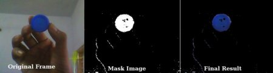

- notice
  - There is some noise in the image. We will see how to remove it in later chapters.
  - This is the simplest method in object tracking.
  - Once you learn functions of contours, you can do plenty of things like find the centroid of an object and use it to track the object, draw diagrams just by moving your hand in front of a camera, and other fun stuff.

#### 3.1.1.3. How to find HSV values to track?

- Instead of passing an image, you just pass the BGR values you want.
  - For example, to find the HSV value of Green, try the following commands in a Python terminal:

  ```python
  >>> green = np.uint8([[[0,255,0 ]]])
  >>> hsv_green = cv.cvtColor(green,cv.COLOR_BGR2HSV)
  >>> print( hsv_green )
  >>> [[[ 60 255 255]]]
  # Now you take [H-10, 100,100] and [H+10, 255, 255] as the lower bound and upper bound respectively. 
  # Apart from this method, you can use any image editing tools like GIMP or any online converters to find these values, but don't forget to adjust the HSV ranges.
  ```

### 3.1.2. function

- `cv.cvtColor(img,code)`
  - [all ColorConversionCodes](https://docs.opencv.org/4.x/d8/d01/group__imgproc__color__conversions.html#gga4e0972be5de079fed4e3a10e24ef5ef0a353a4b8db9040165db4dacb5bcefb6ea)
- `cv.inRange`
  > cv.inRange(	src, lowerb, upperb[, dst]	) ->	dst
  - get a mask
  - For every element of a single-channel input array:

    $dst(I)=lowerb(I)_{0}≤src(I)_{0}≤upperb(I)_{0}$

  - For two-channel arrays:

    $dst(I)=lowerb(I)_{0}≤src(I)_{0}≤upperb(I)_{0}∧lowerb(I)_{1}≤src(I)_{1}≤upperb(I)_{1}$

  - and so forth.

## 3.2. Geometric Transformations of Images

> Learn to apply different geometric transformations to images like rotation, translation etc.

### 3.2.1. example code

#### 3.2.1.1. Scaling(resize)

- explain
  - Scaling is just resizing of the image.
  - OpenCV comes with a function cv.resize() for this purpose.
  - The size of the image can be specified manually, or you can specify the scaling factor.
  - Different interpolation methods are used.
    - Preferable interpolation methods are cv.INTER_AREA for shrinking 
    - and cv.INTER_CUBIC (slow) & cv.INTER_LINEAR for zooming.
    - By default, the interpolation method cv.INTER_LINEAR is used for all resizing purposes.
    - You can resize an input image with either of following methods:

```python
  import numpy as np
  import cv2 as cv
  img = cv.imread('messi5.jpg')
  res = cv.resize(img,None,fx=2, fy=2, interpolation = cv.INTER_CUBIC)
  #OR
  height, width = img.shape[:2]
  res = cv.resize(img,(2*width, 2*height), interpolation = cv.INTER_CUBIC)
```

#### 3.2.1.2. Translation

- explain
  - Translation is the shifting of an object's location.
  - If you know the shift in the (x,y) direction and let it be (tx,ty),
  - you can create the transformation matrix M as follows:

    $ M =  \begin{bmatrix} 1&0&t_{x} \\ 0&1&t_{y} \end{bmatrix} $

- You can take make it into a Numpy array of type np.float32 and pass it into the cv.warpAffine() function. See the below example for a shift of (100,50):

  ```python
  import numpy as np
  import cv2 as cv
  img = cv.imread('messi5.jpg',0)
  rows,cols = img.shape
  M = np.float32([[1,0,100],[0,1,50]])
  dst = cv.warpAffine(img,M,(cols,rows))
  cv.imshow('img',dst)
  cv.waitKey(0)
  cv.destroyAllWindows()
  ```

  

- warning
  - The third argument of the cv.warpAffine() function is the size of the output image, which should be in the form of **(width, height)**.
  - Remember width = number of columns, and height = number of rows.
  - **different with (img.shape)**

#### 3.2.1.3. Rotation

- Rotation of an image for an angle θ is achieved by the transformation matrix of the form

  $M = \begin{bmatrix}cosθ & -sinθ \\ sinθ & cosθ \end{bmatrix}$

- But OpenCV provides scaled rotation with adjustable center of rotation so that you can rotate at any location you prefer. The modified transformation matrix is given by

  $\begin{bmatrix}α & β & (1−α)⋅center.x−β⋅center.y\\ -β & α & β⋅center.x+(1−α)⋅center.y \end{bmatrix}$

  where:

  $α=scale⋅cosθ$,

  $β=scale⋅sinθ$

- To find this transformation matrix, OpenCV provides a function, `cv.getRotationMatrix2D`.

- rotate the image by 90 degree with respect to center without any scaling.

  ```python
    img = cv.imread('messi5.jpg',0)
    rows,cols = img.shape
    # cols-1 and rows-1 are the coordinate limits.
    M = cv.getRotationMatrix2D(((cols-1)/2.0,(rows-1)/2.0),90,1)
    dst = cv.warpAffine(img,M,(cols,rows))
  ```

  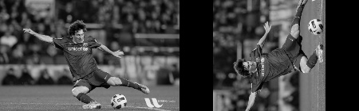

#### 3.2.1.4. Affine Transformation

- explain
  - In affine transformation, all parallel lines in the original image will still be parallel in the output image.
  - To find the transformation matrix, we need three points from the input image and their corresponding locations in the output image.
    > (2d图像，不再共条直线上的三个点可以确定基向量)
  - Then `cv.getAffineTransform` will create a 2x3 matrix which is to be passed to cv.warpAffine.

- example
  ```python
  img = cv.imread('drawing.png')
  rows,cols,ch = img.shape
  pts1 = np.float32([[50,50],[200,50],[50,200]])
  pts2 = np.float32([[10,100],[200,50],[100,250]])
  M = cv.getAffineTransform(pts1,pts2)
  dst = cv.warpAffine(img,M,(cols,rows))
  plt.subplot(121),plt.imshow(img),plt.title('Input')
  plt.subplot(122),plt.imshow(dst),plt.title('Output')
  plt.show()
  ```

  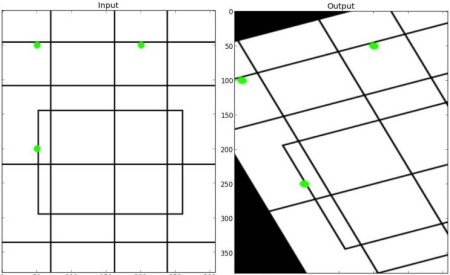 

#### 3.2.1.5. Perspective Transformation

- explain
  - For perspective transformation, you need a 3x3 transformation matrix.
  - Straight lines will remain straight even after the transformation.
  - To find this transformation matrix
    - you need **4 points on the input image and corresponding points on the output image**
    - Among these 4 points, 3 of them should not be collinear.
  - Then the transformation matrix can be found by the function `cv.getPerspectiveTransform`
  - Then apply cv.warpPerspective with this 3x3 transformation matrix.

- example

  ```python
  img = cv.imread('sudoku.png')
  rows,cols,ch = img.shape
  pts1 = np.float32([[56,65],[368,52],[28,387],[389,390]])
  pts2 = np.float32([[0,0],[300,0],[0,300],[300,300]])
  M = cv.getPerspectiveTransform(pts1,pts2)
  dst = cv.warpPerspective(img,M,(300,300))
  plt.subplot(121),plt.imshow(img),plt.title('Input')
  plt.subplot(122),plt.imshow(dst),plt.title('Output')
  plt.show()
  ```

  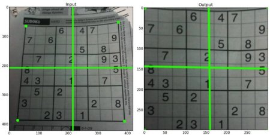

### 3.2.2. function

- scaling
  - `cv.resize()`
    > [all InterpolationFlags](https://docs.opencv.org/4.x/da/d54/group__imgproc__transform.html#ga5bb5a1fea74ea38e1a5445ca803ff121)
- Affine wTransformations
  - `cv.warpAffine`
  - `cv.getAffineTransform`
    > cv.getAffineTransform(	src, dst	) ->	retval
  - `cv.getRotationMatrix2D`
    > cv.getRotationMatrix2D(	center, angle, scale	) ->	retval
- Perspective Transform
  - `cv.warpPerspective()`
  - `cv.getPerspectiveTransform`
    > cv.getPerspectiveTransform(	src, dst[, solveMethod]	) ->	retval

## 3.3. Image Thresholding

> Learn to convert images to binary images using global thresholding, Adaptive thresholding, Otsu's binarization etc

### 3.3.1. example code

#### 3.3.1.1. Simple/Global Thresholding

- explain 
  - For every pixel, the same threshold value is applied.
  - If the pixel value is smaller than the threshold, it is set to 0,
  - otherwise it is set to a maximum value.
  - The function `cv.threshold` is used to apply the thresholding.
- arg
  - The first argument is the source image, which should be a grayscale image.
  - The second argument is the threshold value which is used to classify the pixel values.
  - The third argument is the maximum value which is assigned to pixel values exceeding the threshold.

- thresholding types
  - cv.THRESH_BINARY
  - cv.THRESH_BINARY_INV
  - cv.THRESH_TRUNC
  - cv.THRESH_TOZERO
  - cv.THRESH_TOZERO_INV

  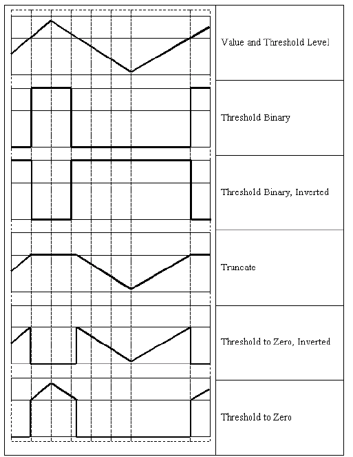

- return
  - The first is the threshold that was used 
  - the second output is the thresholded image.

- code

  ```python
  import cv2 as cv
  import numpy as np
  from matplotlib import pyplot as plt
  img = cv.imread('gradient.png',0)
  ret,thresh1 = cv.threshold(img,127,255,cv.THRESH_BINARY)
  ret,thresh2 = cv.threshold(img,127,255,cv.THRESH_BINARY_INV)
  ret,thresh3 = cv.threshold(img,127,255,cv.THRESH_TRUNC)
  ret,thresh4 = cv.threshold(img,127,255,cv.THRESH_TOZERO)
  ret,thresh5 = cv.threshold(img,127,255,cv.THRESH_TOZERO_INV)
  titles = ['Original Image','BINARY','BINARY_INV','TRUNC','TOZERO','TOZERO_INV']
  images = [img, thresh1, thresh2, thresh3, thresh4, thresh5]
  for i in range(6):
      plt.subplot(2,3,i+1),plt.imshow(images[i],'gray',vmin=0,vmax=255)
      plt.title(titles[i])
  plt.show()
  ```

  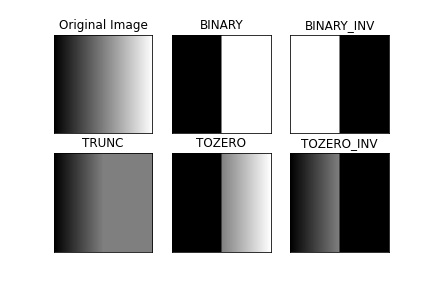

#### 3.3.1.2. Adaptive Thresholding

- why use adaptive Thresholding
  - In the previous section, we used one global value as a threshold.
  - But this might not be good in all cases, e.g. 
  - if an image has different lighting conditions in different areas.
  - In that case, adaptive thresholding can help.

- what is Adaptive Thresholding
  - Here, the algorithm determines the threshold for a pixel based on a small region around it.
  - So we get different thresholds for different regions of the same image which gives better results for images with varying illumination.

- arg
	- src
  - maxValue
  - adaptiveMethod
    > decides how the threshold value is calculated:
    - [cv.ADAPTIVE_THRESH_MEAN_C](https://docs.opencv.org/4.x/d7/d1b/group__imgproc__misc.html#ggaa42a3e6ef26247da787bf34030ed772cad0c5199ae8637a6b195062fea4789fa9): The threshold value is the mean of the neighbourhood area minus the constant C.
    - [cv.ADAPTIVE_THRESH_GAUSSIAN_C](https://docs.opencv.org/4.x/d7/d1b/group__imgproc__misc.html#ggaa42a3e6ef26247da787bf34030ed772caf262a01e7a3f112bbab4e8d8e28182dd): The threshold value is a gaussian-weighted sum of the neighbourhood values minus the constant C.
  - thresholdType
  - blockSize
    > The blockSize determines the size of the neighbourhood area 
  - C: offset
    > C is a constant that is subtracted from the mean or weighted sum of the neighbourhood pixels.

- code:
  > The code below compares global thresholding and adaptive thresholding for an image with varying illumination:

  ```python
  import cv2 as cv
  import numpy as np
  from matplotlib import pyplot as plt
  img = cv.imread('sudoku.png',0)
  img = cv.medianBlur(img,5)
  ret,th1 = cv.threshold(img,127,255,cv.THRESH_BINARY)
  th2 = cv.adaptiveThreshold(img,255,cv.ADAPTIVE_THRESH_MEAN_C, cv.THRESH_BINARY,11,2)
  th3 = cv.adaptiveThreshold(img,255,cv.ADAPTIVE_THRESH_GAUSSIAN_C, cv.THRESH_BINARY,11,2)
  titles = ['Original Image', 'Global Thresholding (v = 127)',
              'Adaptive Mean Thresholding', 'Adaptive Gaussian Thresholding']
  images = [img, th1, th2, th3]
  for i in range(4):
      plt.subplot(2,2,i+1),plt.imshow(images[i],'gray')
      plt.title(titles[i])
      plt.xticks([]),plt.yticks([])
  plt.show()
  ```

  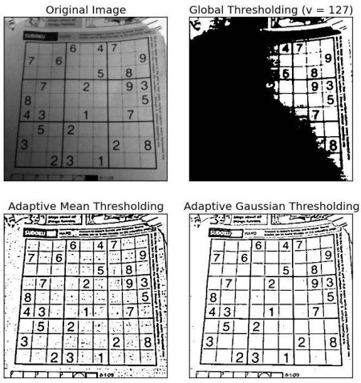

#### 3.3.1.3. Otsu's Binarization

- why use Otsu's Binarization
  - In global thresholding, we used an arbitrary chosen value as a threshold.
  - In contrast, Otsu's method avoids having to choose a value and determines it automatically.

- how Otsu's Binarization work
  - Consider an image with only two distinct image values (bimodal image), where the histogram would only consist of two peaks.
  - A good threshold would be in the middle of those two values
  - Similarly, **Otsu's method determines an optimal global threshold value from the image histogram**

- how to use
  - `cv.threshold(img,thresh,maxval,cv.THRESH_OTSU)`
  - The threshold value can be chosen arbitrary.
  - The algorithm then finds the optimal threshold value which is returned as the first output.

- example code
  - Check out the example below.
  - The input image is a noisy image.
    - In the first case, global thresholding with a value of 127 is applied.
    - In the second case, Otsu's thresholding is applied directly.
    - In the third case, 
      - the image is first filtered with a 5x5 gaussian kernel to remove the noise
      - then Otsu thresholding is applied. See how noise filtering improves the result.

  ```python
    import cv2 as cv
    import numpy as np
    from matplotlib import pyplot as plt
    img = cv.imread('noisy2.png',0)
    # global thresholding
    ret1,th1 = cv.threshold(img,127,255,cv.THRESH_BINARY)
    # Otsu's thresholding
    ret2,th2 = cv.threshold(img,0,255,cv.THRESH_BINARY+cv.THRESH_OTSU)
    # Otsu's thresholding after Gaussian filtering
    blur = cv.GaussianBlur(img,(5,5),0)
    ret3,th3 = cv.threshold(blur,0,255,cv.THRESH_BINARY+cv.THRESH_OTSU)
    # plot all the images and their histograms
    images = [img, 0, th1,
              img, 0, th2,
              blur, 0, th3]
    titles = ['Original Noisy Image','Histogram','Global Thresholding (v=127)',
              'Original Noisy Image','Histogram',"Otsu's Thresholding",
              'Gaussian filtered Image','Histogram',"Otsu's Thresholding"]
    for i in range(3):
        plt.subplot(3,3,i*3+1),plt.imshow(images[i*3],'gray')
        plt.title(titles[i*3]), plt.xticks([]), plt.yticks([])
        plt.subplot(3,3,i*3+2),plt.hist(images[i*3].ravel(),256)
        plt.title(titles[i*3+1]), plt.xticks([]), plt.yticks([])
        plt.subplot(3,3,i*3+3),plt.imshow(images[i*3+2],'gray')
        plt.title(titles[i*3+2]), plt.xticks([]), plt.yticks([])
    plt.show()
  ```

  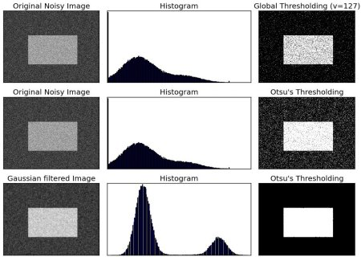

#### 3.3.1.4. How does Otsu's Binarization work?

This section demonstrates a Python implementation of Otsu's binarization to show how it actually works.

If you are not interested, you can skip this.

Since we are working with bimodal images, Otsu's algorithm tries to find a threshold value (t) which minimizes the weighted within-class variance given by the relation:

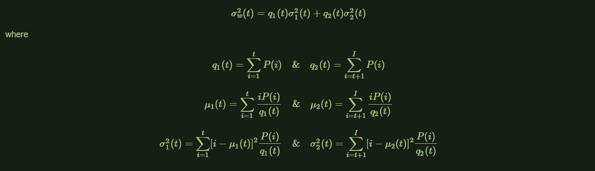

It actually finds a value of t which lies in between two peaks such that variances to both classes are minimal. It can be simply implemented in Python as follows:

```python
  img = cv.imread('noisy2.png',0)
  blur = cv.GaussianBlur(img,(5,5),0)
  # find normalized_histogram, and its cumulative distribution function
  hist = cv.calcHist([blur],[0],None,[256],[0,256])
  hist_norm = hist.ravel()/hist.sum()
  Q = hist_norm.cumsum()
  bins = np.arange(256)
  fn_min = np.inf
  thresh = -1
  for i in range(1,256):
      p1,p2 = np.hsplit(hist_norm,[i]) # probabilities
      q1,q2 = Q[i],Q[255]-Q[i] # cum sum of classes
      if q1 < 1.e-6 or q2 < 1.e-6:
          continue
      b1,b2 = np.hsplit(bins,[i]) # weights
      # finding means and variances
      m1,m2 = np.sum(p1*b1)/q1, np.sum(p2*b2)/q2
      v1,v2 = np.sum(((b1-m1)**2)*p1)/q1,np.sum(((b2-m2)**2)*p2)/q2
      # calculates the minimization function
      fn = v1*q1 + v2*q2
      if fn < fn_min:
          fn_min = fn
          thresh = i
  # find otsu's threshold value with OpenCV function
  ret, otsu = cv.threshold(blur,0,255,cv.THRESH_BINARY+cv.THRESH_OTSU)
  print( "{} {}".format(thresh,ret) )
```

### 3.3.2. function

- `cv.threshold`
  - [ThresholdTypes](https://docs.opencv.org/4.x/d7/d1b/group__imgproc__misc.html#gaa9e58d2860d4afa658ef70a9b1115576)
- `cv.adaptiveThreshold`
- `cv.threshold(img,thresh,maxval,cv.THRESH_OTSU)`

## 3.4. Smoothing Images

> Learn to blur the images, filter the images with custom kernels etc.
>
> - Blur images with various low pass filters
> - Apply custom-made filters to images (2D convolution)

### 3.4.1. example code

#### 3.4.1.1. 2D Convolution (Image Filtering)

- explain
  - As in one-dimensional signals, images also can be filtered with various low-pass filters (LPF), high-pass filters (HPF), etc.
  - use: LPF helps in removing noise, blurring images, etc. HPF filters help in finding edges in images.
  - OpenCV provides a function cv.filter2D() to convolve a kernel with an image.
  - As an example, we will try an averaging filter on an image. A 5x5 averaging filter kernel will look like the below:

    $ K = \frac{1}{25} \begin{bmatrix} 1&1&1&1&1\\1&1&1&1&1\\1&1&1&1&1\\1&1&1&1&1\\1&1&1&1&1\\ \end{bmatrix} $

- 5*5 mean

  ```python
    import numpy as np
    import cv2 as cv
    from matplotlib import pyplot as plt
    img = cv.imread('opencv_logo.png')
    kernel = np.ones((5,5),np.float32)/25
    dst = cv.filter2D(img,-1,kernel)
    plt.subplot(121),plt.imshow(img),plt.title('Original')
    plt.xticks([]), plt.yticks([])
    plt.subplot(122),plt.imshow(dst),plt.title('Averaging')
    plt.xticks([]), plt.yticks([])
    plt.show()
  ```

  > The operation works like this: keep this kernel above a pixel, add all the 25 pixels below this kernel, take the average, 
  > and replace the central pixel with the new average value.
  > This operation is continued for all the pixels in the image.

  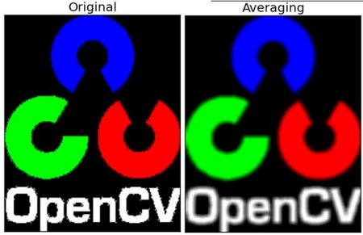

#### 3.4.1.2. Image Blurring (Image Smoothing)

- Image blurring is achieved by convolving the image with a **low-pass filter kernel**.
- It is useful for removing noise.
- It actually removes high frequency content (eg: noise, edges) from the image. 
- So edges are blurred a little bit in this operation (there are also blurring techniques which don't blur the edges).
- OpenCV provides four main types of blurring techniques.

##### 3.4.1.2.1. Averaging

- explain
  - This is done by convolving an image with a normalized box filter.
  - It simply takes the average of all the pixels under the kernel area and replaces the central element.
  - This is done by the function `cv.blur()` or `cv.boxFilter()`.
    > The call blur(src, dst, ksize, anchor, borderType) is equivalent to boxFilter(src, dst, src.type(), ksize, anchor, true, borderType). <br />
    > Check the docs for more details about the kernel.
  - We should specify the width and height of the kernel.
  - A 3x3 normalized box filter would look like the below:

  $ K = \frac{1}{9} \begin{bmatrix} 1&1&1\\1&1&1\\1&1&1 \end{bmatrix} $

- notice
  - If you don't want to use a normalized box filter, use cv.boxFilter().
  - Pass an argument normalize=False to the function.

- demo
  ```python
  import cv2 as cv
  import numpy as np
  from matplotlib import pyplot as plt
  img = cv.imread('opencv-logo-white.png')
  blur = cv.blur(img,(5,5))
  plt.subplot(121),plt.imshow(img),plt.title('Original')
  plt.xticks([]), plt.yticks([])
  plt.subplot(122),plt.imshow(blur),plt.title('Blurred')
  plt.xticks([]), plt.yticks([])
  plt.show()
  ```

  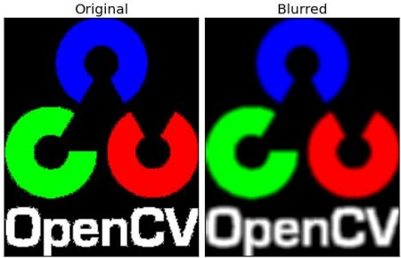

##### 3.4.1.2.2. Gaussian Blurring

- explain
  - In this method, instead of a box filter, a Gaussian kernel is used.
  - It is done with the function, `cv.GaussianBlur()`.
  - We should specify the width and height of the kernel which should be positive and odd. 
  - We also should specify the standard deviation in the X and Y directions, sigmaX and sigmaY respectively.
    - If only sigmaX is specified, sigmaY is taken as the same as sigmaX.
    - If both are given as zeros, they are calculated from the kernel size.
  - Gaussian blurring is highly effective in removing Gaussian noise from an image.
  - If you want, you can create a Gaussian kernel with the function, `cv.getGaussianKernel()`.

- The above code can be modified for Gaussian blurring:

  ```python
  blur = cv.GaussianBlur(img,(5,5),0)
  ```

  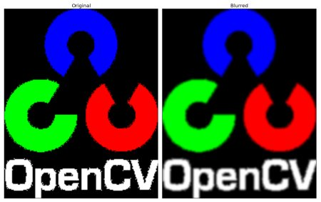

##### 3.4.1.2.3. Median Blurring

- explain
  - The function `cv.medianBlur()` **takes the median of all the pixels under the kernel area** and **the central element is replaced with this median value**.
  - This is highly effective against salt-and-pepper noise in an image.
  - Interestingly, in the above filters, the central element is a newly calculated value which may be a pixel value in the image or a new value.
  - But in median blurring, the central element is always replaced by some pixel value in the image.
  - It reduces the noise effectively. 
  - Its kernel size should be a positive odd integer.

- demo

  ```python
  median = cv.medianBlur(img,5)
  ```

  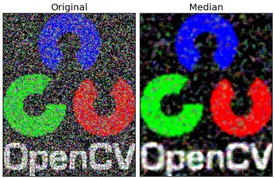 

##### 3.4.1.2.4. Bilateral Filtering

- explain
  - `cv.bilateralFilter()` is highly effective in noise removal **while keeping edges sharp**.
  - But the operation is **slower** compared to other filters.
  - Showcomming of Gaussian filter
    - We already saw that a Gaussian filter takes the neighbourhood around the pixel and finds its Gaussian weighted average.
    - This Gaussian filter is a function of space alone, that is, nearby pixels are considered while filtering.
    - It doesn't consider whether pixels have almost the same intensity.
    - It doesn't consider whether a pixel is an edge pixel or not.
    - So it blurs the edges also, which we don't want to do.
  - Improvement of Bilateral filtering 
    - Bilateral filtering also takes a Gaussian filter in space, but **one more Gaussian filter which is a function of pixel difference**.
    - The Gaussian function of space makes sure that **only nearby pixels are considered for blurring**,
    - So it preserves the edges since pixels at edges will have large intensity variation.

- The below sample shows use of a bilateral filter (For details on arguments, visit docs).

  ```python
  blur = cv.bilateralFilter(img,9,75,75)
  ```

  
 
### 3.4.2. function

- `cv.filter2D()`
- `cv.blur()`
- `cv.boxFilter()`
- `cv.GaussianBlur()`
- `cv.getGaussianKernel()`
- `cv.medianBlur()`
- `cv.bilateralFilter()`

## 3.5. Morphological Transformations

> Learn about morphological transformations like Erosion, Dilation, Opening, Closing etc
> 
> - Morphological transformations are some simple operations based on the image shape.
> - It is normally performed on **binary images**.
> - It needs two inputs
>   - one is our original image
>   - second one is called structuring element or kernel which decides the nature of operation.
> - Two basic morphological operators
>   - Erosion 
>   - Dilation.
> - its variant forms
>   - Opening
>   - Closing
>   - Gradient 
>   - etc...

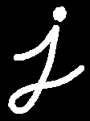

### 3.5.1. example code

#### 3.5.1.1. Erosion

- explain
  - The basic idea of erosion is just like soil erosion only
  - it erodes away the boundaries of foreground object (Always try to keep foreground in white)
  - what it does
    - The kernel slides through the image (as in 2D convolution).
    - A pixel in the original image (either 1 or 0) will be considered 1 **only if all the pixels under the kernel is 1** 
    - otherwise it is eroded (made to zero).
  - what happends is that
    - all the pixels near boundary will be discarded depending upon the size of kernel.
    - So the thickness or size of the foreground object decreases or simply white region decreases in the image.
    - It is useful for removing small white noises (as we have seen in colorspace chapter), detach two connected objects etc.


- demo

  ```python
  import cv2 as cv
  import numpy as np
  img = cv.imread('j.png',0)
  kernel = np.ones((5,5),np.uint8)
  erosion = cv.erode(img,kernel,iterations = 1)
  ```

  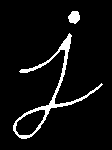

#### 3.5.1.2. Dilation

- explain
  - It is just **opposite of erosion**.
    - Here, a pixel element is '1' if **at least one pixel under the kernel is '1'**.
    - So it increases the white region in the image or size of foreground object increases.
  - use in nosie remove
    - **erosion is followed by dilation**(opening).
    - Because, erosion removes white noises, but it also shrinks our object.
    - So we dilate it. Since noise is gone, they won't come back, but our object area increases.
  - It is also useful in joining broken parts of an object.

- demo
  ```python
  dilation = cv.dilate(img,kernel,iterations = 1)
  ```

  

#### 3.5.1.3. Opening

- explained
  - Opening is just another name of **erosion followed by dilation**
  - It is useful in removing noise, as we explained above. Here we use the function, cv.morphologyEx()

- demo

  ```python
  opening = cv.morphologyEx(img, cv.MORPH_OPEN, kernel)
  ```

  

#### 3.5.1.4. Closing

- explain
  - Closing is reverse of Opening, Dilation followed by Erosion.
  - It is useful in closing small holes inside the foreground objects, or small black points on the object.

- demo

  ```python
  closing = cv.morphologyEx(img, cv.MORPH_CLOSE, kernel)
  ```

  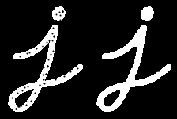

#### 3.5.1.5. Morphological Gradient

- explain
  - It is the difference between dilation and erosion of an image.
  - The result will look like the outline of the object.

- demo

  ```python
  gradient = cv.morphologyEx(img, cv.MORPH_GRADIENT, kernel)
  ```

  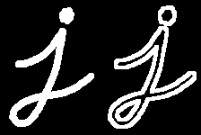

#### 3.5.1.6. Top Hat

- explain
  - It is **the difference between input image and Opening of the image**.

- demo: Below example is done for a 9x9 kernel.

  ```python
  tophat = cv.morphologyEx(img, cv.MORPH_TOPHAT, kernel)
  ```

  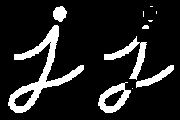

#### 3.5.1.7. Black Hat

- explain
  - It is the **difference between the closing of the input image and input image**.
- demo

  ```python
  blackhat = cv.morphologyEx(img, cv.MORPH_BLACKHAT, kernel)
  ```

  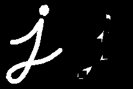

#### 3.5.1.8. Get Shaped Kernel

- explain
  - We manually created a structuring elements in the previous examples with help of Numpy. It is rectangular shape.
  - But in some cases, you may need elliptical/circular shaped kernels. 
  - So for this purpose, OpenCV has a function, `cv.getStructuringElement()`.
  - You just pass the shape and size of the kernel, you get the desired kernel.

- demo

  ```python
  # Rectangular Kernel
  >>> cv.getStructuringElement(cv.MORPH_RECT,(5,5))
  array([[1, 1, 1, 1, 1],
         [1, 1, 1, 1, 1],
         [1, 1, 1, 1, 1],
         [1, 1, 1, 1, 1],
         [1, 1, 1, 1, 1]], dtype=uint8)
  # Elliptical Kernel
  >>> cv.getStructuringElement(cv.MORPH_ELLIPSE,(5,5))
  array([[0, 0, 1, 0, 0],
         [1, 1, 1, 1, 1],
         [1, 1, 1, 1, 1],
         [1, 1, 1, 1, 1],
         [0, 0, 1, 0, 0]], dtype=uint8)
  # Cross-shaped Kernel
  >>> cv.getStructuringElement(cv.MORPH_CROSS,(5,5))
  array([[0, 0, 1, 0, 0],
         [0, 0, 1, 0, 0],
         [1, 1, 1, 1, 1],
         [0, 0, 1, 0, 0],
         [0, 0, 1, 0, 0]], dtype=uint8)
  ```

### 3.5.2. function

- `cv.erode()`
- `cv.dilation()`
- `cv.morphologyEx()`
  - [All MorphTypes](https://docs.opencv.org/4.x/d4/d86/group__imgproc__filter.html#ga7be549266bad7b2e6a04db49827f9f32)
- `cv.getStructuringElement()`
  - [all shape](https://docs.opencv.org/4.x/d4/d86/group__imgproc__filter.html#gac2db39b56866583a95a5680313c314ad)

## 3.6. Image Gradients

> Learn to find image gradients, edges etc.

### 3.6.1. example code

#### 3.6.1.1. Sobel and Scharr Derivatives

- Sobel operators is a joint Gausssian smoothing plus differentiation operation, so it is more resistant to noise.
- **specify the direction of derivatives**
  - vertical or horizontal
  - by the arguments, yorder and xorder respectively

  $ G_{x} = \begin{bmatrix} -1&0&1 \\ -2&0&2 \\ -1&0&1  \end{bmatrix} $

  $ G_{y} = \begin{bmatrix} -1&-2&-1 \\ 0&0&0 \\ 1&2&1  \end{bmatrix} $

- **specify the size of kernel**
  - by the argument ksize.
  - If ksize = -1, a 3x3 Scharr filter is used which gives better results than 3x3 Sobel filter.
    > for the x-derivative
    >
    > $\begin{bmatrix} -3&0&3\\ -10&0&10& \\ -3&0&3 \end{bmatrix}$
    >
    > and transposed for the y-derivative.

#### 3.6.1.2. Laplacian Derivatives

- It calculates the Laplacian of the image given by the relation, $Δsrc=\frac{∂^{2}src}{∂x^{2}}+\frac{∂^{2}src}{∂y^{2}}$ where each derivative is found using Sobel derivatives.
- If ksize = 1, then following kernel is used for filtering:

  $kernel = \begin{bmatrix} 0&1&0\\ 1&-1&4& \\ 0&1&0 \end{bmatrix}$


#### 3.6.1.3. Demo

```python
import numpy as np
import cv2 as cv
from matplotlib import pyplot as plt
img = cv.imread('dave.jpg',0)
laplacian = cv.Laplacian(img,cv.CV_64F)
sobelx = cv.Sobel(img,cv.CV_64F,1,0,ksize=5)
sobely = cv.Sobel(img,cv.CV_64F,0,1,ksize=5)
plt.subplot(2,2,1),plt.imshow(img,cmap = 'gray')
plt.title('Original'), plt.xticks([]), plt.yticks([])
plt.subplot(2,2,2),plt.imshow(laplacian,cmap = 'gray')
plt.title('Laplacian'), plt.xticks([]), plt.yticks([])
plt.subplot(2,2,3),plt.imshow(sobelx,cmap = 'gray')
plt.title('Sobel X'), plt.xticks([]), plt.yticks([])
plt.subplot(2,2,4),plt.imshow(sobely,cmap = 'gray')
plt.title('Sobel Y'), plt.xticks([]), plt.yticks([])
plt.show()
```

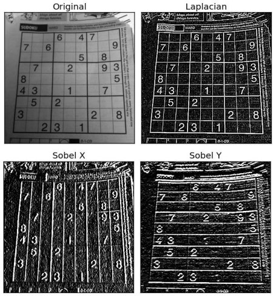

#### 3.6.1.4. Notice:One Important Matter!

- explain
  - In our last example, output datatype is cv.CV_8U or np.uint8. 
  - But there is a slight problem with that.
  - Black-to-White transition is taken as **Positive slope** (it has a positive value),
  - while White-to-Black transition is taken as a **Negative slope** (It has negative value).
  - So when you convert data to np.uint8, **all negative slopes are made zero** 
  - In simple words, **you miss that edge**.
  - If you want to detect both edges, better option is to keep the output datatype to some higher forms
    - like cv.CV_16S, cv.CV_64F etc,
    - take its absolute value and then convert back to cv.CV_8U.
    - Below code demonstrates this procedure for a horizontal Sobel filter and difference in results.

- demo:
  ```python
  import numpy as np
  import cv2 as cv
  from matplotlib import pyplot as plt
  img = cv.imread('box.png',0)
  # Output dtype/ddepth = cv.CV_8U
  sobelx8u = cv.Sobel(img,cv.CV_8U,1,0,ksize=5)
  # Output dtype = cv.CV_64F. Then take its absolute and convert to cv.CV_8U
  sobelx64f = cv.Sobel(img,cv.CV_64F,1,0,ksize=5)
  abs_sobel64f = np.absolute(sobelx64f) # or cv.convertScaleAbs(img)
  sobel_8u = np.uint8(abs_sobel64f)
  plt.subplot(1,3,1),plt.imshow(img,cmap = 'gray')
  plt.title('Original'), plt.xticks([]), plt.yticks([])
  plt.subplot(1,3,2),plt.imshow(sobelx8u,cmap = 'gray')
  plt.title('Sobel CV_8U'), plt.xticks([]), plt.yticks([])
  plt.subplot(1,3,3),plt.imshow(sobel_8u,cmap = 'gray')
  plt.title('Sobel abs(CV_64F)'), plt.xticks([]), plt.yticks([])
  plt.show()
  ```

  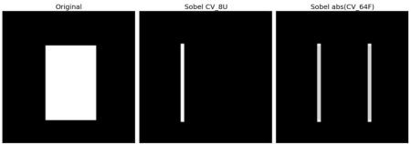

### 3.6.2. function

- `cv.Sobel()`
- `cv.Scharr()`
- `cv.laplacian()`
- `cv.convertScaleAbs()`

## 3.7. Canny Edge Detection

> Learn to find edges with Canny Edge Detection

### 3.7.1. Theory(procedure)

#### 3.7.1.1. Noise Reduction

- first step is to **remove the noise in the image** with a **5x5 Gaussian filter**.
- We have already seen this in previous chapters.

#### 3.7.1.2. Finding Intensity Gradient of the Image

- Smoothened image is then filtered with a Sobel kernel in both horizontal and vertical direction to get first derivative in horizontal direction ( Gx) and vertical direction ( Gy). 
- From these two images, we can find edge gradient and direction for each pixel as follows:

  $Edge_Gradient(G)=\sqrt{G^{2}_{x}+G^{2}_{y}}$

  $Angle(θ)=tan^{−1}(\frac{G_{y}}{G_{x}})$

- Gradient direction is always perpendicular to edges.
- It is rounded to one of four angles **representing vertical, horizontal and two diagonal directions**.

#### 3.7.1.3. Non-maximum Suppression

- After getting gradient magnitude and direction, a full scan of image is done to remove any unwanted pixels which may not constitute the edge.
- at every pixel
  - **for every direction (vertical, horizontal and two diagonal directions)**
  - pixel is checked if it is a local maximum in its neighborhood in the direction of gradient.

- example

  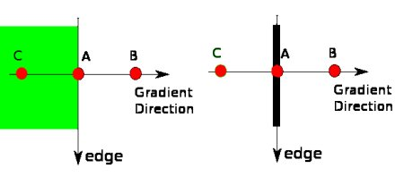

  - Point A is on the edge ( in vertical direction).
  - Point B and C are in gradient directions. 
  - So point A is checked with point B and C to see if it forms a local maximum.
  - If so, it is considered for next stage, otherwise, it is suppressed (put to zero).

- In short, the result you get is a binary image with "thin edges".

#### 3.7.1.4. Hysteresis Thresholding

- This stage decides which are all edges are really edges and which are not.
- For this, we need two threshold values, minVal and maxVal.
  - Any edges with intensity gradient more than maxVal are sure to be edges 
  - and those below minVal are sure to be non-edges, so discarded.
  - Those who lie between these two thresholds are classified edges or non-edges based on their connectivity.
    - If they are connected to "sure-edge" pixels, they are considered to be part of edges.
    - Otherwise, they are also discarded. See the image below:

- example

  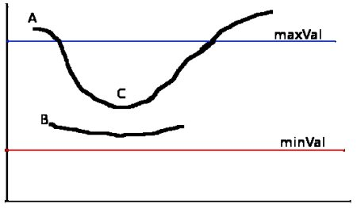

  - A: The edge A is above the maxVal, so considered as "sure-edge".
  - C: Although edge C is below maxVal, it is connected to edge A, so that also considered as valid edge and we get that full curve.
  - B: But edge B, although it is above minVal and is in same region as that of edge C, it is not connected to any "sure-edge", so that is discarded.
  - So it is very important that we have to select minVal and maxVal accordingly to get the correct result.

- This stage **also removes small pixels noises** on the assumption that edges are long lines.

### 3.7.2. Canny Edge Detection in OpenCV

- OpenCV **puts all the above in single function**, `cv.Canny()`.
- We will see how to use it
  - First argument is our input image
  - Second and third arguments are our minVal and maxVal respectively. 
  - Fourth argument is aperture_size
    - It is the size of Sobel kernel used for find image gradients.
    - By default it is 3.
  - Last argument is L2gradient which specifies the equation for finding gradient magnitude. 
    - If it is True, it uses the equation mentioned above which is more accurate
    - otherwise it uses this function: $Edge_Gradient(G)=|G_{x}|+|G_{y}|$.
    - By default, it is False.

- example

  ```python
  import numpy as np
  import cv2 as cv
  from matplotlib import pyplot as plt
  img = cv.imread('messi5.jpg',0)
  edges = cv.Canny(img,100,200)
  plt.subplot(121),plt.imshow(img,cmap = 'gray')
  plt.title('Original Image'), plt.xticks([]), plt.yticks([])
  plt.subplot(122),plt.imshow(edges,cmap = 'gray')
  plt.title('Edge Image'), plt.xticks([]), plt.yticks([])
  plt.show()
  ```

  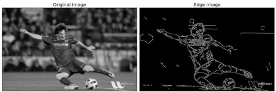

### 3.7.3. function

- `cv.Canny()`

## 3.8. Image Pyramids

> Learn about image pyramids and how to use them for image blending
>
> - learn about Image Pyramids
> - use Image pyramids to blend image

### 3.8.1. example code

#### 3.8.1.1. Theory

- Normally, we used to work with an image of constant size.
- But on some occasions, we need to **work with (the same) images in different resolution**
  - For example, while searching for something in an image, like face, we are not sure at what size the object will be present in said image.
  - In that case, we will need to create a set of the same image with different resolutions and search for object in all of them.
  - These set of images with different resolutions are called Image Pyramids 
    > because when they are kept in a stack with the highest resolution image at the bottom and the lowest resolution image at top, it looks like a pyramid
- There are two kinds of Image Pyramids
  - 1) **Gaussian Pyramid**
    - Higher level (Low resolution) in a Gaussian Pyramid is formed by removing consecutive rows and columns in Lower level (higher resolution) image. 
    - Then each pixel in higher level is formed by the contribution from 5 pixels in underlying level with gaussian weights.
    - By doing so, a M×N image becomes M/2×N/2 image. So area reduces to one-fourth of original area. It is called an Octave.
    - The same pattern continues as we go upper in pyramid (ie, resolution decreases).
    - Similarly while expanding, area becomes 4 times in each level.
    - We can find Gaussian pyramids using cv.pyrDown() and cv.pyrUp() functions.

    ```python
    img = cv.imread('messi5.jpg')
    lower_reso = cv.pyrDown(higher_reso)
    ```

    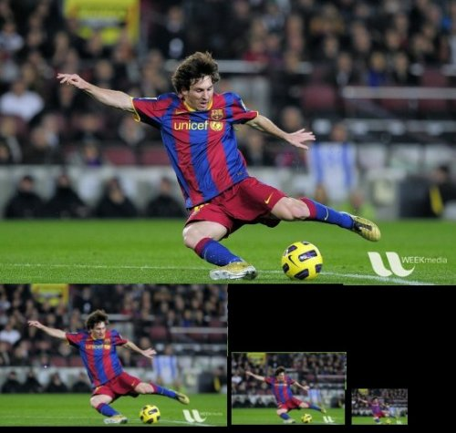

    ```python
    higher_reso2 = cv.pyrUp(lower_reso)
    ```

    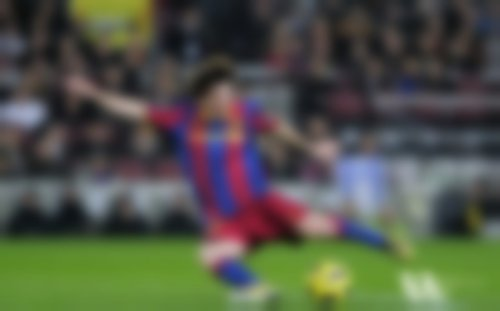

  - 2) **Laplacian Pyramids**
    - Laplacian Pyramids are formed from the Gaussian Pyramids. **There is no exclusive function for that**.
    - Laplacian pyramid images are like **edge images only**. Most of its elements are zeros.
    - They are **used in image compression**.
    - A level in Laplacian Pyramid is formed by **the difference between that level in Gaussian Pyramid and expanded version of its upper level in Gaussian Pyramid**.
    - The three levels of a Laplacian level will look like below (contrast is adjusted to enhance the contents):

    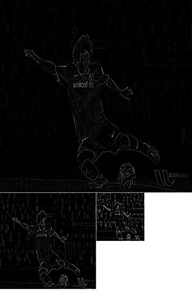

#### 3.8.1.2. Image Blending using Pyramids

- One application of Pyramids is Image Blending.
- For example, in image stitching, you will need to stack two images together, but it may not look good due to discontinuities between images.
- In that case, image blending with Pyramids gives you seamless blending without leaving much data in the images.
- One classical example of this is the blending of two fruits, Orange and Apple:

  - Load the two images of apple and orange
  - Find the Gaussian Pyramids for apple and orange (in this particular example, number of levels is 6)
  - From Gaussian Pyramids, find their Laplacian Pyramids
  - Now join the left half of apple and right half of orange in each levels of Laplacian Pyramids
  - Finally from this joint image pyramids, reconstruct the original image.

  ```python
  import cv2 as cv
  import numpy as np,sys
  A = cv.imread('apple.jpg')
  B = cv.imread('orange.jpg')
  # generate Gaussian pyramid for A
  G = A.copy()
  gpA = [G]
  for i in range(6):
      G = cv.pyrDown(G)
      gpA.append(G)
  # generate Gaussian pyramid for B
  G = B.copy()
  gpB = [G]
  for i in range(6):
      G = cv.pyrDown(G)
      gpB.append(G)
  # generate Laplacian Pyramid for A
  lpA = [gpA[5]]
  for i in range(5,0,-1):
      GE = cv.pyrUp(gpA[i])
      L = cv.subtract(gpA[i-1],GE)
      lpA.append(L)
  # generate Laplacian Pyramid for B
  lpB = [gpB[5]]
  for i in range(5,0,-1):
      GE = cv.pyrUp(gpB[i])
      L = cv.subtract(gpB[i-1],GE)
      lpB.append(L)
  # Now add left and right halves of images in each level
  LS = []
  for la,lb in zip(lpA,lpB):
      rows,cols,dpt = la.shape
      ls = np.hstack((la[:,0:cols//2], lb[:,cols//2:]))
      LS.append(ls)
  # now reconstruct
  ls_ = LS[0]
  for i in range(1,6):
      ls_ = cv.pyrUp(ls_)
      ls_ = cv.add(ls_, LS[i])
  # image with direct connecting each half
  real = np.hstack((A[:,:cols//2],B[:,cols//2:]))
  cv.imwrite('Pyramid_blending2.jpg',ls_)
  cv.imwrite('Direct_blending.jpg',real)
  ```

  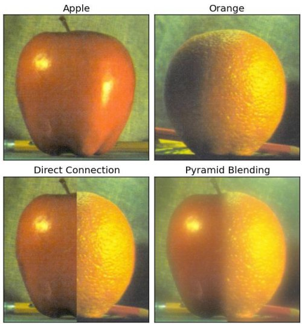

### 3.8.2. function

## 3.9. Contours in OpenCV

All about Contours in OpenCV

### 3.9.1. Contours:Getting Started

Learn to find and draw Contours

#### 3.9.1.1. What are contours?

- explain
  - Contours can be explained simply as a curve joining all the continuous points (along the boundary), having same color or intensity.
  - The contours are a useful tool for shape analysis and object detection and recognition.
- opencv's finding contours
  - For better accuracy, use binary images. So before finding contours, apply threshold or canny edge detection.
  - Since OpenCV 3.2, `findContours()` no longer modifies the source image.
  - In OpenCV, **finding contours is like finding white object from black background**.
  - So remember, object to be found should be white and background should be black.

- `findContours()`
  - args:
    - first one is source image, 
    - second is contour retrieval mode,
    - third is contour approximation method
  - return
    - contours 
      - Contours is a **Python list** of **all the contours** in the image. 
        ```
        [
          [[x1,y1],[x2,y2],...], // one contour
          [[x1,y1],[x2,y2],...],
          [[x1,y1],[x2,y2],...],
        ]
        ```
      - Each individual contour is a Numpy array of (x,y) coordinates of boundary points of the object.
    - hierarchy
      > will discuss second and third arguments and about hierarchy in details later.
      > Until then, the values given to them in code sample will work fine for all images.

- demo

  ```python
  import numpy as np
  import cv2 as cv
  im = cv.imread('test.jpg')
  imgray = cv.cvtColor(im, cv.COLOR_BGR2GRAY)
  ret, thresh = cv.threshold(imgray, 127, 255, 0)
  contours, hierarchy = cv.findContours(thresh, cv.RETR_TREE, cv.CHAIN_APPROX_SIMPLE)
  ```

#### 3.9.1.2. How to draw the contours?

To draw the contours, `cv.drawContours` function is used. It can also be used to draw any shape provided you have its boundary points.

- `cv.drawContours` args:
  - Its first argument is source image
  - second argument is the contours which should be passed as a Python list
  - third argument is index of contours (useful when drawing individual contour. To draw all contours, pass -1) 
  - remaining arguments are color, thickness etc.

- demo
  - To draw all the contours in an image:

    ```python
    cv.drawContours(img, contours, -1, (0,255,0), 3)
    ```
  - To draw an individual contour, say 4th contour:

    ```python
    cv.drawContours(img, contours, 3, (0,255,0), 3)
    ```
  - But most of the time, below method will be useful:

    ```python
    cnt = contours[4]
    cv.drawContours(img, [cnt], 0, (0,255,0), 3)
    ```

    > **same with above, but when you go forward, you will see last one is more useful**

#### 3.9.1.3. Contour Approximation Method

> This is the third argument in cv.findContours function. 

- what does Contour Approximation Method do
  - Above, we told that contours are the boundaries of a shape with same intensity.
  - It stores the (x,y) coordinates of the boundary of a shape.
  - But **does it store all the coordinates** ? That is **specified by this contour approximation method**.

- Contour Approximation Method
  - `cv.CHAIN_APPROX_NONE`
    - **all the boundary points are stored**.
    - But actually do we need all the points?
    - For eg, you found the contour of a straight line. Do you need all the points on the line to represent that line? No, we need just two end points of that line.
  - `cv.CHAIN_APPROX_SIMPLE` does. 
    - It removes all redundant points and compresses the contour, thereby saving memory.

- demo
  - Below image of a rectangle demonstrate this technique.
  - Just draw a circle on all the coordinates in the contour array (drawn in blue color).
  - First image shows points I got with `cv.CHAIN_APPROX_NONE` (734 points) and second image shows the one with `cv.CHAIN_APPROX_SIMPLE` (only 4 points).

  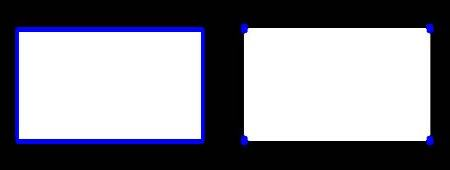

### 3.9.2. Contour Features

> Learn to find different features of contours like area, perimeter, bounding rectangle etc.
>
> - To find the different features of contours, like area, perimeter, centroid, bounding box etc
> - You will see plenty of functions related to contours.

#### 3.9.2.1. Moments

- Image moments help you to calculate some features like center of mass of the object, area of the object etc.
- The function cv.moments() gives a dictionary of all moment values calculated. See below:

  ```python
  import numpy as np
  import cv2 as cv
  img = cv.imread('star.jpg',0)
  ret,thresh = cv.threshold(img,127,255,0)
  contours,hierarchy = cv.findContours(thresh, 1, 2)
  cnt = contours[0]
  M = cv.moments(cnt)
  print( M )
  ```
- From this moments, you can extract useful data like area, centroid etc.
- Centroid is given by the relations: $C_{x}=M_{10}M_{00} and C_{y}=M_{01}M_{00}$. This can be done as follows:

  ```python
  cx = int(M['m10']/M['m00'])
  cy = int(M['m01']/M['m00'])
  ```

#### 3.9.2.2. Contour Area

- Contour area is given by the function `cv.contourArea()` or from moments, M['m00'].

  ```python
  area = cv.contourArea(cnt)
  # or
  M = cv.moments(cnt)['m00']
  ```

#### 3.9.2.3. Contour Perimeter

- It is also called arc length. It can be found out using `cv.arcLength()` function.
- Second argument specify whether shape is a closed contour (if passed True), or just a curve.

  ```python
  perimeter = cv.arcLength(cnt,True)
  ```

#### 3.9.2.4. Contour Approximation

- define
  - It approximates a contour shape to another shape with less number of vertices depending upon the precision we specify.
  - It is an implementation of `Douglas-Peucker algorithm`.
    > Check the wikipedia page for algorithm and demonstration.

- explain
  - To understand this, suppose you are trying to find a square in an image, 
  - but due to some problems in the image, you didn't get a perfect square, but a "bad shape" (As shown in first image below).
  - Now you can use this function to approximate the shape.
  - In this, second argument is called epsilon, which is **maximum distance from contour to approximated contour**.
  - It is an accuracy parameter. A wise selection of epsilon is needed to get the correct output.

- demo

  ```
  epsilon = 0.1*cv.arcLength(cnt,True)
  approx = cv.approxPolyDP(cnt,epsilon,True)
  ```

  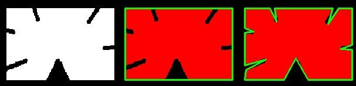

  - in second image, green line shows the approximated curve for epsilon = 10% of arc length.
  - Third image shows the same for epsilon = 1% of the arc length.
  - Third argument specifies whether curve is closed or not.

#### 3.9.2.5. Convex Hull

- explain
  - Convex Hull will look similar to contour approximation, but it is not
  - **Both may provide same results in some cases**.
  - Here, `cv.convexHull()` function checks a curve for convexity defects and corrects it.
  - Generally speaking, 
    - **convex curves** are the curves which are always bulged out, or at-least flat
    - And if it is bulged inside, it is called **convexity defects**

- Arguments details:
  > hull = cv.convexHull(points[, hull[, clockwise[, returnPoints]]])
  - `points` are the contours we pass into.
  - `hull` is the output, normally we avoid it.
  - `clockwise` : Orientation flag. If it is True, the output convex hull is oriented clockwise. Otherwise, it is oriented counter-clockwise.
  - `returnPoints` : 
    - By default, True. Then it returns the coordinates of the hull points.
    - If False, it returns the indices of contour points corresponding to the hull points.

- For example, check the below image of hand.
  - Red line shows the convex hull of hand.
  - The double-sided arrow marks shows the convexity defects, which are the local maximum deviations of hull from contours.

  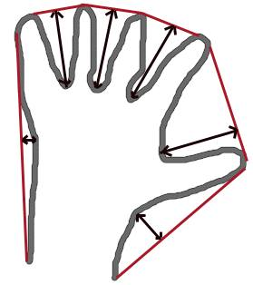

  ```
  hull = cv.convexHull(cnt)
  ```

But if you want to find convexity defects, you need to pass returnPoints = False.
To understand it, we will take the rectangle image above.
First I found its contour as cnt.
Now I found its convex hull with returnPoints = True, I got following values: [[[234 202]], [[ 51 202]], [[ 51 79]], [[234 79]]] which are the four corner points of rectangle. 
Now if do the same with returnPoints = False, I get following result: [[129],[ 67],[ 0],[142]]. These are the indices of corresponding points in contours.
For eg, check the first value: cnt[129] = [[234, 202]] which is same as first result (and so on for others).

#### 3.9.2.6. Checking Convexity

- check if a curve is convex or not. It just return whether True or False. Not a big deal.

  ```python
  k = cv.isContourConvex(cnt)
  ```

### 3.9.3. Contour Bounding

#### 3.9.3.1. Bounding Rectangle

- Straight Bounding Rectangle
  - It is a straight rectangle, it **doesn't consider the rotation of the object**.
  - So area of the bounding rectangle won't be minimum. It is found by the function `cv.boundingRect()`.
  - Let (x,y) be the top-left coordinate of the rectangle and (w,h) be its width and height.
- Rotated Rectangle
  - Here, bounding rectangle is drawn with **minimum area**, so it considers the rotation also.
  - The function used is `cv.minAreaRect()`.
  - It returns a Box2D structure which contains following details - ( center (x,y), (width, height), angle of rotation )
  - But to draw this rectangle, we need 4 corners of the rectangle. It is obtained by the function cv.boxPoints()

- demo
  ```python
  x,y,w,h = cv.boundingRect(cnt)
  cv.rectangle(img,(x,y),(x+w,y+h),(0,255,0),2)
  ```
  ```python
  rect = cv.minAreaRect(cnt)
  box = cv.boxPoints(rect)
  box = np.int0(box)
  cv.drawContours(img,[box],0,(0,0,255),2) # draw bounding box by `drawContours`
  ```

  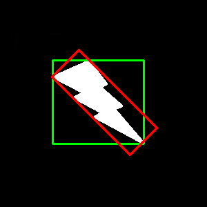 

  > Green rectangle shows the normal bounding rect.<br />
  > Red rectangle is the rotated rect.

#### 3.9.3.2. Minimum Enclosing Circle

Next we find the circumcircle of an object using the function cv.minEnclosingCircle(). It is a circle which completely covers the object with minimum area.

```python
(x,y),radius = cv.minEnclosingCircle(cnt)
center = (int(x),int(y))
radius = int(radius)
cv.circle(img,center,radius,(0,255,0),2)
```

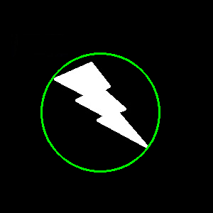

#### 3.9.3.3. Fitting an Ellipse

Next one is to fit an ellipse to an object. It returns the rotated rectangle in which the ellipse is inscribed.

```python
ellipse = cv.fitEllipse(cnt)
cv.ellipse(img,ellipse,(0,255,0),2)
```


#### 3.9.3.4. Fitting a Line

Similarly we can fit a line to a set of points. Below image contains a set of white points. We can approximate a straight line to it.

```python
rows,cols = img.shape[:2]
[vx,vy,x,y] = cv.fitLine(cnt, cv.DIST_L2,0,0.01,0.01)
lefty = int((-x*vy/vx) + y)
righty = int(((cols-x)*vy/vx)+y)
cv.line(img,(cols-1,righty),(0,lefty),(0,255,0),2)
```

### 3.9.4. Contour Properties

Learn to find different properties of contours like Solidity, Mean Intensity etc.

### 3.9.5. Contours:More Functions

Learn to find convexity defects, pointPolygonTest, match different shapes etc.

### 3.9.6. Contours Hierarchy

Learn about Contour Hierarchy

## 3.10. Histograms in OpenCV

All about histograms in OpenCV

### Find, Plot, Analyze !!!

Learn the basics of histograms

### Histogram Equalization

Learn to Equalize Histograms to get better contrast for images

### 2D Histograms

Learn to find and plot 2D Histograms

### Histogram Backprojection

Learn histogram backprojection to segment colored objects

## 3.11. Image Transforms in OpenCV

> Meet different Image Transforms in OpenCV like Fourier Transform, Cosine Transform etc.

### Fourier Transform

#### Theory

#### Fourier Transform in Numpy

```python
  import cv2 as cv
  import numpy as np
  from matplotlib import pyplot as plt
  img = cv.imread('messi5.jpg',0)
  f = np.fft.fft2(img)
  fshift = np.fft.fftshift(f)
  magnitude_spectrum = 20*np.log(np.abs(fshift))
  plt.subplot(121),plt.imshow(img, cmap = 'gray')
  plt.title('Input Image'), plt.xticks([]), plt.yticks([])
  plt.subplot(122),plt.imshow(magnitude_spectrum, cmap = 'gray')
  plt.title('Magnitude Spectrum'), plt.xticks([]), plt.yticks([])
  plt.show()
```

#### Fourier Transform in OpenCV

```python
  import numpy as np
  import cv2 as cv
  from matplotlib import pyplot as plt
  img = cv.imread('messi5.jpg',0)
  dft = cv.dft(np.float32(img),flags = cv.DFT_COMPLEX_OUTPUT)
  dft_shift = np.fft.fftshift(dft)
  magnitude_spectrum = 20*np.log(cv.magnitude(dft_shift[:,:,0],dft_shift[:,:,1]))
  plt.subplot(121),plt.imshow(img, cmap = 'gray')
  plt.title('Input Image'), plt.xticks([]), plt.yticks([])
  plt.subplot(122),plt.imshow(magnitude_spectrum, cmap = 'gray')
  plt.title('Magnitude Spectrum'), plt.xticks([]), plt.yticks([])
  plt.show()
```

#### Performance Optimization of DFT

#### Why Laplacian is a High Pass Filter?

```python
  import cv2 as cv
  import numpy as np
  from matplotlib import pyplot as plt
  # simple averaging filter without scaling parameter
  mean_filter = np.ones((3,3))
  # creating a gaussian filter
  x = cv.getGaussianKernel(5,10)
  gaussian = x*x.T
  # different edge detecting filters
  # scharr in x-direction
  scharr = np.array([[-3, 0, 3],
                     [-10,0,10],
                     [-3, 0, 3]])
  # sobel in x direction
  sobel_x= np.array([[-1, 0, 1],
                     [-2, 0, 2],
                     [-1, 0, 1]])
  # sobel in y direction
  sobel_y= np.array([[-1,-2,-1],
                     [0, 0, 0],
                     [1, 2, 1]])
  # laplacian
  laplacian=np.array([[0, 1, 0],
                      [1,-4, 1],
                      [0, 1, 0]])
  filters = [mean_filter, gaussian, laplacian, sobel_x, sobel_y, scharr]
  filter_name = ['mean_filter', 'gaussian','laplacian', 'sobel_x', \
                  'sobel_y', 'scharr_x']
  fft_filters = [np.fft.fft2(x) for x in filters]
  fft_shift = [np.fft.fftshift(y) for y in fft_filters]
  mag_spectrum = [np.log(np.abs(z)+1) for z in fft_shift]
  for i in range(6):
      plt.subplot(2,3,i+1),plt.imshow(mag_spectrum[i],cmap = 'gray')
      plt.title(filter_name[i]), plt.xticks([]), plt.yticks([])
  plt.show()
```

#### function

- `cv.dft()`
- `cv.idft()`

## 3.12. Template Matching

Learn to search for an object in an image using Template Matching

### 3.12.1. example code

### Template Matching in OpenCV

```python
  import cv2 as cv
  import numpy as np
  from matplotlib import pyplot as plt
  img = cv.imread('messi5.jpg',0)
  img2 = img.copy()
  template = cv.imread('template.jpg',0)
  w, h = template.shape[::-1]
  # All the 6 methods for comparison in a list
  methods = ['cv.TM_CCOEFF', 'cv.TM_CCOEFF_NORMED', 'cv.TM_CCORR',
              'cv.TM_CCORR_NORMED', 'cv.TM_SQDIFF', 'cv.TM_SQDIFF_NORMED']
  for meth in methods:
      img = img2.copy()
      method = eval(meth)
      # Apply template Matching
      res = cv.matchTemplate(img,template,method)
      min_val, max_val, min_loc, max_loc = cv.minMaxLoc(res)
      # If the method is TM_SQDIFF or TM_SQDIFF_NORMED, take minimum
      if method in [cv.TM_SQDIFF, cv.TM_SQDIFF_NORMED]:
          top_left = min_loc
      else:
          top_left = max_loc
      bottom_right = (top_left[0] + w, top_left[1] + h)
      cv.rectangle(img,top_left, bottom_right, 255, 2)
      plt.subplot(121),plt.imshow(res,cmap = 'gray')
      plt.title('Matching Result'), plt.xticks([]), plt.yticks([])
      plt.subplot(122),plt.imshow(img,cmap = 'gray')
      plt.title('Detected Point'), plt.xticks([]), plt.yticks([])
      plt.suptitle(meth)
      plt.show()
```

#### Template Matching with Multiple Objects

```python
  import cv2 as cv
  import numpy as np
  from matplotlib import pyplot as plt
  img_rgb = cv.imread('mario.png')
  img_gray = cv.cvtColor(img_rgb, cv.COLOR_BGR2GRAY)
  template = cv.imread('mario_coin.png',0)
  w, h = template.shape[::-1]
  res = cv.matchTemplate(img_gray,template,cv.TM_CCOEFF_NORMED)
  threshold = 0.8
  loc = np.where( res >= threshold)
  for pt in zip(*loc[::-1]):
      cv.rectangle(img_rgb, pt, (pt[0] + w, pt[1] + h), (0,0,255), 2)
  cv.imwrite('res.png',img_rgb)
```

### 3.12.2. function

- `cv2.matchTemplate()`
  - [TemplateMatchModes](https://docs.opencv.org/4.x/df/dfb/group__imgproc__object.html#ga3a7850640f1fe1f58fe91a2d7583695d)


## 3.13. Hough Line Transform

Learn to detect lines in an image

### 3.13.1. example code

### 3.13.2. function

## 3.14. Hough Circle Transform

Learn to detect circles in an image

### 3.14.1. example code

### 3.14.2. function

## 3.15. Image Segmentation with Watershed Algorithm

Learn to segment images with watershed segmentation

### 3.15.1. example code

### 3.15.2. function

## 3.16. Interactive Foreground Extraction using GrabCut Algorithm

Learn to extract foreground with GrabCut algorithm

### 3.16.1. example code

### 3.16.2. function

# 4. Feature Detection and Description

In this section you will learn about feature detectors and descriptors

## 4.1. Understanding Features

What are the main features in an image? How can finding those features be useful to us?

### 4.1.1. example code

### 4.1.2. function

## 4.2. Harris Corner Detection

Okay, Corners are good features? But how do we find them?

### 4.2.1. example code

### 4.2.2. function

## 4.3. Shi-Tomasi Corner Detector & Good Features to Track

We will look into Shi-Tomasi corner detection

### 4.3.1. example code

### 4.3.2. function

## 4.4. Introduction to SIFT (Scale-Invariant Feature Transform)

Harris corner detector is not good enough when scale of image changes. Lowe developed a breakthrough method to find scale-invariant features and it is called SIFT

### 4.4.1. example code

### 4.4.2. function

## 4.5. Introduction to SURF (Speeded-Up Robust Features)

SIFT is really good, but not fast enough, so people came up with a speeded-up version called SURF.

### 4.5.1. example code

### 4.5.2. function

## 4.6. FAST Algorithm for Corner Detection

All the above feature detection methods are good in some way. But they are not fast enough to work in real-time applications like SLAM. There comes the FAST algorithm, which is really "FAST".

### 4.6.1. example code

### 4.6.2. function

## 4.7. BRIEF (Binary Robust Independent Elementary Features)

SIFT uses a feature descriptor with 128 floating point numbers. Consider thousands of such features. It takes lots of memory and more time for matching. We can compress it to make it faster. But still we have to calculate it first. There comes BRIEF which gives the shortcut to find binary descriptors with less memory, faster matching, still higher recognition rate.

### 4.7.1. example code

### 4.7.2. function

## 4.8. ORB (Oriented FAST and Rotated BRIEF)

SIFT and SURF are good in what they do, but what if you have to pay a few dollars every year to use them in your applications? Yeah, they are patented!!! To solve that problem, OpenCV devs came up with a new "FREE" alternative to SIFT & SURF, and that is ORB.

### 4.8.1. example code

### 4.8.2. function

## 4.9. Feature Matching

We know a great deal about feature detectors and descriptors. It is time to learn how to match different descriptors. OpenCV provides two techniques, Brute-Force matcher and FLANN based matcher.

### 4.9.1. example code

### 4.9.2. function

## 4.10. Feature Matching + Homography to find Objects

Now we know about feature matching. Let's mix it up with calib3d module to find objects in a complex image.

### 4.10.1. example code

### 4.10.2. function

# 5. Video analysis (video module)

In this section you will learn different techniques to work with videos like object tracking etc.

# 6. Camera Calibration and 3D Reconstruction

In this section we will learn about camera calibration, stereo imaging etc.

# 7. Machine Learning

In this section you will learn different image processing functions inside OpenCV.

# 8. Computational Photography

In this section you will learn different computational photography techniques like image denoising etc.

# 9. Object Detection (objdetect module)

In this section you will learn object detection techniques like face detection etc.

# 10. OpenCV-Python Bindings

In this section, we will see how OpenCV-Python bindings are generated

# 11. refs

- [OpenCV-Python Tutorials](https://docs.opencv.org/4.x/d6/d00/tutorial_py_root.html)
- [OpenCV Image Processing doc](https://docs.opencv.org/4.x/d7/dbd/group__imgproc.html)
- [如何理解图像深度- 8bit、16bit、24bit、32bi](https://blog.csdn.net/qq_41498261/article/details/104898045)
- [2.2. Advanced NumPy](http://scipy-lectures.org/advanced/advanced_numpy/index.html#advanced-numpy)
- [HSV颜色模型](https://zhuanlan.zhihu.com/p/67930839)
- [线性变换与仿射变换](https://www.zhihu.com/question/20666664)
