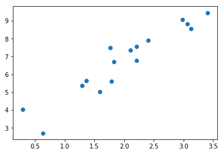
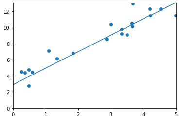

# 1. 第三章 PyTorch基础：Tensor和Autograd

## 1.1. Tensor

Tensor，又名张量，读者可能对这个名词似曾相识，因它不仅在PyTorch中出现过，它也是Theano、TensorFlow、
Torch和MxNet中重要的数据结构。关于张量的本质不乏深度的剖析，但从工程角度来讲，可简单地认为它就是一个数组，且支持高效的科学计算。它可以是一个数（标量）、一维数组（向量）、二维数组（矩阵）和更高维的数组（高阶数据）。Tensor和Numpy的ndarrays类似，但PyTorch的tensor支持GPU加速。

本节将系统讲解tensor的使用，力求面面俱到，但不会涉及每个函数。对于更多函数及其用法，读者可通过在IPython/Notebook中使用函数名加`?`查看帮助文档，或查阅PyTorch官方文档[^1]。

[^1]: http://docs.pytorch.org


```python
# Let's begin
from __future__ import print_function
import torch  as t
t.__version__
```


    '1.7.0'


### 1.1.1. 基础操作

学习过Numpy的读者会对本节内容感到非常熟悉，因tensor的接口有意设计成与Numpy类似，以方便用户使用。但不熟悉Numpy也没关系，本节内容并不要求先掌握Numpy。

从接口的角度来讲，对tensor的操作可分为两类：

1. `torch.function`，如`torch.save`等。
2. 另一类是`tensor.function`，如`tensor.view`等。

为方便使用，对tensor的大部分操作同时支持这两类接口，在本书中不做具体区分，如`torch.sum (torch.sum(a, b))`与`tensor.sum (a.sum(b))`功能等价。

而从存储的角度来讲，对tensor的操作又可分为两类：

1. 不会修改自身的数据，如 `a.add(b)`， 加法的结果会返回一个新的tensor。
2. 会修改自身的数据，如 `a.add_(b)`， 加法的结果仍存储在a中，a被修改了。

函数名以`_`结尾的都是inplace方式, 即会修改调用者自己的数据，在实际应用中需加以区分。

#### 1.1.1.1. 创建Tensor

在PyTorch中新建tensor的方法有很多，具体如表3-1所示。

表3-1: 常见新建tensor的方法

|函数|功能|
|:---:|:---:|
|Tensor(\*sizes)|基础构造函数|
|tensor(data,)|类似np.array的构造函数|
|ones(\*sizes)|全1Tensor|
|zeros(\*sizes)|全0Tensor|
|eye(\*sizes)|对角线为1，其他为0|
|arange(s,e,step|从s到e，步长为step|
|linspace(s,e,steps)|从s到e，均匀切分成steps份|
|rand/randn(\*sizes)|均匀/标准分布|
|normal(mean,std)/uniform(from,to)|正态分布/均匀分布|
|randperm(m)|随机排列|

这些创建方法都可以在创建的时候指定数据类型dtype和存放device(cpu/gpu).


其中使用`Tensor`函数新建tensor是最复杂多变的方式，它既可以接收一个list，并根据list的数据新建tensor，也能根据指定的形状新建tensor，还能传入其他的tensor，下面举几个例子。


```python
# 指定tensor的形状
a = t.Tensor(2, 3)
a # 数值取决于内存空间的状态，print时候可能overflow
```


    tensor([[-8.5769e-19,  4.5622e-41,  0.0000e+00],
            [ 0.0000e+00,  0.0000e+00,  0.0000e+00]])


```python
# 用list的数据创建tensor
b = t.Tensor([[1,2,3],[4,5,6]])
b
```


    tensor([[1., 2., 3.],
            [4., 5., 6.]])


```python
# 注意，推荐tensor用来传数据。Tensor用来传size
b = t.tensor([[1,2,3],[4,5,6]])
b
```


    tensor([[1, 2, 3],
            [4, 5, 6]])


```python
b.tolist() # 把tensor转为list
```


    [[1.0, 2.0, 3.0], [4.0, 5.0, 6.0]]


`tensor.size()`返回`torch.Size`对象，它是tuple的子类，但其使用方式与tuple略有区别


```python
b_size = b.size()
b_size
```


    torch.Size([2, 3])


```python
b.numel() # b中元素总个数，2*3，等价于b.nelement()
```


    6


```python
# 创建一个和b形状一样的tensor
c = t.Tensor(b_size)
# 创建一个元素为2和3的tensor
d = t.Tensor((2, 3))
c, d
```


    (tensor([[-8.5771e-19,  4.5622e-41, -8.5256e-19],
             [ 4.5622e-41, -2.7717e-24,  4.5622e-41]]), tensor([2., 3.]))


除了`tensor.size()`，还可以利用`tensor.shape`直接查看tensor的形状，`tensor.shape`等价于`tensor.size()`


```python
c.shape
```


    torch.Size([2, 3])


需要注意的是，`t.Tensor(*sizes)`创建tensor时，**系统不会马上分配空间**，只是会计算剩余的内存是否足够使用，使用到tensor时才会分配，而其它操作都是在创建完tensor之后马上进行空间分配。其它常用的创建tensor的方法举例如下。


```python
t.ones(2, 3)
```


    tensor([[1., 1., 1.],
            [1., 1., 1.]])


```python
t.zeros(2, 3)
```


    tensor([[0., 0., 0.],
            [0., 0., 0.]])


```python
t.arange(1, 6, 2)
```


    tensor([1, 3, 5])


```python
t.linspace(1, 10, 3)
```


    tensor([ 1.0000,  5.5000, 10.0000])


```python
t.randn(2, 3, device=t.device('cpu'))
```


    tensor([[-0.1163, -0.1111, -0.0152],
            [-0.3127,  2.1007,  0.1645]])


```python
t.randperm(5) # 长度为5的随机排列
```


    tensor([4, 3, 1, 2, 0])


```python
t.eye(2, 3, dtype=t.int) # 对角线为1, 不要求行列数一致
```


    tensor([[1, 0, 0],
            [0, 1, 0]], dtype=torch.int32)


`torch.tensor`是在0.4版本新增加的一个新版本的创建tensor方法，使用的方法，和参数几乎和`np.array`完全一致


```python
scalar = t.tensor(3.14159) 
print('scalar: %s, shape of sclar: %s' %(scalar, scalar.shape))
```

    scalar: tensor(3.1416), shape of sclar: torch.Size([])
    


```python
vector = t.tensor([1, 2])
print('vector: %s, shape of vector: %s' %(vector, vector.shape))
```

    vector: tensor([1, 2]), shape of vector: torch.Size([2])
    


```python
tensor = t.Tensor(1,2) # 注意和t.tensor([1, 2])的区别
tensor.shape
```


    torch.Size([1, 2])


```python
matrix = t.tensor([[0.1, 1.2], [2.2, 3.1], [4.9, 5.2]])
matrix,matrix.shape
```


    (tensor([[0.1000, 1.2000],
             [2.2000, 3.1000],
             [4.9000, 5.2000]]), torch.Size([3, 2]))


```python
t.tensor([[0.11111, 0.222222, 0.3333333]],
                     dtype=t.float64,
                     device=t.device('cpu'))
```


    tensor([[0.1111, 0.2222, 0.3333]], dtype=torch.float64)


```python
empty_tensor = t.tensor([])
empty_tensor.shape
```


    torch.Size([0])


#### 1.1.1.2. 常用Tensor操作

通过`tensor.view`方法可以调整tensor的形状，但必须保证调整前后元素总数一致。`view`不会修改自身的数据，返回的新tensor与源tensor共享内存，也即更改其中的一个，另外一个也会跟着改变。在实际应用中可能经常需要添加或减少某一维度，这时候`squeeze`和`unsqueeze`两个函数就派上用场了。


```python
a = t.arange(0, 6)
a.view(2, 3)
```


    tensor([[0, 1, 2],
            [3, 4, 5]])


```python
b = a.view(-1, 3) # 当某一维为-1的时候，会自动计算它的大小
b.shape
```


    torch.Size([2, 3])


```python
b.unsqueeze(1) # 注意形状，在第1维（下标从0开始）上增加“１” 
#等价于 b[:,None]
b[:, None].shape
```


    torch.Size([2, 1, 3])


```python
b.unsqueeze(-2) # -2表示倒数第二个维度
```


    tensor([[[0, 1, 2]],
    
            [[3, 4, 5]]])


```python
c = b.view(1, 1, 1, 2, 3)
c.squeeze(0) # 压缩第0维的“１”
```


    tensor([[[[0, 1, 2],
              [3, 4, 5]]]])


```python
c.squeeze() # 把所有维度为“1”的压缩
```


    tensor([[0, 1, 2],
            [3, 4, 5]])


```python
a[1] = 100
b # a修改，b作为view之后的，也会跟着修改
```


    tensor([[  0, 100,   2],
            [  3,   4,   5]])


`resize`是另一种可用来调整`size`的方法，但与`view`不同，它可以修改tensor的大小。如果新大小超过了原大小，会自动分配新的内存空间，而如果新大小小于原大小，则之前的数据依旧会被保存，看一个例子。


```python
b.resize_(1, 3)
b
```


    tensor([[  0, 100,   2]])


```python
b.resize_(3, 3) # 旧的数据依旧保存着，多出的大小会分配新空间
b
```


    tensor([[  0, 100,   2],
            [  3,   4,   5],
            [  0,   0, 112]])


#### 1.1.1.3. 索引操作

Tensor支持与numpy.ndarray类似的索引操作，语法上也类似，下面通过一些例子，讲解常用的索引操作。如无特殊说明，索引出来的结果与原tensor共享内存，也即修改一个，另一个会跟着修改。


```python
a = t.randn(3, 4)
a
```


    tensor([[ 1.1741,  1.4335, -0.8156,  0.7622],
            [-0.6334, -1.4628, -0.7428,  0.0410],
            [-0.6551,  1.0258,  2.0572,  0.3923]])


```python
a[0] # 第0行(下标从0开始)
```


    tensor([ 1.1741,  1.4335, -0.8156,  0.7622])


```python
a[:, 0] # 第0列
```


    tensor([ 1.1741, -0.6334, -0.6551])


```python
a[0][2] # 第0行第2个元素，等价于a[0, 2]
```


    tensor(-0.8156)


```python
a[0, -1] # 第0行最后一个元素
```


    tensor(0.7622)


```python
a[:2] # 前两行
```


    tensor([[ 1.1741,  1.4335, -0.8156,  0.7622],
            [-0.6334, -1.4628, -0.7428,  0.0410]])


```python
a[:2, 0:2] # 前两行，第0,1列
```


    tensor([[ 1.1741,  1.4335],
            [-0.6334, -1.4628]])


```python
print(a[0:1, :2]) # 第0行，前两列 
print(a[0, :2]) # 注意两者的区别：形状不同
```

    tensor([[1.1741, 1.4335]])
    tensor([1.1741, 1.4335])
    


```python
# None类似于np.newaxis, 为a新增了一个轴
# 等价于a.view(1, a.shape[0], a.shape[1])
a[None].shape
```


    torch.Size([1, 3, 4])


```python
a[None].shape # 等价于a[None,:,:]
```


    torch.Size([1, 3, 4])


```python
a[:,None,:].shape
```


    torch.Size([3, 1, 4])


```python
a[:,None,:,None,None].shape
```


    torch.Size([3, 1, 4, 1, 1])


```python
a > 1 # 返回一个ByteTensor
```


    tensor([[1, 1, 0, 0],
            [0, 0, 0, 0],
            [0, 1, 1, 0]], dtype=torch.uint8)


```python
a[a>1] # 等价于a.masked_select(a>1)
# 选择结果与原tensor不共享内存空间
```


    tensor([1.1741, 1.4335, 1.0258, 2.0572])


```python
a[t.LongTensor([0,1])] # 第0行和第1行
```


    tensor([[ 1.1741,  1.4335, -0.8156,  0.7622],
            [-0.6334, -1.4628, -0.7428,  0.0410]])


其它常用的选择函数如表3-2所示。

表3-2常用的选择函数

函数|功能|
:---:|:---:|
index_select(input, dim, index)|在指定维度dim上选取，比如选取某些行、某些列
masked_select(input, mask)|例子如上，a[a>0]，使用ByteTensor进行选取
non_zero(input)|非0元素的下标
gather(input, dim, index)|根据index，在dim维度上选取数据，输出的size与index一样


`gather`是一个比较复杂的操作，对一个2维tensor，输出的每个元素如下：

```python
out[i][j] = input[index[i][j]][j]  # dim=0
out[i][j] = input[i][index[i][j]]  # dim=1
```
三维tensor的`gather`操作同理，下面举几个例子。


```python
a = t.arange(0, 16).view(4, 4)
a
```


    tensor([[ 0,  1,  2,  3],
            [ 4,  5,  6,  7],
            [ 8,  9, 10, 11],
            [12, 13, 14, 15]])


```python
# 选取对角线的元素
index = t.LongTensor([[0,1,2,3]])
a.gather(0, index)
```


    tensor([[ 0,  5, 10, 15]])


```python
# 选取反对角线上的元素
index = t.LongTensor([[3,2,1,0]]).t()
a.gather(1, index)
```


    tensor([[ 3],
            [ 6],
            [ 9],
            [12]])


```python
# 选取反对角线上的元素，注意与上面的不同
index = t.LongTensor([[3,2,1,0]])
a.gather(0, index)
```


    tensor([[12,  9,  6,  3]])


```python
# 选取两个对角线上的元素
index = t.LongTensor([[0,1,2,3],[3,2,1,0]]).t()
b = a.gather(1, index)
b
```


    tensor([[ 0,  3],
            [ 5,  6],
            [10,  9],
            [15, 12]])


与`gather`相对应的逆操作是`scatter_`，`gather`把数据从input中按index取出，而`scatter_`是把取出的数据再放回去。注意`scatter_`函数是inplace操作。

```python
out = input.gather(dim, index)
-->近似逆操作
out = Tensor()
out.scatter_(dim, index)
```


```python
# 把两个对角线元素放回去到指定位置
c = t.zeros(4,4)
c.scatter_(1, index, b.float())
```


    tensor([[ 0.,  0.,  0.,  3.],
            [ 0.,  5.,  6.,  0.],
            [ 0.,  9., 10.,  0.],
            [12.,  0.,  0., 15.]])


对tensor的任何索引操作仍是一个tensor，想要获取标准的python对象数值，需要调用`tensor.item()`, 这个方法只对包含一个元素的tensor适用


```python
a[0,0] #依旧是tensor）
```


    tensor(0)


```python
a[0,0].item() # python float
```


    0


```python
d = a[0:1, 0:1, None]
print(d.shape)
d.item() # 只包含一个元素的tensor即可调用tensor.item,与形状无关
```

    torch.Size([1, 1, 1])
    


    0


```python
# a[0].item()  ->
# raise ValueError: only one element tensors can be converted to Python scalars
```

#### 1.1.1.4. 高级索引
PyTorch在0.2版本中完善了索引操作，目前已经支持绝大多数numpy的高级索引[^10]。高级索引可以看成是普通索引操作的扩展，但是高级索引操作的结果一般不和原始的Tensor共享内存。 
[^10]: https://docs.scipy.org/doc/numpy/reference/arrays.indexing.html#advanced-indexing


```python
x = t.arange(0,27).view(3,3,3)
x
```


    tensor([[[ 0,  1,  2],
             [ 3,  4,  5],
             [ 6,  7,  8]],
    
            [[ 9, 10, 11],
             [12, 13, 14],
             [15, 16, 17]],
    
            [[18, 19, 20],
             [21, 22, 23],
             [24, 25, 26]]])


```python
x[[1, 2], [1, 2], [2, 0]] # x[1,1,2]和x[2,2,0]
```


    tensor([14, 24])


```python
x[[2, 1, 0], [0], [1]] # x[2,0,1],x[1,0,1],x[0,0,1]
```


    tensor([19, 10,  1])


```python
x[[0, 2], ...] # x[0] 和 x[2]
```


    tensor([[[ 0,  1,  2],
             [ 3,  4,  5],
             [ 6,  7,  8]],
    
            [[18, 19, 20],
             [21, 22, 23],
             [24, 25, 26]]])


#### 1.1.1.5. Tensor类型

Tensor有不同的数据类型，如表3-3所示，每种类型分别对应有CPU和GPU版本(HalfTensor除外)。默认的tensor是FloatTensor，可通过`t.set_default_tensor_type` 来修改默认tensor类型(如果默认类型为GPU tensor，则所有操作都将在GPU上进行)。Tensor的类型对分析内存占用很有帮助。例如对于一个size为(1000, 1000, 1000)的FloatTensor，它有`1000*1000*1000=10^9`个元素，每个元素占32bit/8 = 4Byte内存，所以共占大约4GB内存/显存。HalfTensor是专门为GPU版本设计的，同样的元素个数，显存占用只有FloatTensor的一半，所以可以极大缓解GPU显存不足的问题，但由于HalfTensor所能表示的数值大小和精度有限[^2]，所以可能出现溢出等问题。

[^2]: https://stackoverflow.com/questions/872544/what-range-of-numbers-can-be-represented-in-a-16-32-and-64-bit-ieee-754-syste

表3-3: tensor数据类型

| Data type                | dtype                             | CPU tensor                                                   | GPU tensor                |
| ------------------------ | --------------------------------- | ------------------------------------------------------------ | ------------------------- |
| 32-bit floating point    | `torch.float32` or `torch.float`  | `torch.FloatTensor`                                          | `torch.cuda.FloatTensor`  |
| 64-bit floating point    | `torch.float64` or `torch.double` | `torch.DoubleTensor`                                         | `torch.cuda.DoubleTensor` |
| 16-bit floating point    | `torch.float16` or `torch.half`   | `torch.HalfTensor`                                           | `torch.cuda.HalfTensor`   |
| 8-bit integer (unsigned) | `torch.uint8`                     | [`torch.ByteTensor`](https://pytorch.org/docs/stable/tensors.html#torch.ByteTensor) | `torch.cuda.ByteTensor`   |
| 8-bit integer (signed)   | `torch.int8`                      | `torch.CharTensor`                                           | `torch.cuda.CharTensor`   |
| 16-bit integer (signed)  | `torch.int16` or `torch.short`    | `torch.ShortTensor`                                          | `torch.cuda.ShortTensor`  |
| 32-bit integer (signed)  | `torch.int32` or `torch.int`      | `torch.IntTensor`                                            | `torch.cuda.IntTensor`    |
| 64-bit integer (signed)  | `torch.int64` or `torch.long`     | `torch.LongTensor`                                           | `torch.cuda.LongTensor`   |

 

各数据类型之间可以互相转换，`type(new_type)`是通用的做法，同时还有`float`、`long`、`half`等快捷方法。CPU tensor与GPU tensor之间的互相转换通过`tensor.cuda`和`tensor.cpu`方法实现，此外还可以使用`tensor.to(device)`。Tensor还有一个`new`方法，用法与`t.Tensor`一样，会调用该tensor对应类型的构造函数，生成与当前tensor类型一致的tensor。`torch.*_like(tensora)` 可以生成和`tensora`拥有同样属性(类型，形状，cpu/gpu)的新tensor。 `tensor.new_*(new_shape)` 新建一个不同形状的tensor。


```python
# 设置默认tensor，注意参数是字符串
t.set_default_tensor_type('torch.DoubleTensor')
```


```python
a = t.Tensor(2,3)
a.dtype # 现在a是DoubleTensor,dtype是float64
```


    torch.float64


```python
# 恢复之前的默认设置
t.set_default_tensor_type('torch.FloatTensor')
```


```python
# 把a转成FloatTensor，等价于b=a.type(t.FloatTensor)
b = a.float() 
b.dtype
```


    torch.float32


```python
c = a.type_as(b)
c
```


    tensor([[0., 0., 0.],
            [0., 0., 0.]])


```python
a.new(2,3) # 等价于torch.DoubleTensor(2,3)，建议使用a.new_tensor
```


    tensor([[7.2148e-313, 1.1459e-312, 1.2095e-312],
            [1.0610e-312, 1.4217e-312, 1.4005e-312]], dtype=torch.float64)


```python
t.zeros_like(a) #等价于t.zeros(a.shape,dtype=a.dtype,device=a.device)
```


    tensor([[0., 0., 0.],
            [0., 0., 0.]], dtype=torch.float64)


```python
t.zeros_like(a, dtype=t.int16) #可以修改某些属性
```


    tensor([[0, 0, 0],
            [0, 0, 0]], dtype=torch.int16)


```python
t.rand_like(a)
```


    tensor([[0.3111, 0.3843, 0.1729],
            [0.2693, 0.6378, 0.9917]], dtype=torch.float64)


```python
a.new_ones(4,5, dtype=t.int)
```


    tensor([[1, 1, 1, 1, 1],
            [1, 1, 1, 1, 1],
            [1, 1, 1, 1, 1],
            [1, 1, 1, 1, 1]], dtype=torch.int32)


```python
a.new_tensor([3,4]) # 
```


    tensor([3., 4.], dtype=torch.float64)


#### 1.1.1.6. 逐元素操作

这部分操作会对tensor的每一个元素(point-wise，又名element-wise)进行操作，此类操作的输入与输出形状一致。常用的操作如表3-4所示。

表3-4: 常见的逐元素操作

|函数|功能|
|:--:|:--:|
|abs/sqrt/div/exp/fmod/log/pow..|绝对值/平方根/除法/指数/求余/求幂..|
|cos/sin/asin/atan2/cosh..|相关三角函数|
|ceil/round/floor/trunc| 上取整/四舍五入/下取整/只保留整数部分|
|clamp(input, min, max)|超过min和max部分截断|
|sigmod/tanh..|激活函数

对于很多操作，例如div、mul、pow、fmod等，PyTorch都实现了运算符重载，所以可以直接使用运算符。如`a ** 2` 等价于`torch.pow(a,2)`, `a * 2`等价于`torch.mul(a,2)`。

其中`clamp(x, min, max)`的输出满足以下公式：
$$
y_i =
\begin{cases}
min,  & \text{if  } x_i \lt min \\
x_i,  & \text{if  } min \le x_i \le max  \\
max,  & \text{if  } x_i \gt max\\
\end{cases}
$$
`clamp`常用在某些需要比较大小的地方，如取一个tensor的每个元素与另一个数的较大值。


```python
a = t.arange(0, 6).view(2, 3).float()
t.cos(a)
```


    tensor([[ 1.0000,  0.5403, -0.4161],
            [-0.9900, -0.6536,  0.2837]])


```python
a % 3 # 等价于t.fmod(a, 3)
```


    tensor([[0., 1., 2.],
            [0., 1., 2.]])


```python
a ** 2 # 等价于t.pow(a, 2)
```


    tensor([[ 0.,  1.,  4.],
            [ 9., 16., 25.]])


```python
# 取a中的每一个元素与3相比较大的一个 (小于3的截断成3)
print(a)
t.clamp(a, min=3)
```

    tensor([[0., 1., 2.],
            [3., 4., 5.]])
    


    tensor([[3., 3., 3.],
            [3., 4., 5.]])


```python
b = a.sin_() # 效果同 a = a.sin();b=a ,但是更高效节省显存
a
```


    tensor([[ 0.0000,  0.8415,  0.9093],
            [ 0.1411, -0.7568, -0.9589]])


#### 1.1.1.7. 归并操作 
此类操作会使输出形状小于输入形状，并可以沿着某一维度进行指定操作。如加法`sum`，既可以计算整个tensor的和，也可以计算tensor中每一行或每一列的和。常用的归并操作如表3-5所示。

表3-5: 常用归并操作

|函数|功能|
|:---:|:---:|
|mean/sum/median/mode|均值/和/中位数/众数|
|norm/dist|范数/距离|
|std/var|标准差/方差|
|cumsum/cumprod|累加/累乘|

以上大多数函数都有一个参数**`dim`**，用来指定这些操作是在哪个维度上执行的。关于dim(对应于Numpy中的axis)的解释众说纷纭，这里提供一个简单的记忆方式：

假设输入的形状是(m, n, k)

- 如果指定dim=0，输出的形状就是(1, n, k)或者(n, k)
- 如果指定dim=1，输出的形状就是(m, 1, k)或者(m, k)
- 如果指定dim=2，输出的形状就是(m, n, 1)或者(m, n)

size中是否有"1"，取决于参数`keepdim`，`keepdim=True`会保留维度`1`。注意，以上只是经验总结，并非所有函数都符合这种形状变化方式，如`cumsum`。


```python
b = t.ones(2, 3)
b.sum(dim = 0, keepdim=True)
```


    tensor([[2., 2., 2.]])


```python
# keepdim=False，不保留维度"1"，注意形状
b.sum(dim=0, keepdim=False)
```


    tensor([2., 2., 2.])


```python
b.sum(dim=1)
```


    tensor([3., 3.])


```python
a = t.arange(0, 6).view(2, 3)
print(a)
a.cumsum(dim=1) # 沿着行累加
```

    tensor([[0, 1, 2],
            [3, 4, 5]])
    


    tensor([[ 0,  1,  3],
            [ 3,  7, 12]])


#### 1.1.1.8. 比较
比较函数中有一些是逐元素比较，操作类似于逐元素操作，还有一些则类似于归并操作。常用比较函数如表3-6所示。

表3-6: 常用比较函数

|函数|功能|
|:--:|:--:|
|gt/lt/ge/le/eq/ne|大于/小于/大于等于/小于等于/等于/不等|
|topk|最大的k个数|
|sort|排序|
|max/min|比较两个tensor最大最小值|

表中第一行的比较操作已经实现了运算符重载，因此可以使用`a>=b`、`a>b`、`a!=b`、`a==b`，其返回结果是一个`ByteTensor`，可用来选取元素。max/min这两个操作比较特殊，以max来说，它有以下三种使用情况：
- t.max(tensor)：返回tensor中最大的一个数
- t.max(tensor,dim)：指定维上最大的数，返回tensor和下标
- t.max(tensor1, tensor2): 比较两个tensor相比较大的元素

至于比较一个tensor和一个数，可以使用clamp函数。下面举例说明。


```python
a = t.linspace(0, 15, 6).view(2, 3)
a
```


    tensor([[ 0.,  3.,  6.],
            [ 9., 12., 15.]])


```python
b = t.linspace(15, 0, 6).view(2, 3)
b
```


    tensor([[15., 12.,  9.],
            [ 6.,  3.,  0.]])


```python
a>b
```


    tensor([[0, 0, 0],
            [1, 1, 1]], dtype=torch.uint8)


```python
a[a>b] # a中大于b的元素
```


    tensor([ 9., 12., 15.])


```python
t.max(a)
```


    tensor(15.)


```python
t.max(b, dim=1) 
# 第一个返回值的15和6分别表示第0行和第1行最大的元素
# 第二个返回值的0和0表示上述最大的数是该行第0个元素
```


    torch.return_types.max(values=tensor([15.,  6.]), indices=tensor([0, 0]))


```python
t.max(a,b)
```


    tensor([[15., 12.,  9.],
            [ 9., 12., 15.]])


```python
# 比较a和10较大的元素
t.clamp(a, min=10)
```


    tensor([[10., 10., 10.],
            [10., 12., 15.]])


#### 1.1.1.9. 线性代数

PyTorch的线性函数主要封装了Blas和Lapack，其用法和接口都与之类似。常用的线性代数函数如表3-7所示。

表3-7: 常用的线性代数函数

|函数|功能|
|:---:|:---:|
|trace|对角线元素之和(矩阵的迹)|
|diag|对角线元素|
|triu/tril|矩阵的上三角/下三角，可指定偏移量|
|mm/bmm|矩阵乘法，batch的矩阵乘法|
|addmm/addbmm/addmv/addr/badbmm..|矩阵运算
|t|转置|
|dot/cross|内积/外积
|inverse|求逆矩阵
|svd|奇异值分解

具体使用说明请参见官方文档[^3]，需要注意的是，矩阵的转置会导致存储空间不连续，需调用它的`.contiguous`方法将其转为连续。
[^3]: http://pytorch.org/docs/torch.html#blas-and-lapack-operations


```python
b = a.t()
b.is_contiguous()
```


    False


```python
b.contiguous()
```


    tensor([[ 0.,  9.],
            [ 3., 12.],
            [ 6., 15.]])


### 1.1.2. Tensor和Numpy

Tensor和Numpy数组之间具有很高的相似性，彼此之间的互操作也非常简单高效。需要注意的是，Numpy和Tensor共享内存。由于Numpy历史悠久，支持丰富的操作，所以当遇到Tensor不支持的操作时，可先转成Numpy数组，处理后再转回tensor，其转换开销很小。


```python
import numpy as np
a = np.ones([2, 3],dtype=np.float32)
a
```


    array([[1., 1., 1.],
           [1., 1., 1.]], dtype=float32)


```python
b = t.from_numpy(a)
b
```


    tensor([[1., 1., 1.],
            [1., 1., 1.]])


```python
b = t.Tensor(a) # 也可以直接将numpy对象传入Tensor
b
```


    tensor([[1., 1., 1.],
            [1., 1., 1.]])


```python
a[0, 1]=100
b
```


    tensor([[  1., 100.,   1.],
            [  1.,   1.,   1.]])


```python
c = b.numpy() # a, b, c三个对象共享内存
c
```


    array([[  1., 100.,   1.],
           [  1.,   1.,   1.]], dtype=float32)


**注意**： 当numpy的数据类型和Tensor的类型不一样的时候，数据会被复制，不会共享内存。


```python
a = np.ones([2, 3])
# 注意和上面的a的区别（dtype不是float32）
a.dtype
```


    dtype('float64')


```python
b = t.Tensor(a) # 此处进行拷贝，不共享内存
b.dtype
```


    torch.float32


```python
c = t.from_numpy(a) # 注意c的类型（DoubleTensor）
c
```


    tensor([[1., 1., 1.],
            [1., 1., 1.]], dtype=torch.float64)


```python
a[0, 1] = 100
b # b与a不共享内存，所以即使a改变了，b也不变
```


    tensor([[1., 1., 1.],
            [1., 1., 1.]])


```python
c # c与a共享内存
```


    tensor([[  1., 100.,   1.],
            [  1.,   1.,   1.]], dtype=torch.float64)


**注意：** 不论输入的类型是什么，t.tensor都会进行数据拷贝，不会共享内存


```python
tensor = t.tensor(a) 
```


```python
tensor[0,0]=0
a
```


    array([[  1., 100.,   1.],
           [  1.,   1.,   1.]])


广播法则(broadcast)是科学运算中经常使用的一个技巧，它在快速执行向量化的同时不会占用额外的内存/显存。
Numpy的广播法则定义如下：

- 让所有输入数组都向其中shape最长的数组看齐，shape中不足的部分通过在前面加1补齐
- 两个数组要么在某一个维度的长度一致，要么其中一个为1，否则不能计算 
- 当输入数组的某个维度的长度为1时，计算时沿此维度复制扩充成一样的形状

PyTorch当前已经支持了自动广播法则，但是笔者还是建议读者通过以下两个函数的组合手动实现广播法则，这样更直观，更不易出错：

- `unsqueeze`或者`view`，或者tensor[None],：为数据某一维的形状补1，实现法则1
- `expand`或者`expand_as`，重复数组，实现法则3；该操作不会复制数组，所以不会占用额外的空间。

注意，repeat实现与expand相类似的功能，但是repeat会把相同数据复制多份，因此会占用额外的空间。


```python
a = t.ones(3, 2)
b = t.zeros(2, 3,1)
```


```python
# 自动广播法则
# 第一步：a是2维,b是3维，所以先在较小的a前面补1 ，
#               即：a.unsqueeze(0)，a的形状变成（1，3，2），b的形状是（2，3，1）,
# 第二步:   a和b在第一维和第三维形状不一样，其中一个为1 ，
#               可以利用广播法则扩展，两个形状都变成了（2，3，2）
a+b
```


    tensor([[[1., 1.],
             [1., 1.],
             [1., 1.]],
    
            [[1., 1.],
             [1., 1.],
             [1., 1.]]])


```python
# 手动广播法则
# 或者 a.view(1,3,2).expand(2,3,2)+b.expand(2,3,2)
a[None].expand(2, 3, 2) + b.expand(2,3,2)
```


    tensor([[[1., 1.],
             [1., 1.],
             [1., 1.]],
    
            [[1., 1.],
             [1., 1.],
             [1., 1.]]])


```python
# expand不会占用额外空间，只会在需要的时候才扩充，可极大节省内存
e = a.unsqueeze(0).expand(10000000000000, 3,2)
```

### 1.1.3. 内部结构

tensor的数据结构如图3-1所示。tensor分为头信息区(Tensor)和存储区(Storage)，信息区主要保存着tensor的形状（size）、步长（stride）、数据类型（type）等信息，而真正的数据则保存成连续数组。由于数据动辄成千上万，因此信息区元素占用内存较少，主要内存占用则取决于tensor中元素的数目，也即存储区的大小。

一般来说一个tensor有着与之相对应的storage, storage是在data之上封装的接口，便于使用，而不同tensor的头信息一般不同，但却可能使用相同的数据。下面看两个例子。


```python
a = t.arange(0, 6)
a.storage()
```


     0
     1
     2
     3
     4
     5
    [torch.LongStorage of size 6]


```python
b = a.view(2, 3)
b.storage()
```


     0
     1
     2
     3
     4
     5
    [torch.LongStorage of size 6]


```python
# 一个对象的id值可以看作它在内存中的地址
# storage的内存地址一样，即是同一个storage
id(b.storage()) == id(a.storage())
```


    True


```python
# a改变，b也随之改变，因为他们共享storage
a[1] = 100
b
```


    tensor([[  0, 100,   2],
            [  3,   4,   5]])


```python
c = a[2:] 
c.storage()
```


     0
     100
     2
     3
     4
     5
    [torch.LongStorage of size 6]


```python
c.data_ptr(), a.data_ptr() # data_ptr返回tensor首元素的内存地址
# 可以看出相差8，这是因为2*4=8--相差两个元素，每个元素占4个字节(float)
```


    (61277776, 61277760)


```python
c[0] = -100 # c[0]的内存地址对应a[2]的内存地址
a
```


    tensor([   0,  100, -100,    3,    4,    5])


```python
d = t.LongTensor(c.storage())
d[0] = 6666
b
```


    tensor([[6666,  100, -100],
            [   3,    4,    5]])


```python
# 下面４个tensor共享storage
id(a.storage()) == id(b.storage()) == id(c.storage()) == id(d.storage())
```


    True


```python
a.storage_offset(), c.storage_offset(), d.storage_offset()
```


    (0, 2, 0)


```python
e = b[::2, ::2] # 隔2行/列取一个元素
id(e.storage()) == id(a.storage())
```


    True


```python
b.stride(), e.stride()
```


    ((3, 1), (6, 2))


```python
e.is_contiguous()
```


    False


可见绝大多数操作并不修改tensor的数据，而只是修改了tensor的头信息。这种做法更节省内存，同时提升了处理速度。在使用中需要注意。
此外有些操作会导致tensor不连续，这时需调用`tensor.contiguous`方法将它们变成连续的数据，该方法会使数据复制一份，不再与原来的数据共享storage。
另外读者可以思考一下，之前说过的高级索引一般不共享stroage，而普通索引共享storage，这是为什么？（提示：普通索引可以通过只修改tensor的offset，stride和size，而不修改storage来实现）。

### 1.1.4. 其它有关Tensor的话题
这部分的内容不好专门划分一小节，但是笔者认为仍值得读者注意，故而将其放在这一小节。

#### 1.1.4.1. GPU/CPU
tensor可以很随意的在gpu/cpu上传输。使用`tensor.cuda(device_id)`或者`tensor.cpu()`。另外一个更通用的方法是`tensor.to(device)`。


```python
a = t.randn(3, 4)
a.device
```


    device(type='cpu')


```python
if t.cuda.is_available():
    a = t.randn(3,4, device=t.device('cuda:1'))
    # 等价于
    # a.t.randn(3,4).cuda(1)
    # 但是前者更快
    a.device
```


```python
device = t.device('cpu')
a.to(device)
```


    tensor([[-1.8934,  0.8776,  2.3714, -0.0861],
            [-0.2218,  1.7379,  0.5166,  0.2940],
            [ 1.1621,  0.6702, -0.4791, -0.7298]])


**注意**
- 尽量使用`tensor.to(device)`, 将`device`设为一个可配置的参数，这样可以很轻松的使程序同时兼容GPU和CPU
- 数据在GPU之中传输的速度要远快于内存(CPU)到显存(GPU), 所以尽量避免频繁的在内存和显存中传输数据。

#### 1.1.4.2. 持久化
Tensor的保存和加载十分的简单，使用t.save和t.load即可完成相应的功能。在save/load时可指定使用的`pickle`模块，在load时还可将GPU tensor映射到CPU或其它GPU上。


```python
if t.cuda.is_available():
    a = a.cuda(1) # 把a转为GPU1上的tensor,
    t.save(a,'a.pth')

    # 加载为b, 存储于GPU1上(因为保存时tensor就在GPU1上)
    b = t.load('a.pth')
    # 加载为c, 存储于CPU
    c = t.load('a.pth', map_location=lambda storage, loc: storage)
    # 加载为d, 存储于GPU0上
    d = t.load('a.pth', map_location={'cuda:1':'cuda:0'})
```

#### 1.1.4.3. 向量化

向量化计算是一种特殊的并行计算方式，相对于一般程序在同一时间只执行一个操作的方式，它可在同一时间执行多个操作，通常是对不同的数据执行同样的一个或一批指令，或者说把指令应用于一个数组/向量上。向量化可极大提高科学运算的效率，Python本身是一门高级语言，使用很方便，但这也意味着很多操作很低效，尤其是`for`循环。在科学计算程序中应当极力避免使用Python原生的`for循环`。


```python
def for_loop_add(x, y):
    result = []
    for i,j in zip(x, y):
        result.append(i + j)
    return t.Tensor(result)
```


```python
x = t.zeros(100)
y = t.ones(100)
%timeit -n 10 for_loop_add(x, y)
%timeit -n 10 x + y
```

    10 loops, best of 3: 997 µs per loop
    The slowest run took 5.80 times longer than the fastest. This could mean that an intermediate result is being cached.
    10 loops, best of 3: 4.91 µs per loop
    

可见二者有超过几十倍的速度差距，因此在实际使用中应尽量调用内建函数(buildin-function)，这些函数底层由C/C++实现，能通过执行底层优化实现高效计算。因此在平时写代码时，就应养成向量化的思维习惯，千万避免对较大的tensor进行逐元素遍历。

此外还有以下几点需要注意：
- 大多数`t.function`都有一个参数`out`，这时候产生的结果将保存在out指定tensor之中。
- `t.set_num_threads`可以设置PyTorch进行CPU多线程并行计算时候所占用的线程数，这个可以用来限制PyTorch所占用的CPU数目。
- `t.set_printoptions`可以用来设置打印tensor时的数值精度和格式。
下面举例说明。


```python
a = t.arange(0, 20000000)
print(a[-1], a[-2]) # 32bit的IntTensor精度有限导致溢出
b = t.LongTensor()
t.arange(0, 20000000, out=b) # 64bit的LongTensor不会溢出
b[-1],b[-2]
```

    tensor(19999999) tensor(19999998)
    


    (tensor(19999999), tensor(19999998))


```python
a = t.randn(2,3)
a
```


    tensor([[ 1.2645,  0.0270, -0.7174],
            [ 0.4271,  0.0869,  0.6367]])


```python
t.set_printoptions(precision=10)
a
```


    tensor([[ 1.2645452023,  0.0270472951, -0.7174307108],
            [ 0.4270690084,  0.0868919790,  0.6366676688]])


### 1.1.5. 小试牛刀：线性回归

线性回归是机器学习入门知识，应用十分广泛。线性回归利用数理统计中回归分析，来确定两种或两种以上变量间相互依赖的定量关系的，其表达形式为$y = wx+b+e$，$e$为误差服从均值为0的正态分布。首先让我们来确认线性回归的损失函数：
$$
loss = \sum_i^N \frac 1 2 ({y_i-(wx_i+b)})^2
$$
然后利用随机梯度下降法更新参数$\textbf{w}$和$\textbf{b}$来最小化损失函数，最终学得$\textbf{w}$和$\textbf{b}$的数值。


```python
import torch as t
%matplotlib inline
from matplotlib import pyplot as plt
from IPython import display

device = t.device('cpu') #如果你想用gpu，改成t.device('cuda:0')
```


```python
# 设置随机数种子，保证在不同电脑上运行时下面的输出一致
t.manual_seed(1000) 

def get_fake_data(batch_size=8):
    ''' 产生随机数据：y=x*2+3，加上了一些噪声'''
    x = t.rand(batch_size, 1, device=device) * 5
    y = x * 2 + 3 +  t.randn(batch_size, 1, device=device)
    return x, y
```


```python
# 来看看产生的x-y分布
x, y = get_fake_data(batch_size=16)
plt.scatter(x.squeeze().cpu().numpy(), y.squeeze().cpu().numpy())
```


    <matplotlib.collections.PathCollection at 0x7f2cb54d0210>





```python
# 随机初始化参数
w = t.rand(1, 1).to(device)
b = t.zeros(1, 1).to(device)

lr =0.02 # 学习率

for ii in range(500):
    x, y = get_fake_data(batch_size=4)
    
    # forward：计算loss
    y_pred = x.mm(w) + b.expand_as(y) # x@W等价于x.mm(w);for python3 only
    loss = 0.5 * (y_pred - y) ** 2 # 均方误差
    loss = loss.mean()
    
    # backward：手动计算梯度
    dloss = 1
    dy_pred = dloss * (y_pred - y)
    
    dw = x.t().mm(dy_pred)
    db = dy_pred.sum()
    
    # 更新参数
    w.sub_(lr * dw)
    b.sub_(lr * db)
    
    if ii%50 ==0:
       
        # 画图
        display.clear_output(wait=True)
        x = t.arange(0, 6).view(-1, 1)
        y = x.float().mm(w) + b.expand_as(x)
        plt.plot(x.cpu().numpy(), y.cpu().numpy()) # predicted
        
        x2, y2 = get_fake_data(batch_size=32) 
        plt.scatter(x2.numpy(), y2.numpy()) # true data
        
        plt.xlim(0, 5)
        plt.ylim(0, 13)
        plt.show()
        plt.pause(0.5)
        
print('w: ', w.item(), 'b: ', b.item())
```


    w:  1.91150105 b:  3.04418444633
    

可见程序已经基本学出w=2、b=3，并且图中直线和数据已经实现较好的拟合。

虽然上面提到了许多操作，但是只要掌握了这个例子基本上就可以了，其他的知识，读者日后遇到的时候，可以再看看这部份的内容或者查找对应文档。


## 1.2. autograd

用Tensor训练网络很方便，但从上一小节最后的线性回归例子来看，反向传播过程需要手动实现。这对于像线性回归等较为简单的模型来说，还可以应付，但实际使用中经常出现非常复杂的网络结构，此时如果手动实现反向传播，不仅费时费力，而且容易出错，难以检查。torch.autograd就是为方便用户使用，而专门开发的一套自动求导引擎，它能够根据输入和前向传播过程自动构建计算图，并执行反向传播。

计算图(Computation Graph)是现代深度学习框架如PyTorch和TensorFlow等的核心，其为高效自动求导算法——反向传播(Back Propogation)提供了理论支持，了解计算图在实际写程序过程中会有极大的帮助。本节将涉及一些基础的计算图知识，但并不要求读者事先对此有深入的了解。关于计算图的基础知识推荐阅读Christopher Olah的文章[^1]。

[^1]: http://colah.github.io/posts/2015-08-Backprop/


### 1.2.1. requires_grad
PyTorch在autograd模块中实现了计算图的相关功能，autograd中的核心数据结构是Variable。从v0.4版本起，Variable和Tensor合并。我们可以认为需要求导(requires_grad)的tensor即Variable. autograd记录对tensor的操作记录用来构建计算图。

Variable提供了大部分tensor支持的函数，但其不支持部分`inplace`函数，因这些函数会修改tensor自身，而在反向传播中，variable需要缓存原来的tensor来计算反向传播梯度。如果想要计算各个Variable的梯度，只需调用根节点variable的`backward`方法，autograd会自动沿着计算图反向传播，计算每一个叶子节点的梯度。

`variable.backward(gradient=None, retain_graph=None, create_graph=None)`主要有如下参数：

- grad_variables：形状与variable一致，对于`y.backward()`，grad_variables相当于链式法则${dz \over dx}={dz \over dy} \times {dy \over dx}$中的$\textbf {dz} \over \textbf {dy}$。grad_variables也可以是tensor或序列。
- retain_graph：反向传播需要缓存一些中间结果，反向传播之后，这些缓存就被清空，可通过指定这个参数不清空缓存，用来多次反向传播。
- create_graph：对反向传播过程再次构建计算图，可通过`backward of backward`实现求高阶导数。

上述描述可能比较抽象，如果没有看懂，不用着急，会在本节后半部分详细介绍，下面先看几个例子。


```python
from __future__ import print_function
import torch as t
```


```python
# 在创建tensor的时候指定requires_grad
a = t.randn(3, 4, requires_grad=True)
# 或者
a = t.randn(3, 4).requires_grad_()
# 或者
a = t.randn(3, 4)
a.requires_grad = True
a
```


    tensor([[-0.2723, -0.1462, -0.2089,  0.3765],
            [-0.8388,  0.5218,  2.3868, -1.1430],
            [ 0.6668,  0.7860,  1.0503, -0.6718]], requires_grad=True)


```python
b = t.zeros(3, 4).requires_grad_()
b
```


    tensor([[0., 0., 0., 0.],
            [0., 0., 0., 0.],
            [0., 0., 0., 0.]], requires_grad=True)


```python
# 也可写成c = a + b
c = a.add(b)
c
```


    tensor([[-0.2723, -0.1462, -0.2089,  0.3765],
            [-0.8388,  0.5218,  2.3868, -1.1430],
            [ 0.6668,  0.7860,  1.0503, -0.6718]], grad_fn=<AddBackward0>)


```python
d = c.sum()
d.backward()  # 反向传播
```


```python
d  # d还是一个requires_grad=True的tensor,对它的操作需要慎重
d.requires_grad
```


    True


```python
a.grad
```


    tensor([[1., 1., 1., 1.],
            [1., 1., 1., 1.],
            [1., 1., 1., 1.]])


```python
# 此处虽然没有指定c需要求导，但c依赖于a，而a需要求导，
# 因此c的requires_grad属性会自动设为True
a.requires_grad, b.requires_grad, c.requires_grad
```


    (True, True, True)


```python
# 由用户创建的variable属于叶子节点，对应的grad_fn是None
a.is_leaf, b.is_leaf, c.is_leaf
```


    (True, True, False)


```python
# c.grad是None, 因c不是叶子节点，它的梯度是用来计算a的梯度
# 所以虽然c.requires_grad = True,但其梯度计算完之后即被释放
c.grad is None
```

    <ipython-input-10-c3cc3bfeb5d8>:3: UserWarning: The .grad attribute of a Tensor that is not a leaf Tensor is being accessed. Its .grad attribute won't be populated during autograd.backward(). If you indeed want the gradient for a non-leaf Tensor, use .retain_grad() on the non-leaf Tensor. If you access the non-leaf Tensor by mistake, make sure you access the leaf Tensor instead. See github.com/pytorch/pytorch/pull/30531 for more informations.
      c.grad is None
    


    True


计算下面这个函数的导函数：
$$
y = x^2\bullet e^x
$$
它的导函数是：
$$
{dy \over dx} = 2x\bullet e^x + x^2 \bullet e^x
$$
来看看autograd的计算结果与手动求导计算结果的误差。


```python
def f(x):
    '''计算y'''
    y = x**2 * t.exp(x)
    return y


def gradf(x):
    '''手动求导函数'''
    dx = 2*x*t.exp(x) + x**2*t.exp(x)
    return dx
```


```python
x = t.randn(3, 4, requires_grad=True)
y = f(x)
y
```


    tensor([[3.1132e-01, 2.7055e-01, 1.7728e-01, 1.1685e-03],
            [1.2107e-01, 4.9706e-01, 2.4108e-02, 9.3347e-01],
            [2.8410e+00, 5.4102e-01, 5.3367e-01, 4.4770e-02]],
           grad_fn=<MulBackward0>)


```python
y.backward(t.ones(y.size())*2)  # 这里的是下面的两倍，因为这里有个乘2
x.grad
```


    tensor([[-0.8321,  3.1096, -0.9209,  0.1414],
            [-0.8794,  4.6857, -0.5225,  7.3121],
            [16.8804,  0.0261, -0.1384, -0.6617]])


```python
# autograd的计算结果与利用公式手动计算的结果一致
gradf(x)
```


    tensor([[-0.4160,  1.5548, -0.4604,  0.0707],
            [-0.4397,  2.3429, -0.2613,  3.6561],
            [ 8.4402,  0.0130, -0.0692, -0.3309]], grad_fn=<AddBackward0>)


### 1.2.2. 计算图

PyTorch中`autograd`的底层采用了计算图，计算图是一种特殊的有向无环图（DAG），用于记录算子与变量之间的关系。一般用矩形表示算子，椭圆形表示变量。如表达式$ \textbf {z = wx + b}$可分解为$\textbf{y = wx}$和$\textbf{z = y + b}$，其计算图如图3-3所示，图中`MUL`，`ADD`都是算子，$\textbf{w}$，$\textbf{x}$，$\textbf{b}$即变量。


如上有向无环图中，$\textbf{X}$和$\textbf{b}$是叶子节点（leaf node），这些节点通常由用户自己创建，不依赖于其他变量。$\textbf{z}$称为根节点，是计算图的最终目标。利用链式法则很容易求得各个叶子节点的梯度。
$${\partial z \over \partial b} = 1,\space {\partial z \over \partial y} = 1\\
{\partial y \over \partial w }= x,{\partial y \over \partial x}= w\\
{\partial z \over \partial x}= {\partial z \over \partial y} {\partial y \over \partial x}=1 * w\\
{\partial z \over \partial w}= {\partial z \over \partial y} {\partial y \over \partial w}=1 * x\\
$$
而有了计算图，上述链式求导即可利用计算图的反向传播自动完成，其过程如图3-4所示。


在PyTorch实现中，autograd会随着用户的操作，记录生成当前variable的所有操作，并由此建立一个有向无环图。用户每进行一个操作，相应的计算图就会发生改变。更底层的实现中，图中记录了操作`Function`，每一个变量在图中的位置可通过其`grad_fn`属性在图中的位置推测得到。在反向传播过程中，autograd沿着这个图从当前变量（根节点$\textbf{z}$）溯源，可以利用链式求导法则计算所有叶子节点的梯度。每一个前向传播操作的函数都有与之对应的反向传播函数用来计算输入的各个variable的梯度，这些函数的函数名通常以`Backward`结尾。下面结合代码学习autograd的实现细节。


```python
x = t.ones(1)
b = t.rand(1, requires_grad=True)
w = t.rand(1, requires_grad=True)
y = w * x  # 等价于y=w.mul(x)
z = y + b  # 等价于z=y.add(b)
```


```python
x.requires_grad, b.requires_grad, w.requires_grad
```


    (False, True, True)


```python
# 虽然未指定y.requires_grad为True，但由于y依赖于需要求导的w
# 故而y.requires_grad为True
y.requires_grad
```


    True


```python
x.is_leaf, w.is_leaf, b.is_leaf
```


    (True, True, True)


```python
y.is_leaf, z.is_leaf
```


    (False, False)


```python
# grad_fn可以查看这个variable的反向传播函数，
# z是add函数的输出，所以它的反向传播函数是AddBackward
z.grad_fn
```


    <AddBackward0 at 0x1ca3c4164f0>


```python
# next_functions保存grad_fn的输入，是一个tuple，tuple的元素也是Function
# 第一个是y，它是乘法(mul)的输出，所以对应的反向传播函数y.grad_fn是MulBackward
# 第二个是b，它是叶子节点，由用户创建，grad_fn为None，但是有
z.grad_fn.next_functions
```


    ((<MulBackward0 at 0x1ca3c416280>, 0), (<AccumulateGrad at 0x1ca3c416340>, 0))


```python
# variable的grad_fn对应着和图中的function相对应
z.grad_fn.next_functions[0][0] == y.grad_fn
```


    True


```python
# 第一个是w，叶子节点，需要求导，梯度是累加的
# 第二个是x，叶子节点，不需要求导，所以为None
y.grad_fn.next_functions
```


    ((<AccumulateGrad at 0x1ca393d2100>, 0), (None, 0))


```python
# 叶子节点的grad_fn是None
w.grad_fn, x.grad_fn
```


    (None, None)


计算w的梯度的时候，需要用到x的数值(${\partial y\over \partial w} = x $)，这些数值在前向过程中会保存成buffer，在计算完梯度之后会自动清空。为了能够多次反向传播需要指定`retain_graph`来保留这些buffer。


```python
# 使用retain_graph来保存buffer
z.backward(retain_graph=True)
w.grad
```


    tensor([1.])


```python
# 多次反向传播，梯度累加，这也就是w中AccumulateGrad标识的含义
z.backward()
w.grad
```


    tensor([2.])


PyTorch使用的是动态图，它的计算图在每次前向传播时都是从头开始构建，所以它能够使用Python控制语句（如for、if等）根据需求创建计算图。这点在自然语言处理领域中很有用，它意味着你不需要事先构建所有可能用到的图的路径，图在运行时才构建。


```python
def abs(x):
    if x.data[0] > 0:
        return x
    else:
        return -x


x = t.ones(1, requires_grad=True)
y = abs(x)
y.backward()
x.grad
```


    tensor([1.])


```python
x = -1*t.ones(1)
x = x.requires_grad_()
y = abs(x)
y.backward()
print(x.grad)
```

    tensor([-1.])
    


```python
y
```


    tensor([1.], grad_fn=<NegBackward>)


```python
x
```


    tensor([-1.], requires_grad=True)


```python
x.requires_grad
```


    True


```python
x.requires_grad
cc = x*3
cc.requires_grad
```


    True


```python
def f(x):
    result = 1
    for ii in x:
        if ii.item() > 0:
            result = ii*result
    return result


x = t.arange(-2, 4, dtype=t.float32).requires_grad_()
y = f(x)  # y = x[3]*x[4]*x[5]
y.backward()
x.grad
```


    tensor([0., 0., 0., 6., 3., 2.])


变量的`requires_grad`属性默认为False，如果某一个节点requires_grad被设置为True，那么所有依赖它的节点`requires_grad`都是True。这其实很好理解，对于$ \textbf{x}\to \textbf{y} \to \textbf{z}$，x.requires_grad = True，当需要计算$\partial z \over \partial x$时，根据链式法则，$\frac{\partial z}{\partial x} = \frac{\partial z}{\partial y} \frac{\partial y}{\partial x}$，自然也需要求$ \frac{\partial z}{\partial y}$，所以y.requires_grad会被自动标为True. 


有些时候我们可能不希望autograd对tensor求导。认为求导需要缓存许多中间结构，增加额外的内存/显存开销，那么我们可以关闭自动求导。对于不需要反向传播的情景（如inference，即测试推理时），关闭自动求导可实现一定程度的速度提升，并节省约一半显存，因其不需要分配空间计算梯度。


```python
x = t.ones(1, requires_grad=True)
w = t.rand(1, requires_grad=True)
y = x * w
# y依赖于w，而w.requires_grad = True
x.requires_grad, w.requires_grad, y.requires_grad
```


    (True, True, True)


```python
with t.no_grad():
    x = t.ones(1)
    w = t.rand(1, requires_grad=True)
    y = x * w
# y依赖于w和x，虽然w.requires_grad = True，但是y的requires_grad依旧为False
x.requires_grad, w.requires_grad, y.requires_grad
```


    (False, True, False)


```python
t.no_grad??
```


```python
t.set_grad_enabled(False)
x = t.ones(1)
w = t.rand(1, requires_grad=True)
y = x * w
# y依赖于w和x，虽然w.requires_grad = True，但是y的requires_grad依旧为False
x.requires_grad, w.requires_grad, y.requires_grad
```


    (False, True, False)


```python
# 恢复默认配置
t.set_grad_enabled(True)
```


    <torch.autograd.grad_mode.set_grad_enabled at 0x1ca3c416d30>


如果我们想要修改tensor的数值，但是又不希望被autograd记录，那么我么可以对tensor.data进行操作


```python
a = t.ones(3, 4, requires_grad=True)
b = t.ones(3, 4, requires_grad=True)
c = a * b

a.data  # 还是一个tensor
```


    tensor([[1., 1., 1., 1.],
            [1., 1., 1., 1.],
            [1., 1., 1., 1.]])


```python
a.data.requires_grad  # 但是已经是独立于计算图之外
```


    False


```python
d = a.data.sigmoid_()  # sigmoid_ 是个inplace操作，会修改a自身的值
d.requires_grad
```


    False


```python
a
```


    tensor([[0.7311, 0.7311, 0.7311, 0.7311],
            [0.7311, 0.7311, 0.7311, 0.7311],
            [0.7311, 0.7311, 0.7311, 0.7311]], requires_grad=True)


如果我们希望对tensor，但是又不希望被记录, 可以使用tensor.data 或者tensor.detach()


```python
a.requires_grad
```


    True


```python
# 近似于 tensor=a.data, 但是如果tensor被修改，backward可能会报错
tensor = a.detach()
tensor.requires_grad
```


    False


```python
# 统计tensor的一些指标，不希望被记录
mean = tensor.mean()
std = tensor.std()
maximum = tensor.max()
```


```python
tensor[0] = 1
# 下面会报错：　RuntimeError: one of the variables needed for gradient
#             computation has been modified by an inplace operation
#　因为 c=a*b, b的梯度取决于a，现在修改了tensor，其实也就是修改了a，梯度不再准确
# c.sum().backward()
```

在反向传播过程中非叶子节点的导数计算完之后即被清空。若想查看这些变量的梯度，有两种方法：
- 使用autograd.grad函数
- 使用hook

`autograd.grad`和`hook`方法都是很强大的工具，更详细的用法参考官方api文档，这里举例说明基础的使用。推荐使用`hook`方法，但是在实际使用中应尽量避免修改grad的值。


```python
x = t.ones(3, requires_grad=True)
w = t.rand(3, requires_grad=True)
y = x * w
# y依赖于w，而w.requires_grad = True
z = y.sum()
x.requires_grad, w.requires_grad, y.requires_grad
```


    (True, True, True)


```python
# 非叶子节点grad计算完之后自动清空，y.grad是None
z.backward()
(x.grad, w.grad, y.grad)
```

    <ipython-input-48-69117e5a29ad>:3: UserWarning: The .grad attribute of a Tensor that is not a leaf Tensor is being accessed. Its .grad attribute won't be populated during autograd.backward(). If you indeed want the gradient for a non-leaf Tensor, use .retain_grad() on the non-leaf Tensor. If you access the non-leaf Tensor by mistake, make sure you access the leaf Tensor instead. See github.com/pytorch/pytorch/pull/30531 for more informations.
      (x.grad, w.grad, y.grad)
    


    (tensor([0.7817, 0.7659, 0.1111]), tensor([1., 1., 1.]), None)


```python
# 第一种方法：使用grad获取中间变量的梯度
x = t.ones(3, requires_grad=True)
w = t.rand(3, requires_grad=True)
y = x * w
z = y.sum()
# z对y的梯度，隐式调用backward()
t.autograd.grad(z, y)  # dz/dy
```


    (tensor([1., 1., 1.]),)


```python
# 第二种方法：使用hook
# hook是一个函数，输入是梯度，不应该有返回值
def variable_hook(grad):
    print('y的梯度：', grad)


x = t.ones(3, requires_grad=True)
w = t.rand(3, requires_grad=True)
y = x * w
# 注册hook
hook_handle = y.register_hook(variable_hook)
z = y.sum()
z.backward()

# 除非你每次都要用hook，否则用完之后记得移除hook
hook_handle.remove()
```

    y的梯度： tensor([1., 1., 1.])
    

最后再来看看variable中grad属性和backward函数`grad_variables`参数的含义，这里直接下结论：

- variable $\textbf{x}$的梯度是目标函数${f(x)} $对$\textbf{x}$的梯度，$\frac{df(x)}{dx} = (\frac {df(x)}{dx_0},\frac {df(x)}{dx_1},...,\frac {df(x)}{dx_N})$，形状和$\textbf{x}$一致。
- 对于y.backward(grad_variables)中的grad_variables相当于链式求导法则中的$\frac{\partial z}{\partial x} = \frac{\partial z}{\partial y} \frac{\partial y}{\partial x}$中的$\frac{\partial z}{\partial y}$。z是目标函数，一般是一个标量，故而$\frac{\partial z}{\partial y}$的形状与variable $\textbf{y}$的形状一致。`z.backward()`在一定程度上等价于y.backward(grad_y)。`z.backward()`省略了grad_variables参数，是因为$z$是一个标量，而$\frac{\partial z}{\partial z} = 1$


```python
x = t.arange(0, 3, requires_grad=True, dtype=t.float)
y = x**2 + x*2
z = y.sum()
z.backward()  # 从z开始反向传播
x.grad
```


    tensor([2., 4., 6.])


```python
x = t.arange(0, 3, requires_grad=True, dtype=t.float)
y = x**2 + x*2
z = y.sum()
y_gradient = t.Tensor([1, 1, 1])  # dz/dy
y.backward(y_gradient)  # 从y开始反向传播
x.grad
```


    tensor([2., 4., 6.])


另外值得注意的是，只有对variable的操作才能使用autograd，如果对variable的data直接进行操作，将无法使用反向传播。除了对参数初始化，一般我们不会修改variable.data的值。

在PyTorch中计算图的特点可总结如下：

- autograd根据用户对variable的操作构建其计算图。对变量的操作抽象为`Function`。
- 对于那些不是任何函数(Function)的输出，由用户创建的节点称为叶子节点，叶子节点的`grad_fn`为None。叶子节点中需要求导的variable，具有`AccumulateGrad`标识，因其梯度是累加的。
- variable默认是不需要求导的，即`requires_grad`属性默认为False，如果某一个节点requires_grad被设置为True，那么所有依赖它的节点`requires_grad`都为True。
- variable的`volatile`属性默认为False，如果某一个variable的`volatile`属性被设为True，那么所有依赖它的节点`volatile`属性都为True。volatile属性为True的节点不会求导，volatile的优先级比`requires_grad`高。
- 多次反向传播时，梯度是累加的。反向传播的中间缓存会被清空，为进行多次反向传播需指定`retain_graph`=True来保存这些缓存。
- 非叶子节点的梯度计算完之后即被清空，可以使用`autograd.grad`或`hook`技术获取非叶子节点的值。
- variable的grad与data形状一致，应避免直接修改variable.data，因为对data的直接操作无法利用autograd进行反向传播
- 反向传播函数`backward`的参数`grad_variables`可以看成链式求导的中间结果，如果是标量，可以省略，默认为1
- PyTorch采用动态图设计，可以很方便地查看中间层的输出，动态的设计计算图结构。

这些知识不懂大多数情况下也不会影响对pytorch的使用，但是掌握这些知识有助于更好的理解pytorch，并有效的避开很多陷阱

### 1.2.3. 扩展autograd


目前绝大多数函数都可以使用`autograd`实现反向求导，但如果需要自己写一个复杂的函数，不支持自动反向求导怎么办? 写一个`Function`，实现它的前向传播和反向传播代码，`Function`对应于计算图中的矩形， 它接收参数，计算并返回结果。下面给出一个例子。

```python

class Mul(Function):
                                                            
    @staticmethod
    def forward(ctx, w, x, b, x_requires_grad = True):
        ctx.x_requires_grad = x_requires_grad
        ctx.save_for_backward(w,x)
        output = w * x + b
        return output
        
    @staticmethod
    def backward(ctx, grad_output):
        w,x = ctx.saved_tensors
        grad_w = grad_output * x
        if ctx.x_requires_grad:
            grad_x = grad_output * w
        else:
            grad_x = None
        grad_b = grad_output * 1
        return grad_w, grad_x, grad_b, None
```

分析如下：

- 自定义的Function需要继承autograd.Function，没有构造函数`__init__`，forward和backward函数都是静态方法
- backward函数的输出和forward函数的输入一一对应，backward函数的输入和forward函数的输出一一对应
- backward函数的grad_output参数即t.autograd.backward中的`grad_variables`
- 如果某一个输入不需要求导，直接返回None，如forward中的输入参数x_requires_grad显然无法对它求导，直接返回None即可
- 反向传播可能需要利用前向传播的某些中间结果，需要进行保存，否则前向传播结束后这些对象即被释放

Function的使用利用Function.apply(variable)


```python
from torch.autograd import Function


class MultiplyAdd(Function):

    @staticmethod
    def forward(ctx, w, x, b):
        ctx.save_for_backward(w, x)
        output = w * x + b
        return output

    @staticmethod
    def backward(ctx, grad_output):
        w, x = ctx.saved_tensors
        grad_w = grad_output * x
        grad_x = grad_output * w
        grad_b = grad_output * 1
        return grad_w, grad_x, grad_b
```


```python
x = t.ones(1)
w = t.rand(1, requires_grad=True)
b = t.rand(1, requires_grad=True)
# 开始前向传播
z = MultiplyAdd.apply(w, x, b)
# 开始反向传播
z.backward()

# x不需要求导，中间过程还是会计算它的导数，但随后被清空
x.grad, w.grad, b.grad
```


    (None, tensor([1.]), tensor([1.]))


```python
x = t.ones(1)
w = t.rand(1, requires_grad=True)
b = t.rand(1, requires_grad=True)
# print('开始前向传播')
z = MultiplyAdd.apply(w, x, b)
# print('开始反向传播')

# 调用MultiplyAdd.backward
# 输出grad_w, grad_x, grad_b
z.grad_fn.apply(t.ones(1))
```


    (tensor([1.]), tensor([0.6116], grad_fn=<MulBackward0>), tensor([1.]))


之所以forward函数的输入是tensor，而backward函数的输入是variable，是为了实现高阶求导。backward函数的输入输出虽然是variable，但在实际使用时autograd.Function会将输入variable提取为tensor，并将计算结果的tensor封装成variable返回。在backward函数中，之所以也要对variable进行操作，是为了能够计算梯度的梯度（backward of backward）。下面举例说明，有关torch.autograd.grad的更详细使用请参照文档。


```python
x = t.tensor([5], requires_grad=True, dtype=t.float)
y = x ** 2
grad_x = t.autograd.grad(y, x, create_graph=True)
grad_x  # dy/dx = 2 * x
```


    (tensor([10.], grad_fn=<MulBackward0>),)


```python
grad_grad_x = t.autograd.grad(grad_x[0], x)
grad_grad_x  # 二阶导数 d(2x)/dx = 2
```


    (tensor([2.]),)


这种设计虽然能让`autograd`具有高阶求导功能，但其也限制了Tensor的使用，因autograd中反向传播的函数只能利用当前已经有的Variable操作。这个设计是在`0.2`版本新加入的，为了更好的灵活性，也为了兼容旧版本的代码，PyTorch还提供了另外一种扩展autograd的方法。PyTorch提供了一个装饰器`@once_differentiable`，能够在backward函数中自动将输入的variable提取成tensor，把计算结果的tensor自动封装成variable。有了这个特性我们就能够很方便的使用numpy/scipy中的函数，操作不再局限于variable所支持的操作。但是这种做法正如名字中所暗示的那样只能求导一次，它打断了反向传播图，不再支持高阶求导。


上面所描述的都是新式Function，还有个legacy Function，可以带有`__init__`方法，`forward`和`backwad`函数也不需要声明为`@staticmethod`，但随着版本更迭，此类Function将越来越少遇到，在此不做更多介绍。

此外在实现了自己的Function之后，还可以使用`gradcheck`函数来检测实现是否正确。`gradcheck`通过数值逼近来计算梯度，可能具有一定的误差，通过控制`eps`的大小可以控制容忍的误差。
关于这部份的内容可以参考github上开发者们的讨论[^3]。

[^3]: https://github.com/pytorch/pytorch/pull/1016

下面举例说明如何利用Function实现sigmoid Function。


```python
class Sigmoid(Function):

    @staticmethod
    def forward(ctx, x):
        output = 1 / (1 + t.exp(-x))
        ctx.save_for_backward(output)
        return output

    @staticmethod
    def backward(ctx, grad_output):
        output,  = ctx.saved_tensors
        grad_x = output * (1 - output) * grad_output
        return grad_x
```


```python
# 采用数值逼近方式检验计算梯度的公式对不对
test_input = t.randn(3, 4, requires_grad=True).double()
t.autograd.gradcheck(Sigmoid.apply, (test_input,), eps=1e-3)
```


    True


```python
def f_sigmoid(x):
    y = Sigmoid.apply(x)
    y.backward(t.ones(x.size()))


def f_naive(x):
    y = 1/(1 + t.exp(-x))
    y.backward(t.ones(x.size()))


def f_th(x):
    y = t.sigmoid(x)
    y.backward(t.ones(x.size()))


x = t.randn(100, 100, requires_grad=True)
%timeit - n 100 f_sigmoid(x)
%timeit - n 100 f_naive(x)
%timeit - n 100 f_th(x)
```

    383 µs ± 113 µs per loop (mean ± std. dev. of 7 runs, 100 loops each)
    409 µs ± 69.6 µs per loop (mean ± std. dev. of 7 runs, 100 loops each)
    212 µs ± 11.6 µs per loop (mean ± std. dev. of 7 runs, 100 loops each)
    

显然`f_sigmoid`要比单纯利用`autograd`加减和乘方操作实现的函数快不少，因为f_sigmoid的backward优化了反向传播的过程。另外可以看出系统实现的built-in接口(t.sigmoid)更快。

### 1.2.4. 小试牛刀: 用Variable实现线性回归
在上一节中讲解了利用tensor实现线性回归，在这一小节中，将讲解如何利用autograd/Variable实现线性回归，以此感受autograd的便捷之处。


```python
from IPython import display
import numpy as np
from matplotlib import pyplot as plt
import torch as t
%matplotlib inline
```


```python
# 设置随机数种子，为了在不同人电脑上运行时下面的输出一致
t.manual_seed(1000)


def get_fake_data(batch_size=8):
    ''' 产生随机数据：y = x*2 + 3，加上了一些噪声'''
    x = t.rand(batch_size, 1) * 5
    y = x * 2 + 3 + t.randn(batch_size, 1)
    return x, y
```


```python
# 来看看产生x-y分布是什么样的
x, y = get_fake_data()
plt.scatter(x.squeeze().numpy(), y.squeeze().numpy())
```


    <matplotlib.collections.PathCollection at 0x1ca3e4e47f0>


```python
# 随机初始化参数
w = t.rand(1, 1, requires_grad=True)
b = t.zeros(1, 1, requires_grad=True)
losses = np.zeros(500)

lr = 0.005  # 学习率

for ii in range(500):
    x, y = get_fake_data(batch_size=32)

    # forward：计算loss
    y_pred = x.mm(w) + b.expand_as(y)
    loss = 0.5 * (y_pred - y) ** 2
    loss = loss.sum()
    losses[ii] = loss.item()

    # backward：手动计算梯度
    loss.backward()

    # 更新参数
    w.data.sub_(lr * w.grad.data)
    b.data.sub_(lr * b.grad.data)

    # 梯度清零
    w.grad.data.zero_()
    b.grad.data.zero_()

    if ii % 50 == 0:
        # 画图
        display.clear_output(wait=True)
        x = t.arange(0, 6).view(-1, 1).float()
        y = x.mm(w.data) + b.data.expand_as(x)
        plt.plot(x.numpy(), y.numpy())  # predicted

        x2, y2 = get_fake_data(batch_size=20)
        plt.scatter(x2.numpy(), y2.numpy())  # true data

        plt.xlim(0, 5)
        plt.ylim(0, 13)
        plt.show()
        plt.pause(0.5)

print(w.item(), b.item())
```





    1.9818145036697388 3.028766632080078
    


```python
plt.plot(losses)
plt.ylim(5, 50)
```


    (5.0, 50.0)


用autograd实现的线性回归最大的不同点就在于autograd不需要计算反向传播，可以自动计算微分。这点不单是在深度学习，在许多机器学习的问题中都很有用。另外需要注意的是在每次反向传播之前要记得先把梯度清零。

本章主要介绍了PyTorch中两个基础底层的数据结构：Tensor和autograd中的Variable。Tensor是一个类似Numpy数组的高效多维数值运算数据结构，有着和Numpy相类似的接口，并提供简单易用的GPU加速。Variable是autograd封装了Tensor并提供自动求导技术的，具有和Tensor几乎一样的接口。`autograd`是PyTorch的自动微分引擎，采用动态计算图技术，能够快速高效的计算导数。


# 2. 第四章 神经网络工具箱nn
上一章中提到，使用autograd可实现深度学习模型，但其抽象程度较低，如果用其来实现深度学习模型，则需要编写的代码量极大。在这种情况下，torch.nn应运而生，其是专门为深度学习而设计的模块。torch.nn的核心数据结构是`Module`，它是一个抽象概念，既可以表示神经网络中的某个层（layer），也可以表示一个包含很多层的神经网络。在实际使用中，最常见的做法是继承`nn.Module`，撰写自己的网络/层。下面先来看看如何用nn.Module实现自己的全连接层。全连接层，又名仿射层，输出$\textbf{y}$和输入$\textbf{x}$满足$\textbf{y=Wx+b}$，$\textbf{W}$和$\textbf{b}$是可学习的参数。


```python
import torch as t
from torch import nn
```


```python
class Linear(nn.Module): # 继承nn.Module
    def __init__(self, in_features, out_features):
        super(Linear, self).__init__() # 等价于nn.Module.__init__(self)
        self.w = nn.Parameter(t.randn(in_features, out_features))
        self.b = nn.Parameter(t.randn(out_features))
    
    def forward(self, x):
        x = x.mm(self.w) # x.@(self.w)
        return x + self.b.expand_as(x)
```


```python
layer = Linear(4,3)
input = t.randn(2,4)
output = layer(input)
output
```


    tensor([[-2.4421, -0.2355,  0.5636],
            [-1.4299, -1.0916, -1.9299]])


```python
for name, parameter in layer.named_parameters():
    print(name, parameter) # w and b 
```

    w Parameter containing:
    tensor([[ 0.0481, -0.5937, -1.0651],
            [ 0.5725,  0.1317, -0.0920],
            [ 0.7409,  0.3163, -1.3940],
            [ 0.1598, -0.3302,  0.3646]])
    b Parameter containing:
    tensor([-1.5881, -0.8368, -0.5220])
    

可见，全连接层的实现非常简单，其代码量不超过10行，但需注意以下几点：
- 自定义层`Linear`必须继承`nn.Module`，并且在其构造函数中需调用`nn.Module`的构造函数，即`super(Linear, self).__init__()` 或`nn.Module.__init__(self)`，推荐使用第一种用法，尽管第二种写法更直观。
- 在构造函数`__init__`中必须自己定义可学习的参数，并封装成`Parameter`，如在本例中我们把`w`和`b`封装成`parameter`。`parameter`是一种特殊的`Tensor`，但其默认需要求导（requires_grad = True），感兴趣的读者可以通过`nn.Parameter??`，查看`Parameter`类的源代码。
- `forward`函数实现前向传播过程，其输入可以是一个或多个tensor。
- 无需写反向传播函数，nn.Module能够利用autograd自动实现反向传播，这点比Function简单许多。
- 使用时，直观上可将layer看成数学概念中的函数，调用layer(input)即可得到input对应的结果。它等价于`layers.__call__(input)`，在`__call__`函数中，主要调用的是 `layer.forward(x)`，另外还对钩子做了一些处理。所以在实际使用中应尽量使用`layer(x)`而不是使用`layer.forward(x)`，关于钩子技术将在下文讲解。
- `Module`中的可学习参数可以通过`named_parameters()`或者`parameters()`返回迭代器，前者会给每个parameter都附上名字，使其更具有辨识度。

可见利用Module实现的全连接层，比利用`Function`实现的更为简单，因其不再需要写反向传播函数。

Module能够自动检测到自己的`Parameter`，并将其作为学习参数。除了`parameter`之外，Module还包含子`Module`，主Module能够递归查找子`Module`中的`parameter`。下面再来看看稍微复杂一点的网络，多层感知机。

多层感知机的网络结构如图4-1所示，它由两个全连接层组成，采用$sigmoid$函数作为激活函数，图中没有画出。


```python
class Perceptron(nn.Module):
    def __init__(self, in_features, hidden_features, out_features):
        nn.Module.__init__(self)
        self.layer1 = Linear(in_features, hidden_features) # 此处的Linear是前面自定义的全连接层
        self.layer2 = Linear(hidden_features, out_features)
    def forward(self,x):
        x = self.layer1(x)
        x = t.sigmoid(x)
        return self.layer2(x)
```


```python
perceptron = Perceptron(3,4,1)
for name, param in perceptron.named_parameters():
    print(name, param.size())
```

    layer1.w torch.Size([3, 4])
    layer1.b torch.Size([4])
    layer2.w torch.Size([4, 1])
    layer2.b torch.Size([1])
    

可见，即使是稍复杂的多层感知机，其实现依旧很简单。 构造函数`__init__`中，可利用前面自定义的Linear层(module)，作为当前module对象的一个子module，它的可学习参数，也会成为当前module的可学习参数。

module中parameter的命名规范：
- 对于类似`self.param_name = nn.Parameter(t.randn(3, 4))`，命名为`param_name`
- 对于子Module中的parameter，会其名字之前加上当前Module的名字。如对于`self.sub_module = SubModel()`，SubModel中有个parameter的名字叫做param_name，那么二者拼接而成的parameter name 就是`sub_module.param_name`。

为方便用户使用，PyTorch实现了神经网络中绝大多数的layer，这些layer都继承于nn.Module，封装了可学习参数`parameter`，并实现了forward函数，且很多都专门针对GPU运算进行了CuDNN优化，其速度和性能都十分优异。本书不准备对nn.Module中的所有层进行详细介绍，具体内容读者可参照官方文档[^1]或在IPython/Jupyter中使用nn.layer?来查看。阅读文档时应主要关注以下几点：

- 构造函数的参数，如nn.Linear(in_features, out_features, bias)，需关注这三个参数的作用。
- 属性、可学习参数和子module。如nn.Linear中有`weight`和`bias`两个可学习参数，不包含子module。
- 输入输出的形状，如nn.linear的输入形状是(N, input_features)，输出为(N，output_features)，N是batch_size。

这些自定义layer对输入形状都有假设：输入的不是单个数据，而是一个batch。输入只有一个数据，则必须调用`tensor.unsqueeze(0)` 或 `tensor[None]`将数据伪装成batch_size=1的batch

[^1]: http://pytorch.org/docs/nn.html

下面将从应用层面出发，对一些常用的layer做简单介绍，更详细的用法请查看文档，这里只作概览参考。

## 2.1. 常用神经网络层

### 2.1.1. 图像相关层

图像相关层主要包括卷积层（Conv）、池化层（Pool）等，这些层在实际使用中可分为一维(1D)、二维(2D)、三维（3D），池化方式又分为平均池化（AvgPool）、最大值池化（MaxPool）、自适应池化（AdaptiveAvgPool）等。而卷积层除了常用的前向卷积之外，还有逆卷积（TransposeConv）。下面举例说明一些基础的使用。


```python
from PIL import Image
from torchvision.transforms import ToTensor, ToPILImage
to_tensor = ToTensor() # img -> tensor
to_pil = ToPILImage()
lena = Image.open('imgs/lena.png')
lena
```


```python
# 输入是一个batch，batch_size＝1
input = to_tensor(lena).unsqueeze(0) 

# 锐化卷积核
kernel = t.ones(3, 3)/-9.
kernel[1][1] = 1
conv = nn.Conv2d(1, 1, (3, 3), 1, bias=False)
conv.weight.data = kernel.view(1, 1, 3, 3)

out = conv(input)
to_pil(out.data.squeeze(0))
```


除了上述的使用，图像的卷积操作还有各种变体，具体可以参照此处动图[^2]介绍。
[^2]: https://github.com/vdumoulin/conv_arithmetic/blob/master/README.md

池化层可以看作是一种特殊的卷积层，用来下采样。但池化层没有可学习参数，其weight是固定的。


```python
pool = nn.AvgPool2d(2,2)
list(pool.parameters())
```


    []


```python
out = pool(input)
to_pil(out.data.squeeze(0))
```


除了卷积层和池化层，深度学习中还将常用到以下几个层：
- Linear：全连接层。
- BatchNorm：批规范化层，分为1D、2D和3D。除了标准的BatchNorm之外，还有在风格迁移中常用到的InstanceNorm层。
- Dropout：dropout层，用来防止过拟合，同样分为1D、2D和3D。
下面通过例子来说明它们的使用。


```python
# 输入 batch_size=2，维度3
input = t.randn(2, 3)
linear = nn.Linear(3, 4)
h = linear(input)
h
```


    tensor([[ 0.6993, -1.1460,  0.5710, -0.2496],
            [-0.1921,  0.8154, -0.3038,  0.1873]])


```python
# 4 channel，初始化标准差为4，均值为0
bn = nn.BatchNorm1d(4)
bn.weight.data = t.ones(4) * 4
bn.bias.data = t.zeros(4)

bn_out = bn(h)
# 注意输出的均值和方差
# 方差是标准差的平方，计算无偏方差分母会减1
# 使用unbiased=False 分母不减1
bn_out.mean(0), bn_out.var(0, unbiased=False)
```


    (tensor(1.00000e-07 *
            [ 1.1921,  0.0000,  0.0000,  0.0000]),
     tensor([ 15.9992,  15.9998,  15.9992,  15.9966]))


```python
# 每个元素以0.5的概率舍弃
dropout = nn.Dropout(0.5)
o = dropout(bn_out)
o # 有一半左右的数变为0
```


    tensor([[ 7.9998, -8.0000,  0.0000, -7.9992],
            [-0.0000,  8.0000, -7.9998,  7.9992]])


以上很多例子中都对module的属性直接操作，其大多数是可学习参数，一般会随着学习的进行而不断改变。实际使用中除非需要使用特殊的初始化，应尽量不要直接修改这些参数。

### 2.1.2. 激活函数
PyTorch实现了常见的激活函数，其具体的接口信息可参见官方文档[^3]，这些激活函数可作为独立的layer使用。这里将介绍最常用的激活函数ReLU，其数学表达式为：
$$ReLU(x)=max(0,x)$$
[^3]: http://pytorch.org/docs/nn.html#non-linear-activations


```python
relu = nn.ReLU(inplace=True)
input = t.randn(2, 3)
print(input)
output = relu(input)
print(output) # 小于0的都被截断为0
# 等价于input.clamp(min=0)
```

    tensor([[ 1.2836,  2.0970, -0.0456],
            [ 1.5909, -1.3795,  0.5264]])
    tensor([[ 1.2836,  2.0970,  0.0000],
            [ 1.5909,  0.0000,  0.5264]])
    
ReLU函数有个inplace参数，如果设为True，它会把输出直接覆盖到输入中，这样可以节省内存/显存。之所以可以覆盖是因为在计算ReLU的反向传播时，只需根据输出就能够推算出反向传播的梯度。但是只有少数的autograd操作支持inplace操作（如tensor.sigmoid_()），除非你明确地知道自己在做什么，否则一般不要使用inplace操作。
在以上的例子中，基本上都是将每一层的输出直接作为下一层的输入，这种网络称为前馈传播网络（feedforward neural network）。对于此类网络如果每次都写复杂的forward函数会有些麻烦，在此就有两种简化方式，ModuleList和Sequential。其中Sequential是一个特殊的module，它包含几个子Module，前向传播时会将输入一层接一层的传递下去。ModuleList也是一个特殊的module，可以包含几个子module，可以像用list一样使用它，但不能直接把输入传给ModuleList。下面举例说明。


```python
# Sequential的三种写法
net1 = nn.Sequential()
net1.add_module('conv', nn.Conv2d(3, 3, 3))
net1.add_module('batchnorm', nn.BatchNorm2d(3))
net1.add_module('activation_layer', nn.ReLU())

net2 = nn.Sequential(
        nn.Conv2d(3, 3, 3),
        nn.BatchNorm2d(3),
        nn.ReLU()
        )

from collections import OrderedDict
net3= nn.Sequential(OrderedDict([
          ('conv1', nn.Conv2d(3, 3, 3)),
          ('bn1', nn.BatchNorm2d(3)),
          ('relu1', nn.ReLU())
        ]))
print('net1:', net1)
print('net2:', net2)
print('net3:', net3)
```

    net1: Sequential(
      (conv): Conv2d(3, 3, kernel_size=(3, 3), stride=(1, 1))
      (batchnorm): BatchNorm2d(3, eps=1e-05, momentum=0.1, affine=True, track_running_stats=True)
      (activation_layer): ReLU()
    )
    net2: Sequential(
      (0): Conv2d(3, 3, kernel_size=(3, 3), stride=(1, 1))
      (1): BatchNorm2d(3, eps=1e-05, momentum=0.1, affine=True, track_running_stats=True)
      (2): ReLU()
    )
    net3: Sequential(
      (conv1): Conv2d(3, 3, kernel_size=(3, 3), stride=(1, 1))
      (bn1): BatchNorm2d(3, eps=1e-05, momentum=0.1, affine=True, track_running_stats=True)
      (relu1): ReLU()
    )
    


```python
# 可根据名字或序号取出子module
net1.conv, net2[0], net3.conv1
```


    (Conv2d(3, 3, kernel_size=(3, 3), stride=(1, 1)),
     Conv2d(3, 3, kernel_size=(3, 3), stride=(1, 1)),
     Conv2d(3, 3, kernel_size=(3, 3), stride=(1, 1)))


```python
input = t.rand(1, 3, 4, 4)
output = net1(input)
output = net2(input)
output = net3(input)
output = net3.relu1(net1.batchnorm(net1.conv(input)))
```


```python
modellist = nn.ModuleList([nn.Linear(3,4), nn.ReLU(), nn.Linear(4,2)])
input = t.randn(1, 3)
for model in modellist:
    input = model(input)
# 下面会报错,因为modellist没有实现forward方法
# output = modelist(input)
```

看到这里，读者可能会问，为何不直接使用Python中自带的list，而非要多此一举呢？这是因为`ModuleList`是`Module`的子类，当在`Module`中使用它的时候，就能自动识别为子module。

下面举例说明。


```python
class MyModule(nn.Module):
    def __init__(self):
        super(MyModule, self).__init__()
        self.list = [nn.Linear(3, 4), nn.ReLU()]
        self.module_list = nn.ModuleList([nn.Conv2d(3, 3, 3), nn.ReLU()])
    def forward(self):
        pass
model = MyModule()
model
```


    MyModule(
      (module_list): ModuleList(
        (0): Conv2d(3, 3, kernel_size=(3, 3), stride=(1, 1))
        (1): ReLU()
      )
    )


```python
for name, param in model.named_parameters():
    print(name, param.size())
```

    module_list.0.weight torch.Size([3, 3, 3, 3])
    module_list.0.bias torch.Size([3])
    

可见，list中的子module并不能被主module所识别，而ModuleList中的子module能够被主module所识别。这意味着如果用list保存子module，将无法调整其参数，因其未加入到主module的参数中。

除ModuleList之外还有ParameterList，其是一个可以包含多个parameter的类list对象。在实际应用中，使用方式与ModuleList类似。如果在构造函数`__init__`中用到list、tuple、dict等对象时，一定要思考是否应该用ModuleList或ParameterList代替。

### 2.1.3. 循环神经网络层(RNN)
近些年随着深度学习和自然语言处理的结合加深，RNN的使用也越来越多，关于RNN的基础知识，推荐阅读colah的文章[^4]入门。PyTorch中实现了如今最常用的三种RNN：RNN（vanilla RNN）、LSTM和GRU。此外还有对应的三种RNNCell。

RNN和RNNCell层的区别在于前者一次能够处理整个序列，而后者一次只处理序列中一个时间点的数据，前者封装更完备更易于使用，后者更具灵活性。实际上RNN层的一种后端实现方式就是调用RNNCell来实现的。
[^4]: http://colah.github.io/posts/2015-08-Understanding-LSTMs/


```python
t.manual_seed(1000)
# 输入：batch_size=3，序列长度都为2，序列中每个元素占4维
input = t.randn(2, 3, 4)
# lstm输入向量4维，隐藏元3，1层
lstm = nn.LSTM(4, 3, 1)
# 初始状态：1层，batch_size=3，3个隐藏元
h0 = t.randn(1, 3, 3)
c0 = t.randn(1, 3, 3)
out, hn = lstm(input, (h0, c0))
out
```


    tensor([[[-0.3610, -0.1643,  0.1631],
             [-0.0613, -0.4937, -0.1642],
             [ 0.5080, -0.4175,  0.2502]],
    
            [[-0.0703, -0.0393, -0.0429],
             [ 0.2085, -0.3005, -0.2686],
             [ 0.1482, -0.4728,  0.1425]]])


```python
t.manual_seed(1000)
input = t.randn(2, 3, 4)
# 一个LSTMCell对应的层数只能是一层
lstm = nn.LSTMCell(4, 3)
hx = t.randn(3, 3)
cx = t.randn(3, 3)
out = []
for i_ in input:
    hx, cx=lstm(i_, (hx, cx))
    out.append(hx)
t.stack(out)
```


    tensor([[[-0.3610, -0.1643,  0.1631],
             [-0.0613, -0.4937, -0.1642],
             [ 0.5080, -0.4175,  0.2502]],
    
            [[-0.0703, -0.0393, -0.0429],
             [ 0.2085, -0.3005, -0.2686],
             [ 0.1482, -0.4728,  0.1425]]])


词向量在自然语言中应用十分普及，PyTorch同样提供了Embedding层。


```python
# 有4个词，每个词用5维的向量表示
embedding = nn.Embedding(4, 5)
# 可以用预训练好的词向量初始化embedding
embedding.weight.data = t.arange(0,20).view(4,5)
```


```python
input = t.arange(3, 0, -1).long()
output = embedding(input)
output
```


    tensor([[ 15.,  16.,  17.,  18.,  19.],
            [ 10.,  11.,  12.,  13.,  14.],
            [  5.,   6.,   7.,   8.,   9.]])


### 2.1.4. 损失函数
在深度学习中要用到各种各样的损失函数（loss function），这些损失函数可看作是一种特殊的layer，PyTorch也将这些损失函数实现为`nn.Module`的子类。然而在实际使用中通常将这些loss function专门提取出来，和主模型互相独立。详细的loss使用请参照文档[^5]，这里以分类中最常用的交叉熵损失CrossEntropyloss为例说明。
[^5]: http://pytorch.org/docs/nn.html#loss-functions


```python
# batch_size=3，计算对应每个类别的分数（只有两个类别）
score = t.randn(3, 2)
# 三个样本分别属于1，0，1类，label必须是LongTensor
label = t.Tensor([1, 0, 1]).long()

# loss与普通的layer无差异
criterion = nn.CrossEntropyLoss()
loss = criterion(score, label)
loss
```


    tensor(0.5944)


## 2.2. 优化器

PyTorch将深度学习中常用的优化方法全部封装在`torch.optim`中，其设计十分灵活，能够很方便的扩展成自定义的优化方法。

所有的优化方法都是继承基类`optim.Optimizer`，并实现了自己的优化步骤。下面就以最基本的优化方法——随机梯度下降法（SGD）举例说明。这里需重点掌握：

- 优化方法的基本使用方法
- 如何对模型的不同部分设置不同的学习率
- 如何调整学习率


```python
# 首先定义一个LeNet网络
class Net(nn.Module):
    def __init__(self):
        super(Net, self).__init__()
        self.features = nn.Sequential(
                    nn.Conv2d(3, 6, 5),
                    nn.ReLU(),
                    nn.MaxPool2d(2,2),
                    nn.Conv2d(6, 16, 5),
                    nn.ReLU(),
                    nn.MaxPool2d(2,2)
        )
        self.classifier = nn.Sequential(
            nn.Linear(16 * 5 * 5, 120),
            nn.ReLU(),
            nn.Linear(120, 84),
            nn.ReLU(),
            nn.Linear(84, 10)
        )

    def forward(self, x):
        x = self.features(x)
        x = x.view(-1, 16 * 5 * 5)
        x = self.classifier(x)
        return x

net = Net()
```


```python
from torch import  optim
optimizer = optim.SGD(params=net.parameters(), lr=1)
optimizer.zero_grad() # 梯度清零，等价于net.zero_grad()

input = t.randn(1, 3, 32, 32)
output = net(input)
output.backward(output) # fake backward

optimizer.step() # 执行优化
```


```python
# 为不同子网络设置不同的学习率，在finetune中经常用到
# 如果对某个参数不指定学习率，就使用最外层的默认学习率
optimizer =optim.SGD([
                {'params': net.features.parameters()}, # 学习率为1e-5
                {'params': net.classifier.parameters(), 'lr': 1e-2}
            ], lr=1e-5)
optimizer
```


    SGD (
    Parameter Group 0
        dampening: 0
        lr: 1e-05
        momentum: 0
        nesterov: False
        weight_decay: 0
    
    Parameter Group 1
        dampening: 0
        lr: 0.01
        momentum: 0
        nesterov: False
        weight_decay: 0
    )


```python
# 只为两个全连接层设置较大的学习率，其余层的学习率较小
special_layers = nn.ModuleList([net.classifier[0], net.classifier[3]])
special_layers_params = list(map(id, special_layers.parameters()))
base_params = filter(lambda p: id(p) not in special_layers_params,
                     net.parameters())

optimizer = t.optim.SGD([
            {'params': base_params},
            {'params': special_layers.parameters(), 'lr': 0.01}
        ], lr=0.001 )
optimizer
```


    SGD (
    Parameter Group 0
        dampening: 0
        lr: 0.001
        momentum: 0
        nesterov: False
        weight_decay: 0
    
    Parameter Group 1
        dampening: 0
        lr: 0.01
        momentum: 0
        nesterov: False
        weight_decay: 0
    )


对于如何调整学习率，主要有两种做法。一种是修改optimizer.param_groups中对应的学习率，另一种是更简单也是较为推荐的做法——新建优化器，由于optimizer十分轻量级，构建开销很小，故而可以构建新的optimizer。但是后者对于使用动量的优化器（如Adam），会丢失动量等状态信息，可能会造成损失函数的收敛出现震荡等情况。


```python
# 方法1: 调整学习率，新建一个optimizer
old_lr = 0.1
optimizer1 =optim.SGD([
                {'params': net.features.parameters()},
                {'params': net.classifier.parameters(), 'lr': old_lr*0.1}
            ], lr=1e-5)
optimizer1
```


    SGD (
    Parameter Group 0
        dampening: 0
        lr: 1e-05
        momentum: 0
        nesterov: False
        weight_decay: 0
    
    Parameter Group 1
        dampening: 0
        lr: 0.010000000000000002
        momentum: 0
        nesterov: False
        weight_decay: 0
    )


```python
# 方法2: 调整学习率, 手动decay, 保存动量
for param_group in optimizer.param_groups:
    param_group['lr'] *= 0.1 # 学习率为之前的0.1倍
optimizer
```


    SGD (
    Parameter Group 0
        dampening: 0
        lr: 1.0000000000000002e-06
        momentum: 0
        nesterov: False
        weight_decay: 0
    
    Parameter Group 1
        dampening: 0
        lr: 0.0010000000000000002
        momentum: 0
        nesterov: False
        weight_decay: 0
    )


## 2.3. nn.functional

nn中还有一个很常用的模块：`nn.functional`，nn中的大多数layer，在`functional`中都有一个与之相对应的函数。`nn.functional`中的函数和`nn.Module`的主要区别在于，用nn.Module实现的layers是一个特殊的类，都是由`class layer(nn.Module)`定义，会自动提取可学习的参数。而`nn.functional`中的函数更像是纯函数，由`def function(input)`定义。下面举例说明functional的使用，并指出二者的不同之处。


```python
input = t.randn(2, 3)
model = nn.Linear(3, 4)
output1 = model(input)
output2 = nn.functional.linear(input, model.weight, model.bias)
output1 == output2
```


    tensor([[ 1,  1,  1,  1],
            [ 1,  1,  1,  1]], dtype=torch.uint8)


```python
b = nn.functional.relu(input)
b2 = nn.ReLU()(input)
b == b2
```


    tensor([[ 1,  1,  1],
            [ 1,  1,  1]], dtype=torch.uint8)


此时读者可能会问，应该什么时候使用nn.Module，什么时候使用nn.functional呢？答案很简单，如果模型有可学习的参数，最好用nn.Module，否则既可以使用nn.functional也可以使用nn.Module，二者在性能上没有太大差异，具体的使用取决于个人的喜好。如激活函数（ReLU、sigmoid、tanh），池化（MaxPool）等层由于没有可学习参数，则可以使用对应的functional函数代替，而对于卷积、全连接等具有可学习参数的网络建议使用nn.Module。下面举例说明，如何在模型中搭配使用nn.Module和nn.functional。另外虽然dropout操作也没有可学习操作，但建议还是使用`nn.Dropout`而不是`nn.functional.dropout`，因为dropout在训练和测试两个阶段的行为有所差别，使用`nn.Module`对象能够通过`model.eval`操作加以区分。


```python
from torch.nn import functional as F
class Net(nn.Module):
    def __init__(self):
        super(Net, self).__init__()
        self.conv1 = nn.Conv2d(3, 6, 5)
        self.conv2 = nn.Conv2d(6, 16, 5)
        self.fc1 = nn.Linear(16 * 5 * 5, 120)
        self.fc2 = nn.Linear(120, 84)
        self.fc3 = nn.Linear(84, 10)

    def forward(self, x):
        x = F.pool(F.relu(self.conv1(x)), 2)
        x = F.pool(F.relu(self.conv2(x)), 2)
        x = x.view(-1, 16 * 5 * 5)
        x = F.relu(self.fc1(x))
        x = F.relu(self.fc2(x))
        x = self.fc3(x)
        return x
```

对于不具备可学习参数的层（激活层、池化层等），将它们用函数代替，这样则可以不用放置在构造函数`__init__`中。对于有可学习参数的模块，也可以用functional来代替，只不过实现起来较为繁琐，需要手动定义参数parameter，如前面实现自定义的全连接层，就可将weight和bias两个参数单独拿出来，在构造函数中初始化为parameter。


```python
class MyLinear(nn.Module):
    def __init__(self):
        super(MyLinear, self).__init__()
        self.weight = nn.Parameter(t.randn(3, 4))
        self.bias = nn.Parameter(t.zeros(3))
    def forward(self):
        return F.linear(input, weight, bias)
```

关于nn.functional的设计初衷，以及它和nn.Module更多的比较说明，可参看论坛的讨论和作者说明[^6]。
[^6]: https://discuss.pytorch.org/search?q=nn.functional

## 2.4. 初始化策略
在深度学习中参数的初始化十分重要，良好的初始化能让模型更快收敛，并达到更高水平，而糟糕的初始化则可能使得模型迅速瘫痪。PyTorch中nn.Module的模块参数都采取了较为合理的初始化策略，因此一般不用我们考虑，当然我们也可以用自定义初始化去代替系统的默认初始化。而当我们在使用Parameter时，自定义初始化则尤为重要，因t.Tensor()返回的是内存中的随机数，很可能会有极大值，这在实际训练网络中会造成溢出或者梯度消失。PyTorch中`nn.init`模块就是专门为初始化而设计，如果某种初始化策略`nn.init`不提供，用户也可以自己直接初始化。


```python
# 利用nn.init初始化
from torch.nn import init
linear = nn.Linear(3, 4)

t.manual_seed(1)
# 等价于 linear.weight.data.normal_(0, std)
init.xavier_normal_(linear.weight)
```


    Parameter containing:
    tensor([[ 0.3535,  0.1427,  0.0330],
            [ 0.3321, -0.2416, -0.0888],
            [-0.8140,  0.2040, -0.5493],
            [-0.3010, -0.4769, -0.0311]])


```python
# 直接初始化
import math
t.manual_seed(1)

# xavier初始化的计算公式
std = math.sqrt(2)/math.sqrt(7.)
linear.weight.data.normal_(0,std)
```


    tensor([[ 0.3535,  0.1427,  0.0330],
            [ 0.3321, -0.2416, -0.0888],
            [-0.8140,  0.2040, -0.5493],
            [-0.3010, -0.4769, -0.0311]])


```python
# 对模型的所有参数进行初始化
for name, params in net.named_parameters():
    if name.find('linear') != -1:
        # init linear
        params[0] # weight
        params[1] # bias
    elif name.find('conv') != -1:
        pass
    elif name.find('norm') != -1:
        pass
```

## 2.5. nn.Module深入分析

如果想要更深入地理解nn.Module，究其原理是很有必要的。首先来看看nn.Module基类的构造函数：
```python
def __init__(self):
    self._parameters = OrderedDict()
    self._modules = OrderedDict()
    self._buffers = OrderedDict()
    self._backward_hooks = OrderedDict()
    self._forward_hooks = OrderedDict()
    self.training = True
```
其中每个属性的解释如下：

- `_parameters`：字典，保存用户直接设置的parameter，`self.param1 = nn.Parameter(t.randn(3, 3))`会被检测到，在字典中加入一个key为'param'，value为对应parameter的item。而self.submodule = nn.Linear(3, 4)中的parameter则不会存于此。
- `_modules`：子module，通过`self.submodel = nn.Linear(3, 4)`指定的子module会保存于此。
- `_buffers`：缓存。如batchnorm使用momentum机制，每次前向传播需用到上一次前向传播的结果。
- `_backward_hooks`与`_forward_hooks`：钩子技术，用来提取中间变量，类似variable的hook。
- `training`：BatchNorm与Dropout层在训练阶段和测试阶段中采取的策略不同，通过判断training值来决定前向传播策略。

上述几个属性中，`_parameters`、`_modules`和`_buffers`这三个字典中的键值，都可以通过`self.key`方式获得，效果等价于`self._parameters['key']`.

下面举例说明。


```python
class Net(nn.Module):
    def __init__(self):
        super(Net, self).__init__()
        # 等价与self.register_parameter('param1' ,nn.Parameter(t.randn(3, 3)))
        self.param1 = nn.Parameter(t.rand(3, 3))
        self.submodel1 = nn.Linear(3, 4) 
    def forward(self, input):
        x = self.param1.mm(input)
        x = self.submodel1(x)
        return x
net = Net()
net
```


    Net(
      (submodel1): Linear(in_features=3, out_features=4, bias=True)
    )


```python
net._modules
```


    OrderedDict([('submodel1', Linear(in_features=3, out_features=4, bias=True))])


```python
net._parameters
```


    OrderedDict([('param1', Parameter containing:
                  tensor([[ 0.3398,  0.5239,  0.7981],
                          [ 0.7718,  0.0112,  0.8100],
                          [ 0.6397,  0.9743,  0.8300]]))])


```python
net.param1 # 等价于net._parameters['param1']
```


    Parameter containing:
    tensor([[ 0.3398,  0.5239,  0.7981],
            [ 0.7718,  0.0112,  0.8100],
            [ 0.6397,  0.9743,  0.8300]])


```python
for name, param in net.named_parameters():
    print(name, param.size())
```

    param1 torch.Size([3, 3])
    submodel1.weight torch.Size([4, 3])
    submodel1.bias torch.Size([4])
    


```python
for name, submodel in net.named_modules():
    print(name, submodel)
```

     Net(
      (submodel1): Linear(in_features=3, out_features=4, bias=True)
    )
    submodel1 Linear(in_features=3, out_features=4, bias=True)
    


```python
bn = nn.BatchNorm1d(2)
input = t.rand(3, 2)
output = bn(input)
bn._buffers
```


    OrderedDict([('running_mean', tensor(1.00000e-02 *
                         [ 5.1362,  7.4864])),
                 ('running_var', tensor([ 0.9116,  0.9068]))])


nn.Module在实际使用中可能层层嵌套，一个module包含若干个子module，每一个子module又包含了更多的子module。为方便用户访问各个子module，nn.Module实现了很多方法，如函数`children`可以查看直接子module，函数`module`可以查看所有的子module（包括当前module）。与之相对应的还有函数`named_childen`和`named_modules`，其能够在返回module列表的同时返回它们的名字。


```python
input = t.arange(0, 12).view(3, 4)
model = nn.Dropout()
# 在训练阶段，会有一半左右的数被随机置为0
model(input)
```


    tensor([[  0.,   2.,   0.,   0.],
            [  8.,   0.,  12.,  14.],
            [ 16.,   0.,   0.,  22.]])


```python
model.training  = False
# 在测试阶段，dropout什么都不做
model(input)
```


    tensor([[  0.,   1.,   2.,   3.],
            [  4.,   5.,   6.,   7.],
            [  8.,   9.,  10.,  11.]])


对于batchnorm、dropout、instancenorm等在训练和测试阶段行为差距巨大的层，如果在测试时不将其training值设为True，则可能会有很大影响，这在实际使用中要千万注意。虽然可通过直接设置`training`属性，来将子module设为train和eval模式，但这种方式较为繁琐，因如果一个模型具有多个dropout层，就需要为每个dropout层指定training属性。更为推荐的做法是调用`model.train()`函数，它会将当前module及其子module中的所有training属性都设为True，相应的，`model.eval()`函数会把training属性都设为False。


```python
print(net.training, net.submodel1.training)
net.eval()
net.training, net.submodel1.training
```

    True True
    


    (False, False)


```python
list(net.named_modules())
```


    [('', Net(
        (submodel1): Linear(in_features=3, out_features=4, bias=True)
      )), ('submodel1', Linear(in_features=3, out_features=4, bias=True))]


`register_forward_hook`与`register_backward_hook`，这两个函数的功能类似于variable函数的`register_hook`，可在module前向传播或反向传播时注册钩子。每次前向传播执行结束后会执行钩子函数（hook）。前向传播的钩子函数具有如下形式：`hook(module, input, output) -> None`，而反向传播则具有如下形式：`hook(module, grad_input, grad_output) -> Tensor or None`。钩子函数不应修改输入和输出，并且在使用后应及时删除，以避免每次都运行钩子增加运行负载。钩子函数主要用在获取某些中间结果的情景，如中间某一层的输出或某一层的梯度。这些结果本应写在forward函数中，但如果在forward函数中专门加上这些处理，可能会使处理逻辑比较复杂，这时候使用钩子技术就更合适一些。下面考虑一种场景，有一个预训练好的模型，需要提取模型的某一层（不是最后一层）的输出作为特征进行分类，但又不希望修改其原有的模型定义文件，这时就可以利用钩子函数。下面给出实现的伪代码。
```python
model = VGG()
features = t.Tensor()
def hook(module, input, output):
    '''把这层的输出拷贝到features中'''
    features.copy_(output.data)
    
handle = model.layer8.register_forward_hook(hook)
_ = model(input)
# 用完hook后删除
handle.remove()
```

`nn.Module`对象在构造函数中的行为看起来有些怪异，如果想要真正掌握其原理，就需要看两个魔法方法`__getattr__`和`__setattr__`。在Python中有两个常用的buildin方法`getattr`和`setattr`，`getattr(obj, 'attr1')`等价于`obj.attr`，如果`getattr`函数无法找到所需属性，Python会转而调用`obj.__getattr__('attr1')`方法，即`getattr`函数无法找到的交给`__getattr__`函数处理，没有实现`__getattr__`或者`__getattr__`也无法处理的就会raise AttributeError。`setattr(obj, 'name', value)`等价于`obj.name=value`，如果obj对象实现了`__setattr__`方法，setattr会直接调用`obj.__setattr__('name', value)`，否则调用buildin方法。总结一下：
- result  = obj.name会调用buildin函数`getattr(obj, 'name')`，如果该属性找不到，会调用`obj.__getattr__('name')`
- obj.name = value会调用buildin函数`setattr(obj, 'name', value)`，如果obj对象实现了`__setattr__`方法，`setattr`会直接调用`obj.__setattr__('name', value')`

nn.Module实现了自定义的`__setattr__`函数，当执行`module.name=value`时，会在`__setattr__`中判断value是否为`Parameter`或`nn.Module`对象，如果是则将这些对象加到`_parameters`和`_modules`两个字典中，而如果是其它类型的对象，如`Variable`、`list`、`dict`等，则调用默认的操作，将这个值保存在`__dict__`中。


```python
module = nn.Module()
module.param = nn.Parameter(t.ones(2, 2))
module._parameters
```


    OrderedDict([('param', Parameter containing:
                  tensor([[ 1.,  1.],
                          [ 1.,  1.]]))])


```python
submodule1 = nn.Linear(2, 2)
submodule2 = nn.Linear(2, 2)
module_list =  [submodule1, submodule2]
# 对于list对象，调用buildin函数，保存在__dict__中
module.submodules = module_list
print('_modules: ', module._modules)
print("__dict__['submodules']:",module.__dict__.get('submodules'))
```

    _modules:  OrderedDict()
    __dict__['submodules']: [Linear(in_features=2, out_features=2, bias=True), Linear(in_features=2, out_features=2, bias=True)]
    


```python
module_list = nn.ModuleList(module_list)
module.submodules = module_list
print('ModuleList is instance of nn.Module: ', isinstance(module_list, nn.Module))
print('_modules: ', module._modules)
print("__dict__['submodules']:", module.__dict__.get('submodules'))
```

    ModuleList is instance of nn.Module:  True
    _modules:  OrderedDict([('submodules', ModuleList(
      (0): Linear(in_features=2, out_features=2, bias=True)
      (1): Linear(in_features=2, out_features=2, bias=True)
    ))])
    __dict__['submodules']: None
    

因`_modules`和`_parameters`中的item未保存在`__dict__`中，所以默认的getattr方法无法获取它，因而`nn.Module`实现了自定义的`__getattr__`方法，如果默认的`getattr`无法处理，就调用自定义的`__getattr__`方法，尝试从`_modules`、`_parameters`和`_buffers`这三个字典中获取。


```python
getattr(module, 'training') # 等价于module.training
# error
# module.__getattr__('training')
```


    True


```python
module.attr1 = 2
getattr(module, 'attr1')
# 报错
# module.__getattr__('attr1')
```


    2


```python
# 即module.param, 会调用module.__getattr__('param')
getattr(module, 'param')
```


    Parameter containing:
    tensor([[ 1.,  1.],
            [ 1.,  1.]])


在PyTorch中保存模型十分简单，所有的Module对象都具有state_dict()函数，返回当前Module所有的状态数据。将这些状态数据保存后，下次使用模型时即可利用`model.load_state_dict()`函数将状态加载进来。优化器（optimizer）也有类似的机制，不过一般并不需要保存优化器的运行状态。


```python
# 保存模型
t.save(net.state_dict(), 'net.pth')

# 加载已保存的模型
net2 = Net()
net2.load_state_dict(t.load('net.pth'))
```

实际上还有另外一种保存方法，但因其严重依赖模型定义方式及文件路径结构等，很容易出问题，因而不建议使用。


```python
t.save(net, 'net_all.pth')
net2 = t.load('net_all.pth')
net2
```

    /usr/local/lib/python3.5/dist-packages/torch/serialization.py:158: UserWarning: Couldn't retrieve source code for container of type Net. It won't be checked for correctness upon loading.
      "type " + obj.__name__ + ". It won't be checked "
    


    Net(
      (submodel1): Linear(in_features=3, out_features=4)
    )


将Module放在GPU上运行也十分简单，只需两步：
- model = model.cuda()：将模型的所有参数转存到GPU
- input.cuda()：将输入数据也放置到GPU上

至于如何在多个GPU上并行计算，PyTorch也提供了两个函数，可实现简单高效的并行GPU计算
- nn.parallel.data_parallel(module, inputs, device_ids=None, output_device=None, dim=0, module_kwargs=None)
- class torch.nn.DataParallel(module, device_ids=None, output_device=None, dim=0)

可见二者的参数十分相似，通过`device_ids`参数可以指定在哪些GPU上进行优化，output_device指定输出到哪个GPU上。唯一的不同就在于前者直接利用多GPU并行计算得出结果，而后者则返回一个新的module，能够自动在多GPU上进行并行加速。

```
# method 1
new_net = nn.DataParallel(net, device_ids=[0, 1])
output = new_net(input)

# method 2
output = nn.parallel.data_parallel(new_net, input, device_ids=[0, 1])
```

DataParallel并行的方式，是将输入一个batch的数据均分成多份，分别送到对应的GPU进行计算，各个GPU得到的梯度累加。与Module相关的所有数据也都会以浅复制的方式复制多份，在此需要注意，在module中属性应该是只读的。

## 2.6. nn和autograd的关系
nn.Module利用的也是autograd技术，其主要工作是实现前向传播。在forward函数中，nn.Module对输入的tensor进行的各种操作，本质上都是用到了autograd技术。这里需要对比autograd.Function和nn.Module之间的区别：
- autograd.Function利用了Tensor对autograd技术的扩展，为autograd实现了新的运算op，不仅要实现前向传播还要手动实现反向传播
- nn.Module利用了autograd技术，对nn的功能进行扩展，实现了深度学习中更多的层。只需实现前向传播功能，autograd即会自动实现反向传播
- nn.functional是一些autograd操作的集合，是经过封装的函数

作为两大类扩充PyTorch接口的方法，我们在实际使用中应该如何选择呢？如果某一个操作，在autograd中尚未支持，那么只能实现Function接口对应的前向传播和反向传播。如果某些时候利用autograd接口比较复杂，则可以利用Function将多个操作聚合，实现优化，正如第三章所实现的`Sigmoid`一样，比直接利用autograd低级别的操作要快。而如果只是想在深度学习中增加某一层，使用nn.Module进行封装则更为简单高效。

## 2.7. 小试牛刀：搭建ResNet
Kaiming He的深度残差网络（ResNet）[^7]在深度学习的发展中起到了很重要的作用，ResNet不仅一举拿下了当年CV下多个比赛项目的冠军，更重要的是这一结构解决了训练极深网络时的梯度消失问题。

首先来看看ResNet的网络结构，这里选取的是ResNet的一个变种：ResNet34。ResNet的网络结构如图4-2所示，可见除了最开始的卷积池化和最后的池化全连接之外，网络中有很多结构相似的单元，这些重复单元的共同点就是有个跨层直连的shortcut。ResNet中将一个跨层直连的单元称为Residual block，其结构如图4-3所示，左边部分是普通的卷积网络结构，右边是直连，但如果输入和输出的通道数不一致，或其步长不为1，那么就需要有一个专门的单元将二者转成一致，使其可以相加。

另外我们可以发现Residual block的大小也是有规律的，在最开始的pool之后有连续的几个一模一样的Residual block单元，这些单元的通道数一样，在这里我们将这几个拥有多个Residual block单元的结构称之为layer，注意和之前讲的layer区分开来，这里的layer是几个层的集合。

考虑到Residual block和layer出现了多次，我们可以把它们实现为一个子Module或函数。这里我们将Residual block实现为一个子moduke，而将layer实现为一个函数。下面是实现代码，规律总结如下：

- 对于模型中的重复部分，实现为子module或用函数生成相应的module`make_layer`
- nn.Module和nn.Functional结合使用
- 尽量使用`nn.Seqential`


 [^7]: He K, Zhang X, Ren S, et al. Deep residual learning for image recognition[C]//Proceedings of the IEEE Conference on Computer Vision and Pattern Recognition. 2016: 770-778.


```python
from torch import  nn
import torch as t
from torch.nn import  functional as F
```


```python
class ResidualBlock(nn.Module):
    '''
    实现子module: Residual Block
    '''
    def __init__(self, inchannel, outchannel, stride=1, shortcut=None):
        super(ResidualBlock, self).__init__()
        self.left = nn.Sequential(
                nn.Conv2d(inchannel,outchannel,3,stride, 1,bias=False),
                nn.BatchNorm2d(outchannel),
                nn.ReLU(inplace=True),
                nn.Conv2d(outchannel,outchannel,3,1,1,bias=False),
                nn.BatchNorm2d(outchannel) )
        self.right = shortcut

    def forward(self, x):
        out = self.left(x)
        residual = x if self.right is None else self.right(x)
        out += residual
        return F.relu(out)

class ResNet(nn.Module):
    '''
    实现主module：ResNet34
    ResNet34 包含多个layer，每个layer又包含多个residual block
    用子module来实现residual block，用_make_layer函数来实现layer
    '''
    def __init__(self, num_classes=1000):
        super(ResNet, self).__init__()
        # 前几层图像转换
        self.pre = nn.Sequential(
                nn.Conv2d(3, 64, 7, 2, 3, bias=False),
                nn.BatchNorm2d(64),
                nn.ReLU(inplace=True),
                nn.MaxPool2d(3, 2, 1))
        
        # 重复的layer，分别有3，4，6，3个residual block
        self.layer1 = self._make_layer( 64, 64, 3)
        self.layer2 = self._make_layer( 64, 128, 4, stride=2)
        self.layer3 = self._make_layer( 128, 256, 6, stride=2)
        self.layer4 = self._make_layer( 256, 512, 3, stride=2)

        #分类用的全连接
        self.fc = nn.Linear(512, num_classes)
    
    def _make_layer(self,  inchannel, outchannel, block_num, stride=1):
        '''
        构建layer,包含多个residual block
        '''
        shortcut = nn.Sequential(
                nn.Conv2d(inchannel,outchannel,1,stride, bias=False),
                nn.BatchNorm2d(outchannel))
        
        layers = []
        layers.append(ResidualBlock(inchannel, outchannel, stride, shortcut))
        
        for i in range(1, block_num):
            layers.append(ResidualBlock(outchannel, outchannel))
        return nn.Sequential(*layers)
        
    def forward(self, x):
        x = self.pre(x)
        
        x = self.layer1(x)
        x = self.layer2(x)
        x = self.layer3(x)
        x = self.layer4(x)

        x = F.avg_pool2d(x, 7)
        x = x.view(x.size(0), -1)
        return self.fc(x)
```


```python
model = ResNet()
input  = t.randn(1, 3, 224, 224)
o = model(input)
```

感兴趣的读者可以尝试实现Google的Inception网络结构或ResNet的其它变体，看看如何能够简洁明了地实现它，实现代码尽量控制在80行以内（本例去掉空行和注释总共不超过50行）。另外，与PyTorch配套的图像工具包`torchvision`已经实现了深度学习中大多数经典的模型，其中就包括ResNet34，读者可以通过下面两行代码使用：
```python
from torchvision import models
model = models.resnet34()
```
本例中ResNet34的实现就是参考了torchvision中的实现并做了简化，感兴趣的读者可以阅读相应的源码，比较这里的实现和torchvision中实现的不同。


# 3. 第五章  PyTorch常用工具模块

在训练神经网络过程中，需要用到很多工具，其中最重要的三部分是：数据、可视化和GPU加速。本章主要介绍Pytorch在这几方面的工具模块，合理使用这些工具能够极大地提高编码效率。

## 3.1. 数据处理

在解决深度学习问题的过程中，往往需要花费大量的精力去处理数据，包括图像、文本、语音或其它二进制数据等。数据的处理对训练神经网络来说十分重要，良好的数据处理不仅会加速模型训练，更会提高模型效果。考虑到这点，PyTorch提供了几个高效便捷的工具，以便使用者进行数据处理或增强等操作，同时可通过并行化加速数据加载。

### 3.1.1. DataSet

在PyTorch中，数据加载可通过自定义的数据集对象。数据集对象被抽象为`Dataset`类，实现自定义的数据集需要继承Dataset，并实现两个Python魔法方法：
- `__getitem__`：返回一条数据，或一个样本。`obj[index]`等价于`obj.__getitem__(index)`
- `__len__`：返回样本的数量。`len(obj)`等价于`obj.__len__()`

这里我们以Kaggle经典挑战赛["Dogs vs. Cat"](https://www.kaggle.com/c/dogs-vs-cats/)的数据为例，来详细讲解如何处理数据。"Dogs vs. Cats"是一个分类问题，判断一张图片是狗还是猫，其所有图片都存放在一个文件夹下，根据文件名的前缀判断是狗还是猫。


```python
%env LS_COLORS = None 
!tree --charset ascii  data/dogcat/
```

    env: LS_COLORS=None
    data/dogcat/

    |-- cat.12484.jpg

    |-- cat.12485.jpg

    |-- cat.12486.jpg

    |-- cat.12487.jpg

    |-- dog.12496.jpg

    |-- dog.12497.jpg

    |-- dog.12498.jpg

    `-- dog.12499.jpg

    

    0 directories, 8 files


```python
import torch as t
from torch.utils import data
```


```python
import os
from PIL import  Image
import numpy as np

class DogCat(data.Dataset):
    def __init__(self, root):
        imgs = os.listdir(root)
        # 所有图片的绝对路径
        # 这里不实际加载图片，只是指定路径，当调用__getitem__时才会真正读图片
        self.imgs = [os.path.join(root, img) for img in imgs]
        
    def __getitem__(self, index):
        img_path = self.imgs[index]
        # dog->1， cat->0
        label = 1 if 'dog' in img_path.split('/')[-1] else 0
        pil_img = Image.open(img_path)
        array = np.asarray(pil_img)
        data = t.from_numpy(array)
        return data, label
    
    def __len__(self):
        return len(self.imgs)
```


```python
dataset = DogCat('./data/dogcat/')
img, label = dataset[0] # 相当于调用dataset.__getitem__(0)
for img, label in dataset:
    print(img.size(), img.float().mean(), label)
```

    torch.Size([375, 499, 3]) tensor(116.8187) 1
    torch.Size([499, 379, 3]) tensor(171.8088) 0
    torch.Size([236, 289, 3]) tensor(130.3022) 0
    torch.Size([377, 499, 3]) tensor(151.7141) 1
    torch.Size([374, 499, 3]) tensor(115.5157) 0
    torch.Size([375, 499, 3]) tensor(150.5086) 1
    torch.Size([400, 300, 3]) tensor(128.1548) 1
    torch.Size([500, 497, 3]) tensor(106.4917) 0
    

通过上面的代码，我们学习了如何自定义自己的数据集，并可以依次获取。但这里返回的数据不适合实际使用，因其具有如下两方面问题：
- 返回样本的形状不一，因每张图片的大小不一样，这对于需要取batch训练的神经网络来说很不友好
- 返回样本的数值较大，未归一化至[-1, 1]

针对上述问题，PyTorch提供了torchvision[^1]。它是一个视觉工具包，提供了很多视觉图像处理的工具，其中`transforms`模块提供了对PIL `Image`对象和`Tensor`对象的常用操作。

对PIL Image的操作包括：
- `Scale`：调整图片尺寸，长宽比保持不变
- `CenterCrop`、`RandomCrop`、`RandomResizedCrop`： 裁剪图片
- `Pad`：填充
- `ToTensor`：将PIL Image对象转成Tensor，会自动将[0, 255]归一化至[0, 1]

对Tensor的操作包括：
- Normalize：标准化，即减均值，除以标准差
- ToPILImage：将Tensor转为PIL Image对象

如果要对图片进行多个操作，可通过`Compose`函数将这些操作拼接起来，类似于`nn.Sequential`。注意，这些操作定义后是以函数的形式存在，真正使用时需调用它的`__call__`方法，这点类似于`nn.Module`。例如要将图片调整为$224\times 224$，首先应构建这个操作`trans = Resize((224, 224))`，然后调用`trans(img)`。下面我们就用transforms的这些操作来优化上面实现的dataset。
[^1]: https://github.com/pytorch/vision/


```python
import os
from PIL import  Image
import numpy as np
from torchvision import transforms as T

transform = T.Compose([
    T.Resize(224), # 缩放图片(Image)，保持长宽比不变，最短边为224像素
    T.CenterCrop(224), # 从图片中间切出224*224的图片
    T.ToTensor(), # 将图片(Image)转成Tensor，归一化至[0, 1]
    T.Normalize(mean=[.5, .5, .5], std=[.5, .5, .5]) # 标准化至[-1, 1]，规定均值和标准差
])

class DogCat(data.Dataset):
    def __init__(self, root, transforms=None):
        imgs = os.listdir(root)
        self.imgs = [os.path.join(root, img) for img in imgs]
        self.transforms=transforms
        
    def __getitem__(self, index):
        img_path = self.imgs[index]
        label = 0 if 'dog' in img_path.split('/')[-1] else 1
        data = Image.open(img_path)
        if self.transforms:
            data = self.transforms(data)
        return data, label
    
    def __len__(self):
        return len(self.imgs)

dataset = DogCat('./data/dogcat/', transforms=transform)
img, label = dataset[0]
for img, label in dataset:
    print(img.size(), label)
```

    torch.Size([3, 224, 224]) 0
    torch.Size([3, 224, 224]) 1
    torch.Size([3, 224, 224]) 1
    torch.Size([3, 224, 224]) 0
    torch.Size([3, 224, 224]) 1
    torch.Size([3, 224, 224]) 0
    torch.Size([3, 224, 224]) 0
    torch.Size([3, 224, 224]) 1
    

除了上述操作之外，transforms还可通过`Lambda`封装自定义的转换策略。例如想对PIL Image进行随机旋转，则可写成这样`trans=T.Lambda(lambda img: img.rotate(random()*360))`。

torchvision已经预先实现了常用的Dataset，包括前面使用过的CIFAR-10，以及ImageNet、COCO、MNIST、LSUN等数据集，可通过诸如`torchvision.datasets.CIFAR10`来调用，具体使用方法请参看官方文档[^1]。在这里介绍一个会经常使用到的Dataset——`ImageFolder`，它的实现和上述的`DogCat`很相似。`ImageFolder`假设所有的文件按文件夹保存，每个文件夹下存储同一个类别的图片，文件夹名为类名，其构造函数如下：
```
ImageFolder(root, transform=None, target_transform=None, loader=default_loader)
```
它主要有四个参数：
- `root`：在root指定的路径下寻找图片
- `transform`：对PIL Image进行的转换操作，transform的输入是使用loader读取图片的返回对象
- `target_transform`：对label的转换
- `loader`：给定路径后如何读取图片，默认读取为RGB格式的PIL Image对象

label是按照文件夹名顺序排序后存成字典，即{类名:类序号(从0开始)}，一般来说最好直接将文件夹命名为从0开始的数字，这样会和ImageFolder实际的label一致，如果不是这种命名规范，建议看看`self.class_to_idx`属性以了解label和文件夹名的映射关系。

[^1]: http://pytorch.org/docs/master/torchvision/datasets.html


```python
!tree --charset ASCII  data/dogcat_2/
```

    data/dogcat_2/

    |-- cat

    |   |-- cat.12484.jpg

    |   |-- cat.12485.jpg

    |   |-- cat.12486.jpg

    |   `-- cat.12487.jpg

    `-- dog

        |-- dog.12496.jpg

        |-- dog.12497.jpg

        |-- dog.12498.jpg

        `-- dog.12499.jpg

    

    2 directories, 8 files


```python
from torchvision.datasets import ImageFolder
dataset = ImageFolder('data/dogcat_2/')
```


```python
# cat文件夹的图片对应label 0，dog对应1
dataset.class_to_idx
```


    {'cat': 0, 'dog': 1}


```python
# 所有图片的路径和对应的label
dataset.imgs
```


    [('data/dogcat_2/cat/cat.12484.jpg', 0),
     ('data/dogcat_2/cat/cat.12485.jpg', 0),
     ('data/dogcat_2/cat/cat.12486.jpg', 0),
     ('data/dogcat_2/cat/cat.12487.jpg', 0),
     ('data/dogcat_2/dog/dog.12496.jpg', 1),
     ('data/dogcat_2/dog/dog.12497.jpg', 1),
     ('data/dogcat_2/dog/dog.12498.jpg', 1),
     ('data/dogcat_2/dog/dog.12499.jpg', 1)]


```python
# 没有任何的transform，所以返回的还是PIL Image对象
dataset[0][1] # 第一维是第几张图，第二维为1返回label
dataset[0][0] # 为0返回图片数据
```


```python
# 加上transform
normalize = T.Normalize(mean=[0.4, 0.4, 0.4], std=[0.2, 0.2, 0.2])
transform  = T.Compose([
         T.RandomResizedCrop(224),
         T.RandomHorizontalFlip(),
         T.ToTensor(),
         normalize,
])
```


```python
dataset = ImageFolder('data/dogcat_2/', transform=transform)
```


```python
# 深度学习中图片数据一般保存成CxHxW，即通道数x图片高x图片宽
dataset[0][0].size()
```


    torch.Size([3, 224, 224])


```python
to_img = T.ToPILImage()
# 0.2和0.4是标准差和均值的近似
to_img(dataset[0][0]*0.2+0.4)
```


### 3.1.2. DataLoader

`Dataset`只负责数据的抽象，一次调用`__getitem__`只返回一个样本。前面提到过，在训练神经网络时，最好是对一个batch的数据进行操作，同时还需要对数据进行shuffle和并行加速等。对此，PyTorch提供了`DataLoader`帮助我们实现这些功能。

DataLoader的函数定义如下： 
`DataLoader(dataset, batch_size=1, shuffle=False, sampler=None, num_workers=0, collate_fn=default_collate, pin_memory=False, drop_last=False)`

- dataset：加载的数据集(Dataset对象)
- batch_size：batch size
- shuffle:：是否将数据打乱
- sampler： 样本抽样，后续会详细介绍
- num_workers：使用多进程加载的进程数，0代表不使用多进程
- collate_fn： 如何将多个样本数据拼接成一个batch，一般使用默认的拼接方式即可
- pin_memory：是否将数据保存在pin memory区，pin memory中的数据转到GPU会快一些
- drop_last：dataset中的数据个数可能不是batch_size的整数倍，drop_last为True会将多出来不足一个batch的数据丢弃


```python
from torch.utils.data import DataLoader
```


```python
dataloader = DataLoader(dataset, batch_size=3, shuffle=True, num_workers=0, drop_last=False)
```


```python
dataiter = iter(dataloader)
imgs, labels = next(dataiter)
imgs.size() # batch_size, channel, height, weight
```


    torch.Size([3, 3, 224, 224])


dataloader是一个可迭代的对象，意味着我们可以像使用迭代器一样使用它，例如：
```python
for batch_datas, batch_labels in dataloader:
    train()
```
或
```
dataiter = iter(dataloader)
batch_datas, batch_labesl = next(dataiter)
```

在数据处理中，有时会出现某个样本无法读取等问题，比如某张图片损坏。这时在`__getitem__`函数中将出现异常，此时最好的解决方案即是将出错的样本剔除。如果实在是遇到这种情况无法处理，则可以返回None对象，然后在`Dataloader`中实现自定义的`collate_fn`，将空对象过滤掉。但要注意，在这种情况下dataloader返回的batch数目会少于batch_size。


```python
class NewDogCat(DogCat): # 继承前面实现的DogCat数据集
    def __getitem__(self, index):
        try:
            # 调用父类的获取函数，即 DogCat.__getitem__(self, index)
            return super(NewDogCat,self).__getitem__(index)
        except:
            return None, None

from torch.utils.data.dataloader import default_collate # 导入默认的拼接方式
def my_collate_fn(batch):
    '''
    batch中每个元素形如(data, label)
    '''
    # 过滤为None的数据
    batch = list(filter(lambda x:x[0] is not None, batch))
    if len(batch) == 0: return t.Tensor()
    return default_collate(batch) # 用默认方式拼接过滤后的batch数据
```


```python
dataset = NewDogCat('data/dogcat_wrong/', transforms=transform)
```


```python
dataset[5]
```


    (tensor([[[ 3.0000,  3.0000,  3.0000,  ...,  2.5490,  2.6471,  2.7059],
              [ 3.0000,  3.0000,  3.0000,  ...,  2.5686,  2.6471,  2.7059],
              [ 2.9804,  3.0000,  3.0000,  ...,  2.5686,  2.6471,  2.6863],
              ...,
              [-0.9020, -0.8627, -0.8235,  ...,  0.0392,  0.2745,  0.4314],
              [-0.9216, -0.8824, -0.8235,  ...,  0.0588,  0.2745,  0.4314],
              [-0.9412, -0.9020, -0.8431,  ...,  0.0980,  0.3137,  0.4510]],
     
             [[ 3.0000,  2.9608,  2.8824,  ...,  2.5294,  2.6275,  2.6863],
              [ 3.0000,  2.9804,  2.9216,  ...,  2.5098,  2.6275,  2.6863],
              [ 3.0000,  2.9804,  2.9608,  ...,  2.5098,  2.6078,  2.6667],
              ...,
              [-1.0392, -1.0000, -0.9608,  ..., -0.0196,  0.1961,  0.3333],
              [-1.0392, -1.0000, -0.9608,  ...,  0.0000,  0.1961,  0.3333],
              [-1.0392, -1.0196, -0.9804,  ...,  0.0392,  0.2353,  0.3529]],
     
             [[ 2.1765,  2.1961,  2.2157,  ...,  1.5882,  1.6863,  1.7451],
              [ 2.2157,  2.2157,  2.2353,  ...,  1.6078,  1.7255,  1.7843],
              [ 2.2157,  2.2353,  2.2549,  ...,  1.6667,  1.7647,  1.8235],
              ...,
              [-1.4118, -1.3725, -1.3333,  ..., -0.5098, -0.3922, -0.2941],
              [-1.4118, -1.3725, -1.3333,  ..., -0.4902, -0.3725, -0.2941],
              [-1.4314, -1.3922, -1.3529,  ..., -0.4510, -0.3333, -0.2745]]]), 0)


```python
dataloader = DataLoader(dataset, 2, collate_fn=my_collate_fn, num_workers=1,shuffle=True)
for batch_datas, batch_labels in dataloader:
    print(batch_datas.size(),batch_labels.size())
```

    torch.Size([2, 3, 224, 224]) torch.Size([2])
    torch.Size([1, 3, 224, 224]) torch.Size([1])
    torch.Size([2, 3, 224, 224]) torch.Size([2])
    torch.Size([2, 3, 224, 224]) torch.Size([2])
    torch.Size([1, 3, 224, 224]) torch.Size([1])
    

来看一下上述batch_size的大小。其中第2个的batch_size为1，这是因为有一张图片损坏，导致其无法正常返回。而最后1个的batch_size也为1，这是因为共有9张（包括损坏的文件）图片，无法整除2（batch_size），因此最后一个batch的数据会少于batch_szie，可通过指定`drop_last=True`来丢弃最后一个不足batch_size的batch。

对于诸如样本损坏或数据集加载异常等情况，还可以通过其它方式解决。例如但凡遇到异常情况，就随机取一张图片代替：
```python
class NewDogCat(DogCat):
    def __getitem__(self, index):
        try:
            return super(NewDogCat, self).__getitem__(index)
        except:
            new_index = random.randint(0, len(self)-1)
            return self[new_index]
```
相比较丢弃异常图片而言，这种做法会更好一些，因为它能保证每个batch的数目仍是batch_size。但在大多数情况下，最好的方式还是对数据进行彻底清洗。

DataLoader里面并没有太多的魔法方法，它封装了Python的标准库`multiprocessing`，使其能够实现多进程加速。在此提几点关于Dataset和DataLoader使用方面的建议：
1. 高负载的操作放在`__getitem__`中，如加载图片等。
2. dataset中应尽量只包含只读对象，避免修改任何可变对象，利用多线程进行操作。

第一点是因为多进程会并行的调用`__getitem__`函数，将负载高的放在`__getitem__`函数中能够实现并行加速。
第二点是因为dataloader使用多进程加载，如果在`Dataset`实现中使用了可变对象，可能会有意想不到的冲突。在多线程/多进程中，修改一个可变对象，需要加锁，但是dataloader的设计使得其很难加锁（在实际使用中也应尽量避免锁的存在），因此最好避免在dataset中修改可变对象。例如下面就是一个不好的例子，在多进程处理中`self.num`可能与预期不符，这种问题不会报错，因此难以发现。如果一定要修改可变对象，建议使用Python标准库`Queue`中的相关数据结构。

```python
class BadDataset(Dataset):
    def __init__(self):
        self.datas = range(100)
        self.num = 0 # 取数据的次数
    def __getitem__(self, index):
        self.num += 1
        return self.datas[index]
```

使用Python `multiprocessing`库的另一个问题是，在使用多进程时，如果主程序异常终止（比如用Ctrl+C强行退出），相应的数据加载进程可能无法正常退出。这时你可能会发现程序已经退出了，但GPU显存和内存依旧被占用着，或通过`top`、`ps aux`依旧能够看到已经退出的程序，这时就需要手动强行杀掉进程。建议使用如下命令：

```
ps x | grep <cmdline> | awk '{print $1}' | xargs kill
```

- `ps x`：获取当前用户的所有进程
- `grep <cmdline>`：找到已经停止的PyTorch程序的进程，例如你是通过python train.py启动的，那你就需要写`grep 'python train.py'`
- `awk '{print $1}'`：获取进程的pid
- `xargs kill`：杀掉进程，根据需要可能要写成`xargs kill -9`强制杀掉进程

在执行这句命令之前，建议先打印确认一下是否会误杀其它进程
```
ps x | grep <cmdline> | ps x
```

PyTorch中还单独提供了一个`sampler`模块，用来对数据进行采样。常用的有随机采样器：`RandomSampler`，当dataloader的`shuffle`参数为True时，系统会自动调用这个采样器，实现打乱数据。默认的是采用`SequentialSampler`，它会按顺序一个一个进行采样。这里介绍另外一个很有用的采样方法：
`WeightedRandomSampler`，它会根据每个样本的权重选取数据，在样本比例不均衡的问题中，可用它来进行重采样。

构建`WeightedRandomSampler`时需提供两个参数：每个样本的权重`weights`、共选取的样本总数`num_samples`，以及一个可选参数`replacement`。权重越大的样本被选中的概率越大，待选取的样本数目一般小于全部的样本数目。`replacement`用于指定是否可以重复选取某一个样本，默认为True，即允许在一个epoch中重复采样某一个数据。如果设为False，则当某一类的样本被全部选取完，但其样本数目仍未达到num_samples时，sampler将不会再从该类中选择数据，此时可能导致`weights`参数失效。下面举例说明。


```python
dataset = DogCat('data/dogcat/', transforms=transform)

# 狗的图片被取出的概率是猫的概率的两倍
# 两类图片被取出的概率与weights的绝对大小无关，只和比值有关
weights = [2 if label == 1 else 1 for data, label in dataset]
weights
```


    [1, 2, 2, 1, 2, 1, 1, 2]


```python
from torch.utils.data.sampler import  WeightedRandomSampler
sampler = WeightedRandomSampler(weights,\
                                num_samples=9,\
                                replacement=True)
dataloader = DataLoader(dataset,
                        batch_size=3,
                        sampler=sampler)
for datas, labels in dataloader:
    print(labels.tolist())
```

    [1, 0, 1]
    [0, 0, 1]
    [1, 0, 1]
    

可见猫狗样本比例约为1:2，另外一共只有8个样本，但是却返回了9个，说明肯定有被重复返回的，这就是replacement参数的作用，下面将replacement设为False试试。


```python
sampler = WeightedRandomSampler(weights, 8, replacement=False)
dataloader = DataLoader(dataset, batch_size=4, sampler=sampler)
for datas, labels in dataloader:
    print(labels.tolist())
```

    [0, 1, 1, 1]
    [1, 0, 0, 0]
    

在这种情况下，num_samples等于dataset的样本总数，为了不重复选取，sampler会将每个样本都返回，这样就失去weight参数的意义了。

从上面的例子可见sampler在样本采样中的作用：如果指定了sampler，shuffle将不再生效，并且sampler.num_samples会覆盖dataset的实际大小，即一个epoch返回的图片总数取决于`sampler.num_samples`。

## 3.2. 计算机视觉工具包：torchvision
计算机视觉是深度学习中最重要的一类应用，为了方便研究者使用，PyTorch团队专门开发了一个视觉工具包`torchvion`，这个包独立于PyTorch，需通过`pip instal torchvision`安装。在之前的例子中我们已经见识到了它的部分功能，这里再做一个系统性的介绍。torchvision主要包含三部分：

- models：提供深度学习中各种经典网络的网络结构以及预训练好的模型，包括`AlexNet`、VGG系列、ResNet系列、Inception系列等。
- datasets： 提供常用的数据集加载，设计上都是继承`torhc.utils.data.Dataset`，主要包括`MNIST`、`CIFAR10/100`、`ImageNet`、`COCO`等。
- transforms：提供常用的数据预处理操作，主要包括对Tensor以及PIL Image对象的操作。


```python
from torchvision import models
from torch import nn
# 加载预训练好的模型，如果不存在会进行下载
# 预训练好的模型保存在 ~/.torch/models/下面
resnet34 = models.squeezenet1_1(pretrained=True, num_classes=1000)

# 修改最后的全连接层为10分类问题（默认是ImageNet上的1000分类）
resnet34.fc=nn.Linear(512, 10)
```

    /usr/lib/python3.6/site-packages/torchvision/models/squeezenet.py:94: UserWarning: nn.init.kaiming_uniform is now deprecated in favor of nn.init.kaiming_uniform_.
      init.kaiming_uniform(m.weight.data)
    /usr/lib/python3.6/site-packages/torchvision/models/squeezenet.py:92: UserWarning: nn.init.normal is now deprecated in favor of nn.init.normal_.
      init.normal(m.weight.data, mean=0.0, std=0.01)
    


```python
from torchvision import datasets
# 指定数据集路径为data，如果数据集不存在则进行下载
# 通过train=False获取测试集
dataset = datasets.MNIST('data/', download=True, train=False, transform=transform)
```

Transforms中涵盖了大部分对Tensor和PIL Image的常用处理，这些已在上文提到，这里就不再详细介绍。需要注意的是转换分为两步，第一步：构建转换操作，例如`transf = transforms.Normalize(mean=x, std=y)`，第二步：执行转换操作，例如`output = transf(input)`。另外还可将多个处理操作用Compose拼接起来，形成一个处理转换流程。


```python
from torchvision import transforms 
to_pil = transforms.ToPILImage()
to_pil(t.randn(3, 64, 64))
```


torchvision还提供了两个常用的函数。一个是`make_grid`，它能将多张图片拼接成一个网格中；另一个是`save_img`，它能将Tensor保存成图片。


```python
len(dataset)
```


    10000


```python
dataloader = DataLoader(dataset, shuffle=True, batch_size=16)
from torchvision.utils import make_grid, save_image
dataiter = iter(dataloader)
img = make_grid(next(dataiter)[0], 4) # 拼成4*4网格图片，且会转成３通道
to_img(img)
```


```python
save_image(img, 'a.png')
Image.open('a.png')
```


## 3.3. 可视化工具
在训练神经网络时，我们希望能更直观地了解训练情况，包括损失曲线、输入图片、输出图片、卷积核的参数分布等信息。这些信息能帮助我们更好地监督网络的训练过程，并为参数优化提供方向和依据。最简单的办法就是打印输出，但其只能打印数值信息，不够直观，同时无法查看分布、图片、声音等。在本节，我们将介绍两个深度学习中常用的可视化工具：Tensorboard和Visdom。

### 3.3.1. Tensorboard

Tensorboard最初是作为TensorFlow的可视化工具迅速流行开来。作为和TensorFlow深度集成的工具，Tensorboard能够展现你的TensorFlow网络计算图，绘制图像生成的定量指标图以及附加数据。但同时Tensorboard也是一个相对独立的工具，只要用户保存的数据遵循相应的格式，tensorboard就能读取这些数据并进行可视化。这里我们将主要介绍如何在PyTorch中使用tensorboardX[^1]进行训练损失的可视化。
TensorboardX是将Tensorboard的功能抽取出来，使得非TensorFlow用户也能使用它进行可视化，几乎支持原生TensorBoard的全部功能。


[^1]:https://github.com/lanpa/tensorboardX

tensorboard的安装主要分为以下两步：
- 安装TensorFlow：如果电脑中已经安装完TensorFlow可以跳过这一步，如果电脑中尚未安装，建议安装CPU-Only的版本，具体安装教程参见TensorFlow官网[^1]，或使用pip直接安装，推荐使用清华的软件源[^2]。
- 安装tensorboard: `pip install tensorboard`
- 安装tensorboardX：可通过`pip install tensorboardX`命令直接安装。

tensorboardX的使用非常简单。首先用如下命令启动tensorboard：
```bash
tensorboard --logdir <your/running/dir> --port <your_bind_port>
```

下面举例说明tensorboardX的使用。

[^1]: https://www.tensorflow.org/install/
[^2]: https://mirrors.tuna.tsinghua.edu.cn/help/tensorflow/


```python
from tensorboardX import SummaryWriter
```


```python
# 构建logger对象，logdir用来指定log文件的保存路径
# flush_secs用来指定刷新同步间隔
logger = SummaryWriter(log_dir='experimient_cnn', flush_secs=2)
```


```python
for ii in range(100):
    logger.add_scalar('data/loss', 10-ii**0.5)
    logger.add_scalar('data/accuracy', ii**0.5/10)
```

打开浏览器输入`http://localhost:6006`（其中6006应改成你的tensorboard所绑定的端口），即可看到如图2所示的结果。

左侧的Horizontal Axis下有三个选项，分别是：
- Step：根据步长来记录，log_value时如果有步长，则将其作为x轴坐标描点画线。
- Relative：用前后相对顺序描点画线，可认为logger自己维护了一个`step`属性，每调用一次log_value就自动加１。
- Wall：按时间排序描点画线。

左侧的Smoothing条可以左右拖动，用来调节平滑的幅度。点击右上角的刷新按钮可立即刷新结果，默认是每30s自动刷新数据。可见tensorboard_logger的使用十分简单，但它只能统计简单的数值信息，不支持其它功能。

感兴趣的读者可以从github项目主页获取更多信息，本节将把更多的内容留给另一个可视化工具：Visdom。
[^4]: https://github.com/lanpa/tensorboard-pytorch

### 3.3.2. Visdom
Visdom[^5]是Facebook专门为PyTorch开发的一款可视化工具，其开源于2017年3月。Visdom十分轻量级，但却支持非常丰富的功能，能胜任大多数的科学运算可视化任务。其可视化界面如图3所示。


[^5]: https://github.com/facebookresearch/visdom

Visdom可以创造、组织和共享多种数据的可视化，包括数值、图像、文本，甚至是视频，其支持PyTorch、Torch及Numpy。用户可通过编程组织可视化空间，或通过用户接口为生动数据打造仪表板，检查实验结果或调试代码。

Visdom中有两个重要概念：
- env：环境。不同环境的可视化结果相互隔离，互不影响，在使用时如果不指定env，默认使用`main`。不同用户、不同程序一般使用不同的env。
- pane：窗格。窗格可用于可视化图像、数值或打印文本等，其可以拖动、缩放、保存和关闭。一个程序中可使用同一个env中的不同pane，每个pane可视化或记录某一信息。

如图4所示，当前env共有两个pane，一个用于打印log，另一个用于记录损失函数的变化。点击clear按钮可以清空当前env的所有pane，点击save按钮可将当前env保存成json文件，保存路径位于`~/.visdom/`目录下。也可修改env的名字后点击fork，保存当前env的状态至更名后的env。


Visdom的安装可通过命令`pip install visdom`。安装完成后，需通过`python -m visdom.server`命令启动visdom服务，或通过`nohup python -m visdom.server &`命令将服务放至后台运行。Visdom服务是一个web server服务，默认绑定8097端口，客户端与服务器间通过tornado进行非阻塞交互。

Visdom的使用有两点需要注意的地方：
- 需手动指定保存env，可在web界面点击save按钮或在程序中调用save方法，否则visdom服务重启后，env等信息会丢失。
- 客户端与服务器之间的交互采用tornado异步框架，可视化操作不会阻塞当前程序，网络异常也不会导致程序退出。

Visdom以Plotly为基础，支持丰富的可视化操作，下面举例说明一些最常用的操作。


```sh
%%sh
# 启动visdom服务器
# nohup python -m visdom.server &
```


```python

import torch as t
```


```python
import visdom

# 新建一个连接客户端
# 指定env = u'test1'，默认端口为8097，host是‘localhost'
vis = visdom.Visdom(env=u'test1',use_incoming_socket=False)

x = t.arange(1, 30, 0.01)
y = t.sin(x)
vis.line(X=x, Y=y, win='sinx', opts={'title': 'y=sin(x)'})
```

    Without the incoming socket you cannot receive events from the server or register event handlers to your Visdom client.
    


    'sinx'


输出的结果如图5所示。


下面逐一分析这几行代码：
- vis = visdom.Visdom(env=u'test1')，用于构建一个客户端，客户端除指定env之外，还可以指定host、port等参数。
- vis作为一个客户端对象，可以使用常见的画图函数，包括：

    - line：类似Matlab中的`plot`操作，用于记录某些标量的变化，如损失、准确率等
    - image：可视化图片，可以是输入的图片，也可以是GAN生成的图片，还可以是卷积核的信息
    - text：用于记录日志等文字信息，支持html格式
    - histgram：可视化分布，主要是查看数据、参数的分布
    - scatter：绘制散点图
    - bar：绘制柱状图
    - pie：绘制饼状图
    - 更多操作可参考visdom的github主页
    
这里主要介绍深度学习中常见的line、image和text操作。

Visdom同时支持PyTorch的tensor和Numpy的ndarray两种数据结构，但不支持Python的int、float等类型，因此每次传入时都需先将数据转成ndarray或tensor。上述操作的参数一般不同，但有两个参数是绝大多数操作都具备的：
- win：用于指定pane的名字，如果不指定，visdom将自动分配一个新的pane。如果两次操作指定的win名字一样，新的操作将覆盖当前pane的内容，因此建议每次操作都重新指定win。
- opts：选项，接收一个字典，常见的option包括`title`、`xlabel`、`ylabel`、`width`等，主要用于设置pane的显示格式。

之前提到过，每次操作都会覆盖之前的数值，但往往我们在训练网络的过程中需不断更新数值，如损失值等，这时就需要指定参数`update='append'`来避免覆盖之前的数值。而除了使用update参数以外，还可以使用`vis.updateTrace`方法来更新图，但`updateTrace`不仅能在指定pane上新增一个和已有数据相互独立的Trace，还能像`update='append'`那样在同一条trace上追加数据。


```python
# append 追加数据
for ii in range(0, 10):
    # y = x
    x = t.Tensor([ii])
    y = x
    vis.line(X=x, Y=y, win='polynomial', update='append' if ii>0 else None)
    
# updateTrace 新增一条线
x = t.arange(0, 9, 0.1)
y = (x ** 2) / 9
vis.line(X=x, Y=y, win='polynomial', name='this is a new Trace',update='new')
```


    'polynomial'


打开浏览器，输入`http://localhost:8097`，可以看到如图6所示的结果。


image的画图功能可分为如下两类：
- `image`接收一个二维或三维向量，$H\times W$或$3 \times H\times W$，前者是黑白图像，后者是彩色图像。
- `images`接收一个四维向量$N\times C\times H\times W$，$C$可以是1或3，分别代表黑白和彩色图像。可实现类似torchvision中make_grid的功能，将多张图片拼接在一起。`images`也可以接收一个二维或三维的向量，此时它所实现的功能与image一致。


```python
# 可视化一个随机的黑白图片
vis.image(t.randn(64, 64).numpy())

# 随机可视化一张彩色图片
vis.image(t.randn(3, 64, 64).numpy(), win='random2')

# 可视化36张随机的彩色图片，每一行6张
vis.images(t.randn(36, 3, 64, 64).numpy(), nrow=6, win='random3', opts={'title':'random_imgs'})
```


    'random3'


其中images的可视化输出如图7所示。


`vis.text`用于可视化文本，支持所有的html标签，同时也遵循着html的语法标准。例如，换行需使用`<br>`标签，`\r\n`无法实现换行。下面举例说明。


```python
vis.text(u'''<h1>Hello Visdom</h1><br>Visdom是Facebook专门为<b>PyTorch</b>开发的一个可视化工具，
         在内部使用了很久，在2017年3月份开源了它。
         
         Visdom十分轻量级，但是却有十分强大的功能，支持几乎所有的科学运算可视化任务''',
         win='visdom',
         opts={'title': u'visdom简介' }
        )
```


    'visdom'


## 3.4. 使用GPU加速：cuda
这部分内容在前面介绍Tensor、Module时大都提到过，这里将做一个总结，并深入介绍相关应用。

在PyTorch中以下数据结构分为CPU和GPU两个版本：
- Tensor
- nn.Module（包括常用的layer、loss function，以及容器Sequential等）

它们都带有一个`.cuda`方法，调用此方法即可将其转为对应的GPU对象。注意，`tensor.cuda`会返回一个新对象，这个新对象的数据已转移至GPU，而之前的tensor还在原来的设备上（CPU）。而`module.cuda`则会将所有的数据都迁移至GPU，并返回自己。所以`module = module.cuda()`和`module.cuda()`所起的作用一致。

nn.Module在GPU与CPU之间的转换，本质上还是利用了Tensor在GPU和CPU之间的转换。`nn.Module`的cuda方法是将nn.Module下的所有parameter（包括子module的parameter）都转移至GPU，而Parameter本质上也是tensor(Tensor的子类)。

下面将举例说明，这部分代码需要你具有两块GPU设备。

P.S. 为什么将数据转移至GPU的方法叫做`.cuda`而不是`.gpu`，就像将数据转移至CPU调用的方法是`.cpu`？这是因为GPU的编程接口采用CUDA，而目前并不是所有的GPU都支持CUDA，只有部分Nvidia的GPU才支持。PyTorch未来可能会支持AMD的GPU，而AMD GPU的编程接口采用OpenCL，因此PyTorch还预留着`.cl`方法，用于以后支持AMD等的GPU。


```python
tensor = t.Tensor(3, 4)
# 返回一个新的tensor，保存在第1块GPU上，但原来的tensor并没有改变
tensor.cuda(0)
tensor.is_cuda # False
```


    ---------------------------------------------------------------------------

    RuntimeError                              Traceback (most recent call last)

    <ipython-input-38-dc90d1411389> in <module>()
          1 tensor = t.Tensor(3, 4)
          2 # 返回一个新的tensor，保存在第1块GPU上，但原来的tensor并没有改变
    ----> 3 tensor.cuda(0)
          4 tensor.is_cuda # False
    

    RuntimeError: torch.cuda.FloatTensor is not enabled.


```python
# 不指定所使用的GPU设备，将默认使用第1块GPU
tensor = tensor.cuda()
tensor.is_cuda # True
```


    True


```python
module = nn.Linear(3, 4)
module.cuda(device = 1)
module.weight.is_cuda # True
```


    True


```python
class VeryBigModule(nn.Module):
    def __init__(self):
        super(VeryBigModule, self).__init__()
        self.GiantParameter1 = t.nn.Parameter(t.randn(100000, 20000)).cuda(0)
        self.GiantParameter2 = t.nn.Parameter(t.randn(20000, 100000)).cuda(1)
    
    def forward(self, x):
        x = self.GiantParameter1.mm(x.cuda(0))
        x = self.GiantParameter2.mm(x.cuda(1))
        return x
```

上面最后一部分中，两个Parameter所占用的内存空间都非常大，大概是8个G，如果将这两个都同时放在一块GPU上几乎会将显存占满，无法再进行任何其它运算。此时可通过这种方式将不同的计算分布到不同的GPU中。

关于使用GPU的一些建议：
- GPU运算很快，但对于很小的运算量来说，并不能体现出它的优势，因此对于一些简单的操作可直接利用CPU完成
- 数据在CPU和GPU之间，以及GPU与GPU之间的传递会比较耗时，应当尽量避免
- 在进行低精度的计算时，可以考虑`HalfTensor`，它相比于`FloatTensor`能节省一半的显存，但需千万注意数值溢出的情况。

另外这里需要专门提一下，大部分的损失函数也都属于`nn.Moudle`，但在使用GPU时，很多时候我们都忘记使用它的`.cuda`方法，这在大多数情况下不会报错，因为损失函数本身没有可学习的参数（learnable parameters）。但在某些情况下会出现问题，为了保险起见同时也为了代码更规范，应记得调用`criterion.cuda`。下面举例说明。


```python
# 交叉熵损失函数，带权重
criterion = t.nn.CrossEntropyLoss(weight=t.Tensor([1, 3]))
input = t.randn(4, 2).cuda()
target = t.Tensor([1, 0, 0, 1]).long().cuda()

# 下面这行会报错，因weight未被转移至GPU
# loss = criterion(input, target)

# 这行则不会报错
criterion.cuda()
loss = criterion(input, target)

criterion._buffers
```


    OrderedDict([('weight', 
                   1
                   3
                  [torch.cuda.FloatTensor of size 2 (GPU 0)])])


而除了调用对象的`.cuda`方法之外，还可以使用`torch.cuda.device`，来指定默认使用哪一块GPU，或使用`torch.set_default_tensor_type`使程序默认使用GPU，不需要手动调用cuda。


```python
# 如果未指定使用哪块GPU，默认使用GPU 0
x = t.cuda.FloatTensor(2, 3)
# x.get_device() == 0
y = t.FloatTensor(2, 3).cuda()
# y.get_device() == 0

# 指定默认使用GPU 1
with t.cuda.device(1):    
    # 在GPU 1上构建tensor
    a = t.cuda.FloatTensor(2, 3)

    # 将tensor转移至GPU 1
    b = t.FloatTensor(2, 3).cuda()
    print(a.get_device() == b.get_device() == 1 )

    c = a + b
    print(c.get_device() == 1)

    z = x + y
    print(z.get_device() == 0)

    # 手动指定使用GPU 0
    d = t.randn(2, 3).cuda(0)
    print(d.get_device() == 2)
```

    True
    True
    True
    False
    


```python
t.set_default_tensor_type('torch.cuda.FloatTensor') # 指定默认tensor的类型为GPU上的FloatTensor
a = t.ones(2, 3)
a.is_cuda
```


    True


如果服务器具有多个GPU，`tensor.cuda()`方法会将tensor保存到第一块GPU上，等价于`tensor.cuda(0)`。此时如果想使用第二块GPU，需手动指定`tensor.cuda(1)`，而这需要修改大量代码，很是繁琐。这里有两种替代方法：

- 一种是先调用`t.cuda.set_device(1)`指定使用第二块GPU，后续的`.cuda()`都无需更改，切换GPU只需修改这一行代码。
- 更推荐的方法是设置环境变量`CUDA_VISIBLE_DEVICES`，例如当`export CUDA_VISIBLE_DEVICE=1`（下标是从0开始，1代表第二块GPU），只使用第二块物理GPU，但在程序中这块GPU会被看成是第一块逻辑GPU，因此此时调用`tensor.cuda()`会将Tensor转移至第二块物理GPU。`CUDA_VISIBLE_DEVICES`还可以指定多个GPU，如`export CUDA_VISIBLE_DEVICES=0,2,3`，那么第一、三、四块物理GPU会被映射成第一、二、三块逻辑GPU，`tensor.cuda(1)`会将Tensor转移到第三块物理GPU上。

设置`CUDA_VISIBLE_DEVICES`有两种方法，一种是在命令行中`CUDA_VISIBLE_DEVICES=0,1 python main.py`，一种是在程序中`import os;os.environ["CUDA_VISIBLE_DEVICES"] = "2"`。如果使用IPython或者Jupyter notebook，还可以使用`%env CUDA_VISIBLE_DEVICES=1,2`来设置环境变量。

从 0.4 版本开始，pytorch新增了`tensor.to(device)`方法，能够实现设备透明，便于实现CPU/GPU兼容。这部份内容已经在第三章讲解过了。

从PyTorch 0.2版本中，PyTorch新增分布式GPU支持。分布式是指有多个GPU在多台服务器上，而并行一般指的是一台服务器上的多个GPU。分布式涉及到了服务器之间的通信，因此比较复杂，PyTorch封装了相应的接口，可以用几句简单的代码实现分布式训练。分布式对普通用户来说比较遥远，因为搭建一个分布式集群的代价十分大，使用也比较复杂。相比之下一机多卡更加现实。对于分布式训练，这里不做太多的介绍，感兴趣的读者可参考文档[^distributed]。
[^distributed]: http://pytorch.org/docs/distributed.html

### 3.4.1. 单机多卡并行
要实现模型单机多卡十分容易，直接使用 `new_module = nn.DataParallel(module, device_ids)`, 默认会把模型分布到所有的卡上。多卡并行的机制如下：
- 将模型（module）复制到每一张卡上
- 将形状为（N,C,H,W）的输入均等分为 n份（假设有n张卡），每一份形状是（N/n, C,H,W）,然后在每张卡前向传播，反向传播，梯度求平均。要求batch-size 大于等于卡的个数(N>=n)

在绝大多数情况下，new_module的用法和module一致，除了极其特殊的情况下（RNN中的PackedSequence）。另外想要获取原始的单卡模型，需要通过`new_module.module`访问。

### 3.4.2. 多机分布式

## 3.5. 持久化
在PyTorch中，以下对象可以持久化到硬盘，并能通过相应的方法加载到内存中：
- Tensor
- Variable
- nn.Module
- Optimizer

本质上上述这些信息最终都是保存成Tensor。Tensor的保存和加载十分的简单，使用t.save和t.load即可完成相应的功能。在save/load时可指定使用的pickle模块，在load时还可将GPU tensor映射到CPU或其它GPU上。

我们可以通过`t.save(obj, file_name)`等方法保存任意可序列化的对象，然后通过`obj = t.load(file_name)`方法加载保存的数据。对于Module和Optimizer对象，这里建议保存对应的`state_dict`，而不是直接保存整个Module/Optimizer对象。Optimizer对象保存的主要是参数，以及动量信息，通过加载之前的动量信息，能够有效地减少模型震荡，下面举例说明。


```python
a = t.Tensor(3, 4)
if t.cuda.is_available():
        a = a.cuda(1) # 把a转为GPU1上的tensor,
        t.save(a,'a.pth')
        
        # 加载为b, 存储于GPU1上(因为保存时tensor就在GPU1上)
        b = t.load('a.pth')
        
        # 加载为c, 存储于CPU
        c = t.load('a.pth', map_location=lambda storage, loc: storage)
        
        # 加载为d, 存储于GPU0上
        d = t.load('a.pth', map_location={'cuda:1':'cuda:0'})
```


```python
t.set_default_tensor_type('torch.FloatTensor')
from torchvision.models import SqueezeNet
model = SqueezeNet()
# module的state_dict是一个字典
model.state_dict().keys()
```

    /usr/lib/python3.6/site-packages/torchvision/models/squeezenet.py:94: UserWarning: nn.init.kaiming_uniform is now deprecated in favor of nn.init.kaiming_uniform_.
      init.kaiming_uniform(m.weight.data)
    /usr/lib/python3.6/site-packages/torchvision/models/squeezenet.py:92: UserWarning: nn.init.normal is now deprecated in favor of nn.init.normal_.
      init.normal(m.weight.data, mean=0.0, std=0.01)
    


    odict_keys(['features.0.weight', 'features.0.bias', 'features.3.squeeze.weight', 'features.3.squeeze.bias', 'features.3.expand1x1.weight', 'features.3.expand1x1.bias', 'features.3.expand3x3.weight', 'features.3.expand3x3.bias', 'features.4.squeeze.weight', 'features.4.squeeze.bias', 'features.4.expand1x1.weight', 'features.4.expand1x1.bias', 'features.4.expand3x3.weight', 'features.4.expand3x3.bias', 'features.5.squeeze.weight', 'features.5.squeeze.bias', 'features.5.expand1x1.weight', 'features.5.expand1x1.bias', 'features.5.expand3x3.weight', 'features.5.expand3x3.bias', 'features.7.squeeze.weight', 'features.7.squeeze.bias', 'features.7.expand1x1.weight', 'features.7.expand1x1.bias', 'features.7.expand3x3.weight', 'features.7.expand3x3.bias', 'features.8.squeeze.weight', 'features.8.squeeze.bias', 'features.8.expand1x1.weight', 'features.8.expand1x1.bias', 'features.8.expand3x3.weight', 'features.8.expand3x3.bias', 'features.9.squeeze.weight', 'features.9.squeeze.bias', 'features.9.expand1x1.weight', 'features.9.expand1x1.bias', 'features.9.expand3x3.weight', 'features.9.expand3x3.bias', 'features.10.squeeze.weight', 'features.10.squeeze.bias', 'features.10.expand1x1.weight', 'features.10.expand1x1.bias', 'features.10.expand3x3.weight', 'features.10.expand3x3.bias', 'features.12.squeeze.weight', 'features.12.squeeze.bias', 'features.12.expand1x1.weight', 'features.12.expand1x1.bias', 'features.12.expand3x3.weight', 'features.12.expand3x3.bias', 'classifier.1.weight', 'classifier.1.bias'])


```python
# Module对象的保存与加载
t.save(model.state_dict(), 'squeezenet.pth')
model.load_state_dict(t.load('squeezenet.pth'))
```


```python
optimizer = t.optim.Adam(model.parameters(), lr=0.1)
```


```python
t.save(optimizer.state_dict(), 'optimizer.pth')
optimizer.load_state_dict(t.load('optimizer.pth'))
```


```python
all_data = dict(
    optimizer = optimizer.state_dict(),
    model = model.state_dict(),
    info = u'模型和优化器的所有参数'
)
t.save(all_data, 'all.pth')
```


```python
all_data = t.load('all.pth')
all_data.keys()
```


    dict_keys(['optimizer', 'model', 'info'])


