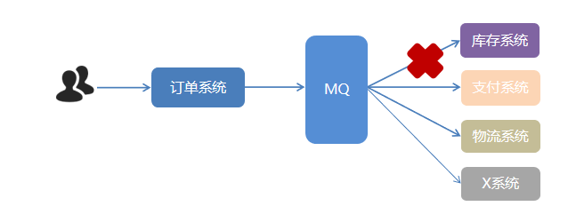
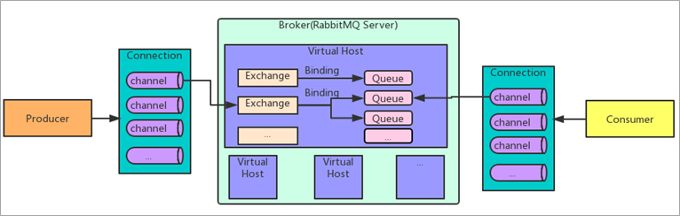
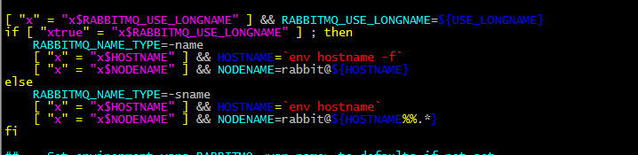
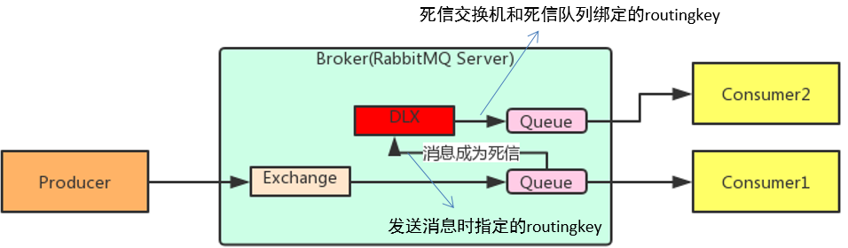

> 基于该[博客](https://blog.csdn.net/weixin_41292115/article/details/113864497)修改得到

# 1. 消息中间件概述

## 1.1. 什么是消息中间件

MQ全称为`Message Queue`，消息队列是**应用程序和应用程序之间的通信方法**。多用于分布式系统之间进行通信。

如下图，要进行远程通信有两种方式：**直接远程调用 和 借助第三方** 完成间接通信


## 1.2. 为什么使用MQ/优势

在项目中，可将一些无需即时返回且耗时的操作提取出来，进行**异步处理**，而这种异步处理的方式大大的节省了服务器的请求响应时间，从而**提高**了**系统**的**吞吐量**。

- 开发中消息队列通常有如下应用场景：

1. 任务**异步**处理

  将不需要同步处理的并且耗时长的操作由消息队列通知消息接收方进行异步处理。提高了应用程序的响应时间。

  

  一个下单操作耗时：20 + 300 + 300 + 300 = 920ms，用户点击完下单按钮后，需要等待920ms才能得到下单响应，太慢！

  

  用户点击完下单按钮后，只需等待20 + 5 = 25ms就能得到下单响应 。

2. 应用程序**解耦合**

  MQ相当于一个中介，生产方通过MQ与消费方交互，它将应用程序进行解耦合。

  比如订单系统要**远程调用**库存系统、支付系统、物流系统，这样会耦合，修改参数时候麻烦。

  使用消息队列后，订单系统给消息MQ发送一条消息就算成功了

  

  

  系统的耦合性越高，容错性就越低，可维护性就越低。

  

3. **削峰填谷**

  如订单系统，在下单的时候就会往数据库写数据。但是数据库只能支撑每秒1000左右的并发写入，并发量再高就容易宕机。低峰期的时候并发也就100多个，但是在高峰期时候，并发量会突然激增到5000以上，这个时候数据库肯定卡死了。

  

  消息被MQ保存起来了，然后系统就可以按照自己的消费能力来消费，比如每秒1000个数据，这样慢慢写入数据库，这样就不会卡死数据库了。

  

  但是使用了MQ之后，限制消费消息的速度为1000，但是这样一来，高峰期产生的数据势必会被积压在MQ中，高峰就被“削”掉了。但是因为消息积压，在高峰期过后的一段时间内，消费消息的速度还是会维持在1000QPS，直到消费完积压的消息,这就叫做“填谷”

  

## 1.3. MQ的劣势及使用条件

### 1.3.1. 劣势


**系统可用性降低**

系统引入的外部依赖越多，系统稳定性越差。一旦 MQ 宕机，就会对业务造成影响。如何保证MQ的高可用？

**系统复杂度提高**

MQ 的加入大大增加了系统的复杂度，以前系统间是同步的远程调用，现在是通过 MQ 进行异步调用。如何保证消息没有被重复消费？怎么处理消息丢失情况？那么保证消息传递的顺序性？

**一致性问题**

A 系统处理完业务，通过 MQ 给B、C、D三个系统发消息数据，如果 B 系统、C 系统处理成功，D 系统处理失败。如何保证消息数据处理的一致性？

### 1.3.2. 使用 MQ 需要满足什么条件呢？

1. 生产者不需要从消费者处获得反馈。引入消息队列之前的直接调用，其接口的返回值应该为空，这才让明明下层的动作还没做，上层却当成动作做完了继续往后走，即所谓异步成为了可能。

2. 容许短暂的不一致性。

3. 解耦、提速、削峰这些方面的收益，超过加入MQ，管理MQ这些成本。


## 1.4. AMQP 和 JMS

> MQ是消息通信的模型；实现MQ的大致有两种主流方式：AMQP、JMS。

### 1.4.1. AMQP

AMQP，即 Advanced Message Queuing Protocol（高级消息队列协议），是一个网络协议，是应用层协议的一个开放标准，为面向消息的中间件设计。基于此协议的客户端与消息中间件可传递消息，并不受客户端/中间件不同产品，不同的开发语言等条件的限制。2006年，AMQP 规范发布。类比HTTP。

AMQP是一种协议，更准确的说是一种binary wire-level protocol（链接协议）。这是其和JMS的本质差别，AMQP不从API层进行限定，而是直接定义网络交换的数据格式。


Publisher发布消息，Exchanger类似于路由器，把消息路由到Queue存储，Consumer监听队列进行消费。

### 1.4.2. JMS

JMS即Java消息服务（JavaMessage Service）应用程序接口，是一个Java平台中关于面向消息中间件（MOM）的API，用于在两个应用程序之间，或分布式系统中发送消息，进行异步通信。

类似于JDBC

### 1.4.3. AMQP 与 JMS 区别

- 本质：JMS是定义了统一的**接口**，对消息进行统一操作，类比JDBC；AMQP**只是协议**，只规定了数据交互的格式，类比TCP。

- 语言：JMS必须**使用Java**语言；AMQP不规定实现方式，是**跨语言**的。

- 消息模式：JMS规定了**两种**，而AMQP的**多种**消息模式

## 1.5. 消息队列产品

市场上常见的消息队列有如下：

- ActiveMQ：基于JMS
- ZeroMQ：基于C语言开发
- RabbitMQ：基于AMQP协议，erlang语言开发，稳定性好
- RocketMQ：基于JMS，阿里巴巴产品
- Kafka：类似MQ的产品；分布式消息系统，高吞吐量

|                | **RabbitMQ**                                                 | **ActiveMQ**                            | **RocketMQ**             | **Kafka**                                      |
| -------------- | ------------------------------------------------------------ | --------------------------------------- | ------------------------ | ---------------------------------------------- |
| 公司/社区      | Rabbit                                                       | Apache                                  | 阿里                     | Apache                                         |
| 开发语言       | Erlang                                                       | Java                                    | Java                     | Scala&Java                                     |
| 协议支持       | AMQP，XMPP，SMTP，STOMP                                      | OpenWire,STOMP，REST,XMPP,AMQP          | 自定义                   | 自定义协议，社区封装了http协议支持             |
| 客户端支持语言 | 官方支持Erlang，Java，Ruby等,社区产出多种API，几乎支持所有语言 | Java，C，C++，Python，PHP，Perl，.net等 | Java，C++（不成熟）      | 官方支持Java,社区产出多种API，如PHP，Python等  |
| 单机吞吐量     | 万级（其次）                                                 | 万级（最差）                            | 十万级（最好）           | 十万级（次之）                                 |
| 消息延迟       | 微妙级                                                       | 毫秒级                                  | 毫秒级                   | 毫秒以内                                       |
| 功能特性       | 并发能力强，性能极其好，延时低，社区活跃，管理界面丰富       | 老牌产品，成熟度高，文档较多            | MQ功能比较完备，扩展性佳 | 只支持主要的MQ功能，毕竟是为大数据领域准备的。 |

## 1.6. RabbitMQ

### 1.6.1. 说明

官网对应模式介绍：https://www.rabbitmq.com/getstarted.html

RabbitMQ官方地址：http://www.rabbitmq.com/

RabbitMQ是由erlang语言开发，基于AMQP（Advanced Message Queue 高级消息队列协议）协议实现的消息队列，它是一种应用程序之间的通信方法，消息队列在分布式系统开发中应用非常广泛。

### 1.6.2. 架构



- `Broker`：接收和分发消息的应用，`RabbitMQ Server就是 Message Broker。
- `Virtual host：`出于多租户和安全因素设计的，把 AMQP 的基本组件划分到一个虚拟的分组中，类似于网络中的 namespace 概念。当多个不同的用户使用同一个 RabbitMQ server 提供的服务时，可以划分出多个vhost，每个用户在自己的 vhost 创建 exchange／queue 等。
- `Connection：`publisher／consumer 和 broker 之间的 TCP 连接。
- `Channel：`如果每一次访问 RabbitMQ 都建立一个 Connection，在消息量大的时候建立 TCP Connection的开销将是巨大的，效率也较低。Channel 是在 connection 内部建立的逻辑连接，如果应用程序支持多线程，通常每个thread创建单独的 channel 进行通讯，AMQP method 包含了channel id 帮助客户端和message broker 识别 channel，所以 channel 之间是完全隔离的。Channel 作为轻量级的 Connection 极大减少了操作系统建立 TCP connection 的开销。
- `Exchange`：message 到达 broker 的第一站，根据分发规则，`匹配查询表中的 routing key`，分发消息到queue 中去。常用的类型有：
  - direct (point-to-point)
  - topic (publish-subscribe)
  - fanout (multicast)
- `Queue：`消息最终被送到这里等待 consumer 取走
- `Binding：exchange 和 queue 之间的虚拟连接，binding 中可以包含 routing key。Binding 信息被保存到 exchange 中的查询表中，用于 message 的分发依据

### 1.6.3. 模式

RabbitMQ提供了6种模式：简单模式，work模式，Publish/Subscribe发布与订阅模式，Routing路由模式，Topics主题模式，RPC远程调用模式（远程调用，不太算MQ；暂不作介绍）；


# 2. 安装及配置RabbitMQ

## 2.1. 安装依赖环境

在线安装依赖环境：

```shell
yum install build-essential openssl openssl-devel unixODBC unixODBC-devel make gcc gcc-c++ kernel-devel m4 ncurses-devel tk tc xz
```

## 2.2. 安装Erlang

下载下面三个安装包

> erlang-18.3-1.el7.centos.x86_64.rpm
>
> socat-1.7.3.2-5.el7.lux.x86_64.rpm
>
> rabbitmq-server-3.6.5-1.noarch.rpm

```sh
  #下载erlang
  wget www.rabbitmq.com/releases/erlang/erlang-18.3-1.el7.centos.x86_64.rpm

  #下载socat
  wget http://repo.iotti.biz/CentOS/7/x86_64/socat-1.7.3.2-5.el7.lux.x86_64.rpm

  #下载rabbitmq-server
  wget www.rabbitmq.com/releases/rabbitmq-server/v3.6.5/rabbitmq-server-3.6.5-1.noarch.rpm

  # 安装
  rpm -ivh erlang-18.3-1.el7.centos.x86_64.rpm
```

如果出现如下错误


说明gblic 版本太低。我们可以查看当前机器的gblic 版本

```shell
strings /lib64/libc.so.6 | grep GLIBC
```


### 2.2.1. 升级glibc(非必须)

当前最高版本2.12，需要2.15.所以需要升级glibc

- 使用yum更新安装依赖

  ```shell
  sudo yum install zlib-devel bzip2-devel openssl-devel ncurses-devel sqlite-devel readline-devel tk-devel gcc make -y
  ```

- 下载rpm包

  ```shell
  wget http://copr-be.cloud.fedoraproject.org/results/mosquito/myrepo-el6/epel-6-x86_64/glibc-2.17-55.fc20/glibc-utils-2.17-55.el6.x86_64.rpm &
  wget http://copr-be.cloud.fedoraproject.org/results/mosquito/myrepo-el6/epel-6-x86_64/glibc-2.17-55.fc20/glibc-static-2.17-55.el6.x86_64.rpm &
  wget http://copr-be.cloud.fedoraproject.org/results/mosquito/myrepo-el6/epel-6-x86_64/glibc-2.17-55.fc20/glibc-2.17-55.el6.x86_64.rpm &
  wget http://copr-be.cloud.fedoraproject.org/results/mosquito/myrepo-el6/epel-6-x86_64/glibc-2.17-55.fc20/glibc-common-2.17-55.el6.x86_64.rpm &
  wget http://copr-be.cloud.fedoraproject.org/results/mosquito/myrepo-el6/epel-6-x86_64/glibc-2.17-55.fc20/glibc-devel-2.17-55.el6.x86_64.rpm &
  wget http://copr-be.cloud.fedoraproject.org/results/mosquito/myrepo-el6/epel-6-x86_64/glibc-2.17-55.fc20/glibc-headers-2.17-55.el6.x86_64.rpm &
  wget http://copr-be.cloud.fedoraproject.org/results/mosquito/myrepo-el6/epel-6-x86_64/glibc-2.17-55.fc20/nscd-2.17-55.el6.x86_64.rpm &
  ```

- 安装rpm包

  ```shell
  sudo rpm -Uvh *-2.17-55.el6.x86_64.rpm --force --nodeps
  ```

- 安装完毕后再查看glibc版本,发现glibc版本已经到2.17了

  ```shell
  strings /lib64/libc.so.6 | grep GLIBC
  ```


## 2.3. 安装RabbitMQ

```sh
  # 安装
  rpm -ivh socat-1.7.3.2-5.el7.lux.x86_64.rpm
  # 安装
  rpm -ivh rabbitmq-server-3.6.5-1.noarch.rpm
```

## 2.4. 开启管理界面及配置

```sh
  # 开启管理界面
  rabbitmq-plugins enable rabbitmq_management
  # 修改默认配置信息 
  vim rabbitmq/lib/rabbitmq_server-3.6.5/ebin/rabbit.app 
  # 比如修改密码、配置等等，例如：loopback_users 中的 <<"guest">>,只保留guest。
  # [] 表明是一个数组
```

## 2.5. 启动

```sh
systemctl start rabbitmq-server  # 启动服务
systemctl stop rabbitmq-server  # 停止服务
systemctl restart rabbitmq-server  # 重启服务
systemctl status rabbitmq-server
```

15672端口为图形化界面端口。用户名和密码都为 guest

设置配置文件

```shell
cd /usr/share/doc/rabbitmq-server-3.6.5/
cp rabbitmq.config.example /etc/rabbitmq/rabbitmq.config
```

启动rabbitmq

```shell
cd /usr/lib/rabbitmq/lib/rabbitmq_server-3.6.5/ebin
 rabbitmq-server start &
```

常用命令

```shell
  rabbitmq-server -deched  --后台启动节点
  rabbitmqctl stop_app --关闭节点上的应用
  rabbitmqctl start_app --启动节点上的应用
  rabbitmqctl stop --关闭节点
```



> 修改了用户名之后，重启服务器造成创建用户丢失：
>
> 因为rabbitmq数据是根据当前hostname作为node节点作为数据名保存，这一点可以从rabbitmq-env文件中可以看出。
>
> 解决方案：
>
> 1. 不要更改hostname
> 2. https://blog.csdn.net/qq_27037443/article/details/78050526

## 2.6. 配置虚拟主机及用户

### 2.6.1. 用户角色

RabbitMQ在安装好后，可以访问`http://ip地址:15672` ；其自带了guest/guest的用户名和密码；如果需要创建自定义用户；那么也可以登录管理界面后，如下操作：


**角色说明**：

1、 超级管理员(administrator)

可登陆管理控制台，可查看所有的信息，并且可以对用户，策略(policy)进行操作。

2、 监控者(monitoring)

可登陆管理控制台，同时可以查看rabbitmq节点的相关信息(进程数，内存使用情况，磁盘使用情况等)

3、 策略制定者(policymaker)

可登陆管理控制台, 同时可以对policy进行管理。但无法查看节点的相关信息(上图红框标识的部分)。

4、 普通管理者(management)

仅可登陆管理控制台，无法看到节点信息，也无法对策略进行管理。

5、 其他

无法登陆管理控制台，通常就是普通的生产者和消费者。

### 2.6.2. Virtual Hosts配置

像mysql拥有数据库的概念并且可以指定用户对库和表等操作的权限。RabbitMQ也有类似的权限管理；在RabbitMQ中可以虚拟消息服务器Virtual Host，每个Virtual Hosts相当于一个相对独立的RabbitMQ服务器，每个VirtualHost之间是相互隔离的。exchange、queue、message不能互通。 相当于mysql的db。Virtual Name一般以/开头。

**创建Virtual Hosts**


**设置Virtual Hosts权限**


# 3. RabbitMQ入门

## 3.1. 搭建示例工程

创建工程

添加依赖

往pom.xml文件中添加如下依赖：

```xml
<dependency>
    <groupId>com.rabbitmq</groupId>
    <artifactId>amqp-client</artifactId>
    <version>5.6.0</version>
</dependency>
```

## 3.2. 编写生产者

编写消息生产者Producer

```java
import com.rabbitmq.client.Channel;
import com.rabbitmq.client.Connection;
import com.rabbitmq.client.ConnectionFactory;

public class Producer {

    static final String QUEUE_NAME = "simple_queue";

    public static void main(String[] args) throws Exception {
        //创建连接工厂
        ConnectionFactory connectionFactory = new ConnectionFactory();
        //主机地址;默认为 localhost
        connectionFactory.setHost("localhost");
        //连接端口;默认为 5672
        connectionFactory.setPort(5672);
        //虚拟主机名称;默认为 /
        connectionFactory.setVirtualHost("/itcast");
        //连接用户名；默认为guest
        connectionFactory.setUsername("heima");
        //连接密码；默认为guest
        connectionFactory.setPassword("heima");

        //创建连接
        Connection connection = connectionFactory.newConnection();

        // 创建频道
        Channel channel = connection.createChannel();

        // 声明（创建）队列
        /**
         * 参数1：queue 队列名称
         * 参数2：durable 是否定义持久化队列
         * 参数3：exclusive 是否独占本次连接。（一般为false）
         	* 是否只有一个消费者能监听次队列，
         	* 当connection关闭时，是否删除队列
         * 参数4：autoDelete 是否在不使用(没有consumer)的时候自动删除队列
         * 参数5：队列其它参数
         */
        // 如果指定队列不存在会自动创建
        channel.queueDeclare(QUEUE_NAME, true, false, false, null);

        // 要发送的信息
        String message = "你好，世界！";
        /**
         * 参数1：exchange 交换机名称，空字符串则使用默认Default Exchage
         * 参数2：routgeKey 路由key,简单模式可以传递队列名称
         * 参数3：props 消息其它属性
         * 参数4：body 消息内容
         */
        channel.basicPublish("", QUEUE_NAME, null, message.getBytes());
        System.out.println("已发送消息：" + message);

        // 关闭资源
        channel.close();
        connection.close();
    }
}
```

在执行上述的消息发送之后；可以登录rabbitMQ的管理控制台，可以发现队列和其消息：选择Queues选项卡后，可以看到simole-queue。再点击`Get Message(s)`可以看到消息

## 3.3. 编写消费者

抽取创建connection的工具类ConnectionUtil

```java
import com.rabbitmq.client.Connection;
import com.rabbitmq.client.ConnectionFactory;

public class ConnectionUtil {

    public static Connection getConnection() throws Exception {
        //创建连接工厂
        ConnectionFactory connectionFactory = new ConnectionFactory();
        //主机地址;默认为 localhost
        connectionFactory.setHost("localhost");
        //连接端口;默认为 5672
        connectionFactory.setPort(5672);
        //虚拟主机名称;默认为 /
        connectionFactory.setVirtualHost("/itcast");
        //连接用户名；默认为guest
        connectionFactory.setUsername("heima");
        //连接密码；默认为guest
        connectionFactory.setPassword("heima");

        //创建连接
        return connectionFactory.newConnection();
    }
}
```

编写消息的消费者Consumer

```java
import com.itheima.rabbitmq.util.ConnectionUtil;
import com.rabbitmq.client.*;
import java.io.IOException;

public class Consumer {

    public static void main(String[] args) throws Exception {
        Connection connection = ConnectionUtil.getConnection();

        // 创建频道
        Channel channel = connection.createChannel();

        // 声明（创建）队列
        /**
         * 参数1：队列名称
         * 参数2：是否定义持久化队列
         * 参数3：是否独占本次连接
         * 参数4：是否在不使用的时候自动删除队列
         * 参数5：队列其它参数
         */
        channel.queueDeclare(Producer.QUEUE_NAME, true, false, false, null);

        //创建消费者；并设置消息处理
        DefaultConsumer consumer = new DefaultConsumer(channel){
            @Override
            /**
             * consumerTag 消息者标签
             * envelope 消息包的内容，可从中获取消息id，消息routingkey，交换机，消息和重传标志(收到消息失败后是否需要重新发送)
             * properties 属性信息
             * body 消息
             */
            public void handleDelivery(String consumerTag, Envelope envelope, AMQP.BasicProperties properties, byte[] body) throws IOException {
                //路由key
                System.out.println("路由key为：" + envelope.getRoutingKey());
                //交换机
                System.out.println("交换机为：" + envelope.getExchange());
                //消息id
                System.out.println("消息id为：" + envelope.getDeliveryTag());
                //收到的消息
                System.out.println("接收到的消息为：" + new String(body, "utf-8"));
            }
        };
        //监听消息
        /**
         * 参数1：队列名称
         * 参数2：是否自动确认，设置为true为表示消息接收到自动向mq回复接收到了，mq接收到回复会删除消息，设置为false则需要手动确认
         * 参数3：消息接收到后回调
         */
        channel.basicConsume(Producer.QUEUE_NAME, true, consumer);

        //不关闭资源，应该一直监听消息
        //channel.close();
        //connection.close();
    }
}
```

## 3.4. 小结

上述的入门案例中中其实使用的是如下的简单模式：


在上图的模型中，有以下概念：

- P：生产者，也就是要发送消息的程序
- C：消费者：消息的接受者，会一直等待消息到来。
- queue：消息队列，图中红色部分。类似一个邮箱，可以缓存消息；生产者向其中投递消息，消费者从其中取出消息。

# 4. AMQP

## 4.1. 相关概念介绍

AMQP 一个提供统一消息服务的应用层标准高级消息队列协议，是应用层协议的一个开放标准，为面向消息的中间件设计。

AMQP是一个二进制协议，拥有一些现代化特点：多信道、协商式，异步，安全，扩平台，中立，高效。

RabbitMQ是AMQP协议的Erlang的实现。

| 概念           | 说明                                                         |
| -------------- | ------------------------------------------------------------ |
| 连接Connection | 一个网络连接，比如TCP/IP套接字连接。                         |
| 会话Session    | 端点之间的命名对话。在一个会话上下文中，保证“恰好传递一次”。 |
| 信道Channel    | 多路复用连接中的一条独立的双向数据流通道。为会话提供物理传输介质。 |
| 客户端Client   | AMQP连接或者会话的发起者。AMQP是非对称的，客户端生产和消费消息，服务器存储和路由这些消息。 |
| 服务节点Broker | 消息中间件的服务节点；一般情况下可以将一个RabbitMQ Broker看作一台RabbitMQ 服务器。 |
| 端点           | AMQP对话的任意一方。一个AMQP连接包括两个端点（一个是客户端，一个是服务器）。 |
| 消费者Consumer | 一个从消息队列里请求消息的客户端程序。                       |
| 生产者Producer | 一个向交换机发布消息的客户端应用程序。                       |

## 4.2. RabbitMQ运转流程

在入门案例中：

- 生产者发送消息
  1. 生产者创建连接（Connection），开启一个信道（Channel），连接到RabbitMQ Broker；
  2. 声明队列并设置属性；如是否排它，是否持久化，是否自动删除；
  3. 将路由键（空字符串）与队列绑定起来；
  4. 发送消息至RabbitMQ Broker；
  5. 关闭信道；
  6. 关闭连接；
- 消费者接收消息
  1. 消费者创建连接（Connection），开启一个信道（Channel），连接到RabbitMQ Broker
  2. 向Broker 请求消费相应队列中的消息，设置相应的回调函数；
  3. 等待Broker回应闭关投递响应队列中的消息，消费者接收消息；
  4. 确认（ack，自动确认）接收到的消息；
  5. RabbitMQ从队列中删除相应已经被确认的消息；
  6. 关闭信道；
  7. 关闭连接；

## 4.3. 生产者流转过程说明

1. 客户端与代理服务器Broker建立连接。会调用newConnection() 方法,这个方法会进一步封装Protocol Header 0-9-1 的报文头发送给Broker ，以此通知Broker 本次交互采用的是AMQPO-9-1 协议，紧接着Broker 返回Connection.Start 来建立连接，在连接的过程中涉及Connection.Start/.Start-OK 、Connection.Tune/.Tune-Ok ，Connection.Open/ .Open-Ok 这6 个命令的交互。
2. 客户端调用connection.createChannel方法。此方法开启信道，其包装的channel.open命令发送给Broker,等待channel.basicPublish方法，对应的AMQP命令为Basic.Publish,这个命令包含了content Header 和content Body()。content Header 包含了消息体的属性，例如:投递模式，优先级等，content Body 包含了消息体本身。
3. 客户端发送完消息需要关闭资源时，涉及到Channel.Close和Channl.Close-Ok 与Connetion.Close和Connection.Close-Ok的命令交互。

## 4.4. 消费者流转过程说明

1. 消费者客户端与代理服务器Broker建立连接。会调用newConnection() 方法,这个方法会进一步封装Protocol Header 0-9-1 的报文头发送给Broker ，以此通知Broker 本次交互采用的是AMQPO-9-1 协议，紧接着Broker 返回Connection.Start 来建立连接，在连接的过程中涉及Connection.Start/.Start-OK 、Connection.Tune/.Tune-Ok ，Connection.Open/ .Open-Ok 这6 个命令的交互。
2. 消费者客户端调用connection.createChannel方法。和生产者客户端一样，协议涉及Channel . Open/Open-Ok命令。
3. 在真正消费之前，消费者客户端需要向Broker 发送Basic.Consume 命令(即调用channel.basicConsume 方法〉将Channel 置为接收模式，之后Broker 回执Basic . Consume - Ok 以告诉消费者客户端准备好消费消息。
4. Broker 向消费者客户端推送(Push) 消息，即Basic.Deliver 命令，这个命令和Basic.Publish 命令一样会携带Content Header 和Content Body。
5. 消费者接收到消息并正确消费之后，向Broker 发送确认，即Basic.Ack 命令。
6. 客户端发送完消息需要关闭资源时，涉及到Channel.Close和Channl.Close-Ok 与Connetion.Close和Connection.Close-Ok的命令交互。

[外链图片转存失败,源站可能有防盗链机制,建议将图片保存下来直接上传(img-65ItkMln-1614701356655)(F:\12-消息中间件-RabbitMQ\day01_RabbitMQ基础入门\讲义\assets/消费者流转过程图.bmp)]

# 5. RabbitMQ工作模式

## 5.1. `Work queues`工作队列模式

### 5.1.1. 模式说明


`Work Queues`与入门程序的`简单模式`相比，多了一个或一些消费端，多个消费端共同消费同一个队列中的消息。

**应用场景**：对于 任务过重或任务较多情况使用工作队列可以提高任务处理的速度。

### 5.1.2. 代码

`Work Queues`与入门程序的`简单模式`的代码是几乎一样的；可以完全复制，并复制多一个消费者进行多个消费者同时消费消息的测试。

#### 5.1.2.1. 生产者

```java
import com.itheima.rabbitmq.util.ConnectionUtil;
import com.rabbitmq.client.Channel;
import com.rabbitmq.client.Connection;
import com.rabbitmq.client.ConnectionFactory;

public class Producer {

    static final String QUEUE_NAME = "work_queue";

    public static void main(String[] args) throws Exception {

        //创建连接
        Connection connection = ConnectionUtil.getConnection();
        // 创建频道
        Channel channel = connection.createChannel();

        // 声明（创建）队列
        /**
         * 参数1：队列名称
         * 参数2：是否定义持久化队列
         * 参数3：是否独占本次连接
         * 参数4：是否在不使用的时候自动删除队列
         * 参数5：队列其它参数
         */
        channel.queueDeclare(QUEUE_NAME, true, false, false, null);

        for (int i = 1; i <= 30; i++) {
            // 发送信息
            String message = "你好；小兔子！work模式--" + i;
            /**
             * 参数1：交换机名称，如果没有指定则使用默认Default Exchage
             * 参数2：路由key,简单模式可以传递队列名称
             * 参数3：消息其它属性
             * 参数4：消息内容
             */
            channel.basicPublish("", QUEUE_NAME, null, message.getBytes());
            System.out.println("已发送消息：" + message);
        }

        // 关闭资源
        channel.close();
        connection.close();
    }
}
```

#### 5.1.2.2. 消费者1

```java
import com.itheima.rabbitmq.util.ConnectionUtil;
import com.rabbitmq.client.*;

import java.io.IOException;

public class Consumer1 {

    public static void main(String[] args) throws Exception {
        Connection connection = ConnectionUtil.getConnection();

        // 创建频道
        Channel channel = connection.createChannel();

        // 声明（创建）队列
        /**
         * 参数1：队列名称
         * 参数2：是否定义持久化队列
         * 参数3：是否独占本次连接
         * 参数4：是否在不使用的时候自动删除队列
         * 参数5：队列其它参数
         */
        channel.queueDeclare(Producer.QUEUE_NAME, true, false, false, null);

        //一次只能接收并处理一个消息
        channel.basicQos(1);

        //创建消费者；并设置消息处理
        DefaultConsumer consumer = new DefaultConsumer(channel){
            @Override
            /**
             * consumerTag 消息者标签，在channel.basicConsume时候可以指定
             * envelope 消息包的内容，可从中获取消息id，消息routingkey，交换机，消息和重传标志(收到消息失败后是否需要重新发送)
             * properties 属性信息
             * body 消息
             */
            public void handleDelivery(String consumerTag, Envelope envelope, AMQP.BasicProperties properties, byte[] body) throws IOException {
                try {
                    //路由key
                    System.out.println("路由key为：" + envelope.getRoutingKey());
                    //交换机
                    System.out.println("交换机为：" + envelope.getExchange());
                    //消息id
                    System.out.println("消息id为：" + envelope.getDeliveryTag());
                    //收到的消息
                    System.out.println("消费者1-接收到的消息为：" + new String(body, "utf-8"));
                    Thread.sleep(1000);

                    //确认消息
                    channel.basicAck(envelope.getDeliveryTag(), false);
                } catch (InterruptedException e) {
                    e.printStackTrace();
                }
            }
        };
        //监听消息
        /**
         * 参数1：队列名称
         * 参数2：是否自动确认，设置为true为表示消息接收到自动向mq回复接收到了，mq接收到回复会删除消息，设置为false则需要手动确认
         * 参数3：消息接收到后回调
         */
        channel.basicConsume(Producer.QUEUE_NAME, false, consumer);
    }
}
```

#### 5.1.2.3. 消费者2

和消费者1一模一样，复制一份改名Consumer2.java即可

### 5.1.3. 测试

启动两个消费者，然后再启动生产者发送消息；到IDEA的两个消费者对应的控制台查看是否竞争性的接收到消息。

- 消费者1：接收到消息 1 3 5
- 消费者2：接收到消息 2 4 6

### 5.1.4. 小结

在一个队列中如果有多个消费者，那么消费者之间对于同一个消息的关系是**竞争**的关系。

每一个消息只能由一个消费者消费。

## 5.2. `Publish/Subscribe`发布与订阅模式

### 5.2.1. 模式说明

**Sending messages to many consumers at once**


在订阅模型中，多了一个`exchange`角色，而且过程略有变化：

- P：生产者，不再发送消息到队列中，而是发给X（交换机）
- C：消费者，消息的接受者，会一直等待消息到来。
- Queue：消息队列，接收消息、缓存消息。
- Exchange：交换机，图中的X。一方面，接收生产者发送的消息。另一方面，知道如何处理消息，例如递交给某个特别队列、递交给所有队列、或是将消息丢弃。到底如何操作，取决于Exchange的类型。Exchange有常见以下3种类型：
  - Fanout：广播，将消息交给所有绑定到交换机的队列
  - Direct：定向，把消息交给符合指定routing key 的队列
  - Topic：通配符，把消息交给符合routing pattern（路由模式） 的队列

`Exchange（交换机）只负责转发消息，不具备存储消息的能力`，因此如果没有任何队列与Exchange绑定，或者没有符合路由规则的队列，那么消息会丢失！


### 5.2.2. 代码

#### 5.2.2.1. 生产者

```java
package com.itheima.rabbitmq.ps;

import com.itheima.rabbitmq.util.ConnectionUtil;
import com.rabbitmq.client.BuiltinExchangeType;
import com.rabbitmq.client.Channel;
import com.rabbitmq.client.Connection;

/**
 * 发布与订阅使用的交换机类型为：fanout
 */
public class Producer {

    //交换机名称
    static final String FANOUT_EXCHAGE = "fanout_exchange";
    //队列名称
    static final String FANOUT_QUEUE_1 = "fanout_queue_1";
    //队列名称
    static final String FANOUT_QUEUE_2 = "fanout_queue_2";

    public static void main(String[] args) throws Exception {

        //创建连接
        Connection connection = ConnectionUtil.getConnection();
        // 创建频道
        Channel channel = connection.createChannel();

        /**
         * 声明交换机
         * 参数1：交换机名称
         * 参数2：交换机类型，fanout、topic、direct、headers
         */
        channel.exchangeDeclare(FANOUT_EXCHAGE, BuiltinExchangeType.FANOUT);

        // 声明（创建）队列
        /**	
         * 参数1：队列名称
         * 参数2：是否定义持久化队列
         * 参数3：是否独占本次连接
         * 参数4：是否在不使用的时候自动删除队列
         * 参数5：队列其它参数
         */
        channel.queueDeclare(FANOUT_QUEUE_1, true, false, false, null);
        channel.queueDeclare(FANOUT_QUEUE_2, true, false, false, null);

        //队列绑定交换机。还有更多参数的重载方法
        channel.queueBind(FANOUT_QUEUE_1, FANOUT_EXCHAGE, "");
        channel.queueBind(FANOUT_QUEUE_2, FANOUT_EXCHAGE, "");

        for (int i = 1; i <= 10; i++) {
            // 发送信息
            String message = "你好；小兔子！发布订阅模式--" + i;
            /**
             * 参数1：交换机名称，如果没有指定则使用默认Default Exchage
             * 参数2：路由key,简单模式可以传递队列名称
             * 参数3：消息其它属性
             * 参数4：消息内容
             */
            channel.basicPublish(FANOUT_EXCHAGE, "", null, message.getBytes());
            System.out.println("已发送消息：" + message);
        }

        // 关闭资源
        channel.close();
        connection.close();
    }
}
```

#### 5.2.2.2. 消费者1

```java
public class Consumer1 {

    public static void main(String[] args) throws Exception {
        Connection connection = ConnectionUtil.getConnection();

        // 创建频道
        Channel channel = connection.createChannel();

        //声明交换机
        channel.exchangeDeclare(Producer.FANOUT_EXCHAGE, BuiltinExchangeType.FANOUT);

        // 声明（创建）队列
        /**
         * 参数1：队列名称
         * 参数2：是否定义持久化队列
         * 参数3：是否独占本次连接
         * 参数4：是否在不使用的时候自动删除队列
         * 参数5：队列其它参数
         */
        channel.queueDeclare(Producer.FANOUT_QUEUE_1, true, false, false, null);

        //队列绑定交换机
        channel.queueBind(Producer.FANOUT_QUEUE_1, Producer.FANOUT_EXCHAGE, "");

        //创建消费者；并设置消息处理
        DefaultConsumer consumer = new DefaultConsumer(channel){
            @Override
            /**
             * consumerTag 消息者标签，在channel.basicConsume时候可以指定
             * envelope 消息包的内容，可从中获取消息id，消息routingkey，交换机，消息和重传标志(收到消息失败后是否需要重新发送)
             * properties 属性信息
             * body 消息
             */
            public void handleDelivery(String consumerTag, Envelope envelope, AMQP.BasicProperties properties, byte[] body) throws IOException {
                //路由key
                System.out.println("路由key为：" + envelope.getRoutingKey());
                //交换机
                System.out.println("交换机为：" + envelope.getExchange());
                //消息id
                System.out.println("消息id为：" + envelope.getDeliveryTag());
                //收到的消息
                System.out.println("消费者1-接收到的消息为：" + new String(body, "utf-8"));
            }
        };
        //监听消息
        /**
         * 参数1：队列名称
         * 参数2：是否自动确认，设置为true为表示消息接收到自动向mq回复接收到了，mq接收到回复会删除消息，设置为false则需要手动确认
         * 参数3：消息接收到后回调
         */
        channel.basicConsume(Producer.FANOUT_QUEUE_1, true, consumer);
    }
}
```

#### 5.2.2.3. 消费者2

指定不同的队列名称而已

```java
import com.itheima.rabbitmq.util.ConnectionUtil;
import com.rabbitmq.client.*;

import java.io.IOException;

public class Consumer2 {

    public static void main(String[] args) throws Exception {
        Connection connection = ConnectionUtil.getConnection();

        // 创建频道
        Channel channel = connection.createChannel();

        //声明交换机
        channel.exchangeDeclare(Producer.FANOUT_EXCHAGE, BuiltinExchangeType.FANOUT);

        // 声明（创建）队列
        /**
         * 参数1：队列名称
         * 参数2：是否定义持久化队列
         * 参数3：是否独占本次连接
         * 参数4：是否在不使用的时候自动删除队列
         * 参数5：队列其它参数
         */
        channel.queueDeclare(Producer.FANOUT_QUEUE_2, true, false, false, null);

        //队列绑定交换机
        channel.queueBind(Producer.FANOUT_QUEUE_2, Producer.FANOUT_EXCHAGE, "");

        //创建消费者；并设置消息处理
        DefaultConsumer consumer = new DefaultConsumer(channel){
            @Override
            /**
             * consumerTag 消息者标签，在channel.basicConsume时候可以指定
             * envelope 消息包的内容，可从中获取消息id，消息routingkey，交换机，消息和重传标志(收到消息失败后是否需要重新发送)
             * properties 属性信息
             * body 消息
             */
            public void handleDelivery(String consumerTag, Envelope envelope, AMQP.BasicProperties properties, byte[] body) throws IOException {
                //路由key
                System.out.println("路由key为：" + envelope.getRoutingKey());
                //交换机
                System.out.println("交换机为：" + envelope.getExchange());
                //消息id
                System.out.println("消息id为：" + envelope.getDeliveryTag());
                //收到的消息
                System.out.println("消费者2-接收到的消息为：" + new String(body, "utf-8"));
            }
        };
        //监听消息
        /**
         * 参数1：队列名称
         * 参数2：是否自动确认，设置为true为表示消息接收到自动向mq回复接收到了，mq接收到回复会删除消息，设置为false则需要手动确认
         * 参数3：消息接收到后回调
         */
        channel.basicConsume(Producer.FANOUT_QUEUE_2, true, consumer);
    }
}
```

### 5.2.3. 测试

启动所有消费者，然后使用生产者发送消息；在每个消费者对应的控制台可以查看到生产者发送的所有消息；到达**广播**的效果。

在执行完测试代码后，其实到RabbitMQ的管理后台找到`Exchanges`选项卡，点击 `fanout_exchange` 的交换机，可以查看到如下的绑定：

- fanout-queue-1
- fanout-queue-2

### 5.2.4. 小结

交换机需要与队列进行绑定，绑定之后；一个消息可以被多个消费者都收到。

**发布订阅模式与工作队列模式的区别**

1、工作队列模式不用定义交换机，而发布/订阅模式需要定义交换机。

2、发布/订阅模式的生产方是面向交换机发送消息，工作队列模式的生产方是面向队列发送消息(底层使用默认交换机)。

3、发布/订阅模式需要设置队列和交换机的绑定，工作队列模式不需要设置，实际上工作队列模式会将队列绑 定到默认的交换机 。

## 5.3. `Routing`路由模式

### 5.3.1. 模式说明

路由模式特点：

- 队列与交换机的绑定，不能是任意绑定了，而是要指定一个`RoutingKey`（路由key）
- 消息的发送方在 向 Exchange发送消息时，也必须指定消息的 `RoutingKey`。
- Exchange不再把消息交给每一个绑定的队列，而是根据消息的`Routing Key`进行判断，只有队列的`Routingkey`与消息的 `Routing key`完全一致，才会接收到消息

选择性接收消息。下图代表不同级别的日志怎么处理，比如C1是文件，C2是控制台


图解：

- P：生产者，向Exchange发送消息，发送消息时，会指定一个routing key。
- X：Exchange（交换机），接收生产者的消息，然后把消息递交给 与routing key完全匹配的队列
- C1：消费者，其所在队列指定了需要routing key 为 error 的消息
- C2：消费者，其所在队列指定了需要routing key 为 info、error、warning 的消息

发送的路由key和绑定的路由key一致时才匹配

### 5.3.2. 代码

在编码上与 `Publish/Subscribe发布与订阅模式` 的区别是交换机的类型为：Direct，还有队列绑定交换机的时候需要指定routing key。

#### 5.3.2.1. 生产者

```java
/**
 * 路由模式的交换机类型为：direct
 */
public class Producer {

    //交换机名称
    static final String DIRECT_EXCHAGE = "direct_exchange";
    //队列名称
    static final String DIRECT_QUEUE_INSERT = "direct_queue_insert";
    //队列名称
    static final String DIRECT_QUEUE_UPDATE = "direct_queue_update";

    public static void main(String[] args) throws Exception {

        //创建连接
        Connection connection = ConnectionUtil.getConnection();
        // 创建频道
        Channel channel = connection.createChannel();

        /**
         * 声明交换机
         * 参数1：交换机名称
         * 参数2：交换机类型，fanout、topic、direct、headers
         */
        channel.exchangeDeclare(DIRECT_EXCHAGE, BuiltinExchangeType.DIRECT);

        // 声明（创建）队列
        /**
         * 参数1：队列名称
         * 参数2：是否定义持久化队列
         * 参数3：是否独占本次连接
         * 参数4：是否在不使用的时候自动删除队列
         * 参数5：队列其它参数
         */
        channel.queueDeclare(DIRECT_QUEUE_INSERT, true, false, false, null);
        channel.queueDeclare(DIRECT_QUEUE_UPDATE, true, false, false, null);

        //队列绑定交换机
        channel.queueBind(DIRECT_QUEUE_INSERT, DIRECT_EXCHAGE, "insert");
        channel.queueBind(DIRECT_QUEUE_UPDATE, DIRECT_EXCHAGE, "update");

        // 发送信息
        String message = "新增了商品。路由模式；routing key 为 insert " ;
        /**
         * 参数1：交换机名称，如果没有指定则使用默认Default Exchage
         * 参数2：路由key,简单模式可以传递队列名称
         * 参数3：消息其它属性
         * 参数4：消息内容
         */
        channel.basicPublish(DIRECT_EXCHAGE, "insert", null, message.getBytes());
        System.out.println("已发送消息：" + message);

        // 发送信息
        message = "修改了商品。路由模式；routing key 为 update" ;
        /**
         * 参数1：交换机名称，如果没有指定则使用默认Default Exchage
         * 参数2：路由key,简单模式可以传递队列名称
         * 参数3：消息其它属性
         * 参数4：消息内容
         */
        channel.basicPublish(DIRECT_EXCHAGE, "update", null, message.getBytes());
        System.out.println("已发送消息：" + message);

        // 关闭资源
        channel.close();
        connection.close();
    }
}
```

#### 5.3.2.2. 消费者1

```java
public class Consumer1 {

    public static void main(String[] args) throws Exception {
        Connection connection = ConnectionUtil.getConnection();

        // 创建频道
        Channel channel = connection.createChannel();

        //声明交换机
        channel.exchangeDeclare(Producer.DIRECT_EXCHAGE, BuiltinExchangeType.DIRECT);

        // 声明（创建）队列
        /**
         * 参数1：队列名称
         * 参数2：是否定义持久化队列
         * 参数3：是否独占本次连接
         * 参数4：是否在不使用的时候自动删除队列
         * 参数5：队列其它参数
         */
        channel.queueDeclare(Producer.DIRECT_QUEUE_INSERT, true, false, false, null);

        //队列绑定交换机
        channel.queueBind(Producer.DIRECT_QUEUE_INSERT, Producer.DIRECT_EXCHAGE, "insert");

        //创建消费者；并设置消息处理
        DefaultConsumer consumer = new DefaultConsumer(channel){
            @Override
            /**
             * consumerTag 消息者标签，在channel.basicConsume时候可以指定
             * envelope 消息包的内容，可从中获取消息id，消息routingkey，交换机，消息和重传标志(收到消息失败后是否需要重新发送)
             * properties 属性信息
             * body 消息
             */
            public void handleDelivery(String consumerTag, Envelope envelope, AMQP.BasicProperties properties, byte[] body) throws IOException {
                //路由key
                System.out.println("路由key为：" + envelope.getRoutingKey());
                //交换机
                System.out.println("交换机为：" + envelope.getExchange());
                //消息id
                System.out.println("消息id为：" + envelope.getDeliveryTag());
                //收到的消息
                System.out.println("消费者1-接收到的消息为：" + new String(body, "utf-8"));
            }
        };
        //监听消息
        /**
         * 参数1：队列名称
         * 参数2：是否自动确认，设置为true为表示消息接收到自动向mq回复接收到了，mq接收到回复会删除消息，设置为false则需要手动确认
         * 参数3：消息接收到后回调
         */
        channel.basicConsume(Producer.DIRECT_QUEUE_INSERT, true, consumer);
    }
}
```

#### 5.3.2.3. 消费者2

```java
public class Consumer2 {

    public static void main(String[] args) throws Exception {
        Connection connection = ConnectionUtil.getConnection();

        // 创建频道
        Channel channel = connection.createChannel();

        //声明交换机
        channel.exchangeDeclare(Producer.DIRECT_EXCHAGE, BuiltinExchangeType.DIRECT);

        // 声明（创建）队列
        /**
         * 参数1：队列名称
         * 参数2：是否定义持久化队列
         * 参数3：是否独占本次连接
         * 参数4：是否在不使用的时候自动删除队列
         * 参数5：队列其它参数
         */
        channel.queueDeclare(Producer.DIRECT_QUEUE_UPDATE, true, false, false, null);

        //队列绑定交换机
        channel.queueBind(Producer.DIRECT_QUEUE_UPDATE, Producer.DIRECT_EXCHAGE, "update");

        //创建消费者；并设置消息处理
        DefaultConsumer consumer = new DefaultConsumer(channel){
            @Override
            /**
             * consumerTag 消息者标签，在channel.basicConsume时候可以指定
             * envelope 消息包的内容，可从中获取消息id，消息routingkey，交换机，消息和重传标志(收到消息失败后是否需要重新发送)
             * properties 属性信息
             * body 消息
             */
            public void handleDelivery(String consumerTag, Envelope envelope, AMQP.BasicProperties properties, byte[] body) throws IOException {
                //路由key
                System.out.println("路由key为：" + envelope.getRoutingKey());
                //交换机
                System.out.println("交换机为：" + envelope.getExchange());
                //消息id
                System.out.println("消息id为：" + envelope.getDeliveryTag());
                //收到的消息
                System.out.println("消费者2-接收到的消息为：" + new String(body, "utf-8"));
            }
        };
        //监听消息
        /**
         * 参数1：队列名称
         * 参数2：是否自动确认，设置为true为表示消息接收到自动向mq回复接收到了，mq接收到回复会删除消息，设置为false则需要手动确认
         * 参数3：消息接收到后回调
         */
        channel.basicConsume(Producer.DIRECT_QUEUE_UPDATE, true, consumer);
    }
}
```

### 5.3.3. 测试

启动所有消费者，然后使用生产者发送消息；在消费者对应的控制台可以查看到生产者发送对应routing key对应队列的消息；到达**按照需要接收**的效果。

在执行完测试代码后，其实到RabbitMQ的管理后台找到`Exchanges`选项卡，点击 `direct_exchange` 的交换机，可以查看到如下的绑定：

- direct-queue-insert：insert
- direct-queue-update：update

### 5.3.4. 小结

Routing模式要求队列在绑定交换机时要指定routing key，消息会转发到符合routing key的队列。

## 5.4. `Topics`通配符模式

### 5.4.1. 模式说明

`Topic`类型与`Direct`相比，都是可以根据`RoutingKey`把消息路由到不同的队列。只不过`Topic`类型`Exchange`可以让队列在绑定`Routing key` 的时候**使用通配符**！

```
Routingkey` 一般都是有一个或多个单词组成，多个单词之间以”.”分割，例如： `item.insert
```

通配符规则：

`#`：匹配一个或多个词

`*`：匹配不多不少恰好1个词

举例：

```
item.#`：能够匹配`item.insert.abc` 或者 `item.insert
item.*`：只能匹配`item.insert
```

Receiving messages based on a pattern (topics)


图解：

- 红色Queue：绑定的是`usa.#` ，因此凡是以 `usa.`开头的`routing key` 都会被匹配到
- 黄色Queue：绑定的是`#.news` ，因此凡是以 `.news`结尾的 `routing key` 都会被匹配

### 5.4.2. 代码

#### 5.4.2.1. 生产者

使用topic类型的Exchange，发送消息的routing key有3种： `item.insert`、`item.update`、`item.delete`：

```java
/**
 * 通配符Topic的交换机类型为：topic
 */
public class Producer {

    //交换机名称
    static final String TOPIC_EXCHAGE = "topic_exchange";
    //队列名称
    static final String TOPIC_QUEUE_1 = "topic_queue_1";
    //队列名称
    static final String TOPIC_QUEUE_2 = "topic_queue_2";

    public static void main(String[] args) throws Exception {

        //创建连接
        Connection connection = ConnectionUtil.getConnection();
        // 创建频道
        Channel channel = connection.createChannel();

        /**
         * 声明交换机
         * 参数1：交换机名称
         * 参数2：交换机类型，fanout、topic、topic、headers
         */
        channel.exchangeDeclare(TOPIC_EXCHAGE, BuiltinExchangeType.TOPIC);


        // 发送信息
        String message = "新增了商品。Topic模式；routing key 为 item.insert " ;
        channel.basicPublish(TOPIC_EXCHAGE, "item.insert", null, message.getBytes());
        System.out.println("已发送消息：" + message);

        // 发送信息
        message = "修改了商品。Topic模式；routing key 为 item.update" ;
        channel.basicPublish(TOPIC_EXCHAGE, "item.update", null, message.getBytes());
        System.out.println("已发送消息：" + message);

        // 发送信息
        message = "删除了商品。Topic模式；routing key 为 item.delete" ;
        channel.basicPublish(TOPIC_EXCHAGE, "item.delete", null, message.getBytes());
        System.out.println("已发送消息：" + message);

        // 关闭资源
        channel.close();
        connection.close();
    }
}
```

#### 5.4.2.2. 消费者1

接收两种类型的消息：更新商品和删除商品

```java
public class Consumer1 {

    public static void main(String[] args) throws Exception {
        Connection connection = ConnectionUtil.getConnection();

        // 创建频道
        Channel channel = connection.createChannel();

        //声明交换机
        channel.exchangeDeclare(Producer.TOPIC_EXCHAGE, BuiltinExchangeType.TOPIC);

        // 声明（创建）队列
        /**
         * 参数1：队列名称
         * 参数2：是否定义持久化队列
         * 参数3：是否独占本次连接
         * 参数4：是否在不使用的时候自动删除队列
         * 参数5：队列其它参数
         */
        channel.queueDeclare(Producer.TOPIC_QUEUE_1, true, false, false, null);

        //队列绑定交换机
        channel.queueBind(Producer.TOPIC_QUEUE_1, Producer.TOPIC_EXCHAGE, "item.update");
        channel.queueBind(Producer.TOPIC_QUEUE_1, Producer.TOPIC_EXCHAGE, "item.delete");

        //创建消费者；并设置消息处理
        DefaultConsumer consumer = new DefaultConsumer(channel){
            @Override
            /**
             * consumerTag 消息者标签，在channel.basicConsume时候可以指定
             * envelope 消息包的内容，可从中获取消息id，消息routingkey，交换机，消息和重传标志(收到消息失败后是否需要重新发送)
             * properties 属性信息
             * body 消息
             */
            public void handleDelivery(String consumerTag, Envelope envelope, AMQP.BasicProperties properties, byte[] body) throws IOException {
                //路由key
                System.out.println("路由key为：" + envelope.getRoutingKey());
                //交换机
                System.out.println("交换机为：" + envelope.getExchange());
                //消息id
                System.out.println("消息id为：" + envelope.getDeliveryTag());
                //收到的消息
                System.out.println("消费者1-接收到的消息为：" + new String(body, "utf-8"));
            }
        };
        //监听消息
        /**
         * 参数1：队列名称
         * 参数2：是否自动确认，设置为true为表示消息接收到自动向mq回复接收到了，mq接收到回复会删除消息，设置为false则需要手动确认
         * 参数3：消息接收到后回调
         */
        channel.basicConsume(Producer.TOPIC_QUEUE_1, true, consumer);
    }
}
```

#### 5.4.2.3. 消费者2

接收所有类型的消息：新增商品，更新商品和删除商品。

```java
public class Consumer2 {

    public static void main(String[] args) throws Exception {
        Connection connection = ConnectionUtil.getConnection();

        // 创建频道
        Channel channel = connection.createChannel();

        //声明交换机
        channel.exchangeDeclare(Producer.TOPIC_EXCHAGE, BuiltinExchangeType.TOPIC);

        // 声明（创建）队列
        /**
         * 参数1：队列名称
         * 参数2：是否定义持久化队列
         * 参数3：是否独占本次连接
         * 参数4：是否在不使用的时候自动删除队列
         * 参数5：队列其它参数
         */
        channel.queueDeclare(Producer.TOPIC_QUEUE_2, true, false, false, null);

        //队列绑定交换机
        channel.queueBind(Producer.TOPIC_QUEUE_2, Producer.TOPIC_EXCHAGE, "item.*");

        //创建消费者；并设置消息处理
        DefaultConsumer consumer = new DefaultConsumer(channel){
            @Override
            /**
             * consumerTag 消息者标签，在channel.basicConsume时候可以指定
             * envelope 消息包的内容，可从中获取消息id，消息routingkey，交换机，消息和重传标志(收到消息失败后是否需要重新发送)
             * properties 属性信息
             * body 消息
             */
            public void handleDelivery(String consumerTag, Envelope envelope, AMQP.BasicProperties properties, byte[] body) throws IOException {
                //路由key
                System.out.println("路由key为：" + envelope.getRoutingKey());
                //交换机
                System.out.println("交换机为：" + envelope.getExchange());
                //消息id
                System.out.println("消息id为：" + envelope.getDeliveryTag());
                //收到的消息
                System.out.println("消费者2-接收到的消息为：" + new String(body, "utf-8"));
            }
        };
        //监听消息
        /**
         * 参数1：队列名称
         * 参数2：是否自动确认，设置为true为表示消息接收到自动向mq回复接收到了，mq接收到回复会删除消息，设置为false则需要手动确认
         * 参数3：消息接收到后回调
         */
        channel.basicConsume(Producer.TOPIC_QUEUE_2, true, consumer);
    }
}
```

### 5.4.3. 测试

启动所有消费者，然后使用生产者发送消息；在消费者对应的控制台可以查看到生产者发送对应routing key对应队列的消息；到达**按照需要接收**的效果；并且这些routing key可以使用通配符。

在执行完测试代码后，其实到RabbitMQ的管理后台找到`Exchanges`选项卡，点击 `topic_exchange` 的交换机，可以查看到如下的绑定：

### 5.4.4. 小结

Topic主题模式可以实现 `Publish/Subscribe发布与订阅模式` 和 `Routing路由模式` 的功能；只是Topic在配置routing key 的时候可以使用通配符，显得更加灵活。

## 5.5. 模式总结

RabbitMQ工作模式：
**1、简单模式 HelloWorld**
一个生产者、一个消费者，不需要设置交换机（使用默认的交换机）

**2、工作队列模式 Work Queue**
一个生产者、多个消费者（竞争关系），不需要设置交换机（使用默认的交换机）

**3、发布订阅模式 Publish/subscribe**
需要设置类型为fanout的交换机，并且交换机和队列进行绑定，当发送消息到交换机后，交换机会将消息发送到绑定的队列

**4、路由模式 Routing**
需要设置类型为direct的交换机，交换机和队列进行绑定，并且指定routing key，当发送消息到交换机后，交换机会根据routing key将消息发送到对应的队列

**5、通配符模式 Topic**
需要设置类型为topic的交换机，交换机和队列进行绑定，并且指定通配符方式的routing key，当发送消息到交换机后，交换机会根据routing key将消息发送到对应的队列

# 6. Spring 整合RabbitMQ

## 6.1. 搭建生产者工程

5.1.1. 创建工程

修改pom.xml文件内容为如下：

```xml
<dependency>
    <groupId>org.springframework.amqp</groupId>
    <artifactId>spring-rabbit</artifactId>
    <version>2.1.8.RELEASE</version>
</dependency>
```

### 6.1.1. 配置整合

1. 创建`\resources\properties\rabbitmq.properties`连接参数等配置文件；

```properties
rabbitmq.host=192.168.12.135
rabbitmq.port=5672
rabbitmq.username=heima
rabbitmq.password=heima
rabbitmq.virtual-host=/itcast
```

1. 创建 `\resources\spring\spring-rabbitmq.xml` 整合配置文件；

```xml
<?xml version="1.0" encoding="UTF-8"?>
<beans xmlns="http://www.springframework.org/schema/beans"
       xmlns:xsi="http://www.w3.org/2001/XMLSchema-instance"
       xmlns:context="http://www.springframework.org/schema/context"
       xmlns:rabbit="http://www.springframework.org/schema/rabbit"
       xsi:schemaLocation="http://www.springframework.org/schema/beans
       http://www.springframework.org/schema/beans/spring-beans.xsd
       http://www.springframework.org/schema/context
       https://www.springframework.org/schema/context/spring-context.xsd
       http://www.springframework.org/schema/rabbit
       http://www.springframework.org/schema/rabbit/spring-rabbit.xsd">
    <!--加载配置文件-->
    <context:property-placeholder location="classpath:properties/rabbitmq.properties"/>

    <!-- 定义rabbitmq connectionFactory -->
    <rabbit:connection-factory id="connectionFactory" host="${rabbitmq.host}"
                               port="${rabbitmq.port}"
                               username="${rabbitmq.username}"
                               password="${rabbitmq.password}"
                               virtual-host="${rabbitmq.virtual-host}"/>
    <!--定义管理交换机、队列-->
    <rabbit:admin connection-factory="connectionFactory"/>

    <!--定义持久化队列，不存在则自动创建；不绑定到交换机则绑定到默认交换机
    默认交换机类型为direct，名字为：""，路由键为队列的名称
    -->
    <rabbit:queue id="spring_queue" name="spring_queue" auto-declare="true"/>

    <!-- ~~~~~~~~~~~~~~~~~~~~~~~~~~~~广播；所有队列都能收到消息~~~~~~~~~~~~~~~~~~~~~~~~~~~~ -->
    <!--定义广播交换机中的持久化队列，不存在则自动创建-->
    <rabbit:queue id="spring_fanout_queue_1" name="spring_fanout_queue_1" auto-declare="true"/>

    <!--定义广播交换机中的持久化队列，不存在则自动创建-->
    <rabbit:queue id="spring_fanout_queue_2" name="spring_fanout_queue_2" auto-declare="true"/>

    <!--定义广播类型交换机；并绑定上述两个队列-->
    <rabbit:fanout-exchange id="spring_fanout_exchange" name="spring_fanout_exchange" auto-declare="true">
        <rabbit:bindings>
            <rabbit:binding queue="spring_fanout_queue_1"/>
            <rabbit:binding queue="spring_fanout_queue_2"/>
        </rabbit:bindings>
    </rabbit:fanout-exchange>

    <!-- ~~~~~~~~~~~~~~~~~~~~~~~~~~~~通配符；*匹配一个单词，#匹配多个单词 ~~~~~~~~~~~~~~~~~~~~~~~~~~~~ -->
    <!--定义广播交换机中的持久化队列，不存在则自动创建-->
    <rabbit:queue id="spring_topic_queue_star" name="spring_topic_queue_star" auto-declare="true"/>
    <!--定义广播交换机中的持久化队列，不存在则自动创建-->
    <rabbit:queue id="spring_topic_queue_well" name="spring_topic_queue_well" auto-declare="true"/>
    <!--定义广播交换机中的持久化队列，不存在则自动创建-->
    <rabbit:queue id="spring_topic_queue_well2" name="spring_topic_queue_well2" auto-declare="true"/>

    <rabbit:topic-exchange id="spring_topic_exchange" name="spring_topic_exchange" auto-declare="true">
        <rabbit:bindings>
            <rabbit:binding pattern="heima.*" queue="spring_topic_queue_star"/>
            <rabbit:binding pattern="heima.#" queue="spring_topic_queue_well"/>
            <rabbit:binding pattern="itcast.#" queue="spring_topic_queue_well2"/>
        </rabbit:bindings>
    </rabbit:topic-exchange>

    <!--定义rabbitTemplate对象操作可以在代码中方便发送消息-->
    <rabbit:template id="rabbitTemplate" connection-factory="connectionFactory"/>
</beans>
```

### 6.1.2. 发送消息

创建测试文件 `ProducerTest.java`

```java
@RunWith(SpringJUnit4ClassRunner.class)
@ContextConfiguration(locations = "classpath:spring/spring-rabbitmq.xml")
public class ProducerTest {

    @Autowired
    private RabbitTemplate rabbitTemplate;

    /**
     * 只发队列消息
     * 默认交换机类型为 direct
     * 交换机的名称为空，路由键为队列的名称
     */
    @Test
    public void queueTest(){
        //路由键与队列同名
        rabbitTemplate.convertAndSend("spring_queue", "只发队列spring_queue的消息。");
    }

    /**
     * 发送广播
     * 交换机类型为 fanout
     * 绑定到该交换机的所有队列都能够收到消息
     */
    @Test
    public void fanoutTest(){
        /**
         * 参数1：交换机名称
         * 参数2：路由键名（广播设置为空）
         * 参数3：发送的消息内容
         */
        rabbitTemplate.convertAndSend("spring_fanout_exchange", "", "发送到spring_fanout_exchange交换机的广播消息");
    }

    /**
     * 通配符
     * 交换机类型为 topic
     * 匹配路由键的通配符，*表示一个单词，#表示多个单词
     * 绑定到该交换机的匹配队列能够收到对应消息
     */
    @Test
    public void topicTest(){
        /**
         * 参数1：交换机名称
         * 参数2：路由键名
         * 参数3：发送的消息内容
         */
        rabbitTemplate.convertAndSend("spring_topic_exchange", "heima.bj", "发送到spring_topic_exchange交换机heima.bj的消息");
        rabbitTemplate.convertAndSend("spring_topic_exchange", "heima.bj.1", "发送到spring_topic_exchange交换机heima.bj.1的消息");
        rabbitTemplate.convertAndSend("spring_topic_exchange", "heima.bj.2", "发送到spring_topic_exchange交换机heima.bj.2的消息");
        rabbitTemplate.convertAndSend("spring_topic_exchange", "itcast.cn", "发送到spring_topic_exchange交换机itcast.cn的消息");
    }
}
```

## 6.2. 搭建消费者工程

5.2.1. 创建工程

修改pom.xml文件内容为如下：

```xml
<dependency>
    <groupId>org.springframework.amqp</groupId>
    <artifactId>spring-rabbit</artifactId>
    <version>2.1.8.RELEASE</version>
</dependency>
```

### 6.2.1. 配置整合

1. 创建`spring-rabbitmq-consumer\src\main\resources\properties\rabbitmq.properties`连接参数等配置文件；

```properties
rabbitmq.host=192.168.12.135
rabbitmq.port=5672
rabbitmq.username=heima
rabbitmq.password=heima
rabbitmq.virtual-host=/itcast
```

1. 创建 `\resources\spring\spring-rabbitmq.xml` 整合配置文件；

```xml
<?xml version="1.0" encoding="UTF-8"?>
<beans xmlns="http://www.springframework.org/schema/beans"
       xmlns:xsi="http://www.w3.org/2001/XMLSchema-instance"
       xmlns:context="http://www.springframework.org/schema/context"
       xmlns:rabbit="http://www.springframework.org/schema/rabbit"
       xsi:schemaLocation="http://www.springframework.org/schema/beans
       http://www.springframework.org/schema/beans/spring-beans.xsd
       http://www.springframework.org/schema/context
       https://www.springframework.org/schema/context/spring-context.xsd
       http://www.springframework.org/schema/rabbit
       http://www.springframework.org/schema/rabbit/spring-rabbit.xsd">
    <!--加载配置文件-->
    <context:property-placeholder location="classpath:properties/rabbitmq.properties"/>

    <!-- 定义rabbitmq connectionFactory -->
    <rabbit:connection-factory id="connectionFactory" host="${rabbitmq.host}"
                               port="${rabbitmq.port}"
                               username="${rabbitmq.username}"
                               password="${rabbitmq.password}"
                               virtual-host="${rabbitmq.virtual-host}"/>

    <bean id="springQueueListener" class="com.itheima.rabbitmq.listener.SpringQueueListener"/>
    <bean id="fanoutListener1" class="com.itheima.rabbitmq.listener.FanoutListener1"/>
    <bean id="fanoutListener2" class="com.itheima.rabbitmq.listener.FanoutListener2"/>
    <bean id="topicListenerStar" class="com.itheima.rabbitmq.listener.TopicListenerStar"/>
    <bean id="topicListenerWell" class="com.itheima.rabbitmq.listener.TopicListenerWell"/>
    <bean id="topicListenerWell2" class="com.itheima.rabbitmq.listener.TopicListenerWell2"/>

    <rabbit:listener-container connection-factory="connectionFactory" auto-declare="true">
        <rabbit:listener ref="springQueueListener" queue-names="spring_queue"/>
        <rabbit:listener ref="fanoutListener1" queue-names="spring_fanout_queue_1"/>
        <rabbit:listener ref="fanoutListener2" queue-names="spring_fanout_queue_2"/>
        <rabbit:listener ref="topicListenerStar" queue-names="spring_topic_queue_star"/>
        <rabbit:listener ref="topicListenerWell" queue-names="spring_topic_queue_well"/>
        <rabbit:listener ref="topicListenerWell2" queue-names="spring_topic_queue_well2"/>
    </rabbit:listener-container>
</beans>
```

### 6.2.2. 消息监听器

#### 6.2.2.1. 队列监听器

创建 `listener\SpringQueueListener.java`

```java
public class SpringQueueListener implements MessageListener {
    public void onMessage(Message message) {
        try {
            String msg = new String(message.getBody(), "utf-8");

            System.out.printf("接收路由名称为：%s，路由键为：%s，队列名为：%s的消息：%s \n",
                    message.getMessageProperties().getReceivedExchange(),
                    message.getMessageProperties().getReceivedRoutingKey(),
                    message.getMessageProperties().getConsumerQueue(),
                    msg);
        } catch (Exception e) {
            e.printStackTrace();
        }
    }
}
```

#### 6.2.2.2. 广播监听器1

创建 `listener\FanoutListener1.java`

```java
public class FanoutListener1 implements MessageListener {
    public void onMessage(Message message) {
        try {
            String msg = new String(message.getBody(), "utf-8");

            System.out.printf("广播监听器1：接收路由名称为：%s，路由键为：%s，队列名为：%s的消息：%s \n",
                    message.getMessageProperties().getReceivedExchange(),
                    message.getMessageProperties().getReceivedRoutingKey(),
                    message.getMessageProperties().getConsumerQueue(),
                    msg);
        } catch (Exception e) {
            e.printStackTrace();
        }
    }
}
```

#### 6.2.2.3. 广播监听器2

创建 `listener\FanoutListener2.java`

```java
public class FanoutListener2 implements MessageListener {
    public void onMessage(Message message) {
        try {
            String msg = new String(message.getBody(), "utf-8");

            System.out.printf("广播监听器2：接收路由名称为：%s，路由键为：%s，队列名为：%s的消息：%s \n",
                    message.getMessageProperties().getReceivedExchange(),
                    message.getMessageProperties().getReceivedRoutingKey(),
                    message.getMessageProperties().getConsumerQueue(),
                    msg);
        } catch (Exception e) {
            e.printStackTrace();
        }
    }
}
```

#### 6.2.2.4. 星号通配符监听器

创建 `spring-rabbitmq-consumer\src\main\java\com\itheima\rabbitmq\listener\TopicListenerStar.java`

```java
public class TopicListenerStar implements MessageListener {
    public void onMessage(Message message) {
        try {
            String msg = new String(message.getBody(), "utf-8");

            System.out.printf("通配符*监听器：接收路由名称为：%s，路由键为：%s，队列名为：%s的消息：%s \n",
                    message.getMessageProperties().getReceivedExchange(),
                    message.getMessageProperties().getReceivedRoutingKey(),
                    message.getMessageProperties().getConsumerQueue(),
                    msg);
        } catch (Exception e) {
            e.printStackTrace();
        }
    }
}
```

#### 6.2.2.5. 井号通配符监听器

创建 `spring-rabbitmq-consumer\src\main\java\com\itheima\rabbitmq\listener\TopicListenerWell.java`

```java
public class TopicListenerWell implements MessageListener {
    public void onMessage(Message message) {
        try {
            String msg = new String(message.getBody(), "utf-8");

            System.out.printf("通配符#监听器：接收路由名称为：%s，路由键为：%s，队列名为：%s的消息：%s \n",
                    message.getMessageProperties().getReceivedExchange(),
                    message.getMessageProperties().getReceivedRoutingKey(),
                    message.getMessageProperties().getConsumerQueue(),
                    msg);
        } catch (Exception e) {
            e.printStackTrace();
        }
    }
}
```

#### 6.2.2.6. 井号通配符监听器2

创建 `spring-rabbitmq-consumer\src\main\java\com\itheima\rabbitmq\listener\TopicListenerWell2.java`

```java
public class TopicListenerWell2 implements MessageListener {
    public void onMessage(Message message) {
        try {
            String msg = new String(message.getBody(), "utf-8");

            System.out.printf("通配符#监听器2：接收路由名称为：%s，路由键为：%s，队列名为：%s的消息：%s \n",
                    message.getMessageProperties().getReceivedExchange(),
                    message.getMessageProperties().getReceivedRoutingKey(),
                    message.getMessageProperties().getConsumerQueue(),
                    msg);
        } catch (Exception e) {
            e.printStackTrace();
        }
    }
}
```

# 7. Spring Boot整合RabbitMQ

## 7.1. 简介

在Spring项目中，可以使用Spring-Rabbit去操作RabbitMQ
https://github.com/spring-projects/spring-amqp

尤其是在spring boot项目中只需要引入对应的amqp启动器依赖即可，方便的使用RabbitTemplate发送消息，使用注解接收消息。

*一般在开发过程中*：

**生产者工程：**

1. application.yml文件配置RabbitMQ相关信息；
2. 在生产者工程中编写配置类，用于创建交换机和队列，并进行绑定
3. 注入RabbitTemplate对象，通过RabbitTemplate对象发送消息到交换机

**消费者工程：**

1. application.yml文件配置RabbitMQ相关信息
2. 创建消息处理类，用于接收队列中的消息并进行处理

## 7.2. 搭建生产者工程

### 7.2.1. 创建工程

创建生产者工程springboot-rabbitmq-producer

修改pom.xml文件内容为如下：

```xml
<dependency>
    <groupId>org.springframework.boot</groupId>
    <artifactId>spring-boot-starter-amqp</artifactId>
</dependency>
```

### 7.2.2. 启动类

```java
@SpringBootApplication
public class ProducerApplication {
    public static void main(String[] args) {
        SpringApplication.run(ProducerApplication.class);
    }
}
```

### 7.2.3. 配置RabbitMQ

#### 7.2.3.1. 配置文件

创建application.yml，内容如下：

```yml
spring:
  rabbitmq:
    host: localhost
    port: 5672
    virtual-host: /itcast
    username: heima
    password: heima
```

#### 7.2.3.2. 绑定交换机和队列

创建RabbitMQ队列与交换机绑定的配置类config.RabbitMQConfig

```java
@Configuration
public class RabbitMQConfig {
    //交换机名称
    public static final String ITEM_TOPIC_EXCHANGE = "item_topic_exchange";
    //队列名称
    public static final String ITEM_QUEUE = "item_queue";

    //声明交换机
    @Bean("itemTopicExchange")
    public Exchange topicExchange(){
        return ExchangeBuilder.topicExchange(ITEM_TOPIC_EXCHANGE).durable(true).build();
    }

    //声明队列
    @Bean("itemQueue")
    public Queue itemQueue(){
        return QueueBuilder.durable(ITEM_QUEUE).build();
    }

    //绑定队列和交换机
    @Bean
    public Binding itemQueueExchange(@Qualifier("itemQueue") Queue queue,
                                     @Qualifier("itemTopicExchange") Exchange exchange){
        return BindingBuilder.bind(queue).to(exchange).with("item.#").noargs();
    }
}
```

## 7.3. 搭建消费者工程

### 7.3.1. 创建工程

创建消费者工程springboot-rabbitmq-consumer

修改pom.xml文件内容为如下：

```xml
<dependency>
    <groupId>org.springframework.boot</groupId>
    <artifactId>spring-boot-starter-amqp</artifactId>
</dependency>
```

### 7.3.2. 启动类

```java
@SpringBootApplication
public class ConsumerApplication {
    public static void main(String[] args) {
        SpringApplication.run(ConsumerApplication.class);
    }
}
```

### 7.3.3. 配置RabbitMQ

创建application.yml，内容如下：

```yml
spring:
  rabbitmq:
    host: localhost
    port: 5672
    virtual-host: /itcast
    username: heima
    password: heima
```

### 7.3.4. 消息监听处理类

编写消息监听器com.itheima.rabbitmq.listener.MyListener

```java
@Component
public class MyListener {

    /**
     * 监听某个队列的消息
     * @param message 接收到的消息
     */
    @RabbitListener(queues = "item_queue")
    public void myListener1(String message){
        System.out.println("消费者接收到的消息为：" + message);
    }
}
```

## 7.4. 测试

在生产者工程springboot-rabbitmq-producer中创建测试类，发送消息：

```java
@RunWith(SpringRunner.class)
@SpringBootTest
public class RabbitMQTest {

    @Autowired
    private RabbitTemplate rabbitTemplate;

    @Test
    public void test(){
        rabbitTemplate.convertAndSend(RabbitMQConfig.ITEM_TOPIC_EXCHANGE, "item.insert", "商品新增，routing key 为item.insert");
        rabbitTemplate.convertAndSend(RabbitMQConfig.ITEM_TOPIC_EXCHANGE, "item.update", "商品修改，routing key 为item.update");
        rabbitTemplate.convertAndSend(RabbitMQConfig.ITEM_TOPIC_EXCHANGE, "item.delete", "商品删除，routing key 为item.delete");
    }
}
```

先运行上述测试程序（交换机和队列才能先被声明和绑定），然后启动消费者；在消费者工程springboot-rabbitmq-consumer中控制台查看是否接收到对应消息。

另外；也可以在RabbitMQ的管理控制台中查看到交换机与队列的绑定：

# 8. RabbitMQ 高级特性

- 消息可靠性投递：生产者到MQ中间件
- Consumer ACK：MQ中间件到消费端
- 消费端限流
- TTL
- 死信队列
- 延迟队列
- 日志与监控
- 消息可靠性分析与追踪
- 管理
- RabbitMQ应用问题
- 消息可靠性保障
- 消息幂等性处理
- RabbitMQ集群搭建
- RabbitMQ高可用集群


## 8.1. 消息的可靠投递

在使用 RabbitMQ 的时候，作为消息发送方希望杜绝任何消息丢失或者投递失败场景。RabbitMQ 为我们提供了两种方式用来控制消息的投递可靠性模式。

- confirm 确认模式
- return 退回模式

rabbitmq 整个消息投递的路径为：

producer—>rabbitmq-broker—>exchange—>queue—>consumer

- 生产：消息从 producer 到 exchange 则会返回一个 `confirmCallback()`。都会执行，返回false就失败
- 内部：消息从 exchange–>queue 投递失败则会返回一个 `returnCallback()`。

我们将利用这两个 callback 控制消息的可靠性投递

### 8.1.1. 确认

```java
<!-- 定义rabbitmq connectionFactory -->
<rabbit:connection-factory id="connectionFactory" host="${rabbitmq.host}"
                           port="${rabbitmq.port}"
                           username="${rabbitmq.username}"
                           password="${rabbitmq.password}"
                           virtual-host="${rabbitmq.virtual-host}"
                           publisher-confirms="true"
                           />
@Autowired
private RabbitTemplate rabbitTemplate;

/**
     * 确认模式：
     * 步骤：
     * 1. 确认模式开启：ConnectionFactory中开启publisher-confirms="true"
     * 2. 在rabbitTemplate定义ConfirmCallBack回调函数
     */
@Test
public void testConfirm() {

    //2. 定义回调
    rabbitTemplate.setConfirmCallback(new RabbitTemplate.ConfirmCallback() {
        /**
             * @param correlationData 相关配置信息
             * @param ack   exchange交换机 是否成功收到了消息。true 成功，false代表失败
             * @param cause 失败原因
             */
        @Override
        public void confirm(CorrelationData correlationData, boolean ack, String cause) {
            if (ack) { //接收成功
                System.out.println("接收成功消息" + cause);
            } else {  //接收失败。如何失败：交换机等配置错误
                System.out.println("接收失败消息" + cause);
                //做一些处理，让消息再次发送。
            }
        }
    });

    //3. 发送消息
    rabbitTemplate.convertAndSend("test_exchange_confirm111", "confirm", "message confirm....");
}
```

### 8.1.2. 回退：

```xml
<!-- 定义rabbitmq connectionFactory -->
<rabbit:connection-factory id="connectionFactory" host="${rabbitmq.host}"
                           port="${rabbitmq.port}"
                           username="${rabbitmq.username}"
                           password="${rabbitmq.password}"
                           virtual-host="${rabbitmq.virtual-host}"
                           publisher-confirms="true"
                           publisher-returns="true"
                           />
```

先设置rabbitTemplate.setMandatory(true);

然后处理消息回调的`replyText`

```java
@Autowired
private RabbitTemplate rabbitTemplate;

/**
     * 回退模式： 当消息发送给Exchange后，Exchange路由到Queue失败是 才会执行 ReturnCallBack
     * 步骤：
     * 1. 开启回退模式:publisher-returns="true"
     * 2. 设置ReturnCallBack
     * 3. 设置Exchange处理消息的模式：
     * 1. 如果消息没有路由到Queue，则丢弃消息（默认）
     * 2. 如果消息没有路由到Queue，返回给消息发送方ReturnCallBack
     */
@Test
public void testReturn() {

    //设置交换机处理失败消息的模式
    rabbitTemplate.setMandatory(true);

    //2.设置ReturnCallBack
    rabbitTemplate.setReturnCallback(new RabbitTemplate.ReturnCallback() {
        /**
             * @param message   消息对象
             * @param replyCode 错误码
             * @param replyText 错误信息
             * @param exchange  交换机
             * @param routingKey 路由键
             */
        @Override
        public void returnedMessage(Message message, int replyCode, String replyText, String exchange, String routingKey) {
            System.out.println("return 执行了....");

            System.out.println(message);
            System.out.println(replyCode);
            System.out.println(replyText);
            System.out.println(exchange);
            System.out.println(routingKey);
            //处理
        }
    });

    //3. 发送消息
    rabbitTemplate.convertAndSend("test_exchange_confirm", "confirm", "message confirm....");
}
```

**消息的可靠投递小结**

- 设置ConnectionFactory的`publisher-confirms="true"`开启 确认模式。
- 使用`rabbitTemplate.setConfirmCallback`设置回调函数。当消息发送到exchange后回调confirm方法。在方法中判断ack，如果为true，则发送成功，如果为false，则发送失败，需要处理。
- 设置ConnectionFactory的`publisher-returns="true"`开启 退回模式。
- 使用`rabbitTemplate.setReturnCallback`设置退回函数，当消息从exchange路由到queue失败后，如果设置了rabbitTemplate.setMandatory(true)参数，则会将消息退回给producer。并执行回调函数returnedMessage。
- 在RabbitMQ中也提供了事务机制，但是性能较差，此处不做讲解。

使用channel下列方法，完成事务控制：

- `txSelect()` ：用于将当前channel设置成transaction模式
- `txCommit()`：用于提交事务
- `txRollback()`：用于回滚事务

## 8.2. Consumer Ack

ack指Acknowledge，确认。 表示消费端收到消息后的确认方式。

有三种确认方式：

- 自动确认：`acknowledge="none"` 。不管处理成功与否，业务处理异常也不管
- 手动确认：`acknowledge="manual"` 。可以解决业务异常的情况
- 根据异常情况确认：`acknowledge="auto"`，（这种方式使用麻烦，不作讲解）

其中自动确认是指，当消息一旦被Consumer接收到，则自动确认收到，并将相应 message 从 RabbitMQ 的消息缓存中移除。但是在实际业务处理中，很可能消息接收到，业务处理出现异常，那么该消息就会丢失。如果设置了手动确认方式，则需要在业务处理成功后，调用channel.basicAck()，手动签收，如果出现异常，则调用channel.basicNack()方法，让其自动重新发送消息。

小结：

- 在`rabbit:listener-container`标签中设置acknowledge属性，设置ack方式 `none：自动确认`，`manual：手动确认`
- 如果在消费端没有出现异常，则调用`channel.basicAck(deliveryTag,false);`方法确认签收消息
- 如果出现异常，则在catch中调用 basicNack或 basicReject，拒绝消息，让MQ重新发送消息。

### 8.2.1. AckListener

什么都不设置就是自动签收。下面讲解的是手动签收

```xml
<!--定义监听器容器-->
<rabbit:listener-container connection-factory="connectionFactory"
                           acknowledge="manual" >
    <rabbit:listener ref="ackListener" queue-names="test_queue_confirm"></rabbit:listener>
</rabbit:listener-container>
```

```java
/**
 * Consumer ACK机制：
 *  1. 设置手动签收。acknowledge="manual"
 *  2. 让监听器类实现ChannelAwareMessageListener接口
 *  3. 如果消息成功处理，则调用channel的 basicAck()签收
 *  4. 如果消息处理失败，则调用channel的basicNack()拒绝签收，broker重新发送给consumer
 */
@Component
public class AckListener implements ChannelAwareMessageListener {

    @Override
    public void onMessage(Message message, Channel channel) throws Exception {
        long deliveryTag = message.getMessageProperties().getDeliveryTag();

        try {
            //1.接收转换消息
            System.out.println(new String(message.getBody()));
            //2. 处理业务逻辑
            System.out.println("处理业务逻辑...");
            int i = 3/0;//出现错误
            //3. 手动签收
            channel.basicAck(deliveryTag,true);
        } catch (Exception e) {
            //e.printStackTrace();

            //4.拒绝签收
            /*
            第三个参数：requeue：重回队列。如果设置为true，则消息重新回到queue，broker会重新发送该消息给消费端
             */
            channel.basicNack(deliveryTag,true,true);
            //channel.basicReject(deliveryTag,true);
        }
    }
}
```

```xml
<!--定义监听器容器-->
<rabbit:listener-container connection-factory="connectionFactory" acknowledge="manual" prefetch="1" >
    <!-- <rabbit:listener ref="ackListener" queue-names="test_queue_confirm"></rabbit:listener>-->
    <!-- <rabbit:listener ref="qosListener" queue-names="test_queue_confirm"></rabbit:listener>-->
    <!--定义监听器，监听正常队列-->
    <!--<rabbit:listener ref="dlxListener" queue-names="test_queue_dlx"></rabbit:listener>-->

    <!--延迟队列效果实现：  一定要监听的是 死信队列！！！-->
    <rabbit:listener ref="orderListener" queue-names="order_queue_dlx"></rabbit:listener>
</rabbit:listener-container>
```

```java
@Component
public class DlxListener implements ChannelAwareMessageListener {

    @Override
    public void onMessage(Message message, Channel channel) throws Exception {
        long deliveryTag = message.getMessageProperties().getDeliveryTag();

        try {
            //1.接收转换消息
            System.out.println(new String(message.getBody()));
            //2. 处理业务逻辑
            System.out.println("处理业务逻辑...");
            int i = 3/0;//出现错误
            //3. 手动签收
            channel.basicAck(deliveryTag,true);
        } catch (Exception e) {
            //e.printStackTrace();
            System.out.println("出现异常，拒绝接受");
            //4.拒绝签收，不重回队列 requeue=false
            channel.basicNack(deliveryTag,true,false);
        }
    }
}
@Component
public class OrderListener implements ChannelAwareMessageListener {

    @Override
    public void onMessage(Message message, Channel channel) throws Exception {
        long deliveryTag = message.getMessageProperties().getDeliveryTag();

        try {
            //1.接收转换消息
            System.out.println(new String(message.getBody()));

            //2. 处理业务逻辑
            System.out.println("处理业务逻辑...");
            System.out.println("根据订单id查询其状态...");
            System.out.println("判断状态是否为支付成功");
            System.out.println("取消订单，回滚库存....");
            //3. 手动签收
            channel.basicAck(deliveryTag,true);
        } catch (Exception e) {
            //e.printStackTrace();
            System.out.println("出现异常，拒绝接受");
            //4.拒绝签收，不重回队列 requeue=false
            channel.basicNack(deliveryTag,true,false);
        }
    }
}
```

### 8.2.2. 消息可靠性总结

1.持久化

- exchange要持久化
- queue要持久化
- message要持久化

2.生产方确认Confirm

3.消费方确认Ack

4.Broker高可用

## 8.3. 消费端限流

- 在`<rabbit:listener-container>`中配置 prefetch属性设置消费端一次拉取多少消息
- 消费端的确认模式一定为手动确认。acknowledge=“manual”

```xml
<!--定义监听器容器-->
<rabbit:listener-container connection-factory="connectionFactory" 
                           acknowledge="manual" 
                           prefetch="1" >
    <rabbit:listener ref="qosListener" queue-names="test_queue_confirm"></rabbit:listener>
</rabbit:listener-container>
```

```java
/**
 * Consumer 限流机制
 *  1. 确保ack机制为手动确认。
 *  2. listener-container配置属性
 *      perfetch = 1,表示消费端每次从mq拉去一条消息来消费，直到手动确认消费完毕后，才会继续拉去下一条消息。
 */
@Component
public class QosListener implements ChannelAwareMessageListener {

    @Override
    public void onMessage(Message message, Channel channel) throws Exception {

        Thread.sleep(1000);
        //1.获取消息
        System.out.println(new String(message.getBody()));

        //2. 处理业务逻辑

        //3. 签收
        channel.basicAck(message.getMessageProperties().getDeliveryTag(),true);
    }
}
```

## 8.4. TTL

- TTL 全称 Time To Live（存活时间/过期时间）。
- 当消息到达存活时间后，还没有被消费，会被自动清除。
- RabbitMQ可以对消息设置过期时间，也可以对整个队列（Queue）设置过期时间。

可以在管理台新建队列、交换机，绑定

- 设置队列过期时间使用参数：`x-message-ttl`，单位：ms(毫秒)，会对整个队列消息统一过期。
- 设置消息过期时间使用参数：`expiration`。单位：ms(毫秒)，当该消息在队列头部时（消费时），会单独判断这一消息是否过期。
- 如果两者都进行了设置，以时间短的为准。

```xml
<!--ttl-->
<rabbit:queue name="test_queue_ttl" id="test_queue_ttl">
    <!--设置queue的参数-->
    <rabbit:queue-arguments>
        <!--x-message-ttl指队列的过期时间-->
        <entry key="x-message-ttl" value="100000" value-type="java.lang.Integer"></entry>
    </rabbit:queue-arguments>
</rabbit:queue>

<rabbit:topic-exchange name="test_exchange_ttl" >
    <rabbit:bindings>
        <rabbit:binding pattern="ttl.#" queue="test_queue_ttl"></rabbit:binding>
    </rabbit:bindings>
</rabbit:topic-exchange>
```

```java
/**
     * TTL:过期时间
     *  1. 队列统一过期
     *  2. 消息单独过期
     *
     * 如果设置了消息的过期时间，也设置了队列的过期时间，它以时间短的为准。
     * 队列过期后，会将队列所有消息全部移除。
     * 消息过期后，只有消息在队列顶端，才会判断其是否过期(移除掉)
     */
@Test
public void testTtl() {
    /*  for (int i = 0; i < 10; i++) {
            // 发送消息
            rabbitTemplate.convertAndSend("test_exchange_ttl", "ttl.hehe", "message ttl....");
        }*/
    // 消息后处理对象，设置一些消息的参数信息
    MessagePostProcessor messagePostProcessor = new MessagePostProcessor() {
        @Override
        public Message postProcessMessage(Message message) throws AmqpException {
            //1.设置message的信息
            message.getMessageProperties().setExpiration("5000");//消息的过期时间
            //2.返回该消息
            return message;
        }
    };
    //消息单独过期
    for (int i = 0; i < 10; i++) {
        if(i == 5){
            //消息单独过期
            rabbitTemplate.convertAndSend("test_exchange_ttl", "ttl.hehe", "message ttl....",messagePostProcessor);
        }else{
            //不过期的消息
            rabbitTemplate.convertAndSend("test_exchange_ttl", "ttl.hehe", "message ttl....");
        }
    }
}
```

## 8.5. 死信队列

死信队列，英文缩写：DLX 。Dead Letter Exchange（死信交换机，因为其他MQ产品中没有交换机的概念），当消息成为Dead message后，可以被重新发送到另一个交换机，这个交换机就是DLX。

比如消息队列的消息过期，如果绑定了死信交换器，那么该消息将发送给死信交换机



**消息成为死信的三种情况：**

- \1. 队列消息长度到达限制；
- \2. 消费者拒接消费消息，`basicNack/basicReject`,并且不把消息重新放入原目标队列,requeue=false；
- \3. 原队列存在消息过期设置，消息到达超时时间未被消费；

**队列绑定死信交换机：**

给队列设置参数： `x-dead-letter-exchange` 和 `x-dead-letter-routing-key`

小结：

- \1. 死信交换机和死信队列和普通的没有区别
- \2. 当消息成为死信后，如果该队列绑定了死信交换机，则消息会被死信交换机重新路由到死信队列
- \3. 消息成为死信的三种情况：
  - \1. 队列消息长度到达限制；
  - \2. 消费者拒接消费消息，并且不重回队列；
  - \3. 原队列存在消息过期设置，消息到达超时时间未被消费；

```xml
<!--
        死信队列：
            1. 声明正常的队列(test_queue_dlx)和交换机(test_exchange_dlx)
            2. 声明死信队列(queue_dlx)和死信交换机(exchange_dlx)
            3. 正常队列绑定死信交换机
                设置两个参数：
                    * x-dead-letter-exchange：死信交换机名称
                    * x-dead-letter-routing-key：发送给死信交换机的routingkey
-->

<!--
     1. 声明正常的队列(test_queue_dlx)和交换机(test_exchange_dlx)
-->
<rabbit:queue name="test_queue_dlx" id="test_queue_dlx">
    <!--3. 正常队列绑定死信交换机-->
    <rabbit:queue-arguments>
        <!--3.1 x-dead-letter-exchange：死信交换机名称-->
        <entry key="x-dead-letter-exchange" value="exchange_dlx" />

        <!--3.2 x-dead-letter-routing-key：发送给死信交换机的routingkey-->
        <entry key="x-dead-letter-routing-key" value="dlx.hehe" />

        <!--4.1 设置队列的过期时间 ttl-->
        <entry key="x-message-ttl" value="10000" value-type="java.lang.Integer" />
        <!--4.2 设置队列的长度限制 max-length -->
        <entry key="x-max-length" value="10" value-type="java.lang.Integer" />
    </rabbit:queue-arguments>
</rabbit:queue>

<rabbit:topic-exchange name="test_exchange_dlx">
    <rabbit:bindings>
        <rabbit:binding pattern="test.dlx.#" queue="test_queue_dlx"></rabbit:binding>
    </rabbit:bindings>
</rabbit:topic-exchange>

<!--
       2. 声明死信队列(queue_dlx)和死信交换机(exchange_dlx)
   -->
<rabbit:queue name="queue_dlx" id="queue_dlx"></rabbit:queue>
<rabbit:topic-exchange name="exchange_dlx">
    <rabbit:bindings>
        <rabbit:binding pattern="dlx.#" queue="queue_dlx"></rabbit:binding>
    </rabbit:bindings>
</rabbit:topic-exchange>
```

```java
/**
  * 发送测试死信消息：
  *  1. 过期时间
  *  2. 长度限制
  *  3. 消息拒收
  */
@Test
public void testDlx(){
    //1. 测试过期时间，死信消息
    //rabbitTemplate.convertAndSend("test_exchange_dlx","test.dlx.haha","我是一条消息，我会死吗？");

    //2. 测试长度限制后，消息死信
    /* for (int i = 0; i < 20; i++) {
            rabbitTemplate.convertAndSend("test_exchange_dlx","test.dlx.haha","我是一条消息，我会死吗？");
        }*/

    //3. 测试消息拒收
    rabbitTemplate.convertAndSend("test_exchange_dlx","test.dlx.haha","我是一条消息，我会死吗？");
}
```

## 8.6. 延迟队列

延迟队列，即消息进入队列后不会立即被消费，只有到达指定时间后，才会被消费。

需求：

- \1. 下单后，30分钟未支付，取消订单，回滚库存。
- \2. 新用户注册成功7天后，发送短信问候。


实现方式：

- \1. 定时器
- \2. 延迟队列

很可惜，在RabbitMQ中并未提供延迟队列功能。

但是可以使用：`TTL+死信队列` 组合实现延迟队列的效果。


小结：

- \1. 延迟队列 指消息进入队列后，可以被延迟一定时间，再进行消费。
- \2. RabbitMQ没有提供延迟队列功能，但是可以使用 ： TTL + DLX 来实现延迟队列效果。

```xml
<!--
        延迟队列：
            1. 定义正常交换机（order_exchange）和队列(order_queue)
            2. 定义死信交换机（order_exchange_dlx）和队列(order_queue_dlx)
            3. 绑定，设置正常队列过期时间为30分钟
    -->
<!-- 1. 定义正常交换机（order_exchange）和队列(order_queue)-->
<rabbit:queue id="order_queue" name="order_queue">
    <!-- 3. 绑定，设置正常队列过期时间为30分钟-->
    <rabbit:queue-arguments>
        <entry key="x-dead-letter-exchange" value="order_exchange_dlx" />
        <entry key="x-dead-letter-routing-key" value="dlx.order.cancel" />
        <entry key="x-message-ttl" value="10000" value-type="java.lang.Integer" />

    </rabbit:queue-arguments>
</rabbit:queue>
<rabbit:topic-exchange name="order_exchange">
    <rabbit:bindings>
        <rabbit:binding pattern="order.#" queue="order_queue"></rabbit:binding>
    </rabbit:bindings>
</rabbit:topic-exchange>

<!--  2. 定义死信交换机（order_exchange_dlx）和队列(order_queue_dlx)-->
    <rabbit:queue id="order_queue_dlx" name="order_queue_dlx"></rabbit:queue>
    <rabbit:topic-exchange name="order_exchange_dlx">
        <rabbit:bindings>
            <rabbit:binding pattern="dlx.order.#" queue="order_queue_dlx"></rabbit:binding>
        </rabbit:bindings>
    </rabbit:topic-exchange>
```

```java
@Test
public  void testDelay() throws InterruptedException {
    //1.发送订单消息。 将来是在订单系统中，下单成功后，发送消息
    rabbitTemplate.convertAndSend("order_exchange","order.msg","订单信息：id=1,time=2019年8月17日16:41:47");

    /*//2.打印倒计时10秒
        for (int i = 10; i > 0 ; i--) {
            System.out.println(i+"...");
            Thread.sleep(1000);
        }*/
}
```

## 8.7. 日志与监控

### 8.7.1. RabbitMQ日志

RabbitMQ默认日志存放路径： `/var/log/rabbitmq/rabbit@xxx.log`

日志包含了RabbitMQ的版本号、Erlang的版本号、RabbitMQ服务节点名称、cookie的hash值、RabbitMQ配置文件地址、内存限制、磁盘限制、默认账户guest的创建以及权限配置等等。

### 8.7.2. web管控台监控

### 8.7.3. rabbitmqctl管理和监控

```bash
  # 查看队列
  rabbitmqctl list_queues

  # 查看exchanges
  rabbitmqctl list_exchanges

  # 查看用户
  rabbitmqctl list_users

  # 查看连接
  rabbitmqctl list_connections

  # 查看消费者信息
  rabbitmqctl list_consumers

  # 查看环境变量
  rabbitmqctl environment

  # 查看未被确认的队列
  rabbitmqctl list_queues  name messages_unacknowledged

  # 查看单个队列的内存使用
  rabbitmqctl list_queues name memory

  # 查看准备就绪的队列
  rabbitmqctl list_queues name messages_ready
```

## 8.8. 消息追踪

在使用任何消息中间件的过程中，难免会出现某条消息异常丢失的情况。对于RabbitMQ而言，可能是因为生产者或消费者与RabbitMQ断开了连接，而它们与RabbitMQ又采用了不同的确认机制；也有可能是因为交换器与队列之间不同的转发策略；甚至是交换器并没有与任何队列进行绑定，生产者又不感知或者没有采取相应的措施；另外RabbitMQ本身的集群策略也可能导致消息的丢失。这个时候就需要有一个较好的机制跟踪记录消息的投递过程，以此协助开发和运维人员进行问题的定位。

在RabbitMQ中可以使用`Firehose`和`rabbitmq_tracing`插件功能来实现消息追踪。

### 8.8.1. 消息追踪-Firehose

firehose的机制是将生产者投递给rabbitmq的消息，rabbitmq投递给消费者的消息按照指定的格式发送到`默认的exchange`上。这个默认的exchange的名称为`amq.rabbitmq.trace`，它是一个`topic`类型的exchange。发送到这个exchange上的消息的routing key为 publish.exchangename 和 deliver.queuename。其中exchangename和queuename为实际exchange和queue的名称，分别对应生产者投递到exchange的消息，和消费者从queue上获取的消息。

注意：打开 trace 会影响消息写入功能，适当打开后请关闭。

- rabbitmqctl trace_on：开启Firehose命令
- rabbitmqctl trace_off：关闭Firehose命令

### 8.8.2. 消息追踪-rabbitmq_tracing

rabbitmq_tracing和Firehose在实现上如出一辙，只不过rabbitmq_tracing的方式比Firehose多了一层GUI的包装，更容易使用和管理。

启用插件：rabbitmq-plugins enable rabbitmq_tracing

# 9. RabbitMQ 应用问题

RabbitMQ应用问题

\1. 消息可靠性保障

•消息补偿机制

\2. 消息幂等性保障

•乐观锁解决方案

## 9.1. 消息可靠性保障

需求：100%确保消息发送成功

消息补偿：


2发送正常消息，3过会再发一条相同的消息

2发送的消息在Q1中被正常消费到写入DB，发送ack给Q2。回调检查服务监听到Q2的消息，将消息写入MDB

如果1成功2失败，因为3页发送了消息放入Q3。此时回调检查服务也监听到了Q3，要去比对MDB是否一致，如果一致则代表消费过。如果MDB中不存在，就代表2失败了，就走8让生产者重新发。

如果2个都发送失败了，有MDB的定时检查服务，比对业务数据库DB与消息数据库MDB，就能发现差异

## 9.2. 消息幂等性保障

幂等性指一次和多次请求某一个资源，对于资源本身应该具有同样的结果。也就是说，其任意多次执行对资源本身所产生的影响均与一次执行的影响相同。

在MQ中指，消费多条相同的消息，得到与消费该消息一次相同的结果。


### 9.2.1. 生产

```java
@RunWith(SpringJUnit4ClassRunner.class)
@ContextConfiguration(locations = "classpath:spring-rabbitmq-producer.xml")
public class ProducerTest {

    @Autowired
    private RabbitTemplate rabbitTemplate;

    @Test
    public void testSend() {
        for (int i = 0; i < 10; i++) {
            // 发送消息
            rabbitTemplate.convertAndSend("test_exchange_confirm", "confirm", "message confirm....");
        }
    }
}
```

### 9.2.2. 消费

```java
/**
 * 发送消息
 */
public class HelloWorld {
    public static void main(String[] args) throws IOException, TimeoutException {

        //1.创建连接工厂
        ConnectionFactory factory = new ConnectionFactory();
        //2. 设置参数
        factory.setHost("172.16.98.133");//ip  HaProxy的ip
        factory.setPort(5672); //端口 HaProxy的监听的端口
        //3. 创建连接 Connection
        Connection connection = factory.newConnection();
        //4. 创建Channel
        Channel channel = connection.createChannel();
        //5. 创建队列Queue
        channel.queueDeclare("hello_world",true,false,false,null);
        String body = "hello rabbitmq~~~";
        //6. 发送消息
        channel.basicPublish("","hello_world",null,body.getBytes());
        //7.释放资源
        channel.close();
        connection.close();

        System.out.println("send success....");

    }
}
```

# 10. RabbitMQ集群搭建

摘要：实际生产应用中都会采用消息队列的集群方案，如果选择RabbitMQ那么有必要了解下它的集群方案原理

一般来说，如果只是为了学习RabbitMQ或者验证业务工程的正确性那么在本地环境或者测试环境上使用其单实例部署就可以了，但是出于MQ中间件本身的可靠性、并发性、吞吐量和消息堆积能力等问题的考虑，在生产环境上一般都会考虑使用RabbitMQ的集群方案。

## 10.1. 集群方案的原理

RabbitMQ这款消息队列中间件产品本身是基于Erlang编写，Erlang语言天生具备分布式特性（通过同步Erlang集群各节点的magic cookie来实现）。因此，RabbitMQ天然支持Clustering。这使得RabbitMQ本身不需要像ActiveMQ、Kafka那样通过ZooKeeper分别来实现HA方案和保存集群的元数据。集群是保证可靠性的一种方式，同时可以通过水平扩展以达到增加消息吞吐量能力的目的。


## 10.2. 单机多实例部署

由于某些因素的限制，有时候你不得不在一台机器上去搭建一个rabbitmq集群，这个有点类似zookeeper的单机版。真实生成环境还是要配成多机集群的。有关怎么配置多机集群的可以参考其他的资料，这里主要论述如何在单机中配置多个rabbitmq实例。

主要参考官方文档：https://www.rabbitmq.com/clustering.html

首先确保RabbitMQ运行没有问题

```shell
[root@super ~]# rabbitmqctl status
Status of node rabbit@super ...
[{pid,10232},
 {running_applications,
     [{rabbitmq_management,"RabbitMQ Management Console","3.6.5"},
      {rabbitmq_web_dispatch,"RabbitMQ Web Dispatcher","3.6.5"},
      {webmachine,"webmachine","1.10.3"},
      {mochiweb,"MochiMedia Web Server","2.13.1"},
      {rabbitmq_management_agent,"RabbitMQ Management Agent","3.6.5"},
      {rabbit,"RabbitMQ","3.6.5"},
      {os_mon,"CPO  CXC 138 46","2.4"},
      {syntax_tools,"Syntax tools","1.7"},
      {inets,"INETS  CXC 138 49","6.2"},
      {amqp_client,"RabbitMQ AMQP Client","3.6.5"},
      {rabbit_common,[],"3.6.5"},
      {ssl,"Erlang/OTP SSL application","7.3"},
      {public_key,"Public key infrastructure","1.1.1"},
      {asn1,"The Erlang ASN1 compiler version 4.0.2","4.0.2"},
      {ranch,"Socket acceptor pool for TCP protocols.","1.2.1"},
      {mnesia,"MNESIA  CXC 138 12","4.13.3"},
      {compiler,"ERTS  CXC 138 10","6.0.3"},
      {crypto,"CRYPTO","3.6.3"},
      {xmerl,"XML parser","1.3.10"},
      {sasl,"SASL  CXC 138 11","2.7"},
      {stdlib,"ERTS  CXC 138 10","2.8"},
      {kernel,"ERTS  CXC 138 10","4.2"}]},
 {os,{unix,linux}},
 {erlang_version,
     "Erlang/OTP 18 [erts-7.3] [source] [64-bit] [async-threads:64] [hipe] [kernel-poll:true]\n"},
 {memory,
     [{total,56066752},
      {connection_readers,0},
      {connection_writers,0},
      {connection_channels,0},
      {connection_other,2680},
      {queue_procs,268248},
      {queue_slave_procs,0},
      {plugins,1131936},
      {other_proc,18144280},
      {mnesia,125304},
      {mgmt_db,921312},
      {msg_index,69440},
      {other_ets,1413664},
      {binary,755736},
      {code,27824046},
      {atom,1000601},
      {other_system,4409505}]},
 {alarms,[]},
 {listeners,[{clustering,25672,"::"},{amqp,5672,"::"}]},
 {vm_memory_high_watermark,0.4},
 {vm_memory_limit,411294105},
 {disk_free_limit,50000000},
 {disk_free,13270233088},
 {file_descriptors,
     [{total_limit,924},{total_used,6},{sockets_limit,829},{sockets_used,0}]},
 {processes,[{limit,1048576},{used,262}]},
 {run_queue,0},
 {uptime,43651},
 {kernel,{net_ticktime,60}}]
```

停止rabbitmq服务

```shell
[root@super sbin]# service rabbitmq-server stop
Stopping rabbitmq-server: rabbitmq-server.
```

启动第一个节点：

```shell
[root@super sbin]# RABBITMQ_NODE_PORT=5673 RABBITMQ_NODENAME=rabbit1 rabbitmq-server start

              RabbitMQ 3.6.5. Copyright (C) 2007-2016 Pivotal Software, Inc.
  ##  ##      Licensed under the MPL.  See http://www.rabbitmq.com/
  ##  ##
  ##########  Logs: /var/log/rabbitmq/rabbit1.log
  ######  ##        /var/log/rabbitmq/rabbit1-sasl.log
  ##########
              Starting broker...
 completed with 6 plugins.
```

启动第二个节点：

> web管理插件端口占用,所以还要指定其web插件占用的端口号。

```shell
[root@super ~]# RABBITMQ_NODE_PORT=5674 RABBITMQ_SERVER_START_ARGS="-rabbitmq_management listener [{port,15674}]" RABBITMQ_NODENAME=rabbit2 rabbitmq-server start

              RabbitMQ 3.6.5. Copyright (C) 2007-2016 Pivotal Software, Inc.
  ##  ##      Licensed under the MPL.  See http://www.rabbitmq.com/
  ##  ##
  ##########  Logs: /var/log/rabbitmq/rabbit2.log
  ######  ##        /var/log/rabbitmq/rabbit2-sasl.log
  ##########
              Starting broker...
 completed with 6 plugins.
```

结束命令：

```shell
rabbitmqctl -n rabbit1 stop
rabbitmqctl -n rabbit2 stop
```

rabbit1操作作为主节点：

```shell
[root@super ~]# rabbitmqctl -n rabbit1 stop_app  
Stopping node rabbit1@super ...
[root@super ~]# rabbitmqctl -n rabbit1 reset	 
Resetting node rabbit1@super ...
[root@super ~]# rabbitmqctl -n rabbit1 start_app
Starting node rabbit1@super ...
[root@super ~]# 
```

rabbit2操作为从节点：

```shell
[root@super ~]# rabbitmqctl -n rabbit2 stop_app
Stopping node rabbit2@super ...
[root@super ~]# rabbitmqctl -n rabbit2 reset
Resetting node rabbit2@super ...
[root@super ~]# rabbitmqctl -n rabbit2 join_cluster rabbit1@'super' ###''内是主机名换成自己的
Clustering node rabbit2@super with rabbit1@super ...
[root@super ~]# rabbitmqctl -n rabbit2 start_app
Starting node rabbit2@super ...
```

查看集群状态：

```
[root@super ~]# rabbitmqctl cluster_status -n rabbit1
Cluster status of node rabbit1@super ...
[{nodes,[{disc,[rabbit1@super,rabbit2@super]}]},
 {running_nodes,[rabbit2@super,rabbit1@super]},
 {cluster_name,<<"rabbit1@super">>},
 {partitions,[]},
 {alarms,[{rabbit2@super,[]},{rabbit1@super,[]}]}]
```

web监控：

- rabbit1@super
- rabbit2@super

## 10.3. 集群管理

**rabbitmqctl join_cluster {cluster_node} [–ram]**
将节点加入指定集群中。在这个命令执行前需要停止RabbitMQ应用并重置节点。

**rabbitmqctl cluster_status**
显示集群的状态。

**rabbitmqctl change_cluster_node_type {disc|ram}**
修改集群节点的类型。在这个命令执行前需要停止RabbitMQ应用。

**rabbitmqctl forget_cluster_node [–offline]**
将节点从集群中删除，允许离线执行。

**rabbitmqctl update_cluster_nodes {clusternode}**

在集群中的节点应用启动前咨询clusternode节点的最新信息，并更新相应的集群信息。这个和join_cluster不同，它不加入集群。考虑这样一种情况，节点A和节点B都在集群中，当节点A离线了，节点C又和节点B组成了一个集群，然后节点B又离开了集群，当A醒来的时候，它会尝试联系节点B，但是这样会失败，因为节点B已经不在集群中了。

**rabbitmqctl cancel_sync_queue [-p vhost] {queue}**
取消队列queue同步镜像的操作。

**rabbitmqctl set_cluster_name {name}**
设置集群名称。集群名称在客户端连接时会通报给客户端。Federation和Shovel插件也会有用到集群名称的地方。集群名称默认是集群中第一个节点的名称，通过这个命令可以重新设置。

## 10.4. RabbitMQ镜像集群配置

> 上面已经完成RabbitMQ默认集群模式，但并不保证队列的高可用性，尽管交换机、绑定这些可以复制到集群里的任何一个节点，但是队列内容不会复制。虽然该模式解决一项目组节点压力，但队列节点宕机直接导致该队列无法应用，只能等待重启，所以要想在队列节点宕机或故障也能正常应用，就要复制队列内容到集群里的每个节点，必须要创建镜像队列。
>
> 镜像队列是基于普通的集群模式的，然后再添加一些策略，所以你还是得先配置普通集群，然后才能设置镜像队列，我们就以上面的集群接着做。

**设置的镜像队列可以通过开启的网页的管理端Admin->Policies，也可以通过命令。**

> rabbitmqctl set_policy my_ha “^” ‘{“ha-mode”:“all”}’

在管理台点击Add/update a policy

> - Name:策略名称 my_ha
> - Pattern：匹配的规则，如果是匹配所有的队列，是^
> - Definition:使用ha-mode模式中的all，也就是同步所有匹配的队列。问号链接帮助文档。
> - apply-to:Exchanges and queues

## 10.5. 负载均衡-HAProxy

HAProxy提供高可用性、负载均衡以及基于TCP和HTTP应用的代理，支持虚拟主机，它是免费、快速并且可靠的一种解决方案,包括Twitter，Reddit，StackOverflow，GitHub在内的多家知名互联网公司在使用。HAProxy实现了一种事件驱动、单一进程模型，此模型支持非常大的并发连接数。

### 10.5.1. 安装HAProxy

```shell
//下载依赖包
yum install gcc vim wget
//上传haproxy源码包
//解压
tar -zxvf haproxy-1.6.5.tar.gz -C /usr/local
//进入目录、进行编译、安装
cd /usr/local/haproxy-1.6.5
make TARGET=linux31 PREFIX=/usr/local/haproxy
make install PREFIX=/usr/local/haproxy
mkdir /etc/haproxy
//赋权
groupadd -r -g 149 haproxy
useradd -g haproxy -r -s /sbin/nologin -u 149 haproxy
//创建haproxy配置文件
mkdir /etc/haproxy
vim /etc/haproxy/haproxy.cfg
```

### 10.5.2. 配置HAProxy

配置文件路径：/etc/haproxy/haproxy.cfg

```shell
  #logging options
  global
    log 127.0.0.1 local0 info
    maxconn 5120
    chroot /usr/local/haproxy
    uid 99
    gid 99
    daemon
    quiet
    nbproc 20
    pidfile /var/run/haproxy.pid

  defaults
    log global
    
    mode tcp

    option tcplog
    option dontlognull
    retries 3
    option redispatch
    maxconn 2000
    contimeout 5s
    
      clitimeout 60s

      srvtimeout 15s	
  #front-end IP for consumers and producters

  listen rabbitmq_cluster
    bind 0.0.0.0:5672
    
    mode tcp
    #balance url_param userid
    #balance url_param session_id check_post 64
    #balance hdr(User-Agent)
    #balance hdr(host)
    #balance hdr(Host) use_domain_only
    #balance rdp-cookie
    #balance leastconn
    #balance source //ip
    
    balance roundrobin
    
          server node1 127.0.0.1:5673 check inter 5000 rise 2 fall 2
          server node2 127.0.0.1:5674 check inter 5000 rise 2 fall 2

  listen stats
    bind 172.16.98.133:8100
    mode http
    option httplog
    stats enable
    stats uri /rabbitmq-stats
    stats refresh 5s
```

启动HAproxy负载

```shell
  /usr/local/haproxy/sbin/haproxy -f /etc/haproxy/haproxy.cfg
  # 查看haproxy进程状态
  ps -ef | grep haproxy

  访问如下地址对mq节点进行监控
  http://172.16.98.133:8100/rabbitmq-stats
```

代码中访问mq集群地址，则变为访问haproxy地址:5672
