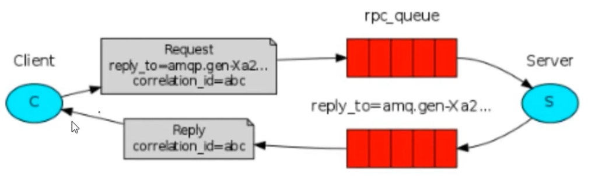
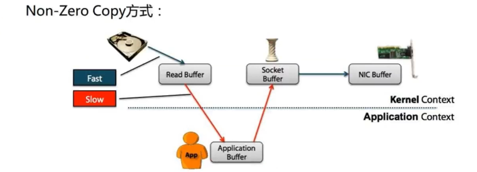

TODO: kafka底层架构补充

# 1. 说明

- 优点：
  - 分布式
  - 不丢数据
  - 可以多次消费

- SparkStreaming+Kafka有什么好处
  - 系统之间解耦
  - 峰值压力缓冲
    - 原本架构： flume-->SparkStreaming 。
      - 当服务器峰值时，数据量过大，可能导致SparkStreaming瘫痪
    - 现在：Flume-->kafka-->SparkStreaming
      - kafka会将数据存到磁盘中
      - kafka吞吐量非常高，使用堆外内存，零拷贝。一般公司三台kafka就完全够用
  - 异步通信
    >  
    - 一个请求队列
    - 一个结果响应队列

# 2. 架构

- 整体：
  - 生产者消费者模式
  - 可靠性保证：
    - 自己不丢数据，通过零拷贝，将数据存到内存中
    - 消费者不丢数据：默认在磁盘存7天，7天内，可以处理多次

- 节点：
  >  
  - producer:消息生产者
  - consumer：消息消费者
  - broker:kafka集群的server,负责处理消息读、写请求，存储消息
    - 没有主从关系
    - 依赖zookeeper进行协调
    - 负责消息的读，写和存储
    - 可以管理多个partition
  - topic:消息队列/分类
    - 一类消息的总称。 
    - 不同类消息会分别存储
    - 每个topic由多个partition组成。在创建topic时可以指定
      - partition:组成topic的单元，直接接触内存

- 消息存储模型
  >  
  - 总括：
    ```
    kafka里面的消息是有topic来组织的，简单的我们可以想象为一个队列，一个队列
    就是一个topic,然后它把每个topic又分为很多个partition,这个是为了做并行的
    ,在每个partition里面是有序的，相当于有序的队列，其中每个消息都有个序号，
    比如0到12,从前面读往后面写。

    一个partition对应一个broker,一个broker可以管多个partition,比如说，topic
    有6个partition,有两个broker,那每个broker就管3个partition。

    这个partition可以很简单想象为一个文件，当数据发过来的时候它就往这个
    partition上面append,追加就行，kafka和很多消息系统不一样，很多消息系统
    是消费完了我就把它删掉，而kafka是根据时间策略删除，而不是消费完就删除，
    在kafka里面没有一个消费完这么个概念，只有过期这样一个概念
    ```
  - 细节说明：
    - 一个topic分成多个partition
    - 每个partition内部消息**强有序**，严格按照FIFO；写消息时，其中的每个消息都有一个序号叫**offset**
      - 但是topic不是FIFO的
    - 消费时，每一个consumer对应一个partition，可以并行消费
    - **一个partition只对应一个broker**,**一个broker可以管多个partition**
    - 消息直接写入文件，并不是存储在内存中
    - 根据时间策略（默认一周）删除，而不是消费完就删除
    - producer自己决定往哪个partition写消息，
      > 一般key不为null时，使用hash。为null时，使用轮询
      - 可以是轮询的负载均衡，
        - 先随机到一个partition上，写一段时间后
        - 再随机到一个partition上
      - 或者是基于hash的partition策略。
    - Partition可以设置副本，是在创建Topic的时候设置

- 消费模型：
  - 图解：
    >  
    - 集群中画出的是一个topic的四个分区(这里为了说明就画一个topic)
  - 说明：
    - consumer自己维护消费到哪个offset
      - 0.8及之前：维护到zookeeper
      - 0.9及之后：维护道kafka集群
    - 每个consumer都有对应的group
    - group内是queue消费模型
      - 各个consumer消费不同的partition
      - 一个消息在group内只消费一次
        - 比如c1读P0读到了50，断了
        - c2此时可以读p0，但是只能从50开读
        - 另外如果总共有4个分区，那么一个group中最多要有4个Consumer，否则第5个Consumer也没办法消费(都被占用了)
    - 各个group各自独立消费，互不影响

- 特点总结：
  - 消息系统的特点：
    - 生存者消费者模型，FIFO
    - partition内部是FIFO的，partition之间呢不是FIFO的，当然我们可以把topic设为一个partition,这样就是严格的FIFO
  - 高性能：单节点支持上千个客户端，百MB/s吞吐
  - 持久性：消息直接持久化在普通磁盘上且性能好
    ```
    直接写到磁盘里面去，就是直接append到磁盘里面去，这样的好处是
    直接持久话，数据不会丢，第二个好处是顺序写，然后消费数据也是
    顺序的读，所以持久化的同时还能保证顺序读写
    ```
  - 分布式：数据副本元余、流量负载均衡、可扩展
    ```
  分布式，数据副本，也就是同一份数据可以到不同的broker上面去，
  也就是当一份数据，磁盘坏掉的时候，数据不会丢失，比如3个副本，
  就是在3个机器磁盘都坏掉的情况下数据才会丢。
    ```
  - 灵活：消息长时间持久化+Client维护消费状态
    ```
    消费方式非常灵活，第一原因是消息持久化时间跨度比较长，一天或
    者一星期等，第二消费状态自己维护消费到哪个地方了，可以自定义
    消费偏移量
    ```

# 3. 与其他消息队列对比

# 4. 堆外内存，零拷贝



---


# 5. 集群搭建

待做
<!--file:///D:/learn/githubRepo/JavaGuide/docs/system-design/distributed-system/message-queue/Kafka%E5%B8%B8%E8%A7%81%E9%9D%A2%E8%AF%95%E9%A2%98%E6%80%BB%E7%BB%93.md-->

# 参考资料

- [ ] [大数据技术体系（长期更新）](https://blog.csdn.net/Shockang/article/details/117266839)
- [ ] [kafka知识点总结](https://mp.weixin.qq.com/s/PjlSNftjafIA3cnlZAcUaA)
