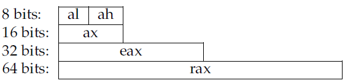
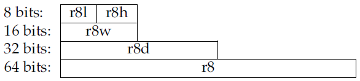
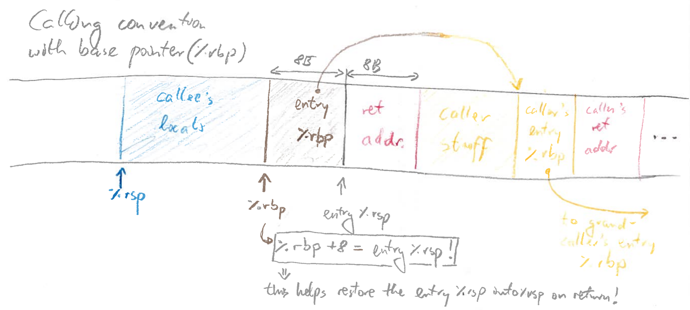
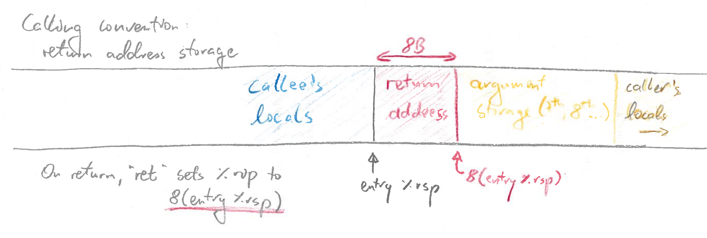
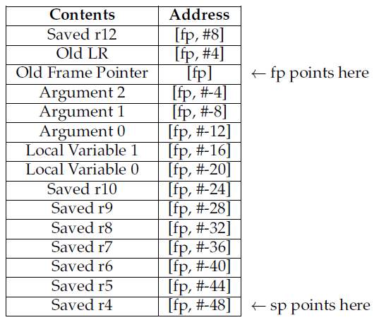

<!-- vim: shiftwidth=2
-->

# 引言

为了阅读Linux内核源代码，是需要一些汇编语言知识的。因为与架构相关的代码基本上都是用汇编语言编写的，所以掌握一些基本的汇编语言语法，能够更好地理解Linux内核源代码，甚至可以对各种架构的差异有一个更深入的理解。

大部分人可能认为汇编语言晦涩难懂，阅读手册又冗长乏味。但是常用的指令可能也就是30个。
许多其它的指令都是解决特定的情况而出现，比如浮点运算和多媒体指令。
所以，本文就从常用指令出发，基于GNU汇编语言格式，对x86_64架构和ARM架构下的指令做了一个入门介绍。

阅读本文需要一些硬件架构的知识。必要的时候，可以翻阅[Intel Software Developer Manual](http://www.intel.com/content/www/us/en/processors/architectures-software-developer-manuals.html)和[ARM Architecture Reference Manual](https://static.docs.arm.com/ddi0487/bb/DDI0487B_b_armv8_arm.pdf)。

# X86汇编语言基础入门

## 基本说明

对于相同的芯片架构，不同的芯片制造商或者其它开源工具可能会有不同的语法格式。所以，本文支持GNU编译器和汇编器，分别是`gcc`和`as`（有时候也称为`gas`）。

将C代码转换成汇编代码，是一种非常好的学习方式。所以，可以通过在编译选项中加入`-S`标志，生成汇编目标文件。在类Unix系统，汇编源代码文件使用`.s`的后缀标记。

比如，运行`gcc -S hello.c -o hello.s`编译命令，编译hello程序：

```cpp
#include <stdio.h>

int main( int argc, char *argv[] )
{
  printf("hello %s\n","world");
  return 0;
}
```

可以在`hello.s`文件中看到如下类似的输出：

```nasm
.file "test.c"
.data
.LC0:
        .string "hello %s\n"
.LC1:
        .string "world"
.text
.global main
main:
        PUSHQ %rbp
        MOVQ %rsp, %rbp
        SUBQ $16, %rsp
        MOVQ %rdi, -8(%rbp)
        MOVQ %rsi, -16(%rbp)
        LEA .LC0(%rip), %rax
        LEA .LC1(%rip), %rsi
        MOVQ %rax, %rdi
        MOVQ $0, %rax
        CALL printf
        MOVQ $0, %rax
        LEAVE
        RET
```

从上边的汇编代码中可以看出，汇编代码大概由三部分组成：

- **伪指令/指示(Directives)**
  - 以点号开始，用来指示对编译器，连接器，调试器有用的结构信息。 指示本身不是汇编指令。
  - 比如，
    - `.file`记录最初的源文件名称，这个名称对调试器有用
    - `.data`，.data表示数据段(section)的开始地址
    - `.text`，表示实际程序代码的起始
    - `.string`，表示数据段中的字符串常量
    - `.type`，用于指示汇编器如何解释一个符号（例如变量名或函数名）的类型
    - `.global main`，表示符号`main`是一个全局符号，可以被其它代码模块访问
  - 更多可以查看 [GNU 汇编器 `as` 的文档](https://sourceware.org/binutils/docs/as/index.html)

- **标签(Labels)**
  - 以冒号结尾，用来把标签名和标签出现的位置关联起来。
  - 标签是由编译器产生，链接器使用的一种引用符号。
  - 本质上，就是对代码段的一个作用域打上标签，方便链接器在链接阶段将所有的代码拼接在一起。
  - 所以，标签就是链接器的一种助记符。
  - 例如，
    - 标签`.LC0:`表示紧接着的字符串的名称是`.LC0`.
    - 标签`main:`表示指令 `pushq %rbp` 是main函数的第一个指令。
    - 按照惯例，  **以点号开始的标签都是编译器生成的临时局部标签，其它标签则是用户可见的函数和全局变量名称** 。

- **指令(Instructions)**
  - 真正的汇编代码，其实就是机器码的助记符。GNU汇编对大小写不敏感，但是为了统一，我们一般使用大写。

汇编代码编译成可执行文件，可以参考下面的代码编译示例：

```
% gcc hello.s -o hello
% ./hello
hello world
```

把汇编代码生成目标文件，然后可以使用`nm`工具显示代码中的符号，参考下面的内容：

```
% gcc hello.s -c -o hello.o
% nm hello.o
0000000000000000    T main
                    U printf
```

> nm -> 是names的缩写，nm命令主要是用来列出某些文件中的符号（换句话说就是一些函数和全局变量）。

上面的代码显示的符号对于链接器都是可用的。

- `main`出现在目标文件的代码段（T），位于地址0处，也就是说位于文件的开头；
- `printf`未定义（U），因为它需要从库文件中链接。
- 但是像`.LC0`之类的标签出现，因为它们没有使用`.global`，所以说对于链接器是无用的。

编写C代码，然后编译成汇编代码。这是学习汇编一个好的开始。


X86是一个通用术语，指从最初的IBM-PC中使用的Intel-8088处理器派生（或兼容）的一系列微处理器，包括8086、80286、386、486以及其它许多处理器。
每一代cpu都增加了新的指令和寻址模式（从8位到16位再到32位）。同时还保留了与旧代码的向后兼容性。
各种竞争对手(如AMD)生产的兼容芯片也实现了相同的指令集。

但是，到了64位架构的时候，Intel打破了这个传统，引入了新的架构（IA64）和名称（Itanium），不再向后兼容。
它还实现了一种新的技术-超长指令字（VLIW），在一个Word中实现多个并发操作。因为指令级的并发操作可以显著提升速度。

AMD还是坚持老方法，实现的64位架构（AMD64）向后兼容Intel和AMD芯片。不论两种技术的优劣，AMD的方法首先赢得了市场，随后Intel也生产自己的64位架构Intel64，并与AMD64和它自己之前的产品兼容。

所以，X86-64是一个通用术语，包含AMD64和Intel64架构。

X86-64是复杂指令集CISC的代表。

## 寄存器和数据类型

### 通用寄存器

X86-64具有16个通用目的64位整数寄存器：

| 1    | 2    | 3    | 4    | 5    | 6    | 7    | 8    | 9   | 10  | 11   | 12   | 13   | 14   | 15   | 16   |
| ---- | ---- | ---- | ---- | ---- | ---- | ---- | ---- | --- | --- | ---- | ---- | ---- | ---- | ---- | ---- |
| %rax | %rbx | %rcx | %rdx | %rsi | %rdi | %rbp | %rsp | %r8 | %r9 | %r10 | %r11 | %r12 | %r13 | %r14 | %r15 |

：

<details>
<summary style="color:red;">寄存器速查表</summary>

---

| Full register name         | 32-bit (bits 0–31) | 16-bit (bits 0–15) | 8-bit low (bits 0–7) | 8-bit high (bits 8–15) | Use in calling convention                                  | Callee-saved? |
| -------------------------- | ------------------ | ------------------ | -------------------- | ---------------------- | ---------------------------------------------------------- | ------------- |
| General-purpose registers: |                    |                    |                      |                        |                                                            |               |
| **%rax**                   | %eax               | %ax                | %al                  | %ah                    | Return value (accumulator)                                 | No            |
| **%rbx**                   | %ebx               | %bx                | %bl                  | %bh                    | –                                                          | **Yes**       |
| **%rcx**                   | %ecx               | %cx                | %cl                  | %ch                    | 4th function argument                                      | No            |
| **%rdx**                   | %edx               | %dx                | %dl                  | %dh                    | 3rd function argument                                      | No            |
| **%rsi**                   | %esi               | %si                | %sil                 | –                      | 2nd function argument                                      | No            |
| **%rdi**                   | %edi               | %di                | %dil                 | –                      | 1st function argument                                      | No            |
| **%r8**                    | %r8d               | %r8w               | %r8b                 | –                      | 5th function argument                                      | No            |
| **%r9**                    | %r9d               | %r9w               | %r9b                 | –                      | 6th function argument                                      | No            |
| **%r10**                   | %r10d              | %r10w              | %r10b                | –                      | –                                                          | No            |
| **%r11**                   | %r11d              | %r11w              | %r11b                | –                      | –                                                          | No            |
| **%r12**                   | %r12d              | %r12w              | %r12b                | –                      | –                                                          | **Yes**       |
| **%r13**                   | %r13d              | %r13w              | %r13b                | –                      | –                                                          | **Yes**       |
| **%r14**                   | %r14d              | %r14w              | %r14b                | –                      | –                                                          | **Yes**       |
| **%r15**                   | %r15d              | %r15w              | %r15b                | –                      | –                                                          | **Yes**       |
| Special-purpose registers: |                    |                    |                      |                        |                                                            |               |
| **%rsp**                   | %esp               | %sp                | %spl                 | –                      | Stack pointer                                              | **Yes**       |
| **%rbp**                   | %ebp               | %bp                | %bpl                 | –                      | Base pointer (general-purpose in some compiler modes)      | **Yes**       |
| **%rip**                   | %eip               | %ip                | –                    | –                      | Instruction pointer (Program counter; called `$pc` in GDB) | \*            |
| **%rflags**                | %eflags            | %flags             | –                    | –                      | Flags and condition codes                                  | No            |

---

</details>

说它们是通用寄存器是不完全正确的，因为早期的CPU设计寄存器是专用的，不是所有的指令都能用到每一个寄存器。
从名称上就可以看出来，前八个寄存器的作用，比如rax就是一个累加器。

> AT&T语法-Intel语法
>
> GNU使用传统的AT&T语法，许多类Unix操作系统使用这种风格，与DOS和Windows上用的Intel语法是不同的。 下面一条指令是符合AT&T语法：
>
> ```
>   MOVQ %RSP, %RBP
> ```
>
> MOVQ是指令，%表明RSP和RBP是寄存器。AT&T语法，源地址在前，目的地址在后。
>
> Intel语法省略掉%，参数顺序正好相反。同样的指令，如下所示：
>
> ```
>   MOVQ RBP, RSP
> ```
>
> 所以，看%就能区分是AT&T语法，还是Intel语法。

随着设计的发展，新的指令和寻址模式被添加进来，使得这些寄存器几乎一样了。其余的指令，尤其是和字符串处理相关的指令，要求使用rsi和rdi寄存器。
另外，还有两个寄存器专门为 **栈指针寄存器（rsp）** 和 **基址指针寄存器（rbp）** 保留。最后的8个寄存器没有特殊的限制。

随着处理器从8位一直扩展到64位，有一些寄存器还能拆分使用:

- rax的低八位是一个8位寄存器al，
- 接下来的8位称为ah。
- 如果把rax的低16位组合起来就是ax寄存器，
- 低32位就是累加器eax，
- 整个64位才是rax寄存器。

这样设计的目的是向前兼容，具体可以参考下图：

图1: X86 寄存器结构



r8-r15，这8个寄存器具有相同的结构，就是命名机制不同。

图2: X86 寄存器结构



为了简化描述，我们还是着重讲64位寄存器。
但是，大多数编译器支持混合模式：一个字节可以表示一个布尔型；32位对于整数运算就足够了，因为大多数程序不需要大于2^32以上的整数值；
64位类型常用于内存寻址，能够使虚拟地址的空间理论上可以达到1800万TB（1TB=1024GB）。

### 其他寄存器

- 段寄存器 (Segment registers)
  - CS:代码段寄存器，存储当前代码的段基址.
  - SS:堆栈段寄存器，存储堆栈段的段基址.
  - DS:数据段寄存器，存储数据段的段基址.
  - ES:附加段寄存器，用于串操作指令，如字符串复制.
  - FS 和GS:附加段寄存器，用于访问附加的内存区域

- 单指令多数据和浮点运算指令寄存器 (SIMD and FP registers)

  > X86家族经历了几代 SIMD 和浮点指令，每一代都引入、扩展或重新定义各种各样的指令

  - x87

    > X87最初是一个独立的协处理器，有自己的指令集和寄存器，从80486开始，x87指令就经常被植入x86内核本身。
    > 由于其协处理器的历史，x87定义了正常的寄存器（类似于GPR）和控制FPU状态所需的各种特殊寄存器。

    - ST0到ST7：8个80位浮点寄存器
    - FPSW, FPCW, FPTW：控制、状态和标签字寄存器
    - 数据操作数指针Data operand pointer数
    - 指令指针Instruction pointer：x87状态机显然持有它自己的当前x87指令的拷贝。
    - 最后一条指令的操作码Last instruction opcode：与x87操作码不同，并且有它自己的寄存器。
  - MMX

    > MMX是Intel在X86芯片上添加SIMD指令的第一次尝试，发布于1997年。MMX寄存器实际上是x87 STn寄存器的子集。
    > 每个64位MMn占用其相应STn的尾数部分。因此，x86（和x86-64）CPU不能同时执行MMX和x87指令。

    - MMX定义了MM0到MM7，8个寄存器，
    - 另外还有一个新的状态寄存器（MXCSR），以及用于操作它的加载/存储指令对（LDMXCSR和STMXCSR）。
  - SSE and AVX

    > 为了简单起见，把SSE和AVX包成一个部分：它们使用与GPR和x87/MMX相同的子寄存器模式，所以放在一个表中。

    | AVX-512 (512-bit) | AVX-2 (256-bit) | SSE (128-bit) |
    | ----------------- | --------------- | ------------- |
    | ZMM0              | YMM0            | XMM0          |
    | ZMM1              | YMM1            | XMM1          |
    | ZMM2              | YMM2            | XMM2          |
    | ZMM3              | YMM3            | XMM3          |
    | ZMM4              | YMM4            | XMM4          |
    | ZMM5              | YMM5            | XMM5          |
    | ZMM6              | YMM6            | XMM6          |
    | ZMM7              | YMM7            | XMM7          |
    | ZMM8              | YMM8            | XMM8          |
    | ZMM9              | YMM9            | XMM9          |
    | ZMM10             | YMM10           | XMM10         |
    | ZMM11             | YMM11           | XMM11         |
    | ZMM12             | YMM12           | XMM12         |
    | ZMM13             | YMM13           | XMM13         |
    | ZMM14             | YMM14           | XMM14         |
    | ZMM15             | YMM15           | XMM15         |
    | ZMM16             | YMM16           | XMM16         |
    | ZMM17             | YMM17           | XMM17         |
    | ZMM18             | YMM18           | XMM18         |
    | ZMM19             | YMM19           | XMM19         |
    | ZMM20             | YMM20           | XMM20         |
    | ZMM21             | YMM21           | XMM21         |
    | ZMM22             | YMM22           | XMM22         |
    | ZMM23             | YMM23           | XMM23         |
    | ZMM24             | YMM24           | XMM24         |
    | ZMM25             | YMM25           | XMM25         |
    | ZMM26             | YMM26           | XMM26         |
    | ZMM27             | YMM27           | XMM27         |
    | ZMM28             | YMM28           | XMM28         |
    | ZMM29             | YMM29           | XMM29         |
    | ZMM30             | YMM30           | XMM30         |
    | ZMM31             | YMM31           | XMM31         |

    > 换句话说：每个ZMMn的低字节部分是YMMn，而每个YMMn的低字节部分是XMMn。
    > 没有直接的寄存器可以只访问YMMn的高字节部分，或者ZMMn的高128位或者256位字部分。

    - SSE还定义了一个新的状态寄存器MXCSR，它包含的标志与RFLAGS中的算术标志大致平行（与x87状态字中的浮点标志一起）。
    - AVX-512还引入了8个OPMask寄存器，k0到k7。
      - k0是一个特殊的情况，它的行为很像一些RISC ISA上的 “零 “寄存器：它不能被存储到，而且从它的加载总是产生一个全部为1的位掩码。

- 边界寄存器(Bounds registers)

  > 英特尔在[MPX](https://en.wikipedia.org/wiki/Intel_MPX)中加入了BR，其目的是提供硬件加速的边界检查。
  > 但好像名声并不是很大，暂且放这里把。

  - BND0 - BND3：单独的128位寄存器，每个都包含一对绑定的地址。
  - BNDCFG: 绑定配置，内核模式。
  - BNDCFU: 绑定配置，用户模式。
  - BNDSTATUS: 绑定状态，在一个#BR被提出后。

- 调试寄存器(Debug registers)

  > 正如他们的名字那样，帮助和加速软件调试器的寄存器，如GDB。
  > 有6个调试寄存器，分为两种类型：

  - DR0到DR3包含线性地址，每个地址都与一个断点条件相关。
  - DR6和DR7是调试状态和控制寄存器。DR6的低位表示遇到了哪些调试条件（在进入调试异常处理程序时），而DR7控制哪些断点地址被启用以及它们的断点条件（例如，当某一地址被写入时）。
  - 那么，DR4和DR5呢？不清楚! 但它们确实有编码，但分别被当做DR6和DR7，或者在 `CR4.DE[bit 3] = 1.`时产生 `#UD` 异常。

- 控制寄存器

  > x86-64 定义了一组控制寄存器，可用于管理和检查 CPU 的状态。
  > 有 16 个“主”控制寄存器，所有这些都可以通过[`MOV` variant](https://www.felixcloutier.com/x86/mov-1)变体访问:

  - | Name | Purpose                        |
  - | ---- | ------------------------------ |
  - | CR0  | Basic CPU operation flags      |
  - | CR1  | Reserved                       |
  - | CR2  | Page-fault linear address      |
  - | CR3  | Virtual addressing state       |
  - | CR4  | Protected mode operation flags |
  - | CR5  | Reserved                       |
  - | CR6  | Reserved                       |
  - | CR7  | Reserved                       |
  - | CR8  | Task priority register (TPR)   |
  - | CR9  | Reserved                       |
  - | CR10 | Reserved                       |
  - | CR11 | Reserved                       |
  - | CR12 | Reserved                       |
  - | CR13 | Reserved                       |
  - | CR14 | Reserved                       |
  - | CR15 | Reserved                       |

  > 所有reserved的控制寄存器在访问时都会产生`#UD`异常
  > 除了 “主 “CRn控制寄存器之外，还有 “扩展 “控制寄存器，由XSAVE功能集引入。
  > 截至目前，XCR0是唯一指定的扩展控制寄存器。
  > 扩展控制寄存器使用[`XGETBV`](https://www.felixcloutier.com/x86/xgetbv) 和 [`XSETBV`](https://www.felixcloutier.com/x86/xsetbv)而不是MOV的变种。

- 系统表指针寄存器(System table pointer registers)

  > 这就是英特尔SDM对这些寄存器的称呼。这些寄存器保存着各种保护模式表的大小和指针。
  > 据我所知，它们有四个：

  - GDTR：存放GDT的大小和基址。
  - LDTR：保存LDT的大小和基址。
  - IDTR：保存IDT的大小和基址。
  - TR：保存TSS的选择器和TSS的基址。

  > GDTR、LDTR和IDTR在64位模式下都是80位：16个低位是寄存器的表的大小，高64位是表的其实地址。
  > TR同样也是80位。16位用于选择器（其行为与段选择器相同），然后另外64位用于TSS的基本地址。

- Memory-type-ranger registers

  > 这些是有趣的例子：与到目前为止所涉及的所有其他寄存器不同，这些不是多核芯片中某个特定CPU所独有的，相反，它们是所有内核共享的。

  - MTTR的数量似乎因CPU型号而异，并且在很大程度上被基于MSR的 页面属性表([page attribute table](https://en.wikipedia.org/wiki/Page_attribute_table)) 所取代

- MSR(Model specific registers)
  - 像XCR一样，MSR可以通过一对指令间接地（通过标识符）访问:`RDMSR`和`WRMSR`。
  - MSR本身是64位的，但起源于32位的时代，所以RDMSR和WRMSR从两个32位的寄存器(EDX和EAX)中读取和写入
  - 举个例子：下面是访问IA32_MTRRCAP MSR的设置和RDMSR调用，其中包括（除其他外）系统上可用的MTRR的实际数量。

    ```nasm
    MOV ECX, 0xFE ; 0xFE = IA32_MTRRCAP
    RDMSR
    ; The bits of IA32_MTRRCAP are now in EDX:EAX
    ```

## 寻址模式

### 说明

MOV指令可以使用不同的寻址模式，在寄存器和内存之间搬运数据。使用B、W、L和Q作为后缀，添加在指令后面，决定操作的数据的位数：

| 后缀 | 名称     | 大小           |
| ---- | -------- | -------------- |
| B    | BYTE     | 1 字节（8位）  |
| W    | WORD     | 2 字节（16位） |
| L    | LONG     | 4 字节（32位） |
| Q    | QUADWORD | 8 字节（64位） |

MOVB移动一个字节，MOVW移动2个字节，MOVL移动4个字节，MOVQ移动8个字节。
**在某些情况下，可以省略掉这个后缀，编译器可以推断正确的大小** 。
但还是建议加上后缀。

MOV指令可以使用下面几种寻址模式：

- **全局符号**
  - 一般给其定义一个简单的名称，通过这个名称来引用，比如x、printf之类的。
  - 编译器会将其翻译成绝对地址或用于地址计算。
- **立即数**
  - 使用美元符号`$标记`，比如`$56`。但是立即数的使用是有限制范围的。
- **寄存器**
  - 使用寄存器寻址，比如%rbx。
- **间接引用**
  - 通过寄存器中包含的地址进行寻址，比如`(%rsp)`，表示引用`%rsp`指向的那个值。
- **基址变址寻址**
  - 在 **间接引用** 的基础上再加上一个常数作为地址进行寻址。
  - 比如`-16(%rcx)`，就是寄存器rcx中的地址再减去16个字节的地址处的内容。
  - 这种模式对于操作堆栈，局部变量和函数参数非常重要。
- **复杂地址寻址**
  - 比如，`D(RA,RB,C)`，就是引用`*RA + RB * C + D`计算后的地址处的值。
    - RA和RB是通用目的寄存器，
    - C可以是1、2、4或8，
    - D是一个整数位移。
    - 这种模式一般用于查找数组中的某一项的时候，RA给出数组的首地址，RB计算数组的索引，C作为数组元素的大小，D作为相对于那一项的偏移量。

下表是不同寻址方式下加载一个64位值到`%rax`寄存器的示例:

| 寻址模式     | 示例                        |
| ------------ | --------------------------- |
| 全局符号     | MOVQ x, %rax                |
| 立即数       | `MOVQ $56, %rax`            |
| 寄存器       | MOVQ %rbx, %rax             |
| 间接引用     | MOVQ (%rsp), %rax           |
| 基址变址寻址 | MOVQ -8(%rbp), %rax         |
| 复杂地址寻址 | MOVQ -16(%rbx,%rcx,8), %rax |

大部分时候，目的操作数和源操作数都可以使用相同的寻址模式，但是也有例外，
比如`MOVQ -8(%rbx), -8(%rbx)`，源和目的都使用基址变址寻址方式就是不可能的。具体的就需要查看手册了。

有时候，你可能需要加载变量的地址而不是其值，这对于使用字符串或数组是非常方便的。为了这个目的，可以使用`LEA`指令（加载有效地址），示例如下：

| 寻址模式     | 示例                        |
| ------------ | --------------------------- |
| 全局符号     | LEAQ x, %rax                |
| 基址变址寻址 | LEAQ -8(%rbp), %rax         |
| 复杂地址寻址 | LEAQ -16(%rbx,%rcx,8), %rax |

### `%rip` 相对寻址

在 x86-64 架构中，`%rip`（Register Instruction Pointer）是一个特殊用途的寄存器（GDB 中为 `$pc`, Program counter）:

- 它始终存储下一条即将执行的指令的内存地址（位于程序的代码段中）。
- 处理器会在每条指令执行后自动递增 `%rip`，
- 而控制流指令（如跳转、分支）则会修改 %rip 的值，从而改变下一条要执行的指令。

x86-64代码常使用`%rip`相对寻址方式引用全局变量：

- 例如名为a的全局变量会被引用为`a(%rip)`。
- 这种引用方式支持位置无关代码（PIC）这一安全特性，尤其适用于位置无关可执行文件（PIE）——即其代码能在内存任意加载位置正常运行的程序。
  - 当操作系统加载PIE时，会随机选择一个起始地址，并将所有指令和全局变量相对于该起始地址加载。
  - PIE的指令从不使用直接寻址引用全局变量：例如不会出现`movl global_int, %eax`这样的指令。
  - 相反，编译器会生成相对于下一条指令`%rip`偏移量的引用方式：
    - 要将全局变量加载到寄存器时，编译器会生成`movl global_int(%rip), %eax`指令。
- 这些相对地址的运作与起始地址无关

例如，假设位于（起始地址+0x80）的指令需要将位于（起始地址+0x1000）的变量`g`加载到`%rax`中。

- 在非PIE程序中，指令可能写作`movq g, %rax`；但这依赖于g具有固定地址。
- 而在PIE中，指令会写作`movq g(%rip), %rax`，这种方式无需在编译时获知程序代码在内存中的起始地址
- （`%rip`指向一个指令时，这个位置起始位置是相对的，所以任何相对于%rip的地址也就是相对于起始点的地址）

## 基本算术运算

你需要为你的编译器提供四种基本的算术指令：整数加法、减法、乘法和除法。

ADD和SUB指令有两个操作数：源操作目标和既作源又作目的的操作目标。比如：

```
ADDQ %rbx, %rax
```

将%rbx加到%rax上，把结果存入%rax (%rax=%rbx+%rax)。这必须要小心，以免破坏后面可能还用到的值。比如：`c = a+b+b`这样的语句，转换成汇编语言大概是下面这样：

```
MOVQ a, %rax
MOVQ b, %rbx
ADDQ %rbx, %rax
ADDQ %rbx, %rax
MOVQ %rax, c
```

`IMUL`乘法指令有点不一样，因为通常情况下，两个64位的整数会产生一个128位的整数。
IMUL指令将第一个操作数乘以rax寄存器中的内容，然后 **把结果的低64位存入rax寄存器中，高64位存入rdx寄存器** 。
（这里有一个隐含操作， **rdx寄存器在指令中并没有提到** ）

比如，假设这样的表达式`c = b*(b+a)`，将其转换成汇编语言；在这儿，a、b、c都是全局整数。

```
MOVQ a, %rax
MOVQ b, %rbx
ADDQ %rbx, %rax
IMULQ %rbx
MOVQ %rax, c
```

IDIV指令做相同的操作，除了最后的处理：

- 它把128位整数的 **低64位存入rax寄存器，高64位存入rdx寄存器** ，
- 然后除以指令中的第一个操作数。
- 商存入rax寄存器，余数存入rdx寄存器。（如果想要取模指令，只要rdx寄存器的值即可。）

**为了正确使用除法，必须保证两个寄存器有必要的符号位** 。

- 如果已经整除，只有被除数低64位就可以表示，但是是负数，那么高64位(%rbx寄存器)必须都是1，才能完成二进制补码操作。
- CQO指令可以实现这个特殊目的，将rax寄存器的值的符号位扩展到rdx寄存器中。

比如，一个数被5整除：

```
MOVQ a, %rax    # 设置被除数的低64位
CQO             # 符号位扩展到%rdx
IDIVQ $5        # %rdx=%rax / 5, 结果保存到%rax
```

自增和自减指令INC、DEC，操作数必须是一个寄存器的值。例如，表达式`a = ++b`转换成汇编语句后：

```
MOVQ b, %rax
INCQ %rax
MOVQ %rax, b
MOVQ %rax, a
```

指令AND、OR和XOR，提供按位操作。按位操作意味着把操作应用到操作数的每一位，然后保存结果。

所以，`AND $0101B $0110B`就会产生结果`$0100B`。同样，NOT指令对操作数的每一位执行取反操作。比如，表达式`c = (a & ˜b)`，可以转换成下面这样的汇编代码：

```
MOVQ a, %rax
MOVQ b, %rbx
NOTQ %rbx
ANDQ %rax, %rbx
MOVQ %rbx, c
```

这里需要注意的是，算术位操作与逻辑bool操作是不一样的。比如，如果你定义false为整数0，true为非0。在这种情况下，`$0001`是true，而`NOT $0001B`的结果也是true！要想实现逻辑bool操作，需要使用CMP比较指令。

与MOV指令一样，各种算术指令能在不同寻址模式下工作。但是，对于一个编译器项目，使用MOV指令搬运寄存器之间或者寄存器与立即数之间的值，然后仅使用寄存器操作，会更加方便。

>  **浮点数** :
> 我们不讨论浮点数操作细节，只需要知道它们使用一套不同的指令和寄存器。
> 在老式机器上，浮点指令是使用可选的外部8087 FPU处理的，所以被称作X87操作，虽然现在已经集成到了CPU里面。
> X87 FPU包含8个排列在栈中的80位寄存器(R0-R7)。
> 做浮点算术前，代码必须先把数据push到FPU栈，然后操作栈顶的数据，并回写到内存。
> 内存中双精度浮点数是以64位的长度存储的。这种架构的一个奇怪的地方是，FPU的精度是80位，比内存中的存储方式精度高。
> 结果，浮点计算的值会改变，取决于数据在内存和寄存器之间移动的具体顺序。
> 浮点数数学计算比它看上去要难懂，推荐阅读：
>
> 1. Intel 手册8-1章节。
> 2. [What every computer scientist should know about floating-point arithmetic](https://dl.acm.org/doi/10.1145/103162.103163)
> 3. [What Every Programmer Should Know About Floating-Point](https://floating-point-gui.de/)

## 比较和跳转

使用`JMP`跳转指令，我们就可以创建一个简单的无限循环，使用`rax`累加器从0开始计数，代码如下：

```
    MOVQ $0, %rax
loop:
    INCQ %rax
    JMP loop
```

但是，我们大部分时候需要的是一个有限的循环或者if-then-else这样的语句，所以必须提供计算比较值并改变程序执行流的指令。大部分汇编语言都提供2个指令：比较和跳转。

CMP指令完成比较。比较两个不同的寄存器，然后设置`%rflags`寄存器中对应的位，记录比较的值是相等、大于还是小于。
（注意：比较的是第二个操作数相对于第一个操作数的关系）

最常用的位(flag)有：

- ZF (zero flag): 最近的操作结果为0时置位
- SF (sign flag): 最近的操作得到的结果为负数时置位
- CF (carry flag): 最近的操作使最高位产生了进位。可用来检查无符号操作的溢出
- OF (overflow flag): 最近的操作导致一个补码溢出（正溢出或负溢出）

<details>
<summary style="color:red;">flag和条件判断的原理</summary>

---

| Instruction | Mnemonic                    | C example               | Flags             |
| ----------- | --------------------------- | ----------------------- | ----------------- |
| j (jmp)     | Jump                        | `break;`                | (Unconditional)   |
| je (jz)     | Jump if equal (zero)        | `if (x == y)`           | ZF                |
| jne (jnz)   | Jump if not equal (nonzero) | `if (x != y)`           | !ZF               |
| jg (jnle)   | Jump if greater             | `if (x > y)`, signed    | !ZF && !(SF ^ OF) |
| jge (jnl)   | Jump if greater or equal    | `if (x >= y)`, signed   | !(SF ^ OF)        |
| jl (jnge)   | Jump if less                | `if (x < y)`, signed    | SF ^ OF           |
| jle (jng)   | Jump if less or equal       | `if (x <= y)`, signed   | (SF ^ OF) \|\| ZF |
| ja (jnbe)   | Jump if above               | `if (x > y)`, unsigned  | !CF && !ZF        |
| jae (jnb)   | Jump if above or equal      | `if (x >= y)`, unsigned | !CF               |
| jb (jnae)   | Jump if below               | `if (x < y)`, unsigned  | CF                |
| jbe (jna)   | Jump if below or equal      | `if (x <= y)`, unsigned | CF \|\| ZF        |
| js          | Jump if sign bit            | `if (x < 0)`, signed    | SF                |
| jns         | Jump if not sign bit        | `if (x >= 0)`, signed   | !SF               |
| jc          | Jump if carry bit           | N/A                     | CF                |
| jnc         | Jump if not carry bit       | N/A                     | !CF               |
| jo          | Jump if overflow bit        | N/A                     | OF                |
| jno         | Jump if not overflow bit    | N/A                     | !OF               |

---

</details>

**使用带有条件跳转的指令自动检查`%rflags`寄存器并跳转到正确的位置** 。

| 指令 | 意义           |
| ---- | -------------- |
| JE   | 如果相等跳转   |
| JNE  | 如果不相等跳转 |
| JL   | 小于跳转       |
| JLE  | 小于等于跳转   |
| JG   | 大于跳转       |
| JGE  | 大于等于跳转   |


下面是使用`%rax`寄存器计算0到5累加值的示例：

```
    MOVQ $0, %rax
loop:
    INCQ %rax
    CMPQ $5, %rax
    JLE loop
```

下面是一个条件赋值语句，如果全局变量x大于0，则全局变量y=10，否则等于20：

```
        MOVQ x, %rax
        CMPQ $0, %rax
        JLE .L1
.L0:
        MOVQ $10, $rbx
        JMP .L2
.L1:
        MOVQ $20, $rbx
.L2:
        MOVQ %rbx, y
```

注意，跳转指令要求编译器定义标签。这些标签在汇编文件内容必须是唯一且私有的，对文件外是不可见的，除非使用`.global`伪指令。
标签像`.L0`、`.L1`等是由编译器根据需要生成的。

## 函数调用

### 栈

栈是记录函数调用过程和局部变量的一种数据结构，也可以说，如果没有栈，C语言的函数是无法工作的。
`%rsp`寄存器称为栈指针寄存器，永远指向栈顶元素（ **栈的增长方向是向下的** ）。

为了把`%rax`寄存器的内容压入栈中，我们必须把`%rsp`寄存器减去8（`%rax`寄存器的大小），然后再把`%rax`寄存器内容写入到`%rsp`寄存器指向的地址处：

```
SUBQ $8, %rsp
MOVQ %rax, (%rsp)
```

从栈中弹出数据，正好相反：

```
MOVQ (%rsp), %rax
ADDQ $8, %rsp
```

如果仅仅是抛弃栈中最近的值，可以只移动栈指针正确的字节数即可：

```
ADDQ $8, %rsp
```

当然了，压栈和出栈是常用的操作，所以有专门的指令：

```
PUSHQ %rax
POPQ %rax
```

需要注意的是， **64位系统中，PUSH和POP指令被限制只能使用64位值** ，所以，如果需要压栈、出栈比这小的数必须使用MOV和ADD实现。

### 栈调用规范 (calling convention)

先介绍一个简单的栈调用习惯：

1. 参数按照相反的顺序被压入栈，然后使用CALL调用函数。
2. 被调用函数使用栈上的参数，完成函数的功能，然后返回结果到`eax`寄存器中。
3. 调用者删除栈上的参数。

但是，64位代码为了尽可能多的利用X86-64架构中的寄存器，使用了新的调用习惯。称之为 **System V ABI** ，
详细的细节可以参考 [System V Application Binary Interface](https://gitlab.com/x86-psABIs/x86-64-ABI) 或者[wiki: x86 calling conventions](https://en.wikipedia.org/wiki/X86_calling_conventions#x86-64_Calling_Conventions)

这儿，我们总结如下：



- caller:
  - 处理参数：
    - 前6个参数（包括指针和其它可以存储为整形的类型）依次保存在寄存器`%rdi`、`%rsi`、`%rdx`、`%rcx`、`%r8`和`%r9`。
    - 前8个浮点型参数依次存储在寄存器`%xmm0`-`%xmm7`
    - 超过这些寄存器个数的参数才被压栈。这些压栈的参数是 **从右边向左** 压栈。
      - 也就是说，如果是int类型:第7个参数，位置为`8(%rsp)`，第8个为`16(%rsp)`
    - 如果函数接受可变数量的参数(如printf)，则必须将`%rax`寄存器设置为浮点参数的数量。
  - 如果需要的话，保存 **caller-saved** 寄存器的值 (入栈)
  - 执行 `callq function` 的时候，会将下一条指令的地址压入栈，然后跳转到callee的地址。
    - 基本等价：
      - `pushq $NEXT_INSTRUCTION; jmp FUNCTION` 或者 ` subq $8, %rsp; movq $NEXT_INSTRUCTION, (%rsp); jmp FUNCTION`
      - 其中`NEXT_INSTRUCTION`是`callq`之后的指令的地址
    - 对齐注意：
      - 在执行函数调用 (CALL) 之前，`%rsp` 必须 **16-byte** 对齐。
      - `call`会把8 字节的地址压入堆栈，因此当函数获得控制权时，`%rsp` 是不对齐的。
      - 必须提前自行腾出额外的空间，例如压入某些内容或从 %RSP 中减去 8。
- callee:
  - 此时 %rsp 指向为 `entry %rsp` (表示开始执行 callee 指令时，`%rsp`指向的地址)
  - `pushq %rbp`: 把 **caller的栈底地址** 压到 callee 的栈中 (`%rbp` 是 callee-saved)
  - `movq %rsp, %rbp`: 把 **callee的栈底地址** 写入到`%rbp`
    - `%rbp` 被称为 callee 的 `frame pointer` 或者 `base pointer`。
    - callee返回前，`%rsp`可能会变化，但是`%rbp` 不变。`%rbp`=`entry %rsp`-8
    - `%rbp` 为局部变量提供了一个稳定的参考点
  - 函数的返回值存储在`%rax`
  - 执行完成之后，以 ` movq %rbp, %rsp; popq %rbp; retq` 结束。或者等效指令：`leave; retq.`
    - 恢复`%rsp` 为 `entry %rsp`，恢复 `%rbp` 存储 caller的栈底地址
    - callee 执行 `retq` 指令
      - 类似 `popq %rip`
      - 从堆栈中 pop 出地址(`callq`时压入的地址)，并将地址写入到 `%rip`
- caller:
  - 清理为参数准备的空间
  - 如果需要的话，恢复 **caller-saved** 寄存器的值(出栈)


调用者保存( **caller-saved** )和 被调用者保存( **callee-saved** ):

- 有一些是 **调用者保存**
  - 意味着函数在调用其它函数之前必须保存这些值。
  - 比如栈顶和栈底指针
- 另外一些则由 **被调用者保存** ，
  - 也就是说，这些寄存器可能会在被调用函数中修改
  - 被调用的函数可以使用这些寄存器，但它必须保证这些寄存器恢复到原来的值
  - 其他寄存器，callee可以随便修改
- 保存参数和结果的寄存器根本不需要保存

下表详细地展示了这些细节：

| 寄存器 | 目的     | 谁保存       |
| ------ | -------- | ------------ |
| %rax   | 结果     | 不保存       |
| %rbx   | 临时     | 被调用者保存 |
| %rcx   | 参数4    | 不保存       |
| %rdx   | 参数3    | 不保存       |
| %rsi   | 参数2    | 不保存       |
| %rdi   | 参数1    | 不保存       |
| %rbp   | 基址指针 | 被调用者保存 |
| %rsp   | 栈指针   | 被调用者保存 |
| %r8    | 参数5    | 不保存       |
| %r9    | 参数6    | 不保存       |
| %r10   | 临时     | 调用者保存   |
| %r11   | 临时     | 调用者保存   |
| %r12   | 临时     | 被调用者保存 |
| %r13   | 临时     | 被调用者保存 |
| %r14   | 临时     | 被调用者保存 |
| %r15   | 临时     | 被调用者保存 |

为了调用函数，首先必须计算参数，并把它们放置到对应的寄存器中。
然后把2个寄存器`%r10`和`%r11`压栈，保存它们的值。
然后发出`CALL`指令，它会吧当前的指令指针压入栈，然后跳转到被调函数的代码位置。
当从函数返回时，从栈中弹出`%r10`和`%r11`的内容，然后就可以利用`%rax`寄存器的返回结果了。

### 示例

#### 编译优化`-fomit-frame-pointer` 忽略栈指针`%rbp`



##### 单参数函数

```c
//! -O0 -fomit-frame-pointer

int f(int a) {
    return a;
}
```
```nasm
    .file	"call01.c"
    .text
    .globl	_Z1fi
    .type	_Z1fi, @function
_Z1fi:
.LFB0:
    movl	%edi, -4(%rsp)
    movl	-4(%rsp), %eax
    ret
.LFE0:
    .size	_Z1fi, .-_Z1fi
    .ident	"GCC: (Ubuntu 7.4.0-1ubuntu1~18.04.1) 7.4.0"
    .section	.note.GNU-stack,"",@progbits
```

设置 `-O0` 禁用优化，所以走了完整的调用流程：

- 从寄存器中获取值。
  - （调用者(比如`main`)会把被调用函数(这里是`f`)的参数写入到寄存器中）
- 将它们写入堆栈中
  - `%rsp`指向栈顶，栈从高地址到低地址增长。
  - `%rsp`-4 为参数的地址。(4为 int 类型的大小)
- 然后将它们再次移至寄存器中

不优化程序时，毫无意义地将所有参数写入堆栈段中的存储器的原因是，
参数是函数的局部变量，并且由于本地变量具有自动寿命，因此它们在技术上存储在堆栈段中。

通过优化，编译器足够聪明，可以意识到它可以跳过实际存储它们，因此它只能直接使用包含参数的寄存器

```nasm
	.file	"call01.c"
	.text
	.globl	f
	.type	f, @function
f:
.LFB0:
	movl	%edi, %eax
	ret
.LFE0:
	.size	f, .-f
	.ident	"GCC: (GNU) 14.2.1 20240805"
	.section	.note.GNU-stack,"",@progbits
```

##### 多参数函数

```c
//! -O0 -fomit-frame-pointer

int sum(int a, int b) {
    return a + b;
}
```
```nasm
    .file	"call02.c"
    .text
    .globl	_Z3sumii
    .type	_Z3sumii, @function
_Z3sumii:
.LFB0:
    movl	%edi, -4(%rsp)
    movl	%esi, -8(%rsp)
    movl	-4(%rsp), %edx
    movl	-8(%rsp), %eax
    addl	%edx, %eax
    ret
.LFE0:
    .size	_Z3sumii, .-_Z3sumii
    .ident	"GCC: (Ubuntu 7.4.0-1ubuntu1~18.04.1) 7.4.0"
    .section	.note.GNU-stack,"",@progbits
```

edi 是第一个参数，esi 是第二个参数，依次入栈。

##### 6个参数函数与编译优化

```c
extern int a[];

void f(long arg1, long arg2, long arg3, long arg4,
      long arg5, long arg6) {
    a[0] = arg1;
    a[1] = arg2;
    a[2] = arg3;
    a[3] = arg4;
    a[4] = arg5;
    a[5] = arg6;
}
```

无编译优化 `-O0 -fomit-frame-pointer`:

```nasm
    .file	"call03.c"
    .text
    .globl	_Z1fllllll
    .type	_Z1fllllll, @function
_Z1fllllll:
.LFB0:
    movq	%rdi, -8(%rsp)
    movq	%rsi, -16(%rsp)
    movq	%rdx, -24(%rsp)
    movq	%rcx, -32(%rsp)
    movq	%r8, -40(%rsp)
    movq	%r9, -48(%rsp)
    movq	-8(%rsp), %rax
    movl	%eax, a(%rip)
    movq	-16(%rsp), %rax
    movl	%eax, 4+a(%rip)
    movq	-24(%rsp), %rax
    movl	%eax, 8+a(%rip)
    movq	-32(%rsp), %rax
    movl	%eax, 12+a(%rip)
    movq	-40(%rsp), %rax
    movl	%eax, 16+a(%rip)
    movq	-48(%rsp), %rax
    movl	%eax, 20+a(%rip)
    nop
    ret
.LFE0:
    .size	_Z1fllllll, .-_Z1fllllll
    .ident	"GCC: (Ubuntu 7.4.0-1ubuntu1~18.04.1) 7.4.0"
    .section	.note.GNU-stack,"",@progbits
```

有编译优化 `-O1 -fomit-frame-pointer`:

```nasm
  .file	"call04.c"
  .text
  .globl	_Z1fllllll
  .type	_Z1fllllll, @function
_Z1fllllll:
.LFB0:
  movl	%edi, a(%rip)
  movl	%esi, 4+a(%rip)
  movl	%edx, 8+a(%rip)
  movl	%ecx, 12+a(%rip)
  movl	%r8d, 16+a(%rip)
  movl	%r9d, 20+a(%rip)
  ret
.LFE0:
  .size	_Z1fllllll, .-_Z1fllllll
  .ident	"GCC: (Ubuntu 7.4.0-1ubuntu1~18.04.1) 7.4.0"
  .section	.note.GNU-stack,"",@progbits
```

使用编译优化后，跳过了入栈和出栈操作，直接从寄存器中取值。不过这只支持小于等于6个参数的场景。

##### 大于6个参数的函数

7个参数:

```c
//! -O1 -fomit-frame-pointer

extern int a[];

void f(long arg1, long arg2, long arg3, long arg4,
      long arg5, long arg6, long arg7) {
    a[0] = arg1;
    a[1] = arg2;
    a[2] = arg3;
    a[3] = arg4;
    a[4] = arg5;
    a[5] = arg6;
    // let's pass a 7th argument!
    a[6] = arg7;
}
```
```nasm
  .file	"call05.c"
  .text
  .globl	_Z1flllllll
  .type	_Z1flllllll, @function
_Z1flllllll:
.LFB0:
  movl	%edi, a(%rip)
  movl	%esi, 4+a(%rip)
  movl	%edx, 8+a(%rip)
  movl	%ecx, 12+a(%rip)
  movl	%r8d, 16+a(%rip)
  movl	%r9d, 20+a(%rip)
  movq	8(%rsp), %rax
  movl	%eax, 24+a(%rip)
  ret
.LFE0:
  .size	_Z1flllllll, .-_Z1flllllll
  .ident	"GCC: (Ubuntu 7.4.0-1ubuntu1~18.04.1) 7.4.0"
  .section	.note.GNU-stack,"",@progbits
```

8个参数:

```c
//! -O1 -fomit-frame-pointer
// Let's figure out the calling conventions on this compiler!

extern int a[];

void f(long arg1, long arg2, long arg3, long arg4,
      long arg5, long arg6, long arg7, long arg8) {
    a[0] = arg1;
    a[1] = arg2;
    a[2] = arg3;
    a[3] = arg4;
    a[4] = arg5;
    a[5] = arg6;
    // let's pass a 7th and 8th argument!
    a[6] = arg7;
    a[7] = arg8;
}
```
```nasm
  .file	"call06.c"
  .text
  .globl	_Z1fllllllll
  .type	_Z1fllllllll, @function
_Z1fllllllll:
.LFB0:
  movl	%edi, a(%rip)
  movl	%esi, 4+a(%rip)
  movl	%edx, 8+a(%rip)
  movl	%ecx, 12+a(%rip)
  movl	%r8d, 16+a(%rip)
  movl	%r9d, 20+a(%rip)
  movq	8(%rsp), %rax
  movl	%eax, 24+a(%rip)
  movq	16(%rsp), %rax
  movl	%eax, 28+a(%rip)
  ret
.LFE0:
  .size	_Z1fllllllll, .-_Z1fllllllll
  .ident	"GCC: (Ubuntu 7.4.0-1ubuntu1~18.04.1) 7.4.0"
  .section	.note.GNU-stack,"",@progbits
```

当参数大于6个后，前6个参数依旧会跳过入栈。
但是第7、8个参数会入栈（在比`%rsp`更高的地址上，是因为参数是caller准备的，而不是callee）

#### 不省略栈指针

```c
//! -O0
// Now with frame pointers!

extern long a[];

void f(long arg1, long arg2) {
    a[0] = arg1;
    a[1] = arg2;
}
```
```nasm
.file	"call07.c"
  .text
  .globl	_Z1fll
  .type	_Z1fll, @function
_Z1fll:
.LFB0:
  pushq	%rbp
  movq	%rsp, %rbp
  movq	%rdi, -8(%rbp)
  movq	%rsi, -16(%rbp)
  movq	-8(%rbp), %rax
  movq	%rax, a(%rip)
  movq	-16(%rbp), %rax
  movq	%rax, 8+a(%rip)
  nop
  popq	%rbp
  ret
.LFE0:
  .size	_Z1fll, .-_Z1fll
  .ident	"GCC: (Ubuntu 7.4.0-1ubuntu1~18.04.1) 7.4.0"
  .section	.note.GNU-stack,"",@progbits
```

给予`%rbp`处理栈帧中的参数

#### 基本调用

```c
//! -O0
#include <stdio.h>

int foo(int a, int b) {
  a = a + 1;
  b = b + 2;
  return a + b;
}

int main(int argc, char *argv[]) {
  int arg_a = 10;
  int arg_b = 20;
  int sum_value = foo(arg_a, arg_b);
  printf("sum_value: %d", sum_value);
  return 0;
}
```

没有编译优化：

```nasm
	.file	"temp_call.c"
	.text
	.globl	foo
	.type	foo, @function
foo:
.LFB0:
	pushq	%rbp
	movq	%rsp, %rbp
	movl	%edi, -4(%rbp)
	movl	%esi, -8(%rbp)
	addl	$1, -4(%rbp)
	addl	$2, -8(%rbp)
	movl	-4(%rbp), %edx
	movl	-8(%rbp), %eax
	addl	%edx, %eax
	popq	%rbp
	ret
.LFE0:
	.size	foo, .-foo
	.section	.rodata
.LC0:
	.string	"sum_value: %d"
	.text
	.globl	main
	.type	main, @function
main:
.LFB1:
	pushq	%rbp
	movq	%rsp, %rbp
	subq	$32, %rsp
	movl	%edi, -20(%rbp)
	movq	%rsi, -32(%rbp)
	movl	$10, -12(%rbp)
	movl	$20, -8(%rbp)
	movl	-8(%rbp), %edx
	movl	-12(%rbp), %eax
	movl	%edx, %esi
	movl	%eax, %edi
	call	foo
	movl	%eax, -4(%rbp)
	movl	-4(%rbp), %eax
	movl	%eax, %esi
	leaq	.LC0(%rip), %rax
	movq	%rax, %rdi
	movl	$0, %eax
	call	printf@PLT
	movl	$0, %eax
	leave
	ret
.LFE1:
	.size	main, .-main
	.ident	"GCC: (GNU) 14.2.1 20240805"
	.section	.note.GNU-stack,"",@progbits
```

###  缓冲区溢出攻击 (Buffer overflow attacks)

```cpp
#include <stdio.h>
#include <ctype.h>
#include <string.h>
#include <unistd.h>
#include <sstream>

unsigned finish_checksum(const char*, unsigned) __attribute__((noinline));

unsigned checksum(const char* arg) {
    // initialize buffer
    union {
        char c[100];
        unsigned u[25];
    } buf;
    memset(&buf, 0, sizeof(buf));

    // copy string into an aligned local buffer
    for (size_t i = 0; arg[i] != 0; ++i) {
        buf.c[i] = arg[i];
    }

    // add 4-byte contiguous words
    unsigned u = 0;
    for (size_t i = 0; i < sizeof(buf) / sizeof(unsigned); ++i) {
        u += buf.u[i];
    }
    return finish_checksum(buf.c, u);
}

unsigned finish_checksum(const char*, unsigned u) {
    return u;
}

// run_shell(command)
//   Run `command` and print the first <=4096 bytes of its output.

void run_shell(const char* command) {
    FILE* f = popen(command, "r");
    char localbuf[4096];
    size_t n = fread(localbuf, 1, sizeof(localbuf) - 1, f);
    pclose(f);
    localbuf[n] = 0;
    fputs(localbuf, stdout);
}

int main(int argc, char** argv) {
    for (int i = 1; i < argc; ++i) {
        // skip evil strings
        if (strlen(argv[i]) > 4000
            || strchr(argv[i], '\'') != nullptr) {
            continue;
        }

        // Print our checksum
        printf("%s: checksum %08x, sha1 ", argv[i], checksum(argv[i]));

        // Print real checksum
        char commandbuf[4096];
        sprintf(commandbuf, "echo '%s' | sha1sum", argv[i]);
        run_shell(commandbuf);
    }
}
```

既然我们已经理解了调用约定和栈结构，现在让我们退一步思考这种明确定义的内存布局可能带来的后果。
虽然被调用函数不应该访问其调用者的栈帧（除非显式传递了指向其中某个对象的指针），但x86-64架构中并没有原则性机制来阻止这种访问。

具体来说，如果能猜测到栈上某个变量的地址（无论是当前函数的局部变量，还是当前函数调用者的局部变量/参数），程序就可以直接向该地址写入数据，覆盖原有内容。

这种情况可能意外发生（由于程序错误），但如果被恶意行为者故意利用，问题就会严重得多：
用户可能提供特殊输入，导致程序覆盖栈上的重要数据。这种攻击称为 **缓冲区溢出攻击** 。

以attackme.cc中的代码为例。该程序会计算命令行所提供字符串的校验和。
我们无需深入理解其具体实现，但要注意`checksum()`函数使用了一个100字节的栈分配缓冲区（作为buf联合体的一部分）来存储输入字符串。

正常执行情况如下：

```
$ ./attackme hey yo CS131
hey: checksum 00796568, sha1 7aea02175315cd3541b03ffe78aa1ccc40d2e98a -
yo: checksum 00006f79, sha1 dcdc24e139db869eb059c9355c89c382de15b987 -
CS131: checksum 33315374, sha1 05ab4d9aea4f9f0605dc4703ae8cfc44aab7a5ef -
```

但如果用户提供超过99个字符的输入字符串（注意缓冲区还需要留出终止空字符）？函数会继续写入，从而覆盖栈上与buf相邻的内容。

根据之前的图示，我们知道buf位于checksum的栈帧中，在`entry %rsp`之下。而紧邻`entry %rsp`上方的正是返回地址！
本例中这个地址指向main()。因此，如果checksum越界写入buf，就会覆盖栈上的返回地址；如果继续写入，还会覆盖main函数栈帧中的数据。

为什么覆盖返回地址很危险？这意味着攻击者可以诱导程序执行任意函数。
在attackme.cc中，注意run_shell()函数会将字符串作为shell命令执行——这具有极大的危害潜力。

如果能用用户提供的字符串触发该函数，就可以在shell中打印大量悲伤表情，或者更危险地执行像rm -rf /这样删除用户所有数据的命令！

使用禁用现代编译器防护机制的./attackme.unsafe测试时，正常输入表现如下：

```
$ ./attackme.unsafe hey yo CS131
hey: checksum 00796568, sha1 7aea02175315cd3541b03ffe78aa1ccc40d2e98a -
yo: checksum 00006f79, sha1 dcdc24e139db869eb059c9355c89c382de15b987 -
CS131: checksum 33315374, sha1 05ab4d9aea4f9f0605dc4703ae8cfc44aab7a5ef -
```

但传入超长字符串时会出现异常：
```
$ ./attackme.unsafe sghfkhgkfshgksdhrehugresizqaugerhgjkfdhgkjdhgukhsukgrzufaofuoewugurezgureszgukskgreukfzreskugzurksgzukrestgkurzesi
Segmentation fault (core dumped)
```

崩溃原因是checksum()的返回地址被字符串中的垃圾数据覆盖，导致无效地址。

但如果我们计算出有效地址并精准定位到字符串中的特定位置呢？

这就是attack.txt中的攻击原理。
通过GDB调试，我确定编译版本中 run_shell 函数的地址是0x400734（位于可执行文件的代码段）。
attack.txt包含精心构造的"攻击载荷"，将0x400734这个值精准写入栈的特定位置。
这个攻击载荷长度为115字符：其中100字符用于溢出buf，3字节存放恶意返回地址，12字节额外填充以满足x86-64 Linux栈帧的16字节对齐要求。

attack.txt:

```
echo OWNED 1>&2
echo OWNED 1>&2
echo OWNED 1>&2
echo OWNED 1>&2
echo OWNED 1>&2
echo OWNED 1>&2
echo OWNED 1>&2
4@
```

执行攻击的结果如下：

```
$ ./attackme.unsafe "$(cat attack.txt)"
OWNED
OWNED
OWNED
OWNED
OWNED
OWNED
sh: 7: ��5��: 未找到
Segmentation fault (core dumped)
```

其中cat attack.txt命令将攻击文件内容作为单个字符串传入程序（引号确保包含空格的攻击载荷被整体处理）。

# X86-64 汇编示例

gdb调试汇编程序:

- `layout asm`
- `b _start`
- `start`
- `stepi`
- `info registers rax` (`i r rax`)
- `x/10b 0x402000`: 展示指定地址后10个字节的值
- `x/10i 0x402000`: 展示指定地址后10个字节对应的指令

## hello world

`_start` 为汇编程序入口

```nasm
# ----------------------------------------------------------------------------------------
# Writes "Hello, World" to the console using only system calls. Runs on 64-bit Linux only.
# To assemble and run:
#     gcc -c hello.s && ld hello.o && ./a.out
# or
#     gcc -nostdlib hello.s && ./a.out
# or
#     as hello.s -o hello.o && ld hello.o && ./a.out
# ----------------------------------------------------------------------------------------

        .global _start

        .text
_start:
        # write(1, message, 13)
        mov     $1, %rax                # system call 1 is write
        mov     $1, %rdi                # file handle 1 is stdout
        mov     $message, %rsi          # address of string to output
        # leaq  message(%rip), %rsi     # same as above
        mov     $13, %rdx               # number of bytes
        syscall                         # invoke operating system to do the write

        # exit(0)
        mov     $60, %rax               # system call 60 is exit
        xor     %rdi, %rdi              # we want return code 0
        syscall                         # invoke operating system to exit
message:
        .ascii  "Hello, world\n"

```

## working with c library

no-pie:

```nasm
# ----------------------------------------------------------------------------------------
# Writes "Hola, mundo" to the console using a C library. Runs on Linux or any other system
# that does not use underscores for symbols in its C library. To assemble and run:
#     gcc -no-pie temp.s -o temp && ./temp
# ----------------------------------------------------------------------------------------

        .global main

        .text
main:                                   # This is called by C library's startup code
        mov     $message, %rdi          # First integer (or pointer) parameter in %rdi
        call    puts                    # puts(message)
        xor %rax, %rax                  # return zero
        ret                             # Return to C library code
message:
        .asciz "Hola, mundo"            # asciz puts a 0 byte at the end
```
```
❯ objdump -dS temp

temp:     file format elf64-x86-64

Disassembly of section .init:

....
0000000000401126 <main>:
  401126:       48 c7 c7 36 11 40 00    mov    $0x401136,%rdi
  40112d:       e8 fe fe ff ff          call   401030 <puts@plt>
  401132:       48 31 c0                xor    %rax,%rax
  401135:       c3                      ret
....
```

pie (64位机器上gcc默认开启):

```nasm
# gcc temp.s -o temp && ./temp
        .global main

        .text
main:
        leaq message(%rip), %rdi
        call    puts
        xor %rax, %rax        # return zero
        ret
message:
        .asciz "Hola, mundo"
```
```
❯ objdump -dS temp

temp:     file format elf64-x86-64

0000000000001139 <main>:
    1139:       48 8d 3d 09 00 00 00    lea    0x9(%rip),%rdi        # 1149 <message>
    1140:       e8 eb fe ff ff          call   1030 <puts@plt>
    1145:       48 31 c0                xor    %rax,%rax
    1148:       c3                      ret
```

# ARM汇编基础入门

最新的ARM架构是ARMv7-A（32位）和ARMv8-A（64位）。本文着重介绍32位架构，最后讨论一下64位体系架构的差异。

ARM是一个精简指令计算机（RISC）架构。相比X86，ARM使用更小的指令集，这些指令更易于流水线操作或并行执行，从而降低芯片复杂度和能耗。但由于一些例外，ARM有时候被认为是部分RISC架构。比如，一些ARM指令执行时间的差异使流水线不完美，为预处理而包含的桶形移位器引入了更复杂的指令，还有条件指令减少了一些潜在指令的执行，导致跳转指令的使用减少，从而降低了处理器的能耗。我们侧重于编写编译器常用到的指令，更复杂的内容和程序语言的优化留到以后再研究。

## 寄存器和数据类型

32位ARM架构拥有16个通用目的寄存器，r0~r15，使用约定如下所示：

| 名称 | 别名 | 目的                   |
| ---- | ---- | ---------------------- |
| r0   | -    | 通用目的寄存器         |
| r1   | -    | 通用目的寄存器         |
| …    | -    | -                      |
| r10  | -    | 通用目的寄存器         |
| r11  | fp   | 栈帧指针，栈帧起始地址 |
| r12  | ip   | 内部调用临时寄存器     |
| r13  | sp   | 栈指针                 |
| r14  | lr   | 链接寄存器（返回地址） |
| r15  | pc   | 程序计数器             |

除了通用目的寄存器，还有2个寄存器：当前程序状态寄存器(CPSR)和程序状态保存寄存器(SPSR)，它们不能被直接访问。这两个寄存器保存着比较运算的结果，以及与进程状态相关的特权数据。用户态程序不能直接访问，但是可以通过一些操作的`副作用`修改它们。

ARM使用下面的后缀表示数据大小。它们与X86架构不同！如果没有后缀，汇编器假设操作数是unsigned word类型。有符号类型提供正确的符号位。任何word类型寄存器不会再有细分且被命名的寄存器。

| 后缀 | 数据类型        | 大小  |
| ---- | --------------- | ----- |
| B    | Byte            | 8 位  |
| H    | Halfword        | 16 位 |
| W    | WORD            | 32 位 |
| -    | Double Word     | 64 位 |
| SB   | Signed Byte     | 8 位  |
| SH   | Signed Halfword | 16 位 |
| SW   | Signed Word     | 32 位 |
| -    | Double Word     | 64 位 |

## 寻址模式

与X86不同，ARM使用两种不同的指令分别搬运寄存器之间、寄存器与内存之间的数据。MOV拷贝寄存器之间的数据和常量，而LDR和STR指令拷贝寄存器和内存之间的数据。

MOV指令可以把一个立即数或者寄存器值搬运到另一个寄存器中。ARM中，用`#`表示立即数，这些立即数必须小于等于16位。如果大于16位，就会使用LDR指令代替。大部分的ARM指令，目的寄存器在左，源寄存器在右。（STR是个例外）。具体格式如下：

| 模式   | 示例       |
| ------ | ---------- |
| 立即数 | MOV r0, #3 |
| 寄存器 | MOV r1, r0 |

MOV指令后面添加标识数据类型的字母，确定传输的类型和如何传输数据。如果没有指定，汇编器假定为word。

从内存中搬运数据使用LDR和STR指令，它们把源寄存器和目的寄存器作为第一个参数，要访问的内存地址作为第二个参数。简单情况下，使用寄存器给出地址并用中括号`[]`标记：

```
LDR Rd, [Ra]
STR Rs, [Ra]
```

`Rd`，表示目的寄存器；`Rs`，表示源寄存器；`Ra`，表示包含内存地址的寄存器。（必须要注意内存地址的类型，可以使用任何内存地址访问字节数据，使用偶数地址访问半字数据等。）

ARM寻址模式

| 模式                    | 示例                |
| ----------------------- | ------------------- |
| 文本                    | LDR Rd, =0xABCD1234 |
| 绝对地址                | LDR Rd, =label      |
| 寄存器间接寻址          | LDR Rd, [Ra]        |
| 先索引-立即数           | LDR Rd, [Ra, #4]    |
| 先索引-寄存器           | LDR Rd, [Ra, Ro]    |
| 先索引-立即数&Writeback | LDR Rd, [Ra, #4]!   |
| 先索引-寄存器&Writeback | LDR Rd, [Ra, Ro]!   |
| 后索引-立即数           | LDR Rd, [Ra], #4    |
| 后索引-寄存器           | LDR Rd, [Ra], Ro    |

如上表所示，LDR和STR支持多种寻址模式。首先，LDR能够加载一个32位的文本值（或绝对地址）到寄存器。（完整的解释请参考下一段内容）。与X86不同，ARM没有可以从一个内存地址拷贝数据的单指令。为此，首先需要把地址加载到一个寄存器，然后执行一个寄存器间接寻址：

```
LDR r1, =x
LDR r2, [r1]
```

为了方便高级语言中的指针、数组、和结构体的实现，还有许多其它可用的寻址模式。比如，先索引模式可以添加一个常数（或寄存器）到基址寄存器，然后从计算出的地址加载数据：

```
LDR r1, [r2, #4] ;  # 载入地址 = r2 + 4
LDR r1, [r2, r3] ;  # 载入地址 = r2 + r3
```

有时候可能需要在把计算出的地址中的内容读取后，再把该地址写回到基址寄存器中，这可以通过在后面添加感叹号`!`实现。

```
LDR r1, [r2, #4]! ; # 载入地址 = r2 + 4 然后 r2 += 4
LDR r1, [r2, r3]! ; # 载入地址 = r2 + r3 然后 r2 += r3
```

后索引模式做相同的工作，但是顺序相反。首先根据基址地址执行加载，然后基址地址再加上后面的值：

```
LDR r1, [r2], #4 ;  # 载入地址 = r2 然后 r2 += 4
LDR r1, [r2], r3 ;  # 载入地址 = r2 然后 r2 += r3
```

通过先索引和后索引模式，可以使用单指令实现像我们经常写的C语句`b = a++`。STR使用方法类似。

在ARM中，绝对地址以及其它长文本更为复杂些。因为每条指令都是32位的，因此不可能将32位的地址和操作码（opcode）一起添加到指令中。因此，长文本存储在一个文本池中，它是程序代码段中一小段数据区域。使用与PC寄存器相关的加载指令，比如LDR，加载文本类型数据，这样的文本池可以引用靠近load指令的±4096个字节数据。这导致有一些小的文本池散落在程序中，由靠近它们的指令使用。

ARM汇编器隐藏了这些复杂的细节。在绝对地址和长文本的前面加上等号`=`，就代表向汇编器表明，标记的值应该存储在一个文本池中，并使用与PC寄存器相关的指令代替。

例如，下面的指令，把x的地址加载到r1中，然后取出x的值，存入r2寄存器中。

```
LDR r1, =x
LDR r2, [r1]
```

下面的代码展开后，将会从相邻的文本池中加载x的地址，然后加载x的值，存入r2寄存器中。也就是，下面的代码与上面的代码是一样的。

```
LDR r1, .L1
LDR r2, [r1]
B   .end
.L1:
    .word x
.end:
```

## 基本算术运算

ARM的`ADD`和`SUB`指令，使用3个地址作为参数。目的寄存器是第一个参数，第二、三个参数作为操作数。其中第三个参数可以是一个8位的常数，或者带有移位的寄存器。使能进位的加、减法指令，将CPSR寄存器的C标志位写入到结果中。这4条指令如果分别后缀S，代表在完成时是否设置条件标志（包括进位），这是可选的。

| 指令     | 示例           |
| -------- | -------------- |
| 加       | ADD Rd, Rm, Rn |
| 带进位加 | ADC Rd, Rm, Rn |
| 减       | SUB Rd, Rm, Rn |
| 带进位减 | SBC Rd, Rm, Rn |

乘法指令的工作方式与加减指令类似，除了将2个32位的数字相乘能够产生一个64位的值之外。普通的MUL指令舍弃了结果的高位，而UMULL指令把结果分别保存在2个寄存器中。有符号的指令SMULL，在需要的时候会把符号位保存在高寄存器中。

| 指令         | 示例                     |
| ------------ | ------------------------ |
| 乘法         | MUL Rd, Rm, Rn           |
| 无符号长整形 | UMULL RdHi, RdLo, Rm, Rn |
| 有符号长整形 | SMULL RdHi, RdLo, Rm, Rn |

ARM没有除法指令，因为它不能再单个流水线周期中执行。因此，需要除法的时候，调用外部标准库中的函数。

逻辑指令在结构上和算术指令非常相似，如下图所示。特殊的是MVN指令，执行按位取反然后将结果保存到目的寄存器。

| 指令       | 示例           |
| ---------- | -------------- |
| 位与       | AND Rd, Rm, Rn |
| 位或       | ORR Rd, Rm, Rn |
| 位异或     | EOR Rd, Rm, Rn |
| 位置0      | BIC Rd, RM, Rn |
| 取反并移动 | MVN Rd, Rn     |

## 比较和跳转

比较指令CMP比较2个值，将比较结果写入CPSR寄存器的N（负）和Z（零）标志位，供后面的指令读取使用。如果比较一个寄存器值和立即数，立即数必须作为第二个操作数：

```
CMP Rd, Rn
CMP Rd, #imm
```

另外，也可以在算术指令后面添加`S`标志，以相似的方式更新CPSR寄存器的相应标志位。比如，SUBS指令是两个数相减，保存结果，并更新CPSR。

ARM跳转指令

| 操作码 | 意义           | 操作码 | 意义                                 |
| ------ | -------------- | ------ | ------------------------------------ |
| B      | 无条件跳转     | BL     | 设置lr寄存器为下一条指令的地址并跳转 |
| BX     | 跳转并切换状态 | BLX    | BL+BX指令的组合                      |
| BEQ    | 相等跳转       | BVS    | 溢出标志设置跳转                     |
| BNE    | 不等跳转       | BVC    | 溢出标志清除跳转                     |
| BGT    | 大于跳转       | BHI    | 无符号>跳转                          |
| BGE    | 大于等于跳转   | BHS    | 无符号>=跳转                         |
| BLT    | 小于跳转       | BLO    | 无符号<跳转                          |
| BLE    | 小于等于跳转   | BLS    | 无符号<=跳转                         |
| BMI    | 负值跳转       | BPL    | >= 0跳转                             |

各种跳转指令参考CPSR寄存器中之前的值，如果设置正确就跳到相应的地址（标签表示）执行。无条件跳转指令就是一个简单的`B`。

比如，从0累加到5：

```
        MOV r0, #0
loop:   ADD r0, r0, 1
        CMP r0, #5
        BLT loop
```

再比如，如果x大于0，则给y赋值为:10；否则，赋值为20：

```
        LDR r0, =x
        LDR r0, [r0]
        CMP r0, #0
        BGT .L1
.L0:
        MOV r0, #20
        B .L2
.L1:
        MOV r0, #10
.L2:
        LDR r1, =y
        STR r0, [r1]
```

BL指令用来实现函数调用。BL指令设置lr寄存器为下一条指令的地址，然后跳转到给定的标签（比如绝对地址）处执行，并将lr寄存器的值作为函数结束时的返回地址。BX指令跳转到寄存器中给定的地址处，最常用于通过跳转到lr寄存器而从函数调用中返回。

BLX指令执行的动作跟BL指令一样，只是操作对象换成了寄存器中给定的地址值，常用于调用函数指针，虚函数或其它间接跳转的场合。

ARM指令集的一个重要特性就是条件执行。每条指令中有4位表示16中可能的条件，如果条件不满足，指令被忽略。上面各种类型的跳转指令只是在最单纯的B指令上应用了各种条件而已。这些条件几乎可以应用到任何指令。

例如，假设下面的代码片段，哪个值小就会自加1：

```
if(a<b) { a++; } else { b++; }
```

代替使用跳转指令和标签实现这个条件语句，我们可以前面的比较结果对每个加法指令设置条件。无论那个条件满足都被执行，而另一个被忽略。如下面所示（假设a和b分别存储在寄存器r0和r1中）：

```
CMP r0, r1
ADDLT r0, r0, #1
ADDGE r1, r1, #1
```

## 栈

栈是一种辅助数据结构，主要用来存储函数调用历史以及局部变量。按照约定，栈的增长方向是从髙地址到地地址。`sp`寄存器保存栈指针，用来追踪栈顶内容。

为了把寄存器r0压入栈中，首先，`sp`减去寄存器的大小，然后把`r0`存入`sp`指定的位置：

```
SUB sp, sp, #4
STR r0, [sp]
```

或者，可以使用一条单指令完成这个操作，如下所示：

```
STR r0, [sp, #-4]!
```

这儿，使用了先索引并`write-back`的寻址方式。也就是说，`sp`先减4，然后把`r0`的内容存入`sp-4`指向的地址处，然后再把`sp-4`写入到`sp`中。

ARM调用习惯总结

1. 前4个参数存储在r0、r1、r2 和r3中；
2. 其余的参数按照相反的顺序存入栈中；
3. 如果需要，调用者必须保存r0-r3和r12；
4. 调用者必须始终保存r14，即链接寄存器；
5. 如果需要，被调用者必须保存r4-r11；
6. 结果存到r0寄存器中。

PUSH伪指令可以压栈的动作，还可以把任意数量的寄存器压入栈中。使用花括号`{}`列出要压栈的寄存器列表：

```
PUSH {r0,r1,r2}
```

出栈的动作正好与压栈的动作相反：

```
LDR r0, [sp]
ADD sp, sp, #4
```

使用后索引模式

```
LDR r0, [sp], #4
```

使用`POP`指令弹出一组寄存器：

```
POP {r0,r1,r2}
```

与X86不同的是，任何数据项(从字节到双word)都可以压入栈，只要遵守数据对齐即可。

## 函数调用

《[The ARM-Thumb Procedure Call Standard](http://infocenter.arm.com/help/topic/com.arm.doc.espc0002/ATPCS.pdf.)》描述了ARM的寄存器调用约定，其摘要如下：

> ARM寄存器分配：

| 寄存器 | 目的       | 谁保存       |
| ------ | ---------- | ------------ |
| r0     | 参数0      | 不保存       |
| r1     | 参数1      | 调用者保存   |
| r2     | 参数2      | 调用者保存   |
| r3     | 参数3      | 调用者保存   |
| r4     | 临时       | 被调用者保存 |
| …      | …          | …            |
| r10    | 临时       | 被调用者保存 |
| r11    | 栈帧指针   | 被调用者保存 |
| r12    | 内部过程   | 调用者保存   |
| r13    | 栈指针     | 被调用者保存 |
| r14    | 链接寄存器 | 调用者保存   |
| r15    | 程序计数器 | 保存在r14    |

为了调用一个函数，把参数存入r0-r3寄存器中，保存lr寄存器中的当前值，然后使用`BL`指令跳转到指定的函数。返回时，恢复lr寄存器的先前值，并检查r0寄存器中的结果。

比如，下面的C语言代码段：

```
int x=0;
int y=10;
int main() {
    x = printf("value: %d\n",y);
}
```

其编译后的ARM汇编格式为:

```
.data
    x: .word 0
    y: .word 10
    S0: .ascii "value: %d\012\000"
.text
    main:
        LDR r0, =S0         @ 载入S0的地址
        LDR r1, =y          @ 载入y的地址
        LDR r1, [r1]        @ 载入y的值
        PUSH {ip,lr}        @ 保存ip和lr寄存器的值
        BL printf           @ 调用printf函数
        POP {ip,lr}         @ 恢复寄存器的值
        LDR r1, =x          @ 载入x的地址
        STR r0, [r1]        @ 把返回的结果存入x中
.end
```

## 定义叶子函数

因为使用寄存器传递函数参数，所以编写一个不调用其它函数的叶子函数非常简单。比如下面的代码：

```
square: function integer ( x: integer ) =
{
    return x*x;
}
```

它的汇编代码可以非常简单：

```
.global square
square:
        MUL r0, r0, r0  @ 参数本身相乘
        BX lr           @ 返回调用者
```

但是，很不幸，对于想要调用其他函数的函数，这样的实现就无法工作，因为我们没有正确建立函数使用的栈。所以，需要一种更为复杂的方法。

## 定义复杂函数

复杂函数必须能够调用其它函数并计算任意复杂度的表达式，然后正确地返回到调用者之前的状态。还是考虑具有3个参数和2个局部变量的函数：

```
func:
        PUSH {fp}           @ 保存栈帧指针，也就是栈的开始
        MOV fp, sp          @ 设置新的栈帧指针
        PUSH {r0,r1,r2}     @ 参数压栈
        SUB sp, sp, #8      @ 分配2个局部变量的栈空间
        PUSH {r4-r10}       @ 保存调用者的寄存器
        @@@ 函数体 @@@
        POP {r4-r10}        @ 恢复调用者的寄存器
        MOV sp, fp          @ 复位栈指针
        POP {fp}            @ 恢复之前的栈帧指针
        BX lr               @ 返回到调用者
```

通过上面的代码，我们可以看出，不管是ARM架构的函数实现还是X86架构系列的函数实现，本质上都是一样的，只是指令和寄存器的使用不同。



图4 ARM栈布局示例

同样考虑下面一个带有表达式计算的复杂函数的C代码：

```
compute: function integer
        ( a: integer, b: integer, c: integer ) =
{
    x: integer = a+b+c;
    y: integer = x*5;
    return y;
}
```

将其完整地转换成汇编代码，如下所示：

```
.global compute
compute:
    @@@@@@@@@@@@@@@@@@ preamble of function sets up stack
    PUSH {fp}               @ save the frame pointer
    MOV fp, sp              @ set the new frame pointer
    PUSH {r0,r1,r2}         @ save the arguments on the stack
    SUB sp, sp, #8          @ allocate two more local variables
    PUSH {r4-r10}           @ save callee-saved registers
    @@@@@@@@@@@@@@@@@@@@@@@@ body of function starts here
    LDR r0, [fp,#-12]       @ load argument 0 (a) into r0
    LDR r1, [fp,#-8]        @ load argument 1 (b) into r1
    LDR r2, [fp,#-4]        @ load argument 2 (c) into r2
    ADD r1, r1, r2          @ add the args together
    ADD r0, r0, r1
    STR r0, [fp,#-20]       @ store the result into local 0 (x)
    LDR r0, [fp,#-20]       @ load local 0 (x) into a register.
    MOV r1, #5              @ move 5 into a register
    MUL r2, r0, r1          @ multiply both into r2
    STR r2, [fp,#-16]       @ store the result in local 1 (y)
    LDR r0, [fp,#-16]       @ move local 1 (y) into the result
    @@@@@@@@@@@@@@@@@@@ epilogue of function restores the stack
    POP {r4-r10}            @ restore callee saved registers
    MOV sp, fp              @ reset stack pointer
    POP {fp}                @ recover previous frame pointer
    BX lr                   @ return to the caller
```

构建一个合法栈帧的形式有多种，只要函数使用栈帧的方式一致即可。比如，被调函数可以首先把所有的参数和需要保存的寄存器压栈，然后再给局部变量分配栈空间。（当然了，函数返回时，顺序必须正好相反。）

还有一种常用的方式就是，在将参数和局部变量压栈之前，为被调函数执行`PUSH {fp,ip,lr,pc}`，将这些寄存器压入栈中。尽管这不是实现函数的严格要求，但是以栈回溯的形式为调试器提供了调试信息，可以通过函数的调用栈，轻松地重构程序的当前执行状态。

与前面描述X86_64的示例时一样，这段代码也是有优化的空间的。事实证明，这个函数不需要保存寄存器r4和r5，当然也就不必恢复。同样的，参数我们也不需要非得保存到栈中，可以直接使用寄存器。计算结果可以直接写入到寄存器r0中，不必再保存到变量y中。这其实就是ARM相关的编译器所要做的工作。

## ARM-64位

支持64位的ARMv8-A架构提供了两种扩展模式：A32模式-支持上面描述的32位指令集；A64模式-支持64位执行模式。这就允许64位的CPU支持操作系统可以同时执行32位和64位程序。虽然A32模式的二进制执行文件和A64模式不同，但是有一些架构原理是相同的，只是做了一些改变而已：

1. 字宽度

   A64模式的指令还是32位大小的，只是寄存器和地址的计算是64位。

2. 寄存器

   A64具有32个64位的寄存器，命名为x0-x31。x0是专用的0寄存器：当读取时，总是返回0值；写操作无效。x1-x15是通用目的寄存器，x16和x17是为进程间通信使用，x29是栈帧指针寄存器，x30是lr链接寄存器，x31是栈指针寄存器。（程序寄存器（PC）用户态代码不可直接访问）32位的值可以通过将寄存器命名为w#来表示，而不是使用数据类型后缀，在这儿#代表0-31。

3. 指令

   A64模式的指令大部分和A32模式相同，使用相同的助记符，只是有一点小差异。分支预测不再是每条指令的一部分。相反，所有的条件执行代码必须显式地执行CMP指令，然后执行条件分支指令。LDM/STM指令和伪指令PUSH/POP不可用，必须通过显式地加载和存储指令序列实现。（使用LDP/STP，在加载和存储成对的寄存器时更有效率）。

4. 调用习惯

   当调用函数的时候，前8个参数被存储到寄存器x0-x7中，其余的参数压栈。调用者必须保留寄存器x9-x15和x30，而被调用者必须保留x19-x29。返回值的标量部分存储到x0中，而返回值的扩展部分存储到x8中。

# Reference

- [Linux Assembly website](https://asm.sourceforge.net/)
- x86-64 code example:
  - [GNU Assembler Examples](https://cs.lmu.edu/~ray/notes/gasexamples/)
  - [x86-64 assembly from scratch](https://www.conradk.com/x86-64-assembly-from-scratch/)
  - [Hello x86-64 Assembly](https://adonis0147.github.io/post/hello_x86_64_assembly/)
- [How many registers does an x86-64 CPU have?](https://blog.yossarian.net/2020/11/30/How-many-registers-does-an-x86-64-cpu-have)
- [GNU assembler `as` (GNU Binutils) document](https://sourceware.org/binutils/docs/as/index.html)
- [CS 131](https://cs.brown.edu/courses/csci1310/2020/notes/l07.html)
- 深入浅出GNU X86-64 汇编
  - <https://blog.csdn.net/pro_technician/article/details/78173777>
  - <https://www.cnblogs.com/lsgxeva/p/11176000.html>
- [linux内核1-GNU汇编入门\_X86-64&ARM](https://tupelo-shen.github.io/2020/03/08/linux内核1-GNU汇编入门_X86-64&ARM)
- [x64 体系结构](https://learn.microsoft.com/zh-cn/windows-hardware/drivers/debugger/x64-architecture)
- [PIC、PIE 和 Copy Relocation](https://stdrc.cc/post/2021/12/30/pic-pie-and-copy-relocation/)
- extra
    - Intel64 and IA-32 Architectures Software Developer Manuals. Intel Corp., 2017. http://www.intel.com/content/www/us/en/processors/architectures-software-developer-manuals.html
    - System V Application Binary Interface, Jan Hubicka, Andreas Jaeger, Michael Matz, and Mark Mitchell (editors), 2013. https://software.intel.com/sites/default/files/article/402129/mpx-linux64-abi.pdf
    - ARM Architecture Reference Manual ARMv8. ARM Limited, 2017. https://static.docs.arm.com/ddi0487/bb/DDI0487B_b_armv8_arm.pdf.
    - The ARM-THUMB Procedure Call Standard. ARM Limited, 2000. http://infocenter.arm.com/help/topic/com.arm.doc.espc0002/ATPCS.pdf.
