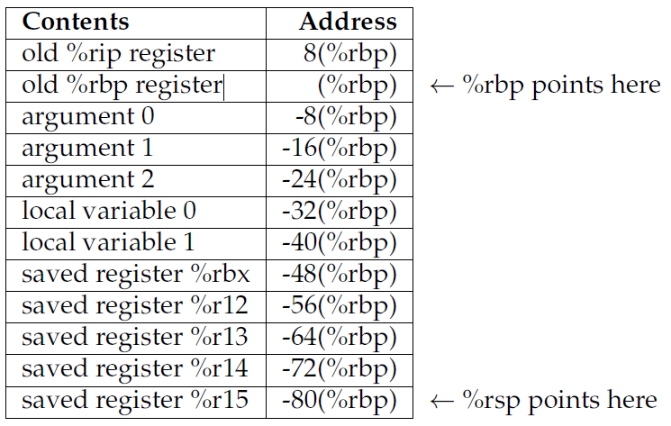

# 引言

为了阅读Linux内核源代码，是需要一些汇编语言知识的。因为与架构相关的代码基本上都是用汇编语言编写的，所以掌握一些基本的汇编语言语法，能够更好地理解Linux内核源代码，甚至可以对各种架构的差异有一个更深入的理解。

大部分人可能认为汇编语言晦涩难懂，阅读手册又冗长乏味。但是，经过本人的经验，可能常用的指令也就是30个。许多其它的指令都是解决特定的情况而出现，比如浮点运算和多媒体指令。所以，本文就从常用指令出发，基于GNU汇编语言格式，对x86_64架构和ARM架构下的指令做了一个入门介绍。学习完这篇文章，希望可以对汇编有一个基本的理解，并能够解决大部分问题。

阅读本文需要一些硬件架构的知识。必要的时候，可以翻阅[Intel Software Developer Manual](http://www.intel.com/content/www/us/en/processors/architectures-software-developer-manuals.html)和[ARM Architecture Reference Manual](https://static.docs.arm.com/ddi0487/bb/DDI0487B_b_armv8_arm.pdf)。

# 开源汇编工具

对于相同的芯片架构，不同的芯片制造商或者其它开源工具可能会有不同的语法格式。所以，本文支持GNU编译器和汇编器，分别是`gcc`和`as`（有时候也称为`gas`）。

将C代码转换成汇编代码，是一种非常好的学习方式。所以，可以通过在编译选项中加入`-S`标志，生成汇编目标文件。在类Unix系统，汇编源代码文件使用`.s`的后缀标记。

比如，运行`gcc -S hello.c -o hello.s`编译命令，编译hello程序：

```cpp
#include <stdio.h>

int main( int argc, char *argv[] )
{
    printf("hello %s\n","world");
    return 0;
}
```

可以在`hello.s`文件中看到如下类似的输出：

```asm
.file "test.c"
.data
.LC0:
        .string "hello %s\n"
.LC1:
        .string "world"
.text
.global main
main:
        PUSHQ %rbp
        MOVQ %rsp, %rbp
        SUBQ $16, %rsp
        MOVQ %rdi, -8(%rbp)
        MOVQ %rsi, -16(%rbp)
        LEA .LC0(%rip), %rax
        LEA .LC1(%rip), %rsi
        MOVQ %rax, %rdi
        MOVQ $0, %rax
        CALL printf
        MOVQ $0, %rax
        LEAVE
        RET
```

从上边的汇编代码中可以看出，汇编代码大概由三部分组成：

1. **伪指令**

    伪指令前缀一个小数点`.`，供汇编器、链接器或者调试器使用。比如，`.file`记录最初的源文件名称，这个名称对调试器有用；`.data`，表明该部分的内容是程序的数据段；`.text`，表明接下来的内容是程序代码段的内容；`.string`，表示一个数据段中的字符串常量；`.global main`，表示符号`main`是一个全局符号，可以被其它代码模块访问。

2. **标签**

   标签是由编译器产生，链接器使用的一种引用符号。本质上，就是对代码段的一个作用域打上标签，方便链接器在链接阶段将所有的代码拼接在一起。所以，标签就是链接器的一种助记符。

3. **汇编指令**

   真正的汇编代码，其实就是机器码的助记符。GNU汇编对大小写不敏感，但是为了统一，我们一般使用大写。

汇编代码编译成可执行文件，可以参考下面的代码编译示例：

```
% gcc hello.s -o hello
% ./hello
hello world
```

把汇编代码生成目标文件，然后可以使用`nm`工具显示代码中的符号，参考下面的内容：

```
% gcc hello.s -c -o hello.o
% nm hello.o
0000000000000000    T main
                    U printf
```

> nm -> 是names的缩写，nm命令主要是用来列出某些文件中的符号（换句话说就是一些函数和全局变量）。

上面的代码显示的符号对于链接器都是可用的。`main`出现在目标文件的代码段（T），位于地址0处，也就是说位于文件的开头；`printf`未定义（U），因为它需要从库文件中链接。但是像`.LC0`之类的标签出现，因为它们没有使用`.global`，所以说对于链接器是无用的。

编写C代码，然后编译成汇编代码。这是学习汇编一个好的开始。

[回到顶部](https://tupelo-shen.github.io/2020/03/08/linux内核1-GNU汇编入门_X86-64&ARM/#0)

# X86汇编语言

X86是一个通用术语，指从最初的IBM-PC中使用的Intel-8088处理器派生（或兼容）的一系列微处理器，包括8086、80286、386、486以及其它许多处理器。每一代cpu都增加了新的指令和寻址模式（从8位到16位再到32位）。同时还保留了与旧代码的向后兼容性。各种竞争对手(如AMD)生产的兼容芯片也实现了相同的指令集。

但是，到了64位架构的时候，Intel打破了这个传统，引入了新的架构（IA64）和名称（Itanium），不再向后兼容。它还实现了一种新的技术-超长指令字（VLIW），在一个Word中实现多个并发操作。因为指令级的并发操作可以显著提升速度。

AMD还是坚持老方法，实现的64位架构（AMD64）向后兼容Intel和AMD芯片。不论两种技术的优劣，AMD的方法首先赢得了市场，随后Intel也生产自己的64位架构Intel64，并与AMD64和它自己之前的产品兼容。所以，X86-64是一个通用术语，包含AMD64和Intel64架构。

X86-64是复杂指令集CISC的代表。

## 寄存器和数据类型

X86-64具有16个通用目的64位寄存器：

| 1    | 2    | 3    | 4    | 5    | 6    | 7    | 8    | 9   | 10  | 11   | 12   | 13   | 14   | 15   | 16   |
| ---- | ---- | ---- | ---- | ---- | ---- | ---- | ---- | --- | --- | ---- | ---- | ---- | ---- | ---- | ---- |
| %rax | %rbx | %rcx | %rdx | %rsi | %rdi | %rbp | %rsp | %r8 | %r9 | %r10 | %r11 | %r12 | %r13 | %r14 | %r15 |

说它们是通用寄存器是不完全正确的，因为早期的CPU设计寄存器是专用的，不是所有的指令都能用到每一个寄存器。从名称上就可以看出来，前八个寄存器的作用，比如rax就是一个累加器。

> AT&T语法-Intel语法
>
> GNU使用传统的AT&T语法，许多类Unix操作系统使用这种风格，与DOS和Windows上用的Intel语法是不同的。 下面一条指令是符合AT&T语法：
>
> ```
>   MOVQ %RSP, %RBP
> ```
>
> MOVQ是指令，%表明RSP和RBP是寄存器。AT&T语法，源地址在前，目的地址在后。
>
> Intel语法省略掉%，参数顺序正好相反。同样的指令，如下所示：
>
> ```
>   MOVQ RBP, RSP
> ```
>
> 所以，看%就能区分是AT&T语法，还是Intel语法。

随着设计的发展，新的指令和寻址模式被添加进来，使得这些寄存器几乎一样了。其余的指令，尤其是和字符串处理相关的指令，要求使用rsi和rdi寄存器。另外，还有两个寄存器专门为栈指针寄存器（rsp）和基址指针寄存器（rbp）保留。最后的8个寄存器没有特殊的限制。

随着处理器从8位一直扩展到64位，有一些寄存器还能拆分使用。rax的低八位是一个8位寄存器al，接下来的8位称为ah。如果把rax的低16位组合起来就是ax寄存器，低32位就是累加器eax，整个64位才是rax寄存器。这样设计的目的是向前兼容，具体可以参考下图：

图1: X86 寄存器结构


r8-r15，这8个寄存器具有相同的结构，就是命名机制不同。

图2: X86 寄存器结构


为了简化描述，我们还是着重讲64位寄存器。但是，大多数编译器支持混合模式：一个字节可以表示一个布尔型；32位对于整数运算就足够了，因为大多数程序不需要大于2^32以上的整数值；64位类型常用于内存寻址，能够使虚拟地址的空间理论上可以达到1800万TB（1TB=1024GB）。

## 寻址模式

MOV指令可以使用不同的寻址模式，在寄存器和内存之间搬运数据。使用B、W、L和Q作为后缀，添加在指令后面，决定操作的数据的位数：

| 后缀 | 名称     | 大小           |
| ---- | -------- | -------------- |
| B    | BYTE     | 1 字节（8位）  |
| W    | WORD     | 2 字节（16位） |
| L    | LONG     | 4 字节（32位） |
| Q    | QUADWORD | 8 字节（64位） |

MOVB移动一个字节，MOVW移动2个字节，MOVL移动4个字节，MOVQ移动8个字节。在某些情况下，可以省略掉这个后缀，编译器可以推断正确的大小。但还是建议加上后缀。

MOV指令可以使用下面几种寻址模式：

- **全局符号**

  一般给其定义一个简单的名称，通过这个名称来引用，比如x、printf之类的。编译器会将其翻译成绝对地址或用于地址计算。

- **立即数**

  使用美元符号$标记，比如$56。但是立即数的使用是有限制范围的。

- **寄存器**

  使用寄存器寻址，比如%rbx。

- **间接引用**

  通过寄存器中包含的地址进行寻址，比如`(%rsp)`，表示引用`%rsp`指向的那个值。

- **基址变址寻址**

  在**间接引用**的基础上再加上一个常数作为地址进行寻址。比如`-16(%rcx)`，就是寄存器rcx中的地址再减去16个字节的地址处的内容。这种模式对于操作堆栈，局部变量和函数参数非常重要。

- **复杂地址寻址**

  比如，`D(RA,RB,C)`，就是引用`*RA + RB * C + D*`计算后的地址处的值。RA和RB是通用目的寄存器，C可以是1、2、4或8，D是一个整数位移。这种模式一般用于查找数组中的某一项的时候，RA给出数组的首地址，RB计算数组的索引，C作为数组元素的大小，D作为相对于那一项的偏移量。

下表是不同寻址方式下加载一个64位值到`%rax`寄存器的示例:

| 寻址模式     | 示例                        |
| ------------ | --------------------------- |
| 全局符号     | MOVQ x, %rax                |
| 立即数       | MOVQ $56, %rax              |
| 寄存器       | MOVQ %rbx, %rax             |
| 间接引用     | MOVQ (%rsp), %rax           |
| 基址变址寻址 | MOVQ -8(%rbp), %rax         |
| 复杂地址寻址 | MOVQ -16(%rbx,%rcx,8), %rax |

大部分时候，目的操作数和源操作数都可以使用相同的寻址模式，但是也有例外，比如`MOVQ -8(%rbx), -8(%rbx)`，源和目的都使用基址变址寻址方式就是不可能的。具体的就需要查看手册了。

有时候，你可能需要加载变量的地址而不是其值，这对于使用字符串或数组是非常方便的。为了这个目的，可以使用`LEA`指令（加载有效地址），示例如下：

| 寻址模式     | 示例                        |
| ------------ | --------------------------- |
| 全局符号     | LEAQ x, %rax                |
| 基址变址寻址 | LEAQ -8(%rbp), %rax         |
| 复杂地址寻址 | LEAQ -16(%rbx,%rcx,8), %rax |

## 基本算术运算

你需要为你的编译器提供四种基本的算术指令：整数加法、减法、乘法和除法。

ADD和SUB指令有两个操作数：源操作目标和既作源又作目的的操作目标。比如：

```
ADDQ %rbx, %rax
```

将%rbx加到%rax上，把结果存入%rax。这必须要小心，以免破坏后面可能还用到的值。比如：`c = a+b+b`这样的语句，转换成汇编语言大概是下面这样：

```
MOVQ a, %rax
MOVQ b, %rbx
ADDQ %rbx, %rax
ADDQ %rbx, %rax
MOVQ %rax, c
```

`IMUL`乘法指令有点不一样，因为通常情况下，两个64位的整数会产生一个128位的整数。IMUL指令将第一个操作数乘以rax寄存器中的内容，然后把结果的低64位存入rax寄存器中，高64位存入rdx寄存器。（这里有一个隐含操作，rdx寄存器在指令中并没有提到）

比如，假设这样的表达式`c = b*(b+a)`，将其转换成汇编语言；在这儿，a、b、c都是全局整数。

```
MOVQ a, %rax
MOVQ b, %rbx
ADDQ %rbx, %rax
IMULQ %rbx
MOVQ %rax, c
```

IDIV指令做相同的操作，除了最后的处理：它把128位整数的低64位存入rax寄存器，高64位存入rdx寄存器，然后除以指令中的第一个操作数。商存入rax寄存器，余数存入rdx寄存器。（如果想要取模指令，只要rdx寄存器的值即可。）

为了正确使用除法，必须保证两个寄存器有必要的符号位。如果被除数低64位就可以表示，但是是负数，那么高64位必须都是1，才能完成二进制补码操作。CQO指令可以实现这个特殊目的，将rax寄存器的值的符号位扩展到rdx寄存器中。

比如，一个数被5整除：

```
MOVQ a, %rax    # 设置被除数的低64位
CQO             # 符号位扩展到%rdx
IDIVQ $5        # %rdx:%rax除以5,结果保存到%rax
```

自增和自减指令INC、DEC，操作数必须是一个寄存器的值。例如，表达式`a = ++b`转换成汇编语句后：

```
MOVQ b, %rax
INCQ %rax
MOVQ %rax, b
MOVQ %rax, a
```

指令AND、OR和XOR，提供按位操作。按位操作意味着把操作应用到操作数的每一位，然后保存结果。

所以，`AND $0101B $0110B`就会产生结果`$0100B`。同样，NOT指令对操作数的每一位执行取反操作。比如，表达式`c = (a & ˜b)`，可以转换成下面这样的汇编代码：

```
MOVQ a, %rax
MOVQ b, %rbx
NOTQ %rbx
ANDQ %rax, %rbx
MOVQ %rbx, c
```

这里需要注意的是，算术位操作与逻辑bool操作是不一样的。比如，如果你定义false为整数0，true为非0。在这种情况下，`$0001`是true，而`NOT $0001B`的结果也是true！要想实现逻辑bool操作，需要使用CMP比较指令。

与MOV指令一样，各种算术指令能在不同寻址模式下工作。但是，对于一个编译器项目，使用MOV指令搬运寄存器之间或者寄存器与立即数之间的值，然后仅使用寄存器操作，会更加方便。

## 比较和跳转

使用`JMP`跳转指令，我们就可以创建一个简单的无限循环，使用`rax`累加器从0开始计数，代码如下：

```
    MOVQ $0, %rax loop:   INCQ %rax
    JMP loop
```

但是，我们大部分时候需要的是一个有限的循环或者if-then-else这样的语句，所以必须提供计算比较值并改变程序执行流的指令。大部分汇编语言都提供2个指令：比较和跳转。

CMP指令完成比较。比较两个不同的寄存器，然后设置`EFLAGS`寄存器中对应的位，记录比较的值是相等、大于还是小于。使用带有条件跳转的指令自动检查`EFLAGS`寄存器并跳转到正确的位置。

| 指令 | 意义           |
| ---- | -------------- |
| JE   | 如果相等跳转   |
| JNE  | 如果不相等跳转 |
| JL   | 小于跳转       |
| JLE  | 小于等于跳转   |
| JG   | 大于跳转       |
| JGE  | 大于等于跳转   |

下面是使用`%rax`寄存器计算0到5累加值的示例：

```
    MOVQ $0, %rax loop:   INCQ %rax
    CMPQ $5, %rax
    JLE loop
```

下面是一个条件赋值语句，如果全局变量x大于0，则全局变量y=10，否则等于20：

```
        MOVQ x, %rax
        CMPQ $0, %rax
        JLE .L1
.L0:
        MOVQ $10, $rbx
        JMP .L2
.L1:
        MOVQ $20, $rbx
.L2:
        MOVQ %rbx, y
```

注意，跳转指令要求编译器定义标签。这些标签在汇编文件内容必须是唯一且私有的，对文件外是不可见的，除非使用`.global`伪指令。标签像`.L0`、`.L1`等是由编译器根据需要生成的。

## 栈

栈是记录函数调用过程和局部变量的一种数据结构，也可以说，如果没有栈，C语言的函数是无法工作的。`%rsp`寄存器称为栈指针寄存器，永远指向栈顶元素（栈的增长方向是向下的）。

为了把`%rax`寄存器的内容压入栈中，我们必须把`%rsp`寄存器减去8（`%rax`寄存器的大小），然后再把`%rax`寄存器内容写入到`%rsp`寄存器指向的地址处：

```
SUBQ $8, %rsp
MOVQ %rax, (%rsp)
```

从栈中弹出数据，正好相反：

```
MOVQ (%rsp), %rax
ADDQ $8, %rsp
```

如果仅仅是抛弃栈中最近的值，可以只移动栈指针正确的字节数即可：

```
ADDQ $8, %rsp
```

当然了，压栈和出栈是常用的操作，所以有专门的指令：

```
PUSHQ %rax
POPQ %rax
```

需要注意的是，64位系统中，PUSH和POP指令被限制只能使用64位值，所以，如果需要压栈、出栈比这小的数必须使用MOV和ADD实现。

## 函数调用

先介绍一个简单的栈调用习惯：参数按照相反的顺序被压入栈，然后使用CALL调用函数。被调用函数使用栈上的参数，完成函数的功能，然后返回结果到`eax`寄存器中。调用者删除栈上的参数。

但是，64位代码为了尽可能多的利用X86-64架构中的寄存器，使用了新的调用习惯。称之为**System V ABI**，详细的细节可以参考[ABI接口规范文档](https://software.intel.com/sites/default/files/article/402129/mpx-linux64-abi.pdf)。这儿，我们总结如下：

1. 前6个参数（包括指针和其它可以存储为整形的类型）依次保存在寄存器`%rdi`、`%rsi`、`%rdx`、`%rcx`、`%r8`和`%r9`。
2. 前8个浮点型参数依次存储在寄存器%xmm0-%xmm7。
3. 超过这些寄存器个数的参数才被压栈。
4. 如果函数接受可变数量的参数(如printf)，则必须将`%rax`寄存器设置为浮动参数的数量。
5. 函数的返回值存储在`%rax`。

另外，我们也需要知道其余的寄存器是如何处理的。有一些是调用者保存，意味着函数在调用其它函数之前必须保存这些值。另外一些则由被调用者保存，也就是说，这些寄存器可能会在被调用函数中修改，所以被调用函数需要保存调用者的这些寄存器的值，然后从被调用函数返回时，恢复这些寄存器的值。保存参数和结果的寄存器根本不需要保存。下表详细地展示了这些细节：

表-System V ABI寄存器分配表

| 寄存器 | 目的     | 谁保存       |
| ------ | -------- | ------------ |
| %rax   | 结果     | 不保存       |
| %rbx   | 临时     | 被调用者保存 |
| %rcx   | 参数4    | 不保存       |
| %rdx   | 参数3    | 不保存       |
| %rsi   | 参数2    | 不保存       |
| %rdi   | 参数1    | 不保存       |
| %rbp   | 基址指针 | 被调用者保存 |
| %rsp   | 栈指针   | 被调用者保存 |
| %r8    | 参数5    | 不保存       |
| %r9    | 参数6    | 不保存       |
| %r10   | 临时     | 调用者保存   |
| %r11   | 临时     | 调用者保存   |
| %r12   | 临时     | 被调用者保存 |
| %r13   | 临时     | 被调用者保存 |
| %r14   | 临时     | 被调用者保存 |
| %r15   | 临时     | 被调用者保存 |

为了调用函数，首先必须计算参数，并把它们放置到对应的寄存器中。然后把2个寄存器`%r10`和`%r11`压栈，保存它们的值。然后发出`CALL`指令，它会吧当前的指令指针压入栈，然后跳转到被调函数的代码位置。当从函数返回时，从栈中弹出`%r10`和`%r11`的内容，然后就可以利用`%rax`寄存器的返回结果了。

这是一个C代码示例：

```
int x=0;
int y=10;
int main()
{
    x = printf("value: %d\n",y);
}
```

翻译成汇编语言大概是：

```
.data
x:
        .quad 0
y:
        .quad 10
str:
        .string "value: %d\n"
.text
.global main
main:
        MOVQ $str, %rdi         # 第一个参数保存到%rdi中，是字符串类型
        MOVQ y, %rsi            # 第二个参数保存到%rsi中，是y
        MOVQ $0, %rax           #个浮动参数
        PUSHQ %r10              # 保存调用者保存的寄存器
        PUSHQ %r11
        CALL printf             # 调用printf
        POPQ %r11               # 恢复调用者保存的寄存器
        POPQ %r10
        MOVQ %rax, x            # 保存结果到x
        RET                     # 从main函数返回
```

## 定义叶子函数

因为函数参数保存到寄存器中，所以写一个不调用其它函数的叶子函数是非常简单的。比如，下面的代码：

```
square: function integer ( x: integer ) =
{
    return x*x;
}
```

可以简化为：

```
.global square
square:
        MOVQ %rdi, %rax         # 拷贝第一个参数到%rax
        IMULQ %rax              # 自己相乘
                                # 结果保存到%rax
        RET                     # 返回到调用函数中
```

不幸的是，这对于还要调用其它函数的函数是不可行的，因为我们没有为其建立正确的栈。所以，需要一个复杂方法实现通用函数。

## 定义复杂函数

复杂函数必须能够调用其它函数，且能够计算任意复杂度的表达式，还能正确地返回到调用者中。考虑下面的示例，具有3个参数和2个局部变量的函数：

```
.global func
func:
    pushq %rbp          # 保存基址指针
    movq %rsp, %rbp     # 设置新的基址指针
    pushq %rdi          # 第一个参数压栈
    pushq %rsi          # 第二个参数压栈
    pushq %rdx          # 第三个参数压栈
    subq $16, %rsp      # 给2个局部变量分配栈空间
    pushq %rbx          # 保存应该被调用者保存的寄存器
    pushq %r12
    pushq %r13
    pushq %r14
    pushq %r15
    ### 函数体 ###
    popq %r15           # 恢复被调用者保存的寄存器
    popq %r14
    popq %r13
    popq %r12
    popq %rbx
    movq %rbp, %rsp     # 复位栈指针
    popq %rbp           # 恢复之前的基址指针
    ret                 # 返回到调用者
```

这个函数需要追踪的信息比较多：函数参数，返回需要的信息，局部变量空间等等。考虑到这个目的，我们使用基址指针寄存器`%rbp`。栈指针`%rsp`指向新栈的栈顶，而`%rbp`指向新栈的栈底。`%rsp`和`%rbp`之间的这段空间就是函数调用的栈帧。

还有就是，函数需要调用寄存器计算表达式，也就是上面的`%rbx`、`%r12`、`%r13`、`%r14`、`%r15`、`%rbp`、`%rsp`。这些寄存器可能已经在调用者函数体内被使用，所以我们不希望被调用函数内部破坏这些寄存器的值。这就需要在被调用函数中保存这些寄存器的值，在返回之前，再恢复这些寄存器之前的值。

下图是`func`函数的栈布局：



图3 X86-64栈布局示例

基址指针寄存器`(%rbp)`位于栈的起始处。所以，在函数体内，完全可以使用基址变址寻址方式，去引用参数和局部变量。参数紧跟在基址指针后面，所以参数0的位置就是`-8(%rbp)`，参数1的位置就是`-16(%rbp)`，依次类推。接下来是局部变量，位于`-32(%rbp)`地址处。然后保存的寄存器位于`-48(%rbp)`地址处。栈指针指向栈顶的元素。

下面是一个复杂函数的C代码示例：

```
compute: function integer ( a: integer, b: integer, c: integer ) =
{
    x:integer = a+b+c;
    y:integer = x*5;
    return y;
}
```

将其完整地转换成汇编代码，如下所示：

```
.global compute
compute:
    ##################### preamble of function sets up stack
    pushq %rbp              # save the base pointer
    movq %rsp, %rbp         # set new base pointer to rsp
    pushq %rdi              # save first argument (a) on the stack
    pushq %rsi              # save second argument (b) on the stack
    pushq %rdx              # save third argument (c) on the stack
    subq $16, %rsp          # allocate two more local variables
    pushq %rbx              # save callee-saved registers
    pushq %r12
    pushq %r13
    pushq %r14
    pushq %r15
    ######################## body of function starts here
    movq -8(%rbp), %rbx     # load each arg into a register
    movq -16(%rbp), %rcx
    movq -24(%rbp), %rdx
    addq %rdx, %rcx         # add the args together
    addq %rcx, %rbx
    movq %rbx, -32(%rbp)    # store the result into local 0 (x)
    movq -32(%rbp), %rbx    # load local 0 (x) into a register.
    movq $5, %rcx           # load 5 into a register
    movq %rbx, %rax         # move argument in rax
    imulq %rcx              # multiply them together
    movq %rax, -40(%rbp)    # store the result in local 1 (y)
    movq -40(%rbp), %rax    # move local 1 (y) into the result
    #################### epilogue of function restores the stack
    popq %r15               # restore callee-saved registers
    popq %r14
    popq %r13
    popq %r12
    popq %rbx
    movq %rbp, %rsp         # reset stack to base pointer.
    popq %rbp               # restore the old base pointer
    ret                     # return to caller
```

下面有转换为汇编的代码段。代码是正确的，但不是完美的。事实证明，这个函数不需要使用寄存器`%rbx`和`%r15`，所以不需要保存和恢复他们。同样的，我们也可以把参数就保留在寄存器中而不必把它们压栈。结果也不必存入局部变量y中，而是可以直接写入到`%rax`寄存器中。这其实就是编译器优化功能的一部分。

# ARM汇编

最新的ARM架构是ARMv7-A（32位）和ARMv8-A（64位）。本文着重介绍32位架构，最后讨论一下64位体系架构的差异。

ARM是一个精简指令计算机（RISC）架构。相比X86，ARM使用更小的指令集，这些指令更易于流水线操作或并行执行，从而降低芯片复杂度和能耗。但由于一些例外，ARM有时候被认为是部分RISC架构。比如，一些ARM指令执行时间的差异使流水线不完美，为预处理而包含的桶形移位器引入了更复杂的指令，还有条件指令减少了一些潜在指令的执行，导致跳转指令的使用减少，从而降低了处理器的能耗。我们侧重于编写编译器常用到的指令，更复杂的内容和程序语言的优化留到以后再研究。

## 寄存器和数据类型

32位ARM架构拥有16个通用目的寄存器，r0~r15，使用约定如下所示：

| 名称 | 别名 | 目的                   |
| ---- | ---- | ---------------------- |
| r0   | -    | 通用目的寄存器         |
| r1   | -    | 通用目的寄存器         |
| …    | -    | -                      |
| r10  | -    | 通用目的寄存器         |
| r11  | fp   | 栈帧指针，栈帧起始地址 |
| r12  | ip   | 内部调用临时寄存器     |
| r13  | sp   | 栈指针                 |
| r14  | lr   | 链接寄存器（返回地址） |
| r15  | pc   | 程序计数器             |

除了通用目的寄存器，还有2个寄存器：当前程序状态寄存器(CPSR)和程序状态保存寄存器(SPSR)，它们不能被直接访问。这两个寄存器保存着比较运算的结果，以及与进程状态相关的特权数据。用户态程序不能直接访问，但是可以通过一些操作的`副作用`修改它们。

ARM使用下面的后缀表示数据大小。它们与X86架构不同！如果没有后缀，汇编器假设操作数是unsigned word类型。有符号类型提供正确的符号位。任何word类型寄存器不会再有细分且被命名的寄存器。

| 后缀 | 数据类型        | 大小  |
| ---- | --------------- | ----- |
| B    | Byte            | 8 位  |
| H    | Halfword        | 16 位 |
| W    | WORD            | 32 位 |
| -    | Double Word     | 64 位 |
| SB   | Signed Byte     | 8 位  |
| SH   | Signed Halfword | 16 位 |
| SW   | Signed Word     | 32 位 |
| -    | Double Word     | 64 位 |

## 寻址模式

与X86不同，ARM使用两种不同的指令分别搬运寄存器之间、寄存器与内存之间的数据。MOV拷贝寄存器之间的数据和常量，而LDR和STR指令拷贝寄存器和内存之间的数据。

MOV指令可以把一个立即数或者寄存器值搬运到另一个寄存器中。ARM中，用`#`表示立即数，这些立即数必须小于等于16位。如果大于16位，就会使用LDR指令代替。大部分的ARM指令，目的寄存器在左，源寄存器在右。（STR是个例外）。具体格式如下：

| 模式   | 示例       |
| ------ | ---------- |
| 立即数 | MOV r0, #3 |
| 寄存器 | MOV r1, r0 |

MOV指令后面添加标识数据类型的字母，确定传输的类型和如何传输数据。如果没有指定，汇编器假定为word。

从内存中搬运数据使用LDR和STR指令，它们把源寄存器和目的寄存器作为第一个参数，要访问的内存地址作为第二个参数。简单情况下，使用寄存器给出地址并用中括号`[]`标记：

```
LDR Rd, [Ra]
STR Rs, [Ra]
```

`Rd`，表示目的寄存器；`Rs`，表示源寄存器；`Ra`，表示包含内存地址的寄存器。（必须要注意内存地址的类型，可以使用任何内存地址访问字节数据，使用偶数地址访问半字数据等。）

ARM寻址模式

| 模式                    | 示例                |
| ----------------------- | ------------------- |
| 文本                    | LDR Rd, =0xABCD1234 |
| 绝对地址                | LDR Rd, =label      |
| 寄存器间接寻址          | LDR Rd, [Ra]        |
| 先索引-立即数           | LDR Rd, [Ra, #4]    |
| 先索引-寄存器           | LDR Rd, [Ra, Ro]    |
| 先索引-立即数&Writeback | LDR Rd, [Ra, #4]!   |
| 先索引-寄存器&Writeback | LDR Rd, [Ra, Ro]!   |
| 后索引-立即数           | LDR Rd, [Ra], #4    |
| 后索引-寄存器           | LDR Rd, [Ra], Ro    |

如上表所示，LDR和STR支持多种寻址模式。首先，LDR能够加载一个32位的文本值（或绝对地址）到寄存器。（完整的解释请参考下一段内容）。与X86不同，ARM没有可以从一个内存地址拷贝数据的单指令。为此，首先需要把地址加载到一个寄存器，然后执行一个寄存器间接寻址：

```
LDR r1, =x
LDR r2, [r1]
```

为了方便高级语言中的指针、数组、和结构体的实现，还有许多其它可用的寻址模式。比如，先索引模式可以添加一个常数（或寄存器）到基址寄存器，然后从计算出的地址加载数据：

```
LDR r1, [r2, #4] ;  # 载入地址 = r2 + 4
LDR r1, [r2, r3] ;  # 载入地址 = r2 + r3
```

有时候可能需要在把计算出的地址中的内容读取后，再把该地址写回到基址寄存器中，这可以通过在后面添加感叹号`!`实现。

```
LDR r1, [r2, #4]! ; # 载入地址 = r2 + 4 然后 r2 += 4
LDR r1, [r2, r3]! ; # 载入地址 = r2 + r3 然后 r2 += r3
```

后索引模式做相同的工作，但是顺序相反。首先根据基址地址执行加载，然后基址地址再加上后面的值：

```
LDR r1, [r2], #4 ;  # 载入地址 = r2 然后 r2 += 4
LDR r1, [r2], r3 ;  # 载入地址 = r2 然后 r2 += r3
```

通过先索引和后索引模式，可以使用单指令实现像我们经常写的C语句`b = a++`。STR使用方法类似。

在ARM中，绝对地址以及其它长文本更为复杂些。因为每条指令都是32位的，因此不可能将32位的地址和操作码（opcode）一起添加到指令中。因此，长文本存储在一个文本池中，它是程序代码段中一小段数据区域。使用与PC寄存器相关的加载指令，比如LDR，加载文本类型数据，这样的文本池可以引用靠近load指令的±4096个字节数据。这导致有一些小的文本池散落在程序中，由靠近它们的指令使用。

ARM汇编器隐藏了这些复杂的细节。在绝对地址和长文本的前面加上等号`=`，就代表向汇编器表明，标记的值应该存储在一个文本池中，并使用与PC寄存器相关的指令代替。

例如，下面的指令，把x的地址加载到r1中，然后取出x的值，存入r2寄存器中。

```
LDR r1, =x
LDR r2, [r1]
```

下面的代码展开后，将会从相邻的文本池中加载x的地址，然后加载x的值，存入r2寄存器中。也就是，下面的代码与上面的代码是一样的。

```
LDR r1, .L1
LDR r2, [r1]
B   .end
.L1:
    .word x
.end:
```

## 基本算术运算

ARM的`ADD`和`SUB`指令，使用3个地址作为参数。目的寄存器是第一个参数，第二、三个参数作为操作数。其中第三个参数可以是一个8位的常数，或者带有移位的寄存器。使能进位的加、减法指令，将CPSR寄存器的C标志位写入到结果中。这4条指令如果分别后缀S，代表在完成时是否设置条件标志（包括进位），这是可选的。

| 指令     | 示例           |
| -------- | -------------- |
| 加       | ADD Rd, Rm, Rn |
| 带进位加 | ADC Rd, Rm, Rn |
| 减       | SUB Rd, Rm, Rn |
| 带进位减 | SBC Rd, Rm, Rn |

乘法指令的工作方式与加减指令类似，除了将2个32位的数字相乘能够产生一个64位的值之外。普通的MUL指令舍弃了结果的高位，而UMULL指令把结果分别保存在2个寄存器中。有符号的指令SMULL，在需要的时候会把符号位保存在高寄存器中。

| 指令         | 示例                     |
| ------------ | ------------------------ |
| 乘法         | MUL Rd, Rm, Rn           |
| 无符号长整形 | UMULL RdHi, RdLo, Rm, Rn |
| 有符号长整形 | SMULL RdHi, RdLo, Rm, Rn |

ARM没有除法指令，因为它不能再单个流水线周期中执行。因此，需要除法的时候，调用外部标准库中的函数。

逻辑指令在结构上和算术指令非常相似，如下图所示。特殊的是MVN指令，执行按位取反然后将结果保存到目的寄存器。

| 指令       | 示例           |
| ---------- | -------------- |
| 位与       | AND Rd, Rm, Rn |
| 位或       | ORR Rd, Rm, Rn |
| 位异或     | EOR Rd, Rm, Rn |
| 位置0      | BIC Rd, RM, Rn |
| 取反并移动 | MVN Rd, Rn     |

## 比较和跳转

比较指令CMP比较2个值，将比较结果写入CPSR寄存器的N（负）和Z（零）标志位，供后面的指令读取使用。如果比较一个寄存器值和立即数，立即数必须作为第二个操作数：

```
CMP Rd, Rn
CMP Rd, #imm
```

另外，也可以在算术指令后面添加`S`标志，以相似的方式更新CPSR寄存器的相应标志位。比如，SUBS指令是两个数相减，保存结果，并更新CPSR。

ARM跳转指令

| 操作码 | 意义           | 操作码 | 意义                                 |
| ------ | -------------- | ------ | ------------------------------------ |
| B      | 无条件跳转     | BL     | 设置lr寄存器为下一条指令的地址并跳转 |
| BX     | 跳转并切换状态 | BLX    | BL+BX指令的组合                      |
| BEQ    | 相等跳转       | BVS    | 溢出标志设置跳转                     |
| BNE    | 不等跳转       | BVC    | 溢出标志清除跳转                     |
| BGT    | 大于跳转       | BHI    | 无符号>跳转                          |
| BGE    | 大于等于跳转   | BHS    | 无符号>=跳转                         |
| BLT    | 小于跳转       | BLO    | 无符号<跳转                          |
| BLE    | 小于等于跳转   | BLS    | 无符号<=跳转                         |
| BMI    | 负值跳转       | BPL    | >= 0跳转                             |

各种跳转指令参考CPSR寄存器中之前的值，如果设置正确就跳到相应的地址（标签表示）执行。无条件跳转指令就是一个简单的`B`。

比如，从0累加到5：

```
        MOV r0, #0
loop:   ADD r0, r0, 1
        CMP r0, #5
        BLT loop
```

再比如，如果x大于0，则给y赋值为:10；否则，赋值为20：

```
        LDR r0, =x
        LDR r0, [r0]
        CMP r0, #0
        BGT .L1
.L0:
        MOV r0, #20
        B .L2
.L1:
        MOV r0, #10
.L2:
        LDR r1, =y
        STR r0, [r1]
```

BL指令用来实现函数调用。BL指令设置lr寄存器为下一条指令的地址，然后跳转到给定的标签（比如绝对地址）处执行，并将lr寄存器的值作为函数结束时的返回地址。BX指令跳转到寄存器中给定的地址处，最常用于通过跳转到lr寄存器而从函数调用中返回。

BLX指令执行的动作跟BL指令一样，只是操作对象换成了寄存器中给定的地址值，常用于调用函数指针，虚函数或其它间接跳转的场合。

ARM指令集的一个重要特性就是条件执行。每条指令中有4位表示16中可能的条件，如果条件不满足，指令被忽略。上面各种类型的跳转指令只是在最单纯的B指令上应用了各种条件而已。这些条件几乎可以应用到任何指令。

例如，假设下面的代码片段，哪个值小就会自加1：

```
if(a<b) { a++; } else { b++; }
```

代替使用跳转指令和标签实现这个条件语句，我们可以前面的比较结果对每个加法指令设置条件。无论那个条件满足都被执行，而另一个被忽略。如下面所示（假设a和b分别存储在寄存器r0和r1中）：

```
CMP r0, r1
ADDLT r0, r0, #1
ADDGE r1, r1, #1
```

## 栈

栈是一种辅助数据结构，主要用来存储函数调用历史以及局部变量。按照约定，栈的增长方向是从髙地址到地地址。`sp`寄存器保存栈指针，用来追踪栈顶内容。

为了把寄存器r0压入栈中，首先，`sp`减去寄存器的大小，然后把`r0`存入`sp`指定的位置：

```
SUB sp, sp, #4
STR r0, [sp]
```

或者，可以使用一条单指令完成这个操作，如下所示：

```
STR r0, [sp, #-4]!
```

这儿，使用了先索引并`write-back`的寻址方式。也就是说，`sp`先减4，然后把`r0`的内容存入`sp-4`指向的地址处，然后再把`sp-4`写入到`sp`中。

ARM调用习惯总结

1. 前4个参数存储在r0、r1、r2 和r3中；
2. 其余的参数按照相反的顺序存入栈中；
3. 如果需要，调用者必须保存r0-r3和r12；
4. 调用者必须始终保存r14，即链接寄存器；
5. 如果需要，被调用者必须保存r4-r11；
6. 结果存到r0寄存器中。

PUSH伪指令可以压栈的动作，还可以把任意数量的寄存器压入栈中。使用花括号`{}`列出要压栈的寄存器列表：

```
PUSH {r0,r1,r2}
```

出栈的动作正好与压栈的动作相反：

```
LDR r0, [sp]
ADD sp, sp, #4
```

使用后索引模式

```
LDR r0, [sp], #4
```

使用`POP`指令弹出一组寄存器：

```
POP {r0,r1,r2}
```

与X86不同的是，任何数据项(从字节到双word)都可以压入栈，只要遵守数据对齐即可。

## 函数调用

《[The ARM-Thumb Procedure Call Standard](http://infocenter.arm.com/help/topic/com.arm.doc.espc0002/ATPCS.pdf.)》描述了ARM的寄存器调用约定，其摘要如下：

> ARM寄存器分配：

| 寄存器 | 目的       | 谁保存       |
| ------ | ---------- | ------------ |
| r0     | 参数0      | 不保存       |
| r1     | 参数1      | 调用者保存   |
| r2     | 参数2      | 调用者保存   |
| r3     | 参数3      | 调用者保存   |
| r4     | 临时       | 被调用者保存 |
| …      | …          | …            |
| r10    | 临时       | 被调用者保存 |
| r11    | 栈帧指针   | 被调用者保存 |
| r12    | 内部过程   | 调用者保存   |
| r13    | 栈指针     | 被调用者保存 |
| r14    | 链接寄存器 | 调用者保存   |
| r15    | 程序计数器 | 保存在r14    |

为了调用一个函数，把参数存入r0-r3寄存器中，保存lr寄存器中的当前值，然后使用`BL`指令跳转到指定的函数。返回时，恢复lr寄存器的先前值，并检查r0寄存器中的结果。

比如，下面的C语言代码段：

```
int x=0;
int y=10;
int main() {
    x = printf("value: %d\n",y);
}
```

其编译后的ARM汇编格式为:

```
.data
    x: .word 0
    y: .word 10
    S0: .ascii "value: %d\012\000"
.text
    main:
        LDR r0, =S0         @ 载入S0的地址
        LDR r1, =y          @ 载入y的地址
        LDR r1, [r1]        @ 载入y的值
        PUSH {ip,lr}        @ 保存ip和lr寄存器的值
        BL printf           @ 调用printf函数
        POP {ip,lr}         @ 恢复寄存器的值
        LDR r1, =x          @ 载入x的地址
        STR r0, [r1]        @ 把返回的结果存入x中
.end
```

## 定义叶子函数

因为使用寄存器传递函数参数，所以编写一个不调用其它函数的叶子函数非常简单。比如下面的代码：

```
square: function integer ( x: integer ) =
{
    return x*x;
}
```

它的汇编代码可以非常简单：

```
.global square
square:
        MUL r0, r0, r0  @ 参数本身相乘
        BX lr           @ 返回调用者
```

但是，很不幸，对于想要调用其他函数的函数，这样的实现就无法工作，因为我们没有正确建立函数使用的栈。所以，需要一种更为复杂的方法。

## 定义复杂函数

复杂函数必须能够调用其它函数并计算任意复杂度的表达式，然后正确地返回到调用者之前的状态。还是考虑具有3个参数和2个局部变量的函数：

```
func:
        PUSH {fp}           @ 保存栈帧指针，也就是栈的开始
        MOV fp, sp          @ 设置新的栈帧指针
        PUSH {r0,r1,r2}     @ 参数压栈
        SUB sp, sp, #8      @ 分配2个局部变量的栈空间
        PUSH {r4-r10}       @ 保存调用者的寄存器
        @@@ 函数体 @@@
        POP {r4-r10}        @ 恢复调用者的寄存器
        MOV sp, fp          @ 复位栈指针
        POP {fp}            @ 恢复之前的栈帧指针
        BX lr               @ 返回到调用者
```

通过上面的代码，我们可以看出，不管是ARM架构的函数实现还是X86架构系列的函数实现，本质上都是一样的，只是指令和寄存器的使用不同。


图4 ARM栈布局示例

同样考虑下面一个带有表达式计算的复杂函数的C代码：

```
compute: function integer
        ( a: integer, b: integer, c: integer ) =
{
    x: integer = a+b+c;
    y: integer = x*5;
    return y;
}
```

将其完整地转换成汇编代码，如下所示：

```
.global compute
compute:
    @@@@@@@@@@@@@@@@@@ preamble of function sets up stack
    PUSH {fp}               @ save the frame pointer
    MOV fp, sp              @ set the new frame pointer
    PUSH {r0,r1,r2}         @ save the arguments on the stack
    SUB sp, sp, #8          @ allocate two more local variables
    PUSH {r4-r10}           @ save callee-saved registers
    @@@@@@@@@@@@@@@@@@@@@@@@ body of function starts here
    LDR r0, [fp,#-12]       @ load argument 0 (a) into r0
    LDR r1, [fp,#-8]        @ load argument 1 (b) into r1
    LDR r2, [fp,#-4]        @ load argument 2 (c) into r2
    ADD r1, r1, r2          @ add the args together
    ADD r0, r0, r1
    STR r0, [fp,#-20]       @ store the result into local 0 (x)
    LDR r0, [fp,#-20]       @ load local 0 (x) into a register.
    MOV r1, #5              @ move 5 into a register
    MUL r2, r0, r1          @ multiply both into r2
    STR r2, [fp,#-16]       @ store the result in local 1 (y)
    LDR r0, [fp,#-16]       @ move local 1 (y) into the result
    @@@@@@@@@@@@@@@@@@@ epilogue of function restores the stack
    POP {r4-r10}            @ restore callee saved registers
    MOV sp, fp              @ reset stack pointer
    POP {fp}                @ recover previous frame pointer
    BX lr                   @ return to the caller
```

构建一个合法栈帧的形式有多种，只要函数使用栈帧的方式一致即可。比如，被调函数可以首先把所有的参数和需要保存的寄存器压栈，然后再给局部变量分配栈空间。（当然了，函数返回时，顺序必须正好相反。）

还有一种常用的方式就是，在将参数和局部变量压栈之前，为被调函数执行`PUSH {fp,ip,lr,pc}`，将这些寄存器压入栈中。尽管这不是实现函数的严格要求，但是以栈回溯的形式为调试器提供了调试信息，可以通过函数的调用栈，轻松地重构程序的当前执行状态。

与前面描述X86_64的示例时一样，这段代码也是有优化的空间的。事实证明，这个函数不需要保存寄存器r4和r5，当然也就不必恢复。同样的，参数我们也不需要非得保存到栈中，可以直接使用寄存器。计算结果可以直接写入到寄存器r0中，不必再保存到变量y中。这其实就是ARM相关的编译器所要做的工作。

## ARM-64位

支持64位的ARMv8-A架构提供了两种扩展模式：A32模式-支持上面描述的32位指令集；A64模式-支持64位执行模式。这就允许64位的CPU支持操作系统可以同时执行32位和64位程序。虽然A32模式的二进制执行文件和A64模式不同，但是有一些架构原理是相同的，只是做了一些改变而已：

1. 字宽度

   A64模式的指令还是32位大小的，只是寄存器和地址的计算是64位。

2. 寄存器

   A64具有32个64位的寄存器，命名为x0-x31。x0是专用的0寄存器：当读取时，总是返回0值；写操作无效。x1-x15是通用目的寄存器，x16和x17是为进程间通信使用，x29是栈帧指针寄存器，x30是lr链接寄存器，x31是栈指针寄存器。（程序寄存器（PC）用户态代码不可直接访问）32位的值可以通过将寄存器命名为w#来表示，而不是使用数据类型后缀，在这儿#代表0-31。

3. 指令

   A64模式的指令大部分和A32模式相同，使用相同的助记符，只是有一点小差异。分支预测不再是每条指令的一部分。相反，所有的条件执行代码必须显式地执行CMP指令，然后执行条件分支指令。LDM/STM指令和伪指令PUSH/POP不可用，必须通过显式地加载和存储指令序列实现。（使用LDP/STP，在加载和存储成对的寄存器时更有效率）。

4. 调用习惯

   当调用函数的时候，前8个参数被存储到寄存器x0-x7中，其余的参数压栈。调用者必须保留寄存器x9-x15和x30，而被调用者必须保留x19-x29。返回值的标量部分存储到x0中，而返回值的扩展部分存储到x8中。

# Reference

- [CS 131](https://cs.brown.edu/courses/csci1310/2020/notes/l07.html)
- [深入浅出GNU X86-64 汇编](https://www.cnblogs.com/lsgxeva/p/11176000.html)
- [linux内核1-GNU汇编入门\_X86-64&ARM](https://tupelo-shen.github.io/2020/03/08/linux内核1-GNU汇编入门_X86-64&ARM)
- extra
    - Intel64 and IA-32 Architectures Software Developer Manuals. Intel Corp., 2017. http://www.intel.com/content/www/us/en/processors/architectures-software-developer-manuals.html
    - System V Application Binary Interface, Jan Hubicka, Andreas Jaeger, Michael Matz, and Mark Mitchell (editors), 2013. https://software.intel.com/sites/default/files/article/402129/mpx-linux64-abi.pdf
    - ARM Architecture Reference Manual ARMv8. ARM Limited, 2017. https://static.docs.arm.com/ddi0487/bb/DDI0487B_b_armv8_arm.pdf.
    - The ARM-THUMB Procedure Call Standard. ARM Limited, 2000. http://infocenter.arm.com/help/topic/com.arm.doc.espc0002/ATPCS.pdf.
