# 简介

`BIOS`（`Basic Input/Output System`）和`UEFI`（`Unified Extensible Firmware Interface `）是不同的计算机启动固件（`Fireware`），需要硬件（通常为主板）支持，相互代替的，其中`UEFI` 是比较新的方式。可以通过下面图片对这两个概念先有个直观了解：

`BIOS`:

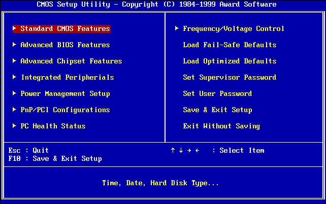

`UEFI`:


# BIOS

`BIOS（Basic Input/Output System）`：在`IBM PC`兼容系统上使用，是一种业界标准的固件接口。这种主板类型大家应该比较熟悉，老一点的机器都是使用`BIOS`主板。对于支持`BIOS`的主板来讲，`BIOS`只能完成非常基本的硬件检测和初始化，之后的事情就都由`bootloader`来接手。

```undefined
一句话概括：BIOS只认识设备，不认识分区、不认识文件。
```

`BIOS`启动的时候，会按照`CMOS`设置里的顺序，挨个查看存储设备的前`512`字节是不是以`0x55 0xAA`结尾，如果不是，那就跳过找下一个设备；如果是的话，则表示这个磁盘可以启动，加载这`512`字节里的代码，执行之后，后面的事，几乎就跟`BIOS`没啥关系了。

至于加载引导代码后面启动什么系统，取决于这`512B`（字节）里存了什么系统的代码。这个代码是各家系统安装程序写进去的，目的是启动自家系统。比如安装`Windows`，这里面就变成了`Windows`的启动代码；
安装了`Linux`，这里面就会变成`Grub`的启动代码。

# MBR

那么这`512`字节里面到底什么东西呢，看起来如此重要？这就是`MBR`（`Master Boot Record`），主分区引导记录。

## 硬盘分区表 DPT（Disk Partition Table）

一个磁盘抛开物理组成部分的话，它就是一个地址序列，这个序列从`0~n-1`，每个地址包含`512B`（字节）的空间。一般我们将这些地址称作逻辑块地址（`LBA`），每块由`512B`组成。分区表告诉操作系统，磁盘的分区有几个，从哪里开始到哪里结束。当将一个磁盘插入已经含有操作系统的机器上时，操作系统会检索这个磁盘的分区表，并正确认识它的分区结构。一个磁盘是先有分区表，后有分区，然后才有文件系统，有了文件系统才能被操作系统读写删。磁盘分区表格式目前主要有两种，分别是`MBR`分区表和`GPT`分区表。

```undefined
这边有个概念需要注意下，避免混淆：MBR有两个意思，一个表示主引导记录，一个表示分区表类型，具体区别请看下文。
```

- `MBR`：主引导记录位置在磁盘的第一个逻辑扇区，即`LBA0`的位置。一个逻辑扇区仅有`512B`（字节） ，`MBR`引导代码占`446B`，`MBR`分区表占`64B`，最后的`magic number`占`2B`（即上述以`0x55 0xAA`结尾的标识符）。因为每个分区只有`16B`大小的分区表记录，所以寻址最大只能到`2.2TB`，并且由于分区表总共只占`64B`，所以`MBR`分区表最多`4`个分区。下图的绿色部分。
- `PBR`：即`Partition Boot Record`，对应主引导记录，每个分区都存在引导记录，位置在每个磁盘分区的开始部分，占用扇区不定。这个扇区一般保存着操作系统引导程序的所在位置。下图的红色部分。
- `File System`：操作系统对磁盘的所有操作都需要经过文件系统，删除文件指的是在文件系统里删除文件的索引条目，创建文件就是在在文件系统里添加索引条目并将具体数据写入磁盘。常见的文件系统格式有：`FAT`、`ext4`、`NTFS`。文件系统位置一般在`PBR`之后。下图黄色部分。

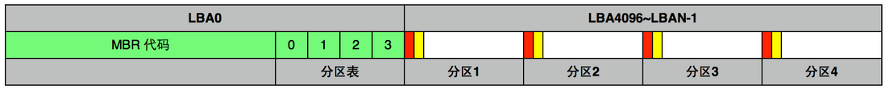

# BIOS 引导流程

开机后，固化在`ROM`里的`BIOS`就会被加载到内存运行，`BIOS`自检完毕以后加载`COMS`的参数，通过`COMS`的参数，`BIOS`程序加载启动磁盘的`MBR`到内存里运行，运行`MBR`的引导代码，这段代码会查找活动分区（`BIOS`不认识活动分区，但这段代码认识活动分区）的位置，加载并执行活动分区的`PBR`（另一段引导程序），与`MBR`类似，`PBR`在运行后加载操作系统的引导程序到内存运行，例如`Windows`的`bootmgr`或`Linux`的`grub`。当引导程序运行后，操作系统内核就被加载运行，完成从`BIOS`程序中接手的引导流程，整体流程如下图：

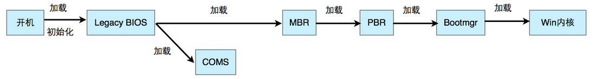

`Windows`的`PBR`认识`FAT32`和`NTFS`两种分区，找到分区根目录的`bootmgr`文件，加载、执行`bootmgr`。
`bootmgr`没了`MBR`和`PBR`的大小限制，**可以做更多的事**。它会加载并分析`BCD`启动项存储。而且`bootmgr`可以跨越磁盘读取文件了。所以无论你有几个磁盘，你在多少块磁盘上装了`Windows`，一个电脑只需要一个`bootmgr`就行了。`bootmgr`会去加载某磁盘某`NTFS`分区的`\Windows\System32\WinLoad.exe`，后面启动`Windows`的事就由`WinLoad.exe`来完成了。

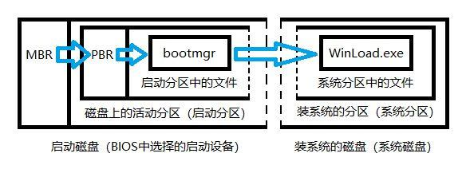

**为什么图中有两组虚线？**

因为“启动磁盘”和“装系统的磁盘”可以是同一个磁盘，也可以不是同一个。“启动分区”和“系统分区”可以是不同磁盘的不同分区，也可以是相同磁盘的不同分区，也可以是同一个分区。

这就解释了，为什么有的时候，`Windows`装在磁盘`2`上，却要在`BIOS`里选磁盘`1`启动了。因为`bootmgr`可能在磁盘`1`上。

# UEFI

`UEFI`，全称`Unified Extensible Firmware Interface`，即“统一的可扩展固件接口”，是一种详细描述全新类型接口的标准，是适用于电脑的标准固件接口，旨在代替`BIOS`。此标准由`intel`公司带头组织`UEFI`联盟中的`140`多个技术公司共同创建，其中包括微软公司。`UEFI`旨在提高软件互操作性和解决`BIOS`的局限性。作为传统`BIOS`的继任者，`UEFI`拥有前辈所不具备的诸多功能，比如图形化界面、多种多样的操作方式、允许植入硬件驱动等等。这些特性让`UEFI`相比于传统`BIOS`更加易用、更加多功能、更加方便。而`Windows 8`在发布之初就对外宣布全面支持`UEFI`，这也促使了众多主板厂商纷纷转投`UEFI`，并将此作为主板的标准配置之一。`Intel`更是宣布在`2020`之前实现在芯片上将`BIOS`全部替换为`UEFI`。对`UEFI`的由来感兴趣的可以阅读一下 [【UEFI背后的历史】](https://zhuanlan.zhihu.com/p/25281151)

`BIOS`只能在`16`位模式下运行，而`UEFI`可以在`32`位或`64`位模式下运行，并且具有比`BIOS`更多的可寻址地址空间，这意味着引导过程更快。这也意味着`UEFI`设置屏幕可以比`BIOS`设置屏幕更光滑，包括图形和鼠标光标支持。但是这不是强制性的，许多`pc`机仍然带有文本模式的`UEFI`设置界面，这些界面看起来和工作起来都像一个旧的`BIOS`设置屏幕。老一点的机器都是使用`BIOS`主板，现在大部分新机器都是采用`UEFI`主板，`UEFI`采用了向后兼容，所以`BIOS`切换为`UEFI`不可以，而`UEFI`切换为`BIOS`是可以的。

UEFI还包含了其他功能，它支持安全引导，这意味着可以检查操作系统的有效性，以确保没有恶意软件篡改引导过程。它可以在`UEFI`固件本身中支持联网特性，这有助于远程故障排除和配置。对于传统`BIOS`，必须坐在物理计算机前才能配置它。虽然目前有厂商利用这一特性尝试垄断市场，但这不意味着这不是一个很好的功能。

它也不仅仅是`BIOS`替换。`UEFI`本质上是一个运行在`PC`固件之上的微型操作系统，它可以做的比`BIOS`多得多。它可以存储在主板的闪存中，也可以在启动时从硬盘或网络共享加载。一般的`UEFI`系统仅能识别`FAT32`，不同于`BIOS`只能识别固定位置的磁盘引导块。这意味着只要将引导程序放到`FAT32`分区里，`UEFI`系统就能通过分区表的指引找到这个保存着引导程序的`FAT32`分区。`UEFI`系统是由模块化的`C`语言程序写出来的，所以通过添加或修改程序模块就能获得更多的功能。例如支持更多的文件系统，图形界面，甚至能使用浏览器浏览网页。

上面提到`BIOS`分区表类型为`MBR`，只能管理最大`2.2T`的硬盘，并且分区数上限最大为`4`个，尽管后来为了支持更多的分区，引入了扩展分区及逻辑分区的概念，但是换汤不换药，满足不了硬盘容量和分区数目急速增长的需求。而`UEFI`采用`GPT`分区表的方式后，硬盘容量和分区数目几乎没有上限（目前`windows`支持最大`128`个分区）。

对`UEFI`架构感兴趣的可以关注 [UEFI架构详解](https://zhuanlan.zhihu.com/p/25941528)

# GPT

`GPT`，即`Globally Unique Identifier Partition Table`，全局唯一标识码分区表，简称`GPT`或`GUID`分区表，它是`UEFI`规范的一部分。由于`MBR`分区表 的局限性（还有`BIOS`的），而`UEFI BIOS`的推广也为`GPT`的实现打下了坚实的技术基础，`GPT`应运而生。`GPT`由`GPT`头和`GPT`主体，`GPT`备份组成。起始于磁盘`LBA1`的位置，相对的`LBA0`仍然为`MBR`，但是这个`MBR`是被保护的，没有引导代码，仅仅有一个被标识为未知的分区，当支持`GPT`分区表的操作系统检索到这个`MBR`后就会自动忽略并跳到`LBA1`读取`GPT`分区表。如下图，由于篇幅的关系，表的长度比例不等同与实际在磁盘地址里的实际比例。

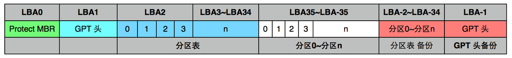

`PMBR`存在的意义是当不支持`GPT`的分区工具试图对硬盘进行操作时（例如`MS-DOS`和Linux的`fdisk`程序），它可以根据这份`PMBR`以传统方式启动，过程和`MBR+BIOS`完全一致，极大地提高了兼容性。而支持`GPT`的系统在检测`PMBR`后会直接跳到GPT表头读取分区表。和`MBR`类似，分区表中存储了某个分区的起始和结束位置及其文件系统属性信息，而分区才是实际存在的物理磁盘的一部分。

`GPT`表头，主要定义了分区表中分区数及每个分区大小，还包含硬盘的容量信息。分区表头还记录了这块硬盘的`GUID`，分区表头位置（总是`LBA1`）和大小，也包含了备份分区表头和分区表的位置和大小信息（`LBA-1~LBA-34`）。同时还储存着它本身和分区表的`CRC32`校验。固件、引导程序和操作系统在启动时可以根据这个校验值来判断分区表是否出错，如果出错，可以使用软件从硬盘最后的备份`GPT`中恢复整个分区表，如果备份`GPT`也校验错误，硬盘将不可使用。

分区表包含分区的类型`GUID`（如：`EFI`系统分区的`GUID`类型是`{C12A7328-F81F-11D2-BA4B-00A0C93EC93B}`），名称，起始终止位置，该分区的`GUID`以及分区属性。

相较于`MBR`，`GPT`具有以下优点：

- 得益于`LBA`提升至`64`位，以及分区表中每项`128`位设定，`GPT`可管理的空间近乎无限大，假设一个扇区大小仍为`512`字节，可表示扇区数为，算下来，可管理的硬盘容量=`18EB`(`1EB`=`1024PB`=`1,048,576TB`)，`2.2T`在它面前完全不在话下。按目前的硬盘技术来看，确实近乎无限。
- 分区数量几乎没有限制，由于可在表头中设置分区数量的大小，如果愿意，设置分区也可以（有人愿意管理这么多分区吗），不过，目前`windows`仅支持最大`128`个分区。
- 自带保险，由于在磁盘的首尾部分各带一个`GPT`表头，任何一个受到破坏后都可以通过另一份恢复，极大地提高了磁盘的抗性。
- 循环冗余检验值针对关键数据结构而计算，提高了数据崩溃的检测几率。
- 尽管目前分区类型不超过百数，`GPT`仍提供了`16`字节的`GUID`来标识分区类型，使其更不容易产生冲突。
- 每个分区都可以拥有一个特别的名字，最长`72`字节，足够满足种奇葩命名需求。
- 完美支持`UEFI`，毕竟它就是`UEFI`规范的衍生品。在将来全行业`UEFI`的情境下，`GPT`必将更快淘汰`MBR`。

# UEFI 引导流程

整个`UEFI`的启动详细流程描述如下：

- 开机后，固化在`ROM`里的`UEFI BIOS`就会被加载到内存运行。
- `UEFI BIOS`将引导`EFI`系统进行运行。
- 在`EFI`系统启动后，`GUID`分区表就会被识别，之后`EFI`系统就会通过`.efi`文件启动`Boot Loader`程序加载操作系统内核。

如下图：

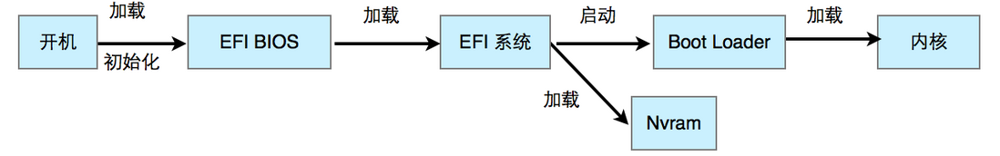

对于分区表格式为`MBR`分区表的磁盘，`UEFI`系统会 先启动`CSM`兼容模式后按传统`BIOS`的步骤加载操作系统的内核。如下图：

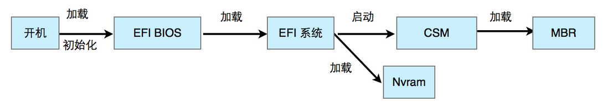

# 如何使用 GPT 方式安装系统

由于`MBR`方式限制重重，所以大部分情况下我们都会选择使用`GPT`分区方式安装系统。通过上面的讲解，我们应该知道`UEFI`方式安装的系统是肯定是使用`GPT`分区方式；而`BIOS`方式安装的系统默认使用`MBR`分区方式。

看下图，这是一个主板支持`UEFI`的机器，最下面有一个启动设备是`UEFI:`开头的，即表示通过`UEFI`方式安装系统，这样安装默认支持使用`GPT`分区方式：

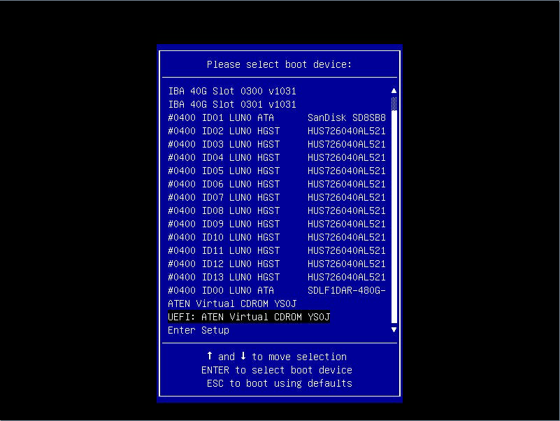

再看下图，这是一个主板不支持`UEFI`的机器，最下面没有启动设备是`UEFI:`开头的，只有`ATEN`开头的，`ATEN`就是默认地通过`BIOS`方式安装系统：

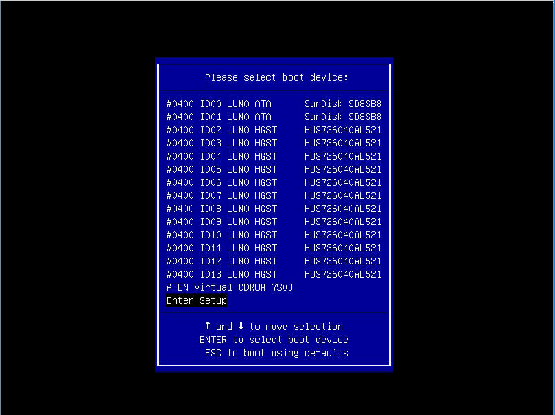

这样安装默认不支持使用`GPT`分区方式，不过我们可以通过一些手段强制以`GPT`分区方式安装系统，

在安装开机后第一个界面，按`tab`键，在行末尾，空格，输入`inst.gpt`，如下图所示:

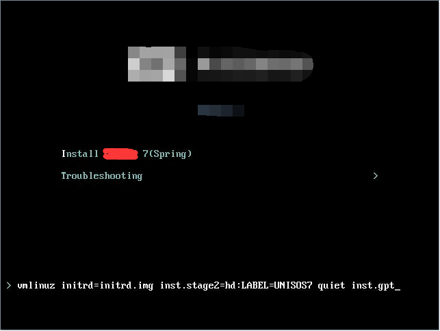

# GRUB

## GRUB 是什么

`GRUB`（`Grand Unified Boot loader`）是硬盘中的软件，引导器（`loader`）的一种。目前主流版本是 `GRUB2`，可以看[GRUB2](https://my.oschina.net/guol/blog/37373)中文介绍。

`Wikipedia`这样介绍`GURB`：

`GNU GRUB`（简称`GRUB`）是一个来自`GNU`项目的启动引导程序。`GRUB`是多启动规范的实现，它允许用户可以在计算机内同时拥有多个操作系统，并在计算机启动时选择希望运行的操作系统。`GRUB`可用于选择操作系统分区上的不同内核，也可用于向这些内核传递启动参数。

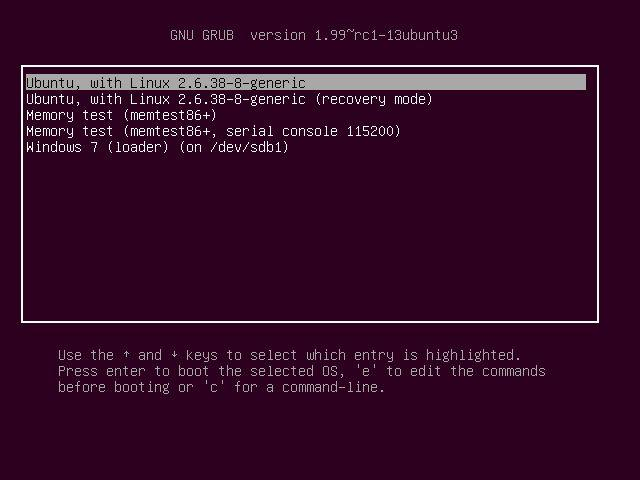

对于只支持`BIOS`的主板，可以使用`grub`进入`grub`命令行，然后`为grub`添加第三方的`EFI shell`模块，然后就可以启动那些使用`EFI`启动的`OS`了。对于只有`EFI`的主板，当然可以写个`.efi`文件，然后转去读取`MBR`传统引导。

`GRUB`用于从多操作系统的计算机中选择一个系统来启动，或从系统分区中选择特殊的内核配置。

如图：第一个选项和最后一个选项是选择不同的操作系统；第一个选项和第二个选项是选择不同的内核配置。

## GRUB位置

其启动代码（`boot.img`）直接安装在`MBR`中，然后执行`GRUB`内核镜像（`core.img`），最后从`/boot/grub`中读取配置和其他功能代码。

`BIOS`引导方式中，`MBR`分区表和`GPT`分区表的[GRUB引导文件所放分区不同](https://en.wikipedia.org/wiki/BIOS_boot_partition)：

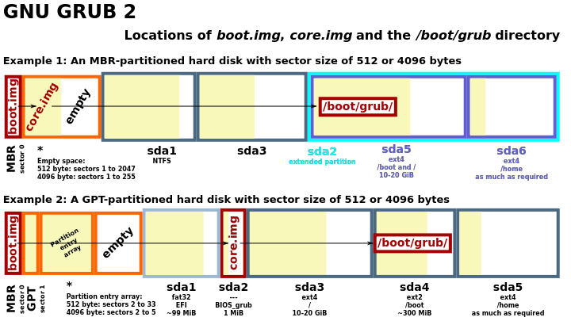

如图，`GRUB`的执行顺序为`boot.img` –> `core.img` –> `/boot/grub/`。

- 在`MBR`分区表中，`boot.img`和`core.img`都在`MBR`中。`MBR`虽然只占用一个扇区(`512Byte`)，但是其所在的磁道是空闲的，不会用于分区，可以放下`core.img`。

  ```
  Some MBR code loads additional code for a boot manager from the first track of the disk,
  which it assumes to be “free” space that is not allocated to any disk partition, and executes it.
      – MBR
  ```

- 在`GPT`分区表中，
  - bios 引导：
    - `MBR`为`protected MBR`（为兼容`MBR`，在硬盘起始位置保留的空间），后面并没有空间放`core.img`，
    - 需要建一个专门的分区来放，称为`BIOS boot partition`，
      - 该分区的文件类型为`unformatted`，
      - `flag`为`BOIS_grub`，该`flag`用于标识`core.img`所要安装到的分区。
  - 若使用`UEFI`引导：
    - `GRUB`读取的是`ESP`分区中的数据，不需要`flag`为`BIOS_grub`的分区。

