> 面向对象(oo)=>功能模块(设计模式+算法/数据结构)==放到==>框架(使用多种设计模式)=>架构(服务器集群)

**一定要好好看代码和注释**

# 1. 总括

## 1.1. 设计模式目的

编写软件过程中，程序员面临着来自 耦合性，内聚性以及可维护性，可扩展性，重用性，灵活性 等多方面的挑战，设计模式是为了让程序(软件)，具有更好的：

1. 代码重用性 (即：相同功能的代码，不用多次编写)
2. 可读性 (即：编程规范性,  便于其他程序员的阅读和理解)
3. 可扩展性 (即：当需要增加新的功能时，非常的方便，称为可维护)
4. 可靠性 (即：当我们增加新的功能后，对原来的功能没有影响)
5. 使程序呈现**高内聚，低耦合**的特性。

> 设计模式包含了面向对象的精髓，"懂了设计模式，你就懂了面向对象分析和设计（OOA/D）的精要"

## 1.2. 设计模式的七大原则

### 1.2.1. 单一职责原则

#### 1.2.1.1. 基本介绍

对类来说的，即一个类应该只负责一项职责。如果类A负责多个职责，可能导致以下问题：

- 一个职责的变化可能会削弱或者抑制这个类实现其他职责的能力；
- 当客户端需要该对象的某一个职责时，不得不将其他不需要的职责全都包含进来，从而造成冗余代码或代码的浪费。

#### 1.2.1.2. 案例

> 应用实例：以交通工具案例讲解

<details>
<summary style="color:red;">案例1:未准守单一职责原则</summary>

```java
public class SingleResponsibility1 {

	public static void main(String[] args) {
		Vehicle vehicle = new Vehicle();
		vehicle.run("摩托车");
		vehicle.run("汽车");
		vehicle.run("飞机");
	}
}

// 方式1
// 会有：飞机在公路上运行。这一错误
// 违反了单一职责原则
// 解决的方案非常的简单，根据交通工具运行方法不同，分解成不同类即可
class Vehicle {
	public void run(String vehicle) {
		System.out.println(vehicle + " 在公路上运行....");
	}
}
```

</details>

<details>
<summary style="color:red;">案例2：完全准守单一职责原则，对类进行拆解，实现单一职责原则</summary>

```java
public class SingleResponsibility2 {

	public static void main(String[] args) {
		RoadVehicle roadVehicle = new RoadVehicle();
		roadVehicle.run("摩托车");
		roadVehicle.run("汽车");
		
		AirVehicle airVehicle = new AirVehicle();
		
		airVehicle.run("飞机");
	}

}

//方案2的分析
//1. 遵守单一职责原则
//2. 但是这样做的改动很大，即将类分解，同时修改客户端
//3. 改进：直接修改Vehicle 类，改动的代码会比较少=>方案3
class RoadVehicle {
	public void run(String vehicle) {
		System.out.println(vehicle + "公路运行");
	}
}

class AirVehicle {
	public void run(String vehicle) {
		System.out.println(vehicle + "天空运行");
	}
}

class WaterVehicle {
	public void run(String vehicle) {
		System.out.println(vehicle + "水中运行");
	}
}
```

1. 遵守单一职责原则
2. 但是这样做的改动很大，即将类分解，同时修改客户端
3. 改进：直接修改Vehicle 类，改动的代码会比较少=>方案3

</details>

<details>
<summary style="color:red;">案例3：没有完全准守单一职责原则，对方法进行拆解，实现单一职责原则</summary>

```java
public class SingleResponsibility3 {

	public static void main(String[] args) {
		Vehicle2 vehicle2  = new Vehicle2();
		vehicle2.run("汽车");
		vehicle2.runWater("轮船");
		vehicle2.runAir("飞机");
	}

}

//方式3的分析
//1. 这种修改方法没有对原来的类做大的修改，只是增加方法
//2. 这里虽然没有在类这个级别上遵守单一职责原则，但是在方法级别上，仍然是遵守单一职责
class Vehicle2 {
	public void run(String vehicle) {
		//处理
		System.out.println(vehicle + " 在公路上运行....");
	}
	
	public void runAir(String vehicle) {
		System.out.println(vehicle + " 在天空上运行....");
	}
	
	public void runWater(String vehicle) {
		System.out.println(vehicle + " 在水中运行....");
	}

	//方法4.
	//...
}
```

</details>

补充：**慎用if-else分支语句，耦合性过高**

#### 1.2.1.3. **注意/要求**

> 单一职责原则是最简单但又最难运用的原则，需要设计人员发现类的不同职责并将其分离，再封装到不同的类或模块中。
> 而发现类的多重职责需要设计人员具有较强的分析设计能力和相关重构经验。

1. 降低类的复杂度，一个类只负责一项职责
2. 提高类的可读性，可维护性
3. 降低变更引起的风险
4. 通常情况下，**我们应当遵守单一职责原则**，只有逻辑足够简单，才可以在代码级违反单一职责原则；**只有类中方法数量足够少，可以在方法级别保持单一职责原则**
  > 比如方式3，因为代码比较简单，所以只把功能拆分为了方法，但是如果每个方法中都要调用类中的其他各种方法，还是分成类比较好。

### 1.2.2. 接口隔离原则

#### 1.2.2.1. 基本介绍

- 说明:
  - 客户端不应该依赖它不需要的接口
  - 即一个类对另一个类的依赖应该建立在最小的接口上

- 优点
  - 将臃肿庞大的接口分解为多个粒度小的接口，可以预防外来变更的扩散，提高系统的灵活性和可维护性。
  - 接口隔离提高了系统的内聚性，减少了对外交互，降低了系统的耦合性。
  - 如果接口的粒度大小定义合理，能够保证系统的稳定性；但是，如果定义过小，则会造成接口数量过多，使设计复杂化；如果定义太大，灵活性降低，无法提供定制服务，给整体项目带来无法预料的风险。
  - 使用多个专门的接口还能够体现对象的层次，因为可以通过接口的继承，实现对总接口的定义。
  - 能减少项目工程中的代码冗余。过大的大接口里面通常放置许多不用的方法，当实现这个接口的时候，被迫设计冗余的代码。

#### 1.2.2.2. 案例

1. 类A通过接口Interface1依赖类B，类C通过接口Interface1依赖类D，如果接口Interface1对于类A和类C来说不是最小接口，那么类B和类D必须去实现他们不需要的方法。
2. 按隔离原则应当这样处理：将接口Interface1拆分为独立的几个接口，类A和类C分别与他们需要的接口建立依赖关系。也就是采用接口隔离原则

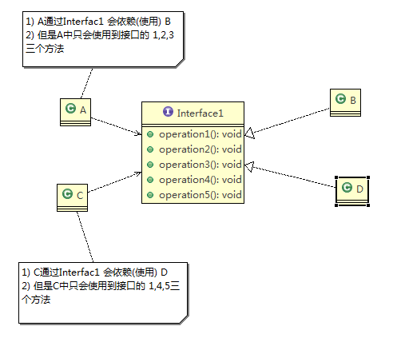

<details>
<summary style="color:red;">案例1：未应用接口隔离原则，问题：类 A 通过 Interface1 依赖类 B 类 C 通过 Interface1 依赖类 D，造成类 B 和 类 D 需要去实现他们无需实现的接口</summary>

```java
public class Segregation1 {

	public static void main(String[] args) {
		A a = new A();
		a.depend1(new B()); // A类通过接口去依赖B类
		a.depend2(new B());
		a.depend3(new B());
	}

}

//接口
interface Interface1 {
	void operation1();

	void operation2();

	void operation3();

	void operation4();

	void operation5();
}

class B implements Interface1 {
	public void operation1() {
		System.out.println("B 实现了 operation1");
	}

	public void operation2() {
		System.out.println("B 实现了 operation2");
	}

	public void operation3() {
		System.out.println("B 实现了 operation3");
	}

	public void operation4() {
		System.out.println("B 实现了 operation4");
	}

	public void operation5() {
		System.out.println("B 实现了 operation5");
	}
}

class D implements Interface1 {
	public void operation1() {
		System.out.println("D 实现了 operation1");
	}

	public void operation2() {
		System.out.println("D 实现了 operation2");
	}

	public void operation3() {
		System.out.println("D 实现了 operation3");
	}

	public void operation4() {
		System.out.println("D 实现了 operation4");
	}

	public void operation5() {
		System.out.println("D 实现了 operation5");
	}
}

class A { // A 类通过接口Interface1 依赖(使用) B类，但是只会用到1,2,3方法
	public void depend1(Interface1 i) {
		i.operation1();
	}

	public void depend2(Interface1 i) {
		i.operation2();
	}

	public void depend3(Interface1 i) {
		i.operation3();
	}
}

class C { // C 类通过接口Interface1 依赖(使用) D类，但是只会用到1,4,5方法
	public void depend1(Interface1 i) {
		i.operation1();
	}

	public void depend4(Interface1 i) {
		i.operation4();
	}

	public void depend5(Interface1 i) {
		i.operation5();
	}
}
```
</details>

<details>
<summary style="color:red;">案例2：分析传统方法的问题，使用接口隔离原则改进程序结构</summary>

- 类A通过接口Interface1依赖类B，类C通过接口Interface1依赖类D，如果接口Interface1对于类A和类C来说不是最小接口，那么类B和类D必须去实现他们不需要的方法
- 将接口Interface1拆分为独立的几个接口，类A和类C分别与他们需要的接口建立依赖关系。也就是采用接口隔离原则
- 接口Interface1中出现的方法，根据实际情况拆分为三个接口


```java
public class Segregation1 {

	public static void main(String[] args) {

		// 使用一把
		A a = new A();
		a.depend1(new B()); // A类通过接口去依赖B类
		a.depend2(new B());
		a.depend3(new B());

		C c = new C();

		c.depend1(new D()); // C类通过接口去依赖(使用)D类
		c.depend4(new D());
		c.depend5(new D());

	}

}

// 接口1
interface Interface1 {
	void operation1();
}

// 接口2
interface Interface2 {
	void operation2();
	void operation3();
}

// 接口3
interface Interface3 {
	void operation4();
	void operation5();
}

class B implements Interface1, Interface2 {
	public void operation1() {
		System.out.println("B 实现了 operation1");
	}

	public void operation2() {
		System.out.println("B 实现了 operation2");
	}

	public void operation3() {
		System.out.println("B 实现了 operation3");
	}

}

class D implements Interface1, Interface3 {
	public void operation1() {
		System.out.println("D 实现了 operation1");
	}

	public void operation4() {
		System.out.println("D 实现了 operation4");
	}

	public void operation5() {
		System.out.println("D 实现了 operation5");
	}
}

class A { // A 类通过接口Interface1,Interface2 依赖(使用) B类，但是只会用到1,2,3方法
	public void depend1(Interface1 i) {
		i.operation1();
	}

	public void depend2(Interface2 i) {
		i.operation2();
	}

	public void depend3(Interface2 i) {
		i.operation3();
	}
}

class C { // C 类通过接口Interface1,Interface3 依赖(使用) D类，但是只会用到1,4,5方法
	public void depend1(Interface1 i) {
		i.operation1();
	}

	public void depend4(Interface3 i) {
		i.operation4();
	}

	public void depend5(Interface3 i) {
		i.operation5();
	}
}
```
</details>

#### 1.2.2.3. **注意/要求**

- 接口尽量小，但是要有限度。一个接口只服务于一个子模块或业务逻辑。
- 为依赖接口的类定制服务。只提供调用者需要的方法，屏蔽不需要的方法。
- 了解环境，拒绝盲从。每个项目或产品都有选定的环境因素，环境不同，接口拆分的标准就不同深入了解业务逻辑。
- 提高内聚，减少对外交互。使接口用最少的方法去完成最多的事情。

### 1.2.3. 依赖倒转(倒置)原则

#### 1.2.3.1. 基本介绍

- 高层模块不应该依赖低层模块，二者都应该依赖其抽象(接口，抽象类)
- 抽象不应该依赖细节(比如实现类)，细节应该依赖抽象
- 依赖倒转原则是基于这样的设计理念：
  - 相对于细节的多变性，**抽象的东西要稳定的多**
  - **以抽象为基础搭建的架构比以细节为基础的架构要稳定的多**
  - 在java中，抽象指的是接口或抽象类，细节就是具体的实现类
- 依赖倒转(倒置)的中心思想是**面向接口编程**
  - **使用接口或抽象类的目的是制定好规范**，而不涉及任何具体的操作
  - **把展现细节的任务交给他们的实现类去完成**
 
#### 1.2.3.2. 案例

<details>
<summary style="color:red;">案例1：未遵循依赖倒置原则，Person 类与 Email 类耦合，如果我们还想获取其他消息，比如微信、短信、QQ 等、则需要添加相应的实现方法</summary>

```java
public class DependecyInversion {

	public static void main(String[] args) {
		Person person = new Person();
		person.receive(new Email());
	}

}

class Email {
	public String getInfo() {
		return "电子邮件信息: hello,world";
	}
}

//完成Person接收消息的功能
//方式1分析
//1. 简单，比较容易想到
//2. 如果我们获取的对象是 微信，短信等等，则新增类，同时Peron也要增加相应的接收方法
//3. 解决思路：引入一个抽象的接口IReceiver, 表示接收者, 这样Person类与接口IReceiver发生依赖
//   因为Email, WeiXin 等等属于接收的范围，他们各自实现IReceiver 接口就ok, 这样我们就符号依赖倒转原则
class Person {
	public void receive(Email email) {
		System.out.println(email.getInfo());
	}
}
```
</details>

<details>
<summary style="color:red;">案例2：引入一个抽象的接口 IReceiver，表示接收者（Email、微信、短信、QQ 等），接受者分别实现 IReceiver 接口中的方法，实现各自接收消息的逻辑，Person 类与 IReceiver 接口发生依赖，达到接收消息的功能</summary>

```java
public class DependecyInversion {

	public static void main(String[] args) {
		// 客户端无需改变
		Person person = new Person();
		person.receive(new Email());
		person.receive(new WeiXin());
	}

}

//定义接口
interface IReceiver {
	public String getInfo();
}

class Email implements IReceiver {
	public String getInfo() {
		return "电子邮件信息: hello,world";
	}
}

//增加微信
class WeiXin implements IReceiver {
	public String getInfo() {
		return "微信信息: hello,ok";
	}
}

//方式2
class Person {
	// 这里我们是对接口的依赖
	public void receive(IReceiver receiver) {
		System.out.println(receiver.getInfo());
	}
}
```
</details>

#### 1.2.3.3. 依赖关系传递的三种方式和应用案例

<details>
<summary style="color:red;">接口传递</summary>

```java
public class DependencyPass {

	public static void main(String[] args) {
		// 通过接口传递
		ChangHong changHong = new ChangHong();
		OpenAndClose openAndClose = new OpenAndClose();
		openAndClose.open(changHong);
	}

}

// 方式1： 通过接口传递实现依赖
// 开关的接口
interface IOpenAndClose {
	public void open(ITV tv); // 抽象方法,接收接口
}

// ITV接口
interface ITV {
	public void play();
}

// 长虹电视：实现 ITV 接口
class ChangHong implements ITV {
	@Override
	public void play() {
		System.out.println("长虹电视机，打开");
	}
}

// 设备播放类：实现 IOpenAndClose 接口，调用接口 IITV 的 play() 方法实现播放功能（通过接口注入）
class OpenAndClose implements IOpenAndClose {
  // 接收接口，通过接口传递依赖
	public void open(ITV tv) {
		tv.play();
	}
}
```
</details>

<details>
<summary style="color:red;">构造方法传递</summary>

```java
public class DependencyPass {

	public static void main(String[] args) {
		// 通过构造器进行依赖传递
         ChangHong changHong = new ChangHong();
		OpenAndClose openAndClose = new OpenAndClose(changHong);
		openAndClose.open();
	}

}

// 方式2: 通过构造方法依赖传递
interface IOpenAndClose {
	public void open(); // 抽象方法
}

interface ITV { // ITV接口
	public void play();
}

// 长虹电视：实现 ITV 接口
class ChangHong implements ITV {
	@Override
	public void play() {
		System.out.println("长虹电视机，打开");
	}
}

class OpenAndClose implements IOpenAndClose {
	public ITV tv; // 成员变量

  // 通过构造器注入实现了 ITV 接口的对象
	public OpenAndClose(ITV tv) {
		this.tv = tv;
	}

	public void open() {
		this.tv.play();
	}
}
```
</details>

<details>
<summary style="color:red;">setter方式传递</summary>

```java
public class DependencyPass {

	public static void main(String[] args) {
		// 通过setter方法进行依赖传递
         ChangHong changHong = new ChangHong();
		OpenAndClose openAndClose = new OpenAndClose();
		openAndClose.setTv(changHong);
		openAndClose.open();
	}

}

// 方式3 , 通过setter方法传递
interface IOpenAndClose {
	public void open(); // 抽象方法
	public void setTv(ITV tv); // 通过 setter 方法注入
}

interface ITV { // ITV接口
	public void play();
}

// 长虹电视：实现 ITV 接口
class ChangHong implements ITV {
	@Override
	public void play() {
		System.out.println("长虹电视机，打开");
	}
}

class OpenAndClose implements IOpenAndClose {
	private ITV tv;

	// 通过 setYv() 方法注入实现了 ITV 接口的对象实例
	public void setTv(ITV tv) {
		this.tv = tv;
	}

	public void open() {
		this.tv.play();
	}
}
```
</details>

**总结：无论通过什么方法，目的都是要将实现了接口的具体实现类注入到调用者类中**

#### 1.2.3.4. **注意/要求**

1. **低层模块尽量都要有抽象类或接口**，或者两者都有，程序稳定性更好
2. **变量的声明类型尽量是抽象类或接口**，这样我们的变量引用和实际对象间，就存在一个缓冲层，利于程序扩展和优化
  > 可以通过修改父类，作用到子类
3. 任何类都不应该从具体类派生。
4. 继承时遵循里氏替换原则

### 1.2.4. 里氏替换原则

#### 1.2.4.1. 基本介绍

- 继承带来的问题
  - 继承包含这样一层含义：
    - 父类中凡是已经实现好的方法， 实际上是在设定规范和契约
    - 虽然它不强制要求所有的子类必须遵循这些契约，但是如果子类对这些已经实现的方法任意修改，就会对整个继承体系造成破坏。
  - 继承在给程序设计带来便利的同时，也带来了弊端:
    - 比如使用继承会给程序带来侵入性，程序的可移植性降低，增加对象间的耦合性
    - 如果一个类被其他的类所继承，则当这个类需要修改时，必须考虑到所有的子类，并且父类修改后，所有涉及到子类的功能都有可能产生故障
  - 问题提出：在编程中，如何正确的使用继承? => 里氏替换原则

- 基本介绍
  - 里氏替换原则(Liskov Substitution Principle)在1988年，由麻省理工学院的以为姓里的女士提出的。
    ```
    如果对每个类型为T1的对象o1，都有类型为T2的对象o2，
    使得以T1定义的所有程序P在所有的对象o1都代换成o2时，程序P的行为没有发生变化
    那么类型T2是类型T1的子类型。 
    换句话说，所有引用基类的地方必须能透明地使用其子类的对象
    ```
  - 里氏替换原则通俗来讲就是： **子类可以扩展父类的功能，但不能改变父类原有的功能** 。
  - 也就是说：在使用继承时，遵循里氏替换原则， **子类继承父类时，除添加新的方法完成新增功能外，尽量不要重写父类的方法** 。
  - 里氏替换原则告诉我们，继承实际上让两个类耦合性增强了， **在适当的情况下，可以通过聚合，组合，依赖来解决问题**

#### 1.2.4.2. 案例

<details>
<summary style="color:red;">案例1：未遵循里氏替换原则，由于子类 B 继承父类 A 时重写了 func1() 方法，导致程序中使用多态时，本意是想调用重写前的方法，结果变成了重写后的方法，所以程序输出结果和预期不同</summary>

```java
public class Liskov {

	public static void main(String[] args) {
		A a = new A();
		System.out.println("11-3=" + a.func1(11, 3));
		System.out.println("1-8=" + a.func1(1, 8));

		System.out.println("-----------------------");
		B b = new B();
		System.out.println("11-3=" + b.func1(11, 3));// 这里本意是求出11-3，结果变成了11+3
		System.out.println("1-8=" + b.func1(1, 8));// 这里本意是求出1-8，结果变成了1+8
		System.out.println("11+3+9=" + b.func2(11, 3));
	}

}

// A类
class A {
	// 返回两个数的差
	public int func1(int num1, int num2) {
		return num1 - num2;
	}
}

// B类继承了A
// 增加了一个新功能：完成两个数相加,然后和9求和
class B extends A {
	// 这里，重写了A类的方法, 可能是无意识
	public int func1(int a, int b) {
		return a + b;
	}

	public int func2(int a, int b) {
		return func1(a, b) + 9;
	}
}
```

</details>

- 原因分析与解决方法
  1. 案例一中，我们发现原来运行正常的相减功能发生了错误。原因就是类B无意中重写了父类的方法，造成原有功能出现错误。在实际编程中，我们常常会通过重写父类的方法完成新的功能，这样写起来虽然简单，但整个继承体系的复用性会比较差。特别是运行多态比较频繁的时候
  2. 通用的做法是：原来的父类和子类都继承一个更通俗的基类，原有的继承关系去掉，采用依赖，聚合，组合等关系代替。见案例二


<details>
<summary style="color:red;">案例2：将类 B 的级别提升至与类 A 平级，他们有一个共同的父类 Base，这样就不会出现类 B 重写类 A 中方法的问题，此时基类的引用能够透明地使用子类的对象</summary>

```java
public class Liskov {

	public static void main(String[] args) {
		
		A a = new A();
		System.out.println("11-3=" + a.func1(11, 3));
		System.out.println("1-8=" + a.func1(1, 8));

		System.out.println("-----------------------");
		B b = new B();
		
		// 因为B类不再继承A类，因此调用者，不会再func1是求减法
		// 调用完成的功能就会很明确
		System.out.println("11+3=" + b.func1(11, 3));// 这里本意是求出11+3
		System.out.println("1+8=" + b.func1(1, 8));// 这里本意是求出1+8
		System.out.println("11+3+9=" + b.func2(11, 3));

		// 使用组合仍然可以使用到A类相关方法
		System.out.println("11-3=" + b.func3(11, 3));// 这里本意是求出11-3

	}

}

//创建一个更加基础的基类
class Base {
	// 把更加基础的方法和成员写到Base类
}

// A类
class A extends Base {
	// 返回两个数的差
	public int func1(int num1, int num2) {
		return num1 - num2;
	}
}

// B类继承了A
// 增加了一个新功能：完成两个数相加,然后和9求和
class B extends Base {
	// 如果B需要使用A类的方法,使用组合关系
	private A a = new A();

	// 这里虽然方法名是 fun1()，但由于类 B 集成于类 Base，已和类 A 无关
	public int func1(int a, int b) {
		return a + b;
	}

	public int func2(int a, int b) {
		return func1(a, b) + 9;
	}

	// 我们仍然想使用A的方法
	public int func3(int a, int b) {
		return this.a.func1(a, b);
	}
}
```
</details>

#### 1.2.4.3. **注意/要求**

- 继承时注意
  - 子类可以实现父类的抽象方法，但不能覆盖父类的非抽象方法
  - 子类中可以增加自己特有的方法
  - 当子类的方法重载父类的方法时，方法的前置条件（即方法的输入参数）要比父类的方法更宽松
  - 当子类的方法实现父类的方法时（重写/重载或实现抽象方法），方法的后置条件（即方法的的输出/返回值）要比父类的方法更严格或相等

- 另辟蹊径
  - 我们也可以通过提升的方法，来尽量满足里氏替换原则
  - 假设现在有两个类，A 类和 B 类，如果 B 类继承 A 类，需要重写 A 类中的某些方法
  - 那么，我们在 A 类 和 B 类之上，再抽取出一个更加通用的父类 CommonSuper，让 A 类和 B 类同时去继承 CommonSuper
  - 这样 B 类就无须重写 A 类中的某些方法，达到基类的引用对子类对象透明的效果

### 1.2.5. 迪米特法则

#### 1.2.5.1. 基本介绍

- 一个对象应该对其他对象保持最少的了解
- 类与类关系越密切，耦合度越大
- 迪米特法则(Demeter Principle)又叫**最少知道原则**
  - 即**一个类对自己依赖的类知道的越少越好**
  - 也就是说，对于被依赖的类不管多么复杂，都尽量将逻辑封装在类的内部。
  - **对外除了提供的public 方法，不对外泄露任何信息**

- 迪米特法则还有个更简单的定义：**只与直接的朋友通信**
  - 朋友关系：
    - 每个对象都会与其他对象有耦合关系，只要两个对象之间有耦合关系，我们就说这两个对象之间是**朋友关系**
    - 耦合的方式很多，依赖，关联，组合，聚合等。
  - 直接朋友：
    - 其中，我们称出现**成员变量，方法参数，方法返回值**中的类为**直接的朋友**
    - 而出现在**局部变量**中的类不是直接的朋友
  - 通信要求：
    - **陌生的类最好不要以局部变量的形式出现在类的内部**。

#### 1.2.5.2. 案例

> 应用实例：有一个学校， 下属有各个学院和总部， 现要求打印出学校总部员工ID和学院员工的id

<details>
<summary style="color:red;">案例1：CollegeEmployee 类不是 SchoolManager 类的直接朋友，而是一个陌生类，这样的设计违背了迪米特法则</summary>

```java
//客户端
public class Demeter1 {

	public static void main(String[] args) {
		// 创建了一个 SchoolManager 对象
		SchoolManager schoolManager = new SchoolManager();
		// 输出学院的员工id 和 学校总部的员工信息
		schoolManager.printAllEmployee(new CollegeManager());
	}

}

//学校总部员工类
class Employee {
	private String id;

	public void setId(String id) {
		this.id = id;
	}

	public String getId() {
		return id;
	}
}

//学院的员工类
class CollegeEmployee {
	private String id;

	public void setId(String id) {
		this.id = id;
	}

	public String getId() {
		return id;
	}
}

//管理学院员工的管理类
class CollegeManager {
	// 返回学院的所有员工
	public List<CollegeEmployee> getAllEmployee() {
		List<CollegeEmployee> list = new ArrayList<CollegeEmployee>();
		for (int i = 0; i < 10; i++) { // 这里我们增加了10个员工到 list
			CollegeEmployee emp = new CollegeEmployee();
			emp.setId("学院员工id= " + i);
			list.add(emp);
		}
		return list;
	}
}

//学校管理类
//分析 SchoolManager 类的直接朋友类有哪些 Employee、CollegeManager
//CollegeEmployee 不是 直接朋友 而是一个陌生类，这样违背了 迪米特法则 
class SchoolManager {
	// 返回学校总部的员工
	public List<Employee> getAllEmployee() {
		List<Employee> list = new ArrayList<Employee>();

		for (int i = 0; i < 5; i++) { // 这里我们增加了5个员工到 list
			Employee emp = new Employee();
			emp.setId("学校总部员工id= " + i);
			list.add(emp);
		}
		return list;
	}

	// 该方法完成输出学校总部和学院员工信息(id)
	void printAllEmployee(CollegeManager sub) {

		// 分析问题
		// 1. 这里的 CollegeEmployee 不是 SchoolManager的直接朋友
		// 2. CollegeEmployee 是以局部变量方式出现在 SchoolManager
		// 3. 违反了 迪米特法则

		// 获取到学院员工
		List<CollegeEmployee> list1 = sub.getAllEmployee();
		System.out.println("------------学院员工------------");
		for (CollegeEmployee e : list1) {
			System.out.println(e.getId());
		}
		// 获取到学校总部员工
		List<Employee> list2 = this.getAllEmployee();
		System.out.println("------------学校总部员工------------");
		for (Employee e : list2) {
			System.out.println(e.getId());
		}
	}
}
```
</details>

1. 前面设计的问题在于SchoolManager中， CollegeEmployee类并不是SchoolManager类的直接朋友
2. 按照迪米特法则，应该避免类中出现这样非直接朋友关系的耦合，我们将输出学院员工的方法封装到CollegeManager，这样在SchoolManager中就不会出现CollegeEmployee类了
3. 按照迪米特法则的意思就是：SchoolManager对输出学院员工知道得越少越好，所以我们就直接将该逻辑封装到CollegeManager中

<details>
<summary style="color:red;">案例2：改进</summary>

```java
//客户端
public class Demeter1 {

	public static void main(String[] args) {
		System.out.println("~~~使用迪米特法则的改进~~~");
		// 创建了一个 SchoolManager 对象
		SchoolManager schoolManager = new SchoolManager();
		// 输出学院的员工id 和 学校总部的员工信息
		schoolManager.printAllEmployee(new CollegeManager());
	}

}

//学校总部员工类
class Employee {
	private String id;

	public void setId(String id) {
		this.id = id;
	}

	public String getId() {
		return id;
	}
}

//学院的员工类
class CollegeEmployee {
	private String id;

	public void setId(String id) {
		this.id = id;
	}

	public String getId() {
		return id;
	}
}

//管理学院员工的管理类
class CollegeManager {
	// 返回学院的所有员工
	public List<CollegeEmployee> getAllEmployee() {
		List<CollegeEmployee> list = new ArrayList<CollegeEmployee>();
		for (int i = 0; i < 10; i++) { // 这里我们增加了10个员工到 list
			CollegeEmployee emp = new CollegeEmployee();
			emp.setId("学院员工id= " + i);
			list.add(emp);
		}
		return list;
	}

	// 输出学院员工的信息
	public void printEmployee() {
		// 获取到学院员工
		List<CollegeEmployee> list1 = getAllEmployee();
		System.out.println("------------学院员工------------");
		for (CollegeEmployee e : list1) {
			System.out.println(e.getId());
		}
	}
}

//学校管理类
class SchoolManager {
	// 返回学校总部的员工
	public List<Employee> getAllEmployee() {
		List<Employee> list = new ArrayList<Employee>();

		for (int i = 0; i < 5; i++) { // 这里我们增加了5个员工到 list
			Employee emp = new Employee();
			emp.setId("学校总部员工id= " + i);
			list.add(emp);
		}
		return list;
	}

	// 该方法完成输出学校总部和学院员工信息(id)
	void printAllEmployee(CollegeManager sub) {

		// 分析问题
		// 1. 将输出学院的员工方法，封装到CollegeManager
		sub.printEmployee();

		// 获取到学校总部员工
		List<Employee> list2 = this.getAllEmployee();
		System.out.println("------------学校总部员工------------");
		for (Employee e : list2) {
			System.out.println(e.getId());
		}
	}
}
```
</details>

#### 1.2.5.3. **注意/要求**

> 迪米特法则的核心是降低类之间的耦合
>
> 但是注意：由于每个类都减少了不必要的依赖，因此迪米特法则只是要求降低类间(对象间)耦合关系， 并不是要求完全没有依赖关系(也没办法做到)

- 从迪米特法则的定义和特点可知，它强调以下两点：
  - 从依赖者的角度来说，只依赖应该依赖的对象。
  - 从被依赖者的角度说，只暴露应该暴露的方法。

- 所以，在运用迪米特法则时要注意以下 6 点。
  - 在类的划分上，应该创建弱耦合的类。类与类之间的耦合越弱，就越有利于实现可复用的目标。
  - 在类的结构设计上，尽量降低类成员的访问权限。
  - 在类的设计上，优先考虑将一个类设置成不变类。
  - 在对其他类的引用上，将引用其他对象的次数降到最低。
  - 不暴露类的属性成员，而应该提供相应的访问器（set 和 get 方法）。
  - 谨慎使用序列化（Serializable）功能

### 1.2.6. 合成复用原则

原则是尽量使用合成/聚合的方式，而不是使用继承，即尽量使用 has a 的关系，而不要使用 is a 的关系


### 1.2.7. 开闭原则 ocp(核心)

#### 1.2.7.1. 基本介绍

> 核心

1. 开闭原则（Open Closed Principle） 是编程中最基础、最重要的设计原则
2. 一个软件实体如类，模块和函数应该对扩展开放(对提供方)， 对修改关闭(对使用方)。 **用抽象构建框架，用实现扩展细节**。
  > 也就是你怎么该内部代码我都不管，只要提供的API不变就行
3. 当软件需要变化时， **尽量通过扩展软件实体** 的行为来实现变化，而不是通过修改已有的代码来实现变化。
  > 也就是说最好新增api，而不要乱改api
4. **编程中遵循其它原则，以及使用设计模式的目的就是遵循开闭原则**。

#### 1.2.7.2. 案例

<details>
<summary style="color:red;">案例1：未遵循开闭原则，导致新增一个图形类时，需要在【使用方 GraphicEditor】中添加很多代码</summary>


```java
public class Ocp {

	public static void main(String[] args) {
		// 使用看看存在的问题
		GraphicEditor graphicEditor = new GraphicEditor();
		graphicEditor.drawShape(new Rectangle());
		graphicEditor.drawShape(new Circle());
		graphicEditor.drawShape(new Triangle());
	}

}

//这是一个用于绘图的类 [使用方，需使用图形绘图]
class GraphicEditor {
	// 接收Shape对象，然后根据type，来绘制不同的图形
	public void drawShape(Shape s) {
		if (s.m_type == 1)
			drawRectangle(s);
		else if (s.m_type == 2)
			drawCircle(s);

    // ***************新增**************
    // 给使用方新增了代码
		else if (s.m_type == 3)
			drawTriangle(s);
	}

	// 绘制矩形
	public void drawRectangle(Shape r) {
		System.out.println(" 绘制矩形 ");
	}

	// 绘制圆形
	public void drawCircle(Shape r) {
		System.out.println(" 绘制圆形 ");
	}

  // ***************新增**************
	// 绘制三角形
	public void drawTriangle(Shape r) {
		System.out.println(" 绘制三角形 ");
	}
}

//Shape类，基类
class Shape {
	int m_type;
}

// 具体的图形为提供方，提供具体的绘图流程
class Rectangle extends Shape {
	Rectangle() {
		super.m_type = 1;
	}
}

class Circle extends Shape {
	Circle() {
		super.m_type = 2;
	}
}

// ***************新增**************
//新增画三角形
class Triangle extends Shape {
	Triangle() {
		super.m_type = 3;
	}
}
```
</details>

- 案例一的优缺点分析
  1. 优点是比较好理解，简单易操作。
  2. 缺点是违反了设计模式的ocp原则，即对扩展开放(提供方)，对修改关闭(使用方)。即当我们给类增加新功能的时候，尽量不修改代码，或者尽可能少修改代码。
  3. 比如我们这时要新增加一个图形种类：三角形，我们需要做大量的修改， 修改的地方较多

- 改进思路分析：
  1. 把创建Shape类做成抽象类，并提供一个抽象的draw方法，让子类去实现即可
  2. 这样我们有新的图形种类时，只需要让新的图形类继承Shape，并实现draw方法即可，使用方的代码就不需要修 -> 满足了开闭原则

<details>
<summary style="color:red;">案例2：改进</summary>

1. 所有的图形类都继承自公共的抽象父类 Shape，并重写父类中的 draw() 方法，之后新增图形类时，只需要重写 draw() 方法即可，在【使用方 GraphicEditor】中无需做任何修改
2. PS：和前面的接收消息例子很像，通过 IReceiver 接口定义各种接收者的行为，这样扩展新的接受者时，就无须在【使用方 Person】中修改任何代码

```java
public class Ocp {

	public static void main(String[] args) {
		// 使用看看存在的问题
		GraphicEditor graphicEditor = new GraphicEditor();
		graphicEditor.drawShape(new Rectangle());
		graphicEditor.drawShape(new Circle());
		graphicEditor.drawShape(new Triangle());
		graphicEditor.drawShape(new OtherGraphic());
	}

}

//这是一个用于绘图的类 [使用方]
class GraphicEditor {
	// 接收Shape对象，调用draw方法
	public void drawShape(Shape s) {
		s.draw();
	}
}

//Shape类，基类
abstract class Shape {
	int m_type;

	public abstract void draw();// 抽象方法
}

class Rectangle extends Shape {
	Rectangle() {
		super.m_type = 1;
	}

	@Override
	public void draw() {
		System.out.println(" 绘制矩形 ");
	}
}

class Circle extends Shape {
	Circle() {
		super.m_type = 2;
	}

	@Override
	public void draw() {
		System.out.println(" 绘制圆形 ");
	}
}

//新增画三角形
class Triangle extends Shape {
	Triangle() {
		super.m_type = 3;
	}

	@Override
	public void draw() {
		System.out.println(" 绘制三角形 ");
	}
}

//新增一个图形
class OtherGraphic extends Shape {
	OtherGraphic() {
		super.m_type = 4;
	}

	@Override
	public void draw() {
		System.out.println(" 绘制其它图形 ");
	}
}
```
</details>

## 1.3. 设计原则核心思想

- 找出应用中可能需要变化之处， 把它们独立出来， 不要和那些不需要变化的代码混在一起。
- 针对接口编程， 而不是针对实现编程。
- **为了交互对象之间的松耦合设计而努力**

# 2. UML类图复习


## 2.1. Dependency：表示依赖（使用）

只要是在类中用到了对方， 那么他们之间就存在依赖关系，比如：

- 类的成员属性
- 方法的返回类型
- 方法接收的参数类型
- 方法中使用的局部变量

```java
public class PersonServiceBean {
    private PersonDao personDao;//类
    
    public void save(Person person){}
    
    public IDCard getIDCard(Integer personid){
        return null;
    }
    
    public void modify(){
    	Department department = new Department();
    }
} 

public class PersonDao{}

public class IDCard{}

public class Person{}

public class Department{}
```


---

## 2.2. Association：表示关联

**依赖关系的特例**

- 关联关系实际上就是类与类之间的联系，他是依赖关系的特例
- 关联具有导航性：即双向关系或单向关系
- 关系具有多重性：如“1”（表示有且仅有一个），“0…”（表示0个或者多个），“0， 1”（表示0个或者一个），“n…m”(表示n到 m个都可以)，“m…*”（表示至少m个）

```java
public class Person {
	private IDCard card;
}

public class IDCard{
    
}

// 双向一对一关系
public class Person {
	private IDCard card;
}

public class IDCard{
	private Person person
}
```

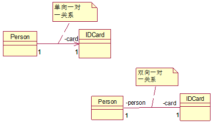

---

## 2.3. Generalization：表示泛化（继承）

**依赖关系的特例**

- 泛化关系实际上就是继承关系
- 如果 A 类继承了 B 类， 我们就说 A 和 B 存在泛化关系

```java
public abstract class DaoSupport{
    public void save(Object entity){
        
    }
    
    public void delete(Object id){
        
    }
}

public class PersonServiceBean extends Daosupport{
    
}
```

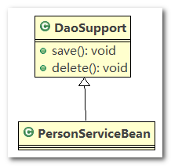

---

## 2.4. Realization：表示实现

**依赖关系的特例**

- 实现关系实际上就是 A 类实现 B 接口， 他是依赖关系的特例

```java
public interface PersonService {
	public void delete(Integer id);
} 

public class PersonServiceBean implements PersonService {
	public void delete(Integer id){
        
    }
}
```

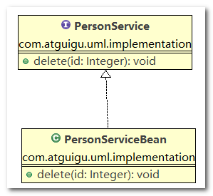

---

## 2.5. Aggregation：表示聚合

**关联关系的特列**

- 聚合关系（Aggregation）表示的是整体和部分的关系，整体与部分可以分开。 聚合关系是关联关系的特例，所以他具有关联的导航性与多重性。
- 如：一台电脑由键盘(keyboard)、显示器(monitor)，鼠标等组成；组成电脑的各个配件是可以从电脑上分离出来的， 使用带空心菱形的实线来表示：

```java
public class Computer {
	private Mouse mouse; // 鼠标可以和Computer分离
	private Moniter moniter;// 显示器可以和Computer分离

	public void setMouse(Mouse mouse) {
		this.mouse = mouse;
	}

	public void setMoniter(Moniter moniter) {
		this.moniter = moniter;
	}
}
```


---

## 2.6. Composite：表示组合

**关联关系的特列**

- 组合关系：也是整体与部分的关系，但是整体与部分不可以分开。
- 在程序中我们定义实体： Person与IDCard、 Head，那么 Head 和Person 就是组合关系， IDCard 和 Person 就是聚合关系。
- 但是如果在程序中Person实体中定义了对IDCard进行级联删除，即删除Person时连同IDCard一起删除， 那么IDCard 和 Person 就是组合了

> **注意观察聚合关系和组合关系在代码中的区别**

```java
public class Person {
	private IDCard card; // 聚合关系
	private Head head = new Head(); // 组合关系
}
```

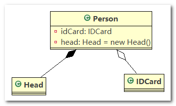

# 3. 设计模式

## 3.1. 设计模式概述

### 3.1.1. 设计模式的层次

1. 第 1 层： 刚开始学编程不久， 听说过什么是设计模式
2. 第 2 层： 有很长时间的编程经验， 自己写了很多代码， 其中用到了设计模式， 但是自己却不知道
3. 第 3 层： 学习过了设计模式， 发现自己已经在使用了， 并且发现了一些新的模式挺好用的
4. 第 4 层： 阅读了很多别人写的源码和框架， 在其中看到别人设计模式， 并且能够领会设计模式的精妙和带来的好处。
5. 第 5 层： 代码写着写着， 自己都没有意识到使用了设计模式， 并且熟练的写了出来。

### 3.1.2. 设计模式介绍

1. 设计模式是程序员在面对同类软件工程设计问题所总结出来的有用的经验， **模式不是代码， 而是某类问题的通用解决方案**， 设计模式（Design pattern） 代表了最佳的实践。 这些解决方案是众多软件开发人员经过相当长的一段时间的试验和错误总结出来的。
2. 设计模式的本质提高 软件的维护性， 通用性和扩展性， 并降低软件的复杂度。
3. 《设计模式》是经典的书， 作者是 Erich Gamma、 Richard Helm、 Ralph Johnson 和 John Vlissides Design（俗称 “四人组 GOF” ）
4. 设计模式并不局限于某种语言， java， php， c++ 都有设计模式。

### 3.1.3. 设计模式类型与关系

> 注意： 不同的书籍上对分类和名称略有差别

设计模式分为三种类型， 共 23 种

1. 创建型模式： 单例模式、 抽象工厂模式、 原型模式、 建造者模式、 工厂模式。
2. 结构型模式： 适配器模式、 桥接模式、 装饰模式、 组合模式、 外观模式、 享元模式、 代理模式。
3. 行为型模式： 模版方法模式、 命令模式、 访问者模式、 迭代器模式、 观察者模式、 中介者模式、 备忘录模式、解释器模式（Interpreter 模式） 、 状态模式、 策略模式、 职责链模式(责任链模式)。

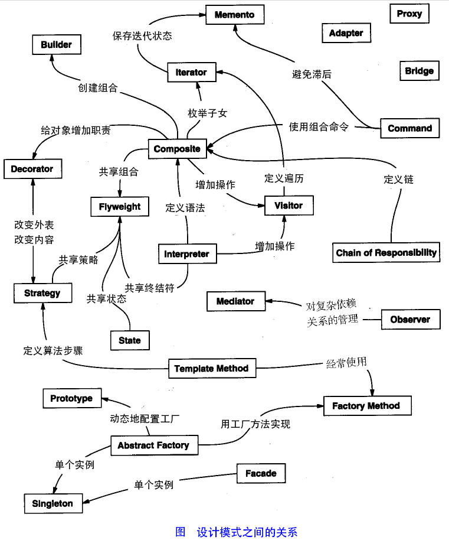

## 3.2. 创建型模式

### 3.2.1. 概述

这些设计模式提供了一种在创建对象的同时隐藏创建逻辑的方式，而不是使用 new 运算符直接实例化对象。这使得程序在判断针对某个给定实例需要创建哪些对象时更加灵活。

### 3.2.2. 单例模式（Singleton Pattern）

#### 3.2.2.1. 说明

1. 所谓类的单例设计模式， 就是采取一定的方法保证在整个的软件系统中， 对某个类只能存在一个对象实例，并且该类只提供一个取得其对象实例的方法(静态方法)。
2. 比如 `Hibernate` 的 `SessionFactory`， 它充当数据存储源的代理， 并负责创建 `Session` 对象。`SessionFactory` 并不是轻量级的， 一般情况下， 一个项目通常只需要一个 `SessionFactory` 就够，这是就会使用到单例模式。

#### 3.2.2.2. 单例设计模式八种方式

单例模式有八种方式：

1. **饿汉式(静态常量)**
2. **饿汉式(静态代码块)**
3. 懒汉式(线程不安全)
4. 懒汉式(线程安全， 同步方法)
5. 懒汉式(线程安全， 同步代码块)
6. **双重锁检查**(推荐)
7. **静态内部类**(推荐)
8. **枚举**

#### 3.2.2.3. 饿汉式（静态常量）

> **饿汉式（静态常量）的具体实现步骤**

1. 构造器私有化 (防止 `new`)
2. 类的内部创建对象
3. 向外暴露一个静态的公共方法： `getInstance()`

> **饿汉式（静态常量）的代码实现**

1. 代码实现

   ```java
   public class SingletonTest01 {

   	public static void main(String[] args) {
   		// 测试
   		Singleton instance = Singleton.getInstance();
   		Singleton instance2 = Singleton.getInstance();
   		System.out.println(instance == instance2); // true
   		System.out.println("instance.hashCode=" + instance.hashCode());
   		System.out.println("instance2.hashCode=" + instance2.hashCode());
   	}

   }

   //饿汉式(静态变量)
   class Singleton {

   	// 1. 构造器私有化, 外部不能new
   	private Singleton() {

   	}

   	// 2.本类内部创建对象实例
   	private final static Singleton instance = new Singleton();

   	// 3. 提供一个公有的静态方法，返回实例对象
   	public static Singleton getInstance() {
   		return instance;
   	}

   }
   ```

2. 程序运行结果

   ```
   true
   instance.hashCode=366712642
   instance2.hashCode=366712642
   ```

> **饿汉式（静态常量）的优缺点说明**

1. 优点： 这种写法比较简单， 就是在类装载的时候就完成实例化。 避免了线程同步问题。
2. 缺点： 在类装载的时候就完成实例化， 没有达到 `Lazy Loading` 的效果。 如果从始至终从未使用过这个实例， 则会造成内存的浪费
3. 这种方式基于 `Classloder` 机制避免了多线程的同步问题， 不过， `instance` 在类装载时就实例化， 在单例模式中大多数都是调用 `getInstance()` 方法获取单例对象， 但是导致类装载的原因有很多种， 因此不能确定有其他的方式（或者其他的静态方法） 导致类装载， 这时候初始化单例对象，就没有达到 `lazy loading` 的效果
4. 结论： 这种单例模式可用， 可能造成内存浪费

#### 3.2.2.4. 饿汉式（静态代码块）

> **饿汉式（静态代码块）的具体实现步骤**

1. 构造器私有化，外部不能 `new`
2. 在本类内部的静态代码块中，创建单例对象
3. 提供一个公有的静态方法，返回实例对象

> **饿汉式（静态代码块）的代码实现**

1. 代码实现

   ```java
   public class SingletonTest02 {

   	public static void main(String[] args) {
   		// 测试
   		Singleton instance = Singleton.getInstance();
   		Singleton instance2 = Singleton.getInstance();
   		System.out.println(instance == instance2); // true
   		System.out.println("instance.hashCode=" + instance.hashCode());
   		System.out.println("instance2.hashCode=" + instance2.hashCode());
   	}

   }

   //饿汉式(静态变量)
   class Singleton {

   	// 1. 构造器私有化, 外部不能new
   	private Singleton() {

   	}

   	// 2.本类内部创建对象实例
   	private static Singleton instance;

   	static { // 在静态代码块中，创建单例对象
   		instance = new Singleton();
   	}

   	// 3. 提供一个公有的静态方法，返回实例对象
   	public static Singleton getInstance() {
   		return instance;
   	}

   }
   ```

2. 程序运行结果

   ```
   true
   instance.hashCode=366712642
   instance2.hashCode=366712642
   ```

> **饿汉式（静态代码块）的优缺点说明**

1. 这种方式和上面的方式其实类似，只不过将类实例化的过程放在了静态代码块中，也是在类装载的时候，就执行静态代码块中的代码，初始化类的实例。优缺点和上面是一样的。
2. 结论： 这种单例模式可用，但是可能造成内存浪费

#### 3.2.2.5. 懒汉式（线程不安全）

> **懒汉式（线程不安全）的具体实现步骤**

1. 构造器私有化，外部不能 `new`

2. 在本类内部的 `getInstance()`:

   静态方法中，判断单例对象是否为空

   1. 如果为空，则创建单例对象并返回
   2. 如果不为空，则直接返回此对象

> **懒汉式（线程不安全）的代码实现**

1. 代码实现

   ```java
   public class SingletonTest03 {

   	public static void main(String[] args) {
   		System.out.println("懒汉式1 ， 线程不安全~");
   		Singleton instance = Singleton.getInstance();
   		Singleton instance2 = Singleton.getInstance();
   		System.out.println(instance == instance2); // true
   		System.out.println("instance.hashCode=" + instance.hashCode());
   		System.out.println("instance2.hashCode=" + instance2.hashCode());
   	}

   }

   class Singleton {
   	private static Singleton instance;

   	private Singleton() {
   	}

   	// 提供一个静态的公有方法，当使用到该方法时，才去创建 instance
   	// 即懒汉式
   	public static Singleton getInstance() {
   		if (instance == null) {
   			instance = new Singleton();
   		}
   		return instance;
   	}
   }
   ```

2. 程序运行结果

  ```
  懒汉式1 ， 线程不安全~
  true
  instance.hashCode=366712642
  instance2.hashCode=366712642
  ```

> **懒汉式（线程不安全）的优缺点说明**

1. 起到了 `Lazy Loading` 的效果， 但是只能在单线程下使用。
2. 如果在多线程下， 一个线程进入了 `if (singleton == null)` 判断语句块， 还没来得及往下执行， 另一个线程也通过了这个判断语句， 这时便会产生多个实例。 所以在多线程环境下不可使用这种方式
3. 结论： 在实际开发中， 不要使用这种方式

#### 3.2.2.6. 懒汉式（同步方法）

> **懒汉式（同步方法）的具体实现步骤**

1. 构造器私有化，外部不能 `new`

2. 在本类内部的

   ```
   getInstance()
   ```

   静态同步方法中，判断单例对象是否为空

   1. 如果为空，则创建单例对象并返回
   2. 如果不为空，则直接返回此对象

> **懒汉式（同步方法）的代码实现**

1. 代码实现

   ```java
   public class SingletonTest04 {

   	public static void main(String[] args) {
   		System.out.println("懒汉式2 ， 线程安全~");
   		Singleton instance = Singleton.getInstance();
   		Singleton instance2 = Singleton.getInstance();
   		System.out.println(instance == instance2); // true
   		System.out.println("instance.hashCode=" + instance.hashCode());
   		System.out.println("instance2.hashCode=" + instance2.hashCode());
   	}

   }

   // 懒汉式(线程安全，同步方法)
   class Singleton {
   	private static Singleton instance;

   	private Singleton() {
   	}

   	// 提供一个静态的公有方法，加入同步处理的代码，解决线程安全问题
   	// 即懒汉式
   	public static synchronized Singleton getInstance() {
   		if (instance == null) {
   			instance = new Singleton();
   		}
   		return instance;
   	}
   }
   ```

2. 程序运行结果

   ```
   懒汉式2 ， 线程安全~
   true
   instance.hashCode=366712642
   instance2.hashCode=366712642
   ```

> **懒汉式（同步方法）的优缺点说明**

1. 解决了线程安全问题
2. 效率太低了， 每个线程在想获得类的实例时候， 执行 `getInstance()` 方法都要进行同步。 而其实这个方法只执行一次实例化代码就够了， 后面的想获得该类实例， 直接 `return` 就行了。 方法进行同步效率太低
3. 结论： 在实际开发中， 不推荐使用这种方式

#### 3.2.2.7. 懒汉式（同步代码块）

> **懒汉式（同步代码块）的具体实现步骤**

1. 构造器私有化，外部不能 `new`

2. 在本类内部的

   ```
   getInstance()
   ```

   静态方法中，先判断对象是否为空

   1. 如果为空，则加锁创建单例对象，并返回
   2. 如果不为空，则直接返回此对象

> **懒汉式（同步代码块）的代码实现**

代码实现

```java
class Singleton{
    private static Singleton singleton;
    private Singleton(){
    }

    public static singleton getInstance(){
        if(singleton==null){
            synchronized(Singleton. class){
                singleton=new Singleton();
            }
        }
    }
    return singleton;
}
```

> **懒汉式（同步代码块）的优缺点说明**

1. 这种方式，本意是想对第四种实现方式的改进，因为前面同步方法效率太低，改为同步产生实例化的的代码块
2. 但是这种同步**并不能起到线程同步的作用**。跟第`3`种实现方式遇到的情形一致，假如一个线程进入了 `if (singleton == null)` 判断语句块，还未来得及往下执行，另一个线程也通过了这个判断语句，这时便会产生多个实例
3. 结论：在实际开发中， 不能使用这种方式

#### 3.2.2.8. 懒汉式（双重锁检查）(推荐)

> **懒汉式（双重检查）的具体实现步骤**

1. 构造器私有化，外部不能 `new`

2. 在本类内部的

   ```
   getInstance()
   ```

   静态方法中，先判断对象是否为空

   1. 如果为空，则先加锁，再判断此单例对象是否为空，如果还为空，才创建对象
   2. 如果不为空，则直接返回此对象

3. 注意：单例变量需要使用 `volatile` 关键字进行修饰，保证内存可见性，以及防止指令重排序

> **懒汉式（双重检查）的代码实现**

1. 代码实现

   ```java
   public class SingletonTest06 {

   	public static void main(String[] args) {
   		System.out.println("双重检查");
   		Singleton instance = Singleton.getInstance();
   		Singleton instance2 = Singleton.getInstance();
   		System.out.println(instance == instance2); // true
   		System.out.println("instance.hashCode=" + instance.hashCode());
   		System.out.println("instance2.hashCode=" + instance2.hashCode());
   	}

   }

   // 懒汉式(线程安全，同步方法)
   class Singleton {
   	private static volatile Singleton instance;

   	private Singleton() {
   	}

   	// 提供一个静态的公有方法，加入双重检查代码，解决线程安全问题, 同时解决懒加载问题
   	// 同时保证了效率, 推荐使用
   	public static Singleton getInstance() {
   		if (instance == null) {
   			synchronized (Singleton.class) {
   				if (instance == null) {
   					instance = new Singleton();
   				}
   			}

   		}
   		return instance;
   	}
   }
   ```

2. 程序运行结果

   ```
   双重检查
   true
   instance.hashCode=366712642
   instance2.hashCode=366712642
   ```

> **懒汉式（双重检查）的优缺点说明**

1. `Double-Check` 概念是多线程开发中常使用到的， 如代码中所示， 我们进行了两次 `if (singleton == null)` 检查， 这样就可以保证线程安全了
2. 这样， 实例化代码只用执行一次， 后面再次访问时， 判断 `if (singleton == null)`， 直接 `return` 实例化对象， 也避免的反复进行方法同步
3. 线程安全； 延迟加载； 效率较高
4. 结论： 在实际开发中， 推荐使用这种单例设计模式

#### 3.2.2.9. 懒汉式（静态内部类）(推荐)

> **懒汉式（静态内部类）的具体实现步骤**

1. 构造器私有化，外部不能 `new`
2. 在本类内部新增一个静态内部类，封装一个单例对象，用于实现单例模式
3. 静态内部类的实现方式本质是利用类加载的同步机制，保证单例对象的线程安全，并且该方式能保证该单例对象的懒加载机制，因为只有用到静态内部类时，才会加载该静态内部类以及单例对象
4. 在本类内部提供一个静态方法 `getInstance()` 用于返回静态内部类中的单例对象

> **懒汉式（静态内部类）的代码实现**

1. 代码实现

   ```java
   public class SingletonTest07 {

   	public static void main(String[] args) {
   		System.out.println("使用静态内部类完成单例模式");
   		Singleton instance = Singleton.getInstance();
   		Singleton instance2 = Singleton.getInstance();
   		System.out.println(instance == instance2); // true
   		System.out.println("instance.hashCode=" + instance.hashCode());
   		System.out.println("instance2.hashCode=" + instance2.hashCode());
   	}

   }

   // 静态内部类完成， 推荐使用
   class Singleton {
   	//构造器私有化
   	private Singleton() {}

   	//写一个静态内部类,该类中有一个静态属性 Singleton
   	private static class SingletonInstance {
   		private static final Singleton INSTANCE = new Singleton();
   	}

   	//提供一个静态的公有方法，直接返回SingletonInstance.INSTANCE
   	public static Singleton getInstance() {
   		return SingletonInstance.INSTANCE;
   	}
   }
   ```

2. 程序运行结果

   ```
   使用静态内部类完成单例模式
   true
   instance.hashCode=366712642
   instance2.hashCode=366712642
   ```

> **懒汉式（静态内部类）的优缺点说明**

1. 这种方式采用了类装载的机制来保证初始化实例时只有一个线程。
2. **静态内部类方式在`Singleton`类被装载时并不会立即实例化，而是在需要实例化时，调用`getInstance()`方法，才会装载`SingletonInstance`类，从而完成`Singleton`的实例化**。
3. 类的静态属性只会在第一次加载类的时候初始化，所以在这里， `JVM`帮助我们保证了线程的安全性(CAS,TLAB)，在类进行初始化时，别的线程是无法进入的。
4. 优点：避免了线程不安全，利用静态内部类特点实现延迟加载，效率高。
5. 结论：推荐使用。

#### 3.2.2.10. 饿汉式（枚举）

> **饿汉式（枚举）的具体实现步骤**

通过枚举类实现单例模式

> **饿汉式（枚举）的代码实现**

1. 代码实现

   ```java
   public class SingletonTest08 {
   	public static void main(String[] args) {
   		Singleton instance = Singleton.INSTANCE;
   		Singleton instance2 = Singleton.INSTANCE;
   		System.out.println(instance == instance2);

   		System.out.println(instance.hashCode());
   		System.out.println(instance2.hashCode());

   		instance.sayOK();
   	}
   }

   //使用枚举，可以实现单例, 推荐
   enum Singleton {
   	INSTANCE; // 属性

   	public void sayOK() {
   		System.out.println("ok~");
   	}
   }
   ```

2. 程序运行结果

   ```
   true
   366712642
   366712642
   ok~
   ```

> **饿汉式（枚举）的优缺点说明**

1. 这借助`JDK1.5`中添加的枚举来实现单例模式。不仅能避免多线程同步问题，而且还能防止反序列化重新创建新的对象。
2. 这种方式是`Effective Java`作者`Josh Bloch`提倡的方式。如果用枚举去实现一个单例，属于饿汉模式。
3. 结论：推荐使用

#### 3.2.2.11. 源码示例

> **Runtime 源码**。单例模式

这是典型的饿汉式啊

```java
public class Runtime {
    private static Runtime currentRuntime = new Runtime();

    /**
     * Returns the runtime object associated with the current Java application.
     * Most of the methods of class <code>Runtime</code> are instance
     * methods and must be invoked with respect to the current runtime object.
     *
     * @return  the <code>Runtime</code> object associated with the current
     *          Java application.
     */
    public static Runtime getRuntime() {
        return currentRuntime;
    }

    /** Don't let anyone else instantiate this class */
    private Runtime() {}
```

#### 3.2.2.12. 单例模式注意事项

1. 单例模式保证了系统内存中该类只存在一个对象，节省了系统资源，对于一些需要频繁创建销毁的对象，使用单例模式可以提高系统性能
2. 当想实例化一个单例类的时候，必须要记住使用相应的获取对象的方法，而不是使用 `new`
3. 单例模式使用的场景：需要频繁的进行创建和销毁的对象、创建对象时耗时过多或耗费资源过多(即： 重量级对象)，但又经常用到的对象、工具类对象、频繁访问数据库或文件的对象(比如数据源、 `session` 工厂等)

### 3.2.3. 工厂模式（Factory Pattern）

#### 3.2.3.1. 说明

- 概述
  - 目的：
    - 定义一个创建对象的接口，让其子类自己决定实例化哪一个工厂类， **工厂模式使其创建过程延迟到子类进行**。
    - 将实例化对象的代码提取出来，放到一个类中统一管理和维护，达到和主项目的依赖关系的解耦。从而提高项目的扩展和维护性。
  - 主要解决：主要解决接口选择的问题。
  - 何时使用：我们明确地计划不同条件下创建不同实例时。
  - 如何解决：让其子类实现工厂接口，返回的也是一个抽象的产品。
  - 关键代码：创建过程在其子类执行。

- 缺点：
  - 每次增加一个产品时，都需要增加一个具体类和对象实现工厂，使得系统中类的个数成倍增加
  - 在一定程度上增加了系统的复杂度，同时也增加了系统具体类的依赖。

- 使用场景：
  - 注意：
    - 作为一种创建类模式，在任何需要生成复杂对象的地方，都可以使用工厂方法模式。
    - 有一点需要注意的地方就是复杂对象适合使用工厂模式，
    - 而简单对象，特别是只需要通过 new 就可以完成创建的对象，无需使用工厂模式 如果使用工厂模式，就需要引入一个工厂类，会增加系统的复杂度。
  - 示例
    - 1、日志记录器：记录可能记录到本地硬盘、系统事件、远程服务器等，用户可以选择记录日志到什么地方。 
    - 2、数据库访问，当用户不知道最后系统采用哪一类数据库，以及数据库可能有变化时。 
    - 3、设计一个连接服务器的框架，需要三个协议，"POP3"、"IMAP"、"HTTP"，可以把这三个作为产品类，共同实现一个接口。

- 工厂模式种类
  - 简单工厂模式
  - 工厂方法模式
  - 抽象工厂模式

- 设计模式的依赖抽象原则
  -  创建对象实例时，不要直接 `new` 这个类，而是把这个`new` 类的动作放在一个工厂的方法中，并返回。
    > 有的书上说，变量不要直接持有具体类的引用。
    > 这样做的好处是：我们依赖的是一个抽象层（缓冲层），如果之后有什么变动，修改工厂类中的代码即可
  - 不要让类继承具体类，而是继承抽象类或者是实现`interface`(接口)
  - 不要覆盖基类中已经实现的方法

#### 3.2.3.2. 情景说明

看一个披萨的项目：要便于披萨种类的扩展，要便于维护

1. 披萨的种类很多(比如 GreekPizz、CheesePizz 等)
2. 披萨的制作有 prepare、bake、cut、box
3. 完成披萨店订购功能

#### 3.2.3.3. 传统方法


<details>
<summary style="color:red;">展开</summary>

1. `Pizza` 抽象父类

   ```java
   //将Pizza 类做成抽象
   public abstract class Pizza {
   	
   	protected String name; //名字
   	
   	public void setName(String name) {
   		this.name = name;
   	}
   	
   	//准备原材料, 不同的披萨不一样，因此，我们做成抽象方法
   	public abstract void prepare();
   
   	// 烘烤
   	public void bake() {
   		System.out.println(name + " baking;");
   	}
   
   	// 切割
   	public void cut() {
   		System.out.println(name + " cutting;");
   	}
   
   	//打包
   	public void box() {
   		System.out.println(name + " boxing;");
   	}
   
   }
   ```

2. `CheesePizza`：奶酪披萨

   ```java
   public class CheesePizza extends Pizza {
   	@Override
   	public void prepare() {
   		System.out.println("给制作奶酪披萨 准备原材料 ");
   	}
   }
   ```

3. `GreekPizza`：希腊披萨

   ```java
   public class GreekPizza extends Pizza {
   	@Override
   	public void prepare() {
   		System.out.println("给希腊披萨 准备原材料 ");
   	}
   }
   ```

4. `PepperPizza`：胡椒披萨

   ```java
   public class PepperPizza extends Pizza {
   	@Override
   	public void prepare() {
   		System.out.println("给胡椒披萨准备原材料 ");
   	}
   }
   ```

5. `OrderPizza`：表示披萨商店，可以根据用户的输入，制作相应的披萨

   ```java
   public class OrderPizza {
   
   	// 构造器
   	public OrderPizza() {
   		Pizza pizza = null;
   		String orderType; // 订购披萨的类型
   		do {
   			orderType = getType();
   			if (orderType.equals("greek")) {
   				pizza = new GreekPizza();
   				pizza.setName("希腊披萨");
   			} else if (orderType.equals("cheese")) {
   				pizza = new CheesePizza();
   				pizza.setName("奶酪披萨");
   			} else if (orderType.equals("pepper")) {
   				pizza = new PepperPizza();
   				pizza.setName("胡椒披萨");
   			} else {
   				break;
   			}
   			// 输出pizza 制作过程
   			pizza.prepare();
   			pizza.bake();
   			pizza.cut();
   			pizza.box();
   
   		} while (true);
   	}
   
   	// 写一个方法，可以获取客户希望订购的披萨种类
   	private String getType() {
   		try {
   			BufferedReader strin = new BufferedReader(new InputStreamReader(System.in));
   			System.out.println("input pizza 种类:");
   			String str = strin.readLine();
   			return str;
   		} catch (IOException e) {
   			e.printStackTrace();
   			return "";
   		}
   	}
   
   }
   ```

6. `PizzaStore`：相当于客户端，发出订购披萨的请求

   ```java
   //相当于一个客户端，发出订购
   public class PizzaStore {
   
   	public static void main(String[] args) {
   		 new OrderPizza();
   	}
   
   }
   ```

</details>

> **传统方式的优缺点分析**

1. 优点是比较好理解，简单易操作。
2. 缺点是违反了设计模式的`ocp`原则，即对扩展开放(提供方)，对修改关闭(使用方)。即当我们给类增加新功能的时候，尽量不修改代码，或者尽可能少修改代码.
3. 比如我们这时要新增加一个`Pizza`的种类(`Pepper`披萨)，我们需要在使用方 `OderPizza` 中添加新的判断条件，**违反开闭原则**

> **改进思路**

1. 分析： 如果说新增 `Pizza` 需要修改代码，这可以接受， 但是如果我们在其它的地方也有创建 `Pizza` 的代码，就意味着，有很多处的代码都需要修改，而且这些创建 `Pizza` 的代码全都是冗余代码。
2. 思路： **把创建`Pizza`对象封装到一个类中，这样我们有新的`Pizza`种类时，只需要修改该类就可**， 其它有创建到`Pizza`对象的代码就不需要修改了 --> 简单工厂模式

#### 3.2.3.4. 简单(静态)工厂模式

> **简单工厂模式介绍**

1. 简单工厂模式是属于创建型模式，是工厂模式的一种。 **简单工厂模式是由一个工厂对象决定创建出哪一种产品类的实例**。简单工厂模式是工厂模式家族中最简单实用的模式
2. 简单工厂模式：定义了一个创建对象的类，**由这个类来封装实例化对象的行为**
3. 在软件开发中，当我们会用到大量的创建某种、某类或者某批对象时，就会使用到工厂模式

> **类图**

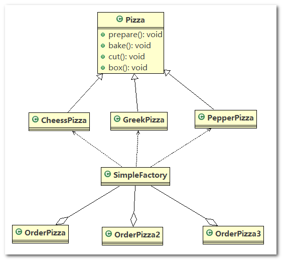

> **代码**

<details>
<summary style="color:red;">展开</summary>

1. `Pizza` 抽象父类以及 `Pizza` 的具体实现类和上面一样

2. `SimpleFactory`：工厂类，根据用户输入，制作相应的 `Pizza`，此时 `SimpleFactory` 为提供方

   ```java
   //简单工厂类
   public class SimpleFactory {
   
   	// 根据orderType 返回对应的Pizza 对象
   	public Pizza createPizza(String orderType) {
   		Pizza pizza = null;
   		System.out.println("使用简单工厂模式");
   		if (orderType.equals("greek")) {
   			pizza = new GreekPizza();
   			pizza.setName("希腊披萨");
   		} else if (orderType.equals("cheese")) {
   			pizza = new CheesePizza();
   			pizza.setName("奶酪披萨");
   		} else if (orderType.equals("pepper")) {
   			pizza = new PepperPizza();
   			pizza.setName("胡椒披萨");
   		}
   		return pizza;
   	}
   
   }
   ```

3. `OrderPizza`：根据用户的输入，调用 `SimpleFactory` 工厂类制作相应的 `Pizza`，`OrderPizza` 为使用方

   ```java
   public class OrderPizza {
   
   	// 定义一个简单工厂对象
   	SimpleFactory simpleFactory;
   	Pizza pizza = null;
   
   	// 构造器
   	public OrderPizza(SimpleFactory simpleFactory) {
   		setFactory(simpleFactory);
   	}
   
   	public void setFactory(SimpleFactory simpleFactory) {
   		String orderType = ""; // 用户输入的
   		this.simpleFactory = simpleFactory; // 设置简单工厂对象
   		do {
   			orderType = getType();
   			pizza = this.simpleFactory.createPizza(orderType);
   			// 输出pizza
   			if (pizza != null) { // 订购成功
   				pizza.prepare();
   				pizza.bake();
   				pizza.cut();
   				pizza.box();
   				System.out.println();
   			} else {
   				System.out.println("订购披萨失败");
   				break;
   			}
   		} while (true);
   	}
   
   	// 写一个方法，可以获取客户希望订购的披萨种类
   	private String getType() {
   		try {
   			BufferedReader strin = new BufferedReader(new InputStreamReader(System.in));
   			System.out.println("input pizza 种类:");
   			String str = strin.readLine();
   			return str;
   		} catch (IOException e) {
   			e.printStackTrace();
   			return "";
   		}
   	}
   
   }
   ```

4. `PizzaStore`：相当于客户端，发出订购披萨的请求

   ```java
   //相当于一个客户端，发出订购
   public class PizzaStore {
   
   	public static void main(String[] args) {
   		// 使用简单工厂模式
   		new OrderPizza(new SimpleFactory());
   		System.out.println("~~退出程序~~");
   	}
   
   }
   ```

</details>

> **补充说明**

简单工厂模式也叫静态工厂模式，很多代码中都将简单工厂中提供示例 `Bean` 的方法声明为静态 `static` 方法，可通过工厂类直接调用

```java
//简单工厂类
public class SimpleFactory {

	// 简单工厂模式 也叫 静态工厂模式
	public static Pizza createPizza(String orderType) {
		Pizza pizza = null;
		System.out.println("使用简单工厂模式2");
		if (orderType.equals("greek")) {
			pizza = new GreekPizza();
			pizza.setName("希腊披萨");
		} else if (orderType.equals("cheese")) {
			pizza = new CheesePizza();
			pizza.setName("奶酪披萨");
		} else if (orderType.equals("pepper")) {
			pizza = new PepperPizza();
			pizza.setName("胡椒披萨");
		}
		return pizza;
	}
}
```

> **简单工厂模式总结**

1. 如果使用传统方法，使用方为 `OrderPizza`，提供方 `Pizza` 及其实现类，这样编写代码使用方和提供方紧紧耦合在一起，但凡需要新增 `Pizza` 的实现类，都需要修改 `OrderPizza` 中的代码，添加新的判断逻辑
2. 为了满足 `OCP` 原则，我们建立简单工厂类 `SimpleFactory`，通过 `SimpleFactory` 作为一个中间者的角色：`SimpleFactory` 向上为 `OrderPizza` 提供相应的 `Pizza`，`SimpleFactory` 向下负责与 `Pizza` 及其实现类打交道，完成 `Pizza` 的生产
3. 我们将生产 `Pizza` 的具体细节放在 `SimpleFactory` 工厂类里面实现，让 `SimpleFactory` 作为 `Pizza` 的提供方，这样新增 `Pizza` 的实现类时，我们只需要修改提供方（`SimpleFactory`）的代码，而无需修改使用方（`OrderPizza`）的代码

#### 3.2.3.5. 工厂方法模式

> 需求说明

披萨项目新的需求： 客户在点披萨时， 可以点不同口味的披萨， 比如北京的奶酪 `pizza`、 北京的胡椒 `pizza` 或者是伦敦的奶酪 `pizza`、 伦敦的胡椒 `pizza`。

> **思路一：简单工厂模式**

使用简单工厂模式， 创建不同的简单工厂类， 比如 `BJPizzaSimpleFactory`、`LDPizzaSimpleFactory` 等等。

从当前这个案例来说， 也是可以的， 但是考虑到项目的规模， 以及软件的可维护性、 可扩展性并不是特别好，因为过多的工厂类会导致整个项目类膨胀

> **思路二：使用工厂方法模式**

1. 工厂方法模式设计方案： **不使用工厂类**，将披萨项目的实例化功能抽象成抽象方法， 在不同的口味点餐子类中具体实现。
2. 工厂方法模式： **定义了一个创建对象的抽象方法， 由子类决定要实例化的类**。 工厂方法模式将对象的实例化推迟到子类

> **工厂方法模式应用案例**

项目需求：披萨项目新的需求： 客户在点披萨时， 可以点不同口味的披萨， 比如 北京的奶酪 `pizza`、 北京的胡椒 `pizza` 或者是伦敦的奶酪 `pizza`、 伦敦的胡椒 `pizza`

> **类图**

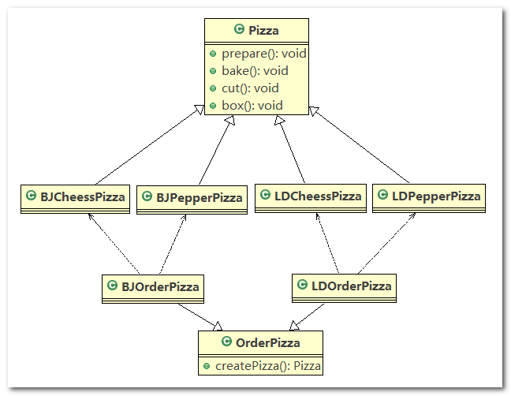

> **代码**

<details>
<summary style="color:red;">展开</summary>

1. `Pizza`：抽象父类，和之前的定义一样

   ```java
   //将Pizza 类做成抽象
   public abstract class Pizza {
   
   	protected String name; // 名字
   
   	public void setName(String name) {
   		this.name = name;
   	}
   
   	// 准备原材料, 不同的披萨不一样，因此，我们做成抽象方法
   	public abstract void prepare();
   
   	// 烘烤
   	public void bake() {
   		System.out.println(name + " baking;");
   	}
   
   	// 切割
   	public void cut() {
   		System.out.println(name + " cutting;");
   	}
   
   	// 打包
   	public void box() {
   		System.out.println(name + " boxing;");
   	}
   
   }
   ```

2. `BJCheesePizza`：北京的奶酪披萨

   ```java
   public class BJCheesePizza extends Pizza {
   	@Override
   	public void prepare() {
   		setName("北京的奶酪pizza");
   		System.out.println("北京的奶酪pizza 准备原材料");
   	}
   }
   ```

3. `BJPepperPizza`：北京的胡椒披萨

   ```java
   public class BJPepperPizza extends Pizza {
   	@Override
   	public void prepare() {
   		setName("北京的胡椒pizza");
   		System.out.println("北京的胡椒pizza 准备原材料");
   	}
   }
   ```

4. `LDCheesePizza`：伦敦的奶酪披萨

   ```java
   public class LDCheesePizza extends Pizza {
   	@Override
   	public void prepare() {
   		setName("伦敦的奶酪pizza");
   		System.out.println("伦敦的奶酪pizza 准备原材料");
   	}
   }
   ```

5. `LDPepperPizza`：伦敦的胡椒披萨

   ```java
   public class LDPepperPizza extends Pizza {
   	@Override
   	public void prepare() {
   		setName("伦敦的胡椒pizza");
   		System.out.println("伦敦的胡椒pizza 准备原材料");
   	}
   }
   ```

6. `OrderPizza`：含有抽象方法的工厂父类，其抽象方法待子类去实现

   ```java
   public abstract class OrderPizza {
   	
   	// 定义一个抽象方法，createPizza , 让各个工厂子类自己实现
   	abstract Pizza createPizza(String orderType);
   
   	// 构造器
   	public OrderPizza() {
   		Pizza pizza = null;
   		String orderType; // 订购披萨的类型
   		do {
   			orderType = getType();
   			pizza = createPizza(orderType); // 抽象方法，由工厂子类完成
   			// 输出pizza 制作过程
   			pizza.prepare();
   			pizza.bake();
   			pizza.cut();
   			pizza.box();
   			System.out.println();
   		} while (true);
   	}
   
   	// 写一个方法，可以获取客户希望订购的披萨种类
   	private String getType() {
   		try {
   			BufferedReader strin = new BufferedReader(new InputStreamReader(System.in));
   			System.out.println("input pizza 种类:");
   			String str = strin.readLine();
   			return str;
   		} catch (IOException e) {
   			e.printStackTrace();
   			return "";
   		}
   	}
   	
   }
   ```

7. `BJOrderPizza`：北京披萨的生产工厂

   ```java
   public class BJOrderPizza extends OrderPizza {
   	@Override
   	Pizza createPizza(String orderType) {
   		Pizza pizza = null;
   		if (orderType.equals("cheese")) {
   			pizza = new BJCheesePizza();
   		} else if (orderType.equals("pepper")) {
   			pizza = new BJPepperPizza();
   		}
   		return pizza;
   	}
   }
   ```

8. `LDOrderPizza`：伦敦披萨的生产工厂

   ```java
   public class LDOrderPizza extends OrderPizza {
   	@Override
   	Pizza createPizza(String orderType) {
   		Pizza pizza = null;
   		if (orderType.equals("cheese")) {
   			pizza = new LDCheesePizza();
   		} else if (orderType.equals("pepper")) {
   			pizza = new LDPepperPizza();
   		}
   		return pizza;
   	}
   }
   ```

9. `PizzaStore`：相当于客户端，发出订购披萨的请求

   ```java
   public class PizzaStore {
   
   	public static void main(String[] args) {
   		String loc = "bj"; // 假设这里是用户输入的位置信息
   		if (loc.equals("bj")) {
   			// 创建北京口味的各种Pizza
   			new BJOrderPizza();
   		} else {
   			// 创建伦敦口味的各种Pizza
   			new LDOrderPizza();
   		}
   	}
   
   }
   ```

</details>

> **工厂方法模式总结**

1. 首先要说明的是，对于此案例，我们也可以采用简单工厂模式来实现，缺点是：对于一个地区的披萨，我们就需要创建一个对应的工厂类，这会造成项目类膨胀；并且生产披萨的代码几乎都是相同的，这就造成披萨工厂类中的代码冗余
2. 对于这种情况，我们可以使用工厂方法模式，将具体的抽象方法声明在父类工厂中，其具体的实现下沉到工厂子类，我们通过工厂子类可以获得所需要的 `Bean`
3. 对于此例，抽象父类 `OrderPizza` 中有一个抽象方法 `abstract Pizza createPizza(String orderType);`，该方法接收 `Pizza` 的类型，并生产指定类型的 `Pizza`；在工厂子类 `BJOrderPizza`，`LDOrderPizza` 中实现了该抽象方法，实现了具体生产 `Pizza` 的逻辑
4. 对于工厂方法模式，抽象工厂父类 `OrderPizza` 为 `Bean` 的使用方，它负责调用工厂子类 `BJOrderPizza`，`LDOrderPizza` 中已重写的抽象方法，获得生产好的 `Pizza`，然后使用该 `Pizza` 实例

> **简单工厂模式与工厂方法模式的对比**

1. 简单工厂模式：工厂类作为 `Bean` 的制造者（提供方），负责与具体的实体类打交道，并负责相应业务逻辑的处理；使用方调用工厂类获取 `Bean`，使用即可，无需关心该 `Bean` 是如何得到的，也无需关心制造此 `Bean` 的具体业务逻辑，满足 `OCP` 原则
2. 工厂方法模式：工厂父类中有一个抽象方法负责制造 `Bean`，该抽象方法会下沉到其子类，由工厂子类实现其具体的业务细节，所以工厂子类是 `Bean` 的提供方，此时的工厂父类消费由工厂子类制造的 `Bean`，为使用方

#### 3.2.3.6. 抽象工厂模式（Abstract Factory Pattern）

- 抽象工厂模式的基本介绍
  - 抽象工厂模式： 定义了一个 `interface` 用于创建相关或有依赖关系的对象簇， 而无需指明具体的类
  - 抽象工厂模式可以**将简单工厂模式和工厂方法模式进行整合**。
    > 简单工厂：由这个类来封装实例化对象的行为<br />
    > 工厂方法：将方法实现下沉到子类
  - 从设计层面看， 抽象工厂模式就是对简单工厂模式的改进(或者称为进一步的抽象)。
  - 将工厂抽象成两层， `AbsFactory`(抽象工厂) 和 具体实现的工厂子类。 程序员可以根据创建对象类型使用对应的工厂子类。 这样将单个的简单工厂类变成了工厂簇， 更利于代码的维护和扩展。

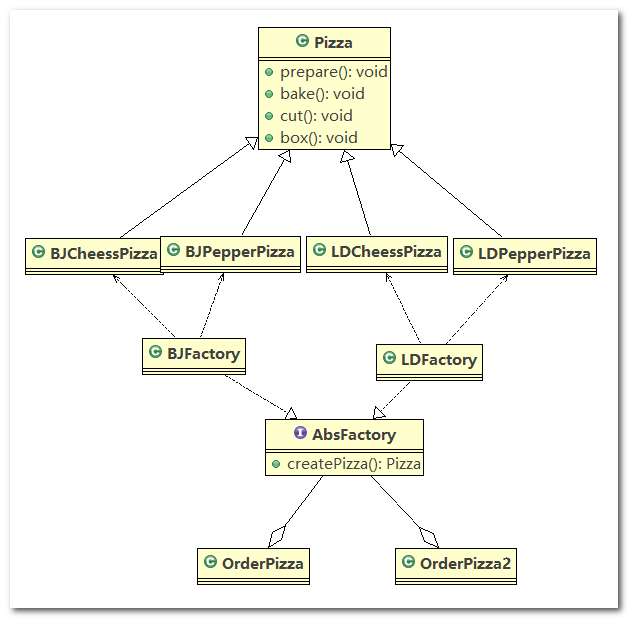

<details>
<summary style="color:red;">展开</summary>

1. `Pizza` 抽象父类以及 `Pizza` 的具体实现类和上面一样

2. `AbsFactory`：工厂抽象层，定义制造 `Bean` 的抽象方法

   ```java
   //一个抽象工厂模式的抽象层(接口)
   public interface AbsFactory {
   	// 让下面的工厂子类来 具体实现
   	public Pizza createPizza(String orderType);
   }
   ```

3. `BJFactory`：北京工厂子类（提供方），负责制造北京各种口味的 `Pizza`

   ```java
   //这是工厂子类
   public class BJFactory implements AbsFactory {
   
   	@Override
   	public Pizza createPizza(String orderType) {
   		System.out.println("~使用的是抽象工厂模式~");
   		Pizza pizza = null;
   		if (orderType.equals("cheese")) {
   			pizza = new BJCheesePizza();
   		} else if (orderType.equals("pepper")) {
   			pizza = new BJPepperPizza();
   		}
   		return pizza;
   	}
   
   }
   ```

4. `LDFactory`：伦敦工厂子类（提供方），负责制造伦敦各种口味的 `Pizza`

   ```java
   public class LDFactory implements AbsFactory {
   
   	@Override
   	public Pizza createPizza(String orderType) {
   		System.out.println("~使用的是抽象工厂模式~");
   		Pizza pizza = null;
   		if (orderType.equals("cheese")) {
   			pizza = new LDCheesePizza();
   		} else if (orderType.equals("pepper")) {
   			pizza = new LDPepperPizza();
   		}
   		return pizza;
   	}
   
   }
   ```

5. `OrderPizza`：使用方，负责消费 `Pizza`

   ```java
   public class OrderPizza {
   
   	AbsFactory factory;
   
   	// 构造器
   	public OrderPizza(AbsFactory factory) {
   		setFactory(factory);
   	}
   
   	private void setFactory(AbsFactory factory) {
   		Pizza pizza = null;
   		String orderType = ""; // 用户输入
   		this.factory = factory;
   		do {
   			orderType = getType();
   			// factory 可能是北京工厂子类，也可能是伦敦工厂子类
        // 复习：动态链接
   			pizza = factory.createPizza(orderType);
   			if (pizza != null) { // 订购ok
   				pizza.prepare();
   				pizza.bake();
   				pizza.cut();
   				pizza.box();
   			} else {
   				System.out.println("订购失败");
   				break;
   			}
   		} while (true);
   	}
   
   	// 写一个方法，可以获取客户希望订购的披萨种类
   	private String getType() {
   		try {
   			BufferedReader strin = new BufferedReader(new InputStreamReader(System.in));
   			System.out.println("input pizza 种类:");
   			String str = strin.readLine();
   			return str;
   		} catch (IOException e) {
   			e.printStackTrace();
   			return "";
   		}
   	}
   }
   ```

6. `PizzaStore`：客户端，发出订购披萨的请求

   ```java
   public class PizzaStore {
   
   	public static void main(String[] args) {
   		//new OrderPizza(new BJFactory());
   		new OrderPizza(new LDFactory());
   	}
   
   }
   ```

</details>

> **抽象工厂模式总结**

1. `AbsFactory` 仍然是简单工厂（简单工厂模式），但是工厂方法的具体实现需下沉到各个工厂子类（工厂方法模式），所以说抽象工厂模式可以将简单工厂模式和工厂方法模式进行整合。
2. 抽象工厂模式分为两层：抽象层和实现层。`AbsFactory` 作为工厂抽象层，只对工厂规范进行定义，其具体的实现交由工厂子类
3. 简单工厂模式很难满足对多种不同类型的 `Bean` 进行创建，所以我们使用抽象工厂模式，定义一个工厂抽象层，但具体实现需下沉到各个工厂子类

#### 3.2.3.7. 源码实例

**JDK Calendar 中使用到了简单工厂模式**

```java
public class Factory {

	public static void main(String[] args) {
		
		// getInstance 是 Calendar 静态方法
		Calendar cal = Calendar.getInstance();
	    // 注意月份下标从0开始，所以取月份要+1
	    System.out.println("年:" + cal.get(Calendar.YEAR));
	    System.out.println("月:" + (cal.get(Calendar.MONTH) + 1));       
	    System.out.println("日:" + cal.get(Calendar.DAY_OF_MONTH));
	    System.out.println("时:" + cal.get(Calendar.HOUR_OF_DAY));
	    System.out.println("分:" + cal.get(Calendar.MINUTE));
	    System.out.println("秒:" + cal.get(Calendar.SECOND));
	}
}
```

- `Calendar.getInstance()` 方法的实现

  ```java
  /**
  * Gets a calendar using the default time zone and locale. The
  * <code>Calendar</code> returned is based on the current time
  * in the default time zone with the default
  * {@link Locale.Category#FORMAT FORMAT} locale.
  *
  * @return a Calendar.
  */
  public static Calendar getInstance()
  {
      return createCalendar(TimeZone.getDefault(), Locale.getDefault(Locale.Category.FORMAT));
  }
  ```

- `createCalendar()` 方法的实现：如果 `provider == null`，就会根据 `caltype` 的值，来创建具体的工厂子类对象

  ```java
  private static Calendar createCalendar(TimeZone zone,
                                        Locale aLocale)
  {
      CalendarProvider provider =
          LocaleProviderAdapter.getAdapter(CalendarProvider.class, aLocale)
                              .getCalendarProvider();
      if (provider != null) {
          try {
              return provider.getInstance(zone, aLocale);
          } catch (IllegalArgumentException iae) {
              // fall back to the default instantiation
          }
      }

      Calendar cal = null;

      if (aLocale.hasExtensions()) {
          String caltype = aLocale.getUnicodeLocaleType("ca");
          if (caltype != null) {
              switch (caltype) {
              case "buddhist":
              cal = new BuddhistCalendar(zone, aLocale);
                  break;
              case "japanese":
                  cal = new JapaneseImperialCalendar(zone, aLocale);
                  break;
              case "gregory":
                  cal = new GregorianCalendar(zone, aLocale);
                  break;
              }
          }
      }
      if (cal == null) {
          // If no known calendar type is explicitly specified,
          // perform the traditional way to create a Calendar:
          // create a BuddhistCalendar for th_TH locale,
          // a JapaneseImperialCalendar for ja_JP_JP locale, or
          // a GregorianCalendar for any other locales.
          // NOTE The language, country and variant strings are interned.
          if (aLocale.getLanguage() == "th" && aLocale.getCountry() == "TH") {
              cal = new BuddhistCalendar(zone, aLocale);
          } else if (aLocale.getVariant() == "JP" && aLocale.getLanguage() == "ja"
                    && aLocale.getCountry() == "JP") {
              cal = new JapaneseImperialCalendar(zone, aLocale);
          } else {
              cal = new GregorianCalendar(zone, aLocale);
          }
      }
      return cal;
  } 
  ```

### 3.2.4. 原型模式（Prototype Pattern）

#### 3.2.4.1. 说明

- 概述
  - 原型模式(`Prototype`模式)是指：用原型实例指定创建对象的种类，并且通过拷贝这些原型， 创建新的对象
  - 原型模式是一种创建型设计模式，允许一个对象在创建另外一个可定制的对象，无需知道如何创建的细节
  - 工作原理是：通过将一个原型对象传给那个要发动创建的对象，这个要发动创建的对象通过请求原型对象拷贝它们自己来实施创建，即 `对象.clone()`

- 原理
  - `Prototype`：原型类，在该类中声明一个克隆自己的接口
  - `ConcretePrototype`：具体的原型类，实现一个克隆自己的操作
  - `Client`：让一个原型对象克隆自己，从而创建一个新的对象(属性一样)

  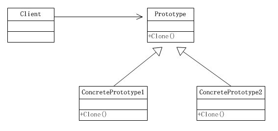

#### 3.2.4.2. 情景

> **克隆羊问题描述**

现在有一只羊`tom`， 姓名为: `tom`，年龄为： `1`， 颜色为：白色，请编写程序创建和`tom`羊属性完全相同的`10`只羊

#### 3.2.4.3. 传统方式

> 类图


> **代码实现**

<details>
<summary style="color:red;">展开</summary>

1. `Sheep`：羊的实体类

   ```java
   public class Sheep {
   	private String name;
   	private int age;
   	private String color;
   ```

2. `Client`：客户端，发出克隆羊的指令

   ```java
   public class Client {
   
   	public static void main(String[] args) {
   		// 传统的方法
   		Sheep sheep = new Sheep("tom", 1, "白色");
   
   		Sheep sheep2 = new Sheep(sheep.getName(), sheep.getAge(), sheep.getColor());
   		Sheep sheep3 = new Sheep(sheep.getName(), sheep.getAge(), sheep.getColor());
   		Sheep sheep4 = new Sheep(sheep.getName(), sheep.getAge(), sheep.getColor());
   		Sheep sheep5 = new Sheep(sheep.getName(), sheep.getAge(), sheep.getColor());
   		// ....
   
   		System.out.println(sheep);
   		System.out.println(sheep2);
   		System.out.println(sheep3);
   		System.out.println(sheep4);
   		System.out.println(sheep5);
   		// ...
   	}
   
   }
   ```

</details>

> **传统的方式的优缺点**

1. 优点是比较好理解，简单易操作
2. 在创建新的对象时， 总是需要重新获取原始对象的属性，如果创建的对象比较复杂时，效率较低
3. 总是需要重新初始化对象，而不是动态地获得对象运行时的状态，不够灵活

> **改进思路**

`Java`中`Object`类是所有类的根类， `Object`类提供了一个`clone()`方法，该方法可以将一个`Java`对象复制一份，但是需要实现`clone`的`Java`类必须要实现一个接口`Cloneable`，该接口表示该类能够复制且具有复制的能力 --> 原型模式

#### 3.2.4.4. 原型模式代码

原型模式解决克隆羊问题的应用实例：使用原型模式改进传统方式，让程序具有更高的效率和扩展性

> **代码实现**

<details>
<summary style="color:red;">展开</summary>

1. `Sheep`：羊的实体类

   ```java
   public class Sheep implements Cloneable {
   	private String name;
   	private int age;
   	private String color;
   
   	// 克隆该实例，使用默认的clone方法来完成
   	@Override
   	protected Object clone() {
   		Sheep sheep = null;
   		try {
   			sheep = (Sheep) super.clone();
   		} catch (Exception e) {
   			System.out.println(e.getMessage());
   		}
   		return sheep;
   	}
       
       // ...
   ```

2. `Client`：利用原型模式创建对象

   ```java
   public class Client {
   
   	public static void main(String[] args) {
   		System.out.println("原型模式完成对象的创建");
   		
   		Sheep sheep = new Sheep("tom", 1, "白色");
   		
   		Sheep sheep2 = (Sheep) sheep.clone(); // 克隆
   		Sheep sheep3 = (Sheep) sheep.clone(); // 克隆
   		Sheep sheep4 = (Sheep) sheep.clone(); // 克隆
   		Sheep sheep5 = (Sheep) sheep.clone(); // 克隆
   
   		System.out.println("sheep2 =" + sheep2 + "sheep2.hashCoe=" + sheep2.hashCode());
   		System.out.println("sheep3 =" + sheep3 + "sheep3.hashCoe=" + sheep3.hashCode());
   		System.out.println("sheep4 =" + sheep4 + "sheep4.hashCoe=" + sheep4.hashCode());
   		System.out.println("sheep5 =" + sheep5 + "sheep5.hashCoe=" + sheep5.hashCode());
   	}
   
   }
   ```

3. 程序运行结果

   ```
   原型模式完成对象的创建
   sheep2 =Sheep [name=tom, age=1, color=白色]；sheep2.hashCoe=366712642
   sheep3 =Sheep [name=tom, age=1, color=白色]；sheep3.hashCoe=1829164700
   sheep4 =Sheep [name=tom, age=1, color=白色]；sheep4.hashCoe=2018699554
   sheep5 =Sheep [name=tom, age=1, color=白色]；sheep5.hashCoe=1311053135
   ```

</details>

#### 3.2.4.5. Spring源码示例

> **准备工作**

1. 创建实体类 `Monster`

   ```java
   public class Monster {
   	private Integer id = 10;
   	private String nickname = "牛魔王";
   	private String skill = "芭蕉扇";
       
       public Monster() {
   		System.out.println("monster 创建..");
   	}
   ```

2. 通过 `XML` 配置文件 配置 `Bean`

   ```xml
   <!-- 这里我们的 scope="prototype" 即 原型模式来创建 -->
   <bean id="id01" class="com.atguigu.spring.bean.Monster" scope="prototype" />
   ```

3. 测试代码

   ```java
   public class ProtoType {
   
   	public static void main(String[] args) {
   		ApplicationContext applicationContext = new ClassPathXmlApplicationContext("beans.xml");
   		
   		// 获取monster[通过id获取monster]
   		Object bean = applicationContext.getBean("id01");
   		System.out.println("bean" + bean); // 输出 "牛魔王" .....
   
   		Object bean2 = applicationContext.getBean("id01");
   		System.out.println("bean2" + bean2); // 输出 "牛魔王" .....
   
   		System.out.println(bean == bean2); // false
   
   		// ConfigurableApplicationContext
   	}
   
   }
   ```

4. 程序运行结果

   ```
   monster 创建..
   beanMonster [id=10, nickname=牛魔王, skill=芭蕉扇]
   monster 创建..
   bean2Monster [id=10, nickname=牛魔王, skill=芭蕉扇]
   false
   ```

> **Spring 源码追踪**

1. `applicationContext.getBean("id01");` 方法中先调用 `getBeanFactory()` 获取 `Bean` 工厂，再调用 `Bean` 工厂的 `getBean(name)` 方法获取 `Bean` 实例

   ```java
   @Override
   public Object getBean(String name) throws BeansException {
   	assertBeanFactoryActive();
   	return getBeanFactory().getBean(name);
   }
   ```

2. `getBean(name)` 方法调用 `doGetBean(name, null, null, false);` 方法获取 `Bean` 实例

   ```java
   @Override
   public Object getBean(String name) throws BeansException {
   	return doGetBean(name, null, null, false);
   }
   ```

3. 获取 `Bean` 实例时

   1. 判断 `Bean` 是否为单例对象：`if (mbd.isSingleton())`，若是，则调用 `bean = getObjectForBeanInstance(sharedInstance, name, beanName, mbd);` 获取单例对象
   2. 判断 `Bean` 是否为原型对象：`else if (mbd.isPrototype())`，若是，则调用 `bean = getObjectForBeanInstance(prototypeInstance, name, beanName, mbd);` 获取原型对象

   ```java
   /**
    * Return an instance, which may be shared or independent, of the specified bean.
    * @param name the name of the bean to retrieve
    * @param requiredType the required type of the bean to retrieve
    * @param args arguments to use if creating a prototype using explicit arguments to a
    * static factory method. It is invalid to use a non-null args value in any other case.
    * @param typeCheckOnly whether the instance is obtained for a type check,
    * not for actual use
    * @return an instance of the bean
    * @throws BeansException if the bean could not be created
    */
   @SuppressWarnings("unchecked")
   protected <T> T doGetBean(
   		final String name, final Class<T> requiredType, final Object[] args, boolean typeCheckOnly)
   		throws BeansException {
   
   	final String beanName = transformedBeanName(name);
   	Object bean;
   
   	// Eagerly check singleton cache for manually registered singletons.
   	Object sharedInstance = getSingleton(beanName);
   	if (sharedInstance != null && args == null) {
   		if (logger.isDebugEnabled()) {
   			if (isSingletonCurrentlyInCreation(beanName)) {
   				logger.debug("Returning eagerly cached instance of singleton bean '" + beanName +
   						"' that is not fully initialized yet - a consequence of a circular reference");
   			}
   			else {
   				logger.debug("Returning cached instance of singleton bean '" + beanName + "'");
   			}
   		}
   		bean = getObjectForBeanInstance(sharedInstance, name, beanName, null);
   	}
   
   	else {
   		// Fail if we're already creating this bean instance:
   		// We're assumably within a circular reference.
   		if (isPrototypeCurrentlyInCreation(beanName)) {
   			throw new BeanCurrentlyInCreationException(beanName);
   		}
   
   		// Check if bean definition exists in this factory.
   		BeanFactory parentBeanFactory = getParentBeanFactory();
   		if (parentBeanFactory != null && !containsBeanDefinition(beanName)) {
   			// Not found -> check parent.
   			String nameToLookup = originalBeanName(name);
   			if (args != null) {
   				// Delegation to parent with explicit args.
   				return (T) parentBeanFactory.getBean(nameToLookup, args);
   			}
   			else {
   				// No args -> delegate to standard getBean method.
   				return parentBeanFactory.getBean(nameToLookup, requiredType);
   			}
   		}
   
   		if (!typeCheckOnly) {
   			markBeanAsCreated(beanName);
   		}
   
   		try {
   			final RootBeanDefinition mbd = getMergedLocalBeanDefinition(beanName);
   			checkMergedBeanDefinition(mbd, beanName, args);
   
   			// Guarantee initialization of beans that the current bean depends on.
   			String[] dependsOn = mbd.getDependsOn();
   			if (dependsOn != null) {
   				for (String dependsOnBean : dependsOn) {
   					if (isDependent(beanName, dependsOnBean)) {
   						throw new BeanCreationException("Circular depends-on relationship between '" +
   								beanName + "' and '" + dependsOnBean + "'");
   					}
   					registerDependentBean(dependsOnBean, beanName);
   					getBean(dependsOnBean);
   				}
   			}
   
   			// Create bean instance.
        // ****判断是否为单例模式****
   			if (mbd.isSingleton()) {
   				sharedInstance = getSingleton(beanName, new ObjectFactory<Object>() {
   					@Override
   					public Object getObject() throws BeansException {
   						try {
   							return createBean(beanName, mbd, args);
   						}
   						catch (BeansException ex) {
   							// Explicitly remove instance from singleton cache: It might have been put there
   							// eagerly by the creation process, to allow for circular reference resolution.
   							// Also remove any beans that received a temporary reference to the bean.
   							destroySingleton(beanName);
   							throw ex;
   						}
   					}
   				});
   				bean = getObjectForBeanInstance(sharedInstance, name, beanName, mbd);
   			}
   
        //****是否为原型****
        // 不为单例对象的话，判断是否为原型
   			else if (mbd.isPrototype()) {
   				// It's a prototype -> create a new instance.
   				Object prototypeInstance = null;
   				try {
   					beforePrototypeCreation(beanName);
            //****返回原型实例****
   					prototypeInstance = createBean(beanName, mbd, args);
   				}
   				finally {
   					afterPrototypeCreation(beanName);
   				}
   				bean = getObjectForBeanInstance(prototypeInstance, name, beanName, mbd);
   			}
   
   			else {
   				String scopeName = mbd.getScope();
   				final Scope scope = this.scopes.get(scopeName);
   				if (scope == null) {
   					throw new IllegalStateException("No Scope registered for scope '" + scopeName + "'");
   				}
   				try {
   					Object scopedInstance = scope.get(beanName, new ObjectFactory<Object>() {
   						@Override
   						public Object getObject() throws BeansException {
   							beforePrototypeCreation(beanName);
   							try {
   								return createBean(beanName, mbd, args);
   							}
   							finally {
   								afterPrototypeCreation(beanName);
   							}
   						}
   					});
   					bean = getObjectForBeanInstance(scopedInstance, name, beanName, mbd);
   				}
   				catch (IllegalStateException ex) {
   					throw new BeanCreationException(beanName,
   							"Scope '" + scopeName + "' is not active for the current thread; " +
   							"consider defining a scoped proxy for this bean if you intend to refer to it from a singleton",
   							ex);
   				}
   			}
   		}
   		catch (BeansException ex) {
   			cleanupAfterBeanCreationFailure(beanName);
   			throw ex;
   		}
   	}
   
   	// Check if required type matches the type of the actual bean instance.
   	if (requiredType != null && bean != null && !requiredType.isAssignableFrom(bean.getClass())) {
   		try {
   			return getTypeConverter().convertIfNecessary(bean, requiredType);
   		}
   		catch (TypeMismatchException ex) {
   			if (logger.isDebugEnabled()) {
   				logger.debug("Failed to convert bean '" + name + "' to required type [" +
   						ClassUtils.getQualifiedName(requiredType) + "]", ex);
   			}
   			throw new BeanNotOfRequiredTypeException(name, requiredType, bean.getClass());
   		}
   	}
   	return (T) bean;
   }
   ```

4. `final RootBeanDefinition mbd = getMergedLocalBeanDefinition(beanName);` 其中的 `mbd` 对象有一个名为 `scope` 属性，用于指示 `Bean` 的生命周期

  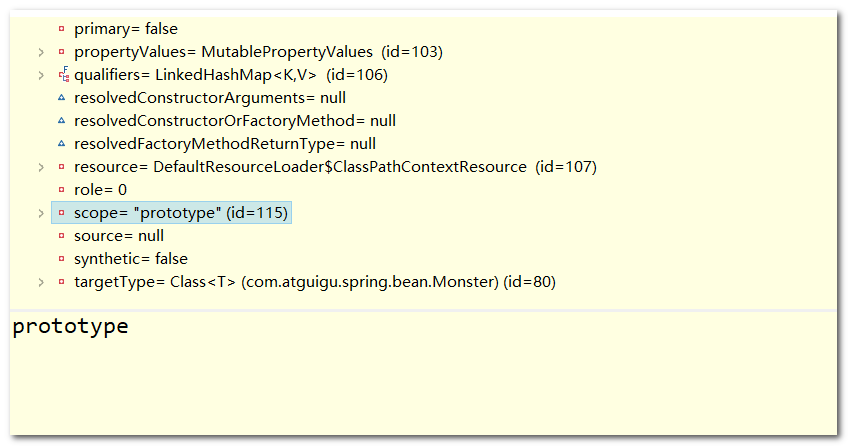

#### 3.2.4.6. 深拷贝与浅拷贝

##### 3.2.4.6.1. 浅拷贝

> **浅拷贝的介绍**

1. 对于数据类型是基本数据类型的成员变量，浅拷贝会直接进行值传递，也就是将该属性值复制一份给新的对象
2. 对于数据类型是引用数据类型的成员变量，比如说成员变量是某个数组、某个类的对象等，那么浅拷贝会进行引用传递，也就是只是将该成员变量的引用值（内存地址）复制一份给新的对象。因为实际上两个对象的该成员变量都指向同一个实例。在这种情况下，在一个对象中修改该成员变量会影响到另一个对象的该成员变量值
3. 前面我们克隆羊就是浅拷贝，浅拷贝是使用默认的`clone()`方法来实现：`sheep = (Sheep) super.clone();`

> **代码示例**

1. `Sheep`：羊的实体类

   ```java
   public class Sheep implements Cloneable {
   	private String name;
   	private int age;
   	private String color;
   	private String address = "蒙古";
   	public Sheep friend; // 对象克隆时会如何处理，默认是浅拷贝
   
   	// 克隆该实例，使用默认的clone方法来完成
   	@Override
   	protected Object clone() {
   		Sheep sheep = null;
   		try {
   			sheep = (Sheep) super.clone();
   		} catch (Exception e) {
   			System.out.println(e.getMessage());
   		}
   		return sheep;
   	}
       
       // ...
   ```

2. `Client`：测试代码

   ```java
   public class Client {
   
   	public static void main(String[] args) {
   		System.out.println("原型模式完成对象的创建");
   		
   		Sheep sheep = new Sheep("tom", 1, "白色");
   		sheep.friend = new Sheep("jack", 2, "黑色");
   		
   		Sheep sheep2 = (Sheep) sheep.clone(); // 克隆
   		Sheep sheep3 = (Sheep) sheep.clone(); // 克隆
   		Sheep sheep4 = (Sheep) sheep.clone(); // 克隆
   		Sheep sheep5 = (Sheep) sheep.clone(); // 克隆
   
   		System.out.println("sheep2 =" + sheep2 + "sheep2.friend=" + sheep2.friend.hashCode());
   		System.out.println("sheep3 =" + sheep3 + "sheep3.friend=" + sheep3.friend.hashCode());
   		System.out.println("sheep4 =" + sheep4 + "sheep4.friend=" + sheep4.friend.hashCode());
   		System.out.println("sheep5 =" + sheep5 + "sheep5.friend=" + sheep5.friend.hashCode());
   	}
   
   }
   ```

3. 程序运行结果：可以看到，所有 `Sheep` 的 `friend` 属性的 `hashCode` 均相同，说明使用 `Object` 类的 `Clone` 方法为浅拷贝

   ```
   原型模式完成对象的创建
   sheep2 =Sheep [name=tom, age=1, color=白色, address=蒙古]sheep2.friend=366712642
   sheep3 =Sheep [name=tom, age=1, color=白色, address=蒙古]sheep3.friend=366712642
   sheep4 =Sheep [name=tom, age=1, color=白色, address=蒙古]sheep4.friend=366712642
   sheep5 =Sheep [name=tom, age=1, color=白色, address=蒙古]sheep5.friend=366712642
   ```

##### 3.2.4.6.2. 深拷贝

> **深拷贝基本介绍**

1. 复制对象的所有基本数据类型的成员变量值
2. 为所有引用数据类型的成员变量申请存储空间，并复制每个引用数据类型成员变量所引用的对象，直到该对象可达的所有对象。也就是说，对象进行深拷贝要对整个对象进行拷贝
3. 深拷贝实现方式 1：重写`clone`方法来实现深拷贝
4. 深拷贝实现方式 2：通过对象序列化实现深拷贝(**推荐**)

> **深拷贝应用实例**

1. `DeepCloneableTarget`：该类将会以成员变量的形式出现在其他类中，我们要对其实现深拷贝

   ```java
   public class DeepCloneableTarget implements Serializable, Cloneable {
   	private static final long serialVersionUID = 1L;
   
   	private String cloneName;
   
   	private String cloneClass;
   
   	// 构造器
   	public DeepCloneableTarget(String cloneName, String cloneClass) {
   		this.cloneName = cloneName;
   		this.cloneClass = cloneClass;
   	}
   
   	// 因为该类的属性，都是String , 因此我们这里使用默认的clone完成即可
   	@Override
   	protected Object clone() throws CloneNotSupportedException {
   		return super.clone();
   	}
   }
   ```

2. `DeepProtoType`：该类中演示了两种实现深拷贝的方法

   ```java
   public class DeepProtoType implements Serializable, Cloneable {
   
   	public String name; // String 属性
   	public DeepCloneableTarget deepCloneableTarget;// 引用类型
   
   	public DeepProtoType() {
   		super();
   	}
   
   	// 深拷贝 - 方式 1 使用clone 方法
   	@Override
   	protected Object clone() throws CloneNotSupportedException {
   		Object deep = null;
   		
   		// 这里完成对基本数据类型(属性)和String的克隆
   		deep = super.clone();		
   		DeepProtoType deepProtoType = (DeepProtoType) deep;
   		// 对引用类型的属性，进行单独处理
   		deepProtoType.deepCloneableTarget = (DeepCloneableTarget) deepCloneableTarget.clone();
   
   		return deepProtoType;
   	}
   
   	// 深拷贝 - 方式2 通过对象的序列化实现 (推荐)
   	public Object deepClone() {
   		// 创建流对象
   		ByteArrayOutputStream bos = null;
   		ObjectOutputStream oos = null;
   		ByteArrayInputStream bis = null;
   		ObjectInputStream ois = null;
   
   		try {
   			// 序列化
   			bos = new ByteArrayOutputStream();
   			oos = new ObjectOutputStream(bos);
   			oos.writeObject(this); // 当前这个对象以对象流的方式输出
   
   			// 反序列化
   			bis = new ByteArrayInputStream(bos.toByteArray());
   			ois = new ObjectInputStream(bis);
   			DeepProtoType copyObj = (DeepProtoType) ois.readObject(); // 从流中读入对象
   
   			return copyObj;
   		} catch (Exception e) {
   			// TODO handle exception
   			e.printStackTrace();
   			return null;
   		} finally {
   			// 关闭流
   			try {
   				bos.close();
   				oos.close();
   				bis.close();
   				ois.close();
   			} catch (Exception e2) {
   				System.out.println(e2.getMessage());
   			}
   		}
   	}
   
   }
   ```

3. `Client`：测试代码

   ```java
   public class Client {
   
   	public static void main(String[] args) throws Exception {
   		DeepProtoType p = new DeepProtoType();
   		p.name = "宋江";
   		p.deepCloneableTarget = new DeepCloneableTarget("大牛", "小牛");
   
   		// 方式1 完成深拷贝
   		DeepProtoType p2 = (DeepProtoType) p.clone();
   		System.out.println("p.name=" + p.name + "；p.deepCloneableTarget.hashCode=" + p.deepCloneableTarget.hashCode());
   		System.out.println("p2.name=" + p2.name + "；p2.deepCloneableTarget.hashCode=" + p2.deepCloneableTarget.hashCode());
   
   		// 方式2 完成深拷贝
   //		DeepProtoType p2 = (DeepProtoType) p.deepClone();
   //		System.out.println("p.name=" + p.name + "；p.deepCloneableTarget.hashCode=" + p.deepCloneableTarget.hashCode());
   //		System.out.println("p2.name=" + p2.name + "；p2.deepCloneableTarget.hashCode=" + p2.deepCloneableTarget.hashCode());
   	}
   
   }
   ```

------

#### 3.2.4.7. 原型模式注意事项

- **原型模式的注意事项和细节**
  1. 创建新的对象比较复杂时，可以利用原型模式简化对象的创建过程，同时也能够提高效率
  2. 不用重新初始化对象，可以动态地获得对象运行时的状态
    > 动态地进行clone
  3. 如果原始对象发生变化(增加或者减少属性)，其它克隆对象的也会发生相应的变化，无需修改代码
  4. 在实现深克隆的时候可能需要比较复杂的代码，其实使用序列化机制实现克隆的代码也不难
  5. 缺点：**需要为每一个类配备一个克隆方法，这对全新的类来说不是很难，但对已有的类进行改造时，需要修改其源代码，违背了`ocp` 原则**

### 3.2.5. 建造者模式（Builder Pattern）

#### 3.2.5.1. 说明

- 说明
  - 建造者模式（`Builder Pattern`） 又叫生成器模式，是一种对象构建模式。
    - 它可以将复杂对象的建造过程抽象出来（抽象类别）
    - 使这个抽象过程的不同实现方法可以构造出不同表现（属性）的对象。
  - 建造者模式是一步一步创建一个复杂的对象，它允许用户只通过指定复杂对象的类型和内容就可以构建它们，用户不需要知道内部的具体构建细节。
  - 实际应用场景：建造房子、组装车辆

- 原理
  -  建造者模式的四个角色
    1. `Product`（产品角色）： 一个具体的产品对象
    2. `Builder`（抽象建造者）： 创建一个`Product`对象的抽象接口（或抽象类），抽象建造者主要负责规范建造的流程，不关心具体的建造细节
    3. `ConcreteBuilder`（具体建造者）： 实现接口，构建和装配各个部件，具体建造者负责实现具体的建造细节
    4. `Director`（指挥者）： 构建一个使用`Builder`接口的具体实现类的对象。它主要是用于创建一个复杂的对象。它主要有两个作用，一是：隔离了客户与对象的生产过程，二是：负责控制产品对象的生产过程
  - 建造者模式原理类图
    1. `Product`（产品类）：一个具体的产品
    2. `Builder`（抽象建造者）：`Builder` 中组合了一个 `Product` 实例
    3. `ConcreteBuilder`（具体建造者）：实现了 `Builder` 中的抽象方法
    4. `Director`（指挥者）：将 `Builder` 的具体实现类聚合到 `Director` 中，在 `Director` 中调用具体的 `Builder` 完成具体产品的制造

    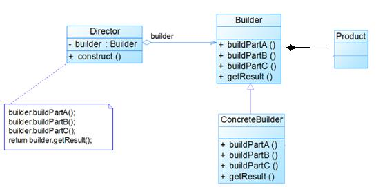

#### 3.2.5.2. 情景介绍

1. 需要建房子：这一过程为打桩、 砌墙、封顶
2. 房子有各种各样的，比如普通房，高楼，别墅，各种房子的过程虽然一样，但是各自实现的细节不同
3. 请编写程序，完成需求

#### 3.2.5.3. 传统方式

 > **类图**


> **代码**

<details>
<summary style="color:red;">展开</summary>

1. `AbstractHouse`：房子的抽象父类，指定建造房子的规范，以及建造房子的具体流程

   ```java
   public abstract class AbstractHouse {
   
   	// 打地基
   	public abstract void buildBasic();
   
   	// 砌墙
   	public abstract void buildWalls();
   
   	// 封顶
   	public abstract void roofed();
   
   	// 建造房子的具体流程
   	public void build() {
   		buildBasic();
   		buildWalls();
   		roofed();
   	}
   
   }
   ```

2. `CommonHouse`：普通房子，继承 `AbstractHouse` 类，实现了建造房子中各个步骤的具体细节

   ```java
   public class CommonHouse extends AbstractHouse {
   
   	@Override
   	public void buildBasic() {
   		System.out.println(" 普通房子打地基 ");
   	}
   
   	@Override
   	public void buildWalls() {
   		System.out.println(" 普通房子砌墙 ");
   	}
   
   	@Override
   	public void roofed() {
   		System.out.println(" 普通房子封顶 ");
   	}
   
   }
   ```

3. `HighBuilding`：高楼大厦，继承 `AbstractHouse` 类，实现了建造房子中各个步骤的具体细节

   ```java
   public class HighBuilding extends AbstractHouse{
   
   	@Override
   	public void buildBasic() {
   		System.out.println(" 高楼的打地基100米 ");
   	}
   
   	@Override
   	public void buildWalls() {
   		System.out.println(" 高楼的砌墙20cm ");
   	}
   
   	@Override
   	public void roofed() {
   		System.out.println(" 高楼的透明屋顶 ");
   	}
   
   
   }
   ```

4. `Client`：客户端，发出建造房子的命令

   ```java
   public class Client {
   
   	public static void main(String[] args) {
   		CommonHouse commonHouse = new CommonHouse();
   		commonHouse.build();
   	}
   
   }
   ```

</details>

> **传统方式优缺点分析**

1. 优点是比较好理解，简单易操作。
2. 设计的程序结构，过于简单，没有设计缓存层对象，程序的扩展和维护不好，也就是说，这种设计方案，把产品(即：房子) 和创建产品的过程(即：建房子流程) 封装在一起，代码耦合性增强了。
3. 解决方案：将产品和产品建造过程解耦 --> 建造者模式

#### 3.2.5.4. 建造者模式代码

> **类图**

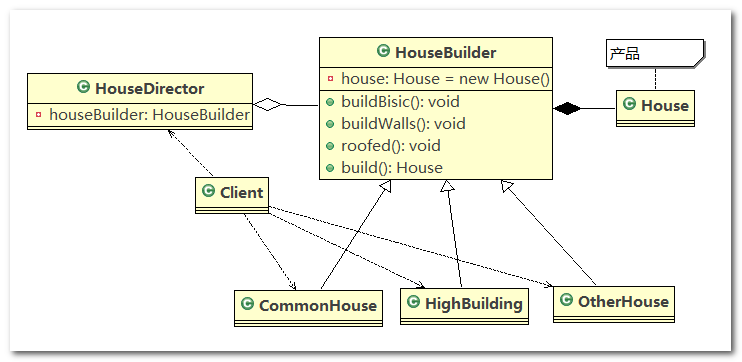

> **代码**

<details>
<summary style="color:red;">展开</summary>

1. `House`：产品类

   ```java
   //产品->Product
   public class House {
   	private String base;
   	private String wall;
   	private String roofed;
   ```

2. `HouseBuilder`：抽象建造者，规定制造房子的规范，并提供 `buildHouse()` 方法返回制造好的房子（产品）

   ```java
   // 抽象的建造者
   public abstract class HouseBuilder {
   
   	protected House house = new House();
   
   	// 将建造的流程写好, 抽象的方法
   	public abstract void buildBasic();
   
   	public abstract void buildWalls();
   
   	public abstract void roofed();
   
   	// 建造房子好， 将产品(房子) 返回
   	public House buildHouse() {
   		return house;
   	}
   
   }
   ```

3. `CommonHouse`：具体建造者，负责建造普通房子，重写父类 `HouseBuilder` 中的抽象方法来指定普通房子的建造细节

   ```java
   public class CommonHouse extends HouseBuilder {
   
   	@Override
   	public void buildBasic() {
   		house.setBase("普通房子打地基5米");
   	}
   
   	@Override
   	public void buildWalls() {
   		house.setWall("普通房子砌墙10cm");
   	}
   
   	@Override
   	public void roofed() {
   		house.setRoofed("普通房子屋顶");
   	}
   
   }
   ```

4. `HighBuilding`：具体建造者，负责建造高楼大厦，重写父类 `HouseBuilder` 中的抽象方法来指定高楼大厦的建造细节

   ```java
   public class HighBuilding extends HouseBuilder {
   
   	@Override
   	public void buildBasic() {
   		house.setBase("高楼的打地基100米");
   	}
   
   	@Override
   	public void buildWalls() {
   		house.setWall("高楼的砌墙20cm");
   	}
   
   	@Override
   	public void roofed() {
   		house.setRoofed("高楼的透明屋顶");
   	}
   
   }
   ```

5. `HouseDirector`：指挥者，指挥具体的 `Builder` 对象制造产品，可指定制造产品的流程

   ```java
   //指挥者，这里去指定制作流程，返回产品
   public class HouseDirector {
   
   	HouseBuilder houseBuilder = null;
   
   	// 构造器传入 houseBuilder
   	public HouseDirector(HouseBuilder houseBuilder) {
   		this.houseBuilder = houseBuilder;
   	}
   
   	// 通过setter 传入 houseBuilder
   	public void setHouseBuilder(HouseBuilder houseBuilder) {
   		this.houseBuilder = houseBuilder;
   	}
   
   	// 如何处理建造房子的流程，交给指挥者
   	public House constructHouse() {
   		houseBuilder.buildBasic();
   		houseBuilder.buildWalls();
   		houseBuilder.roofed();
   		return houseBuilder.buildHouse();
   	}
   
   }
   ```

6. `Client`：客户端，发出建造房子的命令

   ```java
   public class Client {
   	public static void main(String[] args) {
   		// 盖普通房子
   		CommonHouse commonHouse = new CommonHouse();
   		// 准备创建房子的指挥者
   		HouseDirector houseDirector = new HouseDirector(commonHouse);
   		// 完成盖房子，返回产品(普通房子)
   		House house = houseDirector.constructHouse();
   		// 查看建造的普通房子
   		System.out.println(house);
   
   		System.out.println("--------------------------");
   		// 盖高楼
   		HighBuilding highBuilding = new HighBuilding();
   		// 重置建造者
   		houseDirector.setHouseBuilder(highBuilding);
   		// 完成盖房子，返回产品(高楼)
   		house = houseDirector.constructHouse();
   		// 查看建造的高楼
   		System.out.println(house);
   	}
   }
   ```

7. 程序运行结果

   ```
   House [base=普通房子打地基5米, wall=普通房子砌墙10cm, roofed=普通房子屋顶]
   --------------------------
   House [base=高楼的打地基100米, wall=高楼的砌墙20cm, roofed=高楼的透明屋顶]
   ```

</details>

> **总结**

1. 首先，`Product` 为产品类，将 `Product` 的实例对象**组合**在抽象建造者 `AbstractBuilder` 中，并通过抽象建造者中定义的抽象方法，来约定制造产品的规范
2. 然后，通过 `Builder` 具体的实现类：具体建造者 `ConcreteBuilder`，重写抽象父类 `AbstractBuilder` 中的抽象方法，来指定具体产品的制造细节
3. 最后，将 `ConcreteBuilder` 的实例对象聚合在指挥者 `Director` 中，通过指挥者实现具体产品的制造流程（抽象方法的调用顺序），最后返回产品即可

#### 3.2.5.5. jdk源码示例

1. `StringBuilder` 的 `append()` 方法：调用父类`AbstractStringBuilder` 的 `append()` 方法

   ```java
   public final class StringBuilder
       extends AbstractStringBuilder
       implements java.io.Serializable, CharSequence
   {
       // ...
       
       @Override
       public StringBuilder append(String str) {
           super.append(str);
           return this;
       }
       
       // ...
   ```

2. `AbstractStringBuilder` 的 `append()` 方法是由 `Appendable` 接口定义的规范

   ```java
   abstract class AbstractStringBuilder implements Appendable, CharSequence {
       /**
        * The value is used for character storage.
        */
       char[] value;
   
       /**
        * The count is the number of characters used.
        */
       int count;
   
       /**
        * This no-arg constructor is necessary for serialization of subclasses.
        */
       AbstractStringBuilder() {
       }
   
       /**
        * Creates an AbstractStringBuilder of the specified capacity.
        */
       AbstractStringBuilder(int capacity) {
           value = new char[capacity];
       }
       
       // ...
       
       public AbstractStringBuilder append(String str) {
           if (str == null)
               return appendNull();
           int len = str.length();
           ensureCapacityInternal(count + len);
           str.getChars(0, len, value, count);
           count += len;
           return this;
       }
       
       // ...
   ```

3. `Appendable` 接口：定义了 `append()` 方法的规范，相当于是一个抽象的建造者

   ```java
   public interface Appendable {
   
       Appendable append(CharSequence csq) throws IOException;
   
       Appendable append(CharSequence csq, int start, int end) throws IOException;
   
       Appendable append(char c) throws IOException;
   }
   ```

4. 说明：**实际源码中的生产模式有可能和我们讲的有细微差别**。

------

源码中建造者模式角色分析

1. `Appendable` 接口定义了多个 `append()` 方法(抽象方法)，即 `Appendable` 为抽象建造者，定义了制造产品的抽象方法（规范）
2. `AbstractStringBuilder` 实现了 `Appendable` 接口方法，这里的 `AbstractStringBuilder` 已经是建造者，只是不能实例化
3. `StringBuilder` 既充当了指挥者角色，同时充当了具体的建造者， 因为建造方法的实现是由 `AbstractStringBuilder` 完成，而 `StringBuilder` 继承了`AbstractStringBuilder`

#### 3.2.5.6. 注意事项

> **建造者模式的注意事项和细节**

1. 客户端(使用程序)不必知道产品内部组成的细节，将产品本身与产品的创建过程解耦，使得相同的创建过程可以创建不同的产品对象
2. 每一个具体建造者都相对独立，而与其他的具体建造者无关，因此可以很方便地替换具体建造者或增加新的具体建造者， 用户使用不同的具体建造者即可得到不同的产品对象
3. 可以更加精细地控制产品的创建过程 。将复杂产品的创建步骤分解在不同的方法中，使得创建过程更加清晰，也更方便使用程序来控制创建过程
4. 增加新的具体建造者无须修改原有类库的代码，指挥者类针对抽象建造者类编程，系统扩展方便，符合 “开闭原则”
5. 建造者模式所创建的产品一般具有较多的共同点，其组成部分相似，如果产品之间的差异性很大，则不适合使用建造者模式，因此其使用范围受到一定的限制
6. 如果产品的内部变化复杂，可能会导致需要定义很多具体建造者类来实现这种变化，导致系统变得很庞大， 因此在这种情况下，要考虑是否选择建造者模式

> **抽象工厂模式 VS 建造者模式**

1. 抽象工厂模式实现对产品家族的创建，一个产品家族是这样的一系列产品：具有不同分类维度的产品组合，采用抽象工厂模式不需要关心构建过程，只关心什么产品由什么工厂生产即可
2. 而建造者模式则是要求按照指定的蓝图建造产品，它的主要目的是通过组装零配件而产生一个新产品，可以这样理解：建造者模式制造产品需要有一个具体的流程，对于不同产品整体流程相差不大，但是每个流程的实现细节较大

## 3.3. 结构型模式

### 3.3.1. 概述

这些设计模式关注类和对象的组合。继承的概念被用来组合接口和定义组合对象获得新功能的方式。

### 3.3.2. 适配器模式（Adapter Pattern）

#### 3.3.2.1. 说明

- 概述
  - 适配器模式(`Adapter Pattern`)将某个类的接口转换成客户端期望的另一个接口表示，主的目的是兼容性，让原本因接口不匹配不能一起工作的两个类可以协同工作。
  - 适配器的别名为包装器(`Wrapper`)，适配器模式属于结构型模式
  - 主要分为三类：类适配器模式、对象适配器模式、接口适配器模式。但实际工作中不局限于这三种经典模式。

- 原理
  - 适配器模式：将一个类的接口转换成另一种接口，让原本接口不兼容的类可以兼容
  - 从用户的角度看不到被适配者，用户与被适配者是解耦的
  - 用户调用适配器转化出来的目标接口方法， 适配器再调用被适配者的相关接口方法
  - 用户收到反馈结果，感觉只是和目标接口交互， 如图

  

#### 3.3.2.2. 类适配器

> **类适配器模式介绍**

基本介绍： 核心模块是 `Adapter` 类，`Adapter` 类，通过继承 `src` 类（被适配者），实现 `dst` 类接口（目标类），完成 `src --> dst` 的适配

> **类适配器模式应用实例**

应用实例说明

以生活中充电器的例子来讲解适配器，充电器本身相当于`Adapter`， `220V`交流电相当于`src` (即被适配者)， 我们的`dst`(即目标)是`5V`直流电

> **类图**

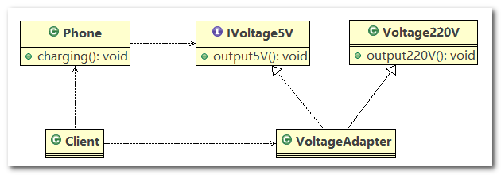

> **代码实现**

<details>
<summary style="color:red;">展开</summary>

1. `Voltage220V`：`src`类，输出 `220V` 的电压

   ```java
   //被适配的类
   public class Voltage220V {
   	// 输出220V的电压
   	public int output220V() {
   		int src = 220;
   		return src;
   	}
   }
   ```

2. `IVoltage5V`：适配器接口（`dst` 接口），规定适配器的规范

   ```java
   //适配接口
   public interface IVoltage5V {
   	public int output5V();
   }
   ```

3. `VoltageAdapter`：适配器，继承了 `Voltage220V` 并实现了 `IVoltage5V` 接口

   ```java
   //适配器类
   public class VoltageAdapter extends Voltage220V implements IVoltage5V {
   	@Override
   	public int output5V() {
   		int srcV = output220V(); // 获取到220V电压
   		int dstV = srcV / 44; // 降压转成 5v
   		return dstV;
   	}
   }
   ```

4. `Phone`：使用 `5V` 适配器进行充电

   ```java
   public class Phone {
   	// 充电
   	public void charging(IVoltage5V iVoltage5V) {
   		if (iVoltage5V.output5V() == 5) {
   			System.out.println("电压为5V, 可以充电~~");
   		} else if (iVoltage5V.output5V() > 5) {
   			System.out.println("电压大于5V, 不能充电~~");
   		}
   	}
   }
   ```

5. `Client`：客户端，进行代码测试

   ```java
   public class Client {
   
   	public static void main(String[] args) {
   		System.out.println(" === 类适配器模式 ====");
   		Phone phone = new Phone();
   		phone.charging(new VoltageAdapter());
   	}
   
   }
   ```

</details>

> **总结**

`Voltage220V` 只能输出 `220V` 的电压，我们定义一个抽象的适配器规范：`IVoltage5V` 接口，该接口里面有一个抽象方法 `public int output5V();`，适配器 `VoltageAdapter` 继承 `Voltage220V` 并实现 `IVoltage5V` 接口，可以将 `220V` 的电压转为 `5V` 电压

- 缺点
  - `Java`是单继承机制，所以类适配器需要继承`src`类这一点算是一个缺点，因为`Adapter`已经继承了`src`类，这要求`dst`必须是接口，有一定局限性
  - `src`类的方法在`Adapter`中都会暴露出来，也增加了使用的成本，因为`src`类中的方法可能很多

- 优点：
  - 由于其继承了`src`类，所以它可以根据需求重写`src`类的方法，使得`Adapter`的灵活性增强了

#### 3.3.2.3. 对象适配器

> **对象适配器模式介绍**

1. 基本思路和类的适配器模式相同，只是将`Adapter`类作修改，不是继承`src`类，而是持有`src`类的实例，以解决兼容性的问题。
2. 对象适配器模式的核心思想：适配器持有`src`类，实现`dst`类接口，完成`src --> dst`的适配
3. 根据“合成复用原则”，在系统中尽量使用关联关系（聚合、组合）来替代继承关系。
4. 对象适配器模式是适配器模式常用的一种

> **对象适配器模式应用实例**

以生活中充电器的例子来讲解适配器，充电器本身相当于`Adapter`， `220V`交流电相当于`src` (即被适配者)， 我们的`dst`(即目标)是`5V`直流电， 使用对象适配器模式完成

> **类图**


> **代码实现**

<details>
<summary style="color:red;">展开</summary>

1. `Voltage220V`：`src`类，输出 `220V` 的电压，与类适配器中的代码一样

2. `IVoltage5V`：适配器接口（`dst` 接口），规定适配器的规范，与类适配器中的代码一样

3. `VoltageAdapter`：适配器，`VoltageAdapter` 中聚合了一个 `Voltage220V` 类的对象，并实现了 `IVoltage5V` 接口

   ```java
   //适配器类
   public class VoltageAdapter implements IVoltage5V {
   
   	private Voltage220V voltage220V; // 关联关系-聚合
   
   	// 通过构造器，传入一个 Voltage220V 实例
   	public VoltageAdapter(Voltage220V voltage220v) {
   		this.voltage220V = voltage220v;
   	}
   
   	@Override
   	public int output5V() {
   		int dst = 0;
   		if (null != voltage220V) {
   			int src = voltage220V.output220V();// 获取220V 电压
   			System.out.println("使用对象适配器，进行适配~~");
   			dst = src / 44;
   			System.out.println("适配完成，输出的电压为=" + dst);
   		}
   		return dst;
   	}
   
   }
   ```

4. `Phone`：使用 `5V` 适配器进行充电，与类适配器中的代码一样

5. `Client`：客户端，进行代码测试，创建适配器 `VoltageAdapter` 时，注入 `src` 类实例：`new Voltage220V()`

   ```java
   public class Client {
   
   	public static void main(String[] args) {
   		System.out.println(" === 对象适配器模式 ====");
   		Phone phone = new Phone();
   		phone.charging(new VoltageAdapter(new Voltage220V()));
   	}
   
   }
   ```

</details>

> **总结**

- 与类适配器模式区别
  - 对象适配器模式中，适配器 `Adapter` 没有使用继承关系，而是使用聚合关系，在适配器 `Adapter` 中聚合了一个 `src` 类实例

- 与类适配器模式相同点
  - 相同的是 `Adapter` 实现适配器接口（`dst`接口），在 `Adapter` 中实现 `dst` 接口中的抽象方法，然后使用 `src` 类实例和完成适配（转换）

- 与类适配器模式联系
  - 对象适配器和类适配器其实算是同一种思想，只不过实现方式不同。**根据合成复用原则， 使用组合替代继承**，
  - 所以它解决了类适配器必须继承`src`的局限性问题，也不再要求`dst`必须是接口(因为java不允许多继承，对象适配器允许dst为抽象类)。**对象适配器的使用成本更低，更灵活**

#### 3.3.2.4. 接口适配器

> **接口适配器模式介绍**

1. 一些书籍称为：适配器模式(`Default Adapter Pattern`)或缺省适配器模式
2. 核心思想：当不需要全部实现接口提供的方法时，可先设计一个抽象类实现接口，并为该接口中每个方法提供一个默认实现（空方法），那么该抽象类的子类可有选择地覆盖父类的某些方法来实现需求
3. 适用于一个接口的实现类不想使用其所有的方法的情况

> **类图**


> **代码示例**

<details>
<summary style="color:red;">展开</summary>

1. `Interface4`：接口

   ```java
   public interface Interface4 {
   	public void m1();
   
   	public void m2();
   
   	public void m3();
   
   	public void m4();
   }
   ```

2. `AbsAdapter`：适配器，对接口中的抽象方法进行空实现

   ```java
   //在AbsAdapter 我们将 Interface4 的方法进行默认实现
   public abstract class AbsAdapter implements Interface4 {
   	// 默认实现
   	public void m1() {
   
   	}
   
   	public void m2() {
   
   	}
   
   	public void m3() {
   
   	}
   
   	public void m4() {
   
   	}
   }
   ```

3. `Client`：客户端

   ```java
   public class Client {
   	public static void main(String[] args) {
   
   		AbsAdapter absAdapter = new AbsAdapter() {
   			// 只需要去覆盖我们 需要使用 接口方法
   			@Override
   			public void m1() {
   				System.out.println("使用了m1的方法");
   			}
   		};
   
   		absAdapter.m1();
   	}
   }
   ```

> **`Android` 代码示例**

1. `AnimatorListener`是一个接口，它里面定义了一些抽象方法

   ```java
   public static interface AnimatorListener {
       void onAnimationStart(Animator animation);
       void onAnimationEnd(Animator animation);
       void onAnimationCancel(Animator animation);
       void onAnimationRepeat(Animator animation);
   }
   ```

2. `AnimatorListenerAdapter`类就是一个接口适配器，它空实现了`Animator.AnimatorListener`类(`src`)的所有方法

   ```java
   public abstract class AnimatorListenerAdapter implements Animator.AnimatorListener, Animator.AnimatorPauseListener {
       @Override //默认实现
       public void onAnimationCancel(Animator animation) {
       }
       
       @Override
       public void onAnimationEnd(Animator animation) {
       }
       
       @Override
       public void onAnimationRepeat(Animator animation) {
       }
       
       @Override
       public void onAnimationStart(Animator animation) {
       }
       
       @Override
       public void onAnimationPause(Animator animation) {
       }
       
       @Override
       public void onAnimationResume(Animator animation) {
       }
   }
   ```

3. 我们在程序里的匿名内部类就是`Listener`具体实现类，我们可以选择性地实现想要重写的方法

   ```java
   new AnimatorListenerAdapter() {
       @Override
       public void onAnimationStart(Animator animation) {
       	//xxxx具体实现
       }
   }
   ```

</details>

#### 3.3.2.5. SpringMVC源码

> **适配器模式在SpringMVC框架应用的源码剖析**

`SpringMVC`中的`HandlerAdapter`，就使用了适配器模式，`SpringMVC`处理请求的流程回顾：

1. 首先用户请求到达前端控制器 `dispatcherServlet` 的 `doDispatch()` 方法
2. 在 `doDispatch()` 中，通过 `HandlerMapping` 找到用户请求的 `Handler`（处理器）
3. 通过 `Handler` 执行目标方法，获得本次访问结果：`ModelAndView` 对象
4. 接着调用 `InternalResourceViewResolve` 对返回的 `ModelAndView` 对象进行解析，找到指定的资源
5. 目标资源（`JSP` 页面或者 `JSON` 字符串）最终都会以 `JSON` 字符串的形式返回给 `Tomcat`
6. `Tomcat` 将字符串 以 `HTTP` 协议的方式返回给浏览器

> **使用 `HandlerAdapter` 的原因分析:**

可以看到处理器的类型不同，有多种实现方式，那么调用方式就不是确定的，

如果需要直接调用`Controller`方法，需要调用的时候就得不断是使用`if else`来进行判断是哪一种子类然后执行。 那么如果后面要扩展`Controller`，就得修改原来的代码，这样违背了`OCP` 原则

> **源码追踪**

1. `doDispatch()` 方法

   ```java
   /**
    * Process the actual dispatching to the handler.
    * <p>The handler will be obtained by applying the servlet's HandlerMappings in order.
    * The HandlerAdapter will be obtained by querying the servlet's installed HandlerAdapters
    * to find the first that supports the handler class.
    * <p>All HTTP methods are handled by this method. It's up to HandlerAdapters or handlers
    * themselves to decide which methods are acceptable.
    * @param request current HTTP request
    * @param response current HTTP response
    * @throws Exception in case of any kind of processing failure
    */
   protected void doDispatch(HttpServletRequest request, HttpServletResponse response) throws Exception {
   	HttpServletRequest processedRequest = request;
   	HandlerExecutionChain mappedHandler = null;
   	boolean multipartRequestParsed = false;
   
   	WebAsyncManager asyncManager = WebAsyncUtils.getAsyncManager(request);
   
   	try {
   		ModelAndView mv = null;
   		Exception dispatchException = null;
   
   		try {
   			processedRequest = checkMultipart(request);
   			multipartRequestParsed = processedRequest != request;
   
   			// Determine handler for the current request.
   			mappedHandler = getHandler(processedRequest);
   			if (mappedHandler == null || mappedHandler.getHandler() == null) {
   				noHandlerFound(processedRequest, response);
   				return;
   			}
   
   			// Determine handler adapter for the current request.
   			HandlerAdapter ha = getHandlerAdapter(mappedHandler.getHandler());
   
   			// Process last-modified header, if supported by the handler.
   			String method = request.getMethod();
   			boolean isGet = "GET".equals(method);
   			if (isGet || "HEAD".equals(method)) {
   				long lastModified = ha.getLastModified(request, mappedHandler.getHandler());
   				if (logger.isDebugEnabled()) {
   					String requestUri = urlPathHelper.getRequestUri(request);
   					logger.debug("Last-Modified value for [" + requestUri + "] is: " + lastModified);
   				}
   				if (new ServletWebRequest(request, response).checkNotModified(lastModified) && isGet) {
   					return;
   				}
   			}
   
   			if (!mappedHandler.applyPreHandle(processedRequest, response)) {
   				return;
   			}
   
   			try {
   				// Actually invoke the handler.
   				mv = ha.handle(processedRequest, response, mappedHandler.getHandler());
   			}
   			finally {
   				if (asyncManager.isConcurrentHandlingStarted()) {
   					return;
   				}
   			}
   
   			applyDefaultViewName(request, mv);
   			mappedHandler.applyPostHandle(processedRequest, response, mv);
   		}
   		catch (Exception ex) {
   			dispatchException = ex;
   		}
   		processDispatchResult(processedRequest, response, mappedHandler, mv, dispatchException);
   	}
   	catch (Exception ex) {
   		triggerAfterCompletion(processedRequest, response, mappedHandler, ex);
   	}
   	catch (Error err) {
   		triggerAfterCompletionWithError(processedRequest, response, mappedHandler, err);
   	}
   	finally {
   		if (asyncManager.isConcurrentHandlingStarted()) {
   			// Instead of postHandle and afterCompletion
   			mappedHandler.applyAfterConcurrentHandlingStarted(processedRequest, response);
   			return;
   		}
   		// Clean up any resources used by a multipart request.
   		if (multipartRequestParsed) {
   			cleanupMultipart(processedRequest);
   		}
   	}
   }
   ```

2. `getHandlerAdapter()` 方法

   ```java
   /**
    * Return the HandlerAdapter for this handler object.
    * @param handler the handler object to find an adapter for
    * @throws ServletException if no HandlerAdapter can be found for the handler. This is a fatal error.
    */
   protected HandlerAdapter getHandlerAdapter(Object handler) throws ServletException {
   	for (HandlerAdapter ha : this.handlerAdapters) {
   		if (logger.isTraceEnabled()) {
   			logger.trace("Testing handler adapter [" + ha + "]");
   		}
   		if (ha.supports(handler)) {
   			return ha;
   		}
   	}
   	throw new ServletException("No adapter for handler [" + handler +
   			"]: The DispatcherServlet configuration needs to include a HandlerAdapter that supports this handler");
   }
   ```

3. `HandlerAdapter` 只是一个接口，定义了适配器的规范

   ```java
   public interface HandlerAdapter {
   
   	/**
   	 * Given a handler instance, return whether or not this {@code HandlerAdapter}
   	 * can support it. Typical HandlerAdapters will base the decision on the handler
   	 * type. HandlerAdapters will usually only support one handler type each.
   	 * <p>A typical implementation:
   	 * <p>{@code
   	 * return (handler instanceof MyHandler);
   	 * }
   	 * @param handler handler object to check
   	 * @return whether or not this object can use the given handler
   	 */
   	boolean supports(Object handler);
   
   	/**
   	 * Use the given handler to handle this request.
   	 * The workflow that is required may vary widely.
   	 * @param request current HTTP request
   	 * @param response current HTTP response
   	 * @param handler handler to use. This object must have previously been passed
   	 * to the {@code supports} method of this interface, which must have
   	 * returned {@code true}.
   	 * @throws Exception in case of errors
   	 * @return ModelAndView object with the name of the view and the required
   	 * model data, or {@code null} if the request has been handled directly
   	 */
   	ModelAndView handle(HttpServletRequest request, HttpServletResponse response, Object handler) throws Exception;
   
   	/**
   	 * Same contract as for HttpServlet's {@code getLastModified} method.
   	 * Can simply return -1 if there's no support in the handler class.
   	 * @param request current HTTP request
   	 * @param handler handler to use
   	 * @return the lastModified value for the given handler
   	 * @see javax.servlet.http.HttpServlet#getLastModified
   	 * @see org.springframework.web.servlet.mvc.LastModified#getLastModified
   	 */
   	long getLastModified(HttpServletRequest request, Object handler);
   
   }
   ```

4. `HandlerAdapter` 继承树

  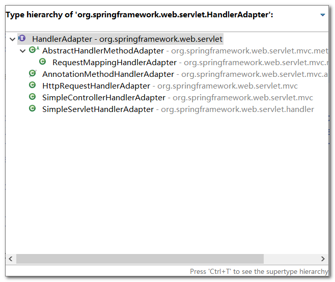

> **源码分析与总结**

1. 首先，我们拿到此次请求的 `Request` 对象：`HttpServletRequest processedRequest = request;`
2. 接着，通过 `Request` 对象拿到 `Handler(Controller)` 对象：`mappedHandler = getHandler(processedRequest);`
3. 然后通过 `Handler` 拿到对应的适配器( `Adapter`)：`HandlerAdapter ha = getHandlerAdapter(mappedHandler.getHandler());`
4. 最后通过适配器调用 `Controller` 的方法并返回 `ModelAndView`：`mv = ha.handle(processedRequest, response, mappedHandler.getHandler());`

> **动手写 SpringMVC 通过适配器设计模式**

`Spring` 定义了一个适配接口，使得每一种 `Controller`有一种对应的适配器实现类，适配器代替 `Controller` 执行相应的方法，扩展 `Controller` 时，只需要增加一个适配器类就完成了 `SpringMVC` 的扩展了，这就是设计模式的力量

> **类图**

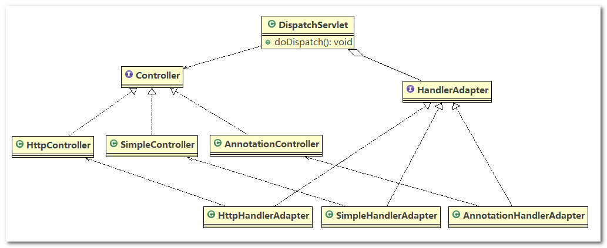

> **代码实现**

1. `Controller` 接口及其实现类

   ```java
   //多种Controller实现  
   public interface Controller {
   
   }
   
   class HttpController implements Controller {
   	public void doHttpHandler() {
   		System.out.println("http...");
   	}
   }
   
   class SimpleController implements Controller {
   	public void doSimplerHandler() {
   		System.out.println("simple...");
   	}
   }
   
   class AnnotationController implements Controller {
   	public void doAnnotationHandler() {
   		System.out.println("annotation...");
   	}
   }
   ```

2. `HandlerAdapter` 接口及其实现类

   ```java
   //定义一个Adapter接口 
   public interface HandlerAdapter {
   	// 当前 HandlerAdapter 对象是否支持 handler（判断 handler 的类型是否为具体的子类类型）
   	public boolean supports(Object handler);
   
   	// 执行目标方法（将 handler 对象强转后，调用对应的方法）
   	public void handle(Object handler);
   }
   
   // 多种适配器类
   class SimpleHandlerAdapter implements HandlerAdapter {
   
   	public void handle(Object handler) {
   		((SimpleController) handler).doSimplerHandler();
   	}
   
   	public boolean supports(Object handler) {
   		return (handler instanceof SimpleController);
   	}
   
   }
   
   class HttpHandlerAdapter implements HandlerAdapter {
   
   	public void handle(Object handler) {
   		((HttpController) handler).doHttpHandler();
   	}
   
   	public boolean supports(Object handler) {
   		return (handler instanceof HttpController);
   	}
   
   }
   
   class AnnotationHandlerAdapter implements HandlerAdapter {
   
   	public void handle(Object handler) {
   		((AnnotationController) handler).doAnnotationHandler();
   	}
   
   	public boolean supports(Object handler) {
   		return (handler instanceof AnnotationController);
   	}
   
   }
   ```

3. `DispatchServlet`：模拟 `doDispatch()` 方法中获取适配器的流程

   ```java
   public class DispatchServlet {
   
   	public static List<HandlerAdapter> handlerAdapters = new ArrayList<HandlerAdapter>();
   
   	// 组合了多个 HandlerAdapter 的实现类
   	public DispatchServlet() {
   		handlerAdapters.add(new AnnotationHandlerAdapter());
   		handlerAdapters.add(new HttpHandlerAdapter());
   		handlerAdapters.add(new SimpleHandlerAdapter());
   	}
   
   	public void doDispatch() {
   
   		// 此处模拟SpringMVC从request取handler的对象，
   		// 适配器可以获取到希望的Controller
   		HttpController controller = new HttpController();
   		// AnnotationController controller = new AnnotationController();
   		// SimpleController controller = new SimpleController();
   		
   		// 得到对应适配器
   		HandlerAdapter adapter = getHandler(controller);
   		// 通过适配器执行对应的controller对应方法
   		adapter.handle(controller);
   
   	}
   
   	public HandlerAdapter getHandler(Controller controller) {
   		// 遍历：根据得到的controller(handler), 返回对应适配器
   		for (HandlerAdapter adapter : this.handlerAdapters) {
   			if (adapter.supports(controller)) {
   				return adapter;
   			}
   		}
   		return null;
   	}
   
   	public static void main(String[] args) {
   		new DispatchServlet().doDispatch(); // http...
   	}
   
   }
   ```

> **总结**

1.  `HandlerAdapter` 的作用：
   1. `public boolean supports(Object handler);`：当前适配器是否支持 `handler`，从上面源码可以看出，使用 `instanceof` 关键字进行判断
   2. `public void handle(Object handler);`：执行 `Handler(Controller)` 的目标方法，即 `HandlerAdapter` 代替原有的 `Handler(Controller)` 执行目标方法
2. 通过 `HandlerAdapter` 可以使得 `DispatchServlet` 和具体的 `Controller` 解耦，扩展 `Controller` 时，我们只需要增加一个适配器类就完成了 `SpringMVC` 的扩展
3. 对于同一类的请求方式，我们封装一个 `HandlerAdapter` 实现类，通过该 `HandlerAdapter` 实现类完成一类相同的请求

#### 3.3.2.6. 注意事项

三种命名方式，是根据`src`是以怎样的形式给到`Adapter`（在`Adapter`里的形式）来命名的。

1. 类适配器：以类给到，在`Adapter`里，就是将`src`当做类，继承
2. 对象适配器：以对象给到，在`Adapter`里，将`src`作为一个对象，持有
3. 接口适配器：以接口给到，在`Adapter`里，将`src`作为一个接口，实现

------

`Adapter`模式最大的作用还是将原本不兼容的接口融合在一起工作，相当于是个中转封装站

**实际开发中，实现起来不拘泥于我们讲解的三种经典形式**

### 3.3.3. 桥接模式（Bridge Pattern）

#### 3.3.3.1. 说明

- 概述
  - 桥接模式(`Bridge`模式)是指：将实现与抽象放在两个不同的类层次中，使两个层次可以独立改变，桥接模式是一种结构型设计模式
  - `Bridge`模式基于类的最小设计原则，通过使用封装、聚合及继承等行为让不同的类承担不同的职责。
    - 它的主要特点是把抽象(`Abstraction`)与行为实现(`Implementation`)分离开来，
    - 从而可以保持各部分的独立性以及应对他们的功能扩展

> *出现两层继承，或者以继承的方式实现组合的时候，可以稍微试试这种设计模式。不通过两层继承，而通过客户端的自己指定组合方式*
>
> 简单来说就是通过客户端组合的方式，替代了继承

- 类图

  - `Client`：桥接模式的调用者
  - `Abstraction`：抽象类，`Abstraction` 中维护了一个 `Implementor` 实现类的实例（聚合关系），`Abstraction` 充当桥接类
  - `RefinedAbstraction`：`Abstraction` 的具体实现类
  - `Implementor`：定义行为的接口
  - `ConcreteImplementor`：`Implementor` 的具体实现类

  > 从 `UML` 图： 这里的抽象类和接口是聚合的关系， 其实也是调用和被调用关系，抽象在 `Abstraction` 这一块，行为实现在 `Implementor` 这一块
  >
  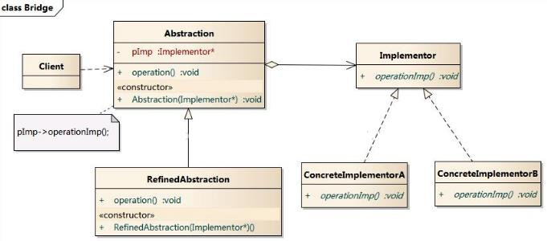

#### 3.3.3.2. 情景介绍

现在对不同手机类型、不同品牌的手机实现操作编程(比如：开机、关机、上网，打电话等)


#### 3.3.3.3. 传统方式

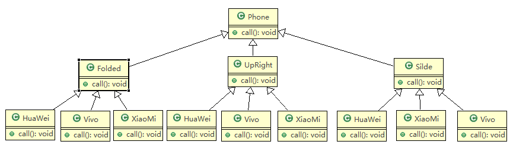

问题：

1. 扩展性问题(类爆炸)， 如果我们再增加手机的样式(旋转式)，就需要增加各个品牌手机的类，同样如果我们增加一个手机品牌，也要在各个手机样式类下增加
2. 违反了单一职责原则，当我们增加手机样式时，要同时增加所有品牌的手机，这样增加了代码维护成本
3. 解决方案 --> 使用桥接模式

#### 3.3.3.4. 桥接模式代码

> **类图**


> **代码实现**

<details>
<summary style="color:red;">展开</summary>

1. `Brand`：规定各个品牌手机的行为

   ```java
   //接口
   public interface Brand {
   	void open();
   
   	void close();
   
   	void call();
   }
   ```

2. `XiaoMi`：实现了 `Brand` 接口，指定了小米手机的具体行为

   ```java
   public class XiaoMi implements Brand {
   
   	@Override
   	public void open() {
   		System.out.println(" 小米手机开机 ");
   	}
   
   	@Override
   	public void close() {
   		System.out.println(" 小米手机关机 ");
   	}
   
   	@Override
   	public void call() {
   		System.out.println(" 小米手机打电话 ");
   	}
   
   }
   ```

3. `Vivo`：实现了 `Brand` 接口，指定了 `Vivo` 手机的具体行为

   ```java
   public class Vivo implements Brand {
   
   	@Override
   	public void open() {
   		System.out.println(" Vivo手机开机 ");
   	}
   
   	@Override
   	public void close() {
   		System.out.println(" Vivo手机关机 ");
   	}
   
   	@Override
   	public void call() {
   		System.out.println(" Vivo手机打电话 ");
   	}
   
   }
   ```

4. `Phone`：电话的抽象类，在该类中聚合了一个 `Brand` 接口的具体实现类

   ```java
   public abstract class Phone {
   
   	// 组合品牌
   	private Brand brand;
   
   	// 构造器
   	public Phone(Brand brand) {
   		this.brand = brand;
   	}
   
   	protected void open() {
   		this.brand.open();
   	}
   
   	protected void close() {
   		this.brand.close();
   	}
   
   	protected void call() {
   		this.brand.call();
   	}
   
   }
   ```

5. `FoldedPhone`：继承抽象父类 `Phone`，对抽象父类中的方法进行重写

   ```java
   //折叠式手机类，继承 抽象类 Phone
   public class FoldedPhone extends Phone {
   
   	// 构造器
   	public FoldedPhone(Brand brand) {
   		super(brand);
   	}
   
   	@Override
   	public void open() {
   		super.open();
   		System.out.println(" 折叠样式手机 ");
   	}
   
   	@Override
   	public void close() {
   		super.close();
   		System.out.println(" 折叠样式手机 ");
   	}
   
   	@Override
   	public void call() {
   		super.call();
   		System.out.println(" 折叠样式手机 ");
   	}
   
   }
   ```

6. `UpRightPhone`：继承抽象父类 `Phone`，对抽象父类中的方法进行重写

   ```java
   public class UpRightPhone extends Phone {
   
   	// 构造器
   	public UpRightPhone(Brand brand) {
   		super(brand);
   	}
   
   	@Override
   	public void open() {
   		super.open();
   		System.out.println(" 直立样式手机 ");
   	}
   
   	@Override
   	public void close() {
   		super.close();
   		System.out.println(" 直立样式手机 ");
   	}
   
   	@Override
   	public void call() {
   		super.call();
   		System.out.println(" 直立样式手机 ");
   	}
   	
   }
   ```

7. `Client`：客户端，可以看到，使用桥接模式可以轻松地组合出不同手机类型、不同品牌的手机

   ```java
   public class Client {
   
   	public static void main(String[] args) {
   
   		// 折叠式的小米手机 (样式 + 品牌 )
   		Phone phone1 = new FoldedPhone(new XiaoMi());
   		phone1.open();
   		phone1.call();
   		phone1.close();
   		System.out.println("=======================");
   
   		// 折叠式的Vivo手机 (样式 + 品牌 )
   		Phone phone2 = new FoldedPhone(new Vivo());
   		phone2.open();
   		phone2.call();
   		phone2.close();
   		System.out.println("==============");
   
   		// 直立式的小米手机 (样式 + 品牌 )
   		UpRightPhone phone3 = new UpRightPhone(new XiaoMi());
   		phone3.open();
   		phone3.call();
   		phone3.close();
   		System.out.println("==============");
   
   		// 直立式的Vivo手机 (样式 + 品牌 )
   		UpRightPhone phone4 = new UpRightPhone(new Vivo());
   		phone4.open();
   		phone4.call();
   		phone4.close();
   		
   	}
   
   }
   ```

</details>

> **总结**

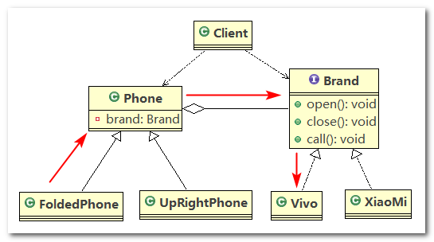

1. `Phone` 就像一座桥的感觉，它其实并没有做什么实质性的工作，只是调用 `Brand` 的具体实现类中的方法，就感觉像是一个请求从 `Phone` 的具体实现类通过 `Phone` 传递到了 `Brand` 的具体实现类
2. 通过代码我们可以看到，增加一个新的手机样式，并不会引起类膨胀，因为只要新样式继承了 `Phone`，并通过构造器或者 `setter` 方法聚合一个 `Brand` 实现类的实例，就能完成组合的作用

#### 3.3.3.5. JDBC源码

> **类图**

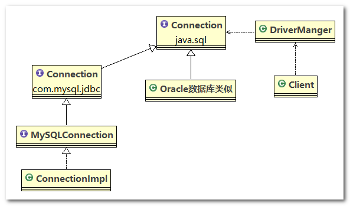

- `Jdbc` 的 `Driver`接口，如果从桥接模式来看， `Driver`就是一个接口（行为规范）
- 下面可以有`MySQL`的`Driver`， `Oracle`的`Driver`，为行为实现类
- 如果严格按照桥接模式的话，`DriverManager`其实还会有子类，子类作为抽象具体实现，不过这里直接就一个抽象具体实现。

> **源码**

1. 客户端通过 `DriverManager` 操作数据库，`DriverManager` 里面定义了很多方法，就比如说如下的 `getConnection()` 方法，它返回一个 `Connection` 对象

  

   ```java
   @CallerSensitive
   public static Connection getConnection(String url,
       java.util.Properties info) throws SQLException {
   
       return (getConnection(url, info, Reflection.getCallerClass()));
   }
   ```

2. `Connection` 为 `java.sql` 包下的接口，里面定义了 超多的抽象方法，比如 `prepareStatement()` 方法

   ```java
   public interface Connection  extends Wrapper, AutoCloseable {
       
       // ...  
       PreparedStatement prepareStatement(String sql, int resultSetType,
                                          int resultSetConcurrency, int resultSetHoldability)
           throws SQLException;
   
       CallableStatement prepareCall(String sql, int resultSetType,
                                     int resultSetConcurrency,
                                     int resultSetHoldability) throws SQLException;
   
       PreparedStatement prepareStatement(String sql, int autoGeneratedKeys)
           throws SQLException;
   
       PreparedStatement prepareStatement(String sql, int columnIndexes[])
           throws SQLException;
   
       PreparedStatement prepareStatement(String sql, String columnNames[])
           throws SQLException;
   
       // ...
   ```

3. `com.mysql.jdbc.Connection` 接口继承了 `java.sql.Connection` 接口

  

   ```java
   public interface Connection extends java.sql.Connection, ConnectionProperties {
   ```

4. `ConnectionImpl` 类实现了 `MySQLConnection` 接口，其中 `MySQLConnection` 接口继承了 `com.mysql.jdbc.Connection` 接口

   ```java
   public class ConnectionImpl extends ConnectionPropertiesImpl implements MySQLConnection {
   ```

>　**总结**

就以 `getConnection()` 方法的调用过程为例，`Client` 端调用 `DriverManager`（桥接器），`DriverManager` 去找 `java.sql.Connection` 的具体实现类

#### 3.3.3.6. 注意事项及应用场景

> **注意事项**

1. 实现了抽象和实现部分的分离， 从而极大的提供了系统的灵活性， 让抽象部分和实现部分独立开来， 这有助于系统进行分层设计， 从而产生更好的结构化系统。
2. 对于系统的高层部分， 只需要知道抽象部分和实现部分的接口就可以了， 其它的部分由具体业务来完成。
3. **桥接模式替代多层继承方案**， 可以**减少子类的个数**， 降低系统的管理和维护成本
4. 桥接模式的引入增加了系统的理解和设计难度， 由于聚合关联关系建立在抽象层， 要求开发者针对抽象进行设计和编程
5. 桥接模式要求**正确识别出系统中两个独立变化的维度(抽象和实现)**， 因此其使用范围有一定的局限性， 即需要有这样的应用场景

> **应用场景**

1. `JDBC` 驱动程序
2. 银行转账系统
   1. 转账分类（抽象层）：网上转账， 柜台转账， `AMT` 转账
   2. 转账用户类型（行为实现）： 普通用户， 银卡用户， 金卡用户
3. 消息管理
   1. 消息类型（抽象层）： 即时消息， 延时消息
   2. 消息分类（行为实现）： 手机短信， 邮件消息， `QQ` 消息

### 3.3.4. 装饰/过滤模式（Decorator/Filter Pattern）

#### 3.3.4.1. 说明

- 概述：
  - 说明
    - 装饰器模式（Decorator Pattern）允许向一个现有的对象添加新的功能，同时又不改变其结构，这种类型的设计模式属于结构型模式，它是作为现有的类的一个包装。
    - 这种模式创建了一个装饰类，用来包装原有的类，并在保持类方法签名完整性的前提下，提供了额外的功能。它比继承更有弹性，装饰者模式也体现了开闭原则(`ocp`)
  - 目的：
    - **动态地给一个对象添加一些额外的职责**。
    - 就增加功能来说，装饰器模式相比生成子类更为灵活。 可代替继承。
  - 主要解决：一般的，我们为了扩展一个类经常使用继承方式实现，由于继承为类引入静态特征，并且随着扩展功能的增多，子类会很膨胀。
  - 何时使用：在不想增加很多子类的情况下扩展类。
  - 如何解决：将具体功能职责划分，同时继承装饰者模式。
  - 关键代码：
    - 1、Component 类充当抽象角色，不应该具体实现。
    - 2、修饰类引用和继承 Component 类，具体扩展类重写父类方法。

- 优缺点
  - 优点：装饰类和被装饰类可以独立发展，不会相互耦合，装饰模式是继承的一个替代模式，装饰模式可以动态扩展一个实现类的功能。
  - 缺点：多层装饰比较复杂。

- 使用场景： 
  - 1、扩展一个类的功能。
  - 2、动态增加功能，动态撤销。

- 原理
  - 装饰者模式就像打包一个快递
    - 主体： 比如陶瓷、衣服 ，即 `Component`，被装饰者
    - 包装：比如报纸填充、塑料泡沫、纸板、木板，即 `Decorator`，装饰者
  - `Component` 主体类：比如类似前面的 `Drink`
  - `ConcreteComponent`：具体的主体，比如前面的各个单品咖啡
  - `Decorator`：装饰者，比如各调料，装饰者里面聚合了一个 `Component` 的具体实现类
    - 在如图的`Component`与`ConcreteComponent`之间
    - 如果实现类 `ConcreteComponent` 有很多，还可以设计一个缓冲层，将共有的部分提取出来，抽象出一个缓冲层

  

#### 3.3.4.2. 情景介绍

> **星巴克咖啡订单项目（咖啡馆）**

1. 咖啡种类/单品咖啡：`Espresso`(意大利浓咖啡)、 `ShortBlack`、 `LongBlack`(美式咖啡)、 `Decaf`(无因咖啡)
2. 调料： `Milk`、 `Soy`(豆浆)、 `Chocolate`
3. 要求在扩展新的咖啡种类时，具有良好的扩展性、改动方便、维护方便
4. 使用`OO`的来计算不同种类咖啡的费用：客户可以点单品咖啡，也可以单品咖啡 + 调料组合

#### 3.3.4.3. 传统方式

> **方案1：解决星巴克咖啡订单问题分析**


1. `Drink` 是一个抽象父类，表示饮料
2. `des` 就是对咖啡的描述，比如咖啡的名字
3. `cost()` 方法就是计算费用， 在 `Drink` 类中做成一个抽象方法
4. `Decaf` 就是单品咖啡， 继承 `Drink`，并实现 `cost()` 方法
5. `Espress && Milk` 就是单品咖啡 + 调料， 这类的组合有很多种

- 问题：这样设计，会有很多类，当我们增加一个单品咖啡，或者一个新的调料，类的数量就会倍增，就会出现类爆炸

> **方案2：解决星巴克咖啡订单(稍微好一些)**

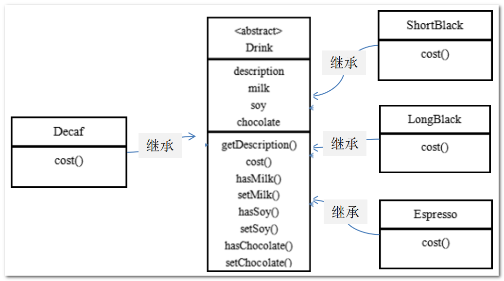

- 前面分析到方案 `1` 中，因为咖啡单品 + 调料组合会造成类的倍增
- 因此可以做改进，将调料内置到 `Drink` 类，这样就不会造成类数量过多。从而提高项目的维护性(如图)
- 说明：`milk`、`soy`、`chocolate` 可以设计为`Boolean`，表示是否要添加相应的调料

- 问题
  - 方案 `2` 可以控制类的数量，不至于造成很多的类
  - 在增加或者删除调味品种类时，代码的维护量很大
  - 考虑到用户可以添加多份调料时，可以将 `hasMilk()` 返回一个对应 `int` 整形值
  - 考虑使用装饰者模式

#### 3.3.4.4. 装饰者模式代码

> **解析**

- 说明
  - `Drink` 类就是前面说的抽象类，即 `Component` 主体类
  - 由于单品咖啡种类较多，设计 `Coffee` 抽象类作为缓冲层，`Coffee` 抽象层的实现类就是被装饰类，比如 `ShortBlack`、`Decaf` 等就是单品咖啡
  - `Decorator` 是一个装饰类，继承了 `Drink` 类，并且聚合了一个被装饰的对象(`Drink obj`)，`Decorator` 的 `cost()` 方法进行一个费用的叠加计算，需要递归计算价格
  - 各种调味品，比如 `Chocolate`、`Milk`、`Soy` 等，继承 `Decorator` 装饰类，聚合（装饰）了一个被装饰者

  

- 解决方案
  - `Milk`包含了`LongBlack`
  - 一份`Chocolate`包含了(`Milk + LongBlack`)
  - 一份`Chocolate`包含了(`Chocolate + Milk + LongBlack`)
  - 这样不管是什么形式的单品咖啡 + 调料组合，通过递归方式可以方便的组合和维护
  - 使用装饰者模式，程序的扩展性特别强，比如我们想添加一个新的单品咖啡种类：`DefCafe`，我们只需让此类继承 `Coffee` 抽象父类即可，其他部分的代码无须作任何修改

  

> **代码实现**

<details>
<summary style="color:red;">展开</summary>

1. `Drink`：即 `Component` 主体类，其中定了义一个抽象方法 `cost()`，用于计算订单费用

   ```java
   public abstract class Drink {
   
   	public String des; // 描述
   	private float price = 0.0f; // 价格
   	
   	// 计算费用的抽象方法，由子类来实现
   	public abstract float cost();
   
   	public String getDes() {
   		return des;
   	}
   
   	public void setDes(String des) {
   		this.des = des;
   	}
   
   	public float getPrice() {
   		return price;
   	}
   
   	public void setPrice(float price) {
   		this.price = price;
   	}
   
   }
   ```

2. `Coffee`：被装饰者的抽象父类，因为具体的单品咖啡品种太多，所以我们将 `Coffee` 抽象类作为缓冲层

   ```java
   //被装饰者
   public abstract class Coffee extends Drink {
   	@Override
   	public float cost() {
   		return super.getPrice();
   	}
   }
   ```

3. `Espresso`、`LongBlack`、`ShortBlack`、`DeCaf`：被装饰者的具体实现类

   ```java
   public class Espresso extends Coffee {
   	public Espresso() {
   		setDes(" 意大利咖啡 ");
   		setPrice(6.0f);
   	}
   }
   
   public class LongBlack extends Coffee {
   	public LongBlack() {
   		setDes(" longblack ");
   		setPrice(5.0f);
   	}
   }
   
   public class ShortBlack extends Coffee {
   	public ShortBlack() {
   		setDes(" shortblack ");
   		setPrice(4.0f);
   	}
   }
   
   public class DeCaf extends Coffee {
   	public DeCaf() {
   		setDes(" 无因咖啡 ");
   		setPrice(1.0f);
   	}
   }
   ```

4. `Decorator`：装饰者的抽象父类，该类实现了 `Drink` 接口，同时 `Decorator` 中聚合了一个 `Drink` 的具体实现类的对象，`cost()` 方法用于计算【装饰者（调味品） + 被装饰者（咖啡）】的费用

   ```java
   // 装饰者
   public class Decorator extends Drink {
       
   	private Drink obj; // 聚合一个单品咖啡（被装饰者）
   
   	public Decorator(Drink obj) {
   		this.obj = obj;
   	}
   
   	@Override
   	public float cost() {
   		// super.getPrice：调味品（装饰者）的价格
   		// obj.cost()：单品咖啡（被装饰者）的价格
   		return super.getPrice() + obj.cost();
   	}
   
   	@Override
   	public String getDes() {
   		// des：调味品（装饰者）的描述信息
   		// getPrice()：调味品（装饰者）的价格
   		// obj.getDes()：单品咖啡（被装饰者）的信息
   		return des + " " + getPrice() + " && " + obj.getDes();
   	}
   
   }
   ```

5. `Chocolate`、`Milk`、`Soy`：装饰者的具体实现类

   ```java
   //具体的Decorator， 这里就是调味品
   public class Chocolate extends Decorator {
   	public Chocolate(Drink obj) {
   		super(obj);
   		setDes(" 巧克力 ");
   		setPrice(3.0f); // 调味品 的价格
   	}
   }
   
   public class Milk extends Decorator {
   	public Milk(Drink obj) {
   		super(obj);
   		setDes(" 牛奶 ");
   		setPrice(2.0f);
   	}
   }
   
   public class Soy extends Decorator {
   	public Soy(Drink obj) {
   		super(obj);
   		setDes(" 豆浆  ");
   		setPrice(1.5f);
   	}
   }
   ```

6. `CoffeeBar`：客户端，发出咖啡订单请求

   ```java
   public class CoffeeBar {
   
   	public static void main(String[] args) {
   		// 装饰者模式下的订单：2份巧克力+一份牛奶+LongBlack
   
   		// 1. 点一份 LongBlack
   		Drink order = new LongBlack();
   		System.out.println("LongBlack的费用=" + order.cost());
   		System.out.println("LongBlack的描述=" + order.getDes());
   
   		// 2. order 加入一份牛奶
   		order = new Milk(order);
   		System.out.println("order 加入一份牛奶 费用 =" + order.cost());
   		System.out.println("order 加入一份牛奶 描述 = " + order.getDes());
   
   		// 3. order 加入一份巧克力
   		order = new Chocolate(order);
   		System.out.println("order 加入一份牛奶 加入一份巧克力  费用 =" + order.cost());
   		System.out.println("order 加入一份牛奶 加入一份巧克力 描述 = " + order.getDes());
   
   		// 3. order 加入一份巧克力
   		order = new Chocolate(order);
   		System.out.println("order 加入一份牛奶 加入2份巧克力   费用 =" + order.cost());
   		System.out.println("order 加入一份牛奶 加入2份巧克力 描述 = " + order.getDes());
   		System.out.println("===========================");
   
   		// 牛奶+无卡咖啡
   		Drink order2 = new DeCaf();
   		System.out.println("order2 无因咖啡  费用 =" + order2.cost());
   		System.out.println("order2 无因咖啡 描述 = " + order2.getDes());
   
   		order2 = new Milk(order2);
   		System.out.println("order2 无因咖啡 加入一份牛奶  费用 =" + order2.cost());
   		System.out.println("order2 无因咖啡 加入一份牛奶 描述 = " + order2.getDes());
   	}
   }
   ```

7. 程序运行结果

   ```
   LongBlack的费用=5.0
   LongBlack的描述= longblack 
   order 加入一份牛奶 费用 =7.0
   order 加入一份牛奶 描述 =  牛奶  2.0 &&  longblack 
   order 加入一份牛奶 加入一份巧克力  费用 =10.0
   order 加入一份牛奶 加入一份巧克力 描述 =  巧克力  3.0 &&  牛奶  2.0 &&  longblack 
   order 加入一份牛奶 加入2份巧克力   费用 =13.0
   order 加入一份牛奶 加入2份巧克力 描述 =  巧克力  3.0 &&  巧克力  3.0 &&  牛奶  2.0 &&  longblack 
   ===========================
   order2 无因咖啡  费用 =1.0
   order2 无因咖啡 描述 =  无因咖啡 
   order2 无因咖啡 加入一份牛奶  费用 =3.0
   order2 无因咖啡 加入一份牛奶 描述 =  牛奶  2.0 &&  无因咖啡 
   ```

</details>

#### 3.3.4.5. JDK FileInputStream

> **装饰者模式在JDK应用的源码分析**

- `Java`的`IO`结构， `FilterInputStream`就是一个装饰者

  - `InputStream` 是(被)装饰者的抽象父类，类似我们前面讲的 `Drink`
  - `FileInputStream` 是 `InputStream` 子类，为具体的被装饰者，类似我们前面的 `DeCaf`，`LongBlack`
  - `FilterInputStream` 是 `InputStream` 子类，为装饰者的抽象父类，类似我们前面 的 `Decorator` 装饰者
  - `DataInputStream` 是 `FilterInputStream` 子类，为具体的装饰者，类似前面的 `Milk`，`Soy` 等
  - `FilterInputStream` 类中有 `protected volatile InputStream in;` 代码，即其中含有被装饰者
  - 分析得出在`jdk` 的`io`体系中，就是使用装饰者模式

  

### 3.3.5. 组合模式（Composite Pattern）

#### 3.3.5.1. 说明

- 概述
  - 目的：将对象组合成树形结构以表示"部分-整体"的层次结构。组合模式使得用户对单个对象和组合对象的使用具有一致性。
  - 主要解决：
    - 它在我们树型结构的问题中，模糊了简单元素和复杂元素的概念，客户程序可以像处理简单元素一样来处理复杂元素，从而使得客户程序与复杂元素的内部结构解耦。
    - 也就是说，而我们要对树上的节点和叶子进行操作时，它能够提供一致的方式，而不用考虑它是节点还是叶子

      <details>
      <summary style="color:red;">图片</summary>

      
      </details>
  - 何时使用： 
    - 1、您想表示对象的部分-整体层次结构（树形结构）。 
    - 2、您希望用户忽略组合对象与单个对象的不同，用户将统一地使用组合结构中的所有对象。
  - 如何解决：树枝和叶子实现统一接口，树枝内部组合该接口。
  - 关键代码：树枝内部组合该接口，并且含有内部属性 List，里面放 Component。

- 应用实例： 
  - 1、算术表达式包括操作数、操作符和另一个操作数，其中，另一个操作数也可以是操作数、操作符和另一个操作数。 
  - 2、在 JAVA AWT 和 SWING 中，对于 Button 和 Checkbox 是树叶，Container 是树枝。

- 优缺点
  - 优点： 
    - 1、高层模块调用简单。
    - 2、节点自由增加。
  - 缺点：在使用组合模式时，其叶子和树枝的声明都是实现类，而不是接口，违反了依赖倒置原则。

- 使用场景：部分、整体场景，如树形菜单，文件、文件夹的管理。

- 原理
  - `Component`：这是组合模式中对象声明接口，在适当情况下，实现所有类共有的接口默认行为，用于访问和管理 `Component` 子部件，`Component` 可以是抽象类或者接口
  - `Leaf`：在组合模式中表示叶子节点（没有子节点）
  - `Composite`：在组合模式中表示非叶子节点，用于存储子部件，继承（或实现） `Component`，实现子部件的相关操作，比如添加、删除操作等，相当于其下一层 `Component` 子部件的管理者

  

#### 3.3.5.2. 情景介绍

> **看一个学校院系展示需求**

- 编写程序展示一个学校院系结构：
  - 要在一个页面中展示出学校的院系组成
  - 一个学校有多个学院，一个学院有多个系。

  

#### 3.3.5.3. 传统方式

- 传统方案解决学校院系展示

  

> **传统方案解决学校院系展示存在的问题分析**

1. 将学院看做是学校的子类，系是学院的子类，这样实际上是站在组织大小来进行分层次的
2. 实际上我们的要求是 ：在一个页面中展示出学校的院系组成，一个学校有多个学院，一个学院有多个系， 因此继承这种方案，不能很好实现的管理的操作，比如对学院、系的添加，删除，遍历等
3. 解决方案：把学校、院、系都看做是组织结构，他们之间没有继承的关系，而是一个树形结构，可以更好的实现管理操作 --> 组合模式

#### 3.3.5.4. 组合模式代码

编写程序展示一个学校院系结构：需求是这样，要在一个页面中展示出学校的院系组成，一个学校有多个学院，一个学院有多个系

> **类图**


> **代码实现**

<details>
<summary style="color:red;">展开</summary>

1. `OrganizationComponent`：组合模式中对象方法定义的接口

   ```java
   public abstract class OrganizationComponent {
   
   	private String name; // 名字
   	private String des; // 说明
   
   	protected void add(OrganizationComponent organizationComponent) {
   		// 默认实现，叶子节点无需添加此方法
   		throw new UnsupportedOperationException();
   	}
   
   	protected void remove(OrganizationComponent organizationComponent) {
   		// 默认实现，叶子节点无需添加此方法
   		throw new UnsupportedOperationException();
   	}
   
   	// 方法print, 做成抽象的, 子类都需要实现
   	protected abstract void print();
   
   	// 构造器
   	public OrganizationComponent(String name, String des) {
   		super();
   		this.name = name;
   		this.des = des;
   	}
   
   	public String getName() {
   		return name;
   	}
   
   	public void setName(String name) {
   		this.name = name;
   	}
   
   	public String getDes() {
   		return des;
   	}
   
   	public void setDes(String des) {
   		this.des = des;
   	}
   
   }
   ```

2. `University`：表示大学节点，其子节点为 `College` 节点

   ```java
   //University 就是 Composite , 可以管理College
   public class University extends OrganizationComponent {
   
   	// List 中 存放的College
   	List<OrganizationComponent> organizationComponents = new ArrayList<OrganizationComponent>();
   
   	// 构造器
   	public University(String name, String des) {
   		super(name, des);
   	}
   
   	// 重写add
   	@Override
   	protected void add(OrganizationComponent organizationComponent) {
   		organizationComponents.add(organizationComponent);
   	}
   
   	// 重写remove
   	@Override
   	protected void remove(OrganizationComponent organizationComponent) {
   		organizationComponents.remove(organizationComponent);
   	}
   
   	// print方法，就是输出University 包含的学院
   	@Override
   	protected void print() {
   		System.out.println("--------------" + getName() + "--------------");
   		// 遍历 organizationComponents
   		for (OrganizationComponent organizationComponent : organizationComponents) {
   			organizationComponent.print();
   		}
   	}
   
   	@Override
   	public String getName() {
   		return super.getName();
   	}
   
   	@Override
   	public String getDes() {
   		return super.getDes();
   	}
   
   }
   ```

3. `College`：表示学院节点，其子节点为 `Department` 节点

   ```java
   public class College extends OrganizationComponent {
   
   	// List 中 存放的Department
   	List<OrganizationComponent> organizationComponents = new ArrayList<OrganizationComponent>();
   
   	// 构造器
   	public College(String name, String des) {
   		super(name, des);
   	}
   
   	// 重写add
   	@Override
   	protected void add(OrganizationComponent organizationComponent) {
   		// 将来实际业务中，Colleage 的 add 和 University add 不一定完全一样
   		organizationComponents.add(organizationComponent);
   	}
   
   	// 重写remove
   	@Override
   	protected void remove(OrganizationComponent organizationComponent) {
   		organizationComponents.remove(organizationComponent);
   	}
   
   	// print方法，就是输出学院包含的系
   	@Override
   	protected void print() {
   		System.out.println("--------------" + getName() + "--------------");
   		// 遍历 organizationComponents
   		for (OrganizationComponent organizationComponent : organizationComponents) {
   			organizationComponent.print();
   		}
   	}
   
   	@Override
   	public String getName() {
   		return super.getName();
   	}
   
   	@Override
   	public String getDes() {
   		return super.getDes();
   	}
   
   }
   ```

4. `Department`：表示专业节点，该节点为叶子节点

   ```java
   public class Department extends OrganizationComponent {
   
   	// 没有集合
   
   	public Department(String name, String des) {
   		super(name, des);
   	}
   
   	// add , remove 就不用写了，因为他是叶子节点
   
   	@Override
   	protected void print() {
            // 输出系名
   		System.out.println(getName());
   	}
   
   	@Override
   	public String getName() {
   		return super.getName();
   	}
   
   	@Override
   	public String getDes() {
   		return super.getDes();
   	}
   
   }
   ```

5. `Client`：表示客户端，测试代码

   ```java
   public class Client {
   
   	public static void main(String[] args) {
   
   		// 从大到小创建对象 学校
   		OrganizationComponent university = new University("清华大学", " 中国顶级大学 ");
   
   		// 创建 学院
   		OrganizationComponent computerCollege = new College("计算机学院", " 计算机学院 ");
   		OrganizationComponent infoEngineercollege = new College("信息工程学院", " 信息工程学院 ");
   
   		// 创建各个学院下面的系(专业)
   		computerCollege.add(new Department("软件工程", " 软件工程不错 "));
   		computerCollege.add(new Department("网络工程", " 网络工程不错 "));
   		computerCollege.add(new Department("计算机科学与技术", " 计算机科学与技术是老牌的专业 "));
   		infoEngineercollege.add(new Department("通信工程", " 通信工程不好学 "));
   		infoEngineercollege.add(new Department("信息工程", " 信息工程好学 "));
   
   		// 将学院加入到 学校
   		university.add(computerCollege);
   		university.add(infoEngineercollege);
   
   		university.print();
   		// infoEngineercollege.print();
   	}
   
   }
   ```

6. 程序运行结果

   ```
   --------------清华大学--------------
   --------------计算机学院--------------
   软件工程
   网络工程
   计算机科学与技术
   --------------信息工程学院--------------
   通信工程
   信息工程
   ```

</details>

#### 3.3.5.5. JDK HashMap 组合模式

> **Java 的集合类：HashMap 就使用了组合模式**

`HashMap` 测试代码

```java
public class Composite {

	public static void main(String[] args) {

		// 说明
		// 1. Map 就是一个抽象的构建 (类似我们的Component)
		// 2. HashMap是一个中间的构建(Composite), 实现/继承了相关方法
		// put, putall
		// 3. Node 是 HashMap的静态内部类，类似Leaf叶子节点, 这里就没有put, putall
		// static class Node<K,V> implements Map.Entry<K,V>

		Map<Integer, String> hashMap = new HashMap<Integer, String>();
		hashMap.put(0, "东游记");// 直接存放叶子节点(Node)

		Map<Integer, String> map = new HashMap<Integer, String>();
		map.put(1, "西游记");
		map.put(2, "红楼梦"); // ..
		hashMap.putAll(map);
		System.out.println(hashMap);

	}

}
```

> **源码追踪**

1. `Map<K,V>` 接口：相当于组合模式中的 `Component` 组件，用于规定管理子部件的行为

   ```java
   public interface Map<K,V> {
       // ...
       
       V put(K key, V value);
       void putAll(Map<? extends K, ? extends V> m);
       
       // ...
   ```

2. `AbstractMap<K,V>` 抽象类实现了 `Map<K,V>` 接口：也相当于组合模式中的 `Component` 组件，只不过默认实现了一些公用方法

   ```java
   public abstract class AbstractMap<K,V> implements Map<K,V> {
       
       // ...
       
       public V put(K key, V value) {
           throw new UnsupportedOperationException();
       }
       
       public void putAll(Map<? extends K, ? extends V> m) {
           for (Map.Entry<? extends K, ? extends V> e : m.entrySet())
               put(e.getKey(), e.getValue());
       }
       
   	// ...
   ```

3. `HashMap<K,V>` 继承了 `AbstractMap<K,V>` 抽象类，并实现了 `Map<K,V>` 接口，相当于组合模式中的 `Composite` 组件，即非叶子节点

   ```java
   public class HashMap<K,V> extends AbstractMap<K,V>
       implements Map<K,V>, Cloneable, Serializable {
       
       // ...
       
       public V put(K key, V value) {
           return putVal(hash(key), key, value, false, true);
       }
       
       public void putAll(Map<? extends K, ? extends V> m) {
           putMapEntries(m, true);
       }
       
       // ...
   ```

4. `Node<K,V>` 为 `HashMap<K,V>` 的静态内部类，实现了 `Map.Entry<K,V>` 接口，相当于组合模式中的叶子节点，只定义了一些获取值的方法，并没有添加值（子节点）的方法

   ```java
   static class Node<K,V> implements Map.Entry<K,V> {
   
       // ...
   
       public final K getKey()        { return key; }
       public final V getValue()      { return value; }
       public final String toString() { return key + "=" + value; }
   
       public final int hashCode() {
           return Objects.hashCode(key) ^ Objects.hashCode(value);
       }
   
       public final V setValue(V newValue) {
           V oldValue = value;
           value = newValue;
           return oldValue;
       }
   
       // ...
   ```

> **类图**


#### 3.3.5.6. 注意事项

1. 简化客户端操作。 客户端只需要面对一致的对象而不用考虑整体部分或者节点叶子的问题
2. 具有较强的扩展性。 当我们要更改组合对象时， 我们只需要调整内部的层次关系， 客户端不用做出任何改动
3. 方便创建出复杂的层次结构。 客户端不用理会组合里面的组成细节， 容易添加节点或者叶子从而创建出复杂的树形结构
4. 需要遍历组织机构， 或者处理的对象具有树形结构时, 非常适合使用组合模式
5. 要求较高的抽象性， **如果节点和叶子有很多差异性的话， 比如很多方法和属性都不一样， 不适合使用组合模式**

### 3.3.6. 外观/过程模式（Facade Pattern）

#### 3.3.6.1. 说明

- 概述
  - 目的：
    - 外观模式（`Facade`）， 也叫过程模式，外观模式为子系统中的一组接口提供一个一致的界面，此模式定义了一个高层接口，这个接口使得这一子系统更加容易使用
    - 外观模式通过定义一个一致的接口，用以屏蔽内部子系统的细节，使得调用端只需跟这个接口发生调用，而无需关心这个子系统的内部细节
  - 主要解决：降低访问复杂系统的内部子系统时的复杂度，简化客户端之间的接口。
  - 何时使用： 
    - 1、客户端不需要知道系统内部的复杂联系，整个系统只需提供一个"接待员"即可。
    - 2、定义系统的入口。
  - 如何解决：客户端不与系统耦合，外观类与系统耦合。
  - 关键代码：在客户端和复杂系统之间再加一层，这一层将调用顺序、依赖关系等处理好。

- 优缺点
  - 优点： 1、减少系统相互依赖。 2、提高灵活性。 3、提高了安全性。
  - 缺点：不符合开闭原则，如果要改东西很麻烦，继承重写都不合适。

- 使用场景：
  - 1、为复杂的模块或子系统提供外界访问的模块。 
  - 2、子系统相对独立。
  - 3、预防调用底层系统带来的风险。

- 注意事项：在层次化结构中，可以使用外观模式定义系统中每一层的入口。

- 原理
  - 外观类(`Facade`)：为调用端提供统一的调用接口，外观类知道哪些子系统负责处理请求，从而将用端的请求代理给适当子系统对象
  - 调用者(`Client`)：外观接口的调用者
  - 子系统的集合：指模块或者子系统，处理 `Facade` 对象指派的任务，他是功能的实际提供者

  

#### 3.3.6.2. 情景介绍

> **外观模式解决影院管理说明**

外观模式可以理解为转换一群接口，客户只要调用一个接口，而不用调用多个接口才能达到目的。 比如：在`pc`上安装软件的时候经常有一键安装选项（省去选择安装目录、安装的组件等等），还有就是手机的重启功能（把关机和启动合为一个操作）。

外观模式就是解决多个复杂接口带来的使用困难，起到简化用户操作的作用

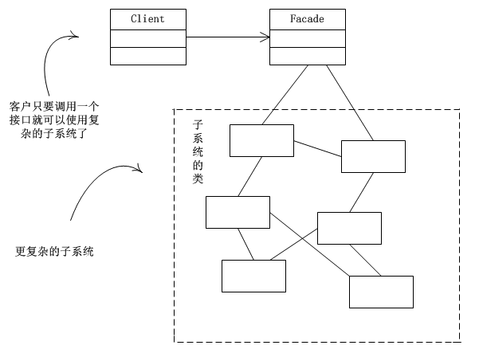

#### 3.3.6.3. 传统方式

 > **说明**

每个设备都对应于一个类，导致客户端使用时，直接依赖于具体的类

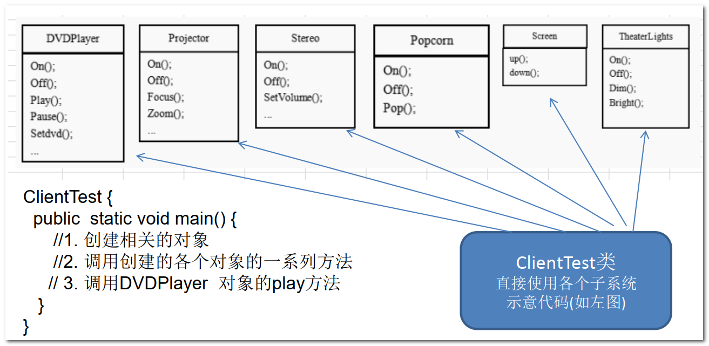

> **问题分析**

1. 在 `ClientTest` 的`main`方法中，创建各个子系统的对象，并直接去调用子系统(对象)相关方法，会造成调用过程混乱，没有清晰的过程
2. 不利于在`ClientTest` 代码中对子系统进行维护操作

#### 3.3.6.4. 外观模式代码

> **类图**


> **代码实现**

<details>
<summary style="color:red;">展开</summary>

1. `DVDPlayer`：

   ```java
   public class DVDPlayer {
   
   	// 使用单例模式, 使用饿汉式
   	private static DVDPlayer instance = new DVDPlayer();
   
   	public static DVDPlayer getInstanc() {
   		return instance;
   	}
   
   	public void on() {
   		System.out.println(" dvd on ");
   	}
   
   	public void off() {
   		System.out.println(" dvd off ");
   	}
   
   	public void play() {
   		System.out.println(" dvd is playing ");
   	}
   
   	// ....
   	public void pause() {
   		System.out.println(" dvd pause ..");
   	}
   	
   }
   ```

2. `Popcorn`：

   ```java
   public class Popcorn {
   
   	private static Popcorn instance = new Popcorn();
   
   	public static Popcorn getInstance() {
   		return instance;
   	}
   
   	public void on() {
   		System.out.println(" popcorn on ");
   	}
   
   	public void off() {
   		System.out.println(" popcorn ff ");
   	}
   
   	public void pop() {
   		System.out.println(" popcorn is poping  ");
   	}
   	
   }
   ```

3. `Projector`：

   ```java
   public class Projector {
   
   	private static Projector instance = new Projector();
   
   	public static Projector getInstance() {
   		return instance;
   	}
   
   	public void on() {
   		System.out.println(" Projector on ");
   	}
   
   	public void off() {
   		System.out.println(" Projector ff ");
   	}
   
   	public void focus() {
   		System.out.println(" Projector is Projector  ");
   	}
   
   	// ...
   	
   }
   ```

4. `Screen`：

   ```java
   public class Screen {
   
   	private static Screen instance = new Screen();
   
   	public static Screen getInstance() {
   		return instance;
   	}
   
   	public void up() {
   		System.out.println(" Screen up ");
   	}
   
   	public void down() {
   		System.out.println(" Screen down ");
   	}
   
   }
   ```

5. `Stereo`：

   ```java
   public class Stereo {
   
   	private static Stereo instance = new Stereo();
   
   	public static Stereo getInstance() {
   		return instance;
   	}
   
   	public void on() {
   		System.out.println(" Stereo on ");
   	}
   
   	public void off() {
   		System.out.println(" Screen off ");
   	}
   
   	public void up() {
   		System.out.println(" Screen up.. ");
   	}
   
   	// ...
   }
   ```

6. `TheaterLight`：

   ```java
   public class TheaterLight {
   
   	private static TheaterLight instance = new TheaterLight();
   
   	public static TheaterLight getInstance() {
   		return instance;
   	}
   
   	public void on() {
   		System.out.println(" TheaterLight on ");
   	}
   
   	public void off() {
   		System.out.println(" TheaterLight off ");
   	}
   
   	public void dim() {
   		System.out.println(" TheaterLight dim.. ");
   	}
   
   	public void bright() {
   		System.out.println(" TheaterLight bright.. ");
   	}
   }
   ```

7. `HomeTheaterFacade`：

   ```java
   public class HomeTheaterFacade {
   
   	// 定义各个子系统对象
   	private TheaterLight theaterLight;
   	private Popcorn popcorn;
   	private Stereo stereo;
   	private Projector projector;
   	private Screen screen;
   	private DVDPlayer dVDPlayer;
   
   	// 构造器
   	public HomeTheaterFacade() {
   		super();
   		this.theaterLight = TheaterLight.getInstance();
   		this.popcorn = Popcorn.getInstance();
   		this.stereo = Stereo.getInstance();
   		this.projector = Projector.getInstance();
   		this.screen = Screen.getInstance();
   		this.dVDPlayer = DVDPlayer.getInstanc();
   	}
   
   	// 操作分成 4 步
       
   	public void ready() {
   		popcorn.on();
   		popcorn.pop();
   		screen.down();
   		projector.on();
   		stereo.on();
   		dVDPlayer.on();
   		theaterLight.dim();
   	}
   
   	public void play() {
   		dVDPlayer.play();
   	}
   
   	public void pause() {
   		dVDPlayer.pause();
   	}
   
   	public void end() {
   		popcorn.off();
   		theaterLight.bright();
   		screen.up();
   		projector.off();
   		stereo.off();
   		dVDPlayer.off();
   	}
   
   }
   ```

8. `Client`：

   ```java
   public class Client {
   
   	public static void main(String[] args) {
   		// 这里直接调用。。。很麻烦，也不利于扩展
           
           // 使用外观模式
   		HomeTheaterFacade homeTheaterFacade = new HomeTheaterFacade();
   		homeTheaterFacade.ready();
   		homeTheaterFacade.play();
   		homeTheaterFacade.end();
   	}
   
   }
   ```

</details>

#### 3.3.6.5. Mybatis外观模式

`MyBatis` 中的`Configuration` 去创建 `MetaObject` 对象使用到外观模式

1. `Configuration` 类中的 `newMetaObject()` 方法调用 `MetaObject.forObject()` 静态方法创建 `MetaObject` 对象

   1. `Configuration` 类相当于外观类，对客户端（调用方）提供统一接口
   2. 成员变量 `reflectorFactory`、`objectFactory`、`objectWrapperFactory`、`mapperRegistry` 相当于子系统集合

   ```java
   public class Configuration {
   
       // ...
       
       protected ReflectorFactory reflectorFactory = new DefaultReflectorFactory();
       protected ObjectFactory objectFactory = new DefaultObjectFactory();
       protected ObjectWrapperFactory objectWrapperFactory = new DefaultObjectWrapperFactory();
       protected MapperRegistry mapperRegistry = new MapperRegistry(this);
       
       // ...
       
   	public MetaObject newMetaObject(Object object) {
           return MetaObject.forObject(object, objectFactory, objectWrapperFactory, reflectorFactory);
       }
   
   	// ...
       
   ```

2. 在 `MetaObject.forObject()` 静态方法中，调用 `MetaObject` 类的构造器创建 `MetaObject` 对象，其具体步骤为判断形参 `object` 的类型，将 `object` 强转为对应类型的对象。

   ```java
   public class MetaObject {
   
       private Object originalObject;
       private ObjectWrapper objectWrapper;
       private ObjectFactory objectFactory;
       private ObjectWrapperFactory objectWrapperFactory;
       private ReflectorFactory reflectorFactory;
   
       private MetaObject(Object object, ObjectFactory objectFactory, ObjectWrapperFactory objectWrapperFactory, ReflectorFactory reflectorFactory) {
           this.originalObject = object;
           this.objectFactory = objectFactory;
           this.objectWrapperFactory = objectWrapperFactory;
           this.reflectorFactory = reflectorFactory;
   
           if (object instanceof ObjectWrapper) {
               this.objectWrapper = (ObjectWrapper) object;
           } else if (objectWrapperFactory.hasWrapperFor(object)) {
               this.objectWrapper = objectWrapperFactory.getWrapperFor(this, object);
           } else if (object instanceof Map) {
               this.objectWrapper = new MapWrapper(this, (Map) object);
           } else if (object instanceof Collection) {
               this.objectWrapper = new CollectionWrapper(this, (Collection) object);
           } else {
               this.objectWrapper = new BeanWrapper(this, object);
           }
       }
   
       public static MetaObject forObject(Object object, ObjectFactory objectFactory, ObjectWrapperFactory objectWrapperFactory, ReflectorFactory reflectorFactory) {
           if (object == null) {
               return SystemMetaObject.NULL_META_OBJECT;
           } else {
               return new MetaObject(object, objectFactory, objectWrapperFactory, reflectorFactory);
           }
       }
       
       // ...
   ```

3. 类图

  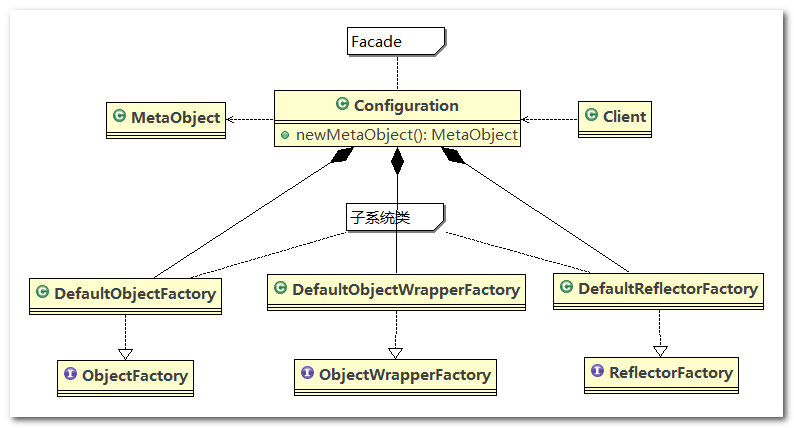

#### 3.3.6.6. 外观模式的注意事项

1. 外观模式对外屏蔽了子系统的细节，因此外观模式降低了客户端对子系统使用的复杂性
2. 外观模式对客户端与子系统的耦合关系，让子系统内部的模块更易维护和扩展
3. 通过合理的使用外观模式，可以帮我们更好的划分访问的层次
4. 当**系统需要进行分层设计**时， 可以考虑使用`Facade`模式
5. 在**维护一个遗留的大型系统**时，可能这个系统已经变得非常难以维护和扩展，此时可以考虑为新系统开发一个`Facade`类，来提供遗留系统的比较清晰简单的接口，让新系统与`Facade`类交互， 提高复用性
6. 不能过多的或者不合理的使用外观模式，使用外观模式好，还是直接调用模块好，要以让系统有层次，利于维护为目的

### 3.3.7. 享元/蝇量模式（Flyweight Pattern）

#### 3.3.7.1. 说明

- 概述
  - 目的：运用共享技术有效地支持大量细粒度的对象。
  - 主要解决：在有大量对象时，有可能会造成内存溢出，我们把其中共同的部分抽象出来，如果有相同的业务请求，直接返回在内存中已有的对象，避免重新创建。
  - 何时使用： 
    - 1、系统中有大量对象。 
    - 2、这些对象消耗大量内存。 
    - 3、这些对象的状态大部分可以外部化。
    - 4、这些对象可以按照内蕴状态分为很多组，当把外蕴对象从对象中剔除出来时，每一组对象都可以用一个对象来代替。 
    - 5、系统不依赖于这些对象身份，这些对象是不可分辨的。
  - 如何解决：用唯一标识码判断，如果在内存中有，则返回这个唯一标识码所标识的对象。
  - 关键代码：使用HashMap等创建池

- 应用实例：
  - 1、JAVA 中的 String，如果有则返回，如果没有则创建一个字符串保存在字符串缓存池里面。
  - 2、数据库的数据池。
  - 3、Integer 存储-128~127的数值

- 优缺点
  - 优点：大大减少对象的创建，降低系统的内存，使效率提高。
  - 缺点：提高了系统的复杂度，需要分离出外部状态和内部状态，而且外部状态具有固有化的性质，不应该随着内部状态的变化而变化，否则会造成系统的混乱。

- 使用场景：
  - 1、系统有大量相似对象。
  - 2、需要缓冲池的场景。

- 注意事项：
  - 1、注意划分**外部状态和内部状态**，否则可能会引起线程安全问题。
  - 2、这些类必须有一个工厂对象加以控制。

- 类图原理
  - 成员
    - `FlyWeight` 是抽象的享元角色，他是产品的抽象类，定义了对象的外部状态和内部状态(后面介绍) 的接口规范(接口)或默认实现(抽象类)
    - `ConcreteFlyWeight` 是具体的享元角色，是具体的产品类，实现抽象角色定义相关业务方法
    - `UnsharedConcreteFlyWeight` 是不可共享的角色，一般不会出现在享元工厂中
    - `FlyWeightFactory` 是享元工厂类，用于构建池的容器，提供从池中获取对象的相关方法
  - 内部与外部状态
    - 享元模式提出了两个要求：细粒度和共享对象。这里就涉及到内部状态和外部状态了，即将对象的信息分为两个部分： 内部状态和外部状态
    - 内部状态指对象共享出来的信息，存储在享元对象内部且不会随环境的改变而改变
    - 外部状态指对象得以依赖的一个标记，是随环境改变而改变的、不可共享的状态

    ```
    比如围棋、五子棋、跳棋，它们都有大量的棋子对象，围棋和五子棋只有黑白两色，跳棋颜色多一点，所以棋子颜色就是棋子的内部状态；
    而各个棋子之间的差别就是位置的不同，当我们落子后，落子颜色是定的，但位置是变化的，所以棋子坐标就是棋子的外部状态
    ```

  

#### 3.3.7.2. 情景介绍

小型的外包项目，给客户`A`做一个产品展示网站， 客户`A`的朋友感觉效果不错，也希望做这样产品展示网站，但是要求都有些不同：

1. 有客户要求以新闻的形式发布
2. 客户人要求以博客的形式发布
3. 有客户希望以微信公众号的形式发布

#### 3.3.7.3. 传统方式

> **方案描述**

1. 直接复制粘贴一份，然后根据客户不同要求，进行定制修改
2. 给每个网站租用一个空间
3. 方案设计示意图


> **问题分析**

1. 需要的网站结构相似度很高，而且都不是高访问量网站，如果分成多个虚拟空间来处理，相当于一个相同网站的实例对象很多，造成服务器的资源浪费
2. 解决思路：整合到一个网站中，共享其相关的代码和数据，对于硬盘、内存、 CPU、数据库空间等服务器资源都可以达成共享，减少服务器资源
3. 对于代码来说， 由于是一份实例，维护和扩展都更加容易
4. 上面的解决思路就可以使用享元模式来解决

#### 3.3.7.4. 享元模式代码

> **类图**


> **代码实现**

<details>
<summary style="color:red;">展开</summary>

1. `WebSite`：产品的抽象类，定义了产品对象的内部和外部状态的规范，即前面所说的 `FlyWeight`

   ```java
   public abstract class WebSite {
   	
   	public abstract void use(User user);// 抽象方法
   	
   }
   ```

2. `ConcreteWebSite`：具体的产品类，继承了 `WebSite` 抽象类，实现了具体的业务方法，即前面所说的 `ConcreteFlyWeight`

   ```java
   //具体网站
   public class ConcreteWebSite extends WebSite {
   
   	// 共享的部分，内部状态
   	private String type = ""; // 网站发布的形式(类型)
   
   	// 构造器
   	public ConcreteWebSite(String type) {
   		this.type = type;
   	}
   
   	@Override
   	public void use(User user) {
   		System.out.println("网站的发布形式为:" + type + " 在使用中 .. 使用者是" + user.getName());
   	}
   
   }
   ```

3. `WebSiteFactory`：产品工厂类，生产具体的产品(`WebSite` 对象)，并构建产品池，即前面所说的 `FlyWeightFactory`

   ```java
   // 网站工厂类，根据需要返回压一个网站
   public class WebSiteFactory {
   
   	// 集合， 充当池的作用
   	private HashMap<String, ConcreteWebSite> pool = new HashMap<>();
   
   	// 根据网站的类型，返回一个网站, 如果没有就创建一个网站，并放入到池中,并返回
   	public WebSite getWebSiteCategory(String type) {
   		if (!pool.containsKey(type)) {
   			// 就创建一个网站，并放入到池中
   			pool.put(type, new ConcreteWebSite(type));
   		}
   
   		return (WebSite) pool.get(type);
   	}
   
   	// 获取网站分类的总数 (池中有多少个网站类型)
   	public int getWebSiteCount() {
   		return pool.size();
   	}
   	
   }
   ```

4. `User`：实体类

   ```java
   public class User {
   
   	private String name;
   
   	public User(String name) {
   		super();
   		this.name = name;
   	}
   
   	public String getName() {
   		return name;
   	}
   
   	public void setName(String name) {
   		this.name = name;
   	}
   
   }
   ```

5. `Client`：客户端

   ```java
   public class Client {
   
   	public static void main(String[] args) {
   
   		// 创建一个工厂类
   		WebSiteFactory factory = new WebSiteFactory();
   
   		// 客户要一个以新闻形式发布的网站
   		WebSite webSite1 = factory.getWebSiteCategory("新闻");
   		webSite1.use(new User("tom"));
   
   		// 客户要一个以博客形式发布的网站
   		WebSite webSite2 = factory.getWebSiteCategory("博客");
   		webSite2.use(new User("jack"));
   
   		// 客户要一个以博客形式发布的网站
   		WebSite webSite3 = factory.getWebSiteCategory("博客");
   		webSite3.use(new User("smith"));
   
   		// 客户要一个以博客形式发布的网站
   		WebSite webSite4 = factory.getWebSiteCategory("博客");
   		webSite4.use(new User("king"));
   
   		System.out.println("网站的分类个数=" + factory.getWebSiteCount());
   		
   	}
   
   }
   ```

</details>

> **总结**

1. 利用享元模式，我们能够把外部状态(`User`)和内部状态(`type`)分开，对于共享的部分，我们共用即可
2. 比如网站类型(`type`)不同时，我们才会创建对应的网站实例，再将其放入对象池中，如果网站类型(`type`)相同，我们直接共享即可(享元)
3. 博客类型相同可以共用，但是我们可以通过传入 `User` 形参，让不同的使用者，访问同一份博客

#### 3.3.7.5. JDK Interger 源码分析

> **测试代码**

```java
public class FlyWeight {

  public static void main(String[] args) {
    
    // 如果 Integer.valueOf(x) x 在 -128 --- 127 直接，就是使用享元模式返回,如果不在该范围类，则仍然 new

    // 小结:
    // 1. 在valueOf 方法中，先判断值是否在 IntegerCache 中，如果不在，就创建新的Integer(new), 否则，就直接从 缓存池返回
    // 2. valueOf 方法，就使用到享元模式
    // 3. 如果使用valueOf 方法得到一个Integer 实例，范围在 -128 - 127 ，执行速度比 new 快

    Integer x = Integer.valueOf(127); // 得到 x实例，类型 Integer
    Integer y = new Integer(127); // 得到 y 实例，类型 Integer
    Integer z = Integer.valueOf(127);// ..
    Integer w = new Integer(127);
    
    System.out.println(x.equals(y)); // 大小，true
    System.out.println(x == y); // false
    System.out.println(x == z); // true
    System.out.println(w == x); // false
    System.out.println(w == y); // false

    Integer x1 = Integer.valueOf(200);
    Integer x2 = Integer.valueOf(200);
    System.out.println("x1==x2=" + (x1 == x2)); // false
  }
}
```

> **源码追踪**

1. `Integer.valueOf()` 方法：该方法使用享元模式，如果数字范围在 `[IntegerCache.low, IntegerCache.high]` 之间，则直接返回缓存池中的对象，否则使用 `new` 的方式创建

   ```java
   public static Integer valueOf(int i) {
       if (i >= IntegerCache.low && i <= IntegerCache.high)
           return IntegerCache.cache[i + (-IntegerCache.low)];
       return new Integer(i);
   }
   ```

2. `IntegerCache` 用于为 `[-128, 127]` 数值的缓存池，事先就已经将 `cache[]` 缓存池创建好了

   ```java
   private static class IntegerCache {
       static final int low = -128;
       static final int high;
       static final Integer cache[];
   
       static {
           // high value may be configured by property
           int h = 127;
           String integerCacheHighPropValue =
               sun.misc.VM.getSavedProperty("java.lang.Integer.IntegerCache.high");
           if (integerCacheHighPropValue != null) {
               try {
                   int i = parseInt(integerCacheHighPropValue);
                   i = Math.max(i, 127);
                   // Maximum array size is Integer.MAX_VALUE
                   h = Math.min(i, Integer.MAX_VALUE - (-low) -1);
               } catch( NumberFormatException nfe) {
                   // If the property cannot be parsed into an int, ignore it.
               }
           }
           high = h;
   
           cache = new Integer[(high - low) + 1];
           int j = low;
           for(int k = 0; k < cache.length; k++)
               cache[k] = new Integer(j++);
   
           // range [-128, 127] must be interned (JLS7 5.1.7)
           assert IntegerCache.high >= 127;
       }
   
       private IntegerCache() {}
   }
   ```

#### 3.3.7.6. 注意事项

1. 在享元模式这样理解，“享”就表示共享，“元”表示对象
2. 系统中有大量对象， 这些对象消耗大量内存， 并且对象的状态大部分可以外部化时，我们就可以考虑选用享元模式
3. 用唯一标识码判断，如果在内存中有，则返回这个唯一标识码所标识的对象，经常用`HashMap`存储共享对象
4. 享元模式大大减少了对象的创建，降低了程序内存的占用，提高效率
5. 享元模式提高了系统的复杂度。需要分离出内部状态和外部状态，而外部状态具有固化特性，不应该随着内部状态的改变而改变，这是我们使用享元模式需要注意的地方
6. 使用享元模式时，注意划分内部状态和外部状态，并且需要有一个工厂类加以控制。
7. 享元模式经典的应用场景是需要缓冲池的场景，比如 `String` 常量池、 数据库连接池

### 3.3.8. 代理模式（Proxy Pattern）

#### 3.3.8.1. 说明

- 概述
  - 目的：为其他对象提供一种代理以控制对这个对象的访问。
  - 主要解决：
    - 在直接访问对象时带来的问题，
    - 比如说：要访问的对象在远程的机器上。
    - 在面向对象系统中，有些对象由于某些原因（比如对象创建开销很大，或者某些操作需要安全控制，或者需要进程外的访问），
    - 直接访问会给使用者或者系统结构带来很多麻烦，我们可以在访问此对象时加上一个对此对象的访问层。
  - 何时使用：想在访问一个类时做一些控制。
  - 如何解决：增加中间层。
  - 关键代码：实现与被代理类组合。

- 应用实例：
  - spring aop
  - RPC

- 优缺点
  - 优点： 
    - 1、职责清晰。
    - 2、高扩展性。
    - 3、智能化。
  - 缺点：
    - 1、由于在客户端和真实主题之间增加了代理对象，因此有些类型的代理模式可能会造成请求的处理速度变慢。 
    - 2、实现代理模式需要额外的工作，有些代理模式的实现非常复杂。

- 使用场景：按职责来划分，通常有以下使用场景：
  - 1、远程代理。 
  - 2、虚拟代理。
  - 3、Copy-on-Write 代理。
  - 4、保护（Protect or Access）代理。
  - 5、Cache代理。
  - 6、防火墙（Firewall）代理。
  - 7、同步化（Synchronization）代理。 
  - 8、智能引用（Smart Reference）代理。

- 注意事项：
  - 1、和适配器模式的区别：**适配器模式主要改变所考虑对象的接口，而代理模式不能改变所代理类的接口** 
  - 2、和装饰器模式的区别：**装饰器模式为了增强功能，而代理模式是为了加以控制**

- 主要有两种：
  - 静态代理
  - 动态代理 
    - `JDK`代理(接口代理)
    - `Cglib`代理(可以在内存动态的创建对象，而不需要实现接口)

- 原理类图

  

#### 3.3.8.2. 情景介绍

1. 定义一个接口：`ITeacherDao`
2. 目标对象`TeacherDAO`实现接口`ITeacherDAO`
3. 使用静态代理方式，就需要在代理对象`TeacherDAOProxy`中也实现`ITeacherDAO`
4. 调用的时候通过调用代理对象的方法来调用目标对象
5. 特别提醒：代理对象与目标对象要实现相同的接口，然后通过调用相同的方法来调用目标对象的方法

#### 3.3.8.3. 静态代理代码

> **类图**


> **代码实现**

<details>
<summary style="color:red;">展开</summary>

1. `ITeacherDao`：定义抽象的方法(授课)规范

   ```java
   //接口
   public interface ITeacherDao {
   
   	void teach(); // 授课的方法
   	
   }
   ```

2. `TeacherDao`：实现具体的业务功能

   ```java
   public class TeacherDao implements ITeacherDao {
   
   	@Override
   	public void teach() {
   		System.out.println(" 老师授课中  。。。。。");
   	}
   
   }
   ```

3. `TeacherDaoProxy`：代理类，聚合了一个 `ITeacherDao` 具体实现类的对象，在`TeacherDaoProxy`实现了 `ITeacherDao` 接口，并在 `teach()` 方法中完成代理操作

   ```java
   //代理对象,静态代理
   public class TeacherDaoProxy implements ITeacherDao {
   
   	private ITeacherDao target; // 目标对象，通过接口来聚合
   
   	// 构造器
   	public TeacherDaoProxy(ITeacherDao target) {
   		this.target = target;
   	}
   
   	@Override
   	public void teach() {
   		System.out.println("开始代理  完成某些操作。。。。。 ");// 方法
   		target.teach();
   		System.out.println("提交。。。。。");// 方法
   	}
   
   }
   ```

4. `Client`：客户端

   ```java
   public class Client {
   
   	public static void main(String[] args) {
   		// 创建目标对象(被代理对象)
   		TeacherDao teacherDao = new TeacherDao();
   
   		// 创建代理对象, 同时将被代理对象传递给代理对象
   		TeacherDaoProxy teacherDaoProxy = new TeacherDaoProxy(teacherDao);
   
   		// 通过代理对象，调用到被代理对象的方法
   		// 即：执行的是代理对象的方法，代理对象再去调用目标对象的方法
   		teacherDaoProxy.teach();
   	}
   
   }
   ```

</details>

> **优缺点**

1. 优点：在不修改目标对象的功能前提下，能通过代理对象对目标功能扩展
2. 缺点：因为代理对象需要与目标对象实现一样的接口，所以会有很多代理类，一旦接口增加方法，目标对象与代理对象都要维护

#### 3.3.8.4. 动态代理(JDK)

> **类图**

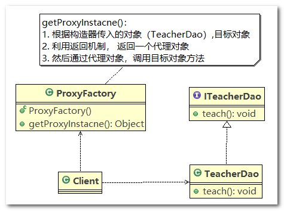

> **代码实现**

<details>
<summary style="color:red;">展开</summary>

1. `ITeacherDao`

   ```java
   //接口
   public interface ITeacherDao {
   
   	void teach(); // 授课方法
   
   	void sayHello(String name);
   	
   }
   ```

2. `TeacherDao`：

   ```java
   public class TeacherDao implements ITeacherDao {
   
   	@Override
   	public void teach() {
   		System.out.println(" 老师授课中.... ");
   	}
   
   	@Override
   	public void sayHello(String name) {
   		System.out.println("hello " + name);
   	}
   
   }
   ```

3. `ProxyFactory`：通过构造器传入被代理对象，通过 `Proxy.newProxyInstance()` 方法中的 `new InvocationHandler()` 匿名内部类实现具体的代理逻辑

   ```java
   public class ProxyFactory {
   
   	// 维护一个目标对象 , Object
   	private Object target;
   
   	// 构造器 ， 对target 进行初始化
   	public ProxyFactory(Object target) {
   		this.target = target;
   	}
   
   	// 给目标对象 生成一个代理对象
   	public Object getProxyInstance() {
   
   		// 说明
   		/*
   		 * public static Object newProxyInstance(ClassLoader loader, Class<?>[] interfaces, InvocationHandler h)
   		 * 
   		 * 1. ClassLoader loader ： 指定当前目标对象使用的类加载器, 获取加载器的方法固定 
   		 * 2. Class<?>[] interfaces: 目标对象实现的接口类型，使用泛型方法确认类型 
   		 * 3. InvocationHandler h : 事情处理，执行目标对象的方法时，会触发事情处理器方法, 会把当前执行的目标对象方法作为参数传入
   		 */
   		return Proxy.newProxyInstance(target.getClass().getClassLoader(), target.getClass().getInterfaces(),
   				new InvocationHandler() {
   					@Override
   					/*
   					 * proxy：proxy the proxy instance that the method was invoked on
   					 * method：待调用的目标方法（target 的方法）
   					 * args：方法参数
   					 */
   					public Object invoke(Object proxy, Method method, Object[] args) throws Throwable {
   						System.out.println("JDK代理开始~~");
   						// 反射机制调用目标对象的方法
   						Object returnVal = method.invoke(target, args);
   						System.out.println("JDK代理提交");
   						return returnVal;
   					}
   				});
   	}
   
   }
   ```

4. `Client`：

   ```java
   public class Client {
   
   	public static void main(String[] args) {
   		// 创建目标对象
   		ITeacherDao target = new TeacherDao();
   
   		// 给目标对象，创建代理对象, 可以转成 ITeacherDao
   		ITeacherDao proxyInstance = (ITeacherDao) new ProxyFactory(target).getProxyInstance();
   
   		// proxyInstance=class com.sun.proxy.$Proxy0 内存中动态生成了代理对象
   		System.out.println("proxyInstance=" + proxyInstance.getClass());
   
   		// 通过代理对象，调用目标对象的方法
   		proxyInstance.teach();
   
   		proxyInstance.sayHello(" tom ");
   	}
   
   }
   ```
</details>

> **代码追踪**

<details>
<summary style="color:red;">展开</summary>

1. `Step into` 进入 `proxyInstance.sayHello(" tom ");`

  

2. 参数 `proxy` 为代理对象

  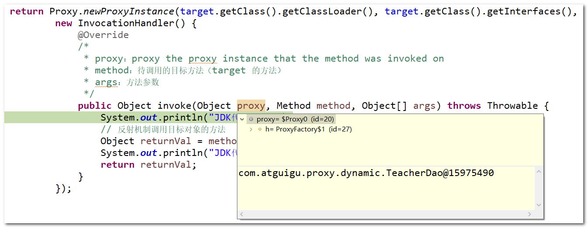

3. 参数 `method` 为被代理(`target`)对象中的方法

  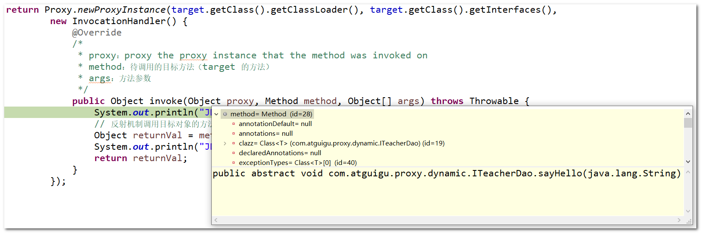

4. 参数 `args` 为方法的形参

  

</details>

#### 3.3.8.5. 动态代理(Cglib)

> **Cglib代理模式的基本介绍**

1. 静态代理和`JDK`代理模式都要求目标对象是实现一个接口，但是有时候目标对象只是一个单独的对象，并没有实现任何的接口，这个时候可使用目标对象子类来实现代理，这就是`Cglib`代理

2. `Cglib`代理也叫作子类代理，它是在内存中构建一个子类对象从而实现对目标对象功能扩展，有些书也将`Cglib`代理归属到动态代理

3. `Cglib`是一个强大的高性能的代码生成包，它可以在运行期扩展`java`类与实现`java`接口，它广泛的被许多`AOP`的框架使用，例如`Spring AOP`，实现方法拦截

4. 在 `AOP`编程中如何选择代理模式：

   1. 目标对象需要实现接口，用`JDK`代理
   2. 目标对象不需要实现接口，用`Cglib`代理

5. `Cglib`包的底层是通过使用字节码处理框架`ASM`来转换字节码并生成新的类

> **Cglib代理模式实现步骤**

1. 需要引入`cglib`的`jar`文件

  

2. 在内存中动态构建子类， 注意代理的类不能为`final`，否则报错`java.lang.IllegalArgumentException`

3. 目标对象的方法如果为`final` 或 `static`,那么就不会被拦截，即不会执行目标对象额外的业务方法

> **Cglib代理模式应用实例**


> **代码实现**

<details>
<summary style="color:red;">展开</summary>

1. `TeacherDao`：被代理类

   ```java
   public class TeacherDao {
   
   	public String teach() {
   		System.out.println(" 老师授课中  ， 我是cglib代理，不需要实现接口 ");
   		return "hello";
   	}
   	
   }
   ```

2. `ProxyFactory`：代理工厂类，用于获取代理对象

   ```java
   public class ProxyFactory implements MethodInterceptor {
   
   	// 维护一个目标对象
   	private Object target;
   
   	// 构造器，传入一个被代理的对象
   	public ProxyFactory(Object target) {
   		this.target = target;
   	}
   
   	// 返回一个代理对象: 是 target 对象的代理对象
   	public Object getProxyInstance() {
   		// 1. 创建一个工具类
   		Enhancer enhancer = new Enhancer();
   		// 2. 设置父类
   		enhancer.setSuperclass(target.getClass());
   		// 3. 设置回调函数
   		enhancer.setCallback(this);
   		// 4. 创建子类对象，即代理对象
   		return enhancer.create();
   	}
   
   	// 重写 intercept 方法，会调用目标对象的方法
   	@Override
   	public Object intercept(Object arg0, Method method, Object[] args, MethodProxy arg3) throws Throwable {
   		System.out.println("Cglib代理模式 ~~ 开始");
   		Object returnVal = method.invoke(target, args);
   		System.out.println("Cglib代理模式 ~~ 提交");
   		return returnVal;
   	}
   
   }
   ```

3. `Client`：客户端

   ```java
   public class Client {
   
   	public static void main(String[] args) {
   		// 创建目标对象
   		TeacherDao target = new TeacherDao();
   		
   		// 获取到代理对象，并且将目标对象传递给代理对象
   		TeacherDao proxyInstance = (TeacherDao) new ProxyFactory(target).getProxyInstance();
   
   		// 执行代理对象的方法，触发intecept 方法，从而实现 对目标对象的调用
   		String res = proxyInstance.teach();
   		System.out.println("res=" + res);
   	}
   }
   ```

</details>

> **代码追踪**

<details>
<summary style="color:red;">展开</summary>

1. `Step into` 进入 `String res = proxyInstance.teach();`

   

2. 形参 `Method` 为 `public java.lang.String com.atguigu.proxy.cglib.TeacherDao.teach()`

   

</details>

#### 3.3.8.6. 代理模式变体

- 代理模式(Proxy)的变体

- 防火墙代理：内网通过代理穿透防火墙，实现对公网的访问
- 缓存代理：比如：当请求图片文件等资源时，先到缓存代理去取，如果取到资源则`ok`，如果取不到资源，再到公网或者数据库取，然后缓存
- 远程代理远程对象的本地代表，通过它可以把远程对象当本地对象来调用。远程代理通过网络和真正的远程对象沟通信息

  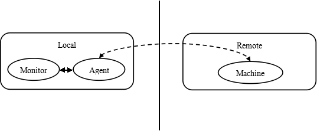

- 同步代理： 主要使用在多线程编程中，完成多线程间同步工作

#### 3.3.8.7. 注意事项

## 3.4. 行为型模式

### 3.4.1. 概述

这些设计模式特别关注对象之间的通信。

### 3.4.2. 模板模式（Template Pattern）

#### 3.4.2.1. 说明

- 概述
  - 目的：
    - 在一个抽象类公开定义了执行它的方法的模板，它的子类可以按需要重写方法实现， 但调用将以抽象类中定义的方式进行
    - 简单说， 模板方法模式定义一个操作中的算法(流程)的骨架， 而将一些步骤延迟到子类中， 使得子类可以不改变一个算法的结构， 就可以重定义该算法的某些特定步骤
  - 主要解决：一些方法通用，却在每一个子类都重新写了这一方法。
  - 何时使用：有一些通用的方法。
  - 如何解决：将这些通用算法抽象出来。
- 应用实例：
  - spring 中对 Hibernate 的支持，将一些已经定好的方法封装起来，比如开启事务、获取 Session、关闭 Session 等
  - AQS
- 优缺点
  - 优点： 
    - 1、封装不变部分，扩展可变部分。
    - 2、提取公共代码，便于维护。 
    - 3、行为由父类控制，子类实现。
  - 缺点：
    - 每一个不同的实现都需要一个子类来实现，导致类的个数增加，使得系统更加庞大。
- 使用场景： 
  - 1、有多个子类共有的方法，且逻辑相同。 
  - 2、重要的、复杂的方法，可以考虑作为模板方法。
- 注意事项：**为防止恶意操作，一般模板方法都加上 final 关键词**
- 类图原理
  - `AbstractClass` 为抽象类， 类中实现了`template()`模板方法， 该方法定义了算法的骨架， 具体子类需要去实现抽象方法 `operation 2,3,4`
  - `ConcreteClass`实现抽象方法 `operation 2,3,4`，以完成算法中特定子类的步骤

  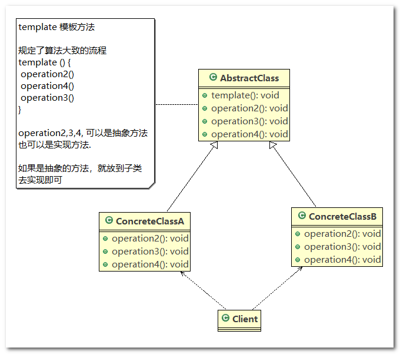

#### 3.4.2.2. 情景介绍

1. 制作豆浆的流程：选材—>添加配料—>浸泡—>放到豆浆机打碎
2. 通过添加不同的配料， 可以制作出不同口味的豆浆
3. 选材、 浸泡和放到豆浆机打碎这几个步骤对于制作每种口味的豆浆都是一样的
4. 请使用模板方法模式完成 (说明：因为模板方法模式，比较简单，很容易就想到这个方案， 因此就直接使用，不再使用传统的方案来引出模板方法模式)

#### 3.4.2.3. 传统方式

#### 3.4.2.4. 模版模式代码

> **类图**


> **代码**

<details>
<summary style="color:red;">展开</summary>

1. `SoyaMilk`：抽象类，定义制作豆浆的模板方法，对于不同口味的豆浆，子类重写 `addCondiments()` 方法即可

   ```java
   //抽象类，表示豆浆
   public abstract class SoyaMilk {
   
   	// 模板方法, make , 模板方法可以做成final , 不让子类去覆盖
   	final void make() {
   
   		select();
   		addCondiments();
   		soak();
   		beat();
   
   	}
   
   	// 选材料
   	void select() {
   		System.out.println("第一步：选择好的新鲜黄豆  ");
   	}
   
   	// 添加不同的配料, 抽象方法, 子类具体实现
   	abstract void addCondiments();
   
   	// 浸泡
   	void soak() {
   		System.out.println("第三步， 黄豆和配料开始浸泡， 需要3小时 ");
   	}
   
   	void beat() {
   		System.out.println("第四步：黄豆和配料放到豆浆机去打碎  ");
   	}
   }
   ```

2. `RedBeanSoyaMilk`：红豆口味的豆浆，重写 `addCondiments()` 方法，添加红豆

   ```java
   public class RedBeanSoyaMilk extends SoyaMilk {
   
   	@Override
   	void addCondiments() {
   		System.out.println(" 加入上好的红豆 ");
   	}
   
   }
   ```

3. `PeanutSoyaMilk`：花生口味的豆浆，重写 `addCondiments()` 方法，添加花生

   ```java
   public class PeanutSoyaMilk extends SoyaMilk {
   
   	@Override
   	void addCondiments() {
   		System.out.println(" 加入上好的花生 ");
   	}
   
   }
   ```

4. `Client`：客户端

   ```java
   public class Client {
   
   	public static void main(String[] args) {
   		// 制作红豆豆浆
   		System.out.println("----制作红豆豆浆----");
   		SoyaMilk redBeanSoyaMilk = new RedBeanSoyaMilk();
   		redBeanSoyaMilk.make();
   
            // 制作花生豆浆
   		System.out.println("----制作花生豆浆----");
   		SoyaMilk peanutSoyaMilk = new PeanutSoyaMilk();
   		peanutSoyaMilk.make();
   	}
   
   }
   ```
</details>

#### 3.4.2.5. 模板模式中的钩子方法

> **说明**

1. 在模板方法模式的父类中， 我们可以定义一个方法，它默认不做任何事，子类可以视情况要不要覆盖它，该方法称为“钩子”
2. 还是用上面做豆浆的例子来讲解，比如，我们还希望制作纯豆浆，不添加任何的配料， 请使用钩子方法对前面的模板方法进行改造

```
想到了LinkedHashMap实现LRU
```

> **代码**

<details>
<summary style="color:red;">展开</summary>

1. `SoyaMilk`：添加 `customerWantCondiments()` 方法用于判断是否需要添加配料

   ```java
   //抽象类，表示豆浆
   public abstract class SoyaMilk {
   
   	// 模板方法, make , 模板方法可以做成final , 不让子类去覆盖.
   	final void make() {
   
   		select();
   		if (customerWantCondiments()) {
   			addCondiments();
   		}
   		soak();
   		beat();
   	}
   
   	// 选材料
   	void select() {
   		System.out.println("第一步：选择好的新鲜黄豆  ");
   	}
   
   	// 添加不同的配料， 抽象方法, 子类具体实现
   	abstract void addCondiments();
   
   	// 浸泡
   	void soak() {
   		System.out.println("第三步， 黄豆和配料开始浸泡， 需要3小时 ");
   	}
   
   	void beat() {
   		System.out.println("第四步：黄豆和配料放到豆浆机去打碎  ");
   	}
   
   	// 钩子方法，决定是否需要添加配料
   	boolean customerWantCondiments() {
   		return true;
   	}
   }
   ```

2. `PureSoyaMilk`：纯豆浆无需添加配料，所以 `customerWantCondiments()` 返回 `false`，空实现 `addCondiments()` 方法

   ```java
   public class PureSoyaMilk extends SoyaMilk{
   
   	@Override
   	void addCondiments() {
   		//空实现
   	}
   	
   	@Override
   	boolean customerWantCondiments() {
   		return false;
   	}
    
   }
   ```

3. `Client`：客户端

   ```java
   public class Client {
   
   	public static void main(String[] args) {
   		// 制作红豆豆浆
   		System.out.println("----制作红豆豆浆----");
   		SoyaMilk redBeanSoyaMilk = new RedBeanSoyaMilk();
   		redBeanSoyaMilk.make();
   
   		// 制作花生豆浆
   		System.out.println("----制作花生豆浆----");
   		SoyaMilk peanutSoyaMilk = new PeanutSoyaMilk();
   		peanutSoyaMilk.make();
   
   		// 制作纯豆浆
   		System.out.println("----制作纯豆浆----");
   		SoyaMilk pureSoyaMilk = new PureSoyaMilk();
   		pureSoyaMilk.make();
   	}
   
   }
   ```

</details>

#### 3.4.2.6. Spring IOC初始化的模板方法模式

> **类图**

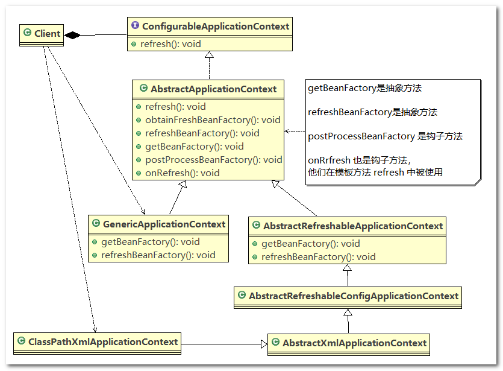

> **源码追踪**

```java
ConfigurableApplicationContext` 中定义了抽象方法 `refresh()
public interface ConfigurableApplicationContext extends ApplicationContext, Lifecycle, Closeable {
    // ...
    void refresh() throws BeansException, IllegalStateException;
    // ...
```

------

> > **`AbstractApplicationContext`**

1. `AbstractApplicationContext` 实现了 `ConfigurableApplicationContext` 接口，重写了 `refresh()` 方法，`AbstractApplicationContext` 类中的 `refresh()` 方法就是模板方法

   ```java
   public abstract class AbstractApplicationContext extends DefaultResourceLoader
   		implements ConfigurableApplicationContext, DisposableBean {
       // ...
       
   	@Override
   	public void refresh() throws BeansException, IllegalStateException {
   		synchronized (this.startupShutdownMonitor) {
   			// Prepare this context for refreshing.
   			prepareRefresh();
   
   			// Tell the subclass to refresh the internal bean factory.
   			ConfigurableListableBeanFactory beanFactory = obtainFreshBeanFactory();
   
   			// Prepare the bean factory for use in this context.
   			prepareBeanFactory(beanFactory);
   
   			try {
   				// Allows post-processing of the bean factory in context subclasses.
   				postProcessBeanFactory(beanFactory);
   
   				// Invoke factory processors registered as beans in the context.
   				invokeBeanFactoryPostProcessors(beanFactory);
   
   				// Register bean processors that intercept bean creation.
   				registerBeanPostProcessors(beanFactory);
   
   				// Initialize message source for this context.
   				initMessageSource();
   
   				// Initialize event multicaster for this context.
   				initApplicationEventMulticaster();
   
   				// Initialize other special beans in specific context subclasses.
   				onRefresh();
   
   				// Check for listener beans and register them.
   				registerListeners();
   
   				// Instantiate all remaining (non-lazy-init) singletons.
   				finishBeanFactoryInitialization(beanFactory);
   
   				// Last step: publish corresponding event.
   				finishRefresh();
   			}
   
   			catch (BeansException ex) {
   				// Destroy already created singletons to avoid dangling resources.
   				destroyBeans();
   
   				// Reset 'active' flag.
   				cancelRefresh(ex);
   
   				// Propagate exception to caller.
   				throw ex;
   			}
   		}
   	}
   
       // ...
   ```

2. 在 `obtainFreshBeanFactory()` 方法中调用了 `refreshBeanFactory()` 方法和 `getBeanFactory()` 方法

  

3. `refreshBeanFactory()` 方法和 `getBeanFactory()` 方法都是 `AbstractApplicationContext` 类中定义的抽象方法

  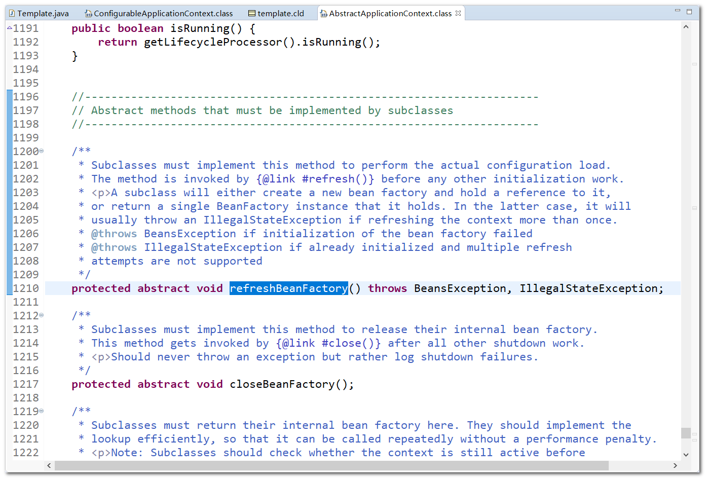

  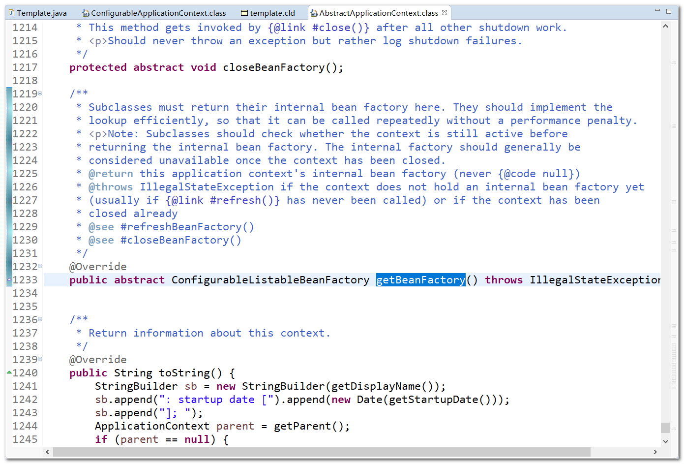

4. 在 `AbstractApplicationContext` 类中定义了一些钩子方法： `postProcessBeanFactory(beanFactory)` 方法和 `onRefresh()` 方法，这些方法默认都是空实现

  

> > **`AbstractRefreshableApplicationContext`**

`AbstractRefreshableApplicationContext` 继承 `AbstractApplicationContext` 类，并实现了一些方法的具体逻辑，比如

```java
public abstract class AbstractRefreshableApplicationContext extends AbstractApplicationContext {
    
    // ...
    
    @Override
	public final ConfigurableListableBeanFactory getBeanFactory() {
		synchronized (this.beanFactoryMonitor) {
			if (this.beanFactory == null) {
				throw new IllegalStateException("BeanFactory not initialized or already closed - " +
						"call 'refresh' before accessing beans via the ApplicationContext");
			}
			return this.beanFactory;
		}
	}
    // ...
```

### 3.4.3. 命令模式（Command Pattern）

#### 3.4.3.1. 说明

- 概述
  - 表现：
    - 将一个请求封装成一个对象，从而可以用不同的请求对客户进行参数化。
    - 在命令模式中， 会将一个请求封装为一个对象， 以便使用不同参数来表示不同的请求(即命令)， 同时命令模式也支持可撤销的操作
  - 主要解决：
    - 在软件系统中，行为请求者与行为实现者通常是一种紧耦合的关系，
    - 但某些场合，比如需要对行为进行记录、撤销或重做、事务等处理时，这种无法抵御变化的紧耦合的设计就不太合适。
    - 另外也有并不知道请求的接收者是谁， 也不知道被请求的操作是哪个的情况
  - 如何解决：通过调用者调用接受者执行命令，顺序：调用者→命令→接受者。
  - 关键代码：定义三个角色：
    - 1、received 真正的命令执行对象 
    - 2、Command 
    - 3、invoker 使用命令对象的入口

- 应用实例：
  - struts 1 中的 action 核心控制器 ActionServlet 只有一个，相当于 Invoker，而模型层的类会随着不同的应用有不同的模型类，相当于具体的 Command。

- 优缺点
  - 优点：
    - 1、降低了系统耦合度。
      > 命令模式使得请求发送者与请求接收者消除彼此之间的耦合， 让对象之间的调用关系更加灵活， 实现解耦
    - 2、新的命令可以很容易添加到系统中去。
  - 缺点：
    - 使用命令模式可能会导致某些系统有过多的具体命令类。

- 使用场景：认为是命令的地方都可以使用命令模式，比如： 1、GUI 中每一个按钮都是一条命令。 2、模拟 CMD。

- 注意事项：系统需要支持**命令的撤销(Undo)操作和恢复(Redo)操作**，也可以考虑使用命令模式，见命令模式的扩展。

- 原理类图
  - `Invoker`：是调用者角色，里面聚合了一个 `Command` 实现类的对象
  - `Command`：是命令角色， 用于定义接口规范，需要执行的所有命令都在这里， 可以是接口或抽象类
  - `Receiver`：接收者角色， 知道如何实施和执行一个请求相关的操作
  - `ConcreteCommand`：具体的命令角色，实现(或继承) `Command`，将一个接收者对象与一个动作绑定， 调用接受者相应的操作
  - 将 `Command` 的具体实现类与 `Invoker` 聚合，将 `Receiver` 与 `Command` 的具体实现类聚合，从而将 `Invoker`(命令调用者)和 `Receiver`(命令执行者)解耦

  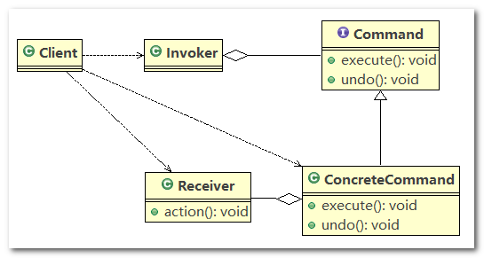
  > 通俗易懂的理解： 将军发布命令， 士兵去执行。 其中有几个角色： 将军(命令发布者) 、 士兵(命令的具体执行者) 、 命令(连接将军和士兵) <br />
  > `Invoker` 是调用者(将军) ， `Receiver` 是被调用者(士兵) ， `MyCommand` 是命令， 实现了 `Command` 接口， 持有接收对象

#### 3.4.3.2. 情景介绍

1. 我们买了一套智能家电， 有照明灯、 风扇、 冰箱、 洗衣机， 我们只要在手机上安装 `app` 就可以控制对这些家电工作。
2. 这些智能家电来自不同的厂家， 我们不想针对每一种家电都安装一个 `App`， 分别控制， 我们希望只要一个 `app` 就可以控制全部智能家电。
3. 要实现一个 `app` 控制所有智能家电的需要， 则每个智能家电厂家都要提供一个统一的接口给 `app` 调用， 这时 就可以考虑使用命令模式。
4. 命令模式可将“动作的请求者”从“动作的执行者” 对象中解耦出来。
5. 在我们的例子中，动作的请求者是手机 `app`，动作的执行者是每个厂商的一个家电产品。

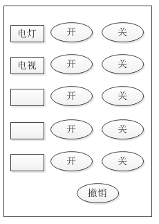

#### 3.4.3.3. 传统方式

#### 3.4.3.4. 代码

> **类图**

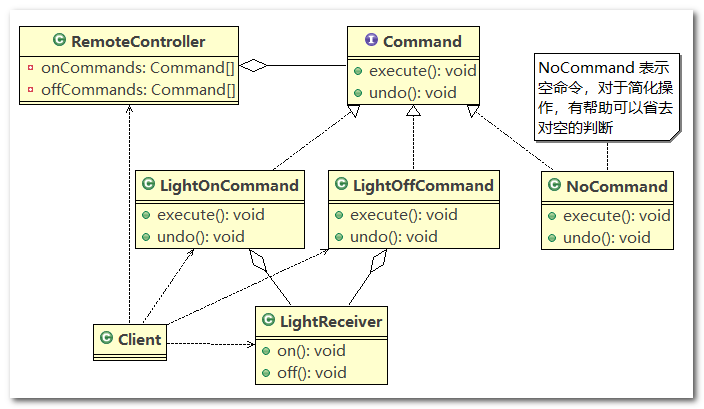

> **代码实现**

<details>
<summary style="color:red;">展开</summary>

1. `Command`：定义命令的规范

   ```java
   //创建命令接口
   public interface Command {
   
   	// 执行动作(操作)
   	public void execute();
   
   	// 撤销动作(操作)
   	public void undo();
   	
   }
   ```

2. `LightOnCommand`：打开电灯的命令类，该类实现了 `Command` 接口，并且聚合了一个 `LightReceiver` 的实现类，用于操作电灯的开、关

   ```java
   public class LightOnCommand implements Command {
   
   	// 聚合LightReceiver
   	LightReceiver light;
   
   	// 构造器
   	public LightOnCommand(LightReceiver light) {
   		this.light = light;
   	}
   
   	@Override
   	public void execute() {
   		// 调用接收者的方法
   		light.on();
   	}
   
   	@Override
   	public void undo() {
   		// 调用接收者的方法
   		light.off();
   	}
   
   }
   ```

3. `LightOffCommand`：关闭电灯的命令类，该类实现了 `Command` 接口，并且聚合了一个 `LightReceiver` 的实现类，用于操作电灯的开、关

   ```java
   public class LightOffCommand implements Command {
   
   	// 聚合LightReceiver
   	LightReceiver light;
   
   	// 构造器
   	public LightOffCommand(LightReceiver light) {
   		this.light = light;
   	}
   
   	@Override
   	public void execute() {
   		// 调用接收者的方法
   		light.off();
   	}
   
   	@Override
   	public void undo() {
   		// 调用接收者的方法
   		light.on();
   	}
   }
   ```

4. `LightReceiver`：命令执行者，用于操作电灯的开、关

   ```java
   public class LightReceiver {
   
   	public void on() {
   		System.out.println(" 电灯打开了.. ");
   	}
   
   	public void off() {
   		System.out.println(" 电灯关闭了.. ");
   	}
   	
   }
   ```

5. `TVOnCommand`：打开电视机的命令类，该类实现了 `Command` 接口，并且聚合了一个 `TVReceiver` 的实现类，用于操作电视机的开、关

   ```java
   public class TVOnCommand implements Command {
   
   	// 聚合TVReceiver
   	TVReceiver tv;
   
   	// 构造器
   	public TVOnCommand(TVReceiver tv) {
   		this.tv = tv;
   	}
   
   	@Override
   	public void execute() {
   		// 调用接收者的方法
   		tv.on();
   	}
   
   	@Override
   	public void undo() {
   		// 调用接收者的方法
   		tv.off();
   	}
   }
   ```

6. `TVOffCommand`：关闭电视机的命令类，该类实现了 `Command` 接口，并且聚合了一个 `TVReceiver` 的实现类，用于操作电视机的开、关

   ```java
   public class TVOffCommand implements Command {
   
   	// 聚合TVReceiver
   	TVReceiver tv;
   
   	// 构造器
   	public TVOffCommand(TVReceiver tv) {
   		this.tv = tv;
   	}
   
   	@Override
   	public void execute() {
   		// 调用接收者的方法
   		tv.off();
   	}
   
   	@Override
   	public void undo() {
   		// 调用接收者的方法
   		tv.on();
   	}
   }
   ```

7. `TVReceiver`：命令执行者，用于操作电视机的开、关

   ```java
   public class TVReceiver {
   
   	public void on() {
   		System.out.println(" 电视机打开了.. ");
   	}
   
   	public void off() {
   		System.out.println(" 电视机关闭了.. ");
   	}
   	
   }
   ```

8. `NoCommand`：空命令，该类在 `RemoteController` 中用于初始化命令按钮，这样就不用做空指针判断

   ```java
   // 没有任何命令，即空执行: 用于初始化每个按钮, 当调用空命令时，对象什么都不做
   // 其实，这样是一种设计模式, 可以省掉对空判断
   public class NoCommand implements Command {
   
   	@Override
   	public void execute() {
   
   	}
   
   	@Override
   	public void undo() {
   
   	}
   
   }
   ```

9. `RemoteController`：命令的发出者(`Invoker`)，聚合了 `Command` 的实现类，在 `RemoteController` 中调用 `Command` 实现类的方法控制设备的开、关

   ```java
   public class RemoteController {
   
   	// 开 按钮的命令数组
   	Command[] onCommands;
   	Command[] offCommands;
   
   	// 执行撤销的命令
   	Command undoCommand;
   
   	// 构造器，完成对按钮初始化
   	public RemoteController() {
   		onCommands = new Command[5];
   		offCommands = new Command[5];
   
   		for (int i = 0; i < 5; i++) {
   			onCommands[i] = new NoCommand(); // 初始化时，设置为空操作，避免空指针判断
   			offCommands[i] = new NoCommand(); // 初始化时，设置为空操作，避免空指针判断
   		}
   	}
   
   	// 给我们的按钮设置你需要的命令
   	public void setCommand(int no, Command onCommand, Command offCommand) {
   		onCommands[no] = onCommand;
   		offCommands[no] = offCommand;
   	}
   
   	// 按下开按钮
   	public void onButtonWasPushed(int no) { // no 0
   		// 找到你按下的开的按钮， 并调用对应方法
   		onCommands[no].execute();
   		// 记录这次的操作，用于撤销
   		undoCommand = onCommands[no];
   	}
   
   	// 按下关按钮
   	public void offButtonWasPushed(int no) { // no 0
   		// 找到你按下的关的按钮， 并调用对应方法
   		offCommands[no].execute();
   		// 记录这次的操作，用于撤销
   		undoCommand = offCommands[no];
   	}
   
   	// 按下撤销按钮
   	public void undoButtonWasPushed() {
   		undoCommand.undo();
   	}
   }
   ```

10. `Client`：测试代码

    ```java
    public class Client {
    
    	public static void main(String[] args) {
    
    		// 使用命令设计模式，完成通过遥控器，对电灯的操作
    		// 创建电灯的对象(接受者)
    		LightReceiver lightReceiver = new LightReceiver();
    
    		// 创建电灯相关的开关命令
    		LightOnCommand lightOnCommand = new LightOnCommand(lightReceiver);
    		LightOffCommand lightOffCommand = new LightOffCommand(lightReceiver);
    
    		// 需要一个遥控器
    		RemoteController remoteController = new RemoteController();
    
    		// 给我们的遥控器设置命令, 比如 no = 0 是电灯的开和关的操作
    		remoteController.setCommand(0, lightOnCommand, lightOffCommand);
    
    		System.out.println("--------按下灯的开按钮-----------");
    		remoteController.onButtonWasPushed(0);
    		System.out.println("--------按下灯的关按钮-----------");
    		remoteController.offButtonWasPushed(0);
    		System.out.println("--------按下撤销按钮-----------");
    		remoteController.undoButtonWasPushed();
    
    		// 使用命令设计模式，完成通过遥控器，对电视机的操作
    		System.out.println("=========使用遥控器操作电视机==========");
    
    		TVReceiver tvReceiver = new TVReceiver();
    
    		TVOffCommand tvOffCommand = new TVOffCommand(tvReceiver);
    		TVOnCommand tvOnCommand = new TVOnCommand(tvReceiver);
    
    		// 给我们的遥控器设置命令, 比如 no = 1 是电视机的开和关的操作
    		remoteController.setCommand(1, tvOnCommand, tvOffCommand);
    
    		System.out.println("--------按下电视机的开按钮-----------");
    		remoteController.onButtonWasPushed(1);
    		System.out.println("--------按下电视机的关按钮-----------");
    		remoteController.offButtonWasPushed(1);
    		System.out.println("--------按下撤销按钮-----------");
    		remoteController.undoButtonWasPushed();
    
    	}
    
    }
    ```

</details>

#### 3.4.3.5. Spring JdbcTemplate源码分析

1. `StatementCallback` 接口类似与之前的 `Command` 接口，用于定义命令的规范

   ```java
   public interface StatementCallback<T> {
   
   	T doInStatement(Statement stmt) throws SQLException, DataAccessException;
   
   }
   ```

2. `QueryStatementCallback` 为匿名内部类，实现了 `StatementCallback` 接口，同时也充当了命令的接收者(`Receiver`)

   ```java
   public class JdbcTemplate extends JdbcAccessor implements JdbcOperations {
   
       // ...
   
   	@Override
   	public <T> T query(final String sql, final ResultSetExtractor<T> rse) throws DataAccessException {
   		Assert.notNull(sql, "SQL must not be null");
   		Assert.notNull(rse, "ResultSetExtractor must not be null");
   		if (logger.isDebugEnabled()) {
   			logger.debug("Executing SQL query [" + sql + "]");
   		}
   		class QueryStatementCallback implements StatementCallback<T>, SqlProvider {
   			@Override
   			public T doInStatement(Statement stmt) throws SQLException {
   				ResultSet rs = null;
   				try {
   					rs = stmt.executeQuery(sql);
   					ResultSet rsToUse = rs;
   					if (nativeJdbcExtractor != null) {
   						rsToUse = nativeJdbcExtractor.getNativeResultSet(rs);
   					}
   					return rse.extractData(rsToUse);
   				}
   				finally {
   					JdbcUtils.closeResultSet(rs);
   				}
   			}
   			@Override
   			public String getSql() {
   				return sql;
   			}
   		}
   		return execute(new QueryStatementCallback());
   	}
       
       // ...
   ```

3. `JdbcTemplate` 为命令的调用者，在 `execute(StatementCallback<T> action)` 方法中，执行了命令： `T result = action.doInStatement(stmtToUse);`，不同的 `StatementCallback` 实现类，`doInStatement()` 方法的实现逻辑也不同

   ```java
   public class JdbcTemplate extends JdbcAccessor implements JdbcOperations {
   
       // ...
       
   	@Override
   	public <T> T execute(StatementCallback<T> action) throws DataAccessException {
   		Assert.notNull(action, "Callback object must not be null");
   
   		Connection con = DataSourceUtils.getConnection(getDataSource());
   		Statement stmt = null;
   		try {
   			Connection conToUse = con;
   			if (this.nativeJdbcExtractor != null &&
   					this.nativeJdbcExtractor.isNativeConnectionNecessaryForNativeStatements()) {
   				conToUse = this.nativeJdbcExtractor.getNativeConnection(con);
   			}
   			stmt = conToUse.createStatement();
   			applyStatementSettings(stmt);
   			Statement stmtToUse = stmt;
   			if (this.nativeJdbcExtractor != null) {
   				stmtToUse = this.nativeJdbcExtractor.getNativeStatement(stmt);
   			}
   			T result = action.doInStatement(stmtToUse);
   			handleWarnings(stmt);
   			return result;
   		}
   		catch (SQLException ex) {
   			// Release Connection early, to avoid potential connection pool deadlock
   			// in the case when the exception translator hasn't been initialized yet.
   			JdbcUtils.closeStatement(stmt);
   			stmt = null;
   			DataSourceUtils.releaseConnection(con, getDataSource());
   			con = null;
   			throw getExceptionTranslator().translate("StatementCallback", getSql(action), ex);
   		}
   		finally {
   			JdbcUtils.closeStatement(stmt);
   			DataSourceUtils.releaseConnection(con, getDataSource());
   		}
   	}
       
       // ...
   ```

4. 另外实现 `StatementCallback` 命令接口的子类还有如下四个

  

#### 3.4.3.6. 注意事项

- 将发起请求的对象与执行请求的对象解耦。
  - 发起请求的对象是调用者，调用者只要调用命令对象的`execute()`方法就可以让接收者工作，而不必知道具体的接收者对象是谁、是如何实现的，
  - 命令对象会负责让接收者执行请求的动作， 也就是说： ”请求发起者”和“请求执行者”之间的解耦是通过命令对象实现的，命令对象起到了纽带桥梁的作用
- 容易设计一个命令队列。
  - 只要把命令对象放到列队，就可以多线程的执行命令容易实现对请求的撤销和重做
- 命令模式不足：
  - 可能导致某些系统有过多的具体命令类
  - 增加了系统的复杂度， 这点在在使用的时候要注意
- 空命令也是一种设计模式，
  - 它为我们省去了判空的操作。在上面的实例中，如果没有用空命令，我们每按下一个按键都要判空，这给我们编码带来一定的麻烦
- 命令模式经典的应用场景：
  - 界面的一个按钮都是一条命令
  - 模拟`CMD`（`DOS`命令）订单的撤销/恢复、触发-反馈机制

### 3.4.4. 访问者模式（Visitor Pattern）

#### 3.4.4.1. 说明

- 概述
  - 目的：主要将数据结构与数据操作分离。
  - 主要解决：稳定的数据结构和易变的操作耦合问题。
  - 何时使用：需要对一个对象结构中的对象进行很多不同的并且不相关的操作，而需要避免让这些操作"污染"这些对象的类，使用访问者模式将这些封装到类中。
  - 如何解决：在被访问的类里面加一个对外提供接待访问者的接口。
  - 实现：在数据基础类里面有一个方法接受访问者，将自身引用传入访问者。

- 应用实例：您在朋友家做客，您是访问者，朋友接受您的访问，您通过朋友的描述，然后对朋友的描述做出一个判断，这就是访问者模式。

- 优缺点
  - 优点： 
    - 1、符合单一职责原则。 
    - 2、优秀的扩展性。 
    - 3、灵活性。
  - 缺点：
    - 1、具体元素对访问者公布细节，违反了迪米特原则。
    - 2、具体元素变更比较困难。 
    - 3、违反了依赖倒置原则，依赖了具体类，没有依赖抽象。

- 使用场景：
  - 1、对象结构中对象对应的类很少改变，但经常需要在此对象结构上定义新的操作。 
  - 2、需要对一个对象结构中的对象进行很多不同的并且不相关的操作，而需要避免让这些操作"污染"这些对象的类，也不希望在增加新操作时修改这些类。

- 注意事项：访问者可以对功能进行统一，可以做报表、UI、拦截器与过滤器。

- 原理类图
 
  1. `Visitor` 是抽象访问者，定义访问者的行为规范
  2. `ConcreteVisitor` ：是一个具体的访问者，继承(或实现) `Visitor`，实现 `Visitor` 中定义的每个方法，实现具体的行为逻辑
  3. `Element` 定义一个`accept` 方法，用于接收一个访问者对象(`Visitor` 的具体实现类)
  4. `ConcreteElement` 为具体元素， 实现了 `Element` 接口中 `accept` 方法
  5. `ObjectStructure` 能枚举它里面所包含的元素(`Element`)， 可以提供一个高层的接口，目的是允许访问者访问指定的元素

  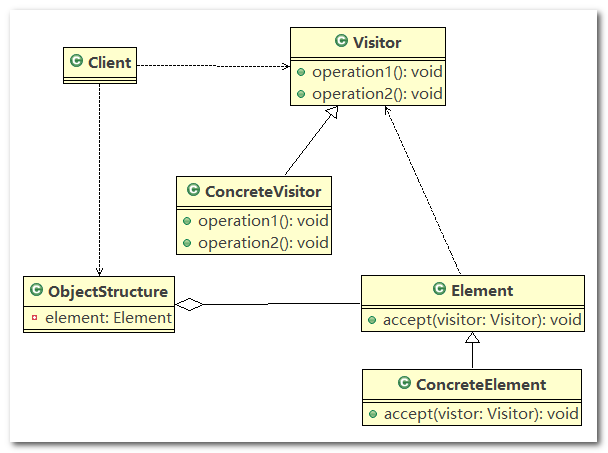

  > element接受visitor的访问 <br />
  > 而访问者中的方法访问element(this传入)

#### 3.4.4.2. 情景介绍

- 完成测评系统需求
- 将观众分为男人和女人，对歌手进行测评，
- 当看完某个歌手表演后，得到他们对该歌手不同的评价(评价有不同的种类，比如成功、失败等)

#### 3.4.4.3. 传统方式

1. 如果系统比较小，还是`ok`的，但是考虑系统增加越来越多新的功能时，对代码改动较大，违反了`ocp`原则， 不利于维护
2. 传统方式的扩展性不好，比如增加了新的人员类型，或者管理方法，都不好扩展
3. 引出我们会使用新的设计模式 –-> 访问者模式

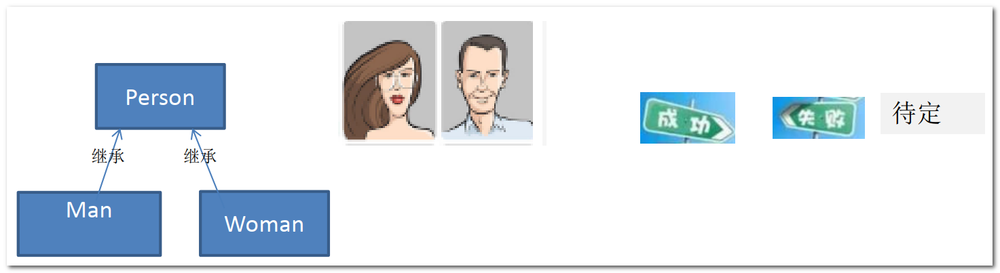

#### 3.4.4.4. 代码

> **类图**

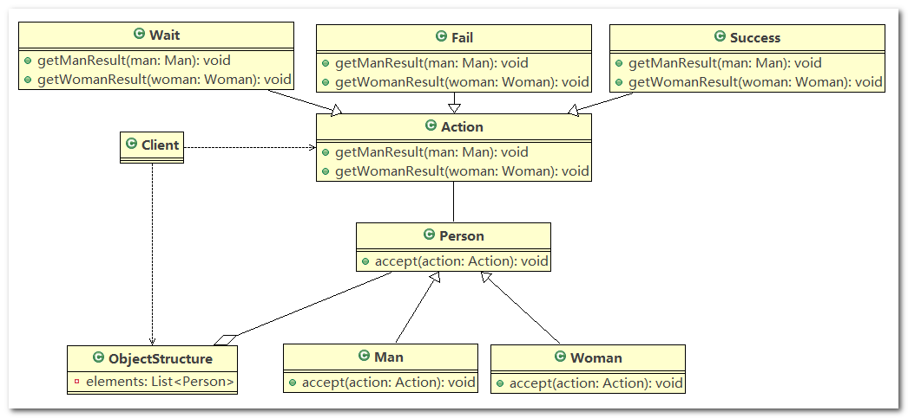

> **代码实现**

<details>
<summary style="color:red;">展开</summary>

1. `Action`：定义 `Visitor` 的行为规范，`getResult()` 方法接收 `Person` 类型的参数，用于获取观众对歌手的评价

   ```java
   public abstract class Action {
   
   	// 得到观众的评价
   	public abstract void getResult(Person person);
   
   }
   ```

2. `Success`：具体的 `Visitor` 实现类，`Success` 表示通过

   ```java
   public class Success extends Action {
   
   	@Override
   	public void getResult(Person person) {
   		System.out.println(person.gender + "给的评价该歌手很成功 !");
   	}
   
   }
   ```

3. `Fail`：具体的 `Visitor` 实现类，`Fail` 表示失败

   ```java
   public class Fail extends Action {
   
   	@Override
   	public void getResult(Person person) {
   		System.out.println(person.gender + "给的评价该歌手失败 !");
   	}
   
   }
   ```

4. `Wait`：具体的 `Visitor` 实现类，`Wait` 表示待定

   ```java
   public class Wait extends Action {
   
   	@Override
   	public void getResult(Person person) {
   		System.out.println(person.gender + "给的评价是该歌手待定 ..");
   	}
   
   }
   ```

5. `Person`：观众类，该抽象类定义了抽象方法 `accept()`，可以接收一个 `Visitor` 实现类的实例，用于触发观众投票的动作

   ```java
   public abstract class Person {
   	
   	String gender;
   
   	// 提供一个方法，让访问者可以访问
   	public abstract void accept(Action action);
   
   }
   ```

6. `Man`：男观众

   ```java
   //说明
   //1. 这里我们使用到了双分派, 即首先在客户端程序中，将具体状态作为参数传递Man中(第一次分派)
   //2. 然后Man 类调用作为参数的 "具体方法" 中方法getResult, 同时将自己(this)作为参数传入，完成第二次的分派
   public class Man extends Person {
   
   	public Man() {
   		gender = "男性";
   	}
   
   	@Override
   	public void accept(Action action) {
   		action.getResult(this);
   	}
   
   }
   ```

7. `Woman`：女观众

   ```java
   //说明
   //1. 这里我们使用到了双分派, 即首先在客户端程序中，将具体状态作为参数传递Woman中(第一次分派)
   //2. 然后Woman 类调用作为参数的 "具体方法" 中方法getResult, 同时将自己(this)作为参数传入，完成第二次的分派
   public class Woman extends Person{
   
   	public Woman() {
   		gender = "女性";
   	}
   	
   	@Override
   	public void accept(Action action) {
   		action.getResult(this);
   	}
   
   }
   ```

8. `ObjectStructure`：一个高层的封装接口，允许 `Visitor` 访问指定的元素

   ```java
   //数据结构，管理很多人（Man , Woman）
   public class ObjectStructure {
   
   	// 维护了一个集合
   	private List<Person> persons = new LinkedList<>();
   
   	// 增加到list
   	public void attach(Person p) {
   		persons.add(p);
   	}
   
   	// 移除
   	public void detach(Person p) {
   		persons.remove(p);
   	}
   
   	// 显示测评情况
   	public void display(Action action) {
   		for (Person p : persons) {
   			p.accept(action);
   		}
   	}
   }
   ```

9. `Client`：测试代码

   ```java
   public class Client {
   
   	public static void main(String[] args) {
   		// 创建ObjectStructure
   		ObjectStructure objectStructure = new ObjectStructure();
   
   		objectStructure.attach(new Man());
   		objectStructure.attach(new Woman());
   
   		// 成功
   		Success success = new Success();
   		objectStructure.display(success);
   
   		// 失败
   		System.out.println("===============");
   		Fail fail = new Fail();
   		objectStructure.display(fail);
   
   		// 待定
   		System.out.println("=======给的是待定的测评========");
   		Wait wait = new Wait();
   		objectStructure.display(wait);
   	}
   
   }
   ```

</details>

> **扩展性**

- 访问者模式的扩展性很强
- 假如我们现在想添加观众的类别(`Element`)，只需编写类继承 `Person` 抽象类即可，其他地方的代码无需改变
- 如果我们想添加投票的类别(`Visitor`)，只需编写类实现 `Action` 接口即可

> **双分派**

1. 上面提到了双分派，所谓双分派是指不管类怎么变化，我们都能找到期望的方法运行。双分派意味着得到执行的操作取决于请求的种类和两个接收者的类型
2. 以上述实例为例，假设我们要添加一个`Wait`的状态类， 统计`Man`类和`Woman`类的投票结果，由于使用了双分派， 只需增加一个`Action`子类即可在客户端调用即可， 不需要改动任何其他类的代码

### 3.4.5. 迭代器模式（Iterator Pattern）

#### 3.4.5.1. 说明

- 概述
  - 目的：提供一种方法顺序访问一个聚合对象中各个元素, 而又无须暴露该对象的内部表示。
  - 主要解决：不同的方式来遍历整个整合对象。
  - 何时使用：遍历一个聚合对象。
  - 如何解决：把在元素之间游走的责任交给迭代器，而不是聚合对象。
  - 关键代码：定义接口：hasNext, next。

- 应用实例：JAVA 中的 iterator。

- 优缺点
  - 优点：
    - 1、它支持以不同的方式遍历一个聚合对象。 
    - 2、迭代器简化了聚合类。 
    - 3、在同一个聚合上可以有多个遍历。 
    - 4、在迭代器模式中，增加新的聚合类和迭代器类都很方便，无须修改原有代码。

  - 缺点：由于迭代器模式将存储数据和遍历数据的职责分离，增加新的聚合类需要对应增加新的迭代器类，类的个数成对增加，这在一定程度上增加了系统的复杂性。

- 使用场景： 
  - 1、访问一个聚合对象的内容而无须暴露它的内部表示。 
  - 2、需要为聚合对象提供多种遍历方式。
  - 3、为遍历不同的聚合结构提供一个统一的接口。

- 注意事项：迭代器模式就是分离了集合对象的遍历行为，抽象出一个迭代器类来负责，这样既可以做到不暴露集合的内部结构，又可让外部代码透明地访问集合内部的数据。

- 原理类图
  - `Iterator` ：迭代器接口，由 `JDK` 提供，该接口定义了三个用于遍历集合(数组)的方法：`hasNext()`、`next()`、`remove()`
  - `ConcreteIterator`：具体的迭代器类，实现具体的迭代逻辑
  - `Aggregate`：一个统一的聚合接口，将客户端和具体的 `Aggregate` 实现类解耦
  - `ConcreteAggreage` ：具体的聚合实现类，该类持有对象集合(`Element`)，并提供一个方法，返回一个迭代器， 该迭代器可以正确遍历集合
  - `Client`：客户端，通过 `Iterator` 和 `Aggregate` 依赖其对应的子类

  

#### 3.4.5.2. 情景介绍

1. 将学院看做是学校的子类，系是学院的子类，这样实际上是站在组织大小来进行分层次的
2. 实际上我们的要求是 ： 在一个页面中展示出学校的院系组成，一个学校有多个学院，一个学院有多个系， 因此这种方案，不能很好实现的遍历的操作
3. 假如计算机学院的院系存储在数组中，信息工程学院的院系存储在集合中，我们要怎么才能定义一个统一的规范，来遍历不同存储结构下的院系。解决方案： => 迭代器模式

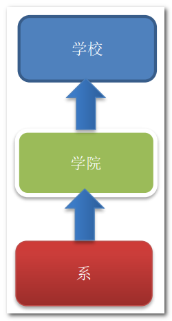

#### 3.4.5.3. 传统方式

1. 将学院看做是学校的子类，系是学院的子类，这样实际上是站在组织大小来进行分层次的
2. 实际上我们的要求是 ： 在一个页面中展示出学校的院系组成，一个学校有多个学院，一个学院有多个系， 因此这种方案，不能很好实现的遍历的操作
3. 假如计算机学院的院系存储在数组中，信息工程学院的院系存储在集合中，我们要怎么才能定义一个统一的规范，来遍历不同存储结构下的院系。
4. 解决方案： => 迭代器模式


#### 3.4.5.4. 代码

> **类图**

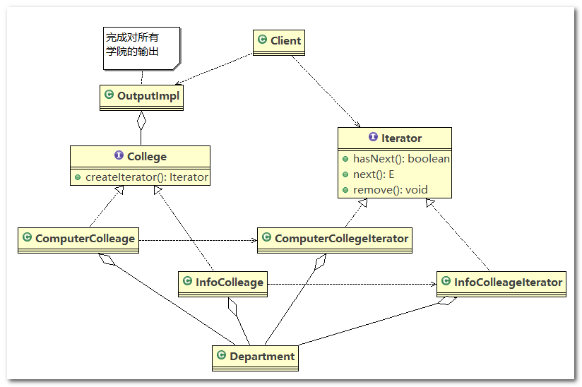

> **代码实现**

<details>
<summary style="color:red;">展开</summary>

1. `Department`：实体类，用于表示学院的系

   ```java
   //系
   public class Department {
   
   	private String name;
   	private String desc;
   
   	public Department(String name, String desc) {
   		this.name = name;
   		this.desc = desc;
   	}
   
   	public String getName() {
   		return name;
   	}
   
   	public void setName(String name) {
   		this.name = name;
   	}
   
   	public String getDesc() {
   		return desc;
   	}
   
   	public void setDesc(String desc) {
   		this.desc = desc;
   	}
   
   }
   ```

2. `ComputerCollegeIterator`：计算机院系的迭代器，该类实现了 `Iterator` 接口，用于迭代计算机学院的系

   ```java
   public class ComputerCollegeIterator implements Iterator {
   
   	// 这里我们需要Department 是以怎样的方式存放=>数组
   	Department[] departments;
   	int position = 0; // 遍历的位置
   
   	public ComputerCollegeIterator(Department[] departments) {
   		this.departments = departments;
   	}
   
   	// 判断是否还有下一个元素
   	@Override
   	public boolean hasNext() {
   		if (position >= departments.length || departments[position] == null) {
   			return false;
   		} else {
   			return true;
   		}
   	}
   
   	@Override
   	public Object next() {
   		Department department = departments[position];
   		position += 1;
   		return department;
   	}
   
   	// 删除的方法，默认空实现
   	@Override
   	public void remove() {
   
   	}
   
   }
   ```

3. `InfoColleageIterator`：信息院系的迭代器，该类实现了 `Iterator` 接口，用于迭代信息学院的系

   ```java
   public class InfoColleageIterator implements Iterator {
   
   	List<Department> departmentList; // 信息工程学院是以List方式存放系
   	int index = -1;// 索引
   
   	public InfoColleageIterator(List<Department> departmentList) {
   		this.departmentList = departmentList;
   	}
   
   	// 判断list中还有没有下一个元素
   	@Override
   	public boolean hasNext() {
   		if (index >= departmentList.size() - 1) {
   			return false;
   		} else {
   			index += 1;
   			return true;
   		}
   	}
   
   	@Override
   	public Object next() {
   		return departmentList.get(index);
   	}
   
   	// 空实现remove
   	@Override
   	public void remove() {
   
   	}
   
   }
   ```

4. `College`：学院的聚合接口

   ```java
   public interface College {
   
   	public String getName();
   
   	// 增加系的方法
   	public void addDepartment(String name, String desc);
   
   	// 返回一个迭代器,遍历
   	public Iterator createIterator();
   	
   }
   ```

5. `ComputerCollege`：计算机学院的聚合接口实现类，该类聚合了 `Department[]` 数组，并提供访问 `Department[]` 数组的迭代器

   ```java
   public class ComputerCollege implements College {
   
   	Department[] departments;
   	int numOfDepartment = 0;// 保存当前数组的对象个数
   
   	public ComputerCollege() {
   		departments = new Department[5];
   		addDepartment("Java专业", " Java专业 ");
   		addDepartment("PHP专业", " PHP专业 ");
   		addDepartment("大数据专业", " 大数据专业 ");
   		numOfDepartment = 3;
   	}
   
   	@Override
   	public String getName() {
   		return "计算机学院";
   	}
   
   	@Override
   	public void addDepartment(String name, String desc) {
   		Department department = new Department(name, desc);
   		departments[numOfDepartment] = department;
   		numOfDepartment += 1;
   	}
   
   	@Override
   	public Iterator createIterator() {
   		return new ComputerCollegeIterator(departments);
   	}
   
   }
   ```

6. `InfoCollege`：信息学院的聚合接口实现类，该类聚合了 `List<Department>` 集合，并提供访问 `List<Department>` 集合的迭代器

   ```java
   public class InfoCollege implements College {
   
   	List<Department> departmentList;
   
   	public InfoCollege() {
   		departmentList = new ArrayList<Department>();
   		addDepartment("信息安全专业", " 信息安全专业 ");
   		addDepartment("网络安全专业", " 网络安全专业 ");
   		addDepartment("服务器安全专业", " 服务器安全专业 ");
   	}
   
   	@Override
   	public String getName() {
   		return "信息工程学院";
   	}
   
   	@Override
   	public void addDepartment(String name, String desc) {
   		Department department = new Department(name, desc);
   		departmentList.add(department);
   	}
   
   	@Override
   	public Iterator createIterator() {
   		return new InfoColleageIterator(departmentList);
   	}
   
   }
   ```

7. `OutPutImpl`：为 `Client` 层提供遍历输出学院系的方法

   ```java
   public class OutPutImpl {
   
   	// 学院集合
   	List<College> collegeList;
   
   	public OutPutImpl(List<College> collegeList) {
   		this.collegeList = collegeList;
   	}
   
   	// 遍历所有学院,然后调用printDepartment 输出各个学院的系
   	public void printCollege() {
   		// 从collegeList 取出所有学院, Java 中的 List 已经实现Iterator
   		Iterator<College> iterator = collegeList.iterator();
   
   		while (iterator.hasNext()) {
   			// 取出一个学院
   			College college = iterator.next();
   			System.out.println("=== " + college.getName() + "=====");
   			printDepartment(college.createIterator()); // 得到对应迭代器
   		}
   	}
   
   	// 输出学院的系
   	public void printDepartment(Iterator iterator) {
   		while (iterator.hasNext()) {
   			Department d = (Department) iterator.next();
   			System.out.println(d.getName());
   		}
   	}
   
   }
   ```

8. `Client`：测试代码

   ```java
   public class Client {
   
   	public static void main(String[] args) {
   		// 创建学院
   		List<College> collegeList = new ArrayList<College>();
   
   		ComputerCollege computerCollege = new ComputerCollege();
   		InfoCollege infoCollege = new InfoCollege();
   
   		collegeList.add(computerCollege);
   		collegeList.add(infoCollege);
   
   		OutPutImpl outPutImpl = new OutPutImpl(collegeList);
   		outPutImpl.printCollege();
   	}
   
   }
   ```

</details>

#### 3.4.5.5. JDK ArrayList 源码分析

> **原理类图分析**

1. `ArrayList` 的内部类 `Itr` 充当了具体实现迭代器 `Iterator` 的类
2. `List` 就是充当了聚合接口， 含有一个 `iterator()` 方法， 该方法返回一个迭代器对象
3. `ArrayList` 是实现聚合接口 `List` 的子类， 实现了 `iterator()` 方法
4. `Iterator` 接口系统(`JDK`)提供
5. 迭代器模式解决了不同集合(`ArrayList`，`LinkedList`) 统一遍历问题

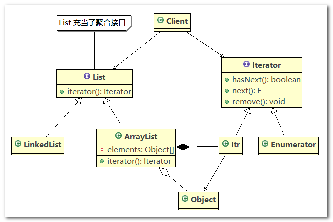

> **源码追踪**

1. `Iterator` 接口中定义的方法

   ```java
   public interface Iterator<E> {
       
       boolean hasNext();
   
       E next();
   
       default void remove() {
           throw new UnsupportedOperationException("remove");
       }
   
       default void forEachRemaining(Consumer<? super E> action) {
           Objects.requireNonNull(action);
           while (hasNext())
               action.accept(next());
       }
       
   }
   ```

2. 在 `List` 接口中定义了获取 `iterator` 的抽象方法，即 `List` 充当了聚合接口

   ```java
   public interface List<E> extends Collection<E> {
       
       // ...
       
       Iterator<E> iterator();
       
       // ...
   ```

3. 在 `ArrayList` 中实现了 `iterator` 方法

   ```java
   public class ArrayList<E> extends AbstractList<E>
           implements List<E>, RandomAccess, Cloneable, java.io.Serializable
       
       // ...
       
       public Iterator<E> iterator() {
           return new Itr();
       }    
      
       // ...
   ```

4. `Itr` 实现了 `Iterator` 接口，为 `ArrayList` 的内部类，在 `Itr` 中，直接使用 `ArrayList` 中用于存放数据的 `Object[]` 数组，通过 `size` 属性标识集合元素个数

   ```java
   private class Itr implements Iterator<E> {
       int cursor;       // index of next element to return
       int lastRet = -1; // index of last element returned; -1 if no such
       int expectedModCount = modCount;
   
       public boolean hasNext() {
           return cursor != size;
       }
   
       @SuppressWarnings("unchecked")
       public E next() {
           checkForComodification();
           int i = cursor;
           if (i >= size)
               throw new NoSuchElementException();
           Object[] elementData = ArrayList.this.elementData;
           if (i >= elementData.length)
               throw new ConcurrentModificationException();
           cursor = i + 1;
           return (E) elementData[lastRet = i];
       }
   
       public void remove() {
           if (lastRet < 0)
               throw new IllegalStateException();
           checkForComodification();
   
           try {
               ArrayList.this.remove(lastRet);
               cursor = lastRet;
               lastRet = -1;
               expectedModCount = modCount;
           } catch (IndexOutOfBoundsException ex) {
               throw new ConcurrentModificationException();
           }
       }
   
       @Override
       @SuppressWarnings("unchecked")
       public void forEachRemaining(Consumer<? super E> consumer) {
           Objects.requireNonNull(consumer);
           final int size = ArrayList.this.size;
           int i = cursor;
           if (i >= size) {
               return;
           }
           final Object[] elementData = ArrayList.this.elementData;
           if (i >= elementData.length) {
               throw new ConcurrentModificationException();
           }
           while (i != size && modCount == expectedModCount) {
               consumer.accept((E) elementData[i++]);
           }
           // update once at end of iteration to reduce heap write traffic
           cursor = i;
           lastRet = i - 1;
           checkForComodification();
       }
   
       final void checkForComodification() {
           if (modCount != expectedModCount)
               throw new ConcurrentModificationException();
       }
   }
   ```

### 3.4.6. 观察者模式（Observer Pattern）

#### 3.4.6.1. 说明

- 概述
  - 目的：定义对象间的一种**一对多**的依赖关系，**当一个对象的状态发生改变时，所有依赖于它的对象都得到通知并被自动更新**
  - 主要解决：一个对象状态改变给其他对象通知的问题，而且要考虑到易用和低耦合，保证高度的协作。
  - 何时使用：一个对象（目标对象）的状态发生改变，所有的依赖对象（观察者对象）都将得到通知，进行广播通知。
  - 如何解决：使用面向对象技术，可以将这种依赖关系弱化。
  - 关键代码：在抽象类里有一个 ArrayList 存放观察者们。

- 优缺点
  - 优点： 
    - 1、观察者和被观察者是抽象耦合的。
    - 2、建立一套触发机制。
  - 缺点：
    - 1、如果一个被观察者对象有很多的直接和间接的观察者的话，将所有的观察者都通知到会花费很多时间。 
    - 2、如果在观察者和观察目标之间有循环依赖的话，观察目标会触发它们之间进行循环调用，可能导致系统崩溃。 
    - 3、观察者模式没有相应的机制让观察者知道所观察的目标对象是怎么发生变化的，而仅仅只是知道观察目标发生了变化。

- 使用场景：
  - 一个抽象模型有两个方面，其中一个方面依赖于另一个方面。将这些方面封装在独立的对象中使它们可以各自独立地改变和复用。
  - 一个对象的改变将导致其他一个或多个对象也发生改变，而不知道具体有多少对象将发生改变，可以降低对象之间的耦合度。
  - 一个对象必须通知其他对象，而并不知道这些对象是谁。
  - 需要在系统中创建一个触发链，A对象的行为将影响B对象，B对象的行为将影响C对象……，可以使用观察者模式创建一种链式触发机制。

- 注意事项：
  - 1、JAVA 中已经有了对观察者模式的支持类。
  - 2、避免循环引用。 
  - 3、如果顺序执行，某一观察者错误会导致系统卡壳，一般采用异步方式。

- 原理说明
  - 被依赖的对象为`Subject`，`Subject`进行登记注册、移除和通知
    1. `registerObserver()`：注册
    2. `removeObserver()`：移除
    3. `notifyObservers()`：通知所有的注册的用户，根据不同需求，可以是更新数据，让用户来取，也可能是实施推送，看具体需求定

    

  - 依赖的对象为`Observer`， `Observer`：接收输入

    

  - `Subject`通知`Observer`变化

#### 3.4.6.2. 情景介绍

1. 气象站可以将每天测量到的温度，湿度，气压等等以公告的形式发布出去(比如发布到自己的网站或第三方)
2. 需要设计开放型`API`，便于其他第三方也能接入气象站获取数据
3. 提供温度、气压和湿度的接口
4. 测量数据更新时，要能实时的通知给第三方


#### 3.4.6.3. 传统方式

> **类图**

- `WeatherData`类
  1. 通过对气象站项目的分析，我们可以初步设计出一个`WeatherData`类
  2. 通过`getXxx()`方法，可以让第三方接入，并得到相关信息
  3. 当数据有更新时，气象站通过调用`dataChange()`去更新数据，当第三方再次获取时，就能得到最新数据，当然也可以推送

  

- 推送的方式
  - `CurrentConditions`(当前的天气情况)可以理解成是接入的第三方，
  - 在 `WeatherData` 类中的 `dataChange()` 方法中，调用 `CurrentConditions` 的 `update()` 方法，来更新 `CurrentConditions`(第三方) 中的天气数据

  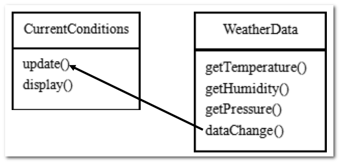

> **代码实现**

<details>
<summary style="color:red;">展开</summary>

1. `CurrentConditions`：当前天气情况

   ```java
   // 显示当前天气情况（可以理解成是气象站自己的网站）
   public class CurrentConditions {
   	// 温度，气压，湿度
   	private float temperature;
   	private float pressure;
   	private float humidity;
   
   	// 更新 天气情况，是由 WeatherData 来调用，我使用推送模式
   	public void update(float temperature, float pressure, float humidity) {
   		this.temperature = temperature;
   		this.pressure = pressure;
   		this.humidity = humidity;
   		display();
   	}
   
   	// 显示
   	public void display() {
   		System.out.println("***Today mTemperature: " + temperature + "***");
   		System.out.println("***Today mPressure: " + pressure + "***");
   		System.out.println("***Today mHumidity: " + humidity + "***");
   	}
   }
   ```

2. `WeatherData`：包含最新的天气信息，调用 `setData()` 方法则将最新的天气信息推送至 `CurrentConditions`

   ```java
   /**
    * 1. 包含最新的天气情况信息 
    * 2. 含有 CurrentConditions 对象
    * 3. 当数据有更新时，就主动的调用   CurrentConditions对象update方法(含 display), 这样他们（接入方）就看到最新的信息
    *
    */
   public class WeatherData {
   	private float temperatrue;
   	private float pressure;
   	private float humidity;
   	private CurrentConditions currentConditions;
   	
   	public WeatherData(CurrentConditions currentConditions) {
   		this.currentConditions = currentConditions;
   	}
   
   	public float getTemperature() {
   		return temperatrue;
   	}
   
   	public float getPressure() {
   		return pressure;
   	}
   
   	public float getHumidity() {
   		return humidity;
   	}
   
   	public void dataChange() {
   		// 调用 接入方的 update
   		currentConditions.update(getTemperature(), getPressure(), getHumidity());
   	}
   
   	// 当数据有更新时，就调用 setData
   	public void setData(float temperature, float pressure, float humidity) {
   		this.temperatrue = temperature;
   		this.pressure = pressure;
   		this.humidity = humidity;
   		// 调用dataChange， 将最新的信息 推送给 接入方 currentConditions
   		dataChange();
   	}
   }
   ```

3. `Client`：测试代码

   ```java
   public class Client {
   	public static void main(String[] args) {
   		// 创建接入方 currentConditions
   		CurrentConditions currentConditions = new CurrentConditions();
   		// 创建 WeatherData 并将 接入方 currentConditions 传递到 WeatherData中
   		WeatherData weatherData = new WeatherData(currentConditions);
   
   		// 更新天气情况
   		weatherData.setData(30, 150, 40);
   
   		// 天气情况变化
   		System.out.println("============天气情况变化=============");
   		weatherData.setData(40, 160, 20);
   
   	}
   }
   ```

</details>

> **传统方案问题分析**

1. 其他第三方接入气象站获取数据的问题
2. 无法在运行时动态的添加第三方 (新浪网站)
3. 在添加新的第三方时，需要修改 `WeatherData` 类，违反`ocp`原则 --> 观察者模式

#### 3.4.6.4. 观察者模式代码

> **类图**


> **代码实现**

<details>
<summary style="color:red;">展开</summary>

1. `Observer`：观察这的抽象接口，定义了更新天气信息的抽象方法

   ```java
   //观察者接口，有观察者来实现
   public interface Observer {
   
   	public void update(float temperature, float pressure, float humidity);
   
   }
   ```

2. `CurrentConditions`：具体的观察者，实现了 `update()` 方法的业务逻辑

   ```java
   public class CurrentConditions implements Observer {
   
   	// 温度，气压，湿度
   	private float temperature;
   	private float pressure;
   	private float humidity;
   
   	// 更新 天气情况，是由 WeatherData 来调用，我使用推送模式
   	public void update(float temperature, float pressure, float humidity) {
   		this.temperature = temperature;
   		this.pressure = pressure;
   		this.humidity = humidity;
   		display();
   	}
   
   	// 显示
   	public void display() {
   		System.out.println("***Today mTemperature: " + temperature + "***");
   		System.out.println("***Today mPressure: " + pressure + "***");
   		System.out.println("***Today mHumidity: " + humidity + "***");
   	}
   }
   ```

3. `BaiduSite`：具体的观察者，实现了 `update()` 方法的业务逻辑

   ```java
   public class BaiduSite implements Observer {
   
   	// 温度，气压，湿度
   	private float temperature;
   	private float pressure;
   	private float humidity;
   
   	// 更新 天气情况，是由 WeatherData 来调用，我使用推送模式
   	public void update(float temperature, float pressure, float humidity) {
   		this.temperature = temperature;
   		this.pressure = pressure;
   		this.humidity = humidity;
   		display();
   	}
   
   	// 显示
   	public void display() {
   		System.out.println("===百度网站====");
   		System.out.println("***百度网站 气温 : " + temperature + "***");
   		System.out.println("***百度网站 气压: " + pressure + "***");
   		System.out.println("***百度网站 湿度: " + humidity + "***");
   	}
   
   }
   ```

4. `Subject`：主题的抽象类，定义了操作观察者的规范，有添加、移除、通知操作者，通过调用 `registerObserver()` 方法订阅该主题

   ```java
   //接口, 让WeatherData 来实现 
   public interface Subject {
   
   	public void registerObserver(Observer o);
   
   	public void removeObserver(Observer o);
   
   	public void notifyObservers();
   	
   }
   ```

5. `WeatherData`：主题的具体实现类，聚合了一个 `ArrayList<Observer>` 对象，用于存储观察者集合，并实现了 `Subject` 接口中定义的抽象方法

   ```java
   /**
    * 类是核心
    * 1. 包含最新的天气情况信息 
    * 2. 含有 观察者集合，使用ArrayList管理
    * 3. 当数据有更新时，就主动通知所有的（接入方）就看到最新的信息
    * @author Administrator
    *
    */
   public class WeatherData implements Subject {
   	private float temperatrue;
   	private float pressure;
   	private float humidity;
   	// 观察者集合
   	private ArrayList<Observer> observers;
   
   	public WeatherData() {
   		observers = new ArrayList<Observer>();
   	}
   
   	public float getTemperature() {
   		return temperatrue;
   	}
   
   	public float getPressure() {
   		return pressure;
   	}
   
   	public float getHumidity() {
   		return humidity;
   	}
   
   	// 当数据有更新时，就调用 setData
   	public void setData(float temperature, float pressure, float humidity) {
   		this.temperatrue = temperature;
   		this.pressure = pressure;
   		this.humidity = humidity;
   		// 调用notifyObservers， 将最新的信息 推送给观察者
   		notifyObservers();
   	}
   
   	// 注册一个观察者
   	@Override
   	public void registerObserver(Observer o) {
   		observers.add(o);
   	}
   
   	// 移除一个观察者
   	@Override
   	public void removeObserver(Observer o) {
   		if (observers.contains(o)) {
   			observers.remove(o);
   		}
   	}
   
   	// 遍历所有的观察者，并通知
   	@Override
   	public void notifyObservers() {
   		for (int i = 0; i < observers.size(); i++) {
   			observers.get(i).update(this.temperatrue, this.pressure, this.humidity);
   		}
   	}
   }
   ```

6. `Client`：测试代码

   ```java
   public class Client {
   
   	public static void main(String[] args) {
   		// TODO Auto-generated method stub
   		// 创建一个WeatherData
   		WeatherData weatherData = new WeatherData();
   
   		// 创建观察者
   		CurrentConditions currentConditions = new CurrentConditions();
   		BaiduSite baiduSite = new BaiduSite();
   
   		// 注册到weatherData
   		weatherData.registerObserver(currentConditions);
   		weatherData.registerObserver(baiduSite);
   
   		// 测试
   		System.out.println("通知各个注册的观察者, 看看信息");
   		weatherData.setData(10f, 100f, 30.3f);
   
   		weatherData.removeObserver(currentConditions);
   		// 测试
   		System.out.println();
   		System.out.println("通知各个注册的观察者, 看看信息");
   		weatherData.setData(10f, 100f, 30.3f);
   	}
   
   }
   ```

</details>

> **观察者模式的好处**

1. 观察者模式设计后， 会以集合的方式来管理用户(`Observer`)， 包括注册， 移除和通知。
2. 这样， 我们增加观察者(这里可以理解成一个新的公告板)， 就不需要去修改核心类 `WeatherData`，遵守了 `ocp` 原则

#### 3.4.6.5. Jdk Observable 源码分析

> 注意：**jdk9中已弃用Observer和Observable**

1. `Observable` 的作用和地位等价于 我们前面讲过 `Subject`
2. `Observable` 是类，不是接口，类中已经实现了核心的方法，即管理`Observer`的方法 `add()`、`delete()`、`notify()`
3. `Observer` 的作用和地位等价于我们前面讲过的 `Observer`，定义了抽象方法 `update()`
4. `Observable` 和 `Observer` 的使用方法和前面讲过的一样，只是`Observable` 是类，通过继承来管理观察者，实现观察者模式

> 源码追踪

1. `Observable`：这个类有点老啊，观察者集合居然用 `Vector<Observer>` 存储

   ```java
   public class Observable {
       private boolean changed = false;
       private Vector<Observer> obs;
   
       public Observable() {
           obs = new Vector<>();
       }
   
       public synchronized void addObserver(Observer o) {
           if (o == null)
               throw new NullPointerException();
           if (!obs.contains(o)) {
               obs.addElement(o);
           }
       }
       public synchronized void deleteObserver(Observer o) {
           obs.removeElement(o);
       }
   
       public void notifyObservers() {
           notifyObservers(null);
       }
   
       public void notifyObservers(Object arg) {
           Object[] arrLocal;
   
           synchronized (this) {
               if (!changed)
                   return;
               arrLocal = obs.toArray();
               clearChanged();
           }
   
           for (int i = arrLocal.length-1; i>=0; i--)
               ((Observer)arrLocal[i]).update(this, arg);
       }
   
       public synchronized void deleteObservers() {
           obs.removeAllElements();
       }
   
       protected synchronized void setChanged() {
           changed = true;
       }
   
       protected synchronized void clearChanged() {
           changed = false;
       }
   
       public synchronized boolean hasChanged() {
           return changed;
       }
   
       public synchronized int countObservers() {
           return obs.size();
       }
   }
   ```

2. `Observer`：定义了抽象方法 `update()`，主题方法通过调用观察者的 `update()` 方法将主题推送至具体的观察者

   ```java
   public interface Observer {
       void update(Observable o, Object arg);
   }
   ```

### 3.4.7. 中介者模式（Mediator Pattern）

#### 3.4.7.1. 说明

- 概述
  - 意图：**用一个中介对象来封装一系列的对象交互**，中介者使各对象不需要显式地相互引用，从而使其耦合松散，而且可以独立地改变它们之间的交互。
  - 主要解决：对象与对象之间存在大量的关联关系，这样势必会导致系统的结构变得很复杂，同时若一个对象发生改变，我们也需要跟踪与之相关联的对象，同时做出相应的处理。
  - 何时使用：多个类相互耦合，形成了网状结构。
  - 如何解决：将上述网状结构分离为星型结构。
  - 关键代码：对象 Colleague 之间的通信封装到一个类中单独处理。
  - 应用实例： 
    - 1、机场调度系统。 
    - 2、MVC 框架，其中C（控制器）就是 M（模型）和 V（视图）的中介者。

- 优缺点
  - 优点：
    - 1、降低了类的复杂度，将一对多转化成了一对一。 
    - 2、各个类之间的解耦。 
    - 3、符合迪米特原则。
  - 缺点：中介者会庞大，变得复杂难以维护。

- 使用场景： 
  - 1、系统中对象之间存在比较复杂的引用关系，导致它们之间的依赖关系结构混乱而且难以复用该对象。 
  - 2、想通过一个中间类来封装多个类中的行为，而又不想生成太多的子类。

- 注意事项：不应当在职责混乱的时候使用。

- 原理类图
  1. `Mediator` 就是抽象中介者，定义了中介者的行为规范
  2. `Colleague` 是抽象的同事类，定义了同事类中抽象的行为规范
  3. `ConcreteMediator` 具体的中介者对象，实现 `Mediator` 中的抽象方法，他需要知道所有具体的同事类，即以一个集合来管理所有的同事(`HashMap`)，并接收某个同事的消息，完成相应的任务
  4. `ConcreteColleague` 具体的同事类，`Colleague` 的实现类会有很多，每个同事只知道自己的行为， 而不了解其他同事类的行为(方法)，但是他们都依赖中介者对象(通过构造器将中介者注入)
  5. 原本同事之间复杂的调用关系和业务逻辑，都交给中介者去执行，这样具体的同事类之间耦合度就会降低

  

#### 3.4.7.2. 情景介绍

- 智能家庭项目：
  1. 智能家庭包括各种设备，闹钟、咖啡机、电视机、窗帘 等
  2. 主人要看电视时，各个设备可以协同工作，自动完成看电视的准备工作，比如流程为： 闹铃响起 --> 咖啡机开始做咖啡 --> 窗帘自动落下 --> 电视机开始播放

#### 3.4.7.3. 传统方式

  > **类图**


> **传统的方式的问题分析**

1. 当各电器对象有多种状态改变时，相互之间的调用关系会比较复杂
2. 各个电器对象彼此联系， 你中有我，我中有你，不利于松耦合
3. 各个电器对象之间所传递的消息(参数)，容易混乱
4. 当系统增加一个新的电器对象时，或者执行流程改变时，代码的可维护性、扩展性都不理想 ==> 考虑中介者模式

#### 3.4.7.4. 中介者模式代码

> **类图**

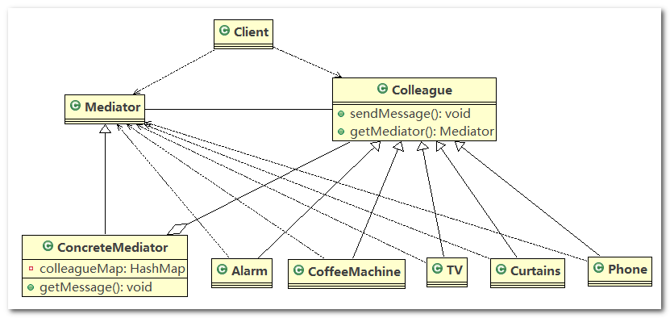

1. 创建 `ConcreteMediator` 对象，并使用 `Mediator` 类型接收
2. 创建各个同事类对象，比如 `Alarm`、`CoffeeMachine`、`TV` 等
3. 在创建同事类对象时，就直接通过构造器注入一个 `Mediator` 对象，同时将同事类对象添加至 `Mediator` 的同事类集合中去
4. 在同事类对象中调用 `sendMessage()` 方法时，会去用 `Mediator` 对象中的 `getMessage()` 方法
5. `getMessage()` 方法会根据会根据当前接收到的消息，去调用其他同事，协同完成其他任务，即 `getMessage()` 方法会处理很多的业务逻辑，是一个核心方法

> **代码实现**

<details>
<summary style="color:red;">展开</summary>

1. `Colleague`：同事类，即为各种家电的抽象父类，通过构造器将中介者对象注入，抽象父类中的 `SendMessage()` 由子类重写，该方法将调用中介者的 `GetMessage()` 方法触发执行动作

   ```java
   //同事抽象类
   public abstract class Colleague {
   	private Mediator mediator;
   	public String name;
   
   	public Colleague(Mediator mediator, String name) {
   		this.mediator = mediator;
   		this.name = name;
   
   	}
   
   	public Mediator GetMediator() {
   		return this.mediator;
   	}
   
   	public abstract void SendMessage(int stateChange);
   }
   ```

2. `Alarm`：

   ```java
   //具体的同事类
   public class Alarm extends Colleague {
   
   	// 构造器
   	public Alarm(Mediator mediator, String name) {
   		super(mediator, name);
   		// 在创建Alarm 同事对象时，将自己放入到ConcreteMediator 对象中[集合]
   		mediator.Register(name, this);
   	}
   
   	public void SendAlarm(int stateChange) {
   		SendMessage(stateChange);
   	}
   
   	@Override
   	public void SendMessage(int stateChange) {
   		// 调用的中介者对象的getMessage
   		this.GetMediator().GetMessage(stateChange, this.name);
   	}
   
   }
   ```

3. `CoffeeMachine`：

   ```java
   public class CoffeeMachine extends Colleague {
   
   	public CoffeeMachine(Mediator mediator, String name) {
   		super(mediator, name);
   		mediator.Register(name, this);
   	}
   
   	@Override
   	public void SendMessage(int stateChange) {
   		this.GetMediator().GetMessage(stateChange, this.name);
   	}
   
   	public void StartCoffee() {
   		System.out.println("It's time to startcoffee!");
   	}
   
   	public void FinishCoffee() {
   		System.out.println("After 5 minutes!");
   		System.out.println("Coffee is ok!");
   		SendMessage(0);
   	}
   }
   ```

4. `TV`：

   ```java
   public class TV extends Colleague {
   
   	public TV(Mediator mediator, String name) {
   		super(mediator, name);
   		mediator.Register(name, this);
   	}
   
   	@Override
   	public void SendMessage(int stateChange) {
   		this.GetMediator().GetMessage(stateChange, this.name);
   	}
   
   	public void StartTv() {
   		System.out.println("It's time to StartTv!");
   	}
   
   	public void StopTv() {
   		System.out.println("StopTv!");
   	}
   }
   ```

5. `Curtains`：

   ```java
   public class Curtains extends Colleague {
   
   	public Curtains(Mediator mediator, String name) {
   		super(mediator, name);
   		mediator.Register(name, this);
   	}
   
   	@Override
   	public void SendMessage(int stateChange) {
   		this.GetMediator().GetMessage(stateChange, this.name);
   	}
   
   	public void UpCurtains() {
   		System.out.println("I am holding Up Curtains!");
   	}
   
   }
   ```

6. `Mediator`：定义中介者的行为规范

   ```java
   public abstract class Mediator {
   	
   	// 将给中介者对象，加入到集合中
   	public abstract void Register(String colleagueName, Colleague colleague);
   
   	// 接收消息, 消息由具体的同事对象发出
   	public abstract void GetMessage(int stateChange, String colleagueName);
   
   	public abstract void SendMessage();
   	
   }
   ```

7. `ConcreteMediator`：继承了 `Mediator` 抽象父类，实现了其父类中的抽象方法，`Register()` 完成注册的功能，调用 `GetMessage()` 方法将执行目标任务

   ```java
   //具体的中介者类
   public class ConcreteMediator extends Mediator {
   	// 集合，放入所有的同事对象
   	private HashMap<String, Colleague> colleagueMap;
   	private HashMap<String, String> interMap;
   
   	public ConcreteMediator() {
   		colleagueMap = new HashMap<String, Colleague>();
   		interMap = new HashMap<String, String>();
   	}
   
   	@Override
   	public void Register(String colleagueName, Colleague colleague) {
   		colleagueMap.put(colleagueName, colleague);
   
   		if (colleague instanceof Alarm) {
   			interMap.put("Alarm", colleagueName);
   		} else if (colleague instanceof CoffeeMachine) {
   			interMap.put("CoffeeMachine", colleagueName);
   		} else if (colleague instanceof TV) {
   			interMap.put("TV", colleagueName);
   		} else if (colleague instanceof Curtains) {
   			interMap.put("Curtains", colleagueName);
   		}
   	}
   
   	// 具体中介者的核心方法
   	// 1. 根据得到消息，完成对应任务
   	// 2. 中介者在这个方法，协调各个具体的同事对象，完成任务
   	@Override
   	public void GetMessage(int stateChange, String colleagueName) {
   		// 处理闹钟发出的消息
   		if (colleagueMap.get(colleagueName) instanceof Alarm) {
   			if (stateChange == 0) {
   				((CoffeeMachine) (colleagueMap.get(interMap.get("CoffeeMachine")))).StartCoffee();
   				((TV) (colleagueMap.get(interMap.get("TV")))).StartTv();
   			} else if (stateChange == 1) {
   				((TV) (colleagueMap.get(interMap.get("TV")))).StopTv();
   			}
   		} else if (colleagueMap.get(colleagueName) instanceof CoffeeMachine) {
   			((Curtains) (colleagueMap.get(interMap.get("Curtains")))).UpCurtains();
   		} else if (colleagueMap.get(colleagueName) instanceof TV) {
   			// 如果TV发现消息
   		} else if (colleagueMap.get(colleagueName) instanceof Curtains) {
   			// 如果是以窗帘发出的消息，这里处理...
   		}
   	}
   
   	@Override
   	public void SendMessage() {
   
   	}
   
   }
   ```

8. `ClientTest`：测试代码

   ```java
   public class ClientTest {
   
   	public static void main(String[] args) {
   		// 创建一个中介者对象
   		Mediator mediator = new ConcreteMediator();
   
   		// 创建Alarm 并且加入到 ConcreteMediator 对象的HashMap
   		Alarm alarm = new Alarm(mediator, "alarm");
   
   		// 创建了CoffeeMachine 对象，并 且加入到 ConcreteMediator 对象的HashMap
   		CoffeeMachine coffeeMachine = new CoffeeMachine(mediator, "coffeeMachine");
   
   		// 创建 Curtains , 并 且加入到 ConcreteMediator 对象的HashMap
   		Curtains curtains = new Curtains(mediator, "curtains");
   		TV tV = new TV(mediator, "TV");
   
   		// 让闹钟发出消息
   		alarm.SendAlarm(0);
   		coffeeMachine.FinishCoffee();
   		alarm.SendAlarm(1);
   	}
   
   }
   ```

</details>

#### 3.4.7.5. 注意事项

### 3.4.8. 责任链模式（Chain of Responsibility Pattern）

#### 3.4.8.1. 说明

- 基本概念
  - 职责链模式(`Chain of Responsibility Pattern`)，又叫责任链模式， 为请求创建了一个接收者对象的链
  - 这种模式对请求的发送者和接收者进行解耦
- 原理
  - 职责链模式通常每个接收者都包含对另一个接收者的引用。
  - 如果一个对象不能处理该请求， 那么它会把相同的请求传给下一个接收者，依此类推
  - 责任链模式使多个对象都有机会处理请求，从而避免请求的发送者和接收者之间的耦合关系。
  - 将这个对象连成一条链，并沿着这条链传递该请求，直到有一个对象处理它为止

  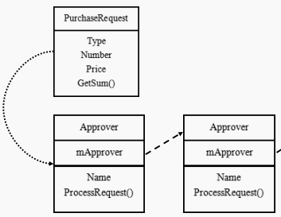

- 原理类图
  - `Handler`：抽象的处理者，定义了一个处理请求的接口，同时该类中聚合了另外一个 `Handler` 对象
  - `ConcreteHandlerA` 、`ConcreteHandlerB` 是具体的处理者，处理它自己负责的请求， 可以访问它的后继者(即下一个处理者)，如果可以处理当前请求， 则处理， 否则就将该请求交个后继者去处理， 从而形成一个职责链
  - `Request` ：含义很多属性， 表示一个请求

  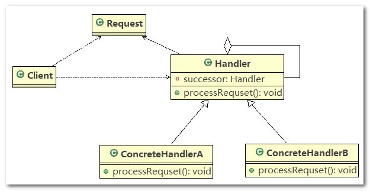

#### 3.4.8.2. 情景介绍

学校 OA 系统的采购审批项目： 需求是采购员采购教学器材

1. 如果金额 小于等于 `5000`，由教学主任审批 (`0<=x<=5000`)
2. 如果金额 小于等于 `10000`, 由院长审批 (`5000<x<=10000`)
3. 如果金额 小于等于 `30000`，由副校长审批 (`10000<x<=30000`)
4. 如果金额 超过 `30000` 以上，由校长审批 ( `30000<x`)

#### 3.4.8.3. 传统方式

> **类图**

- 传统方式是： 接收到一个采购请求后， 根据采购金额来调用对应的 `Approver` (审批人)完成审批。

  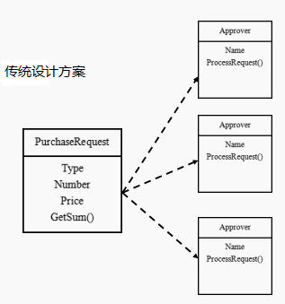

> **传统方案问题分析**

- 传统方式的问题分析 : 客户端这里会使用到 分支判断，比如`switch`来对不同的采购请求处理，这样就存在如下问题
  - 如果各个级别的人员审批金额发生变化， 在客户端的也需要变化
  - 客户端必须明确的知道有多少个审批级别和访问
- 这样 对一个采购请求进行处理和 `Approver` (审批人) 就存在强耦合关系， 不利于代码的扩展和维护
- 解决方案 ==> 职责链模式

#### 3.4.8.4. 责任链模式代码

<details>
<summary style="color:red;">展开</summary>

1. `PurchaseRequest`：实体类，表示购买请求

   ```java
   //请求类
   public class PurchaseRequest {
   
   	private int type = 0; // 请求类型
   	private float price = 0.0f; // 请求金额
   	private int id = 0;
   
   	// 构造器
   	public PurchaseRequest(int type, float price, int id) {
   		this.type = type;
   		this.price = price;
   		this.id = id;
   	}
   
   	public int getType() {
   		return type;
   	}
   
   	public float getPrice() {
   		return price;
   	}
   
   	public int getId() {
   		return id;
   	}
   
   }
   ```

2. `Approver`：审批者的抽象父类，里面聚合了一个 `Approver` 对象，构成一条责任链

   ```java
   public abstract class Approver {
   
   	Approver approver; // 下一个处理者
   	String name; // 名字
   
   	public Approver(String name) {
   		this.name = name;
   	}
   
   	// 下一个处理者
   	public void setApprover(Approver approver) {
   		this.approver = approver;
   	}
   
   	// 处理审批请求的方法，得到一个请求, 处理是子类完成，因此该方法做成抽象
   	public abstract void processRequest(PurchaseRequest purchaseRequest);
   
   }
   ```

3. `DepartmentApprover`：系主任(具体的处理者)

   ```java
   public class DepartmentApprover extends Approver {
   
   	public DepartmentApprover(String name) {
   		super(name);
   	}
   
   	@Override
   	public void processRequest(PurchaseRequest purchaseRequest) {
   		if (purchaseRequest.getPrice() <= 5000) {
   			System.out.println(" 请求编号 id= " + purchaseRequest.getId() + " 被 " + this.name + " 处理");
   		} else {
   			approver.processRequest(purchaseRequest);
   		}
   	}
   
   }
   ```

4. `CollegeApprover`：院长(具体的处理者)

   ```java
   public class CollegeApprover extends Approver {
   
   	public CollegeApprover(String name) {
   		super(name);
   	}
   
   	@Override
   	public void processRequest(PurchaseRequest purchaseRequest) {
   		if (purchaseRequest.getPrice() < 5000 && purchaseRequest.getPrice() <= 10000) {
   			System.out.println(" 请求编号 id= " + purchaseRequest.getId() + " 被 " + this.name + " 处理");
   		} else {
   			approver.processRequest(purchaseRequest);
   		}
   	}
   }
   ```

5. `ViceSchoolMasterApprover`：副校长(具体的处理者)

   ```java
   public class ViceSchoolMasterApprover extends Approver {
   
   	public ViceSchoolMasterApprover(String name) {
   		super(name);
   	}
   
   	@Override
   	public void processRequest(PurchaseRequest purchaseRequest) {
   		if (purchaseRequest.getPrice() < 10000 && purchaseRequest.getPrice() <= 30000) {
   			System.out.println(" 请求编号 id= " + purchaseRequest.getId() + " 被 " + this.name + " 处理");
   		} else {
   			approver.processRequest(purchaseRequest);
   		}
   	}
   }
   ```

6. `SchoolMasterApprover`：校长(具体的处理者)

   ```java
   public class SchoolMasterApprover extends Approver {
   
   	public SchoolMasterApprover(String name) {
   		super(name);
   	}
   
   	@Override
   	public void processRequest(PurchaseRequest purchaseRequest) {
   		if (purchaseRequest.getPrice() > 30000) {
   			System.out.println(" 请求编号 id= " + purchaseRequest.getId() + " 被 " + this.name + " 处理");
   		} else {
   			approver.processRequest(purchaseRequest);
   		}
   	}
   }
   ```

7. `Client`：测试代码

   ```java
   public class Client {
   
   	public static void main(String[] args) {
   		// 创建一个请求
   		PurchaseRequest purchaseRequest = new PurchaseRequest(1, 31000, 1);
   
   		// 创建相关的审批人
   		DepartmentApprover departmentApprover = new DepartmentApprover("张主任");
   		CollegeApprover collegeApprover = new CollegeApprover("李院长");
   		ViceSchoolMasterApprover viceSchoolMasterApprover = new ViceSchoolMasterApprover("王副校");
   		SchoolMasterApprover schoolMasterApprover = new SchoolMasterApprover("佟校长");
   
   		// 需要将各个审批级别的下一个设置好 (处理人构成环形: )
   		departmentApprover.setApprover(collegeApprover);
   		collegeApprover.setApprover(viceSchoolMasterApprover);
   		viceSchoolMasterApprover.setApprover(schoolMasterApprover);
   		schoolMasterApprover.setApprover(departmentApprover);
   
   		departmentApprover.processRequest(purchaseRequest);
   		viceSchoolMasterApprover.processRequest(purchaseRequest);
   	}
   
   }
   ```

</details>

#### 3.4.8.5. Spring MVC HandlerExecutionChain

> **流程图**

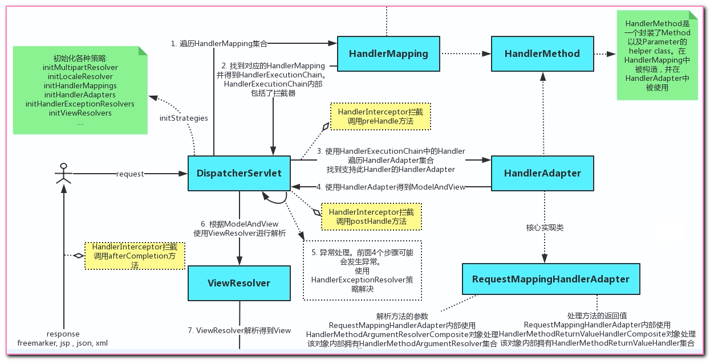

> **源码分析**

1. 在 `DispatcherServlet` 类的 `doDispatch()` 方法中，关注如下几点：

   1. `HandlerExecutionChain mappedHandler = null;`：表示 `Handler` 执行链
   2. `mappedHandler = getHandler(processedRequest);`：通过请求参数(`processedRequest`)初始化 `mappedHandler`
   3. `mappedHandler.applyPreHandle(processedRequest, response)`：执行 `applyPreHandle()` 方法
   4. `mappedHandler.applyPostHandle(processedRequest, response, mv);`：执行 `applyPostHandle()` 方法

   ```java
   protected void doDispatch(HttpServletRequest request, HttpServletResponse response) throws Exception {
   	HttpServletRequest processedRequest = request;
   	HandlerExecutionChain mappedHandler = null;
   	boolean multipartRequestParsed = false;
   
   	WebAsyncManager asyncManager = WebAsyncUtils.getAsyncManager(request);
   
   	try {
   		ModelAndView mv = null;
   		Exception dispatchException = null;
   
   		try {
   			processedRequest = checkMultipart(request);
   			multipartRequestParsed = processedRequest != request;
   
   			// Determine handler for the current request.
   			mappedHandler = getHandler(processedRequest);
   			if (mappedHandler == null || mappedHandler.getHandler() == null) {
   				noHandlerFound(processedRequest, response);
   				return;
   			}
   
   			// Determine handler adapter for the current request.
   			HandlerAdapter ha = getHandlerAdapter(mappedHandler.getHandler());
   
   			// Process last-modified header, if supported by the handler.
   			String method = request.getMethod();
   			boolean isGet = "GET".equals(method);
   			if (isGet || "HEAD".equals(method)) {
   				long lastModified = ha.getLastModified(request, mappedHandler.getHandler());
   				if (logger.isDebugEnabled()) {
   					String requestUri = urlPathHelper.getRequestUri(request);
   					logger.debug("Last-Modified value for [" + requestUri + "] is: " + lastModified);
   				}
   				if (new ServletWebRequest(request, response).checkNotModified(lastModified) && isGet) {
   					return;
   				}
   			}
   
   			if (!mappedHandler.applyPreHandle(processedRequest, response)) {
   				return;
   			}
   
   			try {
   				// Actually invoke the handler.
   				mv = ha.handle(processedRequest, response, mappedHandler.getHandler());
   			}
   			finally {
   				if (asyncManager.isConcurrentHandlingStarted()) {
   					return;
   				}
   			}
   
   			applyDefaultViewName(request, mv);
   			mappedHandler.applyPostHandle(processedRequest, response, mv);
   		}
   		catch (Exception ex) {
   			dispatchException = ex;
   		}
   		processDispatchResult(processedRequest, response, mappedHandler, mv, dispatchException);
   	}
   	catch (Exception ex) {
   		triggerAfterCompletion(processedRequest, response, mappedHandler, ex);
   	}
   	catch (Error err) {
   		triggerAfterCompletionWithError(processedRequest, response, mappedHandler, err);
   	}
   	finally {
   		if (asyncManager.isConcurrentHandlingStarted()) {
   			// Instead of postHandle and afterCompletion
   			mappedHandler.applyAfterConcurrentHandlingStarted(processedRequest, response);
   			return;
   		}
   		// Clean up any resources used by a multipart request.
   		if (multipartRequestParsed) {
   			cleanupMultipart(processedRequest);
   		}
   	}
   }
   ```

2. `mappedHandler.applyPreHandle(processedRequest, response)` 方法中获取到拦截器(`getInterceptors`)，并调用拦截器的 `preHandle()` 方法完成前置拦截

   ```java
   boolean applyPreHandle(HttpServletRequest request, HttpServletResponse response) throws Exception {
       if (getInterceptors() != null) {
           for (int i = 0; i < getInterceptors().length; i++) {
               HandlerInterceptor interceptor = getInterceptors()[i];
               if (!interceptor.preHandle(request, response, this.handler)) {
                   triggerAfterCompletion(request, response, null);
                   return false;
               }
               this.interceptorIndex = i;
           }
       }
       return true;
   }
   
   public HandlerInterceptor[] getInterceptors() {
       if (this.interceptors == null && this.interceptorList != null) {
           this.interceptors = this.interceptorList.toArray(new HandlerInterceptor[this.interceptorList.size()]);
       }
       return this.interceptors;
   }
   ```

3. `mappedHandler.applyPostHandle(processedRequest, response, mv);`方法中同样也是调用拦截器的 `postHandle()` 方法完成后置拦截

   ```java
   void applyPostHandle(HttpServletRequest request, HttpServletResponse response, ModelAndView mv) throws Exception {
   	if (getInterceptors() == null) {
   		return;
   	}
   	for (int i = getInterceptors().length - 1; i >= 0; i--) {
   		HandlerInterceptor interceptor = getInterceptors()[i];
   		interceptor.postHandle(request, response, this.handler, mv);
   	}
   }
   ```

4. `triggerAfterCompletion()` 在 `applyPreHandle()` 中被调用，同样也是通过调用拦截器的 `afterCompletion()` 方法

   ```java
   void triggerAfterCompletion(HttpServletRequest request, HttpServletResponse response, Exception ex)
   		throws Exception {
   
   	if (getInterceptors() == null) {
   		return;
   	}
   	for (int i = this.interceptorIndex; i >= 0; i--) {
   		HandlerInterceptor interceptor = getInterceptors()[i];
   		try {
   			interceptor.afterCompletion(request, response, this.handler, ex);
   		}
   		catch (Throwable ex2) {
   			logger.error("HandlerInterceptor.afterCompletion threw exception", ex2);
   		}
   	}
   }
   ```

> **源码总结**

1. `SpringMVC` 请求的流程图中，执行了拦截器相关方法：`interceptor.preHandler()` 、`interceptor.preHandler()` 等等
2. 在处理`SpringMvc`请求时，使用到职责链模式，还使用到适配器模式
3. `HandlerExecutionChain` 主要负责的是请求拦截器的执行和请求处理，但是他本身不处理请求，只是将请求分配给链上注册处理器执行， 这是职责链实现方式，减少职责链本身与处理逻辑之间的耦合，规范了处理流程
4. `HandlerExecutionChain` 维护了 `HandlerInterceptor` 的集合， 可以向其中注册相应的拦截器

#### 3.4.8.6. 注意事项

1. 将请求和处理分开，实现解耦，提高系统的灵活性
2. 简化了对象，使对象不需要知道链的结构
3. 性能会受到影响，特别是在链比较长的时候，因此需控制链中最大节点数量，一般通过在`Handler`中设置一个最大节点数量，在`setNext()`方法中判断是否已经超过阀值，超过则不允许该链建立，避免出现超长链将会无意识地破坏系统性能
4. 调试不方便。采用了类似递归的方式，调试时逻辑可能比较复杂
5. 最佳应用场景： 有多个对象可以处理同一个请求时，比如：多级请求、请假、加薪等审批流程、 `Java Web`中`Tomcat`对`Encoding`的处理、拦截器

### 3.4.9. 解释器模式（Interpreter Pattern）

#### 3.4.9.1. 说明

- 基本说明
  - 在编译原理中， 一个算术表达式通过词法分析器形成词法单元，而后这些词法单元再通过语法分析器构建语法分析树，最终形成一颗抽象的语法分析树。
  - 这里的词法分析器和语法分析器都可以看做是解释器
  - 解释器模式(`Interpreter Pattern`)：
    - 是指给定一个语言(表达式)， 我们编程人员需要定义语句的文法的一种表示，并定义一个解释器，
    - 使用该解释器来解释语言中的句子(表达式)

- 应用场景
  - 应用可以将一个需要解释执行的语言中的句子表示为一个抽象语法树
  - 一些重复出现的问题可以用一种简单的语言来表达
  - 一个简单语法需要解释的场景
  - 这样的例子还有，比如编译器、 运算表达式计算、正则表达式、 机器人等

#### 3.4.9.2. 情景介绍

通过解释器模式来实现四则运算，如计算`a+b-c`的值，具体要求

1. 先输入表达式的形式，比如 `a+b+c-d+e`，要求表达式的字母不能重复
2. 在分别输入 `a, b, c, d, e` 的值
3. 最后求出结果：如图

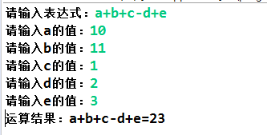

#### 3.4.9.3. 传统方式

1. 编写一个方法，接收表达式的形式，然后根据用户输入的数值进行解析，得到结果
2. 问题分析：如果加入新的运算符，比如 ‘*’、’/’ ( 等等，不利于扩展， 另外让一个方法来解析会造成程序结构混乱，不够清晰
3. 解决方案：可以考虑使用解释器模式， 即： 表达式 --> 解释器(可以有多种) --> 结果

#### 3.4.9.4. 解释器模式代码

> **类图**

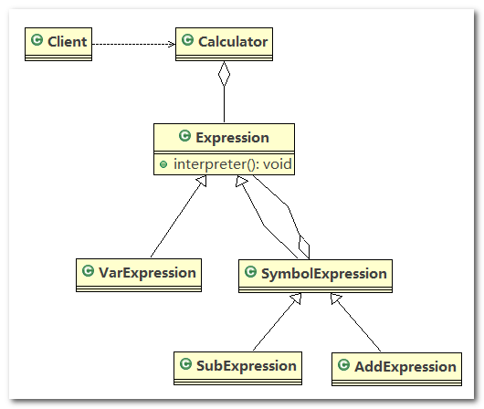

> **代码实现**

<details>
<summary style="color:red;">展开</summary>

1. `Expression`：表达式解释器的抽象父类

   ```java
   /**
    * 抽象类表达式，通过HashMap 键值对, 可以获取到变量的值
    * 
    * @author Administrator
    *
    */
   public abstract class Expression {
   	// a + b - c
   	// 解释公式和数值, key 就是公式(表达式)中的参数[a,b,c], value就是就是具体值
   	// HashMap {a=10, b=20}
   	public abstract int interpreter(HashMap<String, Integer> var);
   }
   ```

2. `VarExpression`：变量的解释器，重写了 `interpreter()` 方法，该方法通过变量的名称获取变量的值

   ```java
   /**
    * 变量的解释器
    * 
    * @author Administrator
    *
    */
   public class VarExpression extends Expression {
   
   	private String key; // key=a,key=b,key=c
   
   	public VarExpression(String key) {
   		this.key = key;
   	}
   
   	// var 就是{a=10, b=20}
   	// interpreter 根据 变量名称，返回对应值
   	@Override
   	public int interpreter(HashMap<String, Integer> var) {
   		return var.get(this.key);
   	}
   }
   ```

3. `SymbolExpression`：抽象运算符的解释器，由于运算符有多中类型，所以在 `interpreter()` 无法完成具体的运算操作，具体操作交由子类实现

   ```java
   /**
    * 抽象运算符号解析器 这里，每个运算符号，都只和自己左右两个数字有关系，
    * 但左右两个数字有可能也是一个解析的结果，无论何种类型，都是Expression类的实现类
    * 
    * @author Administrator
    *
    */
   public abstract class SymbolExpression extends Expression {
   
   	protected Expression left;
   	protected Expression right;
   
   	public SymbolExpression(Expression left, Expression right) {
   		this.left = left;
   		this.right = right;
   	}
   
   	// 因为 SymbolExpression 是让其子类来实现，因此 interpreter 是一个默认实现
   	@Override
   	public int interpreter(HashMap<String, Integer> var) {
   		return 0;
   	}
   }
   ```

4. `AddExpression`：加法运算符的解释器，递归调用：表达式的值 = 左边表达式的值 + 右边表达式的值

   ```java
   /**
    * 加法解释器
    * 
    * @author Administrator
    *
    */
   public class AddExpression extends SymbolExpression {
   
   	public AddExpression(Expression left, Expression right) {
   		super(left, right);
   	}
   
   	// 处理相加
   	// var 仍然是 {a=10,b=20}..
   	// 一会我们debug 源码,就ok
   	public int interpreter(HashMap<String, Integer> var) {
   		// left.interpreter(var) ： 返回 left 表达式对应的值 a = 10
   		// right.interpreter(var): 返回right 表达式对应值 b = 20
   		return left.interpreter(var) + right.interpreter(var);
   	}
   }
   ```

5. `SubExpression`：减法运算符的解释器，递归调用：表达式的值 = 左边表达式的值 + 右边表达式的值

   ```java
   /**
    * 减法解释器
    * 
    * @author Administrator
    *
    */
   public class SubExpression extends SymbolExpression {
   
   	public SubExpression(Expression left, Expression right) {
   		super(left, right);
   	}
   
   	// 求出left 和 right 表达式相减后的结果
   	public int interpreter(HashMap<String, Integer> var) {
   		return left.interpreter(var) - right.interpreter(var);
   	}
   }
   ```

6. `Calculator`：计算器类，通过 `Expression` 的实现类完成具体的解释运算

   ```java
   public class Calculator {
   
   	// 定义表达式
   	private Expression expression;
   
   	// 构造函数传参，并解析
   	public Calculator(String expStr) { // expStr = a+b
   		// 安排运算先后顺序
   		Stack<Expression> stack = new Stack<>();
   		// 表达式拆分成字符数组
   		char[] charArray = expStr.toCharArray();// [a, +, b]
   
   		Expression left = null;
   		Expression right = null;
   		// 遍历我们的字符数组， 即遍历 [a, +, b]
   		// 针对不同的情况，做处理
   		for (int i = 0; i < charArray.length; i++) {
   			switch (charArray[i]) {
   			case '+': //
   				left = stack.pop();// 从stack取出left => "a"
   				right = new VarExpression(String.valueOf(charArray[++i]));// 取出右表达式 "b"
   				stack.push(new AddExpression(left, right));// 然后根据得到left 和 right 构建 AddExpresson加入stack
   				break;
   			case '-': //
   				left = stack.pop();
   				right = new VarExpression(String.valueOf(charArray[++i]));
   				stack.push(new SubExpression(left, right));
   				break;
   			default:
   				// 如果是一个 Var 就创建一个 VarExpression 对象，并push到 stack
   				stack.push(new VarExpression(String.valueOf(charArray[i])));
   				break;
   			}
   		}
   		// 当遍历完整个 charArray 数组后，stack 就得到最后Expression
   		this.expression = stack.pop();
   	}
   
   	public int run(HashMap<String, Integer> var) {
   		// 最后将表达式a+b和 var = {a=10,b=20}
   		// 然后传递给expression的interpreter进行解释执行
   		return this.expression.interpreter(var);
   	}
   }
   ```

7. `ClientTest`：测试代码

   ```java
   public class ClientTest {
   
   	public static void main(String[] args) throws IOException {
   		String expStr = getExpStr(); // a+b
   		HashMap<String, Integer> var = getValue(expStr);// var {a=10, b=20}
   		Calculator calculator = new Calculator(expStr);
   		System.out.println("运算结果：" + expStr + "=" + calculator.run(var));
   	}
   
   	// 获得表达式
   	public static String getExpStr() throws IOException {
   		System.out.print("请输入表达式：");
   		return (new BufferedReader(new InputStreamReader(System.in))).readLine();
   	}
   
   	// 获得值映射
   	public static HashMap<String, Integer> getValue(String expStr) throws IOException {
   		HashMap<String, Integer> map = new HashMap<>();
   
   		for (char ch : expStr.toCharArray()) {
   			if (ch != '+' && ch != '-') {
   				if (!map.containsKey(String.valueOf(ch))) {
   					System.out.print("请输入" + String.valueOf(ch) + "的值：");
   					String in = (new BufferedReader(new InputStreamReader(System.in))).readLine();
   					map.put(String.valueOf(ch), Integer.valueOf(in));
   				}
   			}
   		}
   
   		return map;
   	}
   }
   ```
</details>

#### 3.4.9.5. Spring SpelExpressionParser

> **测试代码**

```java
public class Interpreter {

	public static void main(String[] args) {
		// 创建一个 Parser 对象
		ExpressionParser parser = new SpelExpressionParser();

		// 通过 Parser 对象 获取到一个Expression对象
		// 会根据不同的 Parser 对象 ，返回不同的 Expression对象
		Expression expression = parser.parseExpression("10 * (2 + 1) * 1 + 66"); // 96
		int result = (Integer) expression.getValue();
		System.out.println(result);
	}

}
```

> **源码追踪**

1. `ExpressionParser` 是个接口，定义了获取 `Express` 表达式对象的行为规范，其继承关系如下

  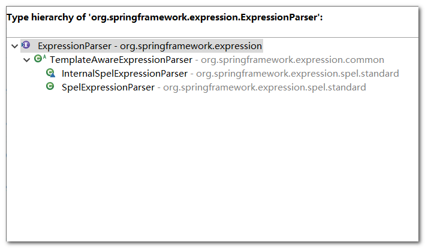

   ```java
   public interface ExpressionParser {
   
   	Expression parseExpression(String expressionString) throws ParseException;
   
   	Expression parseExpression(String expressionString, ParserContext context) throws ParseException;
   
   }
   ```

2. `TemplateAwareExpressionParser` 实现了 `ExpressionParser` 接口，其中有个重要的方法为 `parseExpression()`，该方法根据表达式的值，获取 `Express` 对象；在 `TemplateAwareExpressionParser` 中实现了获取 `CompositeStringExpression` 表达式对象的方法

   ```java
   public abstract class TemplateAwareExpressionParser implements ExpressionParser {
       
       // ...
       
        @Override
        public Expression parseExpression(String expressionString) throws ParseException {
          return parseExpression(expressionString, NON_TEMPLATE_PARSER_CONTEXT);
        }
   
        @Override
        public Expression parseExpression(String expressionString, ParserContext context)
            throws ParseException {
          if (context == null) {
            context = NON_TEMPLATE_PARSER_CONTEXT;
          }
      
          if (context.isTemplate()) {
            return parseTemplate(expressionString, context); // 创建 CompositeStringExpression 对象
          }
          else {
            return doParseExpression(expressionString, context); // 创建 SpelExpression 对象
          }
        }
       
       // ...
       
        private Expression parseTemplate(String expressionString, ParserContext context)
           	throws ParseException {
          if (expressionString.length() == 0) {
            return new LiteralExpression("");
          }
          Expression[] expressions = parseExpressions(expressionString, context);
          if (expressions.length == 1) {
            return expressions[0];
          }
          else {
            return new CompositeStringExpression(expressionString, expressions);
          }
        }
       
        protected abstract Expression doParseExpression(String expressionString,
        ParserContext context) throws ParseException;
   
       // ...
   ```

3. `SpelExpressionParser` 类继承自 `TemplateAwareExpressionParser` 类，实现了 `doParseExpression()` 抽象方法

   ```java
   public class SpelExpressionParser extends TemplateAwareExpressionParser {
       
       // ...
       
       @Override
   	protected SpelExpression doParseExpression(String expressionString, ParserContext context) throws ParseException {
   		return new InternalSpelExpressionParser(this.configuration).doParseExpression(expressionString, context);
   	}
       
       // ...
   ```

4. `Expression` 是个接口，定义了表达式解释器的业务规范，里面有超多的 `getValue()` 方法，用于获取表达式的值，其继承关系如下

  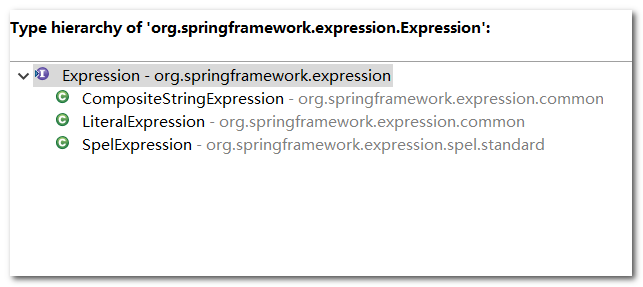

   ```java
   public interface Expression {
   
      Object getValue() throws EvaluationException;
    
      Object getValue(Object rootObject) throws EvaluationException;
    
      <T> T getValue(Class<T> desiredResultType) throws EvaluationException;
    
      <T> T getValue(Object rootObject, Class<T> desiredResultType) throws EvaluationException;

      // ...
       
   ```

5. `SpelExpression` 实现了 `Expression` 接口，重写了超多的 `getValue()` 方法，主要是通过调用 `SpelNodeImpl` 类中的方法来实现 `Expresssion` 中的 `getValue()` 方法

   ```java
   public class SpelExpression implements Expression {
   
   	private final String expression;
   
   	private final SpelNodeImpl ast;
   
   	private final SpelParserConfiguration configuration;
   
   	// the default context is used if no override is supplied by the user
   	private EvaluationContext defaultContext;
   
   	/**
   	 * Construct an expression, only used by the parser.
   	 */
   	public SpelExpression(String expression, SpelNodeImpl ast, SpelParserConfiguration configuration) {
   		this.expression = expression;
   		this.ast = ast;
   		this.configuration = configuration;
   	}
   
   	// implementing Expression
   
   	@Override
   	public Object getValue() throws EvaluationException {
   		ExpressionState expressionState = new ExpressionState(getEvaluationContext(), this.configuration);
   		return this.ast.getValue(expressionState);
   	}
   
   	@Override
   	public Object getValue(Object rootObject) throws EvaluationException {
   		ExpressionState expressionState = new ExpressionState(getEvaluationContext(), toTypedValue(rootObject), this.configuration);
   		return this.ast.getValue(expressionState);
   	}
   
   	@Override
   	public <T> T getValue(Class<T> expectedResultType) throws EvaluationException {
   		ExpressionState expressionState = new ExpressionState(getEvaluationContext(), this.configuration);
   		TypedValue typedResultValue = this.ast.getTypedValue(expressionState);
   		return ExpressionUtils.convertTypedValue(expressionState.getEvaluationContext(), typedResultValue, expectedResultType);
   	}
   
   	@Override
   	public <T> T getValue(Object rootObject, Class<T> expectedResultType) throws EvaluationException {
   		ExpressionState expressionState = new ExpressionState(getEvaluationContext(), toTypedValue(rootObject), this.configuration);
   		TypedValue typedResultValue = this.ast.getTypedValue(expressionState);
   		return ExpressionUtils.convertTypedValue(expressionState.getEvaluationContext(), typedResultValue, expectedResultType);
   	}
   
   	@Override
   	public Object getValue(EvaluationContext context) throws EvaluationException {
   		Assert.notNull(context, "The EvaluationContext is required");
   		return this.ast.getValue(new ExpressionState(context, this.configuration));
   	}
       
       // ...
   ```

> **总结**

`Expression` 接口有不同的实现类，比如 `SpelExpression`，使用的时候，根据我们创建的 `ExpressionParser` 对象不同，就返回不同的 `Expression` 对象

#### 3.4.9.6. 注意事项

1. 当有一个语言需要解释执行， 可将该语言中的句子表示为一个抽象语法树， 就可以考虑使用解释器模式， 让程序具有良好的扩展性
2. 应用场景： 编译器、 运算表达式计算、 正则表达式、 机器人等
3. 使用解释器可能带来的问题： 解释器模式会引起类膨胀、 解释器模式采用递归调用方法， 将会导致调试非常复杂、 效率可能降低

### 3.4.10. 备忘录模式（Memento Pattern）

#### 3.4.10.1. 说明

- 说明
  - 备忘录模式(`Memento Pattern`) 在不破坏封装性的前提下，捕获一个对象的内部状态，并在该对象之外保存这个状态。这样以后就可将该对象恢复到原先保存的状态
  - 可以这里理解备忘录模式：
    - 现实生活中的备忘录是用来记录某些要去做的事情，或者是记录已经达成的共同意见的事情，以防忘记了。
    - 而在软件层面，备忘录模式有着相同的含义，备忘录对象主要用来记录一个对象的某种状态，或者某些数据，
    - 当要做回退时，可以从备忘录对象里获取原来的数据进行恢复操作

- 适用的应用场景：
  - 打游戏时的存档
  - `Windows` 里的 `Ctrl + Z`。
  - `IE` 中的后退
  - 数据库的事务管理

- 原理类图
  - `Originator` ：对象(需要保存状态的对象)
  - `Memento` ：备忘录对象，负责保存好记录， 即 `Originator` 内部状态
  - `Caretaker`：守护者对象，负责保存多个备忘录对象， 使用集合管理， 提高效率
  - 说明：如果希望保存多个 `Originator` 对象的不同时间的状态，只需要使用 `HashMap <String, Collection>` 存储即可，`String` 为 `Originator` 对象的唯一标识(`key`)，`Collection` 为 `Originator` 对象不同时间的备忘录集合

  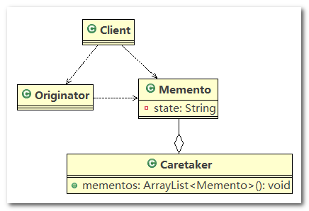

#### 3.4.10.2. 情景介绍

- 游戏角色有攻击力和防御力
- 在大战`Boss`前保存自身的状态(攻击力和防御力)， 当大战`Boss`后攻击力和防御力下降
- 然后从备忘录对象恢复到大战前的状态

#### 3.4.10.3. 传统方式

> **类图**

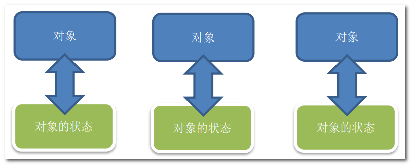

> **传统的方式的问题分析**

1. 一个对象，就对应一个保存对象状态的对象， 这样当我们游戏的对象很多时，不利于管理，开销也很大
2. 传统的方式是简单地做备份， `new` 出另外一个对象出来，再把需要备份的数据放到这个新对象，但这就暴露了对象内部的细节
3. 解决方案： ==> 备忘录模式

#### 3.4.10.4. 备忘录模式代码

<details>
<summary style="color:red;">展开</summary>
  
1. `Originator`：实体类，该类的实例为需要保存状态的对象，`saveStateMemento()` 方法用于返回一个备忘录对象，`getStateFromMemento()` 方法用于从备忘录

   ```java
   public class Originator {
   
   	private String state;// 状态信息
   
   	public String getState() {
   		return state;
   	}
   
   	public void setState(String state) {
   		this.state = state;
   	}
   
   	// 编写一个方法，可以保存一个状态对象 Memento
   	// 因此编写一个方法，返回 Memento
   	public Memento saveStateMemento() {
   		return new Memento(state);
   	}
   
   	// 通过备忘录对象，恢复状态
   	public void getStateFromMemento(Memento memento) {
   		state = memento.getState();
   	}
   }
   ```

2. `Memento`：备忘录对象，负责保存对象的状态

   ```java
   public class Memento {
   	private String state;
   
   	// 构造器
   	public Memento(String state) {
   		this.state = state;
   	}
   
   	public String getState() {
   		return state;
   	}
   
   }
   ```

3. `Caretker`：聚合了备忘录的集合，即 `List<Memento>`

   ```java
   public class Caretaker {
   
   	// 在List 集合中会有很多的备忘录对象
   	private List<Memento> mementoList = new ArrayList<Memento>();
   
   	public void add(Memento memento) {
   		mementoList.add(memento);
   	}
   
   	// 获取到第index个Originator 的 备忘录对象(即保存状态)
   	public Memento get(int index) {
   		return mementoList.get(index);
   	}
   	
   }
   ```

4. `Client`：测试代码

   ```java
   public class Client {
   
   	public static void main(String[] args) {
   
   		Originator originator = new Originator();
   		Caretaker caretaker = new Caretaker();
   
   		originator.setState(" 状态#1 攻击力 100 "); // 设置攻击速度
   		caretaker.add(originator.saveStateMemento()); // 保存了当前的状态
   		
   		originator.setState(" 状态#2 攻击力 80 "); // 设置攻击速度
   		caretaker.add(originator.saveStateMemento()); // 保存了当前的状态
   		
   		originator.setState(" 状态#3 攻击力 50 "); // 设置攻击速度
   		caretaker.add(originator.saveStateMemento()); // 保存了当前的状态
   
   		System.out.println("当前的状态是 =" + originator.getState());
   
   		// 希望得到状态 1, 将 originator 恢复到状态1
   		originator.getStateFromMemento(caretaker.get(0)); // 恢复对象属性
   		System.out.println("恢复到状态1 , 当前的状态是");
   		System.out.println("当前的状态是 =" + originator.getState());
   
   	}
   
   }
   ```
</details>

> **备忘录模式解决游戏角色恢复**

- 情景
  - 游戏角色有攻击力和防御力，在大战`Boss`前保存自身的状态(攻击力和防御力)， 
  - 当大战`Boss`后攻击力和防御力下降， 然后从备忘录对象恢复到大战前的状态

- 类图

  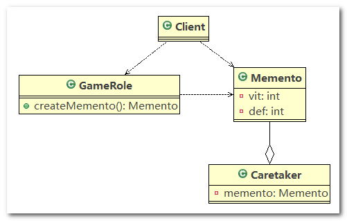

<br />

<details>
<summary style="color:red;">代码实现（展开）</summary>

1. `GameRole`：游戏角色对应的实体类，`createMemento()` 方法用于创建备忘录对象，`recoverGameRoleFromMemento()` 用于从备忘录对象中恢复角色的状态

   ```java
   public class GameRole {
   
   	private int vit;
   	private int def;
   
   	// 创建Memento ,即根据当前的状态得到Memento
   	public Memento createMemento() {
   		return new Memento(vit, def);
   	}
   
   	// 从备忘录对象，恢复GameRole的状态
   	public void recoverGameRoleFromMemento(Memento memento) {
   		this.vit = memento.getVit();
   		this.def = memento.getDef();
   	}
   
   	// 显示当前游戏角色的状态
   	public void display() {
   		System.out.println("游戏角色当前的攻击力：" + this.vit + " 防御力: " + this.def);
   	}
   
   	public int getVit() {
   		return vit;
   	}
   
   	public void setVit(int vit) {
   		this.vit = vit;
   	}
   
   	public int getDef() {
   		return def;
   	}
   
   	public void setDef(int def) {
   		this.def = def;
   	}
   
   }
   ```

2. `Memento`：备忘录对象

   ```java
   public class Memento {
   
   	// 攻击力
   	private int vit;
   	// 防御力
   	private int def;
   
   	public Memento(int vit, int def) {
   		this.vit = vit;
   		this.def = def;
   	}
   
   	public int getVit() {
   		return vit;
   	}
   
   	public void setVit(int vit) {
   		this.vit = vit;
   	}
   
   	public int getDef() {
   		return def;
   	}
   
   	public void setDef(int def) {
   		this.def = def;
   	}
   
   }
   ```

3. `Caretaker`：守护者对象，用于管理备忘录对象

   ```java
   //守护者对象, 保存游戏角色的状态
   public class Caretaker {
   
   	// 如果只保存一次状态
   	private Memento memento;
   	
   	// 对GameRole 保存多次状态
   	// private ArrayList<Memento> mementos;
   	
   	// 对多个游戏角色保存多个状态
   	// private HashMap<String, ArrayList<Memento>> rolesMementos;
   
   	public Memento getMemento() {
   		return memento;
   	}
   
   	public void setMemento(Memento memento) {
   		this.memento = memento;
   	}
   
   }
   ```

4. `Client`：测试代码

   ```java
   public class Client {
   
   	public static void main(String[] args) {
   		// 创建游戏角色
   		GameRole gameRole = new GameRole();
   		gameRole.setVit(100);
   		gameRole.setDef(100);
   
   		System.out.println("和boss大战前的状态");
   		gameRole.display();
   
   		// 把当前状态保存caretaker
   		Caretaker caretaker = new Caretaker();
   		caretaker.setMemento(gameRole.createMemento());
   
   		System.out.println("和boss大战~~~");
   		gameRole.setDef(30);
   		gameRole.setVit(30);
   		gameRole.display();
   
   		System.out.println("大战后，使用备忘录对象恢复元气");
   		gameRole.recoverGameRoleFromMemento(caretaker.getMemento());
   		System.out.println("恢复后的状态");
   		gameRole.display();
   	}
   
   }
   ```

</details>

#### 3.4.10.5. 注意事项

1. 给用户提供了一种可以恢复状态的机制，可以使用户能够比较方便地回到某个历史的状态
2. 实现了信息的封装，使得用户不需要关心状态的保存细节
3. 如果类的成员变量过多，势必会占用比较大的资源，而且每一次保存都会消耗一定的内存，这个需要注意
4. 为了节约内存，备忘录模式可以和原型模式配合使用

### 3.4.11. 状态模式（State Pattern）

#### 3.4.11.1. 说明

- 基本说明
  - 状态模式(`State Pattern`)：它主要用来解决对象在多种状态转换时，需要对外输出不同的行为的问题。
  - 状态和行为是一一对应的，状态之间可以相互转换
  - 当一个对象的内在状态改变时，允许改变其行为，这个对象看起来像是改变了其类
  - 状态模式本质上是一种基于状态和事件的状态机

- 原理类图
  - `Context` 类为上下文对象，用于维护`State`实例，这个实例定义当前状态
  - `State` 是抽象的状态角色，定义一个接口封装与`Context` 的一个特定接口相关行为
  - `ConcreteState` 具体的状态角色，每个子类实现一个与`Context` 的一个状态相关行为

  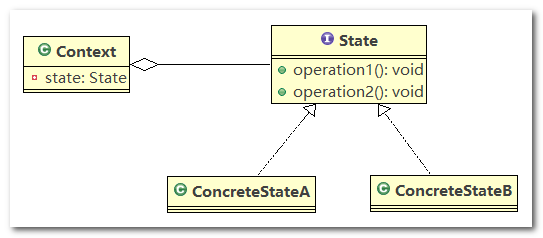

- 应用场景
  - 当一个事件或者对象有很多种状态，状态之间会相互转换，对不同的状态要求有不同的行为的时候，可以考虑使用状态模式

#### 3.4.11.2. APP抽奖状态模式代码

> **情景介绍**

- 请编写程序完成`APP`抽奖活动，具体要求如下:
  - 假如每参加一次这个活动要扣除用户`50`积分，中奖概率是`10%`
  - 奖品数量固定，抽完就不能抽奖
  - 活动有四个状态：可以抽奖、不能抽奖、发放奖品和奖品领完
  - 活动的四个状态转换关系图

  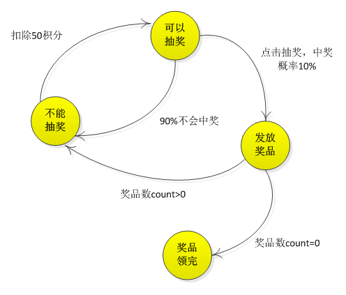

> **类图**

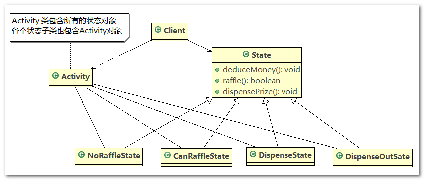

> **代码实现**

<details>
<summary style="color:red;">展开</summary>

1. `State`：抽奖状态的抽象父类，定义了三个抽奖动作：扣除积分、抽奖、发放奖品

   ```java
   /**
    * 状态抽象类
    * 
    * @author Administrator
    *
    */
   public abstract class State {
   
   	// 扣除积分 - 50
   	public abstract void deductMoney();
   
   	// 是否抽中奖品
   	public abstract boolean raffle();
   
   	// 发放奖品
   	public abstract void dispensePrize();
   
   }
   ```

2. `NoRaffleState`：等待扣除积分，不能抽奖的状态

   ```java
   /**
    * 不能抽奖状态
    * 
    * @author Administrator
    *
    */
   public class NoRaffleState extends State {
   
   	// 初始化时传入活动引用，扣除积分后改变其状态
   	RaffleActivity activity;
   
   	public NoRaffleState(RaffleActivity activity) {
   		this.activity = activity;
   	}
   
   	// 当前状态可以扣积分 , 扣除后，将状态设置成可以抽奖状态
   	@Override
   	public void deductMoney() {
   		System.out.println("扣除50积分成功，您可以抽奖了");
   		activity.setState(activity.getCanRaffleState());
   	}
   
   	// 当前状态不能抽奖
   	@Override
   	public boolean raffle() {
   		System.out.println("扣了积分才能抽奖喔！");
   		return false;
   	}
   
   	// 当前状态不能发奖品
   	@Override
   	public void dispensePrize() {
   		System.out.println("不能发放奖品");
   	}
   }
   ```

3. `CanRaffleState`：已经扣除完积分，等待抽奖的状态

   ```java
   /**
    * 可以抽奖的状态
    * 
    * @author Administrator
    *
    */
   public class CanRaffleState extends State {
   
   	RaffleActivity activity;
   
   	public CanRaffleState(RaffleActivity activity) {
   		this.activity = activity;
   	}
   
   	// 已经扣除了积分，不能再扣
   	@Override
   	public void deductMoney() {
   		System.out.println("已经扣取过了积分");
   	}
   
   	// 可以抽奖, 抽完奖后，根据实际情况，改成新的状态
   	@Override
   	public boolean raffle() {
   		System.out.println("正在抽奖，请稍等！");
   		Random r = new Random();
   		int num = r.nextInt(10);
   		// 10%中奖机会
   		if (num == 0) {
   			// 改变活动状态为发放奖品 context
   			activity.setState(activity.getDispenseState());
   			return true;
   		} else {
   			System.out.println("很遗憾没有抽中奖品！");
   			// 改变状态为不能抽奖
   			activity.setState(activity.getNoRafflleState());
   			return false;
   		}
   	}
   
   	// 不能发放奖品
   	@Override
   	public void dispensePrize() {
   		System.out.println("没中奖，不能发放奖品");
   	}
   }
   ```

4. `DispenseState`：已抽完奖，等待发放奖品的状态

   ```java
   /**
    * 发放奖品的状态
    * 
    * @author Administrator
    *
    */
   public class DispenseState extends State {
   
   	// 初始化时传入活动引用，发放奖品后改变其状态
   	RaffleActivity activity;
   
   	public DispenseState(RaffleActivity activity) {
   		this.activity = activity;
   	}
   
   	@Override
   	public void deductMoney() {
   		System.out.println("不能扣除积分");
   	}
   
   	@Override
   	public boolean raffle() {
   		System.out.println("不能抽奖");
   		return false;
   	}
   
   	// 发放奖品
   	@Override
   	public void dispensePrize() {
   		if (activity.getCount() > 0) {
   			System.out.println("恭喜中奖了");
   			// 改变状态为不能抽奖
   			activity.setState(activity.getNoRafflleState());
   		} else {
   			System.out.println("很遗憾，奖品发送完了");
   			// 改变状态为奖品发送完毕, 后面我们就不可以抽奖
   			activity.setState(activity.getDispensOutState());
   			// System.out.println("抽奖活动结束");
   			// System.exit(0);
   		}
   
   	}
   }
   ```

5. `DispenseOutState`：奖品发放完毕的状态

   ```java
   /**
    * 奖品发放完毕状态 说明，当我们activity 改变成 DispenseOutState， 抽奖活动结束
    * 
    * @author Administrator
    *
    */
   public class DispenseOutState extends State {
   
   	// 初始化时传入活动引用
   	RaffleActivity activity;
   
   	public DispenseOutState(RaffleActivity activity) {
   		this.activity = activity;
   	}
   
   	@Override
   	public void deductMoney() {
   		System.out.println("奖品发送完了，请下次再参加");
   	}
   
   	@Override
   	public boolean raffle() {
   		System.out.println("奖品发送完了，请下次再参加");
   		return false;
   	}
   
   	@Override
   	public void dispensePrize() {
   		System.out.println("奖品发送完了，请下次再参加");
   	}
   }
   ```

6. `RaffleActivity`：上下文对象，用于维护 `State`状态对象，并实现扣除积分和抽奖的方法

   ```java
   /**
    * 抽奖活动
    * 
    * @author Administrator
    *
    */
   public class RaffleActivity {
   
   	// state 表示活动当前的状态，是变化的
   	State state = null;
   	// 奖品数量
   	int count = 0;
   
   	// 四个属性，表示四种状态
   	State noRafflleState = new NoRaffleState(this);
   	State canRaffleState = new CanRaffleState(this);
   	State dispenseState = new DispenseState(this);
   	State dispensOutState = new DispenseOutState(this);
   
   	// 构造器
   	// 1. 初始化当前的状态为 noRafflleState（即不能抽奖的状态）
   	// 2. 初始化奖品的数量
   	public RaffleActivity(int count) {
   		this.state = getNoRafflleState();
   		this.count = count;
   	}
   
   	// 扣分, 调用当前状态的 deductMoney
   	public void debuctMoney() {
   		state.deductMoney();
   	}
   
   	// 抽奖
   	public void raffle() {
   		// 如果当前的状态是抽奖成功
   		if (state.raffle()) {
   			// 领取奖品
   			state.dispensePrize();
   		}
   
   	}
   
   	// 这里请大家注意，每领取一次奖品，count--
   	public int getCount() {
   		int curCount = count;
   		count--;
   		return curCount;
   	}
       
       // Getter and Setter
   ```

7. `ClientTest`：测试代码

   ```java
   /**
    * 状态模式测试类
    * 
    * @author Administrator
    *
    */
   public class ClientTest {
   
   	public static void main(String[] args) {
   		// 创建活动对象，奖品有1个奖品
   		RaffleActivity activity = new RaffleActivity(1);
   
   		// 我们连续抽300次奖
   		for (int i = 0; i < 30; i++) {
   			System.out.println("--------第" + (i + 1) + "次抽奖----------");
   			// 参加抽奖，第一步点击扣除积分
   			activity.debuctMoney();
   
   			// 第二步抽奖
   			activity.raffle();
   		}
   	}
   
   }
   ```
</details>

#### 3.4.11.3. 借债平台情景应用

> **基本情景与传统实现方式分析**

- 借贷平台的订单，有审核、发布、抢单等等 步骤，随着操作的不同，会改变订单的状态，项目中的这个模块实现就会使用到状态模式
- 通常通过`if else`判断订单的状态，从而实现不同的逻辑，伪代码如下

   ```java
   if(审核){
   	//审核逻辑
   }elseif(发布){
   	//发布逻辑
   }elseif(接单){
   	//接单逻辑
   }
   ```

- 问题分析 ：
  - 这类代码难以应对变化，在添加一种状态时，我们需要手动添加`if else`，
  - 在添加一种功能时，要对所有的状态进行判断。因此代码会变得越来越臃肿
  - 并且一旦没有处理某个状态，便会发生极其严重的`BUG`，难以维护

> **状态模式在实际项目-借贷平台 源码剖析**

- 状态模式本质上是一种基于状态和事件的状态机，下面是订单流程的状态图

  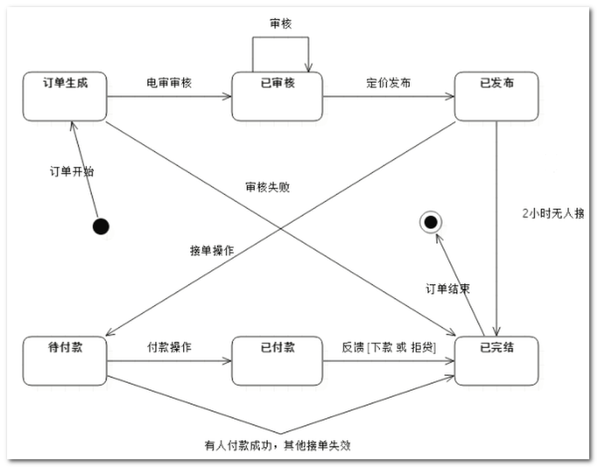

- 通过状态图，我们再设计一张横纵坐标关系表来比较，图如下

  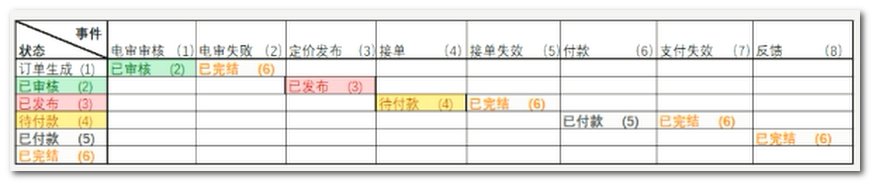

- 类图

  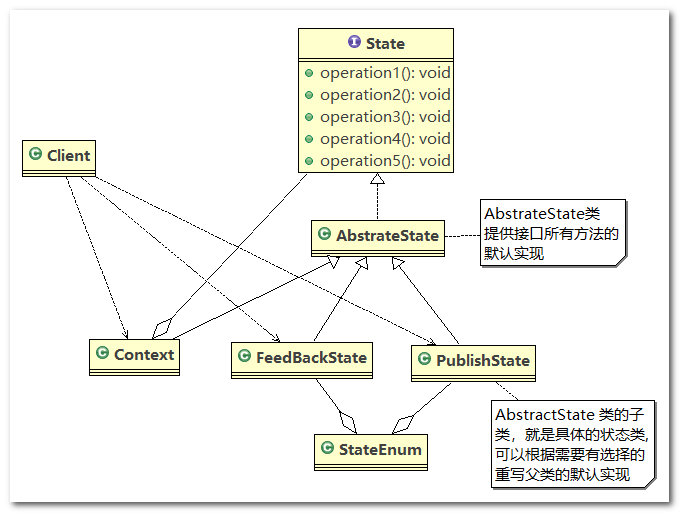

> **代码实现**

<details>
<summary style="color:red;">展开</summary>

1. `State`：订单状态的接口

   ```java
   /**
    * 状态接口
    * 
    * @author Administrator
    *
    */
   public interface State {
   
   	/**
   	 * 电审
   	 */
   	void checkEvent(Context context);
   
   	/**
   	 * 电审失败
   	 */
   	void checkFailEvent(Context context);
   
   	/**
   	 * 定价发布
   	 */
   	void makePriceEvent(Context context);
   
   	/**
   	 * 接单
   	 */
   	void acceptOrderEvent(Context context);
   
   	/**
   	 * 无人接单失效
   	 */
   	void notPeopleAcceptEvent(Context context);
   
   	/**
   	 * 付款
   	 */
   	void payOrderEvent(Context context);
   
   	/**
   	 * 接单有人支付失效
   	 */
   	void orderFailureEvent(Context context);
   
   	/**
   	 * 反馈
   	 */
   	void feedBackEvent(Context context);
   
   	String getCurrentState();
   }
   ```

2. `AbstractState`：订单状态的抽象父类，对 `State` 接口中的方法进行了默认实现

   ```java
   public abstract class AbstractState implements State {
   
   	protected static final RuntimeException EXCEPTION = new RuntimeException("操作流程不允许");
   
   	// 抽象类，默认实现了 State 接口的所有方法
   	// 该类的所有方法，其子类(具体的状态类)，可以有选择的进行重写
   
   	@Override
   	public void checkEvent(Context context) {
   		throw EXCEPTION;
   	}
   
   	@Override
   	public void checkFailEvent(Context context) {
   		throw EXCEPTION;
   	}
   
   	@Override
   	public void makePriceEvent(Context context) {
   		throw EXCEPTION;
   	}
   
   	@Override
   	public void acceptOrderEvent(Context context) {
   		throw EXCEPTION;
   	}
   
   	@Override
   	public void notPeopleAcceptEvent(Context context) {
   		throw EXCEPTION;
   	}
   
   	@Override
   	public void payOrderEvent(Context context) {
   		throw EXCEPTION;
   	}
   
   	@Override
   	public void orderFailureEvent(Context context) {
   		throw EXCEPTION;
   	}
   
   	@Override
   	public void feedBackEvent(Context context) {
   		throw EXCEPTION;
   	}
   }
   ```

3. `AllState`：各种具体的订单状态，继承了 `AbstractState` 父类，并重写了自己所需要的方法

   ```java
   //各种具体状态类
   class FeedBackState extends AbstractState {
   
   	@Override
   	public String getCurrentState() {
   		return StateEnum.FEED_BACKED.getValue();
   	}
   }
   
   class GenerateState extends AbstractState {
   
   	@Override
   	public void checkEvent(Context context) {
   		context.setState(new ReviewState());
   	}
   
   	@Override
   	public void checkFailEvent(Context context) {
   		context.setState(new FeedBackState());
   	}
   
   	@Override
   	public String getCurrentState() {
   		return StateEnum.GENERATE.getValue();
   	}
   }
   
   class NotPayState extends AbstractState {
   
   	@Override
   	public void payOrderEvent(Context context) {
   		context.setState(new PaidState());
   	}
   
   	@Override
   	public void feedBackEvent(Context context) {
   		context.setState(new FeedBackState());
   	}
   
   	@Override
   	public String getCurrentState() {
   		return StateEnum.NOT_PAY.getValue();
   	}
   }
   
   class PaidState extends AbstractState {
   
   	@Override
   	public void feedBackEvent(Context context) {
   		context.setState(new FeedBackState());
   	}
   
   	@Override
   	public String getCurrentState() {
   		return StateEnum.PAID.getValue();
   	}
   }
   
   class PublishState extends AbstractState {
   
   	@Override
   	public void acceptOrderEvent(Context context) {
   		// 把当前状态设置为 NotPayState。。。
   		// 至于应该变成哪个状态，有流程图来决定
   		context.setState(new NotPayState());
   	}
   
   	@Override
   	public void notPeopleAcceptEvent(Context context) {
   		context.setState(new FeedBackState());
   	}
   
   	@Override
   	public String getCurrentState() {
   		return StateEnum.PUBLISHED.getValue();
   	}
   }
   
   class ReviewState extends AbstractState {
   
   	@Override
   	public void makePriceEvent(Context context) {
   		context.setState(new PublishState());
   	}
   
   	@Override
   	public String getCurrentState() {
   		return StateEnum.REVIEWED.getValue();
   	}
   
   }
   ```

4. `Context`：环境上下文，继承了 `AbstractState` 父类，实现了自己所需要的方法，以供 `Client` 端调用

   ```java
   //环境上下文
   public class Context extends AbstractState {
   	// 当前的状态 state, 根据我们的业务流程处理，不停的变化
   	private State state;
   
   	@Override
   	public void checkEvent(Context context) {
   		state.checkEvent(this);
   		getCurrentState();
   	}
   
   	@Override
   	public void checkFailEvent(Context context) {
   		state.checkFailEvent(this);
   		getCurrentState();
   	}
   
   	@Override
   	public void makePriceEvent(Context context) {
   		state.makePriceEvent(this);
   		getCurrentState();
   	}
   
   	@Override
   	public void acceptOrderEvent(Context context) {
   		state.acceptOrderEvent(this);
   		getCurrentState();
   	}
   
   	@Override
   	public void notPeopleAcceptEvent(Context context) {
   		state.notPeopleAcceptEvent(this);
   		getCurrentState();
   	}
   
   	@Override
   	public void payOrderEvent(Context context) {
   		state.payOrderEvent(this);
   		getCurrentState();
   	}
   
   	@Override
   	public void orderFailureEvent(Context context) {
   		state.orderFailureEvent(this);
   		getCurrentState();
   	}
   
   	@Override
   	public void feedBackEvent(Context context) {
   		state.feedBackEvent(this);
   		getCurrentState();
   	}
   
   	public State getState() {
   		return state;
   	}
   
   	public void setState(State state) {
   		this.state = state;
   	}
   
   	@Override
   	public String getCurrentState() {
   		System.out.println("当前状态 : " + state.getCurrentState());
   		return state.getCurrentState();
   	}
   }
   ```

5. `ClientTest`：测试代码

   ```java
   /** 测试类 */
   public class ClientTest {
   
   	public static void main(String[] args) {
   		// 创建context 对象
   		Context context = new Context();
   		// 将当前状态设置为 PublishState
   		context.setState(new PublishState());
   		System.out.println(context.getCurrentState());
   
   		// publish --> not pay
   		context.acceptOrderEvent(context);
   		// not pay --> paid
   		context.payOrderEvent(context);
   		// 失败, 检测失败时，会抛出异常
   		try {
   			context.checkFailEvent(context);
   			System.out.println("流程正常..");
   		} catch (Exception e) {
   			// TODO handle exception
   			System.out.println(e.getMessage());
   		}
   	}
   }
   ```
</details>

#### 3.4.11.4. 优缺点

- 优点
  - 状态模式将每个状态的行为封装到对应的一个类中，所以代码有很强的可读性
  - 方便维护。因为将容易产生问题的`if-else`语句删除了，如果把每个状态的行为都放到一个类中，每次调用方法时都要判断当前是什么状态，不但会产出很多`if-else`语句，而且容易出错
  - 符合“开闭原则”，容易增删对象的状态

- 缺点
  - 会产生很多类，每个状态都要一个对应的类，当状态过多时会产生很多类，加大维护难度

---

- 上面两个场景中
  - APP抽奖情景，因为状态机里面有环，状态会作为成员变量，而不是临时new，避免产生过多无用对象。
  - 借债平台情境中，因为没有环，每次到结束经过的状态有限，不需要作为成员变量

### 3.4.12. 策略模式（Strategy Pattern）

#### 3.4.12.1. 说明

- 基本说明
  - 策略模式(`Strategy Pattern`)中，定义算法族(策略簇)，分别封装起来，让他们之间可以互相替换，此模式让算法的变化独立于使用算法的客户
  - 这算法体现了几个设计原则：
    - 第一、把变化的代码从不变的代码中分离出来；
    - 第二、针对接口编程而不是具体类(定义了策略接口)；
    - 第三、多用组合(或聚合)，少用继承(客户通过组合方式使用策略)

- 类图
  -  客户 `context` 有成员变量 `strategy` 或者其他的策略接口
  -  至于需要使用到哪个策略， 可以在构造器中指定

  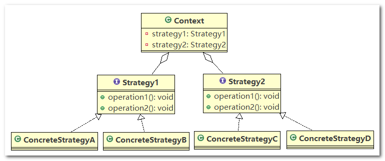

#### 3.4.12.2. 情景介绍

- 编写鸭子项目，具体要求如下:
  - 有各种鸭子(比如野鸭、北京鸭、水鸭等， 鸭子有各种行为，比如叫、飞行等)
  - 显示鸭子的信息

#### 3.4.12.3. 传统方式

> **类图**

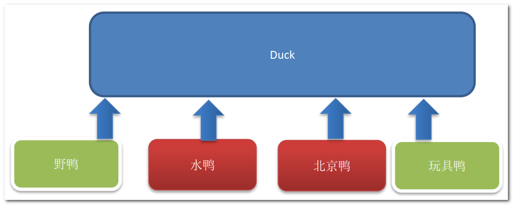

> **代码实现**

<details>
<summary style="color:red;">展开</summary>

1. `Duck`：鸭子的抽象父类

   ```java
   public abstract class Duck {
   
   	public Duck() {
   
   	}
   
   	public abstract void display();// 显示鸭子信息
   
   	public void quack() {
   		System.out.println("鸭子嘎嘎叫~~");
   	}
   
   	public void swim() {
   		System.out.println("鸭子会游泳~~");
   	}
   
   	public void fly() {
   		System.out.println("鸭子会飞翔~~~");
   	}
   
   }
   ```

2. `WildDuck`：野鸭

   ```java
   public class WildDuck extends Duck {
   
   	@Override
   	public void display() {
   		System.out.println(" 这是野鸭 ");
   	}
   
   }
   ```

3. `PekingDuck`：北京烤鸭

   ```java
   public class PekingDuck extends Duck {
   
   	@Override
   	public void display() {
   		System.out.println("~~北京鸭~~~");
   	}
   
   	// 因为北京鸭不能飞翔，因此需要重写fly
   	@Override
   	public void fly() {
   		System.out.println("北京鸭不能飞翔");
   	}
   
   }
   ```

4. `ToyDuck`；玩具鸭鸭

   ```java
   public class ToyDuck extends Duck {
   
   	@Override
   	public void display() {
   		System.out.println("玩具鸭");
   	}
   
   	// 需要重写父类的所有方法
   	public void quack() {
   		System.out.println("玩具鸭不能叫~~");
   	}
   
   	public void swim() {
   		System.out.println("玩具鸭不会游泳~~");
   	}
   
   	public void fly() {
   		System.out.println("玩具鸭不会飞翔~~~");
   	}
   }
   ```
</details>

> **传统的方式实现的问题分析和解决方案**

1. 其它鸭子，都继承了`Duck` 类，所以 `fly` 让所有子类都会飞了，这是不正确的
2. 上面说的问题，其实是继承带来的问题： 对类的局部改动，尤其超类的局部改动，会影响其他部分，会有溢出效应
3. 为了改进此问题，我们可以通过覆盖 `fly` 方法来解决 ==> 覆盖解决
4. 问题又来了，如果我们有一个玩具鸭子`ToyDuck`，这样就需要`ToyDuck`去覆盖`Duck`的所有实现的方法 ==> 解决思路 ：策略模式 (`strategy pattern`)

#### 3.4.12.4. 策略模式代码

> **类图**

- 策略模式：
  - 分别封装行为接口， 实现算法族， 超类里放行为接口对象， 在子类里具体设定行为对象。
  - 原则就是：分离变化部分， 封装接口， 基于接口编程各种功能。 此模式让行为的变化独立于算法的使用者

  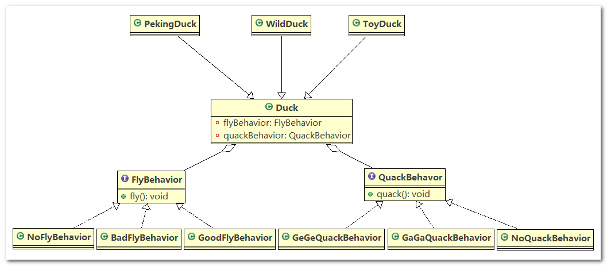

> **代码实现**

<details>
<summary style="color:red;">展开</summary>

1. `FlyBehavior`：飞行的行为(算法的提供者)

   ```java
   public interface FlyBehavior {
   	void fly(); // 子类具体实现
   }
   ```

2. `NoFlyBehavior`：

   ```java
   public class NoFlyBehavior implements FlyBehavior {
   
   	@Override
   	public void fly() {
   		System.out.println(" 不会飞翔  ");
   	}
   
   }
   ```

3. `BadFlyBehavior`：

   ```java
   public class BadFlyBehavior implements FlyBehavior {
   
   	@Override
   	public void fly() {
   		System.out.println(" 飞翔技术一般 ");
   	}
   
   }
   ```

4. `GoodFlyBehavior`：

   ```java
   public class GoodFlyBehavior implements FlyBehavior {
   
   	@Override
   	public void fly() {
   		System.out.println(" 飞翔技术高超 ~~~");
   	}
   
   }
   ```

5. `QuackBehavior`：叫的行为(算法的提供者)

   ```java
   public interface QuackBehavior {
   	void quack();// 子类实现
   }
   ```

6. `NoQuackBehavior`：

   ```java
   public class NoQuackBehavior implements QuackBehavior {
   
   	@Override
   	public void quack() {
   		System.out.println("不能叫");
   	}
   
   }
   ```

7. `GeGeQuackBehavior`：

   ```java
   public class GeGeQuackBehavior implements QuackBehavior {
   
   	@Override
   	public void quack() {
   		System.out.println("咯咯叫");
   	}
   
   }
   ```

8. `GaGaQuackBehavior`：

   ```java
   public class GaGaQuackBehavior implements QuackBehavior {
   
   	@Override
   	public void quack() {
   		System.out.println("嘎嘎叫");
   	}
   
   }
   ```

9. `Duck`：鸭子的抽象父类(算法的使用者)，通过聚合不同的行为对象(算法的提供者)，实现不同的行为模式

   ```java
   public abstract class Duck {
   
   	// 属性, 策略接口
   	FlyBehavior flyBehavior;
   	// 其它属性<->策略接口
   	QuackBehavior quackBehavior;
   
   	public Duck() {
   
   	}
   
   	public abstract void display();// 显示鸭子信息
   
   	public void quack() {
   		if (quackBehavior != null) {
   			quackBehavior.quack();
   		}
   	}
   
   	public void swim() {
   		System.out.println("鸭子会游泳~~");
   	}
   
   	public void fly() {
   		// 改进
   		if (flyBehavior != null) {
   			flyBehavior.fly();
   		}
   	}
   
   	public void setFlyBehavior(FlyBehavior flyBehavior) {
   		this.flyBehavior = flyBehavior;
   	}
   
   	public void setQuackBehavior(QuackBehavior quackBehavior) {
   		this.quackBehavior = quackBehavior;
   	}
   
   }
   ```

10. `WildDuck`：

    ```java
    public class WildDuck extends Duck {
    
    	// 构造器，传入FlyBehavior 和 QuackBehavior 的对象
    	public WildDuck() {
    		flyBehavior = new GoodFlyBehavior();
    		quackBehavior = new GeGeQuackBehavior();
    	}
    
    	@Override
    	public void display() {
    		System.out.println(" 这是野鸭 ");
    	}
    
    }
    ```

11. `PekingDuck`：

    ```java
    public class PekingDuck extends Duck {
    
    	// 假如北京鸭可以飞翔，但是飞翔技术一般
    	public PekingDuck() {
    		flyBehavior = new BadFlyBehavior();
    		quackBehavior = new GaGaQuackBehavior();
    	}
    
    	@Override
    	public void display() {
    		System.out.println("~~北京鸭~~~");
    	}
    
    }
    ```

12. `ToyDuck`：

    ```java
    public class ToyDuck extends Duck {
    
    	public ToyDuck() {
    		flyBehavior = new NoFlyBehavior();
    		quackBehavior = new NoQuackBehavior();
    	}
    
    	@Override
    	public void display() {
    		System.out.println("玩具鸭");
    	}
    
    	public void swim() {
    		System.out.println("玩具鸭不会游泳~~");
    	}
    
    }
    ```

13. `Client`：测试代码

    ```java
    public class Client {
    
    	public static void main(String[] args) {
    		WildDuck wildDuck = new WildDuck();
    		wildDuck.fly();
    
    		ToyDuck toyDuck = new ToyDuck();
    		toyDuck.fly();
    
    		PekingDuck pekingDuck = new PekingDuck();
    		pekingDuck.fly();
    
    		// 动态改变某个对象的行为, 北京鸭 不能飞
    		pekingDuck.setFlyBehavior(new NoFlyBehavior());
    		System.out.println("北京鸭的实际飞翔能力");
    		pekingDuck.fly();
    	}
    
    }
    ```
</details>

> **总结**

- 将原来的继承方式改为组合(或聚合)方式，来实现对象的行为，
- 可以将算法的使用者(`Duck`)与算法的提供者(`FlyBehavior` 和 `QuackBehavior`)解耦

## 3.5. JDK Arrays 源码分析

- 代码
  ```java
  public class Strategy {

    public static void main(String[] args) {
      // TODO Auto-generated method stub
      // 数组
      Integer[] data = { 9, 1, 2, 8, 4, 3 };
      // 实现降序排序，返回-1放左边，1放右边，0保持不变

      // 说明
      // 1. 实现了 Comparator 接口（策略接口） , 匿名类 对象 new Comparator<Integer>(){..}
      // 2. 对象 new Comparator<Integer>(){..} 就是实现了 策略接口 的对象
      // 3. public int compare(Integer o1, Integer o2){} 指定具体的处理方式
      Comparator<Integer> comparator = new Comparator<Integer>() {
        public int compare(Integer o1, Integer o2) {
          if (o1 > o2) {
            return -1;
          } else {
            return 1;
          }
        };
      };
      
      // 说明
      /*
      * public static <T> void sort(T[] a, Comparator<? super T> c) {
              if (c == null) {
                  sort(a); //默认方法
              } else { 
                  if (LegacyMergeSort.userRequested)
                      legacyMergeSort(a, c); //使用策略对象c
                  else
                    // 使用策略对象c
                      TimSort.sort(a, 0, a.length, c, null, 0, 0);
              }
          }
      */
      //方式1 
      Arrays.sort(data, comparator);

      System.out.println(Arrays.toString(data)); // 降序排序

      // 方式2- 同时lambda 表达式实现 策略模式
      Integer[] data2 = { 19, 11, 12, 18, 14, 13 };

      Arrays.sort(data2, (var1, var2) -> {
        if (var1.compareTo(var2) > 0) {
          return -1;
        } else {
          return 1;
        }
      });

      System.out.println("data2=" + Arrays.toString(data2));

    }

  }
  ```

- 说明
  - `Comparator` 为策略接口(算法的提供者)，其实现对象指明了具体算法的行为，
  - `Arrays` 为算法的使用者，通过组合(聚合)不同的算法提供者，实现不同的算法行为

#### 3.5.0.5. 注意事项

### 3.5.1. 空对象模式（Null Object Pattern）

#### 3.5.1.1. 说明

#### 3.5.1.2. 情景介绍

#### 3.5.1.3. 传统方式

#### 3.5.1.4. 代码

#### 3.5.1.5. 注意事项

## 3.6. J2EE 模式

### 3.6.1. 概述

这些设计模式特别关注表示层。这些模式是由 Sun Java Center 鉴定的。

### 3.6.2. MVC 模式（MVC Pattern）

#### 3.6.2.1. 说明

#### 3.6.2.2. 情景介绍

#### 3.6.2.3. 传统方式

#### 3.6.2.4. 代码

#### 3.6.2.5. 注意事项

### 3.6.3. 业务代表模式（Business Delegate Pattern）

#### 3.6.3.1. 说明

#### 3.6.3.2. 情景介绍

#### 3.6.3.3. 传统方式

#### 3.6.3.4. 代码

#### 3.6.3.5. 注意事项

### 3.6.4. 组合实体模式（Composite Entity Pattern）

#### 3.6.4.1. 说明

#### 3.6.4.2. 情景介绍

#### 3.6.4.3. 传统方式

#### 3.6.4.4. 代码

#### 3.6.4.5. 注意事项

### 3.6.5. 数据访问对象模式（Data Access Object Pattern）

#### 3.6.5.1. 说明

#### 3.6.5.2. 情景介绍

#### 3.6.5.3. 传统方式

#### 3.6.5.4. 代码

#### 3.6.5.5. 注意事项

### 3.6.6. 前端控制器模式（Front Controller Pattern）

#### 3.6.6.1. 说明

#### 3.6.6.2. 情景介绍

#### 3.6.6.3. 传统方式

#### 3.6.6.4. 代码

#### 3.6.6.5. 注意事项

### 3.6.7. 拦截过滤器模式（Intercepting Filter Pattern）

#### 3.6.7.1. 说明

#### 3.6.7.2. 情景介绍

#### 3.6.7.3. 传统方式

#### 3.6.7.4. 代码

#### 3.6.7.5. 注意事项

### 3.6.8. 服务定位器模式（Service Locator Pattern）

#### 3.6.8.1. 说明

#### 3.6.8.2. 情景介绍

#### 3.6.8.3. 传统方式

#### 3.6.8.4. 代码

#### 3.6.8.5. 注意事项

### 3.6.9. 传输对象模式（Transfer Object Pattern）

#### 3.6.9.1. 说明

#### 3.6.9.2. 情景介绍

#### 3.6.9.3. 传统方式

#### 3.6.9.4. 代码

#### 3.6.9.5. 注意事项

## 3.7. 设计模式的实际应用

### 3.7.1. 工厂+策略模式消除if-else

# 4. 参考资料

- [x] [设计模式六大原则详解](https://www.cnblogs.com/huansky/p/13700861.html)
- [ ] [Java设计模式](https://www.bilibili.com/video/BV1G4411c7N4)
- [ ] [设计模式笔记](https://blog.csdn.net/oneby1314/category_10348963.html)
- [ ] [菜鸟教程](https://www.runoob.com/design-pattern/design-pattern-tutorial.html)
