> 面向对象(oo)=>功能模块(设计模式+算法/数据结构)==放到==>框架(使用多种设计模式)=>架构(服务器集群)

**一定要好好看代码和注释**

# 1. 总括

## 1.1. 设计模式目的

编写软件过程中，程序员面临着来自 耦合性，内聚性以及可维护性，可扩展性，重用性，灵活性 等多方面的挑战，设计模式是为了让程序(软件)，具有更好的：

1. 代码重用性 (即：相同功能的代码，不用多次编写)
2. 可读性 (即：编程规范性,  便于其他程序员的阅读和理解)
3. 可扩展性 (即：当需要增加新的功能时，非常的方便，称为可维护)
4. 可靠性 (即：当我们增加新的功能后，对原来的功能没有影响)
5. 使程序呈现**高内聚，低耦合**的特性。

> 设计模式包含了面向对象的精髓，“懂了设计模式，你就懂了面向对象分析和设计（OOA/D）的精要”

## 1.2. 设计模式的七大原则

### 1.2.1. 单一职责原则

#### 1.2.1.1. 基本介绍

对类来说的，即一个类应该只负责一项职责。如类A负责两个不同职责：职责1，职责2。当职责1需求变更而改变A时，可能造成职责2执行错误， 所以需要将类A的粒度分解为A1， A2

#### 1.2.1.2. 案例

> 应用实例：以交通工具案例讲解

<details>
<summary style="color:red;">案例1:未准守单一职责原则</summary>

```java
public class SingleResponsibility1 {

	public static void main(String[] args) {
		Vehicle vehicle = new Vehicle();
		vehicle.run("摩托车");
		vehicle.run("汽车");
		vehicle.run("飞机");
	}
}

// 方式1
// 会有：飞机在公路上运行。这一错误
// 违反了单一职责原则
// 解决的方案非常的简单，根据交通工具运行方法不同，分解成不同类即可
class Vehicle {
	public void run(String vehicle) {
		System.out.println(vehicle + " 在公路上运行....");
	}
}
```

</details>

<details>
<summary style="color:red;">案例2：完全准守单一职责原则，对类进行拆解，实现单一职责原则</summary>

```java
public class SingleResponsibility2 {

	public static void main(String[] args) {
		RoadVehicle roadVehicle = new RoadVehicle();
		roadVehicle.run("摩托车");
		roadVehicle.run("汽车");
		
		AirVehicle airVehicle = new AirVehicle();
		
		airVehicle.run("飞机");
	}

}

//方案2的分析
//1. 遵守单一职责原则
//2. 但是这样做的改动很大，即将类分解，同时修改客户端
//3. 改进：直接修改Vehicle 类，改动的代码会比较少=>方案3
class RoadVehicle {
	public void run(String vehicle) {
		System.out.println(vehicle + "公路运行");
	}
}

class AirVehicle {
	public void run(String vehicle) {
		System.out.println(vehicle + "天空运行");
	}
}

class WaterVehicle {
	public void run(String vehicle) {
		System.out.println(vehicle + "水中运行");
	}
}
```

1. 遵守单一职责原则
2. 但是这样做的改动很大，即将类分解，同时修改客户端
3. 改进：直接修改Vehicle 类，改动的代码会比较少=>方案3

</details>


<details>
<summary style="color:red;">案例3：没有完全准守单一职责原则，对方法进行拆解，实现单一职责原则</summary>

```java
public class SingleResponsibility3 {

	public static void main(String[] args) {
		Vehicle2 vehicle2  = new Vehicle2();
		vehicle2.run("汽车");
		vehicle2.runWater("轮船");
		vehicle2.runAir("飞机");
	}

}

//方式3的分析
//1. 这种修改方法没有对原来的类做大的修改，只是增加方法
//2. 这里虽然没有在类这个级别上遵守单一职责原则，但是在方法级别上，仍然是遵守单一职责
class Vehicle2 {
	public void run(String vehicle) {
		//处理
		System.out.println(vehicle + " 在公路上运行....");
	}
	
	public void runAir(String vehicle) {
		System.out.println(vehicle + " 在天空上运行....");
	}
	
	public void runWater(String vehicle) {
		System.out.println(vehicle + " 在水中运行....");
	}

	//方法4.
	//...
}
```

</details>

补充：**慎用if-else分支语句，耦合性过高**

#### 1.2.1.3. 注意

- **单一职责原则的注意事项和原则**
  1. 降低类的复杂度，一个类只负责一项职责
  2. 提高类的可读性，可维护性
  3. 降低变更引起的风险
  4. 通常情况下，**我们应当遵守单一职责原则**，只有逻辑足够简单，才可以在代码级违反单一职责原则；**只有类中方法数量足够少，可以在方法级别保持单一职责原则**
    > 比如方式3，因为代码比较简单，所以只把功能拆分为了方法，但是如果每个方法中都要调用类中的其他各种方法，还是分成类比较好。

### 1.2.2. 接口隔离原则

#### 1.2.2.1. 基本介绍

客户端不应该依赖它不需要的接口，即一个类对另一个类的依赖应该建立在最小的接口上

#### 1.2.2.2. 案例

1. 类A通过接口Interface1依赖类B，类C通过接口Interface1依赖类D，如果接口Interface1对于类A和类C来说不是最小接口，那么类B和类D必须去实现他们不需要的方法。
2. 按隔离原则应当这样处理：将接口Interface1拆分为独立的几个接口，类A和类C分别与他们需要的接口建立依赖关系。也就是采用接口隔离原则


<details>
<summary style="color:red;">案例1：未应用接口隔离原则，问题：类 A 通过 Interface1 依赖类 B 类 C 通过 Interface1 依赖类 D，造成类 B 和 类 D 需要去实现他们无需实现的接口</summary>

```java
public class Segregation1 {

	public static void main(String[] args) {
		A a = new A();
		a.depend1(new B()); // A类通过接口去依赖B类
		a.depend2(new B());
		a.depend3(new B());
	}

}

//接口
interface Interface1 {
	void operation1();

	void operation2();

	void operation3();

	void operation4();

	void operation5();
}

class B implements Interface1 {
	public void operation1() {
		System.out.println("B 实现了 operation1");
	}

	public void operation2() {
		System.out.println("B 实现了 operation2");
	}

	public void operation3() {
		System.out.println("B 实现了 operation3");
	}

	public void operation4() {
		System.out.println("B 实现了 operation4");
	}

	public void operation5() {
		System.out.println("B 实现了 operation5");
	}
}

class D implements Interface1 {
	public void operation1() {
		System.out.println("D 实现了 operation1");
	}

	public void operation2() {
		System.out.println("D 实现了 operation2");
	}

	public void operation3() {
		System.out.println("D 实现了 operation3");
	}

	public void operation4() {
		System.out.println("D 实现了 operation4");
	}

	public void operation5() {
		System.out.println("D 实现了 operation5");
	}
}

class A { // A 类通过接口Interface1 依赖(使用) B类，但是只会用到1,2,3方法
	public void depend1(Interface1 i) {
		i.operation1();
	}

	public void depend2(Interface1 i) {
		i.operation2();
	}

	public void depend3(Interface1 i) {
		i.operation3();
	}
}

class C { // C 类通过接口Interface1 依赖(使用) D类，但是只会用到1,4,5方法
	public void depend1(Interface1 i) {
		i.operation1();
	}

	public void depend4(Interface1 i) {
		i.operation4();
	}

	public void depend5(Interface1 i) {
		i.operation5();
	}
}
```
</details>

<details>
<summary style="color:red;">案例2：分析传统方法的问题，使用接口隔离原则改进程序结构</summary>

- 类A通过接口Interface1依赖类B，类C通过接口Interface1依赖类D，如果接口Interface1对于类A和类C来说不是最小接口，那么类B和类D必须去实现他们不需要的方法
- 将接口Interface1拆分为独立的几个接口，类A和类C分别与他们需要的接口建立依赖关系。也就是采用接口隔离原则
- 接口Interface1中出现的方法，根据实际情况拆分为三个接口

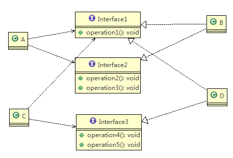

```java
public class Segregation1 {

	public static void main(String[] args) {

		// 使用一把
		A a = new A();
		a.depend1(new B()); // A类通过接口去依赖B类
		a.depend2(new B());
		a.depend3(new B());

		C c = new C();

		c.depend1(new D()); // C类通过接口去依赖(使用)D类
		c.depend4(new D());
		c.depend5(new D());

	}

}

// 接口1
interface Interface1 {
	void operation1();
}

// 接口2
interface Interface2 {
	void operation2();
	void operation3();
}

// 接口3
interface Interface3 {
	void operation4();
	void operation5();
}

class B implements Interface1, Interface2 {
	public void operation1() {
		System.out.println("B 实现了 operation1");
	}

	public void operation2() {
		System.out.println("B 实现了 operation2");
	}

	public void operation3() {
		System.out.println("B 实现了 operation3");
	}

}

class D implements Interface1, Interface3 {
	public void operation1() {
		System.out.println("D 实现了 operation1");
	}

	public void operation4() {
		System.out.println("D 实现了 operation4");
	}

	public void operation5() {
		System.out.println("D 实现了 operation5");
	}
}

class A { // A 类通过接口Interface1,Interface2 依赖(使用) B类，但是只会用到1,2,3方法
	public void depend1(Interface1 i) {
		i.operation1();
	}

	public void depend2(Interface2 i) {
		i.operation2();
	}

	public void depend3(Interface2 i) {
		i.operation3();
	}
}

class C { // C 类通过接口Interface1,Interface3 依赖(使用) D类，但是只会用到1,4,5方法
	public void depend1(Interface1 i) {
		i.operation1();
	}

	public void depend4(Interface3 i) {
		i.operation4();
	}

	public void depend5(Interface3 i) {
		i.operation5();
	}
}
```
</details>

### 1.2.3. 依赖倒转(倒置)原则

#### 1.2.3.1. 基本介绍

- 高层模块不应该依赖低层模块，二者都应该依赖其抽象(接口，抽象类)
- 抽象不应该依赖细节(比如实现类)，细节应该依赖抽象
- 依赖倒转(倒置)的中心思想是**面向接口编程**
- 依赖倒转原则是基于这样的设计理念：相对于细节的多变性，抽象的东西要稳定的多。以抽象为基础搭建的架构比以细节为基础的架构要稳定的多。在java中，抽象指的是接口或抽象类，细节就是具体的实现类
- **使用接口或抽象类的目的是制定好规范**，而不涉及任何具体的操作，**把展现细节的任务交给他们的实现类去完成**
 
#### 1.2.3.2. 案例


<details>
<summary style="color:red;">案例1：未遵循依赖倒置原则，Person 类与 Email 类耦合，如果我们还想获取其他消息，比如微信、短信、QQ 等、则需要添加相应的实现方法</summary>

```java
public class DependecyInversion {

	public static void main(String[] args) {
		Person person = new Person();
		person.receive(new Email());
	}

}

class Email {
	public String getInfo() {
		return "电子邮件信息: hello,world";
	}
}

//完成Person接收消息的功能
//方式1分析
//1. 简单，比较容易想到
//2. 如果我们获取的对象是 微信，短信等等，则新增类，同时Peron也要增加相应的接收方法
//3. 解决思路：引入一个抽象的接口IReceiver, 表示接收者, 这样Person类与接口IReceiver发生依赖
//   因为Email, WeiXin 等等属于接收的范围，他们各自实现IReceiver 接口就ok, 这样我们就符号依赖倒转原则
class Person {
	public void receive(Email email) {
		System.out.println(email.getInfo());
	}
}
```
</details>


<details>
<summary style="color:red;">案例2：引入一个抽象的接口 IReceiver，表示接收者（Email、微信、短信、QQ 等），接受者分别实现 IReceiver 接口中的方法，实现各自接收消息的逻辑，Person 类与 IReceiver 接口发生依赖，达到接收消息的功能</summary>

```java
public class DependecyInversion {

	public static void main(String[] args) {
		// 客户端无需改变
		Person person = new Person();
		person.receive(new Email());
		person.receive(new WeiXin());
	}

}

//定义接口
interface IReceiver {
	public String getInfo();
}

class Email implements IReceiver {
	public String getInfo() {
		return "电子邮件信息: hello,world";
	}
}

//增加微信
class WeiXin implements IReceiver {
	public String getInfo() {
		return "微信信息: hello,ok";
	}
}

//方式2
class Person {
	// 这里我们是对接口的依赖
	public void receive(IReceiver receiver) {
		System.out.println(receiver.getInfo());
	}
}
```
</details>

#### 1.2.3.3. 依赖关系传递的三种方式和应用案例


<details>
<summary style="color:red;">接口传递</summary>

```java
public class DependencyPass {

	public static void main(String[] args) {
		// 通过接口传递
		ChangHong changHong = new ChangHong();
		OpenAndClose openAndClose = new OpenAndClose();
		openAndClose.open(changHong);
	}

}

// 方式1： 通过接口传递实现依赖
// 开关的接口
interface IOpenAndClose {
	public void open(ITV tv); // 抽象方法,接收接口
}

// ITV接口
interface ITV {
	public void play();
}

// 长虹电视：实现 ITV 接口
class ChangHong implements ITV {
	@Override
	public void play() {
		System.out.println("长虹电视机，打开");
	}
}

// 设备播放类：实现 IOpenAndClose 接口，调用接口 IITV 的 play() 方法实现播放功能（通过接口注入）
class OpenAndClose implements IOpenAndClose {
  // 接收接口，通过接口传递依赖
	public void open(ITV tv) {
		tv.play();
	}
}
```
</details>


<details>
<summary style="color:red;">构造方法传递</summary>

```java
public class DependencyPass {

	public static void main(String[] args) {
		// 通过构造器进行依赖传递
         ChangHong changHong = new ChangHong();
		OpenAndClose openAndClose = new OpenAndClose(changHong);
		openAndClose.open();
	}

}

// 方式2: 通过构造方法依赖传递
interface IOpenAndClose {
	public void open(); // 抽象方法
}

interface ITV { // ITV接口
	public void play();
}

// 长虹电视：实现 ITV 接口
class ChangHong implements ITV {
	@Override
	public void play() {
		System.out.println("长虹电视机，打开");
	}
}

class OpenAndClose implements IOpenAndClose {
	public ITV tv; // 成员变量

  // 通过构造器注入实现了 ITV 接口的对象
	public OpenAndClose(ITV tv) {
		this.tv = tv;
	}

	public void open() {
		this.tv.play();
	}
}
```
</details>


<details>
<summary style="color:red;">setter方式传递</summary>

```java
public class DependencyPass {

	public static void main(String[] args) {
		// 通过setter方法进行依赖传递
         ChangHong changHong = new ChangHong();
		OpenAndClose openAndClose = new OpenAndClose();
		openAndClose.setTv(changHong);
		openAndClose.open();
	}

}

// 方式3 , 通过setter方法传递
interface IOpenAndClose {
	public void open(); // 抽象方法
	public void setTv(ITV tv); // 通过 setter 方法注入
}

interface ITV { // ITV接口
	public void play();
}

// 长虹电视：实现 ITV 接口
class ChangHong implements ITV {
	@Override
	public void play() {
		System.out.println("长虹电视机，打开");
	}
}

class OpenAndClose implements IOpenAndClose {
	private ITV tv;

	// 通过 setYv() 方法注入实现了 ITV 接口的对象实例
	public void setTv(ITV tv) {
		this.tv = tv;
	}

	public void open() {
		this.tv.play();
	}
}
```
</details>

**总结：无论通过什么方法，目的都是要将实现了接口的具体实现类注入到调用者类中**

#### 1.2.3.4. 注意

1. **低层模块尽量都要有抽象类或接口**，或者两者都有，程序稳定性更好
2. **变量的声明类型尽量是抽象类或接口**，这样我们的变量引用和实际对象间，就存在一个缓冲层，利于程序扩展和优化
  > 可以通过修改父类，作用到子类
3. 继承时遵循里氏替换原则

### 1.2.4. 里氏替换原则

#### 1.2.4.1. 基本介绍

- 引入
  1. 继承包含这样一层含义：父类中凡是已经实现好的方法， 实际上是在设定规范和契约，虽然它不强制要求所有的子类必须遵循这些契约，但是如果子类对这些已经实现的方法任意修改，就会对整个继承体系造成破坏。
  2. 继承在给程序设计带来便利的同时，也带来了弊端。比如使用继承会给程序带来侵入性，程序的可移植性降低，增加对象间的耦合性，如果一个类被其他的类所继承，则当这个类需要修改时，必须考虑到所有的子类，并且父类修改后，所有涉及到子类的功能都有可能产生故障
  3. 问题提出：在编程中，如何正确的使用继承? => 里氏替换原则

- 基本介绍
  - 里氏替换原则(Liskov Substitution Principle)在1988年，由麻省理工学院的以为姓里的女士提出的。
  - 如果对每个类型为T1的对象o1，都有类型为T2的对象o2，使得以T1定义的所有程序P在所有的对象o1都代换成o2时，程序P的行为没有发生变化，那么类型T2是类型T1的子类型。 **换句话说，所有引用基类的地方必须能透明地使用其子类的对象** 。
  - 里氏替换原则通俗来讲就是： **子类可以扩展父类的功能，但不能改变父类原有的功能** 。
  - 也就是说：在使用继承时，遵循里氏替换原则， **子类继承父类时，除添加新的方法完成新增功能外，尽量不要重写父类的方法** 。
  - 里氏替换原则告诉我们，继承实际上让两个类耦合性增强了， **在适当的情况下，可以通过聚合，组合，依赖来解决问题**

  > 我们也可以通过提升的方法，来尽量满足里氏替换原则 <br />
  > 假设现在有两个类，A 类和 B 类，如果 B 类继承 A 类，需要重写 A 类中的某些方法， <br />
  > 那么，我们在 A 类 和 B 类之上，再抽取出一个更加通用的父类 CommonSuper，让 A 类和 B 类同时去继承 CommonSuper， <br />
  > 这样 B 类就无须重写 A 类中的某些方法，达到基类的引用对子类对象透明的效果


#### 1.2.4.2. 案例


<details>
<summary style="color:red;">案例1：未遵循里氏替换原则，由于子类 B 继承父类 A 时重写了 func1() 方法，导致程序中使用多态时，本意是想调用重写前的方法，结果变成了重写后的方法，所以程序输出结果和预期不同</summary>

```java
public class Liskov {

	public static void main(String[] args) {
		A a = new A();
		System.out.println("11-3=" + a.func1(11, 3));
		System.out.println("1-8=" + a.func1(1, 8));

		System.out.println("-----------------------");
		B b = new B();
		System.out.println("11-3=" + b.func1(11, 3));// 这里本意是求出11-3，结果变成了11+3
		System.out.println("1-8=" + b.func1(1, 8));// 这里本意是求出1-8，结果变成了1+8
		System.out.println("11+3+9=" + b.func2(11, 3));
	}

}

// A类
class A {
	// 返回两个数的差
	public int func1(int num1, int num2) {
		return num1 - num2;
	}
}

// B类继承了A
// 增加了一个新功能：完成两个数相加,然后和9求和
class B extends A {
	// 这里，重写了A类的方法, 可能是无意识
	public int func1(int a, int b) {
		return a + b;
	}

	public int func2(int a, int b) {
		return func1(a, b) + 9;
	}
}
```

</details>

- 原因分析与解决方法
  1. 案例一中，我们发现原来运行正常的相减功能发生了错误。原因就是类B无意中重写了父类的方法，造成原有功能出现错误。在实际编程中，我们常常会通过重写父类的方法完成新的功能，这样写起来虽然简单，但整个继承体系的复用性会比较差。特别是运行多态比较频繁的时候
  2. 通用的做法是：原来的父类和子类都继承一个更通俗的基类，原有的继承关系去掉，采用依赖，聚合，组合等关系代替。见案例二

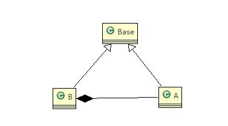


<details>
<summary style="color:red;">案例2：将类 B 的级别提升至与类 A 平级，他们有一个共同的父类 Base，这样就不会出现类 B 重写类 A 中方法的问题，此时基类的引用能够透明地使用子类的对象</summary>


```java
public class Liskov {

	public static void main(String[] args) {
		
		A a = new A();
		System.out.println("11-3=" + a.func1(11, 3));
		System.out.println("1-8=" + a.func1(1, 8));

		System.out.println("-----------------------");
		B b = new B();
		
		// 因为B类不再继承A类，因此调用者，不会再func1是求减法
		// 调用完成的功能就会很明确
		System.out.println("11+3=" + b.func1(11, 3));// 这里本意是求出11+3
		System.out.println("1+8=" + b.func1(1, 8));// 这里本意是求出1+8
		System.out.println("11+3+9=" + b.func2(11, 3));

		// 使用组合仍然可以使用到A类相关方法
		System.out.println("11-3=" + b.func3(11, 3));// 这里本意是求出11-3

	}

}

//创建一个更加基础的基类
class Base {
	// 把更加基础的方法和成员写到Base类
}

// A类
class A extends Base {
	// 返回两个数的差
	public int func1(int num1, int num2) {
		return num1 - num2;
	}
}

// B类继承了A
// 增加了一个新功能：完成两个数相加,然后和9求和
class B extends Base {
	// 如果B需要使用A类的方法,使用组合关系
	private A a = new A();

	// 这里虽然方法名是 fun1()，但由于类 B 集成于类 Base，已和类 A 无关
	public int func1(int a, int b) {
		return a + b;
	}

	public int func2(int a, int b) {
		return func1(a, b) + 9;
	}

	// 我们仍然想使用A的方法
	public int func3(int a, int b) {
		return this.a.func1(a, b);
	}
}
```
</details>

#### 1.2.4.3. 注意

### 1.2.5. 迪米特法则

#### 1.2.5.1. 基本介绍

- 一个对象应该对其他对象保持最少的了解
- 类与类关系越密切，耦合度越大
- 迪米特法则(Demeter Principle)又叫**最少知道原则**，即**一个类对自己依赖的类知道的越少越好**。也就是说，对于被依赖的类不管多么复杂，都尽量将逻辑封装在类的内部。**对外除了提供的public 方法，不对外泄露任何信息**
- 迪米特法则还有个更简单的定义：只与直接的朋友通信
- 每个对象都会与其他对象有耦合关系，只要两个对象之间有耦合关系，我们就说这两个对象之间是**朋友关系**。耦合的方式很多，依赖，关联，组合，聚合等。
  - 其中，我们称出现**成员变量，方法参数，方法返回值**中的类为**直接的朋友**，
  - 而出现在**局部变量**中的类不是直接的朋友。也就是说，**陌生的类最好不要以局部变量的形式出现在类的内部**。

#### 1.2.5.2. 案例

> 应用实例：有一个学校， 下属有各个学院和总部， 现要求打印出学校总部员工ID和学院员工的id


<details>
<summary style="color:red;">案例1：CollegeEmployee 类不是 SchoolManager 类的直接朋友，而是一个陌生类，这样的设计违背了迪米特法则</summary>

```java
//客户端
public class Demeter1 {

	public static void main(String[] args) {
		// 创建了一个 SchoolManager 对象
		SchoolManager schoolManager = new SchoolManager();
		// 输出学院的员工id 和 学校总部的员工信息
		schoolManager.printAllEmployee(new CollegeManager());
	}

}

//学校总部员工类
class Employee {
	private String id;

	public void setId(String id) {
		this.id = id;
	}

	public String getId() {
		return id;
	}
}

//学院的员工类
class CollegeEmployee {
	private String id;

	public void setId(String id) {
		this.id = id;
	}

	public String getId() {
		return id;
	}
}

//管理学院员工的管理类
class CollegeManager {
	// 返回学院的所有员工
	public List<CollegeEmployee> getAllEmployee() {
		List<CollegeEmployee> list = new ArrayList<CollegeEmployee>();
		for (int i = 0; i < 10; i++) { // 这里我们增加了10个员工到 list
			CollegeEmployee emp = new CollegeEmployee();
			emp.setId("学院员工id= " + i);
			list.add(emp);
		}
		return list;
	}
}

//学校管理类
//分析 SchoolManager 类的直接朋友类有哪些 Employee、CollegeManager
//CollegeEmployee 不是 直接朋友 而是一个陌生类，这样违背了 迪米特法则 
class SchoolManager {
	// 返回学校总部的员工
	public List<Employee> getAllEmployee() {
		List<Employee> list = new ArrayList<Employee>();

		for (int i = 0; i < 5; i++) { // 这里我们增加了5个员工到 list
			Employee emp = new Employee();
			emp.setId("学校总部员工id= " + i);
			list.add(emp);
		}
		return list;
	}

	// 该方法完成输出学校总部和学院员工信息(id)
	void printAllEmployee(CollegeManager sub) {

		// 分析问题
		// 1. 这里的 CollegeEmployee 不是 SchoolManager的直接朋友
		// 2. CollegeEmployee 是以局部变量方式出现在 SchoolManager
		// 3. 违反了 迪米特法则

		// 获取到学院员工
		List<CollegeEmployee> list1 = sub.getAllEmployee();
		System.out.println("------------学院员工------------");
		for (CollegeEmployee e : list1) {
			System.out.println(e.getId());
		}
		// 获取到学校总部员工
		List<Employee> list2 = this.getAllEmployee();
		System.out.println("------------学校总部员工------------");
		for (Employee e : list2) {
			System.out.println(e.getId());
		}
	}
}
```
</details>

1. 前面设计的问题在于SchoolManager中， CollegeEmployee类并不是SchoolManager类的直接朋友
2. 按照迪米特法则，应该避免类中出现这样非直接朋友关系的耦合，我们将输出学院员工的方法封装到CollegeManager，这样在SchoolManager中就不会出现CollegeEmployee类了
3. 按照迪米特法则的意思就是：SchoolManager对输出学院员工知道得越少越好，所以我们就直接将该逻辑封装到CollegeManager中


<details>
<summary style="color:red;">案例2：改进</summary>

```java
//客户端
public class Demeter1 {

	public static void main(String[] args) {
		System.out.println("~~~使用迪米特法则的改进~~~");
		// 创建了一个 SchoolManager 对象
		SchoolManager schoolManager = new SchoolManager();
		// 输出学院的员工id 和 学校总部的员工信息
		schoolManager.printAllEmployee(new CollegeManager());
	}

}

//学校总部员工类
class Employee {
	private String id;

	public void setId(String id) {
		this.id = id;
	}

	public String getId() {
		return id;
	}
}

//学院的员工类
class CollegeEmployee {
	private String id;

	public void setId(String id) {
		this.id = id;
	}

	public String getId() {
		return id;
	}
}

//管理学院员工的管理类
class CollegeManager {
	// 返回学院的所有员工
	public List<CollegeEmployee> getAllEmployee() {
		List<CollegeEmployee> list = new ArrayList<CollegeEmployee>();
		for (int i = 0; i < 10; i++) { // 这里我们增加了10个员工到 list
			CollegeEmployee emp = new CollegeEmployee();
			emp.setId("学院员工id= " + i);
			list.add(emp);
		}
		return list;
	}

	// 输出学院员工的信息
	public void printEmployee() {
		// 获取到学院员工
		List<CollegeEmployee> list1 = getAllEmployee();
		System.out.println("------------学院员工------------");
		for (CollegeEmployee e : list1) {
			System.out.println(e.getId());
		}
	}
}

//学校管理类
class SchoolManager {
	// 返回学校总部的员工
	public List<Employee> getAllEmployee() {
		List<Employee> list = new ArrayList<Employee>();

		for (int i = 0; i < 5; i++) { // 这里我们增加了5个员工到 list
			Employee emp = new Employee();
			emp.setId("学校总部员工id= " + i);
			list.add(emp);
		}
		return list;
	}

	// 该方法完成输出学校总部和学院员工信息(id)
	void printAllEmployee(CollegeManager sub) {

		// 分析问题
		// 1. 将输出学院的员工方法，封装到CollegeManager
		sub.printEmployee();

		// 获取到学校总部员工
		List<Employee> list2 = this.getAllEmployee();
		System.out.println("------------学校总部员工------------");
		for (Employee e : list2) {
			System.out.println(e.getId());
		}
	}
}
```
</details>


#### 1.2.5.3. 注意

1. 迪米特法则的核心是降低类之间的耦合
2. 但是注意：由于每个类都减少了不必要的依赖，因此迪米特法则只是要求降低类间(对象间)耦合关系， 并不是要求完全没有依赖关系(也没办法做到)

### 1.2.6. 合成复用原则

原则是尽量使用合成/聚合的方式，而不是使用继承，即尽量使用 has a 的关系，而不要使用 is a 的关系

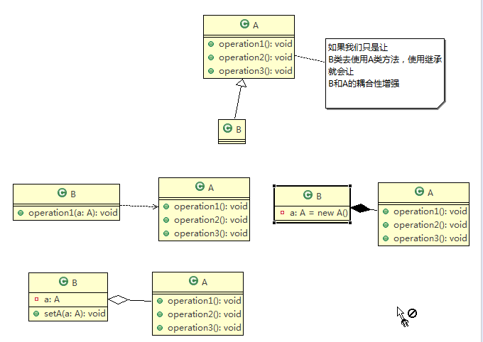

### 1.2.7. 开闭原则 ocp(核心)

#### 1.2.7.1. 基本介绍

> 核心

1. 开闭原则（Open Closed Principle） 是编程中最基础、最重要的设计原则
2. 一个软件实体如类，模块和函数应该对扩展开放(对提供方)， 对修改关闭(对使用方)。 **用抽象构建框架，用实现扩展细节**。
  > 也就是你怎么该内部代码我都不管，只要提供的API不变就行
3. 当软件需要变化时，**尽量通过扩展软件实体**的行为来实现变化，而不是通过修改已有的代码来实现变化。
  > 也就是说最好新增api，而不要乱改api
4. **编程中遵循其它原则，以及使用设计模式的目的就是遵循开闭原则**。

#### 1.2.7.2. 案例


<details>
<summary style="color:red;">案例1：未遵循开闭原则，导致新增一个图形类时，需要在【使用方 GraphicEditor】中添加很多代码</summary>

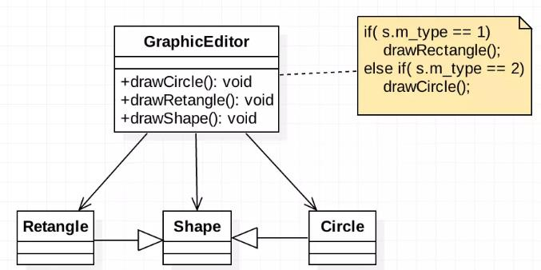

```java
public class Ocp {

	public static void main(String[] args) {
		// 使用看看存在的问题
		GraphicEditor graphicEditor = new GraphicEditor();
		graphicEditor.drawShape(new Rectangle());
		graphicEditor.drawShape(new Circle());
		graphicEditor.drawShape(new Triangle());
	}

}

//这是一个用于绘图的类 [使用方，需使用图形绘图]
class GraphicEditor {
	// 接收Shape对象，然后根据type，来绘制不同的图形
	public void drawShape(Shape s) {
		if (s.m_type == 1)
			drawRectangle(s);
		else if (s.m_type == 2)
			drawCircle(s);

    // ***************新增**************
    // 给使用方新增了代码
		else if (s.m_type == 3)
			drawTriangle(s);
	}

	// 绘制矩形
	public void drawRectangle(Shape r) {
		System.out.println(" 绘制矩形 ");
	}

	// 绘制圆形
	public void drawCircle(Shape r) {
		System.out.println(" 绘制圆形 ");
	}

  // ***************新增**************
	// 绘制三角形
	public void drawTriangle(Shape r) {
		System.out.println(" 绘制三角形 ");
	}
}

//Shape类，基类
class Shape {
	int m_type;
}

// 具体的图形为提供方，提供具体的绘图流程
class Rectangle extends Shape {
	Rectangle() {
		super.m_type = 1;
	}
}

class Circle extends Shape {
	Circle() {
		super.m_type = 2;
	}
}

// ***************新增**************
//新增画三角形
class Triangle extends Shape {
	Triangle() {
		super.m_type = 3;
	}
}
```
</details>

- 案例一的优缺点分析
  1. 优点是比较好理解，简单易操作。
  2. 缺点是违反了设计模式的ocp原则，即对扩展开放(提供方)，对修改关闭(使用方)。即当我们给类增加新功能的时候，尽量不修改代码，或者尽可能少修改代码。
  3. 比如我们这时要新增加一个图形种类：三角形，我们需要做大量的修改， 修改的地方较多


- 改进思路分析：
  1. 把创建Shape类做成抽象类，并提供一个抽象的draw方法，让子类去实现即可
  2. 这样我们有新的图形种类时，只需要让新的图形类继承Shape，并实现draw方法即可，使用方的代码就不需要修 -> 满足了开闭原则


<details>
<summary style="color:red;">案例2：改进</summary>

1. 所有的图形类都继承自公共的抽象父类 Shape，并重写父类中的 draw() 方法，之后新增图形类时，只需要重写 draw() 方法即可，在【使用方 GraphicEditor】中无需做任何修改
2. PS：和前面的接收消息例子很像，通过 IReceiver 接口定义各种接收者的行为，这样扩展新的接受者时，就无须在【使用方 Person】中修改任何代码

```java
public class Ocp {

	public static void main(String[] args) {
		// 使用看看存在的问题
		GraphicEditor graphicEditor = new GraphicEditor();
		graphicEditor.drawShape(new Rectangle());
		graphicEditor.drawShape(new Circle());
		graphicEditor.drawShape(new Triangle());
		graphicEditor.drawShape(new OtherGraphic());
	}

}

//这是一个用于绘图的类 [使用方]
class GraphicEditor {
	// 接收Shape对象，调用draw方法
	public void drawShape(Shape s) {
		s.draw();
	}
}

//Shape类，基类
abstract class Shape {
	int m_type;

	public abstract void draw();// 抽象方法
}

class Rectangle extends Shape {
	Rectangle() {
		super.m_type = 1;
	}

	@Override
	public void draw() {
		System.out.println(" 绘制矩形 ");
	}
}

class Circle extends Shape {
	Circle() {
		super.m_type = 2;
	}

	@Override
	public void draw() {
		System.out.println(" 绘制圆形 ");
	}
}

//新增画三角形
class Triangle extends Shape {
	Triangle() {
		super.m_type = 3;
	}

	@Override
	public void draw() {
		System.out.println(" 绘制三角形 ");
	}
}

//新增一个图形
class OtherGraphic extends Shape {
	OtherGraphic() {
		super.m_type = 4;
	}

	@Override
	public void draw() {
		System.out.println(" 绘制其它图形 ");
	}
}
```
</details>


## 1.3. 设计原则核心思想

- 找出应用中可能需要变化之处， 把它们独立出来， 不要和那些不需要变化的代码混在一起。
- 针对接口编程， 而不是针对实现编程。
- **为了交互对象之间的松耦合设计而努力**

# 2. UML类图复习

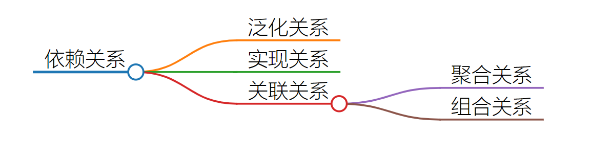

## 2.1. Dependency：表示依赖（使用）

只要是在类中用到了对方， 那么他们之间就存在依赖关系，比如：

- 类的成员属性
- 方法的返回类型
- 方法接收的参数类型
- 方法中使用的局部变量

```java
public class PersonServiceBean {
    private PersonDao personDao;//类
    
    public void save(Person person){}
    
    public IDCard getIDCard(Integer personid){
        return null;
    }
    
    public void modify(){
    	Department department = new Department();
    }
} 

public class PersonDao{}

public class IDCard{}

public class Person{}

public class Department{}
```

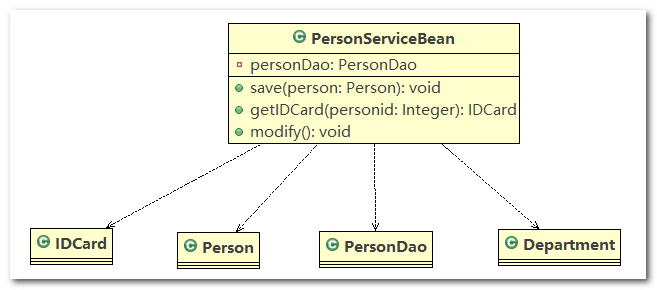

---

## 2.2. Association：表示关联

**依赖关系的特例**

- 关联关系实际上就是类与类之间的联系，他是依赖关系的特例
- 关联具有导航性：即双向关系或单向关系
- 关系具有多重性：如“1”（表示有且仅有一个），“0…”（表示0个或者多个），“0， 1”（表示0个或者一个），“n…m”(表示n到 m个都可以)，“m…*”（表示至少m个）

```java
public class Person {
	private IDCard card;
}

public class IDCard{
    
}

// 双向一对一关系
public class Person {
	private IDCard card;
}

public class IDCard{
	private Person person
}
```


---

## 2.3. Generalization：表示泛化（继承）

**依赖关系的特例**

- 泛化关系实际上就是继承关系
- 如果 A 类继承了 B 类， 我们就说 A 和 B 存在泛化关系

```java
public abstract class DaoSupport{
    public void save(Object entity){
        
    }
    
    public void delete(Object id){
        
    }
}

public class PersonServiceBean extends Daosupport{
    
}
```


---

## 2.4. Realization：表示实现

**依赖关系的特例**

- 实现关系实际上就是 A 类实现 B 接口， 他是依赖关系的特例

```java
public interface PersonService {
	public void delete(Integer id);
} 

public class PersonServiceBean implements PersonService {
	public void delete(Integer id){
        
    }
}
```


---

## 2.5. Aggregation：表示聚合

**关联关系的特列**

- 聚合关系（Aggregation）表示的是整体和部分的关系，整体与部分可以分开。 聚合关系是关联关系的特例，所以他具有关联的导航性与多重性。
- 如：一台电脑由键盘(keyboard)、显示器(monitor)，鼠标等组成；组成电脑的各个配件是可以从电脑上分离出来的， 使用带空心菱形的实线来表示：

```java
public class Computer {
	private Mouse mouse; // 鼠标可以和Computer分离
	private Moniter moniter;// 显示器可以和Computer分离

	public void setMouse(Mouse mouse) {
		this.mouse = mouse;
	}

	public void setMoniter(Moniter moniter) {
		this.moniter = moniter;
	}
}
```


---

## 2.6. Composite：表示组合

**关联关系的特列**

- 组合关系：也是整体与部分的关系，但是整体与部分不可以分开。
- 在程序中我们定义实体： Person与IDCard、 Head，那么 Head 和Person 就是组合关系， IDCard 和 Person 就是聚合关系。
- 但是如果在程序中Person实体中定义了对IDCard进行级联删除，即删除Person时连同IDCard一起删除， 那么IDCard 和 Person 就是组合了

> **注意观察聚合关系和组合关系在代码中的区别**

```java
public class Person {
	private IDCard card; // 聚合关系
	private Head head = new Head(); // 组合关系
}
```


# 3. 设计模式

## 3.1. 设计模式概述

### 3.1.1. 设计模式的层次

1. 第 1 层： 刚开始学编程不久， 听说过什么是设计模式
2. 第 2 层： 有很长时间的编程经验， 自己写了很多代码， 其中用到了设计模式， 但是自己却不知道
3. 第 3 层： 学习过了设计模式， 发现自己已经在使用了， 并且发现了一些新的模式挺好用的
4. 第 4 层： 阅读了很多别人写的源码和框架， 在其中看到别人设计模式， 并且能够领会设计模式的精妙和带来的好处。
5. 第 5 层： 代码写着写着， 自己都没有意识到使用了设计模式， 并且熟练的写了出来。

### 3.1.2. 设计模式介绍

1. 设计模式是程序员在面对同类软件工程设计问题所总结出来的有用的经验， **模式不是代码， 而是某类问题的通用解决方案**， 设计模式（Design pattern） 代表了最佳的实践。 这些解决方案是众多软件开发人员经过相当长的一段时间的试验和错误总结出来的。
2. 设计模式的本质提高 软件的维护性， 通用性和扩展性， 并降低软件的复杂度。
3. 《设计模式》是经典的书， 作者是 Erich Gamma、 Richard Helm、 Ralph Johnson 和 John Vlissides Design（俗称 “四人组 GOF” ）
4. 设计模式并不局限于某种语言， java， php， c++ 都有设计模式。

### 3.1.3. 设计模式类型与关系

> 注意： 不同的书籍上对分类和名称略有差别

设计模式分为三种类型， 共 23 种

1. 创建型模式： 单例模式、 抽象工厂模式、 原型模式、 建造者模式、 工厂模式。
2. 结构型模式： 适配器模式、 桥接模式、 装饰模式、 组合模式、 外观模式、 享元模式、 代理模式。
3. 行为型模式： 模版方法模式、 命令模式、 访问者模式、 迭代器模式、 观察者模式、 中介者模式、 备忘录模式、解释器模式（Interpreter 模式） 、 状态模式、 策略模式、 职责链模式(责任链模式)。


## 3.2. 创建型模式

### 3.2.1. 概述

这些设计模式提供了一种在创建对象的同时隐藏创建逻辑的方式，而不是使用 new 运算符直接实例化对象。这使得程序在判断针对某个给定实例需要创建哪些对象时更加灵活。

### 3.2.2. 单例模式（Singleton Pattern）

#### 3.2.2.1. 单例设计模式介绍

1. 所谓类的单例设计模式， 就是采取一定的方法保证在整个的软件系统中， 对某个类只能存在一个对象实例，并且该类只提供一个取得其对象实例的方法(静态方法)。
2. 比如 `Hibernate` 的 `SessionFactory`， 它充当数据存储源的代理， 并负责创建 `Session` 对象。`SessionFactory` 并不是轻量级的， 一般情况下， 一个项目通常只需要一个 `SessionFactory` 就够，这是就会使用到单例模式。

#### 3.2.2.2. 单例设计模式八种方式

单例模式有八种方式：

1. **饿汉式(静态常量)**
2. **饿汉式(静态代码块)**
3. 懒汉式(线程不安全)
4. 懒汉式(线程安全， 同步方法)
5. 懒汉式(线程安全， 同步代码块)
6. **双重锁检查**(推荐)
7. **静态内部类**(推荐)
8. **枚举**

#### 3.2.2.3. 饿汉式（静态常量）

> **饿汉式（静态常量）的具体实现步骤**

1. 构造器私有化 (防止 `new`)
2. 类的内部创建对象
3. 向外暴露一个静态的公共方法： `getInstance()`

> **饿汉式（静态常量）的代码实现**

1. 代码实现

   ```java
   public class SingletonTest01 {

   	public static void main(String[] args) {
   		// 测试
   		Singleton instance = Singleton.getInstance();
   		Singleton instance2 = Singleton.getInstance();
   		System.out.println(instance == instance2); // true
   		System.out.println("instance.hashCode=" + instance.hashCode());
   		System.out.println("instance2.hashCode=" + instance2.hashCode());
   	}

   }

   //饿汉式(静态变量)
   class Singleton {

   	// 1. 构造器私有化, 外部不能new
   	private Singleton() {

   	}

   	// 2.本类内部创建对象实例
   	private final static Singleton instance = new Singleton();

   	// 3. 提供一个公有的静态方法，返回实例对象
   	public static Singleton getInstance() {
   		return instance;
   	}

   }
   ```

2. 程序运行结果

   ```
   true
   instance.hashCode=366712642
   instance2.hashCode=366712642
   ```

> **饿汉式（静态常量）的优缺点说明**

1. 优点： 这种写法比较简单， 就是在类装载的时候就完成实例化。 避免了线程同步问题。
2. 缺点： 在类装载的时候就完成实例化， 没有达到 `Lazy Loading` 的效果。 如果从始至终从未使用过这个实例， 则会造成内存的浪费
3. 这种方式基于 `Classloder` 机制避免了多线程的同步问题， 不过， `instance` 在类装载时就实例化， 在单例模式中大多数都是调用 `getInstance()` 方法获取单例对象， 但是导致类装载的原因有很多种， 因此不能确定有其他的方式（或者其他的静态方法） 导致类装载， 这时候初始化单例对象，就没有达到 `lazy loading` 的效果
4. 结论： 这种单例模式可用， 可能造成内存浪费

#### 3.2.2.4. 饿汉式（静态代码块）

> **饿汉式（静态代码块）的具体实现步骤**

1. 构造器私有化，外部不能 `new`
2. 在本类内部的静态代码块中，创建单例对象
3. 提供一个公有的静态方法，返回实例对象

> **饿汉式（静态代码块）的代码实现**

1. 代码实现

   ```java
   public class SingletonTest02 {

   	public static void main(String[] args) {
   		// 测试
   		Singleton instance = Singleton.getInstance();
   		Singleton instance2 = Singleton.getInstance();
   		System.out.println(instance == instance2); // true
   		System.out.println("instance.hashCode=" + instance.hashCode());
   		System.out.println("instance2.hashCode=" + instance2.hashCode());
   	}

   }

   //饿汉式(静态变量)
   class Singleton {

   	// 1. 构造器私有化, 外部不能new
   	private Singleton() {

   	}

   	// 2.本类内部创建对象实例
   	private static Singleton instance;

   	static { // 在静态代码块中，创建单例对象
   		instance = new Singleton();
   	}

   	// 3. 提供一个公有的静态方法，返回实例对象
   	public static Singleton getInstance() {
   		return instance;
   	}

   }
   ```

2. 程序运行结果

   ```
   true
   instance.hashCode=366712642
   instance2.hashCode=366712642
   ```

> **饿汉式（静态代码块）的优缺点说明**

1. 这种方式和上面的方式其实类似，只不过将类实例化的过程放在了静态代码块中，也是在类装载的时候，就执行静态代码块中的代码，初始化类的实例。优缺点和上面是一样的。
2. 结论： 这种单例模式可用，但是可能造成内存浪费

#### 3.2.2.5. 懒汉式（线程不安全）

> **懒汉式（线程不安全）的具体实现步骤**

1. 构造器私有化，外部不能 `new`

2. 在本类内部的 `getInstance()`:

   静态方法中，判断单例对象是否为空

   1. 如果为空，则创建单例对象并返回
   2. 如果不为空，则直接返回此对象

> **懒汉式（线程不安全）的代码实现**

1. 代码实现

   ```java
   public class SingletonTest03 {

   	public static void main(String[] args) {
   		System.out.println("懒汉式1 ， 线程不安全~");
   		Singleton instance = Singleton.getInstance();
   		Singleton instance2 = Singleton.getInstance();
   		System.out.println(instance == instance2); // true
   		System.out.println("instance.hashCode=" + instance.hashCode());
   		System.out.println("instance2.hashCode=" + instance2.hashCode());
   	}

   }

   class Singleton {
   	private static Singleton instance;

   	private Singleton() {
   	}

   	// 提供一个静态的公有方法，当使用到该方法时，才去创建 instance
   	// 即懒汉式
   	public static Singleton getInstance() {
   		if (instance == null) {
   			instance = new Singleton();
   		}
   		return instance;
   	}
   }
   ```

2. 程序运行结果

  ```
  懒汉式1 ， 线程不安全~
  true
  instance.hashCode=366712642
  instance2.hashCode=366712642
  ```

> **懒汉式（线程不安全）的优缺点说明**

1. 起到了 `Lazy Loading` 的效果， 但是只能在单线程下使用。
2. 如果在多线程下， 一个线程进入了 `if (singleton == null)` 判断语句块， 还没来得及往下执行， 另一个线程也通过了这个判断语句， 这时便会产生多个实例。 所以在多线程环境下不可使用这种方式
3. 结论： 在实际开发中， 不要使用这种方式

#### 3.2.2.6. 懒汉式（同步方法）

> **懒汉式（同步方法）的具体实现步骤**

1. 构造器私有化，外部不能 `new`

2. 在本类内部的

   ```
   getInstance()
   ```

   静态同步方法中，判断单例对象是否为空

   1. 如果为空，则创建单例对象并返回
   2. 如果不为空，则直接返回此对象

> **懒汉式（同步方法）的代码实现**

1. 代码实现

   ```java
   public class SingletonTest04 {

   	public static void main(String[] args) {
   		System.out.println("懒汉式2 ， 线程安全~");
   		Singleton instance = Singleton.getInstance();
   		Singleton instance2 = Singleton.getInstance();
   		System.out.println(instance == instance2); // true
   		System.out.println("instance.hashCode=" + instance.hashCode());
   		System.out.println("instance2.hashCode=" + instance2.hashCode());
   	}

   }

   // 懒汉式(线程安全，同步方法)
   class Singleton {
   	private static Singleton instance;

   	private Singleton() {
   	}

   	// 提供一个静态的公有方法，加入同步处理的代码，解决线程安全问题
   	// 即懒汉式
   	public static synchronized Singleton getInstance() {
   		if (instance == null) {
   			instance = new Singleton();
   		}
   		return instance;
   	}
   }
   ```

2. 程序运行结果

   ```
   懒汉式2 ， 线程安全~
   true
   instance.hashCode=366712642
   instance2.hashCode=366712642
   ```

> **懒汉式（同步方法）的优缺点说明**

1. 解决了线程安全问题
2. 效率太低了， 每个线程在想获得类的实例时候， 执行 `getInstance()` 方法都要进行同步。 而其实这个方法只执行一次实例化代码就够了， 后面的想获得该类实例， 直接 `return` 就行了。 方法进行同步效率太低
3. 结论： 在实际开发中， 不推荐使用这种方式

#### 3.2.2.7. 懒汉式（同步代码块）

> **懒汉式（同步代码块）的具体实现步骤**

1. 构造器私有化，外部不能 `new`

2. 在本类内部的

   ```
   getInstance()
   ```

   静态方法中，先判断对象是否为空

   1. 如果为空，则加锁创建单例对象，并返回
   2. 如果不为空，则直接返回此对象

> **懒汉式（同步代码块）的代码实现**

代码实现

```java
class Singleton{
    private static Singleton singleton;
    private Singleton(){
    }

    public static singleton getInstance(){
        if(singleton==null){
            synchronized(Singleton. class){
                singleton=new Singleton();
            }
        }
    }
    return singleton;
}
```

> **懒汉式（同步代码块）的优缺点说明**

1. 这种方式，本意是想对第四种实现方式的改进，因为前面同步方法效率太低，改为同步产生实例化的的代码块
2. 但是这种同步**并不能起到线程同步的作用**。跟第`3`种实现方式遇到的情形一致，假如一个线程进入了 `if (singleton == null)` 判断语句块，还未来得及往下执行，另一个线程也通过了这个判断语句，这时便会产生多个实例
3. 结论：在实际开发中， 不能使用这种方式

#### 3.2.2.8. 懒汉式（双重锁检查）(推荐)

> **懒汉式（双重检查）的具体实现步骤**

1. 构造器私有化，外部不能 `new`

2. 在本类内部的

   ```
   getInstance()
   ```

   静态方法中，先判断对象是否为空

   1. 如果为空，则先加锁，再判断此单例对象是否为空，如果还为空，才创建对象
   2. 如果不为空，则直接返回此对象

3. 注意：单例变量需要使用 `volatile` 关键字进行修饰，保证内存可见性，以及防止指令重排序

> **懒汉式（双重检查）的代码实现**

1. 代码实现

   ```java
   public class SingletonTest06 {

   	public static void main(String[] args) {
   		System.out.println("双重检查");
   		Singleton instance = Singleton.getInstance();
   		Singleton instance2 = Singleton.getInstance();
   		System.out.println(instance == instance2); // true
   		System.out.println("instance.hashCode=" + instance.hashCode());
   		System.out.println("instance2.hashCode=" + instance2.hashCode());
   	}

   }

   // 懒汉式(线程安全，同步方法)
   class Singleton {
   	private static volatile Singleton instance;

   	private Singleton() {
   	}

   	// 提供一个静态的公有方法，加入双重检查代码，解决线程安全问题, 同时解决懒加载问题
   	// 同时保证了效率, 推荐使用
   	public static Singleton getInstance() {
   		if (instance == null) {
   			synchronized (Singleton.class) {
   				if (instance == null) {
   					instance = new Singleton();
   				}
   			}

   		}
   		return instance;
   	}
   }
   ```

2. 程序运行结果

   ```
   双重检查
   true
   instance.hashCode=366712642
   instance2.hashCode=366712642
   ```

> **懒汉式（双重检查）的优缺点说明**

1. `Double-Check` 概念是多线程开发中常使用到的， 如代码中所示， 我们进行了两次 `if (singleton == null)` 检查， 这样就可以保证线程安全了
2. 这样， 实例化代码只用执行一次， 后面再次访问时， 判断 `if (singleton == null)`， 直接 `return` 实例化对象， 也避免的反复进行方法同步
3. 线程安全； 延迟加载； 效率较高
4. 结论： 在实际开发中， 推荐使用这种单例设计模式

#### 3.2.2.9. 懒汉式（静态内部类）(推荐)

> **懒汉式（静态内部类）的具体实现步骤**

1. 构造器私有化，外部不能 `new`
2. 在本类内部新增一个静态内部类，封装一个单例对象，用于实现单例模式
3. 静态内部类的实现方式本质是利用类加载的同步机制，保证单例对象的线程安全，并且该方式能保证该单例对象的懒加载机制，因为只有用到静态内部类时，才会加载该静态内部类以及单例对象
4. 在本类内部提供一个静态方法 `getInstance()` 用于返回静态内部类中的单例对象

> **懒汉式（静态内部类）的代码实现**

1. 代码实现

   ```java
   public class SingletonTest07 {

   	public static void main(String[] args) {
   		System.out.println("使用静态内部类完成单例模式");
   		Singleton instance = Singleton.getInstance();
   		Singleton instance2 = Singleton.getInstance();
   		System.out.println(instance == instance2); // true
   		System.out.println("instance.hashCode=" + instance.hashCode());
   		System.out.println("instance2.hashCode=" + instance2.hashCode());
   	}

   }

   // 静态内部类完成， 推荐使用
   class Singleton {
   	//构造器私有化
   	private Singleton() {}

   	//写一个静态内部类,该类中有一个静态属性 Singleton
   	private static class SingletonInstance {
   		private static final Singleton INSTANCE = new Singleton();
   	}

   	//提供一个静态的公有方法，直接返回SingletonInstance.INSTANCE
   	public static Singleton getInstance() {
   		return SingletonInstance.INSTANCE;
   	}
   }
   ```

2. 程序运行结果

   ```
   使用静态内部类完成单例模式
   true
   instance.hashCode=366712642
   instance2.hashCode=366712642
   ```

> **懒汉式（静态内部类）的优缺点说明**

1. 这种方式采用了类装载的机制来保证初始化实例时只有一个线程。
2. **静态内部类方式在`Singleton`类被装载时并不会立即实例化，而是在需要实例化时，调用`getInstance()`方法，才会装载`SingletonInstance`类，从而完成`Singleton`的实例化**。
3. 类的静态属性只会在第一次加载类的时候初始化，所以在这里， `JVM`帮助我们保证了线程的安全性(CAS,TLAB)，在类进行初始化时，别的线程是无法进入的。
4. 优点：避免了线程不安全，利用静态内部类特点实现延迟加载，效率高。
5. 结论：推荐使用。

#### 3.2.2.10. 饿汉式（枚举）

> **饿汉式（枚举）的具体实现步骤**

通过枚举类实现单例模式

> **饿汉式（枚举）的代码实现**

1. 代码实现

   ```java
   public class SingletonTest08 {
   	public static void main(String[] args) {
   		Singleton instance = Singleton.INSTANCE;
   		Singleton instance2 = Singleton.INSTANCE;
   		System.out.println(instance == instance2);

   		System.out.println(instance.hashCode());
   		System.out.println(instance2.hashCode());

   		instance.sayOK();
   	}
   }

   //使用枚举，可以实现单例, 推荐
   enum Singleton {
   	INSTANCE; // 属性

   	public void sayOK() {
   		System.out.println("ok~");
   	}
   }
   ```

2. 程序运行结果

   ```
   true
   366712642
   366712642
   ok~
   ```

> **饿汉式（枚举）的优缺点说明**

1. 这借助`JDK1.5`中添加的枚举来实现单例模式。不仅能避免多线程同步问题，而且还能防止反序列化重新创建新的对象。
2. 这种方式是`Effective Java`作者`Josh Bloch`提倡的方式。如果用枚举去实现一个单例，属于饿汉模式。
3. 结论：推荐使用

#### 3.2.2.11. 源码示例

> **Runtime 源码**。单例模式

这是典型的饿汉式啊

```java
public class Runtime {
    private static Runtime currentRuntime = new Runtime();

    /**
     * Returns the runtime object associated with the current Java application.
     * Most of the methods of class <code>Runtime</code> are instance
     * methods and must be invoked with respect to the current runtime object.
     *
     * @return  the <code>Runtime</code> object associated with the current
     *          Java application.
     */
    public static Runtime getRuntime() {
        return currentRuntime;
    }

    /** Don't let anyone else instantiate this class */
    private Runtime() {}
```

#### 3.2.2.12. 单例模式注意事项

1. 单例模式保证了系统内存中该类只存在一个对象，节省了系统资源，对于一些需要频繁创建销毁的对象，使用单例模式可以提高系统性能
2. 当想实例化一个单例类的时候，必须要记住使用相应的获取对象的方法，而不是使用 `new`
3. 单例模式使用的场景：需要频繁的进行创建和销毁的对象、创建对象时耗时过多或耗费资源过多(即： 重量级对象)，但又经常用到的对象、工具类对象、频繁访问数据库或文件的对象(比如数据源、 `session` 工厂等)

### 3.2.3. 工厂模式（Factory Pattern）

#### 3.2.3.1. 情景说明

看一个披萨的项目：要便于披萨种类的扩展，要便于维护

1. 披萨的种类很多(比如 GreekPizz、CheesePizz 等)
2. 披萨的制作有 prepare、bake、cut、box
3. 完成披萨店订购功能

#### 3.2.3.2. 传统方法

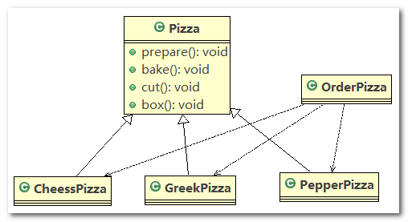

1. `Pizza` 抽象父类

   ```java
   //将Pizza 类做成抽象
   public abstract class Pizza {
   	
   	protected String name; //名字
   	
   	public void setName(String name) {
   		this.name = name;
   	}
   	
   	//准备原材料, 不同的披萨不一样，因此，我们做成抽象方法
   	public abstract void prepare();
   
   	// 烘烤
   	public void bake() {
   		System.out.println(name + " baking;");
   	}
   
   	// 切割
   	public void cut() {
   		System.out.println(name + " cutting;");
   	}
   
   	//打包
   	public void box() {
   		System.out.println(name + " boxing;");
   	}
   
   }
   ```

2. `CheesePizza`：奶酪披萨

   ```java
   public class CheesePizza extends Pizza {
   	@Override
   	public void prepare() {
   		System.out.println("给制作奶酪披萨 准备原材料 ");
   	}
   }
   ```

3. `GreekPizza`：希腊披萨

   ```java
   public class GreekPizza extends Pizza {
   	@Override
   	public void prepare() {
   		System.out.println("给希腊披萨 准备原材料 ");
   	}
   }
   ```

4. `PepperPizza`：胡椒披萨

   ```java
   public class PepperPizza extends Pizza {
   	@Override
   	public void prepare() {
   		System.out.println("给胡椒披萨准备原材料 ");
   	}
   }
   ```

5. `OrderPizza`：表示披萨商店，可以根据用户的输入，制作相应的披萨

   ```java
   public class OrderPizza {
   
   	// 构造器
   	public OrderPizza() {
   		Pizza pizza = null;
   		String orderType; // 订购披萨的类型
   		do {
   			orderType = getType();
   			if (orderType.equals("greek")) {
   				pizza = new GreekPizza();
   				pizza.setName("希腊披萨");
   			} else if (orderType.equals("cheese")) {
   				pizza = new CheesePizza();
   				pizza.setName("奶酪披萨");
   			} else if (orderType.equals("pepper")) {
   				pizza = new PepperPizza();
   				pizza.setName("胡椒披萨");
   			} else {
   				break;
   			}
   			// 输出pizza 制作过程
   			pizza.prepare();
   			pizza.bake();
   			pizza.cut();
   			pizza.box();
   
   		} while (true);
   	}
   
   	// 写一个方法，可以获取客户希望订购的披萨种类
   	private String getType() {
   		try {
   			BufferedReader strin = new BufferedReader(new InputStreamReader(System.in));
   			System.out.println("input pizza 种类:");
   			String str = strin.readLine();
   			return str;
   		} catch (IOException e) {
   			e.printStackTrace();
   			return "";
   		}
   	}
   
   }
   ```

6. `PizzaStore`：相当于客户端，发出订购披萨的请求

   ```java
   //相当于一个客户端，发出订购
   public class PizzaStore {
   
   	public static void main(String[] args) {
   		 new OrderPizza();
   	}
   
   }
   ```

> **传统方式的优缺点分析**

1. 优点是比较好理解，简单易操作。
2. 缺点是违反了设计模式的`ocp`原则，即对扩展开放(提供方)，对修改关闭(使用方)。即当我们给类增加新功能的时候，尽量不修改代码，或者尽可能少修改代码.
3. 比如我们这时要新增加一个`Pizza`的种类(`Pepper`披萨)，我们需要在使用方 `OderPizza` 中添加新的判断条件，**违反开闭原则**


> **改进思路**

1. 分析： 如果说新增 `Pizza` 需要修改代码，这可以接受， 但是如果我们在其它的地方也有创建 `Pizza` 的代码，就意味着，有很多处的代码都需要修改，而且这些创建 `Pizza` 的代码全都是冗余代码。
2. 思路： **把创建`Pizza`对象封装到一个类中，这样我们有新的`Pizza`种类时，只需要修改该类就可**， 其它有创建到`Pizza`对象的代码就不需要修改了 --> 简单工厂模式

#### 3.2.3.3. 简单(静态)工厂模式

> **简单工厂模式介绍**

1. 简单工厂模式是属于创建型模式，是工厂模式的一种。 **简单工厂模式是由一个工厂对象决定创建出哪一种产品类的实例**。简单工厂模式是工厂模式家族中最简单实用的模式
2. 简单工厂模式：定义了一个创建对象的类，**由这个类来封装实例化对象的行为**
3. 在软件开发中，当我们会用到大量的创建某种、某类或者某批对象时，就会使用到工厂模式

> **类图**


> **代码**

1. `Pizza` 抽象父类以及 `Pizza` 的具体实现类和上面一样

2. `SimpleFactory`：工厂类，根据用户输入，制作相应的 `Pizza`，此时 `SimpleFactory` 为提供方

   ```java
   //简单工厂类
   public class SimpleFactory {
   
   	// 根据orderType 返回对应的Pizza 对象
   	public Pizza createPizza(String orderType) {
   		Pizza pizza = null;
   		System.out.println("使用简单工厂模式");
   		if (orderType.equals("greek")) {
   			pizza = new GreekPizza();
   			pizza.setName("希腊披萨");
   		} else if (orderType.equals("cheese")) {
   			pizza = new CheesePizza();
   			pizza.setName("奶酪披萨");
   		} else if (orderType.equals("pepper")) {
   			pizza = new PepperPizza();
   			pizza.setName("胡椒披萨");
   		}
   		return pizza;
   	}
   
   }
   ```

3. `OrderPizza`：根据用户的输入，调用 `SimpleFactory` 工厂类制作相应的 `Pizza`，`OrderPizza` 为使用方

   ```java
   public class OrderPizza {
   
   	// 定义一个简单工厂对象
   	SimpleFactory simpleFactory;
   	Pizza pizza = null;
   
   	// 构造器
   	public OrderPizza(SimpleFactory simpleFactory) {
   		setFactory(simpleFactory);
   	}
   
   	public void setFactory(SimpleFactory simpleFactory) {
   		String orderType = ""; // 用户输入的
   		this.simpleFactory = simpleFactory; // 设置简单工厂对象
   		do {
   			orderType = getType();
   			pizza = this.simpleFactory.createPizza(orderType);
   			// 输出pizza
   			if (pizza != null) { // 订购成功
   				pizza.prepare();
   				pizza.bake();
   				pizza.cut();
   				pizza.box();
   				System.out.println();
   			} else {
   				System.out.println("订购披萨失败");
   				break;
   			}
   		} while (true);
   	}
   
   	// 写一个方法，可以获取客户希望订购的披萨种类
   	private String getType() {
   		try {
   			BufferedReader strin = new BufferedReader(new InputStreamReader(System.in));
   			System.out.println("input pizza 种类:");
   			String str = strin.readLine();
   			return str;
   		} catch (IOException e) {
   			e.printStackTrace();
   			return "";
   		}
   	}
   
   }
   ```

4. `PizzaStore`：相当于客户端，发出订购披萨的请求

   ```java
   //相当于一个客户端，发出订购
   public class PizzaStore {
   
   	public static void main(String[] args) {
   		// 使用简单工厂模式
   		new OrderPizza(new SimpleFactory());
   		System.out.println("~~退出程序~~");
   	}
   
   }
   ```

> **补充说明**

简单工厂模式也叫静态工厂模式，很多代码中都将简单工厂中提供示例 `Bean` 的方法声明为静态 `static` 方法，可通过工厂类直接调用

```java
//简单工厂类
public class SimpleFactory {

	// 简单工厂模式 也叫 静态工厂模式
	public static Pizza createPizza(String orderType) {
		Pizza pizza = null;
		System.out.println("使用简单工厂模式2");
		if (orderType.equals("greek")) {
			pizza = new GreekPizza();
			pizza.setName("希腊披萨");
		} else if (orderType.equals("cheese")) {
			pizza = new CheesePizza();
			pizza.setName("奶酪披萨");
		} else if (orderType.equals("pepper")) {
			pizza = new PepperPizza();
			pizza.setName("胡椒披萨");
		}
		return pizza;
	}
}
```


> **简单工厂模式总结**

1. 如果使用传统方法，使用方为 `OrderPizza`，提供方 `Pizza` 及其实现类，这样编写代码使用方和提供方紧紧耦合在一起，但凡需要新增 `Pizza` 的实现类，都需要修改 `OrderPizza` 中的代码，添加新的判断逻辑
2. 为了满足 `OCP` 原则，我们建立简单工厂类 `SimpleFactory`，通过 `SimpleFactory` 作为一个中间者的角色：`SimpleFactory` 向上为 `OrderPizza` 提供相应的 `Pizza`，`SimpleFactory` 向下负责与 `Pizza` 及其实现类打交道，完成 `Pizza` 的生产
3. 我们将生产 `Pizza` 的具体细节放在 `SimpleFactory` 工厂类里面实现，让 `SimpleFactory` 作为 `Pizza` 的提供方，这样新增 `Pizza` 的实现类时，我们只需要修改提供方（`SimpleFactory`）的代码，而无需修改使用方（`OrderPizza`）的代码

#### 3.2.3.4. 工厂方法模式

> 需求说明

披萨项目新的需求： 客户在点披萨时， 可以点不同口味的披萨， 比如北京的奶酪 `pizza`、 北京的胡椒 `pizza` 或者是伦敦的奶酪 `pizza`、 伦敦的胡椒 `pizza`。

> **思路一：简单工厂模式**

使用简单工厂模式， 创建不同的简单工厂类， 比如 `BJPizzaSimpleFactory`、`LDPizzaSimpleFactory` 等等。

从当前这个案例来说， 也是可以的， 但是考虑到项目的规模， 以及软件的可维护性、 可扩展性并不是特别好，因为过多的工厂类会导致整个项目类膨胀

> **思路二：使用工厂方法模式**

1. 工厂方法模式设计方案： **不使用工厂类**，将披萨项目的实例化功能抽象成抽象方法， 在不同的口味点餐子类中具体实现。
2. 工厂方法模式： **定义了一个创建对象的抽象方法， 由子类决定要实例化的类**。 工厂方法模式将对象的实例化推迟到子类

> **工厂方法模式应用案例**

项目需求：披萨项目新的需求： 客户在点披萨时， 可以点不同口味的披萨， 比如 北京的奶酪 `pizza`、 北京的胡椒 `pizza` 或者是伦敦的奶酪 `pizza`、 伦敦的胡椒 `pizza`

> **类图**


> **代码**

1. `Pizza`：抽象父类，和之前的定义一样

   ```java
   //将Pizza 类做成抽象
   public abstract class Pizza {
   
   	protected String name; // 名字
   
   	public void setName(String name) {
   		this.name = name;
   	}
   
   	// 准备原材料, 不同的披萨不一样，因此，我们做成抽象方法
   	public abstract void prepare();
   
   	// 烘烤
   	public void bake() {
   		System.out.println(name + " baking;");
   	}
   
   	// 切割
   	public void cut() {
   		System.out.println(name + " cutting;");
   	}
   
   	// 打包
   	public void box() {
   		System.out.println(name + " boxing;");
   	}
   
   }
   ```

2. `BJCheesePizza`：北京的奶酪披萨

   ```java
   public class BJCheesePizza extends Pizza {
   	@Override
   	public void prepare() {
   		setName("北京的奶酪pizza");
   		System.out.println("北京的奶酪pizza 准备原材料");
   	}
   }
   ```

3. `BJPepperPizza`：北京的胡椒披萨

   ```java
   public class BJPepperPizza extends Pizza {
   	@Override
   	public void prepare() {
   		setName("北京的胡椒pizza");
   		System.out.println("北京的胡椒pizza 准备原材料");
   	}
   }
   ```

4. `LDCheesePizza`：伦敦的奶酪披萨

   ```java
   public class LDCheesePizza extends Pizza {
   	@Override
   	public void prepare() {
   		setName("伦敦的奶酪pizza");
   		System.out.println("伦敦的奶酪pizza 准备原材料");
   	}
   }
   ```

5. `LDPepperPizza`：伦敦的胡椒披萨

   ```java
   public class LDPepperPizza extends Pizza {
   	@Override
   	public void prepare() {
   		setName("伦敦的胡椒pizza");
   		System.out.println("伦敦的胡椒pizza 准备原材料");
   	}
   }
   ```

6. `OrderPizza`：含有抽象方法的工厂父类，其抽象方法待子类去实现

   ```java
   public abstract class OrderPizza {
   	
   	// 定义一个抽象方法，createPizza , 让各个工厂子类自己实现
   	abstract Pizza createPizza(String orderType);
   
   	// 构造器
   	public OrderPizza() {
   		Pizza pizza = null;
   		String orderType; // 订购披萨的类型
   		do {
   			orderType = getType();
   			pizza = createPizza(orderType); // 抽象方法，由工厂子类完成
   			// 输出pizza 制作过程
   			pizza.prepare();
   			pizza.bake();
   			pizza.cut();
   			pizza.box();
   			System.out.println();
   		} while (true);
   	}
   
   	// 写一个方法，可以获取客户希望订购的披萨种类
   	private String getType() {
   		try {
   			BufferedReader strin = new BufferedReader(new InputStreamReader(System.in));
   			System.out.println("input pizza 种类:");
   			String str = strin.readLine();
   			return str;
   		} catch (IOException e) {
   			e.printStackTrace();
   			return "";
   		}
   	}
   	
   }
   ```

7. `BJOrderPizza`：北京披萨的生产工厂

   ```java
   public class BJOrderPizza extends OrderPizza {
   	@Override
   	Pizza createPizza(String orderType) {
   		Pizza pizza = null;
   		if (orderType.equals("cheese")) {
   			pizza = new BJCheesePizza();
   		} else if (orderType.equals("pepper")) {
   			pizza = new BJPepperPizza();
   		}
   		return pizza;
   	}
   }
   ```

8. `LDOrderPizza`：伦敦披萨的生产工厂

   ```java
   public class LDOrderPizza extends OrderPizza {
   	@Override
   	Pizza createPizza(String orderType) {
   		Pizza pizza = null;
   		if (orderType.equals("cheese")) {
   			pizza = new LDCheesePizza();
   		} else if (orderType.equals("pepper")) {
   			pizza = new LDPepperPizza();
   		}
   		return pizza;
   	}
   }
   ```

9. `PizzaStore`：相当于客户端，发出订购披萨的请求

   ```java
   public class PizzaStore {
   
   	public static void main(String[] args) {
   		String loc = "bj"; // 假设这里是用户输入的位置信息
   		if (loc.equals("bj")) {
   			// 创建北京口味的各种Pizza
   			new BJOrderPizza();
   		} else {
   			// 创建伦敦口味的各种Pizza
   			new LDOrderPizza();
   		}
   	}
   
   }
   ```


> **工厂方法模式总结**

1. 首先要说明的是，对于此案例，我们也可以采用简单工厂模式来实现，缺点是：对于一个地区的披萨，我们就需要创建一个对应的工厂类，这会造成项目类膨胀；并且生产披萨的代码几乎都是相同的，这就造成披萨工厂类中的代码冗余
2. 对于这种情况，我们可以使用工厂方法模式，将具体的抽象方法声明在父类工厂中，其具体的实现下沉到工厂子类，我们通过工厂子类可以获得所需要的 `Bean`
3. 对于此例，抽象父类 `OrderPizza` 中有一个抽象方法 `abstract Pizza createPizza(String orderType);`，该方法接收 `Pizza` 的类型，并生产指定类型的 `Pizza`；在工厂子类 `BJOrderPizza`，`LDOrderPizza` 中实现了该抽象方法，实现了具体生产 `Pizza` 的逻辑
4. 对于工厂方法模式，抽象工厂父类 `OrderPizza` 为 `Bean` 的使用方，它负责调用工厂子类 `BJOrderPizza`，`LDOrderPizza` 中已重写的抽象方法，获得生产好的 `Pizza`，然后使用该 `Pizza` 实例


> **简单工厂模式与工厂方法模式的对比**

1. 简单工厂模式：工厂类作为 `Bean` 的制造者（提供方），负责与具体的实体类打交道，并负责相应业务逻辑的处理；使用方调用工厂类获取 `Bean`，使用即可，无需关心该 `Bean` 是如何得到的，也无需关心制造此 `Bean` 的具体业务逻辑，满足 `OCP` 原则
2. 工厂方法模式：工厂父类中有一个抽象方法负责制造 `Bean`，该抽象方法会下沉到其子类，由工厂子类实现其具体的业务细节，所以工厂子类是 `Bean` 的提供方，此时的工厂父类消费由工厂子类制造的 `Bean`，为使用方

#### 3.2.3.5. 抽象工厂模式（Abstract Factory Pattern）

- 抽象工厂模式的基本介绍
  - 抽象工厂模式： 定义了一个 `interface` 用于创建相关或有依赖关系的对象簇， 而无需指明具体的类
  - 抽象工厂模式可以**将简单工厂模式和工厂方法模式进行整合**。
    > 简单工厂：由这个类来封装实例化对象的行为<br />
    > 工厂方法：将方法实现下沉到子类
  - 从设计层面看， 抽象工厂模式就是对简单工厂模式的改进(或者称为进一步的抽象)。
  - 将工厂抽象成两层， `AbsFactory`(抽象工厂) 和 具体实现的工厂子类。 程序员可以根据创建对象类型使用对应的工厂子类。 这样将单个的简单工厂类变成了工厂簇， 更利于代码的维护和扩展。


1. `Pizza` 抽象父类以及 `Pizza` 的具体实现类和上面一样

2. `AbsFactory`：工厂抽象层，定义制造 `Bean` 的抽象方法

   ```java
   //一个抽象工厂模式的抽象层(接口)
   public interface AbsFactory {
   	// 让下面的工厂子类来 具体实现
   	public Pizza createPizza(String orderType);
   }
   ```

3. `BJFactory`：北京工厂子类（提供方），负责制造北京各种口味的 `Pizza`

   ```java
   //这是工厂子类
   public class BJFactory implements AbsFactory {
   
   	@Override
   	public Pizza createPizza(String orderType) {
   		System.out.println("~使用的是抽象工厂模式~");
   		Pizza pizza = null;
   		if (orderType.equals("cheese")) {
   			pizza = new BJCheesePizza();
   		} else if (orderType.equals("pepper")) {
   			pizza = new BJPepperPizza();
   		}
   		return pizza;
   	}
   
   }
   ```

4. `LDFactory`：伦敦工厂子类（提供方），负责制造伦敦各种口味的 `Pizza`

   ```java
   public class LDFactory implements AbsFactory {
   
   	@Override
   	public Pizza createPizza(String orderType) {
   		System.out.println("~使用的是抽象工厂模式~");
   		Pizza pizza = null;
   		if (orderType.equals("cheese")) {
   			pizza = new LDCheesePizza();
   		} else if (orderType.equals("pepper")) {
   			pizza = new LDPepperPizza();
   		}
   		return pizza;
   	}
   
   }
   ```

5. `OrderPizza`：使用方，负责消费 `Pizza`

   ```java
   public class OrderPizza {
   
   	AbsFactory factory;
   
   	// 构造器
   	public OrderPizza(AbsFactory factory) {
   		setFactory(factory);
   	}
   
   	private void setFactory(AbsFactory factory) {
   		Pizza pizza = null;
   		String orderType = ""; // 用户输入
   		this.factory = factory;
   		do {
   			orderType = getType();
   			// factory 可能是北京工厂子类，也可能是伦敦工厂子类
        // 复习：动态链接
   			pizza = factory.createPizza(orderType);
   			if (pizza != null) { // 订购ok
   				pizza.prepare();
   				pizza.bake();
   				pizza.cut();
   				pizza.box();
   			} else {
   				System.out.println("订购失败");
   				break;
   			}
   		} while (true);
   	}
   
   	// 写一个方法，可以获取客户希望订购的披萨种类
   	private String getType() {
   		try {
   			BufferedReader strin = new BufferedReader(new InputStreamReader(System.in));
   			System.out.println("input pizza 种类:");
   			String str = strin.readLine();
   			return str;
   		} catch (IOException e) {
   			e.printStackTrace();
   			return "";
   		}
   	}
   }
   ```

6. `PizzaStore`：客户端，发出订购披萨的请求

   ```java
   public class PizzaStore {
   
   	public static void main(String[] args) {
   		//new OrderPizza(new BJFactory());
   		new OrderPizza(new LDFactory());
   	}
   
   }
   ```

------

抽象工厂模式总结

1. `AbsFactory` 仍然是简单工厂（简单工厂模式），但是工厂方法的具体实现需下沉到各个工厂子类（工厂方法模式），所以说抽象工厂模式可以将简单工厂模式和工厂方法模式进行整合。
2. 抽象工厂模式分为两层：抽象层和实现层。`AbsFactory` 作为工厂抽象层，只对工厂规范进行定义，其具体的实现交由工厂子类
3. 简单工厂模式很难满足对多种不同类型的 `Bean` 进行创建，所以我们使用抽象工厂模式，定义一个工厂抽象层，但具体实现需下沉到各个工厂子类

#### 3.2.3.6. 源码实例

**JDK Calendar 中使用到了简单工厂模式**

测试代码

```java
public class Factory {

	public static void main(String[] args) {
		
		// getInstance 是 Calendar 静态方法
		Calendar cal = Calendar.getInstance();
	    // 注意月份下标从0开始，所以取月份要+1
	    System.out.println("年:" + cal.get(Calendar.YEAR));
	    System.out.println("月:" + (cal.get(Calendar.MONTH) + 1));       
	    System.out.println("日:" + cal.get(Calendar.DAY_OF_MONTH));
	    System.out.println("时:" + cal.get(Calendar.HOUR_OF_DAY));
	    System.out.println("分:" + cal.get(Calendar.MINUTE));
	    System.out.println("秒:" + cal.get(Calendar.SECOND));
	    
	}

}
```

`Calendar.getInstance()` 方法的实现

```java
/**
 * Gets a calendar using the default time zone and locale. The
 * <code>Calendar</code> returned is based on the current time
 * in the default time zone with the default
 * {@link Locale.Category#FORMAT FORMAT} locale.
 *
 * @return a Calendar.
 */
public static Calendar getInstance()
{
    return createCalendar(TimeZone.getDefault(), Locale.getDefault(Locale.Category.FORMAT));
}
```

`createCalendar()` 方法的实现：如果 `provider == null`，就会根据 `caltype` 的值，来创建具体的工厂子类对象

```java
private static Calendar createCalendar(TimeZone zone,
                                       Locale aLocale)
{
    CalendarProvider provider =
        LocaleProviderAdapter.getAdapter(CalendarProvider.class, aLocale)
                             .getCalendarProvider();
    if (provider != null) {
        try {
            return provider.getInstance(zone, aLocale);
        } catch (IllegalArgumentException iae) {
            // fall back to the default instantiation
        }
    }

    Calendar cal = null;

    if (aLocale.hasExtensions()) {
        String caltype = aLocale.getUnicodeLocaleType("ca");
        if (caltype != null) {
            switch (caltype) {
            case "buddhist":
            cal = new BuddhistCalendar(zone, aLocale);
                break;
            case "japanese":
                cal = new JapaneseImperialCalendar(zone, aLocale);
                break;
            case "gregory":
                cal = new GregorianCalendar(zone, aLocale);
                break;
            }
        }
    }
    if (cal == null) {
        // If no known calendar type is explicitly specified,
        // perform the traditional way to create a Calendar:
        // create a BuddhistCalendar for th_TH locale,
        // a JapaneseImperialCalendar for ja_JP_JP locale, or
        // a GregorianCalendar for any other locales.
        // NOTE: The language, country and variant strings are interned.
        if (aLocale.getLanguage() == "th" && aLocale.getCountry() == "TH") {
            cal = new BuddhistCalendar(zone, aLocale);
        } else if (aLocale.getVariant() == "JP" && aLocale.getLanguage() == "ja"
                   && aLocale.getCountry() == "JP") {
            cal = new JapaneseImperialCalendar(zone, aLocale);
        } else {
            cal = new GregorianCalendar(zone, aLocale);
        }
    }
    return cal;
} 
```

#### 3.2.3.7. 小结

- 工厂模式的意义：将实例化对象的代码提取出来，放到一个类中统一管理和维护，达到和主项目的依赖关系的解耦。从而提高项目的扩展和维护性。

- 三种工厂模式
  1. 简单工厂模式
  2. 工厂方法模式
  3. 抽象工厂模式

- 设计模式的依赖抽象原则
  1. 创建对象实例时，不要直接 `new` 这个类，而是把这个`new` 类的动作放在一个工厂的方法中，并返回。有的书上说，变量不要直接持有具体类的引用。这样做的好处是：我们依赖的是一个抽象层（缓冲层），如果之后有什么变动，修改工厂类中的代码即可
  2. 不要让类继承具体类，而是继承抽象类或者是实现`interface`(接口)
  3. 不要覆盖基类中已经实现的方法

### 3.2.4. 原型模式（Prototype Pattern）

#### 3.2.4.1. 情景

> **克隆羊问题描述**

现在有一只羊`tom`， 姓名为: `tom`，年龄为： `1`， 颜色为：白色，请编写程序创建和`tom`羊属性完全相同的`10`只羊

#### 3.2.4.2. 传统方式

> 类图

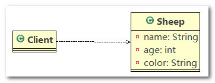

------

代码实现

1. `Sheep`：羊的实体类

   ```java
   public class Sheep {
   	private String name;
   	private int age;
   	private String color;
   ```

2. `Client`：客户端，发出克隆羊的指令

   ```java
   public class Client {
   
   	public static void main(String[] args) {
   		// 传统的方法
   		Sheep sheep = new Sheep("tom", 1, "白色");
   
   		Sheep sheep2 = new Sheep(sheep.getName(), sheep.getAge(), sheep.getColor());
   		Sheep sheep3 = new Sheep(sheep.getName(), sheep.getAge(), sheep.getColor());
   		Sheep sheep4 = new Sheep(sheep.getName(), sheep.getAge(), sheep.getColor());
   		Sheep sheep5 = new Sheep(sheep.getName(), sheep.getAge(), sheep.getColor());
   		// ....
   
   		System.out.println(sheep);
   		System.out.println(sheep2);
   		System.out.println(sheep3);
   		System.out.println(sheep4);
   		System.out.println(sheep5);
   		// ...
   	}
   
   }
   ```

------

传统的方式的优缺点

1. 优点是比较好理解，简单易操作
2. 在创建新的对象时， 总是需要重新获取原始对象的属性，如果创建的对象比较复杂时，效率较低
3. 总是需要重新初始化对象，而不是动态地获得对象运行时的状态，不够灵活

------

改进思路

`Java`中`Object`类是所有类的根类， `Object`类提供了一个`clone()`方法，该方法可以将一个`Java`对象复制一份，但是需要实现`clone`的`Java`类必须要实现一个接口`Cloneable`，该接口表示该类能够复制且具有复制的能力 --> 原型模式

#### 3.2.4.3. 原型模式介绍

1. 原型模式(`Prototype`模式)是指：用原型实例指定创建对象的种类，并且通过拷贝这些原型， 创建新的对象
2. 原型模式是一种创建型设计模式，允许一个对象在创建另外一个可定制的对象，无需知道如何创建的细节
3. 工作原理是：通过将一个原型对象传给那个要发动创建的对象，这个要发动创建的对象通过请求原型对象拷贝它们自己来实施创建，即 `对象.clone()`

#### 3.2.4.4. 原型模式原理


1. `Prototype`：原型类，在该类中声明一个克隆自己的接口
2. `ConcretePrototype`：具体的原型类，实现一个克隆自己的操作
3. `Client`：让一个原型对象克隆自己，从而创建一个新的对象(属性一样)

#### 3.2.4.5. 原型模式代码

原型模式解决克隆羊问题的应用实例：使用原型模式改进传统方式，让程序具有更高的效率和扩展性

> **代码实现**

1. `Sheep`：羊的实体类

   ```java
   public class Sheep implements Cloneable {
   	private String name;
   	private int age;
   	private String color;
   
   	// 克隆该实例，使用默认的clone方法来完成
   	@Override
   	protected Object clone() {
   		Sheep sheep = null;
   		try {
   			sheep = (Sheep) super.clone();
   		} catch (Exception e) {
   			System.out.println(e.getMessage());
   		}
   		return sheep;
   	}
       
       // ...
   ```

2. `Client`：利用原型模式创建对象

   ```java
   public class Client {
   
   	public static void main(String[] args) {
   		System.out.println("原型模式完成对象的创建");
   		
   		Sheep sheep = new Sheep("tom", 1, "白色");
   		
   		Sheep sheep2 = (Sheep) sheep.clone(); // 克隆
   		Sheep sheep3 = (Sheep) sheep.clone(); // 克隆
   		Sheep sheep4 = (Sheep) sheep.clone(); // 克隆
   		Sheep sheep5 = (Sheep) sheep.clone(); // 克隆
   
   		System.out.println("sheep2 =" + sheep2 + "sheep2.hashCoe=" + sheep2.hashCode());
   		System.out.println("sheep3 =" + sheep3 + "sheep3.hashCoe=" + sheep3.hashCode());
   		System.out.println("sheep4 =" + sheep4 + "sheep4.hashCoe=" + sheep4.hashCode());
   		System.out.println("sheep5 =" + sheep5 + "sheep5.hashCoe=" + sheep5.hashCode());
   	}
   
   }
   ```

3. 程序运行结果

   ```
   原型模式完成对象的创建
   sheep2 =Sheep [name=tom, age=1, color=白色]；sheep2.hashCoe=366712642
   sheep3 =Sheep [name=tom, age=1, color=白色]；sheep3.hashCoe=1829164700
   sheep4 =Sheep [name=tom, age=1, color=白色]；sheep4.hashCoe=2018699554
   sheep5 =Sheep [name=tom, age=1, color=白色]；sheep5.hashCoe=1311053135
   ```

#### 3.2.4.6. Spring源码示例

> **准备工作**

1. 创建实体类 `Monster`

   ```java
   public class Monster {
   	private Integer id = 10;
   	private String nickname = "牛魔王";
   	private String skill = "芭蕉扇";
       
       public Monster() {
   		System.out.println("monster 创建..");
   	}
   ```

2. 通过 `XML` 配置文件 配置 `Bean`

   ```xml
   <!-- 这里我们的 scope="prototype" 即 原型模式来创建 -->
   <bean id="id01" class="com.atguigu.spring.bean.Monster" scope="prototype" />
   ```

3. 测试代码

   ```java
   public class ProtoType {
   
   	public static void main(String[] args) {
   		ApplicationContext applicationContext = new ClassPathXmlApplicationContext("beans.xml");
   		
   		// 获取monster[通过id获取monster]
   		Object bean = applicationContext.getBean("id01");
   		System.out.println("bean" + bean); // 输出 "牛魔王" .....
   
   		Object bean2 = applicationContext.getBean("id01");
   		System.out.println("bean2" + bean2); // 输出 "牛魔王" .....
   
   		System.out.println(bean == bean2); // false
   
   		// ConfigurableApplicationContext
   	}
   
   }
   ```

4. 程序运行结果

   ```
   monster 创建..
   beanMonster [id=10, nickname=牛魔王, skill=芭蕉扇]
   monster 创建..
   bean2Monster [id=10, nickname=牛魔王, skill=芭蕉扇]
   false
   ```

> **Spring 源码追踪**

1. `applicationContext.getBean("id01");` 方法中先调用 `getBeanFactory()` 获取 `Bean` 工厂，再调用 `Bean` 工厂的 `getBean(name)` 方法获取 `Bean` 实例

   ```java
   @Override
   public Object getBean(String name) throws BeansException {
   	assertBeanFactoryActive();
   	return getBeanFactory().getBean(name);
   }
   ```

2. `getBean(name)` 方法调用 `doGetBean(name, null, null, false);` 方法获取 `Bean` 实例

   ```java
   @Override
   public Object getBean(String name) throws BeansException {
   	return doGetBean(name, null, null, false);
   }
   ```

3. 获取 `Bean` 实例时

   1. 判断 `Bean` 是否为单例对象：`if (mbd.isSingleton())`，若是，则调用 `bean = getObjectForBeanInstance(sharedInstance, name, beanName, mbd);` 获取单例对象
   2. 判断 `Bean` 是否为原型对象：`else if (mbd.isPrototype())`，若是，则调用 `bean = getObjectForBeanInstance(prototypeInstance, name, beanName, mbd);` 获取原型对象

   ```java
   /**
    * Return an instance, which may be shared or independent, of the specified bean.
    * @param name the name of the bean to retrieve
    * @param requiredType the required type of the bean to retrieve
    * @param args arguments to use if creating a prototype using explicit arguments to a
    * static factory method. It is invalid to use a non-null args value in any other case.
    * @param typeCheckOnly whether the instance is obtained for a type check,
    * not for actual use
    * @return an instance of the bean
    * @throws BeansException if the bean could not be created
    */
   @SuppressWarnings("unchecked")
   protected <T> T doGetBean(
   		final String name, final Class<T> requiredType, final Object[] args, boolean typeCheckOnly)
   		throws BeansException {
   
   	final String beanName = transformedBeanName(name);
   	Object bean;
   
   	// Eagerly check singleton cache for manually registered singletons.
   	Object sharedInstance = getSingleton(beanName);
   	if (sharedInstance != null && args == null) {
   		if (logger.isDebugEnabled()) {
   			if (isSingletonCurrentlyInCreation(beanName)) {
   				logger.debug("Returning eagerly cached instance of singleton bean '" + beanName +
   						"' that is not fully initialized yet - a consequence of a circular reference");
   			}
   			else {
   				logger.debug("Returning cached instance of singleton bean '" + beanName + "'");
   			}
   		}
   		bean = getObjectForBeanInstance(sharedInstance, name, beanName, null);
   	}
   
   	else {
   		// Fail if we're already creating this bean instance:
   		// We're assumably within a circular reference.
   		if (isPrototypeCurrentlyInCreation(beanName)) {
   			throw new BeanCurrentlyInCreationException(beanName);
   		}
   
   		// Check if bean definition exists in this factory.
   		BeanFactory parentBeanFactory = getParentBeanFactory();
   		if (parentBeanFactory != null && !containsBeanDefinition(beanName)) {
   			// Not found -> check parent.
   			String nameToLookup = originalBeanName(name);
   			if (args != null) {
   				// Delegation to parent with explicit args.
   				return (T) parentBeanFactory.getBean(nameToLookup, args);
   			}
   			else {
   				// No args -> delegate to standard getBean method.
   				return parentBeanFactory.getBean(nameToLookup, requiredType);
   			}
   		}
   
   		if (!typeCheckOnly) {
   			markBeanAsCreated(beanName);
   		}
   
   		try {
   			final RootBeanDefinition mbd = getMergedLocalBeanDefinition(beanName);
   			checkMergedBeanDefinition(mbd, beanName, args);
   
   			// Guarantee initialization of beans that the current bean depends on.
   			String[] dependsOn = mbd.getDependsOn();
   			if (dependsOn != null) {
   				for (String dependsOnBean : dependsOn) {
   					if (isDependent(beanName, dependsOnBean)) {
   						throw new BeanCreationException("Circular depends-on relationship between '" +
   								beanName + "' and '" + dependsOnBean + "'");
   					}
   					registerDependentBean(dependsOnBean, beanName);
   					getBean(dependsOnBean);
   				}
   			}
   
   			// Create bean instance.
        // ****判断是否为单例模式****
   			if (mbd.isSingleton()) {
   				sharedInstance = getSingleton(beanName, new ObjectFactory<Object>() {
   					@Override
   					public Object getObject() throws BeansException {
   						try {
   							return createBean(beanName, mbd, args);
   						}
   						catch (BeansException ex) {
   							// Explicitly remove instance from singleton cache: It might have been put there
   							// eagerly by the creation process, to allow for circular reference resolution.
   							// Also remove any beans that received a temporary reference to the bean.
   							destroySingleton(beanName);
   							throw ex;
   						}
   					}
   				});
   				bean = getObjectForBeanInstance(sharedInstance, name, beanName, mbd);
   			}
   
        //****是否为原型****
        // 不为单例对象的话，判断是否为原型
   			else if (mbd.isPrototype()) {
   				// It's a prototype -> create a new instance.
   				Object prototypeInstance = null;
   				try {
   					beforePrototypeCreation(beanName);
            //****返回原型实例****
   					prototypeInstance = createBean(beanName, mbd, args);
   				}
   				finally {
   					afterPrototypeCreation(beanName);
   				}
   				bean = getObjectForBeanInstance(prototypeInstance, name, beanName, mbd);
   			}
   
   			else {
   				String scopeName = mbd.getScope();
   				final Scope scope = this.scopes.get(scopeName);
   				if (scope == null) {
   					throw new IllegalStateException("No Scope registered for scope '" + scopeName + "'");
   				}
   				try {
   					Object scopedInstance = scope.get(beanName, new ObjectFactory<Object>() {
   						@Override
   						public Object getObject() throws BeansException {
   							beforePrototypeCreation(beanName);
   							try {
   								return createBean(beanName, mbd, args);
   							}
   							finally {
   								afterPrototypeCreation(beanName);
   							}
   						}
   					});
   					bean = getObjectForBeanInstance(scopedInstance, name, beanName, mbd);
   				}
   				catch (IllegalStateException ex) {
   					throw new BeanCreationException(beanName,
   							"Scope '" + scopeName + "' is not active for the current thread; " +
   							"consider defining a scoped proxy for this bean if you intend to refer to it from a singleton",
   							ex);
   				}
   			}
   		}
   		catch (BeansException ex) {
   			cleanupAfterBeanCreationFailure(beanName);
   			throw ex;
   		}
   	}
   
   	// Check if required type matches the type of the actual bean instance.
   	if (requiredType != null && bean != null && !requiredType.isAssignableFrom(bean.getClass())) {
   		try {
   			return getTypeConverter().convertIfNecessary(bean, requiredType);
   		}
   		catch (TypeMismatchException ex) {
   			if (logger.isDebugEnabled()) {
   				logger.debug("Failed to convert bean '" + name + "' to required type [" +
   						ClassUtils.getQualifiedName(requiredType) + "]", ex);
   			}
   			throw new BeanNotOfRequiredTypeException(name, requiredType, bean.getClass());
   		}
   	}
   	return (T) bean;
   }
   ```

4. `final RootBeanDefinition mbd = getMergedLocalBeanDefinition(beanName);` 其中的 `mbd` 对象有一个名为 `scope` 属性，用于指示 `Bean` 的生命周期

  

#### 3.2.4.7. 深拷贝与浅拷贝

##### 3.2.4.7.1. 浅拷贝

> **浅拷贝的介绍**

1. 对于数据类型是基本数据类型的成员变量，浅拷贝会直接进行值传递，也就是将该属性值复制一份给新的对象
2. 对于数据类型是引用数据类型的成员变量，比如说成员变量是某个数组、某个类的对象等，那么浅拷贝会进行引用传递，也就是只是将该成员变量的引用值（内存地址）复制一份给新的对象。因为实际上两个对象的该成员变量都指向同一个实例。在这种情况下，在一个对象中修改该成员变量会影响到另一个对象的该成员变量值
3. 前面我们克隆羊就是浅拷贝，浅拷贝是使用默认的`clone()`方法来实现：`sheep = (Sheep) super.clone();`

> **代码示例**

1. `Sheep`：羊的实体类

   ```java
   public class Sheep implements Cloneable {
   	private String name;
   	private int age;
   	private String color;
   	private String address = "蒙古";
   	public Sheep friend; // 对象克隆时会如何处理，默认是浅拷贝
   
   	// 克隆该实例，使用默认的clone方法来完成
   	@Override
   	protected Object clone() {
   		Sheep sheep = null;
   		try {
   			sheep = (Sheep) super.clone();
   		} catch (Exception e) {
   			System.out.println(e.getMessage());
   		}
   		return sheep;
   	}
       
       // ...
   ```

2. `Client`：测试代码

   ```java
   public class Client {
   
   	public static void main(String[] args) {
   		System.out.println("原型模式完成对象的创建");
   		
   		Sheep sheep = new Sheep("tom", 1, "白色");
   		sheep.friend = new Sheep("jack", 2, "黑色");
   		
   		Sheep sheep2 = (Sheep) sheep.clone(); // 克隆
   		Sheep sheep3 = (Sheep) sheep.clone(); // 克隆
   		Sheep sheep4 = (Sheep) sheep.clone(); // 克隆
   		Sheep sheep5 = (Sheep) sheep.clone(); // 克隆
   
   		System.out.println("sheep2 =" + sheep2 + "sheep2.friend=" + sheep2.friend.hashCode());
   		System.out.println("sheep3 =" + sheep3 + "sheep3.friend=" + sheep3.friend.hashCode());
   		System.out.println("sheep4 =" + sheep4 + "sheep4.friend=" + sheep4.friend.hashCode());
   		System.out.println("sheep5 =" + sheep5 + "sheep5.friend=" + sheep5.friend.hashCode());
   	}
   
   }
   ```

3. 程序运行结果：可以看到，所有 `Sheep` 的 `friend` 属性的 `hashCode` 均相同，说明使用 `Object` 类的 `Clone` 方法为浅拷贝

   ```
   原型模式完成对象的创建
   sheep2 =Sheep [name=tom, age=1, color=白色, address=蒙古]sheep2.friend=366712642
   sheep3 =Sheep [name=tom, age=1, color=白色, address=蒙古]sheep3.friend=366712642
   sheep4 =Sheep [name=tom, age=1, color=白色, address=蒙古]sheep4.friend=366712642
   sheep5 =Sheep [name=tom, age=1, color=白色, address=蒙古]sheep5.friend=366712642
   ```

##### 3.2.4.7.2. 深拷贝

> **深拷贝基本介绍**

1. 复制对象的所有基本数据类型的成员变量值
2. 为所有引用数据类型的成员变量申请存储空间，并复制每个引用数据类型成员变量所引用的对象，直到该对象可达的所有对象。也就是说，对象进行深拷贝要对整个对象进行拷贝
3. 深拷贝实现方式 1：重写`clone`方法来实现深拷贝
4. 深拷贝实现方式 2：通过对象序列化实现深拷贝(**推荐**)

> **深拷贝应用实例**

1. `DeepCloneableTarget`：该类将会以成员变量的形式出现在其他类中，我们要对其实现深拷贝

   ```java
   public class DeepCloneableTarget implements Serializable, Cloneable {
   	private static final long serialVersionUID = 1L;
   
   	private String cloneName;
   
   	private String cloneClass;
   
   	// 构造器
   	public DeepCloneableTarget(String cloneName, String cloneClass) {
   		this.cloneName = cloneName;
   		this.cloneClass = cloneClass;
   	}
   
   	// 因为该类的属性，都是String , 因此我们这里使用默认的clone完成即可
   	@Override
   	protected Object clone() throws CloneNotSupportedException {
   		return super.clone();
   	}
   }
   ```

2. `DeepProtoType`：该类中演示了两种实现深拷贝的方法

   ```java
   public class DeepProtoType implements Serializable, Cloneable {
   
   	public String name; // String 属性
   	public DeepCloneableTarget deepCloneableTarget;// 引用类型
   
   	public DeepProtoType() {
   		super();
   	}
   
   	// 深拷贝 - 方式 1 使用clone 方法
   	@Override
   	protected Object clone() throws CloneNotSupportedException {
   		Object deep = null;
   		
   		// 这里完成对基本数据类型(属性)和String的克隆
   		deep = super.clone();		
   		DeepProtoType deepProtoType = (DeepProtoType) deep;
   		// 对引用类型的属性，进行单独处理
   		deepProtoType.deepCloneableTarget = (DeepCloneableTarget) deepCloneableTarget.clone();
   
   		return deepProtoType;
   	}
   
   	// 深拷贝 - 方式2 通过对象的序列化实现 (推荐)
   	public Object deepClone() {
   		// 创建流对象
   		ByteArrayOutputStream bos = null;
   		ObjectOutputStream oos = null;
   		ByteArrayInputStream bis = null;
   		ObjectInputStream ois = null;
   
   		try {
   			// 序列化
   			bos = new ByteArrayOutputStream();
   			oos = new ObjectOutputStream(bos);
   			oos.writeObject(this); // 当前这个对象以对象流的方式输出
   
   			// 反序列化
   			bis = new ByteArrayInputStream(bos.toByteArray());
   			ois = new ObjectInputStream(bis);
   			DeepProtoType copyObj = (DeepProtoType) ois.readObject(); // 从流中读入对象
   
   			return copyObj;
   		} catch (Exception e) {
   			// TODO: handle exception
   			e.printStackTrace();
   			return null;
   		} finally {
   			// 关闭流
   			try {
   				bos.close();
   				oos.close();
   				bis.close();
   				ois.close();
   			} catch (Exception e2) {
   				System.out.println(e2.getMessage());
   			}
   		}
   	}
   
   }
   ```

3. `Client`：测试代码

   ```java
   public class Client {
   
   	public static void main(String[] args) throws Exception {
   		DeepProtoType p = new DeepProtoType();
   		p.name = "宋江";
   		p.deepCloneableTarget = new DeepCloneableTarget("大牛", "小牛");
   
   		// 方式1 完成深拷贝
   		DeepProtoType p2 = (DeepProtoType) p.clone();
   		System.out.println("p.name=" + p.name + "；p.deepCloneableTarget.hashCode=" + p.deepCloneableTarget.hashCode());
   		System.out.println("p2.name=" + p2.name + "；p2.deepCloneableTarget.hashCode=" + p2.deepCloneableTarget.hashCode());
   
   		// 方式2 完成深拷贝
   //		DeepProtoType p2 = (DeepProtoType) p.deepClone();
   //		System.out.println("p.name=" + p.name + "；p.deepCloneableTarget.hashCode=" + p.deepCloneableTarget.hashCode());
   //		System.out.println("p2.name=" + p2.name + "；p2.deepCloneableTarget.hashCode=" + p2.deepCloneableTarget.hashCode());
   	}
   
   }
   ```

------

#### 3.2.4.8. 原型模式注意事项

- **原型模式的注意事项和细节**
  1. 创建新的对象比较复杂时，可以利用原型模式简化对象的创建过程，同时也能够提高效率
  2. 不用重新初始化对象，可以动态地获得对象运行时的状态
    > 动态地进行clone
  3. 如果原始对象发生变化(增加或者减少属性)，其它克隆对象的也会发生相应的变化，无需修改代码
  4. 在实现深克隆的时候可能需要比较复杂的代码，其实使用序列化机制实现克隆的代码也不难
  5. 缺点：**需要为每一个类配备一个克隆方法，这对全新的类来说不是很难，但对已有的类进行改造时，需要修改其源代码，违背了`ocp` 原则**

### 3.2.5. 建造者模式（Builder Pattern）

#### 3.2.5.1. 情景介绍

1. 需要建房子：这一过程为打桩、 砌墙、封顶
2. 房子有各种各样的，比如普通房，高楼，别墅，各种房子的过程虽然一样，但是各自实现的细节不同
3. 请编写程序，完成需求

#### 3.2.5.2. 传统方式

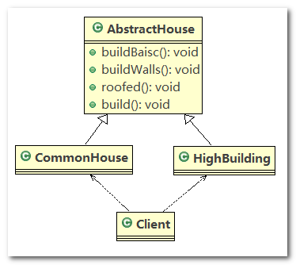

---

1. `AbstractHouse`：房子的抽象父类，指定建造房子的规范，以及建造房子的具体流程

   ```java
   public abstract class AbstractHouse {
   
   	// 打地基
   	public abstract void buildBasic();
   
   	// 砌墙
   	public abstract void buildWalls();
   
   	// 封顶
   	public abstract void roofed();
   
   	// 建造房子的具体流程
   	public void build() {
   		buildBasic();
   		buildWalls();
   		roofed();
   	}
   
   }
   ```

2. `CommonHouse`：普通房子，继承 `AbstractHouse` 类，实现了建造房子中各个步骤的具体细节

   ```java
   public class CommonHouse extends AbstractHouse {
   
   	@Override
   	public void buildBasic() {
   		System.out.println(" 普通房子打地基 ");
   	}
   
   	@Override
   	public void buildWalls() {
   		System.out.println(" 普通房子砌墙 ");
   	}
   
   	@Override
   	public void roofed() {
   		System.out.println(" 普通房子封顶 ");
   	}
   
   }
   ```

3. `HighBuilding`：高楼大厦，继承 `AbstractHouse` 类，实现了建造房子中各个步骤的具体细节

   ```java
   public class HighBuilding extends AbstractHouse{
   
   	@Override
   	public void buildBasic() {
   		System.out.println(" 高楼的打地基100米 ");
   	}
   
   	@Override
   	public void buildWalls() {
   		System.out.println(" 高楼的砌墙20cm ");
   	}
   
   	@Override
   	public void roofed() {
   		System.out.println(" 高楼的透明屋顶 ");
   	}
   
   
   }
   ```

4. `Client`：客户端，发出建造房子的命令

   ```java
   public class Client {
   
   	public static void main(String[] args) {
   		CommonHouse commonHouse = new CommonHouse();
   		commonHouse.build();
   	}
   
   }
   ```

---

传统方式优缺点分析

1. 优点是比较好理解，简单易操作。
2. 设计的程序结构，过于简单，没有设计缓存层对象，程序的扩展和维护不好，也就是说，这种设计方案，把产品(即：房子) 和创建产品的过程(即：建房子流程) 封装在一起，代码耦合性增强了。
3. 解决方案：将产品和产品建造过程解耦 --> 建造者模式

#### 3.2.5.3. 基本介绍

1. 建造者模式（`Builder Pattern`） 又叫生成器模式，是一种对象构建模式。它可以将复杂对象的建造过程抽象出来（抽象类别），使这个抽象过程的不同实现方法可以构造出不同表现（属性）的对象。
2. 建造者模式是一步一步创建一个复杂的对象，它允许用户只通过指定复杂对象的类型和内容就可以构建它们，用户不需要知道内部的具体构建细节。
3. 实际应用场景：建造房子、组装车辆

#### 3.2.5.4. 类图原理

-  建造者模式的四个角色
  1. `Product`（产品角色）： 一个具体的产品对象
  2. `Builder`（抽象建造者）： 创建一个`Product`对象的抽象接口（或抽象类），抽象建造者主要负责规范建造的流程，不关心具体的建造细节
  3. `ConcreteBuilder`（具体建造者）： 实现接口，构建和装配各个部件，具体建造者负责实现具体的建造细节
  4. `Director`（指挥者）： 构建一个使用`Builder`接口的具体实现类的对象。它主要是用于创建一个复杂的对象。它主要有两个作用，一是：隔离了客户与对象的生产过程，二是：负责控制产品对象的生产过程

---


- 建造者模式原理类图
  1. `Product`（产品类）：一个具体的产品
  2. `Builder`（抽象建造者）：`Builder` 中组合了一个 `Product` 实例
  3. `ConcreteBuilder`（具体建造者）：实现了 `Builder` 中的抽象方法
  4. `Director`（指挥者）：将 `Builder` 的具体实现类聚合到 `Director` 中，在 `Director` 中调用具体的 `Builder` 完成具体产品的制造

#### 3.2.5.5. 优化代码

> **类图**


> **代码**

1. `House`：产品类

   ```java
   //产品->Product
   public class House {
   	private String base;
   	private String wall;
   	private String roofed;
   ```

2. `HouseBuilder`：抽象建造者，规定制造房子的规范，并提供 `buildHouse()` 方法返回制造好的房子（产品）

   ```java
   // 抽象的建造者
   public abstract class HouseBuilder {
   
   	protected House house = new House();
   
   	// 将建造的流程写好, 抽象的方法
   	public abstract void buildBasic();
   
   	public abstract void buildWalls();
   
   	public abstract void roofed();
   
   	// 建造房子好， 将产品(房子) 返回
   	public House buildHouse() {
   		return house;
   	}
   
   }
   ```

3. `CommonHouse`：具体建造者，负责建造普通房子，重写父类 `HouseBuilder` 中的抽象方法来指定普通房子的建造细节

   ```java
   public class CommonHouse extends HouseBuilder {
   
   	@Override
   	public void buildBasic() {
   		house.setBase("普通房子打地基5米");
   	}
   
   	@Override
   	public void buildWalls() {
   		house.setWall("普通房子砌墙10cm");
   	}
   
   	@Override
   	public void roofed() {
   		house.setRoofed("普通房子屋顶");
   	}
   
   }
   ```

4. `HighBuilding`：具体建造者，负责建造高楼大厦，重写父类 `HouseBuilder` 中的抽象方法来指定高楼大厦的建造细节

   ```java
   public class HighBuilding extends HouseBuilder {
   
   	@Override
   	public void buildBasic() {
   		house.setBase("高楼的打地基100米");
   	}
   
   	@Override
   	public void buildWalls() {
   		house.setWall("高楼的砌墙20cm");
   	}
   
   	@Override
   	public void roofed() {
   		house.setRoofed("高楼的透明屋顶");
   	}
   
   }
   ```

5. `HouseDirector`：指挥者，指挥具体的 `Builder` 对象制造产品，可指定制造产品的流程

   ```java
   //指挥者，这里去指定制作流程，返回产品
   public class HouseDirector {
   
   	HouseBuilder houseBuilder = null;
   
   	// 构造器传入 houseBuilder
   	public HouseDirector(HouseBuilder houseBuilder) {
   		this.houseBuilder = houseBuilder;
   	}
   
   	// 通过setter 传入 houseBuilder
   	public void setHouseBuilder(HouseBuilder houseBuilder) {
   		this.houseBuilder = houseBuilder;
   	}
   
   	// 如何处理建造房子的流程，交给指挥者
   	public House constructHouse() {
   		houseBuilder.buildBasic();
   		houseBuilder.buildWalls();
   		houseBuilder.roofed();
   		return houseBuilder.buildHouse();
   	}
   
   }
   ```

6. `Client`：客户端，发出建造房子的命令

   ```java
   public class Client {
   	public static void main(String[] args) {
   		// 盖普通房子
   		CommonHouse commonHouse = new CommonHouse();
   		// 准备创建房子的指挥者
   		HouseDirector houseDirector = new HouseDirector(commonHouse);
   		// 完成盖房子，返回产品(普通房子)
   		House house = houseDirector.constructHouse();
   		// 查看建造的普通房子
   		System.out.println(house);
   
   		System.out.println("--------------------------");
   		// 盖高楼
   		HighBuilding highBuilding = new HighBuilding();
   		// 重置建造者
   		houseDirector.setHouseBuilder(highBuilding);
   		// 完成盖房子，返回产品(高楼)
   		house = houseDirector.constructHouse();
   		// 查看建造的高楼
   		System.out.println(house);
   	}
   }
   ```

7. 程序运行结果

   ```
   House [base=普通房子打地基5米, wall=普通房子砌墙10cm, roofed=普通房子屋顶]
   --------------------------
   House [base=高楼的打地基100米, wall=高楼的砌墙20cm, roofed=高楼的透明屋顶]
   ```

> **总结**

1. 首先，`Product` 为产品类，将 `Product` 的实例对象**组合**在抽象建造者 `AbstractBuilder` 中，并通过抽象建造者中定义的抽象方法，来约定制造产品的规范
2. 然后，通过 `Builder` 具体的实现类：具体建造者 `ConcreteBuilder`，重写抽象父类 `AbstractBuilder` 中的抽象方法，来指定具体产品的制造细节
3. 最后，将 `ConcreteBuilder` 的实例对象聚合在指挥者 `Director` 中，通过指挥者实现具体产品的制造流程（抽象方法的调用顺序），最后返回产品即可

#### 3.2.5.6. jdk源码示例

1. `StringBuilder` 的 `append()` 方法：调用父类`AbstractStringBuilder` 的 `append()` 方法

   ```java
   public final class StringBuilder
       extends AbstractStringBuilder
       implements java.io.Serializable, CharSequence
   {
       // ...
       
       @Override
       public StringBuilder append(String str) {
           super.append(str);
           return this;
       }
       
       // ...
   ```

2. `AbstractStringBuilder` 的 `append()` 方法是由 `Appendable` 接口定义的规范

   ```java
   abstract class AbstractStringBuilder implements Appendable, CharSequence {
       /**
        * The value is used for character storage.
        */
       char[] value;
   
       /**
        * The count is the number of characters used.
        */
       int count;
   
       /**
        * This no-arg constructor is necessary for serialization of subclasses.
        */
       AbstractStringBuilder() {
       }
   
       /**
        * Creates an AbstractStringBuilder of the specified capacity.
        */
       AbstractStringBuilder(int capacity) {
           value = new char[capacity];
       }
       
       // ...
       
       public AbstractStringBuilder append(String str) {
           if (str == null)
               return appendNull();
           int len = str.length();
           ensureCapacityInternal(count + len);
           str.getChars(0, len, value, count);
           count += len;
           return this;
       }
       
       // ...
   ```

3. `Appendable` 接口：定义了 `append()` 方法的规范，相当于是一个抽象的建造者

   ```java
   public interface Appendable {
   
       Appendable append(CharSequence csq) throws IOException;
   
       Appendable append(CharSequence csq, int start, int end) throws IOException;
   
       Appendable append(char c) throws IOException;
   }
   ```

4. 说明：**实际源码中的生产模式有可能和我们讲的有细微差别**。

------

源码中建造者模式角色分析

1. `Appendable` 接口定义了多个 `append()` 方法(抽象方法)，即 `Appendable` 为抽象建造者，定义了制造产品的抽象方法（规范）
2. `AbstractStringBuilder` 实现了 `Appendable` 接口方法，这里的 `AbstractStringBuilder` 已经是建造者，只是不能实例化
3. `StringBuilder` 既充当了指挥者角色，同时充当了具体的建造者， 因为建造方法的实现是由 `AbstractStringBuilder` 完成，而 `StringBuilder` 继承了`AbstractStringBuilder`

#### 3.2.5.7. 注意事项

> **建造者模式的注意事项和细节**

1. 客户端(使用程序)不必知道产品内部组成的细节，将产品本身与产品的创建过程解耦，使得相同的创建过程可以创建不同的产品对象
2. 每一个具体建造者都相对独立，而与其他的具体建造者无关，因此可以很方便地替换具体建造者或增加新的具体建造者， 用户使用不同的具体建造者即可得到不同的产品对象
3. 可以更加精细地控制产品的创建过程 。将复杂产品的创建步骤分解在不同的方法中，使得创建过程更加清晰，也更方便使用程序来控制创建过程
4. 增加新的具体建造者无须修改原有类库的代码，指挥者类针对抽象建造者类编程，系统扩展方便，符合 “开闭原则”
5. 建造者模式所创建的产品一般具有较多的共同点，其组成部分相似，如果产品之间的差异性很大，则不适合使用建造者模式，因此其使用范围受到一定的限制
6. 如果产品的内部变化复杂，可能会导致需要定义很多具体建造者类来实现这种变化，导致系统变得很庞大， 因此在这种情况下，要考虑是否选择建造者模式

> **抽象工厂模式 VS 建造者模式**

1. 抽象工厂模式实现对产品家族的创建，一个产品家族是这样的一系列产品：具有不同分类维度的产品组合，采用抽象工厂模式不需要关心构建过程，只关心什么产品由什么工厂生产即可
2. 而建造者模式则是要求按照指定的蓝图建造产品，它的主要目的是通过组装零配件而产生一个新产品，可以这样理解：建造者模式制造产品需要有一个具体的流程，对于不同产品整体流程相差不大，但是每个流程的实现细节较大

## 3.3. 结构型模式

### 3.3.1. 概述

这些设计模式关注类和对象的组合。继承的概念被用来组合接口和定义组合对象获得新功能的方式。

### 3.3.2. 适配器模式（Adapter Pattern）

#### 3.3.2.1. 基本介绍

泰国旅游使用插座问题：泰国插座用的是两孔的（欧标） ，可以买个多功能转换插头 (适配器) ，这样就可以使用了

1. 适配器模式(`Adapter Pattern`)将某个类的接口转换成客户端期望的另一个接口表示，主的目的是兼容性，让原本因接口不匹配不能一起工作的两个类可以协同工作。
2. 适配器的别名为包装器(`Wrapper`)，适配器模式属于结构型模式
3. 主要分为三类：类适配器模式、对象适配器模式、接口适配器模式。但实际工作中不局限于这三种经典模式。


#### 3.3.2.2. 基本原理

1. 适配器模式：将一个类的接口转换成另一种接口，让原本接口不兼容的类可以兼容
2. 从用户的角度看不到被适配者，用户与被适配者是解耦的
3. 用户调用适配器转化出来的目标接口方法， 适配器再调用被适配者的相关接口方法
4. 用户收到反馈结果，感觉只是和目标接口交互， 如图


#### 3.3.2.3. 类适配器

> **类适配器模式介绍**

基本介绍： 核心模块是 `Adapter` 类，`Adapter` 类，通过继承 `src` 类（被适配者），实现 `dst` 类接口（目标类），完成 `src --> dst` 的适配

> **类适配器模式应用实例**

应用实例说明

以生活中充电器的例子来讲解适配器，充电器本身相当于`Adapter`， `220V`交流电相当于`src` (即被适配者)， 我们的`dst`(即目标)是`5V`直流电

> **类图**


> **代码实现**

1. `Voltage220V`：`src`类，输出 `220V` 的电压

   ```java
   //被适配的类
   public class Voltage220V {
   	// 输出220V的电压
   	public int output220V() {
   		int src = 220;
   		return src;
   	}
   }
   ```

2. `IVoltage5V`：适配器接口（`dst` 接口），规定适配器的规范

   ```java
   //适配接口
   public interface IVoltage5V {
   	public int output5V();
   }
   ```

3. `VoltageAdapter`：适配器，继承了 `Voltage220V` 并实现了 `IVoltage5V` 接口

   ```java
   //适配器类
   public class VoltageAdapter extends Voltage220V implements IVoltage5V {
   	@Override
   	public int output5V() {
   		int srcV = output220V(); // 获取到220V电压
   		int dstV = srcV / 44; // 降压转成 5v
   		return dstV;
   	}
   }
   ```

4. `Phone`：使用 `5V` 适配器进行充电

   ```java
   public class Phone {
   	// 充电
   	public void charging(IVoltage5V iVoltage5V) {
   		if (iVoltage5V.output5V() == 5) {
   			System.out.println("电压为5V, 可以充电~~");
   		} else if (iVoltage5V.output5V() > 5) {
   			System.out.println("电压大于5V, 不能充电~~");
   		}
   	}
   }
   ```

5. `Client`：客户端，进行代码测试

   ```java
   public class Client {
   
   	public static void main(String[] args) {
   		System.out.println(" === 类适配器模式 ====");
   		Phone phone = new Phone();
   		phone.charging(new VoltageAdapter());
   	}
   
   }
   ```

> **总结**

`Voltage220V` 只能输出 `220V` 的电压，我们定义一个抽象的适配器规范：`IVoltage5V` 接口，该接口里面有一个抽象方法 `public int output5V();`，适配器 `VoltageAdapter` 继承 `Voltage220V` 并实现 `IVoltage5V` 接口，可以将 `220V` 的电压转为 `5V` 电压

- 缺点
  - `Java`是单继承机制，所以类适配器需要继承`src`类这一点算是一个缺点，因为`Adapter`已经继承了`src`类，这要求`dst`必须是接口，有一定局限性
  - `src`类的方法在`Adapter`中都会暴露出来，也增加了使用的成本，因为`src`类中的方法可能很多

- 优点：
  - 由于其继承了`src`类，所以它可以根据需求重写`src`类的方法，使得`Adapter`的灵活性增强了

#### 3.3.2.4. 对象适配器

> **对象适配器模式介绍**

1. 基本思路和类的适配器模式相同，只是将`Adapter`类作修改，不是继承`src`类，而是持有`src`类的实例，以解决兼容性的问题。
2. 对象适配器模式的核心思想：适配器持有`src`类，实现`dst`类接口，完成`src --> dst`的适配
3. 根据“合成复用原则”，在系统中尽量使用关联关系（聚合、组合）来替代继承关系。
4. 对象适配器模式是适配器模式常用的一种

> **对象适配器模式应用实例**

以生活中充电器的例子来讲解适配器，充电器本身相当于`Adapter`， `220V`交流电相当于`src` (即被适配者)， 我们的`dst`(即目标)是`5V`直流电， 使用对象适配器模式完成

> **类图**

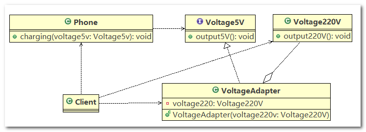

> **代码实现**

1. `Voltage220V`：`src`类，输出 `220V` 的电压，与类适配器中的代码一样

2. `IVoltage5V`：适配器接口（`dst` 接口），规定适配器的规范，与类适配器中的代码一样

3. `VoltageAdapter`：适配器，`VoltageAdapter` 中聚合了一个 `Voltage220V` 类的对象，并实现了 `IVoltage5V` 接口

   ```java
   //适配器类
   public class VoltageAdapter implements IVoltage5V {
   
   	private Voltage220V voltage220V; // 关联关系-聚合
   
   	// 通过构造器，传入一个 Voltage220V 实例
   	public VoltageAdapter(Voltage220V voltage220v) {
   		this.voltage220V = voltage220v;
   	}
   
   	@Override
   	public int output5V() {
   		int dst = 0;
   		if (null != voltage220V) {
   			int src = voltage220V.output220V();// 获取220V 电压
   			System.out.println("使用对象适配器，进行适配~~");
   			dst = src / 44;
   			System.out.println("适配完成，输出的电压为=" + dst);
   		}
   		return dst;
   	}
   
   }
   ```

4. `Phone`：使用 `5V` 适配器进行充电，与类适配器中的代码一样

5. `Client`：客户端，进行代码测试，创建适配器 `VoltageAdapter` 时，注入 `src` 类实例：`new Voltage220V()`

   ```java
   public class Client {
   
   	public static void main(String[] args) {
   		System.out.println(" === 对象适配器模式 ====");
   		Phone phone = new Phone();
   		phone.charging(new VoltageAdapter(new Voltage220V()));
   	}
   
   }
   ```

> **总结**

- 与类适配器模式区别
  - 对象适配器模式中，适配器 `Adapter` 没有使用继承关系，而是使用聚合关系，在适配器 `Adapter` 中聚合了一个 `src` 类实例

- 与类适配器模式相同点
  - 相同的是 `Adapter` 实现适配器接口（`dst`接口），在 `Adapter` 中实现 `dst` 接口中的抽象方法，然后使用 `src` 类实例和完成适配（转换）

- 与类适配器模式联系
  - 对象适配器和类适配器其实算是同一种思想，只不过实现方式不同。**根据合成复用原则， 使用组合替代继承**，
  - 所以它解决了类适配器必须继承`src`的局限性问题，也不再要求`dst`必须是接口(因为java不允许多继承，对象适配器允许dst为抽象类)。**对象适配器的使用成本更低，更灵活**

#### 3.3.2.5. 接口适配器

> **接口适配器模式介绍**

1. 一些书籍称为：适配器模式(`Default Adapter Pattern`)或缺省适配器模式
2. 核心思想：当不需要全部实现接口提供的方法时，可先设计一个抽象类实现接口，并为该接口中每个方法提供一个默认实现（空方法），那么该抽象类的子类可有选择地覆盖父类的某些方法来实现需求
3. 适用于一个接口的实现类不想使用其所有的方法的情况

> **类图**


> **代码示例**

1. `Interface4`：接口

   ```java
   public interface Interface4 {
   	public void m1();
   
   	public void m2();
   
   	public void m3();
   
   	public void m4();
   }
   ```

2. `AbsAdapter`：适配器，对接口中的抽象方法进行空实现

   ```java
   //在AbsAdapter 我们将 Interface4 的方法进行默认实现
   public abstract class AbsAdapter implements Interface4 {
   	// 默认实现
   	public void m1() {
   
   	}
   
   	public void m2() {
   
   	}
   
   	public void m3() {
   
   	}
   
   	public void m4() {
   
   	}
   }
   ```

3. `Client`：客户端

   ```java
   public class Client {
   	public static void main(String[] args) {
   
   		AbsAdapter absAdapter = new AbsAdapter() {
   			// 只需要去覆盖我们 需要使用 接口方法
   			@Override
   			public void m1() {
   				System.out.println("使用了m1的方法");
   			}
   		};
   
   		absAdapter.m1();
   	}
   }
   ```

> **`Android` 代码示例**

1. `AnimatorListener`是一个接口，它里面定义了一些抽象方法

   ```java
   public static interface AnimatorListener {
       void onAnimationStart(Animator animation);
       void onAnimationEnd(Animator animation);
       void onAnimationCancel(Animator animation);
       void onAnimationRepeat(Animator animation);
   }
   ```

2. `AnimatorListenerAdapter`类就是一个接口适配器，它空实现了`Animator.AnimatorListener`类(`src`)的所有方法

   ```java
   public abstract class AnimatorListenerAdapter implements Animator.AnimatorListener, Animator.AnimatorPauseListener {
       @Override //默认实现
       public void onAnimationCancel(Animator animation) {
       }
       
       @Override
       public void onAnimationEnd(Animator animation) {
       }
       
       @Override
       public void onAnimationRepeat(Animator animation) {
       }
       
       @Override
       public void onAnimationStart(Animator animation) {
       }
       
       @Override
       public void onAnimationPause(Animator animation) {
       }
       
       @Override
       public void onAnimationResume(Animator animation) {
       }
   }
   ```

3. 我们在程序里的匿名内部类就是`Listener`具体实现类，我们可以选择性地实现想要重写的方法

   ```java
   new AnimatorListenerAdapter() {
       @Override
       public void onAnimationStart(Animator animation) {
       	//xxxx具体实现
       }
   }
   ```

#### 3.3.2.6. SpringMVC源码

> **适配器模式在SpringMVC框架应用的源码剖析**

`SpringMVC`中的`HandlerAdapter`，就使用了适配器模式，`SpringMVC`处理请求的流程回顾：

1. 首先用户请求到达前端控制器 `dispatcherServlet` 的 `doDispatch()` 方法
2. 在 `doDispatch()` 中，通过 `HandlerMapping` 找到用户请求的 `Handler`（处理器）
3. 通过 `Handler` 执行目标方法，获得本次访问结果：`ModelAndView` 对象
4. 接着调用 `InternalResourceViewResolve` 对返回的 `ModelAndView` 对象进行解析，找到指定的资源
5. 目标资源（`JSP` 页面或者 `JSON` 字符串）最终都会以 `JSON` 字符串的形式返回给 `Tomcat`
6. `Tomcat` 将字符串 以 `HTTP` 协议的方式返回给浏览器


> **使用 `HandlerAdapter` 的原因分析:**

可以看到处理器的类型不同，有多种实现方式，那么调用方式就不是确定的，

如果需要直接调用`Controller`方法，需要调用的时候就得不断是使用`if else`来进行判断是哪一种子类然后执行。 那么如果后面要扩展`Controller`，就得修改原来的代码，这样违背了`OCP` 原则

> **源码追踪**

1. `doDispatch()` 方法

   ```java
   /**
    * Process the actual dispatching to the handler.
    * <p>The handler will be obtained by applying the servlet's HandlerMappings in order.
    * The HandlerAdapter will be obtained by querying the servlet's installed HandlerAdapters
    * to find the first that supports the handler class.
    * <p>All HTTP methods are handled by this method. It's up to HandlerAdapters or handlers
    * themselves to decide which methods are acceptable.
    * @param request current HTTP request
    * @param response current HTTP response
    * @throws Exception in case of any kind of processing failure
    */
   protected void doDispatch(HttpServletRequest request, HttpServletResponse response) throws Exception {
   	HttpServletRequest processedRequest = request;
   	HandlerExecutionChain mappedHandler = null;
   	boolean multipartRequestParsed = false;
   
   	WebAsyncManager asyncManager = WebAsyncUtils.getAsyncManager(request);
   
   	try {
   		ModelAndView mv = null;
   		Exception dispatchException = null;
   
   		try {
   			processedRequest = checkMultipart(request);
   			multipartRequestParsed = processedRequest != request;
   
   			// Determine handler for the current request.
   			mappedHandler = getHandler(processedRequest);
   			if (mappedHandler == null || mappedHandler.getHandler() == null) {
   				noHandlerFound(processedRequest, response);
   				return;
   			}
   
   			// Determine handler adapter for the current request.
   			HandlerAdapter ha = getHandlerAdapter(mappedHandler.getHandler());
   
   			// Process last-modified header, if supported by the handler.
   			String method = request.getMethod();
   			boolean isGet = "GET".equals(method);
   			if (isGet || "HEAD".equals(method)) {
   				long lastModified = ha.getLastModified(request, mappedHandler.getHandler());
   				if (logger.isDebugEnabled()) {
   					String requestUri = urlPathHelper.getRequestUri(request);
   					logger.debug("Last-Modified value for [" + requestUri + "] is: " + lastModified);
   				}
   				if (new ServletWebRequest(request, response).checkNotModified(lastModified) && isGet) {
   					return;
   				}
   			}
   
   			if (!mappedHandler.applyPreHandle(processedRequest, response)) {
   				return;
   			}
   
   			try {
   				// Actually invoke the handler.
   				mv = ha.handle(processedRequest, response, mappedHandler.getHandler());
   			}
   			finally {
   				if (asyncManager.isConcurrentHandlingStarted()) {
   					return;
   				}
   			}
   
   			applyDefaultViewName(request, mv);
   			mappedHandler.applyPostHandle(processedRequest, response, mv);
   		}
   		catch (Exception ex) {
   			dispatchException = ex;
   		}
   		processDispatchResult(processedRequest, response, mappedHandler, mv, dispatchException);
   	}
   	catch (Exception ex) {
   		triggerAfterCompletion(processedRequest, response, mappedHandler, ex);
   	}
   	catch (Error err) {
   		triggerAfterCompletionWithError(processedRequest, response, mappedHandler, err);
   	}
   	finally {
   		if (asyncManager.isConcurrentHandlingStarted()) {
   			// Instead of postHandle and afterCompletion
   			mappedHandler.applyAfterConcurrentHandlingStarted(processedRequest, response);
   			return;
   		}
   		// Clean up any resources used by a multipart request.
   		if (multipartRequestParsed) {
   			cleanupMultipart(processedRequest);
   		}
   	}
   }
   ```

2. `getHandlerAdapter()` 方法

   ```java
   /**
    * Return the HandlerAdapter for this handler object.
    * @param handler the handler object to find an adapter for
    * @throws ServletException if no HandlerAdapter can be found for the handler. This is a fatal error.
    */
   protected HandlerAdapter getHandlerAdapter(Object handler) throws ServletException {
   	for (HandlerAdapter ha : this.handlerAdapters) {
   		if (logger.isTraceEnabled()) {
   			logger.trace("Testing handler adapter [" + ha + "]");
   		}
   		if (ha.supports(handler)) {
   			return ha;
   		}
   	}
   	throw new ServletException("No adapter for handler [" + handler +
   			"]: The DispatcherServlet configuration needs to include a HandlerAdapter that supports this handler");
   }
   ```

3. `HandlerAdapter` 只是一个接口，定义了适配器的规范

   ```java
   public interface HandlerAdapter {
   
   	/**
   	 * Given a handler instance, return whether or not this {@code HandlerAdapter}
   	 * can support it. Typical HandlerAdapters will base the decision on the handler
   	 * type. HandlerAdapters will usually only support one handler type each.
   	 * <p>A typical implementation:
   	 * <p>{@code
   	 * return (handler instanceof MyHandler);
   	 * }
   	 * @param handler handler object to check
   	 * @return whether or not this object can use the given handler
   	 */
   	boolean supports(Object handler);
   
   	/**
   	 * Use the given handler to handle this request.
   	 * The workflow that is required may vary widely.
   	 * @param request current HTTP request
   	 * @param response current HTTP response
   	 * @param handler handler to use. This object must have previously been passed
   	 * to the {@code supports} method of this interface, which must have
   	 * returned {@code true}.
   	 * @throws Exception in case of errors
   	 * @return ModelAndView object with the name of the view and the required
   	 * model data, or {@code null} if the request has been handled directly
   	 */
   	ModelAndView handle(HttpServletRequest request, HttpServletResponse response, Object handler) throws Exception;
   
   	/**
   	 * Same contract as for HttpServlet's {@code getLastModified} method.
   	 * Can simply return -1 if there's no support in the handler class.
   	 * @param request current HTTP request
   	 * @param handler handler to use
   	 * @return the lastModified value for the given handler
   	 * @see javax.servlet.http.HttpServlet#getLastModified
   	 * @see org.springframework.web.servlet.mvc.LastModified#getLastModified
   	 */
   	long getLastModified(HttpServletRequest request, Object handler);
   
   }
   ```

4. `HandlerAdapter` 继承树

  

> **源码分析与总结**

1. 首先，我们拿到此次请求的 `Request` 对象：`HttpServletRequest processedRequest = request;`
2. 接着，通过 `Request` 对象拿到 `Handler(Controller)` 对象：`mappedHandler = getHandler(processedRequest);`
3. 然后通过 `Handler` 拿到对应的适配器( `Adapter`)：`HandlerAdapter ha = getHandlerAdapter(mappedHandler.getHandler());`
4. 最后通过适配器调用 `Controller` 的方法并返回 `ModelAndView`：`mv = ha.handle(processedRequest, response, mappedHandler.getHandler());`

> **动手写 SpringMVC 通过适配器设计模式**

`Spring` 定义了一个适配接口，使得每一种 `Controller`有一种对应的适配器实现类，适配器代替 `Controller` 执行相应的方法，扩展 `Controller` 时，只需要增加一个适配器类就完成了 `SpringMVC` 的扩展了，这就是设计模式的力量

> **类图**


> **代码实现**

1. `Controller` 接口及其实现类

   ```java
   //多种Controller实现  
   public interface Controller {
   
   }
   
   class HttpController implements Controller {
   	public void doHttpHandler() {
   		System.out.println("http...");
   	}
   }
   
   class SimpleController implements Controller {
   	public void doSimplerHandler() {
   		System.out.println("simple...");
   	}
   }
   
   class AnnotationController implements Controller {
   	public void doAnnotationHandler() {
   		System.out.println("annotation...");
   	}
   }
   ```

2. `HandlerAdapter` 接口及其实现类

   ```java
   //定义一个Adapter接口 
   public interface HandlerAdapter {
   	// 当前 HandlerAdapter 对象是否支持 handler（判断 handler 的类型是否为具体的子类类型）
   	public boolean supports(Object handler);
   
   	// 执行目标方法（将 handler 对象强转后，调用对应的方法）
   	public void handle(Object handler);
   }
   
   // 多种适配器类
   class SimpleHandlerAdapter implements HandlerAdapter {
   
   	public void handle(Object handler) {
   		((SimpleController) handler).doSimplerHandler();
   	}
   
   	public boolean supports(Object handler) {
   		return (handler instanceof SimpleController);
   	}
   
   }
   
   class HttpHandlerAdapter implements HandlerAdapter {
   
   	public void handle(Object handler) {
   		((HttpController) handler).doHttpHandler();
   	}
   
   	public boolean supports(Object handler) {
   		return (handler instanceof HttpController);
   	}
   
   }
   
   class AnnotationHandlerAdapter implements HandlerAdapter {
   
   	public void handle(Object handler) {
   		((AnnotationController) handler).doAnnotationHandler();
   	}
   
   	public boolean supports(Object handler) {
   		return (handler instanceof AnnotationController);
   	}
   
   }
   ```

3. `DispatchServlet`：模拟 `doDispatch()` 方法中获取适配器的流程

   ```java
   public class DispatchServlet {
   
   	public static List<HandlerAdapter> handlerAdapters = new ArrayList<HandlerAdapter>();
   
   	// 组合了多个 HandlerAdapter 的实现类
   	public DispatchServlet() {
   		handlerAdapters.add(new AnnotationHandlerAdapter());
   		handlerAdapters.add(new HttpHandlerAdapter());
   		handlerAdapters.add(new SimpleHandlerAdapter());
   	}
   
   	public void doDispatch() {
   
   		// 此处模拟SpringMVC从request取handler的对象，
   		// 适配器可以获取到希望的Controller
   		HttpController controller = new HttpController();
   		// AnnotationController controller = new AnnotationController();
   		// SimpleController controller = new SimpleController();
   		
   		// 得到对应适配器
   		HandlerAdapter adapter = getHandler(controller);
   		// 通过适配器执行对应的controller对应方法
   		adapter.handle(controller);
   
   	}
   
   	public HandlerAdapter getHandler(Controller controller) {
   		// 遍历：根据得到的controller(handler), 返回对应适配器
   		for (HandlerAdapter adapter : this.handlerAdapters) {
   			if (adapter.supports(controller)) {
   				return adapter;
   			}
   		}
   		return null;
   	}
   
   	public static void main(String[] args) {
   		new DispatchServlet().doDispatch(); // http...
   	}
   
   }
   ```

> **总结**

1.  `HandlerAdapter` 的作用：
   1. `public boolean supports(Object handler);`：当前适配器是否支持 `handler`，从上面源码可以看出，使用 `instanceof` 关键字进行判断
   2. `public void handle(Object handler);`：执行 `Handler(Controller)` 的目标方法，即 `HandlerAdapter` 代替原有的 `Handler(Controller)` 执行目标方法
2. 通过 `HandlerAdapter` 可以使得 `DispatchServlet` 和具体的 `Controller` 解耦，扩展 `Controller` 时，我们只需要增加一个适配器类就完成了 `SpringMVC` 的扩展
3. 对于同一类的请求方式，我们封装一个 `HandlerAdapter` 实现类，通过该 `HandlerAdapter` 实现类完成一类相同的请求

#### 3.3.2.7. 注意事项

三种命名方式，是根据`src`是以怎样的形式给到`Adapter`（在`Adapter`里的形式）来命名的。

1. 类适配器：以类给到，在`Adapter`里，就是将`src`当做类，继承
2. 对象适配器：以对象给到，在`Adapter`里，将`src`作为一个对象，持有
3. 接口适配器：以接口给到，在`Adapter`里，将`src`作为一个接口，实现

------

`Adapter`模式最大的作用还是将原本不兼容的接口融合在一起工作，相当于是个中转封装站

**实际开发中，实现起来不拘泥于我们讲解的三种经典形式**

### 3.3.3. 桥接模式（Bridge Pattern）


#### 3.3.3.1. 情景介绍

现在对不同手机类型、不同品牌的手机实现操作编程(比如：开机、关机、上网，打电话等)

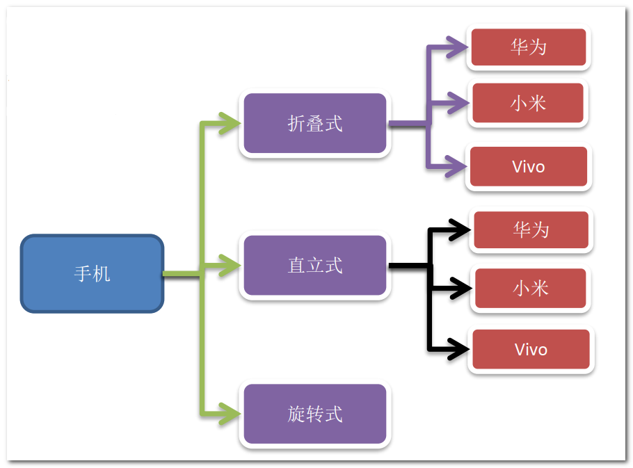

#### 3.3.3.2. 传统方式


问题：

1. 扩展性问题(类爆炸)， 如果我们再增加手机的样式(旋转式)，就需要增加各个品牌手机的类，同样如果我们增加一个手机品牌，也要在各个手机样式类下增加
2. 违反了单一职责原则，当我们增加手机样式时，要同时增加所有品牌的手机，这样增加了代码维护成本
3. 解决方案 --> 使用桥接模式

#### 3.3.3.3. 基本介绍

1. 桥接模式(`Bridge`模式)是指：将实现与抽象放在两个不同的类层次中，使两个层次可以独立改变，桥接模式是一种结构型设计模式
2. `Bridge`模式基于类的最小设计原则，通过使用封装、聚合及继承等行为让不同的类承担不同的职责。它的主要特点是把抽象(`Abstraction`)与行为实现(`Implementation`)分离开来，从而可以保持各部分的独立性以及应对他们的功能扩展


> *出现两层继承，或者以继承的方式实现组合的时候，可以稍微试试这种设计模式。不通过两层继承，而通过客户端的自己指定组合方式*
>
> 简单来说就是通过客户端组合的方式，替代了继承

#### 3.3.3.4. 类图原理


1. `Client`：桥接模式的调用者
2. `Abstraction`：抽象类，`Abstraction` 中维护了一个 `Implementor` 实现类的实例（聚合关系），`Abstraction` 充当桥接类
3. `RefinedAbstraction`：`Abstraction` 的具体实现类
4. `Implementor`：定义行为的接口
5. `ConcreteImplementor`：`Implementor` 的具体实现类

从 `UML` 图： 这里的抽象类和接口是聚合的关系， 其实也是调用和被调用关系，抽象在 `Abstraction` 这一块，行为实现在 `Implementor` 这一块


#### 3.3.3.5. 优化代码

> **类图**

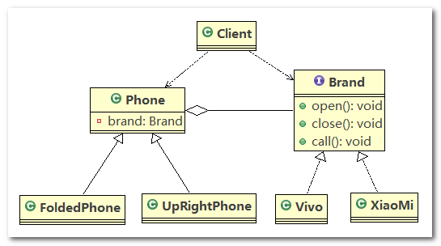


> **代码实现**

1. `Brand`：规定各个品牌手机的行为

   ```java
   //接口
   public interface Brand {
   	void open();
   
   	void close();
   
   	void call();
   }
   ```

2. `XiaoMi`：实现了 `Brand` 接口，指定了小米手机的具体行为

   ```java
   public class XiaoMi implements Brand {
   
   	@Override
   	public void open() {
   		System.out.println(" 小米手机开机 ");
   	}
   
   	@Override
   	public void close() {
   		System.out.println(" 小米手机关机 ");
   	}
   
   	@Override
   	public void call() {
   		System.out.println(" 小米手机打电话 ");
   	}
   
   }
   ```

3. `Vivo`：实现了 `Brand` 接口，指定了 `Vivo` 手机的具体行为

   ```java
   public class Vivo implements Brand {
   
   	@Override
   	public void open() {
   		System.out.println(" Vivo手机开机 ");
   	}
   
   	@Override
   	public void close() {
   		System.out.println(" Vivo手机关机 ");
   	}
   
   	@Override
   	public void call() {
   		System.out.println(" Vivo手机打电话 ");
   	}
   
   }
   ```

4. `Phone`：电话的抽象类，在该类中聚合了一个 `Brand` 接口的具体实现类

   ```java
   public abstract class Phone {
   
   	// 组合品牌
   	private Brand brand;
   
   	// 构造器
   	public Phone(Brand brand) {
   		this.brand = brand;
   	}
   
   	protected void open() {
   		this.brand.open();
   	}
   
   	protected void close() {
   		this.brand.close();
   	}
   
   	protected void call() {
   		this.brand.call();
   	}
   
   }
   ```

5. `FoldedPhone`：继承抽象父类 `Phone`，对抽象父类中的方法进行重写

   ```java
   //折叠式手机类，继承 抽象类 Phone
   public class FoldedPhone extends Phone {
   
   	// 构造器
   	public FoldedPhone(Brand brand) {
   		super(brand);
   	}
   
   	@Override
   	public void open() {
   		super.open();
   		System.out.println(" 折叠样式手机 ");
   	}
   
   	@Override
   	public void close() {
   		super.close();
   		System.out.println(" 折叠样式手机 ");
   	}
   
   	@Override
   	public void call() {
   		super.call();
   		System.out.println(" 折叠样式手机 ");
   	}
   
   }
   ```

6. `UpRightPhone`：继承抽象父类 `Phone`，对抽象父类中的方法进行重写

   ```java
   public class UpRightPhone extends Phone {
   
   	// 构造器
   	public UpRightPhone(Brand brand) {
   		super(brand);
   	}
   
   	@Override
   	public void open() {
   		super.open();
   		System.out.println(" 直立样式手机 ");
   	}
   
   	@Override
   	public void close() {
   		super.close();
   		System.out.println(" 直立样式手机 ");
   	}
   
   	@Override
   	public void call() {
   		super.call();
   		System.out.println(" 直立样式手机 ");
   	}
   	
   }
   ```

7. `Client`：客户端，可以看到，使用桥接模式可以轻松地组合出不同手机类型、不同品牌的手机

   ```java
   public class Client {
   
   	public static void main(String[] args) {
   
   		// 折叠式的小米手机 (样式 + 品牌 )
   		Phone phone1 = new FoldedPhone(new XiaoMi());
   		phone1.open();
   		phone1.call();
   		phone1.close();
   		System.out.println("=======================");
   
   		// 折叠式的Vivo手机 (样式 + 品牌 )
   		Phone phone2 = new FoldedPhone(new Vivo());
   		phone2.open();
   		phone2.call();
   		phone2.close();
   		System.out.println("==============");
   
   		// 直立式的小米手机 (样式 + 品牌 )
   		UpRightPhone phone3 = new UpRightPhone(new XiaoMi());
   		phone3.open();
   		phone3.call();
   		phone3.close();
   		System.out.println("==============");
   
   		// 直立式的Vivo手机 (样式 + 品牌 )
   		UpRightPhone phone4 = new UpRightPhone(new Vivo());
   		phone4.open();
   		phone4.call();
   		phone4.close();
   		
   	}
   
   }
   ```

> **总结**


1. `Phone` 就像一座桥的感觉，它其实并没有做什么实质性的工作，只是调用 `Brand` 的具体实现类中的方法，就感觉像是一个请求从 `Phone` 的具体实现类通过 `Phone` 传递到了 `Brand` 的具体实现类
2. 通过代码我们可以看到，增加一个新的手机样式，并不会引起类膨胀，因为只要新样式继承了 `Phone`，并通过构造器或者 `setter` 方法聚合一个 `Brand` 实现类的实例，就能完成组合的作用

#### 3.3.3.6. JDBC源码

> **类图**


- `Jdbc` 的 `Driver`接口，如果从桥接模式来看， `Driver`就是一个接口（行为规范）
- 下面可以有`MySQL`的`Driver`， `Oracle`的`Driver`，为行为实现类
- 如果严格按照桥接模式的话，`DriverManager`其实还会有子类，子类作为抽象具体实现，不过这里直接就一个抽象具体实现。

> **源码**

1. 客户端通过 `DriverManager` 操作数据库，`DriverManager` 里面定义了很多方法，就比如说如下的 `getConnection()` 方法，它返回一个 `Connection` 对象

  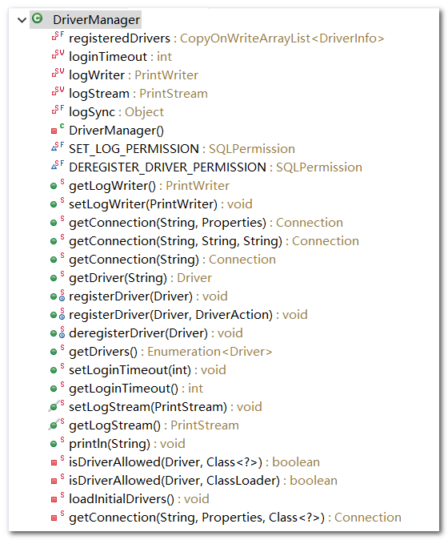

   ```java
   @CallerSensitive
   public static Connection getConnection(String url,
       java.util.Properties info) throws SQLException {
   
       return (getConnection(url, info, Reflection.getCallerClass()));
   }
   ```

2. `Connection` 为 `java.sql` 包下的接口，里面定义了 超多的抽象方法，比如 `prepareStatement()` 方法

   ```java
   public interface Connection  extends Wrapper, AutoCloseable {
       
       // ...  
       PreparedStatement prepareStatement(String sql, int resultSetType,
                                          int resultSetConcurrency, int resultSetHoldability)
           throws SQLException;
   
       CallableStatement prepareCall(String sql, int resultSetType,
                                     int resultSetConcurrency,
                                     int resultSetHoldability) throws SQLException;
   
       PreparedStatement prepareStatement(String sql, int autoGeneratedKeys)
           throws SQLException;
   
       PreparedStatement prepareStatement(String sql, int columnIndexes[])
           throws SQLException;
   
       PreparedStatement prepareStatement(String sql, String columnNames[])
           throws SQLException;
   
       // ...
   ```

3. `com.mysql.jdbc.Connection` 接口继承了 `java.sql.Connection` 接口

  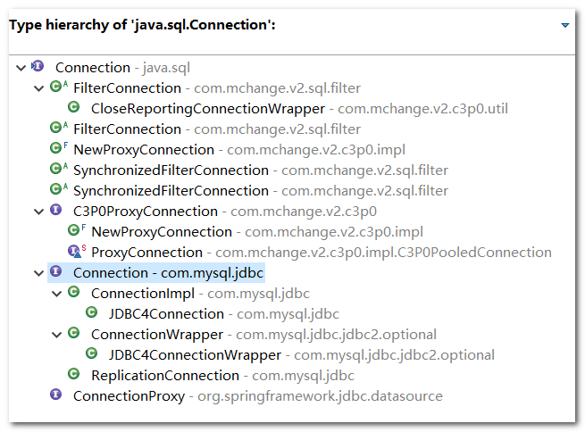

   ```java
   public interface Connection extends java.sql.Connection, ConnectionProperties {
   ```

4. `ConnectionImpl` 类实现了 `MySQLConnection` 接口，其中 `MySQLConnection` 接口继承了 `com.mysql.jdbc.Connection` 接口

   ```java
   public class ConnectionImpl extends ConnectionPropertiesImpl implements MySQLConnection {
   ```

>　**总结**

就以 `getConnection()` 方法的调用过程为例，`Client` 端调用 `DriverManager`（桥接器），`DriverManager` 去找 `java.sql.Connection` 的具体实现类


#### 3.3.3.7. 注意事项及应用场景

> **注意事项**

1. 实现了抽象和实现部分的分离， 从而极大的提供了系统的灵活性， 让抽象部分和实现部分独立开来， 这有助于系统进行分层设计， 从而产生更好的结构化系统。
2. 对于系统的高层部分， 只需要知道抽象部分和实现部分的接口就可以了， 其它的部分由具体业务来完成。
3. **桥接模式替代多层继承方案**， 可以**减少子类的个数**， 降低系统的管理和维护成本
4. 桥接模式的引入增加了系统的理解和设计难度， 由于聚合关联关系建立在抽象层， 要求开发者针对抽象进行设计和编程
5. 桥接模式要求**正确识别出系统中两个独立变化的维度(抽象和实现)**， 因此其使用范围有一定的局限性， 即需要有这样的应用场景

> **应用场景**

1. `JDBC` 驱动程序
2. 银行转账系统
   1. 转账分类（抽象层）：网上转账， 柜台转账， `AMT` 转账
   2. 转账用户类型（行为实现）： 普通用户， 银卡用户， 金卡用户
3. 消息管理
   1. 消息类型（抽象层）： 即时消息， 延时消息
   2. 消息分类（行为实现）： 手机短信， 邮件消息， `QQ` 消息


### 3.3.4. 过滤器模式（Filter、Criteria Pattern）


### 3.3.5. 组合模式（Composite Pattern）

### 3.3.6. 外观模式（Facade Pattern）

### 3.3.7. 享元模式（Flyweight Pattern）

### 3.3.8. 代理模式（Proxy Pattern）

## 3.4. 行为型模式

### 3.4.1. 概述

这些设计模式特别关注对象之间的通信。

### 3.4.2. 责任链模式（Chain of Responsibility Pattern）

### 3.4.3. 命令模式（Command Pattern）

### 3.4.4. 解释器模式（Interpreter Pattern）

### 3.4.5. 迭代器模式（Iterator Pattern）

### 3.4.6. 中介者模式（Mediator Pattern）

### 3.4.7. 备忘录模式（Memento Pattern）

### 3.4.8. 观察者模式（Observer Pattern）

### 3.4.9. 状态模式（State Pattern）

### 3.4.10. 空对象模式（Null Object Pattern）

### 3.4.11. 策略模式（Strategy Pattern）

### 3.4.12. 模板模式（Template Pattern）

- 最经典的 JDK 应用的就是 AQS

### 3.4.13. 访问者模式（Visitor Pattern）

## 3.5. J2EE 模式

### 3.5.1. 概述

这些设计模式特别关注表示层。这些模式是由 Sun Java Center 鉴定的。

### 3.5.2. MVC 模式（MVC Pattern）

### 3.5.3. 业务代表模式（Business Delegate Pattern）

### 3.5.4. 组合实体模式（Composite Entity Pattern）

### 3.5.5. 数据访问对象模式（Data Access Object Pattern）

### 3.5.6. 前端控制器模式（Front Controller Pattern）

### 3.5.7. 拦截过滤器模式（Intercepting Filter Pattern）

### 3.5.8. 服务定位器模式（Service Locator Pattern）

### 3.5.9. 传输对象模式（Transfer Object Pattern）
