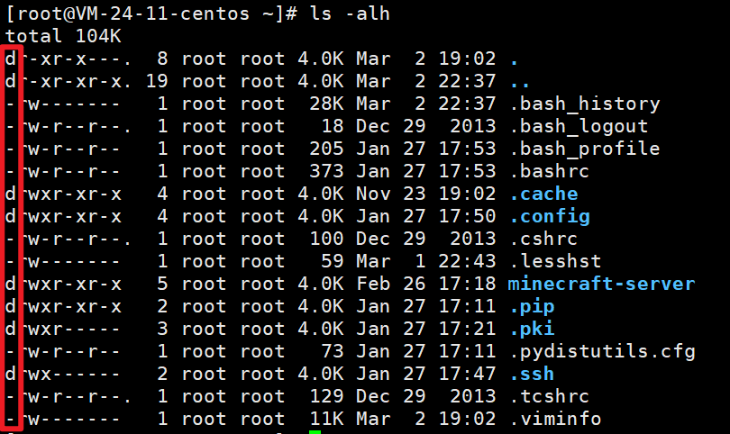
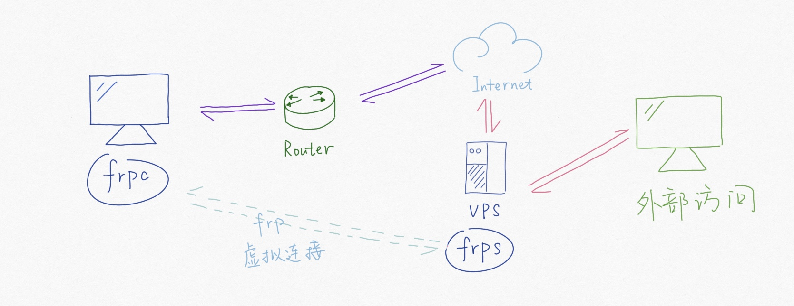
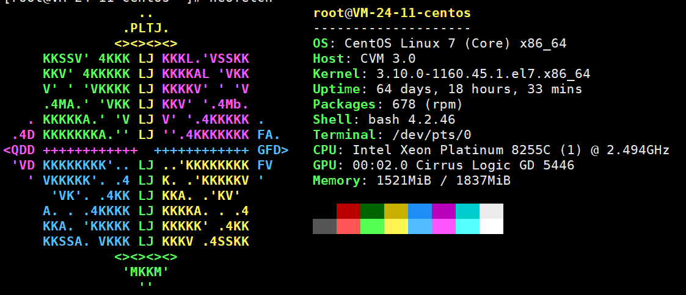

> 注：命令的具体使用推荐使用man或者**[linux-comand](https://github.com/jaywcjlove/linux-command#web-%E7%89%88%E6%9C%AC)**查询

TODO: linux 常用命令整理

# 1. 常用命令列表

|                |           |         |               |           |
| :------------: | :-------: | :-----: | :-----------: | :-------: |
|      man       |   help    |         |               |           |
|  目录文件相关  |  ------   | ------  |    ------     |  ------   |
|       ls       |    cd     |  touch  |      rm       |   mkdir   |
|       cp       |    mv     |   cat   |     more      |   less    |
|      tree      |   stat    |
|     关机等     |  ------   | ------  |    ------     |  ------   |
|    poweroff    | shutdown  |  exit   |               |           |
|  常用网络相关  |  ------   | ------  |    ------     |  ------   |
|      ping      | ifconfig  |  wget   | netstat -natp | route -n  |
|     arp -a     |           |         |               |           |
|      睡眠      |  ------   | ------  |    ------     |  ------   |
|     sleep      |           |         |               |           |
|    ssh 相关    |  ------   | ------  |    ------     |  ------   |
|      ssh       |    scp    |         |               |           |
| 文件，指令查找 |  ------   | ------  |    ------     |  ------   |
|      type      |   which   | whereis |    locate     |   type    |
|      file      |           |         |               |           |
|    用户相关    |  ------   | ------  |    ------     |  ------   |
|     passwd     |  usermod  |  chown  |     chgrp     |   chmod   |
|    groupadd    |    su     |  sudo   |               |           |
|      who       |   users   |         |               |           |
|    日期相关    |  ------   | ------  |    ------     |  ------   |
|      date      |    cal    |         |               |           |
|    系统相关    |  ------   | ------  |    ------     |  ------   |
|       df       |    du     |   ps    |      top      |   kill    |
|       ln       |  pstree   |  free   |     mount     | chkconfig |
|    ss -nal     | ulimit -a |         |               |           |
|    iostate     |  vmstate  |         |               |           |
|    软件相关    |  ------   | ------  |    ------     |  ------   |
|      rpm       |    yum    |   tar   |      apt      |   make    |
|      常用      |  ------   | ------  |    ------     |  ------   |
|      cut       |   sort    |   wc    |      sed      |    awk    |
|      read      |   test    |  exec   |    source     |   bash    |
|      echo      |   hash    |  grep   |     head      |   tail    |

- ss -nal：查看所欲 socket 监听接口
- set:显示所有变量，包含环境变量等所有
- unset:清除变量，包括环境变量
- env:查看环境变量
- echo 输出
- read 输入
- hash:存储执行过的命令，提高下一次命令查找速度
  - hash -r 清除

# 2. linux 基础

## 2.1. 帮助命令

### 2.1.1. 概述

> 在linux终端，面对命令不知道怎么用，或不记得命令的拼写及参数时，我们需要求助于系统的帮助文档； linux系统内置的帮助文档很详细，通常能解决我们的问题，我们需要掌握如何正确的去使用它们；

- 需要知道某个命令的简要说明，可以使用whatis；而更详细的介绍，则可用info命令；
- 查看命令在哪个位置，需要使用which；
- 而对于命令的具体参数及使用方法，我们需要用到强大的man；
  - 在只记得部分命令关键字的场合，我们可通过man -k来搜索；

### 2.1.2. 命令使用

#### 2.1.2.1. 查看命令的简要说明(whatis,info)

- 简要说明命令的作用（显示命令所处的man分类页面）:

  ```
  $whatis command
  ```

- 正则匹配:

  ```
  $whatis -w "loca*"
  ```

- 更加详细的说明文档:

  ```
  $info command
  ```

#### 2.1.2.2. 使用man

- 查询命令command的说明文档:

  ```
  $man command
  eg：man date
  ```

- man页面所属的分类标识(常用的是分类1和分类3)

  ```
  (1)、用户可以操作的命令或者是可执行文件
  (2)、系统核心可调用的函数与工具等
  (3)、一些常用的函数与数据库
  (4)、设备文件的说明
  (5)、设置文件或者某些文件的格式
  (6)、游戏
  (7)、惯例与协议等。例如Linux标准文件系统、网络协议、ASCⅡ，码等说明内容
  (8)、系统管理员可用的管理条令
  (9)、与内核有关的文件
  ```

  - 在man的帮助手册中，将帮助文档分为了9个类别
  - 对于有的关键字可能存在多个类别中， 我们就需要指定特定的类别来查看
  - （一般我们查询bash命令，归类在1类中）

- 前面说到使用whatis会显示命令所在的具体的文档类别，我们学习如何使用它

  ```
  eg:
  $whatis printf
  printf               (1)  - format and print data
  printf               (1p)  - write formatted output
  printf               (3)  - formatted output conversion
  printf               (3p)  - print formatted output
  printf [builtins]    (1)  - bash built-in commands, see bash(1)
  ```

  - 我们看到printf在分类1和分类3中都有
  - 分类1中的页面是命令操作及可执行文件的帮助
  - 而3是常用函数库说明
  - 如果我们想看的是C语言中printf的用法，可以指定查看分类3的帮助：
  - 其中`man -f` 和`whatis`功能相同

  ```
  $man 3 printf

  $man -k keyword
  ```

- 在`whatis`数据库中查找字符串:`man -k`或`apropos`
  - 根据命令中部分关键字来查询命令，适用于只记住部分命令的场合；

  ```
  # eg：查找GNOME的config配置工具命令:
  $man -k GNOME config| grep 1
  ```

#### 2.1.2.3. 查看路径

- 查看程序的binary文件所在路径:

  ```
  $which command
  # eg:查找make程序安装路径:
  $which make
  /opt/app/openav/soft/bin/make install
  ```

- 查看程序的搜索路径:

  ```
  $whereis command
  ```

  - 当系统中安装了同一软件的多个版本时，不确定使用的是哪个版本时，这个命令就能派上用场；

- 查看外部命令路径：type
  - type 能指定磁盘位置的命令，也就是从 PATH 中查询的命令，被称为**外部命令**,外部命令执行时都会变为一个进程
  - 外部命令都可以通过`man 命令名称`查看文档
  - 可能是可执行程序，也可能是脚本（比如 python 脚本等）
  - 如果 type 返回 shell builtin，则是内部命令。shell 内部的。比如 cd，echo

#### 2.1.2.4. 总结

- whatis
- info
- man
  - man -f (whatis)
  - man -k (apropos)
- which
- whereis

### 2.1.3. linux架构信息查询

## 2.2. 文件及目录管理

### 2.2.1. 文件系统目录

- /boot:系统启动相关文件
- /etc:配置文件
- /home:存放除 root 用户外的用户目录
- /root:root 用户目录
- /media:挂载点目录，移动设备
- /mnt:挂载点目录，额外的临时文件系统
- /proc:伪文件系统，内核映射文件
- /sys:伪文件系统，跟硬件设备有关的属性映射文件
- /tmp:临时文件，/var/tmp 也是
- /var:可变化文件，存储数据库表数据等
- /bin:二进制可执行文件，用户命令
- /sbin:管理员命令
- /lib:库文件，linux 中的 so，windows 中的 lib
- /dev:设备文件，linux，一切皆文件
- /opt:额外安装的可选应用程序包所放置的位置。一般情况下，我们可以把 tomcat 等都安装到这里。
- /usr:是 Unix Software Resource 的缩写,用于存放系统应用程序，比较重要的目录/usr/local 本地系统管理员软件安装目录（安装系统级的应用）。这是最庞大的目录，要用到的应用程序和文件几乎都在这个目录。

### 2.2.2. 文件类型与信息

- 文件类型(`ls -lha`)
  > 扩展名只在图形化界面上有用

  - `-`:普通文件：文本文件，excel 文件，MP4 文件等
  - `d`:文件夹
  - `c`或`b` 设备文件。
    - `c`:字符型设备：比如显示器，一个像素点需要 rgb 三原色的数据，三个字节。比如键盘，组合键
    - `b`:字节型设备：比如硬盘
  - `l`:快捷方式
  - `p`:pipe,管道
  - `s`:socket

  

- stat:元数据，相当于 window 的文件属性
  - Change 描述元数据发生变化的时间，比如权限
  - Modify 文件内容修改时间
  - Access 访问时间
  - IO Block 一次 io 读写多少
  - Inode 磁盘位置索引

  > 注：touch:除了可以创建空文件，也可以更新元数据中的三个时间

- file
  - `ELF` 类型为二进制可执行程序

### 2.2.3. 创建和删除

- 命令
  - 创建：mkdir
  - 删除：rm
  - 删除非空目录：rm -rf file目录
  - 删除日志 rm *log (等价: find ./ -name “*log” -exec rm {} ;)
  - 移动：mv
  - 复制：cp (复制目录：cp -r )

- 示例
  - 查看当前目录下文件个数:
    ```bash
    $ find ./ | wc -l
    ```
  - 复制目录:
    ```bash
    $ cp -r source_dir  dest_dir
    ```

### 2.2.4. 目录切换

- 找到文件/目录位置：cd
- 切换到上一个工作目录： cd -
- 切换到home目录： cd or cd ~
- 显示当前路径: pwd
- 更改当前工作路径为path: cd path

### 2.2.5. 列出目录项

- 显示当前目录下的文件 ls
- 按时间排序，以列表的方式显示目录项 ls -lrt
  - 以上这个命令用到的频率如此之高，以至于我们需要为它建立一个快捷命令方式:
  - 在.bashrc 中设置命令别名:

    ```bash
    alias lsl='ls -lrt'
    alias lm='ls -al|more'
    ```
  - 这样，使用lsl，就可以显示目录中的文件按照修改时间排序；以列表方式显示；

- 给每项文件前面增加一个id编号(看上去更加整洁):

  ```bash
  ls | cat -n
  1  a
  2  a.out
  3  app
  4  b
  5  bin
  6  config
  ```

> 注：.bashrc 在/home/你的用户名/ 文件夹下，以隐藏文件的方式存储；可使用 ls -a 查看；

### 2.2.6. 查找目录及文件 find/locate

> **find**

- 搜寻文件或目录:

  ```bash
  $ find ./ -name "core*" | xargs file
  ```

- 查找目标文件夹中是否有obj文件:

  ```bash
  $ find ./ -name '*.o'
  ```

- 递归当前目录及子目录删除所有.o文件:

  ```bash
  $ find ./ -name "*.o" -exec rm {} \;
  ```

> **locate**

- find是实时查找，如果需要更快的查询，可试试locate；locate会为文件系统建立索引数据库，如果有文件更新，需要定期执行更新命令来更新索引库:

  ```bash
  # 寻找包含有string的路径:
  $ locate string
  ```

- 与find不同，locate并不是实时查找。你需要更新数据库，以获得最新的文件索引信息。
  ```bash
  $ updatedb
  ```

### 2.2.7. 查看文件内容

- cat 
  - 显示时同时显示行号:

  ```bash
  $ cat -n
  ```
- vi
- head
- tail
  - 动态显示文本最新信息:

    ```bash
    tailf -f
    ```
- more
  - 按页显示列表内容:

    ```bash
    $ ls -al | more
    ```
- less(推荐)
- diff

### 2.2.8. 查找文件内容

- grep 匹配输出
  - `-v` 反显
  - `-e` 使用扩展正则表达式
  - **grep 和 vim 中默认()为字符，如果要分组就要使用`\(word\)`**※
  - **python 中()默认为分组，通过\进行转义为字符**
  - 另外括号嵌套是，比如(())，数左括号，左边第一个是第一组，第二个是第二组

  ```
  Grep正则表达式
  正则表达式或正则表达式是与一组字符串匹配的模式。 
  模式由运算符，文字字符和元字符组成，它们具有特殊的含义。
  GNU grep支持三种正则表达式语法Basic，Extended和Perl-compatible。

  当没有给出正则表达式类型时，grep以Basic的形式调用，grep将搜索模式解释为基本Basic正则表达式。
  要将模式解释为扩展Extended的正则表达式，请使用-E（或--extended-regexp）选项。

  在GNU grep的实现中，基本正则表达式和扩展正则表达式语法之间在功能上没有区别。 
  唯一的区别是，在基本正则表达式中，元字符?，+，{，|，(和)被解释为文字字符。
  为了在使用基本正则表达式时保持元字符的特殊含义，必须使用反斜杠（\）对字符进行转义。
  ```
  - 具体规则这里就不列了

- egrep

### 2.2.9. 解压缩 tar

- `-C` 参数说明
  ```bash
  # 解压后，会得到output/${APP}/....，这种方式会保留文件夹层级
  tar -czf output/${APP}.tar.gz output/${APP}
  # -C 相当于cd到指定目录再压缩，后面跟着一个"."，表示压缩 "output/${APP}" 目录
  tar -czf output/${APP}.tar.gz -C output/${APP} .
  ```

### 2.2.10. 文件与目录权限修改

- 改变文件的拥有者 chown
- 改变文件读、写、执行等属性 chmod
- 递归子目录修改： chown -R tuxapp source/
- 增加脚本可执行权限： chmod a+x myscript

### 2.2.11. 软链接，硬链接

- 创建符号链接/硬链接:

  ```bash
  ln cc ccAgain # 硬连接；删除一个，将仍能找到；
  ln -s cc ccTo # 符号链接(软链接)；删除源，另一个无法使用；（后面一个ccTo 为新建的文件）
  ```

### 2.2.12. 管道和重定向

- 批处理命令连接执行，使用 `|`
- 串联: 使用分号 `;`
- 前面成功，则执行后面一条，否则，不执行:`&&`
- 前面失败，则后一条执行: `||`

---

- xargs与管道简单使用

  ```bash
  echo "/" | ls -l # 不会显示根目录文件夹
  echo "/" | xargs ls -l ## 可以显示根目录文件夹
  ```
  - 原因：
    - 每个程序都有输入流，但不一定会用到。
    - 比如 ls，只会判定传入的参数，而并没有读取输入流
  - "/"通过管道，流入 xargs 命令中
  - xargs 后接的第一个参数会被识别为命令，剩下的参数识别为命令的选项参数，再将输入流中的信息作为命令的参数，再把命令执行

- 能够提示命名是否执行成功or失败；

  ```bash
  ls /proc && echo  suss! || echo failed.
  ```

  ```bash
  # 与上述相同效果的是:
  if ls /proc; then echo suss; else echo fail; fi
  ```

- 重定向:

  ```bash
  # 将标准输出和标准错误重定向到同一文件；
  ls  proc/*.c > list 2> &l 
  ```

  ```bash
  # 等价的是:
  ls  proc/*.c &> list
  ```

- 清空文件:

  ```
  :> a.txt
  ```

- 重定向:

  ```
  echo aa >> a.txt
  ```

### 2.2.13. 设置环境变量

- 启动帐号后自动执行的是 文件为 .profile，然后通过这个文件可设置自己的环境变量；
- 安装的软件路径一般需要加入到path中:

  ```
  PATH=$APPDIR:/opt/app/soft/bin:$PATH:/usr/local/bin:$TUXDIR/bin:$ORACLE_HOME/bin;export PATH
  ```

## 2.3. 文本处理

### 2.3.1. find 文件查找

#### 2.3.1.1. 基本使用

- 查找txt和pdf文件:

  ```bash
  find . \( -name "*.txt" -o -name "*.pdf" \) -print
  # 或 find . -name "*.txt" -o -name "*.pdf"
  # -o 为 "或"
  ```

- 正则方式查找.txt和pdf:

  ```bash
  find . -regex  ".*\(\.txt|\.pdf\)$"
  # -iregex： 忽略大小写的正则
  ```

- 否定参数 ,查找所有非txt文本:

  ```bash
  find . ! -name "*.txt" -print
  ```

- 指定搜索深度,打印出当前目录的文件（深度为1）:

  ```bash
  find . -maxdepth 1 -type f
  ```

#### 2.3.1.2. 定制搜索

> **按类型搜索**

- 说明
  ```bash
  find . -type d -print  # 只列出所有目录
  ```
  - -type
    - f 普通文件
    - l 符号连接
    - d 目录
    - c 字符设备
    - b 块设备
    - s 套接字
    - p Fifo

- 注意：
  - 说明
    - find支持的文件检索类型可以区分普通文件和符号链接、目录等
    - 但是**二进制文件和文本文件**无法直接通过find的类型区分出来；

  - 解决：file命令可以检查文件具体类型（二进制或文本）:

    ```bash
    $ file redis-cli  # 二进制文件
    redis-cli: ELF 64-bit LSB executable, x86-64, version 1 (SYSV), dynamically linked (uses shared libs), for GNU/Linux 2.6.9, not stripped
    $ file redis.pid  # 文本文件
    redis.pid: ASCII text
    ```
  - 实例：所以,可以用以下命令组合来实现查找本地目录下的所有二进制文件:

    ```bash
    ls -lrt | awk '{print $9}'|xargs file|grep  ELF| awk '{print $1}'|tr -d ':'
    ```

> **按时间搜索**

- 说明
  - -atime 访问时间 (单位是天，分钟单位则是-amin，以下类似）
  - -mtime 修改时间 （内容被修改）
  - -ctime 变化时间 （元数据或权限变化）

- 实例
  - 最近第7天被访问过的所有文件:

    ```bash
    find . -atime 7 -type f -print
    ```
  - 最近7天内被访问过的所有文件:

    ```bash
    find . -atime -7 -type f -print
    ```
  - 查询7天前被访问过的所有文件:

    ```bash
    find . -atime +7 type f -print
    ```

> **按大小搜索**

- 寻找大于2k的文件:

  ```bash
  find . -type f -size +2k
  ```

> **按权限查找**

  ```bash
  find . -type f -perm 644 -print # 找具有可执行权限的所有文件
  ```

> **按用户查找**

  ```bash
  find . -type f -user weber -print # 找用户weber所拥有的文件
  ```

#### 2.3.1.3. 找到后的后续动作

> **删除**

- 删除当前目录下所有的swp文件:

  ```bash
  find . -type f -name "*.swp" -delete
  ```

- 另一种语法:

  ```bash
  find . type f -name "*.swp" | xargs rm
  ```

> **执行动作（强大的exec）**

- 将当前目录下的所有权变更为weber:

  ```bash
  find . -type f -user root -exec chown weber {} \;
  ```

  > 注：{}是一个特殊的字符串，对于每一个匹配的文件，{}会被替换成相应的文件名
  >
  > 将找到的文件全都copy到另一个目录:

  ```bash
  find . -type f -mtime +10 -name "*.txt" -exec cp {} OLD \;
  ```

> **结合多个命令**

- 如果需要后续执行多个命令，可以将多个命令写成一个脚本。然后 -exec 调用时执行脚本即可:

  ```bash
  -exec ./commands.sh {} \;
  ```

#### 2.3.1.4. "-print"的定界符

- 默认使用’\n’作为文件的定界符；
- -print0 使用’\0’作为文件的定界符，这样就可以搜索包含空格的文件；

### 2.3.2. grep 文本搜索

> **说明**

- 基本使用
  ```bash
  grep match_patten file # 默认访问匹配行
  cat file | grep match _pattern
  ```

- 常用参数
  - -o 只输出匹配的文本行
  - -v 只输出没有匹配的文本行
  - -c 统计文件中包含文本的次数: `grep -c "text" filename`
  - -n 打印匹配的行号
  - -i 搜索时忽略大小写
  - -l 只打印文件名
  - -e --regexp
  - -r/-R 递归搜索

> **应用示例**

- 在多级目录中对文本递归搜索(程序员搜代码的最爱）:

  ```
  grep "class" . -R -n
  ```
- 匹配多个模式

  ```bash
  grep -e "class" -e "vitural" file
  # 每个模式前都要有一个 -e
  ```
- 删除不包括指定字符的文件

  ```bash
  # 测试文件：
  echo "aaa" > file1
  echo "bbb" > file2
  echo "aaa" > file3

  grep "aaa" file* -lZ | xargs -0 rm

  # 执行后会删除file1和file3
  # grep输出用-Z选项来指定以0值字节作为终结符文件名（\0）
  # xargs -0 读取输入并用0值字节终结符分隔文件名，然后删除匹配文件
  # -Z通常和-l结合使用。
  ```
- 综合应用：
  - 将日志中的所有带where条件的sql查找查找出来:

    ```bash
    cat LOG.* | tr a-z A-Z | grep "FROM " | grep "WHERE" > b
    ```

  - 查找中文示例：工程目录中utf-8格式和gb2312格式两种文件，要查找字的是中文；
    - 1. 查找到它的utf-8编码和gb2312编码分别是``”xE4xB8xADxE6x96x87”`` 和 `"\xD6\xD0\xCE\xC4"`
    - 2. `-r` 递归查询、`-n` 显示行号、`-e` 表示使用正则表达式查询；

    ```bash
    grep -rne "\xE4\xB8\xAD\xE6\x96\x87|\xD6\xD0\xCE\xC4" *
    ```

### 2.3.3. xargs 命令行参数转换

> **说明**

- xargs
  - 作用：
    - xargs 能够处理管道或者 stdin 并将其转换成特定命令的命令参数。
    - xargs 也可以将单行或多行文本输入转换为其他格式，例如多行变单行，单行变多行
  - 基本说明
    - 每个程序都有输入流，但不一定会用到。
    - xargs 后接的第一个参数会被识别为命令，剩下的参数识别为命令的选项参数，再将输入流中的信息作为命令的参数，再执行命令

- xargs参数说明
  - -d 定义定界符 （默认为空格 多行的定界符为 n）
  - -n 指定输出为多行
  - -I {} 指定替换字符串，这个字符串在xargs扩展时会被替换掉,用于待执行的命令需要多个参数时
  - -0：指定0为输入定界符

> **应用示例**

- 将多行输出转化为单行输出:

  ```bash
  cat file.txt| xargs
  ```

- 将单行转化为多行输出

  ```
  cat single.txt | xargs -n 3
  ```
- 使用 -d 分割输入

  ```bash
  echo "nameXnameXnameXname" | xargs -dX

  name name name name
  ```

- 综合应用

  ```bash
  cat file.txt | xargs -I {} ./command.sh -p {} -1
  # -I {} ，指定‘{}'会被替换掉

  ls *.jpg | xargs -n1 -I cp {} /data/images
  # 复制所有图片文件到 /data/images 目录下：

  #统计程序行数
  find source_dir/ -type f -name "*.cpp" -print0 |xargs -0 wc -l

  #redis通过string存储数据，通过set存储索引，需要通过索引来查询出所有的值：
  ./redis-cli smembers $1  | awk '{print $1}'|xargs -I {} ./redis-cli get {}
  ```

### 2.3.4. sort 排序

> **说明**

- sort:排序文件的行后输出。字典序或数值序
  - n:按数值排序。默认字典序。（从第一个字符进行排序）
  - 自定义排序方式:
    > sort -t' ' -k2 以空格为分隔符，通过第二列字典序进行排序
    - t:自定义分隔符
    - k:选择排序列
  - r:倒序
  - u:合并相同行
  - f:忽略大小写

> **应用示例**

```bash
sort -nrk 1 data.txt
sort -bd data # 忽略像空格之类的前导空白字符
```

### 2.3.5. uniq 消除重复行

> **注意**

- uniq去重功能，只能针对连续的多行进行去重，只剩下唯一的一条
- 因此一般都会和sort一起使用

> **应用示例**

- 消除重复行
  ```bash
  sort unsort.txt | uniq
  ```
- 统计各行在文件中出现的次数
  ```bash
  sort unsort.txt | uniq -c
  ```
- 找出重复行
  ```bash
  sort unsort.txt | uniq -d
  ```
- 只显示单一行：
  ```bash
  uniq -u file.txt
  sort file.txt | uniq -u
  ```
- 可指定每行中需要比较的重复内容：-s 开始位置 -w 比较字符数

### 2.3.6. 用 tr 进行转换

> **说明**

- 选项
  - -c或——complerment：取代所有不属于第一字符集的字符；
  - -d或——delete：删除所有属于第一字符集的字符；
  - -s或--squeeze-repeats：把连续重复的字符以单独一个字符表示；
  - -t或--truncate-set1：先删除第一字符集较第二字符集多出的字符。

- 参数
  - 字符集1：
    - 指定要转换或删除的原字符集。
    - 当执行转换操作时，必须使用参数“字符集2”指定转换的目标字符集。
    - 但执行删除操作时，不需要参数“字符集2”；
  - 字符集2：
    - 指定要转换成的目标字符集。

> **应用示例**

- 通用用法

  ```bash

  echo "HELLO WORLD" | tr 'A-Z' 'a-z' # 将输入字符由大写转换为小写：
  echo 12345 | tr '0-9' '9876543210' #加解密转换，替换对应字符
  cat text| tr '\t' ' '  #制表符转空格
  ```

- tr删除字符

  ```bash
  cat file | tr -d '0-9' # 删除所有数字
  ```

- -c 求补集:

  ```bash
  cat file | tr -c '0-9' #获取文件中所有数字
  cat file | tr -d -c '0-9 \n'  #删除非数字数据
  ```

- tr压缩字符

  ```bash
  # tr -s 压缩文本中出现的重复字符；最常用于压缩多余的空格:
  cat file | tr -s ' '
  ```

- 字符类
  - 种类
    - [:alnum:]：字母和数字
    - [:alpha:]：字母
    - [:cntrl:]：控制（非打印）字符
    - [:digit:]：数字
    - [:graph:]：图形字符
    - [:lower:]：小写字母
    - [:print:]：可打印字符
    - [:punct:]：标点符号
    - [:space:]：空白字符
    - [:upper:]：大写字母
    - [:xdigit:]：十六进制字符  
  - 使用方法：tr [:class:] [:class:]

```
tr '[:lower:]' '[:upper:]'
```

### 2.3.7. cut 按列切分文本

- cut：切割行。比如查看数据库表数据时
  - f:选择显示的列
  - s:不显示没有分隔符的行
  - d:自定义分隔符
  - 例：
    - `cut -d' ' -f1 file` 以空格为分隔符切割后显示第一列
    - `cut -d' ' -f1,3 file` 以空格为分隔符切割后显示第一和三列
    - `cut -d' ' -f1-3 file` 以空格为分隔符切割后显示第一列到第三列

### 2.3.8. paste 按列拼接文本

- 将两个文本按列拼接到一起;

  ```bash
  cat file1
  1
  2

  cat file2
  colin
  book

  paste file1 file2
  1 colin
  2 book
  ```

- 默认的定界符是制表符，可以用-d指明定界符

  ```bash
  paste file1 file2 -d ","
  1,colin
  2,book
  ```

### 2.3.9. wc 统计行和字符的工具

```bash
$ wc -l file # 统计行数
$ wc -w file # 统计单词数
$ wc -c file # 统计字符数
```

### 2.3.10. sed 文本替换利器

[References](./References/sed.md)

### 2.3.11. awk 数据流处理工具(重要)

[References](./References/awk.md)

- awk
  - 说明:
    - awk 是一个强大的文本分析工具。
    - 相对于 grep 的查找，sed 的编辑，awk 在其对数据分析并生成报告时， 显得尤为强大。
    - 简单来说 awk 就是把文件逐行的读入，空格，制表符）为默认分隔符 将每行切片，切开的部分再进行各种分析处理。
    - 可以用来代替 cut，sort，sed
  - 使用：
    - awk -F '{pattern + action}' {filenames}
      > **必须是单引号**
    - 支持自定义分隔符.默认为空格
    - 支持正则表达式匹配
    - 支持自定义变量，数组 a[1] a[tom] map(key)
    - 支持内置变量
      - NF 浏览记录的域(列)的个数
      - NR 已读的记录数(行数)
      - ARGC 命令行参数个数
      - ARGV 命令行参数排列
      - ENVIRON 支持队列中系统环境变量的使用
      - FILENAME awk 浏览的文件名
      - FNR 浏览文件的记录数
      - FS 设置输入域分隔符，等价于命令行 -F 选项
      - OFS 输出域分隔符
      - ORS 输出记录分隔符
      - RS 控制记录分隔符
    - 支持函数
      - print、split、substr、sub、gsub
    - 支持流程控制语句，类 C 语言
      - if、while、do/while、for、break、continue
  - 示例：

    - `awk -F':' '{print $1}' passwd` 打印以冒号分割得到的第一列 。相当于 `cut -d':' -f1 passwd`
    - `awk -F':' 'BEGIN{print "name\shell"} {print $1 "\t" $7} END{print "end"}' passwd` 打印表头，分割后的 1，7 行，最后结束提示
      - BEGIN{}是在处理前调用
      - 匿名函数是每行的操作
      - END{}是处理完后调用
    - `awk '/word/ {print $0}'` 打印包含 word 的行
    - `awk '/word/ {print $0} {print $0}'` 打印包含 word 的行后，再全打印一遍
    - `awk -F':' '{print NR"\t"NF"\t"$0}'`打印每行行号，列数，完成内容，为一个表格
    - 计算合计工资

      ```bash
      # 统计报表：合计每人1月的工资，0：manager，1：worker

      # Tom	 0   2012-12-11      car     3000
      # John	 1   2013-01-13      bike    1000
      # vivi	 1   2013-01-18      car     2800
      # Tom	 0   2013-01-20      car     2500
      # John	 1   2013-01-28      bike    3500

      # 结果比如: tom worker 2500

      awk '{
        split($3,date,"-");
        if(date[2]=="01"){
          name[$1] += $5
          if($2=="0"){
            position[$1] = "manager"
          }else if($2=="1"){
            position[$1] = "worker"
          }
        }
      }
      END{
          for(i in name){
            print i "\t" position[i] "\t" name[i]
          }
      }' wagetable.txt
      ```

- 练习
  - print 打印当前行
  - 特殊变量： `NR NF $0 $1 $2`
  - 传递外部变量
  - 用样式对 awk 处理的行进行过滤
  - 设置定界符
  - 读取命令输出
  - 在 awk 中使用循环
  - awk 结合 grep 找到指定的服务，然后将其 kill 掉
  - awk 实现 head、tail 命令
  - 打印指定列
  - 打印指定文本区域
  - awk 常用内建函数

### 2.3.12. 迭代文件中的行、单词和字符

#### 2.3.12.1. 迭代文件中的每一行

- while 循环法

  ```bash
  while read line;
  do
  echo $line;
  done < file.txt

  # 改成子shell:
  cat file.txt | (while read line;do echo $line;done)
  ```

- awk法

  ```bash
  cat file.txt| awk '{print}'
  ```

#### 2.3.12.2. 迭代一行中的每一个单词

```bash
for word in $line;
do
echo $word;
done
```

#### 2.3.12.3. 迭代每一个字符

- 语法
  - `${string:start_pos:num_of_chars}` ：从字符串中提取一个字符；(bash文本切片）
  - `${#word}` :返回变量word的长度

- 示例

  ```bash
  for((i=0;i<${#word};i++))
  do
  echo ${word:i:1);
  done
  ```

- 以ASCII字符显示文件:

  ```bash
  $ od -c filename
  ```

## 2.4. 磁盘管理

<!-- TODO: linux常用命令整理。正在进行中 -->

### 2.4.1. 磁盘信息

- 磁盘信息：
  - df:显示硬盘分区。
    - linux 中没有盘符概念，只有一棵虚拟的目录树，所有分区中的目录都会放在根目录/下的某文件夹(不一定是子级)。比如/boot 目录就是一个分区。
    - 有啥问题时，先 df，看看磁盘满没
  - du -sh ./\*:统计此文件夹下每个目录大小
  - 清楚数据前一定要备份

### 2.4.2. 解压缩

### 2.4.3. 挂载

## 2.5. 性能监控

### 2.5.1. 监控CPU

#### 2.5.1.1. sar

- 查看CPU使用率: 

  ```
  $sar -u 1 2
  Linux 2.6.35-22-generic-pae (MyVPS)     06/28/2014      _i686_  (1 CPU)

  09:03:59 AM     CPU     %user     %nice   %system   %iowait    %steal     %idle
  09:04:00 AM     all      0.00      0.00      0.50      0.00      0.00     99.50
  09:04:01 AM     all      0.00      0.00      0.00      0.00      0.00    100.00
  ```

  - 后面的两个参数表示监控的频率，比如例子中的1和2，表示每秒采样一次，总共采样2次；

- 查看CPU平均负载:
  ```
  $sar -q 1 2
  # sar指定-q后，就能查看运行队列中的进程数、系统上的进程大小、平均负载等；
  ```

#### 2.5.1.2. vmstat

### 2.5.2. 内存信息

#### 2.5.2.1. 文件：/proc/meminfo

- 这个文件记录着比较详细的内存配置信息，使用 `cat /proc/meminfo` 查看。

#### 2.5.2.2. 命令：free

- 示例

  ```
  [root@VM-24-11-centos ~]# free -h
                total        used        free      shared  buff/cache   available
  Mem:           1.8G        1.5G         76M        644K        237M        163M
  Swap:            0B          0B          0B
  ```

- 字段说明：
  - total 系统总的可用物理内存大小
  - used 已被使用的物理内存大小
  - free 还有多少物理内存可用
  - shared 被共享使用的物理内存大小
  - buff/cache 被 buffer 和 cache 使用的物理内存大小
    - free比buff/cache小，这是由linux的设计决定的。
    - Linux 的想法是内存闲着反正也是闲着，不如拿出来做系统缓存和缓冲区，提高数据读写的速率
    - 但是当系统内存不足时，buff/cache 会让出部分来，非常灵活的操作。
  - available 还可以被 应用程序 使用的物理内存大小
    - 对于内核来说，buffer 和 cache 其实都属于已经被使用的内存
    - 但当应用程序申请内存时，如果 free 内存不够，内核就会回收 buffer 和 cache 的内存来满足应用程序的请求
    - 也就是available = free+(buff/cache 中可回收的部分内存)

### 2.5.3. 硬件信息:dmidecode

- 在Linux系统下获取有关硬件方面的信息

### 2.5.4. 查询页面交换

- 查看页面交换发生状况:
  - 页面发生交换时，服务器的吞吐量会大幅下降
  - 服务器状况不良时，如果怀疑因为内存不足而导致了页面交换的发生，可以使用sar -W这个命令来确认是否发生了大量的交换；

  ```
  sar -W 1 3
  ```

### 2.5.5. vmstat/prstat

- 示例

  ```
  [root@VM-24-11-centos ~]# vmstat 1
  procs -----------memory---------- ---swap-- -----io---- -system-- ------cpu-----
  r  b   swpd   free   buff  cache   si   so    bi    bo   in   cs us sy id wa st
  2  0      0  80780   2476 240008    0    0    74    28    3    8 14  3 83  0  0
  1  0      0  80780   2476 240008    0    0     0     0 6538 13456 13  3 84  0  0
  1  0      0  80796   2476 240008    0    0     0     0 6330 12957 13  4 82  0  0
  1  0      0  80812   2476 240008    0    0     0     0 6428 13142 13  3 84  0  0
  1  0      0  80812   2476 240008    0    0     0    16 6105 12506 15  3 82  0  0
  1  0      0  80812   2484 240000    0    0     0    44 6327 12941 14  3 82  1  0
  1  0      0  80408   2484 240008    0    0     0     0 6219 12768 15  3 82  0  0
  ```

- 字段说明：
  - Procs（进程）
    - r: 运行队列中进程数量，这个值也可以判断是否需要增加CPU。（长期大于1）
    - b: 等待IO的进程数量。
  - Memory（内存）
    - swpd: 使用虚拟内存大小，如果swpd的值不为0，但是SI，SO的值长期为0，这种情况不会影响系统性能。
    - free: 空闲物理内存大小。
    - buff: 用作缓冲的内存大小。
    - cache: 用作缓存的内存大小，如果cache的值大的时候，说明cache处的文件数多，如果频繁访问到的文件都能被cache处，那么磁盘的读IO bi会非常小。
  - Swap
    - si: 每秒从交换区写到内存的大小，由磁盘调入内存。
    - so: 每秒写入交换区的内存大小，由内存调入磁盘。
    - 注意：
      - 内存够用的时候，这2个值都是0
      - 如果这2个值长期大于0时，系统性能会受到影响，磁盘IO和CPU资源都会被消耗
      - 有些朋友看到空闲内存（free）很少的或接近于0时，就认为内存不够用了
      - 不能光看这一点，还要结合si和so
      - 如果free很少，但是si和so也很少（大多时候是0），那么不用担心，系统性能这时不会受到影响的。
  - IO（现在的Linux版本块的大小为1kb）
    - bi: 每秒读取的块数
    - bo: 每秒写入的块数
    - 注意：随机磁盘读写的时候，这2个值越大（如超出1024k)，能看到CPU在IO等待的值也会越大。
  - system（系统）
    - in: 每秒中断数，包括时钟中断。
    - cs: 每秒上下文切换数。
    - 注意：上面2个值越大，会看到由内核消耗的CPU时间会越大。
  - CPU（以百分比表示）
    - us: 用户进程执行时间百分比(user time)
      - us的值比较高时，说明用户进程消耗的CPU时间多
      - 但是如果长期超50%的使用，那么我们就该考虑优化程序算法或者进行加速。
    - sy: 内核系统进程执行时间百分比(system time)
      - sy的值高时，说明系统内核消耗的CPU资源多
      - 这并不是良性表现，我们应该检查原因。
    - wa: IO等待时间百分比
      - wa的值高时，说明IO等待比较严重
      - 这可能由于磁盘大量作随机访问造成，也有可能磁盘出现瓶颈（块操作）。
  - id: 空闲时间百分比

## 2.6. 进程管理工具

### 2.6.1. 查询进程

#### 2.6.1.1. ps,pstree,pgrep 基本信息

- 查询正在运行的进程信息
  ```bash
  ps -ef

  # 查询归属于用户colin115的进程
  ps -ef | grep colin115
  ps -lu colin115
  ```

- 查询所有线程与进程
  - `ps -uxH`
  - `pstree -p`

- 查询进程ID（适合只记得部分进程字段）

  ```bash
  pgrep 查找进程

  # 查询进程名中含有re的进程
  pgrep -l re
  2 kthreadd
  28 ecryptfs-kthrea
  29515 redis-server
  ```

- 以完整的格式显示所有的进程
  ```
  ps -ajx
  ```

#### 2.6.1.2. lsof 条件查询与位进程打开文件列表

- lsof（list open files）是一个列出当前系统打开文件的工具。
  - 在linux环境下，任何事物都以文件的形式存在，通过文件不仅仅可以访问常规数据，还可以访问网络连接和硬件。
  - 所以如传输控制协议 (TCP) 和用户数据报协议 (UDP) 套接字等； 在查询网络端口时，经常会用到这个工具。

- 查看端口占用的进程状态：

  ```bash
  # -i<条件>：列出符合条件的进程。（4、6、协议、:端口、 @ip ）
  lsof -i:3306
  ```

- 查看用户username的进程所打开的文件

  ```bash
  $lsof -u username
  ```

- 查询init进程当前打开的文件

  ```bash
  $lsof -c init
  ```

- 查询指定的进程ID(23295)打开的文件：

  ```bash
  $lsof -p 23295
  ```

- 查询指定目录下被进程开启的文件（使用+D 递归目录）：

  ```bash
  $lsof +d mydir1/
  ```

### 2.6.2. 终止进程

- 杀死指定PID的进程 (PID为Process ID)

  ```bash
  kill PID
  ```

- 杀死相关进程

  ```bash
  kill -9 3434
  ```

- 杀死job工作 (job为job number)

  ```bash
  kill %job
  ```

### 2.6.3. 进程监控

- 查看系统中使用CPU、使用内存最多的进程；

  ```bash
  top
  ```

  - 输入top命令后，进入到交互界面；接着输入字符命令后显示相应的进程状态：
  - 对于进程，平时我们最常想知道的就是哪些进程占用CPU最多，占用内存最多。

  ```
  P：根据CPU使用百分比大小进行排序。
  M：根据驻留内存大小进行排序。
  i：使top不显示任何闲置或者僵死进程。
  ```

  - 对于更详细的使用，详见 [top linux下的任务管理器](https://tkstorm.com/linux-doc/tool/top.html#top) ;

### 2.6.4. 分析线程栈

- 使用命令pmap，来输出进程内存的状况，可以用来分析线程堆栈；

  ```
  $pmap PID

  eg:
  [/home/weber#]ps -fe| grep redis
  weber    13508 13070  0 08:14 pts/0    00:00:00 grep --color=auto redis
  weber    29515     1  0  2013 ?        02:55:59 ./redis-server redis.conf
  [/home/weber#]pmap 29515
  29515:   ./redis-server redis.conf
  08048000    768K r-x--  /home/weber/soft/redis-2.6.16/src/redis-server
  08108000      4K r----  /home/weber/soft/redis-2.6.16/src/redis-server
  08109000     12K rw---  /home/weber/soft/redis-2.6.16/src/redis-server
  ```

### 2.6.5. 综合运用

- 将用户colin115下的所有进程名以av_开头的进程终止:

  ```bash
  ps -u colin115 |  awk '/av_/ {print "kill -9 " $1}' | sh
  ```

- 将用户colin115下所有进程名中包含HOST的进程终止:

  ```bash
  ps -fe| grep colin115|grep HOST |awk '{print $2}' | xargs kill -9;
  ```

## 2.7. 网络工具

### 2.7.1. netstat 查询网络服务和端口

> netstat 命令用于显示各种网络相关信息，如网络连接，路由表，接口状态 (Interface Statistics)，masquerade 连接，多播成员 (Multicast Memberships) 等等。

- 列出所有端口 (包括监听和未监听的):

  ```bash
  netstat -a
  ```

- 列出所有 tcp 端口:

  ```bash
  netstat -at

  netstat -au # udp
  ```

- 列出所有有监听的服务状态:

  ```bash
  netstat -l
  ```

- 使用netstat工具查询端口:

  ```bash
  netstat -antp | grep 6379
  tcp        0      0 127.0.0.1:6379          0.0.0.0:*               LISTEN      25501/redis-server

  ps 25501
    PID TTY      STAT   TIME COMMAND
  25501 ?        Ssl   28:21 ./redis-server ./redis.conf
  ```

- lsof（list open files）是一个列出当前系统打开文件的工具。
  - 在linux环境下，任何事物都以文件的形式存在，通过文件不仅仅可以访问常规数据，还可以访问网络连接和硬件。
  - 所以如传输控制协议 (TCP) 和用户数据报协议 (UDP) 套接字等； 在查询网络端口时，经常会用到这个工具。
  - 查询7902端口现在运行什么程序:

    ```bash
    #分为两步
    #第一步，查询使用该端口的进程的PID；
    lsof -i:7902
    COMMAND   PID   USER   FD   TYPE    DEVICE SIZE NODE NAME
    WSL     30294 tuapp    4u  IPv4 447684086       TCP 10.6.50.37:tnos-dp (LISTEN)
    
    #查到30294
    #使用ps工具查询进程详情：
    ps -fe | grep 30294
    tdev5  30294 26160  0 Sep10 ?        01:10:50 tdesl -k 43476
    root     22781 22698  0 00:54 pts/20   00:00:00 grep 11554
    ```


### 2.7.2. 网络路由(route,ping,traceroute,host)

- 查看路由状态:

  ```bash
  route -n
  ```

- 发送ping包到地址IP:

  ```bash
  ping IP
  ```

- 探测前往地址IP的路由路径:

  ```bash
  traceroute IP
  ```

- DNS查询，寻找域名domain对应的IP:

  ```bash
  host domain
  ```

- 反向DNS查询:

  ```bash
  host IP
  ```

### 2.7.3. wget 下载

- 直接下载文件或者网页:

  ```bash
  wget url

  # –limit-rate :下载限速
  # -o：指定日志文件；输出都写入日志；
  # -c：断点续传
  ```

### 2.7.4. ftp sftp lftp ssh

- SSH登陆:

  ```bash
  ssh ID@host

  # ssh登陆远程服务器host，ID为用户名。
  ```

- ftp/sftp文件传输:

  ```bash
  sftp ID@host # 登陆服务器host，ID为用户名。

  # sftp登陆后，可以使用下面的命令进一步操作：
    # get filename # 下载文件
    # put filename # 上传文件
    # ls # 列出host上当前路径的所有文件
    # cd # 在host上更改当前路径
    # lls # 列出本地主机上当前路径的所有文件
    # lcd # 在本地主机更改当前路径
  ```

- lftp同步文件夹(类似rsync工具):

  ```bash
  lftp -u user:pass host
  lftp user@host:~> mirror -n
  ```

### 2.7.5. scp 网络复制

- 将本地localpath指向的文件上传到远程主机的path路径:

  ```bash
  $scp localpath ID@host:path
  ```

- 以ssh协议，遍历下载path路径下的整个文件系统，到本地的localpath:

  ```bash
  $scp -r ID@site:path localpath
  ```

## 2.8. 用户管理工具

### 2.8.1. 用户

### 2.8.2. 组

### 2.8.3. 用户权限

## 2.9. 系统管理及 IPC 资源管理

## 2.10. 用户和权限

> 了解逻辑，以后工作后要知道自己想要什么权限的用户。或者哪个程序的管理员，哪个程序的普通用户

- x 权限
  - x 对目录是打开权限
  - 对文件是运行权限
  - 文件默认不给 x
- useradd 添加用户
- passwd:普通用户可以修改自己密码，只有 root 用户能修改别人密码
- users:查看当前登录用户
- id username 查看用户 id 信息
- su 切换用户 switch user
- groupadd 创建组
- usermod 修改用户元数据
  - a 增加
  - G 组
- chown 修改持有者和组 chown -R mysqladmin:mysqlgroup /otp/mysql
- chmod 修改用户，组权限
- 两个用户间 user1,user1 间交互部分数据：

  > 先创建好用户和组，再分配权限

  - 创建 mkdir /share
  - 创建一个组
    - groupadd user12share
  - user1.user2 加入同一个组
    - usermod -a -G user12share user01
    - usermod -a -G user12share user02
  - 给够组的权限
    - chown root:user12share /share
      > change owner 让用户 root 和组 user12share 持有
    - chmod g+w /share
      > ugo user,group,other
  - 减掉其他人的权限
    - chmod o-rx /share
  - **重新登录，刷新权限**
  - 注意，文件夹中新创建文件会采用默认权限，父级目录只会约束哪几个用户进来，必要时可以对文件进行权限修改或者修改组

- 管理员：
  - 操作系统管理员只有一个；root
  - 如果有能够访问和运行某程序管理程序的的权限，就是某程序的管理员，比如 mysql 管理员
  - 权限更新后一定要重新登录

---

## 2.11. 软件安装

- 编译安装(自己编译安装)
  - 说明：
    > 服务器要求稳定性。而软件越大，bug 的风险越高。同时软件开发更多趋向于模块化，所以可以在编译期剔除一些模块，个性化得得到一个软件
    - 配置文件：Makefile
    - 编译安装命令：make（会自动查找编译器）
  - 安装 tengine
    - 阅读 README 查看安装步骤
      ```
      To install Tengine, just follow these three steps:
      $ ./configure
      $ make
      # make install
      ```
    - ./configure --help 查看安装选项
      > 可以通过安装选项选择关闭模块，安装位置等
    - ./configure --prefix="/opt/learn/nginx" （安装选项 prefix 是安装目录）
    - 开始安装，看输出报错，是否缺少依赖。缺少的话就装下，不断解决依赖问题
    - 创建 MakeFile 文件创建完成（读读看，其实会内容会读取 objs/Makefile）
    - make (默认读取 Makefile 文件)(是在进行编译)
    - make install（这一步是安装，将编译后的文件拷贝到目标文件夹）
    - /opt/learn/nginx 下会出现软件目录
    - /opt/learn/nginx/sbin 下有启动程序
    - 启动后可以在 windows 上访问
- rpm 安装:包(编译后的包)

  > 有些软件不在仓库中。比如 jvm，一个 oracle 的，一个 openjdk，还有其他。仓库中安装的是 openjdk <br>
  > 但不能自动安装依赖

  - 安装：
    - rpm -i filename.rpm (-i 表示 --install )
  - 查询：
    - rpm -qa 查询所有安装的软件的包的名称（不显示编译安装的） ※
    - rpm -ql 包名 显示包 rpm -qa : 查询已经安装的包 ※
    - rpm -qf /path/to/somefile: 查询文件是由哪个 rpm 包安装生成的(逆向查询) ※
      > 原理：安装时会讲包名和安装文件目录存到数据库中，所以尽管文件被删除了也没问题
    - rpm -q PACKAGE_NAME: 查询指定的包是否已经安装
    - rpm -qi PACKAGE_NAME: 查询指定包的说明信息
    - rpm -qc PACEAGE_NEME：查询指定包安装的配置文件
    - rpm -qd PACKAGE_NAME: 查询指定包安装的帮助文件
    - rpm -q --scripts PACKAGE_NAME: 查询指定包中包含的脚本
    - 如果某 rpm 包尚未安装，需查询其说明信息、安装以后会生成的文件
      - rpm -qpi /PATH/TO/PACKAGE_FILE
      - rpm -qpl 释放了哪些文件到哪里
  - 升级：
    - -U
    - -F
  - 卸载:
    - -e PACKAGE_NAME
  - 设置环境变量
    - 安装完软件后也会自动在\$PATH 中默认目录下添加一些软链接（注意，不是全部），为了解决问题可以添加环境变量
      ```
      # 安装完jdk后
      [root@node0001 bin]# ll | grep java
      lrwxrwxrwx  1 root root        25 Aug 19 23:38 jar -> /usr/java/default/bin/jar
      lrwxrwxrwx  1 root root        26 Aug 19 23:38 java -> /usr/java/default/bin/java
      lrwxrwxrwx  1 root root        27 Aug 19 23:38 javac -> /usr/java/default/bin/javac
      lrwxrwxrwx  1 root root        29 Aug 19 23:38 javadoc -> /usr/java/default/bin/javadoc
      lrwxrwxrwx  1 root root        28 Aug 19 23:38 javaws -> /usr/java/default/bin/javaws
      lrwxrwxrwx  1 root root        30 Aug 19 23:38 jcontrol -> /usr/java/default/bin/jcontrol
      ```
    - 添加环境变量：`\etc\profile`
      ```profile
      # 最后添加
      export JAVA_HOME=/usr/java/jdk1.7.0_67
      export PATH=$PATH:$JAVA_HOME/bin   # 拼接PATH
      ```
    - 更新配置 `source /etc/profile`

- yum 安装:仓库

  > 会自动安装依赖。底层会调用 rpm。只是 rpm 的一种封装

  - 原理：
    - 基于 rpm 包管理
    - 提供 rpm 仓库。组成：
      - rpm 包
      - 元数据描述文件
  - 流程：
    - 元数据下载到本地
    - 推断依赖包，包名，版本号等
    - 安装依赖包和目的包
  - repo 配置`/etc/yum.repos.d/`：

    - 配置文件说明：；

      - Centos-Base.repo

        ```
        [base]  # 仓库名称,可以有多个仓库
        name=CentOS-$releasever - Base  # 逻辑描述，怎么都行
        mirrorlist=http://mirrorlist.centos.org/?release=$releasever&arch=$basearch&repo=os  # 该地址可以动态返回最近的仓库地址,不用改
        # 发现在什么东西都没改时，会动态使用aliyun

        # baseurl=http://mirror.centos.org/centos/$releasever/os/$basearch/  # 仓库位置。也支持 ftp,file协议
        # 下面的是安全认证，不用管
        gpgcheck=1
        gpgkey=file:///etc/pki/rpm-gpg/RPM-GPG-KEY-CentOS-6
        ```

    - 国内镜像站配置
      - 可以根据镜像站说明配置镜像源
      - 配置完成后，：
        - yum clean all 清除元数据
        - yum makecache 下载元数据
    - 使用本机 dvd
      - 下载 Centos-6.10-x86_64-bin-DVD1.iso
      - mount 到 mnt `mount /dev/cdrom /mnt`
      - 修改配置文件
        - 新建一个 backup 文件夹，把除了 base 外的都移进去
        - 配置文件中删除得只剩下 base
        - base 下删除得只剩下 name,baseurl,gpgcheck
        - gpgcheck 改为 0
        - baseurl 改成：file:///mnt
        - yum clean all yum makecache
    - 服务器集群中的仓库服务器
      > 后面讲

  - 常用命令；
    - 一般
      - yum repolist :显示仓库列表及仓库中包数量
      - yum clean all 清除元数据
      - yum makecache 下载元数据
      - yum remove:卸载软件
      - yum update 更新所有安装过的包
      - yum list 显示安装过的包和未安装过的包
      - yum search 搜索包
      - yum install 安装
      - yum remove 卸载
      - yum erase 卸载，更干净些
    - 分组命令：
      - yum grouplist 查看所有组
      - yum groupinstall 安装组 “组名中有空格时要加双引号”
      - yum groupupdate 更新组
      - yum groupremove 删除组
      - yum groupinfo 组信息

- 中文文档：

  > LANG 设置只能设置一时，但不设置成一直中文的，要习惯英文环境。就个人学习时，切到中文使用 man 看看文档

  - yum groupinstall "Chinese Support"
  - 设置 LANG=zh_CN.UTF-8
  - 增加 epel 的仓库
  - 更新元数据
  - 搜索 man-pages-zh-CN
  - yum install man-pages-zh-CN
  - 看 man bash

## 2.12. 网络管理

## 2.13. 远程管理命令

- 免密登录
  ```bash
  ssh-keygen -t dsa -P '' -f ~/.ssh/id_dsa # 有公钥的话就不需要这步
  cat ~/.ssh/id_dsa.pub >> ~/.ssh/authorized_keys # 本机免密登录本机
  scp ./authorized_keys ...... # 其他机器免密登录本机
  ```

# 3. Linux工具参考

## 3.1. gdb 调试利器

## 3.2. ldd 查看程序依赖库

## 3.3. lsof 一切皆文件

### 3.3.1. 基本说明

- lsof（list open files）
  - 定义：是一个查看当前系统文件的工具
  - 在linux环境下，任何事物都以文件的形式存在，通过文件不仅仅可以访问常规数据，还可以访问网络连接和硬件。
    - 如传输控制协议 (TCP) 和用户数据报协议 (UDP) 套接字等
    - 系统在后台都为该应用程序分配了一个文件描述符
    - 该文件描述符提供了大量关于这个应用程序本身的信息。

- lsof打开的文件可以是：
  - 普通文件
  - 目录
  - 网络文件系统的文件
  - 字符或设备文件
  - (函数)共享库
  - 管道，命名管道
  - 符号链接
  - 网络文件（例如：NFS file、网络socket，unix域名socket）
  - 还有其它类型的文件，等等

### 3.3.2. 参数

- -a 列出打开文件存在的进程
- -c<进程名> 列出指定进程所打开的文件
- -g 列出GID号进程详情
- -d<文件号> 列出占用该文件号的进程
- +d<目录> 列出目录下被打开的文件
- +D<目录> 递归列出目录下被打开的文件
- -n<目录> 列出使用NFS的文件
- -i<条件> 列出符合条件的进程。（4、6、协议、:端口、 @ip ）
- -p<进程号> 列出指定进程号所打开的文件
- -u 列出UID号进程详情
- -h 显示帮助信息
- -v 显示版本信息

## 3.4. ps 进程查看器

## 3.5. pstack 跟踪进程栈

## 3.6. strace 跟踪进程中的系统调用

## 3.7. ipcs 查询进程间通信状态

## 3.8. top linux 下的任务管理器

## 3.9. free 查询可用内存

## 3.10. vmstat 监视内存使用情况

## 3.11. iostat 监视 I/O 子系统

## 3.12. sar 找出系统瓶颈的利器

## 3.13. readelf elf 文件格式分析

## 3.14. objdump 二进制文件分析

## 3.15. nm 目标文件格式分析

## 3.16. size 查看程序内存映像大小

## 3.17. wget 文件下载

## 3.18. scp 跨机远程拷贝

## 3.19. crontab 定时任务

### 3.19.1. 介绍

- crontab命令
  - 是cron table的简写
  - corn table是cron的配置文件，也可以叫它作业列表
  - 可以在以下文件夹内找到相关配置文件。
    - /var/spool/cron/ 目录下存放的是每个用户包括root的crontab任务，每个任务以创建者的名字命名
    - /etc/crontab 这个文件负责调度各种管理和维护任务。
    - /etc/cron.d/ 这个目录用来存放任何要执行的crontab文件或脚本。
  - 还可以把脚本放在一下目录，让它每小时/天/星期、月执行一次。
    - /etc/cron.hourly
    - /etc/cron.daily
    - /etc/cron.weekly
    - /etc/cron.monthly

### 3.19.2. 使用

- 语法
  ```bash
  crontab [-u username]　　　　# 省略用户表表示操作当前用户的crontab
      -e      # 编辑工作表
      -l      # 列出工作表里的命令
      -r      # 删除工作作
  ```

- crontab -e进入当前用户的工作表编辑
  - 是常见的vim界面
  - 每行是一条命令。

- cron 命令格式
  - crontab的命令构成为 时间+动作
  - 时间有
    - 分、时、日、月、周五种
  - 操作符有
    - * 取值范围内的所有数字
    - / 每过多少个数字
    - - 从X到Z
    - ，散列数字

### 3.19.3. 实例

- 实例 1：每 1 分钟执行一次 myCommand
  ```bash
  * * * * * myCommand
  ```
- 实例 2：每小时的第 3 和第 15 分钟执行
  ```
  3,15 * * * * myCommand
  ```
- 实例 3：在上午 8 点到 11 点的第 3 和第 15 分钟执行
  ```
  3,15 8-11 * * * myCommand
  ```
- 实例 4：每隔两天的上午 8 点到 11 点的第 3 和第 15 分钟执行
  ```
  3,15 8-11 */2  *  * myCommand
  ```
- 实例 5：每周一上午 8 点到 11 点的第 3 和第 15 分钟执行
  ```
  3,15 8-11 * * 1 myCommand
  ```
- 实例 6：每晚的 21:30 重启 smb
  ```
  30 21 * * * /etc/init.d/smb restart
  ```
- 实例 7：每月 1、10、22 日的 4 : 45 重启 smb
  ```
  45 4 1,10,22 * * /etc/init.d/smb restart
  ```
- 实例 8：每周六、周日的 1 : 10 重启 smb
  ```
  10 1 * * 6,0 /etc/init.d/smb restart
  ```
- 实例 9：每天 18 : 00 至 23 : 00 之间每隔 30 分钟重启 smb
  ```
  0,30 18-23 * * * /etc/init.d/smb restart
  ```
- 实例 10：每星期六的晚上 11 : 00 pm 重启 smb
  ```
  0 23 * * 6 /etc/init.d/smb restart
  ```
- 实例 11：每一小时重启 smb
  ```
  0 */1 * * * /etc/init.d/smb restart
  ```
- 实例 12：晚上 11 点到早上 7 点之间，每隔一小时重启 smb
  ```
  0 23-7/1 * * * /etc/init.d/smb restart
  ```

## 3.20. 内网穿透frp

### 3.20.1. 基本说明

- 说明
  - 简单地说，frp就是一个反向代理软件，
  - 它体积轻量但功能很强大，可以使处于内网或防火墙后的设备对外界提供服务，
  - 支持HTTP、TCP、UDP等众多协议
- 原理图

  

### 3.20.2. 服务端设置

- **部署在vps上**
- 下载frp
  ```bash
  wget https://github.com/fatedier/frp/releases/download/v0.33.0/frp_0.33.0_linux_amd64.tar.gz
  ```
- 解压
  > 此处解压到 `/opt/frp`
- 编辑服务端配置文件`frps.ini`
  ```ini
  [common]
  # frp监听的端口，默认是7000，可以改成其他的
  bind_port = 7000
  # 授权码，请改成更复杂的
  token = 13730395968
  
  # frp管理后台端口，请按自己需求更改
  dashboard_port = 7500
  # frp管理后台用户名和密码，请改成自己的
  dashboard_user = admin
  dashboard_pwd = 13730395968
  enable_prometheus = true
  
  # frp日志配置
  log_file = /var/log/frps.log
  log_level = info
  log_max_days = 3
  
  vhost_http_port = 10080
  vhost_https_port = 10443
  ```
- 新建一个启动文件`start_server.sh`
  ```bash
  nohup ./frps -c frps.ini >& output.log &
  # chmod +x ./start_server.sh 
  # jobs 查看nohup运行任务
  ```

- 启动：`./start_server.sh`

### 3.20.3. 客户端设置

- 安装
  ```bash
  scoop install frp
  # 使用scoop软件管理器安装
  ```
- 配置`frpc.ini`
  ```ini
  # 服务端配置
  [common]
  server_addr = 服务器ip
  # 请换成设置的服务器端口
  server_port = 7000
  # 换成服务端设置的token
  token = 13730395968
  
  # 配置ssh服务
  [ssh]
  type = tcp
  local_ip = 127.0.0.1
  local_port = 22
  remote_port = 自定义的远程服务器端口，例如2222
  
  # 配置http服务，可用于小程序开发、远程调试等
  [web]
  type = http
  local_ip = 127.0.0.1
  local_port = 8080
  subdomain = test.hijk.pw
  remote_port = 自定义的远程服务器端口，例如8080

  [rdp] # 即Remote Desktop 远程桌面，Windows的RDP默认端口是3389，协议为TCP，
        # 建议使用frp远程连接前，在局域网中测试好，能够成功连接后再使用frp穿透连接。
  type = tcp
  local_ip = 127.0.0.1           
  local_port = 3389
  remote_port = 7001  

  [smb] # SMB，即Windows文件共享所使用的协议，默认端口号445，协议TCP，本条规则可实现远程文件访问。
  type = tcp
  local_ip = 127.0.0.1
  local_port = 445
  remote_port = 7002
  ```
  ```
  说明：
    “[xxx]”表示一个规则名称，自己定义，便于查询即可。
    “type”表示转发的协议类型，有TCP和UDP等选项可以选择，如有需要请自行查询frp手册。
    “local_port”是本地应用的端口号，按照实际应用工作在本机的端口号填写即可。
    “remote_port”是该条规则在服务端开放的端口号，自己填写并记录即可。
  ```

- 注意：**一个服务端可以同时给多个客户端使用**
- 启动客户端 `./frpc.exe -c frpc.ini`

## 3.21. neofetch

- 安装 epel-release
  ```bash
  sudo yum install epel-release
  ```
- 添加第三方软件源
  ```
  curl -o /etc/yum.repos.d/konimex-neofetch-epel-7.repo https://copr.fedorainfracloud.org/coprs/konimex/neofetch/repo/epel-7/konimex-neofetch-epel-7.repo
  ```
- 使用包管理器安装 neofetch
  ```
  sudo yum install neofetch
  ```
- 效果

  

## 3.22. Supervisor

### 3.22.1. 基本说明

TODO: supervisor

## 3.23. quota 资源配额

# 4. linux常见问题

## 4.1. 线程数量过多

# 5. bash

> [bash-handbook](./bash.md)

<!-- TODO: 小任务，这里看看有没有什么有用的东西整理到bash.md -->

## 5.1. 开始

- /etc/profile 是 shell 打开时要读取的配置文件，里面有环境变量的定义等
- pstree:展示进程树
- 可以启动多层 bash

  - bash 打开一层(一个子进程)
  - exit 关闭一层

- 执行 bash 脚本文件中的代码：
  - 在当前 shell 中执行
    > 两者相同
    - source filename
    - . filename
  - 新 shell 中执行：
    > 新建新 bash 子进程-->执行脚本内容-->关闭子 bash 子进程
    - bash filename
      > `bash filename &` 在后台运行
      > `#!/bin/bash` 可设置为可执行脚本
  - **原因:**
    - 风险方面，新建子进程执行，尽管出现异常，只会关闭子进程，不会对当前进程有影响
    - 资源方面：子进程和当前进程不共享变量，避免变量名重复定义问题。环境是隔离的
- 脚本本质：
  - 第一行要写可执行程序，会在当前 bash 进程的子进程中执行
    - `#!/bin/bash`
    - `#!/usr/bin/python`
- 函数：

  - 定义和使用
    > 一切皆命令
    ```bash
    # 定义函数
    method(){
      echo "hello world"
      ls -l /
      echo $$ # 返回当前进程id
      # 第一个$是表示取值
    }
    # 调用函数
    method
    ```
  - type method:返回函数定义

- 命令种类：
  - bulidin
  - 函数
  - 磁盘目录下的可执行文件

## 5.2. 文本流，重定向

- 预先知识

  - 文件描述符以及对应指向

    - /proc 目录保存当前进程的抽象成文件后的文件,其中的数字目录对应进程 id
    - `cd /proc/$$` 进入到 bash 进程目录
    - 可以看到 bash 进程中的变量，定义
    - fd/是文件描述符文件夹，里面有 0，1，2 三个代表 bash 进程对应的之前提到的三个流。如果有读取文件和网络，会与更多的文件描述符，socket 也在这里.
    - 0,1,2 指向/dev/pts/0
    - 如果再登录一个用户，会有一个新的 bash 进程，其中 fd 中，0,1,2 指向 /dev/pts/1

      ```
      pts是所谓的伪终端或虚拟终端，再通过ssh的tcp远程登录时
      打开一个终端，这个终端就叫pts/0，如果你再打开一个终端，这个新的终端就叫pts/1。
      会通过虚拟终端与linux进行交互

      如果在linux中登录会指向/dev/tty1

      1 当前控制终端（/dev/tty）
      /dev/tty指的是当前所处的终端,输出到此的内容只会显示在当前工作的终端显示器上;可以使用命令”ps –ax”来查看进程与哪个控制终端相连.对于你登录的shell，
      /dev/tty就是你使用的终端，设备号是(5,0).
      使用命令”tty”可以查看自己具体对应哪个实际终端设备./dev/tty有些类似于到实际所使用终端设备的一个联接

      2./dev/pts
      /dev/pts是远程登陆(telnet,ssh等)后创建的控制台设备文件所在的目录。由于可能有好几千个用户登陆，所以/dev/pts其实是动态生成的，不象其他设备文件是构建系统时就已经产生的硬盘节点.

      3.控制台终端-系统控制台(/dev/console 和 /dev/tty*)
      在Linux系统中，计算机显示器通常被称为控制台终端(Console).它仿真了类型为Linux的一种终端(TERM=Linux)，并且有一些设备特殊文件与之相关联：
      tty0、tty1、tty2等.当你在控制台上登录时，使用的是tty1.使用Alt+[F1—F6]组合键时，我们就可以切换到tty2、tty3等上面去.tty1–tty6等称为虚拟终端，
      而tty0则是当前所使用虚拟终端的一个别名，系统所产生的信息会发送到该终端上.因此不管当前正在使用哪个虚拟终端，系统信息都会发送到控制台终端上.
      你可以登录到不同的虚拟终端上去，因而可以让系统同时有几个不同的会话期存在.只有系统或超级用户root可以向/dev/tty0进行写操作.
      ```

  - 其他
    - read var1
      - 开启阻塞等待输入
      - 遇到换行符结束堵塞
      - 将数据写入 var1
    - exec
      - `exec ls -l` 执行流程
        - bash 进程有对应的 栈，堆，代码段
        - 代码执行后，bash 会用 ls 程序的所有代码覆盖掉 bash 进程代码段区域的所有代码
        - cpu 从栈中提取数据，从代码段中提取代码
        - 执行代码。
        - 因为 ls 不会堵塞，最后会有一条退出的代码，所以会杀死进程
      - `exec`
        - 没有任何命令，也就不会覆盖代码，所以什么事情也没
      - `exec 8 <> /dev/tcp/www.baidu.com/80`
        - 没有命令，不会覆盖代码
        - 但有选项，选项会执行
        - 创建一个 socket，并在这里生成一个映射文件(一切皆文件)
          > 

* 重定向不是命令

  - 作用：不修改源码的情况下，能够修改输入输出方向，既可以指定文件，也可以指定流
  - 输出
    - 示例 1：
      > 
      - 步骤：
        - `exec 6>&1` 让当前进程（bash 进程）流 6 指向输出流 1 指向的位置，做备份
        - `exec 1> /dev/pts/1` 修改输出流 1 的输出位置
    - 示例 2：`ls -l ./ 1> test.txt` 注意，1 和>间不能有空格，否则 1 会被认成参数。1 是文件描述符
      > 将输出重定向到文件，**覆盖>**
    - 示例 3：`ls -l ./ 1>> test.txt`
      > 将输出重定向到文件，**追加>>**
    - 示例 3：`ls -l nonefile 2> exception.txt` 错误输出用 2
      > 将错误输出输出到文件
    - 示例 3：`ls -l file nonefile 1>>test.txt 2>> exception.txt`
      > 正常输出和错误输出都进行重定向，分别到两个文件
    - 示例 4：`ls -l ./ 1> out.txt 2>&1`将 1,2 两个流都写到一个文件中。 注意；从左向右执行，`1> out.txt`和`2>&1`不能反过来
      > 指向同一个位置
      - 简写方式(固定):
      - `ls -l ./ >& out.txt`
      - `ls -l ./ &> out.txt`
        > 可以理解为所有输入流&后再重定向（>）
  - 输入：
    > 
    - 修改 read 输入流：
      - `read var1 0<<<"afdfafawfwae"` 放文本
        > 没有堵塞，直接输入后结束<br />
        > 设置变量var1的值
      - `read var1 0<<aaaaa` 堵塞，然后输入数据，回车不会作为结束符。输入`aaaaa`后结束堵塞。
        - 但因为 read 对换行符敏感，所以只能读取到第一行
        - cat 对换行符不敏感
          ```bash
          cat 0<<ooxx
          contentcontentcontentcontentcontentcontentcontentcontent
          contentcontentcontentcontentcontentcontentcontentcontent
          contentcontentcontentcontentcontentcontentcontentcontent
          ooxx

          echo $var1
          contentcontentcontentcontentcontentcontentcontentcontent
          contentcontentcontentcontentcontentcontentcontentcontent
          contentcontentcontentcontentcontentcontentcontentcontent
          ```

      - `cat 0< test2` 直接放文件
        - 不过因为 cat 本来可以接文件，下面示例可以更好说明(9 是 socket 对应的文件)
        - 访问网页示例
          ```bash
          cd /proc/$$/fd
          exec 9<> /dev/tcp/github.com/80 # 设置socket (一切皆文件)
          echo -e "GET / HTTP/1.0 \n" 1>& 9 # 将输出重定向到文件标识符9（socket）
          # -e 识别转义字符
          cat 0<& 9  # 将输入重定向到0
          ```

## 5.3. 变量

- 种类：
  - 本地
    - 当前 shell 拥有的
    - 生命周期跟随 shell
    - 例：`name=mingzi`
    - 取值：
      - \$name：取到 mingzi
      - \$name111: 取不到值
      - \${name}111: 取到值并拼接为 mingzi111
  - 局部
    - 只能用于函数
    - 通过`local var1` 定义
    - **函数中可以需修改本地变量的值,所以并不安全**
  - 位置
    - 脚本：`bash scriptfile var1 var2 var3`
    - 函数：`method var1 var2 var3`
    - $1,$2,$3,${4}: 位置参数
      - `$11`：`$1` 再拼上 1
      - `${11}` 取第 11 个参数
  - 特殊
    - `$?`:最近一次命令执行结果状态
    - `$#`:参数个数
    - `$*`:参数列表
    - `$@`:参数列表
    - `$$`:显示当前进程id
      - `$BASHPI`:当前进程 id
        > 区别：`echo $$ | more `会显示当前 bash 的进程 id，因为$$优先级大于管道，会优先替换\$$，再执行管道 <br>
        > `echo $BASHPID | more` 会显示管道左侧开启 bash 的进程 id，因为$BASKPID 优先级小于管道，会执行管道，在进行\$BASHPID 的替换<br>
        > 见下面
    - 管道
      - 机制：
        - | 左边启动一个 bash
        - | 右边启动一个 bash
        - 两个 bash 的 io 通过重定向连接
        - 验证 echo \$BASHPID | more
    - `$?`:上一个命令退出状态。0 为成功，非 0 为报错
  - 环境变量
    > 环境变量会被子进程继承，其他和本地变量没啥区别
    - 父进程和子进程在一个环境中
    - 环境变量是导出不是共享。子进程复制父进程的环境变量的引用
      - 同时也避免的全部复制，影响子进程的创建速度和内存消耗
      - 会进行**写时复制**
      - **所以任何一方环境变量被修改都不会影响其他方**
    - 通过`export v1=value`定义
      > 也可以 export 本地变量 将普通变量变为环境变量
    - 其他：
      - `bash file $` 后台运行
      - sleep 20 ：睡眠 20 秒
      - linux 中的 fork()函数

## 5.4. 引用&命令替换

> 三种引用机制查看 man bash

- 引用

  - 双引号引用
    - 弱引用
    - 参数扩展
  - 单引号引用
    - 强引用
    - 不可嵌套

  ```bash
  # 单引号会忽略转换过程
  # 双引号中可以使用转义字符
  temp=aaaa
  echo "$temp bbb" # 返回 ”aaaa bbb“
  echo '$temp bbb' # 返回 "$temp bbb"
  ```

  - 对比：

    ```
    01 经典解释
    单引号：所见即所得
    双引号：所见非所得，它会先把变量解析之后，再输出
    反引号（``） ：命令替换，通常用于把命令输出结果传给入变量中  如 lines=`ls -l | wc -l`　命令扩展的一种，其他还有　$() $(< file) 。查man bash
    反斜杠( \ ) ：转义字符/逃脱字符，Linux如果echo要让转义字符发生作用，就要使用-e选项，且转义字符要使用双引号

    单引号字符串的限制：
    单引号里的任何字符都会原样输出，单引号字符串中的变量是无效的；
    单引号字串中不能出现单引号（对单引号使用转义符后也不行）。
    双引号的优点：
    双引号里可以有变量
    双引号里可以出现转义字符

    再来看看反斜杠：一般用作转义字符，或称逃脱字符，Linux如果echo要让转义字符发生作用，就要使用-e选项，且转义字符要使用双引号
    反斜杠的另一种作用，就是当反斜杠用于一行的最后一个字符时，Shell把行尾的反斜杠作为续行，这种结构在分几行输入长命令时经常使用。
    ```

  - 花括号扩展不能被引用，否则花括号扩展不会被触发
  - 命令执行会前删除引用

- 命令替换（扩展之一）
  > 将扩展部分的命令执行完后，将结果放在扩展部分
  - `script code`
  - `$()`
  - ``\$(< file)``
    ```bash
    lines=`ls -l | wc -l`
    lines=$(ls -l | wc -l)
    lines=$(< scriptfile)
    ```

## 5.5. 退出状态&逻辑判断

- 退出状态：
  - echo \$?
- 逻辑判断

  > man bash 控制操作符 算术求值,

  - command1||commond2
  - commond1&&commond2

  ```bash
    控制操作符 && 和 ││ 分别代表 AND 和 OR 序列。一个 AND 序列的形式是
            command1 && command2
    command2 只有在 command1 返回 0 时才被执行。
    例：
    ls / && echo ok
    make && make install

    一个 OR 序列的形式是
            command1 ││ command2
    command2 只有在 command1 返回非 0 状态时才被执行。AND 和 OR 序列的返回状态是序列中最
    后执行的命令的返回状态。
  ```

## 5.6. 表达式

> man bash shell 语法>表达式

- 算术表达式

  - 结构
    - \$var1+\$var2
    - \$((var1+var2))
      > **\$只是取值，主要是双小括号**

  ```bash
  a=1 # 再次提醒，不能随便加空格
  b=2
  let c=$a+$b
  let d=$((a+b))
  ((d++))
  ```

- 条件表达式
  - test
    > help test 查查看
  - []
  ```bash
  test 8 -gt 1 && echo "is true"  # 不能使用大于号，否则会被识别为重定向
  # gt是greater than的缩写，mongodb中也有用到
  [ 8 -gt 1 ] && echo "is true"
  # type '[' 会发现 [ 是内建命令之一
  # 因此中括号和表达式必须要用空格分开
  ```

## 5.7. 流程控制

> **全部通过 help 进行学习**

- if
  ```bash
  if ls /; then echo 'ok'; else echo 'no ok';fi
  if [ 3 -gt 8 ]; then echo 'ok'; else echo 'no ok';fi  # 中括号就是test
  ```
- for
  ```bash
  for ((i=0;i<10;i++));do echo $i;done
  for  i in 111 222 333 '444 444'; do echo $i; done  # in后的会根据空白符切割，识别为一个集合,如果字符串中有空格的话，就要使用引用
  ```
- while
  ```bash
  while ls ~/god &>/dev/null;do echo 'has /god'; rm -fr ~/god;done
  ```
- case

  ```bash

  ```

## 5.8. 练习

- shell 编程一切皆命令
- 习惯通过 `$?` 进行逻辑判断
- 不要逻辑或逻辑与混着用，否则容易混,出现歧义
- 命令扩展后，会将结果进行词的拆分。 `echo $IFS` 查看。默认是空格和换行符

```bash
  # 写一个脚本
  # 添加用户
  # 用户密码同用户名
  # 静默运行脚本，不要又各种输出
  # 避免捕获用户接口,一口气把参数给足
  # 程序自定义输出
    # 成功或失败

  #!/bin/bash
  [ ! $# -eq 1 ] && echo 'param numbers error' && exit 3  # 0为正常退出，非0为错误退出
  # 不要逻辑或逻辑与混着用，否则容易混,出现歧义

  id $1 &>/dev/null && echo 'user has exist' && exit 4
  # echo $? 可以发现 id 存在用户 返回0,即true

  useradd $1 &>/dev/null && echo $1 | passwd --stdin $1 &> /dev/null && echo `useradd ok` && exit 0
  # passwd  $1 0<<<$1 这是修改bash进程输入流，而不是passwd进程,所以不能用
  # 从标准输入流读取   man passwd查看
  # $> 全部输出到 /dev/null ，静默输出
  echo 'just root can add user'
  exit 5
```

```bash
  # 用户给定路径
  # 递归遍历文件
  # 输出文件大小最大的文件

  #!/bin/bash
  oldIFS=$IFS
  IFS=$'\n' # $'' 表示取字符在ascii码中的码值
  for i in `du -a $a | sort -nr`;do # 命令扩展后，会讲结果进行词的拆分。 echo $ifs 查看。默认是空格和换行符
    filename=`echo $i | awk '{print $2}'`
    if [ -f $filename ];then # help test 查看-f选项
      echo $filename
      exit 0
    fi
  done
  $IFS=oldIFS

  echo 'file not find'
  exit 2
```

```bash
  # 循环遍历文件每一行，定义一个计时器num，打印num正好是文件行数.

  # 方式一  高级for
  #!/bin/bash
  oldifs=$IFS
  IFS=${'\n'}
  num=0
  for i in  `cat test.txt`  ;do
    echo $i
    ((num++))
  done
  echo num:$num
  IFS=$oldifs

  #方式二 for循环
  #!/bin/bash
  num=0
  lines=`cat test.txt|wc -l`
  for ((i=1;i<=lines;i++));do
    head -$i test.txt|tail -1
    ((num++))
  done
  echo num:$num

  # 方式三 重定向
  num=0
  exec 8<&0  # 备份bash进程输入流位置
  exec 0< test.txt
  # read命令是从标准输入流中读取数据。read对换行符敏感。读一次读一行
  while read line;do
    echo $line
    ((num++))
  done
  echo $num
  exec 0<&8  # 恢复输入流位置

  # 方式四：方式三的变种,方式三为方式四的本质
  num=0
  while read line;do
    echo $lline
    ((num++))
  done 0<test.txt  # 更改while命令进程的输入流，不过while是build in shell，所以也就是在更改shell的标准输入流
                  # 不过while执行结束后，会自动将标准输入流复原
  echo num:$num

  # 方式五 管道
  #!/bin/bash
  # 进程间资源不共享
  # num=0  # 子进程不能修改父进程数据,所以num要定义在右边，又因为while是一个语句块，想要添加语句就要使用{}
  cat test.txt|{
  num=0
  while read line;do
        echo $line
        ((num++))  # 无法修改父进程的num
  done
  echo $num
  }
```

## 5.9. 七个扩展

> man bash 吧，所有都在 man bash

- 1，花括号 mkdir -p sdfsdf/{a,b,c}sdfsdf
- 2，波浪线 cd ~god
- 3，变量&参数 $  $$  ${}(.....)
- 4，命令替换 ls -l `echo $path`
- 5，算术扩展 num=\$((3+4))
- 6，word 拆分，\$IFS
- 7，路径 \*（零到多个任意字符）？
- 8，引用删除 echo "hello"
- \*，重定向 >

# 6. 常见情景与使用

- 大文件阅读

  <!-- less more gre sed awk-->

- 查找record.log中包含AAA，但不包含BBB的记录的总数:

  ```
  cat -v record.log | grep AAA | grep -v BBB | wc -l
  ```

# 7. 其他

## 7.1. 其他命令

- 环境变量
  - windows 中用两个%取环境变量的值，用;分割
  - linux 中用\$取值，用:分割
  - %path% == \$PATH
  - 修改 profile 可以修改环境变量，具体再学完 shell script 后就理解了
- yum install man man-pages
  > man 是帮助程序 man-pages 是扩充的帮助页,一定要装<br>
  > 也可以 `man ascii` `man utf-8` `man gets`<br>
- man 可以查的一共是：
  - 1,用户命令(/bin,/usr/bin,/usr/local/bin)，
  - 2.系统调用，`man 2 read`
  - 3.库用户，
  - 4.特殊文件(设备文件)
  - 5.文件格式(配置文件的语法)
  - 6.游戏，杂项(Miscellaneous)
  - 7.管理命令(/sbin,/usr/sbin,/usr/local/sbin)
- 外部命令用 man，内部命令用 help(help 也是内部命令)
- whereis 定位命令位置,同时指出帮助文档位置
- which 定位命令位置
- file descriptor:文件描述符/文件句柄。linux 中数字代表进程中的某一个流，任何进程最基本的三个流：

  - 0 输入流
  - 1 正确的输出流
  - 2 错误的输出流

- `!serv` 执行最近的，以 serv 开头的，执行过的命令
- jps ：jdk 中的一个可执行程序，查看 java 进程 id

## 7.2. 系统文件

### 7.2.1. /etc/inittab

- 计算机开机-->计算机内核进内存-->加载根目录分区进内存-->引导 sbin 目录下 init 程序作为第一个进程-->该进程读取/etc/inittab 中的开机设置
  > 小知识
  - 3 是命令行模式，
  - 5 是图形界面模式，
  - 0 是直接关机无法开机，
  - 6 是立刻重启死循环，
  - 1 是单用户模式（物理服务器身边，重启时可以设置，不需要密码登录，修改密码时用）
  - 不过 linux 中图形界面并没有在内核代码中，需要安装后台程序

### 7.2.2. /etc/passwd

- /etc/passwd 文件
  - `root:x:0:0:root:/root:/bin/bash`
  - 冒号分隔符
  - 一行是一个用户的信息
  - `用户名:x:用户` id 号:组 id 号:用户描述信息:用户家目录:用户以交互模式登录时的 shell 外壳程序
    > 原本加密后的密码是保存在 x 那里的，但因为不安全，所以移除了，x 用来占位
    > 密码数据移到了 shadow 下

# 8. 参考文档

- [ ] [linux常用命令](https://tkstorm.com/linux-doc/)
- [x] [使用frp进行内网穿透](https://sspai.com/post/52523)
- [ ] **[bash-handbook-zh-CN](https://github.com/denysdovhan/bash-handbook/blob/master/translations/zh-CN/README.md)**
  - [基于上述文档的shell学习平台](https://git.io/learnyoubash)
- [ ] [explain shell:shell命令解释](https://explainshell.com/)
- [ ] [一文掌握 Linux 性能分析之内存篇](https://segmentfault.com/a/1190000018553950)
- 工具：
  - [Linux Command](https://github.com/jaywcjlove/linux-command)

