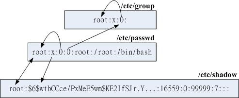
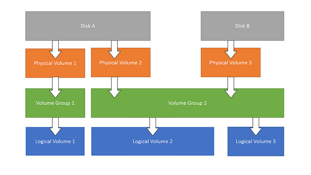

> 注：命令的具体使用推荐使用man或者 **[linux-comand](https://github.com/jaywcjlove/linux-command#web-%E7%89%88%E6%9C%AC)** 查询
> 本文件只用来进行记录常用命令，每个命令的详细使用方法详见文档

|                |           |         |               |           |
| :------------: | :-------: | :-----: | :-----------: | :-------: |
|      man       |   help    |         |               |           |
|  目录文件相关  |  ------   | ------  |    ------     |  ------   |
|       ls       |    cd     |  touch  |      rm       |   mkdir   |
|       cp       |    mv     |   cat   |     more      |   less    |
|      tree      |   stat    |
|     关机等     |  ------   | ------  |    ------     |  ------   |
|    poweroff    | shutdown  |  exit   |               |           |
|  常用网络相关  |  ------   | ------  |    ------     |  ------   |
|      ping      | ifconfig  |  wget   | netstat -natp | route -n  |
|     arp -a     |           |         |               |           |
|      睡眠      |  ------   | ------  |    ------     |  ------   |
|     sleep      |           |         |               |           |
|    ssh 相关    |  ------   | ------  |    ------     |  ------   |
|      ssh       |    scp    |         |               |           |
| 文件，指令查找 |  ------   | ------  |    ------     |  ------   |
|      type      |   which   | whereis |    locate     |   type    |
|      file      |           |         |               |           |
|    用户相关    |  ------   | ------  |    ------     |  ------   |
|     passwd     |  usermod  |  chown  |     chgrp     |   chmod   |
|    groupadd    |    su     |  sudo   |               |           |
|      who       |   users   |         |               |           |
|    日期相关    |  ------   | ------  |    ------     |  ------   |
|      date      |    cal    |         |               |           |
|    系统相关    |  ------   | ------  |    ------     |  ------   |
|       df       |    du     |   ps    |      top      |   kill    |
|       ln       |  pstree   |  free   |     mount     | chkconfig |
|    ss -nal     | ulimit -a |         |               |           |
|    iostate     |  vmstate  |         |               |           |
|    软件相关    |  ------   | ------  |    ------     |  ------   |
|      rpm       |    yum    |   tar   |      apt      |   make    |
|      常用      |  ------   | ------  |    ------     |  ------   |
|      cut       |   sort    |   wc    |      sed      |    awk    |
|      read      |   test    |  exec   |    source     |   bash    |
|      echo      |   hash    |  grep   |     head      |   tail    |

- ss -nal：查看所欲 socket 监听接口
- set:显示所有变量，包含环境变量等所有
- unset:清除变量，包括环境变量
- env:查看环境变量
- echo 输出
- read 输入
- hash:存储执行过的命令，提高下一次命令查找速度
  - hash -r 清除

# 1. 帮助命令

> 在linux终端，面对命令不知道怎么用，或不记得命令的拼写及参数时，我们需要求助于系统的帮助文档； linux系统内置的帮助文档很详细，通常能解决我们的问题，我们需要掌握如何正确的去使用它们；

- 需要知道某个命令的简要说明，可以使用whatis；而更详细的介绍，则可用info命令；
- 查看命令在哪个位置，需要使用which；
- 而对于命令的具体参数及使用方法，我们需要用到强大的man；
  - 在只记得部分命令关键字的场合，我们可通过man -k来搜索；

## 1.1. whatis 查看命令的简要说明

- 简要说明命令的作用（显示命令所处的man分类页面）:

  ```
  $whatis command
  ```

- 正则匹配:

  ```
  $whatis -w "loca*"
  ```

## 1.2. info 更加详细的说明文档

```
$info command
```

## 1.3. 使用man

- 查询命令command的说明文档:

  ```
  $man command
  eg：man date
  ```

- man页面所属的分类标识(常用的是分类1和分类3)

  ```
  (1)、用户可以操作的命令或者是可执行文件
  (2)、系统核心可调用的函数与工具等
  (3)、一些常用的函数与数据库
  (4)、设备文件的说明
  (5)、设置文件或者某些文件的格式
  (6)、游戏
  (7)、惯例与协议等。例如Linux标准文件系统、网络协议、ASCⅡ，码等说明内容
  (8)、系统管理员可用的管理条令
  (9)、与内核有关的文件
  ```

  - 在man的帮助手册中，将帮助文档分为了9个类别
  - 对于有的关键字可能存在多个类别中， 我们就需要指定特定的类别来查看
  - （一般我们查询bash命令，归类在1类中）

- 前面说到使用whatis会显示命令所在的具体的文档类别，我们学习如何使用它

  ```
  eg:
  $whatis printf
  printf               (1)  - format and print data
  printf               (1p)  - write formatted output
  printf               (3)  - formatted output conversion
  printf               (3p)  - print formatted output
  printf [builtins]    (1)  - bash built-in commands, see bash(1)
  ```

  - 我们看到printf在分类1和分类3中都有
  - 分类1中的页面是命令操作及可执行文件的帮助
  - 而3是常用函数库说明
  - 如果我们想看的是C语言中printf的用法，可以指定查看分类3的帮助：
  - 其中`man -f` 和`whatis`功能相同

  ```
  $man 3 printf

  $man -k keyword
  ```

- 在`whatis`数据库中查找字符串:`man -k`或`apropos`
  - 根据命令中部分关键字来查询命令，适用于只记住部分命令的场合；

  ```
  # eg：查找GNOME的config配置工具命令:
  $man -k GNOME config| grep 1
  ```

## 1.4. whereis which 查看路径

- 查看程序的binary文件所在路径:

  ```
  $which command
  # eg:查找make程序安装路径:
  $which make
  /opt/app/openav/soft/bin/make install
  ```

- 查看程序的搜索路径:

  ```
  $whereis command
  ```

  - 当系统中安装了同一软件的多个版本时，不确定使用的是哪个版本时，这个命令就能派上用场；

- 查看外部命令路径：type
  - type 能指定磁盘位置的命令，也就是从 PATH 中查询的命令，被称为**外部命令**,外部命令执行时都会变为一个进程
  - 外部命令都可以通过`man 命令名称`查看文档
  - 可能是可执行程序，也可能是脚本（比如 python 脚本等）
  - 如果 type 返回 shell builtin，则是内部命令。shell 内部的。比如 cd，echo

# 2. 文件及目录管理

## 2.1. 文件系统目录

- /boot:系统启动相关文件
- /etc:配置文件
- /home:存放除 root 用户外的用户目录
- /root:root 用户目录
- /media:挂载点目录，移动设备
- /mnt:挂载点目录，额外的临时文件系统
- /proc:伪文件系统，内核映射文件
  - /proc/cmdline	载入 kernel 时所下达的相关指令与参数！查阅此文件，可了解指令是如何启动的
  - /proc/cpuinfo	本机的 CPU 的相关信息，包含频率、类型与运算功能等
  - /proc/devices	这个文件记录了系统各个主要设备的主要设备代号，与 mknod 有关
  - /proc/filesystems	目前系统已经载入的文件系统
  - /proc/interrupts	目前系统上面的 IRQ 分配状态。
  - /proc/ioports	目前系统上面各个设备所配置的 I/O 位址。
  - /proc/kcore
  - /proc/loadavg	top 以及 uptime 上三个平均数值就是记录在这里
  - /proc/meminfo	使用 free 列出的内存信息，这里会有划分更细致的记录
  - /proc/modules	目前我们的 Linux 已经载入的模块列表，也可以想成是驱动程序
  - /proc/mounts	系统已经挂载的数据，就是用 mount 这个指令调用出来的数据
  - /proc/swaps	swap挂载信息
  - /proc/partitions	分区信息
  - /proc/uptime	`uptime` 时展示的信息
  - /proc/version	核心的版本，就是用 uname -a 显示的内容
  - /proc/bus/*	一些总线的设备，还有 USB 的设备也记录在此
- /sys:伪文件系统，跟硬件设备有关的属性映射文件
- /tmp:临时文件，/var/tmp 也是
- /var:用于存放运行时需要改变数据的文件，也是某些大文件的溢出区，比方说各种服务的日志文件（系统启动日志等。）等。
- /bin:二进制可执行文件，用户命令
- /sbin:管理员命令
- /lib:存放跟文件系统中的程序运行所需要的共享库及内核模块。共享库又叫动态链接共享库，作用类似windows里的.dll文件，存放了根文件系统程序运行所需的共享文件。
- /dev:设备文件，linux，一切皆文件
- /opt:额外安装的可选应用程序包所放置的位置。一般情况下，我们可以把 tomcat 等都安装到这里。
- /usr:是 Unix Software Resource 的缩写,用于存放系统应用程序，比较重要的目录/usr/local 本地系统管理员软件安装目录（安装系统级的应用）。这是最庞大的目录，要用到的应用程序和文件几乎都在这个目录。
  - /usr/x11r6 存放x window的目录
  - /usr/bin 众多的应用程序
  - /usr/sbin 超级用户的一些管理程序
  - /usr/doc linux文档
  - /usr/include linux下开发和编译应用程序所需要的头文件
  - /usr/lib 常用的动态链接库和软件包的配置文件
  - /usr/man 帮助文档
  - /usr/src 源代码，linux内核的源代码就放在/usr/src/linux里
  - /usr/local
    - /usr/local/bin 本地增加的命令
    - /usr/local/lib 本地增加的库


## 2.2. ls, stat, file 文件类型与信息

- 文件类型(`ls -lha`)
  > 扩展名只在图形化界面上有用

  - `-`:普通文件：文本文件，excel 文件，MP4 文件等
  - `d`:文件夹
  - `c`或`b` 设备文件。
    - `c`:字符型设备：比如显示器，一个像素点需要 rgb 三原色的数据，三个字节。比如键盘，组合键
    - `b`:字节型设备：比如硬盘
  - `l`:快捷方式
  - `p`:pipe,管道
  - `s`:socket

  

- stat:元数据，相当于 window 的文件属性
  - Change 描述元数据发生变化的时间，比如权限
  - Modify 文件内容修改时间
  - Access 访问时间
  - IO Block 一次 io 读写多少
  - Inode 磁盘位置索引

  > 注：touch:除了可以创建空文件，也可以更新元数据中的三个时间

- file
  - `ELF` 类型为二进制可执行程序

## 2.3. 创建和删除

- 命令
  - 创建：mkdir
  - 删除：rm
  - 删除非空目录：rm -rf file目录
  - 删除日志 rm *log (等价: find ./ -name “*log” -exec rm {} ;)
  - 移动：mv
  - 复制：cp (复制目录：cp -r )
    - option 很多
    - `-p` 支持复制权限

- 示例
  - 查看当前目录下文件个数:
    ```bash
    $ find ./ | wc -l
    ```
  - 复制目录:
    ```bash
    $ cp -r source_dir  dest_dir
    ```

## 2.4. 目录切换

- 找到文件/目录位置：cd
- 切换到上一个工作目录： cd -
- 切换到home目录： cd or cd ~
- 显示当前路径: pwd
- 更改当前工作路径为path: cd path

## 2.5. 列出目录项

- 显示当前目录下的文件 ls
- 按时间排序，以列表的方式显示目录项 ls -lrt
  - 以上这个命令用到的频率如此之高，以至于我们需要为它建立一个快捷命令方式:
  - 在.bashrc 中设置命令别名:

    ```bash
    alias lsl='ls -lrt'
    alias lm='ls -al|more'
    ```
  - 这样，使用lsl，就可以显示目录中的文件按照修改时间排序；以列表方式显示；

- 给每项文件前面增加一个id编号(看上去更加整洁):

  ```bash
  ls | cat -n
  1  a
  2  a.out
  3  app
  4  b
  5  bin
  6  config
  ```

> 注：.bashrc 在/home/你的用户名/ 文件夹下，以隐藏文件的方式存储；可使用 ls -a 查看；

## 2.6. find 查找目录及文件

### 2.6.1. 基本使用

- 查找txt和pdf文件:

  ```bash
  find . \( -name "*.txt" -o -name "*.pdf" \) -print
  # 或 find . -name "*.txt" -o -name "*.pdf"
  # -o 为 "或"
  ```

- 正则方式查找.txt和pdf:

  ```bash
  find . -regex  ".*\(\.txt|\.pdf\)$"
  # -iregex： 忽略大小写的正则
  ```

- 否定参数 ,查找所有非txt文本:

  ```bash
  find . ! -name "*.txt" -print
  ```

- 指定搜索深度,打印出当前目录的文件（深度为1）:

  ```bash
  find . -maxdepth 1 -type f
  ```

### 2.6.2. 定制搜索

> **按类型搜索**

- 说明
  ```bash
  find . -type d -print  # 只列出所有目录
  ```
  - -type
    - f 普通文件
    - l 符号连接
    - d 目录
    - c 字符设备
    - b 块设备
    - s 套接字
    - p Fifo

- 注意：
  - 说明
    - find支持的文件检索类型可以区分普通文件和符号链接、目录等
    - 但是**二进制文件和文本文件**无法直接通过find的类型区分出来；

  - 解决：file命令可以检查文件具体类型（二进制或文本）:

    ```bash
    $ file redis-cli  # 二进制文件
    redis-cli: ELF 64-bit LSB executable, x86-64, version 1 (SYSV), dynamically linked (uses shared libs), for GNU/Linux 2.6.9, not stripped
    $ file redis.pid  # 文本文件
    redis.pid: ASCII text
    ```
  - 实例：所以,可以用以下命令组合来实现查找本地目录下的所有二进制文件:

    ```bash
    ls -lrt | awk '{print $9}'|xargs file|grep  ELF| awk '{print $1}'|tr -d ':'
    ```

> **按时间搜索**

- 说明
  - -atime 访问时间 (单位是天，分钟单位则是-amin，以下类似）
  - -mtime 修改时间 （内容被修改）
  - -ctime 变化时间 （元数据或权限变化）

- 实例
  - 最近第7天被访问过的所有文件:

    ```bash
    find . -atime 7 -type f -print
    ```
  - 最近7天内被访问过的所有文件:

    ```bash
    find . -atime -7 -type f -print
    ```
  - 查询7天前被访问过的所有文件:

    ```bash
    find . -atime +7 type f -print
    ```

> **按大小搜索**

- 寻找大于2k的文件:

  ```bash
  find . -type f -size +2k
  ```

> **按权限查找**

  ```bash
  find . -type f -perm 644 -print # 找具有可执行权限的所有文件
  ```

> **按用户查找**

  ```bash
  find . -type f -user weber -print # 找用户weber所拥有的文件
  ```

### 2.6.3. 找到后的后续动作

> **删除**

- 删除当前目录下所有的swp文件:

  ```bash
  find . -type f -name "*.swp" -delete
  ```

- 另一种语法:

  ```bash
  find . type f -name "*.swp" | xargs rm
  ```

> **执行动作（强大的exec）**

- 将当前目录下的所有权变更为weber:

  ```bash
  find . -type f -user root -exec chown weber {} \;
  ```

  > 注：{}是一个特殊的字符串，对于每一个匹配的文件，{}会被替换成相应的文件名
  >
  > 将找到的文件全都copy到另一个目录:

  ```bash
  find . -type f -mtime +10 -name "*.txt" -exec cp {} OLD \;
  ```

> **结合多个命令**

- 如果需要后续执行多个命令，可以将多个命令写成一个脚本。然后 -exec 调用时执行脚本即可:

  ```bash
  -exec ./commands.sh {} \;
  ```

### 2.6.4. "-print"的定界符

- 默认使用’\n’作为文件的定界符；
- -print0 使用’\0’作为文件的定界符，这样就可以搜索包含空格的文件；

## 2.7. locate, updatedb

## 2.8. 查看文件内容

### 2.8.1. cat

- cat
  - 显示时同时显示行号:

  ```bash
  $ cat -n
  ```

### 2.8.2. head, tail

- head
- tail
  - 动态显示文本最新信息:

    ```bash
    tailf -f
    ```

### 2.8.3. less, more

- more
  - 按页显示列表内容:

    ```bash
    $ ls -al | more
    ```
- less(推荐)

## 2.9. 文件切分 split

## 2.10. 软链接，硬链接

- 创建符号链接/硬链接:

  ```bash
  ln cc ccAgain # 硬连接；删除一个，将仍能找到；
  ln -s cc ccTo # 符号链接(软链接)；删除源，另一个无法使用；（后面一个ccTo 为新建的文件）
  ```

# 3. 文本处理与计算

## 3.1. grep 文本搜索

> **说明**

- 基本使用
  ```bash
  grep match_patten file # 默认访问匹配行
  cat file | grep match _pattern
  ```

- 常用参数
  - -o 只输出匹配的文本行
  - -v 只输出没有匹配的文本行
  - -c 统计文件中包含文本的次数: `grep -c "text" filename`
  - -n 打印匹配的行号
  - -i 搜索时忽略大小写
  - -l 只打印文件名
  - -e --regexp
  - -r/-R 递归搜索

> **应用示例**

- 在多级目录中对文本递归搜索(程序员搜代码的最爱）:

  ```
  grep "class" . -R -n
  ```
- 匹配多个模式

  ```bash
  grep -e "class" -e "vitural" file
  # 每个模式前都要有一个 -e
  ```
- 删除不包括指定字符的文件

  ```bash
  # 测试文件：
  echo "aaa" > file1
  echo "bbb" > file2
  echo "aaa" > file3

  grep "aaa" file* -lZ | xargs -0 rm

  # 执行后会删除file1和file3
  # grep输出用-Z选项来指定以0值字节作为终结符文件名（\0）
  # xargs -0 读取输入并用0值字节终结符分隔文件名，然后删除匹配文件
  # -Z通常和-l结合使用。
  ```
- 综合应用：
  - 将日志中的所有带where条件的sql查找查找出来:

    ```bash
    cat LOG.* | tr a-z A-Z | grep "FROM " | grep "WHERE" > b
    ```

  - 查找中文示例：工程目录中utf-8格式和gb2312格式两种文件，要查找字的是中文；
    - 1. 查找到它的utf-8编码和gb2312编码分别是``”xE4xB8xADxE6x96x87”`` 和 `"\xD6\xD0\xCE\xC4"`
    - 2. `-r` 递归查询、`-n` 显示行号、`-e` 表示使用正则表达式查询；

    ```bash
    grep -rne "\xE4\xB8\xAD\xE6\x96\x87|\xD6\xD0\xCE\xC4" *
    ```

## 3.2. xargs 命令行参数转换

> **说明**

- xargs
  - 作用：
    - xargs 能够处理管道或者 stdin 并将其转换成特定命令的命令参数。
    - xargs 也可以将单行或多行文本输入转换为其他格式，例如多行变单行，单行变多行
  - 基本说明
    - 每个程序都有输入流，但不一定会用到。
    - xargs 后接的第一个参数会被识别为命令，剩下的参数识别为命令的选项参数，再将输入流中的信息作为命令的参数，再执行命令

- xargs参数说明
  - -d 定义定界符 （默认为空格 多行的定界符为 n）
  - -n 指定需要多少个参数
  - -I {} 指定替换字符串，这个字符串在xargs扩展时会被替换掉
    - 用于待执行的命令需要多个参数时，指定xargs 参数的位置
  - -P 并发执行数量，如 `echo '1 2 3 4' | xargs -n1 -t -P 10 sleep`
  - -0：指定0为输入定界符

> **应用示例**

- 将多行输出转化为单行输出:

  ```bash
  cat file.txt| xargs
  ```

- 将单行转化为多行输出

  ```
  cat single.txt | xargs -n 3
  ```
- 使用 -d 分割输入

  ```bash
  echo "nameXnameXnameXname" | xargs -dX

  name name name name
  ```

- 综合应用

  ```bash
  cat file.txt | xargs -I {} ./command.sh -p {} -1
  # -I {} ，指定‘{}'会被替换掉

  ls *.jpg | xargs -n1 -I cp {} /data/images
  # 复制所有图片文件到 /data/images 目录下：

  #统计程序行数
  find source_dir/ -type f -name "*.cpp" -print0 |xargs -0 wc -l

  #redis通过string存储数据，通过set存储索引，需要通过索引来查询出所有的值：
  ./redis-cli smembers $1  | awk '{print $1}'|xargs -I {} ./redis-cli get {}
  ```

## 3.3. sort 排序

> **说明**

- sort:排序文件的行后输出。字典序或数值序
  - n:按数值排序。默认字典序。（从第一个字符进行排序）
  - 自定义排序方式:
    > sort -t' ' -k2 以空格为分隔符，通过第二列字典序进行排序
    - t:自定义分隔符
    - k:选择排序列
  - r:倒序
  - u:合并相同行
  - f:忽略大小写

> **应用示例**

```bash
sort -nrk 1 data.txt
sort -bd data # 忽略像空格之类的前导空白字符
```


## 3.4. uniq 消除重复行

> **注意**

- uniq去重功能，只能针对连续的多行进行去重，只剩下唯一的一条
- 因此一般都会和sort一起使用

> **应用示例**

- 消除重复行
  ```bash
  sort unsort.txt | uniq
  ```
- 统计各行在文件中出现的次数
  ```bash
  sort unsort.txt | uniq -c
  ```
- 找出重复行
  ```bash
  sort unsort.txt | uniq -d
  ```
- 只显示单一行：
  ```bash
  uniq -u file.txt
  sort file.txt | uniq -u
  ```
- 可指定每行中需要比较的重复内容：-s 开始位置 -w 比较字符数

## 3.5. cut 按列切分文本

- cut：切割行。比如查看数据库表数据时
  - f:选择显示的列
  - s:不显示没有分隔符的行
  - d:自定义分隔符
  - 例：
    - `cut -d' ' -f1 file` 以空格为分隔符切割后显示第一列
    - `cut -d' ' -f1,3 file` 以空格为分隔符切割后显示第一和三列
    - `cut -d' ' -f1-3 file` 以空格为分隔符切割后显示第一列到第三列

## 3.6. wc 统计行和字符的工具

```bash
$ wc -l file # 统计行数
$ wc -w file # 统计单词数
$ wc -c file # 统计字符数
```

## 3.7. tee 双向重定向

## 3.8. 字符转换命令： tr

### 3.8.1. tr

> **说明**

- 选项
  - -c或——complerment：取代所有不属于第一字符集的字符；
  - -d或——delete：删除所有属于第一字符集的字符；
  - -s或--squeeze-repeats：把连续重复的字符以单独一个字符表示；
  - -t或--truncate-set1：先删除第一字符集较第二字符集多出的字符。

- 参数
  - 字符集1：
    - 指定要转换或删除的原字符集。
    - 当执行转换操作时，必须使用参数“字符集2”指定转换的目标字符集。
    - 但执行删除操作时，不需要参数“字符集2”；
  - 字符集2：
    - 指定要转换成的目标字符集。

> **应用示例**

- 通用用法

  ```bash

  echo "HELLO WORLD" | tr 'A-Z' 'a-z' # 将输入字符由大写转换为小写：
  echo 12345 | tr '0-9' '9876543210' #加解密转换，替换对应字符
  cat text| tr '\t' ' '  #制表符转空格
  ```

- tr删除字符

  ```bash
  cat file | tr -d '0-9' # 删除所有数字
  ```

- -c 求补集:

  ```bash
  cat file | tr -c '0-9' #获取文件中所有数字
  cat file | tr -d -c '0-9 \n'  #删除非数字数据
  ```

- tr压缩字符

  ```bash
  # tr -s 压缩文本中出现的重复字符；最常用于压缩多余的空格:
  cat file | tr -s ' '
  ```

- 字符类
  - 种类
    - [:alnum:]：字母和数字
    - [:alpha:]：字母
    - [:cntrl:]：控制（非打印）字符
    - [:digit:]：数字
    - [:graph:]：图形字符
    - [:lower:]：小写字母
    - [:print:]：可打印字符
    - [:punct:]：标点符号
    - [:space:]：空白字符
    - [:upper:]：大写字母
    - [:xdigit:]：十六进制字符
  - 使用方法：tr [:class:] [:class:]

```
tr '[:lower:]' '[:upper:]'
```

### 3.8.2. col

### 3.8.3. expand, unexpand

## 3.9. 多文件处理

### 3.9.1. join

### 3.9.2. paste 按列拼接文本

- 将两个文本按列拼接到一起;

  ```bash
  cat file1
  1
  2

  cat file2
  colin
  book

  paste file1 file2
  1 colin
  2 book
  ```

- 默认的定界符是制表符，可以用-d指明定界符

  ```bash
  paste file1 file2 -d ","
  1,colin
  2,book
  ```


### 3.9.3. 比较文件或目录 diff， 以及 patch

### 3.9.4. comm 对比文件或者输入流

> 通常和sort一起使用


### 3.9.5. cmp 字节单位的对比

支持对比binary文件

## 3.10. bc 数值计算

## 3.11. iconv 编码转换

## 3.12. printf 格式化输出

## 3.13. sed 文本替换利器

[References](./References/sed.md)

## 3.14. awk 数据流处理工具(重要)

[References](./References/awk.md)

- awk
  - 说明:
    - awk 是一个强大的文本分析工具。
    - 相对于 grep 的查找，sed 的编辑，awk 在其对数据分析并生成报告时， 显得尤为强大。
    - 简单来说 awk 就是把文件逐行的读入，空格，制表符）为默认分隔符 将每行切片，切开的部分再进行各种分析处理。
    - 可以用来代替 cut，sort，sed
  - 使用：
    - awk -F '{pattern + action}' {filenames}
      > **必须是单引号**
    - 支持自定义分隔符.默认为空格
    - 支持正则表达式匹配
    - 支持自定义变量，数组 a[1] a[tom] map(key)
    - 支持内置变量
      - NF 浏览记录的域(列)的个数
      - NR 已读的记录数(行数)
      - ARGC 命令行参数个数
      - ARGV 命令行参数排列
      - ENVIRON 支持队列中系统环境变量的使用
      - FILENAME awk 浏览的文件名
      - FNR 浏览文件的记录数
      - FS 设置输入域分隔符，等价于命令行 -F 选项
      - OFS 输出域分隔符
      - ORS 输出记录分隔符
      - RS 控制记录分隔符
    - 支持函数
      - print、split、substr、sub、gsub
    - 支持流程控制语句，类 C 语言
      - if、while、do/while、for、break、continue
  - 示例：

    - `awk -F':' '{print $1}' passwd` 打印以冒号分割得到的第一列 。相当于 `cut -d':' -f1 passwd`
    - `awk -F':' 'BEGIN{print "name\shell"} {print $1 "\t" $7} END{print "end"}' passwd` 打印表头，分割后的 1，7 行，最后结束提示
      - BEGIN{}是在处理前调用
      - 匿名函数是每行的操作
      - END{}是处理完后调用
    - `awk '/word/ {print $0}'` 打印包含 word 的行
    - `awk '/word/ {print $0} {print $0}'` 打印包含 word 的行后，再全打印一遍
    - `awk -F':' '{print NR"\t"NF"\t"$0}'`打印每行行号，列数，完成内容，为一个表格
    - 计算合计工资

      ```bash
      # 统计报表：合计每人1月的工资，0：manager，1：worker

      # Tom	 0   2012-12-11      car     3000
      # John	 1   2013-01-13      bike    1000
      # vivi	 1   2013-01-18      car     2800
      # Tom	 0   2013-01-20      car     2500
      # John	 1   2013-01-28      bike    3500

      # 结果比如: tom worker 2500

      awk '{
        split($3,date,"-");
        if(date[2]=="01"){
          name[$1] += $5
          if($2=="0"){
            position[$1] = "manager"
          }else if($2=="1"){
            position[$1] = "worker"
          }
        }
      }
      END{
          for(i in name){
            print i "\t" position[i] "\t" name[i]
          }
      }' wagetable.txt
      ```

- 练习
  - print 打印当前行
  - 特殊变量： `NR NF $0 $1 $2`
  - 传递外部变量
  - 用样式对 awk 处理的行进行过滤
  - 设置定界符
  - 读取命令输出
  - 在 awk 中使用循环
  - awk 结合 grep 找到指定的服务，然后将其 kill 掉
  - awk 实现 head、tail 命令
  - 打印指定列
  - 打印指定文本区域
  - awk 常用内建函数

## 3.15. pr 将文本文件转换成适合打印的格式

## 3.16. 迭代文件中的行、单词和字符

### 3.16.1. 迭代文件中的每一行

- while 循环法

  ```bash
  while read line;
  do
  echo $line;
  done < file.txt

  # 改成子shell:
  cat file.txt | (while read line;do echo $line;done)
  ```

- awk法

  ```bash
  cat file.txt| awk '{print}'
  ```

### 3.16.2. 迭代一行中的每一个单词

```bash
for word in $line;
do
echo $word;
done
```

### 3.16.3. 迭代每一个字符

- 语法
  - `${string:start_pos:num_of_chars}` ：从字符串中提取一个字符；(bash文本切片）
  - `${#word}` :返回变量word的长度

- 示例

  ```bash
  for((i=0;i<${#word};i++))
  do
  echo ${word:i:1);
  done
  ```

- 以ASCII字符显示文件:

  ```bash
  $ od -c filename
  ```

# 4. 磁盘管理

<!-- TODO: linux常用命令整理。正在进行中 -->

## 4.1. 磁盘信息

### 4.1.1. df

显示硬盘分区。

- linux 中没有盘符概念，只有一棵虚拟的目录树，所有分区中的目录都会放在根目录/下的某文件夹(不一定是子级)。比如/boot 目录就是一个分区。
- 有啥问题时，先 df，看看磁盘满没

### 4.1.2. du

### 4.1.3. lsblk

### 4.1.4. blkid

## 4.2. 分区

### 4.2.1. gdisk/fdisk, partprobe

内核分区表：/proc/partitions

删除分区时，一定要umount了

partprobe 可以指定device。在有光盘设备等只读设备的情况下，partprobe会报错

### 4.2.2. parted

parted /dev/sda print

## 4.3. 格式化

### 4.3.1. mkfs

## 4.4. 挂载

### 4.4.1. mount, umount

/etc/fstab， /etc/mtab 与 /proc/mounts

```bash
#【装置/UUID等】【挂载点】【文件系统】【文件系统参数】【dump】【fsck】
/dev/mapper/centos-root /                       xfs     defaults        0 0
UUID=13d0663f-4cbd-412d-aa9f-975eb18da590 /boot                   xfs     defaults        0 0
/dev/mapper/centos-home /home                   xfs     defaults        0 0
/dev/mapper/centos-swap swap                    swap    defaults        0 0
```

### 4.4.2. loop设备挂载

dd空文件, iso文件等

```bash
dd if=/dev/zero of=/srv/loopdev bs=1M count=512
mkfs.xfs -f /srv/loopdev
blkid /srv/loopdev
mount -o loop UUID="7dd97bd2-4446-48fd-9d23-a8b03ffdd5ee" /mnt
df /mnt
```

## 4.5. swap 交换空间

### 4.5.1. mkswap

### 4.5.2. swapon, swapoff

free 查看效果

## 4.6. 文件系统修改

### 4.6.1. mknod

### 4.6.2. tune2fs

### 4.6.3. xfs_growfs

扩展 xfs 文件系统

- 严格说起来，扩展文件系统大小并不是没有进行“格式化”，是通过在文件系统当中增加 block group 的方式来增减文件系统的量。
- 格式化的位置在于该设备后来新增的部份，设备的前面已经存在的文件系统则没有变化。
- 而新增的格式化过的数据，再反馈回原本的 supberblock 。

## 4.7. 分区表管理

### 4.7.1. sfdisk

MBR分区表管理

### 4.7.2. sgdisk

GPT 分区表管理

# 5. 压缩打包

## 5.1. gzip, zcat/zmore/zless/zgrep

## 5.2. bzip2, bzcat/bzmore/bzless/bzgrep

## 5.3. xz, xzcat/xzmore/xzless/xzgrep

## 5.4. tar

- tar的权限处理

- `-C` 参数说明
  ```bash
  # 解压后，会得到output/${APP}/....，这种方式会保留文件夹层级
  tar -czf output/${APP}.tar.gz output/${APP}
  # -C 相当于cd到指定目录再压缩，后面跟着一个"."，表示压缩 "output/${APP}" 目录
  tar -czf output/${APP}.tar.gz -C output/${APP} .
  ```

## 5.5. xfs

### 5.5.1. xfsdump

### 5.5.2. xfsrestore

## 5.6. iso

### 5.6.1. mkisofs

### 5.6.2. cdrecord

## 5.7. dd

## 5.8. cpio

# 6. 数据与系统备份工具

## 6.1. 依赖打包工具备份

### 6.1.1. dd

### 6.1.2. cpio

### 6.1.3. tar

### 6.1.4. xfsdump, xfsrestore

## 6.2. rsync

## 6.3. timeshift

# 7. 终端管理

## 7.1. tty

获取当前连接的名称

## 7.2. stty

## 7.3. terminfo: tic 和 infocmp

## 7.4. dircolors

## 7.5. /etc/inputrc 处理键盘映射

# 8. 用户与权限

## 8.1. 系统配置文件

### 8.1.1. /etc/passwd

### 8.1.2. /etc/shadow

### 8.1.3. /etc/group

### 8.1.4. /etc/gshadow

### 8.1.5. 关系说明



passwd中的，gid仅为初始group，一个用户可以在多个group中，且可以通过 newgrp 切换生效的group

## 8.2. 用户管理

### 8.2.1. useradd

#### 8.2.1.1. 基本说明

#### 8.2.1.2. /etc/default/useradd 默认配置

<details>
<summary style="color:red;">展开</summary>

```conf
GROUP=100             # 默认的群组
HOME=/home            # 默认的主文件夹所在目录
INACTIVE=-1           # 密码失效日，在 shadow 内的第 7 栏
EXPIRE=               # 帐号失效日，在 shadow 内的第 8 栏
SHELL=/bin/bash       # 默认的 shell
SKEL=/etc/skel        # 使用者主文件夹的内容数据参考目录
CREATE_MAIL_SPOOL=yes # 是否主动帮使用者创建邮件信箱（mailbox）
```
</details>

- 私有群组机制：
  - 系统会创建一个与帐号一样的群组给使用者作为初始群组。
  - 这种群组的设置机制会比较有保密性，这是因为使用者都有自己的群组，而且主文件夹权限将会设置为 700 （仅有自己可进入自己的主文件夹） 之故。
  - 使用这种机制将不会参考 GROUP=100 这个设置值。
  - 代表性的 distributions 有 RHEL, Fedora, CentOS 等；

- 公共群组机制：
  - 就是以`/etc/default/useradd`中 GROUP=100 这个设置值作为新建帐号的初始群组，因此每个帐号都属于 users 这个群组，
  - 且默认主文件夹通常的权限会是“ drwxr-xr-x ... username users ... ”，
  - 由于每个帐号都属于 users 群组，因此大家都可以互相分享主文件夹内的数据之故。
  - 代表 distributions 如 SuSE等。

#### 8.2.1.3. /etc/login.defs

<details>
<summary style="color:red;">展开</summary>

```
MAIL_DIR        /var/spool/mail # 使用者默认邮件信箱放置目录

PASS_MAX_DAYS   99999           # /etc/shadow 内的第 5 栏，多久需变更密码日数
PASS_MIN_DAYS   0               # /etc/shadow 内的第 4 栏，多久不可重新设置密码日数
PASS_MIN_LEN    5               # 密码最短的字符长度，已被 pam 模块取代，失去效用！
PASS_WARN_AGE   7               # /etc/shadow 内的第 6 栏，过期前会警告的日数

UID_MIN          1000           # 使用者最小的 UID，意即小于 1000 的 UID 为系统保留
UID_MAX         60000           # 使用者能够用的最大 UID
SYS_UID_MIN       201           # 保留给使用者自行设置的系统帐号最小值 UID
SYS_UID_MAX       999           # 保留给使用者自行设置的系统帐号最大值 UID
GID_MIN          1000           # 使用者自订群组的最小 GID，小于 1000 为系统保留
GID_MAX         60000           # 使用者自订群组的最大 GID
SYS_GID_MIN       201           # 保留给使用者自行设置的系统帐号最小值 GID
SYS_GID_MAX       999           # 保留给使用者自行设置的系统帐号最大值 GID

CREATE_HOME     yes             # 在不加 -M 及 -m 时，是否主动创建使用者主文件夹？
UMASK           077             # 使用者主文件夹创建的 umask ，因此权限会是 700
USERGROUPS_ENAB yes             # 使用 userdel 删除时，是否会删除初始群组
ENCRYPT_METHOD SHA512           # 密码加密的机制使用的是 sha512 这一个机制！
```
</details>

uid,gid以及密码等设置

### 8.2.2. usermod

### 8.2.3. userdel

### 8.2.4. passwd

支持 `--stdin` 和管道命令结合

```bash
echo "password" | passwd --stdin username
```

### 8.2.5. change

修改/etc/shadow中的各个字段

实现初次登陆必须修改密码：

```bash
chage -d 0 agetest
```

### 8.2.6. chpasswd

## 8.3. 组管理

### 8.3.1. groupmod

### 8.3.2. groupadd

### 8.3.3. groupdel

### 8.3.4. gpasswd

组管理员，可控制加入，移出组

## 8.4. 使用者管理


### 8.4.1. id

### 8.4.2. groups

### 8.4.3. finger

使用者信息，登陆信息和个人信息

### 8.4.4. chfg

修改finger中的信息，包括电话号码等信息等

会记录在/etc/passwd 的 使用者信息列

### 8.4.5. chsh

修改默认shell

### 8.4.6. newgrp

切换生效的group

会新打开一个shell环境，exit可以退回原来的环境

## 8.5. 账号切换

### 8.5.1. su

默认为 no-login shell，大多数环境变量不会改变

需要使用 `su -`

### 8.5.2. sudo, visudo

- `/etc/sudoers` 配置sudo授权用户
  - 用visudo来编辑，退出时会检验语法

## 8.6. 用户权限

### 8.6.1. chmod

### 8.6.2. chown

### 8.6.3. chgrp

### 8.6.4. 默认权限与隐藏权限

SUID, SGID, SBIT

#### 8.6.4.1. umask

#### 8.6.4.2. chattr, lsattr

文件特殊权限： SUID, SGID, SBIT

## 8.7. ACL

### 8.7.1. 说明

支持特定用户或者组设置权限

支持检查： `sudo dmesg | grep -i acl`

### 8.7.2. getfacl, setfacl

## 8.8. 特殊的shell 与 PAM

### 8.8.1. /sbin/nologin

不可登陆账号的shell为 `/sbin/nologin`

使用不可登陆账号登陆时，显示的内容：`/etc/nologin.txt`

### 8.8.2. PAM

#### 8.8.2.1. 概述

Pluggable Authentication Modules, 嵌入式权限模块

- PAM 可以说是一套应用程序接口 （Application Programming Interface, API），
- 在Linux中执行有些程序时，这些程序在执行前首先要对启动它的用户进行认证，符合一定的要求之后才允许执行，例如login, su等。这些都可以使用PAM验证。
  - openssh安装时，也会在 `/etc/pam.d` 下添加相应配置 `/etc/pam.d/sshd`
- 他提供了一连串的验证机制，只要使用者将验证阶段的需求告知 PAM 后， PAM 就能够返回给使用者验证的结果 （成功或失败）。
- 由于 PAM 仅是一套验证的机制，又可以提供给其他程序所调用引用，因此不论你使用什么程序，都可以使用 PAM 来进行验证，

passwd示例：

- 使用者开始执行 /usr/bin/passwd 这支程序，并输入密码；
- passwd 调用 PAM 模块进行验证；
- PAM 模块会到 /etc/pam.d/ 找寻与程序 （passwd） 同名的配置文件；
- 依据 /etc/pam.d/passwd 内的设置，引用相关的 PAM 模块逐步进行验证分析；
- 将验证结果 （成功、失败以及其他讯息） 回传给 passwd 这支程序；
- passwd 这支程序会根据 PAM 回传的结果决定下一个动作 （重新输入新密码或者通过验证！）

相关文件路径：

- `/etc/pam.d/*`：每个程序个别的 PAM 配置文件；
- `/lib64/security/*`：PAM 模块文件的实际放置目录；
- `/etc/security/*`：其他 PAM 环境的配置文件；
- `/usr/share/doc/pam-*/`：详细的 PAM 说明文档。
- `/etc/securetty` 会影响到 root 可登陆的安全终端机
- `/etc/nologin` 会影响到一般使用者是否能够登陆的功能之外
- `/etc/security/limit.conf` ulimit 设置
- `/var/log/secure`, `/var/log/messages`: 如果发生任何无法登陆或者是产生一些你无法预期的错误时，由于 PAM 模块都会将数据记载在 /var/log/secure 当中

> PAM 有个特殊的地方，由于他是在程序调用时才予以设置的，
> 因此你修改完成的数据， 对于已登陆系统中的使用者是没有效果的，要等再次登陆时才会生效

#### 8.8.2.2. 配置文件

- 示例

  ```
  # cat /etc/pam.d/sudo

  #%PAM-1.0
  #模块类型        控制标记        模块路径     模块参数
  auth            include         system-auth
  account         include         system-auth
  session         include         system-auth
  ```

- 模块类型
  - auth：
    - 表示鉴别类接口模块类型用于检查用户和密码，并分配权限；
    - 这种类型的模块为用户验证提供两方面服务。
      - 让应用程序提示用户输入密码或者其他标记，确认用户合法性；
      - 通过他的凭证许可权限，设定组成员关系或者其他优先权。
  - account：
    - 表示账户类接口，主要负责账户合法性检查，确认帐号是否过期，是否有权限登录系统等；
    - 这种模块执行的是基于非验证的帐号管理。
    - 他主要用于限制/允许用户对某个服务的访问时间，当前有效的系统资源（最多可以多少用户），限制用户位置（例如：root只能通过控制台登录）。
  - session：
    - 会话类接口。实现从用户登录成功到退出的会话控制；
    - 处理为用户提供服务之前/后需要做的些事情。包括：
      - 开启/关闭交换数据的信息，监视目录等，设置用户会话环境等。
    - 也就是说这是在系统正式进行服务提供之前的最后一道关口。
  - password：
    - 口令类接口。控制用户更改密码的全过程。也就是有些资料所说的升级用户验证标记。

- auth 和 account
  - 多数情况下auth和account会一起用来对用户登录和使用服务的情况进行限制。这样的限制会更加完整。
  - 比如下面是一个具体的例子：
    - login是一个应用程序。Login要完成两件工作——首先查询用户，然后为用户提供所需的服务，例如提供一个shell程序。
    - 通常Login要求用户输入名称和密码进行验证。
  - 步骤1：auth:
    - 当用户名输入的时候，系统自然会去比对该用户是否是一个合法用户，是否在存在于本地或者远程的用户数据库中。
    - 如果该账号确实存在，那么是否过期。
  - 步骤2：account:
    - 如果用户满足上述登录的前提条件，那么它是否具有可登录系统的password，password是否过期等。
    - 他通常会将用户口令信息加密并提供给本地（/etc/shadow）或者远程的(ldap，kerberos等)口令验证方式进行验证。
  - 后续
    - 如果用户能够登录成功，证明auth和account的工作已经完成。但整个验证过程并没有完全结束。因为还有一些其他的问题没有得到确认。
    - 例如，用户能够在服务器上同时开启多少个窗口登录，用户可以在登录之后使用多少终端多长时间，用户能够访问哪些资源和不能访问哪些资源等等。
    - 也就是说登录之后的后续验证和环境定义等还需要其他的接口(session，password)。

> 注意：上述接口在使用的时候，每行只能指定一种接口类型，如果程序需要多种接口的话，可在多行中分别予以规定。

- 控制标准(control flag)

  ```
  规定如何处理PAM模块鉴别认证的结果，简而言之就是鉴别认证成功或者失败之后会发生什么事，如何进行控制。
  单个应用程序可以调用多种底层模块，通常称为“堆叠”。
  对应于某程序按照配置文件中出现顺序执行的所有模块成为“堆”，堆中的各模块的地位与出错时的处理方式由control_flag栏的取值决定，
  他的四种可能的取值分别为required、Requisite、sufficient、optional
  ```

  - required：
    - 表示该行以及所涉及模块的成功是用户通过鉴别的必要条件。
    - 换句话说，只有当对应于应用程序的所有带 required 标记的模块全部成功后，该程序才能通过鉴别。
    - 同时，如果任何带required标记的模块出现了错误，PAM并不立刻将错误消息返回给应用程序，而是在所有模块都调用完毕后才将错误消息返回调用他的程序。
    - 反正说白了， **就是必须将所有的模块都执行一次，其中任何一个模块验证出错，验证都会继续进行，并在执行完成之后才返回错误信息** 。
    - 这样做的目的就是不让用户知道自己被哪个模块拒绝，通过一种隐蔽的方式来保护系统服务。
    - 就像设置防火墙规则的时候将拒绝类的规则都设置为drop一样，以致于用户在访问网络不成功的时候无法准确判断到底是被拒绝还是目标网络不可达。
  - requisite：
    - 与required相仿，只有带此标记的模块返回成功后，用户才能通过鉴别。
    - 不同之处在于 **其一旦失败就不再执行堆中后面的其他模块** ，并且鉴别过程到此结束，同时也会立即返回错误信息。
    - 与上面的required相比，似乎要显得更光明正大一些。
  - sufficient：
    - 表示该行以及所涉及模块验证成功是用户通过鉴别的充分条件。
    -  **也就是说只要标记为sufficient的模块一旦验证成功，那么PAM便立即向应用程序返回成功结果而不必尝试任何其他模块** 。
    -  即便后面的层叠模块使用了requisite或者required控制标志也是一样。
    -  当标记为sufficient的模块失败时，sufficient模块会当做 optional对待。
    -  因此拥有sufficient 标志位的配置项在执行验证出错的时候并不会导致整个验证失败，但执行验证成功之时则大门敞开。所以该控制位的使用务必慎重。
  - optional：
    - 他表示即便该行所涉及的模块验证失败用户仍能通过认证。可用来显示信息。
    - 在PAM体系中，带有该标记的模块失败后将继续处理下一模块。
    - 也就是说即使本行指定的模块验证失败，也允许用户享受应用程序提供的服务。
    - 使用该标志，PAM框架会忽略这个模块产生的验证错误，继续顺序执行下一个层叠模块。
  - include：
    - 表示在验证过程中 **调用其他的PAM配置文件** 。
    - 在RHEL系统中有相当多的应用通过完整调用/etc/pam.d/system-auth来实现认证而不需要重新逐一去写配置项。
    - 这也就意味着在很多时候只要用户能够登录系统，针对绝大多数的应用程序也能同时通过认证。
  - 另外还有一种比较复杂的格式为value = action的语法来设置控制标志，标志之间会以空格分开。格式如下：

    ```
    value1 = action1 value2 = action2 ……

    其中value可以是下列Linux PAM库的返回值：
    success、open_err、symbol_err、service_err、 system_err、buf_err、perm_denied、auth_err、cred_insufficient、
    authinfo_unavail、user_unknown、maxtries、new_authtok_reqd、acct_expired、 session_err、cred_unavail、
    cred_expired、cred_err、no_module_data、conv_err、 authtok_err、authtok_recover_err、authtok_lock_busy、
    authtok_disable_aging、 try_again、ignore、abort、authtok_expired、module_unknown、bad_item和default
    ```

### 8.8.3. 常见模块

- pam_securetty.so：
  - 限制系统管理员 （root） 只能够从安全的 （secure） 终端机登陆；
  - 那什么是终端机？例如 tty1, tty2 等就是传统的终端机设备名称。
  - 那么安全的终端机设置呢？ 就写在 `/etc/securetty` 这个文件中。
  - 你可以查阅一下该文件， 就知道为什么 root 可以从 tty1~tty7 登陆，但却无法通过 telnet 登陆 Linux 主机了
- pam_nologin.so：
  - 这个模块可以限制一般使用者是否能够登陆主机之用。
  - 当 /etc/nologin 这个文件存在时，则所有一般使用者均无法再登陆系统了！
    - 若 /etc/nologin 存在，则一般使用者在登陆时， 在他们的终端机上会将该文件的内容显示出来！
    - 所以，正常的情况下，这个文件应该是不能存在系统中的。
    - 但这个模块对 root 以及已经登陆系统中的一般帐号并没有影响。 （与 /etc/nologin.txt 并不相同）
- pam_selinux.so：
  - SELinux 是个针对程序来进行细部管理权限的功能
  - 由于 SELinux 会影响到使用者执行程序的权限，因此我们利用 PAM 模块，将 SELinux 暂时关闭，等到验证通过后， 再予以启动！
- pam_console.so：
  - 当系统出现某些问题，或者是某些时刻你需要使用特殊的终端接口 （例如 RS232 之类的终端连线设备） 登陆主机时，
  - 这个模块可以帮助处理一些文件权限的问题，让使用者可以通过特殊终端接口 （console） 顺利的登陆系统。
- pam_loginuid.so：
  - 我们知道系统帐号与一般帐号的 UID 是不同的，一般帐号 UID 均大于 1000 才合理。
  - 因此，为了验证使用者的 UID 真的是我们所需要的数值，可以使用这个模块来进行规范！
- pam_env.so：
  - 用来设置环境变量的一个模块，如果你有需要额外的环境变量设置，可以参考 /etc/security/pam_env.conf 这个文件的详细说明。
- pam_unix.so：
  - 这是个很复杂且重要的模块，这个模块可以用在验证阶段的认证功能，可以用在授权阶段的帐号授权管理，
  - 可以用在会议阶段的登录文件记录等，也可以用在密码更新阶段的检验。
- pam_pwquality.so：
  - 可以用来检验密码的强度，包括密码是否在字典中，密码输入几次都失败就断掉此次连线等功能
  - 最早之前其实使用的是 pam_cracklib.so 这个模块，后来改成 pam_pwquality.so 这个模块，
  - 但此模块完全相容于 pam_cracklib.so， 同时提供了 /etc/security/pwquality.conf 这个文件可以额外指定默认值，比较容易处理修改
- pam_limits.so：
  - ulimit 其实那就是这个模块提供的能力。还有更多细部的设置可以参考： /etc/security/limits.conf 内的说明。

## 8.9. linux用户间的交流

### 8.9.1. w,who,last,lastlog 登陆信息查询

### 8.9.2. write, mesg, wall 用户间交流

```
write wsain pts/13
sdfs
```

```
mesg n
mesg y
```

```
wall "I will shutdown my linux server..."
```

### 8.9.3. mail 使用者间互发邮件

## 8.10. 账号相关检查工具

### 8.10.1. pwck

检查 /etc/passwd 这个帐号配置文件内的信息，与实际的主文件夹是否存在等信息，
还可以比对 /etc/passwd /etc/shadow 的信息是否一致，
另外，如果 /etc/passwd 内的数据字段错误时，会提示使用者修订

### 8.10.2. pwconv(用不到)

将 /etc/passwd 内的帐号与密码，移动到 /etc/shadow 当中

### 8.10.3. pwunconv(别用)

将 /etc/shadow 内的密码栏数据写回 /etc/passwd 当中， 并且删除 /etc/shadow 文件

### 8.10.4. chpasswd

读入未加密前的密码，并且经过加密后， 将加密后的密码写入 /etc/shadow 当中

```bash
echo "user1:password1" | chpasswd
```

# 9. 系统资源限制

## 9.1. ulimit

基于 pam

## 9.2. IPC

为了实现进程间通信，操作系统提供了各种机制和资源，如管道、消息队列、共享内存、信号量等。这些资源必须经过适当的管理和分配，以保证系统的稳定性和安全性。IPC资源管理的主要任务包括如下几个方面：

- 资源分配：为不同的进程分配不同的IPC资源，如管道、消息队列、共享内存等。
- 资源共享：在多个进程之间共享IPC资源，如同一条管道、同一块共享内存等。
- 资源同步：保证多个进程之间的操作按照一定的顺序进行，如利用信号量来实现互斥、同步等操作。
- 资源回收：在进程退出后，回收由该进程所持有的IPC资源，以免造成系统资源浪费或者安全隐患。

## 9.3. CGroup

# 10. 磁盘管理进阶

## 10.1. 磁盘限额 Quota

- 文件系统需要支持
- 内核支持
- 只对一般身份使用者有效
- 启用SELinux后，非所有目录均可设置 quota。默认仅`/home`目录可设置

## 10.2. RAID

### 10.2.1. 说明

冗余廉价磁盘阵列

Redundant Arrays of Inexpensive Disks,

- RAID 0
- RAID 1
- RAID 1+0
- RAID 0+1
- RAID 5
- RAID 6

实现：

- 软件实现,软件虚拟， /dev/md[0-...]
- 硬件实现,硬件层管理，操作系统无感知 /dev/sd[a-p]

### 10.2.2. mdadm 软件实现

软件磁盘阵列， 支持分区间以及磁盘间的RAID实现

示例：

```bash
# 使用分区创建raid
mdadm --create /dev/md[0-9] --auto=yes --level=[015] --chunk=NK  --raid-devices=N --spare-devices=N /dev/sdx /dev/hdx...
# 查看raid信息
mdadm --detail /dev/md0
# xfs格式化raid时，优化项
mkfs.xfs -f -d su=256k,sw=3 -r extsize=768k /dev/md0

# raid管理
mdadm --manage ..
```

配置文件：`/etc/mdadm.conf`

```bash
mdadm --detail /dev/md0 | grep -i uuid
vim /etc/mdadm.conf
```
```
#     RAID设备      识别码内容w
ARRAY /dev/md0 UUID=2256da5f:4870775e:cf2fe320:4dfabbc6
```
```bash
vim /etc/fstab
```
```
UUID=494cb3e1-5659-4efc-873d-d0758baec523  /srv/raid xfs defaults 0 0
```

关闭raid：

```bash
# 1. 先卸载且删除配置文件内与这个 /dev/md0 有关的设置：
[root@centos ~]# umount /srv/raid
[root@centos ~]# vim /etc/fstab
UUID=494cb3e1-5659-4efc-873d-d0758baec523 /srv/raid xfs defaults 0 0
# 将这一行删除掉！或者是注解掉也可以！

# 2. 先覆盖掉 RAID 的 metadata 以及 XFS 的 superblock，才关闭 /dev/md0 的方法
[root@centos ~]# dd if=/dev/zero of=/dev/md0 bs=1M count=50
[root@centos ~]# mdadm --stop /dev/md0
mdadm: stopped /dev/md0 <==不啰唆！这样就关闭了！
[root@centos ~]# dd if=/dev/zero of=/dev/vda5 bs=1M count=10
[root@centos ~]# dd if=/dev/zero of=/dev/vda6 bs=1M count=10
[root@centos ~]# dd if=/dev/zero of=/dev/vda7 bs=1M count=10
[root@centos ~]# dd if=/dev/zero of=/dev/vda8 bs=1M count=10
[root@centos ~]# dd if=/dev/zero of=/dev/vda9 bs=1M count=10
# 因为 RAID 的相关数据其实也会存一份在磁盘当中，因此，如果你只是将配置文件移除， 同时关闭了 RAID，但是分区并没有重新规划过，
# 那么重新开机过后，系统还是会将这颗磁盘阵列创建起来，只是名称可能会变成 /dev/md127 就是了！
# 因此，移除掉 Software RAID 时，上述的 dd 指令不要忘记。

[root@centos ~]# cat /proc/mdstat
Personalities : [raid6] [raid5] [raid4]
unused devices: <none> <==看吧！确实不存在任何阵列设备！

[root@centos ~]# vim /etc/mdadm.conf
# 删除或注解了
# ARRAY /dev/md0 UUID=2256da5f:4870775e:cf2fe320:4dfabbc6
```

## 10.3. LVM

### 10.3.1. 说明

Logical Volume Manager




> - physical volume, 物理卷。lvm使用的分区需要调整 partition type code 为 ’8e‘，RAID的 code 为 'fd'
> - volume group, 卷组。PV整合为VG
> - physical extent, 物理区块。LVM 默认使用 4MB 的 PE 区块，文件数据都是借由写入 PE 来处理的
> - logic volume, 逻辑卷。VG切为LV

- 实际的物理磁盘划分的分区可以作为物理卷（PV）。一个或多个物理卷可以用来创建卷组（VG）。
- 然后基于卷组可以创建逻辑卷（LV）。只要在卷组中有可用空间，就可以随心所欲的创建逻辑卷。
- 文件系统就是在逻辑卷上创建的，然后可以在操作系统挂载和访问。

LVM 虽说支持 linear 和 triped(与raid0类似) 两种写入模式， 但注重于 **弹性调整容量** ，如果需要性能与备份，则使用RAID即可。

所有 partition type code 查看： `sgdisk -L`

### 10.3.2. pv阶段: pvcreate, pvscan, pvdisplay, pvremove

命令：

- pvcreate ：将实体 partition 创建成为 PV ；
- pvscan ：搜寻目前系统里面任何具有 PV 的磁盘；
- pvdisplay ：显示出目前系统上面的 PV 状态；
- pvremove ：将 PV 属性移除，让该 partition 不具有 PV 属性。

创建流程：

```bash
# gdisk修改 partition type code 为 `8E00`
gdisk
# 查看当前状态
pvscan
# 创建物理卷
pvcreate /dev/vda{5,6,7,8}
# 查看当前状态
pvscan
# 查看所有物理卷的信息
pvdisplay
```

### 10.3.3. vg阶段: vgcreate, vgscan, vgdisplay ...

命令：

- vgcreate ：创建 VG 的指令啦
- vgscan ：搜寻系统上面是否有 VG 存在
- vgdisplay ：显示目前系统上面的 VG 状态；
- vgextend ：在 VG 内增加额外的 PV ；
- vgreduce ：在 VG 内移除 PV；
- vgchange ：设置 VG 是否启动 （active）
- vgremove ：删除一个 VG

流程：

```bash
# 创建逻辑卷, -s 接pe大小
vgcreate -s 16M testvg /dev/vda{5,6,7}
# 查看状态
pvscan
vgscan
vgdisplay testvg
# 尝试扩展vg容量
vgextend testvg /dev/vda8
```

### 10.3.4. LV阶段: lvcreate, lvscan, lvdisplay ...

命令：

- lvcreate ：创建 LV
- lvscan ：查询系统上面的 LV
- lvdisplay ：显示系统上面的 LV 状态
- lvextend ：在 LV 里面增加容量
- lvreduce ：在 LV 里面减少容量
- lvremove ：删除一个 LV
- lvresize ：对 LV 进行容量大小的调整

流程：

```bash
lvcreate -L 2G -n testlv testvg
#或者 lvcreate -l 128 -n testlv testvg
# 查看状态
lvscan
lvdisplay /dev/testvg/testlv
```
```bash
# 格式化、挂载 LV
mkfs.xfs /dev/testvg/testlv
mkdir /srv/lvm
mount /dev/testvg/testlv /srv/lvm
df -Th /srv/lvm
Filesystem                  Type  Size  Used Avail Use% Mounted on
/dev/mapper/testvg-testlv xfs   2.0G   33M  2.0G   2% /srv/lvm

# 测试
cp -a /etc /var/log /srv/lvm
df -Th /srv/lvm
Filesystem                  Type  Size  Used Avail Use% Mounted on
/dev/mapper/testvg-testlv xfs   2.0G  152M  1.9G   8% /srv/lvm
```

### 10.3.5. 扩展lv容量

- 确保vg有剩余的空间，没有的话扩展vg
- lvresize，扩展逻辑卷的大小

  ```bash
  # 扩展lv容量
  vgdisplay testvg
  lvresize -L +500M /dev/testvg/testlv
  ```
- 文件系统扩展，磁盘变大了，需要让文件系统识别到

  ```bash
  xfs_info /srv/lvm
  xfs_growfs /srv/lvm
  xfs_info /srv/lvm
  # 会发现 block group （agcount） 的数量增加一个
  ```

### 10.3.6. LVM thin volume

```bash
# 1. lvcreate 创建 testtpool 这个 thin pool 设备：
lvcreate -L 1G -T testvg/testtpool  # 最重要的创建指令
lvdisplay /dev/testvg/testtpool
#  --- Logical volume ---
#  LV Name                testtpool
#  VG Name                testvg
#  LV UUID                p3sLAg-Z8jT-tBuT-wmEL-1wKZ-jrGP-0xmLtk
#  LV Write Access        read/write
#  LV Creation host, time study.centos.test, 2015-07-28 18:27:32 +0800
#  LV Pool metadata       testtpool_tmeta
#  LV Pool data           testtpool_tdata
#  LV Status              available
#  # open                 0
# LV Size                1.00 GiB   # 总共可分配出去的容量
#  Allocated pool data    0.00%      # 已分配的容量百分比
#  Allocated metadata     0.24%      # 已分配的中介数据百分比
#  Current LE             64
#  Segments               1
#  Allocation             inherit
#  Read ahead sectors     auto
#  - currently set to     8192
#  Block device           253:6

lvs testvg  # 语法为 lvs VGname
# LV         VG      Attr       LSize Pool Origin Data%  Meta%  Move Log Cpy%Sync Convert
# testlv    testvg -wi-ao---- 2.50g
# testtpool testvg twi-a-tz-- 1.00g             0.00   0.24
# 这个 lvs 指令的输出更加简单明了！直接看比较清晰！

# 2. 开始创建 testthin1 这个有 10GB 的设备，注意！必须使用 --thin 与 testtpool 链接
lvcreate -V 10G -T testvg/testtpool -n testthin1

lvs testvg
#   LV         VG      Attr       LSize  Pool       Origin Data%  Meta%  Move Log Cpy%Sync Convert
#   testlv    testvg -wi-ao----  2.50g
#   testthin1 testvg Vwi-a-tz-- 10.00g testtpool        0.00
#   testtpool testvg twi-aotz--  1.00g                   0.00   0.27
# testvg 没有足够大到 10GB 的容量，但通过 thin pool 可以产生了 10GB 的 testthin1 这个设备

# 3. 开始创建文件系统
mkfs.xfs /dev/testvg/testthin1
mkdir /srv/thin
mount /dev/testvg/testthin1 /srv/thin
df -Th /srv/thin
# Filesystem                     Type  Size  Used Avail Use% Mounted on
# /dev/mapper/testvg-testthin1 xfs    10G   33M   10G   1% /srv/thin

4. 测试一下容量的使用！创建 500MB 的文件，但不可超过 1GB 的测试为宜
dd if=/dev/zero of=/srv/thin/test.img bs=1M count=500
lvs testvg
# LV         VG      Attr       LSize  Pool       Origin Data%  Meta%  Move Log Cpy%Sync Convert
# testlv    testvg -wi-ao----  2.50g
# testthin1 testvg Vwi-aotz-- 10.00g testtpool        4.99
# testtpool testvg twi-aotz--  1.00g                   49.93  1.81
# 这时已经分配出 49% 以上的容量了，而 testthin1 却只看到用掉 5% 而已
# 在管理上要注意
```

### 10.3.7. LVM 快照

- 通过 PE 的 **写时复制** 进行备份。
- 由于快照区与原本的 LV 共享很多 PE 区块，因此快照区与被快照的 LV 必须要在同一个 VG 上头。
- 另外如果被备份的lv修改的数据大于快照lv的容量，此时快照也会失效的

制作快照：

```
# 1. 先观察 VG 还剩下多少剩余容量
vgdisplay testvg
# ....（其他省略）....
#   Total PE              252
#   Alloc PE / Size       226 / 3.53 GiB
#   Free  PE / Size       26 / 416.00 MiB

# 2. 利用 lvcreate 创建 testlv 的快照区，快照被取名为 testsnap1，且给予 26 个 PE
lvcreate -s -l 26 -n testsnap1 /dev/testvg/testlv
# Logical volume "testsnap1" created
# 上述的指令中最重要的是那个 -s 的选项！代表是 snapshot 快照功能之意！
# -n 后面接快照区的设备名称， /dev/.... 则是要被快照的 LV 完整文件名。
# -l 后面则是接使用多少个 PE 来作为这个快照区使用。

lvdisplay /dev/testvg/testsnap1
# --- Logical volume ---
# LV Path                /dev/testvg/testsnap1
# LV Name                testsnap1
# VG Name                testvg
# LV UUID                I3m3Oc-RIvC-unag-DiiA-iQgI-I3z9-0OaOzR
# LV Write Access        read/write
# LV Creation host, time study.centos.test, 2015-07-28 19:21:44 +0800
# LV snapshot status     active destination for testlv
# LV Status              available
# # open                 0
# LV Size                2.50 GiB    # 原始碟，就是 testlv 的原始容量
# Current LE             160
# COW-table size         416.00 MiB  # 这个快照能够纪录的最大容量！
# COW-table LE           26
# Allocated to snapshot  0.00%       # 目前已经被用掉的容量！
# Snapshot chunk size    4.00 KiB
# Segments               1
# Allocation             inherit
# Read ahead sectors     auto
# - currently set to     8192
# Block device           253:11
```

由于快照是由原来的lv写时复制搞过来的，如果挂载快照卷，会和备份时的lv相同

```bash
mkdir /srv/snapshot1
# 因为 XFS 不允许相同的 UUID 文件系统的挂载，因此需要 nouuid 参数，让文件系统忽略相同的 UUID 所造成的问题
mount -o nouuid /dev/testvg/testsnap1 /srv/snapshot1
df -Th /srv/lvm /srv/snapshot1
# Filesystem                     Type  Size  Used Avail Use% Mounted on
# /dev/mapper/testvg-testlv    xfs   2.5G  111M  2.4G   5% /srv/lvm
# /dev/mapper/testvg-testsnap1 xfs   2.5G  111M  2.4G   5% /srv/snapshot1
```

利用快照恢复：

```bash
# 1. 先将原本的 /dev/testvg/testlv 内容作些变更
df -Th /srv/lvm /srv/snapshot1
# Filesystem                     Type  Size  Used Avail Use% Mounted on
# /dev/mapper/testvg-testlv    xfs   2.5G  111M  2.4G   5% /srv/lvm
# /dev/mapper/testvg-testsnap1 xfs   2.5G  111M  2.4G   5% /srv/snapshot1

cp -a /usr/share/doc /srv/lvm
rm -rf /srv/lvm/log
rm -rf /srv/lvm/etc/sysconfig
df -Th /srv/lvm /srv/snapshot1
# Filesystem                     Type  Size  Used Avail Use% Mounted on
# /dev/mapper/testvg-testlv    xfs   2.5G  146M  2.4G   6% /srv/lvm
# /dev/mapper/testvg-testsnap1 xfs   2.5G  111M  2.4G   5% /srv/snapshot1
ll /srv/lvm /srv/snapshot1
# /srv/lvm:
# total 60
# drwxr-xr-x. 887 root root 28672 Jul 20 23:03 doc
# drwxr-xr-x. 131 root root  8192 Jul 28 00:12 etc
# /srv/snapshot1:
# total 16
# drwxr-xr-x. 131 root root 8192 Jul 28 00:12 etc
# drwxr-xr-x.  16 root root 4096 Jul 28 00:01 log
# 两个目录的内容看起来已经不太一样了喔！检测一下快照 LV 吧！

lvdisplay /dev/testvg/testsnap1
#   --- Logical volume ---
#   LV Path                /dev/testvg/testsnap1
# ....（中间省略）....
#  Allocated to snapshot  21.47%
# 快照卷全部的容量已经被用掉了 21.4%

# 2. 利用快照区将原本的 filesystem 备份，我们使用 xfsdump 来处理！
[root@study ~]# xfsdump -l 0 -L lvm1 -M lvm1 -f /home/lvm.dump /srv/snapshot1
# 此时你就会有一个备份数据，亦即是 /home/lvm.dump 了

umount /srv/snapshot1
lvremove /dev/testvg/testsnap1
umount /srv/lvm  # 操作文件系统时一定要unmount了
mkfs.xfs -f /dev/testvg/testlv # 重新格式化，清空数据
mount /dev/testvg/testlv /srv/lvm
xfsrestore -f /home/lvm.dump -L lvm1 /srv/lvm # 还原
ll /srv/lvm
```

### 10.3.8. 移除lvm

- 先卸载系统上面的 LVM 文件系统 （包括快照与所有 LV）；
- 使用 lvremove 移除 LV ；
- 使用 vgchange -a n VGname 让 VGname 这个 VG 不具有 Active 的标志；
- 使用 vgremove 移除 VG：
- 使用 pvremove 移除 PV；
- 最后，使用 fdisk 还原 partition type code

### 10.3.9. 指令汇总

| 任务                  | PV 阶段   | VG 阶段               | LV 阶段    | filesystem（XFS / EXT4） |           |
| --------------------- | --------- | --------------------- | ---------- | ------------------------ | --------- |
| 搜寻（scan）          | pvscan    | vgscan                | lvscan     | lsblk, blkid             |           |
| 创建（create）        | pvcreate  | vgcreate              | lvcreate   | mkfs.xfs                 | mkfs.ext4 |
| 列出（display）       | pvdisplay | vgdisplay             | lvdisplay  | df, mount                |           |
| 增加（extend）        | vgextend  | lvextend （lvresize） | xfs_growfs | resize2fs                |           |
| 减少（reduce）        | vgreduce  | lvreduce （lvresize） | 不支持     | resize2fs                |           |
| 删除（remove）        | pvremove  | vgremove              | lvremove   | umount, 重新格式化       |           |
| 改变容量（resize）    | lvresize  | xfs_growfs            | resize2fs  |                          |           |
| 改变属性（attribute） | pvchange  | vgchange              | lvchange   | /etc/fstab, remount      |           |


# 11. 例行工作

## 11.1. at, batch

单一工作调度。

batch会在工作负载较低的时候执行

uptime查看系统启动时间与工作负载

## 11.2. cron

- 执行权限，二选一
  - /etc/cron.allow
  - /etc/cron.deny
- cron任务配置：
  - 用户级别：`/var/spool/cron/`
  - 系统级别，语法有区别，需要有执行user
    - `/etc/crontab`
    - `/etc/cron.d/*`
- 执行记录：/var/log/cron

周与日月不可共存

## 11.3. anacron

```
anacron [-sfn] [job]..
anacron -u [job]..
# 选项与参数：
# -s  ：开始一连续的执行各项工作 （job），会依据时间记录文件的数据判断是否进行；
# -f  ：强制进行，而不去判断时间记录文件的时间戳记；
# -n  ：立刻进行未进行的任务，而不延迟 （delay） 等待时间；
# -u  ：仅更新时间记录文件的时间戳记，不进行任何工作。
# job ：由 /etc/anacrontab 定义的各项工作名称。
```

anacron 是一个应用程序并非一个服务，anacron 默认会以一天、七天、一个月为期去侦测系统未进行的 crontab 任务

anacron 会去分析现在的时间与时间记录文件所记载的上次执行 anacron 的时间，两者比较后若发现有差异， 那就是在某些时刻没有进行 crontab 任务，
此时 anacron 就会开始执行未进行的 crontab 任务

示例配置：

```
# /etc/anacrontab: configuration file for anacron

# See anacron(8) and anacrontab(5) for details.

SHELL=/bin/sh
PATH=/sbin:/bin:/usr/sbin:/usr/bin
MAILTO=root
# the maximal random delay added to the base delay of the jobs
RANDOM_DELAY=45
# the jobs will be started during the following hours only
START_HOURS_RANGE=3-22

#period in days   delay in minutes   job-identifier       command
1                 5                   cron.daily         nice run-parts /etc/cron.daily
7                 25                  cron.weekly        nice run-parts /etc/cron.weekly
@monthly          45                 cron.monthly       nice run-parts /etc/cron.monthly
```

流程：

- 由 `/etc/anacrontab` 分析到 `cron.daily` 这项工作名称的天数为 1 天；
- 由 `/var/spool/anacron/cron.daily` 取出最近一次执行 anacron 的时间戳记；
- 由上个步骤与目前的时间比较，若差异天数为 1 天以上 （含 1 天），就准备进行指令；
- 若准备进行指令，根据 `/etc/anacrontab` 的设置，将延迟 5 分钟 + 3 小时 （看 START_HOURS_RANGE 的设置）；
- 延迟时间过后，开始执行后续指令，亦即 `run-parts /etc/cron.daily` 这串指令；
- 执行完毕后， anacron 程序结束

cron 和 anacron

- crond 会主动去读取 `/etc/crontab`, `/var/spool/cron/`, `/etc/cron.d/` 等配置文件，并依据“分、时、日、月、周”的时间设置去各项工作调度；
- 根据 `/etc/cron.d/0hourly` 的设置，主动去 `/etc/cron.hourly/` 目录下，执行所有在该目录下的可执行文件；
- 因为 `/etc/cron.hourly/0anacron` 这个指令档的缘故，主动的每小时执行 anacron ，并调用 `/etc/anacrontab` 的配置文件；
- 根据 `/etc/anacrontab` 的设置，依据每天、每周、每月去分析 `/etc/cron.daily/`, `/etc/cron.weekly/`, `/etc/cron.monthly/` 内的可执行文件，以进行固定周期需要执行的指令。

因此 anacrontab 会自动重新执行的只有 `/etc/cron.{daily,weekly,monthly}` 三个文件夹下面的任务。
如果想要监控其他任务，也可以自行配置

# 12. 程序与内存管理

## 12.1. job

### 12.1.1. &, fg, jobs

### 12.1.2. nohup

nohup 并不支持 bash 内置的指令

## 12.2. 进程管理

### 12.2.1. kill, killall

kill %number: 杀掉job，需要加`%`

### 12.2.2. ps, pstree

### 12.2.3. pgrep, pidof

### 12.2.4. top

### 12.2.5. nice, renice 优先级调整

### 12.2.6. pmap 获取进程内存信息

### 12.2.7. 程序与signal

`kill -l` 或者 `man 7 signal`

## 12.3. 内存管理

### 12.3.1. free

`cat /proc/meminfo`

## 12.4. vmstat

CPU/内存/磁盘输入输出状态

## 12.5. 打开文件

### 12.5.1. fuser

找出使用当前文件的程序

```bash
fuser -uv .
fuser -muv .
```

### 12.5.2. lsof

列出被程序所打开的文件文件名

### 12.5.3. pidof

## 12.6. SELinux (Security Enhanced Linux)

### 12.6.1. 说明


Discretionary Access Control, DAC

Mandatory Access Control, MAC

### 12.6.2. 组成与检查依据

- Subject: process
- Object: 文件系统中的文件
- Policy: 规则的集合，centos中有三个主要政策
  - targeted：针对网络服务限制较多，针对本机限制较少，是默认的政策；
  - minimum：由 target 修订而来，仅针对选择的程序来保护
  - mls：完整的 SELinux 限制，限制方面较为严格。建议使用默认的 targeted 政策即可。
- security context
  - 和 rwx 一样，都放到inode中
  - `ls -lZ`

### 12.6.3. 执行模式

- enforcing
- permissive
- disable

### 12.6.4. 命令

- getenforce: 获取执行模式
- setenforce: 修改执行模式
- sestatus: 获取policy
- getsebool -a: 获取所有rule的开启情况
- seinfo: 查看规则信息
- sesearch: 查询规则详情
- chon: 修改selinux type
- restorecon: 恢复目录下默认的selinux type
- semanage: 默认 security context 修改
- selinux 错误检查
  - auditd
  - setroubleshootd

# 13. systemctl

## 13.1. 说明

说明:

- systemd是一种新的linux系统服务管理器，用于替换init系统，
  - 能够管理系统启动过程和系统服务，一旦启动起来，就将监管整个系统。
  - 在centos7系统中，PID1被systemd所占用
- systemd可以并行地启动系统服务进程，
  - 并且最初仅启动确实被依赖的服务，极大减少了系统的引导时间，
  - 这也就是为什么centos7系统启动速度比centos6快许多的原因；
- systemctl 是 systemd 的主命令，用于管理系统及服务。

systemd的新特性：

- 系统引导时实现服务并行启动；
- 按需激活进程；
- 系统状态快照；
- 基于依赖关系定义服务控制逻辑

systemd的关键特性：

- 基于socket的激活机制：socket与程序分离；
- 基于bus的激活机制；
- 基于device的激活机制；
- 基于Path的激活机制；
- 系统快照：保存各unit的当前状态信息于持久存储设备中；
- 向后兼容sysv init脚本，放在/etc/init.d/

**注意** ：systemctl的命令是固定不变的；非由systemd启动的服务，systemctl无法与之通信

配置目录：

- `/usr/lib/systemd/system/`：
  - 每个服务最主要的启动脚本设置，有点类似以前的 /etc/init.d 下面的文件；
  - 使用 CentOS 官方提供的软件安装后，默认的启动脚本配置文件都放在这里，这里的数据尽量不要修改
  - 要修改时，到 /etc/systemd/system 下面修改最好
- `/run/systemd/system/`：
  - 系统执行过程中所产生的服务脚本
  - 这些脚本的优先序要比 /usr/lib/systemd/system/ 高
- `/etc/systemd/system/`：
  - 管理员依据主机系统的需求所创建的执行脚本，其实这个目录有点像以前 /etc/rc.d/rc5.d/Sxx 之类的功能
  - 执行优先序又比 /run/systemd/system/ 高喔！
- `/etc/sysconfig/*`：
  - 几乎所有的服务都会将初始化的一些选项设置写入到这个目录下，
  - 举例来说，mandb 所要更新的 man page 索引中，需要加入的参数就写入到此目录下的 man-db 当中
  - 而网络的设置则写在 /etc/sysconfig/network-scripts/ 这个目录内。
  - 所以，这个目录内的文件也是挺重要的
- `/var/lib/`：
  - 一些会产生数据的服务都会将他的数据写入到 /var/lib/ 目录中。
  - 举例来说，数据库管理系统 Mariadb 的数据库默认就是写入 /var/lib/mysql/ 这个目录下了
- `/run/`：
  - 放置了很多 daemon 的临时文件，包括 lock file 以及 PID file 等等。
- `/etc/services`
  - 服务默认的端口号

**系统开机后默认执行 `/etc/systemd/system/` 下的脚本，一般会链接到 `/usr/lib/systemd/system/`**

systemd 的 unit 类型:

- Service unit：文件扩展名为.service，用于定义系统服务；
  - 一般的系统服务，大多数服务都是这种类型
- Target unit：文件扩展名为.target，用于模拟实现“运行级别”；
  - 实际上是一些unit的集合
- Mount unit：文件扩展名为.mount，定义文件系统挂载点；
  - 例如来自网络的自动挂载、NFS 文件系统挂载等与文件系统相关性较高的程序管理。
- Automount unit：文件扩展名为.automount，文件系统自动点设备；
  - 与mount unit类似
- Socket unit：文件扩展名为.socket，用于标识进程间通信用到的socket文件；
  - 主要用来是IPC(Inter-process communication)用到的
  - 较多图形化界面软件使用
- Path unit：文件扩展名为.path, 用于定义文件系统中的一文件或目录
  - 比如打印服务，需要检测特定目录
- Timer unit: 用于循环执行
  - 类似于 anacrontab
- Snapshot unit：文件扩展名为.snapshot， 管理系统快照；
- Device unit：文件扩展名为.device，用于定义内核识别的设备；
- Swap unit：文件扩展名为.swap, 用于标识swap设备；

## 13.2. 管理服务

命令：

- start     ：立刻启动后面接的 unit
- stop      ：立刻关闭后面接的 unit
- restart   ：立刻关闭后启动后面接的 unit，亦即执行 stop 再 start 的意思
- reload    ：不关闭后面接的 unit 的情况下，重新载入配置文件，让设置生效
- enable    ：设置下次开机时，后面接的 unit 会被启动
- disable   ：设置下次开机时，后面接的 unit 不会被启动
- status    ：目前后面接的这个 unit 的状态，会列出有没有正在执行、开机默认执行否、登录等信息等！
- is-active ：目前有没有正在运行中
- is-enable ：开机时有没有默认要启用这个 unit
- show      : 输出执行配置和运行信息

状态：

- active （running）：正有一个或多个程序正在系统中执行的意思
  - 举例来说，正在执行中的 vsftpd 就是这种模式。
- active （exited）：仅执行一次就正常结束的服务，目前并没有任何程序在系统中执行。
  - 举例来说，开机或者是挂载时才会进行一次的 quotaon 功能，就是这种模式
- active （waiting）：正在执行当中，不过还再等待其他的事件才能继续处理。
  - 举例来说，打印的相关服务就是这种状态。 虽然正在启动中，不过，也需要真的有打印工作过来，才会继续唤醒打印机服务来进行下一步打印的功能。
- inactive：这个服务目前没有运行的意思。

daemon 默认状态：

- enabled：这个 daemon 将在开机时被执行
- disabled：这个 daemon 在开机时不会被执行
- static：这个 daemon 不可以自己启动 （enable 不可），不过可能会被其他的 enabled 的服务来唤醒 （作为依赖服务）
- mask：这个 daemon 无论如何都无法被启动，因为已经被强制注销 （非删除）。可通过 systemctl unmask 方式改回原本状态

查看所有unit

- list-units
- list-unit-files

常见target

- graphical.target：
  - 就是文字加上图形界面，这个项目已经包含了下面的 multi-user.target 项目
- multi-user.target：纯文本模式
- rescue.target：
  - 在无法使用 root 登陆的情况下，systemd 在开机时会多加一个额外的暂时系统，与你原本的系统无关。
  - 这时你可以取得 root 的权限来维护你的系统。
  - 但是这是额外系统，因此可能需要用 chroot 的方式来切到原来的系统
- emergency.target：
  - 紧急处理系统的错误，还是需要使用 root 登陆的情况，在无法使用 rescue.target 时，可以尝试使用这种模式
- shutdown.target：
  - 就是关机的流程。
- getty.target：
  - 可以设置你需要几个 tty 之类的，如果想要降低 tty 的项目，可以修改这个配置文件

修改target(操作模式)

- get-default: 获取默认targe
- set-default: 设置默认target
- isolate: 切换target

  ```
  # isolate 的 alias
  systemctl poweroff  系统关机
  systemctl reboot    重新开机
  systemctl suspend   进入暂停模式。暂停模式会将系统的状态数据保存到内存中，然后关闭掉大部分的系统硬件。但不会关机。
  systemctl hibernate 进入休眠模式。休眠模式则是将系统状态保存到硬盘当中，保存完毕后，将计算机关机。当使用者尝试唤醒系统时，系统会开始正常运行， 然后将保存在硬盘中的系统状态恢复回来。
  systemctl rescue    强制进入救援模式
  systemctl emergency 强制进入紧急救援模式
  ```

依赖关系

- systemctl list-dependencies [unit] [--reverse]

socket 文件查询

- systemctl list-sockets

查看日志:

- journalctl -e -u unit_name

## 13.3. service 配置

### 13.3.1. 示例配置

```
[Unit]           # 这个项目与此 unit 的解释、执行服务相依性有关
Description=OpenSSH server daemon
After=network.target sshd-keygen.service
Wants=sshd-keygen.service

[Service]        # 这个项目与实际执行的指令参数有关
EnvironmentFile=/etc/sysconfig/sshd
ExecStart=/usr/sbin/sshd -D $OPTIONS
ExecReload=/bin/kill -HUP $MAINPID
KillMode=process
Restart=on-failure
RestartSec=42s

[Install]        # 这个项目说明此 unit 要挂载哪个 target 下面
WantedBy=multi-user.target
```

- [Unit]：
  - unit 本身的说明，以及与其他有依赖关系 daemon 的设置，包括在什么服务之后才启动此 unit 之类的设置值；
- [Service], [Socket], [Timer], [Mount], [Path]..：
  - 不同的 unit type 就得要使用相对应的设置项目。
  - 我们拿的是 sshd.service 来当范本，所以这边就使用 [Service] 来设置。
  - 这个项目内主要在规范服务启动的脚本、环境配置文件文件名、重新启动的方式等等。
- [Install]：这个项目就是将此 unit 安装到哪个 target 里面去的意思！

配置注意：

- 设置项目通常是可以重复的，
  - 例如我可以重复设置两个 After 在配置文件中，不过，后面的设置会取代前面的
  - 因此，如果你想要重置某个值， 可以使用类似“ After= ”的设置，亦即该项目的等号后面什么都没有
- 如果设置参数需要有“是/否”的项目
  - 可以使用 1, yes, true, on 代表启动
  - 用 0, no, false, off 代表关闭
- 空白行、开头为 # 或 ; 的那一行，都代表注释


`/etc/systemd/system/` 下的文件不要修改，如果想要覆盖原来的service：

- `/usr/lib/systemd/system/vsftpd.service`：
  - 官方释出的默认配置文件；
- `/etc/systemd/system/vsftpd.service.d/custom.conf`：
  - 在 /etc/systemd/system 下面创建与配置文件相同文件名的目录，但是要加上 .d 的扩展名。
  - 然后在该目录下创建配置文件即可。
  - 另外，配置文件最好附文件名取名为 .conf
  - 在这个目录下的文件会“累加其他设置”进入 /usr/lib/systemd/system/vsftpd.service 内
- `/etc/systemd/system/vsftpd.service.wants/*`：
  - 此目录内的文件为链接文件，意思是启动了 vsftpd.service 之后，最好再加上这目录下面建议的服务。
- `/etc/systemd/system/vsftpd.service.requires/*`：
  - 此目录内的文件为链接文件，设置依赖服务的链接。
  - 意思是在启动 vsftpd.service 之前，需要事先启动哪些服务的意思。

### 13.3.2. 配置说明

以下为常见配置说明，systemctl支持的配置项还有更多

| [Unit]        |                                                              |
| ------------- | ------------------------------------------------------------ |
| 设置参数      | 参数意义说明                                                 |
| Description   | 就是当我们使用 systemctl list-units 时，会输出给管理员看的简易说明。当然，使用 systemctl status 输出的此服务的说明，也是这个项目 |
| Documentation | 这个项目在提供管理员能够进行进一步的文件查询的功能！提供的文件可以是如下的数据：`Documentation=http://www....` `Documentation=man:sshd（8）` `Documentation=file:/etc/ssh/sshd_config` |
| After         | 说明此 unit 是在哪个 daemon 启动之后才启动的意思， **基本上仅是说明服务启动的顺序而已** ，并没有强制要求里头的服务一定要启动后此 unit 才能启动。 以 sshd.service 的内容为例，该文件提到 After 后面有 network.target 以及 sshd-keygen.service，但是若这两个 unit 没有启动而强制启动 sshd.service 的话， 那么 sshd.service 应该还是能够启动的！这与 Requires 的设置是有差异的喔！ |
| Before        | 与 After 的意义相反，是在什么服务启动前最好启动这个服务的意思。不过这 **仅是规范服务启动的顺序** ，并非强制要求的意思。 |
| Requires      | 明确的定义此 unit 需要在哪个 daemon 启动后才能够启动！就是设置依赖服务。如果在此项设置的前导服务没有启动，那么此 unit 就不会被启动。 |
| Wants         | 与 Requires 刚好相反，规范的是这个 unit 之后最好还要启动什么服务比较好的意。不过， **并不强制** 。主要的目的是希望创建让使用者比较好操作的环境。 因此，这个 Wants 后面接的服务如果没有启动，其实不会影响到这个 unit 本身！ |
| Conflicts     | 代表冲突的服务。亦即这个项目后面接的服务如果有启动，那么我们这个 unit 本身就不能启动。我们 unit 有启动，则此项目后的服务就不能启动。 |

| [Service]       |                                                              |
| --------------- | ------------------------------------------------------------ |
| 设置参数        | 参数意义说明                                                 |
| Type            | 说明这个 daemon 启动的方式，会影响到 ExecStart 喔！一般来说，有下面几种类型 <br />  <br /> simple：默认值，这个 daemon 主要由 ExecStart 接的指令串来启动，启动后常驻于内存中。<br /> forking：由 ExecStart 启动的程序通过 spawns 延伸出其他子程序来作为此 daemon 的主要服务。原生的父程序在启动结束后就会终止运行。 传统的 unit 服务大多属于这种项目，例如 httpd 这个 WWW 服务，当 httpd 的程序因为运行过久因此即将终结了，则 systemd 会再重新生出另一个子程序持续运行后， 再将父程序删除。据说这样的性能比较好 <br /> oneshot：与 simple 类似，不过这个程序在工作完毕后就结束了，不会常驻在内存中。<br /> dbus：与 simple 类似，但这个 daemon 必须要在取得一个 D-Bus 的名称后，才会继续运行。因此设置这个项目时，通常也要设置 BusName= 才行。<br /> idle：与 simple 类似，意思是，要执行这个 daemon 必须要所有的工作都顺利执行完毕后才会执行。这类的 daemon 通常是开机到最后才执行即可的服务<br /> <br />比较重要的项目大概是 simple, forking 与 oneshot 了！毕竟很多服务需要子程序 （forking），而有更多的动作只需要在开机的时候执行一次（oneshot），例如文件系统的检查与挂载啊等等的。 |
| EnvironmentFile | 可以指定启动脚本的环境配置文件！例如 sshd.service 的配置文件写入到 /etc/sysconfig/sshd 当中！你也可以使用 Environment= 后面接多个不同的 Shell 变量来给予设置！ |
| ExecStart       | 就是实际执行此 daemon 的指令或脚本程序。你也可以使用 ExecStartPre （之前） 以及 ExecStartPost （之后） 两个设置项目来在实际启动服务前，进行额外的指令行为。 但是你得要特别注意的是，指令串仅接受“指令 参数 参数...”的格式，不能接受 <, >, >>, \|, & 等特殊字符，很多的 bash 语法也不支持喔！ 所以，要使用这些特殊的字符时，最好直接写入到指令脚本里面去！不过，上述的语法也不是完全不能用，亦即，若要支持比较完整的 bash 语法，那你得要使用 Type=oneshot 才行喔！ 其他的 Type 才不能支持这些字符。 |
| ExecStop        | 与 systemctl stop 的执行有关，关闭此服务时所进行的指令。     |
| ExecReload      | 与 systemctl reload 有关的指令行为                           |
| Restart         | 当设置 Restart=1 时，则当此 daemon 服务终止后，会再次的启动此服务。举例来说，如果你在 tty2 使用文字界面登陆，操作完毕后登出，基本上，这个时候 tty2 就已经结束服务了。 但是你会看到屏幕又立刻产生一个新的 tty2 的登陆画面等待你的登陆！那就是 Restart 的功能！除非使用 systemctl 强制将此服务关闭，否则这个服务会源源不绝的一直重复产生！ |
| RemainAfterExit | 当设置为 RemainAfterExit=1 时，则当这个 daemon 所属的所有程序都终止之后，此服务会再尝试启动。这对于 Type=oneshot 的服务很有帮助！ |
| TimeoutSec      | 若这个服务在启动或者是关闭时，因为某些缘故导致无法顺利“正常启动或正常结束”的情况下，则我们要等多久才进入“强制结束”的状态！ |
| KillMode        | 可以是 process, control-group, none 的其中一种，如果是 process 则 daemon 终止时，只会终止主要的程序 （ExecStart 接的后面那串指令），如果是 control-group 时， 则由此 daemon 所产生的其他 control-group 的程序，也都会被关闭。如果是 none 的话，则没有程序会被关闭喔！ |
| RestartSec      | 与 Restart 有点相关性，如果这个服务被关闭，然后需要重新启动时，大概要 sleep 多少时间再重新启动的意思。默认是 100ms （毫秒）。 |


| [Install]      |                                                              |
| -------------- | ------------------------------------------------------------ |
| 设置参数       | 参数意义说明                                                 |
| WantedBy       | 这个设置后面接的大部分是 `*.target unit` 。意思是，这个 unit 本身是附挂在哪一个 target unit 下面的。一般来说，大多的服务性质的 unit 都是附挂在 multi-user.target 下面！ |
| Also           | 当目前这个 unit 本身被 enable 时，Also 后面接的 unit 也请 enable 的意思。也就是具有依赖性的服务可以写在这里呢！ |
| Alias          | 进行一个链接的别名的意思！当 systemctl enable 相关的服务时，则此服务会进行链接文件的创建。以 multi-user.target 为例，是用来作为默认操作环境 default.target 的规划， 因此当设置用成 default.target 时，这个 /etc/systemd/system/default.target 就会链接到 /usr/lib/systemd/system/multi-user.target |

### 13.3.3. 配置中的变量

文件名中的`@` 和 文件中的`%I`

## 13.4. systemctl 针对 timer 的配置文件

相较于cron的优势

- 由于所有的 systemd 的服务产生的信息都会被纪录 （log），因此比 crond 在 debug 上面要更清楚方便的多；
- 各项 timer 的工作可以跟 systemd 的服务相结合；
- 各项 timer 的工作可以跟 control group （cgroup，用来取代 /etc/secure/limit.conf 的功能） 结合，来限制该工作的资源利用

缺点：

- 没有email通知功能，或者自己写个
- 没有类似 anacron 的功能

使用方式：

- 系统的 timer.target 一定要启动
- 要有个 sname.service 的服务存在 （sname 是自己指定的名称）
- 要有个 sname.timer 的时间启动服务存在

timer配置:

`man systemd.timer & man systemd.time`

| [Timer]           |                                                              |
| ----------------- | ------------------------------------------------------------ |
| 设置参数          | 参数意义说明                                                 |
| OnActiveSec       | 当 timers.target 启动多久之后才执行这只 unit                 |
| OnBootSec         | 当开机完成后多久之后才执行                                   |
| OnStartupSec      | 当 systemd 第一次启动之后过多久才执行                        |
| OnUnitActiveSec   | 这个 timer 配置文件所管理的那个 unit 服务在最后一次启动后，隔多久后再执行一次的意思 |
| OnUnitInactiveSec | 这个 timer 配置文件所管理的那个 unit 服务在最后一次停止后，隔多久再执行一次的意思。 |
| OnCalendar        | 使用实际时间 （非循环时间） 的方式来启动服务的意思！至于时间的格式后续再来谈。 |
| Unit              | 一般来说不太需要设置，因此如同上面刚刚提到的，基本上我们设置都是 sname.server + sname.timer，那如果你的 sname 并不相同时，那在 .timer 的文件中， 就得要指定是哪一个 service unit |
| Persistent        | 当使用 OnCalendar 的设置时，指定该功能要不要持续进行的意思。通常是设置为 yes ，比较能够满足类似 anacron 的功能 |

OnCalendar配置:

```
语法：英文周名  YYYY-MM-DD  HH:MM:SS
示例：Thu       2015-08-13  13:40:00

每周二凌晨2点： Sun *-*-* 02:00:00
```

或者也可以使用英文口语：

| 英文口语   | 实际的时间格式代表      |
| ---------- | ----------------------- |
| now        | Thu 2015-08-13 13:50:00 |
| today      | Thu 2015-08-13 00:00:00 |
| tomorrow   | Thu 2015-08-14 00:00:00 |
| hourly     | `*-*- :00:00`           |
| daily      | `*-*-* 00:00:00`        |
| weekly     | `Mon *-*-* 00:00:00`    |
| monthly    | `*-*-01 00:00:00`       |
| +3h10m     | Thu 2015-08-13 17:00:00 |
| 2015-08-16 | Sun 2015-08-16 00:00:00 |

示例：

```
# 开机后 2 小时开始执行一次这个 backup.service
# 自从第一次执行后，未来我每两天要执行一次 backup.service

[root@study ~]# vim /etc/systemd/system/backup.timer
[Unit]
Description=backup my server timer

[Timer]
OnBootSec=2hrs
OnUnitActiveSec=2days

[Install]
WantedBy=multi-user.target
# 只要这样设置就够了！储存离开吧！

[root@study ~]# systemctl daemon-reload
[root@study ~]# systemctl enable backup.timer
[root@study ~]# systemctl restart backup.timer
[root@study ~]# systemctl list-unit-files &#124; grep backup
backup.service          disabled   # 这个不需要启动！只要 enable backup.timer 即可！
backup.timer            enabled

[root@study ~]# systemctl show timers.target
ConditionTimestamp=Thu 2015-08-13 14:31:11 CST      # timer 这个 unit 启动的时间！

[root@study ~]# systemctl show backup.service
ExecMainExitTimestamp=Thu 2015-08-13 14:50:19 CST   # backup.service 上次执行的时间

[root@study ~]# systemctl show backup.timer
NextElapseUSecMonotonic=2d 19min 11.540653s         # 下一次执行距离 timers.target 的时间
```

# 14. 登陆文件

## 14.1. 说明

## 14.2. rsyslog.service

## 14.3. logrotate

## 14.4. systemd-journald.service

## 14.5. logwatch 分析工具

# 15. 开机流程

## 15.1. /etc/inittab

- 计算机开机-->计算机内核进内存-->加载根目录分区进内存-->引导 sbin 目录下 init 程序作为第一个进程-->该进程读取/etc/inittab 中的开机设置
  > 小知识
  - 3 是命令行模式，
  - 5 是图形界面模式，
  - 0 是直接关机无法开机，
  - 6 是立刻重启死循环，
  - 1 是单用户模式（物理服务器身边，重启时可以设置，不需要密码登录，修改密码时用）
  - 不过 linux 中图形界面并没有在内核代码中，需要安装后台程序


# 16. 硬件与核心信息

## 16.1. uname

## 16.2. lscpu

## 16.3. lspci

## 16.4. lsmod

## 16.5. lsusb

## 16.6. iostat

## 16.7. lsblk

## 16.8. dmesg

分析核心产生的信息

## 16.9. dmidecode

# 17. 网络工具

## 17.1. wget 下载

- 直接下载文件或者网页:

  ```bash
  wget url

  # –limit-rate :下载限速
  # -o：指定日志文件；输出都写入日志；
  # -c：断点续传
  ```

## 17.2. ftp sftp lftp

- ftp/sftp文件传输:

  ```bash
  sftp ID@host # 登陆服务器host，ID为用户名。

  # sftp登陆后，可以使用下面的命令进一步操作：
    # get filename # 下载文件
    # put filename # 上传文件
    # ls # 列出host上当前路径的所有文件
    # cd # 在host上更改当前路径
    # lls # 列出本地主机上当前路径的所有文件
    # lcd # 在本地主机更改当前路径
  ```

- lftp同步文件夹(类似rsync工具):

  ```bash
  lftp -u user:pass host
  lftp user@host:~> mirror -n
  ```

## 17.3. ssh, scp

- 免密登录
  ```bash
  ssh-keygen -t dsa -P '' -f ~/.ssh/id_dsa # 有公钥的话就不需要这步
  cat ~/.ssh/id_dsa.pub >> ~/.ssh/authorized_keys # 本机免密登录本机
  scp ./authorized_keys ...... # 其他机器免密登录本机
  ```

- 将本地localpath指向的文件上传到远程主机的path路径:

  ```bash
  $scp localpath ID@host:path
  ```

- 以ssh协议，遍历下载path路径下的整个文件系统，到本地的localpath:

  ```bash
  $scp -r ID@site:path localpath
  ```

## 17.4. telnet

# 18. 网络管理

## 18.1. netstat 查询网络服务和端口 (通过 ss 和 ip 代替)

> netstat 命令用于显示各种网络相关信息，如网络连接，路由表，接口状态 (Interface Statistics)，masquerade 连接，多播成员 (Multicast Memberships) 等等。

- 列出所有端口 (包括监听和未监听的):

  ```bash
  netstat -a
  ```

- 列出所有 tcp 端口:

  ```bash
  netstat -at

  netstat -au # udp
  ```

- 列出所有有监听的服务状态:

  ```bash
  netstat -l
  ```

- 使用netstat工具查询端口:

  ```bash
  netstat -antp | grep 6379
  tcp        0      0 127.0.0.1:6379          0.0.0.0:*               LISTEN      25501/redis-server

  ps 25501
    PID TTY      STAT   TIME COMMAND
  25501 ?        Ssl   28:21 ./redis-server ./redis.conf
  ```

- lsof（list open files）是一个列出当前系统打开文件的工具。
  - 在linux环境下，任何事物都以文件的形式存在，通过文件不仅仅可以访问常规数据，还可以访问网络连接和硬件。
  - 所以如传输控制协议 (TCP) 和用户数据报协议 (UDP) 套接字等； 在查询网络端口时，经常会用到这个工具。
  - 查询7902端口现在运行什么程序:

    ```bash
    #分为两步
    #第一步，查询使用该端口的进程的PID；
    lsof -i:7902
    COMMAND   PID   USER   FD   TYPE    DEVICE SIZE NODE NAME
    WSL     30294 tuapp    4u  IPv4 447684086       TCP 10.6.50.37:tnos-dp (LISTEN)

    #查到30294
    #使用ps工具查询进程详情：
    ps -fe | grep 30294
    tdev5  30294 26160  0 Sep10 ?        01:10:50 tdesl -k 43476
    root     22781 22698  0 00:54 pts/20   00:00:00 grep 11554
    ```

## 18.2. 网络路由

### 18.2.1. route (ip 代替)

### 18.2.2. ping

### 18.2.3. host

### 18.2.4. traceroute

## 18.3. iwd

## 18.4. ip

## 18.5. ss

## 18.6. network manager

# 19. 软件安装

## 19.1. yum 和 rpm

- 编译安装(自己编译安装)
  - 说明：
    > 服务器要求稳定性。而软件越大，bug 的风险越高。同时软件开发更多趋向于模块化，所以可以在编译期剔除一些模块，个性化得得到一个软件
    - 配置文件：Makefile
    - 编译安装命令：make（会自动查找编译器）
  - 安装 tengine
    - 阅读 README 查看安装步骤
      ```
      To install Tengine, just follow these three steps:
      $ ./configure
      $ make
      # make install
      ```
    - ./configure --help 查看安装选项
      > 可以通过安装选项选择关闭模块，安装位置等
    - ./configure --prefix="/opt/learn/nginx" （安装选项 prefix 是安装目录）
    - 开始安装，看输出报错，是否缺少依赖。缺少的话就装下，不断解决依赖问题
    - 创建 MakeFile 文件创建完成（读读看，其实会内容会读取 objs/Makefile）
    - make (默认读取 Makefile 文件)(是在进行编译)
    - make install（这一步是安装，将编译后的文件拷贝到目标文件夹）
    - /opt/learn/nginx 下会出现软件目录
    - /opt/learn/nginx/sbin 下有启动程序
    - 启动后可以在 windows 上访问
- rpm 安装:包(编译后的包)

  > 有些软件不在仓库中。比如 jvm，一个 oracle 的，一个 openjdk，还有其他。仓库中安装的是 openjdk <br>
  > 但不能自动安装依赖

  - 安装：
    - rpm -i filename.rpm (-i 表示 --install )
  - 查询：
    - rpm -qa 查询所有安装的软件的包的名称（不显示编译安装的） ※
    - rpm -ql 包名 显示包 rpm -qa : 查询已经安装的包 ※
    - rpm -qf /path/to/somefile: 查询文件是由哪个 rpm 包安装生成的(逆向查询) ※
      > 原理：安装时会讲包名和安装文件目录存到数据库中，所以尽管文件被删除了也没问题
    - rpm -q PACKAGE_NAME: 查询指定的包是否已经安装
    - rpm -qi PACKAGE_NAME: 查询指定包的说明信息
    - rpm -qc PACEAGE_NEME：查询指定包安装的配置文件
    - rpm -qd PACKAGE_NAME: 查询指定包安装的帮助文件
    - rpm -q --scripts PACKAGE_NAME: 查询指定包中包含的脚本
    - 如果某 rpm 包尚未安装，需查询其说明信息、安装以后会生成的文件
      - rpm -qpi /PATH/TO/PACKAGE_FILE
      - rpm -qpl 释放了哪些文件到哪里
  - 升级：
    - -U
    - -F
  - 卸载:
    - -e PACKAGE_NAME
  - 设置环境变量
    - 安装完软件后也会自动在\$PATH 中默认目录下添加一些软链接（注意，不是全部），为了解决问题可以添加环境变量
      ```
      # 安装完jdk后
      [root@node0001 bin]# ll | grep java
      lrwxrwxrwx  1 root root        25 Aug 19 23:38 jar -> /usr/java/default/bin/jar
      lrwxrwxrwx  1 root root        26 Aug 19 23:38 java -> /usr/java/default/bin/java
      lrwxrwxrwx  1 root root        27 Aug 19 23:38 javac -> /usr/java/default/bin/javac
      lrwxrwxrwx  1 root root        29 Aug 19 23:38 javadoc -> /usr/java/default/bin/javadoc
      lrwxrwxrwx  1 root root        28 Aug 19 23:38 javaws -> /usr/java/default/bin/javaws
      lrwxrwxrwx  1 root root        30 Aug 19 23:38 jcontrol -> /usr/java/default/bin/jcontrol
      ```
    - 添加环境变量：`\etc\profile`
      ```profile
      # 最后添加
      export JAVA_HOME=/usr/java/jdk1.7.0_67
      export PATH=$PATH:$JAVA_HOME/bin   # 拼接PATH
      ```
    - 更新配置 `source /etc/profile`

- yum 安装:仓库

  > 会自动安装依赖。底层会调用 rpm。只是 rpm 的一种封装

  - 原理：
    - 基于 rpm 包管理
    - 提供 rpm 仓库。组成：
      - rpm 包
      - 元数据描述文件
  - 流程：
    - 元数据下载到本地
    - 推断依赖包，包名，版本号等
    - 安装依赖包和目的包
  - repo 配置`/etc/yum.repos.d/`：

    - 配置文件说明：；

      - Centos-Base.repo

        ```
        [base]  # 仓库名称,可以有多个仓库
        name=CentOS-$releasever - Base  # 逻辑描述，怎么都行
        mirrorlist=http://mirrorlist.centos.org/?release=$releasever&arch=$basearch&repo=os  # 该地址可以动态返回最近的仓库地址,不用改
        # 发现在什么东西都没改时，会动态使用aliyun

        # baseurl=http://mirror.centos.org/centos/$releasever/os/$basearch/  # 仓库位置。也支持 ftp,file协议
        # 下面的是安全认证，不用管
        gpgcheck=1
        gpgkey=file:///etc/pki/rpm-gpg/RPM-GPG-KEY-CentOS-6
        ```

    - 国内镜像站配置
      - 可以根据镜像站说明配置镜像源
      - 配置完成后，：
        - yum clean all 清除元数据
        - yum makecache 下载元数据
    - 使用本机 dvd
      - 下载 Centos-6.10-x86_64-bin-DVD1.iso
      - mount 到 mnt `mount /dev/cdrom /mnt`
      - 修改配置文件
        - 新建一个 backup 文件夹，把除了 base 外的都移进去
        - 配置文件中删除得只剩下 base
        - base 下删除得只剩下 name,baseurl,gpgcheck
        - gpgcheck 改为 0
        - baseurl 改成：file:///mnt
        - yum clean all yum makecache
    - 服务器集群中的仓库服务器
      > 后面讲

  - 常用命令；
    - 一般
      - yum repolist :显示仓库列表及仓库中包数量
      - yum clean all 清除元数据
      - yum makecache 下载元数据
      - yum remove:卸载软件
      - yum update 更新所有安装过的包
      - yum list 显示安装过的包和未安装过的包
      - yum search 搜索包
      - yum install 安装
      - yum remove 卸载
      - yum erase 卸载，更干净些
    - 分组命令：
      - yum grouplist 查看所有组
      - yum groupinstall 安装组 “组名中有空格时要加双引号”
      - yum groupupdate 更新组
      - yum groupremove 删除组
      - yum groupinfo 组信息

- 中文文档：

  > LANG 设置只能设置一时，但不设置成一直中文的，要习惯英文环境。就个人学习时，切到中文使用 man 看看文档

  - yum groupinstall "Chinese Support"
  - 设置 LANG=zh_CN.UTF-8
  - 增加 epel 的仓库
  - 更新元数据
  - 搜索 man-pages-zh-CN
  - yum install man-pages-zh-CN
  - 看 man bash

## 19.2. pacman

# 20. 第三方工具

## 20.1. gdb 调试利器

## 20.2. ldd 查看程序依赖库

## 20.3. lsof 一切皆文件

- lsof（list open files）
  - 定义：是一个查看当前系统文件的工具
  - 在linux环境下，任何事物都以文件的形式存在，通过文件不仅仅可以访问常规数据，还可以访问网络连接和硬件。
    - 如传输控制协议 (TCP) 和用户数据报协议 (UDP) 套接字等
    - 系统在后台都为该应用程序分配了一个文件描述符
    - 该文件描述符提供了大量关于这个应用程序本身的信息。

- lsof打开的文件可以是：
  - 普通文件
  - 目录
  - 网络文件系统的文件
  - 字符或设备文件
  - (函数)共享库
  - 管道，命名管道
  - 符号链接
  - 网络文件（例如：NFS file、网络socket，unix域名socket）
  - 还有其它类型的文件，等等

- 参数
  - -a 列出打开文件存在的进程
  - -c<进程名> 列出指定进程所打开的文件
  - -g 列出GID号进程详情
  - -d<文件号> 列出占用该文件号的进程
  - +d<目录> 列出目录下被打开的文件
  - +D<目录> 递归列出目录下被打开的文件
  - -n<目录> 列出使用NFS的文件
  - -i<条件> 列出符合条件的进程。（4、6、协议、:端口、 @ip ）
  - -p<进程号> 列出指定进程号所打开的文件
  - -u 列出UID号进程详情
  - -h 显示帮助信息
  - -v 显示版本信息

注意：`lsof`输出的一列中有tid，也就是线程id（但一个进程内不同线程间使用的同一个fd），而`lsof -p`或`lsof +D`输出时则没有线程id

## 20.4. pstack 跟踪进程栈

## 20.5. strace 跟踪进程中的系统调用

## 20.6. ipcs 查询进程间通信状态

## 20.7. vmstat 监视内存使用情况

## 20.8. iostat 监视 I/O 子系统

## 20.9. sar 找出系统瓶颈的利器

## 20.10. readelf elf 文件格式分析

## 20.11. objdump 二进制文件分析

## 20.12. nm 目标文件格式分析

## 20.13. size 查看程序内存映像大小

## 20.14. tcpdump 抓包工具

### 20.14.1. 介绍

- crontab命令
  - 是cron table的简写
  - corn table是cron的配置文件，也可以叫它作业列表
  - 可以在以下文件夹内找到相关配置文件。
    - /var/spool/cron/ 目录下存放的是每个用户包括root的crontab任务，每个任务以创建者的名字命名
    - /etc/crontab 这个文件负责调度各种管理和维护任务。
    - /etc/cron.d/ 这个目录用来存放任何要执行的crontab文件或脚本。
  - 还可以把脚本放在一下目录，让它每小时/天/星期、月执行一次。
    - /etc/cron.hourly
    - /etc/cron.daily
    - /etc/cron.weekly
    - /etc/cron.monthly

### 20.14.2. 使用

- 语法
  ```bash
  crontab [-u username]　　　　# 省略用户表表示操作当前用户的crontab
      -e      # 编辑工作表
      -l      # 列出工作表里的命令
      -r      # 删除工作作
  ```

- crontab -e进入当前用户的工作表编辑
  - 是常见的vim界面
  - 每行是一条命令。

- cron 命令格式
  - crontab的命令构成为 时间+动作
  - 时间有
    - 分、时、日、月、周五种
  - 操作符有
    - * 取值范围内的所有数字
    - / 每过多少个数字
    - - 从X到Z
    - ，散列数字

### 20.14.3. 实例

- 实例 1：每 1 分钟执行一次 myCommand
  ```bash
  * * * * * myCommand
  ```
- 实例 2：每小时的第 3 和第 15 分钟执行
  ```
  3,15 * * * * myCommand
  ```
- 实例 3：在上午 8 点到 11 点的第 3 和第 15 分钟执行
  ```
  3,15 8-11 * * * myCommand
  ```
- 实例 4：每隔两天的上午 8 点到 11 点的第 3 和第 15 分钟执行
  ```
  3,15 8-11 */2  *  * myCommand
  ```
- 实例 5：每周一上午 8 点到 11 点的第 3 和第 15 分钟执行
  ```
  3,15 8-11 * * 1 myCommand
  ```
- 实例 6：每晚的 21:30 重启 smb
  ```
  30 21 * * * /etc/init.d/smb restart
  ```
- 实例 7：每月 1、10、22 日的 4 : 45 重启 smb
  ```
  45 4 1,10,22 * * /etc/init.d/smb restart
  ```
- 实例 8：每周六、周日的 1 : 10 重启 smb
  ```
  10 1 * * 6,0 /etc/init.d/smb restart
  ```
- 实例 9：每天 18 : 00 至 23 : 00 之间每隔 30 分钟重启 smb
  ```
  0,30 18-23 * * * /etc/init.d/smb restart
  ```
- 实例 10：每星期六的晚上 11 : 00 pm 重启 smb
  ```
  0 23 * * 6 /etc/init.d/smb restart
  ```
- 实例 11：每一小时重启 smb
  ```
  0 */1 * * * /etc/init.d/smb restart
  ```
- 实例 12：晚上 11 点到早上 7 点之间，每隔一小时重启 smb
  ```
  0 23-7/1 * * * /etc/init.d/smb restart
  ```

## 20.15. 内网穿透frp

### 20.15.1. 基本说明

- 说明
  - 简单地说，frp就是一个反向代理软件，
  - 它体积轻量但功能很强大，可以使处于内网或防火墙后的设备对外界提供服务，
  - 支持HTTP、TCP、UDP等众多协议
- 原理图

  

### 20.15.2. 服务端设置

- **部署在vps上**
- 下载frp
  ```bash
  wget https://github.com/fatedier/frp/releases/download/v0.33.0/frp_0.33.0_linux_amd64.tar.gz
  ```
- 解压
  > 此处解压到 `/opt/frp`
- 编辑服务端配置文件`frps.ini`
  ```ini
  [common]
  # frp监听的端口，默认是7000，可以改成其他的
  bind_port = 7000
  # 授权码，请改成更复杂的
  token = 13730395968

  # frp管理后台端口，请按自己需求更改
  dashboard_port = 7500
  # frp管理后台用户名和密码，请改成自己的
  dashboard_user = admin
  dashboard_pwd = 13730395968
  enable_prometheus = true

  # frp日志配置
  log_file = /var/log/frps.log
  log_level = info
  log_max_days = 3

  vhost_http_port = 10080
  vhost_https_port = 10443
  ```
- 新建一个启动文件`start_server.sh`
  ```bash
  nohup ./frps -c frps.ini >& output.log &
  # chmod +x ./start_server.sh
  # jobs 查看nohup运行任务
  ```

- 启动：`./start_server.sh`

### 20.15.3. 客户端设置

- 安装
  ```bash
  scoop install frp
  # 使用scoop软件管理器安装
  ```
- 配置`frpc.ini`
  ```ini
  # 服务端配置
  [common]
  server_addr = 服务器ip
  # 请换成设置的服务器端口
  server_port = 7000
  # 换成服务端设置的token
  token = 13730395968

  # 配置ssh服务
  [ssh]
  type = tcp
  local_ip = 127.0.0.1
  local_port = 22
  remote_port = 自定义的远程服务器端口，例如2222

  # 配置http服务，可用于小程序开发、远程调试等
  [web]
  type = http
  local_ip = 127.0.0.1
  local_port = 8080
  subdomain = test.hijk.pw
  remote_port = 自定义的远程服务器端口，例如8080

  [rdp] # 即Remote Desktop 远程桌面，Windows的RDP默认端口是3389，协议为TCP，
        # 建议使用frp远程连接前，在局域网中测试好，能够成功连接后再使用frp穿透连接。
  type = tcp
  local_ip = 127.0.0.1
  local_port = 3389
  remote_port = 7001

  [smb] # SMB，即Windows文件共享所使用的协议，默认端口号445，协议TCP，本条规则可实现远程文件访问。
  type = tcp
  local_ip = 127.0.0.1
  local_port = 445
  remote_port = 7002
  ```
  ```
  说明：
    “[xxx]”表示一个规则名称，自己定义，便于查询即可。
    “type”表示转发的协议类型，有TCP和UDP等选项可以选择，如有需要请自行查询frp手册。
    “local_port”是本地应用的端口号，按照实际应用工作在本机的端口号填写即可。
    “remote_port”是该条规则在服务端开放的端口号，自己填写并记录即可。
  ```

- 注意：**一个服务端可以同时给多个客户端使用**
- 启动客户端 `./frpc.exe -c frpc.ini`

## 20.16. neofetch

- 安装 epel-release
  ```bash
  sudo yum install epel-release
  ```
- 添加第三方软件源
  ```
  curl -o /etc/yum.repos.d/konimex-neofetch-epel-7.repo https://copr.fedorainfracloud.org/coprs/konimex/neofetch/repo/epel-7/konimex-neofetch-epel-7.repo
  ```
- 使用包管理器安装 neofetch
  ```
  sudo yum install neofetch
  ```
- 效果

  

## 20.17. Supervisor

### 20.17.1. 基本说明

TODO: supervisor

## 20.18. ab 压测工具

# 21. bash

> [bash-handbook](./bash.md)

<!-- TODO: 小任务，这里看看有没有什么有用的东西整理到bash.md -->

## 21.1. 开始

- /etc/profile 是 shell 打开时要读取的配置文件，里面有环境变量的定义等
- pstree:展示进程树
- 可以启动多层 bash

  - bash 打开一层(一个子进程)
  - exit 关闭一层

- 执行 bash 脚本文件中的代码：
  - 在当前 shell 中执行
    > 两者相同
    - source filename
    - . filename
  - 新 shell 中执行：
    > 新建新 bash 子进程-->执行脚本内容-->关闭子 bash 子进程
    - bash filename
      > `bash filename &` 在后台运行
      > `#!/bin/bash` 可设置为可执行脚本
  - **原因:**
    - 风险方面，新建子进程执行，尽管出现异常，只会关闭子进程，不会对当前进程有影响
    - 资源方面：子进程和当前进程不共享变量，避免变量名重复定义问题。环境是隔离的
- 脚本本质：
  - 第一行要写可执行程序，会在当前 bash 进程的子进程中执行
    - `#!/bin/bash`
    - `#!/usr/bin/python`
- 函数：

  - 定义和使用
    > 一切皆命令
    ```bash
    # 定义函数
    method(){
      echo "hello world"
      ls -l /
      echo $$ # 返回当前进程id
      # 第一个$是表示取值
    }
    # 调用函数
    method
    ```
  - type method:返回函数定义

- 命令种类：
  - bulidin
  - 函数
  - 磁盘目录下的可执行文件

## 21.2. 文本流，重定向

- 预先知识

  - 文件描述符以及对应指向

    - /proc 目录保存当前进程的抽象成文件后的文件,其中的数字目录对应进程 id
    - `cd /proc/$$` 进入到 bash 进程目录
    - 可以看到 bash 进程中的变量，定义
    - fd/是文件描述符文件夹，里面有 0，1，2 三个代表 bash 进程对应的之前提到的三个流。如果有读取文件和网络，会与更多的文件描述符，socket 也在这里.
    - 0,1,2 指向/dev/pts/0
    - 如果再登录一个用户，会有一个新的 bash 进程，其中 fd 中，0,1,2 指向 /dev/pts/1

      ```
      pts是所谓的伪终端或虚拟终端，再通过ssh的tcp远程登录时
      打开一个终端，这个终端就叫pts/0，如果你再打开一个终端，这个新的终端就叫pts/1。
      会通过虚拟终端与linux进行交互

      如果在linux中登录会指向/dev/tty1

      1 当前控制终端（/dev/tty）
      /dev/tty指的是当前所处的终端,输出到此的内容只会显示在当前工作的终端显示器上;可以使用命令”ps –ax”来查看进程与哪个控制终端相连.对于你登录的shell，
      /dev/tty就是你使用的终端，设备号是(5,0).
      使用命令”tty”可以查看自己具体对应哪个实际终端设备./dev/tty有些类似于到实际所使用终端设备的一个联接

      2./dev/pts
      /dev/pts是远程登陆(telnet,ssh等)后创建的控制台设备文件所在的目录。由于可能有好几千个用户登陆，所以/dev/pts其实是动态生成的，不象其他设备文件是构建系统时就已经产生的硬盘节点.

      3.控制台终端-系统控制台(/dev/console 和 /dev/tty*)
      在Linux系统中，计算机显示器通常被称为控制台终端(Console).它仿真了类型为Linux的一种终端(TERM=Linux)，并且有一些设备特殊文件与之相关联：
      tty0、tty1、tty2等.当你在控制台上登录时，使用的是tty1.使用Alt+[F1—F6]组合键时，我们就可以切换到tty2、tty3等上面去.tty1–tty6等称为虚拟终端，
      而tty0则是当前所使用虚拟终端的一个别名，系统所产生的信息会发送到该终端上.因此不管当前正在使用哪个虚拟终端，系统信息都会发送到控制台终端上.
      你可以登录到不同的虚拟终端上去，因而可以让系统同时有几个不同的会话期存在.只有系统或超级用户root可以向/dev/tty0进行写操作.
      ```

  - 其他
    - read var1
      - 开启阻塞等待输入
      - 遇到换行符结束堵塞
      - 将数据写入 var1
    - exec
      - `exec ls -l` 执行流程
        - bash 进程有对应的 栈，堆，代码段
        - 代码执行后，bash 会用 ls 程序的所有代码覆盖掉 bash 进程代码段区域的所有代码
        - cpu 从栈中提取数据，从代码段中提取代码
        - 执行代码。
        - 因为 ls 不会堵塞，最后会有一条退出的代码，所以会杀死进程
      - `exec`
        - 没有任何命令，也就不会覆盖代码，所以什么事情也没
      - `exec 8 <> /dev/tcp/www.baidu.com/80`
        - 没有命令，不会覆盖代码
        - 但有选项，选项会执行
        - 创建一个 socket，并在这里生成一个映射文件(一切皆文件)
          > 

- 重定向不是命令
  - 作用：不修改源码的情况下，能够修改输入输出方向，既可以指定文件，也可以指定流
  - 输出
    - 示例 1：
      > 
      - 步骤：
        - `exec 6>&1` 让当前进程（bash 进程）流 6 指向输出流 1 指向的位置，做备份
        - `exec 1> /dev/pts/1` 修改输出流 1 的输出位置
    - 示例 2：`ls -l ./ 1> test.txt` 注意，1 和>间不能有空格，否则 1 会被认成参数。1 是文件描述符
      > 将输出重定向到文件，**覆盖>**
    - 示例 3：`ls -l ./ 1>> test.txt`
      > 将输出重定向到文件，**追加>>**
    - 示例 3：`ls -l nonefile 2> exception.txt` 错误输出用 2
      > 将错误输出输出到文件
    - 示例 3：`ls -l file nonefile 1>>test.txt 2>> exception.txt`
      > 正常输出和错误输出都进行重定向，分别到两个文件
    - 示例 4：`ls -l ./ 1> out.txt 2>&1`将 1,2 两个流都写到一个文件中。 注意；从左向右执行，`1> out.txt`和`2>&1`不能反过来
      > 指向同一个位置
      - 简写方式(固定):
      - `ls -l ./ >& out.txt`
      - `ls -l ./ &> out.txt`
        > 可以理解为所有输入流&后再重定向（>）
  - 输入：
    >
    - 修改 read 输入流：
      - `read var1 0<<<"afdfafawfwae"` 放文本
        > 没有堵塞，直接输入后结束<br />
        > 设置变量var1的值
      - `read var1 0<<aaaaa` 堵塞，然后输入数据，回车不会作为结束符。输入`aaaaa`后结束堵塞。
        - 但因为 read 对换行符敏感，所以只能读取到第一行
        - cat 对换行符不敏感
          ```bash
          cat 0<<ooxx
          contentcontentcontentcontentcontentcontentcontentcontent
          contentcontentcontentcontentcontentcontentcontentcontent
          contentcontentcontentcontentcontentcontentcontentcontent
          ooxx

          echo $var1
          contentcontentcontentcontentcontentcontentcontentcontent
          contentcontentcontentcontentcontentcontentcontentcontent
          contentcontentcontentcontentcontentcontentcontentcontent
          ```

      - `cat 0< test2` 直接放文件
        - 不过因为 cat 本来可以接文件，下面示例可以更好说明(9 是 socket 对应的文件)
        - 访问网页示例
          ```bash
          cd /proc/$$/fd
          exec 9<> /dev/tcp/github.com/80 # 设置socket (一切皆文件)
          echo -e "GET / HTTP/1.0 \n" 1>& 9 # 将输出重定向到文件标识符9（socket）
          # -e 识别转义字符
          cat 0<& 9  # 将输入重定向到0
          ```

## 21.3. 变量

- 种类：
  - 本地
    - 当前 shell 拥有的
    - 生命周期跟随 shell
    - 例：`name=mingzi`
    - 取值：
      - \$name：取到 mingzi
      - \$name111: 取不到值
      - \${name}111: 取到值并拼接为 mingzi111
  - 局部
    - 只能用于函数
    - 通过`local var1` 定义
    - **函数中可以需修改本地变量的值,所以并不安全**
  - 位置
    - 脚本：`bash scriptfile var1 var2 var3`
    - 函数：`method var1 var2 var3`
    - $1,$2,$3,${4}: 位置参数
      - `$11`：`$1` 再拼上 1
      - `${11}` 取第 11 个参数
  - 特殊
    - `$?`:最近一次命令执行结果状态
    - `$#`:参数个数
    - `$*`:参数列表
    - `$@`:参数列表
    - `$$`:显示当前进程id
      - `$BASHPI`:当前进程 id
        > 区别：`echo $$ | more `会显示当前 bash 的进程 id，因为$$优先级大于管道，会优先替换\$$，再执行管道 <br>
        > `echo $BASHPID | more` 会显示管道左侧开启 bash 的进程 id，因为$BASKPID 优先级小于管道，会执行管道，在进行\$BASHPID 的替换<br>
        > 见下面
    - 管道
      - 机制：
        - | 左边启动一个 bash
        - | 右边启动一个 bash
        - 两个 bash 的 io 通过重定向连接
        - 验证 echo \$BASHPID | more
    - `$?`:上一个命令退出状态。0 为成功，非 0 为报错
  - 环境变量
    > 环境变量会被子进程继承，其他和本地变量没啥区别
    - 父进程和子进程在一个环境中
    - 环境变量是导出不是共享。子进程复制父进程的环境变量的引用
      - 同时也避免的全部复制，影响子进程的创建速度和内存消耗
      - 会进行**写时复制**
      - **所以任何一方环境变量被修改都不会影响其他方**
    - 通过`export v1=value`定义
      > 也可以 export 本地变量 将普通变量变为环境变量
    - 其他：
      - `bash file $` 后台运行
      - sleep 20 ：睡眠 20 秒
      - linux 中的 fork()函数

## 21.4. 引用&命令替换

> 三种引用机制查看 man bash

- 引用

  - 双引号引用
    - 弱引用
    - 参数扩展
  - 单引号引用
    - 强引用
    - 不可嵌套

  ```bash
  # 单引号会忽略转换过程
  # 双引号中可以使用转义字符
  temp=aaaa
  echo "$temp bbb" # 返回 ”aaaa bbb“
  echo '$temp bbb' # 返回 "$temp bbb"
  ```

  - 对比：

    ```
    01 经典解释
    单引号：所见即所得
    双引号：所见非所得，它会先把变量解析之后，再输出
    反引号（``） ：命令替换，通常用于把命令输出结果传给入变量中  如 lines=`ls -l | wc -l`　命令扩展的一种，其他还有　$() $(< file) 。查man bash
    反斜杠( \ ) ：转义字符/逃脱字符，Linux如果echo要让转义字符发生作用，就要使用-e选项，且转义字符要使用双引号

    单引号字符串的限制：
    单引号里的任何字符都会原样输出，单引号字符串中的变量是无效的；
    单引号字串中不能出现单引号（对单引号使用转义符后也不行）。
    双引号的优点：
    双引号里可以有变量
    双引号里可以出现转义字符

    再来看看反斜杠：一般用作转义字符，或称逃脱字符，Linux如果echo要让转义字符发生作用，就要使用-e选项，且转义字符要使用双引号
    反斜杠的另一种作用，就是当反斜杠用于一行的最后一个字符时，Shell把行尾的反斜杠作为续行，这种结构在分几行输入长命令时经常使用。
    ```

  - 花括号扩展不能被引用，否则花括号扩展不会被触发
  - 命令执行会前删除引用

- 命令替换（扩展之一）
  > 将扩展部分的命令执行完后，将结果放在扩展部分
  - `script code`
  - `$()`
  - ``\$(< file)``
    ```bash
    lines=`ls -l | wc -l`
    lines=$(ls -l | wc -l)
    lines=$(< scriptfile)
    ```

## 21.5. 退出状态&逻辑判断

- 退出状态：
  - echo \$?
- 逻辑判断

  > man bash 控制操作符 算术求值,

  - command1||commond2
  - commond1&&commond2

  ```bash
    控制操作符 && 和 ││ 分别代表 AND 和 OR 序列。一个 AND 序列的形式是
            command1 && command2
    command2 只有在 command1 返回 0 时才被执行。
    例：
    ls / && echo ok
    make && make install

    一个 OR 序列的形式是
            command1 ││ command2
    command2 只有在 command1 返回非 0 状态时才被执行。AND 和 OR 序列的返回状态是序列中最
    后执行的命令的返回状态。
  ```

## 21.6. 表达式

> man bash shell 语法>表达式

- 算术表达式

  - 结构
    - \$var1+\$var2
    - \$((var1+var2))
      > **\$只是取值，主要是双小括号**

  ```bash
  a=1 # 再次提醒，不能随便加空格
  b=2
  let c=$a+$b
  let d=$((a+b))
  ((d++))
  ```

- 条件表达式
  - test
    > help test 查查看
  - []
  ```bash
  test 8 -gt 1 && echo "is true"  # 不能使用大于号，否则会被识别为重定向
  # gt是greater than的缩写，mongodb中也有用到
  [ 8 -gt 1 ] && echo "is true"
  # type '[' 会发现 [ 是内建命令之一
  # 因此中括号和表达式必须要用空格分开
  ```

## 21.7. 流程控制

> **全部通过 help 进行学习**

- if
  ```bash
  if ls /; then echo 'ok'; else echo 'no ok';fi
  if [ 3 -gt 8 ]; then echo 'ok'; else echo 'no ok';fi  # 中括号就是test
  ```
- for
  ```bash
  for ((i=0;i<10;i++));do echo $i;done
  for  i in 111 222 333 '444 444'; do echo $i; done  # in后的会根据空白符切割，识别为一个集合,如果字符串中有空格的话，就要使用引用
  ```
- while
  ```bash
  while ls ~/god &>/dev/null;do echo 'has /god'; rm -fr ~/god;done
  ```
- case

  ```bash

  ```

## 21.8. 练习

- shell 编程一切皆命令
- 习惯通过 `$?` 进行逻辑判断
- 不要逻辑或逻辑与混着用，否则容易混,出现歧义
- 命令扩展后，会将结果进行词的拆分。 `echo $IFS` 查看。默认是空格和换行符

```bash
  # 写一个脚本
  # 添加用户
  # 用户密码同用户名
  # 静默运行脚本，不要又各种输出
  # 避免捕获用户接口,一口气把参数给足
  # 程序自定义输出
    # 成功或失败

  #!/bin/bash
  [ ! $# -eq 1 ] && echo 'param numbers error' && exit 3  # 0为正常退出，非0为错误退出
  # 不要逻辑或逻辑与混着用，否则容易混,出现歧义

  id $1 &>/dev/null && echo 'user has exist' && exit 4
  # echo $? 可以发现 id 存在用户 返回0,即true

  useradd $1 &>/dev/null && echo $1 | passwd --stdin $1 &> /dev/null && echo `useradd ok` && exit 0
  # passwd  $1 0<<<$1 这是修改bash进程输入流，而不是passwd进程,所以不能用
  # 从标准输入流读取   man passwd查看
  # $> 全部输出到 /dev/null ，静默输出
  echo 'just root can add user'
  exit 5
```

```bash
  # 用户给定路径
  # 递归遍历文件
  # 输出文件大小最大的文件

  #!/bin/bash
  oldIFS=$IFS
  IFS=$'\n' # $'' 表示取字符在ascii码中的码值
  for i in `du -a $a | sort -nr`;do # 命令扩展后，会讲结果进行词的拆分。 echo $ifs 查看。默认是空格和换行符
    filename=`echo $i | awk '{print $2}'`
    if [ -f $filename ];then # help test 查看-f选项
      echo $filename
      exit 0
    fi
  done
  $IFS=oldIFS

  echo 'file not find'
  exit 2
```

```bash
  # 循环遍历文件每一行，定义一个计时器num，打印num正好是文件行数.

  # 方式一  高级for
  #!/bin/bash
  oldifs=$IFS
  IFS=${'\n'}
  num=0
  for i in  `cat test.txt`  ;do
    echo $i
    ((num++))
  done
  echo num:$num
  IFS=$oldifs

  #方式二 for循环
  #!/bin/bash
  num=0
  lines=`cat test.txt|wc -l`
  for ((i=1;i<=lines;i++));do
    head -$i test.txt|tail -1
    ((num++))
  done
  echo num:$num

  # 方式三 重定向
  num=0
  exec 8<&0  # 备份bash进程输入流位置
  exec 0< test.txt
  # read命令是从标准输入流中读取数据。read对换行符敏感。读一次读一行
  while read line;do
    echo $line
    ((num++))
  done
  echo $num
  exec 0<&8  # 恢复输入流位置

  # 方式四：方式三的变种,方式三为方式四的本质
  num=0
  while read line;do
    echo $lline
    ((num++))
  done 0<test.txt  # 更改while命令进程的输入流，不过while是build in shell，所以也就是在更改shell的标准输入流
                  # 不过while执行结束后，会自动将标准输入流复原
  echo num:$num

  # 方式五 管道
  #!/bin/bash
  # 进程间资源不共享
  # num=0  # 子进程不能修改父进程数据,所以num要定义在右边，又因为while是一个语句块，想要添加语句就要使用{}
  cat test.txt|{
  num=0
  while read line;do
        echo $line
        ((num++))  # 无法修改父进程的num
  done
  echo $num
  }
```

## 21.9. 七个扩展

> man bash 吧，所有都在 man bash

- 1，花括号 mkdir -p sdfsdf/{a,b,c}sdfsdf
- 2，波浪线 cd ~god
- 3，变量&参数 $  $$  ${}(.....)
- 4，命令替换 ls -l `echo $path`
- 5，算术扩展 num=\$((3+4))
- 6，word 拆分，\$IFS
- 7，路径 \*（零到多个任意字符）？
- 8，引用删除 echo "hello"
- \*，重定向 >

# 22. linux常见问题

## 22.1. 线程数量过多

# 23. 参考文档

- [ ] [linux常用命令](https://tkstorm.com/linux-doc/)
- [x] [使用frp进行内网穿透](https://sspai.com/post/52523)
- [ ] **[bash-handbook-zh-CN](https://github.com/denysdovhan/bash-handbook/blob/master/translations/zh-CN/README.md)**
  - [基于上述文档的shell学习平台](https://git.io/learnyoubash)
- [ ] [explain shell:shell命令解释](https://explainshell.com/)
- [ ] [一文掌握 Linux 性能分析之内存篇](https://segmentfault.com/a/1190000018553950)
- [ ] [Linux系统的PAM模块认证文件含义说明总结](https://www.cnblogs.com/fengdejiyixx/p/14804741.html)
- [ ] [Btrfs 和 LVM-ext4 该如何选择？](https://linux.cn/article-13043-1.html)
- 工具：
  - [Linux Command](https://github.com/jaywcjlove/linux-command)

