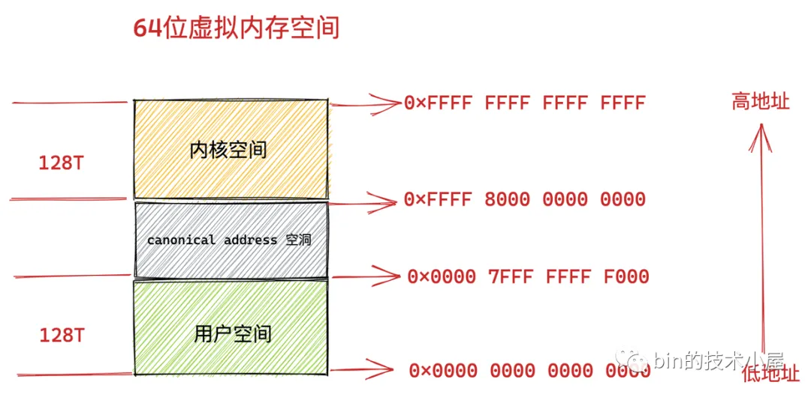
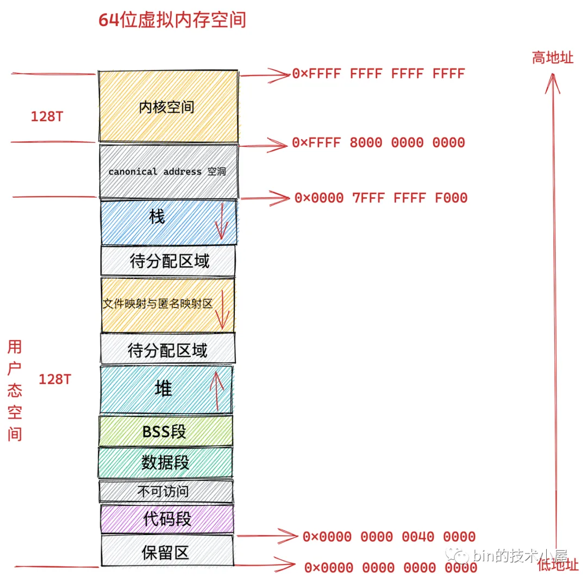

# 进程调度

# 内存管理

32位:

64位:

# 网络协议栈

# 文件系统

# 设备通信

# 参考资料

- [《Linux内核精通》笔记](https://github.com/0voice/linux_kernel_wiki)
- [glibc内存管理](https://mp.weixin.qq.com/s/pdv5MMUQ9ACpeCpyGnxb1Q)
- [聊聊Linux 内核](https://mp.weixin.qq.com/mp/appmsgalbum?__biz=Mzg2MzU3Mjc3Ng==&action=getalbum&album_id=2559805446807928833&scene=173&from_msgid=&from_itemidx=&count=3&nolastread=1#wechat_redirect)
- [ebpf](https://github.com/ebpf-io/ebpf.io-website)

