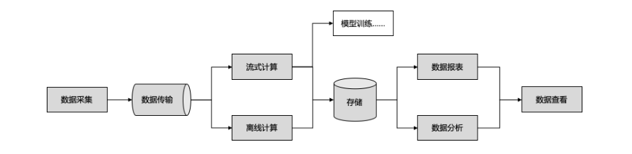

TODO: 个人资料整理 <!-- ./资料/个人资料/大数据技术文章分享.pdf -->

TODO: 数据湖概念，湖仓一体概念，delta lake

# 1. 大数据

## 1.1. 大数据概念

- 前言

  ```
  数字化的数据随着信息技术的产生而产生，进入 21 世纪后，伴随着互联网和移动互联网的普及，
  数字化的数据发生了爆炸式的增长，人们就用大数据来形容这种发生了爆炸式增长的数据。大数据
  从诞生到今天也经历了二十多年的发展，大数据的各领域都进入了成熟期，人们对大数据的理念也
  越来越认同和接受。
  ```
  ```
  伴随着大数据的普及，各种大数据的概念或者依托大数据的概念越来越多，使得大数据原本的
  界限慢慢被混淆和模糊。如网上充斥着大量“大数据分析×××”等文章，但此类分析一直就有，
  为何要冠以大数据之名，又如，“某汽车某月销售大数据”，“80 后演员的大数据分析”，汽车的单月
  销售不过数千台，80 后的演员群体也不过几百到数千人，为何也要冠以大数据之名。
  ```

- 大数据特点：
  - Volume:
    - 数据量大，包括采集、存储和计算的量都非常大
  - Variety:
    - 种类和来源多样化。包括结构化，半结构化和非结构化的数据

- 大数据之所以是大数据，来源于数据本身的膨胀， **这个膨胀足以达到了质变的程度** 
  - 所以，无论是“汽车的销售”还是“80 后的演员”，他们的膨胀都不可能达到质变的程度
  - 但人类的迁徙数据、社交数据、搜索数据确实发生爆炸式的增长
  - 我们在讨论大数据的时候， **会着重强调数据量的质变，并在数据量质变的基础上，讨论数据的处理** 。
  - 比如
    - 结果数据超过一亿行的查询如何在一秒内完成
    - 每日新增 TB~PB 级别的数据如何保证端到端分钟级别的时效性
    - 数据的准确性如何做到 100%”等

## 1.2. 大数据发展简史

### 1.2.1. 大数据诞生之前

#### 1.2.1.1. 个人计算机的发展

#### 1.2.1.2. 数据库的时代

### 1.2.2. hadoop时代

#### 1.2.2.1. 大数据时代开始

- 大数据概念的落实和大数据技术的诞生: **google的三篇论文** 
  - 2003: google file system
  - 2004: MapReduce
  - 2007: BigTable

#### 1.2.2.2. Hadoop诞生

#### 1.2.2.3. Hadoop成功

### 1.2.3. 后Hadoop时代

#### 1.2.3.1. 开源产品的商业化

#### 1.2.3.2. 云计算

### 1.2.4. NoSQL的崛起

## 1.3. 大数据技术

### 1.3.1. 概述

- 大数据的技术领域可以分为两个部分
  - 大数据工程: 指大数据处理的工程架构实现
  - 大数据策略: 指基于大数据工程之上的数据分析、数据理解和数据挖掘等算法实现。

### 1.3.2. 大数据工程

- 一个典型的大数据工程技术簇如下图

  

  - 数据在产生之后需要通过数据采集，把数据从分散产生的地方汇聚到一起
  - 汇聚之后的数据又需要通过数据传输，把数据传递到每个需要的地方去
  - 然后再对数据进行必要的加工计算，把数据转换成需要的形式
  - 并放在存储介质中储存起来
  - 在用户需要的时候再通过数据报表或者数据分析的方式对数据进行查看

---

- 数据采集
  - 数据的采集是大数据处理的起点
  - 通过数据采集的过程把客观世界的数据变更为计算机世界能处理的数据
  - 同时将分散在不同地域、不同设备上的数据汇聚起来集中处理。

- 数据传输

- 数据计算

- 数据存储

- 数据查看

### 1.3.3. 大数据策略

## 1.4. 大数据技术特点

# 2. 数据采集

## 2.1. 数据的生成

## 2.2. 数据的采集

# 3. 数据传输

## 3.1. 常见工具

- flume: 
  - apache下的开源数据采集工具，使用JRuby构建，依赖java运行环境。
- fluentd
- logstash
- chukwa: apache下的开源数据收集工具，已经多年不维护
- scribe:多年不维护
- splunk forwarder

# 4. 数据存储

# 5. 流式计算

# 6. 离线计算

# 7. 数据查询

# 8. 交互数据分析

# 9. 数据可视化

# 10. 大规模机器学习

# 11. 参考资料

- **[大数据理论体系](https://blog.csdn.net/Shockang/article/details/115609804)**
- **[大数据技术体系（长期更新）](https://blog.csdn.net/Shockang/article/details/117266839)**
- [大数据技术发展简史](https://cloud.tencent.com/developer/article/1640405)
