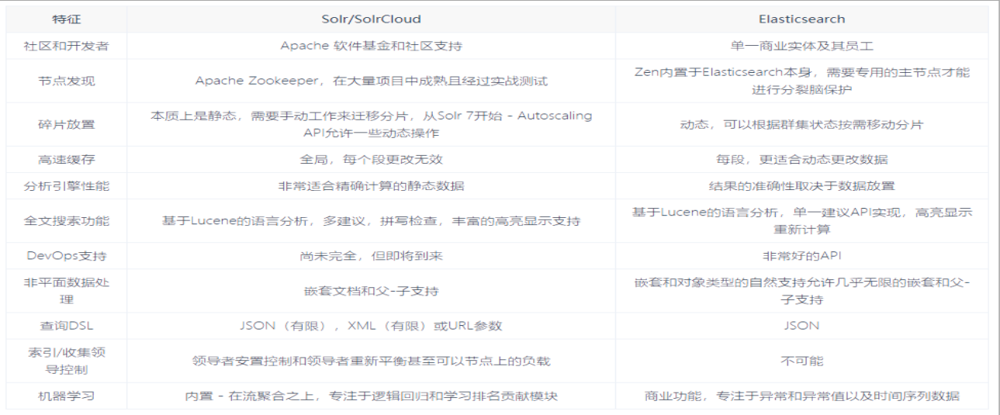
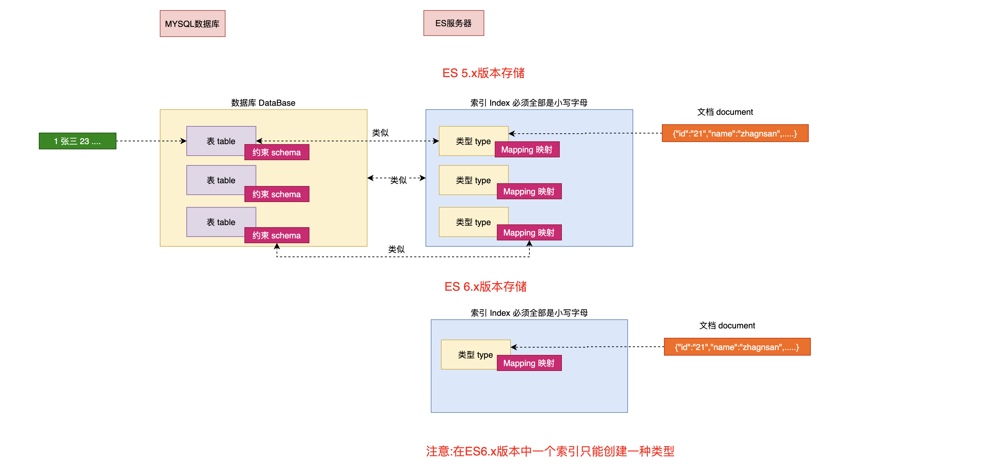

# Elasticsearch 概述

## 开篇

- 数据存储类型

  - 结构化数据:比如数据库数据，方便管理，但是难以扩展

  

  - 非结构化数据:日志，图片，视频，报表，redis 数据等

  

- 半结构化数据:xml,json 等

  

- Elasticsearch 目的；
  - 准确地查询结构化数据和非结构化数据

## 技术选型

### Elasticsearch 是什么

- **The Elastic Stack(技术栈)**

  - 包括 Elasticsearch、 Kibana、 Beats 和 Logstash（也称为 ELK Stack）。
  - **能够安全可靠地获取任何来源、任何格式的数据，然后实时地对数据进行搜索、分析和可视化**

- Elaticsearch
  - 简称为 ES， ES 是一个**开源的高扩展的分布式全文搜索引擎**， 是整个 ElasticStack 技术栈的核心。
  - 它可以近乎实时的存储、检索数据；本身扩展性很好，可以扩展到上百台服务器，处理 PB 级别的数据。

### 全文搜索引擎

- 关系型数据库对全文搜索的支持:

  - Google，百度类的网站搜索，它们都是根据网页中的关键字生成索引，我们在搜索的时候输入关键字，它们会将该关键字即索引匹配到的所有网页返回
  - 还有常见的项目中应用日志的搜索等等。
  - 对于这些非结构化的数据文本，关系型数据库搜索不是能很好的支持。
  - 一般传统数据库，全文检索都实现的很鸡肋，因为一般也没人用数据库存文本字段。
  - 进行全文检索需要扫描整个表，如果数据量大的话即使对 SQL 的语法优化，也收效甚微。
  - 建立了索引，但是维护起来也很麻烦，对于 insert 和 update 操作都会重新构建索引。
  - 基于以上原因可以分析得出，在一些生产环境中，使用常规的搜索方式，性能是非常差的：

- 全文搜索要求：

  - 搜索的数据对象是大量的非结构化的文本数据。
  - 文件记录量达到数十万或数百万个甚至更多。
  - 支持大量基于交互式文本的查询。
  - 需求非常灵活的全文搜索查询。
  - 对高度相关的搜索结果的有特殊需求，但是没有可用的关系数据库可以满足。
  - 对不同记录类型、非文本数据操作或安全事务处理的需求相对较少的情况。

- 基础原理
  - **这里说到的全文搜索引擎指的是目前广泛应用的主流搜索引擎**。
  - 它的工作原理是计算机索引程序通过扫描文章中的每一个词，对每一个词建立一个索引，指明该词在文章中出现的次数和位置
  - 当用户查询时，检索程序就根据事先建立的索引进行查找，并将查找的结果反馈给用户的检索方式。
  - 这个过程类似于通过字典中的检索字表查字的过程。

### 搜索引擎软件

- Lucene

  - 是 Apache 软件基金会 Jakarta 项目组的一个子项目，提供了一个简单却强大的应用程式接口，能够做全文索引和搜寻。
  - 在 Java 开发环境里 Lucene 是一个成熟的免费开源 工具。
  - 就其本身而言，Lucene 是当前以及最近几年最受欢迎的免费 Java 信息检索程序库。
  - 但 Lucene **只是一个提供全文搜索功能类库的核心工具包**，而真正使用它还需要一个完善的 服务框架搭建起来进行应用。

- 目前市面上流行的搜索引擎软件，主流的就两款：Elasticsearch 和 Solr
  - **这两款都是基 于 Lucene 搭建的**，可以独立部署启动的**搜索引擎服务软件**。
  - 由于内核相同，所以两者除了服务器安装、部署、管理、集群以外，对于数据的操作 修改、添加、保存、查询等等都十分类似。

### Elasticsearch 和 Solr 对比与权衡



- 与 Solr 相比，Elasticsearch 易于安装且非常轻巧。
  - 你可以在几分钟内安装并运行 Elasticsearch。
  - 但是，如果 Elasticsearch 管理不当，这种易于部署和使用可能会成为一个问题。
- JSON 配置
  - 基于 JSON 的配置很简单，但如果要为文件中的每个配置指定注释，那么它不适合您。
  - 总的来说，如果你的应用使用的是 JSON，那么 Elasticsearch 是一个更好的选择。
  - 否则，请使用 Solr，因为它的 schema.xml 和 solrconfig.xml 都有很好的文档记录。
- 社区
  - Solr 拥有更大，更成熟的用户，开发者和贡献者社区。ES 虽拥有的规模较小但活跃的用户社区以及不断增长的贡献者社区。
  - Solr 贡献者和提交者来自许多不同的组织，
  - 而 Elasticsearch 提交者来自单个公司。
- 稳定性
  - Solr 更成熟，但 ES 增长迅速，更稳定。
- API
  - Solr 是一个非常有据可查的产品，具有清晰的示例和 API 用例场景。
  - Elasticsearch 的文档组织良好，但它缺乏好的示例和清晰的配置说明。

---

> Elasticsearch 优势

- 易于使用
  - Elasticsearch 在新开发者中更受欢迎。一个下载和一个命令就可以启动一切。
- 分析需求
  - 如果除了搜索文本之外还需要它来处理分析查询，Elasticsearch 是更好的选择
- 分布式
  - 如果需要分布式索引，则需要选择 Elasticsearch。
  - 对于需要良好可伸缩性和以及性能分布式环境，Elasticsearch 是更好的选择。
- 日志管理
  - Elasticsearch 在开源日志管理用例中占据主导地位，许多组织在 Elasticsearch 中索引它们的日志以使其可搜索。
- 监控与指标
  - 如果你喜欢监控和指标，那么请使用 Elasticsearch，因为相对于 Solr，Elasticsearch 暴露了更多的关键指标

### Elasticsearch 应用案例

- GitHub:
  - 2013 年初，抛弃了 Solr，采取 Elasticsearch 来做 PB 级的搜索。
  - GitHub 使用 Elasticsearch 搜索 20TB 的数据，包括 13 亿文件和 1300 亿行代码
- 维基百科：启动以 Elasticsearch 为基础的核心搜索架构
- 百度：
  - 目前广泛使用 Elasticsearch 作为文本数据分析，采集百度所有服务器上的各类指标数据及用户自定义数据，通过对各种数据进行多维分析展示，辅助定位分析实例异常或业务层面异常。
  - 目前覆盖百度内部 20 多个业务线（包括云分析、网盟、预测、文库、直达号、钱包、 风控等），单集群最大 100 台机器， 200 个 ES 节点，每天导入 30TB+数据。
- 新浪：使用 Elasticsearch 分析处理 32 亿条实时日志。
- 阿里：使用 Elasticsearch 构建日志采集和分析体系。
- Stack Overflow：解决 Bug 问题的网站，全英文，编程人员交流的网站。

## Elasticsearch基本概念

### 倒排索引

> **概念说明**

- 正排索引（传统）:组件 id-->文章-->查询关键字

  > 参考 msyql 全文索引

  | id   | content              |
  | ---- | -------------------- |
  | 1001 | my name is zhang san |
  | 1002 | my name is li si     |

- 倒排索引(Elasticsearch 使用):关键字-->组件 id-->文章

  | keyword | id         |
  | ------- | ---------- |
  | name    | 1001, 1002 |
  | zhang   | 1001       |

### 数据格式

- Elasticsearch 是**面向文档型数据库**，一条数据在这里就是一个文档，和 Mysql 对应关系大致如下：

  

  - ES 里的 Index 可以看做一个库
  - 而 Types 相当于表
    > 这里 Types 的概念已经被逐渐弱化， <br />
    > Elasticsearch 6.X 中，一个 index 下已经只能包含一个 type， <br />
    > Elasticsearch 7.X 中, Type 的概念已经被删除了。
  - Documents 则相当于表的行

### 基本概念

- 接近实时(NRT Near Real Time )
  - Elasticsearch是一个接近实时的搜索平台。这意味着，从索引一个文档直到这个文档能够被搜索到有一个轻微的延迟(通常是1秒内)

- 索引(index)
  - 一个索引就是一个拥有几分相似特征的文档的集合。
  - 比如说，
    - 你可以有一个客户数据的索引，另一个产品目录的索引，还有一个订单数据的索引。
    - 一个索引由一个名字来标识(必须全部是小写字母的)，并且当我们要对这个索引中的文档进行索引、搜索、更新和删除的时候，都要使用到这个名字。
    - 索引类似于关系型数据库中Database 的概念。在一个集群中，如果你想，可以定义任意多的索引。

- 类型(type)
  - 在一个索引中，你可以定义一种或多种类型。
  - 一个类型是你的**索引的一个逻辑上的分类/分区**，其语义完全由你来定
  - 通常，会为具有一组共同字段的文档定义一个类型。比如说，我们假设你运营一个博客平台并且将你所有的数 据存储到一个索引中。
  - 在这个索引中，你可以为用户数据定义一个类型，为博客数据定义另一个类型，当然，也可 以为评论数据定义另一个类型。类型类似于关系型数据库中Table的概念。

  > NOTE ：**在5.x版本以前可以在一个索引中定义多个类型,6.x之后版本也可以使用,但是不推荐,在7~8.x版本中彻底移除一个索引中创建多个类型**

- 映射(Mapping)
  - Mapping是ES中的一个很重要的内容，它类似于传统关系型数据中table的schema，用于定义一个索引(index)中的类型(type)的数据的结构。
  - 在ES中，我们可以手动创建type(相当于table)和mapping(相关与schema),也可以采用默认创建方式。
  - 在默认配置下，ES可以根据插入的数据自动地创建type及其mapping。 mapping中主要包括字段名、字段数据类型和字段索引类型

- 文档(document)
  - 一个文档是一个可被索引的基础信息单元，类似于表中的一条记录。
  - 比如，你可以拥有某一个员工的文档,也可以拥有某个商品的一个文档。
  - 文档以采用了轻量级的数据交换格式JSON(Javascript Object Notation)来表示。

- 概念关系图

  

# 环境准备

## 安装

- 官方资料

  - [官方网址](https://www.elastic.co/cn/)
  - [官方文档](https://www.elastic.co/guide/index.html)
  - [Elasticsearch 7.8.0 下载页面](https://www.elastic.co/cn/downloads/past-releases/elasticsearch-7-8-0)

- windows 安装说明说明

  | 目录    | 含义           |
  | ------- | -------------- |
  | bin     | 可执行脚本目录 |
  | config  | 配置目录       |
  | jdk     | 内置 JDK 目录  |
  | lib     | 类库           |
  | logs    | 日志目录       |
  | modules | 模块目录       |
  | plugins | 插件目录       |

  - 解压后，进入 bin 文件目录，点击 elasticsearch.bat 文件启动 ES 服务 。
  - 注意： 9300 端口为 Elasticsearch 集群间组件的通信端口， 9200 端口为浏览器访问的 http 协议 RESTful 端口。
  - 打开浏览器，输入地址： http://localhost:9200，测试返回结果，返回结果如下：

  ```json
  {
    "name": "DESKTOP-LNJQ0VF",
    "cluster_name": "elasticsearch",
    "cluster_uuid": "nCZqBhfdT1-pw8Yas4QU9w",
    "version": {
      "number": "7.8.0",
      "build_flavor": "default",
      "build_type": "zip",
      "build_hash": "757314695644ea9a1dc2fecd26d1a43856725e65",
      "build_date": "2020-06-14T19:35:50.234439Z",
      "build_snapshot": false,
      "lucene_version": "8.5.1",
      "minimum_wire_compatibility_version": "6.8.0",
      "minimum_index_compatibility_version": "6.0.0-beta1"
    },
    "tagline": "You Know, for Search"
  }
  ```

## RESTful & JSON

[见分布式系统概念](../distributed_system/distribute_system_concept.md)

## 客户端工具

- [Postman 下载页面](https://www.postman.com/downloads/)
- VSCode-REST Client(个人推荐)

# Elasticsearch 基本操作


## 索引操作

### 索引创建

#### 基本语法

- 对比关系型数据库，创建索引就等同于创建数据库。创建索引需要使用`PUT`请求
- 向 ES 服务器发 PUT 请求 ：`http://127.0.0.1:9200/shopping`

  ```json
  {
    "acknowledged": true, //响应结果
    "shards_acknowledged": true, //分片结果
    "index": " shopping" //索引名称
  }
  ```

#### 后台日志

```cmd
[2021-04-08T13:57:06,954][INFO ][o.e.c.m.MetadataCreateIndexService] [DESKTOP-LNJQ0VF] [shopping] creating index, cause [api], templates [], shards [1]/[1], mappings []
```

#### PUT 幂等性

- `PUT`具有幂等性

  - `http://127.0.0.1:9200/shopping` 重复添加索引
  - 重复创建索引会报错

  <details>
  <summary style="color:red;">展开</summary>

  ```json
  {
    "error": {
      "root_cause": [
        {
          "type": "resource_already_exists_exception",
          "reason": "index [shopping/J0WlEhh4R7aDrfIc3AkwWQ] already exists",
          "index_uuid": "J0WlEhh4R7aDrfIc3AkwWQ",
          "index": "shopping"
        }
      ],
      "type": "resource_already_exists_exception",
      "reason": "index [shopping/J0WlEhh4R7aDrfIc3AkwWQ] already exists",
      "index_uuid": "J0WlEhh4R7aDrfIc3AkwWQ",
      "index": "shopping"
    },
    "status": 400
  }
  ```

  </details>

### 索引查询

#### 查看所有索引

- 在 Postman 中，向 ES 服务器发 GET 请求 ： `http://127.0.0.1:9200/_cat/indices?v`

  - 这里请求路径中的\_cat 表示查看的意思
  - indices 表示索引，
  - ?v 表示详细信息
  - 所以整体含义就是查看当前 ES 服务器中的所有索引，就好像 MySQL 中的 show tables 的感觉，服务器响应结果如下 :

  ```
  health status index    uuid                   pri rep docs.count docs.deleted store.size pri.store.size
  yellow open   shopping J0WlEhh4R7aDrfIc3AkwWQ   1   1          0            0       208b           208b
  ```

  | 表头           | 含义                                                                              |
  | -------------- | --------------------------------------------------------------------------------- |
  | health         | 当前服务器健康状态： green(集群完整) yellow(单点正常、集群不完整) red(单点不正常) |
  | status         | 索引打开、关闭状态                                                                |
  | index          | 索引名                                                                            |
  | uuid           | 索引统一编号                                                                      |
  | pri            | 主分片数量                                                                        |
  | rep            | 副本数量                                                                          |
  | docs.count     | 可用文档数量                                                                      |
  | docs.deleted   | 文档删除状态（逻辑删除）                                                          |
  | store.size     | 主分片和副分片整体占空间大小                                                      |
  | pri.store.size | 主分片占空间大小                                                                  |

#### 查看单个索引

- 在 Postman 中，向 ES 服务器发 GET 请求 ：`http://127.0.0.1:9200/shopping`

  ```json
  {
    "shopping": {
      //索引名
      "aliases": {}, //别名
      "mappings": {}, //映射
      "settings": {
        //设置
        "index": {
          //设置 - 索引
          "creation_date": "1617861426847", //设置 - 索引 - 创建时间
          "number_of_shards": "1", //设置 - 索引 - 主分片数量
          "number_of_replicas": "1",
          "uuid": "J0WlEhh4R7aDrfIc3AkwWQ",
          "version": {
            "created": "7080099"
          },
          "provided_name": "shopping"
        }
      }
    }
  }
  ```

### 索引删除

- 在 Postman 中，向 ES 服务器发 `DELETE` 请求 ： `http://127.0.0.1:9200/shopping`

  ```json
  {
    "acknowledged": true
  }
  ```

- 再次查看所有索引，`GET` `http://127.0.0.1:9200/_cat/indices?v`

  ```
  health status index uuid pri rep docs.count docs.deleted store.size pri.store.size

  // 成功删除。
  ```

## 文档操作

### 文档创建（Put & Post）

- 文档创建

  - 向 ES 服务器发 `POST` 请求 ： `http://127.0.0.1:9200/shopping/_doc`
  - 注意，此处发送请求的方式必须为 POST，不能是 PUT，否则会发生错误 。

    ```json
    {
      "title": "小米手机",
      "category": "小米",
      "images": "http://www.gulixueyuan.com/xm.jpg",
      "price": 3999.0
    }
    ```

  - 返回结果： 数据创建后，由于没有指定数据唯一性标识（ID），默认情况下， ES 服务器会随机生成一个。

    ```json
    {
      "_index": "shopping", //索引
      "_type": "_doc", //类型-文档
      "_id": "ANQqsHgBaKNfVnMbhZYU", //唯一标识，可以类比为 MySQL 中的主键，随机生成
      "_version": 1, //版本
      "result": "created", //结果，这里的 create 表示创建成功
      "_shards": {
        //
        "total": 2, //分片 - 总数
        "successful": 1, //分片 - 总数
        "failed": 0 //分片 - 总数
      },
      "_seq_no": 0,
      "_primary_term": 1
    }
    ```

- 自定义 id：

  - 如果想要自定义唯一性标识，需要在创建时指定：
  - `http://127.0.0.1:9200/shopping/_doc/1`，请求体 JSON 内容为：

  ```json
  {
    "title": "小米手机",
    "category": "小米",
    "images": "http://www.gulixueyuan.com/xm.jpg",
    "price": 3999.0
  }
  ```

  - 返回结果如下：
    ```json
    {
      "_index": "shopping",
      "_type": "_doc",
      "_id": "1", //<------------------自定义唯一性标识
      "_version": 1,
      "result": "created",
      "_shards": {
        "total": 2,
        "successful": 1,
        "failed": 0
      },
      "_seq_no": 1,
      "_primary_term": 1
    }
    ```
  - **此处需要注意：如果增加数据时明确数据主键，那么请求方式也可以为 PUT(PUT 的幂等性)**

### 文档查询

#### 主键查询

- 在 Postman 中，向 ES 服务器发 GET 请求 ： `http://127.0.0.1:9200/shopping/_doc/1`

  > 返回结果如下：

  ```json
  {
    "_index": "shopping",
    "_type": "_doc",
    "_id": "1",
    "_version": 1,
    "_seq_no": 1,
    "_primary_term": 1,
    "found": true,
    "_source": {
      "title": "小米手机",
      "category": "小米",
      "images": "http://www.gulixueyuan.com/xm.jpg",
      "price": 3999
    }
  }
  ```

- 查找不存在的内容，向 ES 服务器发 GET 请求 ： `http://127.0.0.1:9200/shopping/_doc/1001`

  > 返回结果如下：

  ```json
  {
    "_index": "shopping",
    "_type": "_doc",
    "_id": "1001",
    "found": false
  }
  ```

#### 全查询

- 查看索引下所有数据，向 ES 服务器发 GET 请求 ： `http://127.0.0.1:9200/shopping/_search`

  > 返回结果如下：

  ```json
  {
    "took": 133,
    "timed_out": false,
    "_shards": {
      "total": 1,
      "successful": 1,
      "skipped": 0,
      "failed": 0
    },
    "hits": {
      "total": {
        "value": 2,
        "relation": "eq"
      },
      "max_score": 1,
      "hits": [
        {
          "_index": "shopping",
          "_type": "_doc",
          "_id": "ANQqsHgBaKNfVnMbhZYU",
          "_score": 1,
          "_source": {
            "title": "小米手机",
            "category": "小米",
            "images": "http://www.gulixueyuan.com/xm.jpg",
            "price": 3999
          }
        },
        {
          "_index": "shopping",
          "_type": "_doc",
          "_id": "1",
          "_score": 1,
          "_source": {
            "title": "小米手机",
            "category": "小米",
            "images": "http://www.gulixueyuan.com/xm.jpg",
            "price": 3999
          }
        }
      ]
    }
  }
  ```

### 文档修改

#### 全量修改

- 在 Postman 中，向 ES 服务器发 POST 请求 ： `http://127.0.0.1:9200/shopping/_doc/1`

  - 和新增文档一样，输入相同的 URL 地址请求，如果请求体变化，会将原有的数据内容`覆盖`

    ```json
    {
      "title": "华为手机",
      "category": "华为",
      "images": "http://www.gulixueyuan.com/hw.jpg",
      "price": 1999.0
    }
    ```

  - 修改成功后，服务器响应结果：

    ```json
    {
      "_index": "shopping",
      "_type": "_doc",
      "_id": "1",
      "_version": 2,
      "result": "updated", //<-----------updated 表示数据被更新
      "_shards": {
        "total": 2,
        "successful": 1,
        "failed": 0
      },
      "_seq_no": 2,
      "_primary_term": 1
    }
    ```

#### 局部修改

- 在 Postman 中，向 ES 服务器发 POST 请求 ： `http://127.0.0.1:9200/shopping/_update/1`

  - 修改数据时，也可以只修改某一给条数据的局部信息
  - 请求体 JSON 内容为:

    ```json
    {
      "doc": {
        "title": "小米手机",
        "category": "小米"
      }
    }
    ```

  - 返回结果如下：

    ```json
    {
      "_index": "shopping",
      "_type": "_doc",
      "_id": "1",
      "_version": 3,
      "result": "updated", //<-----------updated 表示数据被更新
      "_shards": {
        "total": 2,
        "successful": 1,
        "failed": 0
      },
      "_seq_no": 3,
      "_primary_term": 1
    }
    ```

- 在 Postman 中，向 ES 服务器发 GET 请求 ： `http://127.0.0.1:9200/shopping/_doc/1`，查看修改内容：

  ```json
  {
    "_index": "shopping",
    "_type": "_doc",
    "_id": "1",
    "_version": 3,
    "_seq_no": 3,
    "_primary_term": 1,
    "found": true,
    "_source": {
      "title": "小米手机",
      "category": "小米",
      "images": "http://www.gulixueyuan.com/hw.jpg",
      "price": 1999
    }
  }
  ```

#### 删除

- 在 Postman 中，向 ES 服务器发 DELETE 请求 ： `http://127.0.0.1:9200/shopping/_doc/1`

  - 返回结果：
    ```json
    {
      "_index": "shopping",
      "_type": "_doc",
      "_id": "1",
      "_version": 4,
      "result": "deleted", //<---删除成功
      "_shards": {
        "total": 2,
        "successful": 1,
        "failed": 0
      },
      "_seq_no": 4,
      "_primary_term": 1
    }
    ```

- 在 Postman 中，向 ES 服务器发 GET 请求 ： http://127.0.0.1:9200/shopping/_doc/1，查看是否删除成功：

  ```json
  {
    "_index": "shopping",
    "_type": "_doc",
    "_id": "1",
    "found": false
  }
  ```

- 注意： **删除一个文档不会立即从磁盘上移除，它只是被标记成已删除（逻辑删除）**

## 查询操作

### 示例数据

<details>
<summary style="color:red;">展开</summary>

```json
{
  "took": 5,
  "timed_out": false,
  "_shards": {
    "total": 1,
    "successful": 1,
    "skipped": 0,
    "failed": 0
  },
  "hits": {
    "total": {
      "value": 6,
      "relation": "eq"
    },
    "max_score": 1,
    "hits": [
      {
        "_index": "shopping",
        "_type": "_doc",
        "_id": "ANQqsHgBaKNfVnMbhZYU",
        "_score": 1,
        "_source": {
          "title": "小米手机",
          "category": "小米",
          "images": "http://www.gulixueyuan.com/xm.jpg",
          "price": 3999
        }
      },
      {
        "_index": "shopping",
        "_type": "_doc",
        "_id": "A9R5sHgBaKNfVnMb25Ya",
        "_score": 1,
        "_source": {
          "title": "小米手机",
          "category": "小米",
          "images": "http://www.gulixueyuan.com/xm.jpg",
          "price": 1999
        }
      },
      {
        "_index": "shopping",
        "_type": "_doc",
        "_id": "BNR5sHgBaKNfVnMb7pal",
        "_score": 1,
        "_source": {
          "title": "小米手机",
          "category": "小米",
          "images": "http://www.gulixueyuan.com/xm.jpg",
          "price": 1999
        }
      },
      {
        "_index": "shopping",
        "_type": "_doc",
        "_id": "BtR6sHgBaKNfVnMbX5Y5",
        "_score": 1,
        "_source": {
          "title": "华为手机",
          "category": "华为",
          "images": "http://www.gulixueyuan.com/xm.jpg",
          "price": 1999
        }
      },
      {
        "_index": "shopping",
        "_type": "_doc",
        "_id": "B9R6sHgBaKNfVnMbZpZ6",
        "_score": 1,
        "_source": {
          "title": "华为手机",
          "category": "华为",
          "images": "http://www.gulixueyuan.com/xm.jpg",
          "price": 1999
        }
      },
      {
        "_index": "shopping",
        "_type": "_doc",
        "_id": "CdR7sHgBaKNfVnMbsJb9",
        "_score": 1,
        "_source": {
          "title": "华为手机",
          "category": "华为",
          "images": "http://www.gulixueyuan.com/xm.jpg",
          "price": 1999
        }
      }
    ]
  }
}
```

</details>

### 条件查询

#### URL 带参查询

```
查找 category 为小米的文档e
```

- 向 ES 服务器发 GET 请求 ： `http://127.0.0.1:9200/shopping/_search?q=category:小米`

  ```json
  {
    "took": 94,
    "timed_out": false,
    "_shards": {
      "total": 1,
      "successful": 1,
      "skipped": 0,
      "failed": 0
    },
    "hits": {
      "total": {
        "value": 3,
        "relation": "eq"
      },
      "max_score": 1.3862942,
      "hits": [
        {
          "_index": "shopping",
          "_type": "_doc",
          "_id": "ANQqsHgBaKNfVnMbhZYU",
          "_score": 1.3862942,
          "_source": {
            "title": "小米手机",
            "category": "小米",
            "images": "http://www.gulixueyuan.com/xm.jpg",
            "price": 3999
          }
        },
        {
          "_index": "shopping",
          "_type": "_doc",
          "_id": "A9R5sHgBaKNfVnMb25Ya",
          "_score": 1.3862942,
          "_source": {
            "title": "小米手机",
            "category": "小米",
            "images": "http://www.gulixueyuan.com/xm.jpg",
            "price": 1999
          }
        },
        {
          "_index": "shopping",
          "_type": "_doc",
          "_id": "BNR5sHgBaKNfVnMb7pal",
          "_score": 1.3862942,
          "_source": {
            "title": "小米手机",
            "category": "小米",
            "images": "http://www.gulixueyuan.com/xm.jpg",
            "price": 1999
          }
        }
      ]
    }
  }
  ```

> 上述为 URL 带参数形式查询，这很容易让不善者心怀恶意，或者参数值出现中文会出现乱码情况。
> 为了避免这些情况，我们可用使用带 JSON 请求体请求进行查询。

#### 请求体带参查询

- 向 ES 服务器发 GET 请求 ：` http://127.0.0.1:9200/shopping/_search`，附带 JSON 体如下：

  ```json
  {
    "query": {
      "match": {
        "category": "小米"
      }
    }
  }
  ```

- 返回结果如下：

  <details>
  <summary style="color:red;">展开</summary>
  
  ```json
  {
    "took": 3,
    "timed_out": false,
    "_shards": {
      "total": 1,
      "successful": 1,
      "skipped": 0,
      "failed": 0
    },
    "hits": {
      "total": {
        "value": 3,
        "relation": "eq"
      },
      "max_score": 1.3862942,
      "hits": [
        {
          "_index": "shopping",
          "_type": "_doc",
          "_id": "ANQqsHgBaKNfVnMbhZYU",
          "_score": 1.3862942,
          "_source": {
            "title": "小米手机",
            "category": "小米",
            "images": "http://www.gulixueyuan.com/xm.jpg",
            "price": 3999
          }
        },
        {
          "_index": "shopping",
          "_type": "_doc",
          "_id": "A9R5sHgBaKNfVnMb25Ya",
          "_score": 1.3862942,
          "_source": {
            "title": "小米手机",
            "category": "小米",
            "images": "http://www.gulixueyuan.com/xm.jpg",
            "price": 1999
          }
        },
        {
          "_index": "shopping",
          "_type": "_doc",
          "_id": "BNR5sHgBaKNfVnMb7pal",
          "_score": 1.3862942,
          "_source": {
            "title": "小米手机",
            "category": "小米",
            "images": "http://www.gulixueyuan.com/xm.jpg",
            "price": 1999
          }
        }
      ]
    }
  }
  ```
  </details>

#### 带请求体方式的查找所有内容

```
查找所有文档内容
```

- 在 Postman 中，向 ES 服务器发 GET 请求 ： http://127.0.0.1:9200/shopping/_search，附带JSON体如下：

  ```json
  {
    "query": {
      "match_all": {}
    }
  }
  ```

- 则返回所有文档内容：

  <details>
  <summary style="color:red;">展开</summary>

  ```json
  {
    "took": 2,
    "timed_out": false,
    "_shards": {
      "total": 1,
      "successful": 1,
      "skipped": 0,
      "failed": 0
    },
    "hits": {
      "total": {
        "value": 6,
        "relation": "eq"
      },
      "max_score": 1,
      "hits": [
        {
          "_index": "shopping",
          "_type": "_doc",
          "_id": "ANQqsHgBaKNfVnMbhZYU",
          "_score": 1,
          "_source": {
            "title": "小米手机",
            "category": "小米",
            "images": "http://www.gulixueyuan.com/xm.jpg",
            "price": 3999
          }
        },
        {
          "_index": "shopping",
          "_type": "_doc",
          "_id": "A9R5sHgBaKNfVnMb25Ya",
          "_score": 1,
          "_source": {
            "title": "小米手机",
            "category": "小米",
            "images": "http://www.gulixueyuan.com/xm.jpg",
            "price": 1999
          }
        },
        {
          "_index": "shopping",
          "_type": "_doc",
          "_id": "BNR5sHgBaKNfVnMb7pal",
          "_score": 1,
          "_source": {
            "title": "小米手机",
            "category": "小米",
            "images": "http://www.gulixueyuan.com/xm.jpg",
            "price": 1999
          }
        },
        {
          "_index": "shopping",
          "_type": "_doc",
          "_id": "BtR6sHgBaKNfVnMbX5Y5",
          "_score": 1,
          "_source": {
            "title": "华为手机",
            "category": "华为",
            "images": "http://www.gulixueyuan.com/xm.jpg",
            "price": 1999
          }
        },
        {
          "_index": "shopping",
          "_type": "_doc",
          "_id": "B9R6sHgBaKNfVnMbZpZ6",
          "_score": 1,
          "_source": {
            "title": "华为手机",
            "category": "华为",
            "images": "http://www.gulixueyuan.com/xm.jpg",
            "price": 1999
          }
        },
        {
          "_index": "shopping",
          "_type": "_doc",
          "_id": "CdR7sHgBaKNfVnMbsJb9",
          "_score": 1,
          "_source": {
            "title": "华为手机",
            "category": "华为",
            "images": "http://www.gulixueyuan.com/xm.jpg",
            "price": 1999
          }
        }
      ]
    }
  }
  ```

  </details>

#### 查询指定字段

```
只查询指定字段title
```

- 向 ES 服务器发 GET 请求 ：`http://127.0.0.1:9200/shopping/_search`，附带 JSON 体如下：

  ```json
  {
    "query": {
      "match_all": {}
    },
    "_source": ["title"]
  }
  ```

- 返回结果如下：

  <details>
  <summary style="color:red;">展开</summary>

  ```json
  {
    "took": 5,
    "timed_out": false,
    "_shards": {
      "total": 1,
      "successful": 1,
      "skipped": 0,
      "failed": 0
    },
    "hits": {
      "total": {
        "value": 6,
        "relation": "eq"
      },
      "max_score": 1,
      "hits": [
        {
          "_index": "shopping",
          "_type": "_doc",
          "_id": "ANQqsHgBaKNfVnMbhZYU",
          "_score": 1,
          "_source": {
            "title": "小米手机"
          }
        },
        {
          "_index": "shopping",
          "_type": "_doc",
          "_id": "A9R5sHgBaKNfVnMb25Ya",
          "_score": 1,
          "_source": {
            "title": "小米手机"
          }
        },
        {
          "_index": "shopping",
          "_type": "_doc",
          "_id": "BNR5sHgBaKNfVnMb7pal",
          "_score": 1,
          "_source": {
            "title": "小米手机"
          }
        },
        {
          "_index": "shopping",
          "_type": "_doc",
          "_id": "BtR6sHgBaKNfVnMbX5Y5",
          "_score": 1,
          "_source": {
            "title": "华为手机"
          }
        },
        {
          "_index": "shopping",
          "_type": "_doc",
          "_id": "B9R6sHgBaKNfVnMbZpZ6",
          "_score": 1,
          "_source": {
            "title": "华为手机"
          }
        },
        {
          "_index": "shopping",
          "_type": "_doc",
          "_id": "CdR7sHgBaKNfVnMbsJb9",
          "_score": 1,
          "_source": {
            "title": "华为手机"
          }
        }
      ]
    }
  }
  ```

  </details>

### 分页查询

- 向 ES 服务器发 GET 请求 ： `http://127.0.0.1:9200/shopping/_search`，附带 JSON 体如下：

  ```json
  {
    "query": {
      "match_all": {}
    },
    "from": 0,
    "size": 2
  }
  ```

- 返回结果如下：

  ```java
  {
      "took": 1,
      "timed_out": false,
      "_shards": {
          "total": 1,
          "successful": 1,
          "skipped": 0,
          "failed": 0
      },
      "hits": {
          "total": {
              "value": 6,
              "relation": "eq"
          },
          "max_score": 1,
          "hits": [
              {
                  "_index": "shopping",
                  "_type": "_doc",
                  "_id": "ANQqsHgBaKNfVnMbhZYU",
                  "_score": 1,
                  "_source": {
                      "title": "小米手机",
                      "category": "小米",
                      "images": "http://www.gulixueyuan.com/xm.jpg",
                      "price": 3999
                  }
              },
              {
                  "_index": "shopping",
                  "_type": "_doc",
                  "_id": "A9R5sHgBaKNfVnMb25Ya",
                  "_score": 1,
                  "_source": {
                      "title": "小米手机",
                      "category": "小米",
                      "images": "http://www.gulixueyuan.com/xm.jpg",
                      "price": 1999
                  }
              }
          ]
      }
  }
  ```

### 查询排序

- 向 ES 服务器发 GET 请求 ： `http://127.0.0.1:9200/shopping/_search`，附带 JSON 体如下：

  ```json
  {
    "query": {
      "match_all": {}
    },
    "sort": {
      "price": {
        "order": "desc"
      }
    }
  }
  ```

- 返回结果如下：

  <details>
  <summary style="color:red;">展开</summary>

  ```json
  {
    "took": 96,
    "timed_out": false,
    "_shards": {
      "total": 1,
      "successful": 1,
      "skipped": 0,
      "failed": 0
    },
    "hits": {
      "total": {
        "value": 6,
        "relation": "eq"
      },
      "max_score": null,
      "hits": [
        {
          "_index": "shopping",
          "_type": "_doc",
          "_id": "ANQqsHgBaKNfVnMbhZYU",
          "_score": null,
          "_source": {
            "title": "小米手机",
            "category": "小米",
            "images": "http://www.gulixueyuan.com/xm.jpg",
            "price": 3999
          },
          "sort": [3999]
        },
        {
          "_index": "shopping",
          "_type": "_doc",
          "_id": "A9R5sHgBaKNfVnMb25Ya",
          "_score": null,
          "_source": {
            "title": "小米手机",
            "category": "小米",
            "images": "http://www.gulixueyuan.com/xm.jpg",
            "price": 1999
          },
          "sort": [1999]
        },
        {
          "_index": "shopping",
          "_type": "_doc",
          "_id": "BNR5sHgBaKNfVnMb7pal",
          "_score": null,
          "_source": {
            "title": "小米手机",
            "category": "小米",
            "images": "http://www.gulixueyuan.com/xm.jpg",
            "price": 1999
          },
          "sort": [1999]
        },
        {
          "_index": "shopping",
          "_type": "_doc",
          "_id": "BtR6sHgBaKNfVnMbX5Y5",
          "_score": null,
          "_source": {
            "title": "华为手机",
            "category": "华为",
            "images": "http://www.gulixueyuan.com/xm.jpg",
            "price": 1999
          },
          "sort": [1999]
        },
        {
          "_index": "shopping",
          "_type": "_doc",
          "_id": "B9R6sHgBaKNfVnMbZpZ6",
          "_score": null,
          "_source": {
            "title": "华为手机",
            "category": "华为",
            "images": "http://www.gulixueyuan.com/xm.jpg",
            "price": 1999
          },
          "sort": [1999]
        },
        {
          "_index": "shopping",
          "_type": "_doc",
          "_id": "CdR7sHgBaKNfVnMbsJb9",
          "_score": null,
          "_source": {
            "title": "华为手机",
            "category": "华为",
            "images": "http://www.gulixueyuan.com/xm.jpg",
            "price": 1999
          },
          "sort": [1999]
        }
      ]
    }
  }
  ```
  </details>

### 多条件查询

#### must

```
假设想找出小米牌子，价格为3999元的。
```

- 向 ES 服务器发 GET 请求 ： `http://127.0.0.1:9200/shopping/_search`，附带 JSON 体如下：

  ```json
  {
    "query": {
      "bool": {
        "must": [
          {
            // must相当于数据库的&&
            "match": {
              "category": "小米"
            }
          },
          {
            "match": {
              "price": 3999.0
            }
          }
        ]
      }
    }
  }
  ```

- 返回结果如下：

  <details>
  <summary style="color:red;">展开</summary>

  ```json
  {
    "took": 134,
    "timed_out": false,
    "_shards": {
      "total": 1,
      "successful": 1,
      "skipped": 0,
      "failed": 0
    },
    "hits": {
      "total": {
        "value": 1,
        "relation": "eq"
      },
      "max_score": 2.3862944,
      "hits": [
        {
          "_index": "shopping",
          "_type": "_doc",
          "_id": "ANQqsHgBaKNfVnMbhZYU",
          "_score": 2.3862944,
          "_source": {
            "title": "小米手机",
            "category": "小米",
            "images": "http://www.gulixueyuan.com/xm.jpg",
            "price": 3999
          }
        }
      ]
    }
  }
  ```

  </details>

#### should

```
假设想找出小米和华为的牌子。
```

- 在 Postman 中，向 ES 服务器发 GET 请求 ： `http://127.0.0.1:9200/shopping/_search`，附带 JSON 体如下：

```json
{
  "query": {
    "bool": {
      "should": [
        {
          // should相当于数据库的||
          "match": {
            "category": "小米"
          }
        },
        {
          "match": {
            "category": "华为"
          }
        }
      ]
    },
    "filter": {
      "range": {
        "price": {
          "gt": 2000
        }
      }
    }
  }
}
```

- 返回结果如下：

  <details>
  <summary style="color:red;">展开</summary>

  ```json
  {
    "took": 8,
    "timed_out": false,
    "_shards": {
      "total": 1,
      "successful": 1,
      "skipped": 0,
      "failed": 0
    },
    "hits": {
      "total": {
        "value": 6,
        "relation": "eq"
      },
      "max_score": 1.3862942,
      "hits": [
        {
          "_index": "shopping",
          "_type": "_doc",
          "_id": "ANQqsHgBaKNfVnMbhZYU",
          "_score": 1.3862942,
          "_source": {
            "title": "小米手机",
            "category": "小米",
            "images": "http://www.gulixueyuan.com/xm.jpg",
            "price": 3999
          }
        },
        {
          "_index": "shopping",
          "_type": "_doc",
          "_id": "A9R5sHgBaKNfVnMb25Ya",
          "_score": 1.3862942,
          "_source": {
            "title": "小米手机",
            "category": "小米",
            "images": "http://www.gulixueyuan.com/xm.jpg",
            "price": 1999
          }
        },
        {
          "_index": "shopping",
          "_type": "_doc",
          "_id": "BNR5sHgBaKNfVnMb7pal",
          "_score": 1.3862942,
          "_source": {
            "title": "小米手机",
            "category": "小米",
            "images": "http://www.gulixueyuan.com/xm.jpg",
            "price": 1999
          }
        },
        {
          "_index": "shopping",
          "_type": "_doc",
          "_id": "BtR6sHgBaKNfVnMbX5Y5",
          "_score": 1.3862942,
          "_source": {
            "title": "华为手机",
            "category": "华为",
            "images": "http://www.gulixueyuan.com/xm.jpg",
            "price": 1999
          }
        },
        {
          "_index": "shopping",
          "_type": "_doc",
          "_id": "B9R6sHgBaKNfVnMbZpZ6",
          "_score": 1.3862942,
          "_source": {
            "title": "华为手机",
            "category": "华为",
            "images": "http://www.gulixueyuan.com/xm.jpg",
            "price": 1999
          }
        },
        {
          "_index": "shopping",
          "_type": "_doc",
          "_id": "CdR7sHgBaKNfVnMbsJb9",
          "_score": 1.3862942,
          "_source": {
            "title": "华为手机",
            "category": "华为",
            "images": "http://www.gulixueyuan.com/xm.jpg",
            "price": 1999
          }
        }
      ]
    }
  }
  ```

  </details>

### 范围查询

```
假设想找出小米和华为的牌子，价格大于2000元的手机。
```

- 向 ES 服务器发 GET 请求 ： http://127.0.0.1:9200/shopping/_search，附带JSON体如下：

  ```json
  {
    "query": {
      "bool": {
        "should": [
          {
            "match": {
              "category": "小米"
            }
          },
          {
            "match": {
              "category": "华为"
            }
          }
        ],
        "filter": {
          "range": {
            "price": {
              "gt": 2000
            }
          }
        }
      }
    }
  }
  ```

- 返回结果如下：

  <details>
  <summary style="color:red;">展开</summary>

  ```json
  {
    "took": 72,
    "timed_out": false,
    "_shards": {
      "total": 1,
      "successful": 1,
      "skipped": 0,
      "failed": 0
    },
    "hits": {
      "total": {
        "value": 1,
        "relation": "eq"
      },
      "max_score": 1.3862942,
      "hits": [
        {
          "_index": "shopping",
          "_type": "_doc",
          "_id": "ANQqsHgBaKNfVnMbhZYU",
          "_score": 1.3862942,
          "_source": {
            "title": "小米手机",
            "category": "小米",
            "images": "http://www.gulixueyuan.com/xm.jpg",
            "price": 3999
          }
        }
      ]
    }
  }
  ```

  </details>

## 其他查询相关

### 全文检索

```
这功能像搜索引擎那样，如品牌输入“小华”，返回结果带回品牌有“小米”和华为的。
```

- 向 ES 服务器发 GET 请求 ： http://127.0.0.1:9200/shopping/_search，附带JSON体如下：

  ```json
  {
    "query": {
      "match": {
        "category": "小华"
      }
    }
  }
  ```

- 返回结果如下：

  <details>
  <summary style="color:red;">展开</summary>
  
  ```json
  {
    "took": 7,
    "timed_out": false,
    "_shards": {
      "total": 1,
      "successful": 1,
      "skipped": 0,
      "failed": 0
    },
    "hits": {
      "total": {
        "value": 6,
        "relation": "eq"
      },
      "max_score": 0.6931471,
      "hits": [
        {
          "_index": "shopping",
          "_type": "_doc",
          "_id": "ANQqsHgBaKNfVnMbhZYU",
          "_score": 0.6931471,
          "_source": {
            "title": "小米手机",
            "category": "小米",
            "images": "http://www.gulixueyuan.com/xm.jpg",
            "price": 3999
          }
        },
        {
          "_index": "shopping",
          "_type": "_doc",
          "_id": "A9R5sHgBaKNfVnMb25Ya",
          "_score": 0.6931471,
          "_source": {
            "title": "小米手机",
            "category": "小米",
            "images": "http://www.gulixueyuan.com/xm.jpg",
            "price": 1999
          }
        },
        {
          "_index": "shopping",
          "_type": "_doc",
          "_id": "BNR5sHgBaKNfVnMb7pal",
          "_score": 0.6931471,
          "_source": {
            "title": "小米手机",
            "category": "小米",
            "images": "http://www.gulixueyuan.com/xm.jpg",
            "price": 1999
          }
        },
        {
          "_index": "shopping",
          "_type": "_doc",
          "_id": "BtR6sHgBaKNfVnMbX5Y5",
          "_score": 0.6931471,
          "_source": {
            "title": "华为手机",
            "category": "华为",
            "images": "http://www.gulixueyuan.com/xm.jpg",
            "price": 1999
          }
        },
        {
          "_index": "shopping",
          "_type": "_doc",
          "_id": "B9R6sHgBaKNfVnMbZpZ6",
          "_score": 0.6931471,
          "_source": {
            "title": "华为手机",
            "category": "华为",
            "images": "http://www.gulixueyuan.com/xm.jpg",
            "price": 1999
          }
        },
        {
          "_index": "shopping",
          "_type": "_doc",
          "_id": "CdR7sHgBaKNfVnMbsJb9",
          "_score": 0.6931471,
          "_source": {
            "title": "华为手机",
            "category": "华为",
            "images": "http://www.gulixueyuan.com/xm.jpg",
            "price": 1999
          }
        }
      ]
    }
  }
  ```
  </details>

### 完全匹配

- 向 ES 服务器发 GET 请求 ： http://127.0.0.1:9200/shopping/_search，附带JSON体如下：

  ```json
  {
    "query": {
      "match_phrase": {
        "category": "为"
      }
    }
  }
  ```

- 返回结果如下：

  <details>
  <summary style="color:red;">展开</summary>
  
  ```json
  {
    "took": 2,
    "timed_out": false,
    "_shards": {
      "total": 1,
      "successful": 1,
      "skipped": 0,
      "failed": 0
    },
    "hits": {
      "total": {
        "value": 3,
        "relation": "eq"
      },
      "max_score": 0.6931471,
      "hits": [
        {
          "_index": "shopping",
          "_type": "_doc",
          "_id": "BtR6sHgBaKNfVnMbX5Y5",
          "_score": 0.6931471,
          "_source": {
            "title": "华为手机",
            "category": "华为",
            "images": "http://www.gulixueyuan.com/xm.jpg",
            "price": 1999
          }
        },
        {
          "_index": "shopping",
          "_type": "_doc",
          "_id": "B9R6sHgBaKNfVnMbZpZ6",
          "_score": 0.6931471,
          "_source": {
            "title": "华为手机",
            "category": "华为",
            "images": "http://www.gulixueyuan.com/xm.jpg",
            "price": 1999
          }
        },
        {
          "_index": "shopping",
          "_type": "_doc",
          "_id": "CdR7sHgBaKNfVnMbsJb9",
          "_score": 0.6931471,
          "_source": {
            "title": "华为手机",
            "category": "华为",
            "images": "http://www.gulixueyuan.com/xm.jpg",
            "price": 1999
          }
        }
      ]
    }
  }
  ```
  </details>

### 高亮查询

- 向 ES 服务器发 GET 请求 ： http://127.0.0.1:9200/shopping/_search，附带JSON体如下：

  ```json
  {
    "query": {
      "match_phrase": {
        "category": "为"
      }
    },
    "highlight": {
      "fields": {
        "category": {} //<----高亮这字段
      }
    }
  }
  ```

- 返回结果如下：

  <details>
  <summary style="color:red;">展开</summary>
  
  ```json
  {
    "took": 100,
    "timed_out": false,
    "_shards": {
      "total": 1,
      "successful": 1,
      "skipped": 0,
      "failed": 0
    },
    "hits": {
      "total": {
        "value": 3,
        "relation": "eq"
      },
      "max_score": 0.6931471,
      "hits": [
        {
          "_index": "shopping",
          "_type": "_doc",
          "_id": "BtR6sHgBaKNfVnMbX5Y5",
          "_score": 0.6931471,
          "_source": {
            "title": "华为手机",
            "category": "华为",
            "images": "http://www.gulixueyuan.com/xm.jpg",
            "price": 1999
          },
          "highlight": {
            "category": [
              "华<em>为</em>" //<------高亮一个为字。
            ]
          }
        },
        {
          "_index": "shopping",
          "_type": "_doc",
          "_id": "B9R6sHgBaKNfVnMbZpZ6",
          "_score": 0.6931471,
          "_source": {
            "title": "华为手机",
            "category": "华为",
            "images": "http://www.gulixueyuan.com/xm.jpg",
            "price": 1999
          },
          "highlight": {
            "category": ["华<em>为</em>"]
          }
        },
        {
          "_index": "shopping",
          "_type": "_doc",
          "_id": "CdR7sHgBaKNfVnMbsJb9",
          "_score": 0.6931471,
          "_source": {
            "title": "华为手机",
            "category": "华为",
            "images": "http://www.gulixueyuan.com/xm.jpg",
            "price": 1999
          },
          "highlight": {
            "category": ["华<em>为</em>"]
          }
        }
      ]
    }
  }
  ```
  </details>

### 聚合查询

- 说明
  - 聚合允许使用者对 es 文档进行统计分析
  - 类似与关系型数据库中的 group by，当然还有很多其他的聚合，例如取最大值 max、平均值 avg 等等。

- 向 ES 服务器发 GET 请求 ： http://127.0.0.1:9200/shopping/_search，附带JSON体如下：

  ```json
  {
    "aggs": {
      //聚合操作
      "price_group": {
        //名称，随意起名
        "terms": {
          //分组
          "field": "price" //分组字段
        }
      }
    }
  }
  ```

- 返回结果如下：

  <details>
  <summary style="color:red;">展开</summary>
  
  ```json
  {
    "took": 63,
    "timed_out": false,
    "_shards": {
      "total": 1,
      "successful": 1,
      "skipped": 0,
      "failed": 0
    },
    "hits": {
      "total": {
        "value": 6,
        "relation": "eq"
      },
      "max_score": 1,
      "hits": [
        {
          "_index": "shopping",
          "_type": "_doc",
          "_id": "ANQqsHgBaKNfVnMbhZYU",
          "_score": 1,
          "_source": {
            "title": "小米手机",
            "category": "小米",
            "images": "http://www.gulixueyuan.com/xm.jpg",
            "price": 3999
          }
        },
        {
          "_index": "shopping",
          "_type": "_doc",
          "_id": "A9R5sHgBaKNfVnMb25Ya",
          "_score": 1,
          "_source": {
            "title": "小米手机",
            "category": "小米",
            "images": "http://www.gulixueyuan.com/xm.jpg",
            "price": 1999
          }
        },
        {
          "_index": "shopping",
          "_type": "_doc",
          "_id": "BNR5sHgBaKNfVnMb7pal",
          "_score": 1,
          "_source": {
            "title": "小米手机",
            "category": "小米",
            "images": "http://www.gulixueyuan.com/xm.jpg",
            "price": 1999
          }
        },
        {
          "_index": "shopping",
          "_type": "_doc",
          "_id": "BtR6sHgBaKNfVnMbX5Y5",
          "_score": 1,
          "_source": {
            "title": "华为手机",
            "category": "华为",
            "images": "http://www.gulixueyuan.com/xm.jpg",
            "price": 1999
          }
        },
        {
          "_index": "shopping",
          "_type": "_doc",
          "_id": "B9R6sHgBaKNfVnMbZpZ6",
          "_score": 1,
          "_source": {
            "title": "华为手机",
            "category": "华为",
            "images": "http://www.gulixueyuan.com/xm.jpg",
            "price": 1999
          }
        },
        {
          "_index": "shopping",
          "_type": "_doc",
          "_id": "CdR7sHgBaKNfVnMbsJb9",
          "_score": 1,
          "_source": {
            "title": "华为手机",
            "category": "华为",
            "images": "http://www.gulixueyuan.com/xm.jpg",
            "price": 1999
          }
        }
      ]
    },
    "aggregations": {
      "price_group": {
        "doc_count_error_upper_bound": 0,
        "sum_other_doc_count": 0,
        "buckets": [
          {
            "key": 1999,
            "doc_count": 5
          },
          {
            "key": 3999,
            "doc_count": 1
          }
        ]
      }
    }
  }
  ```
  </details>

---

- 上面返回结果会附带原始数据的。若不想要不附带原始数据的结果，向 ES 服务器发 GET 请求 ： http://127.0.0.1:9200/shopping/_search，附带JSON体如下：

  ```json
  {
    "aggs": {
      "price_group": {
        "terms": {
          "field": "price"
        }
      }
    },
    "size": 0 // 添加该字段
  }
  ```

- 返回结果如下：

  <details>
  <summary style="color:red;">展开</summary>
  
  ```json
  {
    "took": 60,
    "timed_out": false,
    "_shards": {
      "total": 1,
      "successful": 1,
      "skipped": 0,
      "failed": 0
    },
    "hits": {
      "total": {
        "value": 6,
        "relation": "eq"
      },
      "max_score": null,
      "hits": []
    },
    "aggregations": {
      "price_group": {
        "doc_count_error_upper_bound": 0,
        "sum_other_doc_count": 0,
        "buckets": [
          {
            "key": 1999,
            "doc_count": 5
          },
          {
            "key": 3999,
            "doc_count": 1
          }
        ]
      }
    }
  }
  ```
  </details>

----

```
若想对所有手机价格求平均值
```

- 向 ES 服务器发 GET 请求 ： http://127.0.0.1:9200/shopping/_search，附带JSON体如下：

  ```json
  {
    "aggs": {
      "price_avg": {
        //名称，随意起名
        "avg": {
          //求平均
          "field": "price"
        }
      }
    },
    "size": 0
  }
  ```

- 返回结果如下：

  <details>
  <summary style="color:red;">展开</summary>
  
  ```json
  {
    "took": 14,
    "timed_out": false,
    "_shards": {
      "total": 1,
      "successful": 1,
      "skipped": 0,
      "failed": 0
    },
    "hits": {
      "total": {
        "value": 6,
        "relation": "eq"
      },
      "max_score": null,
      "hits": []
    },
    "aggregations": {
      "price_avg": {
        "value": 2332.3333333333335
      }
    }
  }
  ```
  </details>

## 映射关系

- 说明
  - 有了索引库，等于有了数据库中的 database。
  - 接下来就需要建索引库(index)中的映射了，类似于数据库(database)中的表结构(table)。
  - 创建数据库表需要设置字段名称，类型，长度，约束等；索引库也一样，需要知道这个类型下有哪些字段，每个字段有哪些约束信息，这就叫做映射(mapping)。

---

- 先创建一个索引：

  ```http
  PUT http://127.0.0.1:9200/user
  ```
  <details>
  <summary style="color:red;">返回结果</summary>
  
  ```json
  {
    "acknowledged": true,
    "shards_acknowledged": true,
    "index": "user"
  }
  ```
  </details>

- **创建映射**

  ```http
  PUT http://127.0.0.1:9200/user/_mapping
  ```
  ```json
  {
      "properties": {
          "name":{
            "type": "text", // text类型可以分词
            "index": true // 是否可以索引查询
          },
          "sex":{
            "type": "keyword", // keyword类型不能分词，必须完整匹配
            "index": true
          },
          "tel":{
            "type": "keyword",
            "index": false // 不能够被索引
          }
      }
  }
  ```
  <details>
  <summary style="color:red;">返回结果</summary>

  ```json
  {
    "acknowledged": true
  }
  ```
  </details>


- **查询映射**

  ```http
  GET http://127.0.0.1:9200/user/_mapping
  ```
  <details>
  <summary style="color:red;">返回结果</summary>
    
  ```json
  {
    "user": {
      "mappings": {
        "properties": {
          "name": {
            "type": "text"
          },
          "sex": {
            "type": "keyword"
          },
          "tel": {
            "type": "keyword",
            "index": false
          }
        }
      }
    }
  }
  ```
  </details>

- 增加数据

  ```http
  PUT http://127.0.0.1:9200/user/_create/1001
  ```
  ```json
  {
    "name":"小米",
    "sex":"男的",
    "tel":"1111"
  }
  ```

  <details>
  <summary style="color:red;">返回结果</summary>
  
  ```json
  {
    "_index": "user",
    "_type": "_doc",
    "_id": "1001",
    "_version": 1,
    "result": "created",
    "_shards": {
      "total": 2,
      "successful": 1,
      "failed": 0
    },
    "_seq_no": 0,
    "_primary_term": 1
  }
  ```
  </details>

- 查找 name 含有”小“数据：

  ```http
  GET http://127.0.0.1:9200/user/_search
  ```
  ```json
  {
    "query":{
      "match":{
        "name":"小"
      }
    }
  }
  ```
  <details>
  <summary style="color:red;">返回结果</summary>
  
  ```json
  {
    "took": 495,
    "timed_out": false,
    "_shards": {
      "total": 1,
      "successful": 1,
      "skipped": 0,
      "failed": 0
    },
    "hits": {
      "total": {
        "value": 1,
        "relation": "eq"
      },
      "max_score": 0.2876821,
      "hits": [
        {
          "_index": "user",
          "_type": "_doc",
          "_id": "1001",
          "_score": 0.2876821,
          "_source": {
            "name": "小米",
            "sex": "男的",
            "tel": "1111"
          }
        }
      ]
    }
  }
  ```
  </details>

- 查找 sex 含有”男“数据：

  ```http
  GET http://127.0.0.1:9200/user/_search
  ```
  ```json
  {
    "query":{
      "match":{
        "sex":"男"
      }
    }
  }
  ```
  <details>
  <summary style="color:red;">返回结果</summary>
  
  ```json
  {
    "took": 1,
    "timed_out": false,
    "_shards": {
      "total": 1,
      "successful": 1,
      "skipped": 0,
      "failed": 0
    },
    "hits": {
      "total": {
        "value": 0,
        "relation": "eq"
      },
      "max_score": null,
      "hits": []
    }
  }
  ```
  </details>

- 找不想要的结果，只因创建映射时"sex"的类型为"keyword"。 "sex"只能完全为”男的“，才能得出原数据。

  ```http
  GET http://127.0.0.1:9200/user/_search
  ```
  ```json
  {
    "query":{
      "match":{
        "sex":"男的"
      }
    }
  }
  ```

  <details>
  <summary style="color:red;">返回结果</summary>

  ```json
  {
    "took": 2,
    "timed_out": false,
    "_shards": {
      "total": 1,
      "successful": 1,
      "skipped": 0,
      "failed": 0
    },
    "hits": {
      "total": {
        "value": 1,
        "relation": "eq"
      },
      "max_score": 0.2876821,
      "hits": [
        {
          "_index": "user",
          "_type": "_doc",
          "_id": "1001",
          "_score": 0.2876821,
          "_source": {
            "name": "小米",
            "sex": "男的",
            "tel": "1111"
          }
        }
      ]
    }
  }
  ```
  </details>

- 查询电话

  ```http
  GET http://127.0.0.1:9200/user/_search
  ```
  ```json
  {
    "query":{
      "match":{
        "tel":"11"
      }
    }
  }
  ```
  <details>
  <summary style="color:red;">返回结果</summary>
  
  ```json
  {
    "error": {
      "root_cause": [
        {
          "type": "query_shard_exception",
          "reason": "failed to create query: Cannot search on field [tel] since it is not indexed.",
          "index_uuid": "ivLnMfQKROS7Skb2MTFOew",
          "index": "user"
        }
      ],
      "type": "search_phase_execution_exception",
      "reason": "all shards failed",
      "phase": "query",
      "grouped": true,
      "failed_shards": [
        {
          "shard": 0,
          "index": "user",
          "node": "4P7dIRfXSbezE5JTiuylew",
          "reason": {
            "type": "query_shard_exception",
            "reason": "failed to create query: Cannot search on field [tel] since it is not indexed.",
            "index_uuid": "ivLnMfQKROS7Skb2MTFOew",
            "index": "user",
            "caused_by": {
              "type": "illegal_argument_exception",
              "reason": "Cannot search on field [tel] since it is not indexed."
            }
          }
        }
      ]
    },
    "status": 400
  }
  ```
  </details>

  > 报错只因创建映射时"tel"的"index"为 false。


# 参考资料

- [理解ElasticSearch工作原理](https://www.jianshu.com/p/52b92f1a9c47)
- [从原理到应用，Elasticsearch详解](https://segmentfault.com/a/1190000020022504)
- [ElasticSearch学习笔记、详解](https://blog.csdn.net/qq_45988496/article/details/116380830)
- [Elasticsearch学习笔记](https://blog.csdn.net/u011863024/article/details/115721328#06Postman_163)

