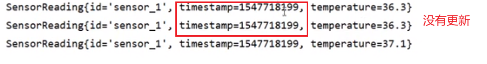
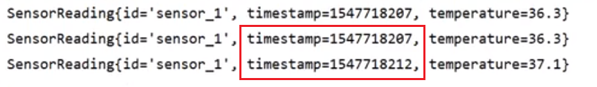
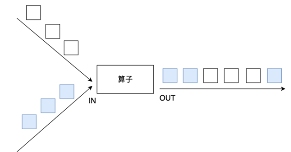
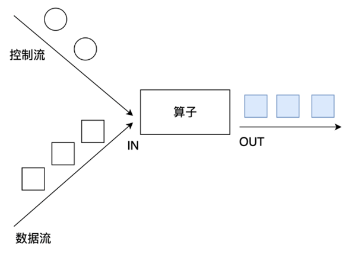
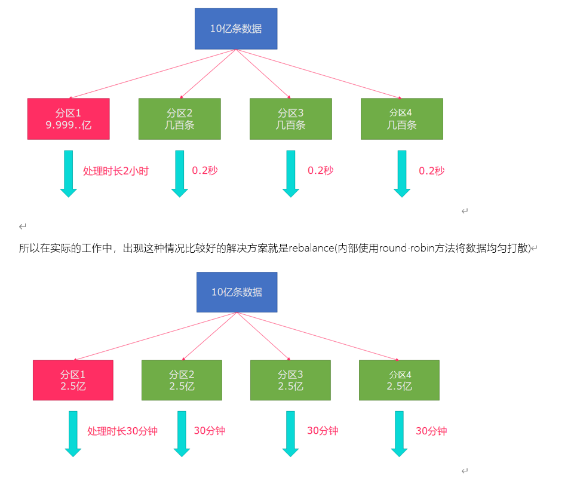
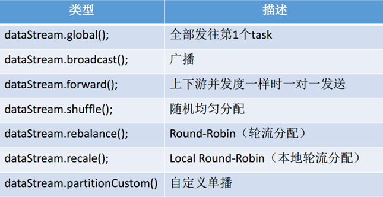

# 概述

Apache Flink 是一个框架和分布式处理引擎，用于对无界和有界数据流进行状态计算。

- 目标
  - 低延迟
  - 高吞吐
  - 结果的准确性和良好的容错性
- 使用场景
  - 电商和市场营销
    > 数据报表、广告投放、业务流程需要
  - 物联网（IOT)
    > 传感器实时数据采集和显示、实时报警，交通运输业
  - 电信业
    > 基站流量调配
  - 银行和金融业
    > 实时结算和通知推送，实时检测异常行为

- 流处理架构


- 分层api
  > 越顶层越抽象，表达含义越简明，使用越方便
  > 越底层越具体，表达能力越丰富，使用越灵活
  - SQL/Table APl(dynamic tables)
  - DataStream API (streams, windows)
  - ProcessFunction(events,state,time)

- 其他特点
  - 支持事件时间（event-time)和处理时间（processing-time)语义
  - 精确一次（exactly-once)的状态一致性保证
  - 低延迟，每秒处理数百万个事件，毫秒级延迟
  - 与众多常用存储系统的连接
  - 高可用，动态扩展，实现7*24小时全天候运行

# 简单示例-wordcount


- 批处理执行
  <details>
  <summary style="color:red;">代码</summary>

  ```java
  import org.apache.flink.api.common.functions.FlatMapFunction;
  import org.apache.flink.api.java.DataSet;
  import org.apache.flink.api.java.ExecutionEnvironment;
  import org.apache.flink.api.java.operators.DataSource;
  import org.apache.flink.api.java.tuple.Tuple2;
  import org.apache.flink.streaming.api.datastream.DataStream;
  import org.apache.flink.util.Collector;

  // 批处理word count
  public class WordCount {
      public static void main(String[] args) throws Exception{
          // 创建执行环境
          ExecutionEnvironment env = ExecutionEnvironment.getExecutionEnvironment();

          // 从文件中读取数据
          String inputPath = "D:\\Projects\\BigData\\FlinkTutorial\\src\\main\\resources\\hello.txt";
          DataSet<String> inputDataSet = env.readTextFile(inputPath);

          // 对数据集进行处理，按空格分词展开，转换成(word, 1)二元组进行统计
          DataSet<Tuple2<String, Integer>> resultSet = inputDataSet.flatMap(new MyFlatMapper())
                  .groupBy(0)    // 按照第一个位置的word分组
                  .sum(1);    // 将第二个位置上的数据求和

          resultSet.print();
      }

      // 自定义类，实现FlatMapFunction接口
      public static class MyFlatMapper implements FlatMapFunction<String, Tuple2<String, Integer>> {
          @Override
          public void flatMap(String value, Collector<Tuple2<String, Integer>> out) throws Exception {
              // 按空格分词
              String[] words = value.split(" ");
              // 遍历所有word，包成二元组输出
              for (String word : words) {
                  out.collect(new Tuple2<>(word, 1));
              }
          }
      }
  }
  ```
  </details>

- 流处理执行
  <details>
  <summary style="color:red;">代码</summary>

  ```java
  import org.apache.flink.api.java.tuple.Tuple2;
  import org.apache.flink.api.java.utils.ParameterTool;
  import org.apache.flink.streaming.api.datastream.DataStream;
  import org.apache.flink.streaming.api.datastream.DataStreamSource;
  import org.apache.flink.streaming.api.datastream.SingleOutputStreamOperator;
  import org.apache.flink.streaming.api.environment.StreamExecutionEnvironment;

  import java.net.URL;

  public class StreamWordCount {
      public static void main(String[] args) throws Exception{
          // 创建流处理执行环境
          StreamExecutionEnvironment env = StreamExecutionEnvironment.getExecutionEnvironment();
  //        env.setParallelism(1); // 设置并行度

  //        env.disableOperatorChaining();

  //        // 从文件中读取数据
  //        String inputPath = "D:\\Projects\\BigData\\FlinkTutorial\\src\\main\\resources\\hello.txt";
  //        DataStream<String> inputDataStream = env.readTextFile(inputPath);

          // 用parameter tool工具从程序启动参数中提取配置项

          // --host localhost --port 7777
          ParameterTool parameterTool = ParameterTool.fromArgs(args);
          String host = parameterTool.get("host");
          int port = parameterTool.getInt("port");

          // 从socket文本流读取数据
          DataStream<String> inputDataStream = env.socketTextStream(host, port);  // 默认共享组为default

          // 基于数据流进行转换计算
          DataStream<Tuple2<String, Integer>> resultStream = inputDataStream
                  .flatMap(new WordCount.MyFlatMapper())
                  .slotSharingGroup("green") // 设置槽位共享组。组内的任务可以共享相同的slot。
                  .keyBy(0)
                  .sum(1)
                  .setParallelism(2) // 设置并发量，可以不写。默认并行度为cpu核数
                  .slotSharingGroup("red"); // 

          // sumh和print都是red共享组
          resultStream.print().setParallelism(1);

          // 执行任务
          env.execute();
      }
  }
  ```
  </details>

- Task数量:
  - 找出每个slot共享组
  - 就算每个slot共享组的最大并行度
  - 将所有最大并行度相加


# 基础API

## Environment

- getExecutionEnvironment
  ```
  创建一个执行环境，表示当前执行程序的上下文。如果程序是独立调用的，则
  此方法返回本地执行环境；如果从命令行客户端调用程序以提交到集群，则此方法
  返回此集群的执行环境，也就是说，getExecutionEnvironment会根据查询运行的方
  式决定返回什么样的运行环境，是最常用的一种创建执行环境的方式。
  ```
- createLocalEnvironment

## Source

## Transform

### 基础算子

```java
public class TransformationDemo01 {
    public static void main(String[] args) throws Exception {
        //1.env
        StreamExecutionEnvironment env = StreamExecutionEnvironment.getExecutionEnvironment();
        env.setRuntimeMode(RuntimeExecutionMode.AUTOMATIC);
        //2.source
        DataStream<String> linesDS = env.socketTextStream("mnode1", 9999);

        //3.处理数据-transformation
        DataStream<String> wordsDS = linesDS.flatMap(new FlatMapFunction<String, String>() {
            @Override
            public void flatMap(String value, Collector<String> out) throws Exception {
                //value就是一行行的数据
                String[] words = value.split(" ");
                for (String word : words) {
                    out.collect(word);//将切割处理的一个个的单词收集起来并返回
                }
            }
        });
        DataStream<String> filtedDS = wordsDS.filter(new FilterFunction<String>() {
            @Override
            public boolean filter(String value) throws Exception {
                return !value.equals("heihei");
            }
        });
        DataStream<Tuple2<String, Integer>> wordAndOnesDS = filtedDS.map(new MapFunction<String, Tuple2<String, Integer>>() {
            @Override
            public Tuple2<String, Integer> map(String value) throws Exception {
                //value就是进来一个个的单词
                return Tuple2.of(value, 1);
            }
        });
        //KeyedStream<Tuple2<String, Integer>, Tuple> groupedDS = wordAndOnesDS.keyBy(0);
        KeyedStream<Tuple2<String, Integer>, String> groupedDS = wordAndOnesDS.keyBy(t -> t.f0);

        DataStream<Tuple2<String, Integer>> result1 = groupedDS.sum(1);
        DataStream<Tuple2<String, Integer>> result2 = groupedDS.reduce(new ReduceFunction<Tuple2<String, Integer>>() {
            @Override
            public Tuple2<String, Integer> reduce(Tuple2<String, Integer> value1, Tuple2<String, Integer> value2) throws Exception {
                return Tuple2.of(value1.f0, value1.f1 + value1.f1);
            }
        });

        //4.输出结果-sink
        result1.print("result1");
        result2.print("result2");

        //5.触发执行-execute
        env.execute();
    }
}
```

#### map

#### flatMap

#### Filter

### 分区KeyBy

流计算中没有groupby，只有keyBy

### 滚动聚合

#### sum

#### min

每过来一条数据都会进行一次更新。只会更新指定字段。

比如一个person类有name,height和age两项属性，使用max计算最大的age，那样age会更新，但是name,height都不会更新



计算max(temperature)，可以发现只有以temperature字段更新，其他字段没有更新。

#### max

#### minBy

#### maxBy



计算maxBy(temperature)，可以发现除了temperature，其他字段也变更为了最大temperature对应对象的值。

### 多流转换操作

#### union和connect



union算子可以合并多个**同类型**的数据流，并生成同类型的数据流，即可以将多个DataStream[T]合并为一个新的DataStream[T]。数据将按照先进先出（First In First Out）的模式合并，且不去重。

---



- connect提供了和union类似的功能，用来连接两个数据流，它与union的区别在于：
  - connect只能连接两个数据流，union可以连接多个数据流。
  - connect所连接的两个数据流的数据类型可以不一致，union所连接的两个数据流的数据类型必须一致。

两个DataStream经过connect之后被转化为ConnectedStreams，ConnectedStreams会对两个流的数据应用不同的处理方法，且双流之间可以共享状态。


```java
public class TransformationDemo02 {
    public static void main(String[] args) throws Exception {
        //1.env
        StreamExecutionEnvironment env = StreamExecutionEnvironment.getExecutionEnvironment();
        env.setRuntimeMode(RuntimeExecutionMode.AUTOMATIC);

        //2.Source
        DataStream<String> ds1 = env.fromElements("hadoop", "spark", "flink");
        DataStream<String> ds2 = env.fromElements("hadoop", "spark", "flink");
        DataStream<Long> ds3 = env.fromElements(1L, 2L, 3L);

        //3.Transformation
        DataStream<String> result1 = ds1.union(ds2);//合并但不去重 https://blog.csdn.net/valada/article/details/104367378
        ConnectedStreams<String, Long> tempResult = ds1.connect(ds3);
        //interface CoMapFunction<IN1, IN2, OUT>
        DataStream<String> result2 = tempResult.map(new CoMapFunction<String, Long, String>() {
            @Override
            public String map1(String value) throws Exception {
                return "String->String:" + value;
            }

            @Override
            public String map2(Long value) throws Exception {
                return "Long->String:" + value.toString();
            }
        });

        //4.Sink
        result1.print();
        result2.print();

        //5.execute
        env.execute();
    }
}
```

#### side outputs

```java
public class TransformationDemo03 {
    public static void main(String[] args) throws Exception {
        //1.env
        StreamExecutionEnvironment env = StreamExecutionEnvironment.getExecutionEnvironment();
        env.setRuntimeMode(RuntimeExecutionMode.AUTOMATIC);

        //2.Source
        DataStreamSource<Integer> ds = env.fromElements(1, 2, 3, 4, 5, 6, 7, 8, 9, 10);

        //3.Transformation
        //定义两个输出标签
        OutputTag<Integer> tagEven = new OutputTag<Integer>("偶数", TypeInformation.of(Integer.class));
        OutputTag<Integer> tagOdd = new OutputTag<Integer>("奇数", TypeInformation.of(Integer.class)){};
        //对ds中的数据进行处理
        SingleOutputStreamOperator<Integer> tagResult = ds.process(new ProcessFunction<Integer, Integer>() {
            @Override
            public void processElement(Integer value, Context ctx, Collector<Integer> out) throws Exception {
                if (value % 2 == 0) {
                    //偶数
                    ctx.output(tagEven, value);
                } else {
                    //奇数
                    ctx.output(tagOdd, value);
                }
            }
        });

        //取出标记好的数据
        DataStream<Integer> evenResult = tagResult.getSideOutput(tagEven);
        DataStream<Integer> oddResult = tagResult.getSideOutput(tagOdd);

        //4.Sink
        evenResult.print("偶数");
        oddResult.print("奇数");

        //5.execute
        env.execute();
    }
}
```

### 分区

#### rebalance

类似于Spark中的repartition,但是功能更强大,可以直接解决数据倾斜

Flink也有数据倾斜的时候，比如当前有数据量大概10亿条数据需要处理，在处理过程中可能会发生如图所示的状况，出现了数据倾斜，其他3台机器执行完毕也要等待机器1执行完毕后才算整体将任务完成；



```java
public class TransformationDemo04 {
    public static void main(String[] args) throws Exception {
        //1.env
        StreamExecutionEnvironment env = StreamExecutionEnvironment.getExecutionEnvironment();
        env.setRuntimeMode(RuntimeExecutionMode.AUTOMATIC).setParallelism(3);

        //2.source
        DataStream<Long> longDS = env.fromSequence(0, 100);

        //3.Transformation
        //下面的操作相当于将数据随机分配一下,有可能出现数据倾斜
        DataStream<Long> filterDS = longDS.filter(new FilterFunction<Long>() {
            @Override
            public boolean filter(Long num) throws Exception {
                return num > 10;
            }
        });

        //接下来使用map操作,将数据转为(分区编号/子任务编号, 数据)。计算每个分区有多少数据。
        //Rich表示多功能的,比MapFunction要多一些API可以供我们使用
        DataStream<Tuple2<Integer, Integer>> result1 = filterDS
                .map(new RichMapFunction<Long, Tuple2<Integer, Integer>>() {
                    @Override
                    public Tuple2<Integer, Integer> map(Long value) throws Exception {
                        //获取分区编号/子任务编号
                        int id = getRuntimeContext().getIndexOfThisSubtask();
                        return Tuple2.of(id, 1);
                    }
                }).keyBy(t -> t.f0).sum(1); // 对index为1的元素进行求和

        DataStream<Tuple2<Integer, Integer>> result2 = filterDS.rebalance()
                .map(new RichMapFunction<Long, Tuple2<Integer, Integer>>() {
                    @Override
                    public Tuple2<Integer, Integer> map(Long value) throws Exception {
                        //获取分区编号/子任务编号
                        int id = getRuntimeContext().getIndexOfThisSubtask();
                        return Tuple2.of(id, 1);
                    }
                }).keyBy(t -> t.f0).sum(1);

        //4.sink
        //result1.print();//有可能出现数据倾斜
        result2.print();//在输出前进行了rebalance重分区平衡,解决了数据倾斜

        //5.execute
        env.execute();
    }
}
```

#### 其他分区相关



recale分区。基于上下游Operator的并行度，将记录以循环的方式输出到下游Operator的每个实例。

举例: 

上游并行度是2，下游是4，则上游一个并行度以循环的方式将记录输出到下游的两个并行度上;上游另一个并行度以循环的方式将记录输出到下游另两个并行度上。若上游并行度是4，下游并行度是2，则上游两个并行度将记录输出到下游一个并行度上；上游另两个并行度将记录输出到下游另一个并行度上。


```java
public class TransformationDemo05 {
    public static void main(String[] args) throws Exception {
        //1.env
        StreamExecutionEnvironment env = StreamExecutionEnvironment.getExecutionEnvironment();
        env.setRuntimeMode(RuntimeExecutionMode.AUTOMATIC);

        //2.Source
        DataStream<String> linesDS = env.readTextFile("data/input/words.txt");
        SingleOutputStreamOperator<Tuple2<String, Integer>> tupleDS = linesDS.flatMap(new FlatMapFunction<String, Tuple2<String, Integer>>() {
            @Override
            public void flatMap(String value, Collector<Tuple2<String, Integer>> out) throws Exception {
                String[] words = value.split(" ");
                for (String word : words) {
                    out.collect(Tuple2.of(word, 1));
                }
            }
        });

        //3.Transformation
        DataStream<Tuple2<String, Integer>> result1 = tupleDS.global();
        DataStream<Tuple2<String, Integer>> result2 = tupleDS.broadcast();
        DataStream<Tuple2<String, Integer>> result3 = tupleDS.forward();
        DataStream<Tuple2<String, Integer>> result4 = tupleDS.shuffle();
        DataStream<Tuple2<String, Integer>> result5 = tupleDS.rebalance();
        DataStream<Tuple2<String, Integer>> result6 = tupleDS.rescale();
        DataStream<Tuple2<String, Integer>> result7 = tupleDS.partitionCustom(new Partitioner<String>() {
            @Override
            public int partition(String key, int numPartitions) {
                return key.equals("hello") ? 0 : 1;
            }
        }, t -> t.f0);

        //4.sink
        //result1.print();
        //result2.print();
        //result3.print();
        //result4.print();
        //result5.print();
        //result6.print();
        result7.print();

        //5.execute
        env.execute();
    }
}
```

## sink

### 预定义sink

1. ds.print 直接输出到控制台
2. ds.printToErr() 直接输出到控制台,用红色
3. ds.writeAsText("本地/HDFS的path",WriteMode.OVERWRITE).setParallelism(1)

```java
/** 
 * Desc
 * 1.ds.print 直接输出到控制台
 * 2.ds.printToErr() 直接输出到控制台,用红色
 * 3.ds.collect 将分布式数据收集为本地集合
 * 4.ds.setParallelism(1).writeAsText("本地/HDFS的path",WriteMode.OVERWRITE)
 */
public class SinkDemo01 {
    public static void main(String[] args) throws Exception {
        //1.env
        StreamExecutionEnvironment env = StreamExecutionEnvironment.getExecutionEnvironment();

        //2.source
        //DataStream<String> ds = env.fromElements("hadoop", "flink");
        DataStream<String> ds = env.readTextFile("data/input/words.txt");

        //3.transformation
        //4.sink
        ds.print();
        ds.printToErr();
        ds.writeAsText("data/output/test", FileSystem.WriteMode.OVERWRITE).setParallelism(2);
        //注意:
        //Parallelism=1为文件
        //Parallelism>1为文件夹

        //5.execute
        env.execute();
    }
}
```

### 自定义sink:mysql

```java
public class SinkDemo02CustomerMysql {
    public static void main(String[] args) throws Exception {
        //1.env
        StreamExecutionEnvironment env = StreamExecutionEnvironment.getExecutionEnvironment();
        //2.Source
        DataStream<Student> studentDS = env.fromElements(new Student(null, "tonyma", 18));
        //3.Transformation
        //4.Sink
        studentDS.addSink(new MySQLSink());

        //5.execute
        env.execute();
    }
    @Data
    @NoArgsConstructor
    @AllArgsConstructor
    public static class Student {
        private Integer id;
        private String name;
        private Integer age;
    }

    public static class MySQLSink extends RichSinkFunction<Student> {
        private Connection conn = null;
        private PreparedStatement ps = null;

        @Override
        public void open(Configuration parameters) throws Exception {
            //加载驱动,开启连接
            //Class.forName("com.mysql.jdbc.Driver");
            conn = DriverManager.getConnection("jdbc:mysql://localhost:3306/bigdata", "root", "root");
            String sql = "INSERT INTO `t_student` (`id`, `name`, `age`) VALUES (null, ?, ?)";
            ps = conn.prepareStatement(sql);
        }

        @Override
        public void invoke(Student value, Context context) throws Exception {
            //给ps中的?设置具体值
            ps.setString(1,value.getName());
            ps.setInt(2,value.getAge());
            //执行sql
            ps.executeUpdate();
        }

        @Override
        public void close() throws Exception {
            if (conn != null) conn.close();
            if (ps != null) ps.close();
        }
    }
}
```

## Connectors

### JDBC

```java
public class ConnectorsDemo01JDBC {
    public static void main(String[] args) throws Exception {
        //1.env
        StreamExecutionEnvironment env = StreamExecutionEnvironment.getExecutionEnvironment();
        //2.Source
        env.fromElements(new Student(null, "tonyma", 18))
                //3.Transformation
                //4.Sink
                .addSink(JdbcSink.sink(
                        "INSERT INTO `t_student` (`id`, `name`, `age`) VALUES (null, ?, ?)",
                        (ps, s) -> {
                            ps.setString(1, s.getName());
                            ps.setInt(2, s.getAge());
                        },
                        new JdbcConnectionOptions.JdbcConnectionOptionsBuilder()
                                .withUrl("jdbc:mysql://localhost:3306/bigdata")
                                .withUsername("root")
                                .withPassword("root")
                                .withDriverName("com.mysql.jdbc.Driver")
                                .build()));
        //5.execute
        env.execute();
    }

    @Data
    @NoArgsConstructor
    @AllArgsConstructor
    public static class Student {
        private Integer id;
        private String name;
        private Integer age;
    }
}
```

### kafka

**consumer**

```java
/**
 * Desc
 * 需求:使用flink-connector-kafka_2.12中的FlinkKafkaConsumer消费Kafka中的数据做WordCount
 * 需要设置如下参数:
 * 1.订阅的主题
 * 2.反序列化规则
 * 3.消费者属性-集群地址
 * 4.消费者属性-消费者组id(如果不设置,会有默认的,但是默认的不方便管理)
 * 5.消费者属性-offset重置规则,如earliest/latest...
 * 6.动态分区检测(当kafka的分区数变化/增加时,Flink能够检测到!)
 * 7.如果没有设置Checkpoint,那么可以设置自动提交offset,后续学习了Checkpoint会把offset随着做Checkpoint的时候提交到Checkpoint和默认主题中
 */
public class ConnectorsDemo02KafkaConsumer {
    public static void main(String[] args) throws Exception {
        //1.env
        StreamExecutionEnvironment env = StreamExecutionEnvironment.getExecutionEnvironment();
        //2.Source
        Properties props  = new Properties();
        props.setProperty("bootstrap.servers", "mnode1:9092");
        props.setProperty("group.id", "flink");
        props.setProperty("auto.offset.reset","latest");// 默认为earlist
        props.setProperty("flink.partition-discovery.interval-millis","5000");//会开启一个后台线程每隔5s检测一下Kafka的分区情况，实现动态分区检测
        props.setProperty("enable.auto.commit", "true");// 默认提交，提交到默认主题，
        props.setProperty("auto.commit.interval.ms", "2000"); // 自动提交时间间隔

        //kafkaSource就是KafkaConsumer
        // SimpleStringSchema:是指按字符串方式进行序列化，反序列化。
        FlinkKafkaConsumer<String> kafkaSource = new FlinkKafkaConsumer<>("flink_kafka", new SimpleStringSchema(), props);

        kafkaSource.setStartFromGroupOffsets();//设置从记录的offset开始消费,如果没有记录从auto.offset.reset配置开始消费

        //kafkaSource.setStartFromEarliest();//设置直接从Earliest消费,和auto.offset.reset配置无关
        DataStreamSource<String> kafkaDS = env.addSource(kafkaSource);

        //3.Transformation
        //3.1切割并记为1
        SingleOutputStreamOperator<Tuple2<String, Integer>> wordAndOneDS = kafkaDS.flatMap(new FlatMapFunction<String, Tuple2<String, Integer>>() {
            @Override
            public void flatMap(String value, Collector<Tuple2<String, Integer>> out) throws Exception {
                String[] words = value.split(" ");
                for (String word : words) {
                    out.collect(Tuple2.of(word, 1));
                }
            }
        });
        //3.2分组
        KeyedStream<Tuple2<String, Integer>, Tuple> groupedDS = wordAndOneDS.keyBy(0);
        //3.3聚合
        SingleOutputStreamOperator<Tuple2<String, Integer>> result = groupedDS.sum(1);

        //4.Sink
        result.print();

        //5.execute
        env.execute();
    }
}
```

---

**producer**

```java
/** 
 * Desc
 * 使用自定义sink-官方提供的flink-connector-kafka_2.12-将数据保存到Kafka
 */
public class ConnectorsDemo02KafkaProducer {
    public static void main(String[] args) throws Exception {
        //1.env
        StreamExecutionEnvironment env = StreamExecutionEnvironment.getExecutionEnvironment();
        //2.Source
        DataStreamSource<Student> studentDS = env.fromElements(new Student(1, "tonyma", 18));

        //3.Transformation
        //注意:目前来说我们使用Kafka使用的序列化和反序列化都是直接使用最简单的字符串,所以先将Student转为字符串
        //可以直接调用Student的toString,也可以转为JSON
        SingleOutputStreamOperator<String> jsonDS = studentDS.map(new MapFunction<Student, String>() {
            @Override
            public String map(Student value) throws Exception {
                //String str = value.toString();
                String jsonStr = JSON.toJSONString(value);
                return jsonStr;
            }
        });

        //4.Sink
        jsonDS.print();
        //根据参数创建KafkaProducer/KafkaSink
        Properties props = new Properties();
        props.setProperty("bootstrap.servers", "mnode1:9092");
        FlinkKafkaProducer<String> kafkaSink = new FlinkKafkaProducer<>("flink_kafka",  new SimpleStringSchema(),  props);
        jsonDS.addSink(kafkaSink);

        //5.execute
        env.execute();

        // /usr/local/kafka/bin/kafka-console-consumer.sh --bootstrap-server mnode1:9092 --topic flink_kafka
    }
    @Data
    @NoArgsConstructor
    @AllArgsConstructor
    public static class Student {
        private Integer id;
        private String name;
        private Integer age;
    }
}
```

### redis

# 高级API

## Window

- 基于时间的滚动窗口--用的多
- 基于时间的滑动窗口--用得多
- 基于数量的滚动窗口--用得少
- 基于数量的滑动窗口--用得少
- Session会话窗口：需要设置一个会话超时时间，如30s,则表示30s内没有数据到来，则触发上个窗口的计算

## Time

## State

## Checkpoint

