# 1. 入门情景

## 1.1. 单机解决

- 情景 1：
  - 情景：
    ```
    1T文本文件，每行一个数据
    128MB内存计算机
    求重复行
    ```
  - 解决 1：
    - 方式：
      ```
      每次读取一行
      对一行的数据求hash值
      将hash为文件名，一行数据为文件内容，存入磁盘
      每行对应一个文件（n:1，重复行hash值也相同）
      遍历所有文件，查行数大于1的文件
      ```
    - 问题
      - 单服务器问题：
        - 单点瓶颈：一个计算机性能有限
        - 单点故障：一个服务器出故障后整个服务瘫痪
      - 文件过多，遍历压力大
  - 解决 2：
    > **hash 稳定算法**
    - 方式；
      ```
      每次读一行
      求hash值，再膜10000
      将hash%10000相同的数据存放到一个文件中（相当于初步分组，将文件数量控制在10000）
      （hash稳定算法，控制文件数量同时达到负载均衡的效果，hadoop和redis中都有相关扩展和应用）
      ```
    - 问题；
- 情景 2
  - 情景：
    ```
    1T文本数据
    128MB计算机
    每行一个数字
    对文件进行全排序
    ```
  - 解决 1：单文件无序，文件间有序
    ```
    划分多个文件存储范围，（0-100，,lol-200，201-300....）
    将1T数据分别存到多个文件中
    对每个文件中的数据进行排序
    按顺序合并多个文件
    ```
  - 解决 2：单文件有序，文件间无序
    ```
    每次从1T数据中拿出一定量数据（小于128MB）进行排序，存到一个文件中
    最终把1T分割成多个有序的小文件
    使用归并算法，将小文件合并为一个有序的大文件
      0. 新建空白结果文件
      1. 每个文件中取第一个（最小的数据），放到内存中
      2. 将内存中最小的数(假设来自文件a)追加到结果文件
      3. 将文件a中最小的数补充到内存中
      4. 重复1-3
    ```

## 1.2. 分布式解决(cluster)

- 情景 1

  - 情景：
    ```
    1T文本文件，每行一个数据
    2000个服务器128MB内存
    求重复行
    ```
  - 解决 1：
    - 方式；
      ```
      每个服务器分500MB文件
      每个服务器
        每行求hash再膜2000，以此为文件名
        生成2000个文件
      从每台服务器中取文件名相同的文件 比如1，放到额外一台更高内存服务器上
      再查找相同行
      ```
    - 问题：
      - 1T 数据切割分发给 2000 台服务器
        ```
        分到2000台服务器，一台服务器分500MB数据
        向一个服务器发送500MB需要5s，则2000台服务器需要10000s（两个半小时）
        移动数据的成本相当高
        ```
      - 数据迁移，同名文件迁移到同一个服务器花费时间
        ```
        千兆网卡处理速度为百兆级
        假设文件均匀分布，所有文件名为1的总和大小为500MB
        并且通过算法解决了io冲撞问题，并满速传输
        那么传输到一台服务器需要5s
        ```

- 实际情景：

  ```
  假设每天有1T数据
  每天都会花费一定时间进行数据的分发
  每台服务器每次增加较少数据量
  每台服务器并行执行，计算耗费时间可控
  ```

- 分布式集群：
  > 分而治之，并行计算
  - 并行：提升速度的关键
  - 分布式执行
  - 计算与数据一起
  - 文件切割的规范管理
    > 数据切割后存放管理策略
  - 存+计算
    - 计算向数据移动
      ```
      hadoop精华所在
      数据量非常大，迁移耗费时间大
      所以把计算程序向程序移动
      ```
  - 应用
    - Net music log 播放次数，标签等
    - 有线电视日志统计,点击率，换台时机，计算观看率等

# 2. hadoop

## 2.1. 简介

- 思想之源：Google（第一个遇到大数据问题的公司）
- 面对数据和计算难题：
  - 大量网页怎么存储
  - 搜索算法
- Google 三大理论

  - GFS：分布式文件系统
  - Map-Reduce:分布式计算框架
  - Bigtable

- Doug cutting 看完 google 论文后，在 Yahoo 就职期间开发的 hadoop 框架

- hadoop 底层基于倒排索引

  - 倒排索引：即 luence 框架
    > 苹果动态搜索引擎就基于 luence 框架
    > 之后会学

- 历程：

  ```
  Hadoop简介
  名字来源于Doug Cutting儿子的玩具大象。
  2003-2004年，Google公开了部分GFS和Mapreduce思想的细节，以此为基础Doug Cutting等人用了2年业余时间实现了DFS和Mapreduce机制，
  一个微缩版的Nutch(nutch:第一个开源的分布式搜索框架，apache公司)
  Hadoop 于 2005 年秋天作为 Lucene的子项目 Nutch的一部分正式引入Apache基金会。
  2006 年 3 月份，Map-Reduce 和 Nutch Distributed File System (NDFS) 分别被纳入称为 Hadoop 的项目
  ```

- Hadoop 简介：https://hadoop.apache.org/old/

  - 版本：1.x，2.x，3.x
  - 组成：
    - 大数据工具包：Hadoop Commom
    - 分布式存储系统 HDFS （Hadoop Distributed File System ）POSIX
      - 分布式存储系统
      - 对数据文件切割并进行分发
      - 提供了 高可靠性、高扩展性和高吞吐率的数据存储服务
    - 分布式资源管理框架 YARN（Yet Another Resource Management）
      - 负责集群资源的管理和调度
    - 分布式计算框架 MapReduce
      - 分布式计算框架（计算向数据移动）
      - 具有 易于编程、高容错性和高扩展性等优点。
  - 衍生（生态环境圈）：
    > 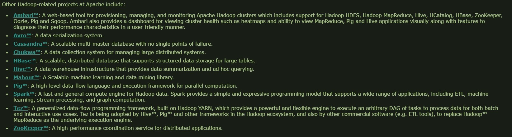 > 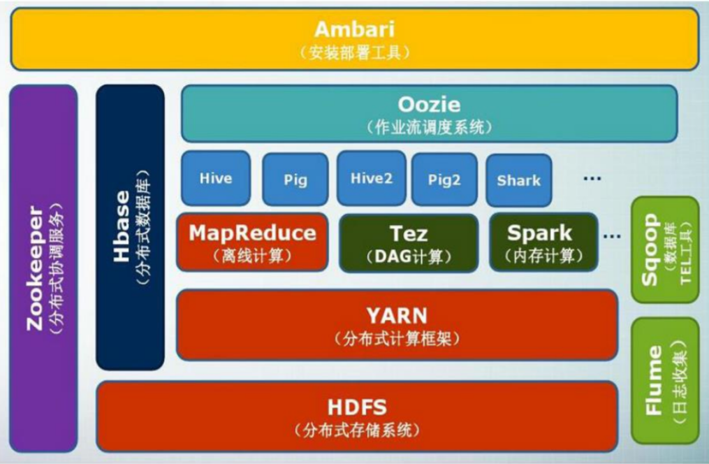
    - HDFS 分布式文件系统
    - MapReduce 分布式并行编程模型
    - YARN 资源管理和调度器
    - Tez 运行在 YARN 之上的下一代 Hadoop 查询处理框架
    - Hive Hadoop 上的数据仓库
    - HBase Hadoop 上的非关系型的分布式数据库
    - Pig 一个基于 Hadoop 的大规模数据分析平台，提供类似 SQL 的查询语言 Pig Latin
    - Sqoop 用于在 Hadoop 与传统数据库之间进行数据传递
    - Oozie Hadoop 上的工作流管理系统
    - Zookeeper 提供分布式协调一致性服务
    - Storm 流计算框架
    - Flume 一个高可用的，高可靠的，分布式的海量日志采集、聚合和传输的系统
    - Ambari Hadoop 快速部署工具，支持 Apache Hadoop 集群的供应、管理和监控
    - Kafka 一种高吞吐量的分布式发布订阅消息系统，可以处理消费者规模的网站中的所有动作流数据
    - Spark 类似于 Hadoop MapReduce 的通用并行框架

- 商业版本：
  > 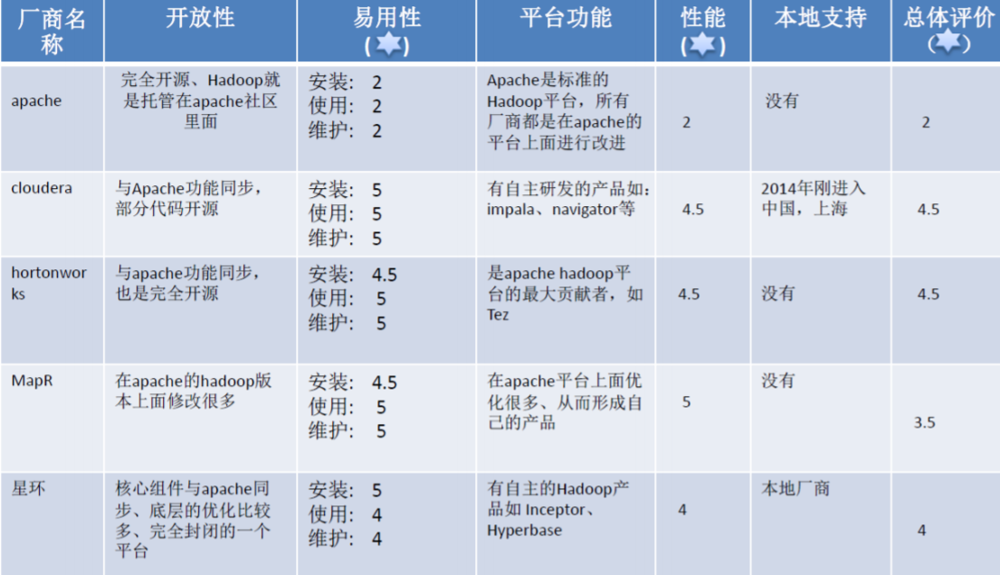

## 2.2. 分布式文件系统 HDFS

> 就是一个文件系统，操作类似 linux

### 2.2.1. 存储模型

> 就是上面的完整数据进行切割

- 存储模型：字节
  - 文件线性切割成块（Block）:偏移量 offset
    - Block:切成的块
    - offset：偏移量，起始位置。用于索引定位
    - 中文处理：切割时不管，后期会进行处理
  - Block 分散存储在集群节点中
    > 尽量均衡分配
  - 单一文件 Block 大小一致，文件与文件可以不一致
    > 除最后一个块大小相同
  - Block 可以设置副本数，副本无序分散在不同节点中
    > 切出的块进行复制，散布在不同节点上，是为了数据安全
    - 副本数不要超过节点数量，没有意义
  - 文件上传可以设置 Block 大小和副本数
    - Block 大小默认 128MB，最小 1MB。可以自行设置
    - 副本数默认 3 个。可以自行设置
      > 比如有多个进程(比如mapreduce任务)需要读取同一个数据块，可以把副本数设置多些，将进程分散到不同服务器，避免造成拥堵现象
      - （1）加快数据传输速度
      - （2）容易检查数据错误
      - （3）保证数据可靠性
  - 已上传的文件 Block 副本数可以调整，**大小不变**
  - 只支持一次写入多次读取，同一时刻只有一个写入者
  - 可以 append 追加数据
    > 把数据添加到最后一块,或者追加数据作为最后一块。

### 2.2.2. 架构模型

> 通过一定的有序的组织架构，让架构运行起来并对数据进行健康完美的维护的模型

- 1.0 版本架构模型：主从架构模型
  > 一个主节点，管理多个从节点
  - 数据种类：
    - 元数据 MetaData
      - 文件权限
      - 每个块的块大小
      - 每个块的块偏移量
      - ......（持久化那里有）
    - 块数据本身，文件数据
  - 分工：
    - 主节点(NameNode)：保存和维护文件元数据：单节点 posix
    - 从节点(DataNode)：保存和处理文件 Block 数据：多节点
  - 主从交互
    - DataNode 与 NameNode 保持心跳，提交 Block 列表
      > DataNode 向 NameNode 主动提交 Block 列表
  - 客户端，CS 架构
    > 大数据架构基本上都是 CS 架构，比如 redis，zookeeper，hadoop 等
    - HdfsClient 与 NameNode 交互元数据信息
    - HdfsClient 与 NameNode 交互获得指定块的位置，再直接与 DataNode 交互文件 Block 数据
      > 如果都通过 NameNode 进行交互的话，会有单节点瓶颈问题
  - 存储：
    - DataNode 利用服务器本地文件系统存储数据块

### 2.2.3. 架构模型+

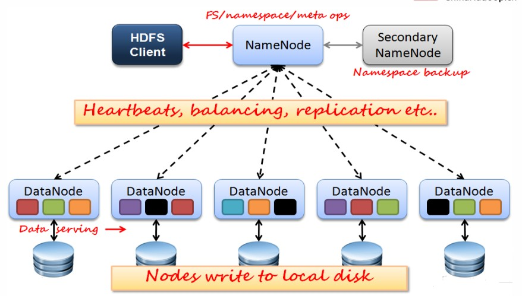

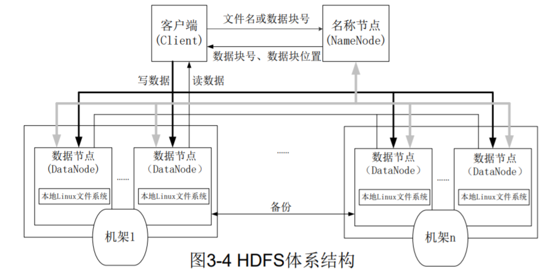

- HdfsClient 能与 DataNote 直接交互，第一张图没画出来
- Secondary NameNode:1.0 版本中比较重要。2.0 及之后就用不到了

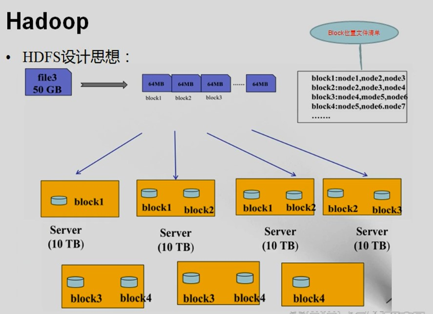

### 2.2.4. 节点类型与版本 1.0 持久化

- NameNode（NN）

  - **基于内存存储** ：不会和磁盘发生交换（双向）
    > 与 redis 等内存数据库相同
    - 只存在内存中，进行计算
    - 定期做持久化（单向）
      > 只会把内存中的数据写到磁盘备份<br>
      > 只有恢复数据时才读取数据
  - NameNode 主要功能：
    - 接受客户端的读写服务
    - 收集 DataNode 汇报的 Block 列表信息
  - NameNode 保存 metadata 信息包括
    - 文件持有者(owership)和(permissions)
    - 文件大小，时间
    - Block 信息（Block 列表，Block 偏移量，Block 副本位置）（**持久化不存**）
      > 由 DataNode 主动将块数据的信息汇报给 NameNode，确保 DataNode 的存活，不用存储

- DataNode（DN）

  - 本地磁盘目录存储数据（Block），文件形式
  - 同时存储 Block 的元数据信息文件(MD5 文件,(MD5 加密))
    > 该元数据信息对应 Block
  - 启动 DN 时会向 NN 汇报 block 信息
  - 通过向 NN 发送心跳保持与其联系（3 秒一次），如果 NN 10 分钟没有收到 DN 的心跳，则认为其已经 lost，并 copy 其上的 block 到其它 DN
    > 之后会自动从其他节点上查找副本数据恢复节点数据<br>
    > 另外因为数据量大，判断 lost 的间隔不能太小，否则数据转移对服务器压力太大，期间也可能完成自救修复，10 分钟差不多。

- NameNode 持久化

  - 持久化方式：
    - metadata 存储到磁盘文件名为`fsimage`（时点备份）
      > 时点：每隔一段时间备份一次，看下面
      - fsimage:镜像快照
      - 是实现 java 序列化接口的对象序列化后的文件
      - 序列化写入磁盘慢，但恢复时快，因为就是二进制文件，直接读入内存即可
    - edits 记录对 metadata 的操作日志
      - edits log
      - 会把客户端对 NameNode 的所有操作写到操作日志中
      - 写入快，但恢复很慢，因为要一条一条执行
    - 实际会两者混用
      - 最开始启动时，hadoop 会格式化(format)，生成空白 fsimage 和 edits
      - 进行操作时，会把操作记录存储到 edits 中，不会修改 fsimage
      - 每次当 edits 到达一定条件时(比如文件大小)，会触发 fsimage 合并工作
        - 以 fsimage 为基础，读取 edits 中的内容进行合并
        - fsimage 更新后，edits 会被清空
        - 而做合并工作的，就是 **SecondNameNode(SNN)**
  - 特点：
    - NameNode 的 metadata 信息在启动后会加载到内存
    - Block 的位置信息不会保存到 fsimage，而是由 DataNode 主动汇报，实时更新

- SecondNameNode
  - 它不是 NN 的备份（但可以做备份），它的主要工作是帮助 NN 合并 edits log，减少 NN 启动时间。
  - SNN 执行合并时机
    - 根据配置文件设置的时间间隔 fs.checkpoint.period 默认 3600 秒
    - 根据配置文件设置 edits log 大小 fs.checkpoint.size 规定 edits 文件的最大值默认是 64MB
  - 合并流程:
    > 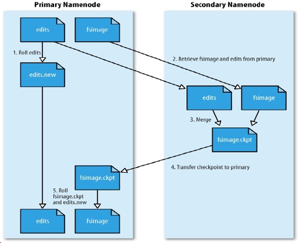
    - SecondaryNameNode 会定期和 NameNode 通信，请求其停止使用 EditLog 文件，暂时将新的写操作写到一个新的文件 edit.new 上来，这个操作是瞬间完
    - SecondaryNameNode 通过 HTTP GET 方式从 NameNode 上获取到 FsImage 和 EditLog 文件，并下载到本地的相应目录下
    - SecondaryNameNode 将下载下 来的 FsImage 载入到内存，然后一条一条地 执行 EditLog 文件中的各项更新操作，使得 内存中的 FsImage 保持最新；这个过程就是 EditLog 和 FsImage 文件合并
    - SecondaryNameNode 执行完（3 ）操作之后，会通过 post 方式将新的 FsImage 文件发送到 NameNode 节点上
    - NameNode 将从 SecondaryNameNode 接收到的新的 FsImage 替换旧的 FsImage 文件，同时将 edit.new 替换 EditLog 文件(类似一个重命名操作)，通过这个过程 EditLog 就变小了
  - 恢复流程：
    - 读取 fsimage
    - 如果 edits 文件不为空，就读取并执行
  - 缺点：不具有高可用的特性，在 NN 挂了的时候就真的挂了;而且不是实时备份
  - 2.x 之后有了 NameNode 备份，SecondeNameNode 基本没用了
    - 之后会讲持久化工作的替代者

### 2.2.5. 其他

#### 2.2.5.1. 通信协议（了解）

- HDFS 是一个部署在集群上的分布式文件系统，因此，很多数据需要 通过网络进行传输
- 所有的 HDFS 通信协议都是构建在 TCP/IP 协议基础之上的
- 客户端通过一个可配置的端口向名称节点主动发起 TCP 连接，并使 用客户端协议与名称节点进行交互
- 名称节点和数据节点之间则使用数据节点协议进行交互
- 客户端与数据节点的交互是通过 RPC（Remote Procedure Call）来 实现的。在设计上，名称节点不会主动发起 RPC，而是响应来自客户 端和数据节点的 RPC 请求

#### 2.2.5.2. 客户端

- 客户端是用户操作 HDFS 最常用的方式，HDFS 在部署时都提供了 客户端
- HDFS 客户端是一个库，暴露了 HDFS 文件系统接口，这些接口隐 藏了 HDFS 实现中的大部分复杂性
- 严格来说，客户端并不算是 HDFS 的一部分
- 客户端可以支持打开、读取、写入等常见的操作，并且提供了 类似 Shell 的命令行方式来访问 HDFS 中的数据
- 此外，HDFS 也提供了 Java API，作为应用程序访问文件系统的 客户端编程接口

### 2.2.6. 优缺点

- HDFS 优点：
  - 高容错性
    > block management policy 副本管理策略
    - 数据自动保存多个副本
    - 副本丢失后，自动恢复
  - 适合批处理
    - **移动计算而非数据**
    - 数据位置暴露给计算框架（Block 偏移量）
  - 适合大数据处理
    - GB 、TB 、甚至 PB 级数据
    - 百万规模以上的文件数量
  - 可构建在廉价机器上
    - 通过多副本提高可靠性
    - 提供了容错和恢复 机制
- HDFS 缺点：
  - 做不到低延迟数据访问,比如毫秒级
    > 因为数据量很大，基本上是分钟级别的。
    - 高吞吐率，要求块大小不能小于 1MB
  - 小文件存取效率底下
    - 占用 NameNode 大量内存
      > 比如 10 亿个小文件，需要维护的元数据信息量非常大
    - 寻道时间超过读取时间
      > 寻找 10 亿个文件耗时多，所以尽量使文件大些，文件少些，减少寻道时间
  - 并发写入、文件随机修改
    - 一个文件只能有一个写者
    - 仅支持 append
  - 单名称节点限制：
    - （1）命名空间的限制：名称节点是保存在内存中的，因此，名称节 点能够容纳的对象（文件、块）的个数会受到内存空间大小的限制。
    - （2）性能的瓶颈：整个分布式文件系统的吞吐量，受限于单个名称 节点的吞吐量。
    - （3）隔离问题：由于集群中只有一个名称节点，只有一个命名空间， 因此，无法对不同应用程序进行隔离。
    - （4）集群的可用性：一旦这个唯一的名称节点发生故障，会导致整 个集群变得不可用。

### 2.2.7. 副本放置策略

- 服务器类型：

  - 塔式服务器，类似家用计算机主机
  - 机架服务器，扁平，放在架子上
    > 用得多
  - 刀片服务器，

- 组网模式：

  - 老式：
    > 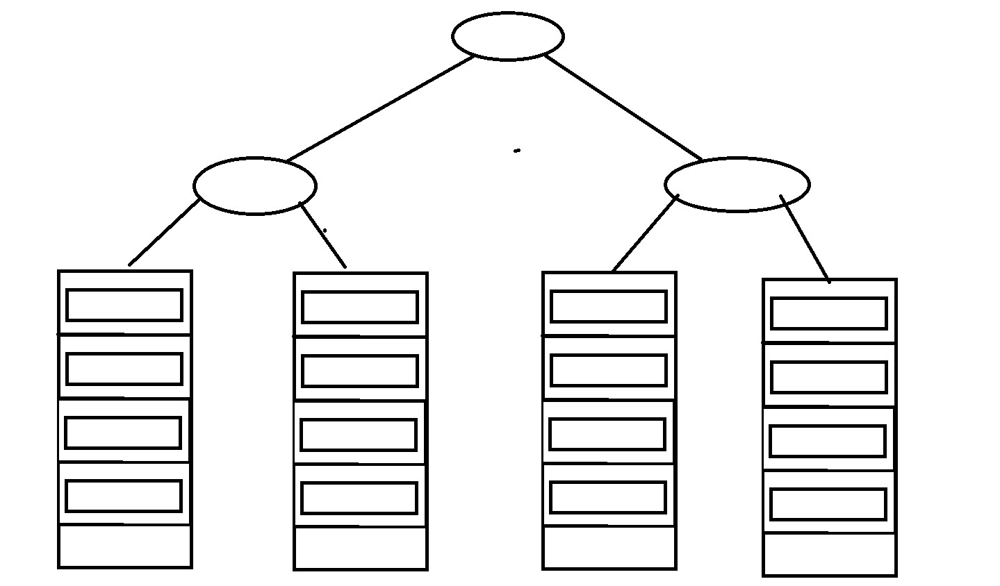
  - 平面组网
    > 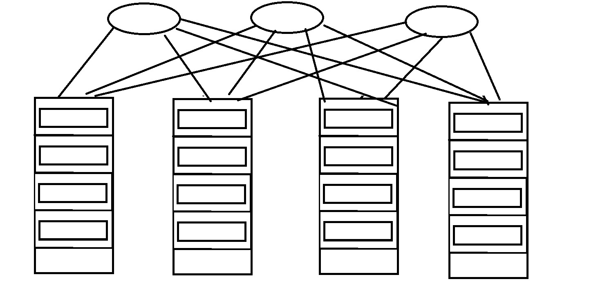

- Block 的副本放置策略
  > 不同服务器策略和组网模式方式策略不同
  > hadoop-hdfs-2.6.5.jar--org.apache.hadoop.hdfs.blockmanagement--BlockPlacePolicyDefault 类中注释有副本方式策略
  > 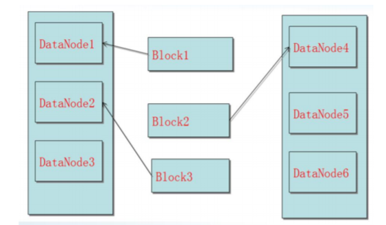
  - 机架服务器
    - 第一个副本：放置在上传文件的 DN；如果是集群外提交，则随机挑选一台磁盘不太满，CPU 不太忙的节点。
    - 第二个副本：放置在于第一个副本不同的 机架的节点上。
    - 第三个副本：与第二个副本相同机架的节点。
    - 更多副本：随机节点

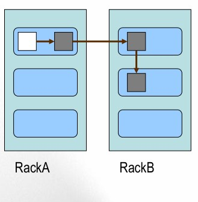

> rack 机架

### 2.2.8. 读写流程

- 写流程(动作执行者为 client)：

  > 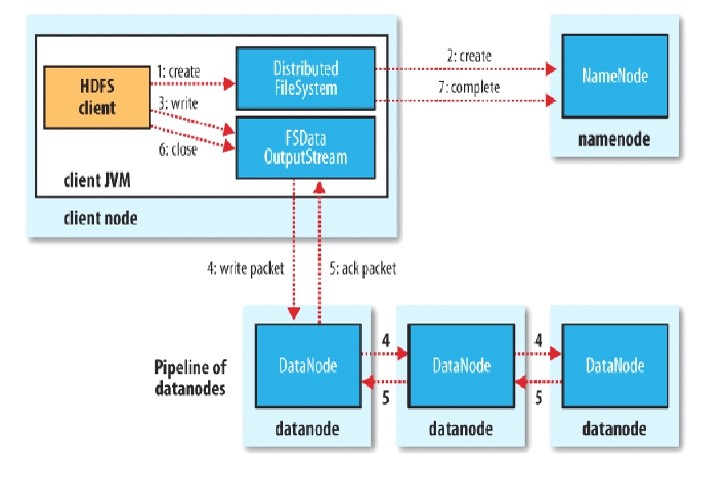
  > DistributedFileSystem， FSDataOutputStream 为两个对象，后者由前者创建，之后用的时候会更了解，此处不多讲<br>
  > 传输时并不是直接将一个 block（比如 128MB）传输出去，而是会讲 block 再次分割成小块（比如 64KB），再通过管道的方式传输 <br>
  > FSDataOutputStream 只会向第一个副本节点传输数据，对第一个副本节点负责，保证第一个副本节点的数据完整性<br>
  > FSDDataOutputStream 和 DataNode 之间可以看作管道，流式传输，FSDDataOutputStream 发送的数据包会流过三个 DataNode<br> > **确认**只发生在 Client 和第一个 DataNode 之间。而且所有 DataNode 一直和 NameNode 一直保持着通信，所以不必担心无法获知 block 是否传输完整<br>
  > 时间重叠：第一个 DataNode 传完之后，会立即启动下一个 block 的传输，但此时第二和第三个 DataNode 依旧在接收数据

  - 选择文件
  - 切分文件 Block
  - 按 Block 线性和 NN 获取 DN 列表（副本数）
  - 验证 DN 列表后以更小的单位流式传输数据
    - 各节点，两两通信确定可用
  - Block 传输结束后：
    - DN 向 NN 汇报 Block 信息
    - DN 向 Client 汇报完成
    - Client 向 NN 汇报完成
  - 获取下一个 Block 存放的 DN 列表
  - 。。。。。。
  - 最终 Client 汇报完成
  - NN 会在写流程更新文件状态

- 读流程(动作执行者为 client)：
  > 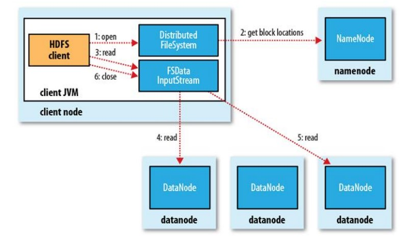
  > 本地读取策略：就近原则多个副本时，会读取最近的空闲的服务器
  - 从 NN 获取一部分 Block 副本位置列表
  - 在 Block 副本列表中按距离择优选取
  - 线性和 DN 获取 Block，最终合并为一个文件
  - MD5 验证数据完整性

### 2.2.9. HDFS 其他

#### 2.2.9.1. 文件权限

- HDFS 文件权限:POSIX 标准（可移植操作系统接口）
  - POSIX:Portable Operating System Interface
  - 与 Linux 文件权限类似
    - r: read; w:write; x:execute
    - 权限 x 对于文件忽略，对于文件夹表示是否允许访问其内容
  - hdfs 只是文件系统，而不是操作系统，没有用户系统，只会读取 linux 的用户
  - 如果 Linux 系统用户 zhangsan 使用 hadoop 命令创建一个文件，那么这个文件在 HDFS 中 owner 就是 zhangsan。
  - HDFS 的权限目的：阻止误操作，但不绝对。HDFS 相信，你告诉我你是谁，我就认为你是谁。

#### 2.2.9.2. 安全模式；

> 开启时的一段时间

- namenode 启动的时候，首先将映像文件(fsimage)载入内存，并执行编辑日志(edits)中的各项操作。
- 一旦在内存中成功建立文件系统元数据的映射，则创建一个新的 fsimage 文件(这个操作不需要 SecondaryNameNode)和一个空的编辑日志。
- 此刻 namenode 运行在安全模式。即 namenode 的文件系统对于客服端来说是只读的。(显示目录，显示文件内容等。写、删除、重命名都会失败，尚未获取动态信息)。
- 在此阶段 Namenode 收集各个 datanode 的报告，当数据块达到最小副本数以上时，会被认为是“安全”的， 在一定比例（可设置）的数据块被确定为“安全”后，再过若干时间，安全模式结束
- 当检测到副本数不足的数据块时，该块会被复制直到达到最小副本数，系统中数据块的位置并不是由 namenode 维护的，而是以块列表形式存储在 datanode 中。

- 角色==进程
- namenode
  - 数据元数据
  - 内存存储，不会有磁盘交换
  - 持久化（fsimage，edits log）
    - 不会持久化 block 的位置信息
  - block：偏移量，因为 block 不可以调整大小，hdfs，不支持修改文件
    - 偏移量不会改变
- datanode
  - block 块数据，块元数据信息
  - 磁盘
  - 面向文件，大小一样，不能调整
  - 副本数，可调整，（备份，高可用，容错/可以调整很多个，为了计算向数据移动）
- SN(2.x 版本中就没了)
- NN&DN
  - 心跳机制
  - DN 向 NN 汇报 block 信息
  - 安全模式
- client(api 环境中通过 java 来写)

#### 2.2.9.3. 数据错误与恢复

- 名称节点出错
  - 名称节点保存了所有的元数据信息，
  - 最核心的两大数据 结构是FsImage和Editlog， 如果这两个文件发生损坏，那么整个 HDFS实例将失效。
  - 因此，HDFS设置了备份机制，把这些核心文件 同步复制到备份服务器SecondaryNameNode上。
  - 当名称节点出错时， 就可以根据备份服务器SecondaryNameNode中的FsImage和Editlog 数据进行恢复。

- 数据节点出错
  - 每个数据节点会定期向名称节点发送“心跳”信息，向名称节点报告自 己的状态
  - 当数据节点发生故障，或者网络发生断网时，名称节点就无法收到来自 一些数据节点的心跳信息，这时，这些数据节点就会被标记为宕机，
  - 节点上面的所有数据都会被标记为不可读，名称节点不会再给它们 发送任何I/O请求
  - 这时，有可能出现一种情形，即由于一些数据节点的不可用，会导致一 些数据块的副本数量小于冗余因子
  - 名称节点会定期检查这种情况，一旦发现某个数据块的副本数量小于冗 余因子，就会启动数据冗余复制，为它生成新的副本
  - HDFS和其它分布式文件系统的最大区别就是可以调整冗余数据的位置

- 数据出错
  - 网络传输和磁盘错误等因素，都会造成数据错误
  - 客户端在读取到数据后，会采用md5和sha1对数据块进行校验，以确定读取到正确的数据
  - 在文件被创建时，客户端就会对每一个文件块进行信息摘录，并把这些信息 写入到同一个路径的隐藏文件里面
  - 当客户端读取文件的时候，会先读取该信息文件，然后，利用该信息文件对 每个读取的数据块进行校验
  - 如果校验出错，客户端就会请求到另外一个数据节点读取该文件块，并且向名称节点报告这个文件块有错误，名称节点会定期检查并且重新复制这个块

### 2.2.10. 根据官网部署伪分布式

> 具体请查看搭建文档 

- 可以有三种模式进行部署：

  - Local (Standalone) Mode：本地多线程方式模拟 hadoop 运作，测试时用用，一般不用
  - Pseudo-Distributed Mode：伪分布式。主从节点放到一个机器上
  - Fully-Distributed Mode：全分布式。

- 伪分布式：
  - 设置 ssh 免密码登录
    - ssh-keygen -t dsa -P '' -f ~/.ssh/id_dsa
    - cat ~/.ssh/id_dsa.pub >> ~/.ssh/authorized_keys
    - scp ./authorized_keys ......
  - 安装 jdk，设置环境变量
  - 二次修改环境变量。vi /opt/learn/hadoop-2.6.5/etc/hadoop-env.sh
    > 因为其他服务器上不一定修改了 profile，干脆在 hadoop 配置文件中修改得了
    ```sh
    export JAVA_HOME=${JAVA_HOME}
    # 改为
    export JAVA_HOME=/usr/java/jdk1.7.0_67
    ```
    - 顺便把所有块 mapred-env.sh,yarn-env.sh 也都改了
  - 根据官方修改
    - core-site.xml：主节点配置文件
      > Localhost 改成 node0001
    - hdfs-site.xml：分布式文件系统配置文件。副本数量，伪分布式部署，默认为 1
    - slave:DataNode 从节点列表文件。
  - 设置 DataNode ：slaves 文件 , 改为 node0001
  - 进入 hdfs-site.xml 配置 SecondNameNode 角色进程
    > 查看默认配置：
    > 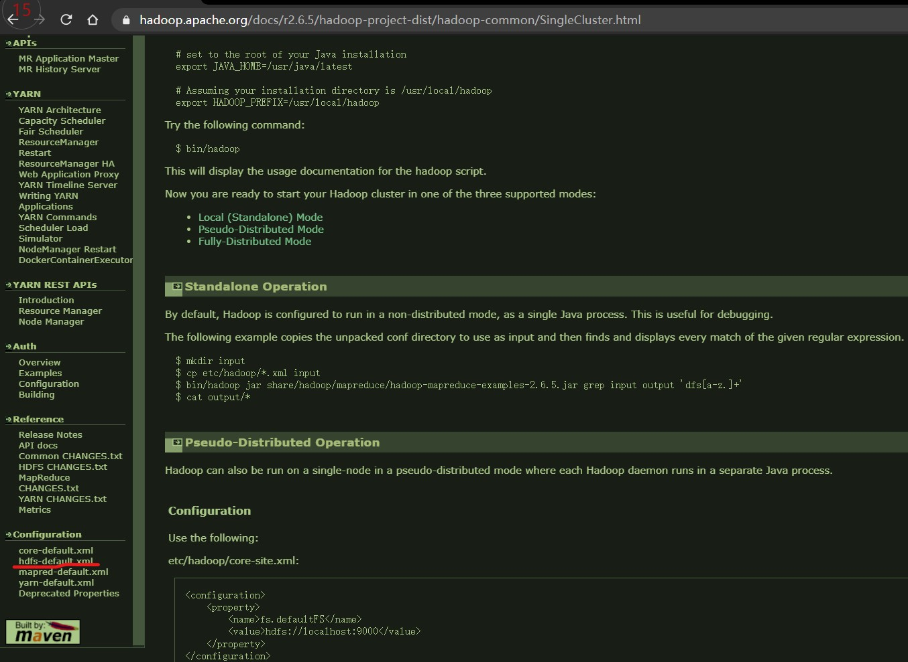
    ```xml
    <property>
        <name>dfs.namenode.secondary.http-address</name>
        <value>node0001:50090</value>
    </property>
    ```
  - 修改 core-site.xml
    > 同样方式查找默认配置
    - hdfs 中将元数据信息保存到，同时块数据也在该路径下
      >  > 
    - hadoop.tmp.dir 在 core-site.xml 中设置，默认`/tmp/hadoop-${user.name}`
    - 如果默认的话，一清楚 tmp 文件就玩完
    - 所以要修改下
      ```xml
      <configuration>
          <property>
              <name>fs.defaultFS</name>
              <value>hdfs://node0001:9000</value>
              <!-- NameNode主节点配置角色进程 -->
          </property>
          <property>
              <name>hadoop.tmp.dir</name>
              <value>/var/learn/hadoop/pseudo</value>
              <!-- 伪分布式相关文件配置位置 -->
          </property>
      </configuration>
      ```
  - 格式化 NameNode
    > DataNode,SecondNameNode 在启动时会生成相关文件，格式化只针对 NameNode<br>
    > edits 文件启动后生成
  - 查看/var/learn/hadoop/pseudo 下的文件
    - name 文件夹：namenode 元数据信息
      - current
        - fsimage_0000000000000000000
        - fsimage_0000000000000000000.md5
        - seen_txid
        - VERSION
          > 里面的 clusterID<br>
          > 集群唯一标识号，format 阶段形成，给所有角色共享<br>
          > 格式化一次就会变一次，但其他角色 id 不会变。所以不要多次启动<br>
          > 解决方式：手动修改回去。把 NameNode 改成和 DataNode 以及 SecondNameNode 一样，
          > 或者把所有其他的改成和 NameNode 一样
  - 启动
    > 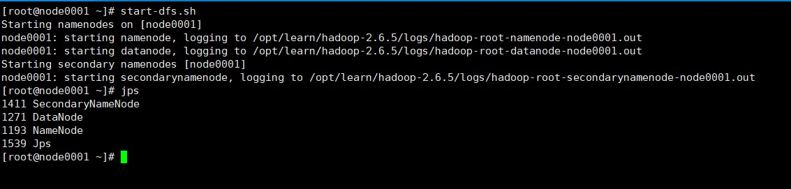 > 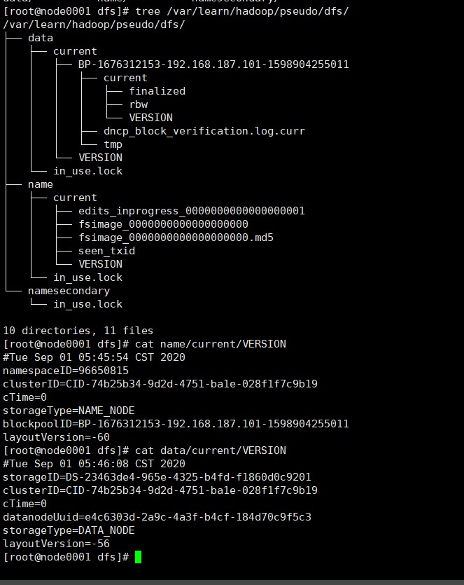
  - 可以在浏览器进入`192.168.187.lol:50070`查看负载情况
    > `ss -nal` 查看 socket 监听接口
    - Live Nodes 指的是 DataNode 节点
  - 进入交互界面：
    - hadoop fs：适用于任何不同的文件系统，比如本地文件系统和HDFS文件系统。
    - hadoop dfs：只能适用于HDFS文件系统。
    - hdfs dfs：跟hadoop dfs的命令作用一样，也只能适用于HDFS文件系统。(选择)
      > hdfs dfs 可以查看所有文件管理命令，贴近于 linux
  - NameNode 创建路径，再上传文件
    - hdfs dfsadmin -report 查看集群状态
    - hdfs dfs -mkdir -p /user/root
      > 上传文件的默认路径
    - hdfs dfs -ls 查看所有文件夹
  - 上传文件
    - hdfs dfs -put ~/files/hadoop-2.6.5.tar.gz /user/root
    - copying 状态不可访问
      > 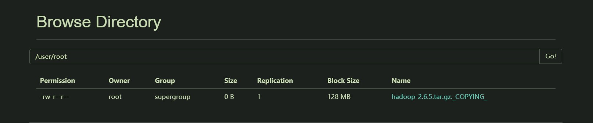
    - 上传完后，可以查看 block（默认 128MB，所以就是两块）
      > 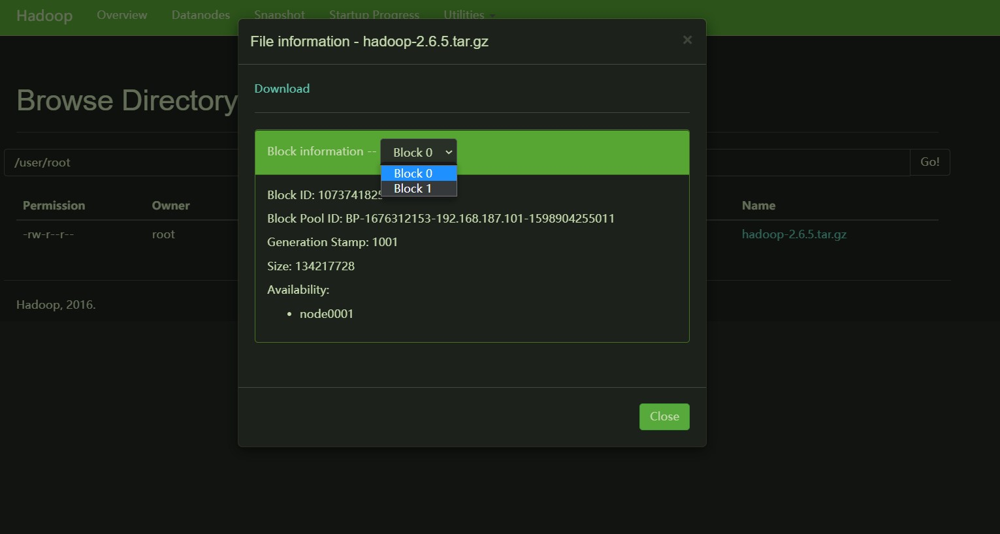
    - 快文件存储在/var/learn/hadoop/data 下
      > 
  - 关闭：stop-dfs.sh

### 2.2.11. 相关思考

- 列出 Hadoop 集群的 Hadoop 守护进程和相关的角色
- 为什么 hadoop 的 namenode 基于内存存储？他的优势和弊端是什么？
- hadoop namenode 持久化操作的流程
- 阐述分布式架构计算向数据移动的必要性
- 熟练完成伪分布式 hadoop 的安装，测试创建目录、上传、删除文件
- 测试角色进程版本号不一致现象并给出解决方案。

## 2.3. HDFS 分布式集群

### 2.3.1. hadoop1.0 集群搭建

| 节点名称 | NN  | DN  | SN  |
| :------: | :-: | :-: | :-: |
| node0001 | \*  |     |     |
| node0002 |     | \*  | \*  |
| node0003 |     | \*  |     |
| node0004 |     | \*  |     |

- 搭建基础 linux 集群
  > 安全机制 hosts 防火墙等设置
- 设置成相同时间：`date -s "2020-09-01 15:32:00"`
- 免密钥操作
  > NN 要开启其他节点的角色进程，需要权限
  - `scp .ssh/authorized_keys root@node0002:.ssh/node0001.pub`
    > 该操作是对免密码登录服务器进行记录。因为可能不止只有一个服务器可以免密码，所以不能直接覆盖 authorized_keys
  - `cat .ssh/node0001.pub >> .ssh/authorized_keys`
- 修改 core-site.xml
  ```xml
  <configuration>
      <property>
          <name>fs.defaultFS</name>
          <value>hdfs://node0001:9000</value>
          <!-- 全分布式NameNode主节点角色进程信息 -->
      </property>
      <property>
          <name>hadoop.tmp.dir</name>
          <value>/var/learn/hadoop/full</value>
          <!-- 全分布式部署相关文件存储位置 -->
      </property>
  </configuration>
  ```
- 修改 hdfs-site.xml
  ```xml
    <configuration>
      <property>
          <name>dfs.replication</name>
          <value>2</value>
          <!-- 因为只有三个从节点，所以为了查看副本放置策略，这里设置成两个 -->
      </property>
      <property>
          <name>dfs.namenode.secondary.http-address</name>
          <value>node0002:50090</value>
          <!-- SecondNameNode单独配置到另一台上 -->
          <!-- node0002即是SecondeNameNode，也是从节点 -->
      </property>
    </configuration>
  ```
- 修改 slaves
  ```
  node0002
  node0003
  node0004
  ```
- 将 hadoop 发送(`scp`)到其他三个节点上
- 将/etc/profile 分发到其他三个节点上（也可以自己手动改），再 souce 重新加载
- `hdfs namenode -format` 格式化 NameNode 节点
- 启动`start-dfs.sh`
  > 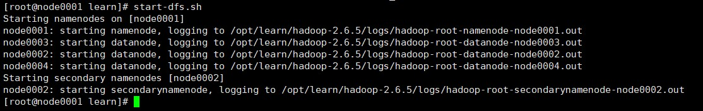
  > 启动提示，启动 NameNode 时，会自动启动 DataNode 和 SecondNameNode。以及日志文件位置。出现问题后，就去查日志。<br>
  > 在 NameNode 或 DataNode 都能启动 hadoop
  > 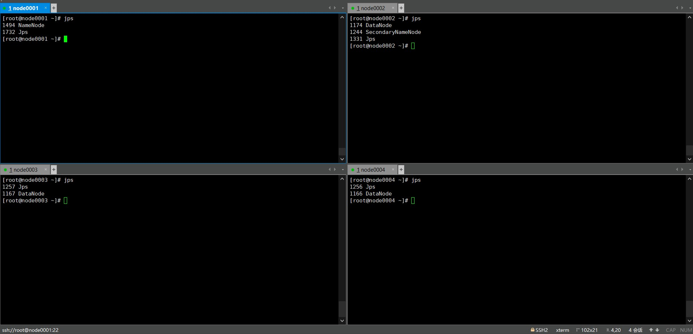
  > 角色进程
- 创建 hdfs 的文件夹`hdfs dfs mkdir -p /user/root`
- 设置测试文件`for i in $(seq 100000);do echo "hello hadoop $i" >> test.txt;done`
- 以指定块大小发放文件 `hdfs dfs -D dfs.blocksize=1048576 -put test.txt`
  > 这里指定的是 1MB
  > 属性名可以查看官方文档中的 hdfs-defult.xml<br>
  > 目的路径不写的话默认放到/user/root 路径(如果不提前创建的话会报错)<br>
- 查看块分布
  > 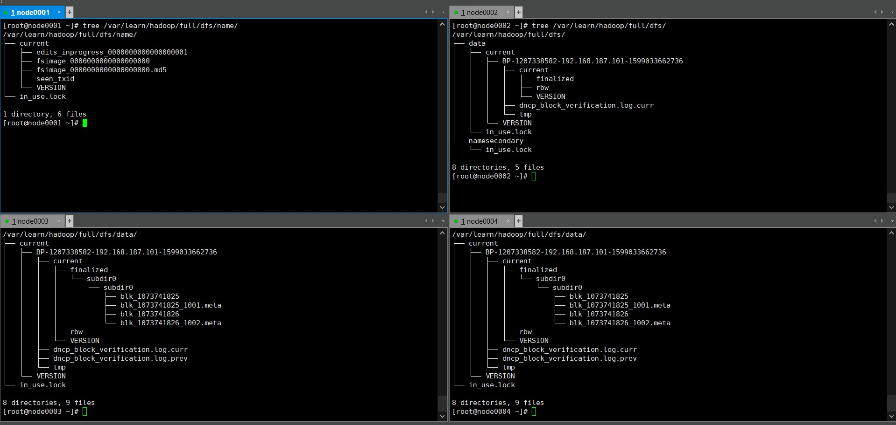
  > 块分布，块 1 放在了 node0003,node0004。块 2 放在了 node0003,node0004（可以能 node0002，node0004 等，与是否为同一个文件无关）。
- `vi + /var/learn/hadoop/full/dfs/data/current/BP-1207338582-192.168.187.lol-1599033662736/current/finalized/subdir0/subdir0/blk_1073741825`
  > 查看块内容，可以发现按字节切割，会把行拆开
  > 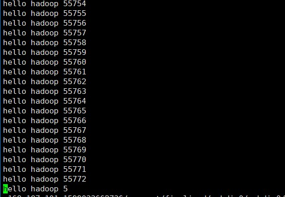 <br> > **以后讲内部代码时会讲解决办法，解决办法在当时说**

### 2.3.2. hadoop2.0 及 导入

- Hadoop 2.0 产生背景

  - Hadoop 1.0 中 HDFS 和 MapReduce 在高可用、扩展性等方面存在问题
  - HDFS 存在的问题(2 个)
    - NameNode 单点故障，难以应用于在线场景。解决方式：High Availability(高可用)
      > 主备模型。<br>
      > 主备不同时工作原因：面临问题：**split brain(脑裂)**
    - NameNode 压力过大，且内存受限，影扩展性。解决方式：Federation(联邦)
      > NameNode 内存优先，无法充分使用所有 DataNode 服务器<br>
      > 联邦： 多个 NameNode 共同提供服务
  - MapReduce 存在的问题响系统
    - JobTracker 访问压力大，影响系统扩展性
    - 难以支持除 MapReduce 之外的计算框架，比如 Spark、Storm 等

- Hadoop 1.x 与 Hadoop 2.x

  > 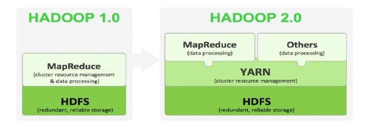

- Hadoop 2.x 由 HDFS、MapReduce 和 YARN 三个分支构成；

  - HDFS：NN Federation（联邦）、HA；
    - 2.X:只支持 2 个节点 HA，3.0 实现了一主多从，官方推荐一主两备
  - MapReduce：运行在 YARN 上的 MR；
    - 离线计算，基于磁盘 I/O 计算
  - YARN：资源管理系统

- HDFS 2.x
  - 解决 HDFS 1.0 中单点故障和内存受限问题。
  - 解决单点故障
    - HDFS HA：通过主备 NameNode 解决
    - 如果主 NameNode 发生故障，则切换到备 NameNode 上
  - 解决内存受限问题
    - HDFS Federation(联邦)
    - 水平扩展，支持多个 NameNode；
    - （2）每个 NameNode 分管一部分目录；
    - （1）所有 NameNode 共享所有 DataNode 存储资源
  - 2.x 仅是架构上发生了变化，使用方式不变
  - 对 HDFS 使用者透明
  - HDFS 1.x 中的命令和 API 仍可以使用

### 2.3.3. 高可用(ZK+JN)

> 使用，主备模型。主要看主备间的数据同步问题

- 主备注意点：

  - hadoop2.0 中 SecondNameNode 就用不上了
  - 备 NameNode(NN Standby) 用来做 edits 和 fsimage 的合并

- HDFS 2.0 HA

  > ppt 总结

  - 主备 NameNode
  - 解决单点故障（属性，位置）
    - 主 NameNode 对外提供服务，备 NameNode 同步主 NameNode 元数据，以待切换
    - 所有 DataNode 同时向两个 NameNode 汇报数据块信息（位置）
    - JN 集群（属性）
    - standby：备，完成了 edits.log 文件的合并产生新的 image，推送回 ANN
  - 两种切换选择
    - 手动切换：通过命令实现主备之间的切换，可以用 HDFS 升级等场合
    - 自动切换：基于 Zookeeper 实现
      > 详情看下面
      - 基于 Zookeeper 自动切换方案
      - ZooKeeper Failover Controller：监控 NameNode 健康状态，
      - 并向 Zookeeper 注册 NameNode
      - NameNode 挂掉后，ZKFC 为 NameNode 竞争锁，获得 ZKFC 锁的 NameNode 变为 active

- hadoop2.0 高可用架构模型图
  > 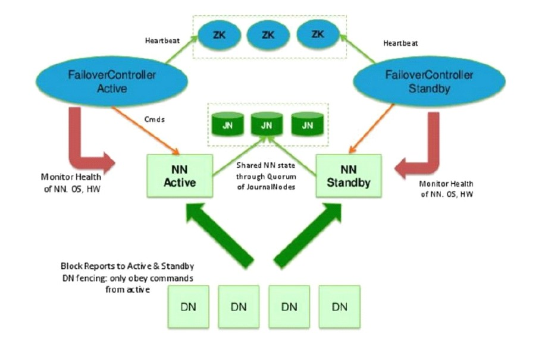 > 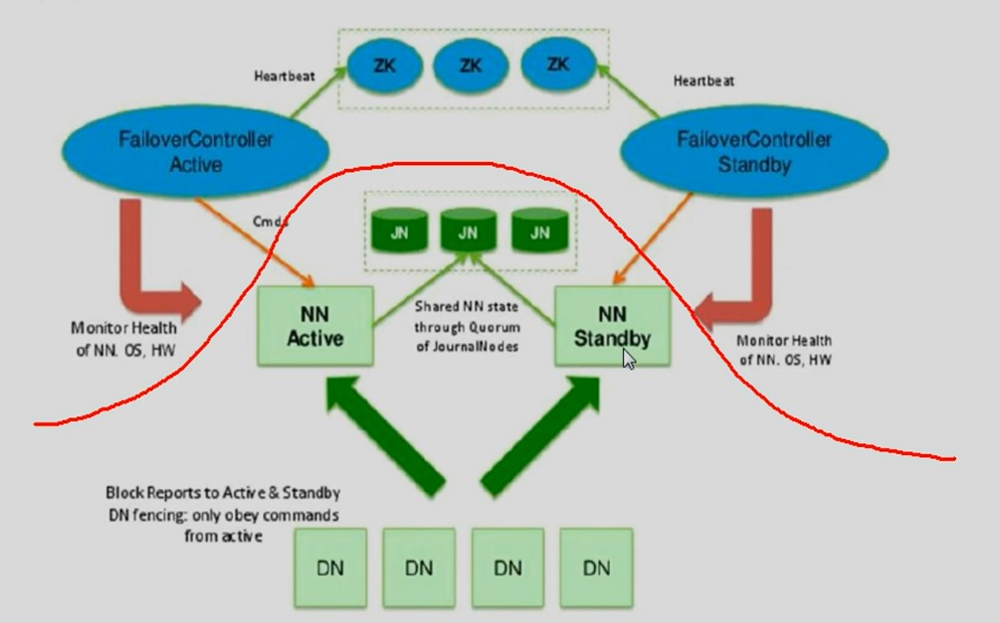
  - 作用:
    - 上半部分完成主备节点间的自动切换
      - 通过 zookeeper(分布式协调系统)
    - 下部分做到了数据同步
  - 同 lvs，两个主备 NN 必须时刻保持数据同步
    - 数据类型：
      - 动态数据：块位置信息
        > DN 时刻向 NN 主动汇报的信息，不会持久化到文件当中
      - 静态数据：块偏移量，大小，权限
    - 数据同步方式：
      - 动态数据：单一汇报变成多汇报
      - 静态数据：
        - 早期：nfs:network filesystem(网络同步服务器)，将 edits 文件放到另一台服务器上，主备公用。
          > 缺陷：nfs 依旧有单点故障问题
        - 现在使用：**JournalNode(日志节点)集群**。多台 JN 共同保存 edits 日志数据，JN 间保持同步。主 NN 往 JN 集群中写，备 NN 从 JN 中读
          - JournalNode 数量必须为奇数且大于等于 3
          - 过半机制：最多容忍一半及以下台服务器出现故障。原因之后再讲
          - 弱一致性，cap 定理
        - 关于为何不在两台主备间进行 socket 通信：
          ```
          因为ack确认机制
          如果主与备之间进行确认，如果备发生故障就完全堵塞
          如果不进行确认，无法确认备份状态
          强一致性
          ```
  - 主备切换：
    - 手动切换：
      - 不使用 zookeeper 集群
      - 数据同步会自动进行，但当主服务器挂掉，必须手动切换，或通过脚本实现自动切换
    - 自动切换：
      > zookeeper:分布式协调系统。底层 java，开源。
      > 底层基于 zab 协议。来源于 1990 年 paxos 论文：基于消息一致性算法的论文
      - 使用 zookeeper 集群。自动完成主备节点的切换
      - zookeeper 基本原理:
        > zookeeper 高可用：一主多从架构<br>
        > cs 架构，zkfc 相当于客户端，zookeeper 集群相当于服务端<br>
        > 看文档（高可用配置那里）。<br>
        > 四大机制：register(注册)，watchEvent(监听事件),callback(客户端函数的回调,客户端是 zkfc 的函数),
        - zookeeper 在每个 NN 上开启一个 FailoverController(故障转移控制,缩写：zkfc)进程。
          > [组件详解](https://blog.csdn.net/bocai8058/article/details/78870451)。详细多查查网页
          - elector 组件:每个 FailoverController 进程中有 elector(选举)进程，都向 zookeeper 集群申请作为主节点（register，注册）。最先进行注册的节点会作为主节点（注册顺序可以通过代码控制）。（相当于一个回调函数）
          - HealthMonitor:健康检查组件，检查 NN 健康状态。（相当于一个事件）
        - zookeeper 中为主 NN 创建一个节点路径`znode`，该路径之下，会有节点的注册信息
        - 备 NN 会委托 zookeeper 检查 zookeeper 观察主 NN 所发生的事件
        - 如果 NN 出现故障，zookeeper 告知备 NN
        - 备 NN 会调用回调函数，强制让主 NN 变为 Standby 状态，再自行将 Standby 转为 active 状态
          > 也就是说 zookeeper 只起到消息通知作用<br>
          > 就算主 NN 故障了，也不能直接把备 NN 提升为 active，否则会出现 split brain 问题

### 2.3.4. 联邦

> 搭建不作为重点，普通企业 NameNode 很少需要搭建联邦

- 目的：
  - 通过多个 namenode/namespace 把元数据的存储和管理分散到多个节点中，使到 namenode/namespace 可以通过增加机器来进行水平扩展。
  - 能把单个 namenode 的负载分散到多个节点中，在 HDFS 数据规模较大的时候不会也降低 HDFS 的性能。可以通过多个 namespace 来隔离不同类型的应用，把不同类型应用的 HDFS 元数据的存储和管理分派到不同的 namenode 中。

**※待做**

### 2.3.5. Ambari

**※待做**

### 2.3.6. 2.0 高可用集群搭建

#### 2.3.6.1. 搭建目标

> 多看官方文档

| 节点名称 | NN-1 | NN-2 | DN  | ZK  | ZKFC |  JN  |
| :------: | :--: | :--: | :-: | :-: | :--: | :--: |
| node0001 |  \*  |      |     |     |  \*  |  \*  |
| node0002 |      |  \*  | \*  | \*  |  \*  |  \*  |
| node0003 |      |      | \*  | \*  |      | \*　 |
| node0004 |      |      | \*  | \*  |      |      |

> 其中 zookeeper 的搭建和别的集群没有任何关系，搭建在哪里都行（可以查看上面那个架构图）。但 ZKFC 必须要搭建在两个主备 NN 上

> ZKFC 是 NN 中的进程，通过 hdfs 命令格式化和开启

> journalnode 需要在 hadoop 配置文件中指明，位置随便

> journalnode 和 zookeeper 要先于 DN 和 NN 启动

#### 2.3.6.2. 搭建过程

> 推荐仔细看看文档，都有

**在基础集群上进行搭建**

- node0001 和 node0002 间要进行主备切换，所以互相要可以免密钥登录。进行免密钥设置
- hdfs-site.xml

  ```xml
  <configuration>
    <property>
      <name>dfs.replication</name>
      <value>2</value>
    </property>
    <property>
      <name>dfs.nameservices</name>
      <!-- namenode services缩写 -->
      <value>mycluster</value>
      <!-- 一对主备NN的逻辑名称 -->
    </property>
    <property>
      <name>dfs.ha.namenodes.mycluster</name>
      <value>nn1,nn2</value>
      <!-- mycluster对应的两个NN的逻辑名称 -->
    </property>
     <property>
      <name>dfs.namenode.rpc-address.mycluster.nn1</name>
      <!-- 远程过程调用（Remote Procedure Call） -->
      <!-- rpc:remote procedure call.类似java中的rmi -->
      <value>node0001:8020</value>
      <!-- nn1所在ip:port -->
    </property>
    <property>
      <name>dfs.namenode.rpc-address.mycluster.nn2</name>
      <value>node0002:8020</value>
      <!-- nn2所在ip:port -->
    </property>
    <property>
      <name>dfs.namenode.http-address.mycluster.nn1</name>
      <value>node0001:50070</value>
      <!-- nn1对应图形管理界面ip:port -->
    </property>
    <property>
      <name>dfs.namenode.http-address.mycluster.nn2</name>
      <value>node0002:50070</value>
      <!-- nn2对应图形管理界面ip:port -->
    </property>
    <property>
      <name>dfs.namenode.shared.edits.dir</name>
      <value>qjournal://node0001:8485;node0002:8485;node0003:8485/mycluster</value>
      <!-- mycluster主备NN 使用的 JN集群对应服务器 -->
    </property>
    <property>
      <name>dfs.client.failover.proxy.provider.mycluster</name>
      <value>org.apache.hadoop.hdfs.server.namenode.ha.ConfiguredFailoverProxyProvider</value>
      <!-- 故障转移的代理类,这里直接抄上去就行了 -->
    </property>

    <!-- 下面两个是为了避免当主NN发生故障可能产生的splite-brain情况 -->
    <!-- 通过ssh的方式，也可以配置shell的方式 -->
    <property>
      <name>dfs.ha.fencing.methods</name>
      <value>sshfence</value>
      <!-- ssh远程登录进行隔离。standby登录active -->
    </property>
    <property>
      <name>dfs.ha.fencing.ssh.private-key-files</name>
      <value>/root/.ssh/id_dsa</value>
      <!-- 私钥文件位置。私钥作用？？ -->
    </property>

    <property>
      <name>dfs.journalnode.edits.dir</name>
      <value>/var/learn/hadoop/ha/journalnode</value>
      <!-- journalnode存储的绝对路径位置，JN间会同步，都放置在同一个位置 -->
    </property>
  </configuration>
  ```

- core-site.xml
  ```xml
  <configuration>
    <property>
        <name>fs.defaultFS</name>
        <value>hdfs://mycluster</value>
    </property>
    <property>
        <name>hadoop.tmp.dir</name>
        <value>/var/learn/hadoop/ha</value>
    </property>
  </configuration>
  ```
- slave:照旧

- (现在整个系统配置好了高可用，已经可以跑起来了，只不过需要手动切换主备。zookeeper 是游离于整个系统之外，他的启动和关闭和整个系统没关系，仅仅根据需要进行配置)

  - 如果现在想启动，跳过 zookeeper 配置直接到启动即可

- zookeeper 配置

  - 添加 zookeeper
    - hdfs-site.xml：
      ```xml
      <!-- 添加 -->
      <property>
        <name>dfs.ha.automatic-failover.enabled</name>
        <value>true</value>
        <!-- 开启自动故障转移 -->
      </property>
      ```
    - core-site.xml
      ```xml
      <property>
        <name>ha.zookeeper.quorum</name>
        <value>node0002:2181,node0003:2181,node0004:2181</value>
        <!-- 指明zookeeper集群服务器位置 -->
      </property>
      ```
  - 分发 hadoop 配置文件到其他节点
  - zookeeper 解压到 /opt/learn/
  - 修改 zookeeper 配置文件
    - mv zoo_sample.cfg zoo.cfg
    - vi zoo.cfg
    - 修改：`dataDir=/var/learn/zk`
      > 指定该文件夹用来存放编号文件，见下方
    - 结尾添加：
      > zookeeper 集群在搭建一开始就需要提供集群服务器的信息，并为服务器编号 serverid<br>
      > zookeeper 是一主多从架构，zookeeper 的编号与选举机制有关。同时启动的情况下，最大编号服务器会作为主服务器（其他因素之后讲）
      ```
      <!-- 2888：主从间通讯接口 -->
      <!-- 3888：主挂断后，选举机制采用的通讯端口 -->
      server.1=node0002:2888:3888
      server.2=node0003:2888:3888
      server.3=node0004:2888:3888
      ```
  - 讲 zookeeper 分发到其他节点/opt/learn
  - 创建编号目录
    > 每台服务器在启动时会读取该文件获得自己编号
    - node0002:`mkdir -p /var/learn/zk` `echo 1 > /var/learn/zk/myid`
    - node0003:`mkdir -p /var/learn/zk` `echo 2 > /var/learn/zk/myid`
    - node0004:`mkdir -p /var/learn/zk` `echo 3 > /var/learn/zk/myid`
  - zookeeper 环境变量配置
    ```shell
    export ZOOKEEPER_HOME=/opt/learn/zookeeper-3.4.6
    PATH=$PATH:$ZOOKEEPER_HOME/bin
    ```
  - 分发 profile
  - source /etc/profile
  - 每台都运行`zkServer.sh start`来启动
    > 如果一台一台启动，第一台启动时，zookeeper 不会运行。第二台启动时，两台服务器会同时开始运行(过半原则)，同时两台中较大 id 的服务器会作为 leader，其他会作为 follower
    - jps 查看
      - QuorumPeerMain 进程
    - zkServer.sh status 查看
  - ZKFC 进程在主备 NN 上会随着 hadoop 启动而启动（也可以手动单独启动）(查文档)

- 首次启动

  > 其实也可以将启动和结束写成一个脚本。之后有时间写下

  - zookeeper 已经启动了
  - journalnode 启动
    > 目的：提前启动 journalnode，给 NN2 同步 NN1 的格式化信息（如果 NN2 额外格式化，id 会有区别）<br>
    > 过程：启动 journalnode，启动主 namenode(不启动 hadoop),格式化主 namenode(edits 放入 journalnode)，备 NN 通过 journalnode 同步主 NN 的格式化信息<br>
    > 所以再次启动时，就不用提前启动 journalnode 了。start-dfs.sh 会自动启动 journalnode
    - node0001 启动 journalnode:`hadoop-daemon.sh start journalnode`
    - node0002 启动 journalnode:`hadoop-daemon.sh start journalnode`
    - node0003 启动 journalnode:`hadoop-daemon.sh start journalnode`
  - NN-1(node0001)格式化：`hdfs namenode -format`
    > 格式化 namenode 时，也会将 journalnode 格式化
  - 启动 NN-1 角色进程 `hadoop-daemon.sh start namenode`
    > `start-dfs.sh`是开启所有服务器的角色进程，包括 ZKFC 和备 NN，而 NN2 还没有格式化，所以现在用不上
    > 该操作仅仅会启动 NN1 的角色守护进程，是为了 NN-2 和 NN-1 间能够进行信息传递，之后要拷贝格式化后得到的文件（类似：NN-1 作为 S,NN-2 作为 C）
  - NN-2 同步 NN-1 的格式化信息，NN2 上执行：`hdfs namenode -bootstrapStandby`
    > NN-2 不要格式化，否则两节点 id 不一致，无法构成一个集群
  - node0001: 在 zookeeper 集群中创建目录。hdfs zkfc -formatZK
    > 实质是 hdfs 在 zookeeper 集群上初始化，会在 zookeeper 下创建/hadoop-ha/mucluster 目录
  - zkCli.sh，进入 zookeeper 客户端交互（哪个 ZK 节点都行）
    - help 查看命令列表
    - ls / 查看根目录
    - ls /hadoop-ha
  - node0001:`start-dfs.sh`启动集群
    > 其他可以免密登录的节点来启动也行，但当前只为 NN1 设置了免密<br>
    > NN-1 守护角色进程已经启动，不会重复启动<br>
    > zkfc 会在此时启动
  - zkCli.sh，进入 zookeeper 客户端交互
    > zookeeper 集群中的无论哪个机器都能进入。原理(上面提到过)：底层基于 zab 协议。来源于 1990 年 paxos 论文：基于消息一致性算法的论文
    - ls / 查看根目录
    - ls /hadoop-ha
    - get /hadoop-ha/mycluster/ActiveBreadCrumd
    - get /hadoop-ha/mycluster/ActiveStandyElectorLock
      > 只会处于 active 节点(node0001)的信息会在 zookeeper 完成注册
  - 浏览器进入 node0001:50070 node0002:50070

- 测试

  - 1
    - node0006:`hadoop-daemon.sh stop namenode`
    - 浏览器进入 node0002:50070
      > 会发现自动故障转移切换
    - zkCli.sh，进入 zookeeper 客户端交互
      - get /hadoop-ha/mycluster/ActiveBreadCrumd
      - get /hadoop-ha/mycluster/ActiveStandyElectorLock
        > 只会处于 active 节点(node0002)的信息会在 zookeeper 完成注册
    - node0006 重新启动角色进程:`hadoop-daemon.sh start namenode`
      > node0006 会作为备
  - 2
    - node0007:`hadoop-daemon.sh stop zkfc`
    - node0007 变为备
    - node0006 变为主

- 关闭

  - 关闭除 zookeeper 外的所有进程：`stop-dfs.sh`
  - 关闭 zookeeper:三个 zookeeper 服务器执行`zkServer.sh stop`

- 再次启动：
  - 启动三个 zookeeper 服务端进程
  - start-dfs.sh

### 2.3.7. java api 操作

#### 2.3.7.1. 示例代码

- 导入相关 jar 包
- 通过代码操作

  > 注意，因为 CS 架构，java 代码只能在 Client 一端运行，硬性要求。无法在 NN1 上运行<br>
  > 真正使用这些 api 的是 Mapreduce 框架，此处只是试试

  ```java
  public class TestHDFS {

    Configuration  conf = null;
    FileSystem  fs = null;

    @Before
    public void conn() throws Exception{

      conf = new Configuration();// 会自动读取根目录下的配置文件 hdfs-site.xml,core-site.xml
      // conf.set("fs.defaultFS", "hdfs://node01:9000");
      fs = FileSystem.get(conf);
    }

    @After
    public void close() throws Exception{
      fs.close();
    }

    @Test
    public void testConf(){
      System.out.println(conf.get("fs.defaultFS"));
    }

    @Test
    public void mkdir() throws Exception{
      // 创建文件夹
      Path dir = new Path("/sxt");
      if(!fs.exists(dir)){
        fs.mkdirs(dir );
      }
    }

    @Test
    public void uploadFile() throws Exception{
      // 上传文件
      Path file = new Path("/sxt/ok.txt");// 上传位置
      FSDataOutputStream output = fs.create(file); // 上传对象
      InputStream input = new BufferedInputStream(new FileInputStream(new File("c:\\nginx")) ) ;//读取文件
      // hadoop提供 io 工具类，将输入流中的数据复制到输出流。
      IOUtils.copyBytes(input, output, conf, true);
    }

    @Test
    public void readFile() throws Exception{
      Path path = new Path("/user/root/test.txt"); // hdfs中的文件路径
      FileStatus ffs = fs.getFileStatus(path);

      // 获取块的位置信息(数组)  !!!! 重要！！！！
      BlockLocation[] blks = fs.getFileBlockLocations(ffs , 0, ffs.getLen());

      for (BlockLocation b : blks) {
        System.out.println(b);
        // 0,1048576,node08,node09
        // 1048576,540319,node08,node09

        HdfsBlockLocation hbl = (HdfsBlockLocation)b;
        System.out.println(hbl.getLocatedBlock().getBlock().getBlockId());
      }

      // 读取文件
      FSDataInputStream input = fs.open(path);

      // 输出文件内容，不转为char就是ascii码
      // 一次读一个Byte
      System.out.println((char)input.readByte());//h
      System.out.println((char)input.readByte());//e
      System.out.println((char)input.readByte());//l
      System.out.println((char)input.readByte());//l
      System.out.println((char)input.readByte());//o

      input.seek(1048576);//调整指针，读取第二快的
      System.out.println((char)input.readByte());
    }

    @Test
    public void seqfile() throws Exception{

      Path value = new Path("/haha.seq");

      IntWritable key = new IntWritable();
      Text val = new Text();
      Option file = SequenceFile.Writer.file(value);
      Option keyClass = SequenceFile.Writer.keyClass(key.getClass());
      Option valueClass = SequenceFile.Writer.valueClass(val.getClass());

      Writer writer = SequenceFile.createWriter(conf, file,keyClass,valueClass);

      for (int i = 0; i < 10; i++) {
        key.set(i);
        val.set("sxt..."+i);
        writer.append(key, val);
      }
      writer.hflush();
      writer.close();

      SequenceFile.Reader.Option infile = Reader.file(value);
      SequenceFile.Reader reader = new SequenceFile.Reader(conf,infile);

      String name = reader.getKeyClassName();
      System.out.println(name);
    }
  }
  ```

#### 2.3.7.2. api

- 上传：
  - fs.copyFromLocalFile(new Path("c:/ss.txt"), new Path("/a"));
  - 使用IOUtils自行实现
    ```java
    Path file = new Path("/learn/ok.txt");// 上传位置
    FSDataOutputStream output = fs.create(file); // 上传对象，打开创建输出流。从内存输出到hdfs
    InputStream input = new BufferedInputStream(new FileInputStream(new File("c:\\nginx")) ) ;//读取文件。从磁盘输入到内存
    // hadoop提供 io 工具类，将输入流中的数据复制到输出流。
    IOUtils.copyBytes(input, output, conf, true);
    ```
- 下载：
  - fs.copyToLocalFile(new Path("/a/qqq.txt"), new Path("c:/qqq.txt"));
  - 使用IOUtils自行实现
    ```java
    // 只是输入流和输出流与hdfs和本地文件系统的对应关系换了下
    Path path = new Path("/learn/test.txt") //下载文件位置
    FSDataInputStream input = fs.open(path);// 创建一个输入流。从hdfs输入到本地内存
    OutputStream output = new BufferedOutputStream(new FileInputStream(new File("D:\\test.txt")))// 从本地内存输出到磁盘
    IOUtils.copyBytes(input, output, conf, true);
    ```
- 上传下载相关：
  ```
  插曲：HDFS集群的上传和下载的底层就是采用流的方式，引深出来文件系统的两个API
  分别上open()打开一个输入流，create()创建一个输出流。输入输出都是针对本地文件系统来说的
  这样其实我们不用调用copyFromLocalFile和copyToLocalFile的API
  我们自己采用流的方式进行实现，在本地系统中new一个输入流，然后创建HDFS集群的输出流对象
  然后把输入流上的数据拷贝到输出流上去就可以了。
  ```

- 读取：
  ```java
  FSDataInputStream input = fs.open(path);
  input.read***()
  ```
- 文件系统api操作：
  - fs.mkdir
  - fs.rename:重命名或者移动
  - fs.delete: 删除文件或文件夹
  - fs.isFile: 是否为文件
  - fs.exists: 判断文件是否存在
- 获取某块一部分数据的位置信息(数组)
  ```java
  Path path = new Path("/user/root/test.txt"); // hdfs中的文件路径
  FileStatus ffs = fs.getFileStatus(path); // 获取文件状态信息
  BlockLocation[] blks = fs.getFileBlockLocations(ffs , 0, ffs.getLen());

  // 使用LocatedFileStatus 对象可以获得一整块的位置信息
  ```
- 遍历相关
  - 列出指定hdfs目录的信息：fs.listFiles
    ```java
    RemoteIterator<LocatedFileStatus> iterator = fs.listFiles(new Path(path), true);
    // 列出某个文件夹下的所有文件，参数1是路径，参数2是表示是否级联（该文件夹下面还有 子文件 要不要看,注意没有 子文件夹!!）

    while(listFiles.hasNext()) {
          LocatedFileStatus file = listFiles.next(); //文件的存储路径，以hdfs://开头的全路径----> hdfs://hadoop02:9000/a/gg.txt
          System.out.println(file.getPath());
          //只是文件名 gg.txt
          System.out.println(file.getPath().getName());
          //块大小
          System.out.println(file.getBlockSize());
          //分组信息
          System.out.println(file.getGroup());
          //文件的长度
          System.out.println(file.getLen());
          //文件所有者
          System.out.println(file.getOwner());

          //类，就是object的那个方法没有什么特殊的。
          //会返回一个你的对象所对应的一个Class的对象，
          // 这个返回来的对象保存着你的原对象的类信息，比如你的原对象的类名叫什么，类里有什么方法，字段等。
          System.out.println(file.getClass());
          //权限信息
          System.out.println(file.getPermission());
          //副本个数，从元数据中找出来几个的
          System.out.println(file.getReplication());
          
          //块位置相关的信息
          BlockLocation[] blockLocations = file.getBlockLocations();
          //blockLocations对象的长度就是块的数量
          System.out.println(blockLocations.length);
          
          for(BlockLocation bl : blockLocations) {
            //得到每一个块到底在哪个机器里(案例一个文件有3个块，三个副本)
            String[] hosts = bl.getHosts();
            //为了方便就不循环了，最终的显示 hadoop03-hadoop05-hadoop02,hadoop02-hadoop03-hadoop05,hadoop02-hadoop05-hadoop04
            System.out.println(hosts[0]+"-"+hosts[1]+hosts[2]);
            //逻辑的一个路径
            bl.getTopologyPaths();
      }
    }
    fs.close();
    ```
  - 列出指定hdfs目录所有状态信息:fs.listStatus(new Path(parh));
    > 状态,此方法与listFiles不同,不支持传true或false,即不能级联，如果想实现级联就采用递归的方式
    ```java
    //展示状态信息
    FileStatus[] fileStatuses = fs.listStatus(new Path(parh));
    //遍历所有文件
    for (FileStatus fs:fileStatuses){
        if (fs.isFile()){
            System.out.println("文件-----f------" + fs.getPath().getName());
        }else {
            System.out.println("文件-----d------" + fs.getPath().getName());
        }
    }
    ```

#### 2.3.7.3. 读流程

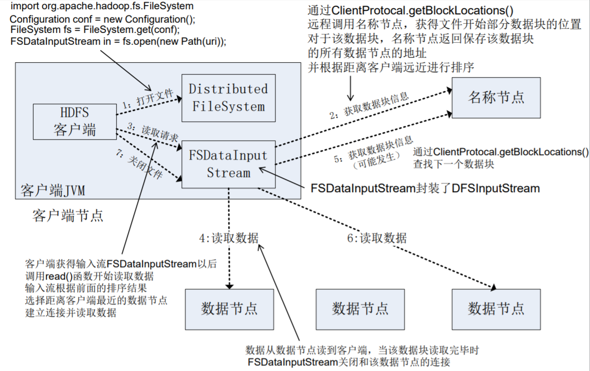

#### 2.3.7.4. 写流程

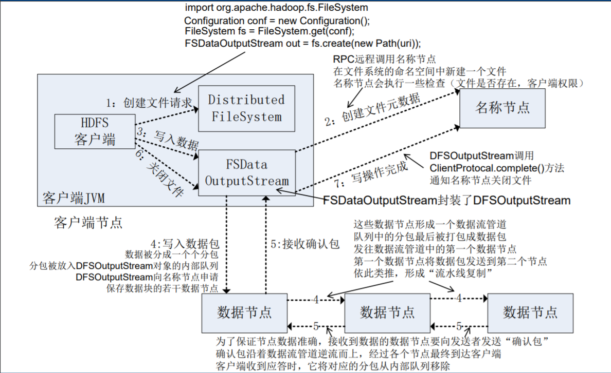

> 管道，或者流水线，详情看上面理论方面的写流程

## 2.4. 分布式计算框架 MR

> 计算向数据移动

### 2.4.1. MapReduce 框架概述

- 思想：
  - 分而治之
  - 计算向数据移动
- MapReduce:
  - Map
    - 接收传递来的数据
    - 提取数据特征
    - 映射（map）成对应的中间级，key-value 模式(由程序员自己设计)
  - Reduce
    - 从 Map 接收 k-v 数据
    - 数据处理，合并，精简（reduce）
    - 进行计算
- 流程:输入(格式化 k,v)数据集 map 映射成一个中间数据集(k,v)reduce (sql)
  - 相同的 key 为一组，调用 reduce 方法，方法内迭代一组数据进行运算（类似 sql）
- hadoop 作用：将大量数据通过数据挖掘形成具有相同数据特征的多个组，然后通过 MapReduce 并行执行运算
- 涉及运算：
  - 比较
  - 排序
  - 遍历
  - ......

### 2.4.2. MapReduce 大致架构

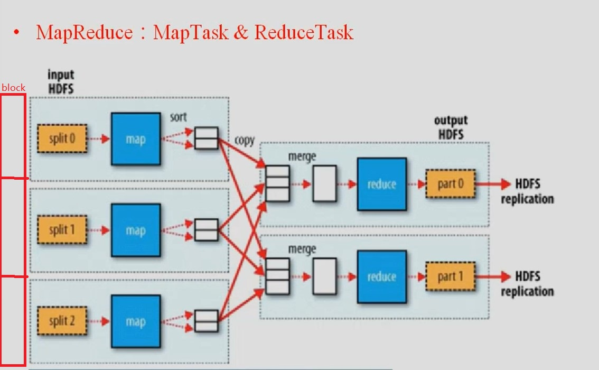

- 阶段一：切片
  - 默认情况下一个 map 对应一个 block。但往往块的数量要小于 map 数量
  - block 是物理上被切割出来的的文件，而 split 是逻辑上的片
  - map 和 block 没有直接对应，中间还有一个 split，split 和 map 一一对应
    - 原因：
      - 数据量小的时候，没有问题
      - 数据量大的时候，一个块的计算就要花费很多时间（比如一年），尽管多个块并行计算，也会花费很多时间
      - 因为块的大小已经物理固定，不能改变，所以提出了 split（片）的概念
      - 每个块多能切成多个片，再让每个片对应一个 map
      - 想要知道有多少个 map，就要知道块的大小，所在位置，以及分片方式大小
- 阶段二：map 映射
  - split 数据交给 map，map 做中间级映射，成为`K-V型数据`
- 阶段三：shuffler(洗牌)
  - 将数据发给 reduce，根据分区不同上传到不同 reduce 上（分区后面讲）
    > 涉及网络数据迁移
  - 将 key 相同的数据 merge(归并) 起来
  - 一个 reduce 可以处理多个 key。一个 key 对应一个 reduce。
    > reduce-key：一对多<br>
    > 注意：一个 key 不能分给多个 reduce。所以需要处理最大数据量 reduce 就会称为执行时间的瓶颈<br>
    > storm 没有这个问题
- 阶段四：reduce 进行计算
  - 所有 reduce 并行计算
  - **相同的 key**数据调一次 reduce

### 2.4.3. 架构细节

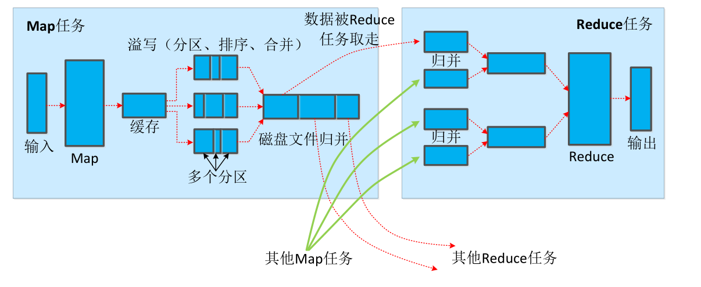

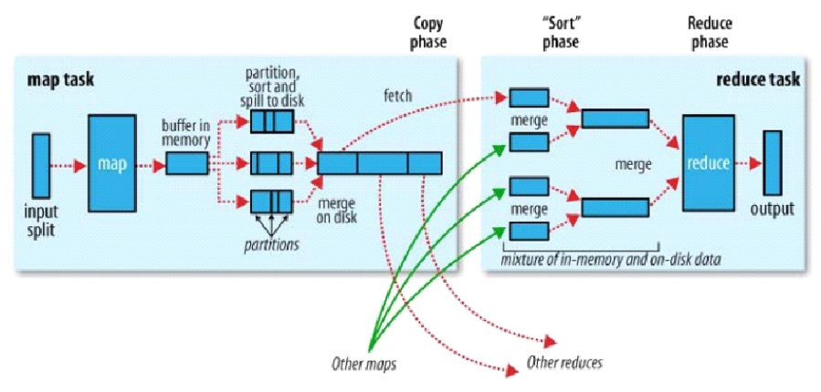

- split 默认和 block 大小相同
- 映射细讲：
  - split 通过 map 映射为`k-v型数据`
    - 每个 reduce 就是一个分区。
    - 分区数量取决于人为设定的 Reduce-Task 数量
    - 默认只有一个分区
    - 每个 key-value 生成时，都会给定一个分区编号(partition)，分区编号与 reduce 相对应
    - key:reduce 为 n:1，也就是说 key:分区为 n:1
  - （map 端，多个 map 并行处理）将 k-v 型数据处理
    - 部分数据存入到内存的 buffer（128MB）中,buffer 中处理:
      - 在 buffer(128MB)中**根据分区编号**进行**数据粗排序**
        > 目的是避免分发数据时每次都要重新遍历
        - 比如 1/3 段为 reduce1(对应 key1,key2)的，中间 1/3 段为 reduce2(对应 key3)的，最后 1/3 段为 reduce3(对应 key4)的
      - 将 buffer 的分区内部进行**二次排序**
        > 目的是避免 reduce 数据时每次都要重新遍历（key 相同的数据才能进行 reduce）
        - 比如 reduce1 中有两个 key，是乱序的
        - 需要将两个 key 分开
      - 对数据进行压缩（conbiner），数据简单处理
        - 比如 reduce 会用到数据的和，在 map 端就可以完成处理，再把数据传递下去
        - 减少 io 数据量交互
      - 将处理完的数据溢写输出为一个 128MB 的小文件
    - 重复操作，直到把所有数据处理完
    - 将所有小文件合并为一个大文件， 降低寻址难度
- shuffler
  - 所有 map 端与 reduce 端间上传数据，
  - 在 reduce 端执行归并算法
    > 归并的话可以看看入门情景
    - 因为不同 map 处理数据所需时间不同
    - 所以先处理完的 map 上传的数据会进行归并。先到先处理
    - 后来的后进行归并
    - 但最终不一定都要归并为一个大文件（图中是归并为了一个大文件），这样会造成 io 流的浪费
    - 最终归并为若干个小文件也行，只要保证文件间有序即可


### 2.4.4. 示例

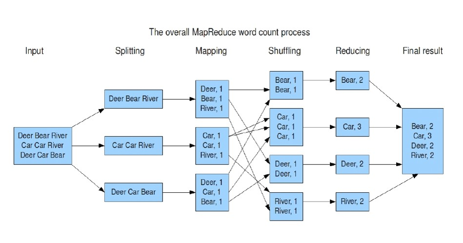

### 2.4.5. 大纲总结与其他

- 分区与分组

  - 分区的目的是根据 Key 值决定 Mapper 的输出记录被送到哪一个 Reducer 上去处理。
  - 分组就是与记录的 Key 相关。在同一个分区里面，具有相同 Key 值的记录是属于同一个分组的。

- Map：
  - 读懂数据
    > 程序员工作，自己确定 k-v 的标准
  - 映射为 KV 模型
  - 并行分布式
  - 计算向数据移动
    > **将 map-task 和 reduce-task 移动到 block 块所在节点上**
- Reduce：
  - 数据全量/分量加工（partition/group）
  - Reduce 中可以包含不同的 key
  - 相同的 Key 汇聚到一个 Reduce 中
  - 相同的 Key 调用一次 reduce 方法
    - 排序实现 key 的汇聚
- K,V 使用自定义数据类型
  - 不支持基本类型
  - 作为参数传递，节省开发成本，提高程序自由度
    > 功能类似可变参数
  - Writable 序列化：使能分布式程序数据交互
  - Comparable 比较器：实现具体排序（字典序，数值序等


### 2.4.6. 运行架构：计算向数据移动

#### 2.4.6.1. 版本 1.x

##### 2.4.6.1.1. 架构

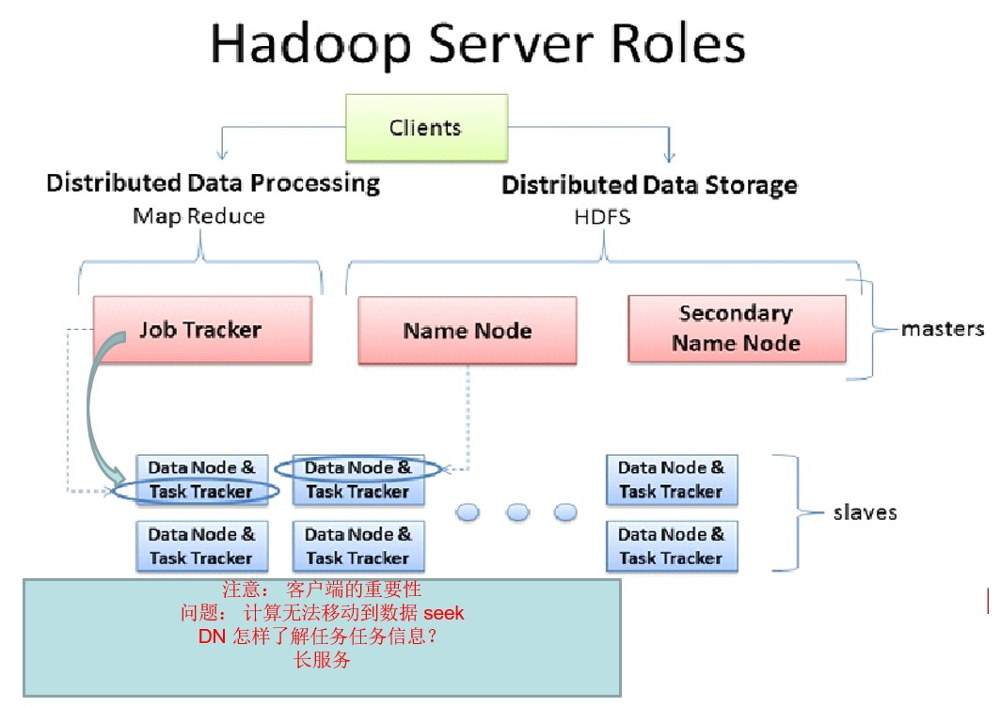

- client

  - 用户编写的MapReduce程序通过Client提交到JobTracker端
  - 用户可通过Client提供的一些接口查看作业运行状态
  - 做所需要的规划，比如如何切片，如何分区，如何处理，处理什么。设计作业
  - 做好后打成 jar 包，提交给 hadoop 集群中的 hdfs 的**NameNode**
    > 不给 JobTracker 是因为 JobTracker 单点，不安全。
  - 最终作业提交到 JobTracker

- JobTrakcer 任务调度：
  - Job Tracker 和 Task Tracker 关系类似于 NameNode 和 DateNode 关系
  - Job Tracker 是调度角色；Task Tracker 是任务调度角色，辅助 Job Tracker
  - 当 Job Trakcer 接受到 Client 的任务指派后，会先从 NameNode 获得块的相关信息
  - 再指定相关节点开启 Task Trakcer
  - Task Tracker 主动询问 Job Tracker 开启 Map-Task 或 Reduce-Task
    > 之所以不由 Job Tracker 来开启 Task 是因为压力太大，所以要分给 Task Tracker<br>
    > 注意：Map 和 Reduce 不再同一节点
  - Task Tracker 再从 NameNode 下载任务 jar 包到 DataNode，读取再对数据进行计算 (**计算向数据移动**)
  - JobTracker 监控所有TaskTracker与Job的健康状况，一旦发现失败，就 将相应的任务转移到其他节点
- JobTracker 资源管理：
  - 想要开启 Map-Task 和 Reduce-Task，就要确认节点上是否还有剩余资源（比如进程数，内存等）
  - 调度器会在资源出现空闲时，选 择合适的任务去使用这些资源
  - Task-Tracker 会时刻监控节点的资源利用情况
  - Job-Tracker 会和 Task_Tracker 保持心跳，Task Tracker 汇报资源状况

- TaskTracker
  - 汇报
    - TaskTracker 会周期性地通过 心跳 将本节点上资源的使用情况和任务的运行进度汇报给JobTracker，
  - 接收
    - 同时接收JobTracker 发送过来的命令 并执行相应的操作（如启动新任务、杀死任务等）
  - 资源划分
    - TaskTracker 使用 slot 等量划分本节点上的资源量（CPU、内存等）。 
    - 一个Task 获取到一个slot 后才有机会运行，
    - 而Hadoop调度器的作用就是 将各个TaskTracker上的空闲slot分配给Task使用。
    - slot 分为Map slot 和 Reduce slot 两种，分别供MapTask 和Reduce Task 使用
      - 通常设置比reduce任务槽数目稍微小一些的Reduce任务个数（这样可 以预留一些系统资源处理可能发生的错误）

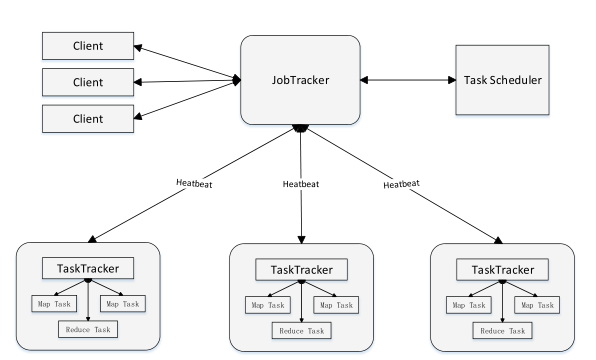

##### 2.4.6.1.2. 示例流程：

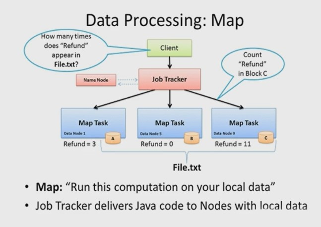

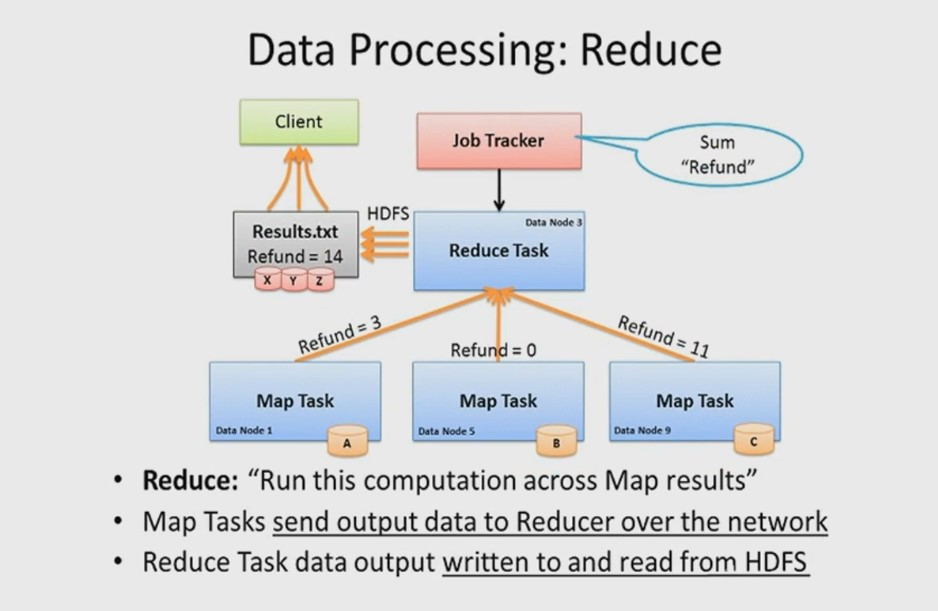

- 先 map,再 reduce
- 此处将最后结果交给了客户端，但不是必须的
  - 既可以存储起来
  - 也可以作为下一次的输入，不断迭代计算

##### 2.4.6.1.3. 大纲总结与问题：

- MRv1 角色：
  - JobTracker
    - 核心，主，单点
    - 调度所有的作业
    - 监控整个集群的资源负载
    - 获得任务 jar 包
  - TaskTracker
    - 从节点，自身节点资源管理
    - 和 JobTracker 心跳，汇报资源，获取 Task，开启 map 和 reduce
  - Client
    - 作业为单位
    - 规划作业计算分布
    - 提交作业资源到 HDFS
    - 最终提交作业到 JobTracker
- 弊端：
  - JobTracker：负载过重，单点故障
  - 资源管理与计算调度强耦合，job traker 属于 hadoop 计算框架，其他计算框架需要重复实现资源管理
    > 比如 storm 也进来了，storm 和 mapreduce 的资源管理不互相联系，可能会出现重复占用，布置失败，就要重新布置
  - 不同框架对资源不能全局管理


#### 2.4.6.2. 版本 2.x

##### 2.4.6.2.1. 架构

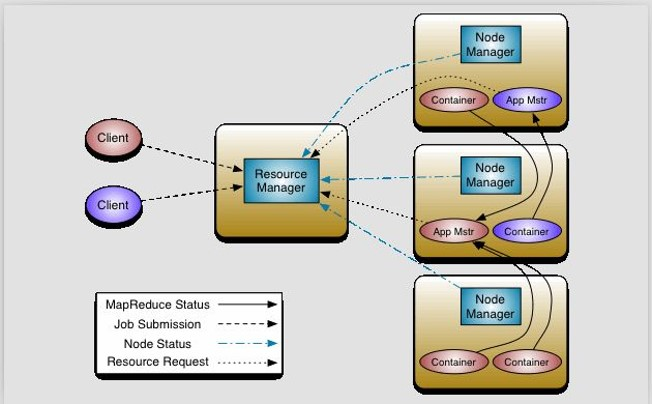

> 一切皆 Container
> 基于 YARN 的资源管理：Resource Manger + Node Manager + Container

- 大致流程:
  - client 把任务提交给 Resource Manager（相当于 Job Tracker 中的资源管理功能）
  - NodeManager 一直主动向 Resource Manager 汇报节点状态信息。Resource Manager 统计资源情况
  - Resource Manger 会寻找相对空闲的服务器开启 Application Master 进行任务调度
    > Application Master 负责任务切分、任务调度、任务监控和容错等
  - Application Master 获取块位置信息和任务作业，进行资源规划
  - Application Master 向 Resource Manger 请求资源
  - Resource Manager 允许请求，Application Master 开启工作进程
    - Application Master 进一步将资源分配给内部的任务
  - Application Master 在指定节点创建 Container(默认 1G)
  - 在 Container 中创建 Map-task,Reduce-Task 进行运算
    > Container 是为了防止占用太多空间。获取到数据后，可能会查询数据库做数据的拼接，数据量可能会变化，需要通过 container 限制
    > 同时利于资源规划

- 详细流程：
  > 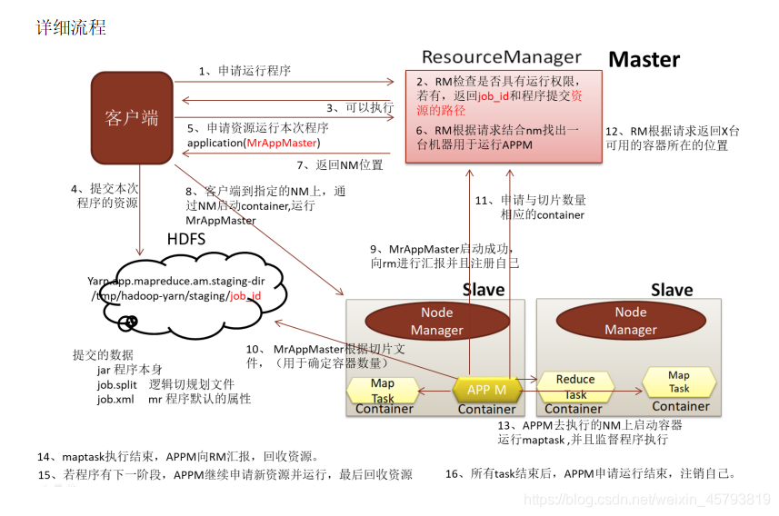 
  - 第一步：客户端向ResourceManager 申请运行程序
  - 第二步：ResourceManager 检查是否有运行权限，如果有就会返回jobid和程序提交的资源路径
  - 第三步：根据ResourceManager返回的信息，然后执行
  - 第四步：客户端提交程序的资源到tmp/hadoop-yarn-staging/job_id目录下（jar程序本身，job.split逻辑切规划文件，job.xml mr配置文件）
  - 第五步：申请程序运行的资源
  - 第六步：RM根据请求结合mn 找出一台机器运行AppM
  - 第七步：RM 返回MN位置给客户端
  - 第八步：客服端到指定的NM上，通过NM启动container,运行MrAppMaster
  - 第九步：MrAppMaster启动成功，向rm进行汇报并且注册自己
  - 第十步：MrAppMaster读取tmp/hadoop-yarn-staging/job_id目录下job.split 数据（申请资源的多少）
  - 第十一步： 申请与切片数量相应的container
  - 第十二步：RM根据请求返回X台可以用的容器所在的位置
  - 第十三步：APPM执行NM上启动容器运行maptask,监督程序执行
  - 第十四步：maptask执行结束，APPM向RM汇报，回收资源
  - 第十五步：reduce执行结束，APPM向RM汇报，回收资源
  - 第十六步：所有的task结束后，APPM申请运用结束，注销自己


##### 2.4.6.2.2. 细节：

- Resource Manager 实现了高可用，通过 zookeeper 维护
- 长服务与短服务：
  - 集群搭建一开始到最后一直开启的，是长服务
  - 反则就是短服务
- Application Master 是短服务，只有在提交任务时，临时生成的服务，不需要搭建。一个 MapRaduce 作业，对应一个 Application Master 进程，也就是说一个几点上不止一个
- Application Master 容错：
  - 失败后，由 YARN 重新启动
  - 任务失败后，MRAppMaster 重新申请资源

##### 2.4.6.2.3. 流程示例：

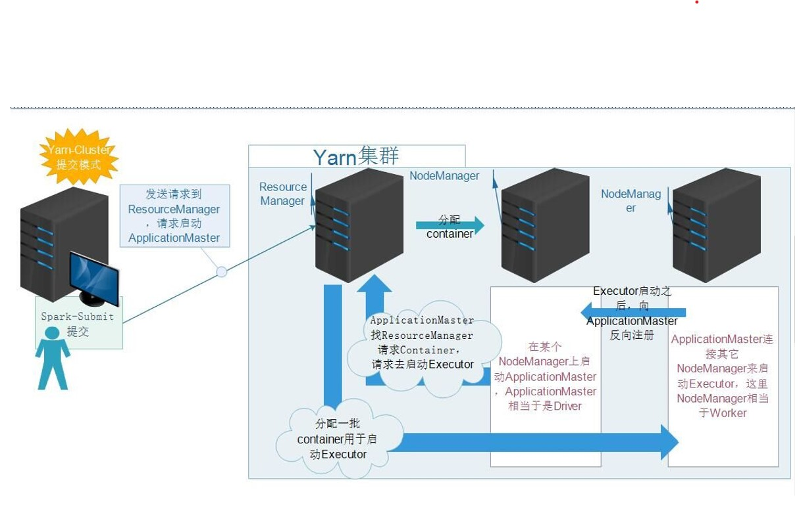

> 该图有和 spark 对比，所以看看就行，之后再仔细看

- Executor:一个线程
- Worker：相当于进程

##### 2.4.6.2.4. 大纲总结与其他

- YARN 简介：

  - YARN：Yet Another Resource Negotiator；
  - Hadoop 2.0 新引入的资源管理系统，直接从 MRv1 演化而来的；
    - 核心思想：将 MRv1 中 JobTracker 的资源管理和任务调度两个功能分开，分别由 ResourceManager 和 ApplicationMaster 进程实现
    - ResourceManager：负责整个集群的资源管理和调度
    - ApplicationMaster：负责应用程序相关的事务，比如任务调度、任务监控和容错等
  - YARN 的引入，使得多个计算框架可运行在一个集群中
    - 每个应用程序对应一个 ApplicationMaster
    - 目前多个计算框架可以运行在 YARN 上，比如 MapReduce、Spark、Storm 等

- YARN：解耦资源与计算
  - ResourceManager
    - 主，核心
    - 集群节点资源管理
  - NodeManager
    - 与 RM 汇报资源
    - 管理 Container 生命周期
    - 计算框架中的角色都以 Container 表示
  - Container：【节点 NM，CPU,MEM,I/O 大小，启动命令】
    - 默认 NodeManager 启动线程监控 Container 大小，**超出申请资源额度，kill**
    - 支持 Linux 内核的 Cgroup
- MR ：
  - MR-ApplicationMaster-Container
    - 作业为单位，避免单点故障，负载到不同的节点
    - 创建 Task 需要和 RM 申请资源（Container /MR 1024MB）
  - Task-Container
- Client：
  - RM-Client：请求资源创建 AM(ApplicationManager)
  - AM-Client：与 AM 交互
- MapTask/ReduceTask：任务驱动引擎，与 MRv1 一致

## 2.5. MR 分布式集群

### 2.5.1. 基于 yarn 搭建

- 参考文档
  [搭建文档 YARN/ResourceManager HA](https://hadoop.apache.org/docs/r2.6.5/hadoop-yarn/hadoop-yarn-site/ResourceManagerHA.html)
  [单节点文档 Generral/Single Node Setup 下 YARN on Single Node](https://hadoop.apache.org/docs/r2.6.5/hadoop-project-dist/hadoop-common/SingleCluster.html)

- 搭建目标：

|          | NN-1 | NN-2 | DN  | ZK  | ZKFC | JNN | RM  | NM  |
| :------: | :--: | :--: | :-: | :-: | :--: | :-: | :-: | :-: |
| Node0001 |  \*  |      |     |     |  \*  | \*  |     |     |
| Node0002 |      |  \*  | \*  | \*  |  \*  | \*  |     | \*  |
| Node0003 |      |      | \*  | \*  |      | \*  | \*  | \*  |
| Node0004 |      |      | \*  | \*  |      |     | \*  | \*  |

- 搭建过程

  - `vi mapred-site.xml`
    ```xml
    <configuration>
        <property>
            <name>mapreduce.framework.name</name>
            <value>yarn</value>
             <!-- 使用yarn作为资源管理框架 -->
        </property>
    </configuration>
    ```
  - `vi yarn-site.xml`

    ```xml
     <?xml version="1.0"?>
     <!--
       Licensed under the Apache License, Version 2.0 (the "License");
       you may not use this file except in compliance with the License.
       You may obtain a copy of the License at

         http://www.apache.org/licenses/LICENSE-2.0

       Unless required by applicable law or agreed to in writing, software
       distributed under the License is distributed on an "AS IS" BASIS,
       WITHOUT WARRANTIES OR CONDITIONS OF ANY KIND, either express or implied.
       See the License for the specific language governing permissions and
       limitations under the License. See accompanying LICENSE file.
     -->
     <configuration>
      <property>
          <name>yarn.nodemanager.aux-services</name>
          <value>mapreduce_shuffle</value>
      </property>
      <property>
        <name>yarn.resourcemanager.ha.enabled</name>
        <value>true</value>
      </property>
      <property>
        <name>yarn.resourcemanager.cluster-id</name>
        <value>cluster1</value>
      </property>
      <property>
        <name>yarn.resourcemanager.ha.rm-ids</name>
        <value>rm1,rm2</value>
      </property>
      <property>
        <name>yarn.resourcemanager.hostname.rm1</name>
        <value>node0003</value>
      </property>
      <property>
        <name>yarn.resourcemanager.hostname.rm2</name>
        <value>node0004</value>
      </property>
      <property>
        <name>yarn.resourcemanager.zk-address</name>
        <value>node0002:2181,node0003:2181,node0004:2181</value>
      </property>
     </configuration>
    ```

  - 分发两个配置文件到其他节点
  - node0003,node0004 之间**互相**免密钥登录（因为涉及到 ResourceManager 的切换）
  - 开启 zookeeper
  - 开启 hadoop,`start-dfs.sh`
  - 开启 namenode:`start-yarn.sh`
  - ResourceManager **必须在配置节点手动启动**：
    - node0003:`yarn-daemon.sh start resourcemanager`
    - node0004:`yarn-daemon.sh start resourcemanager`
  - ss -nal 查看 socket 通信端口
    - 3888：zookeeper 选举端口
    - 2888：zookeeper 主从节点通信端口
    - 2181：zookeeper 服务器和客户端通信端口
    - 8088：ResourceManager 的 web 管理页面端口
  - 进入 node0003:8088 或 node0004:8088
    - 查看 ActiveNodes 个数，可能要等一段时间才会变化
  - 测试程序：
    - /share/hadoop 目录
    - hadoop-mapreduce-example 包，示例 job 任务
    - node0001 下，cd 到该目录，执行：`hadoop jar hadoop-mapreduce-example-2.6.5.jar wordcount /user/root/test.txt /wordcount`
      - wordcount:是 jar 包中的 job 名称
      - /user/root/test.txt：hdfs 中处理文件位置
      - /wordcount：hdfs 中结果储存位置。路径可以没有，如果有，必须要保证，该路径下没有文件
    - 此时进入 node0003:8088，点击左侧 Applications，可以发现 job 任务
    - 在 node0001 `hdfs dfs -cat /wordcount/part-r-00000`，查看计算结果
      - 00000 是分区号，不设置默认一个 00000

- 关闭：
  - 关闭 yarn
    - node0003:`yarn-daemon.sh stop resourcemanager`
    - node0004:`yarn-daemon.sh stop resourcemanager`
  - 关闭 hadoop：`stop-all.sh`
    > 也会关闭 NodeManager
  - 关闭 zookeeper：`zkServer.sh stop`

### 2.5.2. wordCount示例

> **※重要**

- 将四个配置文件拷贝到项目所在路径
  - core-site.xml
  - hdfs-site.xml
  - mapred-site.xml
  - yarn-site.xml
- 创建 MyWordCount.java

  > 单词统计项目

  ```java
  public class MyWordCount {
      public static void main(String[] args) throws IOException, ClassNotFoundException, InterruptedException {
          Configuration conf = new Configuration();
          Job job = Job.getInstance();

          job.setJarByClass(MyWordCount.class);

          job.setJobName("MyWordCount");

          // hdfs目录
          Path inPath = new Path("/user/root/test.txt");
          Path outPath = new Path("/output/wordcount");

          // 给job添加要处理文件的文件路径
          FileInputFormat.addInputPath(job,inPath);

          // 如果输出路径存在，就删除
          if(outPath.getFileSystem(conf).exists(outPath)){
              outPath.getFileSystem(conf).delete(outPath,true);
          }

          // 给job设置结果输出的路径
          FileOutputFormat.setOutputPath(job,outPath);
          // 手动创建 MyMapper.class,MyReducer.class
          job.setMapperClass(MyMapper.class);

          // 告知reduce，map输出的数据类型，否则reduce无法反序列化，会报错
          job.setMapOutputKeyClass(Text.class);
          job.setMapOutputValueClass(IntWritable.class);
          job.setReducerClass(MyReducer.class);

          // Submit the job, then poll for progress until the job is complete
          job.waitForCompletion(true);
      }
  }
  ```

- 创建 MyMapper.java
  ```java
  // Mapper泛型  keyIn valueIN keyOut valueOut，输入输出都是k-v类型
  // 默认keyIn:一行首字符的下标索引 valueIn:一行的内容。
    // 这是默认InputFormat类完成的。也就是说：一行内容---(inputFormat)--->初始k-v------(map)---->map后的key-v-----(reduce)----->结果
    // 具体解析查看源码
    // 使用自定义InputFormat，查看pagerank项目
  // 注意：不支持基本类型，String类型用Text代替，int用IntWritable代替，long用LongWritable代替
  public class MyMapper Extends Mapper<Object,Text,Text,IntWritable>{
    // Mapper中的run方法会循环调用map方法，所以把这个变量声明为类属性，避免多次创建
    private final static IntWritable one = new IntWritable(1); // 每次计数为1
    private Text word = new Text();
    // 每行执行一次map方法
    public void map(Object key,Text value,Context context) throws IoException,InterruptedException{
      StringTokenizer itr = new StringTokenizer(value.toString()); // 将字符串放到迭代器中
      // 通过迭代器对字符串进行切割
      while(itr.hasMoreTokens()){
        // itr.nextToken() 返回String，此处将String封装到Text中
        word.set(itr.nextToken());
        context.write(word,one);
        // 将k-v写入到context容器中，key为word，value为1
        // word 对应keyOut,one对应 valueOut
        // 最后转换的k-v形式为：
        // hello 1
        // hadoop 1
        // hello 1
        // hello 1
        // ...
      }
    }
  }
  ```
- 创建 MyReducer.java

  ```java
  /**
  * keyIn:从map端来，为Text
  * ValueIn:word计数，为IntWritable
  * keyOut:输出到文件的类型，单词本身，Text
  * valueOut:输出到文件的类型，单词的出现次数，IntWritable
  */
  public class MyReducer extends Reducer<Text,IntWritable,Text,IntWritable> {
      private IntWritable result = new IntWritable();

      // 这里是 key 和 values（注意不是value，多个s） ，
      // 也就是一个key下多个value。和reduce同一个key为一组，计算一次相符合。
      // 每个key执行一遍该方法，进行一次迭代
      public void reduce(Text key, Iterable<IntWritable> values,
                        Context context) throws IOException, InterruptedException {
          int sum = 0;
          for (IntWritable val : values) {
              // 这里的val都为1，进行累加运算
              sum += val.get();
          }
          result.set(sum);
          context.write(key, result);
      }
  }
  ```

- 打成 jar
- 执行（要使用全类名）
  > :jar 中指定了文件路径，所以不需要在指令中指定

### 2.5.3. windows端运行

- 会在本地模拟执行
  - 因此yarn可以关闭
  - 但是hdfs不能停，会对hdfs进行读写

- 步骤
  - conf.set("mapreduce.app-submission.cross-platform","true")
    - 对一些基本参数做一些配置规划
    - 因为window和linux在环境变量，文件系统等方面都有些区别
    - 该行是为了做一些兼容。
    - 不过不写问题也不是太大
  - conf.set("mapreduce.framework.name","local")
    - 切换分布式到本地单进程模拟运行
    - 因为不是分布式，所以不用打jar包
  - 注释掉 `job.setJarByClass`
    - 因为并不需要提交作业了


## 2.6. MR 源码分析

> 详见 blog

MapReduce 就是一个计算框架，对数据源没有要求，不管是文本数据还是数据库数据都没问题。输入输出最主要就在 InputFormat 和 OutputFormat 两个类

split 读取方式，解决行的分割

环装缓冲区。k-v 和 分区信息

### 2.6.1. 客户端源码

### 2.6.2. map 端

#### 2.6.2.1. map in

#### 2.6.2.2. map out

### 2.6.3. reduce 端


- 二次排序：在不改变原本顺序的前提下,重新界定边界

  ```
  假设map端一开始按照省份排序（hb:河北，xt：邢台）
  hb.xt
  hb.xt
  ln.sy
  ln.dl

  到了reduce端要按照市排序：
  那么边界界定：
  hb.xt
  hb.xt
  ----------
  ln.sy
  ----------
  ln.dl
  ----------
  ```

### 2.6.4. 架构整体总结

inputFormat --> inputSplit --> recordReader --> mapper --> outputControler --> (in buffer) partitioner --> (in buffer) sort --> --> [combiner] spiller --> merge and sort --> --> distribution of shuffle --> merge --> sort --> grouping sort --> reduce --> outputFormat --> recordWriter --> write

- InputFormat:定义如何获得分片
  - 默认TextInputFormat
- inputSplit:
  - 获得逻辑分片
- recordreader:从文件中初步获取k-v格式的record。
  - 默认LineRecordReader
  - 每一个record都会调用一次map()
- mapper:
  - 对record进行map，获取处理过的k-v
  - 处理结果不会写入hdfs
- combiner
- partitioner:
  - mapper处理完成后进行分区
  - 默认使用hash分区器
- sort
  - map端根据key进行排序
- Secondary Sorting(第一个二次排序) 
  - 也就是map缓存中的第二次排序。
  - 每个分区内又调用job.setSortComparatorClass()设置的Key比较函数类排序。
  - 可以看到，这本身就是一个二次排序。
  - 如果没有通过job.setSortComparatorClass()设置 Key比较函数类，则使用Key实现的compareTo()方法
- shuffle
  - map 结束后进行
- sort
- Secondary Sorting (第二个二次排序)
  - 对第一字段相同的行按照第二字段排序，第二次排序不破坏第一次排序的结果，这个过程就称为二次排序。
  - 通过job.setGroupingComparatorClass()进行设置
- merge
- reducer
- RecordWriter
- output
- write to hdfs

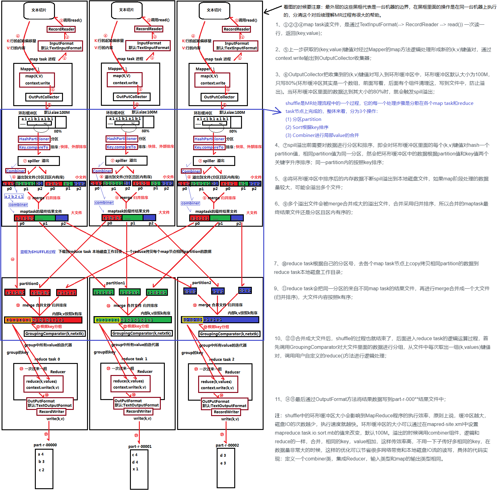


1、①②③④map task读文件，是通过TextInputFormat(--> RecordReader --> read()) 一次读一行，返回(key,value)；

2、⑤上一步获取的(key,value)键值对经过Mapper的map方法逻辑处理形成新的(k,v)键值对，通过context.write输出到OutputCollector收集器；

3、⑥OutputCollector把收集到的(k,v)键值对写入到环形缓冲区中，环形缓冲区默认大小为100M，只写80%(环形缓冲区其实是一个数组，前面写着，后面有个组件清理这，写到文件中，防止溢出)。当环形缓冲区里面的数据达到其大小的80%时，就会触发spill溢出；

4、⑦spill溢出前需要对数据进行分区和排序，即会对环形缓冲区里面的每个(k,v)键值对hash一个partition值，相同partition值为同一分区，然会把环形缓冲区中的数据根据partition值和key值两个关键字升序排序；同一partition内的按照key排序；

5、⑧将环形缓冲区中排序后的内存数据不断spill溢出到本地磁盘文件，如果map阶段处理的数据量较大，可能会溢出多个文件；

6、⑨多个溢出文件会被merge合并成大的溢出文件，合并采用归并排序，所以合并的maptask最终结果文件还是分区且区内有序的；

7、⑩reduce task根据自己的分区号，去各个map task节点上copy拷贝相同partition的数据到reduce task本地磁盘工作目录；

9、⑪reduce task会把同一分区的来自不同map task的结果文件，再进行merge合并成一个大文件(归并排序)，大文件内容按照k有序；

10、⑫⑬合并成大文件后，shuffle的过程也就结束了，后面进入reduce task的逻辑运算过程，首先调用GroupingComparator对大文件里面的数据进行分组，从文件中每次取出一组(k,values)键值对，调用用户自定义的reduce()方法进行逻辑处理；

11、⑭⑮最后通过OutputFormat方法将结果数据写到part-r-000**结果文件中；

注：shuffle中的环形缓冲区大小会影响到MapReduce程序的执行效率，原则上说，缓冲区越大，磁盘IO的次数越少，执行速度就越快。环形缓冲区的大小可以通过在mapred-site.xml中设置mapreduce.task.io.sort.mb的值来改变，默认100M。溢出的时候调用combiner组件，逻辑和reduce的一样，合并，相同的key，value相加，这样传效率高，不用一下子传好多相同的key，在数据量非常大的时候，这样的优化可以节省很多网络带宽和本地磁盘IO流的读写，具体的代码实现：定义一个combiner类，集成Reducer，输入类型和map的输出类型相同。

关于大量小文件的优化策略：

(1) 默认情况下，TextInputFormat对任务的切片机制是按文件规划切片，不管文件多小，都会是一个单独的切片，都会交给一个maptask，这样，如果有大量小文件，就会产生大量的maptask，处理效率极其低下；

(2) 优化策略：最好的方法是，在数据处理系统的最前端(预处理/采集)，就将小文件先合并成大文件，再上传到HDFS做后续分析。补救措施是，如果已经是大量小文件在hdfs中，可以使用另一种InputFormat来做切片(CombineFileInputFormat)，它的切片逻辑与FileInputFormat不同，它可以将多个小文件从逻辑上规划到一个切片中，这样，多个小文件就可以交给一个maptask来处理。


## 2.7. MR 案例

### 2.7.1. 最高气温

- 情景：

  ```
  找出每月气温最高的两天

  数据： 年-月-日 时-分-秒 温度
  如: 2000-12-02 12:13:14 35c
  ```

- 过程：
  ```
  键值对转换形式：年月-气温
  同一天不同时间的气温，只取最高的
  同年月 为一组
  map端，做好每组（就是一个月）的气温排序
  ```
- 实现：`src/hadoop/tq`
  - **以 MyTQ 为主线**

### 2.7.2. 推荐好友的好友

- 情景：
  > 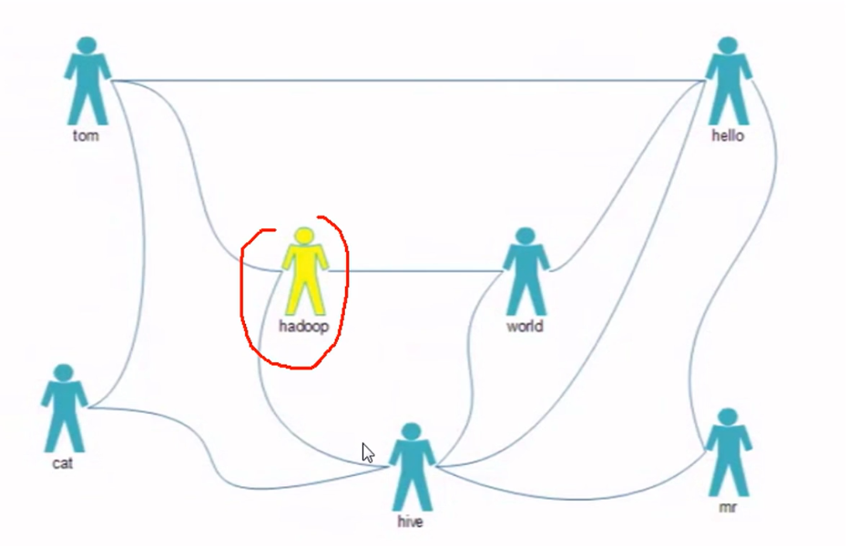
  - 推荐共同好友多的间接好友
  - 示例数据（同上图）：
    ```
    tom hello hadoop cat    # tom 直接好友有 hello hadoop cat。另外注意，hello和hadoop至少有间接好友关系，是否有直接关系需要查看下面数据
    world hadoop hello hive
    cat tom hive
    mr hive hello
    hive cat hadoop world hello mr
    hadoop tom hive world
    hello tom world hive mr
    ```
- 思路：
  - 推荐者和被推荐者一定有一个或多个共同好友
  - 全局寻找好友列表中两两关系
    - key-value: name1,name2-0/1
      - 直接好友：0
      - 间接好友：1
    - 注意 name1,name2 和 name2,name1 的处理。
  - 去除直接好友
  - 统计两两关系出现次数
- api：
  - map：按好友列表输出两两关系
  - reduce：sum 两两关系
  - 再设计一个 MR
  - 生成详细报表

### 2.7.3. PageRank 计算

- 概述

  - PageRank 是 Google 提出的算法，用于衡量特定网页相对于搜索引擎索引中的其他网页而言的重要程度。
  - 是 Google 创始人拉里·佩奇和谢尔盖·布林于 1997 年创造的
  - PageRank 实现了将链接价值概念作为排名因素。

- 算法原理：

  - 入链 ====给？的投票
    - PageRank 让链接来“投票“，到一个页面的超链接相当于对该页投一票。
  - 入链数量
    - 如果一个页面节点接收到的其他网页指向的入链数量越多，那么这个页面越重要。
  - 入链质量
    - 指向页面 A 的入链质量不同，质量高的页面会通过链接向其他页面传递更多的权重。所以越是质量高的页面指向页面 A，则页面 A 越重要。
  - 初始值
    - Google 的每个页面设置相同的页面价值，即 PR 值
    - pagerank 算法给每个页面的 PR 初始值为 1。
  - 迭代计算（收敛）
    - Google 不断的重复计算每个页面的 PageRank。那么经过不断的重复计算，这些页面的 PR 值会趋向于稳定，也就是**收敛**的状态。
    - 在具体企业应用中怎么样确定收敛标准？
      - 1、每个页面的 PR 值和上一次计算的 PR 相等
      - 2、设定一个差值指标（0.0001）。当所有页面和上一次计算的 PR 差值平均小于该标准时，则收敛。
      - 3、设定一个百分比（99%），当 99%的页面和上一次计算的 PR 相等
  - 示例：
    > 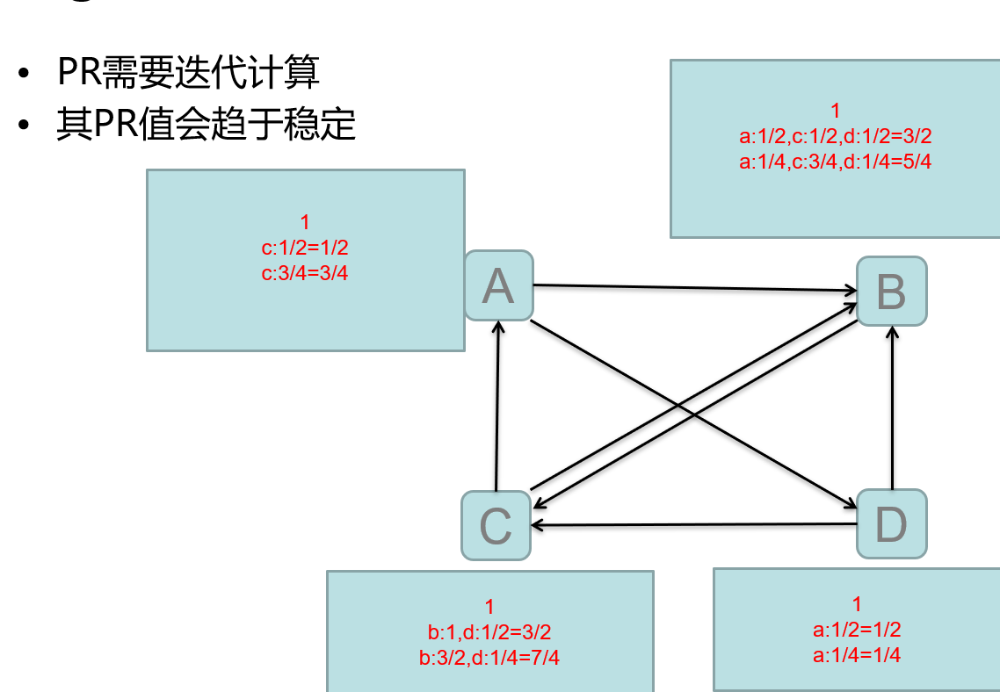
  - 初始 pr 值为 1
  - pr 值平均分给出链
  - 算完一轮后，各节点 pr 值发生变化，再重复上述计算
  - 直到 pr 值趋于稳定
  - 改进算法：
    - 站在互联网的角度：
      - 只出，不入：PR 会为 0
      - 只入，不出：PR 会很高
      - 直接访问网页
    - 修正 PageRank 计算公式：增加阻尼系数
      - 在简单公式的基础上增加了阻尼系数（damping factor）d
      - 一般取值 d=0.85。
    - 完整 PageRank 计算公式
      - d：阻尼系数
      - M(i)：指向 i 的页面集合
      - L(j)：页面的出链数
      - PR(pj)：j 页面的 PR 值
      - n：所有页面数
    - 公式：
      > 

- MapReduce 实现过程：

  - `A 1 B D` `B 1 A D` `D 1`为例
  - map 后得到：

    ```
    A:1 B D //A当前的pr值和出链
    B:0.5  // 分给B的pr值
    D:0.5 // 分给D的pr值

    B:1 A D
    A:0.5
    D:0.5 // 分给D的pr值

    D:1 - -  // D当前pr值和出链
    ```

  - shuffle 后：

    ```
    A:1 B D
    A:0.5

    B:1 A D
    B:0.5

    D:1 - -
    D:0.5
    D:0.5
    ```

  - reduce 处理数据
    - 计算 pr
    - 写出：
      ```
      A 0.5 B D
      B 0.5 A D
      D 2 - -
      ```
    - 读取输出，继续迭代，直到到达停止条件

- 代码：

```java
// 暂时没找到，待复制
```

### 2.7.4. TF-IDF

### 2.7.5. itemcf

# 3. hive 数据仓库

> 注意：教程都是最基本的，如果想深入就去查官方文档

## 3.1. 现状

> sql 使用 99 语法 92 语法不要再用了。sql 一句基本几百行

- 大数据以后发展方向
  - 平台化
    > 有条件的公司，都会提供一个平台，只要通过 sql 就能完成所有操作，平台会完成 sql 向 mr 和 spark 任务的转换。
    > 不需要接触 hadoop，spark，底层服务器集群更别说了
  - 可视化

## 3.2. hive 简介

- 数据仓库定义：
  > 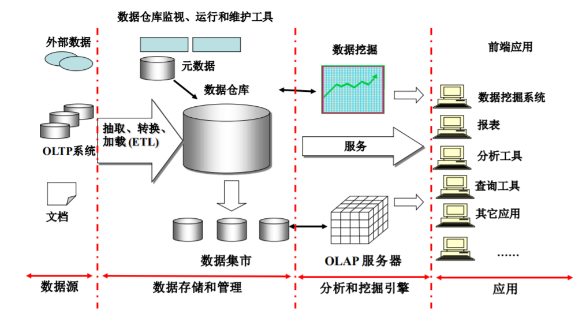 
  ```
  wiki:

  数据仓库是一种信息系统的资料存储理论，此理论强调利用某些特殊资料存储方式，让所包含的资料，特别有利于分析处理，以产生有价值的信息并依此作决策。

  利用数据仓库方式所存放的资料，具有一但存入，便不随时间而更动的特性，同时存入的资料必定包含时间属性，通常一个数据仓库皆会含有大量的历史性资料，并利用特定分析方式，自其中发掘出特定信息。
  ```
  ```
  数据仓库（Data Warehouse）是一个面向主题的（Subject Oriented）、集成
  的（Integrated）、相对稳定的（Non-Volatile）、反映历史变化（Time Variant
  ）的数据集合，用于支持管理决策。
  ```
  ```
  数据仓库存放的都是所有历史数据
  数据仓库中的数据大多数情况家都是不变的

  最新技术：实时数据仓库
  ```
  - 传统数据库弊端：
    - 无法满足快速增长的海量数据存储需求
    - 无法有效处理不同类型的数据
    - 计算和处理能力不足


- hive 数据仓库
  - Hive 的产生：
    - 非 java 编程者对 hdfs 的数据做 mapreduce 操作
  - 数据仓库定义：
    - hive 控制各种数据源的接口，比如 mysql，oracle，mongodb，redis 等
    - 访问 hive 数据接口
    - hive 进行：ETL：（有被称为“数据清洗”，但并不严谨）
      - E：抽取（Extract）
        > 从数据源拿数据
      - T：转换（Transform）
        > 转换数据格式
      - L：加载（Load）
        > 放入到 hive
  - 本质：某种程度上可以看作是用户编程接口，本身不存储和处理数据
    - 存储：依赖分布式文件系统HDFS存储数据
    - 处理：依赖分布式并行计算模型MapReduce处理数据
  - 数据仓库内保存数据特点：
    - 时间拉链：按照时间顺序保存数据
    - 历史数据不能修改和删除
  - 数据存储方式：
    - mysql 服务器等数据库节点存储数据库和表的元数据信息
    - hdfs 以纯文本形式存储表数据
  - 数据仓库优势：
    - 可以进行复杂操作
    - mysql 也行，但是数据量太大的话会非常慢且耗用资源。
  - hive 组成：
    - 解释器
    - 编译器
    - 优化器
    - ...
  - 版本：
    - 1.x:底层使用 MR
    - 2.x:会提示推荐底层使用 spark
  - hive 运行时，元数据存储在关系型数据库中
    - hdfs 中存放纯文本文件，无法表示字段
    - 所以要放在关系型数据库中
    - 其中关系型数据库设置成 mysql，oracle 都行


- hive特点
  - 采用批处理方式处理海量数据
    - Hive需要把HiveQL语句转换成MapReduce任务进行运行
    - 数据仓库存储的是静态数据，对静态数据的分析适合采用批处理方式，不需要快速响应给出结果，而且数据本身也不会频繁变化
  - 提供适合数据仓库操作的工具
    - Hive本身提供了一系列对数据进行提取、转换、加载（ETL）的工具，可以存储、查询和分析存储在Hadoop中的大规模数据
    - 这些工具能够很好地满足数据仓库各种应用场景


- 相对于关系型数据库区别
  > 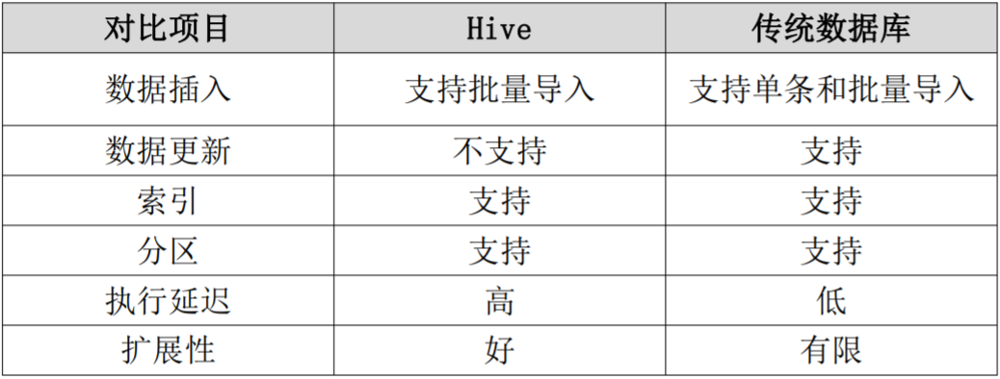 

- 在企业中的典型应用
  >  
  > mahout 用来做机器学习。但现在基本不怎么用了，基本上都靠spark


## 3.3. hive 架构

### 3.3.1. 架构

> **※ 包括上面所有架构，一定要会画**。这个比较简单

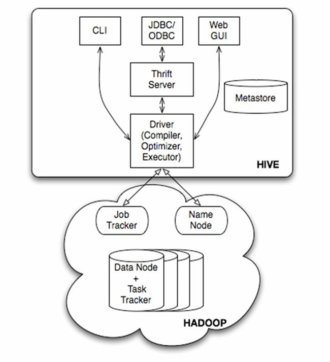

> 下半块为 hadoop。Hive 架构为上面一半

- Driver：

  - 一个 jvm 进程，并不是驱动程序，是 hive 的核心
  - 接收客户端 sql 语句请求，并进行处理
  - 解释器、编译器、优化器完成 HQL 查询语句从词法分析、语法分析、编译、优化以及查询计划的生成。

    - 编译器：
      - 编译器将一个 Hive SQL 转换**操作符**
        - 操作符是 Hive 的最小的处理单元
        - 每个操作符代表**HDFS 的一个操作或者一道 MapReduce 作业**
      - operator 操作符：
        - Operator 都是 hive 定义的一个处理过程
        - 种类示例：(并不全)
          > 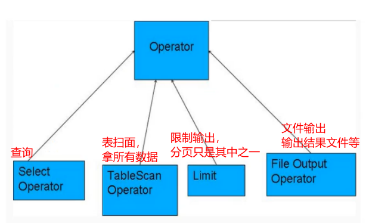
        - Operator 都定义有:
          - `protected List <Operator<? extends Serializable` >> `childOperators; `
          - `protected List <Operator<? extends Serializable` >> `parentOperators; `
          - `protected boolean done; // 初始化值为false`
      - ANTLR 词法语法分析工具解析 hql（hql 自己百度）：
        > 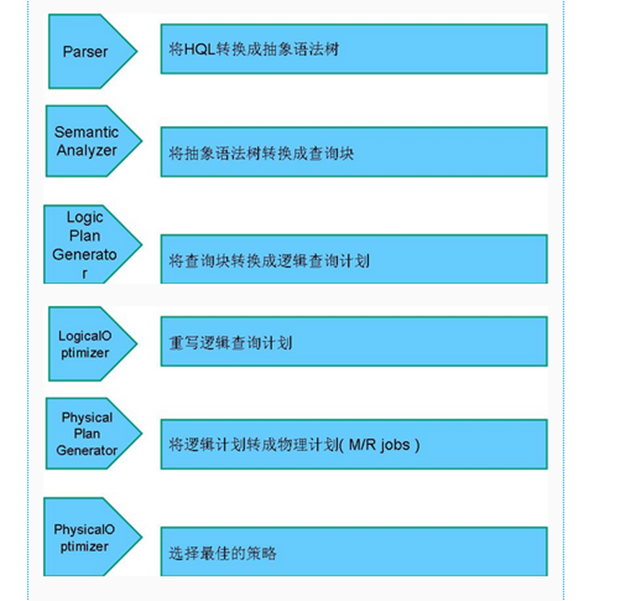
        > 当需要调优时需要深入理解
        - 第1步：由Hive驱动模块中的编译器对用户 输入的SQL语言进行词法和语法解析，将 SQL语句转化为抽象语法树的形式
        - 第2步：抽象语法树的结构仍很复杂，不方 便直接翻译为MapReduce算法程序，因此 ，把抽象语法书转化为查询块
        - 第3步：把查询块转换成逻辑查询计划，里 面包含了许多逻辑操作符 第4步：重写逻辑查询计划，进行优化，合 并多余操作，减少MapReduce任务数量
        - 第5步：将逻辑操作符转换成需要执行的具 体MapReduce任务
        - 第6步：对生成的MapReduce任务进行优 化，生成最终的MapReduce任务执行计划
        - 第7步：由Hive驱动模块中的执行器，对最 终的MapReduce任务进行执行输出

  - 生成的查询计划存储在 HDFS 中，并在随后有 MapReduce 调用执行。

- 用户接口

  - CLI:command line interface，一个命令行接口
    - Cli 启动的时候，会同时启动一个 Hive 副本
  - client:JDBC/ODBC：数据库连接
    - Thrift Server:基于 RPC（远程过程调用）协议，用来进行跨集群访问
    - Client 是 Hive 的客户端，用户连接至 Hive Server。
    - 在启动 Client 模式的时候，需要指出 Hive Server 所在节点，并且在该节点启动 Hive Server。
  - Web GUI：web 端界面，体验极差，2.x 后删除。

- Metadata（最重要）：

  > 保存 scheme，即关系型数据库表的约束

  - Hive 将元数据存储在数据库中，如 mysql、derby(内存数据库，hive 自带，一般不用)。
  - Hive 中的元数据包括表的名字，表的列和分区及其属性，表的属性（是否为外部表等），表的数据所在目录等。
  - 正是因为有元数据，所以才可以把 hdfs 中的文本数据按照数据库表的方式来读取

- 数据：

  - Hive 的数据存储在 HDFS 中。而数据的元信息存储在数据库中。
  - **sql 操作会转换为 hdfs 操作或者 MR 任务**。可以通过参数调优设置。
  - 大部分的查询、计算由 MapReduce 完成（包含*的查询，比如 select * from tbl 不会生成 MapRedcue 任务）。

- 大致流程：
  > 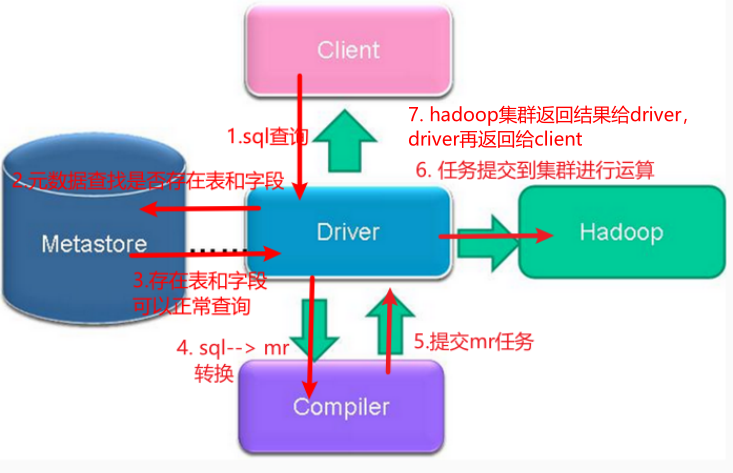


### 3.3.2. 更多组件
  > 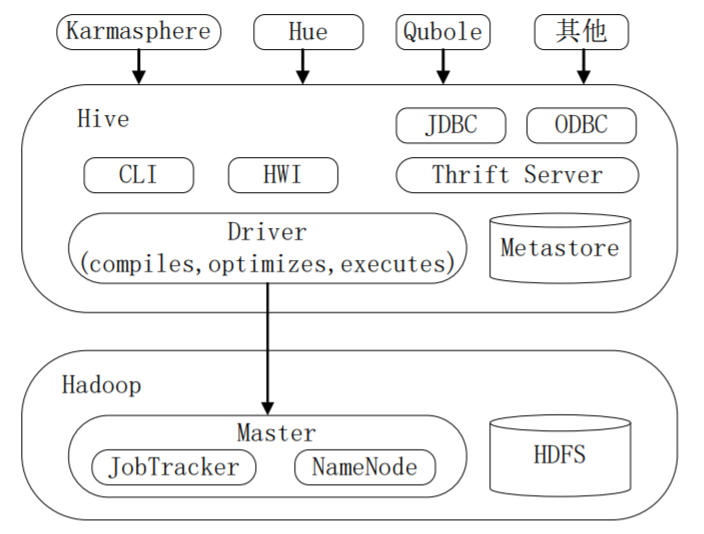 

### 3.3.3. 其他说明

- 当启动MapReduce程序时，Hive本身是不会生成MapReduce算法程序
  - 需要通过一个表示job执行计划XML文件驱动执行内置的、原生的Mapper和Reducer模块
  - Hive通过和JobTracker通信来初始化MapReduce任务，不必直接部署在 JobTracker所在的管理节点上执行

- 通常在大型集群上，会有专门的网关机来部署Hive工具。网关机的作用 主要是远程操作和管理节点上的JobTracker通信来执行任务
- 数据文件通常存储在HDFS上，HDFS由名称节点管理

## 3.4. hive 搭建模式

[官网 getstart](https://cwiki.apache.org/confluence/display/Hive/GettingStarted)

> 查看大致搭建过程

[具体文档](https://cwiki.apache.org/confluence/display/HIVE#Home-AdministratorDocumentation)

### 3.4.1. 模式一：本地模式

#### 3.4.1.1. 架构

此模式连接到一个 In-memory 的数据库 Derby，Derby 是一个内存数据库，用来保存元数据信息。只需要一台服务器即可。

hdfs 用来保存数据库中表的信息，以文本数据形式存储。
其中想显示分隔符需要通过`cat -A file`

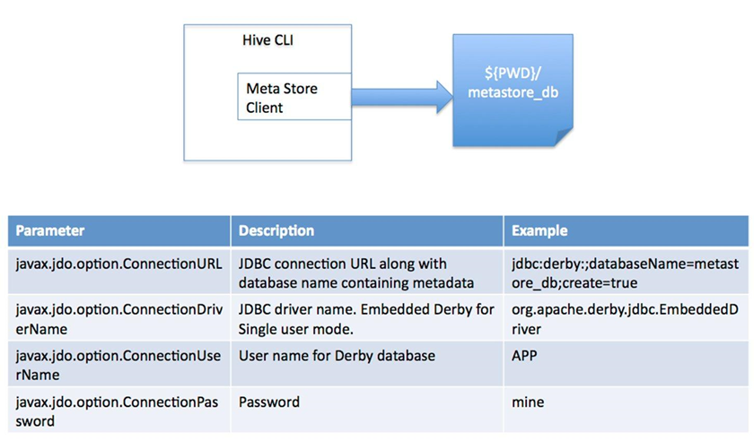

mete store Client：存储 metadata 的 hive 客户端

#### 3.4.1.2. 搭建

- 修改 hive-site.xml

  ```xml
  <?xml version="1.0"?>
  <?xml-stylesheet type="text/xsl" href="configuration.xsl"?>

  <configuration>
  <property>
    <name>javax.jdo.option.ConnectionURL</name>
    <value>jdbc:derby:;databaseName=metastore_db;create=true</value>
  </property>

  <property>
    <name>javax.jdo.option.ConnectionDriverName</name>
    <value>org.apache.derby.jdbc.EmbeddedDriver</value>
  </property>

  <property>
    <name>hive.metastore.local</name>
    <value>true</value>
  </property>

  <property>
    <name>hive.metastore.warehouse.dir</name>
    <value>/user/hive/warehouse</value>
  </property>

  </configuration>
  ```

注：使用 derby 存储方式时，运行 hive 会在当前目录生成一个 derby 文件和一个 metastore_db 目录。这种存储方式的弊端是在同一个目录下同时只能有一个 hive 客户端能使用数据库，否则会提示如下错误:

```log
[html] view plaincopyprint?
hive> show tables;
FAILED: Error in metadata: javax.jdo.JDOFatalDataStoreException: Failed to start database 'metastore_db', see the next exception for details.
NestedThrowables:
java.sql.SQLException: Failed to start database 'metastore_db', see the next exception for details.
FAILED: Execution Error, return code 1 from org.apache.hadoop.hive.ql.exec.DDLTask
hive> show tables;
FAILED: Error in metadata: javax.jdo.JDOFatalDataStoreException: Failed to start database 'metastore_db', see the next exception for details.
NestedThrowables:
java.sql.SQLException: Failed to start database 'metastore_db', see the next exception for details.
FAILED: Execution Error, return code 1 from org.apache.hadoop.hive.ql.exec.DDLTask
```

### 3.4.2. 模式二：单用户模式

#### 3.4.2.1. 架构

通过网络连接到一个数据库中，是最经常使用到的模式，数据库用来保存元数据信息。需要两台服务器。

hdfs 用来保存数据库中表的信息，以文本数据形式存储。
其中想显示分隔符需要通过`cat -A file`

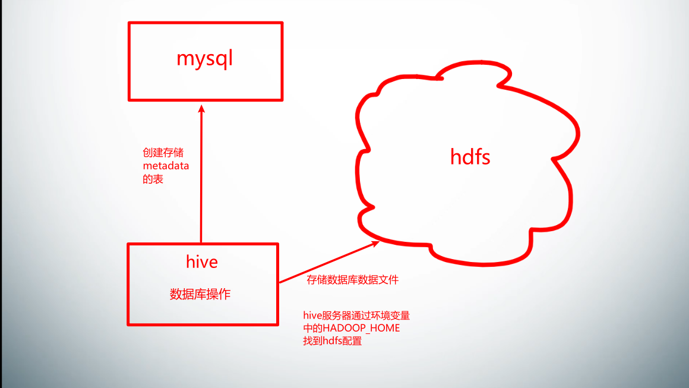

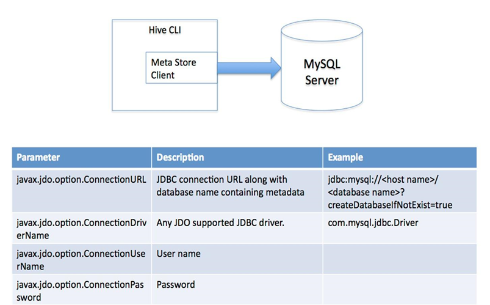

耦合性高，更改数据库的话，也需要修改 hive 的元数据

#### 3.4.2.2. 搭建

- node0001 上安装 mysql
  - `yum install mysql-server`
  - `service mysqld start` 开启服务
  - `mysql` 进入客户端
  - `select host,user,password from user` 查看用户
  - ` grant all privileges on *.* to 'root'@'%' identified by 'password'`
    - root:给 mysql 中的 root 用户
    - % 所有地址都可以访问
  - `select host,user,password from user` 查看用户,发现还有本机无密码登录的一项
    - `delete from user where host !='%'`
  - `flush privileges`:刷新权限。
    > 也可以重启 mysql，但是太麻烦
  - `quit`退出
- 开启 hadoop 相关
  - zookeeper
  - hdfs
  - yarn
- node0002 上搭建 hive

  - tar 解压安装包
  - 配置环境变量（看官网）
  - 配置文件 hive-site.xml：

    ```xml
    <?xml version="1.0"?>
    <?xml-stylesheet type="text/xsl" href="configuration.xsl"?>

    <configuration>
    <property>
      <name>hive.metastore.warehouse.dir</name>
      <value>/user/hive_remote/warehouse</value>
      <!-- mysql表文件在hdfs中的存放位置 -->
    </property>

    <property>
      <name>javax.jdo.option.ConnectionURL</name>
      <!-- 自动创建数据库 -->
      <value>jdbc:mysql://localhost/hive_remote?createDatabaseIfNotExist=true</value>
    </property>

    <property>
      <name>javax.jdo.option.ConnectionDriverName</name>
      <value>com.mysql.jdbc.Driver</value>
    </property>

    <property>
      <name>javax.jdo.option.ConnectionUserName</name>
      <value>hive</value>
    </property>

    <property>
      <name>javax.jdo.option.ConnectionPassword</name>
      <value>password</value>
    </property>
    </configuration>
    ```

  - 将驱动包放到\$HIVE_HOME/lib 下
  - 之后错误：

    ```log
    [ERROR] Terminal initialization failed; falling back to unsupported
    java.lang.IncompatibleClassChangeError: Found class jline.Terminal, but interface was expected
      at jline.TerminalFactory.create(TerminalFactory.java:lol)

    错误的原因： Hadoop jline版本和hive的jline不一致
    解决：用高版本jline覆盖低版本。(可以使用find查找一下)
    cp $HIVE_HOME/lib/jline-xxxx $HADOOP_HOME/share/hadoop/yarn/lib
    ```

- hive 进入 CLI
  - create table test1(id int,age,int);
  - insert into tbl values(1,1);
- 去 mysql 所在服务器查看
  - 多了一个 hive_remote 数据库
  - 里面有元数据的表。
    > **注意：mysql 只存储元数据，表数据在 hdfs 中**

### 3.4.3. 模式三：远程服务器模式

#### 3.4.3.1. 架构

用于非 Java 客户端访问元数据库，在服务器端启动 MetaStoreServer，客户端利用 Thrift 协议通过 MetaStoreServer 访问元数据库。需要三台服务器。

hdfs 用来保存数据库中表的信息，以文本数据形式存储。
其中想显示分隔符需要通过`cat -A file`

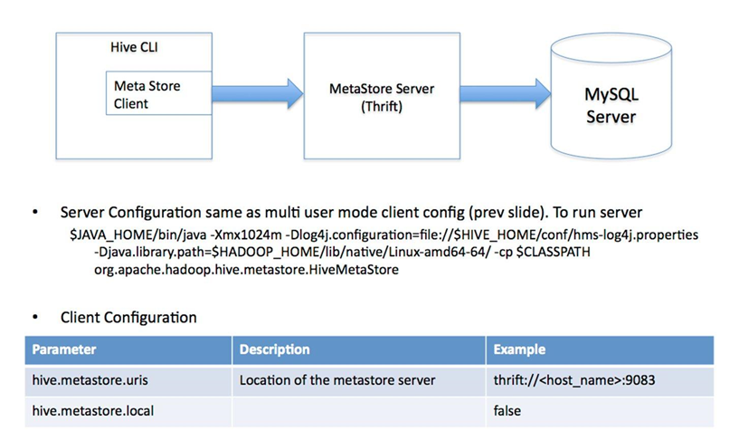

多了一个 metastore serve（元数据服务），由该服务维护元数据，hive 只用连接即可，起到解耦作用

#### 3.4.3.2. 搭建（实操）

- 搭建目标：

|          | NN-1 | NN-2 | DN  | ZK  | ZKFC | JNN | RM  | NM  | mysql | mate store | hive |
| :------: | :--: | :--: | :-: | :-: | :--: | :-: | :-: | :-: | :---: | :--------: | :--: |
| Node0001 |  \*  |      |     |     |  \*  | \*  |     |     |       |            |      |
| Node0002 |      |  \*  | \*  | \*  |  \*  | \*  |     | \*  |  \*   |            |      |
| Node0003 |      |      | \*  | \*  |      | \*  | \*  | \*  |       |     \*     |      |
| Node0004 |      |      | \*  | \*  |      |     | \*  | \*  |       |            |  \*  |

- 仿照上方设置好 mysql
- 开启 hadoop 相关
  - zookeeper
  - hdfs
  - yarn
- node0003,node0004 解压 hive，配置环境变量
- 配置文件：

  - node0003(meta store 服务端):

    ```xml
    <?xml version="1.0"?>
    <?xml-stylesheet type="text/xsl" href="configuration.xsl"?>

    <configuration>
    <property>
      <name>hive.metastore.warehouse.dir</name>
      <value>/user/hive/warehouse</value>
      <!-- mysql表文件在hdfs中的存放位置 -->
    </property>

    <property>
      <name>javax.jdo.option.ConnectionURL</name>
      <!-- 自动创建数据库 -->
      <value>jdbc:mysql://node0002/hive_remote?createDatabaseIfNotExist=true</value>
    </property>

    <property>
      <name>javax.jdo.option.ConnectionDriverName</name>
      <value>com.mysql.jdbc.Driver</value>
    </property>

    <property>
      <name>javax.jdo.option.ConnectionUserName</name>
      <value>hive</value>
    </property>

    <property>
      <name>javax.jdo.option.ConnectionPassword</name>
      <value>password</value>
    </property>
    </configuration>
    ```

  - node0004(hive CLI):

    ```xml
    <?xml version="1.0"?>
    <?xml-stylesheet type="text/xsl" href="configuration.xsl"?>

    <configuration>
        <property>
        <name>hive.metastore.uris</name>
        <value>thrift://node0003:9083</value>
        <!-- 端口不正确的话，开启服务前后各执行 ss -nal 一次，查看输出变化，确定服务端口开启位置。 -->
        </property>
    </configuration>
    ```

- node0003,node0004 将 jdbc 连接 jar 包复制到 `$HIVE_HOME/lib`

- node0003:`hive --service metastore`
  - 阻塞式窗口
- node0004:`hive`

```
在模式二中，node0002配置文件中有mysql连接，读取到后就会在本地创建一个metastore服务。 hive 命令后进入CLI客户端
也就是启动 元数据服务+CLI客户端

在模式三中，node0003中，hive --service metastore后，node0003会读取配置文件中的mysql连接，并开启元数据服务
node0004 配置文件中只有一个thrift连接，所以会连接上元数据服务，不会再本地启动
```

## 3.5. hive 参数

| 命名空间 | 读写权限 | 含义                                                    | 有效期           |
| :------- | :------- | :------------------------------------------------------ | :--------------- |
| hiveconf | 可读写   | hive-site.xml 当中的各配置变量                          | 只在当前会话有效 |
| hivevar  | 可读写   | 例：hive -d val=key                                     |                  |
| system   | 可读写   | 系统变量，包含 JVM 运行参数等 例：system:user.name=root |                  |
| env      | 只读     | 环境变量 例：env:JAVA_HOME                              |                  |

- hiveconf：

  - 设置；
    - 进入 hive 前设置
      > 输出列名：`hive --hiveconf hive.cli.print.header=true`
    - 进入 hive 后设置
      > 输出列名：`set hive.cli.print.header=true`
    - 创建`~/.hiverc`文件，里面写 set 语句，进入 hive 后会自动执行
  - 查询：
    - 进入 hive 后，只输入`set` 会显示所有 hiveconf 选项
    - 输入 `set hive.cli.print.header`会打印默认值

- hivevar:
  > 几乎不用
  - `hive --help`,找到`hive --service serviceName --help`,输入`hive --service cli --help`
  - 设置(进入之前)：
    - `hive -d abc=1`
    - `hive --hivevar abc=1`
  - 取值：`${abc}`
- hive 命令历史：`~/.hivehistory`

## 3.6. hive sql 基础

[文档](https://cwiki.apache.org/confluence/display/Hive/LanguageManual)

> 可能会有 values\_\_tmp_table ，只是查询数据时产生的临时表，不用管

### 3.6.1. 分隔符相关

> hdfs 中的数据都以纯文本形式存储，所以必须使用

- `hdfs dfs -cat` 和 `cat` 无法查看分隔符
- 必须 `hdfs dfs -get`下载下来后 使用`cat -A`查看
- 默认分隔符使用 `^A`。
  - vi 中，通过 Ctrl-v,Ctrl-A 可以输出该字符。
  - 同理还有 ^B,^C 等等
  - 分别对应 \u0001 \u0002 \u0003

### 3.6.2. DDL

[文档](https://cwiki.apache.org/confluence/display/Hive/LanguageManual+DDL)

#### 3.6.2.1. 语法

除了数据类型有些区别，其他相同

（复制自官方文档）

```sql
CREATE [TEMPORARY] [EXTERNAL] TABLE [IF NOT EXISTS] [db_name.]table_name    -- (Note: TEMPORARY available in Hive 0.14.0 and later)
  [(col_name data_type [column_constraint_specification] [COMMENT col_comment], ... [constraint_specification])]
  [COMMENT table_comment]
  [PARTITIONED BY (col_name data_type [COMMENT col_comment], ...)]
  [CLUSTERED BY (col_name, col_name, ...) [SORTED BY (col_name [ASC|DESC], ...)] INTO num_buckets BUCKETS]
  [SKEWED BY (col_name, col_name, ...)                  -- (Note: Available in Hive 0.10.0 and later)]
     ON ((col_value, col_value, ...), (col_value, col_value, ...), ...)
     [STORED AS DIRECTORIES]
  [
   [ROW FORMAT row_format] -- 分隔符定义
   [STORED AS file_format] -- 文件格式，不同格式文件大小不同
     | STORED BY 'storage.handler.class.name' [WITH SERDEPROPERTIES (...)]  -- (Note: Available in Hive 0.6.0 and later)
  ]
  [LOCATION hdfs_path]  -- hdfs 位置
  [TBLPROPERTIES (property_name=property_value, ...)]   -- (Note: Available in Hive 0.6.0 and later)
  [AS select_statement];   -- (Note: Available in Hive 0.5.0 and later; not supported for external tables)

CREATE [TEMPORARY] [EXTERNAL] TABLE [IF NOT EXISTS] [db_name.]table_name
  LIKE existing_table_or_view_name
  [LOCATION hdfs_path];

data_type
  : primitive_type -- 基本类型，下面是复杂类型
  | array_type
  | map_type
  | struct_type
  | union_type  -- (Note: Available in Hive 0.7.0 and later)

primitive_type
  : TINYINT
  | SMALLINT
  | INT
  | BIGINT
  | BOOLEAN
  | FLOAT
  | DOUBLE
  | DOUBLE PRECISION -- (Note: Available in Hive 2.2.0 and later)
  | STRING
  | BINARY      -- (Note: Available in Hive 0.8.0 and later)
  | TIMESTAMP   -- (Note: Available in Hive 0.8.0 and later)
  | DECIMAL     -- (Note: Available in Hive 0.11.0 and later)
  | DECIMAL(precision, scale)  -- (Note: Available in Hive 0.13.0 and later)
  | DATE        -- (Note: Available in Hive 0.12.0 and later)
  | VARCHAR     -- (Note: Available in Hive 0.12.0 and later)
  | CHAR        -- (Note: Available in Hive 0.13.0 and later)

array_type
  : ARRAY < data_type >  -- 这里是data_type，也就是说可以多层嵌套

map_type
  : MAP < primitive_type, data_type >

struct_type
  : STRUCT < col_name : data_type [COMMENT col_comment], ...>

union_type
   : UNIONTYPE < data_type, data_type, ... >  -- (Note: Available in Hive 0.7.0 and later)

row_format
  : DELIMITED [FIELDS TERMINATED BY char [ESCAPED BY char]] [COLLECTION ITEMS TERMINATED BY char]
        [MAP KEYS TERMINATED BY char] [LINES TERMINATED BY char]
        [NULL DEFINED AS char]   -- (Note: Available in Hive 0.13 and later)
  | SERDE serde_name [WITH SERDEPROPERTIES (property_name=property_value, property_name=property_value, ...)]

file_format:  -- 文件类型
  : SEQUENCEFILE
  | TEXTFILE    -- (Default, depending on hive.default.fileformat configuration)
  | RCFILE      -- (Note: Available in Hive 0.6.0 and later)
  | ORC         -- (Note: Available in Hive 0.11.0 and later)
  | PARQUET     -- (Note: Available in Hive 0.13.0 and later)
  | AVRO        -- (Note: Available in Hive 0.14.0 and later)
  | JSONFILE    -- (Note: Available in Hive 4.0.0 and later)
  | INPUTFORMAT input_format_classname OUTPUTFORMAT output_format_classname

column_constraint_specification:
  : [ PRIMARY KEY|UNIQUE|NOT NULL|DEFAULT [default_value]|CHECK  [check_expression] ENABLE|DISABLE NOVALIDATE RELY/NORELY ]

default_value:
  : [ LITERAL|CURRENT_USER()|CURRENT_DATE()|CURRENT_TIMESTAMP()|NULL ]

constraint_specification:
  : [, PRIMARY KEY (col_name, ...) DISABLE NOVALIDATE RELY/NORELY ]
    [, PRIMARY KEY (col_name, ...) DISABLE NOVALIDATE RELY/NORELY ]
    [, CONSTRAINT constraint_name FOREIGN KEY (col_name, ...) REFERENCES table_name(col_name, ...) DISABLE NOVALIDATE
    [, CONSTRAINT constraint_name UNIQUE (col_name, ...) DISABLE NOVALIDATE RELY/NORELY ]
    [, CONSTRAINT constraint_name CHECK [check_expression] ENABLE|DISABLE NOVALIDATE RELY/NORELY ]
```

#### 3.6.2.2. 示例

```
已有数据
人员表
id,姓名，爱好，住址
1,小明1,lol-book-movie,beijing:shangxuetang-shanghai:pudong
2,小明2,lol-book-movie,beijing:shangxuetang-shanghai:pudong
3,小明3,lol-book-movie,beijing:shangxuetang-shanghai:pudong
4,小明4,lol-book-movie,beijing:shangxuetang-shanghai:pudong
5,小明5,lol-movie,beijing:shangxuetang-shanghai:pudong
6,小明6,lol-book-movie,beijing:shangxuetang-shanghai:pudong
7,小明7,lol-book,beijing:shangxuetang-shanghai:pudong
8,小明8,lol-book,beijing:shangxuetang-shanghai:pudong
9,小明9,lol-book-movie,beijing:shangxuetang-shanghai:pudong
```

```sql

-- 创建表
create table psn(
  id int,
  name string,
  likes array<string>,
  address map<string,string>
)
row format delimited -- 声明该句，指定使用分隔符读取（后面就有正则方式读取）
fields terminated by ','  -- 字段分隔符
-- 默认为 fields terminated by '\001'
-- \001 即 \u0001
collection items terminated by '-'  -- 集合分隔符
-- 默认为：collection items terminated by '\002'
-- \002 即 \u0002
map keys terminated by ':'  -- map的k-v分隔符
--默认为 map keys terminated by '\003'
-- \003 即 \u0003

-- -----------------------------

desc formatted psn -- 查看表结构

-- -----------------------------

-- Hive does not do any transformation while loading data into tables.
-- Load operations are currently pure copy/move operations that move datafiles into locations corresponding to Hive tables.
load data local inpath '~/data/data' into table psn -- 加载数据。local关键字用来指定扫描本地文件系统，否则就hdfs。
-- 以后基本上根据已有数据的结构，设计表，再通过该语句把文件上传到hdfs。
-- insert基本不用

-- 注意：
  -- 带有local时，会从本地 复制 文件
  -- 没有local时，会从hdfs上 移动 文件
-- -----------------------------

-- 查询数据
select * from psn;
```

- 建表方式：
  - 上述
  - `create table temp as select * from psn`
    > 复制表结构和数据
  - `create table temp1 like psn`
    > 只复制表结构

### 3.6.3. 内部表，外部表

> CLI 中输入`desc formatted 表名`显示的信息中有 Table types 属性

#### 3.6.3.1. managed table 内部表

> 上面 DDL 中定义的表就是内部表

- hive 创建内部表
- hive 在 mysql 中创建元数据信息
- hive 将数据复制到 hdfs 的指定目录（目录自动生成） （load data 或 insert）

数据经由 hive 上传到 hdfs

#### 3.6.3.2. extral table 外部表

- hdfs 中有数据文件，位于 `/usr`
- hive 创建外部表。（指定 location）
- hive 在 mysql 中创建元数据信息，并关联上数据文件（目录自己指定）
- 注意：
- **必须指定一个目录**，因为一个表就对应一个目录，而不是一个文件
- **默认会读取目录下的所有文件**
- 如果有文件夹会报错（ **读时检查**）
  > 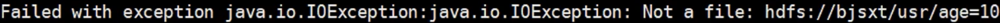

```sql
create table psn2(
  id int,
  name string,
  likes array<string>,
  address map<string,string>
)
row format delimited
fields terminated by ','  -- 字段分隔符
collection items terminated by '-'  -- 集合分隔符
map keys terminated by ':'  -- map的k-v分隔符
location '/usr/' -- 数据文件所在hdfs的**目录**，不是文件
```

**要根据文档，注意语句顺序，location 一定要放在后面**

#### 3.6.3.3. 内部表，外部表区别

- 创建表：
  > 两种表的元数据都由 hive 管理
  - 内部表不需要 location，直接存储在 hdfs 默认路径
  - 外部表需要指定数据文件路径
- dorp 时
  - 内部表
    - 存于数据库中的元数据信息：被删除
    - 存于 hdfs 中的文本数据：被删除
  - 外部表
    - 存于数据库中的元数据信息：被删除
    - 存于 hdfs 中的文本数据：**保留**
- 使用场景：根据情景，自行判断
  - 先有数据再有表，就用外部表
  - 先有表再有数据，就用内部表

#### 3.6.3.4. 检查时机

- mysql 等关系型数据库：写时检查
  - 在插入数据时就会检查数据格式
- hive：读时检查
  - 可以插入任何类型的数据
  - 在读时进行实时匹配，如果匹配不上，就会显示 NULL
  - 目的：解耦。
    - hdfs 只负责数据存储
    - hive 负责数据读取规则（元数据）。
    - 这也保证了了外部表这一机制

### 3.6.4. 静态分区

> [文档](https://cwiki.apache.org/confluence/display/Hive/LanguageManual+DDL#LanguageManualDDL-AlterPartition)

> 分区概念在 MR,hive,spark 等都有，没有联系

> hive 中动态分区用的比较多

> hive 分区限制：最大 1000 个

#### 3.6.4.1. 建表时定义分区

- 分区：

  - 目的：提高检索效率
  - 展现形式：在 hdfs 上创建多级目录
  - 定义：

    - 根据一定条件存储数据
    - 比如一定的时期（每天）存储在一个目录。
    - 根据项目情况设置粒度。

  - 分区也是元数据，在 mysql 中可以找到相关表

- 静态分区 partition

  > 必须在表定义时指定对应的 partition 字段

  - 使用步骤：

    - 创建带有分区的表
    - load 数据，通知指定分区的值，值要自己定义。

      ```
        -- id name
            1  bob
            2 lucy

      load data local inpath '/data/name.txt' into table name partition(age=10)
      ```

    - hdfs 中保存数据为：
      ```
        -- 数据会多出一列
        -- id name age
            1  bob 10
            2 lucy 10
      ```

  - 单分区建表语句：
    - 例：`create table day_table (id int, content string) partitioned by (dt string);`
    - 单分区表，按天分区，在表结构中存在 id，content，dt 三列。
      > 分区列也是一个列，但只在 partitioned 语句后指明即可，不能重复声明
    - 以 dt 为文件夹区分
    - 单分区示例：
      - 代码
        ```sql
        create table psn5(
          id int,
          name string
        )
        partitioned by (age int)  -- 注意，查询上方语句格式，不要搞错顺序
        row format delimited
        fields terminated by ','
        collection items terminated by '-'
        map keys terminated by ':'
        -- 最终会有 id name age 三列
        load data local inpath '~/data/data' into table psn5  partipation(age=10)  -- 将age=10的数据存储到 age=10分区
        ```
      - 结果
        > 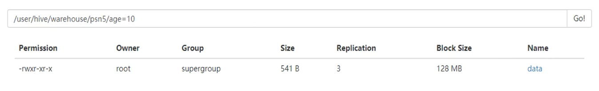
  - 双分区建表语句：

    - create table day_hour_table (id int, content string) partitioned by (dt string, hour string);
    - 双分区表，按天和小时分区，在表结构中新增加了 dt 和 hour 两列。
    - 先以 dt 为文件夹，再以 hour 子文件夹区分
    - 双分区示例：

      - 代码

        ```sql
        create table psn6(
          id int,
          name string,
        )
        partitioned by (age int,sex string)  -- 注意，查询上方语句格式，不要搞错顺序
        row format delimited
        fields terminated by ','
        collection items terminated by '-'
        map keys terminated by ':'
        -- 最终会有 id name age sex四列
        load data local inpath '~/data/data' into table psn5  partipation(age=10,sex='man')  -- 将age=10,sex='man'的数据存储到 age=10/sex='man'分区
        ```

      - 结果:
        > 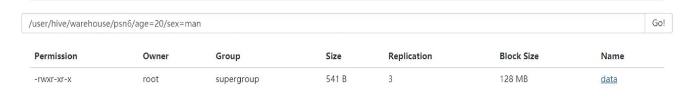

#### 3.6.4.2. 添加和删除分区：

- 添加分区：`alter table psn6 add patition(age=30,sex='man') `
  > 只适用于静态分区
  - 结果：会新增一个目录
    > 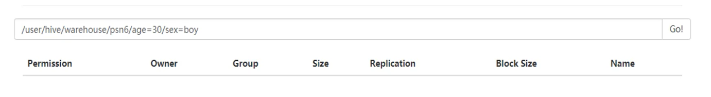
  - 注意：添加分区时，要和创建表时设置的分区层次一致
- 删除分区：`alter table psn6 drop partition(sex='man')`
  - 注意：删除分区时，可以只删一个

#### 3.6.4.3. 修复分区：

> 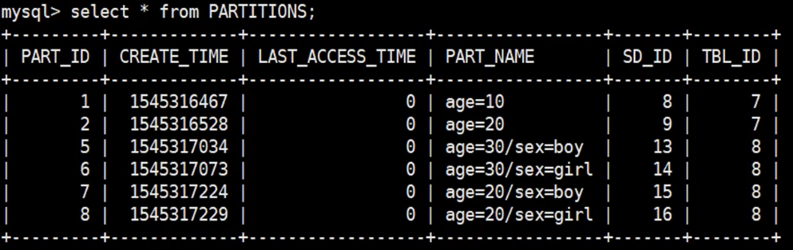

- 每次查询前，都会查询分区信息
- 只有查到分区信息，才能找到数据
- 案例：
  - hdfs 中创建 /user/psn7/age=10/sex='man' 文件夹
  - 将数据复制到 上述文件夹下
  - 创建外部表`create table temp1 .... partitioned by (age int,sex string) ....location '/user/'`
  - 此时进行查询`select * from temp1`，是无法查到任何数据的。因为元数据中没有任何记录
  - 解决：` msck repair table temp1`
    > 自动扫描目录，修复数据

### 3.6.5. DML

[文档](https://cwiki.apache.org/confluence/display/Hive/LanguageManual+DML)

- 插入数据：
  - 从本地或者 hdfs 文件导入
    > **用的多**
    ```sql
    load data [local] inpath '~/data/data' into table psn;
    ```
  - 把查询结果插入
    > **用的相当多**
    ```sql
    from table1
    insert overwrite table  table2
    select id,name
    insert into table table3
    select id,likes
    ...;
    ```
    - 在只读取 table1 一次的情况下做多次数据插入（table2，table3）
  - 将查询结果写到服务器上
    > 基本不用
    ```sql
    insert overwrite/into local directory '~/result1'  select-statement
    ```
  - 普通插入数据：
    > 根本不用
    ```sql
    insert into table_name values()
    ```
- 更新/删除数据
  - `update psn set name='1111' where id = 1`
    ```
    会报错，需要配置开启事务管理器。
    限制很多，主要由：
      不支持回滚，提交
      必须是orc文件格式
      表必须被分桶
      默认事务不开启
      ....
    hive 的事务非常难用，不推荐用
    基本不做更新和删除操作
    ```

### 3.6.6. SerDe

- 定义
  - SerDe 用于做序列化和反序列化。(Serializer and Deserializer)
  - 构建在数据存储和执行引擎之间，对两者实现解耦
  - **作用和分隔符相同**，但是功能要强大很多
  - 不止支持正则，但是正则用的多
- hive 正则匹配
  ```sql
  CREATE TABLE logtbl (
      host STRING,
      identity STRING,
      t_user STRING,
      time STRING,
      request STRING,
      referer STRING,
      agent STRING)
    ROW FORMAT SERDE 'org.apache.hadoop.hive.serde2.RegexSerDe'
    WITH SERDEPROPERTIES (
      "input.regex" = "([^ ]*) ([^ ]*) ([^ ]*) \\[(.*)\\] \"(.*)\" (-|[0-9]*) (-|[0-9]*)"  -- 一组对应一列
    )
    STORED AS TEXTFILE;
  ```

### 3.6.7. hive 函数

> hive 支持比 mysql 更丰富的函数

> [在线文档](https://cwiki.apache.org/confluence/display/Hive/LanguageManual+UDF)

> [翻译文档](./pdf/hive函数.pdf)

#### 3.6.7.1. 内置函数

#### 3.6.7.2. 自定义函数

- UDF 流程
  - 编写继承 UDF 的类
  - 实现 evaluate 方法，其中写核心逻辑
  - 将写好的代码达成 jar 包
  - 将 jar 上传（两种方式）：
    - linux
      - `add jar jar包在linux上的路径`
      - 创建临时函数：`create temporary function func_name as '全类名';`
    - hdfs
      - 创建临时函数：`create temporary function func_name as '全类名' using 'jar包在linux上的路径';`

#### 3.6.7.3. 练习

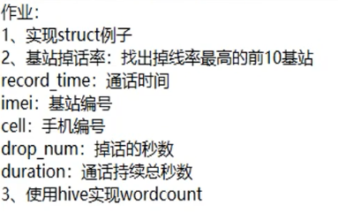

##### 3.6.7.3.1. 行转列

四种实现**重要**：
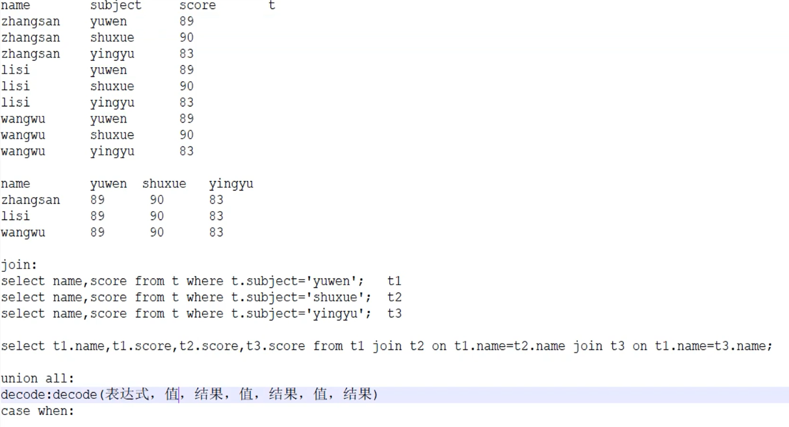

##### 3.6.7.3.2. wordcound 的 sql 实现

> 提示：使用 string 转数组 函数，explode 函数

```sql
create table hello_hadoop_words(
    word string
)
location '/root/test';

create table wc_result(
  word string,
  count int
)

-- 统计sql：
from (select explode(split(word,' ')) word from hello_hadoop_words) t1  -- 这个t1不能省略，否则会报错
insert into wc_result
select word,count(word) group by word  -- 相当于把第一行插到该行中间。当只有一条insert的话，可以把第一行放到该行。但如果有多条insert的话，不能。
-- 极不推荐 count(*)，否则会加重查询负重
-- count(1)即可，括号里面只是起一个标识作用
```

##### 3.6.7.3.3. 基站掉线率

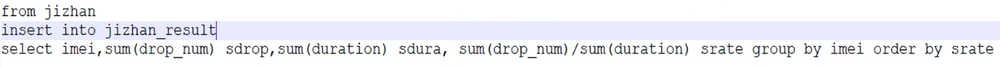

##### 3.6.7.3.4. 总结

- 提交的 sql 会成为一个 Application，而不是 job。一个 Application 里面包含多个 job
- 别名只有在生成表的时候用来显示列名，不能用在计算过程中
- mapreduce 的 web 页面：

  - 点击 cluster 下的 application，可以查看大致执行情况
    - Tracking URL:history 的话，是历史日志信息，需要在 hadoop 中配置 jobhistory 才能点开
  - 点击 cluster 下的 application，点击里面的 log，点击 syslog,点击 here，会显示该次执行 log
  - Tool 下的 configuration 有 hadoop 的所有配置，包括默认配置

- Hadoop: Job vs Application vs Task vs Task attempt

  ```
  In terms of YARN, the programs that are being run on a cluster are called applications. In terms of MapReduce they are called jobs. So, if you are running MapReduce on YARN, job and application are the same thing (if you take a close look, job ids and application ids are the same).

  MapReduce job consists of several tasks (they could be either map or reduce tasks). If a task fails, it is launched again on another node. Those are task attempts.

  Container is a YARN term. This is a unit of resource allocation. For example, MapReduce task would be run in a single container.
  ```

### 3.6.8. 动态分区

> 用的更多些。

```
静态分区使用load data，在上传数据时会指定分区，表内数据会多一列。分区列数据一开始不存在，是要主动添加的
速度快，只用加一列数据

动态分区使用插入语句，从数据表查询然后插入到分区表，插入时调整select顺序，与分区表列顺序匹配。
动态分区会自动根据指定列进行分区。分区列数据一开始就存在，要做的只是分出来
速度慢，使用mapreduce进行分区

两个分区都会分文件夹存放数据。两个分区方式只是导入数据方式不同，建表语句相同
```

- 开启支持动态分区

  - set hive.exec.dynamic.partition=true;
    - 默认：true
  - set hive.exec.dynamic.partition.mode=nostrict;
    - 默认：strict（严格模式，至少有一个分区列是静态分区）
  - 相关参数
    - set hive.exec.max.dynamic.partitions.pernode;
      > 每一个执行 mr 节点上，允许创建的动态分区的最大数量(100)
    - set hive.exec.max.dynamic.partitions;
      > 所有执行 mr 节点上，允许创建的所有动态分区的最大数量(1000)
    - set hive.exec.max.created.files;
      > 所有的 mr job 允许创建的文件的最大数量(100000) ,要根据硬件调整<br>
      > linux 中，1G 内存大概可以存储 10000 个文件打开后的文件描述符.<br>
      > 一个进程默认最多 1024 个<br>

- 设置动态分区：

  - 数据：
    ```
    1,小明1,12,man,lol-book-movie,beijing:shangxuetang-shanghai:pudong
    2,小明2,13,woman,lol-book-movie,beijing:shangxuetang-shanghai:pudong
    3,小明3,13,man,lol-book-movie,beijing:shangxuetang-shanghai:pudon
    4,小明4,12,woman,1ol-book-movie,beijing:shangxuetang-shanghai:pudong
    5,小明5,13,man,lol-movie,beijing:shangxuetang-shanghai:pudong
    6,小明6,13,woman,lol-book-movie,beijing:shangxuetang-shanghai:pudong
    7,小明7,13,man,lol-book,beijing:shangxuetang-shanghai:pudong
    8,小明8,12,woman,lol-book,beijing:shangxuetang-shanghai:pudong
    9,小明9,12,man,lol-book-movie,beijing:shangxuetang-shanghai:pudong
    ```
  - 建表：

    ```sql
    create table psn5(
      id int,
      name string,
      age int,
      gender string,
      likes array<string>
    )
    row format delimited
    fields terminated by ','
    collection items terminated by '-'
    map keys terminated by ':'

    create table psn6(
      id int,
      -- 这里不用声明分区的列，但是是如何确保列的顺序的？？
      name string,
      likes array<string>
    )
    partitioned by (age int,gender string)
    row format delimited
    fields terminated by ','
    collection items terminated by '-'
    map keys terminated by ':'

    from psn5
    insert into psn6 partition(age,gender) -- 根据分区插入
    select id,name,likes,address,age,gender;  --两个动态分区要放在最后
    -- 这里会自动进行分区
    ```

### 3.6.9. 分桶

- 定义：
  - 分桶表是对列值取哈希值的方式，将不同数据放到不同文件中存储。
  - 对于 hive 中每一个表、分区都可以进一步进行分桶。分区和分桶相互独立
  - 由列的哈希值取余桶的个数来决定每条数据划分在哪个桶中。
- 适用场景：
  - 数据抽样
    > reduce 个数等于桶的个数
- 开启分桶

  - set hive.enforce.bucketing=true;
    > 默认：false；设置为 true 之后，mr 运行时会根据 bucket 的个数自动分配 reduce task 个数。一般一个 bucket 对应一个 reduce
    > （用户也可以通过 mapred.reduce.tasks 自己设置 reduce 任务个数，但分桶时不推荐使用）
    > 
  - 注意：一次作业产生的桶（文件数量）和 reduce task 个数一致。

- 分桶抽样查询：`select * from bucket_table tablesample(bucket x out of y on columns)`;

  - x：表示从哪个 bucket 抽取数据
  - y：必须为该表总 bucket 数的倍数或因子

- 测试：

  - 数据

    ```
    测试数据：
    1,tom,11
    2,cat,22
    3,dog,33
    4,hive,44
    5,hbase,55
    6,mr,66
    7,alice,77
    8,scala,88
    ```

  - sql：

    ```sql
    -- 创建数据表
    create table age_t(
      id int,
      name string,
      age int
    )
    row format delimited
    fields terminated by ','

    -- 导入数据
    load data local inpath '/root/data/age' into table age_bucket

    -- 创建分桶表
    create table age_bucket(
      id int,
      name string,
      age int
    )
    clustered by(age) into 4 buckets
    row format delimited
    fields terminated by ','

    -- 开启分桶
    set hive.enforce.bucketing=true

    -- 数据分桶：
    from age_t
    insert into age_bucket select id,name,age

    -- 从分桶表数据中进行抽样
    select * from age_bucket tablesample (bucket 2 out of 4)
    -- 所有桶分成4份，4/4=1，也就是一份一桶
    -- 抽取4个bucket中的第二个bucket
    select * from age_bucket tablesample (bucket 2 out of 8)
    -- 所有桶分成8份，4/8=1/2，也就是一份半桶
    -- 抽取8个1/2 bucket中的第二个 1/2bucket
    -- 1/2 bucket就是桶中数据的1/2
    -- 一般都取整数份，这种用的不错
    ```

### 3.6.10. Hive Later View

- hive Lateral View

  - Lateral View 用于和 UDTF 函数（explode、split）结合来使用。
  - 首先通过 UDTF 函数拆分成多行，再将多行结果组合成一个支持别名的虚拟表。
  - **主要解决在 select 使用 UDTF 做查询过程中，查询只能包含单个 UDTF，不能包含其他字段、以及多个 UDTF 的问题**

- 语法：
  - `lateral view udtf(expression) tableAlias as columnAlias (',' columnAlias)`
- 示例：统计人员表中共有多少种爱好、多少个城市?
  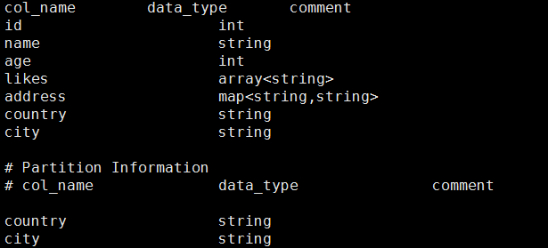

  ```sql
  select count(distinct(myCol1)), count(distinct(myCol2)) from psn2
  lateral view explode(likes) myTable1 AS myCol1  -- myTable1只是别名，补足语法，写成什么都行
  lateral view explode(address) myTable2 AS myCol2, myCol3;-- myTable2只是别名，补足语法，写成什么都行

  select id,myCol1,myCol2,myCol3 from psn2
  lateral view explode(likes) myTable1 AS myCol1  -- myTable1只是别名，补足语法，写成什么都行
  lateral view explode(address) myTable2 AS myCol2, myCol3;-- myTable2只是别名，补足语法，写成什么都行
  ```

### 3.6.11. hive 视图

- 和关系型数据库中的普通视图一样，hive 也支持视图
- 特点：
  - 不支持物化视图。物化视图只有 oracle 支持
    > mysql 视图默认支持更新，插入，删除。不过也有只读视图等
  - 只能查询，不能做加载数据操作
  - 视图的创建，只是保存一份元数据，查询视图时才执行对应的子查询
  - view 定义中若包含了 ORDER BY/LIMIT 语句，当查询视图时也进行 ORDER BY/LIMIT 语句操作，view 当中定义的优先级更高
    - **不能使用 order by，因为这样会把所有数据加入到一个 reduce 中，占满内存**
  - view 支持迭代视图，即视图可以嵌套视图
- View 语法
  - 创建视图：
  ```sql
  CREATE VIEW [IF NOT EXISTS] [db_name.]view_name
    [(column_name [COMMENT column_comment], ...) ]
    [COMMENT view_comment]
    [TBLPROPERTIES (property_name = property_value, ...)]
    AS SELECT ... ;
  ```
  - 查询视图：`select colums from view;`
  - 删除视图：`DROP VIEW [IF EXISTS] [db_name.]view_name;`

```sql
-- 创建视图
create view v_psn as select * from psn;

-- 查看视图，就是查看表。
show tables;
```

### 3.6.12. Hive 索引

- 目的：优化查询以及检索性能
- 原理：
  - 将指定列的每个值所处目录以及文件偏移量记录在 mysql 中
  - 在查询时，先查 mysql，去 hdfs 中取数据
  - 但数据特别大时，可能反而变慢。
- 特点：当数据更新时，索引不会自动更新。也因此，索引用的十分少。
- 创建索引：
  - as：指定索引器；
  - in table：指定索引表，若不指定默认生成在 default**psn2_t1_index**表中
- 语法：

  ```sql
  -- 语法
  -- 建立index
  CREATE INDEX index_name
    ON TABLE base_table_name (col_name, ...)
    AS index_type
    [WITH DEFERRED REBUILD]
    [IDXPROPERTIES (property_name=property_value, ...)]
    [IN TABLE index_table_name]
    [
      [ ROW FORMAT ...] STORED AS ...
      | STORED BY ...
    ]
    [LOCATION hdfs_path]
    [TBLPROPERTIES (...)]
    [COMMENT "index comment"];

  -- 删除index
  DROP INDEX [IF EXISTS] index_name ON table_name;

  -- 修改index
  ALTER INDEX index_name ON table_name [PARTITION partition_spec] REBUILD;
  ```

  ```sql
  create index t1_index on table psn(name)
  as 'org.apache.hadoop.hive.ql.index.compact.CompactIndexHandler' with deferred rebuild -- index处理类
  in table t1_index_table;-- 存放索引信息。记录数据的文件路径以及数据的偏移量

  create index t1_index on table psn(name)
  as 'org.apache.hadoop.hive.ql.index.compact.CompactIndexHandler' with deferred rebuild;
  -- 不指定 默认生成在default__psn2_t1_index__表中
  ```

- 索引不会自动创建
  > 当数据量多时建索引非常麻烦，占位置并且慢
  - 重建索引（建立索引之后必须重建索引才能生效）
    - `ALTER INDEX t1_index ON psn REBUILD;`
  - 查询索引
    - `show index on psn2;`
  - 删除索引
    - `DROP INDEX IF EXISTS t1_index ON psn2;`
    - 不能直接用 drop 删除表，会报错

> 每次新增数据后，就要和旧数据一起创建索引，为了解决这个问题就要改源码，二次开发。
> 公司里的 hive 基本都是二次开发，封装后的平台。

## 3.7. HiveServer2 and Beeline

- HiveServer2

  - hive 服务是本地提交 sql
  - HiveServer2 是远程提交 sql 服务，且允许并发访问
  - hive 和 HiveServer2 在同一层级，都会连接元数据服务。由元数据服务连接数据库。
    > 本地和远程要看配置文件配置的模式
  - **生产环境推荐 HiveServer2**，而开发环境使用 hive
  - HiveServer2 通过`hiveserver2`开启，为阻塞式窗口。
  - 图示：
    > 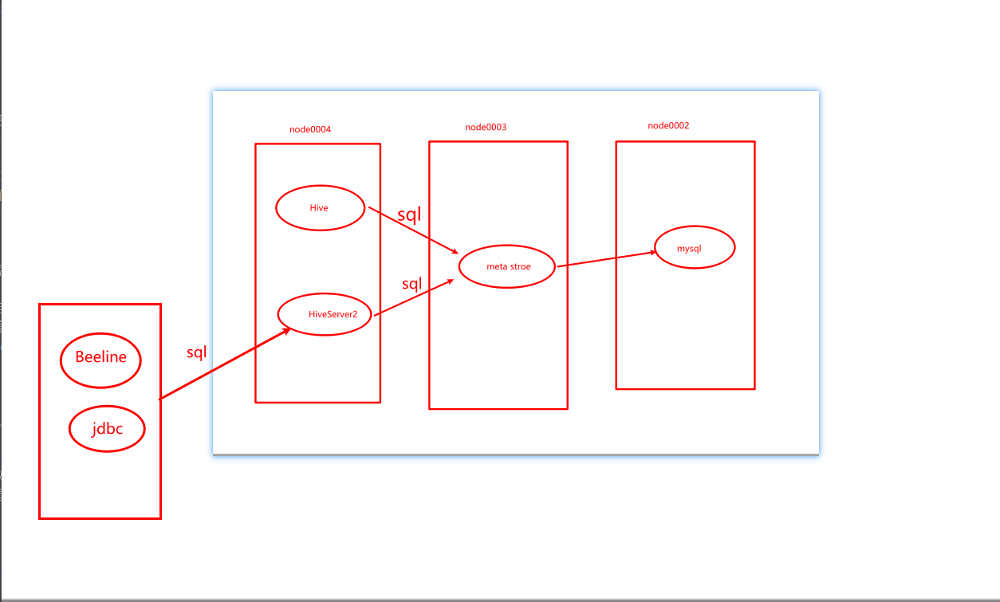

- Beeline

  - 是一个客户端
  - Beeline 要与 HiveServer2 配合使用
  - 服务端启动 hiveserver2
  - 客户的通过 beeline 两种方式连接到 hive
    - 1、`beeline -u jdbc:hive2://localhost:10000/default [-n root]`
    - 2、
      - beeline
      - beeline> `!connect jdbc:hive2://<host>:<port>/<db> root 123`
  - Beeline 中命令前面都要有'!'
  - 默认 用户名、密码不验证。写啥都行，但不能不写
    - Beeline 只是使用 jdbc 的方式，并不是连接数据库，而是连接 HiveServer。
    - hiveserver 连接元数据服务，元数据服务连接数据库
    - 也可以通过 java 代码，进行 jdbc 连接。HiveServer2 直观得说就是提供了一种 jdbc 的访问方式
  - !quit 退出
  - Beeline 主要提供了简单的查询操作
    - 但是，如果在 Beeline 中要进行数据增删改时，要指定为管理员用户名。密码无所谓。
    - 因为 hadoop 的文件系统也有用户和组的权限定义，否则没有权限修改文件。
    - 但是 hadoop 只会做一个用户名匹配，没有所谓密码。
    - 也因为 hadoop 权限控制很不明确，所以**hive 权限控制**很难，之后再说。
      > 默认任何用户都可以查所有表。不能增删改是因为 hadoop 权限问题，不是 hive 权限

- 搭建方式

  - 模式二：
    - hiveserver2 会读取配置文件中数据库的信息，在本机建立元数据服务，连接到元数据数据库
  - 模式三：
    - hiveserver2 读取配置文件，发现有元数据服务连接，于是连接远程元数据服务。

- jdbc 连接示例；
  > 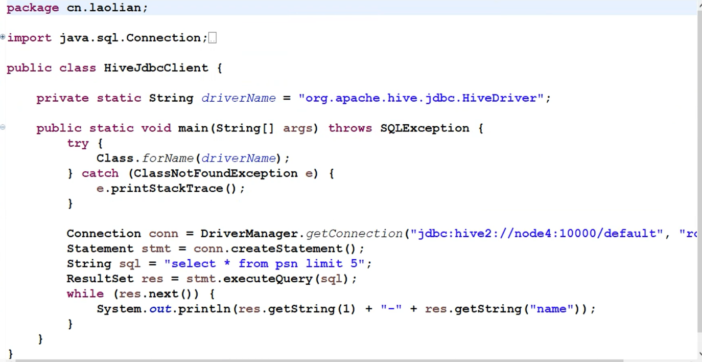

## 3.8. Hive 运行方式

- CLI
- JDBC
- 脚本（用得最多）
- web GUI

### 3.8.1. CLI

- 与 hdfs 交互：`dfs -cat /root/test/test.txt`
  > 因为 hive 与 hdfs 本身就有连接，不需要重新建立，所以速度要比在 dash 中快很多
- 与 linux 交互：`! ls /root`
- 提交 sql

### 3.8.2. 脚本运行

> hive --service cli --help

- 在 bash 中执行 sql：`hive -e "select * from psn;"`
- 静默模式，只显示查询数据：`hive -S -e "select * from psn"`
- 执行脚本：`hive -f ./test.sql`
  ```sh
  # 各种逻辑语句
  # sql
  hive -e "select * from psn"
  # 重定向
  ```
- 初始化 sql：`hive -i ./test.sql`
  - 通常用来设置参数等
  - 与-f 不同的就是执行完后不会退出 hive
- hive 中执行脚本： `source ./test.sql`

### 3.8.3. JDBC

- jdbc 连接示例；
  > 

### 3.8.4. GUI

#### 3.8.4.1. hwi

hive 自带，很难用。2.x 后就删了。不用搭。

#### 3.8.4.2. hue

类似 hadoop 的 Ambari，Ambari 之后搭一下

## 3.9. 权限管理

### 3.9.1. 分类

- 三种授权模型：
  - 1、Storage Based Authorization in the Metastore Server
    - 基于存储的授权 - 可以对 Metastore 中的元数据进行保护，但是没有提供更加细粒度的访问控制（例如：列级别、行级别）。
  - 2、SQL Standards Based Authorization in HiveServer2
    - 基于 SQL 标准的 Hive 授权 - 完全兼容 SQL 的授权模型，**推荐使用该模式**。
  - 3、Authorization using Apache Ranger & Sentry
    - 第三方安全框架，一般不用
  - 4、Old Default Hive Authorization (Legacy Mode)
    - hive 默认授权 - 设计目的仅仅只是为了防止用户产生误操作，而不是防止恶意用户访问未经授权的数据

> 实际生产环境中使用的是 **Kerberos**，但基本都是运维去管。

### 3.9.2. SQL Standards Based Authorization in HiveServer2

> [文档](https://cwiki.apache.org/confluence/display/Hive/SQL+Standard+Based+Hive+Authorization)

**文档很全，推荐**

**主要搞清用户和角色，应付面试。一般很少用**

#### 3.9.2.1. 说明

- 完全兼容 SQL 的授权模型
- 除支持对于用户的授权认证，还支持角色 role 的授权认证

  - role 可理解为是一组权限的集合，通过 role 为用户授权
  - 一个用户可以具有一个或多个角色
  - 默认包含另种角色：public、admin
  - 但没有用户的控制，登录时可以随便输入。（见前面的 hiveServer2）

- 限制：

  - 1、启用当前认证方式之后，dfs, add, delete, compile, and reset 等命令被禁用。
    > 因为 hdfs 也有权限限制
  - 2、通过 set 命令设置 hive configuration 的方式被限制某些用户使用。
    > （可通过修改配置文件 hive-site.xml 中 hive.security.authorization.sqlstd.confwhitelist 进行配置）
  - 3、添加、删除函数以及宏的操作，仅为具有 admin 的用户开放。
  - 4、用户自定义函数（开放支持永久的自定义函数），可通过具有 admin 角色的用户创建，其他用户都可以使用。
  - 5、Transform 功能被禁用。

- 配置：
  > 配置 metastore 服务所在服务器
  ```xml
  <property>
    <name>hive.security.authorization.enabled</name>
    <value>true</value>
  </property>
  <property>
    <name>hive.server2.enable.doAs</name>
    <value>false</value>
  </property>
  <property>
    <name>hive.users.in.admin.role</name>
    <value>root</value>
  </property>
  <property>
    <name>hive.security.authorization.manager</name>
    <value>org.apache.hadoop.hive.ql.security.authorization.plugin.sqlstd.SQLStdHiveAuthorizerFactory</value>
  </property>
  <property>
    <name>hive.security.authenticator.manager</name>
    <value>org.apache.hadoop.hive.ql.security.SessionStateUserAuthenticator</value>
  </property>
  ```

#### 3.9.2.2. 用户和角色管理

- 用户：

  - 用户不做验证
  - 所有用户默认是 public 角色
  - 权限管理就是修改用户的角色

- 角色管理
  - CREATE ROLE role_name; -- 创建角色
    > 只有 admin 角色可以使用
  - DROP ROLE role_name; -- 删除角色
  - SET ROLE (role_name|ALL|NONE); -- 设置角色
  - SHOW CURRENT ROLES; -- 查看当前具有的角色
  - SHOW ROLES; -- 查看所有存在的角色

#### 3.9.2.3. 角色权限管理

- 角色权限管理语法：

  - 授权：

    ```sql
    -- 将角色授予某个用户、角色：
    GRANT role_name [, role_name] ...
    TO principal_specification [, principal_specification] ...
    [ WITH ADMIN OPTION ];

    principal_specification
      : USER user
      | ROLE role
    ```

  - 移除权限：

    ```sql
    -- 移除某个用户、角色的角色：
    REVOKE [ADMIN OPTION FOR] role_name [, role_name] ...
    FROM principal_specification [, principal_specification] ... ;

    principal_specification
      : USER user
      | ROLE role
    ```

  - 查看授予某个用户、角色的角色列表
    ```sql
    SHOW ROLE GRANT (USER|ROLE) principal_name;
    ```
  - 查看属于某种角色的用户、角色列表
    ```sql
    SHOW PRINCIPALS role_name;
    ```

#### 3.9.2.4. 权限管理

> 和 mysql 一样

- 权限说明：
  - SELECT privilege – gives read access to an object.
  - INSERT privilege – gives ability to add data to an object (table).
  - UPDATE privilege – gives ability to run update queries on an object (table).
  - DELETE privilege – gives ability to delete data in an object (table).
  - ALL PRIVILEGES – gives all privileges (gets translated into all the above privileges).
- 语法：

  - 将权限授予某个用户、角色：

    ```sql
    GRANT
        priv_type [, priv_type ] ...
        ON table_or_view_name
        TO principal_specification [, principal_specification] ...
        [WITH GRANT OPTION];
    principal_specification
      : USER user
      | ROLE role

    priv_type
      : INSERT | SELECT | UPDATE | DELETE | ALL
    ```

  - 移除某个用户、角色的权限：
    ```sql
    REVOKE [GRANT OPTION FOR]
        priv_type [, priv_type ] ...
        ON table_or_view_name
        FROM principal_specification [, principal_specification] ... ;
    ```
  - 查看某个用户、角色的权限：
    ```sql
    SHOW GRANT [principal_name] ON (ALL| ([TABLE] table_or_view_name)
    ```

## 3.10. Hive 优化方式

**面试必问**

> 通用优化策略

- 核心思想：**把 Hive SQL 当做 Mapreduce 程序去优化**

- Hive 抓取策略：

  - Hive 中对某些情况的查询不需要使用 MapReduce 计算
    - 以下 SQL 不会转为 Mapreduce 来执行
      - select 仅查询本表字段
      - where 仅对本表字段做条件过滤
  - 方式：Set hive.fetch.task.conversion=none/more;
    - 当改成 none 时，select 也会执行 mapreduce。所以不要改

- Explain 显示执行计划

  - `explain select * from psn`
  - `explain extended select * from psn ` 具体语法树和逻辑
  - 要了解 antlr 包才能看懂
  - 会显示 sql 如何转成 mr 任务

- Hive 运行方式：

  - 本地模式

    - 优势：只在本机跑 mr，不用和其他节点交互，测试时快
    - 开启本地模式：set hive.exec.mode.local.auto=true;
    - 注意：
      - 这样就无法在 8088 端口看 mr 执行情况
      - hive.exec.mode.local.auto.inputbytes.max 默认值为 128M
        > 表示加载文件的最大值，若大于该配置仍会以集群方式来运行！

  - 集群模式

- 并行模式
  - 通过设置以下参数开启并行模式：
    - set hive.exec.parallel=true;
  - 注意：hive.exec.parallel.thread.number
    > 一次 SQL 计算中允许并行执行的 job 个数的最大值

> test

- 严格模式
  - 通过设置以下参数开启严格模式：
  - set hive.mapred.mode=strict;
    > （默认为：nonstrict 非严格模式）
- 开启后的查询限制：

  - 1、对于分区表，必须添加 where 对于分区字段的条件过滤；
  - 2、使用 order by 语句,必须包含 limit 输出限制；
  - 3、限制执行笛卡尔积的查询。

- Hive 排序

  - Order By - 对于查询结果做全排序，只允许有一个 reduce 处理
    - 当数据量较大时，应慎用。严格模式下，必须结合 limit 来使用
    - 不要使用了
  - Sort By - 对于单个 reduce 的数据进行排序
  - Distribute By - 分区排序，经常和 Sort By 结合使用
    - 结合使用相当于归并排序
    - **最常使用**
  - Cluster By - 相当于 Sort By + Distribute By
    - （Cluster By 不能通过 asc、desc 的方式指定排序规则；
    - 可通过 distribute by column sort by column asc|desc 的方式）

- Hive Join

  > join 用法和 mysql 基本相同,不过多了一个 LEFT SEMI JOIN，用来代替 mysql 的 exists
  > 具体查文档

  - Join 计算时，推荐将小表（驱动表）放在 join 的左边，mysql 中也是这样

    > 过程是将小表数据放在内存中，然后再依次读取大表中的数据，和内存中小表的数据进行比对
    > 10*1000 次，10 次遍历 1000 时，
    > 1000*10 次，1000 次遍历 10，
    > 两者 可能中途就停下来了。前者最少 10 次，后者最少 1000 次

  - Map Join：在 Map 端完成 Join（存在小表的优化策略）
    - 两种实现方式：
      - 1、SQL 方式，在 SQL 语句中添加 MapJoin 标记（mapjoin hint）
        - 语法：
          ```sql
          sql SELECT /*+ MAPJOIN(smallTable) */ smallTable.key, bigTable.value FROM smallTable JOIN bigTable ON smallTable.key = bigTable.key;
          ```
      - 2、开启自动的 MapJoin
        - 通过修改以下配置启用自动的 mapjoin：set hive.auto.convert.join = true;
          > 该参数为 true 时，Hive 自动对左边的表统计量，如果是小表就加入内存，即对小表使用 Map join
        - 相关配置参数（前两个用的比较多）：
          - hive.mapjoin.smalltable.filesize;
            > （大表小表判断的阈值，如果表的大小小于该值则会被加载到内存中运行，默认 25MB）
          - hive.ignore.mapjoin.hint；
            > （默认值：true；是否忽略 mapjoin hint 即 mapjoin 标记，主要是为了解决手动和自动 mapjoin 冲突的情况）
          - hive.auto.convert.join.noconditionaltask;
            > （默认值：true；将普通的 join 转化为普通的 mapjoin 时，是否将多个 mapjoin 转化为一个 mapjoin）
          - hive.auto.convert.join.noconditionaltask.size;
            > （将多个 mapjoin 转化为一个 mapjoin 时，其表的最大值）
  - 大表 join 大表
    > 其实没太大效率
    - 空 key 过滤：有时 join 超时是因为某些 key 对应的数据太多，而相同 key 对应的数据都会发送到相同的 reducer 上，从而导致内存不够。此时我们应该仔细分析这些异常的 key，很多情况下，这些 key 对应的数据是异常数据，我们需要在 SQL 语句中进行过滤。
    - 空 key 转换：有时虽然某个 key 为空对应的数据很多，但是相应的数据不是异常数据，必须要包含在 join 的结果中，此时我们可以表 a 中 key 为空的字段赋一个随机的值，使得数据随机均匀地分不到不同的 reducer 上

- map-side 聚合：※

  > 有关于 mr 端的 Combiner

  - 通过设置以下参数开启在 Map 端的聚合：
    - set hive.map.aggr=true;
  - 相关配置参数：
    - hive.groupby.mapaggr.checkinterval：
      - map 端 group by 执行聚合时处理的多少行数据（默认：100000）
    - hive.map.aggr.hash.min.reduction：
      - 进行聚合的最小比例（预先对 100000 条数据做聚合，若聚合之后的数据量/100000 的值大于该配置 0.5，则不会聚合）
    - hive.map.aggr.hash.percentmemory：
      - map 端聚合使用的内存的最大值
    - hive.map.aggr.hash.force.flush.memory.threshold：
      - map 端做聚合操作是 hash 表的最大可用内容，大于该值则会触发 flush
    - **hive.groupby.skewindata** 重要，一定要开启
      - 是否对 GroupBy 产生的数据倾斜做优化，默认为 false
      - 会将数据量大的 mr 分为两个 mr，避免数据过大卡死

- 合并小文件

  - 原因：文件数目小，容易在文件存储端造成压力，给 hdfs 造成压力，影响效率
  - 设置合并属性
    - 是否合并 map 输出文件：hive.merge.mapfiles=true
    - 是否合并 reduce 输出文件：hive.merge.mapredfiles=true;
    - 合并文件的大小：hive.merge.size.per.task=256*1000*1000
      > 文件大于多少是不再合并。默认 256MB

- 去重统计

  - 数据量小的时候无所谓，数据量大的情况下，由于 COUNT DISTINCT 操作需要用一个 Reduce Task 来完成，这一个 Reduce 需要处理的数据量太大，就会导致整个 Job 很难完成，一般 COUNT DISTINCT 使用先 GROUP BY 再 COUNT 的方式替换

- 控制 Hive 中 Map 以及 Reduce 的数量※

  - Map 数量相关的参数

    > 一般不要改

    - mapred.max.split.size
      - 一个 split 的最大值，即每个 map 处理文件的最大值。默认 256MB
    - mapred.min.split.size.per.node
      - 一个节点上 split 的最小值
    - mapred.min.split.size.per.rack
      - 一个机架上 split 的最小值
    - 例：
      ```
      max:64
      70 80 90
      ```

  - Reduce 数量相关的参数
    - mapred.reduce.tasks
      - 强制指定 reduce 任务的数量
    - hive.exec.reducers.bytes.per.reducer
      - 每个 reduce 任务处理的数据量
    - hive.exec.reducers.max
      - 每个任务最大的 reduce 数

- Hive - JVM 重用
  - 适用场景：
    - 1、小文件个数过多
    - 2、task 个数过多
  - 通过 set mapred.job.reuse.jvm.num.tasks=n; 来设置
    > （n 为 task 插槽个数）
  - 缺点：设置开启之后，task 插槽会一直占用资源，不论是否有 task 运行，直到所有的 task 即整个 job 全部执行完成时，才会释放所有的 task 插槽资源！

## 3.11. hive HA

> 针对 hiveserver2 搭建高可用

由多个Hive实例进行管理的，这些Hive实例被纳入到一个资源池中，并由 HAProxy提供一个统一的对外接口

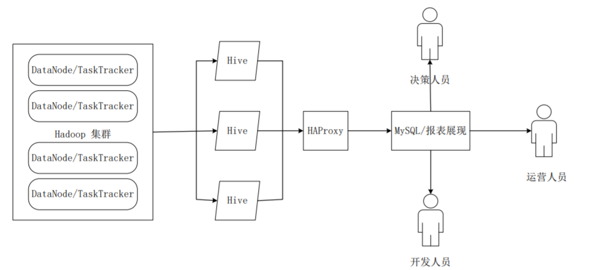


## 3.12. 数据格式

表数据存储：

行式存储和列式存储

只有在特殊场景下才能判断好坏

## 3.13. 虚拟机连接慢

> 原因：dns 解析问题

- `cd /etc/ssh/`
- `vi sshd_config`
- 将 `UseDns` 改为 no


## 3.14. impala

### 3.14.1 介绍

> hive 的替代

- Impala是由Cloudera公司开发的新型查询系统，它提供SQL语义，能 查询存储在Hadoop的HDFS和HBase上的PB级大数据，在性能上比 Hive高出3~30倍
- Impala的运行需要依赖于Hive的元数据
- Impala是参照 谷歌的Dremel系统进行设计的
- Impala采用了与商用并行关系数据库类似的分布式查询引擎，可以直 接与HDFS和HBase进行交互查询
  > 没有使用mapreduce，是自己实现的查询引擎
- Impala和Hive采用相同的SQL语法、ODBC驱动程序和用户接口

### 3.14.2 架构

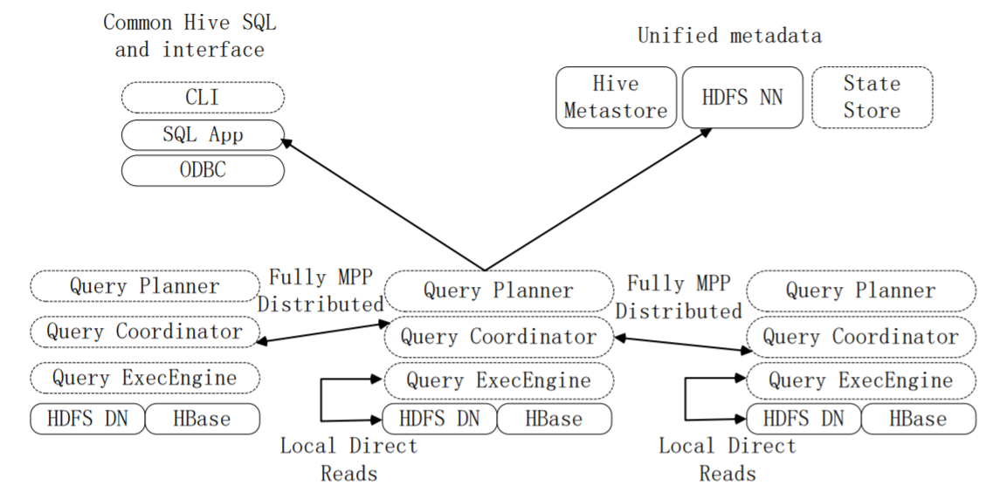

- Impala和Hive、HDFS、HBase等工具是统一部署在一个Hadoop平台上
- Impala组成：
  - Impalad
    > 开启名称为impalad的进程
    - 负责协调客户端提交的查询的执行
    - 包含模块：
      - Query Planner
      - Query Coordinator
      - Query Exec Engine
    - 与HDFS的数据节点（HDFS DN）运行在同一节点上
      > 运算向数据移动
    - 给其他Impalad分配任务以及收集其他Impalad的执行结果进行汇总
      > 每个impalad会随机称为主负责节点
      > 包括主节点在内，所有impalad都会执行查询
    - Impalad也会执行其他Impalad给其分配的任务，主要就是对本地HDFS和 HBase里的部分数据进行操作
  - State Store
    - 会创建一个statestored进程
    - 负责收集分布在集群中各个Impalad进程的资源信息，用于查询调度
  - CLI
    - 给用户提供查询使用的命令行工具
    - 还提供了Hue、JDBC及ODBC的使用接口


### 3.14.3. 查询流程

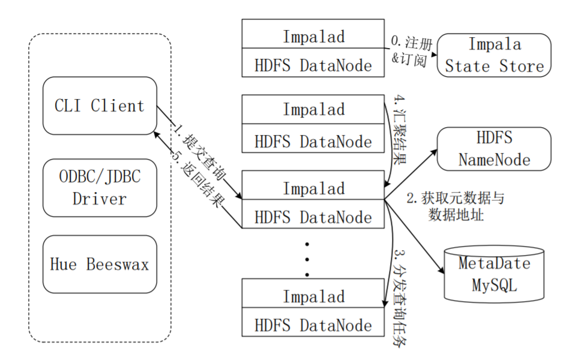

# 4. HBase

## 4.1. 大数据架构

较老的一个架构图 Mahout,Pig 等都已经淘汰了。用来讲一下大数据技术的架构

> 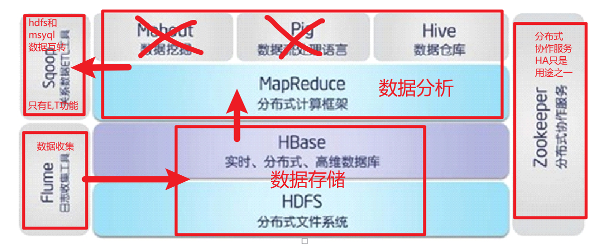
> 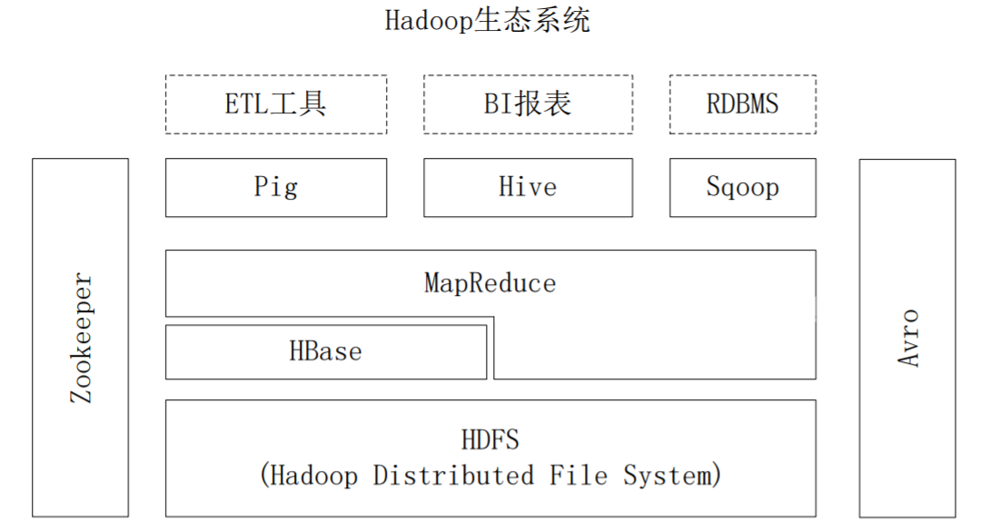 

## 4.2. HBase 概念

[官网](https://hbase.apache.org/)

```
Use Apache HBase when you need random, realtime read/write access to your Big Data.
This project's goal is the hosting of very large tables -- billions of rows X millions of columns -- atop clusters of commodity hardware.
Apache HBase is an open-source, distributed, versioned, non-relational database modeled after Google's Bigtable: A Distributed Storage System for Structured Data by Chang et al.
Just as Bigtable leverages the distributed data storage provided by the Google File System, Apache HBase provides Bigtable-like capabilities on top of Hadoop and HDFS.
```

- 非关系型数据库知识面扩展: Cassandra hbase mongodb

  - mongobd：文档型数据库
  - Couchdb：文件存储数据库，类似 HBase
  - Neo4j：非关系型图数据库

- Hbase
  - Hadoop Database，是一个高可靠性、高性能、面向列、可伸缩、实时读写的分布式数据库
    - 面向列的 k-v 型数据库，**不是列式数据库**。hbase 创建表时不需要定义列（但要定义列族），插入值时指定列名（key）即可
    - 实时读写：读写速度快，数据量大时速度快
    - 可伸缩：可动态扩展集群，不需要停止集群
  - 利用 Hadoop HDFS 作为其文件存储系统,利用 Hadoop MapReduce 来处理 HBase 中的海量数据,利用 Zookeeper 作为其分布式协同服务
    - zookeeper 不止用来做高可用
    - HBase 中，zookeeper 是必须的
  - 主要用来存储非结构化和半结构化的松散数据（列存 NoSQL 数据库）
    - 对数据格式没有要求
    - 也可以存储结构化数据

## 4.3. 数据模型

- 逻辑数据模型

  > 

  - key:Rowkey+列族名+列名+时间戳
  - value:val
    > 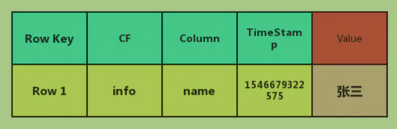 

- Row key:
  - 一个 row key 决定一行数据
  - 按照字典序排序
  - 一行只能存储 64k 的字节数据，但一般只存 10--100 个字节
- Column Family 列族 & qualifier 列
  - HBase 表中的每个列都归属于某个列族，列族必须作为表模式(schema)定义的一部分预先给出。如 create ‘test’, ‘course’；
  - 列名以列族作为前缀，每个“列族”都可以有多个列成员(column)；如 course:math, course:english, 新的列族成员（列）可以随后按需、动态加入；
  - 权限控制、存储以及调优都是在**列族层面**进行的；
  - HBase 把同一列族里面的数据存储在同一目录下，由几个文件保存。
- Timestamp 时间戳
  - 在 HBase 每个 cell 存储单元对同一份数据有多个版本，根据唯一的时间戳来区分每个版本之间的差异，不同版本的数据按照时间倒序排序，最新的数据版本排在最前面。
  - 时间戳的类型是 64 位整型。
  - 时间戳可以由 HBase(在数据写入时自动)赋值，此时时间戳是精确到毫秒的当前系统时间。
  - 时间戳也可以由客户显式赋值，如果应用程序要避免数据版本冲突，就必须自己生成具有唯一性的时间戳。
- Cell 单元格

  - 由行和列的坐标交叉决定；
  - 单元格是有版本的；
  - 单元格的内容是未解析的**字节数组**；
  - 由`{row key， column( =<family> +<qualifier>)， version}`唯一确定的单元。
  - cell 中的数据是没有类型的，全部是**字节数组**形式存贮。

- HLog(WAL log)
  > write ahead log
  - log 文件中除了记录操作信息，也会记录数据
  - HLog 文件就是一个普通的 Hadoop Sequence File
    - Sequence File 的 Key 是 HLogKey 对象
      - HLogKey 中记录了写入数据的归属信息，
      - 除了 table 和 region 名字外，同时还包括 sequence number 和 timestamp，
      - timestamp 是"写入时间"，sequence number 的起始值为 0，或者是最近一次存入文件系统中 sequence number。
      - sequence number：value 的序列化文件中也会有该值，log 中的 sequenc number 和序列化文件中的 sequence number 作匹配，检查是否进行了序列化。
        > Hbase 实时读写，数据放内存，为了数据安全，通过该值判断是否从 log 中恢复数据
    - HLog SequeceFile 的 Value 是 HBase 的 KeyValue 对象，即对应 HFile 中的 KeyValue。

## 4.4. HBase 架构

### 4.4.1. 具体架构

- Hbase 是主从架构，而不是主备架构，主从和主备不同

  - 主备：两台机器做相同事情，一台主机器，一台备机
  - 主从；一台总服务器，下面则是其他服务器，比如 resourceManger 和 NodeManger

- 架构图:

  > 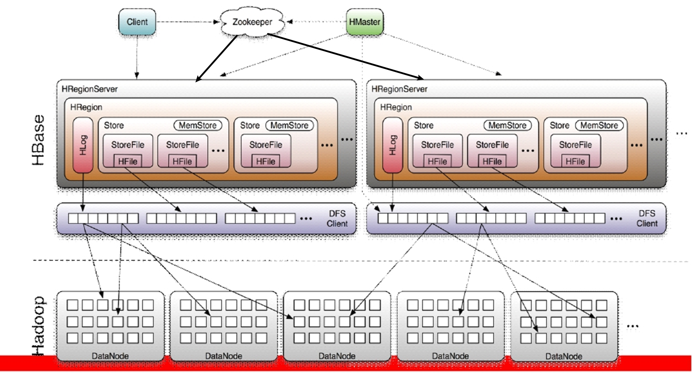 > **HLog 应该在 HRegion 外面，HRegionServer 里面。被所有 Region 所共享。这个官网架构图有误**

- 角色：

  - Client:包含访问 HBase 的接口并维护 cache 来加快对 HBase 的访问
    - Client 修改元数据是才需要访问 HMaster，而 HRegionServer 可以直接访问
    - cache:客户端缓存
  - zookeeper:作为 Client 和 HMaster 间传递信息的中介
    - 作用：
      - 保证任何时候，集群中只有一个活跃 master
      - 实时监控 Region server 的上线和下线信息。并实时通知 Master
      - 存贮所有 Region 的寻址入口，也就是元数据表所在位置的表。
      - 存储 HBase 的 schema 和 table 元数据
    - 也会和 HRegionServer 进行通信,
    - HMaster 和 HRegionServer 都会主动向 zookeeper 进行注册
  - HMaster
    - 为 Region server 分配 region，也就是把表分配到 region 上
    - 负责 Region server 的负载均衡
    - 发现失效的 Region server 并重新分配其上的 region 到其他 RegionServer
    - 管理用户对 table 的增删改操作
  - HRegionServer:HBase 的从节点，承担具体存储，查询 CRUD 等操作
    - 作用：
      - Region server 维护 region，处理对这些 region 的 IO 请求
      - Region server 负责切分在运行过程中变得过大的 region。表数据太大时，会将表等分，留下一半，另一半移到其他 region
    - 组成：
      - HLog:预写数据
        > 被所有 region 所共享
        - 每次启动都检查该文件，确认最近一次执行缓存刷新操作之后是否发生新的写入操作
        - 如果发现更新，则先写入MemStore，再刷写到StoreFile，最后删除旧的 Hlog文件,开始为用户提供服务
      - region:和表是一个层次的，每一个表对应至少一个 region
        - HBase 自动把表水平划分成多个区域(region)，每个 region 会保存一个表里面某段连续的数据
        - 每个表一开始只有一个 region，随着数据不断插入表，region 不断增大，当增大到一个阀值的时候，region 就会等分会两个新的 region（裂变）
        - 当 table 中的行不断增多，就会有越来越多的 region。这样一张完整的表被保存在多个 Regionserver 上。
      - Memstore:内存存储。详细看下面写流程
      - store:列族层次,数据是写到内存中。默认 64MB（hdfs 块默认 128MB）
        - 一个 region 由多个 store 组成，一个 store 对应一个 CF（列族）
        - store 包括位于内存中的 memstore 和位于磁盘的 storefile 。写操作先写入 memstore，当 memstore 中的数据达到某个阈值，hregionserver 会启动 flashcache 进程写入 storefile并清空缓存，并在Hlog里面写入一个标记，每次写入形成单独的一个 storefile
        - 当 storefile 文件的数量增长到一定阈值后，系统会进行合并（minor(3-10 个文件)、major(所有文件) compaction），在合并过程中会进行版本合并和删除(之前提到的过期版本的删除)工作（majar），形成更大的 storefile
        - 当一个 region 所有 storefile 的大小和数量超过一定阈值后，会把当前的 region 分割为两个，storefile也会分裂，并由 hmaster 分配到相应的 regionserver 服务器，实现负载均衡
          > 也就是小 storefile 太小会合并，大 region 太大会分裂
          > region 分裂只是将文件散步到其他节点上，不涉及文件的分割
        - 客户端检索数据，先在 memstore 找，找不到再找 blockcache 和 storefile
      - StoreFile:内存中的文件溢写成文件 StoreFile
      - HFile:StoreFile 是 HFile 的一个封装，数据文件存储到 HDFS 中时本身就交 HFile，但在 HBase 集群中称为 StoreFile。两者几乎可以划等号
      - blockcache:存放读过的数据，使用 FIFO。
        > 架构图中没有画

- 细节架构图：

  > 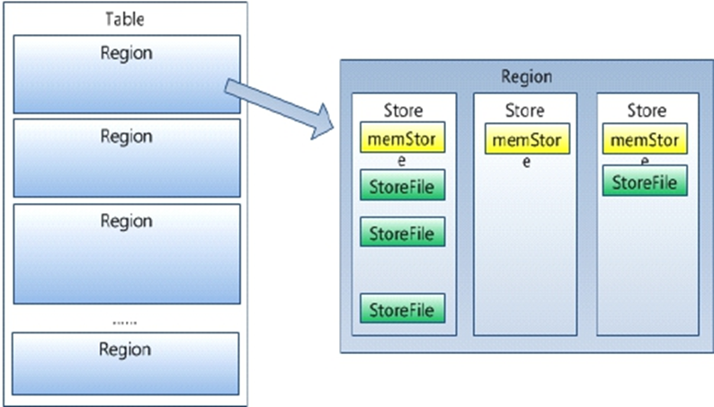

  - HRegion 是 HBase 中分布式存储和负载均衡的最小单元。最小单元就表示不同的 HRegion 可以分布在不同的 HRegion server 上。
  - HRegion 由一个或者多个 Store 组成，每个 store 保存一个 columns family。
  - 每个 Strore 又由一个 memStore 和 0 至多个 StoreFile 组成。如图：StoreFile 以 HFile 格式保存在 HDFS 上。
    > 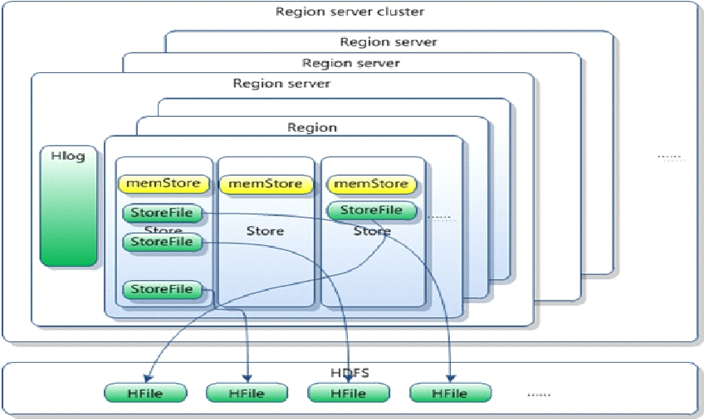

- 涉及排序：
  - 数据往 Memstore 中写时，会进行排序
  - 溢写出的文件间无序，当文件间合并时会进行排序

- 三级寻址
  > 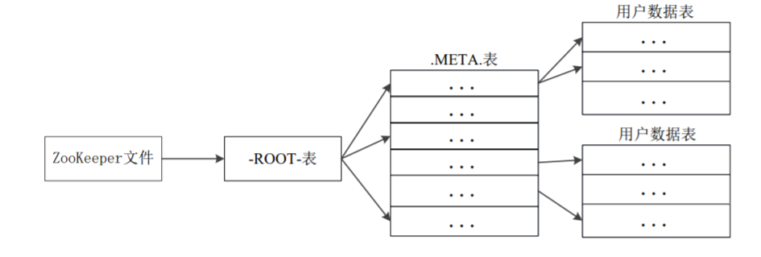 
  > 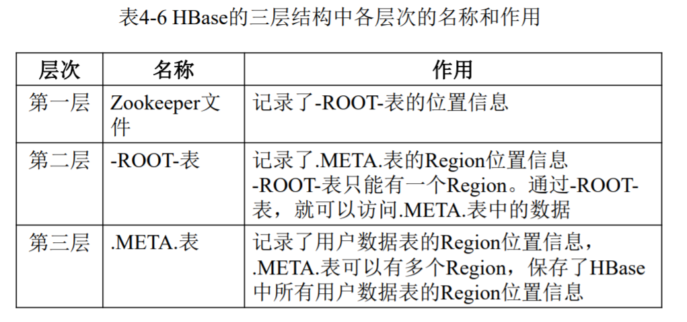 
  - 三级
    - Zookeeper文件记录了-ROOT-表的位置
    - -ROOT-表只存在于唯一一个Region，名字是在程序中被写死的
      - 根数据表，又名-ROOT-表， **记录所有元数据的具体位置**
      - 一个-ROOT-表最多只能有一个Region，也就是最多只能有128MB，
      - 一个-ROOT-表可以寻址2的17次方个.META.表 的Region
    - 当HBase表很大时， 包括.META.表都会分裂成多个Region
      - 元数据表，又名.META.表，存储了Region和Region服务器的映射关系
      - 为了加快访问速度，.META.表的全部Region都会被保存在内存中
      - 同理，表最大为128MB,一个META也能寻址2的17次方个region
  - 其他
    - 为了加速寻址，客户端会缓存位置信息，同时，需要解决缓存失效问题
    - 寻址过程客户端只需要询问Zookeeper服务器，不需要连接Master服务器

> 小知识点，所有关系型数据库中的数据都是使用 B+树结构存储

### 4.4.2. 读写流程

- 写流程：

  > 面试经常问

  - Client 提交请求
  - Client 访问 zookeeper
  - 获取 zookeeper 中会存放**元数据存储位置**的表 meta
    > Zookeeper 的 Znode 的大小限制为 1M
  - 然后再访问某个 RegionServer，从 RegsionServer 中拿到元数据，元数据中有所有表的所有信息
  - 获得表的位置信息
  - 去具体 RegionServer
  - 找表(region)
  - 先往 Hlog 中写数据和日志
    - 注意：往内存中写 HLog，然后会有一个**异步**线程将内存中的数据写到磁盘上。（也可以延迟写，每隔一定时间写一次）
    - HLog 是一个顺序写文件，然后会直接将数据 append 到 dfs 上，没有排序过程，所以很快
    - 因为日志文件不可以无限追加，所以每隔一定时间都会在磁盘或 dfs 中打开一个新的文件
    - 相关类
      - LogAsync 类，异步写数据
      - LogRoller 类：默认每 60 分钟打开一个新的日志文件。
  - 再往内存中的 store 写
  - store 达到阈值后就会溢写，然后成为多个 storeFile
    - 注意：往内存中写表数据，然后会有一个**异步**线程将内存中的数据写到磁盘上。（也可以延迟写，每隔一定时间写一次）
    - LSM 树(Log Structure Merge)
      > 面试可能会问※
      - memstore 和 storefile 整体可以称为一个 LSM 树
    - 溢写后小文件的合并
      - minor:3-10 个文件一合并
      - major:将 region 下所有文件全部合并

- 读流程
  > 面试经常问
  - Client 提交请求
  - Client 访问 zookeeper
  - 获取 zookeeper 中存放**元数据存储位置**的表 meta
  - 去指定 RegsionServer 中找数据
  - 先去 MemStore 中寻找
  - 找不到再去 blockcache 中查找
    - blockcache 被一个 RegsionServer 所共享。类此操作系统中将常用数据存储到 cache 中
      > 架构图中没有画
  - 找不到再去磁盘中找。将查询的结果重新写到 blockcache 当中

## 4.5. 搭建

### 4.5.1. standalone

#### 4.5.1.1. 搭建

- HBase 中自带 zk，standalone 配置不需要配置 zk 集群。
- 选择没有搭建 zookeeper 的节点。node0001
- 上传并解压 HBase 和 protobuf 包。
- 删除 docs 文件夹（避免浪费空间）
- 配置环境变量`vi /etc/profile` `source /etc/profile`。添加 HBASE_HOME 以及 hbase 的 bin 路径
- 修改`conf/hbase-env.sh`，配置 java 环境变量
- 修改 conf/hbase-site.xml
  ```xml
  <configuration>
    <property>
      <name>hbase.rootdir</name>
      <value>file:///home/testuser/hbase</value>
      <!-- 存放hbase相关数据 -->
      <!-- 不需要预先创建目录，否则HBase会自动修改到别的目录 -->
    </property>
    <property>
      <name>hbase.zookeeper.property.dataDir</name>
      <value>/home/testuser/zookeeper</value>
      <!-- 存放zookeeper相关数据 -->
    </property>
  </configuration>
  ```
- start-hbase.sh
- 查看 web 页面 node0001:60010

#### 4.5.1.2. 测试及使用

- 基本测试：
  - `hbase shell`进入交互界面
    > shell 下 backspace 是删除后面字符。ctrl+backspace 是删除前面字符
    > Hbase 2.x 后这种设计就删除了
    - help 查看帮助文档
      > 命令列表
      - general
      - ddl
      - namespace
      - dml
    - status 状态
    - version 查看版本
  - 查看 hbase 目录：
    - WALs 是预写日志。数据进行完持久化后，会移动到 oldWALs
    - data
      > 命名空间相当于 mysql 的数据库
      - 命名空间：default。默认命名空间，数据默认存放在里面
      - 命名空间：hbase。
        - meta: 保存元数据
        - namespace
  - `help 'create'`查看帮助
    ```sql
    -- 没有指定命名空间，默认default
    create 'tbl','cf1','cf2' -- 创建表tbl，包含列族cf1,cf2
    ```
  - `list`查看表列表
  - default 目录下
    - tbl/
      - region 名称(md5 加密字符串)/
        - cf1
          - 数据文件 storefile(现在没有)
        - cf2
          - 数据文件 storefile(现在没有)
  - `help 'put'`查看帮助
    - `put 'tbl','2','cf1:name','zhangsan'`
      > 一定要添加单引号，否则无法识别
      > 表 tbl 下，rowkey 为 2 的行，列族 cf1，列 name，存放值 zhangsan
  - `get`查看报错和帮助
    - `get tbl 2`获取数据
  - `scan`查看报错和帮助
    - `scan 'tbl'`查看全表
- 手动溢写
  - 此时 `tbl/region名称/cf1`下依旧没有数据
    - 是因为还没有达到溢写的大小
    - 使用 `flush` 手动溢写
    - 使用`cat`无法正确查看
    - `hbase hfile --help`查看帮助(**在 bash 中**)
    - `hbase hfile -p -m -f 文件名称` 查看文件内容(**在 bash 中**)
      - 数据内容
      - 元数据信息
      - 文件信息
      - 布隆过滤器
      - 操作
        > 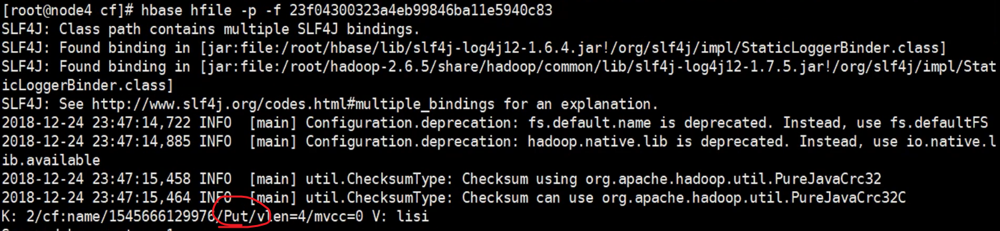
      - ...
- 排序问题
  - 插入第二行数据`put 'tal','1','cf1:age','12'`
  - 两条数据的排序问题：
    - 默认数据到了 memstore 中，就会按照字典序排序
    - 就算数据已经溢写掉了，memstore 中也会有已经溢写数据的索引，在再次溢写时，会把数据按顺序插入到文件中
- value 的 version 测试：
  - `put 'tbl','2','cf1:name','lisi'`给第二列数据**添加新的版本**
  - 此时数据会在 memstore 中存储，而不会写到文件中
  - 用`hbase hfile -p -m -f 文件名称`查看溢写文件，会发现旧数据（zhangsan）依旧存在
  - 只是会标上失效标记
  - 现在进行 flush
- 文件合并

  - 第三次 flush 触发的动作：
    - 现在已经进行了 3 个 put 和三次 flush，所以会有 3 个小 storefile
    - 到达了 mindor 合并(3-10)的最小要求，会进行合并，成为一个文件
    - 三个文件合并生成**第四个**文件
    - /home/testuser/hbase 下生成 archive 文件夹
    - 将三个文件以相同的结构(即)移动到该文件夹下
      ```
      - data
        - archive
          - default
            - tbl/
              - region 名称(md5 加密字符串)/
                - cf1
                  - storefile1
                  - storefile2
                  - storefile3
                - cf2
      ```
    - 使用`hbase hfile -p -m -f storefile3` 可以发现 lisi
  - 结果：
    - 查看 cf1 文件夹下只有一个 storefile
    - `hbase hfile -p -m -f 文件名称`查看会发现旧数据(zhangsan)会被删去，有新数据(lisi)
    - 因为是手动 flush 溢写的，当前文件依旧很小，所以当文件数量到达 3 个时，依旧会合并。直到达到一定的大小，才会停止合并。

- 其他命令测试
  - `help 'delete'` 查看帮助输出
    - `delete 'tbl','2','cf1:name'`
      - 旧版本：删除早于现在时间的version数据。新版中由`delete_all`代替
      - 新版本：删除最新version的数据
    - `scan 'tbl'`查看数据，只剩下一条
    - 注意
      ```
      Hbase中删除记录并不是真的删除了数据，而是放置了一个 墓碑标记（tombstone marker），因为Hdfs不支持对文件的随机读写。被打上墓碑标记的记录在HFile合并时才会被真正的删除。
      只要记录未被真正的删除还是可以被查看的。即添加 {RAW=true,VERSIONS=>10} 选项指定查看版本数（这里随便写了个）
      ```
  - `truncate 'tbl'`删除表中所有数据
    > mysql 复习：truncate 不需要经过事务，delete 需要经过事务
  - `drop 'tbl'`会报错
    - 必须先禁用表，才能删除
    - `disable 'tbl'`
    - `drop 'tbl'`
- 查看命名空间 hbase 的元数据
  - `list name_space_tables 'hbase'` 列出命名空间 hbase 下的所有表
    > `list` 默认是列出 default 目录下的表
  - `scan hbase:meta` 指定命名空间 hbase 下的元数据信息表
    - 只有一个 rowkey，也就是只有一行记录
  - `create 'hbase:test','cf'`，hbase 命名空间下创建 test 表，test 表中创建 cf 列族
  - `list name_space_tables 'hbase'` 发现多出一张表
  - `scan hbase:meta` 发现多出一行元数据信息(有两个 rowkey)，记录 regionserver 信息
- 关于访问顺序：

  - 要访问一张表
  - 访问 zk，找到上述的元数据表位置，上面就是 hbase:meta 的位置
  - 然后再访问 hbase:meta 表的数据，获取表的位置
  - 最后访问表

- **剩余所有命令查看文档自行测试**

### 4.5.2. 伪分布式 pseudo

查看文档

### 4.5.3. 全分布式搭建

#### 4.5.3.1. 搭建前检查

- 网络
- hosts
- ssh
  - 关于 ssh 免密钥简便操作:
  - `ssh-keygen`,`ssh-copy-id -i ~/.ssh/id_rsa.pud node0002`
  - 注意，默认是 rsa 格式，而 hadoop 官网文档中 ssh 公钥私钥为 dsa 格式，涉及相关配置时记得修改为 rsa
- 时间：各个节点时间必须一致。
  - `data -s '时间'`
  - 时间服务器：
    - `yum install ntpdate -y`
    - 使用阿里的时间服务器进行时间同步`ntpdate ntp1.aliyun.com`
    - 写一个开机脚本，自动进行时间同步
- jdk 版本

#### 4.5.3.2. 搭建

|          | NN-1 | NN-2 | DN  | ZK  | ZKFC | JNN | RM  | NM  | mysql | mate store | hive | regionserver | HMaster | backup-masters |
| :------: | :--: | :--: | :-: | :-: | :--: | :-: | :-: | :-: | :---: | :--------: | :--: | :----------: | :-----: | :------------: |
| Node0001 |  \*  |      |     |     |  \*  | \*  |     |     |  \*   |            |      |              |   \*    |                |
| Node0002 |      |  \*  | \*  | \*  |  \*  | \*  |     | \*  |       |            |      |      \*      |         |                |
| Node0003 |      |      | \*  | \*  |      | \*  | \*  | \*  |       |     \*     |      |      \*      |         |                |
| Node0004 |      |      | \*  | \*  |      |     | \*  | \*  |       |            |  \*  |      \*      |         |       \*       |

> hbase 在哪个节点启动，哪个节点就是 HMaster

- hbase-env.sh 配置
  - JAVA_HOME
  - HBASE_MANAGES_ZK=false：hbase 是否使用本身的 zookeeper
- hbase-site.xml
  ```xml
  <configuration>
    <property>
      <name>hbase.rootdir</name>
      <value>hdfs://mycluster/hbase</value>
      <!-- 改为hdfs集群名称此处为myclster -->
    </property>
    <property>
      <name>hbase.cluster.distributed</name>
      <value>true</value>
    </property>
    <property>
      <name>hbase.zookeeper.quorum</name>
      <!--端口号写不写都行-->
      <value>node0002,node0003,node0004</value>
    </property>
  </configuration>
  ```
- regionservers
  ```xml
  node0002
  node0003
  node0004
  ```
- 创建 backup-masters。HBase 的备机
  - 在 node0001 启动，node0004 作为备
  ```
  node0004
  ```
- 拷贝 hdfs-site.xml 到 hbase/conf
- 把 hbase 分发到其他所有节点
- 四台机器添加 hbase 的环境变量
- 启动 hdfs
- 在 node0001 上启动 hbase`start-hbase.sh`

#### 4.5.3.3. 测试

- 现在哪个节点都可以进入 hbase shell
- kill node0001 的 HMaster 进程
- 重新启动 hmaster：`hbase-daemon.sh start master`
  > 注意，没有 h，是 master
- 查看 zk 中的数据：
  - `zkCli.sh`
  - `ls /hbase`
- hbase shell 中创建表
- 再次查看zk 中 hbase/table 下的目录，会发现多出来一项，且与表名相同
- `get /hbase/meta-region-server`查看
  - 会发现元数据存放的节点名称
  - 注意：只是元数据信息存储在 node0004 上，而任何一个节点上都可以通过 hbase shell 查看元数据表
  - 只是每次查看表时都会去 node0004 查找元数据信息
  - 具体读流程看上面
- 去 hdfs 查看`/hbase`目录中的文件
- 数据的插入 storefile 的查看
  - put 插入数据
  - `hbase hfile -p -f /hbase/data/default/tbl/region名称/列族/storefile`查看数据文件内容

## 4.6. java api

hbase 有多种 api 可以进行访问：

> 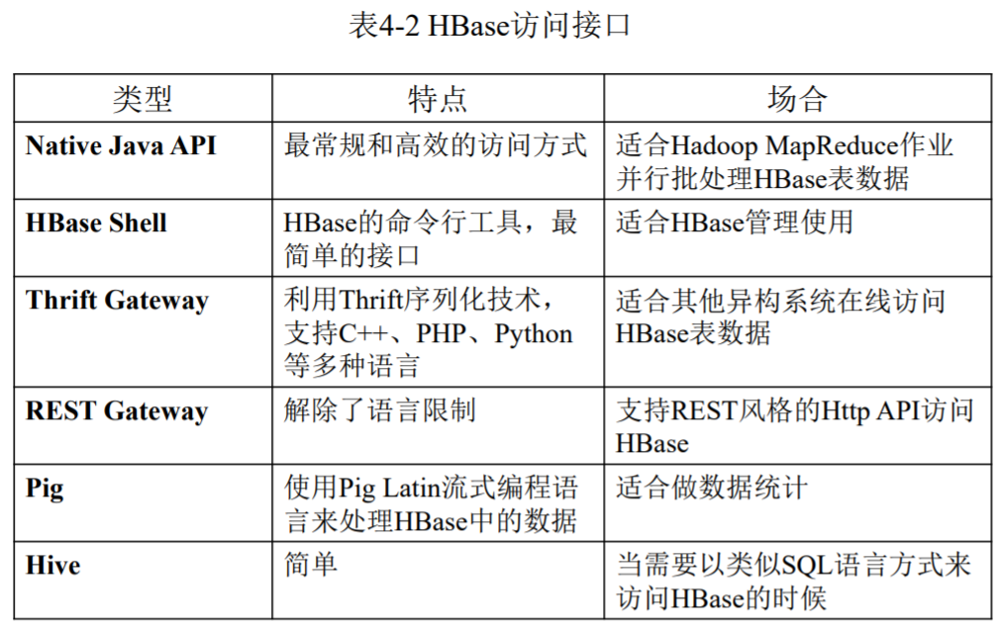 
>
> 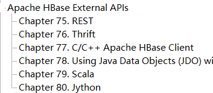

- 连接集群：Connection connection = ConnectionFactory.createConnection(configuration);
- 获取HBase管理员对象:admin = connection.getAdmin();
- 判断表是否存在:admin.tableExists(TableName.valueOf(tableName));

    ```java
    public class TestHbase {
      private static Admin admin = null;
      private static Connection connection = null;
      private static Configuration conf = null;
      static {
        // HBase配置文件
        conf = HBaseConfiguration.create();
        conf.set("hbase.zookeeper.quorum", "192.168.1.103");
        // 获取连接对象
        try {
          connection = ConnectionFactory.createConnection(conf);
          // 获取HBase管理员对象
          admin = connection.getAdmin();
        } catch (IOException e) {
          // TODO Auto-generated catch block
          e.printStackTrace();
        }
      }

      private static void close(Connection conn, Admin admin) throws IOException {
        if (conn != null) {
          conn.close();
        }
        if (admin != null) {
          admin.close();
        }
      }

      // 判断表是否存在
      public static boolean tableExist(String tableName) throws IOException {
        boolean tableExists = admin.tableExists(TableName.valueOf(tableName));
        return tableExists;
      }

      // 创建表
      public static void createTable(String tableName, String... cfs) throws IOException {
        if (tableExist(tableName)) {
          System.out.println("表已存在");
          return;
        }
        // cfs是列族，官方建议一个表一个，但可以有多个
        // 创建表描述器
        HTableDescriptor hTableDescriptor = new HTableDescriptor(TableName.valueOf(tableName));
        for (String cf : cfs) {
          // 创建列描述器
          HColumnDescriptor hColumnDescriptor = new HColumnDescriptor(cf);
    //			hColumnDescriptor.setMaxVersions(3);//设置版本数
          hTableDescriptor.addFamily(hColumnDescriptor);
        }
        // 创建表操作
        admin.createTable(hTableDescriptor);
      }

      // 删除表
      public static void deleteTable(String tableName) throws IOException {
        if (!tableExist(tableName)) {
          System.out.println("表不存在");
          return;
        }
        // 使表不可用（下线）
        admin.disableTable(TableName.valueOf(tableName));
        // 执行删除操作
        admin.deleteTable(TableName.valueOf(tableName));
        System.out.println("表已删除");
      }

      // 增、改
      public static void putData(String tableName, String rowKey, String cf, String cn, String value) throws IOException {
        // 获取表对象
    //		HTable table=new HTable(conf,TableName.valueOf(tableName)); 已过时
        Table table = connection.getTable(TableName.valueOf(tableName));
        // 创建put对象
        Put put = new Put(Bytes.toBytes(rowKey));
        // 添加数据
        put.addColumn(Bytes.toBytes(cf), Bytes.toBytes(cn), Bytes.toBytes(value));
        // 执行添加操作
        table.put(put);
      }

      // 删
      public static void delete(String tableName, String rowKey, String cf, String cn) throws IOException {
        // 获取table对象
        Table table = connection.getTable(TableName.valueOf(tableName));
        // 创建delete对象
        Delete delete = new Delete(Bytes.toBytes(rowKey));// 删除整个列族
        delete.addColumns(Bytes.toBytes(cf), Bytes.toBytes(cn));// 删除所有版本
    //		delete.addColumn(Bytes.toBytes(cf), Bytes.toBytes(cn));不推荐，只删除最新的版本
        // 执行删除操作
        table.delete(delete);
        table.close();
      }

      // 查——全表扫描，只能获取最新版本
      public static void scanTable(String tableName) throws IOException {
        // 获取table对象
        Table table = connection.getTable(TableName.valueOf(tableName));
        // 构建扫描器
        Scan scan = new Scan();
        ResultScanner resultScanner = table.getScanner(scan);

        // 遍历数据并打印
        for (Result result : resultScanner) { // rowkey
          Cell[] cells = result.rawCells();
          for (Cell cell : cells) { // cell
            System.out.println("RK:" + Bytes.toString(CellUtil.cloneRow(cell)) + ",CF:"
                + Bytes.toString(CellUtil.cloneFamily(cell)) + ",CN:"
                + Bytes.toString(CellUtil.cloneQualifier(cell)) + ",VALUE:"
                + Bytes.toString(CellUtil.cloneValue(cell)));
          }
        }
        table.close();
      }

      // 查——获取指定列族
      public static void getData(String tableName, String rowKey, String cf, String cn) throws IOException {
        Table table = connection.getTable(TableName.valueOf(tableName));
        Get get = new Get(Bytes.toBytes(rowKey));
        get.addColumn(Bytes.toBytes(cf), Bytes.toBytes(cn));
    //		get.addFamily(cf);
    //		get.setMaxVersions();//不传参默认是表结构内的maxversions
        get.setMaxVersions(2);
        Result result = table.get(get);
        Cell[] cells = result.rawCells();
        for (Cell cell : cells) { // cell
          System.out.println("RK:" + Bytes.toString(CellUtil.cloneRow(cell)) + ",CF:"
              + Bytes.toString(CellUtil.cloneFamily(cell)) + ",CN:"
              + Bytes.toString(CellUtil.cloneQualifier(cell)) + ",VALUE:"
              + Bytes.toString(CellUtil.cloneValue(cell)));
        }
      }
    ```

## 4.7. Hbase 表的设计

三个表设计：

> 


## 4.8. Hbase构建sql引擎

1.Hive整合HBase

2.Phoenix


## 4.9. Hbase二级索引

- Hindex二级索引
  - 华为公司开发的纯 Java 编写的HBase二级 索引，

- HBase+Redis
  > 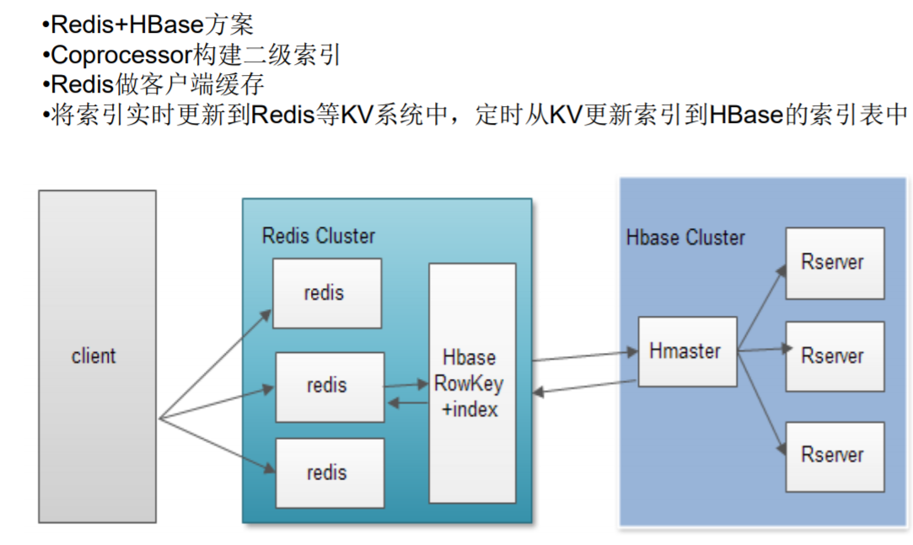 

- HBase+solr
  > 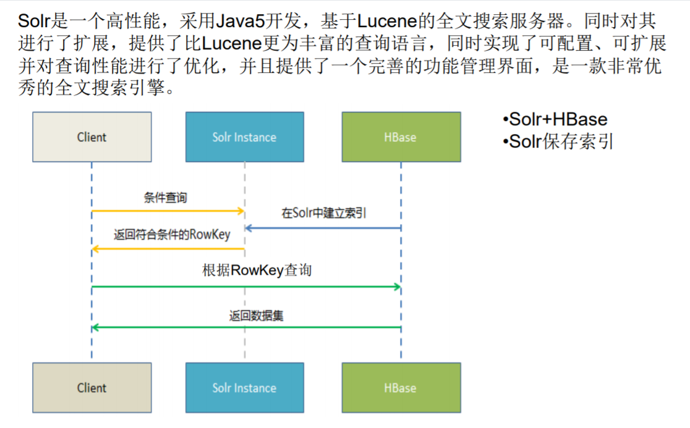 

- 采用HBase0.92版本之后引入的Coprocessor特性。Coprocessor构建二级索引。两种方式
  - endpoint相当于关系型数 据库的存储过程
  - observer则相当于触发器


