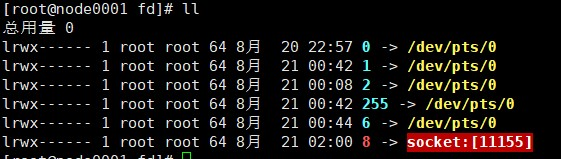
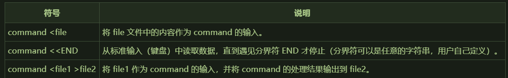

# 1. 命令

## 1.1. 常用命令

|          |           |         |               |           |
| :------: | :-------: | :-----: | :-----------: | :-------: |
|   man    |   help    |         |               |           |
|    ls    |    cd     |  touch  |      rm       |   mkdir   |
|    cp    |    mv     |   cat   |     more      |   less    |
|   tree   |   stat    |  grep   |               |           |
|   head   |   tail    |         |               |           |
| poweroff | shutdown  |  exit   |               |           |
|   ping   | ifconfig  |  wget   | netstat -natp | route -n  |
|  arp -a  |           |         |               |           |
|  sleep   |           |         |               |           |
|   ssh    |    scp    |         |               |           |
|   type   |   which   | whereis |    locate     |   type    |
|   file   |           |         |               |           |
|  passwd  |  usermod  |  chown  |     chgrp     |   chmod   |
| groupadd |    su     |  sudo   |               |           |
|   who    |   users   |         |               |           |
|   date   |    cal    |         |               |           |
|    df    |    du     |   ps    |      top      |   kill    |
|    ln    |  pstree   |  free   |     mount     | chkconfig |
| ss -nal  | ulimit -a |         |               |           |
|   rpm    |    yum    |   tar   |      apt      |   make    |
|   cut    |   sort    |   wc    |      sed      |    awk    |
|   read   |   test    |  exec   |    source     |   bash    |
|   echo   |   hash    |         |               |           |

- ss -nal：查看所欲 socket 监听接口

- set:显示所有变量，包含环境变量等所有
- unset:清除变量，包括环境变量
- env:查看环境变量
- echo 输出
- read 输入

## 1.2. 网络命令

```
首先,先了解传统的网络配置命令:
　　1. 使用ifconfig命令配置并查看网络接口情况
　　示例1: 配置eth0的IP，同时激活设备:
　　# ifconfig eth0 192.168.4.1 netmask 255.255.255.0 up
　　示例2: 配置eth0别名设备 eth0:1 的IP，并添加路由
　　# ifconfig eth0:1 192.168.4.2
　　# route add –host 192.168.4.2 dev eth0:1
　　示例3:激活（禁用）设备
　　# ifconfig eth0:1 up(down)
　　示例4:查看所有（指定）网络接口配置
　　# ifconfig (eth0)
　　2. 使用route 命令配置路由表
　　示例1:添加到主机路由
　　# route add –host 192.168.4.2 dev eth0:1
　　# route add –host 192.168.4.1 gw 192.168.4.250
　　示例2:添加到网络的路由
　　# route add –net IP netmask MASK eth0
　　# route add –net IP netmask MASK gw IP
　　# route add –net IP/24 eth1
　　示例3:添加默认网关
　　# route add default gw IP
　　示例4:删除路由
　　# route del –host 192.168.4.1 dev eth0:1
　　示例5:查看路由信息
　　# route 或 route -n (-n 表示不解析名字,列出速度会比route 快)
　　3.ARP 管理命令
　　示例1:查看ARP缓存
　　# arp
　　示例2: 添加
　　# arp –s IP MAC
　　示例3: 删除
　　# arp –d IP
　　4. ip是iproute2软件包里面的一个强大的网络配置工具，它能够替代一些传统的网络管理工具。例如：ifconfig、route等,
　　上面的示例完全可以用下面的ip命令实现,而且ip命令可以实现更多的功能.下面介绍一些示例:
　　4.0 ip命令的语法
　　ip命令的用法如下：
　　ip [OPTIONS] OBJECT [COMMAND [ARGUMENTS]]
　　4.1 ip link set--改变设备的属性. 缩写：set、s
　　示例1：up/down 起动／关闭设备。
　　# ip link set dev eth0 up
　　这个等于传统的 # ifconfig eth0 up(down)
　　示例2：改变设备传输队列的长度。
　　参数:txqueuelen NUMBER或者txqlen NUMBER
　　# ip link set dev eth0 txqueuelen 100
　　示例3：改变网络设备MTU(最大传输单元)的值。
　　# ip link set dev eth0 mtu 1500
　　示例4： 修改网络设备的MAC地址。
　　参数: address LLADDRESS
　　# ip link set dev eth0 address 00:01:4f:00:15:f1
　　4.2 ip link show--显示设备属性. 缩写：show、list、lst、sh、ls、l
　　-s选项出现两次或者更多次，ip会输出更为详细的错误信息统计。
　　示例:
　　# ip -s -s link ls eth0
　　eth0: mtu 1500 qdisc cbq qlen 100
　　link/ether 00:a0:cc:66:18:78 brd ff:ff:ff:ff:ff:ff
　　RX: bytes packets errors dropped overrun mcast
　　2449949362 2786187 0 0 0 0
　　RX errors: length crc fifo missed
　　0 0 0 0 0
　　TX: bytes packets errors dropped carrier collsns
　　178558497 1783946 332 0 332 35172
　　TX errors: aborted fifo window heartbeat
　　0 0 0 332
　　这个命令等于传统的 ifconfig eth0
　　5.1 ip address add--添加一个新的协议地址. 缩写：add、a
　　示例1：为每个地址设置一个字符串作为标签。为了和Linux-2.0的网络别名兼容，这个字符串必须以设备名开头，接着一个冒号，
　　# ip addr add local 192.168.4.1/28 brd + label eth0:1 dev eth0
　　示例2: 在以太网接口eth0上增加一个地址192.168.20.0，掩码长度为24位(155.155.155.0)，标准广播地址，标签为eth0:Alias：
　　# ip addr add 192.168.4.2/24 brd + dev eth1 label eth1:1
　　这个命令等于传统的: ifconfig eth1:1 192.168.4.2
　　5.2 ip address delete--删除一个协议地址. 缩写：delete、del、d
　　# ip addr del 192.168.4.1/24 brd + dev eth0 label eth0:Alias1
　　5.3 ip address show--显示协议地址. 缩写：show、list、lst、sh、ls、l
　　# ip addr ls eth0
　　5.4.ip address flush--清除协议地址. 缩写：flush、f
　　示例1 : 删除属于私网10.0.0.0/8的所有地址：
　　# ip -s -s a f to 10/8
　　示例2 : 取消所有以太网卡的IP地址
　　# ip -4 addr flush label "eth0"
　　6. ip neighbour--neighbour/arp表管理命令
　　缩写 neighbour、neighbor、neigh、n
　　命令 add、change、replace、delete、fulsh、show(或者list)
　　6.1 ip neighbour add -- 添加一个新的邻接条目
　　ip neighbour change--修改一个现有的条目
　　ip neighbour replace--替换一个已有的条目
　　缩写：add、a；change、chg；replace、repl
　　示例1: 在设备eth0上，为地址10.0.0.3添加一个permanent ARP条目：
　　# ip neigh add 10.0.0.3 lladdr 0:0:0:0:0:1 dev eth0 nud perm
　　示例2:把状态改为reachable
　　# ip neigh chg 10.0.0.3 dev eth0 nud reachable
　　6.2.ip neighbour delete--删除一个邻接条目
　　示例1:删除设备eth0上的一个ARP条目10.0.0.3
　　# ip neigh del 10.0.0.3 dev eth0
　　6.3.ip neighbour show--显示网络邻居的信息. 缩写：show、list、sh、ls
　　示例1: # ip -s n ls 193.233.7.254
　　193.233.7.254. dev eth0 lladdr 00:00:0c:76:3f:85 ref 5 used 12/13/20 nud reachable
　　6.4.ip neighbour flush--清除邻接条目. 缩写：flush、f
　　示例1: (-s 可以显示详细信息)
　　# ip -s -s n f 193.233.7.254
　　7. 路由表管理
　　7.1.缩写 route、ro、r
　　7.2.路由表
　　从Linux-2.2开始，内核把路由归纳到许多路由表中，这些表都进行了编号，编号数字的范围是1到255。另外，
　　为了方便，还可以在/etc/iproute2/rt_tables中为路由表命名。
　　默认情况下，所有的路由都会被插入到表main(编号254)中。在进行路由查询时，内核只使用路由表main。
　　7.3.ip route add -- 添加新路由
　　ip route change -- 修改路由
　　ip route replace -- 替换已有的路由
　　缩写：add、a；change、chg；replace、repl
　　示例1: 设置到网络10.0.0/24的路由经过网关193.233.7.65
　　# ip route add 10.0.0/24 via 193.233.7.65
　　示例2: 修改到网络10.0.0/24的直接路由，使其经过设备dummy
　　# ip route chg 10.0.0/24 dev dummy
　　示例3: 实现链路负载平衡.加入缺省多路径路由，让ppp0和ppp1分担负载(注意：scope值并非必需，它只不过是告诉内核，
　　这个路由要经过网关而不是直连的。实际上，如果你知道远程端点的地址，使用via参数来设置就更好了)。
　　# ip route add default scope global nexthop dev ppp0 nexthop dev ppp1
　　# ip route replace default scope global nexthop dev ppp0 nexthop dev ppp1
　　示例4: 设置NAT路由。在转发来自192.203.80.144的数据包之前，先进行网络地址转换，把这个地址转换为193.233.7.83
　　# ip route add nat 192.203.80.142 via 193.233.7.83
　　示例5: 实现数据包级负载平衡,允许把数据包随机从多个路由发出。weight 可以设置权重.
　　# ip route replace default equalize nexthop via 211.139.218.145 dev eth0 weight 1 nexthop via 211.139.218.145 dev eth1 weight 1
　　7.4.ip route delete-- 删除路由
　　缩写：delete、del、d
　　示例1:删除上一节命令加入的多路径路由
　　# ip route del default scope global nexthop dev ppp0 nexthop dev ppp1
　　7.5.ip route show -- 列出路由
　　缩写：show、list、sh、ls、l
　　示例1: 计算使用gated/bgp协议的路由个数
　　# ip route ls proto gated/bgp |wc
　　1413 9891 79010
　　示例2: 计算路由缓存里面的条数，由于被缓存路由的属性可能大于一行，以此需要使用-o选项
　　# ip -o route ls cloned |wc
　　159 2543 18707
　　示例3: 列出路由表TABLEID里面的路由。缺省设置是table main。TABLEID或者是一个真正的路由表ID或者是/etc/iproute2/rt_tables文件定义的字符串，
　　或者是以下的特殊值：
　　all -- 列出所有表的路由；
　　cache -- 列出路由缓存的内容。
　　ip ro ls 193.233.7.82 tab cache
　　示例4: 列出某个路由表的内容
　　# ip route ls table fddi153
　　示例5: 列出默认路由表的内容
　　# ip route ls
　　这个命令等于传统的: route
　　7.6.ip route flush -- 擦除路由表
　　示例1: 删除路由表main中的所有网关路由（示例：在路由监控程序挂掉之后）：
　　# ip -4 ro flush scope global type unicast
　　示例2:清除所有被克隆出来的IPv6路由：
　　# ip -6 -s -s ro flush cache
　　示例3: 在gated程序挂掉之后，清除所有的BGP路由：
　　# ip -s ro f proto gated/bgp
　　示例4: 清除所有ipv4路由cache
　　# ip route flush cache
　　*** IPv4 routing cache is flushed.
　　7.7 ip route get -- 获得单个路由 .缩写：get、g
　　使用这个命令可以获得到达目的地址的一个路由以及它的确切内容。
　　ip route get命令和ip route show命令执行的操作是不同的。ip route show命令只是显示现有的路由，而ip route get命令在必要时会派生出新的路由。
　　示例1: 搜索到193.233.7.82的路由
　　# ip route get 193.233.7.82
　　193.233.7.82 dev eth0 src 193.233.7.65 realms inr.ac cache mtu 1500 rtt 300
　　示例2: 搜索目的地址是193.233.7.82，来自193.233.7.82，从eth0设备到达的路由（这条命令会产生一条非常有意思的路由，这是一条到193.233.7.82的回环路由）
　　# ip r g 193.233.7.82 from 193.233.7.82 iif eth0
　　193.233.7.82 from 193.233.7.82 dev eth0 src 193.233.7.65 realms inr.ac/inr.ac
　　cache
 mtu 1500 rtt 300 iif eth0
　　8. ip route -- 路由策略数据库管理命令
　　命令
　　add、delete、show(或者list)
　　注意：策略路由(policy routing)不等于路由策略(rouing policy)。
　　在某些情况下，我们不只是需要通过数据包的目的地址决定路由，可能还需要通过其他一些域：源地址、IP协议、传输层端口甚至数据包的负载。
　　这就叫做：策略路由(policy routing)。
　　8.1. ip rule add -- 插入新的规则
　　ip rule delete -- 删除规则
　　缩写：add、a；delete、del、d
　　示例1: 通过路由表inr.ruhep路由来自源地址为192.203.80/24的数据包
　　ip ru add from 192.203.80/24 table inr.ruhep prio 220
　　示例2:把源地址为193.233.7.83的数据报的源地址转换为192.203.80.144，并通过表1进行路由
　　ip ru add from 193.233.7.83 nat 192.203.80.144 table 1 prio 320
　　示例3:删除无用的缺省规则
　　ip ru del prio 32767
　　8.2. ip rule show -- 列出路由规则
　　缩写：show、list、sh、ls、l
　　示例1: # ip ru ls
　　0: from all lookup local
　　32762: from 192.168.4.89 lookup fddi153
　　32764: from 192.168.4.88 lookup fddi153
　　32766: from all lookup main
　　32767: from all lookup 253
　　9. ip maddress -- 多播地址管理
　　缩写：show、list、sh、ls、l
　　9.1.ip maddress show -- 列出多播地址
　　示例1: # ip maddr ls dummy
　　9.2. ip maddress add -- 加入多播地址
　　ip maddress delete -- 删除多播地址
　　缩写：add、a；delete、del、d
　　使用这两个命令，我们可以添加／删除在网络接口上监听的链路层多播地址。这个命令只能管理链路层地址。
　　示例1: 增加 # ip maddr add 33:33:00:00:00:01 dev dummy
　　示例2: 查看 # ip -O maddr ls dummy
　　2: dummy
　　link 33:33:00:00:00:01 users 2 static
　　link 01:00:5e:00:00:01
　　示例3: 删除 # ip maddr del 33:33:00:00:00:01 dev dummy
　　10.ip mroute -- 多播路由缓存管理
　　10.1. ip mroute show -- 列出多播路由缓存条目
　　缩写：show、list、sh、ls、l
　　示例1:查看 # ip mroute ls
　　(193.232.127.6, 224.0.1.39) Iif: unresolved
　　(193.232.244.34, 224.0.1.40) Iif: unresolved
　　(193.233.7.65, 224.66.66.66) Iif: eth0 Oifs: pimreg
　　示例2:查看 # ip -s mr ls 224.66/16
　　(193.233.7.65, 224.66.66.66) Iif: eth0 Oifs: pimreg
　　9383 packets, 300256 bytes
　　11. ip tunnel -- 通道配置
　　缩写
　　tunnel、tunl
　　11.1.ip tunnel add -- 添加新的通道
　　ip tunnel change -- 修改现有的通道
　　ip tunnel delete -- 删除一个通道
　　缩写：add、a；change、chg；delete、del、d
　　示例1:建立一个点对点通道，最大TTL是32
　　# ip tunnel add Cisco mode sit remote 192.31.7.104 local 192.203.80.1 ttl 32
　　11.2.ip tunnel show -- 列出现有的通道
　　缩写：show、list、sh、ls、l
　　示例1: # ip -s tunl ls Cisco
　　12. ip monitor和rtmon -- 状态监视
　　ip命令可以用于连续地监视设备、地址和路由的状态。这个命令选项的格式有点不同，命令选项的名字叫做monitor，接着是操作对象：
　　ip monitor [ file FILE ] [ all | OBJECT-LIST ]
　　示例1: # rtmon file /var/log/rtmon.log
　　示例2: # ip monitor file /var/log/rtmon.log r
```

# 2. 开始

> 虚拟机集群的步骤看 ppt

- type(类似 which)
  - type 能指定磁盘位置的命令，也就是从 PATH 中查询的命令，被称为**外部命令**,外部命令执行时都会变为一个进程
  - 外部命令都可以通过`man 命令名称`查看文档
  - 可能是可执行程序，也可能是脚本（比如 python 脚本等）
  - 如果 type 返回 shell builtin，则是内部命令。shell 内部的。比如 cd，echo
- file
  - `ELF` 类型为二进制可执行程序
- echo 返回输入变量
  > echo \$PATH
- 环境变量
  - windows 中用两个%取环境变量的值，用;分割
  - linux 中用\$取值，用:分割
  - %path% == \$PATH
  - 修改 profile 可以修改环境变量，具体再学完 shell script 后就理解了
- yum install man man-pages
  > man 是帮助程序 man-pages 是扩充的帮助页,一定要装<br>
  > 也可以 `man ascii` `man utf-8` `man gets`<br>
- man 可以查的一共是：
  - 1,用户命令(/bin,/usr/bin,/usr/local/bin)，
  - 2.系统调用，`man 2 read`
  - 3.库用户，
  - 4.特殊文件(设备文件)
  - 5.文件格式(配置文件的语法)
  - 6.游戏，杂项(Miscellaneous)
  - 7.管理命令(/sbin,/usr/sbin,/usr/local/sbin)
- 外部命令用 man，内部命令用 help(help 也是内部命令)
- whereis 定位命令位置,同时指出帮助文档位置
- which 定位命令位置
- file descriptor:文件描述符/文件句柄。linux 中数字代表进程中的某一个流，任何进程最基本的三个流：

  - 0 输入流
  - 1 正确的输出流
  - 2 错误的输出流

- `!serv` 执行最近的，以 serv 开头的，执行过的命令
- jps ：jdk 中的一个可执行程序，查看 java 进程 id

---

# 3. 目录相关

- 目录

  - /boot:系统启动相关文件
  - /etc:配置文件
  - /home:存放除 root 用户外的用户目录
  - /root:root 用户目录
  - /media:挂载点目录，移动设备
  - /mnt:挂载点目录，额外的临时文件系统
  - /proc:伪文件系统，内核映射文件
  - /sys:伪文件系统，跟硬件设备有关的属性映射文件
  - /tmp:临时文件，/var/tmp 也是
  - /var:可变化文件，存储数据库表数据等
  - /bin:二进制可执行文件，用户命令
  - /sbin:管理员命令
  - /lib:库文件，linux 中的 so，windows 中的 lib
  - /dev:设备文件，linux，一切皆文件
  - /opt:额外安装的可选应用程序包所放置的位置。一般情况下，我们可以把 tomcat 等都安装到这里。
  - /usr:是 Unix Software Resource 的缩写,用于存放系统应用程序，比较重要的目录/usr/local 本地系统管理员软件安装目录（安装系统级的应用）。这是最庞大的目录，要用到的应用程序和文件几乎都在这个目录。

- 磁盘信息：
  - df:显示硬盘分区。
    - linux 中没有盘符概念，只有一棵虚拟的目录树，所有分区中的目录都会放在根目录/下的某文件夹(不一定是子级)。比如/boot 目录就是一个分区。
    - 有啥问题时，先 df，看看磁盘满没
  - du -sh ./\*:统计此文件夹下每个目录大小
  - 清楚数据前一定要备份
- 文件类型：
  > 扩展名只在图形化界面上有用
  - `-`:普通文件：文本文件，excel 文件，MP4 文件等
  - `d`:文件夹
  - `c`或`b` 设备文件。
    - `c`:字符型设备：比如显示器，一个像素点需要 rgb 三原色的数据，三个字节。比如键盘，组合键
    - `b`:字节型设备：比如硬盘
  - `l`:快捷方式
  - `p`:pipe,管道
  - `s`:socket
- `命令的七步扩展`，有兴趣查查
- hash:存储执行过的命令，提高下一次命令查找速度
  - hash -r 清除
- 文件系统命令：

  - df
  - du
  - ls
    - ls -lha
    - ls -i 显示文件所在磁盘的索引
  - cd
    - cd ~
    - cd ~普通用户用户名（只有 root 用户用到）
    - cd
    - cd path
    - cd -
  - pwd
  - mkdir
    - mkdir -p parent，有需要的话创建父级目录
    - mkdir ./abc/{x,y,z}dir 水平创建，./abc/xdir,./abc/ydir,./abc/zdir
  - rm
    > 千万别 rm -fr / <br>
    > 能 mv 移动 别删
    - rm -f file
    - rm -r folder
  - mv 移动或重命名
  - cp
    - cp -r 递归拷贝
  - ln
    - ln 硬链接　会指向硬盘同一位置。类型：`-`
    - ln -s 　软链接，只是指向一个目录。就是 windows 上的快捷方式　类型：`l`
  - stat:元数据，相当于 window 的文件属性
    - Change 描述元数据发生变化的时间，比如权限
    - Modify 文件内容修改时间
    - Access 访问时间
    - IO Block 一次 io 读写多少
    - Inode 磁盘位置索引
  - touch
    - 更新指定已有文件元数据的三个时间
      - 可以
    - 创建新文件

- cat
- more
- less
- head 显示最前面的内容，-4 表示显示四行
- tail 显示最后面的内容，-4 表示显示四行
  > head -4 file | tail -1 显示第四行
  - tail -f file 阻塞显示文件
- 管道：

  - cat file | more 可以分屏显示内容
  - echo "/" | ls -l **不会显示根目录文件夹**
    > 每个程序都有输入流，但不一定会用到。比如 ls，只会判定传入的参数，而并没有读取输入流
  - echo "/" | xargs ls -l 可以显示根目录文件夹
    - 管道前命令是 echo
    - 管道后命令是 xargs
    - "/"通过管道，流入 xargs 命令中
    - xargs 后接的第一个参数会被识别为命令，剩下的参数识别为命令的选项参数，再将输入流中的信息作为命令的参数，再把命令执行

- ppt 中，红色的为扩展正则表达式，黑色的为基本正则表达式
  >  > 

* grep 匹配输出

  - `-v` 反显
  - `-e` 使用扩展正则表达式
  - **grep 和 vim 中默认()为字符，如果要分组就要使用`\(word\)`**※
  - **python 中()默认为分组，通过\进行转义为字符**
  - 另外括号嵌套是，比如(())，数左括号，左边第一个是第一组，第二个是第二组
  - 正则表达式单词边界匹配(grep 独有,python 中为\b)：
    - `\<abc` 以 abc 开头的单词
    - `def\>` 以 def 结尾的单词
    - `\<word\>` word 单词。注意，这样查到的`$word` `word.`也是符合的

---

# 4. 文本处理

- cut：切割行。比如查看数据库表数据时

  - f:选择显示的列
  - s:不显示没有分隔符的行
  - d:自定义分隔符
  - 例：
    - `cut -d' ' -f1 file` 以空格为分隔符切割后显示第一列
    - `cut -d' ' -f1,3 file` 以空格为分隔符切割后显示第一和三列
    - `cut -d' ' -f1-3 file` 以空格为分隔符切割后显示第一列到第三列

- sort:排序文件的行后输出。字典序或数值序

  - n:按数值排序。默认字典序。（从第一个字符进行排序）
  - 自定义排序方式:
    > sort -t' ' -k2 以空格为分隔符，通过第二列字典序进行排序
    - t:自定义分隔符
    - k:选择排序列
  - r:倒序
  - u:合并相同行
  - f:忽略大小写

- wc:统计。linw，word，bytes

  - l:只统计行数
  - 通常统计后面会有文件名，通过 cat file | wc -l 可以统计行数而不带文件名
  - 其他统计用 man 查一下吧

- sed :行编辑器

  > 类似 vi 的末行模式,只会显示修改后的内容，要加 i 选项才能保存到文件中

  - 选项
    - sed [options] `AddressCommand` file
    - n 静默模式，处理而不打印出
    - i 直接修改一个文件，直接作用到文件
    - `-e script -e script` 可以执行多个脚本，一个-e 后一个脚本
    - f /path/to/sed_script 读取文件中的命令
    - r 使用扩展正则表达式
  - Command:
    - d 删除符合条件的行；
    - p:显示符合条件的行；
    - a\string:在指定的行后面追加新行，内容为 string
    - \n:可以用于换行
    - i\string:在指定的行前面添加新行，内容为 string
    - r FILE:将指定的文件的内容添加至符合条件的行处
    - w FILE:将地址指定的范围内的行另存至指定的文件中；
    - s/pattern/string/修饰符：查找并替换，默认只替换每行中第一次被模式匹配到的字符串
      - g:行内全局替换
      - i:忽略字符大小写
      - s///: s###, s@@@
      - \Q),\1,\2
  - Address
    - 可以没有
    - 给定范围
    - 查找有指定内容的行/str/
  - 演示：
    - `sed "1a\hello world" test.txt` 在第一行后追加新行，内容为 hello world
    - `sed "/hello/d" test.txt` 删除有 hello 的行
    - `sed -n "/[0-9]/p" test.txt` 显示包含数字的行 可以由 `grep "[0-9] test.txt"代替`
    - `sed "s/3333/11111/g"` 替换

- awk

  - 说明:
    - awk 是一个强大的文本分析工具。
    - 相对于 grep 的查找，sed 的编辑，awk 在其对数据分析并生成报告时， 显得尤为强大。
    - 简单来说 awk 就是把文件逐行的读入，空格，制表符）为默认分隔符 将每行切片，切开的部分再进行各种分析处理。
    - 可以用来代替 cut，sort，sed
  - 使用：
    - awk -F '{pattern + action}' {filenames}
      > **必须是单引号**
    - 支持自定义分隔符.默认为空格
    - 支持正则表达式匹配
    - 支持自定义变量，数组 a[1] a[tom] map(key)
    - 支持内置变量
      - NF 浏览记录的域(列)的个数
      - NR 已读的记录数(行数)
      - ARGC 命令行参数个数
      - ARGV 命令行参数排列
      - ENVIRON 支持队列中系统环境变量的使用
      - FILENAME awk 浏览的文件名
      - FNR 浏览文件的记录数
      - FS 设置输入域分隔符，等价于命令行 -F 选项
      - OFS 输出域分隔符
      - ORS 输出记录分隔符
      - RS 控制记录分隔符
    - 支持函数
      - print、split、substr、sub、gsub
    - 支持流程控制语句，类 C 语言
      - if、while、do/while、for、break、continue
  - 示例：

    - `awk -F':' '{print $1}' passwd` 打印以冒号分割得到的第一列 。相当于 `cut -d':' -f1 passwd`
    - `awk -F':' 'BEGIN{print "name\shell"} {print $1 "\t" $7} END{print "end"}' passwd` 打印表头，分割后的 1，7 行，最后结束提示
      - BEGIN{}是在处理前调用
      - 匿名函数是每行的操作
      - END{}是处理完后调用
    - `awk '/word/ {print $0}'` 打印包含 word 的行
    - `awk '/word/ {print $0} {print $0}'` 打印包含 word 的行后，再全打印一遍
    - `awk -F':' '{print NR"\t"NF"\t"$0}'`打印每行行号，列数，完成内容，为一个表格
    - 计算合计工资

      ```
      统计报表：合计每人1月的工资，0：manager，1：worker

      Tom	 0   2012-12-11      car     3000
      John	 1   2013-01-13      bike    1000
      vivi	 1   2013-01-18      car     2800
      Tom	 0   2013-01-20      car     2500
      John	 1   2013-01-28      bike    3500

      结果比如: tom worker 2500

      awk '{
        split($3,date,"-");
        if(date[2]=="01"){
          name[$1] += $5
          if($2=="0"){
            position[$1] = "manager"
          }else if($2=="1"){
            position[$1] = "worker"
          }
        }
      }
      END{
          for(i in name){
            print i "\t" position[i] "\t" name[i]
          }
      }' wagetable.txt
      ```

- 计算机开机-->计算机内核进内存-->加载根目录分区进内存-->引导 sbin 目录下 init 程序作为第一个进程-->该进程读取/etc/inittab 中的开机设置

  > 小知识

  - 3 是命令行模式，
  - 5 是图形界面模式，
  - 0 是直接关机无法开机，
  - 6 是立刻重启死循环，
  - 1 是单用户模式（物理服务器身边，重启时可以设置，不需要密码登录，修改密码时用）
  - 不过 linux 中图形界面并没有在内核代码中，需要安装后台程序

- /etc/passwd 文件
  - root:x:0:0:root:/root:/bin/bash
  - 冒号分隔符
  - 一行是一个用户的信息
  - 用户名:x:用户 id 号:组 id 号:用户描述信息:用户家目录:用户以交互模式登录时的 shell 外壳程序
    > 原本加密后的密码是保存在 x 那里的，但因为不安全，所以移除了，x 用来占位
    > 密码数据移到了 shadow 下

---

# 5. 用户和权限

> 了解逻辑，以后工作后要知道自己想要什么权限的用户。或者哪个程序的管理员，哪个程序的普通用户

- x 权限
  - x 对目录是打开权限
  - 对文件是运行权限
  - 文件默认不给 x
- useradd 添加用户
- passwd:普通用户可以修改自己密码，只有 root 用户能修改别人密码
- users:查看当前登录用户
- id username 查看用户 id 信息
- su 切换用户 switch user
- groupadd 创建组
- usermod 修改用户元数据
  - a 增加
  - G 组
- chown 修改持有者和组 chown -R mysqladmin:mysqlgroup /otp/mysql
- chmod 修改用户，组权限
- 两个用户间 user1,user1 间交互部分数据：

  > 先创建好用户和组，再分配权限

  - 创建 mkdir /share
  - 创建一个组
    - groupadd user12share
  - user1.user2 加入同一个组
    - usermod -a -G user12share user01
    - usermod -a -G user12share user02
  - 给够组的权限
    - chown root:user12share /share
      > change owner 让用户 root 和组 user12share 持有
    - chmod g+w /share
      > ugo user,group,other
  - 减掉其他人的权限
    - chmod o-rx /share
  - **重新登录，刷新权限**
  - 注意，文件夹中新创建文件会采用默认权限，父级目录只会约束哪几个用户进来，必要时可以对文件进行权限修改或者修改组

- 管理员：
  - 操作系统管理员只有一个；root
  - 如果有能够访问和运行某程序管理程序的的权限，就是某程序的管理员，比如 mysql 管理员
  - 权限更新后一定要重新登录

---

# 6. 软件安装

- 编译安装(自己编译安装)
  - 说明：
    > 服务器要求稳定性。而软件越大，bug 的风险越高。同时软件开发更多趋向于模块化，所以可以在编译期剔除一些模块，个性化得得到一个软件
    - 配置文件：Makefile
    - 编译安装命令：make（会自动查找编译器）
  - 安装 tengine
    - 阅读 README 查看安装步骤
      ```
      To install Tengine, just follow these three steps:
      $ ./configure
      $ make
      # make install
      ```
    - ./configure --help 查看安装选项
      > 可以通过安装选项选择关闭模块，安装位置等
    - ./configure --prefix="/opt/learn/nginx" （安装选项 prefix 是安装目录）
    - 开始安装，看输出报错，是否缺少依赖。缺少的话就装下，不断解决依赖问题
    - 创建 MakeFile 文件创建完成（读读看，其实会内容会读取 objs/Makefile）
    - make (默认读取 Makefile 文件)(是在进行编译)
    - make install（这一步是安装，将编译后的文件拷贝到目标文件夹）
    - /opt/learn/nginx 下会出现软件目录
    - /opt/learn/nginx/sbin 下有启动程序
    - 启动后可以在 windows 上访问
- rpm 安装:包(编译后的包)

  > 有些软件不在仓库中。比如 jvm，一个 oracle 的，一个 openjdk，还有其他。仓库中安装的是 openjdk <br>
  > 但不能自动安装依赖

  - 安装：
    - rpm -i filename.rpm (-i 表示 --install )
  - 查询：
    - rpm -qa 查询所有安装的软件的包的名称（不显示编译安装的） ※
    - rpm -ql 包名 显示包 rpm -qa : 查询已经安装的包 ※
    - rpm -qf /path/to/somefile: 查询文件是由哪个 rpm 包安装生成的(逆向查询) ※
      > 原理：安装时会讲包名和安装文件目录存到数据库中，所以尽管文件被删除了也没问题
    - rpm -q PACKAGE_NAME: 查询指定的包是否已经安装
    - rpm -qi PACKAGE_NAME: 查询指定包的说明信息
    - rpm -qc PACEAGE_NEME：查询指定包安装的配置文件
    - rpm -qd PACKAGE_NAME: 查询指定包安装的帮助文件
    - rpm -q --scripts PACKAGE_NAME: 查询指定包中包含的脚本
    - 如果某 rpm 包尚未安装，需查询其说明信息、安装以后会生成的文件
      - rpm -qpi /PATH/TO/PACKAGE_FILE
      - rpm -qpl 释放了哪些文件到哪里
  - 升级：
    - -U
    - -F
  - 卸载:
    - -e PACKAGE_NAME
  - 设置环境变量
    - 安装完软件后也会自动在\$PATH 中默认目录下添加一些软链接（注意，不是全部），为了解决问题可以添加环境变量
      ```
      # 安装完jdk后
      [root@node0001 bin]# ll | grep java
      lrwxrwxrwx  1 root root        25 Aug 19 23:38 jar -> /usr/java/default/bin/jar
      lrwxrwxrwx  1 root root        26 Aug 19 23:38 java -> /usr/java/default/bin/java
      lrwxrwxrwx  1 root root        27 Aug 19 23:38 javac -> /usr/java/default/bin/javac
      lrwxrwxrwx  1 root root        29 Aug 19 23:38 javadoc -> /usr/java/default/bin/javadoc
      lrwxrwxrwx  1 root root        28 Aug 19 23:38 javaws -> /usr/java/default/bin/javaws
      lrwxrwxrwx  1 root root        30 Aug 19 23:38 jcontrol -> /usr/java/default/bin/jcontrol
      ```
    - 添加环境变量：`\etc\profile`
      ```profile
      # 最后添加
      export JAVA_HOME=/usr/java/jdk1.7.0_67
      export PATH=$PATH:$JAVA_HOME/bin   # 拼接PATH
      ```
    - 更新配置 `source /etc/profile`

- yum 安装:仓库

  > 会自动安装依赖。底层会调用 rpm。只是 rpm 的一种封装

  - 原理：
    - 基于 rpm 包管理
    - 提供 rpm 仓库。组成：
      - rpm 包
      - 元数据描述文件
  - 流程：
    - 元数据下载到本地
    - 推断依赖包，包名，版本号等
    - 安装依赖包和目的包
  - repo 配置`/etc/yum.repos.d/`：

    - 配置文件说明：；

      - Centos-Base.repo

        ```
        [base]  # 仓库名称,可以有多个仓库
        name=CentOS-$releasever - Base  # 逻辑描述，怎么都行
        mirrorlist=http://mirrorlist.centos.org/?release=$releasever&arch=$basearch&repo=os  # 该地址可以动态返回最近的仓库地址,不用改
        # 发现在什么东西都没改时，会动态使用aliyun

        # baseurl=http://mirror.centos.org/centos/$releasever/os/$basearch/  # 仓库位置。也支持 ftp,file协议
        # 下面的是安全认证，不用管
        gpgcheck=1
        gpgkey=file:///etc/pki/rpm-gpg/RPM-GPG-KEY-CentOS-6
        ```

    - 国内镜像站配置
      - 可以根据镜像站说明配置镜像源
      - 配置完成后，：
        - yum clean all 清除元数据
        - yum makecache 下载元数据
    - 使用本机 dvd
      - 下载 Centos-6.10-x86_64-bin-DVD1.iso
      - mount 到 mnt `mount /dev/cdrom /mnt`
      - 修改配置文件
        - 新建一个 backup 文件夹，把除了 base 外的都移进去
        - 配置文件中删除得只剩下 base
        - base 下删除得只剩下 name,baseurl,gpgcheck
        - gpgcheck 改为 0
        - baseurl 改成：file:///mnt
        - yum clean all yum makecache
    - 服务器集群中的仓库服务器
      > 后面讲

  - 常用命令；
    - 一般
      - yum repolist :显示仓库列表及仓库中包数量
      - yum clean all 清除元数据
      - yum makecache 下载元数据
      - yum remove:卸载软件
      - yum update 更新所有安装过的包
      - yum list 显示安装过的包和未安装过的包
      - yum search 搜索包
      - yum install 安装
      - yum remove 卸载
      - yum erase 卸载，更干净些
    - 分组命令：
      - yum grouplist 查看所有组
      - yum groupinstall 安装组 “组名中有空格时要加双引号”
      - yum groupupdate 更新组
      - yum groupremove 删除组
      - yum groupinfo 组信息

- 中文文档：

  > LANG 设置只能设置一时，但不设置成一直中文的，要习惯英文环境。就个人学习时，切到中文使用 man 看看文档

  - yum groupinstall "Chinese Support"
  - 设置 LANG=zh_CN.UTF-8
  - 增加 epel 的仓库
  - 更新元数据
  - 搜索 man-pages-zh-CN
  - yum install man-pages-zh-CN
  - 看 man bash

# 7. shell script

## 7.1. 开始

- /etc/profile 是 shell 打开时要读取的配置文件，里面有环境变量的定义等
- pstree:展示进程树
- 可以启动多层 bash

  - bash 打开一层(一个子进程)
  - exit 关闭一层

- 执行 bash 脚本文件中的代码：
  - 在当前 shell 中执行
    > 两者相同
    - source filename
    - . filename
  - 新 shell 中执行：
    > 新建新 bash 子进程-->执行脚本内容-->关闭子 bash 子进程
    - bash filename
      > `bash filename &` 在后台运行
      > `#!/bin/bash` 可设置为可执行脚本
  - **原因:**
    - 风险方面，新建子进程执行，尽管出现异常，只会关闭子进程，不会对当前进程有影响
    - 资源方面：子进程和当前进程不共享变量，避免变量名重复定义问题。环境是隔离的
- 脚本本质：
  - 第一行要写可执行程序，会在当前 bash 进程的子进程中执行
    - `#!/bin/bash`
    - `#!/usr/bin/python`
- 函数：

  - 定义和使用
    > 一切皆命令
    ```bash
    # 定义函数
    method(){
      echo "hello world"
      ls -l /
      echo $$ # 返回当前进程id
      # 第一个$是表示取值
    }
    # 调用函数
    method
    ```
  - type method:返回函数定义

- 命令种类：
  - bulidin
  - 函数
  - 磁盘目录下的可执行文件

## 7.2. 文本流，重定向

- 预先知识

  - 文件描述符以及对应指向

    - /proc 目录保存当前进程的抽象成文件后的文件,其中的数字目录对应进程 id
    - `cd /proc/$$` 进入到 bash 进程目录
    - 可以看到 bash 进程中的变量，定义
    - fd/是文件描述符文件夹，里面有 0，1，2 三个代表 bash 进程对应的之前提到的三个流。如果有读取文件和网络，会与更多的文件描述符，socket 也在这里.
    - 0,1,2 指向/dev/pts/0
    - 如果再登录一个用户，会有一个新的 bash 进程，其中 fd 中，0,1,2 指向 /dev/pts/1

      ```
      pts是所谓的伪终端或虚拟终端，再通过ssh的tcp远程登录时
      打开一个终端，这个终端就叫pts/0，如果你再打开一个终端，这个新的终端就叫pts/1。
      会通过虚拟终端与linux进行交互

      如果在linux中登录会指向/dev/tty1

      1 当前控制终端（/dev/tty）
      /dev/tty指的是当前所处的终端,输出到此的内容只会显示在当前工作的终端显示器上;可以使用命令”ps –ax”来查看进程与哪个控制终端相连.对于你登录的shell，
      /dev/tty就是你使用的终端，设备号是(5,0).
      使用命令”tty”可以查看自己具体对应哪个实际终端设备./dev/tty有些类似于到实际所使用终端设备的一个联接

      2./dev/pts
      /dev/pts是远程登陆(telnet,ssh等)后创建的控制台设备文件所在的目录。由于可能有好几千个用户登陆，所以/dev/pts其实是动态生成的，不象其他设备文件是构建系统时就已经产生的硬盘节点.

      3.控制台终端-系统控制台(/dev/console 和 /dev/tty*)
      在Linux系统中，计算机显示器通常被称为控制台终端(Console).它仿真了类型为Linux的一种终端(TERM=Linux)，并且有一些设备特殊文件与之相关联：
      tty0、tty1、tty2等.当你在控制台上登录时，使用的是tty1.使用Alt+[F1—F6]组合键时，我们就可以切换到tty2、tty3等上面去.tty1–tty6等称为虚拟终端，
      而tty0则是当前所使用虚拟终端的一个别名，系统所产生的信息会发送到该终端上.因此不管当前正在使用哪个虚拟终端，系统信息都会发送到控制台终端上.
      你可以登录到不同的虚拟终端上去，因而可以让系统同时有几个不同的会话期存在.只有系统或超级用户root可以向/dev/tty0进行写操作.
      ```

  - 其他
    - read var1
      - 开启阻塞等待输入
      - 遇到换行符结束堵塞
      - 将数据写入 var1
    - exec
      - `exec ls -l` 执行流程
        - bash 进程有对应的 栈，堆，代码段
        - 代码执行后，bash 会用 ls 程序的所有代码覆盖掉 bash 进程代码段区域的所有代码
        - cpu 从栈中提取数据，从代码段中提取代码
        - 执行代码。
        - 因为 ls 不会堵塞，最后会有一条退出的代码，所以会杀死进程
      - `exec`
        - 没有任何命令，也就不会覆盖代码，所以什么事情也没
      - `exec 8 <> /dev/tcp/www.baidu.com/80`
        - 没有命令，不会覆盖代码
        - 但有选项，选项会执行
        - 创建一个 socket，并在这里生成一个映射文件(一切皆文件)
          > 

* 重定向不是命令

  - 作用：不修改源码的情况下，能够修改输入输出方向，既可以指定文件，也可以指定流
  - 输出
    - 示例 1：
      > 
      - 步骤：
        - `exec 6>&1` 让当前进程（bash 进程）流 6 指向输出流 1 指向的位置，做备份
        - `exec 1> /dev/pts/1` 修改输出流 1 的输出位置
    - 示例 2：`ls -l ./ 1> test.txt` 注意，1 和>间不能有空格，否则 1 会被认成参数。1 是文件描述符
      > 将输出重定向到文件，**覆盖>**
    - 示例 3：`ls -l ./ 1>> test.txt`
      > 将输出重定向到文件，**追加>>**
    - 示例 3：`ls -l nonefile 2> exception.txt` 错误输出用 2
      > 将错误输出输出到文件
    - 示例 3：`ls -l file nonefile 1>>test.txt 2>> exception.txt`
      > 正常输出和错误输出都进行重定向，分别到两个文件
    - 示例 4：`ls -l ./ 1> out.txt 2>&1`将 1,2 两个流都写到一个文件中。 注意；从左向右执行，`1> out.txt`和`2>&1`不能反过来
      > 指向同一个位置
      - 简写方式(固定):
      - `ls -l ./ >& out.txt`
      - `ls -l ./ &> out.txt`
        > 可以理解为所有输入流&后再重定向（>）
  - 输入：
    > 
    - 修改 read 输入流：
      - `read var1 0<<<"afdfafawfwae"` 放文本
        > 没有堵塞，直接输入后结束<br />
        > 设置变量var1的值
      - `read var1 0<<aaaaa` 堵塞，然后输入数据，回车不会作为结束符。输入`aaaaa`后结束堵塞。
        - 但因为 read 对换行符敏感，所以只能读取到第一行
        - cat 对换行符不敏感
          ```bash
          cat 0<<ooxx
          contentcontentcontentcontentcontentcontentcontentcontent
          contentcontentcontentcontentcontentcontentcontentcontent
          contentcontentcontentcontentcontentcontentcontentcontent
          ooxx

          echo $var1
          contentcontentcontentcontentcontentcontentcontentcontent
          contentcontentcontentcontentcontentcontentcontentcontent
          contentcontentcontentcontentcontentcontentcontentcontent
          ```

      - `cat 0< test2` 直接放文件
        - 不过因为 cat 本来可以接文件，下面示例可以更好说明(9 是 socket 对应的文件)
        - 访问网页示例
          ```bash
          cd /proc/$$/fd
          exec 9<> /dev/tcp/github.com/80 # 设置socket (一切皆文件)
          echo -e "GET / HTTP/1.0 \n" 1>& 9 # 将输出重定向到文件标识符9（socket）
          # -e 识别转义字符
          cat 0<& 9  # 将输入重定向到0
          ```

## 7.3. 变量

- 种类：
  - 本地
    - 当前 shell 拥有的
    - 生命周期跟随 shell
    - 例：`name=mingzi`
    - 取值：
      - \$name：取到 mingzi
      - \$name111: 取不到值
      - \${name}111: 取到值并拼接为 mingzi111
  - 局部
    - 只能用于函数
    - 通过`local var1` 定义
    - **函数中可以需修改本地变量的值,所以并不安全**
  - 位置
    - 脚本：`bash scriptfile var1 var2 var3`
    - 函数：`method var1 var2 var3`
    - $1,$2,$3,${4}: 位置参数
      - `$11`：`$1` 再拼上 1
      - `${11}` 取第 11 个参数
  - 特殊
    - `$?`:最近一次命令执行结果状态
    - `$#`:参数个数
    - `$*`:参数列表
    - `$@`:参数列表
    - `$$`:显示当前进程id
      - `$BASHPI`:当前进程 id
        > 区别：`echo $$ | more `会显示当前 bash 的进程 id，因为$$优先级大于管道，会优先替换\$$，再执行管道 <br>
        > `echo $BASHPID | more` 会显示管道左侧开启 bash 的进程 id，因为$BASKPID 优先级小于管道，会执行管道，在进行\$BASHPID 的替换<br>
        > 见下面
    - 管道
      - 机制：
        - | 左边启动一个 bash
        - | 右边启动一个 bash
        - 两个 bash 的 io 通过重定向连接
        - 验证 echo \$BASHPID | more
    - `$?`:上一个命令退出状态。0 为成功，非 0 为报错
  - 环境变量
    > 环境变量会被子进程继承，其他和本地变量没啥区别
    - 父进程和子进程在一个环境中
    - 环境变量是导出不是共享。子进程复制父进程的环境变量的引用
      - 同时也避免的全部复制，影响子进程的创建速度和内存消耗
      - 会进行**写时复制**
      - **所以任何一方环境变量被修改都不会影响其他方**
    - 通过`export v1=value`定义
      > 也可以 export 本地变量 将普通变量变为环境变量
    - 其他：
      - `bash file $` 后台运行
      - sleep 20 ：睡眠 20 秒
      - linux 中的 fork()函数

## 7.4. 引用&命令替换

> 三种引用机制查看 man bash

- 引用

  - 双引号引用
    - 弱引用
    - 参数扩展
  - 单引号引用
    - 强引用
    - 不可嵌套

  ```bash
  # 单引号会忽略转换过程
  # 双引号中可以使用转义字符
  temp=aaaa
  echo "$temp bbb" # 返回 ”aaaa bbb“
  echo '$temp bbb' # 返回 "$temp bbb"
  ```

  - 对比：

    ```
    01 经典解释
    单引号：所见即所得
    双引号：所见非所得，它会先把变量解析之后，再输出
    反引号（``） ：命令替换，通常用于把命令输出结果传给入变量中  如 lines=`ls -l | wc -l`　命令扩展的一种，其他还有　$() $(< file) 。查man bash
    反斜杠( \ ) ：转义字符/逃脱字符，Linux如果echo要让转义字符发生作用，就要使用-e选项，且转义字符要使用双引号

    单引号字符串的限制：
    单引号里的任何字符都会原样输出，单引号字符串中的变量是无效的；
    单引号字串中不能出现单引号（对单引号使用转义符后也不行）。
    双引号的优点：
    双引号里可以有变量
    双引号里可以出现转义字符

    再来看看反斜杠：一般用作转义字符，或称逃脱字符，Linux如果echo要让转义字符发生作用，就要使用-e选项，且转义字符要使用双引号
    反斜杠的另一种作用，就是当反斜杠用于一行的最后一个字符时，Shell把行尾的反斜杠作为续行，这种结构在分几行输入长命令时经常使用。
    ```

  - 花括号扩展不能被引用，否则花括号扩展不会被触发
  - 命令执行会前删除引用

- 命令替换（扩展之一）
  > 将扩展部分的命令执行完后，将结果放在扩展部分
  - `script code`
  - `$()`
  - ``\$(< file)``
    ```bash
    lines=`ls -l | wc -l`
    lines=$(ls -l | wc -l)
    lines=$(< scriptfile)
    ```

## 7.5. 退出状态&逻辑判断

- 退出状态：
  - echo \$?
- 逻辑判断

  > man bash 控制操作符 算术求值,

  - command1||commond2
  - commond1&&commond2

  ```bash
    控制操作符 && 和 ││ 分别代表 AND 和 OR 序列。一个 AND 序列的形式是
            command1 && command2
    command2 只有在 command1 返回 0 时才被执行。
    例：
    ls / && echo ok
    make && make install

    一个 OR 序列的形式是
            command1 ││ command2
    command2 只有在 command1 返回非 0 状态时才被执行。AND 和 OR 序列的返回状态是序列中最
    后执行的命令的返回状态。
  ```

## 7.6. 表达式

> man bash shell 语法>表达式

- 算术表达式

  - 结构
    - \$var1+\$var2
    - \$((var1+var2))
      > **\$只是取值，主要是双小括号**

  ```bash
  a=1 # 再次提醒，不能随便加空格
  b=2
  let c=$a+$b
  let d=$((a+b))
  ((d++))
  ```

- 条件表达式
  - test
    > help test 查查看
  - []
  ```bash
  test 8 -gt 1 && echo "is true"  # 不能使用大于号，否则会被识别为重定向
  # gt是greater than的缩写，mongodb中也有用到
  [ 8 -gt 1 ] && echo "is true"
  # type '[' 会发现 [ 是内建命令之一
  # 因此中括号和表达式必须要用空格分开
  ```

## 7.7. 流程控制

> **全部通过 help 进行学习**

- if
  ```bash
  if ls /; then echo 'ok'; else echo 'no ok';fi
  if [ 3 -gt 8 ]; then echo 'ok'; else echo 'no ok';fi  # 中括号就是test
  ```
- for
  ```bash
  for ((i=0;i<10;i++));do echo $i;done
  for  i in 111 222 333 '444 444'; do echo $i; done  # in后的会根据空白符切割，识别为一个集合,如果字符串中有空格的话，就要使用引用
  ```
- while
  ```bash
  while ls ~/god &>/dev/null;do echo 'has /god'; rm -fr ~/god;done
  ```
- case

  ```bash

  ```

## 7.8. 练习

- shell 编程一切皆命令
- 习惯通过 `$?` 进行逻辑判断
- 不要逻辑或逻辑与混着用，否则容易混,出现歧义
- 命令扩展后，会将结果进行词的拆分。 `echo $IFS` 查看。默认是空格和换行符

```bash
# 写一个脚本
# 添加用户
# 用户密码同用户名
# 静默运行脚本，不要又各种输出
# 避免捕获用户接口,一口气把参数给足
# 程序自定义输出
  # 成功或失败

#!/bin/bash
[ ! $# -eq 1 ] && echo 'param numbers error' && exit 3  # 0为正常退出，非0为错误退出
# 不要逻辑或逻辑与混着用，否则容易混,出现歧义

id $1 &>/dev/null && echo 'user has exist' && exit 4
# echo $? 可以发现 id 存在用户 返回0,即true

useradd $1 &>/dev/null && echo $1 | passwd --stdin $1 &> /dev/null && echo `useradd ok` && exit 0
# passwd  $1 0<<<$1 这是修改bash进程输入流，而不是passwd进程,所以不能用
# 从标准输入流读取   man passwd查看
# $> 全部输出到 /dev/null ，静默输出
echo 'just root can add user'
exit 5
```

```bash
# 用户给定路径
# 递归遍历文件
# 输出文件大小最大的文件

#!/bin/bash
oldIFS=$IFS
IFS=$'\n' # $'' 表示取字符在ascii码中的码值
for i in `du -a $a | sort -nr`;do # 命令扩展后，会讲结果进行词的拆分。 echo $ifs 查看。默认是空格和换行符
  filename=`echo $i | awk '{print $2}'`
  if [ -f $filename ];then # help test 查看-f选项
    echo $filename
    exit 0
  fi
done
$IFS=oldIFS

echo 'file not find'
exit 2
```

```bash
# 循环遍历文件每一行，定义一个计时器num，打印num正好是文件行数.

# 方式一  高级for
#!/bin/bash
oldifs=$IFS
IFS=${'\n'}
num=0
for i in  `cat test.txt`  ;do
  echo $i
  ((num++))
done
echo num:$num
IFS=$oldifs

#方式二 for循环
#!/bin/bash
num=0
lines=`cat test.txt|wc -l`
for ((i=1;i<=lines;i++));do
  head -$i test.txt|tail -1
  ((num++))
done
echo num:$num

# 方式三 重定向
num=0
exec 8<&0  # 备份bash进程输入流位置
exec 0< test.txt
# read命令是从标准输入流中读取数据。read对换行符敏感。读一次读一行
while read line;do
  echo $line
  ((num++))
done
echo $num
exec 0<&8  # 恢复输入流位置

# 方式四：方式三的变种,方式三为方式四的本质
num=0
while read line;do
  echo $lline
  ((num++))
done 0<test.txt  # 更改while命令进程的输入流，不过while是build in shell，所以也就是在更改shell的标准输入流
                 # 不过while执行结束后，会自动将标准输入流复原
echo num:$num

# 方式五 管道
#!/bin/bash
# 进程间资源不共享
# num=0  # 子进程不能修改父进程数据,所以num要定义在右边，又因为while是一个语句块，想要添加语句就要使用{}
cat test.txt|{
num=0
while read line;do
      echo $line
      ((num++))  # 无法修改父进程的num
done
echo $num
}
```

## 7.9. 七个扩展

> man bash 吧，所有都在 man bash

- 1，花括号 mkdir -p sdfsdf/{a,b,c}sdfsdf
- 2，波浪线 cd ~god
- 3，变量&参数 $  $$  ${}(.....)
- 4，命令替换 ls -l `echo $path`
- 5，算术扩展 num=\$((3+4))
- 6，word 拆分，\$IFS
- 7，路径 \*（零到多个任意字符）？
- 8，引用删除 echo "hello"
- \*，重定向 >
