# 1. 介绍

- 1.Spark1.6中使用的是Scala2.10。Spark2.0版本以上使用是Scala2.11版本。
- 2.Scala官网6个特征。
	- 1).Java和scala可以混编
	- 2).类型推测(自动推测类型)
	- 3).并发和分布式（Actor，类似于线程，但解决了锁的问题	）
	- 4).特质，特征(类似java中interfaces 和 abstract结合)
	- 5).模式匹配（类似java switch case,但是要更强大，可以匹配类型，也可以匹配值）
	- 6).高阶函数（函数式编程）

# 2. 数据类型

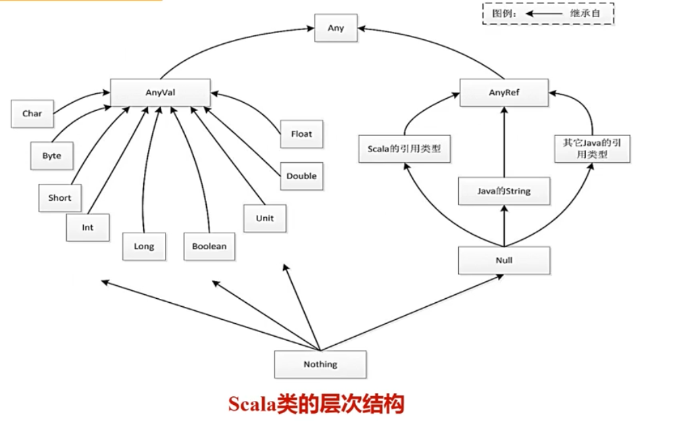
- 左侧：值类型。可以放到寄存器中
- 右侧：引用类型。对象存放在堆中
- Null:null是所有引用类型的子类，他只是一个实例对象null，主要用来和其他的JVM语言进行相互操作(比如和java的兼容性)
  - 尽量避免使用Null
  - 而使用Option
    - Some:有get方法可以取值
    - None:使用get的话会抛出异常，可以使用getOrElse
      > 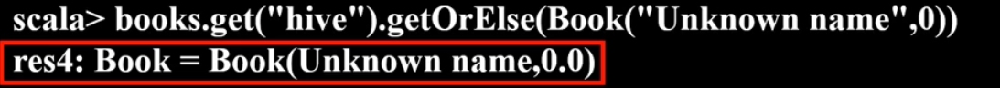 
- Nothng: nothing是所有类型的子类，也是null的子类,他没有具体的实例对象，常见的应用：抛出异常、程序exit、无线循环等。

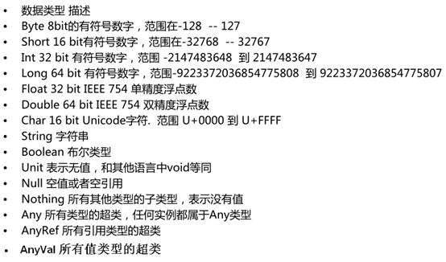

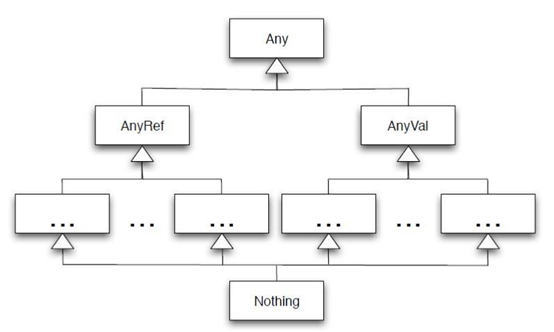

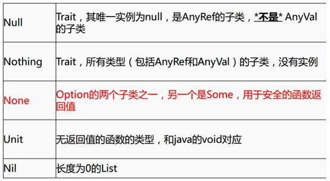

- var和val
  - Scala中定义变量使用var，定义常量使用val 
  - 变量可变，常量不可变
  - 变量和常量类型可以省略不写，会自动推断。

- 字面量
  - 普通类型字面量
    > 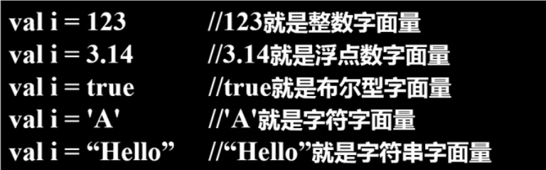 
  - 函数字面量
    >  

- 所有的数据类型都是对象
  - 比如Int就是一个对象
  - 可以`3.+(1)` 3是一个Int对象，调用+函数
    > 3+1是上方语句的简化
- 富包装类
  - 每一个基本类都有一个富包装类
  - 很多方法都是定义在富包装类中。
  - 当调用时，会发生隐式转换（下面会讲）
    > 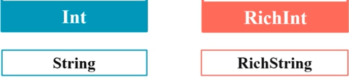 

# 3. 包

- `import scala._` 下划线相当于java中的*
- 通过package关键字和{}定义包


# 4. 输入输出流

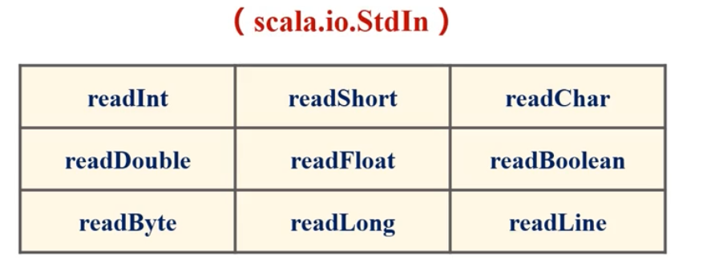

- 字符串格式化
  - c语言风格：printf
    - 位于Predef对象中
    - 在scala启动时会自动导入
    - 不需要手动导入
  - s插值
    >  
  - f插值。和s基本相同，但是可以更加详细得格式化
    >  

- 导入：`import io.StdIn._`
  - ：下划线相当于*
- 写文件
  > 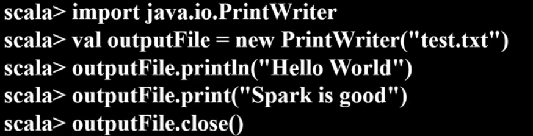 
- 读文件
  > 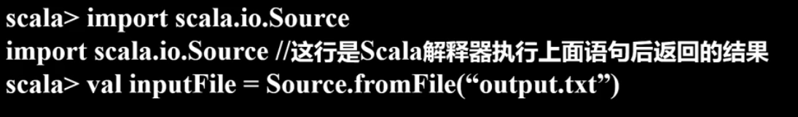 
  > 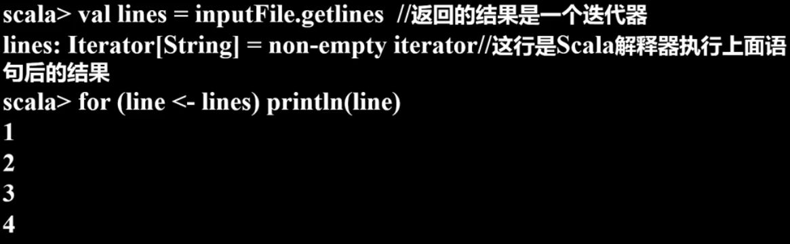 

# 5. 控制结构


- scala中if表达式可以有值
  > 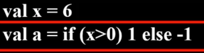 
- to和util
  - 1 to 10 返回1到10的Range数组，包含10
  - 1 until 10 返回1到10 Range数组 ，不包含10
  - 1 to (10,2) 指定步长
    > 或 `1 to 10 by 2`
- for
  - 多层for
    - 分号可以进行for的嵌套和添加筛选条件
    - 空格也能用来分隔筛选条件
  - for 推导式：使用yeild。类比python中的生成器
- 其他
  -	scala中不能使用count++，count—只能使用count = count+1 ，count += 1
- scala中没有continue和break。有`scala.util.control`类用来控制循环结构
  - 构成：
    - breakable:会跳出breakable包裹的范围
    - break:表示跳出
  - 示例：
    - break示例
      > 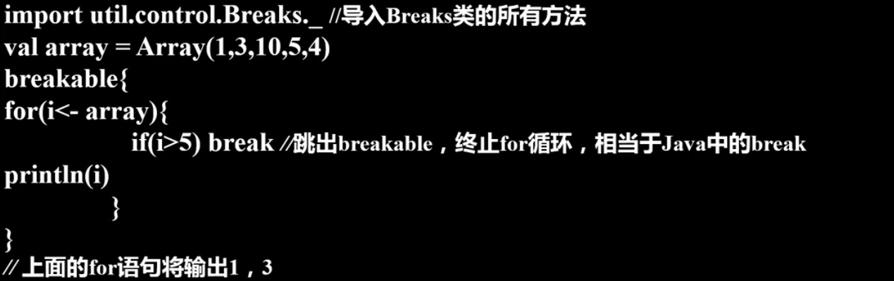 
    - continue 示例
      > 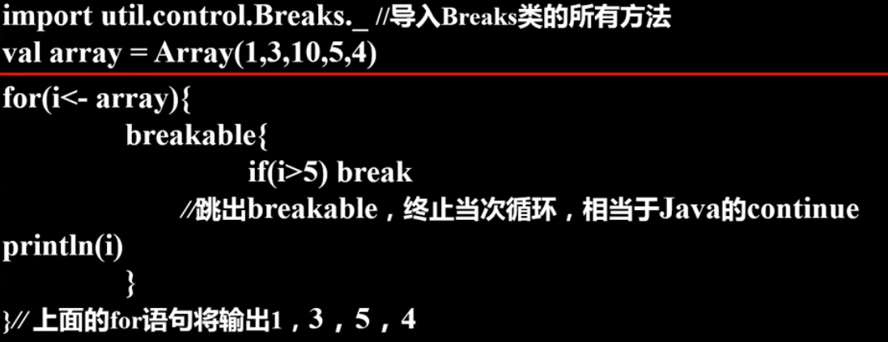 


```scala
object Lesson_ClassAndObj {

  def main(args: Array[String]): Unit = {

    /**
      * while
      * do...while...
      */
    var i = 0
    do{
    // 类似于linux
      println(s" 第 $i 次求婚。。。")
      i += 1
    }while(i<100)

    while(i<100){
      println(s" 第 $i 次求婚。。。")
        i = i+1
      i += 1
    }

    /**
      * for
      */
    val r = 1.to(10,2)
    val r1 = 1 until (10,3)
    println(r)
    println(r1)
    // <-右边是一个数组
    for(i <- 1 to 10){
      println(i)
    }

    //小九九
    for( i<- 1 until  10){
      for(j <- 1 until 10){
        if(i>=j){
          print(i+"*"+j+"="+i*j+"\t")
        }
        if(i==j){
          println()
        }
      }
    }

    // 多层for循环
    for( i<- 1 until  10;j <- 1 until 10){
        if(i>=j){
          print(i+"*"+j+"="+i*j+"\t")
        }
        if(i==j){
          println()
        }
    }

    // for循环中可以加条件判断，可以使用分号隔开，也可以不使用分号，使用空格
    for(i <- 1 to 1000  if(i>500) if(i%2==0)){
      println(i)
    }

    // for循环用yield 关键字返回一个集合
    val result = for(i <- 1 to 100  if(i>50) if(i%2==0)) yield  i  // yield 。回想python的yield。
    println(result)

  /**
    * if...else...
    */
    val age = 20
    if(age<=20){
      println("age <=20")
    }else if(age>20&&age<=30){
      println("20<20<=30")
    }else{
      println("age>30")
    }
}
```

# 6. 异常处理

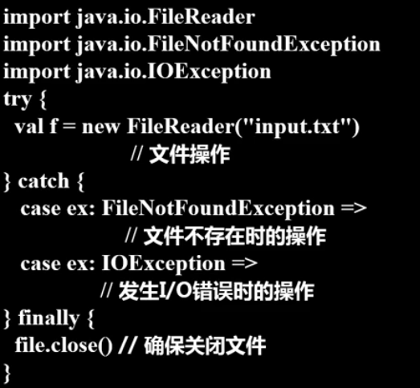


# 7. 字符串

**字符串就是java中的字符串**

```scala
package com.bjsxt.scala

object Lesson_String {
  def main(args: Array[String]): Unit = {
    val s = "jsxbt"
    val s1 = "BJSXT"

    println(s.indexOf(98))
    println(s.equals(s1))
    println(s.equalsIgnoreCase(s1))
  }
}
```

# 8. 集合


## 8.1. Collection

- 容器
  - 说明
    > 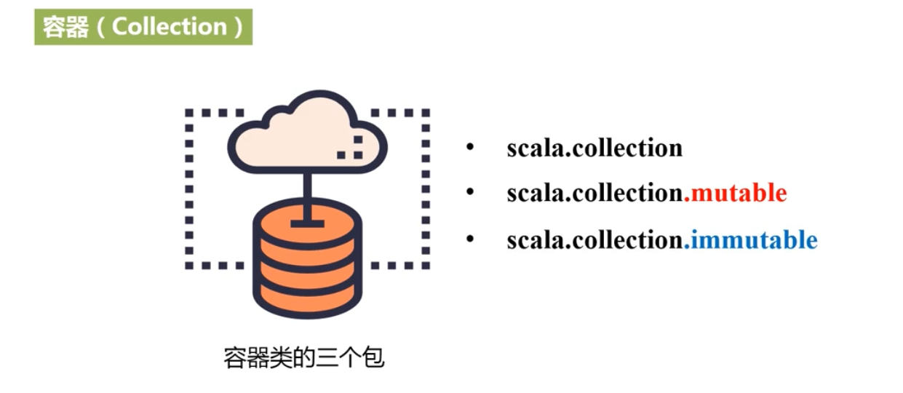
    - scala.collection 封装可变容器和不可变容器的超类和Trait
  - Trait层次关系
    > 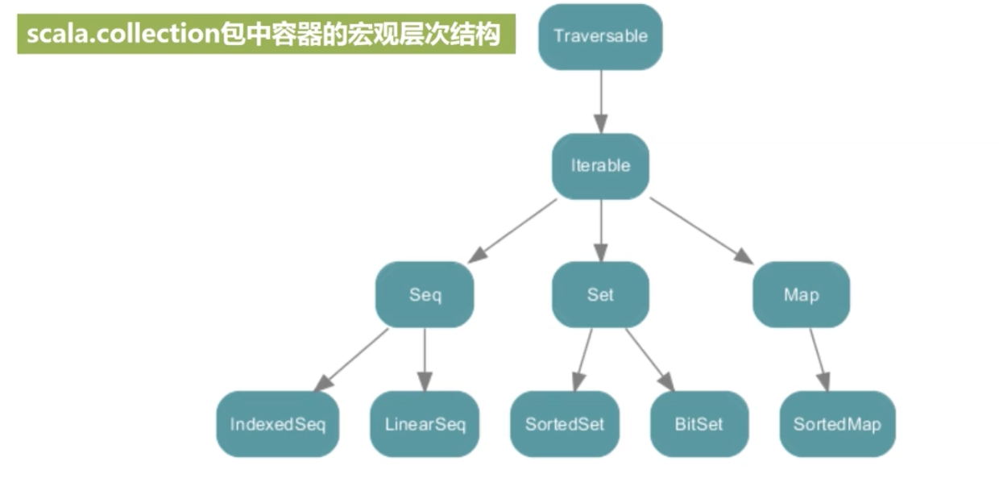 
    - foreach 方法是在Traversable中定义的
    - List是继承的LinearSeq
  - 三种类型区别
    - seq 按照下标索引
    - map 按key索引
    - set 无索引结构

Array,List,Set,Map 都有可变和不可变的定义方式。默认都是不肯变的


## 8.2. Tuple

- 注意点：
  - 可以封装多种类型，经常使用
  - Tuble+数字为一个Tuble类型。
  - 最多有22个元素(python中没有限制)
  - 可以new，也可以不new，也可以直接一个括号
  - 没有foreach,也不能for遍历
  - 只有不可变类型

- 不可变类型
  ```scala
  package com.bjsxt.scala

  /**
    * 元组最多支持22个元素
    * 元组可以new 也可以不new，甚至可以直接写（）中写元素
    */
  object Lesson_Tuple {
    def main(args: Array[String]): Unit = {
      // 这里是手动写出了元组类型

      // 创建元组

      // 通过new 定义tuble
      val tuple1: Tuple1[String] = new Tuple1("hello")
      val tuple2: (String, Int) = new Tuple2("a", 100)
      val tuple3: (Int, Boolean, Char) = new Tuple3(1,true,'C')

      // 直接写元素，不 new
      val tuple4: (Int, Double, String, Boolean) = Tuple4(1,3.4,"abc",false)
      val tuple6: (Int, Int, Int, Int, Int, String) = (1,2,3,4,5,"abc")
      val tuple22 = (1,2,3,4,5,6,7,8,9,10,11,12,13,14,15,16,17,18,19,20,21,22)

      // 单纯一个括号(元素数量要小于22)
      (1,2,3,4,"sdfasdf")

      // 如果有23个，使用idea查看类型，会发现是 unit（也就是空）
     (1,2,3,4,5,6,7,8,9,10,11,12,13,14,15,16,17,18,19,20,21,22,23)

     // 取值
      val value = tuple22._1
      val value = tuple22._2
      val value = tuple22._14

      // 要通过迭代器遍历(不能对元组直接for)
      // for(elem <- tuple6){ // 直接报错。
      //   println(elem)
      // }
      val iter: Iterator[Any] = tuple6.productIterator

      while(iter.hasNext){
          println(iter.next())
      }

      iter.foreach(println)

      // tuple 特殊：有swap方法可以调换元组内两个值的位置
      tuple2.swap()
    }
  }
  ```


## 8.3. Sequence


### 8.3.1. Array

**注意，根据下标引用时使用 () ，而不是[]，原因见apply**
>  

- 创建
  - new
  - 直接创建(apply方法)
- 多维数组创建
  >  

- 不可变数组Array
  ```scala
  object Lesson_Array {
    def main(args: Array[String]): Unit = {

      // [] 中的相当于泛型
      // 创建1：带初始化，创建一维数组(不可变)
      val arr = Array[String]("a","b","c","d")
      
      // 遍历array
      arr.foreach(println)
      for(elem<-arr){
        println(elem)
      }

      // 创建2：指定长度创建一维数组(不可变)
      val arr1 = new Array[Int](3)
      arr1(0) = 100
      arr1(1) = 200
      arr1(2) = 300

      // 创建3 二维数组
      val array = new Array[Array[Int]](3)
      array(0) = Array[Int](1,2,3)
      array(1) = Array[Int](4,5,6)
      array(2) = Array[Int](7,8,9)

      // 遍历二维array
      array.foreach(arr=>{arr.foreach(println)})
      for (arr<-array;elem<-arr){// 双重for循环简化写法。前面有说
          println(elem)
      }

      // 常用方法
      val array: Array[String] = Array.fill(5)("hello")// 长度为5，所有元素都为"hello"
      array.foreach(println)

      val arrays: Array[String] = Array.concat(arr,arr1) // 连接
      arrays.foreach(println)
    }
  }
  ```
- 可变数组ArrayBuffer
  ```scala
  // 可变数组
  import scala.collection.mutable.ArrayBuffer

  val arr =ArrayBuffer[Int](1,2,3)
  arr.append(7,8,9)// 往后追加
  arr.+=(4)// 往后追加
  arr.+=:(100)// 往前追加
  ```


### 8.3.2. List

- 注意
  - 都是同一类型
  - 必须在声明时就进行初始化
- 对不可变类型List,拼接list
  > 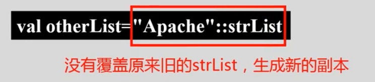 
  - 也可以通过该操作符直接创建List
    >  
  - 注意：是从右向左拼接

- 创建：
  - 直接创建
  > List是抽象类，必须调用set伴生对象的apply方法创建对象

- 不可变类型List
  ```scala
  import scala.collection.mutable.ListBuffer

  object Lesson_List {
    def main(args: Array[String]): Unit = {

      val list = List[String]("hello scala","hello java","hello spark","a","abc")

      // 各种函数式接口

      // map方式
      val result: List[Array[String]] = list.map(s => {
        s.split(" ")
      })

      // 会将多个数组进行扁平化
      val result: List[String] = list.flatMap(s=>{s.split(" ")})

      // count 计算
      val i: Int = list.count(s => {
        s.length < 4
      })

      // 过滤器。只会留下返回true的
      val result: List[String] = list.filter(s => {
        "hello scala".equals(s)
      })

      val list = List[Int](1,2,3)
      for(elem<-list){
        println(elem)
      }
      list.foreach(println)
    }
  }
  ```
- 可变List
  ```scala
  import scala.collection.mutable.ListBuffer
  val list = ListBuffer[Int](1,2,3)
  list.append(4,5,6)
  list.+=(100)
  list.+=:(100)
  list.foreach(println)
  ```
- map和flatMap
  > 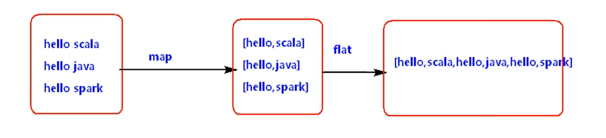 


### 8.3.3. Vector

- 是一种特殊的序列 

- 添加元素
  > 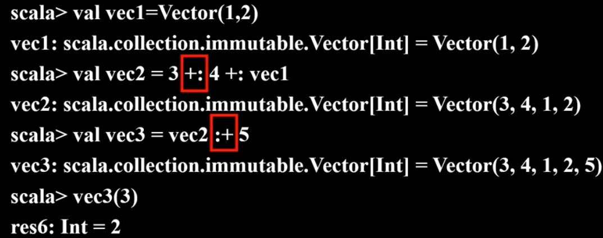 
  - :+和+:不同

### 8.3.4. Range

- 定义：是一种特殊的带索引的不可变数字等差序列
- 种类
  - 整型序列
  - 字符型序列
  - 单精度浮点型序列
- 创建
  > 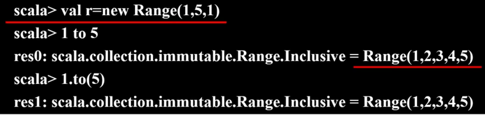 <br />
  > 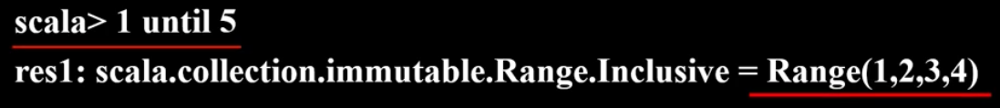 <br />
  > 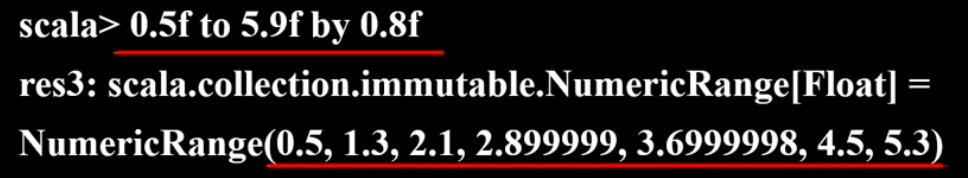
  - new
  - to
  - until


## 8.4. Set

- 注意：
  - 没有顺序
  - 通过hash表索引

- 创建：
  - 直接创建
  > Set是抽象类，必须调用set伴生对象的apply方法创建对象

- 不可变Set
  ```scala
  package com.bjsxt.scala
  object Lesson_Set {
    def main(args: Array[String]): Unit = {
      val set = Set[Int](1,2,3,4)
      val set1 = Set[Int](3,4,5,6)

      // 差集 set1-set
      val result: Set[Int] = set1.diff(set)
      result.foreach(println)
      // 操作符操作，差集
      val result = set &~ set1

      // 合集
      val result: Set[Int] = set.intersect(set1)
      result.foreach(println)
      // 操作符操作。和集
      val result = set & set1
      result.foreach(println)

      // 过滤器
      val ints: Set[Int] = set.filter(elem => {
        elem >= 2
      })
      ints.foreach(println)

    }
  }
  ```
- 即定义可变，又定义不可变
  > 可变和不可变Set类名都是Set
  - 多次import进行覆盖
    ```scala
    import scala.collection.mutable.Set
    val set = Set()
    import scala.collection.immutable.Set
    val set = Set()
    ```
  - 指定包名
    ```scala
    import scala.collection.mutable
    import scala.collection.immutable

    val set = mutable.Set[Int](1,2,3)// 可变
    set.+(100)// 会返回加上元素后的一个新集合
    set.+=(100)// 会在现有的set上操作
    set.foreach(println)
    val set1 = immutable.Set[String]("a","b")// 不可变
    ```
- 不可变Set的扩充：
  > 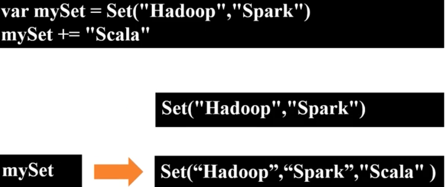 
  - 是生成新的副本，而不是在原来副本上修改
- 可变Set的扩充：
  > 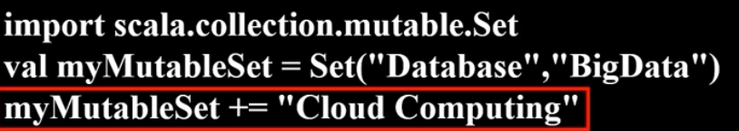 
  - 会在对象上进行修改。而不是生成新的副本


## 8.5. Map

- 创建：
  - 直接创建

- 取值：
  - 通过`()`传入key索引获取值，如果key不存在就会报错。
  - get得到Option。不会报错。

- 不可变 (默认)
  ```scala
  package com.bjsxt.scala
  object Lesson_Map {
    def main(args: Array[String]): Unit = {
      import scala.collection.mutable.Map

      // kv有两种写法，->或者括号
      val map = Map[String,Int]("a"->100,"b"->200,("c",300),("c",400))
      map.foreach(println) // 获取每个k-v，其实也就是元组类型 

      // java中在1.8后也有了Option类
      val value = map.get("a") // 返回Option类型的子类，Some(100)
      val value = map.get("aa") // 返回Option类型的子类，None
      val value = map.get("aa").getOrElse("no value")// 如果是Some，就返回值。如果是None，就返回"no value"
      println(value)

      // 获取map的key
      val keys: Iterable[String] = map.keys
      // 打印key-value
      keys.foreach(key=>{
        val value = map.get(key).get
        println(s"key = $key ,value = $value")
      })
      // 或者使用模式匹配完成k-v的提取
      map foreach { x=>x match {case (k,v)=>println(s"$k:$v")} } // 中缀表示法
      map foreach { case (k,v)=>println(s"$k:$v") }

      // 获取map的value
      val values: Iterable[Int] = map.values
      values.foreach(println)

      // map的合并，返回新的map
      val map1 = Map[String,Int](("a",1),("b",2),("c",3),("d",4))
      val map2 = Map[String,Int](("a",100),("b",2),("c",300),("e",500))
      val result: Map[String, Int] = map1.++:(map2)// map的合并。map1会覆盖map2
      result.foreach(println)
    }
  }
  ```
- 想要既定义可变map又定义不可变map
  - 多次import进行覆盖
  - 指定包名
  ```scala
  // 导入Map
  import scala.colletion.mutable.Map
  val map = Map[String,Int]()
  map.put("a",100)
  map.put("b",200)
  map.foreach(println)
  val result: mutable.Map[String, Int] = map.filter(tp => {
    val key = tp._1
    val value = tp._2
    value == 200
  })
  result.foreach(println)
  ```
- 可变map的更新：
  > 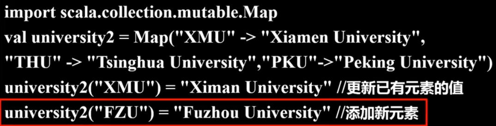
- map添加元素
  >  

## 8.6. Iterator


# 9. 类和对象

## 9.1. 基础

- Object
  - Scala object相当于java中的单例
  - object中定义的全是静态的,相当于java中的工具类
- Object和Class的apply
  > 相当于**工厂设计模式**
  - 说明：
    - 用括号传递给类实例或者单例对象名一个或多个参数时
      > 当对一个类通过()传参时，如果类中有apply，就调用类中的，如果没有，就去其伴生对象中查找
    - Scala会在相应的类或对象中查找名为apply的方法
    - 当参数一致时，就会调用该方法
    - 比如 Array 的创建
  - 目的：
    - 对象(括号调用)和函数(点调用)使用的一致性
    - 函数看作对象：函数名.apply(arg) 也可以通过
    - 对象看作函数：类名(arg) 调用apply方法
- Object和Class的update
  - 说明：
    - 当对带有括号并包括一到若干参数的对象进行赋值时
    - 编译器将调用对象的update方法
    - 并将括号里的参数和等号右边的值一起作为update方法的输入参数来执行调用
  - 例
    - Array有伴生对象，可以自动调用伴生对象中的update。注意，是**小括号**，不是中括号。中括号相当于泛型
    > 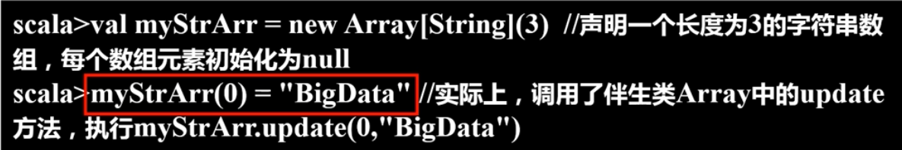 
- Object和Class的unapply
  - 作用：将对象中的属性解构出来，返回Option类型
  > 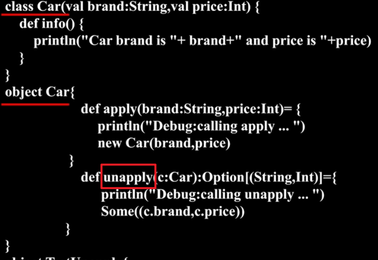 <br />
  > 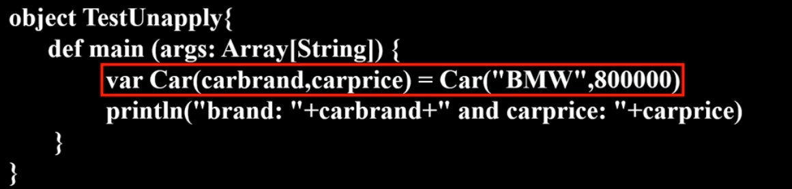 <br />
  > 右侧调用apply返回Car实例。左侧调用unapply返回属性 <br />
  > **记住左侧的调用形式**
- Scala中每行后面都会有分号自动推断机制，不用显式写出“;”
- 命名：
  - 建议在Scala中命名使用驼峰命名法
- 主构造器，Scala类中可以传参
  > `Class Person(name:String,age:int)`
  - 传参一定要指定类型，有了参数就有了默认构造构造函数
  - 也可以为空
  - 当为主构造函数的的参数添加var,或者val声明,则该参数被升级为类的成员变量。
- 辅构造函数
  - 辅助构造器名称都为this
  - 构造中第一行必须先调用默认的构造 
  - 第二个辅助构造器必须要调用前一个辅助构造器
    > `def this(....){....}`
- 执行注意：
  - Scala与js和python一样都是脚本语言
  - Scala中当new class 时，类中除了方法不执行【除了构造方法】，其他都执行。
- private 修饰的属性，可以通过value和value_=(value_=就是一个方法名称，不是赋值)方式进行get和set
  > 实际上，默认类型的属性会自动生成这两个方法（相当于getter和setter）。而private类型的不会。
  ```scala
  class Counter {
      private var privateValue = 0  //变成私有字段，并且修改字段名称
      def value = privateValue //vlue方法，返回privateValue(把大括号和参数列表都省略了)
      def value_=(newValue: Int){// value_=就是方法名称，后面括号就是参数列表
          if (newValue > 0) privateValue = newValue //只有提供的新值是正数，才允许修改
      }
      def increment(step: Int): Unit = { value += step}
      def current(): Int = {value}
  }
  val myCounter = new Counter // 没有构造器可以不加()
  myCounter.value // 调用value方法，而不是value属性
  myCounter.value_=(3) // 赋值
  myCounter.value=3 // 赋值的简化

  myCounter increment 3 // 中缀表示法
  ```
- **伴生类与伴生对象**：
  - 在同一个scala文件中，class名称和Object名称一样时
  - 这个类叫做个对象的伴生类，这个对象叫做这个类的伴生对象
  - 他们之间可以互相访问私有变量。
  - 并且当在类中找不到指定方法时，会去伴生对象中查找
-	小知识点：
  -	如果类的传参用 val或者var进行声明，就会自动给类创建指定的属相
  > 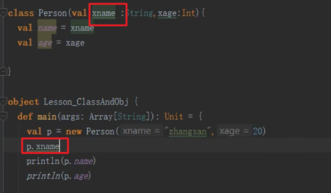 

```scala
class Person(xname :String,xage:Int){
  private val name = xname
  var age = xage
  var gender = 'M'

  // * 7.Scala中当new class 时，类中除了方法不执行【除了构造方法】，其他都执行。
  println("******* Person Class *********")

  // 注意，没有等号
  def this(yname:String,yage:Int,ygender:Char){
    this(yname,yage)
    this.gender = ygender
  }

  def  sayName() = {
  println("hello world..."+Lesson_ClassAndObj.name)
  }
  println("====== Person Class =======")
}

object Person{
  println("####### Lesson_ClassAndObj Object #####")
  val name = "wangwu" // 静态变量

  // 如果想给object传参，就会传到apply中。如果没有apply就会报错
  def apply(i:Int) = {
      println("Score is "+i)
  }
  // apply 的重载
  def apply(i:Int,s:String) = {
      println("name is "+s+",score is "+i)
  }

  def main(args: Array[String]): Unit = {

    val p = new Person("zhangsan",20)
    println(p.name)

    println(p.gender)
    val p1=new Person("diaochan",18,'F')
    println(p1.gender)
    p.age = 200
    println(p.name)
    println(p.age)
    p.sayName()

    val a = 100
    var b = 200
    b = 300
    println(b)
  }
}
```

## 9.2. 继承

- 抽象类：
  - 如果一个类中包含没有被实现的成员(包括成员方法和成员变量)，就是抽象类
  - 类被abstract修饰，但是抽象方法不用abstract修饰
  - 只要没给初值(但是类型必须给出)，就是抽象字段
  - 抽象类中也可以定义被实现的方法
  > 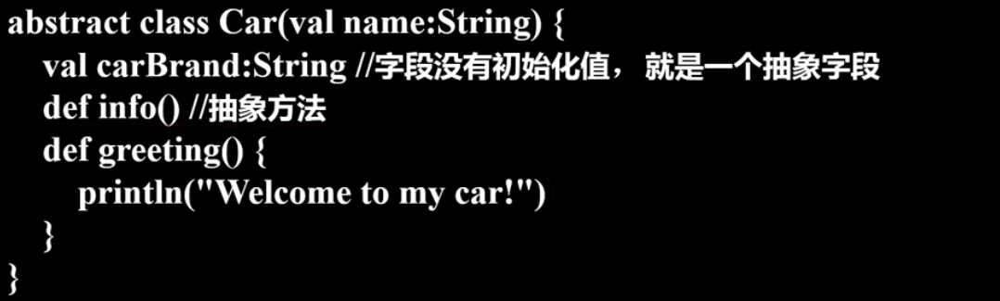 
- 继承
  - 使用extends关键字
  - 在重写方法时
    - 如果重写的是父类中的抽象方法，那么override 关键字可写可不写
    - 如果重写的是父类中的已经实现的方法，那么override 关键字必须要写
  - 重载字段：
    - 只能重载val类型字段，而不能重载var类型（因为var类型本身就可变）
  - 示例：
    > 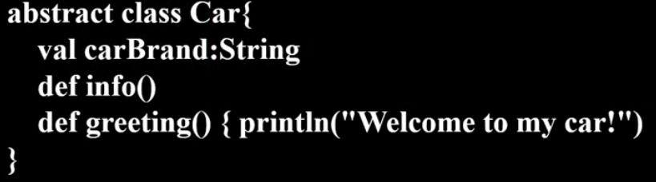 
    > 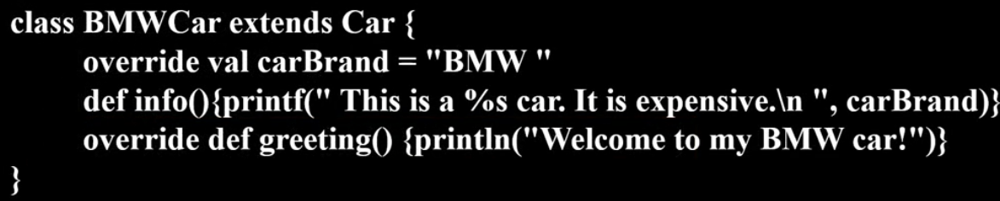 

- 构造器问题：


# 10. 函数与函数式编程

- 种类：
  - 普通方法(scala中方法和函数基本相等)
  - 递归函数
  - 带有默认值的函数
  - 可变长参数函数
  - 匿名函数
  - 嵌套函数
  - 偏应用函数
  - 高阶函数
  - 柯里化（js中也有）
- 注意
  - def 定义方法
  - 方法中，如果一个参数只出现一次，那么可以用`_`表示，第二个`_`表示第二个参数。
    > 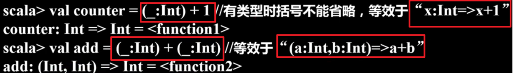 <br />
    > 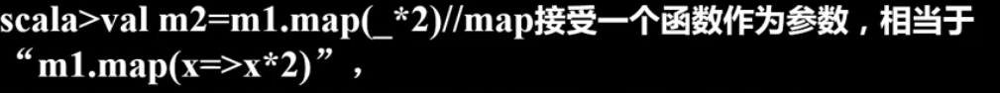 
  - 方法体中最后返回值可以使用return,如果使用了return,那么方法体的返回值类型一定要指定
  - 如果方法体中没有return，默认将方法体中最后一行计算的结果当做返回值返回。方法体的返回值类型可以省略，会自动推断返回值的类型
  - 定义方法传入的参数一定要指定类型
  - 方法的方法体如果可以一行搞定，那么方法体的“{...}”可以省略
  - 如果定义方法时，省略了方法名称和方法体之间的 = ，那么无论方法体最后一行计算的结果是什么，都会被丢弃，返回Unit
  - 如果一个方法的定义没有接收参数，所以也没有`()`，那么在调用时也不能加()
  - **中缀符表示法** ：一个方法如果只有一个参数，可以省略圆点而使用中缀操作符调用方法

```scala
import java.util.Date

object Lesson_Function {
  def main(args: Array[String]): Unit = {
    /**
    方法体中最后返回值可以使用return,如果使用了return,那么方法体的返回值类型一定要指定
    返回类型不需要指定，会自动进行推断
      */
    def max(a:Int,b:Int)={
      if(a>b){
        a
      }else{
        b
      }
    }

    // 方法的方法体如果可以一行搞定，那么方法体的“{...}”可以省略
    def max(a:Int,b:Int) =  if(a>b)  a else b

    println(max(100,20))

    /**
    * 2.递归方法
    *   递归方法要显式的声明函数的返回值类型，因为无法推断每次递归的结果类型。
    */
    def fun(num:Int):Int= {
      if(num==1){
        1
      }else{
        num*fun(num-1)
      }
    }
    println(fun(5))

    /**
    * 3.参数有默认值的方法
    */
    def fun(a:Int=10,b:Int=20) = {
      a+b
    }

    println(fun(30))
    println(fun(b=200))

    /***
    * 4.可变长参数的方法
    */
    // s是数组
    def fun(s:String*) = {
        for(elem<-s){
          println(elem)
        }
    }

    def fun(s:String*) = {
      s.foreach(elem=>{ // 匿名函数，函数式编程
        println(elem)
      })
    }

    def fun(s:String*) = {
      s.foreach(println(_))// 只调用一次的参数，可以简化为 _ 表示
    }

    def fun(s:String*) = {
      s.foreach(println)// 当只有一个参数，且只调用一次时，可以直接传入方法名称
    }
    fun("hello","a","b","c")

    /**
    * 5.匿名函数
    *  ()=>{} 就是匿名函数，多用于方法的参数是函数时，常用匿名函数
    */
    def fun1(a:Int,b:Int) = {
      a+b
    }
    // 回想js中多种函数的定义方式
    def fun = (a:Int,b:Int)=>{ // 把匿名函数赋值给一个变量
        a+b
    }

    // 也可以自己把类型写出来，不让系统推断
    def fun :(Int,Int)=>Int = (a:Int,b:Int)=>{ // 把匿名函数赋值给一个变量
        a+b
    }

    println(fun(100,200))

    // 系统推断为Unit。就是void
    var fun1: String => Unit = (s: String) => {
      println(s)
    }
    fun1("hello")

    /**
    * 6.嵌套方法
    *   方法中定义方法
    */
    def fun(num:Int) = {

      def fun1(a:Int):Int = {
        if(a==1){
          1
        }else{
          a*fun1(a-1)
        }
      }

      fun1(num)
    }

    println(fun(5))

    /**
    * 7.偏应用函数
    *   某些情况下，方法中参数非常多，调用这个方法非常频繁，每次调用只有固定的某个参数变化，其他都不变，可以定义偏应用来实现
    *
    *   js中的闭包？？
    */
    def showLog(date:Date,log:String) ={
      println(s"date is $date   ,  log is $log")
    }
    val date = new Date()
    showLog(date,"a")
    showLog(date,"b")
    showLog(date,"c")

    def fun = showLog(date,_:String)
    fun("aaa")
    fun("bbb")
    fun("ccc")

    /**
    *  8.高阶函数
    *    1).方法的参数是函数
    *    2).方法的返回是函数  <要显式的写出方法的返回值类型,加 _ 就可以不显示的声明方法的返回值类型>
    *    3).方法的参数和返回都是函数
    */
    // 1)方法的参数是函数
    def fun(a:Int,b:Int):Int = {
      a+b
    }

    // _ 可以把方法转换为显示定义的方法引用
    val fun_back: (Int, Int) => Int = fun _

    // 通过 f:(parmtype,..)=>resulttype 来表示参数是一个函数。f为函数名称，也可以改
    def fun1(f:(Int,Int)=>Int,s:String):String = {
      val i: Int = f(100,200)
      i+"#"+s
    }

    val result = fun1(fun,"scala")
    println(result)

    // 使用匿名函数传参
    val result = fun1((a:Int,b:Int)=>{a*b},"scala")
    println(result)


    // 2)方法的返回是函数
    // 一般情况下必须显示写出返回函数的类型。或者使用 _
    def fun(s:String):(String,String)=>String = {
      def fun1(s1:String,s2:String): String= {
          s1+"~"+s2+"#"+s
      }
      fun1
    }
    println(fun("a")("b","c"))

    // 此处没有显示写出返回值类型。主要是 _ 的作用
    def fun(s:String):(String,String)=>String = {
      def fun1(s1:String,s2:String): String= {
          s1+"~"+s2+"#"+s
      }
      fun1 _ // 表示强制将方法返回。
    }
    println(fun("a")("b","c"))


    // 3)方法的参数和返回都是函数
    def fun(ddd:(Int,Int)=>Int):(String,String)=>String = {
      val i: Int = ddd(1,2)
      def fun1(s1:String,s2:String):String = {
        s1+"@"+s2+"*"+i
      }
      fun1
    }
    println(fun((a,b)=>{a+b})("hello","world"))

    /**
    * 9.柯里化函数
    * 就是高阶函数第二种的简化写法
    * 后面隐式转换用得到
    */
    def fun(a:Int,b:Int)(c:Int,d:Int)={
      a+b+c+d
    }
    // 相当于
    def fun(a:Int,b:Int):(Int,Int)=>Int:={
      def fun1(c:Int,d:Int):Int{
        return a+b+c+d
      }
      fun1 _
    }

    println(fun(1,2)(3,4)) // 和高阶函数第二种调用方式相同
  }
}
```

- 针对容器的操作
  > 类似java的流式操作。 上面每个集合的示例代码中也有写了
  - 遍历：foreach
    - 注意：map的k-v可以使用 case提取（示例看上面）
  - 映射：
    - map
    - flatmap
  - 过滤
    - filter
  - 归约
    - reduce 不可以提供初始值
      - 示例：
        > 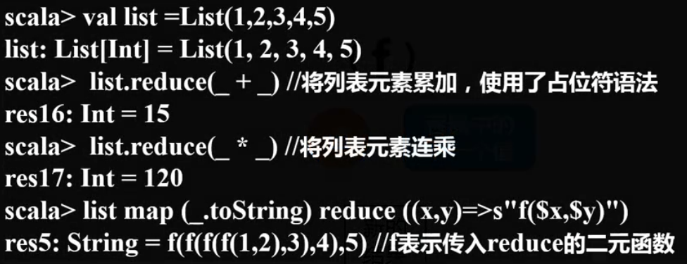 <br />
      - 归约方向
        >  
        - 从左到右
        - 从右到左
    - fold 可以提供初始值
      - 归约方向
        > 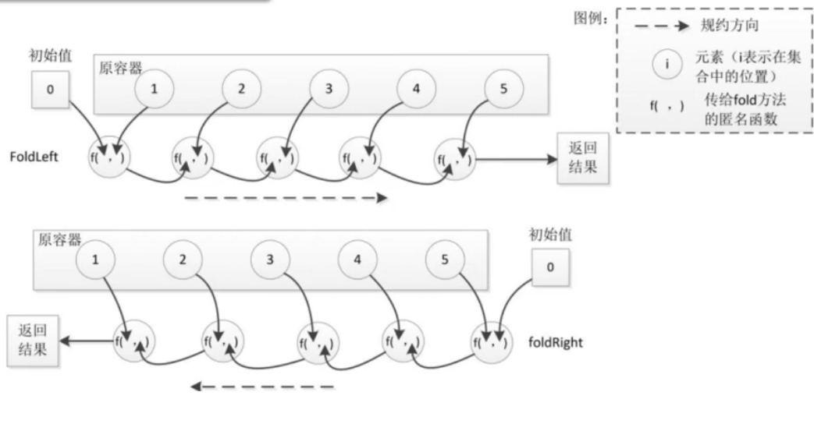 
        - 从左到右
        - 从右到左

# 11. Trait

- 只能继承一个超类，但能混入(mixin)多个Trait
- 说明：Trait 类似与java中接口和抽象类的整合
- trait 不可以传参
- 类的继承：
  - 一个类继承多个trait时，第一个关键字使用 extends，之后使用with
- Trait中既可以定义变量，也可以定义常量
  > java接口中变量默认 public static final
- Trait中既可以实现方法体，也可以不实现方法体。
  - Trait 中 实现了方法体
    > 在类中就可以直接用
    ```scala
    /**
      * 一个类继承多个trait时，第一个关键字使用 extends，之后使用with
      * trait 不可以传参
      */

    trait Read {
      def read(name:String) = {
        println(s"$name is reading...")
      }
    }
    trait Listen {
      def listen(name:String) ={
        println(s"$name is listening...")
      }
    }

    class Human() extends Read with Listen{

    }

    object Lesson_Trait1 {
      def main(args: Array[String]): Unit = {
        val h = new Human()
        h.read("zhangsan")
        h.listen("lisi")
      }
    }
    ```
  - Trait中不实现方法
    > 需要在类中通过`override`实现Trait中的方法
    ```scala
    /**
      * Trait中可以有方法体的实现或者方法体的不实现，类继承了Trait要实现Trait中没有实现的方法
      */
    trait IsEquale{
      def isEqu(o:Any):Boolean // 在Trail中不实现方法
      def isNotEqu(o:Any) :Boolean =  !isEqu(o) // 在Trail中实现方法
    }

    class Point(xx:Int,xy:Int) extends IsEquale {
      val x = xx
      val y = xy

      override def isEqu(o: Any): Boolean = {
        // 在继承Trait的类中实现Trait的方法
        o.isInstanceOf[Point]&&o.asInstanceOf[Point].x==this.x

        // isInstanceOf:判断类型
        // asInstanceOf:类型转换
      }
    }
    object Lesson_Trait2 {
      def main(args: Array[String]): Unit = {
        val p1 = new Point(1,2)
        val p2 = new Point(1,3)
        println(p1.isNotEqu(p2))
      }
    }
    ```

# 12. Match 模式匹配

- 匹配：
  >  
  - 匹配值
  - 匹配类型
  - **匹配对象**

- 注意：
  - case _ 什么都匹配不上匹配，放在最后
  - match 可以匹配值还可以匹配类型
  - 匹配过程中会有数值的转换。比如1.0(double)转换为1(int)
  - 从上往下匹配，匹配上之后会自动终止
  - 模式匹配外部的`{..}`可以省略

```scala
package com.bjsxt.scala

/**
  * Match 模式匹配
  * 1.case _ 什么都匹配不上匹配，放在最后
  * 2.match 可以匹配值还可以匹配类型
  * 3.匹配过程中会有数值的转换。比如1.0(double)转换为1(int)
  * 4.从上往下匹配，匹配上之后会自动终止
  * 5.模式匹配外部的“{..}”可以省略
  *
  */
object Lesson_Match {

  def main(args: Array[String]): Unit = {
    val tp = (1,1.2,"abc",'a',true)
    val iter: Iterator[Any] = tp.productIterator
    iter.foreach(MatchTest)
  }

  def MatchTest(o:Any) =
    o match {
      case 1=>println("value is 1") // 值匹配
      case 'a'=>println("value is c") // 值匹配
      case d:Double=>println(s"type is Double ,value = $d") // 类型匹配
      case s:String=>println(s"type is String ,value = $s") // 类型匹配
      case _=>{println("no match...")} // 一定要放在最后。相当于java中的default 
    }
}
```


- 添加guard（也就是判断条件）
  > 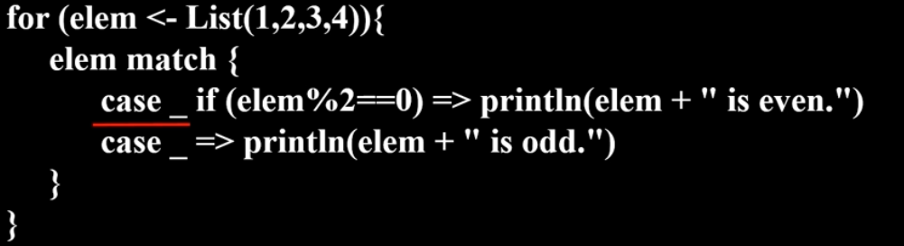 

# 13. 偏函数

- 说明：
  - 如果一个函数中没有match只有case，这个函数可以定义成PartialFunction(偏函数)
  - 偏函数定义时，**不能使用括号传参**，
  - 默认定义PartialFunction中传入一个值(相当于上面代码中的o)
  - 匹配上对应case的话，就返回。
  - 传入的类型和传出的类型一开始就要定义好

**好好看定义方式**

```scala
/**
  * 偏函数，只能匹配一个值，匹配上了返回某个值
  * PartialFunction[A,B]  A是匹配的类型，B是匹配上返回的类型
  */
object Lesson_PartialFun {
  // 偏函数MyTest
  // PartialFunction为关键字，表示该方法返回偏函数
  // MyTest后没有括号
  def MyTest :PartialFunction[String,Int] ={
    case "abc"=>2
    case "a" => 1
    case _ => 200
  }
  def main(args: Array[String]): Unit = {
    val result: Int = MyTest("abcd")
    println(result)
  }
}
```

# 14. 样例类

- 说明：
  - 使用了case关键字的类定义就是样例类(case classes)，
  - 样例类是种特殊的类。实现了类**构造参数**的getter方法（构造参数默认被声明为val）
  - 当构造参数是声明为var类型的，它将帮你实现setter和getter方法(也就是上面提到的,生成两个方法 `字段名()`,`字段名_=()`)。
  - 样例类默认帮你实现了toString,equals，copy和hashCode等方法。
  - 也会自动生成一个伴生对象
    - 伴生对象中自动实现了apply,unapply
    - 也就是可以new, 也可以不用new

```scala
case class Person1(var name:String,age:Int){}
// 如果没有其他逻辑，可以直接把括号去了
case class Person1(var name:String,age:Int)

object Lesson_CaseClass {
  def main(args: Array[String]): Unit = {
    val p1 = Person1("zhangsan",18) // 不new
    val p2 = new Person1("zhangsan",18) // new
    println(p1.equals(p2))
    // equals 默认比较地址。样例类中重写了equals，对两个属性分别进行比较
    println(p1)// 调用重写的toString
  }
}
```

# 15. 隐形转换


## 15.1. 说明

> 类似于设计模式中的装饰器模式

- 说明：
  - 隐式转换是在Scala编译器进行类型匹配时
  - 如果找不到合适的类型，
  - 那么隐式转换会让编译器在作用范围内自动推导出来合适的类型。
  - Spark中就有用到，**非常重要**。spark Sql中体现较多


## 15.2. 隐式值和隐式参数

- 作用：
  - 当调用方法时，不必手动传入方法中的隐式参数，Scala会自动在作用域范围内寻找隐式值自动传入。

- 隐式值:
  - 是指在定义参数时前面加上implicit。
  - 同类型的参数的隐式值只能在作用域内出现**一次**，同一个作用域内不能定义多个类型一样的隐式值。
- 隐式参数:
  - 是指在定义方法时，方法中的部分参数是由implicit修饰
    > implicit 关键字必须放在隐式参数定义的开头<br />
    > implicit后的所有参数都会被认为隐式参数
  - 调用
    - 一个方法只有一个参数是隐式转换参数时，那么可以直接定义implicit关键字修饰的参数，调用时直接创建类型不传入参数即可。
      ```scala
      def Teacher(implicit name:String) ={
        println(s"teacher name is = $name")
      }

      def main(args: Array[String]): Unit = {
        implicit val zs = "zhangsan"
        Teacher
      }
      ```
    - 一个方法如果有多个参数，要实现部分参数的隐式转换,必须使用**柯里化**这种方式,隐式关键字出现在后面，只能出现一次
      ```scala
      // name和i都会从隐式值中查找
      def StudentSay(age:Int)(implicit name:String,i:Int)= {
        println( s"student :$name ,age = $age ,score = $i")
      }

      def main(args: Array[String]): Unit = {
        implicit val zs = "zhangsan"
        implicit val sr = 100
        StudentSay(18)
      }
      ```

## 15.3. 隐式转换函数(了解)


- 隐式转换函数:
  - 说明：
    - 是使用关键字implicit修饰的方法
    - 隐式转换函数注意：
      - 隐式转换函数只与函数的参数类型和返回类型有关，与函数名称无关，
      - 所以作用域内不能有相同的参数类型和返回类型的不同名称隐式转换函数。
        > 相当于不同隐式值不能类型相同
  - 流程：
    - 当Scala运行时，假设如果A类型变量调用了method()这个方法
    - 发现A类型的变量没有method()方法，而B类型有此method()方法
    - 会在作用域中寻找有没有隐式转换函数将A类型转换成B类型
      - 如果有隐式转换函数，那么A类型就可以调用method()这个方法。


- 示例
  ```scala
  class Animal(name:String){
    def canFly(): Unit ={
      println(s"$name can fly...")
    }
  }

  class Rabbit(xname:String){
      val name = xname
  }

  object Lesson_ImplicitFunction {

    // 2.找到隐式函数 从Rabbit转到Animal。且Animal中有canFly'方法
    // 3. 调用该方法，然后调用返回的Animal对象的canFly方法
    implicit def rabbitToAnimal(rabbit:Rabbit):Animal = {
        new Animal(rabbit.name)
    }

    def main(args: Array[String]): Unit = {
      val rabbit = new Rabbit("RABBIT")
      // 1. 调用rabbit的calFlay方法。
      // 发现没有
      rabbit.canFly()
    }
  }
  ```

## 15.4. 隐式类(了解)

- 隐式类
  - 说明：
    - 使用implicit关键字修饰的类就是隐式类。
    - 隐式类必须定义在**类，包对象，伴生对象**中。
    - 隐式类的构造必须**只有一个参数**，
    - 同一个类，包对象，伴生对象中**不能出现同类型构造**的隐式类。
  - 流程:
    - 若一个变量A没有某些方法或者某些变量，但要进行调用时，
    - 而以这个变量A为参创建的变量B可以调用那些方法或者某些变量,
    - 那么会通过隐形类机制进行调用

- 示例：
  ```scala
  class Rabbit(s:String){
    val name = s
  }

  object Lesson_ImplicitClass {

    // 在对象中定义隐式类
    implicit class Animal(rabbit:Rabbit){
      val tp = "Animal"
      def canFly() ={
        println(rabbit.name +" can fly...")
      }
    }

    def main(args: Array[String]): Unit = {
      val rabbit = new Rabbit("rabbit")
      // 1. rabbit 没有 canFly 方法
      // 2. 发现传入rabbit，可以创建一个Animal对象，而Animal对象中有canFly
      // 3. 那么就创建和调用
      rabbit.canFly()
      println(rabbit.tp)
    }
  }
  ```

# 16. Actor Model

- 概念理解
  ```
  Actor Model是用来编写并行计算或分布式系统的高层次抽象（类似java中的Thread）让程序员不必为多线程模式下共享锁而烦恼,被用在Erlang 语言上, 高可用性99.9999999 % 一年只有31ms 宕机Actors将状态和行为封装在一个轻量的进程/线程中，但是不和其他Actors分享状态，每个Actors有自己的世界观，当需要和其他Actors交互时，通过发送事件和消息，发送是异步的，非堵塞的(fire-andforget)，发送消息后不必等另外Actors回复，也不必暂停，每个Actors有自己的消息队列，进来的消息按先来后到排列，这就有很好的并发策略和可伸缩性，可以建立性能很好的事件驱动系统。
  ```
- Actor的特征：
  - ActorModel是消息传递模型,基本特征就是消息传递
  - 消息发送是异步的，非阻塞的
  - 消息一旦发送成功，不能修改
  - Actor之间传递时，自己决定决定去检查消息，而不是一直等待，是异步非阻塞的
- 什么是Akka
  ```
  Akka 是一个用 Scala 编写的库，用于简化编写容错的、高可伸缩性的 Java 和Scala 的 Actor 模型应用，底层实现就是Actor,Akka是一个开发库和运行环境，可以用于构建高并发、分布式、可容错、事件驱动的基于JVM的应用。使构建高并发的分布式应用更加容易。
  spark1.6版本之前，spark分布式节点之间的消息传递使用的就是Akka，底层也就是actor实现的。1.6之后使用的netty传输。
  ```
- 例：Actor简单例子发送接收消息
  ```scala
  import scala.actors.Actor

  class myActor extends Actor{
    
    def act(){
      while(true){
        receive {
          case x:String => println("get String ="+ x)
          case x:Int => println("get Int")
          case _ => println("get default")
        }
      }
    }
  }

  object Lesson_Actor {
    def main(args: Array[String]): Unit = {
      
      //创建actor的消息接收和传递
      val actor =new myActor()
      //启动
      actor.start()
      //发送消息写法
      actor ! "i love you !"

    }
  }
  ```

- 例：Actor与Actor之间通信
  ```scala
  case class Message(actor:Actor,msg:Any)

  class Actor1 extends Actor{
    def act(){
      while(true){
        receive{
          case  msg :Message => {
            println("i sava msg! = "+ msg.msg)
            
            msg.actor!"i love you too !"
            }
          case msg :String => println(msg)
          case  _ => println("default msg!")
        }
      }
    }
  }

  class Actor2(actor :Actor) extends Actor{
    actor ! Message(this,"i love you !")
    def act(){
      while(true){
        receive{
          case msg :String => {
            if(msg.equals("i love you too !")){
              println(msg)
            actor! "could we have a date !"
            }
          }
          case  _ => println("default msg!")
        }
      }
    }
  }

  object Lesson_Actor2 {
    def main(args: Array[String]): Unit = {
      val actor1 = new Actor1()
      actor1.start()
      val actor2 = new Actor2(actor1)
      actor2.start()
    }
  }
  ```

# 17. wordCount

```scala
import java.io.File
import scala.io.Source
object WordCount {
  def main(args: Array[String]): Unit = {
    val dirfile=new File("/usr/local/scala/mycode/wordcount")
    val files=dirfile.listFiles
    for(file <- files) println(file)
    val listFiles=files.toList
    val wordsMap=scala.collection.mutable.Map[String,Int]()
    listFiles.foreach( file =>Source.fromFile(file).getLines().foreach(line=>line.split(" ").
                  foreach(
                      word=>{
                        if (wordsMap.contains(word)) {
                          wordsMap(word)+=1
                        }else {
                          wordsMap+=(word->1)
                        }
                      }
                  )
            )
    )
    println(wordsMap)
    for((key,value)<-wordsMap) println(key+": "+value)
  }
}
```

