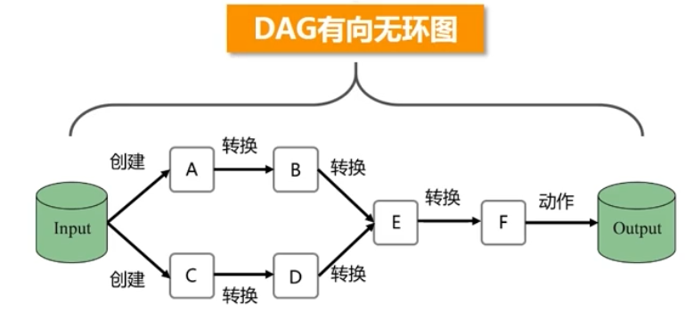
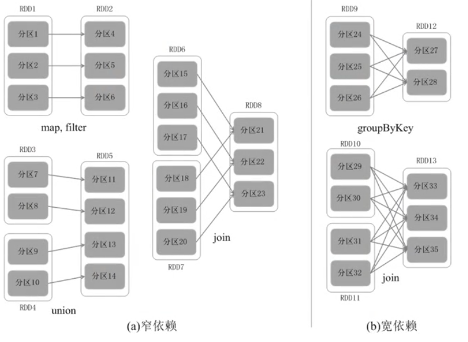
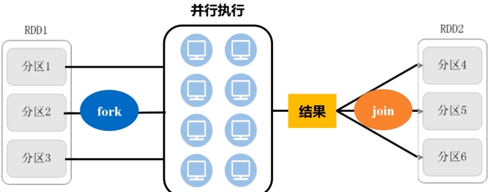
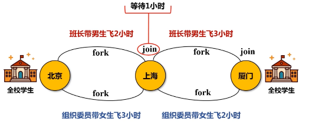
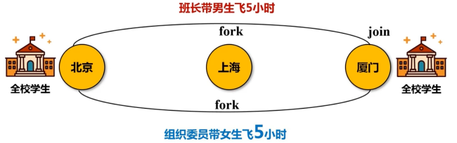
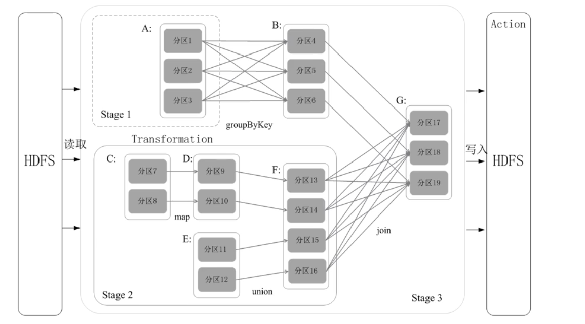
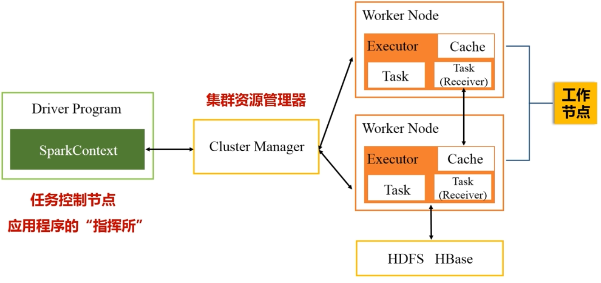
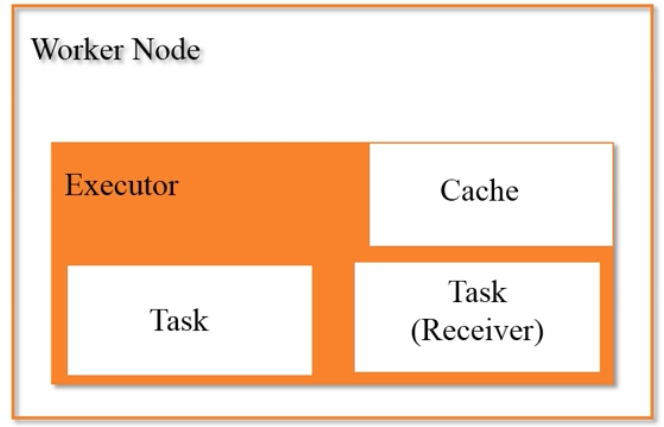
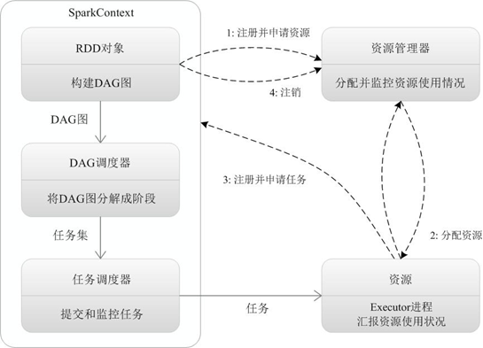

## 1.8. DAG优化原理Lineage

- RDD转换构成DAG有向无环图
  >  

- spark 容错机制
  - RDD都是根据RAG中的路径转换过来的
  - 转换前的RDD可以称为转换后RDD的父
    > **血缘关系**
  - 任何一个RDD丢失后都可以通过从父RDD重新转换重新得到

- job划分stage
  - 相关概念
    - 宽依赖（Wide Dependency）
      - 宽依赖则表现为存在一个父RDD的一个分区对应一个子RDD的多个分区
      - 而且只要发生了shuffle，就一定是宽依赖。
        > **只要发生shuffle，就一定要写磁盘。因此无法进行流水线优化**
    - 窄依赖（Narrow Dependency）
      - 一个父RDD的分区对应于一个子RDD的分区
      - 或多个父RDD的分区对应于一个子RDD的分区
    - 图解
      >  
  - 根据DAG图的依赖关系划分
    - 窄依赖不划分阶段
    - 宽依赖划分阶段

- 优化原理
  - spark的fork/join机制:
    >  
    - 是一种并行执行的框架
    - 先将分区 fork(分支)到不同机器上
      - 也就是一个分区分成多个分支
      - 交给不同机器进行处理
    - 然后再将执行结果join起来
  - 一般情况：
    - 多个fork/join连接起来
    - 第一个fork/join的所有分支都完成，才能执行下一个fork/join
    - 也就是说只要有一个分支没完成，join就不能完成
  - 优化情况：
    - 示例
      > 以带着一班人坐飞机从背景，途径上海到厦门
      - 优化前：
        >  
      - 优化后
        >  
  - 划分原因：

- 划分示例：
  >  
  - DAG图通过递归算法生成阶段划分
  - 有兴趣可以查一下

## 1.9. 运行架构

- 架构
  > 
  - SparkContext
    - 是整个应用程序的指挥官
    - 代表了应用程序连接集群的通道
  - Cluster Manager
    - 种类：
      - spark自带的(一般不用)
      - hadoop的yarn
      - mesos
    - 资源：
      - cpu
      - 内存
      - 带宽
  - Worker Node
    >  
    - 作用:
      - 驻留Executor 进程
      - Executor会派生出很多线程，每个线程用来执行一个**任务**

- 运行流程：
  - 步骤1
    - 往集群中提交应用程序
    - 确定driver节点
    - Driver节点上创建SparkContext对象
    - SparkContext向资源管理器申请运行Executor的资源
    - 资源管理器分配资源,在worknode上开启Executor
    - Executor运行情况将随着“心跳”发送到资源管理器上
  - 步骤2
    - SparkContext根据代码中的RDD依赖关系生成DAG
    - DAG被提交到DAG Scheduler中解析
    - DAG Scheduler将DAG切成不同的Stage(阶段)
    - 再把stage提交给Task Scheduler
  - 步骤3
    - Worker Node**主动** 向Task Scheduler申请任务运行
    - Task Scheduler把任务分配下去
      - **计算向数据靠拢**原则。Task Scheduler会把任务发送给存有相关数据的机器
  - 步骤4
    - Executor 派生线程，线程执行具体任务
    - 运行得到结果返回给Task Scheduler
    - Task Scheduler将结果返回给DAG Scheduler
    - DAG Scheduler 将结果返回给 SparkContext
    - SparkContext返回数据给用户或者写入到HBase中等
    - 运行完毕后写入数据并释放所有资源。
  - 图解：
    >  

