# 1. 概述

```
twitter开源
```

- storm 计算系统
  - 实时性
    - storm 进程常驻内存。
      > hadoop 进程只有在有 job 时才会开启
    - storm 数据不经过磁盘，在内存中处理。
  - 分布式
  - 高容错/高可靠性
    - 异常处理：节点宕机，进程关闭等
    - 消息可靠保障机制（ACK）
  - 可维护性：StormUI 图像化监控接口

---

- 拓扑图：spout+bolt 构成的 directed acyclic graph dag(有向无环图)
  > 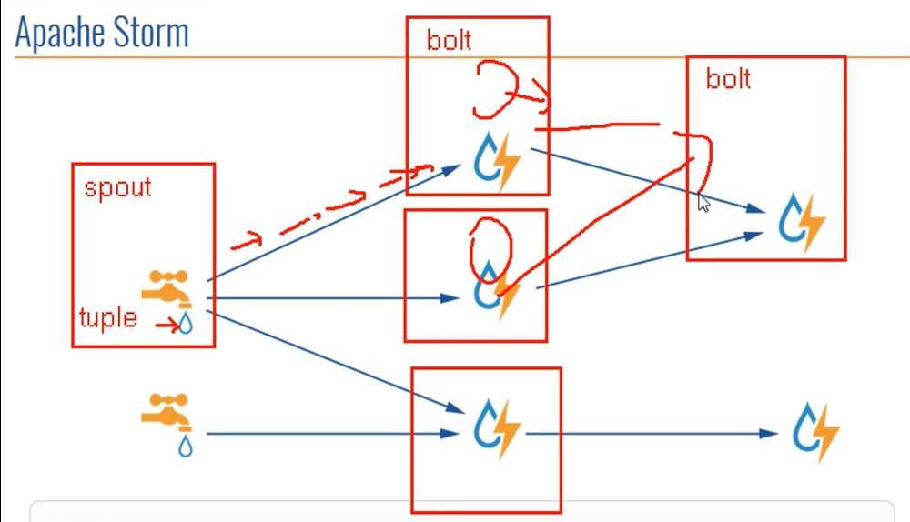
  - spout：数据发起源，可以有多个
  - tuple：单位数据
  - bolt：数据处理单元。
    - 横向扩展：bolt 的处理逻辑非常简单迅速，多种简单处理逻辑串联起来，保障实时性。
    - 纵向扩展：纵向多个 blot，每个 bolt 的处理逻辑可以相同，多线程模式，加快处理速度。

---

- 架构
  - Nimbus:主节点守护进程
    > 类似 jobtracker，但是压力要远低于 jobtracker
    - 资源调度
    - 任务分配
    - jar 包任务上传
  - Supervisor:从节点守护进程（监督进程）
  - Worker:从节点上 Supervisor 开启的工作进程

---

- 编程模式
  - DAG
  - Spout
  - Bolt

---

- 数据传输
  - ZMQ(twitter 早期产品，已不再使用):
    - ZeroMQ 开源的消息传递框架，并不是一个 MessageQueue
  - Netty:
    - Netty 是基于 NIO 的网络框架，更加高效。
    - 之所以 Storm 0.9 版本之后使用 Netty,是因为 ZMQ 的 license 和 Storm 的 license 不兼容。

---

- 用途
  - 流式处理（都是实时的）
    - 异步:客户端提交数据进行结算，并不会等待数据计算结果
      > 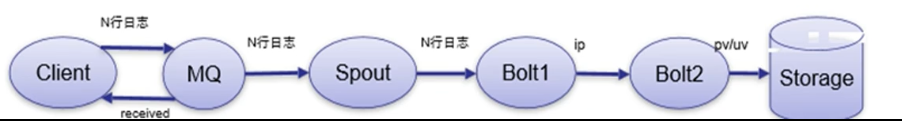
    - 同步:客户端提交数据请求后，立即取得计算结果并返回给客户端
      > 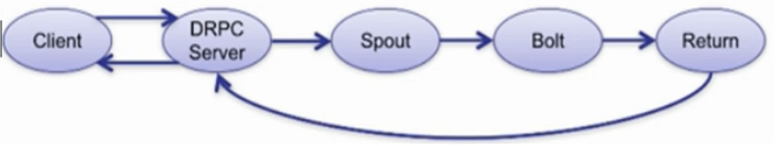
      - 启用远程同步服务的话，需要DRPC Server(Distributed Remote Procedure Call)
        > RPC远程服务调用复习
  - 逐条处理：如ETL
  - 统计分析：
    ```
    计算PV、UV、访问热点以及某些数据的聚合、加和、平均等
    客户端提交数据之后，计算完成结果存储到Redis、HBase、MySQL或者其他MQ当中，
    客户端并不关心最终结果是多少。
    ``` 

---

- 与mapreduce比较
  > 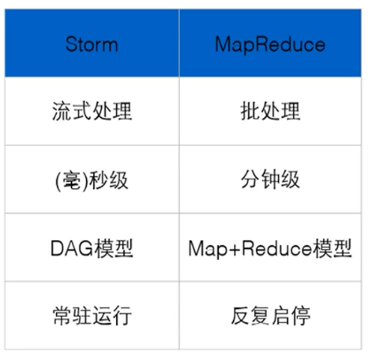
  - Storm:进程、线程常驻内存运行，数据不进入磁盘，数据通过网络传递。
  - MapReduce:为TB、PB级别数据设计的批处理计算框架。
- 与Spark Streaming比较
  > 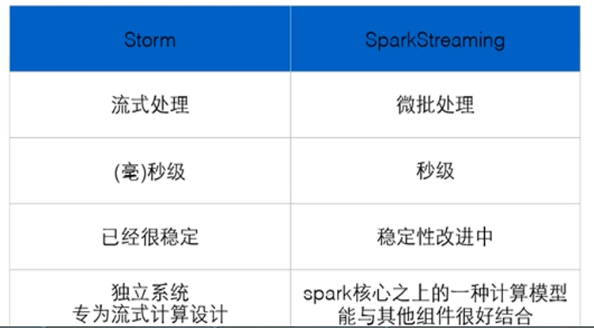 
  - Storm:纯流式处理
    - 专门为流式处理设计
    - 数据传输模式更为简单，很多地方也更为高效
    - 并不是不能做批处理，它也可以来做微批处理，来提高吞吐
  - Spark Streaming:微批处理
    - 将RDD做的很小来用小的批处理来接近流式处理
    - 基于内存和DAG可以把处理任务做的很快

# 2. 计算模型

## 2.1. 理论说明

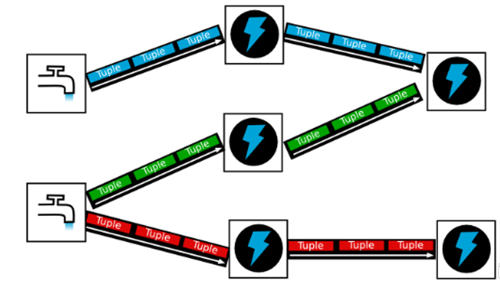


- Topology - DAG有向无环图的实现
  - 对于Storm实时计算逻辑的封装
  - 即，由一系列通过数据流相互关联的Spout、Bolt所组成的拓扑结构
  - 生命周期：此拓扑只要启动就会一直在集群中运行，直到手动将其kill，否则不会终止（区别于MapReduce当中的Job，MR当中的Job在计算执行完成就会终止）

---

- Tuple - 元组
  - Stream中最小数据组成单元

- Stream - 数据流
  >  
  - 从Spout中源源不断传递数据给Bolt、以及上一个Bolt传递数据给下一个Bolt，所形成的这些数据通道即叫做Stream
  - Stream声明时需给其指定一个Id（默认为Default）
    > 实际开发场景中，多使用单一数据流，此时不需要单独指定StreamId

---

- Spout - 数据源
  - 拓扑中数据流的来源。一般会从指定外部的数据源读取元组（Tuple）发送到拓扑（Topology）中
  - 一个Spout可以发送多个数据流（Stream）
    - 可先通过OutputFieldsDeclarer中的declare方法声明定义的不同数据流，发送数据时通过SpoutOutputCollector中的emit方法指定数据流Id（streamId）参数将数据发送出去
  - Spout中最核心的方法是nextTuple，该方法会被Storm线程不断调用、主动从数据源拉取数据，再通过emit方法将数据生成元组（Tuple）发送给之后的Bolt计算

---

- Bolt - 数据流处理组件
  - 拓扑中数据处理均有Bolt完成。对于简单的任务或者数据流转换，单个Bolt可以简单实现；更加复杂场景往往需要多个Bolt分多个步骤完成
  - 一个Bolt可以发送多个数据流（Stream）
    - 可先通过OutputFieldsDeclarer中的declare方法声明定义的不同数据流，发送数据时通过SpoutOutputCollector中的emit方法指定数据流Id（streamId）参数将数据发送出去
    - 可有可无，对于最后一个Blot就不需要再再推送数据。
  - Bolt中最核心的方法是execute方法，该方法负责接收到一个元组（Tuple）数据、真正实现核心的业务逻辑

## 2.2. 数据累加示例

> 1+2+3+4+5.....。

- spout
  <details>
    <summary style="color:red;">代码</summary>

    ```java
    package com.test.spout;

    import org.apache.storm.spout.SpoutOutputCollector;
    import org.apache.storm.task.TopologyContext;
    import org.apache.storm.topology.OutputFieldsDeclarer;
    import org.apache.storm.topology.base.BaseRichSpout;
    import org.apache.storm.tuple.Fields;
    import org.apache.storm.tuple.Values;

    import java.util.List;
    import java.util.Map;

    /**
    * @author liyu
    */
    public class NumSumSpout extends BaseRichSpout {

        private Map<String, Object> map;
        private TopologyContext topologyContext;
        private SpoutOutputCollector spoutOutputCollector;
        private int i = 0;

        /**
        * map – The Storm configuration for this spout. This is the configuration provided to the topology merged in
        * with cluster configuration on this machine.
        * <p>
        * topologyContext – This object can be used to get information about this task's place within the topology,
        * including the task id and component id of this task, input and output information, etc.
        * <p>
        * spoutOutputCollector – The collector is used to emit tuples from this spout. Tuples can be emitted at any
        * time, including the open and close methods. The collector is thread-safe and should be saved as an instance
        * variable of this spout object.
        */
        @Override
        public void open(Map<String, Object> map, TopologyContext topologyContext,
                        SpoutOutputCollector spoutOutputCollector) {
            // 提升作用域
            this.map = map;
            this.topologyContext = topologyContext;
            this.spoutOutputCollector = spoutOutputCollector;

        }

        /**
        * 1+2+3+4....
        */
        @Override
        public void nextTuple() {
            i++;
            List<Object> tuple = new Values(i);
            this.spoutOutputCollector.emit(tuple);
            System.err.println("spout-------" + i);
            try {
                Thread.sleep(1000);
            } catch (InterruptedException e) {
                e.printStackTrace();
            }
        }

        // 注意：每一个tuple中有多少个值，就要对应多少个filed，否则会报错。
        // 上面只有一个i，下面也只有一个num，没问题

        @Override
        public void declareOutputFields(OutputFieldsDeclarer outputFieldsDeclarer) {
            outputFieldsDeclarer.declare(new Fields("num"));
        }
    }
    ```
  </details>
- bolt
  <details>
    <summary style="color:red;">代码</summary>

    ```java
    package com.test.bolt;

    import org.apache.storm.task.OutputCollector;
    import org.apache.storm.task.TopologyContext;
    import org.apache.storm.topology.OutputFieldsDeclarer;
    import org.apache.storm.topology.base.BaseRichBolt;
    import org.apache.storm.tuple.Tuple;

    import java.util.Map;

    /**
    * @author liyu
    */
    public class NumSumBolt extends BaseRichBolt {

        int sum = 0;
        private Map<String, Object> topoConf;
        private TopologyContext context;
        private OutputCollector collector;

        /**
        * topoConf – The Storm configuration for this bolt. This is the configuration provided to the topology merged in
        * with cluster configuration on this machine.
        *
        * context – This object can be used to get information about this task's place within the topology, including
        * the task id and component id of this task, input and output information, etc.
        *
        * collector – The collector is used to emit tuples from this bolt. Tuples can be emitted at any time, including
        * the prepare and cleanup methods. The collector is thread-safe and should be saved as an instance variable of
        * this bolt object.
        */
        @Override
        public void prepare(Map<String, Object> topoConf, TopologyContext context, OutputCollector collector) {
            this.topoConf = topoConf;
            this.context = context;
            this.collector = collector;

        }

        @Override
        public void execute(Tuple input) {
            // 1.获取数据
            Integer num = input.getIntegerByField("num");

            // 2. 求和累加
            sum += num;
            System.out.println("sum------------------" + sum);

        }

        @Override
        public void declareOutputFields(OutputFieldsDeclarer declarer) {

        }
    }
    ```
  </details>
- 主运行类
  <details>
    <summary style="color:red;">代码</summary>

    ```java
    package com.test.run;

    import com.test.bolt.NumSumBolt;
    import com.test.spout.NumSumSpout;
    import org.apache.storm.Config;
    import org.apache.storm.LocalCluster;
    import org.apache.storm.topology.TopologyBuilder;

    /**
    * @author liyu
    */
    public class NumSum {
        public static void main(String[] args) throws Exception {
            TopologyBuilder tb = new TopologyBuilder();
            // 设置soput
            tb.setSpout("wordcountspout", new NumSumSpout());

            // 设置bolt
            // 并且把spout和bolt关联起来,以shuffle的方式分发数据。之后会详细说明奋分发策略。
            // shuffleGrouping里面填的是数据的来源
            tb.setBolt("wordcountbolt", new NumSumBolt()).shuffleGrouping("wordcountspout");

            // 本地window上运行
            LocalCluster lc = new LocalCluster();
            lc.submitTopology("wc",new Config(),tb.createTopology());
        }
    }
    ```
  </details>


## wordcount

```
从spout开始，每一行为一个tuple，交给下一个bolt
bolt对行进行切割，每一个tuple为一个单词，交给下一个bolt
计数再交给下一个bolt
```

- Spout
  <details>
  <summary style="color:red;">代码</summary>

  ```java
  package com.test.spout;

  import org.apache.storm.spout.SpoutOutputCollector;
  import org.apache.storm.task.TopologyContext;
  import org.apache.storm.topology.OutputFieldsDeclarer;
  import org.apache.storm.topology.base.BaseRichSpout;
  import org.apache.storm.tuple.Fields;
  import org.apache.storm.tuple.Values;
  import org.apache.storm.utils.Utils;

  import java.util.List;
  import java.util.Map;
  import java.util.Random;

  /**
  * @author liyu
  */
  public class WcSpout extends BaseRichSpout {

      private final String[] OUT_TEXT = {
              "hello world",
              "hello1 world",
              "hello1 word world",
      };
      private SpoutOutputCollector collector;
      private Random random = new Random();

      @Override
      public void open(Map<String, Object> conf, TopologyContext context, SpoutOutputCollector collector) {
          this.collector = collector;
      }

      @Override
      public void nextTuple() {
          List line = new Values(OUT_TEXT[random.nextInt(OUT_TEXT.length)]);
          this.collector.emit(line);
          System.err.println("line-------"+line);
          Utils.sleep(1000);
      }

      @Override
      public void declareOutputFields(OutputFieldsDeclarer declarer) {
          declarer.declare(new Fields("line"));
      }
  }
  ```
  </details>
- SplitBlot
  <details>
  <summary style="color:red;">代码</summary>

  ```java
  package com.test.bolt;

  import org.apache.storm.task.OutputCollector;
  import org.apache.storm.task.TopologyContext;
  import org.apache.storm.topology.OutputFieldsDeclarer;
  import org.apache.storm.topology.base.BaseRichBolt;
  import org.apache.storm.tuple.Fields;
  import org.apache.storm.tuple.Tuple;
  import org.apache.storm.tuple.Values;

  import java.util.List;
  import java.util.Map;

  /**
  * @author liyu
  */
  public class WSplitBolt extends BaseRichBolt {
      private OutputCollector collector;

      @Override
      public void prepare(Map<String, Object> topoConf, TopologyContext context, OutputCollector collector) {
          this.collector = collector;
      }

      /**
      * 获取数据
      * 切分为单词数组
      * 发送单词
      *
      * @param input
      */
      @Override
      public void execute(Tuple input) {
          String line = input.getStringByField("line");
          String[] words = line.split(" ");
          for (String word : words) {
              this.collector.emit(new Values(word));
          }
      }

      @Override
      public void declareOutputFields(OutputFieldsDeclarer declarer) {
          declarer.declare(new Fields("word"));
      }
  }
  ```
  </details>
- CountBolt
  <details>
  <summary style="color:red;">代码</summary>

  ```java
  package com.test.bolt;

  import org.apache.storm.task.OutputCollector;
  import org.apache.storm.task.TopologyContext;
  import org.apache.storm.topology.OutputFieldsDeclarer;
  import org.apache.storm.topology.base.BaseRichBolt;
  import org.apache.storm.tuple.Tuple;

  import java.awt.print.Printable;
  import java.util.HashMap;
  import java.util.Map;

  /**
  * @author liyu
  */
  public class Wcbolt extends BaseRichBolt {
      Map<String, Integer> map = new HashMap<>();

      @Override
      public void prepare(Map<String, Object> topoConf, TopologyContext context, OutputCollector collector) {

      }

      @Override
      public void execute(Tuple input) {
          String word = input.getStringByField("word");
          if (!map.containsKey(word)) {
              map.put(word, 1);
          } else {
              map.put(word, map.get(word) + 1);
          }
          System.out.println(word + "-------" + map.get(word));
      }

      @Override
      public void declareOutputFields(OutputFieldsDeclarer declarer) {

      }
  }
  ```
  </details>
- 主运行文件
  <details>
  <summary style="color:red;">代码</summary>

  ```java
  package com.test.run;

  import com.test.bolt.WSplitBolt;
  import com.test.bolt.Wcbolt;
  import com.test.spout.WcSpout;
  import org.apache.storm.Config;
  import org.apache.storm.LocalCluster;
  import org.apache.storm.topology.TopologyBuilder;

  /**
  * @author liyu
  */
  public class WordCount {
      public static void main(String[] args) throws Exception {
          TopologyBuilder tb = new TopologyBuilder();
          tb.setSpout("wcspout", new WcSpout());
          // split多线程执行，不会出错
          tb.setBolt("wsplitbolt", new WSplitBolt(), 3).shuffleGrouping("wcspout");

          // count如果多线程执行的话，最终必须要汇聚起来，否则会出错。
          tb.setBolt("wcbolt", new Wcbolt()).shuffleGrouping("wsplitbolt");
          LocalCluster lc = new LocalCluster();
          lc.submitTopology("wc", new Config(), tb.createTopology());
      }
  }
  ```
  </details>

  - split多线程执行不会出错，因为最终都会到一个bolt中进行count计算。
  - 但是count多线程执行会出错，相同的单词可能会跑到不同bolt中（每一个bolt都有一个map用来计数），导致计数错误。
  - 解决方法是**改变分组策略为FieldGrouping**

# 3. 分组策略

> Stream Grouping - 数据流分组（即数据分发策略）

- shuffleGrouping(常用)
  - 随机分组，随机派发stream里面的tuple，保证每个bolt task接收到的tuple数目大致相同。
  - 轮询，平均分配 
- fieldGrouping(常用)：
  - 每一个tuple是一个list，list的每个元素都对应着一个Field
  - 需要指定以哪个Field进行分发。
  - 指定Field对应字段相同的话，会分发到一个Bolt
  - 比如，按"user-id"这个字段来分组，那么具有同样"user-id"的 tuple 会被分到相同的Bolt里的一个task， 而不同的"user-id"则可能会被分配到不同的task。 
- All Grouping
  - 广播发送，对于每一个tuple，所有的bolts都会收到 
  - 每一个bolt都会获得全量数据
- Global Grouping
  - 全局分组，把tuple分配给task id最低的task 。
- None Grouping(基本不用，被shuffle替代)
  - 不分组，这个分组的意思是说stream不关心到底怎样分组。
  - 目前这种分组和Shuffle grouping是一样的效果。
  - 有一点不同的是storm会把使用none grouping的这个bolt放到这个bolt的订阅者同一个线程里面去执行（未来Storm如果可能的话会这样设计）。 

- Direct Grouping
  - 指向型分组， 这是一种比较特别的分组方法，用这种分组意味着消息（tuple）的发送者指定由消息接收者的哪个task处理这个消息。
  - 只有被声明为 Direct Stream 的消息流可以声明这种分组方法。
  - 而且这种消息tuple必须使用 emitDirect 方法来发射。消息处理者可以通过 TopologyContext 来获取处理它的消息的task的id (OutputCollector.emit方法也会返回task的id)  
  - 只有比较特殊的情况下使用

- Local or shuffle grouping
  - 本地或随机分组。
  - 如果目标bolt有一个或者多个task与源bolt的task在同一个工作进程中，tuple将会被随机发送给这些同进程中的tasks。
  - 否则，和普通的Shuffle Grouping行为一致

- customGrouping
  - 自定义，相当于mapreduce那里自己去实现一个partition一样。

---

- 示例代码`src/storm/grouping`


# 架构

- 架构
  > 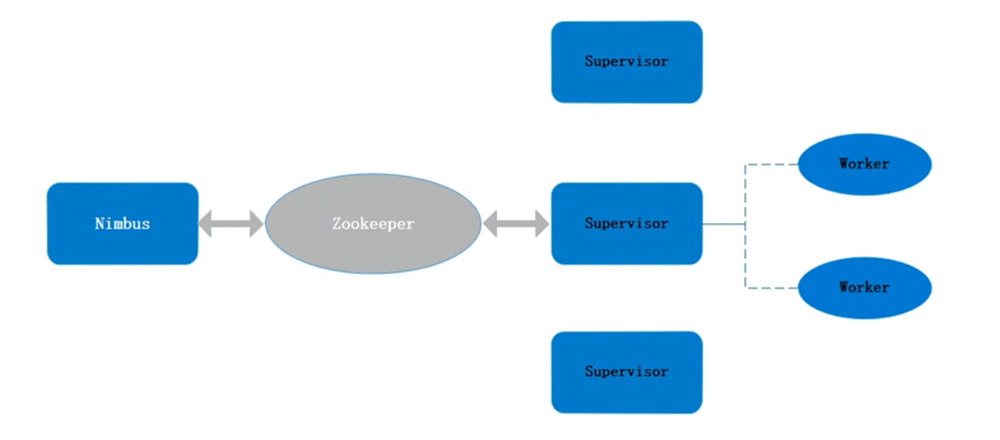
  - Nimbus
    - 资源调度
    - 任务分配
    - 接收jar包

  - Supervisor
    - 接收nimbus分配的任务(由zookeeper传达)
    - 启动、停止自己管理的worker进程（当前supervisor上worker数量由配置文件设定）

  - Worker
    - 运行具体处理运算组件的进程（每个Worker对应执行一个Topology的子集）
    - worker任务类型，即spout任务、bolt任务两种
    - 启动executor（Worker是一个工作进程，而executor是worker JVM进程中的一个java线程，一般默认每个executor负责执行一个task任务）

- 与hadoop对比
  > 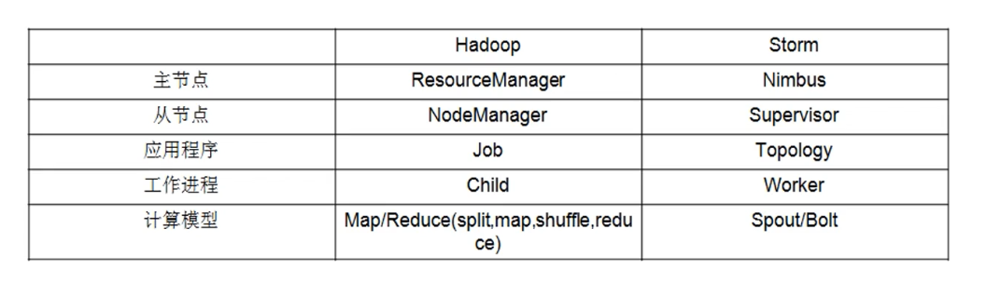 

- storm提交流程
  >  

- storm本地目录树
  > 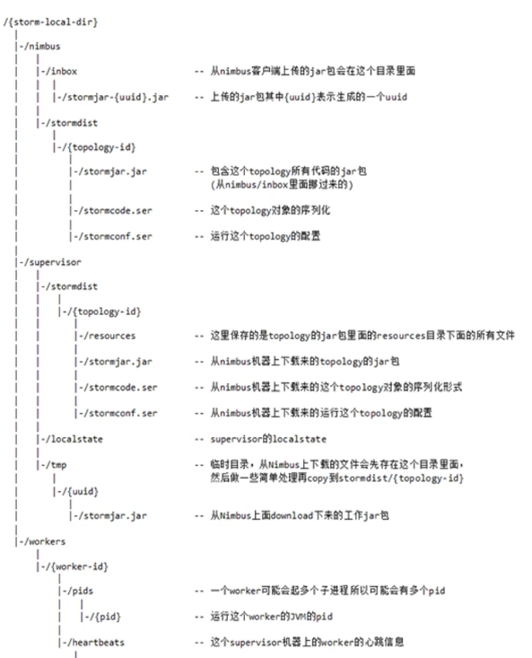 

- strom-zookeeper目录树
  > 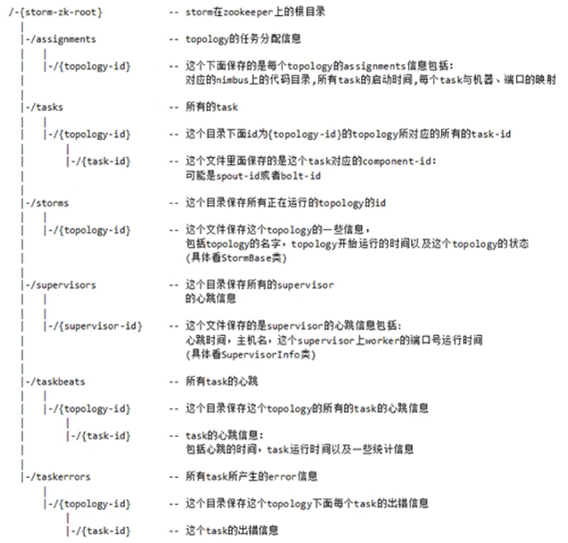 

# 启动配置

## 单机模式

- 启动一下几个进程
- dev_zookeeper
- nimbus
- supervisor
- ui(可选，可视化界面)
- logviewer(可选，在浏览器上看日志)

## 全分布式模式

## 提交作业

- storm help jar 提交项目
  - 例：`storm jar wc.jar com.test.WordCount [wc]`
    > 后面可接参数，也可不接参数

- storm help kill 关闭项目
  - 例： `storm kill wc -w 2`

- 关闭所有java线程：`killall java`


# 并发机制


- Worker – 进程
  - 一个Topology拓扑会包含一个或多个Worker（每个Worker进程只能从属于一个特定的Topology）
  - 这些Worker进程会并行跑在集群中不同的服务器上，即一个Topology拓扑其实是由并行运行在Storm集群中多台服务器上的进程所组成

- Executor – 线程
  - Executor是由Worker进程中生成的一个线程
  - 每个Worker进程中会运行拓扑当中的一个或多个Executor线程
  - 一个Executor线程中可以执行一个或多个Task任务（默认每个Executor只执行一个Task任务），但是这些Task任务都是对应着同一个组件（Spout、Bolt）。

- Task
  - 实际执行数据处理的最小单元
  - 每个task即为一个Spout或者一个Bolt
  - **Task数量在整个Topology生命周期中保持不变**，Executor数量可以变化或手动调整
    > （默认情况下，Task数量和Executor是相同的，即每个Executor线程中默认运行一个Task任务）
    >
    > 因为Task数量在运行期间无法改变，因此如果调整的话，要确保Task数量不要太大，要给内存一定富余。

---


- 设置Worker进程数
  - Config.setNumWorkers(int workers)

- 设置Executor线程数
  - TopologyBuilder.setSpout(String id, IRichSpout spout, Number parallelism_hint)
  - TopologyBuilder.setBolt(String id, IRichBolt bolt, Number parallelism_hint)
  > 其中， parallelism_hint即为executor线程数

- 设置Task数量
  - ComponentConfigurationDeclarer.setNumTasks(Number val)

---

- 例：
  ```java
  Config conf = new Config() ;
  conf.setNumWorkers(2);

  TopologyBuilder topologyBuilder = new TopologyBuilder();
  topologyBuilder.setSpout("spout", new MySpout(), 1);
  topologyBuilder.setBolt("green-bolt", new GreenBolt(), 2)
                .setNumTasks(4)
                .shuffleGrouping("blue-spout);
  ```

- 实例:
  > 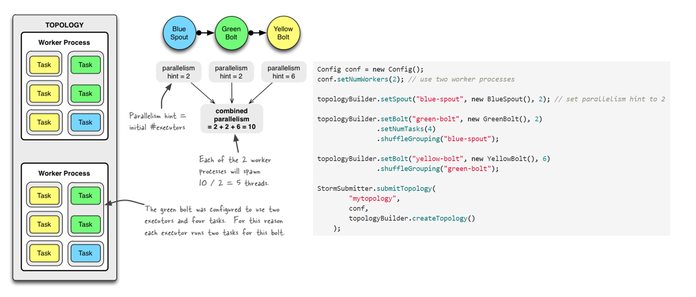 

---

- 调整worker(从节点),executor(从节点开启的工作线程)数量:`storm help rebalance`
  - 例：`storm rebalance wc -w 2 -n 4 -e wsplitbolt=4`
    > -n 调整worker
    >
    > -e 调整指定Bolt或者Spout的executor数量（task数量无法调整）


# 连接kafka

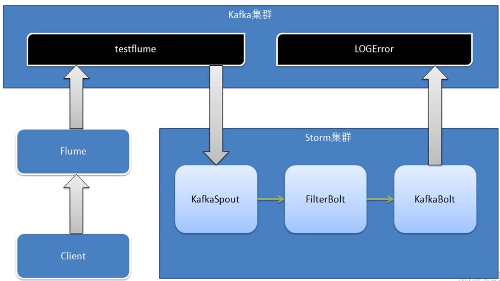

代码：`src/storm/storm--kafka`
