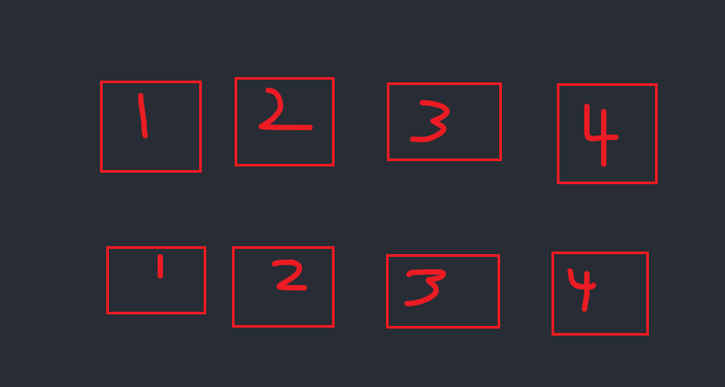
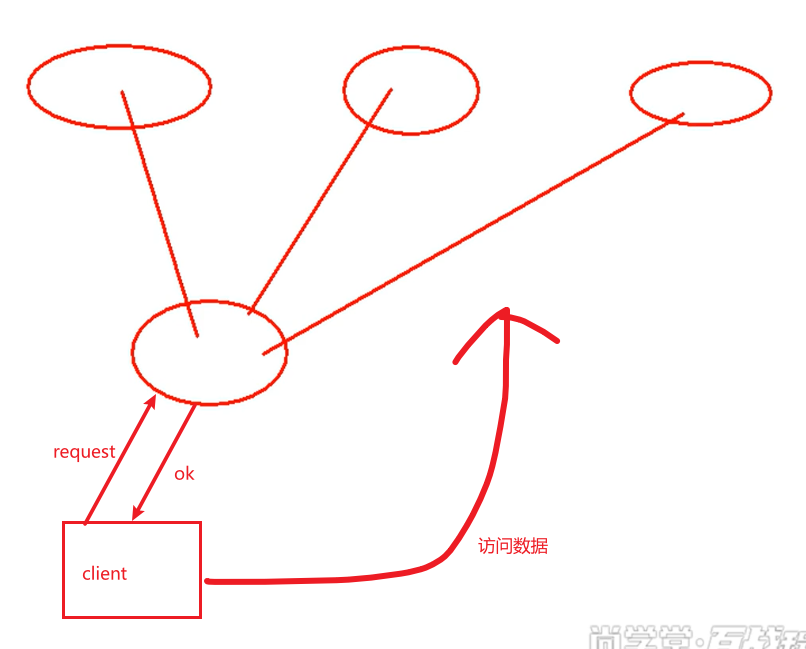

# 理论

##  数据承载模式

- 镜像全量：
  - 说明：每台服务器都存有全部数据，每台服务器都是其他服务器的镜像。
  - 特点：
    - 没有横向扩展能力
    - 但是数据特别安全
- shards：
  - 说明：沙丁切片，将所有数据均分到每一台服务器上。
  - 特点：
    - 横向扩展能力强。
    - 数据不安全。
- 大数据集群存储架构：
  >  
  - 横向沙丁切片
  - 纵向数据备份


##  单机问题

- 单点故障
- 单点瓶颈

## 无主架构模型

- 主要思想：cap原则
  ```
  CAP原则又称CAP定理，指的是在一个分布式系统中，一致性（Consistency）、可用性（Availability）、分区容错性（Partition tolerance）。
  CAP 原则指的是，这三个要素最多只能同时实现两点，不可能三者兼顾。

  一致性：对应下方的强一致性。三台服务器必须全部同步后才可以使用。
  可用性：对应下方的若一致性，不强行要求服务器间的完全同步。
  分区容错性：也就是split brain，或者叫网络分区
  ```

- 三个一致性：
  > 
  ```
  情景:
    客户端向主服务器请求数据
    主服务器会先往三台数据服务器中同步数据
    同步完成后，告知客户端去访问数据
  ```
  - 强一致性
    - 只有三台都同步好了，才告诉客户端准备好了，可以请求数据
  - 弱一致性
    - 只要有一半以上（2台）服务器同步好了，就能告诉客户端准备完成
      - 过半原则。
        ```
        说明
        以本案例为例
        能够正常访问的两台服务器间组成一个势力范围，势力范围内内数据同步。
        客户端可以向势力范围内的服务器请求数据。
        当第三台服务器能正常通信后，只有加入势力范围后，才可以提供服务，在这之前，是不能提供服务的
        因此，第三台挂者也没问题，依旧能提供服务

        如果有四台，则必须大于两台组成一个势力范围。
        如果每两台组成一个势力范围，就无法保证势力范围间的数据同步。(split brain，或叫 网络分区)
        每台服务器恢复通信的时候，必须加入势力范围后，才能提供服务

        5台，6台同理。
        ```
  - 最终一致性
    ```
    以5台服务器为例，三台服务器就足以保证集群的运行。
    如果四台服务器构成了一个势力范围，就必须保证势力范围中的所有服务器数据保证同步
    ```

## zookeeper主从架构模型

### 说明

- 主从架构产生原因: 无主架构模型可能产生split brain

- 架构图：
  > 

- 相关概念：
  - serverid
  - zxid:事务编号id

### 对外一致性

- 读写流程
  - 读流程
    - Fllower直接为客户查询结果，返回给客户
  - 写流程
    - 客户端请求Zookeeper Server Fllower进行写操作
    - Fllower再向所有leader征求是否要进行写操作
    - 包含leader在内，只要确认数到达一半以上，就可以进行写操作。【注意，这里是一半以上即可】
    - 进行写操作时，会将具体操作作为一个order进行执行。
    - 然后将order交给所有Server，让所有Server都执行。保证所有Server数据一致。【注意，这里是必须所有Server】
      - 实现方式：消息队列。message queue,类似kafka
    - 最终每台Server的记录都会进行更新。达到最终一致性，或者叫统一视图。

- 复习：
  - hadoop的zkfc，
  - registry
  - watch event
  - callback

### 对内原则

- 内部选举机制
  - 如果Leader挂断了。
  - 就让serverid最大的follower作为主节点。
    > serverid是在一开始就在配置文件中制定好了的。

- 一开始主节点的选取
  - 如果是一个一个得启动，那么就选取最早启动的那个作为leader
  - 如果一起启动，就选取serverid最大的作为leader

- 对内协调
  - 启动与主节点的选取
  - 主节点的更替

### 特点

- 最终一致性:为客户端展示同一个视图，这是zookeeper里面一个非常重要的功能
- 可靠性:如果消息被到一台服务器接受，那么它将被所有的服务器接受。
- 实时性:Zookeeper不能保证两个客户端能同时得到刚更新的数据，如果需要最新数据，应该在读数据之前调用sync()接口。
- 独立性:各个Client之间互不干预
- 原子性:更新只能成功或者失败，没有中间状态。
- 顺序性:所有Server,同一消息发布顺序一致。


[待整理](https://piaosanlang.gitbooks.io/faq/content/zookeeperde-gong-neng-yi-ji-gong-zuo-yuan-li.html)
