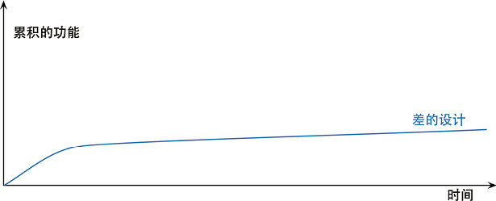
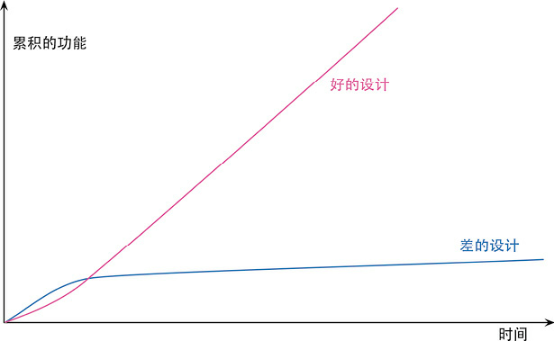

> 个人习惯使用 知之阅读 做一些读书笔记。markdown版笔记仅抽空整理

# 1. 概述

## 1.1. 何谓重构

### 1.1.1. 重构含义

- （名词）：对软件内部结构的一种调整，目的是在**不改变软件可观察行为**的前提下，**提高其可理解性，降低其修改成本**
- （动词）：使用一系列重构手法，在**不改变软件可观察行为**的前提下，**调整其结构**。

> 所以，可能会花一两个小时进行重构（动词），其间我会使用几十个不同的重构（名词）。

### 1.1.2. 重构关键

- 运用**大量微小且保持软件行为的步骤**，一步步达成大规模的修改
  - 每个单独的重构要么很小，要么由若干小步骤组合而成
  - 因此，在重构的过程中，代码很少进入不可工作的状态，即便重构没有完成，也可以在任何时刻停下来。
  - 整个过程中也不需要花任何时间来调试。

- **不改变可观察行为**
  - **整体而言，经过重构之后的代码所做的事应该与重构之前大致一样**
  - 重构之后的代码不一定与重构前行为完全一致
    - 比如说，提炼函数（106）会改变函数调用栈，因此程序的性能就会有所改变
    - 改变函数声明（124）和搬移函数（198）等重构经常会改变模块的接口
  - 不过就用户应该关心的行为而言，不应该有任何改变
    - 如果在重构过程中发现了任何bug，重构完成后同样的bug应该仍然存在
    - 不过，如果潜在的bug还没有被任何人发现，也可以当即把它改掉

### 1.1.3. 重构与性能优化

- 重构与性能优化有很多相似之处：
  - 两者都需要修改代码
  - 并且两者都不会改变程序的整体功能
- 两者的差别在于其目的
  - 重构是为了让代码“更容易理解，更易于修改”。这可能使程序运行得更快，也可能使程序运行得更慢
  - 在性能优化时，我只关心让程序运行得更快，最终得到的代码有可能更难理解和维护，对此我有心理准备
  -
## 1.2. 重构注意：两顶帽子

- 使用重构技术开发软件时，时间会分配给两种截然不同的行为
  - 添加新功能
    - 添加新功能时，我不应该修改既有代码，只管添加新功能
    - 通过添加测试并让测试正常运行，我可以衡量自己的工作进度
  - 重构
    - 重构时我就不能再添加功能，只管调整代码的结构
    - 此时我不应该添加任何测试（除非发现有先前遗漏的东西），只在绝对必要（用以处理接口变化）时才修改测试。

- 软件开发过程中，可能会发现经常变换帽子
  - 首先我尝试添加新功能，然后会意识到：如果把程序结构改一下，功能的添加会容易得多
  - 于是换一顶帽子，做一会儿重构工作
  - 程序结构调整好后，又换上原先的帽子，继续添加新功能
  - 新功能正常工作后，我又发现自己的编码造成程序难以理解
  - 于是又换上重构帽子
  - 整个过程或许只花10分钟，但**无论何时都必须清楚自己戴的是哪一顶帽子，并且明白不同的帽子对编程状态提出的不同要求**

## 1.3. 为何重构

### 1.3.1. 没有银弹

- 它绝对不是所谓的银弹
- 不过它的确很有价值
- 可以帮你始终良好地控制自己的代码

### 1.3.2. 作用

- **重构改进软件的设计**
  - 如果没有重构，程序的内部设计（或者叫架构）会逐渐腐败变质
    - **当人们只为短期目的而修改代码时，他们经常没有完全理解架构的整体设计，于是代码逐渐失去了自己的结构**
    - 程序员越来越难通过阅读源码来理解原来的设计，**代码结构的流失有累积效应**
    - 越难看出代码所代表的设计意图，就越难保护其设计，于是设计就腐败得越快
    - **经常性的重构有助于代码维持自己该有的形态**
  - 完成同样一件事，设计欠佳的程序往往需要更多代码
    - 这常常是因为代码在不同的地方使用完全相同的语句做同样的事，因此改进设计的一个重要方向就是消除重复代码
    - 代码量减少并不会使系统运行更快，因为这对程序的资源占用几乎没有任何明显影响
    - 然而代码量减少将使未来可能的程序修改动作容易得多
    - 代码越多，做正确的修改就越困难，因为有更多代码需要理解
    - 消除重复代码，就可以确定所有事物和行为在代码中只表述一次，这正是优秀设计的根本

- **重构使软件更容易理解**
  - **代码不是给计算机看的，是给程序员看的**
    - 所谓程序设计，很大程度上就是与计算机对话：编写代码告诉计算机做什么事，而它的响应是按照我的指示精确行动
    - 计算机肯定会理解交给它的代码，问题是程序员是否理解自己交给计算机什么样的代码

- **重构帮助找到bug**
  - 对代码的理解，有助于找到bug
  - 如果对代码进行重构，就可以深入理解代码的所作所为，并立即把新的理解反映在代码当中
  - 搞清楚程序结构的同时，也验证了自己所做的一些假设，很容易发现潜在bug

- **重构提高编程速度**
  - 只考虑功能，不考虑代码结构
    - 一开始进展会很快，但如今想要添加一个新功能需要的时间就要长得多
    - 他们需要花越来越多的时间去考虑如何把新功能塞进现有的代码库，不断蹦出来的bug修复起来也越来越慢
    - 代码库看起来就像补丁摞补丁，需要细致的考古工作才能弄明白整个系统是如何工作的
    - 这份负担不断拖慢新增功能的速度，到最后程序员恨不得从头开始重写整个系统。

    

  - **投入精力改善内部设计**
    - 需要添加新功能时，内部质量良好的软件让我可以很容易找到在哪里修改、如何修改
    - **良好的模块划分使我只需要理解代码库的一小部分，就可以做出修改**
    - 如果代码很清晰，我引入bug的可能性就会变小，即使引入了bug，调试也会容易得多
    - 理想情况下，我的代码库**会逐步演化成一个平台**，在其上可以很容易地构造与其领域相关的新功能。
    - "设计耐久性假说"
      - 通过投入精力改善内部设计，我们增加了软件的耐久性，从而可以更长时间地保持开发的快速

    


### 1.3.3. 设计与重构

- 20年前，行业的陈规认为：良好的设计必须在开始编程之前完成，因为一旦开始编写代码，设计就只会逐渐腐败
- 重构改变了这个图景
  - 现在我们可以改善已有代码的设计，因此**我们可以先做一个设计，然后不断改善它**
  - 哪怕程序本身的功能也在不断发生着变化
  - 由于预先做出良好的设计非常困难，想要既体面又快速地开发功能，重构必不可少。

## 1.4. 为什么重构有用

## 1.5. 何时重构

### 1.5.1. 何时应该重构

#### 1.5.1.1. 三次法则

> Don Roberts给了我一条准则：第一次做某件事时只管去做；第二次做类似的事会产生反感，但无论如何还是可以去做；第三次再做类似的事，你就应该重构。

- 正如老话说的：事不过三，三则重构。

#### 1.5.1.2. 预备性重构：让添加新功能更容易

- 重构的最佳时机就在添加新功能之前

  ```
  在动手添加新功能之前，我会看看现有的代码库，此时经常会发现：
  如果对代码结构做一点微调，我的工作会容易得多
  也许已经有个函数提供了我需要的大部分功能，但有几个字面量的值与我的需要略有冲突。
  如果不做重构，我可能会把整个函数复制过来，修改这几个值，但这就会导致重复代码
  如果将来我需要做修改，就必须同时修改两处（更麻烦的是，我得先找到这两处）。
  而且，如果将来我还需要一个类似又略有不同的功能，就只能再复制粘贴一次，这可不是个好主意。
  所以我戴上重构的帽子，使用函数参数化（310）。做完这件事以后，接下来我就只需要调用这个函数，传入我需要的参数。
  ```

- 修复bug时的时候重构
  - 在寻找问题根因时，可能会发现：如果把3段一模一样且都会导致错误的代码合并到一处，问题修复起来会容易得多。
  - 或者，如果把某些更新数据的逻辑与查询逻辑分开，会更容易避免造成错误的逻辑纠缠。
  - 用重构改善这些情况，在同样场合再次出现同样bug的概率也会降低。

#### 1.5.1.3. 帮助理解的重构：使代码更易懂

- **代码是给人看的，不是给计算机看的** ，需要先理解代码在做什么，然后才能着手修改
  - 一旦需要思考"这段代码到底在做什么"，就需要考虑要不要重构这段代码，令其一目了然
  - 可能需要重构一段结构糟糕的条件逻辑(超长逻辑表达式)
  - 也可能希望复用一个函数，但花费了几分钟才弄懂它到底在做什么，因为它的函数命名实在是太糟糕了
  - 这些都是重构的机会。

- 当代码变得更清晰一些时，就会看见之前看不见的设计问题
  - 重构带来的帮助不仅发生在将来--常常是立竿见影。
  - 如果不做前面的重构，可能很难都看见这些设计问题
  - 在研读代码时，重构会引领我获得更高层面的理解，如果只是阅读代码很难有此领悟
  - 有些人以为这些重构只是毫无意义地把玩代码，他们没有意识到，缺少了这些细微的整理，他们就无法看到隐藏在一片混乱背后的机遇。

#### 1.5.1.4. 帮助理解的重构变体：捡垃圾式重构

- 情景：发现了可能需要重构的地方，容易理解代码在做什么，但发现它做得不好
  - 例如逻辑不必要地迂回复杂
  - 或者两个函数几乎完全相同，可以用一个参数化的函数取而代之

- 措施：这里有一个取舍：
  - 不想从眼下正要完成的任务上跑题太多，也不想把垃圾留在原地，给将来的修改增加麻烦
  - 如果我发现的垃圾很容易重构，可以马上重构它
  - 如果重构需要花一些精力，我可能会拿一张便笺纸把它记下来，完成当下的任务再回来重构它。

- 极端情况：当然，有时这样的垃圾需要好几个小时才能解决，而又有更紧急的事要完成
  - 不过即便如此，稍微花一点工夫做一点儿清理，通常都是值得的
  - 正如野营者的老话所说：至少要让营地比你到达时更干净。如果每次经过这段代码时都把它变好一点点，积少成多，垃圾总会被处理干净

- 重构原则：
  - **重构的每个小步骤都不会破坏代码**
  - 所以，有时一块垃圾在好几个月之后才终于清理干净，但即便每次清理并不完整，代码也不会被破坏。

#### 1.5.1.5. 有计划的重构和见机行事的重构

#### 1.5.1.6. 长期重构

#### 1.5.1.7. 复审代码时重构

### 1.5.2. 何时不应该重构

## 1.6. 何时不该重构

## 1.7. 重构与性能

# 2. 重构原则

# 3. 重构的难题

# 4. 代码的坏味道

## 4.1. 神秘命名(Mysterious Name)

- 说明：
  - 整洁代码最重要的一环就是好的名字，所以我们会深思熟虑如何给函数、模块、变量和类命名，使它们能清晰地表明自己的功能和用法。

- 重要性
  - 改名不仅仅是修改名字而已
  - 如果你想不出一个好名字，说明背后很可能潜藏着更深的设计问题
  - 为一个恼人的名字所付出的纠结，常常能推动我们对代码进行精简

## 4.2. 重复代码(Duplicated Code)

- 说明：在一个以上的地点看到相同的数据结构
- 常见示例及解决方式
  - 同一个类的两个函数含有相同的表达式i
    - Extract Method
    - 调用提炼出的代码
  - 两个互为兄弟的子类内含相同的表达式
    - 对两个类使用Extract Mehod
    - 两处提炼出的代码相同
      - 被提炼出来的代码使用 Pull Up Method，推入超类
    - 两处提炼出的代码不完全相同
      - Extract Method 将相似和差异部分割开
      - 运用Form Template Method获取一个Template Method设计模式
      - 相同功能的函数，使用较清晰的一个，通过 Substitute Algorithm 将其他函数的算法替换掉

## 4.3. 过长函数(Long Method)

- 说明
  - 在早期的编程语言中，子程序调用需要额外开销，这使得人们不太乐意使用小函数，现代编程语言已经免除了这种开销
  - 但是间接性带来的好处——更好的阐释力、更易于分享、更多的选择，都是由小函数来支持的

- 原则：
  - **每当感觉需要以注释来说明点什么的时候，我们就把需要说明的东西写进一个独立函数中，并以其用途（而非实现手法）命名**
    > 哪怕替换后的函数调用动作比函数自身还长(笑)
  - 条件表达式和循环常常也是提炼的信号

- 常见情况与解决：
  - 普通情况：
    - 只需使用Extract Method。找到函数中适合集中在一起的部分，将它们提炼出来形成一个新函数
  - 有大量的参数和临时变量
    - 经常运用以Replace Temp with Query来消除这些临时元素
    - Introduce Parameter Object和Preserve Whole Object则可以将过长的参数列表变得更简洁一些
    - 还是不行，最终使用 Replace Method with Method Object
  - 条件表达式
    - Decompose Conditional处理
  - 循环
    - 循环中只做了一件事
      - 将循环和其内的代码提炼到一个独立函数中
    - 循环中做了很多事
      - 地使用Split Loop将其拆分成各自独立的任务。

## 4.4. 过长参数列(Long Parameter List)

- 说明
  - 最好不要使用全局数据
  - 但过长的参数列表本身也经常令人迷惑

- 常见情况与解决(函数)
  - 如果可以向某个参数发起查询而获得另一个参数的值
    - Replace Parameter With Query
  - 如果你发现自己正在从现有的数据结构中抽出很多数据项
    - Preserve Whole Object，直接传入原来的数据结构
  - 如果有几项参数总是同时出现
    - Introduce Parameter Object,将其合并成一个对象
  - 如果某个参数被用作**区分函数行为**的标记（flag）
    - Remove Flag Parameter
  - 如果多个函数有同样的几个参数
    - 引入一个类就尤为有意义
    - 可以使用Combine Functions into class，将这些共同的参数变成这个类的字段
    - 如果戴上函数式编程的帽子，可以说，这个重构过程创造了一组部分应用函数（partially applied function）。

## 4.5. 全局数据(Global Data)

- 说明：
  - 全局数据来自地狱，尽量不要用
  - 有少量的全局数据或许无妨，但数量越多，处理的难度就会指数上升

- 解决方式：
  - 首要的防御手段是Encapsulate Variable
  - 把全局数据用一个函数包装起来，至少就能看见修改它的地方，并开始控制对它的访问
  - 随后，最好将这个函数（及其封装的数据）搬移到一个类或模块中，只允许模块内的代码使用它，从而尽量控制其作用域。

- 更糟糕的情况：可以被修改的全局数据尤其可憎
  - 如果能保证在程序启动之后就不再修改，这样的全局数据还算相对安全
  - 不过得有编程语言提供这样的保证才行(如java的final)

## 4.6. 可变数据(Mutable Data)

- 说明
  - 对数据的修改经常导致出乎意料的结果和难以发现的bug
  - 在一处更新数据，却没有意识到软件中的另一处期望着完全不同的数据
  - 于是一个功能失效了。
  - 如果故障只在很罕见的情况下发生，要找出故障原因就会更加困难

- 扩展

  ```
  有一整个软件开发流派--函数式编程，完全建立在“数据永不改变”的概念基础上
  如果要更新一个数据结构，就返回一份新的数据副本，旧的数据仍保持不变。
  ```

- 常见情况与解决方式
  - 一般修改情况：
    - 用Encapsulate Variable来确保所有数据更新操作都通过很少几个函数来进行，使其更容易监控和演进。
    - 使用Slide Statements和Extract Method尽量把逻辑从处理更新操作的代码中搬移出来，将没有副作用的代码与执行数据更新操作的代码分开。
    - 尽早使用Remove Setting Method，有时只是把设值函数的使用者找出来看看，就能帮我们发现缩小变量作用域的机会。
      > Data Class 有提 getter和setter的处理
  - 一个变量在不同时候被用于存储不同的东西
    - 使用Split Variable将其拆分为各自不同用途的变量，从而避免危险的更新操作
  - 设计API
    - 可以使用Separate Query from Modifier确保调用者不会调到有副作用的代码，除非他们真的需要更新数据。
  - 可变数据的值能在其他地方计算出来(没必要，且容易出bug)
    - 消除这种坏味道的办法很简单，使用Replace Derived Variable with Query
  - 作用域与可变数据
    - 如果变量作用域只有几行代码，即使其中的数据可变，也不是什么大问题；但随着变量作用域的扩展，风险也随之增大
    - 可以用函数组合成类（144）或者函数组合成变换（149）来限制需要对变量进行修改的代码量
  - 如果一个变量在**其内部结构中包含了数据**
    - 通常**最好不要直接修改其中的数据**
    - 而是用Change Reference to Value令其直接替换整个数据结构。

## 4.7. 发散式变化(Divergent Change)

- 说明：
  - 两个不同逻辑的上下文糅杂在一起
  - 导致两个上下文需要修改时相互影响

  ```
  如添加数据库和添加金融工具时，需要使用金融工具处理数据库中的数据，
  两处变化要修改的地方可能会有交集，
  但因为数据库交互和金融逻辑处理是两个不同的上下文，
  所以需要尽可能分离开来。
  ```

- 常见情况与解决
  - 如果发生变化的两个方向自然地形成了先后次序
    > （比如说，先从数据库取出数据，再对其进行金融逻辑处理）
    - 就可以用拆分阶段将两者分开，两者之间通过一个清晰的数据结构进行沟通
  - 如果两个方向之间有更多的来回调用
    - 应该先创建适当的模块
    - 然后用 Move Method 把处理逻辑分开
  - 如果函数内部混合了两类处理逻辑
    - 应该先用 Extract Method 将其分开
    - 然后再做搬移
  - 如果模块是以类的形式定义的
    - 就可以用 Extract Class 来做拆分。

## 4.8. 霰弹式修改(Shotgun Surgery)

- 说明： 一种变化引发多个类相应修改

霰弹式修改类似于发散式变化，但又恰恰相反。如果每遇到某种变化，你都必须在许多不同的类内做出许多小修改，你所面临的坏味道就是霰弹式修改。如果需要修改的代码散布四处，你不但很难找到它们，也很容易错过某个重要的修改。

这种情况下，你应该使用搬移函数（198）和搬移字段（207）把所有需要修改的代码放进同一个模块里。如果有很多函数都在操作相似的数据，可以使用函数组合成类（144）。如果有些函数的功能是转化或者充实数据结构，可以使用函数组合成变换（149）。如果一些函数的输出可以组合后提供给一段专门使用这些计算结果的逻辑，这种时候常常用得上拆分阶段（154）。

面对霰弹式修改，一个常用的策略就是使用与内联（inline）相关的重构——如内联函数（115）或是内联类（186）——把本不该分散的逻辑拽回一处。完成内联之后，你可能会闻到过长函数或者过大的类的味道，不过你总可以用与提炼相关的重构手法将其拆解成更合理的小块。即便如此钟爱小型的函数和类，我们也并不担心在重构的过程中暂时创建一些较大的程序单元。


## 4.9. 依恋情结(Feature Envy)

- 说明： 函数对某个类的兴趣高过自己所处类的兴趣

## 4.10. 数据泥团(Data Clumps)

- 说明：相同的若干项数据出现在不同地方，这些绑在一起出现的数据应该有属于它们自己的对象

## 4.11. 基本类型偏执(Private Obsession)

- 说明：
  - 对象技术新手通常不愿意在小任务上运用小对象

- 情况示例
  - 值的组合：Replace Data Value with Object
  - 类型码： Replate Type Code With Calss
  - 与类型码有关的条件表达式：
    - Replace Type Code with Subclass 
    - Replate Type Codd with State/Strategy
  - 总是放一起的字段:Extract Class
  - 参数列中有基本数据类型：Introduce Parameter Object
  - 从数组中挑选数据：Replate Array with Object

## 4.12. switch 惊悚现身(Switch Statements)

- 说明：switch 语句会在很多地方重复出现，一改则需全改

- 情况示例

## 4.13. 平行继承体系(Parallel Inheritance Hierarchies)

- 说明：当你为某一个类增加子类时，也必须为另一个类相应增加一个类

## 4.14. 冗赘类(Lazy Class)

- 说明：如果一个类不值得存在，那就让它消失

## 4.15. 夸夸其谈的未来星(Speculative Generality)

- 说明：预留的无用的抽象类，无用的抽象参数

## 4.16. 令人迷惑的暂时字段(Temporary Field)

- 说明：类中某个字段只为某些特殊情况而设置

## 4.17. 过度耦合的消息链(Message Chains)

- 说明：用户向一个对象请求另一个对象，然后再向后者请求另一个对象......

## 4.18. 中间人(Middle Man)

- 说明：无用的委托，过多的中间层

## 4.19. 内幕交易(Insider Trading)

## 4.20. 狎昵关系(Inappropriate Intimacy)

- 说明：两个类过于亲密，一个类过于关注另一个类的成员

## 4.21. 过大的类(Large Class)

## 4.22. 异曲同工的类(Alternative Classes with DifferentInterfaces)

- 说明：不同名字的类或函数，作者相同的事

## 4.23. 不完美的库类(Incomplete Library Class)

- 说明：类库设计不可能完美

## 4.24. 纯数据类(Data Class)

- 说明：一个类拥有一些字段以及用于访问这些字段的函数，除此之外一无长物

## 4.25. 被拒绝的遗赠(Refused Bequest)

- 说明：子类不想继承超类所有的函数和数据，只想挑几样来玩

## 4.26. 过多的注释(Comments)

# 5. 构筑测试体系

1. 重构的首要前提是拥有一个**可靠的测试环境**。
2. **只要写好一点功能，就立即添加测试**，并确保所有测试都完全自动化，让它们检查自己的测试结果。一套测试就是一个强大的bug侦测器，能够大大缩减查找bug所需要的时间。
3. **撰写测试代码的最有用时机是在开始编程之前。**当你需要添加特性的时候，先写相应测试代码。
4. **多运用单元测试。**测试你最担心出错的地方，考虑可能出错的边界条件。不要因为测试无法捕捉所有bug就不写测试，因为测试的确可以捕捉到大多数bug。“花合理时间抓出大多数bug”要好过“穷尽一生抓出所有bug”。

# 6. 重构规则

## 6.1. 重新组织函数

1. **提炼函数**（Extract Method）。你有一段代码可以被组织在一起并独立出来。将这段代码放进一个独立函数中，并将函数名称解释该函数的用途。
2. **内联函数**（Inline Method）。一个函数的本体与名称同样清楚易懂。在函数调用点插入函数本体，然后移除该函数。
3. **内联临时变量**（InlineTemp）。你有一个临时变量，只被一个简单表达式赋值一次，而它妨碍了其他重构手法。将所有对该变量的引用动作，替换为对它赋值的那个表达式自身。
4. **以查询取代临时变量**（Replace Temp withQuery）。你的程序以一个临时变量保存某一表达式的运算结果。将这个表达式提炼到一个独立函数中。将这个临时变量的所有引用点替换为对新函数的调用。此后，新函数就可被其他函数使用。
5. **引入解释性变量**（Introduce ExplainingVariable）。你有一个复杂的表达式。将该复杂表达式（或其中一部分）的结果放进一个临时变量，以此变量名称来解释表达式用途。
6. **分解临时变量**（Split TemporaryVariable）。你的程序有某个临时变量被赋值过一次，它既不是循环变量，也不被用于收集计算结果。针对每次赋值，创造一个独立、对应的临时变量。
7. **移除对参数的赋值**（Remove Assignments Parameters）。代码对一个参数进行赋值。以一个临时变量取代参数的位置。
8. **以函数对象取代函数**（Replace Method with MethodObject）。你有一个大型函数，其中对局部变量的使用使你无法采用Extract Method。将这个函数放进一个单独对象中，如此一来局部变量就成了对象内的字段。然后你可以在同一个对象中将这个大型函数分解为多个小型函数。
9. **替换算法**（Substitute Algorithm）。你想要把某个算法替换为另一个更清晰的算法。将函数本体替换为另一个算法。

## 6.2. 在对象之间搬移特性

1. **搬移函数**（Move Method）。你的程序中，有个函数与其所驻之外的另一个类进行更多交流：调用后者，或被后者调用。在该函数最常引用的类中建立一个有着类似行为的新函数。将旧函数变成一个单纯的委托函数，或是将旧函数完全移除。
2. **搬移字段**（MoveField）。你的程序中，某个字段被其所驻类之外的另一个类更多地用到。在目标类新建一个字段，修改源字段的所有用户，令它们改用新字段。
3. **提炼类**（Extract Class）。某个类做了应该有两个类做的事。建立一个新类，将相关的字段和函数从旧类搬移到新类。
4. **将类内联化**（Inline Class）。某个类没有做太多事情。将这个类的所有特性搬移到另一个类中，然后移除原类。
5. **隐藏“委托关系”**（Hide Delegate）。客户通过一个委托来调用另一个对象。在服务类上建立客户所需的所有函数，用以隐藏委托关系。
6. **移除中间人**（Remove Middle Man）。某个类做了过多的简单委托动作。让客户直接调用受托类。
7. **引入外加函数**（Introduce ForeignMethod）。你需要为提供服务的类增加一个函数，但你无法修改这个类。在客户类中建立一个函数，并以第一参数形式传入一个服务类实例。
8. **引入本地扩展**（Introduce LocalExtension）。你需要为服务类提供一些额外函数，但你无法修改这个类。建立一个新类，使它包含这些额外函数。让这个扩展品成为源类的子类或包装类。

## 6.3. 重新组织数据

1. **自封装字段**（Self Encapsulate Field）。你直接访问一个字段，但与字段之间的耦合关系逐渐变得笨拙。为这个字段建立取值/设值函数，并且只以这些函数来访问字段。
2. **以对象取代数据值**（Replace Data Value withObject）。你有一个数据项，需要与其他数据和行为一起使用才有意义。将数据项变成对象。
3. **将值对象改为引用对象**（Change Value toReference）。你从一个类衍生出许多彼此相等的实例，希望将它们替换为同一个对象。将这个值对象变成引用对象。
4. **将引用对象改为值对象**（Change Reference to Value）。你有一个引用对象，很小且不可变，而且不易管理。将它变成一个值对象。
5. **以对象取代数据**（Replace Array withObject）。你有一个数组，其中的元素各自代表不同的东西。以对象替换数组，对于数组中的每个元素，以一个字段来表示。
6. **复制“被监视数据”**（Duplicate ObservedData）。你有一些领域数据置身GUI控件中，而领域函数需要访问这些数据。将该数据复制到一个领域对象中。建立一个Observe模式，用以同步领域对象和GUI对象内的重复数据。
7. **将单向关联改为双向关联**（Change Unidirectional Association toBidirectional）。两个类都需要使用对方特性，但其间只有一条单向链接。添加一个反向指针，并使修改函数能够同时更新两条链接。
8. **将双向关联改为单向关联**（Change Bidirectional Association toUnidirectional）。两个类之间有双向关联，但其中一个类如今不再需要另一个类的特性。去除不必要的关联。
9. **以字面常量取代魔法数**（Replace Magic Number with SymbolicConstant）。你有一个字面数值，带有特别含义。创造一个常量，根据其意义为它命名，并将上述的字面数值替换为这个常量。
10. **封装字段**（Encapsulate Field）。你的类中存在一个public字段。将它声明为private，并提供相应的访问函数。
11. **封装集合**（EncapsulateCollection）。有个函数返回一个集合。让这个函数返回该集合的一个只读副本，并在这个类中提供添加/移除集合元素的函数。
12. **以数据类取代记录**（Replace Record with Data Class）。你需要面对传统编程环境中的记录结构。为该记录创建一个“哑”数据对象。
13. **以类取代类型码**（Replace Type Code withClass）。类之中有一个数值类行码，但它并不影响类的行为。以一个新的类替换该数值类型码。
14. **以子类取代类型码**（Replace Type Code withSubclass）。你又一个不可变的类型码，它会影响类的行为。以子类取代这个类型码。
15. **以State/Strategy取代类型码**（Replace Type Code withState/Strategy）。你有一个类型码，它会影响类的行为，但你无法通过继承手法消除它。以状态对象取代类型码。
16. **以字段取代子类**（Replace Subclass withFields）。你的各个子类的唯一差别只在“返回常量数据”的函数身上。修改这些函数，使他么返回超类中的某个（新增）字段，然后销毁子类。

## 6.4. 简化条件表达式

1. **分解条件表达式**（Decompose Conditional）。你有一个复杂的条件（if-then-else）语句。从if、then、else三分段落中分别提炼出独立函数。
2. **合并条件表达式**（Consolidate ConditionalExpression）。你有一系列条件测试，都得到相同结果。将这些测试合并为一个条件表达式，并将这个条件表达式提炼成为一个独立函数。
3. **合并重复的条件片段**（Consolidate Duplicate ConditionalFragments）。在条件表达式的每个分支上有着相同的一段代码。将这段重复的代码搬移到条件表达式之外。
4. **移除控制标记**（Remove ControlFlag）。在一系列布尔表达式中，某个变量带有“控制标记”的作用。以break语句或return语句取代控制标记。
5. **以卫语句取代嵌套条件表达式**（Replace nested Conditional with GuardClauses）。函数中的条件逻辑使人难以看清正常的执行路径。使用卫语句表现所有的特殊情况。
6. **以多态取代条件表达式**（Replace Conditional withPolymorphism）。你手上有个条件表达式，它根据对象类型的不同选择不同的行为。将这个条件表达式的每个分支放进一个子类内的覆写函数中，然后将原始函数声明为抽象函数。
7. **引入Null对象**（Introduce Null Object）。你需要再三检查某对象是否为null。将null值替换为null对象。
8. **引入断言**（Introduce Assertion）。某一段代码需要对程序状态做出某种假设。以断言明确表现这种假设。

## 6.5. 重构API

1. **函数改名**（Rename Method）。函数的名称未能揭示函数的用途。修改函数的名称。
2. **添加参数**（Add Parameter）。某个函数需要从调用端得到更多信息。为此函数添加一个对象参数，让该对象带进函数所需信息。
3. **移除参数**（Remove Parameter）。函数本体不再需要某个参数。将该参数去除。
4. **将查询函数和修改函数分离**（Separate Query from Modifier）。某个函数既返回对象状态值，又修改对象状态。建立两个不同的函数，其中一个负责查询，另一个负责修改。
5. **令函数携带参数**（ParameterizeMethod）。若干函数做了类似的工作，但在函数本体中却包含了不同的值。建立单一函数，以参数表达那些不同的值。
6. **以明确函数取代参数**（Replace Parameter with ExplicitMethods）。你有一个函数，其中完全取决于参数值而采取不同行为。针对该参数的每一个可能值，建立一个独立函数。
7. **保持对象完整**（Preserve WholeObject）。你从某个对象中取出若干值，将它们作为某一次函数调用时的参数。改为传递整个对象。
8. **以函数取代参数**（Replace Parameter withMethods）。对象调用某个函数，并将所得结果作为参数，传递给另一个函数。而接受该参数的函数本身也能够调用前一个函数。让参数接受者去除该项参数，并直接调用前一个函数。
9. **引入参数对象**（Introduce Parameter Object）。某些参数总是很自然地同时出现。以一个对象取代这些参数。
10. **移除设值函数**（Remove Setting Method）。类中的某个字段应该在对象创建时被设值，然后就不再改变。去掉该字段的所有设值函数。
11. **隐藏函数**（Hide Method）。有一个函数，从来没有被其他任何类用到。将这个函数修改为private。
12. **以工厂函数取代构造函数**（Replace Constructor with FactoryMethod）。你希望在创建对象时不仅仅是做简单的构建动作。将构建函数替换为工厂函数。
13. **封装向下转型**（Encapsulate Downcast）。某个函数返回的对象，需要由函数调用者执行向下转型。将向下转型动作移到函数中。
14. **以异常取代错误码**（Replace Error Code withException）。某个函数返回一个特定的代码，用以表示某种错误情况。改用异常。
15. **以测试取代异常**（Replace Exception withTest）。面对一个调用者可以预先检查的条件，你抛出了一个异常。修改调用者，使它在调用函数之前先做检查。

## 6.6. 处理概括关系

1. **字段上移**（Pull Up Field）。两个子类拥有相同的字段。将该字段移至超类。
2. **函数上移**（Pull Up Method）。有些函数，在各个子类中产生完全相同的结果。将该函数移至超类。
3. **构造函数本体上移**（Pull Up ConstructorBody）。你在各个子类中拥有一些构造函数，他们的本体几乎完全一致。在超类中新建一个构造函数，并在子类构造函数中调用它。
4. **函数下移**（Push Down Method）。超类中的某个函数只与部分（而非全部）子类有关。将这个函数移到相关的那些子类去。
5. **字段下移**（Push Down Field）。超类中的某个字段只被部分（而非全部）子类用到。将这个字段移到需要它的那些子类去。
6. **提炼子类**（Extract Subclass）。类中的某些特性只被某些（而非全部）实例用到。新建一个子类，将上面所说的那一部分特性移到子类中。
7. **提炼超类**（Extract Superclass）。两个类有相似特性。为这两个类建立一个超类，将相同特性移至超类。
8. **提炼接口**（Extract Interface）。若干客户使用类接口中的同一子集，或者两个类的接口有部分相同。将相同的子集提炼到一个独立接口中。
9. **折叠继承体系**（Collapse Hierarchy）。超类和子类之间无太大差别。将它们合为一体。
10. **塑造模板函数**（Form TemPlateMethod）。你有一些子类，其中相应的某些函数以相同顺序执行类似的操作，但各个操作的细节上所有不同。将这些操作分别放进独立函数中，并保持它们都有相同的签名，于是原函数也就变得相同了。然后将原函数上移至超类。
11. **以委托取代继承**（Replace Inheritance withDelegation）。某个子类只使用超类接口中的一部分，或是根本不需要继承而来的数据。在子类中新建一个字段用以保存超类；调整子类函数令它改而委托超类；然后去掉两者之间的继承关系。
12. **以继承取代委托**（Replace Delegation withInheritance）。你在两个类之间使用委托关系，并经常为整个接口编写许多极简单的委托函数。让委托类来继承受托类。

## 6.7. 大型重构

1. **梳理并分解继承体系**（Tease ApartInheritance）。某个继承体系同时承担两项责任。建立两个继承体系，并通过委托关系让其中一个可以调用另一个。
2. **将过程化设计转化为对象设计**（Convert Procedural Design toObjects）。你手上有一些传统过程化风格的代码。将数据记录变成对象，将大块的行为分成小块，并将行为移入相关对象之中。
3. **将领域和表述/显示分离**（Separate Domain fromPresentation）。某些GUI类之中包含了领域逻辑。将领域逻辑分离出来，为它们建立独立的领域类。
4. **提炼继承体系**（Extract Hierarchy）。你有某各类做了太多工作，

# 7. 怎么对经理说

**此章节只可意会不可言传。**

# 8. 引用

- 《重构，改善既有代码的设计》
- 《重构，改善既有代码的设计》 第二版
- [重构指北——《重构，改善既有代码设计》精读](https://juejin.cn/post/6996990620233383967#heading-17)
- [代码中常见的 24 种坏味道及重构手法（上篇）](https://juejin.cn/post/6973780556664438820)

