TODO: 《重构》笔记整理

有一定编程经验的人，下面的内容基本上可能已经心领神会，
我主要注重 **这样做有依据，可以大胆去做** 以及 **哪种时候这么做** 这两点，
确保工作中不要蹑手蹑脚，也不要过于大刀阔斧

# 1. 概述

## 1.1. 何谓重构

### 1.1.1. 重构含义

- (名词)：对软件内部结构的一种调整，目的是在**不改变软件可观察行为**的前提下，**提高其可理解性，降低其修改成本**
- (动词)：使用一系列重构手法，在**不改变软件可观察行为**的前提下，**调整其结构**。

> 所以，可能会花一两个小时进行重构(动词)，其间我会使用几十个不同的重构(名词)。

### 1.1.2. 重构关键

- 运用**大量微小且保持软件行为的步骤**，一步步达成大规模的修改
  - 每个单独的重构要么很小，要么由若干小步骤组合而成
  - 因此，在重构的过程中，代码很少进入不可工作的状态，即便重构没有完成，也可以在任何时刻停下来。
  - 整个过程中也不需要花任何时间来调试。

- **不改变可观察行为**
  - **整体而言，经过重构之后的代码所做的事应该与重构之前大致一样**
  - 重构之后的代码不一定与重构前行为完全一致
    - 比如说，提炼函数(106)会改变函数调用栈，因此程序的性能就会有所改变
    - 改变函数声明(124)和搬移函数(198)等重构经常会改变模块的接口
  - 不过就用户应该关心的行为而言，不应该有任何改变
    - 如果在重构过程中发现了任何bug，重构完成后同样的bug应该仍然存在
    - 不过，如果潜在的bug还没有被任何人发现，也可以当即把它改掉

### 1.1.3. 重构与性能优化

- 重构与性能优化有很多相似之处：
  - 两者都需要修改代码
  - 并且两者都不会改变程序的整体功能
- 两者的差别在于其目的
  - 重构是为了让代码“更容易理解，更易于修改”。这可能使程序运行得更快，也可能使程序运行得更慢
  - 在性能优化时，我只关心让程序运行得更快，最终得到的代码有可能更难理解和维护，对此我有心理准备
  -
## 1.2. 重构注意：两顶帽子

- 使用重构技术开发软件时，时间会分配给两种截然不同的行为
  - 添加新功能
    - 添加新功能时，我不应该修改既有代码，只管添加新功能
    - 通过添加测试并让测试正常运行，我可以衡量自己的工作进度
  - 重构
    - 重构时我就不能再添加功能，只管调整代码的结构
    - 此时我不应该添加任何测试(除非发现有先前遗漏的东西)，只在绝对必要(用以处理接口变化)时才修改测试。

- 软件开发过程中，可能会发现经常变换帽子
  - 首先我尝试添加新功能，然后会意识到：如果把程序结构改一下，功能的添加会容易得多
  - 于是换一顶帽子，做一会儿重构工作
  - 程序结构调整好后，又换上原先的帽子，继续添加新功能
  - 新功能正常工作后，我又发现自己的编码造成程序难以理解
  - 于是又换上重构帽子
  - 整个过程或许只花10分钟，但**无论何时都必须清楚自己戴的是哪一顶帽子，并且明白不同的帽子对编程状态提出的不同要求**

## 1.3. 为何重构

### 1.3.1. 没有银弹

- 它绝对不是所谓的银弹
- 不过它的确很有价值
- 可以帮你始终良好地控制自己的代码

### 1.3.2. 作用

- **重构改进软件的设计**
  - 如果没有重构，程序的内部设计(或者叫架构)会逐渐腐败变质
    - **当人们只为短期目的而修改代码时，他们经常没有完全理解架构的整体设计，于是代码逐渐失去了自己的结构**
    - 程序员越来越难通过阅读源码来理解原来的设计，**代码结构的流失有累积效应**
    - 越难看出代码所代表的设计意图，就越难保护其设计，于是设计就腐败得越快
    - **经常性的重构有助于代码维持自己该有的形态**
  - 完成同样一件事，设计欠佳的程序往往需要更多代码
    - 这常常是因为代码在不同的地方使用完全相同的语句做同样的事，因此改进设计的一个重要方向就是消除重复代码
    - 代码量减少并不会使系统运行更快，因为这对程序的资源占用几乎没有任何明显影响
    - 然而代码量减少将使未来可能的程序修改动作容易得多
    - 代码越多，做正确的修改就越困难，因为有更多代码需要理解
    - 消除重复代码，就可以确定所有事物和行为在代码中只表述一次，这正是优秀设计的根本

- **重构使软件更容易理解**
  - **代码不是给计算机看的，是给程序员看的**
    - 所谓程序设计，很大程度上就是与计算机对话：编写代码告诉计算机做什么事，而它的响应是按照我的指示精确行动
    - 计算机肯定会理解交给它的代码，问题是程序员是否理解自己交给计算机什么样的代码

- **重构帮助找到bug**
  - 对代码的理解，有助于找到bug
  - 如果对代码进行重构，就可以深入理解代码的所作所为，并立即把新的理解反映在代码当中
  - 搞清楚程序结构的同时，也验证了自己所做的一些假设，很容易发现潜在bug

- **重构提高编程速度**
  - 只考虑功能，不考虑代码结构
    - 一开始进展会很快，但如今想要添加一个新功能需要的时间就要长得多
    - 他们需要花越来越多的时间去考虑如何把新功能塞进现有的代码库，不断蹦出来的bug修复起来也越来越慢
    - 代码库看起来就像补丁摞补丁，需要细致的考古工作才能弄明白整个系统是如何工作的
    - 这份负担不断拖慢新增功能的速度，到最后程序员恨不得从头开始重写整个系统。

    

  - **投入精力改善内部设计**
    - 需要添加新功能时，内部质量良好的软件让我可以很容易找到在哪里修改、如何修改
    - **良好的模块划分使我只需要理解代码库的一小部分，就可以做出修改**
    - 如果代码很清晰，我引入bug的可能性就会变小，即使引入了bug，调试也会容易得多
    - 理想情况下，我的代码库**会逐步演化成一个平台**，在其上可以很容易地构造与其领域相关的新功能。
    - "设计耐久性假说"
      - 通过投入精力改善内部设计，我们增加了软件的耐久性，从而可以更长时间地保持开发的快速

    

### 1.3.3. 设计与重构

- 20年前，行业的陈规认为：良好的设计必须在开始编程之前完成，因为一旦开始编写代码，设计就只会逐渐腐败
- 重构改变了这个图景
  - 现在我们可以改善已有代码的设计，因此**我们可以先做一个设计，然后不断改善它**
  - 哪怕程序本身的功能也在不断发生着变化
  - 由于预先做出良好的设计非常困难，想要既体面又快速地开发功能，重构必不可少。

## 1.4. 为什么重构有用

## 1.5. 何时重构

### 1.5.1. 何时应该重构

#### 1.5.1.1. 三次法则

> Don Roberts给了我一条准则：第一次做某件事时只管去做；第二次做类似的事会产生反感，但无论如何还是可以去做；第三次再做类似的事，你就应该重构。

- 正如老话说的：事不过三，三则重构。

#### 1.5.1.2. 预备性重构：让添加新功能更容易

- 重构的最佳时机就在添加新功能之前

  ```
  在动手添加新功能之前，我会看看现有的代码库，此时经常会发现：
  如果对代码结构做一点微调，我的工作会容易得多
  也许已经有个函数提供了我需要的大部分功能，但有几个字面量的值与我的需要略有冲突。
  如果不做重构，我可能会把整个函数复制过来，修改这几个值，但这就会导致重复代码
  如果将来我需要做修改，就必须同时修改两处(更麻烦的是，我得先找到这两处)。
  而且，如果将来我还需要一个类似又略有不同的功能，就只能再复制粘贴一次，这可不是个好主意。
  所以我戴上重构的帽子，使用函数参数化(310)。做完这件事以后，接下来我就只需要调用这个函数，传入我需要的参数。
  ```

- 修复bug时的时候重构
  - 在寻找问题根因时，可能会发现：如果把3段一模一样且都会导致错误的代码合并到一处，问题修复起来会容易得多。
  - 或者，如果把某些更新数据的逻辑与查询逻辑分开，会更容易避免造成错误的逻辑纠缠。
  - 用重构改善这些情况，在同样场合再次出现同样bug的概率也会降低。

#### 1.5.1.3. 帮助理解的重构：使代码更易懂

- **代码是给人看的，不是给计算机看的** ，需要先理解代码在做什么，然后才能着手修改
  - 一旦需要思考"这段代码到底在做什么"，就需要考虑要不要重构这段代码，令其一目了然
  - 可能需要重构一段结构糟糕的条件逻辑(超长逻辑表达式)
  - 也可能希望复用一个函数，但花费了几分钟才弄懂它到底在做什么，因为它的函数命名实在是太糟糕了
  - 这些都是重构的机会。

- 当代码变得更清晰一些时，就会看见之前看不见的设计问题
  - 重构带来的帮助不仅发生在将来--常常是立竿见影。
  - 如果不做前面的重构，可能很难都看见这些设计问题
  - 在研读代码时，重构会引领我获得更高层面的理解，如果只是阅读代码很难有此领悟
  - 有些人以为这些重构只是毫无意义地把玩代码，他们没有意识到，缺少了这些细微的整理，他们就无法看到隐藏在一片混乱背后的机遇。

#### 1.5.1.4. 帮助理解的重构变体：捡垃圾式重构

- 情景：发现了可能需要重构的地方，容易理解代码在做什么，但发现它做得不好
  - 例如逻辑不必要地迂回复杂
  - 或者两个函数几乎完全相同，可以用一个参数化的函数取而代之

- 措施：这里有一个取舍：
  - 不想从眼下正要完成的任务上跑题太多，也不想把垃圾留在原地，给将来的修改增加麻烦
  - 如果我发现的垃圾很容易重构，可以马上重构它
  - 如果重构需要花一些精力，我可能会拿一张便笺纸把它记下来，完成当下的任务再回来重构它。

- 极端情况：当然，有时这样的垃圾需要好几个小时才能解决，而又有更紧急的事要完成
  - 不过即便如此，稍微花一点工夫做一点儿清理，通常都是值得的
  - 正如野营者的老话所说：至少要让营地比你到达时更干净。如果每次经过这段代码时都把它变好一点点，积少成多，垃圾总会被处理干净

- 重构原则：
  - **重构的每个小步骤都不会破坏代码**
  - 所以，有时一块垃圾在好几个月之后才终于清理干净，但即便每次清理并不完整，代码也不会被破坏。

#### 1.5.1.5. 有计划的重构和见机行事的重构

#### 1.5.1.6. 长期重构

#### 1.5.1.7. 复审代码时重构

### 1.5.2. 何时不应该重构

## 1.6. 何时不该重构

## 1.7. 重构与性能

# 2. 重构原则

# 3. 重构的难题

# 4. 代码的坏味道

## 4.1. 神秘命名(Mysterious Name)

- 说明：
  - 整洁代码最重要的一环就是好的名字，所以我们会深思熟虑如何给函数、模块、变量和类命名，使它们能清晰地表明自己的功能和用法。

- 重要性
  - 改名不仅仅是修改名字而已
  - 如果你想不出一个好名字，说明背后很可能潜藏着更深的设计问题
  - 为一个恼人的名字所付出的纠结，常常能推动我们对代码进行精简

## 4.2. 重复代码(Duplicated Code)

- 说明：在一个以上的地点看到相同的数据结构
- 常见示例及解决方式
  - 同一个类的两个函数含有相同的表达式i
    - Extract Method
    - 调用提炼出的代码
  - 两个互为兄弟的子类内含相同的表达式
    - 对两个类使用Extract Mehod
    - 两处提炼出的代码相同
      - 被提炼出来的代码使用 Pull Up Method，推入超类
    - 两处提炼出的代码不完全相同
      - Extract Method 将相似和差异部分割开
      - 运用Form Template Method获取一个Template Method设计模式
      - 相同功能的函数，使用较清晰的一个，通过 Substitute Algorithm 将其他函数的算法替换掉

## 4.3. 过长函数(Long Method)

- 说明
  - 在早期的编程语言中，子程序调用需要额外开销，这使得人们不太乐意使用小函数，现代编程语言已经免除了这种开销
  - 但是间接性带来的好处——更好的阐释力、更易于分享、更多的选择，都是由小函数来支持的

- 原则：
  - **每当感觉需要以注释来说明点什么的时候，我们就把需要说明的东西写进一个独立函数中，并以其用途(而非实现手法)命名**
    > 哪怕替换后的函数调用动作比函数自身还长(笑)
  - 条件表达式和循环常常也是提炼的信号

- 常见情况与解决：
  - 普通情况：
    - 只需使用Extract Method。找到函数中适合集中在一起的部分，将它们提炼出来形成一个新函数
  - 有大量的参数和临时变量
    - 经常运用以Replace Temp with Query来消除这些临时元素
    - Introduce Parameter Object和Preserve Whole Object则可以将过长的参数列表变得更简洁一些
    - 还是不行，最终使用 Replace Method with Method Object
  - 条件表达式
    - Decompose Conditional处理
  - 循环
    - 循环中只做了一件事
      - 将循环和其内的代码提炼到一个独立函数中
    - 循环中做了很多事
      - 地使用Split Loop将其拆分成各自独立的任务。

## 4.4. 过长参数列(Long Parameter List)

- 说明
  - 最好不要使用全局数据
  - 但过长的参数列表本身也经常令人迷惑

- 常见情况与解决(函数)
  - 如果可以向某个参数发起查询而获得另一个参数的值
    - Replace Parameter With Query
  - 如果你发现自己正在从现有的数据结构中抽出很多数据项
    - Preserve Whole Object，直接传入原来的数据结构
  - 如果有几项参数总是同时出现
    - Introduce Parameter Object,将其合并成一个对象
  - 如果某个参数被用作**区分函数行为**的标记(flag)
    - Remove Flag Parameter
  - 如果多个函数有同样的几个参数
    - 引入一个类就尤为有意义
    - 可以使用Combine Functions into class，将这些共同的参数变成这个类的字段
    - 如果戴上函数式编程的帽子，可以说，这个重构过程创造了一组部分应用函数(partially applied function)。

## 4.5. 全局数据(Global Data)

- 说明：
  - 全局数据来自地狱，尽量不要用
  - 有少量的全局数据或许无妨，但数量越多，处理的难度就会指数上升

- 解决方式：
  - 首要的防御手段是Encapsulate Variable
  - 把全局数据用一个函数包装起来，至少就能看见修改它的地方，并开始控制对它的访问
  - 随后，最好将这个函数(及其封装的数据)搬移到一个类或模块中，只允许模块内的代码使用它，从而尽量控制其作用域。

- 更糟糕的情况：可以被修改的全局数据尤其可憎
  - 如果能保证在程序启动之后就不再修改，这样的全局数据还算相对安全
  - 不过得有编程语言提供这样的保证才行(如java的final)

## 4.6. 可变数据(Mutable Data)

- 说明
  - 对数据的修改经常导致出乎意料的结果和难以发现的bug
  - 在一处更新数据，却没有意识到软件中的另一处期望着完全不同的数据
  - 于是一个功能失效了。
  - 如果故障只在很罕见的情况下发生，要找出故障原因就会更加困难

- 扩展

  ```
  有一整个软件开发流派--函数式编程，完全建立在“数据永不改变”的概念基础上
  如果要更新一个数据结构，就返回一份新的数据副本，旧的数据仍保持不变。
  ```

- 常见情况与解决方式
  - 一般修改情况：
    - 用Encapsulate Variable来确保所有数据更新操作都通过很少几个函数来进行，使其更容易监控和演进。
    - 使用Slide Statements和Extract Method尽量把逻辑从处理更新操作的代码中搬移出来，将没有副作用的代码与执行数据更新操作的代码分开。
    - 尽早使用Remove Setting Method，有时只是把设值函数的使用者找出来看看，就能帮我们发现缩小变量作用域的机会。
      > Data Class 有提 getter和setter的处理
  - 一个变量在不同时候被用于存储不同的东西
    - 使用Split Variable将其拆分为各自不同用途的变量，从而避免危险的更新操作
  - 设计API
    - 可以使用Separate Query from Modifier确保调用者不会调到有副作用的代码，除非他们真的需要更新数据。
  - 可变数据的值能在其他地方计算出来(没必要，且容易出bug)
    - 消除这种坏味道的办法很简单，使用Replace Derived Variable with Query
  - 作用域与可变数据
    - 如果变量作用域只有几行代码，即使其中的数据可变，也不是什么大问题；但随着变量作用域的扩展，风险也随之增大
    - 可以用函数组合成类(144)或者函数组合成变换(149)来限制需要对变量进行修改的代码量
  - 如果一个变量在**其内部结构中包含了数据**
    - 通常**最好不要直接修改其中的数据**
    - 而是用Change Reference to Value令其直接替换整个数据结构。

## 4.7. 发散式变化(Divergent Change)

- 说明：
  - 两个不同逻辑的上下文糅杂在一起
  - 导致两个上下文需要修改时相互影响

  ```
  如添加数据库和添加金融工具时，需要使用金融工具处理数据库中的数据，
  两处变化要修改的地方可能会有交集，
  但因为数据库交互和金融逻辑处理是两个不同的上下文，
  所以需要尽可能分离开来。
  ```

- 常见情况与解决
  - 如果发生变化的两个方向自然地形成了先后次序
    > (比如说，先从数据库取出数据，再对其进行金融逻辑处理)
    - 就可以用拆分阶段将两者分开，两者之间通过一个清晰的数据结构进行沟通
  - 如果两个方向之间有更多的来回调用
    - 应该先创建适当的模块
    - 然后用 Move Method 把处理逻辑分开
  - 如果函数内部混合了两类处理逻辑
    - 应该先用 Extract Method 将其分开
    - 然后再做搬移
  - 如果模块是以类的形式定义的
    - 就可以用 Extract Class 来做拆分。

## 4.8. 霰弹式修改(Shotgun Surgery)

- 说明：
  - **一种变化引发多个类相应修改**
  - 如果需要修改的代码散布四处，你不但很难找到它们，也很容易错过某个重要的修改

- 常见情况与解决
  - 基本情况：
    - 使用搬移函数(198)和搬移字段(207)把所有需要修改的代码放进同一个模块里
  - 如果有很多函数都在操作相似的数据
    - 可以使用函数组合成类(144)
  - 如果有些函数的功能是转化或者充实数据结构
    - 可以使用函数组合成变换(149)
  - 如果一些函数的输出可以组合后提供给一段专门使用这些计算结果的逻辑
    - 这种时候常常用得上拆分阶段(154)。

- 常用策略：
  - 使用与内联(inline)相关的重构, 如内联函数(115)或是内联类(186)
  - 把本不该分散的逻辑拽回一处。
  - 完成内联之后，你可能会闻到过长函数或者过大的类的味道
  - 不过你总可以用与提炼相关的重构手法将其拆解成更合理的小块。

## 4.9. 依恋情结(Feature Envy)

- 说明：
  - 函数对某个类的兴趣高过自己所处类的兴趣
  - 一个函数跟另一个模块中的函数或者数据交流格外频繁，远胜于在自己所处模块内部的交流，

- 常见情况和与解决
  - 基本情况：
    - 那就使用搬移函数(198)把它移过去
  - 函数中只有一部分受有这种问题
    - 使用提炼函数(106)把这一部分提炼到独立的函数中
    - 再使用搬移函数(198)移动到应到的地方
  - 一个函数往往会用到几个模块的功能
    - 原则：判断哪个模块拥有的此函数使用的数据最多，然后就把这个函数和那些数据摆在一起。
    - 如果先以提炼函数(106)将这个函数分解为数个较小的函数并分别置放于不同地点，上述步骤也就比较容易完成了。

有几个复杂精巧的模式破坏了这条规则。说起这个话题，GoF[gof]的策略(Strategy)模式和访问者(Visitor)模式立刻跳入我的脑海，Kent Beck的Self Delegation模式[Beck SBPP]也在此列。使用这些模式是为了对抗发散式变化这一坏味道。最根本的原则是：将总是一起变化的东西放在一块儿。数据和引用这些数据的行为总是一起变化的，但也有例外。如果例外出现，我们就搬移那些行为，保持变化只在一地发生。策略模式和和访问者模式使你得以轻松修改函数的行为，因为它们将少量需被覆写的行为隔离开来——当然也付出了“多一层间接性”的代价。

## 4.10. 数据泥团(Data Clumps)

- 说明：相同的若干项数据出现在不同地方，这些绑在一起出现的数据应该有属于它们自己的对象

## 4.11. 基本类型偏执(Private Obsession)

- 说明：
  - 对象技术新手通常不愿意在小任务上运用小对象

- 情况示例
  - 值的组合：Replace Data Value with Object
  - 类型码： Replate Type Code With Calss
  - 与类型码有关的条件表达式：
    - Replace Type Code with Subclass 
    - Replate Type Codd with State/Strategy
  - 总是放一起的字段:Extract Class
  - 参数列中有基本数据类型：Introduce Parameter Object
  - 从数组中挑选数据：Replate Array with Object

## 4.12. 重复的switch (Repeated Switches)

- 说明：
  - 在不同的地方反复使用同样的switch逻辑
  - 可能是以switch/case语句的形式，也可能是以连续的if/else语句的形式

- 常见情况与解决：
  - 每当你想增加一个选择分支时，必须找到所有的switch，并逐一更新。
    - 多态取代条件表达式

## 4.13. 循环语句(Loops)

- 说明：使用stream替换loop，管道操作(如filter和map)可以帮助我们更快地看清被处理的元素以及处理它们的动作

## 4.14. 平行继承体系(Parallel Inheritance Hierarchies)

- 说明：当你为某一个类增加子类时，也必须为另一个类相应增加一个类

## 4.15. 冗赘元素(Lazy Element)

- 说明：
  - 如果一个元素不值得存在，那就让它消失
  - 原因可能是起初在编写这个函数或类时，程序员也许期望它将来有一天会变大、变复杂

- 常见情况与解决：
  - 有这样一个函数，它的名字就跟实现代码看起来一模一样；或有这样一个类，根本就是一个简单的函数
    - 使用内联函数(115)或是内联类(186)
  - 如果这个类处于一个继承体系中
    - 可以使用折叠继承体系(380)。

## 4.16. 夸夸其谈通用性(Speculative Generality)

- 说明：
  - 预留的无用的抽象类，无用的抽象参数

- 常见情况与解决：
  - 如果你的某个抽象类其实没有太大作用
    - 请运用折叠继承体系(380)
  - 不必要的委托
    - 可运用内联函数(115)和内联类(186)除掉
  - 如果函数的某些参数未被用上
    - 可以用改变函数声明(124)去掉这些参数
  - 如果有并非真正需要、只是为不知远在何处的将来而塞进去的参数
    - 也应该用改变函数声明(124)去掉。
  - 如果函数或类的唯一用户是测试用例，这就飘出了坏味道“夸夸其谈通用性”
    - 如果你发现这样的函数或类，可以先删掉测试用例，然后使用移除死代码(237)

## 4.17. 令人迷惑的临时字段(Temporary Field)

- 说明：
  - 类中某个字段只为某些特殊情况而设置

- 解决：
  - 请使用提炼类(182)给这个可怜的孤儿创造一个家
  - 然后用搬移函数(198)把所有和这些字段相关的代码都放进这个新家。
  - 也许你还可以使用引入特例(289)在“变量不合法”的情况下创建一个替代对象，从而避免写出条件式代码。

## 4.18. 过度耦合的消息链(Message Chains)

- 说明：
  - 用户向一个对象请求另一个对象，然后再向后者请求另一个对象......
  - `obj.getA().getB().getC()`

- 解决：
  - 这时候应该使用隐藏委托关系(189)。你可以在消息链的不同位置采用这种重构手法。
  - 理论上，你可以重构消息链上的所有对象，但这么做就会把所有中间对象都变成“中间人”。
  - 通常更好的选择是：
    - 先观察消息链最终得到的对象是用来干什么的，看看能否以提炼函数(106)把使用该对象的代码提炼到一个独立的函数中
    - 再运用搬移函数(198)把这个函数推入消息链
    - 如果还有许多客户端代码需要访问链上的其他对象，同样添加一个函数来完成此事。

## 4.19. 中间人(Middle Man)

- 说明：
  - 无用的委托，过多的中间层

- 常见情况与解决：
  - 可能过度运用委托。你也许会看到某个类的接口有一半的函数都委托给其他类，这样就是过度运用
    - 这时应该使用移除中间人(192)，直接和真正负责的对象打交道。
  - 如果这样“不干实事”的函数只有少数几个
    - 可以运用内联函数(115)把它们放进调用端。
  - 如果这些中间人还有其他行为
    - 可以运用以委托取代超类(399)或者以委托取代子类(381)把它变成真正的对象
    - 这样你既可以扩展原对象的行为，又不必负担那么多的委托动作。

## 4.20. 内幕交易(Insider Trading)

- 说明：
  - 模块间的大量交换数据，或者模块间数据交换关系过于隐蔽
- 常见情况与解决
  - 如果两个模块总是在咖啡机旁边窃窃私语
    - 就应该用搬移函数(198)和搬移字段(207)减少它们的私下交流
  - 如果两个模块有共同的兴趣
    - 可以尝试再新建一个模块，把这些共用的数据放在一个管理良好的地方
    - 或者用隐藏委托关系(189)，把另一个模块变成两者的中介。
  - 继承常会造成密谋，因为子类对超类的了解总是超过后者的主观愿望
    - 如果你觉得该让这个孩子独立生活了，请运用以委托取代子类(381)或以委托取代超类(399)让它离开继承体系。

## 4.21. 狎昵关系(Inappropriate Intimacy)

- 说明：两个类过于亲密，一个类过于关注另一个类的成员

## 4.22. 过大的类(Large Class)

- 说明
  - 如果想利用单个类做太多事情，其内往往就会出现太多字段。一旦如此，重复代码也就接踵而至了。

- 常见情况与解决
  - 太多实例变量
    - 你可以运用提炼类(182)将几个变量一起提炼至新类内
    - 提炼时应该选择类内彼此相关的变量，将它们放在一起
    - 例如，depositAmount和depositCurrency可能应该隶属同一个类
    - 通常，如果类内的数个变量有着相同的前缀或后缀，这就意味着有机会把它们提炼到某个组件内。
    - 如果这个组件适合作为一个子类，你会发现提炼超类(375)或者以子类取代类型码(362)(其实就是提炼子类)往往比较简单。
  - 有时候类并非在所有时刻都使用所有字段
    - 若果真如此，你或许可以进行多次提炼。
  - 和“太多实例变量”一样，类内如果有太多代码，也是代码重复、混乱并最终走向死亡的源头
    - 最简单的解决方案(还记得吗，我们喜欢简单的解决方案)是把多余的东西消弭于类内部
    - 如果有5个“百行函数”，它们之中很多代码都相同
    - 那么或许你可以把它们变成5个“十行函数”和10个提炼出来的“双行函数”。
  - 观察一个大类的使用者，经常能找到如何拆分类的线索。
    - 看看使用者是否只用到了这个类所有功能的一个子集，每个这样的子集都可能拆分成一个独立的类。
    - 一旦识别出一个合适的功能子集，就试用提炼类(182)、提炼超类(375)或是以子类取代类型码(362)将其拆分出来。

## 4.23. 异曲同工的类(Alternative Classes with DifferentInterfaces)

- 说明：
  - 不同名字的类或函数，做着相同的事

- 常见情况与解决
  - 使用类的好处之一就在于可以替换：今天用这个类，未来可以换成用另一个类。但只有当两个类的接口一致时，才能做这种替换。
    - 可以用改变函数声明(124)将函数签名变得一致。
    - 但这往往还不够，请反复运用搬移函数(198)将某些行为移入类中，直到两者的协议一致为止。
    - 如果搬移过程造成了重复代码，或许可运用提炼超类(375)补偿一下。

## 4.24. 不完美的库类(Incomplete Library Class)

- 说明：类库设计不可能完美

## 4.25. 纯数据类(Data Class)

- 说明
  - 所谓纯数据类是指：它们拥有一些字段，以及用于访问(读写)这些字段的函数，除此之外一无长物
  - 这样的类只是一种不会说话的数据容器，它们几乎一定被其他类过分细琐地操控着。

- 常见情况与解决
  - 这些类早期可能拥有public字段，
    - 立刻运用封装记录(162)将它们封装起来。
  - 对于那些不该被其他类修改的字段
    - 请运用移除设值函数(331)。
  - 找出这些取值/设值函数被其他类调用的地点
    - 尝试以搬移函数(198)把那些调用行为搬移到纯数据类里来
    - 如果无法搬移整个函数，就运用提炼函数(106)产生一个可被搬移的函数。

- 其他：纯数据类常常意味着行为被放在了错误的地方。
  - 也就是说，只要把处理数据的行为从客户端搬移到纯数据类里来，就能使情况大为改观。
  - 但也有例外情况，一个最好的例外情况就是，纯数据记录对象被用作函数调用的返回结果，
    - 比如使用拆分阶段(154)之后得到的中转数据结构就是这种情况。
    - 这种结果数据对象有一个关键的特征：它是不可修改的(至少在拆分阶段(154)的实际操作中是这样)。
    - 不可修改的字段无须封装，使用者可以直接通过字段取得数据，无须通过取值函数。

## 4.26. 被拒绝的遗赠(Refused Bequest)

- 说明：子类不想继承超类所有的函数和数据，只想挑几样来玩

- 解决方式
  - 按传统说法，这就意味着继承体系设计错误。(不建议每次都这样做)
    - 你需要为这个子类新建一个兄弟类，再运用函数下移(359)和字段下移(361)把所有用不到的函数下推给那个兄弟。
    - 这样一来，超类就只持有所有子类共享的东西。
    - 你常常会听到这样的建议：所有超类都应该是抽象(abstract)的。
  - 根据具体情况选择
    - 我们经常利用继承来复用一些行为，并发现这可以很好地应用于日常工作。这也是一种坏味道，我们不否认，但气味通常并不强烈，
    - 所以我们说，如果“被拒绝的遗赠”正在引起困惑和问题，请遵循传统忠告。但不必认为你每次都得那么做。**十有八九这种坏味道很淡，不值得理睬**。
    - **如果子类复用了超类的行为(实现)，却又不愿意支持超类的接口，“被拒绝的遗赠”的坏味道就会变得很浓烈**
    - 拒绝继承超类的实现，这一点我们不介意；但如果拒绝支持超类的接口，这就难以接受了。
    - **既然不愿意支持超类的接口，就不要虚情假意地糊弄继承体系** ，应该运用以委托取代子类(381)或者以委托取代超类(399)彻底划清界限。

## 4.27. 过多的注释(Comments)

- 说明：
  - 过多的注释往往是为了掩盖糟糕的代码
  - 这种情况经常发生

- 解决方针
  - 过多的注释可以带我们找到本章先前提到的各种坏味道。
  - 找到坏味道后，我们首先应该以各种重构手法把坏味道去除。
  - 完成之后我们常常会发现：注释已经变得多余了，因为代码已经清楚地说明了一切。

- 常见情况与解决
  - 如果你需要注释来解释一块代码做了什么，试试提炼函数(106)
  - 如果函数已经提炼出来，但还是需要注释来解释其行为，试试用改变函数声明(124)为它改名
  - 如果你需要注释说明某些系统的需求规格，试试引入断言(302)。

- 日常习惯
  - 当你感觉需要撰写注释时，请先尝试重构，试着让所有注释都变得多余。
  - 如果你不知道该做什么，这才是注释的良好运用时机。
  - 除了用来记述将来的打算之外，注释还可以用来标记你并无十足把握的区域。
  - 你可以在注释里写下自己“为什么做某某事”。
  - 这类信息可以帮助将来的修改者，尤其是那些健忘的家伙。

# 5. 构筑测试体系

- 重构的首要前提是拥有一个 **可靠的测试环境**。
- **只要写好一点功能，就立即添加测试**
  - 并确保所有测试都完全自动化，让它们检查自己的测试结果
  - 一套测试就是一个强大的bug侦测器，能够大大缩减查找bug所需要的时间。
- **撰写测试代码的最有用时机是在开始编程之前。**
  - 当你需要添加特性的时候，先写相应测试代码。
- **多运用单元测试。**
  - 测试你最担心出错的地方，考虑可能出错的边界条件。
  - 不要因为测试无法捕捉所有bug就不写测试，因为测试的确可以捕捉到大多数bug
  - “花合理时间抓出大多数bug”要好过“穷尽一生抓出所有bug”。

# 6. 重构规则

## 6.1. 最有用的重构

<!-- 名称，动机，作法，示例 -->

### 6.1.1. 提炼函数(Extract Method)


```javascript
function printOwing(invoice) {
　printBanner();
　let outstanding = calculateOutstanding();

　//print details
　console.log(`name: ${invoice.customer}`);
　console.log(`amount: ${outstanding}`);
}
```
```javascript
function printOwing(invoice) {
　printBanner();
　let outstanding = calculateOutstanding();
　printDetails(outstanding);

　function printDetails(outstanding) {
　　console.log(`name: ${invoice.customer}`);
　　console.log(`amount: ${outstanding}`);
　}
}
```

- 动机：你有一段代码可以被组织在一起并独立出来
- 做法：将这段代码放进一个独立函数中，并将函数名称解释该函数的用途。
- 注意情况：被提炼代码段对局部变量赋值的情况
  - 情况1：这个变量只在被提炼代码段中使用
    - 若果真如此，可以将这个临时变量的声明移到被提炼代码段中，然后一起提炼出去。
    - 如果变量的初始化和使用离得有点儿远，可以用移动语句(223)把针对这个变量的操作放到一起。
  - 情况2：被提炼代码段之外的代码也使用了这个变量
    - 只对一个临时变量赋值，直接返回
    - 如果需要返回的变量不止一个
      - 有几种选择。最好的选择通常是：挑选另一块代码来提炼。
      - 让每个函数都只返回一个值，所以我会安排多个函数，用以返回多个值
      - 如果真的有必要提炼一个函数并返回多个值，可以构造并返回一个记录对象
      - 不过通常更好的办法还是回过头来重新处理局部变量
      - 常用的重构手法有以 查询取代临时变量 和 拆分变量 。

### 6.1.2. 内联函数(Inline Method)

```javascript
function getRating(driver) {
　return moreThanFiveLateDeliveries(driver) ? 2 : 1;
}

function moreThanFiveLateDeliveries(driver) {
　return driver.numberOfLateDeliveries > 5;
}
```
```javascript
function getRating(driver) {
　return (driver.numberOfLateDeliveries > 5) ? 2 : 1;
}
```


- 动机：一个函数的本体与名称同样清楚易懂，没有必要作为一个函数
- 做法：
  - 在函数调用点插入函数本体，然后移除该函数
  - 可以根据需要在内联函数后重新 提炼函数
- 注意
  - 对于递归调用、多返回点、内联至另一个对象中而该对象并无访问函数等复杂情况，就不要内联了

### 6.1.3. 提炼变量/引入解释性变量(Extract Variable)


```javascript
return order.quantity * order.itemPrice -
　Math.max(0, order.quantity - 500) * order.itemPrice * 0.05 +
　Math.min(order.quantity * order.itemPrice * 0.1, 100);
```
```javascript
const basePrice = order.quantity * order.itemPrice;
const quantityDiscount = Math.max(0, order.quantity - 500) * order.itemPrice * 0.05;
const shipping = Math.min(basePrice * 0.1, 100);
return basePrice - quantityDiscount + shipping;
```

- 动机：
  - 在面对一块复杂逻辑时，局部变量使我能给其中的一部分命名
  - 局部变量可以帮助我们将表达式分解为比较容易管理的形式
  - 这样我就能更好地理解这部分逻辑是要干什么
- 做法：
  - 确认要提炼的表达式没有副作用。
  - 声明一个不可修改的变量，把你想要提炼的表达式复制一份，以该表达式的结果值给这个变量赋值。
  - 用这个新变量取代原来的表达式。
- 注意：
  - 可以尝试将变量暴露到更大的作用域中
  - 但如果工作量很大，可以暂时搁下，稍后再用以查询取代临时变量来处理它

### 6.1.4. 内联变量(InlineTemp)


```javascript
let basePrice = anOrder.basePrice;
return (basePrice > 1000);
```
```javascript
return anOrder.basePrice > 1000;
```

- 动机：
  - 在一个函数内部，变量能给表达式提供有意义的名字，因此通常变量是好东西
  - 但有时候，这个名字并不比表达式本身更具表现力
  - 还有些时候，变量可能会妨碍重构附近的代码
  - 若果真如此，就应该通过内联的手法消除变量。
- 做法：
  - 把变量声明为不可更改，执行测试
    > 这是为了确保该变量只被赋值一次。
  - 找到第一处使用该变量的地方，将其替换为直接使用赋值语句的右侧表达式。
  - 测试。
  - 重复前面两步，逐一替换其他所有使用该变量的地方。
  - 删除该变量的声明点和赋值语句。
  - 测试。

### 6.1.5. 改变函数声明(Change Function Declaration)

> - 别名
>   - 函数改名(Rename Function)
>   - 修改签名(Change Signature)
> - 曾用名
>   - 函数改名(Rename Method)
>   - 添加参数(Add Parameter)
>   - 移除参数(Remove Parameter)


```javascript
function circum(radius) {...}
```
```javascript
function circumference(radius) {...}
```

- 动机
  - 起一个好名字并不容易，糟糕的命名会让人难以看清软件的行为
  - 函数的参数也一样，修改参数列表不仅能增加函数的应用范围，还能改变连接一个模块所需的条件，从而去除不必要的耦合。
- 做法：
  -  **一旦发现了更好的名字，就得尽快给函数改名** 。
  - 有一个改进函数名字的好办法： **先写一句注释描述这个函数的用途，再把这句注释变成函数的名字** 。
  - 如何选择正确的参数，没有简单的规则可循，并且答案会随着时间而变化

### 6.1.6. 封装变量(Encapsulate Variable)

> - 曾用名
>   - 自封装字段(Self-Encapsulate Field)
>   - 封装字段(Encapsulate Field)


```javascript
let defaultOwner = {firstName: "Martin", lastName: "Fowler"};
```
```javascript
let defaultOwnerData = {firstName: "Martin", lastName: "Fowler"};
export function defaultOwner()       {return defaultOwnerData;}
export function setDefaultOwner(arg) {defaultOwnerData = arg;}
```

- 动机
  - 重构的作用就是调整程序中的元素。
  - 函数相对容易调整一些
    - 因为函数只有一种用法，就是调用。
    - 在改名或搬移函数的过程中，总是可以比较容易地保留旧函数作为转发函数
      > 即旧代码调用旧函数，旧函数再调用新函数
    - 这样的转发函数通常不会存在太久，但的确能够简化重构过程。
  - 数据就要麻烦得多，因为没办法设计这样的转发机制
    - 如果把数据搬走，就必须同时修改所有引用该数据的代码
    - 如果可访问范围变大，重构的难度就会随之增大，这也是说全局数据是大麻烦的原因
- 做法
  - 核心： **最好的办法往往是先以函数形式封装所有对该数据的访问**
  - 这样，就能把“重新组织数据”的困难任务转化为“重新组织函数”这个相对简单的任务。
    - 这样也可以轻松地添加数据被修改时的验证或后续逻辑
  - 对于所有可变的数据，只要它的作用域超出单个函数，可以将其封装起来，只允许通过函数访问
  - 到底应该封装什么，以及如何封装，取决于数据被使用的方式，以及想要修改数据的方式
  - 不过，一言以蔽之，数据被使用得越广，就越是值得花精力给它一个体面的封装。

- 数据副本方式：
  - 很多时候可能没必要复制一份数据，不过多一次复制对性能的影响通常也都可以忽略不计
  - 但是，如果不做复制，风险则是未来可能会陷入漫长而困难的调试排错过程。

- 封装数据很重要，不过， **不可变数据更重要** 
  - 如果数据不能修改，就根本不需要数据更新前的验证或者其他逻辑钩子
  - 可以放心地复制数据，而不用搬移原来的数据——这样就不用修改使用旧数据的代码，也不用担心有些代码获得过时失效的数据
  -  **不可变性是强大的代码防腐剂** 。

### 6.1.7. 变量改名(Rename Variable)


```javascript
let a = height * width;
```
```javascript
let area = height * width;
```

- 动机
  - 好的命名是整洁编程的核心。变量可以很好地解释一段程序在干什么
- 做法
  - 只在一行的lambda表达式中使用的变量，跟踪起来很容易——像这样的变量，可以只用一个字母命名，因为变量的用途在这个上下文中很清晰
  - 同理，短函数的参数名也常常很简单
  - 在JavaScript这样的动态类型语言中，可以把类型信息也放到变量名称中，比如(aCustomer)
  - 对于作用域超出一次函数调用的字段，则需要更用心命名

- 如果变量被广泛使用
  - 也需要考虑运用封装变量将其封装起来，而不是单纯一个改名。

- 常量命名
  - 可以先声明新的常量名，然后把新常量复制给旧的名字。
  - 这样最后删除旧名字时会稍微容易一点
  - 如果测试失败，再把旧常量放回来也稍微容易一点。

### 6.1.8. 引入参数对象(Introduce Parameter Object)


```javascript
function amountInvoiced(startDate, endDate) {...} 
function amountReceived(startDate, endDate) {...} 
function amountOverdue(startDate, endDate) {...}
```
```javascript
function amountInvoiced(aDateRange) {...} 
function amountReceived(aDateRange) {...} 
function amountOverdue(aDateRange) {...}
```

- 动机
  - 一组数据项总是结伴同行，出没于一个又一个函数
  - 也就是所谓的数据泥团
- 做法
  - 将数据组织成结构，代替零散的数据
  - 使用新的结构可以使参数列表变短，所有使用该数据结构的函数都会通过同样的名字来访问其中的元素，从而提升代码的一致性。
  - 并可以进一步针对这些数据的共同行为封装一些函数，或者用类对数据结构与函数进行组合，提升为新的抽象概念

### 6.1.9. 函数组合成类(Combine Functions into Class)


```javascript
function base(aReading) {...}
function taxableCharge(aReading) {...} 
function calculateBaseCharge(aReading) {...}
```
```javascript
class Reading { 
  base() {...}
  taxableCharge() {...} 
  calculateBaseCharge() {...}
}
```

- 动机
  - 如果发现一组函数形影不离地操作同一块数据（通常是将这块数据作为参数传递给函数）
    - 可以认为，是时候组建一个类了
  - 类能明确地给这些函数提供一个共用的环境
    - 在对象内部调用这些函数可以少传许多参数，从而简化函数调用
    - 并且这样一个对象也可以更方便地传递给系统的其他部分
  - 除了可以把已有的函数组织起来，这个重构还给我们一个机会，去发现其他的计算逻辑，将它们也重构到新的类当中。

- 嵌套函数
  - 类似这样的一组函数不仅可以组合成一个类，而且可以组合成一个嵌套函数
    - 通常我更倾向于类而非嵌套函数，因为后者测试起来会比较困难。
    - 如果我想对外暴露多个函数，也必须采用类的形式。

- 在有些编程语言中，类不是一等公民，而函数则是。
  - 面对这样的语言，可以用“函数作为对象”（Function As Object）[mf-fao]的形式来实现这个重构手法。

- 做法
  - 运用封装记录对多个函数共用的数据记录加以封装。
  - 对于使用该记录结构的每个函数，运用搬移函数将其移入新类。
  - 用以处理该数据记录的逻辑可以用提炼函数（106）提炼出来，并移入新类。

### 6.1.10. 函数组合成变换(Combine Functions into Transform)


```javascript
function base(aReading) {...}
function taxableCharge(aReading) {...}
```
```javascript
function enrichReading(argReading) {
  const aReading = _.cloneDeep(argReading);
  aReading.baseCharge = base(aReading);
  aReading.taxableCharge = taxableCharge(aReading);
  return aReading;
}
```

- 动机
  - 在软件中，经常需要把数据“喂”给一个程序，让它再计算出各种派生信息。
  - 这些派生数值可能会在几个不同地方用到，因此这些计算逻辑也常会在用到派生数据的地方重复。
  - 我更愿意把所有计算派生数据的逻辑收拢到一处，这样始终可以在固定的地方找到和更新这些逻辑，避免到处重复。

- 做法：
  - 采用数据变换（transform）函数（java8中的函数函数式接口map）
  - 这种函数接受源数据作为输入，计算出所有的派生数据，将派生数据以字段形式填入输出数据。
  - 有了变换函数，我就始终只需要到变换函数中去检查计算派生数据的逻辑。

- 函数组合成变换 与 函数组合成类（144）
  - 后者的做法是先用源数据创建一个类，再把相关的计算逻辑搬移到类中。
  - 这两个重构手法都很有用，可以根据代码库中已有的编程风格来选择使用其中哪一个
  - 不过，两者有一个重要的区别：
    - 如果代码中会 **对源数据做更新** ，那么使用类要好得多
    - 如果使用变换， **派生数据会被存储在新生成的记录中，一旦源数据被修改，就会遭遇数据不一致** 。

- 把函数组合起来的原因
  - 是为了避免计算派生数据的逻辑到处重复。
  - 从道理上来说，只用提炼函数（106）也能避免重复，但孤立存在的函数常常很难找到，
  - 只有把函数和它们操作的数据放在一起，用起来才方便。
  - 引入变换（或者类）都是为了让相关的逻辑找起来方便。

### 6.1.11. 拆分阶段(Split Phase)


```javascript
const orderData = orderString.split(/\s+/);
const productPrice = priceList[orderData[0].split("-")[1]]; 
const orderPrice = parseInt(orderData[1]) * productPrice;
```
```javascript
const orderRecord = parseOrder(order);
const orderPrice = price(orderRecord, priceList);

function parseOrder(aString) {
　const values = aString.split(/\s+/); 
　return ({
　　productID: values[0].split("-")[1], 
　　quantity: parseInt(values[1]),
　});
}
function price(order, priceList) {
　return order.quantity * priceList[order.productID];
}
```

- 动机
  - 每当看见一段代码在同时处理两件不同的事，就需要考虑把它拆分成各自独立的模块
  - 因为这样到了需要修改的时候，就可以单独处理每个主题，而不必同时在脑子里考虑两个不同的主题
  - 如果运气够好的话，我可能只需要修改其中一个模块，完全不用回忆起另一个模块的诸般细节

- 做法：
  - 最简洁的拆分方法之一，就是把一大段行为分成顺序执行的两个阶段。
  - 可能你有一段处理逻辑，其输入数据的格式不符合计算逻辑的要求，所以你得先对输入数据做一番调整，使其便于处理。
  - 也可能是你把数据处理逻辑分成顺序执行的多个步骤，每个步骤负责的任务全然不同。

- 编译器是最典型的例子
  - 编译器的任务很直观：接受文本（用某种编程语言编写的代码）作为输入，将其转换成某种可执行的格式（例如针对某种特定硬件的目标码）。
  - 随着经验加深，我们发现把这项大任务拆分成一系列阶段会很有帮助：
    - 首先对文本做词法分析
    - 然后把token解析成语法树
    - 然后再对语法树做几步转换（如优化）
    - 最后生成目标码
  - 每一步都有边界明确的范围，我可以聚焦思考其中一步，而不用理解其他步骤的细节。

- 在大型软件中
  - 类似这样的阶段拆分很常见，例如编译器的每个阶段又包含若干函数和类
  - 即便只有不大的一块代码，只要我发现了有益的将其拆分成多个阶段的机会，同样可以运用拆分阶段重构手法。
  - 如果一块代码中出现了上下几段，各自使用不同的一组数据和函数，这就是最明显的线索。
  - 将这些代码片段拆分成各自独立的模块，能更明确地标示出它们之间的差异。

- 操作流程：
  - 将第二阶段的代码提炼成独立的函数。测试
  - 引入一个中转数据结构，将其作为参数添加到提炼出的新函数的参数列表中。测试
  - 逐一检查提炼出的“第二阶段函数”的每个参数。如果 **某个参数被第一阶段用到，就将其移入中转数据结构** 。每次搬移之后都要执行测试。
    - 有时第二阶段根本不应该使用某个参数。果真如此，就把使用该参数得到的结果全都提炼成中转数据结构的字段
    - 然后用 搬移语句到调用者 把使用该参数的代码行搬移到“第二阶段函数”之外。
  - 对第一阶段的代码运用 提炼函数，让提炼出的函数 **返回中转数据结构** 。
    - 也可以把第一阶段提炼成一个变换（transform）对象。

## 6.2. 封装

### 6.2.1. 封装记录(Encapsulate Record)

> - 曾用名
>   - 以数据类取代记录（Replace Record with Data Class）


```javascript
organization = {name: "Acme Gooseberries", country: "GB"};
```

```javascript
class Organization { 
　constructor(data) {
　　this._name = data.name; 
　　this._country = data.country;
　}
　get name()    {return this._name;} 
　set name(arg) {this._name = arg;}
　get country()    {return this._country;} 
　set country(arg) {this._country = arg;}
}
```

- 动机
  - 记录型结构是多数编程语言提供的一种常见特性。
  - 它们能直观地组织起存在关联的数据，让我可以将数据作为有意义的单元传递，而不仅是一堆数据的拼凑。
  - 但简单的记录型结构也有缺陷，最恼人的一点是，它 **强迫我清晰地区分“记录中存储的数据”和“通过计算得到的数据”** 。
  - 假使我要描述一个整数闭区间，我可以用{start: 1, end: 5}描述，或者用{start: 1, length: 5}（甚至还能用{end: 5, length: 5}，如果我想露两手华丽的编程技巧的话）。但不论如何存储，这3个值都是我想知道的，即区间的起点（start）和终点（end），以及区间的长度（length）。
  - 这就是对于可变数据，我总是更偏爱使用类对象而非记录的原因。
    - 注意，我所说的偏爱对象，是对可变数据而言。
    - 如果数据不可变，我大可直接将这3个值保存在记录里，需要做数据变换时增加一个填充步骤即可。
    - 重命名记录也一样简单，你可以复制一个字段并逐步替换引用点。
  - 对象可以隐藏结构的细节，仅为这3个值提供对应的方法。该对象的用户不必追究存储的细节和计算的过程。
  - 同时，这种封装还有助于字段的改名：我可以重新命名字段，但同时提供新老字段名的访问方法，这样我就可以渐进地修改调用方，直到替换全部完成。

- 记录型结构可以有两种类型：
  - 一种需要声明合法的字段名字，另一种可以随便用任何字段名字。
  - 后者常由语言库本身实现，并通过类的形式提供出来
    - 这些类称为散列（hash）、映射（map）、散列映射（hashmap）、字典（dictionary）或关联数组（associative array）等
    - 很多编程语言都提供了方便的语法来创建这类记录，这使得它们在各种编程场景下都能大展身手。
    - 但使用这类结构也有缺陷，那就是一条记录上持有什么字段往往不够直观。
    - 比如说，如果我想知道记录里维护的字段究竟是起点/终点还是起点/长度，就只有查看它的创建点和使用点，除此以外别无他法。
    - 若这种记录只在程序的一个小范围里使用，那问题还不大，但若其使用范围变宽，“数据结构不直观”这个问题就会造成更多困扰。
    - 我可以重构它，使其变得更直观——但如果真需要这样做，那还不如使用类来得直接。
  - 程序中间常常需要互相传递嵌套的列表（list）或散列映射结构，
    - 这些数据结构后续经常需要被序列化成JSON或XML。
    - 这样的嵌套结构同样值得封装，这样，如果后续其结构需要变更或者需要修改记录内的值，封装能够帮我更好地应对变化。

### 6.2.2. 封装集合(Encapsulate Collection)


```javascript
class Person {
  get courses() {return this._courses;}
  set courses(aList) {this._courses = aList;}
```
```javascript
class Person {
  get courses() {return this._courses.slice();} 
  addCourse(aCourse) { ... } 
  removeCourse(aCourse) { ... }
```

- 动机
  - 可以 **封装** 程序中的所有 **可变数据**
    - 这样很容易看清楚数据被修改的地点和修改方式，当需要更改数据结构时就非常方便
    - 通常鼓励封装——使用面向对象技术的开发者对封装尤为重视——但封装集合时人们常常犯一个错误
      - 只对集合变量的访问进行了封装，但 **依然让取值函数返回集合本身** 
      - 这使得集合的成员变量 **可以直接被修改** ，而封装它的类则全然不知，无法介入。
      - 为避免此种情况，可以在类上提供一些修改集合的方法——通常是“添加”和“移除”方法。
  - 限制集合自身的修改
    - 永远不直接返回集合的值。
    - 以某种形式限制集合的访问权，只允许对集合进行读操作。Java中可以很容易地返回集合的一个只读代理，
    - 最常见的做法是，为集合提供一个取值函数，但令其返回一个集合的副本

- 做法
  - 如果集合的引用尚未被封装起来，先用封装变量（132）封装它。
  - 在类上添加用于“添加集合元素”和“移除集合元素”的函数。
    > 如果存在对该集合的设值函数，尽可能先用移除设值函数（331）移除它。如果不能移除该设值函数，至少让它返回集合的一份副本。
  - 执行静态检查。
  - 查找集合的引用点。如果有调用者直接修改集合，令该处调用使用新的添加/移除元素的函数。每次修改后执行测试。
  - 修改集合的取值函数，使其返回一份只读的数据，可以使用只读代理或数据副本。
  - 测试。

### 6.2.3. 以对象取代基本类型(Replace Primitive with Object)

> 曾用名：以对象取代数据值（Replace Data Value with Object）
> 曾用名：以类取代类型码（Replace Type Code with Class）


```javascript
orders.filter(o => "high" === o.priority
               || "rush" === o.priority);
```
```javascript
orders.filter(o => o.priority.higherThan(new Priority("normal")))
```

- 动机
  - 开发初期，你往往决定以简单的数据项表示简单的情况，比如使用数字或字符串等。
  - 但随着开发的进行，你可能会发现，这些简单数据项不再那么简单了。
  - 比如说
    - 一开始你可能会用一个字符串来表示“电话号码”的概念
    - 但是随后它又需要“格式化”“抽取区号”之类的特殊行为
    - 这类逻辑很快便会占领代码库，制造出许多重复代码，增加使用时的成本。
  - 一旦发现对某个数据的操作不仅仅局限于打印时，可以为它创建一个新类。
    - 一开始这个类也许只是简单包装一下简单类型的数据
    - 不过只要类有了，日后添加的业务逻辑就有地可去了
    - 这些小小的封装值开始可能价值甚微，但只要悉心照料，它们很快便能成长为有用的工具
    - 创建新类无须太大的工作量，但我发现它们往往对代码库有深远的影响
    - 实际上，许多经验丰富的开发者认为，这是他们的工具箱里最实用的重构手法之一
      > 尽管其价值常为新手程序员所低估。

- 做法
  - 如果变量尚未被封装起来，先使用 **封装变量** 封装它。
  - 为这个数据值创建一个简单的类。类的构造函数应该保存这个数据值，并为它提供一个取值函数。
  - 执行静态检查。
  - 修改第一步得到的设值函数，令其创建一个新类的对象并将其存入字段，如果有必要的话，同时修改字段的类型声明。
  - 修改取值函数，令其调用新类的取值函数，并返回结果。
  - 测试。
  - 考虑对第一步得到的访问函数使用 **函数改名** ，以便更好反映其用途。
  - 考虑应用 **将引用对象改为值对象**  或 **将值对象改为引用对象** ，明确指出新对象的角色是值对象还是引用对象。

### 6.2.4. 以查询取代临时变量(Replace Temp with Query)


```javascript
const basePrice = this._quantity * this._itemPrice; 
if (basePrice > 1000)
  return basePrice * 0.95; 
else
  return basePrice * 0.98;
```
```javascript
get basePrice() {this._quantity * this._itemPrice;}

// ...

if (this.basePrice > 1000) 
  return this.basePrice * 0.95;
else
  return this.basePrice * 0.98;
```

- 动机
  - 临时变量的一个作用是保存某段代码的返回值，以便在函数的后面部分使用它。
    - 临时变量允许我引用之前的值，既能解释它的含义，还能避免对代码进行重复计算。
    - 但尽管使用变量很方便，很多时候还是值得更进一步，将它们抽取成函数。
  - 如果我正在分解一个冗长的函数，那么将变量抽取到函数里能 **使函数的分解过程更简单** ，
    - 因为就 **不再需要将变量作为参数传递给提炼出来的小函数** 
    - 将变量的计算逻辑放到函数中，也有助于在提炼得到的函数与原函数之间设立清晰的边界，这能帮我发现并避免难缠的依赖及副作用。
  - 改用函数还让我 **避免了在多个函数中重复编写计算逻辑** 。
    - 每当我在不同的地方看见同一段变量的计算逻辑，我就会想方设法将它们挪到同一个函数里。
  - 这项重构手法 **在类中施展效果最好** ，因为类为待提炼函数提供了一个共同的上下文
    - 如果不是在类中，我很可能会在顶层函数中拥有过多参数，这将冲淡提炼函数所能带来的诸多好处
    - 使用嵌套的小函数可以避免这个问题，但又限制了我在相关函数间分享逻辑的能力。
  - 以查询取代临时变量手法 **只适用于处理某些类型的临时变量** ：
    - 那些 **只被计算一次且之后不再被修改的变量** 
    - 最简单的情况是，这个临时变量只被赋值一次
    - 但在更复杂的代码片段里，变量也可能被多次赋值——此时应该将这些计算代码一并提炼到查询函数中
    - 并且，待提炼的逻辑多次计算同样的变量时，应该能得到相同的结果
    - 因此，对于那些做快照用途的临时变量（从变量名往往可见端倪，比如oldAddress这样的名字），就不能使用本手法。

- 做法
  - 检查变量在使用前是否已经完全计算完毕，检查计算它的那段代码是否每次都能得到一样的值。
  - 如果变量目前不是只读的，但是可以改造成只读变量，那就先改造它。
  - 测试。
  - 将为变量赋值的代码段提炼成函数。

    ```
    如果变量和函数不能使用同样的名字，那么先为函数取个临时的名字。
    确保待提炼函数没有副作用。若有，先应用将查询函数和修改函数分离（306）手法隔离副作用。
    ```

  - 测试。
  - 应用 **内联变量** 手法移除临时变量。

### 6.2.5. 提炼类(Extract Class)


> 某个类做了应该有两个类做的事。建立一个新类，将相关的字段和函数从旧类搬移到新类。

```javascript
class Person {
　get officeAreaCode() {return this._officeAreaCode;} 
　get officeNumber()   {return this._officeNumber;}
```
```javascript
class Person {
　get officeAreaCode() {return this._telephoneNumber.areaCode;} 
　get officeNumber()   {return this._telephoneNumber.number;}
}
class TelephoneNumber {
　get areaCode() {return this._areaCode;} 
　get number()   {return this._number;}
}
```

- 动机：
  - 一个类应该是一个清晰的抽象，只处理一些明确的责任，等等。
    - 是在实际工作中，类会不断成长扩展。你会在这儿加入一些功能，在那儿加入一些数据
    - 给某个类添加一项新责任时，你会觉得不值得为这项责任分离出一个独立的类
    - 于是，随着责任不断增加，这个类会变得过分复杂。很快，你的类就会变成一团乱麻。
  - 此时你需要考虑哪些部分可以分离出去，并将它们分离到一个独立的类中。
    - 如果 **某些数据和某些函数总是一起出现** ，某些数据经常同时变化甚至彼此相依，这就表示你应该 **将它们分离出去** 。
    - 一个有用的测试就是问你自己，如果你搬移了某些字段和函数，会发生什么事？其他字段和函数是否因此变得无意义？
  - 另一个往往在开发后期出现的信号是 **类的子类化** 方式。
    - 如果你发现子类化只影响类的部分特性，或如果你发现某些特性需要以一种方式来子类化，某些特性则需要以另一种方式子类化，这就意味着你需要分解原来的类。

- 做法
  - 决定如何分解类所负的责任。
  - 创建一个新的类，用以表现从旧类中分离出来的责任。
    > 如果旧类剩下的责任与旧类的名称不符，为旧类改名。
  - 构造旧类时创建一个新类的实例，建立“从旧类访问新类”的连接关系。
  - 对于你想搬移的每一个字段，运用 **搬移字段** 进行搬移。每次更改后运行测试。
  - 使用 **搬移函数** 将必要函数搬移到新类。
    - 先搬移较低层函数（也就是“被其他函数调用”多于“调用其他函数”者）
    - 每次更改后运行测试。
  - 检查两个类的接口，去掉不再需要的函数，必要时为函数重新取一个适合新环境的名字。
  - 决定是否公开新的类。
    - 如果确实需要，考虑对新类应用 **将引用对象改为值对象** 使其成为一个值对象。

### 6.2.6. 内联类(Inline Class)


> 某个类没有做太多事情。将这个类的所有特性搬移到另一个类中，然后移除原类。

```javascript
class Person {
　get officeAreaCode() {return this._telephoneNumber.areaCode;} 
　get officeNumber() 　{return this._telephoneNumber.number;}
}
class TelephoneNumber {
　get areaCode() {return this._areaCode;} 
　get number() {return this._number;}
}
```
```javascript
class Person {
　get officeAreaCode() {return this._officeAreaCode;} 
　get officeNumber()　 {return this._officeNumber;}
```

- 动机
  - 内联类正好与 **提炼类** 相反
  - 如果一个类不再承担足够责任，不再有单独存在的理由
    > 这通常是因为此前的重构动作移走了这个类的责任
  - 可以挑选使用这一“萎缩类”的最频繁的类，以本手法将“萎缩类”塞进另一个类中。
  - 应用这个手法的另一个场景是，我手头有两个类，想重新安排它们肩负的职责，并让它们产生关联
    - 这时我发现先用本手法将它们内联成一个类再用 **提炼类** 去分离其职责会更加简单
    - 这是重新组织代码时常用的做法：
      - 有时把相关元素一口气搬移到位更简单
      - 但有时先用内联手法合并各自的上下文，再使用提炼手法再次分离它们会更合适。

- 做法
  - 对于待内联类（源类）中的所有public函数，在目标类上创建一个对应的函数，新创建的所有函数应该直接委托至源类。
  - 修改源类public方法的所有引用点，令它们调用目标类对应的委托方法。每次更改后运行测试。
  - 将源类中的函数与数据全部搬移到目标类，每次修改之后进行测试，直到源类变成空壳为止。
  - 删除源类， ~为它举行一个简单的“丧礼”~

### 6.2.7. 隐藏委托关系(Hide Delegate)(添加中间人)


> 客户通过一个委托来调用另一个对象。在服务类上建立客户所需的所有函数，用以隐藏委托关系。

```javascript
// 这样的编码就对客户端揭露了Department的工作原理
// 于是客户知道：Department负责追踪“经理”这条信息。
manager = aPerson.department.manager;
```
```javascript
// 如果对客户隐藏Department，可以减少耦合。为了这一目的，我在Person中建立一个简单的委托函数
manager = aPerson.manager; 

class Person {
  get manager() {return this.department.manager;}
```

- 动机
  - 一个好的模块化的设计，“封装”即使不是其最关键特征，也是最关键特征之一。
    - “封装”意味着 **每个模块都应该尽可能少了解系统的其他部分** 。
    - 如此一来，一旦发生变化，需要了解这一变化的模块就会比较少——这会使变化比较容易进行。
  - 当我们初学面向对象技术时就被教导，封装意味着应该隐藏自己的字段。
    - 随着经验日渐丰富，你会发现，有更多可以（而且值得）封装的东西。
    - 如果某些客户端先通过服务对象的字段得到另一个对象（受托类），然后调用后者的函数，那么客户就必须知晓这一层委托关系。
    - 万一受托类修改了接口， **变化会波及通过服务对象使用它的所有客户端** 。
    - 我可以 **在服务对象上放置一个简单的委托函数** ， **将委托关系隐藏起来** ，从而去除这种依赖。
    - 这么一来，即使将来 **委托关系发生变化，变化也只会影响服务对象** ，而不会直接波及所有客户端。

  

- 做法
  - 对于每个委托关系中的函数，在服务对象端建立一个简单的委托函数。
  - 调整客户端，令它只调用服务对象提供的函数。每次调整后运行测试。
  - 如果将来不再有任何客户端需要取用Delegate（受托类），便可移除服务对象中的相关访问函数。
  - 测试。

### 6.2.8. 移除中间人(Remove Middle Man)


> 某个类做了过多的简单委托动作。让客户直接调用受托类。

```javascript
manager = aPerson.manager; 

class Person {
　get manager() {return this.department.manager;}
```
```javascript
manager = aPerson.department.manager;
```

- 动机
  - 在 **隐藏委托关系** 的中，说明了“封装受托对象”的好处，但是 **这层封装也是有代价的** 
    - 每当客户端要使用受托类的新特性时，你就必须在服务端添加一个简单委托函数。
    - 随着受托类的特性（功能）越来越多，更多的转发函数就会使人烦躁。
    - 服务类完全变成了一个 **中间人** ，此时就应该让客户直接调用受托类
      > 这个味道通常在人们狂热地遵循 **迪米特法则** 时悄然出现。
      > 如果这条法则当初叫作“偶尔有用的迪米特建议”，如今可能少很多烦恼。
  - 很难说什么程度的隐藏才是合适的。
    - 还好，有了 **隐藏委托关系** 和 **移除中间人** ，可以在系统运行过程中不断进行调整
    - 随着代码的变化，“合适的隐藏程度”这个尺度也相应改变
    - 6个月前恰如其分的封装，现今可能就显得笨拙
    - 重构的意义就在于： **你永远不必说对不起——只要把出问题的地方修补好就行了** 
- 做法
  - 为受托对象创建一个取值函数。
  - 对于每个委托函数，让其客户端转为连续的访问函数调用。每次替换后运行测试。
    > 替换完委托方法的所有调用点后，你就可以删掉这个委托方法了。
    > 这能通过可自动化的重构手法来完成，
    > 你可以先对受托字段使用封装变量（132），再应用内联函数（115）内联所有使用它的函数。

### 6.2.9. 替换算法(Substitute Algorithm)

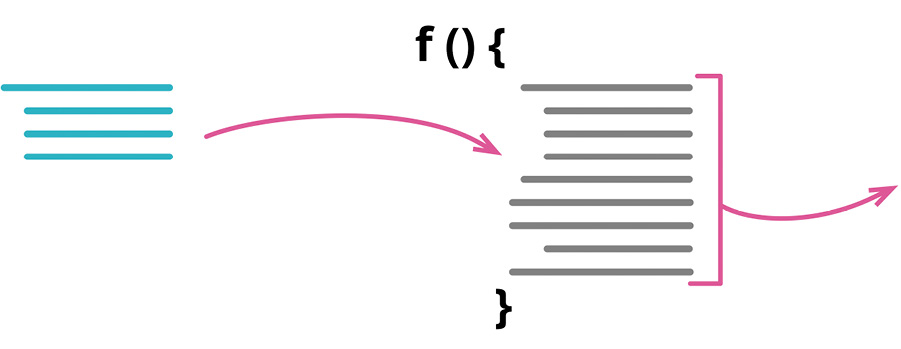

> 在足够了解已有算法并且可行的情况下，使用简单的算法替换原先复杂的算法

```javascript
function foundPerson(people) {
　for(let i = 0; i < people.length; i++) { 
　　if (people[i] === "Don") {
　　　return "Don";
　　}
　　if (people[i] === "John") { 
　　　return "John";
　　}
　　if (people[i] === "Kent") { 
　　　return "Kent";
　　}
　}
　return "";
}
```
```javascript
function foundPerson(people) {
　const candidates = ["Don", "John", "Kent"];
　return people.find(p => candidates.includes(p)) || '';
}
```

- 动机
  - **如果做一件事可以有更清晰的方式，就用比较清晰的方式取代复杂的方式** 
    - “重构”可以把一些复杂的东西分解为较简单的小块，但有时你就必须删掉整个算法，代之以较简单的算法
    - 随着对问题有了更多理解，往往会发现，在原先的做法之外，有更简单的解决方案，
    - 此时就需要改变原先的算法。
    - 如果我开始使用程序库，而其中提供的某些功能/特性与自己的代码重复，那么也需要改变原先的算法。
  - 有时会想修改原先的算法，让它去做一件与原先略有差异的事。
    - 这时候可以先把原先的算法替换为一个较易修改的算法，这样后续的修改会轻松许多。
  - 使用这项重构手法之前，得确定自己已经尽可能分解了原先的函数。
    - 替换一个巨大且复杂的算法是非常困难的，
    - 只有先将它分解为较简单的小型函数，才能很有把握地进行算法替换工作。

- 做法
  - 整理一下待替换的算法，保证它已经被抽取到一个独立的函数中。
  - 先只为这个函数准备测试，以便固定它的行为。
  - 准备好另一个（替换用）算法。
  - 执行静态检查。
  - 运行测试
    - 比对新旧算法的运行结果。如果测试通过，那就大功告成；
    - 否则，在后续测试和调试过程中，以旧算法为比较参照标准。

## 6.3. 搬移特性

### 6.3.1. 搬移函数(Move Function)


> 你的程序中，有个函数与其所驻之外的另一个类进行更多交流：调用后者，或被后者调用。在该函数最常引用的类中建立一个有着类似行为的新函数。将旧函数变成一个单纯的委托函数，或是将旧函数完全移除。

```javascript
class Account {
　get overdraftCharge() {...}
```
```javascript
class AccountType {
    get overdraftCharge() {...}
```

- 动机
  - **模块化** 是优秀软件设计的核心所在，好的模块化能够让我在修改程序时只需理解程序的一小部分。
    - 为了设计出高度模块化的程序，我得保证互相关联的软件要素都能集中到一块，
    - 并确保块与块之间的联系易于查找、直观易懂。
  - 同时，对模块设计的理解并不是一成不变的
    - 随着 **对代码的理解加深，会知道那些软件要素如何组织最为恰当**
    - 要将这种理解反映到代码上，就得不断地搬移这些元素。
  - 任何函数都需要具备 **上下文环境** 才能存活。
    - 这个上下文可以是全局的，但它更多时候是由某种形式的模块所提供的。
    - 对一个面向对象的程序而言，类作为最主要的模块化手段，其本身就能充当函数的上下文；
    - 通过嵌套的方式，外层函数也能为内层函数提供一个上下文。
    - 不同的语言提供的模块化机制各不相同，但这些模块的共同点是，它们都能为函数提供一个赖以存活的上下文环境。
  - 搬移函数最直接的一个 **动因** 是:
    - 它 **频繁引用其他上下文中的元素** ，而对自身上下文中的元素却关心甚少
    - 此时，让它去与那些更亲密的元素相会，通常能取得更好的封装效果，因为系统别处就可以减少对当前模块的依赖。
  - 是否需要搬移函数需要进行抉择
    - 需要 **仔细检查函数当前上下文与目标上下文之间的区别**
      - 需要查看函数的调用者都有谁
      - 它自身又调用了哪些函数
      - 被调用函数需要什么数据
      - 等等
    - 新情况: 
      - 在搬移过程中，通常会发现 **需要为一整组函数创建一个新的上下文** 
      - 此时就可以用函数 **组合成类** 或 **提炼类** 创建一个
    - 尽管为函数选择一个最好的去处不太容易，但 **决定越难做，通常说明“搬移这个函数与否”的重要性也越低** 
      - 好的做法是先把函数安置到某一个上下文里去，这样就能发现它们是否契合
      - 如果不太合适我可以再把函数搬移到别的地方

- 做法
  - 检查函数在当前上下文里引用的所有程序元素（包括变量和函数），考虑是否需要将它们一并搬移
    > 如果发现有些被调用的函数也需要搬移，我通常会先搬移它们。这样可以保证移动一组函数时，总是从依赖最少的那个函数入手。
    >
    > 如果该函数拥有一些子函数，并且它是这些子函数的唯一调用者，那么你可以先将子函数内联进来，一并搬移到新家后再重新提炼出子函数。
  - 检查待搬移函数是否具备多态性。
    > 在面向对象的语言里，还需要考虑该函数是否覆写了超类的函数，或者为子类所覆写。
  - 将函数复制一份到目标上下文中。调整函数，使它能适应新家。
    > 如果函数里用到了源上下文（source context）中的元素，我就得将这些元素一并传递过去，要么通过函数参数，要么是将当前上下文的引用传递到新的上下文那边去。
    >
    > 搬移函数通常意味着，我还得给它起个新名字，使它更符合新的上下文。
  - 执行静态检查。
  - 设法从源上下文中正确引用目标函数。
  - 修改源函数，使之成为一个纯委托函数。
  - 测试。
  - 考虑对源函数使用 **内联函数** 
  - 也可以不做内联，让源函数一直做委托调用。但如果调用方直接调用目标函数也不费太多周折，那么最好还是把中间人移除掉。

### 6.3.2. 搬移字段(MoveField)


> 你的程序中，某个字段被其所驻类之外的另一个类更多地用到。在目标类新建一个字段，修改源字段的所有用户，令它们改用新字段。

```javascript
class Customer {
  get plan() {return this._plan;}
  get discountRate() {return this._discountRate;}
```
```javascript
class Customer {
  get plan() {return this._plan;}
  get discountRate() {return this.plan.discountRate;}
```

- 动机
  - 编程活动中你需要编写许多代码，为系统实现特定的行为，但往往 **数据结构才是一个健壮程序的根基** 
    - 一个适应于问题域的良好数据结构，可以让行为代码变得简单明了
    - 而一个糟糕的数据结构则将招致许多无用代码，这些代码更多是在差劲的数据结构中间纠缠不清，而非为系统实现有用的行为
    - 代码凌乱，势必难以理解；不仅如此，坏的数据结构本身也会掩藏程序的真实意图。
  - 因此，好的数据结构至关重要
    - 不过这也与编程活动的许多方面一样，它们都 **很难一次做对**
    - 通常都会做些预先的设计，设法得到最恰当的数据结构
      > 此时如果你具备一些 **领域驱动设计（domain-driven design）** 方面的经验和知识，往往有助于你更好地设计数据结构。
    - 但即便经验再丰富，技能再熟练，仍然还是会犯错
    - 在 **不断编程的过程中，对问题域的理解会加深** ，对“什么是理想的数据结构”会有更多想法
  - 如果 **发现数据结构已经不适应于需求，就应该马上修缮它** 
    - 如果容许瑕疵存在并进一步累积，它们就会经常使我困惑，并且使代码愈来愈复杂。
  - 准备搬移数据的原因
    - 可能是因为发现每当调用某个函数时
      - 除了传入一个记录参数，还总是需要同时传入另一条记录的某个字段一起作为参数
      - 总是 **一同出现、一同作为函数参数传递的数据，最好是规整到同一条记录中** 
      - 以体现它们之间的联系
    - **修改的难度** 也是引起我注意的一个原因
      - 如果修改一条记录时，总是需要同时改动另一条记录，那么说明很可能有字段放错了位置
    - 此外，如果更新一个字段时， **需要同时在多个结构中做出修改** ，那也是一个征兆
      - 表明该字段需要被搬移到一个集中的地点，这样每次只需修改一处地方。
  - 搬移字段的操作 **通常是在其他更大的改动背景下** 发生的
    - 实施字段搬移后，可能会发现字段的诸多使用者应该通过目标对象来访问它，而不应该再通过源对象来访问
    - 诸如此类的清理，可以在此后的重构中一并完成
    - 同样，也可能因为字段当前的一些用法而无法直接搬移它。得先对其使用方式做一些重构(比如 **封装变量** )，然后才能继续搬移工作。
  - 到目前为止，用以指称数据结构的术语都是 **“记录”（record）** ，但以上论述 **对类和对象同样适用**
    - 类只是一种多了实例函数的记录，它与其他任何数据结构一样
    - 不过类的实例函数确实简化了搬移数据的操作，因为它已经将数据的存取封装到访问函数中
    - 当搬移数据时，只需要相应修改访问函数的引用，该字段的所有客户端依然可以正常工作
    - 因此，如果你的数据已经用类进行了封装，那么这个重构手法会更容易进行
    - 如果要搬移的数据是裸记录，没有任何封装，虽然类似的搬移仍然能够进行，但情况就会复杂一些。

- 做法
  - 确保源字段已经得到了良好封装。
  - 测试。
  - 在目标对象上创建一个字段（及对应的访问函数）。
  - 执行静态检查。
  - 确保源对象里能够正常引用目标对象。
    > 也许你已经有现成的字段或方法得到目标对象。
    > 如果没有，看看是否能简单地创建一个方法完成此事。
    > 如果还是不行，你可能就得在源对象里创建一个字段，用于存储目标对象了。
    > 这次修改可能留存很久，但你也可以只做临时修改，等到系统其他部分的重构完成就回来移除它。
  - 调整源对象的访问函数，令其使用目标对象的字段。
    > 如果源类的所有实例对象都共享对目标对象的访问权，那么可以考虑先更新源类的设值函数，
    > 让它修改源字段时，对目标对象上的字段做同样的修改。
    > 然后，再通过 **引入断言** （302）， **当检测到源字段与目标字段不一致时抛出错误** 。
    > 一旦你确定改动没有引入任何可观察的行为变化，就可以放心地让访问函数直接使用目标对象的字段了。
  - 测试。
  - 移除源对象上的字段。
  - 测试。

### 6.3.3. 搬移语句到函数（Move Statements into Function）

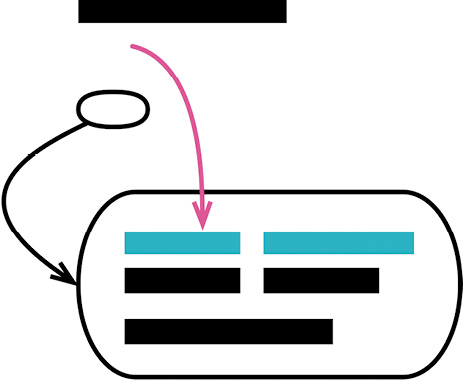

```javascript
result.push(`<p>title: ${person.photo.title}</p>`); 
result.concat(photoData(person.photo));

function photoData(aPhoto) { 
　return [
　　`<p>location: ${aPhoto.location}</p>`,
　　`<p>date: ${aPhoto.date.toDateString()}</p>`,
 ];
}
```
```javascript
result.concat(photoData(person.photo));

function photoData(aPhoto) { 
　return [
　　`<p>title: ${aPhoto.title}</p>`,
　　`<p>location: ${aPhoto.location}</p>`,
　　`<p>date: ${aPhoto.date.toDateString()}</p>`,
　];
}
```

- 动机
  - 要维护代码库的健康发展，需要遵守几条黄金守则，其中最重要的一条当属 **“消除重复”** 。
  - 如果我发现调用某个函数时，总有一些相同的代码也需要每次执行，那么我会考虑将此段代码合并到函数里头。
  - 这样，日后对这段代码的修改只需改一处地方，还能对所有调用者同时生效。
  - 如果将来代码对不同的调用者需有不同的行为，那时再通过 搬移语句到调用者 将它（或其一部分）搬移出来也十分简单。
  - 如果某些语句与一个函数
    - 放在一起更像一个整体，并且更有助于理解，那就将语句搬移到函数里去。
    - 如果它们与函数不像一个整体，但仍应与函数一起执行
      - 那可以用提炼函数将语句和函数一并提炼出去。
      - 内联和改名的步骤等清理工作通常也有其必要性，可以在完成核心步骤后再择机完成。

- 做法
  - 如果重复的代码段离调用目标函数的地方还有些距离，则先用移动语句将这些语句挪动到紧邻目标函数的位置。
  - 如果目标函数仅被唯一一个源函数调用，那么只需将源函数中的重复代码段剪切并粘贴到目标函数中即可，然后运行测试。本做法的后续步骤至此可以忽略。
  - 如果函数不止一个调用点，那么先选择其中一个调用点应用提炼函数，将待搬移的语句与目标函数一起提炼成一个新函数。给新函数取个临时的名字，只要易于搜索即可。
  - 调整函数的其他调用点，令它们调用新提炼的函数。每次调整之后运行测试。
  - 完成所有引用点的替换后，应用内联函数将目标函数内联到新函数里，并移除原目标函数。
  - 对新函数应用函数改名，将其改名为原目标函数的名字。

### 6.3.4. 搬移语句到调用者（Move Statements to Callers）

> 反向重构：搬移语句到函数

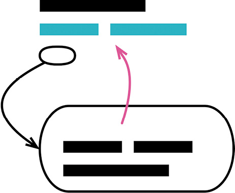

```javascript
emitPhotoData(outStream, person.photo); 

function emitPhotoData(outStream, photo) {
　outStream.write(`<p>title: ${photo.title}</p>\n`); 
　outStream.write(`<p>location: ${photo.location}</p>\n`);
}
```
```javascript
emitPhotoData(outStream, person.photo); 
outStream.write(`<p>location: ${person.photo.location}</p>\n`);

function emitPhotoData(outStream, photo) {
　outStream.write(`<p>title: ${photo.title}</p>\n`);
}
```

- 动机
  - 抽象设计
    - 作为程序员，我们的职责就是 **设计出结构一致、抽象合宜的程序** ，而程序抽象能力的源泉正是来自函数。
    - 与其他抽象机制的设计一样，我们并非总能平衡好抽象的边界。
    - 随着系统能力发生演进（通常只要是有用的系统，功能都会演进）， **原先设定的抽象边界总会悄无声息地发生偏移** 。
  - 函数 抽象边界偏移
    - 对于函数来说，这样的边界偏移意味着曾经视为一个整体、一个单元的行为，如今可能已经分化出两个甚至是多个不同的关注点。
    - 函数边界发生偏移的一个 **征兆** 是， **以往在多个地方共用的行为，如今需要在某些调用点面前表现出不同的行为** 。
  - 处理方式
    - 我们得把表现不同的行为从函数里挪出，并搬移到其调用处。
    - 这种情况下，可以先使用 移动语句 手法，先将表现不同的行为调整到函数的开头或结尾，再使用本手法将语句搬移到其调用点。
    - 只要差异代码被搬移到调用点，就可以根据需要对其进行修改。
    - 这个重构手法比较适合处理边界仅有些许偏移的场景，但有时调用点和调用者之间的边界已经相去甚远，此时便只能重新进行设计了
    - 若果真如此，最好的办法是先用 内联函数  **合并双方的内容** ， **调整语句的顺序，再提炼出新的函数来，以形成更合适的边界** 。

- 做法
  - 最简单的情况下，原函数非常简单，其调用者也只有寥寥一两个，此时只需把要搬移的代码从函数里剪切出来并粘贴回调用端去即可，必要的时候做些调整。运行测试。如果测试通过，那就大功告成，本手法可以到此为止。
  - 若调用点不止一两个，则需要先用提炼函数（106）将你不想搬移的代码提炼成一个新函数，函数名可以临时起一个，只要后续容易搜索即可。
    > 如果原函数是一个超类方法，并且有子类进行了覆写，
    > 那么还需要对所有子类的覆写方法进行同样的提炼操作，保证继承体系上每个类都有一份与超类相同的提炼函数。
    > 接着将子类的提炼函数删除，让它们引用超类提炼出来的函数。
  - 对原函数应用内联函数。
  - 对提炼出来的函数应用改变函数声明（124），令其与原函数使用同一个名字。
  - 如果你能想到更好的名字，那就用更好的那个。

### 6.3.5. 以函数调用取代内联代码（Replace Inline Code with Function Call）

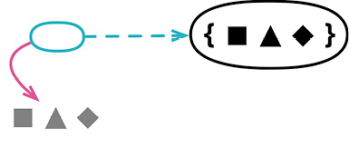

```javascript
let appliesToMass = false; 
for(const s of states) {
  if (s === "MA") appliesToMass = true;
}
```
```javascript
appliesToMass = states.includes("MA");
```

- 动机
  - 善用函数可以帮助我将相关的行为打包起来，这对于提升代码的表达力大有裨益——  **一个命名良好的函数，本身就能极好地解释代码的用途** ，使读者不必了解其细节。
  - 函数同样有助于 **消除重复** ，因为同一段代码我不需要编写两次，每次调用一下函数即可。
  - 此外，当我需要修改函数的内部实现时，也不需要四处寻找有没有漏改的相似代码。
    > 当然，我可能需要检查函数的所有调用点，判断它们是否都应该使用新的实现，但通常很少需要这么仔细，
    > 即便需要，也总好过四处寻找相似代码。
  - 如果我见到一些内联代码，它们做的事情仅仅是已有函数的重复，我通常会以一个函数调用取代内联代码。
  - 但有一种情况需要特殊对待，那就是当内联代码与函数之间只是外表相似但其实并无本质联系时。
    - 这种情况下，当我改变了函数实现时，并不期望对应内联代码的行为发生改变。
    - 判断内联代码与函数之间是否真正重复，从函数名往往可以看出端倪：
      - 如果一个函数命名得当，也确实与内联代码做了一样的事，那么这个名字用在内联代码的语境里也应该十分协调；
      - 如果函数名显得不协调
        - 可能是因为命名本身就比较糟糕，也可能是因为函数与内联代码彼此的用途确实有所不同。
        - 若是后者的情况，就不应该用函数调用取代该内联代码。

- 做法
  - 将内联代码替代为对一个既有函数的调用。
  - 测试。

### 6.3.6. 移动语句（Slide Statements）

> 曾用名：合并重复的代码片段（Consolidate Duplicate Conditional Fragments）


```javascript
const pricingPlan = retrievePricingPlan(); 
const order = retreiveOrder();
let charge;
const chargePerUnit = pricingPlan.unit;
```
```javascript
const pricingPlan = retrievePricingPlan(); 
const chargePerUnit = pricingPlan.unit; 
const order = retreiveOrder();
let charge;
```

- 动机
  - 让存 **在关联的东西一起出现** ，可以使代码更容易理解
  - 如果有几行代码取用了同一个数据结构，那么最好是让它们在一起出现，而不是夹杂在取用其他数据结构的代码中间。
  - 最简单的情况下，只需 **使用移动语句就可以让它们聚集起来** 。
  - 此外还有一种常见的“关联”，就是关于变量的声明和使用。
  - 有人喜欢在函数顶部一口气声明函数用到的所有变量，我个人则喜欢在第一次需要使用变量的地方再声明它。
  - 通常来说，把相关代码搜集到一处，往往是另一项重构开始之前的准备工作
  - 相比于仅仅把几行相关的代码移动到一起，将它们提炼到独立的函数往往能起到更好的抽象效果
  - 但如果起先存在关联的代码就没有彼此在一起，那么我也很难应用提炼函数的手法。

- 做法
  - 确定待移动的代码片段应该被搬往何处。仔细检查待移动片段与目的地之间的语句，看看搬移后是否会影响这些代码正常工作。如果会，则放弃这项重构。
    > 往前移动代码片段时，如果片段中声明了变量，则不允许移动到任何变量的声明语句之前。
    > 往后移动代码片段时，如果有语句引用了待移动片段中的变量，则不允许移动到该语句之后。
    > 往后移动代码片段时，如果有语句修改了待移动片段中引用的变量，则不允许移动到该语句之后。
    > 往后移动代码片段时，如果片段中修改了某些元素，则不允许移动到任何引用了这些元素的语句之后。
  - 剪切源代码片段，粘贴到上一步选定的位置上。
  - 测试。
    > 如果测试失败，那么尝试减小移动的步子：要么是减少上下移动的行数，要么是一次搬移更少的代码。

### 6.3.7. 拆分循环（Split Loop）


```javascript
let averageAge = 0;
let totalSalary = 0;
for (const p of people) {
　averageAge += p.age;
　totalSalary += p.salary;
}
averageAge = averageAge / people.length;
```
```javascript
let totalSalary = 0;
for (const p of people) { 
　totalSalary += p.salary;
}

let averageAge = 0;
for (const p of people) {
　averageAge += p.age;
}
averageAge = averageAge / people.length;
```
- 动机
  - 常常能见到一些身兼多职的循环，它们一次做了两三件事情，不为别的，就因为这样可以只循环一次
  - 但如果你在一次循环中做了两件不同的事，那么 **每当需要修改循环时，你都得同时理解这两件事情** 。
  - 如果能够将循环拆分，让一个循环只做一件事情，那就能确保每次修改时你只需要理解要修改的那块代码的行为就可以了。
  - 拆分循环还能让每个循环更容易使用。
    - 如果一个循环只计算一个值，那么它直接返回该值即可
    - 但如果循环做了太多件事，那就只得返回结构型数据或者通过局部变量传值了
    - 因此，一般拆分循环后，我还会紧接着对拆分得到的循环应用 提炼函数 （106）。
  - 这项重构手法可能让许多程序员感到不安，因为它会迫使你执行两次循环。
    - 对此，我一贯的建议也与之前所明确指出的一致： **先进行重构，然后再进行性能优化** 
      - **得先让代码结构变得清晰，才能做进一步优化** 
      - 如果重构之后该循环确实成了性能的瓶颈，届时再把拆开的循环合到一起也很容易。
      - 但实际情况是，即使处理的列表数据更多一些， **循环本身也很少成为性能瓶颈** ，
      - 更何况拆分出循环来通常还使一些更强大的优化手段变得可能

- 做法
  - 复制一遍循环代码。
  - 识别并移除循环中的重复代码，使每个循环只做一件事。
  - 测试。
  - 完成循环拆分后，考虑对得到的每个循环应用提炼函数。

### 6.3.8. 以管道取代循环（Replace Loop with Pipeline）

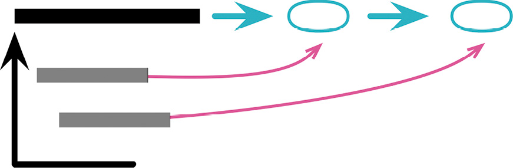

```javascript
const names = [];
for (const i of input) {
  if (i.job === "programmer") 
    names.push(i.name);
}
```
```javascript
const names = input
  .filter(i => i.job === "programmer")
  .map(i => i.name)
;
```

- 动机
  - 与大多数程序员一样，我入行的时候也有人告诉我，迭代一组集合时得使用循环。
  - 不过时代在发展，如今越来越多的编程语言都提供了 **更好的语言结构来处理迭代过程** ，这种结构就叫作 **集合管道（collection pipeline）** 。
  - 集合管道[mf-cp]是这样一种技术，它允许我使用一组运算来描述集合的迭代过程，其中每种运算接收的入参和返回值都是一个集合。
  - 这类运算有很多种，最常见的则非map和filter莫属：
    - map运算是指用一个函数作用于输入集合的每一个元素上，将集合变换成另外一个集合的过程；
    - filter运算是指用一个函数从输入集合中筛选出符合条件的元素子集的过程。
  - 运算得到的集合可以供管道的后续流程使用。
    - 我发现一些逻辑如果采用集合管道来编写，代码的可读性会更强
    - 我只需要从头到尾阅读一遍代码，就能弄清对象在管道中间的变换过程。

- 做法
  - 创建一个新变量，用以存放参与循环过程的集合。
    > 也可以简单地复制一个现有的变量赋值给新变量。
  - 从循环顶部开始，将循环里的每一块行为依次搬移出来，在上一步创建的集合变量上用一种管道运算替代之。每次修改后运行测试。
  - 搬移完循环里的全部行为后，将循环整个删除。
    > 如果循环内部通过累加变量来保存结果，那么移除循环后，将管道运算的最终结果赋值给该累加变量。

### 6.3.9. 移除死代码（Remove Dead Code）


```javascript
if(false) { 
  doSomethingThatUsedToMatter();
}
```
```javascript
// 全删了
```

- 动机
  - 事实上，我们部署到生产环境甚至是用户设备上的代码，从来未因代码量太大而产生额外费用。
  - 就算有几行用不上的代码，似乎也不会因此拖慢系统速度，或者占用过多的内存，大多数现代的编译器还会自动将无用的代码移除。
  - 但当你尝试阅读代码、理解软件的运作原理时， **无用代码确实会带来很多额外的思维负担** 。
  - 它们周围没有任何警示或标记能告诉程序员，让他们能够放心忽略这段函数，因为已经没有任何地方使用它了。
  - 当程序员花费了许多时间，尝试理解它的工作原理时，却发现无论怎么修改这段代码都无法得到期望的输出。
  - 一旦代码不再被使用，我们就该立马删除它。
    - 有可能以后又会需要这段代码，但我从不担心这种情况；
    - 就算真的发生，我 **也可以从版本控制系统里再次将它翻找出来** 。
    - 如果我 **真的觉得日后它极有可能再度启用** ，那 **还是要删掉它，只不过可以在代码里留一段注释** ，提一下这段代码的存在，以及它被移除的那个提交版本号
      > 但老实讲，我已经记不得我上次撰写这样的注释是什么时候了，当然也未曾因为不写而感到过遗憾。
  - 在以前，业界对于死代码的处理态度多是注释掉它。
    - 在版本控制系统还未普及、用起来又不太方便的年代，这样做有其道理
    - 但现在版本控制系统已经相当普及。
    - 如今哪怕是一个极小的代码库我都会把它放进版本控制，这些无用代码理应可以放心清理了。

- 做法
  - 如果死代码可以从外部直接引用，比如它是一个独立的函数时，先查找一下还有无调用点。
  - 将死代码移除。
  - 测试。

## 6.4. 重新组织数据

### 6.4.1. 拆分变量（Split Variable）

> 曾用名：移除对参数的赋值（Remove Assignments to Parameters）
>
> 曾用名：分解临时变量（Split Temp）


```javascript
let temp = 2 * (height + width); 
console.log(temp);
temp = height * width; 
console.log(temp);
```
```javascript
const perimeter = 2 * (height + width); 
console.log(perimeter);
const area = height * width; 
console.log(area);
```

- 动机
  - 变量有各种不同的用途，其中某些用途会很自然地导致临时变量被多次赋值
  - “循环变量”和“结果收集变量”就是两个典型例子：
    - 循环变量（loop variable）会随循环的每次运行而改变（例如`for（let i=0; i<10; i++）`语句中的i）
    - 结果收集变量（collecting variable）负责将“通过整个函数的运算”而构成的某个值收集起来。
  - 除了这两种情况，还有很多变量用于保存一段冗长代码的运算结果，以便稍后使用。
    - 这种变量应该只被赋值一次。
    - 如果它们被赋值超过一次，就意味它们在函数中承担了一个以上的责任。
    - 如果变量承担多个责任，它就应该被替换（分解）为多个变量， **每个变量只承担一个责任** 。
    - 同一个变量承担两件不同的事情，会令代码阅读者糊涂。

- 做法
  - 在待分解变量的声明及其第一次被赋值处，修改其名称。
    > 如果稍后的赋值语句是“i=i+某表达式形式”，意味着这是一个结果收集变量，就不要分解它。
    > 结果收集变量常用于累加、字符串拼接、写入流或者向集合添加元素。
  - 如果可能的话，将新的变量声明为不可修改。
  - 以该变量的第二次赋值动作为界，修改此前对该变量的所有引用，让它们引用新变量。
  - 测试。
  - 重复上述过程。每次都在声明处对变量改名，并修改下次赋值之前的引用，直至到达最后一处赋值。

### 6.4.2. 字段改名（Rename Field）

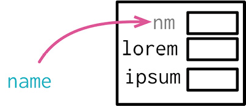

```javascript
class Organization { 
  get name() {...}
}
```
```javascript
class Organization { 
  get title() {...}
}
```

- 动机
  - 命名很重要，对于程序中广泛使用的记录结构，其中字段的命名格外重要。
  - 数据结构对于帮助阅读者理解特别重要。
    > 多年以前，Fred Brooks就说过：“只给我看你的工作流程却隐藏表单，我将仍然一头雾水。但是如果你给我展示表单，或许不需要流程图，就能柳暗花明。”
    - 现在已经不太有人画流程图了，不过道理还是一样的。数据结构是理解程序行为的关键。
    - 既然数据结构如此重要，就很有必要保持它们的整洁。
    - 一如既往地，在一个软件上做的工作越多，对数据的理解就越深，所以很有必要把加深的理解融入程序中。
  - 记录结构中的字段可能需要改名，类的字段也一样。
    - 在类的使用者看来，取值和设值函数就等于是字段。
    - 对这些函数的改名，跟裸记录结构的字段改名一样重要。

- 做法
  - 如果记录的作用域较小，可以直接修改所有该字段的代码，然后测试。后面的步骤就都不需要了。
  - 如果记录还未封装，请先使用封装记录。
  - 在对象内部对私有字段改名，对应调整内部访问该字段的函数。
  - 测试。
  - 如果构造函数的参数用了旧的字段名，运用改变函数声明（124）将其改名。
  - 运用函数改名给访问函数改名。

### 6.4.3. 以查询取代派生变量（Replace Derived Variable with Query）

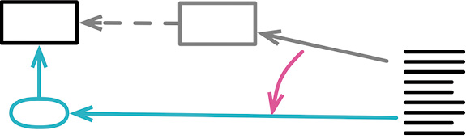

```javascript
get discountedTotal() {return this._discountedTotal;} 
set discount(aNumber) {
　const old = this._discount; 
　this._discount = aNumber; 
　this._discountedTotal += old - aNumber;
}
```
```java
get discountedTotal() {return this._baseTotal - this._discount;} 
set discount(aNumber) {this._discount = aNumber;}
```

- 动机
  - **可变数据是软件中最大的错误源头之一** 
  - 对数据的修改常常导致代码的各个部分以丑陋的形式互相耦合
    - 在一处修改数据，却在另一处造成难以发现的破坏
    - 很多时候，完全去掉可变数据并不现实，但我还是强烈建议： **尽量把可变数据的作用域限制在最小范围** 。
  - 有些变量其实 **可以很容易地随时计算出来** 。
    - 如果能去掉这些变量，也算朝着消除可变性的方向迈出了一大步。
    - 计算常能更清晰地表达数据的含义，而且也避免了“源数据修改时忘了更新派生变量”的错误。
  - 源数据是否可变情况：
    - 如果计算的源数据是不可变的，并且我们可以强制要求计算的结果也是不可变的，那么就不必重构消除计算得到的派生变量。
      - 因此，“根据源数据生成新数据结构”的变换操作可以保持不变，即便我们可以将其替换为计算操作。
      - 实际上，这是两种不同的编程风格：
        - 一种是 **对象风格** ，把一系列计算得出的属性包装在数据结构中；
        - 另一种是 **函数风格** ，将一个数据结构变换为另一个数据结构。
    - 如果源数据会被修改
      - 而你必须负责管理派生数据结构的整个生命周期，那么对象风格显然更好
      - 但如果源数据不可变，或者派生数据用过即弃，那么两种风格都可行。

- 做法
  - 识别出所有对变量做更新的地方。如有必要，用拆分变量（240）分割各个更新点。
  - 新建一个函数，用于计算该变量的值。
  - 用 引入断言 ，断言该变量和计算函数始终给出同样的值。
    > 如有必要，用 封装变量 将这个断言封装起来。
  - 测试。
  - 修改读取该变量的代码，令其调用新建的函数。
  - 测试。
  - 用 移除死代码 去掉变量的声明和赋值。

### 6.4.4. 将引用对象改为值对象（Change Reference to Value）

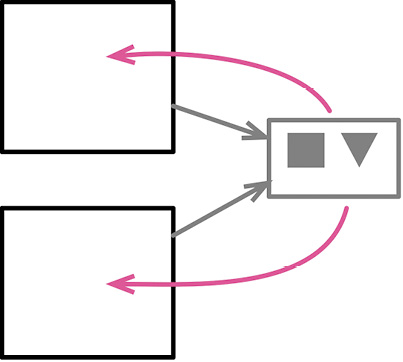

```javascript
class Product {
  applyDiscount(arg) {this._price.amount -= arg;}
```
```javascript
class Product { 
  applyDiscount(arg) {
    this._price = new Money(this._price.amount - arg, this._price.currency);
  }
```

- 动机
  - 在把一个对象（或数据结构）嵌入另一个对象时，位于内部的这个对象可以被视为引用对象，也可以被视为值对象。
  - 两者最明显的差异在于如何更新内部对象的属性：
    - 如果将内部对象视为引用对象，在更新其属性时，我会保留原对象不动，更新内部对象的属性；
    - 如果将其视为值对象，我就会替换整个内部对象，新换上的对象会有我想要的属性值。
  - 如果把一个字段视为值对象，我可以把内部对象的类也变成值对象。
    - 值对象通常更容易理解，主要因为它们是不可变的。
    - 一般说来，不可变的数据结构处理起来更容易。
    - 以放心地把不可变的数据值传给程序的其他部分，而不必担心对象中包装的数据被偷偷修改。
    - 可以在程序各处复制值对象，而不必操心维护内存链接。
    - **值对象在分布式系统和并发系统中尤为有用** 。
  - 值对象和引用对象的区别也告诉我，何时不应该使用本重构手法。
    - 如果我想在几个对象之间共享一个对象，以便几个对象都能看见对共享对象的修改
    - 那么这个共享的对象就应该是引用。
  - 是不是真正的值对象，要看 **是否基于值判断相等性** 
    - 在这个领域中，JavaScript做得不好：语言和核心库都不支持将“基于引用的相等性判断”换成“基于值的相等性判断”
    - 唯一能做的就是创建自己的equals函数。

    ```
    在大多数面向对象语言中，内置的相等性判断方法可以被覆写为基于值的相等性判断。
    在Ruby中，我可以覆写==运算符；在Java中，我可以覆写Object.equals()方法。
    在覆写相等性判断的同时，通常还需要覆写生成散列码的方法（例如Java中的Object.hashCode()方法）
    以确保用到散列码的集合在使用值对象时一切正常。
    ```

- 做法
  - 检查重构目标是否为不可变对象，或者是否可修改为不可变对象。
  - 用 移除设值函数 逐一去掉所有设值函数。
  - 提供一个 **基于值的相等性判断函数** ，在其中使用值对象的字段。
  - 大多数编程语言都提供了可覆写的相等性判断函数。通常你还必须同时覆写生成散列码的函数。

### 6.4.5. 将值对象改为引用对象（Change Value to Reference）

> 反向重构：将引用对象改为值对象

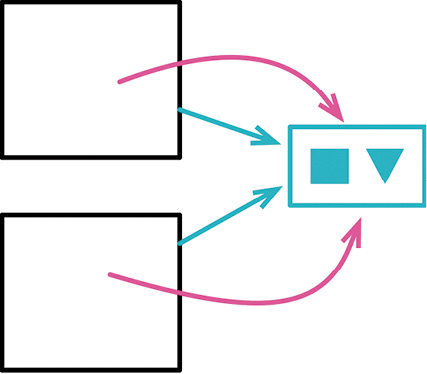

```
let customer = new Customer(customerData);
```
```
let customer = customerRepository.get(customerData.id);
```

- 动机
  - 一个数据结构中可能包含多个记录，而这些记录都关联到同一个逻辑数据结构。
  - 例如，
    - 我可能会读取一系列订单数据，其中有多条订单属于同一个顾客。
    - 遇到这样的共享关系时，既可以把顾客信息作为值对象来看待，也可以将其视为引用对象。
    - 如果将其视为值对象，那么每份订单数据中都会复制顾客的数据；
    - 而如果将其视为引用对象，对于一个顾客，就只有一份数据结构，会有多个订单与之关联。
  - 如果 **顾客数据(也就是共享数据)永远不修改** ，那么两种处理方式都合理。
    - 把同一份数据复制多次可能会造成一点困扰，但这种情况也很常见，不会造成太大问题。
    - 过多的数据复制有可能会造成内存占用的问题，但就跟所有性能问题一样，这种情况并不常见。
  - 如果 **共享的数据需要更新** ，将其复制多份的做法就会遇到巨大的困难。
    - 此时我必须找到所有的副本，更新所有对象。
    - 只要漏掉一个副本没有更新，就会遭遇麻烦的数据不一致。
    - 这种情况下，可以考虑将多份数据副本变成单一的引用，这样对顾客数据的修改就会立即反映在该顾客的所有订单中。
  - 把值对象改为引用对象会带来一个结果：
    - 对于一个客观实体，只有一个代表它的对象。
    - 这通常意味着我会需要某种形式的仓库，在仓库中可以找到所有这些实体对象。
    - **只为每个实体创建一次对象，以后始终从仓库中获取该对象** 。

- 做法
  - 为相关对象创建一个仓库（如果还没有这样一个仓库的话）。
  - 确保构造函数有办法找到关联对象的正确实例。
  - 修改宿主对象的构造函数，令其从仓库中获取关联对象。每次修改后执行测试。

## 6.5. 简化条件表达式

> 程序的大部分威力来自条件逻辑，但很不幸，程序的复杂度也大多来自条件逻辑。
> 我经常借助重构把条件逻辑变得更容易理解。
> 我常用 分解条件表达式 处理复杂的条件表达式，用 合并条件表达式 厘清逻辑组合。
> 我会用以卫语句取代嵌套条件表达式（266）清晰表达“在主要处理逻辑之前先做检查”的意图。
> 如果我发现一处switch逻辑处理了几种情况，可以考虑拿出 以多态取代条件表达式 重构手法。
> 很多条件逻辑是用于处理特殊情况的，例如处理null值。
> 如果对某种特殊情况的处理逻辑大多相同，那么可以用 引入特例（常被称作引入空对象） 消除重复代码。
> 另外，虽然我很喜欢去除条件逻辑，但如果我想明确地表述（以及检查）程序的状态，引入断言 是一个不错的补充。

### 6.5.1. 分解条件表达式(Decompose Conditional)

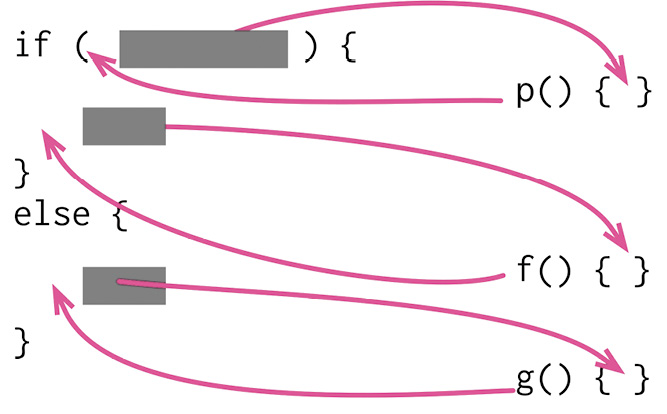

> 你有一个复杂的条件(if-then-else)语句。从 if、then、else 三分段落中分别提炼出独立函数。

```javascript
if (!aDate.isBefore(plan.summerStart) && !aDate.isAfter(plan.summerEnd)) 
　charge = quantity * plan.summerRate;
else
　charge = quantity * plan.regularRate + plan.regularServiceCharge;
```
```javascript
if (summer())
　charge = summerCharge(); 
else
　charge = regularCharge();
```

- 动机
  > 本重构手法其实只是 **提炼函数** 的一个应用场景。
  > 但我要特别强调这个场景，因为我发现它经常会带来很大的价值。
  - 程序之中，复杂的条件逻辑是最常导致复杂度上升的地点之一。
    - 必须编写代码来检查不同的条件分支，根据不同的条件做不同的事，然后，我很快就会得到一个相当长的函数。
    - **大型函数本身就会使代码的可读性下降，而条件逻辑则会使代码更难阅读** 。
    - 在带有复杂条件逻辑的函数中，
      - 代码（包括检查条件分支的代码和真正实现功能的代码）会告诉我发生的事，
      - 但常常让我 **弄不清楚为什么会发生这样的事** ，
      - 这就说明 **代码的可读性的确大大降低** 了。
  - 和任何大块头代码一样，我可以将它 **分解为多个独立的函数** ，
    - 根据每个小块代码的用途，为分解而得的新函数命名，
    - 并将原函数中对应的代码改为调用新函数，从而更清楚地表达自己的意图。
  - 对于条件逻辑，将每个分支条件分解成新函数还可以带来更多好处：
    - 可以突出条件逻辑，更清楚地表明每个分支的作用，并且突出每个分支的原因。

- 做法：对条件判断和每个条件分支分别运用提炼函数手法。

### 6.5.2. 合并条件表达式(Consolidate ConditionalExpression)

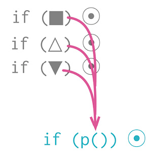

> 你有一系列条件测试，都得到相同结果。将这些测试合并为一个条件表达式，并将这个条件表达式提炼成为一个独立函数。

```javascript
if (anEmployee.seniority < 2) return 0;
if (anEmployee.monthsDisabled > 12) return 0;
if (anEmployee.isPartTime) return 0;
```
```javascript
if (isNotEligibleForDisability()) return 0; 

function isNotEligibleForDisability() {
　return ((anEmployee.seniority < 2)
　　　　　|| (anEmployee.monthsDisabled > 12)
　　　　　|| (anEmployee.isPartTime));
}
```

- 动机
  - 有时我会发现这样一串条件检查：
    - **检查条件各不相同，最终行为却一致** 。
    - 如果发现这种情况，就应该使用“逻辑或”和“逻辑与”将它们合并为一个条件表达式。
  - 之所以要合并条件代码，有两个重要原因。
    - 首先，合并后的条件代码会表述“实际上只有一次条件检查，只不过有多个并列条件需要检查而已”，从而使这一次检查的用意更清晰。
      - 当然，合并前和合并后的代码有着相同的效果，但原先代码传达出的信息却是“这里有一些各自独立的条件测试，它们只是恰好同时发生”。
    - 其次，这项重构往往可以为使用 提炼函数 做好准备
      - **将检查条件提炼成一个独立的函数对于厘清代码意义非常有用** ，因为它把描述“做什么”的语句换成了“为什么这样做”。
  - 条件语句的合并理由也同时指出了不要合并的理由：
    - **如果** 我认为这些检查的确 **彼此独立** ，的确不应该被视为同一次检查，我 **就不会使用本项重构** 。

- 做法
  - 确定这些条件表达式都没有副作用。
    > 如果某个条件表达式有副作用，可以先用将查询函数和修改函数分离（306）处理。
  - 使用适当的逻辑运算符，将两个相关条件表达式合并为一个。
    > 顺序执行的条件表达式用逻辑或来合并，嵌套的if语句用逻辑与来合并。
  - 测试。
  - 重复前面的合并过程，直到所有相关的条件表达式都合并到一起。
  - 可以考虑对合并后的条件表达式实施提炼函数。

### 6.5.3. 以卫语句取代嵌套条件表达式(Replace nested Conditional with GuardClauses)

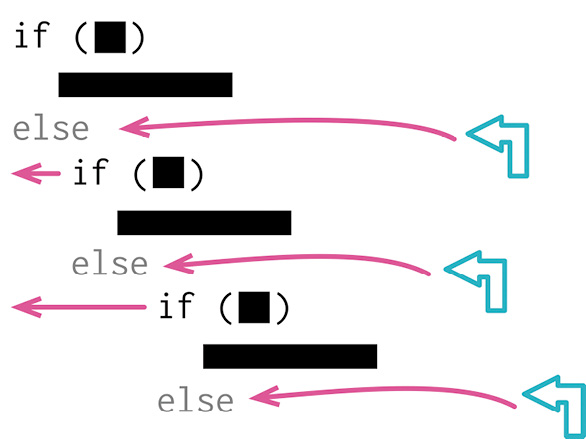

```javascript
function getPayAmount() { 
　let result;
　if (isDead)
　　result = deadAmount(); 
　else {
　　if (isSeparated)
　　　result = separatedAmount(); 
　　else {
　　　if (isRetired)
　　　　result = retiredAmount(); 
　　　else
　　　　result = normalPayAmount();
　　}
　}
　return result;
}
```
```javascript
function getPayAmount() {
　if (isDead) return deadAmount();
　if (isSeparated) return separatedAmount(); 
　if (isRetired) return retiredAmount(); 
　return normalPayAmount();
}
```

> 函数中的条件逻辑使人难以看清正常的执行路径。使用卫语句表现所有的特殊情况。

- 动机
  - 条件表达式通常有两种风格
    - 第一种风格是：两个条件分支都属于正常行为
    - 第二种风格则是：只有一个条件分支是正常行为，另一个分支则是异常的情况。
  - 这两类条件表达式有不同的用途，这一点应该通过代码表现出来。
    - 如果两条分支都是正常行为，就应该使用形如if...else...的条件表达式；
    - 如果 **某个条件极其罕见，就应该单独检查该条件，并在该条件为真时立刻从函数中返回** 。
      - 这样的 **单独检查常常被称为“卫语句”（guard clauses）** 。
  - 以卫语句取代嵌套条件表达式的精髓就是： **给某一条分支以特别的重视** 。
    - 如果使用 **if-then-else** 结构，你对if分支和else分支的重视是同等的。
      - 这样的代码结构传递给阅读者的消息就是： **各个分支有同样的重要性** 。
    - **卫语句** 就不同了，它告诉阅读者：
      - “这种情况 **不是本函数的核心逻辑所关心** 的，如果它真发生了，请做一些必要的整理工作，然后退出。”
  - “每个函数只能有一个入口和一个出口”的观念，根深蒂固于某些程序员的脑海里。
    - 我发现，当我处理他们编写的代码时，经常需要使用以卫语句取代嵌套条件表达式。
    - 现今的编程语言都会强制保证每个函数只有一个入口，至于 **“单一出口”规则，其实不是那么有用** 。
    - 在我看来， **保持代码清晰才是最关键** 的：
      - 如果单一出口能使这个函数更清楚易读，那么就使用单一出口；否则就不必这么做。

- 做法
  - 选中最外层需要被替换的条件逻辑，将其替换为卫语句。
  - 测试。
  - 有需要的话，重复上述步骤。
  - 如果所有卫语句都引发同样的结果，可以使用合并条件表达式（263）合并之。

### 6.5.4. 以多态取代条件表达式(Replace Conditional withPolymorphism)

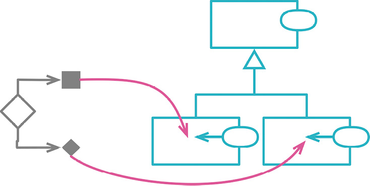

> 你手上有个条件表达式，它根据对象类型的不同选择不同的行为。将这个条件表达式的每个分支放进一个子类内的覆写函数中，然后将原始函数声明为抽象函数。

```javascript
switch (bird.type) {
　case 'EuropeanSwallow': 
　　return "average";
　case 'AfricanSwallow':
　　return (bird.numberOfCoconuts > 2) ? "tired" : "average"; 
　case 'NorwegianBlueParrot':
　　return (bird.voltage > 100) ? "scorched" : "beautiful"; 
　default:
　　return "unknown";
```
```javascript
class EuropeanSwallow { 
　get plumage() {
　　return "average";
　}
class AfricanSwallow { 
　get plumage() {
　　 return (this.numberOfCoconuts > 2) ? "tired" : "average";
　}
class NorwegianBlueParrot { 
　get plumage() {
　　 return (this.voltage > 100) ? "scorched" : "beautiful";
}
```

- 动机
  - 复杂的条件逻辑是编程中最难理解的东西之一，因此我一直在寻求给条件逻辑添加结构。
    - 很多时候，我发现 **可以将条件逻辑拆分到不同的场景（或者叫高阶用例），从而拆解复杂的条件逻辑** 。
    - 这种拆分有时 **用条件逻辑本身的结构就足以表达，但使用类和多态能把逻辑的拆分表述得更清晰** 。
  - 一个常见的场景是：
    - 我可以构造一组类型，每个类型处理各自的一种条件逻辑。
    - 例如，我会注意到，图书、音乐、食品的处理方式不同，这是因为它们分属不同类型的商品。
    - 最明显的征兆就是有好几个函数都有基于类型代码的switch语句。
    - 若果真如此，我就可以针对switch语句中的每种分支逻辑创建一个类，用多态来承载各个类型特有的行为，从而去除重复的分支逻辑。
  - 另一种情况是：
    - 有一个基础逻辑，在其上又有一些变体。
    - 基础逻辑可能是最常用的，也可能是最简单的。
    - 我可以把基础逻辑放进超类，这样我可以首先理解这部分逻辑，暂时不管各种变体，
    - 然后我可以把每种变体逻辑单独放进一个子类，其中的代码着重强调与基础逻辑的差异。
  - 多态是面向对象编程的关键特性之一。
    - 跟其他一切有用的特性一样，它也很容易被滥用。
    - 我曾经遇到有人争论说所有条件逻辑都应该用多态取代。
    - 我不赞同这种观点。我的大部分条件逻辑只用到了基本的条件语句——if/else和switch/case，并不需要劳师动众地引入多态。
    - 但 **如果发现如前所述的复杂条件逻辑，多态是改善这种情况的有力工具** 。

- 做法
  - 如果现有的类尚不具备多态行为，就用工厂函数创建之，令工厂函数返回恰当的对象实例。
  - 在调用方代码中使用工厂函数获得对象实例。
  - 将带有条件逻辑的函数移到超类中。
    > 如果条件逻辑还未提炼至独立的函数，首先对其使用 提炼函数 。
  - 任选一个子类，在其中建立一个函数，使之覆写超类中容纳条件表达式的那个函数。将与该子类相关的条件表达式分支复制到新函数中，并对它进行适当调整。
  - 重复上述过程，处理其他条件分支。
  - 在超类函数中保留默认情况的逻辑。或者，如果超类应该是抽象的，就把该函数声明为abstract，或在其中直接抛出异常，表明计算责任都在子类中。

### 6.5.5. 引入特例（Introduce Special Case）

> 曾用名：引入 Null 对象(Introduce Null Object)

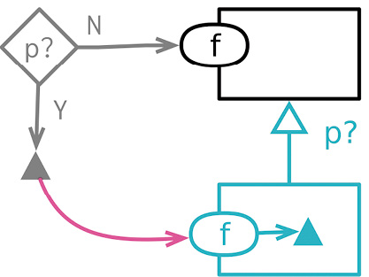

```javascript
if (aCustomer === "unknown") customerName = "occupant";
```

```javascript
class UnknownCustomer {
    get name() {return "occupant";}
```

> 你需要再三检查某对象是否为 null。将 null 值替换为 null 对象。

- 动机
  - 一种常见的 **重复代码** 是这种情况：
    - 一个数据结构的使用者都在检查某个特殊的值，并且当这个特殊值出现时所做的处理也都相同。
    - 如果我发现代码库中 **有多处以同样方式应对同一个特殊值，我就会想要把这个处理逻辑收拢到一处** 。
  - 处理这种情况的一个好办法是 **使用“特例”（Special Case）模式** ：
    - 创建一个 **特例元素** ，用以表达对这种特例的共用行为的处理。
    - 这样我就可以 **用一个函数调用取代大部分特例检查逻辑** 。
  - 特例有几种表现形式。
    - 如果我只需要从这个对象读取数据，可以提供一个字面量对象（literal object），其中所有的值都是预先填充好的。
    - 如果除简单的数值之外还需要更多的行为，就需要创建一个特殊对象，其中包含所有共用行为所对应的函数。
    - 特例对象可以由一个封装类来返回，也可以通过变换插入一个数据结构。
  - 一个 **通常需要特例处理的值就是null** ，这也是这个模式常被叫作 **“Null对象”（Null Object）模式** 的原因
    > 我喜欢说：Null对象是特例的一种特例。

- 做法
  > 我们从一个作为容器的数据结构（或者类）开始，其中包含一个属性，该属性就是我们要重构的目标。
  > 容器的客户端每次使用这个属性时，都需要将其与某个特例值做比对。
  > 我们希望把这个特例值替换为代表这种特例情况的类或数据结构。

  - 给重构目标添加检查特例的属性，令其返回false。
  - 创建一个特例对象，其中只有检查特例的属性，返回true。
  - 对“与特例值做比对”的代码运用 提炼函数 ，确保所有客户端都使用这个新函数，而不再直接做特例值的比对。
  - 将新的特例对象引入代码中，可以从函数调用中返回，也可以在变换函数中生成。
  - 修改特例比对函数的主体，在其中直接使用检查特例的属性。
  - 测试。
  - 使用 函数组合成类 或 函数组合成变换 ，把通用的特例处理逻辑都搬移到新建的特例对象中。
    > 特例类对于简单的请求通常会返回固定的值，因此可以将其实现为字面记录（literal record）。
  - 对特例比对函数使用 内联函数 ，将其内联到仍然需要的地方。

### 6.5.6. 引入断言(Introduce Assertion)

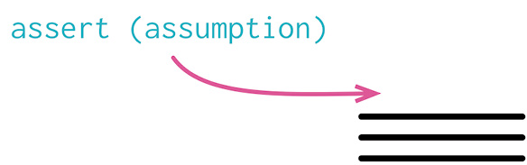

```javascript
if (this.discountRate)
  base = base - (this.discountRate * base);
```
```javascript
assert(this.discountRate>= 0); 
if (this.discountRate)
  base = base - (this.discountRate * base);
```

> 某一段代码需要对程序状态做出某种假设。以断言明确表现这种假设。

- 动机
  - 常常会有这样一段代码：只有当某个条件为真时，该段代码才能正常运行。
    - 例如，平方根计算只对正值才能进行
    - 又例如，某个对象可能假设一组字段中至少有一个不等于null。
  - 这样的假设通常并没有在代码中明确表现出来，你必须阅读整个算法才能看出。
    - 有时程序员会以注释写出这样的假设，而我要介绍的是一种更好的技术——使用断言明确标明这些假设。
  - 断言是一个条件表达式，应该总是为真。
    - 如果它失败，表示程序员犯了错误。
    - 断言的失败不应该被系统任何地方捕捉。
    - 整个程序的行为在有没有断言出现的时候都应该完全一样。
    - 实际上，有些编程语言中的断言可以在编译期用一个开关完全禁用掉。
  - 我常看见有人鼓励用断言来发现程序中的错误。
    - 这固然是一件好事，但却不是使用断言的唯一理由。
    - 断言是一种很有价值的交流形式——它们告诉阅读者，程序在执行到这一点时，对当前状态做了何种假设。
    - 另外断言对调试也很有帮助。而且，因为它们在交流上很有价值，即使解决了当下正在追踪的错误，我还是倾向于把断言留着。
    - 自测试的代码降低了断言在调试方面的价值，因为逐步逼近的单元测试通常能更好地帮助调试，但我仍然看重断言在交流方面的价值。

- 做法
  - 如果你发现代码假设某个条件始终为真，就加入一个断言明确说明这种情况。
  - 因为断言应该不会对系统运行造成任何影响，所以“加入断言”永远都应该是行为保持的。

## 6.6. 重构 API

### 6.6.1. 将查询函数和修改函数分离（Separate Query from Modifier）

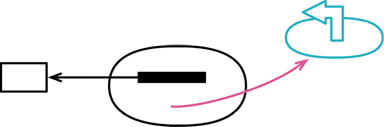

```javascript
function getTotalOutstandingAndSendBill() {
  const result = customer.invoices.reduce((total, each) => each.amount + total, 0);
  sendBill();
  return result;
}
```
```javascript
function totalOutstanding() {
  return customer.invoices.reduce((total, each) => each.amount + total, 0);
}
function sendBill() { 
  emailGateway.send(formatBill(customer));
}
```

- 动机
  - 如果某个函数只是提供一个值，没有任何看得到的副作用，那么这是一个很有价值的东西。
    - 可以任意调用这个函数，也可以把调用动作搬到调用函数的其他地方。
    - 这种函数的测试也更容易。简而言之，需要操心的事情少多了。
  - 明确表现出“有副作用”与“无副作用”两种函数之间的差异，是个很好的想法。
    > 如果遇到一个“既有返回值又有副作用”的函数，我就会试着将查询动作从修改动作中分离出来。
    - 下面是一条好规则： **任何有返回值的函数，都不应该有看得到的副作用** 
    - **命令与查询分离（Command-Query Separation）** [mf-cqs]。
    - 有些程序员甚至将此作为一条必须遵守的规则。
    - 就像对待任何东西一样，我并不绝对遵守它，不过我总是 **尽量遵守** ，而它也回报我很好的效果。

- 做法
  - 复制整个函数，将其作为一个查询来命名。
    > 如果想不出好名字，可以看看函数返回的是什么。
    > 查询的结果会被填入一个变量，这个变量的名字应该能对函数如何命名有所启发。
  - 从新建的查询函数中去掉所有造成副作用的语句。
  - 执行静态检查。
  - 查找所有调用原函数的地方。如果调用处用到了该函数的返回值，就将其改为调用新建的查询函数，并在下面马上再调用一次原函数。每次修改之后都要测试。
  - 从原函数中去掉返回值。
  - 测试。
  - 完成重构之后，查询函数与原函数之间常会有重复代码，可以做必要的清理。

### 6.6.2. 函数参数化（Parameterize Function）

> 曾用名：令函数携带参数（Parameterize Method）

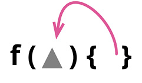

```javascript
function tenPercentRaise(aPerson) { 
  aPerson.salary = aPerson.salary.multiply(1.1);
}
function fivePercentRaise(aPerson) { 
  aPerson.salary = aPerson.salary.multiply(1.05);
}
```
```javascript
function raise(aPerson, factor) {
  aPerson.salary = aPerson.salary.multiply(1 + factor);
}
```

- 动机
  - 如果我发现两个函数逻辑非常相似，只有一些字面量值不同
  - 可以将其合并成一个函数，以参数的形式传入不同的值，从而消除重复。
  - 这个重构可以使函数更有用，因为重构后的函数还可以用于处理其他的值。

- 做法
  - 从一组相似的函数中选择一个。
  - 运用 改变函数声明，把需要作为参数传入的字面量添加到参数列表中。
  - 修改该函数所有的调用处，使其在调用时传入该字面量值。
  - 测试。
  - 修改函数体，令其使用新传入的参数。每使用一个新参数都要测试。
  - 对于其他与之相似的函数，逐一将其调用处改为调用已经参数化的函数。每次修改后都要测试。
    > 如果第一个函数经过参数化以后不能直接替代另一个与之相似的函数，就先对参数化之后的函数做必要的调整，再做替换。

### 6.6.3. 移除标记参数（Remove Flag Argument）

> 曾用名：以明确函数取代参数（Replace Parameter with Explicit Methods）

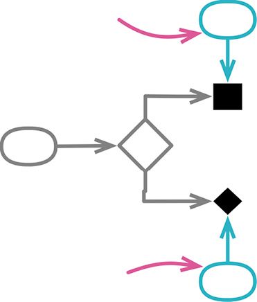

```javascript
function setDimension(name, value) { 
　if (name === "height") {
　　this._height = value; 
　　return;
　}
　if (name === "width") { 
　　this._width = value; 
　　return;
　}
}
```
```javascript
function setHeight(value) {this._height = value;} 
function setWidth (value) {this._width = value;}
```

- 动机
  - “标记参数”是这样的一种参数： 调用者用它来指示被调函数应该执行哪一部分逻辑
  - 例如，我可能有下面这样一个函数：

    ```javascript
    function bookConcert(aCustomer, isPremium) { 
    　if (isPremium) {
    　　// logic for premium booking
    　} else {
    　　// logic for regular booking
    　}
    }
    ```

    - 要预订一场高级音乐会（premium concert），就得这样发起调用：

      ```javascript
      bookConcert(aCustomer, true);
      ```
    - 标记参数也可能以枚举的形式出现：

      ```javascript
      bookConcert(aCustomer, CustomerType.PREMIUM);
      ```
    - 或者是以字符串（或者符号，如果编程语言支持的话）的形式出现：

      ```javascript
      bookConcert(aCustomer, "premium");
      ```
  - 我不喜欢标记参数，因为它们让人难以理解到底有哪些函数可以调用、应该怎么调用。
    - 拿到一份API以后，我首先看到的是一系列可供调用的函数，但标记参数却隐藏了函数调用中存在的差异性。
    - 使用这样的函数，我还得弄清标记参数有哪些可用的值。
    - 布尔型的标记尤其糟糕，因为它们不能清晰地传达其含义——在调用一个函数时，我很难弄清true到底是什么意思。
    - 如果明确用一个函数来完成一项单独的任务，其含义会清晰得多。

  - 并非所有类似这样的参数都是标记参数。
    - 如果调用者传入的是程序中流动的数据，这样的参数不算标记参数；
    - 只有调用者直接传入字面量值，这才是标记参数。
    - 另外，在函数实现内部，如果参数值只是作为数据传给其他函数，这就不是标记参数；
    - 只有参数值影响了函数内部的控制流，这才是标记参数。
  - **移除标记参数不仅使代码更整洁，并且能帮助开发工具更好地发挥作用** 。
    - 去掉标记参数后，代码分析工具能更容易地体现出“高级”和“普通”两种预订逻辑在使用时的区别。
  - **如果一个函数有多个标记参数，可能就不得不将其保留** ，
    - 否则我就得针对各个参数的各种取值的所有组合情况提供明确函数。
    - 不过 **这也是一个信号，说明这个函数可能做得太多** ，应该考虑是否能用更简单的函数来组合出完整的逻辑。

- 做法
  - 针对参数的每一种可能值，新建一个明确函数。
    > 如果主函数有清晰的条件分发逻辑，可以用 分解条件表达式 创建明确函数；
    > 否则，可以在原函数之上创建包装函数。
  - 对于“用字面量值作为参数”的函数调用者，将其改为调用新建的明确函数。

### 6.6.4. 保持对象完整（Preserve Whole Object）

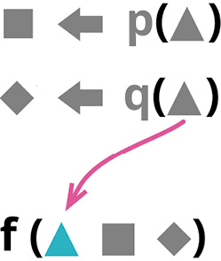

```javascript
const low = aRoom.daysTempRange.low; 
const high = aRoom.daysTempRange.high; 
if (aPlan.withinRange(low, high))
```

```javascript
if (aPlan.withinRange(aRoom.daysTempRange))
```

- 动机
  - 如果我看见代码从一个记录结构中导出几个值，然后又把这几个值一起传递给一个函数，我会更愿意把整个记录传给这个函数，在函数体内部导出所需的值。
  - “ **传递整个记录** ”的方式能更好地应对变化：
    - 如果将来被调的函数需要从记录中导出更多的数据，我就不用为此修改参数列表。
    - 并且传递整个记录也能缩短参数列表，让函数调用更容易看懂。
    - 如果 **有很多函数都在使用记录中的同一组数据** ，处理这部分数据的逻辑常会重复，此时 **可以把这些处理逻辑搬移到完整对象** 中去。
  - 也有时 **不会采用本重构手法** ，
    - 因为 **不想让被调函数依赖完整对象，尤其是在两者不在同一个模块中的时候** 。
  - 从一个对象中 **抽取出几个值，单独对这几个值做某些逻辑操作** ，这是一种代码坏味道（ **依恋情结** ）
    - **通常标志着这段逻辑应该被搬移到对象中** 。
    - 保持对象完整经常发生在 引入参数对象 之后，
    - 可以搜寻使用原来的数据泥团的代码，代之以使用新的对象。
  - 如果几处代码都在使用 **对象的一部分功能** 
    - 可能意味着应该 **用 提炼类 把这一部分功能单独提炼** 出来。
  - 还有一种常被忽视的情况：
    - 调用者将自己的若干数据作为参数，传递给被调用函数。
    - 这种情况下，我可以将调用者的自我引用（在JavaScript中就是this）作为参数，直接传递给目标函数。

- 做法
  - 新建一个空函数，给它以期望中的参数列表（即传入完整对象作为参数）。
    > 给这个函数起一个容易搜索的名字，这样到重构结束时方便替换。
  - 在新函数体内调用旧函数，并把新的参数（即完整对象）映射到旧的参数列表（即来源于完整对象的各项数据）。
  - 执行静态检查。
  - 逐一修改旧函数的调用者，令其使用新函数，每次修改之后执行测试。
    > 修改之后，调用处用于“从完整对象中导出参数值”的代码可能就没用了，可以用移除死代码（237）去掉。
  - 所有调用处都修改过来之后，使用内联函数（115）把旧函数内联到新函数体内。
  - 给新函数改名，从重构开始时的容易搜索的临时名字，改为使用旧函数的名字，同时修改所有调用处。

### 6.6.5. 以查询取代参数（Replace Parameter with Query）

> 曾用名：以函数取代参数（Replace Parameter with Method）
>
> 反向重构：以参数取代查询（327）

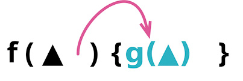

```javascript
availableVacation(anEmployee, anEmployee.grade); 

function availableVacation(anEmployee, grade) {
  // calculate vacation...
```


```javascript
availableVacation(anEmployee)

function availableVacation(anEmployee) { 
  const grade = anEmployee.grade;
  // calculate vacation...
```


- 动机
  - 函数的 **参数列表应该总结该函数的可变性** ，标示出函数可能体现出行为差异的主要方式。
    - 和任何代码中的语句一样，参数列表应该尽量避免重复，并且参数列表越短就越容易理解。
  - 如果调用函数时传入了一个值，而 **这个值由函数自己来获得也是同样容易** ，这就是重复
    - 这个本不必要的参数会增加调用者的难度
    - 因为它不得不找出正确的参数值，其实原本调用者是不需要费这个力气的。
    - “同样容易”四个字，划出了一条判断的界限。
      - 去除参数也就意味着“获得正确的参数值”的责任被转移：
        - 有参数传入时，调用者需要负责获得正确的参数值
        - 参数去除后，责任就被转移给了函数本身
      - 一般而言，我习惯于简化调用方，因此我愿意把责任移交给函数本身，但如果函数难以承担这份责任，就另当别论了。
  - **不使用以查询取代参数最常见的原因** 是
    - 移除参数可能会给函数体 **增加不必要的依赖关系** 
      - 迫使函数访问某个程序元素
      - 而我原本不想让函数了解这个元素的存在
    - 这种“不必要的依赖关系”除了新增的以外，也可能是我想要稍后去除的
      - 例如为了去除一个参数，我可能会在函数体内调用一个有问题的函数
      - 或是从一个对象中获取某些原本想要剥离出去的数据
    - 在这些情况下，都应该慎重考虑使用以查询取代参数。
  - 如果想要去除的参数值只需要向另一个参数查询就能得到，这是使用以查询取代参数最安全的场景
    - **如果可以从一个参数推导出另一个参数，那么几乎没有任何理由要同时传递这两个参数** 。
  - 另外有一件事需要留意：
    - 如果在处理的函数具有 **引用透明性** （referential transparency，即，不论任何时候，只要传入相同的参数值，该函数的行为永远一致）
    - 这样的函数既容易理解又容易测试，我不想使其失去这种优秀品质。
    - 我不会去掉它的参数，让它去访问一个可变的全局变量。

- 做法
  - 如果有必要，使用 提炼函数 将 **参数的计算过程** 提炼到一个独立的函数中。
  - 将函数体内引用该参数的地方改为调用新建的函数。每次修改后执行测试。
  - 全部替换完成后，使用改变 函数声明 将该参数去掉。

### 6.6.6. 以参数取代查询（Replace Query with Parameter）

> 反向重构：以查询取代参数（324）

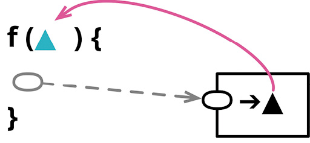

```javascript
targetTemperature(aPlan)

function targetTemperature(aPlan) { 
  currentTemperature = thermostat.currentTemperature;
  // rest of function...
```
```javascript
targetTemperature(aPlan, thermostat.currentTemperature) 

function targetTemperature(aPlan, currentTemperature) {
  // rest of function...
```

- 动机
  - 在浏览函数实现时，我有时会 **发现一些令人不快的引用关系** ，例如，引用一个全局变量，或者引用另一个我想要移除的元素
  - 为了解决这些令人不快的引用，我需要 **将其替换为函数参数** ，从而将处理引用关系的责任转交给函数的调用者。
  - 需要使用本重构的情况大多源于我想要 **改变代码的依赖关系** 
    - **为了让目标函数不再依赖于某个元素** 
    - 我把这个元素的值以参数形式传递给该函数
    - 这里需要注意权衡：
      - 如果把所有依赖关系都变成参数，会导致参数列表冗长重复；
      - 如果作用域之间的共享太多，又会导致函数间依赖过度。
      - 我一向不善于微妙的权衡，所以“能够可靠地改变决定”就显得尤为重要，这样随着我的理解加深，程序也能从中受益。
  - 如果一个函数用同样的参数调用总是给出同样的结果
    - 我们就说这个函数具有 **“引用透明性”（referential transparency）** ，这样的函数理解起来更容易。
    - 如果一个函数使用了另一个元素，而后者不具引用透明性，那么包含该元素的函数也就失去了引用透明性。
      > 不具有透明性的元素应该是指上层作用域的元素(比如全局变量)，或者上层作用域的查询方法获取的元素，受到函数外层影响
    - 只要把“不具引用透明性的元素”变成参数传入，函数就能重获引用透明性。
    - 虽然这样就把责任转移给了函数的调用者，但是具有引用透明性的模块能带来很多益处。
    - 有一个常见的模式：
      - 在负责逻辑处理的模块中只有纯函数，
      - 其外再包裹处理I/O和其他可变元素的逻辑代码。
      - 借助以参数取代查询，我可以提纯程序的某些组成部分，使其更容易测试、更容易理解。
  - 不过以参数取代查询并非只有好处。
    - 把查询变成参数以后，就迫使调用者必须弄清如何提供正确的参数值，这会增加函数调用者的复杂度，而我在设计接口时通常更愿意让接口的消费者更容易使用。
    - 归根到底，这是关于程序中责任分配的问题，而这方面的决策既不容易，也不会一劳永逸

- 做法
  - 对执行查询操作的代码使用 提炼变量，将其从函数体中分离出来。
  - 现在函数体代码已经不再执行查询操作（而是使用前一步提炼出的变量），对这部分代码使用提炼函数（106）。
    > 给提炼出的新函数起一个容易搜索的名字，以便稍后改名。
  - 使用 内联变量，消除刚才提炼出来的变量。
  - 对原来的函数使用内联函数（115）。
  - 对新函数改名，改回原来函数的名字。

### 6.6.7. 移除设值函数（Remove Setting Method）

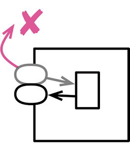

```javascript
class Person {
  get name() {...}
  set name(aString) {...}
```
```javascript
class Person {
  get name() {...}
```

- 动机
  - 如果为某个字段提供了设值函数，这就暗示这个字段可以被改变
  - 如果不希望在对象创建之后此字段还有机会被改变，那就不要为它提供设值函数（同时将该字段声明为不可变）
  - 这样一来，该字段就只能在构造函数中赋值，我“不想让它被修改”的意图会更加清晰，并且可以排除其值被修改的可能性——这种可能性往往是非常大的。
  - 有两种常见的情况需要讨论
    - 一种情况是
      - 有些人喜欢始终通过访问函数来读写字段值，包括在构造函数内也是如此
      - 这会导致构造函数成为设值函数的唯一使用者。
      - 若果真如此，我更愿意去除设值函数，清晰地表达“构造之后不应该再更新字段值”的意图。
    - 另一种情况是
      - 对象是由客户端通过创建脚本构造出来，而不是只有一次简单的构造函数调用。
      - 所谓“创建脚本”，首先是调用构造函数，然后就是一系列设值函数的调用，共同完成新对象的构造。
      - 创建脚本执行完以后，这个新生对象的部分（乃至全部）字段就不应该再被修改。
      - 设值函数只应该在起初的对象创建过程中调用。
      - 对于这种情况，我也会想办法去除设值函数，更清晰地表达我的意图。

- 做法
  - 如果构造函数尚无法得到想要设入字段的值，就使用改变 函数声明 将这个值以参数的形式传入构造函数。在构造函数中调用设值函数，对字段设值。
  - 如果想移除多个设值函数，可以一次性把它们的值都传入构造函数，这能简化后续步骤。
  - 移除所有在构造函数之外对设值函数的调用，改为使用新的构造函数。每次修改之后都要测试。
  - 如果不能把“调用设值函数”替换为“创建一个新对象”（例如你需要更新一个多处共享引用的对象），请放弃本重构。
  - 使用 内联函数 消去设值函数。如果可能的话，把字段声明为不可变。
  - 测试。

### 6.6.8. 以工厂函数取代构造函数（Replace Constructor with Factory Function）

> 曾用名：以工厂函数取代构造函数（Replace Constructor with Factory Method）

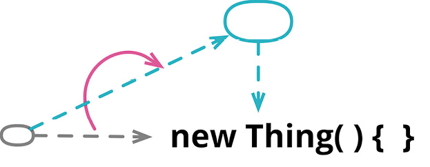

```javascript
leadEngineer = new Employee(document.leadEngineer, 'E');
```
```javascript
leadEngineer = createEngineer(document.leadEngineer);
```

- 动机
  - 很多面向对象语言都有特别的构造函数，专门用于对象的初始化。需要新建一个对象时，客户端通常会调用构造函数。
  - 但与一般的函数相比，构造函数又常有一些丑陋的局限性。
  - 比如Java的构造函数，
    - Java的构造函数只能返回当前所调用类的实例，也就是说，我 **无法根据环境或参数信息返回子类实例或代理对象** ；
    - 构造函数的名字是固定的，因此无法使用比默认名字更清晰的函数名；
    - 构造函数需要通过特殊的操作符来调用（在很多语言中是new关键字），所以在要求普通函数的场合就难以使用。
  - 工厂函数就不受这些限制。工厂函数的实现内部可以调用构造函数，但也可以换成别的方式实现。

- 做法
  - 新建一个工厂函数，让它调用现有的构造函数。
  - 将调用构造函数的代码改为调用工厂函数。
  - 每修改一处，就执行测试。
  - 尽量缩小构造函数的可见范围。

### 6.6.9. 以命令取代函数（Replace Function with Command）

> 曾用名：以函数对象取代函数（Replace Method with Method Object）
> 
> 反向重构：以函数取代命令（344）

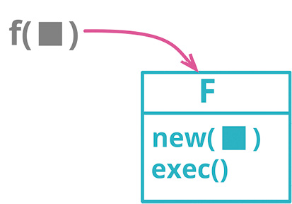

```javascript
function score(candidate, medicalExam, scoringGuide) { 
  let result = 0;
  let healthLevel = 0;
  // long body code
}
```
```javascript
class Scorer {
  constructor(candidate, medicalExam, scoringGuide) { 
    this._candidate = candidate;
    this._medicalExam = medicalExam; 
    this._scoringGuide = scoringGuide;
  }

  execute() { 
    this._result = 0;
    this._healthLevel = 0;
    // long body code
  }
}
```

- 动机
  - 函数，不管是独立函数，还是以方法（method）形式附着在对象上的函数，是程序设计的基本构造块。
  - 不过， **将函数封装成自己的对象，有时也是一种有用的办法** 。
    - 这样的对象我可之为 **“命令对象”（command object）** ， **或者简称“命令”（command）** 
    - 这种对象 **大多只服务于单一函数** ，获得对该函数的请求，执行该函数，就是这种对象存在的意义。
  - 与普通的函数相比， **命令对象提供了更大的控制灵活性和更强的表达能力** 。
    - 除了函数调用本身，命令对象还 **可以支持附加的操作，例如撤销操作** 。
    - 我可以通过命令对象提供的方法来设值命令的参数值，从而 **支持更丰富的生命周期管理能力** 。
    - 我可以借助继承和钩子对函数行为加以定制。
    - 如果我所使用的编程语言支持对象但不支持函数作为一等公民，通过命令对象就可以给函数提供大部分相当于一等公民的能力。
    - 同样，即便编程语言本身并不支持嵌套函数，我也可以借助命令对象的方法和字段把复杂的函数拆解开，而且在测试和调试过程中可以直接调用这些方法。
  - 所有这些都是使用命令对象的好理由，所以我要做好准备，一旦有需要，就能把函数重构成命令。
    - 不过我们不能忘记，命令对象的灵活性也是 **以复杂性作为代价的** 
    - 所以，如果要在作为一等公民的函数和命令对象之间做个选择，95%的时候我都会选函数。
    - 只有当我特别需要命令对象提供的某种能力而普通的函数无法提供这种能力时，我才会考虑使用命令对象。
  - 跟软件开发中的很多词汇一样，“命令”这个词承载了太多含义。
    - 在这里，“命令”是指一个对象，其中封装了一个函数调用请求。
    - 这是遵循《设计模式》[gof]一书中的命令模式（command pattern）。
    - 在这个意义上，使用“命令”一词时，我会先用完整的“命令对象”一词设定上下文，然后视情况使用简略的“命令”一词。
    - 在命令与查询分离原则（command-query separation principle）中也用到了“命令”一词，此时“命令”是一个对象所拥有的函数，调用该函数可以改变对象可观察的状态。
    - 我尽量避免使用这个意义上的“命令”一词，而更愿意称其为“修改函数”（modifier）或者“改变函数”（mutator）。

- 做法
  - 为想要包装的函数创建一个空的类，根据该函数的名字为其命名。
  - 使用 搬移函数 把函数移到空的类里。
    > 保持原来的函数作为转发函数，至少保留到重构结束之前才删除。
  - 遵循编程语言的命名规范来给命令对象起名。如果没有合适的命名规范，就给命令对象中负责实际执行命令的函数起一个通用的名字，例如“execute”或者“call”。
  - 可以考虑给每个参数创建一个字段，并在构造函数中添加对应的参数。

### 6.6.10. 以函数取代命令（Replace Command with Function）

> 反向重构：以命令取代函数

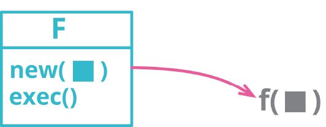

```javascript
class ChargeCalculator { 
　constructor (customer, usage){
　　this._customer = customer; 
　　this._usage = usage;
　}
　execute() {
　　return this._customer.rate * this._usage;
　}
}
```
```javascript
function charge(customer, usage) { 
  return customer.rate * usage;
}
```

- 动机
  - 命令对象为处理复杂计算提供了强大的机制。
    - 借助命令对象，可以轻松地将原本复杂的函数拆解为多个方法，彼此之间通过字段共享状态；
    - 拆解后的方法可以分别调用；开始调用之前的数据状态也可以逐步构建。
    - 但这种强大是有代价的。
      - 大多数时候，我只是想调用一个函数，让它完成自己的工作就好。
      - 如果这个函数不是太复杂，那么命令对象可能显得费而不惠，我就应该考虑将其变回普通的函数。

- 做法
  - 运用 提炼函数，把“创建并执行命令对象”的代码单独提炼到一个函数中。
    > 这一步会新建一个函数，最终这个函数会取代现在的命令对象。
  - 对命令对象在执行阶段用到的函数，逐一使用 内联函数。
  - 如果被调用的函数有返回值，请先对调用处使用 提炼变量 ，然后再使用 内联函数。
    > 使用 改变函数声明 ，把构造函数的参数转移到执行函数。
  - 对于所有的字段，在执行函数中找到引用它们的地方，并改为使用参数。每次修改后都要测试。
  - 把“调用构造函数”和“调用执行函数”两步都内联到调用方（也就是最终要替换命令对象的那个函数）。
  - 测试。
  - 用 移除死代码 把命令类消去。

## 6.7. 处理继承关系

### 6.7.1. 函数上移(Pull Up Method)

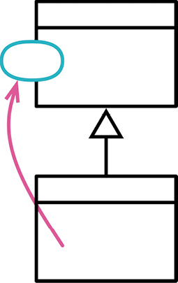

> 有些函数，在各个子类中产生完全相同的结果。将该函数移至超类。

```javascript
class Employee {...}

class Salesman extends Employee { 
　get name() {...}
}

class Engineer extends Employee { 
　get name() {...}
}
```
```javascript
class Employee { 
　get name() {...}
}

class Salesman extends Employee {...} 
class Engineer extends Employee {...}
```

- 动机
  - 避免重复代码是很重要的。
    - 重复的两个函数现在也许能够正常工作，但假以时日却只会成为滋生bug的温床。
    - 无论何时，只要系统内出现重复，你就会面临“修改其中一个却未能修改另一个”的风险。通常，找出重复也有一定的难度。
  - 如果某个函数在各个子类中的函数体都相同（它们很可能是通过复制粘贴得到的），这就是最显而易见的函数上移适用场合。
    - 当然，情况并不总是如此明显。
    - 我也可以只管放心地重构，再看看测试程序会不会发牢骚，但这就需要对我的测试有充分的信心。
    - 我发现，观察这些可能重复的函数之间的差异往往大有收获：它们经常会向我展示那些我忘记测试的行为。
  - 函数上移常常紧随其他重构而被使用。
    - 也许我能找出若干个身处不同子类内的函数，而它们又可以通过某种形式的参数调整成为相同的函数。
    - 这时候，最简单的办法就是先分别对这些函数应用 函数参数化 ，然后应用函数上移。
  - 函数上移过程中最麻烦的一点就是
    - 被提升的函数可能会引用只出现于子类而不出现于超类的特性。
    - 此时，我就得用 字段上移 和 函数上移 先将这些特性（类或者函数）提升到超类。
    - 如果两个函数工作流程大体相似，但实现细节略有差异，那么我会考虑先借助 塑造模板函数（Form Template Method）[mf-ft] 构造出相同的函数，然后再提升它们。

- 做法
  - 检查待提升函数，确定它们是完全一致的。
    > 如果它们做了相同的事情，但函数体并不完全一致，那就先对它们进行重构，直到其函数体完全一致。
  - 检查函数体内引用的所有函数调用和字段都能从超类中调用到。
  - 如果待提升函数的签名不同，使用改变函数声明（124）将那些签名都修改为你想要在超类中使用的签名。
  - 在超类中新建一个函数，将某一个待提升函数的代码复制到其中。
  - 执行静态检查。
  - 移除一个待提升的子类函数。
  - 测试。
  - 逐一移除待提升的子类函数，直到只剩下超类中的函数为止。

### 6.7.2. 字段上移(Pull Up Field)

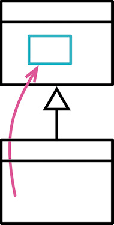

> 两个子类拥有相同的字段。将该字段移至超类。

```javascript
class Employee {...} // Java 

class Salesman extends Employee {
　private String name;
}

class Engineer extends Employee { 
　private String name;
}
```
```javascript
class Employee { 
　protected String name;
}

class Salesman extends Employee {...} 
class Engineer extends Employee {...}
```

- 动机
  - 如果 **各子类是分别开发的** ，或者是在重构过程中组合起来的，你常会发现它们 **拥有重复特性** ，特别是字段更容易重复。
    - 这样的字段有时拥有近似的名字，但也并非绝对如此。
    - 判断若干字段是否重复，唯一的办法就是观察函数如何使用它们。
    - 如果它们被使用的方式很相似，我就可以将它们提升到超类中去。
  - 本项重构可从两方面减少重复：
    - 首先它去除了重复的数据声明
    - 其次它使我可以将使用该字段的行为从子类移至超类，从而去除重复的行为。
  - 许多动态语言不需要在类定义中定义字段，相反，字段是在第一次被赋值的同时完成声明。
    - 在这种情况下，字段上移基本上是应用 构造函数本体上移 后的必然结果。

- 做法
  - 针对待提升之字段，检查它们的所有使用点，确认它们以同样的方式被使用。
  - 如果这些字段的名称不同，先使用变量改名（137）为它们取个相同的名字。
  - 在超类中新建一个字段。
    > 新字段需要对所有子类可见（在大多数语言中protected权限便已足够）。
  - 移除子类中的字段。
  - 测试。

### 6.7.3. 构造函数本体上移(Pull Up ConstructorBody)

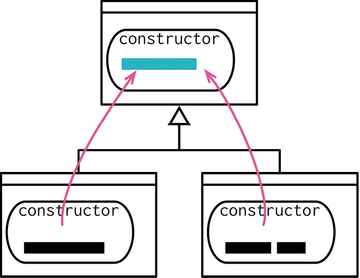

> 你在各个子类中拥有一些构造函数，他们的本体几乎完全一致。在超类中新建一个构造函数，并在子类构造函数中调用它。

```javascript
class Party {...}

class Employee extends Party { 
　constructor(name, id, monthlyCost) {
　　super(); 
　　this._id = id;
　　this._name = name; 
　　this._monthlyCost = monthlyCost;
　}
}
```
```javascript
class Party { 
　constructor(name){
　　this._name = name;
　}
}

class Employee extends Party { 
　constructor(name, id, monthlyCost) {
　　super(name); 
　　this._id = id;
　　this._monthlyCost = monthlyCost;
　}
}
```
- 动机
  - 构造函数是很奇妙的东西。它们不是普通函数，使用它们比使用普通函数受到更多的限制。
  - 如果我看见各个子类中的函数有共同行为
    - 我的第一个念头就是使用 提炼函数 将它们提炼到一个独立函数中
    - 然后使用 函数上移 将这个函数提升至超类
    - 但构造函数的出现打乱了我的算盘，因为它们附加了特殊的规则，对一些做法与函数的调用次序有所限制。要对付它们，我需要略微不同的做法。
  - 如果重构过程过于复杂，我会考虑转而使用 以工厂函数取代构造函数 。

- 做法
  - 如果超类还不存在构造函数，首先为其定义一个。确保让子类调用超类的构造函数。
  - 使用 移动语句 将子类中构造函数中的公共语句移动到超类的构造函数调用语句之后。
  - 逐一移除子类间的公共代码，将其提升至超类构造函数中。对于公共代码中引用到的变量，将其作为参数传递给超类的构造函数。
  - 测试。
  - 如果存在无法简单提升至超类的公共代码，先应用 提炼函数 ，再利用 函数上移 提升之。

### 6.7.4. 函数下移(Push Down Method)

> 反向重构：函数上移（350）

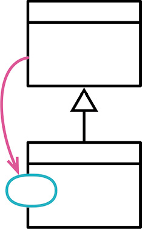

> 超类中的某个函数只与部分(而非全部)子类有关。将这个函数移到相关的那些子类去。

```javascript
class Employee { 
  get quota {...}
}

class Engineer extends Employee {...} 
class Salesman extends Employee {...}
```
```javascript
class Employee {...}
class Engineer extends Employee {...} 
class Salesman extends Employee {
  get quota {...}
}
```

- 动机
  - 如果超类中的某个函数只与一个（或少数几个）子类有关，那么最好将其从超类中挪走，放到真正关心它的子类中去。
  - 这项重构手法只有在超类明确知道哪些子类需要这个函数时适用。
  - 如果超类不知晓这个信息，那我就得用以 多态取代条件表达式 ，只留些共用的行为在超类。

- 做法
  - 将超类中的函数本体复制到每一个需要此函数的子类中。
  - 删除超类中的函数。
  - 测试。
  - 将该函数从所有不需要它的那些子类中删除。
  - 测试。

### 6.7.5. 字段下移(Push Down Field)

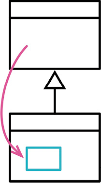

```javascript
class Employee {   // Java 
　private String quota;
}

class Engineer extends Employee {...} 
class Salesman extends Employee {...}
```
```javascript
class Employee {...}
class Engineer extends Employee {...}

class Salesman extends Employee { 
　protected String quota;
}
```

- 动机: 如果某个字段只被一个子类（或者一小部分子类）用到，就将其搬移到需要该字段的子类中。

- 做法
  - 在所有需要该字段的子类中声明该字段。
  - 将该字段从超类中移除。
  - 测试。
  - 将该字段从所有不需要它的那些子类中删掉。
  - 测试。

### 6.7.6. 以子类取代类型码（Replace Type Code with Subclasses）


> 包含旧重构：以State/Strategy取代类型码（Replace Type Code with State/Strategy）
>
> 包含旧重构：提炼子类（Extract Subclass）
> 
> 反向重构：移除子类（369）

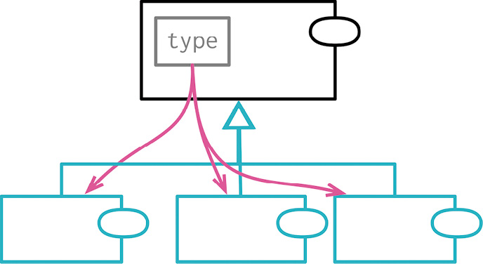

```javascript
function createEmployee(name, type) { 
  return new Employee(name, type);
}
```
```javascript
function createEmployee(name, type) { 
  switch (type) {
    case "engineer": return new Engineer(name); 
    case "salesman": return new Salesman(name); 
    case "manager": return new Manager (name);
}
```

- 动机
  - 软件系统经常需要表现“相似但又不同的东西”
    - 比如员工可以按职位分类（工程师、经理、销售），订单可以按优先级分类（加急、常规）。
    - 表现分类关系的第一种工具是 **类型码字段** ——根据具体的编程语言，可能实现为枚举、符号、字符串或者数字。
    - 类型码的取值经常来自给系统提供数据的外部服务。
  - 大多数时候，有这样的类型码就够了。但也有些时候，我可以再多往前一步， **引入子类** 。 继承有两个诱人之处。
    - 首先，你可以用多态来处理条件逻辑。
      - 如果有几个函数都在根据类型码的取值采取不同的行为，多态就显得特别有用。
      - 引入子类之后，我可以用以 多态取代条件表达式 来处理这些函数。
    - 另外，有些字段或函数只对特定的类型码取值才有意义，例如“销售目标”只对“销售”这类员工才有意义。
      - 此时我可以创建子类，然后用字段下移（361）把这样的字段放到合适的子类中去。
      - 当然，我也可以加入验证逻辑，确保只有当类型码取值正确时才使用该字段，不过子类的形式能更明确地表达数据与类型之间的关系。
  - 在使用以子类取代类型码时，需要考虑一个问题： **应该直接处理携带类型码的这个类，还是应该处理类型码本身呢** 
    - 以前面的例子来说，我是应该让“工程师”成为“员工”的子类，还是应该在“员工”类包含“员工类别”属性、从后者继承出“工程师”和“经理”等子类型呢？
    - 直接的子类继承（前一种方案）比较简单，但职位类别就不能用在其他场合了。
    - 另外，如果员工的类别是可变的，那么也不能使用直接继承的方案。
    - 如果想在“员工类别”之下创建子类，可以运用 以对象取代基本类型 把类型码包装成“员工类别”类，然后对其使用以子类取代类型码。

- 做法
  - 自封装类型码字段。
  - 任选一个类型码取值，为其创建一个子类。覆写类型码类的取值函数，令其返回该类型码的字面量值。
  - 创建一个选择器逻辑，把类型码参数映射到新的子类。
  > 如果选择直接继承的方案，就用 以工厂函数取代构造函数 包装构造函数，把选择器逻辑放在工厂函数里；如果选择间接继承的方案，选择器逻辑可以保留在构造函数里。
  - 测试。
  - 针对每个类型码取值，重复上述“创建子类、添加选择器逻辑”的过程。每次修改后执行测试。
  - 去除类型码字段。
  - 测试。
  - 使用函数下移（359）和 以多态取代条件表达式 处理原本访问了类型码的函数。全部处理完后，就可以移除类型码的访问函数。

### 6.7.7. 移除子类（Remove Subclass）

> 曾用名：以字段取代子类（Replace Subclass with Fields）
> 
> 反向重构：以子类取代类型码（362）

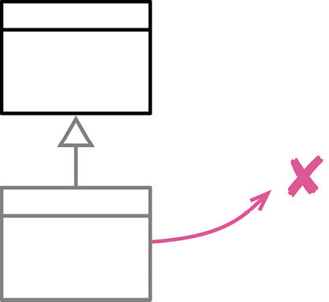

```javascript
class Person {
　get genderCode() {return "X";}
}
class Male extends Person {
　get genderCode() {return "M";}
}
class Female extends Person { 
　get genderCode() {return "F";}
}
```
```javascript
class Person {
  get genderCode() {return this._genderCode;}
}
```

- 动机
  - 子类很有用，它们为数据结构的多样和行为的多态提供支持，它们是针对差异编程的好工具。
  - 但随着软件的演化，子类所支持的变化可能会被搬移到别处，甚至完全去除，这时子类就失去了价值。
  - 有时添加子类是为了应对未来的功能，结果构想中的功能压根没被构造出来，或者用了另一种方式构造，使该子类不再被需要了。
  - 子类存在着就有成本，阅读者要花心思去理解它的用意，所以如果子类的用处太少，就不值得存在了。此时，最好的选择就是移除子类，将其替换为超类中的一个字段。

- 做法
  - 使用 以工厂函数取代构造函数，把子类的构造函数包装到超类的工厂函数中。
  - 如果构造函数的客户端用一个数组字段来决定实例化哪个子类，可以把这个判断逻辑放到超类的工厂函数中。
  - 如果有任何代码检查子类的类型，先用 提炼函数 把类型检查逻辑包装起来，然后用 搬移函数 将其搬到超类。每次修改后执行测试。
  - 新建一个字段，用于代表子类的类型。
  - 将原本针对子类的类型做判断的函数改为使用新建的类型字段。
  - 删除子类。
  - 测试。
  - 本重构手法常用于一次移除多个子类，此时需要先把这些子类都封装起来（添加工厂函数、搬移类型检查），然后再逐个将它们折叠到超类中。

### 6.7.8. 提炼超类(Extract Superclass)

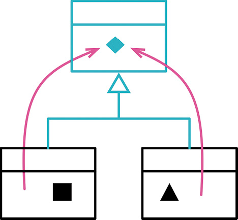

> 两个类有相似特性。为这两个类建立一个超类，将相同特性移至超类。

```javascript
class Department {
　get totalAnnualCost() {...} 
　get name() {...}
　get headCount() {...}
}

class Employee {
　get annualCost() {...}
　get name() {...}
　get id() {...}
}
```
```javascript
class Party {
　get name() {...}
　get annualCost() {...}
}

class Department extends Party { 
　get annualCost() {...}
　get headCount() {...}
}

class Employee extends Party { 
　get annualCost() {...}
　get id() {...}
}
```

- 动机
  - 如果我看见两个类在做相似的事
    - 可以利用基本的继承机制把它们的相似之处提炼到超类。
    - 用 字段上移 把相同的数据搬到超类，用 函数上移 搬移相同的行为。
  - 很多技术作家在谈到面向对象时，认为继承必须预先仔细计划，应该根据“真实世界”的分类结构建立对象模型。
    - 真实世界的分类结构可以作为设计继承关系的提示，
    - 但还有很多时候，合理的继承关系是在程序演化的过程中才浮现出来的：
      - 我发现了一些共同元素，希望把它们抽取到一处，于是就有了继承关系。
  - 另一种选择就是 提炼类 。
    - 这两种方案之间的选择，其实就是继承和委托之间的选择，总之目的都是把重复的行为收拢一处。
    - 提炼超类通常是比较简单的做法，所以我会首选这个方案。
    - 即便选错了，也总有 以委托取代超类 这瓶后悔药可吃。

- 做法
  - 为原本的类新建一个空白的超类。
    > 如果需要的话，用 改变函数声明 调整构造函数的签名。
  - 测试。
  - 使用 构造函数本体上移 、函数上移 和 字段上移 手法，逐一将子类的共同元素上移到超类。
  - 检查留在子类中的函数，看它们是否还有共同的成分。如果有，可以先用 提炼函数 将其提炼出来，再用 函数上移 搬到超类。
  - 检查所有使用原本的类的客户端代码，考虑将其调整为使用超类的接口。

### 6.7.9. 提炼接口(Extract Interface)

若干客户使用类接口中的同一子集，或者两个类的接口有部分相同。将相同的子集提炼到一个独立接口中。

### 6.7.10. 折叠继承体系(Collapse Hierarchy)

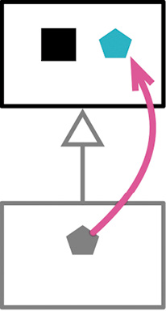

> 超类和子类之间无太大差别。将它们合为一体。

```javascript
class Employee {...}
class Salesman extends Employee {...}
```
```javascript
class Employee {...}
```
- 动机
  - 在重构类继承体系时，经常会把函数和字段上下移动。
  - 随着继承体系的演化，有时会发现一个类与其超类已经没多大差别，不值得再作为独立的类存在。
  - 此时就可以把超类和子类合并起来。

- 做法
  - 选择想移除的类：是超类还是子类？
  > 选择的依据是看哪个类的名字放在未来更有意义。如果两个名字都不够好，就随便挑一个。
  - 使用字段上移（353）、字段下移（361）、函数上移（350）和函数下移（359），把所有元素都移到同一个类中。
  - 调整即将被移除的那个类的所有引用点，令它们改而引用合并后留下的类。
  - 移除我们的目标；此时它应该已经成为一个空类。
  - 测试。

### 6.7.11. 塑造模板函数(Form TemPlateMethod)

你有一些子类，其中相应的某些函数以相同顺序执行类似的操作，但各个操作的细节上所有不同。将这些操作分别放进独立函数中，并保持它们都有相同的签名，于是原函数也就变得相同了。然后将原函数上移至超类。

### 6.7.12. 以委托取代继承(Replace Inheritance withDelegation)

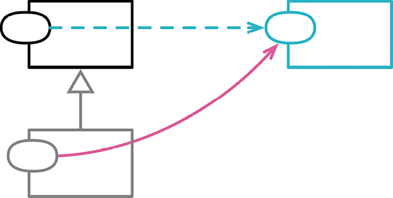

> 某个子类只使用超类接口中的一部分，或是根本不需要继承而来的数据。在子类中新建一个字段用以保存超类；调整子类函数令它改而委托超类；然后去掉两者之间的继承关系。

```javascript
class Order {
　get daysToShip() {
　　return this._warehouse.daysToShip;
　}
}

class PriorityOrder extends Order { 
　get daysToShip() {
　　return this._priorityPlan.daysToShip;
　}
}
```
```javascript
class Order {
　get daysToShip() {
　　return (this._priorityDelegate)
　　　? this._priorityDelegate.daysToShip
　　　: this._warehouse.daysToShip;
　}
}

class PriorityOrderDelegate { 
　get daysToShip() {
　　return this._priorityPlan.daysToShip
　}
}
```

- 动机
  - 如果一个对象的行为有明显的类别之分，继承是很自然的表达方式。
    - 可以把共用的数据和行为放在超类中，每个子类根据需要覆写部分特性。
    - 在面向对象语言中，继承很容易实现，因此也是程序员熟悉的机制。
  - 但继承也有其短板。最明显的是，继承这张牌只能打一次。
    - 导致行为不同的原因可能有多种，但继承只能用于处理一个方向上的变化。
    - 比如说，
      - 我可能希望“人”的行为根据“年龄段”不同，并且根据“收入水平”不同。
      - 使用继承的话，子类可以是“年轻人”和“老人”，也可以是“富人”和“穷人”，但不能同时采用两种继承方式。
  - 更大的问题在于，继承给类之间引入了非常紧密的关系。
    - 在超类上做任何修改，都很可能破坏子类，所以我必须非常小心，并且充分理解子类如何从超类派生。
    - 如果两个类的逻辑分处不同的模块、由不同的团队负责，问题就会更麻烦。
  - 这两个问题用委托都能解决。
    - 对于不同的变化原因，我可以委托给不同的类。
    - 委托是对象之间常规的关系。与继承关系相比，使用委托关系时接口更清晰、耦合更少。
    - 因此，继承关系遇到问题时运用以委托取代子类是常见的情况。
  - 有一条流行的原则：“ **对象组合优于类继承** ”（“组合”跟“委托”是同一回事）
    - 很多人把这句话解读为“继承有害”，并因此声称绝不应该使用继承。
    - 我经常使用继承，部分是因为我知道，如果稍后需要改变，我总可以使用以委托取代子类。
    - 继承是一种很有价值的机制，大部分时候能达到效果，不会带来问题。
    - 所以我会 **从继承开始，如果开始出现问题，再转而使用委托** 。
    - 这种用法与前面说的原则实际上是一致的——这条出自名著《设计模式》[gof]的原则解释了如何让继承和组合协同工作。
      - 这条原则之所以强调“组合优于继承”，其实是对彼时继承常被滥用的回应。
  - 熟悉《设计模式》一书的读者可以这样来理解本重构手法，就是 **用状态（State）模式或者策略（Strategy）模式取代子类** 
    - 这两个模式在结构上是相同的，都是由宿主对象把责任委托给另一个继承体系。
    - 以委托取代子类并非总会需要建立一个继承体系来接受委托（下面第一个例子就没有），
    - 不过建立一个状态或策略的继承体系经常都是有用的。

- 做法
  - 如果构造函数有多个调用者，首先用以工厂函数取代构造函数（334）把构造函数包装起来。
  - 创建一个空的委托类，这个类的构造函数应该接受所有子类特有的数据项，并且经常以参数的形式接受一个指回超类的引用。
  - 在超类中添加一个字段，用于安放委托对象。
  - 修改子类的创建逻辑，使其初始化上述委托字段，放入一个委托对象的实例。
    > 这一步可以在工厂函数中完成，也可以在构造函数中完成（如果构造函数有足够的信息以创建正确的委托对象的话）。
  - 选择一个子类中的函数，将其移入委托类。
  - 使用搬移函数（198）手法搬移上述函数，不要删除源类中的委托代码。
    > 如果这个方法用到的其他元素也应该被移入委托对象，就把它们一并搬移。如果它用到的元素应该留在超类中，就在委托对象中添加一个字段，令其指向超类的实例。
  - 如果被搬移的源函数还在子类之外被调用了，就把留在源类中的委托代码从子类移到超类，并在委托代码之前加上卫语句，检查委托对象存在。如果子类之外已经没有其他调用者，就用移除死代码（237）去掉已经没人使用的委托代码。
    > 如果有多个委托类，并且其中的代码出现了重复，就使用提炼超类（375）手法消除重复。此时如果默认行为已经被移入了委托类的超类，源超类的委托函数就不再需要卫语句了。
  - 测试。
  - 重复上述过程，直到子类中所有函数都搬到委托类。
  - 找到所有调用子类构造函数的地方，逐一将其改为使用超类的构造函数。
  - 测试。
  - 运用移除死代码（237）去掉子类。

### 6.7.13. 以继承取代委托(Replace Delegation withInheritance)

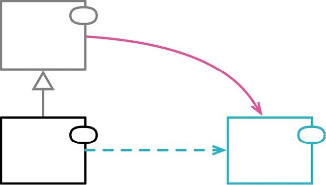

> 你在两个类之间使用委托关系，并经常为整个接口编写许多极简单的委托函数。让委托类来继承受托类。

```javascript
class List {...}
class Stack extends List {...}
```
```javascript
class Stack { 
  constructor() {
    this._storage = new List();
  }
}
class List {...}
```

- 动机
  - 在面向对象程序中，通过继承来复用现有功能，是一种既强大又便捷的手段。
    - 我只要继承一个已有的类，覆写一些功能，再添加一些功能，就能达成目的。但继承也有可能造成困扰和混乱。
  - 在对象技术发展早期，有一个经典的误用继承的例子：让栈（stack）继承列表（list）。
    - 这个想法的出发点是想复用列表类的数据存储和操作能力。
    - 虽说复用是一件好事，但这个继承关系有问题：
      - 列表类的所有操作都会出现在栈类的接口上，然而其中大部分操作对一个栈来说并不适用。
      - 更好的做法应该是把列表作为栈的字段，把必要的操作委派给列表就行了。
    - 这就是一个用得上以委托取代超类手法的例子
      - 如果超类的一些函数对子类并不适用，就说明我不应该通过继承来获得超类的功能。
  - 除了“ **子类用得上超类的所有函数** ”之外，合理的继承关系还有一个重要特征： **子类的所有实例都应该是超类的实例，通过超类的接口来使用子类的实例应该完全不出问题** 。
    - 假如我有一个车模（car model）类，其中有名称、引擎大小等属性，我可能想复用这些特性来表示真正的汽车（car），并在子类上添加VIN编号、制造日期等属性。
    - 然而汽车终归不是模型。这是一种常见而又经常不易察觉的建模错误，我称之为“类型与实例名不符实”（type-instance homonym）[mf-tih]。
  - 在这两个例子中，
    - 有问题的继承招致了混乱和错误——如果把继承关系改为将部分职能委托给另一个对象，这些混乱和错误本是可以轻松避免的。
    - 使用委托关系能更清晰地表达“这是另一个东西，我只是需要用到其中携带的一些功能”这层意思。
  - 即便在子类继承是合理的建模方式的情况下， **如果子类与超类之间的耦合过强，超类的变化很容易破坏子类的功能，还是会建议使用以委托取代超类** 。
    - 这样做的缺点就是，对于宿主类（也就是原来的子类）和委托类（也就是原来的超类）中原本一样的函数，现在我必须在宿主类中挨个编写转发函数。不过还好，这种转发函数虽然写起来乏味，但它们都非常简单，几乎不可能出错。
    - 有些人在这个方向上走得更远，他们建议完全避免使用继承，但我不同意这种观点
      - 如果符合继承关系的语义条件（超类的所有方法都适用于子类，子类的所有实例都是超类的实例），那么继承是一种简洁又高效的复用机制。
      - 如果情况发生变化，继承不再是最好的选择，我也可以比较容易地运用以委托取代超类。
      - 所以我的建议是， **首先（尽量）使用继承，如果发现继承有问题，再使用以委托取代超类** 。

- 做法
  - 在子类中新建一个字段，使其引用超类的一个对象，并将这个委托引用初始化为超类的新实例。
  - 针对超类的每个函数，在子类中创建一个转发函数，将调用请求转发给委托引用。每转发一块完整逻辑，都要执行测试。
    > 大多数时候，每转发一个函数就可以测试，但一对设值/取值必须同时转移，然后才能测试。
  - 当所有超类函数都被转发函数覆写后，就可以去掉继承关系。

## 6.8. 大型重构

### 6.8.1. 梳理并分解继承体系(Tease ApartInheritance)

某个继承体系同时承担两项责任。建立两个继承体系，并通过委托关系让其中一个可以调用另一个。

### 6.8.2. 将过程化设计转化为对象设计(Convert Procedural Design toObjects)

你手上有一些传统过程化风格的代码。将数据记录变成对象，将大块的行为分成小块，并将行为移入相关对象之中。

### 6.8.3. 将领域和表述/显示分离(Separate Domain fromPresentation)

某些 GUI 类之中包含了领域逻辑。将领域逻辑分离出来，为它们建立独立的领域类。

### 6.8.4. 提炼继承体系(Extract Hierarchy)

你有某各类做了太多工作，

# 7. 怎么对经理说

**此章节只可意会不可言传。**

# 8. 引用

- 《重构，改善既有代码的设计》
- 《重构，改善既有代码的设计》 第二版
- [重构指北——《重构，改善既有代码设计》精读](https://juejin.cn/post/6996990620233383967)
- [代码中常见的 24 种坏味道及重构手法(上篇)](https://juejin.cn/post/6973780556664438820)

