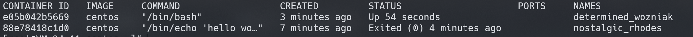
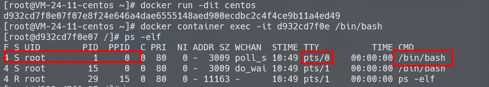

TODO: docker笔记整理

# 1. 基本理论

## 1.1. 虚拟机与容器

- 虚拟机（virtual machine）
  - 它可以在一种操作系统里面运行另一种操作系统，比如在 Windows 系统里面运行 Linux 系统。
  - 应用程序对此毫无感知，因为虚拟机看上去跟真实系统一模一样，而对于底层系统来说，虚拟机就是一个普通文件，不需要了就删掉，对其他部分毫无影响。
  - 虽然用户可以通过虚拟机还原软件的原始环境。但是，这个方案有几个缺点。
  - 资源占用多
    - 虚拟机会独占一部分内存和硬盘空间。
    - 它运行的时候，其他程序就不能使用这些资源了。
    - 哪怕虚拟机里面的应用程序，真正使用的内存只有 1MB，虚拟机依然需要几百 MB 的内存才能运行。
  - 冗余步骤多
    - 虚拟机是完整的操作系统，一些系统级别的操作步骤，往往无法跳过，比如用户登录。
  - 启动慢
    - 启动操作系统需要多久，启动虚拟机就需要多久。可能要等几分钟，应用程序才能真正运行。

- 容器
  - 是在隔离的环境里面运行的一个 **进程** 
  - 这个隔离的环境有自己的系统目录文件，有自己的ip地址，主机名
  - 也可以说： **容器是一种轻量级虚拟化的技术** 。

- Linux 容器
  - 由于虚拟机的缺点，Linux 发展出了另一种虚拟化技术：Linux 容器（ **Linux Containers，缩写为 LXC** ）。
  - Linux 容器不是模拟一个完整的操作系统，而是对进程进行隔离。
    - 或者说，在正常进程的外面套了一个保护层。
    - 对于容器里面的进程来说，它接触到的各种资源都是虚拟的，从而实现与底层系统的隔离。
  - 由于容器是进程级别的，相比虚拟机有很多优势:
    - 启动快
      - 容器里面的应用，直接就是底层系统的一个进程，而不是虚拟机内部的进程。
      - 所以，启动容器相当于启动本机的一个进程，而不是启动一个操作系统，速度就快很多。
    - 资源占用少
      - 容器只占用需要的资源，不占用那些没有用到的资源；虚拟机由于是完整的操作系统，不可避免要占用所有资源。
      - 另外，多个容器可以共享资源，虚拟机都是独享资源。
    - 体积小
      - 容器只要包含用到的组件即可，而虚拟机是整个操作系统的打包，所以容器文件比虚拟机文件要小很多。
  - 总之，容器有点像轻量级的虚拟机，能够提供虚拟化的环境，但是成本开销小得多。

- docker容器
  - Docker是通过内核虚拟化技术（namespaces及cgroups）来提供容器的资源隔离与资源限制。
  -  **属于 Linux 容器的一种封装** ，提供简单易用的容器使用接口
  - Docker 将应用程序与该程序的依赖，打包在一个文件里面。
    - 运行这个文件，就会生成一个虚拟容器。程序在这个虚拟容器里运行，就好像在真实的物理机上运行一样。
    - 有了 Docker，就不用担心环境问题。
  - 总体来说，Docker 的接口相当简单，
    - 用户可以方便地创建和使用容器，把自己的应用放入容器。
    - 容器还可以进行版本管理、复制、分享、修改，就像管理普通的代码一样。

## 1.2. docker

### 1.2.1. 项目介绍

Docker 是一个开放源代码软件项目，基于Go语言，项目主要代码在2013年开源于 GitHub。
它是云服务技术上的一次创新，让应用程序布署在软件容器下的工作可以自动化进行，借此在 Linux 操作系统上，提供一个额外的软件抽象层，以及操作系统层虚拟化的自动管理机制。

Docker 利用 Linux 核心中的资源分脱机制，例如 cgroups，以及 Linux 核心名字空间（name space），来创建独立的软件容器（containers），属于操作系统层面的虚拟化技术。
由于隔离的进程独立于宿主和其它的隔离的进程，因此也称其为容器。Docker 在容器的基础上进行了进一步的封装，从文件系统、网络互联到进程隔离等等，极大的简化了容器的创建和维护，使得其比虚拟机技术更为轻便、快捷。
Docker 可以在单一 Linux 实体下运作，避免因为创建一个虚拟机而造成的额外负担。

### 1.2.2. docker理念

- docker的主要目标是"Build,Ship and Run any App,Angwhere"
  > 构建，运输，然后处处运行
  - 构建：制作docker镜像，打包容器的所有系统目录文件
  - 运输：上传,下载,共享docker镜像
  - 运行：基于docker镜像提供的rootfs，启动容器
  - 只要能运行docker容器，那么docker镜像中已经安装好的软件也可以运行，所以说docker是一种软件的打包技术。

### 1.2.3. docker的优点:

- 解决了操作系统和软件运行环境的依赖
- 对于开发人员来说，再也不用担心不会部署开发环境
- 开发环境，测试环境和生产环境高度一致。
- 让用户体验产品新特性的又一种思路。

### 1.2.4. docker与虚拟机

- docker与虚拟机


  - 对于虚拟机技术来说，
    - 传统的虚拟机需要模拟整台机器包括硬件，每台虚拟机都需要有自己的操作系统，
    - 虚拟机一旦被开启，预分配给他的资源将全部被占用。
    - 每一个虚拟机包括应用，必要的二进制和库，以及一个完整的用户操作系统。
  - 容器技术
    - 容器技术和我们的宿主机共享硬件资源及操作系统，可以实现资源的动态分配。
    - 容器包含应用和其所有的依赖包，但是与其他容器共享内核。
    - 容器在宿主机操作系统中，在用户空间以分离的进程运行。容器内没有自己的内核，也没有进行硬件虚拟。

- 具体来说与虚拟机技术对比，Docker 容器存在以下几个特点：
  - 更快的启动速度：
    - 因为 Docker 直接运行于宿主内核，无需启动完整的操作系统，因此启动速度属于秒级别，
    - 而虚拟机通常需要几分钟去启动。
  - 更高效的资源利用率：
    - 由于容器不需要进行硬件虚拟以及运行完整操作系统等额外开销，Docker 对系统资源的利用率更高。
  - 更高的系统支持量：
    - Docker 的架构可以共用一个内核与共享应用程序库，所占内存极小。
    - 同样的硬件环境，Docker 运行的镜像数远多于虚拟机数量，对系统的利用率非常高。
  - 持续交付与部署：
    - 对开发和运维人员来说，最希望的就是一次创建或配置，可以在任意地方正常运行。
    - 使用 Docker 可以通过定制应用镜像来实现持续集成、持续交付、部署。
    - 开发人员可以通过 Dockerfile 来进行镜像构建，并进行集成测试，而运维人员则可以直接在生产环境中快速部署该镜像，甚至进行自动部署。
  - 更轻松的迁移：
    - 由于 Docker 确保了执行环境的一致性，使得应用的迁移更加容易。Docker 可以在很多平台上运行，
    - 无论是物理机、虚拟机、公有云、私有云，甚至是笔记本，其运行结果是一致的。
    - 因此用户可以很轻易的将在一个平台上运行的应用，迁移到另一个平台上，而不用担心运行环境的变化导致应用无法正常运行的情况。
  - 更轻松的维护与扩展：
    - Docker 使用的分层存储以及镜像的技术，使得应用重复部分的复用更为容易，也使得应用的维护更新更加简单，基于基础镜像进一步扩展镜像也变得非常简单。
    - 此外，Docker 团队同各个开源项目团队一起维护了一大批高质量的 官方镜像，既可以直接在生产环境使用，又可以作为基础进一步定制，大大的降低了应用服务的镜像制作成本。
  - 更弱的隔离性：
    - Docker 属于进程之间的隔离，虚拟机可实现系统级别隔离。
  - 更弱的安全性：
    - Docker 的租户 root 和宿主机 root 等同，一旦容器内的用户从普通用户权限提升为 root 权限，它就直接具备了宿主机的 root 权限，进而可进行无限制的操作。
    - 虚拟机租户 root 权限和宿主机的 root 虚拟机权限是分离的，并且利用硬件隔离技术可以防止虚拟机突破和彼此交互，而容器至今还没有任何形式的硬件隔离，这使得容器容易受到攻击。

## 1.3. 应用场景

Docker 的主要用途，目前有三大类。

- （1）提供一次性的环境。比如，本地测试他人的软件、持续集成的时候提供单元测试和构建的环境。
- （2）提供弹性的云服务。因为 Docker 容器可以随开随关，很适合动态扩容和缩容。
- （3）组建微服务架构。通过多个容器，一台机器可以跑多个服务，因此在本机就可以模拟出微服务架构。

## 1.4. 核心概念


### 1.4.1. 镜像(image)与标签

- 基本说明
  - 作用：
    - Docker 把应用程序及其依赖，打包在 image 文件里面。
    - 只有通过这个文件，才能生成 Docker 容器。
    - image 文件可以看作是容器的模板。
    - Docker 根据 image 文件生成容器的实例。
    - 同一个 image 文件，可以生成多个同时运行的容器实例。
    - image 文件是通用的，一台机器的 image 文件拷贝到另一台机器，照样可以使用。
  - 存储与创建：image 是二进制文件。
    - 实际开发中，一个 image 文件往往通过继承另一个 image 文件，加上一些个性化设置而生成。
      > 举例来说，你可以在 Ubuntu 的 image 基础上，往里面加入 Apache 服务器，形成你的 image。
    - 一般来说，为了节省时间，我们应该尽量使用别人制作好的 image 文件，而不是自己制作。
      - 即使要定制，也应该基于别人的 image 文件进行加工，而不是从零开始制作。
  - Docker 镜像是一个特殊的文件系统，除了提供容器运行时所需的程序、库、资源、配置等文件外，还包含了一些为运行时准备的一些配置参数（如匿名卷、环境变量、用户等）。
  - 镜像不包含任何动态数据，其内容在构建之后也不会被改变。

- 标准镜像名由四部分组成:  **仓库地址/项目名/镜像名:标签** 
  > 如 daocloud.io/library/nginx:latest

  - docker官方仓库的官方镜像可省略仓库地址和项目名,即:镜像名:标签
  - docker官方仓库的第三方镜像可省略仓库地址,即:项目名/镜像名:标签
  - 第三方仓库的镜像必须包含所有信息,即:仓库地址/项目名/镜像名:标签

- 镜像标签
  - 同一个镜像可以有多个便签,一个标签也可以对应多个镜像
  -  **标签常用来区分版本号** ,如centos:7,centos:7.4,centos:latest
  - 如果未指明使用哪个标签,将使用 **默认的标签latest** 

- 镜像的 **分层** : docker镜像是分层存储的, **最上面一层为可写层,下面所有层都是只读层** ,这要做的好处是:
  - 多个镜像可以共用底层镜像,减小仓库容量
  - 制作镜像时可以使用底层镜像缓存,加快制作速度
  - 启动镜像时不用加载重复镜像,提高启动速度
  - 每一个只读层都可以单独作为镜像加载,制方便排查作镜像时的问题

### 1.4.2. 容器

- 容器的实质是进程，但与直接在宿主执行的进程不同，容器进程运行于属于自己的独立的命名空间容器，可以被创建、启动、停止、删除和暂停等等，
- 说到镜像与容器之间的关系，可以类比面向对象程序设计中的类和实例。

### 1.4.3. 仓库

- 镜像构建完成后，可以很容易的在当前宿主机上运行，
- 但是，如果需要在其它服务器上使用这个镜像，我们就需要一个集中的存储、分发镜像的服务，
- Docker Registry 就是这样的服务。一个 Docker Registry 中可以包含多个仓库；
  - Docker 的官方仓库 Docker Hub 是最重要、最常用的 image 仓库。
  - 此外，出售自己制作的 image 文件也是可以的。

# 2. 其他说明

## 2.1. 镜像分层

## 2.2. Docker DNS Server

- 从 Docker 1.10 版本开始，docker daemon 实现了一个内嵌的 DNS server，使容器可以直接通过“容器名”通信。
  - 方法很简单，只要在启动时用 `--name` 为容器命名就可以了。
  - 使用 docker DNS 有个限制：
    - 只能在 user-defined 网络中使用。
    - 也就是说，默认的 bridge 网络是无法使用 DNS 的。

---

> 验证

- 创建自定义网络

  ```bash
  docker network create --driver bridge noah_net
  ```
- 启动基于自定义的网络的容器并测试

  ```bash
  docker run -d  --network=noah_net --name=bbox1 busybox sleep 900
  docker run -it --network=noah_net --name=bbox2 busybox ping -c1 bbox1
  ```
- 启动默认网络的容器并测试。

  ```bash
  docker run -d  --name=bbox3 busybox sleep 900
  docker run -it --name=bbox4 busybox ping -c1 bbox3
  ```
- bbox4 无法 ping 到 bbox3。

# 3. docker安装

## 3.1. 系统支持

- docker支持centos版本

  ```
  Docker支持以下的CentOS版本：
  CentOS 7 (64-bit),要求系统为64位、系统内核版本为 3.10 以上。
  CentOS 6.5 (64-bit) 或更高的版本,要求系统为64位、系统内核版本为 2.6.32-431 或者更高版本。
  ```
  - 查看系统内核：`uname -r`
  - 查看已安装的CentOS版本信息:`lsb_release -a`

## 3.2. centos 6.5安装docker

- 安装流程
  - 添加 epel源: `yum install -y epel-release`
    > Docker使用EPEL发布，RHEL系的OS首先要确保已经持有EPEL仓库，否则先检查OS的版本，然后安装相应的EPEL包。
  - 安装docker
    - `yum install -y docker-io`
    - 如果命令执行失败，直接用下载源安装， 执行以下命令
      ```
      yum install https://get.docker.com/rpm/1.7.1/centos-6/RPMS/x86_64/docker-engine-1.7.1-1.el6.x86_64.rpm
      ```
  - 第三步：启动服务与查看是否安装成功
    - service docker start
    - service docker status
      - 如果这条命令出现：`docker dead but pid file exists`，是因为device-mapper-libs的版本过低。
      - 更新：`yum update -y device-mapper-libs`
    - docker version

- docker国内镜像配置
  - 去阿里云注册一个账户，搜索容器镜像服务，获取镜像加速地址
  - 在文件：`/etc/sysconfig/docker`中加一行代码

    ```
    other_args="--registry-mirror=<镜像源地址>"，
    ```

## 3.3. centos 7 安装docker

# 4. 基础

> 其他命令详见docker 文档以及 **docker --help** 

## 4.1. 命令格式

- docker 1.13之后，为了方便命令的管理，分为了Management Commands 和 Commands。比如：

  ```
  获取系统信息：
  docker system info # Management Command
  docker info # Command
  ```
  ```
  新版命令主要是更直观了,添加了镜像[image]和容器[container]来区分命令,简单举例对比:

  1. 显示容器命令
    老版命令:`docker ps`
    新版命令:`docker container ls`
  2. 显示镜像命令
    老版命令: `docker images`
    新版命令: `docker image ls`
  3. 删除镜像命令
    老版命令: `docker rmi centos:latest`
    新版命令: `docker image rm centos:latest`
  ```
- 两种命令式兼容的。

## 4.2. docker基本命令

## 4.3. 通用命令

- docker version:查看版本等相关信息
- docker info:查看容器镜像等相关信息
- docker --help：查看docker有哪些命令，当你记不住docker的命令的时候，可使用这个命令查看；

## 4.4. 镜像命令

### 4.4.1. 搜索镜像

- `docker search xxx`
  - 选镜像的建议：优先考虑官方镜像,然后是`starts`数量多的镜像
  - `docker search  --no-trunc image_name`: 显示完整的镜像描述信息
  - `docker search -s 50 image_name`： 只列出收藏大于 50 的镜像

### 4.4.2. 拉取/推送镜像

- 拉取镜像到本地 `docker image pull centos`
- 推送centos镜像到仓库 `docker image push centos`

### 4.4.3. 查看/删除镜像

- 查看本机所有镜像: `docker images`

  ```
  注意：
  同一仓库源可以有多个 TAG，代表这个仓库源的不同个版本，使用 REPOSITORY:TAG 来定义不同的镜像。
  如果你不指定一个镜像的版本标签，例如你只使用hello-world，docker 将默认使用 hello-world:latest 镜像；
  ```

  - docker images -a：查询本地所有镜像，包括镜像中的镜像（中间层）
  - docker images -q：只显示镜像id
  - docker images -aq:显示镜像所有id，包括中间层的id
  - docker images --digests:显示镜像摘要信息
  - docker images --no-trunc：显示完整的进行信息

- 删除镜像 `docker image rm centos`

### 4.4.4. 导入导出镜像

- 导出镜像 `docker image save centos > docker-centos7.4.tar.gz`
- 导入镜像 `docker image load -i docker-centos7.4.tar.gz`

## 4.5. 容器命令

### 4.5.1. 启动

- 启动容器有两种方式
  > 因为 Docker 的容器实在太轻量级了，很多时候用户都是随时删除和新创建容器。
  - 一种是基于镜像新建一个容器并启动
  - 另外一个是将在终止状态（exited）的容器重新启动。

- 新建并启动
  - 所需要的命令主要为 `docker run`。
  - 示例：
    - 下面的命令输出一个 “Hello World”，之后终止容器。

      ```
      docker run ubuntu:18.04 /bin/echo 'Hello world'
      ```
      - 这跟在本地直接执行 /bin/echo 'hello world' 几乎感觉不出任何区别。
    - 下面的命令则启动一个 bash 终端，允许用户进行交互。

      ```
      docker run -t -i ubuntu:18.04 /bin/bash
      ```
      - -t 选项让Docker分配一个伪终端（pseudo-tty）并绑定到容器的标准输入上
      - -i 则让容器的标准输入保持打开。
      - 在交互模式下，用户可以通过所创建的终端来输入命令
    - 若不指定命令，默认docker启动命令为`/bin/bash`

  - 当利用 docker run 来创建容器时，Docker 在后台运行的标准操作包括：
    - 检查本地是否存在指定的镜像，不存在就从 registry 下载
    - 利用镜像创建并启动一个容器
    - 分配一个文件系统，并在只读的镜像层外面挂载一层可读写层
    - 从宿主主机配置的网桥接口中桥接一个虚拟接口到容器中去
    - 从地址池配置一个 ip 地址给容器
    - 执行用户指定的应用程序
    - 执行完毕后容器被终止

- 启动已终止容器
  - 可以利用 `docker container start` 命令，直接将一个已经终止（exited）的容器启动运行。
  - **容器的核心为所执行的应用程序** ，所需要的资源都是应用程序运行所必需的。
  - 除此之外，并没有其它的资源。
  - 可以在伪终端中利用 ps 或 top 来查看进程信息。

    ```
    root@ba267838cc1b:/# ps
      PID TTY          TIME CMD
        1 ?        00:00:00 bash
       11 ?        00:00:00 ps
    ```
    - 可见，容器中仅运行了指定的 bash 应用。
    - 这种特点使得 Docker 对资源的利用率极高，是货真价实的轻量级虚拟化。

- 注意：

  

  - 每个容器都会以一个命令作为入口，即会称为容器内的 **初始进程** 
    - 剩下的其他所有进程都是由初始进程启动的。
  - `docker container start` 命令就会重新执行入口命令
  - 若入口命令为 `/bin/bash` 等shell程序
    - 则可以通过`docker container start -i` 的方式重新进入容器。
    - 基本原理：
      - `-i` 会将 STDIN 输入到初始进程，即bash进程
      - 而bash进程非守护进程(没有指定`-d`参数)，输出则会直接输出到宿主机上。
      - 表现出来的效果就是一个交互shell

  - **若所有执行的进程都退出的话，容器也会停止** 

- 其他
  - 有一种方式可以保证 **已经停止的容器内一直运行一个bash程序** ，使容器不停止：
    ```bash
    # 启动一个入口命令为bash的容器后再退出
    docker run -it xxx /bin/bash
    # 假设刚刚停止的容器id为 yyy

    # 这种方式可以重新开启进入容器，但是退出后容器就会停止
    docker start -i 
    # ps -elf输出为：
      F S UID        PID  PPID  C PRI  NI ADDR SZ WCHAN  STIME TTY          TIME CMD
      4 S root         1     0  0  80   0 -  3009 do_wai 10:12 pts/0    00:00:00 /bin/bash
      4 R root        21     1  0  80   0 - 11163 -      10:15 pts/0    00:00:00 ps -elf
    # 若想要退出bash后，容器就会关闭

    # 可以这样重新启动容器，可以发现ppid为0的有两个bash进程
    # 这样exit退出后就会一直有一个bash进程跑着
    docker container start  3aaef6c6a538 && docker exec -it 3aaef6c6a538 /bin/bash
    [root@3aaef6c6a538 /]# ps -elf
    F S UID        PID  PPID  C PRI  NI ADDR SZ WCHAN  STIME TTY          TIME CMD
    4 S root         1     0  0  80   0 -  3009 poll_s 10:31 pts/0    00:00:00 /bin/bash
    4 S root        14     0  0  80   0 -  3009 do_wai 10:31 pts/1    00:00:00 /bin/bash
    4 R root        28    14  0  80   0 - 11163 -      10:31 pts/1    00:00:00 ps -elf
    # 后续可以通过 docker container stop 
      或者docker container exec <container_id> kill 1 
      来关闭容器
    ```
  - 如果重新启动一个新的容器
    - 直接`docker run -dit <image_name> /bin/bash` 
    - 即可在容器里面启动一个bash守护进程

    

### 4.5.2. 守护态运行

- 守护态运行：
  - 需要让 Docker 在后台运行而不是直接把执行命令的结果输出在当前宿主机下
  - 此时，可以通过添加 -d 参数来实现。

- 示例
  - 如果不使用 -d 参数运行容器。

    ```bash
    $ docker run ubuntu:18.04 /bin/sh -c "while true; do echo hello world; sleep 1; done"
    hello world
    hello world
    hello world
    hello world
    ```
    - 容器会把输出的结果 (STDOUT) 打印到宿主机上面
  - 如果使用了 -d 参数运行容器。

    ```bash
    $ docker run -d ubuntu:18.04 /bin/sh -c "while true; do echo hello world; sleep 1; done"
    77b2dc01fe0f3f1265df143181e7b9af5e05279a884f4776ee75350ea9d8017a
    ```
    - 此时容器会在后台运行并不会把输出的结果 (STDOUT) 打印到宿主机上面(输出结果可以用 docker logs 查看)。
    - 注： **容器是否会长久运行，是和 docker run 指定的命令有关，和 -d 参数无关** 。
    - 使用 -d 参数启动后会返回一个唯一的 id，也可以通过 docker container ls 命令来查看容器信息。

      ```bash
      $ docker container ls
      CONTAINER ID  IMAGE         COMMAND               CREATED        STATUS       PORTS NAMES
      77b2dc01fe0f  ubuntu:18.04  /bin/sh -c 'while tr  2 minutes ago  Up 1 minute        agitated_wright
      ```
    - 要获取容器的输出信息，可以通过 docker container logs 命令。
      ```
      $ docker container logs [container ID or NAMES]
      hello world
      hello world
      hello world
      ```

### 4.5.3. 停止删除容器

- 停止容器 `docker container stop 容器ID|容器名`
  - 当 Docker 容器中指定的应用终结时，容器也自动终止
- 杀死容器 `docker container kill 容器ID|容器名`
- 删除容器 `docker container rm 容器ID|容器名`
- 批量删除容器 `docker container rm -f $(docker container ls -a -q)`

### 4.5.4. 查看容器

- 查看容器

  ```bash
  # 旧版命令
  docker ps [可选参数] : 不写参数表示只显示正在运行的容器
    # -a :列出当前所有正在运行的容器+历史上运行过的
    # -l :显示最近创建的容器。
    # -n：显示最近n个创建的容器。
    # -q :静默模式，只显示容器id。
    # --no-trunc :不截断输出。

  #查看运行中的容器。默认不会显示停止的容器。
  docker container ls
  # 如果想要启动并进入没有前台进程的容器：
  docker container start <id> && docker exec -it <id> /bin/bash
  #查看所有容器
  docker container ls -a
  ```

- 查看指定容器详细信息
  - `docker container inspect 容器ID|容器名`
  - 命令可以查看容器的超详细信息,以json格式显示

- 查看容器日志:
  - `docker logs -tf --tail 5 容器id`: 

  ```
  -t 是加入时间戳
  -f 跟随最新的日志打印
  --tail 数字 显示最后多少条
  ```

- 查看容器运行的进程: 
  - `docker top 容器id或名称:`
  - 支持ps命令参数

### 4.5.5. 进入容器的方法

- 说明
  - 在使用 -d 参数时，容器启动后会进入后台。
  - 某些时候需要进入容器进行操作，包括使用 docker attach 命令或 docker exec 命令
  - 推荐使用 docker exec 命令

- attach 命令
  - 下面示例如何使用 docker attach 命令。

    ```bash
    $ docker run -dit ubuntu
    243c32535da7d142fb0e6df616a3c3ada0b8ab417937c853a9e1c251f499f550

    $ docker container ls
    CONTAINER ID        IMAGE               COMMAND             CREATED             STATUS              PORTS               NAMES
    243c32535da7        ubuntu:latest       "/bin/bash"         18 seconds ago      Up 17 seconds                           nostalgic_hypatia

    $ docker attach 243c
    root@243c32535da7:/#
    ```
  - 注意： 如果从这个 stdin 中 exit，会导致容器的停止。

- exec 命令
  - docker exec 后边可以跟多个参数，这里主要说明 -i -t 参数。
    - 只用 `-i` 参数时
      - 由于没有分配伪终端，界面 **没有我们熟悉的 Linux 命令提示符**
      - 但命令执行结果仍然可以返回。
    - 当 `-i -t` 参数一起使用时
      - 则可以看到我们熟悉的 Linux 命令提示符。

      ```bash
      $ docker run -dit ubuntu
      69d137adef7a8a689cbcb059e94da5489d3cddd240ff675c640c8d96e84fe1f6

      $ docker container ls
      CONTAINER ID        IMAGE               COMMAND             CREATED             STATUS              PORTS               NAMES
      69d137adef7a        ubuntu:latest       "/bin/bash"         18 seconds ago      Up 17 seconds                           zealous_swirles

      $ docker exec -i 69d1 bash
      ls
      bin
      boot
      dev
      ...

      $ docker exec -it 69d1 bash
      root@69d137adef7a:/#
      ```
  - 如果从这个 stdin 中 exit，不会导致容器的停止
    - 因为 exec 是在容器中执行一条命令，会新开一个进程

### 4.5.6. 导入和导出

### 4.5.7. docker和宿主机器文件复制

- docker cp 容器id /path/to/docker/file path/of/host: 将容器中的文件拷贝到主机上

## 4.6. 使用网络

### 4.6.1. docker网络

### 4.6.2. 端口映射

#### 4.6.2.1. 说明

- 默认情况下，容器使用的ip网段是172.17.0.0/16
  - 外界的用户只能访问宿主机的10.0.0.0/24网段，无法访问172.17.0.0/16网段。
- 而我们运行容器的目的,是希望运行在容器中的服务，能够被外界访问
  - 这里就涉及到了外网10.0.0.0/24到容器内网172.17.0.0/16网段的转换，所以需要做端口映射。

#### 4.6.2.2. docker容器端口映射的方法

docker 的端口映射是通过自动添加一条iptables规则实现的

- 指定映射端口

  | 语法               | 举例                 | 说明                |
  | :----------------- | :------------------- | :------------------ |
  | -p hPort:cPort     | -p 8800:80           | 主机8800映射容器80  |
  | 同上,指定多个-p    | -p 81:80 -p 443:443  | 一次映射多个端口    |
  | -p ip:hPort:cPort  | -p 10.0.0.11:8800:80 | 指定主机IP          |
  | -p crPort          | -p 80                | 随机端口映射容器80  |
  | -p ip::crPort      | -p 10.0.11::80       | IP指定,主机端口随机 |
  | -p hPort:cPort:udp | -p 8800:80:udp       | 默认tcp映射,改为UDP |

- 完全随机映射
  - `docker run -P`
  - 将`dockerfile`创建镜像时指定的,需要映射出来的内网端口,做外网随机映射

### 4.6.3. 容器互联

### 4.6.4. 配置DNS

## 4.7. docker资源限额

一个 docker host 上会运行若干容器，每个容器都需要 CPU、内存和 IO 资源，Docker 提供了资源限制的机制避免某个容器因占用太多资源而影响其他容器乃至整个 host 的性能。

### 4.7.1. 内存限额

- 与操作系统类似，容器可使用的内存包括两部分：物理内存和 swap。

  - `-m` 或 `--memory`：设置内存的使用限额，例如 100M, 2G。
  - `--memory-swap`：设置 **内存+swap** 的使用限额。
  - 默认情况下都为为 -1，即对容器内存和 swap 的使用没有限制。
  - 如果只指定 `-m` 参数，那么 `--memory-swap` 默认为 `-m` 的两倍

- 命令示例:

  ```
  docker run -m 200M --memory-swap=300M ubuntu
  ```

  - 允许该容器最多使用 200M 的内存和 100M 的 swap。

### 4.7.2. 动态修改内存限额

- 动态修改运行中的容器内存限额,需要用到`update`参数
- 并且不能只修改内存限制,需要同步修改swap限制,否则会报错,报错详见: [参考链接](https://my.oschina.net/Kanonpy/blog/2209207)

```
docker update  --memory 2048m --memory-swap -1 gitlab
```

### 4.7.3. cpu限额

通过 `-c` 设置的 cpu share 并不是 CPU 资源的绝对数量，而是一个相对的权重值。某个容器最终能分配到的 CPU 资源取决于它的 cpu share 占所有容器 cpu share 总和的比例。

1. 默认所有容器可以平等地使用 host CPU 资源 ,并且没有限制。
2. 通过 `-c` 或 `--cpu-shares` 设置容器使用 CPU 的权重。
3. 如果不指定，默认值为 1024。
4. **通过 cpu share 可以设置容器使用 CPU 的优先级**。

案例:在 host 中启动了两个容器：

```
docker run --name "container_A" -c 1024 ubuntu
docker run --name "container_B" -c 512  ubuntu
```

container_A 的 cpu share 1024，是 container_B 的两倍。当两个容器都需要 CPU 资源时，container_A 可以得到的 CPU 是 container_B 的两倍。

> 这种按权重分配 CPU 只会发生在 CPU 资源紧张的情况下。如果 container_A 处于空闲状态，这时，为了充分利用 CPU 资源，container_B 也可以分配到全部可用的 CPU。

### 4.7.4. 磁盘限额

Block IO 指的是磁盘的读写，docker 可通过设置权重、限制 bps 和 iops 的方式控制容器读写磁盘的带宽，下面分别讨论。

> 目前 Block IO 限额只对 direct IO（不使用文件缓存）有效。

- block IO 权重
  - 默认情况下，所有容器能平等地读写磁盘，可以通过设置 `--blkio-weight` 参数来改变容器 block IO 的优先级。
  - `--blkio-weight` 与 `--cpu-shares` 类似，设置的是相对权重值，默认为 500。
  - 在下面的例子中，container_A 读写磁盘的带宽是 container_B 的两倍。

    ```
    docker run -it --name container_A --blkio-weight 600 ubuntu   
    docker run -it --name container_B --blkio-weight 300 ubuntu
    ```

- 限制 bps 和 iops
  - bps 是 byte per second，每秒读写的数据量。
  - iops 是 io per second，每秒 IO 的次数。
  - 参数
    - `--device-read-bps`，限制读某个设备的 bps。
    - `--device-write-bps`，限制写某个设备的 bps。
    - `--device-read-iops`，限制读某个设备的 iops。
    - `--device-write-iops`，限制写某个设备的 iops。
  - 下面这个例子限制容器写 /dev/sda 的速率为 30 MB/s
    ```
    docker run -it --device-write-bps /dev/sda:30MB ubuntu
    ```

## 4.8. 数据持久化与共享互联

### 4.8.1. 说明

- 为什么要使用docker数据持久化
  - 正常情况下，删除容器，容器中所有的文件也会被删除。
  - 所以需要能持久化容器中数据的方法,也就是数据卷
  - 数据卷(Data Volume)的作用：
    - 持久化容器运行过程中产生的数据文件
    - 实现多个容器间的文件共享。
    - 实现多个主机间有状态容器的迁移

- docker数据卷的分类
  > 在集群环境下,数据卷分为
  - 单机内容器间的数据持久化和共享
    - 数据卷[Data Volume]
      - 绑定挂载[bind mount]
      - 容器管理卷[docker managed volume]
    - 容器卷[volume container]
  - 跨主机容器间的数据持久化和共享
    - 使用分布式文件系统(如NFS)
    - 使用volume driver实现跨主机存储
      - Rex-Ray插件
      - [更多官方插件](https://docs.docker.com/engine/extend/legacy_plugins/#volume-plugins)

- 容器间互连的方式
  > 容器互联大体有以下三种方式：
  - 基于volume的互联
  - 基于link的互联
  - 基于网络的互联
 
### 4.8.2. 数据卷

#### 4.8.2.1. 说明

- 数据卷[Data Volume]就是将宿主机中的一个文件或目录挂载到容器中,供容器使用
  - 分为绑定卷[bind mount]和容器管理卷[docker managed volume]
  - 区别是:

  | 区别点                 | bind mount                   | docker managed volume        |
  | :--------------------- | :--------------------------- | :--------------------------- |
  | volume 位置            | 可任意指定                   | /var/lib/docker/volumes/...  |
  | 对已有mount point 影响 | 隐藏并替换为 volume          | 原有数据复制到 volume        |
  | 是否支持单个文件       | 支持                         | 不支持，只能是目录           |
  | 权限控制               | 可设置为只读，默认为读写权限 | 无控制，均为读写权限         |
  | 移植性                 | 移植性弱，与 host path 绑定  | 移植性强，无需指定 host 目录 |

#### 4.8.2.2. 数据卷命令

- 常用命令
  - 创建一个数据卷
    `docker volume create xxx`
  - 查看数据卷列表
    `docker volume ls`
  - 删除一个数据卷
    `docker volume rm`
  - 查看一个数据卷的属性
    `docker volume inspect`

- `-v`挂载数据卷语法

   ```
   -v 挂载源:挂载目的[:其他选项]
   ```

   > 使用举例:

    ```bash
    docker run -d -p 80:80 -v /data/test/:/usr/share/nginx/html nginx
    # 其他选项一般只有一个`ro`只读选项常用,不举例了
    ```

  > `-v`参数用法详解

  | `-v`参数所跟选项        | 举例                   | 导致的结果                                                |
  | :---------------------- | :--------------------- | :-------------------------------------------------------- |
  | A:不跟任何选项          | -v                     | 根据创建镜像的dockerfiled的配置进行挂载                   |
  | B:只写一个目录          | -v /data               | 表示只有挂载目的,会自动创建挂载源                         |
  | C:源目都有[四种]        | -v xxx:/test           | 又如下分四种情况                                          |
  | C1:源目都是目录         | -v /data/:/test        | 将主机的data目录挂载到容器的test目录                      |
  | C2:源目都是文件         | -v ~/f.txt:/test/b.txt | 用主机文件f.txt文件替代容器b.txt文件                      |
  | C3:源是容器管理卷[已建] | -v noah:/test          | 挂载容器管理卷noah为容器目录/test                         |
  | C4:源是容器管理卷[未建] | -v noah:/test          | 创建并挂载容器管理卷,并用容器目录中的数据初始化容器管理卷 |

#### 4.8.2.3. 绑定挂载(bind mount)示例

先创建好一个目录和里面的测试文件,然后创建实例的时候,直接加参数挂载到相应的目录即可

- 准备数据

  ```bash
  mkdir -p /data/test/
  echo 'this is test ----------> bind mount' >/data/test/index.html
  ```

- 创建`bind mount`的容器

  ```bash
  docker run -d -p 80:80 -v /data/test/:/usr/share/nginx/html nginx
   ```

- 验证结果

  ```bash
  [root@docker01 ~]# curl 127.0.0.1
  this is test ----------> bind mount
  [root@docker01 ~]# echo 'this is new change pag' >/data/test/index.html
  [root@docker01 ~]# curl 127.0.0.1
  this is new change pag
  #可见已经将目录成功挂载到容器中,并且可以实时更新
  ```

- 用`inspect`查看镜像信息

  ```bash
  [root@docker01 ~]# docker container inspect 9c5e35343873|grep -A 4 Mounts
          "Mounts": [
              {
                  "Type": "bind",
                  "Source": "/data/test",
                  "Destination": "/usr/share/nginx/html",
  ```

#### 4.8.2.4. 容器管理卷(docker managed volume)示例

- 手动创建卷"noah-v1"并写入文件

  ```bash
  docker volume create noah-v1
  echo 'this is noah-v1 vol' >/var/lib/docker/volumes/noah-v1/_data/index.html
  ```

- 分别用三种方式创建含容器管理卷的容器

  ```bash
  # 未指定挂载源时,自动创建一个卷
  docker run -d -p 180:80 -v /usr/share/nginx/html nginx
  # 指定的挂载源不存在时,自动创建卷并命名
  docker run -d -p 280:80 -v noah:/usr/share/nginx/html nginx
  # 指定的挂载源存在时,直接挂载该卷
  docker run -d -p 380:80 -v noah-v1:/usr/share/nginx/html nginx
  [root@docker01 ~]# curl 127.0.0.1:380
  this is noah-v1 vol
  [root@docker01 ~]# docker volume ls
  DRIVER              VOLUME NAME
  local               95b29d4a729017510df9fdc1753ebeb117a7464c24af9657913130c7e6ef2f01
  local               noah
  local               noah-v1
  ```

- 分别curl三个端口看结果

  ```bash
  [root@docker01 ~]# curl 127.0.0.1:180
  ......
  [root@docker01 ~]# curl 127.0.0.1:280
  ......
  [root@docker01 ~]# curl 127.0.0.1:380
  this is noah-v1 vol
  ```

### 4.8.3. 容器卷(volume container)

#### 4.8.3.1. 说明

- volume container 是专门为其他容器提供 volume 的容器
- 它提供的卷可以是 bind mount，也可以是 docker managed volume。

- 特点：
  - **实现了容器与 host 的解耦**
    - 与 bind mount 相比，不必为每一个容器指定 host path，
    - 所有 path 都在 volume container 中定义好了，容器只需与 volume container 关联。
  - 有利于配置的规范和标准化
    - 使用 volume container 的容器其 mount point 是一致的，有利于配置的规范和标准化，
    - 但也带来一定的局限，使用时需要综合考虑。

#### 4.8.3.2. 容器卷示例

- 示例说明
  - 创建一个名为`vc_data`的容器, mount 了1个`docker managed volume`,
  - 其他容器可以通过`--volumes-from`使用`vc_data`这个 volume container：

> 注意这里执行的是`docker create`命令，
> 这是因为 volume container 的作用只是提供数据， **它本身不需要处于运行状态** 。

- 创建容器卷容器

  ```bash
  docker volume create noah-v2
  echo 'this is noah-v2 vol' >/var/lib/docker/volumes/noah-v2/_data/index.html
  docker create --name vc_data -v noah-v2:/usr/share/nginx/html busybox
  ```

- 通过 `docker inspect` 可以查看到信息

  ```bash
  [root@docker01 ~]# docker inspect vc_data |grep -A 4 Mounts
          "Mounts": [
              {
                  "Type": "volume",
                  "Name": "noah-v2",
                  "Source": "/var/lib/docker/volumes/noah-v2/_data",
  ```

- 其他容器挂载 `vc_data`

  ```bash
  docker run -d -p 801:80 --volumes-from vc_data nginx
  docker run -d -p 802:80 --volumes-from vc_data nginx
  ```

- 查看结果验证

  ```
  [root@docker01 ~]# curl 127.0.0.1:801
  this is noah-v2 vol
  [root@docker01 ~]# curl 127.0.0.1:802
  this is noah-v2 vol
  ```

- 修改数据验证共享

  ```bash
  echo 'change data info is now' >/var/lib/docker/volumes/noah-v2/_data/index.html
  [root@docker01 ~]# curl 127.0.0.1:801
  change data info is now
  [root@docker01 ~]# curl 127.0.0.1:802
  change data info is now

  # 可见，两个容器已经成功共享了 volume container 中的 volume。
  ```

# 5. Dockerfile

## 5.1. 镜像制作说明

## 5.2. 指令详解

## 5.3. 多阶段构建

# 6. 不同系统下的运行原理

## 6.1. Linux

### 6.1.1. 基本说明


- 从本质上，容器其实就是一种沙盒技术
  - 就好像把应用隔离在一个盒子内，使其运行
  - 因为有了盒子边界的存在，应用于应用之间不会相互干扰。并且像集装箱一样，拿来就走，随处运行。
  - 其实这就是 PaaS 的理想状态。
- 实现容器的核心，就是要生成限制应用运行时的边界
  - 我们知道，编译后的可执行代码加上数据，叫做程序
  - 而把程序运行起来后，就变成了进程，也就是所谓的应用
  - 如果能在应用启动时，给其加上一个边界，就能实现期待的沙盒
- 在 Linux 中，实现容器的边界，主要有两种技术 Cgroups 和 Namespace
  - Cgroups 用于对运行的容器进行资源的限制
  - Namespace 则会将容器隔离起来，实现边界
- 这样看来，容器只是一种被限制的了特殊进程而已。

### 6.1.2. NameSpaces(容器隔离)

### 6.1.3. CGroups( 容器限制)

### 6.1.4. UnionFS(文件系统隔离)

## 6.2. Windows

## 6.3. Mac

# 7. 参考资料

- [ ] [docker从入门到实践](https://yeasy.gitbook.io/docker_practice/)
- [ ] [看云-linux运维docker](https://www.kancloud.cn/noahs/linux/951023)
- [ ] [docker系统化学习图文](https://www.cnblogs.com/newAndHui/p/13508771.html)
- [x] [阮一峰-Docker 入门教程](https://www.ruanyifeng.com/blog/2018/02/docker-tutorial.html)
- [ ] [docker容器技术](https://www.kancloud.cn/noahs/linux/1090327)
- [ ] [docker中文网](https://dockerdocs.cn/)
- [ ] [docker笔记](https://zhuanlan.zhihu.com/p/365455200)
- [ ] [Docker学习新手笔记](https://hijiangtao.github.io/2018/04/17/Docker-in-Action/)
- [ ] [docker-tutorial](https://github.com/jaywcjlove/docker-tutorial)
- [ ] [理解Docker镜像分层](https://www.cnblogs.com/woshimrf/p/docker-container-lawyer.html)
- [ ] [Docker 什么是镜像以及镜像分层详解](https://blog.csdn.net/qq_34556414/article/details/107211603)
- docker原理
  - [ ] [linux Docker原理](https://blog.csdn.net/crazymakercircle/article/details/120747767)
  - [ ] [一篇文章带你吃透 Docker 原理](https://www.cnblogs.com/michael9/p/13039700.html)
  - [ ] [Docker 核心技术与实现原理](https://draveness.me/docker/)

