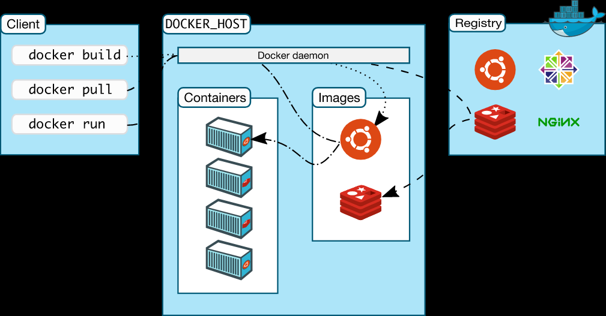

TODO: docker笔记整理

# 1. 基本理论

## 1.1. 简单说明

Docker 是一个开放源代码软件项目，项目主要代码在2013年开源于 GitHub。
它是云服务技术上的一次创新，让应用程序布署在软件容器下的工作可以自动化进行，借此在 Linux 操作系统上，提供一个额外的软件抽象层，以及操作系统层虚拟化的自动管理机制。

Docker 利用 Linux 核心中的资源分脱机制，例如 cgroups，以及 Linux 核心名字空间（name space），来创建独立的软件容器（containers），属于操作系统层面的虚拟化技术。
由于隔离的进程独立于宿主和其它的隔离的进程，因此也称其为容器。Docker 在容器的基础上进行了进一步的封装，从文件系统、网络互联到进程隔离等等，极大的简化了容器的创建和维护，使得其比虚拟机技术更为轻便、快捷。
Docker 可以在单一 Linux 实体下运作，避免因为创建一个虚拟机而造成的额外负担。

## 1.2. docker与虚拟机

- docker与虚拟机

  - 对于虚拟机技术来说，
    - 传统的虚拟机需要模拟整台机器包括硬件，每台虚拟机都需要有自己的操作系统，
    - 虚拟机一旦被开启，预分配给他的资源将全部被占用。
    - 每一个虚拟机包括应用，必要的二进制和库，以及一个完整的用户操作系统。
  - 容器技术
    - 容器技术和我们的宿主机共享硬件资源及操作系统，可以实现资源的动态分配。
    - 容器包含应用和其所有的依赖包，但是与其他容器共享内核。
    - 容器在宿主机操作系统中，在用户空间以分离的进程运行。容器内没有自己的内核，也没有进行硬件虚拟。

- 具体来说与虚拟机技术对比，Docker 容器存在以下几个特点：
  - 更快的启动速度：
    - 因为 Docker 直接运行于宿主内核，无需启动完整的操作系统，因此启动速度属于秒级别，
    - 而虚拟机通常需要几分钟去启动。
  - 更高效的资源利用率：
    - 由于容器不需要进行硬件虚拟以及运行完整操作系统等额外开销，Docker 对系统资源的利用率更高。
  - 更高的系统支持量：
    - Docker 的架构可以共用一个内核与共享应用程序库，所占内存极小。
    - 同样的硬件环境，Docker 运行的镜像数远多于虚拟机数量，对系统的利用率非常高。
  - 持续交付与部署：
    - 对开发和运维人员来说，最希望的就是一次创建或配置，可以在任意地方正常运行。
    - 使用 Docker 可以通过定制应用镜像来实现持续集成、持续交付、部署。
    - 开发人员可以通过 Dockerfile 来进行镜像构建，并进行集成测试，而运维人员则可以直接在生产环境中快速部署该镜像，甚至进行自动部署。
  - 更轻松的迁移：
    - 由于 Docker 确保了执行环境的一致性，使得应用的迁移更加容易。Docker 可以在很多平台上运行，
    - 无论是物理机、虚拟机、公有云、私有云，甚至是笔记本，其运行结果是一致的。
    - 因此用户可以很轻易的将在一个平台上运行的应用，迁移到另一个平台上，而不用担心运行环境的变化导致应用无法正常运行的情况。
  - 更轻松的维护与扩展：
    - Docker 使用的分层存储以及镜像的技术，使得应用重复部分的复用更为容易，也使得应用的维护更新更加简单，基于基础镜像进一步扩展镜像也变得非常简单。
    - 此外，Docker 团队同各个开源项目团队一起维护了一大批高质量的 官方镜像，既可以直接在生产环境使用，又可以作为基础进一步定制，大大的降低了应用服务的镜像制作成本。
  - 更弱的隔离性：
    - Docker 属于进程之间的隔离，虚拟机可实现系统级别隔离。
  - 更弱的安全性：
    - Docker 的租户 root 和宿主机 root 等同，一旦容器内的用户从普通用户权限提升为 root 权限，它就直接具备了宿主机的 root 权限，进而可进行无限制的操作。
    - 虚拟机租户 root 权限和宿主机的 root 虚拟机权限是分离的，并且利用硬件隔离技术可以防止虚拟机突破和彼此交互，而容器至今还没有任何形式的硬件隔离，这使得容器容易受到攻击。

## 1.3. 核心概念

- 镜像：
  - Docker 镜像是一个特殊的文件系统，除了提供容器运行时所需的程序、库、资源、配置等文件外，还包含了一些为运行时准备的一些配置参数（如匿名卷、环境变量、用户等）。
  - 镜像不包含任何动态数据，其内容在构建之后也不会被改变。
- 容器：
  - 容器的实质是进程，但与直接在宿主执行的进程不同，容器进程运行于属于自己的独立的命名空间容器，可以被创建、启动、停止、删除和暂停等等，
  - 说到镜像与容器之间的关系，可以类比面向对象程序设计中的类和实例。
- 仓库：
  - 镜像构建完成后，可以很容易的在当前宿主机上运行，
  - 但是，如果需要在其它服务器上使用这个镜像，我们就需要一个集中的存储、分发镜像的服务，
  - Docker Registry 就是这样的服务。一个 Docker Registry 中可以包含多个仓库；
  - 每个仓库可以包含多个标签；每个标签对应一个镜像，其中标签可以理解为镜像的版本号。

## 1.4. 不同系统下的运行原理

### 1.4.1. Linux

### 1.4.2. Windows

### 1.4.3. Mac

# 2. 基本配置

# 3. 常用命令

# 4. 参考资料

- [ ] [docker中文网](https://dockerdocs.cn/)
- [ ] [docker笔记](https://zhuanlan.zhihu.com/p/365455200)
- [ ] [Docker学习新手笔记](https://hijiangtao.github.io/2018/04/17/Docker-in-Action/)
- [ ] [docker-tutorial](https://github.com/jaywcjlove/docker-tutorial)

