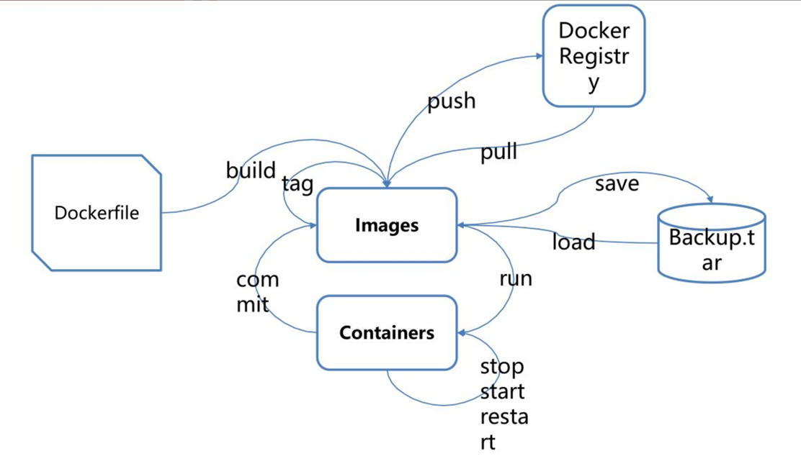
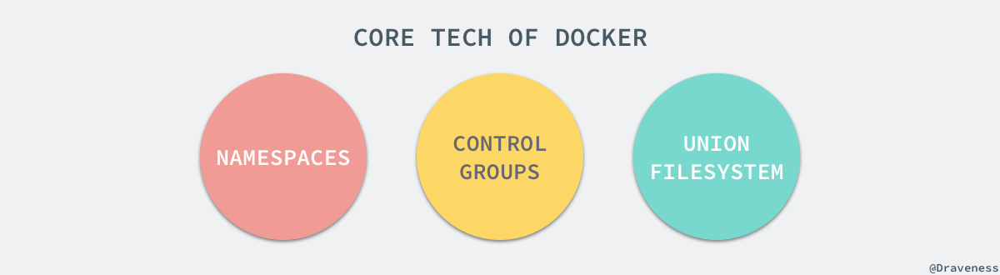

TODO: docker笔记整理

# 1. 基本理论

## 1.1. 虚拟机与容器

- 虚拟机（virtual machine）
  - 它可以在一种操作系统里面运行另一种操作系统，比如在 Windows 系统里面运行 Linux 系统。
  - 应用程序对此毫无感知，因为虚拟机看上去跟真实系统一模一样，而对于底层系统来说，虚拟机就是一个普通文件，不需要了就删掉，对其他部分毫无影响。
  - 虽然用户可以通过虚拟机还原软件的原始环境。但是，这个方案有几个缺点。
  - 资源占用多
    - 虚拟机会独占一部分内存和硬盘空间。
    - 它运行的时候，其他程序就不能使用这些资源了。
    - 哪怕虚拟机里面的应用程序，真正使用的内存只有 1MB，虚拟机依然需要几百 MB 的内存才能运行。
  - 冗余步骤多
    - 虚拟机是完整的操作系统，一些系统级别的操作步骤，往往无法跳过，比如用户登录。
  - 启动慢
    - 启动操作系统需要多久，启动虚拟机就需要多久。可能要等几分钟，应用程序才能真正运行。

- 容器
  - 是在隔离的环境里面运行的一个 **进程** 
  - 这个隔离的环境有自己的系统目录文件，有自己的ip地址，主机名
  - 也可以说： **容器是一种轻量级虚拟化的技术** 。

- Linux 容器
  - 由于虚拟机的缺点，Linux 发展出了另一种虚拟化技术：Linux 容器（ **Linux Containers，缩写为 LXC** ）。
  - Linux 容器不是模拟一个完整的操作系统，而是对进程进行隔离。
    - 或者说，在正常进程的外面套了一个保护层。
    - 对于容器里面的进程来说，它接触到的各种资源都是虚拟的，从而实现与底层系统的隔离。
  - 由于容器是进程级别的，相比虚拟机有很多优势:
    - 启动快
      - 容器里面的应用，直接就是底层系统的一个进程，而不是虚拟机内部的进程。
      - 所以，启动容器相当于启动本机的一个进程，而不是启动一个操作系统，速度就快很多。
    - 资源占用少
      - 容器只占用需要的资源，不占用那些没有用到的资源；虚拟机由于是完整的操作系统，不可避免要占用所有资源。
      - 另外，多个容器可以共享资源，虚拟机都是独享资源。
    - 体积小
      - 容器只要包含用到的组件即可，而虚拟机是整个操作系统的打包，所以容器文件比虚拟机文件要小很多。
  - 总之，容器有点像轻量级的虚拟机，能够提供虚拟化的环境，但是成本开销小得多。

- docker容器
  - Docker是通过内核虚拟化技术（namespaces及cgroups）来提供容器的资源隔离与资源限制。
  -  **属于 Linux 容器的一种封装** ，提供简单易用的容器使用接口
  - Docker 将应用程序与该程序的依赖，打包在一个文件里面。
    - 运行这个文件，就会生成一个虚拟容器。程序在这个虚拟容器里运行，就好像在真实的物理机上运行一样。
    - 有了 Docker，就不用担心环境问题。
  - 总体来说，Docker 的接口相当简单，
    - 用户可以方便地创建和使用容器，把自己的应用放入容器。
    - 容器还可以进行版本管理、复制、分享、修改，就像管理普通的代码一样。

## 1.2. docker

### 1.2.1. 项目介绍

Docker 是一个开放源代码软件项目，基于Go语言，项目主要代码在2013年开源于 GitHub。
它是云服务技术上的一次创新，让应用程序布署在软件容器下的工作可以自动化进行，借此在 Linux 操作系统上，提供一个额外的软件抽象层，以及操作系统层虚拟化的自动管理机制。

Docker 利用 Linux 核心中的资源分脱机制，例如 cgroups，以及 Linux 核心名字空间（name space），来创建独立的软件容器（containers），属于操作系统层面的虚拟化技术。
由于隔离的进程独立于宿主和其它的隔离的进程，因此也称其为容器。Docker 在容器的基础上进行了进一步的封装，从文件系统、网络互联到进程隔离等等，极大的简化了容器的创建和维护，使得其比虚拟机技术更为轻便、快捷。
Docker 可以在单一 Linux 实体下运作，避免因为创建一个虚拟机而造成的额外负担。

### 1.2.2. docker理念

- docker的主要目标是"Build,Ship and Run any App,Angwhere"
  > 构建，运输，然后处处运行
  - 构建：制作docker镜像，打包容器的所有系统目录文件
  - 运输：上传,下载,共享docker镜像
  - 运行：基于docker镜像提供的rootfs，启动容器
  - 只要能运行docker容器，那么docker镜像中已经安装好的软件也可以运行，所以说docker是一种软件的打包技术。

### 1.2.3. docker的优点:

- 解决了操作系统和软件运行环境的依赖
- 对于开发人员来说，再也不用担心不会部署开发环境
- 开发环境，测试环境和生产环境高度一致。
- 让用户体验产品新特性的又一种思路。

### 1.2.4. docker与虚拟机

- docker与虚拟机


  - 对于虚拟机技术来说，
    - 传统的虚拟机需要模拟整台机器包括硬件，每台虚拟机都需要有自己的操作系统，
    - 虚拟机一旦被开启，预分配给他的资源将全部被占用。
    - 每一个虚拟机包括应用，必要的二进制和库，以及一个完整的用户操作系统。
  - 容器技术
    - 容器技术和我们的宿主机共享硬件资源及操作系统，可以实现资源的动态分配。
    - 容器包含应用和其所有的依赖包，但是与其他容器共享内核。
    - 容器在宿主机操作系统中，在用户空间以分离的进程运行。容器内没有自己的内核，也没有进行硬件虚拟。

- 具体来说与虚拟机技术对比，Docker 容器存在以下几个特点：
  - 更快的启动速度：
    - 因为 Docker 直接运行于宿主内核，无需启动完整的操作系统，因此启动速度属于秒级别，
    - 而虚拟机通常需要几分钟去启动。
  - 更高效的资源利用率：
    - 由于容器不需要进行硬件虚拟以及运行完整操作系统等额外开销，Docker 对系统资源的利用率更高。
  - 更高的系统支持量：
    - Docker 的架构可以共用一个内核与共享应用程序库，所占内存极小。
    - 同样的硬件环境，Docker 运行的镜像数远多于虚拟机数量，对系统的利用率非常高。
  - 持续交付与部署：
    - 对开发和运维人员来说，最希望的就是一次创建或配置，可以在任意地方正常运行。
    - 使用 Docker 可以通过定制应用镜像来实现持续集成、持续交付、部署。
    - 开发人员可以通过 Dockerfile 来进行镜像构建，并进行集成测试，而运维人员则可以直接在生产环境中快速部署该镜像，甚至进行自动部署。
  - 更轻松的迁移：
    - 由于 Docker 确保了执行环境的一致性，使得应用的迁移更加容易。Docker 可以在很多平台上运行，
    - 无论是物理机、虚拟机、公有云、私有云，甚至是笔记本，其运行结果是一致的。
    - 因此用户可以很轻易的将在一个平台上运行的应用，迁移到另一个平台上，而不用担心运行环境的变化导致应用无法正常运行的情况。
  - 更轻松的维护与扩展：
    - Docker 使用的分层存储以及镜像的技术，使得应用重复部分的复用更为容易，也使得应用的维护更新更加简单，基于基础镜像进一步扩展镜像也变得非常简单。
    - 此外，Docker 团队同各个开源项目团队一起维护了一大批高质量的 官方镜像，既可以直接在生产环境使用，又可以作为基础进一步定制，大大的降低了应用服务的镜像制作成本。
  - 更弱的隔离性：
    - Docker 属于进程之间的隔离，虚拟机可实现系统级别隔离。
  - 更弱的安全性：
    - Docker 的租户 root 和宿主机 root 等同，一旦容器内的用户从普通用户权限提升为 root 权限，它就直接具备了宿主机的 root 权限，进而可进行无限制的操作。
    - 虚拟机租户 root 权限和宿主机的 root 虚拟机权限是分离的，并且利用硬件隔离技术可以防止虚拟机突破和彼此交互，而容器至今还没有任何形式的硬件隔离，这使得容器容易受到攻击。

## 1.3. 应用场景

Docker 的主要用途，目前有三大类。

- （1）提供一次性的环境。比如，本地测试他人的软件、持续集成的时候提供单元测试和构建的环境。
- （2）提供弹性的云服务。因为 Docker 容器可以随开随关，很适合动态扩容和缩容。
- （3）组建微服务架构。通过多个容器，一台机器可以跑多个服务，因此在本机就可以模拟出微服务架构。

## 1.4. 核心概念



### 1.4.1. 镜像(image)与标签

- 基本说明
  - 作用：
    - Docker 把应用程序及其依赖，打包在 image 文件里面。
    - 只有通过这个文件，才能生成 Docker 容器。
    - image 文件可以看作是容器的模板。
    - Docker 根据 image 文件生成容器的实例。
    - 同一个 image 文件，可以生成多个同时运行的容器实例。
    - image 文件是通用的，一台机器的 image 文件拷贝到另一台机器，照样可以使用。
  - 存储与创建：image 是二进制文件。
    - 实际开发中，一个 image 文件往往通过继承另一个 image 文件，加上一些个性化设置而生成。
      > 举例来说，你可以在 Ubuntu 的 image 基础上，往里面加入 Apache 服务器，形成你的 image。
    - 一般来说，为了节省时间，我们应该尽量使用别人制作好的 image 文件，而不是自己制作。
      - 即使要定制，也应该基于别人的 image 文件进行加工，而不是从零开始制作。
  - Docker 镜像是一个特殊的文件系统，除了提供容器运行时所需的程序、库、资源、配置等文件外，还包含了一些为运行时准备的一些配置参数（如匿名卷、环境变量、用户等）。
  - 镜像不包含任何动态数据，其内容在构建之后也不会被改变。

- 标准镜像名由四部分组成:  **仓库地址/项目名/镜像名:标签** 
  > 如 daocloud.io/library/nginx:latest

  - docker官方仓库的官方镜像可省略仓库地址和项目名,即:镜像名:标签
  - docker官方仓库的第三方镜像可省略仓库地址,即:项目名/镜像名:标签
  - 第三方仓库的镜像必须包含所有信息,即:仓库地址/项目名/镜像名:标签

- 镜像标签
  - 同一个镜像可以有多个便签,一个标签也可以对应多个镜像
  -  **标签常用来区分版本号** ,如centos:7,centos:7.4,centos:latest
  - 如果未指明使用哪个标签,将使用 **默认的标签latest** 

- 镜像的 **分层** : docker镜像是分层存储的, **最上面一层为可写层,下面所有层都是只读层** ,这要做的好处是:
  - 多个镜像可以共用底层镜像,减小仓库容量
  - 制作镜像时可以使用底层镜像缓存,加快制作速度
  - 启动镜像时不用加载重复镜像,提高启动速度
  - 每一个只读层都可以单独作为镜像加载,制方便排查作镜像时的问题

### 1.4.2. 容器

- 容器的实质是进程，但与直接在宿主执行的进程不同，容器进程运行于属于自己的独立的命名空间容器，可以被创建、启动、停止、删除和暂停等等，
- 说到镜像与容器之间的关系，可以类比面向对象程序设计中的类和实例。

### 1.4.3. 仓库

- 镜像构建完成后，可以很容易的在当前宿主机上运行，
- 但是，如果需要在其它服务器上使用这个镜像，我们就需要一个集中的存储、分发镜像的服务，
- Docker Registry 就是这样的服务。一个 Docker Registry 中可以包含多个仓库；
  - Docker 的官方仓库 Docker Hub 是最重要、最常用的 image 仓库。
  - 此外，出售自己制作的 image 文件也是可以的。

# 2. 其他说明

## 2.1. 镜像分层

## 2.2. Docker DNS Server

- 从 Docker 1.10 版本开始，docker daemon 实现了一个内嵌的 DNS server，使容器可以直接通过“容器名”通信。
  - 方法很简单，只要在启动时用 `--name` 为容器命名就可以了。
  - 使用 docker DNS 有个限制：
    - 只能在 user-defined 网络中使用。
    - 也就是说，默认的 bridge 网络是无法使用 DNS 的。

---

> 验证

- 创建自定义网络

  ```bash
  docker network create --driver bridge noah_net
  ```
- 启动基于自定义的网络的容器并测试

  ```bash
  docker run -d  --network=noah_net --name=bbox1 busybox sleep 900
  docker run -it --network=noah_net --name=bbox2 busybox ping -c1 bbox1
  ```
- 启动默认网络的容器并测试。

  ```bash
  docker run -d  --name=bbox3 busybox sleep 900
  docker run -it --name=bbox4 busybox ping -c1 bbox3
  ```
- bbox4 无法 ping 到 bbox3。

# 3. docker安装

## 3.1. 系统支持

- docker支持centos版本

  ```
  Docker支持以下的CentOS版本：
  CentOS 7 (64-bit),要求系统为64位、系统内核版本为 3.10 以上。
  CentOS 6.5 (64-bit) 或更高的版本,要求系统为64位、系统内核版本为 2.6.32-431 或者更高版本。
  ```
  - 查看系统内核：`uname -r`
  - 查看已安装的CentOS版本信息:`lsb_release -a`

## 3.2. centos 6.5安装docker

- 安装流程
  - 添加 epel源: `yum install -y epel-release`
    > Docker使用EPEL发布，RHEL系的OS首先要确保已经持有EPEL仓库，否则先检查OS的版本，然后安装相应的EPEL包。
  - 安装docker
    - `yum install -y docker-io`
    - 如果命令执行失败，直接用下载源安装， 执行以下命令
      ```
      yum install https://get.docker.com/rpm/1.7.1/centos-6/RPMS/x86_64/docker-engine-1.7.1-1.el6.x86_64.rpm
      ```
  - 第三步：启动服务与查看是否安装成功
    - service docker start
    - service docker status
      - 如果这条命令出现：`docker dead but pid file exists`，是因为device-mapper-libs的版本过低。
      - 更新：`yum update -y device-mapper-libs`
    - docker version

- docker国内镜像配置
  - 去阿里云注册一个账户，搜索容器镜像服务，获取镜像加速地址
  - 在文件：`/etc/sysconfig/docker`中加一行代码

    ```
    other_args="--registry-mirror=<镜像源地址>"，
    ```

## 3.3. centos 7 安装docker

# 4. 基础命令

## 4.1. 命令格式

- docker 1.13之后，为了方便命令的管理，分为了Management Commands 和 Commands。比如：

  ```
  获取系统信息：
  docker system info # Management Command
  docker info # Command
  ```
- 两种命令式兼容的

- `docker --help`

## 4.2. docker基本命令

## 4.3. 通用命令

- docker version:查看版本等相关信息
- docker info:查看容器镜像等相关信息
- docker --help：查看docker有哪些命令，当你记不住docker的命令的时候，可使用这个命令查看；

## 4.4. 镜像命令

- docker images: 查看本机所有镜像

  ```
  注意：
  同一仓库源可以有多个 TAG，代表这个仓库源的不同个版本，使用 REPOSITORY:TAG 来定义不同的镜像。
  如果你不指定一个镜像的版本标签，例如你只使用hello-world，docker 将默认使用 hello-world:latest 镜像；
  ```

  - docker images -a：查询本地所有镜像，包括镜像中的镜像（中间层）
  - docker images -q：只显示镜像id
  - docker images -aq:显示镜像所有id，包括中间层的id
  - docker images --digests:显示镜像摘要信息
  - docker images --no-trunc：显示完整的进行信息

- docker search image_name: 搜索镜像
  - docker search  --no-trunc image_name: 显示完整的镜像描述信息
  - docker search -s 50 image_name： 只列出收藏大于 50 的镜像

- docker pull image_name: 拉取镜像

- docker rmi -f 镜像id: 删除镜像
  - `docker rmi -f ${docker images -qa}`: 删除所有镜像

## 4.5. 容器命令

- docker run 【可选参数】 镜像名称 【可选其他参数】: 启动一个容器执行命令
  ```
  注意：
  在执行命令之后，容器就会退出
  如果需要一个保持运行的容器，最简单的方法就是给这个容器一个可以保持运行的命令或者应用
  ```
  - --name="容器新名字": 为容器指定一个名称；
  - -d: 后台运行容器，并返回容器ID，也即启动守护式容器；
  - -i：以交互模式运行容器，通常与 -t 同时使用；
  - -t：为容器重新分配一个伪输入终端，通常与 -i 同时使用；
  - -P: 随机端口映射；
  - -p: 指定端口映射，有以下四种格式

    ```
　　ip:hostPort:containerPort
　　ip::containerPort
　　hostPort:containerPort
　　containerPort
    ```

- docker run -it 镜像名称 /bin/bash: 以交互模式启动一个容器,在容器内执行/bin/bash命令。
- docker run -d 镜像名称: 后台运行容器，并返回容器ID，也即启动守护式容器

  ```
  注意：
  docker启动守护式的容器,就必须有一个前台进程，否则容器会认为没有事情干了，就会自动退出。
  假设我们启动的时候不停的打印日志，那么就表示有前台进程了，然后再次观察
  docker run -d centos /bin/bash -c "while true;do echo log;sleep 5;done"
  ```

# 5. Dockerfile

# 6. 不同系统下的运行原理

## 6.1. Linux

### 6.1.1. 基本说明



- 从本质上，容器其实就是一种沙盒技术
  - 就好像把应用隔离在一个盒子内，使其运行
  - 因为有了盒子边界的存在，应用于应用之间不会相互干扰。并且像集装箱一样，拿来就走，随处运行。
  - 其实这就是 PaaS 的理想状态。
- 实现容器的核心，就是要生成限制应用运行时的边界
  - 我们知道，编译后的可执行代码加上数据，叫做程序
  - 而把程序运行起来后，就变成了进程，也就是所谓的应用
  - 如果能在应用启动时，给其加上一个边界，就能实现期待的沙盒
- 在 Linux 中，实现容器的边界，主要有两种技术 Cgroups 和 Namespace
  - Cgroups 用于对运行的容器进行资源的限制
  - Namespace 则会将容器隔离起来，实现边界
- 这样看来，容器只是一种被限制的了特殊进程而已。

### 6.1.2. NameSpaces

### 6.1.3. CGroups

### 6.1.4. UnionFS

## 6.2. Windows

## 6.3. Mac

# 7. 参考资料

- [ ] [看云-linux运维docker](https://www.kancloud.cn/noahs/linux/951023)
- [ ] [docker系统化学习图文](https://www.cnblogs.com/newAndHui/p/13508771.html)
- [x] [阮一峰-Docker 入门教程](https://www.ruanyifeng.com/blog/2018/02/docker-tutorial.html)
- [ ] [docker容器技术](https://www.kancloud.cn/noahs/linux/1090327)
- [ ] [docker中文网](https://dockerdocs.cn/)
- [ ] [docker笔记](https://zhuanlan.zhihu.com/p/365455200)
- [ ] [Docker学习新手笔记](https://hijiangtao.github.io/2018/04/17/Docker-in-Action/)
- [ ] [docker-tutorial](https://github.com/jaywcjlove/docker-tutorial)
- [ ] [理解Docker镜像分层](https://www.cnblogs.com/woshimrf/p/docker-container-lawyer.html)
- [ ] [Docker 什么是镜像以及镜像分层详解](https://blog.csdn.net/qq_34556414/article/details/107211603)
- docker原理
  - [ ] [linux Docker原理](https://blog.csdn.net/crazymakercircle/article/details/120747767)
  - [ ] [一篇文章带你吃透 Docker 原理](https://www.cnblogs.com/michael9/p/13039700.html)
  - [ ] [Docker 核心技术与实现原理](https://draveness.me/docker/)

