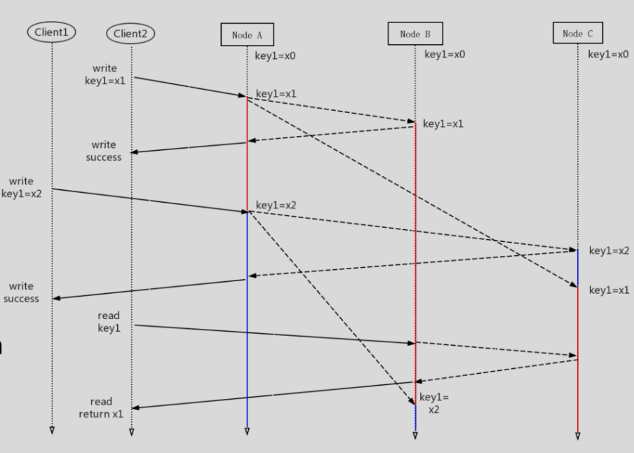

TODO: 数据库架构 补充，学习

# 数据模型

# 数据库

## OLTP

## OLAP

## TIDB

# 饿了末EKV

## 数据库发展方向--强一致性

### 发展说明

- MySQL
  - 从v5.7开始,支持 Group Replication,采用 Paxos
- MongoDB
  - 从3.4开始,支持类Ratt复制协议
- Hbase
  - 类似于 Bigtable/GFS
- NewSQL
  - Spanner, TiDB. CockroachDB等数据库采用 Paxos或Raft

> 除元数据存储以外,越来越多的数据库采用类 PaXos算法,越来越多的数据库采用强一致性

### 数据库对比

待详细补充

- MySQL
  - 特点
    - 主备异步复制
    - 非强一致性的(在出现故障时)
    - Lost data
  - 使用建议
    - Strong DBA for failover
    - Carefully programming with slave node
  - 架构经验
    - **异步复制不能保证强一致**

- Redis
  - 特点
    - 异步复制
    - WAIT指令,同步复制
    - 副本不一致(即便使用WAiT)

      

      
图片说明

      
      

    - 非原子
  - 使用建议
    - WAIT不应该成为一个对外暴露的AP
    - Carefully programming with WAIT
  - 架构经验
    - **同步复制不能保证强一致**

- Cassandra/Dyanmo
  - 策略
    -  Quorum(W+R>N)
      > WRN副本复制策略
      - 副本不一致
      - Stale read
      - 并发冲突

      

      
图片说明

      
      

  - 如何解决副本不一致?
    - 再读一次(试试运气)
    - Read repair
    - Replica synchronization
  - 冲突解决
    - Last Write Win
    - Clock Skew(时钟不同步)
  - 特点
    - 最终一致性(任何情况下,即便W+R>N)
  - 使用建议
    - 放在无需数据正确性的场景
    - 或者做好补偿措施
  - 架构经验
    - W+R>N不能保证强一致性
      - 在并发或者故障时
    - 最终一致性≠保证最终正确的一致性

## 饿了么kv数据库架构简介

待做，复习paxos，20分开看

## 架构设计中的权衡

### 强一致性VS可用性

### 强一致性VS性能

## 系统架构设计的经验

- 异步复制、同步复制、W+R>N≠强一致
- 最终一致性≠保证最终正确的一致性
- 重新考虑CAP的二选一
  - 架构上选择可用性≠实际上获得高可用
  - 架构上选择一致性≠实际上可用性低,仍然可以实际高可用
- 强一致性≠低性能

# 数据库中的metadata、schema与库

superset中如何兼容的不同类型数据库的连接，以及兼容库与表的概念，schema的概念在不同类型数据库中的区别

> superset，连接mysql类型的数据库，指定数据库服务器与db名称后，还可以连接其他db。
>
> sugar中有同源异库的概念

# 参考资料

- [分布式KV数据库的架构对比与设计](https://dbaplus.cn/new_video/detail/54.html)
- [OLTP与OLAP概念，主要区别和完美实践]()
- [三种数据模型---层次模型、网状模型以及关系模型](https://www.cnblogs.com/daniumeng/p/8717438.html)

