# 1. 概述

## 1.1. 数据库基本概念

1. 英文名称：Database
2. 什么是数据库：
   - 用于存储和管理数据的仓库
3. 数据可特点：
   1. 持久化存储数据，其实数据库就是一个文件系统
   2. 方便存储和管理数据，使用了统一的方式操作数据库--SQL
4. 常用数据库软件：
   

## 1.2. 基本命令

- cmd->services.msc 打开服务
- MySQL 打开与关闭（cmd 下）
  1. net start mysql 开启 mysql（管理员权限打开 cmd）
  2. net stop mysql 关闭 mysql（管理员权限打开 cmd）
- 登陆与退出（cmd 下）

  - 本地：
    1. 登陆：mysql -uroot -proot
       > -u:user，后面直接加用户名 -p:password,后面直接加密码
       > 也可以写成--user=root --password=root
       > 或者不直接加，只输入-p（即：mysql -uroot -p,之后输入密码会以\*反显）
    2. 退出：exit
  - 远程：

    1. 登陆： mysql -h127.0.0.1 -uroot -proot

       > -h 后直接加上 ip 地址，本机为 127.0.0.1

    2. 退出：exit 或者 quit
    3. 登陆： mysql --host=127.0.0.1 --user=root --password=root

       > 相当于全称，这里有两个-

## 1.3. 数据结构


- 安装目录
  - 配置文件 my.ini
- 数据目录
  - 计算机硬件和 MySQL 软件合称 MySQL 服务器
  - 一个数据库就是一个文件夹
  - 一个数据库中可以存放多张表，表对应文件夹中的.frm 结尾文件
  - 每个表中存放多条数据记录

# 2. MySQL 基础

## 2.1. 什么是 SQL

    Structured Query Language：结构话查询语言。
    其实就是操作所有关系型数据库(Relational DBMS)的规则
    每一种数据库操作方式存在不一样的地方，称为“方言”

## 2.2. 通用语法

1. SQL 可以单行或者多行书写，以分号结尾
2. 使用 table 制表符增强可读性
3. 数据库不区分大小写，但关键字推荐使用大写
  > **注意：linux中是字段名称是区分大小写的**
4. 3 种注释
   1. 单行注释：
      1. -- 内容（两个横杠和**一个空格**）
      2. #内容 （方言 MySQL 特有书写方式，不必要加空格）
   2. 多行注释：/_ 内容 _/

## 2.3. SQL 语句分类

1. DDL(data definition Language)
   用来定义数据库对象：数据库，表，列等。关键字：Creat，drop，alter 等
2. DML(Data Manipulation Language)
   用来对数据库中的数据进行增删。关键字：insert，delete，update 等。
3. DQL(Data Query Language)
   用来查询表中的记录（数据）。关键字 select，where 等
4. DCL(Data Control Language)
   数据控制语言，用来定义数据库访问权限和安全级别，及创建用户。关键字：GRANT，REVOKE 等
   


## 2.4. 数据类型


* 类型转换
  * 例：cast (department.budget to numeric(12,2))
* 从date/time/timestamp中提取部分时间
  * 例：extract(year from r.starttime)

</br>

* 操作数据类型
  * 创建数据类型
    * create type Dollars as numberic(12,2) final
      > 在人民币和美元都是数字，但有汇率的情况下可以创建数据类型帮助存储数据  
      > final无实意，是曾经标准所要求的，一些系统允许可以忽略,
  * 删除数据类型：delete
  * 修改数据类型：alter
* 操作域
  *  创建域
     * create domain DDollars as numberic not null;
* 数据类型和域的区别：
  * 域可以声明约束（not null,check等）
  * 域不是强类型，只要两个域中的数值类型相同，就能互相赋值；而数据类型不行


## 2.5. 语法

### 2.5.1. DDL(操作数据库)

- 对数据库整体

  1. C(Create) 创建

     - create database 数据库名

       > 重名时会报错

     - create database if not exists 数据库名

       > 当指定数据库名不存在时才创建，存在也不会报错

     - create database 数据库名 character set gbk

       > 以指定字符集创建数据库，这里为 gbk

  2. R(Retrieve) 查询

     - show databases;
       > 额外知识：
       > information_schema 用来 MySQL 中的一些信息，里面存放的是视图（以后才学），而不是表，并且并不对应物理文件
       > mysql 用来存放数据库中的核心数据
       > performance_schema 用来存放调整数据库性能的一些数据
       > 这是三个都最好不要改
     - show creat database 数据库名称

       > 查看某一个数据库字符集：查询某个数据库创建语句

  3. U(Update) 修改

     - alter database 数据库名称 character set 字符集名称

       > 修改某个数据库字符集（utf8，没有-）

  4. D(Delete) 删除

     - drop database 数据库名称

       > 一般不会做的操作

     - drop database if exists

       > 当数据库存在时才删除

  5. 使用数据库

     - select database()

       > 查询正在使用的数据库名称

     - use 数据库名称

       > 使用数据库，相当于进入数据库

- 对表整体

  1. C(Create) 创建

     - create table (if not exists) 表名(
       列名 1 数据类型 1,
       列名 2 数据类型 2,
       列名 3 数据类型 3,
       ......
       列名 n 数据类型 n;
       );
       > 创建表，注意小括号和逗号，最后一列没有逗号
       > 在声明字段后面加 defult 值1 可以用来设置默认值
       ```sql
       //常用数据类型例：
       age int
       score double(5,2)//最多有5位，小数点后保留两位
       riqi date 2000-12-12
       jutiriqi datetime //格式举例：2000-12-12 12:12:12
       shijianchuo timestamp //格式举例：2000-12-12 12:12:12
       //时间戳：如果不给这个字段赋值，那么默认使用当前系统时间赋值
       name varchar(20)
       //字符串类型，最多20个字符
       ```
       ```sql
       //例：
       create table student(
           id int,
           name varchar(32),
           age int,
           score double(4,1),
           birthday date,
           inserttime timestamp
       );
       ```
     - create 新表 like 已经存在表

       > 创建一个新的表和已经存在的一个表结构相同，也就是赋值表

  2. R(Retrieve) 查询

     - show tables

       > 查询一个数据库中所有表的名称

     - desc 表名

       > 查询表结构

     - show create table 表名

       > 查询表的字符集

  3. U(Update) 修改<p id="DML_update"> </p>

     - alter table 表名 rename to 新表名;

       > 修改表名

     - alter table 表名 character set 字符集;

       > 修改表的字符集

     - alter table 表名 add 列名 数据类型;

       > 增加一列

     - alter table 表名 drop 列名;

       > 删除列

     - alter table 表名 change 旧列名 新列名 新列名类型

       > 修改列名称，类型

     - alter table 表名 modify 列名 新的类型

       > 只修改列的类型

  4. D(Delete) 删除

     - drop table (if exists) 表名

       > 删除表

     - truncate table 表名
       > 删除整个表再创建一个一模一样结构的表
       > 相当于一下两条语句整合
       > create 新表 like 已经存在表;
       > drop table 表名

### 2.5.2. DML(增删改表中数据)

1. 添加数据
   - insert into 表名(列名 1,列名 2.....列名 n) values(值 1,值 2...值 n),(值 1,值 2...值 n).....;
     > 往表中插入数据
     - 注意：
       1. 列名和值要一一对应
       2. 如果表名后没有写列名，那么默认给所有列添加值。但建议都写上，不要偷懒
       3. 除了数字类型，其他数据类型都要使用引号引起来，单引号双引号都行
2. 删除数据
   - delete from 表名 [where 条件]
     > 把满足条件的数据从指定表中删除。例： delete from student where id=1;
     - 注意：
       1. !!!!!如果不加条件，就会删除表中所有数据!!!!!!
       2. 但不推荐上述操作，因为会一条一条删除，效率太低，推荐使用 **truncate table 表名**;--删除整个表，然后再创建一个一模一样的空表
3. 修改数据
   - update 表名 set 列名 1=值 1,.....[where 条件];
     > 例：UPDATE student SET age=20,score=100 WHERE id=2;
     - 注意：
       1. 如果不加任何条件，就会把所有表中所有记录都修改，比如把 score 都改为 100
   - **case 结构使用**
     > 不同条件不同修改方式
     ```sql
     update
       student
     set
       score = case
               when score<60 then score+1 --没有逗号
               when score>95 then score-1
               else score*1.005
               end
     ```

### 2.5.3. DQL(表内数据查询)

- select \* from 表名

  > 查询表中所有数据

1. 整体语法： >所有语句都涉及到

   <pre>
       select 
           字段列表
       from
           表名列表
       where
           条件列表
       group by
           分组字段
       having
           分组之后的条件
       order by
           排序
       limit
           分页限定
   </pre>

2. 基础查询：

   1. 多个字段查询
      - select 字段名 from 表名;
        > 例：-- 查询姓名和年龄：SELECT NAME,age FROM student;
        > 一般不使用\*号，阅读性太差,也可以分分行，多加些注释
        > 
   2. 去除重复结果集

      - select distinct 字段名 from 表名;

        > 如果指定的多个字段名都相同，才可以去重

   3. 计算列
      - select 字段 1+字段 2 from 表名;
        > 计算两个字段相加结果,这里可以进行四则运算。
        > 例：SELECT id,score+age FROM student;
        > 
        > 如果有 null 参与的运算结果都是 null，因此有下面表达式：
      - select 字段 1+ifnull(表达式 1,表达式 2) from 表名;
        > 表达式 1：判断那个字段为 null。
        > 表达式 2：为 null 时的替换值。
        > 例：select id+ifnull(score,0) from student;
   4. 起别名
      - select 字段 1+字段 2 as 新名称 from 表名;
        > 将某个结果（列名字段或者表名）起一个别名用来显示出来,as 也能用**一个或者多个空格**表示。
        > 此时多分行比较好

3. 条件查询
   1. where 条件
   2. 运算符
      >  >
      > 例：select \* from student where age>15
      > 
   3. 注意：
      - null 不能使用=和<>来判断，应该使用 is 和 is not.
        > 例：select _ from student where age is null
        > select _ from student where age is not null <br>
        > 与 null 的任何比较运算（> < =）结果都为**unknown**(第三个逻辑值),并且：
        > true and unknownu=nknown
        > true or unknown:true
        > not unknown=unknown
   4. like：
      - \_:单个任意字符
      - %:多个任意字符
        > 例： select name from student where '李%'
        > 
4. 排序查询
   - select 字段 from 表名 order by 排序字段 1 排序方式 1,排序字段 2 排序方式 2....;
     > 排序方式：
     > ASC:升序（默认）
     > DESC:降序
     > 越靠后，排序优先度越低，只有靠第一种排序相同时，那么才考虑之后的排序方式
5. 聚合函数:将一列数据作为一个整体，进行**纵向**的计算。

   1. count:计算个数

      - 一般选择非空的列
      - 或者使用 count(\*)（不推荐）

        > count (distinct nam) 来去重（mysql 是否可用未证实）

   2. max:计算最大值
   3. min:计算最小值
   4. sum:计算和；
   5. avg:计算平均值

   - 注意：聚合函数计算会自动**排除 null 值**，可以通过 ifnull()来避免
   - 语法：select 函数(字段名) from 表名<br>select 函数(ifnull(字段名,值)) from 表名
     > 默认是保留重复元组进行计算，如果不想保留。可以写成：
     > 例：select count(distinct id) from student <br>
     > 如果为 null 按 1 算：
     > select count(ifnull(id,1)) from student) <br> > 

6. 分组查询
   > **任何没有出现在 group by 中的属性，如果要出现在 select 中的话，只能出现在聚集函数内部**
   - group by 分组字段;
     > 例：select sex,AVG(math),count(id) from student group by sex;
     > select 后有什么，后面就显示什么
     > <br>
     > 注意：分组之后查询字段：分组字段(比如 sex,如果用每个人都不同的字段分组，就没有意义了)，另外如果不进行分组就使用聚合函数的话，就相当于把整个表作为一个分组。
     > 例：<br>
   - 添加判断语句：
     > 普通 where 添加在前面，分组之后条件判断加载后面并且用 having 关键字
     > where 和 having 区别（**面试会考**）：
     1. where 在分组之前进行限定，不满足条件不参与分组， having 在分组之后进行限定，不满足条件不会被查询出来
     2. where 不可以进行聚合函数的判断，而 having 可以
        > [查看格式](#253-dql表内数据修改查询)
        > 例：
        > 
7. 分页查询

   - limit 开始的索引,每页查询的条数
     > 例：<br>select _from student limit 0,3;-- 从 0 开始查，显示三条记录。（第一页）
     > select _ from student limit 3,3;-- 从 3 开始，显示 3 条，（第二页）
     > 开始索引=（当前页码-1）\*每页显示条数
   - limit 这个语法是 SQL 的一个**方言**

8. 集合运算
   > 作用于两个关系，两关系中的属性类型要相同
   - (--查询语句 1，返回一个表)union(--查询语句 2，返回一个表)
     > 并运算。如果要保留所有重复，必须用 union all 替换掉 union
   - (--查询语句 1，返回一个表)intersect(--查询语句 2，返回一个表)
     > 交运算。如果要保留所有重复，必须用 intersect all 替换掉 intersect
   - (--查询语句 1，返回一个表)except(--查询语句 2，返回一个表)
     > 差运算.如果要保留所有重复，必须用 except all 替换掉 except

### 2.5.4. DCL

[跳转](#611-dcl)

## 2.6. 约束

### 2.6.1. 概念

> 对表中的数据进行限定，保证数据的正确性，有效性和完整性

### 2.6.2. 分类

- 主键约束 pramary key
- 非空约束 not null
- 唯一约束 unique
- 外键约束 foreign key
- check约束

### 2.6.3. 非空约束

1. 在创建表是添加约束
   - 在数据定义后面加 空格+not null
     例：
     `SQL creat table stu{ id int, name varchar(20) not null -- name为非空约束 };`
2. 删除非空约束(就是修改表的一个字段)
   - alter table 表名 modify 字段名 字段类型
     > 也就是说后面什么都不加，就取消掉了约束
     > [跳转到列数据类型修改](#DML_update)
3. 创建表后添加非空约束

   - alter table 表名 modify 字段名 字段类型 not null

     > 和上面同理

### 2.6.4. 唯一约束

- 注意：MySQL 中唯一约束限定的列的值可以有多个 null

1. 创建表是添加唯一约束
   - 在数据定义后面加 空格和 unique
   - 在表的定义后面加上 unique(属性 1,属性 2,...) 括号里的属性构成候选码
     ```SQL
     creat table ste{
         id int,
         phont_number varchar(20) unique
     };
     ```
2. 删除唯一约束
   - alter table 表名 drop index 字段名
     > 唯一约束有时候也称为唯一索引，所有有 drop index
     > [跳转到列数据类型修改](#DML_update)
3. 创建表后添加唯一约束

   - alter table 表名 modify 字段名 字段类型 unique

     > 和非空约束添加同理，但当添加时，该列数据必须不能有重复的，否则会报错

### 2.6.5. 主键约束

- 含义：非空且唯一。是表中记录的唯一标识
- 限制：一张表只能有一个字段为主键

1. 创建表时添加主键约束

   - 后面加 primary key 即可

     ```SQL
     creat table stu(
         id int primary key,
         name varchar(20)
     );

     -- 约束格式也可以写成这样：
     creat table stu(
         id int,
         name varchar(20),
         primary key (id)
     );
     ```

2. 删除主键约束

   - alter table 表名 drop primary key;

     > 主键只有一个，所以不需要指定

3. 创建表后添加主键

   - alter table 表名 modify 字段名 字段类型 primary key;

     > 不能有重复数据以及空数据。

4. 自动增长
   - 概念：如果某一列是数值类型的，使用 auto_increment 可以完成值的自动增长
   - 基本上都是和主键一起使用，但也可以分开使用，但是这种情况很少
   - 语法：
     ```SQL
     creat table stu(
         id int primary key auto_increment,
         name varchar(20)
     );
     ```
     > 也可以手动设置，但每次增长是上次数据+1（也就是等价于最大值+1）

### 2.6.6. check 约束和断言

> 用来保证属性值满足指定的条件，实际上创建了一个强大的类型系统，类似于枚举

```sql
-- 例：
create table student(
  name varchar(32),
  id int(16),
  gender varchar(32),
  primary key(id),
  age int(16)
  check(gender in ('male','female') and age>10) -- in后面的也可以是select语句，但是有些数据库不支持
)

```

> 断言是一个谓语，表明希望数据库满足一个条件

### 2.6.7. 外键约束

- 情景
  > 有时数据会有冗余
  > 例：
  > 
  > 每个部门就在一个地方，不需要每条员工信息都记一次
  > <br>解决办法：
  > 创建两张表
  > 一张表记员工信息（employee 表），一张表记部门所在地（department 表）
  >  
  > 此时如果删除一个部门，另一张表中还有人对应那个部门，显然不合理。应该先删除人员。
- 为解决上述问题使用外键约束，即让表与表之间产生关系，从而确保数据的正确性。

1. 添加表时添加外键

   ```SQL
   creat table 表名(
       ...
       外键列
       constraint 外键名称(自己起名，不能重复) foreign key 外键列名称 references 主表名称(主表列名称)
       -- 一般都关联主键列，当然也能关联其他列
       -- 主表必须先存在，此处主表为部门表
       -- 必须先删除关联表记录，再删除主表记录
       -- 在多的一方建立外键，指向一的一方的主键
       -- contraint 外键名称 这部分也可以不写，系统会自动分配外键名称
   )

   -- 例：
   creat table employee(
       ...
       dep_id int, -- 外键对应主表的主键   --注意，此时该句不是最后一句，要加逗号
       constraint emp_dept foreign key (dep_id) references  department(id)
   )
   ```

   大致图解：
   

   > 此时若其他表记录与主表记录相互关联，那么就不能对该条主表记录进行删除
   > 同样，新加的其他表记录也必须与主表关联记录的所有数据中来取。例如这里新建员工体条目 dep_id 只能取 1 和 2 或者保留为 null

2. 删除外键

   - alter table 其他表的名 drop foreign key 外键名（自己起的那个）

3. 创建表之后，添加外键

   - alter table 其他表的名 add constraint 外键名称（自己起名，不能重复） foreign key 外键列名称 references 主表名称(主表列名称)

     > 中文括号是备注，英文括号中需要填东西

4. 级联操作

   - 情景

     > 当修改主表中的记录时，必须先修改与之关联的记录。为了方便修改数据，就有了级联操作。也就是修改一的同时自动修改多

   - 概念：当修改主表中的记录时，其他表中的记录也会跟着修改（使用一定要谨慎）

     > 比如这里修改 department 表中的一个 id 为 5，employee 表中对应 dep_id 也会修改为 5

   - 添加级联更新：

     - 在添加外键语句后 加上：on update cascade

   - 添加级联删除：

     - 在添加外键语句后 加上：on delete cascade

       例：

     ```SQL
     -- 先取消键的关联
     alter table employee drop foreign key emp_dept
     -- 再重新加上外键，此时添加级联更新语句和级联删除语句
     alter table employee add constraint emp_dept foreign key dem_id references department(id) on
     e
     ```

## 2.7. 数据库设计

### 2.7.1. 多表间关系

1. 多表间关系：

   - 一对一（了解）：

     - 如人的身份证

       > 一个人只能有一个身份证

   - 一对多（多对一）：
     - 如部门和部门
       > 一个部门能有多个员工
       > 一个员工只能在一个部门
   - 多对多
     - 如大学生选择课程
       > 一个学生能选多门课程，
       > 一个课程能被多个学生选择

2. 实现关系：
   - 一对多（多对一）
     - 实现方式：在多的一方建立外键，指向一的一方的主键
       
   - 多对多
     - 实现方式：通过中间表
       
   - 一对一（实际开发基本不会使用）
     - 实现方式：
     - 基本上会合成一张表，如果必须要用两张表的话：
     1. <br> 
     2. 使两表主键（id）相同

### 2.7.2. 范式

- 概念：在设计数据库是需要遵循的规范，要遵循后面的范式要求，必须要遵循前面所有范式。
  范式（数据库设计范式，数据库的设计范式）是符合某一种级别的关系模式的集合。构造数据库必须遵循一定的规则。在关系数据库中，这种规则就是范式。关系数据库中的关系必须满足一定的要求，即满足不同的范式。
- 分类(一般前三个就足够)：

  1. 第一范式（1NF）：每一列都是不可分割的原子数据项

     > 即每列不可分割。所有的表创建出来后都满足该范式

  2. 第二范式（2NF）：在 1NF 的基础上，非码属性必须依赖于候选码（在 1NF 基础上消除非主属性对主码的部分函数依赖）

     - 函数依赖：通过 A 的属性的值，可以确定唯一 B 的属性的值（A-->B），则称 B 依赖于 A。
     - 属性组：如果（A,B）-->C，则（A,B）称为一个属性组，合称为 D。
     - 完全函数依赖：如果 D 是一个**属性组**，通过 D 中所有属性才能确定 B 属性的唯一值，那么则称 B 完全依赖于 D
     - 部分函数依赖：如果 D 是一个**属性组**，通过 D 中部分属性便可以确定 B 属性的唯一的值，那么称 B 部分依赖于 D
     - 传递函数依赖：A-->B,B-->C(A,是属性或者属性组，B,C 是属性)，则称属性 C 函数传递依赖于 A
     - 码：如果一个属性或者属性组在一张表中被其他所有属性完全依赖，则称该属性或属性组为该表的**码**。比如学号和课程名称组合可以称为码
       _ 主属性：码属性组中的所有属性
       _ 非主属性：除码属性组中的所有属性

       > 即消除部分函数依赖

  3. 第三范式（3NF）：在 2NF 的基础上，任何非主属性不依赖于其他非主属性。（在 2 范式的基础上消除传递依赖。）
  4. Boyce-Codd 范式（BCNF）
  5. 第四范式（4NF）
  6. 第五范式（5NF）

- 情景举例：
  1. 第一范式所存在问题：
     
  2. 通过分表实行第二范式，解决第一个问题：
     
  3. 通过分表实行第三范式，解决第二三个问题。
     

## 2.8. 数据库备份和还原

> 其实就是将所有数据还原为命令行

1. 命令行
   - 备份（不用登陆）： mysqldump -u 用户名 -p 密码 指定数据库 > 保存的路径
   - 还原：
     1. 登陆数据库
     2. 创建数据库
     3. 使用数据库
     4. 执行文件：source 文件路径
2. 直接右键备份还原。

## 2.9. 多表查询

### 2.9.1. 小知识点

- 单表查询语法回顾：

    <pre>
        select 
            字段列表
        from
            表名
        where
            条件列表
        group by
            分组字段
        having
            分组之后的条件
        order by
            排序
        limit
            分页限定
    </pre>

- 多表查询查询出来的内容称为**笛卡尔积**
  > 即多个表的所有记录的所有组合，个数为 n*m *.....
  > 要完成多表查询，需要消除无用的数据

### 2.9.2. 多表查询分类

#### 2.9.2.1. 内连接查询

> **内连接中**on 和 where 其实可以互换，但也可以同时使用 on 和 where，on 来表示连接条件，where 表示筛选条件，阅读性 3 更好
> 默认就是内连接 inner 可以不写

- 自然连接查询
  > 作用于两个关系，并产生一个关系作为结果。将所有元祖进行笛卡尔积，并且只取共同属性值相同的组合。
  - select 字段列表 from 表名 1 natural join 表名 2

1. 隐式内连接

   - from 后有多个表，使用 where 条件消除无用的数据。表名.'列名' 来表示某表某列，单引号加不加都行

     > 例：emp.'dept_id'=dept.'id'

     ```SQL
     -- 例：
     select
         t1.name,
         t1.sex,
         t2.name  -- 2
     from
         employee t1,
         department t2   -- 1 先起别名，避免表名过长过于麻烦
     where
         t1.id=t2.id -- 3
     -- 格式仿照这样写，多分行方便加注释
     ```

2. 显式内连接

   - select 字段列表 from 表名 inner join 表名 2 on 条件

     > 通过 on 进行记录筛选。效果与隐式内连接相同
     > 显式连接可以减少字段的扫描，有更快的执行速度。这种速度优势在 3 张或更多表连接时比较明显

     ```SQL
     -- 例：
     select
         *
     from
         employee t1
     [inner] join
         department t2
     on
         t1.id=t2.id;
     ```

- 内连接查询注意：
  1. 从哪些表中查数据
  2. 查询条件是什么
  3. 查询那些字段

#### 2.9.2.2. 外连接查询

> 外连接在结果中会给某些元组中的属性赋空值从而保留本应在连接中丢失的元组
> **其次外连接中 on 和 where 作用不同**。on 后面是连接条件，并且对不满足条件的进行补空值，然后再通过 where 对连接结果进行筛选。
> 内连接中因为没有补空值这种操作所以 on 和 where 作用相同

1. 左外连接：
   - select 查询字段列表 from 表 1 left [outer] join 表 2 on 条件
   - 查询的是左表(语句中表的位置)所有记录与笛卡尔积中满足条件记录的和，不满足条件的左表记录，对应其他表数据会以 null 显示。
     
   ```SQL
   -- 例：
   select
       t1.*,t2.name
   from
       employee t1
   left join
       department t2
   on
       t1.id=t2.id  --如果不写这个的话可以在left前加一个natural
   ```
2. 右外连接：
   - select 查询字段列表 from 表 1 right [outer] join 表 2 on 条件
   - 查询的是右表中所有记录与笛卡尔积中满足条件记录的和，不满足条件的右表记录，对应其他表的数据会以 null 显示

- 可以注意到，只要掌握一个即可，把两个表换换位置就能从左变右，从右变左

3. 全外连接
   - full join
     > 保留出现在两个表中的所有元组

#### 2.9.2.3. 子查询

##### 2.9.2.3.1. 嵌套子查询

- 概念：查询中嵌套查询，称嵌套查询为子查询。

  ```SQL
  -- 如计算工资最高的人的姓名：
  select max(salary) from employee
  select * from employee where salary=9000 -- 不一定是9000，看上一条语句执行结果

  --上两条语句整合为：
  select * from employee where employee.'salary'=(select max(salary) from employee)
  -- 括号内为子查询
  -- 单个表时在列字段前面加不加表限定都行
  ```

- 不同情况

  1. 子查询结果是单行单列（**标量子查询**）

     - 这样的子查询可以放到 select 中，并且可以直接使用使用进行相等或者其他比较

       > 例：上面

  2. 子查询结果是多行单列

     - 使用运算符 in 来进行所有值的 or 操作(也有 not in 操作)：

       ```SQL
       -- 格式不知道是否规范！

       -- 查询两个部门对应的所有员工的信息
       select
           *
       from
           employee
       where
           id
       in
           (
           select
               id
           from
               department
           where
               name='财务部'
               or name='市场部'
           )
       ```

  3. 子查询结果是多行多列
     - 将子查询得到的结果也作为一个表来进行处理
       ```SQL
       -- 查询入职日期是2000-2-22之后的员工的信息
       -- 普通内连接
       select
           *
       from
           employee t1,
           department t2
       where
           t1.dept_id=t2.id
           and t1.join_date>'2000-2-22'
       -- 子表查询
       select
           *
       from
           employee t1,
           (
               select
                   *
               from
                   employee
               where
                   employee.join_date>'2000-2-22'
           ) t2
       where
           t1.id=t2.id
       ```

- 多表查询练习，再看下视频？

  - 自关联映射（不会的话看 30 分钟处）

##### 2.9.2.3.2. with 字句查询

> 进行临时定义关系，只对下面挨着的 select 语句有效

```sql
-- 镶嵌
select
     *
 from
     employee
 where
     id
 in
     (
     select
         id
     from
         department
     where
         name='财务部'
         or name='市场部'
     )

-- 等价with

with
  idtable(id) -- 表名(字段名1,字段名2....) 要和下面括号里select查询向对应
as
  (
    select
         id
     from
         department
     where
         name='财务部'
         or name='市场部'
  )   -- 此处还可以写个逗号，继续写  ...as... 定义多个临时表
select
  *
from
  depatment
where
  id
in
  idtable;

```

### 2.9.3. 表间关系

- 集合的比较
  - some
    > <some =some >some >=some <>some <=some 都可
    ```sql
    -- 找出年龄至少大于一个女生的男生
    select
      name
    from
      student
    where
     age>some (select
                age
              from
                student
              where
                sex='female')
    and
      sex='male'
    ```
  - all
    > <all =all >all <>all >=all <=all 都行
    ```sql
    -- 找出年龄大于所有女生的男生
    select
      name
    from
      student
    where
     age>all(select
                age
              from
                student
              where
                sex='female')
    ```
- exists:空关系测试

  ```sql
  -- 寻找2018级里当助教的学生
  select
    name
  from
    student s
  where
    year=2018
  and
    exists(
      select
        *
      from
        teacher T
      where
        S.id=T.id
    )
  -- **含义解析**：
  -- 在Student表中的每行数据，都去teacher表中找找有没有与之id相同的。
  -- 有的话返回true，没有的话就是false
  ```

  - unique：重复元组存在性测试(也有 not unique)
    > 如果子查询不存在与之重复的元组，将返回 true。也就是说
    > 尚未被广泛实现
    ```sql
    -- mysql中没有此语句的使用
    ```

## 2.10. 事务

### 2.10.1. 基本介绍

- 概念：
  - 如果一个包含多个步骤的业务操作，被事务管理，那么这些操作会同时成功或者同时失败
    
    > 拿 java 类比：
    > 被事务管理：编译。如果有语法错误，整个类都不会被编译
    > 不被事务管理：异常。出现异常后停止执行后面代码，前面代码已经执行
- 操作：

  1. 开启事务 start transaction
  2. 回滚 rollback
  3. 提交 commit

  ```SQL
  -- 例：张三给李四转500

  -- 0 开启事务
      start transaction;

  -- 1 张三账户-500
      update account set balance=balance-500 where name='zhangsan';

  --  **假设此处可能出错**

  -- 2 李四账户+500
      update account set balance=balance+500 where name='lisi';

  -- 中间没有发生错误，进行提交
      commit;

  -- 发现有错误，回滚.此时会回滚到开启事务之前
  -- 也可以说提交后没有事务开启了，此时rollback什么也不会发生
      rollback;
  ```

- 提交
  - 提交方式：
    1. mysql 默认是自动提交的，一条 DML（增删改）语句会自动提交一次.（oracle 是默认手动提交事务）
    2. 当开启事务后，就不会自动提交了，如果不进行手动提交数据不会被修改
  - 查看默认提交方式：
    > select @@autocommit;
    > 结果为 1 代表自动提交，0 代表手动提交<br>
    > set @@autocommit =0
    > 关闭自动提交

### 2.10.2. 四大特征

1. 原子性：是不可分割的最小操作单位，要么同时成功，要么同时失败
2. 持久性：如果事务一旦提交或者回滚，数据库会持久更新数据。
3. 隔离性：多个事务之间相互独立。但一般会相互影响。
4. 一致性：表示事务操作前后数据总量不变。

### 2.10.3. 隔离等级

- 概念：多个事务之间，是相互独立的。但如果多个事务操作**同一批数据**，也就是并发操作，则会引发一些问题，设置不同的隔离级别就可以解决这些问题
- 存在问题：
  1. 脏读：事务 A 读取了事务 B 更新的数据，然后 B 回滚操作，那么 A 读取到的数据是脏数据
  2. 不可重复读：事务 A 多次读取同一数据，事务 B 在事务 A 多次读取的过程中，对数据作了更新并提交，导致事务 A 多次读取同一数据时，结果因此本事务先后两次读到的数据结果会不一致。
  3. 幻读：幻读解决了不重复读，保证了同一个事务里，查询的结果都是事务开始时的状态（一致性）。

- 隔离级别：`show variables like 'tx_isolation';`查看
  - 隔离级别从小到大安全性越来越高，效率越来越低
  1. read uncommitted:读未提交（事务 1 修改的数据未提交时，事务 2 会读到修改后的数据）
     - 产生问题：脏读，不可重复读，幻读
  2. read committed:读已提交（事务 1 只有提交了修改数据，事务 2 才可以读到已经修改改的数据，否则只会读到修改前数据）（oracle 默认）
     - 产生问题：不可重复读，幻读
  3. repeatalbe read:可重复读（事务 1 只有提交了修改数据，事务 2 也提交后，才可以读到已修改数据，否则只会读到修改前数据）（MySQL 默认）
     - 产生问题：幻读
  4. serializable（只有事务 1 提交后才可以读到数据，否则事务 2 会一直等待，不会读取任何数据）:串行化
     - 可以解决所有问题
- 隔离级别设置与查询：

  ```SQL
  -- 查询：
  select @@tx_isolation

  -- 设置：
  set global transaction isolation level 级别字符串
  -- 设置后必须重新关闭打开数据库才能生效
  ```

## 2.11. DCL

- 注意：
  基本上不常用，因为会有 DBA（数据库管理员）专门管一个公司的数据库，并且分配给职员账户，所以 DCL 了解即可

- 管理用户

  1. 添加用户

     - creat user '用户名'@'主机名' identified by '密码'

       > 主机名可以写 localhost 和%等

  2. 删除用户

     - drop user '用户名'@'主机名'

  3. 修改用户密码

     1. 普通修改密码

        - update user set password=password('新密码') where user='用户名'

          > password()是 MySQL 密码加密函数

        - set password for '用户名'@'主机名'=password('新密码')

          > 同样效果，DCL 特有方式。

     2. 当忘记 root 账户密码

        1. cmd --> net stop mysql

           > 停止 MySQL 服务

        2. mysqld --skip-grant-tables

           > 使用无验证方式打开 MySQL 服务，此时光标会卡住

        3. 打开一个新的 cmd，输入 mysql 回车，登录成功
        4. 通过命令行修改密码，关闭两个窗口

           - update user set password=password('新密码') where user='root'

        5. 打开任务管理器，手动结束 mysqld.exe 这一进程
        6. 打开新 cmd，正常登陆

  4. 查询用户：
     mysql 数据库-->user 表
     
     localhost 是本地主机，%是通配符，表示任意主机，可以用来远程登陆
     数据库中密码会进行加密

- 权限管理

  - 查询权限

    - show grants for '用户名'@'主机名';

  - 授予权限
    - grant 权限列表 on 数据库名.表名 to '用户名'@'主机名';
      > 所有权限关键字：all
      > 所有数据库和表：_ ._ ><br>所有权限分类：SELECT, INSERT, UPDATE, DELETE, CREATE, DROP, RELOAD, SHUTDOWN, PROCESS, FILE, REFERENCES, INDEX, ALTER, SHOW DATABASES, SUPER, CREATE TEMPORARY TABLES, LOCK TABLES, EXECUTE, REPLICATION SLAVE, REPLICATION CLIENT, CREATE VIEW, SHOW VIEW, CREATE ROUTINE, ALTER ROUTINE, CREATE USER
  - 撤销权限

    - revoke 权限列表 on 数据库名.表名 from '用户名'@'主机名';

## 2.12. 视图

> 视图相当于存储一个 sql 查询语句，而不是一个查询结果，当使用视图时便会执行查询。确保了实时性
> 视图的查询使用和表的查询相同
> 视图在限定条件下才可进行删除，插入，更新操作。不同数据库条件可能不同

- create view 视图名称(属性名称 1，属性名称 2) as 查询语句
  > 创建视图。小括号属性名称并不必要。

## 2.13. mysql参数查看

- status:`show status like ....`
  - status查看的参数值是由MySQL自己统计计算得到的。它是MySQL服务运行状态具体的量化体现。都是不可以修改的，也就是不能通过setxxx=yyy;的方式来改变它的值的。这种参数大多数以大写的英文字母开头。
  - 凡是参数的开头字母是 **大写** 的参数，都需要使用 show status命令来查看该参数的具体值是多少，用另外一个命令查看该参数输出内为空。

- variables:`show variables like ...`
  - variables查看的参数是MySQL服务的配置参数，在启动MySQL服务的时候，是可以修改具体的参数值来达到对MySQL进行动态配置的目的，通常配置在MySQL的my.cnf配置文件中。这些参数中，有些动态的参数可以通过setxxx=yyy;的方式来动态修改。这种参数大多数以小写的英文字母开头。
  - 凡是参数的开头字母是 **小写** 的参数，都需要使用 show variables命令来查该参数的具体值是多，用另外一个命令查看该参数输出内为空。

<br /><br />

文档 **5.1.3 Server Option, System Variable, and Status Variable Reference**中可以查看所有参数和说明


# 3. 存储过程

# 4. MySQL架构

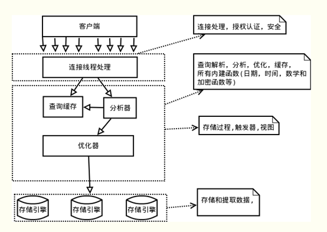

如上图所示，MySQL服务器逻辑架构从上往下可以分为三层：

- （1）第一层：处理客户端连接、授权认证等。
- （2）第二层：服务器层，负责查询语句的解析、优化、缓存以及内置函数的实现、存储过程等。
- （3）第三层：存储引擎，负责MySQL中数据的存储和提取。 **MySQL中服务器层不管理事务，事务是由存储引擎实现的** 。MySQL支持事务的存储引擎有InnoDB、NDB Cluster等，其中InnoDB的使用最为广泛；其他存储引擎不支持事务，如MyIsam、Memory等。

# 5. Mysql索引优化基础

> 使用的外部截图。
> 图片来源：[来源](https://blog.csdn.net/oneby1314/category_10278969.html)

## 5.1. 慢SQL的原因

- 查询语句写的烂
- 索引失效：
  - 单值索引：在user表中给name属性建个索引，`create index idx_user_name on user(name)`
  - 复合索引：在user表中给name、email属性建个索引，`create index idx_user_nameEmail on user(name,email)`
- 关联查询太多join(设计缺陷或不得已的需求)
- 服务器调优及各个参数设置(缓冲、线程数等)

## 5.2. SQL执行顺序

- 手写顺序  
  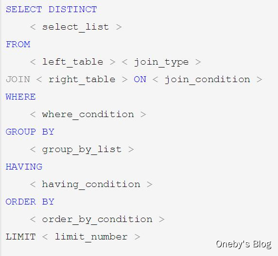
- 执行顺序  
  - mysql 执行的顺序：随着 Mysql 版本的更新换代， 其优化器也在不断的升级， 优化器会分析不同执行顺序产生的性能消耗不同而动态调整执行顺序。
  - 下面是经常出现的查询顺序：

  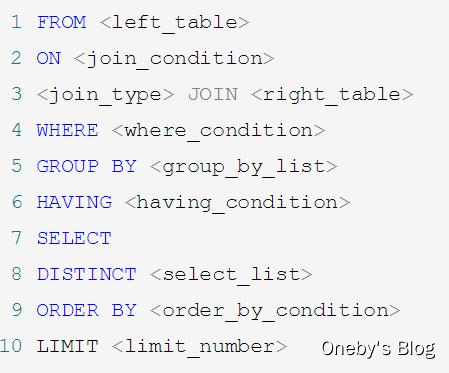

- 总结  
  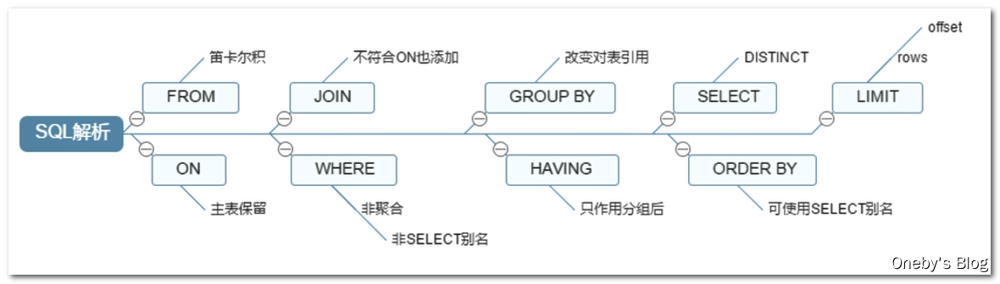-


## 5.3. 索引概述

### 5.3.1. 索引是什么

- MySQL官方对索引的定义为：索引(Index)是帮助MySQL高效获取数据的数据结构。可以得到索引的本质：索引是数据结构
- 你可以简单理解为"排好序的快速查找数据结构"，即索引 = 排序 + 查找
- 一般来说索引本身占用内存空间也很大，不可能全部存储在内存中，因此索引往往以文件形式存储在硬盘上
- 我们平时所说的索引，如果没有特别指明，都是指B树(多路搜索树，并不一定是二叉树)结构组织的索引。
- 聚集索引，次要索引，覆盖索引，复合索引，前缀索引，唯一索引默认都是使用B+树索引，统称索引。当然，除了B+树这种类型的索引之外，还有哈希索引(hash index)等。

### 5.3.2. 索引分类

- 基本分类：
  - 普通索引：是最基本的索引，它没有任何限制，即一个索引只包含单个列，一个表可以有多个单列索引；建议一张表索引不要超过5个，优先考虑复合索引
  - 唯一索引：与前面的普通索引类似，不同的就是：索引列的值必须唯一，但允许有空值。如果是组合索引，则列值的组合必须唯一
  - 主键索引：是一种特殊的唯一索引，一个表只能有一个主键，不允许有空值。一般是在建表的时候同时创建主键索引：
  - 复合索引：指多个字段创建的索引，只有在查询条件中使用了创建索引时的第一个字段，索引才会被使用。使用组合索引时遵循最左前缀集合
    > **高并发时推荐使用复合索引，过滤性最好的字段排在前面**
  - 全文索引：主要用来查找文本中的关键字，而不是直接与索引中的值相比较。fulltext索引跟其它索引大不相同，它更像是一个搜索引擎，而不是简单的where语句的参数匹配

---

- 索引引擎
  - B+Tree索引和BTree索引
  - Hash索引
  - full-text索引
  - R-Tree索引

---

- 聚簇索引和非聚簇索引

### 5.3.3. 什么时候需要建索引

- 索引的优势
  - 类似大学图书馆的书目索引，提高数据检索效率，降低数据库的IO成本
  - 通过索引列对数据进行排序，降低数据排序成本，降低了CPU的消耗
- 索引的劣势
  - 实际上索引也是一张表，该表保存了主键和索引字段，并指向实体表的记录，所以索引列也是要占用空间的
  - 虽然索引大大提高了查询速度，同时却会降低更新表的速度，如果对表INSERT，UPDATE和DELETE。因为更新表时，MySQL不仅要不存数据，还要保存一下索引文件每次更新添加了索引列的字段，都会调整因为更新所带来的键值变化后的索引信息
  - 索引只是提高效率的一个因素，如果你的MySQL有大数据量的表，就需要花时间研究建立优秀的索引，或优化查询语句

---

- 哪些情况下适合建立索引
  - **主键自动建立唯一索引**
  - **频繁作为查询的条件的字段应该创建索引**
  - **查询中与其他表关联的字段，外键关系建立索引**
  - 频繁更新的字段不适合创建索引
  - Where 条件里用不到的字段不创建索引
  - 单间/组合索引的选择问题，Who？（在高并发下倾向创建组合索引）
  - **查询中排序的字段，排序字段若通过索引去访问将大大提高排序的速度**
  - **查询中统计或者分组字段**
- 哪些情况不要创建索引
  - 表记录太少
  - **经常增删改的表**
  - **数据重复且分布平均的表字段**，因此应该只为经常查询和经常排序的数据列建立索引。注意，如果某个数据列包含许多重复的内容，为它建立索引就没有太大的实际效果。
  - **高并发时推荐使用复合索引，过滤性最好的字段排在前面**

### 5.3.4. 优缺点

- 索引的优点
  - 创建唯一性索引，保证数据库表中的每一行数据的唯一性
  - 大大加快数据的检索速度
  - 加快数据库表之间的连接，特别是在实现数据的参考完整性方面特别有意义
  - 在使用分组和排序字句进行数据检索时，同样可以显著减少查询的时间
  - 通过使用索引，可以在查询中使用优化隐藏器，提高系统性能
- 索引的缺点
  - 第一，创建索引和维护索引要耗费时间，这种时间随着数据量的增加而增加。
  - 第二，索引需要占物理空间，除了数据表占数据空间之外，每一个索引还要占一定的物理空间，如果要建立聚簇索引，那么需要的空间就会更大。
  - 第三，当对表中的数据进行增加、删除和修改的时候，索引也要动态的维护，这样就降低了数据的维护速度。

## 5.4. 索引语法

### 5.4.1. 创建索引

- **普通索引、唯一索引和全文索引创建**
  ```sql
  -- 直接创建
  CREATE [UNIQUE] INDEX  indexName ON mytable(columnname(length));
  ```
  ```sql
  -- 修改表结构创建
  ALTER mytable ADD [UNIQUE]  INDEX [indexName] ON(columnname(length));
  ```
  ```sql
  -- 创建表时同时创建索引
  CREATE TABLE `table` (
      `id` int(11) NOT NULL AUTO_INCREMENT ,
      `title` char(255) CHARACTER NOT NULL ,
      PRIMARY KEY (`id`),
      [UNIQUE|FULLLTEXT] INDEX index_name (title(length))
  )
  ```
  - 说明：
    - [UNIQUE|FULLLTEXT]：表示可选择的索引类型，唯一索引还是全文索引，不加话就是普通索引。
    - table_name：表的名称，表示为哪个表添加索引。
    - column_name(length)：column_name是表的列名，length表示为这一列的前length行记录添加索引。
  - 注意：
    - 如果是CHAR和VARCHAR类型，length可以小于字段实际长度；
    - 如果是BLOB和TEXT类型，必须指定length。

- **组合索引创建方式**
  ```sql
  -- 创建表的时候同时创建索引
  CREATE TABLE `table` (
      `id` int(11) NOT NULL AUTO_INCREMENT ,
      `title` char(255) CHARACTER NOT NULL ,
      PRIMARY KEY (`id`),
      INDEX index_name(id,title)
  )
  ```
  ```sql
  -- 修改表结构的方式添加索引
  ALTER TABLE table_name ADD INDEX name_city_age (name,city,age);
  ```

- **主键索引创建方式**
  > 主键索引是一种特殊的唯一索引，一个表只能有一个主键，不允许有空值。一般是在建表的时候同时创建主键索引。
  ```sql
  CREATE TABLE `table` (
      `id` int(11) NOT NULL AUTO_INCREMENT ,
      `title` char(255) CHARACTER NOT NULL ,
      PRIMARY KEY (`id`)
  )
  ```

注意：**创建索引时需要对表加锁**，因此实际操作中需要在业务空闲期间进行。（原理看Fast Index Creation）

### 5.4.2. 删除索引

删除索引可利用ALTER TABLE或DROP INDEX语句来删除索引。类似于CREATE INDEX语句，DROP INDEX可以在ALTER TABLE内部作为一条语句处理，语法如下。
```sql
DROP INDEX index_name ON talbe_name
```

```sql
ALTER TABLE table_name DROP INDEX index_name
```

```sql
-- 该语句只在删除PRIMARY KEY索引时使用，因为一个表只可能有一个PRIMARY KEY索引，因此不需要指定索引名。
ALTER TABLE table_name DROP PRIMARY KEY
```

### 5.4.3. 查看索引

```sql
-- \G表示将查询到的横向表格纵向输出，方便阅读
SHOW INDEX FROM table_name\G
```

| 字段         | 解释                                                         |
| ------------ | ------------------------------------------------------------ |
| Table        | 索引所在的表                                                 |
| Non_unique   | 非唯一索引，如果是0，代表唯一的，也就是说如果该列索引中不包括重复的值则为0 否则为1 |
| Key_name     | 索引的名字，如果是主键的话 则为PRIMARY                       |
| Seq_in_index | 索引中该列的位置，从1开始,如果是组合索引 那么按照字段在建立索引时的顺序排列 |
| Collation    | 列是以什么方式存储在索引中的。可以是A或者NULL，B+树索引总是A，排序的， |
| Sub_part     | 是否列的部分被索引，如果只是前100行索引，就显示100，如果是整列，就显示NULL |
| Packed       | 关键字是否被压缩，如果没有，为NULL                           |
| Index_type   | 索引的类型，对于InnoDB只支持B+树索引，所以都是显示BTREE      |

### 5.4.4. ALTER整理

- `ALTER TABLE tbl_name ADD PRIMARY KEY(column_list)`：该语句添加一个主键，这意味着索引值必须是唯一的，且不能为NULL。
- `ALTER TABLE tbl_name ADD UNIQUE index_name(column_list)`：这条语句创建索引的值必须是唯一的（除了NULL外，NULL可能会出现多次）。
- `ALTER TABLE tbl_name ADD INDEX index_name(column_list)`：.添加普通索引，索引值可出现多次。
- `ALTER TABLE tbl_name ADD FULLTEXT index_name(column_list)`：该语句指定了索引为FULLTEXT，用于全文索引。

## 5.5. 索引添加与Cardinality

### 5.5.1. Fast Index Creation

在MySQL 5.5之前，**对于索引的添加或者删除，每次都需要创建一张临时表，然后导入数据到临时表，接着删除原表**，如果一张大表进行这样的操作，会非常的耗时，这是一个很大的缺陷。

InnoDB存储引擎从1.0.x版本开始加入了一种Fast Index Creation（快速索引创建）的索引创建方式。

这种方式的策略为：**每次为创建索引的表加上一个S锁（共享锁），在创建的时候，不需要重新建表，删除辅助索引只需要更新内部视图，并将辅助索引空间标记为可用**，所以，这种效率就大大提高了。

### 5.5.2. Cardinality

优化器会根据这个Cardinality的值来判断是否使用这个索引。在B+树索引中，只有高选择性的字段才是有意义的，**高选择性**就是这个字段的取值范围很广，比如姓名字段，会有很多的名字，可选择性就高了。

一般来说，判断是否需要使用索引，就可以通过`Cardinality`关键字来判断，如果非常接近1，说明有必要使用，如果非常小，那么就要考虑是否使用索引了。

需要注意的一个问题时，这个关键字不是及时更新的，需要更新的话，需要使用`ANALYZE TABLE`，例如。

```sql
analyze table table_index;
```

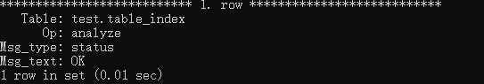

因为目前没有数据，所以，你会发现，这个值一直都是0，没有变化。

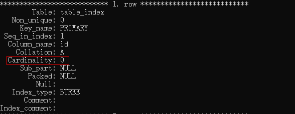


> InoDB存储引擎Cardinality的策略

在InnoDB存储引擎中，这个关键字的更新发生在两个操作中：insert和update。但是，并不是每次都会更新，这样会增加负荷，所以，对于这个关键字的更新有它的策略：

- 表中`1/16`的数据发生变化
- InnoDB存储引擎的计数器`stat_modified_conter`>2000000000

默认InnoDB存储引擎会对8个叶子节点进行采样，采样过程如下：

- B+树索引中叶子节点数量，记做`A`
- **随机**取得B+树索引中的`8`个叶子节点。统计每个页不同的记录个数，分别为p1-p8
- 根据采样信息得到Cardinality的预估值：`(p1+p2+p3+...+p8)*A/8`

因为随机采样，所以，每次的Cardinality值都是不一样的，只有一种情况会一样的，就是表中的叶子节点**小于或者等于8**，这时候，怎么随机采样都是这8个，所以也就一样的。


## 5.6. 存储引擎和索引

### 5.6.1. 概述


### 5.6.2. B+树

 

<br /><br />

- 为什么不用红黑树：红黑树一个节点只能存储一个数据，会导致深度过深。
  - 红黑树每个节点只能存储一个数据。
  - 在大规模数据存储的时候，红黑树往往出现由于树的深度过大而造成磁盘IO读写过于频繁，进而导致效率低下的情况。

---

- 为什么用B+树而不是B-树
  - 一般来说索引非常大，尤其是关系性数据库这种数据量大的索引能达到亿级别，所以为了减少内存的占用，索引也会被存储在磁盘上。
  - B-树/B+树 的特点就是每层节点数目非常多，层数很少，目的就是为了减少磁盘IO次数，
  - 但是B-树的每个节点都有data域（指针），这无疑增大了节点大小，
  - 说白了增加了磁盘IO次数（**磁盘IO一次读出的数据量大小是固定的，单个数据变大，每次读出的就少，IO次数增多，一次IO多耗时**）
  - 而B+树除了叶子节点其它节点并不存储数据，节点小，磁盘IO次数就少。

---

- B+树的优点
  - 优点一： 
    - B+树只有叶节点存放数据，其余节点用来索引。
  - 优点二：
    - B+树所有的Data域在叶子节点，并且所有叶子节点之间都有一个链指针。
    - 这样遍历叶子节点就能获得全部数据，这样就能进行区间访问啦。在数据库中基于范围的查询是非常频繁的，而B树不支持这样的遍历操作。

---

- mysql中B+树的大小与计算
  >  
  - mysql B+树中指针大小大概6Byte
  - 而int类型的索引为8Byte
  - 每个节点大小约为16KB
    ```sql
    -- 该语句可以得到
    show global status like 'Innodb_page_size'
    ```
  - 也就是说每个节点大约可以有1170个索引元素
  - 假设叶节点存储的（索引+数据）大小为1KB，那么每个节点可以存储16个数据元素
    - 注意：叶子节点存储的data中，
    - 可能存储 **索引指向的一行数据 的指向每个字段数据 的指针**(也就是存储指向数据的指针,myisam存储引擎)
    - 也可能存储 **索引指向的一行数据的每个字段的数据**(也就是存储数据,Innodb存储引擎)
  - 那么三层的B+数能够存储的数据元素数量为 1170*1170*16

### 5.6.3. myisam存储引擎

#### 5.6.3.1. 索引结构

> 存储引擎是表级别的。不同的表在定义的时候都可以设置存储引擎

- 一个myisam表对应三个文件：
  - .frm:表结构定义
  - .MYD:myisam data，数据文件
  - .MYI:myisam index，索引数据文件

- myisam索引结构
  >  
  - 叶子节点的data中存放指向数据的指针

#### 5.6.3.2. 二级索引

MyISAM中无论是主键索引还是二级索引，索引的叶子节点存放的都是指向数据行的指针，保证可以通过索引进而查找到对应的数据行，只需要对索引进行一遍查找。这样会存在页分裂问题。

`也就是说Myisam主键索引和二级索引查询方式相同。但是Innodb不是:`

InnoDB中的二级索引存放的是主键值，如果需要查询对应的数据行，需要回表查询，即在聚簇索引中进一步查找对应的数据行。这样可以避免在行移动或者插入新数据时出现的页分裂问题。

[页分裂问题](https://www.cnblogs.com/ZhuChangwu/p/14041410.html)

### 5.6.4. Innodb存储引擎

#### 5.6.4.1. 索引结构与种类

- 一张Innodb表对应两个文件
  - .frm:表结构文件
  - .ibd:索引+数据文件

- Innodb索引结构
  > 
  - 叶子节点的data中存放具体数据

---

- 索引种类：
  - 非聚集索引/非聚簇索引:指索引文件和数据文件是分离的，如myisam
  - 聚集索引/聚簇索引:索引和数据聚集在一个文件中，如Innodb
    - 因为只需要查找一次，因此性能要比非聚集索引性能要高

#### 5.6.4.2. 聚簇索引的选择

- 包含所有数据的聚簇索引的选择：
  - 每个InnoDB表具有一个特殊的索引称为聚簇索引（也叫聚集索引，聚类索引，簇集索引）。
  - 如果表上定义有主键，该主键索引就是聚簇索引。
  - 如果未定义主键，MySQL取第一个唯一索引（unique）而且只含非空列（NOT NULL）作为主键，InnoDB使用它作为聚簇索引。
  - 如果没有这样的列，InnoDB就自己产生一个这样的ID值，它有六个字节，而且是隐藏的，使其作为聚簇索引。
  - 表中的聚簇索引（clustered index ）就是**一级索引**，除此之外，表上的其他非聚簇索引都是**二级索引**，又叫辅助索引（secondary indexes）。

#### 5.6.4.3. 二级索引的检索过程(重要)

- 在MySQL的查询过程中，SQL优化器会选择合适的索引进行检索，
- 在使用二级索引的过程中，因为 **二级索引没有存储全部的数据** ，
- 假如二级索引满足查询需求，则直接返回，即为 **覆盖索引** （后面explain会讲到），反之则需要 **回表** 去主键索引(聚簇索引)查询。

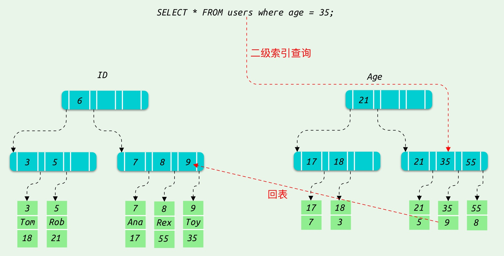

> 后面的加锁过程和这个有关联

### 5.6.5. 两个存储引擎的区别(重要)

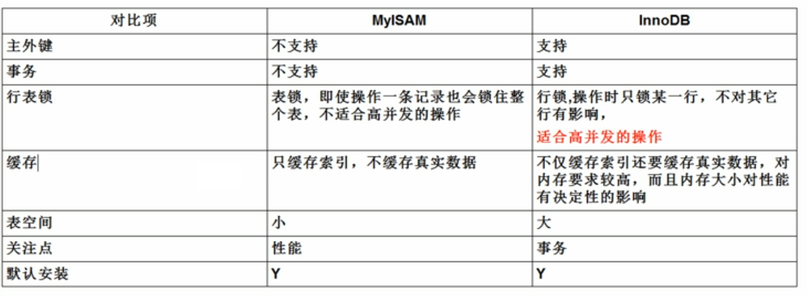

- 事务
  - 为了数据库操作的原子性，我们需要事务。保证一组操作要么都成功，要么都失败，比如转账的功能。我们通常将多条`SQL`语句放在`begin`和`commit`之间，组成一个事务。
  - `InnoDB`支持，`MyISAM`不支持。

- 主键
  - 由于`InnoDB`的聚集索引，其如果没有指定主键，就会自动生成主键。
  - `MyISAM`支持没有主键的表存在。

- 外键
  - 为了解决复杂逻辑的依赖，我们需要外键。比如高考成绩的录入，必须归属于某位同学，我们就需要高考成绩数据库里有准考证号的外键。
  - `InnoDB`支持，`MyISAM`不支持。

- 索引
  - 为了优化查询的速度，进行排序和匹配查找，我们需要索引。比如所有人的姓名从`a-z`首字母进行顺序存储，当我们查找`zhangsan`或者第`44`位的时候就可以很快的定位到我们想要的位置进行查找。
  - `InnoDB`是聚集索引，数据和主键的聚集索引绑定在一起，通过主键索引效率很高。如果通过其他列的辅助索引来进行查找，需要先查找到聚集索引，再查询到所有数据，需要两次查询。
  - `MyISAM`是非聚集索引，数据文件是分离的，索引保存的是数据的指针。
  - 从`InnoDB 1.2.x`版本，`MySQL5.6`版本后，两者都支持全文索引。

[详细说明](https://segmentfault.com/a/1190000019713794)

### 5.6.6. 其他索引

#### 5.6.6.1. Hash索引

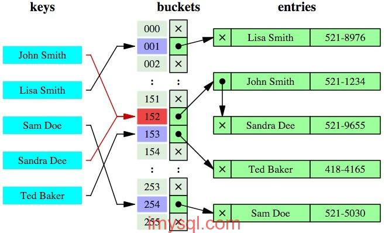

哈希索引就是采用一定的哈希算法，把键值换算成新的哈希值，检索时不需要类似B+树那样从根节点到叶子节点逐级查找，只需一次哈希算法即可立刻定位到相应的位置，速度非常快。

- 说明：
  - Hash 索引仅仅能满足"=","IN"和"<=>"查询，不能使用范围查询。
    > 由于 Hash 索引比较的是进行 Hash 运算之后的 Hash 值，所以它只能用于等值的过滤，不能用于基于范围的过滤，因为经过相应的 Hash 算法处理之后的 Hash 值的大小关系，并不能保证和Hash运算前完全一样。
  - Hash 索引无法被用来避免数据的排序操作。
    > 由于 Hash 索引中存放的是经过 Hash 计算之后的 Hash 值，而且Hash值的大小关系并不一定和 Hash 运算前的键值完全一样，所以数据库无法利用索引的数据来避免任何排序运算；
  - Hash 索引不能利用部分索引键查询。
    > 对于组合索引，Hash 索引在计算 Hash 值的时候是组合索引键合并后再一起计算 Hash 值，而不是单独计算 Hash 值，所以通过组合索引的前面一个或几个索引键进行查询的时候，Hash 索引也无法被利用。
  - Hash 索引在任何时候都不能避免表扫描。
    > 前面已经知道，Hash 索引是将索引键通过 Hash 运算之后，将 Hash运算结果的 Hash 值和所对应的行指针信息存放于一个 Hash 表中，由于不同索引键存在相同 Hash 值，所以即使取满足某个 Hash 键值的数据的记录条数，也无法从 Hash 索引中直接完成查询，还是要通过访问表中的实际数据进行相应的比较，并得到相应的结果。
  - Hash 索引遇到大量Hash值相等的情况后性能并不一定就会比B-Tree索引高。
    > 对于选择性比较低的索引键，如果创建 Hash 索引，那么将会存在大量记录指针信息存于同一个 Hash 值相关联。这样要定位某一条记录时就会非常麻烦，会浪费多次表数据的访问，而造成整体性能低下

- B+树索引和哈希索引的明显区别是：
  - **如果是等值查询，那么哈希索引明显有绝对优势**，因为只需要经过一次算法即可找到相应的键值；当然了，这个前提是，键值都是唯一的。如果键值不是唯一的，就需要先找到该键所在位置，然后再根据链表往后扫描，直到找到相应的数据；
  - 从示意图中也能看到，**如果是范围查询检索，这时候哈希索引就毫无用武之地了**，因为原先是有序的键值，经过哈希算法后，有可能变成不连续的了，就没办法再利用索引完成范围查询检索；
  - 同理，**哈希索引也没办法利用索引完成排序**，以及like ‘xxx%’ 这样的部分模糊查询（这种部分模糊查询，其实本质上也是范围查询）；
  - 哈希索引也**不支持多列联合索引的最左匹配规则**；
  - B+树索引的关键字检索效率比较平均，不像B树那样波动幅度大，**在有大量重复键值情况下，哈希索引的效率也是极低的**，因为存在所谓的哈希碰撞问题。

#### 5.6.6.2. Full-Text索引

##### 5.6.6.2.1. 概念

通过数值比较、范围过滤等就可以完成绝大多数我们需要的查询，但是，如果希望通过关键字的匹配来进行查询过滤，那么就需要基于相似度的查询，而不是原来的精确数值比较。全文索引就是为这种场景设计的。

你可能会说，用 like + % 就可以实现模糊匹配了，为什么还要全文索引？like + % 在文本比较少时是合适的，但是对于大量的文本数据检索，是不可想象的。全文索引在大量的数据面前，能比 like + % 快 N 倍，速度不是一个数量级，但是全文索引可能存在精度问题。

你可能没有注意过全文索引，不过至少应该对一种全文索引技术比较熟悉：各种的搜索引擎。虽然搜索引擎的索引对象是超大量的数据，并且通常其背后都不是关系型数据库，不过全文索引的基本原理是一样的。

MySQL 的全文索引最开始仅支持英语，因为英语的词与词之间有空格，使用空格作为分词的分隔符是很方便的。亚洲文字，比如汉语、日语、汉语等，是没有空格的，这就造成了一定的限制。不过 MySQL 5.7.6 开始，引入了一个 ngram 全文分析器来解决这个问题，并且对 MyISAM 和 InnoDB 引擎都有效。

事实上，MyISAM 存储引擎对全文索引的支持有很多的限制，例如表级别锁对性能的影响、数据文件的崩溃、崩溃后的恢复等，这使得 MyISAM 的全文索引对于很多的应用场景并不适合。所以，多数情况下的建议是使用别的解决方案，例如 Sphinx、Lucene 等等第三方的插件，亦或是使用 InnoDB 存储引擎的全文索引。

##### 5.6.6.2.2. 版本支持

开始之前，先说一下全文索引的版本、存储引擎、数据类型的支持情况

1. MySQL 5.6 以前的版本，只有 MyISAM 存储引擎支持全文索引；
2. MySQL 5.6 及以后的版本，MyISAM 和 InnoDB 存储引擎均支持全文索引;
3. 只有字段的数据类型为 char、varchar、text 及其系列才可以建全文索引。

测试或使用全文索引时，要先看一下自己的 MySQL 版本、存储引擎和数据类型是否支持全文索引。

##### 5.6.6.2.3. 操作全文索引

索引的操作随便一搜都是，这里还是再啰嗦一遍。

> 创建

1.创建表时创建全文索引

```sql
create table fulltext_test (
    id int(11) NOT NULL AUTO_INCREMENT,
    content text NOT NULL,
    tag varchar(255),
    PRIMARY KEY (id),
    FULLTEXT KEY content_tag_fulltext(content,tag)  // 创建联合全文索引列
) ENGINE=MyISAM DEFAULT CHARSET=utf8;
```

2.在已存在的表上创建全文索引

```sql
create fulltext index content_tag_fulltext
    on fulltext_test(content,tag);
```

3.通过 SQL 语句 ALTER TABLE 创建全文索引

```sql
alter table fulltext_test
    add fulltext index content_tag_fulltext(content,tag);
```

> 修改

修改个 O，直接删掉重建。

> 删除

1.直接使用 DROP INDEX 删除全文索引

```sql
drop index content_tag_fulltext
    on fulltext_test;
```

2.通过 SQL 语句 ALTER TABLE 删除全文索引

```sql
alter table fulltext_test
    drop index content_tag_fulltext;
```

> 使用全文索引

和常用的模糊匹配使用 like + % 不同，全文索引有自己的语法格式，使用 match 和 against 关键字，比如

```sql
select * from fulltext_test 
    where match(content,tag) against('xxx xxx');
```

**注意：** match() 函数中指定的列必须和全文索引中指定的列完全相同，否则就会报错，无法使用全文索引，这是因为全文索引不会记录关键字来自哪一列。如果想要对某一列使用全文索引，请单独为该列创建全文索引。

> 测试全文索引

> 添加测试数据

有了上面的知识，就可以测试一下全文索引了。

首先创建测试表，插入测试数据

```sql
create table test (
    id int(11) unsigned not null auto_increment,
    content text not null,
    primary key(id),
    fulltext key content_index(content)
) engine=MyISAM default charset=utf8;

insert into test (content) values ('a'),('b'),('c');
insert into test (content) values ('aa'),('bb'),('cc');
insert into test (content) values ('aaa'),('bbb'),('ccc');
insert into test (content) values ('aaaa'),('bbbb'),('cccc');
```

按照全文索引的使用语法执行下面查询

```sql
select * from test where match(content) against('a');
select * from test where match(content) against('aa');
select * from test where match(content) against('aaa');
```

根据我们的惯性思维，应该会显示 4 条记录才对，然而结果是 1 条记录也没有，只有在执行下面的查询时

```sql
select * from test where match(content) against('aaaa');
```

才会搜到 *aaaa* 这 1 条记录。

为什么？这个问题有很多原因，其中最常见的就是 **最小搜索长度** 导致的。另外插一句，使用全文索引时，测试表里至少要有 4 条以上的记录，否则，会出现意想不到的结果。

MySQL 中的全文索引，有两个变量，最小搜索长度和最大搜索长度，对于长度小于最小搜索长度和大于最大搜索长度的词语，都不会被索引。通俗点就是说，想对一个词语使用全文索引搜索，那么这个词语的长度必须在以上两个变量的区间内。

这两个的默认值可以使用以下命令查看

```sql
show variables like '%ft%';
```

可以看到这两个变量在 MyISAM 和 InnoDB 两种存储引擎下的变量名和默认值

```sql
// MyISAM
ft_min_word_len = 4;
ft_max_word_len = 84;

// InnoDB
innodb_ft_min_token_size = 3;
innodb_ft_max_token_size = 84;
```

可以看到最小搜索长度 MyISAM 引擎下默认是 4，InnoDB 引擎下是 3，也即，MySQL 的全文索引只会对长度大于等于 4 或者 3 的词语建立索引，而刚刚搜索的只有 *aaaa* 的长度大于等于 4。

##### 5.6.6.2.4. 配置最小搜索长度

全文索引的相关参数都无法进行动态修改，必须通过修改 MySQL 的配置文件来完成。修改最小搜索长度的值为 1，首先打开 MySQL 的配置文件 /etc/my.cnf，在 [mysqld] 的下面追加以下内容

```text
[mysqld]
innodb_ft_min_token_size = 1
ft_min_word_len = 1
```

然后重启 MySQL 服务器，并修复全文索引。注意，修改完参数以后，一定要修复下索引，不然参数不会生效。

两种修复方式，可以使用下面的命令修复

```sql
repair table test quick;
```

或者直接删掉重新建立索引，再次执行上面的查询，*a、aa、aaa* 就都可以查出来了。

但是，这里还有一个问题，搜索关键字 *a* 时，为什么 *aa、aaa、aaaa* 没有出现结果中，讲这个问题之前，先说说两种全文索引。

##### 5.6.6.2.5. 自然语言的全文索引

默认情况下，或者使用 in natural language mode 修饰符时，match() 函数对文本集合执行自然语言搜索，上面的例子都是自然语言的全文索引。

自然语言搜索引擎将计算每一个文档对象和查询的相关度。这里，相关度是基于匹配的关键词的个数，以及关键词在文档中出现的次数。在整个索引中出现次数越少的词语，匹配时的相关度就越高。相反，非常常见的单词将不会被搜索，如果一个词语的在超过 50% 的记录中都出现了，那么自然语言的搜索将不会搜索这类词语。上面提到的，测试表中必须有 4 条以上的记录，就是这个原因。

这个机制也比较好理解，比如说，一个数据表存储的是一篇篇的文章，文章中的常见词、语气词等等，出现的肯定比较多，搜索这些词语就没什么意义了，需要搜索的是那些文章中有特殊意义的词，这样才能把文章区分开。

##### 5.6.6.2.6. 布尔全文索引

在布尔搜索中，我们可以在查询中自定义某个被搜索的词语的相关性，当编写一个布尔搜索查询时，可以通过一些前缀修饰符来定制搜索。

MySQL 内置的修饰符，上面查询最小搜索长度时，搜索结果 ft_boolean*_*syntax 变量的值就是内置的修饰符，下面简单解释几个，更多修饰符的作用可以查手册

- **+** 必须包含该词
- **-** 必须不包含该词
- **>** 提高该词的相关性，查询的结果靠前
- **<** 降低该词的相关性，查询的结果靠后
- **(\*)星号** 通配符，只能接在词后面

对于上面提到的问题，可以使用布尔全文索引查询来解决，使用下面的命令，*a、aa、aaa、aaaa* 就都被查询出来了。

```sql
select * test where match(content) against('a*' in boolean mode);
```


##### 5.6.6.2.7. 几个注意点

1. 使用全文索引前，搞清楚版本支持情况；
2. 全文索引比 like + % 快 N 倍，但是可能存在精度问题；
3. 如果需要全文索引的是大量数据，建议先添加数据，再创建索引；
4. 对于中文，可以使用 MySQL 5.7.6 之后的版本，或者第三方插件。

### 5.6.7. Mysql分支

Percona和MariaDB是Mysql的分支。[说明](https://www.biaodianfu.com/mysql-percona-or-mariadb.html)

Percona为MySQL数据库服务器进行了改进，在功能和性能上较MySQL有着很显著的提升。该版本提升了在高负载情况
下的lnnoDB的性能、为DBA提供一些非常有用的性能诊断工具；另外有更多的参数和命令来控制服务器行为。

该公司新建了一款存储引擎叫xtradb完全可以替代innodb,并且在性能和并发上做得更好，

阿里巴巴大部分mysql数据库其实使用的percona的原型加以修改。有退出AliSql和AliRedis。

### 5.6.8. 思考题(重要)


- **为什么Innodb必须要有主键，并且推荐使用整型的自增主键(阿里)**
  - Innodb的数据是通过主键进行组织的。(见上面的图)
  - 如果没有设置主键，会自动选择unique的列作为主键，如果还是没有，就会自动创建一个不可见的列作为主键
  - 整型比较大小更快，查B+树的时候更快。
  - 使用自增是为了可以一直往后面添加元素，避免B+树中的节点分裂。

- 为什么不使用hash索引
  - Hash不支持模糊查询以及范围查询，在生产环境中使用性差

- 叶子节点间的链指针用途
  - 支持范围查找

---

- 为什么不用红黑树：红黑树一个节点只能存储一个数据，会导致深度过深。
  - 红黑树每个节点只能存储一个数据。
  - 在大规模数据存储的时候，红黑树往往出现由于树的深度过大而造成磁盘IO读写过于频繁，进而导致效率低下的情况。

---

- 为什么用B+树而不是B-树
  - 一般来说索引非常大，尤其是关系性数据库这种数据量大的索引能达到亿级别，所以为了减少内存的占用，索引也会被存储在磁盘上。
  - B-树/B+树 的特点就是每层节点数目非常多，层数很少，目的就是为了减少磁盘IO次数，
  - 但是B-树的每个节点都有data域（指针），这无疑增大了节点大小，
  - 说白了增加了磁盘IO次数（**磁盘IO一次读出的数据量大小是固定的，单个数据变大，每次读出的就少，IO次数增多，一次IO多耗时**）
  - 而B+树除了叶子节点其它节点并不存储数据，节点小，磁盘IO次数就少。

---

- B+树的优点
  - 优点一： 
    - B+树只有叶节点存放数据，其余节点用来索引。
  - 优点二：
    - B+树所有的Data域在叶子节点，并且所有叶子节点之间都有一个链指针。
    - 这样遍历叶子节点就能获得全部数据，这样就能进行区间访问啦。在数据库中基于范围的查询是非常频繁的，而B树不支持这样的遍历操作。

---

- 我们什么时候需要创建联合索引呢

  索引建立的主要目的就是为了提高查询的效率，那么联合索引的目的也是类似的，联合索引的目的就是为了提高存在多个查询条件的情况下的效率，就如上面建立的表一样，有多个字段，当我们需要利用多个字段进行查询的时候，我们就需要利用到联合索引了

- 为什么不对表中的每一个列创建一个索引呢
  - 第一，创建索引和维护索引要耗费时间，这种时间随着数据量的增加而增加。
  - 第二，索引需要占物理空间，除了数据表占数据空间之外，每一个索引还要占一定的物理空间，如果要建立聚簇索引，那么需要的空间就会更大。
  - 第三，当对表中的数据进行增加、删除和修改的时候，索引也要动态的维护，这样就降低了数据的维护速度。

- 为什么需要使用联合索引

  - **减少开销**。建一个联合索引(col1,col2,col3)，实际相当于建了(col1),(col1,col2),(col1,col2,col3)三个索引。每多一个索引，都会增加写操作的开销和磁盘空间的开销。对于大量数据的表，使用联合索引会大大的减少开销！
  - **覆盖索引**。对联合索引(col1,col2,col3)，如果有如下的sql: select col1,col2,col3 from test where col1=1 and col2=2。那么MySQL可以直接通过遍历索引取得数据，而无需回表，这减少了很多的随机io操作。减少io操作，特别的随机io其实是dba主要的优化策略。所以，在真正的实际应用中，覆盖索引是主要的提升性能的优化手段之一。
  - **效率高**。索引列越多，通过索引筛选出的数据越少。有1000W条数据的表，有如下sql:select from table where col1=1 and col2=2 and col3=3,假设假设每个条件可以筛选出10%的数据，如果只有单值索引，那么通过该索引能筛选出1000W10%=100w条数据，然后再回表从100w条数据中找到符合col2=2 and col3= 3的数据，然后再排序，再分页；如果是联合索引，通过索引筛选出1000w10% 10% *10%=1w，效率提升可想而知！

  > **覆盖索引**
  > 覆盖索引是一种从辅助索引中就可以得到查询的记录，而不需要查询聚集索引中的记录，使用覆盖索引的一个好处是辅助索引不包含整行记录的所有信息，所以大小远小于聚集索引，因此可以大大减少IO操作。覆盖索引的另外一个好处就是对于统计问题有优化。

---

使用`explain`进行调优时，Extra列的Using filesort也与索引有关。

## 5.7. 索引性能分析

### 5.7.1. Explain概述

- 说明：
  - 使用EXPLAIN关键字可以模拟优化器执行SQL语句，从而知道MySQL是如何处理你的SQL语句的。分析你的查询语句或是结构的性能瓶颈
  - [官网地址](https://dev.mysql.com/doc/refman/8.0/en/explain-output.html)

- **显示字段**
  - 表的读取顺序（id 字段）
  - 数据读取操作的操作类型（select_type 字段）
  - 哪些索引可以使用（possible_keys 字段）
  - 哪些索引被实际使用（keys 字段）
  - 表之间的引用（ref 字段）
  - 每张表有多少行被优化器查询（rows 字段）

- 使用：`explain`+`sql语句`
  ```
  mysql> explain select * from tbl_emp;
  +----+-------------+---------+------+---------------+------+---------+------+------+-------+
  | id | select_type | table   | type | possible_keys | key  | key_len | ref  | rows | Extra |
  +----+-------------+---------+------+---------------+------+---------+------+------+-------+
  |  1 | SIMPLE      | tbl_emp | ALL  | NULL          | NULL | NULL    | NULL |    8 | NULL  |
  +----+-------------+---------+------+---------------+------+---------+------+------+-------+
  1 row in set (0.00 sec)
  ```

### 5.7.2. Explain详解

#### 5.7.2.1. id

- 说明： **select查询的序列号，包含一组数字，表示查询中执行select子句或操作表的顺序**

- id 取值的三种情况：
  - id相同，执行顺序由上至下
    > 
  - id不同，如果是子查询，id的序号会递增，id值越大优先级越高，越先被执行
    > 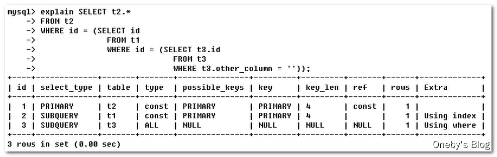 
  - id相同不同，同时存在：id如果相同，可以认为是一组，从上往下顺序执行；在所有组中，id值越大，优先级越高，越先执行；衍生=DERIVED
    > 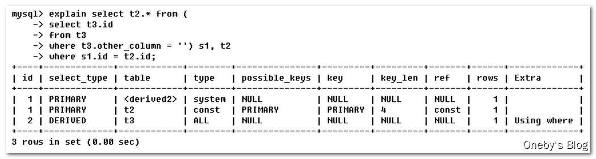 


#### 5.7.2.2. select_type

- 说明： **查询的类型，主要用于区别普通查询、联合查询、子查询等复杂查询**

- 取值：
  - SIMPLE：简单的select查询，查询中不包含子查询或者UNION
  - PRIMARY：查询中若 **包含任何复杂的子部分** ， **最外层** 查询则被标记为PRIMARY
  - SUBQUERY：在 **SELECT或者WHERE** 列表中包含了 **子查询**
  - DERIVED：在 **FROM** 列表中包含的 **子查询** 被标记为DERIVED（衍生）MySQL会递归执行这些子查询，把结果放在临时表里
  - UNION：若第二个 **SELECT** 出现在 **UNION之后** ，则被标记为UNION；若UNION包含在FROM子句的子查询中，外层SELECT将被标记为：DERIVED
  - UNION RESULT： **从UNION表获取结果** 的SELECT
    <details>
    <summary style="color:red;">union和union result</summary>

    ```
    explain
        -> select * from tbl_emp e left join tbl_dept d on e.deptId = d.id
        -> union
        -> select * from tbl_emp e right join tbl_dept d on e.deptId = d.id;
    +----+--------------+------------+------+---------------+------------+---------+-----------+------+----------------------------------------------------+
    | id | select_type  | table      | type | possible_keys | key        | key_len | ref       | rows | Extra                                              |
    +----+--------------+------------+------+---------------+------------+---------+-----------+------+----------------------------------------------------+
    |  1 | PRIMARY      | e          | ALL  | NULL          | NULL       | NULL    | NULL      |    8 | NULL                                               |
    |  1 | PRIMARY      | d          | ALL  | PRIMARY       | NULL       | NULL    | NULL      |    5 | Using where; Using join buffer (Block Nested Loop) |
    |  2 | UNION        | d          | ALL  | NULL          | NULL       | NULL    | NULL      |    5 | NULL                                               |
    |  2 | UNION        | e          | ref  | fk_dept_Id    | fk_dept_Id | 5       | db01.d.id |    1 | NULL                                               |
    | NULL | UNION RESULT | <union1,2> | ALL  | NULL          | NULL       | NULL    | NULL      | NULL | Using temporary                                    |
    +----+--------------+------------+------+---------------+------------+---------+-----------+------+----------------------------------------------------+
    5 rows in set (0.00 sec)
    ```
    </details>

#### 5.7.2.3. table

- 说明： **显示这一行的数据是关于哪张表的**

#### 5.7.2.4. type

- 说明： **访问类型排列，显示查询使用了何种类型**
  - 是较为重要的一个指标，结果值从最好到最坏依次是
  - `system>const>eq_ref>ref>fultext>ref_or_null>index_merge>unique_subquery>index_subquery>range>index>ALL`
  - 比较重要的几个是：`system>const>eq_ref>ref>range>index>ALL`

- 取值说明
  > 结合B+树结构进行理解
  - system： **表只有一行记录**（等于系统表），这是const类型的特例，平时不会出现，这个也可以忽略不计
     
  - const： **表示通过索引一次就找到了** ，const用于比较primary key或者unique索引。因为只匹配一行数据，所以很快。如将主键置于where列表中，MySQL就能将该查询转换为一个常量
    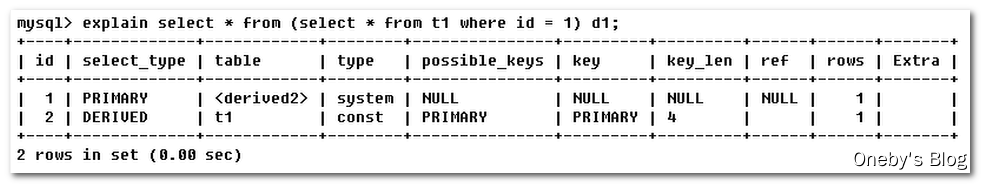
  - eq_ref：唯一性索引， **对于每个索引键，表中只有一条记录与之匹配** ，常见于主键或唯一索引扫描
    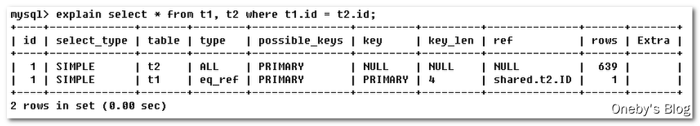
  - ref：非唯一索引扫描，返回匹配某个单独值的所有行。本质上也是一种索引访问， **它返回所有匹配某个单独值的行，然而，它可能会找到多个符合条件的行** ，所以他应该属于查找和扫描的混合体
    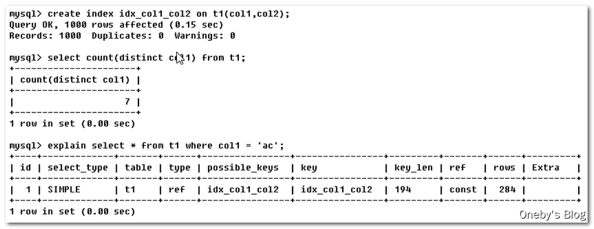
  - range： **只检索给定范围的行** ，使用一个索引来选择行。key列显示使用了哪个索引一般就是在你的where语句中出现了between、<、>、in等的查询这种范围扫描索引扫描比全表扫描要好，因为他只需要开始索引的某一点，而结束于另一点，不用扫描全部索引
    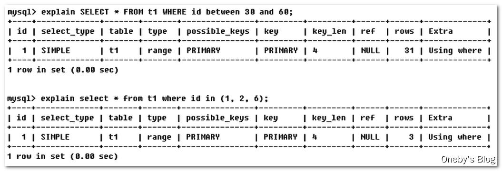
  - index：Full Index Scan，index与ALL区别为 **index类型只遍历索引树** 。这通常比ALL快，因为索引文件通常比数据文件小。（也就是说虽然 **all和index都是读全表** ，但index是从索引中读取的，而all是从硬盘数据库文件中读的）
    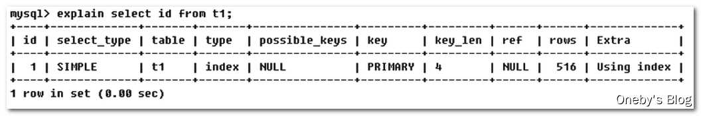
  - all：FullTable Scan，将 **遍历全表** 以找到匹配的行（全表扫描）
    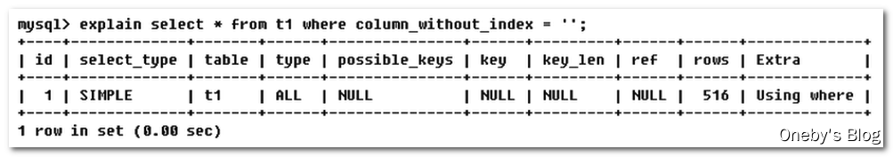
  - 备注：一般来说， **得保证查询只是达到range级别，最好达到ref** 

#### 5.7.2.5. possible_keys

- 说明：
  - 显示 **可能** 应用在这张表中的索引，一个或多个
  - 若查询涉及的字段上存在索引，则该索引将被列出，但不一定被查询实际使用

#### 5.7.2.6. key

- 说明
  - **实际使用** 的索引，如果为null，则没有使用索引
  - **若查询中使用了覆盖索引，则该索引仅出现在key列表中，possible_keys中不会出现**
    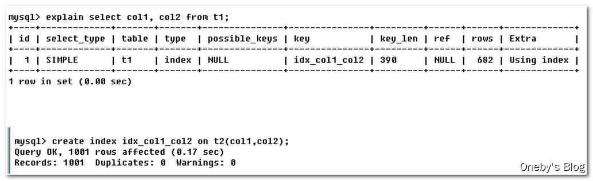


<details>
<summary style="color:red;">覆盖索引（后面也会提到）</summary>

- 覆盖索引（Covering Index），也说为索引覆盖
  - 理解方式一： **就是select的数据列只用从索引中就能够取得，不必读取数据行，MySQL可以利用索引返回select列表中的字段，而不必根据索引再次读取数据文件，换句话说查询列要被所建的索引覆盖。**
  - 理解方式二：索引是高效找到行的一个方法，但是一般数据库也能使用索引找到一个列的数据，因此它不必读取整个行。毕竟索引叶子节点存储了它们索引的数据；当能通过读取索引就可以得到想要的数据，那就不需要读取行了。一个索引包含了（或覆盖了）满足查询结果的数据就叫做覆盖索引。
  - 注意：如果要使用覆盖索引，一定要注意select列表中只取出需要的列，不可select * ，因为如果将所有字段一起做索引会导致索引文件过大，查询性能下降。
</details>

#### 5.7.2.7. key_len

- 说明
  - 表示索引中 **使用的字节数** ，可通过该列计算查询中使用的索引的长度。在不损失精确性的情况下，长度越短越好
  - key_len显示的值为 **索引最大可能长度** ， **并非实际使用长度** ，即key_len是 **根据表定义计算而得** ，不是通过表内检索出的

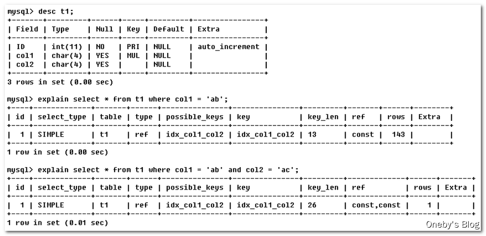

#### 5.7.2.8. ref

- 说明
  - 表示 **哪些列或常量被用于查找索引列上的值**

- 示例：由key_len可知t1表的索引idx_col1_col2被充分使用，t1表的col1匹配t2表的col1，t1表的col2匹配了一个常量，即’ac’
  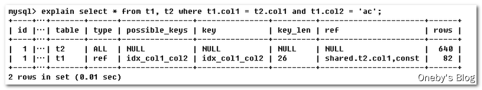

#### 5.7.2.9. rows

- 说明：根据表统计信息及索引选用情况，大致估算出找到所需的记录所需要读取的行数

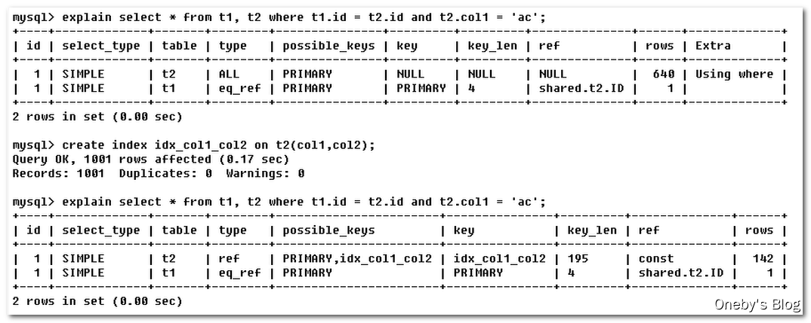

#### 5.7.2.10. Extra

**说明：包含不适合在其他列中显示但十分重要的额外信息**

- **Using filesort（文件排序）** ：
  - MySQL中无法利用索引完成排序操作成为“文件排序”
  - 说明mysql会对数据使用一个外部的索引排序，而不是按照表内的索引顺序进行读取
  - **出现 Using filesort 不好（九死一生），需要尽快优化 SQL**
  - 示例中第一个查询只使用了 col1 和 col3，原有索引派不上用场，所以进行了外部文件排序
  - 示例中第二个查询使用了 col1、col2 和 col3，原有索引派上用场，无需进行文件排序

  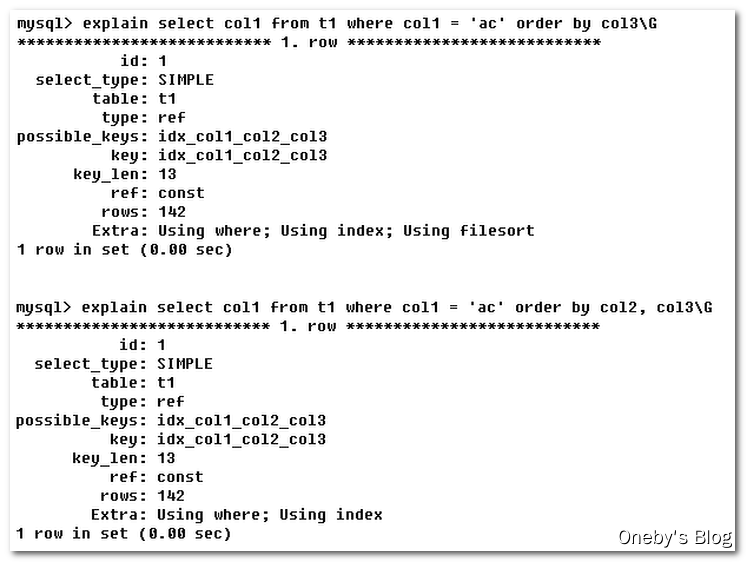

- **Using temporary（创建临时表）** ：
  - 使用了临时表保存中间结果，MySQL在对查询结果排序时使用临时表。常见于排序 order by 和分组查询 group by
  - 出现 Using temporary 超级不好（十死无生），需要立即优化 SQL
  - 示例中第一个查询只使用了 col1，原有索引派不上用场，所以创建了临时表进行分组
  - 示例中第二个查询使用了 col1、col2，原有索引派上用场，无需创建临时表

  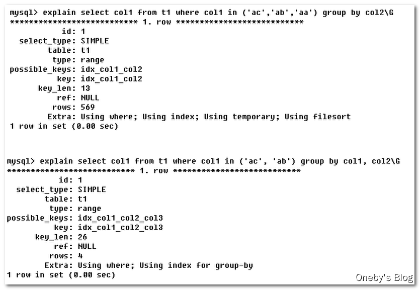

- **Using index（覆盖索引）**：
  - **理解方式一**：
    - 就是select的数据列只用从索引中就能够取得，不必读取数据行，
    - MySQL可以利用索引返回select列表中的字段，而不必根据索引再次读取数据文件，换句话说查询列要被所建的索引覆盖。
  - 理解方式二：
    - 索引是高效找到行的一个方法，但是一般数据库也能使用索引找到一个列的数据，
    - 因此它不必读取整个行。毕竟索引叶子节点存储了它们索引的数据；
    - 当能通过读取索引就可以得到想要的数据，那就不需要读取行了。一个索引包含了（或覆盖了）满足查询结果的数据就叫做覆盖索引。
  - 注意：如果要使用覆盖索引，一定要注意select列表中只取出需要的列，不可select * ，因为如果将所有字段一起做索引会导致索引文件过大，查询性能下降。
  - 表示相应的select操作中使用了覆盖索引（Coveing Index），避免访问了表的数据行，效率不错！
  - 如果同时出现using where，表明索引被用来执行索引键值的查找
  - 如果没有同时出现using where，表明索引用来读取数据而非执行查找动作

  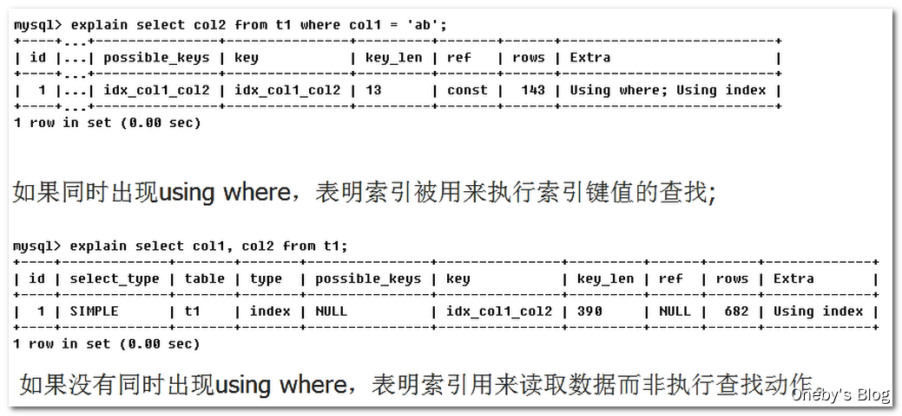

- **Using where：表明使用了where过滤**
- **Using join buffer：表明使用了连接缓存**
- **impossible where** ：where子句的值总是false，不能用来获取任何元组
  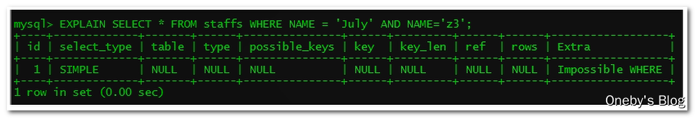

### 5.7.3. 综合示例(重要)

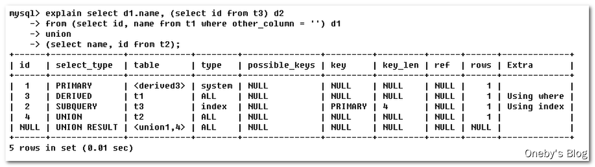

写出每一行语句的执行顺序并进行分析。

<details>
<summary style="color:red;">答案</summary>

1. 第一行（执行顺序4）：id列为1，表示是union里的第一个select，select_type列的primary表示该查询为外层查询，table列被标记为`<derived3>`，表示查询结果来自一个衍生表，其中derived3中3代表该查询衍生自第三个select查询，即id为3的select。【`select d1.name ...`】
2. 第二行（执行顺序2）：id为3，是整个查询中第三个select的一部分。因查询包含在from中，所以为derived。【`select id, name from t1 where other_column= ' '`】
3. 第三行（执行顺序3）：select列表中的子查询select_type为subquery，为整个查询中的第二个select。【`select id from t3`】
4. 第四行（执行顺序1）：select_type为union，说明第四个select是union里的第二个select，最先执行【`select name, id from t2`】
5. 第五行（执行顺序5）：代表从union的临时表中读取行的阶段，table列的<union1, 4>表示用第一个和第四个select的结果进行union操作。【两个结果进行uinion操作】

</details>

## 5.8. 索引优化

### 5.8.1. 单表索引优化

#### 5.8.1.1. 数据准备

- 建表与插入sql
  <details>
  <summary style="color:red;">sql</summary>

  ```sql
  CREATE TABLE IF NOT EXISTS article(
      id INT(10) UNSIGNED NOT NULL PRIMARY KEY AUTO_INCREMENT,
      author_id INT(10) UNSIGNED NOT NULL,
      category_id INT(10) UNSIGNED NOT NULL,
      views INT(10) UNSIGNED NOT NULL,
      comments INT(10) UNSIGNED NOT NULL,
      title VARCHAR(255) NOT NULL,
      content TEXT NOT NULL
  );

  INSERT INTO article(author_id,category_id,views,comments,title,content)
  VALUES
  (1,1,1,1,'1','1'),
  (2,2,2,2,'2','2'),
  (1,1,3,3,'3','3');
  ```
  </details>

- 数据
  ```
  mysql> SELECT * FROM article;
  +----+-----------+-------------+-------+----------+-------+---------+
  | id | author_id | category_id | views | comments | title | content |
  +----+-----------+-------------+-------+----------+-------+---------+
  |  1 |         1 |           1 |     1 |        1 | 1     | 1       |
  |  2 |         2 |           2 |     2 |        2 | 2     | 2       |
  |  3 |         1 |           1 |     3 |        3 | 3     | 3       |
  +----+-----------+-------------+-------+----------+-------+---------+
  3 rows in set (0.00 sec)
  ```

#### 5.8.1.2. 需求与查询

- 需求： **查询category_id为1且comments 大于1的情况下，views最多的article_id。**

- sql语句
  ```sql
  SELECT id, author_id FROM article WHERE category_id = 1 AND comments > 1 ORDER BY views DESC LIMIT 1;
  ```

#### 5.8.1.3. 性能分析与优化

- 无索引时，为All
  ```
  mysql> EXPLAIN SELECT id, author_id FROM article WHERE category_id = 1 AND comments > 1 ORDER BY views DESC LIMIT 1;
  +----+-------------+---------+------+---------------+------+---------+------+------+-----------------------------+
  | id | select_type | table   | type | possible_keys | key  | key_len | ref  | rows | Extra                       |
  +----+-------------+---------+------+---------------+------+---------+------+------+-----------------------------+
  |  1 | SIMPLE      | article | ALL  | NULL          | NULL | NULL    | NULL |    3 | Using where; Using filesort |
  +----+-------------+---------+------+---------------+------+---------+------+------+-----------------------------+
  1 row in set (0.00 sec)
  ```

- 结论：
  - 很显然，type是ALL，即最坏的情况。
  - Extra 里还出现了Using filesort，也是最坏的情况。
  - 优化是必须的。

---

- 优化1：
  - 构建索引：`create index idx_article_ccv on article(category_id, comments, views);`
  - 查看索引
    ```
    mysql> SHOW INDEX FROM article;
    +---------+------------+-----------------+--------------+-------------+-----------+-------------+----------+--------+------+------------+---------+---------------+
    | Table   | Non_unique | Key_name        | Seq_in_index | Column_name | Collation | Cardinality | Sub_part | Packed | Null | Index_type | Comment | Index_comment |
    +---------+------------+-----------------+--------------+-------------+-----------+-------------+----------+--------+------+------------+---------+---------------+
    | article |          0 | PRIMARY         |            1 | id          | A         |           3 |     NULL | NULL   |      | BTREE      |         |               |
    | article |          1 | idx_article_ccv |            1 | category_id | A         |           3 |     NULL | NULL   |      | BTREE      |         |               |
    | article |          1 | idx_article_ccv |            2 | comments    | A         |           3 |     NULL | NULL   |      | BTREE      |         |               |
    | article |          1 | idx_article_ccv |            3 | views       | A         |           3 |     NULL | NULL   |      | BTREE      |         |               |
    +---------+------------+-----------------+--------------+-------------+-----------+-------------+----------+--------+------+------------+---------+---------------+
    4 rows in set (0.00 sec)
    ```
  - 分析
    ```
    mysql> EXPLAIN SELECT id, author_id FROM article WHERE category_id = 1 AND comments > 1 ORDER BY views DESC LIMIT 1;
    +----+-------------+---------+-------+-----------------+-----------------+---------+------+------+---------------------------------------+
    | id | select_type | table   | type  | possible_keys   | key             | key_len | ref  | rows | Extra                                 |
    +----+-------------+---------+-------+-----------------+-----------------+---------+------+------+---------------------------------------+
    |  1 | SIMPLE      | article | range | idx_article_ccv | idx_article_ccv | 8       | NULL |    1 | Using index condition; Using filesort |
    +----+-------------+---------+-------+-----------------+-----------------+---------+------+------+---------------------------------------+
    1 row in set (0.00 sec)
    ```
    - **再次执行查询：type变成了range，这是可以忍受的。但是extra里使用Using filesort仍是无法接受的。**
    - 但是我们已经建立了索引，为啥没用呢？
    - 这是因为按照B+Tree索引的工作原理，先排序 category_id，如果遇到相同的 category_id 则再排序comments，如果遇到相同的 comments 则再排序 views。
    - 当comments字段在联合索引里处于 **中间位置** 时，因为comments>1条件是一个 **范围值（所谓 range）** ，MySQL 无法利用索引再对后面的views部分进行检索，即 **range 类型查询字段后面的索引无效** 。因此就无法使用views的索引进行排序，只能通过filesort
      > 稍微想一下应该就能想通。后面索引失效也会讲。
    - 如果将查询条件中的 comments > 1 改为 comments = 1 ，发现 Use filesort 神奇地消失了，从这点可以验证： **范围后的索引会导致索引失效**
      ```
      mysql> EXPLAIN SELECT id, author_id FROM article WHERE category_id = 1 AND comments = 1 ORDER BY views DESC LIMIT 1;
      +----+-------------+---------+------+-----------------+-----------------+---------+-------------+------+-------------+
      | id | select_type | table   | type | possible_keys   | key             | key_len | ref         | rows | Extra       |
      +----+-------------+---------+------+-----------------+-----------------+---------+-------------+------+-------------+
      |  1 | SIMPLE      | article | ref  | idx_article_ccv | idx_article_ccv | 8       | const,const |    1 | Using where |
      +----+-------------+---------+------+-----------------+-----------------+---------+-------------+------+-------------+
      1 row in set (0.00 sec)
      ```
---

- 优化2：为了解决优化1带来的view索引无法使用的问题
  - 删除刚才创建的 idx_article_ccv 索引 `DROP INDEX idx_article_ccv ON article;`
  - 解决说明
    - 由于 range 后（comments > 1）的索引会失效，这次我们建立索引时，直接抛弃 comments 列，
    - 先利用 category_id 索引查出所需要的数据
    - 并遍历得到comment>1的数据（此处没有用索引）
    - 再使用views索引进行排序
  - 建立索引 `create index idx_article_ccv on article(category_id, views);`
  - 结果：再次执行查询：可以看到，type变为了ref，Extra中的Using filesort也消失了，结果非常理想
    ```
    mysql> EXPLAIN SELECT id, author_id FROM article WHERE category_id = 1 AND comments > 1 ORDER BY views DESC LIMIT 1;
    +----+-------------+---------+------+-----------------+-----------------+---------+-------+------+-------------+
    | id | select_type | table   | type | possible_keys   | key             | key_len | ref   | rows | Extra       |
    +----+-------------+---------+------+-----------------+-----------------+---------+-------+------+-------------+
    |  1 | SIMPLE      | article | ref  | idx_article_ccv | idx_article_ccv | 4       | const |    2 | Using where |
    +----+-------------+---------+------+-----------------+-----------------+---------+-------+------+-------------+
    1 row in set (0.00 sec)
    ```

### 5.8.2. 两表索引优化

#### 5.8.2.1. 数据准备

- 建表与插入sql

  <details>
  <summary style="color:red;">sql</summary>

  ```sql
  CREATE TABLE IF NOT EXISTS class(
      id INT(10) UNSIGNED NOT NULL AUTO_INCREMENT,
      card INT(10) UNSIGNED NOT NULL,
      PRIMARY KEY(id)
  );

  CREATE TABLE IF NOT EXISTS book(
      bookid INT(10) UNSIGNED NOT NULL AUTO_INCREMENT,
      card INT(10) UNSIGNED NOT NULL,
      PRIMARY KEY(bookid)
  );

  INSERT INTO class(card) VALUES(FLOOR(1+(RAND()*20)));
  INSERT INTO class(card) VALUES(FLOOR(1+(RAND()*20)));
  INSERT INTO class(card) VALUES(FLOOR(1+(RAND()*20)));
  INSERT INTO class(card) VALUES(FLOOR(1+(RAND()*20)));
  INSERT INTO class(card) VALUES(FLOOR(1+(RAND()*20)));
  -- ...

  INSERT INTO book(card) VALUES(FLOOR(1+(RAND()*20)));
  INSERT INTO book(card) VALUES(FLOOR(1+(RAND()*20)));
  INSERT INTO book(card) VALUES(FLOOR(1+(RAND()*20)));
  INSERT INTO book(card) VALUES(FLOOR(1+(RAND()*20)));
  -- ...
  ```
  </details>

- 数据展示
  ```
  mysql> select * from class;
  +----+------+
  | id | card |
  +----+------+
  |  1 |   12 |
  |  2 |   13 |
  |  3 |   12 |
  |  4 |   17 |
  |  5 |   11 |

  mysql> select * from book;
  +--------+------+
  | bookid | card |
  +--------+------+
  |      1 |   16 |
  |      2 |    1 |
  |      3 |   17 |
  |      4 |    3 |
  |      5 |   20 |
  |      6 |   12 |
  ```

#### 5.8.2.2. 需求与查询

- 实现两表的连接，连接条件是 class.card = book.card
- sql:`SELECT * FROM class LEFT JOIN book ON class.card = book.card;`

#### 5.8.2.3. 优化

- 未创建索引
  - 结果
    ```
    mysql> EXPLAIN SELECT * FROM class LEFT JOIN book ON class.card = book.card;
    +----+-------------+-------+------+---------------+------+---------+------+------+-------+
    | id | select_type | table | type | possible_keys | key  | key_len | ref  | rows | Extra |
    +----+-------------+-------+------+---------------+------+---------+------+------+-------+
    |  1 | SIMPLE      | class | ALL  | NULL          | NULL | NULL    | NULL |   21 |       |
    |  1 | SIMPLE      | book  | ALL  | NULL          | NULL | NULL    | NULL |   20 |       |
    +----+-------------+-------+------+---------------+------+---------+------+------+-------+
    2 rows in set (0.00 sec)
    ```
  - 分析
    - **type 有 All ，rows 为表中数据总行数，说明 class 和 book 进行了全表检索**
    - 驱动表是左表 class 表，被驱动表是右表。
    - **即每次 class 表对 book 表进行左外连接时，都需要在 book 表中进行一次全表检索**

- 右表添加索引:
  - sql
    ```sql
    ALTER TABLE 'book' ADD INDEX Y ('card');
    ```
  - 结果
    ```
    mysql> EXPLAIN SELECT * FROM class LEFT JOIN book ON class.card = book.card;
    +----+-------------+-------+------+---------------+------+---------+-----------------+------+-------------+
    | id | select_type | table | type | possible_keys | key  | key_len | ref             | rows | Extra       |
    +----+-------------+-------+------+---------------+------+---------+-----------------+------+-------------+
    |  1 | SIMPLE      | class | ALL  | NULL          | NULL | NULL    | NULL            |   21 | NULL        |
    |  1 | SIMPLE      | book  | ref  | Y             | Y    | 4       | db01.class.card |    1 | Using index |
    +----+-------------+-------+------+---------------+------+---------+-----------------+------+-------------+
    2 rows in set (0.00 sec)
    ``` 
  - 分析：
    - 这是由左连接特性决定的。LEFT JOIN条件用于确定如何从右表搜索行，左边一定都有，所以右边是我们的关键点，一定需要建立索引。
    - **左表每一行都会扫描一遍右表**
    - 左表连接右表，则需要拿着左表的数据去右表里面查，索引需要在右表中建立索引

- 尝试在左表添加索引
  - sql
    ```sql
    DROP INDEX Y ON book;
    ALTER TABLE class ADD INDEX X(card);
    ```
  - 结果：用不到索引
    ```
    mysql> EXPLAIN SELECT * FROM class LEFT JOIN book ON class.card = book.card;
    +----+-------------+-------+-------+---------------+------+---------+------+------+----------------------------------------------------+
    | id | select_type | table | type  | possible_keys | key  | key_len | ref  | rows | Extra                                              |
    +----+-------------+-------+-------+---------------+------+---------+------+------+----------------------------------------------------+
    |  1 | SIMPLE      | class | index | NULL          | X    | 4       | NULL |   21 | Using index                                        |
    |  1 | SIMPLE      | book  | ALL   | NULL          | NULL | NULL    | NULL |   20 | Using where; Using join buffer (Block Nested Loop) |
    +----+-------------+-------+-------+---------------+------+---------+------+------+----------------------------------------------------+
    2 rows in set (0.00 sec)
    ```
  - 换成右连接执行:
    - sql:`EXPLAIN SELECT * FROM class RIGHT JOIN book ON class.card = book.card;`
    - 结果
      ```
      mysql> EXPLAIN SELECT * FROM class RIGHT JOIN book ON class.card = book.card;
      +----+-------------+-------+------+---------------+------+---------+----------------+------+-------------+
      | id | select_type | table | type | possible_keys | key  | key_len | ref            | rows | Extra       |
      +----+-------------+-------+------+---------------+------+---------+----------------+------+-------------+
      |  1 | SIMPLE      | book  | ALL  | NULL          | NULL | NULL    | NULL           |   20 | NULL        |
      |  1 | SIMPLE      | class | ref  | X             | X    | 4       | db01.book.card |    1 | Using index |
      +----+-------------+-------+------+---------------+------+---------+----------------+------+-------------+
      2 rows in set (0.00 sec)
      ```
    - 分析：
      - 这是因为RIGHT JOIN条件用于确定如何从左表搜索行，右边一定都有，所以左边是我们的关键点，一定需要建立索引。
      - class RIGHT JOIN book ：book 里面的数据一定存在于结果集中，我们需要拿着 book 表中的数据，去 class 表中搜索，所以索引需要建立在 class 表中
      - **也就是说right join时，右表的每一行都会遍历一遍左表**

---

为了不妨碍之后的测试，删除索引：`DROP INDEX X ON class;`

### 5.8.3. 三表索引优化

#### 5.8.3.1. 数据准备

- 建表和插入sql
  <details>
  <summary style="color:red;">sql</summary>

  ```sql
  CREATE TABLE IF NOT EXISTS phone(
      phoneid INT(10) UNSIGNED NOT NULL AUTO_INCREMENT,
      card INT(10) UNSIGNED NOT NULL,
      PRIMARY KEY(phoneid)
  )ENGINE=INNODB;

  INSERT INTO phone(card) VALUES(FLOOR(1+(RAND()*20)));
  INSERT INTO phone(card) VALUES(FLOOR(1+(RAND()*20)));
  INSERT INTO phone(card) VALUES(FLOOR(1+(RAND()*20)));
  INSERT INTO phone(card) VALUES(FLOOR(1+(RAND()*20)));
  INSERT INTO phone(card) VALUES(FLOOR(1+(RAND()*20)));
  INSERT INTO phone(card) VALUES(FLOOR(1+(RAND()*20)));
  ```
  </details>
- 数据展示
  ```
  mysql> select * from phone;
  +---------+------+
  | phoneid | card |
  +---------+------+
  |       1 |    7 |
  |       2 |    7 |
  |       3 |   13 |
  |       4 |    6 |
  |       5 |    8 |
  ```

#### 5.8.3.2. 需求与查询

- sql
  ```sql
  SELECT * FROM class LEFT JOIN book ON class.card = book.card LEFT JOIN phone ON book.card = phone.card;
  ```

#### 5.8.3.3. 优化

- explain分析：
  ```
  mysql> EXPLAIN SELECT * FROM class LEFT JOIN book ON class.card = book.card LEFT JOIN phone ON book.card = phone.card;
  +----+-------------+-------+------+---------------+------+---------+------+------+----------------------------------------------------+
  | id | select_type | table | type | possible_keys | key  | key_len | ref  | rows | Extra                                              |
  +----+-------------+-------+------+---------------+------+---------+------+------+----------------------------------------------------+
  |  1 | SIMPLE      | class | ALL  | NULL          | NULL | NULL    | NULL |   21 | NULL                                               |
  |  1 | SIMPLE      | book  | ALL  | NULL          | NULL | NULL    | NULL |   20 | Using where; Using join buffer (Block Nested Loop) |
  |  1 | SIMPLE      | phone | ALL  | NULL          | NULL | NULL    | NULL |   20 | Using where; Using join buffer (Block Nested Loop) |
  +----+-------------+-------+------+---------------+------+---------+------+------+----------------------------------------------------+
  3 rows in set (0.00 sec)
  ```
  - type 有All ，rows 为表数据总行数，说明 class、 book 和 phone 表 **都进行了全表检索**
  - Extra 中 Using join buffer ，表明连接过程中 **使用了 join 缓冲区**

- **左连接，在右表建立索引**
  - sql
    ```sql
    ALTER TABLE book ADD INDEX Y (card);
    ALTER TABLE phone ADD INDEX Z (card);
    ```
  - 结果：
    ```
    mysql> EXPLAIN SELECT * FROM class LEFT JOIN book ON class.card=book.card LEFT JOIN phone ON book.card = phone.card;
    +----+-------------+-------+------+---------------+------+---------+-----------------+------+-------------+
    | id | select_type | table | type | possible_keys | key  | key_len | ref             | rows | Extra       |
    +----+-------------+-------+------+---------------+------+---------+-----------------+------+-------------+
    |  1 | SIMPLE      | class | ALL  | NULL          | NULL | NULL    | NULL            |   21 | NULL        |
    |  1 | SIMPLE      | book  | ref  | Y             | Y    | 4       | db01.class.card |    1 | Using index |
    |  1 | SIMPLE      | phone | ref  | Z             | Z    | 4       | db01.book.card  |    1 | Using index |
    +----+-------------+-------+------+---------------+------+---------+-----------------+------+-------------+
    3 rows in set (0.00 sec)
    ``` 

- 结论分析
  - left join 是左表驱动右表
  - right join 是右表驱动左表
  - 小标驱动大表
    <details>
    <summary style="color:red;">为什么要小标驱动大表</summary>

    - 为什么要小表驱动大表。
      - user表10000条数据，class表20条数据
      - `select * from user u left join class c u.userid=c.userid`
      - 这样则需要用user表循环10000次才能查询出来，而如果用class表驱动user表则只需要循环20次就能查询出来。
      - 由于MySQL使用BTREE结构，内部查询成本（3层查找or4层查找）和外部循环成本不成比例。
      - 因此建议内表走索引，也叫INLJ，但是如果内表是二级索引，效率也低，因为要回表查主键。
      - 如果都是全表扫描（NJL），则相差不多，成本也很高，笛卡尔积。

    </details>

  - 在大表上建立索引:为了更快遍历大表。

## 5.9. 索引失效

### 5.9.1. 数据准备

- 建表和插入和索引sql
  ```sql
  CREATE TABLE staffs(
      id INT PRIMARY KEY AUTO_INCREMENT,
      `name` VARCHAR(24)NOT NULL DEFAULT'' COMMENT'姓名',
      `age` INT NOT NULL DEFAULT 0 COMMENT'年龄',
      `pos` VARCHAR(20) NOT NULL DEFAULT'' COMMENT'职位',
      `add_time` TIMESTAMP NOT NULL DEFAULT CURRENT_TIMESTAMP COMMENT'入职时间'
  )CHARSET utf8 COMMENT'员工记录表';

  INSERT INTO staffs(`name`,`age`,`pos`,`add_time`) VALUES('z3',22,'manager',NOW());
  INSERT INTO staffs(`name`,`age`,`pos`,`add_time`) VALUES('July',23,'dev',NOW());
  INSERT INTO staffs(`name`,`age`,`pos`,`add_time`) VALUES('2000',23,'dev',NOW());

  ALTER TABLE staffs ADD INDEX index_staffs_nameAgePos(`name`,`age`,`pos`);
  ```
- 数据展示
  ```
  mysql> select * from staffs;
  +----+------+-----+---------+---------------------+
  | id | name | age | pos     | add_time            |
  +----+------+-----+---------+---------------------+
  |  1 | z3   |  22 | manager | 2020-08-04 14:42:33 |
  |  2 | July |  23 | dev     | 2020-08-04 14:42:33 |
  |  3 | 2000 |  23 | dev     | 2020-08-04 14:42:33 |
  +----+------+-----+---------+---------------------+
  3 rows in set (0.00 sec)
  ```
  ```
  mysql> SHOW INDEX FROM staffs;
  +--------+------------+-------------------------+--------------+-------------+-----------+-------------+----------+--------+------+------------+---------+---------------+
  | Table  | Non_unique | Key_name                | Seq_in_index | Column_name | Collation | Cardinality | Sub_part | Packed | Null | Index_type | Comment | Index_comment |
  +--------+------------+-------------------------+--------------+-------------+-----------+-------------+----------+--------+------+------------+---------+---------------+
  | staffs |          0 | PRIMARY                 |            1 | id          | A         |           3 |     NULL | NULL   |      | BTREE      |         |               |
  | staffs |          1 | index_staffs_nameAgePos |            1 | name        | A         |           3 |     NULL | NULL   |      | BTREE      |         |               |
  | staffs |          1 | index_staffs_nameAgePos |            2 | age         | A         |           3 |     NULL | NULL   |      | BTREE      |         |               |
  | staffs |          1 | index_staffs_nameAgePos |            3 | pos         | A         |           3 |     NULL | NULL   |      | BTREE      |         |               |
  +--------+------------+-------------------------+--------------+-------------+-----------+-------------+----------+--------+------+------------+---------+---------------+
  4 rows in set (0.00 sec)
  ```


### 5.9.2. 失效原因

#### 5.9.2.1. 原因

- 不遵循最佳左前缀法则
  - 最佳左前缀法则：如果索引了多例，要遵守最左前缀法则。指的是查询从索引的最左前列开始并且不跳过索引中的列。
- 索引列上的任何操作（ **计算、函数、（自动or手动）类型转换** ），会导致索引失效而转向全表扫描
  - 如字符串不加单引号索引失效
- **范围条件** 会导致 **右边的索引列** 会失效
  - `between and`,`in` 等
  - mysql在使用不等于（`!=或者<>`）的时候无法使用索引会导致全表扫描(也可以归为 **范围条件**)
  - like以通配符开头（’%abc…’）mysql索引失效会变成全表扫描操作(也可以归为 **范围条件**)
    - 注意： **可以使用覆盖索引，使 %str% 不会使索引失效**
  - `is null`，`is not null` 也无法使用索引（早期版本不能走索引，后续版本应该优化过，可以走索引）(也可以归为 **范围条件**)
  - 少用or，用它连接时会索引失效

#### 5.9.2.2. 建议

- 建议
  - 尽量使用全值匹配
  - 最佳左前缀法则：如果索引了多例，要遵守最左前缀法则。指的是查询从索引的最左前列开始并且不跳过索引中的列。
  - 不在索引列上做任何操作（计算、函数、（自动or手动）类型转换），会导致索引失效而转向全表扫描
  - 存储引擎不能使用索引中范围条件右边的列
  - 尽量使用覆盖索引（只访问索引的查询（索引列和查询列一致）），减少`select *`
  - mysql在使用不等于（`!=或者<>`）的时候无法使用索引会导致全表扫描
  - is null，is not null 也无法使用索引（早期版本不能走索引，后续版本应该优化过，可以走索引）
  - like以通配符开头（’%abc…’）mysql索引失效会变成全表扫描操作
  - 字符串不加单引号索引失效
  - 少用or，用它连接时会索引失效


#### 5.9.2.3. 示例

> **注意：索引顺序是name,age,pos**

---

> **最佳左匹配法则：带头大哥不能死，中间兄弟不能断**

- 只有带头大哥 name 时
  - key = index_staffs_nameAgePos 表明索引生效
  - ref = const ：这个常量就是查询时的 ‘July’ 字符串常量

```
mysql> EXPLAIN SELECT * FROM staffs WHERE name = 'July';
+----+-------------+--------+------+-------------------------+-------------------------+---------+-------+------+-----------------------+
| id | select_type | table  | type | possible_keys           | key                     | key_len | ref   | rows | Extra                 |
+----+-------------+--------+------+-------------------------+-------------------------+---------+-------+------+-----------------------+
|  1 | SIMPLE      | staffs | ref  | index_staffs_nameAgePos | index_staffs_nameAgePos | 74      | const |    1 | Using index condition |
+----+-------------+--------+------+-------------------------+-------------------------+---------+-------+------+-----------------------+
1 row in set (0.00 sec)
```

- 带头大哥 name 带上小弟 age
  - key = index_staffs_nameAgePos 表明索引生效
  - ref = const,const：两个常量分别为 ‘July’ 和 23

```
mysql> EXPLAIN SELECT * FROM staffs WHERE name = 'July'AND age = 23;
+----+-------------+--------+------+-------------------------+-------------------------+---------+-------------+------+-----------------------+
| id | select_type | table  | type | possible_keys           | key                     | key_len | ref         | rows | Extra                 |
+----+-------------+--------+------+-------------------------+-------------------------+---------+-------------+------+-----------------------+
|  1 | SIMPLE      | staffs | ref  | index_staffs_nameAgePos | index_staffs_nameAgePos | 78      | const,const |    1 | Using index condition |
+----+-------------+--------+------+-------------------------+-------------------------+---------+-------------+------+-----------------------+
1 row in set (0.00 sec)
```

- 带头大哥 name 带上小弟 age ，小弟 age 带上小小弟 pos
  - key = index_staffs_nameAgePos 表明索引生效
  - ref = const,const,const ：三个常量分别为 ‘July’、23 和 ‘dev’

```
mysql> EXPLAIN SELECT * FROM staffs WHERE name = 'July'AND age = 23 AND pos = 'dev';
+----+-------------+--------+------+-------------------------+-------------------------+---------+-------------------+------+-----------------------+
| id | select_type | table  | type | possible_keys           | key                     | key_len | ref               | rows | Extra                 |
+----+-------------+--------+------+-------------------------+-------------------------+---------+-------------------+------+-----------------------+
|  1 | SIMPLE      | staffs | ref  | index_staffs_nameAgePos | index_staffs_nameAgePos | 140     | const,const,const |    1 | Using index condition |
+----+-------------+--------+------+-------------------------+-------------------------+---------+-------------------+------+-----------------------+
1 row in set (0.00 sec)
```

- 带头大哥 name 挂了
  - key = NULL 说明索引失效
  - ref = null 表示 ref 也失效

```
mysql> EXPLAIN SELECT * FROM staffs WHERE age = 23 AND pos = 'dev';
+----+-------------+--------+------+---------------+------+---------+------+------+-------------+
| id | select_type | table  | type | possible_keys | key  | key_len | ref  | rows | Extra       |
+----+-------------+--------+------+---------------+------+---------+------+------+-------------+
|  1 | SIMPLE      | staffs | ALL  | NULL          | NULL | NULL    | NULL |    3 | Using where |
+----+-------------+--------+------+---------------+------+---------+------+------+-------------+
1 row in set (0.00 sec)
```

- 带头大哥 name 没挂，小弟 age 跑了
  - key = index_staffs_nameAgePos 说明索引没有失效
  - ref = const 表明只使用了一个常量，即第二个常量（pos = ‘dev’）没有生效

```
mysql> EXPLAIN SELECT * FROM staffs WHERE name = 'July'AND pos = 'dev';
+----+-------------+--------+------+-------------------------+-------------------------+---------+-------+------+-----------------------+
| id | select_type | table  | type | possible_keys           | key                     | key_len | ref   | rows | Extra                 |
+----+-------------+--------+------+-------------------------+-------------------------+---------+-------+------+-----------------------+
|  1 | SIMPLE      | staffs | ref  | index_staffs_nameAgePos | index_staffs_nameAgePos | 74      | const |    1 | Using index condition |
+----+-------------+--------+------+-------------------------+-------------------------+---------+-------+------+-----------------------+
1 row in set (0.00 sec)
```

> **在索引列上进行计算，会导致索引失效，进而转向全表扫描**

- 不对带头大哥 name 进行任何操作：key = index_staffs_nameAgePos 表明索引生效

```
mysql> EXPLAIN SELECT * FROM staffs WHERE name = 'July';
+----+-------------+--------+------+-------------------------+-------------------------+---------+-------+------+-----------------------+
| id | select_type | table  | type | possible_keys           | key                     | key_len | ref   | rows | Extra                 |
+----+-------------+--------+------+-------------------------+-------------------------+---------+-------+------+-----------------------+
|  1 | SIMPLE      | staffs | ref  | index_staffs_nameAgePos | index_staffs_nameAgePos | 74      | const |    1 | Using index condition |
+----+-------------+--------+------+-------------------------+-------------------------+---------+-------+------+-----------------------+
1 row in set (0.00 sec)
```

- 对带头大哥 name 进行操作：使用 LEFT 函数截取子串
  - key = NULL 表明索引生效
  - type = ALL 表明进行了全表扫描

```
mysql> EXPLAIN SELECT * FROM staffs WHERE LEFT(name,4) = 'July';
+----+-------------+--------+------+---------------+------+---------+------+------+-------------+
| id | select_type | table  | type | possible_keys | key  | key_len | ref  | rows | Extra       |
+----+-------------+--------+------+---------------+------+---------+------+------+-------------+
|  1 | SIMPLE      | staffs | ALL  | NULL          | NULL | NULL    | NULL |    3 | Using where |
+----+-------------+--------+------+---------------+------+---------+------+------+-------------+
1 row in set (0.00 sec)
```

> **范围之后全失效**

- 精确匹配
  - type = ref 表示非唯一索引扫描，SQL 语句将返回匹配某个单独值的所有行。
  - key_len = 140 表明表示索引中使用的字节数

```
mysql> EXPLAIN SELECT * FROM staffs WHERE name = 'July'AND age = 23 AND pos = 'dev';
+----+-------------+--------+------+-------------------------+-------------------------+---------+-------------------+------+-----------------------+
| id | select_type | table  | type | possible_keys           | key                     | key_len | ref               | rows | Extra                 |
+----+-------------+--------+------+-------------------------+-------------------------+---------+-------------------+------+-----------------------+
|  1 | SIMPLE      | staffs | ref  | index_staffs_nameAgePos | index_staffs_nameAgePos | 140     | const,const,const |    1 | Using index condition |
+----+-------------+--------+------+-------------------------+-------------------------+---------+-------------------+------+-----------------------+
1 row in set (0.00 sec)
```

- 将 age 改为范围匹配
  - type = range 表示范围扫描
  - key = index_staffs_nameAgePos 表示索引并没有失效
  - key_len = 78 ，ref = NULL 均表明范围搜索使其后面的索引均失效

```
mysql> EXPLAIN SELECT * FROM staffs WHERE name = 'July'AND age > 23 AND pos = 'dev';
+----+-------------+--------+-------+-------------------------+-------------------------+---------+------+------+-----------------------+
| id | select_type | table  | type  | possible_keys           | key                     | key_len | ref  | rows | Extra                 |
+----+-------------+--------+-------+-------------------------+-------------------------+---------+------+------+-----------------------+
|  1 | SIMPLE      | staffs | range | index_staffs_nameAgePos | index_staffs_nameAgePos | 78      | NULL |    1 | Using index condition |
+----+-------------+--------+-------+-------------------------+-------------------------+---------+------+------+-----------------------+
1 row in set (0.00 sec)
```

> **尽量使用覆盖索引（只访问索引的查询（索引列和查询列一致）），减少 select \***

- `SELECT *` 的写法

```
mysql> EXPLAIN SELECT * FROM staffs WHERE name = 'July'AND age > 23 AND pos = 'dev';
+----+-------------+--------+-------+-------------------------+-------------------------+---------+------+------+-----------------------+
| id | select_type | table  | type  | possible_keys           | key                     | key_len | ref  | rows | Extra                 |
+----+-------------+--------+-------+-------------------------+-------------------------+---------+------+------+-----------------------+
|  1 | SIMPLE      | staffs | range | index_staffs_nameAgePos | index_staffs_nameAgePos | 78      | NULL |    1 | Using index condition |
+----+-------------+--------+-------+-------------------------+-------------------------+---------+------+------+-----------------------+
1 row in set (0.00 sec)
```

- 覆盖索引的写法：Extra = Using where; Using index ，Using index 表示使用索引列进行查询，将大大提高查询的效率

```
mysql> EXPLAIN SELECT name, age, pos FROM staffs WHERE name = 'July'AND age = 23 AND pos = 'dev';
+----+-------------+--------+------+-------------------------+-------------------------+---------+-------------------+------+--------------------------+
| id | select_type | table  | type | possible_keys           | key                     | key_len | ref               | rows | Extra                    |
+----+-------------+--------+------+-------------------------+-------------------------+---------+-------------------+------+--------------------------+
|  1 | SIMPLE      | staffs | ref  | index_staffs_nameAgePos | index_staffs_nameAgePos | 140     | const,const,const |    1 | Using where; Using index |
+----+-------------+--------+------+-------------------------+-------------------------+---------+-------------------+------+--------------------------+
1 row in set (0.00 sec)
```

- 覆盖索引中包含 range 条件：type = ref 并且 Extra = Using where; Using index ，虽然在查询条件中使用了 范围搜索，但是由于我们只需要查找索引列，所以无需进行全表扫描

```
mysql> EXPLAIN SELECT name, age, pos FROM staffs WHERE name = 'July'AND age > 23 AND pos = 'dev';
+----+-------------+--------+------+-------------------------+-------------------------+---------+-------+------+--------------------------+
| id | select_type | table  | type | possible_keys           | key                     | key_len | ref   | rows | Extra                    |
+----+-------------+--------+------+-------------------------+-------------------------+---------+-------+------+--------------------------+
|  1 | SIMPLE      | staffs | ref  | index_staffs_nameAgePos | index_staffs_nameAgePos | 74      | const |    1 | Using where; Using index |
+----+-------------+--------+------+-------------------------+-------------------------+---------+-------+------+--------------------------+
1 row in set (0.00 sec)
```

> **mysql在使用不等于（!=或者<>）的时候无法使用索引会导致全表扫描**

- 在使用 != 会 <> 时会导致索引失效：
  - key = null 表示索引失效
  - rows = 3 表示进行了全表扫描

```
mysql> EXPLAIN SELECT * FROM staffs WHERE name != 'July';
+----+-------------+--------+------+-------------------------+------+---------+------+------+-------------+
| id | select_type | table  | type | possible_keys           | key  | key_len | ref  | rows | Extra       |
+----+-------------+--------+------+-------------------------+------+---------+------+------+-------------+
|  1 | SIMPLE      | staffs | ALL  | index_staffs_nameAgePos | NULL | NULL    | NULL |    3 | Using where |
+----+-------------+--------+------+-------------------------+------+---------+------+------+-------------+
1 row in set (0.00 sec)

mysql> EXPLAIN SELECT * FROM staffs WHERE name <> 'July';
+----+-------------+--------+------+-------------------------+------+---------+------+------+-------------+
| id | select_type | table  | type | possible_keys           | key  | key_len | ref  | rows | Extra       |
+----+-------------+--------+------+-------------------------+------+---------+------+------+-------------+
|  1 | SIMPLE      | staffs | ALL  | index_staffs_nameAgePos | NULL | NULL    | NULL |    3 | Using where |
+----+-------------+--------+------+-------------------------+------+---------+------+------+-------------+
1 row in set (0.00 sec)
```

> **is null，is not null 也无法使用索引**

- is null，is not null 会导致索引失效：key = null 表示索引失效

```
ysql> EXPLAIN SELECT * FROM staffs WHERE name is null;
+----+-------------+-------+------+---------------+------+---------+------+------+------------------+
| id | select_type | table | type | possible_keys | key  | key_len | ref  | rows | Extra            |
+----+-------------+-------+------+---------------+------+---------+------+------+------------------+
|  1 | SIMPLE      | NULL  | NULL | NULL          | NULL | NULL    | NULL | NULL | Impossible WHERE |
+----+-------------+-------+------+---------------+------+---------+------+------+------------------+
1 row in set (0.00 sec)

mysql> EXPLAIN SELECT * FROM staffs WHERE name is not null;
+----+-------------+--------+------+-------------------------+------+---------+------+------+-------------+
| id | select_type | table  | type | possible_keys           | key  | key_len | ref  | rows | Extra       |
+----+-------------+--------+------+-------------------------+------+---------+------+------+-------------+
|  1 | SIMPLE      | staffs | ALL  | index_staffs_nameAgePos | NULL | NULL    | NULL |    3 | Using where |
+----+-------------+--------+------+-------------------------+------+---------+------+------+-------------+
1 row in set (0.00 sec)
```

> **like % 写最右**

- staffs 表的索引关系

```
mysql> SHOW INDEX from staffs;
+--------+------------+-------------------------+--------------+-------------+-----------+-------------+----------+--------+------+------------+---------+---------------+
| Table  | Non_unique | Key_name                | Seq_in_index | Column_name | Collation | Cardinality | Sub_part | Packed | Null | Index_type | Comment | Index_comment |
+--------+------------+-------------------------+--------------+-------------+-----------+-------------+----------+--------+------+------------+---------+---------------+
| staffs |          0 | PRIMARY                 |            1 | id          | A         |           3 |     NULL | NULL   |      | BTREE      |         |               |
| staffs |          1 | index_staffs_nameAgePos |            1 | name        | A         |           3 |     NULL | NULL   |      | BTREE      |         |               |
| staffs |          1 | index_staffs_nameAgePos |            2 | age         | A         |           3 |     NULL | NULL   |      | BTREE      |         |               |
| staffs |          1 | index_staffs_nameAgePos |            3 | pos         | A         |           3 |     NULL | NULL   |      | BTREE      |         |               |
+--------+------------+-------------------------+--------------+-------------+-----------+-------------+----------+--------+------+------------+---------+---------------+
4 rows in set (0.00 sec)
```

- like % 写在左边的情况
  - type = All ，rows = 3 表示进行了全表扫描
  - key = null 表示索引失效

```
mysql> EXPLAIN SELECT * FROM staffs WHERE name like '%July';
+----+-------------+--------+------+---------------+------+---------+------+------+-------------+
| id | select_type | table  | type | possible_keys | key  | key_len | ref  | rows | Extra       |
+----+-------------+--------+------+---------------+------+---------+------+------+-------------+
|  1 | SIMPLE      | staffs | ALL  | NULL          | NULL | NULL    | NULL |    3 | Using where |
+----+-------------+--------+------+---------------+------+---------+------+------+-------------+
1 row in set (0.00 sec)

mysql> EXPLAIN SELECT * FROM staffs WHERE name like '%July%';
+----+-------------+--------+------+---------------+------+---------+------+------+-------------+
| id | select_type | table  | type | possible_keys | key  | key_len | ref  | rows | Extra       |
+----+-------------+--------+------+---------------+------+---------+------+------+-------------+
|  1 | SIMPLE      | staffs | ALL  | NULL          | NULL | NULL    | NULL |    3 | Using where |
+----+-------------+--------+------+---------------+------+---------+------+------+-------------+
1 row in set (0.00 sec)
```

- like % 写在右边的情况：key = index_staffs_nameAgePos 表示索引未失效

```
mysql> EXPLAIN SELECT * FROM staffs WHERE name like 'July%';
+----+-------------+--------+-------+-------------------------+-------------------------+---------+------+------+-----------------------+
| id | select_type | table  | type  | possible_keys           | key                     | key_len | ref  | rows | Extra                 |
+----+-------------+--------+-------+-------------------------+-------------------------+---------+------+------+-----------------------+
|  1 | SIMPLE      | staffs | range | index_staffs_nameAgePos | index_staffs_nameAgePos | 74      | NULL |    1 | Using index condition |
+----+-------------+--------+-------+-------------------------+-------------------------+---------+------+------+-----------------------+
1 row in set (0.00 sec)
```

> **解决【like ‘%str%’ 】索引失效的问题：覆盖索引**

**创建表**

- 建表 SQL

```sql
CREATE TABLE `tbl_user`(
	`id` INT(11) NOT NULL AUTO_INCREMENT,
	`name` VARCHAR(20) DEFAULT NULL,
	`age`INT(11) DEFAULT NULL,
	`email` VARCHAR(20) DEFAULT NULL,
	PRIMARY KEY(`id`)
)ENGINE=INNODB AUTO_INCREMENT=1 DEFAULT CHARSET=utf8;

INSERT INTO tbl_user(`name`,`age`,`email`)VALUES('1aa1',21,'a@163.com');
INSERT INTO tbl_user(`name`,`age`,`email`)VALUES('2bb2',23,'b@163.com');
INSERT INTO tbl_user(`name`,`age`,`email`)VALUES('3cc3',24,'c@163.com');
INSERT INTO tbl_user(`name`,`age`,`email`)VALUES('4dd4',26,'d@163.com');
```

- tbl_user 表中的测试数据

```
mysql> select * from tbl_user;
+----+------+------+-----------+
| id | name | age  | email     |
+----+------+------+-----------+
|  1 | 1aa1 |   21 | a@163.com |
|  2 | 2bb2 |   23 | b@163.com |
|  3 | 3cc3 |   24 | c@163.com |
|  4 | 4dd4 |   26 | d@163.com |
+----+------+------+-----------+
4 rows in set (0.00 sec)
```

------

创建索引

- 创建索引的 SQL 指令

```mysql
CREATE INDEX idx_user_nameAge ON tbl_user(name, age);
```

- 在 tbl_user 表的 name 字段和 age 字段创建联合索引

```
mysql> CREATE INDEX idx_user_nameAge ON tbl_user(name, age);
Query OK, 0 rows affected (0.05 sec)
Records: 0  Duplicates: 0  Warnings: 0

mysql> SHOW INDEX FROM tbl_user;
+----------+------------+------------------+--------------+-------------+-----------+-------------+----------+--------+------+------------+---------+---------------+
| Table    | Non_unique | Key_name         | Seq_in_index | Column_name | Collation | Cardinality | Sub_part | Packed | Null | Index_type | Comment | Index_comment |
+----------+------------+------------------+--------------+-------------+-----------+-------------+----------+--------+------+------------+---------+---------------+
| tbl_user |          0 | PRIMARY          |            1 | id          | A         |           4 |     NULL | NULL   |      | BTREE      |         |               |
| tbl_user |          1 | idx_user_nameAge |            1 | name        | A         |           4 |     NULL | NULL   | YES  | BTREE      |         |               |
| tbl_user |          1 | idx_user_nameAge |            2 | age         | A         |           4 |     NULL | NULL   | YES  | BTREE      |         |               |
+----------+------------+------------------+--------------+-------------+-----------+-------------+----------+--------+------+------------+---------+---------------+
3 rows in set (0.00 sec)
```

------

**测试覆盖索引**

- 如下 SQL 的索引均不会失效：
  - 只要查询的字段能和覆盖索引扯得上关系，并且没有多余字段，覆盖索引就不会失效
  - 但我就想不通了，id 扯得上啥关系。。。

```mysql
EXPLAIN SELECT name, age FROM tbl_user WHERE NAME LIKE '%aa%';

EXPLAIN SELECT name FROM tbl_user WHERE NAME LIKE '%aa%';
EXPLAIN SELECT age FROM tbl_user WHERE NAME LIKE '%aa%';

EXPLAIN SELECT id FROM tbl_user WHERE NAME LIKE '%aa%';
EXPLAIN SELECT id, name FROM tbl_user WHERE NAME LIKE '%aa%';
EXPLAIN SELECT id, age FROM tbl_user WHERE NAME LIKE '%aa%';
EXPLAIN SELECT id, name, age FROM tbl_user WHERE NAME LIKE '%aa%';
mysql> EXPLAIN SELECT id FROM tbl_user WHERE NAME LIKE '%aa%';
+----+-------------+----------+-------+---------------+------------------+---------+------+------+--------------------------+
| id | select_type | table    | type  | possible_keys | key              | key_len | ref  | rows | Extra                    |
+----+-------------+----------+-------+---------------+------------------+---------+------+------+--------------------------+
|  1 | SIMPLE      | tbl_user | index | NULL          | idx_user_nameAge | 68      | NULL |    4 | Using where; Using index |
+----+-------------+----------+-------+---------------+------------------+---------+------+------+--------------------------+
1 row in set (0.00 sec)

mysql> EXPLAIN SELECT name, age FROM tbl_user WHERE NAME LIKE '%aa%';
+----+-------------+----------+-------+---------------+------------------+---------+------+------+--------------------------+
| id | select_type | table    | type  | possible_keys | key              | key_len | ref  | rows | Extra                    |
+----+-------------+----------+-------+---------------+------------------+---------+------+------+--------------------------+
|  1 | SIMPLE      | tbl_user | index | NULL          | idx_user_nameAge | 68      | NULL |    4 | Using where; Using index |
+----+-------------+----------+-------+---------------+------------------+---------+------+------+--------------------------+
1 row in set (0.00 sec)
```

- 如下 SQL 的索引均会失效：但凡有多余字段，覆盖索引就会失效

```mysql
EXPLAIN SELECT * FROM tbl_user WHERE NAME LIKE '%aa%';
EXPLAIN SELECT id, name, age, email FROM tbl_user WHERE NAME LIKE '%aa%';
mysql> EXPLAIN SELECT * FROM tbl_user WHERE NAME LIKE '%aa%';
+----+-------------+----------+------+---------------+------+---------+------+------+-------------+
| id | select_type | table    | type | possible_keys | key  | key_len | ref  | rows | Extra       |
+----+-------------+----------+------+---------------+------+---------+------+------+-------------+
|  1 | SIMPLE      | tbl_user | ALL  | NULL          | NULL | NULL    | NULL |    4 | Using where |
+----+-------------+----------+------+---------------+------+---------+------+------+-------------+
1 row in set (0.00 sec)

mysql> EXPLAIN SELECT id, name, age, email FROM tbl_user WHERE NAME LIKE '%aa%';
+----+-------------+----------+------+---------------+------+---------+------+------+-------------+
| id | select_type | table    | type | possible_keys | key  | key_len | ref  | rows | Extra       |
+----+-------------+----------+------+---------------+------+---------+------+------+-------------+
|  1 | SIMPLE      | tbl_user | ALL  | NULL          | NULL | NULL    | NULL |    4 | Using where |
+----+-------------+----------+------+---------------+------+---------+------+------+-------------+
1 row in set (0.00 sec)
```

> **字符串不加单引号索引失效**

- 正常操作，索引没有失效

```
mysql> SHOW INDEX FROM staffs;
+--------+------------+-------------------------+--------------+-------------+-----------+-------------+----------+--------+------+------------+---------+---------------+
| Table  | Non_unique | Key_name                | Seq_in_index | Column_name | Collation | Cardinality | Sub_part | Packed | Null | Index_type | Comment | Index_comment |
+--------+------------+-------------------------+--------------+-------------+-----------+-------------+----------+--------+------+------------+---------+---------------+
| staffs |          0 | PRIMARY                 |            1 | id          | A         |           3 |     NULL | NULL   |      | BTREE      |         |               |
| staffs |          1 | index_staffs_nameAgePos |            1 | name        | A         |           3 |     NULL | NULL   |      | BTREE      |         |               |
| staffs |          1 | index_staffs_nameAgePos |            2 | age         | A         |           3 |     NULL | NULL   |      | BTREE      |         |               |
| staffs |          1 | index_staffs_nameAgePos |            3 | pos         | A         |           3 |     NULL | NULL   |      | BTREE      |         |               |
+--------+------------+-------------------------+--------------+-------------+-----------+-------------+----------+--------+------+------------+---------+---------------+
4 rows in set (0.00 sec)

mysql> explain select * from staffs where name='2000';
+----+-------------+--------+------+-------------------------+-------------------------+---------+-------+------+-----------------------+
| id | select_type | table  | type | possible_keys           | key                     | key_len | ref   | rows | Extra                 |
+----+-------------+--------+------+-------------------------+-------------------------+---------+-------+------+-----------------------+
|  1 | SIMPLE      | staffs | ref  | index_staffs_nameAgePos | index_staffs_nameAgePos | 74      | const |    1 | Using index condition |
+----+-------------+--------+------+-------------------------+-------------------------+---------+-------+------+-----------------------+
1 row in set (0.00 sec)
```

- 如果字符串忘记写 ‘’ ，那么 mysql 会为我们进行隐式的类型转换，但凡进行了类型转换，索引都会失效

```
mysql> explain select * from staffs where name=2000;
+----+-------------+--------+------+-------------------------+------+---------+------+------+-------------+
| id | select_type | table  | type | possible_keys           | key  | key_len | ref  | rows | Extra       |
+----+-------------+--------+------+-------------------------+------+---------+------+------+-------------+
|  1 | SIMPLE      | staffs | ALL  | index_staffs_nameAgePos | NULL | NULL    | NULL |    3 | Using where |
+----+-------------+--------+------+-------------------------+------+---------+------+------+-------------+
1 row in set (0.00 sec)
```

> **少用or，用它连接时会索引失效**

- 使用 or 连接，会导致索引失效

```
mysql> SHOW INDEX FROM staffs;
+--------+------------+-------------------------+--------------+-------------+-----------+-------------+----------+--------+------+------------+---------+---------------+
| Table  | Non_unique | Key_name                | Seq_in_index | Column_name | Collation | Cardinality | Sub_part | Packed | Null | Index_type | Comment | Index_comment |
+--------+------------+-------------------------+--------------+-------------+-----------+-------------+----------+--------+------+------------+---------+---------------+
| staffs |          0 | PRIMARY                 |            1 | id          | A         |           3 |     NULL | NULL   |      | BTREE      |         |               |
| staffs |          1 | index_staffs_nameAgePos |            1 | name        | A         |           3 |     NULL | NULL   |      | BTREE      |         |               |
| staffs |          1 | index_staffs_nameAgePos |            2 | age         | A         |           3 |     NULL | NULL   |      | BTREE      |         |               |
| staffs |          1 | index_staffs_nameAgePos |            3 | pos         | A         |           3 |     NULL | NULL   |      | BTREE      |         |               |
+--------+------------+-------------------------+--------------+-------------+-----------+-------------+----------+--------+------+------------+---------+---------------+
4 rows in set (0.00 sec)

mysql> explain select * from staffs where name='z3' or name = 'July';
+----+-------------+--------+------+-------------------------+------+---------+------+------+-------------+
| id | select_type | table  | type | possible_keys           | key  | key_len | ref  | rows | Extra       |
+----+-------------+--------+------+-------------------------+------+---------+------+------+-------------+
|  1 | SIMPLE      | staffs | ALL  | index_staffs_nameAgePos | NULL | NULL    | NULL |    3 | Using where |
+----+-------------+--------+------+-------------------------+------+---------+------+------+-------------+
1 row in set (0.00 sec)
```

### 5.9.3. 索引最左前缀原理

- 表现：
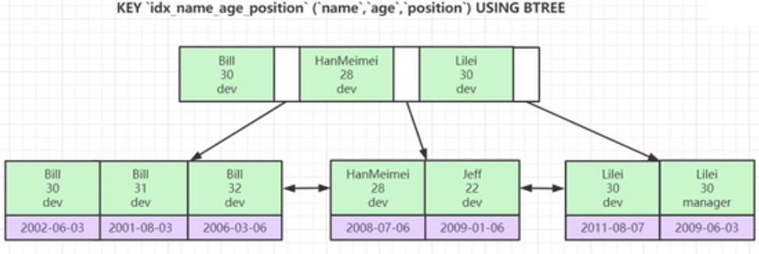
  - 在MySQL建立联合索引时会遵守最左前缀匹配原则，即最左优先，在检索数据时从联合索引的最左边开始匹配， **不能跳过** 。
  - 上图中，必须根据name字段比较后，再比较age字段。

- 原因：
  - 排序时就是 **按照字段的顺序** 构建B+树的。
  - 上图例子中，只有name相同时，才会按照age进行排序
  - 没办法直接根据第二个字段直接去查索引B+树。

### 5.9.4. 总结

待补充

类型转换等计算 + 查索引查的是一个范围 

会导致索引失效。

## 5.10. 面试题实践

> **索引优化面试题**

**创建表**

- 建表 SQL

```sql
create table test03(
    id int primary key not null auto_increment,
    c1 char(10),
    c2 char(10),
    c3 char(10),
    c4 char(10),
    c5 char(10)
);

insert into test03(c1,c2,c3,c4,c5) values ('a1','a2','a3','a4','a5');
insert into test03(c1,c2,c3,c4,c5) values ('b1','b2','b3','b4','b5');
insert into test03(c1,c2,c3,c4,c5) values ('c1','c2','c3','c4','c5');
insert into test03(c1,c2,c3,c4,c5) values ('d1','d2','d3','d4','d5');
insert into test03(c1,c2,c3,c4,c5) values ('e1','e2','e3','e4','e5');

create index idx_test03_c1234 on test03(c1,c2,c3,c4);
```

- test03 表中的测试数据

```
mysql> select * from test03;
+----+------+------+------+------+------+
| id | c1   | c2   | c3   | c4   | c5   |
+----+------+------+------+------+------+
|  1 | a1   | a2   | a3   | a4   | a5   |
|  2 | b1   | b2   | b3   | b4   | b5   |
|  3 | c1   | c2   | c3   | c4   | c5   |
|  4 | d1   | d2   | d3   | d4   | d5   |
|  5 | e1   | e2   | e3   | e4   | e5   |
+----+------+------+------+------+------+
5 rows in set (0.00 sec)
```

- test03 表中的索引

```
mysql> SHOW INDEX FROM test03;
+--------+------------+------------------+--------------+-------------+-----------+-------------+----------+--------+------+------------+---------+---------------+
| Table  | Non_unique | Key_name         | Seq_in_index | Column_name | Collation | Cardinality | Sub_part | Packed | Null | Index_type | Comment | Index_comment |
+--------+------------+------------------+--------------+-------------+-----------+-------------+----------+--------+------+------------+---------+---------------+
| test03 |          0 | PRIMARY          |            1 | id          | A         |           5 |     NULL | NULL   |      | BTREE      |         |               |
| test03 |          1 | idx_test03_c1234 |            1 | c1          | A         |           5 |     NULL | NULL   | YES  | BTREE      |         |               |
| test03 |          1 | idx_test03_c1234 |            2 | c2          | A         |           5 |     NULL | NULL   | YES  | BTREE      |         |               |
| test03 |          1 | idx_test03_c1234 |            3 | c3          | A         |           5 |     NULL | NULL   | YES  | BTREE      |         |               |
| test03 |          1 | idx_test03_c1234 |            4 | c4          | A         |           5 |     NULL | NULL   | YES  | BTREE      |         |               |
+--------+------------+------------------+--------------+-------------+-----------+-------------+----------+--------+------+------------+---------+---------------+
5 rows in set (0.00 sec)
```

> **问题：我们创建了复合索引idx_test03_c1234，根据以下SQL分析下索引使用情况？**

- `EXPLAIN SELECT * FROM test03 WHERE c1='a1' AND c2='a2' AND c3='a3' AND c4='a4';`
- 即全值匹配

```
mysql> EXPLAIN SELECT * FROM test03 WHERE c1='a1' AND c2='a2' AND c3='a3' AND c4='a4';
+----+-------------+--------+------+------------------+------------------+---------+-------------------------+------+-----------------------+
| id | select_type | table  | type | possible_keys    | key              | key_len | ref                     | rows | Extra                 |
+----+-------------+--------+------+------------------+------------------+---------+-------------------------+------+-----------------------+
|  1 | SIMPLE      | test03 | ref  | idx_test03_c1234 | idx_test03_c1234 | 124     | const,const,const,const |    1 | Using index condition |
+----+-------------+--------+------+------------------+------------------+---------+-------------------------+------+-----------------------+
1 row in set (0.00 sec)
```

- `EXPLAIN SELECT * FROM test03 WHERE c4='a4' AND c3='a3' AND c2='a2' AND c1='a1';`
- mysql 优化器进行了优化，所以我们的索引都生效了

```
mysql> EXPLAIN SELECT * FROM test03 WHERE c4='a4' AND c3='a3' AND c2='a2' AND c1='a1';
+----+-------------+--------+------+------------------+------------------+---------+-------------------------+------+-----------------------+
| id | select_type | table  | type | possible_keys    | key              | key_len | ref                     | rows | Extra                 |
+----+-------------+--------+------+------------------+------------------+---------+-------------------------+------+-----------------------+
|  1 | SIMPLE      | test03 | ref  | idx_test03_c1234 | idx_test03_c1234 | 124     | const,const,const,const |    1 | Using index condition |
+----+-------------+--------+------+------------------+------------------+---------+-------------------------+------+-----------------------+
1 row in set (0.00 sec)
```

- `EXPLAIN SELECT * FROM test03 WHERE c1='a1' AND c2='a2' AND c3>'a3' AND c4='a4';`
- c3 列使用了索引进行排序，并没有进行查找，导致 c4 无法用索引进行查找

```
mysql> EXPLAIN SELECT * FROM test03 WHERE c1='a1' AND c2='a2' AND c3>'a3' AND c4='a4'; 
+----+-------------+--------+-------+------------------+------------------+---------+------+------+-----------------------+
| id | select_type | table  | type  | possible_keys    | key              | key_len | ref  | rows | Extra                 |
+----+-------------+--------+-------+------------------+------------------+---------+------+------+-----------------------+
|  1 | SIMPLE      | test03 | range | idx_test03_c1234 | idx_test03_c1234 | 93      | NULL |    1 | Using index condition |
+----+-------------+--------+-------+------------------+------------------+---------+------+------+-----------------------+
1 row in set (0.00 sec)
```

- `EXPLAIN SELECT * FROM test03 WHERE c1='a1' AND c2='a2' AND c4>'a4' AND c3='a3';`
- mysql 优化器进行了优化，所以我们的索引都生效了，在 c4 时进行了范围搜索

```
mysql> EXPLAIN SELECT * FROM test03 WHERE c1='a1' AND c2='a2' AND c4>'a4' AND c3='a3'; 
+----+-------------+--------+-------+------------------+------------------+---------+------+------+-----------------------+
| id | select_type | table  | type  | possible_keys    | key              | key_len | ref  | rows | Extra                 |
+----+-------------+--------+-------+------------------+------------------+---------+------+------+-----------------------+
|  1 | SIMPLE      | test03 | range | idx_test03_c1234 | idx_test03_c1234 | 124     | NULL |    1 | Using index condition |
+----+-------------+--------+-------+------------------+------------------+---------+------+------+-----------------------+
1 row in set (0.00 sec)
```

- `EXPLAIN SELECT * FROM test03 WHERE c1='a1' AND c2='a2' AND c4='a4' ORDER BY c3;`
- c3 列将索引用于排序，而不是查找，c4 列没有用到索引

```
mysql> EXPLAIN SELECT * FROM test03 WHERE c1='a1' AND c2='a2' AND c4='a4' ORDER BY c3; 
+----+-------------+--------+------+------------------+------------------+---------+-------------+------+------------------------------------+
| id | select_type | table  | type | possible_keys    | key              | key_len | ref         | rows | Extra                              |
+----+-------------+--------+------+------------------+------------------+---------+-------------+------+------------------------------------+
|  1 | SIMPLE      | test03 | ref  | idx_test03_c1234 | idx_test03_c1234 | 62      | const,const |    1 | Using index condition; Using where |
+----+-------------+--------+------+------------------+------------------+---------+-------------+------+------------------------------------+
1 row in set (0.00 sec)
```

- `EXPLAIN SELECT * FROM test03 WHERE c1='a1' AND c2='a2' ORDER BY c3;`
- 那不就和上面一样的嘛~~~，c4 列都没有用到索引

```
mysql> EXPLAIN SELECT * FROM test03 WHERE c1='a1' AND c2='a2' ORDER BY c3; 
+----+-------------+--------+------+------------------+------------------+---------+-------------+------+------------------------------------+
| id | select_type | table  | type | possible_keys    | key              | key_len | ref         | rows | Extra                              |
+----+-------------+--------+------+------------------+------------------+---------+-------------+------+------------------------------------+
|  1 | SIMPLE      | test03 | ref  | idx_test03_c1234 | idx_test03_c1234 | 62      | const,const |    1 | Using index condition; Using where |
+----+-------------+--------+------+------------------+------------------+---------+-------------+------+------------------------------------+
1 row in set (0.00 sec)
```

- `EXPLAIN SELECT * FROM test03 WHERE c1='a1' AND c2='a2' ORDER BY c4;`
- 妈耶，因为索引建立的顺序和使用的顺序不一致，导致 mysql 动用了文件排序
- 看到 Using filesort 就要知道：此句 SQL 必须优化

```
mysql> EXPLAIN SELECT * FROM test03 WHERE c1='a1' AND c2='a2' ORDER BY c4; 
+----+-------------+--------+------+------------------+------------------+---------+-------------+------+----------------------------------------------------+
| id | select_type | table  | type | possible_keys    | key              | key_len | ref         | rows | Extra                                              |
+----+-------------+--------+------+------------------+------------------+---------+-------------+------+----------------------------------------------------+
|  1 | SIMPLE      | test03 | ref  | idx_test03_c1234 | idx_test03_c1234 | 62      | const,const |    1 | Using index condition; Using where; Using filesort |
+----+-------------+--------+------+------------------+------------------+---------+-------------+------+----------------------------------------------------+
1 row in set (0.00 sec)
```

- `EXPLAIN SELECT * FROM test03 WHERE c1='a1' AND c5='a5' ORDER BY c2, c3;`
- 只用 c1 一个字段索引，但是c2、c3用于排序，无filesort
- 难道因为排序的时候，c2 紧跟在 c1 之后，所以就不用 filesort 吗？

```
mysql> EXPLAIN SELECT * FROM test03 WHERE c1='a1' AND c5='a5' ORDER BY c2, c3; 
+----+-------------+--------+------+------------------+------------------+---------+-------+------+------------------------------------+
| id | select_type | table  | type | possible_keys    | key              | key_len | ref   | rows | Extra                              |
+----+-------------+--------+------+------------------+------------------+---------+-------+------+------------------------------------+
|  1 | SIMPLE      | test03 | ref  | idx_test03_c1234 | idx_test03_c1234 | 31      | const |    1 | Using index condition; Using where |
+----+-------------+--------+------+------------------+------------------+---------+-------+------+------------------------------------+
1 row in set (0.00 sec)
```

- `EXPLAIN SELECT * FROM test03 WHERE c1='a1' AND c5='a5' ORDER BY c3, c2;`
- 出现了filesort，我们建的索引是1234，它没有按照顺序来，32颠倒了

```
mysql> EXPLAIN SELECT * FROM test03 WHERE c1='a1' AND c5='a5' ORDER BY c3, c2; 
+----+-------------+--------+------+------------------+------------------+---------+-------+------+----------------------------------------------------+
| id | select_type | table  | type | possible_keys    | key              | key_len | ref   | rows | Extra                                              |
+----+-------------+--------+------+------------------+------------------+---------+-------+------+----------------------------------------------------+
|  1 | SIMPLE      | test03 | ref  | idx_test03_c1234 | idx_test03_c1234 | 31      | const |    1 | Using index condition; Using where; Using filesort |
+----+-------------+--------+------+------------------+------------------+---------+-------+------+----------------------------------------------------+
1 row in set (0.00 sec)
```

- `EXPLAIN SELECT * FROM test03 WHERE c1='a1' AND c2='a2' ORDER BY c2, c3;`
- 用c1、c2两个字段索引，但是c2、c3用于排序，无filesort

```
mysql> EXPLAIN SELECT * FROM test03 WHERE c1='a1' AND c2='a2' ORDER BY c2, c3; 
+----+-------------+--------+------+------------------+------------------+---------+-------------+------+------------------------------------+
| id | select_type | table  | type | possible_keys    | key              | key_len | ref         | rows | Extra                              |
+----+-------------+--------+------+------------------+------------------+---------+-------------+------+------------------------------------+
|  1 | SIMPLE      | test03 | ref  | idx_test03_c1234 | idx_test03_c1234 | 62      | const,const |    1 | Using index condition; Using where |
+----+-------------+--------+------+------------------+------------------+---------+-------------+------+------------------------------------+
1 row in set (0.00 sec)
```

- `EXPLAIN SELECT * FROM test03 WHERE c1='a1' AND c2='a2' AND c5='a5' ORDER BY c2, c3;`
- 和 c5 这个坑爹货没啥关系

```
mysql> EXPLAIN SELECT * FROM test03 WHERE c1='a1' AND c2='a2' AND c5='a5' ORDER BY c2, c3; 
+----+-------------+--------+------+------------------+------------------+---------+-------------+------+------------------------------------+
| id | select_type | table  | type | possible_keys    | key              | key_len | ref         | rows | Extra                              |
+----+-------------+--------+------+------------------+------------------+---------+-------------+------+------------------------------------+
|  1 | SIMPLE      | test03 | ref  | idx_test03_c1234 | idx_test03_c1234 | 62      | const,const |    1 | Using index condition; Using where |
+----+-------------+--------+------+------------------+------------------+---------+-------------+------+------------------------------------+
1 row in set (0.00 sec)
```

- `EXPLAIN SELECT * FROM test03 WHERE c1='a1' AND c2='a2' AND c5='a5' ORDER BY c3, c2;`
- 注意查询条件 c2=‘a2’ ，我都把 c2 查出来了（c2 为常量），我还给它排序作甚，所以没有产生 filesort

```
mysql> EXPLAIN SELECT * FROM test03 WHERE c1='a1' AND c2='a2' AND c5='a5' ORDER BY c3, c2; 
+----+-------------+--------+------+------------------+------------------+---------+-------------+------+------------------------------------+
| id | select_type | table  | type | possible_keys    | key              | key_len | ref         | rows | Extra                              |
+----+-------------+--------+------+------------------+------------------+---------+-------------+------+------------------------------------+
|  1 | SIMPLE      | test03 | ref  | idx_test03_c1234 | idx_test03_c1234 | 62      | const,const |    1 | Using index condition; Using where |
+----+-------------+--------+------+------------------+------------------+---------+-------------+------+------------------------------------+
1 row in set (0.00 sec)
```

- `EXPLAIN SELECT * FROM test03 WHERE c1='a1' AND c4='a4' GROUP BY c2, c3;`
- 顺序为 1 2 3 ，没有产生文件排序

```
mysql> EXPLAIN SELECT * FROM test03 WHERE c1='a1' AND c4='a4' GROUP BY c2, c3; 
+----+-------------+--------+------+------------------+------------------+---------+-------+------+------------------------------------+
| id | select_type | table  | type | possible_keys    | key              | key_len | ref   | rows | Extra                              |
+----+-------------+--------+------+------------------+------------------+---------+-------+------+------------------------------------+
|  1 | SIMPLE      | test03 | ref  | idx_test03_c1234 | idx_test03_c1234 | 31      | const |    1 | Using index condition; Using where |
+----+-------------+--------+------+------------------+------------------+---------+-------+------+------------------------------------+
1 row in set (0.00 sec)
```

- `EXPLAIN SELECT * FROM test03 WHERE c1='a1' AND c4='a4' GROUP BY c3, c2;`
- group by 表面上叫分组，分组之前必排序，group by 和 order by 在索引上的问题基本是一样的
- Using temporary; Using filesort 两个都有，我只能说是灭绝师太

```
mysql> EXPLAIN SELECT * FROM test03 WHERE c1='a1' AND c4='a4' GROUP BY c3, c2; 
+----+-------------+--------+------+------------------+------------------+---------+-------+------+---------------------------------------------------------------------+
| id | select_type | table  | type | possible_keys    | key              | key_len | ref   | rows | Extra                                                               |
+----+-------------+--------+------+------------------+------------------+---------+-------+------+---------------------------------------------------------------------+
|  1 | SIMPLE      | test03 | ref  | idx_test03_c1234 | idx_test03_c1234 | 31      | const |    1 | Using index condition; Using where; Using temporary; Using filesort |
+----+-------------+--------+------+------------------+------------------+---------+-------+------+---------------------------------------------------------------------+
1 row in set (0.01 sec)
```

- 结论：
  - group by 基本上都需要进行排序，但凡使用不当，会有临时表产生
  - 定值为常量、范围之后失效，最终看排序的顺序


# 6. 查询截取优化

## 6.1. 一般优化流程

- 慢查询的开启并捕获
  - 观察，至少跑1天，看看生产的慢SQL情况。
  - 开启慢查询日志，设置阙值，比如超过5秒钟的就是慢SQL,并将它抓取出来。
- explain+慢SQL分析
- show profile查询SQL在Mysq1服务器里面的执行细节和生命周期情况
- SQL数据库服务器的参数调优。
  - 运维经理orDBA,进行SQL数据库服务器的参数调优。

## 6.2. 查询优化

### 6.2.1. MySQL 优化原则:小表驱动大表

#### 6.2.1.1. 原因

- 为什么要小表驱动大表。
  - user表10000条数据，class表20条数据
  - `select * from user u left join class c u.userid=c.userid`
  - 这样则需要用user表循环10000次才能查询出来，而如果用class表驱动user表则只需要循环20次就能查询出来。
  - 由于MySQL使用BTREE结构，内部查询成本（3层查找or4层查找）和外部循环成本不成比例。
  - 因此建议内表走索引，也叫INLJ，但是如果内表是二级索引，效率也低，因为要回表查主键。
  - 如果都是全表扫描（NJL），则相差不多，成本也很高，笛卡尔积。

#### 6.2.1.2. exist和in

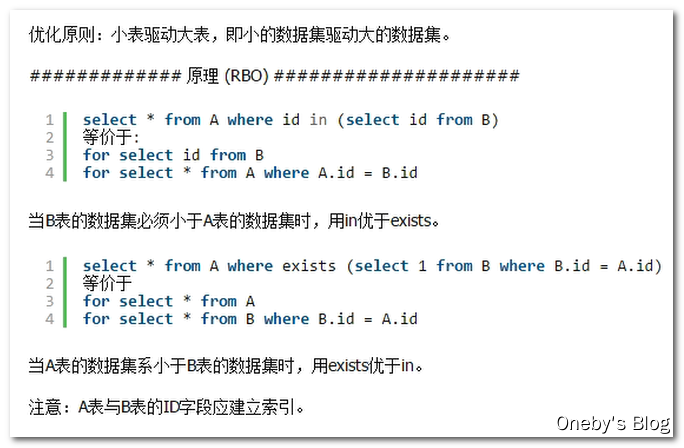

- 基本使用：exist和in使用方式：看上面Mysql基础

- exist说明
  - EXISTS 语法：`SELECT ... FROM table WHERE EXISTS(subquery)`
    > 该语法可以理解为：将查询的数据，放到子查询中做条件验证，根据验证结果（TRUE或FALSE）来决定主查询的数据结果是否得以保留。
  - 说明
    - EXISTS(subquery) 只返回TRUE或FALSE，因此子查询中的SELECT *也可以是SELECT 1或其他，官方说法是实际执行时会忽略SELECT清单，因此没有区别
    - EXISTS子查询的实际执行过程可能经过了优化而不是我们理解上的逐条对比，如果担忧效率问题，可进行实际检验以确定是否有效率问题。
    - EXISTS子查询往往也可以用条件表达式、其他子查询或者JOIN来替代，何种最优需要具体问题具体分析
  - 示例
    ```sql
    select * from tbl_emp e where exists (select 1 from tbl_dept d where e.deptId = d.id);
    ```
- in说明
  - IN 语法： `select .... from table where field in ...`
  - 示例
    ```sql
    select * from tbl_emp e where e.deptId in (select id from tbl_dept);
    ```

- 结论：
  - 永远记住小表驱动大表
  - 当 右 表数据集小于 左 表数据集时，使用 in
    > 也就是使用in时，右表为驱动表
  - 当 左 表数据集小于 右 表数据集时，使用 exist
    > 也就是使用exist是，左表为驱动表

### 6.2.2. ORDER BY 优化

#### 6.2.2.1. order by排序方式

- Order by支持二种方式的排序
  - **FileSort**:FileSort方式效率较低。
    - 有以下两种算法
      - 双路排序
        - MySQL4.1之前是使用双路排序，字面意思是两次扫描磁盘，最终得到数据。读取行指针和将要进行orderby操作的列，对他们进行排序，然后扫描已经排序好的列表，按照列表中的值重新从列表中读取对应的数据传输
        - 从磁盘取排序字段，在buffer进行排序，再从磁盘取其他字段。
      - 单路排序
        - 取一批数据，要对磁盘进行两次扫描，众所周知，I/O是很耗时的，所以在mysql4.1之后，出现了改进的算法，就是单路排序。
        - 从磁盘读取查询需要的所有列，按照将要进行orderby的列，在sort buffer对它们进行排序，然后扫描排序后的列表进行输出，它的效率更快一些，避免了第二次读取数据，并且把随机IO变成顺序IO，但是它会使用更多的空间，因为它把每一行都保存在内存中了。
    - 两个算法对比：
      - 由于单路是改进的算法，总体而言好过双路
      - 在sort_buffer中，方法B比方法A要多占用很多空间，因为方法B是把所有字段都取出，所以有可能取出的数据的总大小超出了sort_buffer的容量，导致每次只能取sort_buffer容量大小的数据，进行排序（创建tmp文件，多路合并），排完再取取sort_buffer容量大小，再排…… 从而会导致多次I/O。
      - 结论：本来想省一次I/O操作，反而导致了大量的/O操作，反而得不偿失。
    - file sort优化策略：
      - 增大sort_buffer_size参数的设置
      - 增大max_length_for_sort_data参数的设置
  - **Index**:效率高，它指MySQL扫描索引本身完成排序。 **使用条件如下**：
    - ORDER BY语句使用索引最左前列
    - 使用where子句与OrderBy子句条件列组合满足索引最左前列

> 建议：尽可能在索引列上完成排序操作，遵照索引建的最佳左前缀

#### 6.2.2.2. 测试数据准备

- 建表数据索引
  <details>
  <summary style="color:red;">sql</summary>

  ```sql
  create table tblA(
      #id int primary key not null auto_increment,
      age int,
      birth timestamp not null
  );

  insert into tblA(age, birth) values(22, now());
  insert into tblA(age, birth) values(23, now());
  insert into tblA(age, birth) values(24, now());

  create index idx_A_ageBirth on tblA(age, birth);
  ```
  </details>
- 数据展示：
  ```
  mysql> select * from tblA;
  +------+---------------------+
  | age  | birth               |
  +------+---------------------+
  |   22 | 2020-08-05 10:36:32 |
  |   23 | 2020-08-05 10:36:32 |
  |   24 | 2020-08-05 10:36:32 |
  +------+---------------------+
  3 rows in set (0.00 sec)
  ```
  ```
  mysql> SHOW INDEX FROM tblA;
  +-------+------------+----------------+--------------+-------------+-----------+-------------+----------+--------+------+------------+---------+---------------+
  | Table | Non_unique | Key_name       | Seq_in_index | Column_name | Collation | Cardinality | Sub_part | Packed | Null | Index_type | Comment | Index_comment |
  +-------+------------+----------------+--------------+-------------+-----------+-------------+----------+--------+------+------------+---------+---------------+
  | tblA  |          1 | idx_A_ageBirth |            1 | age         | A         |           3 |     NULL | NULL   | YES  | BTREE      |         |               |
  | tblA  |          1 | idx_A_ageBirth |            2 | birth       | A         |           3 |     NULL | NULL   |      | BTREE      |         |               |
  +-------+------------+----------------+--------------+-------------+-----------+-------------+----------+--------+------+------------+---------+---------------+
  2 rows in set (0.00 sec)
  ```

#### 6.2.2.3. order by中使用索引示例

**以下情况索引不会失效**

- 只使用第一个索引
  <details>
  <summary style="color:red;">示例</summary>

  ```
  mysql> EXPLAIN SELECT * FROM tblA where age>20 order by age;
  +----+-------------+-------+-------+----------------+----------------+---------+------+------+--------------------------+
  | id | select_type | table | type  | possible_keys  | key            | key_len | ref  | rows | Extra                    |
  +----+-------------+-------+-------+----------------+----------------+---------+------+------+--------------------------+
  |  1 | SIMPLE      | tblA  | index | idx_A_ageBirth | idx_A_ageBirth | 9       | NULL |    3 | Using where; Using index |
  +----+-------------+-------+-------+----------------+----------------+---------+------+------+--------------------------+
  1 row in set (0.01 sec)

  mysql> EXPLAIN SELECT * FROM tblA where birth>'2016-01-28 00:00:00' order by age;
  +----+-------------+-------+-------+---------------+----------------+---------+------+------+--------------------------+
  | id | select_type | table | type  | possible_keys | key            | key_len | ref  | rows | Extra                    |
  +----+-------------+-------+-------+---------------+----------------+---------+------+------+--------------------------+
  |  1 | SIMPLE      | tblA  | index | NULL          | idx_A_ageBirth | 9       | NULL |    3 | Using where; Using index |
  +----+-------------+-------+-------+---------------+----------------+---------+------+------+--------------------------+
  1 row in set (0.00 sec)
  ```
  </details>

- 使用两个索引，全升序或者全降序
  <details>
  <summary style="color:red;">示例</summary>

  ```
  mysql> EXPLAIN SELECT * FROM tblA ORDER BY age ASC, birth ASC;
  +----+-------------+-------+-------+---------------+----------------+---------+------+------+-------------+
  | id | select_type | table | type  | possible_keys | key            | key_len | ref  | rows | Extra       |
  +----+-------------+-------+-------+---------------+----------------+---------+------+------+-------------+
  |  1 | SIMPLE      | tblA  | index | NULL          | idx_A_ageBirth | 9       | NULL |    3 | Using index |
  +----+-------------+-------+-------+---------------+----------------+---------+------+------+-------------+
  1 row in set (0.00 sec)

  mysql> EXPLAIN SELECT * FROM tblA ORDER BY age DESC, birth DESC;
  +----+-------------+-------+-------+---------------+----------------+---------+------+------+-------------+
  | id | select_type | table | type  | possible_keys | key            | key_len | ref  | rows | Extra       |
  +----+-------------+-------+-------+---------------+----------------+---------+------+------+-------------+
  |  1 | SIMPLE      | tblA  | index | NULL          | idx_A_ageBirth | 9       | NULL |    3 | Using index |
  +----+-------------+-------+-------+---------------+----------------+---------+------+------+-------------+
  1 row in set (0.01 sec)
  ```
  </details>

- 最左前缀定义为 **常量**，order by能使用索引
  ```sql
  select age,birth from tblA where age=20 order by birth;
  ```

#### 6.2.2.4. order by索引失效示例

- 跳过第一个索引，使用第二个索引进行排序。或者索引顺序不对。
  <details>
  <summary style="color:red;">sql</summary>

  ```
  mysql> EXPLAIN SELECT * FROM tblA where age>20 order by birth;
  +----+-------------+-------+-------+----------------+----------------+---------+------+------+------------------------------------------+
  | id | select_type | table | type  | possible_keys  | key            | key_len | ref  | rows | Extra                                    |
  +----+-------------+-------+-------+----------------+----------------+---------+------+------+------------------------------------------+
  |  1 | SIMPLE      | tblA  | index | idx_A_ageBirth | idx_A_ageBirth | 9       | NULL |    3 | Using where; Using index; Using filesort |
  +----+-------------+-------+-------+----------------+----------------+---------+------+------+------------------------------------------+
  1 row in set (0.01 sec)

  mysql> EXPLAIN SELECT * FROM tblA where age>20 order by birth,age;
  +----+-------------+-------+-------+----------------+----------------+---------+------+------+------------------------------------------+
  | id | select_type | table | type  | possible_keys  | key            | key_len | ref  | rows | Extra                                    |
  +----+-------------+-------+-------+----------------+----------------+---------+------+------+------------------------------------------+
  |  1 | SIMPLE      | tblA  | index | idx_A_ageBirth | idx_A_ageBirth | 9       | NULL |    3 | Using where; Using index; Using filesort |
  +----+-------------+-------+-------+----------------+----------------+---------+------+------+------------------------------------------+
  1 row in set (0.00 sec)
  ```
  </details>
- 两个索引一升一降
  <details>
  <summary style="color:red;">sql</summary>

  ```
  mysql> EXPLAIN SELECT * FROM tblA ORDER BY age ASC, birth DESC;
  +----+-------------+-------+-------+---------------+----------------+---------+------+------+-----------------------------+
  | id | select_type | table | type  | possible_keys | key            | key_len | ref  | rows | Extra                       |
  +----+-------------+-------+-------+---------------+----------------+---------+------+------+-----------------------------+
  |  1 | SIMPLE      | tblA  | index | NULL          | idx_A_ageBirth | 9       | NULL |    3 | Using index; Using filesort |
  +----+-------------+-------+-------+---------------+----------------+---------+------+------+-----------------------------+
  1 row in set (0.00 sec)
  ```
  </details>

#### 6.2.2.5. order by使用建议

- Order by时`select *`是一个大忌，只Query需要的字段，这点非常重要。在这里的影响是：
  - 当 **Query的字段大小总和小于max_length_for_sort_data** ，而且排序字段不是TEXT|BLOB类型时，会用改进后的算法——单路排序，否则用老算法——多路排序。
  - 两种算法的数据都有可能超出sort_buffer的容量，超出之后，会 **创建tmp文件进行合并排序，导致多次I/O** ，但是用单路排序算法的风险会更大一些，所以要提高sort_buffer_size。
- 尝试提高 sort_buffer_size不管用哪种算法，提高这个参数都会提高效率，当然，要根据系统的能力去提高，因为这个参数是针对每个进程的
- 尝试提高max_length_for_sort_data提高这个参数，会增加用改进算法的概率。但是如果设的太高，数据总容量超出sort_buffer_size的概率就增大，明显症状是高的磁盘I/O活动和低的处理器使用率。

#### 6.2.2.6. 索引排序总结

**键：KEY a_b_c(a, b, c)**

- order by能使用索引最左前缀
  - ORDER BY a
  - ORDER BY ab
  - ORDER BY a bc
  - ORDER BY a DESC b DESC, c DEsc
- 如果 WHERE使用索引的最左前缀定义为常量,则 order by能使用索引
  - WHERE a = const ORDER BY b,c
  - WHERE a = const AND b = const ORDER BY c
  - WHERE a = const ORDER BY b,c
  - WHERE a = const ANd b> const ORDER BY b, c
- 不能使用索引进行排序
  - ORDER BY a ASC, b DESC, C DESC  //排序不一数
  - WHERE g = const ORDER BY b,c  //丢失a索引
  - WHERE a = const ORDER BY c  //丢失b素引
  - WHERE a = const ORDER BY a,d  //d不是索引的一部分
  - WHERE a in (...) ORDER BY b,c //对于排序来说.多个相等条件也是范围查询M

### 6.2.3. GROUP BY 优化

- group by实质是 **先排序后进行分组**，遵照索引的最佳左前缀
- 当无法使用索引列，增大max_length_for_sort_data参数的设置+增大sort_buffer_size参数的设置
- where高于having， **能写在where限定的条件就不要去having限定了**
- 其余的规则均和 order by 一致

## 6.3. 慢查询日志

### 6.3.1. 慢查询日志介绍

- MySQL的慢查询日志是MySQL提供的一种日志记录，它 **用来记录在MySQL中响应时间超过阀值的语句** ，具体指运行时间超过long_query_time值的SQL，则会被记录到慢查询日志中。
- long_query_time的默认值为10，意思是运行10秒以上的SQL语句会被记录下来
- 由他来查看哪些SQL超出了我们的最大忍耐时间值，比如一条sql执行超过5秒钟，我们就算慢SQL，希望能收集超过5秒的sql，结合之前explain进行全面分析。

### 6.3.2. 慢查询日志开启

- 说明
  - 默认情况下，MySQL数据库没有开启慢查询日志，需要我们手动来设置这个参数。
  - 当然，如果不是调优需要的话，一般不建议启动该参数，因为开启慢查询日志会或多或少带来一定的性能影响。慢查询日志支持将日志记录写入文件

---

- 查看慢查询日志是否开启：
  - 默认情况下slow_query_log的值为OFF，表示慢查询日志是禁用的
  - 可以通过设置slow_query_log的值来开启
  - 通过`SHOW VARIABLES LIKE '%slow_query_log%'`;查看 mysql 的慢查询日志是否开启
    ```
    mysql> SHOW VARIABLES LIKE '%slow_query_log%';
    +---------------------+-------------------------------+
    | Variable_name       | Value                         |
    +---------------------+-------------------------------+
    | slow_query_log      | OFF                           |
    | slow_query_log_file | /var/lib/mysql/Heygo-slow.log |
    +---------------------+-------------------------------+
    2 rows in set (0.00 sec)
    ```

---

- 开启慢查询日志
  - 命令行开启
    - 命令：`set global slow_query_log = 1;`
    - 注意： **只对当前数据库生效，如果MySQL重启后则会失效**。
      <details>
      <summary style="color:red;">演示</summary>

      ```
      mysql> set global slow_query_log = 1;
      Query OK, 0 rows affected (0.07 sec)

      mysql> SHOW VARIABLES LIKE '%slow_query_log%';
      +---------------------+-------------------------------+
      | Variable_name       | Value                         |
      +---------------------+-------------------------------+
      | slow_query_log      | ON                            |
      | slow_query_log_file | /var/lib/mysql/Heygo-slow.log |
      +---------------------+-------------------------------+
      2 rows in set (0.00 sec)
      ```
      </details>
  - 如果要永久生效，就必须修改配置文件my.cnf（其它系统变量也是如此）
    - 修改my.cnf文件，[mysqld]下增加或修改参数：`slow_query_log`和`slow_query_log_file`后，然后重启MySQL服务器。
      ```
      [mysqld]
      slow_query_log =1
      slow_query_log_file=/var/lib/mysql/Heygo-slow.log
      ```
    - 关于慢查询的参数slow_query_log_file，它指定慢查询日志文件的存放路径，系统默认会给一个缺省的文件host_name-slow.log（如果没有指定参数slow_query_log_file的话）

---

- 设置慢查询阀值
  - 查看阀值：`SHOW VARIABLES LIKE 'long_query_time%';`
    <details>
    <summary style="color:red;">演示</summary>

    ```
    mysql> SHOW VARIABLES LIKE 'long_query_time%';
    +-----------------+-----------+
    | Variable_name   | Value     |
    +-----------------+-----------+
    | long_query_time | 10.000000 |
    +-----------------+-----------+
    1 row in set (0.01 sec)
    ```
    </details>
  - 命令行修改阀值：
    - 输入命令：`set global variable long_query_time = 3`
    - 注意：要进行 **重新连接**
  - 通过配置文件修改阀值
    ```
    long_query_time=10
    ```

### 6.3.3. 慢查询日志示例

- 查看慢查询日志
  - 查看日志文件(看自己设定的日志目录)
    ```
    [root@Heygo mysql]# cat Heygo-slow.log 
    /usr/sbin/mysqld, Version: 5.6.49 (MySQL Community Server (GPL)). started with:
    Tcp port: 3306  Unix socket: /var/lib/mysql/mysql.sock
    Time                 Id Command    Argument
    # Time: 200805 12:58:01
    # User@Host: root[root] @ localhost []  Id:    11
    # Query_time: 4.000424  Lock_time: 0.000000 Rows_sent: 1  Rows_examined: 0
    SET timestamp=1596603481;
    select sleep(4);
    ```
  - 使用命令行查询慢查询数量：`show global status like '%Slow_queries%';`
    ```
    mysql> show global status like '%Slow_queries%';
    +---------------+-------+
    | Variable_name | Value |
    +---------------+-------+
    | Slow_queries  | 1     |
    +---------------+-------+
    1 row in set (0.00 sec)
    ``` 

### 6.3.4. 日志分析工具：mysqldumpslow

- 帮助信息
  <details>
  <summary style="color:red;">帮助信息</summary>

  ```
  [root@Heygo mysql]# mysqldumpslow --help
  Usage: mysqldumpslow [ OPTS... ] [ LOGS... ]

  Parse and summarize the MySQL slow query log. Options are

    --verbose    verbose
    --debug      debug
    --help       write this text to standard output

    -v           verbose
    -d           debug
    -s ORDER     what to sort by (al, at, ar, c, l, r, t), 'at' is default
                  al: average lock time
                  ar: average rows sent
                  at: average query time
                  c: count
                  l: lock time
                  r: rows sent
                  t: query time  
    -r           reverse the sort order (largest last instead of first)
    -t NUM       just show the top n queries
    -a           don't abstract all numbers to N and strings to 'S'
    -n NUM       abstract numbers with at least n digits within names
    -g PATTERN   grep: only consider stmts that include this string
    -h HOSTNAME  hostname of db server for *-slow.log filename (can be wildcard),
                default is '*', i.e. match all
    -i NAME      name of server instance (if using mysql.server startup script)
    -l           don't subtract lock time from total time
  ```
  </details>

- 参数解释：
  - s：是表示按何种方式排序
  - c：访问次数
  - l：锁定时间
  - r：返回记录
  - t：查询时间
  - al：平均锁定时间
  - ar：平均返回记录数
  - at：平均查询时间
  - t：即为返回前面多少条的数据
  - g：后边搭配一个正则匹配模式，大小写不敏感的

- 常用参数组合
  - 得到返回记录集最多的10个SQL
    ```
    mysqldumpslow -s r -t 10 /var/lib/mysql/Heygo-slow.log
    ```
  - 得到访问次数最多的10个SQL
    ```
    mysqldumpslow -s c- t 10/var/lib/mysql/Heygo-slow.log
    ```
  - 得到按照时间排序的前10条里面含有左连接的查询语句
    ```
    mysqldumpslow -s t -t 10 -g "left join" /var/lib/mysql/Heygo-slow.log
    ```
  - 另外建议在使用这些命令时结合 | 和more使用，否则有可能出现爆屏情况
    ```
    mysqldumpslow -s r -t 10 /var/lib/mysql/Heygo-slow.log | more
    ```

## 6.4. Show Profile

- 说明
  - 是mysql提供可以用来分析当前会话中语句执行的资源消耗情况。可以用于SQL的调优测量
  - 官网：http://dev.mysql.com/doc/refman/5.5/en/show-profile.html
  - 默认情况下，参数处于关闭状态，并保存最近15次的运行结果

- 查看开启状态`show variables like 'profiling%'`
  ```
  mysql> show variables like 'profiling%';
  +------------------------+-------+
  | Variable_name          | Value |
  +------------------------+-------+
  | profiling              | OFF   |
  | profiling_history_size | 15    |
  +------------------------+-------+
  2 rows in set (0.01 sec)
  ```
- 开启：`set profiling=on;`
  ```
  mysql> set profiling=on; 
  Query OK, 0 rows affected, 1 warning (0.00 sec)

  mysql> show variables like 'profiling%';
  +------------------------+-------+
  | Variable_name          | Value |
  +------------------------+-------+
  | profiling              | ON    |
  | profiling_history_size | 15    |
  +------------------------+-------+
  2 rows in set (0.00 sec)
  ```

- 通过`show profiles`查看前面select的结果
  - 示例
    <details>
    <summary style="color:red;">示例</summary>

    ```
    mysql> show profiles;
    +----------+------------+----------------------------------------------------------------------+
    | Query_ID | Duration   | Query                                                                |
    +----------+------------+----------------------------------------------------------------------+
    |        1 | 0.00052700 | show variables like 'profiling%'                                     |
    |        2 | 0.00030300 | select * from tbl_emp                                                |
    |        3 | 0.00010650 | select * from tbl_emp e inner join tbl_dept d on e.'deptId' = d.'id' |
    |        4 | 0.00031625 | select * from tbl_emp e inner join tbl_dept d on e.deptId = d.id     |
    |        5 | 0.00042100 | select * from tbl_emp e left join tbl_dept d on e.deptId = d.id      |
    |        6 | 0.38621875 | select * from emp group by id%20 limit 150000                        |
    |        7 | 0.00014900 | select * from emp group by id%20 order by 150000                     |
    |        8 | 0.38649000 | select * from emp group by id%20 order by 5                          |
    |        9 | 0.06782700 | select COUNT(*) from emp                                             |
    |       10 | 0.35434400 | select * from emp group by id%10 limit 150000                        |
    +----------+------------+----------------------------------------------------------------------+
    10 rows in set, 1 warning (0.00 sec)
    ```
    </details>
  - sql诊断`show profile cpu, block io for query SQL编号;`
    <details>
    <summary style="color:red;">示例</summary>

    ```
    mysql> show profile cpu, block io for query 2;
    +----------------------+----------+----------+------------+--------------+---------------+
    | Status               | Duration | CPU_user | CPU_system | Block_ops_in | Block_ops_out |
    +----------------------+----------+----------+------------+--------------+---------------+
    | starting             | 0.000055 | 0.000000 |   0.000000 |            0 |             0 |
    | checking permissions | 0.000007 | 0.000000 |   0.000000 |            0 |             0 |
    | Opening tables       | 0.000011 | 0.000000 |   0.000000 |            0 |             0 |
    | init                 | 0.000024 | 0.000000 |   0.000000 |            0 |             0 |
    | System lock          | 0.000046 | 0.000000 |   0.000000 |            0 |             0 |
    | optimizing           | 0.000018 | 0.000000 |   0.000000 |            0 |             0 |
    | statistics           | 0.000008 | 0.000000 |   0.000000 |            0 |             0 |
    | preparing            | 0.000019 | 0.000000 |   0.000000 |            0 |             0 |
    | executing            | 0.000003 | 0.000000 |   0.000000 |            0 |             0 |
    | Sending data         | 0.000089 | 0.000000 |   0.000000 |            0 |             0 |
    | end                  | 0.000004 | 0.000000 |   0.000000 |            0 |             0 |
    | query end            | 0.000003 | 0.000000 |   0.000000 |            0 |             0 |
    | closing tables       | 0.000005 | 0.000000 |   0.000000 |            0 |             0 |
    | freeing items        | 0.000006 | 0.000000 |   0.000000 |            0 |             0 |
    | cleaning up          | 0.000006 | 0.000000 |   0.000000 |            0 |             0 |
    +----------------------+----------+----------+------------+--------------+---------------+
    15 rows in set, 1 warning (0.00 sec)
    ```
    </details>
  - 所有字段参数：
    - ALL：显示所有的开销信息
    - BLOCK IO：显示块IO相关开销
    - CONTEXT SWITCHES：上下文切换相关开销
    - CPU：显示CPU相关开销信息
    - IPC：显示发送和接收相关开销信息
    - MEMORY：显示内存相关开销信息
    - PAGE FAULTS：显示页面错误相关开销信息
    - SOURCE：显示和Source_function，Source_file，Source_line相关的开销信息
    - SWAPS：显示交换次数相关开销的信息


- **十分注意**：status中如果出现下面的一个，就 **十分危险**
  - converting HEAP to MyISAM：查询结果太大，内存都不够用了往磁盘上搬了。
  - Creating tmp table：创建临时表，mysql 先将拷贝数据到临时表，然后用完再将临时表删除。
  - Copying to tmp table on disk：把内存中临时表复制到磁盘，危险！！！
  - locked：锁表

## 6.5. 全局查询日志

- 注意： **只能在测试环境上用，永远不要在生产环境开启这个功能。**

- 开启全局日志查询
  - 配置文件方式启动
    ```
    # 开启
    general_log=1

    # 记录日志文件的路径
    general_log_file=/path/logfile

    # 输出格式
    log_output=FILE
    ```
  - 命令方式启动
    ```sql
    set global general_log=1;
    set global log_output='TABLE';
    ```

- 作用说明：此后，你所执行的sql语句，将会记录到mysql库里的general_log表，可以用下面的命令查看
  ```
  select * from mysql.general_log;
  mysql> select * from mysql.general_log;
  +---------------------+---------------------------+-----------+-----------+--------------+-----------------------------------------------+
  | event_time          | user_host                 | thread_id | server_id | command_type | argument                                      |
  +---------------------+---------------------------+-----------+-----------+--------------+-----------------------------------------------+
  | 2020-08-05 14:41:07 | root[root] @ localhost [] |        14 |         0 | Query        | select * from emp group by id%10 limit 150000 |
  | 2020-08-05 14:41:12 | root[root] @ localhost [] |        14 |         0 | Query        | select COUNT(*) from emp                      |
  | 2020-08-05 14:41:30 | root[root] @ localhost [] |        14 |         0 | Query        | select * from mysql.general_log               |
  +---------------------+---------------------------+-----------+-----------+--------------+-----------------------------------------------+
  3 rows in set (0.00 sec)
  ```

### 6.5.1. 启动方式

# 7. 分表分库分区

(待补充)

- 顺序
  - 分表:按业务垂直拆分
  - 分表：单表容量超过500万，常用分表策略是使用用户id水平拆分
  - 分库
  - 分区

[参考](https://mp.weixin.qq.com/s/rYG58KS9kHDDOMajKT9y5Q)

# 8. 锁机制

## 8.1. 概述

- 锁的定义：
  - 锁是计算机协调多个进程或线程并发访问某一资源的机制。
  - 在数据库中，除传统的计算资源（如CPU、RAM、I/O等）的争用以外，数据也是一种供许多用户共享的资源。
  - 如何保证数据并发访问的一致性、有效性是所有数据库必须解决的一个问题，锁冲突也是影响数据库并发访问性能的一个重要因素。
  - 从这个角度来说，锁对数据库而言显得尤其重要，也更加复杂。

- 锁的分类：
  - 从数据操作的类型（读、写）分
    - 读锁（共享锁）：针对同一份数据，多个读操作可以同时进行而不会互相影响
    - 写锁（排它锁）：当前写操作没有完成前，它会阻断其他写锁和读锁。
  - 从对数据操作的颗粒度
    - 表锁: 
      - **偏向MyISAM存储引擎**
      - 开销小，加锁快，无死锁，锁定粒度大， **发生锁冲突的概率最高，并发最低**
    - 行锁
      - **偏向InnoDB存储引擎**
      - 开销大，加锁慢；会出现死锁；锁定粒度最小， **发生锁冲突的概率最低，并发度也最高**。
  - 从锁的有无
    - 悲观锁
    - 乐观锁

- InnoDB与MyISAM的最大不同有两点：
  - 一是支持事务（TRANSACTION）
  - 二是采用了行级锁

## 8.2. 表锁

### 8.2.1. 触发

- **MyISAM在执行查询语句（SELECT)前，会自动给涉及的所有表加读锁，在执行增删改操作前，会自动给涉及的表加写锁。**
- 通过命令的方式可以实现一直加锁的效果。

### 8.2.2. 语法

- 查看表的锁状态：
  ```sql
  show open tables;
  ``` 
- 加锁
  ```sql
  lock table 表名1 read(write), 表名2 read(write), ...;
  ```
- 释放表锁
  ```sql
  unlock tables;
  ```

### 8.2.3. 测试数据

- 建表插入
  <details>
  <summary style="color:red;">sql</summary>

  ```sql
  create table mylock (
      id int not null primary key auto_increment,
      name varchar(20) default ''
  ) engine myisam;

  insert into mylock(name) values('a');
  insert into mylock(name) values('b');
  insert into mylock(name) values('c');
  insert into mylock(name) values('d');
  insert into mylock(name) values('e');
  ```
  </details>

- 数据展示
  ```
  mysql> select * from mylock;
  +----+------+
  | id | name |
  +----+------+
  |  1 | a    |
  |  2 | b    |
  |  3 | c    |
  |  4 | d    |
  |  5 | e    |
  +----+------+
  5 rows in set (0.00 sec)
  ```

### 8.2.4. 读锁

#### 8.2.4.1. 示例

- 在 session 1 会话中，给 mylock 表加个读锁
  ```
  mysql> lock table mylock read;
  Query OK, 0 rows affected (0.00 sec)
  ```

- 在 session1 会话中能不能读取 mylock 表：可以读
  ```
  ################# session1 中的操作 #################

  mysql> select * from mylock;
  +----+------+
  | id | name |
  +----+------+
  |  1 | a    |
  |  2 | b    |
  |  3 | c    |
  |  4 | d    |
  |  5 | e    |
  +----+------+
  5 rows in set (0.00 sec)
  ```

- 在 session1 会话中能不能读取 book 表：并不行。。。
  ```
  ################# session1 中的操作 #################

  mysql> select * from book;
  ERROR 1100 (HY000): Table 'book' was not locked with LOCK TABLES
  ```

- 在 session2 会话中能不能读取 mylock 表：可以读
  ```
  ################# session2 中的操作 #################

  mysql> select * from mylock;
  +----+------+
  | id | name |
  +----+------+
  |  1 | a    |
  |  2 | b    |
  |  3 | c    |
  |  4 | d    |
  |  5 | e    |
  +----+------+
  5 rows in set (0.00 sec)
  ```

- 在 session1 会话中能不能修改 mylock 表：并不行。。。
  ```
  ################# session1 中的操作 #################

  mysql> update mylock set name='a2' where id=1;
  ERROR 1099 (HY000): Table 'mylock' was locked with a READ lock and can't be updated
  ```

- 在 session2 会话中能不能修改 mylock 表：阻塞，一旦 mylock 表锁释放，则会执行修改操作
  ```
  ################# session2 中的操作 #################

  mysql> update mylock set name='a2' where id=1;
  -- 在这里阻塞着呢~~~
  ```

#### 8.2.4.2. 结论

- 结果
  - 当前 session 和其他 session 均可以读取加了读锁的表
  - 当前 session 不能读取其他表，并且不能修改加了读锁的表
  - 其他 session 想要修改加了读锁的表，就会堵塞，必须等待其读锁释放

### 8.2.5. 写锁

#### 8.2.5.1. 示例


- 在 session 1 会话中，给 mylock 表加个写锁
  ```
  mysql> lock table mylock write;
  Query OK, 0 rows affected (0.00 sec)
  ```

- 在 session1 会话中能不能读取 mylock 表：阔以
  ```
  ################# session1 中的操作 #################

  mysql> select * from mylock;
  +----+------+
  | id | name |
  +----+------+
  |  1 | a2   |
  |  2 | b    |
  |  3 | c    |
  |  4 | d    |
  |  5 | e    |
  +----+------+
  5 rows in set (0.00 sec)
  ```

- 在 session1 会话中能不能读取 book 表：不阔以
  ```
  ################# session1 中的操作 #################

  mysql> select * from book;
  ERROR 1100 (HY000): Table 'book' was not locked with LOCK TABLES
  ```

- 在 session1 会话中能不能修改 mylock 表：当然可以啦，加写锁就是为了修改呀
  ```
  ################# session1 中的操作 #################

  mysql> update mylock set name='a2' where id=1;
  Query OK, 0 rows affected (0.00 sec)
  Rows matched: 1  Changed: 0  Warnings: 0
  ```

- 在 session2 会话中能不能读取 mylock 表：
  ```
  ################# session2 中的操作 #################

  mysql> select * from mylock;
  -- 在这里阻塞着呢~~~
  ```

#### 8.2.5.2. 结论

- 结果
  - 当前 session 可以读取和修改加了写锁的表
  - 当前 session 不能读取其他表
  - 其他 session 想要读取加了写锁的表，就会堵塞，必须等待其读锁释放

### 8.2.6. 总结

- 注意： **MyISAM在执行查询语句（SELECT）前，会自动给涉及的所有表加读锁，在执行增删改操作前，会自动给涉及的表加写锁。**
- MySQL的表级锁有两种模式：
  - 表共享读锁（Table Read Lock）
  - 表独占写锁（Table Write Lock）

- 兼容分析

  

  - 对MyISAM表的读操作（加读锁），不会阻塞其他进程对同一表的读请求，但会阻塞对同一表的写请求。只有当读锁释放后，才会执行其它进程的写操作。
  - 对MyISAM表的写操作（加写锁），会阻塞其他进程对同一表的读和写操作，只有当写锁释放后，才会执行其它进程的读写操作
  - **简而言之，就是读锁会阻塞写，但是不会堵塞读。而写锁则会把读和写都堵塞。**
    > mysql读写锁的区别

### 8.2.7. 表锁分析

- 查看表锁的相关记录进行分析：`show status like 'table%'`
  - Table_locks_immediate：产生表级锁定的次数，表示可以立即获取锁的查询次数，每立即获取锁值加1；
  - Table_locks_waited：出现表级锁定争用而发生等待的次数（不能立即获取锁的次数，每等待一次锁值加1），此值高则说明存在着较严重的表级锁争用情况；

---

- myisam不适合做以写为主的表的引擎
  - Myisam的读写锁调度是写优先
    > 比如两个session争夺一个加了写锁的表，一个争夺读锁，一个争夺写锁。最后会分给争夺写锁的session
  - 因为写锁后，其他线程不能做任何操作，大量的更新会使查询很难得到锁，从而造成永远阻塞

## 8.3. 行锁

### 8.3.1. 事务复习

#### 8.3.1.1. ACID

**事务（Transation）及其ACID属性**

事务是由一组SQL语句组成的逻辑处理单元，事务具有以下4个属性，通常简称为事务的ACID属性。

- **原子性（Atomicity）**
  - 说明： **原子性是指事务包含的所有操作要么全部成功，要么全部失败回滚，因此事务的操作如果成功就必须要完全应用到数据库，如果操作失败则不能对数据库有任何影响。**
  - 原理：原子性，在InnoDB里面是通过undo log日志来实现的，它记录了数据修改之前的(逻辑日志)，一旦发生异常，就可以使用undo log 来实现回滚操作。
- **一致性（Consistency）**
  - 说明： **事务开始前和结束后，数据库的完整性约束没有被破坏。比如 A 向 B 转账，不可能 A 扣了钱，B 却没收到。**
  - 地位：原子性是事务隔离的基础，隔离性，持久性是手段,最后都是为了实现一致性。
- **隔离性（Isolation）**
  - 说明： **隔离性是当多个用户并发访问数据库时，比如操作同一张表时，数据库为每一个用户开启的事务，不能被其他事务的操作所干扰，多个并发事务之间要相互隔离。**
  - 示例：同一时间，只允许一个事务请求同一数据，不同的事务之间彼此没有任何干扰。比如 A 正在从一张银行卡中取钱，在 A 取钱的过程结束前，B 不能向这张卡转账。
- **持久性（Durability）**
  - 说明： **持久性是指一个事务一旦被提交了，那么对数据库中的数据的改变就是永久性的，即便是在数据库系统遇到故障的情况下也不会丢失提交事务的操作。**
  - 原理：持久性是通过redo log 和double write 双写缓冲来实现的，我们操作数据的时候会先把数据写到内存的Buffer pool里面，同时记录redo log,如果在刷盘之前出现异常，在重启后就可以读取redo log的内容，写入到磁盘，保证数据的持久性。恢复成功的前提是数据页本身是没有破坏，是完整的，这个双写缓存(double write)保证。

#### 8.3.1.2. ACID原理(重要)

[mysql日志](https://zhuanlan.zhihu.com/p/58011817)

[摘自该博客](https://www.cnblogs.com/kismetv/p/10331633.html)

**原子性原理**

原子性是指一个事务是一个不可分割的工作单位，其中的操作要么都做，要么都不做；如果事务中一个sql语句执行失败，则已执行的语句也必须回滚，数据库退回到事务前的状态。

<br /><br />

在说明原子性原理之前，首先介绍一下MySQL的事务日志。MySQL的日志有很多种，如二进制日志、错误日志、查询日志、慢查询日志等，此外InnoDB存储引擎还提供了两种事务日志：redo log(重做日志)和undo log(回滚日志)。其中redo log用于保证事务持久性；undo log则是事务原子性和隔离性实现的基础。

下面说回undo log。实现原子性的关键，是当事务回滚时能够撤销所有已经成功执行的sql语句。InnoDB实现回滚，靠的是undo log：当事务对数据库进行修改时，InnoDB会生成对应的undo log；如果事务执行失败或调用了rollback，导致事务需要回滚，便可以利用undo log中的信息将数据回滚到修改之前的样子。

undo log属于逻辑日志，它记录的是sql执行相关的信息。当发生回滚时，InnoDB会根据undo log的内容做与之前相反的工作：对于每个insert，回滚时会执行delete；对于每个delete，回滚时会执行insert；对于每个update，回滚时会执行一个相反的update，把数据改回去。

以update操作为例：当事务执行update时，其生成的undo log中会包含被修改行的主键(以便知道修改了哪些行)、修改了哪些列、这些列在修改前后的值等信息，回滚时便可以使用这些信息将数据还原到update之前的状态。

---

**一致性原理**

持久性是指事务一旦提交，它对数据库的改变就应该是永久性的。接下来的其他操作或故障不应该对其有任何影响。

<br /><br />

redo log和undo log都属于InnoDB的事务日志。下面先聊一下redo log存在的背景。

InnoDB作为MySQL的存储引擎，数据是存放在磁盘中的，但如果每次读写数据都需要磁盘IO，效率会很低。为此，InnoDB提供了缓存(Buffer Pool)，Buffer Pool中包含了磁盘中部分数据页的映射，作为访问数据库的缓冲：当从数据库读取数据时，会首先从Buffer Pool中读取，如果Buffer Pool中没有，则从磁盘读取后放入Buffer Pool；当向数据库写入数据时，会首先写入Buffer Pool，Buffer Pool中修改的数据会定期刷新到磁盘中（这一过程称为刷脏）。

Buffer Pool的使用大大提高了读写数据的效率，但是也带了新的问题：如果MySQL宕机，而此时Buffer Pool中修改的数据还没有刷新到磁盘，就会导致数据的丢失，事务的持久性无法保证。

于是，redo log被引入来解决这个问题：当数据修改时，除了修改Buffer Pool中的数据，还会在redo log记录这次操作；当事务提交时，会调用fsync接口对redo log进行刷盘。如果MySQL宕机，重启时可以读取redo log中的数据，对数据库进行恢复。redo log采用的是WAL（Write-ahead logging，预写式日志），所有修改先写入日志，再更新到Buffer Pool，保证了数据不会因MySQL宕机而丢失，从而满足了持久性要求。

既然redo log也需要在事务提交时将日志写入磁盘，为什么它比直接将Buffer Pool中修改的数据写入磁盘(即刷脏)要快呢？主要有以下两方面的原因：

（1）刷脏是随机IO，因为每次修改的数据位置随机，但写redo log是追加操作，属于顺序IO。

（2）刷脏是以数据页（Page）为单位的，MySQL默认页大小是16KB，一个Page上一个小修改都要整页写入；而redo log中只包含真正需要写入的部分，无效IO大大减少。

- 插曲：redolog和binlog
  -  我们知道，在MySQL中还存在binlog(二进制日志)也可以记录写操作并用于数据的恢复，但二者是有着根本的不同的：
    - （1）作用不同：redo log是用于crash recovery的，保证MySQL宕机也不会影响持久性；binlog是用于point-in-time recovery的，保证服务器可以基于时间点恢复数据，此外binlog还用于主从复制。
    - （2）层次不同：redo log是InnoDB存储引擎实现的，而binlog是MySQL的服务器层(可以参考文章前面对MySQL逻辑架构的介绍)实现的，同时支持InnoDB和其他存储引擎。
    - （3）内容不同：redo log是物理日志，内容基于磁盘的Page；binlog的内容是二进制的，根据binlog_format参数的不同，可能基于sql语句、基于数据本身或者二者的混合。
    - （4）写入时机不同：binlog在事务提交时写入；redo log的写入时机相对多元：

  - 前面曾提到：当事务提交时会调用fsync对redo log进行刷盘；这是默认情况下的策略，修改innodb_flush_log_at_trx_commit参数可以改变该策略，但事务的持久性将无法保证。
  - 除了事务提交时，还有其他刷盘时机：如master thread每秒刷盘一次redo log等，这样的好处是不一定要等到commit时刷盘，commit速度大大加快。

---

**隔离性原理**

与原子性、持久性侧重于研究事务本身不同，隔离性研究的是不同事务之间的相互影响。隔离性是指，事务内部的操作与其他事务是隔离的，并发执行的各个事务之间不能互相干扰。严格的隔离性，对应了事务隔离级别中的Serializable (可串行化)，但实际应用中出于性能方面的考虑很少会使用可串行化。

隔离性追求的是并发情形下事务之间互不干扰。简单起见，我们主要考虑最简单的读操作和写操作(加锁读等特殊读操作会特殊说明)，那么隔离性的探讨，主要可以分为两个方面：

(一个事务)写操作对(另一个事务)写操作的影响：锁机制保证隔离性
(一个事务)写操作对(另一个事务)读操作的影响：MVCC保证隔离性

<br /><br />


概括来说，InnoDB实现的RR，通过锁机制（包含next-key lock）、MVCC（包括数据的隐藏列、基于undo log的版本链、ReadView）等，实现了一定程度的隔离性，可以满足大多数场景的需要。

不过需要说明的是，RR虽然避免了幻读问题，但是毕竟不是Serializable，不能保证完全的隔离，下面是两个例子：

第一个例子，如果在事务中第一次读取采用非加锁读，第二次读取采用加锁读，则如果在两次读取之间数据发生了变化，两次读取到的结果不一样，因为加锁读时不会采用MVCC。

第二个例子，如下所示，大家可以自己验证一下。

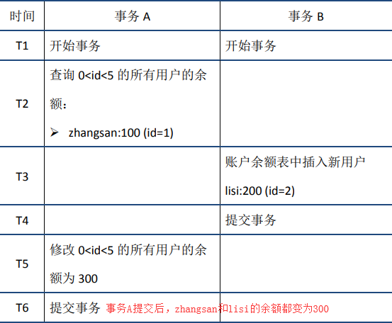

---

**持久性原理**

一致性是指事务执行结束后，数据库的完整性约束没有被破坏，事务执行的前后都是合法的数据状态。数据库的完整性约束包括但不限于：实体完整性（如行的主键存在且唯一）、列完整性（如字段的类型、大小、长度要符合要求）、外键约束、用户自定义完整性（如转账前后，两个账户余额的和应该不变）。

<br /><br />

-  实现
  >可以说，一致性是事务追求的最终目标：前面提到的原子性、持久性和隔离性，都是为了保证数据库状态的一致性。此外，除了数据库层面的保障，一致性的实现也需要应用层面进行保障。 实现一致性的措施包括：
  - 保证原子性、持久性和隔离性，如果这些特性无法保证，事务的一致性也无法保证
  - 数据库本身提供保障，例如不允许向整形列插入字符串值、字符串长度不能超过列的限制等
  - 应用层面进行保障，例如如果转账操作只扣除转账者的余额，而没有增加接收者的余额，无论数据库实现的多么完美，也无法保证状态的一致


#### 8.3.1.3. 并发事务处理带来的问题

1. 更新丢失 （Lost Update）：

   - 当两个或多个事务选择同一行，然后基于最初选定的值更新该行时，由于每个事务都不知道其他事务的存在，就会发生丢失更新问题一一最后的更新覆盖了由其他事务所做的更新。
   - 例如，两个程序员修改同一java文件。每程序员独立地更改其副本，然后保存更改后的副本，这样就覆盖了原始文档。最后保存其更改副本的编辑人员覆盖前一个程序员所做的更改。
   - 如果在一个程序员完成并提交事务之前，另一个程序员不能访问同一文件，则可避免此问题。

2. 脏读 （Dirty Reads）：

   - 一个事务正在对一条记录做修改，在这个事务完成并提交前，这条记录的数据就处于不一致状态；这时，另一个事务也来读取同一条记录，如果不加控制，第二个事务读取了这些“脏”数据，并据此做进一步的处理，就会产生未提交的数据依赖关系。这种现象被形象地叫做”脏读”。
   - 一句话：事务A读取到了事务B已修改但尚未提交的的数据，还在这个数据基础上做了操作。此时，如果B事务回滚，A读取的数据无效，不符合一致性要求。
   - 概括： **A读到了B更新未提交的数据，B可能回滚**

3. 不可重复读 （Non-Repeatable Reads）：

   - 一个事务在读取某些数据后的某个时间，再次读取以前读过的数据，却发现其读出的数据已经发生了改变、或某些记录已经被删除了！这种现象就叫做“不可重复读”。
   - 一句话：事务A读取到了事务B已经提交的修改数据，不符合隔离性
   - 概括： **A读到了B更新且提交的数据，多次重复读的结果不同**

4. 幻读 （Phantom Reads）

   - 一个事务按相同的查询条件重新读取以前检索过的数据，却发现其他事务插入了满足其查询条件的新数据，这种现象就称为幻读
   - 一句话：事务A读取到了事务B体提交的新增数据，不符合隔离性。
   - 多说一句：幻读和脏读有点类似，脏读是事务B里面修改了数据，幻读是事务B里面新增了数据。
   - 概括： **A读到了B新插入的数据，多次重复读的结果不同**
   - 重要： **需要注意的是，在SQL标准中，RR是无法避免幻读问题的，但是InnoDB实现的RR一定程度上了幻读问题(看下面)。**


#### 8.3.1.4. 事物的隔离级别

- 说明：
  1. 脏读”、“不可重复读”和“幻读”，其实都是数据库读一致性问题，必须由数据库提供一定的事务隔离机制来解决。
  2. 数据库的事务隔离越严格，并发副作用越小，但付出的代价也就越大，因为事务隔离实质上就是使事务在一定程度上“串行化”进行，这显然与“并发”是矛盾的。
  3. 同时，不同的应用对读一致性和事务隔离程度的要求也是不同的，比如许多应用对“不可重复读”和“幻读”并不敏感，可能更关心数据并发访问的能力。
  4. 查看当前数据库的事务隔离级别：`show variables like 'tx_isolation';` **innodb默认是可重复读**

- 四个隔离级别
  - **读未提交**：另一个事务修改了数据，但尚未提交，而本事务中的 SELECT 会读到这些未被提交的数据 **脏读**
  - **读已提交**：事务 A 多次读取同一数据，事务 B 在事务 A 多次读取的过程中，对数据作了更新并提交，导致事务 A 多次读取同一数据时，结果因此本事务先后两次读到的数据结果会不一致。			
  - **可重复读**：在同一个事务里，SELECT 的结果是事务开始时时间点的状态，因此，同样的 SELECT 操作读到的结果会是一致的。但是，会有 **幻读**现象			
    > innodb的间隙锁解决了幻读问题
  - **串行化**：最高的隔离级别，在这个隔离级别下，不会产生任何异常。并发的事务，就像事务是在一个个按照顺序执行一样


| 事务隔离级别              | 读数据一致性                           | 脏读 | 不可重复读 | 幻读 |
| :------------------------ | :------------------------------------- | :--- | :--------- | :--- |
| 未提交读 read-uncommitted | 最低级别，只能保证不读物理上损坏的数据 | 是   | 是         | 是   |
| 已提交读 read-committed   | 语句级                                 | 否   | 是         | 是   |
| 可重复读 repeatable-read  | 事务级                                 | 否   | 否         | 是   |
| 串行化 serializable       | 最高级别，事务级                       | 否   | 否         | 否   |

#### 8.3.1.5. 查看事务状态sql


- **查看当前开启的事务信息：** 
  - `select * from information_schema.innodb_trx;`
  - 更详细的信息：`show engine innodb status`


### 8.3.2. innodb使用表锁

待整理

（１）使用LOCK TALBES虽然可以给InnoDB加表级锁，但必须说明的是，表锁不是由InnoDB存储引擎层管理的，而是由其上一层ＭySQL Server负责的，仅当autocommit=0、innodb_table_lock=1（默认设置）时，InnoDB层才能知道MySQL加的表锁，ＭySQL Server才能感知InnoDB加的行锁，这种情况下，InnoDB才能自动识别涉及表级锁的死锁（带求证)；否则，InnoDB将无法自动检测并处理这种死锁（验证没通过）innodb 并没有做出回滚操作。

（２）在用LOCK TABLES对InnoDB锁时要注意，要将AUTOCOMMIT设为0，否则ＭySQL不会给表加锁；事务结束前，不要用UNLOCAK TABLES释放表锁，因为UNLOCK TABLES会隐含地提交事务；COMMIT或ROLLBACK产不能释放用LOCAK TABLES加的表级锁，必须用UNLOCK TABLES释放表锁，正确的方式见如下语句。 例如，如果需要写表t1并从表t读，可以按如下做： SET AUTOCOMMIT=0; LOCK TABLES t1 WRITE, t2 READ, ...; [do something with tables t1 and here]; COMMIT; UNLOCK TABLES;

### 8.3.3. 行锁触发

- 隐式加锁：
  - InnoDB自动加意向锁。
  - 对于UPDATE、DELETE和INSERT语句，InnoDB会自动给涉及数据集加排他锁（X)；
  - 对于普通SELECT语句，InnoDB不会加任何锁(RR下，通过MVCC保证可重复读)；
- 显示加锁：
  - 共享锁（S）：`SELECT * FROM table_name WHERE ... LOCK IN SHARE MODE`
  - 排他锁（X) ：`SELECT * FROM table_name WHERE ... FOR UPDATE`

### 8.3.4. 测试数据

- 建表插入索引
  <details>
  <summary style="color:red;">sql</summary>

  ```sql
  CREATE TABLE test_innodb_lock (a INT(11),b VARCHAR(16))ENGINE=INNODB;

  INSERT INTO test_innodb_lock VALUES(1,'b2');
  INSERT INTO test_innodb_lock VALUES(3,'3');
  INSERT INTO test_innodb_lock VALUES(4, '4000');
  INSERT INTO test_innodb_lock VALUES(5,'5000');
  INSERT INTO test_innodb_lock VALUES(6, '6000');
  INSERT INTO test_innodb_lock VALUES(7,'7000');
  INSERT INTO test_innodb_lock VALUES(8, '8000');
  INSERT INTO test_innodb_lock VALUES(9,'9000');
  INSERT INTO test_innodb_lock VALUES(1,'b1');

  CREATE INDEX test_innodb_a_ind ON test_innodb_lock(a);
  CREATE INDEX test_innodb_lock_b_ind ON test_innodb_lock(b);
  ```
  </details>

- 数据展示
  ```
  mysql> select * from test_innodb_lock;
  +------+------+
  | a    | b    |
  +------+------+
  |    1 | b2   |
  |    3 | 3    |
  |    4 | 4000 |
  |    5 | 5000 |
  |    6 | 6000 |
  |    7 | 7000 |
  |    8 | 8000 |
  |    9 | 9000 |
  |    1 | b1   |
  +------+------+
  9 rows in set (0.00 sec)
  ```
  ```
  mysql> SHOW INDEX FROM test_innodb_lock;
  +------------------+------------+------------------------+--------------+-------------+-----------+-------------+----------+--------+------+------------+---------+---------------+
  | Table            | Non_unique | Key_name               | Seq_in_index | Column_name | Collation | Cardinality | Sub_part | Packed | Null | Index_type | Comment | Index_comment |
  +------------------+------------+------------------------+--------------+-------------+-----------+-------------+----------+--------+------+------------+---------+---------------+
  | test_innodb_lock |          1 | test_innodb_a_ind      |            1 | a           | A         |           9 |     NULL | NULL   | YES  | BTREE      |         |               |
  | test_innodb_lock |          1 | test_innodb_lock_b_ind |            1 | b           | A         |           9 |     NULL | NULL   | YES  | BTREE      |         |               |
  +------------------+------------+------------------------+--------------+-------------+-----------+-------------+----------+--------+------+------------+---------+---------------+
  2 rows in set (0.00 sec)
  ```

### 8.3.5. 操作示例

#### 8.3.5.1. 操作同一行数据:堵塞

- session1 开启事务，修改 test_innodb_lock 中的数据
  ```
  mysql> set autocommit=0;
  Query OK, 0 rows affected (0.00 sec)

  mysql> update test_innodb_lock set b='4001' where a=4;
  Query OK, 1 row affected (0.00 sec)
  Rows matched: 1  Changed: 1  Warnings: 0
  ```

- session2 开启事务，修改 test_innodb_lock 中同一行数据，将导致 session2 发生阻塞，一旦 session1 提交事务，session2 将执行更新操作
  ```
  mysql> set autocommit=0;
  Query OK, 0 rows affected (0.00 sec)

  mysql> update test_innodb_lock set b='4002' where a=4;
  -- 在这儿阻塞着呢~~~

  -- 时间太长，会报超时错误哦
  mysql> update test_innodb_lock set b='4001' where a=4;
  ERROR 1205 (HY000): Lock wait timeout exceeded; try restarting transaction
  ```

#### 8.3.5.2. 操作不同行数据:不堵塞

- session1 开启事务，修改 test_innodb_lock 中的数据
  ```
  mysql> set autocommit=0;
  Query OK, 0 rows affected (0.00 sec)

  mysql> update test_innodb_lock set b='4001' where a=4;
  Query OK, 0 rows affected (0.00 sec)
  Rows matched: 1  Changed: 0  Warnings: 0
  ```

- session2 开启事务，修改 test_innodb_lock 中不同行的数据
- 由于采用行锁，session2 和 session1 互不干涉，所以 session2 中的修改操作没有阻塞
  ```
  mysql> set autocommit=0;
  Query OK, 0 rows affected (0.00 sec)

  mysql> update test_innodb_lock set b='9001' where a=9;
  Query OK, 1 row affected (0.00 sec)
  Rows matched: 1  Changed: 1  Warnings: 0
  ```

#### 8.3.5.3. **无索引导致行锁升级为表锁**

> 详细原理看下面的加锁过程中的`id无索引+RR`，非常恐怖的一种情况

- session1 开启事务，修改 test_innodb_lock 中的数据，varchar 不用 ’ ’ ，导致系统自动转换类型，导致索引失效
  ```
  mysql> set autocommit=0;
  Query OK, 0 rows affected (0.00 sec)

  mysql> update test_innodb_lock set a=44 where b=4000;
  Query OK, 1 row affected (0.00 sec)
  Rows matched: 1  Changed: 1  Warnings: 0
  ```

- session2 开启事务，修改 test_innodb_lock 中不同行的数据
- 由于发生了自动类型转换，索引失效，导致行锁变为表锁
  ```
  mysql> set autocommit=0;
  Query OK, 0 rows affected (0.00 sec)

  mysql> update test_innodb_lock set b='9001' where a=9;
  -- 在这儿阻塞着呢~~~
  ```


### 8.3.6. 间隙锁

#### 8.3.6.1. 说明

- 什么是间隙锁
  - 当我们用范围条件而不是相等条件检索数据，并请求共享或排他锁时，InnoDB会给符合条件的已有数据记录的索引项加锁；对于键值在条件范围内但并不存在的记录，叫做“间隙（GAP）”
  - InnoDB也会对这个“间隙”加锁，这种锁机制是所谓的间隙锁（Next-Key锁）
- 间隙锁的危害
  - 因为Query执行过程中通过过范围查找的话，他会锁定整个范围内所有的索引键值，即使这个键值并不存在。
  - 间隙锁有一个比较致命的弱点，就是当锁定一个范围键值之后，即使某些不存在的键值也会被无辜的锁定，而造成在锁定的时候无法插入锁定键值范围内的任何数据。在某些场景下这可能会对性能造成很大的危害

- 目的：可以防止幻读，防止其他事务往范围条件内插入数据

#### 8.3.6.2. 示例

- session1 开启事务，执行修改 `a > 1 and a < 6` 的数据，这会导致 mysql 将 a = 2 的数据行锁住（虽然表中并没有这行数据）
  ```
  mysql> set autocommit=0;
  Query OK, 0 rows affected (0.00 sec)

  mysql> update test_innodb_lock set b='Heygo' where a>1 and a<6;
  Query OK, 3 rows affected (0.00 sec)
  Rows matched: 3  Changed: 3  Warnings: 0
  ```

- session2 开启事务，修改 test_innodb_lock 中不同行的数据，也会导致阻塞，直至 session1 提交事务
  ```
  mysql> set autocommit=0;
  Query OK, 0 rows affected (0.00 sec)

  mysql> update test_innodb_lock set b='9001' where a=9;
  -- 在这儿阻塞着呢~~~
  ```

### 8.3.7. 手动行锁

- 锁定一行方式：`select xxx ... for update 锁定某一行后，其它的操作会被阻塞，直到锁定行的会话提交`

- 示例
  - session1 开启事务，手动执行 for update 锁定指定行，待执行完指定操作时再将数据提交
    ```
    mysql> set autocommit=0;
    Query OK, 0 rows affected (0.00 sec)

    mysql> select * from test_innodb_lock  where a=8 for update;
    +------+------+
    | a    | b    |
    +------+------+
    |    8 | 8000 |
    +------+------+
    1 row in set (0.00 sec)
    ```

  - session2 开启事务，修改 session1 中被锁定的行，会导致阻塞，直至 session1 提交事务
    ```
    mysql> set autocommit=0;
    Query OK, 0 rows affected (0.00 sec)

    mysql> update test_innodb_lock set b='XXX' where a=8;
    # 在这儿阻塞着呢~~~
    ```


### 8.3.8. 扩展：悲观锁与乐观锁

- 悲观锁：
  - 一锁二查三更新”即指的是使用悲观锁。
  - 通常来讲在数据库上的悲观锁需要数据库本身提供支持，**表锁，行锁，读写锁都是悲观锁**
  - 常用的 **select ... for update** 也是悲观锁。
  - select for update 获取的行锁会在当前事务结束时自动释放，因此必须在事务中使用。

- 乐观锁：**工作中一般用乐观锁**
  - 乐观锁，也叫乐观并发控制，它假设多用户并发的事务在处理时不会彼此互相影响，各事务能够在不产生锁的情况下处理各自影响的那部分数据。
  - 在提交数据更新之前，每个事务会先检查在该事务读取数据后，有没有其他事务又修改了该数据。
  - 如果其他事务有更新的话，那么当前正在提交的事务会进行回滚。
  - 乐观锁在数据库上的实现完全是逻辑的，不需要数据库提供特殊的支持。一般的做法是在需要锁的数据上增加 **一个版本号，或者时间戳**
    > 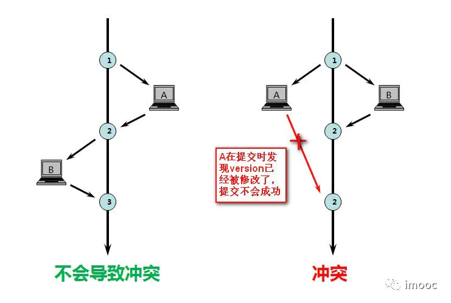-

- 总结
  > 悲观锁和乐观锁是数据库用来保证数据并发安全防止更新丢失的两种方法。
  > 悲观锁和乐观锁大部分场景下差异不大，一些独特场景下有一些差别，一般我们可以从如下几个方面来判断。
  - **响应速度**：如果需要非常高的响应速度，建议采用**乐观锁方案**，成功就执行，不成功就失败，不需要等待其他并发去释放锁。
  - **冲突频率**：如果冲突频率非常高，建议采用**悲观锁**，保证成功率，如果冲突频率大，乐观锁会需要多次重试才能成功，代价比较大。
  - **重试代价**：如果重试代价大，建议采用**悲观锁**。

### 8.3.9. 行锁分析

- 和myisam比较
  - Innodb存储引擎由于实现了行级锁定，虽然在锁定机制的实现方面所带来的性能损耗可能比表级锁定会要更高一些，但是在整体并发处理能力方面要远远优于MyISAM的表级锁定的。
  - 当系统并发量较高的时候，Innodb的整体性能和MyISAM相比就会有比较明显的优势了。
  - 但是，Innodb的行级锁定同样也有其脆弱的一面，当我们使用不当的时候（索引失效，导致行锁变表锁），可能会让Innodb的整体性能表现不仅不能比MyISAM高，甚至可能会更差。

---

- 行锁分析方式：`status like 'innodb_row_lock%';`
  ```
  mysql> show status like 'innodb_row_lock%';
  +-------------------------------+--------+
  | Variable_name                 | Value  |
  +-------------------------------+--------+
  | Innodb_row_lock_current_waits | 0      |
  | Innodb_row_lock_time          | 212969 |
  | Innodb_row_lock_time_avg      | 42593  |
  | Innodb_row_lock_time_max      | 51034  |
  | Innodb_row_lock_waits         | 5      |
  +-------------------------------+--------+
  5 rows in set (0.00 sec)
  ```
  > 重要参数加粗
  - Innodb_row_lock_current_waits：当前正在等待锁定的数量；
  - **Innodb_row_lock_time** ：从系统启动到现在锁定总时间长度；
  - **Innodb_row_lock_time_avg** ：每次等待所花平均时间；
  - Innodb_row_lock_time_max：从系统启动到现在等待最常的一次所花的时间；
  - **Innodb_row_lock_waits** ：系统启动后到现在总共等待的次数；

### 8.3.10. 行锁优化

- 尽可能让所有数据检索都通过索引来完成，避免无索引行锁升级为表锁
- 合理设计索引，尽量缩小锁的范围
- 尽可能较少检索条件，避免间隙锁
- 尽量控制事务大小，减少锁定资源量和时间长度
- 尽可能低级别事务隔离

### 8.3.11. 页锁

- 开销和加锁时间界于表锁和行锁之间：会出现死锁；
- 锁定粒度界于表锁和行锁之间，并发度一般。
- 了解即可


## 8.4. 锁总结拓展

### 8.4.1. 理清思路

我们常用的存储引擎就MyISAM和InnoDB。MyISAM存储主要就简单的表级别锁，下面只说InnoDB的各种锁类型。

InnoDB不仅支持行级别的锁，也支持表级别的锁。平常我们会听到各种锁，你是不是不仅迷茫它们怎么用的，还会迷茫它们 各自之间都是什么关系？

#### 8.4.1.1. 什么是乐观锁和悲观锁？

乐观锁和悲观锁是泛指，不是具体的锁。

**乐悲锁**：也叫乐观并发控制，它总是乐观的认为用户在并发事务处理时不会影响彼此的数据。

多版本并发控制个人认为就是一种乐观锁，具体参考：[《Mysql概要》](https://blog.csdn.net/zcl_love_wx/article/details/78650561) 里的MVCC。所以乐观锁我们自己也可以很轻松的实现，主要是在有中加一个version字段作为版本号。

 **悲锁观锁**：悲观锁会悲观的认为每次去拿的数据都会被别人修改。所以每次在拿数据的时候都会上锁，从而屏蔽可能违反数据完整性的操作。间隙锁、临键锁都属于悲观锁。

#### 8.4.1.2. 什是表锁和行锁？

表锁和行锁也是泛指，不是具体的锁。

表级锁有：意向共享锁、意向排他锁、自增锁等。InnoDB的行锁都是实现在索引上的。

行级锁有：共享锁、排他锁、记录锁

#### 8.4.1.3. 什么是共享锁(S锁)和排他锁(X锁)？

InnoDB引擎实现了标准的行级别锁，分别是共享锁和排他锁。

- 拿共享锁是为了让当前事务去读一行数据。
- 拿排他锁是为了让当前事务去修改或删除某一行数据。

一个事务拿到了当前数据行的共享锁，另一个事务也能马上拿到当前数据行的共享锁。

一个事务拿到了当前数据行的排他锁，则另一个事务不能立马拿到当前数据行的排他锁，因为它会被阻塞直到前一个事务释放。

设置共享锁：select * from user where id = 1 LOCK IN SHARE MODE;

设置排他锁：select * from user where id = 1 FOR UPDATE;

#### 8.4.1.4. InnoDB到底有几种锁？

(1) 共享/排它锁(Shared and Exclusive Locks)

(2) 意向锁(Intention Locks)

(3) 记录锁(Record Locks)

(4) 间隙锁(Gap Locks): **临键锁**是记录锁和间隙锁的组合。

(5) 临键锁(Next-key Locks)

(6) 插入意向锁(Insert Intention Locks)

(7) 自增锁(Auto-inc Locks)

### 8.4.2. lock和latch

[参考](https://i6448038.github.io/2019/02/23/mysql-lock/)

- latch
  - latch在MySQL中是用来保证并发多线程操作操作临界资源的锁
  - 锁定的对象线程，是和咱们使用的Java等传统语言中的锁意义相近，而且没有死锁检测的机制。

- lock
  - lock是MySQL中在事务中使用的锁，锁定的对象是事务，
  - 来锁定数据库中表、页、行；
  - 通常只有在事务commit或者rollback后进行释放。
  - lock是有死锁机制的，当出现死锁时，lock有死锁机制来解决死锁问题：超时时间(参数innodb_lock_wait_timeout)、wait-for graph。

我们通常讲的MySQL的“锁”，一般就是说的lock。

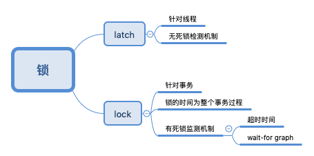

[B+树并发控制涉及lock和latch](http://mysql.taobao.org/monthly/2020/11/02/)

### 8.4.3. innodb锁说明

#### 8.4.3.1. 意向锁

- 说明：
  - 意向锁是一种**不与行级锁冲突**的**表级锁**
  - 意向锁是有数据引擎自己维护的，用户无法手动操作意向锁，在为数据行加共享 / 排他锁之前，InooDB 会先获取该数据行所在在数据表的对应意向锁。

- 目的：
  ```
  ①在mysql中有表锁，

  LOCK TABLE my_tabl_name READ; 用读锁锁表，会阻塞其他事务修改表数据。

  LOCK TABLE my_table_name WRITe; 用写锁锁表，会阻塞其他事务读和写。

  ②Innodb引擎又支持行锁，行锁分为

  共享锁，一个事务对一行的共享只读锁。

  排它锁，一个事务对一行的排他读写锁。

  ③这两中类型的锁共存的问题

  考虑这个例子：

  事务A锁住了表中的一行，让这一行只能读，不能写。

  之后，事务B申请整个表的写锁。

  如果事务B申请成功，那么理论上它就能修改表中的任意一行，这与A持有的行锁是冲突的。

  数据库需要避免这种冲突，就是说要让B的申请被阻塞，直到A释放了行锁。

  数据库要怎么判断这个冲突呢？

  step1：判断表是否已被其他事务用表锁锁表
  step2：判断表中的每一行是否已被行锁锁住。

  注意step2，这样的判断方法效率实在不高，因为需要遍历整个表。
  于是就有了意向锁。

  在意向锁存在的情况下，事务A必须先申请表的意向共享锁，成功后再申请一行的行锁。

  在意向锁存在的情况下，上面的判断可以改成

  step1：不变
  step2：发现表上有意向共享锁，说明表中有些行被共享行锁锁住了，因此，事务B申请表的写锁会被阻塞。

  注意：申请意向锁的动作是数据库完成的，就是说，事务A申请一行的行锁的时候，数据库会自动先开始申请表的意向锁，不需要我们程序员使用代码来申请。
  ```

- 意向表锁分类
  - 意向共享锁(intention shared lock, IS)：
    - 它预示着，事务正在或者有意向对表中的”某些行”加S锁。即`select xxxx lock in share mode`，要设置IS锁。
    - 事务要获取某些行的 S 锁，必须先获得表的 IS 锁。
  - 意向排他锁(intention exclusive lock, IX)：
    - 它预示着，事务正在或者有意向表中的“某些行”加X锁。即`select xxx for update`，要设置IX锁。
    - 事务要获取某些行的 X 锁，必须先获得表的 IX 锁。

#### 8.4.3.2. 排他/共享

- 排他锁（X）：
  - 说明：允许获得排他锁的事务更新数据，阻止其他事务取得相同数据集的共享读锁和排他写锁。
  - 触发：事务中执行 `select ... for update`
      > 对于普通SELECT语句，Innodb不会加任何锁。
- 共享锁（S）：
  - 说明：允许一个事务去读一行，阻止其他事务获取相同数据集的排他锁。
  - 触发：事务中执行 `select ... lock in share mode`
    > 使用select ... in share mode获取共享锁，主要用在需要数据依存关系时，确认某行记录是否存在，并确保没有人对这个记录进行update或者delete。

#### 8.4.3.3. (插曲)锁兼容性

- 锁兼容性
  > 如果一个事务请求的锁模式与当前的锁模式兼容，innodb就将请求的锁授予该事务；反之，如果两者不兼容，该事务就要等待锁释放。
  - 意向锁之间的兼容性问题：**意向锁仅仅是表明意向，它其实非常弱，意向锁之间可以相互并行**
    ```
          IS     IX

    IS   兼容    兼容

    IX   兼容    兼容
    ```
  - 意向锁可以和表锁互斥(这里的S/X是指的表锁)
    ```
            S                X

    IS     兼容           互斥不兼容

    IX    互斥不兼容        互斥不兼容
    ```
  - 意向锁不会与行级的共享 / 排他锁互斥

#### 8.4.3.4. 锁算法


##### 8.4.3.4.1. 记录锁Record Lock

单个行记录上的锁。也就是行锁

- 说明：
  - 对表中的行记录加锁，叫做记录锁，简称行锁。
  - 可以使用`sql`语句`select ... for update`来开启锁，
  - `select`语句必须为**精准匹配**（=），不能为范围匹配，且匹配列字段必须为**唯一索引或者主键列**。
    - 也就是说记录锁只存在于包括主键索引在内的唯一索引中，只能锁定单条索引记录
  - 也可以通过对查询条件为主键索引或唯一索引的数据行进行`UPDATE`操作来添加记录锁。


##### 8.4.3.4.2. 间隙锁Gap lock

间隙锁，锁定一个范围，但不包括记录本身。GAP锁的目的，是为了防止同一事务的两次当前读，出现幻读的情况。

- 范围：间隙锁是对范围加锁，但不包括已存在的索引项。
- 触发：
  - 可以使用sql语句select ... for update来开启锁，select语句为范围查询，匹配列字段为索引项，且没有数据返回；
  - 或者select语句为等值查询，匹配字段为唯一索引，也没有数据返回。

- 条件：GAP Locks **只存在于RR隔离级别** 下
- 作用：它锁住的是间隙内的数据。加完锁之后，间隙中无法插入其他记录，并且锁的是记录间隙，而非sql语句。间隙锁之间都不存在冲突关系。

- 缺点：
  - 就是当锁定一个范围键值之后，即使某些不存在的键值也会被无辜的锁定，而造成在锁定的时候无法插入锁定键值范围内的任何数据。
  - 在某些场景下这可能会对性能造成很大的危害。以下是加锁之后，插入操作的例子：
    ```sql
    select * from user where id > 15 for update;
    //插入失败，因为id20大于15，不难理解
    insert into user values(20,'20');
    //插入失败，原因是间隙锁锁的是记录间隙，而不是sql，也就是说`select`语句的锁范围是（11，+∞），而13在这个区间中，所以也失败。
    insert into user values(13,'13');
    ```

---

**打开间隙锁设置：** 以通过命令`show variables like 'innodb_locks_unsafe_for_binlog';`来查看 `innodb_locks_unsafe_for_binlog` 是否禁用。`innodb_locks_unsafe_for_binlog`默认值为OFF，即启用间隙锁。因为此参数是只读模式，如果想要禁用间隙锁，需要修改 `my.cnf`（windows是`my.ini`） 重新启动才行。

```
  # 在 my.cnf 里面的[mysqld]添加
  [mysqld]
  innodb_locks_unsafe_for_binlog = 1
```

##### 8.4.3.4.3. 临键锁next-key lock

记录锁+间隙锁，锁定一个范围，并且锁定记录本身。对于行的查询，都是采用该方法，主要目的是解决幻读的问题。

- 当我们对上面的**记录和间隙共同加锁**时，添加的便是临键锁（左开右闭的集合加锁）。
- 为了防止幻读，临键锁阻止特定条件的新记录的插入，因为插入时要获取插入意向锁，与已持有的临键锁冲突。
- 触发：
  - 可以使用`sql`语句`select ... for update`来开启锁，`select`语句为范围查询，匹配列字段为索引项，且有数据返回
  - 或者`select`语句为等值查询，匹配列字段为索引项，不管有没有数据返回。


#### 8.4.3.5. 插入意向锁(Insert Intention Locks)


`插入意向锁`是在插入一条记录行前，由 **INSERT** 操作产生的一种`间隙锁`。该锁用以表示插入**意向**，当多个事务在**同一区间**（gap）插入**位置不同**的多条数据时，事务之间**不需要互相等待**。假设存在两条值分别为 4 和 7 的记录，两个不同的事务分别试图插入值为 5 和 6 的两条记录，每个事务在获取插入行上独占的（排他）锁前，都会获取（4，7）之间的`间隙锁`，但是因为数据行之间并不冲突，所以两个事务之间并**不会产生冲突**（阻塞等待）。

总结来说，`插入意向锁`的特性可以分成两部分：

1. `插入意向锁`是一种特殊的`间隙锁`  —— `间隙锁`可以锁定**开区间**内的部分记录。
2. `插入意向锁`之间互不排斥，所以即使多个事务在同一区间插入多条记录，只要记录本身（`主键`、`唯一索引`）不冲突，那么事务之间就不会出现**冲突等待**。

需要强调的是，虽然`插入意向锁`中含有`意向锁`三个字，但是它并不属于`意向锁`而属于`间隙锁`，因为`意向锁`是**表锁**而`插入意向锁`是**行锁**。

现在我们可以回答开头的问题了：

1. 使用`插入意向锁`与`记录锁`。
2. `事务 A` 不会阻塞`事务 B`。

如果使用间隙锁，事务之间将会频发陷入阻塞等待，插入的并发性非常之差。

- 总结：
  1. **MySql InnoDB** 在 `Repeatable-Read` 的事务隔离级别下，使用`插入意向锁`来控制和解决并发插入。
  2. 插入意向锁并非意向锁，`插入意向锁`是一种特殊的`间隙锁`。
  3. `插入意向锁`在**锁定区间相同**但**记录行本身不冲突**的情况下**互不排斥**。

#### 8.4.3.6. 自增锁(Auto-inc Locks)


### 8.4.4. 加锁过程(重要※)

- 需要了解：
  - 聚簇索引和二级索引
  - innodb的锁

[一定要看，重要](https://blog.csdn.net/geekjoker/article/details/79444076)

- 如果查询没有命中索引，则退化为表锁;
- 如果等值查询唯一索引且命中唯一一条记录，则退化为行锁;
- 如果等值查询唯一索引且没有命中记录，则退化为临近结点的间隙锁;
- 如果等值查询非唯一索引且没有命中记录，退化为临近结点的间隙锁(包括结点也被锁定)；如果命中记录，则锁定所有命中行的临键锁，并同时锁定最大记录行下一个区间的间隙锁。
- 如果范围查询唯一索引或查询非唯一索引且命中记录，则锁定所有命中行的临键锁 ，并同时锁定最大记录行下一个区间的间隙锁。
- 如果范围查询索引且没有命中记录，退化为临近结点的间隙锁(包括结点也被锁定)。


## 8.5. MVCC

### 8.5.1. 说明

- 背景：`LBCC`是基于锁的并发控制，因为锁的粒度过大，会导致性能的下降，因此提出了比`LBCC`性能更优越的方法`MVCC`。
- 说明：
  - `MVCC`是`Multi-Version Concurremt Control`的简称，意思是基于多版本的并发控制协议，通过版本号，避免同一数据在不同事务间的竞争
  - 只存在于`InnoDB`引擎下。
- 目的：它主要是为了提高数据库的并发读写性能，不用加锁就能让多个事务并发读写。
- 实现依赖
  - 三个隐藏字段
  - `Undo log` 
  - `Read View`
- 核心思想：
  - 只能查找事务id小于等于当前事务ID的行
  - 只能查找删除时间大于等于当前事务ID的行，或未删除的行

- 组合方式：
  > MVCC就是因为不满意只让数据库采用悲观锁这样性能不佳的形式去解决读-写冲突问题，而提出的解决方案，
  - MVCC + 悲观锁:MVCC解决读写冲突，悲观锁解决写写冲突
  - MVCC + 乐观锁:MVCC解决读写冲突，乐观锁解决写写冲突

MVCC使用的就是下面的快照读，既不加锁，又能保证可重复读。

### 8.5.2. 相关概念：当前读和快照读

- 当前读： 读取的是 **最新版本** (注意：也就是不走MVCC) , 并且 **对读取的记录加锁, 阻塞其他事务同时改动相同记录，避免出现安全问题** 。
  - 触发：
    - select...lock in share mode (共享读锁)
    - select...for update
    - update , delete , insert
      > 例如，假设要update一条记录，但是另一个事务已经delete这条数据并且commit了，如果不加锁就会产生冲突。所以update的时候肯定要是当前读，得到最新的信息并且锁定相应的记录。
  - 原理：
    - 加next-key锁(临键锁):见上方

- 快照读（也就是下面MVCC内部原理中的read-view）
  - 触发
    - 单纯的select操作，不包括上述 select ... lock in share mode, select ... for update。　　　　
    - Read Committed隔离级别：每次select都生成一个快照读。
    - Read Repeatable隔离级别：开启事务后第一个select语句才是快照读的地方，而不是一开启事务就快照读。
  - 原理：
    - MVCC

<details>
<summary style="color:red;">示例:当前读示例和快照读示例</summary>

```
t Session A                      Session B
|
| START TRANSACTION;             START TRANSACTION;
|
| SELECT * FROM t_bitfly;
| +----+-------+
| | id | value |
| +----+-------+
| |  1 | a     |
| +----+-------+
|                                INSERT INTO t_bitfly
|                                VALUES (2, 'b');
|                                COMMIT;
|
| SELECT * FROM t_bitfly; -- 快照读
| +----+-------+
| | id | value |
| +----+-------+
| |  1 | a     |
| +----+-------+
|
| SELECT * FROM t_bitfly LOCK IN SHARE MODE;-- 当前读
| +----+-------+
| | id | value |
| +----+-------+
| |  1 | a     |
| |  2 | b     |
| +----+-------+
|
| SELECT * FROM t_bitfly FOR UPDATE;
| +----+-------+
| | id | value |
| +----+-------+
| |  1 | a     |
| |  2 | b     |
| +----+-------+
|
| SELECT * FROM t_bitfly;
| +----+-------+
| | id | value |
| +----+-------+
| |  1 | a     |
| +----+-------+
v
```
</details>


### 8.5.3. MVCC实现原理

[讲解视频](https://www.bilibili.com/video/BV1YJ411J7vb?from=search&seid=8176876032281963392)

#### 8.5.3.1. 三个隐藏字段

`MySQL`中会为每一行记录生成隐藏列：

- （1）DB_TRX_ID：事务ID，是根据事务产生时间顺序自动递增的，是独一无二的。如果某个事务执行过程中对该记录执行了增、删、改操作，那么`InnoDB`存储引擎就会记录下该条事务的id。
- （2）DB_ROLL_PTR：回滚指针，本质上就是一个指向记录对应的`undo log`的一个指针，大小为 7 个字节，`InnoDB` 便是通过这个指针找到之前版本的数据。该行记录上所有旧版本，在`undo log`中都通过链表的形式组织。
- （3）DB_ROW_ID：行标识（隐藏单调自增 `ID`），如果表没有主键，InnoDB 会自动生成一个隐藏主键，大小为 6 字节。如果数据表没有设置主键，会以它产生聚簇索引。
- （4）实际还有一个删除flag隐藏字段，既记录被更新或删除并不代表真的删除，而是删除flag变了。

#### 8.5.3.2. undolog

每当我们要对一条记录做改动时（这里的改动可以指INSERT、DELETE、UPDATE），都需要把回滚时所需的东西记录下来, 比如:

- Insert undo log ：插入一条记录时，至少要把这条记录的主键值记下来，之后回滚的时候只需要把这个主键值对应的记录删掉就好了。
- Delete undo log：删除一条记录时，至少要把这条记录中的内容都记下来，这样之后回滚时再把由这些内容组成的记录插入到表中就好了。
- Update undo log：修改一条记录时，至少要把修改这条记录前的旧值都记录下来，这样之后回滚时再把这条记录更新为旧值就好了。

`InnoDB`把这些为了回滚而记录的这些东西称之为`undo log`。这里需要注意的一点是，由于查询操作（`SELECT`）并不会修改任何用户记录，所以在查询操作执行时，并不需要记录相应的`undo log`。

每次对记录进行改动都会记录一条undo日志，每条undo日志也都有一个`DB_ROLL_PTR`属性，可以将这些undo日志都连起来，串成一个链表，形成版本链。版本链的头节点就是当前记录最新的值。

---

示例:

先插入一条记录，假设该记录的事务id为80，那么此刻该条记录的示意图如下所示


实际上`insert undo`只在事务回滚时起作用，当事务提交后，该类型的undo日志就没用了，它占用的`Undo Log Segment`也会被系统回收。接着继续执行sql操作

两个事务并发执行时，会有版本链：

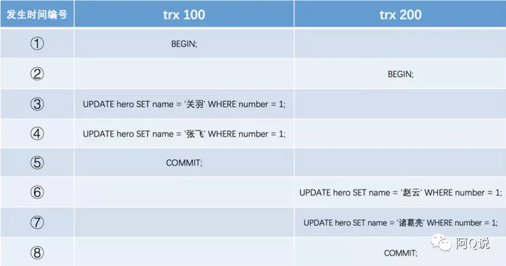

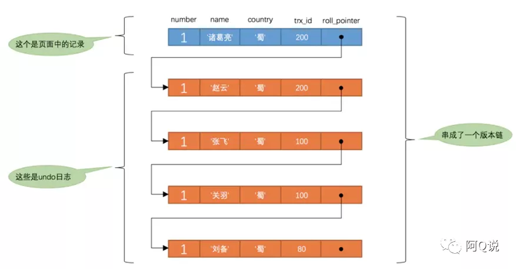

> 很多人以为`undo log`用于将数据库物理的恢复到执行语句或者事务之前的样子，其实并非如此，`undo log`是逻辑日志，只是将数据库逻辑的恢复到原来的样子。因为在多并发系统中，你把一个页中的数据物理的恢复到原来的样子，可能会影响其他的事务。

#### 8.5.3.3. ReadView

- 前提：在可重复读隔离级别下，我们可以把每一次普通的`select`查询（不加`for update`语句）当作一次**快照读**

- readview生成时机：
  - 快照读的时候会生成readview
  - 即我们所说的一致性视图

- readview内容：
  - **当前数据库系统中所有未提交的事务id数组（数组里最小的`id`为`min_id`）和已经创建的最大事务`id`（`max_id`）的集合**
  - 比如：
    ```
    [100,200] 300
    min_id为100，未提交的事务集合为[100,200],最大事务id为300
    ```
  - 注意： **一个事务只有执行更新删除等操作才会生成事务id** ，否则不会生成事务id，也不会添加到readview中

- 范围：read-view是针对于全库的，不是针对表的

- readview作用：
  - 在进行快照读的过程中要**根据一定的规则将版本链中每个版本的事务`id`与`readview`进行匹配查询**，得到结果
  - 详细规则查看下面具体实现

- 不同隔离级别情况下的readview：
  - RR隔离级别下：select 快照读时生成readview，**以后每次select都会沿用第一次生成的readview**
    > 也就是说，RR下创建快照读的时机决定了读到的版本。
  - RC隔离级别下：每次select 都会新生成一个readview
    > 也就是说，快照读和当前读结果一样，都是读取已提交的最新；
  - 其他两个隔离级别和MVCC不兼容
    - 因为`READ UNCOMMITTED`总是读取最新的数据行，而不是符合当前事务版本的数据行
    - 而`SERIALIZABLE` 则会对所有读取的行都加锁


#### 8.5.3.4. 合作实现MVCC

对于使用RC和RR隔离级别的事务来说，都必须保证读到已经提交了的事务修改过的记录，也就是说假如另一个事务已经修改了记录但是尚未提交，是不能直接读取最新版本的记录的。核心问题就是：需要判断一下版本链中的哪个版本是当前事务可见的。为此，`InnoDB`提出了一个`Read View`的概念。

`Read View`就是事务进行快照读（普通`select`查询）操作的时候生产的一致性读视图，在该事务执行的快照读的那一刻，会生成数据库系统当前的一个快照，它由执行查询时所有未提交的事务id数组（数组里最小的id为`min_id`）和已经创建的最大事务id（`max_id`）组成，查询的数据结果需要跟`read view`做对比从而得到快照结果。


- **版本链比对规则**：
  - 如果落在绿色部分（`trx_id<min_id`），表示这个版本是已经提交的事务生成的，这个数据是可见的；
  - 如果落在红色部分（`trx_id>max_id`），表示这个版本是由将来启动的事务生成的，是肯定不可见的；
  - 如果落在黄色部分（`min_id<=trx_id<=max_id`），那就包含两种情况：
    - 如果是自己的事务，则是可见的；
    - 如果不是自己的事务
      - 若row的trx_id在数组中，表示这个版本是由还没提交的事务生成的，不可见
      - 若row的trx_id不在数组中，表示这个版本是已经提交了的事务生成的，可见。

另外：对于删除的情况可以认为是update的特殊情况,会将版本链上最新的数据复制一份,然后将 trx_id 修改成除操作的trx_id,同时在该条 记录的头信息( record header)里的(deleted flag)标记位写上true,来表示当前记录已经被删除,在直询时按照上面的规则查到对应的记录如果delete_flag标记位为true,意味着记录已被除,不返回数据。

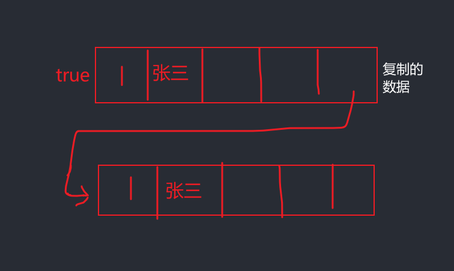


---

示例：

```java
//表中数据：
//test表中数据
id=1,c1='11';
id=5,c1='22';
//account表数据
id=1，name=‘lilei’；
```


如下图，我们将按照里面的顺序执行sql

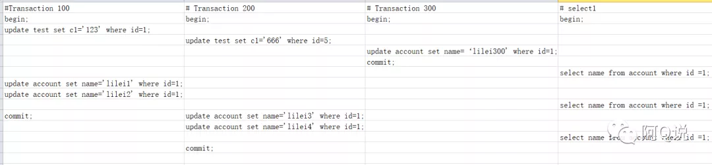

当我们执行到第7行的`select`的语句时，会生成`readview[100,200],300`,版本链如图所示：

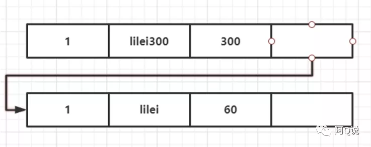

此时我们查询到的数据为`lilei300`。我们首先要拿最新版本的数据`trx_id=300`来`readview`中匹配，落在黄色区间内，一看该数据已经提交了，所以是可见的。继续往下执行，当执行到第10行的`select`语句时，因为`trx_id=100`并未提交，所以版本链依然为`readview[100,200],300`，版本链如图所示：

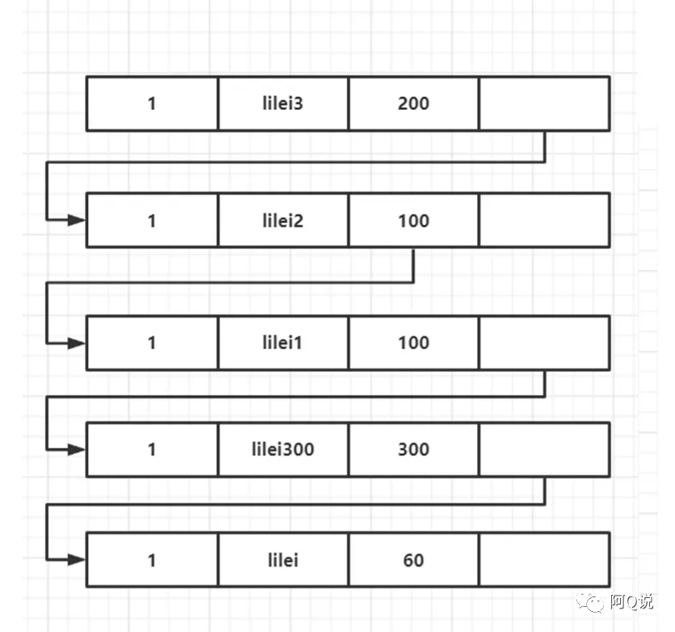

此时我们查询到的数据为`lilei300`。我们按上边操作，从最新版本依次往下匹配，我们首先要拿最新版本的数据`trx_id=100`来`readview`中匹配，落在黄色区间内，一看该数据在未提交的数组中，且不是自己的事务，所以是不可见的；然后我们选择前一个版本的数据，结果同上；继续向上找，当找到`trx_id=300`的数据时，会落在黄色区间，且是提交的，所以数据可见。继续往下执行，当执行到第13行的`select`语句时，此时尽管`trx_id=100`已经提交了，因为是`InnoDB`的RR模式，所以`readview`不会更改，仍为`readview[100,200],300`,版本链如图所示：

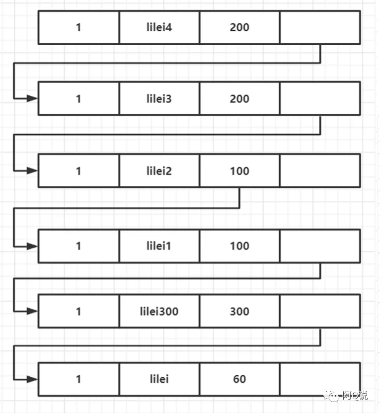

此时我们查询到的数据为`lilei300`。原因同上边的步骤，不再赘述。

当执行`update`语句时，都是先读后写的，而这个读，是当前读，只能读当前的值，跟`readview`查找时的快照读区分开。

RC模式类似，这里不再进行说明


### 8.5.4. innodb RR避免幻读：MVCC+LBCC

- 说明：
  - MVCC:不再赘述
  - LBCC:LBCC是Lock-Based Concurrent Control的简称，意思是基于锁的并发控制。

---

**innodb RR下，只进行select，可以避免幻读**

- 在当前读读情况下，mysql通过next-key+间隙锁来避免幻读
- 在快照读读情况下，mysql通过mvcc来避免幻读。

示例就看上面当前读和快照读的说明

---

**innodb RR下，update和insert无法避免幻读**

<details>
<summary style="color:red;">示例1:读的时候为空，插入的时候却冲突</summary>

```
t Session A                   Session B
|
| START TRANSACTION;          START TRANSACTION;
|
| SELECT * FROM t_bitfly;
| empty set
|                             INSERT INTO t_bitfly
|                             VALUES (1, 'a');
|
| SELECT * FROM t_bitfly;
| empty set
|                             COMMIT;
|
| SELECT * FROM t_bitfly;
| empty set
|
| INSERT INTO t_bitfly VALUES (1, 'a');
| ERROR 1062 (23000):
| Duplicate entry '1' for key 1
v (shit, 刚刚明明告诉我没有这条记录的)
```
</details>


<details>
<summary style="color:red;">示例2:读的时候只有一行，更新时却change两行</summary>

```
t Session A                  Session B
|
| START TRANSACTION;         START TRANSACTION;
|
| SELECT * FROM t_bitfly;
| +------+-------+
| | id   | value |
| +------+-------+
| |    1 | a     |
| +------+-------+
|                            INSERT INTO t_bitfly
|                            VALUES (2, 'b');
|
| SELECT * FROM t_bitfly;
| +------+-------+
| | id   | value |
| +------+-------+
| |    1 | a     |
| +------+-------+
|                            COMMIT;
|
| SELECT * FROM t_bitfly;
| +------+-------+
| | id   | value |
| +------+-------+
| |    1 | a     |
| +------+-------+
|
| UPDATE t_bitfly SET value='z';
| Rows matched: 2  Changed: 2  Warnings: 0
| (change 2??? 怎么多出来一行)
|
| SELECT * FROM t_bitfly;
| +------+-------+
| | id   | value |
| +------+-------+
| |    1 | z     |
| |    2 | z     |
| +------+-------+
|
v
```
</details>

- 解决：
  - 使用加锁读读到最新数据(而这个加锁度使用到的机制就是next-key locks)。
  - 然后再判断是否要插入

# 9. 主从复制，读写分离

slave会从master读取binlog来进行数据同步，slave将master的binlog拷贝到它的中继日志，mysql的复制是异步且串行化的。

# 10. 优化

## 10.1. MRR

在不使用 MRR 时，优化器需要根据二级索引返回的记录来进行“回表”，这个过程一般会有较多的随机 IO, 使用 MRR 时，SQL 语句的执行过程是这样的：

- 优化器将二级索引查询到的记录放到一块缓冲区中；
- 如果二级索引扫描到文件的末尾或者缓冲区已满，则使用快速排序对缓冲区中的内容按照主键进行排序；
- 用户线程调用 MRR 接口取 cluster index，然后根据cluster index 取行数据；(回表，查看二级索引查询流程)
- 当根据缓冲区中的 cluster index 取完数据，则继续调用过程 2) 3)，直至扫描结束；

通过上述过程，优化器将二级索引随机的 IO 进行排序，转化为主键的有序排列，从而实现了随机 IO 到顺序 IO 的转化，提升性能。

- 随机io说明：
  - 顺序IO是指读写操作的访问地址连续。在顺序IO访问中，HDD所需的磁道搜索时间显着减少，因为读/写磁头可以以最小的移动访问下一个块。数据备份和日志记录等业务是顺序IO业务。
  - 随机IO是指读写操作时间连续，但访问地址不连续，随机分布在磁盘的地址空间中。产生随机IO的业务有OLTP服务，SQL，即时消息服务等。

- 开启：`SET GLOBAL optimizer_switch='mrr=on,mrr_cost_based=off';`
  - 是否启用MRR优化，可以通过参数optimizer_switch中的flag来控制。
  - 当MRR为on时，表示启用MRR优化。
  - mrr_cost_based表示是否通过costbased的方式来选择是否启用mrr。若设置mrr=on,mrr_cost_based=off，则总是启用MRR优化。如下：

## 10.2. ICP

> mysql 5.6 索引优化

- SQL的where条件提取规则: **Index Key(Fist key & Last Key)，Index Filter，Table Filter**
  > 在ICP（Index Condition Pushdown，索引条件下推）特性之前，必须先搞明白根据何登成大神总结出一套放置于所有SQL语句而皆准的where查询条件的提取规则：所有SQL的where条件，均可归纳为3大类：Index Key (First Key & Last Key)，Index Filter，Table Filter。<br />
  > 接下来，简单说一下这3大类分别是如何定义，以及如何提取的，详情请看：[SQL语句中where条件在数据库中提取与应用浅析](https://cloud.tencent.com/developer/article/1526033)。
- **Index First Key**
  - 只是用来定位索引的起始范围
  - 因此只在索引第一次Search Path(沿着索引B+树的根节点一直遍历，到索引正确的叶节点位置)时使用，一次判断即可；
- **Index Last Key**
  - 用来定位索引的终止范围
  - 因此对于起始范围之后读到的每一条索引记录，均需要判断是否已经超过了Index Last Key的范围，若超过，则当前查询结束；
- **Index Filter**
  - 用于过滤索引查询范围中不满足查询条件的记录
  - 因此对于索引范围中的每一条记录，均需要与Index Filter进行对比，若不满足Index Filter则直接丢弃，继续读取索引下一条记录；
- **Table Filter**
  - 最后一道where条件的防线，用于过滤通过前面索引的层层考验的记录
  - 此时的记录已经满足了Index First Key与Index Last Key构成的范围，并且满足Index Filter的条件，回表读取了完整的记录
  - 此时只要判断完整记录是否满足Table Filter中的查询条件
    - 若不满足，跳过当前记录，继续读取索引的下一条记录
    - 若满足，则返回记录，此记录满足了where的所有条件，可以返回给前端用户。

- ICP特性介绍
  - 出现：Index Condition Pushdown (ICP)是MySQL 5.6版本中的新特性，是一种在存储引擎层使用索引过滤数据的一种优化方式。
  - 作用过程
    - mysql server和storage engine是两个组件
      - server负责sql的parse，执行
      - storage engine去真正的做数据/index的读取/写入
    - 以前是这样：
      - server命令storage engine按index key把相应的数据从数据表读出，传给server
      - 然后server来按where条件（index filter和table filter）做选择。
    - 而在MySQL 5.6加入ICP后：
      - Index Filter与Table Filter分离
      - Index Filter下降到InnoDB的索引层面进行过滤，如果不符合条件则无须回表读取数据
      - 减少了回表与返回MySQL Server层的记录交互开销，节省了disk IO，提高了SQL的执行效率。

- 详细原理
  - 当关闭ICP时，
    - index仅仅是data access的一种访问方式
    - 存储引擎通过索引回表获取的数据会传递到MySQL Server层进行where条件过滤，也就是做index filter和table filter。
  - 当打开ICP时
    - **如果部分where条件能使用索引中的字段，MySQL Server会把这部分下推到引擎层**
    - **可以利用index filter的where条件在存储引擎层进行数据过滤**，而非将所有通过index access的结果传递到MySQL server层进行where过滤。

- 优化效果：ICP能减少引擎层回表访问基表的次数和MySQL Server访问存储引擎的次数，减少io次数，提高查询语句性能。

- 注意：
  - 如果索引的第一个字段的查询就是没有边界的比如 key_part1 like '%xxx%'，那么不要说ICP，就连索引都会没法利用。
  - 如果select的字段全部在索引里面，那么就是直接的index scan(索引覆盖)了，没有必要什么ICP。

- 使用限制：
  - 当sql需要全表访问时,ICP的优化策略可用于range, ref, eq_ref,  ref_or_null 类型的访问数据方法 。
  - 支持InnoDB和MyISAM表。
  - ICP只能用于二级索引，不能用于主索引。
  - 并非全部where条件都可以用ICP筛选。
  - 如果where条件的字段不在索引列中,还是要读取整表的记录到server端做where过滤。
  - ICP的加速效果取决于在存储引擎内通过ICP筛选掉的数据的比例。
  - 5.6 版本的不支持分表的ICP 功能，5.7 版本的开始支持。
  - 当sql 使用覆盖索引时，不支持ICP 优化方法。

# 11. 其他待做

- 唯一索引和普通索引关键不同点: buffer区

- MySQL联接查询算法（NLJ、BNL、BKA、HashJoin）

- mysql5.6优化：
  - 索引下推优化(ICP)

# 12. 参考资料

- [尚硅谷MySQL数据库高级，mysql优化，数据库优化](https://www.bilibili.com/video/BV1KW411u7vy?p=44)
- [Mysql笔记博客](https://blog.csdn.net/oneby1314/category_10278969.html)
- [InnoDB解决幻读的方案--LBCC&MVCC](https://mp.weixin.qq.com/s/4ncvGW7klk8pDLE5o4jhFw)
- [一分钟理清mysql锁种类](https://blog.csdn.net/zcl_love_wx/article/details/82052479)
- [面试官出的MySQL索引问题，这篇文章全给你解决！](https://segmentfault.com/a/1190000020621056)
