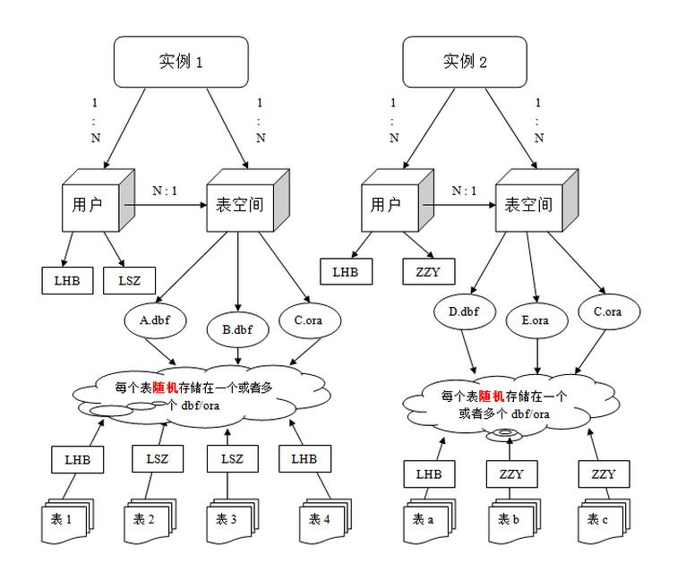
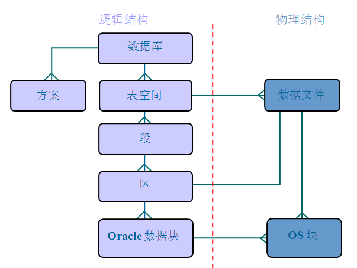
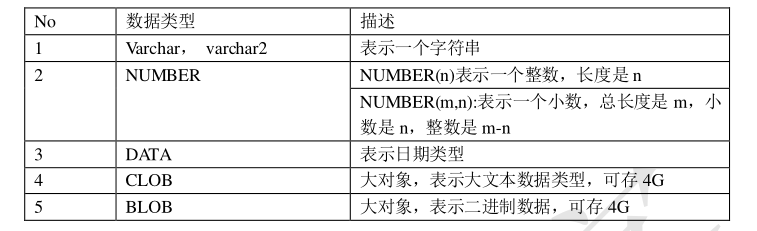

# 1. Oracle

## 1.1. 体系结构





- 数据库
  ```
  Oracle 数据库是数据的物理存储。这就包括（数据文件 ORA 或者 DBF、控制文件、联机日
  志、参数文件）。其实 Oracle 数据库的概念和其它数据库不一样，这里的数据库是一个操作系统
  只有一个库。可以看作是 Oracle 就只有一个大数据库。
  ```
- 实例：
  ```
  一个 Oracle 实例（Oracle Instance）有一系列的后台进程（Backguound Processes)和内存结构
  （Memory Structures)组成。一个数据库可以有 n 个实例。
  ```
- 用户：管理表的基本单位
  > mysql 管理表的基本单位是数据库
  ```
  用户是在实例下建立的。不同实例可以建相同名字的用户。
  ```
- 表空间

  ```
  表空间是 Oracle 对物理数据库上相关数据文件（ORA 或者 DBF 文件）的逻辑映射。一个数
  据库在逻辑上被划分成一到若干个表空间，每个表空间包含了在逻辑上相关联的一组结构。每
  个数据库至少有一个表空间(称之为 system 表空间)。

  每个表空间由同一磁盘上的一个或多个文件组成，这些文件叫数据文件(datafile)。一个数据文件
  只能属于一个表空间。
  ```

  > 

- 数据文件：

  ```
  数据文件是数据库的物理存储单位。数据库的数据是存储在表空间中的，真正是在某一个
  或者多个数据文件中。而一个表空间可以由一个或多个数据文件组成，一个数据文件只能属于
  一个表空间。一旦数据文件被加入到某个表空间后，就不能删除这个文件，如果要删除某个数
  据文件，只能删除其所属于的表空间才行。

  比如，是有用户将表的数据放入某一个表空间，而这个表空间会随机把这些表数据放到 一个或者多个数据文件中。
  ```

## 1.2. 基本操作

### 1.2.1. 数据类型



> 一般用 varchar2

### 1.2.2. 入门语句

- 创建表空间
  ```sql
  create tablespace space1
  datafile 'd:\learn\oracle\file1.dbf'
  sieze 100m --  初始大小
  autoextend on - 开启自动扩展
  next 10m; -- 每次扩增大小
  ```
- 删除表空间
  ```sql
  drop tablespace space1;
  ```
- 创建用户
  > 管理员用户是 system
  ```sql
  create user user1
  identified by password  -- 密码
  default tablespace space1;
  ```
- 给用户授权（否则无法登录）

  > 角色和用户关系见 hive

  - 常用角色：
    - connect 连接角色，基本
      ```
      ALTER SESSION --修改会话
      CREATE CLUSTER --建立聚簇
      CREATE DATABASE LINK --建立数据库链接
      CREATE SEQUENCE --建立序列
      CREATE SESSION --建立会话
      CREATE SYNONYM --建立同义词
      CREATE VIEW --建立视图
      ```
    - resource 开发者角色
      ```
      CREATE CLUSTER --建立聚簇
      CREATE PROCEDURE --建立过程
      CREATE SEQUENCE --建立序列
      CREATE TABLE --建表
      CREATE TRIGGER --建立触发器
      CREATE TYPE --建立类型
      ```
    - dba 超级管理员角色
  - 授权：`grant dba to user1`

- 创建表：

  ```
  Create table 表名（
  字段 1 数据类型 [default 默认值],
  字段 2 数据类型 [default 默认值],
  ...
  字段 n 数据类型 [default 默认值]
  ）;
  ```

- 序列不属于任何一张表，但可以逻辑和表做绑定
  ```sql
  select seqpersonid.nextval from dual; -- dual:虚表，仅仅为了补全语法
  
  insert into person value(seqpersonid.nextval,'张三');
  ```

**看 pdf**

```sql
--创建表空间
create tablespace itheima
datafile 'c:\itheima.dbf' --表空间对应数据文件
size 100m -- 开始大小
autoextend on -- 不够时自动增长
next 10m;-- 每次增长大小
--删除表空间
drop tablespace itheima;

--创建用户
create user itheima
identified by itheima --密码
default tablespace itheima;-- 默认表空间

--给用户授权
--oracle数据库中常用角色
connect--连接角色，基本角色
resource--开发者角色
dba--超级管理员角色

--给itheima用户授予dba角色
grant dba to itheima;

---切换到itheima用户下

---创建一个person表
create table person(
       pid number(20),
       pname varchar2(10)
);

-- 大多使用varchar2(len)类型，可以自动截去多余长度，但不能自动扩展

---修改表结构
---添加一列
alter table person add (gender number(1));
---修改列类型
alter table person modify gender char(1);
---修改列名称
alter table person rename column gender to sex;
---删除一列
alter table person drop column sex;

---查询表中记录
select * from person;
----添加一条记录
insert into person (pid, pname) values (1, '小明');
commit;
----修改一条记录
update person set pname = '小马' where pid = 1;
commit;

----三个删除
--删除表中全部记录
delete from person;
--删除表结构
drop table person;
--先删除表，再次创建表。效果等同于删除表中全部记录。
--在数据量大的情况下，尤其在表中带有索引的情况下，该操作效率高。
--索引可以提供查询效率，但是会影响增删改效率。
truncate table person;-- 数据量大的情况下使用该种方式 而不是delete


----序列不真的属于任何一张表，但是可以逻辑和表做绑定。
----序列：默认从1开始，依次递增，主要用来给主键赋值使用。
----cuurval一开始在第一条记录之上，所以到查询nextval后才能查询currval，否则会报错
----dual：虚表，只是为了补全语法，没有任何意义。
create sequence s_person;
select s_person.nextval from dual;
----添加一条记录
insert into person (pid, pname) values (s_person.nextval, '小明');
commit;
select * from person;

----scott用户，密码tiger。
--解锁scott用户
alter user scott account unlock;
--解锁scott用户的密码【此句也可以用来重置密码】
alter user scott identified by tiger;
--切换到scott用户下

--单行函数：作用于一行，返回一个值。
---字符函数
select upper('yes') from dual;--YES
select lower('YES') from dual;--yes
----数值函数
select round(56.16, -2) from dual;---四舍五入，后面的参数表示保留的位数
select trunc(56.16, -1) from dual;---直接截取，不在看后面位数的数字是否大于5.
select mod(10, 3) from dual;---求余数
----日期函数
----查询出emp表中所有员工入职距离现在几天。
select sysdate-e.hiredate from emp e;
----算出明天此刻
select sysdate+1 from dual;
----查询出emp表中所有员工入职距离现在几月。
select months_between(sysdate,e.hiredate) from emp e;
----查询出emp表中所有员工入职距离现在几年。
select months_between(sysdate,e.hiredate)/12 from emp e;
----查询出emp表中所有员工入职距离现在几周。
select round((sysdate-e.hiredate)/7) from emp e;
----转换函数
---日期转字符串
select to_char(sysdate, 'fm yyyy-mm-dd hh24:mi:ss') from dual;
---字符串转日期
select to_date('2018-6-7 16:39:50', 'fm yyyy-mm-dd hh24:mi:ss') from dual;
----通用函数
---算出emp表中所有员工的年薪
----奖金里面有null值，如果null值和任意数字做算术运算，结果都是null。
select e.sal*12+nvl(e.comm, 0) from emp e;

---条件表达式
---条件表达式的通用写法，mysql和oracle通用
---给emp表中员工起中文名
select e.ename, 
       case e.ename
         when 'SMITH' then '曹贼'
           when 'ALLEN' then '大耳贼'
             when 'WARD' then '诸葛小儿'
               --else '无名'
                 end
from emp e;
---判断emp表中员工工资，如果高于3000显示高收入，如果高于1500低于3000显示中等收入，
-----其余显示低收入
select e.sal, 
       case 
         when e.sal>3000 then '高收入'
           when e.sal>1500 then '中等收入'
               else '低收入'
                 end
from emp e;
----oracle中除了起别名，都用单引号。
----oracle专用条件表达式
select e.ename, 
        decode(e.ename,
          'SMITH',  '曹贼',
            'ALLEN',  '大耳贼',
              'WARD',  '诸葛小儿',
                '无名') "中文名"             
from emp e;

--多行函数【聚合函数】：作用于多行，返回一个值。
select count(1) from emp;---查询总数量
select sum(sal) from emp;---工资总和
select max(sal) from emp;---最大工资
select min(sal) from emp;---最低工资
select avg(sal) from emp;---平均工资

---分组查询
---查询出每个部门的平均工资
---分组查询中，出现在group by后面的原始列，才能出现在select后面
---没有出现在group by后面的列，想在select后面，必须加上聚合函数。
---聚合函数有一个特性，可以把多行记录变成一个值。
select e.deptno, avg(e.sal)--, e.ename
from emp e
group by e.deptno;
---查询出平均工资高于2000的部门信息
select e.deptno, avg(e.sal) asal
from emp e
group by e.deptno
having avg(e.sal)>2000;
---所有条件都不能使用别名来判断。
--比如下面的条件语句也不能使用别名当条件
select ename, sal s from emp where sal>1500;

---查询出每个部门工资高于800的员工的平均工资
select e.deptno, avg(e.sal) asal
from emp e
where e.sal>800
group by e.deptno;
----where是过滤分组前的数据，having是过滤分组后的数据。
---表现形式：where必须在group by之前，having是在group by之后。
---查询出每个部门工资高于800的员工的平均工资
---然后再查询出平均工资高于2000的部门
select e.deptno, avg(e.sal) asal
from emp e
where e.sal>800
group by e.deptno
having avg(e.sal)>2000;

---多表查询中的一些概念
---笛卡尔积
select *
from emp e, dept d;
---等值连接
select *
from emp e, dept d
where e.deptno=d.deptno;
---内连接
select *
from emp e inner join dept d
on e.deptno = d.deptno;
---查询出所有部门，以及部门下的员工信息。【外连接】
select *
from emp e right join dept d
on e.deptno=d.deptno;
---查询所有员工信息，以及员工所属部门
select *
from emp e left join dept d
on e.deptno=d.deptno;
---oracle中专用外连接
select *
from emp e, dept d
where e.deptno(+) = d.deptno;

select * from emp;
---查询出员工姓名，员工领导姓名
---自连接：自连接其实就是站在不同的角度把一张表看成多张表。
select e1.ename, e2.ename
from emp e1, emp e2
where e1.mgr = e2.empno;
------查询出员工姓名，员工部门名称，员工领导姓名，员工领导部门名称
select e1.ename, d1.dname, e2.ename, d2.dname
from emp e1, emp e2, dept d1, dept d2
where e1.mgr = e2.empno
and e1.deptno=d1.deptno
and e2.deptno=d2.deptno;

---子查询
---子查询返回一个值
---查询出工资和SCOTT一样的员工信息
select * from emp where sal in
(select sal from emp where ename = 'SCOTT')
---子查询返回一个集合
---查询出工资和10号部门任意员工一样的员工信息
select * from emp where sal in
(select sal from emp where deptno = 10);
---子查询返回一张表
---查询出每个部门最低工资，和最低工资员工姓名，和该员工所在部门名称
---1，先查询出每个部门最低工资
select deptno, min(sal) msal
from emp 
group by deptno;
---2，三表联查，得到最终结果。
select t.deptno, t.msal, e.ename, d.dname
from (select deptno, min(sal) msal
      from emp 
      group by deptno) t, emp e, dept d
where t.deptno = e.deptno
and t.msal = e.sal
and e.deptno = d.deptno;

----oracle中的分页
---rownum行号：当我们做select操作的时候，
--每查询出一行记录，就会在该行上加上一个行号，
--行号从1开始，依次递增，不能跳着走。

----排序操作会影响rownum的顺序
select rownum, e.* from emp e order by e.sal desc
----如果涉及到排序，但是还要使用rownum的话，我们可以再次嵌套查询。
select rownum, t.* from(
select rownum, e.* from emp e order by e.sal desc) t;


----emp表工资倒叙排列后，每页五条记录，查询第二页。
----rownum行号不能写上大于一个正数。
select * from(
    select rownum rn, tt.* from(
          select * from emp order by sal desc
    ) tt where rownum<11
) where rn>5
```

