# 1. NoSQL概述

## 1.1. 数据3V与需求3高

- 大数据时代的3V：
  - 海量Volume
  - 多样Variety
  - 实时Velocity
- 互联网需求的3高：
  - 高并发
  - 高可括
    - 纵向扩展：提高一台机器的性能
    - 横向扩展：搭建集群
  - 高性能

## 1.2. 互联网架构演变

- 单机MySQL
  <details>
  <summary style="color:red;">说明</summary>

  在90年代，一个网站的访问量一般都不大，用单个数据库完全可以轻松应付。
  在那个时候，更多的都是静态网页，动态交互类型的网站不多。

  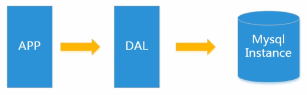
  > DAL dal是数据访问层的英文缩写，即为数据访问层（Data Access Layer）

  - 上述架构下，数据存储的瓶颈有三方面
    - 数据量的总大小一个机器放不下时
    - 数据的索引(B+ Tree)一个机器的内存放不下时
    - 访问量(读写混合)一个实例不能承受

  </details>

- Memcached(缓存)+MySQL+垂直拆分
  <details>
  <summary style="color:red;">说明</summary>

  后来，随着访问量的上升，几乎大部分使用MySQL架构的网站在数据库上都开始出现了性能问题，web程序不再仅仅专注在功能上，同时也在追求性能。
  程序员们开始大量的使用缓存技术来缓解数据库的压力，优化数据库的结构和索引。
  开始比较流行的是通过文件缓存来缓解数据库压力，但是当访问量继续增大的时候，多台web机器通过文件缓存不能共享，
  大量的小文件缓存也带了了比较高的IO压力。在这个时候，Memcached就自然的成为一个非常时尚的技术产品。

  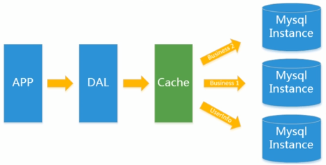
  </details>

- Mysql主从读写分离
  <details>
  <summary style="color:red;">说明</summary>

  由于数据库的写入压力增加，Memcached 只能缓解数据库的读取压力。读写集中在一个数据库上让数据库不堪重负，
  大部分网站开始使用主从复制技术来达到读写分离，以提高读写性能和读库的可扩展性。Mysql的master-slave模 式成为这个时候的网站标配了。

  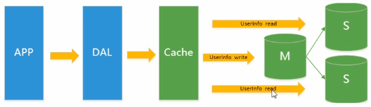
  </details>
- 分表分库+水平拆分+mysql集群
  <details>
  <summary style="color:red;">说明</summary>

  在Memcached的高速缓存，MySQL的主从复制， 读写分离的基础之上，这时MySQL主库的写压力开始出现瓶颈，而数据量的持续猛增，由于MyISAM使用表锁，在高并发下会出现严重的锁问题，大量的高并发MySQL应用开始使用InnoDB引擎代替MyISAM。

  同时，开始流行使用分表分库来缓解写压力和数据增长的扩展问题。这个时候，分表分库成了一个热门技术，是面试的热门问题也是业界讨论的热门技术问题。也就在这个时候，MySQL推出了还不太稳定的表分区，这也给技术实力一般的公司带来了希望。虽然MySQL推出了MySQL Cluster集群，但性能也不能很好满足互联网的要求，只是在高可靠性上提供了非常大的保证。

  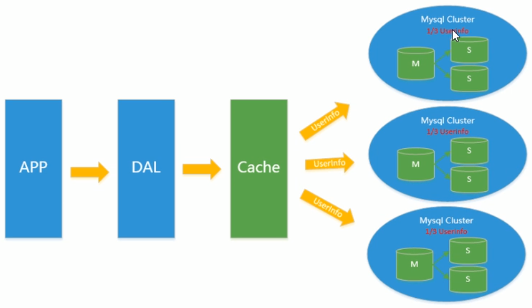
  </details>

- 如今
  <details>
  <summary style="color:red;">说明</summary>

  - MySQL的扩展性瓶颈
    - MySQL数据库也经常存储一些大文本字段，导致数据库表非常的大，在做数据库恢复的时候就导致非常的慢，不容易快速恢复数据库。
    - 比如1000万4KB大小的文本就接近40GB的大小， 如果能把这些数据从MySQL省去，MySQL将变得非常的小。
    - 关系数据库很强大，但是它并不能很好的应付所有的应用场景。
    - MySQL的扩展性差(需要复杂的技术来实现)，大数据下IO压力大，表结构更改困难，正是当前使用MySOL的开发人员面临的问题。

  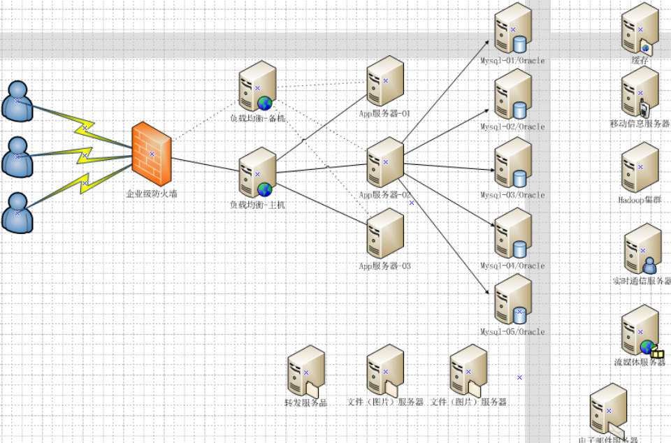
  </details>

## 1.3. Alibaba架构演变

[链接](https://blog.csdn.net/u011863024/article/details/107476187)

## 1.4. NOSQL概念说明

### 1.4.1. 简要说明

- redis时一款高性能的NOSQL系列的非关系型数据库
- NoSQL(NoSQL = Not Only SQL)，意即“不仅仅是SQL”， **泛指非关系型的数据库**。
- 随着互联网web2.0网站的兴起，传统的关系数据库在应付web2.0网站，特别是超大规模和高并发的SNS类型的web2.0纯动态网站已经显得力不从心，暴露了很多难以克服的问题，而非关系型的数据库则由于其本身的特点得到了非常迅速的发展。
- NoSQL 数据库的产生就是为了解决大规模数据集合多重数据种类带来的挑战，尤其是大数据应用难题，包括超大规模数据的存储。
- (例如谷歌或Facebook每天为他们的用户收集万亿比特的数据)。
- **这些类型的数据存储不需要固定的模式，无需多余操作就可以横向扩展**。

### 1.4.2. NoSQL特点

- 易扩展
  - NoSQL数据库种类繁多，但是一个共同的特点都是去掉关系数据库的关系型特性。数据之间无关系，这样就非常容易扩展。
  - 也无形之间，在架构的层面上带来了可扩展的能力。
- 大数据量高性能
  - NoSQL数据库都具有非常高的读写性能，尤其在大数据量下，同样表现优秀。
  - 这得益于它的无关系性，数据库的结构简单。
  - 一般MySQL使用Query Cache，每次表的更新Cache就失效，是一种大粒度的Cache，在针对web2.0的交互频繁的应用，Cache性能不高。
  - 而NoSQL的Cache是记录级的，是一种细粒度的Cache，所以NoSQL在这个层面上来说就要性能高很多了。
- 多样灵活的数据模型
  - NoSQL无需事先为要存储的数据建立字段，随时可以存储自定义的数据格式。
  - 而在关系数据库里，增删字段是一件非常麻烦的事情。如果是非常大数据量的表，增加字段简直就是一个噩梦。

### 1.4.3. 关系型数据库比较

- nosql
  - 优点：
    - 1）成本：nosql数据库简单易部署，基本都是开源软件，不需要像使用oracle那样花费大量成本购买使用，相比关系型数据库价格便宜。
    - 2）查询速度：nosql数据库将数据存储于缓存之中，关系型数据库将数据存储在硬盘中，自然查询速度远不及nosql数据库。
    - 3）存储数据的格式：nosql的存储格式是key,value形式、文档形式、图片形式等等，所以可以存储基础类型以及对象或者是集合等各种格式，而数据库则只支持基础类型。
    - 4）扩展性：关系型数据库有类似join这样的多表查询机制的限制导致扩展很艰难。
  - 缺点：
    - 1）维护的工具和资料有限，因为nosql是属于新的技术，不能和关系型数据库10几年的技术同日而语。
    - 2）不提供对sql的支持，如果不支持sql这样的工业标准，将产生一定用户的学习和使用成本。
    - 3）有的不提供关系型数据库对事务的处理。
    - 4）并不安全，数据存储在内存中可能未来得及持久化导致丢失
  - 优势：
    - 1）性能NOSQL是基于键值对的，可以想象成表中的主键和值的对应关系，而且不需要经过SQL层的解析，所以性能非常高。
    - 2）可扩展性同样也是因为基于键值对，数据之间没有耦合性，所以非常容易水平扩展。

- 关系型数据库
  - 优势：
    - 1）复杂查询可以用SQL语句方便的在一个表以及多个表之间做非常复杂的数据查询。
    - 2）事务支持使得对于安全性能很高的数据访问要求得以实现。对于这两类数据库，对方的优势就是自己的弱势，反之亦然。

---

- 总结
  - 关系型数据库与NoSQL数据库并非对立而是互补的关系，即通常情况下使用关系型数据库，在适合使用NoSQL的时候使用NoSQL数据库，
  - 让NoSQL数据库对关系型数据库的不足进行弥补。
  - 一般会将数据存储在关系型数据库中，在nosql数据库中备份存储关系型数据库的数据


```
关系型数据库                               nosql

高度组织化结构化数据                       代表着不仅仅是SQL
结构化查询语言(SQL)                        没有声明性查询语言
数据和关系都存储在单独的表中               没有预定义的模式
数据操纵语言，数据定义语言                 键-值对存储，列存储，文档存储，图形数据库
严格的一致性                               最终一致性，而非ACID属性
基础事务                                   非结构化和不可预知的数据:
                                           CAP定理
                                           高性能，高可用性和可伸缩性

```

### 1.4.4. 常见NoSQl数据库

- Redis:有丰富的数据结构
- Tair:有丰富的数据结构
- Mongodb:非常像关系型数据库
  - MongoDB是一个基于分布式文件存储的数据库。由C++语言编写。旨在为WEB应用提供可扩展的高性能数据存储解决方案。
  - MongoDB是一个介于关系数据库和非关系数据库之间的产品，是非关系数据库当中功能最丰富，最像关系数据库的。
- Memcache:注重于高速缓存

---

- 企业使用：
  - 新浪:BerkeleyDB+Redis
  - 美团:redis+tair
  - 阿里、百度:memcache+redis

### 1.4.5. redis三个重要特点

- KV
- Cache
- Persistence

## 1.5. 四种NoSQL数据模型

- 键值(Key-Value)存储数据库
  - 相关产品： Tokyo Cabinet/Tyrant、Redis、Voldemort、Berkeley DB
  - 典型应用： 内容缓存，主要用于处理大量数据的高访问负载。
  - 数据模型： 一系列键值对
  - 优势： 快速查询
  - 劣势： 存储的数据缺少结构化
- 列存储数据库
  - 相关产品：Cassandra, HBase, Riak
  - 典型应用：分布式的文件系统
  - 数据模型：以列簇式存储，将同一列数据存在一起
  - 优势：查找速度快，可扩展性强，更容易进行分布式扩展
  - 劣势：功能相对局限
- 文档型数据库
  - 相关产品：CouchDB、MongoDB(Bson)
  - 典型应用：Web应用（与Key-Value类似，Value是结构化的）
  - 数据模型： 一系列键值对
  - 优势：数据结构要求不严格
  - 劣势： 查询性能不高，而且缺乏统一的查询语法
- 图形(Graph)数据库
  - 相关数据库：Neo4J、InfoGrid、Infinite Graph
  - 典型应用：社交网络
  - 数据模型：图结构
  - 优势：利用图结构相关算法。
  - 劣势：需要对整个图做计算才能得出结果，不容易做分布式的集群方案。

  <details>
  <summary style="color:red;">图数据库示例</summary>

  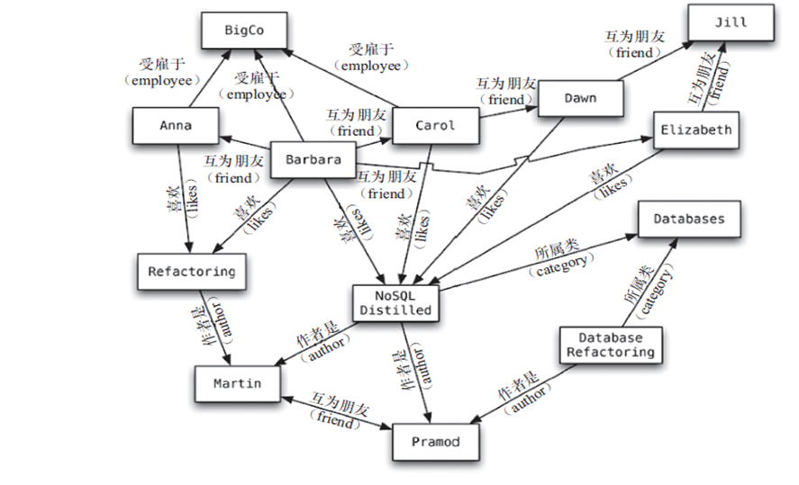
  </details>

## 1.6. 分布式数据库原理

### 1.6.1. CAP

- CAP
  - 构成：
    - C:Consistency（强一致性）
    - A:Availability（可用性）
    - P:Partition tolerance（分区容错性）
  - 说明
    - CAP理论就是说在分布式存储系统中，最多只能实现上面的两点。
  - 运用
    - 而由于当前的网络硬件肯定会出现延迟丢包等问题， **所以分区容忍性是我们必须需要实现的** 。
    - 所以我们只能 **在一致性和可用性之间进行权衡** 
      >多余大多数web应用，其实并不需要强一致性。因此牺牲C换取P，这是目前分布式数据库产品的方向。
    - **没有NoSQL系统能同时保证这三点**。
  - 实际示例
    - CA:
      - 说明：单点集群，满足一致性，可用性的系统，通常在可扩展性上不太强大。
      - 使用：传统Oracle数据库
    - AP:
      - 说明
        - 满足可用性，分区容忍性的系统，通常可能对一致性要求低一些。
        - 有一些数据不一定要求异常精准，比如浏览数
        - 相对于强一致性，可用性更重要。
      - 使用：大多数网站架构的选择
    - CP:
      - 说明：
        - 满足一致性，分区容忍必的系统，通常性能不是特别高。
        - Redis起初目的是为了帮mysql减负
        - 所以要求查询数据时的强一致性。
      - 使用：Redis、Mongodb
    - 注意：分布式架构的时候必须做出取舍。
    - 图示
      > 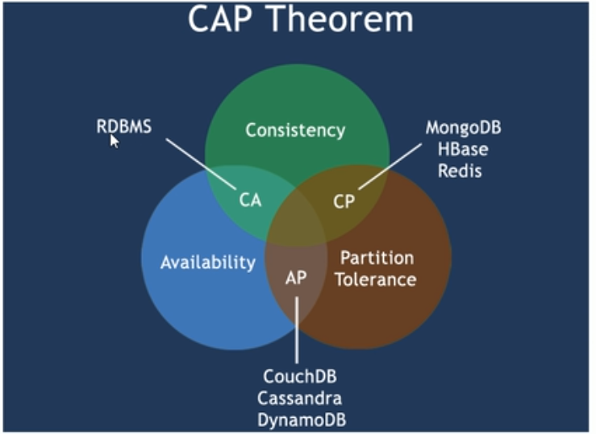-


<details>
<summary style="color:red;">详细说明</summary>

**CA without P**

所以如果你的分布式系統做到 CA，牺牲`Partition Tolerance`，那就是代表你的机房永远不會出現网络分区，永遠不會丢包 ，这么完美的机房给我來一打吧…除非有可能有完美的网路环境，否則 CA 根本就是传统的单机系统，而非分布式系統。

在分布式环境下，网络分区是一个自然的事实。因为分区是必然的，所以如果舍弃P，意味着要舍弃分布式系统。

**CP without A**

如果一个分布式系统不要求强的可用性，即容许系统停机或者长时间无响应的话，就可以在CAP三者中保障CP而舍弃A。

一个保证了CP而一个舍弃了A的分布式系统，一旦发生网络故障或者消息丢失等情况，就要牺牲用户的体验，等待所有数据全部一致了之后再让用户访问系统。

在单机版的Redis中，每个Master之间是没有任何通信的，所以我们一般在Jedis客户端或者Codis这样的代理中做Pre-sharding。按照CAP理论来说，单机版的Redis属于保证CP(Consistency & Partition-Tolerancy)而牺牲A(Availability)，也就说Redis能够保证所有用户看到相同的数据（一致性，因为Redis不自动冗余数据）和网络通信出问题时，暂时隔离开的子系统能继续运行（分区容忍性，因为Master之间没有直接关系，不需要通信），但是不保证某些结点故障时，所有请求都能被响应（可用性，某个Master结点挂了的话，那么它上面分片的数据就无法访问了）。

有了Cluster功能后，Redis从一个单纯的NoSQL内存数据库变成了分布式NoSQL数据库，CAP模型也从CP变成了AP。也就是说，通过自动分片和冗余数据，Redis具有了真正的分布式能力，某个结点挂了的话，因为数据在其他结点上有备份，所以其他结点顶上来就可以继续提供服务，保证了Availability。然而，也正因为这一点，Redis无法保证曾经的强一致性了。这也是CAP理论要求的，三者只能取其二。

**AP wihtout C**

要高可用并允许分区，则需放弃一致性。一旦网络问题发生，节点之间可能会失去联系。为了保证高可用，需要在用户访问时可以马上得到返回，则每个节点只能用本地数据提供服务，而这样会导致全局数据的不一致性。

这种舍弃强一致性而保证系统的分区容错性和可用性的场景和案例非常多。前面我们介绍可用性的时候说到过，很多系统在可用性方面会做很多事情来保证系统的全年可用性可以达到N个9，所以，对于很多业务系统来说，比如淘宝的购物，12306的买票。都是在可用性和一致性之间舍弃了一致性而选择可用性。

你在12306买票的时候肯定遇到过这种场景，当你购买的时候提示你是有票的（但是可能实际已经没票了），你也正常的去输入验证码，下单了。但是过了一会系统提示你下单失败，余票不足。这其实就是先在可用性方面保证系统可以正常的服务，然后在数据的一致性方面做了些牺牲，会影响一些用户体验，但是也不至于造成用户流程的严重阻塞。

但是，我们说很多网站牺牲了一致性，选择了可用性，这其实也不准确的。就比如上面的买票的例子，其实舍弃的只是强一致性。退而求其次保证了最终一致性。也就是说，虽然下单的瞬间，关于车票的库存可能存在数据不一致的情况，但是过了一段时间，还是要保证最终一致性的。

对于多数大型互联网应用的场景，主机众多、部署分散，而且现在的集群规模越来越大，所以节点故障、网络故障是常态，而且要保证服务可用性达到N个9，即保证P和A，舍弃C（退而求其次保证最终一致性）。虽然某些地方会影响客户体验，但没达到造成用户流程的严重程度。
</details>


---

- 当今数据库的需求说明：
  > 对于web2.0网站来说，关系数据库的很多主要特性却往往无用武之地
  - 数据库事务一致性需求
    - 很多web实时系统并不要求严格的数据库事务，
    - 对读一致性的要求很低，有些场合对写一致性要求并不高。允许实现最终一致性。
  - 数据库的写实时性和读实时性需求
    - 对关系数据库来说，插入一条数据之后立刻查询，是肯定可以读出来这条数据的，但是对于很多web应用来说，并不要求这么高的实时性，
    - 比方说在微博发一条消息之后，过几秒乃至十几秒之后，我的订阅者才看到这条动态是完全可以接受的。
  - 对复杂的SQL查询，特别是多表关联查询的需求
    - 任何大数据量的web系统，都非常忌讳多个大表的关联查询，以及复杂的数据分析类型的报表查询，
    - 特别是SNS类型的网站，从需求以及产品设计角度，就避免了这种情况的产生。
    - 往往更多的只是单表的主键查询，以及单表的简单条件分页查询，SQL的功能被极大的弱化了。


### 1.6.2. BASE

- BASE
  - 基本可用（Basically Available）
  - 软状态（Soft state）
  - 最终一致（Eventually consistent）

它的思想是通过 **让系统放松对某一时刻数据一致性的要求来换取系统整体伸缩性和性能上改观** 。

为什么这么说呢，缘由就在于大型系统往往由于地域分布和极高性能的要求，不可能采用分布式事务来完成这些指标，要想获得这些指标，
我们必须采用另外一种方式来完成，这里BASE就是解决这个问题的办法。


### 1.6.3. 分布式+集群


- 分布式系统（distributed system）
  - 由多台计算机和通信的软件组件通过计算机网络连接（本地网络或广域网）组成。
  - 分布式系统是建立在网络之上的软件系统。正是因为软件的特性，所以分布式系统具有高度的内聚性和透明性。
  - 因此，网络和分布式系统之间的区别更多的在于高层软件（特别是操作系统），而不是硬件。
  - 分布式系统可以应用在在不同的平台上如：PC、工作站、局域网和广域网上等。

- 概括：
  - 分布式：不同的多台服务器上面部署不同的服务模块（工程），他们之间通过Rpc/Rmi之间通信和调用，对外提供服务和组内协作。
  - 集群：不同的多台服务器上面部署相同的服务模块，通过分布式调度软件进行统一的调度，对外提供服务和访问。


# 2. Redis概述

## 2.1. 说明

**Redis:REmote DIctionary Server** (远程字典服务器)是完全开源免费的，用C语言编写的，遵守BSD协议，是一个高性能的(key/value)分布式内存数据库，基于内存运行 并支持持久化的NoSQL数据库，是当前最热门的NoSql数据库之一，也被人们称为数据结构服务器。

- Redis 与其他 key - value 缓存产品有以下三个特点：
  - Redis支持数据的持久化，可以将内存中的数据保持在磁盘中，重启的时候可以再次加载进行使用
  - Redis不仅仅支持简单的key-value类型的数据，同时还提供list，set，zset，hash等数据结构的存储
  - Redis支持数据的备份，即master-slave模式的数据备份

## 2.2. 主要应用

- 内存存储和持久化：redis支持异步将内存中的数据写到硬盘上，同时不影响继续服务
- 取最新N个数据的操作，如：可以将最新的10条评论的ID放在Redis的List集合里面
- 模拟类似于HttpSession这种需要设定过期时间的功能
- 发布、订阅消息系统
- 定时器、计数器

## 2.3. 安装

不进行详细说明

## 2.4. 杂项

- redis-benchmark.exe 测试redis在机器运行的效能
- 单进程
  - 单进程模型来处理客户端的请求。对读写等事件的响应 是通过对epoll函数的包装来做到的。Redis的实际处理速度完全依靠主进程的执行效率
  - Epoll是Linux内核为处理大批量文件描述符而作了改进的epoll，是Linux下多路复用IO接口select/poll的增强版本， 它能显著提高程序在大量并发连接中只有少量活跃的情况下的系统CPU利用率。
- 默认 **16个数据库** ，
  - 类似数组，下表从零开始，初始默认使用零号库
  - 可在配置文件配置
    ```
    databases 16
    ```
- select命令切换数据库:`select dbid`
- `dbsize`查看当前数据库的key的数量
- flushdb：清空 **当前库**，谨慎用。
- flushall；清空全部16个库，别用
- 统一密码管理， **16个库都是同样密码** ，要么都OK要么一个也连接不上
- Redis索引都是从零开始
- 默认端口是6379

# 3. 数据类型

## 3.1. 简介

- String（字符串）
  - string是redis最基本的类型，你可以理解成与Memcached一模一样的类型，一个key对应一个value。
  - string类型是 **二进制安全** 的。意思是redis的string可以包含任何数据。比如jpg图片或者序列化的对象 。
  - string类型是Redis **最基本** 的数据类型，一个redis中字符串value最多可以是 **512M**
- Hash（哈希，类似java里的Map）
  - Redis hash 是一个 **键值对集合**　。
  - Redis hash是一个string类型的field和value的映射表，hash特别适合用于存储对象。
  - 类似Java里面的`Map<String,Object>`
- List（列表）
  - Redis 列表是简单的 **字符串列表** ，按照插入顺序排序。
  - 可以添加一个元素导列表的头部（左边）或者尾部（右边）。
  - 它的底层实际是个 **链表** 。类似于java里面的`LinkedList`
- Set（集合）
  - Redis的Set是string类型的 **无序无重复集合** 。
  - 它是通过HashTable实现实现的
- Zset(sorted set：有序集合)
  - Redis zset 和 set 一样也是string类型元素的集合，且不允许重复的成员。
  - 不同的是每个元素都会关联一个 **double类型的分数** 。
  - redis正是 **通过分数来为集合中的成员进行从小到大的排序** 。
  - **zset的成员是唯一的，但分数(score)却可以重复** 。

## 3.2. Key

**常用命令** ：

| 命令                                      | 描述                                                         |
| ----------------------------------------- | ------------------------------------------------------------ |
| del key                                   | 该命令用于在 key 存在时删除 key。                            |
| dump key                                  | 序列化给定 key ，并返回被序列化的值。                        |
| exists key                                | 检查给定 key 是否存在。                                      |
| expire key seconds                        | 为给定 key 设置过期时间，以秒计。                            |
| expireat key timestamp                    | expireat 的作用和 expire 类似，都用于为 key 设置过期时间。 不同在于 expireat 命令接受的时间参数是 unix 时间戳(unix timestamp)。 |
| pexpire key milliseconds                  | 设置 key 的过期时间以毫秒计。                                |
| pexpireat key milliseconds-timestamp      | 设置 key 过期时间的时间戳(unix timestamp) 以毫秒计           |
| keys pattern                              | 查找所有符合给定模式( pattern)的 key 。                      |
| move key db                               | 将当前数据库的 key 移动到给定的数据库 db 当中。              |
| persist key                               | 移除 key 的过期时间，key 将持久保持。                        |
| pttl key                                  | 以毫秒为单位返回 key 的剩余的过期时间。                      |
| ttl key                                   | 以秒为单位，返回给定 key 的剩余生存时间(ttl, time to live)。 |
| randomkey                                 | 从当前数据库中随机返回一个 key 。                            |
| rename key newkey                         | 修改 key 的名称                                              |
| renamenx key newkey                       | 仅当 newkey 不存在时，将 key 改名为 newkey 。                |
| scan cursor [match pattern] [count count] | 迭代数据库中的数据库键。                                     |
| type key                                  | 返回 key 所储存的值的类型。                                  |

## 3.3. String

**常用命令**

| 命令                           | 描述                                                         |
| ------------------------------ | ------------------------------------------------------------ |
| set key value                  | 设置指定 key 的值                                            |
| get key                        | 获取指定 key 的值。                                          |
| getrange key start end         | 返回 key 中字符串值的子字符,-1时最后                                  |
| getset key value               | 将给定 key 的值设为 value ，并返回 key 的旧值(old value)。   |
| getbit key offset              | 对 key 所储存的字符串值，获取指定偏移量上的位(bit)。         |
| mget key1 [key2…]              | 获取所有(一个或多个)给定 key 的值。                          |
| setbit key offset value        | 对 key 所储存的字符串值，设置或清除指定偏移量上的位(bit)。   |
| setex key seconds value        | 将值 value 关联到 key ，并将 key 的过期时间设为 seconds (以秒为单位)。 |
| setnx key value                | 只有在 key 不存在时设置 key 的值。                           |
| setrange key offset value      | 用 value 参数覆写给定 key 所储存的字符串值，从偏移量 offset 开始。 |
| strlen key                     | 返回 key 所储存的字符串值的长度。                            |
| mset key value [key value …]   | 同时设置一个或多个 key-value 对。                            |
| msetnx key value [key value …] | 同时设置一个或多个 key-value 对，当且仅当 **所有** 给定 key 都不存在。 |
| psetex key milliseconds value  | 这个命令和 setex 命令相似，但它以毫秒为单位设置 key 的生存时间，而不是像 setex 命令那样，以秒为单位。 |
| incr key                       | 将 key 中储存的数字值增一。                                  |
| incrby key increment           | 将 key 所储存的值加上给定的增量值（increment） 。            |
| incrbyfloat key increment      | 将 key 所储存的值加上给定的浮点增量值（increment） 。        |
| decr key                       | 将 key 中储存的数字值减一。                                  |
| decrby key decrement           | key 所储存的值减去给定的减量值（decrement） 。               |
| append key value               | 如果 key 已经存在并且是一个字符串， append 命令将指定的 value 追加到该 key 原来值（value）的末尾。 |

## 3.4. List

**常用命令**

| 命令                                  | 描述                                                         |
| ------------------------------------- | ------------------------------------------------------------ |
| blpop key1 [key2 ] timeout            | 移出并获取列表的第一个元素， 如果列表没有元素会阻塞列表直到等待超时或发现可弹出元素为止。 |
| brpop key1 [key2 ] timeout            | 移出并获取列表的最后一个元素， 如果列表没有元素会阻塞列表直到等待超时或发现可弹出元素为止。 |
| brpoplpush source destination timeout | 从列表中弹出一个值，将弹出的元素插入到另外一个列表中并返回它； 如果列表没有元素会阻塞列表直到等待超时或发现可弹出元素为止。 |
| lindex key index                      | 通过索引获取列表中的元素                                     |
| linsert key before/after pivot value  | 在列表的元素前或者后插入元素                                 |
| llen key                              | 获取列表长度                                                 |
| lpop key                              | 移出并获取列表的第一个元素                                   |
| lpush key value1 [value2]             | 将一个或多个值插入到列表头部                                 |
| lpushx key value                      | 将一个值插入到已存在的列表头部                               |
| lrange key start stop                 | 获取列表指定范围内的元素                                     |
| lrem key count value                  | 移除列表元素                                                 |
| lset key index value                  | 通过索引设置列表元素的值                                     |
| ltrim key start stop                  | 对一个列表进行修剪(trim)，就是说，让列表只保留指定区间内的元素，不在指定区间之内的元素都将被删除。 |
| rpop key                              | 移除列表的最后一个元素，返回值为移除的元素。                 |
| rpoplpush source destination          | 移除列表的最后一个元素，并将该元素添加到另一个列表并返回     |
| rpush key value1 [value2]             | 在列表中添加一个或多个值                                     |
| rpushx key value                      | 为已存在的列表添加值                                         |

**注意:是首插，左为首，也就是新插入的为首**

- 开头字母：
  - l是left
  - r时right
  - b是阻塞

- 性能总结：
  - 它是一个字符串链表，left、right都可以插入添加；
  - 如果键不存在，创建新的链表；
  - 如果键已存在，新增内容；
  - 如果值全移除，对应的键也就消失了。
  - 链表的操作 **无论是头和尾效率都极高** ，但假如是对中间元素进行操作，效率就很惨淡了。

## 3.5. Set

**常用命令**

| 命令                                           | 描述                                                |
| ---------------------------------------------- | --------------------------------------------------- |
| sadd key member1 [member2]                     | 向集合添加一个或多个成员                            |
| scard key                                      | 获取集合的成员数                                    |
| sdiff key1 [key2]                              | 返回给定所有集合的差集                              |
| sdiffstore destination key1 [key2]             | 返回给定所有集合的差集并存储在 destination 中       |
| sinter key1 [key2]                             | 返回给定所有集合的交集                              |
| sinterstore destination key1 [key2]            | 返回给定所有集合的交集并存储在 destination 中       |
| sismember key member                           | 判断 member 元素是否是集合 key 的成员               |
| smembers key                                   | 返回集合中的所有成员                                |
| smove source destination member                | 将 member 元素从 source 集合移动到 destination 集合 |
| spop key                                       | 移除并返回集合中的一个随机元素                      |
| srandmember key [count]                        | 返回集合中一个或多个随机数                          |
| srem key member1 [member2]                     | 移除集合中一个或多个成员                            |
| sunion key1 [key2]                             | 返回所有给定集合的并集                              |
| sunionstore destination key1 [key2]            | 所有给定集合的并集存储在 destination 集合中         |
| sscan key cursor [match pattern] [count count] | 迭代集合中的元素                                    |

## 3.6. zset

在set基础上，加一个score值。 之前set是k1 v1 v2 v3， 现在zset是k1 score1 v1 score2 v2

**常用命令**

| 命令                                           | 描述                                                         |
| ---------------------------------------------- | ------------------------------------------------------------ |
| zadd key score1 member1 [score2 member2]       | 向有序集合添加一个或多个成员，或者更新已存在成员的分数       |
| zcard key                                      | 获取有序集合的成员数                                         |
| zcount key min max                             | 计算在有序集合中指定区间分数的成员数                         |
| zincrby key increment member                   | 有序集合中对指定成员的分数加上增量 increment                 |
| zinterstore destination numkeys key [key …]    | 计算给定的一个或多个有序集的交集并将结果集存储在新的有序集合 key 中 |
| zlexcount key min max                          | 在有序集合中计算指定字典区间内成员数量                       |
| zrange key start stop [withscores]             | 通过索引区间返回有序集合指定区间内的成员                     |
| zrangebylex key min max [limit offset count]   | 通过字典区间返回有序集合的成员                               |
| zrangebyscore key min max [withscores] [limit] | 通过分数返回有序集合指定区间内的成员                         |
| zrank key member                               | 返回有序集合中指定成员的索引                                 |
| zrem key member [member …]                     | 移除有序集合中的一个或多个成员                               |
| zremrangebylex key min max                     | 移除有序集合中给定的字典区间的所有成员                       |
| zremrangebyrank key start stop                 | 移除有序集合中给定的排名区间的所有成员                       |
| zremrangebyscore key min max                   | 移除有序集合中给定的分数区间的所有成员                       |
| zrevrange key start stop [withscores]          | 返回有序集中指定区间内的成员，通过索引，分数从高到低         |
| zrevrangebyscore key max min [withscores]      | 返回有序集中指定分数区间内的成员，分数从高到低排序           |
| zrevrank key member                            | 返回有序集合中指定成员的排名，有序集成员按分数值递减(从大到小)排序 |
| zscore key member                              | 返回有序集中，成员的分数值                                   |
| zunionstore destination numkeys key [key …]    | 计算给定的一个或多个有序集的并集，并存储在新的 key 中        |
| zscan key cursor [match pattern] [count count] | 迭代有序集合中的元素（包括元素成员和元素分值）               |

## 3.7. HyperLogLog

- 说明：
  - Redis 在 2.8.9 版本添加了 HyperLogLog 结构。
  - Redis HyperLogLog 是用来做 **基数统计** 的算法，HyperLogLog 的优点是，在输入元素的数量或者体积非常非常大时，计算基数所需的空间总是固定 的、并且是很小的。
    - 基数:比如数据集 {1, 3, 5, 7, 5, 7, 8}， 那么这个数据集的基数集为 {1, 3, 5 ,7, 8}, 基数(不重复元素)为5。 基数估计就是在误差可接受的范围内，快速计算基数。
  - 在 Redis 里面，每个 HyperLogLog 键只需要花费 12 KB 内存，就可以计算接近 2^64 个不同元素的基 数。这和计算基数时，元素越多耗费内存就越多的集合形成鲜明对比。
  - 但是，因为 HyperLogLog 只会根据输入元素来计算基数，而不会储存输入元素本身，所以 HyperLogLog 不能像集合那样，返回输入的各个元素。

**常用命令**

| 序号 | 命令                                      | 描述                                      |
| ---- | ----------------------------------------- | ----------------------------------------- |
| 1    | PFADD key element [element ...]           | 添加指定元素到 HyperLogLog 中。           |
| 2    | PFCOUNT key [key ...]                     | 返回给定 HyperLogLog 的基数估算值。       |
| 3    | PFMERGE destkey sourcekey [sourcekey ...] | 将多个 HyperLogLog 合并为一个 HyperLogLog |

## 3.8. 关于过期删除

- **key过期后不会立即删除**
  - 因为删除key时肯定是主服务来删除(因为redis是 **单线程** 的)，所以当他在执行删除指令的时候，他就无法进行其他的操作
  - 立即删除会影响性能；所以呢，他不会立即进行删除；

- 删除机制：
  - (1)定期删除：
    - redis每隔一段时间就会去查看reids，设置了过期时间的key，会在100ms的间隔内默认查看3个key。
  - (2)惰性删除：
    - 如果当你去查询一个已经过了生存时间的key时，redis会先查看当前key的生存时间，
    - 如果你查询的key已经过了生存时间，redis会立即删除，并且返回给用户一个null值；
    - 也就是当你去查询的时候，redis去进行删除；

**注意：当然无论redis删没删掉这个key外界都是查不到的；只是没删的话还占着内存而已**


# 4. 配置文件说明

通过 `CONFIG` 命令set或get配置项。

<details>
<summary style="color:red;">配置文件翻译解读</summary>

  ```
  ######################### 引用 #########################

  # 不同redis server可以使用同一个模版配置作为主配置，并引用其它配置文件用于本server的个性# 化设置
  # include并不会被CONFIG REWRITE命令覆盖。但是主配置文件的选项会被覆盖。
  # 想故意覆盖主配置的话就把include放文件前面，否则最好放末尾
  # include /path/to/local.conf
  # include /path/to/other.conf

  ######################### 网络 #########################

  # 不指定bind的话redis将会监听所有网络接口。这个配置是肯定需要指定的。
  # Examples:
  # bind 192.168.1.100 10.0.0.1
  # bind 127.0.0.1 ::1
  # 下面这个配置是只允许本地客户端访问。
  bind 127.0.0.1

  # 是否开启保护模式。默认开启，如果没有设置bind项的ip和redis密码的话，服务将只允许本地访 问。
  protected-mode yes

  # 端口设置，默认为 6379
  # 如果port设置为0 redis将不会监听tcp socket
  port 6379

  # 在高并发环境下需要一个高backlog值来避免慢客户端连接问题。注意Linux内核默默将这个值减小到/proc/sys/net/core/somaxconn的值，所以需要确认增大somaxconn和tcp_max_syn_backlog 两个值来达到需要的效果。
  tcp-backlog 511

  # 指定用来监听Unix套套接字的路径。没有默认值，没有指定的情况下Redis不会监听Unix socket
  # unixsocket /tmp/redis.sock
  # unixsocketperm 700

  # 客户端空闲多少秒后关闭连接（0为不关闭）timeout 0# tcp-keepalive设置。如果非零，则设置SO_KEEPALIVE选项来向空闲连接的客户端发送ACK，用途如下：
  # 1）能够检测无响应的对端
  # 2）让该连接中间的网络设备知道这个连接还存活
  # 在Linux上，这个指定的值(单位秒)就是发送ACK的时间间隔。
  # 注意：要关闭这个连接需要两倍的这个时间值。
  # 在其他内核上这个时间间隔由内核配置决定# 从redis3.2.1开始默认值为300秒
  tcp-keepalive 300

  ######################### 通用 #########################

  # 是否将Redis作为守护进程运行。如果需要的话配置成'yes'
  # 注意配置成守护进程后Redis会将进程号写入文件/var/run/redis.pid
  daemonize no

  # 是否通过upstart或systemd管理守护进程。默认no没有服务监控，其它选项有upstart, systemd, auto
  supervised no

  # pid文件在redis启动时创建，退出时删除。最佳实践为配置该项。
  pidfile /var/run/redis_6379.pid

  # 配置日志级别。选项有debug, verbose, notice, warning
  loglevel notice

  # 日志名称。空字符串表示标准输出。注意如果redis配置为后台进程，标准输出中信息会发送到/dev/null
  logfile ""

  # 是否启动系统日志记录。
  # syslog-enabled no

  # 指定系统日志身份。
  # syslog-ident redis

  # 指定syslog设备。必须是user或LOCAL0 ~ LOCAL7之一。
  # syslog-facility local0

  # 设置数据库个数。默认数据库是 DB 0
  # 可以通过SELECT where dbid is a number between 0 and 'databases'-1为每个连接使用不同的数据库。
  databases 16

  ######################### 备份  #########################
  # 持久化设置:
  # 下面的例子将会进行把数据写入磁盘的操作:
  #  900秒（15分钟）之后，且至少1次变更
  #  300秒（5分钟）之后，且至少10次变更
  #  60秒之后，且至少10000次变更
  # 不写磁盘的话就把所有 "save" 设置注释掉就行了。
  # 通过添加一条带空字符串参数的save指令也能移除之前所有配置的save指令，如: save ""
  save 900 1
  save 300 10
  save 60 10000

  # 默认情况下如果上面配置的RDB模式开启且最后一次的保存失败，redis 将停止接受写操作，让用户知道问题的发生。
  # 如果后台保存进程重新启动工作了，redis 也将自动的允许写操作。如果有其它监控方式也可关闭。
  stop-writes-on-bgsave-error yes

  # 是否在备份.rdb文件时是否用LZF压缩字符串，默认设置为yes。如果想节约cpu资源可以把它设置为no。
  rdbcompression yes

  # 因为版本5的RDB有一个CRC64算法的校验和放在了文件的末尾。这将使文件格式更加可靠,
  # 但在生产和加载RDB文件时，这有一个性能消耗(大约10%)，可以关掉它来获取最好的性能。
  # 生成的关闭校验的RDB文件有一个0的校验和，它将告诉加载代码跳过检查rdbchecksum yes
  # rdb文件名称
  dbfilename dump.rdb

  # 备份文件目录，文件名就是上面的 "dbfilename" 的值。累加文件也放这里。
  # 注意你这里指定的必须是目录，不是文件名。
  dir /Users/wuji/redis_data/

  ######################### 主从同步 #########################

  # 主从同步配置。
  # 1) redis主从同步是异步的，但是可以配置在没有指定slave连接的情况下使master停止写入数据。
  # 2) 连接中断一定时间内，slave可以执行部分数据重新同步。
  # 3) 同步是自动的，slave可以自动重连且同步数据。
  # slaveof <masterip> <masterport>

  # master连接密码
  # masterauth <master-password>

  # 当一个slave失去和master的连接，或者同步正在进行中，slave的行为有两种可能：
  # 1) 如果 slave-serve-stale-data 设置为 "yes" (默认值)，slave会继续响应客户端请求，可能是正常数据，也可能是还没获得值的空数据。
  # 2) 如果 slave-serve-stale-data 设置为 "no"，slave会回复"正在从master同步（SYNC with master in progress）"来处理各种请求，除了 INFO 和 SLAVEOF 命令。
  slave-serve-stale-data yes

  # 你可以配置salve实例是否接受写操作。可写的slave实例可能对存储临时数据比较有用(因为写入salve# 的数据在同master同步之后将很容被删除)，但是如果客户端由于配置错误在写入时也可能产生一些问题。
  # 从Redis2.6默认所有的slave为只读
  # 注意:只读的slave不是为了暴露给互联网上不可信的客户端而设计的。它只是一个防止实例误用的保护层。
  # 一个只读的slave支持所有的管理命令比如config,debug等。为了限制你可以用'rename-command'来隐藏所有的管理和危险命令来增强只读slave的安全性。
  slave-read-only yes

  # 同步策略: 磁盘或socket，默认磁盘方式
  repl-diskless-sync no

  # 如果非磁盘同步方式开启，可以配置同步延迟时间，以等待master产生子进程通过socket传输RDB数据给slave。
  # 默认值为5秒，设置为0秒则每次传输无延迟。
  repl-diskless-sync-delay 5

  # slave根据指定的时间间隔向master发送ping请求。默认10秒。
  # repl-ping-slave-period 10

  # 同步的超时时间
  # 1）slave在与master SYNC期间有大量数据传输，造成超时
  # 2）在slave角度，master超时，包括数据、ping等
  # 3）在master角度，slave超时，当master发送REPLCONF ACK pings# 确保这个值大于指定的repl-ping-slave-period，否则在主从间流量不高时每次都会检测到超时
  # repl-timeout 60

  # 是否在slave套接字发送SYNC之后禁用 TCP_NODELAY
  # 如果选择yes，Redis将使用更少的TCP包和带宽来向slaves发送数据。但是这将使数据传输到slave上有延迟，Linux内核的默认配置会达到40毫秒。
  # 如果选择no，数据传输到salve的延迟将会减少但要使用更多的带宽。
  # 默认我们会为低延迟做优化，但高流量情况或主从之间的跳数过多时，可以设置为“yes”。
  repl-disable-tcp-nodelay no

  # 设置数据备份的backlog大小。backlog是一个slave在一段时间内断开连接时记录salve数据的缓冲，所以一个slave在重新连接时，不必要全量的同步，而是一个增量同步就足够了，将在断开连接的这段# 时间内把slave丢失的部分数据传送给它。
  # 同步的backlog越大，slave能够进行增量同步并且允许断开连接的时间就越长。
  # backlog只分配一次并且至少需要一个slave连接。
  # repl-backlog-size 1mb

  # 当master在一段时间内不再与任何slave连接，backlog将会释放。以下选项配置了从最后一个
  # slave断开开始计时多少秒后，backlog缓冲将会释放。
  # 0表示永不释放backlog
  # repl-backlog-ttl 3600

  # slave的优先级是一个整数展示在Redis的Info输出中。如果master不再正常工作了，sentinel将用它来选择一个slave提升为master。
  # 优先级数字小的salve会优先考虑提升为master，所以例如有三个slave优先级分别为10，100，25，sentinel将挑选优先级最小数字为10的slave。
  # 0作为一个特殊的优先级，标识这个slave不能作为master，所以一个优先级为0的slave永远不会被# sentinel挑选提升为master。
  # 默认优先级为100
  slave-priority 100

  # 如果master少于N个延时小于等于M秒的已连接slave，就可以停止接收写操作。
  # N个slave需要是“oneline”状态。
  # 延时是以秒为单位，并且必须小于等于指定值，是从最后一个从slave接收到的ping（通常每秒发送）开始计数。
  # 该选项不保证N个slave正确同步写操作，但是限制数据丢失的窗口期。
  # 例如至少需要3个延时小于等于10秒的slave用下面的指令：
  # min-slaves-to-write 3
  # min-slaves-max-lag 10

  # 两者之一设置为0将禁用这个功能。
  # 默认 min-slaves-to-write 值是0（该功能禁用）并且 min-slaves-max-lag 值是10。

  ######################### 安全 #########################

  # 要求客户端在处理任何命令时都要验证身份和密码。通过auth 命令来验证登录
  # requirepass foobared

  # 命令重命名
  # 在共享环境下，可以为危险命令改变名字。比如，你可以为 CONFIG 改个其他不太容易猜到的名字，这样内部的工具仍然可以使用。
  # 例如：
  # rename-command CONFIG b840fc02d524045429941cc15f59e41cb7be6c52
  # 也可以通过改名为空字符串来完全禁用一个命令
  # rename-command CONFIG ""
  # 请注意：改变命令名字被记录到AOF文件或被传送到从服务器可能产生问题。

  ######################### 限制 #########################

  # 设置最多同时连接的客户端数量。默认这个限制是10000个客户端，然而如果Redis服务器不能配置
  # 处理文件的限制数来满足指定的值，那么最大的客户端连接数就被设置成当前文件限制数减32（因为Redis服务器保留了一些文件描述符作为内部使用）
  # 一旦达到这个限制，Redis会关闭所有新连接并发送错误'max number of clients reached'
  # maxclients 10000

  # 不要使用比设置的上限更多的内存。一旦内存使用达到上限，Redis会根据选定的回收策略（参见：maxmemmory-policy）删除key。
  # 如果因为删除策略Redis无法删除key，或者策略设置为 "noeviction"，Redis会回复需要更多内存的错误信息给命令。例如，SET,LPUSH等等，但是会继续响应像Get这样的只读命令。
  # 在使用Redis作为LRU缓存，或者为实例设置了硬性内存限制的时候（使用 "noeviction" 策略）
  的时候，这个选项通常事很有用的。
  # 警告：当有多个slave连上达到内存上限时，master为同步slave的输出缓冲区所需内存不计算在使用内存中。这样当移除key时，就不会因网络问题 / 重新同步事件触发移除key的循环，反过来slaves的输出缓冲区充满了key被移除的DEL命令，这将触发删除更多的key，直到这个数据库完全被清空为止。
  # 总之，如果你需要附加多个slave，建议你设置一个稍小maxmemory限制，这样系统就会有空闲的内存作为slave的输出缓存区(但是如果最大内存策略设置为"noeviction"的话就没必要了)
  # maxmemory <bytes>

  # 最大内存策略：如果达到内存限制了，Redis如何选择删除key。
  # volatile-lru -> 根据LRU算法删除设置过期时间的key
  # allkeys-lru -> 根据LRU算法删除任何key
  # volatile-random -> 随机移除设置过过期时间的key
  # allkeys-random -> 随机移除任何key
  # volatile-ttl -> 移除即将过期的key(minor TTL)
  # noeviction -> 不移除任何key，只返回一个写错误
  # 注意：对所有策略来说，如果Redis找不到合适的可以删除的key都会在写操作时返回一个错误。# 目前为止涉及的命令：set setnx setex append incr decr rpush lpush rpushx lpushx linsert lset rpoplpush sadd sinter sinterstore sunion sunionstore sdiff sdiffstore zadd zincrby zunionstore zinterstore hset hsetnx hmset hincrby incrby decrby getset mset msetnx exec sort
  # 默认策略:
  # maxmemory-policy noeviction

  # LRU和最小TTL算法的实现都不是很精确，但是很接近（为了省内存），所以你可以用样本量做检测。 例如：默认Redis会检查3个key然后取最旧的那个，你可以通过下面的配置指令来设置样本的个数。
  # 默认值为5，数字越大结果越精确但是会消耗更多CPU。
  # maxmemory-samples 5

  ######################### APPEND ONLY MODE #########################

  # 默认情况下，Redis是异步的把数据导出到磁盘上。这种模式在很多应用里已经足够好，但Redis进程出问题或断电时可能造成一段时间的写操作丢失(这取决于配置的save指令)。
  # AOF是一种提供了更可靠的替代持久化模式，例如使用默认的数据写入文件策略（参见后面的配置）。
  # 在遇到像服务器断电或单写情况下Redis自身进程出问题但操作系统仍正常运行等突发事件时，Redis能只丢失1秒的写操作。
  # AOF和RDB持久化能同时启动并且不会有问题。
  # 如果AOF开启，那么在启动时Redis将加载AOF文件，它更能保证数据的可靠性。
  appendonly no

  # AOF文件名（默认："appendonly.aof"）
  appendfilename "appendonly.aof"

  # fsync() 系统调用告诉操作系统把数据写到磁盘上，而不是等更多的数据进入输出缓冲区。
  # 有些操作系统会真的把数据马上刷到磁盘上；有些则会尽快去尝试这么做。
  # Redis支持三种不同的模式：
  # no：不要立刻刷，只有在操作系统需要刷的时候再刷。比较快。
  # always：每次写操作都立刻写入到aof文件。慢，但是最安全。
  # everysec：每秒写一次。折中方案。
  # 默认的 "everysec" 通常来说能在速度和数据安全性之间取得比较好的平衡。
  # appendfsync always
  appendfsync everysec
  # appendfsync no

  # 如果AOF的同步策略设置成 "always" 或者 "everysec"，并且后台的存储进程（后台存储或写入AOF 日志）会产生很多磁盘I/O开销。某些Linux的配置下会使Redis因为 fsync()系统调用而阻塞很久。
  # 注意，目前对这个情况还没有完美修正，甚至不同线程的 fsync() 会阻塞我们同步的write(2)调用。
  # 为了缓解这个问题，可以用下面这个选项。它可以在 BGSAVE 或 BGREWRITEAOF 处理时阻止fsync()。
  # 这就意味着如果有子进程在进行保存操作，那么Redis就处于"不可同步"的状态。
  # 这实际上是说，在最差的情况下可能会丢掉30秒钟的日志数据。（默认Linux设定）
  # 如果把这个设置成"yes"带来了延迟问题，就保持"no"，这是保存持久数据的最安全的方式。
  no-appendfsync-on-rewrite no

  # 自动重写AOF文件。如果AOF日志文件增大到指定百分比，Redis能够通过 BGREWRITEAOF 自动重写AOF日志文件。# 工作原理：Redis记住上次重写时AOF文件的大小（如果重启后还没有写操作，就直接用启动时的AOF大小）
  # 这个基准大小和当前大小做比较。如果当前大小超过指定比例，就会触发重写操作。你还需要指定被重写日志的最小尺寸，这样避免了达到指定百分比但尺寸仍然很小的情况还要重写。
  # 指定百分比为0会禁用AOF自动重写特性。
  auto-aof-rewrite-percentage 100
  auto-aof-rewrite-min-size 64mb

  # 如果设置为yes，如果一个因异常被截断的AOF文件被redis启动时加载进内存，redis将会发送日志通知用户。如果设置为no，erdis将会拒绝启动。此时需要用"redis-check-aof"工具修复文件。
  aof-load-truncated yes

  ######################### 集群 #########################

  # 只有开启了以下选项，redis才能成为集群服务的一部分
  # cluster-enabled yes

  # 配置redis自动生成的集群配置文件名。确保同一系统中运行的各redis实例该配置文件不要重名。
  # cluster-config-file nodes-6379.conf

  # 集群节点超时毫秒数。超时的节点将被视为不可用状态。
  # cluster-node-timeout 15000

  # 如果数据太旧，集群中的不可用master的slave节点会避免成为备用master。如果slave和master失联时间超过:
   (node-timeout * slave-validity-factor) + repl-ping-slave-period
  则不会被提升为master。
  # 如node-timeout为30秒，slave-validity-factor为10, 默认default repl-ping-slave-period为10秒,失联时间超过310秒slave就不会成为master。
  # 较大的slave-validity-factor值可能允许包含过旧数据的slave成为master，同时较小的值可能会阻止集群选举出新master。
  #为了达到最大限度的高可用性，可以设置为0，即slave不管和master失联多久都可以提升为master
  # cluster-slave-validity-factor 10

  # 只有在之前master有其它指定数量的工作状态下的slave节点时，slave节点才能提升为master。默认为1（即该集群至少有3个节点，1 master＋2 slaves，master宕机，仍有另外1个slave的情况下其中1个slave可以提升）
  # 测试环境可设置为0，生成环境中至少设置为1
  # cluster-migration-barrier 1

  # 默认情况下如果redis集群如果检测到至少有1个hash slot不可用，集群将停止查询数据。
  # 如果所有slot恢复则集群自动恢复。
  # 如果需要集群部分可用情况下仍可提供查询服务，设置为no。
  # cluster-require-full-coverage yes

  ######################### 慢查询日志 #########################

  # 慢查询日志，记录超过多少微秒的查询命令。查询的执行时间不包括客户端的IO执行和网络通信时间，只是查询命令执行时间。
  # 1000000等于1秒，设置为0则记录所有命令
  slowlog-log-slower-than 10000

  # 记录大小，可通过SLOWLOG RESET命令重置
  slowlog-max-len 128
  ```
</details>


# 5. 持久化

<!--https://www.cnblogs.com/ysocean/p/9114268.html-->

## 5.1. RDB

### 5.1.1. 说明

- 说明：在指定的时间间隔内将内存中的数据集快照写入磁盘，也就是行话讲的Snapshot快照，它恢复时是将快照文件直接读到内存里

- rdb 保存的是dump.rdb文件

### 5.1.2. 原理

- Redis会单独创建（fork）一个子进程来进行持久化，会先将数据写入到 一个临时文件中，待持久化过程都结束了，再用这个临时文件替换上次持久化好的文件。 
  > Fork:Fork的作用是复制一个与当前进程一样的进程。新进程的所有数据（变量、环境变量、程序计数器等） 数值都和原进程一致，但是是一个全新的进程，并作为原进程的子进程
- 整个过程中，主进程是不进行任何IO操作的，这就确保了极高的性能。
- 如果需要进行大规模数据的恢复，且对于数据恢复的完整性不是非常敏感，那RDB方式要比AOF方式更加的高效。
- RDB的缺点是 **最后一次持久化后的数据可能丢失** 。


### 5.1.3. 配置

上面配置文件 `###SNAPSHOTTING###`

---

- save：这里是用来配置触发 Redis的 RDB 持久化条件，也就是什么时候将内存中的数据保存到硬盘。比如“save m n”。表示m秒内数据集存在n次修改时，自动触发bgsave（这个命令下面会介绍，手动触发RDB持久化的命令）默认如下配置：
  - save 900 1：表示900 秒内如果至少有 1 个 key 的值变化，则保存
  - save 300 10：表示300 秒内如果至少有 10 个 key 的值变化，则保存
  - save 60 10000：表示60 秒内如果至少有 10000 个 key 的值变化，则保存
  - 当然如果你只是用Redis的缓存功能，不需要持久化，那么你可以注释掉所有的 save 行来停用保存功能。可以直接一个空字符串来实现停用：save ""

- stop-writes-on-bgsave-error ：默认值为yes。当启用了RDB且最后一次后台保存数据失败，Redis是否停止接收数据。这会让用户意识到数据没有正确持久化到磁盘上，否则没有人会注意到灾难（disaster）发生了。如果Redis重启了，那么又可以重新开始接收数据了

- rdbcompression ；默认值是yes。对于存储到磁盘中的快照，可以设置是否进行压缩存储。如果是的话，redis会采用LZF算法进行压缩。如果你不想消耗CPU来进行压缩的话，可以设置为关闭此功能，但是存储在磁盘上的快照会比较大。

- rdbchecksum ：默认值是yes。在存储快照后，我们还可以让redis使用CRC64算法来进行数据校验，但是这样做会增加大约10%的性能消耗，如果希望获取到最大的性能提升，可以关闭此功能。

- dbfilename ：设置快照的文件名，默认是 dump.rdb

- dir：设置快照文件的存放路径，这个配置项一定是个目录，而不能是文件名。默认是和当前配置文件保存在同一目录。

> 也就是说通过在配置文件中配置的 save 方式，当实际操作满足该配置形式时就会进行 RDB 持久化，将当前的内存快照保存在 dir 配置的目录中，文件名由配置的 dbfilename 决定。

### 5.1.4. 备份触发与恢复

- 自动触发
  - 配置文件中默认：
    - 900秒（15分钟）之后，且至少1次变更
    - 300秒（5分钟）之后，且至少10次变更
    - 60秒之后，且至少10000次变更
  - 关闭备份：`save ''`
- 手动触发
  - shutdown时也会进行备份
  - save
    - 该命令会 **阻塞** 当前Redis服务器，执行save命令期间，Redis不能处理其他命令，直到RDB过程完成为止。
    - 显然该命令对于内存比较大的实例会造成长时间阻塞，这是致命的缺陷，为了解决此问题，Redis提供了第二种方式bgsave
  - bgsave
    - 执行该命令时，Redis会在 **后台异步** 进行快照操作，快照同时还可以响应客户端请求。
    - 具体操作是Redis进程执行fork操作创建子进程，RDB持久化过程由子进程负责，完成后自动结束。阻塞只发生在fork阶段，一般时间很短。
    - 基本上 Redis 内部所有的RDB操作都是采用 bgsave 命令。
  - flushall
    - 执行执行 flushall 命令，也会产生dump.rdb文件，但里面是 **空的**.

- 恢复：
  - 将备份文件 (dump.rdb) 移动到 redis 安装目录并启动服务即可，redis就会自动加载文件数据至内存了。Redis 服务器在载入 RDB 文件期间，会一直处于阻塞状态，直到载入工作完成为止。
  - 获取 redis 的安装目录可以使用 `config get dir` 命令

- dump文件修复：`redis-check-dump`

> 主机和备机一般不是一台机器。

### 5.1.5. 优劣势

- 优势
  - RDB是一个非常紧凑(compact)的文件，它保存了redis 在某个时间点上的数据集。这种文件非常适合用于进行备份和灾难恢复。
  - 生成RDB文件的时候，redis主进程会fork()一个子进程来处理所有保存工作，主进程不需要进行任何磁盘IO操作。
  - RDB 在恢复大数据集时的速度比 AOF 的恢复速度要快。
- 劣势
  - RDB方式数据没办法做到实时持久化/秒级持久化。
    - 因为bgsave每次运行都要执行fork操作创建子进程，属于重量级操作，如果不采用压缩算法(内存中的数据被克隆了一份，大致2倍的膨胀性需要考虑)，频繁执行成本过高(影响性能)
    - 当数据集比较大的时候fork的过程是非常耗时的吗，可能会导致Redis在一些毫秒级不能回应客户端请求。
  - RDB文件使用特定二进制格式保存，Redis版本演进过程中有多个格式的RDB版本，存在老版本Redis服务无法兼容新版RDB格式的问题(版本不兼容)
  - 在一定间隔时间做一次备份，所以如果redis意外down掉的话，就会丢失最后一次快照后的所有修改(数据有丢失)

### 5.1.6. RDB触发条件原理

- Redis有个服务器状态结构：
  - 结构代码说明：
    <details>
    <summary style="color:red;">c++</summary>

      ```c++
      struct redisService{
          //1、记录保存save条件的数组
          struct saveparam *saveparams;
          //2、修改计数器
          long long dirty;
          //3、上一次执行保存的时间
          time_t lastsave;
      }

      struct saveparam{
          //秒数
          time_t seconds;
          //修改数
          int changes;
      };
      ```
    </details>
  - 属性：
    - dirty 计数器记录距离上一次成功执行 save 命令或者 bgsave 命令之后，Redis服务器进行了多少次修改（包括写入、删除、更新等操作）。
    - lastsave 属性是一个时间戳，记录上一次成功执行 save 命令或者 bgsave 命令的时间。
  - 流程
    - 通过save和bgsave，当服务器成功执行一次修改操作，那么dirty 计数器就会加 1，而lastsave 属性记录上一次执行save或bgsave的时间
    - Redis 服务器还有一个周期性操作函数`severCron`,默认每隔 100 毫秒就会执行一次
    - 该函数会遍历并检查 saveparams 数组中的所有保存条件，只要有一个条件被满足，那么就会执行 bgsave 命令。
    - 执行完成之后，dirty 计数器更新为 0 ，lastsave 也更新为执行命令的完成时间。

- 实例说明：前面我们在 redis.conf 配置文件中进行了关于save 的配置：
  - save 900 1：表示900 秒内如果至少有 1 个 key 的值变化，则保存
  - save 300 10：表示300 秒内如果至少有 10 个 key 的值变化，则保存
  - save 60 10000：表示60 秒内如果至少有 10000 个 key 的值变化，则保存
  - 那么服务器状态中的saveparam 数组将会是如下的样子：

  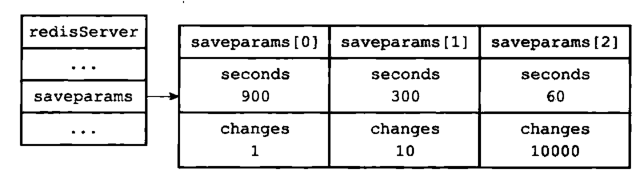


### 5.1.7. 总结

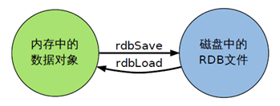

- RDB是一个非常紧凑的文件。
- RDB在保存RDB文件时父进程唯一需要做的就是fork出一个子进程，接下来的工作全部由子进程来做，父进程不需要再做其他I0操作，所以RDB持久化方式可以最大化redis的性能。
- 与AOF相比，在恢复大的数据集的时候，RDB方式会更快一一些。
- 数据丢失风险大。
- RDB需要经常fork子进程来保存数据集到硬盘上，当数据集比较大的时候fork的过程是非常耗时的吗，可能会导致Redis在一些毫秒级不能回应客户端请求。

## 5.2. AOF

### 5.2.1. 说明

- 说明
  - **以日志的形式来记录每个写操作，select操作，以及Flushall操作** ，将Redis执行过的所有写指令记录下来(读操作不记录)， 
  - 只许追加文件但不可以改写文件，redis启动之初会读取该文件重新构建数据，
  - 换言之，redis 重启的话就根据日志文件的内容将写指令从前到后执行一次以完成数据的恢复工作

- AOF记录的操作
  - **写操作**（包括 **flushall** ）
  - **select操作**

- AOF和RDB同时开启
  - 可以同时开启
  - 如果公式开启，开启redis时会读取 **AOF** 进行数据修复。

<details>
<summary style="color:red;">示例</summary>

如对于如下命令：

```
set str1 "123"
sadd str2 "1" "2" "3"
lpush str3 "1" "2" "3"
```

RDB 持久化方式就是将 str1,str2,str3 这三个键值对保存到 RDB文件中，而 AOF 持久化则是将执行的 set,sadd,lpush **三个命令** 保存到 AOF 文件中。
</details>

### 5.2.2. 原理

- 开启 AOF 机制后，所有的写入命令都会 **追加到 aof_buf 缓冲区中** ，并按照指定的策略 **定时将缓冲区中的数据同步到磁盘上(appendfsync)** 。 
  - **有专门的子进程去调用fsync()函数把数据从aof_buf写入到aof文件**
- AOF 除了记录每条命令外，还会在适当的时候 fork 出一个子进程对 AOF 文件进行重写，

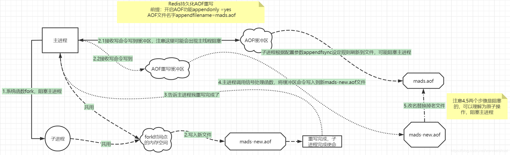

[详细解析(重要)](https://blog.csdn.net/wenmeishuai/article/details/106096186)

### 5.2.3. 配置

- appendonly：默认值为no，也就是说redis 默认使用的是rdb方式持久化，如果想要开启 AOF 持久化方式，需要将 appendonly 修改为 yes。
- appendfilename ：aof文件名，默认是"appendonly.aof"
- appendfsync：aof持久化策略的配置；
  - everysec， **默认** ，表示每秒执行一次fsync，可能会导致丢失这1s数据。通常选择 everysec ，兼顾安全性和效率。
  - always表示每次写入都执行fsync，以保证数据同步到磁盘，效率很低，不推荐。
  - no表示不执行fsync，由操作系统保证数据同步到磁盘，速度最快，但是不太安全；
- no-appendfsync-on-rewrite：
  - no-appendfsync-on-rewrite字段设置为 **默认设置为no** 。默认为no，建议yes。
  - **设置为yes表示rewrite期间对新写操作不fsync** ,暂时存在内存中, **等rewrite完成后再写入** 。
  - 在aof重写或者写入rdb文件的时候，会执行大量IO，此时对于everysec和always的aof模式来说，执行fsync会造成阻塞过长时间
  - **如果对延迟要求很高的应用，这个字段可以设置为yes** ，否则还是设置为no，这样对持久化特性来说这是更安全的选择。
  - Linux的默认fsync策略是30秒。可能丢失30秒数据。默认值为no。
- auto-aof-rewrite-percentage：
  - 默认值为100。aof自动重写配置
  - 当目前aof文件大小超过上一次重写的aof文件大小的百分之多少进行重写，
  - 即当aof文件增长到一定大小的时候，Redis能够调用bgrewriteaof对日志文件进行重写。
  - 当前AOF文件大小是上次日志重写得到AOF文件大小的二倍（设置为100）时，自动启动新的日志重写过程。
- auto-aof-rewrite-min-size：64mb。设置允许重写的最小aof文件大小，避免了达到约定百分比但尺寸仍然很小的情况还要重写。
- aof-load-truncated：
  - aof文件可能在尾部是不完整的，当redis启动的时候，aof文件的数据被载入内存。
  - 重启可能发生在redis所在的主机操作系统宕机后，尤其在ext4文件系统没有加上data=ordered选项，出现这种现象
  - redis宕机或者异常终止不会造成尾部不完整现象，可以选择让redis退出，或者导入尽可能多的数据。
  - 如果选择的是yes，当截断的aof文件被导入的时候，会自动发布一个log给客户端然后load。
  - 如果是no，用户必须手动redis-check-aof修复AOF文件才可以。默认值为 yes。

### 5.2.4. 开启与恢复

- 开启
  - 将 redis.conf 的 appendonly 配置改为 yes 即可。
  - AOF 保存文件的位置和 RDB 保存文件的位置一样，都是通过 redis.conf 配置文件的 dir 配置
- 恢复
  - 重启 Redis 之后就会进行 AOF 文件的载入。
  - **如果RDB和AOF同时开启，会使用AOF进行恢复**
  - 异常修复命令：`redis-check-aof --fix config_file` 进行修复
    - 会把不符合语法规范的自动删除

### 5.2.5. AOF重写

- 重写机制说明：
  - 由于AOF持久化是Redis不断将写命令记录到 AOF 文件中，随着Redis不断的进行，AOF 的文件会越来越大，文件越大，占用服务器内存越大以及 AOF 恢复要求时间越长。
  - 为了解决这个问题，Redis新增了重写机制，当AOF文件的大小超过所设定的阈值时，Redis就会启动AOF文件的内容压缩，只保留可以恢复数据的最小指令集。
  - 可以使用命令 `bgrewriteaof` 来重重写。

- 重写示例
  <details>
  <summary style="color:red;">示例</summary>

  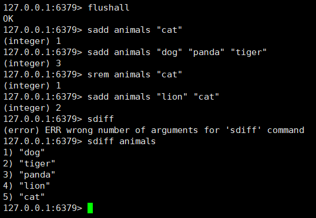

　如果不进行 AOF 文件重写，那么 AOF 文件将保存四条 SADD 命令，如果使用AOF 重写，那么AOF 文件中将只会保留下面一条命令：

  ```
  sadd animals "dog" "tiger" "panda" "lion" "cat"
  ```
  </details>

- 原理：
  - **AOF 文件重写并不是对原文件进行重新整理** 
  - 而是 **直接读取服务器现有的键值对** ，然后用一条命令去代替之前记录这个键值对的多条命令，生成一个新的文件后去替换原来的 AOF 文件。

- 触发
  - 通过 redis.conf 配置文件中的 auto-aof-rewrite-percentage：默认值为100
  - 以及auto-aof-rewrite-min-size：64mb 配置
  - 也就是说默认Redis会记录上次重写时的AOF大小，默认配置是 **当AOF文件大小是上次rewrite后大小的一倍且文件大于64M时触发** 。

- 重写方式:子进程重写
  - Redis 是单线程工作，如果 重写 AOF 需要比较长的时间，那么在重写 AOF 期间，Redis将长时间无法处理其他的命令，这显然是不能忍受的。
  - Redis为了克服这个问题， **解决办法是将 AOF 重写程序放到子程序中进行** ，这样有两个好处：
    - 子进程进行 AOF 重写期间，服务器进程（父进程）可以继续处理其他命令。
    - 子进程带有父进程的数据副本，使用子进程而不是线程，可以在避免使用锁的情况下，保证数据的安全性。

- 解决重写数据不一致问题：AOF重写缓冲区
  - 子进程重写问题说明：
    - 使用子进程解决了单线程重写无法服务的问题，但是新问题也产生了
    - 因为子进程在进行 **AOF 重写期间，服务器进程依然在处理其它命令** ，这新的命令有可能也对数据库进行了修改操作
    - 使得当前数据库状态和重写后的 AOF 文件状态不一致。
  - 解决方法：
    - 为了解决这个数据状态不一致的问题，Redis 服务器设置了一个 AOF 重写缓冲区
    - 这个缓冲区是在创建子进程后开始使用，当Redis服务器执行一个写命令之后，就会将这个写命令也发送到 AOF 重写缓冲区。
    - 当子进程 **完成 AOF 重写** 之后，就会给父进程发送一个信号
    - **父进程** 接收此信号后，就会调用函数 **将 AOF 重写缓冲区的内容都写到新的 AOF 文件中** 。

### 5.2.6. 优缺点

- 优点：
  - AOF 持久化的方法提供了多种的同步频率，即使使用默认的同步频率每秒同步一次，Redis 最多也就丢失 1 秒的数据而已。
  - AOF 文件使用 Redis 命令追加的形式来构造，因此，即使 Redis 只能向 AOF 文件写入命令的片断，使用 redis-check-aof 工具也很容易修正 AOF 文件。
  - AOF 文件的格式可读性较强，这也为使用者提供了更灵活的处理方式。例如，如果我们不小心错用了 FLUSHALL 命令，在重写还没进行时，我们可以手工将最后的 FLUSHALL 命令去掉，然后再使用 AOF 来恢复数据。

- 缺点：
  - 对于具有相同数据的的 Redis，AOF 文件通常会比 RDF 文件体积更大。
  - 虽然 AOF 提供了多种同步的频率，默认情况下，每秒同步一次的频率也具有较高的性能。但在 Redis 的负载较高时，RDB 比 AOF 具好更好的性能保证。
  - RDB 使用快照的形式来持久化整个 Redis 数据，而 AOF 只是将每次执行的命令追加到 AOF 文件中，因此从理论上说，RDB 比 AOF 方式更健壮。官方文档也指出，AOF 的确也存在一些 BUG，这些 BUG 在 RDB 没有存在。


### 5.2.7. 总结

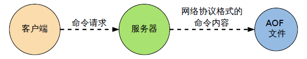

- AOF文件时一个只进行追加的日志文件
- Redis可以在AOF文件体积变得过大时，自动地在后台对AOF进行重写
- AOF文件有序地保存了对数据库执行的所有写入操作，这些写入操作以Redis协议的格式保存，因此AOF文件的内容非常容易被人读懂，对文件进行分析也很轻松
- 对于相同的数据集来说，AOF文件的体积通常要大于RDB文件的体积
- 根据所使用的fsync 策略，AOF的速度可能会慢于RDB

## 5.3. AOF和RDB选择

如果可以忍受一小段时间内数据的丢失，毫无疑问使用 RDB 是最好的，定时生成 RDB 快照（snapshot）非常便于进行数据库备份， 并且 RDB 恢复数据集的速度也要比 AOF 恢复的速度要快，而且使用 RDB 还可以避免 AOF 一些隐藏的 bug；否则就使用 AOF 重写。

但是一般情况下建议不要单独使用某一种持久化机制，而是应该 **两种一起用** ，在这种情况下,当redis重启的时候会优先载入AOF文件来恢复原始的数据，因为在通常情况下AOF文件保存的数据集要比RDB文件保存的数据集要完整。Redis后期官方可能都有将两种持久化方式整合为一种持久化模型。

## 5.4. AOF-RDB混合持久化

在Redis4.0之后，既上一篇文章介绍的RDB和这篇文章介绍的AOF两种持久化方式，又新增了RDB-AOF混合持久化方式。

这种方式结合了RDB和AOF的优点，既能快速加载又能避免丢失过多的数据。

- 具体配置为：
  - `aof-use-rdb-preamble`
  - 设置为yes表示开启，设置为no表示禁用。

当开启混合持久化时，主进程先fork出子进程将现有内存副本全量以RDB方式写入aof文件中，然后将缓冲区中的增量命令以AOF方式写入aof文件中，写入完成后通知主进程更新相关信息，并将新的含有 RDB和AOF两种格式的aof文件替换旧的aof文件。

简单来说：混合持久化方式产生的文件一部分是RDB格式，一部分是AOF格式。

这种方式优点我们很好理解，缺点就是不能兼容Redis4.0之前版本的备份文件了。

# 6. redis数据结构

## 6.1. 底层基本数据结构


### 6.1.1. 概要说明

### 6.1.2. sds 简单动态字符串

### 6.1.3. linkedlist 双端链表

### 6.1.4. ziplist 压缩列表

### 6.1.5. quicklist 快速链表

### 6.1.6. dict 字典

### 6.1.7. inset 整数集合

### 6.1.8. skiplist 跳表

## 6.2. 五大数据结构实现原理

### 6.2.1. 字符串对象

### 6.2.2. 列表对象

### 6.2.3. 哈希对象

### 6.2.4. 集合对象

### 6.2.5. 有序集合对象

# 7. 事务的控制

## 7.1. 说明

- 说明：可以一次执行多个命令，本质是一组命令的集合。一个事务中的所有命令都会序列化，按顺序地串行化执行而不会被其它命令插入，不许加塞。

- 原理： **一个队列中，一次性、顺序性、排他性的执行一系列命令** 。

- 3阶段
  - 开启：以MULTI开始一个事务
  - 入队：将多个命令入队到事务中，接到这些命令并不会立即执行，而是放到等待执行的事务队列里面
  - 执行：由EXEC命令触发事务

- 3特性
  - **单独的隔离操作**：事务中的所有命令都会序列化、按顺序地执行。事务在执行的过程中，不会被其他客户端发送来的命令请求所打断。
  - **没有隔离级别的概念**：队列中的命令没有提交之前都不会实际的被执行，因为事务提交前任何指令都不会被实际执行， 也就不存在”事务内的查询要看到事务里的更新，在事务外查询不能看到”这个让人万分头痛的问题
  - **不保证原子性**：在语法正确的情况下，如果redis同一个事务中如果有一条命令执行失败，其后的命令仍然会被执行，没有回滚

## 7.2. 常用命令

| 命令              | 描述                                                                                           |
| ----------------- | ---------------------------------------------------------------------------------------------- |
| discard           | 取消事务，放弃执行事务块内的所有命令。                                                         |
| exec              | 执行所有事务块内的命令。(类似于commit)                                                         |
| multi             | 标记一个事务块的开始。                                                                         |
| unwatch           | 取消 watch 命令对所有 key 的监视。                                                             |
| watch key [key …] | 监视一个(或多个) key ，如果在事务执行之前这个(或这些) key 被其他命令所改动，那么事务将被打断。 |

## 7.3. redis的乐观锁

- watch和unwatch搭配使用，为乐观锁。类似CAS。
  - 事务开启前watch一个key:k1
  - 如果key在事务提交前修改k1对应的值
  - 事务提交后会失败，返回nil
  - 然后重新watch和执行事务。（类似CAS）

- 注意：取消监控锁的两种方式：
  - unwatch
  - exec

## 7.4. 执行示例

- 正常执行
  > 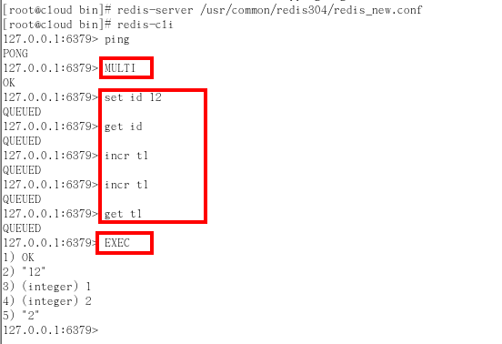
- 放弃事务
  > 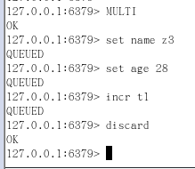
- 全体连坐: **类似于java的检查时异常**
  > 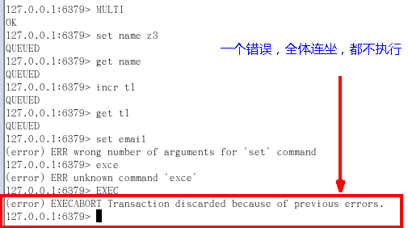
- 冤头债主: **类似于java的运行时异常** ，比如对字符串执行incr
  > 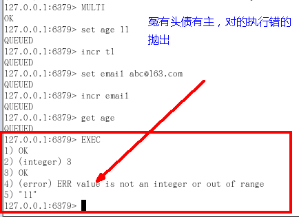
- 事务提交前监控变量没有修改
  > 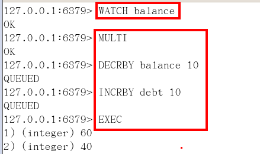 
- 事务提交前监控变量被修改
  > 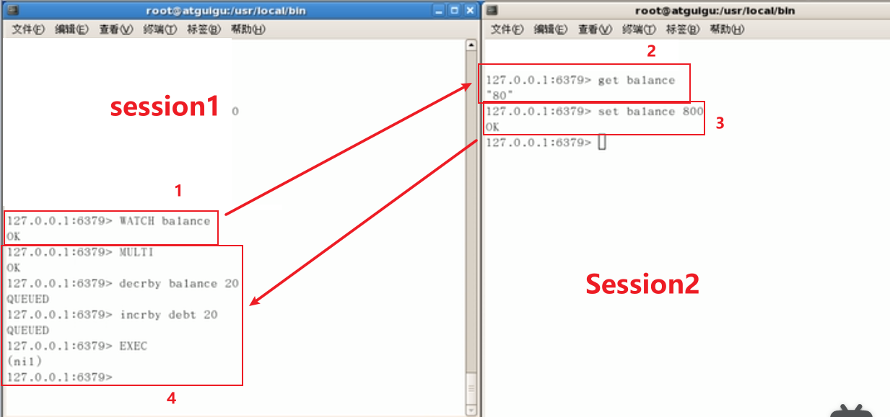

# 8. 并发问题解决

> Redis 并发竞争 的问题就是高并发写同一个key时导致的值错误如何解决

## 8.1. watch乐观锁

乐观锁，注意不要在分片集群中使用

## 8.2. 分布式锁

分布式锁，适合分布式系统环境

使用redis或者zookeeper实现分布式锁，

不管哪种方式实现，基本原理是不变的：用一个状态值表示锁，对锁的占用和释放通过状态值来标识。

## 8.3. 时间戳

时间戳，适合有序场景

比如：假设系统B先抢到锁，将key1设置为{ValueB 7:05}。接下来系统A抢到锁，发现自己的key1的时间戳早于缓存中的时间戳（`7:00<7:05`），那就不做set操作了。

## 8.4. 消息队列

消息队列，串行化处理

在并发量过大的情况下,可以通过消息中间件进行处理,把并行读写进行串行化。

把Redis.set操作放在队列中使其串行化,必须的一个一个执行。

这种方式在一些高并发的场景中算是一种通用的解决方案。

# 9. 消息发布订阅

## 9.1. 说明

- 说明
  - 进程间的一种消息通信模式：发送者(pub)发送消息，订阅者(sub)接收消息。
  - redis支持消息的发布订阅，但是 **企业中很少使用redis作为消息中间件**

- 下图展示了频道 channel1 ， 以及订阅这个频道的三个客户端 —— client2 、 client5 和 client1 之间的关系：
  > 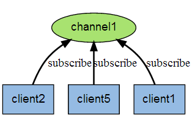

- 当有新消息通过 PUBLISH 命令发送给频道 channel1 时， 这个消息就会被发送给订阅它的三个客户端：
  > 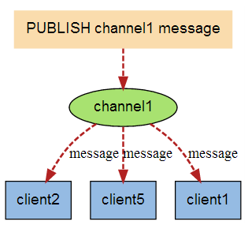

## 9.2. 命令

| 命令                                      | 描述                               |
| ----------------------------------------- | ---------------------------------- |
| psubscribe pattern [pattern …]            | 订阅一个或多个符合给定模式的频道。 |
| pubsub subcommand [argument [argument …]] | 查看订阅与发布系统状态。           |
| publish channel message                   | 将信息发送到指定的频道。           |
| punsubscribe [pattern [pattern …]]        | 退订所有给定模式的频道。           |
| subscribe channel [channel …]             | 订阅给定的一个或多个频道的信息。   |
| unsubscribe [channel [channel …]]         | 指退订给定的频道。                 |

# 10. 集群

## 10.1. 主从复制

### 10.1.1. 说明

- redis的主从模式
- 复制方式：使用异步复制，slave节点异步从master节点复制数据
- 读写分配：
  - **master节点提供读写服务**
  - **slave节点只提供读服务**（这个是默认配置，可以通过修改配置文件 slave-read-only 控制）
    ```
    不要修改配置让slave节点支持写操作，没有意义
      原因一，写入的数据不会被同步到其他节点
      原因二，当master节点修改同一条数据后，slave节点的数据会被覆盖掉
    ```

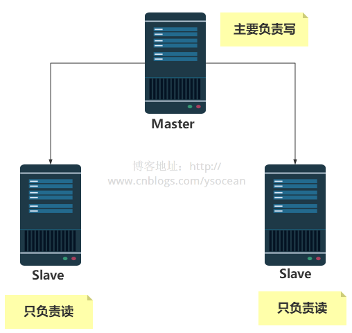

### 10.1.2. 配置

只要对从节点进行配置即可，让从节点找到主节点

- 开启方式
  - 配置文件
    - 在从服务器的配置文件中加入：`slaveof <masterip> <masterport>`
  - 启动命令
    - redis-server启动命令后加入：`slaveof <masterip> <masterport>`
  - 客户端命令
    - Redis服务器启动后直接通过客户端执行命令：`slaveof <masterip> <masterport>`，则该Redis实例成为从节点。

- 查看状态：`info replication`

---

- 当master节点设置密码时：
  - 客户端访问master需要密码
  - 启动slave需要密码，在配置中进行配置即可
  - 客户端访问slave不需要密码

### 10.1.3. 实现架构

- 一主多从
  ```
  多个slave连接同一个master
  ```
- slave上连接salve
  ```
  master <-- slave1 <-- slave2
  ```
  - 该模式下，如果master宕机了
  - 可以通过`SLAVEOF no one`命令，使slave1成为master
  - slave1和slave2共同构成一个`master<--slave`集群

### 10.1.4. 复制原理

- slave启动成功连接到master后会发送一个sync命令
- master接到命令，启动后台的存盘进程，同时收集所有接收到的用于修改数据集命令， 在后台进程执行完毕之后，master将传送整个数据文件到slave,以完成一次完全同步
- **全量复制** ：而slave服务在接收到数据库文件数据后，将其存盘并加载到内存中。
- **增量复制** ：Master继续将新的所有收集到的修改命令依次传给slave,完成同步
- 只要是 **重新连接master** ，一次完全同步（全量复制)将被自动执行

### 10.1.5. 宕机情况

一主多从情况下

- slave节点宕机
  - 不影响其他slave节点的读和master节点的读和写
  - slave重新启动后，会将数据从master节点同步过来
    > 如果配置文件中没有配置slave of，就要重新使用命令行连接master

- master节点宕机
  - master将不再提供写服务
  - 不影响slave节点的读
  - 不会从slave节点中重新选一个master
  - master重新启动后，Slave将自动重新连接master，将重新对外提供写服务。

### 10.1.6. 缺点

- master节点挂了以后，redis就不能对外提供写服务了，因为剩下的slave不能成为master
- 这个缺点影响是很大的，尤其是对生产环境来说，是一刻都不能停止服务的，所以一般的生产坏境是不会单单只有主从模式的。所以有了下面的sentinel模式。
- 由于所有的写操作都是先在Master上操作，然后同步更新到slave上，所以从Master同步到Slave机器有一定的延迟，当系统很繁忙的时候，延迟问题会更加严重，Slave机器数量的增加也会使这个问题更加严重。

## 10.2. 哨兵机制

### 10.2.1. 说明

- 目的：解决主从复制中，主节点宕机之后无法提供写服务的问题
- 说明：
  - 哨兵模式就是不时地监控redis是否按照预期良好地运行（至少是保证主节点是存在的）
  - 若一台主机出现问题时，哨兵会自动将该主机下的某一个从机设置为新的主机，并让其他从机和新主机建立主从关系。
- 任务：
  - 监控（Monitoring）：Sentinel会不断地检查你的主服务器和从服务器是否允许正常。
  - 提醒（Notification）：当被监控的某个Redis服务器出现问题时，Sentinel可以通过API向管理员或者其他应用程序发送通知。
  - 自动故障迁移（Automatic failover）:
  - （1）当一个主服务器不能正常工作时，Sentinel会开始一次自动故障迁移操作，他会将失效主服务器的其中一个从服务器升级为新的主服务器，并让失效主服务器的其他从服务器改为复制新的主服务器；
  - （2）客户端试图连接失败的主服务器时，集群也会向客服端返回新主服务器的地址，使得集群可以使用新主服务器代替失效服务器。
    > 如果旧主服务器恢复，旧主服务器会作为**slave节点**加入集群。

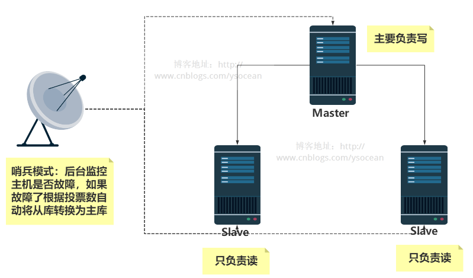

---

- 高可用要求：一个健壮的部署至少需要三个哨兵实例。

### 10.2.2. 配置

- 编写一个配置文件`sentinel.conf`，内容为：
  ```
  sentinel monitor 被监控机器的名字(自己起名字) ip地址 端口号 得票数
  ```
  - 监控的机器应为主机
  - 上面的得票数为1表示表示主机挂掉后salve投票看让谁接替成为主机，得票数大于1便成为主机

- 启动哨兵：`redis-sentinel /etc/redis/sentinel.conf`

## 10.3. cluster分片集群

官方实现

[搭建说明](https://juejin.cn/post/6844904057044205582#heading-0)


# 11. 应用Application

## 11.1. 普通缓存

## 11.2. 分布式锁

先拿setnx来争抢锁，抢到之后再用expire给锁加一个过期时间防止锁忘记释放。

如果在setnx之后执行expire之前的进程意外crash或重启维护了，那会咋样？Set指令 有非常复杂的参数，可以同时把setnx和expire合成一条指令来用的。

## 11.3. 布隆过滤器

## 11.4. 布谷鸟过滤器

[链接](https://juejin.cn/post/6844903861749055502)

## 11.5. UV 统计

## 11.6. 排行榜

## 11.7. 关注列表和粉丝列表

## 11.8. 广告弹窗触达频率的控制

## 11.9. 延时队列


# 12. 高级算法

## 12.1. GeoHash(坐标定位算法)

## 12.2. scan(数据快速查询算法)

# 13. 常见问题

## 13.1. 容器型数据结构的通用规则

## 13.2. Redis 和 memcached 区别

- Redis和memcached相比的优势
  - Memcached所有的值均是简单的字符串，Redis作为其替代者，支持更为丰富的数据类型
  - Redis的速度比memcached快很多
  - Redis可以持久化其数据

- 所有区别：

  | 对比参数     | Redis                                                           | Memcached                                          |
  | ------------ | --------------------------------------------------------------- | -------------------------------------------------- |
  | 类型         | 1.支持内存<br>2.非关系型数据库                                  | 1.支持内存<br>2.key-value 键值对形式<br>3.缓存系统 |
  | 数据存储类型 | 1.String<br>2.List<br>3.Set<br>4.Hash<br>5.SortedSet            | 1.文本型<br>2.二进制类型                           |
  | 查询操作类型 | 1.批量操作<br>2.事务支持(false)<br>3.每个类型不同的 CRUD        | 1.CRUD<br>2.少量其他命令                           |
  | 附加功能     | 1.发布/订阅模式<br>2.主从分区<br>3.序列化支持<br>4.Lua 脚本支持 | 1.多线程服务支持                                   |
  | 网络 IO 模型 | 1.单进程模式                                                    | 1.多线程、非堵塞 IO 模式                           |
  | 事件库       | 1.自封装简易事件库 AeEvent                                      | LibEvent                                           |
  | 持久化支持   | 1.RDB<br>2.AOF                                                  | 不支持                                             |


## 13.3. Redis 过期策略

- 过期策略
  - 说明
    - 在我们平常使用的Redis做缓存的时候，我们经常给这个缓存设置一个过期时间，如果查过期后的key时是不会有数据的。
    - 但其实如果一个key过期了，但是数据不一定已经被删除了，因为Redis采用的是 **定期删除和惰性删除** 。
  - 分类：
    - 定期删除：
      - 是指Redis默认会每隔100ms会随机抽取一些设置了过期时间的key检查是否过期了，如果过期了就删除。
      - 那么为什么不遍历删除所有而是随机抽取一些呢？
      - 因为可能Redis中放置了大量的key，如果每隔100ms都遍历，那么CPU肯定会爆炸， Redis也就GG了。
    - 惰性删除
      > 查过期的key的话会查不到的原因
      - 当去查key的时候，Redis会检查一下这个key时是否设置了过期时间和是否已经过期了
      - 如果已经过期Redis会删除这个key，并且返回空。


## 13.5. Redis 的 6 种数据淘汰策略

- 淘汰策略：
  - 说明：
    - 其实当内存占用过多的时候，此时会进行内存淘汰，Redis提供了6种内存淘汰策策略：
  - 分类：
    - Noevication(默认):返回错误当内存限制达到，并且客户端尝试执行让更多的内存被使用的命令
    - Allkeys-lru(最常用)：尝试回收使用最少的键（LRU），使得新添加的数据有空间存放
    - Volatile-LRU：尝试回收最少使用的键（LRU），但仅限于在过期集合的键，使得新添加的数据有空间存放。
    - Allkeys-random：回收随机的键使得新添加的数据有空间存放。
    - Volatile-random：回收随机的建使得新添加的数据有空间存放，但仅限于在过期集合的键
    - Volatile-ttl：回收过期集合的键，并且优先回收存活时间（TTL）较短的键，使得新添加的数据有空间存放。
 

## 13.4. Redis 持久化机制(防止 Redis 挂掉后数据丢失)

RDB和AOF，看上面说明

## 13.6. 缓存雪崩

### 13.6.1. 说明

- 出现原因：
  - Redis不可能把所有的数据都缓存起来(内存昂贵且有限)，所以Redis需要对数据设置过期时间，并采用的是惰性删除+定期删除两种策略对过期键删除。
  - 如果缓存数据设置的过期时间是相同的，并且Redis恰好将这部分数据全部删光了。这就会导致在这段时间内，这些缓存同时失效。

- 定义： **缓存同一时间大面积的失效，所以，后面的请求都会落到数据库上，造成数据库短时间内承受大量请求而崩掉。**

### 13.6.2. 解决方案

情景： 对缓存数据设置相同的过期时间，导致某段时间内 **缓存失效** ，请求全部走数据库。

- 解决方法：在缓存的时候给过期时间加上一个随机值，这样就会大幅度的减少缓存在同一时间过期。

- 例：
  - 比如做电商项目的时候，一般是采取不同分类商品，缓存不同周期。
  - 在同一分类中的商品，加上一个随机因子。这样能尽可能分散缓存过期时间，
  - 而且，热门类目的商品缓存时间长一些，冷门类目的商品缓存时间短一些，也能节省缓存服务的资源。

---

情景：“ **Redis挂掉了** ，请求全部走数据库”

- 事发前：实现Redis的高可用(主从架构+Sentinel 或者Redis Cluster)，尽量避免Redis挂掉这种情况发生。
- 事发中：万一Redis真的挂了，我们可以设置本地缓存(ehcache)+限流(hystrix)，尽量避免我们的数据库被干掉(起码能保证我们的服务还是能正常工作的)
- 事发后：redis持久化，重启后自动从磁盘上加载数据，快速恢复缓存数据。

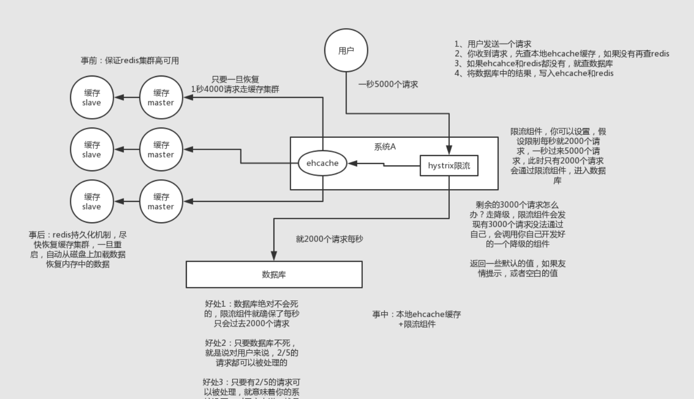

---

情景：并发量不是特别多的时候，

使用最多的解决方案是加锁排队。

- 加锁排队只是为了减轻数据库的压力，并没有提高系统吞吐量。
- 假设在高并发下，缓存重建期间key是锁着的，这是过来1000个请求999个都在阻塞的。
- 同样会导致用户等待超时，这是个治标不治本的方法！
- 注意：加锁排队的解决方式分布式环境的并发问题，有可能还要解决分布式锁的问题；线程还会被阻塞，用户体验很差！因此，在真正的高并发场景下很少使用！

## 13.7. 缓存穿透

### 13.7.1. 说明

- 缓存穿透是指查询一个一定不存在的数据。
- 由于缓存不命中，就会去数据库查询，
- 但是如果从数据库查不到数据则不写入缓存
- 这将导致这个不存在的数据每次请求都要到数据库去查询，失去了缓存的意义。

### 13.7.2. 解决方案

- 拦截
  - 说明：
    - 由于请求的参数是不合法的(每次都请求不存在的参数)，于是我们可以使用布隆过滤器(BloomFilter)或者压缩filter提前拦截
    - 不合法就不让这个请求到数据库层！
  - 布隆过滤器
    - 理解: 长度为n的二进制向量,通过一系列随机映射函数(eg：多个Hash)将数据映射进布隆过滤器中。
    - 优点: 存放的不是完整的数据,占用内存很少。新增、查询速度够快。
    - 缺点: 随着数据量的增大,误判率会随之增加,只能判断数据一定不存在,不能判断数据一定存在。
  - 压缩filter
    - ...(待补充)

- 设置空对象
  - 当我们从数据库找不到的时候，我们也将这个空对象设置到缓存里边去。
  - 下次再请求的时候，就可以从缓存里边获取了。
  - 这种情况我们一般会将空对象设置一个较短的过期时间。

## 13.8. 缓存与数据库双写一致

- 说明
  - 如果仅仅查询的话，缓存的数据和数据库的数据是没问题的。但是当更新时，各种情况可能导致数据库和缓存的数据不一致。
  - 从理论上说，只要我们设置了键的过期时间，我们就能保证缓存和数据库的数据 **最终是一致** 的。
  - 因为只要缓存数据过期了，就会被删除。随后读的时候，因为缓存里没有，就可以查数据库的数据，然后将数据库查出来的数据写入到缓存中。

---

- 两种基本策略
  - 先更新数据库，再删除缓存
    > 对于这种策略，其实是一种设计模式：Cache Aside Pattern
    - 正常的情况是这样的：
      - 先操作数据库，成功；
      - 再删除缓存，也成功；
    - 原子性被破坏的情况
      - 第一步成功(操作数据库)，第二步失败(删除缓存)，会导致数据库里是新数据，而缓存里是旧数据。
        - 解决：
          - 将需要删除的key发送到消息队列中
          - 自己消费消息，获得需要删除的key
          - 不断重试删除操作，直到成功
      - 第一步(操作数据库)就失败了，我们可以直接返回错误(Exception)，不会出现数据不一致。
        ```
        如果在高并发的场景下，出现数据库与缓存数据不一致的概率特别低，也不是没有：

        缓存刚好失效
        线程A查询数据库，得一个旧值
        线程B将新值写入数据库
        线程B删除缓存
        线程A将查到的旧值写入缓存
        要达成上述情况，还是说一句概率特别低：因为这个条件需要发生在读缓存时缓存失效，而且并发着有一个写操作。
        而实际上数据库的写操作会比读操作慢得多，而且还要锁表，而读操作必需在写操作前进入数据库操作，而又要晚于写操作更新缓存，所有的这些条件都具备的概率基本并不大。
        ```
  - 先删除缓存，再更新数据库
    - 正常情况是这样的：
      - 先删除缓存，成功；
      - 再更新数据库，也成功；
    - 原子性被破坏的情况
      - 第一步成功(删除缓存)，第二步失败(更新数据库)，数据库和缓存的数据还是一致的。
      - 如果第一步(删除缓存)就失败了，我们可以直接返回错误(Exception)，数据库和缓存的数据还是一致的。
        ```
        看起来是很美好，但是我们在并发场景下分析一下，就知道还是有问题的了：

        线程A删除了缓存
        线程B查询，发现缓存已不存在
        线程B去数据库查询得到旧值
        线程B将旧值写入缓存
        线程A将新值写入数据库
        所以也会导致数据库和缓存不一致的问题。
        ```

- 对比两种策略
  > 两种策略各自有优缺点：
  - 先删除缓存，再更新数据库，在高并发下表现不如意，在原子性被破坏时表现优异
  - 先更新数据库，再删除缓存(Cache Aside Pattern设计模式)，在高并发下表现优异，在原子性被破坏时表现不如意

---

- 解决思路：
  - 并发下解决数据库与缓存不一致的思路：
  - 将删除缓存、修改数据库、读取缓存等的操作积压到队列里边，实现串行化。


## 13.9. 为什么单线程的 Redis 能处理那么多的并发客户端连接?

- 原因
  - 纯内存操作
  - 核心是 **非阻塞的IO多路复用机制**
  - 单线程反而避免了多线程的繁琐上下文切换问题

---

- Redis线程模型
  - 说明
    - Redis基于reactor模式开发了网络事件处理器，这个处理器叫做文件事件处理器，file event handler。
    - 这个文件事件处理器是单线程的，redis才叫做单线程的模型，
    - 采用IO多路复用机制同时监听多个socket，根据socket上的事件来选择对应的事件处理器来处理这个事件。
      - IO多路复用程序
        - 不负责处理socket产生的事件
        - 负责轮训所有socket产生的请求
        - 压进队列（与阻塞式IO多路复用的区别）

# 14. java客户端

## 基本说明

Redis支持的java客户端都Redisson、Jedis、lettuce等等，官方推荐使用Redisson

- Redis和Redisson的关系
  - Redisson是一个高级的分布式协调Redis客户端，能帮助用户在分布式环境中轻松实现一些java的对象
    > （Bloom filter、BitSet、Set、SetMultimap、ScoredSortedSet、SortedSet、Map、List、Queue、ConcurrentMap、ListMultimap、BlockingQueue、Deque、BlockingDeque、Semaphore、Lock、ReadWriteLock、AtomicLong、CountDownLatch、Publish/Subscribe、HyperLogLog）


- Jedis和Redisson对比优缺点
  - Jedis是Redis的java实现的客户端，其中API提供了比较全面的Redis命令的支持；
  - Redisson实现了分布式和扩展的java数据结构，和Jedis相比功能比较简单，不支持字符串操作，不支持排序、事务、管道、分区等Redis特性。
  - Redisson的宗旨是 **促进使用者对Redis的关注分离，从而让使用者能够将精力更集中的放在处理业务逻辑上** 。

# 其他

- Redis的集群：Redis分片的缺点、集群架构、集群操作基本命令。
- Lua脚本语言的介绍。
- Redis和Lua结合，Redis的Lua脚本编程，构建强大的Redis服务。
- Redis整合Spring等。
- Redis集群实现Tomcat集群的Session共享等

# 参考

[redis笔记](https://blog.csdn.net/u011863024/article/details/107476187)


