# 1. NoSQL概述

## 1.1. 数据3V与需求3高

- 大数据时代的3V：
  - 海量Volume
  - 多样Variety
  - 实时Velocity
- 互联网需求的3高：
  - 高并发
  - 高可括
    - 纵向扩展：提高一台机器的性能
    - 横向扩展：搭建集群
  - 高性能

## 1.2. 互联网架构演变

- 单机MySQL
  <details>
  <summary style="color:red;">说明</summary>

  在90年代，一个网站的访问量一般都不大，用单个数据库完全可以轻松应付。
  在那个时候，更多的都是静态网页，动态交互类型的网站不多。

  
  > DAL dal是数据访问层的英文缩写，即为数据访问层（Data Access Layer）

  - 上述架构下，数据存储的瓶颈有三方面
    - 数据量的总大小一个机器放不下时
    - 数据的索引(B+ Tree)一个机器的内存放不下时
    - 访问量(读写混合)一个实例不能承受

  </details>

- Memcached(缓存)+MySQL+垂直拆分
  <details>
  <summary style="color:red;">说明</summary>

  后来，随着访问量的上升，几乎大部分使用MySQL架构的网站在数据库上都开始出现了性能问题，web程序不再仅仅专注在功能上，同时也在追求性能。
  程序员们开始大量的使用缓存技术来缓解数据库的压力，优化数据库的结构和索引。
  开始比较流行的是通过文件缓存来缓解数据库压力，但是当访问量继续增大的时候，多台web机器通过文件缓存不能共享，
  大量的小文件缓存也带了了比较高的IO压力。在这个时候，Memcached就自然的成为一个非常时尚的技术产品。

  
  </details>

- Mysql主从读写分离
  <details>
  <summary style="color:red;">说明</summary>

  由于数据库的写入压力增加，Memcached 只能缓解数据库的读取压力。读写集中在一个数据库上让数据库不堪重负，
  大部分网站开始使用主从复制技术来达到读写分离，以提高读写性能和读库的可扩展性。Mysql的master-slave模 式成为这个时候的网站标配了。

  
  </details>
- 分表分库+水平拆分+mysql集群
  <details>
  <summary style="color:red;">说明</summary>

  在Memcached的高速缓存，MySQL的主从复制， 读写分离的基础之上，这时MySQL主库的写压力开始出现瓶颈，而数据量的持续猛增，由于MyISAM使用表锁，在高并发下会出现严重的锁问题，大量的高并发MySQL应用开始使用InnoDB引擎代替MyISAM。

  同时，开始流行使用分表分库来缓解写压力和数据增长的扩展问题。这个时候，分表分库成了一个热门技术，是面试的热门问题也是业界讨论的热门技术问题。也就在这个时候，MySQL推出了还不太稳定的表分区，这也给技术实力一般的公司带来了希望。虽然MySQL推出了MySQL Cluster集群，但性能也不能很好满足互联网的要求，只是在高可靠性上提供了非常大的保证。

  
  </details>

- 如今
  <details>
  <summary style="color:red;">说明</summary>

  - MySQL的扩展性瓶颈
    - MySQL数据库也经常存储一些大文本字段，导致数据库表非常的大，在做数据库恢复的时候就导致非常的慢，不容易快速恢复数据库。
    - 比如1000万4KB大小的文本就接近40GB的大小， 如果能把这些数据从MySQL省去，MySQL将变得非常的小。
    - 关系数据库很强大，但是它并不能很好的应付所有的应用场景。
    - MySQL的扩展性差(需要复杂的技术来实现)，大数据下IO压力大，表结构更改困难，正是当前使用MySOL的开发人员面临的问题。

  
  </details>

## 1.3. Alibaba架构演变

[链接](https://blog.csdn.net/u011863024/article/details/107476187)

## 1.4. NOSQL概念说明

### 1.4.1. 简要说明

- redis时一款高性能的NOSQL系列的非关系型数据库
- NoSQL(NoSQL = Not Only SQL)，意即“不仅仅是SQL”， **泛指非关系型的数据库**。
- 随着互联网web2.0网站的兴起，传统的关系数据库在应付web2.0网站，特别是超大规模和高并发的SNS类型的web2.0纯动态网站已经显得力不从心，暴露了很多难以克服的问题，而非关系型的数据库则由于其本身的特点得到了非常迅速的发展。
- NoSQL 数据库的产生就是为了解决大规模数据集合多重数据种类带来的挑战，尤其是大数据应用难题，包括超大规模数据的存储。
- (例如谷歌或Facebook每天为他们的用户收集万亿比特的数据)。
- **这些类型的数据存储不需要固定的模式，无需多余操作就可以横向扩展**。

### 1.4.2. NoSQL特点

- 易扩展
  - NoSQL数据库种类繁多，但是一个共同的特点都是去掉关系数据库的关系型特性。数据之间无关系，这样就非常容易扩展。
  - 也无形之间，在架构的层面上带来了可扩展的能力。
- 大数据量高性能
  - NoSQL数据库都具有非常高的读写性能，尤其在大数据量下，同样表现优秀。
  - 这得益于它的无关系性，数据库的结构简单。
  - 一般MySQL使用Query Cache，每次表的更新Cache就失效，是一种大粒度的Cache，在针对web2.0的交互频繁的应用，Cache性能不高。
  - 而NoSQL的Cache是记录级的，是一种细粒度的Cache，所以NoSQL在这个层面上来说就要性能高很多了。
- 多样灵活的数据模型
  - NoSQL无需事先为要存储的数据建立字段，随时可以存储自定义的数据格式。
  - 而在关系数据库里，增删字段是一件非常麻烦的事情。如果是非常大数据量的表，增加字段简直就是一个噩梦。

### 1.4.3. 关系型数据库比较

- nosql
  - 优点：
    - 1）成本：nosql数据库简单易部署，基本都是开源软件，不需要像使用oracle那样花费大量成本购买使用，相比关系型数据库价格便宜。
    - 2）查询速度：nosql数据库将数据存储于缓存之中，关系型数据库将数据存储在硬盘中，自然查询速度远不及nosql数据库。
    - 3）存储数据的格式：nosql的存储格式是key,value形式、文档形式、图片形式等等，所以可以存储基础类型以及对象或者是集合等各种格式，而数据库则只支持基础类型。
    - 4）扩展性：关系型数据库有类似join这样的多表查询机制的限制导致扩展很艰难。
  - 缺点：
    - 1）维护的工具和资料有限，因为nosql是属于新的技术，不能和关系型数据库10几年的技术同日而语。
    - 2）不提供对sql的支持，如果不支持sql这样的工业标准，将产生一定用户的学习和使用成本。
    - 3）有的不提供关系型数据库对事务的处理。
    - 4）并不安全，数据存储在内存中可能未来得及持久化导致丢失
  - 优势：
    - 1）性能NOSQL是基于键值对的，可以想象成表中的主键和值的对应关系，而且不需要经过SQL层的解析，所以性能非常高。
    - 2）可扩展性同样也是因为基于键值对，数据之间没有耦合性，所以非常容易水平扩展。

- 关系型数据库
  - 优势：
    - 1）复杂查询可以用SQL语句方便的在一个表以及多个表之间做非常复杂的数据查询。
    - 2）事务支持使得对于安全性能很高的数据访问要求得以实现。对于这两类数据库，对方的优势就是自己的弱势，反之亦然。

---

- 总结
  - 关系型数据库与NoSQL数据库并非对立而是互补的关系，即通常情况下使用关系型数据库，在适合使用NoSQL的时候使用NoSQL数据库，
  - 让NoSQL数据库对关系型数据库的不足进行弥补。
  - 一般会将数据存储在关系型数据库中，在nosql数据库中备份存储关系型数据库的数据

```
关系型数据库                               nosql

高度组织化结构化数据                       代表着不仅仅是SQL
结构化查询语言(SQL)                        没有声明性查询语言
数据和关系都存储在单独的表中               没有预定义的模式
数据操纵语言，数据定义语言                 键-值对存储，列存储，文档存储，图形数据库
严格的一致性                               最终一致性，而非ACID属性
基础事务                                   非结构化和不可预知的数据:
                                           CAP定理
                                           高性能，高可用性和可伸缩性

```

### 1.4.4. 常见NoSQl数据库

- Redis:有丰富的数据结构
- Tair:有丰富的数据结构
- Mongodb:非常像关系型数据库
  - MongoDB是一个基于分布式文件存储的数据库。由C++语言编写。旨在为WEB应用提供可扩展的高性能数据存储解决方案。
  - MongoDB是一个介于关系数据库和非关系数据库之间的产品，是非关系数据库当中功能最丰富，最像关系数据库的。
- Memcache:注重于高速缓存

---

- 企业使用：
  - 新浪:BerkeleyDB+Redis
  - 美团:redis+tair
  - 阿里、百度:memcache+redis

### 1.4.5. redis三个重要特点

- KV
- Cache
- Persistence

## 1.5. 四种NoSQL数据模型

- 键值(Key-Value)存储数据库
  - 相关产品： Tokyo Cabinet/Tyrant、Redis、Voldemort、Berkeley DB
  - 典型应用： 内容缓存，主要用于处理大量数据的高访问负载。
  - 数据模型： 一系列键值对
  - 优势： 快速查询
  - 劣势： 存储的数据缺少结构化
- 列存储数据库
  - 相关产品：Cassandra, HBase, Riak
  - 典型应用：分布式的文件系统
  - 数据模型：以列簇式存储，将同一列数据存在一起
  - 优势：查找速度快，可扩展性强，更容易进行分布式扩展
  - 劣势：功能相对局限
- 文档型数据库
  - 相关产品：CouchDB、MongoDB(Bson)
  - 典型应用：Web应用（与Key-Value类似，Value是结构化的）
  - 数据模型： 一系列键值对
  - 优势：数据结构要求不严格
  - 劣势： 查询性能不高，而且缺乏统一的查询语法
- 图形(Graph)数据库
  - 相关数据库：Neo4J、InfoGrid、Infinite Graph
  - 典型应用：社交网络
  - 数据模型：图结构
  - 优势：利用图结构相关算法。
  - 劣势：需要对整个图做计算才能得出结果，不容易做分布式的集群方案。

  <details>
  <summary style="color:red;">图数据库示例</summary>

  
  </details>

## 1.6. 分布式数据库原理

### 1.6.1. CAP

- CAP
  - 构成：
    - C:Consistency（强一致性）
    - A:Availability（可用性）
    - P:Partition tolerance（分区容错性）
  - 说明
    - CAP理论就是说在分布式存储系统中，最多只能实现上面的两点。
  - 运用
    - 而由于当前的网络硬件肯定会出现延迟丢包等问题， **所以分区容忍性是我们必须需要实现的** 。
    - 所以我们只能 **在一致性和可用性之间进行权衡** 
      >多余大多数web应用，其实并不需要强一致性。因此牺牲C换取P，这是目前分布式数据库产品的方向。
    - **没有NoSQL系统能同时保证这三点**。
  - 实际示例
    - CA:
      - 说明：单点集群，满足一致性，可用性的系统，通常在可扩展性上不太强大。
      - 使用：传统Oracle数据库
    - AP:
      - 说明
        - 满足可用性，分区容忍性的系统，通常可能对一致性要求低一些。
        - 有一些数据不一定要求异常精准，比如浏览数
        - 相对于强一致性，可用性更重要。
      - 使用：大多数网站架构的选择，集群Redis
    - CP:
      - 说明：
        - 满足一致性，分区容忍必的系统，通常性能不是特别高。
        - Redis起初目的是为了帮mysql减负
        - 所以要求查询数据时的强一致性。
      - 使用：单机Redis、Mongodb
    - 注意：分布式架构的时候必须做出取舍。
    - 图示
      > -

<details>
<summary style="color:red;">详细说明</summary>

**CA without P**

所以如果你的分布式系統做到 CA，牺牲`Partition Tolerance`，那就是代表你的机房永远不會出現网络分区，永远不會丢包，除非有可能有完美的网路环境，否則 CA 根本就是传统的单机系统，而非分布式系統。

在分布式环境下，网络分区是一个自然的事实。因为分区是必然的，所以如果舍弃P，意味着要舍弃分布式系统。

**CP without A**

如果一个分布式系统不要求强的可用性，即容许系统停机或者长时间无响应的话，就可以在CAP三者中保障CP而舍弃A。

一个保证了CP而一个舍弃了A的分布式系统，一旦发生网络故障或者消息丢失等情况，就要牺牲用户的体验，等待所有数据全部一致了之后再让用户访问系统。

在单机版的Redis中，每个Master之间是没有任何通信的，所以我们一般在Jedis客户端或者Codis这样的代理中做Pre-sharding。按照CAP理论来说，单机版的Redis属于保证CP(Consistency & Partition-Tolerancy)而牺牲A(Availability)，也就说Redis能够保证所有用户看到相同的数据（一致性，因为Redis不自动冗余数据）和网络通信出问题时，暂时隔离开的子系统能继续运行（分区容忍性，因为Master之间没有直接关系，不需要通信），但是不保证某些结点故障时，所有请求都能被响应（可用性，某个Master结点挂了的话，那么它上面分片的数据就无法访问了）。

有了Cluster功能后，Redis从一个单纯的NoSQL内存数据库变成了分布式NoSQL数据库，CAP模型也从CP变成了AP。也就是说，通过自动分片和冗余数据，Redis具有了真正的分布式能力，某个结点挂了的话，因为数据在其他结点上有备份，所以其他结点顶上来就可以继续提供服务，保证了Availability。然而，也正因为这一点，Redis无法保证曾经的强一致性了。这也是CAP理论要求的，三者只能取其二。

**AP wihtout C**

要高可用并允许分区，则需放弃一致性。一旦网络问题发生，节点之间可能会失去联系。为了保证高可用，需要在用户访问时可以马上得到返回，则每个节点只能用本地数据提供服务，而这样会导致全局数据的不一致性。

这种舍弃强一致性而保证系统的分区容错性和可用性的场景和案例非常多。前面我们介绍可用性的时候说到过，很多系统在可用性方面会做很多事情来保证系统的全年可用性可以达到N个9，所以，对于很多业务系统来说，比如淘宝的购物，12306的买票。都是在可用性和一致性之间舍弃了一致性而选择可用性。

你在12306买票的时候肯定遇到过这种场景，当你购买的时候提示你是有票的（但是可能实际已经没票了），你也正常的去输入验证码，下单了。但是过了一会系统提示你下单失败，余票不足。这其实就是先在可用性方面保证系统可以正常的服务，然后在数据的一致性方面做了些牺牲，会影响一些用户体验，但是也不至于造成用户流程的严重阻塞。

但是，我们说很多网站牺牲了一致性，选择了可用性，这其实也不准确的。就比如上面的买票的例子，其实舍弃的只是强一致性。退而求其次保证了最终一致性。也就是说，虽然下单的瞬间，关于车票的库存可能存在数据不一致的情况，但是过了一段时间，还是要保证最终一致性的。

对于多数大型互联网应用的场景，主机众多、部署分散，而且现在的集群规模越来越大，所以节点故障、网络故障是常态，而且要保证服务可用性达到N个9，即保证P和A，舍弃C（退而求其次保证最终一致性）。虽然某些地方会影响客户体验，但没达到造成用户流程的严重程度。
</details>

---

- 当今数据库的需求说明：
  > 对于web2.0网站来说，关系数据库的很多主要特性却往往无用武之地
  - 数据库事务一致性需求
    - 很多web实时系统并不要求严格的数据库事务，
    - 对读一致性的要求很低，有些场合对写一致性要求并不高。允许实现最终一致性。
  - 数据库的写实时性和读实时性需求
    - 对关系数据库来说，插入一条数据之后立刻查询，是肯定可以读出来这条数据的，但是对于很多web应用来说，并不要求这么高的实时性，
    - 比方说在微博发一条消息之后，过几秒乃至十几秒之后，我的订阅者才看到这条动态是完全可以接受的。
  - 对复杂的SQL查询，特别是多表关联查询的需求
    - 任何大数据量的web系统，都非常忌讳多个大表的关联查询，以及复杂的数据分析类型的报表查询，
    - 特别是SNS类型的网站，从需求以及产品设计角度，就避免了这种情况的产生。
    - 往往更多的只是单表的主键查询，以及单表的简单条件分页查询，SQL的功能被极大的弱化了。

### 1.6.2. BASE

- BASE
  - 基本可用（Basically Available）
  - 软状态（Soft state）
  - 最终一致（Eventually consistent）

它的思想是通过 **让系统放松对某一时刻数据一致性的要求来换取系统整体伸缩性和性能上改观** 。

为什么这么说呢，缘由就在于大型系统往往由于地域分布和极高性能的要求，不可能采用分布式事务来完成这些指标，要想获得这些指标，
我们必须采用另外一种方式来完成，这里BASE就是解决这个问题的办法。

### 1.6.3. 分布式+集群

- 分布式系统（distributed system）
  - 由多台计算机和通信的软件组件通过计算机网络连接（本地网络或广域网）组成。
  - 分布式系统是建立在网络之上的软件系统。正是因为软件的特性，所以分布式系统具有高度的内聚性和透明性。
  - 因此，网络和分布式系统之间的区别更多的在于高层软件（特别是操作系统），而不是硬件。
  - 分布式系统可以应用在在不同的平台上如：PC、工作站、局域网和广域网上等。

- 概括：
  - 分布式：不同的多台服务器上面部署不同的服务模块（工程），他们之间通过Rpc/Rmi之间通信和调用，对外提供服务和组内协作。
  - 集群：不同的多台服务器上面部署相同的服务模块，通过分布式调度软件进行统一的调度，对外提供服务和访问。

# 2. Redis概述

## 2.1. 说明

**Redis:REmote DIctionary Server** (远程字典服务器)是完全开源免费的，用C语言编写的，遵守BSD协议，是一个高性能的(key/value)分布式内存数据库，基于内存运行 并支持持久化的NoSQL数据库，是当前最热门的NoSql数据库之一，也被人们称为数据结构服务器。

- Redis 与其他 key - value 缓存产品有以下三个特点：
  - Redis支持数据的持久化，可以将内存中的数据保持在磁盘中，重启的时候可以再次加载进行使用
  - Redis不仅仅支持简单的key-value类型的数据，同时还提供list，set，zset，hash等数据结构的存储
  - Redis支持数据的备份，即master-slave模式的数据备份

## 2.2. 主要应用

- 内存存储和持久化：redis支持异步将内存中的数据写到硬盘上，同时不影响继续服务
- 取最新N个数据的操作，如：可以将最新的10条评论的ID放在Redis的List集合里面
- 模拟类似于HttpSession这种需要设定过期时间的功能
- 发布、订阅消息系统
- 定时器、计数器

## 2.3. 安装

不进行详细说明

## 2.4. 杂项

- redis-benchmark.exe 测试redis在机器运行的效能
- 单进程
  - 单进程模型来处理客户端的请求。对读写等事件的响应 是通过对epoll函数的包装来做到的。Redis的实际处理速度完全依靠主进程的执行效率
  - Epoll是Linux内核为处理大批量文件描述符而作了改进的epoll，是Linux下多路复用IO接口select/poll的增强版本， 它能显著提高程序在大量并发连接中只有少量活跃的情况下的系统CPU利用率。
    > 复习select/poll/epoll 区别
- 默认 **16个数据库** ，
  - 类似数组，下表从零开始，初始默认使用零号库
  - 可在配置文件配置
    ```
    databases 16
    ```
- select命令切换数据库:`select dbid`
- `dbsize`查看当前数据库的key的数量
- flushdb：清空 **当前库**，谨慎用。
- flushall；清空全部16个库，别用
- 统一密码管理， **16个库都是同样密码** ，要么都OK要么一个也连接不上
- Redis索引都是从零开始
- 默认端口是6379

# 3. 数据类型

## 3.1. 简介

- String（字符串）
  - string是redis最基本的类型，你可以理解成与Memcached一模一样的类型，一个key对应一个value。
  - string类型是 **二进制安全** 的。意思是redis的string可以包含任何数据。比如jpg图片或者序列化的对象 。
  - string类型是Redis **最基本** 的数据类型，一个redis中字符串value最多可以是 **512M**
- Hash（哈希，类似java里的Map）
  - Redis hash 是一个 **键值对集合**　。
  - Redis hash是一个string类型的field和value的映射表，hash特别适合用于存储对象。
  - 类似Java里面的`Map<String,Object>`
- List（列表）
  - Redis 列表是简单的 **字符串列表** ，按照插入顺序排序。
  - 可以添加一个元素导列表的头部（左边）或者尾部（右边）。
  - 它的底层实际是个 **链表** 。类似于java里面的`LinkedList`
- Set（集合）
  - Redis的Set是string类型的 **无序无重复集合** 。
  - 它是通过HashTable实现实现的
- Zset(sorted set：有序集合)
  - Redis zset 和 set 一样也是string类型元素的集合，且不允许重复的成员。
  - 不同的是每个元素都会关联一个 **double类型的分数** 。
  - redis正是 **通过分数来为集合中的成员进行从小到大的排序** 。
  - **zset的成员是唯一的，但分数(score)却可以重复** 。

## 3.2. Key

**常用命令** ：

| 命令                                      | 描述                                                         |
| ----------------------------------------- | ------------------------------------------------------------ |
| del key                                   | 该命令用于在 key 存在时删除 key。                            |
| dump key                                  | 序列化给定 key ，并返回被序列化的值。                        |
| exists key                                | 检查给定 key 是否存在。                                      |
| expire key seconds                        | 为给定 key 设置过期时间，以秒计。                            |
| expireat key timestamp                    | expireat 的作用和 expire 类似，都用于为 key 设置过期时间。 不同在于 expireat 命令接受的时间参数是 unix 时间戳(unix timestamp)。 |
| pexpire key milliseconds                  | 设置 key 的过期时间以毫秒计。                                |
| pexpireat key milliseconds-timestamp      | 设置 key 过期时间的时间戳(unix timestamp) 以毫秒计           |
| keys pattern                              | 查找所有符合给定模式( pattern)的 key 。                      |
| move key db                               | 将当前数据库的 key 移动到给定的数据库 db 当中。              |
| persist key                               | 移除 key 的过期时间，key 将持久保持。                        |
| pttl key                                  | 以毫秒为单位返回 key 的剩余的过期时间。                      |
| ttl key                                   | 以秒为单位，返回给定 key 的剩余生存时间(ttl, time to live)。 |
| randomkey                                 | 从当前数据库中随机返回一个 key 。                            |
| rename key newkey                         | 修改 key 的名称                                              |
| renamenx key newkey                       | 仅当 newkey 不存在时，将 key 改名为 newkey 。                |
| scan cursor [match pattern] [count count] | 迭代数据库中的数据库键。                                     |
| type key                                  | 返回 key 所储存的值的类型。                                  |

## 3.3. String

**常用命令**

| 命令                           | 描述                                                         |
| ------------------------------ | ------------------------------------------------------------ |
| set key value                  | 设置指定 key 的值                                            |
| get key                        | 获取指定 key 的值。                                          |
| getrange key start end         | 返回 key 中字符串值的子字符,-1时最后                                  |
| getset key value               | 将给定 key 的值设为 value ，并返回 key 的旧值(old value)。   |
| getbit key offset              | 对 key 所储存的字符串值，获取指定偏移量上的位(bit)。         |
| mget key1 [key2…]              | 获取所有(一个或多个)给定 key 的值。                          |
| setbit key offset value        | 对 key 所储存的字符串值，设置或清除指定偏移量上的位(bit)。   |
| setex key seconds value        | 将值 value 关联到 key ，并将 key 的过期时间设为 seconds (以秒为单位)。 |
| setnx key value                | 只有在 key 不存在时设置 key 的值。                           |
| setrange key offset value      | 用 value 参数覆写给定 key 所储存的字符串值，从偏移量 offset 开始。 |
| strlen key                     | 返回 key 所储存的字符串值的长度。                            |
| mset key value [key value …]   | 同时设置一个或多个 key-value 对。                            |
| msetnx key value [key value …] | 同时设置一个或多个 key-value 对，当且仅当 **所有** 给定 key 都不存在。 |
| psetex key milliseconds value  | 这个命令和 setex 命令相似，但它以毫秒为单位设置 key 的生存时间，而不是像 setex 命令那样，以秒为单位。 |
| incr key                       | 将 key 中储存的数字值增一。                                  |
| incrby key increment           | 将 key 所储存的值加上给定的增量值（increment） 。            |
| incrbyfloat key increment      | 将 key 所储存的值加上给定的浮点增量值（increment） 。        |
| decr key                       | 将 key 中储存的数字值减一。                                  |
| decrby key decrement           | key 所储存的值减去给定的减量值（decrement） 。               |
| append key value               | 如果 key 已经存在并且是一个字符串， append 命令将指定的 value 追加到该 key 原来值（value）的末尾。 |

- **String**的实际应用场景比较广泛的有：
  - **缓存功能：String**字符串是最常用的数据类型，不仅仅是**Redis**，各个语言都是最基本类型，因此，利用**Redis**作为缓存，配合其它数据库作为存储层，利用**Redis**支持高并发的特点，可以大大加快系统的读写速度、以及降低后端数据库的压力。
  - **计数器：**许多系统都会使用**Redis**作为系统的实时计数器，可以快速实现计数和查询的功能。而且最终的数据结果可以按照特定的时间落地到数据库或者其它存储介质当中进行永久保存。
  - **共享用户Session：**用户重新刷新一次界面，可能需要访问一下数据进行重新登录，或者访问页面缓存**Cookie**，但是可以利用**Redis**将用户的**Session**集中管理，在这种模式只需要保证**Redis**的高可用，每次用户**Session**的更新和获取都可以快速完成。大大提高效率。

## 3.4. List

**常用命令**

| 命令                                  | 描述                                                         |
| ------------------------------------- | ------------------------------------------------------------ |
| blpop key1 [key2 ] timeout            | 移出并获取列表的第一个元素， 如果列表没有元素会阻塞列表直到等待超时或发现可弹出元素为止。 |
| brpop key1 [key2 ] timeout            | 移出并获取列表的最后一个元素， 如果列表没有元素会阻塞列表直到等待超时或发现可弹出元素为止。 |
| brpoplpush source destination timeout | 从列表中弹出一个值，将弹出的元素插入到另外一个列表中并返回它； 如果列表没有元素会阻塞列表直到等待超时或发现可弹出元素为止。 |
| lindex key index                      | 通过索引获取列表中的元素                                     |
| linsert key before/after pivot value  | 在列表的元素前或者后插入元素                                 |
| llen key                              | 获取列表长度                                                 |
| lpop key                              | 移出并获取列表的第一个元素                                   |
| lpush key value1 [value2]             | 将一个或多个值插入到列表头部                                 |
| lpushx key value                      | 将一个值插入到已存在的列表头部                               |
| lrange key start stop                 | 获取列表指定范围内的元素                                     |
| lrem key count value                  | 移除列表元素                                                 |
| lset key index value                  | 通过索引设置列表元素的值                                     |
| ltrim key start stop                  | 对一个列表进行修剪(trim)，就是说，让列表只保留指定区间内的元素，不在指定区间之内的元素都将被删除。 |
| rpop key                              | 移除列表的最后一个元素，返回值为移除的元素。                 |
| rpoplpush source destination          | 移除列表的最后一个元素，并将该元素添加到另一个列表并返回     |
| rpush key value1 [value2]             | 在列表中添加一个或多个值                                     |
| rpushx key value                      | 为已存在的列表添加值                                         |

**注意:是首插，左为首，也就是新插入的为首**

- 开头字母：
  - l是left
  - r时right
  - b是阻塞

- 性能总结：
  - 它是一个字符串链表，left、right都可以插入添加；
  - 如果键不存在，创建新的链表；
  - 如果键已存在，新增内容；
  - 如果值全移除，对应的键也就消失了。
  - 链表的操作 **无论是头和尾效率都极高** ，但假如是对中间元素进行操作，效率就很惨淡了。

- 使用场景
  - **消息队列：Redis**的链表结构，可以轻松实现阻塞队列，可以使用左进右出的命令组成来完成队列的设计。
    - 比如：数据的生产者可以通过**Lpush**命令从左边插入数据，多个数据消费者，可以使用**BRpop**命令阻塞的“抢”列表尾部的数据。
  - 文章列表或者数据分页展示的应用。
    - 比如可以通过 **List** 存储一些列表型的数据结构，类似粉丝列表、文章的评论列表之类的东西。
    - 比如可以通过 **lrange** 命令，读取某个闭区间内的元素，可以基于 **List** 实现分页查询，这个是很棒的一个功能，基于 **Redis** 实现简单的高性能分页，可以做类似微博那种下拉不断分页的东西，性能高，就一页一页走。
    - 比如，我们常用的博客网站的文章列表，当用户量越来越多时，而且每一个用户都有自己的文章列表，而且当文章多时，都需要分页展示，这时可以考虑使用**Redis**的列表，列表不但有序同时还支持按照范围内获取元素，可以完美解决分页查询功能。大大提高查询效率。

## 3.5. Set

**常用命令**

| 命令                                           | 描述                                                |
| ---------------------------------------------- | --------------------------------------------------- |
| sadd key member1 [member2]                     | 向集合添加一个或多个成员                            |
| scard key                                      | 获取集合的成员数                                    |
| sdiff key1 [key2]                              | 返回给定所有集合的差集                              |
| sdiffstore destination key1 [key2]             | 返回给定所有集合的差集并存储在 destination 中       |
| sinter key1 [key2]                             | 返回给定所有集合的交集                              |
| sinterstore destination key1 [key2]            | 返回给定所有集合的交集并存储在 destination 中       |
| sismember key member                           | 判断 member 元素是否是集合 key 的成员               |
| smembers key                                   | 返回集合中的所有成员                                |
| smove source destination member                | 将 member 元素从 source 集合移动到 destination 集合 |
| spop key                                       | 移除并返回集合中的一个随机元素                      |
| srandmember key [count]                        | 返回集合中一个或多个随机数                          |
| srem key member1 [member2]                     | 移除集合中一个或多个成员                            |
| sunion key1 [key2]                             | 返回所有给定集合的并集                              |
| sunionstore destination key1 [key2]            | 所有给定集合的并集存储在 destination 集合中         |
| sscan key cursor [match pattern] [count count] | 迭代集合中的元素                                    |

- 使用场景
  - 多个机器间数据的去重
  - 可以基于 Set 进行交集、并集、差集的操作
    - 比如交集吧，我们可以把两个人的好友列表整一个交集，看看俩人的共同好友是谁？对吧。

## 3.6. zset

在set基础上，加一个score值。 之前set是k1 v1 v2 v3， 现在zset是k1 score1 v1 score2 v2

**常用命令**

| 命令                                           | 描述                                                         |
| ---------------------------------------------- | ------------------------------------------------------------ |
| zadd key score1 member1 [score2 member2]       | 向有序集合添加一个或多个成员，或者更新已存在成员的分数       |
| zcard key                                      | 获取有序集合的成员数                                         |
| zcount key min max                             | 计算在有序集合中指定区间分数的成员数                         |
| zincrby key increment member                   | 有序集合中对指定成员的分数加上增量 increment                 |
| zinterstore destination numkeys key [key …]    | 计算给定的一个或多个有序集的交集并将结果集存储在新的有序集合 key 中 |
| zlexcount key min max                          | 在有序集合中计算指定字典区间内成员数量                       |
| zrange key start stop [withscores]             | 通过索引区间返回有序集合指定区间内的成员                     |
| zrangebylex key min max [limit offset count]   | 通过字典区间返回有序集合的成员                               |
| zrangebyscore key min max [withscores] [limit] | 通过分数返回有序集合指定区间内的成员                         |
| zrank key member                               | 返回有序集合中指定成员的索引                                 |
| zrem key member [member …]                     | 移除有序集合中的一个或多个成员                               |
| zremrangebylex key min max                     | 移除有序集合中给定的字典区间的所有成员                       |
| zremrangebyrank key start stop                 | 移除有序集合中给定的排名区间的所有成员                       |
| zremrangebyscore key min max                   | 移除有序集合中给定的分数区间的所有成员                       |
| zrevrange key start stop [withscores]          | 返回有序集中指定区间内的成员，通过索引，分数从高到低         |
| zrevrangebyscore key max min [withscores]      | 返回有序集中指定分数区间内的成员，分数从高到低排序           |
| zrevrank key member                            | 返回有序集合中指定成员的排名，有序集成员按分数值递减(从大到小)排序 |
| zscore key member                              | 返回有序集中，成员的分数值                                   |
| zunionstore destination numkeys key [key …]    | 计算给定的一个或多个有序集的并集，并存储在新的 key 中        |
| zscan key cursor [match pattern] [count count] | 迭代有序集合中的元素（包括元素成员和元素分值）               |

- 使用场景：有序且不重复
  - 排行榜：有序集合经典使用场景。
    - 例如视频网站需要对用户上传的视频做排行榜，榜单维护可能是多方面：按照时间、按照播放量、按照获得的赞数等。
  - 用Sorted Sets来做带权重的队列，
    - 比如普通消息的score为1，重要消息的score为2，然后工作线程可以选择按score的倒序来获取工作任务。让重要的任务优先执行。

## 3.7. Hash

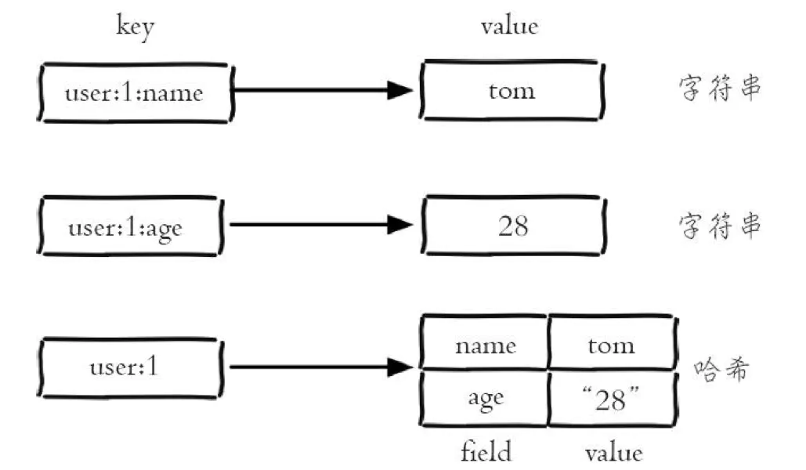

- Redis hash 是一个string类型的field和value的映射表，hash特别适合用于存储对象。
- 哈希类型中的 **映射关系** 叫作 `field-value`，这里的 `value` 是指 `field` 对应的 **值**，不是 **键** 对应的值。
- Redis 中每个 hash 可以存储 232 - 1 键值对（40多亿）。

| 序号 | 命令及描述                                                   |
| :--- | :----------------------------------------------------------- |
| 1    | [hdel key field2 [field2\]](../order/3564.html) 删除一个或多个哈希表字段 |
| 2    | hexists key field 查看哈希表 key 中，指定的字段是否存在。 |
| 3    | hget key field 获取存储在哈希表中指定字段的值/td> |
| 4    | hgetall key 获取在哈希表中指定 key 的所有字段和值 |
| 5    | hincrby key field increment 为哈希表 key 中的指定字段的整数值加上增量 increment 。 |
| 6    | hincrbyfloat key field increment 为哈希表 key 中的指定字段的浮点数值加上增量 increment 。 |
| 7    | hkeys key 获取所有哈希表中的字段       |
| 8    | hlen key 获取哈希表中字段的数量        |
| 9    | hmget key field1 [field2] 获取所有给定字段的值 |
| 10   | hmset key field1 value1 [field2 value2] 同时将多个 field-value (域-值)对设置到哈希表 key 中。 |
| 11   | hset key field value 将哈希表 key 中的字段 field 的值设为 value 。 |
| 12   | hsetnx key field value 只有在字段 field 不存在时，设置哈希表字段的值。 |
| 13   | hvals key 获取哈希表中所有值           |
| 14   | hscan key cursor [match pattern] [count count] 迭代哈希表中的键值对。 |

- 使用场景：
  - 这个是类似 **Map** 的一种结构，这个一般就是可以将结构化的数据，比如一个对象（前提是**这个对象没嵌套其他的对象**）给缓存在 **Redis** 里，然后每次读写缓存的时候，可以就操作 **Hash** 里的**某个字段**。
  - 但是这个的场景其实还是多少单一了一些，因为现在很多对象都是比较复杂的，比如你的商品对象可能里面就包含了很多属性，其中也有对象。

## 3.8. HyperLogLog

- 说明：
  - Redis 在 2.8.9 版本添加了 HyperLogLog 结构。
  - Redis HyperLogLog 是用来做 **基数统计** 的算法，HyperLogLog 的优点是，在输入元素的数量或者体积非常非常大时，计算基数所需的空间总是固定 的、并且是很小的。
    - 基数:比如数据集 {1, 3, 5, 7, 5, 7, 8}， 那么这个数据集的基数集为 {1, 3, 5 ,7, 8}, 基数(不重复元素)为5。 基数估计就是在误差可接受的范围内，快速计算基数。
  - 在 Redis 里面，每个 HyperLogLog 键只需要花费 12 KB 内存，就可以计算接近 2^64 个不同元素的基 数。这和计算基数时，元素越多耗费内存就越多的集合形成鲜明对比。
  - 但是，因为 HyperLogLog 只会根据输入元素来计算基数，而不会储存输入元素本身，所以 HyperLogLog 不能像集合那样，返回输入的各个元素。

**常用命令**

| 序号 | 命令                                      | 描述                                      |
| ---- | ----------------------------------------- | ----------------------------------------- |
| 1    | PFADD key element [element ...]           | 添加指定元素到 HyperLogLog 中。           |
| 2    | PFCOUNT key [key ...]                     | 返回给定 HyperLogLog 的基数估算值。       |
| 3    | PFMERGE destkey sourcekey [sourcekey ...] | 将多个 HyperLogLog 合并为一个 HyperLogLog |

## 3.9. 关于过期删除

> 详情看下面的过期淘汰机制

- **key过期后不会立即删除**
  - 因为删除key时肯定是主服务来删除(因为redis是 **单线程** 的)，所以当他在执行删除指令的时候，他就无法进行其他的操作
  - 立即删除会影响性能；所以呢，他不会立即进行删除；

- 删除机制：
  - (1)定期删除：
    - redis每隔一段时间就会去查看reids，设置了过期时间的key，会在100ms的间隔内默认查看3个key。
  - (2)惰性删除：
    - 如果当你去查询一个已经过了生存时间的key时，redis会先查看当前key的生存时间，
    - 如果你查询的key已经过了生存时间，redis会立即删除，并且返回给用户一个null值；
    - 也就是当你去查询的时候，redis去进行删除；

**注意：当然无论redis删没删掉这个key外界都是查不到的；只是没删的话还占着内存而已**

## 3.10. 常用命令

<details>
<summary style="color:red;">常用命令</summary>

```
key:
  del expire--persist rename ttl exsits scan

string:
  set setnx setex strlen get mget incr decr append

hash:
  hexists hget hdel hset hsetnx hlen hincr hvals hkeys

list: 
  [b](l/r)(pop/push) llen lrange lset lindex

set:
  sadd scard sdiff sinter sunion smembers spop

zset:
  zadd zcard zscore zrangebylex zrangebyscore zremrangebylex zremrangebyrank zremrangebyscore
```

</details>

# 4. 配置文件说明

## 4.1. 说明

[配置文件(翻译)](./资料/redis-config.txt)

## 4.2. 配置方式

- 修改配置文件
- 通过 `CONFIG` 命令set或get配置项。

# 5. 缓存淘汰策略

> 针对于redis 6.0.8

## 5.1. 说明

- 过期删除：当一个key过期后，什么时候释放内存
- 淘汰策略：当内存不够后，要删除哪些数据

---

- 过期数据：
  - set key的时候，都可以给一个expire time，就是过期时间，通过过期时间就可以指定这个key可以存活的时间
  - Redis是一种内存级数据库，所有数据均存放在内存中，内存中的数据可以通过TTL指令获取其状态

- 时效数据结构：

  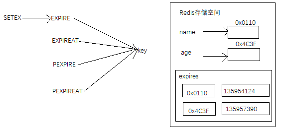

## 5.2. 内存查看与设置

- 获取内存设置：
  - config get maxmemory 获取 redis 最大占用内存

- 查看内存使用情况
  - 通过 info 指令可以查看 redis 内存使用情况：
  - used_memory_human 表示实际已经占用的内存
  - maxmemory 表示 redis 最大占用内存

  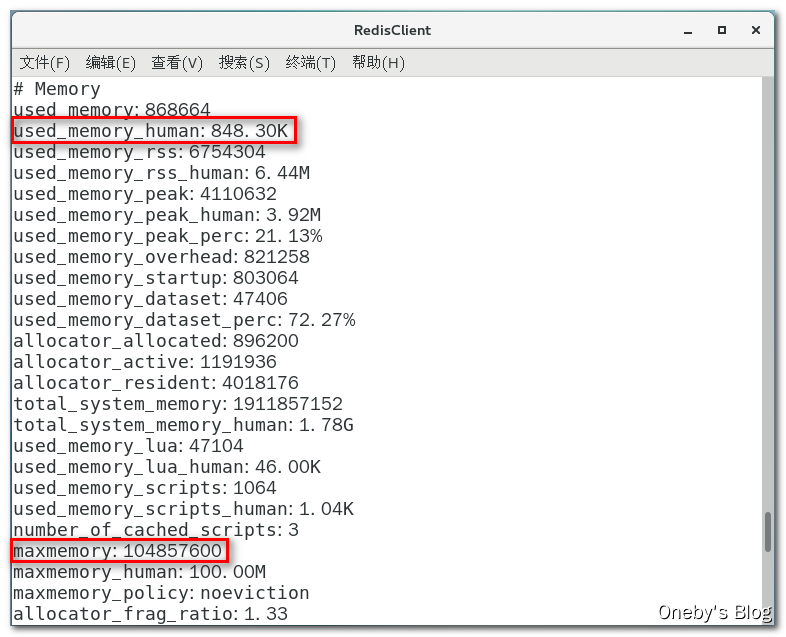

- 默认内存大小：
  - 默认设置为0
  - 在 64 位操作系统下不限制内存大小
  - 在32位操作系统下最多使用 3GB 内存

- 修改内存设置：
  - 通过命令修改（重启失效）：config set maxmemory 104857600 设置 redis 最大占用内存为 100MB

- 一般生产上如何配置 redis 的内存
  - 一般推荐Redis设置内存为最大物理内存的四分之三，也就是 0.75

> **总结 & 结论**

如果设置了 `maxmemory` 的选项，假如 redis 内存使用达到上限，并且 key 都没有加上过期时间，就会导致数据写爆 redis 内存。

为了避免类似情况，于是引出下一部分的过期删除策略

## 5.3. 三种过期删除策略

### 5.3.1. 定时删除

- 立即删除：
  - 优点：立即删除能保证内存中数据的最大新鲜度，因为它保证过期键值会在过期后马上被删除，其所占用的内存也会随之释放。
  - 缺点：
    - 但是立即删除对 CPU 是最不友好的。
    - 因为删除操作会占用 CPU 的时间，如果刚好碰上了 CPU 很忙的时候，比如正在做交集或排序等计算的时候，就会给 CPU 造成额外的压力。
    - 这会产生大量的性能消耗，同时也会影响数据的读取操作。

- 定时删除：
  - 说明：创建一个定时器，当key设置有过期时间，且过期时间到达时，由定时器任务立即执行对键的删除操作
  - 优点：节约内存，到时就删除，快速释放掉不必要的内存占用
  - 缺点：CPU压力很大，无论CPU此时负载量多高，均占用CPU，会影响redis服务器响应时间和指令吞吐量
  - **总结**：定时删除对 CPU 不友好，但对 memory 友好，用处理器性能换取存储空间（拿时间换空间）

### 5.3.2. 惰性删除

- 说明:
  - 惰性删除的策略刚好和定时删除相反，惰性删除在数据到达过期时间后不做处理，等**下次访问该数据时发现已过期，并将其删除，并返回不存在**。
  - 使用惰性删除访问数据的特点：**访问一个数据，如果发现其在过期时间之内，则返回该数据；如果发现已经过了过期时间，则将其删除，并返回不存在**
  - 如果一个键已经过期，而这个键又仍然保留在数据库中，那么只要这个过期键不被删除，它所占用的内存就不会释放。因此惰性删除策略的缺点是：它对内存是最不友好的。
- 优点：节约CPU性能，发现必须删除的时候才删除
- 缺点：内存压力很大，出现长期占用内存的数据
  ```
  在使用惰性删除策略时，如果数据库中有非常多的过期键，而这些过期键又恰好没有被访问到的话，
  那么它们也许永远也不会被删除（除非用户手动执行 `FLUSHDB`），
  我们甚至可以将这种情况看作是一种内存泄漏——无用的垃圾数据占用了大量的内存，而服务器却不会自己去释放它们，
  这对于运行状态非常依赖于内存的 redis 服务器来说，肯定不是一个好消息
  ```
- **总结**：惰性删除对 memory 不友好，但对 CPU 友好，用存储空间换取处理器性能（拿空间换时间）

### 5.3.3. 折中方案：定期删除(默认)

- 说明：
  - 上面两种删除策略都走极端，因此引出我们的定期删除策略。
  - 定期删除策略是前两种策略的折中：
    - 定期删除策略**每隔一段时间执行一次删除过期键操作**，并通过**限制删除操作执行的时长和频率**来减少删除操作对 CPU 时间的影响。
    - 其做法为：**周期性轮询 redis 库中的时效性数据，采用随机抽取的策略，利用过期数据占比的方式控制删除频度**。

- **定期删除的特点**
  - 特点1：CPU 性能占用设置有峰值，检测频度可自定义设置
  - 特点2：内存压力不是很大，长期占用内存的冷数据会被持续清理

- **定期删除的举例**
  - redis 默认每间隔 100ms 检查是否有过期的 key，如果有过期 key 则删除。
  - 注意：redis 不是每隔100ms 将所有的 key 检查一次而是**随机抽取**进行检查（如果每隔 100ms，全部 key 进行检查，redis 直接进去ICU）
  - 因此，如果只采用定期删除策略，会导致很多 key 到时间没有删除。

- **定期删除的难点**
  - 定期删除策略的难点是确定删除操作执行的时长和频率：redis 不可能时时刻刻遍历所有被设置了生存时间的 key，来检测数据是否已经到达过期时间，然后对它进行删除。
  - 如果删除操作执行得太频繁，或者执行的时间太长，定期删除策略就会退化成定时删除策略，以至于将 CPU 时间过多地消耗在删除过期键上面。
  - 如果删除操作执行得太少，或者执行的时间太短，定期删除策略又会和惰性删除束略一样，出现浪费内存的情况。
  - 因此，**如果采用定期删除策略的话，服务器必须根据情况，合理地设置删除操作的执行时长和执行频率**。

- **总结**:周期性抽查存储空间（随机抽查，重点抽查)

### 5.3.4. 总结


Redis的过期删除策略就是：**惰性删除和定期删除两种策略配合使用**

惰性删除和定期删除都存在数据没有被抽到的情况，如果这些数据已经到了过期时间，没有任何作用，这会导致大量过期的 key 堆积在内存中，导致 redis 内存空间紧张或者很快耗尽

因此必须要有一个更好的兜底方案，接下来引出 redis 内存淘汰策略

## 5.4. 内存淘汰策略(逐出算法)

- 8 种内存淘汰策略
  - 不管不顾
    - no-eviction（redis4.0默认策略）：不会驱逐任何key
  - 检测易失性数据
    - volatile-random：对所有设置了过期时间的key随机删除
    - volatile-lru：对所有设置了过期时间的key使用LRU算法进行删除
    - volatile-ttl：删除马上要过期的key
    - volatile-lfu(4.0新增)：对所有设置了过期时间的key使用LFU算法进行删除
  - 检测全库数据
    - allkeys-lru：对所有key使用LRU算法进行删除
    - allkeys-random：对所有key随机删除
    - allkeys-lfu(4.0新增)：对所有key使用LFU算法进行删除

- 总结
  - 2个维度
    - 过期键中筛选
    - 所有键中筛选
  - 4个方面
    - lru
    - lfu
    - random
    - ttl

## 5.5. 过期字典

用来判断数据是否过期

## 5.6. 手写LRU

# 6. 持久化

<!--https://www.cnblogs.com/ysocean/p/9114268.html-->

## 6.1. RDB

### 6.1.1. 说明

- 说明：在指定的时间间隔内将内存中的数据集快照写入磁盘，也就是行话讲的Snapshot快照，它恢复时是将快照文件直接读到内存里

- rdb 保存的是dump.rdb文件

### 6.1.2. 原理

- Redis会单独创建（fork）一个子进程来进行持久化，会先将数据写入到 一个临时文件中，待持久化过程都结束了，再用这个临时文件替换上次持久化好的文件。 
  > Fork:Fork的作用是复制一个与当前进程一样的进程。新进程的所有数据（变量、环境变量、程序计数器等） 数值都和原进程一致，但是是一个全新的进程，并作为原进程的子进程
- 整个过程中，主进程是不进行任何IO操作的，这就确保了极高的性能。
- 如果需要进行大规模数据的恢复，且对于数据恢复的完整性不是非常敏感，那RDB方式要比AOF方式更加的高效。
- RDB的缺点是 **最后一次持久化后的数据可能丢失** 。

### 6.1.3. 配置

上面配置文件 `###SNAPSHOTTING###`

---

- save：这里是用来配置触发 Redis的 RDB 持久化条件，也就是什么时候将内存中的数据保存到硬盘。比如“save m n”。表示m秒内数据集存在n次修改时，自动触发bgsave（这个命令下面会介绍，手动触发RDB持久化的命令）默认如下配置：
  - save 900 1：表示900 秒内如果至少有 1 个 key 的值变化，则保存
  - save 300 10：表示300 秒内如果至少有 10 个 key 的值变化，则保存
  - save 60 10000：表示60 秒内如果至少有 10000 个 key 的值变化，则保存
  - 当然如果你只是用Redis的缓存功能，不需要持久化，那么你可以注释掉所有的 save 行来停用保存功能。可以直接一个空字符串来实现停用：save ""

- stop-writes-on-bgsave-error ：默认值为yes。当启用了RDB且最后一次后台保存数据失败，Redis是否停止接收数据。这会让用户意识到数据没有正确持久化到磁盘上，否则没有人会注意到灾难（disaster）发生了。如果Redis重启了，那么又可以重新开始接收数据了

- rdbcompression ；默认值是yes。对于存储到磁盘中的快照，可以设置是否进行压缩存储。如果是的话，redis会采用LZF算法进行压缩。如果你不想消耗CPU来进行压缩的话，可以设置为关闭此功能，但是存储在磁盘上的快照会比较大。

- rdbchecksum ：默认值是yes。在存储快照后，我们还可以让redis使用CRC64算法来进行数据校验，但是这样做会增加大约10%的性能消耗，如果希望获取到最大的性能提升，可以关闭此功能。

- dbfilename ：设置快照的文件名，默认是 dump.rdb

- dir：设置快照文件的存放路径，这个配置项一定是个目录，而不能是文件名。默认是和当前配置文件保存在同一目录。

> 也就是说通过在配置文件中配置的 save 方式，当实际操作满足该配置形式时就会进行 RDB 持久化，将当前的内存快照保存在 dir 配置的目录中，文件名由配置的 dbfilename 决定。

### 6.1.4. 备份触发与恢复

- 自动触发
  - 配置文件中默认：
    - 900秒（15分钟）之后，且至少1次变更
    - 300秒（5分钟）之后，且至少10次变更
    - 60秒之后，且至少10000次变更
  - 关闭备份：`save ''`
- 手动触发
  - shutdown时也会进行备份
  - save
    - 该命令会 **阻塞** 当前Redis服务器，执行save命令期间，Redis不能处理其他命令，直到RDB过程完成为止。
    - 显然该命令对于内存比较大的实例会造成长时间阻塞，这是致命的缺陷，为了解决此问题，Redis提供了第二种方式bgsave
  - bgsave
    - 执行该命令时，Redis会在 **后台异步** 进行快照操作，快照同时还可以响应客户端请求。
    - 具体操作是Redis进程执行fork操作创建子进程，RDB持久化过程由子进程负责，完成后自动结束。阻塞只发生在fork阶段，一般时间很短。
    - 基本上 Redis 内部所有的RDB操作都是采用 bgsave 命令。
  - flushall
    - 执行执行 flushall 命令，也会产生dump.rdb文件，但里面是 **空的**.

- 恢复：
  - 将备份文件 (dump.rdb) 移动到 redis 安装目录并启动服务即可，redis就会自动加载文件数据至内存了。Redis 服务器在载入 RDB 文件期间，会一直处于阻塞状态，直到载入工作完成为止。
  - 获取 redis 的安装目录可以使用 `config get dir` 命令

- dump文件修复：`redis-check-dump`

> 主机和备机一般不是一台机器。

### 6.1.5. RDB触发条件原理

- Redis有个服务器状态结构：
  - 结构代码说明：
    <details>
    <summary style="color:red;">c++</summary>

      ```c++
      struct redisService{
          //1、记录保存save条件的数组
          struct saveparam *saveparams;
          //2、修改计数器
          long long dirty;
          //3、上一次执行保存的时间
          time_t lastsave;
      }

      struct saveparam{
          //秒数
          time_t seconds;
          //修改数
          int changes;
      };
      ```
    </details>
  - 属性：
    - dirty 计数器记录距离上一次成功执行 save 命令或者 bgsave 命令之后，Redis服务器进行了多少次修改（包括写入、删除、更新等操作）。
    - lastsave 属性是一个时间戳，记录上一次成功执行 save 命令或者 bgsave 命令的时间。
  - 流程
    - 通过save和bgsave，当服务器成功执行一次修改操作，那么dirty 计数器就会加 1，而lastsave 属性记录上一次执行save或bgsave的时间
    - Redis 服务器还有一个周期性操作函数`severCron`,默认每隔 100 毫秒就会执行一次
    - 该函数会遍历并检查 saveparams 数组中的所有保存条件，只要有一个条件被满足，那么就会执行 bgsave 命令。
    - 执行完成之后，dirty 计数器更新为 0 ，lastsave 也更新为执行命令的完成时间。

- 实例说明：前面我们在 redis.conf 配置文件中进行了关于save 的配置：
  - save 900 1：表示900 秒内如果至少有 1 个 key 的值变化，则保存
  - save 300 10：表示300 秒内如果至少有 10 个 key 的值变化，则保存
  - save 60 10000：表示60 秒内如果至少有 10000 个 key 的值变化，则保存
  - 那么服务器状态中的saveparam 数组将会是如下的样子：

  

### 6.1.6. 总结


- 优势
  - RDB是一个非常紧凑(compact)的文件，它保存了redis 在某个时间点上的数据集。这种文件非常适合用于进行备份和灾难恢复。
  - 生成RDB文件的时候，redis主进程会fork()一个子进程来处理所有保存工作，主进程不需要进行任何磁盘IO操作。
  - RDB 在恢复大数据集时的速度比 AOF 的恢复速度要快。
- 劣势
  - RDB方式数据没办法做到实时持久化/秒级持久化。
    - 在一定间隔时间做一次备份，所以如果redis意外down掉的话，
    - 就会丢失最后一次快照后的所有修改(数据有丢失)
  - 成本过高，影响性能
    - 因为bgsave每次运行都要执行fork操作创建子进程，属于**重量级操作**
    - 当数据集比较大的时候fork的过程是非常耗时的吗，可能会导致Redis在一些毫秒级不能回应客户端请求。
    - 如果不采用压缩算法(内存中的数据被克隆了一份，**大致2倍的膨胀性**需要考虑)
  - 版本不兼容
    - RDB文件使用**特定二进制格式**保存
    - Redis版本演进过程中有多个格式的RDB版本
    - 存在老版本Redis服务无法兼容新版RDB格式的问题

## 6.2. AOF

### 6.2.1. 说明

- 说明
  - **以日志的形式来记录每个写操作，select操作，以及Flushall操作** ，将Redis执行过的所有写指令记录下来(读操作不记录)， 
  - 只许追加文件但不可以改写文件，redis启动之初会读取该文件重新构建数据，
  - 换言之，redis 重启的话就根据日志文件的内容将写指令从前到后执行一次以完成数据的恢复工作

- AOF记录的操作
  - **写操作**（包括 **flushall** ）
  - **select操作**

- AOF和RDB同时开启
  - 可以同时开启
  - 如果同时开启，开启redis时会读取 **AOF** 进行数据修复。

<details>
<summary style="color:red;">示例</summary>

如对于如下命令：

```
set str1 "123"
sadd str2 "1" "2" "3"
lpush str3 "1" "2" "3"
```

RDB 持久化方式就是将 str1,str2,str3 这三个键值对保存到 RDB文件中，而 AOF 持久化则是将执行的 set,sadd,lpush **三个命令** 保存到 AOF 文件中。
</details>

### 6.2.2. 原理

- 开启 AOF 机制后，所有的写入命令都会 **追加到 aof_buf 缓冲区中** ，并按照指定的策略 **定时将缓冲区中的数据同步到磁盘上(appendfsync)** 。 
  - **有专门的子进程去调用fsync()函数把数据从aof_buf写入到aof文件**
  - 默认每秒1次
- AOF 除了记录每条命令外，还会在适当的时候 fork 出一个子进程对 AOF 文件进行重写，


[详细解析(重要)](https://blog.csdn.net/wenmeishuai/article/details/106096186)

### 6.2.3. 配置

- appendonly：默认值为no，也就是说redis 默认使用的是rdb方式持久化，如果想要开启 AOF 持久化方式，需要将 appendonly 修改为 yes。
- appendfilename ：aof文件名，默认是"appendonly.aof"
- appendfsync：aof持久化策略的配置；
  - everysec， **默认** ，表示每秒执行一次fsync，可能会导致丢失这1s数据。通常选择 everysec ，兼顾安全性和效率。
  - always表示每次写入都执行fsync，以保证数据同步到磁盘，效率很低，不推荐。
  - no表示不执行fsync，由操作系统保证数据同步到磁盘，速度最快，但是不太安全；
- no-appendfsync-on-rewrite：
  - no-appendfsync-on-rewrite字段设置为 **默认设置为no** 。默认为no，建议yes。
  - **设置为yes表示rewrite期间对新写操作不fsync** ,暂时存在内存中, **等rewrite完成后再写入** 。
  - 在aof重写或者写入rdb文件的时候，会执行大量IO，此时对于everysec和always的aof模式来说，执行fsync会造成阻塞过长时间
  - **如果对延迟要求很高的应用，这个字段可以设置为yes** ，否则还是设置为no，这样对持久化特性来说这是更安全的选择。
  - Linux的默认fsync策略是30秒。可能丢失30秒数据。默认值为no。
- auto-aof-rewrite-percentage：
  - 默认值为100。aof自动重写配置
  - 当目前aof文件大小超过上一次重写的aof文件大小的百分之多少进行重写，
  - 即当aof文件增长到一定大小的时候，Redis能够调用bgrewriteaof对日志文件进行重写。
  - 当前AOF文件大小是上次日志重写得到AOF文件大小的二倍（设置为100）时，自动启动新的日志重写过程。
- auto-aof-rewrite-min-size：64mb。设置允许重写的最小aof文件大小，避免了达到约定百分比但尺寸仍然很小的情况还要重写。
- aof-load-truncated：
  - aof文件可能在尾部是不完整的，当redis启动的时候，aof文件的数据被载入内存。
  - 重启可能发生在redis所在的主机操作系统宕机后，尤其在ext4文件系统没有加上data=ordered选项，出现这种现象
  - redis宕机或者异常终止不会造成尾部不完整现象，可以选择让redis退出，或者导入尽可能多的数据。
  - 如果选择的是yes，当截断的aof文件被导入的时候，会自动发布一个log给客户端然后load。
  - 如果是no，用户必须手动redis-check-aof修复AOF文件才可以。默认值为 yes。

### 6.2.4. 开启与恢复

- 开启
  - 将 redis.conf 的 appendonly 配置改为 yes 即可。
  - AOF 保存文件的位置和 RDB 保存文件的位置一样，都是通过 redis.conf 配置文件的 dir 配置
- 恢复
  - 重启 Redis 之后就会进行 AOF 文件的载入。
  - **如果RDB和AOF同时开启，会使用AOF进行恢复**
  - 异常修复命令：`redis-check-aof --fix config_file` 进行修复
    - 会把不符合语法规范的自动删除

### 6.2.5. AOF重写

- 重写机制说明：
  - 由于AOF持久化是Redis不断将写命令记录到 AOF 文件中，随着Redis不断的进行，AOF 的文件会越来越大，文件越大，占用服务器内存越大以及 AOF 恢复要求时间越长。
  - 为了解决这个问题，Redis新增了重写机制，当AOF文件的大小超过所设定的阈值时，Redis就会启动AOF文件的内容压缩，只保留可以恢复数据的最小指令集。
  - 可以使用命令 `bgrewriteaof` 来重重写。

- 重写示例
  <details>
  <summary style="color:red;">示例</summary>

    

  　如果不进行 AOF 文件重写，那么 AOF 文件将保存四条 SADD 命令，如果使用AOF 重写，那么AOF 文件中将只会保留下面一条命令：

    ```
    sadd animals "dog" "tiger" "panda" "lion" "cat"
    ```
  </details>

- 原理：
  - **AOF 文件重写并不是对原文件进行重新整理** 
  - 而是 **直接读取服务器现有的键值对** ，然后用一条命令去代替之前记录这个键值对的多条命令，生成一个新的文件后去替换原来的 AOF 文件。

- 触发
  - 通过 redis.conf 配置文件中的 auto-aof-rewrite-percentage：默认值为100
  - 以及auto-aof-rewrite-min-size：64mb 配置
  - 也就是说默认Redis会记录上次重写时的AOF大小，默认配置是 **当AOF文件大小是上次rewrite后大小的一倍且文件大于64M时触发** 。

- 重写方式:子进程重写
  - Redis 是单线程工作，如果 重写 AOF 需要比较长的时间，那么在重写 AOF 期间，Redis将长时间无法处理其他的命令，这显然是不能忍受的。
  - Redis为了克服这个问题， **解决办法是将 AOF 重写程序放到子程序中进行** ，这样有两个好处：
    - 子进程进行 AOF 重写期间，服务器进程（父进程）可以继续处理其他命令。
    - 子进程带有父进程的数据副本，使用子进程而不是线程，可以在避免使用锁的情况下，保证数据的安全性。

- 解决重写数据不一致问题：AOF重写缓冲区
  - 子进程重写问题说明：
    - 使用子进程解决了单线程重写无法服务的问题，但是新问题也产生了
    - 因为子进程在进行 **AOF 重写期间，服务器进程依然在处理其它命令** ，这新的命令有可能也对数据库进行了修改操作
    - 使得当前数据库状态和重写后的 AOF 文件状态不一致。
  - 解决方法：
    - 为了解决这个数据状态不一致的问题，Redis 服务器设置了一个 AOF 重写缓冲区
    - 这个缓冲区是在创建子进程后开始使用，当Redis服务器执行一个写命令之后，就会将这个写命令也发送到 AOF 重写缓冲区。
    - 当子进程 **完成 AOF 重写** 之后，就会给父进程发送一个信号
    - **父进程** 接收此信号后，就会调用函数 **将 AOF 重写缓冲区的内容都写到新的 AOF 文件中** 。

### 6.2.6. 总结


- 简单说明
  - AOF文件时一个只进行追加的日志文件
  - Redis可以在AOF文件体积变得过大时，自动地在后台对AOF进行重写
  - AOF文件有序地保存了对数据库执行的所有写入操作，这些写入操作以Redis协议的格式保存，因此AOF文件的内容非常容易被人读懂，对文件进行分析也很轻松
  - 对于相同的数据集来说，AOF文件的体积通常要大于RDB文件的体积
  - 根据所使用的fsync 策略，AOF的速度可能会慢于RDB

- 优点：
  - AOF 持久化的方法提供了多种的同步频率，即使使用默认的同步频率每秒同步一次，Redis 最多也就丢失 1 秒的数据而已。
  - AOF 文件使用 Redis 命令追加的形式来构造，因此，即使 Redis 只能向 AOF 文件写入命令的片断，使用 redis-check-aof 工具也很容易修正 AOF 文件。
  - AOF 文件的格式可读性较强，这也为使用者提供了更灵活的处理方式。例如，如果我们不小心错用了 FLUSHALL 命令，在重写还没进行时，我们可以手工将最后的 FLUSHALL 命令去掉，然后再使用 AOF 来恢复数据。

- 缺点：
  - 对于具有相同数据的的 Redis，AOF 文件通常会比 RDF 文件体积更大。
  - 虽然 AOF 提供了多种同步的频率，默认情况下，每秒同步一次的频率也具有较高的性能。但在 Redis 的负载较高时，RDB 比 AOF 具好更好的性能保证。
  - RDB 使用快照的形式来持久化整个 Redis 数据，而 AOF 只是将每次执行的命令追加到 AOF 文件中，因此从理论上说，RDB 比 AOF 方式更健壮。官方文档也指出，AOF 的确也存在一些 BUG，这些 BUG 在 RDB 没有存在。

## 6.3. AOF和RDB选择

如果可以忍受一小段时间内数据的丢失，毫无疑问使用 RDB 是最好的，定时生成 RDB 快照（snapshot）非常便于进行数据库备份， 并且 RDB 恢复数据集的速度也要比 AOF 恢复的速度要快，而且使用 RDB 还可以避免 AOF 一些隐藏的 bug；否则就使用 AOF 重写。

但是一般情况下建议不要单独使用某一种持久化机制，而是应该 **两种一起用** ，在这种情况下,当redis重启的时候会优先载入AOF文件来恢复原始的数据，因为在通常情况下AOF文件保存的数据集要比RDB文件保存的数据集要完整。Redis后期官方可能都有将两种持久化方式整合为一种持久化模型。

## 6.4. AOF-RDB混合持久化

在Redis4.0之后，既上一篇文章介绍的RDB和这篇文章介绍的AOF两种持久化方式，又新增了RDB-AOF混合持久化方式。

这种方式结合了RDB和AOF的优点，既能快速加载又能避免丢失过多的数据。

- 具体配置为：
  - `aof-use-rdb-preamble`
  - 设置为yes表示开启，设置为no表示禁用。

当开启混合持久化时，主进程先fork出子进程将现有内存副本全量以RDB方式写入aof文件中，然后将缓冲区中的增量命令以AOF方式写入aof文件中，写入完成后通知主进程更新相关信息，并将新的含有 RDB和AOF两种格式的aof文件替换旧的aof文件。

简单来说：混合持久化方式产生的文件一部分是RDB格式，一部分是AOF格式。

这种方式优点我们很好理解，缺点就是不能兼容Redis4.0之前版本的备份文件了。

# 7. redis数据结构

## 7.1. 首要说明

> **RedisObject对象**

首先在 Redis 内部会使用一个 **RedisObject** 对象来表示所有的 `key` 和 `value`：

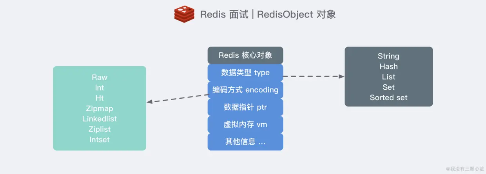

> **对应关系**

其次 Redis 为了 **平衡空间和时间效率**，针对 `value` 的具体类型在底层会采用不同的数据结构来实现，下图展示了他们之间的映射关系

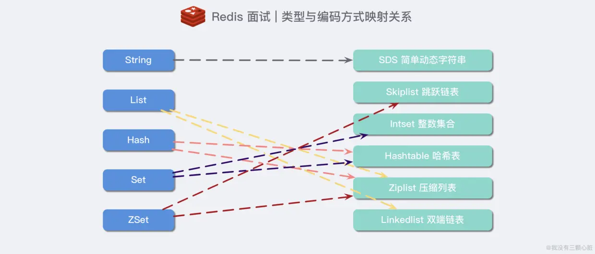

有一点没画出来：**Redis 新版本（3.2）对列表数据结构进行了改造，使用 `quicklist` 代替了 `ziplist` 和 `linkedlist`。**

## 7.2. 底层基本数据结构对象

### 7.2.1. sds 简单动态字符串

> C语言字符串的问题

- 说明
  - C 语言使用了一个长度为 `N+1` 的字符数组来表示长度为 `N` 的字符串，并且字符数组最后一个元素总是 `\0`
  - 这种简单的字符串表示方式 **不符合 Redis 对字符串在安全性、效率以及功能方面的要求**。

- 造成问题：
  - **获取字符串长度为 O(N) 级别的操作** 
    - 因为 C 不保存数组的长度，每次都需要遍历一遍整个数组；
  - 不能很好的杜绝 **缓冲区溢出/内存泄漏** 的问题 
    - 跟上述问题原因一样，如果执行拼接 or 缩短字符串的操作，如果操作不当就很容易造成上述问题；
  - C 字符串 **只能保存文本数据**
  - 因为 C 语言中的字符串必须符合某种编码（比如 ASCII），例如中间出现的 `'\0'` 可能会被判定为提前结束的字符串而识别不了；

> SDS原理及优势

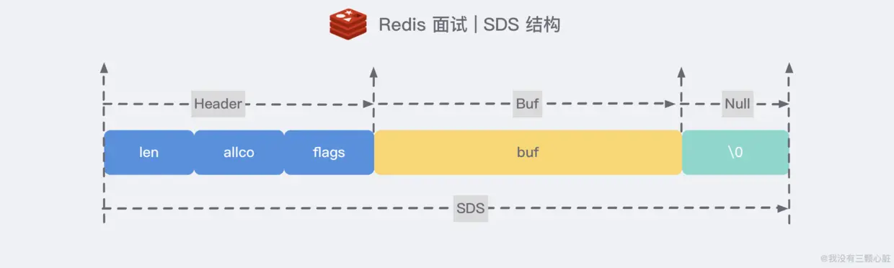

- 结构说明
  - len: 表示字符串的真正长度（不包含NULL结束符在内）。
  - alloc: 表示字符串的最大容量（不包含最后多余的那个字节）。
  - flags: 总是占用一个字节。其中的最低3个bit用来表示header的类型。
  - buf：字符串内容

- 源码位置：`sds.h/sdshdr` 
  > 可以看到 SDS 完整的实现细节

- 优化
  - **有效降低内存分配次数**
    - **空间预分配**
      - 若修改之后sds长度小于1MB,则多分配现有len长度的空间
      - 若修改之后sds长度大于等于1MB，则扩充除了满足修改之后的长度外，额外多1MB空间
    - **惰性空间释放**
      - 为避免缩短字符串时候的内存重分配操作，sds在数据减少时，并不立刻释放空间。
  - **二进制安全**
    - C 语言字符串只能保存 `ascii` 码，对于图片、音频等信息无法保存
    - SDS 是二进制安全的，**通过len来获取数据**，而不是根据`\0`来设置字符串末尾
  - **自动扩展空间**
    - 当 SDS 需要对字符串进行修改时，首先借助于 `len` 和 `alloc` 检查空间是否满足修改所需的要求
    - 如果空间不够的话，SDS 会自动扩展空间，避免了像 C 字符串操作中的覆盖情况；

### 7.2.2. linkedlist 双端链表

linkedlist是标准的双向链表，Node节点包含prev和next指针，可以进行双向遍历；

还保存了 head 和 tail 两个指针，因此，对链表的表头和表尾进行插入的复杂度都为 O(1)，这是高效实现 LPUSH 、 RPOP、 RPOPLPUSH 等命令的关键。

### 7.2.3. ziplist 压缩列表

> **说明**

- 压缩列表是Redis为节约内存自己设计的一种顺序型数据结构。
- 压缩列表被用作列表键和哈希键的底层实现之一。
- 压缩列表可以包含多个节点,每个节点可以保存一个字节数组或者整数值。
- 添加新节点到压缩列表,或者从压缩列表中删除节点,可能会引发连锁更新操作,但这种操作出现的几率并不高。

> **问题引入**

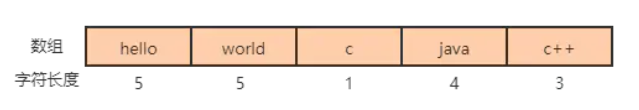

- 一共五个元素，每个元素的长度都是不一样的，
- 这个时候选择最大值5作为每个元素的内存大小，如果选择小于5的，那么第一个元素hello，第二个元素world就不能完整存储，数据会丢失。
- 所以只能声明为 `new char[5][5]`
- **需要用最大长度的字符串大小作为整个数组所有元素的内存大小**
- 如果只有一个元素的长度超大，但是其他的元素长度都比较小，那么我们所有元素的内存都用超大的数字就会导致内存的浪费。

> **整体结构**

- **结构图示**

  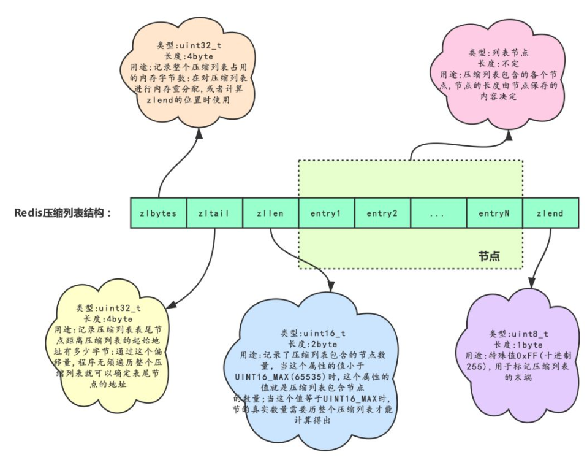

  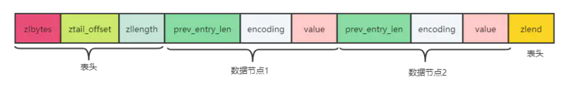

  - zlbytes：记录整个压缩列表占用的内存字节数。
  - zltail_offset：记录压缩列表尾节点距离压缩列表的起始地址的字节数（目的是为了直接定位到尾节点，方便反向查询）。
  - zllength：记录了压缩列表的节点数量。即在上图中节点数量为2。
  - zlend：保存一个常数255(0xFF)，标记压缩列表的末端。

- 示例

  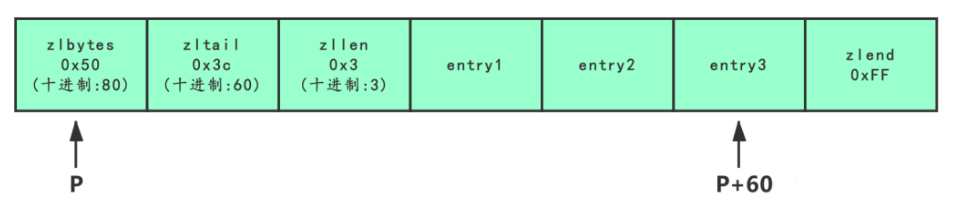

> **列表节点详细说明**

- 保存值的种类
  - 字节数组
    - 长度小于等于63(2^6-1)字节的字节数组;
    - 长度小于等于16383(2^14-1)字节的字节数组
    - 长度小于等于4294967295(2^32-1)字节的字节数组
  - 一个整数值
    - 4位长,介于0至12之间的无符号整数
    - 1字节长的有符号整数
    - 3字节长的有符号整数
    - int16_t类型整数
    - int32_t类型整数
    - int64_t类型整数

- 数据结构

  

  - previous_entry_length：
    - 说明：以字节为单位,记录了压缩列表中 **前一个节点的长度** 。 
    - 长度：previous_entry_length属性的长度可以是1字节或者5字节。
      - 如果前一节点的长度小于254字节,那么 previous_entry_length属性的长度为1字节，前一节点的长度就保存在这一个字节里面。
      - 如果前一节点的长度大于等于254字节,那么 previous_entry_length属性的长度为5字节:其中属性的第一字节会被设置为0xFE(十进制值254),而之后的四个字节则用于保存前一节点的长度.

  - encoding：
    - 说明：记录了节点的content属性所保存数据的类型以及长度。
    - encodding长度说明：
      - 一字节、两字节或者五字节长值的最高位为00、01或者10的是**字节数组编码**。
        - 这种编码表示节点的 content属性保存着字节数组
        - 数组的长度由编码除去最高两位之后的其他位记录。
      - 一字节长，值的最高位以11开头的是**整数编码**
        - 这种编码表示节点的content属性保存着整数值
        - 整数值的类型和长度由编码除去最高两位之后的其他位记录。

  - content：负责保存节点的具体数据,节点值可以是一个字节数组或者整数,值的类型和长度由节点的encoding属性决定。

- 示例

  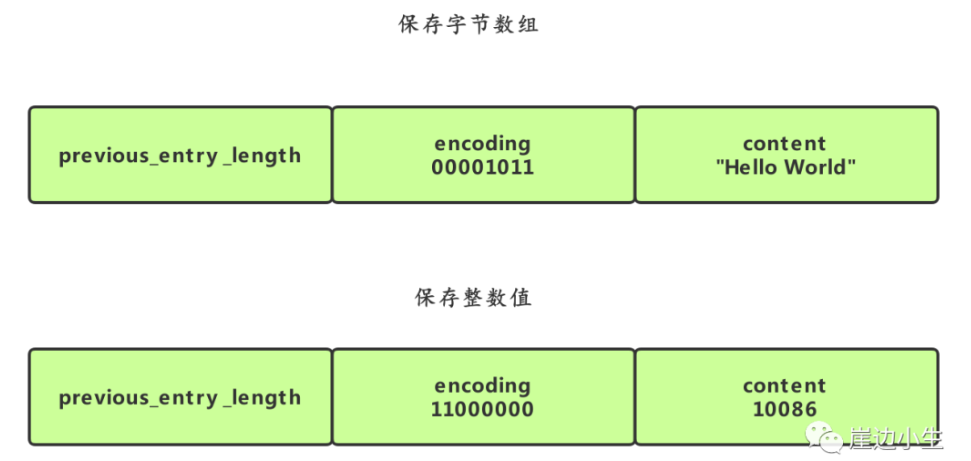

  - 编码的最高两位00表示节点保存的是一个字节数组。
  - 编码的后六位001011记录了字节数组的长度11。
  - content属性保存着节点的值”hello world”。
  - 编码11000000表示节点保存的是一个int16_t类型的整数值;
  - content属性保存着节点的值10086

> **优缺点**

- 优点
  - 节约内存

- 缺点
  - 因为压缩表是紧凑存储的，没有多余的空间。
    - 这就意味着插入一个新的元素就需要调用函数扩展内存。
    - 过程中可能需要重新分配新的内存空间，并将之前的内容一次性拷贝到新的地址。
  - 如果数据量太多，重新分配内存和拷贝数据会有很大的消耗。
  - **所以压缩表不适合存储大型字符串，并且数据元素不能太多**。

> **时间复杂度**

| 操作                                                         | 时间复杂度                                                   |
| ------------------------------------------------------------ | ------------------------------------------------------------ |
| 创建一个新的压缩列表                                         | O(1)                                                         |
| 创建一个包含给定值的新节点,并将这个新节点添加到压缩列表的表头或者表尾 | 平均O(N)，最坏O(N^2)(可能发生连锁更新)                       |
| 将包含给定值的新节点插人到给定节点之后                       | 平均O(N)，最坏O(N^2)(可能发生连锁更新)                       |
| 返回压缩列表给定索引上的节点                                 | O(N)                                                         |
| 在压缩列表中査找并返回包含了给定值的节点                     | 因为节点的值可能是一个字节数组,所以检查节点值和给定值是否相同的复杂度为O(N),而查找整个列表的复杂度则为(N^2) |
| 返回给定节点的下一个节点                                     | O(1)                                                         |
| 返回给定节点的前一个节点                                     | O(1)                                                         |
| 获取给定节点所保存的值                                       | O(1)                                                         |
| 从压缩列表中删除给定的节点                                   | 平均O(N)，最坏O(N^2)(可能发生连锁更新)                       |
| 删除压缩列表在给定索引上的连续多个                           | 平均O(N)，最坏O(N^2)(可能发生连锁更新)                       |
| 返回压缩列表目前占用的内存字节数                             | O(1)                                                         |
| 返回压缩列表目前包含的节点数量                               | 点数量小于65535时为O(1),大于65535时为O(N)                    |

### 7.2.4. dict 字典

> **redis哈希表数据结构**

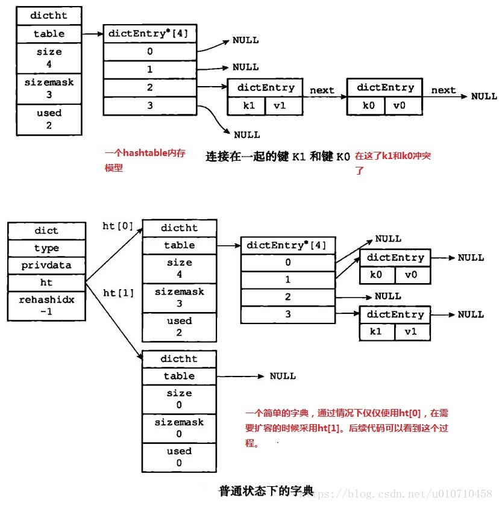

- dictht整体结构
    ```c
    typedef struct dictht {
        // 哈希表数组
        dictEntry **table;
        // 哈希表大小
        unsigned long size;
        // 哈希表大小掩码，用于计算索引值
        // 总是等于 size - 1
        unsigned long sizemask;
        // 该哈希表已有节点的数量
        unsigned long used;
    } dictht;
    ```

- dictEntry结构
  ```c
  typedef struct dictEntry {
      // 键
      void *key;
      // 值
      union {
          void *val;
          uint64_t u64;
          int64_t s64;
      } v;
      // 指向下个哈希表节点，形成链表
      struct dictEntry *next;
  } dictEntry;
  ```
  - key属性保存着键值对中的键
  - 而v属性则保存着键值对中的值，其中键值对中的值可以是一个指针，或者是一个整数。
  - next属性是指向另一个哈希表节点的指针，这个指针可以将多个哈希值相同的键值对连接在一起，来解决键冲突问题（以链表的方式解决冲突问题）。

> **字典数据结构**

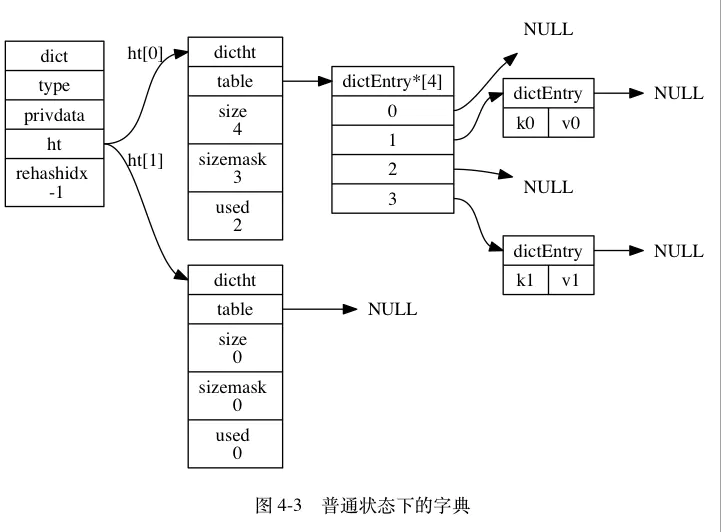

- 结构:主要由两个哈希表组成
  ```c
  typedef struct dict {

      // 类型特定函数
      dictType *type;

      // 私有数据
      void *privdata;

      // 哈希表
      dictht ht[2];

      // rehash 索引
      // 当 rehash 不在进行时，值为 -1
      int rehashidx; /* rehashing not in progress if rehashidx == -1 */

  } dict;
  ```
  - type属性和privdata属性是针对不同类型的键值对，而创建多态字典而设置的：
    - type属性是一个指向dictType结构的指针，每个dictType结构保存了一组用于操作特定类型键值对的函数，Redis会为用途不同的字典设置不同类型的特定函数。
    - 而privadata属性则保存了需要传给那些类型特定函数的可选参数。
  - ht属性是一个包含了两个项的数组，数组中每个项都是一个dictht哈希表，一般情况下，字典只使用ht[0]哈希表，而ht[1]哈希表只对ht[0]哈希表进行rehash时使用。
  - 另一个与rehash有关的就是rehashidx属性，它积累了rehash目前的进度，如果没有进行rehash，则它的值为-1。

- 字典的使用：
  - 除了 **hash** 结构的数据会用到字典外
  - 整个 Redis 数据库的所有 `key` 和 `value` 也组成了一个 **全局字典**
  - 还有带过期时间的 `key` 也是一个字典。*(存储在 RedisDb 数据结构中)*

> **内部结构和rehash**

- 冲突解决
  > 上面也提到了
  - **Redis** 中的字典相当于 Java 中的 **HashMap**，内部实现也差不多类似
  - 都是通过 **"数组 + 链表"** 的 **链地址法** 来解决部分哈希冲突

- 结构内部
  - 包含 **两个 hashtable**
  - 通常情况下只有一个 `hashtable` 有值，但是在字典扩容缩容时，需要分配新的 `hashtable`，然后进行 **渐进式搬迁** *(rehash)*
  - 这时候两个 `hashtable` 分别存储旧的和新的 `hashtable`，待搬迁结束后，旧的将被删除，新的 `hashtable` 取而代之。

> **扩容**

- 扩容说明
  - 随着操作的不断进行，哈希表保存的键值对会逐渐增多或减少
  - 为了让哈希表**负载因子**维持在一个合理范围之内，当哈希表保存的键值对太多或太少时，程序要对哈希表的大小进行相应的扩展或收缩。

- 扩容条件
  - 正常情况下
    - 当 hash 表中 **元素的个数等于第一维数组的长度时**，就会开始扩容
    - 扩容的新数组是 **原数组大小的 2 倍**
  - 如果 Redis 正在做 `bgsave(持久化命令)`
    - 为了减少内存也得过多分离，Redis 尽量不去扩容
    - 但是如果 hash 表非常满了，**达到了第一维数组长度的 5 倍了**，这个时候就会 **强制扩容**。

    ```
    为什么在执行 BGSAVE 命令或者 BGREWRITEAOF 命令， 负载因子要大于等于 5？而未执行时大于等于1？

    区分这两种情况的目的在于，因为执行BGSAVE与BGREWRITEAOF过程中，Redis都需要创建子进程，
    而大多数操作系统都采用写时复制技术来优化子进程使用效率，
    所以在子进程存在期间，服务器会提高执行扩展操作所需的负载因子，从而尽可能避免在子进程存在期间进行哈希表扩展操作，
    这可以避免不必要的内存写入，最大限度的节约空间。
    ```

- 扩容步骤
  - 为字典的ht[1]哈希表分配空间，这个空间大小取决于要执行的操作：
    - 如果执行的是扩展操作，则ht[1]的大小为第一个大于等于ht[0].used*2的2^n；
    - 如果执行的收缩操作，则ht[1]的大小为第一个大于等于ht[0].used的2^n；
  - 将保存在ht[0]中的所有键值对rehash到ht[1]上面：rehash指的是重新计算键的哈希值和索引值，然后将键值对放置到ht[1]的指定位置上。
  - 当ht[0]包含的所有键值对都迁移到ht[1]之后，释放ht[0]，将ht[1]设置为ht[0]，并在ht[1]新创建一个空白哈希表，为下一次rehash做准备。

- 图示示例

  <details>
  <summary style="color:red;">图示示例</summary>

  
  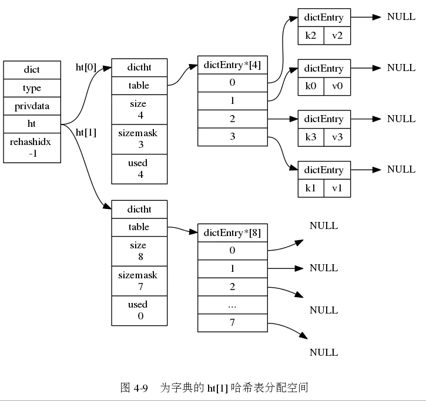
  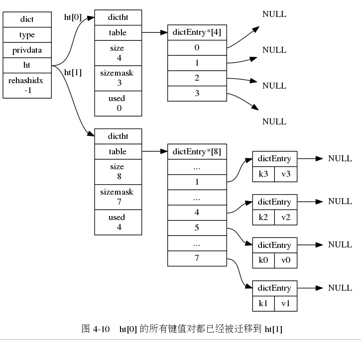
  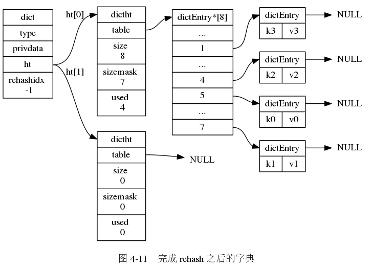
  </details>

- 渐进式hash
  - 原因
    - 如果服务器中包含很多键值对，要一次性的将这些键值对全部rehash到ht[1]的话，庞大的计算量可能导致服务器在一段时间内停止服务于。
  - 步骤
    - 为ht[1]分配空间，让字典同时持有ht[0]和ht[1]两个哈希表。
    - 在字典中维持一个索引计数器变量rehashidx，并将它置为0，表示rehash工作开始。
    - 在rehash进行期间， **每次对字典执行添加、删除、查找或者更新操作时，程序除了执行指定操作以外，还会顺带将ht[0]哈希表在rehashidx索引上的所有键值对rehash到ht[1]中** ，当rehash工作完成之后，程序将rehashidx属性的值+1。
    - 随着字典操作的不断进行，最终在某个时间点上，ht[0]的所有键值对都被rehash到ht[1]上，这时将rehashidx属性设为-1，表示rehash完成。
  - 图示示例

    <details>
    <summary style="color:red;">图示示例</summary>

    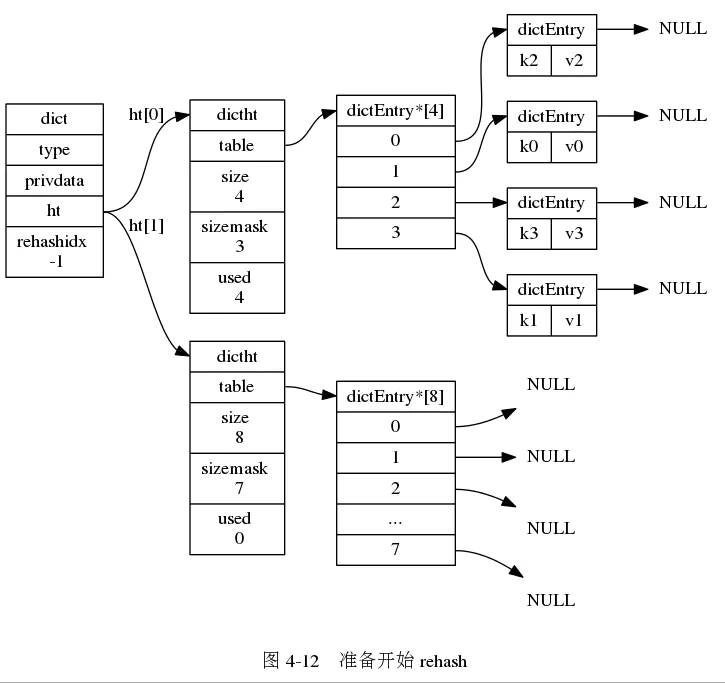
    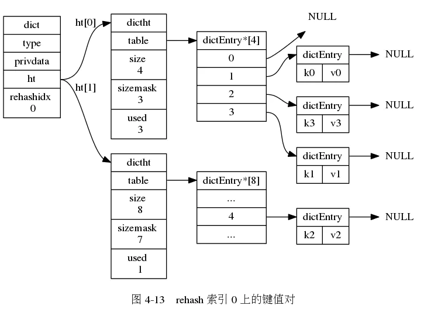
    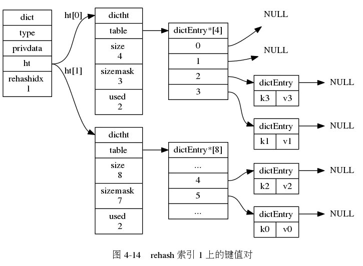 
    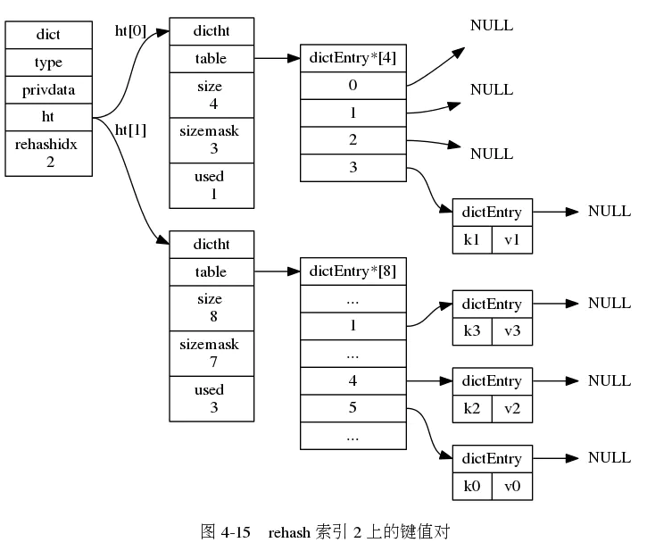
    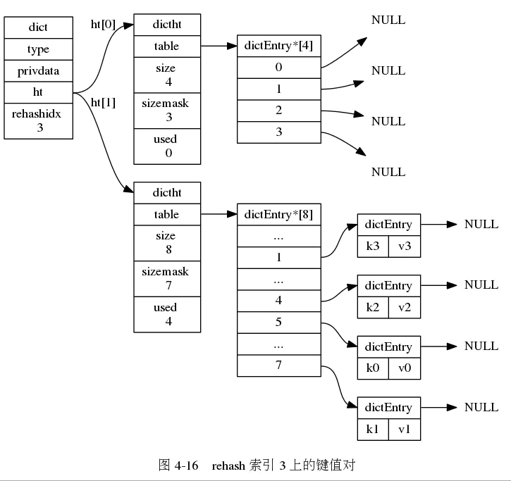
    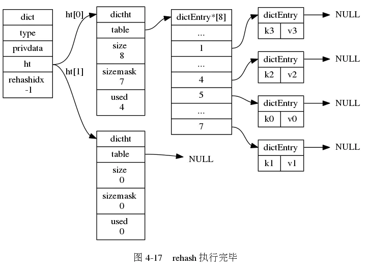
    </details>

- 扩容时的api操作
  - 渐进式rehash执行期间的哈希表操作
  - 因为在渐进式rehash的过程中，字典会同时使用ht[0]和ht[1]两个哈希表
  - **所以在渐进式rehash进行期间，字典的删除、查找、更新等操作都是在两个表上进行的** 。如：
    - 查找操作会先在ht[0]上进行，如果没找到再在ht[1]上进行。
    - 添加操作的键值对会一律保存到ht[1]中，这一措施保证ht[0]包含的键值对只会减少不会增加。

> **缩容的条件**

- 当 hash 表因为元素逐渐被删除变得越来越稀疏时，Redis 会对 hash 表进行缩容来减少 hash 表的第一维数组空间占用
- 所用的条件是 **元素个数低于数组长度的 10%（负载因子小于0.1）**
- 缩容不会考虑 Redis 是否在做 `bgsave`。	

### 7.2.5. intset 整数集合

> **说明**

- `intset`是Redis内存数据结构之一，用来实现Redis的Set结构（当元素较小且为数字类型时），它的特点有：
  - 元素类型只能为数字。
  - 元素有三种类型：int16_t、int32_t、int64_t。
  - 元素有序，不可重复。
  - intset和sds一样，内存连续，就像数组一样。

> **数据结构定义**

```c
typedef struct intset {
    uint32_t encoding;  // 编码类型 int16_t、int32_t、int64_t
    uint32_t length;    // 长度 最大长度:2^32
    int8_t contents[];  // 柔性数组
    // 可以看出，虽然contents部分指明的类型是int8_t，但是数据并不以这个类型存放。详细看升级操作
    // 数据以int16_t类型存放，每个占2个字节，能存放-32768~32767范围内的整数
    // #define INTSET_ENC_INT16 (sizeof(int16_t)) 
    // 数据以int32_t类型存放，每个占4个字节，能存放-2^32-1~2^32范围内的整数
    // #define INTSET_ENC_INT32 (sizeof(int32_t)) 
    // 数据以int64_t类型存放，每个占8个字节，能存放-2^64-1~2^64范围内的整数
    // #define INTSET_ENC_INT64 (sizeof(int64_t)) 
} intset;
```

> **升级**

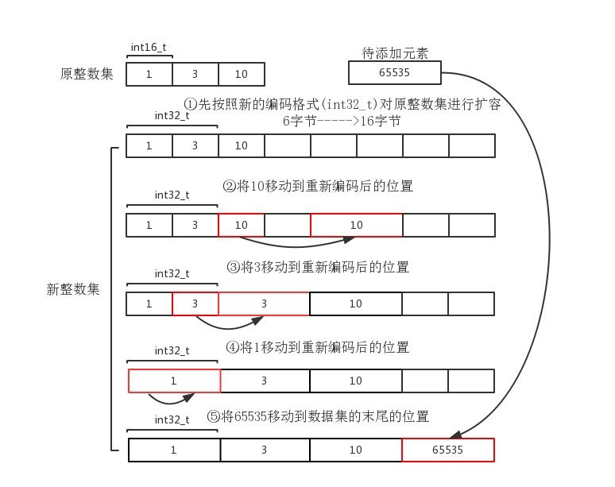

- 当intset中添加的整数超过当前编码类型的时候，intset会自定升级到能容纳该整数类型的编码模式
- 如 1,2,3,4，创建该集合的时候，采用int16_t的类型存储，
- 现在需要像集合中添加一个大整数，超出了当前集合能存放的最大范围，这个时候就需要对该整数集合进行升级操作，
  - 将encoding字段改成int32_6类型
  - 并对contents字段内的数据进行重排列。

### 7.2.6. skiplist 跳表

> **基本说明**

- 是一种可以于平衡树媲美的层次化链表结构
- 查找、删除、添加等操作都可以在对数期望时间下完成，以下是一个典型的跳跃表例子：

  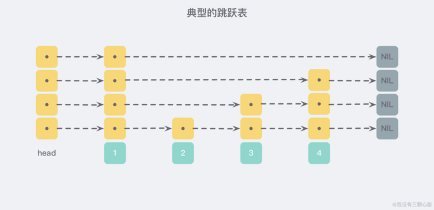

- 有序列表 zset 的内部实现就依赖了一种叫做 「跳跃列表」 的数据结构。

> **问题引入**

- zset 
  - 要支持随机的插入和删除，所以它 **不宜使用数组来实现**
  - 关于排序问题，可以想到 **红黑树/ 平衡树** 这样的树形结构

- 为什么 Redis 不使用这样一些结构呢？
  - **性能考虑：** 在高并发的情况下，树形结构需要执行一些类似于 rebalance 这样的可能涉及整棵树的操作，相对来说跳跃表的变化只涉及局部。
  - **实现考虑：** 在复杂度与红黑树相同的情况下，跳跃表实现起来更简单，看起来也更加直观；

- 基于以上的一些考虑，Redis 基于 **William Pugh** 的论文做出一些改进后采用了 **跳跃表** 这样的结构。

> **本质是解决查找问题**

- 普通链表

  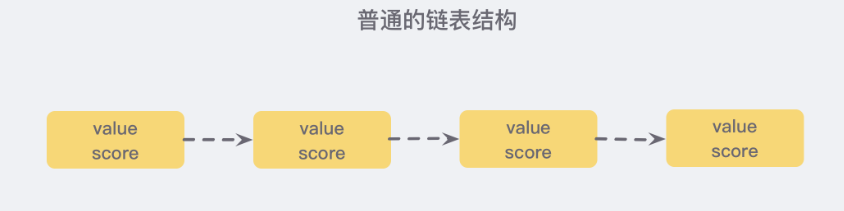 

  - 我们需要这个链表按照 score 值进行排序，
  - 然后因为链表不能像数组一样定位，因此查找复杂度依旧为:O(N)

- 优化：每相邻两个节点之间就增加一个指针，让指针指向下一个节点

  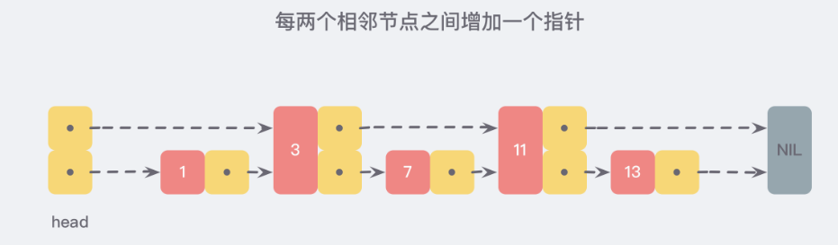

  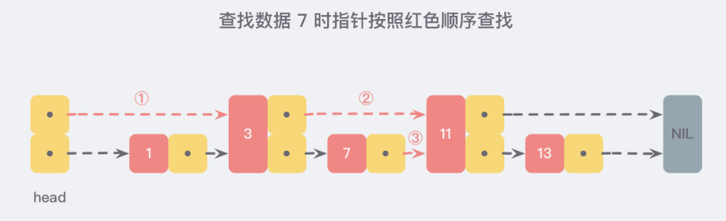

  - 新增的指针连成了一个新的链表，但它包含的数据却只有原来的一半
  - 找数据时，可以根据这条新的链表查找，如果碰到比待查找数据大的节点时，再回到原来的链表中进行查找
  - 在此基础上，可以继续添加三层链表

> **更进一步：跳表**

- **跳跃表 skiplist** 说明：
  - 受到上面那种多层链表结构的启发从而设计出来的
  - 按照上面生成链表的方式，上面每一层链表的节点个数，是下面一层的节点个数的一半，这样查找过程就非常类似于一个二分查找
  - 使得查找的时间复杂度可以降低到 _O(logn)_。

- 问题：
  - 新插入一个节点之后，就会打乱上下相邻两层链表上节点个数严格的 2:1 的对应关系。
  - 如果要维持这种对应关系，就必须把新插入的节点后面的所有节点 *（也包括新插入的节点）* 重新进行调整
  - 这会让时间复杂度重新蜕化成 _O(n)_。
  - 删除数据也有同样的问题。

- 问题解决
  - **skiplist** 为了避免这一问题，它不要求上下相邻两层链表之间的节点个数有严格的对应关系，而是 **为每个节点随机出一个层数(level)** 。
  - 比如，一个节点随机出的层数是 3，那么就把它链入到第 1 层到第 3 层这三层链表中。
  - 为了表达清楚，下图展示了如何通过一步步的插入操作从而形成一个 skiplist 的过程：

    <details>
    <summary style="color:red;">图示</summary>

    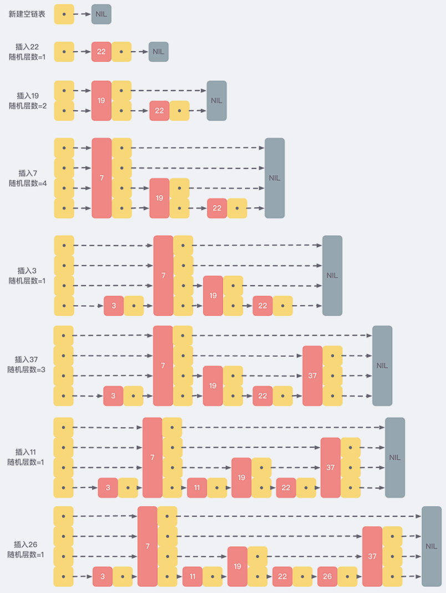
    </details>

  - 从上面的创建和插入的过程中可以看出
    - 每一个节点的层数（level）是随机出来的
    - 而且新插入一个节点并不会影响到其他节点的层数
    - 因此， **插入操作只需要修改节点前后的指针，而不需要对多个节点都进行调整** ，这就降低了插入操作的复杂度。

- 层数分配：
  - 50% 的概率被分配到 `Level 1`，25% 的概率被分配到 `Level 2`，12.5% 的概率被分配到 `Level 3`，以此类推
  - **Redis 跳跃表默认允许最大的层数是 32**，被源码中 `ZSKIPLIST_MAXLEVEL` 定义，当 `Level[0]` 有 264 个元素时，才能达到 32 层，所以定义 32 完全够用了。

- 查找过程

  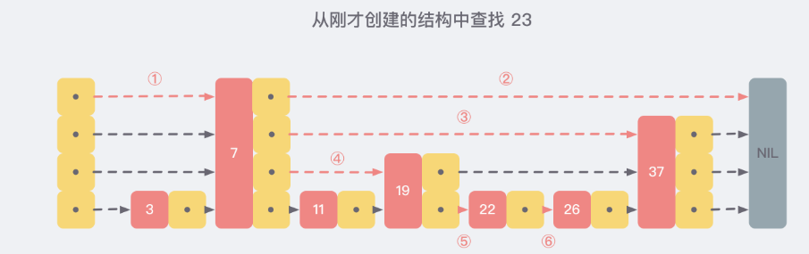

> **插入实现**

- 找到当前我需要插入的位置
  - 先根据score进行比较，如果score相同，就根据value进行比较
  - 逐步降级寻找目标节点，得到**搜索路径**
    - 因为随机插入到一层，因此必须记录每一层的位置

  <details>
  <summary style="color:red;">源码</summary>

  ```c
  serverAssert(!isnan(score));
  x = zsl->header;
  // 逐步降级寻找目标节点，得到 "搜索路径"
  for (i = zsl->level-1; i >= 0; i--) {
      /* store rank that is crossed to reach the insert position */
      rank[i] = i == (zsl->level-1) ? 0 : rank[i+1];
      // 如果 score 相等，还需要比较 value 值
      while (x->level[i].forward &&
              (x->level[i].forward->score < score ||
                  (x->level[i].forward->score == score &&
                  sdscmp(x->level[i].forward->ele,ele) < 0)))
      {
          rank[i] += x->level[i].span;
          x = x->level[i].forward;
      }
      // 记录 "搜索路径"
      update[i] = x;
  }
  ```
  </details>

- 创建新节点
  - 如果随机生成的 level 超过了当前最大 level 需要更新跳跃表的信息

  <details>
  <summary style="color:red;">源码</summary>

  ```c
  /* we assume the element is not already inside, since we allow duplicated
  * scores, reinserting the same element should never happen since the
  * caller of zslInsert() should test in the hash table if the element is
  * already inside or not. */
  level = zslRandomLevel();
  // 如果随机生成的 level 超过了当前最大 level 需要更新跳跃表的信息
  if (level > zsl->level) {
      for (i = zsl->level; i < level; i++) {
          rank[i] = 0;
          update[i] = zsl->header;
          update[i]->level[i].span = zsl->length;
      }
      zsl->level = level;
  }
  // 创建新节点
  x = zslCreateNode(level,score,ele);
  ```
  </details>

- 调整前后的指针指向，完成插入；
  - 重排前向指针
  - 重排后向指针并返回

> **删除实现**

- 类似插入过程：
  - 先得到搜索路径
  - 再重排前后指针
  - 更新最高层数

> **节点更新实现**

- 说明：
  - 当我们调用 `ZADD` 方法时，如果对应的 value 不存在，那就是插入过程，
  - 如果这个 value 已经存在，只是调整一下 score 的值，那就需要走一个更新流程。

- **把这个元素删除再插入这个**

  <details>
  <summary style="color:red;">源码</summary>

  ```c
  COPY/* Remove and re-insert when score changed. */
  if (score != curscore) {
      zobj->ptr = zzlDelete(zobj->ptr,eptr);
      zobj->ptr = zzlInsert(zobj->ptr,ele,score);
      *flags |= ZADD_UPDATED;
  }
  ```
  </details>

  - 从源码 `t_zset.c/zsetAdd` 函数 `1350` 行左右
  - 非常简单，但是要两次路径搜索，因此可以进一步优化

> **排名实现**

- 重要：span
  - 跳跃表本身是有序的，Redis 在 skiplist 的 forward 指针上进行了优化，给每一个 forward 指针都增加了 `span` 属性
  - 用来 **表示从前一个节点沿着当前层的 forward 指针跳到当前这个节点中间会跳过多少个节点**。
  - 在上面的源码中我们也可以看到 Redis 在插入、删除操作时都会小心翼翼地更新 `span` 值的大小。
  - 所以，沿着 **“搜索路径”**，把所有经过节点的跨度 `span` 值进行累加就可以算出当前元素的最终 rank 值了：

  <details>
  <summary style="color:red;">源码</summary>

  ```c
  /* Find the rank for an element by both score and key.
  * Returns 0 when the element cannot be found, rank otherwise.
  * Note that the rank is 1-based due to the span of zsl->header to the
  * first element. */
  unsigned long zslGetRank(zskiplist *zsl, double score, sds ele) {
      zskiplistNode *x;
      unsigned long rank = 0;
      int i;

      x = zsl->header;
      for (i = zsl->level-1; i >= 0; i--) {
          while (x->level[i].forward &&
              (x->level[i].forward->score < score ||
                  (x->level[i].forward->score == score &&
                  sdscmp(x->level[i].forward->ele,ele) <= 0))) {
              // span 累加
              rank += x->level[i].span;
              x = x->level[i].forward;
          }

          /* x might be equal to zsl->header, so test if obj is non-NULL */
          if (x->ele && sdscmp(x->ele,ele) == 0) {
              return rank;
          }
      }
      return 0;
  }
  ```
  </details>

### 7.2.7. quicklist 快速链表(3.2)

> **说明**

- quicklist是对ziplist进行一次封装
- 使用小块的ziplist来既保证了少使用内存，也保证了性能。

> **双向链表和压缩链表缺点**

- 双向链表linkedlist
  - 便于在表的两端进行push和pop操作，在插入节点上复杂度很低，但是它的内存开销比较大
  - 首先，它在每个节点上除了要保存数据之外，还要额外保存两个指针
  - 其次，双向链表的各个节点是单独的内存块，地址不连续，节点多了容易产生内存碎片。
- ziplist
  - 存储在一段连续的内存上，所以存储效率很高。但是，它不利于修改操作
  - 插入和删除操作需要频繁的申请和释放内存。
  - 特别是当ziplist长度很长的时候，一次realloc可能会导致大批量的数据拷贝

> **结构**

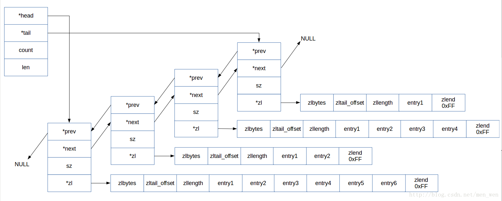

- quicklist节点结构
  ```c
  typedef struct quicklistNode {
      struct quicklistNode *prev;     //前驱节点指针
      struct quicklistNode *next;     //后继节点指针

      //不设置压缩数据参数recompress时指向一个ziplist结构
      //设置压缩数据参数recompress指向quicklistLZF结构
      unsigned char *zl;

      //压缩列表ziplist的总长度
      unsigned int sz;                  /* ziplist size in bytes */

      //ziplist中包的节点数，占16 bits长度
      unsigned int count : 16;          /* count of items in ziplist */

      //表示是否采用了LZF压缩算法压缩quicklist节点，1表示压缩过，2表示没压缩，占2 bits长度
      unsigned int encoding : 2;        /* RAW==1 or LZF==2 */

      //表示一个quicklistNode节点是否采用ziplist结构保存数据，2表示压缩了，1表示没压缩，默认是2，占2bits长度
      unsigned int container : 2;       /* NONE==1 or ZIPLIST==2 */

      //标记quicklist节点的ziplist之前是否被解压缩过，占1bit长度
      //如果recompress为1，则等待被再次压缩
      unsigned int recompress : 1; /* was this node previous compressed? */

      //测试时使用
      unsigned int attempted_compress : 1; /* node can't compress; too small */

      //额外扩展位，占10bits长度
      unsigned int extra : 10; /* more bits to steal for future usage */
  } quicklistNode;
  ```

- 压缩过的ziplist结构—quicklistLZF
  > 当指定使用lzf无损压缩算法压缩ziplist的entry节点时，quicklistNode结构的zl成员指向quicklistLZF结构
  ```c
  typedef struct quicklistLZF {
      //表示被LZF算法压缩后的ziplist的大小
      unsigned int sz; /* LZF size in bytes*/

      //保存压缩后的ziplist的数组，柔性数组
      char compressed[];
  } quicklistLZF;
  ```

- 存储ziplist信息的结构
  ```c
  typedef struct quicklistEntry {
      const quicklist *quicklist;   //指向所属的quicklist的指针
      quicklistNode *node;          //指向所属的quicklistNode节点的指针
      unsigned char *zi;            //指向当前ziplist结构的指针
      unsigned char *value;         //指向当前ziplist结构的字符串vlaue成员
      long long longval;            //指向当前ziplist结构的整数value成员
      unsigned int sz;              //保存当前ziplist结构的字节数大小
      int offset;                   //保存相对ziplist的偏移量
  } quicklistEntry;
  ```

> **插入操作**

- 头部或者尾部进行插入(`quicklistPushHead`和`quicklistPushTail`)，不管是在头部还是尾部插入数据，都包含两种情况：
  - 如果头节点（或尾节点）上ziplist大小没有超过限制（即`_quicklistNodeAllowInsert`返回1），那么新数据被直接插入到ziplist中（调用`ziplistPush`）。
  - 如果头节点（或尾节点）上ziplist太大了，那么新创建一个quicklistNode节点（对应地也会新创建一个ziplist），然后把这个新创建的节点插入到quicklist双向链表中。

  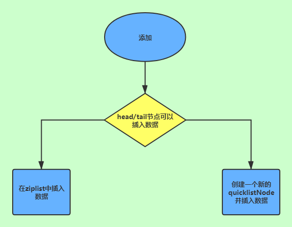

- 随机插入，`quicklistInsertAfter`和`quicklistInsertBefore`就是分别在指定位置后面和前面插入数据项
  - 当插入位置所在的ziplist大小没有超过限制时，直接插入到ziplist中就好了；
  - 当插入位置所在的ziplist大小超过了限制
    - 插入的位置位于ziplist两端
      - 相邻的quicklist链表节点的ziplist大小没有超过限制，那么就转而插入到相邻的那个quicklist链表节点的ziplist的尾部(前驱)或者头部(后继)
      - 相邻的quicklist链表节点的ziplist大小也超过限制，这时需要新创建一个quicklist链表节点插入。
    - 在ziplist中间插入数据的情况
      - 则需要把当前ziplist分裂为两个节点，然后再其中一个节点上插入数据。

> **查找**

每个ziplist都有大小。所以我们就只需要先根据我们每个node的个数，从而找到对应的ziplist，调用ziplist的index就能成功找到。

> **删除**

- 区间元素删除的函数是 `quicklistDelRange`
  - 流程
    - quicklist 在区间删除时，会先找到 start 所在的 quicklistNode
    - 计算删除的元素是否小于要删除的 count，
    - 如果不满足删除的个数，则会移动至下一个 quicklistNode 继续删除，依次循环直到删除完成为止。
  - 返回值:`quicklistDelRange` 函数的返回值为 int 类型，当返回 1 时表示成功的删除了指定区间的元素，返回 0 时表示没有删除任何元素。

### 7.2.8. Stream(5.0)

Redis Stream 是 Redis 5.0 版本新增加的数据结构。

Redis Stream 主要用于消息队列（MQ，Message Queue），Redis 本身是有一个 Redis 发布订阅 (pub/sub) 来实现消息队列的功能，但它有个缺点就是消息无法持久化，如果出现网络断开、Redis 宕机等，消息就会被丢弃。

TODO: redis stream底层数据结构

- [妈妈再也不担心我面试被Redis问得脸都绿了](https://segmentfault.com/a/1190000022146622)
- [菜鸟教程](https://www.runoob.com/redis/redis-stream.html)

## 7.3. 基本数据结构实现说明

### 7.3.1. string

使用SDS简单动态字符串数据结构

### 7.3.2. list

- 在版本3.2之前，Redis 列表list使用两种数据结构作为底层实现：
  - 组成：
    - 压缩列表ziplist
    - 双向链表linkedlist
  - 说明
    - 因为双向链表占用的内存比压缩列表要多， 所以当创建新的列表键时， 列表会优先考虑使用压缩列表
    - 并且在有需要的时候， 才从压缩列表实现转换到双向链表实现。
  - 转换条件
    > 下面两个设置都可以更改
    - 试图往列表新添加一个字符串值，且这个字符串的长度超过 server.list_max_ziplist_value （默认值为 64 ）。
    - ziplist 包含的节点超过 server.list_max_ziplist_entries （默认值为 512 ）。

- 3.2时，使用quicklist替换了ziplist和linkedlist

### 7.3.3. hash

- redis的哈希对象的底层存储可以使用ziplist（压缩列表）和hashtable。
  - 当hash对象可以同时满足一下两个条件时，哈希对象使用ziplist编码。
    - 哈希对象保存的所有键值对的键和值的字符串长度都小于64字节
    - 哈希对象保存的键值对数量小于512个
  - 如何使用ziplist存储
    - 将同一键值对的两个节点紧挨着保存，保存键的节点在前，保存值的节点在后，新加入的键值对，放在压缩列表表尾

### 7.3.4. set

- 说明：
  - 默认使用IntSet
  - 一定情况下IntSet转换为HashTable

- IntSet转变为HashTable条件
  - 当set中插入第一个字符串时
  - 插入的数字超过8字节

- dict如何实现set
  - key就是set的元素，val为NULL
  - 和java中HashSet利用HashMap实现的原理一致

- 优劣势
  - 查找时间：
    - 使用dict结构查找时间复杂度为O(1)
    - 而intset用二分查找时间复杂度O(logN)
  - 空间使用：
    - dict空间使用更多，是一种空间换时间策略
    - 当存储的都是小于8字节的整数时，intset可以省下很多内存

### 7.3.5. zset

- 说明：zset有两种不同的实现，分别是zipList和skipList

- 底层结构条件：
  - zipList：满足以下两个条件
    - [score,value]键值对数量少于128个；
    - 每个元素的长度小于64字节；
  - skipList：不满足以上两个条件时使用跳表、组合了hash和skipList
    - hash用来存储value到score的映射，这样就可以在O(1)时间内找到value对应的分数；
    - skipList按照从小到大的顺序存储分数
    - skipList每个元素的值都是[socre,value]对

### 7.3.6. HyperLogLog(2.8.9)

TODO redis hyperloglog

[Redis(4)——神奇的HyperLoglog解决统计问题](https://www.wmyskxz.com/2020/03/02/reids-4-shen-qi-de-hyperloglog-jie-jue-tong-ji-wen-ti/)

## 7.4. 高级算法

### 7.4.1. GeoHash(坐标定位算法)

TODO: redis geohash

[Redis(6)——GeoHash查找附近的人](https://www.wmyskxz.com/2020/03/12/redis-6-geohash-cha-zhao-fu-jin-de-ren/)

### 7.4.2. scan(数据快速查询算法)

# 8. 事务的控制

## 8.1. 说明

- 说明：可以一次执行多个命令，本质是一组命令的集合。一个事务中的所有命令都会序列化，按顺序地串行化执行而不会被其它命令插入，不许加塞。

- 原理： **一个队列中，一次性、顺序性、排他性的执行一系列命令** 。

- 3阶段
  - 开启：以MULTI开始一个事务
  - 入队：将多个命令入队到事务中，接到这些命令并不会立即执行，而是放到等待执行的事务队列里面
  - 执行：由EXEC命令触发事务

- 3特性
  - **单独的隔离操作**：事务中的所有命令都会序列化、按顺序地执行。事务在执行的过程中，不会被其他客户端发送来的命令请求所打断。
  - **没有隔离级别的概念**：队列中的命令没有提交之前都不会实际的被执行，因为事务提交前任何指令都不会被实际执行， 也就不存在”事务内的查询要看到事务里的更新，在事务外查询不能看到”这个让人万分头痛的问题
  - **不保证原子性**：在语法正确的情况下，如果redis同一个事务中如果有一条命令执行失败，其后的命令仍然会被执行，**没有回滚**

## 8.2. 常用命令

| 命令              | 描述                                                                                           |
| ----------------- | ---------------------------------------------------------------------------------------------- |
| discard           | 取消事务，放弃执行事务块内的所有命令。                                                         |
| exec              | 执行所有事务块内的命令。(类似于commit)                                                         |
| multi             | 标记一个事务块的开始。                                                                         |
| unwatch           | 取消 watch 命令对所有 key 的监视。                                                             |
| watch key [key …] | 监视一个(或多个) key ，如果在事务执行之前这个(或这些) key 被其他命令所改动，那么事务将被打断。 |

## 8.3. redis的乐观锁

- watch和unwatch搭配使用，为乐观锁。类似CAS。
  - 事务开启前watch一个key:k1
  - 如果key在事务提交前修改k1对应的值被别的事务修改
  - 事务提交后会失败，返回nil
  - 然后重新watch和执行事务。（类似CAS）

- 注意：取消监控锁的两种方式：
  - unwatch
  - exec

## 8.4. 执行示例

- 正常执行
  > 
- 放弃事务
  > 
- 全体连坐: **类似于java的检查时异常**
  > 
- 冤头债主: **类似于java的运行时异常** ，比如对字符串执行incr
  > 
- 事务提交前监控变量没有修改
  >  
- 事务提交前监控变量被修改
  > 

# 9. 并发问题解决

TODO: redis并发竞争解决方案

> Redis 并发竞争 的问题就是高并发写同一个key时导致的值错误如何解决

## 9.1. watch乐观锁

乐观锁，注意不要在分片集群中使用

## 9.2. 分布式锁

分布式锁，适合分布式系统环境

使用redis或者zookeeper实现分布式锁，

不管哪种方式实现，基本原理是不变的：用一个状态值表示锁，对锁的占用和释放通过状态值来标识。

## 9.3. 时间戳

时间戳，适合有序场景

比如：假设系统B先抢到锁，将key1设置为{ValueB 7:05}。接下来系统A抢到锁，发现自己的key1的时间戳早于缓存中的时间戳（`7:00<7:05`），那就不做set操作了。

## 9.4. 消息队列

消息队列，串行化处理

在并发量过大的情况下,可以通过消息中间件进行处理,把并行读写进行串行化。

把Redis.set操作放在队列中使其串行化,必须的一个一个执行。

这种方式在一些高并发的场景中算是一种通用的解决方案。

# 10. 消息发布订阅与Stream


[Redis(8)——发布/订阅与Stream](https://www.wmyskxz.com/2020/03/15/redis-8-fa-bu-ding-yue-yu-stream/)

## 10.1. 说明

- 说明
  - 进程间的一种消息通信模式：发送者(pub)发送消息，订阅者(sub)接收消息。
  - redis支持消息的发布订阅，但是 **企业中很少使用redis作为消息中间件**

- 下图展示了频道 channel1 ， 以及订阅这个频道的三个客户端 —— client2 、 client5 和 client1 之间的关系：
  > 

- 当有新消息通过 PUBLISH 命令发送给频道 channel1 时， 这个消息就会被发送给订阅它的三个客户端：
  > 

## 10.2. 命令

| 命令                                      | 描述                               |
| ----------------------------------------- | ---------------------------------- |
| psubscribe pattern [pattern …]            | 订阅一个或多个符合给定模式的频道。 |
| pubsub subcommand [argument [argument …]] | 查看订阅与发布系统状态。           |
| publish channel message                   | 将信息发送到指定的频道。           |
| punsubscribe [pattern [pattern …]]        | 退订所有给定模式的频道。           |
| subscribe channel [channel …]             | 订阅给定的一个或多个频道的信息。   |
| unsubscribe [channel [channel …]]         | 指退订给定的频道。                 |

# 11. 集群

## 11.1. 主从复制

### 11.1.1. 说明

- redis的主从模式
- 复制方式：使用异步复制，slave节点异步从master节点复制数据
- 读写分配：
  - **master节点提供读写服务**
  - **slave节点只提供读服务**（这个是默认配置，可以通过修改配置文件 slave-read-only 控制）
    ```
    不要修改配置让slave节点支持写操作，没有意义
      原因一，写入的数据不会被同步到其他节点
      原因二，当master节点修改同一条数据后，slave节点的数据会被覆盖掉
    ```


### 11.1.2. 配置

只要对从节点进行配置即可，让从节点找到主节点

- 开启方式
  - 配置文件
    - 在从服务器的配置文件中加入：`slaveof <masterip> <masterport>`
  - 启动命令
    - redis-server启动命令后加入：`slaveof <masterip> <masterport>`
  - 客户端命令
    - Redis服务器启动后直接通过客户端执行命令：`slaveof <masterip> <masterport>`，则该Redis实例成为从节点。

- 查看状态：`info replication`

---

- 当master节点设置密码时：
  - 客户端访问master需要密码
  - 启动slave需要密码，在配置中进行配置即可
  - 客户端访问slave不需要密码

### 11.1.3. 实现架构

- 一主多从
  ```
  多个slave连接同一个master
  ```
- slave上连接salve
  ```
  master <-- slave1 <-- slave2
  ```
  - 该模式下，如果master宕机了
  - 可以通过`SLAVEOF no one`命令，使slave1成为master
  - slave1和slave2共同构成一个`master<--slave`集群

### 11.1.4. 复制原理

- slave启动成功连接到master后会发送一个sync命令
- master接到命令，启动后台的存盘进程，同时收集所有接收到的用于修改数据集命令， 在后台进程执行完毕之后，master将传送整个数据文件到slave,以完成一次完全同步
- **全量复制** ：而slave服务在接收到数据库文件数据后，将其存盘并加载到内存中。
- **增量复制** ：Master继续将新的所有收集到的修改命令依次传给slave,完成同步
- 只要是 **重新连接master** ，一次完全同步（全量复制)将被自动执行

### 11.1.5. 宕机情况

一主多从情况下

- slave节点宕机
  - 不影响其他slave节点的读和master节点的读和写
  - slave重新启动后，会将数据从master节点同步过来
    > 如果配置文件中没有配置slave of，就要重新使用命令行连接master

- master节点宕机
  - master将不再提供写服务
  - 不影响slave节点的读
  - 不会从slave节点中重新选一个master
  - master重新启动后，Slave将自动重新连接master，将重新对外提供写服务。

### 11.1.6. 缺点

- master节点挂了以后，redis就不能对外提供写服务了，因为剩下的slave不能成为master
- 这个缺点影响是很大的，尤其是对生产环境来说，是一刻都不能停止服务的，所以一般的生产坏境是不会单单只有主从模式的。所以有了下面的sentinel模式。
- 由于所有的写操作都是先在Master上操作，然后同步更新到slave上，所以从Master同步到Slave机器有一定的延迟，当系统很繁忙的时候，延迟问题会更加严重，Slave机器数量的增加也会使这个问题更加严重。

## 11.2. 哨兵机制

### 11.2.1. 说明

- 目的：解决主从复制中，主节点宕机之后无法提供写服务的问题
- 说明：
  - 哨兵模式就是不时地监控redis是否按照预期良好地运行（至少是保证主节点是存在的）
  - 若一台主机出现问题时，哨兵会自动将该主机下的某一个从机设置为新的主机，并让其他从机和新主机建立主从关系。
- 任务：
  - 监控（Monitoring）：Sentinel会不断地检查你的主服务器和从服务器是否允许正常。
  - 提醒（Notification）：当被监控的某个Redis服务器出现问题时，Sentinel可以通过API向管理员或者其他应用程序发送通知。
  - 自动故障迁移（Automatic failover）:
    - （1）当一个主服务器不能正常工作时，Sentinel会开始一次自动故障迁移操作，他会将失效主服务器的其中一个从服务器升级为新的主服务器，并让失效主服务器的其他从服务器改为复制新的主服务器；
    - （2）客户端试图连接失败的主服务器时，集群也会向客服端返回新主服务器的地址，使得集群可以使用新主服务器代替失效服务器。

    > 如果旧主服务器恢复，旧主服务器会作为**slave节点**加入集群。


---

- 高可用要求：一个健壮的部署至少需要三个哨兵实例。

### 11.2.2. 配置

- 编写一个配置文件`sentinel.conf`，内容为：
  ```
  sentinel monitor 被监控机器的名字(自己起名字) ip地址 端口号 得票数
  ```
  - 监控的机器应为主机
  - 上面的得票数为1表示表示主机挂掉后salve投票看让谁接替成为主机，得票数大于1便成为主机

- 启动哨兵：`redis-sentinel /etc/redis/sentinel.conf`

## 11.3. cluster分片集群

### 11.3.1. 说明

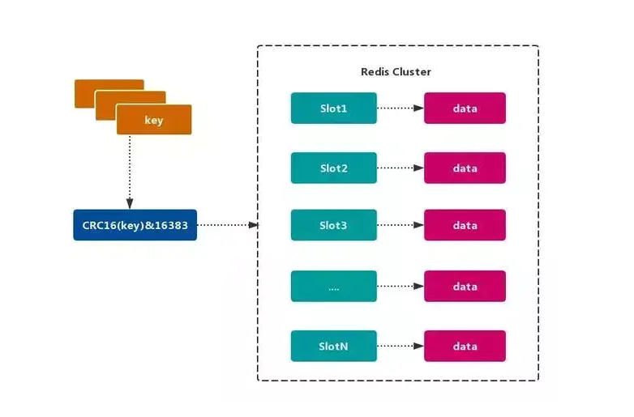

- 两个端口
  - 一个是用于客户端的Redis TCP，如6379。
  - 另一个由客户端加10000所得，如16379，用于Redis集群**总线连接**。

- 集群总线
  - 这是一个用户点对节点的二进制协议通讯通道。
  - 集群总线是用来处理节点的失效检测，配置更新，灾备授权等事情。
  - 集群总线使用了一种不同的二进制协议，供节点和节点之间交换信息用。
  - 该协议可以让节点和节点之间以更小的流量和和更短的时间来交换信息。

- 数据存取
  - 说明
    - Redis 集群没有使用一致性 hash，而是引入了哈希槽【hash slot】的概念。
    - Redis 集群有16384 个哈希槽，每个 key 通过 CRC16 校验后对 16384 取模来决定放置哪个槽
    - 会重定向到指定节点
  - hash槽好处
    - 把哈希槽从一个节点移动到另外一个节点并不需要停止集群。
    - 用户可以通过哈希标签强制的把多个键放到一个哈希槽里面。
    - 让集群增加或者减少节点变得很简单。
      - 增加一个 master，就将其他 master 的 hash slot 移动部分过去，
      - 减少一个 master，就将它的 hash slot 移动到其他 master 上去。
      - 移动 hash slot 的成本是非常低的。客户端的 api，可以对指定的数据，让他们走同一个 hash slot，通过 hash tag 来实现。
      - 任何一台机器宕机，其他节点，不影响的。因为 key 找的是 hash slot，不是机器。

- Redis 集群的主从复制模型
  - 说明
    - 为了保证高可用，redis-cluster集群引入了主从复制模型
    - 一个主节点对应一个或者多个从节点
    - 当主节点宕机的时候，就会启用从节点
  - 集群的特点
    - 所有的 redis 节点彼此互联(PING-PONG机制)，内部使用二进制协议优化传输速度和带宽。
    - 节点的 fail 是通过集群中超过半数的节点检测失效时才生效。
    - 客户端与 Redis 节点直连，不需要中间代理层.客户端不需要连接集群所有节点，连接集群中任何一个可用节点即可。

### 11.3.2. 架构

### 11.3.3. 配置搭建

[搭建说明](https://juejin.cn/post/6844904057044205582#heading-0)

TODO: redis cluster分片集群 搭建

[说明与搭建](https://blog.csdn.net/J080624/article/details/103121930)

[说明](https://segmentfault.com/a/1190000022808576)

# 12. 应用Application

## 12.1. 缓存

TODO: redis 3种缓存策略

<!--file:///D:/learn/githubRepo/JavaGuide/docs/database/Redis/3%E7%A7%8D%E5%B8%B8%E7%94%A8%E7%9A%84%E7%BC%93%E5%AD%98%E8%AF%BB%E5%86%99%E7%AD%96%E7%95%A5.md-->

### 12.1.1. 旁路缓存模式

### 12.1.2. 读写穿透

### 12.1.3. 异步缓存写入

## 12.2. 分布式锁

### 12.2.1. 高效分布式锁条件

- 互斥
  - 说明：在分布式高并发的条件下，我们最需要保证，同一时刻只能有一个线程获得锁
  - 这是最基本的一点。

- 防止死锁
  - 说明：在分布式高并发的条件下，比如有个线程获得锁的同时，还没有来得及去释放锁，就因为系统故障或者其它原因使它无法执行释放锁的命令,导致其它线程都无法获得锁，造成死锁。
  - 思路：所以分布式非常有必要设置锁的`有效时间`，确保系统出现故障后，在一定时间内能够主动去释放锁，避免造成死锁的情况。

- 性能
  - 说明：对于访问量大的共享资源，需要考虑减少锁等待的时间，避免导致大量线程阻塞。
  - 所以在锁的设计时，需要考虑两点。
    - 1、`锁的颗粒度要尽量小`。比如你要通过锁来减库存，那这个锁的名称你可以设置成是商品的ID,而不是任取名称。这样这个锁只对当前商品有效,锁的颗粒度小。
    - 2、`锁的范围尽量要小`。比如只要锁2行代码就可以解决问题的，那就不要去锁10行代码了。
- 重入
  - 我们知道ReentrantLock是可重入锁，那它的特点就是：同一个线程可以重复拿到同一个资源的锁。重入锁非常有利于资源的高效利用。

### 12.2.2. 锁相关问题

- 基本流程：
  - 先拿setnx来争抢锁，抢到之后再用expire给锁加一个过期时间防止锁忘记释放。

- 问题1：如果在setnx之后执行expire之前的进程意外crash或重启维护了，如何解决
  - 解决1：
    - **Set指令**有非常复杂的参数，可以同时把setnx和expire合成一条指令来用的。
      > Redis2.6.12以上版本，可以用set获取锁。set可以实现setnx和expire，这个是原子操作。
    - SpringBoot的StringRedisTemplate的setIfAbsent()就是一个api
    - 其实本质就是下面的使用lua脚本
  - 解决2：使用lua脚本
    ```
      从 Redis 2.6.0 版本开始，通过内置的 Lua 解释器，可以使用 EVAL 命令对 Lua 脚本进行求值。

      Redis 使用单个 Lua 解释器去运行所有脚本，并且， Redis 也保证脚本会以原子性(atomic)的方式执行：
      当某个脚本正在运行的时候，不会有其他脚本或 Redis 命令被执行。这和使用 MULTI / EXEC 包围的事务很类似。
      在其他别的客户端看来，脚本的效果(effect)要么是不可见的(not visible)，要么就是已完成的(already completed)。
    ```
    - 在resource目录下面新增一个后缀名为.lua结尾的文件
    - 编写lua脚本 add.lua
    - 传入lua脚本的key和arg
    - 调用redisTemplate.execute方法执行脚本

      <details>
      <summary style="color:red;">脚本，代码</summary>

      ```lua
      local lockKey = KEYS[1]
      local lockTime = KEYS[2]
      local lockValue = KEYS[3]

      -- setnx info
      local result_1 = redis.call('SETNX', lockKey, lockValue)
      if result_1 == 1
      then
      local result_2= redis.call('SETEX', lockKey,lockTime, lockValue)
      return result_2
      else
      return 'faild'
      end
      ```
      ```java
      public Boolean luaExpress(String key,String  time,String value) {
          lockScript = new DefaultRedisScript<String>();
          lockScript.setScriptSource(
                  new ResourceScriptSource(new ClassPathResource("add.lua")));
          lockScript.setResultType(String.class);
          // 封装参数
          List<Object> keyList = new ArrayList<Object>();
          keyList.add(key);
          keyList.add(time);
          keyList.add(value);
          String result= (String)redisTemplate.execute(lockScript, keyList);
          System.out.println(result);
          logger.info("redis set result："+result);
          if (!"ok".equals(result.toLowerCase())){
              return false;
          }
          return true;
      }
      ```
      </details>

- 问题2：超时后，删除其他线程的锁。导致，**同一时间有多个线程进入代码块**，以及**锁永久失效**。
  - 说明：

    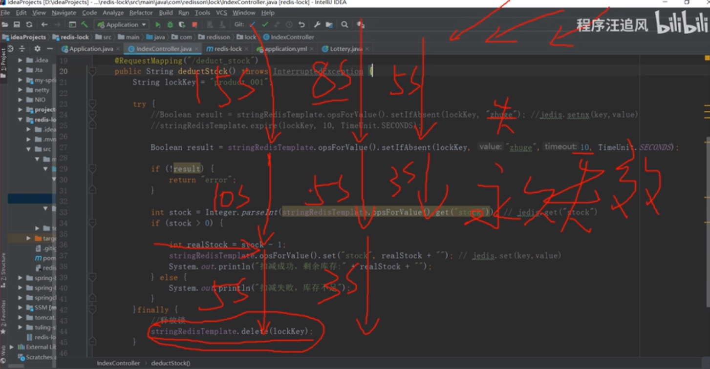

    - 还没执行完成锁就失效了
    - 然后第二个线程来了，进行加锁
    - 然后第一个线程在finally中又给解锁了（也就是第二个线程加的锁，第一个线程给解了）
    - 然后第二和第三个线程也可能出现上面那种情况。

  - 解决1：使用UUID，一个线程加的锁，只能一个线程解锁

    - 每一个线程都生成一个UUID
    - 当UUID相同时才能解锁

  - 解决2：
    - 当拿到锁后，开启一个线程
    - 每经过1/3的TTL后，重新设置为原来的TTL。（续命）
    - 实现比较难，可以使用`redisson`实现

### 12.2.3. redisson锁原理

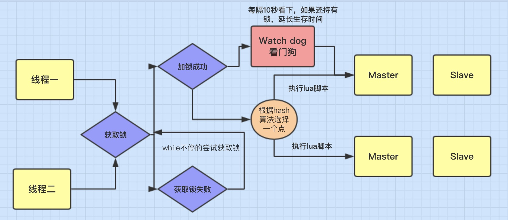

- 加锁机制
  - 线程去获取锁，获取成功: 执行lua脚本，保存数据到redis数据库。
  - 线程去获取锁，获取失败: 一直通过while循环尝试获取锁，获取成功后，执行lua脚本，保存数据到redis数据库。

- 自动延期机制
  - 主要针对两种情况(上面也提到了)：
    - 服务器宕机导致不释放锁，导致死锁。因此设置了过期时间
    - 业务时间执行时间大于过期时间，导致锁失效（看上面）
  - 使用：
    - 所以这个时候`看门狗`就出现了，它的作用就是 线程1 业务还没有执行完，时间就过了，线程1 还想持有锁的话，就会启动一个watch dog后台线程，不断的延长锁key的生存时间。
    - **注意**: 正常这个看门狗线程是不启动的，还有就是这个看门狗启动后对整体性能也会有一定影响，所以不建议开启看门狗。

- 为啥要用lua脚本呢？
  - 主要是如果你的业务逻辑复杂的话，通过封装在lua脚本中发送给redis
  - 而且redis是单线程的，这样就保证这段复杂业务逻辑执行的**原子性**。

- 如何实现的可重入锁
  - Redis存储锁的数据类型是 Hash类型

    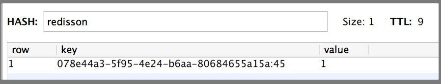

    这里表面数据类型是Hash类型,Hash类型相当于我们java的 `<key,<key1,value>>` 类型,这里key是指 'redisson'

    它的有效期还有9秒，我们再来看里们的key1值为`078e44a3-5f95-4e24-b6aa-80684655a15a:45`它的组成是:

    guid + 当前线程的ID。后面的value是就和可重入加锁有关。

    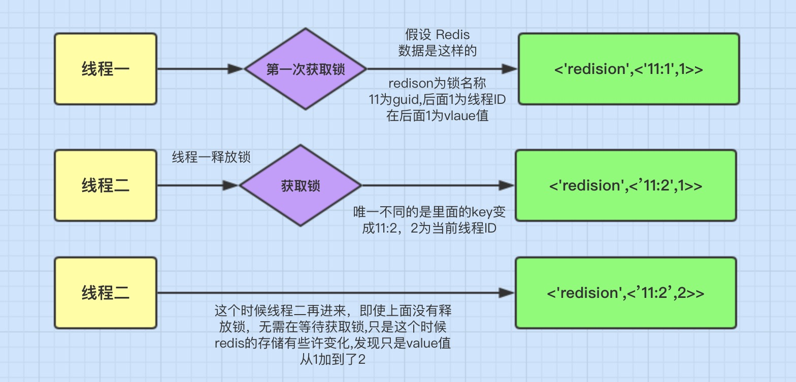

  - Hash数据类型的key值包含了当前线程信息。

### 12.2.4. redisson分布式锁实现

> 公平，可重入

#### 12.2.4.1. RLock接口

> Redisson分布式锁的实现是基于RLock接口。

- 继承：`public interface RLock extends Lock, RExpirable, RLockAsync`
- 很明显RLock是继承Lock锁，所以他有Lock锁的所有特性，比如lock、unlock、trylock等特性
- 同时它还有很多新特性：强制锁释放，带有效期的锁,。

- 常见方法

  <details>
  <summary style="color:red;">源码</summary>

  ```java
  public interface RRLock {
      //----------------------Lock接口方法-----------------------

      /**
      * 加锁 锁的有效期默认30秒
      */
      void lock();
      /**
      * tryLock()方法是有返回值的，它表示用来尝试获取锁，如果获取成功，则返回true，如果获取失败（即锁已被其他线程获取），则返回false .
      */
      boolean tryLock();
      /**
      * tryLock(long time, TimeUnit unit)方法和tryLock()方法是类似的，只不过区别在于这个方法在拿不到锁时会等待一定的时间，
      * 在时间期限之内如果还拿不到锁，就返回false。如果如果一开始拿到锁或者在等待期间内拿到了锁，则返回true。
      *
      * @param time 等待时间
      * @param unit 时间单位 小时、分、秒、毫秒等
      */
      boolean tryLock(long time, TimeUnit unit) throws InterruptedException;
      /**
      * 解锁
      */
      void unlock();
      /**
      * 中断锁 表示该锁可以被中断 假如A和B同时调这个方法，A获取锁，B为获取锁，那么B线程可以通过
      * Thread.currentThread().interrupt(); 方法真正中断该线程
      */
      void lockInterruptibly();

      //----------------------RLock接口方法-----------------------
      /**
      * 加锁 上面是默认30秒这里可以手动设置锁的有效时间
      *
      * @param leaseTime 锁有效时间
      * @param unit      时间单位 小时、分、秒、毫秒等
      */
      void lock(long leaseTime, TimeUnit unit);
      /**
      * 这里比上面多一个参数，多添加一个锁的有效时间
      *
      * @param waitTime  等待时间
      * @param leaseTime 锁有效时间
      * @param unit      时间单位 小时、分、秒、毫秒等
      */
      boolean tryLock(long waitTime, long leaseTime, TimeUnit unit) throws InterruptedException;
      /**
      * 检验该锁是否被线程使用，如果被使用返回True
      */
      boolean isLocked();
      /**
      * 检查当前线程是否获得此锁（这个和上面的区别就是该方法可以判断是否当前线程获得此锁，而不是此锁是否被线程占有）
      * 这个比上面那个实用
      */
      boolean isHeldByCurrentThread();
      /**
      * 中断锁 和上面中断锁差不多，只是这里如果获得锁成功,添加锁的有效时间
      * @param leaseTime  锁有效时间
      * @param unit       时间单位 小时、分、秒、毫秒等
      */
      void lockInterruptibly(long leaseTime, TimeUnit unit);  
  }
  ```
  </details>

#### 12.2.4.2. RedissonLock实现类

- 继承：`public class RedissonLock extends RedissonExpirable implements RLock`

- 常用方法：
  - void lock()方法
    - 发现lock锁里面进去其实用的是lockInterruptibly（中断锁，表示可以被中断）,
    - 而且捕获异常后用 Thread.currentThread().interrupt()来真正中断当前线程

    <details>
    <summary style="color:red;">源码</summary>

    ```java
    @Override
    public void lock() {
        try {
            lockInterruptibly();
        } catch (InterruptedException e) {
            Thread.currentThread().interrupt();
        }
    }
    ```
    ```java
    /**
        * 1、带上默认值调另一个中断锁方法
        */
        @Override
        public void lockInterruptibly() throws InterruptedException {
            lockInterruptibly(-1, null);
        }
        /**
        * 2、另一个中断锁的方法
        */
        void lockInterruptibly(long leaseTime, TimeUnit unit) throws InterruptedException 
        /**
        * 3、这里已经设置了锁的有效时间默认为30秒  （commandExecutor.getConnectionManager().getCfg().getLockWatchdogTimeout()=30）
        */
        RFuture<Long> ttlRemainingFuture = tryLockInnerAsync(commandExecutor.getConnectionManager().getCfg().getLockWatchdogTimeout(), TimeUnit.MILLISECONDS, threadId, RedisCommands.EVAL_LONG);
        /**
        * 4、最后通过lua脚本访问Redis,保证操作的原子性
        */
        <T> RFuture<T> tryLockInnerAsync(long leaseTime, TimeUnit unit, long threadId, RedisStrictCommand<T> command) {
            internalLockLeaseTime = unit.toMillis(leaseTime);

            return commandExecutor.evalWriteAsync(getName(), LongCodec.INSTANCE, command,
                    "if (redis.call('exists', KEYS[1]) == 0) then " +
                            "redis.call('hset', KEYS[1], ARGV[2], 1); " +
                            "redis.call('pexpire', KEYS[1], ARGV[1]); " +
                            "return nil; " +
                            "end; " +
                            "if (redis.call('hexists', KEYS[1], ARGV[2]) == 1) then " +
                            "redis.call('hincrby', KEYS[1], ARGV[2], 1); " +
                            "redis.call('pexpire', KEYS[1], ARGV[1]); " +
                            "return nil; " +
                            "end; " +
                            "return redis.call('pttl', KEYS[1]);",
                    Collections.<Object>singletonList(getName()), internalLockLeaseTime, getLockName(threadId));
        }
    ```
    </details>

  - tryLock(long waitTime, long leaseTime, TimeUnit unit)
    - tryLock一般用于特定满足需求的场合，但不建议作为一般需求的分布式锁，
    - 一般分布式锁建议用void lock(long leaseTime, TimeUnit unit)。
    - 因为从性能上考虑，在高并发情况下后者效率是前者的好几倍

    <details>
    <summary style="color:red;">源码</summary>

    ```java
    @Override
        public boolean tryLock(long waitTime, long leaseTime, TimeUnit unit) throws InterruptedException {
            long time = unit.toMillis(waitTime);
            long current = System.currentTimeMillis();
            long threadId = Thread.currentThread().getId();
            Long ttl = tryAcquire(leaseTime, unit, threadId);
            //1、 获取锁同时获取成功的情况下，和lock(...)方法是一样的 直接返回True，获取锁False再往下走
            if (ttl == null) {
                return true;
            }
            //2、如果超过了尝试获取锁的等待时间,当然返回false 了。
            time -= System.currentTimeMillis() - current;
            if (time <= 0) {
                acquireFailed(threadId);
                return false;
            }

            // 3、订阅监听redis消息，并且创建RedissonLockEntry，其中RedissonLockEntry中比较关键的是一个 Semaphore属性对象,用来控制本地的锁请求的信号量同步，返回的是netty框架的Future实现。
            final RFuture<RedissonLockEntry> subscribeFuture = subscribe(threadId);
            //  阻塞等待subscribe的future的结果对象，如果subscribe方法调用超过了time，说明已经超过了客户端设置的最大wait time，则直接返回false，取消订阅，不再继续申请锁了。
            //  只有await返回true，才进入循环尝试获取锁
            if (!await(subscribeFuture, time, TimeUnit.MILLISECONDS)) {
                if (!subscribeFuture.cancel(false)) {
                    subscribeFuture.addListener(new FutureListener<RedissonLockEntry>() {
                        @Override
                        public void operationComplete(Future<RedissonLockEntry> future) throws Exception {
                            if (subscribeFuture.isSuccess()) {
                                unsubscribe(subscribeFuture, threadId);
                            }
                        }
    ```
    </details>

  - unlock():使用 EVAL 命令执行 Lua 脚本来释放锁：
    - key 不存在，说明锁已释放，直接执行 `publish` 命令发布释放锁消息并返回 `1`。
    - key 存在，但是 field 在 Hash 中不存在，说明自己不是锁持有者，无权释放锁，返回 `nil`。
    - 因为锁可重入，所以释放锁时不能把所有已获取的锁全都释放掉，一次只能释放一把锁，因此执行 `hincrby` 对锁的值**减一**。
    - 释放一把锁后，如果还有剩余的锁，则刷新锁的失效时间并返回 `0`；如果刚才释放的已经是最后一把锁，则执行 `del` 命令删除锁的 key，并发布锁释放消息，返回 `1`。
   
    <details>
    <summary style="color:red;">源码</summary>

    ```java
    @Override
        public void unlock() {
            // 1.通过 Lua 脚本执行 Redis 命令释放锁
            Boolean opStatus = commandExecutor.evalWrite(getName(), LongCodec.INSTANCE,
                    RedisCommands.EVAL_BOOLEAN,
                    "if (redis.call('exists', KEYS[1]) == 0) then " +
                            "redis.call('publish', KEYS[2], ARGV[1]); " +
                            "return 1; " +
                            "end;" +
                            "if (redis.call('hexists', KEYS[1], ARGV[3]) == 0) then " +
                            "return nil;" +
                            "end; " +
                            "local counter = redis.call('hincrby', KEYS[1], ARGV[3], -1); " +
                            "if (counter > 0) then " +
                            "redis.call('pexpire', KEYS[1], ARGV[2]); " +
                            "return 0; " +
                            "else " +
                            "redis.call('del', KEYS[1]); " +
                            "redis.call('publish', KEYS[2], ARGV[1]); " +
                            "return 1; "+
                            "end; " +
                            "return nil;",
                    Arrays.<Object>asList(getName(), getChannelName()),
                    LockPubSub.unlockMessage, internalLockLeaseTime,
                    getLockName(Thread.currentThread().getId()));
            // 2.非锁的持有者释放锁时抛出异常
            if (opStatus == null) {
                throw new IllegalMonitorStateException(
                        "attempt to unlock lock, not locked by current thread by node id: "
                                + id + " thread-id: " + Thread.currentThread().getId());
            }
            // 3.释放锁后取消刷新锁失效时间的调度任务
            if (opStatus) {
                cancelExpirationRenewal();
            }
        }
    ```
    </details>

    - 注意这里有个实际开发过程中，容易出现很容易出现上面第二步异常，非锁的持有者释放锁时抛出异常。比如下面这种情况
      > 也就是锁相关问题中的问题2，不过redisson中会返回nil，不会导致锁失效
      ```java
      //设置锁1秒过去
        redissonLock.lock("redisson", 1);
        /**
        * 业务逻辑需要咨询2秒
        */
        redissonLock.release("redisson");
      /**
      * 线程1 进来获得锁后，线程一切正常并没有宕机，但它的业务逻辑需要执行2秒，这就会有个问题，在 线程1 执行1秒后，这个锁就自动过期了，
      * 那么这个时候 线程2 进来了。在线程1去解锁就会抛上面这个异常（因为解锁和当前锁已经不是同一线程了）
      */
      ```

### 12.2.5. redis分布式锁缺陷

- 缺陷:**在哨兵模式或者主从模式下，如果 master实例宕机的时候，可能导致多个客户端同时完成加锁。**
  - Redis分布式锁会有个缺陷，就是在Redis哨兵模式下:
  - `客户端1` 对某个`master节点`写入了redisson锁，此时会异步复制给对应的 slave节点。但是这个过程中一旦发生 master节点宕机，主备切换，slave节点从变为了 master节点。
  - 这时`客户端2` 来尝试加锁的时候，在新的master节点上也能加锁，此时就会导致多个客户端对同一个分布式锁完成了加锁。
  - 这时系统在业务语义上一定会出现问题，**导致各种脏数据的产生**。

### 12.2.6. 思考题

- 如何解决上述缺陷

TODO: redis 分布式锁缺陷解决

---

```
redis锁每秒并发量只有几万，如何增大并发量
```

- 资源分段存储
  - 仿照ConcurrentHashMap的分段锁
  - 也就是不能去所整个方法，应该根据商品id去锁

## 12.3. 布隆过滤器
 
 待补充

[Redis(5)——亿级数据过滤和布隆过滤器](https://www.wmyskxz.com/2020/03/11/redis-5-yi-ji-shu-ju-guo-lu-he-bu-long-guo-lu-qi/)

## 12.4. 布谷鸟过滤器

[链接](https://juejin.cn/post/6844903861749055502)

## 12.5. UV 统计

## 12.6. 排行榜

## 12.7. 关注列表和粉丝列表

## 12.8. 广告弹窗触达频率的控制

## 12.9. 延时队列

# 13. 常见问题

## 13.1. 介绍Redis

- Remote DIctionary Server
- KV,分布式，内存
- 四种主流nosql中的KV
- 支持
  - 备份
  - 持久化
  - 多种数据结构
- CAP
  - 单机：CA
  - 集群：AP

## 13.2. 容器型数据结构的通用规则

## 13.3. Redis 和 memcached 区别

- 共同点 
  - 都是基于内存的数据库，一般都用来当做缓存使用。
  - 都有过期策略。
  - 两者的性能都非常高。

- Redis和memcached相比的优势
  - Memcached所有的值均是简单的字符串，Redis作为其替代者，支持更为丰富的数据类型
  - Redis的速度比memcached快很多
  - Redis可以持久化其数据

- 所有区别：

  | 对比参数     | Redis                                                           | Memcached                                          |
  | ------------ | --------------------------------------------------------------- | -------------------------------------------------- |
  | 类型         | 1.支持内存<br>2.非关系型数据库                                  | 1.支持内存<br>2.key-value 键值对形式<br>3.缓存系统 |
  | 数据存储类型 | 1.String<br>2.List<br>3.Set<br>4.Hash<br>5.SortedSet            | 1.文本型<br>2.二进制类型                           |
  | 查询操作类型 | 1.批量操作<br>2.事务支持(false)<br>3.每个类型不同的 CRUD        | 1.CRUD<br>2.少量其他命令                           |
  | 附加功能     | 1.发布/订阅模式<br>2.主从分区<br>3.序列化支持<br>4.Lua 脚本支持 | 1.多线程服务支持                                   |
  | 网络 IO 模型 | 1.单进程模式                                                    | 1.多线程、非堵塞 IO 模式                           |
  | 事件库       | 1.自封装简易事件库 AeEvent                                      | LibEvent                                           |
  | 持久化支持   | 1.RDB<br>2.AOF                                                  | 不支持                                             |

## 13.4. 使用缓存带来的问题

### 13.4.1. 缓存雪崩

#### 13.4.1.1. 说明

- 出现原因：
  - Redis不可能把所有的数据都缓存起来(内存昂贵且有限)，所以Redis需要对数据设置过期时间，并采用的是惰性删除+定期删除两种策略对过期键删除。
  - 如果缓存数据设置的过期时间是相同的，并且Redis恰好将这部分数据全部删光了。这就会导致在这段时间内，这些缓存同时失效。

- 定义： **缓存同一时间大面积的失效，所以，后面的请求都会落到数据库上，造成数据库短时间内承受大量请求而崩掉。**

#### 13.4.1.2. 解决方案

情景： 对缓存数据设置相同的过期时间，导致某段时间内 **缓存失效** ，请求全部走数据库。

- 解决方法：在缓存的时候给过期时间加上一个随机值，这样就会大幅度的减少缓存在同一时间过期。

- 例：
  - 比如做电商项目的时候，一般是采取不同分类商品，缓存不同周期。
  - 在同一分类中的商品，加上一个随机因子。这样能尽可能分散缓存过期时间，
  - 而且，热门类目的商品缓存时间长一些，冷门类目的商品缓存时间短一些，也能节省缓存服务的资源。

#### 13.4.1.3. 请求全部走数据库的其他情况

情景：“ **Redis挂掉了** ，请求全部走数据库”

- 事发前：实现Redis的高可用(主从架构+Sentinel 或者Redis Cluster)，尽量避免Redis挂掉这种情况发生。
- 事发中：万一Redis真的挂了，我们可以设置本地缓存(ehcache)+限流(hystrix)，尽量避免我们的数据库被干掉(起码能保证我们的服务还是能正常工作的)
- 事发后：redis持久化，重启后自动从磁盘上加载数据，快速恢复缓存数据。


> **特殊情况：并发量不是特别多的时候**

并发量不是特别多的时候，使用最多的解决方案是加锁排队。

- 加锁排队只是为了减轻数据库的压力，并没有提高系统吞吐量。
- 假设在高并发下，缓存重建期间key是锁着的，这是过来1000个请求999个都在阻塞的。
- 同样会导致用户等待超时，这是个治标不治本的方法！
- 注意：加锁排队的解决方式分布式环境的并发问题，有可能还要解决分布式锁的问题；线程还会被阻塞，用户体验很差！因此，在真正的高并发场景下很少使用！

### 13.4.2. 缓存穿透

#### 13.4.2.1. 说明

- 缓存穿透是指查询一个一定不存在的数据。
- 由于缓存不命中，就会去数据库查询，
- 但是如果从数据库查不到数据则不写入缓存
- 这将导致这个不存在的数据每次请求都要到数据库去查询，失去了缓存的意义。

#### 13.4.2.2. 解决方案

- 拦截
  - 说明：
    - 由于请求的参数是不合法的(每次都请求不存在的参数)，于是我们可以使用布隆过滤器(BloomFilter)或者压缩filter提前拦截
    - 不合法就不让这个请求到数据库层！
  - 布隆过滤器
    - 理解: 长度为n的二进制向量,通过一系列随机映射函数(eg：多个Hash)将数据映射进布隆过滤器中。
    - 优点: 存放的不是完整的数据,占用内存很少。新增、查询速度够快。
    - 缺点: 随着数据量的增大,误判率会随之增加,只能判断数据一定不存在,不能判断数据一定存在。
  - 压缩filter
    - ...(待补充)

- 设置空对象
  - 当我们从数据库找不到的时候，我们也将这个空对象设置到缓存里边去。
  - 下次再请求的时候，就可以从缓存里边获取了。
  - 这种情况我们一般会将空对象设置一个较短的过期时间。

### 13.4.3. 缓存击穿

#### 13.4.3.1. 说明

- 类似缓存雪崩
  - 缓存雪崩是因为大面积的缓存失效，打崩了DB，
  - 缓存击穿是
    - 缓存击穿是指一个Key非常热点，在不停的扛着大并发，大并发集中对这一个点进行访问，
    - **当这个Key在失效的瞬间**，持续的大并发就穿破缓存，直接请求数据库，就像在一个完好无损的桶上凿开了一个洞。

#### 13.4.3.2. 解决方案

缓存击穿的话，设置热点数据永远不过期。或者加上互斥锁就能搞定了

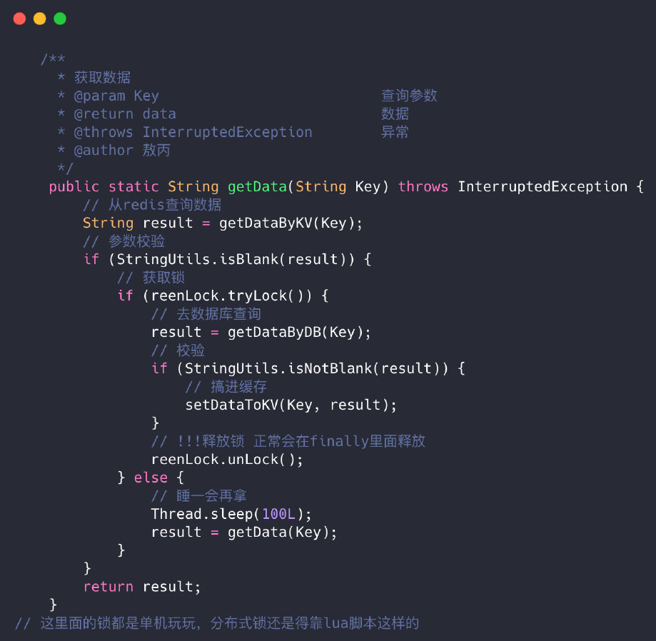

### 13.4.4. 缓存与数据库双写一致

TODO: redis双写一致问题

[双写一致](https://zhuanlan.zhihu.com/p/59167071)

[如何保证缓存与数据库的双写一致性](https://blog.csdn.net/qq_26545305/article/details/108247129)

[Redis双写一致性、并发竞争、线程模型](https://zhuanlan.zhihu.com/p/91196300)

[本文件中的应用application/缓存]()

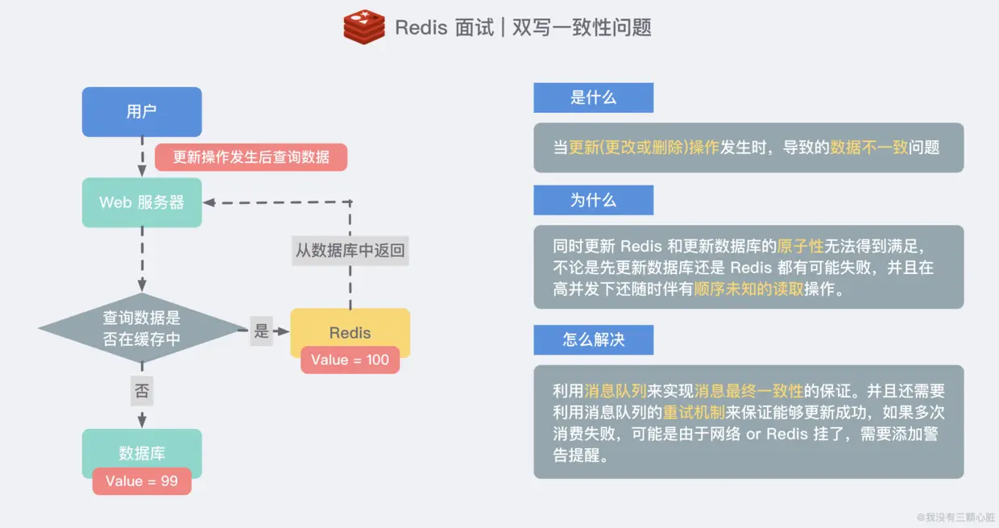

- 说明
  - 如果仅仅查询的话，缓存的数据和数据库的数据是没问题的。但是当更新时，各种情况可能导致数据库和缓存的数据不一致。
  - 从理论上说，只要我们设置了键的过期时间，我们就能保证缓存和数据库的数据 **最终是一致** 的。
  - 因为只要缓存数据过期了，就会被删除。随后读的时候，因为缓存里没有，就可以查数据库的数据，然后将数据库查出来的数据写入到缓存中。

---

- 两种基本策略
  - 先更新数据库，再删除缓存
    > 对于这种策略，其实是一种设计模式：Cache Aside Pattern
    - 正常的情况是这样的：
      - 先操作数据库，成功；
      - 再删除缓存，也成功；
    - 原子性被破坏的情况
      - 第一步成功(操作数据库)，第二步失败(删除缓存)，会导致数据库里是新数据，而缓存里是旧数据。
        - 解决：
          - 将需要删除的key发送到消息队列中
          - 自己消费消息，获得需要删除的key
          - 不断重试删除操作，直到成功
      - 第一步(操作数据库)就失败了，我们可以直接返回错误(Exception)，不会出现数据不一致。
    - 并发导致正常情况出现数据不一致
        ```
        如果在高并发的场景下，出现数据库与缓存数据不一致的概率特别低，也不是没有：

        缓存刚好失效
        线程A查询数据库，得一个旧值
        线程B将新值写入数据库
        线程B删除缓存
        线程A将查到的旧值写入缓存
        要达成上述情况，还是说一句概率特别低：因为这个条件需要发生在读缓存时缓存失效，而且并发着有一个写操作。
        而实际上数据库的写操作会比读操作慢得多，而且还要锁表，而读操作必需在写操作前进入数据库操作，
        而又要晚于写操作更新缓存，所有的这些条件都具备的概率基本并不大。
        ```
  - 先删除缓存，再更新数据库
    - 正常情况是这样的：
      - 先删除缓存，成功；
      - 再更新数据库，也成功；
    - 原子性被破坏的情况
      - 第一步成功(删除缓存)，第二步失败(更新数据库)，数据库和缓存的数据还是一致的。
      - 如果第一步(删除缓存)就失败了，我们可以直接返回错误(Exception)，数据库和缓存的数据还是一致的。
    - 并发导致正常情况出现数据不一致
        ```
        看起来是很美好，但是我们在并发场景下分析一下，就知道还是有问题的了：

        线程A删除了缓存
        线程B查询，发现缓存已不存在
        线程B去数据库查询得到旧值
        线程B将旧值写入缓存
        线程A将新值写入数据库
        所以也会导致数据库和缓存不一致的问题。
        ```

- 对比两种策略
  > 两种策略各自有优缺点：
  - 先删除缓存，再更新数据库，在高并发下表现不如意，在原子性被破坏时表现优异
  - 先更新数据库，再删除缓存(Cache Aside Pattern设计模式)，在高并发下表现优异，在原子性被破坏时表现不如意

---

- 解决思路：
  - 并发下解决数据库与缓存不一致的思路：
  - 将删除缓存、修改数据库、读取缓存等的操作积压到队列里边，实现串行化。


## 13.5. Redis单线程模型

### 13.5.1. 线程模型说明

- Redis基于reactor模式开发了网络事件处理器，这个处理器叫做文件事件处理器，file event handler。
- 这个文件事件处理器是单线程的，redis才叫做单线程的模型，
- 采用IO多路复用机制同时监听多个socket，根据socket上的事件来选择对应的事件处理器来处理这个事件。
  - IO多路复用程序
    - 不负责处理socket产生的事件
    - 负责轮训所有socket产生的请求
    - 压进队列（与阻塞式IO多路复用的区别）

TODO: redis单线程模型

[单线程模型详解/单线程为何效率高](file:///D:/learn/githubRepo/JavaGuide/docs/database/Redis/redis-all.md#7-redis-%E5%8D%95%E7%BA%BF%E7%A8%8B%E6%A8%A1%E5%9E%8B%E8%AF%A6%E8%A7%A3)

### 13.5.2. 为什么使用单线程

1. 使用单线程模型能带来更好的 **可维护性**，方便开发和调试；
2. 使用单线程模型也能 **并发** 的处理客户端的请求；*(I/O 多路复用机制)*
3. Redis 服务中运行的绝大多数操作的 **性能瓶颈都不是 CPU**；

### 13.5.3. 为什么单线程的 Redis 能处理那么多的并发客户端连接?

1. **纯内存操作**：读取不需要进行磁盘 I/O，所以比传统数据库要快上不少；*(但不要有误区说磁盘就一定慢，例如 Kafka 就是使用磁盘顺序读取但仍然较快)*
2. **单线程，无锁竞争**：这保证了没有线程的上下文切换，不会因为多线程的一些操作而降低性能；
3. **多路 I/O 复用模型，非阻塞 I/O**：采用多路 I/O 复用技术可以让单个线程高效的处理多个网络连接请求（尽量减少网络 IO 的时间消耗）；
  > 用的就是 epoll <br />
  > 复习：select/poll/epoll
4. **高效的数据结构，加上底层做了大量优化**：Redis 对于底层的数据结构和内存占用做了大量的优化，例如不同长度的字符串使用不同的结构体表示，HyperLogLog 的密集型存储结构等等..

### 13.5.4. Redis6.0 之前 为什么不使用多线程？

> **Redis 在 4.0 之后的版本中就已经加入了对多线程的支持**。

不过，Redis 4.0 增加的多线程主要是针对一些大键值对的删除操作的命令，使用这些命令就会使用主处理之外的其他线程来“异步处理”。

大体上来说，**Redis 6.0 之前主要还是单线程处理。**

> **那，Redis6.0 之前 为什么不使用多线程？**

主要原因有下面 3 个：

1. 单线程编程容易并且更容易维护；
2. Redis 的性能瓶颈不再 CPU ，主要在内存和网络；
3. 多线程就会存在死锁、线程上下文切换等问题，甚至会影响性能。

### 13.5.5. 版本6.0为何引入多线程

**Redis6.0 引入多线程主要是为了提高网络 IO 读写性能**，因为这个算是 Redis 中的一个性能瓶颈（Redis 的瓶颈主要受限于内存和网络）。

虽然，Redis6.0 引入了多线程，但是 Redis 的多线程只是在网络数据的读写这类耗时操作上使用了， 执行命令仍然是单线程顺序执行。因此，你也不需要担心线程安全问题。

Redis6.0 的多线程默认是禁用的，只使用主线程。如需开启需要修改 redis 配置文件 `redis.conf` ：

```bash
io-threads-do-reads yes
```

开启多线程后，还需要设置线程数，否则是不生效的。同样需要修改 redis 配置文件 `redis.conf` :

```bash
io-threads 4 #官网建议4核的机器建议设置为2或3个线程，8核的建议设置为6个线程
```

TODO: redis引入多线程

1. [Redis 6.0 新特性-多线程连环 13 问！](https://mp.weixin.qq.com/s/FZu3acwK6zrCBZQ_3HoUgw)
2. [为什么 Redis 选择单线程模型](https://draveness.me/whys-the-design-redis-single-thread/)


## 13.6. 其他问题

- Redis常见性能问题和解决方案？
  - Master 最好不要做任何持久化工作，包括内存快照和 AOF 日志文件，
  - 特别是不要启用内存快照做持久化。
  - 如果数据比较关键，某个 Slave 开启 AOF 备份数据，策略为每秒同步一次。
  - 为了主从复制的速度和连接的稳定性，Slave 和 Master 最好在同一个局域网内。
  - 尽量避免在压力较大的主库上增加从库。
  - Master 调用 BGREWRITEAOF 重写 AOF 文件，AOF 在重写的时候会占大量的 CPU 和内存资源，导致服务 load 过高，出现短暂服务暂停现象。 
  - 为了 Master 的稳定性，主从复制不要用图状结构，用单向链表结构更稳定，即主从关系为：`Master<–Slave1<–Slave2<–Slave3…`，这样的结构也方便解决单点故障问题，实现 Slave 对 Master 的替换，也即，如果 Master 挂了，可以立马启用 Slave1 做 Master，其他不变。

- 假如Redis里面有1亿个key，其中有10w个key是以某个固定的已知的前缀开头的，如何将它们全部找出来？
  - 使用 keys 指令可以扫出指定模式的 key 列表。
  - 但是要注意 keys 指令会导致线程阻塞一段时间，线上服务会停顿，直到指令执行完毕，服务才能恢复。
  - 这个时候可以使用 scan 指令
    - scan 指令可以无阻塞的提取出指定模式的 key 列表
    - 但是会有一定的重复概率，在客户端做一次去重就可以了
    - 但是整体所花费的时间会比直接用 keys 指令长。

# 14. java客户端

## 14.1. 基本说明

Redis支持的java客户端都Redisson、Jedis、lettuce等等，官方推荐使用Redisson

- Redis和Redisson的关系
  - Redisson是一个高级的分布式协调Redis客户端，能帮助用户在分布式环境中轻松实现一些java的对象
    > （Bloom filter、BitSet、Set、SetMultimap、ScoredSortedSet、SortedSet、Map、List、Queue、ConcurrentMap、ListMultimap、BlockingQueue、Deque、BlockingDeque、Semaphore、Lock、ReadWriteLock、AtomicLong、CountDownLatch、Publish/Subscribe、HyperLogLog）

- Jedis和Redisson对比优缺点
  - Jedis是Redis的java实现的客户端，其中API提供了比较全面的Redis命令的支持；
  - Redisson实现了分布式和扩展的java数据结构，和Jedis相比功能比较简单，不支持字符串操作，不支持排序、事务、管道、分区等Redis特性。
  - Redisson的宗旨是 **促进使用者对Redis的关注分离，从而让使用者能够将精力更集中的放在处理业务逻辑上** 。

# 15. 其他

- Redis的集群：Redis分片的缺点、集群架构、集群操作基本命令。
- Lua脚本语言的介绍。
- Redis和Lua结合，Redis的Lua脚本编程，构建强大的Redis服务。
- Redis整合Spring等。
- Redis集群实现Tomcat集群的Session共享等

# 16. 参考

- [x] [redis笔记](https://blog.csdn.net/u011863024/article/details/107476187)
- [x] [Redisson实现分布式锁](https://www.cnblogs.com/qdhxhz/p/11046905.html)
- [x] [Redis删除策略](https://www.cnblogs.com/liushoudong/p/12679174.html)
- [x] [妈妈再也不担心我面试被Redis问得脸都绿了](https://segmentfault.com/a/1190000022146622)
- [ ] [图解Redis之数据结构篇——压缩列表](https://mp.weixin.qq.com/s/nba0FUEAVRs0vi24KUoyQg)
- [ ] [Redis(2)——跳跃表(含源码解析，未整理)](https://www.wmyskxz.com/2020/02/29/redis-2-tiao-yue-biao/)
- [ ] [Redis之字典](https://www.jianshu.com/p/bfecf4ccf28b)
- [ ] [内存节省到极致！！！Redis中的压缩表,值得了解...(待进一步整理)](https://juejin.cn/post/6847009772353355783)
- [ ] [redis底层数据结构思维导图(待整理)](https://www.cnblogs.com/christmad/p/11364372.html)
