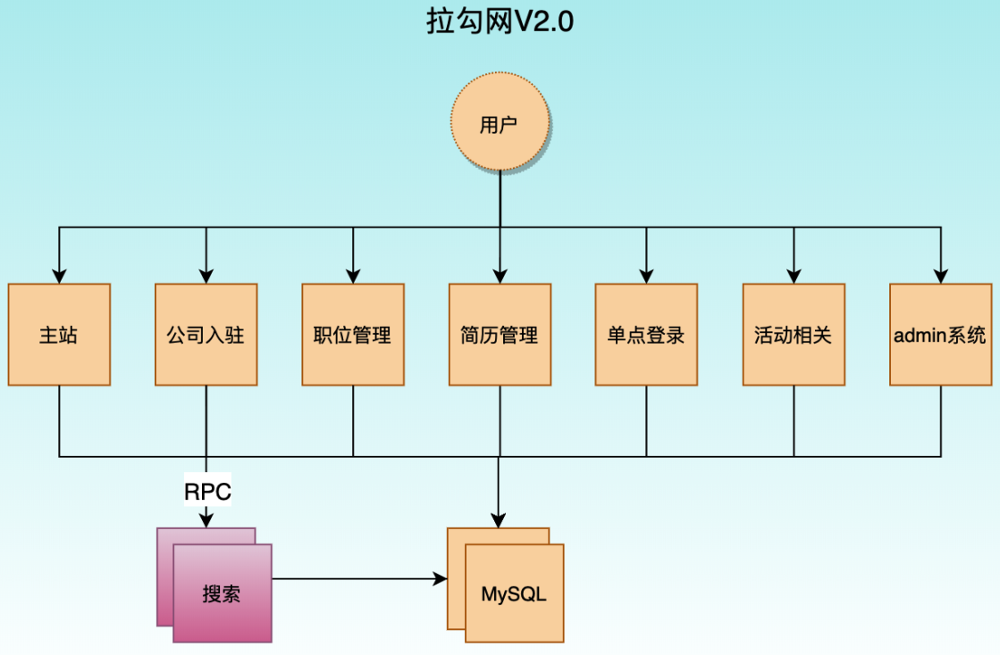
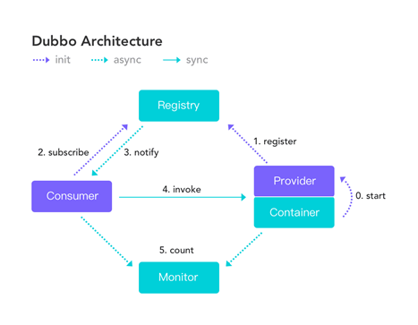
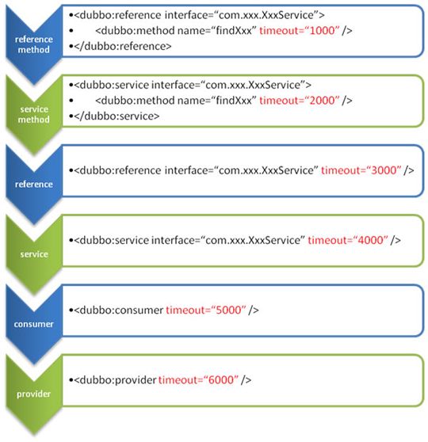
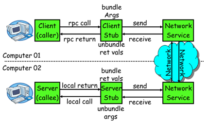
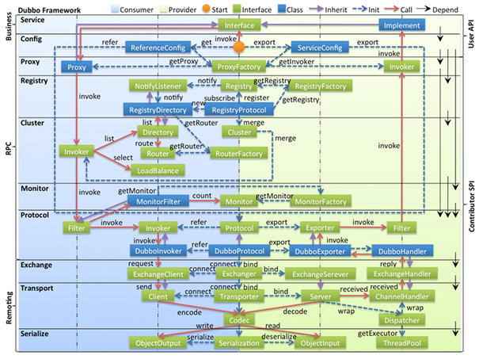
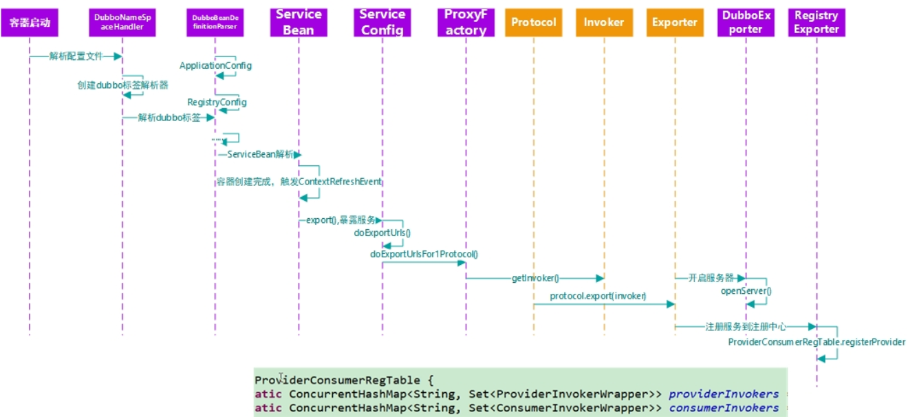
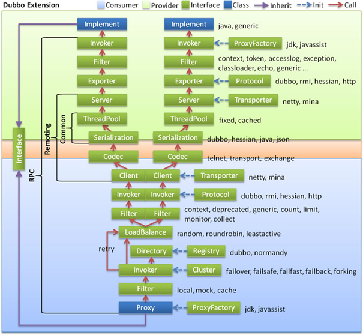

# 1. 引言

## 1.1. 什么是分布式系统

- 定义： 分布式系统是若干独立计算机的**集合**，这些计算机对于用户来说就像单个相关系统。
- 老式系统与分布式系统
  - 老式系统(单一应用架构)就是把一个系统，统一放到一个服务器当中然后每一个服务器上放一个系统，如果说要更新代码的话，每一个服务器上的系统都要重新去部署十分的麻烦。
  - 而分布式系统就是**将一个完整的系统拆分成多个不同的服务**，然后在**将每一个服务单独的放到一个服务器当中**。


## 1.2. 架构演变说明


### 1.2.1. ORM单一应用架构

单体架构所有模块和功能都集中在一个项目中 ，部署时也是将项目所有功能部整体署到服务器中


- 优点
  - 小项目上，开发快，成本低
  - 架构简单
  - 易于测试
  - 易于部署
- 缺点
  - 大项目上，模块耦合严重，不易开发、维护，沟通成本高
  - 新增业务困难
  - 核心业务与边缘业务混合在一块，出现问题互相影响


### 1.2.2. MVC垂直应用架构

**根据业务把项目垂直切割成多个项目**，因此这种架构称之为垂直架构。

为了避免上面提到的那些问题，我们开始做模块的垂直划分，做垂直划分的原则是基于拉勾的业务特性，核心目标，第一个是为了业务之间互不影响，第二个是在研发团队的壮大后为了提高效率，减少之间的依赖。



- 优点
  - 系统拆分实现了流量分担，解决了并发问题
  - 可以针对不同系统进行优化
  - 方便水平扩展，负载均衡，容错率提高
  - 系统间相互独立，互不影响，新的业务迭代时更加高效
- 缺点
  - 服务系统之间接口调用硬编码
  - 搭建集群之后，实现负载均衡比较复杂
  - 服务系统接口调用监控不到位 调用方式不统一
  - 服务监控不到位
  - 数据库资源浪费，充斥慢查询，主从同步延迟大

### 1.2.3. 分布式服务架构


- 说明：
  - 当垂直应用越来越多，应用之间交互不可避免
  - 在垂直应用架构的基础上，把核心业务单独抽取出来，作为独立的服务，逐渐形成稳定的服务中心
  - 使前端应用能更快速的响应多变的市场需求


- 需要解决的问题：
  - 解决RPC
    - 单机基本上是进程内部通讯
    - 如果用户web界面想要调用用户业务服务，且两者不在同一个服务器上
    - 这就属于RPC，远程过程调用
  - 业务拆分抽取

### 1.2.4. SOA流动计算架构


- 说明： 在分布式服务架构的基础上，使用调度治理中心：
  - 维护服务间的复杂关系
  - 动态分配资源
  - 负载均衡
  - ...

## 1.3. 什么是RPC

- RPC【Remote Procedure Call】
  - 是指远程过程调用，是一种进程间通信方式
  - 他是一种技术的思想，而不是规范。
  - 它允许程序调用另一个地址空间（通常是共享网络的另一台机器上）的过程或函数，而不用程序员显式编码这个远程调用的细节。
  - 即程序员无论是调用本地的还是远程的函数，本质上编写的调用代码基本相同。

- 实现主要考虑两个问题：
  - 连接
  - 序列化与反序列化

# 2. 基本介绍

## 2.1. 简介

- Dubbo是一款高性能、轻量级的开源Java RPC框架，它提供了三大核心能力：
  - 面向接口的远程方法调用
  - 智能容错和负载均衡
  - 服务自动注册和发现

## 2.2. 基本概念



- 角色
  - **服务提供者（Provider）**：
    - 说明：暴露服务的服务提供方
    - 行为：服务提供者在启动时，向注册中心注册自己提供的服务。
  - **服务消费者（Consumer）**
    - 说明：调用远程服务的服务消费方
    - 行为：服务消费者在启动时，向注册中心订阅自己所需的服务
      - 服务消费者，从提供者地址列表中，基于负载均衡算法，选一台提供者进行调用，如果调用失败，再选另一台调用。
  - **注册中心（Registry）**:
    - 说明：注册中心返回服务提供者地址列表给消费者
    - 行为：如果服务有变更，注册中心将基于长连接推送变更数据给消费者
  - **监控中心（Monitor）**
    - 说明：服务于消费者和提供者，在内存中累计调用次数和调用时间
    - 行为：定时每分钟发送一次统计数据到监控中心

- 调用关系说明
  - 服务容器负责启动，加载，运行服务提供者。
  - 服务提供者在启动时，向注册中心注册自己提供的服务。
  - 服务消费者在启动时，向注册中心订阅自己所需的服务。
  - 注册中心返回服务提供者地址列表给消费者，如果有变更，注册中心将基于长连接推送变更数据给消费者。
  - 服务消费者，从提供者地址列表中，基于软负载均衡算法，选一台提供者进行调用，如果调用失败，再选另一台调用。
  - 服务消费者和提供者，在内存中累计调用次数和调用时间，定时每分钟发送一次统计数据到监控中心。

## 2.3. 应用场景

- 透明化的远程方法调用,就像调用本地方法一样调用远程方法,只需简单配置,没有任何 API 侵入。
- 软负载均衡及容错机制,可在内网替代 F5 等硬件负载均衡器,降低成本,减少单点。
- 服务自动注册与发现,不再需要写死服务提供方地址,注册中心基于接口名查询服务提供者的 IP 地址,并且能够平滑添加或删除服务提供者。

# 3. 基本使用

## 3.1. 目录结构

- producer model:注册服务
- consumer model:订阅服务
- interface model:提供公用的实体类，服务接口，stub等。
  - pojo
  - interfaces
  - stub

## 3.2. 注册中心

- Multicast 注册中心: Multicast注册中心不需要任何中心节点,只要广播地址,就能进行服务注册和发现。基于网络中组播传输实现
- Zookeeper 注册中心: 基于分布式协调系统Zookeeper实现,采用Zookeeper的watch机制实现数据变更
- redis 注册中心: 基于redis实现,采用key/Map存储,住key存储服务名和类型,Map中key存储服务 URL,value 服务过期时间。基于redis的发布/订阅模式通知数据变更
- Simple 注册中心Dubbo 集群的负载均衡有哪些策略 Dubbo 提供了常见的集群策略实现,并预扩展点予以自行实现
- Random LoadBalance: 随机选取提供者策略,有利于动态调整提供者权重。截面碰撞率高,调用次数越多,分布越均匀
- RoundRobin LoadBalance: 轮循选取提供者策略,平均分布,但是存在请求累积的问题
- LeastActive LoadBalance: 最少活跃调用策略,解决慢提供者接收更少的请求
- ConstantHash LoadBalance: 一致性 Hash 策略,使相同参数请求总是发到同一提供者,一台机器宕机,可以基于虚拟节点,分摊至其他提供者,避免引起提供者的剧烈变动

这里使用zookeeper

## 3.3. 监控中心

### 3.3.1. dubbo-admin

图形化的服务管理页面；安装时需要指定注册中心地址，即可从注册中心中获取到所有的提供者/消费者进行配置管理

[下载后编译打包](https://github.com/apache/dubbo-admin/tree/master)

### 3.3.2. dubbo-monitor-simple

简单的监控中心

## 3.4. Spring整合

[代码](./src/dubbo_spring)

## 3.5. SpringBoot整合

- 添加依赖
- 修改yml配置文件
- 使用dubbo提供的`@Service`注解(注册服务)和`@Reference`注解(订阅服务)

[代码](./src/dubbo_springBoot)

# 4. 常用功能配置

## 4.1. 配置覆盖规则※

[参考链接](https://dubbo.apache.org/zh/docs/v2.7/user/examples/)

- 整体
  > -
- xml内部
  > 
  - 精确优先 (方法级优先，接口级次之，全局配置再次之)
  - 消费者设置优先(如果级别一样，则消费方优先，提供方次之)

## 4.2. Spring-xml配置

### 4.2.1. 启动时检查

### 4.2.2. rpc调用超时时间

### 4.2.3. 重试次数

幂等(设置重试次数)【查询、册除、修改】

非幂等(不能设置重试次数)【新增】

### 4.2.4. 版本号

也就是灰度发布

### 4.2.5. 本地存根

## 4.3. SpringBoot 三种配置方式

- `yml+@EnableDubbo`:导入dubbo-starter，在application.properties或yml配置属性，使用@Service【暴露服务】使用@Reference【引用服务】
  > @EnableDubbo:开启基于注解的dubbo功能
  - yml中配置部分
  - 剩下的用注解配置

- `xml+@ImportResource(locations="classpath:provider.xml")`：保留dubbo xml配置文件，导入dubbo-starter，使用@ImportResource导入dubbo的配置文件即可
  - 就用xml配置

- `注解+配置类+@EnableDubbo(scanBasePackages="")`：使用注解API的方式，使用java配置类设置配置信息，让dubbo来扫描配置的组件。
  - 使用配置类进行配置：[示例](./src/dubbo_springBoot/boot-user-service-provider/src/main/java/com/atguigu/gmall/config/MyDubboConfig.java)

# 5. 高可用

## 5.1. zookeeper宕机与dubbo直连

- 缓存
- 直连，绕过注册中心

## 5.2. 负载均衡机制

### 5.2.1. 说明

- **Random LoadBalance**

  - **随机**，按权重设置随机概率。
  - 在一个截面上碰撞的概率高，但调用量越大分布越均匀，而且按概率使用权重后也比较均匀，有利于动态调整提供者权重。

- **RoundRobin LoadBalance**

  - **轮询**，按公约后的权重设置轮询比率。
  - 存在慢的提供者累积请求的问题，比如：第二台机器很慢，但没挂，当请求调到第二台时就卡在那，久而久之，所有请求都卡在调到第二台上。

- **LeastActive LoadBalance**

  - **最少活跃调用数**，相同活跃数的随机，活跃数指调用前后计数差。
  - 使慢的提供者收到更少请求，因为越慢的提供者的调用前后计数差会越大。

- **ConsistentHash LoadBalance**

  - **一致性 Hash**，相同参数的请求总是发到同一提供者。
  - 当某一台提供者挂时，原本发往该提供者的请求，基于虚拟节点，平摊到其它提供者，不会引起剧烈变动。
  - 算法参见：http://en.wikipedia.org/wiki/Consistent_hashing
  - 缺省只对第一个参数 Hash，如果要修改，请配置 `<dubbo:parameter key="hash.arguments" value="0,1" />`
  - 缺省用 160 份虚拟节点，如果要修改，请配置 `<dubbo:parameter key="hash.nodes" value="320" />`

### 5.2.2. 配置

- xml中配置
  - **服务端服务级别**
    ```xml
    <dubbo:service interface="..." loadbalance="roundrobin" />
    ```
  - **客户端服务级别**
    ```xml
    <dubbo:reference interface="..." loadbalance="roundrobin" />
    ```
  - **服务端方法级别**
    ```xml
    <dubbo:service interface="...">
        <dubbo:method name="..." loadbalance="roundrobin"/>
    </dubbo:service>
    ```
  - **客户端方法级别**
    ```xml
    <dubbo:reference interface="...">
        <dubbo:method name="..." loadbalance="roundrobin"/>
    </dubbo:reference>
    ```
- 注解配置
  - **服务端服务级别**
    - `@Service`中的选项`loadbalance`设置负载机制机制
    - `@Service`中的选项`weight`设置权重
  - **客户端服务级别**
    - `@Reference`中的选项`loadbalance`
  - **服务端方法级别**
  - **客户端方法级别**

## 5.3. 服务降级

### 5.3.1. 说明

- 当服务器压力剧增的情况下，根据实际业务情况及流量，对一些服务和页面有策略的不处理或换种简单的方式处理
- 从而释放服务器资源以保证核心交易正常运作或高效运作。
- 可以通过服务降级功能临时屏蔽某个出错的非关键服务，并定义降级后的返回策略。

### 5.3.2. 直接返回为空

mock=force:return+null 表示消费方对该服务的方法调用都直接返回 null 值，不发起远程调用。用来屏蔽不重要服务不可用时对调用方的影响。

通过monitor可以设置与恢复

### 5.3.3. 容错：调用失败后返回为空

还可以改为 mock=fail:return+null 表示消费方对该服务的方法调用在失败后，再返回 null 值，不抛异常。用来容忍不重要服务不稳定时对调用方的影响。

通过monitor可以设置与恢复

## 5.4. 容错模式

### 5.4.1. dubbo自带(基本不用)

> **说明**

- Failover Cluster(默认)
  - 失败自动切换，当出现失败，重试其它服务器。通常用于读操作，但重试会带来更长延迟。可通过 retries="2" 来设置重试次数(不含第一次)。
  - 重试次数配置如下：
    ```xml
    <dubbo:service retries="2" />
    或
    <dubbo:reference retries="2" />
    或
    <dubbo:reference>
        <dubbo:method name="findFoo" retries="2" />
    </dubbo:reference>
    ```

- Failfast Cluster
  - 快速失败，只发起一次调用，失败立即报错。通常用于非幂等性的写操作，比如新增记录。

- Failsafe Cluster
  - 失败安全，出现异常时，直接忽略。通常用于写入审计日志等操作。

- Failback Cluster
  - 失败自动恢复，后台记录失败请求，定时重发。通常用于消息通知操作。

- Forking Cluster
  - 并行调用多个服务器，只要一个成功即返回。通常用于实时性要求较高的读操作，但需要浪费更多服务资源。可通过 forks="2" 来设置最大并行数。

- Broadcast Cluster
  - 广播调用所有提供者，逐个调用，任意一台报错则报错 [2]。通常用于通知所有提供者更新缓存或日志等本地资源信息。

> **集群模式配置**

```xml
<dubbo:service cluster="failsafe" />
<!--或-->
<dubbo:reference cluster="failsafe" />
```

## 5.5. hystrix

SpringCloud也默认使用

# 6. RPC原理




- 基本流程
  1. 服务消费方（client）调用以本地调用方式调用服务； 
  2. client stub接收到调用后负责将方法、参数等组装成能够进行网络传输的消息体； 
  3. client stub找到服务地址，并将消息发送到服务端； 
  4. server stub收到消息后进行解码； 
  5. server stub根据解码结果调用本地的服务； 
  6. 本地服务执行并将结果返回给server stub； 
  7. server stub将返回结果打包成消息并发送至消费方； 
  8. client stub接收到消息，并进行解码； 
  9. 服务消费方得到最终结果。


# 7. dubbo原理

## 7.1. 框架设计




- **Business**
  - config 配置层：对外配置接口，以 ServiceConfig, ReferenceConfig 为中心，可以直接初始化配置类，也可以通过 spring 解析配置生成配置类
- **RPC**
  - proxy 服务代理层：服务接口透明代理，生成服务的客户端 Stub 和服务器端 Skeleton, 以 ServiceProxy 为中心，扩展接口为 ProxyFactory
  - registry 注册中心层：封装服务地址的注册与发现，以服务 URL 为中心，扩展接口为 RegistryFactory, Registry, RegistryService
  - cluster 路由层：封装多个提供者的路由及负载均衡，并桥接注册中心，以 Invoker 为中心，扩展接口为 Cluster, Directory, Router, LoadBalance
  - monitor 监控层：RPC 调用次数和调用时间监控，以 Statistics 为中心，扩展接口为 MonitorFactory, Monitor, MonitorService
  - protocol 远程调用层：封装 RPC 调用，以 Invocation, Result 为中心，扩展接口为 Protocol, Invoker, Exporter
- **Remoting**
  - exchange 信息交换层：封装请求响应模式，同步转异步，以 Request, Response 为中心，扩展接口为 Exchanger, ExchangeChannel, ExchangeClient, ExchangeServer
  - transport 网络传输层：抽象 mina 和 netty 为统一接口，以 Message 为中心，扩展接口为 Channel, Transporter, Client, Server, Codec
  - serialize 数据序列化层：可复用的一些工具，扩展接口为 Serialization, ObjectInput, ObjectOutput, ThreadPool

## 7.2. 启动解析，配置加载




前半部分为配置加载

## 7.3. 服务暴露


后半部分为服务暴露

断点调试，以ServiceBean为入口

## 7.4. 服务引用


断点调试，以ReferenceBean为入口

## 7.5. 服务调用



使用代理对象调用方法

