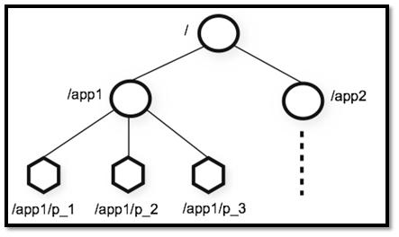
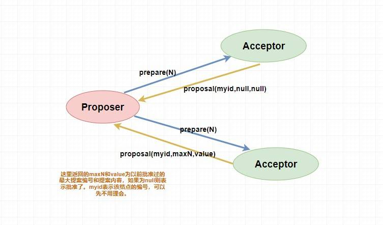
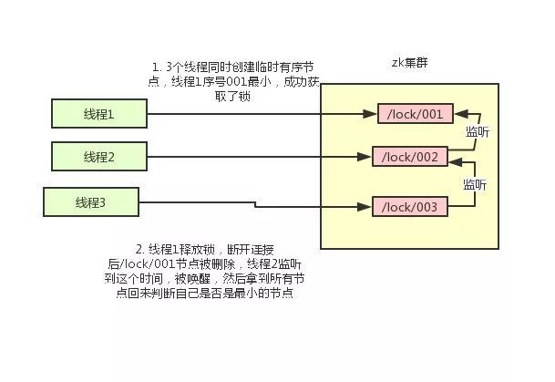
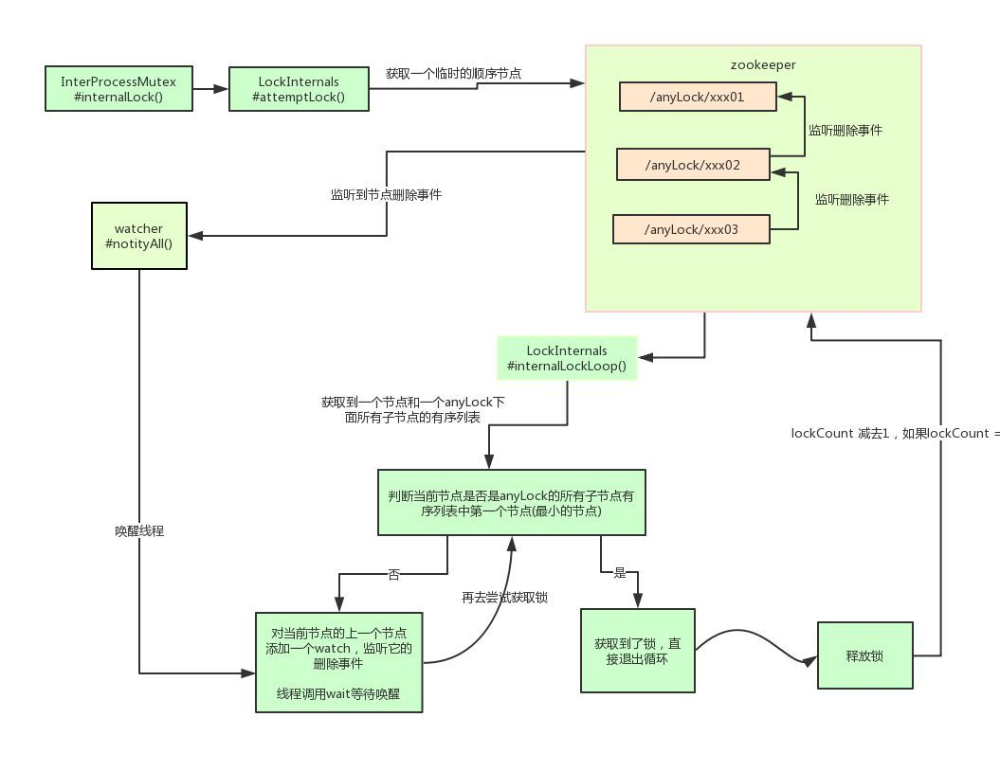

# 1. 引入

## 1.1. 数据承载模式

- 镜像全量：
  - 说明：每台服务器都存有全部数据，每台服务器都是其他服务器的镜像。
  - 特点：
    - 没有横向扩展能力
    - 但是数据特别安全
- shards：
  - 说明：沙丁切片，将所有数据均分到每一台服务器上。
  - 特点：
    - 横向扩展能力强。
    - 数据不安全。
- 大数据集群存储架构：
  >  
  - 横向沙丁切片
  - 纵向数据备份


## 1.2. 单机问题

- 单点故障
- 单点瓶颈

## 1.3. zookeeper主从架构模型

### 1.3.1. 说明

- 主从架构产生原因: 无主架构模型可能产生split brain

- 架构图：
  > 

- 相关概念：
  - serverid
  - zxid:事务编号id

### 1.3.2. CAP理论

redis笔记中有谈及：[CAP定理](../database/redis.md)

**ZooKeeper保证的是CP**

- 可用性（A:Available）分析：
  - 不能保证每次服务请求的可用性。
    - 任何时刻对ZooKeeper的访问请求能得到一致的数据结果，同时系统对网络分割具备容错性；
    - 但是它不能保证每次服务请求的可用性（注：也就是在极端环境下，ZooKeeper可能会丢弃一些请求，消费者程序需要重新请求才能获得结果）
    - 所以说，ZooKeeper不能保证服务可用性。
  - 进行leader选举时集群都是不可用。
    - 在使用ZooKeeper获取服务列表时，当master节点因为网络故障与其他节点失去联系时，剩余节点会重新进行leader选举。
    - 问题在于，选举leader的时间太长，30 ~ 120s, 且选举期间整个zk集群都是不可用的，这就导致在选举期间注册服务瘫痪，
    - 虽然服务能够最终恢复，但是漫长的选举时间导致的注册长期不可用是不能容忍的。
    - 所以说，ZooKeeper不能保证服务可用性。

# 2. Zookeeper简介

## 2.1. 由来

> 下面这段内容摘自《从 Paxos 到 ZooKeeper 》第四章第一节，推荐大家阅读一下：

ZooKeeper 最早起源于雅虎研究院的一个研究小组。在当时，研究人员发现，在雅虎内部很多大型系统基本都需要依赖一个类似的系统来进行分布式协调，但是这些系统往往都存在分布式单点问题。所以，雅虎的开发人员就试图开发一个通用的无单点问题的分布式协调框架，以便让开发人员将精力集中在处理业务逻辑上。

关于“ZooKeeper”这个项目的名字，其实也有一段趣闻。在立项初期，考虑到之前内部很多项目都是使用动物的名字来命名的（例如著名的 Pig 项目),雅虎的工程师希望给这个项目也取一个动物的名字。时任研究院的首席科学家 RaghuRamakrishnan 开玩笑地说：“在这样下去，我们这儿就变成动物园了！”此话一出，大家纷纷表示就叫动物园管理员吧一一一因为各个以动物命名的分布式组件放在一起，雅虎的整个分布式系统看上去就像一个大型的动物园了，而 ZooKeeper 正好要用来进行分布式环境的协调一一于是，ZooKeeper 的名字也就由此诞生了。

## 2.2. 概述

- **ZooKeeper提供了什么？**
  - 文件系统
  - 通知机制

- 本质：ZooKeeper 是一个开源的分布式协调服务，

- 设计目标：将那些复杂且容易出错的分布式一致性服务封装起来，构成一个高效可靠的原语集，并以一系列简单易用的接口提供给用户使用。

- 作用:
  - ZooKeeper 为我们提供了高可用、高性能、稳定的分布式数据一致性解决方案，
  - 通常被用于实现的功能有：
    - **数据发布/订阅**
    - 负载均衡
    - **命名服务**
    - 分布式协调/通知
    - 集群管理
    - Master 选举
    - **分布式锁**
    - 分布式队列

- 适用场景
  - ZooKeeper 将数据保存在内存中，性能非常高。
  - 在“读”多于“写”的应用程序中尤其地高性能，（“读”多于“写”是协调服务的典型场景）。
  - 因为“写”会导致所有的服务器间进行状态的同步。

## 2.3. 特点

- 顺序一致性：从一个客户端发起的事务请求，最终都会严格按照其发起顺序被应用到 Zookeeper 中；
- 原子性：所有事务请求的处理结果在整个集群中所有机器上都是一致的；不存在部分机器应用了该事务，而另一部分没有应用的情况；
- 单一视图：所有客户端看到的服务端数据模型都是一致的；
- 可靠性：一旦服务端成功应用了一个事务，则其引起的改变会一直保留，直到被另外一个事务所更改；
- 实时性：一旦一个事务被成功应用后，Zookeeper 可以保证客户端立即可以读取到这个事务变更后的最新状态的数据。

## 2.4. 典型应用场景

- 分布式锁 ： 通过创建唯一节点获得分布式锁，当获得锁的一方执行完相关代码或者是挂掉之后就释放锁。
- 命名服务 ：可以通过 ZooKeeper 的顺序节点生成全局唯一 ID
- 数据发布/订阅 ：通过 Watcher 机制 可以很方便地实现数据发布/订阅。当你将数据发布到 ZooKeeper 被监听的节点上，其他机器可通过监听 ZooKeeper 上节点的变化来实现配置的动态更新。

`实际上，这些功能的实现基本都得益于 ZooKeeper 可以保存数据的功能，但是 ZooKeeper 不适合保存大量数据，这一点需要注意。`

# 3. Zookeeper 基本概念

## 3.1. 数据模型

### 3.1.1. 结构



- 结构：数据模型采用层次化的多叉树形结构

- 存储数据：
  - 每个节点上都可以存储数据
  - 这些数据可以是**数字、字符串或者是二级制序列**

- 数据节点znode：
  - 每个**数据节点在 ZooKeeper 中被称为 znode**，它是 ZooKeeper 中**数据的最小单元**。
  - 每个 znode 都一个唯一的路径标识。最上层是根节点以“/”来代表。
  - 每个节点还可以拥有 N 个子节点，

- 注意：
  - ZooKeeper 主要是用来协调服务的，而不是用来存储业务数据的，所以不要放比较大的数据在 znode 上，
  - ZooKeeper 给出的上限是**每个结点的数据大小最大是 1M**。

### 3.1.2. znode

#### 3.1.2.1. 分类

- **持久（PERSISTENT）节点** ：一旦创建就一直存在即使 ZooKeeper 集群宕机，直到将其删除。
- **临时（EPHEMERAL）节点** ：临时节点的生命周期是与 **客户端会话（session）** 绑定的，**会话消失则节点消失** 。并且，**临时节点只能做叶子节点** ，不能创建子节点。
- **持久顺序（PERSISTENT_SEQUENTIAL）节点** ：除了具有持久（PERSISTENT）节点的特性之外， 子节点的名称还具有顺序性。比如 `/node1/app0000000001` 、`/node1/app0000000002` 。
- **临时顺序（EPHEMERAL_SEQUENTIAL）节点** ：除了具备临时（EPHEMERAL）节点的特性之外，子节点的名称还具有顺序性。
  > 客户端与zookeeper断开连接后，该节点被删除，只是Zookeeper给该节点名称进行顺序编号<br />
  > 

#### 3.1.2.2. 数据结构

> **组成**

- **stat** ：状态信息
- **data** ：节点存放的数据的具体内容

> **示例**

如下所示，我通过 get 命令来获取 根目录下的 dubbo 节点的内容。（get 命令在下面会介绍到）。

```shell
  [zk: 127.0.0.1:2181(CONNECTED) 6] get /dubbo
  # 该数据节点关联的数据内容为空
  null
  # 下面是该数据节点的一些状态信息，其实就是 Stat 对象的格式化输出
  cZxid = 0x2
  ctime = Tue Nov 27 11:05:34 CST 2018
  mZxid = 0x2
  mtime = Tue Nov 27 11:05:34 CST 2018
  pZxid = 0x3
  cversion = 1
  dataVersion = 0
  aclVersion = 0
  ephemeralOwner = 0x0
  dataLength = 0
  numChildren = 1
```

> **Stat结构**

源于：《从 Paxos 到 ZooKeeper 分布式一致性原理与实践》

| znode 状态信息 | 解释                                                                                                |
| -------------- | --------------------------------------------------------------------------------------------------- |
| cZxid          | create ZXID，即该数据节点被创建时的事务 id                                                          |
| ctime          | create time，即该节点的创建时间                                                                     |
| mZxid          | modified ZXID，即该节点最终一次更新时的事务 id                                                      |
| mtime          | modified time，即该节点最后一次的更新时间                                                           |
| pZxid          | 该节点的子节点列表最后一次修改时的事务 id，只有子节点列表变更才会更新 pZxid，子节点内容变更不会更新 |
| cversion       | 子节点版本号，当前节点的子节点每次变化时值增加 1                                                    |
| dataVersion    | 数据节点内容版本号，节点创建时为 0，每更新一次节点内容(不管内容有无变化)该版本号的值增加 1          |
| aclVersion     | 节点的 ACL 版本号，表示该节点 ACL 信息变更次数                                                      |
| ephemeralOwner | 创建该临时节点的会话的 sessionId；如果当前节点为持久节点，则 ephemeralOwner=0                       |
| dataLength     | 数据节点内容长度                                                                                    |
| numChildren    | 当前节点的子节点个数                                                                                |


注意上面的三个版本号：

- dataVersion ：当前 znode 节点的版本号
- cversion ： 当前 znode 子节点的版本
- aclVersion ： 当前 znode 的 ACL 的版本。

## 3.2. 权限控制(ACL)

- 说明：ZooKeeper 采用 ACL（AccessControlLists）策略来进行权限控制，类似于 UNIX 文件系统的权限控制。

- 权限种类：
  > 对于 znode 操作的权限，ZooKeeper 提供了以下 5 种：
  - **CREATE** : 能创建**子节点**
  - **READ** ：能获取节点数据和列出其子节点
  - **WRITE** : 能设置/更新节点数据
  - **DELETE** : 能删除**子节点**
  - **ADMIN** : 能设置节点 ACL 的权限

- 注意：
  - **CREATE** 和 **DELETE** 这两种权限都是针对 **子节点** 的权限控制。

- 身份认证方式
  - **world** ： 默认方式，所有用户都可无条件访问。
  - **auth** :不使用任何 id，代表任何已认证的用户。
  - **digest** :用户名:密码认证方式： *username:password* 。
  - **ip** : 对指定 ip 进行限制。

## 3.3. 监听机制(Watcher)

- 说明：
  - Watcher（事件监听器），是 ZooKeeper 中的一个很重要的特性。
  - ZooKeeper 允许用户在指定节点上注册一些 Watcher，并且在一些特定事件触发的时候，ZooKeeper 服务端会将事件通知到感兴趣的客户端上去
  - 该机制是 ZooKeeper 实现分布式协调服务的重要特性。

  

- 事件
  - 节点创建
  - 节点删除
  - 节点数据修改
  - 子节点变更

- 示例：
  - 比如hadoop中的ZKFC
    > 复习： hadoop的zkfc， registry ,watch ,event ,callback

## 3.4. Session

- 说明：
  - Session 可以看作是 ZooKeeper 服务器与客户端的之间的一个 TCP 长连接，
  - 通过这个连接，客户端能够通过心跳检测与服务器保持有效的会话，也能够向 ZooKeeper 服务器发送请求并接受响应，同时还能够通过该连接接收来自服务器的 Watcher 事件通知。

- Session属性
  - `sessionTimeout`属性:代表会话的超时时间。
    - 当由于服务器压力太大、网络故障或是客户端主动断开连接等各种原因导致客户端连接断开时，
    - 只要在`sessionTimeout`规定的时间内能够重新连接上集群中任意一台服务器，那么之前创建的会话仍然有效。
  - `SessionID`
    - 在为客户端创建会话之前，服务端首先会为每个客户端都分配一个 `sessionID`。
    - `sessionID`是 ZooKeeper 会话的一个重要标识，许多与会话相关的运行机制都是基于这个 `sessionID` 的，
    - 因此，**无论是哪台服务器为客户端分配的 `sessionID`，都务必保证全局唯一**。

# 4. Zookeeper 集群

## 4.1. 说明


上图中每一个 Server 代表一个安装 ZooKeeper 服务的服务器。组成 ZooKeeper 服务的服务器都会在内存中维护当前的服务器状态，并且每台服务器之间都互相保持着通信。集群间通过 ZAB 协议（ZooKeeper Atomic Broadcast）来保持数据的一致性。

**最典型集群模式： Master/Slave 模式（主备模式）**。在这种模式中，通常 Master 服务器作为主服务器提供写服务，其他的 Slave 服务器从服务器通过异步复制的方式获取 Master 服务器最新的数据提供读服务。

## 4.2. 集群角色


| 角色     | 说明                                                         |
| -------- | ------------------------------------------------------------ |
| **Leader**   | 为客户端提供读和写的服务，负责投票的发起和决议，更新系统状态。 |
| **Follower** | 为客户端提供读服务，如果是写服务则转发给 Leader。在选举过程中参与投票。 |
| **Observer** | 为客户端提供读服务器，如果是写服务则转发给 Leader。不参与选举过程中的投票，也不参与“过半写成功”策略。在不影响写性能的情况下提升集群的读性能。此角色于 **ZooKeeper3.3 系列新增的角色**。 |


# 5. 深入理论

## 5.1. 一致性问题

redis笔记中有谈及：[CAP定理](../database/redis.md)

## 5.2. 一致性协议和算法

### 5.2.1. 说明

解决数据一致性问题，在科学家和程序员的不断探索中，就出现了很多的一致性协议和算法。比如 2PC（两阶段提交），3PC（三阶段提交），Paxos算法等等。

后面以秒杀系统为例：下订单和加积分服务，两个服务必须都完成或者都不完成。

### 5.2.2. 两阶段提交(2PC)

> PC：phase-commit 的缩写，即阶段提交

- 流程

- 导致问题

### 5.2.3. 三阶段提交(3PC)

- 流程

### 5.2.4. Paxos算法

#### 5.2.4.1. 说明

`Paxos` 算法是基于**消息传递且具有高度容错特性的一致性算法**，是目前公认的解决分布式一致性问题最有效的算法之一，**其解决的问题就是在分布式系统中如何就某个值（决议）达成一致** 。

- Paxos中的角色：
  - `Proposer提案者`
  - `Acceptor表决者`
  - `Learner学习者`

- Paxos的两个阶段：
  - `Prepare` 阶段
  - `accept` 阶段

#### 5.2.4.2. Prepare阶段

> 也就是广播编号，没什么流程

- `Proposer提案者`：
  - 负责提出 `proposal提案`
  - 每个提案者在提出提案时都会首先获取到一个 **具有全局唯一性的、递增的提案编号N**，即在整个集群中是唯一的编号 N，
  - 然后将该编号赋予其要提出的提案，在**Prepare阶段是只将提案编号发送给所有的表决者**。

  ```
  简而言之：
    就是提出一个编号N。（诶呀，想要内容之后再说，编号N符合条件才行啊）
    这个编号作为之后要做提案(对应value)的编号
    然后发给其他表决者
  ```
- `Acceptor表决者`：
  - 每个表决者仅会 `accept(批准)` 编号大于自己本地 `maxN` 的提案，
    - 如果批准了，返回`(节点id,null,null)`
    - 如果不批准，返回`(节点id,maxN,value)`
  - 每个表决者在 `accept` 某提案后，会将该提案编号N记录在本地，
  - 这样每个表决者中保存的已经被 accept 的提案中会存在一个**编号最大的提案**，其编号假设为 `maxN`。

  ```
  简而言之：
    就是仅会接收更大的提案编号，并且保存下来
    如果批准提案(接收N)，就返回(节点id,null,null)（兄弟，你给的N够大，我要了，我这里也没什么让你看的了）
    如果不批准提案(不接收N)，就返回(节点id,maxN,value)（兄弟，你也太弱了，我可不要你，让你看看我这里最大的提案编号）
  ```



#### 5.2.4.3. accept阶段

- Prepare阶段，我(`Proposer提案者`)给那么多`Acceptor表决者`发了这个提案，他们觉得咋样啊？
  - 如果 `Proposer` 收到了超过半数的 `Acceptor` 的批准（`Proposer` 本身同意）， 那么此时 `Proposer` 会给所有的 `Acceptor` 发送真正的提案
  - 可以理解为第一阶段为试探
  - 第一阶段通过后，`Proposer` 就会发送提案的内容和提案编号。

- 我(`Proposer提案者`)这次可给你们发了真正的提案，这是最后一次确定了呦
  - 表决者收到提案请求后会再次比较本身已经批准过的最大提案编号和该提案编号，
  - 如果该提案编号 **大于等于** 已经批准过的最大提案编号
    - 那么就 `accept` 该提案（**此时执行提案内容但不提交**）
    - 随后将情况返回给 `Proposer` 。
  - 如果不满足则不回应或者返回 NO 。

  

- 我（`Proposer提案者`）收到回复了，让我看看要怎么搞啊。
  - **情况1**：当 `Proposer` 收到超过半数的 `accept` 
    - 那么它这个时候会向所有的 `acceptor` 发送提案的提交请求。
    - 需要注意的是：
      - 因为上述仅仅是超过半数的 `acceptor` 批准执行了该提案内容，其他没有批准的并没有执行该提案内容，
      - 所以这个时候需要**向未批准的 acceptor 发送提案内容和提案编号并让它无条件执行和提交**，
      - 而对于前面已经批准过该提案的 `acceptor` 来说 **仅仅需要发送该提案的编号** ，让 `acceptor` 执行提交就行了。

    

  - **情况2**：如果 `Proposer` 如果没有收到超过半数的 `accept` 
    - 那么它将会将 **递增** 该 `Proposal` 的编号，然后 **重新进入 Prepare 阶段** 。

#### 5.2.4.4. Leader的学习

对于 `Learner` 来说如何去学习 `Acceptor` 批准的提案内容，这有很多方式，读者可以自己去了解一下，这里不做过多解释。

#### 5.2.4.5. 死循环问题

- 说明：
  - 比如说，此时提案者 P1 提出一个方案 M1，完成了 `Prepare` 阶段的工作，这个时候 `acceptor` 则批准了 M1
  - 但是此时提案者 P2 同时也提出了一个方案 M2，它也完成了 `Prepare` 阶段的工作。
  - 然后 P1 的方案已经不能在第二阶段被批准了（因为 `acceptor` 已经批准了比 M1 更大的 M2），
  - 所以 P1 自增方案变为 M3 重新进入 `Prepare` 阶段，然后 `acceptor` ，又批准了新的 M3 方案，
  - 它又不能批准 M2 了，这个时候 M2 又自增进入 `Prepare` 阶段
  - 一直循环往复。。。

  就这样无休无止的永远提案下去，这就是 `paxos` 算法的死循环问题。

- 解决方案: 就允许一个能提案 

## 5.3. ZAB

在Paxos算法下，解决死循环问题，就引出了ZAB。详情看下面

# 6. ZAB(重要)

## 6.1. 说明

作为一个优秀高效且可靠的分布式协调框架，ZooKeeper 在解决分布式数据一致性问题时并没有直接使用 Paxos ，而是专门定制了一致性协议叫做 ZAB(ZooKeeper Automic Broadcast) 原子广播协议，该协议能够很好地支持 崩溃恢复 。

- ZAB中三个角色：
  - Leader ：集群中 唯一的写请求处理者 ，能够发起投票（投票也是为了进行写请求）。
  - Follower：能够接收客户端的请求，如果是读请求则可以自己处理，如果是写请求则要转发给 Leader 。在选举过程中会参与投票，有选举权和被选举权 。
  - Observer ：就是没有选举权和被选举权的 Follower 。

- 两种模式：在 ZAB 协议中对 zkServer(即上面我们说的三个角色的总称) 还有两种模式的定义，分别是
  - 消息广播
  - 崩溃恢复

## 6.2. 消息广播模式

### 6.2.1. 流程说明

> 也就是**写请求**的处理


- 接收写请求：
  - 如果是leader接收，就继续执行
  - 如果是follower接收，就转发给leader
- leader把写请求广播出去。对应`Paxos算法的Prepare阶段`（详细看上面Paxos，不再细说）
  - 让 `Leader` 问问 `Followers` 是否同意更新，
  - 如果超过半数以上的同意那么就进行 `Follower` 和 `Observer` 的更新
- 执行写请求。对应`Paxos算法的accept阶段`。（详细看上面Paxos，不再细说）

### 6.2.2. 如何保证顺序性

**`ZAB 需要让 Follower 和 Observer 保证顺序性`**

- 何为顺序性问题:
  - 比如我现在有一个写请求A，此时 `Leader` 将请求A广播出去，因为只需要半数同意就行，
  - 所以可能这个时候有一个 `Follower` F1因为网络原因没有收到，
  - 而 `Leader` 又广播了一个请求B，
  - 因为网络原因，F1竟然先收到了请求B然后才收到了请求A。而其他节点都是先收到A后收到B
  - 这个时候请求处理的顺序不同就会导致数据的不同，从而 **产生数据不一致问题** 。

- 解决1：**队列**
  - 在 `Leader` 这端，它为每个其他的 `zkServer` 准备了一个 **队列** 
  - 采用先进先出的方式发送消息
  - 由于协议是 **通过`TCP`** 来进行网络通信的，保证了消息的发送顺序性，接受顺序性也得到了保证。

- 解决2：**zxid**
  > 看上面stat数据结构就有说明
  - 说明：
    - 在 `ZAB` 中还定义了一个 **全局单调递增的事务ID ZXID** 
    - **每个对节点的改变都将产生一个唯一的Zxid**。如果Zxid1的值小于Zxid2的值，那么Zxid1所对应的事件发生在Zxid2所对应的事件之前。
  - 组成：
    - 它是一个64位long型，其中高32位表示 `epoch` 年代，低32位表示事务id。
    - `epoch` ：是会根据 `Leader` 的变化而变化的，当一个 `Leader` 挂了，新的 `Leader` 上位的时候，年代（`epoch`）就变了。
    - `事务id`：而低32位可以简单理解为**递增的事务id**。
  - 作用：
    - 定义这个的原因是为了顺序性，每个 `proposal` 在 `Leader` 中生成后需要 **通过其 ZXID 来进行排序**（选举机制用到zxid） ，才能得到处理。
    - 类似于RDBMS中的事务ID，用于标识一次更新操作的Proposal ID。为了保证顺序性，该zkid必须单调递增。

## 6.3. 崩溃恢复模式

> 也就是**Leader选举**的处理

### 6.3.1. 相关概念

-  ZooKeeper 集群中的服务器状态
  - **LOOKING** ：寻找 Leader。
  - **LEADING** ：Leader 状态，对应的节点为 Leader。
  - **FOLLOWING** ：Follower 状态，对应的节点为 Follower。
  - **OBSERVING** ：Observer 状态，对应节点为 Observer，该节点不参与 Leader 选举。

- 选举过程：
  - **Leader election（选举阶段）**：节点在一开始都处于选举阶段，只要有一个节点得到超半数节点的票数，它就可以当选准 leader。
  - **Discovery（发现阶段）** ：在这个阶段，followers 跟准 leader 进行通信，同步 followers 最近接收的事务提议。
  - **Synchronization（同步阶段）** :同步阶段主要是利用 leader 前一阶段获得的最新提议历史，同步集群中所有的副本。同步完成之后 准 leader 才会成为真正的 leader。
  - **Broadcast（广播阶段）** :到了这个阶段，ZooKeeper 集群才能正式对外提供事务服务，并且 leader 可以进行消息广播。同时如果有新的节点加入，还需要对新节点进行同步。

### 6.3.2. 初始化选举

- 情景：假设我们集群中有3台机器，那也就意味着我们需要两台以上同意（超过半数）。

- 流程：
  - 启动了 `server1` ，
    - 它会首先 **投票给自己** ，投票内容为服务器的 `myid` 和 `ZXID` 
    - **初始化所以 `ZXID` 都为0**
    - 此时 `server1` 发出的投票为 (1,0)。
    - 但此时 `server1` 的投票仅为1，所以不能作为 `Leader` ，此时还在选举阶段所以整个集群处于 **Looking 状态**。
  - 接着 `server2` 启动了
    - 它首先也会将投票选给自己(2,0)
    - 并将投票信息广播出去（`server1`也会，只是它那时没有其他的服务器了）
    - `server1` 在收到 `server2` 的投票信息后会将投票信息与自己的作比较。
    - **首先它会比较 ZXID ，ZXID 大的优先为 Leader，如果相同则比较 myid，myid 大的优先作为 Leader**
    - 所以此时server1 发现 server2 更适合做 Leader，它就会将自己的投票信息更改为(2,0)然后再广播出去
    - 之后server2 收到之后发现和自己的一样无需做更改，并且自己的 **投票已经超过半数** ，则 **确定 `server2` 为 `Leader`**
    - `server1` 也会将自己服务器设置为 `Following` 变为 `Follower`。整个服务器就从 `Looking` 变为了正常状态。
  -  `server3` 启动了
    -  发现集群没有处于 `Looking` 状态时，它会直接以 `Follower` 的身份加入集群。

### 6.3.3. 宕机重新选举

- 情景：上面的`server2`挂了

- 流程：
  - 首先毫无疑问的是剩下的两个 `Follower` 会将自己的状态 **从 Following 变为 Looking 状态** 
  - 然后每个 `server` 会向初始化投票一样首先给自己投票（这不过这里的 `zxid` 可能不是0了，这里为了方便随便取个数字）。
  - 假设 `server1` 给自己投票为(1,99)，然后广播给其他 `server`
  - `server3` 首先也会给自己投票(3,95)，然后也广播给其他 `server`
  - `server1` 和 `server3` 此时会收到彼此的投票信息，和一开始选举一样，他们也会比较自己的投票和收到的投票（`zxid` 大的优先，如果相同那么就 `myid` 大的优先）。
  - 这个时候 `server1` 收到了 `server3` 的投票发现没自己的合适故不变，`server3` 收到 `server1` 的投票结果后发现比自己的合适于是更改投票为(1,99),然后广播出去
  - 最后 `server1` 收到了发现自己的投票已经超过半数就把自己设为 `Leader`，`server3` 也随之变为 `Follower`。

> **插曲：为何奇数个节点**

比如这里我们是三个，挂了一个我们还能正常工作，挂了两个我们就不能正常工作了（已经没有超过半数的节点数了，所以无法进行投票等操作了）。

而假设我们现在有四个，挂了一个也能工作，**但是挂了两个也不能正常工作了**，这是和三个一样的

而三个比四个还少一个，带来的效益是一样的，所以 `Zookeeper` 推荐奇数个 `server` 。

### 6.3.4. 何为崩溃恢复

> **含义**

**当集群中有机器挂了，我们整个集群如何恢复回来，同时保证数据一致性**

> **`Follower` 挂了，而且挂的没超过半数的时候**

 `Leader` 中会维护队列，所以不用担心后面的数据没接收到导致数据不一致性。

> **Leader**挂了

- 我们肯定需要先暂停服务变为 `Looking` 状态
- 然后进行 `Leader` 的重新选举（看上面），但这个就要分为两种情况了。分别是
  - 情况1： **确保已经被Leader提交的提案最终能够被所有的Follower提交** 
  - 情况2： **跳过那些已经被丢弃的提案** 。

- 情况1：确保已经被Leader提交的提案最终能够被所有的Follower提交
  - 说明
    - 假设 `Leader (server2)` 发送 `commit` 请求（忘了请看上面的消息广播模式）
    - 他发送给了 `server3`，然后要发给 `server1` 的时候突然挂了。
    - 这个时候重新选举的时候我们**如果把 `server1` 作为 `Leader` 的话，那么肯定会产生数据不一致性**
      - 因为 `server3` 肯定会提交刚刚 `server2` 发送的 `commit` 请求的提案，而 `server1` 根本没收到所以会丢弃。
  - 解决：
    - **这个时候 server1 已经不可能成为 Leader 了**
    - **因为 server1 和 server3 进行投票选举的时候会比较 ZXID ，而此时 server3 的 ZXID 肯定比 server1 的大了**。
      > 选举机制，Server3事务提交后，事务id自增。<br />

  

- 情况2：跳过那些已经被丢弃的提案：
  - 说明
    - 假设 Leader (server2) 此时同意了提案N1，自身提交了这个事务并且要发送给所有 Follower 要 commit 的请求，却在这个时候挂了
    - 此时肯定要重新进行 Leader 的选举，比如说此时选 server1 为 Leader （这无所谓）。
    - 但是过了一会，这个 挂掉的 Leader 又重新恢复了 ，**此时它肯定会作为 Follower 的身份进入集群中**
    - 需要注意的是刚刚 server2 已经同意提交了提案N1，但其他 server 并没有收到它的 commit 信息
    - 所以其他 server 不可能再提交这个提案N1了，这样就会出现数据不一致性问题了
  - 解决：
    - 该提案N1最终需要被抛弃掉 。

  

# 7. zookeeper API

## 7.1. 命令行常用命令

- **查看常用命令(help 命令)**

  通过 `help` 命令查看 ZooKeeper 常用命令

- **创建节点(create 命令)**

  通过 `create` 命令在根目录创建了 node1 节点，与它关联的字符串是"node1"

  ```shell
  [zk: 127.0.0.1:2181(CONNECTED) 34] create /node1 “node1”
  ```

  通过 `create` 命令在根目录创建了 node1 节点，与它关联的内容是数字 123

  ```shell
  [zk: 127.0.0.1:2181(CONNECTED) 1] create /node1/node1.1 123
  Created /node1/node1.1
  ```

- **更新节点数据内容(set 命令)**

  ```shell
  [zk: 127.0.0.1:2181(CONNECTED) 11] set /node1 "set node1"
  ```

- **获取节点的数据(get 命令)**

  `get` 命令可以获取指定节点的数据内容和节点的状态,可以看出我们通过 `set` 命令已经将节点数据内容改为 "set node1"。

  ```shell
  set node1
  cZxid = 0x47
  ctime = Sun Jan 20 10:22:59 CST 2019
  mZxid = 0x4b
  mtime = Sun Jan 20 10:41:10 CST 2019
  pZxid = 0x4a
  cversion = 1
  dataVersion = 1
  aclVersion = 0
  ephemeralOwner = 0x0
  dataLength = 9
  numChildren = 1
  ```

- **查看某个目录下的子节点(ls 命令)**

  通过 `ls` 命令查看根目录下的节点

  ```shell
  [zk: 127.0.0.1:2181(CONNECTED) 37] ls /
  [dubbo, ZooKeeper, node1]
  ```

  通过 `ls` 命令查看 node1 目录下的节点

  ```shell
  [zk: 127.0.0.1:2181(CONNECTED) 5] ls /node1
  [node1.1]
  ```

  ZooKeeper 中的 ls 命令和 linux 命令中的 ls 类似， 这个命令将列出绝对路径 path 下的所有子节点信息（列出 1 级，并不递归）

- **查看节点状态(stat 命令)**

  通过 `stat` 命令查看节点状态

  ```shell
  [zk: 127.0.0.1:2181(CONNECTED) 10] stat /node1
  cZxid = 0x47
  ctime = Sun Jan 20 10:22:59 CST 2019
  mZxid = 0x47
  mtime = Sun Jan 20 10:22:59 CST 2019
  pZxid = 0x4a
  cversion = 1
  dataVersion = 0
  aclVersion = 0
  ephemeralOwner = 0x0
  dataLength = 11
  numChildren = 1
  ```

  上面显示的一些信息比如 cversion、aclVersion、numChildren 等等，我在上面 “znode(数据节点)的结构” 这部分已经介绍到。

- **查看节点信息和状态(ls2 命令)**

  `ls2` 命令更像是 `ls` 命令和 `stat` 命令的结合。 `ls2` 命令返回的信息包括 2 部分：

  1. 子节点列表
  2. 当前节点的 stat 信息。

  ```shell
  [zk: 127.0.0.1:2181(CONNECTED) 7] ls2 /node1
  [node1.1]
  cZxid = 0x47
  ctime = Sun Jan 20 10:22:59 CST 2019
  mZxid = 0x47
  mtime = Sun Jan 20 10:22:59 CST 2019
  pZxid = 0x4a
  cversion = 1
  dataVersion = 0
  aclVersion = 0
  ephemeralOwner = 0x0
  dataLength = 11
  numChildren = 1
  ```

- **删除节点(delete 命令)**

  这个命令很简单，但是需要注意的一点是如果你要删除某一个节点，那么这个节点必须无子节点才行。

  ```shell
  [zk: 127.0.0.1:2181(CONNECTED) 3] delete /node1/node1.1
  ```

  在后面我会介绍到 Java 客户端 API 的使用以及开源 ZooKeeper 客户端 ZkClient 和 Curator 的使用。

## 7.2. Java客户端 Curator

### 7.2.1. 说明

Curator 是Netflix公司开源的一套 ZooKeeper Java客户端框架，相比于 Zookeeper 自带的客户端 zookeeper 来说，Curator 的封装更加完善，各种 API 都可以比较方便地使用。


### 7.2.2. 引入依赖

Curator4.0+版本对ZooKeeper 3.5.x支持比较好。开始之前，请先将下面的依赖添加进你的项目。

```xml
<dependency>
    <groupId>org.apache.curator</groupId>
    <artifactId>curator-framework</artifactId>
    <version>4.2.0</version>
</dependency>
<dependency>
    <groupId>org.apache.curator</groupId>
    <artifactId>curator-recipes</artifactId>
    <version>4.2.0</version>
</dependency>
```

### 7.2.3. 连接 ZooKeeper 客户端

通过 `CuratorFrameworkFactory` 创建 `CuratorFramework` 对象，然后再调用 `CuratorFramework` 对象的 `start()` 方法即可！

```java
private static final int BASE_SLEEP_TIME = 1000;
private static final int MAX_RETRIES = 3;

// Retry strategy. Retry 3 times, and will increase the sleep time between retries.
RetryPolicy retryPolicy = new ExponentialBackoffRetry(BASE_SLEEP_TIME, MAX_RETRIES);
CuratorFramework zkClient = CuratorFrameworkFactory.builder()
    // the server to connect to (can be a server list)
    .connectString("127.0.0.1:2181")
    .retryPolicy(retryPolicy)
    .build();
zkClient.start();
```

对于一些基本参数的说明：

- `baseSleepTimeMs`：重试之间等待的初始时间
- `maxRetries` ：最大重试次数
- `connectString` ：要连接的服务器列表
- `retryPolicy` ：重试策略

### 7.2.4. 数据节点的增删改查

#### 7.2.4.1. 创建节点

你在使用的ZooKeeper 的时候，会发现 `CreateMode` 类中实际有 7种 znode 类型 ，但是用的最多的还是前面介绍的 4 种。

- **a.创建持久化节点**

  你可以通过下面两种方式创建持久化的节点。

  ```java
  //注意:下面的代码会报错，下文说了具体原因
  zkClient.create().forPath("/node1/00001");
  zkClient.create().withMode(CreateMode.PERSISTENT).forPath("/node1/00002");
  ```

  但是，你运行上面的代码会报错，这是因为的父节点`node1`还未创建。

  你可以先创建父节点 `node1` ，然后再执行上面的代码就不会报错了。

  ```java
  zkClient.create().forPath("/node1");
  ```

  更推荐的方式是通过下面这行代码， **creatingParentsIfNeeded() 可以保证父节点不存在的时候自动创建父节点，这是非常有用的。**

  ```java
  zkClient.create().creatingParentsIfNeeded().withMode(CreateMode.PERSISTENT).forPath("/node1/00001");
  ```

- **b.创建临时节点**

  ```java
  zkClient.create().creatingParentsIfNeeded().withMode(CreateMode.EPHEMERAL).forPath("/node1/00001");
  ```

- **c.创建节点并指定数据内容**

  ```java
  zkClient.create().creatingParentsIfNeeded().withMode(CreateMode.EPHEMERAL).forPath("/node1/00001","java".getBytes());
  zkClient.getData().forPath("/node1/00001");//获取节点的数据内容，获取到的是 byte数组
  ```

- **d.检测节点是否创建成功**

  ```java
  zkClient.checkExists().forPath("/node1/00001");//不为null的话，说明节点创建成功
  ```

#### 7.2.4.2. 删除节点

- **a.删除一个子节点**

  ```java
  zkClient.delete().forPath("/node1/00001");
  ```

- **b.删除一个节点以及其下的所有子节点**

  ```java
  zkClient.delete().deletingChildrenIfNeeded().forPath("/node1");
  ```

#### 7.2.4.3. 获取/更新节点数据内容

```java
zkClient.create().creatingParentsIfNeeded().withMode(CreateMode.EPHEMERAL).forPath("/node1/00001","java".getBytes());
zkClient.getData().forPath("/node1/00001");//获取节点的数据内容
zkClient.setData().forPath("/node1/00001","c++".getBytes());//更新节点数据内容
```

#### 7.2.4.4. 获取某个节点的所有子节点路径

```java
List<String> childrenPaths = zkClient.getChildren().forPath("/node1");
```

# 8. Zookeeper应用

## 8.1. 选主

- 原理：
  - 临时节点
    - 保证了会话断了之后，临时节点被删除。
    - 不妨碍之后master的重新选取
  - zookeeper的强一致性
    - 能够很好地在保证 **在高并发的情况下保证节点创建的全局唯一性** 
    - 即无法重复创建同样的节点。

- 流程：
  - 利用这个特性，我们可以 **让多个客户端创建一个指定的节点** 
  - 创建成功的就是 `master`。

- 意外情况：如果这个 `master` 挂了怎么办？？？
  - 临时节点的生命周期:
    - `master` 挂了代表会话断了
    - 会话断了是不是意味着这个节点没了
  - 通过`watcher` ：
    - **让其他不是 master 的节点监听节点的状态** 
    - 比如说我们监听这个临时节点的父节点，如果子节点个数变了就代表 `master` 挂了
    - 或者我们直接监听节点的状态，我们可以通过节点是否已经失去连接来判断 `master` 是否挂了等等。
    - 这个时候我们 **触发回调函数进行重新选举** 


## 8.2. 分布式锁

> 和选主基本相同

- 原理：
  - 临时节点
    - 保证了会话断了之后，临时节点被删除。
    - 不妨碍之后master的重新选取
  - 临时顺序节点
    - 主要用于排它锁的实现
  - zookeeper的强一致性
    - 能够很好地在保证 **在高并发的情况下保证节点创建的全局唯一性** 
    - 即无法重复创建同样的节点。

- **普通锁**实现流程：
  - **非公平锁**：使用临时节点+客户端抢锁
    - 因为创建节点的唯一性，我们可以让多个客户端同时创建一个临时节点，**创建成功的就说明获取到了锁**
    - 然后没有获取到锁的客户端也像上面选主的非主节点创建一个 watcher 进行节点状态的监听。**所有客户端监听一个节点**
    - 如果这个互斥锁被释放了（可能获取锁的客户端宕机了，或者那个客户端主动释放了锁）可以调用回调函数重新获得锁。
  - **公平锁**：使用临时有序节点+回调
    - 使用 ZK 的临时节点和有序节点，每个线程获取锁就是在 ZK 创建一个临时有序的节点，比如在 /lock/ 目录下。
    - 创建节点成功后，获取 /lock 目录下的所有临时节点，再判断当前线程创建的节点是否是所有的节点的序号最小的节点。
    - 如果当前线程创建的节点是所有节点序号最小的节点，则认为获取锁成功。
    - 如果当前线程创建的节点不是所有节点序号最小的节点，则**对节点序号的前一个节点添加一个事件监听**。
    - 比如当前线程获取到的节点序号为 /lock/003，然后所有的节点列表为[/lock/001，/lock/002，/lock/003]，则对 /lock/002 这个节点添加一个事件监听器。
      - 如果锁释放了，会唤醒下一个序号的节点，然后重新执行第 3 步，判断是否自己的节点序号是最小。
      - 比如 /lock/001 释放了，/lock/002 监听到时间，此时节点集合为[/lock/002，/lock/003]，则 /lock/002 为最小序号节点，获取到锁。

    


- **读写锁**大致思路(也可以实现公平锁和非公平锁，思路和上面的一样)：
  - 规定所有创建节点必须有序
  - 如果是读请求（要获取共享锁）的话
    - 如果**没有比自己更小的节点，或比自己小的节点都是读请求**，则可以获取到读锁，读取数据。
    - 若比**自己小的节点中有写请求**，则当前客户端无法获取到读锁，只能等待前面的写请求完成。
  - 如果是写请求（获取独占锁）
    - 若**没有比自己更小的节点** ，则表示当前客户端可以直接获取到写锁，对数据进行修改
    - 若发现**有比自己更小的节点**，无论是读操作还是写操作，当前客户端都无法获取到写锁 ，等待所有前面的操作完成。

- 读写锁优化
  - 比如当一个锁得到释放它会通知所有等待的客户端从而造成**羊群效应** 
  - 此时你可以通过让等待的节点只监听他们前面的节点。
  - 让读请求监听比自己小的最后一个写请求节点，写请求只监听比自己小的最后一个节点

- 相交于redis锁优势
  - zk 中不需要向 redis 那样考虑锁得不到释放的问题了
  - 因为当客户端挂了，节点也挂了，锁也释放了。是不是很简答？

---

<details>
<summary style="color:red;">Curator代码实现</summary>

- Curator 客户端的自带分布式锁实现
  ```java
  InterProcessMutex interProcessMutex = new InterProcessMutex(client,"/anyLock");
  interProcessMutex.acquire();
  interProcessMutex.release();
  ```
- 其中的核心源码
  ```java
  private boolean internalLockLoop(long startMillis, Long millisToWait, String ourPath) throws Exception {
      boolean  haveTheLock = false;
      boolean  doDelete = false;
      try {
          if ( revocable.get() != null ) {
              client.getData().usingWatcher(revocableWatcher).forPath(ourPath);
          }

          while ( (client.getState() == CuratorFrameworkState.STARTED) && !haveTheLock ) {
              // 获取当前所有节点排序后的集合
              List<String>   children = getSortedChildren();
              // 获取当前节点的名称
              String sequenceNodeName = ourPath.substring(basePath.length() + 1); // +1 to include the slash
              // 判断当前节点是否是最小的节点
              PredicateResults predicateResults = driver.getsTheLock(client, children, sequenceNodeName, maxLeases);
              if ( predicateResults.getsTheLock() ) {
                  // 获取到锁
                  haveTheLock = true;
              } else {
                  // 没获取到锁，对当前节点的上一个节点注册一个监听器
                  String previousSequencePath = basePath + "/" + predicateResults.getPathToWatch();
                  synchronized(this){
                      Stat stat = client.checkExists().usingWatcher(watcher).forPath(previousSequencePath);
                      if (stat != null){
                          if ( millisToWait != null ){
                              millisToWait -= (System.currentTimeMillis() - startMillis);
                              startMillis = System.currentTimeMillis();
                              if ( millisToWait <= 0 ){
                                  doDelete = true;    // timed out - delete our node
                                  break;
                              }
                              wait(millisToWait);
                          }else{
                              wait();
                          }
                      }
                  }
                  // else it may have been deleted (i.e. lock released). Try to acquire again
              }
          }
      }
      catch ( Exception e ) {
          doDelete = true;
          throw e;
      } finally{
          if ( doDelete ){
              deleteOurPath(ourPath);
          }
      }
      return haveTheLock;
  }
  ```

  

</details>


## 8.3. 命名服务

## 8.4. 集群管理和注册中心

# 9. 参考文献

- [zookeeper笔记](https://piaosanlang.gitbooks.io/faq/content/zookeeperde-gong-neng-yi-ji-gong-zuo-yuan-li.html)
- 《从 Paxos 到 Zookeeper——分布式一致性原理与实践》
- [万字带你入门Zookeeper](https://juejin.cn/post/6844904045283377165)
- [实例详解ZooKeeper ZAB协议、分布式锁与领导选举](https://dbaplus.cn/news-141-1875-1.html)
- [分布式锁用Redis坚决不用Zookeeper？](https://cloud.tencent.com/developer/article/1476050)

待整理
