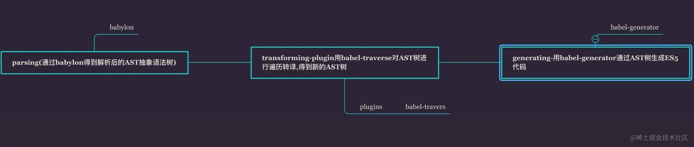

# 基本概念

## 说明

- 说明
  - Babel是一个**工具集**，主要用于将ES6版本的JavaScript代码转为ES5等向后兼容的JS代码
  - 从而可以运行在低版本浏览器或其它环境中。

- 目的
  - 支持在工作中使用ES6编写程序，最后使用Babel将代码转为ES5的代码
  - 这样就不用担心所在环境是否支持了

- 示例
  - 转换前，代码里使用ES6箭头函数

    ```javascript
    var fn = (num) => num + 2;
    ```

  - 转换后，箭头函数变成ES5的普通函数。这样就可以在不支持箭头函数的浏览器里运行了

      ```javascript
      var fn = function fn(num) {
        return num + 2;
      }
      ```

- 注意： 使用Babel进行ES6转ES5时，转化之后默认是严格模式。

## 基本原理

- 原理很简单，核心就是 AST (抽象语法树)
  - 首先将源码转成抽象语法树
  - 然后对语法树进行处理生成新的语法树
  - 最后将新语法树生成新的 JS 代码
  - 整个编译过程可以分为 3 个阶段 parsing (解析)、transforming (转换)、generating (生成)

  

- 注意：
  - Babel 只负责编译新标准引入的新语法，比如 Arrow function、Class、ES Module 等
  - 它不会编译原生对象新引入的方法和 API，比如 Array.includes，Map，Set 等， 这些需要通过 Polyfill 来解决

# 快速入门

> 配置一个最简单的Babel转码工程，来学习整个流程

## Babel的安装，配置与转码

- 在本地新建一个文件夹babel01，在该文件夹下新建一个js文件，文件命名为babel.config.js。
  > 该文件是 Babel配置文件 ，我们在该文件里输入如下内容：

  ```javascript
    module.exports = {
      presets: ["@babel/env"],
      plugins: []
    }
  ```

- 然后在该文件夹下新建一个js文件main.js，该js里的代码是我们需要转译的，我们写入代码

  ```javascript
  var fn = (num) => num + 2;
  ```

- 然后执行下面的命令安装三个npm包，这些npm包是Babel官方包

  ```javascript
  // npm一次性安装多个包，包名之间用空格隔开
  npm install --save-dev @babel/cli @babel/core @babel/preset-env
  ```

- 安装完成后，执行下面的命令进行转码，该命令含义是把main.js转码生成compiled.js文件

  ```javascript
  npx babel main.js -o compiled.js
  ```

- 此时文件夹下会生成compiled.js，该文件是转换后的代码：

  ```javascript
  "use strict";
  var fn = function fn(num) {
    return num + 2;
  };
  ```

## Babel转码说明

- `babel.config.js`
  - 是Babel执行时会默认在当前目录寻找的Babel配置文件。
  - 其他配置方式：
    > 除了babel.config.js，我们也可以选择用其他方式进行配置
    - 可以使用.babelrc或.babelrc.js这两种配置文件
    - 还可以直接将配置参数写在package.json
  - 它们的作用都是相同的，只需要选择其中一种

- 三个依赖包作用：
  - @babel/cli是Babel命令行转码工具，如果我们使用命令行进行Babel转码就需要安装它。
  - @babel/cli依赖@babel/core，因此也需要安装@babel/core这个Babel核心npm包。
  - @babel/preset-env这个npm包提供了ES6转换ES5的语法转换规则，我们在Babel配置文件里指定使用它。
    - 如果不使用的话，也可以完成转码，但转码后的代码仍然是ES6的，相当于没有转码。

## 小结

1.一个完整的Babel转码工程通常包括如下：

- Babel配置文件
- Babel相关的npm包
- 需要转码的JS文件

2.我们通过以下命令对单个JS文件进行转码：

  npx babel main.js -o compiled.js

# 引入 polyfill

## 说明

- 总体来说，Babel的主要工作有两部分：
  - 语法转换
    - 快速入门是用Babel进行语法转换，把ES6的箭头函数语法转换成了ES5的函数定义语法。
    - 箭头函数语法、async函数语法、class定义类语法和解构赋值等等都是ES6新增的语法。
  - 补齐API
    - 补齐API就是，通过 Polyfill 的方式在目标环境中添加缺失的特性

## 问题示例


我们按照上一节的操作对var promise = Promise.resolve('ok')进行转换，会发现转换后的代码并没有改变，过程如下。


- 新建babel02文件夹，新建babel配置文件 `babel.config.js` ,内容如下

  ```javascript
  module.exports = {
      presets: ["@babel/env"],
      plugins: []
    }
  ```

- 新建`main.js`文件，内容如下

  ```javascript
  var fn = (num) => num + 2;
  var promise = Promise.resolve('ok')
  ```
- 然后执行下面的命令安装三个npm包

  ```javascript
  // npm一次性安装多个包，包名之间用空格隔开
  npm install --save-dev @babel/cli @babel/core @babel/preset-env
  ```

- 然后执行命令

  ```javascript
  npx babel main.js -o compiled.js
  ```

- 整个过程与上一节基本一样，只是main.js里的代码多了一行

  ```javascript
  var promise = Promise.resolve('ok')
  ```

- 此时文件夹下会生成新的compiled.js，代码如下：

  ```javascript
  "use strict";
  var fn = function fn(num) {
    return num + 2;
  };
  var promise = Promise.resolve('ok');
  ```

- 我们观察转换后生成的compiled.js代码，发现Babel并没有对ES6的Promise进行转换 。
  - 我们通过一个index.html文件引用转码后的 compiled.js 
  - 在比较老的浏览器（ 例如火狐27 ）里打开HTML文件后后控制台报错：Promise is not defined。

## 解释

- 为何 Babel没有对ES6的Promise进行转换 ？
  - 因为Babel默认只转换新的JavaScript语法（syntax），而不转换新的 API。
  - 新的API分类两类，
    - 一类是Promise、Map、Symbol、Proxy、Iterator等全局对象及其对象自身的方法
      > 例如Object.assign，Promise.resolve；
    - 另一类是新的实例方法，例如数组实例方法`[1, 4, -5, 10].find((item) => item < 0)`

## 修复

- 如果想让ES6新的API在低版本浏览器正常运行，我们就不能只做语法转换。

- 修复方式
  - 在前端web工程里，最常规的做法是使用polyfill，为当前环境提供一个垫片。
  - 所谓垫片，是指垫平不同浏览器之间差异的东西。
  - polyfill提供了全局的ES6对象以及通过修改原型链Array.prototype等实现对实例的实现。

- 什么是polyfill
  - 广义上讲是为环境提供不支持的特性的一类文件或库
  - 狭义上讲是`polyfill.js`文件以及`@babel/polyfill`这个npm包。

- 引入
  - 可以直接在html文件引入polyfill.js文件来作为全局环境垫片
  - polyfill.js 有Babel官方的 polyfill.js，也有第三方的
  - 简单起见，通过在html里引入polyfill.js的方式。

    > 通过在HTML里直接引入 polyfill.js 文件 这种方式进行在现代前端工程里逐渐淘汰，很少使用了。
    > 但这种方式对初学者理解 polyfill 是做什么的是简单直接的

    ```html
    <script src="https://cdn.bootcss.com/babel-polyfill/7.6.0/polyfill.js"></script>
    ```

  - 在IE9打开验证，也可以用Firefox27等低版本的浏览器验证。这个时候发现可以正常运行了。

- 其他引入方式
  > 后面会进行说明
  - 通过在构建工具入口文件（例如webapck）引入
  - babel配置文件引入

# Babel深入

## 关于 Babel 版本

- 主要版本：目前，前端开发领域使用的Babel版本主要的Babel6和Babel7这两个版本。

- 版本迭代：
  - Babel是一个工具集，而这个工具集是围绕@babel/core这个核心npm包构成的。
  - 每次@babel/core发布新版本的时候， **整个工具集的其它npm包也都会跟着升级到与@babel/core相同的版本号**
  - 即使它们的代码可能一行都没有改变。

- 版本含义：因此，提到Babel版本的时候，通常是指@babel/core这个Babel核心包的版本。

- 版本变化问题：
  - 在一次次版本变更的过程中，很多Babel工具以及npm包等都发生了变化，导致其配置文件有各种各样的写法
  - Babel相关的文章都要注意版本的问题。

- **web前端开发有必要了解这两个版本的变化**
  - Babel7的npm包都是放在babel域下的，即在安装npm包的时候，我们是安装`@babel/`这种方式，例如`@babel/cli`、`@babel/core`等
  - 而在Babel6，我们安装的包名是`babel-cli`，`babel-core`等
  - 其实它们本质是一样的，都是Babel官方的cli命令行工具和core核心包，而且功能是一样的，只是名称版本变化了一下而已。
  - 在平时开发和学习的过程中，碰到'@babel/'和'babel-'应该下意识认识到他俩原本是一个包，只是版本不一样而已。

  > 对于这两个版本更细微的变化，都会再接下来的各小节里讲到。

## Babel 配置文件

> 在前面几小节，我们已经简单使用过Babel的配置文件了。现在我们来深入学习它。

### 配置文件

- 说明：
  - 无论是通过命令行工具babel-cli来进行编译，还是webpack这类的构建工具
  - 通常情况下，我们都需要建立一个Babel配置文件来指定编译的规则。
  - Babel的配置文件是Babel执行时**默认会在当前目录寻找**的文件

- 配置文件格式
  > 它们的配置项都是相同，作用也是一样的，只需要选择其中一种
  - `.babelrc`
  - `.babelrc.js`
  - `babel.config.js`
  - `package.json`

- 示例
  ```json
  // .babelrc
  {
    "presets": ["es2015", "react"],
    "plugins": ["transform-decorators-legacy", "transform-class-properties"]
  }
  ```
  ```javascript
  // 对于babel.config.js和.babelrc.js，它的配置是一样的，通过module.exports输出配置项
  module.exports = {
    "presets": ["es2015", "react"],
    "plugins": ["transform-decorators-legacy", "transform-class-properties"]
  }
  ```
  ```json
  // 对于package.json，就是在package.json中增加一个babel属性和值，它的配置是这样子

  {
    "name": "demo",
    "version": "1.0.0",
    "description": "",
    "main": "index.js",
    "scripts": {
      "test": "echo \"Error: no test specified\" && exit 1"
    },
    "author": "",
    "babel": {
      "presets": ["es2015", "react"],
      "plugins": ["transform-decorators-legacy", "transform-class-properties"]
    }
  }
  ```

- 推荐使用后缀名是js配置文件，因为可以使用js做一些逻辑处理，适用性更强。举一个例子
  ```javascript
  //  这里只是举个例子，实际项目中，我们可以传入环境变量等来做处理
  var year = 2020;
  var presets = [];
  if (year > 2018) {
    presets = ["@babel/env"];
  } else {
    presets = "presets": ["es2015", "es2016", "es2017"],
  }
  module.exports = {
    "presets": presets,
    "plugins": []
  }
  ```

- 构建工具中配置
  - 除了把配置写在上述这几种配置文件里，我们也可以写在构建工具的配置里。
  - 对于不同的构建工具，Babel也提供了相应的配置项，
  - 例如webpack的babel-loader的配置项，其本质和配置文件是一样的
  - 大家学会配置上述的一种，自然也就会其它的了，不再单独说明

- 配置项
  - 配置文件总结起来就是配置plugins和presets这两个数组，我们分别称之为插件数组和预设数组。
  - 除了plugins和presets这两个配置项，还有minified、ignore等
    > 但平时都用不到，把精力放在plugins和presets上就行

### 插件与预设

#### 基本说明

- 配置项说明
  - plugin代表插件
  - preset代表预设
  - 它们分别放在plugins和presets，每个插件或预设都是一个npm包。

- 编译规则
  - 通过Babel配置文件来指定编译的规则
  - 所谓编译的规则，就是在配置文件里列出的编译过程中会用到的Babel插件或预设
  - 这些插件和预设会在编译过程中把我们的ES6代码转换成ES5。

- Babel插件的数量非常多
  - 处理ES2015的有
    - `@babel/plugin-transform-arrow-functions`
    - `@babel/plugin-transform-block-scoped-functions`
    - `@babel/plugin-transform-block-scoping`
    - ……
  - 处理ES2018的有
    - `@babel/plugin-proposal-async-generator-functions`
    - `@babel/plugin-transform-dotall-regex`
    - ……

  > 所有的插件都需要先安装npm包到node_modules后才可以使用。

- preset出现原因
  - Babel插件实在太多，假如只配置插件数组，那我们前端工程要把ES2015,ES2016,ES2017…下的所有插件都写到配置项里
  - Babel配置文件会非常臃肿。
  - preset预设就是帮我们解决这个问题的
  - 预设是一组Babel插件的集合，用大白话说就是插件包，
  - 例如babel-preset-es2015就是所有处理es2015的二十多个Babel插件的集合
  - 这样我们就不用写一大堆插件配置项了,只需要用一个预设代替就可以了

- perset的使用
  - 预设也可以是插件和其它预设的集合。
  - Babel官方已经对常用的环境做了一些preset包
    - `@babel/preset-env`
    - `@babel/preset-react`
    - `@babel/preset-typescript`
    - `@babel/preset-stage-0`
    - `@babel/preset-stage-1`
    - …
  - 所有的预设也都需要先安装npm包到node_modules。

#### plugin与preset的短名称

> 插件短名称

- 插件可以在配置文件里写短名称
  - 如果插件的npm包名称的前缀为 babel-plugin-，可以省略前缀。例如

    ```javascript
    module.exports = {
      "presets": [],
      "plugins": ["babel-plugin-transform-decorators-legacy"]
    }
    ```

    > 可以写成短名称

    ```javascript
    module.exports = {
      "presets": [],
      "plugins": ["transform-decorators-legacy"]
    }
    ```

  - 如果npm包名称的前缀带有npm作用域@，例如`@org/babel-plugin-xxx`,短名称可以写成`@org/xxx`

- babel7情况
  - 目前Babel7的官方npm包里绝大部分插件已经升级为`@babel/plugin-`前缀的
  - 这种情况的短名称比较特殊了，绝大部分可以像babel-plugin-那样省略@babel/plugin-
  - 但babel官方并没有给出明确的说明，
  - 所以还是 **推荐用全称**

> 预设短名称

- 预设的短名称规则与插件的类似
  - 预设npm包名称的前缀为babel-preset-或作用域@xxx/babel-preset-xxx的可以省略掉babel-preset-。

- Babel7短名称
  - 对于Babel7的官方npm包里绝大部分预设已经升级为@babel/preset-前缀的
  - 这种情况的短名称比较特殊了，绝大部分可以像babel-preset-那样省略@babel/preset-
  - 但babel官方并没有给出明确的说明，例如，@babel/preset-env的短名称就是@babel/env
  - 所以还是 **推荐用全称**

#### 配置顺序

- plugins插件数组和presets预设数组是有顺序要求的
- 如果两个插件或预设都要处理同一个代码片段
- 那么会根据插件和预设的顺序来执行
- 规则如下：
  - 插件比预设先执行
  - 插件执行顺序是插件数组从前向后执行
  - 预设执行顺序是预设数组从后向前执行

#### Babel插件和预设的参数

- 每个插件是插件数组的一成员项，每个预设是预设数组的一成员项
- **默认情况下，成员项都是用字符串来表示的**，
- 例如 `"@babel/preset-env"`
- **如果要给插件或预设设置参数**，那么成员项就不能写成字符串了，而要**改写成一个数组**
- 数组的第一项是插件或预设的名称字符串，第二项是个对象，该对象用来设置第一项代表的插件或预设的参数
- 例如给@babel/preset-env设置参数：

  ```javascript
  {
    "presets": [
      [
        "@babel/preset-env",
        {
          "useBuiltIns": "entry"
        }
      ]
    ]
  }
  ```

## babel-polyfill

### 说明

- 什么是polyfill
  - `babel-polyfill`在Babel7以后名字是`@babel/polyfill`
  - polyfill广义上讲是为环境提供不支持的特性的一类文件或库， **既有Babel官方的库，也有第三方的**
  - babel-polyfill指的是Babel官方的polyfill，一般使用babel-polyfill

- 分类
  - polyfill传统上分两类
    - 一类是已构建成JS文件的`polyfill.js`
    - 另一类是未构建的需要安装npm包`@babel/polyfill`
  - 细分
    - 因为`@babel/polyfill`本质是由两个npm包`core-js`与`regenerator-runtime`组合而成的
    - 所以在使用层面上还可以再细分为是引入**`@babel/polyfill`本身**还是 **其组合子包**

- 总体来说，Babel官方的polyfill使用方法主要有如下几种：
  - 直接在html文件引入Babel官方的polyfill.js脚本文件；
  - 在前端工程的入口文件里引入polyfill.js；
  - 在前端工程的入口文件里引入@babel/polyfill；
  - 在前端工程的入口文件里引入core-js/stable与regenerator-runtime/runtime；
  - 在前端工程构建工具的配置文件入口项引入polyfill.js；
  - 在前端工程构建工具的配置文件入口项引入@babel/polyfill；
  - 在前端工程构建工具的配置文件入口项引入core-js/stable与regenerator-runtime/runtime；

- 解决示例
  > 所有的例子，我们仍以火狐27.0不支持的Promise为例，进行演示。该版本的火狐，在遇到如下代码的时会报错

  ```javascript
  var promise = Promise.resolve('ok');
  console.log(promise);
  ```

  - 报错信息为：ReferenceError: Promise is not defined
  - 需要做的就是让火狐27.0可以正常运行我们的代码，下面对上文提到的7种方法进行讲解。

### 使用方式说明


> **1. 直接在html文件引入Babel官方的polyfill.js脚本文件**

- 该方法在分类上属于使用已构建成JS文件polyfill.js的一类，该方法在引入polyfill一节已经讲过，本节不再重复讲解。

> **2. 在前端工程的入口文件里引入polyfill.js** [示例代码](./src/babel-tutorial/babel03)


- 该方法在分类上属于使用已构建成JS文件polyfill.js的一类，以webpack打包工具为例，讲述该方法。

- 工程里有a.js与index.html文件，a.js文件的内容是

  ```javascript
  var promise = Promise.resolve('ok');
  console.log(promise);
  ```

- index.html文件在head标签里直接引入了a.js文件，这个时候在火狐27.0下打开该html会报错。
- 在之前的例子里，是在index.html里单独引入了polyfill.js文件对API进行补齐
- 现在，换一种方式，通过在工程入口文件a.js引入polyfill.js进行补齐。
- 使用webpack来讲述这个过程,首先进行webpack和其命令行工具的安装

  ```javascript
  npm install webpack webpack-cli --save-dev
  ```

- 在webpack4.0和node8.2以上版本，我们可以使用npx webpack a.js -o b.js命令来进行打包。
  - 该命令的意思是，指定工程入口文件是a.js，最后打包成b.js。

- 为了方便，我们在package.json里配置scripts项
  > 现在，只需要执行npm run dev，就会自动执行`npx webpack a.js -o b.js`命令，即可完成打包。

  ```javascript
  "scripts": {
    "dev": "npx webpack a.js -o b.js"
  },

  ```
- 前端工程入口文件是a.js，我们只需要在a.js最上方加入一句
  ```javascript
  import './polyfill.js';
  ```

- 然后执行npm run dev，就可以把polyfill打包到我们的最终生成的文件里（我们需要提前在相应的文件目录里存放polyfill.js）。
- 现在，我们把index.html使用的a.js改成b.js，然后在火狐27.0打开，可以看到控制台已经正常。

> **3. 在前端工程的入口文件里引入@babel/polyfill** [示例代码](./src/babel-tutorial/babel04)

- 该方法在分类上属于使用未构建的需要安装npm包@babel/polyfill的一类
- 其实整个过程和上面的例子非常像，不一样的地方如下。
  - 1) a.js里的

    ```javascript
    import './polyfill.js';
    ```

    > 改成

    ```javascript
    import '@babel/polyfill';
    ```

  - 2）删除工程目录下的polyfill.js文件，同时安装@babel/polyfill这个npm包

    ```javascript
    npm install --save @babel/polyfill
    ```

- 除了这两点，其余的地方和上面的例子完全。

- 执行npm run dev，然后和之前一样在火狐打开进行验证正常。

> **4. 在前端工程的入口文件里引入core-js/stable与regenerator-runtime/runtime** [示例代码](./src/babel-tutorial/babel04)

- 该方法在分类上属于使用未构建的需要安装npm包@babel/polyfill的组合子包的一类
- 该方法需要我们单独安装单独安装`core-js`与`regenerator-runtime`这两个npm包
  - 这种方式`core-js`是默认是**3.x.x版本**。
- 需要注意的是，我们使用该方法的时候，不能再安装`@babel/polyfill`了
  - 因为`@babel/polyfill`在安装的时候，会自动把`core-js`与`regenerator-runtime`这两个依赖安装上了
  - 而`@babel/polyfill`使用的`core-js`已经锁死为**2.x.x版本**了。`core-js`的2.x.x版本里并没有stable文件目录
  - 所以安装@babel/polyfill后再引入core-js/stable会报错。

- 其实这个方法和上面的例子也是非常像，就是把一个npm包换成了两个而已。不一样的地方具体如下
  - 1) a.js里的

    ```javascript
    import '@babel/polyfill';
    ```
    > 改成

    ```javascript
    import "core-js/stable";
    import "regenerator-runtime/runtime";
    ```
  - 2）安装两个npm包core-js和regenerator-runtime

    ```javascript
    npm install --save core-js regenerator-runtime
    ```

- 执行npm run dev，然后和之前一样在火狐打开进行验证正常。

> **5. 在前端工程构建工具的配置文件入口项引入polyfill.js** [示例代码](./src/babel-tutorial/babel06)

- webpack的配置文件有多种类型，我们采用webpack.config.js，其它类型的webpack配置文件与其一致。
- 因为要在webpack配置文件里指定入口文件，我们就不手动使用`webpack a.js -o b.js`来进行打包了，而是在webpack.config.js进行设置。

  ```javascript
  const path = require('path');
  module.exports = {
    entry: ['./a.js'],
    output: {
      filename: 'b.js',
      path: path.resolve(__dirname, '')
    },
    mode: 'development'
  };
  ```
- webpack的配置文件的入口项是entry,这里entry的值我们设置成数组，a.js就是入口文件。然后，package.json里的dev命令改为

  ```javascript
  "scripts": {
    "dev": "npx webpack"
  },
  ```
- 现在我们执行`npm run dev`，webpack就完成了打包。
- 因为没有使用polyfill，现在我们index.html直接引用b.js，火狐27会报错。
- 需要在前端工程构建工具的配置文件入口项引入polyfill.js
- 把数组的第一项改成'./polyfill.js'，原先的入口文件作为数组的第二项，polyfill就会打包到我们生成后的文件里了。

  ```javascript
  const path = require('path');
  module.exports = {
    entry: ['./polyfill.js', './a.js'],
    output: {
      filename: 'b.js',
      path: path.resolve(__dirname, '')
    },
    mode: 'development'
  };
  ```
- 现在再执行npm run dev进行打包，然后index.html就不会在火狐27里报错了。

> **6. 在前端工程构建工具的配置文件入口里引入@babel/polyfill；** [示例代码](./src/babel-tutorial/babel07)

- 如果你对之前讲的方法都理解的话，那么相信你也会很容易理解该方法。
- 该方法就是把上个方法的entry的第一项换成`@babel/polyfill`，并且安装了`@babel/polyfill`这个包就可以了。
  ```javascript
  npm install --save @babel/polyfill
  ```
- webpack.config.js配置如下

  ```javascript
  const path = require('path');
  module.exports = {
    entry: ['@babel/polyfill', './a.js'],
    output: {
      filename: 'b.js',
      path: path.resolve(__dirname, '')
    },
    mode: 'development'
  };
  ```
- 现在再执行npm run dev进行打包，然后index.html就不会在火狐27里报错了。

> **7. 在前端工程构建工具的配置文件入口里引入core-js/stable与regenerator-runtime/runtime** [示例代码](./src/babel-tutorial/babel08)

- 其实这个方法和上面的例子也是非常像，就是把一个npm包换成了两个而已。我们需要做的就是安装两个npm包

  ```javascript
  npm install --save core-js regenerator-runtime
  ```

- 然后webpack.config.js的entry项数组的前两项改为core-js/stable和regenerator-runtime/runtime。

  ```javascript
  const path = require('path');
  module.exports = {
    entry: ['core-js/stable', 'regenerator-runtime/runtime', './a.js'],
    output: {
      filename: 'b.js',
      path: path.resolve(__dirname, '')
    },
    mode: 'development'
  };
  ```
- 现在再执行`npm run dev`进行打包，然后index.html就可以正常在火狐27.0运行了。

### 注意

- 依赖使用注意：(**也就是使用方法4和方法7**)
  - 从babel7.4开始，**官方不推荐再使用@babel/polyfill了**，
  - 因为@babel/polyfill本身其实就是两个npm包的集合：core-js与regenerator-runtime。
  - 官方推荐直接使用这两个npm包。
  - 虽然@babel/polyfill还在进行版本升级，但其使用的core-js包为2.x.x版本，而core-js这个包本身已经发布到了3.x.x版本了
  - @babel/polyfill以后也不会使用3.x.x版本的包了
  - 新版本的core-js实现了许多新的功能，例如数组的includes方法。

- 使用场景注意
  - ES6补齐API的方式，除了上述几种在前端工程入口文件或构建工具的配置文件里使用polyfill（或是其子包）的方式，还有使用Babel预设或插件进行补齐API的方式。
  - 上述使用polyfill的方式，是把整个npm包或polyfill.js放到了我们最终的项目里了。
  - 完整的polyfill文件非常大，会影响我们的页面加载时间。
  - 如果我们的运行环境已经实现了部分ES6的功能，那实在没有必要把整个polyfill都给引入。
  - 我们可以部分引入，这个时候需要使用Babel预设或插件了。

> Babel预设或插件不光可以进行补齐API，还可以对API进行转换。
> 这些使用方法在后面再进行说明，部分引入也放到后面

## @babel/preset-env

### 说明

- 名称
  - 在Babel6时代，这个预设名字是 babel-preset-env
  - 在Babel7之后，改成@babel/preset-env
- 内容
  - 本节单独讲解@babel/preset-env，不涉及transform-runtime的内容
  - 二者结合使用的内容会在讲解了transform-runtime之后进行。

- 概念
  - @babel/preset-env是整个babel大家族最重要的一个preset。
  - 不夸张地说，所有配置项仅需要它自己就可以完成现代js工程所需要的所有转码要求。
  - @babel/preset-env是Babel6时代babel-preset-latest的增强版。
  - 该预设除了包含所有稳定的转码插件，还可以根据我们设定的目标环境进行针对性转码。

- 作用
  - `@babel/preset-env`可以通过`browserslist`针对目标环境不支持的语法进行语法转换
  - 也可以对目标环境不支持的特性API进行部分引用。**但是需要使用参数进行设置**

- 安装

  ```bash
  npm install --save-dev @babel/preset-env
  ```

### 参数配置

- 说明
  - 在Babel快速入门一节，我们简单使用过@babel/preset-env的语法转换功能。
  - 除了进行语法转换，该预设还可以**通过设置参数项进行针对性语法转换以及polyfill的部分引入**。
  - @babel/preset-env的参数项，数量有10多个，但大部分我们要么用不到，要么已经或将要弃用
  - 基本上掌握重点的几个参数项就行，有的放矢
  - 重点要学习的参数项有**targets、useBuiltIns、modules、corejs**这四个
    > 能掌握这几个参数项的真正含义，就已经超过绝大部分开发者了。

- 不需要参数写法
  - 只需要把该preset的名字放入presets对于的数组里即可
  - 例如

    ```javascript
    module.exports = {
      presets: ["@babel/env"],
      plugins: []
    }
    ```

  - 注意，@babel/env是@babel/preset-env的简写。

- 设置参数写法
  - preset设置参数，该preset就不能以字符串形式直接放在presets的数组项了
  - 而是应该再包裹一层数组
    - 数组第一项是该preset字符串
    - 数组第二项是该preset的参数对象
  - 如果该preset没有参数需要设置，则数组第二项可以是空对象或者不写第二项
  - 以下几种写法是等价的：

    ```javascript
    module.exports = {
      presets: ["@babel/env"],
      plugins: []
    }
    module.exports = {
      presets: [["@babel/env", {}]],
      plugins: []
    }
    module.exports = {
      presets: [["@babel/env"]],
      plugins: []
    }
    ```

### browserslist实现es6特性部分转换

#### 说明

- 如果你使用过vue或react的官方脚手架cli工具，你一定会在其package.json里看到browserslist项
  ```javascript
  // 示例
  "browserslist": [
    "> 1%",
    "not ie <= 8"
  ]
  ```

  > 含义说明： 目标环境是市场份额大于1%的浏览器并且不考虑IE8及以下的IE浏览器

- Browserslist含义：
  - 叫做目标环境配置表
  - 除了写在package.json里，也可以单独写在工程目录下.browserslistrc文件里
  - 用browserslist来指定代码最终要运行在哪些浏览器或node.js环境。
  - Autoprefixer、postcss等就可以根据我们的browserslist，来自动判断是否要增加CSS前缀（例如'-webkit-'）。

- browserslist在babel中地使用
  - Babel也可以使用browserslist，如果你使用了@babel/preset-env这个预设，此时Babel就会读取browserslist的配置。
  - 如果@babel/preset-env不设置任何参数，Babel就会完全根据browserslist的配置来做语法转换。
  - 如果没有browserslist，那么Babel就会把所有ES6的语法转换成ES5版本。

#### 示例

ES6箭头函数语法被转换成了ES5的函数定义语法。

> **不设置browserslist，并且@babel/preset-env的参数项是空的**


- 转换前

  ```javascript
  var fn = (num) => num + 2;
  ```
- 转换后

  ```javascript
  "use strict";
  var fn = function fn(num) {
    return num + 2;
  };
  ```

> **在browserslist里指定目标环境是Chrome60** [示例代码](./src/babel-tutorial/babel10)

- package.json中添加

  ```javascript
    "browserslist": [
      "chrome 60"
    ]
  ```

- 转换后

  ```javascript
  "use strict";
  var fn = num => num + 2;
  ```

- 转换后的代码:
  - 仍然是箭头函数
  - 因为Chrome60已经实现了箭头函数语法，所以不会转换成ES5的函数定义语法。

> **把Chrome60改成Chrome38**

- package.json中添加
  ```javascript
  "browserslist": [
    "chrome 38"
  ]
  ```
- 转换后
  ```javascript
  "use strict";
  var fn = function fn(num) {
    return num + 2;
  };
  ```

- 转换后的代码:
  - 是ES5的函数定义语法
  - 因为Chrome38不支持箭头函数语法。

#### 注意

- 使用注意
  - Babel使用browserslist的配置功能依赖于@babel/preset-env
  - 如果Babel没有配置任何预设或插件，那么Babel对转换的代码会不做任何处理，原封不动生成和转换前一样代码。

### 参数项

#### targets

- 取值
  - 字符串
  - 字符串数组
  - 对象

- 默认值：不设置的时候取默认值空对象{}。

- 作用
  - 如果对@babel/preset-env的targets参数项进行了设置，那么就不使用browserslist的配置，而是使用targets的配置
  - 如不设置targets，那么就使用browserslist的配置。
  - 如果targets不配置，browserslist也没有配置，那么@babel/preset-env就对所有ES6语法转换成ES5的。
  - 正常情况下，**推荐使用browserslist的配置而很少单独配置@babel/preset-env的targets**。

- 示例
  > 写法与browserslist是一样的
  ```javascript
  module.exports = {
    presets: [["@babel/env", {
      targets: {
        "chrome": "58",
        "ie": "11"
      }
    }]],
    plugins: []
  }
  ```

#### useBuiltIns

> **说明**

- useBuiltIns项取值
  - "usage"
    > 注意："usage"在Babel7.4之前一直是试验性的，7.4之后的版本稳定。
  - "entry"
  - false

- 默认值：如果该项不进行设置，则取默认值false。

- 作用
  > useBuiltIns这个参数项主要和polyfill的行为有关
  - 在没有配置该参数项或是取值为false的时候
    - polyfill就是像之前那样
    - 会全部引入到最终的代码里。
  - useBuiltIns取值为"entry"或"usage"的时候
    - 会根据配置的目标环境找出需要的polyfill进行部分引入


> **useBuiltIns:"entry"** [示例代码](./src/babel-tutorial/babel11)


- 在入口文件用import语法引入polyfill（也可以在webpack的entry入口项）。此时的Babel配置文件如下：

  ```javascript
  module.exports = {
    presets: [["@babel/env", {
      useBuiltIns: "entry"
    }]],
    plugins: []
  }
  ```
- 需要安装的npm包如下：

  ```bash
  npm install --save-dev @babel/cli @babel/core  @babel/preset-env
  npm install --save @babel/polyfill
  ```

- 指定目标环境是火狐58，package.json里的browserslist设置如下：

  ```javascript
    "browserslist": [
      "firefox 58"
    ]
  ```
- 转换前端的代码如下：

  ```javascript
  import '@babel/polyfill';
  var promise = Promise.resolve('ok');
  console.log(promise);
  ```

- 使用`npx babel a.js -o b.js`命令进行转码。

  ```javascript
  "use strict";
  require("core-js/modules/es7.array.flat-map");
  require("core-js/modules/es7.string.trim-left");
  require("core-js/modules/es7.string.trim-right");
  require("core-js/modules/web.timers");
  require("core-js/modules/web.immediate");
  require("core-js/modules/web.dom.iterable");
  var promise = Promise.resolve('ok');
  console.log(promise);
  ```

  - 可以看到Babel针对火狐58不支持的API特性进行引用，一共引入了6个core-js的API补齐模块
  - 同时也可以看到，因为火狐58已经支持Promise特性，所以没有引入promise相关的API补齐模块
  - 可以试着修改browserslist里火狐的版本，修改成版本26后，会引入API模块大大增多，有几十个。

> **useBuiltIns:"usage"** [示例代码](./src/babel-tutorial/babel12)

- 这种方式不需要我们在入口文件（以及webpack的entry入口项）引入polyfill，Babel发现useBuiltIns的值是"usage"后，会自动进行polyfill的引入。
- Babel配置文件如下：

  ```javascript
  module.exports = {
    presets: [["@babel/env", {
      useBuiltIns: "usage"
    }]],
    plugins: []
  }
  ```
- 需要安装的npm包如下：

  ```bash
  npm install --save-dev @babel/cli @babel/core  @babel/preset-env
  npm install --save @babel/polyfill
  ```

- 指定目标环境是火狐27，package.json里的browserslist设置如下：
  ```javascript
    "browserslist": [
      "firefox 27"
    ]
  ```

- 转换前端的代码如下：

  ```javascript
  var promise = Promise.resolve('ok');
  console.log(promise);
  ```

- 使用`npx babel a.js -o b.js`命令进行转码。

- 转换后的代码：

  ```javascript
  "use strict";
  require("core-js/modules/es6.promise");
  require("core-js/modules/es6.object.to-string");
  var promise = Promise.resolve('ok');
  console.log(promise);
  ```

- 观察转换的代码，发现引入的core-js的API补齐模块非常少，只有2个
  - 因为的代码里只使用了Promise这一火狐27不支持特性API
  - 使用useBuiltIns:"usage"后，Babel除了会考虑目标环境缺失的API模块，同时考虑我们项目代码里使用到的ES6特性
  - 只有我们使用到的ES6特性API在目标环境缺失的时候，Babel才会引入core-js的API补齐模块。

- 这个时候就可以看出了'entry'与'usage'这两个参数值的区别：
  - 'entry'这种方式不会根据我们实际用到的API进行针对性引入polyfill
  - 而'usage'可以做到。
  - 另外，在使用的时候，'entry'需要我们在项目入口处手动引入polyfill，而'usage'不需要。

需要注意的是，使用'entry'这种方式的时候，只能import polyfill一次，一般都是在入口文件。如果进行多次import，会发生错误。

#### corejs

- 取值:
  - 可以是2或3
  - 还有一种对象proposals取值方法，我们实际用不到，忽略掉即可

- 默认值：没有设置的时候取默认值为2

- 作用
  - 取默认值或2的时候，Babel转码的时候使用的是core-js@2版本（即core-js2.x.x）
  - 因为某些新API只有core-js@3里才有，例如数组的flat方法，需要使用core-js@3的API模块进行补齐，这个时候就要把该项设置为3。

- 注意：
  - **这个参数项只有useBuiltIns设置为'usage'或'entry'时，才会生效**
  - corejs取值为2的时候，需要安装并引入core-js@2版本，或者直接安装并引入polyfill也可以
  - 如果corejs取值为3，必须安装并引入core-js@3版本才可以，否则Babel会转换失败并提示：

    ```markdown
    `@babel/polyfill` is deprecated. Please, use required parts of `core-js` and `regenerator-runtime/runtime` separately
    ```

#### modules

- 取值
  - "amd"
  - "umd" 
  - "systemjs"
  - "commonjs"
  - "cjs"
  - "auto" (默认值)
  - false

- 作用：
  - 该项用来设置是否把ES6的模块化语法改成其它模块化语法。

- 常见的模块化语法有两种
  - (1)ES6的模块法语法用的是import与export
  - (2)commonjs模块化语法是require与module.exports。

- 表现
  - 在该参数项值是'auto'或不设置的时候，会发现我们转码前的代码里import都被转码成require了。
  - 如果我们将参数项改成false，那么就不会对ES6模块化进行更改，还是使用import引入模块。
  - 使用ES6模块化语法有什么好处呢。在使用Webpack一类的打包工具，可以进行静态分析，从而可以做tree shaking 等优化措施。

## @babel/plugin-transform-runtime

## Babel 工具

## @babel/core

## @babel/cli

## @babel/node

## @babel/register

## babel-loader

# 参考资料

- [ ] [Babel 教程]https://www.jiangruitao.com/babel/
- [ ] [前端工程师的自我修养-关于 Babel 那些事儿]https://juejin.cn/post/6844904079118827533#heading-14
- [ ] [babel中文文档]https://www.babeljs.cn/
