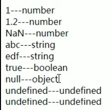

# javascript 简介

- 概念：一门客户端脚本语言
  > 运行在客户端浏览器中，每一个浏览器都有 javascript 的解析引擎
  > 脚本语言：不需要进行编译操作，直接被浏览器执行
- 功能：

  - 增强用户与 html 界面的交互，可以控制 html 元素，增强交互与添加效果

- 发展史

  1. 1992 年，Nombase 公司，开发出第一门客户端脚本语言，专门用于表单检验，命名为：C--。后更名为 ScriptEase
  2. 1995 年，Netscape 公司，开发出一门客户端教门语言，：LiveScript。后来请 SUN 公司进行修改，更名为 JavaScript
  3. 1996 年，微软抄袭 javascript 开发 JScript 语言

     > 此时针对不同浏览器就要写不同语言版本的脚本语言

  4. 1997 年，ECMA（欧洲计算机制造协会）。ECMAscript 就是所有客户端脚本语言标准

  - JavaScript=ECMAscript+JavaScript 独有的(DOM+BOM)

- ECMAscript：客户端脚本语言标准

# 基本语法

## 与 html 结合方式

> 任意位置。但注意但会**影响执行顺序**

形式：

1. 内部块
   ```html
   <script>
     /* javascript内容 */
   </script>
   ```
2. 内部行内
   ```html
   <input type="button" value="按钮" onclick="alter('hello world')" />
   ```
3. 外部

   ```html
   <script src=""></script>
   ```

## 注释

> 同 java

## 数据类型

1. 原始数据类型 5 种：也就相当于 java 中的基本数据类型
   1. number:数字。

      > 整数/小数/NaN(not a number 一个不是数字的数字类型)

   2. string：字符串。

      > 字符/字符串 "abc" "a" 'abc'，没有字符概念

   3. boolean

      > true/false

   4. null

      > 一个对象为空的占位符

   5. undefined

      > 未定义，如果一个变量没有被初始化，就会被赋值为 undefined
2. 引用数据类型：也就相当于 java 中的对象

## 变量

> typeof()
> typeof 返回变量类型对应的字符串
> 
> 其中有一个 bug 至今仍没有解决，被 ECMAscript 沿用了。就是 null 返回的数据类型为 object，而不是 null。但现在 null 被认为时对象的占位符，从而解决了这一矛盾

- 变量：一小块存储数据的内存空间，通过变量名称访问数据
- java 是强类型的语言，而 javaScript 是弱类型的语言
  > 强类型：当开辟变量存储空间时，会给该块空间指定好数据类型，该块空间只能存储指定的数据类型
  > 弱类型开辟变量存储空间时不会指定好空间的数据类型，该空间里放什么都行
  ```javascript
  var a = 3
  a = "abc"
  ```
- 语法：

  - var 变量名[= 值];

## 运算符

- 一元运算符

  > ++,--, +（正），-（负）

- 算术运算符

  > +，-，\*，/,%

- 赋值运算符

  > =,-=,+=,.....

- 比较运算符

  > <,>,>=,<=,== ,===(全等于)

- 逻辑运算符

  > &&,||,,!

- 三元运算符

  > ? :

**与 java 区别：**

1. 在 js 中，如果运算数不是运算符所要求的类型，那么 js 引擎会自动将运算数进行类型转换。

   - 其他类型转 number
     - 字符串转 number（比如在字符串前加正号时）
       - 为数字字符串：按照字面值转换
       - 不是数字字符串：转为 NaN
     - boolean 转 number：
       - true 转为 1，flase 转为 0
     - 其它类型转为 number 都是 NaN
   - 其他类型转 boolean

     - number 转 boolean:
       - 0 和 NaN 为 false，其他为 true
     - string 转 boolean
       - 除了空字符串，其他的都时 true

   - null&undefined:都是 false
     - 所有非 null 对象：true

       ```js
       if (obj) {
         /* 防止空指针异常，同时当obj为字符串时也会自动判断
                 是否为空字符串 */
       }
       ```

2. 比较运算：
   - 当类型相同时直接比较
   - 当类型不同时先进行类型转换，然后再去比较
   - ===（全等于）会先判断数据类型是否相同，再判断数值是否相同

## 特殊语法

> 可能不知道更好

- 语句以分号结尾，但如果一行只有一条语句，则分号可以省略，但不建议
- 定义变量可以使用 var 关键字，但也可以不写
  - 区别：
    - 用：定义的变量时局部变量
    - 不用：定义的变量时全局变量（不建议，干脆在外边使用 var 变量）

## 流程控制语句

1. if else
2. switch

   > java:byte int short char 枚举(1.5) String(1.7)

   - 在 javascript 中，可以接收的数据类型：所有类型

     ```javascript
     var a = "aaa"
     switch (a) {
       /* 相当于使用全等于，不会进行数据类型的转换 */
       case 1: {
       }
       case "aaa": {
       }
       case true: {
       }
       case null: {
       }
       case undefined: {
       }
     }
     ```

3. while
4. do...while
5. for

   ```javascript
   //if,for和while语法和java基本一样
   for (var a = 0; a < 10; a++) {}
   ```

# 基本对象

> [手册地址](https://www.w3school.com.cn/jsref/index.asp)
> 大多数方法自己查吧，这里只有小部分

- Boolean

  - 基本就是一个基本数据类型包装类，不多讲了

- Number：基本数据类型包装类
- String：基本数据类型包装类

- Function：函数对象

  1. 创建
     1. var fun=new Function(形式参数列表,方法体);
        ```js
        var fun1 = new Function("a", "b", "alter(a)")
        fun1(3, 4)
        ```
        > 好了，这个看看就行，忘了吧
     2. function 方法名称(形式参数列表) {方法体}
        ```js
        function sum(a, b) {
          /* 不用写参数类型或var */
          alter(a + b)
        }
        ```
     3. var 方法名=function(){}
        ```js
        var sum = function (a, b) {
          alter(a + b)
        }
        ```
  2. 方法
  3. 属性

     1. length:形式参数个数

  4. 注意

     - 方法定义时形式参数列表中不用写参数类型或 var ，也不用谢返回值类型
       ```js
       function fun1(a, b) {
         return a + b
       }
       var sum = fun1(1, 2)
       alter(sum)
       ```

     * 与 java 不同，因为 js 中方法是对象，所以和 java 不同，可以重复定义方法，不会报错，而会覆盖
       ```javascript
       function fun1(a, b) {
         alter(a + b)
       }
       function fun1(a, b) {
         alter(a - b)
       }
       fun1(1, 2) /* 不会报错，结果是-1 */
       ```
       ```javascript
       function fun2(a, b) {
         alter(a)
       }
       var fun2 = function (a, b) {
         alter(b)
       }
       fun2(1, 2)
       /* 结果是2,不会报错 */
       ```

     - 不管方法定义时形式参数是多少个，调用时传多少个都没问题，也就是说调用哪个方法，只和方法名有关。没有重载那种说法

       > 从左到右依次匹配，没有赋值的参数为 undefined，多的实参没有用
       > 但实际上，方法声明时会有一个内置隐藏的对象（数组），**arguments**，封装所有实际参数

       ```js
       function fun1() {
           var sum=0;
           for(var i=0;i<arguments.length;i++>){
               sum+=arguments[i];
           }
           return sum;
       }

       fun1(1,2,3,4);
       fun(1);/* 都可以正确执行 */
       ```

- Array

  - 创建

    1. var arr=new Array(元素列表);
    2. var arr=new Array(默认长度);
    3. var arr=[ 元素列表];

    ```js
    var arr1 = new Array(1, 2, 3)
    var arr2 = new Array(3)
    var arr3 = [1, 2, 3]

    var arr4 = new Array() /* 创建空数组 */
    ```

  - 方法（一大堆）
    - join():按照给定字符作为分隔符，默认为 ,
    - push():在数组后面添加一个或多个新的元素，并返回新的长度
  - 属性
  - 特点
    - 数组中元素的类型是可变的
      ```js
      var arr = [1, "abc", null, true]
      document.write(arr)
      ```
    - 数组的长度是可变的（类似 java 中的集合）,会自动扩容，未赋值元素值为 undefined。
      ```js
      var arr = [1, 2]
      alter(arr[3]) /* 弹出undefined */
      ```

- Date
  1. 创建：
     - var date=new Date();
       > 打印时会返回打印时刻的时间，而不是对象创建的时间
  2. 方法：
     - toLocalString()：返回当前 Date 对象对应的时间的本地字符串格式（根据操作系统和语言）
     - getTime():返回 1970 年 1 月 1 日零点到现在的毫秒数。作为时间戳使用
- Math
  1. 创建

     - Math 对象不用创建，直接使用。和 java 类似

  2. 方法：
     - rondom()返回 0 到 1 之间的随机数（含头不含尾，有 0 没 1）
     - floor()：向下取整
     - ceil()：向上取整
     - round()：四舍五入
       > [ 1,100]00 随机正整数:
       > Math.floor(Math.rondom()\*100)+1
  3. 属性：

     - PI：圆周率
- RegExp:正则表达式对象
  1. 创建：
     1. var reg=new RegExp("正则表达式");
     2. var reg=/正则表达式/;（js 中比较常用形式）

        > 两个斜杠间，不要加双引号
  2. 方法：

     1. test()：验证是否符合正则表达式，返回 boolean
- Global
  1. 特点：全局对象。

     > 这个 Global 中封装的方法不需要对象就可以直接调用。直接：方法名()。

  2. 方法：
     > url 编码：
     > 在传输数据时，并不支持中文，所以要将中文编码为 url
     > url 是 http 协议默认编码方式
     > 例：“编程”编码为： %E7%BC%96%E7%A8%8B
     > utf-8 中一个汉字三个字节，每个字节可以用两个 16 进制位表示。而每个字节前都有一个%
     1. encodeURI():把字符串编码为 URI
     2. decodeURI():解码 url
     3. encodeURIComponent():编码 url
     4. decodeURIComponent():解码 url
        > encodeURIComponent()编码的字符更多
        > 例如：要编码字符串"http://www.baidu.com?wd=编程"
        > encodeURI 会只编码 “编程” 两字
        > 而 encodeComponent()则会编码所有
        ```js
        var encode = encodeURI("编程")
        document.write(encode)
        var str = decodeURI(encode)
        document.write(str)
        ```
     5. parseInt():字符串转换为数字
        > 逐一判断每一个字符是否为数字，直到不是数字为止，将前面数字部分转为 number
        > 比如："123abc"会被转为 123
     6. isNaN():判断一个值是否为 NaN

        > NaN 六亲不认，NaN 参与的==运算都为 false，所以有这个方法来判断
        > 通过转为数字是否为 NaN 决定输出
        > 结果分别为：
        > null:false
        > true/false:false
        > undefined:true
        > 'a':true
        > '1':false
        > '1a':true
        > 1:false
        > NaN:true

     7. eval():将 javascript 字符串转换为 javascript 脚本来运行
        ```js
        var js="alter("123")";
        eval(js);/* 此处会执行 */
        ```

# BOM

# DOM
