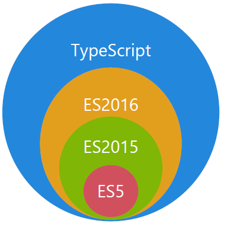
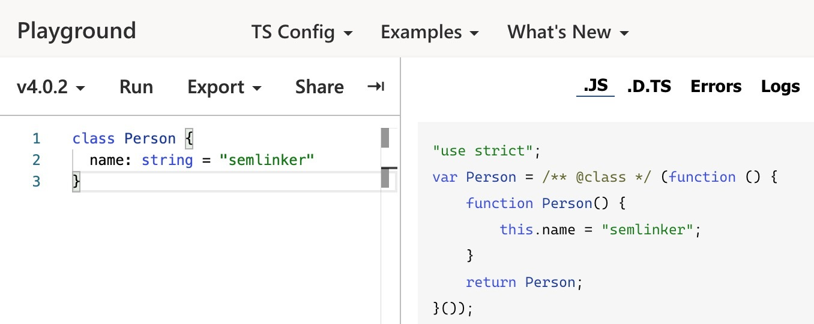
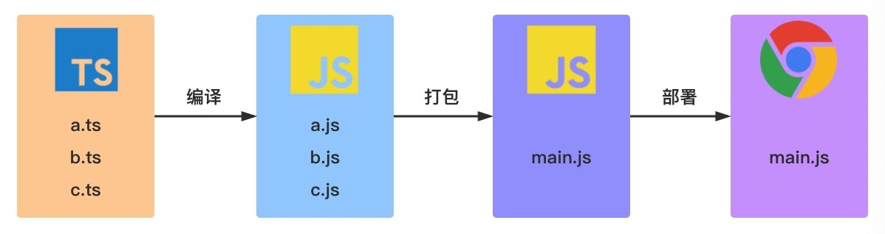

# 1. 概述

# 2. 基本概念

- [TypeScript](https://www.typescriptlang.org/) 是一种由微软开发的自由和开源的编程语言
- 它是 [JavaScript](https://cloud.tencent.com/product/sms?from=10680) 的一个超集，而且本质上向这个语言添加了可选的静态类型和基于类的面向对象编程。
- TypeScript 提供最新的和不断发展的 JavaScript 特性
  - 包括那些来自 2015 年的 ECMAScript 和未来的提案中的特性，比如异步功能和 Decorators，以帮助建立健壮的组件
  - 下图显示了 TypeScript 与 ES5、ES2015 和 ES2016 之间的关系：

  

## 2.1. TypeScript 与 JavaScript 的区别

| TypeScript                                     | JavaScript                                 |
| :--------------------------------------------- | :----------------------------------------- |
| JavaScript 的超集用于解决大型项目的代码复杂性  | 一种脚本语言，用于创建动态网页             |
| 可以在编译期间发现并纠正错误                   | 作为一种解释型语言，只能在运行时发现错误   |
| 强类型，支持静态和动态类型                     | 弱类型，没有静态类型选项                   |
| 最终被编译成 JavaScript 代码，使浏览器可以理解 | 可以直接在浏览器中使用                     |
| 支持模块、泛型和接口                           | 不支持模块，泛型或接口                     |
| 社区的支持仍在增长，而且还不是很大             | 大量的社区支持以及大量文档和解决问题的支持 |

## 2.2. 获取 TypeScript

> 命令行的 TypeScript 编译器可以使用 [npm](https://www.npmjs.com/) 包管理器来安装。

### 2.2.1. 安装 TypeScript

```bash
$ npm install -g typescript
```

### 2.2.2. 验证 TypeScript

```bash
 $ tsc -v 
 # Version 4.0.2
```

### 2.2.3. 编译 TypeScript 文件

```bash
 $ tsc helloworld.ts
 # helloworld.ts => helloworld.js
 # 之后便可以使用node进行执行
```

### 2.2.4. 编译与运行整合

- 安装依赖

  ```bash
  npm install -g ts-node
  ```
- 执行
  ```bash
  ts-node Hello.ts
  ```

### 2.2.5. 线上练习环境

- 可以直接使用线上的 [TypeScript Playground](https://www.typescriptlang.org/play/) 来学习新的语法或新特性
- 通过配置 **TS Config** 的 Target，可以设置不同的编译目标，从而编译生成不同的目标代码。
- 下图示例中所设置的编译目标是 ES5：

  

## 2.3. 典型 TypeScript 工作流程



- 在上图中包含 3 个 ts 文件：a.ts、b.ts 和 c.ts
- 这些文件将被 TypeScript 编译器，根据配置的编译选项编译成 3 个 js 文件，即 a.js、b.js 和 c.js
- 对于大多数使用 TypeScript 开发的 Web 项目，我们还会对编译生成的 js 文件进行打包处理，然后在进行部署。

## 2.4. TypeScript 初体验

- 新建一个 `hello.ts` 文件，并输入以下内容：

  ```javascript
  function greet(person: string) {
    return 'Hello, ' + person;
  }

  console.log(greet("TypeScript"));
  ```

- 然后执行 `tsc hello.ts` 命令，之后会生成一个编译好的文件 `hello.js`：

  ```javascript
  "use strict";
  function greet(person) {
    return 'Hello, ' + person;
  }
  console.log(greet("TypeScript"));
  ```

- 观察以上编译后的输出结果
  - 可以发现 `person` 参数的类型信息在编译后被擦除了
  - **TypeScript 只会在编译阶段对类型进行静态检查，如果发现有错误，编译时就会报错**
  - **而在运行时，编译生成的 JS 与普通的 JavaScript 文件一样，并不会进行类型检查**

# 3. TypeScript 基础类型

## 3.1. Boolean 类型

```javascript
let isDone: boolean = false;
// ES5：var isDone = false;

let createdByNewBoolean: boolean = new Boolean(1); // error

// 事实上 new Boolean() 返回的是一个 Boolean 对象：
let createdByNewBoolean: Boolean = new Boolean(1);

// 直接调用 Boolean 也可以返回一个 boolean 类型：
let createdByBoolean: boolean = Boolean(1);
```

- 注意：
  - 在 TypeScript 中，boolean 是 JavaScript 中的基本类型，而 Boolean 是 JavaScript 中的构造函数
  - 其他基本类型（除了 null 和 undefined）一样，不再赘述。

## 3.2. Number 类型

```javascript
let count: number = 10;
// ES5：var count = 10;
```

## 3.3. String 类型

```javascript
let name: string = "semliker";
// ES5：var name = 'semlinker';
```

## 3.4. Symbol 类型

```javascript
const sym = Symbol();
let obj = {
  [sym]: "semlinker",
};

console.log(obj[sym]); // semlinker
```

## 3.5. Array 类型

```javascript
let list: number[] = [1, 2, 3];
// ES5：var list = [1,2,3];

let list: Array<number> = [1, 2, 3]; // Array<number>泛型语法
// ES5：var list = [1,2,3];
```

## 3.6. Enum 类型

- 使用枚举我们可以定义一些带名字的常量。 使用枚举可以清晰地表达意图或创建一组有区别的用例。
- TypeScript 支持数字的和基于字符串的枚举。

### 3.6.1. 数字枚举

- 示例
  - 默认情况下，NORTH 的初始值为 0，其余的成员会从 1 开始自动增长
  - 换句话说，Direction.SOUTH 的值为 1，Direction.EAST 的值为 2，Direction.WEST 的值为 3。

  ```javascript
  enum Direction {
    NORTH,
    SOUTH,
    EAST,
    WEST,
  }

  let dir: Direction = Direction.NORTH;
  ```

- 以上的枚举示例经编译后，对应的 ES5 代码如下：

  ```javascript
  "use strict";
  var Direction;
  (function (Direction) {
    Direction[(Direction["NORTH"] = 0)] = "NORTH";
    Direction[(Direction["SOUTH"] = 1)] = "SOUTH";
    Direction[(Direction["EAST"] = 2)] = "EAST";
    Direction[(Direction["WEST"] = 3)] = "WEST";
  })(Direction || (Direction = {}));
  var dir = Direction.NORTH;
  ```

- 当然也可以设置 NORTH 的初始值，比如：

  ```javascript
  enum Direction {
    NORTH = 3,
    SOUTH,
    EAST,
    WEST,
  }
  ```

### 3.6.2. 字符串枚举

- 在 TypeScript 2.4 版本，允许使用字符串枚举
  - 在一个字符串枚举里，每个成员都必须用字符串字面量，或另外一个字符串枚举成员进行初始化。
  - 注意：
    - 对于纯字符串枚举，我们不能省略任何初始化程序
    - 而数字枚举如果没有显式设置值时，则会使用默认规则进行初始化。

  ```javascript
  enum Direction {
    NORTH = "NORTH",
    SOUTH = "SOUTH",
    EAST = "EAST",
    WEST = "WEST",
  }
  ```

- 以上代码对应的 ES5 代码如下：

  ```javascript
  "use strict";
  var Direction;
  (function (Direction) {
      Direction["NORTH"] = "NORTH";
      Direction["SOUTH"] = "SOUTH";
      Direction["EAST"] = "EAST";
      Direction["WEST"] = "WEST";
  })(Direction || (Direction = {}));
  ```

- 通过观察数字枚举和字符串枚举的编译结果，可知：
  - 数字枚举除了支持 **从成员名称到成员值** 的普通映射之外
  - 它还支持 **从成员值到成员名称** 的反向映射：

  ```javascript
  enum Direction {
    NORTH,
    SOUTH,
    EAST,
    WEST,
  }

  let dirName = Direction[0]; // NORTH
  let dirVal = Direction["NORTH"]; // 0
  ```

### 3.6.3. 常量枚举

- 常量枚举
  - 是使用 `const` 关键字修饰的枚举
  - **常量枚举会使用内联语法，不会为枚举类型编译生成任何 JavaScript**

- 为了更好地理解这句话，我们来看一个具体的例子：

  ```javascript
  const enum Direction {
    NORTH,
    SOUTH,
    EAST,
    WEST,
  }

  let dir: Direction = Direction.NORTH;
  ```

  > 以上代码对应的 ES5 代码如下：

  ```javascript
  "use strict";
  var dir = 0 /* NORTH */;
  ```

### 3.6.4. 异构枚举

- 异构枚举的成员值是数字和字符串的混合：

  ```javascript
  enum Enum {
    A,
    B,
    C = "C",
    D = "D",
    E = 8,
    F,
  }
  ```
  ```javascript
  console.log(Enum.A) //输出：0
  console.log(Enum[0]) // 输出：A
  ```

- 以上代码对于的 ES5 代码如下：

  ```javascript
  "use strict";
  var Enum;
  (function (Enum) {
      Enum[Enum["A"] = 0] = "A";
      Enum[Enum["B"] = 1] = "B";
      Enum["C"] = "C";
      Enum["D"] = "D";
      Enum[Enum["E"] = 8] = "E";
      Enum[Enum["F"] = 9] = "F";
  })(Enum || (Enum = {}));
  ```

  - 通过观察上述生成的 ES5 代码，我们可以发现数字枚举相对字符串枚举多了 “反向映射”：

## 3.7. Any 类型

- 说明
  - 在 TypeScript 中，任何类型都可以被归为 any 类型
  - 这让 any 类型成为了类型系统的顶级类型（也被称作全局超级类型）。
  - 变量如果在声明的时候，未指定其类型，那么它会被识别为任意值类型：

  ```javascript
  let notSure: any = 666;
  notSure = "semlinker";
  notSure = false;
  ```

- 作用：
  - `any` 类型本质上是类型系统的一个逃逸舱
  - 作为开发者，这给了我们很大的自由：TypeScript 允许我们对 `any` 类型的值执行任何操作，而无需事先执行任何形式的检查
  - 比如：

    ```javascript
    let value: any;

    value.foo.bar; // OK
    value.trim(); // OK
    value(); // OK
    new value(); // OK
    value[0][1]; // OK
    ```

- 问题
  - 在许多场景下，这太宽松了。使用 `any` 类型，可以很容易地导致类型正确但在运行时有问题的代码
  - 如果我们使用 `any` 类型，就无法使用 TypeScript 提供的大量的保护机制
  - 为了解决 `any` 带来的问题，TypeScript 3.0 引入了 `unknown` 类型。

## 3.8. Unknown 类型

- 说明
  - 就像所有类型都可以赋值给 `any`，所有类型也都可以赋值给 `unknown`
  - 这使得 `unknown` 成为 TypeScript 类型系统的另一种顶级类型（另一种是 `any`）

- 使用示例：
  - 对 `value` 变量的所有赋值都被认为是类型正确的。但是，将类型为 `unknown` 的值赋值给其他类型的变量时则会报错
  - `unknown` 类型只能被赋值给 `any` 类型和 `unknown` 类型本身
  - 直观地说，这是有道理的：只有能够保存任意类型值的容器才能保存 `unknown` 类型的值。
  - 毕竟我们不知道变量 `value` 中存储了什么类型的值。

  ```javascript
  let value: unknown;

  value = true; // OK
  value = 42; // OK
  value = "Hello World"; // OK
  value = []; // OK
  value = {}; // OK
  value = Math.random; // OK
  value = null; // OK
  value = undefined; // OK
  value = new TypeError(); // OK
  value = Symbol("type"); // OK
  ```

  ```javascript
  let value: unknown;

  let value1: unknown = value; // OK
  let value2: any = value; // OK
  let value3: boolean = value; // Error
  let value4: number = value; // Error
  let value5: string = value; // Error
  let value6: object = value; // Error
  let value7: any[] = value; // Error
  let value8: Function = value; // Error
  ```
  - 同时，将 `value` 变量类型设置为 `unknown` 后，这些操作都不再被认为是类型正确的
  ```javascript
  let value: unknown;

  value.foo.bar; // Error
  value.trim(); // Error
  value(); // Error
  new value(); // Error
  value[0][1]; // Error
  ```

## 3.9. Tuple 类型

- 说明
  - 众所周知，数组一般由同种类型的值组成， **但有时我们需要在单个变量中存储不同类型的值，这时候我们就可以使用元组**
  - 在 JavaScript 中是没有元组的，元组是 TypeScript 中特有的类型，其工作方式类似于数组。
  - 元组可用于定义具有有限数量的未命名属性的类型。
  - 每个属性都有一个关联的类型。使用元组时，必须提供每个属性的值

- 示例

  ```javascript
  let tupleType: [string, boolean];
  tupleType = ["semlinker", true];
  ```

  - 在上面代码中，我们定义了一个名为 `tupleType` 的变量
  - 它的类型是一个类型数组 `[string, boolean]`
  - 然后我们按照正确的类型依次初始化 tupleType 变量
  - 与数组一样，我们可以通过下标来访问元组中的元素：

  ```javascript
  console.log(tupleType[0]); // semlinker
  console.log(tupleType[1]); // true
  ```

- 在元组初始化的时候，如果出现类型不匹配的话，比如：

  ```javascript
  tupleType = [true, "semlinker"];
  ```

  > 此时，TypeScript 编译器会提示以下错误信息：

  ```javascript
  [0]: Type 'true' is not assignable to type 'string'.
  [1]: Type 'string' is not assignable to type 'boolean'.
  ```

  > 很明显是因为类型不匹配导致的，在元组初始化的时候，我们还必须提供每个属性的值，不然也会出现错误，比如：

  ```javascript
  tupleType = ["semlinker"];
  ```

  > 此时，TypeScript 编译器会提示以下错误信息：

  ```javascript
  Property '1' is missing in type '[string]' but required in type '[string, boolean]'.
  ```

## 3.10. Void 类型

- 说明
  - JavaScript 没有空值（Void）的概念，但有void类型
  - 某种程度上来说，void 类型像是与 any 类型相反，它表示没有任何类型。
  - 当一个函数没有返回值时，你通常会见到其返回值类型是 void

- 示例
  ```javascript
  // 声明函数返回值为void
  function warnUser(): void {
    console.log("This is my warning message");
  }
  ```

- 以上代码编译生成的 ES5 代码如下：

  ```javascript
  "use strict";
  function warnUser() {
    console.log("This is my warning message");
  }
  ```

- 注意：
  - 声明一个 void 类型的变量没有什么作用，因为它的值只能为 `undefined` 或 `null`：

  ```javascript
  let unusable: void = undefined;
  ```

## 3.11. Null 和 Undefined 类型

- TypeScript 里，`undefined` 和 `null` 两者有各自的类型分别为 `undefined` 和 `null`。

  ```javascript
  let u: undefined = undefined;
  let n: null = null;
  ```

- **默认情况下 `null` 和 `undefined` 是所有类型的子类型** 
  - 就是说你可以把 `null` 和 `undefined` 赋值给 `number` 类型的变量
  - 然而，如果你指定了 `--strictNullChecks` 标记 ，`null` 和 `undefined` 只能赋值给 `void` 和它们各自的类型。

## 3.12. object, Object 和 {} 类型

### 3.12.1. object 类型

- 说明：
  - object 类型是：TypeScript 2.2 引入的新类型
  - 它用于表示非原始类型。

- 示例

  ```javascript
  // node_modules/typescript/lib/lib.es5.d.ts
  interface ObjectConstructor {
    create(o: object | null): any;
    // ...
  }

  const proto = {};

  Object.create(proto);     // OK
  Object.create(null);      // OK
  Object.create(undefined); // Error
  Object.create(1337);      // Error
  Object.create(true);      // Error
  Object.create("oops");    // Error
  ```

### 3.12.2. Object 类型

- Object 类型，它由以下两个接口来定义：
- Object 接口定义了 Object.prototype 原型对象上的属性；

  ```javascript
  // node_modules/typescript/lib/lib.es5.d.ts
  interface Object {
    constructor: Function;
    toString(): string;
    toLocaleString(): string;
    valueOf(): Object;
    hasOwnProperty(v: PropertyKey): boolean;
    isPrototypeOf(v: Object): boolean;
    propertyIsEnumerable(v: PropertyKey): boolean;
  }
  ```

- ObjectConstructor 接口定义了 Object 类的属性。

  ```javascript
  // node_modules/typescript/lib/lib.es5.d.ts
  interface ObjectConstructor {
    /** Invocation via `new` */
    new(value?: any): Object;
    /** Invocation via function calls */
    (value?: any): any;
    readonly prototype: Object;
    getPrototypeOf(o: any): any;
    // ···
  }

  declare var Object: ObjectConstructor;
  ```

- Object 类的所有实例都继承了 Object 接口中的所有属性。

### 3.12.3. {} 类型

- {} 类型描述了一个没有成员的对象
- 当你试图访问这样一个对象的任意属性时，TypeScript 会产生一个编译时错误。

  ```javascript
  // Type {}
  const obj = {};

  // Error: Property 'prop' does not exist on type '{}'.
  obj.prop = "semlinker";
  ```

- 但是，你仍然可以使用在 Object 类型上定义的所有属性和方法，这些属性和方法可通过 JavaScript 的原型链隐式地使用：

  ```javascript
  // Type {}
  const obj = {};

  // "[object Object]"
  obj.toString();
  ```

## 3.13. Never 类型

- `never` 类型表示的是那些永不存在的值的类型
- 例如，`never` 类型是那些总是会抛出异常或根本就不会有返回值的函数表达式或箭头函数表达式的返回值类型。

  ```javascript
  // 返回never的函数必须存在无法达到的终点
  function error(message: string): never {
    throw new Error(message);
  }

  function infiniteLoop(): never {
    while (true) {}
  }
  ```

- 在 TypeScript 中，可以利用 never 类型的特性来实现全面性检查，具体示例如下：

  ```javascript
  type Foo = string | number;

  function controlFlowAnalysisWithNever(foo: Foo) {
    if (typeof foo === "string") {
      // 这里 foo 被收窄为 string 类型
    } else if (typeof foo === "number") {
      // 这里 foo 被收窄为 number 类型
    } else {
      // foo 在这里是 never
      const check: never = foo;
    }
  }
  ```

  - 注意在 else 分支里面，我们把收窄为 never 的 foo 赋值给一个显示声明的 never 变量
  - 如果一切逻辑正确，那么这里应该能够编译通过。但是假如后来有一天你的同事修改了 Foo 的类型：

    ```javascript
    type Foo = string | number | boolean;
    ```

  - 然而他忘记同时修改 `controlFlowAnalysisWithNever` 方法中的控制流程
  - 这时候 else 分支的 foo 类型会被收窄为 `boolean` 类型，导致无法赋值给 never 类型
  - 这时就会产生一个编译错误。通过这个方式，我们可以确保`controlFlowAnalysisWithNever` 方法总是穷尽了 Foo 的所有可能类型
  - 通过这个示例，我们可以得出一个结论：
  - **使用 never 避免出现新增了联合类型没有对应的实现，目的就是写出类型绝对安全的代码。**
    > 联合类型看下面的笔记

# 4. TypeScript 断言

## 4.1. 类型断言

### 4.1.1. 说明

- 有时候你会遇到这样的情况，你会比 TypeScript 更了解某个值的详细信息
- 通常这会发生在你清楚地知道一个实体具有比它现有类型更确切的类型。
- 通过类型断言这种方式可以告诉编译器，“相信我，我知道自己在干什么”。
- **类型断言好比其他语言里的类型转换，但是不进行特殊的数据检查和解构** 。它没有运行时的影响， **只是在编译阶段起作用** 。
- 类型断言有两种形式：
  - 尖括号
  - as

### 4.1.2. “尖括号” 语法

```javascript
let someValue: any = "this is a string";
let strLength: number = (<string>someValue).length;
```

### 4.1.3. as 语法

```javascript
let someValue: any = "this is a string";
let strLength: number = (someValue as string).length;
```

## 4.2. 非空断言

### 4.2.1. 说明

- 在上下文中当类型检查器无法断定类型时，一个新的后缀表达式操作符 `!` 可以用于断言操作对象是非 null 和非 undefined 类型
- **具体而言，x! 将从 x 值域中排除 null 和 undefined 。**

### 4.2.2. 使用场景

#### 4.2.2.1. 忽略 undefined 和 null 类型

```javascript
function myFunc(maybeString: string | undefined | null) {
  // Type 'string | null | undefined' is not assignable to type 'string'.
  // Type 'undefined' is not assignable to type 'string'. 
  const onlyString: string = maybeString; // Error
  const ignoreUndefinedAndNull: string = maybeString!; // Ok
}
```

#### 4.2.2.2. 调用函数时忽略 undefined 类型

```javascript
type NumGenerator = () => number;

function myFunc(numGenerator: NumGenerator | undefined) {
  // Object is possibly 'undefined'.(2532)
  // Cannot invoke an object which is possibly 'undefined'.(2722)
  const num1 = numGenerator(); // Error
  const num2 = numGenerator!(); //OK
}
```

### 4.2.3. 注意

- 因为 `!` 非空断言操作符会从编译生成的 JavaScript 代码中移除，所以在实际使用的过程中，要特别注意。比如下面这个例子：

  ```javascript
  const a: number | undefined = undefined;
  const b: number = a!;
  console.log(b);
  ```

  > 以上 TS 代码会编译生成以下 ES5 代码：

  ```javascript
  "use strict";
  const a = undefined;
  const b = a;
  console.log(b);
  ```

- 虽然在 TS 代码中，我们使用了非空断言，使得 `const b: number = a!;` 语句可以通过 TypeScript 类型检查器的检查
- 但在生成的 ES5 代码中，`!` 非空断言操作符被移除了，所以在浏览器中执行以上代码，在控制台会输出 `undefined`。

## 4.3. 确定赋值断言

- 说明：
  - 在 TypeScript 2.7 版本中引入了确定赋值断言
  - 即允许在实例属性和变量声明后面放置一个 `!` 号，从而告诉 TypeScript 该属性会被明确地赋值

- 示例

  ```javascript
  let x: number;
  initialize();
  // Variable 'x' is used before being assigned.(2454)
  console.log(2 * x); // Error

  function initialize() {
    x = 10;
  }
  ```

  > 很明显该异常信息是说变量 x 在赋值前被使用了，要解决该问题，我们可以使用确定赋值断言：

  ```javascript
  let x!: number;
  initialize();
  console.log(2 * x); // Ok

  function initialize() {
    x = 10;
  }
  ```

  > 通过 `let x!: number;` 确定赋值断言，TypeScript 编译器就会知道该属性会被明确地赋值。

# 5. 类型守卫

## 5.1. 说明

- **类型保护是可执行运行时检查的一种表达式，用于确保该类型在一定的范围内。**
- 换句话说，类型保护可以保证一个字符串是一个字符串，尽管它的值也可以是一个数值
- 类型保护与特性检测并不是完全不同，其主要思想是尝试检测属性、方法或原型，以确定如何处理值
- 目前主要有四种的方式来实现类型保护。

## 5.2. in 关键字

```javascript
interface Admin {
  name: string;
  privileges: string[];
}

interface Employee {
  name: string;
  startDate: Date;
}

type UnknownEmployee = Employee | Admin;

function printEmployeeInformation(emp: UnknownEmployee) {
  console.log("Name: " + emp.name);
  // 指定对象中是否有某一属性
  if ("privileges" in emp) {
    console.log("Privileges: " + emp.privileges);
  }
  if ("startDate" in emp) {
    console.log("Start Date: " + emp.startDate);
  }
}
```

## 5.3. typeof 关键字

- `typeof` 类型保护只支持两种形式：
  - `typeof v === "typename"` 和 `typeof v !== typename`
  - **`"typename"` 必须是 `"number"`， `"string"`， `"boolean"` 或 `"symbol"`**
  - 但是 TypeScript 并不会阻止你与其它字符串比较，语言不会把那些表达式识别为类型保护。

  ```javascript
  function padLeft(value: string, padding: string | number) {
    // 获取指定对象的类型名称
    if (typeof padding === "number") {
        return Array(padding + 1).join(" ") + value;
    }
    if (typeof padding === "string") {
        return padding + value;
    }
    throw new Error(`Expected string or number, got '${padding}'.`);
  }
  ```

## 5.4. instanceof 关键字

```javascript
interface Padder {
  getPaddingString(): string;
}

class SpaceRepeatingPadder implements Padder {
  constructor(private numSpaces: number) {}
  getPaddingString() {
    return Array(this.numSpaces + 1).join(" ");
  }
}

class StringPadder implements Padder {
  constructor(private value: string) {}
  getPaddingString() {
    return this.value;
  }
}

let padder: Padder = new SpaceRepeatingPadder(6);

if (padder instanceof SpaceRepeatingPadder) {
  // padder的类型收窄为 'SpaceRepeatingPadder'
}
```

## 5.5. 自定义类型保护的类型谓词

```javascript
function isNumber(x: any): x is number {
  return typeof x === "number";
}

function isString(x: any): x is string {
  return typeof x === "string";
}

// 通过 x is type 来指定x的类型 相当于调用上面的函数 如果返回为true 那么 x 类型就是number
```

# 6. 联合类型和类型别名

## 6.1. 联合类型

- 联合类型通常与 `null` 或 `undefined` 一起使用：
  - 例如，这里 `name` 的类型是 `string | undefined`
  - 意味着可以将 `string` 或 `undefined` 的值传递给`sayHello` 函数。

  ```javascript
  const sayHello = (name: string | undefined) => {
    /* ... */
  };
  ```
  ```javascript
  sayHello("semlinker");
  sayHello(undefined);
  ```
  - 也就是说类型 A 和类型 B 联合后的类型是同时接受 A 和 B 值的类型

## 6.2. 联合类型-字面量类型

- 此外，对于联合类型来说，你可能会遇到以下的用法：

  ```javascript
  let num: 1 | 2 = 1;
  type EventNames = 'click' | 'scroll' | 'mousemove';
  ```

- 以上示例中的 `1`、`2` 或 `'click'` 被称为字面量类型，用来约束取值只能是某几个值中的一个。

## 6.3. 可辨识联合

### 6.3.1. 说明

- 可辨识联合（Discriminated Unions）类型
  - 也称为 **代数数据类型或标签联合类型** 
  - **它包含 3 个要点：可辨识、联合类型和类型守卫。**

- 本质
  - 结合联合类型和字面量类型的一种类型保护方法
  - **如果一个类型是多个类型的联合类型，且多个类型含有一个公共属性，那么就可以利用这个公共属性，来创建不同的类型保护区块。**

### 6.3.2. 可辨识

- 可辨识要求联合类型中的每个元素都含有一个单例类型属性，比如：

  ```javascript
  enum CarTransmission {
    Automatic = 200,
    Manual = 300
  }

  interface Motorcycle {
    vType: "motorcycle"; // discriminant
    make: number; // year
  }

  interface Car {
    vType: "car"; // discriminant
    transmission: CarTransmission
  }

  interface Truck {
    vType: "truck"; // discriminant
    capacity: number; // in tons
  }
  ```

- 在上述代码中，我们分别定义了 `Motorcycle`、 `Car` 和 `Truck` 三个接口
- 在这些接口中都包含一个 `vType` 属性，该属性被称为 **可辨识的属性** 
- 而其它的属性只跟特性的接口相关。

### 6.3.3. 联合类型

- 基于前面定义了三个接口，我们可以创建一个 `Vehicle` 联合类型：

  ```javascript
  type Vehicle = Motorcycle | Car | Truck;
  ```

- 现在我们就可以开始使用 `Vehicle` 联合类型，对于 `Vehicle` 类型的变量，它可以表示不同类型的车辆。

### 6.3.4. 类型守卫

- 下面我们来定义一个 `evaluatePrice` 方法，该方法用于根据车辆的类型、容量和评估因子来计算价格，具体实现如下：

  ```javascript
  const EVALUATION_FACTOR = Math.PI; 

  function evaluatePrice(vehicle: Vehicle) {
    return vehicle.capacity * EVALUATION_FACTOR;
  }

  const myTruck: Truck = { vType: "truck", capacity: 9.5 };
  evaluatePrice(myTruck);
  ```

  > 对于以上代码，TypeScript 编译器将会提示以下错误信息：

  ```javascript
  Property 'capacity' does not exist on type 'Vehicle'.
  Property 'capacity' does not exist on type 'Motorcycle'.
  ```

- 原因是在 Motorcycle 接口中，并不存在 `capacity` 属性，而对于 Car 接口来说，它也不存在 `capacity` 属性
- 这时，可以使用类型守卫。下面我们来重构一下前面定义的 `evaluatePrice` 方法，重构后的代码如下：

  ```javascript
  function evaluatePrice(vehicle: Vehicle) {
    switch(vehicle.vType) {
      case "car":
        return vehicle.transmission * EVALUATION_FACTOR;
      case "truck":
        return vehicle.capacity * EVALUATION_FACTOR;
      case "motorcycle":
        return vehicle.make * EVALUATION_FACTOR;
    }
  }
  ```

  - 在以上代码中，我们使用 `switch` 和 `case` 运算符来实现类型守卫
  - 从而确保在 `evaluatePrice` 方法中，我们可以安全地访问 `vehicle` 对象中的所包含的属性，来正确的计算该车辆类型所对应的价格。

## 6.4. 类型别名

- 类型别名用来给一个类型起个新名字。

  ```javascript
  type Message = string | string[];

  let greet = (message: Message) => {
    // ...
  };

  type testType = "a" // 相当于将字符串a设置为了一个类型
  let testtype:testType = "a" // 只能赋值为a
  ```

# 7. 交叉类型

## 7.1. 说明

- 说明
  - 在 TypeScript 中交叉类型是将多个类型合并为一个类型
  - 通过 `&` 运算符可以将现有的多种类型叠加到一起成为一种类型，它包含了所需的所有类型的特性。

- 示例

  ```javascript
  type PartialPointX = { x: number; };
  type Point = PartialPointX & { y: number; };

  let point: Point = {
    x: 1,
    y: 1
  }

  // 其实等价于
  type Point = {
    x:number;
    y:number;
  };
  ```
  - 在上面代码中我们先定义了 `PartialPointX` 类型
  - 接着使用 `&` 运算符创建一个新的 `Point` 类型
  - 表示一个含有 x 和 y 坐标的点
  - 然后定义了一个 `Point` 类型的变量并初始化。

## 7.2. 同名基础类型属性的合并

- 那么现在问题来了，假设在合并多个类型的过程中，刚好出现某些名称相同的成员，但对应的类型又不一致，比如：

  ```javascript
  interface X {
    c: string;
    d: string;
  }

  interface Y {
    c: number;
    e: string
  }

  type XY = X & Y;
  type YX = Y & X;

  let p: XY;
  let q: YX;
  ```
- 因为混入后成员 c 的类型为 `string & number`
- 即成员 c 的类型既可以是 `string` 类型又可以是 `number` 类型
- 很明显这种类型是不存在的，所以混入后成员 c 的类型将变为为 `never`。

## 7.3. 同名非基础类型属性的合并

- 非基本数据类型，同名变量的合并：

  ```javascript
  interface D { d: boolean; }
  interface E { e: string; }
  interface F { f: number; }

  interface A { x: D; }
  interface B { x: E; }
  interface C { x: F; }

  type ABC = A & B & C;

  let abc: ABC = {
    x: {
      d: true,
      e: 'semlinker',
      f: 666
    }
  };

  console.log('abc:', abc);
  // 运行成功
  ```
- 在混入多个类型时，若存在相同的成员，且成员类型为非基本数据类型，那么是可以成功合并。

# 8. TypeScript 函数

## 8.1. TypeScript 函数与 JavaScript 函数的区别

| TypeScript     | JavaScript         |
| :------------- | :----------------- |
| 含有类型       | 无类型             |
| 箭头函数       | 箭头函数（ES2015） |
| 函数类型       | 无函数类型         |
| 必填和可选参数 | 所有参数都是可选的 |
| 默认参数       | 默认参数           |
| 剩余参数       | 剩余参数           |
| 函数重载       | 无函数重载         |

## 8.2. 箭头函数

### 8.2.1. 常见语法

```javascript
myBooks.forEach(() => console.log('reading'));

myBooks.forEach(title => console.log(title));

myBooks.forEach((title, idx, arr) =>
  console.log(idx + '-' + title);
);

myBooks.forEach((title, idx, arr) => {
  console.log(idx + '-' + title);
});
```

### 8.2.2. 使用示例

```javascript
// 未使用箭头函数
function Book() {
  let self = this;
  self.publishDate = 2016;
  setInterval(function () {
    console.log(self.publishDate);
  }, 1000);
}

// 使用箭头函数
function Book() {
  this.publishDate = 2016;
  setInterval(() => {
    console.log(this.publishDate);
  }, 1000);
}
```

## 8.3. 参数类型和返回类型

```javascript
function createUserId(name: string, id: number): string {
  return name + id;
}
```

## 8.4. 函数类型

```javascript
// 定义指定类型的函数
let IdGenerator: (chars: string, nums: number) => string;

function createUserId(name: string, id: number): string {
  return name + id;
}

// 函数赋值
IdGenerator = createUserId;
```

## 8.5. 可选参数及默认参数

- 说明：
  - 在声明函数时，可以通过 `?` 号来定义可选参数
  - 比如 `age?: number` 这种形式
  - **在实际使用时，需要注意的是可选参数要放在普通参数的后面，不然会导致编译错误**。

- 示例

  ```javascript
  // 可选参数
  function createUserId(name: string, id: number, age?: number): string {
    return name + id;
  }

  // 默认参数
  function createUserId(
    name: string = "semlinker",
    id: number,
    age?: number
  ): string {
    return name + id;
  }
  ```

## 8.6. 剩余参数

- 示例

  ```javascript
  function push(array, ...items) {
    items.forEach(function (item) {
      array.push(item);
    });
  }

  let a = [];
  push(a, 1, 2, 3);
  ```

- 可以讲剩余参数定义为元组

  ```javascript
  function addPerson(...args: [string, number]): void {
    console.log(`Person info: name: ${args[0]}, age: ${args[1]}`)
  }

  addPerson("lolo", 5); // Person info: name: lolo, age: 5
  ```

## 8.7. 重载

### 8.7.1. 说明

- 说明：函数重载或方法重载是使用相同名称和不同参数数量或类型创建多个方法的一种能力。
- 注意：
  - TypeScript中的重载不是真正的重载
  - 首先需要定义函数签名，也就是不进行实现的函数函数定义，确定所有重载类型
  - 然后进行一次函数实现（参数用any，联合类型或者可选参数），针对所有函数签名进行实现

### 8.7.2. 函数重载

- 函数重载示例
  ```javascript
  function add(a: number, b: number): number; // 先声明重载函数但是不定义（函数签名）
  function add(a: string, b: string): string;
  function add(a: string, b: number): string;
  function add(a: number, b: string): string;

  // 根据函数重载方式的实际情况，函数体的类型判断也可以做出优化
  // 通过any类型，联合类型和可选参数实现重载
  function add(a: Combinable, b: Combinable) { 
    // type Combinable = string | number;
    if (typeof a === 'string' || typeof b === 'string') {
      return a.toString() + b.toString();
    }
    if (typeof a === 'number' || typeof b === 'number') {
      return a + b;
    }
    return a + b;
  }
  ```
- 在以上代码中，为 add 函数提供了 **多个函数类型定义** ，从而实现函数的重载


### 8.7.3. 方法重载

- 成员方法重载示例

  ```javascript
  class Calculator {
    add(a: number, b: number): number;
    add(a: string, b: string): string;
    add(a: string, b: number): string;
    add(a: number, b: string): string;
    add(a: Combinable, b: Combinable) {
    if (typeof a === 'string' || typeof b === 'string') {
      return a.toString() + b.toString();
    }
      return a + b;
    }
  }

  const calculator = new Calculator();
  const result = calculator.add('Semlinker', ' Kakuqo');
  ```

- 注意： 
  - 这里需要注意的是，当 TypeScript 编译器处理函数重载时，它会查找重载列表，尝试使用第一个重载定义。 如果匹配的话就使用这个
  - 因此，在定义重载的时候，一定要把最精确的定义放在最前面
  - 另外在 Calculator 类中，`add(a: Combinable, b: Combinable){ }` 并不是重载列表的一部分
  - 因此对于 add 成员方法来说，我们只定义了四个重载方法。

# 9. TypeScript 数组

## 9.1. 数组解构

```javascript
let x: number; let y: number; let z: number;
let five_array = [0,1,2,3,4];
[x,y,z] = five_array;
```

## 9.2. 数组展开运算符

```javascript
let two_array = [0, 1];
let five_array = [...two_array, 2, 3, 4];
```

## 9.3. 数组遍历

```javascript
let colors: string[] = ["red", "green", "blue"];
for (let i of colors) {
  console.log(i);
}
```

# 10. 声明文件

# 11. 内置对象

# 12. TypeScript 对象

## 12.1. 对象解构

```javascript
let person = {
  name: "Semlinker",
  gender: "Male",
};

let { name, gender } = person;
```

## 12.2. 对象展开运算符

- 说明：
  - 即`...`
  - 类似于python中的`*`解包

```javascript
let person = {
  name: "Semlinker",
  gender: "Male",
  address: "Xiamen",
};

// 组装对象
let personWithAge = { ...person, age: 33 };

// 获取除了某些项外的其它项。
let { name, ...rest } = person;
// 可能报错Cannot redeclare block-scoped variable 'name'.
// 代码并没有问题，只不过ts中声明的变量、函数等被放在全局作用域中，而在编译生成的main.js里，也有同样的一份变量名、函数，所以vscode会报错提示说"redeclare"。
// 针对上述问题，可以在main.ts中添加export {}，让typescript认为main.ts是一个模块，这样就避免报错了。
```

# 13. TypeScript 接口

- 说明
  - 在面向对象语言中，接口是一个很重要的概念， **它是对行为的抽象** 
  - 而具体如何行动需要由类去实现。
  - 作用：TypeScript 中的接口是一个非常灵活的概念
    - 除了可用于[对类的一部分行为进行抽象](https://ts.xcatliu.com/advanced/class-and-interfaces.html#类实现接口)以外
    - 也常用于对「对象的形状（Shape）」进行描述。

## 13.1. 对象的形状

```javascript
interface Person {
  name: string;
  age: number;
}

let semlinker: Person = {
  name: "semlinker",
  age: 33,
};
```

## 13.2. 可选 | 只读属性

- 说明
  - 只读属性用于限制只能在对象刚刚创建的时候修改其值
  - 此外 TypeScript 还提供了 `ReadonlyArray<T>` 类型，它与 `Array<T>` 相似，只是把所有可变方法去掉了
  - 因此可以确保数组创建后再也不能被修改。

- 示例

  ```javascript
  interface Person {
    readonly name: string;
    age?: number;
  }
  ```

  ```javascript
  let a: number[] = [1, 2, 3, 4];
  let ro: ReadonlyArray<number> = a;
  ro[0] = 12; // error!
  ro.push(5); // error!
  ro.length = 100; // error!
  a = ro; // error!
  ```

## 13.3. 任意属性

- 说明
  - 有时候我们希望一个接口中除了包含必选和可选属性之外，还允许有其他的任意属性
  - 这时我们可以使用 **索引签名** 的形式来满足上述要求。

- 示例

  ```javascript
  interface Person {
    name: string;
    age?: number;
    [propName: string]: any;
  }

  const p1 = { name: "semlinker" };
  const p2 = { name: "lolo", age: 5 };
  const p3 = { name: "kakuqo", sex: 1 }
  ```

## 13.4. 接口与类型别名的关系与区别

### 13.4.1. Objects/Functions

- 说明：接口和类型别名都可以用来描述对象的形状或函数签名：

- 接口

  ```javascript
  interface Point {
    x: number;
    y: number;
  }

  interface SetPoint {
    (x: number, y: number): void;
  }
  ```

- 类型别名

  ```javascript
  type Point = {
    x: number;
    y: number;
  };

  type SetPoint = (x: number, y: number) => void;
  ```

### 13.4.2. other types

- 区别：
  - 与接口类型不一样，类型别名可以用于一些其他类型
  - 比如原始类型、联合类型和元组：

  ```javascript
  // primitive
  type Name = string;

  // object
  type PartialPointX = { x: number; };
  type PartialPointY = { y: number; };

  // union
  type PartialPoint = PartialPointX | PartialPointY;

  // tuple
  type Data = [number, string];
  ```

### 13.4.3. extends

- 说明
  - 接口和类型别名都能够被扩展，但语法有所不同
    > type定义的时候不能使用extends
  - 此外，接口和类型别名不是互斥的

- **Interface extends interface**

  ```javascript
  interface PartialPointX { x: number; }
  interface Point extends PartialPointX { 
    y: number; 
  }
  ```

- **Type alias extends type alias**

  ```javascript
  type PartialPointX = { x: number; };
  type Point = PartialPointX & { y: number; };
  ```

- **Interface extends type alias**

  ```javascript
  type PartialPointX = { x: number; };
  interface Point extends PartialPointX { y: number; }
  ```

- **Type alias extends interface**

  ```javascript
  interface PartialPointX { x: number; }
  type Point = PartialPointX & { y: number; };
  ```

### 13.4.4. Implements

- 类可以以相同的方式实现接口或类型别名，但类不能实现使用类型别名定义的联合类型：

  ```javascript
  interface Point {
    x: number;
    y: number;
  }

  class SomePoint implements Point {
    x = 1;
    y = 2;
  }

  type Point2 = {
    x: number;
    y: number;
  };

  class SomePoint2 implements Point2 {
    x = 1;
    y = 2;
  }

  type PartialPoint = { x: number; } | { y: number; };

  // A class can only implement an object type or 
  // intersection of object types with statically known members.
  class SomePartialPoint implements PartialPoint { // Error
    x = 1;
    y = 2;
  }
  ```

### 13.4.5. Declaration merging

- 接口可以定义多次，会被自动合并为单个接口。类型别名则不行

  ```javascript
  interface Point { x: number; }
  interface Point { y: number; }

  const point: Point = { x: 1, y: 2 };
  ```

# 14. TypeScript 类

## 14.1. 类的属性与方法

- 说明
  - 在面向对象语言中，类是一种面向对象计算机编程语言的构造，是创建对象的蓝图，描述了所创建的对象共同的属性和方法。
  - 在 TypeScript 中，我们可以通过 `Class` 关键字来定义一个类：

- 示例

  ```javascript
  class Greeter {
    // 静态属性
    static cname: string = "Greeter";
    // 成员属性
    greeting: string;

    // 构造函数 - 执行初始化操作
    constructor(message: string) {
      this.greeting = message;
    }

    // 静态方法
    static getClassName() {
      return "Class name is Greeter";
    }

    // 成员方法
    greet() {
      return "Hello, " + this.greeting;
    }
  }

  let greeter = new Greeter("world");
  ```

- 编译结果

  ```javascript
  "use strict";
  var Greeter = /** @class */ (function () {
      // 构造函数 - 执行初始化操作
      function Greeter(message) {
        this.greeting = message;
      }
      // 静态方法
      Greeter.getClassName = function () {
        return "Class name is Greeter";
      };
      // 成员方法
      Greeter.prototype.greet = function () {
        return "Hello, " + this.greeting;
      };
      // 静态属性
      Greeter.cname = "Greeter";
      return Greeter;
  }());
  var greeter = new Greeter("world");
  ```

## 14.2. 访问修饰符

## 14.3. ECMAScript 私有字段

- 在 TypeScript 3.8 版本就开始支持 **ECMAScript 私有字段** ，使用方式如下：

  ```javascript
  class Person {
    #name: string;

    constructor(name: string) {
      this.#name = name;
    }

    greet() {
      console.log(`Hello, my name is ${this.#name}!`);
    }
  }

  let semlinker = new Person("Semlinker");

  semlinker.#name;
  //     ~~~~~
  // Property '#name' is not accessible outside class 'Person'
  // because it has a private identifier.
  ```

- 与常规属性（甚至使用 `private` 修饰符声明的属性）不同，私有字段要牢记以下规则：
  - 私有字段以 `#` 字符开头，有时我们称之为私有名称；
  - 每个私有字段名称都唯一地限定于其包含的类；
  - 不能在私有字段上使用 TypeScript 可访问性修饰符（如 public 或 private）；
  - 私有字段不能在包含的类之外访问，甚至不能被检测到。

## 14.4. 访问器

- 在 TypeScript 中，我们可以通过 `getter` 和 `setter` 方法来实现数据的封装和有效性校验，防止出现异常数据。

  ```javascript
  let passcode = "Hello TypeScript";

  class Employee {
    private _fullName: string;

    get fullName(): string {
      return this._fullName;
    }

    set fullName(newName: string) {
      if (passcode && passcode == "Hello TypeScript") {
        this._fullName = newName;
      } else {
        console.log("Error: Unauthorized update of employee!");
      }
    }
  }

  let employee = new Employee();
  employee.fullName = "Semlinker";
  if (employee.fullName) {
    console.log(employee.fullName);
  }
  ```

## 14.5. 类的继承

- 继承（Inheritance）是一种联结类与类的层次模型
  - 指的是一个类（称为子类、子接口）继承另外的一个类（称为父类、父接口）的功能，并可以增加它自己的新功能的能力
  - 继承是类与类或者接口与接口之间最常见的关系。

- 在 TypeScript 中，可以通过 `extends` 关键字来实现继承：

  ```javascript
  class Animal {
    name: string;
    
    constructor(theName: string) {
      this.name = theName;
    }
    
    move(distanceInMeters: number = 0) {
      console.log(`${this.name} moved ${distanceInMeters}m.`);
    }
  }

  class Snake extends Animal {
    constructor(name: string) {
      super(name); // 调用父类的构造函数
    }
    
    move(distanceInMeters = 5) {
      console.log("Slithering...");
      super.move(distanceInMeters);
    }
  }

  let sam = new Snake("Sammy the Python");
  sam.move();
  ```

- 注意：typescript中，接口是可以继承类的

  ```javascript
  class Point {
      x: number;
      y: number;
      constructor(x: number, y: number) {
          this.x = x;
          this.y = y;
      }
  }

  interface Point3d extends Point {
      z: number;
  }

  let point3d: Point3d = {x: 1, y: 2, z: 3};
  ```

## 14.6. 抽象类

- 使用 `abstract` 关键字声明的类，称之为抽象类
  - 抽象类不能被实例化，因为它里面包含一个或多个抽象方法
  - 所谓的抽象方法，是指不包含具体实现的方法：

- 示例

  ```javascript
  abstract class Person {
    constructor(public name: string){}

    abstract say(words: string) :void;
  }

  // Cannot create an instance of an abstract class.(2511)
  const lolo = new Person(); // Error
  ```

- 抽象类不能被直接实例化，只能实例化实现了所有抽象方法的子类。具体如下所示：

  ```javascript
  abstract class Person {
    constructor(public name: string){}

    // 抽象方法
    abstract say(words: string) :void;
  }

  class Developer extends Person {
    constructor(name: string) {
      super(name);
    }
    
    say(words: string): void {
      console.log(`${this.name} says ${words}`);
    }
  }

  const lolo = new Developer("lolo");
  lolo.say("I love ts!"); // lolo says I love ts!
  ```

## 14.7. 类方法重载

> 上面已经介绍过方法重载

- 对于类的方法来说，也支持重载
  - 比如，在以下示例中我们重载了 `ProductService` 类的 `getProducts` 成员方法：

  ```javascript
  class ProductService {
      getProducts(): void;
      getProducts(id: number): void;
      getProducts(id?: number) {
        if(typeof id === 'number') {
            console.log(`获取id为 ${id} 的产品信息`);
        } else {
            console.log(`获取所有的产品信息`);
        }  
      }
  }

  const productService = new ProductService();
  productService.getProducts(666); // 获取id为 666 的产品信息
  productService.getProducts(); // 获取所有的产品信息
  ```

# 15. 声明合并

# 16. TypeScript 泛型

## 16.1. 说明

- 泛型（Generics）
  - 是允许同一个函数接受不同类型参数的一种模板
  - 相比于使用 any 类型，使用泛型来创建可复用的组件要更好，因为泛型会保留参数类型。

- 目的
  - 软件工程中，我们不仅要创建一致的定义良好的 API，同时也要考虑可重用性
  - 组件不仅能够支持当前的数据类型，同时也能支持未来的数据类型，这在创建大型系统时为你提供了十分灵活的功能。
  - 设计泛型的关键目的是在 **成员之间提供有意义的约束**
  - 这些成员可以是：类的实例成员、类的方法、函数参数和函数返回值。

- 简述：
  - **在像 C# 和 Java 这样的语言中，可以使用泛型来创建可重用的组件，一个组件可以支持多种类型的数据**
  - **这样用户就可以以自己的数据类型来使用组件。**

## 16.2. 泛型语法

- 示例

  ```javascript
  function identity <T, U>(value: T, message: U) : T {
    console.log(message);
    return value;
  }

  console.log(identity<Number, string>(68, "Semlinker"));
  ```

- 除了为类型变量显式设定值之外，一种更常见的做法是使编译器自动选择这些类型，从而使代码更简洁

  ```javascript
  function identity <T, U>(value: T, message: U) : T {
    console.log(message);
    return value;
  }

  console.log(identity(68, "Semlinker"));
  ```

  - 对于上述代码，编译器足够聪明，能够知道我们的参数类型，并将它们赋值给 T 和 U
  - 而不需要开发人员显式指定它们。

## 16.3. 泛型接口

```javascript
interface GenericIdentityFn<T> {
  (arg: T): T;
}
```

## 16.4. 泛型类

```javascript
class GenericNumber<T> {
  zeroValue: T;
  add: (x: T, y: T) => T;
}

let myGenericNumber = new GenericNumber<number>();
myGenericNumber.zeroValue = 0;
myGenericNumber.add = function (x, y) {
  return x + y;
};
```

## 16.5. 泛型工具类型

### 16.5.1. 说明

- 为了方便开发者 TypeScript 内置了一些常用的工具类型
- 比如 Partial、Required、Readonly、Record 和 ReturnType 等

### 16.5.2. typeof

- 在 TypeScript 中，`typeof` 操作符可以用来获取一个变量声明或对象的类型。

  ```javascript
  interface Person {
    name: string;
    age: number;
  }

  const sem: Person = { name: 'semlinker', age: 33 };
  type Sem= typeof sem; // -> Person

  function toArray(x: number): Array<number> {
    return [x];
  }

  type Func = typeof toArray; // -> (x: number) => number[]
  ```

### 16.5.3. keyof

- `keyof` 操作符
  - 是在 TypeScript 2.1 版本引入的
  - 该操作符可以用于获取某种类型的所有键，其返回类型是 **联合类型**

- 示例：

  ```javascript
  interface Person {
    name: string;
    age: number;
  }

  type K1 = keyof Person; // "name" | "age"
  type K2 = keyof Person[]; // "length" | "toString" | "pop" | "push" | "concat" | "join" 
  type K3 = keyof { [x: string]: Person };  // string | number
  ```

- 注意：在 TypeScript 中支持两种索引签名，数字索引和字符串索引：

  ```javascript
  interface StringArray {
    // 字符串索引 -> keyof StringArray => string | number
    [index: string]: string; 
  }

  interface StringArray1 {
    // 数字索引 -> keyof StringArray1 => number
    [index: number]: string;
  }
  ```

  - 为了同时支持两种索引类型，就得要求数字索引的返回值必须是字符串索引返回值的子类
  - **其中的原因就是当使用数值索引时，JavaScript 在执行索引操作时，会先把数值索引先转换为字符串索引**
  - 所以 `keyof { [x: string]: Person }` 的结果会返回 `string | number`。

### 16.5.4. in

- `in` 用来遍历枚举类型：

  ```javascript
  type Keys = "a" | "b" | "c"

  type Obj =  {
    [p in Keys]: any
  } // -> { a: any, b: any, c: any }
  ```

### 16.5.5. infer

<!-- TODO: infer 啥意思 -->

- 在条件类型语句中，可以用 `infer` 声明一个类型变量并且对它进行使用。

  ```javascript
  type ReturnType<T> = T extends (
    ...args: any[]
  ) => infer R ? R : any;
  ```

- 以上代码中 `infer R` 就是声明一个变量来承载传入函数签名的返回值类型
- 简单说就是用它取到函数返回值的类型方便之后使用

### 16.5.6. extends

- 有时候我们定义的泛型不想过于灵活或者说想继承某些类等，可以通过 extends 关键字添加泛型约束。

  ```javascript
  interface Lengthwise {
    length: number;
  }

  function loggingIdentity<T extends Lengthwise>(arg: T): T {
    console.log(arg.length);
    return arg;
  }
  ```

- 现在这个泛型函数被定义了约束，因此它不再是适用于任意类型：

  ```javascript
  loggingIdentity(3);  // Error, number doesn't have a .length property
  ```

- 这时我们需要传入符合约束类型的值，必须包含必须的属性：

  ```javascript
  loggingIdentity({length: 10, value: 3});
  ```

### 16.5.7. Partial

- 说明：
  - `Partial<T>` 的作用就是 **将某个类型里的属性全部变为可选项 `?`** 

- **定义：**

  ```javascript
  /**
  * node_modules/typescript/lib/lib.es5.d.ts
  * Make all properties in T optional
  */
  type Partial<T> = {
    [P in keyof T]?: T[P];
  };
  ```

  - 在以上代码中，首先通过 `keyof T` 拿到 `T` 的所有属性名
  - 然后使用 `in` 进行遍历，将值赋给 `P`
  - 最后通过 `T[P]` 取得相应的属性值
  - 中间的 `?` 号，用于将所有属性变为可选。

- **示例：**

  ```javascript
  interface Todo {
    title: string;
    description: string;
  }

  function updateTodo(todo: Todo, fieldsToUpdate: Partial<Todo>) {
    return { ...todo, ...fieldsToUpdate };
  }

  const todo1 = {
    title: "Learn TS",
    description: "Learn TypeScript",
  };

  const todo2 = updateTodo(todo1, {
    description: "Learn TypeScript Enum",
  });
  ```

  > 在上面的 `updateTodo` 方法中，利用 `Partial<T>` 工具类型
  > 定义 `fieldsToUpdate` 的类型为 `Partial<Todo>`，即：

  ```javascript
  {
    title?: string | undefined;
    description?: string | undefined;
  }
  ```

### 16.5.8. Required

### 16.5.9. Readonly

### 16.5.10. Record

### 16.5.11. ReturnType

# 17. TypeScript 装饰器

<!-- TODO: 装饰器实现原理需要再查一下 -->

## 17.1. 装饰器是什么

- 说明
  - 它是一个表达式
  - 该表达式被执行后，返回一个函数
  - 函数的入参分别为 target、name 和 descriptor
  - 执行该函数后，可能返回 descriptor 对象，用于配置 target 对象
- 启用
  - 需要注意的是，若要启用实验性的装饰器特性，你必须在命令行或 `tsconfig.json` 里启用 `experimentalDecorators` 编译器选项：
  - **命令行**：

    ```javascript
    tsc --target ES5 --experimentalDecorators
    ```
  - **tsconfig.json**：

    ```javascript
    {
      "compilerOptions": {
        "target": "ES5",
        "experimentalDecorators": true
      }
    }
    ```

## 17.2. 装饰器的分类

- 类装饰器（Class decorators）
- 属性装饰器（Property decorators）
- 方法装饰器（Method decorators）
- 参数装饰器（Parameter decorators）

## 17.3. 类装饰器

- 类装饰器声明：

  ```javascript
  declare type ClassDecorator = <TFunction extends Function>(
    target: TFunction
  ) => TFunction | void;
  ```

  - 类装饰器顾名思义，就是用来装饰类的
  > 它接收一个参数： 
  - target: TFunction - 被装饰的类

- 示例

  ```javascript
  function Greeter(target: Function): void {
    target.prototype.greet = function (): void {
      console.log("Hello Semlinker!");
    };
  }

  @Greeter
  class Greeting {
    constructor() {
      // 内部实现
    }
  }

  let myGreeting = new Greeting();
  myGreeting.greet(); // console output: 'Hello Semlinker!';
  ```

  - 上面的例子中，我们定义了 `Greeter` 类装饰器，同时我们使用了 `@Greeter` 语法糖，来使用装饰器。

- 示例2：自定义输出语句

  ```javascript
  function Greeter(greeting: string) {
    return function (target: Function) {
      target.prototype.greet = function (): void {
        console.log(greeting);
      };
    };
  }

  @Greeter("Hello TS!")
  class Greeting {
    constructor() {
      // 内部实现
    }
  }

  let myGreeting = new Greeting();
  myGreeting.greet(); // console output: 'Hello TS!';
  ```

## 17.4. 属性装饰器

- 属性装饰器声明：

  ```javascript
  declare type PropertyDecorator = (target:Object, 
    propertyKey: string | symbol ) => void;
  ```

  > 属性装饰器顾名思义，用来装饰类的属性。它接收两个参数：
  - target: Object - 被装饰的类
  - propertyKey: string | symbol - 被装饰类的属性名

- 示例

  ```javascript
  function logProperty(target: any, key: string) {
    delete target[key];

    const backingField = "_" + key;

    Object.defineProperty(target, backingField, {
      writable: true,
      enumerable: true,
      configurable: true
    });

    // property getter
    const getter = function (this: any) {
      const currVal = this[backingField];
      console.log(`Get: ${key} => ${currVal}`);
      return currVal;
    };

    // property setter
    const setter = function (this: any, newVal: any) {
      console.log(`Set: ${key} => ${newVal}`);
      this[backingField] = newVal;
    };

    // Create new property with getter and setter
    Object.defineProperty(target, key, {
      get: getter,
      set: setter,
      enumerable: true,
      configurable: true
    });
  }

  class Person { 
    @logProperty
    public name: string;

    constructor(name : string) { 
      this.name = name;
    }
  }

  const p1 = new Person("semlinker");
  p1.name = "kakuqo";
  ```

  > 以上代码定义了一个 `logProperty` 函数，来跟踪用户对属性的操作
  > 当代码成功运行后，在控制台会输出以下结果：

  ```javascript
  Set: name => semlinker
  Set: name => kakuqo
  ```

## 17.5. 方法装饰器

- 方法装饰器声明：

  ```javascript
  declare type MethodDecorator = <T>(target:Object, propertyKey: string | symbol, 	 	
    descriptor: TypePropertyDescript<T>) => TypedPropertyDescriptor<T> | void;
  ```

  > 方法装饰器顾名思义，用来装饰类的方法。它接收三个参数：
  - target: Object - 被装饰的类
  - propertyKey: string | symbol - 方法名
  - descriptor: TypePropertyDescript - 属性描述符

- 示例

  ```javascript
  function LogOutput(tarage: Function, key: string, descriptor: any) {
    let originalMethod = descriptor.value;
    let newMethod = function(...args: any[]): any {
      let result: any = originalMethod.apply(this, args);
      if(!this.loggedOutput) {
        this.loggedOutput = new Array<any>();
      }
      this.loggedOutput.push({
        method: key,
        parameters: args,
        output: result,
        timestamp: new Date()
      });
      return result;
    };
    descriptor.value = newMethod;
  }

  class Calculator {
    @LogOutput
    double (num: number): number {
      return num * 2;
    }
  }

  let calc = new Calculator();
  calc.double(11);
  // console ouput: [{method: "double", output: 22, ...}]
  console.log(calc.loggedOutput);
  ```

## 17.6. 参数装饰器

- 参数装饰器声明：

  ```javascript
  declare type ParameterDecorator = (target: Object, propertyKey: string | symbol, 
    parameterIndex: number ) => void
  ```
  > 参数装饰器顾名思义，是用来装饰函数参数，它接收三个参数：
  - target: Object - 被装饰的类
  - propertyKey: string | symbol - 方法名
  - parameterIndex: number - 方法中参数的索引值

- 示例

  ```javascript
  function Log(target: Function, key: string, parameterIndex: number) {
    let functionLogged = key || target.prototype.constructor.name;
    console.log(`The parameter in position ${parameterIndex} at ${functionLogged} has
    been decorated`);
  }

  class Greeter {
    greeting: string;
    constructor(@Log phrase: string) {
    this.greeting = phrase; 
    }
  }

  // console output: The parameter in position 0 
  // at Greeter has been decorated
  ```

# 18. TypeScript 4.0 新特性

## 18.1. 构造函数的类属性推断

- 当 `noImplicitAny` 配置属性被启用之后，TypeScript 4.0 就可以使用控制流分析来确认类中的属性类型：

  ```javascript
  class Person {
    fullName; // (property) Person.fullName: string
    firstName; // (property) Person.firstName: string
    lastName; // (property) Person.lastName: string

    constructor(fullName: string) {
      this.fullName = fullName;
      this.firstName = fullName.split(" ")[0];
      this.lastName =   fullName.split(" ")[1];
    }  
  }
  ```

- 然而对于以上的代码，如果在 TypeScript 4.0 以前的版本，比如在 3.9.2 版本下，编译器会提示以下错误信息：

  ```javascript
  class Person {
    // Member 'fullName' implicitly has an 'any' type.(7008)
    fullName; // Error
    firstName; // Error
    lastName; // Error

    constructor(fullName: string) {
      this.fullName = fullName;
      this.firstName = fullName.split(" ")[0];
      this.lastName =   fullName.split(" ")[1];
    }  
  }
  ```

- 从构造函数推断类属性的类型，该特性给我们带来了便利。但在使用过程中，如果我们没法保证对成员属性都进行赋值，那么该属性可能会被认为是 `undefined`。

  ```javascript
  class Person {
    fullName;  // (property) Person.fullName: string
    firstName; // (property) Person.firstName: string | undefined
    lastName; // (property) Person.lastName: string | undefined

    constructor(fullName: string) {
      this.fullName = fullName;
      if(Math.random()){
        this.firstName = fullName.split(" ")[0];
        this.lastName =   fullName.split(" ")[1];
      }
    }  
  }
  ```

## 18.2. 标记的元组元素

- 在以下的示例中，我们使用元组类型来声明剩余参数的类型：

  ```javascript
  function addPerson(...args: [string, number]): void {
    console.log(`Person info: name: ${args[0]}, age: ${args[1]}`)
  }

  addPerson("lolo", 5); // Person info: name: lolo, age: 5
  ```

- 其实，对于上面的 `addPerson` 函数，我们也可以这样实现：

  ```javascript
  function addPerson(name: string, age: number) {
    console.log(`Person info: name: ${name}, age: ${age}`)
  }
  ```

- 这两种方式看起来没有多大的区别
  - 但对于第一种方式，我们没法设置第一个参数和第二个参数的名称
  - 虽然这样对类型检查没有影响，但在元组位置上缺少标签，会使得它们难于使用
  - 为了提高开发者使用元组的体验，TypeScript 4.0 支持为元组类型设置标签：

  ```javascript
  function addPerson(...args: [name: string, age: number]): void {
    console.log(`Person info: name: ${args[0]}, age: ${args[1]}`);
  }
  ```

- 之后，当我们使用 `addPerson` 方法时，TypeScript 的智能提示就会变得更加友好。

  ```javascript
  // 未使用标签的智能提示
  // addPerson(args_0: string, args_1: number): void
  function addPerson(...args: [string, number]): void {
    console.log(`Person info: name: ${args[0]}, age: ${args[1]}`)
  } 

  // 已使用标签的智能提示
  // addPerson(name: string, age: number): void
  function addPerson(...args: [name: string, age: number]): void {
    console.log(`Person info: name: ${args[0]}, age: ${args[1]}`);
  }
  ```

## 18.3. 其他todo

# 19. 编译上下文

## 19.1. tsconfig.json 的作用

- 用于标识 TypeScript 项目的根路径；
- 用于配置 TypeScript 编译器；
- 用于指定编译的文件。

## 19.2. tsconfig.json 重要字段

- files - 设置要编译的文件的名称；
- include - 设置需要进行编译的文件，支持路径模式匹配；
- exclude - 设置无需进行编译的文件，支持路径模式匹配；
- compilerOptions - 设置与编译流程相关的选项。

## 19.3. compilerOptions 选项

- compilerOptions 支持很多选项
  - 常见的有 `baseUrl`、 `target`、`baseUrl`、 `moduleResolution` 和 `lib` 

- compilerOptions 每个选项的详细说明如下：

  ```javascript
  {
    "compilerOptions": {

      /* 基本选项 */
      "target": "es5",                       // 指定 ECMAScript 目标版本: 'ES3' (default), 'ES5', 'ES6'/'ES2015', 'ES2016', 'ES2017', or 'ESNEXT'
      "module": "commonjs",                  // 指定使用模块: 'commonjs', 'amd', 'system', 'umd' or 'es2015'
      "lib": [],                             // 指定要包含在编译中的库文件
      "allowJs": true,                       // 允许编译 javascript 文件
      "checkJs": true,                       // 报告 javascript 文件中的错误
      "jsx": "preserve",                     // 指定 jsx 代码的生成: 'preserve', 'react-native', or 'react'
      "declaration": true,                   // 生成相应的 '.d.ts' 文件
      "sourceMap": true,                     // 生成相应的 '.map' 文件
      "outFile": "./",                       // 将输出文件合并为一个文件
      "outDir": "./",                        // 指定输出目录
      "rootDir": "./",                       // 用来控制输出目录结构 --outDir.
      "removeComments": true,                // 删除编译后的所有的注释
      "noEmit": true,                        // 不生成输出文件
      "importHelpers": true,                 // 从 tslib 导入辅助工具函数
      "isolatedModules": true,               // 将每个文件做为单独的模块 （与 'ts.transpileModule' 类似）.

      /* 严格的类型检查选项 */
      "strict": true,                        // 启用所有严格类型检查选项
      "noImplicitAny": true,                 // 在表达式和声明上有隐含的 any类型时报错
      "strictNullChecks": true,              // 启用严格的 null 检查
      "noImplicitThis": true,                // 当 this 表达式值为 any 类型的时候，生成一个错误
      "alwaysStrict": true,                  // 以严格模式检查每个模块，并在每个文件里加入 'use strict'

      /* 额外的检查 */
      "noUnusedLocals": true,                // 有未使用的变量时，抛出错误
      "noUnusedParameters": true,            // 有未使用的参数时，抛出错误
      "noImplicitReturns": true,             // 并不是所有函数里的代码都有返回值时，抛出错误
      "noFallthroughCasesInSwitch": true,    // 报告 switch 语句的 fallthrough 错误。（即，不允许 switch 的 case 语句贯穿）

      /* 模块解析选项 */
      "moduleResolution": "node",            // 选择模块解析策略： 'node' (Node.js) or 'classic' (TypeScript pre-1.6)
      "baseUrl": "./",                       // 用于解析非相对模块名称的基目录
      "paths": {},                           // 模块名到基于 baseUrl 的路径映射的列表
      "rootDirs": [],                        // 根文件夹列表，其组合内容表示项目运行时的结构内容
      "typeRoots": [],                       // 包含类型声明的文件列表
      "types": [],                           // 需要包含的类型声明文件名列表
      "allowSyntheticDefaultImports": true,  // 允许从没有设置默认导出的模块中默认导入。

      /* Source Map Options */
      "sourceRoot": "./",                    // 指定调试器应该找到 TypeScript 文件而不是源文件的位置
      "mapRoot": "./",                       // 指定调试器应该找到映射文件而不是生成文件的位置
      "inlineSourceMap": true,               // 生成单个 soucemaps 文件，而不是将 sourcemaps 生成不同的文件
      "inlineSources": true,                 // 将代码与 sourcemaps 生成到一个文件中，要求同时设置了 --inlineSourceMap 或 --sourceMap 属性

      /* 其他选项 */
      "experimentalDecorators": true,        // 启用装饰器
      "emitDecoratorMetadata": true          // 为装饰器提供元数据的支持
    }
  }
  ```

## 19.4. 示例

# 20. TypeScript 开发辅助工具

## 20.1. [TypeScript Playground](https://www.typescriptlang.org/play/)

> 简介：TypeScript 官方提供的在线 TypeScript 运行环境，利用它你可以方便地学习 TypeScript 相关知识与不同版本的功能特性。 在线地址：https://www.typescriptlang.org/play/

除了 TypeScript 官方的 Playground 之外，你还可以选择其他的 Playground，比如 [codepen.io](https://codepen.io/)、[stackblitz](https://stackblitz.com/) 或 [jsbin.com](https://jsbin.com/?js) 等。

## 20.2. [TypeScript UML Playground](https://tsuml-demo.firebaseapp.com/)

> 简介：一款在线 TypeScript UML 工具，利用它你可以为指定的 TypeScript 代码生成 UML 类图。 在线地址：https://tsuml-demo.firebaseapp.com/

## 20.3. [JSON TO TS](http://www.jsontots.com/)

> 简介：一款 TypeScript 在线工具，利用它你可以为指定的 JSON 数据生成对应的 TypeScript 接口定义。 在线地址：http://www.jsontots.com/

除了使用 [jsontots](http://www.jsontots.com/) 在线工具之外，对于使用 VSCode IDE 的小伙们还可以安装 [JSON to TS](https://marketplace.visualstudio.com/items?itemName=MariusAlchimavicius.json-to-ts) 扩展来快速完成 **JSON to TS** 的转换工作。

## 20.4. [Schemats](https://github.com/SweetIQ/schemats)

> 简介：利用 Schemats，你可以基于（Postgres，[MySQL](https://cloud.tencent.com/product/cdb?from=10680)）SQL [数据库](https://cloud.tencent.com/solution/database?from=10680)中的 schema 自动生成 TypeScript 接口定义。 在线地址：https://github.com/SweetIQ/schemats

## 20.5. [TypeScript AST Viewer](https://ts-ast-viewer.com/)

> 简介：一款 TypeScript AST 在线工具，利用它你可以查看指定 TypeScript 代码对应的 AST（Abstract Syntax Tree）抽象语法树。 在线地址：https://ts-ast-viewer.com/

对于了解过 AST 的小伙伴来说，对 [astexplorer](https://astexplorer.net/) 这款在线工具应该不会陌生。该工具除了支持 JavaScript 之外，还支持 CSS、JSON、RegExp、GraphQL 和 Markdown 等格式的解析。

## 20.6. [TypeDoc](https://typedoc.org/)

> 简介：TypeDoc 用于将 TypeScript 源代码中的注释转换为 HTML 文档或 JSON 模型。它可灵活扩展，并支持多种配置。 在线地址：https://typedoc.org/

## 20.7. [TypeScript ESLint](https://typescript-eslint.io/)

> 简介：使用 [TypeScript ESLint](https://typescript-eslint.io/) 可以帮助我们规范代码质量，提高团队开发效率。 在线地址：https://typescript-eslint.io/

对 [TypeScript ESLint](https://typescript-eslint.io/) 项目感兴趣且想在项目中应用的小伙伴，可以参考 [“在Typescript项目中，如何优雅的使用ESLint和Prettier”](https://juejin.im/post/5d1d5fe96fb9a07eaf2bae29) 这篇文章。

能坚持看到这里的小伙伴都是 “真爱”，如果你还意犹未尽，那就来看看本人整理的 Github 上 1.8K+ 的开源项目：[awesome-typescript](https://github.com/semlinker/awesome-typescript)。

> https://github.com/semlinker/awesome-typescript

## 20.8. tsserver 常用配置项

```json
"compilerOptions": {
  "incremental": true, // TS编译器在第一次编译之后会生成一个存储编译信息的文件，第二次编译会在第一次的基础上进行增量编译，可以提高编译的速度
  "tsBuildInfoFile": "./buildFile", // 增量编译文件的存储位置
  "diagnostics": true, // 打印诊断信息 
  "target": "ES5", // 目标语言的版本
  "module": "CommonJS", // 生成代码的模板标准
  "outFile": "./app.js", // 将多个相互依赖的文件生成一个文件，可以用在AMD模块中，即开启时应设置"module": "AMD",
  "lib": ["DOM", "ES2015", "ScriptHost", "ES2019.Array"], // TS需要引用的库，即声明文件，es5 默认引用dom、es5、scripthost,如需要使用es的高级版本特性，通常都需要配置，如es8的数组新特性需要引入"ES2019.Array",
  "allowJS": true, // 允许编译器编译JS，JSX文件
  "checkJs": true, // 允许在JS文件中报错，通常与allowJS一起使用
  "outDir": "./dist", // 指定输出目录
  "rootDir": "./", // 指定输出文件目录(用于输出)，用于控制输出目录结构
  "declaration": true, // 生成声明文件，开启后会自动生成声明文件
  "declarationDir": "./file", // 指定生成声明文件存放目录
  "emitDeclarationOnly": true, // 只生成声明文件，而不会生成js文件
  "sourceMap": true, // 生成目标文件的sourceMap文件
  "inlineSourceMap": true, // 生成目标文件的inline SourceMap，inline SourceMap会包含在生成的js文件中
  "declarationMap": true, // 为声明文件生成sourceMap
  "typeRoots": [], // 声明文件目录，默认时node_modules/@types
  "types": [], // 加载的声明文件包
  "removeComments":true, // 删除注释 
  "noEmit": true, // 不输出文件,即编译后不会生成任何js文件
  "noEmitOnError": true, // 发送错误时不输出任何文件
  "noEmitHelpers": true, // 不生成helper函数，减小体积，需要额外安装，常配合importHelpers一起使用
  "importHelpers": true, // 通过tslib引入helper函数，文件必须是模块
  "downlevelIteration": true, // 降级遍历器实现，如果目标源是es3/5，那么遍历器会有降级的实现
  "strict": true, // 开启所有严格的类型检查
  "alwaysStrict": true, // 在代码中注入'use strict'
  "noImplicitAny": true, // 不允许隐式的any类型
  "strictNullChecks": true, // 不允许把null、undefined赋值给其他类型的变量
  "strictFunctionTypes": true, // 不允许函数参数双向协变
  "strictPropertyInitialization": true, // 类的实例属性必须初始化
  "strictBindCallApply": true, // 严格的bind/call/apply检查
  "noImplicitThis": true, // 不允许this有隐式的any类型
  "noUnusedLocals": true, // 检查只声明、未使用的局部变量(只提示不报错)
  "noUnusedParameters": true, // 检查未使用的函数参数(只提示不报错)
  "noFallthroughCasesInSwitch": true, // 防止switch语句贯穿(即如果没有break语句后面不会执行)
  "noImplicitReturns": true, //每个分支都会有返回值
  "esModuleInterop": true, // 允许export=导出，由import from 导入
  "allowUmdGlobalAccess": true, // 允许在模块中全局变量的方式访问umd模块
  "moduleResolution": "node", // 模块解析策略，ts默认用node的解析策略，即相对的方式导入
  "baseUrl": "./", // 解析非相对模块的基地址，默认是当前目录
  "paths": { // 路径映射，相对于baseUrl
    // 如使用jq时不想使用默认版本，而需要手动指定版本，可进行如下配置
    "jquery": ["node_modules/jquery/dist/jquery.min.js"]
  },
  "rootDirs": ["src","out"], // 将多个目录放在一个虚拟目录下，用于运行时，即编译后引入文件的位置可能发生变化，这也设置可以虚拟src和out在同一个目录下，不用再去改变路径也不会报错
  "listEmittedFiles": true, // 打印输出文件
  "listFiles": true// 打印编译的文件(包括引用的声明文件)
}
```

# 21. 参考资料

- [x] [了不起的 TypeScript 入门教程（1.2W字）](https://segmentfault.com/a/1190000022876390)
- [ ] [使用 Typescript 开发 Nodejs 命令行工具](https://cloud.tencent.com/developer/article/1745697)
- [ ] [TypeScript入门教程](https://ts.xcatliu.com/)
- [ ] [深入理解 TypeScript](https://jkchao.github.io/typescript-book-chinese/)
- [ ] [TypeScript 官方中文文档](https://www.tslang.cn/docs/home.html)
- [ ] [深入理解 TypeScript - 编译上下文](https://jkchao.github.io/typescript-book-chinese/project/compilationContext.html#tsconfig-json)
- [ ] [TypeScript 4.0](https://www.typescriptlang.org/docs/handbook/release-notes/typescript-4-0.html)
- [ ] TypeScript Quickly
- [ ] [TypeScript 教程(姜瑞涛)](https://www.jiangruitao.com/typescript/)(更新中)
- [ ] [解决typescript Cannot redeclare block-scoped variable](https://segmentfault.com/a/1190000021865919?utm_source=tag-newest)
- [ ] [mariusschulz - the-unknown-type-in-typescript](https://mariusschulz.com/blog/the-unknown-type-in-typescript)
- [ ] [TypeScript 声明文件](https://www.runoob.com/typescript/ts-ambient.html)
- [ ] [深入理解TypeScipt](https://jkchao.github.io/typescript-book-chinese/#why)


