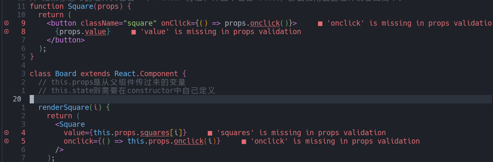
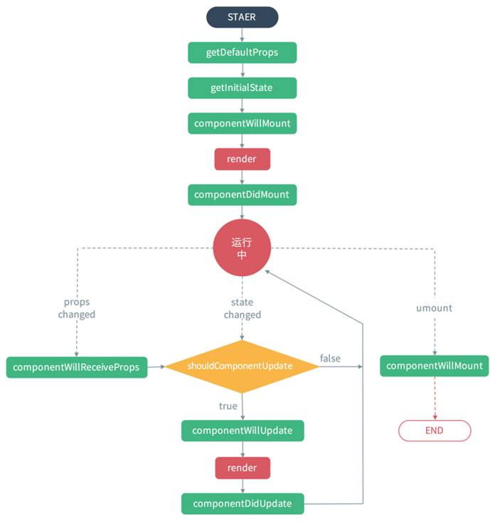
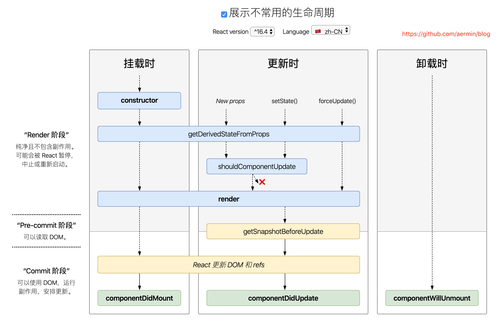
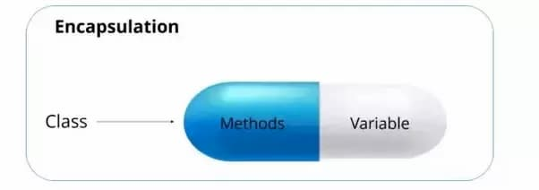

# 1. 前置知识

- this 指向
- ES6
- npm(webpack)
- 原型，原型链
- js 数组常用方法
- 模块化

# 2. 理论基础

## 2.1. 为什么要使用React

- **开发迅速**
  - React组件化的特性使得React可以在项目中大量复用封装好的组件，提高代码的复用率
  - 减少了重复写相同代码的繁琐而无聊的工作

  ```
  原生的JavaScript操作DOM繁琐，效率低（DOM-API操作UI）
  使用JavaScript，包括jQuery直接操作DOM，浏览器会进行大量的重绘和重排（虽然jQuery简化了操作DOM的步骤，但依然效率低下）
  原生的JavaScript没有组件化编码方案，代码复用率低
  ```

- **生态相对完善**
  - React 起源于 Facebook 的内部项目，具有相对稳定的维护，周边生态相对完善
  - 像各种的UI库，路由库等，可以在更少的时间内完成更多的工作。
- **有大公司作为背书**
  - 除了React的开发公司Faceboook大量使用React外，国内外还有很多大公司也广泛应用React
  - 在国外有Paypal，Airbnb等，在国内有阿里，腾讯，字节跳动等。
- **有强大的开源社区**
  - 开源项目的社区非常重要，在社区开发者的贡献下会让一些开源项目变得越来越好
  - 项目的issue的解决速度也会得到提升，同时还会提供大量的周边技术工具和技术博客。

## 2.2. React的定义

- React 的定义：用于 **构建用户界面** 的 **JavaScript库** 。
  -  **构建用户界面**
    -  说明React专注于视图的构建，既不是一个请求库，也不是一个打包工具，而是主要提供UI层面的解决方案。
  -  **JavaScript库(flow)**
    -  这说明React并不是一个框架，并不能解决项目中的所有问题
    -  为了在项目中使用它，需要结合其他的库，例如Redux/React-router等来协助提供完整的解决方案
    -  在这些周边生态的配合下才能组合成一个框架

- 换句话来说，React所做的有三步
  - 发送请求获得数据
  - 处理数据（过滤，整理格式等）
  - 操作DOM呈现页面

  > 也就是说React也可以定义为一个将数据渲染为HTML视图的开源JavaScript库。

## 2.3. React设计理念

### 2.3.1. 说明

- **React的设计理念是构建快速响应的大型 Web 应用程序**

### 2.3.2. 响应速度制约因素与React执行策略

#### 2.3.2.1. CPU(计算)

- cpu与js执行时间：
  - 主流浏览器刷新频率为 60Hz，即 16.6毫秒 浏览器刷新一次。
  - 在这 16.6毫秒中会依次执行：`JS 脚本执行  >  样式布局  >  样式绘制`
    - 样式布局 和 样式绘制 这两条执行性能是由浏览器负责的，不同浏览器执行速度不同，例如 谷歌浏览器相对其他浏览器执行速度比较快
    - 唯独 `JS 脚本执行` 是由前端开发人员来负责的
  - 若 JS 脚本执行 在 16.6毫秒内并未执行完毕，那么就会出现 卡顿、掉帧、不流畅 这样的情况。
  - 卡顿、掉帧、不流畅 就会让用户感受到 `这不是一个不快速响应的Web操作体验`

- JS 脚本执行的4种形态
  - 同步更新
  - 防抖(Debounced)：一段时间内只执行一次
  - 节流(Throttle)：限制触发更新的频率
  - 异步更新

  > 本质上 防抖和节流 都是通过限制触发更新的频率来减少 掉帧 的可能性，但是这种都是治标不治本，
  > 随着 JS 脚本执行 的工作量越来越大，即使限制更新频率，依然有可能会出现 一次 JS 脚本执行所需时间超出 浏览器 刷新一帧的时间(16.6毫秒)

- React 执行的策略是： **异步更新——异步可中断的更新**
  - 说明：
    - React与浏览器进行约定：若在浏览器给定的时间内，JS 并未 执行完成，那么就会中断(准确说是暂停)本次执行工作
    - 并将控制权 交给浏览器，浏览器可以进行后续的 2 步操作(样式布局、样式绘制)
    - 当下一帧到来时，React 会继续(恢复)之前暂停的工作
  - 优势：
    - 正因为 React 选择异步可中断的执行更新策略，这会让浏览器始终按照计划进行样式操作(样式布局、样式绘制)
    - 这样就会使用户操作界面最大化地 无卡顿、掉帧、保持流畅。

    > 人眼球能够捕捉到的帧频为 每秒 24帧，也就是是说 浏览器执行 2 帧左右才是我们人眼能感知到的。
    >
    > 如果发生 浏览器 2 帧之内 依然无法 JS 执行完成，那么人眼就可能感知到 卡顿了。
    >
    > 超过 2 帧 真的就会感觉到卡顿？
    >
    > 事实并不是这样的，因为上面只是说 2 帧 用于计算，但是从计算结果到实际浏览器渲染，
    > 往往还有一个环节：新UI与老UI进行切换，而切换是需要过程的(转场过渡动画)，
    > 这个过程不可能是 0 秒，那么 React 就可以利用 切换过程中的 时间间隙 来弥补 计算所用到超过 2 帧的时间。
    > 最终你并未感受到卡顿。

#### 2.3.2.2. I/O(读写 网络延迟)

- React解决 I/O 瓶颈方式： **同时发生(concurrent) 模式**
  - React通过将人机交互研究的结果整合到真实的UI中。使用 同时发生(concurrent) 模式。
  - 这里并不是说从物理底层提高 I/O 性能，而是一种`狡猾的策略`——同时发生(concurrent)策略
  - 就像 异步可中断更新 中提到的，当用户UI界面要发生变化时，一般都会有过渡动画
    - 而React就利用这个过渡动画所需要的时间，来偷偷继续执行 I/O 操作
    - 并尽可能赶在过渡动画执行完成之前将最新数据渲染到界面中
    - 这样用户就不会感受到卡顿，用户感受到的是流畅。

- 示例：
  - 假设有这样一个场景：
    - 当前有模块A，此时发生用户操作，需要先加载某数据(I/O操作)，将得到的新数据渲染到另外一个模块B
    - 模块B渲染成功后进行 A B 之间的切换过渡动画
    - 最终 模块 A 消失，只留下模块 B。
  - 实际执行：上述场景中，React 并不会真的  一步一步 逐个执行，而是采用 同步发生的策略。实际执行的过程是：
    - 开始加载某数据(I/O操作)，于此同时开始执行 A B 的过渡动画
    - 当加载某数据(I/O操作)结束，无论此时过渡动画是否完成，都将数据渲染到 模块 B 中
  - 分析：
    - 如果使用 同时发生模式测试，那么用户感知到的交互操作所需时间是：过渡动画时间 减去 I/O 操作事件
    - 如果不使用 同时发生模式策略，那么用户感知到的交互操作所需时间是：I/O 操作事件 加上 过渡动画时间

- 人机交互的应用：交互研究发现，延迟显示加载过程，会让用户感觉响应时间更快。

  > **人机交互的成果：人机交互的用户体验经验分析结果、说直白点就是人机交互操作的心理分析和如何欺骗你眼睛感知的套路**

  - 说直白点，如果用户看到页面在切换过程中的 loading 状态，即使这个时间非常短，用户也会明确感知到，进而用户会觉得切换时间有点长。
  - 同时发生模式策略，就是 **先隐藏了切换过程中的 loading 状态**
    - 刚开始 I/O 的同时就进行场景切换
    - 此时虽然数据实际并未加载完成，但 React 就好像 数据已经加载完成一样似地
    - 开始同步进行页面切换
  - 同时发生(concurrent)模式策略会让用户感觉交互操作响应时间更少。

### 2.3.3. React未来发展

- React会持续增加特性最终变成像Vue或Angular一样的框架吗？
  - React 会继续是一个UI库，React 更关注如何让底层抽象更有表现力。
  - 相对而言，增加更便捷的动画API、数据获取等这些特性，并不是 React首要考虑的目标。
  - 也就是说，React 更加注重底层的 JS 模块交互逻辑，而非表现层的动画或样式。

### 2.3.4. React架构演化

#### 2.3.4.1. React15

- 由 2 部分组成:
  - Reconciler(协调器)：决定渲染什么组件，Diff 算法就包含在协调器中
    > Diff 算法官方的名字叫：reconcile(协调)
  - Render(渲染器)：将组件渲染到视图中，渲染器分为 4 大种类
    - ReactDOM渲染器：渲染DOM到浏览器、SSR(服务器生成网页DOM)
    - ReactNative渲染器：渲染 App 原生组件
    - ReactTest渲染器：渲染 JS 对象
    - ReactArt渲染器：渲染 canvas、SVG

- 示例说明：
  - 假设有这样一个组件(页面)，功能需求如下：
    - 组件内定义一个变量 num = 1(初始化值)
    - 一个按钮，点击按钮 num += 1
    - 一个 ul 标签，标签内有 3 个 li，3 个 li 的值分别是：num、num * 2、num * 3
      > 为了方便后面更加容易描述，我们将使用 li0、li1、li2 分别依次表示 这 3 个 li
  - 那么当点击一次按钮后到页面中 3 个 li 更新显示完成，都经历了什么过程呢？
    - 点击按钮 修改 num 的值
    - 协调器 发现 li0 中的值需要修改，通知渲染器
    - 渲染器 更新DOM，视图中的 li0 发生变化
    - 协调器 发现 li1 中的值需要修改，通知渲染器
    - 渲染器 更新DOM ，视图中的 li2 发生变化
    - 协调器 发现 li2 中的值需要修改，通知渲染器
    - 渲染器 更新DOM，视图中的 li2 发生变化，至此 本次 更新结束

- 特殊情况进一步分析：
  - 上述执行过程看似是有先后执行顺序的，
  - 但是由于 React 采用 同时发生(concurrent)模式策略，实际上是同时发生的
  - 这样看似是没有问题的，但问题在于 React 为了快速响应，除了 为了提高 I/O 响应速度 而执行的 同时发生(concurrent)模式策略外，还有针对 CPU 计算而做的另外一个策略——异步可中断更新。
  - 虽然刚才举的例子中，并不需要做复杂的，大量的计算，但是我们这里就假设此次更新计算就是非常复杂，超出 16.6 毫秒，那么就会触发 React 的 异步可中断更新 策略。
    - 点击按钮 修改 num 的值
    - 协调器 发现 li0 中的值需要修改，通知渲染器
    - 渲染器 更新DOM，视图中的 li0 发生变化
    - 假设上面的操作已经超过了 16.6毫秒，那么触发 异步可中断更新，此时中断后续 li1、li2 的更新
      > 按照 React 的策略，应该等到浏览器 下一帧时，再继续之前中断的更新
    - 那么此时，对于视图层中，只有 li0 发生了更新，而 li1、li2 并未更新，那么这个从视觉层面上来看，似乎就是 bug 了。
      > 或者可以说，更新过程中出现了 卡顿，不流畅

#### 2.3.4.2. 新的React架构(react 16+)

- 说明：新的 React 16 + 架构，在 react 15 的基础上，新增了一个部分：**Scheduler(调度器)**
  > 最终，新的 React 由 3 部分组成，
  > 后 2 者 的职责是没有发生变化的
  - Scheduler(调度器)：更新调度
  - Reconciler(协调器)：决定渲染什么组件(Diff 算法就包含在协调器中)
    - 内部使用了 **Fiber** 架构
  - Render(渲染器)：将组件渲染到视图中

- Scheduler(调度器)
  - 说明：
    - 在 React 16+ 中，每个更新会被赋予一个优先级
    - 高优先级的更新会被优先调度，这个模块就被称为调度器。
  - 优先级：
    - 低优先级
    - 中优先级
    - 高优先级
  - 执行流程
    - 调度器会根据被调度的优先级顺序，将 比较高的优先级更新 先交给 协调器 进行 Diff 运算。
    - 若协调器正在进行 Diff 算法的过程中，又发现了更加高的优先级 更新，则将 协调器中正在进行的更新 **暂停并撤回** ，然后将最新的、更高的优先级更新 放入 协调器中进行 Diff  运算。
    - 由于 调度器和协调器 都是在内存中工作，并未进行具体的视图层操作(渲染器操作)，所以即使有中断发生，用户也不会看到有 更新不完全 的视图。
    - 当高优先级别的更新在协调器中(Diff算法)运算完成后，交由渲染器进行视图层的渲染更新。此时协调器会将优先级较低的更新再次交给调度器，执行 Diff算法......直到所有更新全部执行完毕。

- 示例说明：
  > 依旧使用 `老的React架构(React 15)` 中所举的例子进行说明

  - 点击按钮，产生一个 更新，更新内容为 修改 num 的值。
  - 调度器 接收到更新，检查是否有其他更高优先级的更新需要先被调度，若没有则将这个更新(num的值被修改)交给协调器。
  - 协调器 接收到更新，创建虚拟 DOM 树：
    - 将 li0 的值修改为最新的值，并打上 Update 的标记
    - 将 li1 的值修改为最新的值，并打上 Update 的标记
    - 将 li2 的值修改为最新的值，并打上 Update 的标记
    - 将打了 Update 标记的虚拟 DOM 树交给渲染器
  - 渲染器 接到通知，查看有哪些被打 Update 标记的虚拟 DOM，并将 虚拟 DOM 转化为实际的 DOM，至此一次更新完成。

- 总结：
  - 说直白一些就是 React 15 中，异步可中断更新 发生在 Diff算法和渲染器视图 中，则会导致某瞬间 视图层只更新一部分，而没有同时全部更新。
  - 而 React 16+ 则通过新增 调度器，将 异步可中断更新 发生在 调度器 和 Diff 算法 中，由于 调度器和 Diff  算法都是在内存中进行的，所以 视图层 是不会出现值只更新一部分的情况。
  - 这里面还是 React 快速响应理念中：将 人机交互的研究成果运用到实际 UI 交互中 的原则， **假设我们把中断时间放大** ，那么有以下 2 种情况
    - React 15：第 0.1 秒内页面视图更新一半，第 0.2 秒内页面视图更新完成，共花费 0.2 秒
    - React 16：第 0.1 秒内页面视图无任何更新(此时只是在内存中，调度器和协调器在做着运算)，第 0.2 秒内页面视图一次性更新完成，共花费 0.2 秒
    - 虽然看似完成一次更新总时间是相同的，但是对于用户心理感受来说，React 16 的更新方式会让人觉得 “一瞬间完成了所有更新”，会让用户有 “快速响应” 的错觉。

#### 2.3.4.3. Fiber架构

TODO: React Fiber架构

TODO: react fiber架构整理

##### 心智模型

##### 实现原理

##### 工作原理

## 2.4. React的特性

### 2.4.1. 声明式编程

- 命令式编程 VS 声明式编程：
  - 简单来说，命令式编程就是通过代码来告诉计算机去做什么。
  - 而声明式编程是通过代码来告诉计算机你想要做什么，让计算机想出如何去做。

  ```
  如果我要在界面上展示一个按钮，并且点击按钮后会改变该按钮的class。
  用DOM编程写的代码就是命令式编程：
    首先你要指挥浏览器，第一步先要找到id为container的节点，
    然后创建一个button element，接着给这个button添加一个class name
    然后添加一个点击事件
    最后将button添加到container节点里
    这整个过程每一步操作都是命令式的，一步一步告诉浏览器要做什么。
  ```

  ```javascript
  const container = document. getElementById ( "container" );
  const btn = document.createElement ("button");

  btn.className = "btn red " ;
  btn.textContent = "Demo" ;

  btn.onclick = function ( ) {
      if ( this.classList.contains ( "red" ) ) {
        this.classList.remove( "red" );
        this.classList.add ( "blue" );
      }else {
        this.classList.remove( "blue" );
        this.classList.add ( "red" );
      }
  };
  container.appendChild( btn);
  ```

  ```
  而要实现相同功能，采用声明式编程的React就简单得多了
    首先我们定义一个Button组件，在render函数里通过返回一个类似HTML的数据结构，告诉React我要渲染一个Button，它是id为container的子节点
    Button上的ClassName是动态变化的，当点击按钮时class要改变，这样就可以了
    至于render什么时候被执行，是如何渲染到页面上的，点击按钮之后classname是如何更新的，这些都不需要你关心
    只需要告诉React你希望当前的UI应该是一个什么样的状态就可以了。
  ```

  ```javascript
  class Button extends React. Component {
      state = { color: "red" };
      handleChange =()=> {
          const color = this.state.color == "red" ? "blue" : "red" ;this.setState({ color });
      };
      render( ) {
          return (
          <div id="container">
              <button
                  className={ `btn ${this.state.color}` }
                  onclick={this.handleChange}
              >
                  Demo
              </button>
          </div>
      );
      }
  }
  ```

### 2.4.2. 组件化

- React提供了一种全新的语法扩展，JSX。
- JSX创造性地将渲染逻辑和UI逻辑结合在了一起，而这个结合体在React中就被称为组件。
- 一个页面由多个组件组成，甚至整个应用都可以视为一个组件，只不过是最大的组件。
- 组件可以层层嵌套，一个组件可以由多个组件组成，一个大的组件由很多个小组件组成，这些小组件也有可能由更小的组件组成。
- 同一个组件可能会被使用在不同的地方。
- 组件化的出现大幅度地提升了代码地复用率，同时也改变了前端开发人员的一个编程思维

### 2.4.3. 一次学会，随处编写

- 这句话的意思不是学会了想写什么就可以写什么，也不是说写一次想在哪里跑就在哪里跑，
- 而是说学会后可以在很多地方使用React的语法来写代码，比如配合React DOM来编写web端的页面，配合React Native来写手机客户端APP，配合React 360开发VR界面等。
- React的灵活性是由于它自身的定位决定的。
- React是一个用于构建用户界面的JS库，对于React来说，这里的用户界面是一个抽象的虚拟的用户界面，其实就是一个描述页面状态的数据结构。
- web页面，移动客户端页面，VR界面都是用户界面，只要配合相应的渲染器就能在不同的平台中展示正确的UI界面。
- 通俗来说，我们可以把React的执行结果想象成一个视频文件数据，在不同的播放器设备，我们通过转换器将视频编译成不同的格式来让他们在不同的播放器上正常地播放。
- 所以在写web端React时我们要额外引入React DOM来做渲染。

**此外，React使用虚拟DOM+优秀的Diffing算法，尽量减少与真实DOM的交互，最小化页面重绘**

## 2.5. React Render

- React更新(render)的3个阶段(3大模块)
  -  **调度**：产生更新
  -  **协调**：决定需要更新什么组件
  -  **渲染**：将更新的组件渲染到页面

## 2.6. React源码调试与浏览器调试

# 3. react入门

## 3.1. 入门项目

[官方入门项目](https://react.html.cn/tutorial/tutorial.html)

## 3.2. JSX简介

- 说明：
  - 全称: JavaScript XML
  - react定义的一种类似于XML的JS扩展语法: JS + XML，本质上还是JavaScript

- 作用：
  - 用来简化创建虚拟DOM

- 示例：

  ```javascript
  const element = (
    <h1 className="greeting">
      Hello, world!
    </h1>
  );

  // 等价于
  const element = React.createElement(
    'h1',
    {className: 'greeting'},
    'Hello, world!'
  );

  // 其中React.createElement创建的对象的简化结构为：
  const element = {
    type: 'h1',
    props: {
      className: 'greeting',
      children: 'Hello, world'
    }
  };
  ```

  - 这些对象被称作“React元素”
  - 可以把他们想象成为你想在屏幕上显示内容的一种描述
  - React会读取这些对象，用他们来构建DOM，并且保持它们的不断更新。

- 本质：
  - 是`React.createElement(component, props, ...children)`方法的语法糖
  - 最终会被解析为一个对象。
  - JSX是一个表达式，可以正常在`if`与`for`中使用
  - 在JSX中，可以 **使用大括号嵌入js表达式**

  ```javascript
  function getGreeting(user) {
    if (user) {
      return <h1>Hello, {formatName(user)}!</h1>;
    }
    return <h1>Hello, Stranger.</h1>;
  }
  ```

- 安全性：
  - 默认情况下， 在渲染之前, React DOM 会格式化(escapes) JSX中的所有值. 从而保证用户无法注入任何应用之外的代码
  - 在被渲染之前，所有的数据都被转义成为了字符串处理。 以避免 XSS(跨站脚本) 攻击。

- jsx解析：babel.js
  - 浏览器不能直接解析JSX代码, 需要babel转译为纯JS的代码才能运行
  - 只要用了JSX，都要加上type="text/babel", 声明需要babel来处理

- 注意：
  - 注释需要写在花括号{}中
  - 样式的类名指定不要写class，要写className
  - 内联样式要用style={{key:value}}的形式写
    - 第一个{}表示里面是一个js表达式，第二个{}表示里面是一个键值对
    - 里面要写小驼峰的形式， 比如font-size要写成fontSize

      ```javascript
      <span style={{color:'#e0e0e0', fontSize:18} }> myData
      ```
  - 虚拟DOM只能有一个根标签，有多个标签时，可用一个div包起来
  - 标签必须闭合

## 3.3. react的元素与虚拟DOM

- React 元素是 **不可变对象**
  - 一旦被创建，你就无法更改它的子元素或者属性
  - 一个元素就像电影的单帧：它代表了某个特定时刻的 UI。
  - 更新 UI 唯一的方式是创建一个全新的元素，并将其传入 root.render()。

- 虚拟DOM对象(React元素)创建：

  ```javascript
  //依次为标签名，标签属性和标签内容
  const VDOM = React.createElement('xx',{id:'xx'},'xx')

  // 创建对象的简化结构为：
  const vdom_object = {
    type: "xx",
    props:{
      id: "xx",
      children: "xx"
    }
  }
  ```

  - 本质是Object类型的对象（一般对象）
  - 虚拟DOM比较“轻”，真实DOM比较“重”，因为虚拟DOM是React内部在用，无需真实DOM上那么多的属性
  - 虚拟DOM对象最终都会被React转换为真实DOM，呈现在页面上

- 渲染虚拟DOM到真实DOM上

  ```javascript
  const element = <h1>Hello, world</h1>;
  ReactDOM.render(element, document.getElementById('root'));
  ```

## 3.4. 模块化与组件化

- 模块
  - 理解：向外提供特定功能的js程序，一般就是一个js文件
  - 为什么要拆成模块：因为随着业务逻辑增加，代码越来越多且复杂
  - 作用：服用js，简化js的编写，提高js运行效率

- 组件
  - 理解：用来实现局部功能的代码和资源的集合（html/css/js/image等等）
  - 为什么一个界面的功能很复杂，不可能写成一整块，要分成一块块写，然后拼起来
  - 作用：复用编码，简化项目编码，提高运行效率

- 模块化
  - 当一个应用的js都是以模块来编写，这个应用就是一个模块化的应用

- 组件化
  - 当应用是以多组件的方式实现，这个应用就是一个组件化的应用

# 4. 面向组件化编程

## 4.1. 定义组件

### 4.1.1. 基本定义

- 最简单的定义组件的方法是写一个 JavaScript 函数:

  ```javascript
  function Welcome(props) {
    return <h1>Hello, {props.name}</h1>;
  }
  ```
  - 这个函数是一个有效的 React 组件，因为它接收一个 props 参数, 并返回一个 React 元素
  - 我们把此类组件称为” **函数式(Functional)** “组件， 因为从字面上看来它就是一个 JavaScript 函数。

- 也可以用一个 ES6 的 class 来定义一个组件:

  ```javascript
  class Welcome extends React.Component {
    render() {
      return <h1>Hello, {this.props.name}</h1>;
    }
  }
  ```

- 上面两个组件从 React 的角度来看是等效的。
  - 组件其实有一些额外的特性，比如`state`，之后再继续说明
  - 在此之前, 我们先用函数式组件，因为它们更加简洁。

### 4.1.2. 合成组件

- 组件可以在它们的输出中引用其它组件
  - 可以使用同样的组件来抽象到任意层级
  - 一个按钮，一个表单，一个对话框，一个屏幕：在 React 应用中，所有这些都通常描述为组件。

- 示例：创建一个 App 组件，并在其内部多次渲染 Welcome：

  ```javascript
  function Welcome(props) {
    return <h1>Hello, {props.name}</h1>;
  }

  function App() {
    return (
      <div>
        <Welcome name="Sara" />
        <Welcome name="Cahal" />
        <Welcome name="Edite" />
      </div>
    );
  }

  ReactDOM.render(
    <App />,
    document.getElementById('root')
  );
  ```

## 4.2. 组件核心属性

### 4.2.1. props与不可变

#### 4.2.1.1. props说明

- 说明：
  - 当 React 遇到一个代表用户定义组件的元素时，它将 JSX 属性以一个单独对象props的形式传递给相应的组件
  - 通过标签属性从组件外向组件内传递变化的数据

  ```javascript
  // 比如, 以下代码在页面上渲染 “Hello, Sara” ：
  function Welcome(props) {
    return <h1>Hello, {props.name}</h1>;
  }

  const element = <Welcome name="Sara" />;
  ReactDOM.render(
    element,
    document.getElementById('root')
  );
  ```
  - 调用了 `ReactDOM.render()` 方法并向其中传入了 `<Welcome name="Sara" />` 元素。
  - React 调用 `Welcome` 组件，并向其中传入了 `{name: 'Sara'}` 作为 props 对象。
  - `Welcome` 组件返回 `<h1>Hello, Sara</h1>`。
  - React DOM 迅速更新 DOM ，使其显示为 `<h1>Hello, Sara</h1>`。

- 注意：
  - **组件名称总是以大写字母开始**
  - 就像类名需要大写一样。
  - 不过，funciton类型的组件也需要大写首字母
  - 举例来说
    - `<div />` 代表一个 DOM 标签
    - 而 `<Welcome />` 则代表一个组件
    - 并且需要在作用域中有一个 `Welcome` 组件。

#### 4.2.1.2. props不可变性

- 纯函数与非纯函数

  ```javascript
  // 无论你用函数或类的方法来声明组件, 它都无法修改其自身 props. 思考下列 sum (求和)函数:
  // 这种函数称为 “纯函数” ，因为它们不会试图改变它们的输入，并且对于同样的输入,始终可以得到相同的结果。
  function sum(a, b) {
    return a + b;
  }

  // 反之， 以下是非纯函数， 因为它改变了自身的输入值：
  function withdraw(account, amount) {
    account.total -= amount;
  }
  ```

- React 很灵活，但是它有一条严格的规则：  **所有 React 组件都必须是纯函数，并禁止修改其自身 props**

#### 4.2.1.3. 类型限制与使用

- 类型限制写法

  ```javascript
  // 15.5弃用
  Person.propTypes = {
  name: React.PropTypes.string.isRequired,
  age: React.PropTypes.number
  }
  ```
  ```javascript
  Person.propTypes = {
    name: PropTypes.string.isRequired,
    age: PropTypes.number.
  }
  ```

- eslint检查：
  - 默认进行props检查，强制要求写上类型限制
  - 可以在配置文件中关闭

  

  ```javascript
  rules: {
    "react/prop-types": 0
  }
  ```

### 4.2.2. state与生命周期

#### 4.2.2.1. state

- 说明：
  - state是组件对象最重要的属性, 值是对象(可以包含多个key-value的组合)
  - 组件被称为"状态机", 通过更新组件的state来更新对应的页面显示(重新渲染组件)

- 注意：
  - 不要直接修改 state(状态)
  - state(状态) 更新可能是 **异步** 的
    - 出于性能考虑，React 可能会把多个 setState() 调用合并成一个调用。
    - 因为 this.props 和 this.state 可能会异步更新，所以你不要依赖他们的值来更新下一个状态。
    - 要解决这个问题，可以让 setState() 接收一个函数而不是一个对象。
      > 这个函数用上一个 state 作为第一个参数，将此次更新被应用时的 props 做为第二个参数

    ```javascript
    // Correct
    this.setState((state, props) => ({
      counter: state.counter + props.increment
    }));
    ```
  - state(状态)更新会被合并

#### 4.2.2.2. 生命周期与相关方法

##### 旧版生命周期




> React 的生命周期主要可分为:
> - 初始化阶段
> - 挂载阶段
> - 更新阶段
> - 卸载阶段。

- 初始化阶段
  - 发生在 constructor 中的内容，在 constructor 中进行 state、props 的初始化
  - 在这个阶段修改 state，不会执行更新阶段的生命周期，可以直接对 state 赋值。

- 挂载阶段，对应的生命周期为：
  - 1.componentWillMount :发生在 render 函数之前，还没有挂载 Dom
  - 2.render
  - 3.componentDidMount :发生在 render 函数之后，已经挂载 Dom

- 更新阶段:更新阶段分为由 state 更新引起和 props 更新引起
  - props
    - 1. componentWillReceiveProps(nextProps,nextState)
      - 这个生命周期主要为我们提供对 props 发生改变的监听
      - 如果需要在 props 发生改变后，相应改变组件的一些 state，可以使用这个方法
      - 在这个方法中改变 state 不会二次渲染，而是直接合并 state。
    - 2. shouldComponentUpdate(nextProps,nextState)
      - 这个生命周期需要返回一个 Boolean 类型的值，判断是否需要更新渲染组件
      - 优化 react 应用的主要手段之一
      - 当返回 false 就不会再向下执行生命周期了，在这个阶段 **不可以 setState()** ，会导致循环调用。
    - 3. componentWillUpdate(nextProps,nextState)
      - 这个生命周期主要是给我们一个时机能够处理一些在 Dom 发生更新之前的事情
      - 如获得 Dom 更新前某些元素的坐标、大小等
      - 在这个阶段 **不可以 setState()** ，会导致循环调用。
    - *一直到这里 this.props 和 this.state 都还未发生更新*
    - 4. render
      - 执行 render 函数。
    - 5. componentDidUpdate(prevProps, prevState)
      - 在此时已经完成渲染，Dom 已经发生变化，State 已经发生更新
      - prevProps、prevState 均为上一个状态的值
  - state（具体同上）
    - 1. shouldComponentUpdate
    - 2. componentWillUpdate
    - 3. render
    - 4. componentDidUpdate
- 卸载阶段，对应的生命周期为
  - componentWillUnmount
    - componentWillUnmount 会在组件卸载及销毁之前直接调用
    - 在此方法中执行必要的清理操作
      - 例如，清除 timer，取消网络请求或清除在 componentDidMount  中创建的订阅等
    - componentWillUnmount 中不应调用 setState，因为该组件将永远不会重新渲染
      - 组件实例卸载后，将永远不会再挂载它。

- 注意：
  - 根据上面的生命周期可以理解所谓的 setState 是“异步”的并非 setState 函数插入了新的宏任务或微任务
  - 而是在进行到 componentDidUpdate 这个生命周期之前，React 都不会更新组件实例的 state 值。

  ```
  引发问题： setState 在 setTimeout 和原生事件回调中却可以同步更新（ this.state 立即获得更新结果）是为什么呢？
  答案：
      在 React 中，如果是由 React 引发的事件处理（比如：onClick 引发的事件处理）或在钩子函数中，调用 setState 不会同步更新 this.state，
      除此之外的 setState 调用会同步执行this.setState。
      “除此之外”指的是：绕过 React 通过 addEventListener 直接添加的事件处理函数和 setTimeout/setInterval 产生的异步调用。
  解释：
      每次 setState 产生新的state会依次被存入一个队列，然后会根据isBathingUpdates 变量判断是直接更新 this.state 还是放进 dirtyComponent 里回头再说。
      isBatchingUpdates 默认是 false，也就表示 setState 会同步更新 this.state。
      但是，当 React 在调用事件处理函数之前就会调用 batchedUpdates，这个函数会把 isBatchingUpdates 修改为 true，
      造成的后果就是由 React 控制的事件处理过程 setState 不会同步更新 this.state。
  解决方法：
      当我们想要依据上一个 state 的值来 setState 时，可以使用函数式 setState。

  function increment(state, props) {
    return {count: state.count + 1};
  }
  function incrementMultiple() {
    this.setState(increment);
    this.setState(increment);
    this.setState(increment);
  }
  ```

##### react16及以后




- React 16 中删除了如下三个生命周期。
  - componentWillMount
  - componentWillReceiveProps
  - componentWillUpdate

  ```
  官方给出的解释是 react 打算在17版本推出新的 Async Rendering，提出一种可被打断的生命周期，
  而可以被打断的阶段正是实际 dom 挂载之前的虚拟 dom 构建阶段，也就是要被去掉的三个生命周期。
  本身这三个生命周期所表达的含义是没有问题的，但 react 官方认为我们（开发者）也许在这三个函数中编写了有副作用的代码，
  所以要替换掉这三个生命周期，因为这三个生命周期可能在一次 render 中被反复调用多次。
  ```
- 取代这三个生命周期的是两个新生命周期
  - `static getDerivedStateFromProps(nextProps,nextState)`
    - 在 React 16.3.0 版本中：在组件实例化、接收到新的 props 时会被调用
    - 在 React 16.4.0 版本中：在组件实例化、接收到新的 props 、组件状态更新时会被调用

    ```
    该方法可以返回一个对象，将会和 state 发生合并，且不会触发 re-render。
    这个生命周期主要为我们提供了一个可以在组件实例化或 props、state 发生变化后根据 props 修改 state 的一个时机，
    用来替代旧的生命周期中的 componentWillMount、ComponentWillReceiveProps。
    因为是一个静态方法，this 指向不是组件实例。
    ```
  - `getSnapshotBeforeUpdate（prevProps,prevState）`
    - 在 render 函数调用之后，实际的 Dom 渲染之前，在这个阶段我们可以拿到上一个状态 Dom 元素的坐标、大小的等相关信息，用于替代旧的生命周期中的 componentWillUpdate。
    - 该函数的返回值将会作为 componentDidUpdate 的第三个参数出现。

#### 4.2.2.3. 数据的向下流动(state->props)

- 说明
  - 不管是父组件或是子组件都无法知道某个组件是有状态的还是无状态的，并且它们也并不关心它是函数组件还是 class 组件。
  - 这就是为什么称 state 为局部的或是封装的的原因
  - 除了拥有并设置了它的组件，其他组件都无法访问。

- 组件可以选择把它的 state 作为 props 向下传递到它的子组件中：

  ```javascript
  <FormattedDate date={this.state.date} />
  ```
  - FormattedDate 组件会在其 props 中接收参数 date
  - 但是组件本身无法知道它是来自于 Clock 的 state，或是 Clock 的 props，还是手动输入的：

  ```javascript
  function FormattedDate(props) {
    return <h2>It is {props.date.toLocaleTimeString()}.</h2>;
  }
  ```

### 4.2.3. ref

## 4.3. 事件处理

> 通过 React 元素处理事件跟在 DOM 元素上处理事件非常相似。但是有一些语法上的区别：

### 4.3.1. 与html上事件语法区别

- React 事件使用驼峰命名，而不是全部小写。
- 通过 JSX , 你传递一个函数作为事件处理程序，而不是一个字符串。

  ```html
  <!--html-->
  <button onclick="activateLasers()">
    Activate Lasers
  </button>
  ```
  ```javascript
  // jsx
  <button onClick={activateLasers}>
    Activate Lasers
  </button>
  ```

- 在 React 中你 **不能通过返回 false来阻止默认行为**
  - 必须明确调用 `preventDefault`
  - 例如，对于纯 HTML ，要阻止链接打开一个新页面的默认行为，可以这样写：

    ```html
    <a href="#" onclick="console.log('The link was clicked.'); return false">
      Click me
    </a>
    ```
  - 在 React 中, 应该这么写:

    ```javascript
    function ActionLink() {
      function handleClick(e) {
        e.preventDefault();
        console.log('The link was clicked.');
      }

      return (
        <a href="#" onClick={handleClick}>
          Click me
        </a>
      );
    }
    ```
  - 这里， e 是一个合成的事件。 React 根据 W3C 规范 定义了这个合成事件，所以你不需要担心跨浏览器的兼容性问题
  - 查看 [SyntheticEvent](https://react.html.cn/docs/events.html) 参考指南了解更多。

### 4.3.2. 类组件事件与bind

- 注意：
  - 组件中render方法中的this为组件实例对象
  - 组件自定义的方法中this为undefined(作为事件的回调使用)，

- 当使用一个 ES6 类 定义一个组件时，通常的一个事件处理程序是类上的一个方法
  - 例如， Toggle 组件渲染一个按钮，让用户在 “ON” 和 “OFF” 状态之间切换：

  ```javascript
  class Toggle extends React.Component {
    constructor(props) {
      super(props);
      this.state = {isToggleOn: true};

      // 这个绑定是必要的，使`this`在回调中起作用
        // bind()方法创建一个新的函数，在bind()被调用时
        // 这个新函数的this被bind的第一个参数指定，其余的参数将作为新函数的参数供调用时使用。
      this.handleClick = this.handleClick.bind(this);
    }

    handleClick() {
      this.setState(state => ({
        isToggleOn: !state.isToggleOn
      }));
    }

    render() {
      return (
        <button onClick={this.handleClick}>
          {this.state.isToggleOn ? 'ON' : 'OFF'}
        </button>
      );
    }
  }

  ReactDOM.render(
    <Toggle />,
    document.getElementById('root')
  );
  ```

  - 在JSX回调中必须注意 this 的指向
    - 在 JavaScript 中，类方法默认没有 bind 的
    - 如果你忘记使用bind并将this.handleClick 传递给onClick，那么在直接调用该函数时，this 会是 undefined 。

- 不使用bind的解决方法：
  - 使用实验性的 [属性初始化语法](https://www.jianshu.com/p/d80c30cb4d71) ，可以使用属性初始值设置来正确地 绑定(bind) 回调：
  > [《阮一峰 ECMAScript 6 (ES6) 标准入门教程》中有提到](https://www.bookstack.cn/read/es6-3rd/spilt.1.docs-class.md)
    ```javascript
    class LoggingButton extends React.Component {
      // 这个语法确保 `this` 绑定在 handleClick 中。
      // 警告：这是 *实验性的* 语法。
      // 在React App中是默认开启的
      handleClick = () => {
        console.log('this is:', this);
      }

      render() {
        return (
          <button onClick={this.handleClick}>
            Click me
          </button>
        );
      }
    }
    ```
  - 箭头函数

    ```javascript
    class LoggingButton extends React.Component {
      handleClick() {
        console.log('this is:', this);
      }

      render() {
        // This syntax ensures `this` is bound within handleClick
        return (
          <button onClick={(e) => this.handleClick(e)}>
            Click me
          </button>
        );
      }
    }
    ```
    - 每次 LoggingButton 渲染时都创建一个不同的回调。在多数情况下，没什么问题。
    - 然而， **如果这个回调被作为 prop(属性) 传递给下级组件，这些组件可能需要额外的重复渲染** 。
    - 通常建议在构造函数中进行绑定，以避免这类性能问题。

### 4.3.3. 事件的参数传递

- 示例：
  - 在循环内部，通常需要将一个额外的参数传递给事件处理程序
  - 例如，如果 id 是一个内联 ID，则以下任一方式都可以正常工作：

  ```jsx
  <button onClick={(e) => this.deleteRow(id, e)}>Delete Row</button>
  <button onClick={this.deleteRow.bind(this, id)}>Delete Row</button>
  ```

  - 上述两行代码是等价的，分别使用 [arrow functions](https://developer.mozilla.org/en-US/docs/Web/JavaScript/Reference/Functions/Arrow_functions) 和 [Function.prototype.bind](https://developer.mozilla.org/en-US/docs/Web/JavaScript/Reference/Global_objects/Function/bind) 。
  - 上面两个例子中，参数 e 作为 React 事件对象将会被作为第二个参数进行传递。
  - 通过箭头函数的方式，事件对象 **必须显式** 的进行传递
  - 但是通过 bind 的方式， **事件对象以及更多的参数将会被隐式的进行传递** 。

## 4.4. 渲染方式

### 4.4.1. 条件渲染

#### 4.4.1.1. 基本说明

- 说明：
  - React 中的条件渲染就和在 JavaScript 中的条件语句一样。
  - 使用 JavaScript 操作符如 if 或者条件操作符来创建渲染当前状态的元素，并且让 React 更新匹配的 UI 。
- 示例：

  ```javascript
  function Greeting(props) {
    const isLoggedIn = props.isLoggedIn;
    if (isLoggedIn) {
      return <UserGreeting />;
    }
    return <GuestGreeting />;
  }

  ReactDOM.render(
    // 修改为 isLoggedIn={true} 试试:
    <Greeting isLoggedIn={false} />,
    document.getElementById('root')
  );
  ```

#### 4.4.1.2. 元素变量

- 说明：可以用变量来存储元素
- 目的：有条件地渲染组件的一部分，而输出的其余部分不会更改。
- 示例：

  ```javascript
  function LoginButton(props) {
    return (
      <button onClick={props.onClick}>
        Login
      </button>
    );
  }

  function LogoutButton(props) {
    return (
      <button onClick={props.onClick}>
        Logout
      </button>
    );
  }
  ```

  ```javascript
  class LoginControl extends React.Component {
    constructor(props) {
      super(props);
      this.handleLoginClick = this.handleLoginClick.bind(this);
      this.handleLogoutClick = this.handleLogoutClick.bind(this);
      this.state = {isLoggedIn: false};
    }

    handleLoginClick() {
      this.setState({isLoggedIn: true});
    }

    handleLogoutClick() {
      this.setState({isLoggedIn: false});
    }

    render() {
      const isLoggedIn = this.state.isLoggedIn;
      let button;

      if (isLoggedIn) {
        button = <LogoutButton onClick={this.handleLogoutClick} />;
      } else {
        button = <LoginButton onClick={this.handleLoginClick} />;
      }

      return (
        <div>
          <Greeting isLoggedIn={isLoggedIn} />
          {button}
        </div>
      );
    }
  }

  ReactDOM.render(
    <LoginControl />,
    document.getElementById('root')
  );
  ```

#### 4.4.1.3. 内联条件写法

> 声明一个变量并使用 if 语句进行条件渲染是不错的方式，但有时你可能会想使用更为简洁的语法。

##### 与运算符 &&

- 之所以能这样做，是因为在 JavaScript 中
- true && expression 总是会返回 expression
- 而 false && expression 总是会返回 false。

```javascript
function Mailbox(props) {
  const unreadMessages = props.unreadMessages;
  return (
    <div>
      <h1>Hello!</h1>
      {unreadMessages.length > 0 &&
        <h2>
          You have {unreadMessages.length} unread messages.
        </h2>
      }
    </div>
  );
}

const messages = ['React', 'Re: React', 'Re:Re: React'];

const root = ReactDOM.createRoot(document.getElementById('root'));
root.render(<Mailbox unreadMessages={messages} />);
```

##### 三目运算符

```javascript
render() {
  const isLoggedIn = this.state.isLoggedIn;
  return (
    <div>
      The user is <b>{isLoggedIn ? 'currently' : 'not'}</b> logged in.
    </div>
  );
}
```
```javascript
render() {
  const isLoggedIn = this.state.isLoggedIn;
  return (
    <div>
      {isLoggedIn
        ? <LogoutButton onClick={this.handleLogoutClick} />
        : <LoginButton onClick={this.handleLoginClick} />
      }
    </div>
  );
}
```

### 4.4.2. 阻止渲染

- 在极少数情况下，可能希望能隐藏组件，即使它已经被其他组件渲染
  - 若要完成此操作， **可以让 render 方法直接返回 null，而不进行任何渲染** 。

- 下面的示例中，`<WarningBanner />` 会根据 prop 中 warn 的值来进行条件渲染
  - 如果 warn 的值是 false，那么组件则不会渲染:

  ```javascript
  function WarningBanner(props) {
    if (!props.warn) {
      return null;
    }

    return (
      <div className="warning">
        Warning!
      </div>
    );
  }

  class Page extends React.Component {
    constructor(props) {
      super(props);
      this.state = {showWarning: true};
      this.handleToggleClick = this.handleToggleClick.bind(this);
    }

    handleToggleClick() {
      this.setState(state => ({
        showWarning: !state.showWarning
      }));
    }

    render() {
      return (
        <div>
          <WarningBanner warn={this.state.showWarning} />
          <button onClick={this.handleToggleClick}>
            {this.state.showWarning ? 'Hide' : 'Show'}
          </button>
        </div>
      );
    }
  }

  const root = ReactDOM.createRoot(document.getElementById('root'));
  root.render(<Page />);
  ```

- 注意：
  - 在组件的 render 方法中 **返回 null 并不会影响组件的生命周期**
  - 例如，上面这个示例中，componentDidUpdate 依然会被调用。

### 4.4.3. 列表渲染与key

- react可以渲染多个组件，其中列表中的react元素应该设置key属性

  ```javascript
  function NumberList(props) {
    const numbers = props.numbers;
    const listItems = numbers.map((number) =>
      <li key={number.toString()}>
        {number}
      </li>
    );
    return (
      <ul>{listItems}</ul>
    );
  }
  ```

- key 帮助 React 识别哪些元素改变了，比如被添加或删除
  - 因此你应当给数组中的每一个元素赋予一个确定的标识。
  - 一个元素的 key 最好是这个元素在列表中拥有的一个独一无二的字符串
  - 当元素没有确定 id 的时候，万不得已你可以使用元素索引 index 作为 key
  - 如果列表项目的顺序可能会变化，我们不建议使用索引来用作 key 值，因为这样做会导致性能变差，还可能引起组件状态的问题。

  > [深度解析使用索引作为 key 的负面影响](https://medium.com/@robinpokorny/index-as-a-key-is-an-anti-pattern-e0349aece318)
  >
  > [深入解析为什么 key 是必须的](https://zh-hans.reactjs.org/docs/reconciliation.html#recursing-on-children)

- key注意：
  - 元素的 key 只有放在就近的数组上下文中才有意义。

    ```javascript
    function ListItem(props) {
      const value = props.value;
      return (
        // 错误！你不需要在这里指定 key：
        <li key={value.toString()}>
          {value}
        </li>
      );
    }

    function NumberList(props) {
      const numbers = props.numbers;
      const listItems = numbers.map((number) =>
        // 错误！元素的 key 应该在这里指定：
        <ListItem value={number} />
      );
      return (
        <ul>
          {listItems}
        </ul>
      );
    }
    ```
  - key 值在兄弟节点之间必须唯一

## 4.5. 表单数据处理与受控组件

### 4.5.1. 受控组件

- 在 HTML 中，表单元素如 `<input>`，`<textarea>` 和 `<select>` 表单元素通常保持自己的状态，并根据用户输入进行更新。
- 而在 React 中，可变状态一般保存在组件的 `state(状态)` 属性中，并且只能通过 `setState()` 更新。
- 可以通过使 React 的 state 成为 “单一数据源” 来结合这两个形式
  - 渲染表单的 React 组件也可以控制在用户输入之后的行为
  - 这种形式，其值由 React 控制的表单元素称为“受控组件”。

### 4.5.2. 与html有区别的受控组件

#### 4.5.2.1. `<input type="text">`

```javascript
class NameForm extends React.Component {
  constructor(props) {
    super(props);
    this.state = {value: ''};

    this.handleChange = this.handleChange.bind(this);
    this.handleSubmit = this.handleSubmit.bind(this);
  }

  handleChange(event) {
    this.setState({value: event.target.value});
  }

  handleSubmit(event) {
    alert('A name was submitted: ' + this.state.value);
    event.preventDefault();
  }

  render() {
    return (
      <form onSubmit={this.handleSubmit}>
        <label>
          Name:
          <input type="text" value={this.state.value} onChange={this.handleChange} />
        </label>
        <input type="submit" value="Submit" />
      </form>
    );
  }
}
```

- 设置表单元素的 value 属性之后，其显示值将由 this.state.value 决定，以满足 React 状态的同一数据理念
- 每次键盘敲击之后会执行 handleChange 方法以更新 React 状态，显示值也将随着用户的输入改变。
- 对于受控组件来说，每一次 state(状态) 变化都会伴有相关联的处理函数。
  - 这使得 **可以直接修改或验证用户的输入**
  - 比如，如果我们希望强制 name 的输入都是大写字母，可以这样来写 handleChange 方法

  ```javascript
  handleChange(event) {
    this.setState({value: event.target.value.toUpperCase()});
  }
  ```

#### 4.5.2.2. textare

- 在 HTML 中，`<textarea>` 元素通过它的子节点定义了它的文本值：
- 在 React 中，`<textarea>` 的赋值使用 value 属性替代。这样一来，表单中 `<textarea>` 的书写方式接近于单行文本输入框。

  ```javascript
  class ControlledTextArea extends React.Component {
    constructor(props) {
      super(props);
      this.state = {
        // 注意，this.state.value 在构造函数中初始化，所以这些文本一开始就出现在文本域中
        value: "the value of textarea",
      };

      this.handleChange = this.handleChange.bind(this);
    }
    handleChange(event) {
      console.log(event.target.value);
      this.setState({ value: event.target.value });
    }
    render() {
      return <textarea value={this.state.value} onChange={this.handleChange} />;
    }
  }
  ```

#### 4.5.2.3. select

- 在 HTML 中，`<select>` 创建了一个下拉列表
  - 里面使用`<option>`表示可选项
  - 并用`selected`属性进行选中
  ```html
  <select>
    <option value="grapefruit">Grapefruit</option>
    <option value="lime">Lime</option>
    <option selected value="coconut">Coconut</option>
    <option value="mango">Mango</option>
  </select>
  ```
- React 中，并不使用这个 selected 属性，而是在根 select 标签中使用了一个 value 属性。

  ```javascript
  class ControlledSelect extends React.Component {
    constructor(props) {
      super(props);
      this.state = {
        value: "1value",
      };
      this.handleChange = this.handleChange.bind(this);
    }
    handleChange(event) {
      this.setState({
        value: event.target.value,
      });
    }
    render() {
      const options = [1, 2, 3, 4, 5, 6];
      return (
        <select value={this.state.value} onChange={this.handleChange}>
          {options.map((num) => (
            <option key={num.toString()} value={num.toString() + "value"}>
              {num.toString() + "value" + "-content"}
            </option>
          ))}
        </select>
      );
    }
  }
  ```

### 4.5.3. 不受控组件

- 在HTML中，
  - `<input type="file">` 可以让用户从设备存储器中选择一个或多个文件上传到服务器
  - 或者通过 JavaScript 使用 [File API](https://developer.mozilla.org/en-US/docs/Web/API/File_API/Using_files_from_web_applications) 操作。

- 因为它的值是只读的，所以它是 Reac t中的  **不受控 组件**
  > React深入中会进行详细说明

### 4.5.4. 处理多个输入元素

- 加个name做区分就行

  ```javascript
  class Reservation extends React.Component {
    constructor(props) {
      super(props);
      this.state = {
        isGoing: true,
        numberOfGuests: 2
      };

      this.handleInputChange = this.handleInputChange.bind(this);
    }

    handleInputChange(event) {
      const target = event.target;
      const value = target.type === 'checkbox' ? target.checked : target.value;
      const name = target.name;

      this.setState({
        // es6 语法。取变量name的值作为key
        [name]: value
      });
    }

    render() {
      return (
        <form>
          <label>
            Is going:
            <input
              name="isGoing"
              type="checkbox"
              checked={this.state.isGoing}
              onChange={this.handleInputChange} />
          </label>
          <br />
          <label>
            Number of guests:
            <input
              name="numberOfGuests"
              type="number"
              value={this.state.numberOfGuests}
              onChange={this.handleInputChange} />
          </label>
        </form>
      );
    }
  }
  ```
- 想为每一个组件写一个`handleChange`也拦不住你

### 4.5.5. 受控组件的null值

- 下面这种情况，因为已经给定了固定值，并且没有设置`onChange`处理处理方法，input输入框可以聚焦，但是无法修改值

  ```javascript
  <input type="text" value="hi" />
  ```
- 若将value改为`null`则可以输入值，这种情况下可以看作input组件已经不受react控制了。

### 4.5.6. 受控组件的替代方案

- 有时使用受控组件有些乏味，因为需要为每一个可更改的数据提供事件处理器，并通过 React 组件管理所有输入状态。
- 当将已经存在的代码转换为 React 时，或将 React 应用程序与非 React 库集成时，这可能变得特别烦人。
- 在这些情况下，可能需要使用 **不受控的组件** ，用于实现输入表单的替代技术。
- 这将在React深入章节进行讨论

### 4.5.7. 完全成熟的解决方案

- 如果正在寻找一个完整的解决方案，包括验证、跟踪访问的字段以及处理表单提交
- 那么 Formik 是最受欢迎的选择之一
- 它建立在受控组件和管理状态的相同原则之上。

## 4.6. 状态提升

> 如果已经做过了井字棋的入门案例，那么这一节简单看看即可。

### 4.6.1. 基本说明

- 通常情况下，同一个数据的变化需要几个不同的组件来反映。
- 建议提升共享的状态到它们最近的祖先组件中。

### 4.6.2. 示例

```javascript
const scaleNames = {
  c: 'Celsius',
  f: 'Fahrenheit'
};

function toCelsius(fahrenheit) {
  return (fahrenheit - 32) * 5 / 9;
}

function toFahrenheit(celsius) {
  return (celsius * 9 / 5) + 32;
}

function tryConvert(temperature, convert) {
  const input = parseFloat(temperature);
  if (Number.isNaN(input)) {
    return '';
  }
  const output = convert(input);
  const rounded = Math.round(output * 1000) / 1000;
  return rounded.toString();
}

function BoilingVerdict(props) {
  if (props.celsius >= 100) {
    return <p>The water would boil.</p>;
  }
  return <p>The water would not boil.</p>;
}

class TemperatureInput extends React.Component {
  constructor(props) {
    super(props);
    this.handleChange = this.handleChange.bind(this);
  }

  handleChange(e) {
    this.props.onTemperatureChange(e.target.value);
  }

  render() {
    const temperature = this.props.temperature;
    const scale = this.props.scale;
    return (
      <fieldset>
        <legend>Enter temperature in {scaleNames[scale]}:</legend>
        <input value={temperature}
              onChange={this.handleChange} />
      </fieldset>
    );
  }
}

class Calculator extends React.Component {
  constructor(props) {
    super(props);
    this.handleCelsiusChange = this.handleCelsiusChange.bind(this);
    this.handleFahrenheitChange = this.handleFahrenheitChange.bind(this);
    this.state = {temperature: '', scale: 'c'};
  }

  handleCelsiusChange(temperature) {
    this.setState({scale: 'c', temperature});
  }

  handleFahrenheitChange(temperature) {
    this.setState({scale: 'f', temperature});
  }

  render() {
    const scale = this.state.scale;
    const temperature = this.state.temperature;
    const celsius = scale === 'f' ? tryConvert(temperature, toCelsius) : temperature;
    const fahrenheit = scale === 'c' ? tryConvert(temperature, toFahrenheit) : temperature;

    return (
      <div>
        <TemperatureInput
          scale="c"
          temperature={celsius}
          onTemperatureChange={this.handleCelsiusChange} />
        <TemperatureInput
          scale="f"
          temperature={fahrenheit}
          onTemperatureChange={this.handleFahrenheitChange} />
        <BoilingVerdict
          celsius={parseFloat(celsius)} />
      </div>
    );
  }
}

const root = ReactDOM.createRoot(document.getElementById('root'));
root.render(<Calculator />);
```

### 4.6.3. 经验总结

- 在一个 React 应用中，对于任何可变的数据都应该循序“单一数据源”原则
  - 通常情况下，state 首先被添加到需要它进行渲染的组件
  - 然后，如果其它的组件也需要它，可以提升状态到它们最近的祖先组件。
  - 应该依赖 从上到下的数据流向 ，而不是试图在不同的组件中同步状态。

- 提升状态相对于双向绑定方法需要写更多的“模板”代码
  - 但是有一个好处，它可以更方便的找到和隔离 bugs
  - 由于任何 state(状态) 都 “存活” 在若干的组件中，而且可以分别对其独立修改，所以发生错误的可能大大减少。
  - 另外，可以实现任何定制的逻辑来拒绝或者转换用户输入。

- 如果某个东西可以从 props(属性) 或者 state(状态) 中计算得到，那么它可能不应该在 state(状态) 中
  - 例如，我们只保存最后编辑的 temperature 和它的 scale，
  - 而不是保存 celsiusValue 和 fahrenheitValue ， 另一个输入框的值总是在 render() 方法中计算得来的。
  - 这使我们对其进行清除和四舍五入到其他字段同时不会丢失用户输入的精度。

- 当你看到 UI 中的错误，你可以使用 React 开发者工具来检查 props
  - 并向上遍历树，直到找到负责更新状态的组件。
  - 这使你可以跟踪到 bug 的源头

## 4.7. 组合(Composition) VS 继承(Inheritance)

### 4.7.1. 说明

- React 拥有一个强大的组合模型，建议使用组合而不是继承以实现代码的重用。
- 在 Facebook ，还没有发现任何用例，值得建议用继承层次结构来创建组件。
- 使用 props(属性) 和 组合已经足够灵活来明确、安全的定制一个组件的外观和行为。
- 切记，组件可以接受任意的 props(属性) ，包括原始值、React 元素，或者函数。
- 如果要在组件之间重用非 U I功能
  - 建议将其提取到单独的 JavaScript 模块中
  - 组件可以导入它并使用该函数，对象或类，而不扩展它。

### 4.7.2. 组合方式

- 使用`props.children`进行组合

  ```javascript
  function FancyBorder(props) {
    console.log(props.children)
    return (
      <div className={'FancyBorder FancyBorder-' + props.color}>
        {props.children} // h1 和 p两个React对象
      </div>
    );
  }

  function WelcomeDialog() {
    return (
      <FancyBorder color="blue">
        <h1 className="Dialog-title">
          Welcome
        </h1>
        <p className="Dialog-message">
          Thank you for visiting our spacecraft!
        </p>
      </FancyBorder>
    );
  }

  const root = ReactDOM.createRoot(document.getElementById('root'));
  root.render(<WelcomeDialog />);
  ```

- 使用自定义属性传React对象

  ```javascript
  function SplitPane(props) {
    return (
      <div className="SplitPane">
        <div className="SplitPane-left">
          {props.left}
        </div>
        <div className="SplitPane-right">
          {props.right}
        </div>
      </div>
    );
  }

  function App() {
    return (
      <SplitPane
        left={
          <Contacts />
        }
        right={
          <Chat />
        } />
    );
  }
  ```

- 使用普通变量配置React元素

  ```javascript
  function Dialog(props) {
    return (
      <FancyBorder color="blue">
        <h1 className="Dialog-title">
          {props.title}
        </h1>
        <p className="Dialog-message">
          {props.message}
        </p>
      </FancyBorder>
    );
  }

  function WelcomeDialog() {
    return (
      <Dialog
        title="Welcome"
        message="Thank you for visiting our spacecraft!" />

    );
  }
  ```

## 4.8. React编程思想

> [示例跳转](https://react.html.cn/docs/thinking-in-react.html)

- 将 UI 拆解到组件层次结构中
- 用 React 构建一个静态版本
- 确定 UI state(状态) 的最小（但完整）表示
- 确定 state(状态) 的位置
  - 确定每个基于这个 state(状态) 渲染的组件。
  - 找出公共父级组件（一个单独的组件，在组件层级中位于所有需要这个 state(状态) 的组件的上面。
  - 公共父级组件 或者 另一个更高级组件拥有这个 state(状态) 。
  - 如果找不出一个拥有该 state(状态) 的合适组件，可以创建一个简单的新组件来保留这个 state(状态) ，并将其添加到公共父级组件的上层即可。
- 添加反向数据流(回调函数)

# 5. Hooks思想与React Hooks入门

## 5.1. React的两套api

- 以前，React API 只有一套，现在有两套：类（class）API 和基于函数的钩子（hooks） API。

  ```javascript
  // class

  class Welcome extends React.Component {
    render() {
      return <h1>Hello, {this.props.name}</h1>;
    }
  }
  ```
  ```javascript
  // function/hooks
  function Welcome(props) {
    return <h1>Hello, {props.name}</h1>;
  }
  ```
- 官方推荐使用钩子（函数），而不是类
  - 因为钩子更简洁，代码量少，用起来比较"轻"
  - 而类比较"重"
  - 而且，钩子是函数，更符合 React 函数式的本质。

## 5.2. 函数式编程的副效应

- 类与函数：严格地说，类组件和函数组件是有差异的。 **不同的写法，代表了不同的编程方法论** 。
  - 类（class）是数据和逻辑的封装
    - 也就是说，组件的状态和操作方法是封装在一起的
    - 如果选择了类的写法，就应该把相关的数据和操作，都写在同一个 class 里面。

    

  - 函数一般来说，只应该做一件事，就是返回一个值
    - 如果你有多个操作，每个操作应该写成一个单独的函数
    - 而且， **数据的状态应该与操作方法分离**
    - 根据这种理念，React 的函数组件只应该做一件事情：返回组件的 HTML 代码，而没有其他的功能。

    

- 纯函数：

  ```javascript
  function Welcome(props) {
    return <h1>Hello, {props.name}</h1>;
  }
  ```
  - 这个函数只做一件事，就是根据输入的参数，返回组件的 HTML 代码
  - **这种只进行单纯的数据计算（换算）的函数** ，在函数式编程里面称为 "纯函数"（pure function）。

- 副效应

  

  - 函数式编程将那些跟数据计算无关的操作，都称为 "副效应" （side effect）
    - 比如生成日志、储存数据、改变应用状态等等
  - 如果函数内部直接包含产生副效应的操作，就不再是纯函数了，称之为 **不纯的函数** 。
  - **纯函数内部只有通过间接的手段（即通过其他函数调用），才能包含副效应** 。

## 5.3. React Hook的作用

- 设计目的：
  - React 团队希望，组件不要变成复杂的容器，最好只是数据流的管道
  - 开发者根据需要，组合管道即可。 组件的最佳写法应该是函数，而不是类。
  - 但是当时函数类型组件必须是纯函数，不能包含状态，也不支持生命周期方法，因此无法取代类
  - React Hooks 的设计目的，就是 **加强版函数组件，完全不使用"类"，就能写出一个全功能的组件** 。

- 钩子（hook）：就是 **React 函数组件的副效应解决方案**
  - **用来为函数组件引入副效应**
  - 函数组件的主体只应该用来返回组件的 HTML 代码
  - 所有的其他操作（副效应）都必须通过钩子引入。

- 由于副效应非常多，所以钩子有许多种。React 为许多常见的操作（副效应），都提供了专用的钩子。
  - useState()：保存状态
  - useContext()：保存上下文
  - useRef()：保存引用
  - ......(详细api使用看后面)

## 5.4. 通用副效应函数useEffect

### 5.4.1. 基本说明

 - 说明：
  - `useEffect()` 是 **通用的副效应钩子**
  - 找不到对应的钩子时，就可以用它。其实，从名字也可以看出来，它跟副效应（side effect）直接相关。

- 作用：
  - 就是 **指定一个副效应函数**
  - 组件 **每渲染一次** ，该函数就自动执行一次
  - 组件首次在网页 DOM 加载后，副效应函数也会执行。

### 5.4.2. 基本使用

- 第一个参数：
  - `useEffect()`本身是一个函数，由 `React` 框架提供，在函数组件内部调用即可。
  - 举例来说，我们希望组件加载以后，网页标题（`document.title`）会随之改变
  - 那么，改变网页标题这个操作，就是组件的副效应，必须通过`useEffect()`来实现。

  ```javascript
  import React, { useEffect } from 'react';

  function Welcome(props) {
    // useEffect()的参数是一个函数，它就是所要完成的副效应（改变网页标题）
    //  组件加载以后，React 就会执行这个函数。
    useEffect(() => {
      document.title = '加载完成';
    });
    return <h1>Hello, {props.name}</h1>;
  }
  ```

- 第二个参数
  - 作用：不希望useEffect()每次渲染都执行，可以使用一个数组指定副效应函数的依赖项，只有依赖项发生变化，才会重新渲染。
  - 如果第二个参数是一个空数组，就表明副效应参数没有任何依赖项
    - 因此，副效应函数这时只会在组件加载进入 DOM 后执行一次，后面组件重新渲染，就不会再次执行
    - 这很合理，由于副效应不依赖任何变量，所以那些变量无论怎么变，副效应函数的执行结果都不会改变，所以运行一次就够了。

  ```javascript
  function Welcome(props) {
    useEffect(() => {
      document.title = `Hello, ${props.name}`;
    }, [props.name]);
    return <h1>Hello, {props.name}</h1>;
  }
  ```

### 5.4.3. 常见使用场景

- 只要是副效应，都可以使用useEffect()引入。它的常见用途有下面几种。
  - 获取数据（data fetching）
  - 事件监听或订阅（setting up a subscription）
  - 改变 DOM（changing the DOM）
  - 输出日志（logging）

- 下面是从远程服务器获取数据的例子。（查看运行结果）

  ```javascript
  import React, { useState, useEffect } from 'react';
  import axios from 'axios';

  function App() {
    const [data, setData] = useState({ hits: [] });

    useEffect(() => {
      const fetchData = async () => {
        const result = await axios(
          'https://hn.algolia.com/api/v1/search?query=redux',
        );

        setData(result.data);
      };

      fetchData();
    }, []);

    return (
      <ul>
        {data.hits.map(item => (
          <li key={item.objectID}>
            <a href={item.url}>{item.title}</a>
          </li>
        ))}
      </ul>
    );
  }
  export default App;
  ```

  - useState()用来生成一个状态变量（data），保存获取的数据；
  - useEffect()的副效应函数内部有一个 async 函数，用来从服务器异步获取数据。拿到数据以后，再用setData()触发组件的重新渲染。
  - 由于获取数据只需要执行一次，所以上例的useEffect()的第二个参数为一个空数组。

### 5.4.4. 返回值(副效应清除)

- 说明：
  - 副效应是随着组件加载而发生的，那么组件卸载时，可能需要清理这些副效应。
  - useEffect()允许返回一个函数，在组件卸载时，执行该函数，清理副效应。
    - 实际使用中，由于副效应函数默认是每次渲染都会执行
    - 所以 清理函数不仅会在组件卸载时执行一次， **每次副效应函数重新执行之前，也会执行一次** ，用来清理上一次渲染的副效应。
  - 如果不需要清理副效应，useEffect()就不用返回任何值。
- 示例：

  ```javascript
  useEffect(() => {
    const subscription = props.source.subscribe();
    return () => {
      subscription.unsubscribe();
    };
  }, [props.source]);
  ```

  - useEffect()在组件加载时订阅了一个事件，并且返回一个清理函数， **在组件卸载时取消订阅** 。
  - 实际使用中，由于副效应函数默认是每次渲染都会执行，所以 **清理函数不仅会在组件卸载时执行一次，每次副效应函数重新执行之前，也会执行一次** ，用来清理上一次渲染的副效应。

### 5.4.5. 注意

- 使用useEffect()时，有一点需要注意。如果有多个副效应，应该调用多个useEffect()，而不应该合并写在一起。
- 错误示例

  ```javascript
  function App() {
    const [varA, setVarA] = useState(0);
    const [varB, setVarB] = useState(0);
    useEffect(() => {
      const timeoutA = setTimeout(() => setVarA(varA + 1), 1000);
      const timeoutB = setTimeout(() => setVarB(varB + 2), 2000);

      return () => {
        clearTimeout(timeoutA);
        clearTimeout(timeoutB);
      };
    }, [varA, varB]);

    return <span>{varA}, {varB}</span>;
  }
  ```
- 修改

  ```javascript
  function App() {
    const [varA, setVarA] = useState(0);
    const [varB, setVarB] = useState(0);

    useEffect(() => {
      const timeout = setTimeout(() => setVarA(varA + 1), 1000);
      return () => clearTimeout(timeout);
    }, [varA]);

    useEffect(() => {
      const timeout = setTimeout(() => setVarB(varB + 2), 2000);

      return () => clearTimeout(timeout);
    }, [varB]);

    return <span>{varA}, {varB}</span>;
  }
  ```

# 6. React Hook Api(ver 16.8)

## 6.1. useEffect

### 6.1.1. 基本使用

- 源码

  ```typescript
  export function useEffect(
    create: () => (() => void) | void,
    deps: Array<mixed> | void | null,
  ): void {
    const dispatcher = resolveDispatcher();
    return dispatcher.useEffect(create, deps);
  }
  ```

- 目的
  - useEffect是来解决类组件 某些执行代码被分散在不同的生命周期函数中 的问题
  - 处理常用的三个生命周期函数
    - componentDidMount(组件被挂载完成后)
    - componentDidUpdate(组件重新渲染完成后)
    - componentWillUnmount(组件即将被卸载前)

- 说明
  - 数据变更会触发组件重新渲染，上面3个就是和组件渲染关联最紧密的生命周期函数
  - 其他生命周期函数见文档：[React官方中文文档FAQ](https://react.docschina.org/docs/hooks-faq.html#do-hooks-cover-all-use-cases-for-classes)
    > 我们给 Hook 设定的目标是尽早覆盖 class 的所有使用场景。
    > 目前暂时还没有对应不常用的 getSnapshotBeforeUpdate，getDerivedStateFromError 和 componentDidCatch 生命周期的 Hook 等价写法，
    > 但我们计划尽早把它们加进来。

- api说明

  ```javascript
  useEffect(() => {
      //此处编写 组件挂载之后和组件重新渲染之后执行的代码
      ...

      return () => {
          //此处编写 组件即将被卸载前执行的代码
          ...
      }
  },[deps])
  ```
  - 第1个参数effect是一个function
    - 用来编写useEffect对应的执行代码。
    - 当下面3个生命周期函数执行后，就会触发useEffect函数，进而执行而第1个参数 effect 中的内容
      > componentDidMount、componentDidUpdate、componentWillUnmount
    - effect 函数主体内容中的代码，就是组件挂载之后和组件重新渲染之后你需要执行的代码；
    - effect 函数 return 出去的返回函数主体内容中的代码，就是组件即将被卸载前你需要执行的代码；
      - 不需要在组件卸载前执行代码的话，不需要return
  - 第2个参数 deps
    - 可选参数，是Hook用来向React表明useEffect依赖关系
    - 指定的依赖项改变时，才会执行副效应函数
    - 如果为一个空数组，就表明副效应参数没有任何依赖项
      - 因此，副效应函数这时只会在组件加载进入 DOM 后执行一次，后面组件重新渲染，就不会再次执行

- 示例:每次被挂载或者重新渲染后，显示变量`a`的值

  ```javascript
  // class的写法

  componentDidMount(){
      document.title = `${this.state.a} - ${Math.floor(Math.random()*100)}`;
  }
  componentDidUpdate(){
      document.title = `${this.state.a} - ${Math.floor(Math.random()*100)}`;
  }
  ```

  ```javascript
  // hook的写法
  import React, { useState,useEffect} from 'react';

  function Component() {
    const [a, setA] = useState(0);//定义变量a，并且默认值为0
    useEffect(() => {
        //无论是第一次挂载还是以后每次组件更新，修改网页标题的执行代码只需要在这里写一次即可
        document.title = `${a} - ${Math.floor(Math.random()*100)}`;
    })
    const clickAbtHandler = (eve) =>{
        setA(a+1);
    }
    return <div>
        {a}
        <button onClick={clickAbtHandler}>a+1</button>
      </div>
  }

  export default Component;
  ```

### 6.1.2. 注意

- useEffect第二个参数deps为空数组时，
  - 那么react会将该useEffect的第1个参数 effect 建立一个闭包
  - 该闭包里的变量 a 被永远设定为当初的值。

  ```javascript
  import React, { useState,useEffect} from 'react';

  function Component() {
    const [a, setA] = useState(0);//定义变量a，并且默认值为0

    //定义第1个useEffect，专门用来处理自动累加器
    useEffect(() => {
      let timer = setInterval(() => {setA(a+1)},1000);// <-- 请注意这行代码，暗藏玄机
      return () => {
          clearInterval(timer);
      }
    }, []);//此处第2个参数为[]，告知React以后该组件任何更新引发的重新渲染都与此useEffect无关

    //定义第2个useEffect，专门用来处理网页标题更新
    useEffect(() => {
      document.title = `${a} - ${Math.floor(Math.random()*100)}`;
    },[a])
    return <div> {a} </div>
  }

  export default Component;
  ```
  ```
  有警告：
  Either include it or remove the dependency array.
  You can also do a functional update 'setA(a => ...)'
  if you only need 'a' in the 'setA' call.
  ```
  ```javascript
  //需要改为
  let timer = setInterval(() => {setA(a => a+1)},1000);
  ```

  - 上面，尽管setInterval正常工作，每次都“正常执行了”，
  - 可是 setA(a+1)中 a 的值一直没变化，一直都是当初的0，
  - 所以造成 0 + 1 一直都等于 1 的结果。

- 合理使用deps参数优化性能

  ```javascript
  import React, { useState,useEffect} from 'react';
  function Component() {
    const [obj,setObj] = useState({a:0,b:0});
    useEffect(() => {
      document.title = `${obj.a} - ${Math.floor(Math.random()*50)}`;
    }); //注意此时我们并未设置useEffect函数的第2个参数

    //如果下面代码看不懂，你需要重新去温习useState高级用法中的“数据类型为Objcet，修改方法”
    return <div>
      {JSON.stringify(obj)}
      <button onClick={() => {setObj({...obj,a:obj.a+1})}}>a+1</button>
      <button onClick={() => {setObj({...obj,b:obj.b+1})}}>b+1</button>
    </div>
  }
  export default Component;
  ```

  - 添加过[obj.a]之后，再次运行，无论obj.b或者其他数据变量引发的组件重新渲染，都不会执行该useEffect。
  - 因此达到提高性能的目的。

## 6.2. useState

### 6.2.1. 基本使用

- 源码

  ```typescript
  //备注：源码采用TypeScript编写，如果不懂TS代码，阅读起来稍显困难
  export function useState<S>(
    initialState: (() => S) | S,
  ): [S, Dispatch<BasicStateAction<S>>] {
    const dispatcher = resolveDispatcher();
    return dispatcher.useState(initialState);
  }
  ```

- 目的：
  - useState能够解决类组件 所有自定义变量只能存储在this.state 的问题。

- 示例

  ```javascript
  constructor(props) {
      super(props);
      this.state = {
        name:'puxiao',
        age:34
      }
  }
  ```
  ```javascript
  const [name,setName] = useState('puxiao');
  const [age,setAge] = useState(34);
  ```

### 6.2.2. 注意

- 异步更新注意：
  - 之前谈到的`setState`数据异步更新问题，`useState` hook同样也有

      ```javascript
      // 最终count结果为count+1。
      for(let i=0; i<3; i++){
        setCount(count+1);
      }
      ```
 - 解决

    ```javascript
    // 这样会把值的计算放到
    for(let i=0; i<3; i++){
      setCount(prevData => {return prevData+1});
    }
    ```

- object更新注意
  - `setState`为异步对比累加赋值
  - 但是`useState`的`setXxx`为异步直接赋值

    ```javascript
    console.log(person);//{name:'puxiao',age:34}
    setPerson({age:18});
    console.log(person);//{age:18}
    ```
  - 应该先复制一份原来的数据，再进行赋值

    ```javascript
    let newData = {...person};
    newData.age = 18;
    setPerson(newData);
    ```
    ```javascript
    // 简写
    setPerson({...person,age:18}); //这种简写是解构赋值带来的，并不是React提供的
    ```

## 6.3. useContext

### 6.3.1. React 的Provider、Consumer

- 问题说明
  - 原本不同级别的组件(包括类组建和函数组件)之间传递属性值，必须逐层传递，即使中间层的组件不需要这些数据
  - 数据层层传递增加了组件的复杂性，降低了可复用性。

- 为了解决这个问题，我们可以使用以下方式
  - 在组件顶层或单独的模块中，由React.createContext()创建一个共享数据对象；
  - 在父组件中添加共享数据对象的引用
    - 通过且只能通过`<XxxContext.provider value={{xx:'xxx'}}></XxxContext.provider>`的形式将数据传递给子组件
    - 请注意传值必须使用value={obj}这种形式，若值本身为字符串则可以改为 value='xxx'
  - 若下一层的子组件用不到共享数据对象中的数据，则可以不做任何属性标签传递；
  - 若某一层的子组件需要用到共享数据对象的数据，则可通过`<XxxContext.Consumer></XxxContext.Consumer>`获取到数据；
    - consumer中通过匿名函数接收provider传来的值
  - 在类组件中除了`<XxxContext.Consumer>`标签，还有另外一种获取共享数据方式：`static xxx = XxxContext;`
    - 但是这种形式在函数组件中无法使用。

- 示例代码

  ```javascript
  import {createContext} from 'react'
  // Provider,Consumer来源于同一个createContext()
  const TestContext = createContext();
  export {
    Provider,
    Consumer
  }
  ```
  ```javascript
  // Provider组件接受一个value属性，值可以是字符串也可以是对象等。
  import React, {Component} from 'react'
  import Child from './children'
  import {TestContext} from "./context";

  // 类组件
  class App extends Component {
    constructor(props) {
      super(props)
      this.state = {
        name: 'aa'
      }
    }

    render() {
      const {data} = this.props
      const {name}=this.state
      return (<div>
        <TestContext.provider value={data}>
          {
            data.map((item, index) => {
              return <div key={index}>
                <p>{item}</p>
              </div>
            })
          }
          <Child/>
        </TestContext.provider>
      </div>)
    }
  }

  export default App
  ```
  ```javascript
  // Consumer组件内可以通过匿名函数的形式接收Provider传过来的数据
  import React, {Component} from 'react'
  import {TestContext} from "./context";

  export default class Child extends Component {
    constructor(props) {
      super(props)
      this.state = {
        name: 'll'
      }
    }
    render() {
      console.log(3, '组件渲染虚拟dom')
      return (<TestContext.consumer>{
        // 接收Provider传过来的数据
        (data) => {
          console.log(data)
        }
      }</TestContext.consumer>)
    }
  }
  ```

### 6.3.2. 基本使用

- 源码

  ```typescript
  export function useContext<T>(
    Context: ReactContext<T>,
    unstable_observedBits: number | boolean | void,): T {
    const dispatcher = resolveDispatcher();
    if (__DEV__) {
      if (unstable_observedBits !== undefined) {
        console.error(
          'useContext() second argument is reserved for future ' +
          'use in React. Passing it is not supported. ' +
          'You passed: %s.%s',
          unstable_observedBits,
          typeof unstable_observedBits === 'number' && Array.isArray(arguments[2])
          ? '\n\nDid you call array.map(useContext)? ' +
            'Calling Hooks inside a loop is not supported. ' +
            'Learn more at https://fb.me/rules-of-hooks'
          : '',
        );
    }

    // TODO add a more generic warning for invalid values.
    if ((Context: any)._context !== undefined) {
      const realContext = (Context: any)._context;
      // Don't deduplicate because this legitimately causes bugs
      // and nobody should be using this in existing code.
      if (realContext.Consumer === Context) {
        console.error(
          'Calling useContext(Context.Consumer) is not supported, may cause bugs, and will be ' +
            'removed in a future major release. Did you mean to call useContext(Context) instead?',
        );
      } else if (realContext.Provider === Context) {
        console.error(
          'Calling useContext(Context.Provider) is not supported. ' +
            'Did you mean to call useContext(Context) instead?',
        );
      }
    }
  }
    return dispatcher.useContext(Context, unstable_observedBits);
  }
  ```

- 说明
  - useContext是`<XxxContext.Consumer>`的替代品，可以大量简化获取共享数据值的代码。
  - 函数组件和类组件，对于`<XxxContext.Provider>、<XxxContext.Consumer>`使用方式没有任何差别。
  - 可以在函数组件中不使用useContext，继续使用`<XxxContext.Consumer>`，这都没问题
  - 只不过使用useContext后，可以让 **获取共享数据** 相关代码简单一些。

- api说明

  ```javascript
  import GlobalContext from './global-context'; //引入共享数据对象

  function Component(){
    const contextValue= useContext(GlobalContext); //在函数组件中声明一个变量来代表该共享数据对象的value值

    //若想获取共享数据对象中的属性xxx的值，直接使用global.xxx即可
    return <div>
      {contextValue.xxx}
    </div>
  }
  ```
  - 子组件(函数组件)需要先引入共享数据对象GlobalContext；
  - 内部定义一个常量global，用来接收useContext函数返回GlobalContext的value值；
  - 函数组件在return时，可以不使用`<GlobalCount.Customer>`标签，而是直接使用global.xx来获取共享数据；
  - 请注意，这里执行的依然是 **单向数据流** ，只可以获取global.xx，不可以直接更改global.xx;

- 示例代码

  ```javascript
  //global-context.js
  import React from 'react';
  const GlobalContext = React.createContext(); //请注意，这里还可以给React.createContext()传入一个默认值
  //例如：const GlobalContext = React.createContext({name:'Yang',age:18})
  //假如<GlobalContext.Provider>中没有设置value的值，就会使用上面定义的默认值
  export default GlobalContext;

  ...

  //component.js
  import React, { useContext } from 'react';
  import GlobalContext from './global-context';

  function AppComponent() {
    //标签<GlobalContext.Provider>中向下传递数据，必须使用value这个属性，且数据必须是键值对类型的object
    //如果不添加value，那么子组件获取到的共享数据value值是React.createContext(defaultValues)中的默认值defaultValues
    return <div>
      <GlobalContext.Provider value={{name:'puxiao',age:34}}>
          <MiddleComponent />
      </GlobalContext.Provider>
    </div>
  }

  function MiddleComponent(){
    //MiddleComponent 不需要做任何 “属性数据传递接力”，因此降低该组件数据传递复杂性，提高组件可复用性
    return <div>
      <ChildComponent />
    </div>
  }

  function ChildComponent(){
    const global = useContext(GlobalContext); //获取共享数据对象的value值
    //忘掉<GlobalContext.Consumer>标签，直接用global获取需要的值
    return <div>
      {global.name} - {global.age}
    </div>
  }

  export default AppComponent;
  ```

### 6.3.3. 注意

- useContext只是简化了获取共享数据value的代码
  - 但是对于`<XxxContext.Provider>`的使用没有做任何改变
  - 如果组件需要设置2个XxxContext，那么依然需要进行`<XxxContext.Provider>`嵌套

  ```javascript
  import React,{ useContext } from 'react'

  const UserContext = React.createContext();
  const NewsContext = React.createContext();

  function AppComponent() {
    return (
      <UserContext.Provider value={{name:'puxiao'}}>
          <NewsContext.Provider value={{title:'Hello React Hook.'}}>
              <ChildComponent />
              <ChildComponent />
          </NewsContext.Provider>
      </UserContext.Provider>
    )
  }

  function ChildComponent(){
    const user = useContext(UserContext);
    const news = useContext(NewsContext);
    return <div>
      {user.name} - {news.title}
    </div>
  }

  export default AppComponent;
  ```

- 为什么不使用Redux
  - 在Hook出现以前，React主要负责视图层的渲染，并不负责组件数据状态管理
  - 所以才有了第三方Redux模块，专门来负责React的数据管理。
  - 但是自从有了Hook后，使用React Hook 进行函数组件开发，实现数据状态管理变得切实可行
  - 只要根据实际项目需求，使用useContext以及useReducer，一定程度上是可以满足常见需求的。
  - 而使用Redux会增大项目复杂度，此外还要花费学习Redux成本。
  - 具体需求具体分析，不必过分追求Redux。

## 6.4. useReducer

### 6.4.1. js原生事件处理

TODO: js,nodejs事件处理

#### 6.4.1.1. Event,EventTarget

```javascript
var event = new Event('click');//创建一个click事件
elem.addEventListener('click', function(e){}, false);//为元素绑定事件监听
elem.dispatchEvent(event);//派发事件
```

#### 6.4.1.2. nodeJS原生EventEmitter

也有用原生js实现的类似框架

### 6.4.2. 基本使用

- 源码

  ```javascript
  export function useReducer<S, I, A>(
    reducer: (S, A) => S,
    initialArg: I,
    init?: I => S,
  ): [S, Dispatch<A>] {
    const dispatcher = resolveDispatcher();
    return dispatcher.useReducer(reducer, initialArg, init);
  }
  ```

- 目的
  - useReducer是useState的原始版
    - 可以实现复杂逻辑修改
    - 而不是像useState那样只是直接赋值修改
  - 在React源码中，实际上useState就是由useReducer实现的
    - 所以useReducer准确来说是useState的原始版。
  - 无论哪一个Hook函数，本质上都是通过事件驱动来实现视图层更新的。
  - 推荐组件自己内部的简单逻辑变量用useState、多个组件之间共享的复杂逻辑变量用useReducer

- 说明：
  - React Hook帮我们做了底层的事件驱动处理，
  - 拿到的dispatch以及“事件处理函数”reducer，都时被React Hook 封装过后的，
  - 并不是真正的抛出和事件处理函数。

- api说明 useReducer(reducer,initialValue)函数通常传入2个参数
  - 第1个参数为我们定义的一个“由dispatch引发的数据修改处理函数”
  - 第2个参数为自定义数据的默认值
  - 返回自定义变量的引用和该自定义变量对应的“dispatch”。

  ```javascript
  import React, { useReducer } from 'react'; //引入useReducer

  //定义好“事件处理函数” reducer
  function reducer(state, action) {
    switch (action) {
      case 'xx':
          return xxxx;
      case 'xx':
          return xxxx;
      default:
          return xxxx;
    }
  }

  function Component(){
    //声明一个变量xxx，以及对应修改xxx的dispatch
    //将事件处理函数reducer和默认值initialValue作为参数传递给useReducer
    const [xxx, dispatch] = useReducer(reducer, initialValue);

    //若想获取xxx的值，直接使用xxx即可

    //若想修改xxx的值，通过dispatch来修改
    dispatch('xx');
  }

  //请注意，上述代码中的action只是最基础的字符串形式
    // 事实上action可以是多属性的object，这样可以自定义更多属性和更多参数值
    //例如 action 可以是 {type:'xx',param:xxx}
  ```

- 示例

  ```javascript
  import React, { useReducer } from 'react';

  function reducer(state,action){
    //根据action.type来判断该执行哪种修改
    switch(action.type){
      case 'add':
        //count 最终加多少，取决于 action.param 的值
        return state + action.param;
      case 'sub':
        return state - action.param;
      case 'mul':
        return state * action.param;
      default:
        console.log('what?');
        return state;
    }
  }

  function getRandom(){
    return Math.floor(Math.random()*10);
  }

  function CountComponent() {
    const [count, dispatch] = useReducer(reducer,0);

    return <div>
      {count}
      <button onClick={() => {dispatch({type:'add',param:getRandom()})}} >add</button>
      <button onClick={() => {dispatch({type:'sub',param:getRandom()})}} >sub</button>
      <button onClick={() => {dispatch({type:'mul',param:getRandom()})}} >mul</button>
    </div>;
  }

  export default CountComponent;
  ```

### 6.4.3. 常见使用场景

- 使用useReducer来管理复杂类型的数据

- 使用useContext和useReducer实现操作全局共享数据
  > 类组件是无法实现的，这里使用hook实现类似Redux共享数据的功能
  - 用 useContext 实现“获取全局数据”
  - 用 useReducer 实现“修改全局数据”

## 6.5. useCallback

### 6.5.1. React的引用对比与性能优化

- 性能优化点
  - react中，对比组件数据时，使用的是 **引用对比**
  - 当父组件重新渲染时，所有子组件也都会重新渲染。

- 优化方式：
  - 类组件:
    - **生命周期函数拦截**

      ```javascript
      shouldComponentUpdate(nextProps,nextStates){
        //判断xxx值是否相同，如果相同则不进行重新渲染
        return (nextProps.xxx !== this.props.xxx); //注意是 !== 而不是 !=
      }
      ```
    - **PureComponent**
      - 将类组件由默认继承自React.Component改为React.PureComponent
      - React.PureComponent会对 **props上所有可枚举属性** 做一遍 **浅层对比**
  - 函数组件: `React.memo`
    - React.memo()只会帮我们做浅层对比
      - 例如props.name='puxiao'或props.list=[1,2,3]
      - 如果是props中包含复杂的数据结构，例如props.obj.list=[{age:34}]，那么有可能达不到你的预期，因为不会做到深层次对比。
    - 使用React.memo仅仅是让该函数组件具备了可以跳过本次渲染的基础
      - 若组件在使用的时候属性值中有某些处理函数
      - 那么还需要配合`useCallback`才可以做到跳过本次重新渲染。

    ```javascript
    import React from 'react'
    function Xxxx() {
      return <div>xx</div>;
    }
    export default React.memo(Xxxx); //使用React.memo包裹住要导出的函数组件
    ```

### 6.5.2. 基本使用

## 6.6. useRef

## 6.7. useImperativeHandle

## 6.8. useMemo

## 6.9. useCallBack

## 6.10. useDebugValue

## 6.11. useLayoutEffect

## 6.12. 自定义 hook

# 7. React深入

## 7.1. 虚拟DOM与真实DOM diff算法

# 8. 常用相关套件

## 8.1. React 脚手架

## 8.2. React 路由

## 8.3. React Ajax、axios

## 8.4. react-redux

## 8.5. hook版redux:Recoil

## 8.6. CRACO

**C** **r**eate **R**eact **A**pp **C**onfiguration **O**verride

# 9. 参考资料

- [x] [官方入门项目](https://react.html.cn/tutorial/tutorial.html)
- [ ] [中文文档18.2.0](https://react.html.cn/docs/hello-world.html)
- [ ] [中文文档16.6.3](https://react.html.cn/docs/hello-world.html)
- [ ] [react全家桶学习笔记](https://juejin.cn/post/6979132493333004319)
  - [补充](https://github.com/IgnorantCircle/myStudy)
- [ ] [用React、Redux、Immutable做俄罗斯方块](https://github.com/chvin/react-tetris)
- [ ] [Immutable 详解及 React 中实践](https://github.com/camsong/blog/issues/3)
- [ ] [从 1 到完美，用 js 和 react-native 写一个 APP](https://segmentfault.com/a/1190000016272845)
- [ ] [React 进阶](https://www.jianshu.com/p/0b2da7a6b337)
  - [ ] [React模块化与组件化](https://www.jianshu.com/p/ffd4101cee4b)
<!-- https://www.bilibili.com/video/BV1wy4y1D7JT/ -->
- [ ] [js class支持定义属性/属性初始化器语法](https://www.jianshu.com/p/d80c30cb4d71)
- [ ] [《自顶向下学习React》学习笔记](https://github.com/puxiao/notes/blob/master/《自顶向下学习React》学习笔记.md)
- [ ] **[react hook](https://github.com/puxiao/react-hook-tutorial)**
- [ ] **[React Hooks 入门教程](https://www.ruanyifeng.com/blog/2019/09/react-hooks.html)**
- [ ] **[React技术揭秘](https://react.iamkasong.com/)**
- [ ] [React 架构的演变 - Hooks 的实现(包含历史文章，一共四篇)](https://cloud.tencent.com/developer/article/1745767)
- [ ] [React生命周期](https://github.com/aermin/blog/issues/55)
- [ ] [【JavaScript】EventEmitter的前端实现](https://www.cnblogs.com/penghuwan/p/11370120.html)
- [ ] [MDN 创建和触发 events](https://developer.mozilla.org/zh-CN/docs/Web/Events/Creating_and_triggering_events)
