# 1. 基本概念

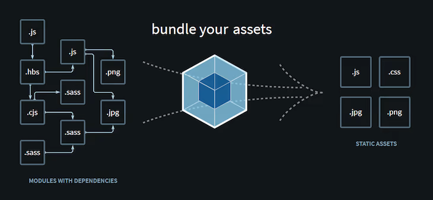

- 定位：
  - Webpack是目前最热门的前端工程化模块打包工具，
- 它设计的初衷是
  - 解决前端模块化问题
  - 让我们实现如何高效的地管理和维护项目中的每一个资源
- 版本：目前最新版本Webpack5
- 作用：
  - 分析项目结构，找到并加载所依赖的资源模块
  - 把一些不被浏览器支持的特性（如 **Sass，TypeScript，ES6+、JSX** 等）转换和打包成浏览器兼容的格式来使用。

# 2. 基本使用

## 2.1. 入门

- 安装

  ```
  npm install webpack webpack-cli --save-dev
  ```

- 默认配置：
  - 把`src/index.js`文件作为入口开始编译
  - 并打包到`dist/main.js`文件
  - 如果在index.js文件中引入其它js模块，webpack会继续加载这些模块，并将这些零散的js文件打包到一个main.js文件中

- 配置文件`webpack.config.js`：
  - 自动寻找配置文件：webpack会自动查找当前目录下的webpack.config.js文件中的配置并打包
  - 手动设置配置文件：`webpack --config webpack.config.js`
  - 可以自定义入口文件以及输出文件目录与名称等
    - 也可以通过output.filename的变量名实现特殊的需求
    - 如（[name]、[hash]等）
    - 其中name为入口文件名称
    - hash为哈希字符（默认生成10位哈希字符，可能过[hash:5]指定生成哈希字符长度），一般用于解决缓存问题

  ```javascript
  const { resolve } = require('path')
  module.exports = {
    entry: './src/index.js',
    output: {
      path: resolve(__dirname, 'build'),
      filename: 'js/bundle-[name]-[hash:5].js'
    },
    mode: 'development' // production
    // development 时，编译结果中会有eval，编译最快
    // production 会精简为一行的js
    // none 开发时最好用，正儿八经的编译后js
  }
  ```

- 注意：
  - webpack在不进行配置时，不会把ES6编译为ES5。需要配置babel
  - webpack要打包的js文件可以使用`import`(ES6模块化规范)，但是配置文件只能使用`require`(CommonJS规范)，
    - 因为配置文件是nodejs要看的。nodejs用CommonJS
    - 要打包的js是浏览器要看的

## 2.2. webpack 参数详细说明

# 3. 资源模块与加载器

## 3.1. 测试代码

[webpack测试跳转](https://github.com/whitestarrain/webpack_learn)

提交注释末尾有 flagXX，对应下面说明

## 3.2. 基本说明

> 对应代码flag1

- 说明：
  - Webpack默认只支持js模块的加载
  - 如果在没有进行额外配置前加载其它类型模块，则会在运行进会报错
  - 加载图片的示例(报错)：

    ```javascript
    // index.js
    const logoUrl = require('./assets/logo.png')
    const logo = new Image();
    logo.src = logoUrl
    document.body.appendChild(logo)
    ```

- `Rule`
  - 说明：
    - Webpack把所有资源文件当做一个模块来处理
    - 而除js以外的其它模块都需要设置相应的加载规则Rule才能正确处理
  - Rule基本写法

    ```javascript
    {
        module:{
            rules:[
                {
                    // 模块加载规则
                }
            ]
        }
    }
    ```

- Rule常用属性
  - `test`: 匹配资源文件的正则表达式，上面的代码是匹配`png`图片
  - `type`: 设置资源模块类型
  - `use/loader`: 设置加载器，类型可以是`String | Object | Array`
  - `generator`: 设置资源生成信息 
    - `filename`: 设置资源文件输出名称和保存的路径（只适用于type属性为 `asset` 和 `asset/resource` 的场景）
  - `include/exclude`:手动添加必须处理的文件（文件夹）或屏蔽不需要处理的文件（文件夹）

## 3.3. 资源模块

### 3.3.1. 概念

- **资源模块(asset module)**
  - 是一种模块类型
  - 它允许在js代码中引入其它资源文件（字体，图片、样式等）
  - 以前只能通过 loader 加载器来实现，而Webpack5中通过asset module轻松实现。

### 3.3.2. 种类

- 种类：Webpack5 实现了 4 种新的模块类型，通过`Rule`的`type`属性设置：
  - `asset/resource` 输出一个单独的文件并导出 URL。之前通过使用 `file-loader` 实现。
  - `asset/inline` 导出一个资源的 data URI。之前通过使用 `url-loader` 实现。
  - `asset/source` 导出资源的源代码。之前通过使用 `raw-loader` 实现。
  - `asset` 在导出一个 dataURI 和发送一个单独的文件之间自动选择。之前通过使用 `url-loader`，并且配置资源体积限制实现。

### 3.3.3. 使用示例

> 对应代码flag2

- 用资源模块来解决上面加载图片的问题
- 添加一条Rule： **匹配png图片并输出单独文件**

  ```javascript
  // webpack.config.js
  module.exports = {
      // ...
      module:{
          rules:[
              {
                  test:/\.png$/,
                  type:'asset/resource'
              }
          ]
      }
  }
  ```
- 引入图片作为module
  ```javascript
  const temp = require('./temp.js')
  const tempUrl = require('./assets/temp.png')

  const logo = new Image()
  logo.src = tempUrl
  document.body.appendChild(logo)

  temp.hello(temp.v1)
  console.log('test')
  ```
- 基于以上配置运行webpack，控制台成功编译，并在输出目录`dist`中得到一个图片文件
- 如果设置成`asset/inline`，则会把图片对应的dataURI（base64编码）写入到打包后的js文件中
  - 这样的好处是减少页面的http请求数量，加快页面渲染速度
  - 但也并不是所有的图片都适合使用这种方式，因为越是复杂的图片生成的base64编码量就越多
  - 整体大小甚至会超过图片本身的大小（如上图72.7KB，图片本身只有52kB）
- 可以使用type:"asset"配置自动调整适配
  - 默认大于8KB导出单独文件，小于等于8KB导出dataURI
  - （可通过Rule的parser.dataUrlCondition.maxSize去设置，单位是:Byte字节）

  ```javascript
    module:{
      rules:[
          {
              test:/\.png$/,
              type:'asset',
              parser:{
                  dataUrlCondition:{
                      maxSize:1024*20, // 20KB
                  }
              `}`
          }
      ]
  }
  ```

### 3.3.4. 修改资源模块输出文件名与路径

- 图片文件虽然已经输出，但文件名是一段哈希字符
- 如果想修改特定的文件名称，可以通过`generator.filename`设置资源文件名和保存的路径
  > 该属性与`output.assetModuleFilename`相同，但 `generator.filename` 的优先级更高
- 与`output.filename`的作用类似，也可以通过以下变量控制文件名
  - `[name]`原文件名
  - `[hash]`哈希字符
  - `[ext]`扩展名
  - ...

- 示例

  ```javascript
      module:{
          rules:[
              {
                  test:/\.png$/,
                  type:'asset/resource',
                  generator:{
                      filename:'img/[name]-[hash][ext]'
                  }
              }
          ]
      }
  ```

## 3.4. 加载器

### 3.4.1. 概念

- 除了资源模块方式，也可以使用Loader实现其它类型资源的加载
- **不同的资源应用的不同的loader（loader需要单独安装）** 
- 然后在webpack配置文件中通过 **module.rules** 来配置
- Rule中设置 use 或 loader 属性即可（loader为use的简写）
- 使用加载器一般需要两步，步骤如下：
  - 安装loader
    - 如加载器依赖其它模块，则一并安装
  - 编写Rule并配置loader
    - 如需对加载器进行一些细节配置，则添加options属性

### 3.4.2. CSS加载器

#### 3.4.2.1. css-loader

> 代码对应 flag3

- 以css文件模块为例，假设代码中需要引入CSS文件样式，如下代码：

  ```javascript
  // index.js
  const indexCss = require('./css/home.css')
  ```

- 样式中随便写几条简单的css属性：

  ```css
  /* 
  ./css/home.css 
  */ 
  body {
    padding: 20px;
    margin: 0;
    color:#f00;
  }
  ```

- 要正确处理该样式文件，需要先安装该模块`css-loader`：

  ```bash
  npm install css-loader -D
  ```

- `webpack.config.js`中配置样式加载器，文件代码如下：

  ```javascript
  module.exports = {
    // ...
    module:{
        rules:[
            {
                test:/\.css$/,
                use:'css-loader', // 或 loader:'css-loader'
            }
        ]
    }
  }
  ```

- webpack执行后样式代码最终会打包到js文件中

  ```javascript
  eval("__webpack_require__.r(__webpack_exports__);\n/* harmony export */ __webpack_require__.d(__webpack_exports__, {\n/* harmony export */   \"default\": () => (__WEBPACK_DEFAULT_EXPORT__)\n/* harmony export */ });\n/* harmony import */ var _node_modules_css_loader_dist_runtime_noSourceMaps_js__WEBPACK_IMPORTED_MODULE_0__ = __webpack_require__(/*! ../../node_modules/css-loader/dist/runtime/noSourceMaps.js */ \"./node_modules/css-loader/dist/runtime/noSourceMaps.js\");\n/* harmony import */ var _node_modules_css_loader_dist_runtime_noSourceMaps_js__WEBPACK_IMPORTED_MODULE_0___default = /*#__PURE__*/__webpack_require__.n(_node_modules_css_loader_dist_runtime_noSourceMaps_js__WEBPACK_IMPORTED_MODULE_0__);\n/* harmony import */ var _node_modules_css_loader_dist_runtime_api_js__WEBPACK_IMPORTED_MODULE_1__ = __webpack_require__(/*! ../../node_modules/css-loader/dist/runtime/api.js */ \"./node_modules/css-loader/dist/runtime/api.js\");\n/* harmony import */ var _node_modules_css_loader_dist_runtime_api_js__WEBPACK_IMPORTED_MODULE_1___default = /*#__PURE__*/__webpack_require__.n(_node_modules_css_loader_dist_runtime_api_js__WEBPACK_IMPORTED_MODULE_1__);\n// Imports\n\n\nvar ___CSS_LOADER_EXPORT___ = _node_modules_css_loader_dist_runtime_api_js__WEBPACK_IMPORTED_MODULE_1___default()((_node_modules_css_loader_dist_runtime_noSourceMaps_js__WEBPACK_IMPORTED_MODULE_0___default()));\n// Module\n___CSS_LOADER_EXPORT___.push([module.id, \"/*./css/home.css*/ \\r\\nbody {\\r\\n  padding: 20px;\\r\\n  margin: 0;\\r\\n  color:#f00;\\r\\n}\\r\\n\", \"\"]);\n// Exports\n/* harmony default export */ const __WEBPACK_DEFAULT_EXPORT__ = (___CSS_LOADER_EXPORT___);\n\n\n//# sourceURL=webpack://webpack_learn/./src/css/home.css?");
  ```

#### 3.4.2.2. style-loader

> 代码见 flag4

- 说明：
  - 在实际开发中，如果们仅仅配置css-loader，最终的页面我们是无法看到样式效果的
  - 现在的样式只是写入js文件当中，并没在页面中使用
  - 样式要想在页面中生效，还得使用style-loader加载器把css代码写入页面style标签

- 安装

  ```bash
  npm install style-loader -D
  ```

- 配置：
  - 由于有两个loader，需要使用到数组，使用时注意先后顺序
  - webpack使用加载器的顺序是 **从后往前调用** 

  ```javascript
  module.exports = {
    // ...
    module:{
        rules:[
            {
                test:/\.css$/,
                use:['style-loader','css-loader'], // 先使用css-loader再使用style-loader
            }
        ]
    }
  }
  ```

- 效果：
  - 手动写一个html，引入编译好的js文件
  - 可以发现已经自动引入了css样式
  - 注意：html并没有参与webpack的打包编译。这里只是随便新建一个html用来测试

  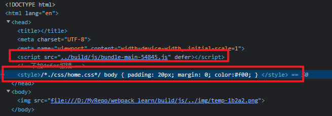

#### 3.4.2.3. css module

> 代码见 flag5

- 如需要实现一些高级功能，还需要对这些加载器配置相应参数
- 这时加载器就需要使用对象来设置，如需要实现css模块（css module）可以通过以下设置

  ```javascript
  rules:[
      {
          test:/\.css$/,
          use:[
              'style-loader',
              {
                  loader:'css-loader',
                  options:{
                      modules:true
                  }
              }
          ]
      }
  ]
  ```
- 为了看到css模块效果，给home.css文件添加几条样式

  ```css
  body {
    padding: 20px;
    margin: 0;
    color:#f00;
  }
  .box{color:#58bc58;}
  .msg{background-color:#efefef;}
  ```
- 设置后在引入样式时我们就可以使用以下代码加载样式并使用

  ```javascript
  const indexCss = require('./css/home.css)
  console.log(indexCss)
  ```
- 配置前后对比
  - 前

    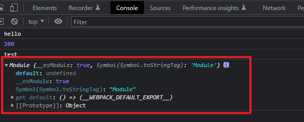
  - 后

    

    

- 模块化作用:
  - 在加载器中通过这些高级设置，就可以在js中我们可以通过`homeStyle.msg`把样式应用到页面
  - 从而实现局部样式效果

- 注意/窍门
  - css-loader默认支持*.module.css格式的样式文件实现模块化
  - 也就是说如果你的文件采用该命名方式，哪不配置modules:true，也能实现css模块化

### 3.4.3. postcss-loader

> 代码见 flag6

- 说明：
  - 配合autoprefixer与browserslist自动添加浏览器内核前缀，从而实现样式兼容写法
  - [什么是 browserslist](https://github.com/browserslist/browserslist)

- 安装依赖

  ```bash
  npm install postcss-loader autoprefixer -D
  ```

- 配置browserlist
  > package.json或者.browseristrc中配置
  ```json
    // package.json
    {
        "browserslist": [
            "last 2 versions",
            "> 1%",
            "not IE 11"
        ]
   }
  ```
  ```
  # .browserslistrc
  last 2 versions
  > 1%
  not IE 11
  ```

- webpack配置

  ```javascript
  rules:[
      {
          test:/\.css$/,
          use:[
              'style-loader',
              'css-loader',
              {
                  loader:'postcss-loader',
                  options:{
                      modules: true,
                      postcssOptions: { 
                          plugins: ['autoprefixer']
                      }
                  }
              }
          ]
      }
  ]
  ```
- 调整css

  ```css
  /* ./src/css/home.css */
  .box{display:flex;color:#58bc58;border-radius: 5px;}
  ```
- 重新编译查看效果，不兼容的css已经自动加上前缀

  

### 3.4.4. sass加载器

> 暂未写测试代码

- 说明：
  - 如果是使用sass来写样式，则需要配置sass-loader加载器
  - 该加载器依赖sass模块，所以需要一并安装

- 安装依赖

  ```bash
  npm install sass-loader sass -D
  ```
- webpack配置

  ```javascript
  rules:[
      {
          test:/\.scss$/,
          use:['style-loader','css-loader','sass-loader']
      }
  ]
  ```
  - sass会编译为css
  - 所以之后需要css-loader加载css
  - 使用style-loader将css应用到页面style标签

- 以上就解决了sass代码编译的问题，less同理（需要less-loader与less），这里不再赘述

### 3.4.5. babel-loader

> 代码见 flag7

#### 3.4.5.1. 基本说明

- 说明：
  - 用于处理js模块
  - Webpack本身已经默认支持js模块的加载了，但在写js代码时可能会用到一些ES6+的新特性
  - 而这些新特性不一定会被浏览器所支持，所以需要使用Babel对这些代码进行转换，一般转换成ES5代码

- 安装依赖

  ```bash
  npm install babel-loader @babel/core -D
  ```

- babel配置说明
  > [babel教程](./Babel.md)
  > webpack配置和.babelrc配置本质上是一样的
  - 至于需要如何配置就看个人需求了
  - 比如希望把ES6+代码转成所有浏览器支持的ES5代码，这时我们就需要babel插件来实现
  - 但ES6+新特性有很多，每个新特性都需要一个babel插件来转换，显然非常繁琐
  - 所以Babel推出preset（预设）来解决这个问题，preset其实就是插件集合（内部包含多个插件）
  - @babel/preset-env就是用来解决浏览器兼容问题的预设，使用也很简单，先安装

  ```bash
  npm install @babel/preset-env -D
  ```

#### 3.4.5.2. 配置

- 配置加载器：
  - 如果只是指定loader的名称，那就没什么意义，因为Webpack已经默认js模块的加载
  - 所以需要使用对象来控制加载器细节配置(options属性)

  ```javascript
  rules:[
      {
          test:/\.js$/,
          exclude: /(node_modules|bower_components)/,
          use:{
              loader:'babel-loader',
              options:{
                  presets:['@babel/preset-env']
              }
          }
      }
  ]
  ```

- 也可以根据指定环境编译，使用`@babel/preset-env`的`options`进行配置即可
  > 需要使用数组的第二个参数

  ```javascript
  rules:[
    {
      test: /\.js$/,
      exclude: /(node_modules|bower_components)/,
      use: {
        loader: 'babel-loader',
        options: {
          presets: ['@babel/preset-env', {
            // 数组的第二项为env选项
          }]
        }
      }
    }
  ]
  ```

  > `@babel/preset-env`常用选项如下：

  - `targets`:
    - 指定目标环境（String | Object | Array）
    - 不指定时会根据browserlist配置（.browserlistrc或package.json）去兼容目标环境

    > Object 类型下可指定浏览器或其它环境
    > 如：chrome, opera, edge, firefox, safari, ie, ios, android, node, electron

    ```javascript
    {
        // 指定市场份额超过0.25%的浏览器（不推荐，会导致对IE6的支持）
        targets:"> 0.25%, not dead", 
        
        // 推荐写法：兼容所有浏览器最后两个版本
        targets:"last 2 versions"
        
        // 对象写法
        targets:{
            // 指定浏览器版本
            "chrome": "58",
            "ie":"11",
            "edge":"last 2 versions",
            "firefox":"> 5%",
            
            // 指定nodejs版本, current为当前运行的node版本
            "node":"current"
        }
    }, 

    ```

  - `spec` : 启用更符合规范的转换，但速度会更慢，默认为 false
  - `loose`：是否启动松散模式（默认：false）
    - 如：是否让原型中的属性具有可枚举性，loose模式下使用点语法添加属性
    - 正常模式下通过Object.defineProperty()添加属性以确保属性的不可枚举
  - `modules`：将 ES Modules 转换为其他模块规范，
    > 值可以为：adm | umd | systemjs | commonjs | cjs | false（默认）
  - `debug`：是否启用debug模式，默认 false
  - `useBuiltIns`：配置`@babel/preset-env`如何处理`polyfills`，共有以下3个选项
    > 默认情况下，@babel/preset-env无法编译一些内建对象（如：Promise、Map、Set等），结果是原样输出
    > 但在一些不支持Promise、Map、Set的环境下运行代码就会抛出错误
    > 故需要使用core-js这样的库进行处理（Babel@7.4.0前使用@babel/polyifll，现在推荐使用core-js）

    - `entry`:根据配置的浏览器兼容，引入浏览器不兼容的 polyfill。需要在入口文件手动添加 import '@babel/polyfill'，会自动根据 browserslist 替换成浏览器不兼容的所有 polyfill

      ```javascript
      // 如果指定`corejs: 3`, 则入口文件中的 `import '@babel/polyfill'` 需要改成
      import 'core-js/stable';
      import 'regenerator-runtime/runtime';
      ```

    - `usage`: 会根据配置的浏览器兼容，以及你代码中用到的 API 来进行 polyfill，实现了按需添加，好处就是最终打包的文件会比较小
    - `false`（默认）：此时不对 polyfill 做操作。如果引入 @babel/polyfill，则无视配置的浏览器兼容，引入所有的 polyfill
    - `corejs`:指定corejs版本（默认:`2.0`），目前使用core-js@2或core-js@3版本，需要手动安装

      ```javascript
      {
          //...
          corejs:'3.8', // 或对象形式：{version:'3.8'}
      }
      ```

#### 3.4.5.3. 示例

> 如果想兼容浏览器最后2个版本，且按需兼容Promise等内建对象，步骤如下：

- 安装`core-js@3`

  ```bash
  npm install core-js@3 -D
  ```

- webpack配置：这里只列表babel-loader的配置

  ```javascript
   {
     test:/\.js$/,
     exclude: /(node_modules|bower_components)/,
     use:{
       loader:'babel-loader',
       options:{
         presets:[
           [
             '@babel/preset-env',
             {
               targets:'last 2 versions',
               useBuiltIns:'usage',
               corejs:3
             }
           ]
         ]
       }
     }
   }
  ```

- 入口文件添加以下代码

  ```javascript
  import 'core-js/stable';
  import 'regenerator-runtime/runtime';
  ```

- 编译代码
  - 然后通过通过命令行执行以下命令就能输出最终代码（由于代码量太多，这里就不截图了）

    ```bash
    npx webpack
    ```

- 配置前后对比

  

  

- Babel还很多插件和预设
  - 如：@babel/preset-react、@babel/preset-typescript等）
  - 可以实现更多的需求
  - 可以自行查阅官网

#### 3.4.5.4. 注意

- 不要忘了配置exclude
  - index.js中有`import`polifill相关的一些依赖
  - 不需要使用babel转换
  - 否则会出现`webpack ES Modules may not assign module.exports or exports.*, Use ESM export syntax`

  ```
  exclude: /(node_modules|bower_components)/,
  ```

- `webpack ES Modules may not assign module.exports or exports.*, Use ESM export syntax`错误
  - ES module 和 CommonJS module 混用导致的
  - 可以配置让babel自动识别

  ```javascript
  test: /\.js$/,
  exclude: /(node_modules|bower_components)/,
  use: {
    loader: 'babel-loader',
    options: {
      presets: [
        // 使用数组
        [
          '@babel/preset-env',
          {
            // 数组的第二项为env选项
            targets: 'last 2 versions',
            useBuiltIns: 'usage',
            corejs: 3,
          },
        ],
      ],
      // 解决ES6和CommonJS模块导出的问题: https://babeljs.io/docs/en/options#sourcetype
      // sourceType: 'unambiguous', 
    },
  },
  ```

### 3.4.6. 其他加载器

- 在Webpack的生态中，这样的资源加载器有很多，
- 其它的加载器的使用与css-loader、style-loader、sass-loader、babel-loader类似
- 以下列出常用的几个加载器，可以根据自己的需求自行查找
  - url-loader：对资源文件进行优化的加载器，可以解决图片等资源文件的引用路径问题，并可以根据limit设置把小图片一dataURI的方式保存，依赖file-loader
  - ts-loader: 加载并编译typescript，依赖typescript
  - less-loader：加载并编译less，依赖less
  - vue-loader: 加载并编译.vue单文件组件
  - ...

# 4. 插件

## 4.1. 问题引入

- 上面测试的时候，使用的html是手动引入的js文件
- 因为编译后hash值会变化，导致每次编译后得手动改文件引入，非常繁琐
- 若指定编译后文件名一直为`main.js`，上线后会有缓存问题，导致页面不会更新

## 4.2. 概念说明

- 说明
  - `Loader`是用来解决资源文件的加载和编译问题，它只在模块加载环节工作
  - 而Plugin就是用来处理loader工作以外的自动化工作：用来增加Webpack在项目自动化构建方面的能力
  - 能作用于Webpack工作流程的方方面面，正是有了Plugin，让Webpack几乎无所不能

- 常见实现功能
  - 自动生成所需的html文件
  - 实现打包前清除dist输出目录的内容
  - 拷贝不需要打包的资源文件到输出目录
  - 压缩webpack打包后的输出文件
  - 自动化部署

## 4.3. 实例

### 4.3.1. html生成

> 代码见 flag8

- 安装依赖

  ```bash
  npm install html-webpack-plugin -D
  ```

- 配置 webpack插件的使用
  - 通过实例化来实现的（要生成多少个html文件就new多个Plugin）
  - 如下代码执行后会在输出目录生成一个html文件（默认为index.html）且自动引入打包后的js文件

  ```javascript
  const HtmlWebpackPlugin = require('html-webpack-plugin')
  module.exports = {
      //...
      plugins:[
          new HtmlWebpackPlugin()
      ]
  }
  ```

- 效果

  

- 配置选项
  - `template`：指定模板
    - 默认生成的html文件是一个空的html文件，body中没有任何内容
    - 如果要生成有特定结构的html文件，可以通过template选项指定模块创建html文件
    - 在模板中可通过<% htmlWebpackPlugin.options.xx %>获取到配置信息
  - `filename`：指定生成html文件名（默认为：index.html）
    - 一般用于多页面应用，用于生成多个文件
  - `chunks`：html文件指定引入模块
    - 一般用于多页面应用
    - 默认情况下生成的html文件都会引入所有打包后的文件
    - 可通过该设置指定引入文件
  - `title`：指定生成html文件的title
    - title需要以`<title><%= htmlWebpackPlugin.options.title %></title>`的方式指定

- 配置示例

  ```javascript
  module.exports = {
      //...
      plugins:[
        new HtmlWebpackPlugin({
          template: './src/temp.html',
        }),
        new HtmlWebpackPlugin({
          title: '测试',
          template: './src/temp.html',
          filename: 'temp.html',
        }),
      ]
  }
  ```
  ```html
  <!-- ./src/temp.html -->
  <!DOCTYPE html>
  <html lang="en">
  <head>
      <title><%= htmlWebpackPlugin.options.title %></title>
      <meta charset="UTF-8">
      <meta http-equiv="X-UA-Compatible" content="IE=edge">
      <meta name="viewport" content="width=device-width, initial-scale=1.0">
  </head>
  <body>
      <div>app</div>
  </body>
  </html>
  ```

  

### 4.3.2. 清除历史构建

- 安装依赖

  ```javascript
  npm install clean-webpack-plugin -D
  ```

- 配置

  ```javascript
  const { CleanWebpackPlugin } = require('clean-webpack-plugin');
  module.exports = {
      //...
      plugins:[
          new CleanWebpackPlugin()
      ]
  }
  ```

- webpack5内置：

  ```javascript
  module.exports = {
      output:{
          //...
          clean:true
      }
  }
  ```

### 4.3.3. 拷贝不需要webpack处理的资源文件

> 代码见flag9

- 场景
  - 在实际开发中还有很多不需要经过webpack构建的文件（如：favicon.ico、robots.txt等）
  - 这些文件最终都需要部署到服务器，所以也需要放到最终的输出目录
  - 可以通过copy-webpack-plugin插件来实现复制，避免手动操作

- 安装依赖

  ```bash
  npm install copy-webpack-plugin -D 
  ```

- 配置

  ```javascript
  const CopyPlugin = require("copy-webpack-plugin");
  module.exports = {
      //...
      plugins: [
            new CopyPlugin({
              patterns: [
                  // 把public文件夹复制到输出目录
                  './src/public',

                  // 把assets复制到输出目录中的imgs文件夹
                  { from: "./src/assets", to: "imgs" },
              ],
          }),
      ],
  }
  ```

# 5. 利用服务器自动打包

## 5.1. 问题引入

- 每次代码编译都有以下几步

  ```
  编写代码
  打包
  运行
  浏览器查看效果
  ```

- 这种开发方式太过于原始，效率也极其低下
- 可以通过webpack的watch监听模式和配置devServer开发服务器的方式来改变这种工作模式

## 5.2. webpack的watch监听模式

- 使用方式：使用这种方式最简单，只需要在执行webpack命令时添加--watch（简写：-w）参数即可：

  ```bash
  npx webpack --watch
  ```

- 启动后命令行光标闪动，表示webpack已处于监听模式，这时只需要手打开html页面就能看到效果
- 当项目中的文件有修改时，webpack会自动重新打包并输出
- 弊端： **需要手动刷新浏览器才能看到最新效果** 

## 5.3. devServer开发服务器

- 说明
  - 通过devServer能在本地开发环境创建一个服务器，该服务器基于express
  - 它能实现当项目中的代码发生改变的时，除了打包编译外，还可以 **自动刷新浏览器从而实现实时展示效果** 

- 安装依赖

  ```bash
  npm install webpack-dev-server -D
  ```

- 配置
  - 只需要在webpack.config.js配置文件中设置devSever属性即可
  - 这里设置成一个空对象，因为devServer能实现零配置启动

  ```javascript
  module.exports = {
      // ...
      devServer:{

      }
  }
  ```

- 启动服务器
  - devServer中不需要设置任何参数即可启动（使用默认配置）
  - 只需要在命令输出以下命令就能启动一个默认端口为8080的服务器

    ```bash
    # 直接通过webpack-dev-server启动
    npx webpack-dev-server
    
    #通过webpack CLI 启动（推荐）
    npx webpack server
    ```

  - 如果不想使用npx命令，也可以通过npm script脚本命令启动
    - 需要在package.json文件中设置scripts属性
    - 配置后就可以通过npm run dev启动服务器了，代码如下：

    ```bash
    //package.json
    {
        //...
        "scripts":{
            "dev":"webpack server"
        }
    }
    ```

- 效果:
  - 服务器启动后，devServer会监听着项目文件的变化，当文件有修改时自动重新打包编译
  - 并采用HMR热替换或自动刷新浏览器方式更新页面效果
  - 但与watch模式不同，webpack为了让效率更快，这些打包操作并没生成具体的文件到磁盘中，而是在内存中完成的
  - 所以并不会在实际的目录中看到打包后的文件效果。

- devServer常用配置参数
  > 虽然可以使用devServer的默认配置来启动服务器 <br />
  > 但要发挥devServer的强大功能，还需要去了解它的每一个参数 <br />
  > 该模块的配置很多，可以通过webpack的官网自行查阅，下面列举几个常用配置选项： <br />

  - `static`：指定静态资源目录（默认是 public 文件夹）
    - 一般用来存放一些不经过webpack打包的静态资源文件（如：favicon.ico）
    - 该属性可以是String单个目录或Array多个目录（4.x老版本使用contentBase来设置）

    ```javascript
    module.exports = {
        //...
        devServer:{
            // 4.x版本写法
            contentBase:path.resolve('./public'),

            // 5.x版本写法
            static:path.resolve('./public')
        }
    }
    ```

  - `port`: 指定服务器端口（默认：8080）
    - 根据自己的需求指定端口，如不指定，且8080端口被占用，则会自动递增为8081，依此类推
  - `hot`: 是热模块替换启用（默认：true）
    - 开启模块热替换功能后，当监听到项目中的文件被修改时，devServer是在不刷新整个页面的情况下通过使用新模块替换旧模块来做到实时预览的
    - 这对保持表单输入状态特别有用，如禁用该功能，就通过自动刷新整个页面来做到实时预览的，输入表单中的内容自然也会被清空
  - `open`: 是否自动打开浏览器（默认：false）
    - 懒人模式，启动devServer时自动打开浏览器
  - `historyApiFallback`: 是否支持history路由（默认：false）
    - 启用该属性后，当访问的页不存在时（404）服务器会自动响应首页的内容
    - 这个在单页面应用（SPA）中使用history路由时特别有用
  - `host`
    - 默认情况下，只有本机才能访问devServer服务器
    - 通过设置host为0.0.0.0让局域网其它设备也能访问
  - - `compress`: 启动gzip服务器压缩
    - 设置后可以提高页面访问速度
  - `proxy`: 服务器代理（一般用于解决ajax跨域问题）
    - 基于http-proxy-middleware的代理服务器
    - 工作中经常有这样的场景
      - 后端接口工作在`http://10.3.131.2:3000`服务器上
      - 自己使用webpack启动的服务器为`http://localhost:8080`
    - 当在代码中发起ajax请求时就产生了跨域限制
    - 后端接口如果没有开户CORS跨域资源共享，默认是无法直接访问的
    - 这时代理就非常有用，在webpack-dev-server中设置代理非常简单，代理如下：

    ```javascript
    module.exports = {
    //...
    devServer: {
        proxy: {
            '/api': 'http://10.3.131.2:3000',
            },
        },
    };
    ```

    - 当ajax请求地址以/api开头时，就会进入代理服务器
    - 示例：
      - 以下请求地址虽然是`http://localhost:8080/api/users`
      - 但由于地址是以/api开头，所以在devServer服务器内部会自动向`http://10.3.131.2:3000`发起请求

      ```javascript
      const xhr = new XMLHttpRequest()
      xhr.open('get','http://localhost:8080/api/users',true)
      xhr.send()
      ```

    - 代理还有多种写法，以实现不同的需求，如当目标接口地址没有/api时：
      - 示例：
        - 请求地址：http://localhost:8080/api/users
        - 接口地址：`http://10.3.131.2:3000/users`
      - 这时/api仅仅是为了匹配代理规则，但真实的接口地址是没有/api的
      - 所以得使用pathRewrite重写路径（删除多余字符）
      - 另外，默认情况下代理时会保留主机头的来源（请求头中的Origin字段为http://localhost:8080）
      - 有的接口服务器可能会对Origin字符进行限制，我们可以将 changeOrigin 设置为 true 以覆盖此行为
      - 设置后Origin字段就被覆盖为`http://10.3.131.2:3000`

      ```javascript
      module.exports = {
          //...
          devServer: {
              proxy: {
                  '/api': {
                      target: 'http://10.3.131.2:3000',
                      pathRewrite: { '^/api': '' },
                      changeOrigin:true
                  },
              },
          },
      };
      ```

# 6. webpack打包优化

## 6.1. 基本说明

- 只要是做项目开发，必定离不开项目优化这个话题
- 当然如果做的项目很小，可能不会遇到构建方面的问题，自然也不太关心性能优化的问题，但实际工作中的项目页面一般都比多
- 随着业务逻辑越来越复杂，如果是基于Webpack的项目，构建速度可能会变得越来越慢
- 这个时候就不得不考虑打包优化的事情了，不然就会出现启动个项目要十几分钟，修改一处代码要几分很久才渲染出来的情景
- 内容主要从以下几个方面入手：
  - 提取公共代码
  - 压缩代码
  - Tree Shaking
  - Code Splitting代码分割

## 6.2. 提取js公共代码

- 说明
  - 提取公共代码一般用于多入口的情况
  - 为防止重复打包而进行的优化操作
  - 好处是可以减少文件体积，加快打包和启动速度

### 6.2.1. 依赖需要被打包的情况

- 场景说明：多入口js文件问题时的重复代码打包：
  - 项目中我们常会遇到有多个入口文件的情况（假设为a.js与b.js）
  - 如果每个入口文件都引用了相同的模块（假设有自定义模块tools.js与第三方模块lodash）
  - 文件代码如下：

    ```javascript
    // a.js
    import _ from 'lodash'
    import tools from './utils/tools.js'
    ```
    ```javascript
    // b.js
    import _ from 'lodash'
    import tools from './utils/tools.js'
    ```
  - webpack配置如下：

    ```javascript
    module.exports = {
        // ...其它配置
        entry:{
            a:'./src/a.js',
            b:'./src/b.js'
        },
        output:{
            path: path.join(__dirname, "dist"),
            filename:'[name].bundle.js'
        }
    }
    ```
  - 打包后：

    

    - 因为生成了两个文件，
    - 在打包时默认就会把tools.js与lodash打包两次
    - 这样既增加文件体积（两个文件都是536k），既影响性能，还降低了代码质量

- 解决
  - 使用optimization.splitChunks.cacheGroups实现提取公共代码
  - 更多可以查阅：[中文文档](https://webpack.docschina.org/plugins/split-chunks-plugin/)

  - `webpack.config.js`中内容：

    ```javascript
    module.exports = {
        entry:{
            a:'./src/a.js',
            b:'./src/b.js'
        },
        output:{
            path: path.join(__dirname, "dist"),
            filename:'[name].bundle.js'
        },
        optimization:{
            splitChunks:{
                cacheGroups:{
                    // 注意: 
                    // 这里的key命名自定义
                    // priority：值越大优先级越高
                    // chunks指定哪些模块需要打包，可选值有
                    //  * initial: 初始块
                    //  * async: 按需加载块(默认)
                    //  * all: 全部块
                    
                    // common: 打包业务中公共代码（上面的tools.js）
                    common: {
                      name: "common", // 指定包名，不指定时使用上层key作为包名
                      chunks: "all", 
                      minSize: 10,
                      priority: 0
                    },
                    // vendor: 打包node_modules中的文件（上面的 lodash）
                    vendor: {
                      name: "vendor",
                      test: /node_modules/,
                      chunks: "all",
                      priority: 10
                    }
                }
            }
        }
    }
    ```
  - 打包后的结果是
    - lodash被打包到vendor.bundle.js
    - tools.js被打包到common.bundle.js
  - 从而实现了公共代码的提取。

### 6.2.2. 依赖不需要打包的情况

- 场景说明
  - 实际开发中有一些第三方库（如jQuery）,如果在项目中使用以下代码引入`import $ from 'jquery'`
  - 打包时jQuery就会被打包到最终的bundle中
  - 但有时候会希望使用CDN来引入`JQuery`，

- 利用externals提取第三方库
  > **准确来说应是该通过externals配置告诉webpack哪些第三方库不需要打包到bundle中**
  >
  > [中文文档](https://webpack.docschina.org/configuration/externals/)

  - 1.在html文件中引入cdn库链接

    ```html
    <!DOCTYPE html>
    <html lang="en">
    <head>
        <meta charset="UTF-8">
        <meta http-equiv="X-UA-Compatible" content="IE=edge">
        <meta name="viewport" content="width=device-width, initial-scale=1.0">
        <title><%= htmlWebpackPlugin.options.title %></title>
    </head>
    <body>
        <script src="https://code.jquery.com/jquery-3.6.0.min.js"></script>
    </body>
    </html>
    ```
  - webpack配置

    ```javascript
    module.exports = {
        // ...其它选项
        externals: {
            jquery: "jQuery",
        }
    }
    ```

  - 使用jQuery

    ```javascript
    import $ from 'jquery'
    $('h1').css('color','#58bc58')
    ```
  - 效果
    - 最终打包效果可以看出，webpack只是做了个简单的导出，导出全局作用域中的`jQuery`变量
    - 而这个变量在`script`中引入`jQuery`时就已存在

    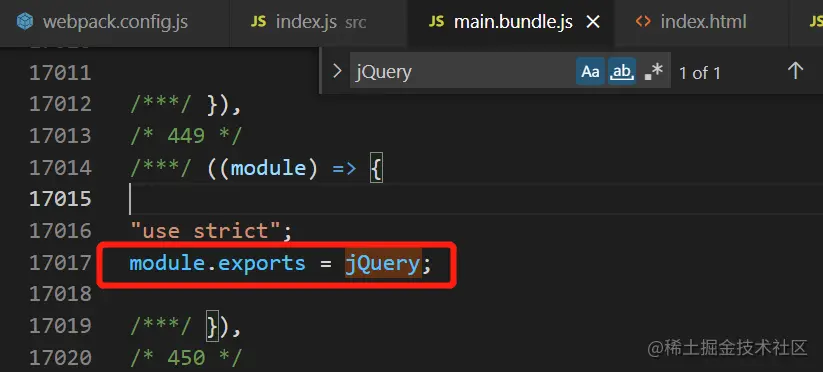

  - 其他不需要打包到最终js中的自定义工具库也可以这样做

## 6.3. 提取css公共代码

- 说明
  - 前面讲到的css-loader与style-loader只是把css样式写入到html页面的style标签内
  - 如果是SPA单页面应用，这没什么问题，但如果是多页面应用，则会在每个页面中都写入这样css样式
  - 应该把这些相同的部分提取出来，然后使用link去引入页面
  - 需要使用mini-css-extract-plugin插件

- 安装插件

  ```bash
  npm install mini-css-extract-plugin -D
  ```

- 配置webpack
  - 在配置时，除了配置plugins选项，还需要在loader中进行配置
  - 因为是提取css到单独文件，所以删除原来的style-loader，改成MiniCssExtractPlugin.loader

  ```javascript
  const MiniCssExtractPlugin = require("mini-css-extract-plugin");

  module.exports = {
      plugins: [new MiniCssExtractPlugin()],
      module: {
          rules: [
          {
              test: /\.css$/i,
              use: [MiniCssExtractPlugin.loader, "css-loader"],
          },
          ],
      },
  };
  ```
- 效果展示：
  - 处理前

    

    
  - 处理后

    

    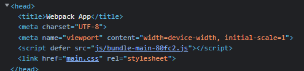

## 6.4. 压缩代码

> 实现删除多余的代码、注释、简化代码的写法等⽅式。

### 6.4.1. 压缩js

- Webpack默认在生产环境下（mode:'production'）自动进行代码压缩
- 内部用的是terser-webpack-plugin插件
- 具体使用请查看官网

### 6.4.2. 压缩css

> 见代码 flag10

- 说明
  - 要压缩css，前提是先提取css到独立文件中（mini-css-extract-plugin）
  - 然后通过css-minimizer-webpack-plugin插件实现压缩CSS，该插件基于cssnano实现css代码的压缩优化

- 安装依赖

  ```bash
  npm install css-minimizer-webpack-plugin -D
  ```

- 配置webpack
  - 注意
    - 该插件不是写在plugins中，而是写在优化配置optimization.minimizer中
    - 且mode必须为production
  - 详细配置

    ```javascript
      const CssMinimizerPlugin = require("css-minimizer-webpack-plugin");
      module.exports = {
          mode:'production',
          optimization:{
              minimizer:[
                  new CssMinimizerPlugin(),
              ]
          }
      }
    ```

## 6.5. tree shaking

### 6.5.1. 说明

- Tree Shaking 也叫摇树优化，是一种通过移除冗余代码，来优化打包体积的手段
- 它并不是webpack中的某个配置选项，而是一组功能搭配使用后的效果
- 基于`ESModules`模块化（即只有ESModules的模块化代码才能使Tree Shaking生效）
- **在production生产环境下默认开启**

### 6.5.2. 示例

- 假设有一个`element.js`文件

  ```javascript
  // element.js
  export const Button =()=>{
      return document.createElement('button')
      // 不可能执行的代码
      console.log('end')
  }

  //未引用的代码
  export const Link=()=>{
      return document.createElement('a')
  }
  ```

- 然后引入这个模块并使用模块中的方法

  ```javascript
  import {Button} from './element.js'
  const btn = Button();
  document.body.appendChild(btn);
  ```

- 在`mode:'production'`模式下打包的效果如下：

  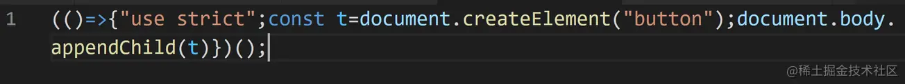

- 显然，那些没有使用的代码都不会被打包，达到了优化的效果

### 6.5.3. 配置实现

> 不开启production模式的情况，通过配置的方式说明实现

- `usedExports`: 只导出被使用的成员

  ```javascript
  module.exports:{
      // ... 省略其它选项
      mode:'none',
      optimization:{
          usedExports:true
      }
  }
  ```

  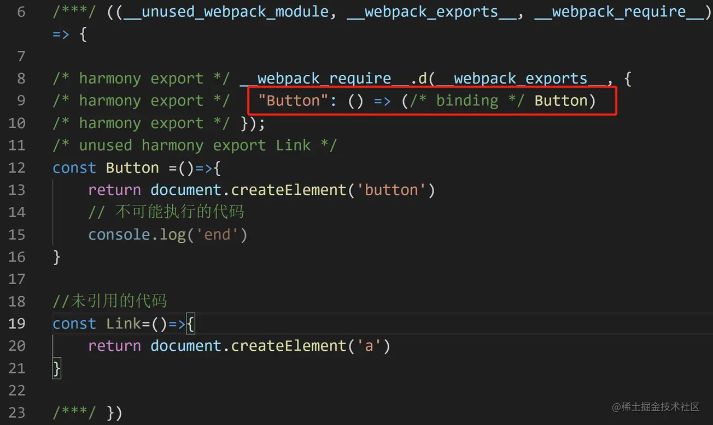

  - 从上图可以看出，只有`Button`被导出了
  - 如果用的是VSCode，可以看到`Link`是暗色的，说明没有被用到
  - 如果要`Link`代码删除，可以使用下面的`minimize`

- `minimize`: 压缩后删除不被使用的代码

  ```javascript
  module.exports:{
      // ... 省略其它选项
      mode:'none',
      optimization:{
          usedExports:true,
          minimize:true
      }
  }
  ```

  - 打包后，在最终的代码中就已经没有`Link`代码了，如下图：

    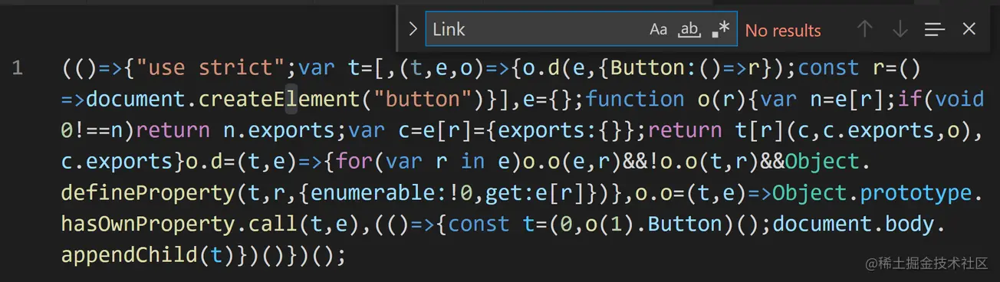

- `concatenateModules`: 尽可能合并每一个模块到一个函数中
  - 正常的打包效果是每个模块代码都放在一个单独的函数中
  - 如果引入的模块很多就会出现很多函数
  - 这样会影响执行效率和打包后的文件体积大小
  - 可以通`concatenateModules:true`把多个模块的代码合并到一个函数中

- `sideEffects`: 指定副作用代码
  - Tree Shaking会自动删除模块中一些没有被引用的代码，但这个行为在某些场景下可能会出现问题，比如:

    ```javascript
    // extend.global.js

    // 实现首字母大写
    String.prototype.capitalize = function(){
        return this.split(/\s+/).map(function(item){
            return item[0].toUpperCase()+item.slice(1)
        }).join(' ')
    }
    ```
    - 使用代码如下

    ```javascript
        import './extend.global.js'
        'hello boy'.capitalize(); // Hello Boy
    ```
    - 由于该模块没有任何导出，只需要引入就可以使用`capitalize()`方法了，这种代码我们称为 **副作用代码**

    - `Webpack4`默认把所有的代码看作副作用代码
      - 所以会把所有的代码都打包到最终结果中
      - 当然这样的后果是会把一些多余的代码也打包进来导致文件过大
      - 而`Webpack5`默认开启`Tree Shaking`
      - 前面已经说到了，`Tree Shaking`功能会自动删除无引用的代码
      - 上面的代码没有任何导出和使用，所以Webpack5不会把`extend.global.js`中的代码打包进来
      - 结果会导致找不到`capitalize()`方法而报错
      - `sideEffect`就是用来解决此类问题的，用法分两步，代码如下：

  - 使用方式：
    - **optimization.sideEffects 设置为 true**
      - 告知 webpack 去辨识 `package.json` 中的副作用标记或规则
      - （默认值为`true`，所以这一步也可以不设置）
    - `package.json`添加`sideEffects`属性
      - true: 告诉 webpack 所有的模块都是副作用模块
        > 如设置为 true，上面的`extend.global.js`会被打包到最终结果
      - false: 告诉 webpack 所有的模块都没有副作用
        > 如设置为 false，上面的`extend.global.js`不会被打包到最终结果，代码就会报错
      - Array: 手动指定副作用文件
        > 使用`true`或`false`会走向两个极端，不一定适合真实的开发场景，可以设置数组来指定副作用文件，代码如下：
        ```json
        {
          "sideEffects": ["*.css", "*.global.js"]
        }
        ```
        > 配置后，webpack 打包时遇到 css 文件或以`global.js` 结尾的文件时会自动打包到最终结果

## 6.6. Code Splitting代码分割

> 把项目中的资源模块按照我们设定的规则打包到不同的文件中
> 代码分割后可以降低应用启动成本，提高响应速度

### 6.6.1. 配置多入口

> 见代码flag11

- 示例

  ```javascript
  module.exports = {
    entry: {
      index: './src/index.js',
      temp1: './src/temp.js',
      temp2: './src/temp2.js'
    },
    output: {
      path: resolve(__dirname, 'build'),
      filename: 'js/bundle-[name]-[hash:5].js', // 如果entry是对象，此处的name为属性名称
                                                // 上例中生成的是temp1.js，而不是temp.js
      clean: true,
    },
  };
  ```
  ```javascript
  // temp.js
  import axios from "axios";
  const v1 = 100;
  const _v1 = v1;
  console.log(axios)
  export { _v1 as v1 };
  export const hello = function sayHello(para1) {
    console.log('hello');
    console.log(para1);
  };
  ```
  ```javascript
  // temp2.js
  console.log("hello world")
  ```

  

  > temp.js引入了axios依赖，打包之后会比较大
  >
  > 相对temp2.js很小

### 6.6.2. 多入口导致重复打包

- 接上面，如果temp2中也引入`axios`，结果如图：

  

- 两个文件都比较大，显然把`axios`重复打包了
  > temp.js 和 temp2.js中都有打包axios

### 6.6.3. 解决重复打包问题

#### 6.6.3.1. 内置：dependOn

> 见flag 12

- 说明： **dependOn**: 通过修改`entry`入口配置实现，利用`dependOn`的提取公共的`axios`

  ```javascript
  module.exports = {
      entry:{
          home:{
              import:'./src/index.js',
              dependOn:'common'
          },
          login:{
              import:'./src/login.js',
              dependOn:'common'
          },
          common:'lodash'
      }
  }
  ```

- 打包后的结果如下，成功提取了`common.bundle.js`（`lodash`代码），`home.bundle.js`与`login.bundle.js`就变得很小了，html文件也成功引入了这3个js文件

  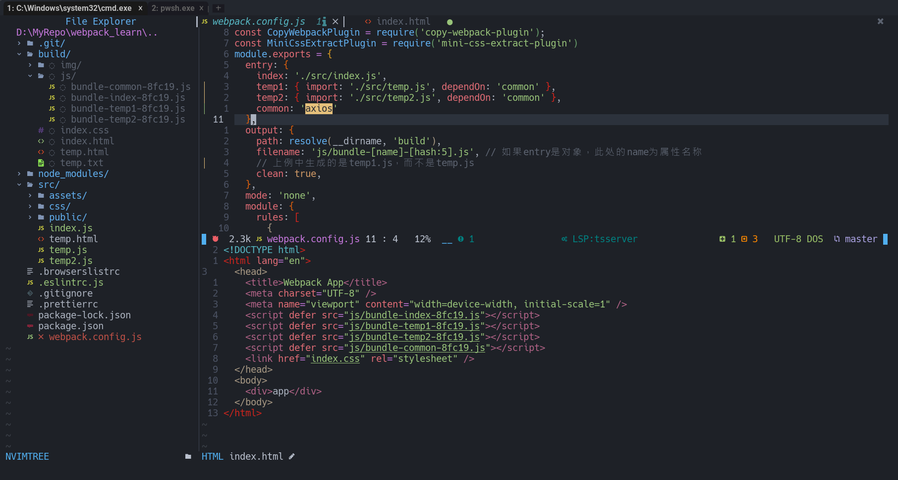

#### 6.6.3.2. 内置：splitchunks(推荐)

TODO: 深入 webpack-splitchunks

> 之前，提取js公共代码中也有说过splitchunks
>
> [中文文档](https://webpack.docschina.org/plugins/split-chunks-plugin/)

- Webpack内置功能splitChunks

  ```javascript
  module.exports = {
      // ...其它配置
      entry:{
          home:'./src/index.js',
          login:'./src/login.js'
      },
      optimization:{
          // 拆分代码
          splitChunks:{
              chunks:'all'
          }
      }
  }
  ```

- 只需要配置`optimization.splitChunks.chunks`选项
  - 该选项表示哪些代码需要优化，值可以为以下三种：
    - initial: 初始块
    - async: 按需加载块(默认)
    - all: 全部块
  - 选择全部优化，打包后同样会输出三个文件，并正常在html文件中引入，如下图
    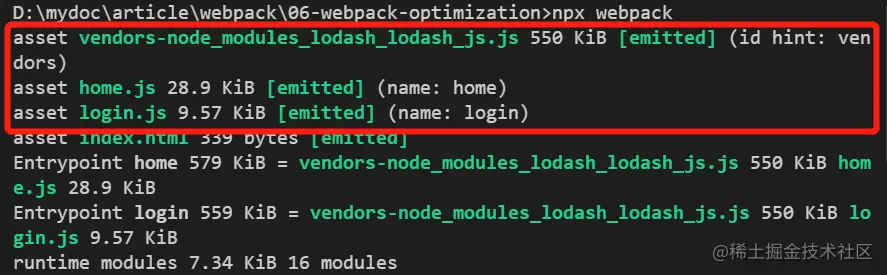

  - 注意：
    - 不管使用哪种方式，如果是 **多页面应用**
    - 为防止html文件重复引入，都需要在`html-webpack-plugin`插件中配置`chunks`选项

    ```javascript
    plugins:[
        new HtmlWebpackPlugin({
            chunks:['common','home']
        }),
        new HtmlWebpackPlugin({
            filename:'login.html',
            chunks:['common','login']
        }),
    ]
    ```

#### 6.6.3.3. ESModules动态导入

- 使用ECMAScript2019（ES10）推出的`import()`动态引入模块，返回`Promise`对象，用法如下

  ```javascript
  import('lodash').then(({default:_})=>{
      // 引入lodash模块的default属性
  })
  ```

- 只要在代码中使用通过以上方式使用`lodash`，webpack打包时就会对`lodash`进行独立打包，如下图：

  

  > 注意：用`import()`动态引入的模块跟通过`import ... from ...`静态引入的模块不同处在于
  >
  > 模块不会直接写在html文件中，而是在打开页面时才引入
  >
  > 配合用户的行为（如点击等操作）就已经能实现 **懒加载** 功能了

  

- 生成的公共模块文件名很长（随着模块的增多会更长），可以使用webpack的 **魔法注释** 来解决这个问题

  ```javascript
  import(/*webpackChunkName:'common'*/'lodash').then(({default:_})=>{
      
  })
  ```

  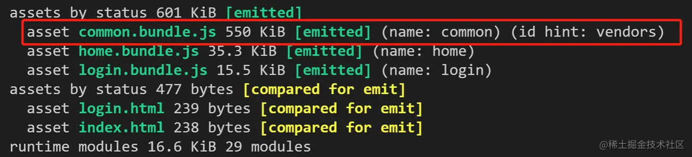

- 其他：
  > 懒加载：进入页面时不加载，使用到某个模块的时候才加载的方式
  > 预加载：进入页面时先加载，使用时直接调用的方式

  - 利用Webpack的魔法注释还能实现**预加载**功能，只需要添加`webpackPrefetch:true`即可，
  - Webpack的预加载是在页面其它内容全部加载完成后才加载需要的模块，所以不会影响页面的加载速度

# 7. webpack 打包Vue和React

## 7.1. 说明

- 由于是从零配置，所以跟使用脚手架（如@vue/cli或react-create-app）创建的项目操作肯定不一样，但本质是一样的
- 从零配置自然就能懂得脚手架的实现原理

## 7.2. Vue

- 项目文件结构

  ```
  ├─node_modules          #模块安装目录（安装模块时自动创建）
  ├─public                #服务器根目录
  ├─dist                  #输出目录（构建时自动创建）
  └─src                   #源码目录
      ├─components        #公共组件目录
      ├─views             #页面组件目录
      ├─App.vue           #根组件
      └─index.js          #入口文件
  ├─package-lock.json     #依赖锁定文件
  ├─package.json          #项目配置文件
  └─webpack.config.js     #webpack配置文件
  ```

- 依赖安装列表
  - webpack
    - webpack
    - webpack-cli
    - webpack-dev-server
    - html-webpack-plugin

    ```
    npm install -D webpack webpack-cli webpack-dev-server html-webpack-plugin
    ```
  - vue
    - vue
    - vue-loader
    - vue-template-compiler
    - @vue/compile-sfc

    ```
    注意安装的vue-loader的版本
    vue-loader@15版本前依赖vue-template-compiler
    vue-loader@16版本后依赖@vue/compiler-sfc
    它们的作用都是编译.vue单文件组件，都需要单独安装

    但在Vue@3.2.13后的版本已经把@vue/compiler-sfc包含在内，所以不需要额外安装
    ```
    ```
    # Vue2安装
    npm install vue@2
    npm install -D vue-loader@15 vue-template-compiler
    
    # 默认安装Vue3
    npm install vue
    npm install -D vue-loader
    ```
- webpack配置

  ```javascript
  const path = require('path')
  const HtmlWebpackPlugin = require('html-webpack-plugin')
  const { VueLoaderPlugin } = require('vue-loader')

  module.exports = {
      mode: 'development',
      entry: './src/index.js',
      output: {
          path: path.join(__dirname, './dist'),
          filename: '[name].bundle.js',
          clean: true,
      },
      devServer: {
          static: path.resolve('./public')
      },
      module: {
          rules: [
              {
                  test: /\.vue$/,
                  use: 'vue-loader'
              },

          ]
      },

      plugins: [
          new HtmlWebpackPlugin({
              template: path.resolve('./public/index.html')
          }),
          
          // vue-loader@15+版本后请确保引入这个插件！
          new VueLoaderPlugin()
      ],

  }
  ```

- 编译

  ```
  # 输出到dist目录
  npx webpack
  
  # 启动服务器
  npx webpack server
  ```

## 7.3. React

- 项目结构

  ```
  ├─node_modules          #模块安装目录（安装模块时自动创建）
  ├─public                #服务器根目录
  ├─dist                  #输出目录（构建时自动创建）
  └─src                   #源码目录
      ├─components        #公共组件目录
      ├─views             #页面组件目录
      ├─App.js            #根组件
      └─index.js          #入口文件
  ├─package-lock.json     #依赖锁定文件
  ├─package.json          #项目配置文件
  └─webpack.config.js     #webpack配置文件
  ```

- 安装所需模块及依赖
  - react / react-dom
  - webpack / webpack-cli / webpack-dev-server
  - babel-loader / @babel/core / @babel/preset-react

  ```
  React项目中使用JSX语法，需要使用@babel/preset-react预设编译成浏览器可识别的js代码
  由于需要在webpack中使用babel，所以需要安装babel-loader、@babel/core
  ```

- webpack配置

  ```javascript
  const path = require('path')
  const HtmlWebpackPlugin = require('html-webpack-plugin')

  module.exports = {
      mode: 'development',
      entry: './src/index.js',
      output: {
          path: path.join(__dirname, './dist'),
          filename: '[name].bundle.js',
          clean: true,
      },
      devServer: {
          static: path.resolve('./public')
      },
      module: {
          rules: [
              {
                  test: /\.js$/,
                  use: {
                      loader:'babel-loader',
                      options:{
                          presets:['@babel/preset-react']
                      }
                  }
              },

          ]
      },

      plugins: [
          new HtmlWebpackPlugin({
              template: path.resolve('./public/index.html')
          }),
      ],
  }
  ```

- 编译或启动开发服务器
  ```bash
  # 输出到dist目录
  npx webpack
  
  # 启动服务器
  npx webpack server
  ```
  ```json
  // 也可以通过配置npm scripts更方便地启动项目
  // package.json
  {
      // ...省略其它配置
      "scripts": {
            "build":"webpack",
            "dev":"webpack server"
          },
  }
  ```

# 8. webpack基本原理

TODO: webpack原理

# 9. 参考资料

- [ ] **[webpack5教程系列](https://juejin.cn/post/7067175422902927368)**
- [ ] [Webpack 教程](https://www.jiangruitao.com/webpack/rudiments/)
- [ ] [webpack 最佳配置指北](https://juejin.cn/post/6844904036936712200)
- [ ] [webpack5基础入门](https://juejin.cn/post/6923918805722726413)
- [ ] [webpack4原理](https://juejin.cn/post/6859538537830858759)
  > 仍旧有一定的参考价值
- [ ] [中文文档](https://webpack.docschina.org/concepts/)
- [ ] [新一代前端构建工具汇总](https://www.51cto.com/article/709039.html)

