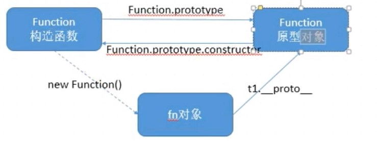

# 1. JavaScript 高级


### 1.0.1. 目标

- 理解面向对象开发思想
- 掌握 JavaScript 面向对象开发相关模式
- 掌握在 JavaScript 中使用正则表达式

### 1.0.2. 案例演示

- [贪吃蛇](snake/index.html)

---

## 1.1. 回顾

> 由于 JavaScript 高级还是针对 JavaScript 语言本身的一个进阶学习，所以在开始之前我们先对以前所学过的 JavaScript 相关知识点做一个快速复习总结。

### 1.1.1. 重新介绍 JavaScript

#### 1.1.1.1. JavaScript 是什么

- 解析执行：轻量级解释型的。编译一行执行一行
  > java是编译执行。全部编译后再执行
- 语言特点：
  - 动态，可以随意给对象添加属性和方法（java就不可以）
  - 头等函数 (First-class Function)，又称函数是 JavaScript 中的一等公民（java中类是头等）
- 执行环境：在宿主环境（host environment）下运行，浏览器是最常见的 JavaScript 宿主环境
  + 但是在很多非浏览器环境中也使用 JavaScript ，例如 node.js

  [MDN-JavaScript](https://developer.mozilla.org/zh-CN/docs/Web/JavaScript)

#### 1.1.1.2. JavaScript 的组成

- ECMAScript  - 语法规范
  - 变量、数据类型、类型转换、操作符
  - 流程控制语句：判断、循环语句
  - 数组、函数、作用域、预解析
  - 对象、属性、方法、简单类型和复杂类型的区别
  - 内置对象：Math、Date、Array，基本包装类型String、Number、Boolean
- Web APIs
  - BOM
    - onload页面加载事件，window顶级对象
    - 定时器
    - location、history
  - DOM
    - 获取页面元素，注册事件
    - 属性操作，样式操作
    - 节点属性，节点层级
    - 动态创建元素
    - 事件：注册事件的方式、事件的三个阶段、事件对象 

#### 1.1.1.3. JavaScript 可以做什么

> 阿特伍德定律：
>
> Any application that can be written in JavaScript, will eventually be written in JavaScript.  
>
> 任何可以用*JavaScript*来写的应用，最终都将用*JavaScript*来写
>
> 阿特伍德 stackoverflow的创始人之一

- [知乎 - JavaScript 能做什么，该做什么？](https://www.zhihu.com/question/20796866)
- [最流行的编程语言 JavaScript 能做什么？](https://github.com/phodal/articles/issues/1)

### 1.1.2. 浏览器是如何工作的


[参考链接](http://www.2cto.com/kf/201202/118111.html)

```
User Interface  用户界面，我们所看到的浏览器
Browser engine  浏览器引擎，用来查询和操作渲染引擎
*Rendering engine 用来显示请求的内容，负责解析HTML、CSS，并把解析的内容显示出来
Networking   网络，负责发送网络请求
*JavaScript Interpreter(解析者)   JavaScript解析器，负责执行JavaScript的代码
UI Backend   UI后端，用来绘制类似组合框和弹出窗口
Data Persistence(持久化)  数据持久化，数据存储  cookie、HTML5中的sessionStorage
```


### 1.1.3. JavaScript 执行过程

JavaScript 运行分为两个阶段：

- 预解析
  + 全局预解析（所有变量和函数声明都会提前；同名的函数和变量函数的优先级高）
  + 函数内部预解析（所有的变量、函数和形参都会参与预解析）
    * 函数
    * 形参
    * 普通变量
- 执行

先预解析全局作用域，然后执行全局作用域中的代码，
在执行全局代码的过程中遇到函数调用就会先进行函数预解析，然后再执行函数内代码。

---

## 1.2. JavaScript 面向对象编程


### 1.2.1. 面向对象介绍

#### 1.2.1.1. 什么是对象

> Everything is object （万物皆对象）


对象到底是什么，我们可以从两次层次来理解。

**(1) 对象是单个事物的抽象。**

一本书、一辆汽车、一个人都可以是对象，一个数据库、一张网页、一个与远程服务器的连接也可以是对象。当实物被抽象成对象，实物之间的关系就变成了对象之间的关系，从而就可以模拟现实情况，针对对象进行编程。

**(2) 对象是一个容器，封装了属性（property）和方法（method）。**

属性是对象的状态，方法是对象的行为（完成某种任务）。比如，我们可以把动物抽象为animal对象，使用“属性”记录具体是那一种动物，使用“方法”表示动物的某种行为（奔跑、捕猎、休息等等）。

在实际开发中，对象是一个抽象的概念，可以将其简单理解为：**数据集或功能集**。

ECMAScript-262 把对象定义为：**无序属性的集合，其属性可以包含基本值、对象或者函数**。
严格来讲，这就相当于说对象是一组没有特定顺序的值。对象的每个属性或方法都有一个名字，而每个名字都映射到一个值。


  提示：每个对象都是基于一个引用类型创建的，这些类型可以是系统内置的原生类型，也可以是开发人员自定义的类型。


#### 1.2.1.2. 什么是面向对象

> 面向对象不是新的东西，它只是过程式代码的一种高度封装，目的在于提高代码的开发效率和可维 护性。


面向对象编程 —— Object Oriented Programming，简称 OOP ，是一种编程开发思想。
它将真实世界各种复杂的关系，抽象为一个个对象，然后由对象之间的分工与合作，完成对真实世界的模拟。

在面向对象程序开发思想中，每一个对象都是功能中心，具有明确分工，可以完成接受信息、处理数据、发出信息等任务。
因此，面向对象编程具有灵活、代码可复用、高度模块化等特点，容易维护和开发，比起由一系列函数或指令组成的传统的过程式编程（procedural programming），更适合多人合作的大型软件项目。

面向对象与面向过程： 

- 面向过程就是亲力亲为，事无巨细，面面俱到，步步紧跟，有条不紊
- 面向对象就是找一个对象，指挥得结果
- 面向对象将执行者转变成指挥者
- 面向对象不是面向过程的替代，而是面向过程的封装

面向对象的特性：

- 封装性 
- 继承性
- [多态性]抽象

扩展阅读：

- [维基百科 - 面向对象程序设计](https://zh.wikipedia.org/wiki/%E9%9D%A2%E5%90%91%E5%AF%B9%E8%B1%A1%E7%A8%8B%E5%BA%8F%E8%AE%BE%E8%AE%A1)
- [知乎：如何用一句话说明什么是面向对象思想？](https://www.zhihu.com/question/19854505)
- [知乎：什么是面向对象编程思想？](https://www.zhihu.com/question/31021366)

#### 1.2.1.3. 程序中面向对象的基本体现

在 JavaScript 中，所有数据类型都可以视为对象，当然也可以自定义对象。
自定义的对象数据类型就是面向对象中的类（ Class ）的概念。

我们以一个例子来说明面向过程和面向对象在程序流程上的不同之处。

假设我们要处理学生的成绩表，为了表示一个学生的成绩，面向过程的程序可以用一个对象表示：

```javascript
var std1 = { name: 'Michael', score: 98 }
var std2 = { name: 'Bob', score: 81 }
```

而处理学生成绩可以通过函数实现，比如打印学生的成绩：

```javascript
function printScore (student) {
  console.log('姓名：' + student.name + '  ' + '成绩：' + student.score)
}
```

如果采用面向对象的程序设计思想，我们首选思考的不是程序的执行流程，
而是 `Student` 这种数据类型应该被视为一个对象，这个对象拥有 `name` 和 `score` 这两个属性（Property）。
如果要打印一个学生的成绩，首先必须创建出这个学生对应的对象，然后，给对象发一个 `printScore` 消息，让对象自己把自己的数据打印出来。

抽象数据行为模板（Class）：

```javascript
function Student(name, score) {
  this.name = name;
  this.score = score;
  this.printScore = function() {
    console.log('姓名：' + this.name + '  ' + '成绩：' + this.score);
  }
}
```

根据模板创建具体实例对象（Instance）：

```javascript
var std1 = new Student('Michael', 98)
var std2 = new Student('Bob', 81)
```

实例对象具有自己的具体行为（给对象发消息）：

```javascript
std1.printScore() // => 姓名：Michael  成绩：98
std2.printScore() // => 姓名：Bob  成绩 81
```

面向对象的设计思想是从自然界中来的，因为在自然界中，类（Class）和实例（Instance）的概念是很自然的。
Class 是一种抽象概念，比如我们定义的 Class——Student ，是指学生这个概念，
而实例（Instance）则是一个个具体的 Student ，比如， Michael 和 Bob 是两个具体的 Student 。

所以，面向对象的设计思想是：

- 抽象出 Class(构造函数)
- 根据 Class(构造函数) 创建 Instance
- 指挥 Instance 得结果

面向对象的抽象程度又比函数要高，因为一个 Class 既包含数据，又包含操作数据的方法。

### 1.2.2. 创建对象

#### 1.2.2.1. 简单方式

我们可以直接通过 `new Object()` 创建：

```javascript
var person = new Object()
person.name = 'Jack'
person.age = 18

person.sayName = function () {
  console.log(this.name)
}
```

每次创建通过 `new Object()` 比较麻烦，所以可以通过它的简写形式对象字面量来创建：

```javascript
var person = {
  name: 'Jack',
  age: 18,
  sayName: function () {
    console.log(this.name)
  }
}
```

对于上面的写法固然没有问题，但是假如我们要生成两个 `person` 实例对象呢？

```javascript
var person1 = {
  name: 'Jack',
  age: 18,
  sayName: function () {
    console.log(this.name)
  }
}

var person2 = {
  name: 'Mike',
  age: 16,
  sayName: function () {
    console.log(this.name)
  }
}
```

通过上面的代码我们不难看出，这样写的代码太过冗余，重复性太高。

#### 1.2.2.2. 简单方式的改进：工厂函数

我们可以写一个函数，解决代码重复问题：

```javascript
function createPerson (name, age) {
  return {
    name: name,
    age: age,
    sayName: function () {
      console.log(this.name)
    }
  }
}
```

然后生成实例对象：

```javascript
var p1 = createPerson('Jack', 18)
var p2 = createPerson('Mike', 18)
```

这样封装确实爽多了，通过工厂模式我们解决了创建多个相似对象代码冗余的问题，
但却没有解决对象识别的问题（即怎样知道一个对象的类型）。

### 1.2.3. 构造函数

> java中创建对象的模版是类，而javascript中创建对象的模版是构造函数
> 再新版ECMAScript中，即es6中，出现了类

内容引导：

- 构造函数语法
- 分析构造函数
- 构造函数和实例对象的关系
  + 实例的 constructor 属性
  + instanceof 操作符
- 普通函数调用和构造函数调用的区别
- 构造函数的返回值
- 构造函数的问题

#### 1.2.3.1. 更优雅的工厂函数：构造函数

一种更优雅的工厂函数就是下面这样，构造函数：

```javascript
function Person (name, age) {
  this.name = name
  this.age = age
  this.sayName = function () {
    console.log(this.name)
  }
}

var p1 = new Person('Jack', 18)
p1.sayName() // => Jack

var p2 = new Person('Mike', 23)
p2.sayName() // => Mike
```

#### 1.2.3.2. 解析构造函数代码的执行

在上面的示例中，`Person()` 函数取代了 `createPerson()` 函数，但是实现效果是一样的。
这是为什么呢？

我们注意到，`Person()` 中的代码与 `createPerson()` 有以下几点不同之处：

- 没有显示的创建对象
- 直接将属性和方法赋给了 `this` 对象
- 没有 `return` 语句
- 函数名使用的是大写的 `Person`

而要创建 `Person` 实例，则必须使用 `new` 操作符。
以这种方式调用构造函数会经历以下 4 个步骤：

1. 创建一个新对象
2. 使this指向新对象
3. 执行构造函数中的代码
4. 返回新对象

下面是具体的伪代码：

```javascript
function Person (name, age) {
  // 当使用 new 操作符调用 Person() 的时候，实际上这里会先创建一个对象
  // var instance = {}
  // 然后让内部的 this 指向 instance 对象
  // this = instance
  // 接下来所有针对 this 的操作实际上操作的就是 instance

  this.name = name
  this.age = age
  this.sayName = function () {
    console.log(this.name)
  }

  // 在函数的结尾处会将 this 返回，也就是 instance
  // return this
}
```
#### 1.2.3.3. 注意！

* 构造函数如果当成普通函数用的话，this指向window（普通函数中的this指向window）
  * 详见this各种情况
* 构造函数1也可以作为普通函数使用，只是那样里面的this会指向window，此时会创建全局变量
* 而构造函数中使用var的话，作用域与普通函数相同
* 使用new运算符和当作不同函数执行的区别是，一个this指向新的Object，一个this指向window。里面代码都会执行一遍（自己总结？？？）

#### 1.2.3.4. 构造函数和实例对象的关系

使用构造函数的好处不仅仅在于代码的简洁性，更重要的是我们可以识别对象的具体类型了。
在每一个实例对象中同时有一个 `constructor` 属性，该属性指向创建该实例的构造函数：

```javascript
console.log(p1.constructor === Person) // => true
console.log(p2.constructor === Person) // => true
console.log(p1.constructor === p2.constructor) // => true
```

对象的 `constructor` 属性最初是用来标识对象类型的（constructor事实上是原型的属性，原型之后再说）
可以获得对象的构造函数。
自己定义的构造函数可以获得源代码。而系统预设的构造函数（比如数组）不行
可以通过obj.constructor===People(某构造函数名称)来判断是否为该构造函数创建对象。但是并不推荐。
如果要检测对象的类型，还是使用 `instanceof` 操作符更可靠一些: `obj instentceof People`

```javascript
console.log(p1 instanceof Person) // => true
console.log(p2 instanceof Person) // => true
```

总结：

- 构造函数是根据具体的事物抽象出来的抽象模板
- 实例对象是根据抽象的构造函数模板得到的具体实例对象
- 每一个实例对象都具有一个 `constructor` 属性，指向创建该实例的构造函数
  + 注意： `constructor` 是实例的属性的说法不严谨，具体后面的原型会讲到
- 可以通过实例的 `constructor` 属性判断实例和构造函数之间的关系
  + 注意：这种方式不严谨，推荐使用 `instanceof` 操作符，后面学原型会解释为什么

#### 1.2.3.5. 构造函数的问题

使用构造函数带来的最大的好处就是创建对象更方便了，但是其本身也存在一个浪费内存的问题：

```javascript
function Person (name, age) {
  this.name = name
  this.age = age
  this.type = 'human'
  this.sayHello = function () {
    console.log('hello ' + this.name)
  }
}

var p1 = new Person('Tom', 18)
var p2 = new Person('Jack', 16)
```

在该示例中，从表面上好像没什么问题，但是实际上这样做，有一个很大的弊端。
那就是对于每一个实例对象，`type` 和 `sayHello` 都是一模一样的内容，
每一次生成一个实例，都必须为重复的内容，多占用一些内存，如果实例对象很多，会造成极大的内存浪费。

```javascript
console.log(p1.sayHello === p2.sayHello) // => false
```

对于这种问题我们可以把需要共享的函数定义到构造函数外部：

```javascript
function sayHello = function () {
  console.log('hello ' + this.name)
}

function Person (name, age) {
  this.name = name
  this.age = age
  this.type = 'human'
  this.sayHello = sayHello
}

var p1 = new Person('Top', 18)
var p2 = new Person('Jack', 16)

console.log(p1.sayHello === p2.sayHello) // => true
```

这样确实可以了，但是如果有多个需要共享的函数的话就会造成全局命名空间冲突的问题。

你肯定想到了可以把多个函数放到一个对象中用来避免全局命名空间冲突的问题：

```javascript
var fns = {
  sayHello: function () {
    console.log('hello ' + this.name)
  },
  sayAge: function () {
    console.log(this.age)
  }
}

function Person (name, age) {
  this.name = name
  this.age = age
  this.type = 'human'
  this.sayHello = fns.sayHello
  this.sayAge = fns.sayAge
}

var p1 = new Person('lpz', 18)
var p2 = new Person('Jack', 16)

console.log(p1.sayHello === p2.sayHello) // => true
console.log(p1.sayAge === p2.sayAge) // => true
```

至此，我们利用自己的方式基本上解决了构造函数的内存浪费问题。
但是代码看起来还是那么的格格不入，那有没有更好的方式呢？

#### 1.2.3.6. 静态函数（补充。）

前面的都是想·实例函数

```js
function Person(name,age){
    this.name = name ;
    this.age = age;
    this.sayHi = function(){
    console.log('Hello...')
    }
    //上述的name\age\sayHi就是实例成员
}
Person.hobby = 'running'
Person.climb = function(){
    console.log('Climbing...')
}
//上述的hobby和climb就是静态成员
Person.prototype.jump = function(){
    console.log('Jumping...')
}
//jump为p1的__proto__属性指向的它的原型对象上的成员
//===============那么，
var p1 = new Person('Lucy',29)
p1.name  //'Lucy'
p1.age  //29
p1.sayHi() //Hello...
p1.jump()  // Jumping...
Person.climb() //Climbing...
Person.hobby  //running...
//==============但是
p1.climb()  //报错
Person.sayHi()  //报错
Person.jump() //报错

```


#### 1.2.3.7. 小结

- 构造函数语法
- 分析构造函数
- 构造函数和实例对象的关系
  + 实例的 constructor 属性
  + instanceof 操作符
- 构造函数的问题

### 1.2.4. 原型

#### 1.2.4.1. 相关总结(补充)
> java中成员对象在内存中也只有一份
```
类的实例方法在内存中是只有一份,不过肯定不会是第一个对象中,如果是第一个对象的话,那么当第一个对象被销毁的时候,那么后面的对象就永远无法调用了...
类的实例方法存在一个专门的区叫方法区,事实上类刚装载的时候就被装载好了,不过它们在"睡眠",只是这些方法必须当有对象产生的时候才会"苏醒".(比如,一个输出类的成员变量的方法,如果连对象都没有,何来的输出成员变量).所以,方法在装载的时候就有了,但是不可用,因为它没有指象任何一个对象。
而静态的又不一样了,静态的东西存在静态区,他们和类是一个等级的，就是说只要类被装载,它们就可以直接用.(用类名来调用).他们不依赖与任何对象,所以也不能输出任何对象的成员属性.(除非成员属性也是静态的).
```
> 而js中每个对象都会实例化一次成员方法
> 而使用原型方法则不会。而是只有一分
> 可以说java中成员方法等价于js中原型方法
> 和java成员对象中this指向调用者一样。js中原型对象中的原型方法也指向调用者
> 而js中构造函数中方法的存在可以用来访问私有变量，从而达到使变量私有化


内容引导：

- 使用 prototype 原型对象解决构造函数的问题
- 分析 构造函数、prototype 原型对象、实例对象 三者之间的关系
- 属性成员搜索原则：原型链
- 实例对象读写原型对象中的成员
- 原型对象的简写形式
- 原生对象的原型
  + Object
  + Array
  + String
  + ...
- 原型对象的问题
- 构造的函数和原型对象使用建议

#### 1.2.4.2. 更好的解决方案： `prototype`

JavaScript 规定，每一个构造函数都有一个 `prototype` 属性，指向另一个对象。
这个对象的所有属性和方法，都会被构造函数的所拥有。

> 注：函数是对象，构造函数当然也是。

这也就意味着，我们可以把所有对象实例需要**共享**的属性和方法直接定义在 `prototype` 对象上。

```javascript
function Person (name, age) {
  this.name = name
  this.age = age
}

console.log(Person.prototype)

Person.prototype.type = 'human'

Person.prototype.sayName = function () {
  console.log(this.name)
}

var p1 = new Person(...)
var p2 = new Person(...)

console.log(p1.sayName === p2.sayName) // => true
```

这时所有实例的 `type` 属性和 `sayName()` 方法，
其实都是同一个内存地址，指向 `prototype` 对象，因此就提高了运行效率。

另外，如果构造函数中也有`sayName()`方法，也就是每个对象都有实例函数，
会优先访问示例函数，再去原型对象中查找

#### 1.2.4.3. 构造函数、实例、原型三者之间的关系
 
两个图，哪个容易理解看哪个，最好都看看


任何函数都具有一个 `prototype` 属性，该属性是一个对象。

```javascript
function F () {}
console.log(F.prototype) // => object

F.prototype.sayHi = function () {
  console.log('hi!')
}
```

构造函数的 `prototype` 对象默认都有一个 `constructor` 属性，指向 `prototype` 对象所在函数。

```javascript
console.log(F.prototype.constructor === F) // => true
```

通过构造函数得到的实例对象内部会包含一个**指向构造函数的 `prototype` 对象**的指针 `__proto__`。
实例对象之所以能够访问到原型中的函数，就是因为__oproto__的存在

```javascript
var instance = new F()
console.log(instance.__proto__ === F.prototype) // => true
```

<p class="tip">
  `__proto__` 是非标准属性。开发时不要用
</p>

prototype也有_protp_属性，执行Object构造函数的原型对象
**也就是说，任何对象的（对应构造函数的）原型对象的（对应构造函数的）原型对象，就是Object对象（对应构造函数的的）原型对象**

实例对象可以直接访问原型对象成员。

原型对象中的方法里的this指向调用者对象

```javascript
instance.sayHi() // => hi!
```

总结：

- 任何函数都具有一个 `prototype` 属性，该属性是一个对象
- 构造函数的 `prototype` 对象默认都有一个 `constructor` 属性，指向 `prototype` 对象所在函数
- 通过构造函数得到的实例对象内部会包含一个指向构造函数的 `prototype` 对象的指针 `__proto__`
- 所有实例都直接或间接继承了原型对象的成员

#### 1.2.4.4. 属性成员的搜索原则：原型链


上图一定要看懂

了解了 **构造函数-实例-原型对象** 三者之间的关系后，接下来我们来解释一下为什么实例对象可以访问原型对象中的成员。

每当代码读取某个对象的某个属性时，都会执行一次搜索，目标是具有给定名字的属性

- 搜索首先从对象实例本身开始
- 如果在实例中找到了具有给定名字的属性，则返回该属性的值
- 如果没有找到，则继续搜索指针指向的原型对象，在原型对象中查找具有给定名字的属性
- 如果在原型对象中找到了这个属性，则返回该属性的值

也就是说，在我们调用 `person1.sayName()` 的时候，会先后执行两次搜索：

- 首先，解析器会问：“实例 person1 有 sayName 属性吗？”答：“没有。
- ”然后，它继续搜索，再问：“ person1 的原型有 sayName 属性吗？”答：“有。
- ”于是，它就读取那个保存在原型对象中的函数。
- 当我们调用 person2.sayName() 时，将会重现相同的搜索过程，得到相同的结果。

而这正是多个对象实例共享原型所保存的属性和方法的基本原理。

总结：
> **就近原则**
- 先在自己身上找，找到即返回
- 自己身上找不到，则沿着原型链向上查找，找到即返回
- 如果一直到原型链的末端还没有找到，则返回 `undefined`

#### 1.2.4.5. 实例对象读写原型对象成员

读取：

- 先在自己身上找，找到即返回
- 自己身上找不到，则沿着原型链向上查找，找到即返回
- 如果一直到原型链的末端还没有找到，则返回 `undefined`

值类型成员写入（`实例对象.值类型成员 = xx`）：

- 当实例期望重写原型对象中的某个普通数据成员时**实际上会把该成员添加到自己身上**,不会搜索原型链
- 也就是说该行为实际上会屏蔽掉对原型对象成员的访问

引用类型成员写入（`实例对象.引用类型成员 = xx`）：

- 同上

复杂类型修改（`实例对象.成员.xx = xx`）：

- 同样会先在自己身上找该成员，如果自己身上找到则直接修改
- 如果自己身上找不到，则沿着原型链继续查找，如果找到则修改
- 如果一直到原型链的末端还没有找到该成员，则报错（`实例对象.undefined.xx = xx`）

#### 1.2.4.6. 更简单的原型语法

我们注意到，前面例子中每添加一个属性和方法就要敲一遍 `Person.prototype` 。
为减少不必要的输入，更常见的做法是用一个包含所有属性和方法的对象字面量来重写整个原型对象：

```javascript
function Person (name, age) {
  this.name = name
  this.age = age
}

Person.prototype = {
  type: 'human',
  sayHello: function () {
    console.log('我叫' + this.name + '，我今年' + this.age + '岁了')
  }
}
```

在该示例中，我们将 `Person.prototype` 重置到了一个新的对象。
这样做的好处就是为 `Person.prototype` 添加成员简单了，但是也会带来一个问题，那就是原型对象丢失了 `constructor` 成员。此时指向的是Object的`constructor`

所以，我们为了保持 `constructor` 的指向正确，**建议的写法**是：

```javascript
function Person (name, age) {
  this.name = name
  this.age = age
}

Person.prototype = {/* 这是覆盖 */
  constructor: Person, // => 手动将 constructor 指向正确的构造函数
  type: 'human',
  sayHello: function () {
    console.log('我叫' + this.name + '，我今年' + this.age + '岁了')
  }
}
```

#### 1.2.4.7. 原生对象的原型，扩展原型方法

> 原生对象的原型可以添加，而不可以整个修改.
> `Array.propotype={}`没用
<p class="tip">
  所有函数都有 prototype 属性对象。
</p>

- Object.prototype
- Function.prototype
- Array.prototype
- String.prototype
- Number.prototype
- Date.prototype
- ...

练习：为数组对象和字符串对象**扩展原型方法**。

```js
/*
原型对象中this指向调用对象 
 */

Array.prototype.getSum = function () {
  // 求数组中所有偶数的和
  var sum = 0;
  for (var i = 0; i < this.length; i++) {
    if (this[i] % 2 === 0) {
      sum += this[i];
    }
  }
  return sum;
```

#### 1.2.4.8. 原型对象使用建议

- 私有成员（一般就是非函数成员）放到构造函数中
- 共享成员（一般就是函数）放到原型对象中
- 如果重置了 `prototype` 记得修正 `constructor` 的指向

### 1.2.5. 案例：随机方块
* 似乎有对象中的称为方法。独立的称为函数
---

## 1.3. 面向对象游戏案例：贪吃蛇
### 1.3.1. 收获：
1. 每个js中的代码最好装到一个匿名函数中然后进行自调用，否则所有变量都在window下，容易产生明明冲突。
2. 需要公开的变量可以通过window.element=element进行暴露
3. 函数对象的bind方法
  > bind就是改变函数中this指向
  > 比如贪吃蛇的定时器中this指向window，为了使this指向对象内成员，可以使用
  > `setInterval(function(){}.bind(that),500)`
  >例：
  ```js
  var a='aaa';
  function fun1(){
      console.log(this.a);
  }
  fun1();//aaa
  var obj={
    a:'111';
  }
  var fun2=fun1.bind(obj)
  fun2();///111
  ``` 
4. 开发时分文件开发，但发布时要整合起来到index.js
   1. 问题：自调用函数会有返回值undefined，连续写多个自调用函数时要加分号，儿分号要加到每个自调用函数之前(代码规范)
   ```js
   ;(function(){})()
   ;(function(){})()
   ```
5. 压缩代码 
6. 自调用函数的参数`;(fucntion(window,undefined))(window,undefined)`
   1. window:让代码中window可以被压缩
   2. undefind：在老版本浏览器中undefined可以被重新赋值，此时undefined就不会未定义了。防止undefined被重命名（？？）

### 1.3.2. 案例介绍

#### 1.3.2.1. 游戏演示

演示：[贪吃蛇](snake/index.html)

#### 1.3.2.2. 案例目标

游戏的目的是用来体会js高级语法的使用 不需要具备抽象对象的能力，使用面向对象的方式分析问题，需要一个漫长的过程。

### 1.3.3. 功能实现

#### 1.3.3.1. 搭建页面

放一个容器盛放游戏场景 div#map，设置样式

```css
#map {
  width: 800px;
  height: 600px;
  background-color: #ccc;
  position: relative;
}
```

#### 1.3.3.2. 分析对象

- 游戏对象
- 蛇对象
- 食物对象

#### 1.3.3.3. 创建食物对象

- Food

  - 属性

    - x       
    - y
    - width
    - height
    - color       

  - 方法

    - render       随机创建一个食物对象，并输出到map上

- 创建Food的构造函数，并设置属性

```js
var position = 'absolute';
var elements = [];
function Food(x, y, width, height, color) {
  this.x = x || 0;
  this.y = y || 0;
  // 食物的宽度和高度(像素)
  this.width = width || 20;
  this.height = height || 20;
  // 食物的颜色
  this.color = color || 'green';
}
```

- 通过原型设置render方法，实现随机产生食物对象，并渲染到map上

```js
Food.prototype.render = function (map) {
  // 随机食物的位置，map.宽度/food.宽度，总共有多少分food的宽度，随机一下。然后再乘以food的宽度
  this.x = parseInt(Math.random() * map.offsetWidth / this.width) * this.width;
  this.y = parseInt(Math.random() * map.offsetHeight / this.height) * this.height;

  // 动态创建食物对应的div
  var div = document.createElement('div');
  map.appendChild(div);
  div.style.position = position;
  div.style.left = this.x + 'px';
  div.style.top = this.y + 'px';
  div.style.width = this.width + 'px';
  div.style.height = this.height + 'px';
  div.style.backgroundColor = this.color;
  elements.push(div);
}
```

- 通过自调用函数，进行封装，通过window暴露Food对象

```js
window.Food = Food;
```

#### 1.3.3.4. 创建蛇对象


- Snake

- 属性

  - width    蛇节的宽度 默认20
  - height   蛇节的高度 默认20
  - body     数组，蛇的头部和身体，第一个位置是蛇头
  - direction    蛇运动的方向  默认right  可以是 left  top bottom

- 方法

  - render  把蛇渲染到map上

- Snake构造函数

```js
var position = 'absolute';
var elements = [];
function Snake(width, height, direction) {
  // 设置每一个蛇节的宽度
  this.width = width || 20;
  this.height = height || 20;
  // 蛇的每一部分, 第一部分是蛇头
  this.body = [
    {x: 3, y: 2, color: 'red'},
    {x: 2, y: 2, color: 'red'},
    {x: 1, y: 2, color: 'red'}
  ];
  this.direction = direction || 'right';
}
```

- render方法

```js
Snake.prototype.render = function(map) {
  for(var i = 0; i < this.body.length; i++) {
    var obj = this.body[i];
    var div = document.createElement('div');
    map.appendChild(div);
    div.style.left = obj.x * this.width + 'px';
    div.style.top = obj.y * this.height + 'px';
    div.style.position = position;
    div.style.backgroundColor = obj.color;
    div.style.width = this.width + 'px';
    div.style.height = this.height + 'px';
  }
}
```

- 在自调用函数中暴露Snake对象

```js
window.Snake = Snake;
```

#### 1.3.3.5. 创建游戏对象

游戏对象，用来管理游戏中的所有对象和开始游戏

- Game

  - 属性

    - food

    - snake

    - map

  - 方法

    - start            开始游戏（绘制所有游戏对象）


- 构造函数

```js
function Game(map) {
  this.food = new Food();
  this.snake = new Snake();
  this.map = map;
}
```

- 开始游戏，渲染食物对象和蛇对象

```js
Game.prototype.start = function () {
  this.food.render(this.map);
  this.snake.render(this.map);
}
```

### 1.3.4. 游戏的逻辑

#### 1.3.4.1. 写蛇的move方法

- 在蛇对象(snake.js)中，在Snake的原型上新增move方法

1. 让蛇移动起来，把蛇身体的每一部分往前移动一下
2. 蛇头部分根据不同的方向决定 往哪里移动

```js
Snake.prototype.move = function (food, map) {
  // 让蛇身体的每一部分往前移动一下
  var i = this.body.length - 1;
  for(; i > 0; i--) {
    this.body[i].x = this.body[i - 1].x;
    this.body[i].y = this.body[i - 1].y;
  }
  // 根据移动的方向，决定蛇头如何处理
  switch(this.direction) {
    case 'left': 
      this.body[0].x -= 1;
      break;
    case 'right':
      this.body[0].x += 1;
      break;
    case 'top':
      this.body[0].y -= 1;
      break;
    case 'bottom':
      this.body[0].y += 1;
      break;
  }
}
```

- 在game中测试

```js
this.snake.move(this.food, this.map);
this.snake.render(this.map);
```

#### 1.3.4.2. 让蛇自己动起来

- 私有方法

    ```
    什么是私有方法？
      不能被外部访问的方法
    如何创建私有方法？
      使用自调用函数包裹
    ```

- 在game.js中 添加runSnake的私有方法，开启定时器调用蛇的move和render方法，让蛇动起来
- 判断蛇是否撞墙

```js
function runSnake() {
  var timerId = setInterval(function() {
    this.snake.move(this.food, this.map);
    // 在渲染前，删除之前的蛇
    this.snake.render(this.map);

    // 判断蛇是否撞墙
    var maxX = this.map.offsetWidth / this.snake.width;
    var maxY = this.map.offsetHeight / this.snake.height;
    var headX = this.snake.body[0].x;
    var headY = this.snake.body[0].y;
    if (headX < 0 || headX >= maxX) {
      clearInterval(timerId);
      alert('Game Over');
    }

    if (headY < 0 || headY >= maxY) {
      clearInterval(timerId);
      alert('Game Over');
    }

  }.bind(that), 150);
}
```

- 在snake中添加删除蛇的私有方法，在render中调用

```js
function remove() {
  // 删除渲染的蛇
  var i = elements.length - 1;
  for(; i >= 0; i--) {
    // 删除页面上渲染的蛇
    elements[i].parentNode.removeChild(elements[i]);
    // 删除elements数组中的元素
    elements.splice(i, 1);
  }
}
```

- 在game中通过键盘控制蛇的移动方向

```js
function bindKey() {
  document.addEventListener('keydown', function(e) {
    switch (e.keyCode) {
      case 37:
        // left
        this.snake.direction = 'left';
        break;
      case 38:
        // top
        this.snake.direction = 'top';
        break;
      case 39:
        // right
        this.snake.direction = 'right';
        break;
      case 40:
        // bottom
        this.snake.direction = 'bottom';
        break;
    }
  }.bind(that), false);
}
```

- 在start方法中调用

```js
bindKey();
```

#### 1.3.4.3. 判断蛇是否吃到食物

```js
// 在Snake的move方法中

// 在移动的过程中判断蛇是否吃到食物
// 如果蛇头和食物的位置重合代表吃到食物
// 食物的坐标是像素，蛇的坐标是几个宽度，进行转换
var headX = this.body[0].x * this.width;
var headY = this.body[0].y * this.height;
if (headX === food.x && headY === food.y) {
  // 吃到食物，往蛇节的最后加一节
  var last = this.body[this.body.length - 1];
  this.body.push({
    x: last.x,
    y: last.y,
    color: last.color
  })
  // 把现在的食物对象删除，并重新随机渲染一个食物对象
  food.render(map);
}
```

### 1.3.5. 其它处理

#### 1.3.5.1. 把html中的js代码放到index.js中

避免html中出现js代码

#### 1.3.5.2. 自调用函数的参数

```js
(function (window, undefined) {
  var document = window.document;

}(window, undefined))
```

- 传入window对象

将来代码压缩的时候，可以吧 function (window)  压缩成 function (w)

- 传入undefined

在将来会看到别人写的代码中会把undefined作为函数的参数(当前案例没有使用)
因为在有的老版本的浏览器中 undefined可以被重新赋值，防止undefined 被重新赋值

#### 1.3.5.3. 整理代码

现在的代码结构清晰，谁出问题就找到对应的js文件即可。
通过自调用函数，已经防止了变量命名污染的问题

但是，由于js文件数较多，需要在页面上引用，会产生文件依赖的问题(先引入那个js，再引入哪个js)
将来通过工具把js文件合并并压缩。现在手工合并js文件演示

- 问题1

```js
// 如果存在多个自调用函数要用分号分割，否则语法错误
// 下面代码会报错
(function () {
}())

(function () {
}())
// 所以代码规范中会建议在自调用函数之前加上分号
// 下面代码没有问题
;(function () {
}())

;(function () {
}())
```

- 问题2 

```js
// 当自调用函数 前面有函数声明时，会把自调用函数作为参数
// 所以建议自调用函数前，加上;
var a = function () {
  alert('11');
}
    
(function () {
  alert('22');
}())
```

---

## 1.4. 继承

> 做一些网页特效时是不会使用继承的。基本上是写一些框架等比较复杂的东西时才使用继承

### 1.4.1. 什么是继承

- 现实生活中的继承
- 程序中的继承

> javascript中其实并没有继承语法，但有多种方式实现拷贝或继承的方式

### 1.4.2. 构造函数的属性继承：借用构造函数
>只能继承属性和普通方法，而不能继承原型方法

```
call() 方法使用一个指定的 this 值和单独给出的一个或多个参数来调用一个函数。

注意：该方法的语法和作用与 apply() 方法类似，只有一个区别，就是 call() 方法接受的是一个参数列表，
而 apply() 方法接受的是一个包含多个参数的数组。

bind()会返回一个改变this的新函数，而不会自动调用。
而call()只是改变this指向后继续执行 ，返回函数原来的返回值。不传参数时相当于直接调用函数
```

```javascript
function Person (name, age) {
  this.type = 'human'
  this.name = name
  this.age = age
}

function Student (name, age) {
  // 借用构造函数继承属性成员 
  Person.call(this, name, age)
}

var s1 = Student('张三', 18)
console.log(s1.type, s1.name, s1.age) // => human 张三 18
```

### 1.4.3. 构造函数的原型方法继承：拷贝继承（for-in）
> 在借用构造函数基础上，解决继承原型方法问题

```javascript
function Person (name, age) {
  this.type = 'human'
  this.name = name
  this.age = age
}

Person.prototype.sayName = function () {
  console.log('hello ' + this.name)
}

function Student (name, age) {
  Person.call(this, name, age)
}

// 原型对象拷贝继承原型对象成员
for(var key in Person.prototype) {
  Student.prototype[key] = Person.prototype[key]
}

var s1 = Student('张三', 18)

s1.sayName() // => hello 张三
```

### 1.4.4. 另一种原型方法继承方式：原型继承

> 更好的继承原型方法的方式 

> 之所以不用Student.prototype = Person.prototype
> 是为了避免所有父对象和子对象公用一个原型实例
> 导致修改子类的原型对象时也会导致父类和其他子类对象的原型改变。
> 因此要new出一个新的对象（命名为newobj），添加方法时添加到该对象中
> 此时添加方法到Student.prototype时，会添加到newobj，而在使用父类的原型方法时，也可以顺着原型链找到：stuobj->Stuent.prototype(即newobj)->newobj.\__proto__(即Person.prototype)

> teacher和Student一样都是子类
> 这里是拿一个person对象充当原型对象


```javascript
function Person (name, age) {
  this.type = 'human'
  this.name = name
  this.age = age
}

Person.prototype.sayName = function () {
  console.log('hello ' + this.name)
}

function Student (name, age) {
  Person.call(this, name, age)
}

// 利用原型的特性实现继承
Student.prototype = new Person()

var s1 = Student('张三', 18)

console.log(s1.type) // => human

s1.sayName() // => hello 张三

```
```js
//循序渐进可得，使用call以及原型继承
function Son(){
  Parent.call(this,...)
}
Son.prototype=new Parent();
Son.prototype.constructor=Son;
```


---

## 1.5. 函数进阶

### 1.5.1. 函数的定义方式

- 函数声明
- 函数表达式
- `new Function`

#### 1.5.1.1. 函数声明

```javascript
function foo () {
}
```

#### 1.5.1.2. 函数表达式

```javascript
var foo = function () {

}
```

#### 1.5.1.3. new function() (基本不用)
```js
var fn=new function('arg1','arg2','console.log(arg1)')

```

>function是对象，也有原型


#### 1.5.1.4. 函数声明与函数表达式的区别

- 函数声明必须有名字
- 函数声明会函数提升，在预解析阶段就已创建，声明前后都可以调用
- 函数表达式类似于**变量赋值**
- 函数表达式可以没有名字，例如匿名函数
- 函数表达式只会把变量名提升，而赋值不会，在执行阶段创建，**必须在表达式执行之后才可以调用**

下面是一个根据条件定义函数的例子：

```javascript
if (true) {
  console.log(3);
  function f () {
    console.log(1)
  }
  
} else {
  function f () {
    console.log(2)
  }
}

//------chrome中：
var f;
if(true){
  f=function(){console.log(1)}
  console.log(3)
}else{
  f=function(){
    console.log(2)
  }
}

```

* 问题：以上代码执行结果在不同浏览器中结果不一致。
  * 现代浏览器中不会提升if语句中的函数。只会提升if中函数的变量定义为全局变量,并将if中的赋值提升到最上面。
  * 而老版本浏览器中if语句中的函数声明也会提升，将函数的变量声明和定义都提升为全局变量

不过我们可以使用函数表达式（不会预解析）解决上面的问题：
> 总而言之就是不要使用上面的形式写，否则容易搞不清

```javascript
var f

if (true) {
  f = function () {
    console.log(1)
  }
} else {
  f = function () {
    console.log(2)
  }
}
```

### 1.5.2. 函数的调用方式

- 普通函数
- 构造函数
- 对象方法

### 1.5.3. 函数内 `this` 指向的不同场景

以前的this情景
[跳转](../00/01-JavaScript基础.md#1218this详解)

**函数内部的this，在函数调用时才确定指向**
函数的调用方式决定了 `this` 指向的不同：

| 调用方式   | 非严格模式   | 备注                |
| ------ | ------- | ----------------- |
| 普通函数调用 | window  | 严格模式下是 undefined  |
| 构造函数调用 | 实例对象    | 原型方法中 this 也是实例对象 |
| 对象方法调用 | 该方法所属对象 | 紧挨着的对象            |
| 事件绑定方法 | 绑定事件对象  | addEventListener()     |
| 定时器函数  | window  |   setInterval()     |

这就是对函数内部 this 指向的基本整理，写代码写多了自然而然就熟悉了。

### 1.5.4. 函数也是对象

- 所有函数都是 `Function` 的实例

### 1.5.5. call、apply、bind

那了解了函数 this 指向的不同场景之后，我们知道有些情况下我们为了使用某种特定环境的 this 引用，
这时候时候我们就需要采用一些特殊手段来处理了，例如我们经常在定时器外部备份 this 引用，然后在定时器函数内部使用外部 this 的引用。
然而实际上对于这种做法我们的 JavaScript 为我们专门提供了一些函数方法用来帮我们更优雅的处理函数内部 this 指向问题。
这就是接下来我们要学习的 call、apply、bind 三个函数方法。

#### 1.5.5.1. call

`call()` 方法调用一个函数, 其具有一个指定的 `this` 值和分别地提供的参数(参数的列表)。

<p class="danger">
  注意：该方法的作用和 `apply()` 方法类似，只有一个区别，就是 `call()` 方法接受的是若干个参数的列表，而 `apply()` 方法接受的是一个包含多个参数的数组。
</p>

作用：
  * 改变函数中的this
  * 调用函数

语法：

```javascript
fun.call(thisArg[, arg1[, arg2[, ...]]])
```

参数：

- `thisArg`
  + 在 fun 函数运行时指定的 this 值
  + 如果指定了 null 或者 undefined 则内部 this 指向 **window**(注意不是不变)

- `arg1, arg2, ...`
  + 指定的参数列表

应用示例：
```js
//伪数组：

var obj={/* 数组中所谓索引，其实就是属性名称 */
  0: 0,
  1: 1,
  2: 2,
  length: 3;
}
obj['4']=4;//因为变量名不能以数字开否，所以使用第二种方式调用
obj.length++;
//等价于
Array.prototype.push.call(obj,4);
```

#### 1.5.5.2. apply

`apply()` 方法调用一个函数, 其具有一个指定的 `this` 值，以及作为一个数组（或类似数组的对象）提供的参数。

<p class="danger">
  注意：该方法的作用和 `call()` 方法类似，只有一个区别，就是 `call()` 方法接受的是若干个参数的列表，而 `apply()` 方法接受的是一个包含多个参数的数组。
</p>

语法：

```javascript
fun.apply(thisArg, [argsArray])
```

作用：
  * 改变this指向
  * 将参数接收转换为数组形式
  * 调用函数

参数：

- `thisArg`
- `argsArray`

`apply()` 与 `call()` 非常相似，不同之处在于提供参数的方式。
`apply()` 使用参数数组而不是一组参数列表。例如：

```javascript
fun.apply(this, ['eat', 'bananas'])
```

应用示例：
```js
//Math.max()只可以传入多个参数而不能传入数组
var arr = [1,2,3,4,1,2,3];
var max =Math.max.apply(Math,arr)//这样就能使用Math.max()了


console.log.apply(console,arr)
```


#### 1.5.5.3. bind

bind() 函数会创建一个新函数（称为绑定函数），新函数与被调函数（绑定函数的目标函数）具有相同的函数体（在 ECMAScript 5 规范中内置的call属性）。
当目标函数被调用时 this 值绑定到 bind() 的第一个参数，该参数不能被重写。绑定函数被调用时，bind() 也接受预设的参数提供给原函数。
一个绑定函数也能使用new操作符创建对象：这种行为就像把原函数当成构造器。提供的 this 值被忽略，同时调用时的参数被提供给模拟函数。

语法：

```javascript
fun.bind(thisArg[, arg1[, arg2[, ...]]])
```
作用：
  * 改变this指向
  * 并返回一个新的改变过this指向后的函数

参数：

- thisArg
  + 当绑定函数被调用时，该参数会作为原函数运行时的 this 指向。当使用new 操作符调用绑定函数时，该参数无效。

- arg1, arg2, ...
  + 当绑定函数被调用时，这些参数将置于实参之前传递给被绑定的方法。

返回值：

返回由指定的this值和初始化参数改造的原函数拷贝。

示例1：

```javascript
this.x = 9; 
var module = {
  x: 81,
  getX: function() { return this.x; }
};

module.getX(); // 返回 81

var retrieveX = module.getX;
retrieveX(); // 返回 9, 在这种情况下，"this"指向全局作用域

// 创建一个新函数，将"this"绑定到module对象
// 新手可能会被全局的x变量和module里的属性x所迷惑
var boundGetX = retrieveX.bind(module);
boundGetX(); // 返回 81
```

示例2：

```javascript
function LateBloomer() {
  this.petalCount = Math.ceil(Math.random() * 12) + 1;
}

// Declare bloom after a delay of 1 second
LateBloomer.prototype.bloom = function() {
  window.setTimeout(this.declare.bind(this), 1000);
};

LateBloomer.prototype.declare = function() {
  console.log('I am a beautiful flower with ' +
    this.petalCount + ' petals!');
};

var flower = new LateBloomer();
flower.bloom();  // 一秒钟后, 调用'declare'方法
```

#### 1.5.5.4. 小结

- call 和 apply 特性一样
  + 都是用来调用函数，而且是立即调用
  + 但是可以在调用函数的同时，通过第一个参数指定函数内部 `this` 的指向
  + call 调用的时候，参数必须以参数列表的形式进行传递，也就是以逗号分隔的方式依次传递即可
  + apply 调用的时候，参数必须是一个数组，然后在执行的时候，会将数组内部的元素一个一个拿出来，与形参一一对应进行传递
  + 如果第一个参数指定了 `null` 或者 `undefined` 则内部 this 指向 window

- bind
  + 可以用来指定内部 this 的指向，然后生成一个改变了 this 指向的新的函数
  + 它和 call、apply 最大的区别是：bind 不会调用
  + bind 支持传递参数，它的传参方式比较特殊，一共有两个位置可以传递
    * 1. 在 bind 的同时，以参数列表的形式进行传递
    * 2. 在调用的时候，以参数列表的形式进行传递
    * 那到底以谁 bind 的时候传递的参数为准呢还是以调用的时候传递的参数为准
    * 两者合并：bind 的时候传递的参数和调用的时候传递的参数会合并到一起，传递到函数内部

### 1.5.6. 函数的其它成员

- arguments
  + 实参集合
  + 当有不固定个数的参数时，可以通过arguments来获得传入的参数
- caller
  + 函数的调用者
- length
  + 形参的个数
- name
  + 函数的名称

```javascript
function fn(x, y, z) {
  console.log(fn.length) // => 形参的个数
  console.log(arguments) // 伪数组实参参数集合
  console.log(arguments.caller === fn) // 函数本身
  console.log(fn.caller) // 函数的调用者
  console.log(fn.name) // => 函数的名字
}

function f() {
  fn(10, 20, 30)
}

f()
```

### 1.5.7. 高阶函数

- 函数可以作为参数
- 函数可以作为返回值
  > 类似java中的comparator一类的,这里传入匿名函数。java中传入匿名类
  > Array中的sort()相当于传入一个comparator

#### 1.5.7.1. 作为参数

```javascript
function eat (callback) {
  setTimeout(function () {
    console.log('吃完了')
    callback()
  }, 1000)
}

eat(function () {
  console.log('去唱歌')
})
```

#### 1.5.7.2. 作为返回值

```javascript
function genFun (type) {
  return function (obj) {
    return Object.prototype.toString.call(obj) === type
    /* 让Object中的toString来输出对象 */
  }
}

var isArray = genFun('[object Array]')
var isObject = genFun('[object Object]')

console.log(isArray([])) // => true
console.log(isArray({})) // => true


//-------------------------------
function getfun(m){
  return function(n){
    return m+n;
  }
}
/* 获得固定100+某数 */
var fn100=getfun(100)
console.log(fn100(22))
```

### 1.5.8. 函数闭包

> 示例导入

```javascript
function fn () {
  var count = 0
  return {
    getCount: function () {
      console.log(count)
    },
    setCount: function () {
      count++
    }
  }
}

var fns = fn()

fns.getCount() // => 0
fns.setCount()
fns.getCount() // => 1
```

#### 1.5.8.1. 作用域、作用域链、预解析

- 全局作用域
- 函数作用域
- **没有块级作用域**

```javascript
{
  var foo = 'bar'
}

console.log(foo)

if (true) {
  var a = 123
}
console.log(a)
```

作用域链示例代码：

```javascript
var a = 10

function fn () {
  var b = 20

  function fn1 () {
    var c = 30
    console.log(a + b + c)
  }

  function fn2 () {
    var d = 40
    console.log(c + d)
  }

  fn1()
  fn2()
}
```

- 内层作用域可以访问外层作用域，反之不行

#### 1.5.8.2. 什么是闭包

闭包就是在一个作用于能够访问到其他作用域的内部变量，作用域可以通过函数的方式实现
由于在 Javascript 语言中，只有函数内部的子函数才能读取局部变量，
因此可以把闭包简单理解成 “定义在一个函数内部的函数”。
所以，在本质上，闭包就是将函数内部和函数外部连接起来的一座桥梁。
> 不用太纠结于闭包是什么，会用就行
闭包的用途：

- 可以在函数外部读取函数内部成员
  > 跨作用域访问
- 让函数内成员始终存活在内存中
  > 一般情况下函数调用玩后里面变量就会被清除，而如果还用函数可以访问到该变量，那么就不会被清除

#### 1.5.8.3. ※额外：定时器执行过程
```js
console.log('start');
setTimeout(function(){console.log('timeout')},0);
console.log('end');

//结果：start->end->timeout

```


#### 1.5.8.4. 一些关于闭包的例子

**示例0：**
```js
console.log('start')
for(var i=0;i<3;i++){
  setTimeout(function(){console.log(i)},0)
  /* 计时器中的执行代码会放到任务队列上，等所有执行栈代码执行完后才执行任务队列。
  而此时i=3 */
}
console.log('end');
//最终结果是三个3
//i所指空间只有一个值


//闭包优化：
console.log('start')

for(var i=0;i<3;i++){
  (function(i){
    setTimeout(function(){console.log(i)},0)//内部function访问外部function变量
  })(i)
//发生闭包，为0,1,2
//因为每次传入值，都会开辟一个新的空间，而又因为任务队列中又调用的，所以不会被释放
}
console.log('end');
```


示例1：

```javascript
var arr = [10, 20, 30]
for(var i = 0; i < arr.length; i++) {
  arr[i] = function () {
    console.log(i)
  }
}
```

示例2：

```javascript
console.log(111)

for(var i = 0; i < 3; i++) {
  setTimeout(function () {
    console.log(i)
  }, 0)
}
console.log(222)
```

示例3：投票

示例4：判断类型

示例5：沙箱模式

---

面试经典案例：点击输出索引
```js
/*
<ul id="list">
<li></li>
<li></li>
<li></li>
<li></li>
</ul> 
 */

//错误：
var list=document.getElementById('list');
var listChild=list.children;
for(var i=0;i<listChild.length;i++){
  listChild[i].index=i;
  listChild[i].onclick=function(){
    console.log(i)//这样每次都输处3了
  }
}

//方式1 不使用闭包
var list=document.getElementById('list');
var listChild=list.children;
for(var i=0;i<listChild.length;i++){
  listChild[i].index=i;
  listChild[i].onclick=function(){
    console.log(this.index)//回顾：事件处理函数中的this
  }
}

//使用闭包（效率更差，不推荐）
var list=document.getElementById('list');
var listChild=list.children;
for(var i=0;i<listChild.length;i++){
  (function(i){
    listChild[i].onclick=function(){
    console.log(i) 
    }
  })(i)
}

```

#### 1.5.8.5. 闭包的思考题

思考题 1：

```javascript
var name = "The Window";
var object = {
  name: "My Object",
  getNameFunc: function () {
    console.log(this.name)//My Object
    return function () {
      return this.name;//The Window
    };
  }
};

console.log(object.getNameFunc()())
/* 
  没有发生闭包。
  只有对象中作为属性的方法this会改变
  此处访问的是全局作用域，因此没有闭包
*/
```

思考题 2：

```javascript
var name = "The Window";　　
var object = {　　　　
  name: "My Object",
  getNameFunc: function () {
    var that = this;
    return function () {
      return that.name;
    };
  }
};
console.log(object.getNameFunc()())

/* 使用了闭包，that是外面那个函数中的 */
```

#### 1.5.8.6. 小结

### 1.5.9. 函数递归

#### 1.5.9.1. 递归执行模型

```javascript
function fn1 () {
  console.log(111)
  fn2()
  console.log('fn1')
}

function fn2 () {
  console.log(222)
  fn3()
  console.log('fn2')
}

function fn3 () {
  console.log(333)
  fn4()
  console.log('fn3')
}

function fn4 () {
  console.log(444)
  console.log('fn4')
}

fn1()
```

#### 1.5.9.2. 举个栗子：计算阶乘的递归函数

```javascript
function factorial (num) {
  if (num <= 1) {
    return 1
  } else {
    return num * factorial(num - 1)
  }
}
```

#### 1.5.9.3. 求斐波那契数列
```js
function fn(n){
  if(n===1||n===2){
    return 1;
  }
  return fn(n-1)+fn(n-2)
}

```

#### 1.5.9.4. 递归应用场景

- 深拷贝
  ```js
      // 深拷贝
    var obj1 = {
      name: 'zs',
      age: 18,
      sex: '男',
      dog: {
        name: '金毛',
        age: 2
      },
      friends: ['ls', 'ww']
    }

    // 深拷贝  把o1的成员拷贝给o2
    function deepCopy(o1, o2) {
      for (var key in o1) {
        // 获取key属性对应的值
        var item = o1[key];

        // 如果item 是对象？
        // var o = {}
        if (item instanceof Object) {
          // var o = {};
          o2[key] = {}; 
          deepCopy(item, o2[key]);
        } else if (item instanceof Array) {
          // 如果item 是数组呢？
          // var arr = [];
          o2[key] = [];
          deepCopy(item, o2[key]);
        } else {
          // 如果是简单类型
          o2[key] = o1[key];
        }
      }
    }


    var obj2 = {};

    deepCopy(obj1, obj2);

    // 修改obj1中的成员 是否会影响obj2？
    obj1.dog.name = 'xxx';
    obj1.friends[0] = 'xxx';

    console.dir(obj2);
  
  ```
- 菜单树
- 遍历 DOM 树
  ```js
  // 遍历指定元素下所有的子元素
  function loadTree(parent, callback) {
    for (var i = 0; i < parent.children.length; i++) {
      // 遍历第一级子元素
      var child = parent.children[i];
      // console.log(child);
      if (callback) {
        // 处理找到的子元素
        callback(child);
      }

      // 递归调用
      loadTree(child);
    }
  }

  var ul = document.getElementById('list');
  loadTree(ul, function (element) {
    element.onclick = function () {
      console.log(this.innerText);
    }
  });
  ```

---

## 1.6. 正则表达式

- 了解正则表达式基本语法
- 能够使用JavaScript的正则对象

### 1.6.1. 正则表达式简介

#### 1.6.1.1. 什么是正则表达式

正则表达式：用于匹配规律规则的表达式，正则表达式最初是科学家对人类神经系统的工作原理的早期研究，现在在编程语言中有广泛的应用。正则表通常被用来检索、替换那些符合某个模式(规则)的文本。
正则表达式是对字符串操作的一种逻辑公式，就是用事先定义好的一些特定字符、及这些特定字符的组合，组成一个“规则字符串”，这个“规则字符串”用来表达对字符串的一种过滤逻辑。

#### 1.6.1.2. 正则表达式的作用

1. 给定的字符串是否符合正则表达式的过滤逻辑(匹配)
2. 可以通过正则表达式，从字符串中获取我们想要的特定部分(提取)
3. 强大的字符串替换能力(替换)

#### 1.6.1.3. 正则表达式的特点

1. 灵活性、逻辑性和功能性非常的强
2. 可以迅速地用极简单的方式达到字符串的复杂控制
3. 对于刚接触的人来说，比较晦涩难懂

### 1.6.2. 正则表达式的测试

- [在线测试正则](https://c.runoob.com/front-end/854)
- 工具中使用正则表达式
  + sublime/vscode/word
  + 演示替换所有的数字

### 1.6.3. 正则表达式的组成

- 普通字符abc  123
- 特殊字符(元字符)：正则表达式中有特殊意义的字符\d  \w

示例演示：

- `\d` 匹配数字
- `ab\d` 匹配 ab1、ab2

### 1.6.4. 元字符

通过测试工具演示下面元字符的使用

#### 1.6.4.1. 常用元字符串

| 元字符  | 说明              |
| ---- | --------------- |
| \d   | 匹配数字            |
| \D   | 匹配任意非数字的字符      |
| \w   | 匹配字母或数字或下划线     |
| \W   | 匹配任意不是字母，数字，下划线 |
| \s   | 匹配任意的空白符        |
| \S   | 匹配任意不是空白符的字符    |
| .    | 匹配**除换行符以外**的任意单个字符 |
| ^    | 表示匹配行首的文本(以谁开始) |
| $    | 表示匹配行尾的文本(以谁结束) |

> **注意：**
> 加上^和\$是为了防止从一长串字符中提取部分部分（防止latax\$前加转义字符）
> 比如QQ号验证：
> \d{5,112}
> av21412353sa也会匹配成功，test()返回true
> 只有^\d{5,12}$才能满足要求

#### 1.6.4.2. 限定符

| 限定符   | 说明       |
| ----- | -------- |
| *     | 重复零次或更多次 |
| +     | 重复一次或更多次 |
| ?     | 重复零次或一次  |
| {n}   | 重复n次     |
| {n,}  | 重复n次或更多次 |
| {n,m} | 重复n到m次   |

#### 1.6.4.3. 其它

```
[] 字符串用中括号括起来，表示匹配其中的任一字符，相当于或的意思
[^]  匹配非中括号以内的内容的内容（取反）
\ 转义符
| 或者，选择两者中的一个。注意|将左右两边分为两部分，而不管左右两边有多长多乱
() 加上括号搭配|使用可以从两个直接量中选择一个，分组
   eg：gr(a|e)y匹配gray和grey
[\u4e00-\u9fa5]  匹配汉字
```

### 1.6.5. 案例

验证手机号：

```javascript
^\d{11}$

//加上^和$是为了防止从一长串字符中提取前面部分
```

验证邮编：

```javascript
^\d{6}$
```

验证日期 2012-5-01 

```javascript
^\d{4}-\d{1,2}-\d{1,2}$
```

验证邮箱 xxx@itcast.cn：

```javascript
^\w+@\w+\.\w+$
```

验证IP地址 192.168.1.10

```javascript
^\d{1,3}\(.\d{1,3}){3}$
```
### 1.6.6. ※正则表达式中的贪婪模式※
案例：
```html
<div> 内容 </div>

<script>
  //正则表达式匹配：
  var reg = /<.+>/g
</script>
```
```
匹配结果为：
<div> 内容 </div>
整体，
是因为匹配到了<div>后，还会往后找，找到</div>中的 >
因此行首尾的<>匹配正则表达式中的<>，
而.+匹配到：div> 内容 </div

而
/<.+?>/g
则是非贪婪模式，匹配到<div>和</div>
也就是加个问号的问题
```

## 1.7. JavaScript 中使用正则表达式

### 1.7.1. 创建正则对象

方式1：

```javascript
var reg = new RegExp('\d', 'i');
var reg = new RegExp('\d', 'gi');
```

方式2：（常用）

```javascript
var reg = /\d/i;
var reg = /\d/gi;
```

#### 1.7.1.1. 参数

| 标志   | 说明         |
| ---- | ---------- |
| i    | 忽略大小写      |
| g    | 全局匹配（非全局匹配就是只匹配第一个，全局匹配则匹配所有）|
| gi   | 全局匹配+忽略大小写 |

### 1.7.2. String对象中的正则方法
> 示例之后与RegExp对象一起写 
> 多查文档
* match()
  * 返回一个数组，返回**所有**匹配的结果（全局匹配时）
* replace()
  * 额外：trim()方法可以去除头尾空格，而replace加正则表达式可以去除所有空格
    * 其他去除空格方法：str.split(' ').join('') **面试时可能会问**
      >split把空格全部切除了 
* split()
* search()

### 1.7.3. RegEXp对象正则匹配

* test()

```javascript
// 匹配日期
var dateStr = '2015-10-10';
var reg = /^\d{4}-\d{1,2}-\d{1,2}$/
console.log(reg.test(dateStr));
```

### 1.7.4. RegEXp对象正则提取

* exec()
  * 只返回**一个**匹配结果装在数组中。如果没有匹配的则返回null
  * 全局匹配时，每执行一次，向下获取一次。非全局匹配就只能或者去第一个匹配值

```javascript
// 1. 提取工资
var str = "张三：1000，李四：5000，王五：8000。";
var array = str.match(/\d+/g);
console.log(array);

// 2. 提取email地址
var str = "123123@xx.com,fangfang@valuedopinions.cn 286669312@qq.com 2、emailenglish@emailenglish.englishtown.com 286669312@qq.com...";
var array = str.match(/\w+@\w+\.\w+(\.\w+)?/g);
console.log(array);

// 3. 分组提取  
// 3. 提取日期中的年部分  2015-5-10
var dateStr = '2016-1-5';
// 正则表达式中的()作为分组来使用，获取分组匹配到的结果用Regex.$1 $2 $3....来获取
var reg = /(\d{4})-\d{1,2}-\d{1,2}/;
if (reg.test(dateStr)) {
  console.log(RegExp.$1);
}

// 4. 提取邮件中的每一部分
var reg = /(\w+)@(\w+)\.(\w+)(\.\w+)?/;
var str = "123123@xx.com";
if (reg.test(str)) {
  console.log(RegExp.$1);
  console.log(RegExp.$2);
  console.log(RegExp.$3);
}
```

### 1.7.5. RegEXp对象正则替换


```javascript
// 1. 替换所有空白
var str = "   123AD  asadf   asadfasf  adf ";
str = str.replace(/\s/g,"xx");
console.log(str);

// 2. 替换所有,|，
var str = "abc,efg,123，abc,123，a";
str = str.replace(/,|，/g, ".");
console.log(str);
```

### 1.7.6. 案例：表单验证

> 看看，不难，基础
> 另外。开发时要先把正则表达式写好验证（菜鸟教程等工具都有）完没问题后再使用。
```html
QQ号：<input type="text" id="txtQQ"><span></span><br>
邮箱：<input type="text" id="txtEMail"><span></span><br>
手机：<input type="text" id="txtPhone"><span></span><br>
生日：<input type="text" id="txtBirthday"><span></span><br>
姓名：<input type="text" id="txtName"><span></span><br>
```

```javascript
//获取文本框
var txtQQ = document.getElementById("txtQQ");
var txtEMail = document.getElementById("txtEMail");
var txtPhone = document.getElementById("txtPhone");
var txtBirthday = document.getElementById("txtBirthday");
var txtName = document.getElementById("txtName");

//
txtQQ.onblur = function () {
  //获取当前文本框对应的span
  var span = this.nextElementSibling;
  var reg = /^\d{5,12}$/;
  //判断验证是否成功
  if(!reg.test(this.value) ){
    //验证不成功
    span.innerText = "请输入正确的QQ号";
    span.style.color = "red";
  }else{
    //验证成功
    span.innerText = "";
    span.style.color = "";
  }
};

//txtEMail
txtEMail.onblur = function () {
  //获取当前文本框对应的span
  var span = this.nextElementSibling;
  var reg = /^\w+@\w+\.\w+(\.\w+)?$/;
  //判断验证是否成功
  if(!reg.test(this.value) ){
    //验证不成功
    span.innerText = "请输入正确的EMail地址";
    span.style.color = "red";
  }else{
    //验证成功
    span.innerText = "";
    span.style.color = "";
  }
};
```

表单验证部分，封装成函数：

```javascript
var regBirthday = /^\d{4}-\d{1,2}-\d{1,2}$/;
addCheck(txtBirthday, regBirthday, "请输入正确的出生日期");
//给文本框添加验证
function addCheck(element, reg, tip) {
  element.onblur = function () {
    //获取当前文本框对应的span
    var span = this.nextElementSibling;
    //判断验证是否成功
    if(!reg.test(this.value) ){
      //验证不成功
      span.innerText = tip;
      span.style.color = "red";
    }else{
      //验证成功
      span.innerText = "";
      span.style.color = "";
    }
  };
}
```

通过给元素增加自定义验证属性对表单进行验证：

```html
<form id="frm">
  QQ号：<input type="text" name="txtQQ" data-rule="qq"><span></span><br>
  邮箱：<input type="text" name="txtEMail" data-rule="email"><span></span><br>
  手机：<input type="text" name="txtPhone" data-rule="phone"><span></span><br>
  生日：<input type="text" name="txtBirthday" data-rule="date"><span></span><br>
  姓名：<input type="text" name="txtName" data-rule="cn"><span></span><br>
</form>
```

```javascript
// 所有的验证规则
var rules = [
  {
    name: 'qq',
    reg: /^\d{5,12}$/,
    tip: "请输入正确的QQ"
  },
  {
    name: 'email',
    reg: /^\w+@\w+\.\w+(\.\w+)?$/,
    tip: "请输入正确的邮箱地址"
  },
  {
    name: 'phone',
    reg: /^\d{11}$/,
    tip: "请输入正确的手机号码"
  },
  {
    name: 'date',
    reg: /^\d{4}-\d{1,2}-\d{1,2}$/,
    tip: "请输入正确的出生日期"
  },
  {
    name: 'cn',
    reg: /^[\u4e00-\u9fa5]{2,4}$/,
    tip: "请输入正确的姓名"
  }];

addCheck('frm');


//给文本框添加验证
function addCheck(formId) {
  var i = 0,
      len = 0,
      frm =document.getElementById(formId);
  len = frm.children.length;
  for (; i < len; i++) {
    var element = frm.children[i];
    // 表单元素中有name属性的元素添加验证
    if (element.name) {
      element.onblur = function () {
        // 使用dataset获取data-自定义属性的值
        var ruleName = this.dataset.rule;
        var rule =getRuleByRuleName(rules, ruleName);

        var span = this.nextElementSibling;
        //判断验证是否成功
        if(!rule.reg.test(this.value) ){
          //验证不成功
          span.innerText = rule.tip;
          span.style.color = "red";
        }else{
          //验证成功
          span.innerText = "";
          span.style.color = "";
        }
      }
    }
  }
}

// 根据规则的名称获取规则对象
function getRuleByRuleName(rules, ruleName) {
  var i = 0,
      len = rules.length;
  var rule = null;
  for (; i < len; i++) {
    if (rules[i].name == ruleName) {
      rule = rules[i];
      break;
    }
  }
  return rule;
}
```

---

## 1.8. 附录

### 1.8.1. A 代码规范

#### 1.8.1.1. 代码风格

- [JavaScript Standard Style ](https://github.com/feross/standard)
- [Airbnb JavaScript Style Guide() {](https://github.com/airbnb/javascript)

#### 1.8.1.2. 校验工具

- [JSLint](https://github.com/douglascrockford/JSLint)
- [JSHint](https://github.com/jshint/jshint)
- [ESLint](https://github.com/eslint/eslint)

### 1.8.2. B Chrome 开发者工具

### 1.8.3. C 文档相关工具

- 电子文档制作工具: [docute](https://github.com/egoist/docute)
- 流程图工具：[DiagramDesigner](http://logicnet.dk/DiagramDesigner/)
