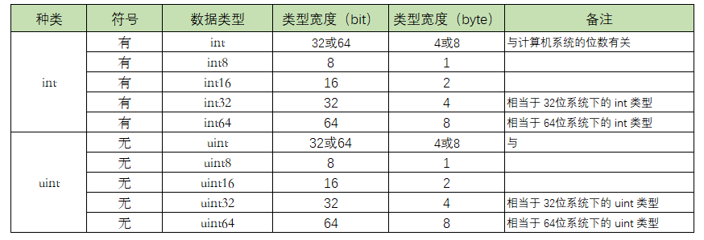

# 1. 环境配置

## 1.1. 安装

- windows
  - 下载go安装包，安装到指定目录[下载链接](https://golang.google.cn/dl/)
  - 或者使用scoop进行安装

- linux
  - 下载指定系统tar包
  - 解压到指定目录
    ```bash
    tar -C /usr/local -xzf go1.10.3.linux-amd64.tar.gz
    ```
  - 配置环境变量

## 1.2. 环境变量

### 1.2.1. 说明

#### 1.2.1.1. GOROOT

- 说明
  - Go 语言安装根目录的路径，也就是GO语言的安装路径,官方推荐的目录地址一般在GOROOT="/usr/local/go"
  - 在 GO 1.10 之前，需要视不同安装方式决定是否手动配置。
    - 比如源码编译安装，安装时会有默认设置
    - 而采用二进制包安装，在windows系统中，推荐安装位置为C:\GO
    - 在Linux、freeBSD、OS X系统，推荐安装在/usr/local/go下
    - 如果要自定义安装位置，必须手动设置GOROOT
    - 如果采用系统方式安装，这一切已经帮我们处理好了。

- 深入：关于这个话题，推荐阅读：you-dont-need-to-set-goroot和分析源码安装go的过程。

- 当前情况
  - 在 GO 1.10 及以后，这个变量已经不用我们设置了，它会根据go工具集的位置，即相对go tool的位置来动态决定GOROOT的值
  - 说简单点，其实就是go命令决定GOROOT的位置。

#### 1.2.1.2. GOPATH

- 说明
  - GOPATH是用户自定义的工作区
  - 我们通常开发项目代码都会放在GOPATH的工作区中
- 版本区别
  - 在go 1.8之前，该变量必须手动设置
  - go 1.8及之后，如果没有设置，默认在`$HOME/go`目录下，即你的用户目录中的go目录下
- 它应包含3个子目录：src目录、pkg目录、bin目录
  - src :
    - 这个目录是你开发程序的主目录，所有的源码都是放在这个目录下面进行开发。
    - 通常的做法是一个目录为一个独立的项目。例如 `$GOPATH/src/hello`就表示 hello 这个应用包
    - 因此，每当开发一个新项目时，都需要在 `$GOPATH/src/`下新建一个文件夹用作开发。
    - 当你在引用其他包的时候，Go 程序也会以 `$GOPATH/src/`目录作为根目录进行查找。
    - 当然了， src 目录允许存在多级目录
      - 例如在 src 下面新建了目录 `$GOPATH/src/github.com/baxiang/hello`，那么这个包路径就是 github.com/golang/baxiang/hello
      - 包名称为最后一个目录 hello
  - pkg:
    - 用于存放通过go install命令安装后的代码包的归档文件
    - （archive file，也就是以“.a”为扩展名的文件）
  - bin: 
    - 一般通过执行go install命令完成安装后，保存由Go命令源码文件生成的可执行文件（executable file）

#### 1.2.1.3. GOPROXY

- 由于众所周知的原因，国内无法使用一些谷歌的库，需要设置代理
- 具体国内设置网站 https://goproxy.io/
- 最终执行 go env 命令会看到如下环境变量
  ```bash
  GOPROXY="https://goproxy.io"
  ```

### 1.2.2. 设置环境变量

- 对于>=1.13版本的go，可以直接使用go env -w 设置环境变量

  ```bash
  go env -w GOPATH=$HOME/go
  ```

- 设置GOPROXY

  ```bash
  $ go env -w GO111MODULE=on
  $ go env -w GOPROXY=https://goproxy.cn,direct
  ```

- 设置开启

  ```bash
  go env -w GO111MODULE=on
  ```

- 如果需要重置某个变量数据或者出现下面的警告错误
  ```bash
  warning: go env -w GOPROXY=... does not override conflicting OS environment variable
  ```
  - 这说明和系统设置的环境变量冲突
  - linux上执行下面的重置命令

    ```bash
    unset GOPROXY
    ```

- 对于`<1.13`版本的,打开/etc/profile或者~/.bash_profile文件，其中/etc/profile需要有sudo 权限 而且设置成为全局的环境变量

  ```bash
  export GOPATH=$HOME/go
  export PATH=$PATH:$GOPATH/bin
  export PATH=$PATH:/usr/local/go/bin
  ```

- 查看当前设置的环境变量参数

  ```bash
  $ go env
  ```

## 1.3. 开发环境

### 1.3.1. Go Playground

- 一般小规模运行代码 或则希望把自己运行代码分享给其他人 
- 可以使用The Go Playground，这是一个可以在线运行Go的环境
- [链接](https://play.golang.org/ )

### 1.3.2. GoLand

- jetbrains公司开发的软件

### 1.3.3. VSCode

- go插件

### 1.3.4. Neovim+LSP

- [个人配置](https://github.com/whitestarrain/dotfiles)

## 1.4. 了解常用系统命令

### 1.4.1. 总括

```
go help
Go is a tool for managing Go source code.

Usage:

        go <command> [arguments]

The commands are:

        bug         start a bug report
        build       compile packages and dependencies
        clean       remove object files and cached files
        doc         show documentation for package or symbol
        env         print Go environment information
        fix         update packages to use new APIs
        fmt         gofmt (reformat) package sources
        generate    generate Go files by processing source
        get         add dependencies to current module and install them
        install     compile and install packages and dependencies
        list        list packages or modules
        mod         module maintenance
        run         compile and run Go program
        test        test packages
        tool        run specified go tool
        version     print Go version
        vet         report likely mistakes in packages

Use "go help <command>" for more information about a command.

Additional help topics:

        buildconstraint build constraints
        buildmode       build modes
        c               calling between Go and C
        cache           build and test caching
        environment     environment variables
        filetype        file types
        go.mod          the go.mod file
        gopath          GOPATH environment variable
        gopath-get      legacy GOPATH go get
        goproxy         module proxy protocol
        importpath      import path syntax
        modules         modules, module versions, and more
        module-get      module-aware go get
        module-auth     module authentication using go.sum
        packages        package lists and patterns
        private         configuration for downloading non-public code
        testflag        testing flags
        testfunc        testing functions
        vcs             controlling version control with GOVCS

Use "go help <topic>" for more information about that topic.
```

### 1.4.2. go env

- 查看本地go环境变量
- 官方的说明文档
  ```shell
  $ go help env
  usage: go env [-json] [-u] [-w] [var ...]

  Env prints Go environment information.

  By default env prints information as a shell script
  (on Windows, a batch file). If one or more variable
  names is given as arguments, env prints the value of
  each named variable on its own line.

  The -json flag prints the environment in JSON format
  instead of as a shell script.

  The -u flag requires one or more arguments and unsets
  the default setting for the named environment variables,
  if one has been set with 'go env -w'.

  The -w flag requires one or more arguments of the
  form NAME=VALUE and changes the default settings
  of the named environment variables to the given values.

  For more about environment variables, see 'go help environment'.
  ```

### 1.4.3. go get

- 用于动态获取远程仓库中的代码包及其依赖，并进行安装。
- 这个命令实际上分为两步：
  - 第一步是下载源码包
    - 下载源码包的 go 工具会自动根据不同的域名调用不同的源码工具
    - 例如下载 Github 上的代码包时则是利用系统的 Git 工具。
  - 第二步是执行 go install 安装
- 所以为了 go get 能正常工作，必须确保安装了合适的源码管理工具

- 常用参数：

  ```go
  -u - 强制使用网络去更新包和它的依赖包
  -d - 只下载不安装
  -fix - 在获取源码之后先运行fix，然后再去做其他的事情
  -t - 同时也下载需要为运行测试所需要的包
  -v - 显示执行的命令
  ```
  - 只有当你指定 `-u` 时，不管你需不需要更新，都会触发重新下载强制更新。

- 示例

  ```go
  # 拉取最新
  go get github.com/foo
  
  # 最新的次要版本或者修订版本(x.y.z, z是修订版本号， y是次要版本号)
  go get -u github.com/foo
  
  # 升级到最新的修订版本
  go get -u=patch github.com/foo
  
  # 指定版本，若存在tag，则代行使用
  go get github.com/foo@v1.2.3
  
  # 指定分支
  go get github.com/foo@master
  
  # 指定git提交的hash值
  go get github.com/foo@e3702bed2
  ```

### 1.4.4. go run

- 直接从源码文件运行编译任务并执行编译文件。

### 1.4.5. go build

- 说明：这个命令主要用来编译代码
  - Go 是一门编译型语言，因此需要将源码编译为二进制文件之后才能执行
  - 该命令即可将源码文件编译为对应的二进制文件
  - 若有必要，会同时编译与之相关联的包。

- 编译包
  - 如果是普通包
    - 当执行 go build 之后，它不会产生任何文件
    - 如果需要在`$GOPATH/pkg` 下生成相应的文件，则需要执行 go install 命令完成。
  - 如果是 main 包
    - 当执行 go build 之后，它就会在当前目录下生成一个可执行文件
    - 如果需要在 `GOPATH/pkg`或者`$GOPATH/bin`中下生成相应的文件，需要执行 go install，或者使用 go build -o 路径。

- 编译单个文件
  - 如果某个项目文件夹下有多个文件，而你只想编译某个文件，可以在 go build 之后加上文件名
  - 例如 `go build hello.go`
  - go build 命令**默认会编译当前目录下的所有 go 文件**

- 指定输出文件名
  - 可以通过 -o NAME 的方式指定 go build 命令编译之后的文件名
  - 默认是 package 名（非 main 包）
  - 或者是第一个源文件的文件名（main 包）。

- 忽略文件：
  - go build 会忽略目录下以“_”或“.”开头的 go 文件。

### 1.4.6. go clean

- 移除当前源码包和关联源码包里面编译生成的文件。
- 参数
  - `-i `：清除关联的安装的包和可运行文件，也就是通过`go install`安装的文件；
  - `-n`： 把需要执行的清除命令打印出来，但是不执行，这样就可以很容易的知道底层是如何运行的；
  - `-r`： 循环的清除在 import 中引入的包；
  - `-x`： 打印出来执行的详细命令，其实就是 -n 打印的执行版本；
  - `-cache`： 删除所有`go build`命令的缓存
  - `-testcache`： 删除当前包所有的测试结果

### 1.4.7. go fmt

- Go 语言有标准的书写风格，不按照此风格的代码将不能编译通过，
- 为了减少浪费在排版上的时间，go fmt 命令可以帮你格式化你写好的代码文件，使你写代码的时候不需要关心格式
- 你只需要在写完之后执行 go fmt filename.go，你的代码就被修改成了标准格式。

### 1.4.8. go install

- 编译和安装包及其依赖。在内部实际上分成了两步操作：
  - 第一步是生成结果文件(可执行文件或者包)
  - 第二步会把编译好的结果移到`$GOPATH/bin`

### 1.4.9. go test

- 说明：读取源码目录下面名为 *_test.go 的文件，生成并自动运行测试用的可执行文件。
- 参数

  ```plain
  -bench regexp - 执行相应的 benchmarks。
  -cover - 开启测试覆盖率。
  -run regexp - 只运行 regexp 匹配的函数。
  -v - 显示测试的详细命令。
  ```

### 1.4.10. go tool

- 一些有用的工具集合。常用的有：

  ```bash
  go tool fix # 用来修复以前老版本的代码到新版本。
  go tool vet directory|file # 用来分析当前目录的代码是否都是正确的代码，例如函数里面提前 return 导致出现了无用代码之类的。
  ```

### 1.4.11. go doc

- 说明
  - 为 go 程序自动提取和生成文档，或者查看某个 package 的文档。
- 示例
  - 例如，查看 fmt 的文档，使用 `go doc fmt` 即可。
  - 支持查看包中的某个函数，例如 `go doc fmt Printf`。

支持使用 -http 参数开启一个本地服务，用于展示 golang.org 的上的官方文档。例如：godoc -http=:8080。

# 2. 基础

## 2.1. 基本数据类型

### 2.1.1. 声明方式

#### 2.1.1.1. 一行声明一个变量

- 语法

  ```go
  var <name> <type>
  ```

- var 
  - 虽然只指定了类型，但是 Go 会对其进行隐式初始化
    - 比如 string 类型就初始化为空字符串
    - int 类型就初始化为0
    - float 就初始化为 0.0
    - bool类型就初始化为false
    - 指针类型就初始化为 nil。
  - **一般使用var在函数外声明全局变量**

- 若想在声明过程，顺便也初始化，可以这样写
  ```go
  var name string = "Go编程时光"
  // 注意，go中单引号和双引号不同，字符串只能用双引号
  ```

- 自动推导类型

  ```go
  var name = "Go编程时光"
  ```
  - 若你的右值带有小数点，在不指定类型的情况下，编译器会将你的这个变量声明为 float64，但是很多情况下
  - 我们并不需要这么高的精度（占用的内存空间更大）
  - 这种情况下，推荐指定类型，不要偷懒

    ```go
    var rate float32 = 0.89
    ```

#### 2.1.1.2. 多个变量一起声明

- 声明多个变量，除了可以按照上面写成多行之外，还可以写成下面这样

  ```go
  var (
      name string
      age int
      gender string
  )
  ```

#### 2.1.1.3. :=简短声明

- 使用`:=`
  - 推导声明写法或者短类型声明法
  - 编译器会自动根据右值类型推断出左值的对应类型
  - 可以声明一个变量，并对其进行（显式）初始化。
  - **要求 := 操作符左边的所有变量都有初始值**

- 示例
  ```go
  name := "Go编程时光"
  // 等价于
  var name string = "Go编程时光"
  // 等价于
  var name = "Go编程时光"
  name, age := "naveen" //error
  ```

- 局限：
  - 但这种方法有个限制就是，只能用于函数内部是 if、for 和 switch 的初始化语句中
  - 函数外部使用则会无法编译通过，所以 **一般用var方式来定义全局变量**

#### 2.1.1.4. 声明和初始化多个变量

- 示例：
  ```go
  var name, age := "wangbm", 28
  ```

- 这种方法，也经常用于变量的交换
  ```
  var a int = 100
  var b int = 200
  b, a = a, b
  ```

#### 2.1.1.5. new 函数声明一个指针变量

> **指针说明**

- 变量分为两种
  - `普通变量` 存放的是数据本身
  - `指针变量`而指针变量存放的是数据的地址。

- 如下代码，age 是一个普通变量，存放的内容是 28，而 ptr 是 存放变量age值的内存地址：0xc000010098

  ```go
  package main

  import "fmt"

  func main()  {
      var age int = 28
      var ptr = &age  // &后面接变量名，表示取出该变量的内存地址
      fmt.Println("age: ", age)
      fmt.Println("ptr: ", ptr)
  }
  ```
  ```bash
  # 输出
  age:  28
  ptr:  0xc000010098
  ```

> **new 函数**

- 而这里要说的 new 函数，是 Go 里的一个内建函数。
  - 使用表达式 new(Type) 将创建一个Type类型的匿名变量，初始化为Type类型的零值，然后返回变量地址
  - 返回的指针类型为`*Type`。

  ```go
  package main

  import "fmt"

  func main()  {
      ptr := new(int)
      fmt.Println("ptr address: ", ptr)
      fmt.Println("ptr value: ", *ptr)  // * 后面接指针变量，表示从内存地址中取出值
  }
  ```
  ```bash
  # 输出
  ptr address:  0xc000010098
  ptr value:  0
  ```

- new和普通声明
  - 用new创建变量和普通变量声明语句方式创建变量没有什么区别
  - 除了不需要声明一个临时变量的名字外，我们还可以在表达式中使用new(Type)
  - 换言之， **new函数类似是一种语法糖** ，而不是一个新的基础概念。
  - 如下两种写法，可以说是等价的

    ```go
    // 使用 new
    func newInt() *int {
        return new(int)
    }

    // 使用传统的方式
    func newInt() *int {
        var dummy int
        return &dummy
    }
    ```

#### 2.1.1.6. 匿名变量

- 以上不管哪种方法，变量/常量都只能声明一次，声明多次，编译就会报错。
- 但也有例外，这就要说到一个特殊变量： **匿名变量** ，也称作占位符，或者空白标识符，用下划线表示。
- 匿名变量，优点有三：
  - 不分配内存，不占用内存空间
  - 不需要你为命名无用的变量名而纠结
  - 多次声明不会有任何问题
- 通常我们用匿名接收必须接收，但是又不会用到的值。

  ```go
  func GetData() (int, int) {
      return 100, 200
  }
  func main(){
      a, _ := GetData()
      _, b := GetData()
      fmt.Println(a, b)
  }
  ```

### 2.1.2. 引用和值类型

- 说明
  - 引用类型的修改可以影响到任何引用到它的变量。
  - 基本类型因为是拷贝的值，并且在对他进行操作的时候，生成的也是新创建的值

- 区分：

  | **类型**     | **范围**                       |
  | ------------------ | ------------------------------------ |
  | **引用类型** | **切片,字典，通道,函数**       |
  | **值类型**   | **数组，基本数据类型，结构体** |

### 2.1.3. 类型转换

- 说明：Go 有着非常严格的强类型特征。Go 没有自动类型提升或类型转换

- 报错
  ```go
  package main

  import (  
      "fmt"
  )

  func main() {  
      i := 55      //int
      j := 67.8    //float64
      sum := i + j //不允许 int + float64
      fmt.Println(sum)
  }
  ```
- 修复：把 v 转换为 T 类型的语法是 T(v)
  ```go
  package main

  import (  
      "fmt"
  )

  func main() {  
      i := 55      //int
      j := 67.8    //float64
      sum := i + int(j) //j is converted to int
      fmt.Println(sum)
  }
  ```

### 2.1.4. 整型与浮点型

#### 2.1.4.1. 整型

> **说明**

- Go 语言中，整数类型可以再细分成10个类型
  

- int 和 uint 的区别
  - 就在于一个 `u`，有 `u` 说明是无符号，没有 `u` 代表有符号。
  - 以 `int8` 和 `uint8` 举例，8 代表 8个bit，能表示的数值个数有 2^8 = 256。
  - uint8 是无符号，能表示的都是正数，0-255，刚好256个数。
  - int8 是有符号，既可以正数，也可以负数，那怎么办？对半分呗，-128-127，也刚好 256个数。
  - int8 int16 int32 int64 这几个类型的最后都有一个数值，这表明了它们能表示的数值个数是固定的。

- `int`和`uint` 并没有指定它的位数
  - 当你在32位的系统下，int 和 uint 都占用 4个字节，也就是32位。
  - 若你在64位的系统下，int 和 uint 都占用 8个字节，也就是64位。
  - 出于这个原因，在某些场景下，你应当避免使用 int 和 uint ，而使用更加精确的 int32 和 int64
    - 比如在二进制传输、读写文件的结构描述
    - （为了保持文件的结构不会受到不同编译目标平台字节长度的影响）

> **不同进制的表示方法**

- 说明
  - 出于习惯，在初始化数据类型为整型的变量时，我们会使用10进制的表示法，因为它最直观
    ```go
    var num int = 10
    ```
  - 2进制：以`0b`或`0B`为前缀
    ```go
    var num01 int = 0b1100
    ```
  - 8进制：以`0o`或者 `0O`为前缀
    ```go
    var num02 int = 0o14
    ```
  - 16进制：以`0x` 为前缀
    ```go
    var num03 int = 0xC
    ```

- 示例

  ```go
  package main

  import (
      "fmt"
  )

  func main() {
      var num01 int = 0b1100
      var num02 int = 0o14
      var num03 int = 0xC

      fmt.Printf("2进制数 %b 表示的是: %d \n", num01, num01)
      fmt.Printf("8进制数 %o 表示的是: %d \n", num02, num02)
      fmt.Printf("16进制数 %X 表示的是: %d \n", num03, num03)
  }
  ```
  ```
  2进制数 1100 表示的是: 12
  8进制数 14 表示的是: 12
  16进制数 C 表示的是: 12
  ```

  - 以上代码用过了 fmt 包的格式化功能，你可以参考这里去看上面的代码

    ```
    %b    表示为二进制
    %c    该值对应的unicode码值
    %d    表示为十进制
    %o    表示为八进制
    %q    该值对应的单引号括起来的go语法字符字面值，必要时会采用安全的转义表示
    %x    表示为十六进制，使用a-f
    %X    表示为十六进制，使用A-F
    %U    表示为Unicode格式：U+1234，等价于"U+%04X"
    %E    用科学计数法表示
    %f    用浮点数表示
    ```

#### 2.1.4.2. 浮点型

> **说明**

- 浮点数类型的值
  - 普通表示
    - 一般由整数部分、小数点“`.`”和小数部分组成。
    - 其中，整数部分和小数部分均由10进制表示法表示。
  - 科学计数法
    - 在其中加入指数部分。指数部分由“E”或“e”以及一个带正负号的10进制数组成。
    - 比如，`3.7E-2`表示浮点数`0.037`。又比如，`3.7E+1`表示浮点数`37`。
    - 有时候，浮点数类型值的表示也可以被简化。比如，`37.0`可以被简化为`37`。又比如，`0.037`可以被简化为`.037`。
- 注意
  - 有一点需要注意，在Go语言里，浮点数的相关部分只能由10进制表示法表示，而不能由8进制表示法或16进制表示法表示。
  - 比如，`03.7`表示的一定是浮点数`3.7`。

> **float32 和 float64**

- Go语言中提供了两种精度的浮点数

  - **float32**
    - 也即我们常说的单精度
    - 存储占用4个字节，也即4*8=32位
    - 其中1位用来符号，8位用来指数，剩下的23位表示尾数

  

  - **float64**
    - 也即我们熟悉的双精度
    - 存储占用8个字节，也即8*8=64位
    - 其中1位用来符号，11位用来指数，剩下的52位表示尾数

  

- **精度与有效位数** :精度主要取决于尾数部分的位数。
  - float32
    - 尾数的为23位
    - 除去全部为0的情况以外，最小为2^-23，约等于1.19*10^-7
    - 所以float小数部分只能精确到后面6位，加上小数点前的一位，即有效数字为7位。
  - float64
    - 尾数部分为 52位
    - 最小为2^-52，约为2.22*10^-16
    - 所以精确到小数点后15位，加上小数点前的一位，有效位数为16位。

- 通过以上，可以总结出以下几点：
  - **一、float32 和 float64 可以表示的数值很多**
    - 浮点数类型的取值范围可以从很微小到很巨大。浮点数取值范围的极限值可以在 math 包中找到：
    - 常量 math.MaxFloat32 表示 float32 能取到的最大数值，大约是 3.4e38；
    - 常量 math.MaxFloat64 表示 float64 能取到的最大数值，大约是 1.8e308；
    - float32 和 float64 能表示的最小值分别为 1.4e-45 和 4.9e-324。
  - **二、数值很大但精度有限**
    - 虽然能表示的数值很大，但精度位却没有那么大。
    - float32的精度只能提供大约6个十进制数（表示后科学计数法后，小数点后6位）的精度
    - float64的精度能提供大约15个十进制数（表示后科学计数法后，小数点后15位）的精度

- 这里的精度是什么意思呢？
  - 正常示例
    - 比如 10000018这个数，用 float32 的类型来表示的话，由于其有效位是7位
    - 将10000018 表示成科学计数法，就是 1.0000018 * 10^7
    - 能精确到小数点后面6位。
    - 此时用科学计数法表示后，小数点后有7位，刚刚满足我们的精度要求
    - 此时你对这个数进行+1或者-1等数学运算，都能保证计算结果是精确的

    ```go
    import "fmt"
    var myfloat float32 = 10000018
    func main()  {
        fmt.Println("myfloat: ", myfloat)
        fmt.Println("myfloat: ", myfloat+1)
    }
    ```
    ```
    myfloat:  1.0000018e+07
    myfloat:  1.0000019e+07
    ```

- 问题示例：
  - 100000187，同样使用 float32类型，表示成科学计数法
  - 由于精度有限，表示的时候小数点后面7位是准确的，但若是对其进行数学运算，由于第八位无法表示
  - 所以运算后第七位的值，就会变得不精确。
  - 这里我们写个代码来验证一下，按照我们的理解下面 myfloat01 = 100000182 ，对其`+5` 操作后，应该等于 myfloat02 = 100000187，
  - 但是由于其类型是 float32，精度不足，导致最后比较的结果是不相等（从小数点后第七位开始不精确）

  ```go
  import "fmt"

  var myfloat01 float32 = 100000182
  var myfloat02 float32 = 100000187

  func main() {
      fmt.Println("myfloat: ", myfloat01)
      fmt.Println("myfloat: ", myfloat01+5)
      fmt.Println(myfloat02 == myfloat01+5)
  }
  ```
  ```
  myfloat:  1.00000184e+08
  myfloat:  1.0000019e+08
  false
  ```
  - 由于精度的问题，就会出现这种很怪异的现象，`myfloat == myfloat +1` 会返回 `true` 。

### 2.1.5. byte,rune

- 简单说明：
  - byte 和 uint8 没有区别
  - rune 和 uint32 没有区别
  - 之所以有这两个类型，是因为uint8 和 uint32 ，直观上让人以为这是一个数值，但是实际上，它也可以表示一个字符
  - 所以为了消除这种直观错觉，就诞生了 byte 和 rune 这两个 **别名类型**

- byte与uint8
  - byte，占用1个节字，就 8 个比特位（2^8 = 256，因此 byte 的表示范围 0->255）
  - 所以它和 uint8 类型本质上没有区别
  - **它表示的是 ACSII 表中的一个字符**

  ```go
  import "fmt"

  func main() {
      var a byte = 65
      // 8进制写法: var a byte = '\101'     其中 \ 是固定前缀
      // 16进制写法: var a byte = '\x41'    其中 \x 是固定前缀

      var b uint8 = 66
      fmt.Printf("a 的值: %c \nb 的值: %c", a, b)

      // 或者使用 string 函数
      // fmt.Println("a 的值: ", string(a)," \nb 的值: ", string(b))
  }
  ```
  ```go
  //  在 ASCII 表中，由于字母 A 的ASCII 的编号为 65 ，字母 B 的ASCII 编号为 66，所以上面的代码也可以写成这样
  import "fmt"

  func main() {
      var a byte = 'A'
      var b uint8 = 'B'
      fmt.Printf("a 的值: %c \nb 的值: %c", a, b)
  }
  ```

- rune和uint32
  - 占用4个字节，共32位比特位，所以它和 int32 本质上也没有区别
  - **它表示的是一个 Unicode字符**

  ```go
  import (
      "fmt"
      "unsafe"
  )

  func main() {
      var a byte = 'A'
      var b rune = 'B'
      fmt.Printf("a 占用 %d 个字节数\nb 占用 %d 个字节数", unsafe.Sizeof(a), unsafe.Sizeof(b))
  }
  ```
  ```go
  输出如下

  a 占用 1 个字节数
  b 占用 4 个字节数
  ```
  - 由于 byte 类型能表示的值是有限，只有 2^8=256 个。所以如果你想表示中文的话，你只能使用 rune 类型。

    ```go
    var name rune = '中'
    ```

- 双引号与单引号
  - 在 Go 中单引号与 双引号并不是等价的。
  - 单引号用来表示字符，在上面的例子里，如果你使用双引号，就意味着你要定义一个字符串
  - 赋值时与前面声明的会不一致，这样在编译的时候就会出错。

### 2.1.6. 字符串

#### 2.1.6.1. 说明

- 字符串声明
  ```go
  var mystr string = "hello"
  ```

- 字符串本质
  - 上面说的byte 和 rune 都是字符类型
  - **若多个字符放在一起，就组成了字符串** ，也就是这里要说的 string 类型。
  - 比如 `hello` ，对照 ascii 编码表，每个字母对应的编号是：104,101,108,108,111

  ```go
  import (
      "fmt"
  )

  func main() {
      var mystr01 string = "hello"
      var mystr02 [5]byte = [5]byte{104, 101, 108, 108, 111}
      fmt.Printf("mystr01: %s\n", mystr01)
      fmt.Printf("mystr02: %s", mystr02)
  }
  ```
  ```
  mystr01: hello
  mystr02: hello
  ```

- go字符串编码与大小计算
  - Go 语言的 string 是用 uft-8 进行编码的，英文字母占用一个字节，而中文字母占用 3个字节
  - 所以 `hello,你好` 的长度为 5+1+（3＊2)= 12个字节。

  ```go
  import (
      "fmt"
  )

  func main() {
      var country string = "hello,中国"
      fmt.Println(len(country))
  }
  // 输出
  // 12
  ```

#### 2.1.6.2. 解释型表示法

- 说明
  - 除了双引号表示字符串（解释型表示法）之外 ，还可以使用反引号。
- 区别
  - 大多情况下，二者并没有区别，但如果你的字符串中有转义字符`\` ，这里就要注意了，它们是有区别的。
  - **使用反引号包裹的字符串，相当于 Python 中的 raw 字符串，会忽略里面的转义**
- 示例
  - 比如我想表示 `\r\n` 这个 字符串，使用双引号是这样写的
    ```go
    // 解释型表示法
    var mystr01 string = "\\r\\n"
    ```

  - 而使用反引号，就方便多了，所见即所得，这种叫原生型表示法
    ```go
    var mystr02 string = `\r\n`
    ```

  - 他们的打印结果 都是一样的
    ```go
    import (
        "fmt"
    )

    func main() {
        var mystr01 string = "\\r\\n"
        var mystr02 string = `\r\n`
        fmt.Println(mystr01)
        fmt.Println(mystr02)
    }

    // output
    \r\n
    \r\n
    ```
  - 如果你仍然想使用解释型的字符串，但是各种转义实在太麻烦了。你可以使用 fmt 的 `%q` 来还原一下。

    ```go
    import (
        "fmt"
    )

    func main() {
        var mystr01 string = `\r\n`
        fmt.Print(`\r\n`)
        fmt.Printf("的解释型字符串是： %q", mystr01)
    }
    ```
    ```
    \r\n的解释型字符串是： "\\r\\n"
    ```

  - 同时反引号可以不写换行符（因为没法写）来表示一个多行的字符串。

    ```go
    import (
        "fmt"
    )

    func main() {
        var mystr01 string = `你好呀!
    hello`

        fmt.Println(mystr01)
    }
    ```
    ```
    你好呀!
    hello
    ```

#### 2.1.6.3. 底层数据结构

#### 2.1.6.4. 字符串操作

### 2.1.7. 数组与切片

#### 2.1.7.1. 数组

- 说明
  - 数组是一个由固定长度的特定类型元素组成的序列，一个数组可以由零个或多个元素组成
  - 因为数组的长度是固定的，所以在Go语言中很少直接使用数组。

- 注意：
  - **Go 中的数组是值类型而不是引用类型**
  - 当数组赋值给一个新的变量时，该变量会得到一个原始数组的一个副本。如果对新变量进行更改，则不会影响原始数组。

- 声明方式
  - 声明数组，并给该数组里的每个元素赋值（索引值的最小有效值和其他大多数语言一样是 0，不是1）

    ```go
    // [3] 里的3 表示该数组的元素个数及容量
    var arr [3]int
    arr[0] = 1
    arr[1] = 2
    arr[2] = 3
    ```

  - 声明并直接初始化数组

    ```go
    // 第一种方法
    var arr [3]int = [3]int{1,2,3}

    // 第二种方法
    arr := [3]int{1,2,3}
    ```

  - 使用 `...` 让Go语言自己根据实际情况来分配空间

    ```go
    arr := [...]int{1,2,3}
    ```

- 数组的类型
  - `[3]int` 和 `[4]int` 虽然都是数组，但他们却是不同的类型
  - 使用 fmt 的 `%T` 可以查得。

  ```go
  import (
      "fmt"
  )

  func main() {
      arr01 := [...]int{1, 2, 3}
      arr02 := [...]int{1, 2, 3, 4}
      fmt.Printf("%d 的类型是: %T\n", arr01, arr01)
      fmt.Printf("%d 的类型是: %T", arr02, arr02)
  }
  ```
  ```
  [1 2 3] 的类型是: [3]int
  [1 2 3 4] 的类型是: [4]int
  ```

- 定义 **别名类型**
  - 如果你觉得每次写 `[3]int` 有点麻烦，可以为 `[3]int` 定义一个类型字面量，也就是别名类型。
  - 使用 `type` 关键字可以定义一个类型字面量，后面只要你想定义一个容器大小为3，元素类型为int的数组 ，都可以使用这个别名类型。

  ```go
  import (
      "fmt"
  )

  func main() {
      type arr3 [3]int

      myarr := arr3{1,2,3}
      fmt.Printf("%d 的类型是: %T", myarr, myarr)
  }
  ```
  ```
  [1 2 3] 的类型是: main.arr3
  ```

- 简易写法
  ```go
  arr:=[4]int{2:3}
  ```
  ```
  打印 arr，会是
  [0 0 3 0]
  ```
  - 4表示数组有4个元素
  - 2 和 3 分别表示该数组索引为2（初始索引为0）的值为3
  - 而其他没有指定值的，就是 int 类型的零值，即0

#### 2.1.7.2. 切片

- 说明
  - 切片（Slice）与数组一样，也是可以容纳若干类型相同的元素的容器
  - 与数组不同的是， **无法通过切片类型来确定其值的长度**
- 本质
  - 每个切片值都会 **将数组作为其底层数据结构** 。我们也把这样的数组称为切片的底层数组。
  - **切片是对数组的一个连续片段的引用**，所以切片是一个 **引用类型**
  - 这个片段可以是整个数组，也可以是由 **起始和终止索引标识** 的一些项的子集
  - 需要注意的是， **终止索引标识的项不包括在切片内（意思是这是个左闭右开的区间）**

- 示例
  ```go
  import (
      "fmt"
  )

  func main() {
      myarr := [...]int{1, 2, 3}
      fmt.Printf("%d 的类型是: %T", myarr[0:2], myarr[0:2])
  }
  ```
  ```
  [1 2] 的类型是: []int
  ```

- 构造方式
  - 对数组进行片段截取，主要有如下两种写法

    ```go
    // 定义一个数组
    myarr := [5]int{1,2,3,4,5}
    
    // 【第一种】
    // 1 表示从索引1开始，直到到索引为 2 (3-1)的元素。左闭右开
    mysli1 := myarr[1:3]
    
    // 【第二种】
    // 1 表示从索引1开始，直到到索引为 2 (3-1)的元素
    mysli2 := myarr[1:3:4]
    ```
    - 在切片时，若不指定第三个数，那么**切片终止索引**会一直到原数组的最后一个数
    - 而如果指定了第三个数，那么切片终止索引只会到原数组的该索引值。

      ```go
      package main
      
      import "fmt"
      
      func main(){
          myarr := [5]int{1,2,3,4,5}
          fmt.Printf("myarr 的长度为：%d，容量为：%d\n", len(myarr), cap(myarr))
      
          mysli1 := myarr[1:3]
          fmt.Printf("mysli1 的长度为：%d，容量为：%d\n", len(mysli1), cap(mysli1))
          fmt.Println(mysli1)
      
          mysli2 := myarr[1:3:4]
          fmt.Printf("mysli2 的长度为：%d，容量为：%d\n", len(mysli2), cap(mysli2))
          fmt.Println(mysli2)
      }
      ```
      ```
      myarr 的长度为：5，容量为：5
      mysli1 的长度为：2，容量为：4
      [2 3]
      mysli2 的长度为：2，容量为：3
      [2 3]
      ```

  - 从头声明赋值（例子如下）

    ```go
    // 声明字符串切片
    var strList []string
    
    // 声明整型切片
    var numList []int
    
    // 声明一个空切片
    var numListEmpty = []int{}
    ```

  - 使用 make 函数构造，make 函数的格式：`make( []Type, size, cap )`
    - 这个函数刚好指出了，一个切片具备的三个要素： **类型（Type），长度（size），容量（cap）**

    ```go
    import (
      "fmt"
    )
    
    func main() {
      a := make([]int, 2)
      b := make([]int, 2, 10)
      fmt.Println(a, b)
      fmt.Println(len(a), len(b))
      fmt.Println(cap(a), cap(b))
    }
    ```
    ```
    [0 0] [0 0]
    2 2
    2 10
    ```

  - 简易写法

    ```go
    import (
      "fmt"
    )
    
    func main() {
        a := []int{4:2}
        fmt.Println(a)
        fmt.Println(len(a), cap(a))
    }
    ```
    ```
    [0 0 0 0 2]
    5 5
    ```

- len 和 cap 的概念
  - 类比说说明
    - 公司名，相当于字面量，也就是变量名。
    - 公司里的所有工位，相当于已分配到的内存空间
    - 公司里的员工，相当于元素。
    - cap 代表你这个公司最多可以容纳多少员工
    - len 代表你这个公司当前有多少个员工
  - 由于 切片是引用类型，所以你不对它进行赋值的话，它的零值（默认值）是 nil
    ```go
    var myarr []int
    fmt.Println(myarr == nil)
    // true
    ```

- 数组与切片
  - 有相同点，它们都是可以容纳若干类型相同的元素的容器
  - 也有不同点，数组的容器大小固定，而切片本身是引用类型
  - 切片更像是 Python 中的 list ，我们可以对它 append 进行元素的添加。

  ```go
  import (
      "fmt"
  )

  func main() {
      myarr := []int{1}
      // 追加一个元素
      myarr = append(myarr, 2)
      // 追加多个元素
      myarr = append(myarr, 3, 4)
      // 追加一个切片, ... 表示解包，不能省略
      myarr = append(myarr, []int{7, 8}...)
      // 在第一个位置插入元素
      myarr = append([]int{0}, myarr...)
      // 在中间插入一个切片(两个元素)
      myarr = append(myarr[:5], append([]int{5,6}, myarr[5:]...)...)
      fmt.Println(myarr)
  }
  ```
  ```
  [0 1 2 3 4 5 6 7 8]
  ```

- 注意：
  - append 是往cap后添加， **与终止索引无关**
  - 切片append时，不会影响原数组

  ```go
  package main

  import "fmt"

  func main() {
    var numbers4 = [...]int{1, 2, 3, 4, 5, 6, 7, 8, 9, 10}
    myslice := numbers4[4:6:8]
    fmt.Printf("myslice为 %d, 其长度为: %d,其cap为：%d\n", myslice, len(myslice),cap(myslice))

    myslice = myslice[:cap(myslice)]
    fmt.Printf("myslice的第四个元素为: %d", myslice[3])
    print("\n")

    myslice = append(myslice,3)
    fmt.Printf("myslice为 %d, 其长度为: %d,其cap为：%d\n", myslice, len(myslice),cap(myslice))
    fmt.Printf("numbers4:%d",numbers4)
  }
  ```
  ```
  myslice为 [5 6], 其长度为: 2,其cap为：4
  myslice的第四个元素为: 8
  myslice为 [5 6 7 8 3], 其长度为: 5,其cap为：8
  numbers4:[1 2 3 4 5 6 7 8 9 10]
  ```

### 2.1.8. 字典

- 说明
  - 字典（Map 类型），是由若干个 `key:value` 这样的键值对映射组合在一起的数据结构。
  - 它是哈希表的一个实现，这就要求它的每个映射里的key，都是唯一的，可以使用 `==` 和 `!=` 来进行判等操作
  - 换句话说就是key必须是可哈希的。 简单来说，一个不可变对象，都可以用一个哈希值来唯一表示
    > 可以说除了切片、 字典，函数之外的其他内建类型都算

> **声明初始化字典**

- 声明语法
  ```go
  map[KEY_TYPE]VALUE_TYPE
  ```

- 三种声明并初始化字典的方法
  ```go
  // 第一种方法 var
  var scores map[string]int = map[string]int{"english": 80, "chinese": 85}

  // 第二种方法 :=
  scores := map[string]int{"english": 80, "chinese": 85}

  // 第三种方法 make
  scores := make(map[string]int)
  scores["english"] = 80
  scores["chinese"] = 85
  ```

  ```go
  // 要注意的是，第一种方法如果拆分成多步（声明、初始化、再赋值），和其他两种有很大的不一样了，相对会比较麻烦。
  import "fmt"

  func main() {
      // 声明一个名为 score 的字典
      var scores map[string]int

      // 未初始化的 score 的零值为nil，无法直接进行赋值
      if scores == nil {
          // 需要使用 make 函数先对其初始化
          scores = make(map[string]int)
      }

      // 经过初始化后，就可以直接赋值
      scores["chinese"] = 90
      fmt.Println(scores)
  }
  ```

> **字典的相关操作**

- 添加元素

  ```go
  scores["math"] = 95
  ```

- 更新元素，若key已存在，则直接更新value

  ```go
  scores["math"] = 100
  ```

- 读取元素，直接使用 `[key]` 即可 
  - 如果 key 不存在，也不报错，会返回其value-type 的零值。

  ```go
  fmt.Println(scores["math"])
  ```

- 删除元素，使用 delete 函数，如果 key 不存在，delete 函数会静默处理，不会报错。

  ```go
  delete(scores, "math")
  ```

> **判断 key 是否存在**

- 当key不存在，会返回value-type的零值 
- 所以你不能通过返回的结果是否是零值来判断对应的 key 是否存在，因为 key 对应的 value 值可能恰好就是零值。
- 其实字典的下标读取可以返回两个值，使用第二个返回值都表示对应的 key 是否存在，若存在ok为true，若不存在，则ok为false
- 示例

  ```go
  import "fmt"

  func main() {
      scores := map[string]int{"english": 80, "chinese": 85}
      math, ok := scores["math"]
      if ok {
          fmt.Printf("math 的值是: %d", math)
      } else {
          fmt.Println("math 不存在")
      }
  }
  ```
  ```go
  // 代码优化
  import "fmt"

  func main() {
      scores := map[string]int{"english": 80, "chinese": 85}
      if math, ok := scores["math"]; ok {
          fmt.Printf("math 的值是: %d", math)
      } else {
          fmt.Println("math 不存在")
      }
  }
  ```

> **如何对字典进行遍历**

- 说明：Go 语言中没有提供类似 Python 的 keys() 和 values() 这样方便的函数，想要获取，你得自己循环。

- 示例
  - 获取 key 和 value
    ```go
    import "fmt"

    func main() {
        scores := map[string]int{"english": 80, "chinese": 85}

        for subject, score := range scores {
            fmt.Printf("key: %s, value: %d\n", subject, score)
        }
    }
    ```

  - 只获取key，这里注意不用占用符。

    ```go
    import "fmt"

    func main() {
        scores := map[string]int{"english": 80, "chinese": 85}

        for subject := range scores {
            fmt.Printf("key: %s\n", subject)
        }
    }
    ```
  - 只获取 value，用一个占位符替代。

    ```go
    import "fmt"

    func main() {
        scores := map[string]int{"english": 80, "chinese": 85}

        for _, score := range scores {
            fmt.Printf("value: %d\n", score)
        }
    }
    ```

### 2.1.9. 布尔类型

- 说明：
  - 关于布尔值，无非就两个值：true 和 false
  - 但是go中没有自定类型转换,因此bool也不可以与int类型互相转换

- 与int类型转换需要自己实现

  ```go
  // bool 转 int
  func bool2int(b bool) int {
      if b {
          return 1
      }
      return 0
  }
  ```
  ```go
  // int 转 bool
  func int2bool(i int) bool {
      return i != 0
  }
  ```

- 取反：`!`

  ```go
  import "fmt"

  var male bool = true
  func main()  {
      fmt.Println( !male == false)
      // 或者
      fmt.Println( male != false)
  }

  // output: true
  ```

-  `&&` 表示`且`，用 `||` 表示`或`，并且有短路行为
  ```go
  import "fmt"

  var age int = 15
  var gender string = "male"
  func main()  {
      //  && 两边的表达式都会执行
      fmt.Println( age > 18 && gender == "male")
      // gender == "male" 并不会执行
      fmt.Println( age < 18 || gender == "male")
  }

  // output: false
  // output: true
  ```

### 2.1.10. 指针

## 2.2. 流程控制

### 2.2.1. if-else

### 2.2.2. switch-case

### 2.2.3. for

### 2.2.4. goto

### 2.2.5. defer

### 2.2.6. select

## 2.3. 异常机制

## 2.4. 语法规则：语句块与作用域

## 2.5. 基本数据结构

### 2.5.1. 字符串

### 2.5.2. 数组

### 2.5.3. Slice

### 2.5.4. Map

# 3. go面向对象

## 3.1. Struct

## 3.2. Interface

## 3.3. Function

## 3.4. 反射

# 4. 项目管理

# 5. 并发编程

# 6. 开发技能

# 7. 进阶内容

# 8. 开源资料

## 8.1. 开源电子书

| **书名**                              | **地址**                                                                               |
| ------------------------------------- | -------------------------------------------------------------------------------------- |
| **Go 语言高级编程**                   | https://github.com/chai2010/advanced-go-programming-book/blob/master/SUMMARY.md        |
| **Go 语言四十二章经**                 | https://legacy.gitbook.com/book/wizardforcel/go42/details                              |
| **For-learning-Go-Tutorial**          | https://github.com/KeKe-Li/For-learning-Go-Tutorial                                    |
| **go 源码分析**                       | https://github.com/cch123/golang-notes                                                 |
| **GO 专家编程**                       | https://github.com/RainbowMango/GoExpertProgramming                                    |
| **Go 语言标准库**                     | https://github.com/polaris1119/The-Golang-Standard-Library-by-Example                  |
| **Go 语言 101**                       | https://gfw.go101.org/article/101.html                                                 |
| **深入解析 go**                       | https://tiancaiamao.gitbooks.io/go-internals/content/zh/                               |
| **Golang 101 hacks**                  | https://nanxiao.gitbooks.io/golang-101-hacks/content/                                  |
| **Go 语言圣经（中文版）**             | https://yar999.gitbooks.io/gopl-zh/content/                                            |
| **Golang**                            | https://www.kancloud.cn/liupengjie/go/570005                                           |
| **Go 入门指南**                       | https://github.com/unknwon/the-way-to-go_ZH_CN/blob/master/eBook/directory.md          |
| **learning_tools**                    | https://github.com/hwholiday/learning_tools                                            |
| **go 语言原本**                       | https://changkun.de/golang/                                                            |
| **Golang 笔记**                       | https://github.com/overnote/over-golang                                                |
| **梯子教程**                          | https://www.tizi365.com/archives/470.html                                              |
| **Mastering GO**                      | https://wskdsgcf.gitbook.io/mastering-go-zh-cn/                                        |
| **build-web-application-with-golang** | https://github.com/astaxie/build-web-application-with-golang/blob/master/zh/preface.md |
| **Go 语言设计与实现**                 | https://draveness.me/golang/                                                           |
| **从问题切入，串连 Go 语言**          | https://github.com/qcrao/Go-Questions                                                  |
| **dave**                              | https://dave.cheney.net/category/golang                                                |
| **Go 语法树入门**                     | https://github.com/chai2010/go-ast-book                                                |
| **data-structures-questions**         | https://github.com/KeKe-Li/data-structures-questions                                   |
| **Go 编程时光**                       | https://github.com/iswbm/GolangCodingTime                                              |
| **go-awesome**                        | https://github.com/shockerli/go-awesome                                                |
| **Go 每日一库**                       | https://github.com/darjun/go-daily-lib                                                 |

## 8.2. 学习资料

| **Go 社区的知识图谱**   | https://github.com/gocn/knowledge         |
| ----------------------- | ----------------------------------------- |
| **Go 语言学习资料索引** | https://github.com/Unknwon/go-study-index |
| **GoCN 每日新闻**       | https://github.com/gocn/news              |
| **Go 夜读**             | https://github.com/talk-go/night          |

## 8.3. 学习网站

| **Go**官方文档                                                             | https://golang.org/doc/                               |
| -------------------------------------------------------------------------- | ----------------------------------------------------- |
| **Go**官方学习网站                                                         | https://go.dev/                                       |
| **Go**交流论坛                                                             | https://gocn.vip/                                     |
| **Go**语言中文网                                                           | https://studygolang.com/                              |
| **Go 技术论坛**                                                            | https://learnku.com/go                                |
| **Go**的库、框架和项目                                                     | https://awesome-go.com/                               |
| **Go 学习之路**                                                            | https://github.com/developer-learning/learning-golang |
| **7 天用 Go 动手写/从零实现系列**                                          | https://github.com/geektutu/7days-golang              |
| **Golang - 100 天从新手到大师**                                            | https://github.com/rubyhan1314/Golang-100-Days        |
| **Go 学习、Go 进阶、Go 实用工具类、Go-kit ，Go-Micro 微服务实践、Go 推送** | https://github.com/hwholiday/learning_tools           |
| **Golang 写的一些基础后端服务，基本包含大多数后端需要的服务**              | https://github.com/axetroy/go-server                  |

# 9. 参考资料

- [ ] **[Go编程时光](https://golang.iswbm.com/preface.html)(可以参考知识点结构)**
- [ ] **[Go语言学习笔记](https://www.yuque.com/baxiang/go)(知识点比较细，用来查缺补漏)**
- [ ] [Go语言圣经（中文版）](https://books.studygolang.com/gopl-zh/ch1/ch1-01.html)
- [ ] [Go Web 编程](https://astaxie.gitbooks.io/build-web-application-with-golang/content/zh/)[github地址](https://github.com/astaxie/build-web-application-with-golang)
- [ ] [一个小时学会用 Go 创建命令行工具](https://studygolang.com/articles/32020)
