# 电脑组件

## CPU

[cpu跑分排名](https://www.cpu114.com/)

### 理论

#### 架构

- 说明
  - 架构对CPU性能的影响巨大，抛开架构看核心、线程、性能，都是耍流氓！
  - 随着科技在进步，CPU制造工艺在不断提升，架构也会变得越来越先进。
  - 一般来说，新架构，能够带来更高效的性能，同时会伴随着功耗下降以及用上更多新技术，从而有效提升用户体验。

- 示例
  - Intel九代处理器采用的是Coffee Lake架构，九代i7性能几乎都是较高端处理器，
  - 而如果把架构降为七代（Kaby Lake），甚至是更低的老六代或五代的话，比如七代i7-7700的性能，目前只相当于九代i5-8400性能水平，
  - 而四代i7-4770则相当于九代i3水平，因此如果不看架构，只看核心线程或i5/i7系列的话，是很难准确判断处理器性能好坏的。

#### 核心数

- 多核心与单核多线程：
  - 核心：
    - 处理核心数，就是进行计算的核心数量。
  - 同时多线程技术（simultaneous multithreading）和 超线程技术（hyper–threading/HT）
    - 每个核心也有可以 **并发** 执行的最大线程，从而充分利用单个core的计算能力
    - simultaneous multithreading 缩写是 SMT，AMD 和其他 cpu 厂商的称呼。 hyper–threading 是 Intel 的称呼，可以认为 hyper–threading 是 SMT 的一种具体技术实现。
- 处理器也不是核心线程数越多，性能就一定越好。
- 在同架构产品中，核心线程越多，性能自然越强，但如果是不同代产品，就还要再具体分析了

> 线程应该是操作系统的概念，cpu中的多线程指的是什么？[参考](https://www.zhihu.com/question/274189552)
>
> 核心数 <-> 进程数？
>
> 单核线程数 <-> 进程中的线程数量？

#### 主频

- 在CPU的参数里，我们经常会看到 3.0GHz、3.7GHz等字眼，这就是CPU的主频
- 严谨的说他是CPU内核的时钟频率，但是我们也可以直接理解为运算速度。

#### 缓存

-  缓存也是CPU里一项很重要的参数。
- 由于CPU的运算速度特别快，在内存条的读写忙不过来的时候，CPU就可以把这部分数据存入缓存中
- 以此来缓解CPU的运算速度与内存条读写速度不匹配的矛盾，所以缓存是越大越好。

#### 工艺制程

- CPU是最精密的电脑硬件，集成了数以亿计的晶体管，内部非常复杂。
- 而工艺可以简单理解内部走线，随着CPU性能越来越强，晶体管越来越多，在CPU体积不变的情况，工艺要求就越来越高。
- CPU工艺制程的单位是nm，数值越小，代表工艺越先进。
- 一般来说，CPU工艺与架构类似，越进化越先进，伴随着性能提升的同时，功耗还越来越低，这就是新架构CPU的魅力，因此买处理器一般建议都是买新不买旧。

#### 总结

- 一般来说，CPU最重要的几个参数就架构、核心、线程、主频、缓存、工艺制程等方面。在相同架构产品中，除了工艺制程，一般都是数值越大越好。
- 从需求角度来说，入门办公对处理器要求很低，一般注重CPU性能的用户多为游戏和专业制图/渲染等需求用户。对于这部分用户，在选CPU的时候，应该注意：
  - 由于游戏运行需要的是粗暴直接的计算工作，所以高主频的CPU会更有优势。
  - 所以，有游戏需求的玩家可以选择主频高点的CPU，核心和线程数少一点无所谓
    > （当然不能太少，至少双核四线程起步，毕竟主流都是4核4线程了）
  - 对于需要进行大量并行运算的图形渲染来说，多核心多线程同时工作能比单核心高主频的傻大粗节省大量的时间。
  - 因此，专业制图/视频渲染的话，则可以更为侧重多核、大缓存、高性能处理器，以带来更好的工作效率。
- 目前，桌面处理器厂家只有Intel和AMD两家。
  - Intel曾经一家独大，但自2017年AMD推出锐龙系列处理器以来，各项性能指标开始标上Intel平台，并且走性价比路线，
  - 如今相比Intel品台差距在不断缩小。因此，无论是Intel还是AMD处理器，如今都值得推荐，在选择上不用再纠结了。

### intel

#### 命名规则

- **注意** ：
  - 随着cpu不断发布新款，以及使用环境（台式机，笔记本，嵌入式等）的不同， **命名规则也有一定区别** 。
  - 下面的说明是当前较为适用命名规则的说明
  - 其他命名规则可以参考 [Intel CPU型号解读以及如何粗略判断Intel CPU的性能](https://blog.csdn.net/mahoon411/article/details/106963398)

- 以`Intel core i7 7700K`为示例
  - Intel为CPU的生产厂商；core为品牌；i7为系列，代表它属于高端系列；7700K中的第一个7代表它为第7代产品；后面的700代表它的性能等级；最后的字母后缀K代表此CPU为不锁倍频版
  - 常见后缀
  - Intel更新CPU型号时是i3 6100、i3 7100、i3 8100，也就是 **不断更新CPU的代** ， **而不是不断更新i3、i5、i7**
    - 也就是说，Intel每次发布新款(新一代)CPU时就会把i3、i5、i7等级的全部发布一套
    - 下一次升级就再发布一套新的i3、i5、i7，一般来讲，Intel公司是一年一代，比如八代就是18年出的CPU。

- 系列说明
  - Intel生产的CPU分为高中低端
    - 最低端的G系列
    - 低端i3系列
    - 中端i5系列
    - 高端i7系列
    - 至尊i9系列。
  - 注意：
    - Intel的命名除了i3、i5、i7之外，后面还会有另外一串数字，比如i7 8700K，i5 8400，i7 7700HQ等
    - 其中i3、i5、i7只代表它属于哪一个定位的产品，并不是代表着它的最终型号。

- 后缀说明：
  > 官网：[英特尔® 处理器名称和编号](https://www.intel.cn/content/www/cn/zh/processors/processor-numbers.html)
  > 随着迭代，一些后缀含义可能过时
  - E: 嵌入式
  - G: 封装包中包含独立显卡
  - H: 针对移动设备进行优化的高性能
  - HK: 针对移动设备进行优化的高性能，未锁频
  - HQ: 针对移动设备进行优化的高性能，四核
  - S: 特别版
  - F: 表示CPU不带核显，需要搭配独立显卡才能点亮，因为省去了核显的部分，所以价格要比标准版便宜100-200元，适合准备好显卡的游戏玩家选择。
  - K: 表示CPU不锁倍频，也就是可以超频，不过要搭配Z系列的主板才能实现超频，产品价格更高，一般来说超频发热量会更高，所以尾缀带K的CPU都不附送散热器。
  - KS: 表示CPU为不锁倍频的特别版，也就是玩家俗称的“特挑版”，其主频可以达到更高的水平，释放出更强大的性能，一般用在追求旗舰性能的平台中。
  - T: 为低功耗版，发热量更低但性能也更低；
  - U: 表示专为高能效笔记本电脑或 2 合 1 电脑设计的处理器
  - X: 为旗舰平台处理器，需要搭配X系列主板；
  - XE: 表示专为实现最高性能而设计的面向台式机的“至尊版”处理器。 性能更加强大，价格也更贵，一般极少有玩家选择。
  - B: 球栅阵列 (BGA)

#### 粗略判断性能

可以查找最新的cpu天体图判断

> 以 Intel core i7 7700K 为例

- 第一步：比较CPU的代数，即7,这个数字代表这是第七代CPU。这里需要知道的是，每一代都好于前一代，八代肯定好于七代，七代最好的一般等于八代最差的。
- 第二步：比较CPU的系列，即i7，这个数字代表这是高端系列。一般来说，是：`i7>i5>i3`。
- 第三步：比较CPU的性能等级，即700，这个数字代表性能档次，数字越大，级别越高，性能越好。
- 特殊比较： 比较字母后缀。
  - 举例来说，比如带字母后缀U和不带字母后缀的CPU(带字母后缀U代表低压版)，这个参数直接决定了CPU的TDP(热设计功耗)，
  - TDP低一级的CPU就是再强也追不上TDP高一级的CPU。
  - 比如i3 7100和i7 7500U相比较，i3 7100的tdp超过65W，i7 7500U的tdp只有15W。我们注意到i7的性能居然不如i3。
- 总体来说：对比两个CPU的性能时，如果 **有一个CPU的代数高于另一个CPU的代数时，就认定为这个代数高的CPU性能更好** ，后续几步就不需再比较。

#### 核心数与超线程技术

下面两个表格并不能通吃，因为很多CPU的核心数量和线程数量是无法用统一公式判断的，所以这两个表格简单参考即可。

| 标压：无后缀、K、S、H、HK | i3        | i5        | i7         |
| ------------------------- | --------- | --------- | ---------- |
| 4~7 代                    | 2 核 4 线 | 4 核 4 线 | 4 核 8 线  |
| 8 代                      | 4 核 4 线 | 6 核 6 线 | 6 核 12 线 |

| 低压：后缀 U | i3        | i5        | i7        |
| ------------ | --------- | --------- | --------- |
| 4~7 代       | 2 核 4 线 | 2 核 4 线 | 2 核 4 线 |
| 8 代         | 2 核 4 线 | 4 核 8 线 | 4 核 8 线 |

### AMD

TODO: 硬件信息理解与性能判断

## GPU

### 理论

### NVIDIA

### AMD

### Intel

## 内存

## 硬盘

### 总线、协议、接口

[硬盘总线、协议、接口](https://www.51cto.com/article/692972.html)

### HDD

### SDD

### 检测工具

smart(Self-Monitoring, Analysis, and Reporting Technology) 检查，可以检查

看 `Media and Data Integrity Errors` 是否大于0，如果大于0，这硬盘大概率就要挂了

## 主板

### 主板芯片组

如果 CPU 相当于“**大脑**”，那么主板就是“**身体**”。

主板的作用，是给电脑的所有部件提供一个安装平台，而要让 CPU 与其它部件联系起来。

那就还需要一个类似“**脊髓**”的东西：**芯片组**。

#### 芯片组来历

芯片组的叫法，是一个习惯用语。

在电脑早期的时候，芯片组是真的有“**一组**”芯片，后来逐渐简化成了“**北桥**”和“**南桥**”。

而现在，**北桥芯片**也已经集成到了 CPU 里，就只剩下了**南桥芯片**，没有了南北之分，也就改名叫了 **PCH 芯片**。

#### 芯片组分级

Intel 和 AMD 每发布新一代的 CPU，就会随之发布新的芯片组，然后还会分成多个等级。

Intel 芯片组分可为 **H、B、Z、X** 四个等级。

与之搭配的数字型号是 **1、6、9**，也就是 **Hx10、Bx60、Zx90**，还有就是顶级平台 **X299**。

其中，**H** 系芯片组还有一个中高端定位的 **Hx70**，但它向来高不成低不就，存在感不强，所以相关主板也不多。

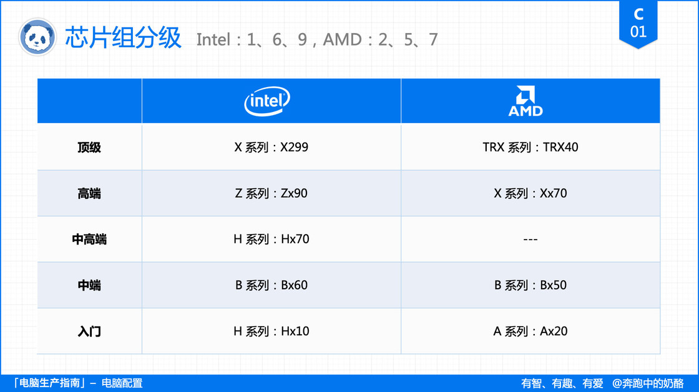

AMD 则可分为 **A、B、X、TRX** 四个等级。

与之搭配的数字型号是 **2、5、7**，也就是 **Ax20、Bx50、Xx70**，还有就是顶级平台 **TRX40**。

虽然 Intel 与 AMD 芯片组的命名方法相似，但其实有规律可循。

#### 芯片组命名

Intel 一开始采用的分数字级是 **1、5、7** 。

然而在 2017 年，AMD 发布全新的锐龙处理器， 采用的芯片组分级数字也是 **2、5、7**。

为了**避免重名**，Intel 从 **300** 系以后，**B** 系列数字就从 **5 改成了 6**，**Z** 系列从 **7 改成了 9**，也就变成了 **1、6、9。**

做为回应，**AMD** 芯片组的命名，也直接从 **300** 系开始，为的也是**避免重名**。

所以，如果一个叫 **B360** 的主板，那么它一定是 **Intel** 的主板，而如果是叫 **B350** 的，那它一定是 **AMD** 的主板。

同样，如果是 **B250** 的主板，那它也一定是 **Intel** 主板。

此外，**AMD 线程撕裂者** CPU 的芯片组，一开始采用了 **X399** 的命名。

但很快，AMD 就意识到会与 **Intel** **X299** 的下一代芯片组重名，于是在 **X399** 之后，就改名叫了 **TRX40**。

### 主板搭配

有了上面这些知识，在选择主板时，首先要确保能不能与 CPU 搭配，然后还要讲究搭配得合不合理。

#### CPU 针脚

Intel 在更新换代 CPU 时，都会随之更换 CPU 针脚。

比如酷睿 12 代 CPU 的针脚，与 11 代的不一样，12 代的是 **LGA1700**，11 代是 **LGA1200**，两者不能混插。

而 13 代 CPU 的针脚又与 12 代一样，所以这两者可以通用。

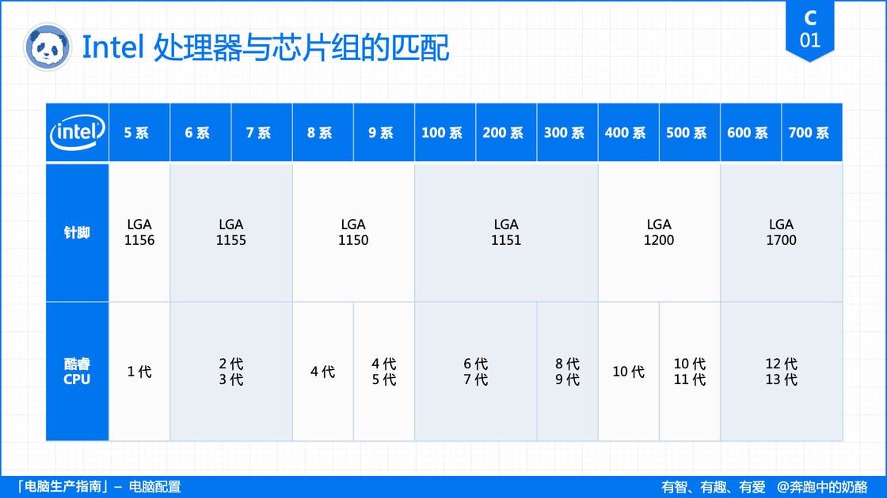

在这一点上，AMD 就简单多了。

AMD 锐龙处理器一直使用的是 **AM4** 接口 **PGA1331** 针脚，而且时间很长。

但在最新的 **7000** 系列处理器里，AMD 不但改用了 **AM5** 接口，而且还换用了与 Intel 类似的 **LGA1718** 针脚。

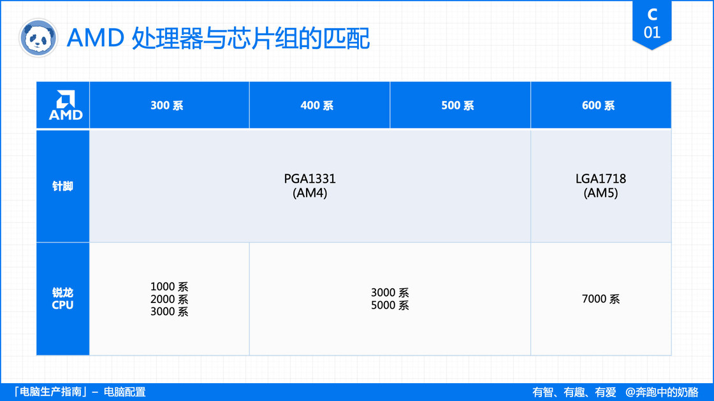

所以，在选择主板时，一定要先看能不能与 CPU 匹配得上。

#### 芯片组建议

其次，同一代不同级别的 CPU，**针脚都是一样的。**

也就是说，高端 CPU 也可以安装在低端主板上，同样，低端 CPU 也是可以安装在高端主板上。

但这样会“**杀鸡用牛刀**”，或者“**小马拉大车**”。

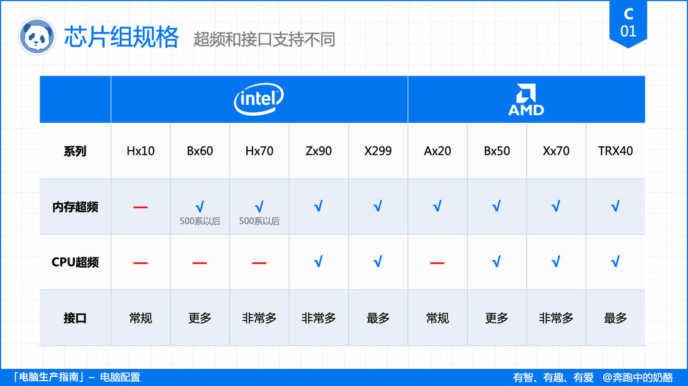

一般来说，入门 CPU 选择入门主板，中端 CPU 选择中端主板，高端 CPU 就选择高端主板。

后缀带 **K 的 CPU**，因为支持超频，也最好搭配 **Z** 系列主板。

但如果你玩不来超频。

只是想 CPU 有更高的睿频，**将带 K 的 CPU 搭配在不能超频的 B 系列主板上**，也是可以的。

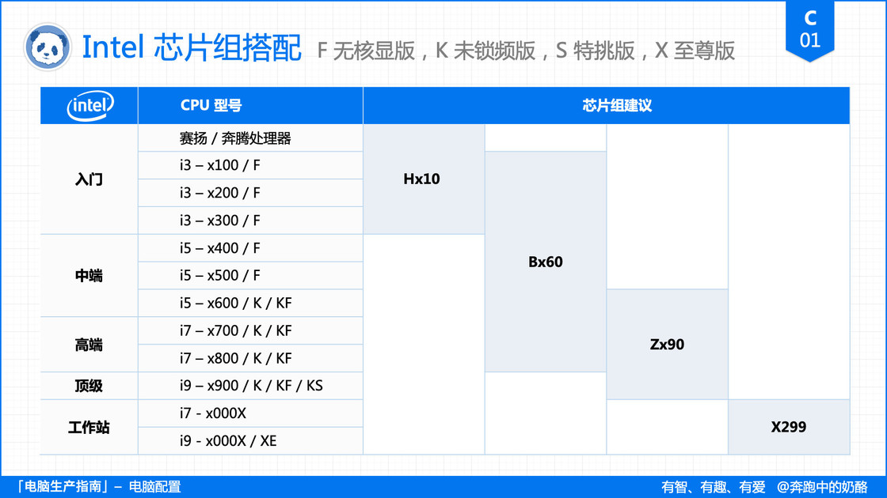

AMD 处理器由于**全系列支持超频**，芯片组的选择就简单多了。

同样是入门 CPU 搭配入门芯片组，高端 CPU 搭配高端芯片组就可以了。

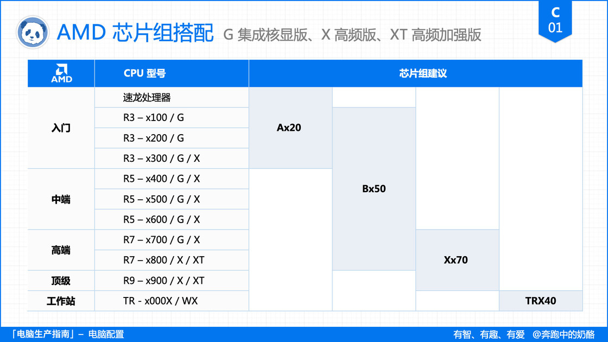

### 主板品牌

选择好芯片组后，还需要选择生产主板的厂商。

#### 产商命名

主板厂商在购买好芯片组后，通过自己的研发，会推出规格、用料、设计、功能各不相同的主板。

所以，即便是同一个芯片组的主板，到了厂商手里，还会继续还分出个**高、中、低档**来。

比如“**华硕、微星、技嘉、华擎**”都有多个级别。

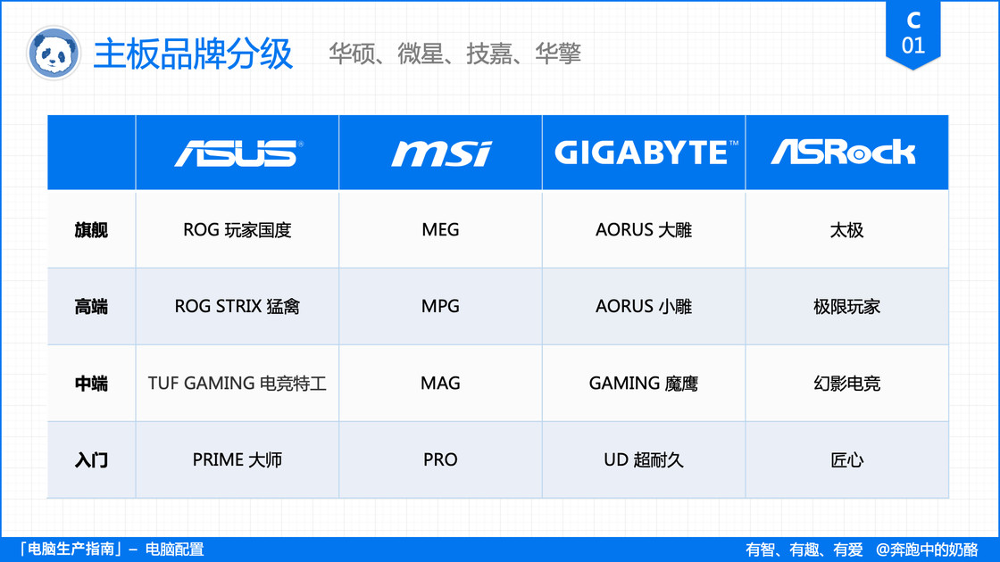

此外，即便是同一级别的主板。

主板产商还会通过各种“**刀法**”，继续分出多个版本来，通常配置低的版本，还会网友被称之为“**丐版**”。

比如华硕 **B360M-K** 主板，后缀 **K** 就是最便宜的那个版本。

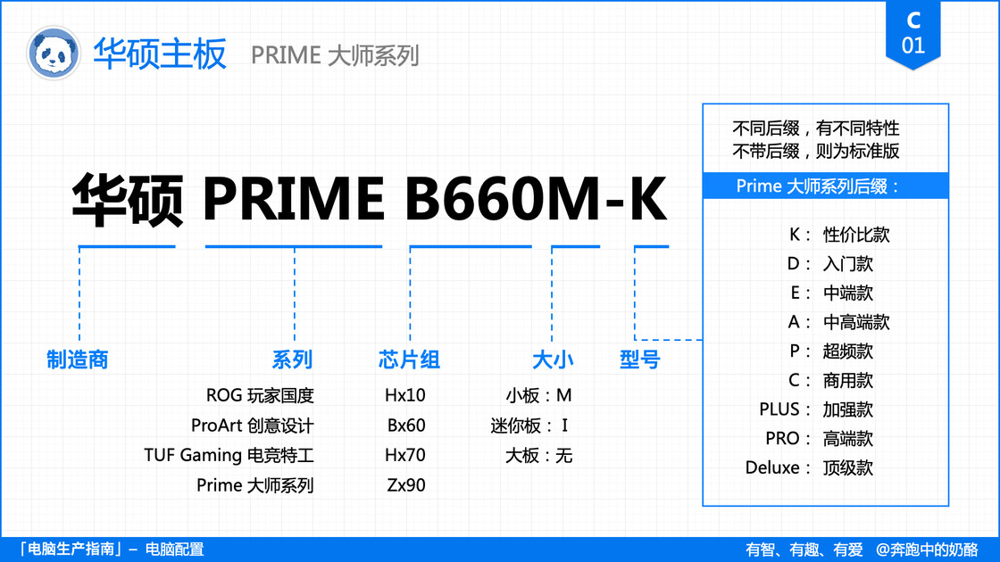

#### 一线品牌

主板的厂商很多，但一线品牌向来是这三家：**华硕、微星和技嘉**。

**华硕，是主板一哥。**

它不但市场占用率第一，高端品牌“**ROG 玩家国度**”更是声名显赫。

**ROG** 玩家国度又分为**纯血 ROG** 和 **Strix 猛禽**两个系列，华硕自身品牌下，还有“**大师、电竞特工**”等多个系列。

**微星，是主板二哥，同时也是 AMD 主板一哥。**

因为它的设计思路与 AMD 相似，性价比高，同时产品线也简单，只有 **MEG、MPG、MAG、PRO** 四个级别。

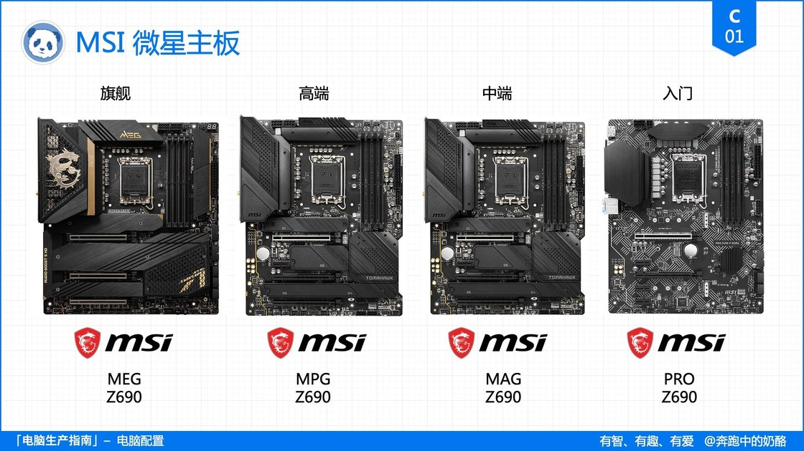

**技嘉，是主板三哥。**

技嘉喜欢堆料，在做工用料方面很扎实，它的“**超耐久**”系列主板也确实经久耐用。

但技嘉也因为开炮嘲讽“**中国制造**”，后被网友反讥“**技不如人，勇气可嘉**”，甚至抵制购买，只能说是“**自找的**”。

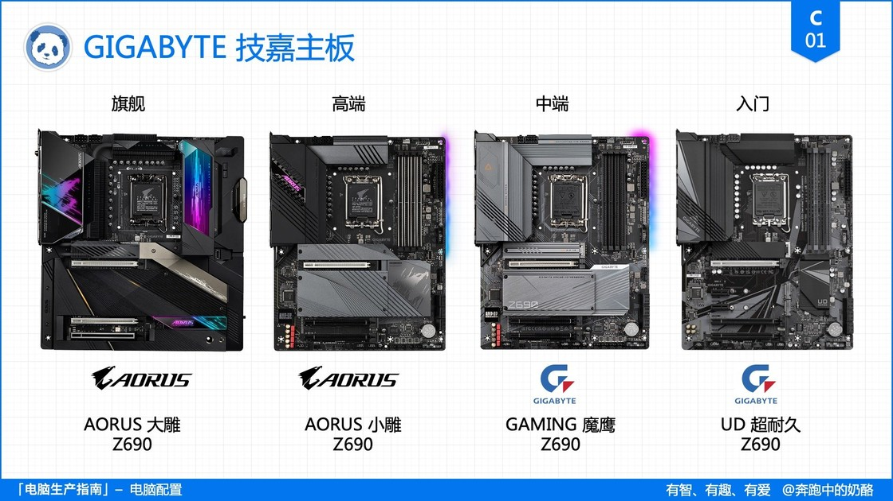

#### 二线品牌

主板的二线品牌有很多，但领头羊是**华擎**。

华硕、微星、技嘉这三家厂商，在站稳一线市场后，为了挤压其它二三线品牌，纷纷推出自己的二线品牌。

在名字上也是直言不讳，比如华硕的叫**华擎**、微星的叫**隽星**，技嘉的叫**倍嘉**。

但后来只有**华擎**活了下来。

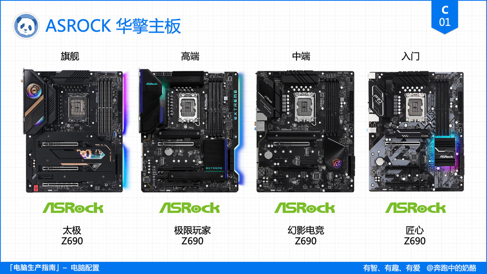

华擎的设计喜欢剑走偏锋，不走寻常路，很多奇奇怪怪的主板，都只有华擎才有，华擎更是自称是“**妖板学院**”。

所以，**华擎**也成为了喜欢超频和追求性价比玩家的“**心头好**”。

#### 其它品牌

至于其它品牌，如果你预算不多，选择上面这 4 家以外的品牌，也是可以的。

**毕竟它们的价格要便宜很多，甚至一半。**

比如七彩虹、影驰、铭瑄、昂达、恩杰、梅捷、映泰、昂达、盈通、精粤、华南等等。

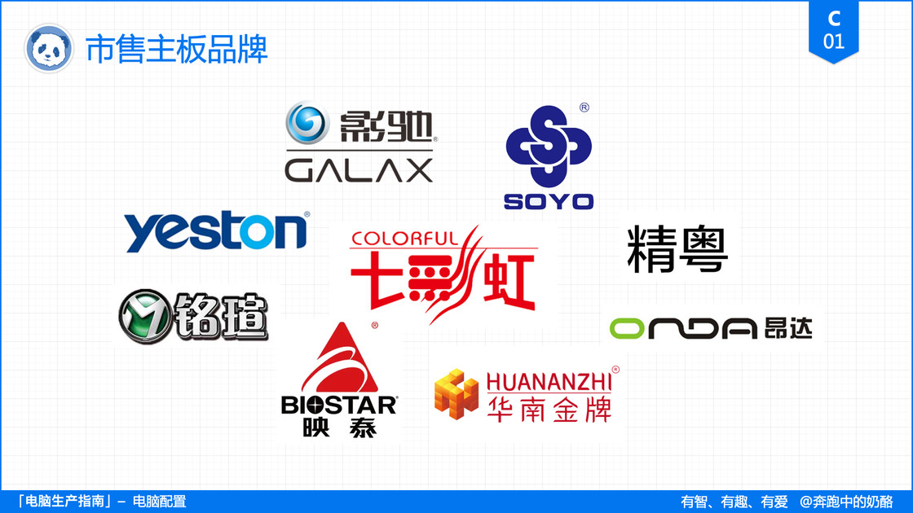

至于说会不会不稳定，现在主板都有**至少 3 年以上**的质保。

如果你不需要进行超频，就正常使用，同时还想省钱，选择它们也是没问题的。

毕竟价格摆在那了。

### 主板接口

**主板是属于有功能，但没有性能的部件。**

但在厂家的营销下，主板有了**“信仰加成**”，比如华硕的“**败家之眼**”，微星的“**龙盾**”，还有技嘉的“**大雕**”。

购买主板，具体还得看主板的配置如何。

#### 主板大小

主板的接口和扩展，通常与主板的大小成正比。

一般来说，版型越大，能安装的东西就越多，扩展性也就越强。按照大小，主板一般分为 4 种版型：

**E-ATX 加大板、ATX 大板、M-ATX 小板、ITX 迷你板**。

**E-ATX** 和 **ITA** 板型的用途比较特别，一个是用于顶级平台，一个用于迷你主机，主流还是 **ATX** 和 **M-ATX**。

对于大部分人来说，**M-ATX 小板**也已经足够使用，并且也更加经济实惠。

如果考虑要加装更多的部件，那么就选 **ATX 大板**。

#### PCIe 接口

PCIe 是电脑上的**高速扩展接口**，一般主板上都会有 **2 个以上**的 PCIe 接口。

最上面那个接口，通常是用来**插显卡的**，因为它**直连 CPU**。

至于其它的 PCIe 接口，你可以根据情况，可以插**网卡、声卡、视频采集卡、以及任意的 PCIe 转接口**。

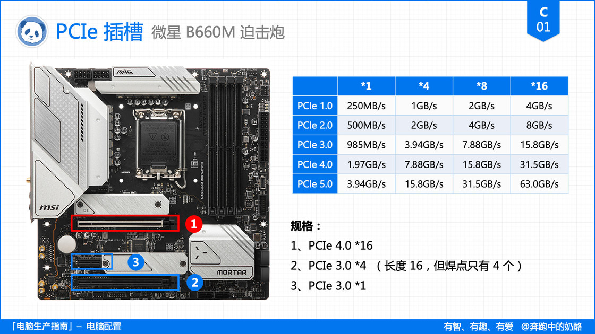

目前 **PCIe** 的标准已经发展到了 **5.0**。

插槽长度也有 **x1、x4、x8、x16** 四种，速度最高达到了 **63.0GB/s**。

但 **PCIe 3.0** 的速度就已经足够快了，即便是顶级显卡，也才刚跑满 **PCIe 3.0 x16** 的带宽，属于是“**战未来**”设计。

#### 存储接口

主板的硬盘接口有两种，一种是传统的 **SATA 接口**，另一种是高速的 **M.2 接口**。

**SATA 接口：**

一般主板都会不少于 **4** 个 SATA 接口，可以用来安装 **SATA 固态硬盘、机械硬盘、光驱**等设备。

**SATA** 虽然已经发展到了 **3.0** 版本，但它的速度最大只有 **600Mb/s**。

**M.2 接口**：

M.2 接口最早是用在**笔记本电脑**上的硬盘接口。

但因为速度比 **SATA** 快，后来也被**台式电脑**采用，如今大多主板都会支持 **M.2** 固态硬盘。

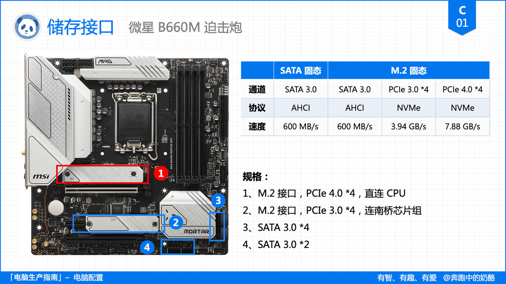

目前市面上有多种通道和协议的 **M.2** 固态硬盘。

一般选择 **NVMe** 协议 **PCIe 3.0 \*4** 通道的固态硬盘就可以了，因为速度已经足够的快了。

#### 外设接口

外设接口通常在主板的左上方，包括“**显示接口、音频接口、网卡接口、USB 接口**”等内容。

**显示接口：**

显示接口，包括 **VGA、DVI、HDMI、DP** 四种。

**VGA** 是最早的接口，在一些低端电脑里还能看到它的身影，**DVI** 是更先进的数字接口，但现在已经几乎完全消失。

因为新出的 **HDMI** 和 **DP** 接口，已经将它取代。

**HDMI** 接口可以用在电视、显示器、机顶盒、电视盒子等家用设备上，**DP** 接口则一般用在电脑和显示器上。

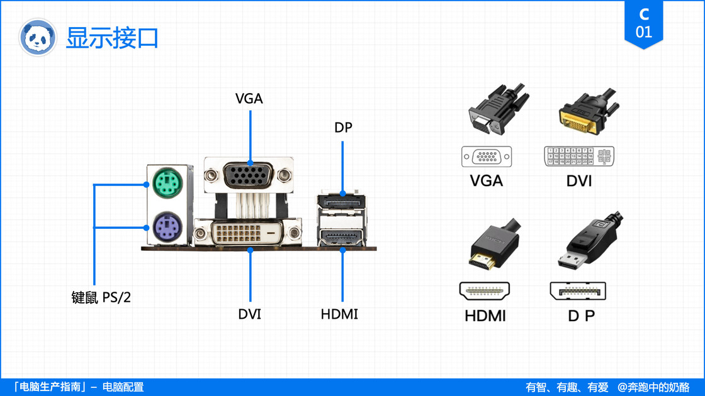

**音频接口：**

一般的主板音频接口会有 **3** 个孔。

更高级的音频接口则会有 **6** 个孔，最高支持**八声道，**而且，高端的音频接口还会支持盲插，不再需要一一配对。

**网卡接口：**

至于网络接口，一般都会自带千兆网卡，一些主板还会集成**无线 WiFi** 接口，在名称后面加注“**WIFI、AC”**的字样。

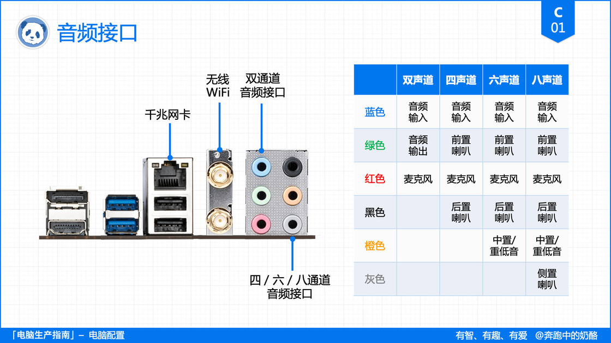

**USB 接口：**

最基本的 USB 接口是 **USB 2.0**。

**USB 2.0** 接口的颜色一般为黑色或者白色，蓝色的是 **USB 3.1**，红色或者青绿色的是 **USB 3.2**。

更高端的 USB 接口，还会提供 **Type-C** 接口（普通 USB 是 **Type-A** 接口），甚至还会有 **Type-C 雷电接口**的。

#### RGB 接口

至于 RGB 灯效，有的人认为它是“**光污染**”，而有的人认为 RGB 灯效有 **30%** 的性能加成。

如果你是“**性能加成**”这一派的。

注意选择有“**5V3针**”的可编程 RGB 接针，而且最好还要选择同一品牌的**主板和显卡**，这样才能做到“**板卡同步**”。

#### 供电相数

如果你是超频玩家，那就需要关注**主板供电**的问题。

通常情况，主板的供电相数越多，每一相的负载就越低，发热也就更低，更有利于 CPU 的发挥，也更加稳定。

最好的供电方式是“**直连供电**”，但由于成本，厂商又发明了“**倍相供电**”和“**并联供电**”。

如果你不超频，那就不用关心供电的问题了。

只要你搭配的是相同等级的 CPU，就不会有供电的问题，因为厂商都已经调试过了，正常使用完全不会有问题。

#### BIOS

最后再说一下 **BIOS**。

BIOS **可以说是主板的系统**，是电脑开机后的第一个应用程序，负责检测和调试主板上的硬件。

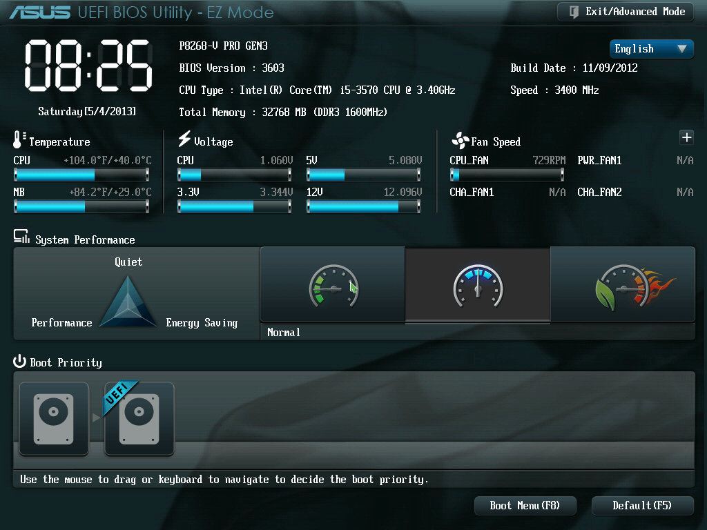

对于普通用户，**BIOS** 除了第一次装机会用到，后面就不再需要，但对于高级用户，**BIOS** 的体验就很重要了。

华硕能有那么高的市场占有率，和它的**人性化 BIOS 设计**，也是离不开的。

### 主板选购

主板选择，说难也难，但说简单也简单，总的来说，可以分为三步。

#### 选购步骤

首先，确定自己买什么样的 CPU；然后，查询与 CPU 匹配的芯片组；最后，选择具体的品牌和型号。

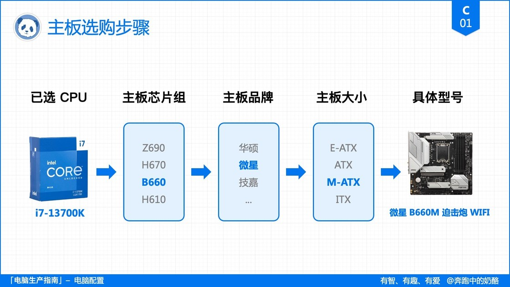

比如我想组一个“**高性价比的次旗舰电脑**”，根据步骤。

**步骤 1：**

**i7-13700K** 是目前 Intel 酷睿处理器里的**二当家**。

性能比 **i9-12900K** 高，散片价格只要 **3000** 元，性能和价格都是“**甜品级**”。

**步骤 2：**

但我玩不来超频，也不喜欢超频，所以选择了 **B660** 芯片组，选择带 **K** 的 **i7-13700**，是因为 CPU 的**睿频更高**。

**步骤 3：**

了解到“**微星 B660M 迫击炮**”主板的供电规模远超以往。

对 **i7** 供电绰绰有余，甚至在跑满睿频的情况下，依旧能稳定发挥，而且它的各项接口也都够用，甚至盈余。

再加上价格在 **1200** 元左右，最后就敲定“**微星 B660M 迫击炮 WiFi**”。

#### 品牌选择

对于主板品牌的选择，网友们经过多年的经验，总结了这样的一条思路：

**高端选华硕，中端选微星，低端选技嘉，没钱选其它。**

**华硕**在高端主板里的做工用料，颜值设计，还有易用性，都是顶级，而且“**信仰加成**”也是最足的。

**微星**主板的思路，与 **AMD** 公司相似，走的是**性价比路性**，**中端主板选微星**，错不了。

特别是网红主板“**迫击炮**”，性价比全网最高。

然后就有了“**遇事不决迫击炮**”的行话。

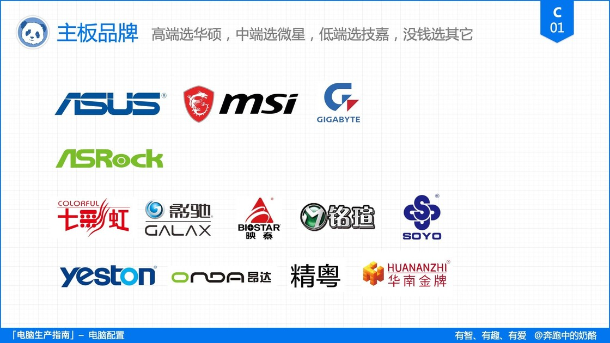

而在低端主板里，大多数厂商的产品会缩水严重，而这刚好是“**堆料王**”**技嘉**的强项。

它的“**超耐久**”系列主板也确实经久耐用。

至于**华擎主板**，你可以把它理解为“**华硕主板的廉价方案**”。

而其它的品牌，当它们价格摆在你面前时，你会觉得它们“**真香**”的。

#### 板U套装

如果你实在搞不来如何选主板。

可以去各大电商平台，搜索某个 CPU 的“**板U套装**”，不但可以省去搭配的问题，而且往往总体价格更便宜。

对于小白用户来说，**甚是美哉！**

## 散热器

### 风冷

小机箱有高度显示，一定要看下散热器限高，选择合适高度的散热器

#### 塔式散热器

矮单塔式散热器:

- 利民ak120 mini (135mm)，可以搭配 AMD Ryzen 5 5600 及以下
  - 可以搭配 AMD Ryzen 5 5600 及以下
  - 可以搭配 Intel 12490F 及以下

单塔式散热器:

- 利民AX120 R SE (148mm)
  - 可以搭配 AMD Ryzen 5 5600X 及以下
  - 可以搭配 Intel 12600 及以下
- 九州风神玄冰 400 V5 (150mm)
  - 可以搭配 AMD Ryzen 5 5600X 及以下
  - 可以搭配 Intel 12600 及以下
- 追风者伯乐S5 (155mm)
  - 可以搭配 AMD Ryzen 5 5700 及以下
  - 可以搭配 Intel 13600K 及以下

双塔散热器（可能挡内存）：

- 利民 PA120 SE (155mm)
  - 可以搭配 AMD Ryzen 5 5700X 及以下
  - 可以搭配 Intel 13600K 及以下
- 利民 PS120 SE (154mm)
  - 可以搭配 AMD Ryzen 5 5800X3D / 7600X 及以下
  - 可以搭配 Intel 13600K / 12700K 及以下

顶级双塔散热器

- 利民FC140 (160mm)
  - 可以搭配 AMD 7950X PBO 及以下
  - 可以搭配 Intel 13700K 及以下

#### 下压式散热器

36mm 左右，基本上用来组 ITX

### 水冷

## 电源

### 型号

- ATX  :150mm x 140mm x 86mm
- SFX  :125mm x 100mm x 63.5mm
- SFX-L:125mm x 130mm x 63.5mm

### 功率选择

考虑瞬时功率

[【硬核科普】如何合理科学的选择电源功率的大小？](https://www.bilibili.com/video/BV1Ab411d7zn/?spm_id_from=333.337.search-card.all.click)

## 机箱，机箱风扇

# 装机实践

## linux 服务器

需求：

- 并不是配主力机，主力机是个windows游戏本，也有一个显示屏。
- 只是想配置一个 **稳定，性能过得去** 的机器， **装linux发行版** 用。
- **不需要屏幕** ，日常使用基本就是远程连接跑一些程序，或者当NAS用。
- 也不会打游戏，所以基本上就是 **看单核性能** ，所以没上e5。
- 因为在租房，所以希望能够配一个 **体积小一点儿** 的主机，省些地方
- 同时不想拉网线，所以也 **需要一个无线网卡** 。

装机清单(2024-11-10)：

- 清单 (amd)  ：1329.3
  - 主板      ：技嘉b350M                 （239）
  - CPU       ：R5 3500                   （249）
  - 显卡      ：R7 260x                   （94.9）
  - 内存      ：金士顿骇客DDR4 8G         （67.2）
  - 固态      ：金百达NVME M.2 512G       （129）
  - 电源      ：玄武500kill               （139）
  - 风扇      ：冰度CPU4热管风扇2011专用版（40.7）
  - 机械(可选)：西数硬盘500g              （71.5）
  - 机箱      ：二手闪鳞G300              （200）
  - 无线网卡  ：AX200                     （99）

- 清单 (intel)：1440.3
  - 主板      ：华南H610-K                （266）
  - CPU       ：i3-12100F                 （333）
  - 显卡      ：R7 260x                   （94.9）
  - 内存      ：金士顿骇客DDR4 8G         （67.2）
  - 固态      ：金百达NVME M.2 512G       （129）
  - 电源      ：玄武500kill               （139）
  - 风扇      ：冰度CPU4热管风扇2011专用版（40.7）
  - 机械(可选)：西数硬盘500g              （71.5）
  - 机箱      ：二手闪鳞G300              （200）
  - 无线网卡  ：AX200                     （99）

# others

## 树莓派

# 参考资料

- [x] [一篇小白都能读懂的CPU入门知识](https://blog.csdn.net/weixin_45048331/article/details/109560259)
- [x] [cpu 核心数与线程数](https://zhuanlan.zhihu.com/p/86855590)
- [x] [Intel CPU型号解读以及如何粗略判断Intel CPU的性能](https://blog.csdn.net/mahoon411/article/details/106963398)
- [x] [常见CPU后缀](https://www.51cto.com/article/712673.html)
- [x] [英特尔® 处理器名称和编号](https://www.intel.cn/content/www/cn/zh/processors/processor-numbers.html)
- [x] [装机不求人，电脑配置挑选指南 —— 主板篇](https://sspai.com/post/77578)
- [ ] [电脑装机基础知识与 2024 年 618 速成攻略](https://www.v2ex.com/t/1041526)
- [x] [2023年 CPU散热器推荐](https://www.youtube.com/watch?v=_yKYa_aOVnQ&t=68s)

