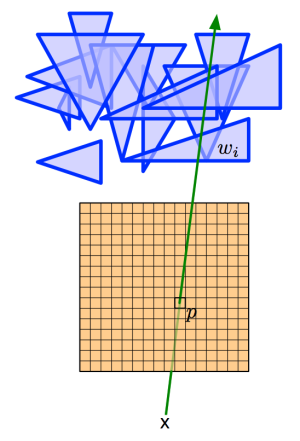
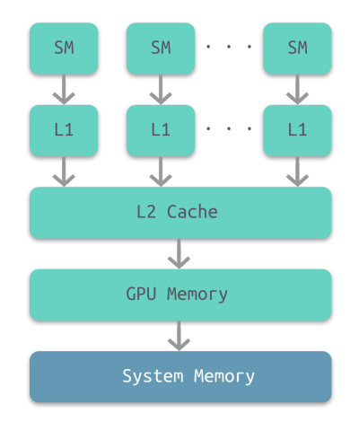
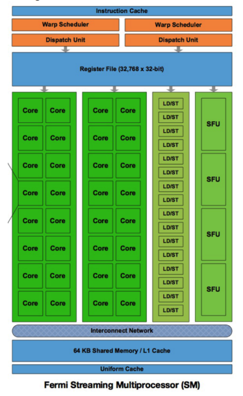
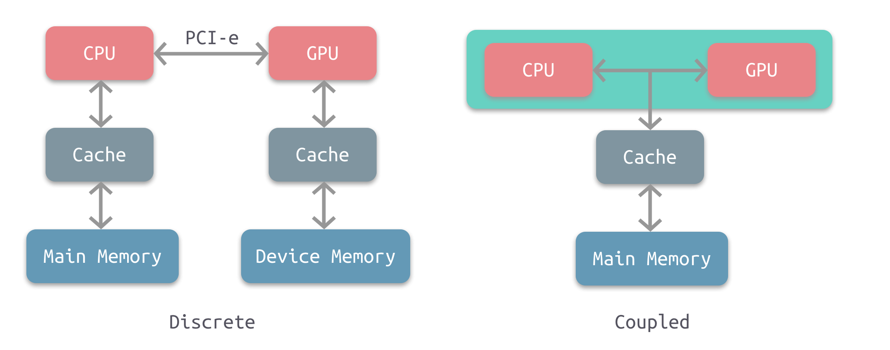
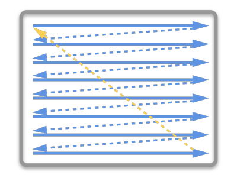
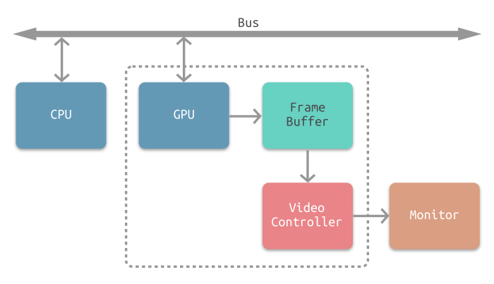

# 引言

作为程序员，我们或多或少知道可视化应用程序都是由 CPU 和 GPU 协作执行的。那么我们就先来了解一下两者的基本概念：

- **CPU（Central Processing Unit）**：现代计算机的三大核心部分之一，作为整个系统的运算和控制单元。CPU 内部的流水线结构使其拥有一定程度的并行计算能力。
- **GPU（Graphics Processing Unit）**：一种可进行绘图运算工作的专用微处理器。GPU 能够生成 2D/3D 的图形图像和视频，从而能够支持基于窗口的操作系统、图形用户界面、视频游戏、可视化图像应用和视频播放。GPU 具有非常强的并行计算能力。

这时候可能会产生一个问题：CPU 难道不能代替 GPU 来进行图形渲染吗？答案当然是肯定的

使用 GPU 渲染图形的根本原因就是：速度。GPU 的并行计算能力使其能够快速将图形结果计算出来并在屏幕的所有像素中进行显示。

那么像素是如何绘制在屏幕上的？计算机将存储在内存中的形状转换成实际绘制在屏幕上的对应的过程称为 **渲染**。渲染过程中最常用的技术就是 **光栅化**。

关于光栅化的概念，以下图为例，假如有一道绿光与存储在内存中的一堆三角形中的某一个在三维空间坐标中存在相交的关系。那么这些处于相交位置的像素都会被绘制到屏幕上。当然这些三角形在三维空间中的前后关系也会以遮挡或部分遮挡的形式在屏幕上呈现出来。一句话总结：光栅化就是将数据转化成可见像素的过程。



GPU 则是执行转换过程的硬件部件。由于这个过程涉及到屏幕上的每一个像素，所以 GPU 被设计成了一个高度并行化的硬件部件。

下面，我们来简单了解一下 GPU 的历史。

# GPU 历史

GPU 还未出现前，PC 上的图形操作是由 **视频图形阵列（VGA，Video Graphics Array）** 控制器完成。VGA 控制器由连接到一定容量的DRAM上的存储控制器和显示产生器构成。

1997 年，VGA 控制器开始具备一些 3D 加速功能，包括用于 **三角形生成**、**光栅化**、**纹理贴图** 和 **阴影**。

2000 年，一个单片处图形处理器继承了传统高端工作站图形流水线的几乎每一个细节。因此诞生了一个新的术语 GPU 用来表示图形设备已经变成了一个处理器。

随着时间的推移，GPU 的可编程能力愈发强大，其作为可编程处理器取代了固定功能的专用逻辑，同时保持了基本的 3D 图形流水线组织。

近年来，GPU 增加了处理器指令和存储器硬件，以支持通用编程语言，并创立了一种编程环境，从而允许使用熟悉的语言（包括 C/C++）对 GPU 进行编程。

如今，GPU 及其相关驱动实现了图形处理中的 `OpenGL` 和 `DirectX` 模型，从而允许开发者能够轻易地操作硬件。`OpenGL` 严格来说并不是常规意义上的 API，而是一个第三方标准（由 khronos 组织制定并维护），其严格定义了每个函数该如何执行，以及它们的输出值。至于每个函数内部具体是如何实现的，则由 OpenGL 库的开发者自行决定。实际 OpenGL 库的开发者通常是显卡的生产商。`DirectX` 则是由 Microsoft 提供一套第三方标准。

# GPU 图形渲染流水线

GPU 图形渲染流水线的主要工作可以被划分为两个部分：

- 把 3D 坐标转换为 2D 坐标
- 把 2D 坐标转变为实际的有颜色的像素

GPU 图形渲染流水线的具体实现可分为六个阶段，如下图所示。

- **顶点着色器（Vertex Shader）**
- **形状装配（Shape Assembly）**，又称 **图元装配**
- **几何着色器（Geometry Shader）**
- **光栅化（Rasterization）**
- **片段着色器（Fragment Shader）**
- **测试与混合（Tests and Blending）**


第一阶段，顶点着色器。该阶段的输入是 **顶点数据（Vertex Data）** 数据，比如以数组的形式传递 3 个 3D 坐标用来表示一个三角形。顶点数据是一系列顶点的集合。顶点着色器主要的目的是把 3D 坐标转为另一种 3D 坐标，同时顶点着色器可以对顶点属性进行一些基本处理。

第二阶段，形状（图元）装配。该阶段将顶点着色器输出的所有顶点作为输入，并将所有的点装配成指定图元的形状。图中则是一个三角形。**图元（Primitive）** 用于表示如何渲染顶点数据，如：点、线、三角形。

第三阶段，几何着色器。该阶段把图元形式的一系列顶点的集合作为输入，它可以通过产生新顶点构造出新的（或是其它的）图元来生成其他形状。例子中，它生成了另一个三角形。

第四阶段，光栅化。该阶段会把图元映射为最终屏幕上相应的像素，生成片段。**片段（Fragment）** 是渲染一个像素所需要的所有数据。

第五阶段，片段着色器。该阶段首先会对输入的片段进行 **裁切（Clipping）**。裁切会丢弃超出视图以外的所有像素，用来提升执行效率。

第六阶段，测试与混合。该阶段会检测片段的对应的深度值（`z` 坐标），判断这个像素位于其它物体的前面还是后面，决定是否应该丢弃。此外，该阶段还会检查 `alpha` 值（ `alpha` 值定义了一个物体的透明度），从而对物体进行混合。因此，即使在片段着色器中计算出来了一个像素输出的颜色，在渲染多个三角形的时候最后的像素颜色也可能完全不同。

关于混合，GPU 采用如下公式进行计算，并得出最后的颜色。

```

R = S + D * (1 - Sa)
```

关于公式的含义，假设有两个像素 S(source) 和 D(destination)，S 在 `z` 轴方向相对靠前（在上面），D 在 `z` 轴方向相对靠后（在下面），那么最终的颜色值就是 **S（上面像素） 的颜色 + D（下面像素） 的颜色 \* （1 - S（上面像素） 颜色的透明度）**。

上述流水线以绘制一个三角形为进行介绍，可以为每个顶点添加颜色来增加图形的细节，从而创建图像。但是，如果让图形看上去更加真实，需要足够多的顶点和颜色，相应也会产生更大的开销。为了提高生产效率和执行效率，开发者经常会使用 **纹理（Texture）** 来表现细节。**纹理是一个 2D 图片（甚至也有 1D 和 3D 的纹理）**。**纹理** 一般可以直接作为图形渲染流水线的第五阶段的输入。

最后，我们还需要知道上述阶段中的着色器事实上是一些程序，它们运行在 GPU 中成千上万的小处理器核中。这些着色器允许开发者进行配置，从而可以高效地控制图形渲染流水线中的特定部分。由于它们运行在 GPU 中，因此可以降低 CPU 的负荷。着色器可以使用多种语言编写，OpenGL 提供了 GLSL（OpenGL Shading Language） 着色器语言。

# GPU 存储系统

早期的 GPU，不同的着色器对应有着不同的硬件单元。如今，GPU 流水线则使用一个统一的硬件来运行所有的着色器。此外，nVidia 还提出了 **CUDA（Compute Unified Device Architecture）** 编程模型，可以允许开发者通过编写 C 代码来访问 GPU 中所有的处理器核，从而深度挖掘 GPU 的并行计算能力。

下图所示为 GPU 内部的层级结构。最底层是计算机的系统内存，其次是 GPU 的内部存储，然后依次是两级 cache：L2 和 L1，每个 L1 cache 连接至一个 **流处理器（SM，stream processor）**。

- SM L1 Cache 的存储容量大约为 16 至 64KB。
- GPU L2 Cache 的存储容量大约为几百 KB。
- GPU 的内存最大为 12GB。

GPU 上的各级存储系统与对应层级的计算机存储系统相比要小不少。

此外，GPU 内存并不具有一致性，也就意味着并不支持并发读取和并发写入。



# GPU 流处理器

下图所示为 GPU 中每个流处理器的内部结构示意图。每个流处理器集成了一个 L1 Cache。顶部是处理器核共享的寄存器堆。



# CPU-GPU 异构系统

至此，我们大致了解了 GPU 的工作原理和内部结构，那么实际应用中 CPU 和 GPU 又是如何协同工作的呢？

下图所示为两种常见的 CPU-GPU 异构架构。



左图是分离式的结构，CPU 和 GPU 拥有各自的存储系统，两者通过 PCI-e 总线进行连接。这种结构的缺点在于 PCI-e 相对于两者具有低带宽和高延迟，数据的传输成了其中的性能瓶颈。目前使用非常广泛，如PC、智能手机等。

右图是耦合式的结构，CPU 和 GPU 共享内存和缓存。AMD 的 APU 采用的就是这种结构，目前主要使用在游戏主机中，如 PS4。

注意，目前很多 SoC 都是集成了CPU 和 GPU，事实上这仅仅是在物理上进行了集成，并不意味着它们使用的就是耦合式结构，大多数采用的还是分离式结构。耦合式结构是在系统上进行了集成。

在存储管理方面，分离式结构中 CPU 和 GPU 各自拥有独立的内存，两者共享一套虚拟地址空间，必要时会进行内存拷贝。对于耦合式结构，GPU 没有独立的内存，与 GPU 共享系统内存，由 MMU 进行存储管理。

图形应用程序调用 `OpenGL` 或 `Direct3D` API 功能，将 GPU 作为协处理器使用。API 通过面向特殊 GPU 优化的图形设备驱动向 GPU 发送命令、程序、数据。

# GPU 资源管理模型

下图所示为分离式异构系统中 GPU 的资源管理模型示意图。


1. **MMIO（Memory-Mapped I/O）**
   - CPU 通过 MMIO 访问 GPU 的寄存器状态。
   - 通过 MMIO 传送数据块传输命令，支持 DMA 的硬件可以实现块数据传输。
2. **GPU Context**
   - 上下文表示 GPU 的计算状态，在 GPU 中占据部分虚拟地址空间。多个活跃态下的上下文可以在 GPU 中并存。
3. **CPU Channel**
   - 来自 CPU 操作 GPU 的命令存储在内存中，并提交至 GPU channel 硬件单元。
   - 每个 GPU 上下文可拥有多个 GPU Channel。每个 GPU 上下文都包含 GPU channel 描述符（GPU 内存中的内存对象）。
   - 每个 GPU Channel 描述符存储了channel 的配置，如：其所在的页表。
   - 每个 GPU Channel 都有一个专用的命令缓冲区，该缓冲区分配在 GPU 内存中，通过 MMIO 对 CPU 可见。
4. **GPU 页表**
   - GPU 上下文使用 GPU 页表进行分配，该表将虚拟地址空间与其他地址空间隔离开来。
   - GPU 页表与 CPU 页表分离，其驻留在 GPU 内存中，物理地址位于 GPU 通道描述符中。 通过 GPU channel 提交的所有命令和程序都在对应的 GPU 虚拟地址空间中执行。
   - GPU 页表将 GPU 虚拟地址不仅转换为 GPU 设备物理地址，还转换为主机物理地址。这使得 GPU 页面表能够将 GPU 存储器和主存储器统一到统一的 GPU 虚拟地址空间中，从而构成一个完成的虚拟地址空间。
5. **PFIFO Engine**
   - PFIFO 是一个提交 GPU 命令的特殊引擎。
   - PFIFO 维护多个独立的命令队列，即 channel。
   - 命令队列是带有 put 和 get 指针的环形缓冲器。
   - PFIFO 引擎会拦截多有对通道控制区域的访问以供执行。
   - GPU 驱动使用一个通道描述符来存储关联通道的设置。
6. **BO**
   - 缓冲对象（Buffer Object）。一块内存，可以用来存储纹理，渲染对象，着色器代码等等。

# CPU-GPU 工作流

下图所示为 CPU-GPU 异构系统的工作流，当 CPU 遇到图像处理的需求时，会调用 GPU 进行处理，主要流程可以分为以下四步：

1. 将主存的处理数据复制到显存中
2. CPU 指令驱动 GPU
3. GPU 中的每个运算单元并行处理
4. GPU 将显存结果传回主存


# 屏幕图像显示原理

介绍屏幕图像显示的原理，需要先从 CRT 显示器原理说起，如下图所示。CRT 的电子枪从上到下逐行扫描，扫描完成后显示器就呈现一帧画面。然后电子枪回到初始位置进行下一次扫描。为了同步显示器的显示过程和系统的视频控制器，显示器会用硬件时钟产生一系列的定时信号。当电子枪换行进行扫描时，显示器会发出一个水平同步信号（horizonal synchronization），简称 **HSync**；而当一帧画面绘制完成后，电子枪回复到原位，准备画下一帧前，显示器会发出一个垂直同步信号（vertical synchronization），简称 **VSync**。显示器通常以固定频率进行刷新，这个刷新率就是 VSync 信号产生的频率。虽然现在的显示器基本都是液晶显示屏了，但其原理基本一致。



下图所示为常见的 CPU、GPU、显示器工作方式。CPU 计算好显示内容提交至 GPU，GPU 渲染完成后将渲染结果存入帧缓冲区，视频控制器会按照 `VSync` 信号逐帧读取帧缓冲区的数据，经过数据转换后最终由显示器进行显示。



最简单的情况下，帧缓冲区只有一个。此时，帧缓冲区的读取和刷新都都会有比较大的效率问题。为了解决效率问题，GPU 通常会引入两个缓冲区，即 **双缓冲机制**。在这种情况下，GPU 会预先渲染一帧放入一个缓冲区中，用于视频控制器的读取。当下一帧渲染完毕后，GPU 会直接把视频控制器的指针指向第二个缓冲器。


双缓冲虽然能解决效率问题，但会引入一个新的问题。当视频控制器还未读取完成时，即屏幕内容刚显示一半时，GPU 将新的一帧内容提交到帧缓冲区并把两个缓冲区进行交换后，视频控制器就会把新的一帧数据的下半段显示到屏幕上，造成画面撕裂现象，如下图：


为了解决这个问题，GPU 通常有一个机制叫做垂直同步（简写也是 V-Sync），当开启垂直同步后，GPU 会等待显示器的 VSync 信号发出后，才进行新的一帧渲染和缓冲区更新。这样能解决画面撕裂现象，也增加了画面流畅度，但需要消费更多的计算资源，也会带来部分延迟。

# reference

- [图形图像渲染原理](http://chuquan.me/2018/08/26/graphics-rending-principle-gpu/)
