# 1. JVM 与 java 体系结构

## 1.1. 基础知识

- java与jvm
  - java：跨平台的语言
    > 
    - 一次编译，到处运行。
  - jvm：跨语言的平台
    > 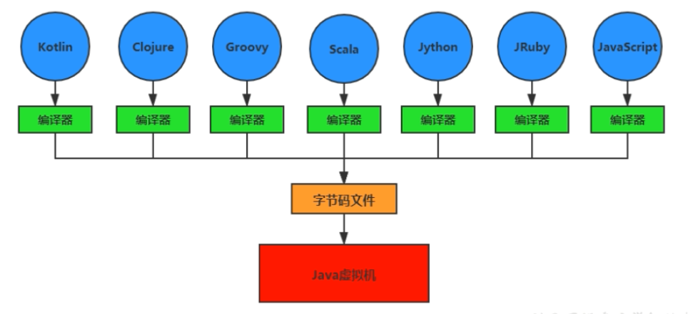
    - jvm 只关心字节码文件
    - 不局限于编程语言
    - 只要提供编译器，可以编译为字节码文件，便可在虚拟机上运行

---

- 多语言混合编程趋势：
  - java 平台上多语言混合编程成为趋势
  - 通过特定领域的语言解决特定领域的问题
    - 并行处理；Cloure
    - 展示层；JRuby/Rails
    - 中间层：java
  - 各语言间因为运行在同一个虚拟机上，交互十分方便

---

- 字节码：
  - 不同语言的不同编译器，可能编译出相同的字节码文件
  - jvm 和 java 语言没有必然联系，它只与特定二进制文件 Class 文件格式所关联
  - Class 文件中包含了 java 虚拟机指令集(或称为字节码，Bytecodes)和符号表，还有一些其他辅助信息

---

- java 历史事件

  > 
  > 

## 1.2. 架构相关

- 虚拟机：
  - 系统虚拟机，比如 vmware。是对物理计算机的仿真，提供了一个可运行完整操作系统的平台
  - 程序虚拟机：比如 jvm。专门为执行单个计算机程序而设计。java 虚拟机中的指令为 java 字节码指令

---

- java 虚拟机
  - 说明：
    - 运行 java 字节码的虚拟机，拥有独立的运行机制。java 字节码不一定由 java 语言编译而成
    - jvm 平台各种语言都可以共享 java 虚拟机带来的跨平台性，垃圾回收机制以及各种可靠的即时编译器
    - java 技术的核心就是 java 虚拟机。所有 java 程序都运行在 java 虚拟机内部
  - 作用
    - java 虚拟机就是二进制字节码的运行环境。负责装在字节码到虚拟机内部，再解释/编译为 对应平台上的机器指令执行
  - 特点：
    - 一次编译，到处运行
    - 自动内存管理
    - 自动垃圾回收
  - 位置：
    > 
  - 整体结构:
    > 
    - 上层：
      - 将字节码文件通过 Class Loader 加载到 jvm 内存中
      - 生成一个 class 对象
    - 中层：
      > Runtime 类。（单例模式）
      - 运行时数据区。
      - 方法区和堆多线程共享
      - 其他的各自有一份
    - 下层：执行引擎
      > 解释执行(编译器)和即时编译(JIT编译器)并存
      - 解释器:保证响应时间，逐行对字节码指令进行解释执行
      - JIT 编译器：针对热点代码，将热点代码编译为机器代码，并缓存起来
        - java-->class file:编译器前端
        - class 字节码-->机器指令:编译器后端
      - 垃圾回收器

---

- java执行流程
  >   

---

- jvm架构模型
  > Java编译器输入的指令流基本上是一种基于栈的指令集架构，另外一种指令集架构则 是基于寄存器的指令集架构。
  - 基于栈式架构的特点
    > HotSpot就是基于栈
    - 占用资源少。设计和实现更简单，适用于资源受限的系统；
    - 避开了寄存器的分配难题：使用零地址指令方式分配。
    - 指令流中的指令大部分是零地址指令，其执行过程依赖于操作栈。指令集更小，编译器容易实现。
    - **不需要硬件支持，可移植性更好，更好实现跨平台**
    - 性能差一些
  - 基于寄存器架构的特点
    > 比如传统的PC以及Android的Davlik虚拟机。
    - 典型的应用是x86的二进制指令集
    - 指令集架构则**完全依赖硬件，可移植性差**
    - **性能优秀和执行更高效**；
    - 花费更少的指令去完成一项操作。
    - 在大部分情况下，基于寄存器架构的指令集往往都以一地址指令、二地址指令 和三地址指令为主，而基于栈式架构的指令集却是以零地址指令为主。为难学的

## 1.3. jvm生命周期

- 启动：
  - 通过引导类加载器(bootstrap class loader)创建一个初始类(initial class)来完成。
  - 不同的虚拟机该类有不同的实现
- 执行
  - 程序执行的时候jvm才执行，程序结束jvm也结束
  - 执行一个java程序的时候，真正执行的是 java虚拟机 这个进程
- 退出
  - 程序正常结束
  - 遇到异常或错误
  - 操作系统错误
  - System.exit。Runtime.halt
  - JNI(java Native Interface)加载和卸载java虚拟机

## 1.4. 历史版本虚拟机

> 详细看pdf课本<br />

> 具体JVM的内存结构，其实取决于其实现，不同厂商的JVM,或者同一厂商发布的不同版本，都有可能存在一定差异。<br />
> 此处主要以Oracle HotSpot VM为默认虚拟机。

- Sun Classic VM
  - 早在1996年Java1.0版本的时候，Sun公司发布了一款名为Sun Classic VM的Java虚拟机，它同时也是世界上第一款商用Java虚拟机，JDK1.4时 完全被淘汰。
  - 这款虚拟机内部只提供解释器。
  - 如果使用JIT编译器，就需要进行外挂。但是一旦使用了JIT编译器，JIT就 会接管虚拟机的执行系统。解释器就不再工作。解释器和编译器不能配合工 作。
  - 现在hotspot内置了此虚拟机。

- Exact VM
  - 为了解决上一个虚拟机问题，jdk1.2时，sun提供了此虚拟机。
  - Exact Memory Management:准确式内存管理
    - 也可以叫Non-Conservative/Accurate Memory Management
    - 虚拟机可以知道内存中某个位置的数据具体是什么类型。
  - 具备现代高性能虚拟机的维形
    - 热点探测
    - 编译器与解释器混合工作模式
  - 只在Solaris平台短暂用，其他平台上还是classic vm
    - 但也没用在其他平台，终被Hotspot虚拟机替换


- HotSpot VM
  > 商用三大虚拟机之一
  - 历史
    - 最初由一家名为“Longview Technologies"的小公司设计
    - 1997年，此公司被Sun收购；2009年，Sun公司被甲骨文收购。
    - JDK1.3时，HotSpot VM成为默认虚拟机
  - 目前Hotspot占有绝对的市场地位，称霸武林。
    - 不管是现在仍在广泛使用的JDK6,还是使用比例较多的JDK8中，默认的虚拟机都是 HotSpot
    - Sun/Oracle JDK和OpenJDK的默认虚拟机
    - 因此本课程中默认介绍的虚拟机都是HotSpot,相关机制也主要是指HotSpot的GC机 制。（比如其他两个商用虚拟机都没有方法区的概念）
  - 从服务器、桌面到移动端、嵌入式都有应用。
  - 名称中的HotSpot指的就是它的热点代码探测技术。
    - 通过计数器找到最具编译价值代码，触发即时编译或栈上替换
    - 通过编译器与解释器协同工作，在最优化的程序响应时间与最佳执行性能中取得平衡

- BEA的JRockit
  > 商用三大虚拟机之一
- 专注于服务器端应用
  - 它可以**不太关注程序启动速度**，因此JRockit内部不包含解析器实现，全部代码 **都靠即时编译器**编译后执行。
- 大量的行业基准测试显示，JRockit JVM是世界上最快的JVM。
  - 使用JRockit产品，客户已经体验到了显著的性能提高（一些超过了70号）和
  - 硬件成本的减少（达50%)。
- 优势：全面的Java运行时解决方案组合
  - JRockit面向延迟敏感型应用的解决方案JRockit Real Time提供以毫秒或 微秒级的JVM响应时间，适合财务、军事指挥、电信网络的需要
  - MissionControl服务套件，它是一组以极低的开销来监控、管理和分析生产环境中的应用程序的工具。
- 2008年，BEA被Oracle收购。
- Oracle表达了整合两大优秀虚拟机的工作，大致在JDK8中完成。
  - 整合的方式是在 HotSpot的基础上，移植JRockit的优秀特性。
  - 两者架构差别很大，整合有限
  - 但JRockit占优势地位

- IBM的J9
  > 商用三大虚拟机之一
  - 全称：IBM Technology for Java Virtual Machine,简称IT4J,内 部代号：J9
  - 市场定位与HotSpot接近，服务器端、桌面应用、嵌入式等多用途VM
  - 广泛用于IBM的各种Java产品。
  - 目前，有影响力的三大商用虚拟机之一，也号称是世界上最快的Java虚拟机(主要是针对在IBM自己产品和平台上)
  - 2017年左右，IBM发布了开源J9 VM,命名为OpenJ9,交给Eclipse基金 会管理，也称为Eclipse OpenJ9

- KVM和CDC/CLDC HotSpot
  - Oracle在Java ME产品线上的两款虚拟机为：CDC/CLDC HotSpot Implementation VM
  - KVM(Kilobyte)是CLDC-HI早期产品
  - 目前移动领域地位尴尬，智能手机被Android和ios二分天下。
  - KVM简单、轻量、高度可移植，面向更低端的设备上还维持自己的一片 市场
    - 智能控制器、传感器
    - 老人手机、经济欠发达地区的功能手机

- Azul VM
  > 高性能Java虚拟机
  - 前面三大“高性能Java虚拟机”使用在通用硬件平台上
  - 这里Azul VM和BEA Liquid VM是与**特定硬件平台绑定、软硬件配合的专有虚拟机**
  - Azul VM是Azul systems公司在HotSpot基础上进行大量改进，运行于 Azul systems公司的专有硬件Vega系统上的Java虚拟机。
  - **每个Azu1 VM实例都可以管理至少数十个CPU和数百GB内存的硬件资源，并 提供在巨大内存范围内实现可控的GC时间的垃圾收集器、专有硬件优化的线 程调度等优秀特性。**
  - 2010年，Azul Systems公司开始从硬件转向软件，发布了自己的Zing JVM,可以在通用x86平台上提供接近于Vega系统的特性。

- Liquid VM
  > 高性能Java虚拟机中的战斗机。
  - BEA公司开发的，直接运行在自家Hypervisor系统上
  - Liquid VM即是现在的JRockit VE(Virtual Edition),Liquid VM不需要操作系统的支持，或者说它自己本身实现了一个专用操作系统 的必要功能，如线程调度、文件系统、网络支持等。
    > 避免了用户态和内核态的切换，大大提高了执行速度 
  - 随着JRockit虚拟机终止开发，Liquid VM项目也停止了。

- Apache Harmony
  - Apache也曾经推出过与JDK1.5和JDK1.6兼容的Java运行平台 Apache Harmony。
  - 它是IBM和Inte1联合开发的开源JVM,受到同样开源的OpenJDK的压制， Sun坚决不让Harmony获得JCP认证，最终于2011年退役，IBM转而参与 OpenJDK
  - 虽然目前并没有Apache Harmony被大规模商用的案例，但是它的Java 类库代码吸纳进了Android SDK。

- Microsoft VM
  - 微软为了在IE3浏览器中支持Java Applets,开发了Microsoft JVM。
  - 只能在window平台下运行。但确是当时Windows下性能最好的Java VM。
  - 1997年，Sun以侵犯商标、不正当竞争罪名指控微软成功，赔了sun很多 钱。微软在WindowsXP SP3中抹掉了其VM。现在windows上安装的jdk 都是HotSpot。


- Taobao JVM
  - 由AliJVM团队发布。阿里，国内使用Java最强大的公司，覆盖云计算、金融、物流、 电商等众多领域，需要解决高并发、高可用、分布式的复合问题。有大量的开源产品。
  - 基于OpenJDK开发了自己的定制版本AlibabaJDK,简称AJDK。是整个阿里Java体 系的基石。
  - 基于OpenJDK HotSpot VM发布的国内第一个优化、深度定制且开源的高性能服务器 版Java虚拟机。
    - 创新的GCIH(GC invisible heap)技术实现了off-heap,即将生命周期 较长的Java对象从heap中移到heap之外，并且GC不能管理GCIH内部的Java对 象，以此达到降低GC的回收频率和提升GC的回收效率的目的。
    - GCIH中的对象还能够在多个Java虚拟机进程中实现共享
    - 使用crc32指令实现JVMintrinsic降低JNI的调用开销
    - PMU hardware 的Java profiling tool 和诊断协助功能
    - 针对大数据场景的ZenGC
  - taobao vm应用在阿里产品上性能高，硬件严重依赖intel的cpu,损失了兼容性，但提高了性能
    - 目前已经在淘宝、天猫上线，把oracle官方JVM版本全部替换了。

- Dalvik VM
  - 谷歌开发的，应用于Android系统，并在Android2.2中提供了JIT,发展迅猛。
  - Dalvik VM只能称作虚拟机，而**不能称作Java虚拟机**，它没有遵循Java 虚拟机规范
  - 不能直接执行 Java 的 Class 文件
  - 基于**寄存器架构**，不是jvm的栈架构。
  - 执行的是编译以后的dex(Dalvik Executable)文件。执行效率比较高。
    - 它执行的dex(Dalvik Executable)文件可以通过class文件转化而来， 使用Java语法编写应用程序，可以直接使用大部分的Java API等。
  - Android 5.0 使用支持提前编译（Ahead Of Time Compilation,AOT)的 ART VM替换Dalvik VM。

- Graal VM
  > 最有可能替代HotSpot的虚拟机，现在依旧处于实验性质

# 2. 内存与垃圾回收

## 2.1. 上层 类加载子系统概述

> 注意，详细内容会放在字节码与类的加载篇，现在首先有个初步认识

### 2.1.1. 架构回顾

- 架构简图：
  > 
  - 第一部就是通过Class Loader 将类加载到内存中
- 架构详细图：
  >  
  - 类加载环节：
    >  注意，上面加载是指整个宏观过程。只是下面三步中，第一步也叫加载
    - 加载。三个类加载器
      - 引导类加载器
      - 扩展类加载器
      - 系统类加载器
    - 链接
      - 验证
      - 准备
      - 解析
    - 初始化
  - 加载到内存后的运行时数据区
    - 每个线程一个pc寄存器
    - 每个线程一个栈。栈由多个栈帧组成
    - 堆：共享，最大的一块空间
    - 方法区：存放类的信息，常量，方法信息等
      > 只有hotspot有
  - 执行引擎
    - 解释器:保证响应时间，逐行对字节码指令进行解释执行
    - JIT 即时编译器：针对热点代码，将热点代码编译为机器代码，并缓存起来
    - 垃圾回收器

### 2.1.2. 作用


- 加载源：
  - 本地文件系统
  - 网络

- 类加载器子系统负责从文件系统或者网络中加载Class文件。**class文件在文件开头有特定的文件标识。**
  - java规范中有规定文件标识
  - 在验证阶段进行验证
- ClassLoader只负责class文件的加载，至于它是否可以运行，则由Execution Engine决定。
- 加载的类信息存放于一块称为方法区的内存空间。
  - 除了类的信息外，方法区中还会存放运行时常量池信息
    - 运行时常量池对应class中的常量池
    - javap 反编译 class可以发现常量池:
      > 
    - 运行时会把常量池加载到内存，成为运行时常量池
  - 可能还包括字符串字面量和数字常量（这部分常量信息是Class文件中常量池部分的内存映射）

### 2.1.3. 类加载器充当的角色

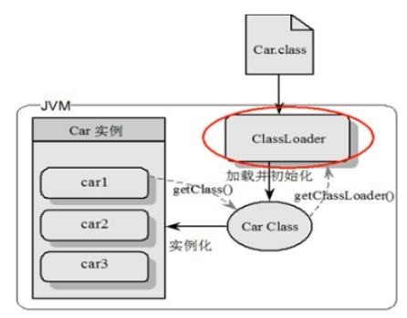

- Car.class 字节码文件保存在硬盘上
- 通过类加载器可以加载到内存中，存放在方法区中。
  - 其中加载包括三部分（上面架构图中的），之后会具体讲
- 此时加载到内存的为 **DNA元数据模版**,即内存中的Car Class
  - Car Class 调用 getClassLoader方法可以获取类加载器
- 调用 Car Class 的构造方法可以在堆空间中创建对象
  - 对象调用 getClass 方法，可以获取 DNA元数据模版，即类本身

### 2.1.4. 类的加载过程※

#### 2.1.4.1. 大致图解


#### 2.1.4.2. loading

> 注意：**加载和链接交叉进行**

- 说明：
  - 通过一个类的全限定类名获取定义此类的二进制字节流
  - 将这个字节流所代表的静态存储结构转化为方法区的运行时数据结构
  - **在内存中生成一个代表这个类的java.lang.Class对象**，作为方法区这个类的各种数据的访问入口

- 补充：加载.class文件的方式
  - 从本地系统中直接加载
  - 通过网络获取，典型场景：Web Applet
  - 从zip压缩包中读取，成为日后jar、war格式的基础
  - 运行时计算生成，使用最多的是：动态代理技术
  - 由其他文件生成，典型场景：JSP应用
  - 从专有数据库中提取.class文件，比较少见
  - 从加密文件中获取，典型的防class文件被反编译的保护措施

#### 2.1.4.3. linking

> 注意：加载和链接交叉进行

- 验证（Verify):
  - 目的在于确保class文件的字节流中包含信息符合当前虚拟机要求，保证被加载类的正确性， 不会危害虚拟机自身安全。
    - 使用 BinaryViewer打开可以发现，
    - 给java虚拟机使用的class文件开头都为 **CA FE BA BE**
      >  
  - 主要包括四种验证，文件格式验证，元数据验证，字节码验证，符号引用验证。
- 准备（Prepare):
  - 类变量初始化：为**类变量**分配内存并且设置该类变量的 **默认初始值**，即零值。
  - 例子：
    ```
    private static int a = 1

    准备阶段会为 a 开辟内存，然后并赋值为0
    在initial阶段才会赋值为1
    ```
  - 扩展
    - 其他变量初始化：
      - 这里**不包含用final修饰的static**,因为**final在编译的时候就会分配了**，**准备阶段会显式初始化**；
      - **这里不会为实例变量分配初始化**，
        - 实例变量也有 **默认值**
        - 会在堆中进行默认赋值
      - 局部变量在使用前必须要进行显式赋值，否则编译不通过
    - 变量内存中的位置
      - 类变量会分配在方法区中
      - 而实例变量是会随着对象一起分配到Java堆中。
      - 局部变量则在栈中
- 解析（Resolve):
  > 该部分内容放到 字节码与类的加载 一章进行讲解
  - 事实上，**解析操作往往会伴随着JVM在执行完初始化之后再执行**。
  - 将常量池内的符号引用转换为直接引用的过程。
    - 符号引用就是一组符号来描述所引用的目标。符号引用的字面量形式明确定义在《java虚拟机 规范》的class文件格式中。
    - 直接引用就是直接指向目标的指针、相对偏移量或一个间接定位 到目标的句柄。
  - 解析动作主要针对类或接口、字段、类方法、接口方法、方法类型等。对应常量池中的 CONSTANT_Class_info、CONSTANT_Fieldref_info、CONSTANT_Methodref_info等。
  - 扩展
    - 之后的**方法调用**一节 就涉及符号引用转化为直接引用（于 学到虚方法表时 添加）
    - 在此阶段还会创建虚方法表（于 学到虚方法表时 添加）


#### 2.1.4.4. initialization

- 过程
  - 初始化阶段就是执行类构造器方法`<clinit>`()的过程。
    > 
    - 此方法不需定义，
    - 是 javac 编译器自动收集
      - **类中的所有类变量的赋值动作**
      - **类中的所有静态代码块中的语句**
    - 然后合并
    - 如果没有静态变量和静态代码块，该方法就不会存在
  - 构造器方法中指令按语句在源文件中出现的顺序执行。
  - `<cinit>`()不同于类的构造器。
    - 构造器是`<init>`
  - 若该类具有父类，JVM 会保证子类的`<clinit>`()执行前，父类的`<clinit>`() 已经执行完毕。
  - 虚拟机必须保证一个类的`<clinit>`()方法在多线程下被同步加锁。
    - 一个类的`<clinit>`()只会被加载一次
    - 在加载过程中会加锁
    - 应该注意，避免导致死锁

- 测试
  - 使用 jclasslib 或者idea中的该插件 打开字节码文件
    ```java
    public class ClassInitTest{
      public static int a = 1;
      static{
        a = 2
        b = 20
        // System.out.println(b)  //报错，注意，可以赋值但不可以调用
      }
      public static int b = 10;// linking中已经给 b 赋值为0，已经被加载到内存
                                // 然后initial阶段，按代码上下顺序执行代码
                                // 因为上面的static，会赋值为20
                                // 再因为该条语句，会赋值为10
                                // 可以想成：
                                  // linking阶段:  int b = 0
                                  // initial阶段: b = 20; b=10
                                  // 具体用jclasslib看更清晰
      public static void main(){
        System.out.println(Hello.a);
      }
    }
    ```
  - 左侧 Methods 下有 `<clinit>`，可以自行查看
    > 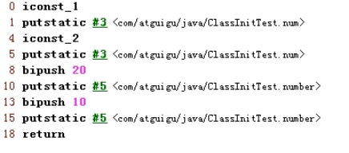 

### 2.1.5. 类加载器

#### 2.1.5.1. 分类

- 通常会分成三个类加载器：
  - BootStrap ClassLoader
  - Extension  ClassLoader
  - AppClassLoader  ClassLoader

---

- 但从java虚拟机规范上讲。JVM支持两种类加载器：
  - 引导类加载器（Bootstrap ClassLoader）
    - c/c++编写
  - 自定义类加载器（User-Defined ClassLoader）
    > java编写
    - 从概念上将，自定义类加载器为开发人员自定义的一类类加载器
    - 但是java规范上定义为：所有派生于抽象类ClassLoader的类加载器都为自定义类加载器
      > 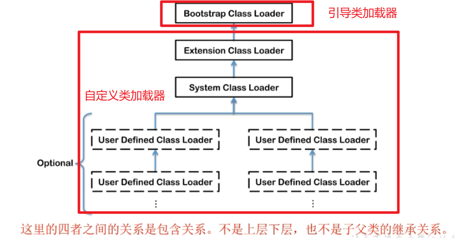 

---

- 一些类加载器的继承关系
  > 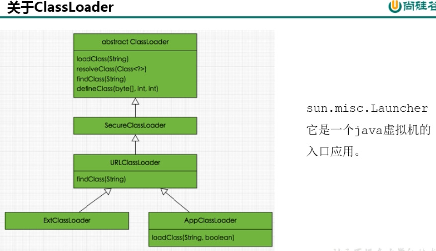 <br />
  > 自定义类加载器是无法获取到核心类加载器（Bootstrap ClassLoader）的<br />
  >  <br />
  >  

#### 2.1.5.2. 常见的三个

##### 2.1.5.2.1. BootStrap ClassLoader

- 启动类加载器（引导类加载器，Bootstrap ClassLoader)
  - 编写：这个类加载使用**C/C++语言**实现的，嵌套在JVM内部。
  - 父类：并不继承自java.lang.ClassLoader,没有父加载器。
  - 子类：加载扩展类和应用程序类加载器，并指定为他们的父类加载器。
  - 加载：它用来加载Java的核心库（`JAVA_HOME/jre/lib/rt.jar、 resources.jar或sun.boot.class.path`路径下的内容）,用于提供 JVM自身需要的类
    - 出于安全考虑，Bootstrap启动类加载器只加载包名为java、javax、 sun等开头的类
    - 获取能够加载api的路径：
      ```java
      sun.misc.Launcher.getBootstrapClassPath().getURLs();

      // 随便找一个输出目录中的类，查看类的加载器
      System.out.println(provider.class.getClassLoader());// null 。引导类加载器用c/c++编写，获取不到
      // java.lang.String 获取的也是null
      ```

##### 2.1.5.2.2. Extension ClassLoader


- 扩展类加载器
  - 编写：**Java语言编写**，由`sun.misc.Launcher$ExtClassLoader`实现
  - 父类：**派生于ClassLoader类**。 父类加载器为启动类加载器
  - 加载：从java.ext.dirs系统属性所指定的目录中加载类库，
    - 或从JDK的安装目录的`jre/lib/ext`子目录（扩展目录）下加载类库。
    - **如果用户创建的JAR放在此目录下，也会自动由扩展类加载器加载**。
    - 获取扩展类加载器加载的api
      ```java
      System.getProperty("java.ext.dirs").split(";");

      // 随便找一个输出目录中的类，查看类的加载器
      System.out.println(CurveDB.class.getClassLoader()); // 获得扩展类加载器
      ```

##### 2.1.5.2.3. AppClassLoader

- 应用程序类加载器（系统类加载器，AppClassLoader)
  - 编写：java语言编写，由`sun.misc.Launcher$AppClassLoader`实现
  - 父类：派生于ClassLoader类。 父类加载器为扩展类加载器
  - 加载：它负责加载环境变量classpath或系统属性java.class.path指 定路径下的类库
  - 其他：
    - 该类加载是程序中默认的类加载器，一般来说，Java应用的类都是由它来完成加载
    - 通过ClassLoader.getSystemClassLoader()方法可以获取到该类加载器

#### 2.1.5.3. 自定义类加载器

- 为什么要自定义类加载器
  - 隔离加载类
    > 主流框架都自定义了类加载器
    - 比如在使用某些框架时,需要使用中间件
    - 为了避免jar包冲突(比如全类名相同)
    - 所以要将中间件和应用模块隔离
  - 修改类的加载方式
    - BootStrap ClassLoader 必须要加载
    - 但其他类加载器加载的api并不一定必须
    - 使用自定义类加载器可以在需要的时候实现动态加载
  - 扩展加载源
    - 比如从数据库中加载
  - 防止源码泄漏
    - 加密字节码文件
    - 为了解密，就需要自定义类加载器

---

- 步骤简介
  > 具体过程在第二篇
  1. 开发人员可以通过继承抽象类java.lang.ClassLoader类的方式，实现 自己的类加载器，以满足一些特殊的需求
  2. 在JDK1.2之前，在自定义类加载器时，总会去继承ClassLoader类并重 写1oadClass()方法，从而实现自定义的类加载类，但是在JDK1.2之后 已不再建议用户去覆盖1oadClass()方法，而是建议把自定义的类加载逻 辑写在findClass()方法中
  3. 在编写自定义类加载器时，如果没有太过于复杂的需求，可以直接继承 URLClassLoader类，这样就可以避免自己去编写findClass()方法及 其获取字节码流的方式，使自定义类加载器编写更加简洁。


#### 2.1.5.4. 抽象类ClassLoader

- 简介：除了Bootstrap ClassLoader，所有的类加载器都继承该类
- 方法：
  >  
  - 这些方法都不是抽象方法

- 继承结构
  > 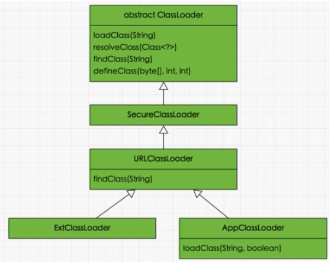 
  
- sun.misc.Launcher 是一个虚拟机的入口应用 
  - 如：
  - `sun.misc.Launcher$ExtClassLoader`
  - `sun.misc.Launcher$AppClassLoader`

- 获取classloader的方式
  - class.getClassLoader()
    > 获取指定类的类加载器
  - Thread.currentThread().getContextClassLoader()
    > 获取当前线程执行的main方法所在类的类加载器
  - ClassLoader.getSystemClassLoader()
    > 获取系统的类加载器
  - DriverManager.getCallerClassLoader()
    > 获取调用者的类加载器 

### 2.1.6. 双亲委派机制※

#### 2.1.6.1. 原理

> 面试经常被问

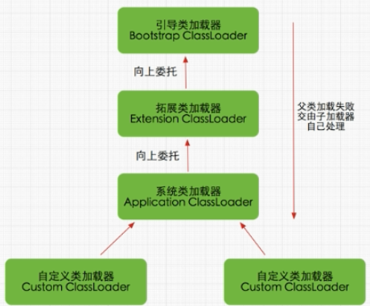


- java虚拟机对class文件加载方式：
  - 按需加载
    - 当需要时才会将class文件加载到内存生成class对象
  - 加载某个类时，使用的是双亲委派模式
    - 即把请求交由上一层处理
    - 是一种任务委派模式

---

- 问题引入：
  - 问题：在工程下创建`java.lang.String`类。 那么加载的是自定义的String，还是java自带的String。
  - 结果：java自带的String

---

- 解释：
  - 如果一个类加载器收到了类加载请求，
  - 它不会自己先去加载
  - 而是请求向上委托给上一层的加载器去执行
  - 如果上一层加载器也存在更上一层加载器
  - 就会一直向上委派
  - 直到到达最顶层的启动类加载器
  - 判断
    - 如果上层的加载器可以完成类的加载任务
      - 就成功返回
    - 如果不能正常完成
      - 下层的加载器才会向下依次尝试自己加载

---

- 示例1：
  - 情景：
    - 创建一个工程，新建java.lang.String类
    - 在里面写main方法，执行的话会报错。
      > 在类java.Lang.String中找不到main方法
  - 解释：
    - 加载自定义的java.lang.String类时，根据双亲委派机制，会把java.lang.String类交给BootStrap ClassLoader
    - 因为是以java开头，所有BootStrap ClassLoader 可以加载
    - 所以加载的是java自带的java.lang.String
    - 因为只有自定义的java.lang.String中有main方法，而java自带的java.lang.String中没有，所以就会报错


- 示例2:
  > 
  - 假设要使用spi核心类，接口和第三方接口实现类
  - 首先通过双亲委派机制到达引导类加载器
  - 引导类加载器会加载SPI核心类和接口
  - 接口的实现类会由引导类加载器反向委派到系统类加载器（getContextClassLoader()获取，一般就是系统类加载器）
  - 系统类加载器就会加载接口的实现类

---

- 例外：由三个打破双亲委派机制的案例。下一篇讲

#### 2.1.6.2. 优势

- 避免类的重复加载
  > 一旦有父加载器加载了，就不会委托给子加载器加载
- 保护程序安全，防止核心api被随意篡改
  - 尝试：自定义类java.lang.String
    > 看上方举例
  - 尝试：自定义类java.lang.TestTest
    > 报错：Prohibited package name，禁止使用该包名

#### 2.1.6.3. 沙箱安全机制

> 自定义java.lang.String等出现报错就是沙箱安全机制的一种体现。<br />
> 具体可以自行查阅资料

- 字节码校验器（bytecode verifier）:
  - 确保Java类文件遵循Java语言规范。
  - 这样可以帮助Java程序实现内存保护。但并不是所有的类文件都会经过字节码校验，比如核心类。
- 类装载器（class loader）:其中类装载器在3个方面堆Java沙箱起作用：
  - 防止恶意代码去干涉善意的代码；//双亲委派机制
  - 守护了被新人的类库边界；
  - 将代码归入保护域，确定了代码可以进行哪些操作。
- 存取控制器（access controller）：存取控制器可以控制核心API堆操作系统的存取权限，而这个控制的策略设定，可以由用户指定。
- 安全管理器（security manager）: 是核心API和操作系统之间的主要接口。实现权限控制，比存取控制器优先级高。
- 安全软件包（security package）：java.security下的类和扩展包下的类。允许用户为自己的应用增加新的安全特性，包括：
  - 安全提供者
  - 消息摘要
  - 数字签名 keytools
  - 加密

### 2.1.7. 其他

- jvm 中判断两个class对象是否为同一个类判断条件：
  - 类的完整类名必须一致，包括包名
  - 加载这个类的ClassLoader（指ClassLoader实例对象）必须相同
  - 也就是说即使两个Class对象来自于同一个class文件，被一个虚拟机所加载，如果两个类的ClassLoader实例对象不同，那么这两个类对象也是不相等的。
 
- JVM必须知道一个类型是由启动加载器加载的还是由自定义类加载器加载的。
  - 如果一个类型是由自定义类加载器加载的，那么**JVM会将这个类加载器的一个引用作为类型信息的一部分保存在方法区中**。
  - 当解析一个类型到另一个类型的引用的时候，JVM需要保证这两个类型的类加载器是相同的。
    > 之后动态链接那里涉及


- jvm对类的使用方式
  > 字节码和类的加载篇会详细说
  - 主动使用
    - 创建类的实例
    - 访问某个类或接口的静态变量，或者对该静态变量赋值
    - 调用类的静态方法
    - 反射（比如：Class.forName("com.atguigu.Test"))
    - 初始化一个类的子类
    - Java虚拟机启动时被标明为启动类的类
    - JDK 7 开始提供的动态语言支持：
      ```
      java.lang.invoke.MethodHandle实例的解析结果
      REF_getStatic、REF_putStatic、REF_invokeStatic句柄又
      应的类没有初始化，则初始化
      ```
  - 被动使用
    - 除了上面的7种方式的其他方式
    - 都**不会导致类的初始化**（即：类加载过程中的 初始化 阶段）

## 2.2. 中层 运行时数据区

### 2.2.1. 概述

#### 2.2.1.1. 运行时数据区

- JVM内存布局规定了java再运行过程中内存的申请，分配，管理的策略，保证了JVM的高效稳定的运行
- 不同JVM对内存的划分方式和管理机制都存在着差异
  - 比如JRockit和J9都不存在方法区

- 经典布局
  >  
  - 红色：**每个进程，或者每个虚拟机实例各自对应一份**。线程间共享。包括堆和方法区
    - 重点优化的就是堆和方法区
    - 95%垃圾回收在堆区
    - 5%垃圾回收在方法区
    - 其他区域没有垃圾回收
  - 灰色：**每个线程对应一份。包括程序计数器，栈，本地栈**
  - java.lang.RunTime 对象
    - 该对象的创建是单例模式
    - 每个jvm都会有一个Runtime对象
    - 该对象就对应一个运行时数据区
- 详细布局(阿里手册)
  > 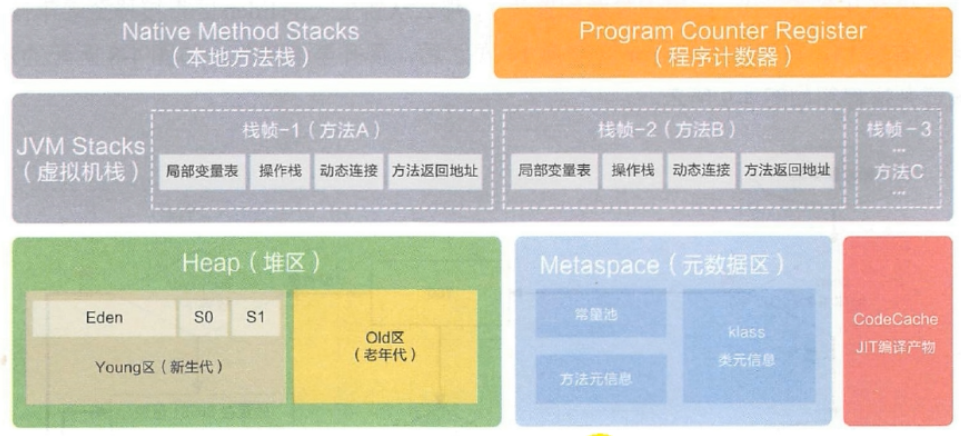 
  - CodeCache，有的会将其归在元空间中，有的则单独放出来
  - 也有将 元空间+CodeCache 称为 方法区
  - 只要知道CodeCache是存放在堆内存之外即可

  ```
  jdk8以后方法区改为元空间，使用本地内存，或者称为堆外内存

  也有将 元空间+CodeCache 并称为 方法区
  ```

#### 2.2.1.2. 线程

- 线程是一个程序里的运行单元。JVM允许一个应用有多个线程并行的执行。
- 在Hotspot JVM里，**每个线程都与操作系统的本地线程直接映射**。
  - 当一个Java线程准备好执行以后
    - 准备内容：线程自己的程序计数器，栈结构，缓存分配等等
  - 此时一个操作系统的本地线程也同时创建。
- 操作系统负责所有线程的安排调度到任何一个可用的CPU上。一旦本 地线程初始化成功，它就会调用Java线程中的run()方法。
- Java线程执行终止后，本地线程也会回收。
  - 正常结束:
    - 情景：
      - 正常执行完
      - 出现异常后通过异常处理机制处理。
    - 处理：
      - java线程和本地线程都会被回收
  - 非正常结束
    - 情景
      - 出现未捕获异常没有处理
    - 处理：
      - java线程终止
      - 本地线程决定jvm是否终止
        - 如果还有普通线程，就不终止
        - 如果只剩下守护线程，就终止

- 后台线程：
  > jconsole的使用等详细会放在调优部分。这里
  - 如果你使用jconsole或者是任何一个调试工具，都能看到在后台有许多线程 在运行。这些后台线程不包括调用public static void main(string[]) 的main线程以及所有这个main线程自己创建的线程。
  - 这些主要的后台系统线程在Hotspot JVM里主要是以下几个：
    >  了解下即可，开发中并不会涉及
    - 虚拟机线程：这种线程的操作是需要JVM达到安全点(后面会讲)才会出现。
      - 这些操作必须在不同的线程中发生的原因是他们都需要JVM达到安全点，这样堆才不会变化。
      - 这种线程的执行类型包括"stop-the-world"的垃圾收集，线程栈收集，线程挂起以及 偏向锁撤销。
    - 周期任务线程：这种线程是时间周期事件的体现（比如中断）,他们一般用于周期性 操作的调度执行。
    - GC线程：这种线程对在JVM里不同种类的垃圾收集行为提供了支持。
    - 编译线程：这种线程在运行时会将字节码编译成到本地代码。
    - 信号调度线程：这种线程接收信号并发送给JVM,在它内部通过调用适当的方法进 行处理。

### 2.2.2. 程序计数器

#### 2.2.2.1. 介绍

- 介绍：
  - 它是一块很小的内存空间，几乎可以忽略不记。也是运行速度最快的存储区域。
  - 生命周期：
    - 在JVM规范中，每个线程都有它自己的程序计数器，是线程私有的，生命周期与线程的生命周期保持一致。
  - 取值：
    - 任何时间一个线程都只有一个方法在执行，也就是所谓的**当前方法**。
    - 程序计数器会存储当前线程正在执行的Java方法的JVM指令地址；
    - 或者，如果是在执行native方法，则是未指定值（undefned)。
      > 本地方法在本地方法栈中。jvm层面无法显示
  - 作用：
    - 它是程序控制流的指示器，分支、循环、跳转、异常处理、线程恢复等基础 功能都需要依赖这个计数器来完成。
    - 字节码解释器工作时就是通过改变这个计数器的值来选取下一条需要执行白 字节码指令。
  - 特殊点：
    - 它是唯一一个在Java 虚拟机规范中没有规定任何OutOtMemoryError(OOM,即内存溢出)情况的区域。
    - 栈，堆，方法区等都可能发生内存溢出
    - （复习：垃圾回收发生在那几个区域）

- 关于命名：
  - Register的命名源于CPU的寄存器，寄存器存储指令相关的现场信息。CPU只有把数据装载到寄存器才能够运行。
  - 这里，并非是广义上所指的物理寄存器，或许将其翻译为PC计数器（或指令计数器）会更加贴 切（也称为程序钩子）,并且也不容易引起一些不必要的误会。
- 实际：JVM中的PC寄存器是对物理PC 寄存器的一种**抽象模拟**。

- 作用：pc寄存器用来存储指向下一条指令的地址，也就是即将要执行的指令代码，由执行引擎来读取下一条指令
  >  
  - 每个线程由一份pc寄存器
  - 指令会分配到栈的栈帧（一个栈帧对应一个方法，之后会讲）中。
  - 每一条指令都有对应的地址。
  - pc寄存器中保存着下一条指令的地址
  - 执行引擎会访问pc寄存器，根据地址去读并执行指令


#### 2.2.2.2. 手动尝试

```java
public static void main(String[] args){
  int i = 10;
  int j = 20;
  int k = i+j;
}
```

- 进行反编译：`javap -verbose RigisterTest.class`
  > 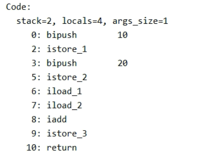
  - 说明：
    - 第一列：指令地址/偏移地址
    - 第二列：操作指令
  - 流程：
    - bipush 10 :取数值10
    - istore_1 保存到索引为1的位置（也就是该指令地址为2的原因）
    - ....(指令具体内容会在后面说)

- 整体顺序（用的不是上面的反编译结果）
  > 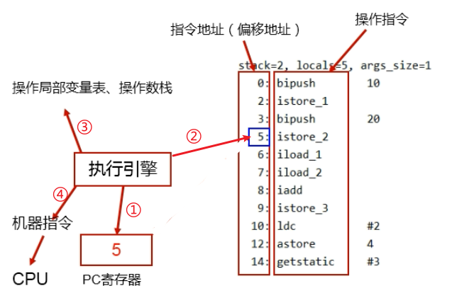 
  > 3,4步先有个大致印象。之后会具体展开来说

#### 2.2.2.3. 面试问题

- 问题一:
  - 问法：
    - 使用pc寄存器存储字节码指令地址有什么用?
    - 为什么使用PC寄存字器记录当当前线程的执行地址?
  - 答案
    ```
      因为pc寄存器是每个线程都有一份。
      CPU需要不停的切换各个线程，这时候
    切换回来以后，就得知道接着从哪开始继续
    执行。
      JVM的字节码解释器就需要通过改变PC寄存
    器的值来明确下一条应该执行什么样的字节
    码指令。
    ```
- 问题二：
  - 问法：
    - pc寄存器为什么被设定为线程私有
  - 答案
    ```
      我们都知道所谓的多线程在一个特定的时间段内只会执行其中某一个线程的方法，CPU
    会不停地做任务切换，这样必然导致经常中断或恢复，如何保证分毫无差呢？为了能够
    准确地记录各个线程正在执行的当前字节码指令地址，最好的办法自然是为每一个线
    都分配一个PC寄存器，这样一来各个线程之间便可以进行独立计算，从而不会出现相互
    干扰的情况。

    由于cpu时间片轮限制，众多线程在并发执行过程中，任何一个确定的时刻，一个处理
    器或者多核处理器中的一个内核，只会执行某个线程中的一条指令。

    这样必然导致经常中断或恢复，如何保证分毫无差呢？每个线程在创建后，都会产生自
    己的程序计数器和栈帧，程序计数器在各个线程之间互不影响。
    ```

- 相关：
  > 之后垃圾回收会用到。这里因为涉及线程的切换所以提一下。
  - 串行：依次执行。
  - 并行：同时执行。多核
  - 并发：一个核快速切换多个线程

### 2.2.3. 虚拟机栈(重要)

回忆架构：
 

> c 和 c++ 内存中，基本只有堆和栈两个。而java要更多。见上图

#### 2.2.3.1. 概述

- 背景：
  - 由于跨平台性的设计，Java的指令都是根据栈来设计的。不同平台CPU架 构不同，所以不能设计为基于寄存器的。
  - 优点是跨平台，指令集小，编译器容易实现，缺点是性能下降，实现同样 的功能需要更多的指令。
    > 前面也有提到基于寄存器的虚拟机，具体可以查看前面第一章

- 栈和堆：
  - 栈是运行时的单位。栈解决程序的运行问题，即程序如何执行，或者说如何处理数据。
    > 栈也可以放数据，比如一些基本类型的局部变量
  - 而堆是存储的单位。堆解决的 是数据存储的问题，即数据怎么放、放在哪儿。

- 基本内容
  - Java虚拟机栈是什么？
    - Java虚拟机栈（Java Virtual Machine Stack),早期也叫Java栈。
    - 每个线程在创建时都会创建一个虚拟机栈，其内部保存一个个的栈帧 (Stack Frame),**对应着一次次的Java方法调用**。
    - 是线程私有的
  - 生命周期
    - 生命周期和线程一致。
  - 作用
    - 主管Java程序的运行，它保存方法的局部变量、部分结果，并参与方法的调用和返回。
    - 其中局部变量包括：
      - 8种基本数据类型
      - 对象的引用地址（对象会放到堆中）

- 优点
  - 栈是一种快速有效的分配存储方式，访问速度仅次于程序 计数器。
  - JVM直接对Java栈的操作只有两个：
    - 每个方法执行，伴随着进栈（入栈、压栈）
    - 执行结束后的出栈工作
  - 对于栈来说不存在垃圾回收问题。但有OOM(out of memory)问题

- java中设置栈的大小：
  - `-Xss`选项 设置线程的最大栈空间

- 异常：
  - 如果线程请求的栈深度大于虚 拟机所允许的深度，将抛出StackOverflowError异常；
  - 如果Java虚拟机栈容量可以动态扩展，当栈扩展时无法申请到足够的内存会抛出OutOfMemoryError异常。

- 示例说明
  >  
  - 现在methodB在栈顶，则methodB为当前方法
  - 如果methodB执行完，绿色框栈帧出栈
  - 蓝色框(methodA)栈帧在栈顶，当前方法变为methodA

#### 2.2.3.2. 栈帧运行原理

- 栈帧：
  - 栈中的数据都是以栈帧（stack frame）的格式存在的
  - 在线程上正在执行的每个方法都各自对应一个栈帧。**一一对应**
  - 不同线程中所包含的栈帧是不允许存在相互引用的，即不可能在一个栈帧之中引用 另外一个线程的栈帧。
  - 栈帧是一个内存区块，是一个数据集，维系着方法执行过程中的各种数据信息

- 对jvm栈的两个操作:
  - 栈帧的入栈
  - 栈帧的出栈

- 当前栈帧/活动栈帧
  > 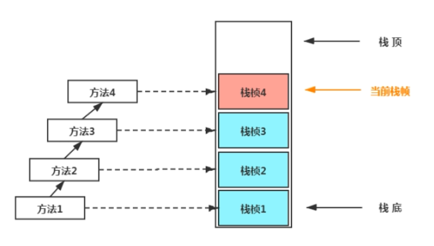
  > 图中为方法1调用方法2，方法2调用方法3....。每次调用都会放入新的栈帧
  - 在一条活动线程中，一个时间点上，只会有一个活动的栈帧。
  - 即只有当前正在执行的方法的栈帧（栈顶栈帧）是有效的，这个栈帧被称为当前栈帧 (Current Frame),
  - 与当前栈帧相对应的方法就是当前方法（Current Method)
  - 定义这个方法的类就是当前类（Current Class)。
  - 执行引擎运行的所有字节码指令只针对当前栈帧进行操作。

- idea debug 可以显示栈帧结构
  > 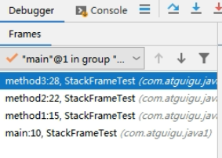 

- 运行原理-栈帧弹出
  - 如果当前方法调用了其他方法，方法返回之际，当前栈帧会传回此方法的执行结果给前一个栈帧
  - 接着，虚拟机会丢弃当前栈帧，使得前一个栈帧重新成为当前栈帧。
  - Java方法有两种返回函数的方式，不管使用哪种方式，都会导致栈帧被弹出。
    - 一种是正常的函数返回，使用return指令；
    - 另外一种是抛出异常。
      > 在此处深入理解异常抛出，以之前的图为例，假如方法4出现异常没有处理，方法4栈帧抛出异常，然后对应栈帧弹出<br />
      > 方法3接收到异常，如果依旧没有处理，继续抛出，方法3对应栈帧弹出。直到处理了异常使程序正常进行或者因为异常弹出全部栈帧导致程序停止。

- 栈的溢出：
  - 方法的嵌套调用导致栈帧的增加
  - 当嵌套调用的所有方法对应所有栈帧的总大小加起来大于栈大小时，就会报stackoverflow异常
  - 这也是使用递归时常见的异常

#### 2.2.3.3. 栈帧内部组成

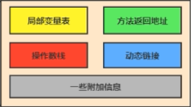

- **局部变量表**（Local Variables)
- **操作数栈**（operand stack)(或表达式栈）
- 帧数据区(有些书将以下三个部分并称为帧数据区)
  - 动态链接（Dynamic Linking)(或称为 指向运行时常量池的方法引用）
  - 方法返回地址（Return Address)(或称为 方法正常退出或者异常退出的定义）
  - 一些附加信息

#### 2.2.3.4. 栈帧内部-局部变量表

##### 2.2.3.4.1. 主要内容

> 又称为局部变量数组或者本地变量表

- 作用：
  - 主要用于存储**方法参数**和定义在方法体内的**局部变量**
  - 在方法执行时，虚拟机通过使用局部变量表完成参数值到参数变量列表的传递过程。
  - 当方法调用结束后，随着方法栈帧的销毁，局部变量表也会随之销毁。

- slot（变量槽）
  - 定义：是局部变量表 **最基本的存储单元**
  - 使用：32位以内的类型只需要占1个slot。64位类型占用两个slot

- 存储数据类型：
  - 定义为一个一维 **数字** **数组**
    - byte,short,char,float存储前被 **转换成int**，boolean也会转换为int
    - long和double则占据两个Slot
  - 这些数据类型包括各类基本数据类型、对象引用（reference),以及 returnAddress 类型。

- 内存分配
  - 主要影响栈帧大小的就是局部变量表
  - 局部变量表所需的内存空间在 **编译期间**完成分配。并保存在方法的 Code 属性的 maximum local variables 数据项中。
  - 当进入一个方法时，这个方法需要在栈帧中分配多大的局部变量空间是完全确定的
  - 在方法运行期间不会改变局部变量表的大小。
    ```
    这里说的 大小 是指变量槽的数量，
    虚拟机真正使用多大的内存空间（譬如按照1个变量槽占用32个比特、64个比特，或者更多）来实现一
    个变量槽，这是完全由具体的虚拟机实现自行决定的事情。
    ```
  - 示例：
    > 反编译（javap）一个测试类的字节码文件 <br />
    > 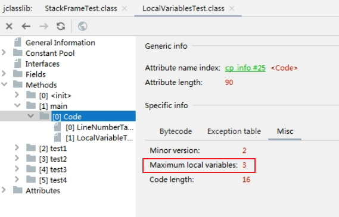 <br />
    > 使用javap指令也可以查看。只是使用jclasslib结构更清晰<br />

- 安全问题：
  - 局部变量表中的变量只在当前线程的当前方法调用中有效
  - 由于局部变量表是建立在线程的栈上，是线程的私有数据，因此**不存在数据安全问题**

- 字节码结构相关：
  - 字节码行号与java代码行号对应关系
    >  
  - 临时变量列表与作用范围：
    > 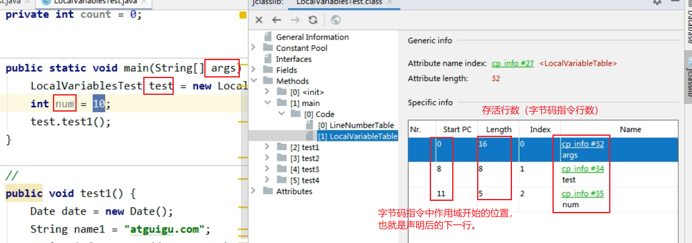 
    > 可以发现 开始行号+作用长度 相同，也就是临时变量都是到方法最后才销毁

##### 2.2.3.4.2. slot

- slot 深入
  > 
  - 访问：
    - JVM 会为局部变量表中的每一个 slot 都分配一个访问索引
    - 通过这个索引即可成功访 问到局部变量表中指定的局部变量值
    - **如果是 64 位数据类型的话，访问第一个 slot 的索引即可**
      > 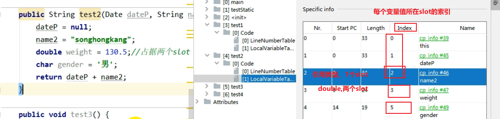 
  - 存储顺序：
    - 当一个实例方法被调用的时候，它的**方法参数**和方法体内部定义的**局部变量**将会 **按照顺序**被复制到局部变量表中的每一个 slot 上
  - 注意：
    > 该点可以用来解释为什么静态方法中不能使用 this，而构造方法和实例方法中可以使用
    - 对象：
      - 构造方法
      - 实例方法（非静态方法）
    - 现象：
      - 因为没有静态声明
      - **该对象的引用 this 会存放在 index 为 0 的 slot 处**
      - 其余都会按顺序存放
- slot的重复利用：
  - 栈帧中的局部变量表中的槽位是可以重用的，
  - 如果一个局部变量过了其作用域，那么在其用域之后申明的新的局部变量就很有可能会复用过期局部变量的槽位
  - 从而达到节省资源的目的。
  - 示例
    >  
    - this,a,b,c有4个
    - 但是这里长度为3。这是因为slot的重复利用
    >  
    - 变量b作用域只有大括号里面。4+4=8
    - 变量c使用变量已经销毁的变量b的位置

##### 2.2.3.4.3. 补充

- 局部变量不赋值直接使用报错：
  ```java
  public void test1(){
    int i;
    System.out.print(i);
    // 会报错
  }
  ```
  - 编译阶段会生成字节码指令
  - 字节码指令中有调用局部变量i
  - 但局部变量表中并没有i的值
  - 编译报错

- 在栈帧中，与性能调优关系最为密切的部分就是前面提到的局部变量表。
  - 局部变量表占栈帧的大部分空间
  - 垃圾回收：
    > **局部变量表中的变量也是重要的垃圾回收根节点，只要被局部变量表中直 接或间接引用的对象都不会被回收。**
    - 栈帧中局部变量表中的引用会指向堆空间中的对象
    - 通过判断是否有引用指向对中的对象判断是否需要回收空间

#### 2.2.3.5. 栈帧内部-操作数栈


- 作用： **主要用于保存计算过程的中间结果，同时作为计算过程中变量临时的存储空间。**
- 流程：
  - 当一个方法开始执行的时候，一个栈帧就会被创建出来。这个栈帧里的操作数栈一开始是**空的**。当然，空的并不意味着长度为0
    > 同局部变量表一样，操作数栈的最大深度也在编译的时候被写入到Code属性的**max_stacks**数据项之中。<br/>
    > 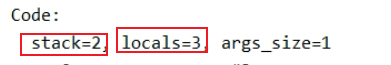 <br/>
    > 左边为操作数栈深度，右边为诶局部变量表深度。<br/>
    > 操作数栈的每一个元素都可以是包括long和double在内的任意Java数据类型。32位数据类型所占的栈容量为1，64位数据类型所占的栈容量为2。<br/>
    > Javac编译器的数据流分析工作保证了在方法执行的任 何时候，操作数栈的深度都不会超过在max_stacks数据项中设定的最大值。
  - 在方法的执行过程中，根据字节码指令，往操作数栈中写入数据或提取数据，**注意：不是采用索引方式访问数据，而是出栈入栈**
    > 我们说Java虚拟机的解释引擎是基于栈的执行引擎，其中的栈指的就是操作数栈。
  - 某些字节码指令将值压入操作数栈，其余的字节码指令将操作数取出栈。使用它们后再把结果压入栈。
    - 比如：执行复制、交换、求和，调用方法后返回值
    - 示例：
      >  
  - 在更新pc寄存器中下一条需要执行的字节码指令

- 代码示例**（重要）**：
  > 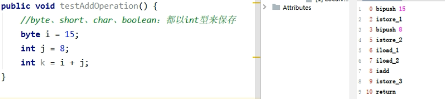 <br/>
  > java代码以及编译后的字节码指令（执行时执行引擎会将字节码指令翻译为机器指令）
  > 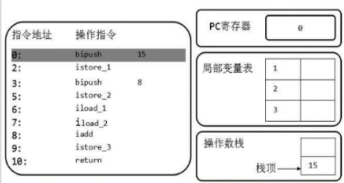 <br/>
  > **push是把字节码中的数据放入操作数栈**。bipush是指byte的push，sipush是指short的push。**对于数字类型，会自动根据数值大小选择push类型为byte,short,int中的一种** <br/>
  > 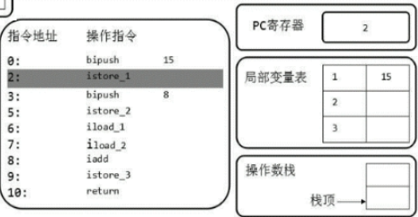 <br/>
  > istore_1是指让操作数栈的第一个数出栈，放入局部变量表index=1处。（局部变量表index为0的地方放this。）（如果是double类型的话，就是dstore）<br/>
  > 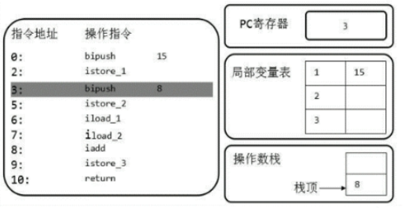 <br/>
  > 把8放入操作数栈 <br/>
  >  <br/>
  > istore_2是指让操作数栈的第一个数出栈，放入局部变量表index=2处。（局部变量表index为0的地方放this。）<br/>
  > 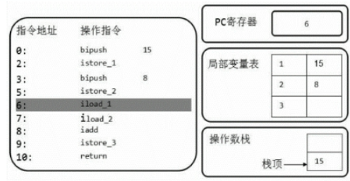 <br/>
  > **load是指把局部变量表中（或者返回值）的数据压入操作数栈**，把局部变量表中索引为1位置的数据压入操作数栈<br/>
  > 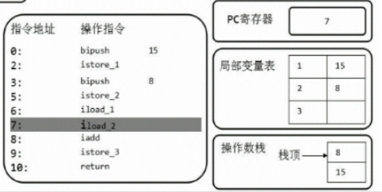 <br/>
  > 把局部变量表中索引为2位置的数据压入操作数栈<br/>
  > <br/> 
  > 把操作数栈中的前两个数据**出栈**，然后进行相加，把结果再**入栈**<br/>
  >  <br/>
  > 将操作数栈中的第一个数出栈，存放在局部变量表index为3的位置<br/>


#### 2.2.3.6. 栈顶缓存技术

> top of stack cashing<br/>
> 该技术为hotspot设计者提出，还没有进行应用

- 背景
  - 基于栈式架构的虚拟机所使用的**零地址**指令更加紧凑
    > 上面的操作就只涉及出栈入栈，并没有涉及地址
  - 但完 成一项操作的时候必然需要使用更多的入栈和出栈指令，
  - 这同时也就意味着将需要更多的指令分派（instruction dispatch)次数和内存读/写次数。
- 目的：为了解决以上问题
- 说明：将**栈顶元素**全部缓存在**物理CPU**的**寄存器**中，以此降低对内存的读/写次数，提升执行引擎的 执行效率。


#### 2.2.3.7. 栈帧内部-动态链接

- 帧数据区：附加信息，动态连接，方法返回地址
  > 某些书上会有该概念

- 补充知识
  > 方法区在之后会细讲
  - 编译后的字节码文件中会有常量池
    > 常量池的作用就是提供一些符号和常量，便于指令识别<br />
    > 同时也减小了文件大小，重复部分可以直接使用引用指向
  - 加载到内存后为运行时常量池
  - 存在于方法区
  >  

- 说明：
  - 在Java源文件被编译到字节码文件中时，所有的**变量**和**方法引用**都作为**符号引用（Symbolic Reference)**保存在class文件的**常量池**里。
    > 每个方法的符号引用，通过其他的符号引用构成。（符号引用详细会留到下一篇）<br />
    >  <br />
    > 比如这里的方法引用通过类符号引用.方法名称符号引用:返回值类型符号引用构成(// 后为解析完成后的结果)
    - 这些符号引用一部分会在类加载阶段或者第一次使用的时候就被转化为直接引用，这种转化被称为**静态解析**。
    - 另外一部分将在每一次运行期间都转化为直接引用，这部分就称为**动态链接**
  - 每一个**栈帧内部**都包含一个**指向运行时常量池中该栈帧所属方法对应符号引用**的**引用**
  - 比如：
    - 描述一个方法调用了另外的其他方法时，就是通过常量池中指向方法的符号引用来表示的。
    - 为了找到该方法，就会访问被调用方法栈帧中的  那个指向符号引用的引用
    > 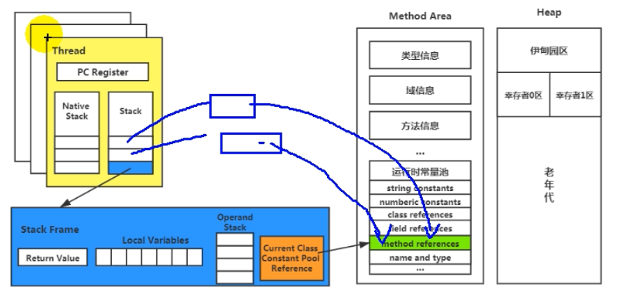 
  - 作用:就是为了将这些符号引用转换为调用方法的直接引用。

- 原理：
  - 包含这个引用的目的就是为了支持当前方法的代码能够实现动态链接 (Dynamic Linking)。比如：invokedynamic指令

#### 2.2.3.8. 方法的调用：解析和分派

> 对动态链接进行深入讲解

##### 2.2.3.8.1. 绑定与链接

- 绑定： 绑定是一个字段、方法或者类在符号引用被替换为 直接引用的过程，这仅仅发生一次。
  - 早期绑定（Early Binding) 。对应指令 invokespecial, invokestatic
    ```
    早期绑定就是指被调用的目标方法如果在编译期可知，且运行期保持不变时，
    即可将这个方法与所属的类型进行绑定，这样一来，由于明确了被调用的目
    标方法究竟是哪一个，因此也就可以使用静态链接的方式将符号引用转换为
    直接引用。
    ```
  - 晚期绑定 (Late Binding)。对应指令 invokevirtual，invokeinterface
    ```
    如果被调用的方法在编译期无法被确定下来，只能够在程序运行期根据实际
    的类型绑定相关的方法，这种绑定方式也就被称之为晚期绑定。
    ```
- 链接：
  > 分别对应上面的两个绑定
  - 静态链接：在编译期间，被调用的方法就已经确定下来，并已经把符号引用转换为了调用方法的直接引用。
  - 动态链接：被调用的方法在编译期间无法确定下来，只能在运行期间将调用方法的符号引用转换为直接引用

- 示例：
  - 示例1
    ```java
    // eat 是一个接口，有eat()方法
    // animal 是一个类。
    // cat,dog 两个类继承animal，实现该eat接口
    class Cat{
      public cat(){
        super()  // 此处编译时就是调用animal的构造方法。为早期绑定
      }
    }
    public class AnimalTest{
      public void animalEat(eat e){
        e.eat() // 此处编译时就无法得知调用哪一个实现类的方法。为晚期绑定
      }
    }
    ```
  - 示例2：用final修饰就是使用早期绑定

##### 2.2.3.8.2. 非虚方法与虚方法

> 分别对应上面的早期绑定与晚期绑定。

- 语言的发展与动态链接
  ```
  随着高级语言的横空出世，类似于Java一样的基于面向对象的编程语言如今
  越来越多，尽管这类编程语言在语法风格上存在一定的差别，但是它们彼此
  之间始终保持着一个共性，那就是都支持封装、继承和多态等面向对象特性，
  既然这一类的编程语言具备多态特性，那么自然也就具备早期绑定和晚期绑
  定两种绑定方式。

  Java中任何一个普通的方法其实都具备虚函数的特征，它们相当于C++语言
  中的虚函数（C++中则需要使用关键字virtual来显式定义）。如果在Java
  程序中不希望某个方法拥有虚函数的特征时，则可以使用关键字final来标
  记这个方法。
  ```
- 分类
  - 非虚方法:
    - 如果方法在编译期就确定了具体的调用版本，这个版本在运行时是不可变的。这样的方法称为非虚方法。
    - **静态方法、私有方法、final方法、构造器、父类方法(使用super显式调用)** 都是非虚方法。
  - 虚方法:其他方法称为虚方法。
    - Java中任何一个成员方法都是虚方法。在子类中可以重写父类方法。

##### 2.2.3.8.3. 相关指令

> 下方前四条指令固化在虚拟机内部，方法的调用执行不可人为干预，而invokedynamic指令则支持由用户确定方法版本。<br />
> **其中invokestatic指令和invokespecial指令调用的方法称为： 虚方法，其余的（final修饰的除外）称为虚方法。**

- 普通调用指令
  - 调用非虚方法
    - invokestatic:调用静态方法，解析阶段确定唯一方法版本
    - invokespecial:调用`<init>`方法、私有及父类方法，解析阶段确定唯一方法版本
  - 调用虚方法(final除外)
    - invokevirtual:调用所有虚方法
      - 注意：
        - 如果隐式调用父类方法，不管父类方法有没有加final，**都会编译成invokevirtual**，
          - **也就是说包含父类方法不为虚函数，调用时边编译出invokevirtual的情况**
        - 只有显式调用父类方法`super.fatherMethod()`，才会编译成invokespecial。
    - invokeinterface:调用接口方法
- 动态调用指令：
  - invokedynamic:动态解析出需要调用的方法，然后执行

- 代码示例
  ```java
  package com.atguigu.java2;

  /**
  * 解析调用中非虚方法、虚方法的测试
  *
  * invokestatic指令和invokespecial指令调用的方法称为非虚方法
  * @author shkstart
  * @create 2020 下午 12:07
  */
  class Father {
      public Father() {
          System.out.println("father的构造器");
      }

      public static void showStatic(String str) {
          System.out.println("father " + str);
      }

      public final void showFinal() {
          System.out.println("father show final");
      }

      public void showCommon() {
          System.out.println("father 普通方法");
      }
  }

  public class Son extends Father {
      public Son() {
          //invokespecial
          super();
      }
      public Son(int age) {
          //invokespecial
          this();
      }
      //不是重写的父类的静态方法，因为静态方法不能被重写！
      public static void showStatic(String str) {
          System.out.println("son " + str);
      }
      private void showPrivate(String str) {
          System.out.println("son private" + str);
      }

      public void show() {
          //invokestatic
          showStatic("atguigu.com");
          //invokestatic
          super.showStatic("good!");
          //invokespecial
          showPrivate("hello!");
          //invokespecial
          super.showCommon();

          //invokevirtual
          showFinal();//因为此方法声明有final，不能被子类重写，所以也认为此方法是非虚方法。

          // 虚方法
          // 没有显示加super.，子类可能重写了该方法，也可能没有，分别对应调用子类和父类方法的情况 
          //invokevirtual
          showCommon();
          info();

          MethodInterface in = null;
          // 虚方法
          //invokeinterface，一定会调用实现类的方法
          in.methodA();
      }

      public void info(){

      }

      public void display(Father f){
          f.showCommon();
      }

      public static void main(String[] args) {
          Son so = new Son();
          so.show();
      }
  }

  interface MethodInterface{
      void methodA();
  }
  ```

- invokedynamic详解
  - 出现：jvm字节码指令集一直较为稳定，一直到java7中才添加了一个invokedynamic
    ```
    Java7中增加的动态语言类型支持的本质是对Java虚拟机规范的修改，而不
    是对Java语言规则的修改，这一块相对来讲比较复杂，增加了虚拟机中的方
    法调用，最直接的受益者就是运行在Java平台的动态语言(比如python,js)的编译器(第一张提到的，跨语言的平台)
    ```
  - 目的:**实现 动态类型语言支持**，保证了能在jvm上运行python，js等动态语言
  - 生成：
    - java7
      - 但是在Java7中并没有提供直接生成invokedynamic指令的方法，需要借助ASM这种底层字节码工具来产生invokedynamic指令。直到Java8中lambda的出现
    - java8
      - 由于lambda的出现，java中有了invokedynamic的直接生成方式

  - 示例代码
    ```java
    @FunctionalInterface
    interface Func {
        public boolean func(String str);
    }

    public class Lambda {
        public void lambda(Func func) {
            return;
        }

        public static void main(String[] args) {
            Lambda lambda = new Lambda();

            // 在此处就会调用invokedynamic指令
            // Func就是一个接口，
            // 接收右侧实现类。
            // 类似于python中，通过等号右边判断左侧标识符的类型。
            Func func = s -> {
                return true;
            };

            lambda.lambda(func);

            lambda.lambda(s -> {
                return true;
            });
        }
    }
    ```

##### 2.2.3.8.4. 方法重写本质

- 虚方法调用流程：
  - 当调用一个对象的方法的时候，会将对象压入操作数栈。
    - 再根据字节码指令（通常为为invokevirtual，即调用对象方法）调用方法。根据该指令会操作数栈顶寻找
    - 找到操作数栈顶的第一个元素所执行的对象的实际类型，记作C。
  - 再在类型C中寻找与常量中的描述符和简单名称都相符的方法
    - 如果找到了
      - 则进行**访问权限校验**，
        - 如果通过则返回这个方法的直接引用，查找过程结束；
        - 如果不通过，则返回java.lang.IllegalAccessError异常。
          ```
          程序试图访问或修改一个属性或调用一个方法，这个属性或方法，你没有权限访问。一般
          的，这个会引起编译器异常。这个错误如果发生在运行时，就说明一个类发生了不兼容的
          改变。

          该Error比较难排错。
          maven管理依赖时，jar包冲突就有可能引起该异常
          ```
    - 如果没找到，按照继承关系从下往上依次对C的各个父类进行第2步的搜索和验证过程。
      - 如果始终没有找到合适的方法，则抛出java.lang.AbstractMethodError异常。
        > 该异常也就是指调用的方法没被重写或实现过

##### 2.2.3.8.5. 虚方法表

> virtual method table

- 出现原因：每次调用虚方法都会重复上述过程，过于浪费时间，影响效率
- 作用：存放虚方法，存放各个虚方法的实际入口。
  > 非虚方法不会出现在表中，因为在编译期间已经确定下来，不需要花费时间寻找方法入口
- 建立位置：方法区
- 建立时期：
  - 在链接阶段被创建并开始初始化，
  - 类的变量初始值准备完成之后，JVM会把该类的方法表也初始化完毕

- 示例：
  - 例1：Father和Son两个类的虚方法表
    >  
  - 例2：
    >  <br />
    > 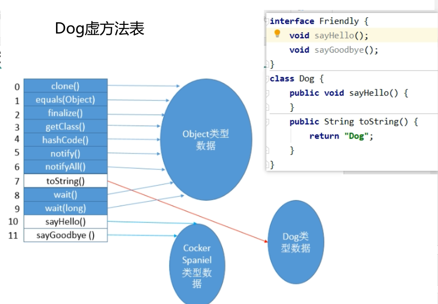 <br />
    > 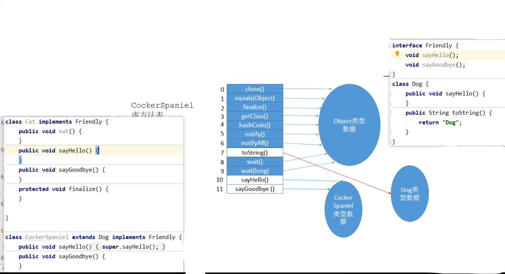 <br />
    > 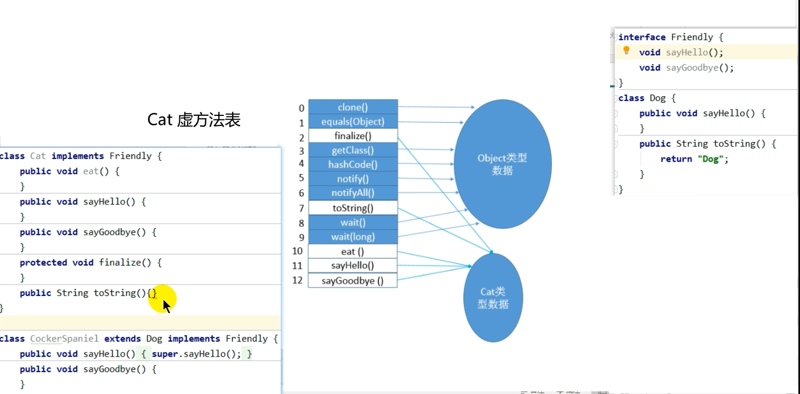 


<br/> <br/> <br/>
疑问：如何解释上转类型和下转类型的多态

#### 2.2.3.9. 栈帧内部-方法返回地址

- 该结构存储的数据：调用该方法时，pc寄存器（或者程序计数器）中的值


- 过程讲解：
  - 正常退出
    - A调用B方法。此时程序计数器中值为3
    - B方法对应栈帧入栈，此时该栈帧中 方法返回地址 的值为3
    - B方法执行完，执行引擎读取B方法中的 方法返回地址 的值3,读取后B方法的栈帧出栈
    - 执行引擎把3放入程序计数器，继续执行下一条指令
  - 异常退出
    - 返回地址要通过**异常表**来确定，栈帧中不会保存这部分信息。

- 两种退出方式：
  > 线程一节也有提到
  - 正常退出
    - 会执行方法返回的字节码指令（return），返回值会返回给上层调用者
    - 根据不同的返回值类型会使用不同的返回指令
      - ireturn:返回值为boolean,byte,char,short,int
      - lreturn:返回值为long
      - freturn:返回值为float
      - dreturn:返回值为double
      - areturn:返回值为引用
      - return:返回值为void的方法，实例初始化方法，类和接口的初始化方法
  - 异常退出
    - 通过异常退出的不会给他的上层调用者产生任何的返回值
    - 如果在抛出异常的地方使用try-catch捕获异常并进行处理，就会有一个**异常处理表**(和上面的异常表不同)
      >  <br />
      > 第一行：如果是字节码指令4-8行出现的java.io.IOException异常，就在字节码指令第11行进行处理

#### 2.2.3.10. 栈帧内部--附加信息

栈帧中还允许携带与Java虚拟机实现相关的一些附加信息。例如， 对程序调试提供支持的信息。 

并不一定有

#### 2.2.3.11. 面试题

- 栈中可能出现的异常
  > Java 虚拟机规范允许Java栈的大小是动态的或者是固定不变的。
  ```
  如果采用固定大小的Java虚拟机栈，那每一个线程的Java虚拟机栈容量
  可以在线程创建的时候独立选定。如果线程请求分配的栈容量超过Java
  虚拟机栈允许的最大容量，Java虚拟机将会抛出一个
  StackoverflowError异常。

  演示：main(args)，递归。
  ```
  ```
  如果Java虚拟机栈可以动态扩展，并且在尝试扩展的时候无法申请到足
  够的内存，或者在创建新的线程时没有足够的内存去创建对应的虚拟机栈，
  那Java虚拟机将会抛出一个OutOfMemoryError异常。
  ```
  ```
  扩展：
  HotSpot虚拟机的栈容量是不可以动态扩展的，以前的Classic虚拟机倒是可以。所以在HotSpot虚拟
  机上是不会由于虚拟机栈无法扩展而导致OutOfMemoryError异常——只要线程申请栈空间成功了就不
  会有OOM，但是如果申请时就失败，仍然是会出现OOM异常的
  ```

- i++和++i的区别。从字节码，局部变量表，操作数栈层面解释
  ```java
  // 第一类问题
  int i1 = 10;
  i1++;

  int i2 = 10;
  ++i2

  // 第二类问题
  int i3 = 10;
  int i4 = i3++;

  int i5 = 10;
  int i6 = +i5+;

  // 第三类问题
  int i7 = 10;
  i7 = i7++;

  int i8 = 10;
  i8 = i8++;

  // 第四类问题
  int i9 = 10;
  int i10 = i9++ + ++i9
  ```
  ```java
  int i1 = 10;
  int a = i1++;

  int i2 = 10;
  int b = ++i2;

  // 比对字节码，可以发现iload位置不一样
  0 bipush 10
  2 istore_1
  3 iload_1
  4 iinc 1 by 1
  7 istore_2

  8 bipush 10
  10 istore_3
  11 iinc 3 by 1
  14 iload_3
  15 istore 4
  ```

- 举例栈溢出的情况？(StackOverflowError)
  ```
  通过 -Xss设置栈的大小
  栈的大小有两种：
    固定大小
    动态变化。当内存空间不足，无法扩容时，出现OOM异常
  ```
- 调整栈大小，就能保证不出现溢出吗？
  ```
  不能，
  比如递归的话，尤其是死循环，肯定会溢出
  ```
- 分配的栈内存越大越好吗？
  ```
  不是。
  可以拖延StackOverflowError的出现，但是不能避免出现StackOverFlow的出现
  同时因为栈大小变大了，每个线程占用内存就会变多，最大线程数也会变少，留给其他结构的内存也会变少
  ```
- 垃圾回收是否会涉及到虚拟机栈？
  ```
  不会。
  95%垃圾回收在堆，5%在方法区
  (之前提到过)
  ```
- 方法中定义的局部变量是否线程安全？
  ```
  具体问题，具体分析
  线程安全：
    如果有一个线程操作一个数据，则必是线程安全
    如果有多个线程操作一个数据，且没有考虑了同步，就会存在线程安全问题

  如果通过形参传入的变量，如果也有其他线程在方法外部操作，则是线程不安全的

  如果是方法内部定义的局部变量，最后return出去了(也就是之后讲的  逃逸分析)，如果return出的数据会被多个线程访问。该线程也是不安全的
  例：
    //s1的操作：是线程不安全的
    public static StringBuilder method3(){
        StringBuilder s1 = new StringBuilder();
        s1.append("a");
        s1.append("b");
        return s1;
    }
    //s1的操作：是线程安全的
    //但返回的String是线程不安全的
    public static String method4(){
        StringBuilder s1 = new StringBuilder();
        s1.append("a");
        s1.append("b");
        return s1.toString();
    }
  ```


### 2.2.4. 本地方法接口+库(非运行时数据区结构)

> 为运行时数据区中的本地方法栈做准备

```
可以调用其他语言函数的特征并非Java所特有，很多其它的编程语言都有这一机制，比如在C++中，
你可以用extern"C"告知C++编译器去调用一个c的函数。
```

- 本地方法接口(Native Method): 
  - 定义：一个Native Method就是一个Java调用非Java代码的接口。
  - 特点：该方法的实现由非Java语言实现，比如 C。
  - 实现：
    ```
    在定义一个native method时，并不提供实现体（有些像定义一个Java
    interface),因为其实现体是由非java语言在外面实现的。
    本地接口的作用是融合不同的编程语言为Java所用，它的初衷是融合C/C++程序。

    Thread类中的很多方法都是native method
    ```
    ```java
    public class IHaveNatives {
        // 注意：native 和 abstract 不能公用。
          // native 表示 该方法有方法体，但是是用别的语言实现的
          // abstract 表示该方法就没有方法体
        public native void Native1(int x);
        public native static long Native2();
        private native synchronized float Native3(Object o);
        native void Native4(int[] ary) throws Exception;
    }
    ```
- 目的
  ```
  java有无法解决的问题：
    有些层次的任务用java实现起来不容易
    有些地方对效率要求很高
  ```
  - 具体目的：
    - 与java环境外交互
      > 主要原因
      ```
      你可以想想Java需要与一些底层系统，如操作系统或某些硬件交换信息时的
      情况。本地方法正是这样一种交流机制：它为我们提供了一个非常简洁的接口，
      而且我们无需去了解Java应用之外的繁琐的细节。
      ```
    - 与操作系统交互
      ```
      JVM支持着Java语言本身和运行时库，它是Java程序赖以生存的平台，它由一个解释
      器（解释字节码）和一些连接到本地代码的库组成。然而不管怎样，它毕竟不是一个
      完整的系统，它经常依赖于一些底层系统的支持。这些底层系统常常是强大的操作系
      统。通过使用本地方法，我们得以用Java实现了jre的与底层系统的交互，甚至JVM
      的一些部分就是用c写的。还有，如果我们要使用一些Java语言本身没有提供封装的
      操作系统的特性时，我们也需要使用本地方法。
      ```
    - Sun's java
      ```
      Sun的解释器是用c实现的，这使得它能像一些普通的c一样与外部交互。jre大部分是
      用Java实现的，它也通过一些本地方法与外界交互。例如：类java.lang.Thread
      的 setpriority()方法是用Java实现的，但是它实现调用的是该类里的本地方法
      setpriorityo()。这个本地方法是用c实现的，并被植入JVM内部，在Windows 95
      的平台上，这个本地方法最终将调用win32 setPriority()API。这是一个本地方
      法的具体实现由JVM直接提供，更多的情况是本地方法由外部的动态链接库
      (external dynamic link library)提供，然后被JVM调用。
      ```
- 现状
  ```
  目前native method使用的越来越少了，除非是与硬件有关的应用，比如通过
  Java程序驱动打印机或者Java系统管理生产设备，在企业级应用中已经
  比较少见。因为现在的异构领域间的通信很发达，比如可以使用Socket
  通信，也可以使用web Service等等，不多做介绍。
  ```

### 2.2.5. 本地方法栈

- 说明：
  - java虚拟机栈用于管理java方法的调用
  - 而本地方法栈用于管理本地方法的调用
- 范围：线程私有
- 大小：
  > 和jaa虚拟机栈相同
  - 固定大小
    > 如果线程请求分配的栈容量超过本地方法栈允许的最大容量，Java虚拟机将会抛出一个StackOverflowError 异常
  - 可扩展内存大小
    > 如果本地方法栈可以动态扩展，并且在尝试扩展的时候无法申请到足够的内存， <br />
    > 或者在创建新的线程时没有足够的内存去创建对应的本地方法栈，那么Java虚拟机将会抛出一个 OutofMemoryError异常。
- 执行：
  >  待完善 ※
  - 在本地方法栈中登记Native方法。
  - 在 Execution Engine 执行时加载本地方法库

- 注意：
  - 当某个线程调用一个本地方法时，**线程会进入了一个全新的并且不再受虚拟机限制的环境。它和虚拟机拥有同样的权限**。
    - 本地方法可以通过本地方法接口来**访问虚拟机内部的运行时数据区**。
    - 它甚至可以直接使用本地处理器中的寄存器
    - 直接从本地内存的堆中分配任意数量的内存。
  - 并不是所有的JVM都支持本地方法。
    - 因为Java虚拟机规范并没有明确要求 本地方法栈的使用语言、具体实现方式、数据结构等。
    - 如果JVM产品不打 算支持native方法，也可以无需实现本地方法栈。
  - 在Hotspot JVM中，直接将本地方法栈和虚拟机栈合二为一。
    - 比如A方法中，会调用本地方法B
    - 调用A时，就会把方法A对应栈帧压入栈
    - A在调用B时，就会使用动态链接的方式直接指向本地方法
    - 再由执行引擎进行执行

### 2.2.6. 堆(重要)

#### 2.2.6.1. 概述

- 介绍：一个jvm实例只存在一个堆内存，堆也是java内存管理的核心区域
- 创建时机：在jvm启动时被创建，创建后其内存大小也就确定了，时jvm管理的最大一块的内存空间 
  > 堆的大小是可以调节的

- 示例
  - 参数
    - -Xms 10m:设置堆起始为10m
    - -Xmx 10m:设置堆最大为10m
  - 代码
    ```java
    public class HeapDemo {
        public static void main(String[] args) {
            System.out.println("start...");
            try {
                Thread.sleep(1000000);
            } catch (InterruptedException e) {
                e.printStackTrace();
            }

            System.out.println("end...");
        }
    }
    ```
  - 监控：
    - jdk自带工具：`jvisualvm`
    - 可以查看**当前或远程操作系统**上运行的java进程（即jvm）的资源使用情况
  - 结果
    > 
    - 加起来就是通过参数选项设置的堆的大小

#### 2.2.6.2. 核心概述

- 堆是共有的
  - 一个JVM实例只存在一个堆内存，堆也是Java内存管理的核心区域。
  - 所有的线程共享Java堆，
  - 注意：在这里还可以划分线程**私有**的缓冲区（Thread Local Allocation Buffer, TLAB)。
    > 因为共享数据存在线程安全问题。如果通过并发进行处理的话，并发性又会下降<br />
    > 为了加快速度，会在堆空间中给每个线程分一个缓冲区
- 堆的创建：
  - Java堆区在JVM启动的时候即被创建，其空间大小也就确定了。是JVM 管理的最大一块内存空间。
  - 堆内存的大小是可以调节的。
- 堆在内存中的分布：
  - 堆可以处于**物理上不连续**的内存空间中，但在 **逻辑上它应该被视为连续的。**
    ```
    这点就像我们用磁盘空间去存储文件一样，并不要求每个文件都连续存放。但对于大
    对象（典型的如数组对象），多数虚拟机实现出于实现简单、存储高效的考虑，很可能会要求连续的
    内存空间。
    ```
- 对象示例的分配
  - 所有的对象实例以及数组都应当在运行时全部分配在堆上。
    > 注意：因为之后jvm也有了新的特性，在讲到后面的时候，**全部**应该替换为**几乎**<br />
  - 数组和对象可能永远不会存储在栈上，因为栈帧中保存引用，这个引用指向对象或者数组在堆中的位置。
    > 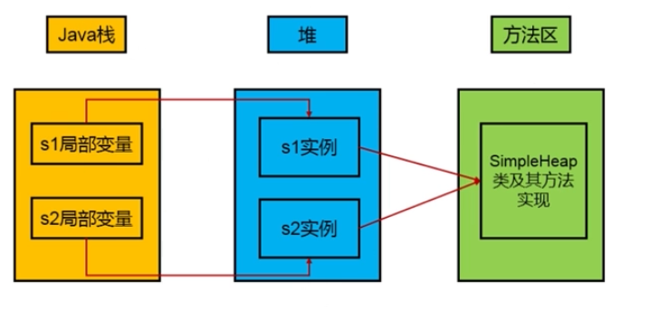 <br />
    > 注意，这个到了后面也会被推翻
  - 方法结束后，堆中的对象不会马上被移除，**仅仅在垃圾回收的时候才会被移除**
  - 堆是垃圾回收的重点区域

- 代码示例
  >  

- 堆空间的细分
  - 两个jdk,7和8是一个分水岭
    - jdk7
      > 新生区+养老区+永久区
      - Young Generation Space 新生区/新生代/年轻代等等。
        - Eden
        - Survivor0(或称为from区)
        - Survivor1(或称为to区)
      - Tenure Generation Space 养老区
      - Permanent Space 永久区
    - jdk8
      > 新生区+养老区+元空间
      - Young Generation Space 新生区
        - Eden
        - Survivor0(或称为from区)
        - Survivor1(或称为to区)
      - Tenure Generation Space 养老区
      - Meta Space 元空间
  - 图解
    > 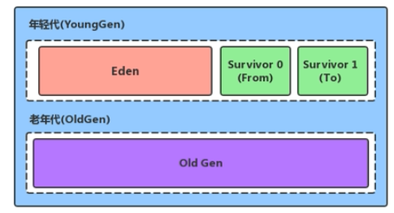<br />
    > 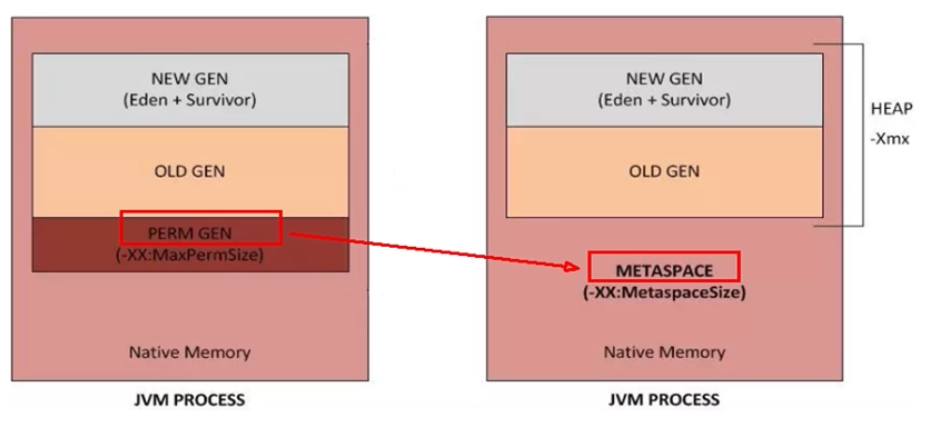 <br />
    > 可以发现-Xmx参数只可以设置前两个区域<br />
    > 而永久代和元数据区都需要通过其他参数进行设置
  - 动手
    - 写个hellow world，添加参数`-Xms10m -Xmx10m -XX:+PrintGCDetails`，
      - 在jdk7下运行查看输出
      - 在jdk8下运行查看输出
    - 写个一直sleep的程序，添加参数`-Xms10m -Xmx10m`，用JVisualVM查看垃圾回收情况
      > 验证-Xmx参数只可以设置前两个区域<br />
      >  
  - 面试题相关：
    - jdk7到jdk8的虚拟机结构有那些变化
      ```
      永久区-->元空间
      基于以上变化，还发生变化的有(后面会详细讲):
        stringTable(字符串常量池)
        静态的域
      ```

#### 2.2.6.3. 设置堆的大小

> 具体参数细节，参数构成会在调优篇重点介绍以及阅读 [参数文档](https://docs.oracle.com/javase/8/docs/technotes/tools/unix/java.html)

> （堆区的内存在jvm启动时就已经确定好了）

- 默认情况
  - 初始内存：物理内存大小的1/64
  - 最大内存：物理内存大小的1/4

- 设置堆区(年轻代+老年代)的起始内存:`-Xms`(默认单位为字节),或者`-XX::InitialHeapSize`
  - -X:jvm的运行参数
  - ms:memory start
- 设置堆区(年轻代+老年代)的最大内存:`-Xmx`,或者`-XX:MaxHeapSize`
  > **开发中建议将初始堆内存和最大的堆内存设置成相同的值。**<br />
  > 否则会因为频繁的扩容和释放会造成不必要的系统的压力(GC释放内存，堆空间减小。运行占用内存，堆空间扩容。频繁进行)
  - -X:jvm的运行参数
  - mx:memory

- 测试(重要)
  ```java
  /**
  * 1. 设置堆空间大小的参数
  * -Xms 用来设置堆空间（年轻代+老年代）的初始内存大小
  *      -X 是jvm的运行参数
  *      ms 是memory start
  * -Xmx 用来设置堆空间（年轻代+老年代）的最大内存大小
  *
  * 2. 默认堆空间的大小
  *    初始内存大小：物理电脑内存大小 / 64
  *             最大内存大小：物理电脑内存大小 / 4
  * 3. 手动设置：-Xms600m -Xmx600m
  *     开发中建议将初始堆内存和最大的堆内存设置成相同的值。
  *
  * 4. 查看设置的参数：方式一： jps   /  jstat -gc 进程id
  *                  方式二：-XX:+PrintGCDetails
  */
  public class HeapSpaceInitial {
      public static void main(String[] args) {

          //返回Java虚拟机中的堆内存总量
          long initialMemory = Runtime.getRuntime().totalMemory() / 1024 / 1024;
          //返回Java虚拟机试图使用的最大堆内存量
          long maxMemory = Runtime.getRuntime().maxMemory() / 1024 / 1024;

          System.out.println("-Xms : " + initialMemory + "M");// 575M
          System.out.println("-Xmx : " + maxMemory + "M");// 575M
          // 只有575M是因为Survivor0和Survivor1区只有一个区域(二选一)可以存放对象
          // 设计垃圾回收的算法

          // System.out.println("系统内存大小为：" + initialMemory * 64.0 / 1024 + "G");
          // System.out.println("系统内存大小为：" + maxMemory * 4.0 / 1024 + "G");

          try {
              Thread.sleep(1000000);
          } catch (InterruptedException e) {
              e.printStackTrace();
          }
      }
  }
  ```
  - 查看堆的状态
    - 方式一： `jps`   ,  `jstat -gc 进程id`
      > 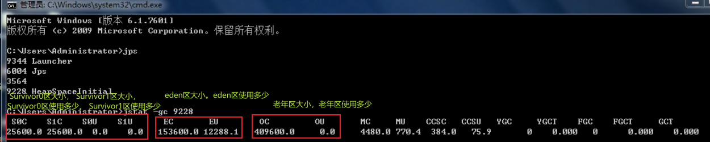 
    - 方式二：`-XX:+PrintGCDetails`
      >  <br />
      > 新生代的计算大小为：eden + from或to中的一个<br />
      > 具体原因见代码中

#### 2.2.6.4. OOM

> 注意面试时。狭义上的 ‘异常’(就要对Exception和Error进行区分)，和广义上的‘异常’（包括Exception和Error）<br  />
> 面试官问内存方面的异常时，基本上都是OOM相关的，要答一些高级的OOM的Error。这里的异常时广义上的

- 代码示例
  > 打开jvisualvm，实际看看GC区的变化
  ```java
  /**
  * -Xms600m -Xmx600m
  */
  public class OOMTest {
      public static void main(String[] args) {
          ArrayList<Picture> list = new ArrayList<>();
          while(true){
              try {
                  Thread.sleep(20);// 为了降低程序执行速度，查看GC变化
              } catch (InterruptedException e) {
                  e.printStackTrace();
              }
              list.add(new Picture(new Random().nextInt(1024 * 1024)));
          }
      }
  }

  class Picture{
      private byte[] pixels;

      public Picture(int length) {
          this.pixels = new byte[length];
      }
  }
  ```
- 结果
  >  <br />
  > old区满了，无法进行GC <br />
  >  <br />
  > 通过查看抽样器中的信息可以判断内存溢出的原因


#### 2.2.6.5. 年轻代和老年代

- jvm中的对象分类
  - 生命周期较短的瞬时对象，该类对象的创建和消亡都非常迅速
  - 生命周期很长的对象（比如一些连接的对象），某些极端情况下还能够与jvm的声明周期保持一致。
- 堆的结构回顾
  > <br />
- 大致流程：
  > 详细看下一节
  - 对象创建在eden中
  - 回收时，如果依旧存活，放入Survivor中（from 和 to 会来回交换。详细看下一节）
  - 一定时间后还存活，就会放入old gen区
- 内存占比
  >  
  - 新生代和老年代在对结构的占比：
    - 默认 -XX:NewRatio=2,表示新生代占1，老年代占2。也就是新生代占1/3
    - -XX:NewRatio=4,表示新生代占1，老年代占4。也就是新生代占1/5
    - **注意：一般不会调。如果很多对象生命周期较长的话，可以把老年代调大一些**
  - Eden和两个Survivor区占比：
    - 文档中写的默认是`-XX:SurvivorRatio`,即8:1:1
      - **但是，实际操作下来时6:1:1**
        > 面试的时候可以说下
        > >
      - 尽管关闭自适应比例的情况下，即加上 `-XX:-UseAdaptiveSizePolicy`。也没有用
      - **必须**要设置`-XX:SurvivorRatio=8`才能成为8:1:1的比例
- 对象的创建： **几乎**所有对象都是在eden中创建的
  ```
  '几乎'是指从实现角度来看，随着Java语言的发展，
  现在已经能看到些许迹象表明日后可能出现值类型的支持，即使只考虑现在，由于即时编
  译技术的进步，尤其是逃逸分析技术的日渐强大，栈上分配、标量替换优化手段已经导致一些微妙
  的变化悄然发生，所以说Java对象实例都分配在堆上也渐渐变得不是那么绝对了
  ```
- 对象的销毁:绝大多数对象的销毁都在新生代进行。
  > IBM公司的专门 研究表表名，新生代中80%的对象都是'朝生夕死'的
- 设置新生代的大小:`-Xmn`。该参数的优先级要大于`-XX:NewRatio`的优先级。**但一般不设置具体数值，而是设置比例**

#### 2.2.6.6. 对象分配过程

> 重要！面试和垃圾回收算法都用得到

```
为新对象分配内存是一件非常严谨和复杂的任务，JVM的设计者们不仅需要考虑内存如何分
配、在哪里分配等问题，并且由于内存分配算法与内存回收算法密切相关，所以还需要考
虑GC执行完内存回收后是否会在内存空间中产生内存碎片。
```
- 具体流程
  - new的对象先放伊甸园区。此区有内存大小
  - 当伊甸园的空间填满时，程序又需要创建对象，JVM的垃圾回收器将对伊甸园区进行垃圾回收（Minor GC),将伊甸园区中和幸存者区中的不再被其他对象所引用的对象进行销毁。再加载新的对象放到伊甸园区
    - **注意：会回收两个区，eden和survivor区。survivor区是被动回收**
    - 回收后，eden就会被清空。垃圾被清理，非垃圾被放到survivor区
  - 然后将伊甸园中的剩余没被垃圾回收的对象移动到幸存者0区。
  - 如果再次触发垃圾回收，此时上次幸存下来的放到幸存者0区的对象如果还是没有回收，就会复制到幸存者1区。再将0区的对象删除
  - 如果再次经历垃圾回收，此时会重新复制回幸存者0区，再将1区对象删除
    > 空的survivor区为to区
    - 不断迭代。迭代一次年龄加1。年龄到达阀值后就会移入到老年区
    - 默认是15次。后去养老区。 通过设置参数调节：`-XX:MaxTenuringThreshold=<N>`进行设置。
    - **注意：survivor区满了的话不会触发**。除了年龄到达阀值，也有特殊情况使Survivor区中的对象移入到老年区。具体看下面
  - 在养老区，相对悠闲。当养老区内存不足时，再次触发GC:Major GC,进行养老区的内存清理。
  - 若养老区执行了Major GC之后发现依然无法进行对象的保存，就会产生OOM异常

- 图解
  > 
  - 针对幸存者se,s1区的总结：复制之后有交换，谁空谁是to.
  - 关于垃圾回收：频繁在新生区收集，很少在养老区收集，几乎不在永久区/ 元空间收集。

- 内存分配特殊情况
  > 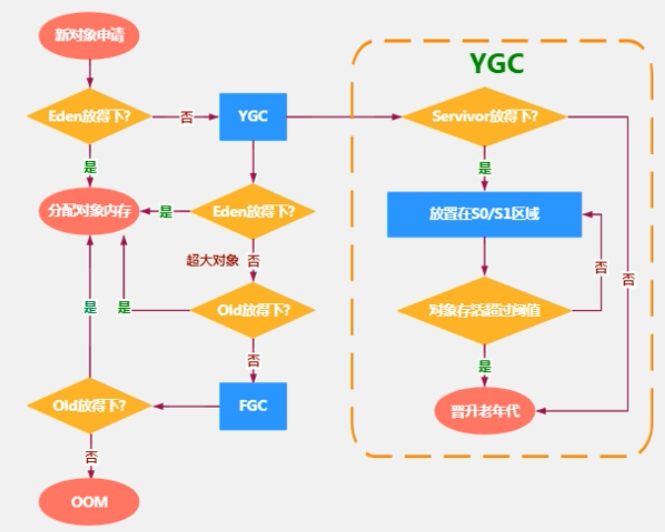 
  - new 的对象如果在eden中放不下，就会进行YGC
    - 如果要放入survivor的to区时，survivor的to区也不够了，就会直接放到老年区(**特殊情况1**)
  - 如果垃圾回收后，新new的对象eden区依旧放不下。就会直接放到old区(**特殊情况2**)
  - 如果old区还是放不下，就会进行FGC(**特殊情况3**)
    - FGC后放的下就会放
    - FGC后放不下就是报OOM异常
      > 不允许jvm动态调整新生代和老年代时
  - 测试：
    > 实际运行代码，通过jvisualvm进行查看
    ```java
    public class HeapInstanceTest {
        byte[] buffer = new byte[new Random().nextInt(1024 * 200)];

        public static void main(String[] args) {
            ArrayList<HeapInstanceTest> list = new ArrayList<HeapInstanceTest>();
            while (true) {
                list.add(new HeapInstanceTest());
                try {
                    Thread.sleep(10);
                } catch (InterruptedException e) {
                    e.printStackTrace();
                }
            }
        }
    }
    ```

#### 2.2.6.7. 常用调优工具

> 列出现阶段学习过程中可能用到的工具。具体使用将放到调优篇

- jdk命令行
  - jps
  - jinfo
  - jstat
  - javap
  - jmap
- jclasslib
- Eclipse Analyzer Tool
- Jconsole
- JVisualVM
- JProfiler
- Java Flight Recorder
- GCVierwer
- GC Easy

#### 2.2.6.8. Minor GC,Major GC,Full GC

> 该节主要是为了区分概念，详细的垃圾回收会放在后面<br />
> 面试会问到 三个GC的区别

- 线程分类：
  - 用户线程：用来执行代码
  - GC线程：用来进行垃圾回收
    > 垃圾回收过程中会有Stop the World(STW)，也就是垃圾回收时用户线程会暂停。导致程序执行效率下降<br />


- 针对 HotSpot VM的实现，它的GC按照回收区域分为两类：
  > JVM 进行GC时，并非每次都对三个区域（新生代，老年代，方法区）一起回收，大多数回收的都是新生代。
  - 部分收集（Partial GC）:不是完整得收集整个java堆的垃圾收集。其中可以分为：
    - 新生代收集（Minor GC/Young GC）:只针对新生代的垃圾收集
    - 老年代收集（Major GC/Old GC）:只针对老年代的垃圾收集
      - 只有GMS垃圾回收器会有单独收集老年代的行为
      - **注意：很多时候Major GC会和Fu11 GC混淆使用，需要具体分辨是老年代 回收还是整堆回收。**
        > 原因是hotspot虚拟机发展时间很长，外界对它的解读有些混乱<br />
        > 面试时可以向面试官主动提问下他问的到底是哪个<br />
        > 准确地还是按照这里的分类较好
    - 混合收集（Mixed GC）：收集整个新生代和老年代
      - 目前只有G1回收器会有这种行为
        > 原因是因为G1是按照region进行堆空间的划分(后面再详细说)
  - 整堆收集（Full GC）:收集整个java堆(新生代+老年代)和方法区的垃圾收集

- 触发机制
  - 年轻代GC（Minor GC）
    - 当年轻代空间不足时，就会触发Minor GC,这里的年轻代满指的是 Eden代满，**Survivor满不会引发GC**。（每次Minor GC会清理年轻 代的内存。）
      > 上面说过，Survivor区满了的话会晋升到老年代。Survivor的回收是被动的，是由eden区触发回收时同时进行回收
    - 因为 Java 对象大多都具备朝生夕灭的特性，所以 Minor GC 非常频繁，一般回收速度也比较快。这一定义既清晰又易于理解。
    - Minor GC会引发STW,暂停其它用户的线程，等垃圾回收结束，用户线程才恢复运行。
  - 老年代GC（Major GC/Full GC）
    - 出现了Major GC,经常会伴随至少一次的Minor GC(但非绝对的，在Parallel Scavenge收集器的收集策略里就有直接进行Major GC的策略选择过程）。
      > 也就是在老年代空间不足时，会先尝试触发Minor GC。如果之后空间还不足，则触发Major GC
    - **Major GC的速度一般会比Minor GC慢10倍以上，STW的时间更长。**
    - 如果Major GC后，内存还不足，就报OOM了。
  - Full GC触发方式：
    > 之后性能调优会更详细得说
    - (1)调用System.gc()时，系统建议执行Fu11 GC,但是不必然执行
    - (2)老年代空间不足
    - (3)方法区空间不足
    - (4)通过Minor GC后进入老年代的平均大小大于老年代的可用内存
    - (5)由Eden区、survivor spacee(From Space)区向survivor space1(To Space)区复制时，对象大小大于To Space可用内存，则把该对象转存到老年代，且 老年代的可用内存小于该对象大小
    > 开发和调优中应该尽量避免full GC，降低用户线程暂停时间(STW)

- 代码测试：
  > 也可以通过jvisualvm等实时监测。这里是添加参数输出GC日志
  ```java
  /**
  * 测试MinorGC 、 MajorGC、FullGC
  * -Xms9m -Xmx9m -XX:+PrintGCDetails
  */
  public class GCTest {
      public static void main(String[] args) {
          int i = 0;
          try {
              List<String> list = new ArrayList<>();
              String a = "atguigu.com";
              while (true) {
                  list.add(a);
                  a = a + a;
                  i++;
              }

          } catch (Throwable t) {
              t.printStackTrace();
              System.out.println("遍历次数为：" + i);
          }
      }
  }
  ```
  - from 和 to 区不同是因为自适应的原因。关闭自适应后就相同了
    >  
  - 回收日志分析
    > 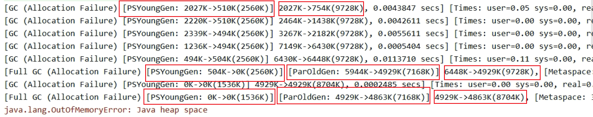 
    - GC(第一行)：
      - 前者为：回收前年轻代内存占用->回收后年轻代内存占用。
      - 后者为：回收前整个堆的内存占用-> 回收后整个堆的内存占用(堆的全部内存大小)
        > 因为是第一YGC，老年区还没有数据，所以年轻代的内存占用和整个堆的内存占用相同
    - Full GC
      - 分别是：年轻代回收情况，老年代回收情况，整个堆回收情况
    - 在最后一个Full GC后，可以发现老年区内存没有回收多少，然后在下一次代码执行添加数据时导致堆空间不足，出现OOM

#### 2.2.6.9. 堆的分代思想

- 分代原因：
  - 不同的对象生命周期不同，70%-99%的对象都是临时对象
  - 其实不分代依旧可以，分代的唯一理由就是**优化GC性能**。
    - 不必对放入老年代的对象进行频繁的检测和回收
      > 之前也提到了，Full GC 是Minor GC 花费时间的10倍

#### 2.2.6.10. 内存分配策略/对象提升(promotion)规则

> 为对象分配过程的总结

- 优先分配到Eden
- 大对象直接分配到老年代
  - 也就是eden区放不下的情况
  - 尽量避免程序中出现过多的大对象。
    - 创建大对象后，如果eden没有足够空间，eden就会GC
    - 如果eden内存还不够，就会往堆中放
    - 堆中也没足够空间，又会进行GC
    - 两次GC浪费时间，并且如果该对象是临时对象，就得不偿失了
- 长期存活的对象分配到老年代。（为了降低GC频率）
- 动态对象年龄判断
  ```
  如果survivor区中相同年龄的所有对象大小的总和大于Survivor空
  间的一半，年龄大于或等于该年龄的对象可以直接进入老年代，无须等到
  MaxTenuringThreshold中要求的年龄。

  是一种优化，否则两个Survivor区中数据的转移可能会浪费过多时间
  ```
- 空间分配担保
  > 将Survivor区无法存放的对象放到老年代
  - XX:HandlePromotionFailure
    > 后面会详细说

- 大对象直接分配到堆演示：
  ```java
  /** 测试：大对象直接进入老年代
  * -Xms60m -Xmx60m -XX:NewRatio=2 -XX:SurvivorRatio=8 -XX:+PrintGCDetails
  */
  public class YoungOldAreaTest {
      public static void main(String[] args) {
          byte[] buffer = new byte[1024 * 1024 * 20];//20m

      }
  }
  ```
  >  


#### 2.2.6.11. TLAB：为对象分配内存

- TLAB(Thread Local Allocation Buffer)出现原因：
  - 堆区是线程共享区域，任何线程都可以访问到堆区中的共享数据
  - 由于对象实例的创建在JVM中非常频繁，因此在并发环境下从堆区中划分内 存空间是线程不安全的
  - 为避免多个线程操作同一地址，需要使用加锁等机制，进而影响分配速度。
- TLAB介绍：
  - 从内存模型而不是垃圾收集的角度，对Eden区域继续进行划分，JVM**为每个线程分配了一个私有缓存区域**，它包含在Eden空间内。
    >  
    - 每个线程在往eden中存储对象时，会首先往TLAB中存储数据
    - 当TLAB用完后，再往eden中的共有区域存储数据
  - 多线程同时分配内存时，使用TLAB可以避免一系列的非线程安全问题，同时还能够提升内存分配的吞吐量，因此我们可以将这种内存分配方式称之为**快速分配策略**。
  - 现在所有OpenJDK衍生出来的JVM都提供了TLAB的设计。
- 细节与配置
  - 流程： 
    - 尽管不是所有的对象实例都能够在TLAB中成功分配内存，但**JVM确实是将TLAB作为内存分配的首选。**
    - 一旦对象在TLAB空间分配内存失败时，JVM就会尝试着通过使用加锁机制确保数据操作的原子性，从而直接在Eden空间中分配内存。
  - 开启参数：在程序中，开发人员可以通过选项`-XX:UseTLAB`设置是否开启TLAB空间。(默认开启)
  - 内存占比：
    - 默认情况下，TLAB空间的内存非常小，**仅占有整个Eden空间的1%**
    - 当然我们可以通 过选项`-XX:TLABWasteTargetPercent`设置TLAB空间所占用Eden空间的百分比大小。

- 对象分配过程(TLAB部分)图解
  > 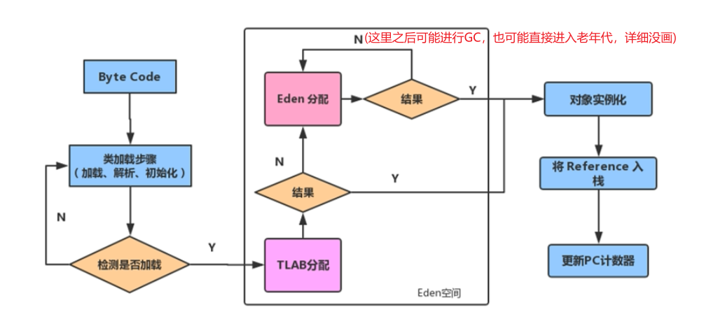 

#### 2.2.6.12. 堆空间的参数设置小结

> 面试有。并且调优时肯定会用

[官网说明]( https://docs.oracle.com/javase/8/docs/technotes/tools/unix/java.html)
> 一共600多个


- -XX:+PrintFlagsInitial : 查看**所有**的参数的默认初始值
- -XX:+PrintFlagsFinal ：查看**所有**的参数的最终值（可能会存在修改，不再是初始值）
  - 具体查看指定进程某个参数的指令：
    - jps：查看当前运行中的进程
    - jinfo -flag 参数名称 进程 id
- -Xms：初始堆空间内存 （默认为物理内存的 1/64）
- -Xmx：最大堆空间内存（默认为物理内存的 1/4）
- -Xmn：设置新生代的大小。(初始值及最大值)
- -XX:NewRatio：配置新生代与老年代在堆结构的占比
- -XX:SurvivorRatio：设置新生代中 Eden 和 S0/S1 空间的比例
  - Eden所占比例过大的话，
    - 就会导致Survivor区过小
    - Survivor非常容易满，使大多数对象直接进入老年区
    - 从而使Minor GC失去意义
  - Eden所占比例过小的话，
    - Eden区进行Minor GC频率就会变高
    - 会使STW时间过多，降低执行效率
- -XX:MaxTenuringThreshold：设置新生代垃圾的最大年龄(默认15)
  > 一般不怎么修改
- -XX:+PrintGCDetails：输出详细的 GC 处理日志
- 打印 gc 简要信息(没什么用)：
  - -XX:+PrintGC
  - -verbose:gc
- -XX:HandlePromotionFailure：是否设置空间分配担保

- 空间分配担保说明：
  - 在发生Minor GC之前，虚拟机会检查老年代最大可用的连续空间是否大于新生代所有对象的总空间。
    - 如果大于，则此次Minor GC是安全的
    - 如果小于，则虚拟机会查看-XX:HandlePromotionFailure设置值是否允许担保失败。
      - 如果HandlePromotionFailure=true,那么会继续检查**老年代最大可用连续空间**是否大于**历次晋升到老年代的对象的平均大小**。
        - 如果大于，则尝试进行一次Minor GC,但这次Minor GC依然是有 风险的；
        - 如果小于，则改为进行一次Fu11 GC。
      - 如果HandlePromotionFailure=false,则改为进行一次Fu11 GC。

```
在JDK6 Update24之后（JDK7),HandlePromotionFailure参数不会再影响到
虚拟机的空间分配担保策略，观察openJDK中的源码变化，虽然源码中还定义了
HandlePromotionFailure参数，但是在代码中已经不会再使用它。

JDK6 Updat 24之后的规则变为只要老年代的连续空间大于新生代对象总大小或者历次晋升的平均大
小就会进行Minor GC,否则将进行Fu11 GC。（相当于固定设为true）
```


#### 2.2.6.13. 拓展：逃逸分析

????到底分配到了栈上的哪里

```
在《深入理解Java虚拟机》中关于Java堆内存有这样一段描述：
随着JIT编译期的发展与逃逸分析技术逐渐成熟，栈上分配、标量替换优化技术将会导
致一些微妙的变化，所有的对象都分配到堆上也渐渐变得不那么"绝对"了。
```

- 对象的分配：
  - 普通情况：在Java虚拟机中，对象是在Java堆中分配内存的
  - 特殊情况： 
    - 那就是如果经过**逃逸分析（Escape Analysis)**后发现，
    - 一个对象并没有 逃逸出方法的话，那么就可能被优化成栈上分配。
    - 这样就无需在堆上分配内存，也无须进行垃圾回收了。
    - 这也是最常见的堆外存储技术。

- 逃逸分析
  > 通过逃逸分析，Java Hotspot编译器能够分析出一个新的对象的引用的使用范围从而决定是否要将这个对象分配到堆上。
  - 作用：有效减少Java程序中同步负载和内存堆分配压力
  - 说明：
    - 当一个对象在方法中被定义后，对象只在方法内部使用，则认为没有发生逃逸。就可以将对象放在栈空间。
      ```java
      public void test1(){
        V v = new V();
        // use v
        // ....
        v=null;
      }
      ```
    - 当一个对象在方法中被定义后，它被外部方法所引用，则认为发生逃逸。对象会放在堆中
      ```java
      // 该示例在之前的线程安全问题中也有提到过
      public StringBuffer createStringBuffer(String s1,String s2){
        StringBuffer sb = new StringBuffer();
        sb.append(s1):
        sb.append(s2):
        return sb;
        // 发生逃逸，StringBuffer对象会放在堆中。
      }
      ```
      ```java
      public StringBuffer createStringBuffer(String s1,String s2){
        StringBuffer sb = new StringBuffer();
        sb.append(s1):
        sb.append(s2):
        return sb.toString();
        // 此时 sb 会分配到栈上。
        // 而新生成的字符串对象会分配到堆上。
      }
      ```
- 示例：
  ```java
  /**
  * 逃逸分析
  *
  * 如何快速的判断是否发生了逃逸分析，就看new的对象实体是否有可能在方法外被调用。
  */
  public class EscapeAnalysis {

      public EscapeAnalysis obj;

      /*
      方法返回EscapeAnalysis对象，发生逃逸
      */
      public EscapeAnalysis getInstance(){
          return obj == null? new EscapeAnalysis() : obj;
      }
      /*
      为成员属性赋值，发生逃逸
      */
      public void setObj(){
          this.obj = new EscapeAnalysis();
      }
      // 思考：如果当前的obj引用声明为static的？仍然会发生逃逸。
      // 如果为静态成员变量赋值，也会发生逃逸，没有区别

      /*
      对象的作用域仅在当前方法中有效，没有发生逃逸
      */
      public void useEscapeAnalysis(){
          EscapeAnalysis e = new EscapeAnalysis();
      }
      /*
      引用成员变量的值，发生逃逸
      */
      public void useEscapeAnalysis1(){
          EscapeAnalysis e = getInstance();
          //getInstance().xxx()同样会发生逃逸
      }
  }
  ```
- 开启：
  - 在JDK 6u23版本之后，HotSpot中默认就已经开启了逃逸分析。
    - 注意：
      - 要添加 -Server选项以服务端模式开启。
      - 不过在64位电脑上默认启动的就是 Server VM。
      - 倒不用添加 -Server 参数
  - 如果使用的是较早的版本，开发人员则可以通过：
    - 选项-XX:+DoEscapeAnalysis显式开启逃逸分析
      > 通过选项-XX:-DoEscapeAnalysis显式关闭逃逸分析(对jdk 6u23之后的版本也有用)
    - 通过选项-XX:+PrintEscapeAnalysis查看逃逸分析的筛选结果。

- 扩展：
  ```
  此外，前面提到的基于openJDK深度定制的TaoBaoVM,其中创新的GCIH(GC
  invisible heap)技术实现off-heap,将生命周期较长的Java对象从heap中移至heap外，
  并且GC不能管理GCIH内部的Java对象，以此达到降低GC的回收频率和提升
  GC的回收效率的目的。
  ```

**开发中能使用局部变量的，就不要使用在方法外定义。**

#### 2.2.6.14. 逃逸分析-代码优化(编译器做的)

##### 2.2.6.14.1. 栈上分配

- 栈上分配
  - 说明：将堆分配转化为栈分配。
    - 如果一个对象在子程序中被分配，
    - 要使指向该对象的指针永远不会逃逸，对象可能是栈分配的候选，而不是堆分配。
  - 详解：
    ```
    JIT编译器在编译期间根据逃逸分析的结果，发现如果一个对象并没有逃
    逸出方法的话，就可能被优化成栈上分配。分配完成后，继续在调用栈内
    执行，最后线程结束，栈空间被回收，局部变量对象也被回收。这样就无
    须进行垃圾回收了。
    ```
  - 常见的栈上分配的场景
    - 给成员变量赋值
    - 方法返回值
    - 实例引用传递
  - 实际：
    - <p style="color:red">上面写的基本扯淡，那只是逃逸分析能带来的好处，了解一下即可</p>
    - <p style="color:red">因为逃逸分析技术太不成熟,HotSpot虚拟机中就没用逃逸分析技术。(具体看下面小结)</p>
    - <p style="color:red">下方示例代码之所以能变快，其实是因为 标量替换 </p>

```java
package com.atguigu.java2;

/**
 * 栈上分配测试
 * -Xmx256m -Xms256m -XX:-DoEscapeAnalysis -XX:+PrintGCDetails 
 * // 在关闭逃逸分析时，内存中会有1000万个对象(抽样器中查看)，会发生两次GC，耗时56ms
 *
 * -Xmx256m -Xms256m -XX:+DoEscapeAnalysis -XX:+PrintGCDetails 
 * // 在开启逃逸分析时，内存中不会有1000万个对象，不会发生GC，耗时4ms
 */
public class StackAllocation {
    public static void main(String[] args) {
        long start = System.currentTimeMillis();

        for (int i = 0; i < 10000000; i++) {
            alloc();
        }
        // 查看执行时间
        long end = System.currentTimeMillis();
        System.out.println("花费的时间为： " + (end - start) + " ms");
        // 为了方便查看堆内存中对象个数，线程sleep
        try {
            Thread.sleep(1000000);
        } catch (InterruptedException e1) {
            e1.printStackTrace();
        }
    }

    private static void alloc() {
        User user = new User();//未发生逃逸
    }

    static class User {

    }
}
```

##### 2.2.6.14.2. 同步省略

- 同步省略。
  - 说明：
    - 如果一个对象被发现只能从一个线程被访问到，
    - 那么对于这 个对象的操作可以不考虑同步。
      > 注意，字节码中依旧有同步的字节码指令，只是执行时JIT编译器进行优化
  - 原因：
    - 同步的代价是相当高的，
    - 同步的后果是降低并发性和性能
  - 详解：
    - 在动态编译同步块的时候，JIT编译器可以借助逃逸分析来判断同步块所使用的锁对象是否只能够被一个线程访问而没有被发布到其他线程。
    - 如果没有，那么JIT编译器在编译这个同步块的时候就会取消对这部分代码的同步。
    - 这样就能大大提高并发性和性能。这个取消同步的过程就叫同步省略，也叫**锁消除**。

```java
public class SynchronizedTest {
    public void f() {
        Object hollis = new Object();
        synchronized(hollis) {
            System.out.println(hollis);
        }
    }
}

// 会被jvm优化成：

public class SynchronizedTest {
    public void f() {
        Object hollis = new Object();
        System.out.println(hollis);
    }
}

```

##### 2.2.6.14.3. 标量替换

- 相关概念：
  - 标量（Scalar)：
    - 标量（Scalar)是指一个无法再分解成更小的数据的数据。
    - Java中的原始数据类型就是标量。
  - 聚合量（Aggregate)
    - 相对的，那些还可以分解的数据叫做聚合量（Aggregate),Java中的对象就是聚合量，因为他可以分解成其他聚合量和标量。

- 分离对象或标量替换。
  - 说明：
    - 有的对象可能不需要作为一个连续的内存结构存在也可以被访问到，
    - 那么对象的部分（或全部）可以不存储在内存，而是存储在CPU寄存器中。
  - 详解：
    - 在JIT阶段，如果经过逃逸分析，发现一个对象不会被外界访问的话，那么经过JIT优化，
    - 就会把这个对象拆解成若干个其中包含的若干个成员变量来代替。这个过程就是标量替换。
  - 好处：
    - 大大减少了堆的占用
    - 为栈上分配提供了良好的基础

```java
/**
 * 标量替换测试
 *  -Xmx100m -Xms100m -XX:-DoEscapeAnalysis -XX:+PrintGC -XX:-EliminateAllocations  
 *  // 57ms。有多次GC
 *  -Xmx100m -Xms100m -XX:+DoEscapeAnalysis -XX:+PrintGC -XX:-EliminateAllocations
 *  // 4ms。没有GC
 */
public class ScalarReplace {
    public static class User {
        public int id;
        public String name;
    }

    public static void alloc() {
        User u = new User();//未发生逃逸
        u.id = 5;
        u.name = "www.atguigu.com";
        // ----------------------------
        // 会优化成
        // int id = 5
        // String name = "www.atguigu.com";
    }

    public static void main(String[] args) {
        long start = System.currentTimeMillis();
        for (int i = 0; i < 10000000; i++) {
            alloc();
        }
        long end = System.currentTimeMillis();
        System.out.println("花费的时间为： " + (end - start) + " ms");
    }
}
```

#### 2.2.6.15. 逃逸分析小结

- 关于逃逸分析的论文在1999年就已经发表了，但直到JDK1.6才有实现，而且这项技 术到如今也并不是十分成熟的:
- 根本原因:
  - 就是无法保证逃逸分析的性能消耗一定能高于他的消耗。
  - 虽然经过逃逸分析可以做标量替换、栈上分配、和锁消除。
  - 但是逃逸分析自身也是需要进行一系列复杂的分析的，这其实也是一个相对耗时的过程。
    ```
    一个极端的例子，就是经过逃逸分析之后，发现没有一个对象是不逃逸的。那这个逃
    逸分析的过程就白白浪费掉了。
    ``` 
- 虽然这项技术并不十分成熟，但是它也是即时编译器优化技术中一个十分重要的手段。
  - 注意到有一些观点，认为通过逃逸分析，JVM会在栈上分配那些不会逃逸的对象，这在理论上是可行的，但是取决于JVM设计者的选择。
  - 但现在 Oracle Hotspot JVM中并未这么做，这一点在逃逸分析相关的文档里已经说明，**所以可以明确所有的对象实例都是创建在堆上**。
- 其他
  ```
  目前很多书籍还是基于JDK7以前的版本，JDK已经发生了很大变化，intern字符串
  的缓存和静态变量曾经都被分配在永久代上，而永久代已经被元数据区取代。但是，
  intern字符串缓存和静态变量并不是被转移到元数据区，而是直接在堆上分配，所以
  这一点同样符合前面一点的结论：对象实例都是分配在堆上。
  ```

#### 2.2.6.16. 堆是分配对象的唯一选择吗？

- 先否定。开始谈逃逸分析
- 再肯定，拿jvm规范,逃逸分析的不成熟，以及字符串缓存和静态变量的存储转移 说事儿

### 2.2.7. 方法区(重要)

#### 2.2.7.1. 栈，堆，方法区 交互关系

- 运行时数据区回顾：
  >  

- 从线程共享角度看：
  > 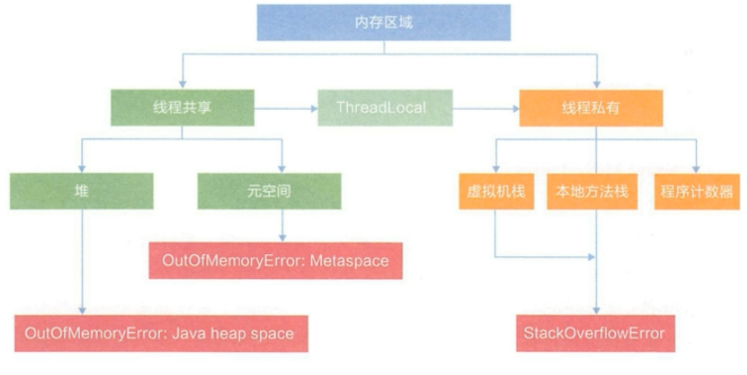 

- 当创建一个对象时：
  - 各部分存在位置：
    >   
  - 引用关系：
    > 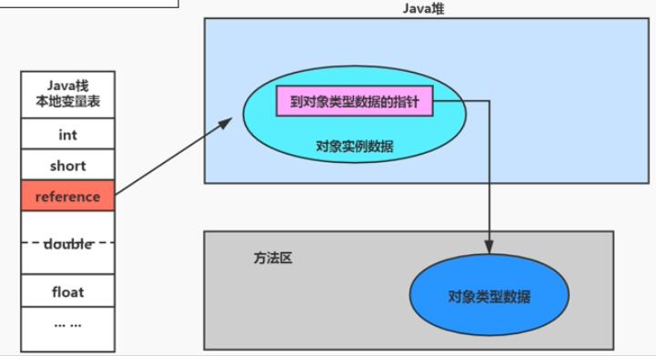 
    - 复习：java栈中的slot

#### 2.2.7.2. 方法区基本理解

- 方法区与堆的关系：
    > 也就是虚拟机规范中，把方法区看成堆的逻辑部分，但具体实现上，可以把两个结构分开
  - 《Java虚拟机规范》中明确说明：尽管所有的方法区在逻辑上是属于堆的一部分，但一些简单的实现可能不会选择去进行垃圾收集或者进行压缩。
  - 但对于HotSpotJVM而言，方法区还有一个别名叫做Non-Heap(非堆）,目的就是要和堆分开。
  - 所以，**方法区看作是一块独立于Java堆的内存空间。**

- 基本特点：
  - 线程共享：方法区（Method Area)与Java堆一样，是各个线程共享的内存区域。
  - 创建时机：方法区在JVM启动的时候被创建
  - 内存空间：
    - **方法区使用的是本地内存，而不是java虚拟机的内存**
      -  本地内存（Native memory），也称为C-Heap，是供JVM自身进程使用的。也就是物理机内存
      -  当Java Heap空间不足时会触发GC，但Native memory空间不够却不会触发GC。
    - 它的实际的物理内存空间中和Java堆区一样都可以是不连续的。
    - 方法区的大小，跟堆空间一样，可以选择固定大小或者可扩展。
    - 关闭JVM就会释放这个区域的内存。
- Error：
  - 出现原因： 
    - 方法区的大小决定了系统可以保存多少个类，如果系统定义了太多的类，导致方法区溢出，虚拟机同样会抛出内存溢出错误
    - 比如
      - 加载大量第三方jar包
      - Tomcat部署工程过多（30-50）
      - 大量动态生成反射类
  - 名称：
    - java.lang.OutofMemoryError: PermGen space(jdk1.7及之前)
      > jdk1.8之后把永久代更名为元空间
    - java.lang.OutofMemoryError:Metaspace (jdk1.8及之后)
  - 使用jvisualvm查看类的个数：
    > 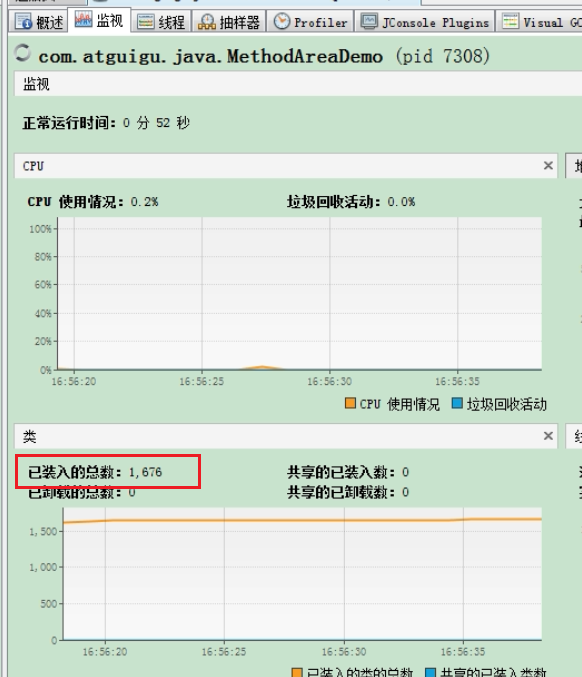 
 

- 基本演进：
  >  
  - 在jdk7及以前，习惯上把方法区，称为永久代。jdk8开始，使用元空间取代了永久代。
    > 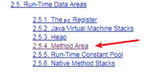 
    - 打个比方
    - **可以把方法区看成接口,把永久代和元空间看作接口的不同逻辑实现**
  - 现在来看，当年使用永久代，不是好的idea。导致Java程序更容易OOM(超过-XX:MaxPermSize上限）
  - 而到了JDK 8,hotspot终于完全废弃了永久代的概念，改用与JRockit、J9一样在本地内存中实现的元空间（Metaspace)来代替
  - 元空间的本质和永久代类似，都是对JVM规范中方法区的实现。不过元空间与永代最大的区别在于：**元空间不在虚拟机设置的内存中，而是使用本地内存**。
  - 永久代、元空间二者并不只是名字变了，**内部结构也调整了**。
    > 详细放后面
  - 根据《Java虚拟机规范》的规定，如果方法区无法满足新的内存分配需求时，将抛出OOM异常。

#### 2.2.7.3. 设置方法区大小

- 种类：
  - 方法区大小可以是不固定的
  - 也可以设置为固定的

- jdk7及之前
  - 通过-XX:PermSize来设置永久代初始分配空间。默认值是20.75M
  - -XX:MaxPermSize来设定永久代最大可分配空间。32位机器默认是64M,64位机器模式是82M
  - 当JVM加载的类信息容量超过了这个值，会报异常OutOfMemoryError:PermGen space .

- jdk8及之后
  - 说明：
    - 元数据区大小可以使用参数-XX:MetaspaceSize和-XX:MaxMetaspaceSize指定，替代上述原有的两个参数。
    - 默认值依赖于平台。 **windows下，-XX:MetaspaceSize是21M,-XX:MaxMetaspaceSize的值是-1,即没有限制。**
    - **与永久代不同，如果不指定大小，默认情况下，虚拟机会耗尽所有的可用系统内存。也就是没有最大值**
    - 如果元数据区发生溢出，虚拟机一样会抛出异常OutOfMemoryError:Metaspace
  - -xx:MetaspaceSize:设置初始的元空间大小。
    - 默认大小：
      - 对于一个64位的服务器端JVM来说，其默认的-XX:MetaspaceSize值为21MB。
    - GC与水位线:
      - MetaspaceSize就是是初始的高水位线，一旦触及这个水位线，Full GC将会被触发并卸载没用的类（即这些类对应的类加载器不再存活）,
      - 然后这个高水位线将会重置。新的高水位线的值取决于GC后释放了多少元空间。
      - 如果释放的空间不足，那么在不超过MaxMetaspaceSize时，适当提高该值。如果释放空间过多，则适当降低该值。
    - 建议：
      - 如果初始化的高水位线设置过低，上述高水位线调整情况会发生很多次。
      - 通过垃圾回收器的日志可以观察到Full GC多次调用。为了避免频繁地GC,建议将-XX:MetaspaceSize设置为一个相对较高的值。
  - -XX:MaxMetaspaceSize：设置最大的元空间大小
    - 一般不会修改
    - 即可以占用所有本地内存
 
- 测试代码：
    ```java
    /**
    *  测试设置方法区大小参数的默认值
    *
    *  jdk7及以前：
    *  -XX:PermSize=100m -XX:MaxPermSize=100m
    *
    *  jdk8及以后：
    *  -XX:MetaspaceSize=100m  -XX:MaxMetaspaceSize=100m
    * @author shkstart  shkstart@126.com
    * @create 2020  12:16
    */
    public class MethodAreaDemo {
        public static void main(String[] args) {
            System.out.println("start...");
    //        try {
    //            Thread.sleep(1000000);
    //        } catch (InterruptedException e) {
    //            e.printStackTrace();
    //        }

            System.out.println("end...");
        }
    }
    ```

#### 2.2.7.4. OOM

```java
import com.sun.xml.internal.ws.org.objectweb.asm.ClassWriter;
import jdk.internal.org.objectweb.asm.Opcodes;

/**
 * jdk6/7中：
 * -XX:PermSize=10m -XX:MaxPermSize=10m
 *
 * jdk8中：
 * -XX:MetaspaceSize=10m -XX:MaxMetaspaceSize=10m
 *
 * @create 2020  22:24
 */
public class OOMTest extends ClassLoader {
    public static void main(String[] args) {
        int j = 0;
        try {
            OOMTest test = new OOMTest();
            for (int i = 0; i < 10000; i++) {
                //创建ClassWriter对象，用于生成类的二进制字节码
                ClassWriter classWriter = new ClassWriter(0);
                //指明版本号，修饰符，类名，包名，父类，接口
                classWriter.visit(Opcodes.V1_6, Opcodes.ACC_PUBLIC, "Class" + i, null, "java/lang/Object", null);
                //返回byte[]
                byte[] code = classWriter.toByteArray();
                //类的加载
                test.defineClass("Class" + i, code, 0, code.length);//Class对象
                j++;
            }
        } finally {
            System.out.println(j);
        }
    }
}
```

- 如何解决OOM
  > 后面调优会细讲
  ```
  1、要解决OOM异常或heap space的异常，一般的手段是首先通过内存映像分析工具
  (如Eclipse Memory Analyzer)对dump出来的堆转储快照进行分析，重点是确认
  内存中的对象是否是必要的，也就是要先分清楚到底是出现了内存泄漏（Memory
  Leak)还是内存溢出（Memory Overflow)。
  2、如果是内存泄漏，可进一步通过工具查看泄漏对象到GC Roots的引用链。于是就
  能找到泄漏对象是通过怎样的路径与GC Roots相关联并导致垃圾收集器无法自动回收
  它们的。掌握了泄漏对象的类型信息，以及GC Roots引用链的信息，就可以比较准确
  地定位出泄漏代码的位置。
  3、如果不存在内存泄漏，换句话说就是内存中的对象确实都还必须存活着，那就应当
  检查虚拟机的堆参数（-Xmx与-Xms),与机器物理内存对比看是否还可以调大，从代
  码上检查是否存在某些对象生命周期过长、持有状态时间过长的情况，尝试减少程序
  运行期的内存消耗。
  ```

#### 2.2.7.5. 方法区的内部结构

- 简图
  >  
  - 类信息：就是类型信息，下面有详细说明
  - 《深入理解Java虚拟机》书中对方法区（Method Area)存储内容描述如下：
    - 它用于存储已被虚拟机加载的**类型信息、常量、静态变量、即时编译器编译后的代码缓存等**。
      >  
      > 这是经典版本<br />
      > 现在，静态变量和StringTable存放位置都有些变化<br />
      > 在后面细节演进会细说

- 存储信息说明：
  - 类型信息：
    > 对每个加载的类型（类class、接口interface、枚举enum、注解annotation),JVM必须在方法区中存储以下类型信息：
    ```
    Class对象是存放在堆区的，不是方法区，
    元数据并不是类的Class对象！ Class对象是加载的最终产品，
    类的方法代码，变量名，方法名，访问权限，返回值等等都是在方法区的
    ```
    - 这个类型的完整有效名称（全名=包名.类名）
    - 这个类型直接父类的完整有效名（对于interface或是java.lang.Object,都没有父类）
    - 这个类型的修饰符（public,abstract,final的某个子集）
    - 这个类型直接接口的一个有序列表
  - 域(field)信息：
    - JVM必须在方法区中保存类型的所有域的相关信息以及域的声明顺序。
    - 域的相关信息包括：域名称、域类型、域修饰符（public,private, protected, static, final, volatile, transient的某个子集）
  - 方法信息：
    > JVM必须保存所有方法的以下信息，同域信息一样包括**声明顺序**：
    - 方法名称
    - 方法的返回类型（或void)
    - 方法参数的数量和类型（按顺序）
    - 方法的修饰符（public,private,protected,static,final,synchronized,native,abstract的一个子集）
    - 方法的字节码（bytecodes)、操作数栈、局部变量表及大小（abstract和native方法除外）
    - 异常表（abstract和native方法除外）
      > 每个异常处理的开始位置、结束位置、代码处理在程序计数器中的偏移地址、被捕获的异常类的常量池索引

- 测试代码：
  > 使用javap -v -p 进行反编译
  > > -p 会显示所有权限的结构。
  > > 如果没有-p私有成员就无法显示出来
  ```java
  import java.io.Serializable;

  /**
  * 测试方法区的内部构成
  */
  public class MethodInnerStrucTest extends Object implements Comparable<String>,Serializable {
      //属性
      public int num = 10;
      private static String str = "测试方法的内部结构";
      //构造器。这里可以没有写
      //方法
      public void test1(){
          int count = 20;
          System.out.println("count = " + count);
      }
      public static int test2(int cal){
          int result = 0;
          try {
              int value = 30;
              result = value / cal;
          } catch (Exception e) {
              e.printStackTrace();
          }
          return result;
      }

      @Override
      public int compareTo(String o) {
          return 0;
      }
  }
  ```

  [javap -v -p反编译输出](./external_file/jvm_out1.txt)

  - 注意：反编译出来的文件中不包含classloader中的信息
  - 只有通过类加载子系统加载到内存后，方法区中才会保存classloader的信息

---

额外扩展点：

- non-final的类变量：
  - 说明：
    - 静态变量和类关联在一起，随着类的加载而加载，它们成为类数据在逻辑上的一部分。
    - 类变量被类的所有实例共享，即使没有类实例时你也可以访问它。
  - 示例代码：
    ```java
    /**
    * non-final的类变量
    */
    public class MethodAreaTest {
        public static void main(String[] args) {
            Order order = null;
            order.hello(); // 不会报错。
                           // 不过平时就很少用对象实例调用类方法
            System.out.println(order.count);
        }
    }

    class Order {
        public static int count = 1; // no-final
        public static final int number = 2; // final

        public static void hello() {
            System.out.println("hello!");
        }
    }
    ```

    [javap -v -p反编译输出](./external_file/jvm_out2.txt)

  - non-final类变量的初始化:
    > 查看反编译文件
    - 在Prepare环节会进行一个默认初始化为0
    - 然后再Initiallization赋值为1
    - 如果还在静态代码块中进行赋值，即就会在`<client>`中进行赋值。
    >  
  - final static的初始化:
    > 查看反编译文件
    - 被声明为final的类变量的处理方法则不同，每个全局常量在编译的时候就会被分配了。
    >  
    > (可以看见编译文件中有 2 )


#### 2.2.7.6. 常量池与运行时常量池

> 细节放到中篇来讲


> 要弄清楚方法区，需要理解清楚ClassFile,因为加载类的信息都在方法区。<br />
> 要弄清楚方法区的运行时常量池，需要理解清楚ClassFile中的常量池。

- 常量池和运行时常量池：
  - 常量池：
    - 是字节码文件的一部分，
    - **用于存放编译器生成的各种字面量与符号引用，这部分内容将在类加载后存放到方法区的运行时常量池中**
  - 运行时常量池：
    - 位置：方法区内部包含运行时常量池
    - 创建时机：在加载类或接口到虚拟机后，就会创建对应的运行时常量池。
    - 对应关系：JVM为每一个类，接口，注解，lambda表达式都维护一个运行时常量池。
    - 访问方式：运行时常量池中的数据项和数组项一样，都是通过**索引访问**的
    - 保存常量类型：
      - 运行时常量池中包含多种不同的常量
      - 包括编译期就已经明确的数值字面量，
      - 也包括到**运行期解析后才能够获得**的方法或者字段引用。此时不再是常量池中的符号地址了，这里**转换为真实地址**。
    - 动态性：运行时常量池，相对于class文件常量池的另一重要特征是：**具备动态性**，
      ```
      在Java语言中，并不要求常量只能在编译期间产生，运行期间一样也可以让新常量入池，
      像String类的intern()方法就能做到新常量入池的操作，这就是运行时常量池的动态性表现了。
      ```
    - 异常：当创建类或接口的运行时常量池时，如果构造运行时常量池所需的内存空间超过了方法 区所能提供的最大值，则JVM会抛OutOfMemoryError异常。

- 字节码文件内容：
  >  
  - 类的版本信息
  - 字段、方法以及接口等描述信息
  - 常量池表（Constant Pool Table),包括各种字面量和对类型、域和方法的**符号引用**。

- 符号引用的作用
  ```
  一个java源文件中的类、接口，编译后产生一个字节码文件。而Java中的字节码需要数据
  支持，通常这种数据会很大以至于不能直接存到字节码里，

  换另一种方式，可以存到常量池，把这些通过符号引用的方式存储到常量池中
  并非是真的类，比如应用String，就通过"java/lang/String"这个符号引用过去

  在动态链接的时候会就到运行时常量池，之前有介绍，复习看看。
  ```
  ```java
  public class SimpleClass{
    public void hello(){
      System.out.println("hello");
    }
  }
  ```
  - 上面一个类中有引用String, Printer等，
  - 编译后，class文件中不会有String,Printer的类结构
  - 而是使用一个符号引用，用来表名某处引用的Stiring，Printer
  - 真正执行时，符号引用会转换为直接引用了

- 示例：
  > 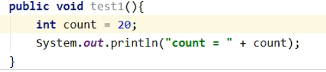 
  > 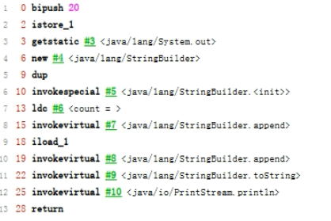 
  - `#数字` 就是指向常量池中的数据
  - **推荐查看上面javap的输出，自己对源码和反编译输出比对比对**

- 几种在常量池内存储的数据类型包括：
  >  <br />
  > 自己拿jclasslib搞搞试试
  - 数量值
  - 字符串值
  - 符号引用
    - 类引用
      > 包括类，接口，注解等
    - 字段引用
    - 方法引用

#### 2.2.7.7. 方法区使用示例

- 代码
  ```java
  public class MethodAreaDemo{
    public static void main(String[] args){
      int x = 500;
      int y = 100;
      int a = x/y;
      int b = 50;
      System.out.println(a+b);
    }
  }
  ```
- 反编译结果； [javap -v -p反编译输出](./external_file/jvm_out3.txt)

- 过程图解：
  > 为了简单起见，这里没有new对象，所以没有堆。否则堆空间中的对象中部分信息还要指向方法区中的类型信息。对象实例化与内存布局讲
  >
  > 左侧为反编译后的指令
  >
  > **注意程序计数器中的地址**
  - 将500压入操作数栈
    > 
  - 弹出操作数栈中的500，存入到本地变量表位置 index 为 1 的位置（复习：如果是非静态方法的话，index为0的地方放的是this）
    > 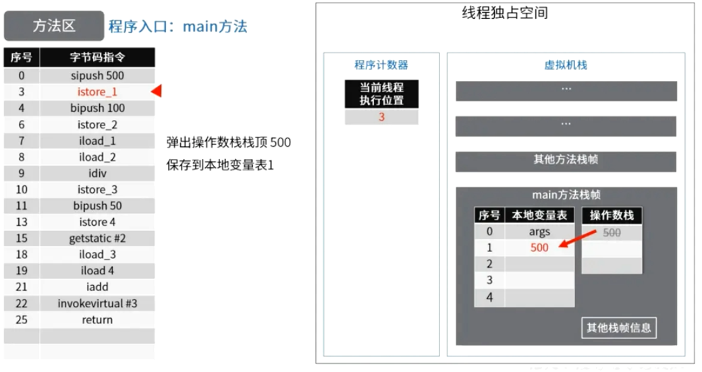 
  - 把100压入操作数栈
    > 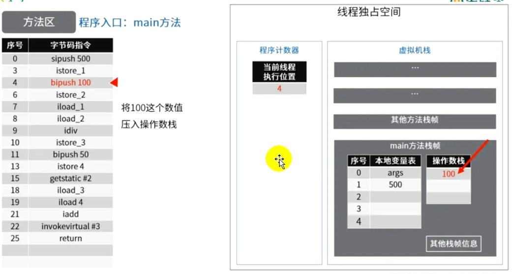 
  - 弹出1操作数栈中的100，存入到本地变量表中
    > 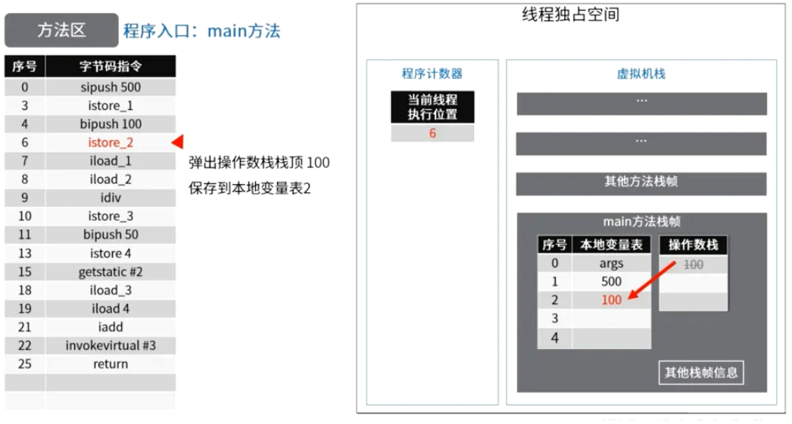 
  - 读取本地变量表中的500，压入操作数栈
    >  
  - 读取本地变量表中的100，压入操作数栈
    >  
  - 弹出操作数栈中的500和100，进行除法操作，然后把结果压入栈
    >  
  - 将50压入操作数栈
    >  
  - 弹出操作数栈中的50，存到本地变量表当中
    > 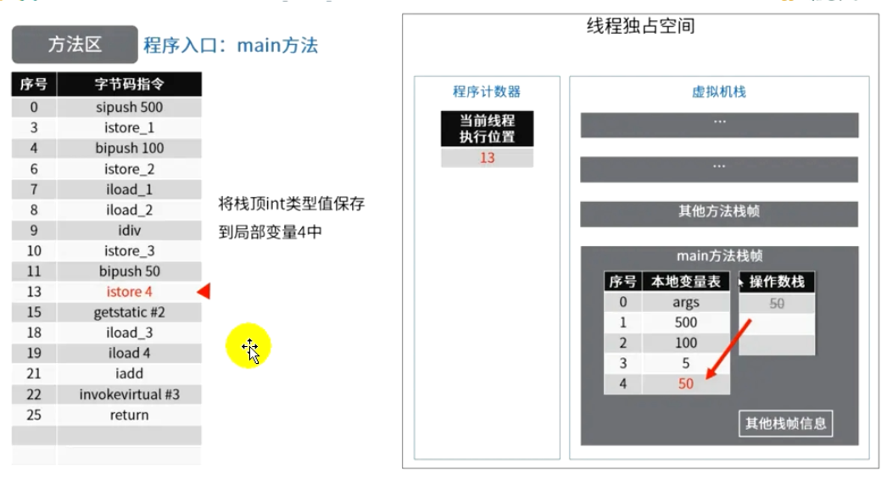 
  - 对应`System.out.println(a+b)`。获取类或接口字段的值并将其推入操作数栈，**自己查一下**
    >  
  - 将本地变量表索引位置为3的值压入操作数栈
    > 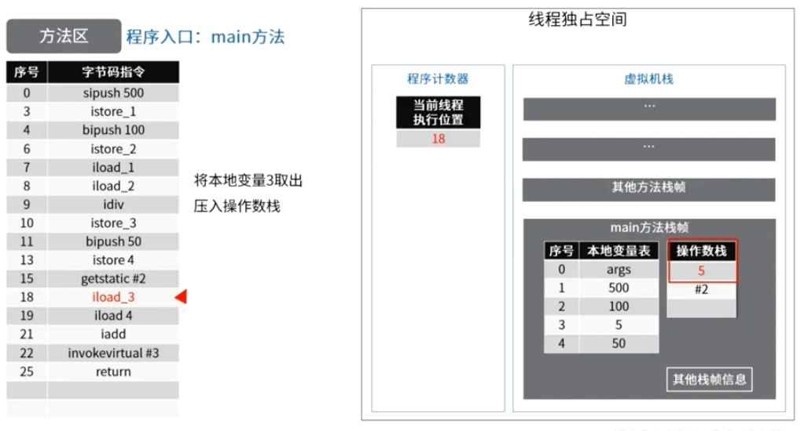 
  - 将本地变量表索引位置为4的值压入操作数栈
    >  
  - 进行相加运算，结果入栈
    >  
  - 调用`System.out.println(a+b)`，输出结果
    >  
  - return执行，main方法栈弹出

#### 2.2.7.8. 方法区细节演进（重要）

> 复习：堆的演进

---

- 关于永久代：
  - 只有 HotSpot 才有永久代
  - BEA,JRockit,IBM J9 等是不存在永久代的概念的。
  - 就像之前说的那样，永久代只是虚拟机中方法区的一种实现，并不要求同一

---

- HotSpot 中方法区实现的变化：
  - jdk6 及之前
    >  
    - 有永久代（permanent generation)
    - 静态变量存放在永久代上
  - jdk7
    >  
    - 有永久代，但已经逐步“去永久代”。（方法区用的依旧是虚拟机的内存，而不是本地内存。）
    - 字符串常量池、静态变量移除，保存在堆中
  - jdk8 及之后
    > 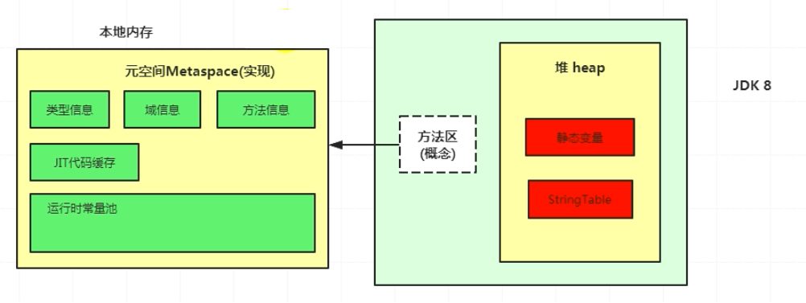 
    - 无永久代。
    - 类型信息、字段、方法、常量保存在本地内存的元空间
    - 但 **字符串常量池、静态变量仍在堆**
    - **示例**：(注意静态变量原始和引用类型)
      <details>
      <summary style="color:red;">代码与图例（重要）</summary>

      ```java
      class Fruit {
          static int x = 10;
          static BigWaterMelon bigWaterMelon_1 = new BigWaterMelon(x);
      
          int y = 20;
          BigWaterMelon bigWaterMelon_2 = new BigWaterMelon(y);
      
          public static void main(String[] args) {
              final Fruit fruit = new Fruit();
      
              int z = 30;
              BigWaterMelon bigWaterMelon_3 = new BigWaterMelon(z);
      
              new Thread() {
                  @Override
                  public void run() {
                      int k = 100;
                      setWeight(k);
                  }
      
                  void setWeight(int waterMelonWeight) {
                      fruit.bigWaterMelon_2.weight = waterMelonWeight;
                  }
              }.start();
          }
      }
      
      class BigWaterMelon {
          public BigWaterMelon(int weight) {
              this.weight = weight;
          }
      
          public int weight;
      }
      ```

      
      </details>

---

- 为什么要移除永久代
  ```
  随着Java8 的到来，HotSpot VM中再也见不到永久代了。但是这并不意味着类
  的元数据信息也消失了。这些数据被移到了一个与堆不相连的本地内存区域，这个
  区域叫做元空间（Metaspace)。

  由于类的元数据分配在本地内存中，元空间的最大可分配空间就是系统可用内存空
  间
  ```
  - 官方解释原因： 
    - [移除永久代的原因](http://openjdk.java.net/jeps/122)
    - 简单总结就是为了HotSpot和JRockit进行融合，而JRockit没有永久代
  - 深入理解原因：
    - **为永久代设置大小是很难确定的**
      ```
      在某些场景下，如果动态加载类过多，容易产生永久代区的Full GC以及OOM。
      比如某个实际Web工程中，因为功能点比较多，在运行过程中，要不断动态加载很多类，经常出现致命错误。
      ``` 
      ```
      而元空间和永久代之间最大的区别在于：元空间并不在虚拟机中，而是使用本地内存。
      因此，默认情况下，元空间的大小仅受本地内存限制。
      ```
    - **对永久代进行调优是很困难的**
      ```
      就是Full GC要回收永久代中的内容时， 判断是否要进行回收十分耗时
      需要三个条件校验以及参数的控制。

      具体看 方法区垃圾回收 一节
      ``` 

---

- StringTable(字符串常量池)为什么放到堆中
  > 后面会有单独一个章节进行说明
  ```
  jdk7中将stringTable放到了堆空间中。是因为：
  我们开发中会有大量的字符串被创建，永久代小，回收效率低，导致永久代内存不足。放到堆里，能及时回收内存。
  ```
  - 永久代默认比较小
  - 永久代的回收效率很低，
    > 在full gc的时候才会触发永久代的回收。 而full gc是老年代的空间不足、永久代不足时才会触发。这就导致stringTable回收效率不高。

---

**接下来是通过代码查看静态变量和对象的位置**

---

- 静态变量位置
  - 测试代码：
    ```java
    /**
    * 结论：
    * 静态引用对应的对象实体始终都存在堆空间
    *
    * jdk6和jdk7：
    * -Xms200m -Xmx200m -XX:PermSize=300m -XX:MaxPermSize=300m -XX:+PrintGCDetails
    * jdk 8：
    * -Xms200m -Xmx200m -XX:MetaspaceSize=300m -XX:MaxMetaspaceSize=300m -XX:+PrintGCDetails
    */
    public class StaticFieldTest {
        private static byte[] arr = new byte[1024 * 1024 * 100];//100MB
        public static void main(String[] args) {
            System.out.println(StaticFieldTest.arr);
        }
    }
    ```
  - 打印结果
    - jdk6打印日志
      >  
    - jdk7打印日志
      >  
    - jdk8打印日志
      > 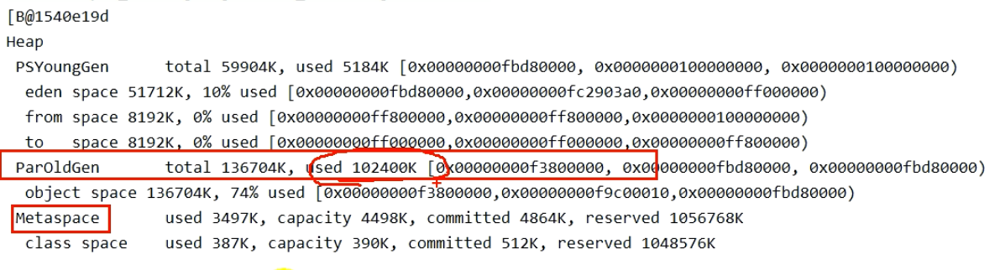 
  - 结论： **静态引用对应的对象实体始终都存在堆空间**

---

- 对象位置：
  > staticObj、instanceObj、localObj存放在哪里？
  - 测试代码：
    ```java
    public class StaticObjTest {
        static class Test {
            static ObjectHolder staticObj = new ObjectHolder(); // 静态属性 staticObj
            ObjectHolder instanceObj = new ObjectHolder();  // 非静态属性  instanceObj

            void foo() {
                ObjectHolder localObj = new ObjectHolder(); // 方法内局部变量 localObj
                System.out.println("done");
            }
        }

        private static class ObjectHolder {
        }

        public static void main(String[] args) {
            Test test = new StaticObjTest.Test();
            test.foo();
        }
    }
    ```
  - 分别对应的引用位置：
    - staticobj随着Test的类型信息存放在方法区
    - instanceobj随着Test的对象实例存放在Java堆
    - localobject则是存放在foo()方法栈帧的局部变量表中。
  - 查看工具：`jhsdb`
    > jdk9出现的官方工具，具体使用在性能监控与调优时详细说，这里稍微用下
  - 结果：
    > 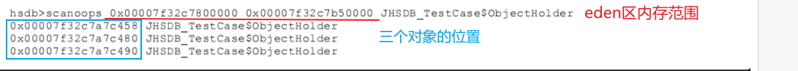 
    - 测试发现：三个对象的数据在内存中的地址都落在Eden区范围内
    - 所以结论：只要是对象实例必然会在Java堆中分配。
  - 深入
    >  
    - 接着，找到了一个引用该staticobj对象的地方，是在一个java.lang.class的实例里，并且给出了这个实例的地址
    - 通过Inspector查看该对象实例，可以清楚看到这确实是一个 java.lang.Class类型的对象实例，里面有一个名为staticobj的实例字段：
    - 从《Java虚拟机规范》所定义的概念模型来看，所有class相关的信息都应该存放在方法区之中
      > 但方法区该如何实现，《Java虚拟机规范》并未做出规定，这就成了一件允许不同虚拟机自己灵活把握的事情。
    - 通过该实验可以证明： **JDK7及其以后版本的HotSpot虚拟机选择把静态变量与类型在Java语言一端的映射Class对象存放在一起，存储于Java堆之中**
      > 通俗一点说，静态变量的对象实例和类的模版Class都存放在堆当中。（对象的引用该在哪在哪儿）
      >
      > 也可以参考这篇博客[JDK 1.8 下的 java.lang.Class 对象和 static 成员变量在堆还是方法区？](https://blog.csdn.net/Xu_JL1997/article/details/89433916)

#### 2.2.7.9. 方法区垃圾回收

- 方法区（包括永久代和元数据区）是否要垃圾回收
  > 费力不讨好
  - 《Java虚拟机规范》对方法区的约束是非常宽松的，提到过可以不要求虚拟机在方法区中实现垃圾收集。
  - 事实上也确实有未实现或未能完整实现方法区类型卸载的收集器存在(如JDK11时期的ZGC收集器就不支持类卸载）。
  - 一般来说这个区域的**回收效果比较难令人满意，尤其是类型的卸载，条件相当苛刻。**
  - 但是这部分区域的回收 **有时又确实是必要的**。以前Sun公司的Bug列表中，曾出现过的若干个严重的Bug就是由于低版本的HotSpot虚拟机对此区域未完全回收而导致内存泄漏。

---

- 方法区垃圾回收两部分：
  - **常量池中废弃的常量**
    - 常量主要构成：(方法区中主要存放两大类常量)：
      - **字面量**:字面量比较接近Java语言层次的常量概念，如文本字符串、被声明为final的常量值等。
      - **符号引用**:而符号引用则属于编译原理方面的概念，包括下面三类常量：
        - 类和接口的全限定类名
        - 字段的名称和描述符
        - 方法的名称和描述符
    - 回收策略：只要常量池中的常量没有被任何地方引用，就可以被回收
      > 更为详细的在垃圾回收章节
  - **不再使用的类**
    - 判断不再使用需要满足条件：
      - 该类**所有的实例都已经被回收**，也就是Java堆中不存在该类及其任何派生子类的实例。
      - **加载该类的类加载器**已经被回收，这个条件除非是经过精心设计的可替换类加载器的场景，如OSGi、JSP的重加载等，否则通常是很难达成的。
        > 复习：编译得到的.class文件中没有记录类加载器。把.class文件加载到内存后，
        >
        > 方法区中中会记录该类加载器
        >
        > 类加载器也记录了加载过哪个类
        >
        > >  
      - 该类对应的java.lang.Class对象没有在任何地方被引用，无法在任何地方通过反射访问该类的方法。

#### 2.2.7.10. 面试题

```
百度
三面：说一下JVM内存模型吧，有哪些区？分别干什么的？
```

---

```
Java8的内存分代改进
JVM内存分哪几个区，每个区的作用是什么？
一面：JVM内存分布/内存结构？栈和堆的区别？堆的结构？为什么两个survivor区？
二面：Eden和Survior的比例分配
```

---

```
小米：
jvm内存分区，为什么要有新生代和老年代
字节跳动：
二面：Java的内存分区
二面：讲讲jvm运行时数据库区
什么时候对象会进入老年代？
```

---

```
京东：
JVM的内存结构，Eden和Survivor比例。
JVM内存为什么要分成新生代，老年代，持久代。新生代中为什么要分为Eden和Survivor。
```

---

```
天猫：
一面：Jvm内存模型以及分区，需要详细到每个区放什么。
一面：JVM的内存模型，Java8做了什么修改
```

---

```
拼多多：
JVM内存分哪几个区，每个区的作用是什么？
```

---

```
美团：
java内存分配
jvm的永久代中会发生垃圾回收吗？
一面：jvm内存分区，为什么要有新生代和老年代？
```

### 2.2.8. 对象的实例化内存布局和访问定位(重要)※

#### 2.2.8.1. 对象的实例化

- 创建对象的方式
  - new
    - 最普通的形式
    - 单例模式，调用静态方法
    - 工厂模式，XxxBuilder/XxxFactory的静态方法
  - Class的newInstance(Xxx):反射的方式，就只能调用空参的构造器，权限必须是public。jdk8中可以用，jdk9中就已经标注已过时。
  - Constructor的newInstance(Xxx):反射的方式，可以调用空参和带参的构造器，权限没有要求。
  - 使用clone():不会调用任何构造器，但要求当前类实现Cloneable接口，实现clone()方法，实现对象的复制
  - 使用反序列化:从文件或网络中获取一个对象的二进制流
  - 第三方库Objenesis：可以动态生成Constructor对象

---

- 创建对象的步骤（六步）
  > 有些书或者帖子可能会合并几步。
  - 判断对象对应的类是否加载，链接，初始化。（加载类元信息）
    - 虚拟机遇到一条new指令，首先去检查这个指令的参数能否在Metaspace的常量池中定位到一个类的符号引用，
    - 并且检查这个符号引用代表的类是否已经被加载、解析和初始化。（即判断类元信息是否存在）。
    - 如果没有，那么在双亲委派模式下，使用当前类加载器以classLoader+包名+类名为Key进行查找对应的.class文件。
      - 如果没有找到文件，则抛出ClassNotFoundException异常，
      - 如果找到，则进行类加载，并生成对应的Class类对象
  - 为对象分配内存：
    ```
    首先计算对象占用空间大小，接着在堆中划分一块内存给新对象。
    如果实例成员变量是引用变量，仅分配引用变量空间即可，即4个字节大小。
    ```
    - 说明
      ```
      说明：选择哪种分配方式由Java堆是否规整决定，而Java堆是否规整又由所采用的垃圾收集
      器是否带有压缩整理功能决定。
      ```
    - 如果内存规整--指针碰撞
      - 如果内存是规整的，那么虚拟机将采用的是指针碰撞法（Bump The Pointer)来为对象分配内存
        - 意思是所有用过的内存在一边，空闲的内存在另外一边，中间放着一个指针作为分界点的指示器，
        - 分配内存就仅仅是把指针向空闲那边挪动一段与对象大小相等的距离罢了。
          >  
      - 垃圾收集器对应算法：带有整理过程的算法，如Serial、ParNew算法
        > 一般使用带有compact(整理）过程的收集器时，内存都是规整的，使用指针碰撞
        - 基于压缩算法
        - 会解决碎片化问题，使内存比较规整，因此虚拟机会采用指针碰撞方式分配内存
    - 如果内存不规整,虚拟机需要维护一个列表,空闲列表分配
      - 如果内存不是规整的，已使用的内存和未使用的内存相互交错，那么虚拟机将采用的是空闲列表法来为对象分配内存。
        - 意思是虚拟机维护了一个列表，记录上哪些内存块是可用的，在分配的时候从列表中找到一块足够大的空间划分给对象实例，并更新列表上的内容。
        - 这种分配方式成为“空闲列表（Free List)”。
      - 垃圾回收器对应算法：标记清除算法，使用标记清楚算法的有CMS垃圾回收器
  - 处理并发安全问题
    ```
    在分配内存空间时，另外一个问题是及时保证new对象时候的线程安全性：创建对象是非常
    频繁的操作，虚拟机需要解决并发问题。虚拟机采用了两种方式解决并发问题：
    ```  
    - 采用CAS(Compare And Swap)，失败重试，区域加锁：保证指针更新操作的原子性
    - 每个线程预先分配一块TLAB
      ```
      TLAB 把内存分配的动作按照线程划分在不同的空间之中进行，即每个线程在Java堆中
      预先分配一小块内存，称为本地线程分配缓冲区，(TLAB,Thread Local
      Allocation Buffer)虚拟机是否使用TLAB,可以通过-XX:+/-UseTLAB参数来设定。
      ``` 
  - 初始化分配到的空间
    > 所有属性设置默认值，保证对象实例字段在不赋值时可以直接使用
    >
    > （复习）属性初始化方式：1.默认初始化；2.显式初始化；3.代码块中初始化；4.构造器中初始化；5.对象.属性 初始化
    ```
    内存分配结束，虚拟机将分配到的内存空间都初始化为零和null值（不包括对象头）。这一步保
    证了对象的实例字段在Java代码中可以不用赋初始值就可以直接使用，程序能访问到这些
    字段的数据类型所对应的零值。
    ```
  - 设置对象的对象头
    ```
    将对象的所属类（即类的元数据信息）、对象的HashCode和对象的GC信息、锁信息等数
    据存储在对象的对象头中。这个过程的具体设置方式取决于JVM实现。

    在下一节内存布局会详细说明对象头
    ```
  - 执行init方法进行初始化
    > `<init>`方法中包括三种初始化： 2.显式初始化；3.代码块中初始化；4.构造器中初始化
    > > 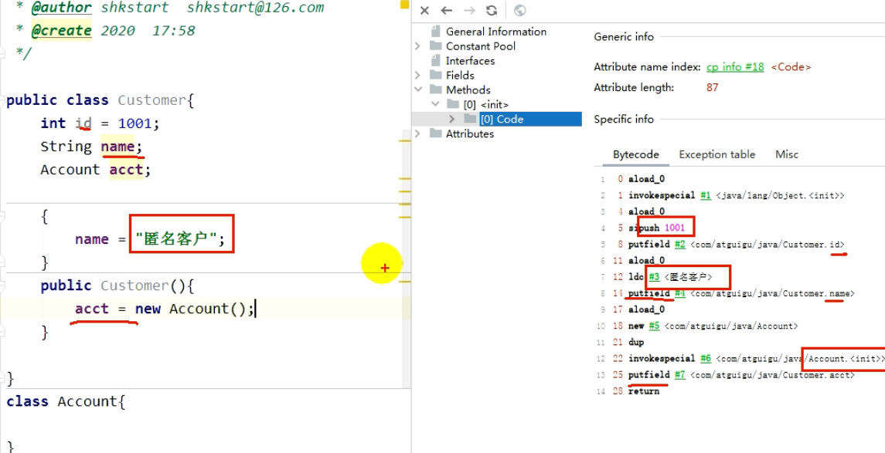 
    ```
    在Java程序的视角看来，初始化才正式开始。初始化成员变量，执行实例化代码块，调
    用类的构造方法，并把堆内对象的首地址赋值给引用变量。
    因此一般来说（由字节码中是否跟随有invokespecial指令所决定）,new指令之后会接
    着就是执行方法，把对象按照程序员的意愿进行初始化，这样一个真正可用的对象才算完
    全创建出来。
    ```

---

对象创建步骤实例：

- 代码：
  ```java
  public class ObjectTest {
      public static void main(String[] args) {
          Object obj = new Object(); // 创建object对象
      }
  }
  ```
- 反编译得到的字节码：
  ```
  Classfile /D:/learn/jvm视频教程/jvm上篇/代码/JVMDemo/chapter10/ObjectTest.class
    Last modified 2021-2-13; size 277 bytes
    MD5 checksum 1fce2fdca026a982cb2f14013b964b59
    Compiled from "ObjectTest.java"
  public class ObjectTest
    minor version: 0
    major version: 52
    flags: ACC_PUBLIC, ACC_SUPER
  Constant pool:
    #1 = Methodref          #2.#12         // java/lang/Object."<init>":()V
    #2 = Class              #13            // java/lang/Object
    #3 = Class              #14            // ObjectTest
    #4 = Utf8               <init>
    #5 = Utf8               ()V
    #6 = Utf8               Code
    #7 = Utf8               LineNumberTable
    #8 = Utf8               main
    #9 = Utf8               ([Ljava/lang/String;)V
    #10 = Utf8               SourceFile
    #11 = Utf8               ObjectTest.java
    #12 = NameAndType        #4:#5          // "<init>":()V
    #13 = Utf8               java/lang/Object
    #14 = Utf8               ObjectTest
  {
    public ObjectTest();
      descriptor: ()V
      flags: ACC_PUBLIC
      Code:
        stack=1, locals=1, args_size=1
          0: aload_0
          1: invokespecial #1                  // Method java/lang/Object."<init>":()V
          4: return
        LineNumberTable:
          line 1: 0

    public static void main(java.lang.String[]);
      descriptor: ([Ljava/lang/String;)V
      flags: ACC_PUBLIC, ACC_STATIC
      Code:
        stack=2, locals=2, args_size=1
          0: new           #2                  // class java/lang/Object
                                               // new操作符会判断对象对应的类是否加载，链接，初始化，再为对象分配内存，再对对象中的属性进行默认初始化
          3: dup                               // 进行复制，当前生成的变量的引用会在操作数栈有一份，经过该命令后会再复制一份，栈底的用来复制，复制的那个作为句柄调用相关的一些方法
                                               // 设计虚拟机指令设计原则，了解一下即可
          4: invokespecial #1                  // Method java/lang/Object."<init>":()V
                                               // 调用init方法
          7: astore_1                          // 从操作数栈中取出对象变量引用，存到局部变量表中。也就是把obj放到索引为1的位置
          8: return
        LineNumberTable:
          line 3: 0
          line 4: 8
  }
  ```

#### 2.2.8.2. 对象的内存布局

> 对象存在于堆空间中

- 组成：
  > 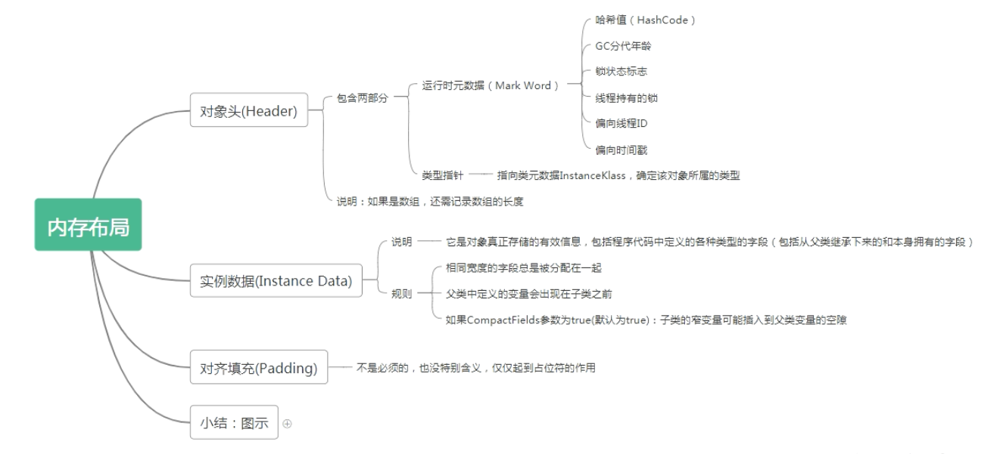
- 图示
  ```java
  public class CustomerTest{
    public static void main(String[] args){
      Customer cust = new Customer();
    }
  }
  ```
  > 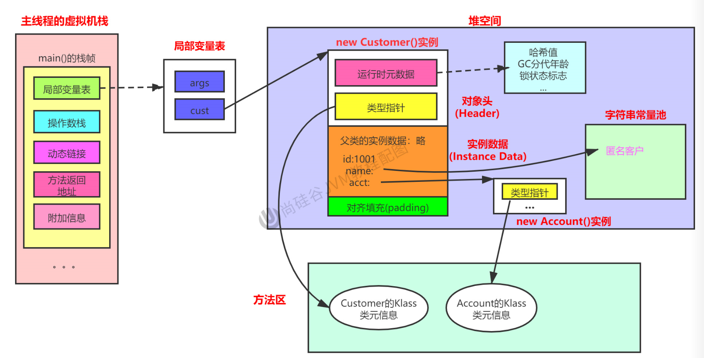

---

- 对象头(Header)
  - 说明：如果是数组，还要记录数组长度
  - 组成：
    <details>
    <summary style="color:red;">拓展：不同所状态的锁对象的对象头组成</summary>

    
    </details>

    - 运行时元数据
      - 哈希值（HashCode）：即对象所在堆空间的地址，或者引用指向的地址
      - GC分代年龄：通过年龄计数器，记录在Servivor区的年龄
      - 锁状态标志：是否作为一个锁，锁的状态
      - 线程持有的锁
      - 偏向线程ID
      - 偏向时间戳
    - 类型指针：指向元数据InstanceKlass，确定该对象所属类型。getClass()能获取Class对象就是因为该指针。
      > 不是所有的对象都会保留类型指针
    - 【数组的长度】(如果该对象是数组)
- 实例数据(Instance Data)
  - 说明；
    - 它是对象真正存储的有效信息，包括程序代码中定义的各种类型的字段
    - 包括从父类继承下来的和本身拥有的字段
  - 规则：
    - 相同宽度的字段总是被分配到一起。比如int和引用类型都是4字节
    - 父类中定义的变量会出现在子类之前。因为创建对象时都是先加载父类。
    - 如果CompactField参数为true（默认为true），子类的窄变量可能插入到父类变量的空隙。节省空间
- 对齐填充（Padding）
  - 说明：不是必须的，也没有特殊含义，仅仅起到占位符的作用

---

拓展：[jvm底层-类加载与oop-klass模型](https://blog.csdn.net/qq_33873431/article/details/112851125)

#### 2.2.8.3. 对象的访问定位

- JVM是如何通过栈帧中的对象引用访问到其内部的对象实例？
  - 图示
    > 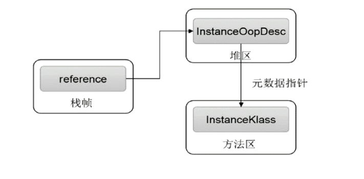 
  - 对象访问的两种方式；
    > JVM虚拟机规范中并没有明确说必须采用哪种方式
    - 句柄访问
      - 图示
        >  
      - 缺点：
        - 需要访问两次，效率低
      - 优点：
        - reference中存储稳定句柄地址，对象被移动（垃圾回收器移动对象很普遍）时只改变句柄中实例数据指针即可，reference本身不需要被修改
    - 直接指针（HotSpot使用）
      - 图示
        > 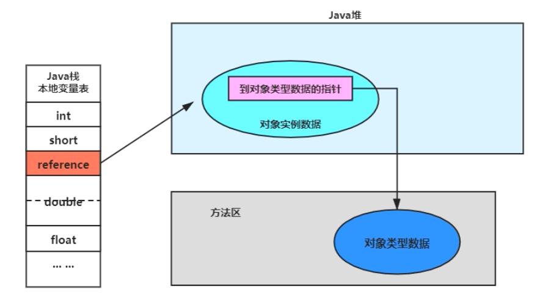 
      - 缺点：
        - 对象被移动时需要修改引用地址
      - 优点：
        - 通过引用直接访问对象，效率高

#### 2.2.8.4. 面试题

```
美团：
对象在JVM中是怎么存储的？
对象头信息里面有哪些东西？
```

```
蚂蚁金服：
二面：java对象头里有什么
```

### 2.2.9. 直接内存

#### 2.2.9.1. 概述

- 不是虚拟机运行时数据区的一部分，也不是《Java虚拟机规范》中定义的内存区域。
- 直接内存是在Java堆外的、直接向系统申请的内存区间。
- 来源于NIO,通过存在堆中的DirectByteBuffer操作Native内存
- 通常，访问直接内存的速度会优于Java堆。即读写性能高。
  - 因此出于性能考虑，读写频繁的场合可能会考虑使用直接内存。
  - Java的NIO库允许Java程序使用直接内存，用于数据缓冲区

---

|          |           IO            | NIO(New IO/Non-blocking IO) |
| :------: | :---------------------: | :-------------------------: |
| 数据承载 | 字节 byte[]/字符 char[] |           buffer            |
| 数据传输 |         Stream          |           Channel           |

- NIO在jdk1.4时引入，NIO2在jdk1.7引入
- [java NIO教程](https://blog.csdn.net/u011381576/article/details/79876754)

- 示例代码：
  ```java
  public class BufferTest {
      private static final int BUFFER = 1024 * 1024 * 1024;//1GB

      public static void main(String[] args){
          //直接分配本地内存空间
          ByteBuffer byteBuffer = ByteBuffer.allocateDirect(BUFFER);
          System.out.println("直接内存分配完毕，请求指示！");

          Scanner scanner = new Scanner(System.in);
          scanner.next();

          System.out.println("直接内存开始释放！");
          byteBuffer = null;
          System.gc();
          scanner.next();
      }
  }
  ```

#### 2.2.9.2. 数据读写

- 非直接缓冲区
  >  
  - 读写文件，需要与磁盘交互，需要从用户态切换到内核态
  - 使用IO，需要两份内存存储重复数据，效率低
- 直接缓冲区
  > 
  - 操作系统划出的直接缓存区可以直接被java代码访问。只有一份
  - NIO适合对大文件的读写操作

#### 2.2.9.3. OOM以及大小设置

- 测试代码
  ```java
  public class BufferTest2 {
      private static final int BUFFER = 1024 * 1024 * 20;//20MB

      public static void main(String[] args) {
          ArrayList<ByteBuffer> list = new ArrayList<>();

          int count = 0;
          try {
              while(true){
                  ByteBuffer byteBuffer = ByteBuffer.allocateDirect(BUFFER);
                  list.add(byteBuffer);
                  count++;
                  try {
                      Thread.sleep(100);
                  } catch (InterruptedException e) {
                      e.printStackTrace();
                  }
              }
          } finally {
              System.out.println(count);
          }

      }
  }
  ```

- 异常：可能导致OutOfMemoryError:Direct buffer memory异常
  ```
  由于直接内存在Java堆外，因此它的大小不会直接受限于-Xmx指定的最大
  堆大小，但是系统内存是有限的，Java堆和直接内存的总和依然受限于操
  作系统能给出的最大内存。
  ```
- 缺点：
  - 回收成本高
  - 不受JVM内存回收管理
  - dump文件中也不会记录
- 大小设置：
  - 参数`MaxDirectMemorySize`
  - 如果不指定，默认与堆的最大值-Xmx一致。

#### 2.2.9.4. 复习，jdk7和8的内存结构

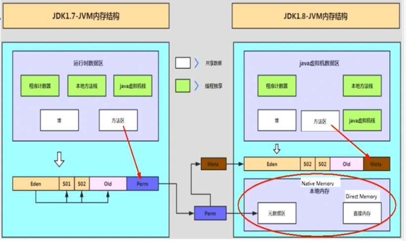

## 2.3. 下层 执行引擎

### 2.3.1. 执行引擎

#### 2.3.1.1. 概述

大致说明：

- 位置：
  >  
  >  
- 执行引擎是java虚拟机核心组成部分之一
- 虚拟机和物理机：
  - 相同：两种机器都有代码执行的能力
  - 区别：
    - 物理机的执行引擎是直接建立在处理器，缓存，指令集和操作系统层面
    - 而虚拟机的执行引擎则**是由软件自行实现**的，因此可以不受物理条件制约地定制指令集与执行引擎的结构体系。**能够执行那些不被硬件支持的指令集格式**

---

- 执行引擎主要作用：
  - JVM的主要任务是**负责装载字节码到其内部**
  - 但字节码并不能够直接运行在操作系统之上，因为字节码指令并非等价于本地机器指令，
  - 它内部包含的仅仅只是一些能够被JVM所识别的字节码指令、符号表，以及其他辅助信息。
  - 因此，如果想要让一个Java程序运行起来，执行引擎（Execution Engine)的任务就是**将字节码指令解释/编译为对应平台上的本地机器指令**
  - 简单来说，JVM中的执行引擎**充当了将高级语言翻译为机器语言的译者**

---

执行引擎工作过程：


- 1)执行引擎在执行的过程中究竟需要执行什么样的字节码指令完全依赖于PC寄存器。
- 2)每当执行完一项指令操作后，PC寄存器就会更新下一条需要被执行的指令地址。
- 3)当然方法在执行的过程中，执行引擎有可能会通过存储在局部变量表中的对象引用准确定位到存储在Java堆区中的对象实例信息，以及通过对象头中的元数据指针定位到目标对象的类型信息。

```
从外观上来看，所有的Java虚拟机的执行引擎输入、输出都是一致的：输
入的是字节码二进制流，处理过程是字节码解析执行的等效过程，输出的
是执行结果。
```

#### 2.3.1.2. 编译和执行过程

- 编译器分类(按照编译阶段)：
  - 前端编译器：将符合java语法规范的Java代码转换为符合JVM规范的字节码文件
    > 如Sun的Javac，Eclipse JDT中的增量式编译器
  - 后端运行期编译器：JIT(Just in time)编译器，将字节码编译成机器码
    > HotSpot VM的C1，C2编译器
  - 静态提前编译器：AOT(Ahead of Time Compiler)编译器，直接把.java文件编译成本地机器代码的过程
    - 注意，该类型编译器仅为java编译器的一个发展方向
    > GUN Complier for Java(GCJ),Excelsior JET

- 执行引擎组成：
  - 解释器：当Java虚拟机启动时会根据预定义的规范**对字节码采用逐行解释的方式执行**，将每条字节码文件中的内容"翻译"为对应平台的本地机器指令执行。
  - 即时编译器：JIT(Just In Time Compiler)编译器：就是虚拟机将源代码直接编译成和本地机器平台相关的机器语言。

---

> 大部分的程序代码转换成物理机的目标代码或虚拟机能执行的代码之前，都需要经过下图中的各个步骤

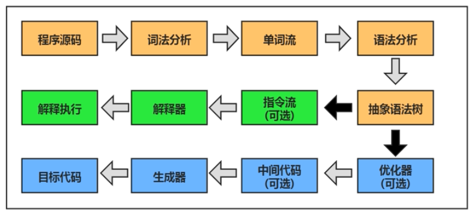

- 橙色部分：javac编译器（前端编译器）完成
  >  
- 绿色和蓝色：java为 **半编译半解释型语言**。这两部分为jvm需要考虑的问题。分别对应解释器和JIT编译器
  - 半编译半解释是因为在执行字节码时，既可以使用解释器边解释边执行
  - 又可以使用编译器，编译完成后再执行。编译完成的JIT代码缓存 存在方法区
  > 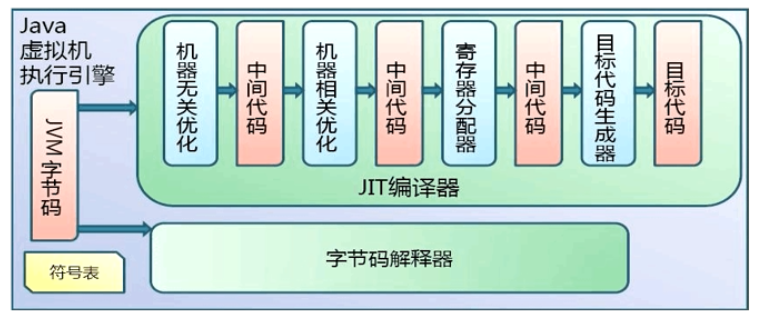 

#### 2.3.1.3. 机器码，指令，汇编语言

- 机器码：
  - 各种用二进制编码方式表示的指令，叫做机器指令码。开始，人们就用它采编写程序，这就是机器语言。
  - 机器语言虽然能够被计算机理解和接受，但和人们的语言差别太大，不易被人们理解和记忆，并且用它编程容易出差错。
  - 用它编写的程序一经输入计算机，CPU直接读取运行，因此和其他语言编的程序相比，执行速度最快。
  - 机器指令与CPU紧密相关，所以不同种类的CPU所对应的机器指令也就不同。
- 指令：
  - 由于机器码是有0和1组成的二进制序列，可读性实在太差，于是人们发明了指令。
  - 指令就是把机器码中特定的0和1序列，简化成对应的指令（一般为英文简写，如mov,inc等）,可读性稍好
  - 由于不同的硬件平台，执行同一个操作，对应的机器码可能不同，所以不同的硬件平台的同一种指令（比如mov),对应的机器码也可能不同。
- 指令集：
  - 不同的硬件平台，各自支持的指令，是有差别的。因此每个平台所支持的指令，称之为对应平台的指令集。
  - 如常见的
    - x86指令集，对应的是x86架构的平台
    - ARM指令集，对应的是ARM架构的平台
- 汇编
  - 由于指令的可读性还是太差，于是人们又发明了汇编语言。
  - 在汇编语言中，用助记符（Mnemonics)代替机器指令的操作码，用地址符号（symbo1)或标号（Labe1)代替指令或操作数的地址。
  - 在不同的硬件平台，汇编语言对应着不同的机器语言指令集，通过汇编过程转换成机器指令。
  - 由于计算机只认识指令码，所以用汇编语言编写的程序还必须翻译成机器指令码，计算机才能识别和执行。
- 高级语言
  - 为了使计算机用户编程序更容易些，后来就出现了各种高级计算机语言。 高级语言比机器语言、汇编语言更接近人的语言
  - 当计算机执行高级语言编写的程序时，仍然需要把程序解释和编译成机 器的指令码。完成这个过程的程序就叫做解释程序或编译程序。

---

- 程序执行过程
  >  

---

- C，C++源程序执行过程
  - 编译过程：是读取源程序（字符流）,对之进行词法和语法的分析，将高级语言指令转换为功能等效的汇编代码
  - 汇编过程：实际上指把汇编语言代码翻译成目标机器指令的过程。


---

- 字节码
  - 字节码是一种中间状态（中间码）的二进制代码（文件）,它比机器码更抽象，需要直译器转译后才能成为机器码
  - 字节码主要为了实现特定软件运行和软件环境、与硬件环境无关。
  - 字节码的实现方式是通过编译器和虚拟机器。编译器将源码编译成字节码，
  - 特定平台上的虚拟机器将字节码转译为可以直接执行的指令。
    > 字节码的典型应用为Java bytecode。

#### 2.3.1.4. 解释器(重要)

- 为什么java源码到机器语言中间要有个字节码：
  > 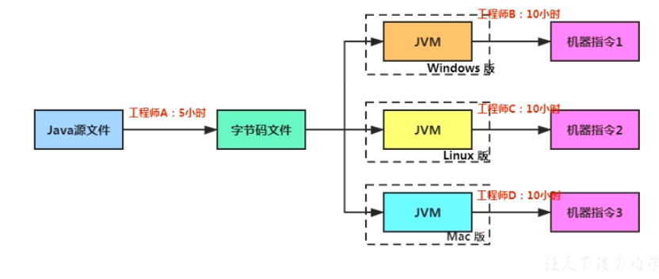 
  - 分割工作
  - 首先编译为一定格式的字节码（前端编译）
  - 再把字节码编译为机器指令（后端编译）

---

- 解释器
  - 概念：
    - 当Java虚拟机启动时会根据预定义的规范**对字节码采用逐行解释的方式执行**，
    - 将每条字节码文件中的内容"翻译"为对应平台的本地机器指令执行。
  - 工作机制：
    - 将字节码文件中的内容翻译为对应平台的本地机器指令
    - 当一条字节码指令被解释执行完成后，接着再根据pc寄存器中记录的下一条需要被执行的字节码指令执行解释操作
  - 种类：
    - 字节码解释器
      - 较为古老
      - 在执行时通过**纯软件代码**模拟字节码执行，效率非常底下
    - 模板解释器
      - 现在普遍使用
      - 而模板解释器将每一条字节码和一个模板函数相关联，模板函数中直接产生这条字节码执行时的机器码，从而很大程度上提高了解释器的性能。
        > 再HotSpot虚拟机中，解释器主要由Interpreter和Code模块组成。
        > > Interpreter模块：实现解释器的核心功能。
        > > Code模块：用于管理HosSpot VM在运行时生成的本地机器指令

---

- 现状
  ```
  由于解释器在设计和实现上非常简单，因此除了Java语言之外，还有许
  多高级语言同样也是基于解释器执行的，比如Python、Perl、Ruby等。
  但是在今天，基于解释器执行已经沦落为低效的代名词，并且时常被一些
  C/C++程序员所调倪。

  为了解决这个问题，JVM平台支持一种叫作即时编译的技术。即时编译的
  目的是避免函数被解释执行，而是将整个函数体编译成为机器码，每次函
  数执行时，只执行编译后的机器码即可，这种方式可以使执行效率大幅度
  提升。

  不过无论如何，基于解释器的执行模式仍然为中间语言的发展做出了不可
  磨灭的贡献。
  ```

#### 2.3.1.5. JIT即时编译器(重要)


- java代码执行分类(复习)
  - 种类：
    - 第一种是将源代码编译成字节码文件，然后在运行时通过解释器将字节码文件转为机器码执行
    - 第二种是编译执行（直接编译成机器码）。现代虚拟机为了提高执行效率，会使用即时编译技术（JIT,Just In Time)将方法编译成机器码后再执行
  - 示例：
    - HotSpot JVM的执行方式
      ```
      HotSpot虚拟机采用解释器与编译器并存的架构
      ```
      - 当虚拟机启动的时候，**解释器可以首先发挥作用**，而不必等待即时编译器全部编译完成再执行，这样可以省去许多不必要的编译时间。
      - 并且随着程序运行时间的推移，**即时编译器逐渐发挥作用**，根据热点探测功能，**将有价值的字节码编译为本地机器指令**，以换取更高的程序执行效率。
    - JRockit VM特点
      ```
      JRockit 只有编译器，不包含解释器
      ```
      - JRockit VM中程序的执行性能会非常高效，
      - 但程序在启动时必然需要花费更长的时间来进行编译。

---

- 虚拟机的选择：
  ```
  对于服务端应用来说，启动时间并非是关注重点，但对于那些看中启动时
  间的应用场景而言，或许就需要采用解释器与即时编译器并存的架构来换取一个平衡点。
  在此模式下，当Java虚拟器启动时，解释器可以首先发挥作用，而不必等待即时编译器全
  部编译完成后再执行，这样可以省去许多不必要的编译时间。随着时间的推移，编译器发
  挥作用，把越来越多的代码编译成本地代码，获得更高的执行效率。

  同时，解释执行在编译器进行激进优化不成立的时候，可以作为编译器的“逃生门”
  ```

---

- 基本概念：
  - JIT编译器：JIT(Just In Time Compiler)编译器：就是虚拟机将源代码直接编译成和本地机器平台相关的机器语言。
  - 热点代码：
    - 是否需要启动JIT编译器将字节码直接编译为对应平台的本地机器指令需要根据代码被调用**执行的频率**而定。
    - 关于那些需要被编译为本地代码的字节码，被称之为**热点代码**
      > 比如一个被多次调用的方法，或者是一个方法体内部循环次数较多的循环体
  - 深度优化
    - JIT编译器在运行时会针对那些频繁被调用的热点代码做出**深度优化**
    - 将其直接编译为对应平台的本地机器指令，以此提升Java程序的执行性能。
  - 栈上替换(OSR)
    - 热点代码可以通过JIT编译器编译为本地机器指令。
    - 由于这种编译方式发生在方法的执行过程中，因此也被称之为栈上替换，或简称为OSR(On Stack Replacement)编译
    - 注意：**主流JVM通常是以方法（或者笼统的说，函数）为单位来JIT编译的，但是OSR只编译方法里的某个循环，或者是从某个循环开始的代码**，
      > 与之后的回边计数器相关

- 热点代码的热点探测功能：
  - 采用基于计数器的热点探测
    ```
    目前HotSpot VM所采用的热点探测方式是基于计数器的热点探测

    HotSpot VM将会为每一个方法都建立2个不同类型的计数器，
    分别为方法调用计数器（Invocation Counter)和回边计数器（BackEdge Counter)。
    ```
    - 方法调用计数器
      - 阀值:
        - 这个计数器就用于统计方法被调用的次数，它的默认阀值在Client模式下是1500次，
        - 在Server模式下是10000次。
        - 超过这个阀值，就会触发JIT编译。
      - 设置阀值
        - 这个阀值可以通过虚拟机参数`-XX:CompileThreshold`来人为设定。
      - 执行逻辑：
        > 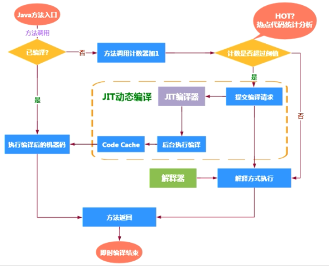 
        ```
        当一个方法被调用时，会先检查该方法是否存在被JIT编译过的版本，如
        果存在，则优先使用编译后的本地代码来执行。如果不存在已被编译过的版
        本，则将此方法的调用计数器值加1,然后判断方法调用计数器与回边计数
        器值之和是否超过方法调用计数器的阙值。如果已超过阀值，那么将会向即
        时编译器提交一个该方法的代码编译请求。
        ```
      - 热度衰减；
        - 概念：
          - 如果不做任何设置，方法调用计数器统计的并不是方法被调用的绝对次数，而是一个相对的执行频率，即一段时间之内方法被调用的次数。
          - 当超过一定的时间限度，如果方法的调用次数仍然不足以让它提交给即时编译器编译，那这个方法的调用计数器就会被减少一半，
          - 这个过程称为**方法调用计数器热度的衰减（Counter Decay)**
          - 而这段时间就称为此方法统计的**半衰周期（Counter Half Life Time)**。
        - 衰减时期：进行热度衰减的动作是在虚拟机进行垃圾收集时顺便进行的，
        - 设置：可以使用`-XX:CounterHalfLifeTime`参数设置半衰周期的时间，单位是秒。
        - 关闭：
          - 可以使用虚拟机参数`-XX:-UseCounterDecay`来关闭热度衰减，让方法计数器统计方法调用的绝对次数，
          - 这样，只要系统运行时间足够长，绝大部分方法都会被编译成本地代码。
    - 回边计数器
      - 概念： 
        - 它的作用是统计一个方法中循环体代码执行的次数，
        - 在字节码中遇到控制流向后跳转的指令称为“回边”（Back Edge)。
        - 显然，建立回边计数器统计的目的就是为了触发OSR编译。
      - 图示；
        >  

#### 2.3.1.6. C1,C2编译器

```
64位jdk下JVM默认运行在Server模式下，也无法改为Client模式
```

- 在HotSpot VM中内嵌有两个JIT编译器，分别为
  ```
  C2编译器启动比C1编译器慢，
  系统稳定后，C2编译器执行速度远远快于C1编译器
  ``` 
  - Client Compiler，简称为C1编译器
  - Server Compiler，简称为C2编译器。C++编写

- 设置JVM运行模式
  - `-client`:
    - 指定Java虚拟机运行在client模式下，并使用C1编译器；
    - C1编译器会对字节码进行**简单和可靠的优化，耗时短**。以达到更快的编译速度
  - `-server`:
    - 指定Java虚拟机运行在Server模式下，并使用C2编译器。
    - C2进行**耗时较长的优化，以及激进优化**。但优化的代码执行效率更高。

---

- C1优化策略：
  - 方法内联：将引用的函数代码编译到引用点处，这样可以减少栈帧的生成，减少参数传递以及跳转过程
  - 去虚拟化：对唯一的实现类进行内联
  - 沉余消除：在运行期间把一些不会执行的代码折叠掉
- C2优化策略：
  > 优化在全局层面，逃逸分析是优化的基础。**复习："对象一定要在堆中吗？"这一问题**
  - 标量替换：用标量值代替聚合对象的属性值
  - 栈上分配：对于未逃逸的对象分配对象在栈而不是堆
  - 同步消除：清除同步操作，通常指synchronized

---

实际：

```
Java 7引入了分层编译（-XX:+TieredCompilation），综合了C1的启动性能优势和C2的峰值性能优势
Java 8默认开启了分层编译，无论开启还是关闭分层编译，原本的-client和-client都是无效的
  如果关闭分层编译，JVM将直接采用C2
  如果只想用C1，在打开分层编译的同时，使用参数：-XX:TieredStopAtLevel=1
```

- 分层编译（Tiered Compilation)策略：
  - 程序解释执行（不开启性能监控）可以触发C1编译，将字节码编译成机器码，
  - 可以进行简单优化，
  - 也可以加上性能监控，C2编译会根据性能监控信息进行激进优化。

<br /><br />

[分层编译详细说明](http://zhongmingmao.me/2019/01/02/jvm-advanced-jit/)

---

#### 2.3.1.7. 设置JVM执行方式

```
缺省情况下HotSpot VM是采用解释器与即时编译器并存的架构，当然开发人员可以根
据具体的应用场景，通过命令显式地为Java虚拟机指定在运行时到底是完全采用解释器
执行，还是完全采用即时编译器执行。
```

- -Xint:完全采用解释器模式执行程序；
- -Xcomp:完全采用即时编译器模式执行程序。如果即时编译出现问题，解释器会介入执行。
- -Xmixed:采用解释器+即时编译器的混合模式共同执行程序。


---

代码测试：

> 求100内的质数，1000000次 

```java
/**
 * 测试解释器模式和JIT编译模式
 *  -Xint  : 6520ms
 *  -Xcomp : 950ms
 *  -Xmixed : 936ms
 */
public class IntCompTest {
    public static void main(String[] args) {
        long start = System.currentTimeMillis();
        testPrimeNumber(1000000);
        long end = System.currentTimeMillis();
        System.out.println("花费的时间为：" + (end - start));
    }
    public static void testPrimeNumber(int count){
        for (int i = 0; i < count; i++) {
            //计算100以内的质数
            label:for(int j = 2;j <= 100;j++){
                for(int k = 2;k <= Math.sqrt(j);k++){
                    if(j % k == 0){
                        continue label;
                    }
                }
            }
        }
    }
}
```

#### 2.3.1.8. 其他编译器

- 关于未来：
  - 自JDK10起，HotSpot又加入一个全新的即时编译器：Graa1编译器。
  - 编译效果短短几年时间就追平了C2编译器。未来可期。
  - 目前，带着 实验状态 标签
  - 需要使用开关参数 `-XX:+UnlockExperimentalVMoptions`,`-XX:+UseJVMCICompiler`去激活，才可以使用。

---

- AOT编译器
  - 说明
    - jdk9引入了AOT编译器（静态提前编译器，Ahead Of Time Compiler)
    - Java9引入了实验性AOT编译工具jaotc。它借助了Graa1编译器，将所输入的Java类文件转换为机器码，并存放至生成的动态共享库之中。
      > 在运行程序之前：java->.class->.so
    - 所谓AOT编译，是与即时编译相对立的一个概念。
      - 我们知道，即时编译指的是在**程序的运行过程中**，将字节码转换为可在硬件上直接运行的机器码，并部署至托管环境中的过程。
      - 而AOT编译指的则是，在**程序运行之前**，便将字节码转换为机器码的过程。
  - 优点：
    - Java虚拟机加载已经预编译成二进制库，可以直接执行。不必等待即时编译器的预热，减少Java应用给人带来 第一次运行慢 的不良体验
    - 缺点：
      - 破坏了java"一次编译，到处运行”，必须为每个不同硬件、OS编译对应的发行包。
      - **降低了Java链接过程的动态性**，加载的代码在编译期就必须全部已知。
      - 还需要继续优化中，最初只支持Linux x64 java base

### 2.3.2. 中间插曲：String Table(非常重要)

#### 2.3.2.1. String基本特性

> String：字符串，使用一对`""`引起来表示

- 创建；
  - 字面量创建
    > 该方法会把字符串存到StringTable中
  - new创建
    > 该方法会把String对象存到堆中,以及存放到常量池中。会有两个对象。请一直看本章的面试题
- 修饰符：
  - String声明为final，不可被继承
- 实现接口：
  - Serializable:可以序列化
  - Comparable:可以比较大小

- 底层存储结构：
  - 变更：
    - jdk8:`final char[] value`
    - jdk9:`final byte[] value`+编码标记
  - 变更原因：大多数字符串中存储的都是拉丁字符(4个字节)，使用char(8个字节)进行存储会浪费一半的空间
    > jdk8到jdk9的具体说明：[Compact Strings](http://openjdk.java.net/jeps/254)
  - 相关联：StringBuffer和StringBuilder也同样做了一些修改

- 不可变性：String代表不可变的字符序列
  - 当对字符串重新赋值时，需要重写指定内存区域赋值，不能使用原有的value进行赋值。
    ```java
    String s1 = "abc";//字面量定义的方式，"abc"存储在字符串常量池中
    String s2 = "abc";
    System.out.println(s1 == s2);//判断地址：true

    s1 = "hello";
    System.out.println(s1 == s2);//判断地址：false
    ```
  - 当对现有的字符串进行连接操作时，也需要重新指定内存区域赋值，不能使用原有的value进行赋值。
    ```java
    String s1 = "abc";
    String s2 = "abc";
    s2 += "def";
    System.out.println(s2);//abcdef
    System.out.println(s1);//abc
    ```
  - 当调用string的replace()方法修改指定字符或字符串时，也需要重新指定内存区域赋值，不能使用原有的value进行赋值。
    ```java
    String s1 = "abc";
    String s2 = s1.replace('a', 'm');
    System.out.println(s1);//abc
    System.out.println(s2);//mbc
    ```

---

- String Pool:
  - 特性:字符串常量池中是不会存储相同的字符串的
  - 说明：
    - String的string Pool是一个固定大小的Hashtable,默认值大小长度是1009。
    - 如果放进string Pool的string非常多，就会造成Hash冲突严重，从而导致链表会很长，
    - 而链表长了后直接会造成的影响就是当调用string.intern时性能会大幅下降。
  - 设置长度：使用`-XX:StringTableSize`可设置stringTable的长度
  - 默认长度：
    > 使用 `jinfo -flag StringTableSize pid 查看程序的字符串常量池长度`
    - jdk6：
      - stringTable是固定的，就是1009的长度，
      - 所以如果常量池中的字符串过多就会导致效率下降很快。
      - StringTableSize设置没有要求
    - jdk7
      - stringTable的长度默认值是60013
      - StringTableSize设置没有要求
    - jdk8
      - stringTable的长度默认值是60013
      - 限制设置StringTable的最小值为1009

---

代码测试：StringTableSize对性能的影响

```java
public class StringTest2 {
    public static void main(String[] args) throws Exceptions {
        BufferedReader br = null;
        br = new BufferedReader(new FileReader("words.txt"));
        long start = System.currentTimeMillis();
        String data;
        while((data = br.readLine()) != null){
            data.intern(); //如果字符串常量池中没有对应data的字符串的话，则在常量池中生成
        }

        long end = System.currentTimeMillis();

        System.out.println("花费的时间为：" + (end - start));//1009:143ms  100009:47ms
    }
}
```

#### 2.3.2.2. String内存分配

- 常量池
  ```
  在Java语言中有8种基本数据类型和一种比较特殊的类型string。
  这些类型为了使它们在运行过程中速度更快、更节省内存，都提供了一种常量池的概念。
  常量池就类似一个Java系统级别提供的缓存。
  8种基本数据类型的常量池都是系统协调的
  String类型的常量池比较特殊。它的主要使用方法有两种。
    直接使用双引号声明出来的String对象会直接存储在常量池中
    如果不是双引号声明的String对象，可以使用String提供的`intern()`方法。
  ```

---

> 复习：方法区的变迁，StringTable移到堆中的原因

字符串常量池的变迁：

- Java 6及以前:字符串常量池存放在永久代。
- Java 7:将字符串常量池的位置调整到Java堆内。
  - 所有的字符串都保存在堆（Heap)中，和其他普通对象一样，这样可以让你在进行调优应用时仅需要调整堆大小就可以了。
  - 字符串常量池概念原本使用得比较多，但是这个改动使得我们有足够的理由让我们重新考虑在Java7中使用string.intern()。
- Java8元空间，字符串常量在堆

#### 2.3.2.3. String代码示例说明

StringTable中不能存储相同的字符串：

```java
// 通过调试的方式查看StringTable中有多少字符串
public class StringTest4 {
    public static void main(String[] args) {
        System.out.println();//2293
        System.out.println("1");//2294
        System.out.println("2");
        System.out.println("3");
        System.out.println("4");
        System.out.println("5");
        System.out.println("6");
        System.out.println("7");
        System.out.println("8");
        System.out.println("9");
        System.out.println("10");//2303
        //如下的字符串"1" 到 "10"不会再次加载
        System.out.println("1");//2304
        System.out.println("2");//2304
        System.out.println("3");
        System.out.println("4");
        System.out.println("5");
        System.out.println("6");
        System.out.println("7");
        System.out.println("8");
        System.out.println("9");
        System.out.println("10");//2304
    }
}

```

---

典型代码内存结构：


```java
class Memory {
    public static void main(String[] args) {//line 1
        int i = 1;//line 2
        Object obj = new Object();//line 3
        Memory mem = new Memory();//line 4
        mem.foo(obj);//line 5
    }//line 9

    private void foo(Object param) {//line 6
        String str = param.toString();//line 7
        System.out.println(str);
    }//line 8
}
```

#### 2.3.2.4. String拼接操作

字符串拼接一共有两种方式：

- 编译器优化
- StringBuilder

---

- 1.常量与常量的拼接结果在常量池，原理是编译期优化
  ```java
  String s1 = "a" + "b" + "c";//编译期优化：等同于"abc"。在idea中，使用反编译，也可以发现，这里是String s1 = "abc"
  String s2 = "abc"; //"abc"一定是放在字符串常量池中，将此地址赋给s2
  /*
    * 最终.java编译成.class,再执行.class
    * String s1 = "abc";
    * String s2 = "abc"
    */
  System.out.println(s1 == s2); //true
  System.out.println(s1.equals(s2)); //true
  ``` 
- 2.常量池中不会存在相同内容的常量。
- 3.只要其中有一个是变量，结果就在堆中。变量拼接的原理是StringBuilder
  ```java
  String s1 = "javaEE";
  String s2 = "hadoop";

  String s3 = "javaEEhadoop";
  String s4 = "javaEE" + "hadoop";//编译期优化
  //如果拼接符号的前后出现了变量，则相当于在堆空间中new String()，
  //具体的内容为拼接的结果：javaEEhadoop
  //而new String()得到的字符串对象引用在堆中（非常量池区域），常量拼接得到的字符串在常量池中，所以两者引用不同
  String s5 = s1 + "hadoop";
  String s6 = "javaEE" + s2;
  String s7 = s1 + s2;

  System.out.println(s3 == s4);//true
  System.out.println(s3 == s5);//false
  System.out.println(s3 == s6);//false
  System.out.println(s3 == s7);//false
  System.out.println(s5 == s6);//false
  System.out.println(s5 == s7);//false
  System.out.println(s6 == s7);//false
  //intern():判断字符串常量池中是否存在javaEEhadoop值，如果存在，则返回常量池中javaEEhadoop的地址；
  //如果字符串常量池中不存在javaEEhadoop，则在常量池中加载一份javaEEhadoop，并返回次对象的地址。
  String s8 = s6.intern();
  System.out.println(s3 == s8);//true
  ```
  ```java
  String s1 = "a";
  String s2 = "b";
  String s3 = "ab";
  /*
  如下的s1 + s2 的执行细节：(查看字节码，可以发现创建了一个StringBuilder)
  ① StringBuilder s = new StringBuilder();
  ② s.append("a")
  ③ s.append("b")
  ④ s.toString()  --> 约等于 new String("ab")

  补充：在jdk5.0之后使用的是StringBuilder,在jdk5.0之前使用的是StringBuffer
    */
  String s4 = s1 + s2;
  System.out.println(s3 == s4);//false
  ```
  ```java
  /*
    1. 字符串拼接操作不一定使用的是StringBuilder!
       如果拼接符号左右两边都是字符串常量或常量引用，则仍然使用编译期优化，即非StringBuilder的方式。
    2. 针对于final修饰类、方法、基本数据类型、引用数据类型的量的结构时，能使用上final的时候建议使用上。
     */
  final String s1 = "a";
  final String s2 = "b";
  String s3 = "ab";
  String s4 = s1 + s2; // 与"a"+"b"相同
  System.out.println(s3 == s4);//true
  ```
- 4.如果拼接的结果调用intern()方法，则主动将常量池中还没有的字符串对象放入池中，并返回此对象地址。

---

拼接操作和StringBuilder方式效率对比

```java
/*
体会执行效率：通过StringBuilder的append()的方式添加字符串的效率要远高于使用String的字符串拼接方式！
详情：① StringBuilder的append()的方式：自始至终中只创建过一个StringBuilder的对象
      使用String的字符串拼接方式：创建过多个StringBuilder和String的对象
      ② 使用String的字符串拼接方式：内存中由于创建了较多的StringBuilder和String的对象，内存占用更大；如果进行GC，需要花费额外的时间。

  改进的空间：在实际开发中，如果基本确定要前前后后添加的字符串长度不高于某个限定值highLevel的情况下,建议使用构造器实例化：
            StringBuilder s = new StringBuilder(highLevel);//new char[highLevel]
  */
public void test6(){
    long start = System.currentTimeMillis();
    method1(100000);//4014
    method2(100000);//7
    long end = System.currentTimeMillis();
    System.out.println("花费的时间为：" + (end - start));
}
public void method1(int highLevel){
    String src = "";
    for(int i = 0;i < highLevel;i++){
        src = src + "a";//每次循环都会创建一个StringBuilder、String
    }
}

public void method2(int highLevel){
    //只需要创建一个StringBuilder
    StringBuilder src = new StringBuilder();
    for (int i = 0; i < highLevel; i++) {
        src.append("a");
    }
}
```


#### 2.3.2.5. intern()的使用(重要)

```
intern 的目的是确保字符串在内存中只有一份，
且存在于字符串常量池中
```

- jdk1.6中，将这个字符串对象尝试放入串池。
  - 如果串池中有，则并不会放入。返回已有的串池中的对象的地址
  - 如果没有，会把此对象复制一份，放入串池，并返回串池中的对象地址
- Jdk1.7起，将这个字符串对象尝试放入串池。
  - 如果串池中有，则并不会放入。返回已有的串池中的对象的地址
  - 如果没有，则会把对象的引用地址复制一份，放入串池，并返回串池中的引用地址

**查看后面的面试题，重要，一定要看，intern的说明都在那里，上面的只是结论总结**

看完面试题后看一下下面的练习：


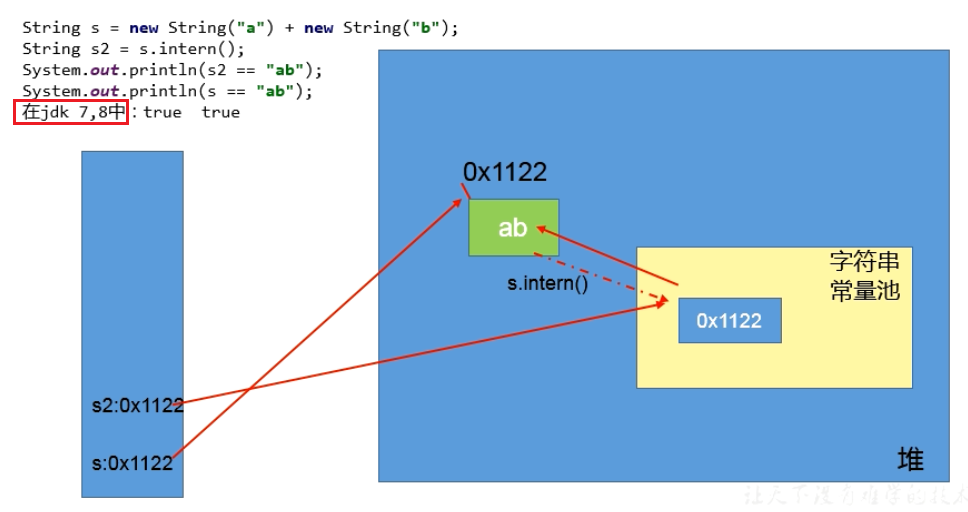


---

如何确保指向常量池：

- 使用String字面量
- new出来后，使用intern。

---

intern效率测试

所有字符串都为1-10

```java
/**
 * 使用intern()测试执行效率：主要是空间使用上
 */
public class StringIntern2 {
    static final int MAX_COUNT = 1000 * 10000;
    static final String[] arr = new String[MAX_COUNT];

    public static void main(String[] args) {
        Integer[] data = new Integer[]{1,2,3,4,5,6,7,8,9,10};

        long start = System.currentTimeMillis();
        for (int i = 0; i < MAX_COUNT; i++) {
//            arr[i] = new String(String.valueOf(data[i % data.length]));
            arr[i] = new String(String.valueOf(data[i % data.length])).intern();

        }
        long end = System.currentTimeMillis();
        System.out.println("花费的时间为：" + (end - start));

        try {
            Thread.sleep(1000000);
        } catch (InterruptedException e) {
            e.printStackTrace();
        }
        System.gc();
    }
}
```

- 不使用intern:花费的时间为7307
  > 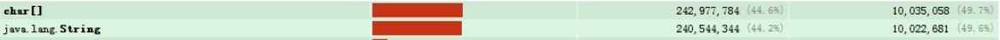
- 使用intern:花费的时间为1103
  > 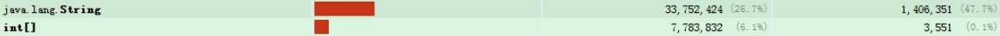

**结论：对于程序中大量存在存在的字符串，尤其其中存在很多重复字符串时，使用intern()可以节省内存空间。**

#### 2.3.2.6. String创建方法总结

> 应付面试题很有用

- 字符串常量:该方法会把字符串存到StringTable中
- new String(value):
  - new String会创建两个String对象
  - 一个是堆中,另一个在常量池中。
  - 直接赋值的话，会让变量会赋值堆中的String对象的引用
  - 使用intern后，会查找String Table，返回常量表中的字符串对象
    ```java
    String s1 = new String("a");
    String s2 = new String("a");
    System.out.println(s1==s2);// false
    System.out.println(s1.intern()==s2.intern());//true
    ```
- StringBuilder和StringBuffer的toString
  - 实现比较特殊
  - 只会在堆中创建字符串对象
  - 不会往常量池中存
- new String("a")+new String("b")
  - 该方式本质就是调用的StringBuilder的toString。
    > 具体为什么看字节码
  - 只会在堆中创建String对象
  - 不会在常量池中创建

#### 2.3.2.7. StringTable的垃圾回收

GC时也会对StringTable进行垃圾回收，示例代码：

```java
/**
 * String的垃圾回收:
 * -Xms15m -Xmx15m -XX:+PrintStringTableStatistics -XX:+PrintGCDetails
 *
 * @author shkstart  shkstart@126.com
 * @create 2020  21:27
 */
public class StringGCTest {
    public static void main(String[] args) {
        for (int j = 0; j < 100000; j++) {
            String.valueOf(j).intern();
        }
    }
}
```

#### 2.3.2.8. G1中的String去重操作(了解)

> G1为默认垃圾回收器

- 去重操作含义：
  ```java
  String s1 = new String("hello")
  String s2 = new String("hello")
  ```
  - s2创建String对象时，不在内存中重新创建String对象
  - 而直接指向s1指向的String。
  - 核心就是char数组或者byte数组不重复创建
  - (常量池没有去重那一说，常量池本身就不存储重复字符串)

- 背景
  - 堆存活数据集合里面string对象占了25%
  - 堆存活数据集合里面重复的string对象有13.5%
  - String对象的平均长度是45
    ```
    许多大规模的Java应用的瓶颈在于内存，测试表明，在这些类型的应用
    里面，Java堆中存活的数据集合差不多25是是String对象。更进一步，
    这里面差不多一半string对象是重复的，重复的意思是说：
    string1.equals(string2)=true。堆上存在重复的string对象必
    然是一种内存的浪费。这个项目将在G1垃圾收集器中实现自动持续对重
    复的string对象进行去重，这样就能避免浪费内存。
    ```

- 实现
  - 当垃圾收集器工作的时候，会访问堆上存活的对象。对每一个访问的对象都会检查是否是候选的要去重的string对象。
  - 如果是，把这个对象的一个引用插入到队列中等待后续的处理。一个去重的线程在后台运行，处理这个队列。处理队列的一个元素意味着从队列删除这个元素，然后尝试去重它引用的string对象。
  - 使用一个hashtable来记录所有的被string对象使用的不重复的char数组。当去重的时候，会查这个hashtable,来看堆上是否已经存在一个一模一样的char数组。
  - 如果存在，string对象会被调整引用那个数组，释放对原来的数组的引用，最终会被垃圾收集器回收掉。
  - 如果查找失败，char数组会被插入到hashtable,这样以后的时候就可以共享这个数组了。

- 命令行选项
  - UseStringDeduplication(bool):开启string去重，默认是不开启的，需要手动开启。
  - PrintstringDeduplicationstatistics (bool):打印详细的去重统计信息
  - stringDeduplicationAgeThreshold (uintx):达到这个年龄的string对象被认为是去重的候选对象

#### 2.3.2.9. 面试题

字符串不可变性

```java
public class StringExer {
    String str = new String("good");
    char[] ch = {'t', 'e', 's', 't'};

    public void change(String str, char ch[]) {
        str = "test ok";
        ch[0] = 'b';
    }

    public static void main(String[] args) {
        StringExer ex = new StringExer();
        ex.change(ex.str, ex.ch);
        System.out.println(ex.str);//good
        System.out.println(ex.ch);//best
    }

}
```

---

```
`new String("ab")`会创建几个对象？
```

两个，一个对象通过new关键字在堆空间创建，另一个对象是存放到字符串常量池中的对象

证明：查看字节码

```
 0 new #2 <java/lang/String>
 3 dup
 4 ldc #3 <ab>
 6 invokespecial #4 <java/lang/String.<init>>
 9 astore_1
10 return
```

- `new #2` 为在堆空间中创建字符串对象
- `ldc #3` 为往常量池中放字符串

<br /><br />

```
`new String("a")+new String("b")`会创建几个对象？
```

`new String("a")+new String("b")`的字节码：

```
 0 new #2 <java/lang/StringBuilder>
 3 dup
 4 invokespecial #3 <java/lang/StringBuilder.<init>>
 7 new #4 <java/lang/String>
10 dup
11 ldc #5 <a>
13 invokespecial #6 <java/lang/String.<init>>
16 invokevirtual #7 <java/lang/StringBuilder.append>
19 new #4 <java/lang/String>
22 dup
23 ldc #8 <b>
25 invokespecial #6 <java/lang/String.<init>>
28 invokevirtual #7 <java/lang/StringBuilder.append>
31 invokevirtual #9 <java/lang/StringBuilder.toString>
34 astore_1
35 return
```

`StringBuilder.toString()`的字节码


字节码分析：

- 对象1：new StringBuilder()
- 对象2： new String("a")
- 对象3： 常量池中的"a"
- 对象4： new String("b")
- 对象5： 常量池中的"b"
- **对象6** ：new String("ab")
  > StringBuilder的toString()方法会new一个String,
  >
  > 强调一下，toString()的调用，在字符串常量池中，没有生成"ab"。如果想存入常量池中，必须使用intern方法

---

intern的使用

```java
public class StringIntern {
    public static void main(String[] args) {
        String s = new String("1"); // s 指向堆空间中的字符串对象
        s.intern();//调用此方法之前，字符串常量池中已经存在了"1"，因此此方法在这里调用没任何作用
        String s2 = "1"; // s1指向常量池中的"1"
        System.out.println(s == s2);//jdk6：false   jdk7/8：false


        String s3 = new String("1") + new String("1");//s3变量记录的地址为堆中的new String("11")。// 具体过程查看上面的一个面试题
        //执行完上一行代码以后，字符串常量池中，不存在"11"！！。（因为StringBuilder的toString方法）
        s3.intern();//在字符串常量池中生成"11"。
                    // 如何理解：jdk6:创建了一个新的对象"11",放到了永久代中的字符串常量池中，也就有新的地址。
                    //           jdk7及以后:此时常量中并没有创建"11",而是创建一个指向堆空间中new String("11")的地址，存到了常量池中
        String s4 = "11";//s4变量记录的地址：使用的是上一行代码代码执行时，在常量池中生成的"11"的地址
        System.out.println(s3 == s4);//jdk6：false  jdk7/8：true
    }
}
```

 - **也就是说，在jdk7及以后，因为字符串常量池在堆空间而不是方法区中，因此在"堆中有字符串对象，但是字符串常量池中没有相同值字符串对象时"，调用intern后会直接在常量池中创建一个指向堆中对象的引用，而不是复制对象**
  > 注意，new String()，依旧是创建两个对象，往字符串常量池中添加引用只有在上述情况下才会出现
 - **与之相对，jdk6的字符串常量池在方法区中，而对象在堆中，因此会采用复制到方法区中的方式**

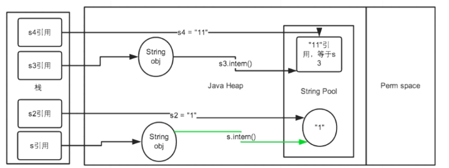

<br /><br />

扩展：

```java
String s3 = new String("1") + new String("1");//相当于new String("11")，但只存在于堆中
String s4 = "11"; //在字符串常量池中生成对象"11"。因为不是上面那种情况，所以不会创建引用，指向堆中的对象，而是直接往常量池中创建对象
String s5 = s3.intern(); // 指向常量池中的"11"
System.out.println(s3 == s4);//false
System.out.println(s5 == s4);//true
```


### 2.3.3. 垃圾回收

HotSpot里面也出 现了不采用分代设计的新垃圾收集器

#### 2.3.3.1. 垃圾回收概述

```
第一门使用垃圾收集的语言时Lisp语言
```

- 为什么需要垃圾回收
  - 对于高级语言来说，一个基本认知是如果不进行垃圾回收，内存迟早都会被消耗完
- 什么是垃圾
  - 垃圾是指 **运行程序中没有任何指针指向的对象**，这个对象就是要被回收的垃圾
- GC作用
  - 清除垃圾
  - 清除内存里的记录碎片。碎片整理将所占用的堆内存移到堆的一端，以便JVM将整理出的内存分配给新的对象。

---

- 哪些内存需要回收
- 什么时候回收
- 如何回收

---

> 下面的是从网上摘抄的，具体内存移除和内存泄漏的概念可以看下面的章节

- 内存溢出：简单地说内存溢出就是指程序运行过程中申请的内存大于系统能够提供的内存，导致无法申请到足够的内存，于是就发生了内存溢出。
  - 1、java.lang.OutOfMemoryError: PermGen space (持久带溢出)
  - 2、java.lang.OutOfMemoryError: Java heap space (堆溢出)
  - 3、虚拟机栈和本地方法栈溢出
    - 如果线程请求的栈深度大于虚拟机所允许的最大深度，将抛出StackOverflowError。
    - 如果虚拟机在扩展栈时无法申请到足够的内存空间，则抛出OutOfMemoryError。

- 内存泄漏：内存泄漏指程序运行过程中分配内存给临时变量，用完之后却没有被GC回收，始终占用着内存，既不能被使用也不能分配给其他程序，于是就发生了内存泄漏。
  - 1、常发性内存泄漏。发生内存泄漏的代码会被多次执行到，每次被执行的时候都会导致一块内存泄漏。
  - 2、偶发性内存泄漏。发生内存泄漏的代码只有在某些特定环境或操作过程下才会发生。常发性和偶发性是相对的。对于特定的环境，偶发性的也许就变成了常发性的。所以测试环境和测试方法对检测内存泄漏至关重要。 
  - 3、一次性内存泄漏。发生内存泄漏的代码只会被执行一次，或者由于算法上的缺陷，导致总会有一块仅且一块内存发生泄漏。比如，在类的构造函数中分配内存，在析构函数中却没有释放该内存，所以内存泄漏只会发生一次。 
  - 4、隐式内存泄漏。程序在运行过程中不停的分配内存，但是直到结束的时候才释放内存。严格的说这里并没有发生内存泄漏，因为最终程序释放了所有申请的内存。但是对于一个服务器程序，需要运行几天，几周甚至几个月，不及时释放内存也可能导致最终耗尽系统的所有内存。所以，我们称这类内存泄漏为隐式内存泄漏。 

---

垃圾回收行为

- c/c++时代，垃圾回收都是手动进行的，使用new关键字进行内存申请，使用delete关键字进行内存释放
- 现在，java，C#，python，ruby等语言都使用了自动垃圾回收的思想。进行自动化的内存分配和；垃圾回收

---

java垃圾回收机制

- 自动内存管理：
  - 包括内存的自动分配以及内存的自动回收
  - 不需要手动对内存进行管理释放

- 内存监控工具
  - 因为自动内存管理，弱化了java开发人员在程序出现内存溢出时定位问题和解决问题的能力
  - 因此要排查各种内存溢出，内存泄漏问题时，需要使用必要的内存监控工具

- 垃圾回收
  - 区域：堆（重点），方法区（java虚拟机规范中不要求所有虚拟机都实现）
  - 次数：
    - 频繁回收Young区
    - 较少收集Old区
    - 基本不懂Prem区（或元空间）

#### 2.3.3.2. 垃圾回收相关算法(重要)

##### 2.3.3.2.1. 概述

- 标记阶段
  - 在堆里存放着几乎所有的Java对象实例，在GC执行垃圾回收之前，首先需要区分出内存中哪些是存活对象，哪些是已经死亡的对象。
  - 只有被标记为己经死亡的对象，GC才会在执行垃圾回收时，释放掉其所占用的内存空间，因此这个过程我们可以称为**垃圾标记阶段**。
  - 简单来说，**当一个对象已经不再被任何的存活对象继续引用时，就可以宣判为已经死亡**。
  - 判断对象存活一般有两种方式：
    - 引用计数算法
    - 可达性分析算法。

- 清除阶段
  - 当成功区分出内存中存活对象和死亡对象后，GC接下来的任务就是执行垃圾回收，释放掉无用对象所占用的内存空间，以便有足够的可用内存空间为新对象分配内存。
  - 目前在JVM中比较常见的三种垃圾收集算法是
    - 标记一清除算法（Mark-Sweep)
    - 复制算法（Copying)
    - 标记-压缩算法（Mark-Compact )

---

```
注意，下面这些只是基本的算法思路，实际GC实现过程要复杂的多，目前还在
发展中的前沿GC都是复合算法，并且并行和并发兼备。
```

##### 2.3.3.2.2. 标记阶段：引用计数算法

- 原理：
  - 每个对象保存一个整型的**引用计数器属性**，用于记录对象被引用的情况
  - 例：
    ```
    对于一个对象A,只要有任何一个对象引用了A,则A的引用计数器就加1;当引用失效
    时，引用计数器就减1。只要对象A的引用计数器的值为0,即表示对象A不可能再被
    用，可进行回收。
    ```
- 优点：
  - 实现简单，垃圾对象便于标识
  - 判定效率高，回收没有延迟性
- 缺点：
  - 它需要单独的字段存储计数器，这样的做法增加了**存储空间的开销**。
  - 每次赋值都需要更新计数器，伴随着加法和减法操作，这增加了**时间开销**。
  - 引用计数器有一个严重的问题，即**无法处理循环引用的情况**。这是一条**致命缺陷**：导致在Java的垃圾回收器中没有使用这类算法。
    >  
    > > 注意：java中因为没有使用引用计数算法，所以上面这种内存泄漏情况在java中是不会发生的。

- 使用：
  - python支持计数引用以及垃圾回收机制
  - python解决循环引用问题：
    - 手动解除：很好理解，就是在合适的时机，解除引用关系
    - 使用弱引用weakref，weakref是python提供的标准库，旨在解决循环引用

---

证明:java中没有使用引用计数算法。下图为使用引用计数算法的情况


```java
/**
 * -XX:+PrintGCDetails
 * 证明：java使用的不是引用计数算法
 * @author shkstart
 * @create 2020 下午 2:38
 */
public class RefCountGC {
    //这个成员属性唯一的作用就是占用一点内存
    private byte[] bigSize = new byte[5 * 1024 * 1024];//5MB
    Object reference = null;
    public static void main(String[] args) {
        RefCountGC obj1 = new RefCountGC();
        RefCountGC obj2 = new RefCountGC();

        obj1.reference = obj2;
        obj2.reference = obj1;

        obj1 = null;
        obj2 = null;
        //显式的执行垃圾回收行为
        //这里发生GC，obj1和obj2能否被回收？
        System.gc();
        try {
            Thread.sleep(1000000);
        } catch (InterruptedException e) {
            e.printStackTrace();
        }
    }
}
```

注释掉`System.gc()`:

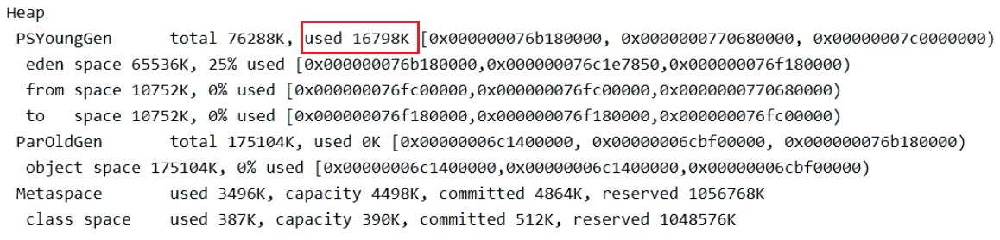

进行 `System.gc()`:


结果发现内存被回收了，因此HotSpot没有使用引用计数算法

##### 2.3.3.2.3. 标记阶段：可达性分析算法

> 或者称为："根搜索算法"，"追踪性垃圾收集(Tracing Garbage Collection)"

<br /><br />

- **GC Roots**:重中之重
  - 概念：**GC Roots：根对象集合，指一组必须必须活跃的引用**
  - 组成
    - 虚拟机栈中引用的对象
      > 比如：各个线程被调用的方法中使用到的参数、局部变量等。
    - 本地方法栈内JNI(通常说的本地方法）引用的对象
    - 方法区中类静态属性引用的对象
      > 比如：Java类的引用类型静态变量
    - 方法区中常量引用的对象
      > 比如：字符串常量池（string Table)里的引用
    - 所有被同步锁synchronized持有的对象
    - Java虚拟机内部的引用。
      > 基本数据类型对应的class对象，一些常驻的异常对象（如：NullPointerException、OutOfMemoryError),系统类加载器。
    - 反映java虚拟机内部情况的JMXBean、JVMTI中注册的回调、本地代码缓存等。
  - 临时组成：除了上面固定的GC Roots外，还可能把其他对象临时加入到GC Roots集合中
    - 分代收集:看下面清除阶段的算法
    - (重要)**局部回收:和下面那个小技巧同理，如果仅对堆内一部分A进行垃圾回收，如果 剩下的堆内其他部分+堆外GCRoots 中有指向A内对象的引用，那么那些对象就不能回收**
      ```
      如果只针对Java堆中的某一块区域进行垃圾回收（比如：典型的只针
      对新生代）,必须考虑到内存区域是虚拟机自己的实现细节，更不是孤
      立封闭的，这个区域的对象完全有可能被其他区域的对象所引用，这时
      候就需要一并将关联的区域对象也加入GC Roots集合中去考虑，才能
      保证可达性分析的准确性。
      ```
  - 记忆技巧：
    ```
    由于Root采用栈方式存放变量和指针，所以如果一个指针，
    它保存了堆内存里面的对象，但自己又不存放在堆内存里面，那它就是一个Root
    ``` 

---

- 基本思路
  >  
  >  
  - 可达性分析算法是以根对象集合（GC Roots)为起始点，按照从上至下的方式**搜索被根对象集合所连接的目标对象是否可达**。
  - 使用可达性分析算法后，内存中的存活对象都会被根对象集合直接或间接连接着，搜索所走过的路径称为引用链（Reference Chain)
  - 如果目标对象没有任何引用链相连，则是不可达的，就意味着该对象己经死亡，可以标记为垃圾对象。
  - 在可达性分析算法中，只有能够被根对象集合直接或者间接连接的对象才是存活对象。
- 限制
  ```
  如果要使用可达性分析算法来判断内存是否可回收，那么分析工作必须在
  一个能保障一致性的快照中进行。这点不满足的话分析结果的准确性就
  法保证。

  一致性：是指就像冻结在某个时间点上。也就是说在执行该算法时，对象的引用关系不能一直变化
  ```

- 优点：
  - 实现简单，执行高效
  - 解决了引用计数算法中的循环引用问题，防止内存泄漏的发生
- 使用
  - Java,C#使用的垃圾回收算法

---

具体过程（在看该部分前先把下面那个finalization机制看完）：

- 判断一个对象是否可回收，至少经过两次标记过程
  - 如果对象objA到GC Roots没有引用链，则进行第一次标记。
  - 进行筛选，判断此对象是否有必要执行finalize()方法
    - 如果对象objA没有重写finalize()方法，或者finalize()方法已经被虚拟机调用过，则虚拟机视为“没有必要执行”，objA被判定为不可触及的。
    - 如果对象objA重写了finalize()方法，且还未执行过，那么objA会被插入到F-Queue队列中，由一个**虚拟机自动创建的、低优先级的Finalizer线程**触发其finalize()方法执行。
    - **finalize()方法是对象逃脱死亡的最后机会**，稍后GC会对F-Queue队列中的对象进行第二次标记。**如果objA在finalize()方法中与引用链上的任何一个对象建立了联系**，那么在第二次标记时，objA会被移出“即将回收”集合。之后，对象会再次出现没有引用存在的情况。在这个情况下，finalize方法不会被再次调用，对象会直接变成不可触及的状态，也就是说，一个对象的finalize方法只会被调用一次。
      > finalize()方法只能调用一次，也就是说只能复活一次


##### 2.3.3.2.4. 对象的finalization机制

- 说明
  - Java语言提供了对象终止（finalization)机制来允许开发人员提供**对象被销毁之前的自定义处理逻辑**。
  - 当垃圾回收器发现没有引用指向一个对象，即：垃圾回收此对象之前，总会先调用这个对象的finalize()方法。
  - `finalize()`方法允许在子类中被重写，**用于在对象被回收时进行资源释放**。
    - 通常在这个方法中进行一些资源释放和清理的工作，比如关闭文件、套接字和数据库连接等。
- 注意：永远不要主动调用`finalize()`方法
  - 在finalize()时可能会导致对象复活。
  - finalize()方法的执行时间是没有保障的，它完全由GC线程决定，极端情况下，若不发生GC,则finalize()方法将没有执行机会。
  - 一个糟糕的finalize()会严重影响GC的性能。

---

- 虚拟机中对象的**三种状态**:
  > 因为该方法，所有可以分为三种状态
  ```
  如果从所有的根节点都无法访问到某个对象，说明对象已经不再使用了。一般来说，
  此对象需要被回收。但事实上，也并非是“非死不可”的，这时候它们暂时处于“缓
  刑”阶段。一个无法触及的对象有可能在某一个条件下“复活”自己，如果这样，那
  么对它的回收就是不合理的，为此，定义虚拟机中的对象可能的三种状态。如下：
  ```
  - 可触及的：从根节点开始，可以到达这个对象。
  - 可复活的：对象的所有引用都被释放，但是对象有可能在finalize()中复活。
    > 因为finalize()只能调用一次，所以也就只能复活一次
  - 不可触及的：对象的finalize()被调用，并且没有复活，那么就会进入不可触及状态。不可触及的对象不可能被复活，**因为finalize()只会被调用一次**。

--- 

复活示例

```java
public class CanReliveObj {
    public static CanReliveObj obj;//类变量，属于 GC Root

    //此方法只能被调用一次
    @Override
    protected void finalize() throws Throwable {
        super.finalize();
        System.out.println("调用当前类重写的finalize()方法");
        obj = this;//当前待回收的对象在finalize()方法中与引用链上的一个对象obj建立了联系
    }

    public static void main(String[] args) {
        try {
            obj = new CanReliveObj();
            // 对象第一次成功拯救自己
            obj = null;
            System.gc();//调用垃圾回收器
            System.out.println("第1次 gc");
            // 因为Finalizer线程优先级很低，暂停2秒，以等待它
            Thread.sleep(2000);
            if (obj == null) {
                System.out.println("obj is dead");
            } else {
                System.out.println("obj is still alive");
            }
            System.out.println("第2次 gc");
            // 下面这段代码与上面的完全相同，但是这次自救却失败了
            obj = null;
            System.gc();
            // 因为Finalizer线程优先级很低，暂停2秒，以等待它
            Thread.sleep(2000);
            if (obj == null) {
                System.out.println("obj is dead");
            } else {
                System.out.println("obj is still alive");
            }
        } catch (InterruptedException e) {
            e.printStackTrace();
        }
    }
}
```


##### 2.3.3.2.5. MAT与JProfiler的GC Roots溯源

> 使用MAT和JProfiler查看GC Roots

当出现内存泄漏问题时，查找GC Roots溯源，在适当位置进行断开。  
一般不会查看所有的GC Roots，而是查看某一分支上的GC Roots


**安安心心看视频演示吧**

<br /><br />

dump文件生成：

- 使用jmap。(具体下一篇再说，会详细讲一些命令行指令)
- 使用JVisualVM导出
  - 捕获的heap dump文件是一个临时文件，关闭JVisualVM后自动删除，若要保留，需要将其另存为文件。
  - 可通过以下方法捕获heap dump:
    - 在左侧“Application”（应用程序）子窗口中右击相应的应用程序，选择Heap Dump (堆Dump)。
    - 在Monitor(监视）子标签页中点击Heap Dump(堆Dump)按钮。
    - 本地应用程序的Heap dumps作为应用程序标签页的一个子标签页打开。同时，heap dump在左侧的Application(应用程序）栏中对应一个含有时间戳的节点。右击这个节点选择save as(另存为）即可将heap dump保存到本地。
- `-XX:+HeapDumpOnOutOfMemoryError`:在内存溢出后会生成dump文件

---

- MAT:
  - 说明：MAT是Memory Analyzer的简称， 基于Eclipse开发的，是一款免费的性能分析工具。它是一款功能强大的Java堆内存分析器。
  - 作用：用于查找内存泄漏以及查看内存消耗情况。
  - 下载：http://www.eclipse.org/mat/


##### 2.3.3.2.6. 清除阶段：标记清除算法

- 背景
  ```
  标记-清除算法（Mark-Sweep)是一种非常基础和常见的垃圾收集算法，
  该算法被J.McCarthy等人在1960年提出并并应用于Lisp语言。
  ```
- 执行过程
  ```
  当堆中的有效内存空间（available memory)被耗尽的时候，就会停止整个
  程序（也被称为stop the world),然后进行两项工作，第一项则是标记，
  第二项则是清除。
  ```
  > 
  - 标记：Collector从引用根节点开始遍历，**标记所有被引用的对象**。一般是在对象的Header中记录为可达对象。
    > 注意，是标记非垃圾对象
  - 清除：Collector对堆内存从头到尾进行线性的遍历，如果发现某个对象在其Header中没有标记为可达对象，则将其回收。
    ```
    这里所谓的清除并不是真的置空，而是把需要清除的对象地址保存在空闲
    的地址列表里。下次有新对象需要加载时，判断垃圾的位置空间是否够，
    如果够，就存放。
    ```

- 优点：较为简单，容易实现
- 缺点：
  - 效率不算高
  - 在进行GC的时候，需要停止整个应用程序，导致用户体验差
  - 这种方式清理出来的空闲内存是不连续的，产生内存碎片。需要维护一个空闲列表（复习：对象实例化-创建对象-为对象分配内存）

##### 2.3.3.2.7. 清除阶段：复制算法

> 前面新生代对象分配与回收就使用了这个算法

<br /><br />

- 背景：为了解决标记-清除算法的效率缺陷
- 核心思想
  ```
  将活着的内存空间分为两块，每次只使用其中一块，在垃圾回收时将正在
  使用的内存中的存活对象复制到未被使用的内存块中，之后清除正在使用
  的内存块中的所有对象，交换两个内存的角色，最后完成垃圾回收。
  ```
  > 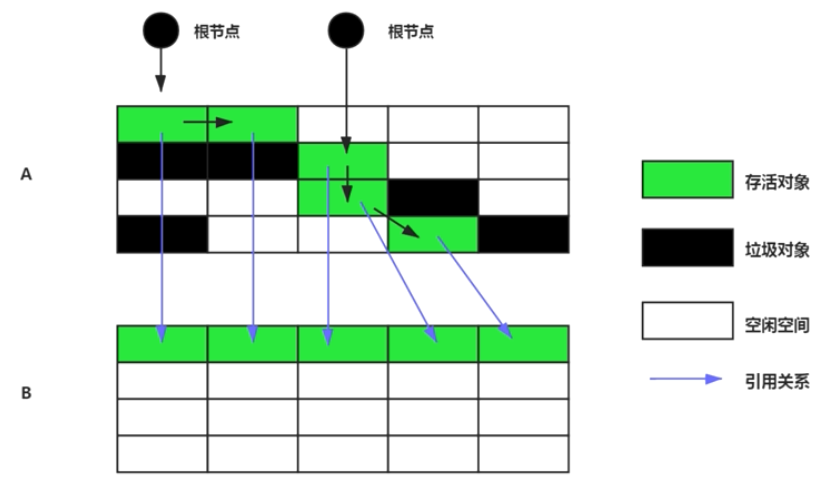 

- 优点：
  - 没有标记和清除过程，实现简单，运行高效
  - 复制过去以后保证空间的连续性，不会出现“碎片”问题。
- 缺点：
  - 需要两倍的内存空间。
  - 对于G1这种分拆成为大量region的GC,复制而不是移动，意味着GC需要维护region之间对象引用关系，不管是内存占用或者时间开销也不小。
  - 如果存活对象占绝大部分，那么所占用的资源则是绝望得大
    > 考虑到新生代对象朝生即死的特点，使用复制算法比较合适

##### 2.3.3.2.8. 清除阶段：标记压缩(整理)算法

> 在许多现代的垃圾回收器当中，使用的都是该算法或者改进版本

- 背景
  ```
  复制算法的高效性是建立在存活对象少、垃圾对象多的前提下的。这种情况在新生代经常
  发生，但是在老年代，更常见的情况是大部分对象都是存活对象。如果依然使用复制算法，
  由于存活对象较多，复制的成本也将很高。因此，基于老年代垃圾回收的特性，需要使用
  其他的算法。

  标记一清除算法的确可以应用在老年代中，但是该算法不仅执行效率低下，而且在执行完
  内存回收后还会产生内存碎片，所以JVM的设计者需要在此基础之上进行改进。标记-
  压缩（Mark-Compact)算法由此诞生。
  ```
- 步骤
  > 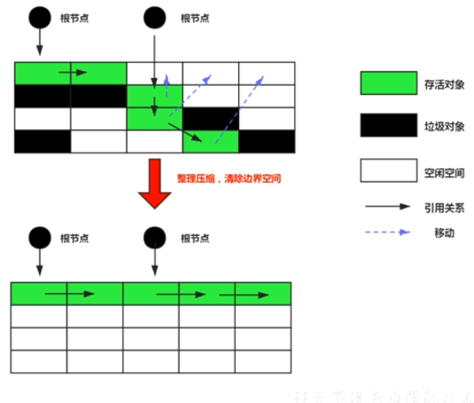 
  - 第一阶段和标记-清除算法一样，从根节点开始标记所有被引用对象
  - 第二阶段将所有的存活对象压缩到内存的一端，按顺序排放。
  - 之后，清理边界外所有的空间。
  ```
  可以看到，标记的存活对象将会被整理，按照内存地址依次排列，而未被
  标记的内存会被清理掉。如此一来，当我们需要给新对象分配内存时，
  JVM只需要持有一个内存的起始地址即可，这比维护一个空闲列表显然少
  了许多开销。
  ```

- 与标记清除算法区别
  - 标记-压缩算法的最终效果等同于标记-清除算法执行完成后，再进行一次内存碎片整理，因此，也可以把它称为标记-清除-压缩（Mark-Sweep-Compact)算法。
  - 二者的本质差异在于标记-清除算法是一种非移动式的回收算法，标记-压缩是移动式的。是否移动回收后的存活对象是一项优缺点并存的风险决策。

- 优点：
  - 消除了标记-清除算法当中，内存区域分散的缺点，我们需要给新对象分配内存时，JVM只需要持有一个内存的起始地址即可。
  - 消除了复制算法当中，内存减半的高额代价。
- 缺点：
  - 从效率上来说，标记-整理算法要低于复制算法。
  - 移动对象的同时，如果对象被其他对象引用，则还需要调整引用的地址。
  - 移动过程中，需要全程暂停用户应用程序。即：STW

##### 2.3.3.2.9. 小结


效率上来说，复制算法是当之无愧的老大，但是却浪费了太多内存。

而为了尽量兼顾上面提到的三个指标，标记-整理算法相对来说更平滑一些，但是效率上不尽如人意，它比复制算法多了一个标记的阶段，比标记-清除多了一个整理内存的阶段。

##### 2.3.3.2.10. 清除阶段：分代收集算法

> 几乎所有的GC都是采用分代收集(Generational Collecting)算法执行垃圾回收的

- 背景
  ```
  前面所有这些算法中，并没有一种算法可以完全替代其他算法，它们都具有自
  己独特的优势和特点。分代收集算法应运而生。

  分代收集算法，是基于这样一个事实：不同的对象的生命周期是不一样的。因
  此，不同生命周期的对象可以采取不同的收集方式，以便提高回收效率。一般
  是把Java堆分为新生代和老年代，这样就可以根据各个年代的特点使用不同的
  回收算法，以提高垃圾回收的效率。

  在Java程序运行的过程中，会产生大量的对象，其中有些对象是与业务信息相
  关，比如Http请求中的Session对象、线程、Socket连接，这类对象跟业务
  直接挂钩，因此生命周期比较长。但是还有一些对象，主要是程序运行过程中
  生成的临时变量，这些对象生命周期会比较短，比如：String对象，由于其不
  变类的特性，系统会产生大量的这些对象，有些对象甚至只用一次即可回收。
  ```

- 在Hotspot中，基于分代的概念，GC所使用的内存回收算法必须结合年轻代和老年代各自的特点。
  - 年轻代（Young Gen)
    - 特点：区域相对老年代较小，对象生命周期短、存活率低，回收频繁。
    - 适用算法：
      ```
      这种情况复制算法的回收整理，速度是最快的。复制算法的效率只和当前存活对象大小有关，因此很适用于
      年轻代的回收。而复制算法内存利用率不高的问题，通过hotspot中的两个survivor的设计得到缓解。
      ```
  - 老年代（Tenured Gen)
    - 特点：区域较大，对象生命周期长、存活率高，回收不及年轻代频繁。
    - 适用算法：这种情况存在大量存活率高的对象，复制算法明显变得不合适。一般是由标记-清除或者是标记-清除与标记-整理的混合实现。
    - 开销
      - Mark阶段的开销与存活对象的数量成正比。
      - sweep阶段的开销与所管理区域的大小成正相关。
      - Compact阶段的开销与存活对象的数据成正比。

---

> CMS在后面会具体讲，尤其是jdk14那里做了很多重大调整

- CMS
  - 以HotSpot中的CMS回收器为例，CMS是基于Mark-Sweep实现的，对于对象的回收效率很高。
  - 而对于碎片问题，CMS采用基于Mark-Compact算法的Serial old回收器作为补偿措施，
  - 当内存回收不佳（碎片导致的Concurrent ModeFailure时）,将采用Serial old执行Fu11 GC以达到对老年代内存的整理。
  - 分代的思想被现有的虚拟机广泛使用。几乎所有的垃圾回收器都区分新生代和老年代。

##### 2.3.3.2.11. 清除阶段：增量收集算法

- 诞生背景
  - 上述现有的算法，在垃圾回收过程中，应用软件将处于一种stop the World的状态。
  - 在stop the world 状态下，应用程序所有的线程都会挂起，暂停一切正常的工作，等待垃圾回收的完成。
  - 如果垃圾回收时间过长，应用程序会被挂起很久，将严重影响用户体验或者系统的稳定性。
  - 为了解决这个问题，即对实时垃圾收集算法的研究直接导致了增量收集（Incremental Collecting)算法的诞生。

- 基本思想
  - 如果一次性将所有的垃圾进行处理，需要造成系统长时间的停顿，那么就可以**垃圾收集线程和应用程序线程交替执行**。
  - 每次，垃圾收集线程只收集一小片区的内存空间，接着切换到应用程序线程。依次反复，直到垃圾收集完成。
  - 总的来说，增量收集算法的**基础仍是传统的标记-清除和复制算法**。
  - 增量收集算法通过对线程间冲突的妥善处理，允许垃圾收集线程以分阶段的方式完成标记、清理或复制工作。

- 缺点
  - 使用这种方式，由于在垃圾回收过程中，间断性地还执行了应用程序代码，所以能减少系统的停顿时间。
  - 但是，因为线程切换和上下文转换的消耗，会使得垃圾回收的总体成本上升，**造成系统吞吐量的下降**。

##### 2.3.3.2.12. 清除阶段：分区算法

- 基本思想
  - 一般来说，在相同条件下，堆空间越大，一次GC时所需要的时间就越长，有关GC产生的停顿也越长。
  - 为了更好地控制GC产生的停顿时间，将一块大的内存区域分割成多个小块，根据目标的停顿时间，每次合理地回收若干个小区间，而不是整个堆空间，从而减少一次GC所产生的停顿。

- 实现：
  >  
  - 分代算法将按照对象的生命周期长短划分成两个部分，
  - 分区算法将整个堆空间划分成连续的不同小区间region。
  - 每一个小区间都独立使用，独立回收。这种算法的好处是可以控制一次回收多少个小区间。

##### 2.3.3.2.13. 面试题目

无聊的比较问题：

- throw和throws：throw是生成异常对象，throws是处理异常对象，没有可比性，
- final和finally：超无聊，八竿子达不到一块
- 引用计数算法和标记清除算法：一个是标记阶段，一个是清除阶段，没有可比性。如果说引用计数算法和可达性算法比较倒还行

#### 2.3.3.3. 垃圾回收相关概念

##### 2.3.3.3.1. System.gc()的理解

- 作用:
  - `System.gc()`和`Runtime.getRuntime().gc()`作用相同
  - 都是**显示触发Full GC**
- 注意：
  - 该调用附带一个免责声明:
  - 该方法仅仅是提醒JVM进行一次垃圾回收，但不一定会马上执行垃圾回收
    > 原因可能是安全点与安全区域
- 使用：
  - 一般情况下，垃圾回收都是自动进行的，无须手动触发
  - 在一些特殊情况下，如编写性能基准时，可以使用`System.gc()`
- 强制垃圾回收：
  - 调用方法`System.runFinalization()`
  - 该方法会会强制调用失去引用的对象的`finalize()`方法

---

示例

```java
public class SystemGCTest {
    public static void main(String[] args) {
        new SystemGCTest();
        System.gc();//提醒jvm的垃圾回收器执行gc,但是不确定是否马上执行gc
        //与Runtime.getRuntime().gc();的作用一样。
        System.runFinalization();//强制调用失去引用的对象的finalize()方法
        // 如果把上面一行注释掉，那么下面的finalize方法可能调用，也可能不调用
    }
    @Override
    protected void finalize() throws Throwable {
        super.finalize();
        System.out.println("SystemGCTest 重写了finalize()");
    }
}
```

##### 2.3.3.3.2. 内存溢出

- 内存溢出(OOM):**没有空闲内存，并且垃圾收集器也无法提供更多内存**。
  - 原因
    - Java虚拟机的堆内存不够
      ```
      比如：可能存在内存泄漏问题；也很有可能就是堆的大小不合理，比如我们要处理比较可
      观的数据量，但是没有显式指定JVM堆大小或者指定数值偏小。我们可以通过参数-Xms,
      -Xmx来调整。
      ``` 
    - 代码中创建了大量大对象，并且长时间不能被垃圾回收器收集（存在被引用）
      ```
      对于老版本的oracle JDK,因为永久代的大小是有限的，并且JVM对永久代垃圾回收
      (如，常量池回收、卸载不再需要的类型）非常不积极，所以当我们不断添加新类型的时
      候，永久代出现OutOfMemoryError也非常多见，尤其是在运行时存在大量动态类型生
      成的场合；类似intern字符串缓存占用太多空间，也会导致OOM问题。对应的异常信息
      会标记出来和永久代相关：“java.lang.OutofMemoryError:PermGen space"。

      随着元数据区的引入，方法区内存已经不再那么窘迫，所以相应的OOM有所改观，出现
      OOM,异常信息则变成了："java.lang.OutOfMemoryError:Metaspace"。直接
      内存不足，也会导致OOM。
      ```
  - 注意：
    - 在抛出outofMemoryError之前，通常垃圾收集器会被触发，尽其所能去清理出空间。
      > 例如：在引用机制分析中，涉及到JVM会去尝试回收软引用指向的对象等。
    - 单也不是每次在抛出OOM前都要执行垃圾回收
      > 比如，分配一个超大对象，超过堆的最大值，JVM可以判别出垃圾回收不能解决问题，所以直接抛出OOM


##### 2.3.3.3.3. 内存泄漏

- 内存泄漏：也称作“存储渗漏”。
  - 严格来说，**只有对象不会再被程序用到了，但是GC又不能回收他们的情况，才叫内存泄漏。**
    - 图示
      > 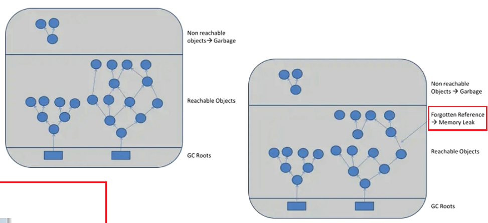 
    - 例子
      > 另外，因为java中没有使用引用计数算法，所以循环引用**并不会**导致JvM内存泄漏
      - 1、单例模式
        ```
        单例的生命周期和应用程序是一样长的，所以单例程序中，
        如果单例对象持有对外部对象的引用的话，
        那么这个外部对象是不能被回收的，则会导致内存泄漏的产生。
        ```
      - 2、一些提供close的资源未关闭导致内存泄漏
        ```
        数据库连接（dataSourse.getconnection()),网络连接（socket)和
        io连接必须手动close,否则是不能被回收的。
        ```
  - 宽泛意义上来说，**实际情况中很多时候一些疏忽导致对象生命周期变得很长甚至导致OOM，也可以交错内存泄漏**
    - 例子
      - 静态变量的生命周期很长，过多过大的无用静态变量可能导致内存的浪费甚至OOm
      - web应用程序中，把一些不必要的对象或数据设置为会话级别

- 影响
  ```
  尽管内存泄漏并不会立刻引起程序崩溃，但是一旦发生内存泄漏，程序中的
  可用内存就会被逐步蚕食，直至耗尽所有内存，最终出现OutofMemory异常，
  导致程序崩溃。

  注意，这里的存储空间并不是指物理内存，而是指虚拟内存大小，这个虚拟
  内存大小取决于磁盘交换区设定的大小。
  ```

##### 2.3.3.3.4. Stop the world

- Stop-the-World
  - 含义
    - 简称STW,指的是GC事件发生过程中，会产生应用程序的停顿。
    - 停顿产生时整个应用程序线程都会被暂停，没有任何响应，有点像卡死的感觉，这个停顿称为STW。
  - 发生时机：STW是JVM在后台自动发起和自动完成的。在用户不可见的情况下，把用户正常的工作线程全部停掉。
    > 开发中不要用`System.gc()`，会导致Stop-the-world的发生
  - 应用：所有的垃圾回收器都有STM。只能说STW时间越来越短
    ```
    例：
    可达性分析算法中枚举根节点（GC Roots)会导致所有Java执行线程停顿。
        分析工作必须在一个能确保一致性的快照中进行
        一致性指整个分析期间整个执行系统看起来像被冻结在某个时间点上
        如果出现分析过程中对象引用关系还在不断变化，则分析结果的准确性无法保证
    ```

##### 2.3.3.3.5. 垃圾回收的并行与并发

程序中的并发和并行:

<br /><br />

- 并发(Concurrent)
  >  
  - 在操作系统中，是指**一个时间段**中有几个程序都处于已启动运行到运行完毕之间，且这几个程序都是在**同一个处理器**上运行。
  - 并发不是真正意义上的“同时进行”，只是CPU把一个时间段划分成几个时间片段（时间区间）,然后在这几个时间区间之间来回切换，由于CPU处理的速度非常快，只要时间间隔处理得当，即可让用户感觉是多个应用程序同时在进行。

- 并行(Parallel)
  - 当系统有一个以上CPU时，当一个CPU执行一个进程时，另一个CPU可以执行另一个进程，两个进程互不抢占CPU资源，可以同时进行，我们称之为并行（Parallel)。
  - 其实决定并行的因素不是CPU的数量，而是CPU的核心数量，比如一个CPU多个核也可以并行。
  - 适合科学计算，后台处理等弱交互场景

- 对比
  - 时间
    - 并发，指的是多个事情，在同一时间段内同时发生了。
    - 并行，指的是多个事情，在同一时间点上同时发生了。I
  - 资源抢占
    - 并发的多个任务之间是互相抢占资源的。
    - 并行的多个任务之间是不互相抢占资源的。
  - 条件
    - 只有在多CPU或者一个CPU多核的情况中，才会发生并行。
    - 否则，看似同时发生的事情，其实都是并发执行的。

---

垃圾回收器中的并发和并行:

<br /><br />

 


 

- 并行（Parallel):
  - 指**多条垃圾收集线程并行工作**，但此时用户线程仍处于等待状态。
    > 如ParNew、Parallel Scavenge、Parallel old;
- 串行（Serial)
  - 相较于并行的概念，单线程执行。
  - 如果内存不够，则程序暂停，启动JVM垃圾回收器进行垃圾回收。回收完，再启动程序的线程。
- 并发
  - 并发（Concurrent):指**用户线程与垃圾收集线程同时执行**（但不一定是并行的，可能会交替执行）,垃圾回收线程在执行时不会停顿用户程序的运行。
    > 用户程序在继续运行，而垃圾收集程序线程运行于另一个CPU上；
    > 如：CMS、G1


##### 2.3.3.3.6. 安全点与安全区域

> 面试会问

- 安全点(SafePoint)：
  - 概念：程序执行时并非在所有地方都能停顿下来开始GC,只有在特定的位置才能停顿下来开始GC,这些位置称为“安全点（SafePoint)”。
  - 选择
    - Safe Point的选择很重要，**如果太少可能导致GC等待的时间太长，如果太频繁可能导致运行时的性能问题**。
    - 大部分指令的执行时间都非常短暂，通常会根据 **否具有让程序长时间执行的特征** 为标准。
      > 比如：选择一些执行时间较长的指令作为Safe Point,如**方法调用、循环跳转和异常跳转**等。
  - gc实际流程
    - 抢先式中断(目前没有虚拟机采用了)
      - 首先中断所有线程。如果还有线程不在安全点，就恢复线程，让线程跑到安全点。
    - 主动式中断
      - 设置一个中断标志，各个线程运行到Safe Point的时候主动轮询这个标志，如果中断标志为真，则将自己进行中断挂起。

- 安全区域(Safe Region)
  - safe point的局限
    - Safepoint机制保证了程序执行时，在不太长的时间内就会遇到可进入GC的Safepoint。
    - 但是，程序不执行的时候,例如线程处于Sleep状态或Blocked状态，
    - 这时候线程无法响应JVM的中断请求，无法执行到到安全点去中断挂起，JVM也不太可能等待线程被唤醒。
    - 对于这种情况，就需要安全区域（Safe Region)来解决。
  - 概念：
    - 安全区域是指在一段代码片段中，对象的引用关系不会发生变化，在这个区域中的任何位置开始GC都是安全的。
    - 我们也可以把 Safe Region 看做是被扩展了的 Safepoint。
  - gc实际流程
    - 1、当线程运行到Safe Region的代码时，首先标识已经进入了Safe Region,如果这段时间内发生GC,JVM会停止执行标识为Safe Region状态的线程；
    - 2、当线程即将离开Safe Region时，会检查JVM是否已经完成GC,
      - 如果完成了，则继续运行，
      - 否则线程必须等待直到收到可以安全离开Safe Region的信号为止；

##### 2.3.3.3.7. java中的引用(偏门高频)

```
目的：
我们希望能描述这样一类对象：当内存空间还足够时，则能保留在内存中；如果内存空间
在进行垃圾收集后还是很紧张，则可以抛弃这些对象。

出现：jdk1.2之后
强引用(strong reference),软引用(soft reference),弱引用(weak reference),虚引用(phantom reference)
强度依次递减
```

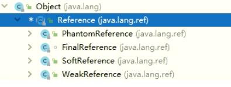

---

- 强引用(strong reference)
  - 定义：最传统的“引用”的定义，是指在程序代码之中普遍存在的引用赋值，即类似“Object obj=new Object()”这种引用关系。**无论任何情况下，只要强引用关系还存在，垃圾收集器就永远不会回收掉被引用的对象**。
  - 使用：
    - 当在Java语言中使用new操作符创建一个新的对象，并将其赋值给一个变量的时候，这个变量就成为指向该对象的一个强引用。
    - 在Java程序中，最常见的引用类型是强引用（普通系统99%以上都是强引用）,也就是我们最常见的普通对象引用，也是**默认的引用类型**。
  - 垃圾回收
    - 强引用的对象是可触及的，垃圾回收器就永远不会回收掉被引用的对象
    - 对于一个普通的对象，如果没有其他的引用关系，只要超过了引用的作用域或者显式地将相应（强）引用赋值为null,就是可以当做垃圾被收集了，当然具体回收时机还是要看垃圾收集策略。
  - 特点
    - 强引用可以直接访问目标对象
    - 强引用所指向的对象再任何时候都不会被系统回收，虚拟机宁愿抛出OOM异常，也不会回收强引用指向的对象
    - 强引用可能导致内存泄漏

---

- 软引用(soft reference)
  - 定义：在系统**将要发生内存溢出之前**，将会把这些对象列入回收范围之中进行第**二次回收**。如果这次回收后还没有足够的内存，才会抛出内存溢出异常
  - 使用:
    - 软引用通常用来实现内存敏感的缓存。
    - 比如：高速缓存就有用到软引用。如果还有空闲内存，就可以暂时保留缓存，当内存不足时清理掉，这样就保证了使用缓存的同时，不会耗尽内存。
  - 垃圾回收
    - 软引用的对象是软可触及(软可达)的
    - 垃圾回收器在某个时刻决定回收软可达的对象的时候，会清理软引用，并可选地把引用存放到一个引用队列（Reference Queue)。
    - 类似弱引用，只不过Java虚拟机会尽量让软引用的存活时间长一些，迫不得已才清理。
  - 使用示例
    ```java
    Object obj = new Object(); // 声明强引用
    SoftReference<Object> sf = new SoftReference<Object>(obj); // 创建弱引用
    obj = null; // 销毁强引用

    // 或者写成下面一行
    SoftReference<Object> sf = new SoftReference<Object>(new Object()); // 创建弱引用
    ```
    <details>
      <summary style="color:red;">比较大的演示示例</summary>

      ```java
      /**
      * -Xmx10m -Xms10m -XX:+PrintGCDetails
      * 软引用的测试：内存不足即回收
      */
      public class SoftReferenceTest {
          public static class User {
              public User(int id, String name) {
                  this.id = id;
                  this.name = name;
              }

              public int id;
              public String name;

              @Override
              public String toString() {
                  return "[id=" + id + ", name=" + name + "] ";
              }
          }
          public static void main(String[] args) {
              //创建对象，建立软引用
      //        SoftReference<User> userSoftRef = new SoftReference<User>(new User(1, "songhk"));
              //上面的一行代码，等价于如下的三行代码
              User u1 = new User(1,"songhk");
              SoftReference<User> userSoftRef = new SoftReference<User>(u1);
              u1 = null;//取消强引用

              //从软引用中重新获得强引用对象
              System.out.println(userSoftRef.get());

              System.gc();
              System.out.println("After GC:");
      //        //垃圾回收之后获得软引用中的对象
              System.out.println(userSoftRef.get());//由于堆空间内存足够，所有不会回收软引用的可达对象。
      //
              try {
                  //让系统认为内存资源紧张、不够。
      //            byte[] b = new byte[1024 * 1024 * 7];
                  byte[] b = new byte[1024 * 7168 - 635 * 1024];
              } catch (Throwable e) {
                  e.printStackTrace();
              } finally {
                  //再次从软引用中获取数据
                  System.out.println(userSoftRef.get());//在报OOM之前，垃圾回收器会回收软引用的可达对象。
              }
          }
      }
      ```
    </details>
---

- 弱引用(weak reference)
  - 定义：只被弱引用关联的对象只能生存到下一次垃圾收集之前。**当垃圾收集器工作时，无论内存空间是否足够，都会回收掉只被弱引用关联的对象**。
  - 使用
    - **软引用、弱引用都非常适合来保存那些可有可无的缓存数据**。
    - 如果这么做，当系统内存不足时，这些缓存数据会被回收，不会导致内存溢出。
    - 而当内存资源充足时，这些缓存数据又可以存在相当长的时间，从而起到加速系统的作用。
  - 垃圾回收
    - 弱引用的对象是弱可触及的
    - 但是，由于垃圾回收器的线程通常优先级很低，因此，并不一定能很快地发现持有弱引用的对象。在这种情况下，**弱引用对象可以存在较长的时间**。
    - 弱引用和软引用一样，在构造弱引用时，也可以指定一个引用队列，当弱引用对象被回收时，就会加入指定的引用队列，通过这个队列可以跟踪对象的回收情况。
  - 与软引用的区别：
    ```
    弱引用对象与软引用对象的最大不同就在于，当GC在进行回收时，需要通过
    算法检查是否回收软引用对象，而对于弱引用对象，GC总是进行回收。弱引
    用对象更容易、更快被GC回收。
    ```
  - 使用示例
    ```java
    Object obj = new Object();//声明强引用
    WeakReference<Object> wr = new WeakReference<0bject>(obj);
    obj=null;//销毁强引用
    ```
    <details>
    <summary style="color:red;">大一些的使用示例</summary>

    ```java
    /**
    * 弱引用的测试
    */
    public class WeakReferenceTest {
        public static class User {
            public User(int id, String name) {
                this.id = id;
                this.name = name;
            }

            public int id;
            public String name;

            @Override
            public String toString() {
                return "[id=" + id + ", name=" + name + "] ";
            }
        }

        public static void main(String[] args) {
            //构造了弱引用
            WeakReference<User> userWeakRef = new WeakReference<User>(new User(1, "songhk"));
            //从弱引用中重新获取对象
            System.out.println(userWeakRef.get());

            System.gc();
            // 不管当前内存空间足够与否，都会回收它的内存
            System.out.println("After GC:");
            //重新尝试从弱引用中获取对象
            System.out.println(userWeakRef.get());
        }
    }
    ```
    </details>


---

- 虚引用(phantom reference)
  - 定义：(也称为幻影引用或者幽灵引用)一个对象是否有虚引用的存在，完全不会对其生存时间构成影响，也无法通过虚引用来获得一个对象的实例。如果一个对象仅持有虚引用，那么它和没有引用几乎是一样的，随时可能被垃圾回收器回收
  - 使用
    - 不能单独使用，也无法通过虚引用来获取被引用的对象，当试图通过虚引用的get()方法获取对象时，结果总为null
    - 为一个对象设置虚引用关联的**唯一目的在于跟踪垃圾回收过程**。比如：能在这个对象被收集器回收时收到一个系统通知。
    - 虚引用必须和引用队列一起使用。虚引用在创建时必须提供一个引用队列作为参数。当垃圾回收器准备回收一个对象时，如果发现它还有虚引用，就会在回收对象后，将这个虚引用加入引用队列，以通知应用程序对象的回收情况。
    - 由于虚引用可以跟踪对象的回收时间，因此，也可以将一些资源释放操作放置在虚引用中执行和记录。
  - 垃圾回收
    - 虚引用的对象是虚可触及的
  - 使用示例
    ```java
    object obj = new object();
    ReferenceQueue phantomQueue = new ReferenceQueue();
    PhantomReference<0bject> pf = new PhantomReference<0bject>(obj, phantomQueue);
    obj=null;
    ```
    <details>
    <summary style="color:red;">大一些的使用示例</summary>

    ```java
    import java.lang.ref.PhantomReference;
    import java.lang.ref.ReferenceQueue;

    /**
    * 虚引用的测试
    */
    public class PhantomReferenceTest {
        public static PhantomReferenceTest obj;//当前类对象的声明
        static ReferenceQueue<PhantomReferenceTest> phantomQueue = null;//引用队列

        public static class CheckRefQueue extends Thread {
            @Override
            public void run() {
                while (true) {
                    if (phantomQueue != null) {
                        PhantomReference<PhantomReferenceTest> objt = null;
                        try {
                            objt = (PhantomReference<PhantomReferenceTest>) phantomQueue.remove();
                        } catch (InterruptedException e) {
                            e.printStackTrace();
                        }
                        if (objt != null) {
                            System.out.println("追踪垃圾回收过程：PhantomReferenceTest实例被GC了");
                        }
                    }
                }
            }
        }

        @Override
        protected void finalize() throws Throwable { //finalize()方法只能被调用一次！复活一次
            super.finalize();
            System.out.println("调用当前类的finalize()方法");
            obj = this;
        }

        public static void main(String[] args) {
            Thread t = new CheckRefQueue();
            t.setDaemon(true);//设置为守护线程：当程序中没有非守护线程时，守护线程也就执行结束。
            t.start();

            phantomQueue = new ReferenceQueue<PhantomReferenceTest>();
            obj = new PhantomReferenceTest();
            //构造了 PhantomReferenceTest 对象的虚引用，并指定了引用队列
            PhantomReference<PhantomReferenceTest> phantomRef = new PhantomReference<PhantomReferenceTest>(obj, phantomQueue);

            try {
                //不可获取虚引用中的对象
                System.out.println(phantomRef.get());

                //将强引用去除
                obj = null;
                //第一次进行GC,由于对象可复活，GC无法回收该对象
                System.gc();
                Thread.sleep(1000);
                if (obj == null) {
                    System.out.println("obj 是 null");
                } else {
                    System.out.println("obj 可用");
                }
                System.out.println("第 2 次 gc");
                obj = null;
                System.gc(); //一旦将obj对象回收，就会将此虚引用存放到引用队列中。
                Thread.sleep(1000);
                if (obj == null) {
                    System.out.println("obj 是 null");
                } else {
                    System.out.println("obj 可用");
                }
            } catch (InterruptedException e) {
                e.printStackTrace();
            }
        }
    }
    ```
    </details>


---

- 终结器引用
  > 了解
  - 它用以实现对象的finalize()方法，也可以称为终结器引用。
  - 无需手动编码，其内部配合引用队列使用。
  - 在GC时，终结器引用入队。由Finalizer线程通过终结器引用找到被引用对象并调用它的finalize()方法，第二次GC时才能回收被引用对象。

##### 2.3.3.3.8. 面试题

```java
public void localvarGC3() {
    {
        byte[] buffer = new byte[10 * 1024 * 1024];
    }
    // 不会被回收
    // 查看字节码可以发现，局部变量表长度为2，一个为this，一个为buffer
    System.gc();
}

public void localvarGC4() {
    {
        byte[] buffer = new byte[10 * 1024 * 1024];
    }
    int value = 10;
    // 会被回收
    // 查看字节码可以发现，局部变量表长度为2，一个为this，一个为value(把buffer替了下来)
    System.gc();
}
```

原因????????

---

偏门高频：强引用，弱引用，虚引用有什么区别，具体使用场景是什么?

偏门：百分之99都适用强引用，工作中很少遇到这方面问题。

高频：用来考察基础概念的理解，以及底层对象声明周期，垃圾回收机制等等方面

---

```
是否用过WeakHashMap
```


#### 2.3.3.4. 垃圾回收器

##### 2.3.3.4.1. 概述与GC分类

```
垃圾收集器没有在规范中进行过多的规定，可以由不同的厂商、不同版本的JVM来实现。
由于JDK的版本处于高速迭代过程中，因此Java发展至今已经衍生了众多的GC版本。
从不同角度分析垃圾收集器，可以将GC分为不同的类型。

java不同版本新特性角度
  语法层面：比如lambda表达式，switch表达式，自动拆箱装箱，enum，泛型，等等
  API层面：Stream API，新的日期时间，Optional，String，集合框架
  底层优化：JVM优化，GC变化，元空间，静态域，字符串常量池等
```

- 垃圾回收器分类
  - 按线程数分：
    >  
    ```
    在诸如单CPU处理器或者较小的应用内存等硬件平台不是特别优越的场
    合，串行回收器的性能表现可以超过并行回收器和并发回收器。所以，
    在并发能力比较强的CPU上，并行回收器产生的停顿时间要短于串行回
    收器。
    ```
    - 串行垃圾回收器:串行回收指的是在同一时间段内只允许有一个CPU用于执行垃圾回收操作，此时工作线程被暂停，直至垃圾收集工作结束。
      > 串行回收默认被应用在客户端的**Client模式**下的JVM中
    - 并行垃圾回收器:和串行回收相反，并行收集可以运用多个CPU同时执行垃圾回收，因此提升了应用的吞吐量，不过并行回收仍然与串行回收一样，采用独占式，使用了“Stop-the-world”机制。
  - 按工作模式分
    > 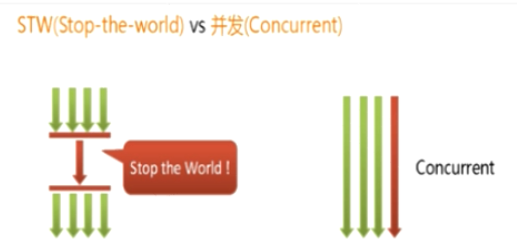 
    - 并发式垃圾回收:并发式垃圾回收器与应用程序线程交替工作，以尽可能减少应用程序的停顿时间。
    - 独占式垃圾回收:独占式垃圾回收器（Stop the world)一旦运行，就停止应用程序中的所有用户线程，直到垃圾回收过程完全结束。

  - 按碎片处理方式分
    - 压缩式垃圾回收器会在回收完成后，对存活对象进行压缩整理，消除回收后的碎片。
      > 使用指针碰撞分配对象空间
    - 非压缩式的垃圾回收器不进行这步操作。
      > 使用空闲列表分配对象空间
  - 按工作的区间分
    - 年轻代垃圾回收器
    - 老年代垃圾回收器

##### 2.3.3.4.2. 性能指标

- **吞吐量**：运行用户代码的时间占总运行时间的比例.a/(a+b)
  > 总运行时间：程序的运行时间(a)+内存回收的时间(b)
- 垃圾收集开销：吞吐量的补数，垃圾收集所用时间与总运行时间的比例。b/(a+b)
- **暂停时间**：执行垃圾收集时，程序的工作线程被暂停,让GC线程执行的时间。
- 收集频率：相对于应用程序的执行，收集操作发生的频率。
- **内存占用**：Java堆区所占的内存大小。
- 快速：一个对象从诞生到被回收所经历的时间。

---

上面加粗的三个共同构成一个“不可能三角”。三者总体的表现会随着技术进步而越来越好。一款优秀的收集器通常最多同时满足其中的两项。

这三项里，暂停时间的重要性日益凸显。因为随着硬件发展，**内存占用多些越来越能容忍**，
硬件性能的提升也有助于降低收集器运行时对应用程序的影响，
即提高了吞吐量。而内存的扩大，对延迟反而带来负面效果。

简单来说，主要抓住两点：

- 吞吐量
- 暂停时间

---

- 高吞吐量:这种情况下，应用程序能容忍较高的暂停时间，因此，高吞吐量的应用程序有更长的时间基准，快速响应是不必考虑的。
  >  
  - 会让应用程序的最终用户感觉只有应用程序线程在做“生产性”工作。直觉上，吞吐量越高程序运行越快。

- 低暂停时间:
  > 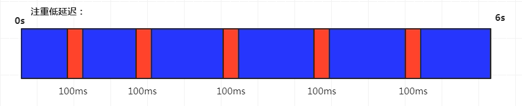 
  - 对于一个交互式应用程序，具有低的暂停时间是非常重要的

- 吞吐量vs暂停时间
  > 高吞吐量和低暂停时间是一对相互竞争的目标（矛盾）。
  - 如果选择以吞吐量优先，
    - 那么必然需要降低内存回收的执行频率，
    - 但是这样会导致GC需要更长的暂停时间来执行内存回收。
  - 如果选择以低延迟优先为原则，
    - 那么为了降低每次执行内存回收时的暂停时间，也只能频繁地执行内存回收，
    - 但这又引起了年轻代内存的缩减和导致程序吞吐量的下降
      > 垃圾回收线程与用户线程频繁切换带来的时间浪费
- 平衡:**在最大吞吐量优先的情况下，降低停顿时间。**
  ```
  在设计（或使用）GC算法时，我们必须确定我们的目标：一个GC算法只
  可能针对两个目标之一（即只专注于较大吞吐量或最小暂停时间）,或
  尝试找到一个二者的折衷。
  ```

##### 2.3.3.4.3. 垃圾回收器发展与组合

- 发展史
  - 1999年随JDK1.3.1一起来的是串行方式的Serial GC,它是第一款GC。ParNew垃圾收集器是Serial收集器的多线程版本
  - 2002年2月26日，Parallel GC和Concurrent Mark Sweep GC跟随JDK1.4.2一起发布Parallel GC在JDK6之后成为HotSpot默认GC。
  - 2012年，在JDK1.7u4版本中，G1可用。
  - 2017年，JDK9中G1变成默认的垃圾收集器，以替代CMS。
  - 2018年3月，JDK10中G1垃圾回收器的并行完整垃圾回收，实现并行性来改善最坏情况下的延迟。
  - -------------(经典)<-分水岭->(新垃圾回收器)--------------
  - 2018年9月，JDK11发布。引入Epsilon垃圾回收器，又被称为"No-Op(无操作）"回收器。同时，引入ZGC:可伸缩的低延迟垃圾回收器（Experimental)。
  - 2019年3月，JDK12发布。增强G1,自动返回未用堆内存给操作系统。同时，引入Shenandoah GC:低停顿时间的GC(Experimental)。
  - 2019年9月，JDK13发布。增强ZGC,自动返回未用堆内存给操作系统。
  - 2020年3月，JDK14发布。删除CMS垃圾回收器。扩展ZGC在macOS和Windows上的应用

---

- 7中经典垃圾回收器
  > [官方文档](https://www.oracle.com/technetwork/java/javase/tech/memorymanagement-whitepaper-1-150020.pdf)
  - 串行回收器：Serial、Serial old
  - 并行回收器：ParNew、Parallel Scavenge、Parallel old
  - 并发回收器：CMS、G1


---

- 组合关系(下图更新到了jdk14)
  >  
  > > 除G1外，垃圾回收器只能收集老年代和新生代中的一个
  > > <details>
  > > <summary style="color:red;">图片说明</summary>
  > > 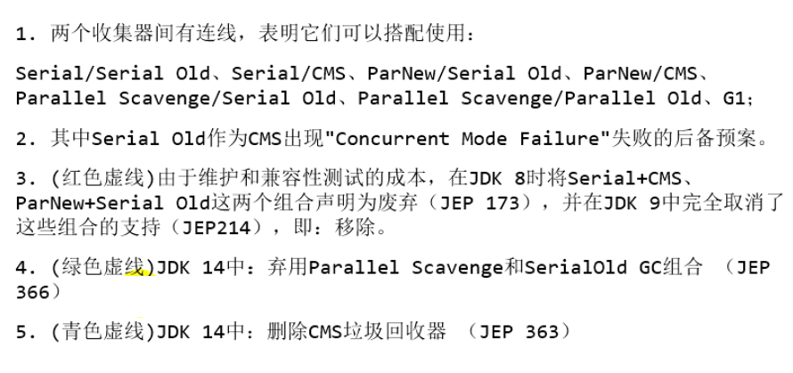
  > > </details>
  - jdk8之前（不包括8）
    - 把虚线看成实线
    - 比如新生代使用Serial GC，老年代可以使用CMS GC或者 Serial Old GC
    - 其中CMS GC与Serial Old GC的两个老年代垃圾回收器搭配是一个后备方案
      > CMS回收器是并发类型的，是在老年代满之前进行提前回收的。如果垃圾回收的速度比垃圾产生的速度还要快。
      > 会出现回收失败的情况。然后选择Serial Old GC做一个后备方案
  - jdk8中：
    - 废弃(deprecated)了红色虚线的组合
    - 但是还能用
    - 默认使用Parallel Scavenge GC与Parallel Old GC组合
  - jdk9中：
    - 完全移除了红色虚线的组合
    - 不能用了
  - jdk14中：
    - 弃用绿色的线的组合
    - 删除CMS垃圾回收器（青色边框）

---

- 其他
  - CMS GC和Parallel Scavenge GC使用的底层框架不同，无法兼容，所以无法搭配使用

##### 2.3.3.4.4. 查看与设置垃圾回收器

- `-XX:+PrintCommandLineFlags`:查看命令行相关参数（包含使用的垃圾收集器）
  <details>
  <summary style="color:red;">示例代码（下面的章节都可以使用该例子来设置回收器）</summary>

  ```java
  /**
  *  -XX:+PrintCommandLineFlags 输出或设置：
  *
  *  -XX:+UseSerialGC:表明新生代使用Serial GC ，同时老年代使用Serial Old GC
  *  -XX:+UseParNewGC：标明新生代使用ParNew GC
  *  -XX:+UseParallelGC:表明新生代使用Parallel GC
  *  -XX:+UseParallelOldGC : 表明老年代使用 Parallel Old GC
  *  说明：二者可以相互激活
  *
  *  -XX:+UseConcMarkSweepGC：表明老年代使用CMS GC。同时，年轻代会触发对ParNew 的使用
  * @author shkstart  shkstart@126.com
  * @create 2020  0:10
  */
  public class GCUseTest {
      public static void main(String[] args) {
          ArrayList<byte[]> list = new ArrayList<>();

          while(true){
              byte[] arr = new byte[100];
              list.add(arr);
              try {
                  Thread.sleep(10);
              } catch (InterruptedException e) {
                  e.printStackTrace();
              }
          }
      }
  }
  ```

  </details>
- 使用命令行指令：`jinfo -flag 相关垃圾回收器参数 进程ID`
  - jdk8:
    >  
    > > 加号为使用，减号为不使用
  - jdk9
    >  
    > > 加号为使用，减号为不使用


<br /><br />


##### 2.3.3.4.5. 为什么要有多个回收器

因为Java的使用场景很多，移动端，服务器等。
所以就需要针对不同的场景，提供不同的垃圾收集器，提高垃圾收集的性能。

虽然我们会对各个收集器进行比较，但并非为了挑选一个最好的收集器
出来。没有一种放之四海皆准、任何场景下都适用的完美收集器存在，
更加没有万能的收集器。所以我们**选择的只是对具体应用最合适的收集器**。


##### 2.3.3.4.6. Serial 回收器：串行回收

- Serial
  - 使用：
    - Seria1收集器是最基本、历史最悠久的垃圾收集器了。JDK1.3之前回收新生代唯一的选择。
    - Serial收集器作为HotSpot中**client模式下的默认新生代垃圾收集器**。
  - 算法机制：
    - 复制算法
    - 串行回收
    - "stop-the-World"机制
- Serial Old
  - 使用：
    - Serial old是运行在client模式下默认的老年代的垃圾回收器
    - Serial old在Server模式下主要有两个用途：①与新生代的Parallel Scavenge配合使用,②作为老年代CMS收集器的后备垃圾收集方案
  - 算法机制
    - 标记-压缩算法。
    - 串行回收
    - "stop the world"机制

- Serial/Serial Old组合工作原理
  >  
  ```
  这个收集器是一个单线程的收集器，但它的“单线程”的意义并不仅仅说明它只会
  使用一个CPU或一条收集线程去完成垃圾收集工作，更重要的是在它进行垃圾收
  集时，必须暂停其他所有的工作线程，直到它收集结束（Stop The World)。
  ```

---

- 优势
  - 简单而高效（与其他收集器的单线程比）
  - 对于限定单个CPU的环境来说，Serial收集器由于没有线程交互的开销，专心做垃圾收集自然可以获得最高的单线程收集效率。
  - 运行在client模式下的虚拟机是个不错的选择。
  ```
  比如
  在用户的桌面应用场景中，可用内存一般不大（几十MB至一两百MB),
  可以在较短时间内完成垃圾收集（几十ms至一百多ms),只要不频繁发生，
  使用串行回收器是可以接受的。
  ```

- 开启:
  - 在HotSpot虚拟机中，使用`-XX:+UseSeria1GC`参数可以指定年轻代和老年代都使用串行收集器。
  - 等价于新生代用Serial GC,且老年代用Serial 01d GC

##### 2.3.3.4.7. ParNew 回收器：并行回收

- 使用
  - ParNew 是很多JVM运行在Server模式下新生代的默认垃圾收集器。
- 说明：
  - Par是Parallel的缩写，New:只能处理的是新生代
  - ParNew收集器则是Seria1收集器的多线程版本。
- 算法机制
  > ParNew 收集器除了采用并行回收的方式执行内存回收外，和Serial之间几乎没有任何区别
  - 复制算法
  - 并行回收
  - "Stop-the-World"机制。

- ParNew/SerialOld组合工作原理
  > 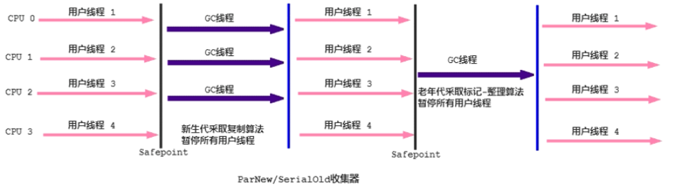 
  - 对于新生代，回收次数频繁，使用并行方式高效。
  - 对于老年代，回收次数少，使用串行方式节省资源。（CPU并行需要切换线程，串行可以省去切换线程的资源）


---

- 效率问题：由于ParNew收集器是基于并行回收，那么是否可以断定ParNew收集器的回收效率在任何场景下都会比Seria1收集器更高效？
  - ParNew收集器运行在多CPU的环境下，由于可以充分利用多CPU、多核心等物理硬件资源优势，可以更快速地完成垃圾收集，提升程序的吞吐量。
  - 但是**在单个CPU的环境下，ParNew收集器不比Serial收集器更高效**。虽然Seria1收集器是基于串行回收，但是由于CPU不需要频繁地做任务切换，因此可以有效避免多线程交互过程中产生的一些额外开销。

---

- 开启
  - 在程序中，开发人员可以通过选项`-XX:+UseParNewGC`手动指定使用ParNew收集器执行内存回收任务。它表示年轻代使用并行收集器，不影响老年代。
  - `-XX:ParallelGCThreads`限制线程数量，**默认开启和CPU数据相同的线程数**。

##### 2.3.3.4.8. Parallel 回收器：吞吐量优先

```
在程序吞吐量优先的应用场景中，Parallel Scavenge收集器和Parallel old
收集器的组合，在Server模式下的内存回收性能很不错。

在Java8中，默认是此垃圾收集器。
在Java9中，默认垃圾回收器是G1
```

- Parallel Scavenge
  > 回收新生代
  - 使用
    - 高吞吐量可以高效率地利用CPU时间，尽快完成程序的运算任务
    - 主要适合在后台运算而不需要太多交互的任务。
    - 因此，常见在服务器环境中使用。
    > 例如，那些执行批量处理、订单处理、工资支付、科学计算的应用程序。
  - 算法机制
    - 复制算法
    - 并行回收
    - "Stop-the-World"机制。
  - 与parNew区别
    - 和ParNew收集器不同，Parallel Scavenge收集器的目标则是达到一个**可控制的吞吐量（Throughput)**,它也被称为吞吐量优先的垃圾收集器。
    - 自适应调节策略也是Parallel Scavenge与ParNew一个重要区别。
      > 自适应调节策略：在JVM运行过程中，根据当前运行的情况，**动态调整内存的分配情况**，达到吞吐量或者延迟的最优策略
    - 两者使用的底层框架也完全不同

- Parallel Old
  - 使用
    - Parallel收集器在JDK1.6时提供了用于执行老年代垃圾收集的Parallel old收集器，用来代替老年代的Serial Old收集器。
      > 原因：Parallel Scavenge的使用场景大多是服务端等等配置较高的环境。
      > 因此如果依旧使用 Serial old 进行老年代的回收，无法发挥服务器的性能，达不到最大吞吐量的效果
  - 算法机制
    - 标记压缩算法
    - 并行回收
    - "Stop-the-World"机制。

- Parallel Scavenge/Parallel Old组合工作原理
  >  

---

参数配置

- `-XX:+UseParalle1GC` 手动指定年轻代使用Parallel并行收集器执行内存回收任务。
  - 适用于新生代。默认jdk8是开启的。
  - 开启一个，另一个(-XX:+UseParalleloldGC)也会被开启。（**互相激活**）
- `-XX:+UseParalleloldGC` 手动指定老年代都是使用并行回收收集器。
  - 适用于老年代。默认jdk8是开启的。
  - 开启一个，另一个(-XX:+UseParalle1GC)也会被开启。（**互相激活**）
- `-XX:ParallelGCThreads` 设置年轻代并行收集器的线程数。一般地，最好与CPU数量相等，以避免过多的线程数影响垃圾收集性能。
  - 在默认情况下，当CPU数量小于8个，Paralle1GCThreads的值等于CPU数量。
  - 当CPU数量大于8个，Paralle1GCThreads的值等于3+[5*CPU_Count]/8]。
- `-XX:MaxGCPauseMillis` 设置垃圾收集器最大停顿时间（即STW的时间）。单位是毫秒。
  - 为了尽可能地把停顿时间控制在MaxGCPauseMills以内，收集器在工作时会调整Java堆大小或者其他一些参数。
  - 对于用户来讲，停顿时间越短体验越好。但是在服务器端，我们注重高并发，整体的吞吐量。所以服务器端适合Parallel,进行控制。
  - **该参数使用需谨慎**。
    > 因为Parallel偏向吞吐量，吞吐量和暂停时间只能偏向其一
- `-XX:GCTimeRatio` 垃圾收集时间占总时间的比例（=1/(N+1))。用于衡量吞吐量的大小。
  - 取值范围（0,100)。默认值99,也就是垃圾回收时间不超过1%。
  - 与前一个-XX:MaxGCPauseMillis参数有一定矛盾性。暂停时间越长，Radio参数就容易超过设定的比例。
- `-XX:+UseAdaptiveSizePolicy` 设置Parallel Scavenge收集器具有**自适应调节策略**，**默认开启**
  > 复习：（自适应调节策略对新生代中eden，s1，s2内存分配的影响）
  - 在这种模式下，年轻代的大小、Eden和Survivor的比例、晋升老年代的对象年龄等参数会被自动调整，已达到在堆大小、吞吐量和停顿时间之间的平衡点。
  - 在手动调优比较困难的场合，可以直接使用这种自适应的方式，仅指定虚拟机的最大堆、目标的吞吐量（GCTimeRatio)和停顿时间(MaxGCPauseMills),让虚拟机自己完成调优工作。

##### 2.3.3.4.9. CMS回收器：低暂停时间

- 推出
  - 在JDK1.5时期，Hotspot推出了一款在强交互应用中几乎可认为有划 时代意义的垃圾收集器：CMS(Concurrent-Mark-Sweep)收集器，
  - 这款收集器是HotSpot虚拟机中第一款真正意义上的并发收集器，它第一次实现了让垃圾收集线程与用户线程同时工作。
- 使用
  - CMS收集器的关注点是**尽可能缩短垃圾收集时用户线程的停顿时间**。停顿时间越短（低延迟）就越适合与用户交互的程序，良好的响应速度能提升用户体验。
    > stop the world 不可能消除，任何一个垃圾回收期都有stop the world
  - 目前很大一部分的Java应用集中在互联网站或者B/s系统的服务端上，这类应用尤其重视服务的响应速度，希望系统停顿时间最短，以给用户带来较好的体验。CMS收集器就非常符合这类应用的需求。
- 组合问题
  ```
  不幸的是，CMS作为老年代的收集器，却无法与JDK1.4.0中已经存在的
  新生代收集器Parallel Scavenge配合工作，所以在JDK 1.5中使用CMS来
  收集老年代的时候，新生代只能选择ParNew或者Serial收集器中的一个。
  在G1出现之前，CMS使用还是非常广泛的。一直到今天，仍然有很多系统使
  用CMS GC。
  ```
- 算法机制
  - 标记-清除算法
  - 并发回收
  - "stop-the-world"
- 工作原理
  > 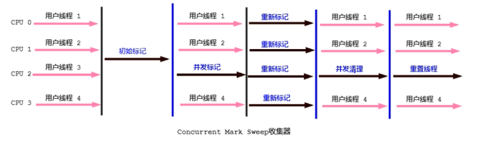 
  > > CMS整个过程比之前的收集器要复杂，整个过程分为4个主要阶段，即初始标记阶段、并发标记阶段、重新标记阶段和并发清除阶段。
  - 初始标记（Initial-Mark)阶段：
    - 是否暂停：
      - 在这个阶段中，程序中所有的工作线程都将会因为"Stop-the-World"机制而出现短暂的暂停，
      - 一旦标记完成之后就会恢复之前被暂停的所有应用线程。由于直接关联对象比较小，所以这里的**速度非常快**。
    - 任务：这个阶段的**主要任务仅仅只是标记出GC Roots能直接关联到的对象**。
  - 并发标记（Concurrent-Mark)阶段：
    - 是否暂停：这个过程耗时较长但是不需要停顿用户线程，可以与垃圾收集线程一起并发运行。
    - 任务：**从GC Roots的直接关联对象开始遍历整个对象图的过程**
  - 重新标记（Remark)阶段：
    - 是否暂停
      - 这个阶段的停顿时间通常会比初始标记阶段稍长一些，但也远比并发标记阶段的时间短。
    - 任务：
      - 由于在并发标记阶段中，程序的工作线程会和垃圾收集线程同时运行或者交叉运行，
      - 因此是**为了修正并发标记期间，因用户程序继续运作而导致标记产生变动的那一部分对象的标记记录**
  - 并发清除（Concurrent-Sweep)阶段：
    - 是否暂停：由于不需要移动存活对象，所以这个阶段也是可以与用户线程同时并发的
    - 任务：此阶段清理删除掉标记阶段判断的已经死亡的对象，释放内存空间。

---

其他注意点

- stop-the-world不可能没有
  ```
  尽管CMS收集器采用的是并发回收（非独占式）,但是在其初始化标记和再次标记这两
  个阶段中仍然需要执行“Stop-the-World”机制暂停程序中的工作线程，不过暂停时
  间并不会太长，因此可以说明目前所有的垃圾收集器都做不到完全不需要“Stop-the-
  World”，只是尽可能地缩短暂停时间。
  ```

- 为什么CMS时低延迟的
  - 由于最耗费时间的并发标记与并发清除阶段都不需要暂停工作，所以整体的回收是低停顿的。

- 垃圾回收时机与预备方案
  - 另外，由于在垃圾收集阶段用户线程没有中断，所以在CMS回收过程中，还应该确保应用程序用户线程有足够的内存可用。因此，CMS收集器不能像其他收集器那样等到老年代几乎完全被填满了再进行收集，**而是当堆内存使用率达到某一间值时，便开始进行回收**，以确保应用程序在CMS工作过程中依然有足够的空间支持应用程序运行。
  - 要是CMS运行期间预留的内存无法满足程序需要，就会出现一次“Concurrent Mode Failure"失败，这时虚拟机将启动后备预案：临时启用 Serial 01d收集器来重新进行老年代的垃圾收集，这样停顿时间就很长了。

- 内存碎片问题
  ```
  CMS收集器的垃圾收集算法采用的是标记-清除算法，这意味着每次执行完内
  存回收后，由于被执行内存回收的无用对象所占用的内存空间极有可能是不连
  续的一些内存块，不可避免地将会产生一些内存碎片。那么CMS在为新对象分
  配内存空间时，将无法使用指针碰撞（Bump the Pointer)技术，而只能
  够选择空闲列表（Free List)执行内存分配。
  ```
- 为什么不使用标记压缩算法
  ```
  要保证用户线程能继续执行，前提的它运行的资源不受影响，
  如果用compact整理内存的话，当并发清除的时候，
  原来的用户线程使用的内存会无法使用。
  Mark Compact更适合“Stop the World”这种场景下使用
  ```

---

- 优点
  - 并发收集
  - 低延迟
- 弊端/废弃原因
  - 1)会产生内存碎片，导致并发清除后，用户线程可用的空间不足。在无法分配大对象的情况下，不得不提前触发Fu11 GC。
    > 该弊端时致命的，如果遇到业务高峰，触发了full GC，然后使用后备的Serial Old。但由于Serial Old是性能最差的，会导致长时间的STW进行垃圾收集，很难接受
  - 2)CMS收集器对CPU资源非常敏感。在并发阶段，它虽然不会导致用户停顿，但是会因为占用了一部分线程而导致应用程序变慢，总吞吐量会降低。
  - 3)CMs收集器无法处理浮动垃圾。可能出现“Concurrent Mode Failure"失败而导致另一次Fu11GC的产生。在并发标记阶段由于程序的工作线程和垃圾收集线程是同时运行或者交叉运行的，那么**在并发标记阶段如果产生新的垃圾对象，CMS将无法对这些垃圾对象进行标记，最终会导致这些新产生的垃圾对象没有被及时回收，(也就是浮动垃圾)**，从而只能在下一次执行GC时释放这些之前未被回收的内存空间。

---

参数设置

- `-XX:+UseConcMarkSweepGC`手动指定使用CMS收集器执行内存回收任务。
  - 开启该参数后会自动将-XX:+UseParNewGC打开。即：ParNew(Young区用）+CMS(01d区用）+Serial old的组合。
- `-XX:CMS1nitiatingoccupanyFraction` 设置堆内存使用率的國值，一旦达到该阙值，便开始进行回收。
  - JDK5及以前版本的默认值为68,即当老年代的空间使用率达到68%时，会执行一次CMS回收。**JDK6及以上版本默认值为92%**
  - 如果内存增长缓慢，则可以设置一个稍大的值，大的阙值可以有效降低CMs的触发频率，减少老年代回收的次数可以较为明显地改善应用程序性能。反之，如果应用程序内存使用率增长很快，则应该降低这个阀值，以避免频繁触发老年代串行收集器。因此**通过该选项便可以有效降低Fu11 GC的执行次数**。
- `-XX:+UseCMSCompactAtFul1Collection`用于指定在执行完FullGC后对内存空间进行压缩整理，以此避免内存碎片的产生。
  - 不过由于内存压缩整理过程无法并发执行，所带来的问题就是停顿时间变得更长了。
- `-XX:CMSFu11GCsBeforeCompaction` 设置在执行多少次Fu11 GC后对内存空间进行压缩整理。
- `-XX:ParallelCMSThreads` 设置CMS的线程数量。
  - CMS默认启动的线程数是（Paralle1GCThreads+3)/4,
  - ParallelGCThreads是年轻代并行收集器的线程数。当CPU资源比较紧张时，受到cMs收集器线程的影响，应用程序的性能在垃圾回收阶段可能会非常糟糕。

##### 2.3.3.4.10. 中间小结

HotSpot有这么多的垃圾回收器，那么如果有人问，Serial GC、Parallel GC、 Concurrent Mark Sweep GC这三个GC有什么不同呢？
 
- 如果你想要最小化地使用内存和并行开销，请选Serial GC(+ Serial Old GC);
- 如果你想要最大化应用程序的吞吐量，请选Parallel GC(+ Parallel Old GC);
- 如果你想要最小化GC的中断或停顿时间，请选CMS GC(+ ParNew GC)。

---

jdk后续版本中CMS的变化

- JDK9新特性：CMS被标记为Deprecate了（JEP291)
  - 如果对JDK9及以上版本的HotSpot虚拟机使用参数-XX:+UseConcMarkSweepGC来开启CMS收集器的话
  - 用户会收到一个警告信息，提示CMS未来将会被废弃。
- JDK14新特性：删除CMS垃圾回收器（JEP363)
  - 移除了CMS垃圾收集器，如果在JDK14中使用-XX:+UseConcMarkSweepGC的话，JVM不会报错，
  - 只是给出一个warning信息，但是不会exit。JVM会自动回退以默认GC方式启动JVM
    >  

##### 2.3.3.4.11. G1回收器：区域化分布式

> jdk8以后默认使用的垃圾回收器

- 为何需要推出新的垃圾回收器G1/出现背景
  - 原因就在于应用程序所应对的**业务越来越庞大、复杂，用户越来越多**，没有GC就不能保证应用程序正常进行，而经常造成STW的GC又跟不上实际的需求，所以才会不断地尝试对GC进行优化。G1(Garbage-First)垃圾回收器是在Java7 update 4之后引入的一个新的垃圾回收器，是当今收集器技术发展的最前沿成果之一。
  - 与此同时，为了**适应现在不断扩大的内存和不断增加的处理器数量**，进一步降低暂停时间（pause time),同时兼顾良好的吞吐量。
  - G1的目标：**官方给G1设定的目标是在延迟可控的情况下获得尽可能高的吞吐量，所以才担当起 全功能收集器 的重任与期望。**
    > 重要

- 为什么叫Garbage First(G1)/回收原理/如何控制暂停时间
  - 因为G1是一个并行回收器，它把堆内存分割为很多不相关的区域（Region)(物理上不连续的）。使用不同的Region来表示Eden、幸存者0区，幸存者1区，老年代等。
  - G1 GC有计划地避免在整个Java堆中进行全区域的垃圾收集。**G1跟踪各个Regior里面的垃圾堆积的价值大小**（**回收所获得的空间大小以及回收所需时间的经验值**）,在后台维护一个优先列表，**每次根据允许的收集时间，优先回收价值最大的Region**。
  - **由于这种方式的侧重点在于回收垃圾最大量的区间（Region),所以我们给G1一个名字：垃圾优先（Garbage First)**。


- 使用
  - G1(Garbage-First)是一款**面向服务端应用的垃圾收集器**，**主要针对配备多核CPU及大容量内存的机器，以极高概率满足GC停顿时间的同时，还兼具高吞吐量的性能特征。**
  - 在JDK1.7版本正式启用，移除了Experimental的标识，是JDK9以后的默认垃圾回收器，取代了CMS回收器以及Parallel+Parallel O1d组合。被Oracle官方称为“全功能的垃圾收集器”。
  - 与此同时，CMS已经在JDK9中被标记为废弃（deprecated)。在jdk8中还不是默认的垃圾回收器，需要使用-XX:+UseG1GC来启用。

- 算法机制
  - 并行与并发
    > 某些环节并行，某些环节并发
    - 并行性：G1在回收期间，可以有多个GC线程同时工作，有效利用多核计算能力。此时用户线程STW
    - 并发性：G1拥有与应用程序交替执行的能力，部分工作可以和应用程序同时执行，因此，一般来说，不会在整个回收阶段发生完全阻塞应用程序的情况
  - 分区算法，分代收集
    > 与其他垃圾回收器不同，G1既能回收老年代，也能回收新生代
    > 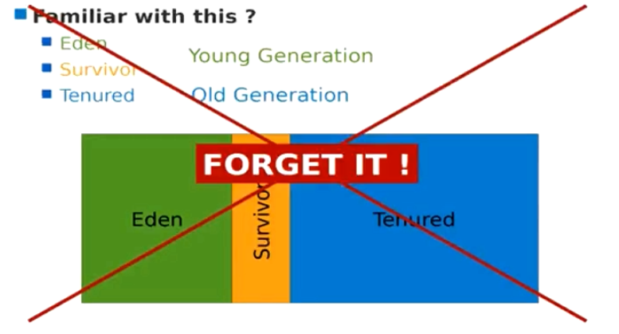 
    >  
    - 从分代上看，**G1依然属于分代型垃圾回收器**，它会区分年轻代和老年代，年轻代依然有Eden区和survivor区。但从堆的结构上看，它**不要求整个Eden区、年轻代或者老年代都是连续的，也不再坚持固定大小和固定数量**。
    - 将**堆空间分为若干个区域（Region),这些区域中包含了逻辑上的年轻代和老年代。**
      > region清空后，种类是可以换的
    - 和之前的各类回收器不同，它同时**兼顾年轻代和老年代**。对比其他回收器，或者工作在年轻代，或者工作在老年代；
  - 空间整合
    > CMS:“标记-清除”算法、内存碎片、若干次GC后进行一次碎片整理
    - G1将内存划分为一个个的region。内存的回收是以region作为基本单位的。
    - **Region之间是复制算法**，但整体上实际可看作是**标记-压缩（Mark-Compact)算法**，两种算法都可以避免内存碎片。
    - 这种特性有利于程序长时间运行，分配大对象时不会因为无法找到连续内存空间而提前触发下一次GC。尤其是当Java堆非常大的时候，G1的优势更加明显。
  - 可预测停顿时间模型（即软实时，soft real-time）
    ```
    这是G1相对于CMS的另一大优势，G1除了追求低停顿外，还能建立可预测的停顿
    时间模型，能让使用者明确指定在一个长度为M毫秒的时间片段内，消耗在垃圾收集
    上的时间不得超过N毫秒。
    ```
    - 由于分区的原因，G1可以只选取部分区域进行内存回收，这样缩小了回收的范围，因此对于全局停顿情况的发生也能得到较好的控制。
    - G1跟踪各个Region里面的垃圾堆积的价值大小（回收所获得的空间大小以及回收所需时间的经验值）,在后台维护一个优先列表，**每次根据允许的收集时间，优先回收价值最大的Region**。**保证了G1收集器在有限的时间内可以获取尽可能高的收集效率**。
    - 相比于CMS GC,G1未必能做到cMs在最好情况下的延时停顿，但是最差情况要好很多。


---

- 缺点
  - 相较于CMS,G1还不具备全方位、压倒性优势。比如在用户程序运行过程中，G1无论是为了垃圾收集产生的**内存占用（Footprint)**还是程序运行时的**额外执行负载（overload)**都要比CMS要高。
    - 内存占用：后面会讲，Remember Set
    - 嗯外执行负载：比传统垃圾回收器分代数量要多，有几千个region，会有10%-20%的额外内存占用
  - 从经验上来说，在小内存应用上CMS的表现大概率会优于G1,而G1在大内存应用上则发挥其优势。平衡点在6-8GB之间。

---

参数调优

- 主要参数设置

  - `-XX:+UseG1GC`手动指定使用G1收集器执行内存回收任务。
    > jdk9及以后默认使用G1，不需要设置
  - `-XX:G1HeapRegionSize` 设置每个Region的大小。**值是2的幂**，范围是1MB到32MB之间，目标是根据最小的Java堆大小划分出约2048个区域。默认是堆内存的1/2000。
  - `-XX:MaxGCPauseMillis` 设置期望达到的最大GC停顿时间指标（JVM会尽力实现，但不保证达到）。默认值是200ms
    > 目标中提到的延迟可控
  - `-XX:ParallelGCThread`设置STW时GC线程数的值。最多设置为8
  - `-XX:ConcGCThreads` 设置并发标记的线程数。将n设置为并行垃圾回收线程数（ParallelGCThreads)的1/4左右。
  - `-XX:InitiatingHeapOccupancyPercent` 设置触发并发Gc周期的Java唯占用率阙值。超过此值，就触发GC。默认值是45。

- G1调优
  > G1的设计原则就是简化JVM性能调优，开发人员只需要简单的三步即可完成调优：
  - 第一步：开启G1垃圾收集器
  - 第二步：设置堆的最大内存
  - 第三步：设置最大的停顿时间


- 优化建议
  - 年轻代大小
    - 避免使用-Xmn或-XX:NewRatio等相关选项显式设置年轻代大小
    - 因为固定年轻代的大小会覆盖暂停时间目标，导致JVM无法自动调整
  - 暂停时间目标不要太过严苛
    - G1 GC的吞吐量目标是90%的应用程序时间和10%的垃圾回收时间
    - 评估G1 GC的吞吐量时，暂停时间目标不要太严苛。目标太过严苛表示你愿意承受更多的垃圾回收开销，而这些会直接影响到吞吐量。

---

主要使用场景

- 面向服务端应用，针对具有大内存、多处理器的机器。（在普通大小的堆里表现并不惊喜）
- 最主要的应用是需要低GC延迟，并具有大堆的应用程序提供解决方案；
  > 如：在堆大小约6GB或更大时，可预测的暂停时间可以低于0.5秒；(G1通过每次只清理一部分而不是全部的Region的增量式清理来保证每次GC停顿时间不会过长）。
- 用来替换掉JDK1.5中的CMS收集器；
  >  在下面的情况时，使用G1可能比CMS好：
  - ①超过50%的Java堆被活动数据占用；
  - ②对象分配频率或年代提升频率变化很大；
  - ③GC停顿时间过长（长于0.5至1秒）。

- 特殊点
  ```
  HotSpot 垃圾收集器里，除了G1以外，其他的垃圾收集器使用内置的JVM线程执行
  GC的多线程操作，而G1 GC可以采用应用线程承担后台运行的GC工作，即当JVM的GC
  线程处理速度慢时，系统会调用应用程序线程帮助加速垃圾回收过程。
  ```
  ```
  G1只会回收老年代的最有回收价值的一部分，不会回收所有老年代
  ```

---

**G1的分区Region解析**

- 概述
  ```
  虽然还保留有新生代和老年代的概念，但新生代和老年代不再是物理隔离的了，
  它们都是一部分Region(不需要连续）的集合。通过Region的动态分配方式实现逻辑上的连续。
  ```
  - 使用G1收集器时，它将整个Java堆划分成约2048个大小相同的独立Region块
  - 每个Region块大小根据堆空间的实际大小而定，整体被控制在1MB到32MB之间，且为2的N次幕，即1MB,2MB,4MB,8MB,16MB,32MB。
  - 可以通过-XX:G1HeapRegionSize设定。所有的Region大小相同，且在JVM生命周期内不会被改变。

- 图解
  >  
  - region组成
    - 一个region有可能属于Eden,Survivor或者old/Tenured内存区域。
    - 但是一个region只可能属于一个角色。
    - 图中的E表示该region属于Eden内存区域，S表示属于Survivor内存区域，O表示属于o1d内存区域。图中空白的表示未使用的内存空间。H是巨型对象
    - 四种region：eden,survivor,old,Humongous
  - region的角色变换
    - region的角色是可以转换的
    - GC后会有清空的region。
    - 所有空region都会记录在空闲列表中
    - 会从空闲列表中选择空闲region根据需要分配角色
    - 但在使用过程中是不能变换角色的
  - Humongous region
    - 说明:G1垃圾收集器还增加了一种新的内存区域，叫做Humongous内存区域，即图中的H块。主要用于存储大对象，如果超过1.5个region,就放到H。
    - 出现原因
      ```
      对于堆中的大对象，默认直接会被分配到老年代，但是如果它是一个短期存在的大对象，
      就会对垃圾收集器造成负面影响。为了解决这个问题，G1划分了一个Humongous区，
      它用来专门存放大对象。如果一个H区装不下一个大对象，那么G1会寻找连续的H区来
      存储。为了能找到连续的H区，有时候不得不启动Fu11 GC。G1的大多数行为都把H区
      作为老年代的一部分来看待。
      ```

---

- G1分配对象的方式：指针碰撞
- region多线程访问解决：在region中分配TLAB

---

G1垃圾回收过程储备知识：**Remember Set**


- 问题引入：所有对象不可能都是孤立的，不同region中的对象可能相互引用

  > <details>
  > <summary style="color:red;">直接复制过来的解释</summary>
  > 一个Region不可能是孤立的，一个Region中的对象可能被其他任意Region中对象引用，<br />
  > 判断对象存活时，是否需要扫描整个Java堆才能保证准确？<br />
  > 在其他的分代收集器，也存在这样的问题（而G1更突出）<br />
  > 回收新生代也不得不同时扫描老年代？<br />
  > 这样的话会降低Minor GC的效率；
  > </details>
  >
  > **复习(重点):区域回收的时候，GCRoots概念会被放大**
  - 在YGC时，如果只需要遍历Eden和Survivor判断是否可达的话还可以，因为是回收需要
  - 但是同时也需要遍历old区，判断old区是否引用young区的数据，因为遍历需要STW，效率就非常差
  - 为了解决此问题，就设置了Remember Set

- 避免全局扫描的解决方法-Remember Set
  >  
  - 无论G1还是其他分代收集器，JVM都是使用Remembered Set来避免全局扫描
  - **每个Region都有一个对应的Remembered Set**
  - 每次Reference类型数据写操作时，都会产生一个Write Barrier(写屏障)暂时中断操作
  - 然后检查将要写入的引用指向的对象是否和该Reference类型数据在不同的Region(其他收集器：检查老年代对象是否引用了新生代对象）
  - 如果不同，通过CardTable(卡表)把相关引用信息记录到引用指向对象的所在Region对应的Remembered Set中
  - 当进行垃圾收集时，在GC根节点的枚举范围加入Remembered Set;就可以保证不进行全局扫描，也不会有遗漏

---

**G1垃圾回收环节**

> 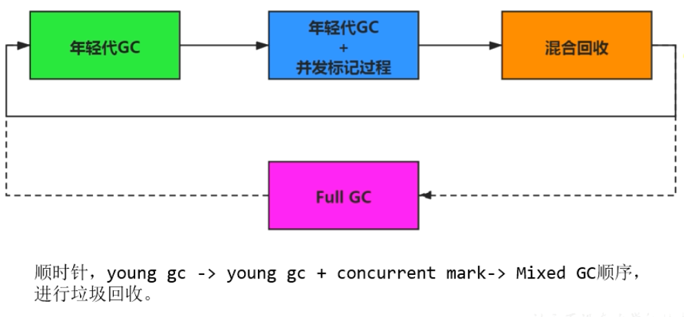
> > **注意，每个环节都有收集新生代，这和新生代对象朝生即死的，需要频繁回收相吻合**

- 年轻代GC(YoungGC)
  - 触发时机：JVM启动时，G1先准备好Eden区，程序在运行过程中不断创建对象到Eden区，**当Eden空间耗尽时，G1会启动一次年轻代垃圾回收过程。**
    > 复习：Survivor区被动回收，Survivor区满了的话是不会触发GC的，之后在Young GC时顺带回收
  - 回收区域：**年轻代垃圾回收只会回收Eden区和Survivor区。**
  - 收集类型：G1的年轻代收集阶段是一个**并行的独占式收集器**。
  - 算法：复制算法
  - 收集大致过程
    -  YGC时，首先G1停止应用程序的执行（Stop-The-World)，G1创建回收集（Collection Set)，启动多线程执行年轻代回收。
      > 回收集是指需要被回收的内存分段的集合，年轻代回收过程的回收集包含年轻代Eden区和Survivor区所有的内存分段。
    - 然后**从年轻代区间移动存活对象到Survivor区间或者老年区间，也有可能是两个区间都会涉及。**
  - 收集详细过程
    - 第一阶段，扫描根。
      ```
      根是指static变量指向的对象，正在执行的方法调用链条上的局部变量等。根引用连同RSet
      记录的外部引用作为扫描存活对象的入口。
      ```
    - 第二阶段，更新RSet。
      ```
      处理dirty card queue(见备注）中的card,更新RSet。此阶段完成后，RSet可以准确的反
      映老年代对所在的内存分段中对象的引用。
      ```
      <details>
      <summary style="color:red;">dirty card queue说明</summary>

      ```
      对于应用程序的引用赋值语句object.field=object,JVM会在之前和之后执行特殊的操作以在dirty card queue中入队一个保存了对象引用信息的card。
      在年轻代回收的时候，G1会对Dirty Card Queue中所有的card进行处理，以更新RSet,保证RSet实时准确的反映引用关系。

      那为什么不在引用赋值语句处直接更新RSet呢？
      这是为了性能的需要，RSet的处理需要线程同步，开销会很大，使用队列，一次性将所有更新执行完，性能会好很多。
      ```
      </details>

    - 第三阶段，处理RSet。
      ```
      识别被老年代对象指向的Eden中的对象，这些被指向的Eden中的对象被认为是存活的对象。
      ```

    - 第四阶段，复制对象。
      ```
      此阶段，对象树被遍历，Eden区内存段中存活的对象会被复制到Survivor区中空的内存分段，
      Survivor区内存段中存活的对象如果年龄未达阙值，年龄会加1,达到阀值会被会被复制到
      01d区中空的内存分段。如果Survivor空间不够，Eden空间的部分数据会直接晋升到老年代
      空间。
      ```
    - 第五阶段，处理引用。
      ```
      处理Soft,Weak,Phantom,Final,JNI Weak等引用。最终Eden空间的数据为空，会把空region放到一个LinkedList中
      GC停止工作，而目标内存中的对象都是连续存储的，没有碎片，所以复制过程可以达到内存整理的效果，减少碎片。
      ```
  - 收集结果图示：
    > <details>
    > <summary style="color:red;">收集结果图示</summary>
    > 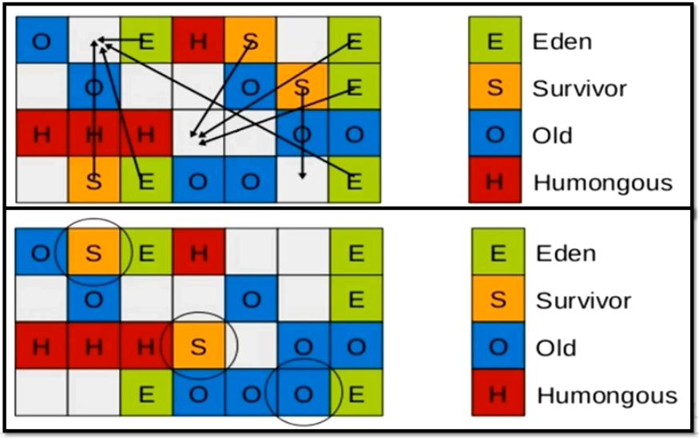
    > </details>

- 老年代并发标记过程（Concurrent Marking)
  - 触发时机：当堆内存使用达到一定值（默认45%)时，开始老年代并发标记过程。
  - 详细过程
    - 1.**初始标记阶段**：标记从根节点直接可达的对象，因此时间非常短。这个阶段是STW的，并且会触发一次年轻代GC。
      > 和CMS中的初始标记基本一致
    - 2.**根区域扫描**（Root Region Scanning):G1 GC扫描Survivor区直接可达的老年代区域对象，并标记被引用的对象。这一过程必须在young GC之前完成。
      > 因为Young GC时会动Survivor区进行复制算法
    - 3.**并发标记**（Concurrent Marking):在整个堆中进行并发标记（和应用程序并发执行）,此过程可能被young GC中断。在并发标记阶段，**若发现区域对象中的所有对象都是垃圾，那这个区域会被立即回收**。同时，并发标记过程中，会计算每个区域的对象活性（区域中存活对象的比例）。
    - 4.**再次标记**（Remark):由于应用程序持续进行，需要修正上一次的标记结果。是STW的。G1中采用了比CMS更快的初始快照算法：snapshot-at-the-beginning(SATB)。
    - 5.**独占清理**（cleanup,STW):计算各个区域的存活对象和GC回收比例，并进行排序，识别可以混合回收的区域。为下阶段做铺垫。是STW的。
      > 这个阶段并不会实际上去做垃圾的收集
    - 6.**并发清理阶段**：识别并清理**完全空闲**的区域。
  - 结果
    - 并发标记结束以后，老年代中百分百为垃圾的内存分段被回收了，
    - 部分为垃圾的内存分段被计算了出来。
      - 每一个region都会计算分段，每一个分段都会标识好是否为垃圾
      - 默认情况下，这些老年代的内存分段会分8次（可以通过-XX:G1MixedGCCountTarget设置）被回收。

- 混合回收（Mixed GC)
  - 触发时机：标记完成马上开始混合回收过程，即Mixed GC
  - 回收区域：
    - 这并不是一个o1dGC，除了回收整个Young Region,还会回收一部分的o1d Region。
    - 这里需要注意：是一部分老年代，而不是全部老年代。。**G1的老年代回收器不需要整个老年代被回收，一次只需要扫描/回收一小部分老年代的Region就可以了。**会根据垃圾回收的耗时时间的设定进行自动调整
    - 和年轻代不同，老年代的G1回收器和其他GC不同，
    - 也不是一个Full GC
  - 大致说明：
    - 对于一个混合回收期，G1 GC从老年区间，Survivor区间移动存活对象到空闲区间，这些空闲区间也就成为了老年代的一部分。
    - 同时，这个老年代Region是和年轻代一起被回收的。
  - 详细说明
    - 并发标记结束以后，老年代中百分百为垃圾的内存分段被回收了，部分为垃圾的内存分段被计算了出来。默认情况下，这些老年代的内存分段会分8次（可以通过`-XX:G1MixedGCCountTarget`设置）被回收。
    - 混合回收的回收集（Collection Set)包括八分之一的老年代内存分段，Eden区内存分段，Survivor区内存分段。混合回收的算法和年轻代回收的算法完全一样，只是回收集多了老年代的内存分段。具体过程请参考上面的年轻代回收过程。
    - 由于老年代中的内存分段默认分8次回收，G1会优先回收垃圾多的内存分段。**垃圾占内存分段比例越高的**，越会被先回收。并且有一个國值会决定内存分段是否被回收，`-XX:G1MixedGCLiveThresholdPercent`,默认为65%,意思是垃圾占内存分段比例要达到65%才会被回收。如果垃圾占比太低，意味着存活的对象占比高，在复制的时候会花费更多的时间。
    - 混合回收并不一定要进行8次。有一个阙值`-XX:G1HeapWastePercent`,默认值为10%,意思是允许整个堆内存中有10%的空间被浪费，意味着如果发现可以回收的垃圾占堆内存的比例低于10%,则不再进行混合回收。因为GC会花费很多的时间但是回收到的内存却很少。
  - 收集结果图示
    > <details>
    > <summary style="color:red;">结果示例</summary>
    > 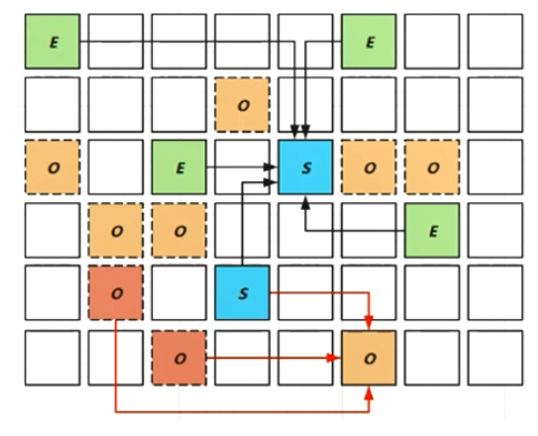
    > </details>

- (失败保护机制：强力回收，Full GC)
  > 如果需要，单线程、独占式、高强度的Fu11GC还是继续存在的。它针对GC的评估失败提供了一种失败保护机制，即强力回收。<br />
  > 要避免Fu11 GC的发生，一旦发生需要进行调整。
  - 触发时机
    - G1的初衷就是要避免Fu11 GC的出现。
    - 但是如果上述方式不能正常工作，G1会停止应用程序的执行（Stop-The-World)
    - 使用单线程的内存回收算法进行垃圾回收，性能会非常差，应用程序停顿时间会很长。
  - 导致原因
    - 1.Evacuation的时候没有足够的to-space来存放晋升的对象；
    - 2.并发处理过程完成之前空间耗尽。
  - 示例
    ```
    比如堆内存太小，当G1在复制存活对象的时候没有空的内存分段可用，
    则会回退到full gc,这种情况可以通过增大内存解决。
    导致G1Fu11 GC的原因可能有两个：

    或者当暂停时间太短的时候，每次GC的时候回收的垃圾特别少，
    垃圾产生大于垃圾回收，最终导致Full GC
    ```

```
举个例子：一个Web服务器，Java进程最大堆内存为4G,每分钟响应1500个请求，每45
秒钟会新分配大约2G的内存。G1会每45秒钟进行一次年轻代回收，每31个小时整个堆的
使用率会达到45%，会开始老年代并发标记过程，标记完成后开始四到五次的混合回收。
```

---

G1补充

从oracle官方透露出来的信息可获知，**回收阶段（Evacuation)其实本也有想过设计成与用户程序一起并发执行**，但这件事情做起来比较复杂，考虑到G1只是回收一部分Region,停顿时间是用户可控制的，所以并不迫切去实现，而**选择把这个特性放到了G1之后出现的低延迟垃圾收集器（即ZGC)中**。另外，还考虑到G1不是仅仅面向低延迟，停顿用户线程能够最大幅度提高垃圾收集效率，为了保证吞吐量所以才选择了完全暂停用户线程的实现方案。


##### 2.3.3.4.12. 垃圾回收器总结(背)

- 总结
  > 

- 组合关系回顾(更新到了jdk14)
  >  

- GC发展
  >  

- 如何选择垃圾回收器
  - 1.优先调整堆的大小让JVM自适应完成。
  - 2.如果内存小于100M,使用串行收集器
  - 3.如果是单核、单机程序，并且没有停顿时间的要求，串行收集器
  - 4.如果是多CPU、需要高吞吐量、允许停顿时间超过1秒，选择并行或者JVM自己选择
  - 5.如果是多CPU、追求低停顿时间，需快速响应（比如延迟不能超过1秒，如互联网应用）,使用并发收集器
    > 官方推荐G1,性能高。现在互联网的项目，基本都是使用G1。

```
没有最好的收集器，更没有万能的收集；
调优永远是针对特定场景、特定需求，不存在一劳永逸的收集器
```

##### 2.3.3.4.13. GC日志分析

- 显示GC日志的参数
  - `-XX:+PrintGC`:输出GC日志。类似：`-verbose:gc`
    > <details>
    > <summary style="color:red;">结果与解析</summary>
    > 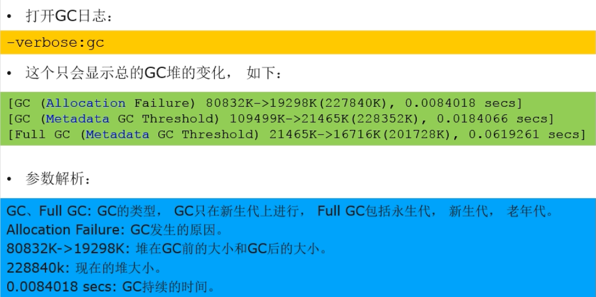
    > </details>
  - `-XX:+PrintGCDetails`:输出GC的详细日志
    > <details>
    > <summary style="color:red;">结果与解析</summary>
    > 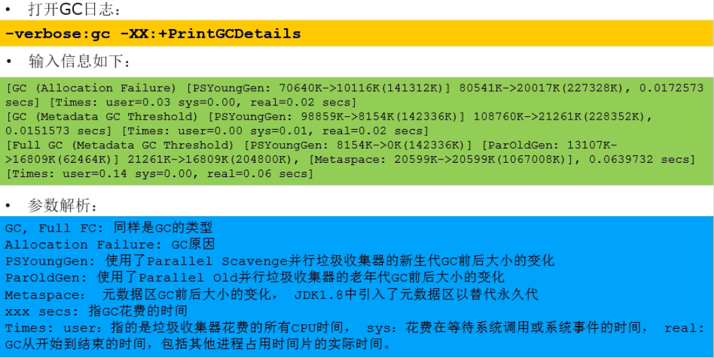
    >
    > 
    >
    > 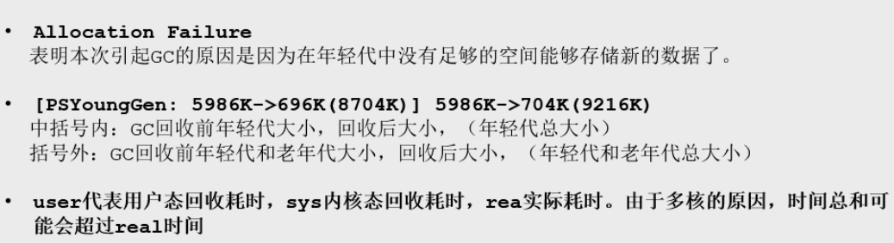
    > </details>
  - `-XX:+PrintGCTimeStamps`:输出GC的时间戳（以基准时间的形式）
  - `-XX:+PrintGCDateStamps`:输出GC的时间戳（以日期的形式，如2013-05-04T21:53:59.234+0800)
    > <details>
    > <summary style="color:red;">结果与解析</summary>
    > 
    > </details>
  - `-XX:+PrintHeapAtGC`:在进行GC的前后打印出堆的信息
  - `-Xloggc:../logs/gc.log`:日志文件的输出路径

- Minor GC日志详细分析
  >  
- Full GC 日志详细分析
  > 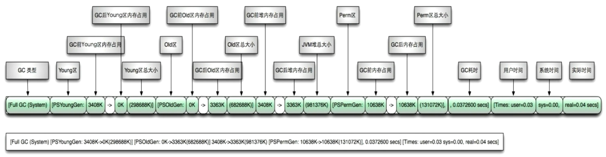 

---

代码示例

```java
/**
 * 在jdk7 和 jdk8中分别执行
 * -verbose:gc -Xms20M -Xmx20M -Xmn10M -XX:+PrintGCDetails -XX:SurvivorRatio=8 -XX:+UseSerialGC
 */
public class GCLogTest1 {
    private static final int _1MB = 1024 * 1024;
    public static void testAllocation() {
        byte[] allocation1, allocation2, allocation3, allocation4;
        allocation1 = new byte[2 * _1MB];
        allocation2 = new byte[2 * _1MB];
        allocation3 = new byte[2 * _1MB];
        allocation4 = new byte[4 * _1MB];
    }
    public static void main(String[] agrs) {
        testAllocation();
    }
}
```

- jdk7日志分析
  > 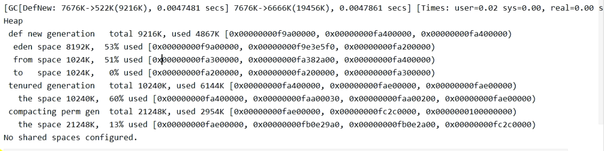  

  <details>
  <summary style="color:red;">分析答案（展开查看）</summary>

  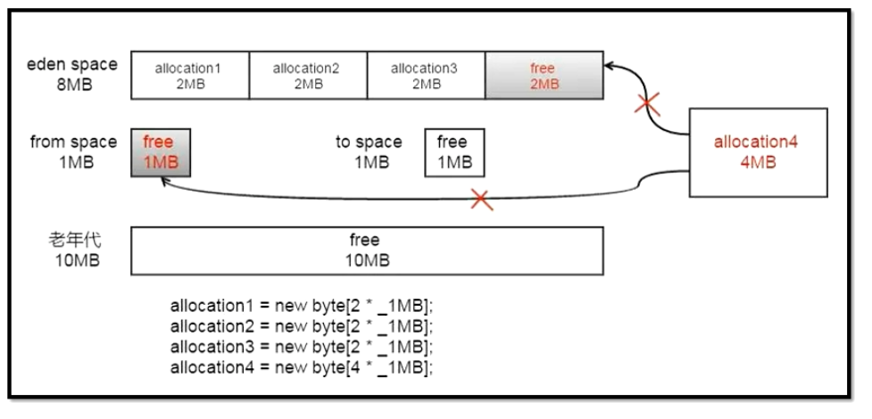
   

  - 3个2MB分配到eden后
  - 再分配一个4MB到eden时，eden中放不下，survivor中也放不下
  - 触发一次GC
  - 3个2MB放到old区(60%那里)，一个4MB放到eden(53%那里)
  </details>


- jdk8与jdk7日志比较
  > 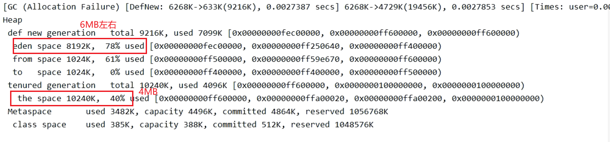 
  - jdk7中，大对象来了的话，如果eden不够，eden中的对象进入老年代，大对象进入eden
  - jdk8中，大对象直接进入老年代。也就是4MB直接进入老年代

##### 2.3.3.4.14. 日志分析工具的使用

使用 `-Xloggc:../logs/gc.log` 保存日志到指定文件目录

- 日志工具
  - GCViewer()
    <details>
    <summary style="color:red;">结果示例</summary>

    
    </details>

  - GCEasy(在线)
    <details>
    <summary style="color:red;">结果示例</summary>

    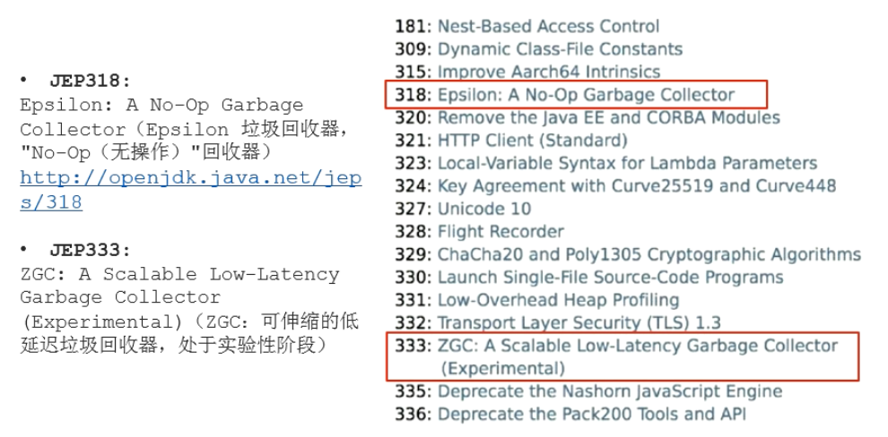
    </details>
  - GCHisto
  - GCLogViewer
  - Hpjmeter
  - garbagecat
  - ... 

##### 2.3.3.4.15. 垃圾回收器新发展

GC仍然处于飞速发展之中，目前的默认选项G1 GC在不断的进行改进，很多我们
原来认为的缺点，例如串行的Fu11 GC、Card Table扫描的低效等，都已经被
大幅改进，例如，JDK 10以后，Full GC已经是并行运行，在很多场景下，其表
现还略优于Parallel GC的并行Full GC实现。

即使是Serial GC,虽然比较古老，但是简单的设计和实现未必就是过时的，它
本身的开销，不管是GC相关数据结构的开销，还是线程的开销，都是非常小的，
所以随着云计算的兴起，在Serverless等新的应用场景下，Serial GC找到了
新的舞台。

比较不幸的是CMS GC,因为其算法的理论缺陷等原因，虽然现在还有非常大的
用户群体，但在JDK9中已经被标记为废弃，并在JDK14版本中移除。

---

jdk11出现两个新的GC


<br /><br />

ZGC与Shenandoah目标高度相似，**在尽可能对吞吐量影响不大的前提下，实现在任意堆内存大小下都可以把垃圾收集的停顿时间限制在十毫秒以内的低延迟。**

《深入理解Java虚拟机》一书中这样定义ZGC:ZGC收集器是一款基于
Region内存布局的，(暂时）不设分代的，**使用了读屏障、染色指针和内存多重映射等技术来实现可并发的标记-压缩算法的**，
**以低延迟为首要目标**的一款垃圾收集器。

ZGC的工作过程可以分为4个阶段：**并发标记-并发预备重分配-并发重分配-并发重映射**等。

ZGC几乎在所有地方并发执行的，除了初始标记的是STW的。所以停顿时间
几乎就耗费在初始标记上，这部分的实际时间是非常少的。

<br /><br />

- 测试数据
  - 吞吐量
    > 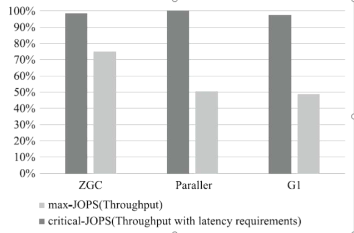 
  - 暂停时间
    > 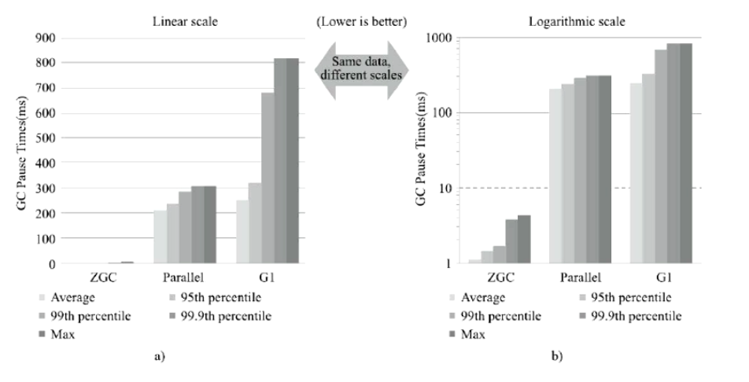 
    > > 左图为线性y轴，但是ZGC太优秀，所以右图为非线性y轴

<br /><br />

在ZGC的强项停顿时间测试上，它毫不留情的将Paralle1、G1拉开了两个
数量级的差距。无论平均停顿、95%停顿、99%停顿、99.9号停顿，还是最
大停顿时间，ZGC都能毫不费劲控制在10毫秒以内。

<br /><br />

- 使用
  - jdk14之前，只支持linux
  - mac上通过`-XX:+UnlockExperimentalVMoptions-XX:+UseZGC`开启ZGC

---

jdk12出现Shenandoah GC

- ZGC和 Shenandoah GC主打特点：低延迟

Shenandoah,无疑是众多GC中最孤独的一个。是第一款不由oracle公司团队领
导开发的HotSpot垃圾收集器。不可避免的**受到官方的排挤**。比如号称OpenJDK和
OracleJDK没有区别的Oracle公司仍**拒绝在OracleJDK12中支持Shenandoah**。

Shenandoah垃圾回收器最初由RedHat进行的一项垃圾收集器研究项目Pauseless
GC的实现，**旨在针对JVM上的内存回收实现低停顿的需求**。在2014年贡献给
OpenJDK。

Red Hat研发Shenandoah团队对外宣称，
**Shenandoah垃圾回收器的暂停时间与堆大小无关，这意味着无论将堆设置为200MB还是200GB,99.9%的目标都可以把垃圾收集的停顿时间限制在十毫秒以内。**
不过实际使用性能将取决于实际工作堆的大小和工作负载。

- 测试
  > 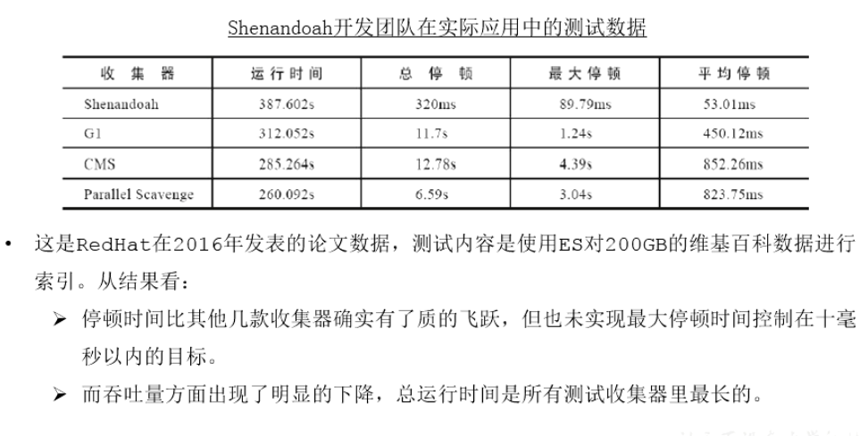

- 总结：
  - 弱项：高运行负担下的吞吐量下降
  - 强项：低延迟时间
- 工作过程：9个阶段，这里不再赘述

##### 2.3.3.4.16. 其他垃圾回收期

AliGC

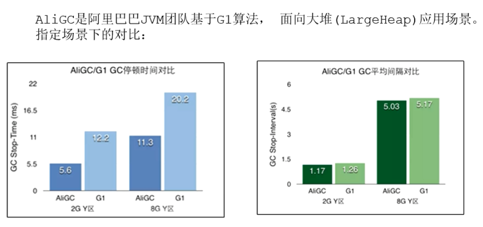

---

当然，其他厂商也提供了各种独具一格的GC实现，例如比较有名的低延迟GC,
Zing (https://www.infoq.com/articles/azul_gc_in_detail),有兴
趣可以参考提供的链接。

##### 2.3.3.4.17. 面试题

```
java中常见的垃圾回收期有哪些? 
有哪些不同。
针对其中两款进行进行对比，比如CMS和G1进行对比

tm的干一个多小时不是问题
```

#### 2.3.3.5. 面试题

- 面试加分项
  ```
  对于垃圾收集，面试官可以循序渐进从理论、实践各种角度深入，也未必
  是要求面试者什么都懂。但如果你懂得原理，一定会成为面试中的加分项。
  这里较通用、基础性的部分如下：
  ```
  - 垃圾收集的算法有哪些？如何判断一个对象是否可以回收？
  - 垃圾收集器工作的基本流程。

```
蚂蚁金服：
你知道哪几种垃圾回收器，各自的优缺点，重点讲一下cms和g1
一面：JVMGC算法有哪些，目前的JDK版本采用什么回收算法
一面：G1回收器讲下回收过程
GC是什么？为什么要有GC?
一面：GC的两种判定方法？CMS收集器与G1收集器的特点。

百度：
说一下GC算法，分代回收说下
垃圾收集策略和算法

天猫：
一面：jvm GC原理，JVM怎么回收内存
一面：CMS特点，垃圾回收算法有哪些？各自的优缺点，他们共同的缺点是什么？

滴滴：
一面：java的垃圾回收器都有哪些，说下g1的应用场景，平时你是如何搭配使用垃圾回
收器的

京东：
你知道哪几种垃圾收集器，各自的优缺点，重点讲下cms和G1,包括原理，流程，优缺点。
垃圾回收算法的实现原理。

阿里：
讲一讲垃圾回收算法。
什么情况下触发垃圾回收？
如何选择合适的垃圾收集算法？
JVM有哪三种垃圾回收器？

字节跳动：
常见的垃圾回收器算法有哪些，各有什么优劣？
system.gc()和runtime.gc()会做什么事情？
一面：Java GC机制？GC Roots有哪些？
二面：Java对象的回收方式，回收算法。
CMS和G1了解么，CMS解决什么问题，说一下回收的过程。
CMS回收停顿了几次，为什么要停顿两次。
```

# 3. 字节码与类的加载

## 3.1. 学习路线回顾


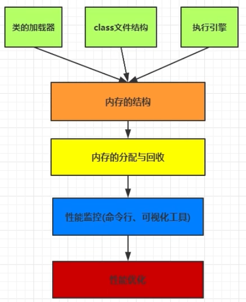

- 最终目的是性能的监控和调优(下篇)
- 所以学会使用性能监测工具(下篇)
- 要想看得懂可视化工具显示的数据，就要懂内存的分配和回收(上篇)
- 想懂内存的分配和回收，就要懂内存的结构(上篇)
- 为了更好得理解内存结构，分配位置，内存中的数据是干什么的等等，要
  - 学习类的加载器(上篇简单谈一下，中篇深入)
  - 执行引擎(上篇)
  - class文件结构和字节码指令(中篇)
    > 在上篇也会简单涉及

## 3.2. class文件结构

### 3.2.1. 概述

#### 3.2.1.1. 字节码文件的跨平台性

> 前面就有讲过，`跨平台的语言，跨语言的平台`，此处不再重复说明

#### 3.2.1.2. java前端编译器

Java源代码的编译结果是字节码，那么肯定需要有一种编译器能够将Java源码编译为字节码，承担这个重要责任的就是配置在path环境变量中的**javac编译器**

javac是一种能够将Java源码编译为字节码的**前端编译器**。

HotSpot VM并没有强制要求前端编译器只能使用javac来编译字节码，其实只要编译结果符合JVM规范都可以被JVM所识别即可。在Java的前端编译器领域，除了javac之外，还有一种被大家经常用到的前端编译器，那就是内置在Eclipse中的**ECJ （EclipseCompiler for Java）编译器**。和Javac的全量式编译不同，ECJ是一种增量式编译器。

在Eclipse中，当开发人员编写完代码后，使用“Ctrl+S”快捷键时，ECJ编译器所采取的编译方案是把未编译部分的源码逐行进行编译，而非每次都全量编译。因此ECJ的编译效率会比javac更加迅速和高效，当然编译质量和javac相比大致还是一样的。

ECJ不仅是Eclipse的默认内置前端编译器，在Tomcat中同样也是使用ECJ编译器来编译jsp文件。由于ECJ编译器是采用
GPLv2的开源协议进行源代码公开，所以，大家可以登录eclipse官网下载EC]编译器的源码进行二次开发。

默认情况下， IntelliJ IDEA 使用 javac编译器。（还可以自己设置为AspectJ编译器ajc）

前端编译器并不会直接涉及编译优化等方面的技术，而是将这些具体优化细节移交给HotSpot的JIT编译器负责。


<br /><br />

复习：AOT

#### 3.2.1.3. 示例：透过字节码查看代码细节

##### 面试题

下面的面试题学完之后再答

```
BAT 面试题

类文件结构有几个部分

知道字节码吗？Integer x=5;int y = 5;比较x==y都经过哪些步骤
```

##### 示例1--Integer间的==

通过字节码查看代码细节示例：

```java
Integer i1 = 10;
Integer i2 = 10;
System.out.println(i1==i2);//true

Integer i1 = 128;
Integer i2 = 128;
System.out.println(i1==i2);//false
```

<details>
<summary style="color:red;">解析</summary>

```
invokestatic #2 <java/lang/Integer.valueOf>
```

查看字节码可以发现调用了Integer的valueOf方法。如果是-128~127之间，就会存在与IntegerCache中，不会创建新的Integer，因此引用相同。

```java
public static Integer valueOf(int i) {
    if (i >= IntegerCache.low && i <= IntegerCache.high)
        return IntegerCache.cache[i + (-IntegerCache.low)];
    return new Integer(i);
}
```
</details>

##### 示例2--String间的==

该示例在上面面试题中已经说明过，不再重复说明。涉及

- `new String()+new String()`实现原理
- `StringBuilder` 的 `toString()`方法

```java
String str = new String("hello") + new String("world");
String str1 = "helloworld";
System.out.println(str == str1);
```

##### 示例3(难)--继承

下面代码的输出是什么

```java
class Father {
    int x = 10;

    public Father() {
        this.print();
        x = 20;
    }
    public void print() {
        System.out.println("Father.x = " + x);
    }
}

class Son extends Father {
    int x = 30;
//    float x = 30.1F;
    public Son() {
        this.print();
        x = 40;
    }
    @Override
    public void print() {
        System.out.println("Son.x = " + x);
    }
}

public class SonTest {
    public static void main(String[] args) {
        Father f = new Son();
        System.out.println(f.x);
    }
}
```


<details>
<summary style="color:red;">答案与解析</summary>

结果：

```
Son.x = 0
Son.x = 30
20  // 属性不存在多态性
```

<br /><br />

Son类的字节码：

```
 0 aload_0 // 把this放到局部变量表中
 1 invokespecial #1 <com/atguigu/java/Father.<init>> // 调用父类的init方法，init方法中调用了print,但是因为子类重写了父类的print方法，
                                                     // 所以执行子类的print方法。因为在下面才给Son里面的x赋值为30，因此此处打印为0
 4 aload_0 
 5 bipush 30  // 对应 int x=30
 7 putfield #2 <com/atguigu/java/Son.x>  // 对应this.print()
10 aload_0
11 invokevirtual #3 <com/atguigu/java/Son.print>
14 aload_0
15 bipush 40
17 putfield #2 <com/atguigu/java/Son.x>
20 return
```

</details>

> （复习）属性初始化方式：1.默认初始化；2.显式初始化；3.代码块中初始化；4.构造器中初始化；5.对象.属性 初始化

### 3.2.2. 虚拟机的基石：Class文件

- 字节码文件里是什么?/字节码定义
  - 源代码经过编译器编译之后便会生成一个字节码文件
  - 字节码是一种二进制的类文件,它的内容是JVM的指令,而不像C、C++经由编译器直接生成机器码。

- 什么是字节码指令( byte code)/字节码指令构成
  - Java虚拟机的指令由一个字节长度的、代表着某种特定操作含义的**操作码( opcode)**，
  - 以及跟随其后的零至多个代表此操作所需参数的**操作数(operand)**所构成。
  - 虚拟机中许多指令并不包含操作数,只有一个操作码。

- 解读字节码方式
  - jclasslib
  - javap反编译
  - Notepad++搭配HEX-Editor插件。或者Binary Viewer

### 3.2.3. class文件结构

- Class类的本质
  - 任何一个C1ass文件都对应着唯一一个类或接口的定义信息,
  - 但反过来说,C1ass文件实际上它并不一定以磁盘文件的形式存在
  - Class文件是一组以8位字节为基础单位的**二进制流**

- Class文件格式
  - 要求
    - Class的结构不像ⅩML等描述语言
    - 由于它没有任何分隔符号，所以在其中的数据项,无论是字节顺序还是数量,都是被严格限定的
    - 哪个字节代表什么含义,长度是多少,先后顺序如何,都不允许改变
  - 组成: Class文件格式采用一种类似于C语言结构体的方式进行数据存储,这种结构中只有两种数据类型:**无符号数**和**表**
    - 无符号数:
      - 属于基本的数据类型
      - 以u1、u2、u4、u8来分别代表1个字节、2个字节、4个字节和8个字节的无符号数
      - 无符号数可以用来描述数字、索引引用、数量值或者按照UTF-8编码构成字符串值
    - 表:
      - 是由多个无符号数或者其他表作为数据项构成的复合数据类型
      - 所有表都习惯性地以"_info"结尾。
      - 表用于描述有层次关系的复合结构的数据,整个C1ass文件本质上就是一张表。
      - 由于表没有固定长度,所以通常会在其前面加上个数说明

- class文件结构
   <details>
   <summary style="color:red;">官网定义</summary>

   ```
    ClassFile {
        u4             magic;
        u2             minor_version;
        u2             major_version;
        u2             constant_pool_count;
        cp_info        constant_pool[constant_pool_count-1];
        u2             access_flags;
        u2             this_class;
        u2             super_class;
        u2             interfaces_count;
        u2             interfaces[interfaces_count];
        u2             fields_count;
        field_info     fields[fields_count];
        u2             methods_count;
        method_info    methods[methods_count];
        u2             attributes_count;
        attribute_info attributes[attributes_count];
    }
   ```
   </details>

  <details>
  <summary style="color:red;">详细说明</summary>

    | 类型           | 名称                | 说明                   | 长度    | 数量                  |
    | -------------- | ------------------- | ---------------------- | ------- | --------------------- |
    | u4             | magic               | 魔数,识别Class文件格式 | 4个字节 | 1                     |
    | u2             | minor_version       | 副版本号(小版本)       | 2个字节 | 1                     |
    | u2             | major_version       | 主版本号(大版本)       | 2个字节 | 1                     |
    | u2             | constant_pool_count | 常量池计数器           | 2个字节 | 1                     |
    | cp_info        | constant_pool       | 常量池表               | n个字节 | constant_pool_count-1 |
    | u2             | access_flags        | 访问标识               | 2个字节 | 1                     |
    | u2             | this_class          | 类索引                 | 2个字节 | 1                     |
    | u2             | super_class         | 父类索引               | 2个字节 | 1                     |
    | u2             | interfaces_count    | 接口计数器             | 2个字节 | 1                     |
    | u2             | interfaces          | 接口索引集合           | 2个字节 | interfaces_count      |
    | u2             | fields_count        | 字段计数器             | 2个字节 | 1                     |
    | field_info     | fields              | 字段表                 | n个字节 | fields_count          |
    | u2             | methods_count       | 方法计数器             | 2个字节 | 1                     |
    | method_info    | methods             | 方法表                 | n个字节 | methods_count         |
    | u2             | attributes_count    | 属性计数器             | 2个字节 | 1                     |
    | attribute_info | attributes          | 属性表                 | n个字节 | attributes_count      |

  </details>


  - 魔数:
    - magic
    - 用来识别为一个class文件的标识
  - C1ass文件版本
    - minor_version
    - major_version
  - 常量池
    - constant_pool_count
      > 由于表没有固定长度,所以通常会在其前面加上个数说明
    - constant_pool。首索引没有分配，所以长度为constant_pool_count-1
  - 访问标志
    - access_flags
    - 是类，还是接口，权限是什么等
  - 类索引,父类索引,接口索引集合
    - this_class：当前类是什么
    - super_class：父类是什么
    - interfaces_count + interfaces: 接口数组
      > 由于表没有固定长度,所以通常会在其前面加上个数说明
  - 字段表集合
    - fields_count;
      > 由于表没有固定长度,所以通常会在其前面加上个数说明
    - fields[fields_count];
  - 方法表集合
    - methods[methods_count];
    - attributes_count;
  - 属性表集合
    > 注意，field和attribute不同。日常总是称类中的字段为属性，但是JVM中属性有其他含义。比如
    - attributes_count;
    - attributes[attributes_count];

### 3.2.4. 使用javap指令解析Class文件

# 4. 性能监控与调优


