> ## 记住，有什么不懂得，查文档最有用

[java8文档](https://docs.oracle.com/javase/specs/jvms/se8/html/index.html)

# 1. 学习路线回顾


- 最终目的是性能的监控和调优(下篇)
- 所以学会使用性能监测工具(下篇)
- 要想看得懂可视化工具显示的数据，就要懂内存的分配和回收(上篇)
- 想懂内存的分配和回收，就要懂内存的结构(上篇)
- 为了更好得理解内存结构，分配位置，内存中的数据是干什么的等等，要
  - 学习类的加载器(上篇简单谈一下，中篇深入)
  - 执行引擎(上篇)
  - class文件结构和字节码指令(中篇)
    > 在上篇也会简单涉及

# 2. class文件结构

## 2.1. 概述

### 2.1.1. 字节码文件的跨平台性

> 前面就有讲过，`跨平台的语言，跨语言的平台`，此处不再重复说明

### 2.1.2. java前端编译器说明

- 说明
  - Java源代码的编译结果是字节码，那么肯定需要有一种编译器能够将Java源码编译为字节码，
  - 承担这个重要责任的就是配置在path环境变量中的**javac编译器**
  - javac是一种能够将Java源码编译为字节码的**前端编译器**。

    ```
    HotSpot VM并没有强制要求前端编译器只能使用javac来编译字节码，
    其实只要编译结果符合JVM规范都可以被JVM所识别即可。
    ```
- 其他编译器编译器
  - 在Java的前端编译器领域，除了javac之外，还有一种被大家经常用到的前端编译器，那就是内置在Eclipse中的**ECJ （EclipseCompiler for Java）编译器**。
  - 和Javac的全量式编译不同，ECJ是一种增量式编译器。
  - 在Eclipse中，当开发人员编写完代码后，使用“Ctrl+S”快捷键时，ECJ编译器所采取的编译方案是把未编译部分的源码逐行进行编译，而非每次都全量编译。
  - 因此ECJ的编译效率会比javac更加迅速和高效，当然编译质量和javac相比大致还是一样的。
  - ECJ不仅是Eclipse的默认内置前端编译器，在Tomcat中同样也是使用ECJ编译器来编译jsp文件。
  - 默认情况下， IntelliJ IDEA 使用 javac编译器。（还可以自己设置为AspectJ编译器ajc）

- 优化：前端编译器并不会直接涉及编译优化等方面的技术，而是将这些具体优化细节移交给HotSpot的JIT编译器负责。

<br />

> 复习：AOT

### 2.1.3. 示例：透过字节码查看代码细节

#### 2.1.3.1. 示例1--Integer间的==

- 通过字节码查看代码细节示例：

  ```java
  Integer i1 = 10;
  Integer i2 = 10;
  System.out.println(i1==i2);//true

  Integer i1 = 128;
  Integer i2 = 128;
  System.out.println(i1==i2);//false
  ```

<details>
<summary style="color:red;">解析</summary>

```
invokestatic #2 <java/lang/Integer.valueOf>
```

查看字节码可以发现调用了Integer的valueOf方法。如果是-128~127之间，就会存在与IntegerCache中，不会创建新的Integer，因此引用相同。

```java
public static Integer valueOf(int i) {
    if (i >= IntegerCache.low && i <= IntegerCache.high)
        return IntegerCache.cache[i + (-IntegerCache.low)];
    return new Integer(i);
}
```
</details>

#### 2.1.3.2. 示例2--String间的==

- 该示例在上面面试题中已经说明过，不再重复说明。涉及
  - `new String()+new String()`实现原理
  - `StringBuilder` 的 `toString()`方法

```java
String str = new String("hello") + new String("world");
String str1 = "helloworld";
System.out.println(str == str1);
```

#### 2.1.3.3. 示例3(难)--继承

下面代码的输出是什么

```java
class Father {
    int x = 10;

    public Father() {
        this.print();
        x = 20;
    }
    public void print() {
        System.out.println("Father.x = " + x);
    }
}

class Son extends Father {
    int x = 30;
//    float x = 30.1F;
    public Son() {
        this.print();
        x = 40;
    }
    @Override
    public void print() {
        System.out.println("Son.x = " + x);
    }
}

public class SonTest {
    public static void main(String[] args) {
        Father f = new Son();
        System.out.println(f.x);
    }
}
```

<details>
<summary style="color:red;">答案与解析</summary>

结果：

```
Son.x = 0
Son.x = 30
20  // 属性不存在多态性
```

<br /><br />

Son类的字节码：

```
 0 aload_0 // 把this放到局部变量表中
 1 invokespecial #1 <com/atguigu/java/Father.<init>> // 调用父类的init方法，init方法中调用了print,但是因为子类重写了父类的print方法，
                                                     // 所以执行子类的print方法。因为在下面才给Son里面的x赋值为30，因此此处打印为0
 4 aload_0 
 5 bipush 30  // 对应 int x=30
 7 putfield #2 <com/atguigu/java/Son.x>  // 对应this.print()
10 aload_0
11 invokevirtual #3 <com/atguigu/java/Son.print>
14 aload_0
15 bipush 40
17 putfield #2 <com/atguigu/java/Son.x>
20 return
```

</details>

> （复习）属性初始化方式：1.默认初始化；2.显式初始化；3.代码块中初始化；4.构造器中初始化；5.对象.属性 初始化

### 2.1.4. 字节码与解读

- 字节码文件里是什么--字节码定义
  - 源代码经过编译器编译之后便会生成一个字节码文件
  - 字节码是一种二进制的类文件,它的内容是JVM的指令,而不像C、C++经由编译器直接生成机器码。

- 什么是字节码指令(byte code)--字节码指令构成
  - Java虚拟机的指令由一个字节长度的、代表着某种特定操作含义的**操作码(opcode)**，
  - 以及跟随其后的零至多个代表此操作所需参数的**操作数(operand)**所构成。
  - 虚拟机中许多指令并不包含操作数,只有一个操作码。

- 解读字节码方式
  - jclasslib
  - javap反编译
  - Notepad++搭配HEX-Editor插件。或者Binary Viewer

## 2.2. class文件结构

### 2.2.1. 整体说明

- Class类的本质
  - 任何一个C1ass文件都对应着唯一一个类或接口的定义信息,
  - 但反过来说,C1ass文件实际上它并不一定以磁盘文件的形式存在，也能以网络等的方式传输过来
  - Class文件是一组以8位字节为基础单位的**二进制流**

- Class文件格式
  - 要求
    - Class的结构不像XML等描述语言
    - 由于它没有任何分隔符号，所以在其中的数据项,无论是字节顺序还是数量,都是被严格限定的
    - 哪个字节代表什么含义,长度是多少,先后顺序如何,都不允许改变
  - 组成:
    > Class文件格式采用一种类似于C语言结构体的方式进行数据存储 <br />
    > 这种结构中只有两种数据类型: **无符号数** 和 **表**
    - **无符号数**:
      - 属于基本的数据类型
      - 以u1、u2、u4、u8来分别代表1个字节、2个字节、4个字节和8个字节的无符号数
      - 无符号数可以用来描述**数字、索引引用、数量值或者按照UTF-8编码构成字符串值**
    - **表**:
      - 是由**多个无符号数或者其他表**作为数据项构成的**复合数据类型**
        > 类似java中的数组
      - 所有表都习惯性地以"_info"结尾。
      - 表用于描述有层次关系的复合结构的数据,**整个C1ass文件本质上就是一张表**。
      - 由于表没有固定长度,所以通常会在其前面加上个数说明

- class文件结构
  - 官网定义

    ```
    ClassFile {
        u4             magic;
        u2             minor_version;
        u2             major_version;
        u2             constant_pool_count;
        cp_info        constant_pool[constant_pool_count-1];
        u2             access_flags;
        u2             this_class;
        u2             super_class;
        u2             interfaces_count;
        u2             interfaces[interfaces_count];
        u2             fields_count;
        field_info     fields[fields_count];
        u2             methods_count;
        method_info    methods[methods_count];
        u2             attributes_count;
        attribute_info attributes[attributes_count];
    }
    ```
  - 详细说明

    | 类型           | 名称                | 说明                     | 长度     | 数量                      |
    | -------------- | ------------------- | ------------------------ | -------- | ------------------------- |
    | u4             | magic               | 魔数,识别 Class 文件格式 | 4 个字节 | 1                         |
    | u2             | minor_version       | 副版本号(小版本)         | 2 个字节 | 1                         |
    | u2             | major_version       | 主版本号(大版本)         | 2 个字节 | 1                         |
    | u2             | constant_pool_count | 常量池计数器             | 2 个字节 | 1                         |
    | cp_info        | constant_pool       | 常量池表                 | n 个字节 | **constant_pool_count-1** |
    | u2             | access_flags        | 访问标识                 | 2 个字节 | 1                         |
    | u2             | this_class          | 类索引                   | 2 个字节 | 1                         |
    | u2             | super_class         | 父类索引                 | 2 个字节 | 1                         |
    | u2             | interfaces_count    | 接口计数器               | 2 个字节 | 1                         |
    | u2             | interfaces          | 接口索引集合             | 2 个字节 | interfaces_count          |
    | u2             | fields_count        | 字段计数器               | 2 个字节 | 1                         |
    | field_info     | fields              | 字段表                   | n 个字节 | fields_count              |
    | u2             | methods_count       | 方法计数器               | 2 个字节 | 1                         |
    | method_info    | methods             | 方法表                   | n 个字节 | methods_count             |
    | u2             | attributes_count    | 属性计数器               | 2 个字节 | 1                         |
    | attribute_info | attributes          | 属性表                   | n 个字节 | attributes_count          |

  - 魔数:
    - magic
    - 用来识别为一个class文件的标识
  - C1ass文件版本
    - minor_version
    - major_version
  - 常量池
    - constant_pool_count
      > 由于表没有固定长度,所以通常会在其前面加上个数说明
    - constant_pool。首索引没有分配，所以长度为constant_pool_count-1
  - 访问标志
    - access_flags
    - 是类，还是接口，权限是什么等
  - 类索引,父类索引,接口索引集合
    - this_class：当前类是什么
    - super_class：父类是什么
    - interfaces_count + interfaces: 接口数组
      > 由于表没有固定长度,所以通常会在其前面加上个数说明
  - 字段表集合
    - fields_count;
      > 由于表没有固定长度,所以通常会在其前面加上个数说明
    - fields[fields_count];
  - 方法表集合
    - methods[methods_count];
    - attributes_count;
  - 属性表集合
    > **注意，field和attribute不同。日常总是称类中的字段为属性，但是JVM中属性有其他含义**。
    > 比如类名，LineNumberTable,LocalVariableTable
    - attributes_count;
    - attributes[attributes_count];

### 2.2.2. 详细说明

#### 2.2.2.1. 代码

```java
package com.atguigu.java1;

public class Demo {
    private int num = 1;

    public int add(){
        num = num + 2;
        return num;

    }
}
```

#### 2.2.2.2. 魔数


- 说明：
  - 每个C1ass文件开头的**4个字节的无符号整数**称为魔数(Magic Number)
  - 作用: 是**确定这个文件是否为一个能被虚拟机接受的有效合法的Class文件**。即**魔数是 Class文件的标识符**。
  - 原因：
    - 使用魔数而不是扩展名来进行识别主要是基于安全方面的考虑,因为文件扩展名可以随意地改动。
    - 类似png格式图片，使用notepad++的HEX-Editor查看二进制内容，可以发现前32个字节也相同

- 值：魔数值固定为`0xCAFEBABE`。不会改变。

- 相关异常：如果一个 Class文件不以θ XCAFEBABE开头,虚拟机在进行文件校验的时候就会直接抛出以下错误:
  ```
  Error: A JNI error has occurred, please check your installation and try again
  Exception in thread "main" java. lang Class Format Error: Incompatible magic value 1885430635 in class
  file StringTest
  ```

#### 2.2.2.3. class文件版本号

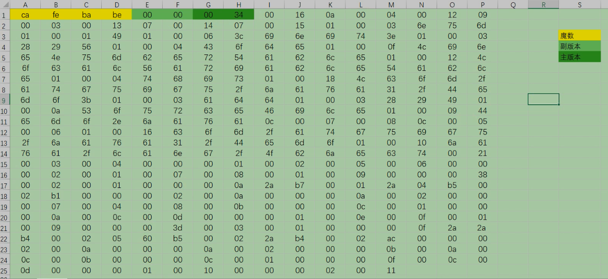

- 说明：文件中紧接着魔数的4个字节存储的是 Class文件的版本号。
  - 第5个和第6个字节所代表的含义就是编译的副版本号 minor version
  - 而第7个和第8个字节就是编译的主版本号 major version
  - 主副版本号共同构成了c1ass文件的格式版本号。譬如某个C1ass文件的主版本号为M,副版本号为m,那么这个c1ass文件的格式版本号就确定为M.m
- 版本号和]ava编译器的对应关系：
  > 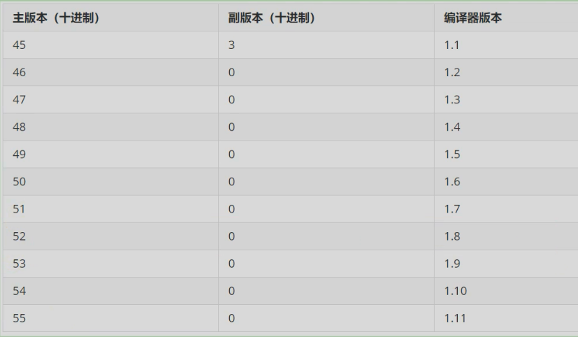
  - Java的版本号是从45开始的,JDK1.1之后的每个DK大版本发布主版本号向上加1。
  - 虚拟机JDK版本为1.k(k>=2)时,对应的c1ass文件格式版本号的范围为45.0 - 44+k.0(含两端)

- 向下兼容：
  - 不同版本的]ava编译器编译的C1ass文件对应的版本是不一样的
  - 目前,高版本的Java虚拟机可以执行由低版本编译器生成的Class文件,但是低版本的Java虚拟机不能执行由高版本编译器生成的C1ass文件。
  - 否则JVM会抛出`iava.lang, UnsupportedclassVersionError`异常。
  > 在实际应用中,由于开发环境和生产环境的不同,可能会导致该问题的发生。因此,需要我们在开发时,特别注意开发编译的JDK版本和生产环境中的DK版本是否一致

#### 2.2.2.4. 常量池

##### 2.2.2.4.1. 说明

- 重要性 
  - 常量池是C1ass文件中内容最为丰富的区域之一。常量池对于C1ass文件中的字段和方法解析也有着至关重要的作用。
  - 随着]ava虚拟机的不断发展,常量池的内容也日渐丰富。可以说,常量池是整个class文件的基石。
  - 如以下三个为基于java动态的特性在1.7时添加
    - CONSTANT MethodHandle info 表示方法句柄
    - CONSTANT_ MethodType_into 标志方法类型
    - CONSTANT Invoke Dynamic info 表示一个动态方法调用点

- 字节码中的位置
  - 在版本号之后,紧跟着的是**常量池的数量,以及若干个常量池表项**
  - 常量池中常量的数量是不固定的,所以在常量池的入口需要放置一项u2类型的无符号数,代表**常量池容量计数值(constant pool count)**
  - 与Java中语言习惯不一样的是,**这个容量计数是从1而不是开始的**。

- 组成
  > -
  - C1ass文件使用了一个前置的**容量计数器(constant_pool_count)**加**若干个连续的数据项(constant pool)**的形式来描述常量池内容。
  - 我们把这一系列连续常量池数据称为常量池集合
  - 常量池表项中,用于存放编译时期生成的各种**字面量和符号引用**,这部分内容将在类加载后进入方法区**运行时常量池**中存放

##### 2.2.2.4.2. 常量池计数器

- 由于常量池的数量不固定，时长时短，所以需要放置两个字节来表示常量池容量计数值。
- 常量池容量计数值（u2类型）:**从1开始，表示常量池中有多少项常量。即constant_pool_count=1表示常量池中有0个常量项**
- Demo的值为：

  

  - 其值为0×0016,也就是22。
  - 也就是说实际上只有21项常量。索引为范围是1-21。

  ```
  通常我们写代码时都是从0开始的，但是这里的常量池却是从1开始，因为它把第0项常量空出来了。
  这是为了满足后面某些指向常量池的索引值的数据在特定情况下需要表达不引用任何一个常量池项目的含义
  这种情况可用索引值来表示。
  ```

##### 2.2.2.4.3. 概念说明(补充)

- 全限定名
  - `com/atguigu/test/Demo`这个就是类的全限定名，仅仅是把包名的`.`替换成`/`，为了使连续的多个全限定名之间不产生混淆
  - 在使用时最后一般会加入一个`;`,表示全限定名结束。
- 简单名称
  - 简单名称是指没有类型和参数修饰的方法或者字段名称，上面例子中的类的add()方法和num字段的简单名称分别是add和num。
- 描述符
  - 作用:用来描述字段的数据类型、方法的参数列表（包括数量、类型以及顺序）和返回值。
  - 规则:
    > (数据类型：基本数据类型、引用数据类型）
    - 基本数据类型(byte、char、double、float、int、long、short、boolean)以及代表无返回值的void类型都用一个大写字符来表示
    - 而对象类型则用字符L加对象的全限定名来表示

    | 标志符 | 含义                                                 |
    | ------ | ---------------------------------------------------- |
    | B      | 基本数据类型 byte                                    |
    | C      | 基本数据类型 char                                    |
    | D      | 基本数据类型 double                                  |
    | F      | 基本数据类型 float                                   |
    | I      | 基本数据类型 int                                     |
    | J      | 基本数据类型 long                                    |
    | S      | 基本数据类型 short                                   |
    | Z      | 基本数据类型 boolean                                 |
    | V      | 代表 void 类型                                       |
    | L      | 对象类型，比如：`Ljava/lang/Object;`                 |
    | `[`    | 数组类型，代表一维数组。比如：`double[][][] is [[[D` |

    > 例：

    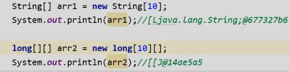

##### 2.2.2.4.4. 常量池表

- constant_pool是一种表结构，以`1~constant_pool_count-1`为索引。表明了后面有多少个常量项。
- 常量池**主要**存放**两大类常量**：
  - `字面量（Literal)`
    - 文本字符串
    - 声明为final的常量值
  - `符号引用（Symbolic References)`
    - 类和接口的全限定名
      >  示例：类名

      

    - 字段的名称和描述符(字段类型等)
      > 示例

    - 方法的名称和描述符(返回类型，形参等)
      > 示例：无形参，返回值为void的方法描述符

       

      > 示例：方法名

      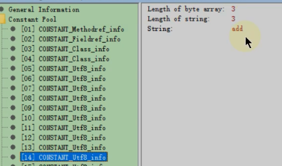

- 常量池元素类型。常量池表中元素的类型可能是下面任何一个

  | 类型                                   | 标志 | 描述                   |
  | -------------------------------------- | ---- | ---------------------- |
  | CONSTANT_utf8_info                     | 1    | UTF-8 编码的字符串     |
  | CONSTANT_Integer_info                  | 3    | 整型字面量             |
  | CONSTANT_Float_info                    | 4    | 浮点型字面量           |
  | CONSTANT_Long_info                     | 5    | 长整型字面量           |
  | CONSTANT_Double_info                   | 6    | 双精度浮点型字面量     |
  | CONSTANT_Class_info                    | 7    | 类或接口的符号引用     |
  | CONSTANT_String_info                   | 8    | 字符串类型字面量       |
  | CONSTANT_Fieldref_info                 | 9    | 字段的符号引用         |
  | CONSTANT_Methodref_info                | 10   | 类中方法的符号引用     |
  | CONSTANT_InterfaceMethodref_info       | 11   | 接口中方法的符号引用   |
  | CONSTANT_NameAndType_info              | 12   | 字段或方法的符号引用   |
  | CONSTANT_MethodHandle_info(jdk7 引入)  | 15   | 表示方法句柄           |
  | CONSTANT_MethodType_info(jdk7 引入)    | 16   | 标志方法类型           |
  | CONSTANT_InvokeDynamic_info(jdk7 引入) | 18   | 表示一个动态方法调用点 |

  - 常量池元素数据类型中没有基本数据类型`byte,short,boolean,char`对应的类型，是因为都可以使用integer表示

##### 2.2.2.4.5. 字节码解读

- 常量类型详细说明

   

  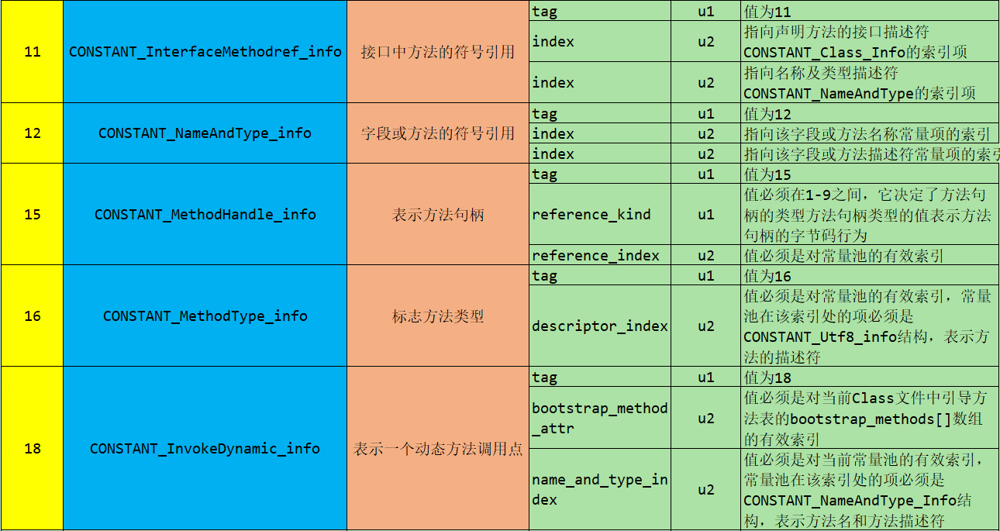

  - 常量池中的每一项都具备相同的特征: **第1个字节作为类型标记，用于确定该项的格式，这个字节称为tag byte(标记字节、标签字节）**。
  - 字符串的byte部分长度这里标的是u1，但其实是不确定的。长度为length的值

- 元素区分解读结果:
  > `22-1`个元素，用两种颜色分隔标记 <br />
  > **可以使用jclasslib，对照着看看**

  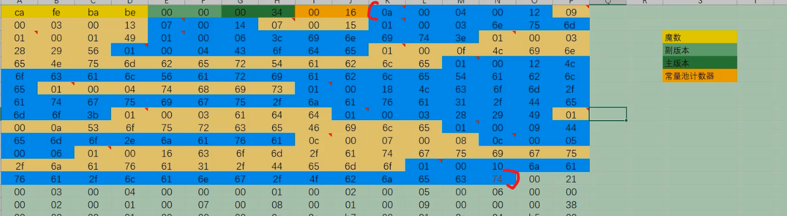

  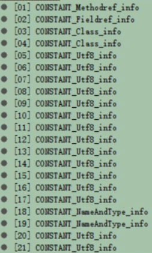

- 数据解读：以第一项为例
  - 数据
    ```
    0a 00 04 00 12 为例
    ```
  - 解读:
    - **tag**:0a是10，对应CONSTANT_Methodref_info，
    - 查`常量类型详细说明表`可得：CONSTANT_Methodref_info 有两个长度为u2的index
      - 指向声明方法的类描述符
        - `00 04`，值是4
        - 也就是找常量池表中的第4项，是一个CONSTANT_Class_info，
        - 然后同理继续解读，最后指向字符串
      - 指向名称及类型描述符
        - `00 12`，值是18
        - 也就是说常量池表中的第18项，是一个CONSTANT_NameAndType_info，
        - 然后同理继续解读，最后指向字符串

    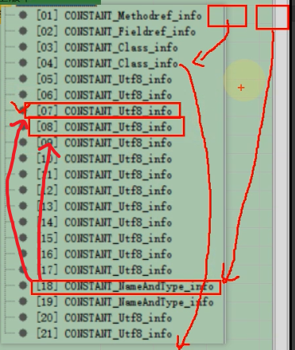

> 现在再用jclasslib或者bytecode viewer看看，估计可以理解透彻不少

##### 2.2.2.4.6. 小结

- 常量池：
  - 可以理解为class文件之中的资源仓库
  - 它是class文件结构中与其他项目关联最多的数据类型（后面的很多数据类型都会指向此处）
  - 也是占用class文件空间最大的数据项目之一。
- 常量池中为什么要包含这些内容
  - Java代码在进行Javac编译的时候，并不像C和C++那样有"连接"这一步骤，而是在虚拟机加载Class文件的时候进行动态链接。
  - **也就是说，在class文件中不会保存各个方法、字段的最终内存布局信息**
  - **因此这些字段、方法的符号引用不经过运行期换的话无法得到真正的内存入口地址，也就无法直接被虚拟机使用**
  - **当虚拟机运行时，需要从常量池获得对应的符号引用，再在类创建时或运行时解析、翻译到具体的内存地址之中**
  - 关于类的创建和动态链接的内容，在虚拟机类加载过程时再进行详细讲解

---

- 符号引用和直接引用的区别与关联：
  - 符号引用：
    - 内容：符号引用以**一组符号**来描述所引用的目标，符号可以是任何形式的字面量，只要使用时能**无歧义**地定位到目标即可。
    - 内存布局：**符号引用与虚拟机实现的内存布局无关**，**引用的目标并不一定已经加载到了内存中** 。
  - 直接引用：
    - 内容：直接引用可以是 **直接指向目标的指针、相对偏移量或是一个能间接定位到目标的句柄** 
      > 复习：JVM1, 符号引用详解章节，复习符号引用的表现
    - 内存布局： 
      - **直接引用是与虚机实现的内存布局相关的**，
      - 同一个符号引用在不同虚拟机实例上翻译出来的直接引用一般不会相同。
      - 如果有了直接引用，那说明引用的目标必定已经存在于内存之中了。

#### 2.2.2.5. 访问标识(access_flag)

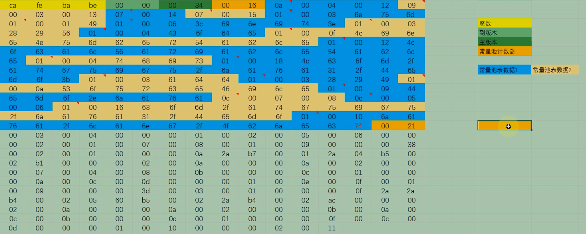

- 位置：在常量池后
- 作用：该标记使用两个字节表示，**用于识别一些类或者接口层次的访问信息**
  - 包括：这个 Class 是类还是接口；
  - 是否定义为 public 类型；
  - 是否定义为 abstract 类型；
  - 如果是类的话，是否被声明为 final 等

- 访问表示表:
  > 类的访问权限通常为 `ACC_` 开头的常量。

  | 标志名称       | 标志值 | 含义                                                                                                                       |
  | -------------- | ------ | -------------------------------------------------------------------------------------------------------------------------- |
  | ACC_PUBLIC     | 0x0001 | 标志为 public 类型                                                                                                         |
  | ACC_FINAL      | 0x0010 | 标志被声明为 final，只有类可以设置                                                                                         |
  | ACC_SUPER      | 0x0020 | 标志允许使用 invokespecial 字节码指令的新语义，JDK1.0.2 之后编译出来的类的这个标志默认为真。（使用增强的方法调用父类方法） |
  | ACC_INTERFACE  | 0x0200 | 标志这是一个接口                                                                                                           |
  | ACC_ABSTRACT   | 0x0400 | 是否为 abstract 类型，对于接口或者抽象类来说，次标志值为真，其他类型为假                                                   |
  | ACC_SYNTHETIC  | 0x1000 | 标志此类并非由用户代码产生（即：由编译器产生的类，没有源码对应）                                                           |
  | ACC_ANNOTATION | 0x2000 | 标志这是一个注解                                                                                                           |
  | ACC_ENUM       | 0x4000 | 标志这是一个枚举                                                                                                           |

  - 概述
    - 每一种类型的表示都是**通过设置访问标记的 32 位中的特定位**来实现的。
    - 比如，若是 public final 的类，则该标记为 `ACC_PUBLIC | ACC_FINAL`。访问标识的值为`0x0031`
      > `ACC_SUPER`为真，0x0001+0x0010+0x0020
    - 使用 ACC_SUPER 可以让类更准确地定位到父类的方法 super.method()，现代编译器都会设置并且使用这个标记。

- 注意：
  - 带有 ACC_INTERFACE 标志的 class 文件表示的是接口而不是类，反之则表示的是类而不是接口。
    - 如果一个 class 文件被设置了 ACC_INTERFACE 标志
      - 那么 **同时也得设置 ACC_ABSTRACT 标志** 。
      - **同时它不能再设置 ACC_FINAL、ACC_SUPER 或 ACC_ENUM 标志**。
    - 如果没有设置 ACC_INTERFACE 标志
      - 那么这个 class 文件可以具有上表中除 ACC_ANNOTATION 外的其他所有标志。
      - 当然，ACC_FINAL 和 ACC_ABSTRACT 这类互斥的标志除外。这两个标志不得同时设置。
  - ACC_SUPER 标志用于确定类或接口里面的 invokespecial 指令使用的是哪一种执行语义。
    - 针对 Java 虚拟机指令集的编译器都应当设置这个标志。
    - 对于 Java SE 8 及后续版本来说，无论 class 文件中这个标志的实际值是什么，也不管 class 文件的版本号是多少，Java 虚拟机都认为每个 class 文件均设置了 ACC_SUPER 标志。
    - ACC_SUPER 标志是为了向后兼容由旧 Java 编译器所编译的代码而设计的。
      - 目前的 ACC_SUPER 标志在由 JDK1.0.2 之前的编译器所生成的 access_flags 中是没有确定含义的，
      - 如果设置了该标志，那么 oracle 的 Java 虚拟机实现会将其忽略。
  - ACC_SYNTHETIC 标志意味着该类或接口是由编译器生成的，而不是由源代码生成的。
  - 注解类型必须设置 ACC_ANNOTATION 标志。**如果设置了 ACC_ANNOTATION 标志，那么也必须设置 ACC_INTERFACE 标志**。
    ```java
    public @interface ...
    ```
  - ACC_ENUM 标志表明该类或其父类为枚举类型。

#### 2.2.2.6. 类索引，父类索引，接口索引集合

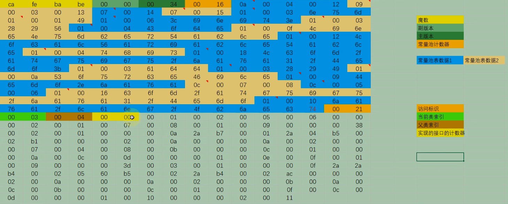

> #### 基本说明

- 说明：在访问标记后，会指定该类的类别、父类类别以及实现的接口，格式如下：

  | 长度 | 标志名称                     | 含义                                       |
  | ---- | :--------------------------- | :----------------------------------------- |
  | u2   | this_class                   | 类索引用于确定这个类的全限定名             |
  | u2   | super_class                  | 父类索引用于确定这个类的父类的全限定名     |
  | u2   | interfaces_count             | 实现的接口数量                             |
  | u2   | interfaces[interfaces_count] | 接口索引集合就用来描述这个类实现了哪些接口 |

  - 后三项数据来确定这个类的继承关系
  - super_class:
    - 由于 Java 语言不允许多重继承，所以父类索引只有一个，
    - 除了 java.1ang.Object 之外，所有的 Java 类都有父类，
    - 因此除了 java.lang.Object 外，所有 Java 类的父类索引都不为 0。
  - interface[interfaces_couont]:
    - 这些被实现的接口将按 implements 语句（如果这个类本身是一个接口，则应当是 extends 语句）后的接口顺序从左到右排列在接口索引集合中。

> #### this_class（类索引）

- 数据：
  - 2字节无符号整数，指向常量池的索引。
  - this_class 的值必须是对常量池表中某项的一个有效索引值。
  - 常量池在这个索引处的成员必须为 CONSTANT_Class_info 类型结构体，该结构体表示这个 class 文件所定义的类或接口。
- 作用：它提供了类的全限定名，如 `com/atguigu/java1/Demo`

> #### super_class（父类索引）

- 数据：
  - 2 字节无符号整数，指向常量池的索引
- 作用：
  - 它提供了当前类的父类的全限定名。
  - 如果我们没有继承任何类，其默认继承的是 java/lang/object 类。
  - 同时，由于 Java 不支持多继承，所以其父类只有一个。

- 注意：
  - super_class 指向的父类不能是 final。
  - Object类没有父类

> #### interfaces

- 数据与作用：
  - 指向常量池索引集合，它提供了一个符号引用到所有已实现的接口
  - 由于一个类可以实现多个接口，因此需要以数组形式保存多个接口的索引，
  - 表示接口的每个索引也是一个指向常量池的 CONSTANT_Class（当然这里就必须是接口，而不是类）。

- 组成：
  - interfaces_count（接口计数器）:interfaces_count 项的值表示当前类或接口的直接超接口数量。
  - interfaces[]（接口索引集合）
    - interfaces[]中每个成员的值必须是对常量池表中某项的有效索引值，
    - 它的长度为 interfaces_count。
    - 每个成员 interfaces[i]必须为 CONSTANT_Class_info 结构，其中 `0 <= i < interfaces_count`。
- 顺序：
  - 在 interfaces[]中，各成员所表示的接口顺序和对应的源代码中给定的接口顺序（从左至右）一样
  - 即 interfaces[0]对应的是源代码中最左边的接口。

#### 2.2.2.7. 字段表集合


##### 2.2.2.7.1. 基本说明

- fields
  - 作用：用于描述接口或类中声明的变量。
  - 组成：
    - 字段（field）包括**类级变量以及实例级变量**，
    - 但是不包括方法内部、代码块内部声明的局部变量。
    - 也不包括从父类或父接口继承的那些字段。
  - 表示方法：
    - 字段叫什么名字、字段被定义为什么数据类型，这些都是无法固定的，只能引用常量池中的常量来描述。
    - 它指向常量池索引集合，它描述了每个字段的完整信息。
    - 比如
      - 字段的标识符
      - 访问修饰符（public、private 或 protected）
      - 是类变量还是实例变量（static 修饰符）
      - 是否是常量（final 修饰符）等。

- 注意事项：
  - **字段表集合中不会列出从父类或者实现的接口中继承而来的字段**， **但有可能列出原本 Java 代码之中不存在的字段** 
  - 譬如**在内部类中为了保持对外部类的访问性，会自动添加指向外部类实例的字段**。
  - 在 Java 语言中**字段是无法重载**的。但是JVM字节码底层支持重载(了解)
    - 编程时的合法性要求：两个字段的数据类型、修饰符不管是否相同，都必须使用不一样的名称，
    - JVM字节码的合法性要求：如果两个字段的描述符不一致，那字段重名就是合法的。

##### 2.2.2.7.2. 组成

> ##### fields_count（字段计数器）

- 作用：fields_count 的值表示当前 class 文件 fields 表的成员个数。
- 长度：两个字节

> ##### 字段表

- fields 表组成：
  - 每个成员都是一个 **field_info 结构**
  - 用于表示该类或接口所声明的所有类字段或者实例字段
  - field_info：包括如下这些信息。（具体看字段表结构即可）
    > 这些信息中，**各个修饰符都是布尔值，要么有，要么没有**。

    - 作用域（public、private、protected修饰符）
    - 是实例变量还是类变量（static修饰符）
    - 可变性（final)
    - 并发可见性（volatile修饰符，是否强制从主内存读写）
    - 可否序列化（transient修饰符）
    - 字段数据类型（基本数据类型、对象、数组）
    - 字段名称
    - 字段表结构

- 字段表作为一个表，同样有他自己的结构：

  <details>
  <summary style="color:red;">展开(一定要看)</summary>
  
  | 标志名称       | 标志值           | 含义       | 数量             |
  | :------------- | :--------------- | :--------- | :--------------- |
  | u2             | access_flags     | 访问标志   | 1                |
  | u2             | name_index       | 字段名索引 | 1                |
  | u2             | descriptor_index | 描述符索引 | 1                |
  | u2             | attributes_count | 属性计数器 | 1                |
  | attribute_info | attributes       | 属性集合   | attributes_count |
  </details>

  - 字段表访问标识
    - 我们知道，一个字段可以被各种关键字去修饰
    - 比如：作用域修饰符（public、private、protected）、static 修饰符、final 修饰符、volatile 修饰符等等
    - 因此，其可像类的访问标志那样，使用一些标志来标记字段。**同时也可以加起来，表示多个标志共同修饰**
    - 字段的访问标志有如下这些：

    <details>
    <summary style="color:red;">展开(一定要看)</summary>

    | 标志名称        | 标志值 | 含义                       |
    | :-------------- | :----- | :------------------------- |
    | `ACC_PUBLIC`    | 0x0001 | 字段是否为 public          |
    | `ACC_PRIVATE`   | 0x0002 | 字段是否为 private         |
    | `ACC_PROTECTED` | 0x0004 | 字段是否为 protected       |
    | `ACC_STATIC`    | 0x0008 | 字段是否为 static          |
    | `ACC_FINAL`     | 0x0010 | 字段是否为 final           |
    | `ACC_VOLATILE`  | 0x0040 | 字段是否为 volatile        |
    | `ACC_TRANSTENT` | 0x0080 | 字段是否为 transient       |
    | `ACC_SYNCHETIC` | 0x1000 | 字段是否为由编译器自动产生 |
    | `ACC_ENUM`      | 0x4000 | 字段是否为 enum            |

    </details>

  - 字段名索引：
    - 指向常量池中字段名的索引
  - 描述符索引
    - 描述符的作用是用来描述字段的数据类型、方法的参数列表（包括数量、类型以及顺序）和返回值
      > 这里看字段就行
    - 根据描述符规则，基本数据类型（byte，char，double，float，int，long，short，boolean）及代表无返回值的 void 类型都用一个大写字符来表示
    - 而对象则用字符 L 加对象的全限定名来表示，如下所示：

    > 前面就有这张表

    <details>
    <summary style="color:red;">展开(一定要看)</summary>
    
    | 标志符 | 含义                                                |
    | :----- | :-------------------------------------------------- |
    | B      | 基本数据类型 byte                                   |
    | C      | 基本数据类型 char                                   |
    | D      | 基本数据类型 double                                 |
    | F      | 基本数据类型 float                                  |
    | I      | 基本数据类型 int                                    |
    | J      | 基本数据类型 long                                   |
    | S      | 基本数据类型 short                                  |
    | Z      | 基本数据类型 boolean                                |
    | V      | 代表 void 类型                                      |
    | L      | 对象类型，比如：`Ljava/lang/Object;`                |
    | `[`      | 数组类型，代表一维数组。比如：`double[][][] is [[[D` |
    </details>
  - 属性计数器和属性集合
    - 一个字段还可能拥有一些属性，用于存储更多的额外信息
    - 比如常量的初始化值、一些注释信息等。
    - 属性个数存放在 attribute_count 中，属性具体内容存放在 attributes 数组中。

    ```java
    // 以常量属性为例，结构为：
    ConstantValue_attribute{
      u2 attribute_name_index;
      u4 attribute_length;
      u2 constantvalue_index;
    }
    // 说明：对于常量属性而言，attribute_length 值恒为 2。
    ```

#### 2.2.2.8. 方法表集合

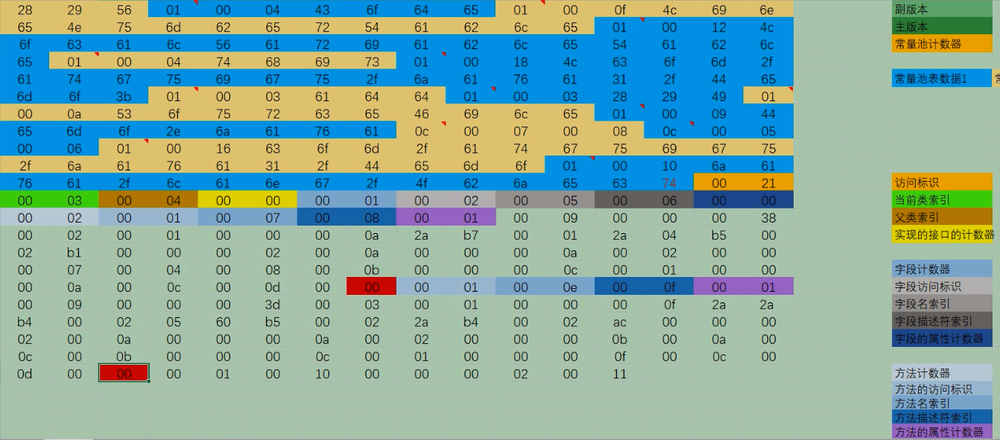

##### 2.2.2.8.1. 基本说明

- 说明：
  - 指向常量池索引集合，它完整描述了每个方法的签名。
  - 在字节码文件中，每一个 `method_info 项`都对应着一个类或者接口中的方法信息
  - 比如方法的访问修饰符（public、private 或 protected），方法的返回值类型以及方法的参数信息等。
  - 如果这个方法不是抽象的或者不是 native 的，那么字节码中会体现出来。
- 组成：
  - methods 表只描述当前类或接口中声明的方法
  - 不包括从父类或父接口继承的方法。
  - 另一方面，methods 表有可能会出现由编译器自动添加的方法，最典型的便是编译器产生的方法信息（比如：类（接口）初始化方法`<clinit>()`和实例初始化方法`<init>()`。

- **使用注意事项：**
  - 在 Java 语言中，要重载（Overload）一个方法
    - 除了要与原方法具有相同的简单名称之外
    - 还要求必须拥有一个与原方法不同的特征签名
      - 特征签名就是一个方法中各个参数在常量池中的字段符号引用的集合
      - 也就是因为返回值不会包含在特征签名之中，因此 Java 语言里无法仅仅依靠返回值的不同来对一个已有方法进行重载
    - 但**在 Class 文件格式**中，**特征签名的范围更大一些，只要描述符不是完全一致的两个方法就可以共存**
    - 也就是说，如果两个方法有相同的名称和特征签名，但返回值不同，那么也是可以合法共存于同一个 class 文件中。
  - 也就是说，**Class字节码文件允许通过返回值不同进行重载**
    - 尽管 Java 语法规范并不允许在一个类或者接口中声明多个方法签名相同的方法
    - 但是和 Java 语法规范相反，字节码文件中却恰恰允许存放多个方法签名相同的方法
      - 唯一的条件就是这些方法之间的返回值不能相同。

##### 2.2.2.8.2. 组成

> ##### methods_count（方法计数器）

- methods_count 
  - 表示当前 class 文件 methods 表的成员个数
  - 使用两个字节来表示。

> ##### methods[]（方法表）

- 说明：
  - 组成：methods 表中的每个成员都必须是一个 `method_info 结构`
    - method_info作用：用于表示当前类或接口中某个方法的完整描述。
    - method_info 表示范围(方法表组成)：结构可以表示类和接口中定义的所有方法，包括实例方法、类方法、实例初始化方法和类或接口初始化方法
  - 如果某个 method_info 结构的 access_flags 项既没有设置 ACC_NATIVE 标志也没有设置 ACC_ABSTRACT 标志
    - 那么该结构中也应包含实现这个方法所用的 Java 虚拟机指令。

- 方法表的结构
  > 实际跟字段表是一样的，方法表结构如下：

  <details>
  <summary style="color:red;">展开(一定要看)</summary>

  | 标志名称       | 标志值           | 含义       | 数量             |
  | :------------- | :--------------- | :--------- | :--------------- |
  | u2             | access_flags     | 访问标志   | 1                |
  | u2             | name_index       | 方法名索引 | 1                |
  | u2             | descriptor_index | 描述符索引 | 1                |
  | u2             | attributes_count | 属性计数器 | 1                |
  | attribute_info | attributes       | 属性集合   | attributes_count |
  </details>

  - **方法表访问标志**
    > 跟字段表一样，方法表也有访问标志，而且他们的标志有部分相同，部分则不同 <br />
    > 方法表的具体访问标志如下：

    <details>
    <summary style="color:red;">展开(一定要看)</summary>

    | 标志名称      | 标志值 | 含义                                |
    | :------------ | :----- | :---------------------------------- |
    | ACC_PUBLIC    | 0x0001 | public，方法可以从包外访问          |
    | ACC_PRIVATE   | 0x0002 | private，方法只能本类访问           |
    | ACC_PROTECTED | 0x0004 | protected，方法在自身和子类可以访问 |
    | ACC_STATIC    | 0x0008 | static，静态方法                    |
    </details>
  - 其他和字段表集合一一类比即可

#### 2.2.2.9. 属性表集合

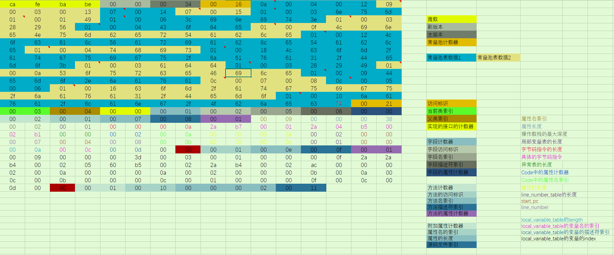

##### 2.2.2.9.1. 基本说明

- 属性表组成：
  - 字段表后跟有属性表
  - 方法表后跟有属性表
  - 附加的属性表集合
    - 指的是 class 文件所携带的辅助信息
    - 比如该 class 文件的源文件的名称，以及任何带有 RetentionPolicy.CLASS 或者 RetentionPolicy.RUNTIME 的注解。
    - 这类信息通常被用于 Java 虚拟机的验证和运行，以及 Java 程序的调试
    - 一般无须深入了解

- 属性表集合的限制
  - 没有那么严格
  - 不再要求各个属性表具有严格的顺序
  - 并且只要不与已有的属性名重复，任何人实现的编译器都可以向属性表中写入自己定义的属性信息
  - **但 Java 虚拟机运行时会忽略掉它不认识的属性**

##### 2.2.2.9.2. 组成

> ##### attributes_count（属性计数器）

  - attributes_count 的值表示当前 class 文件属性表的成员个数。
  - 属性表中每一项都是一个 attribute_info 结构。

> ##### attributes[]（属性表）

- 组成：
  - 属性表的每项的值都是一个 **attribute_info 结构**
  - 属性表的结构比较灵活，各种不同的属性只要满足以下结构即可。

    | 类型 | 名称                 | 数量             | 含义       |
    | :--- | :------------------- | :--------------- | :--------- |
    | u2   | attribute_name_index | 1                | 属性名索引 |
    | u4   | attribute_length     | 1                | 属性长度   |
    | u1   | info                 | attribute_length | 属性表     |

- **属性类型** ： [官网](https://docs.oracle.com/javase/specs/jvms/se8/html/jvms-4.html#jvms-4.7)
  - 属性表实际上可以有很多类型，上面看到的 Code 属性只是其中一种
  - Java8 里面定义了 23 种属性
  - 下面这些是虚拟机中预定义的属性：

  | 属性名称                            | 使用位置           | 含义                                                                                          |
  | :---------------------------------- | :----------------- | :-------------------------------------------------------------------------------------------- |
  | Code                                | 方法表             | Java 代码编译成的字节码指令                                                                   |
  | ConstantValue                       | 字段表             | final 关键字定义的常量池                                                                      |
  | Deprecated                          | 类，方法，字段表   | 被声明为 deprecated 的方法和字段                                                              |
  | Exceptions                          | 方法表             | 方法抛出的异常                                                                                |
  | EnclosingMethod                     | 类文件             | 仅当一个类为局部类或者匿名类时才能拥有这个属性，这个属性用于标识这个类所在的外围方法          |
  | InnerClass                          | 类文件             | 内部类列表                                                                                    |
  | LineNumberTable                     | Code 属性          | Java 源码的行号与字节码指令的对应关系                                                         |
  | LocalVariableTable                  | Code 属性          | 方法的局部变量描述                                                                            |
  | StackMapTable                       | Code 属性          | JDK1.6 中新增的属性，供新的类型检查检验器和处理目标方法的局部变量和操作数有所需要的类是否匹配 |
  | Signature                           | 类，方法表，字段表 | 用于支持泛型情况下的方法签名                                                                  |
  | SourceFile                          | 类文件             | 记录源文件名称                                                                                |
  | SourceDebugExtension                | 类文件             | 用于存储额外的调试信息                                                                        |
  | Synthetic                           | 类，方法表，字段表 | 标志方法或字段为编译器自动生成的                                                              |
  | LocalVariableTypeTable              | 类                 | 是哟很难过特征签名代替描述符，是为了引入泛型语法之后能描述泛型参数化类型而添加                |
  | RuntimeVisibleAnnotations           | 类，方法表，字段表 | 为动态注解提供支持                                                                            |
  | RuntimeInvisibleAnnotations         | 类，方法表，字段表 | 用于指明哪些注解是运行时不可见的                                                              |
  | RuntimeVisibleParameterAnnotation   | 方法表             | 作用与 RuntimeVisibleAnnotations 属性类似，只不过作用对象或方法                               |
  | RuntimeInvisibleParameterAnnotation | 方法表             | 作用与 RuntimeInvisibleAnnotations 属性类似，只不过作用对象或方法                             |
  | AnnotationDefault                   | 方法表             | 用于记录注解类元素的默认值                                                                    |
  | BootstrapMethods                    | 类文件             | 用于保存 invokeddynamic 指令引用的引导方法限定符                                              |

  - **部分属性详解**
    - **① ConstantValue 属性** ConstantValue 属性表示一个常量字段的值。位于 field_info 结构的属性表中。

      ```java
      ConstantValue_attribute{
        u2 attribute_name_index;
        u4 attribute_length;
        u2 constantvalue_index;//字段值在常量池中的索引，常量池在该索引处的项给出该属性表示的常量值。（例如，值是1ong型的，在常量池中便是CONSTANT_Long）
      }
      ```

    - **② Deprecated 属性** Deprecated 属性是在 JDK1.1 为了支持注释中的关键词@deprecated 而引入的。

      ```java
      Deprecated_attribute{
        u2 attribute_name_index;
        u4 attribute_length;
      }
      ```

    - **③ Code 属性**
      - Code 属性就是存放方法体里面的代码。
      - 但是，并非所有方法表都有 Code 属性。像接口或者抽象方法，他们没有具体的方法体，因此也就不会有 Code 属性了。
      - Code属性中包括其他属性，如**LineNumberTable属性和LocalVariableTable属性**

      | 类型             | 名称                     | 数量               | 含义                     |
      | :--------------- | :----------------------- | :----------------- | :----------------------- |
      | u2               | `attribute_name_index`   | 1                  | 属性名索引               |
      | u4               | `attribute_length`       | 1                  | 属性长度                 |
      | u2               | `max_stack`              | 1                  | 操作数栈深度的最大值     |
      | u2               | `max_locals`             | 1                  | 局部变量表所需的存续空间 |
      | u4               | `code_length`            | 1                  | 字节码指令的长度         |
      | u1               | `code`                   | `code_lenth`       | 存储字节码指令           |
      | u2               | `exception_table_length` | 1                  | 异常表长度               |
      | `exception_info` | `exception_table`        | `exception_length` | 异常表                   |
      | u2               | `attributes_count`       | 1                  | 属性集合计数器           |
      | `attribute_info` | `attributes`             | `attributes_count` | 属性集合                 |

      > 可以看到：Code 属性表的前两项跟属性表是一致的，即 Code 属性表遵循属性表的结构，后面那些则是他自定义的结构。

    - **④ InnerClasses 属性**
      - 为了方便说明特别定义一个表示类或接口的 Class 格式为 C。
      - 如果 C 的常量池中包含某个 CONSTANT_Class_info 成员，且这个成员所表示的类或接口不属于任何一个包
      - 那么 C 的 ClassFile 结构的属性表中就必须含有对应的 InnerClasses 属性。
      - InnerClasses 属性是在 JDK1.1 中为了支持**内部类和内部接口**而引入的，位于 ClassFile 结构的属性表。

    - **⑤ LineNumberTable 属性**
      - LineNumberTable 属性是可选变长属性，**是位于 Code属性结构中 的属性表**。
      - LineNumberTable 属性是用来描述 Java 源码行号与字节码行号之间的对应关系
      - 这个属性可以用来在调试的时候定位代码执行的行数。
      - 在 Code 属性的属性表中，LineNumberTable 属性可以按照任意顺序出现
      - 此外，多个 LineNumberTable 属性可以共同表示一个行号在源文件中表示的内容，即 LineNumberTable 属性不需要与源文件的行一一对应。
        > 因为一行代码可能会翻译成多个字节码

      ```java
      // LineNumberTable属性表结构：
      LineNumberTable_attribute{
          u2 attribute_name_index;
          u4 attribute_length;
          u2 line_number_table_length;
          {
              u2 start_pc; // start_pc，即字节码行号
              u2 line_number; // 1ine_number，即 Java 源代码行号。
          } line_number_table[line_number_table_length];
      }
      ```

    - **⑥ LocalVariableTable 属性**
      - LocalVariableTable 是可选变长属性，**位于 Code 属性的属性表中**。
      - 它被调试器用于确定方法在执行过程中局部变量的信息。在 Code 属性的属性表中，LocalVariableTable 属性可以按照任意顺序出现。Code 属性中的每个局部变量最多只能有一个 LocalVariableTable 属性。

      ```java
      // LocalVariableTable属性表结构：
      LocalVariableTable_attribute{
          u2 attribute_name_index;
          u4 attribute_length;
          u2 local_variable_table_length;
          {
              u2 start_pc; // 变量所在的字节码字节码行号
              u2 length; // 生命周期长度（字节码数量）
              // start pc + length 表示这个变量在字节码中的生命周期起始和结束的偏移位置（this 生命周期从头 e 到结尾 10）
              u2 name_index; // name 就是变量名。name_index指的是变量名在常量表的索引
              u2 descriptor_index; // Descriptor 表示局部变量类型描述
              u2 index; // index 就是这个变量在局部变量表中的槽(slot)位（槽位可复用）
          } local_variable_table[local_variable_table_length];
      }
      ```

    - **⑦ Signature 属性**
      - Signature 属性是可选的定长属性，**位于 ClassFile，field_info 或 method_info 结构的属性表中**。
      - 在 Java 语言中，任何类、接口、初始化方法或成员的泛型签名如果包含了类型变量（Type Variables）或参数化类型（Parameterized Types），则 Signature 属性会为它记录泛型签名信息。

    - **⑧ SourceFile 属性**

      | 类型 | 名称                 | 数量 | 含义                     |
      | :--- | :------------------- | :--- | :----------------------- |
      | u2   | attribute_name_index | 1    | 属性名索引               |
      | u4   | attribute_length     | 1    | 属性长度，恒为 2         |
      | u2   | sourcefile_index     | 1    | 源码文件素引，源文件名称 |

      > 可以看到，其长度总是固定的 8 个字节。

    - **⑨ 其他属性**

> ##### `<init>`方法Code属性详细解读示例

> ##### 附加属性详细解读示例

### 2.2.3. javap命令

#### 2.2.3.1. 说明

- 说明
  - 通过反编译生成的字节码文件，我们可以深入的了解java代码的工作机制。
  - 但是，自己分析类文件结构太过于麻烦
  - 除了使用第三方的jclasslib工具之外，oracle官方也提供了工具：javap。
  - javap是jdk自带的反解析工具。它的作用就是根据class字节码文件
  - 反解析出当前类对应的code区（字节码指令）、局部变量表、异常表和代码行偏移量映射表、常量池等信息。
  - 但不显示类索引、父类索引、接口索引集合、`<clinit>()`、`<init>()`等结构
  - 通过局部变量表，我们可以查看局部变量的作用域范围、所在槽位等信息，甚至可以看到槽位复用等信息。

- 注意：
  - 解析字节码文件得到的信息中，有些信息需要在使用javac编译成class文件时，指定参数才能输出。
    >（如局部变量表、指令和代码行偏移量映射表、常量池中方法的参数名称等等）
  - 比如，**直接javac xx.java,就不会在生成对应的局部变量表等信息**，
  - 使用`javac-g xx.java`就可以生成所有相关信息了。
  - 的eclipse或IDEA默认情况下，在编译时会帮你生成局部变量表、指令和代码行偏移量映射表等信息

#### 2.2.3.2. 指令

- 帮助指令： `javap --help`

- 指令说明

  

- 推荐：`javap -v -p`输出的内容最全，尽可能使用-v

---

- 通过对前面例子代码反汇编文件的简单分析，可以发现，一个方法的执行通常会涉及下面几块内存的操作：
  - (1)java栈中：局部变量表、操作数栈。
  - (2)java堆。通过对象的地址引用去操作。
  - (3)常量池。
  - (4)其他如帧数据区、方法区的剩余部分等情况，测试中没有显示出来，这里说明一下。


#### 2.2.3.3. 输出结构

[反编译文件解析(点击打开)](./external_file/javaptest.txt)

> 上面文件与字节码一一对应解读看看

### 2.2.4. 面试题

```
类文件结构有几个部分
```

```
知道字节码吗？字节码都有哪些？Integer x = 5;int y = 5;比较x==y要经过哪些步骤
```

## 2.3. 字节码指令

