> ## 记住，有什么不懂得，查文档最有用

[java8 文档](https://docs.oracle.com/javase/specs/jvms/se8/html/index.html)

# 1. 学习路线回顾


- 最终目的是性能的监控和调优(下篇)
- 所以学会使用性能监测工具(下篇)
- 要想看得懂可视化工具显示的数据，就要懂内存的分配和回收(上篇)
- 想懂内存的分配和回收，就要懂内存的结构(上篇)
- 为了更好得理解内存结构，分配位置，内存中的数据是干什么的等等，要
  - 学习类的加载器(上篇简单谈一下，中篇深入)
  - 执行引擎(上篇)
  - class 文件结构和字节码指令(中篇)
    > 在上篇也会简单涉及

# 2. class 文件结构

## 2.1. 概述

### 2.1.1. 字节码文件的跨平台性

> 前面就有讲过，`跨平台的语言，跨语言的平台`，此处不再重复说明

### 2.1.2. java 前端编译器说明

- 说明
  - Java 源代码的编译结果是字节码，那么肯定需要有一种编译器能够将 Java 源码编译为字节码，
  - 承担这个重要责任的就是配置在 path 环境变量中的**javac 编译器**
  - javac 是一种能够将 Java 源码编译为字节码的**前端编译器**。
    ```
    HotSpot VM并没有强制要求前端编译器只能使用javac来编译字节码，
    其实只要编译结果符合JVM规范都可以被JVM所识别即可。
    ```
- 其他编译器编译器
  - 在 Java 的前端编译器领域，除了 javac 之外，还有一种被大家经常用到的前端编译器，那就是内置在 Eclipse 中的**ECJ （EclipseCompiler for Java）编译器**。
  - 和 Javac 的全量式编译不同，ECJ 是一种增量式编译器。
  - 在 Eclipse 中，当开发人员编写完代码后，使用“Ctrl+S”快捷键时，ECJ 编译器所采取的编译方案是把未编译部分的源码逐行进行编译，而非每次都全量编译。
  - 因此 ECJ 的编译效率会比 javac 更加迅速和高效，当然编译质量和 javac 相比大致还是一样的。
  - ECJ 不仅是 Eclipse 的默认内置前端编译器，在 Tomcat 中同样也是使用 ECJ 编译器来编译 jsp 文件。
  - 默认情况下， IntelliJ IDEA 使用 javac 编译器。（还可以自己设置为 AspectJ 编译器 ajc）

- 优化：前端编译器并不会直接涉及编译优化等方面的技术，而是将这些具体优化细节移交给 HotSpot 的 JIT 编译器负责。

<br />

> 复习：AOT

### 2.1.3. 示例：透过字节码查看代码细节

#### 2.1.3.1. 示例 1--Integer 间的==

- 通过字节码查看代码细节示例：

  ```java
  Integer i1 = 10;
  Integer i2 = 10;
  System.out.println(i1==i2);//true

  Integer i1 = 128;
  Integer i2 = 128;
  System.out.println(i1==i2);//false
  ```

<details>
<summary style="color:red;">解析</summary>

```
invokestatic #2 <java/lang/Integer.valueOf>
```

查看字节码可以发现调用了 Integer 的 valueOf 方法。如果是-128~127 之间，就会存在与 IntegerCache 中，不会创建新的 Integer，因此引用相同。

```java
public static Integer valueOf(int i) {
    if (i >= IntegerCache.low && i <= IntegerCache.high)
        return IntegerCache.cache[i + (-IntegerCache.low)];
    return new Integer(i);
}
```

</details>

#### 2.1.3.2. 示例 2--String 间的==

- 该示例在上面面试题中已经说明过，不再重复说明。涉及
  - `new String()+new String()`实现原理
  - `StringBuilder` 的 `toString()`方法

```java
String str = new String("hello") + new String("world");
String str1 = "helloworld";
System.out.println(str == str1);
```

#### 2.1.3.3. 示例 3(难)--继承

下面代码的输出是什么

```java
class Father {
    int x = 10;

    public Father() {
        this.print();
        x = 20;
    }
    public void print() {
        System.out.println("Father.x = " + x);
    }
}

class Son extends Father {
    int x = 30;
//    float x = 30.1F;
    public Son() {
        this.print();
        x = 40;
    }
    @Override
    public void print() {
        System.out.println("Son.x = " + x);
    }
}

public class SonTest {
    public static void main(String[] args) {
        Father f = new Son();
        System.out.println(f.x);
    }
}
```

<details>
<summary style="color:red;">答案与解析</summary>

结果：

```
Son.x = 0
Son.x = 30
20  // 属性不存在多态性
```

<br /><br />

Son 类的字节码：

```
 0 aload_0 // 把this放到局部变量表中
 1 invokespecial #1 <com/atguigu/java/Father.<init>> // 调用父类的init方法，init方法中调用了print,但是因为子类重写了父类的print方法，
                                                     // 所以执行子类的print方法。因为在下面才给Son里面的x赋值为30，因此此处打印为0
 4 aload_0
 5 bipush 30  // 对应 int x=30
 7 putfield #2 <com/atguigu/java/Son.x>  // 对应this.print()
10 aload_0
11 invokevirtual #3 <com/atguigu/java/Son.print>
14 aload_0
15 bipush 40
17 putfield #2 <com/atguigu/java/Son.x>
20 return
```

</details>

> （复习）属性初始化方式：1.默认初始化；2.显式初始化；3.代码块中初始化；4.构造器中初始化；5.对象.属性 初始化

### 2.1.4. 字节码与解读

- 字节码文件里是什么--字节码定义
  - 源代码经过编译器编译之后便会生成一个字节码文件
  - 字节码是一种二进制的类文件,它的内容是 JVM 的指令,而不像 C、C++经由编译器直接生成机器码。

- 什么是字节码指令(byte code)--字节码指令构成
  - Java 虚拟机的指令由一个字节长度的、代表着某种特定操作含义的**操作码(opcode)**，
  - 以及跟随其后的零至多个代表此操作所需参数的**操作数(operand)**所构成。
  - 虚拟机中许多指令并不包含操作数,只有一个操作码。

- 解读字节码方式
  - jclasslib
  - javap 反编译
  - Notepad++搭配 HEX-Editor 插件。或者 Binary Viewer

## 2.2. class 文件结构

[Demo字节码解析的excel文件](./资料/Demo字节码的解析.xlsx)

### 2.2.1. 整体说明

- Class 类的本质
  - 任何一个 C1ass 文件都对应着唯一一个类或接口的定义信息,
  - 但反过来说,C1ass 文件实际上它并不一定以磁盘文件的形式存在，也能以网络等的方式传输过来
  - Class 文件是一组以 8 位字节为基础单位的**二进制流**
- Class 文件格式
  - 要求
    - Class 的结构不像 XML 等描述语言
    - 由于它没有任何分隔符号，所以在其中的数据项,无论是字节顺序还是数量,都是被严格限定的
    - 哪个字节代表什么含义,长度是多少,先后顺序如何,都不允许改变
  - 组成:
    > Class 文件格式采用一种类似于 C 语言结构体的方式进行数据存储 <br />
    > 这种结构中只有两种数据类型: **无符号数** 和 **表**
    - **无符号数**:
      - 属于基本的数据类型
      - 以 u1、u2、u4、u8 来分别代表 1 个字节、2 个字节、4 个字节和 8 个字节的无符号数
      - 无符号数可以用来描述**数字、索引引用、数量值或者按照 UTF-8 编码构成字符串值**
    - **表**:
      - 是由**多个无符号数或者其他表**作为数据项构成的**复合数据类型**
        > 类似 java 中的数组
      - 所有表都习惯性地以"\_info"结尾。
      - 表用于描述有层次关系的复合结构的数据,**整个 C1ass 文件本质上就是一张表**。
      - 由于表没有固定长度,所以通常会在其前面加上个数说明

- class 文件结构
  - 官网定义

    ```
    ClassFile {
        u4             magic;
        u2             minor_version;
        u2             major_version;
        u2             constant_pool_count;
        cp_info        constant_pool[constant_pool_count-1];
        u2             access_flags;
        u2             this_class;
        u2             super_class;
        u2             interfaces_count;
        u2             interfaces[interfaces_count];
        u2             fields_count;
        field_info     fields[fields_count];
        u2             methods_count;
        method_info    methods[methods_count];
        u2             attributes_count;
        attribute_info attributes[attributes_count];
    }
    ```
  - 详细说明

    | 类型           | 名称                | 说明                     | 长度     | 数量                      |
    | -------------- | ------------------- | ------------------------ | -------- | ------------------------- |
    | u4             | magic               | 魔数,识别 Class 文件格式 | 4 个字节 | 1                         |
    | u2             | minor_version       | 副版本号(小版本)         | 2 个字节 | 1                         |
    | u2             | major_version       | 主版本号(大版本)         | 2 个字节 | 1                         |
    | u2             | constant_pool_count | 常量池计数器             | 2 个字节 | 1                         |
    | cp_info        | constant_pool       | 常量池表                 | n 个字节 | **constant_pool_count-1** |
    | u2             | access_flags        | 访问标识                 | 2 个字节 | 1                         |
    | u2             | this_class          | 类索引                   | 2 个字节 | 1                         |
    | u2             | super_class         | 父类索引                 | 2 个字节 | 1                         |
    | u2             | interfaces_count    | 接口计数器               | 2 个字节 | 1                         |
    | u2             | interfaces          | 接口索引集合             | 2 个字节 | interfaces_count          |
    | u2             | fields_count        | 字段计数器               | 2 个字节 | 1                         |
    | field_info     | fields              | 字段表                   | n 个字节 | fields_count              |
    | u2             | methods_count       | 方法计数器               | 2 个字节 | 1                         |
    | method_info    | methods             | 方法表                   | n 个字节 | methods_count             |
    | u2             | attributes_count    | 属性计数器               | 2 个字节 | 1                         |
    | attribute_info | attributes          | 属性表                   | n 个字节 | attributes_count          |

  - 魔数:
    - magic
    - 用来识别为一个 class 文件的标识
  - C1ass 文件版本
    - minor_version
    - major_version
  - 常量池
    - constant_pool_count
      > 由于表没有固定长度,所以通常会在其前面加上个数说明
    - constant_pool。首索引没有分配，所以长度为 constant_pool_count-1
  - 访问标志
    - access_flags
    - 是类，还是接口，权限是什么等
  - 类索引,父类索引,接口索引集合
    - this_class：当前类是什么
    - super_class：父类是什么
    - interfaces_count + interfaces: 接口数组
      > 由于表没有固定长度,所以通常会在其前面加上个数说明
  - 字段表集合
    - fields_count;
      > 由于表没有固定长度,所以通常会在其前面加上个数说明
    - fields[fields_count];
  - 方法表集合
    - methods[methods_count];
    - attributes_count;
  - 属性表集合
    > **注意，field 和 attribute 不同。日常总是称类中的字段为属性，但是 JVM 中属性有其他含义**。
    > 比如类名，LineNumberTable,LocalVariableTable
    - attributes_count;
    - attributes[attributes_count];

### 2.2.2. 详细说明

#### 2.2.2.1. 代码

```java
package com.atguigu.java1;

public class Demo {
    private int num = 1;

    public int add(){
        num = num + 2;
        return num;

    }
}
```

#### 2.2.2.2. 魔数


- 说明：
  - 每个 C1ass 文件开头的**4 个字节的无符号整数**称为魔数(Magic Number)
  - 作用: 是**确定这个文件是否为一个能被虚拟机接受的有效合法的 Class 文件**。即**魔数是 Class 文件的标识符**。
  - 原因：
    - 使用魔数而不是扩展名来进行识别主要是基于安全方面的考虑,因为文件扩展名可以随意地改动。
    - 类似 png 格式图片，使用 notepad++的 HEX-Editor 查看二进制内容，可以发现前 32 个字节也相同

- 值：魔数值固定为`0xCAFEBABE`。不会改变。

- 相关异常：如果一个 Class 文件不以 θ XCAFEBABE 开头,虚拟机在进行文件校验的时候就会直接抛出以下错误:
  ```
  Error: A JNI error has occurred, please check your installation and try again
  Exception in thread "main" java. lang Class Format Error: Incompatible magic value 1885430635 in class
  file StringTest
  ```

#### 2.2.2.3. class 文件版本号


- 说明：文件中紧接着魔数的 4 个字节存储的是 Class 文件的版本号。
  - 第 5 个和第 6 个字节所代表的含义就是编译的副版本号 minor version
  - 而第 7 个和第 8 个字节就是编译的主版本号 major version
  - 主副版本号共同构成了 c1ass 文件的格式版本号。譬如某个 C1ass 文件的主版本号为 M,副版本号为 m,那么这个 c1ass 文件的格式版本号就确定为 M.m
- 版本号和]ava 编译器的对应关系：
  > 
  - Java 的版本号是从 45 开始的,JDK1.1 之后的每个 DK 大版本发布主版本号向上加 1。
  - 虚拟机 JDK 版本为 1.k(k>=2)时,对应的 c1ass 文件格式版本号的范围为 45.0 - 44+k.0(含两端)

- 向下兼容：
  - 不同版本的]ava 编译器编译的 C1ass 文件对应的版本是不一样的
  - 目前,高版本的 Java 虚拟机可以执行由低版本编译器生成的 Class 文件,但是低版本的 Java 虚拟机不能执行由高版本编译器生成的 C1ass 文件。
  - 否则 JVM 会抛出`iava.lang, UnsupportedclassVersionError`异常。
    > 在实际应用中,由于开发环境和生产环境的不同,可能会导致该问题的发生。因此,需要我们在开发时,特别注意开发编译的 JDK 版本和生产环境中的 DK 版本是否一致

#### 2.2.2.4. 常量池

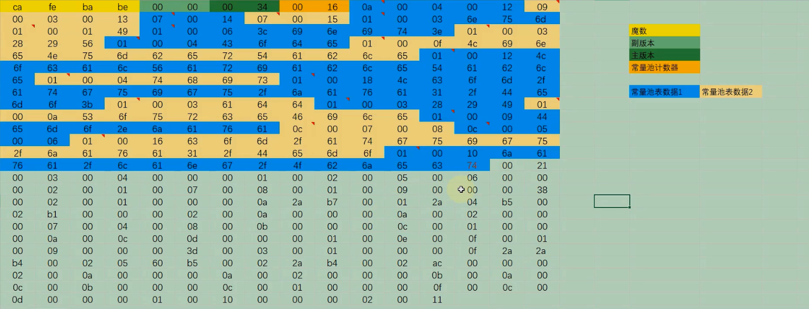

##### 2.2.2.4.1. 说明

- 重要性
  - 常量池是 C1ass 文件中内容最为丰富的区域之一。常量池对于 C1ass 文件中的字段和方法解析也有着至关重要的作用。
  - 随着]ava 虚拟机的不断发展,常量池的内容也日渐丰富。可以说,常量池是整个 class 文件的基石。
  - 如以下三个为基于 java 动态的特性在 1.7 时添加
    - CONSTANT MethodHandle info 表示方法句柄
    - CONSTANT\_ MethodType_into 标志方法类型
    - CONSTANT Invoke Dynamic info 表示一个动态方法调用点

- 字节码中的位置
  - 在版本号之后,紧跟着的是**常量池的数量,以及若干个常量池表项**
  - 常量池中常量的数量是不固定的,所以在常量池的入口需要放置一项 u2 类型的无符号数,代表**常量池容量计数值(constant pool count)**
  - 与 Java 中语言习惯不一样的是,**这个容量计数是从 1 而不是开始的**。

- 组成
  > -
  - C1ass 文件使用了一个前置的**容量计数器(constant_pool_count)**加**若干个连续的数据项(constant pool)**的形式来描述常量池内容。
  - 我们把这一系列连续常量池数据称为常量池集合
  - 常量池表项中,用于存放编译时期生成的各种**字面量和符号引用**,这部分内容将在类加载后进入方法区**运行时常量池**中存放

##### 2.2.2.4.2. 常量池计数器

- 由于常量池的数量不固定，时长时短，所以需要放置两个字节来表示常量池容量计数值。
- 常量池容量计数值（u2 类型）:**从 1 开始，表示常量池中有多少项常量。即 constant_pool_count=1 表示常量池中有 0 个常量项**
- Demo 的值为：

  

  - 其值为 0×0016,也就是 22。
  - 也就是说实际上只有 21 项常量。索引为范围是 1-21。

  ```
  通常我们写代码时都是从0开始的，但是这里的常量池却是从1开始，因为它把第0项常量空出来了。
  这是为了满足后面某些指向常量池的索引值的数据在特定情况下需要表达不引用任何一个常量池项目的含义
  这种情况可用索引值来表示。
  ```

##### 2.2.2.4.3. 概念说明(补充)

- 全限定名
  - `com/atguigu/test/Demo`这个就是类的全限定名，仅仅是把包名的`.`替换成`/`，为了使连续的多个全限定名之间不产生混淆
  - 在使用时最后一般会加入一个`;`,表示全限定名结束。
- 简单名称
  - 简单名称是指没有类型和参数修饰的方法或者字段名称，上面例子中的类的 add()方法和 num 字段的简单名称分别是 add 和 num。
- 描述符
  - 作用:用来描述字段的数据类型、方法的参数列表（包括数量、类型以及顺序）和返回值。
  - 规则:
    > (数据类型：基本数据类型、引用数据类型）
    - 基本数据类型(byte、char、double、float、int、long、short、boolean)以及代表无返回值的 void 类型都用一个大写字符来表示
    - 而对象类型则用字符 L 加对象的全限定名来表示

    | 标志符 | 含义                                                 |
    | ------ | ---------------------------------------------------- |
    | B      | 基本数据类型 byte                                    |
    | C      | 基本数据类型 char                                    |
    | D      | 基本数据类型 double                                  |
    | F      | 基本数据类型 float                                   |
    | I      | 基本数据类型 int                                     |
    | J      | 基本数据类型 long                                    |
    | S      | 基本数据类型 short                                   |
    | Z      | 基本数据类型 boolean                                 |
    | V      | 代表 void 类型                                       |
    | L      | 对象类型，比如：`Ljava/lang/Object;`                 |
    | `[`    | 数组类型，代表一维数组。比如：`double[][][] is [[[D` |

    > 例：

    

##### 2.2.2.4.4. 常量池表

- constant_pool 是一种表结构，以`1~constant_pool_count-1`为索引。表明了后面有多少个常量项。
- 常量池**主要**存放**两大类常量**：
  - `字面量（Literal)`
    - 文本字符串
    - 声明为 final 的常量值
  - `符号引用（Symbolic References)`
    - 类和接口的全限定名
      > 示例：类名

      

    - 字段的名称和描述符(字段类型等)
      > 示例

    - 方法的名称和描述符(返回类型，形参等)
      > 示例：无形参，返回值为 void 的方法描述符

      

      > 示例：方法名

      

- 常量池元素类型。常量池表中元素的类型可能是下面任何一个

  | 类型                                   | 标志 | 描述                   |
  | -------------------------------------- | ---- | ---------------------- |
  | CONSTANT_utf8_info                     | 1    | UTF-8 编码的字符串     |
  | CONSTANT_Integer_info                  | 3    | 整型字面量             |
  | CONSTANT_Float_info                    | 4    | 浮点型字面量           |
  | CONSTANT_Long_info                     | 5    | 长整型字面量           |
  | CONSTANT_Double_info                   | 6    | 双精度浮点型字面量     |
  | CONSTANT_Class_info                    | 7    | 类或接口的符号引用     |
  | CONSTANT_String_info                   | 8    | 字符串类型字面量       |
  | CONSTANT_Fieldref_info                 | 9    | 字段的符号引用         |
  | CONSTANT_Methodref_info                | 10   | 类中方法的符号引用     |
  | CONSTANT_InterfaceMethodref_info       | 11   | 接口中方法的符号引用   |
  | CONSTANT_NameAndType_info              | 12   | 字段或方法的符号引用   |
  | CONSTANT_MethodHandle_info(jdk7 引入)  | 15   | 表示方法句柄           |
  | CONSTANT_MethodType_info(jdk7 引入)    | 16   | 标志方法类型           |
  | CONSTANT_InvokeDynamic_info(jdk7 引入) | 18   | 表示一个动态方法调用点 |

  - 常量池元素数据类型中没有基本数据类型`byte,short,boolean,char`对应的类型，是因为都可以使用 integer 表示

##### 2.2.2.4.5. 字节码解读

- 常量类型详细说明

  

  

  - 常量池中的每一项都具备相同的特征: **第 1 个字节作为类型标记，用于确定该项的格式，这个字节称为 tag byte(标记字节、标签字节）**。
  - 字符串的 byte 部分长度这里标的是 u1，但其实是不确定的。长度为 length 的值

- 元素区分解读结果:

  > `22-1`个元素，用两种颜色分隔标记 <br /> > **可以使用 jclasslib，对照着看看**

  

  

- 数据解读：以第一项为例
  - 数据
    ```
    0a 00 04 00 12 为例
    ```
  - 解读:
    - **tag**:0a 是 10，对应 CONSTANT_Methodref_info，
    - 查`常量类型详细说明表`可得：CONSTANT_Methodref_info 有两个长度为 u2 的 index
      - 指向声明方法的类描述符
        - `00 04`，值是 4
        - 也就是找常量池表中的第 4 项，是一个 CONSTANT_Class_info，
        - 然后同理继续解读，最后指向字符串
      - 指向名称及类型描述符
        - `00 12`，值是 18
        - 也就是说常量池表中的第 18 项，是一个 CONSTANT_NameAndType_info，
        - 然后同理继续解读，最后指向字符串

    

> 现在再用 jclasslib 或者 bytecode viewer 看看，估计可以理解透彻不少

##### 2.2.2.4.6. 小结

- 常量池：
  - 可以理解为 class 文件之中的资源仓库
  - 它是 class 文件结构中与其他项目关联最多的数据类型（后面的很多数据类型都会指向此处）
  - 也是占用 class 文件空间最大的数据项目之一。
- 常量池中为什么要包含这些内容
  - Java 代码在进行 Javac 编译的时候，并不像 C 和 C++那样有"连接"这一步骤，而是在虚拟机加载 Class 文件的时候进行动态链接。
  - **也就是说，在 class 文件中不会保存各个方法、字段的最终内存布局信息**
  - **因此这些字段、方法的符号引用不经过运行期换的话无法得到真正的内存入口地址，也就无法直接被虚拟机使用**
  - **当虚拟机运行时，需要从常量池获得对应的符号引用，再在类创建时或运行时解析、翻译到具体的内存地址之中**
  - 关于类的创建和动态链接的内容，在虚拟机类加载过程时再进行详细讲解

---

- 符号引用和直接引用的区别与关联：
  - 符号引用：
    - 内容：符号引用以**一组符号**来描述所引用的目标，符号可以是任何形式的字面量，只要使用时能**无歧义**地定位到目标即可。
    - 内存布局：**符号引用与虚拟机实现的内存布局无关**，**引用的目标并不一定已经加载到了内存中** 。
  - 直接引用：
    - 内容：直接引用可以是 **直接指向目标的指针、相对偏移量或是一个能间接定位到目标的句柄**
      > 复习：JVM1, 符号引用详解章节，复习符号引用的表现
    - 内存布局：
      - **直接引用是与虚机实现的内存布局相关的**，
      - 同一个符号引用在不同虚拟机实例上翻译出来的直接引用一般不会相同。
      - 如果有了直接引用，那说明引用的目标必定已经存在于内存之中了。

#### 2.2.2.5. 访问标识(access_flag)


- 位置：在常量池后
- 作用：该标记使用两个字节表示，**用于识别一些类或者接口层次的访问信息**
  - 包括：这个 Class 是类还是接口；
  - 是否定义为 public 类型；
  - 是否定义为 abstract 类型；
  - 如果是类的话，是否被声明为 final 等

- 访问表示表:
  > 类的访问权限通常为 `ACC_` 开头的常量。

  | 标志名称       | 标志值 | 含义                                                                                                                       |
  | -------------- | ------ | -------------------------------------------------------------------------------------------------------------------------- |
  | ACC_PUBLIC     | 0x0001 | 标志为 public 类型                                                                                                         |
  | ACC_FINAL      | 0x0010 | 标志被声明为 final，只有类可以设置                                                                                         |
  | ACC_SUPER      | 0x0020 | 标志允许使用 invokespecial 字节码指令的新语义，JDK1.0.2 之后编译出来的类的这个标志默认为真。（使用增强的方法调用父类方法） |
  | ACC_INTERFACE  | 0x0200 | 标志这是一个接口                                                                                                           |
  | ACC_ABSTRACT   | 0x0400 | 是否为 abstract 类型，对于接口或者抽象类来说，次标志值为真，其他类型为假                                                   |
  | ACC_SYNTHETIC  | 0x1000 | 标志此类并非由用户代码产生（即：由编译器产生的类，没有源码对应）                                                           |
  | ACC_ANNOTATION | 0x2000 | 标志这是一个注解                                                                                                           |
  | ACC_ENUM       | 0x4000 | 标志这是一个枚举                                                                                                           |

  - 概述
    - 每一种类型的表示都是**通过设置访问标记的 32 位中的特定位**来实现的。
    - 比如，若是 public final 的类，则该标记为 `ACC_PUBLIC | ACC_FINAL`。访问标识的值为`0x0031`
      > `ACC_SUPER`为真，0x0001+0x0010+0x0020
    - 使用 ACC_SUPER 可以让类更准确地定位到父类的方法 super.method()，现代编译器都会设置并且使用这个标记。

- 注意：
  - 带有 ACC_INTERFACE 标志的 class 文件表示的是接口而不是类，反之则表示的是类而不是接口。
    - 如果一个 class 文件被设置了 ACC_INTERFACE 标志
      - 那么 **同时也得设置 ACC_ABSTRACT 标志** 。
      - **同时它不能再设置 ACC_FINAL、ACC_SUPER 或 ACC_ENUM 标志**。
    - 如果没有设置 ACC_INTERFACE 标志
      - 那么这个 class 文件可以具有上表中除 ACC_ANNOTATION 外的其他所有标志。
      - 当然，ACC_FINAL 和 ACC_ABSTRACT 这类互斥的标志除外。这两个标志不得同时设置。
  - ACC_SUPER 标志用于确定类或接口里面的 invokespecial 指令使用的是哪一种执行语义。
    - 针对 Java 虚拟机指令集的编译器都应当设置这个标志。
    - 对于 Java SE 8 及后续版本来说，无论 class 文件中这个标志的实际值是什么，也不管 class 文件的版本号是多少，Java 虚拟机都认为每个 class 文件均设置了 ACC_SUPER 标志。
    - ACC_SUPER 标志是为了向后兼容由旧 Java 编译器所编译的代码而设计的。
      - 目前的 ACC_SUPER 标志在由 JDK1.0.2 之前的编译器所生成的 access_flags 中是没有确定含义的，
      - 如果设置了该标志，那么 oracle 的 Java 虚拟机实现会将其忽略。
  - ACC_SYNTHETIC 标志意味着该类或接口是由编译器生成的，而不是由源代码生成的。
  - 注解类型必须设置 ACC_ANNOTATION 标志。**如果设置了 ACC_ANNOTATION 标志，那么也必须设置 ACC_INTERFACE 标志**。
    ```java
    public @interface ...
    ```
  - ACC_ENUM 标志表明该类或其父类为枚举类型。

#### 2.2.2.6. 类索引，父类索引，接口索引集合


> #### 基本说明

- 说明：在访问标记后，会指定该类的类别、父类类别以及实现的接口，格式如下：

  | 长度 | 标志名称                     | 含义                                       |
  | ---- | :--------------------------- | :----------------------------------------- |
  | u2   | this_class                   | 类索引用于确定这个类的全限定名             |
  | u2   | super_class                  | 父类索引用于确定这个类的父类的全限定名     |
  | u2   | interfaces_count             | 实现的接口数量                             |
  | u2   | interfaces[interfaces_count] | 接口索引集合就用来描述这个类实现了哪些接口 |

  - 后三项数据来确定这个类的继承关系
  - super_class:
    - 由于 Java 语言不允许多重继承，所以父类索引只有一个，
    - 除了 java.1ang.Object 之外，所有的 Java 类都有父类，
    - 因此除了 java.lang.Object 外，所有 Java 类的父类索引都不为 0。
  - interface[interfaces_couont]:
    - 这些被实现的接口将按 implements 语句（如果这个类本身是一个接口，则应当是 extends 语句）后的接口顺序从左到右排列在接口索引集合中。

> #### this_class（类索引）

- 数据：
  - 2 字节无符号整数，指向常量池的索引。
  - this_class 的值必须是对常量池表中某项的一个有效索引值。
  - 常量池在这个索引处的成员必须为 CONSTANT_Class_info 类型结构体，该结构体表示这个 class 文件所定义的类或接口。
- 作用：它提供了类的全限定名，如 `com/atguigu/java1/Demo`

> #### super_class（父类索引）

- 数据：
  - 2 字节无符号整数，指向常量池的索引
- 作用：
  - 它提供了当前类的父类的全限定名。
  - 如果我们没有继承任何类，其默认继承的是 java/lang/object 类。
  - 同时，由于 Java 不支持多继承，所以其父类只有一个。

- 注意：
  - super_class 指向的父类不能是 final。
  - Object 类没有父类

> #### interfaces

- 数据与作用：

  - 指向常量池索引集合，它提供了一个符号引用到所有已实现的接口
  - 由于一个类可以实现多个接口，因此需要以数组形式保存多个接口的索引，
  - 表示接口的每个索引也是一个指向常量池的 CONSTANT_Class（当然这里就必须是接口，而不是类）。

- 组成：
  - interfaces_count（接口计数器）:interfaces_count 项的值表示当前类或接口的直接超接口数量。
  - interfaces[]（接口索引集合）
    - interfaces[]中每个成员的值必须是对常量池表中某项的有效索引值，
    - 它的长度为 interfaces_count。
    - 每个成员 interfaces[i]必须为 CONSTANT_Class_info 结构，其中 `0 <= i < interfaces_count`。
- 顺序：
  - 在 interfaces[]中，各成员所表示的接口顺序和对应的源代码中给定的接口顺序（从左至右）一样
  - 即 interfaces[0]对应的是源代码中最左边的接口。

#### 2.2.2.7. 字段表集合


##### 2.2.2.7.1. 基本说明

- fields
  - 作用：用于描述接口或类中声明的变量。
  - 组成：
    - 字段（field）包括**类级变量以及实例级变量**，
    - 但是不包括方法内部、代码块内部声明的局部变量。
    - 也不包括从父类或父接口继承的那些字段。
  - 表示方法：
    - 字段叫什么名字、字段被定义为什么数据类型，这些都是无法固定的，只能引用常量池中的常量来描述。
    - 它指向常量池索引集合，它描述了每个字段的完整信息。
    - 比如
      - 字段的标识符
      - 访问修饰符（public、private 或 protected）
      - 是类变量还是实例变量（static 修饰符）
      - 是否是常量（final 修饰符）等。

- 注意事项：
  - **字段表集合中不会列出从父类或者实现的接口中继承而来的字段**， **但有可能列出原本 Java 代码之中不存在的字段**
  - 譬如**在内部类中为了保持对外部类的访问性，会自动添加指向外部类实例的字段**。
  - 在 Java 语言中**字段是无法重载**的。但是 JVM 字节码底层支持重载(了解)
    - 编程时的合法性要求：两个字段的数据类型、修饰符不管是否相同，都必须使用不一样的名称，
    - JVM 字节码的合法性要求：如果两个字段的描述符不一致，那字段重名就是合法的。

##### 2.2.2.7.2. 字段计数器和字段表

> ##### fields_count（字段计数器）

- 作用：fields_count 的值表示当前 class 文件 fields 表的成员个数。
- 长度：两个字节

> ##### 字段表

- fields 表组成：
  - 每个成员都是一个 **field_info 结构**
  - 用于表示该类或接口所声明的所有类字段或者实例字段
  - field_info：包括如下这些信息。（具体看字段表结构即可）
    > 这些信息中，**各个修饰符都是布尔值，要么有，要么没有**。

    - 作用域（public、private、protected 修饰符）
    - 是实例变量还是类变量（static 修饰符）
    - 可变性（final)
    - 并发可见性（volatile 修饰符，是否强制从主内存读写）
    - 可否序列化（transient 修饰符）
    - 字段数据类型（基本数据类型、对象、数组）
    - 字段名称
    - 字段表结构

- 字段表作为一个表，同样有他自己的结构：

  | 标志名称       | 标志值           | 含义       | 数量             |
  | :------------- | :--------------- | :--------- | :--------------- |
  | u2             | access_flags     | 访问标志   | 1                |
  | u2             | name_index       | 字段名索引 | 1                |
  | u2             | descriptor_index | 描述符索引 | 1                |
  | u2             | attributes_count | 属性计数器 | 1                |
  | attribute_info | attributes       | 属性集合   | attributes_count |

  - 字段表访问标识
    - 我们知道，一个字段可以被各种关键字去修饰
    - 比如：作用域修饰符（public、private、protected）、static 修饰符、final 修饰符、volatile 修饰符等等
    - 因此，其可像类的访问标志那样，使用一些标志来标记字段。**同时也可以加起来，表示多个标志共同修饰**
    - 字段的访问标志有如下这些：

    | 标志名称        | 标志值 | 含义                       |
    | :-------------- | :----- | :------------------------- |
    | `ACC_PUBLIC`    | 0x0001 | 字段是否为 public          |
    | `ACC_PRIVATE`   | 0x0002 | 字段是否为 private         |
    | `ACC_PROTECTED` | 0x0004 | 字段是否为 protected       |
    | `ACC_STATIC`    | 0x0008 | 字段是否为 static          |
    | `ACC_FINAL`     | 0x0010 | 字段是否为 final           |
    | `ACC_VOLATILE`  | 0x0040 | 字段是否为 volatile        |
    | `ACC_TRANSTENT` | 0x0080 | 字段是否为 transient       |
    | `ACC_SYNCHETIC` | 0x1000 | 字段是否为由编译器自动产生 |
    | `ACC_ENUM`      | 0x4000 | 字段是否为 enum            |

  - 字段名索引：
    - 指向常量池中字段名的索引
  - 描述符索引
    - 对于字段来说：
      - 描述字段的数据类型
    - 对于方法来说：
      - 描述方法的参数列表（包括数量、类型以及顺序）
      - 描述方法的返回值
    - 根据描述符规则表示方法如下：

    > 前面就有这张表

    | 标志符 | 含义                                                 |
    | :----- | :--------------------------------------------------- |
    | B      | 基本数据类型 byte                                    |
    | C      | 基本数据类型 char                                    |
    | D      | 基本数据类型 double                                  |
    | F      | 基本数据类型 float                                   |
    | I      | 基本数据类型 int                                     |
    | J      | 基本数据类型 long                                    |
    | S      | 基本数据类型 short                                   |
    | Z      | 基本数据类型 boolean                                 |
    | V      | 代表 void 类型                                       |
    | L      | 对象类型，比如：`Ljava/lang/Object;`                 |
    | `[`    | 数组类型，代表一维数组。比如：`double[][][] is [[[D` |

  - 属性计数器和属性集合
    - 一个字段还可能拥有一些属性，用于存储更多的额外信息
    - 比如常量的初始化值、一些注释信息等。
    - 属性个数存放在 attribute_count 中，属性具体内容存放在 attributes 数组中。

    ```java
    // 以常量属性为例，结构为：
    ConstantValue_attribute{
      u2 attribute_name_index;
      u4 attribute_length;
      u2 constantvalue_index;
    }
    // 说明：对于常量属性而言，attribute_length 值恒为 2。
    ```

#### 2.2.2.8. 方法表集合


##### 2.2.2.8.1. 基本说明

- 说明：
  - 作用：
    - 指向常量池索引集合，它完整描述了每个方法的签名。
    - 在字节码方法表中，每一个 `method_info 项`都对应着一个类或者接口中的方法信息，如：
      - 方法的访问修饰符（public、private 或 protected）
      - 方法的返回值类型
      - 方法的参数信息
      - ...
  - 注意：
    - 每个`method_info`都包含一个属性结合`attribute_info`
    - 方法的具体执行字节码包含在`method_info`中的属性集合`attribute_info`中

- 组成：
  - 包括：
    - methods 表只描述当前类或接口中声明的方法
    - methods 表有可能会出现由编译器自动添加的方法
      > 最典型的便是编译器产生的方法信息（比如：类（接口）初始化方法`<clinit>()`和实例初始化方法`<init>()`。
  - 不包括：
    - 从父类或父接口继承的方法。

- **使用注意事项：**
  - java语言中的重载：
    - **除了要与原方法具有相同的简单名称之外，还要求必须拥有一个与原方法不同的特征签名**
    - 特征签名 **是一个方法中各个参数在常量池中的字段符号引用的集合**
      - **返回值不会包含在特征签名之中**
      - 因此 Java 语言里无法仅仅依靠返回值的不同来对一个已有方法进行重载
  - 字节码中的重载：
    - 但**在 Class 文件格式**中，**特征签名的范围更大一些，只要描述符不是完全一致的两个方法就可以共存**
    - 也就是说，如果两个方法有相同的名称和特征签名，但返回值不同，那么也是可以合法共存于同一个 class 文件中。
  - 结论：
    - 重载方法在java语法和jvm中的区别: **Class 字节码文件允许通过返回值不同进行重载**
    - 尽管 Java 语法规范并不允许在一个类或者接口中声明多个方法签名相同的方法
    - 但是和 Java 语法规范相反，字节码文件中却恰恰允许存放多个方法签名相同的方法
      - 唯一的条件就是这些方法之间的返回值不能相同。

##### 2.2.2.8.2. 方法计数器和方法表

> ##### methods_count（方法计数器）

- methods_count
  - 表示当前 class 文件 methods 表的成员个数
  - 使用两个字节来表示。

> ##### methods[]（方法表）

- 说明：
  - 组成：methods 表中的每个成员都必须是一个 `method_info 结构`
    - method_info 作用：用于表示当前类或接口中某个方法的完整描述。
    - method_info 表示范围(方法表组成)：结构可以表示类和接口中定义的所有方法，包括实例方法、类方法、实例初始化方法和类或接口初始化方法
  - 如果某个 method_info 结构的 access_flags 项既没有设置 ACC_NATIVE 标志也没有设置 ACC_ABSTRACT 标志
    - 那么该结构中也应包含实现这个方法所用的 Java 虚拟机指令。

- 方法表的结构
  > 实际跟字段表是一样的，方法表结构如下：

  | 标志名称       | 标志值           | 含义       | 数量             |
  | :------------- | :--------------- | :--------- | :--------------- |
  | u2             | access_flags     | 访问标志   | 1                |
  | u2             | name_index       | 方法名索引 | 1                |
  | u2             | descriptor_index | 描述符索引 | 1                |
  | u2             | attributes_count | 属性计数器 | 1                |
  | attribute_info | attributes       | 属性集合   | attributes_count |

  - **方法表访问标志**
    > 跟字段表一样，方法表也有访问标志，而且他们的标志有部分相同，部分则不同 <br />
    > 方法表的具体访问标志如下：

    | 标志名称         | 标志值 | 含义                                |
    | ---------------- | ------ | ----------------------------------- |
    | ACC_PUBLIC       | 0x0001 | public，方法可以从包外访问          |
    | ACC_PRIVATE      | 0x0002 | private，方法只能本类中方法         |
    | ACC_PROTECTED    | 0x0004 | protected，方法在自身和子类可以访问 |
    | ACC_STATIC       | 0x0008 | static，静态方法                    |
    | ACC_FINAL        | 0x0010 | final，方法不能被重写（覆盖）       |
    | ACC_SYNCHRONIZED | 0x0020 | synchronized，调用由监视器使用      |
    | ACC_BRIDGE       | 0x0040 | 由编译器生成的方法                  |
    | ACC_VARARGS      | 0x0080 | 可变数量的参数声明                  |
    | ACC_NATIVE       | 0x0100 | native，非Java语言实现的代码        |
    | ACC_ABSTRACT     | 0x0400 | abstract，抽象方法                  |
    | ACC_STRICT       | 0x0800 | strictfp，浮点数模式为FP-strict     |
    | ACC_SYNTHETIC    | 0x1000 | synthetic，源代码中不存在           |

  - 方法名索引
    - 指向常量池中方法名的索引
  - 描述符索引
    - 对于字段来说：
      - 描述字段的数据类型
    - 对于方法来说：
      - 描述方法的参数列表（包括数量、类型以及顺序）
      - 描述方法的返回值
    - 如：`()V`表示无参数，无返回值。`(Ljava/lang/String;)V`表示一个String参数无返回值
    - 根据描述符规则表示方法如下：

    > 前面就有这张表

    | 标志符 | 含义                                                 |
    | :----- | :--------------------------------------------------- |
    | B      | 基本数据类型 byte                                    |
    | C      | 基本数据类型 char                                    |
    | D      | 基本数据类型 double                                  |
    | F      | 基本数据类型 float                                   |
    | I      | 基本数据类型 int                                     |
    | J      | 基本数据类型 long                                    |
    | S      | 基本数据类型 short                                   |
    | Z      | 基本数据类型 boolean                                 |
    | V      | 代表 void 类型                                       |
    | L      | 对象类型，比如：`Ljava/lang/Object;`                 |
    | `[`    | 数组类型，代表一维数组。比如：`double[][][] is [[[D` |

  - 属性计数器和属性表集合
    > 具体属性看下一节
    - 用来描述方法的具体执行逻辑和其他信息
    - 比如方法对应执行字节码在`Code`属性中
      - code属性中还有`Exception_table`属性
    - throws信息在`Exception`属性中

#### 2.2.2.9. 属性表集合


##### 2.2.2.9.1. 基本说明

- 属性表组成：
  - 字段表后跟有属性表
  - 方法表后跟有属性表
  - 附加的属性表集合
    - 指的是 class 文件所携带的辅助信息
    - 比如该 class 文件的源文件的名称，以及任何带有 RetentionPolicy.CLASS 或者 RetentionPolicy.RUNTIME 的注解。
    - 这类信息通常被用于 Java 虚拟机的验证和运行，以及 Java 程序的调试
    - 一般无须深入了解

- 属性表集合的限制
  - 没有那么严格
  - 不再要求各个属性表具有严格的顺序
  - 并且只要不与已有的属性名重复，任何人实现的编译器都可以向属性表中写入自己定义的属性信息
  - **但 Java 虚拟机运行时会忽略掉它不认识的属性**

##### 2.2.2.9.2. 组成

> ##### attributes_count（属性计数器）

- attributes_count 的值表示当前 class 文件属性表的成员个数。
- 属性表中每一项都是一个 attribute_info 结构。

> ##### attributes[]（属性表）

- 组成：
  - 属性表的每项的值都是一个 **attribute_info 结构**
  - 属性表的结构比较灵活，各种不同的属性只要满足以下结构即可。

    | 类型 | 名称                 | 数量             | 含义       |
    | :--- | :------------------- | :--------------- | :--------- |
    | u2   | attribute_name_index | 1                | 属性名索引 |
    | u4   | attribute_length     | 1                | 属性长度   |
    | u1   | info                 | attribute_length | 属性表     |

- **属性类型** ： [官网](https://docs.oracle.com/javase/specs/jvms/se8/html/jvms-4.html#jvms-4.7)
  - 属性表实际上可以有很多类型，上面看到的 Code 属性只是其中一种
  - Java8 里面定义了 23 种属性
  - 下面这些是虚拟机中预定义的属性：

  | 属性名称                            | 使用位置           | 含义                                                                                          |
  | :---------------------------------- | :----------------- | :-------------------------------------------------------------------------------------------- |
  | Code                                | 方法表             | Java 代码编译成的字节码指令                                                                   |
  | ConstantValue                       | 字段表             | final 关键字定义的常量池                                                                      |
  | Deprecated                          | 类，方法，字段表   | 被声明为 deprecated 的方法和字段                                                              |
  | Exceptions                          | 方法表             | 方法抛出的异常                                                                                |
  | EnclosingMethod                     | 类文件             | 仅当一个类为局部类或者匿名类时才能拥有这个属性，这个属性用于标识这个类所在的外围方法          |
  | InnerClass                          | 类文件             | 内部类列表                                                                                    |
  | LineNumberTable                     | Code 属性          | Java 源码的行号与字节码指令的对应关系                                                         |
  | LocalVariableTable                  | Code 属性          | 方法的局部变量描述                                                                            |
  | StackMapTable                       | Code 属性          | JDK1.6 中新增的属性，供新的类型检查检验器和处理目标方法的局部变量和操作数有所需要的类是否匹配 |
  | Signature                           | 类，方法表，字段表 | 用于支持泛型情况下的方法签名                                                                  |
  | SourceFile                          | 类文件             | 记录源文件名称                                                                                |
  | SourceDebugExtension                | 类文件             | 用于存储额外的调试信息                                                                        |
  | Synthetic                           | 类，方法表，字段表 | 标志方法或字段为编译器自动生成的                                                              |
  | LocalVariableTypeTable              | 类                 | 是哟很难过特征签名代替描述符，是为了引入泛型语法之后能描述泛型参数化类型而添加                |
  | RuntimeVisibleAnnotations           | 类，方法表，字段表 | 为动态注解提供支持                                                                            |
  | RuntimeInvisibleAnnotations         | 类，方法表，字段表 | 用于指明哪些注解是运行时不可见的                                                              |
  | RuntimeVisibleParameterAnnotation   | 方法表             | 作用与 RuntimeVisibleAnnotations 属性类似，只不过作用对象或方法                               |
  | RuntimeInvisibleParameterAnnotation | 方法表             | 作用与 RuntimeInvisibleAnnotations 属性类似，只不过作用对象或方法                             |
  | AnnotationDefault                   | 方法表             | 用于记录注解类元素的默认值                                                                    |
  | BootstrapMethods                    | 类文件             | 用于保存 invokeddynamic 指令引用的引导方法限定符                                              |

  - **部分属性详解**
    - **① ConstantValue 属性** ConstantValue 属性表示一个常量字段的值。位于 field_info 结构的属性表中。

      ```java
      ConstantValue_attribute{
        u2 attribute_name_index;
        u4 attribute_length;
        u2 constantvalue_index;//字段值在常量池中的索引，常量池在该索引处的项给出该属性表示的常量值。（例如，值是1ong型的，在常量池中便是CONSTANT_Long）
      }
      ```

    - **② Deprecated 属性** Deprecated 属性是在 JDK1.1 为了支持注释中的关键词@deprecated 而引入的。

      ```java
      Deprecated_attribute{
        u2 attribute_name_index;
        u4 attribute_length;
      }
      ```

    - **③ Code 属性**
      - Code 属性就是存放方法体里面的代码。
      - 但是，并非所有方法表都有 Code 属性。像接口或者抽象方法，他们没有具体的方法体，因此也就不会有 Code 属性了。
      - Code 属性中包括其他属性，如**LineNumberTable 属性和 LocalVariableTable 属性**

      | 类型             | 名称                     | 数量               | 含义                     |
      | :--------------- | :----------------------- | :----------------- | :----------------------- |
      | u2               | `attribute_name_index`   | 1                  | 属性名索引               |
      | u4               | `attribute_length`       | 1                  | 属性长度                 |
      | u2               | `max_stack`              | 1                  | 操作数栈深度的最大值     |
      | u2               | `max_locals`             | 1                  | 局部变量表所需的存续空间 |
      | u4               | `code_length`            | 1                  | 字节码指令的长度         |
      | u1               | `code`                   | `code_lenth`       | 存储字节码指令           |
      | u2               | `exception_table_length` | 1                  | 异常表长度               |
      | `exception_info` | `exception_table`        | `exception_length` | 异常表                   |
      | u2               | `attributes_count`       | 1                  | 属性集合计数器           |
      | `attribute_info` | `attributes`             | `attributes_count` | 属性集合                 |

      > 可以看到：Code 属性表的前两项跟属性表是一致的，即 Code 属性表遵循属性表的结构，后面那些则是他自定义的结构。

    - **④ InnerClasses 属性**
      - 为了方便说明特别定义一个表示类或接口的 Class 格式为 C。
      - 如果 C 的常量池中包含某个 CONSTANT_Class_info 成员，且这个成员所表示的类或接口不属于任何一个包
      - 那么 C 的 ClassFile 结构的属性表中就必须含有对应的 InnerClasses 属性。
      - InnerClasses 属性是在 JDK1.1 中为了支持**内部类和内部接口**而引入的，位于 ClassFile 结构的属性表。

    - **⑤ LineNumberTable 属性**
      - 是否变长：LineNumberTable 属性是可选变长属性
      - 位置：**是位于 Code 属性结构中 的属性表**。
      - 作用：
        - LineNumberTable 属性是用来描述 Java 源码行号与字节码行号之间的对应关系
        - 这个属性可以用来在调试的时候定位代码执行的行数。
      - 特点：
        - 在 Code 属性的属性表中，LineNumberTable 属性可以按照任意顺序出现
        - 此外，多个 LineNumberTable 属性可以共同表示一个行号在源文件中表示的内容，即 LineNumberTable 属性不需要与源文件的行一一对应。
          > 因为一行代码可能会翻译成多个字节码

      ```c
      // LineNumberTable属性表结构：
      LineNumberTable_attribute{
          u2 attribute_name_index;
          u4 attribute_length;
          u2 line_number_table_length;
          {
              u2 start_pc; // start_pc，即字节码行号
              u2 line_number; // 1ine_number，即 Java 源代码行号。
          } line_number_table[line_number_table_length];
      }
      ```

    - **⑥ LocalVariableTable 属性**
      - 是否变长：LocalVariableTable 是可选变长属性
      - 位置：**位于 Code 属性的属性表中**。
      - 作用：它被调试器用于确定方法在执行过程中局部变量的信息
      - 特点：
        - 在 Code 属性的属性表中，LocalVariableTable 属性可以按照任意顺序出现
        - Code 属性中的每个局部变量最多只能有一个 LocalVariableTable 属性。

      ```c
      // LocalVariableTable属性表结构：
      LocalVariableTable_attribute{
          u2 attribute_name_index;
          u4 attribute_length;
          u2 local_variable_table_length;
          {
              u2 start_pc; // 变量所在的字节码字节码行号
              u2 length; // 生命周期长度（字节码数量）
              // start pc + length 表示这个变量在字节码中的生命周期起始和结束的偏移位置（this 生命周期从头 e 到结尾 10）
              u2 name_index; // name 就是变量名。name_index指的是变量名在常量表的索引
              u2 descriptor_index; // Descriptor 表示局部变量类型描述
              u2 index; // index 就是这个变量在局部变量表中的槽(slot)位（槽位可复用）
          } local_variable_table[local_variable_table_length];
      }
      ```

    - **⑦ Signature 属性**
      - 是否变长：Signature 属性是可选的定长属性
      - 位置： **位于 ClassFile，field_info 或 method_info 结构的属性表中**。
      - 作用：
        - 在 Java 语言中，任何类、接口、初始化方法或成员的泛型签名如果包含了类型变量（Type Variables）或参数化类型（Parameterized Types）
        - 则 Signature 属性会为它记录泛型签名信息。

    - **⑧ SourceFile 属性**

      | 类型 | 名称                 | 数量 | 含义                     |
      | :--- | :------------------- | :--- | :----------------------- |
      | u2   | attribute_name_index | 1    | 属性名索引               |
      | u4   | attribute_length     | 1    | 属性长度，恒为 2         |
      | u2   | sourcefile_index     | 1    | 源码文件素引，源文件名称 |

      > 可以看到，其长度总是固定的 8 个字节。

    - **⑨ 其他属性**

> ##### `<init>`方法 Code 属性详细解读示例

<br />

待做

<br />

> ##### 附加属性详细解读示例

<br />

待做

<br />

### 2.2.3. javap 命令

#### 2.2.3.1. 说明

- 说明
  - 通过反编译生成的字节码文件，我们可以深入的了解 java 代码的工作机制。
  - 但是，自己分析类文件结构太过于麻烦
  - 除了使用第三方的 jclasslib 工具之外，oracle 官方也提供了工具：javap。
  - javap 是 jdk 自带的反解析工具。它的作用就是根据 class 字节码文件
  - 反解析出当前类对应的 code 区（字节码指令）、局部变量表、异常表和代码行偏移量映射表、常量池等信息。
  - 但不显示类索引、父类索引、接口索引集合、`<clinit>()`、`<init>()`等结构
  - 通过局部变量表，我们可以查看局部变量的作用域范围、所在槽位等信息，甚至可以看到槽位复用等信息。

- 注意：
  - 解析字节码文件得到的信息中，有些信息需要在使用 javac 编译成 class 文件时，指定参数才能输出。
    > （如局部变量表、指令和代码行偏移量映射表、常量池中方法的参数名称等等）
  - 比如，**直接 javac xx.java,就不会在生成对应的局部变量表等信息**，
  - 使用`javac-g xx.java`就可以生成所有相关信息了。
  - 的 eclipse 或 IDEA 默认情况下，在编译时会帮你生成局部变量表、指令和代码行偏移量映射表等信息

#### 2.2.3.2. 指令

- 帮助指令： `javap --help`

- 指令说明

  

- 推荐：`javap -v -p`输出的内容最全，尽可能使用-v

---

- 通过对前面例子代码反汇编文件的简单分析，可以发现，一个方法的执行通常会涉及下面几块内存的操作：
  - (1)java 栈中：局部变量表、操作数栈。
  - (2)java 堆。通过对象的地址引用去操作。
  - (3)常量池。
  - (4)其他如帧数据区、方法区的剩余部分等情况，测试中没有显示出来，这里说明一下。

#### 2.2.3.3. 输出结构

[反编译文件解析(点击打开)](./external_file/javaptest.txt)

> 上面文件与字节码一一对应解读看看

## 面试题

```
类文件结构有几个部分
```

# 3. 字节码指令

> Code 属性中的字节码指令解析

[文档](https://docs.oracle.com/javase/specs/jvms/se8/html/jvms-6.html)

## 3.1. 概述

- 说明：
  - 属于基本执行指令。
  - Java 字节码--虚拟机 类比 汇编语言--计算机

- Java 虚拟机的指令
  - 组成：
    - 由一个字节长度的、代表着某种特定操作含义的数字（称为操作码，Opcode)
    - 以及跟随其后的零至多个代表此操作所需参数（称为操作数，Operands)
  - 注意：
    - 由于 Java 虚拟机采用**面向操作数栈**而不是寄存器的结构，所以**大多数的指令都不包含操作数**，只有一个操作码。
    - 由于限制了 Java 虚拟机操作码的长度为一个字节（即 0~255)，这意味着**指令集的操作码总数不可能超过 256 条**。

### 3.1.1. 执行模型

- 如果不考虑异常处理的话，那么 Java 虚拟机的解释器可以使用下面这个伪代码当做最基本的执行模型来理解
  ```java
  do{
    自动计算PC寄存器的值加1;
    根据PC寄存器的指示位置，从字节码流中取出操作码;
    if(字节码存在操作数）{
      从字节码流中取出操作数;
    }
    执行操作码所定义的操作;
  }while(字节码长度>0);
  ```

- 在做值相关操作时：
  - 入栈：
    - 一个指令，可以**从局部变量表、常量池、堆中对象、方法调用、系统调用中等获得数据**，
    - 这些数据（可能是值，可能是对象的引用）被压入操作数栈。
  - 出栈：
    - 一个指令，也可以**从操作数栈中取出一到多个值（pop 多次）**，
    - 完成赋值、加减乘除、方法传参、系统调用等操作。

### 3.1.2. 字节码与数据类型

- 数据类型：
  > 对于大部分与数据类型相关的字节码指令， **它们的操作码助记符中都有特殊的字符来表明专门为哪种数据类型服务**
  - i 代表对 int 类型数据操作
  - l 代表 long
  - s 代表 short
  - b 代表 byte
  - c 代表 char
  - f 代表 float
  - d 代表 double

- 字节码类型
  - 显式与数据类型相关
    - 在 Java 虚拟机的指令集中，大多数的指令都包含了其操作所对应的数据类型信息。
    - 例如，iload 指令用于从局部变量表中加载 int 类型的数据到操作数栈中，而 fload 指令加载的则是 float 类型数据。
  - 隐式与数据类型相关
    - 也有一些指令的助记符中**没有明确地指明操作类型的字母**，
    - 例如 arraylength 指令，它没有代表数据类型的特殊字符
    - 但是操作数永远只能是一个数组类型的对象。
  - 不与数据类型相关
    - 如无条件跳转 goto，**与数据类型无关的**。

- 注意(类型扩展)：
  - **大部分的指令都没有支持整数类型 byte、char 和 short，甚至没有任何指令支持 boolean 类型**。
  - 编译器会在编译期或运行期将 byte 和 short 类型的数据带符号扩展（Sign-Extend）为相应的 int 类型数据
  - 将 boolean 和 char 类型数据零位扩展（Zero-Extend）为相应的 int 类型数据。
  - 与之类似，在处理 boolean、byte、short 和 char 类型的数组时，也会转换为使用对应的 int 类型的字节码指令来处理。
  - 因此，大多数对于 boolean、byte、short 和 char 类型数据的操作。

### 3.1.3. 指令分类

- 指令分类
  - 加载与存储指令
  - 算数指令
  - 类型转换指令
  - 对象的创建与访问指令
  - 方法调用与返回指令
  - 操作数栈管理指令
  - 比较控制指令
  - 异常处理指令
  - 同步控制指令

## 3.2. 加载与存储指令

### 3.2.1. 整体说明

- 作用：加载和存储指令用于将数据从栈帧的局部变量表和操作数栈之间来回传递。
- 常用指令
  - 局部变量表压栈指令：
    - 将一个局部变量加载到操作数栈。有：
    - `xload`、`xload_<n>`（其中 x 为 i、l、f、d、a，n 为 0 到 3）
  - 常量入栈指令：
    - 将一个常量加载到操作数栈
    - 有：`bipush`、`sipush`、`ldc`、`ldc_w`、`ldc2_w`、`aconst_null`、`iconst_m1`、`iconst_<i>`、`lconst_<l>`、`fconst_<f>`、`dconst_<d>`
  - 出栈装入局部变量表指令：
    - 将一个数值从操作数栈存储到局部变量表， 有：
    - `xstore`、`xstore_<n>`（其中 x 为 i、l、f、d、a，n 为 0 到 3）
    - `xastore`（其中 x 为 i、l、f、d、a、b、c、s）
  - 扩展局部变量表的访问索引的指令：`wide`

- 补充说明：
  - 上面所列举的指令助记符中，有一部分是以尖括号结尾的（例如 `iload_<n>`）
  - 这些指令助记符实际上代表了一组指令（例如 `iload_<n>`代表了`iload_0`、`iload_1`、`iload_2`和`iload_3`这几个指令）
  - 这几组指令都是某个带有一个操作数的通用指令（例如 iload）的特殊形式
  - **对于这若干组指令来说，他们表面上没有操作数，不需要进行取操作数的动作，但操作数都隐含在指令中**。
  - 除此之外，他们的语义与原生的通用指令完全一致（例如 iload_0 的语义与操作数为 0 时的 iload 指令语义完全一致）。
  - 在尖括号之间的字母制定了指令隐含操作数的数据类型
    - `<n>`代表非负的整数，
    - `<i>`代表是 int 类型的整数，
    - `<l>`代表 long 类型，
    - `<f>`代表 float 类型，
    - `<d>`代表 double 类型。
  - 操作 byte、char、short 和 boolean 类型的数据时，经常用 int 类型的指令来表示。

### 3.2.2. 再谈操作数栈和局部变量表


- 操作数栈
  - 说明：Java 字节码是 Java 虚拟机所使用的的指令集。因此，它与 Java 虚拟机**基于栈的计算模型**是密不可分的。
  - 创建时机：
    - 在解释执行过程中，每当**为 Java 方法分配栈帧**时
    - Java 虚拟机往往需要开辟一块额外的空间作为**操作数栈**
    - **来存放计算操作数以及返回结果**。
  - 具体流程：
    - **执行每一条指令之前，Java 虚拟机要求该指令的操作数已经被压入操作数栈中**。
    - 在执行指令时，Java 虚拟机会将该指令所需的操作数弹出，并且将指令的结果重新压入栈中。
  - 示例：
    - 以加法指令 iadd 为例
    - 假设在执行该指令前，栈顶的两个元素分别为 int 值 1 和 int 值 2
    - 那么 iadd 指令将弹出两个 int
    - 并将求得的和 int 值 3 压入栈中。

    

    

- 局部变量表（Local Variables）
  - 说明：
    - Java 方法栈帧的另外一个重要组成部分则是局部变量区，**字节码程序可以将计算的结果缓存到局部变量区之中**。
    - 性能：在栈帧中，与性能调优最为密切的部分就是局部变量表。
    - 垃圾回收相关：局部变量表中的变量也是很重要的垃圾回收根节点，只要被局部变量表中直接或者间接引用的对象都不会被回收。
    - 方法传递：在方法执行时，虚拟机使用局部变量表完成方法参数的传递。
  - 数据结构与存储数据：
    - 实际上，可以 Java 虚拟机将局部变量区**当成一个数组**
    - 依次存放 this 指针（非静态方法），所传入的参数，以及字节码中的局部变量。
  - 注意：**在执行字节码之前，this 指针和传入的参数就已经放到了局部变量表中了（看编译的字节码文件就可以发现）**
  - slot：
    > 可以复习一下
    - 和操作数栈一样，long 类型以及 double 类型的值将占据两个单元，其余类型占据一个单元。

      

    - slot 也可以复用，举例：

      ```java
      public void foo(long l, float f) {
          // i,s槽位共用
          {
              int i = 0;
          }
          {
              String s = "Hello, World!"
          }
      }
      ```

      

### 3.2.3. 局部变量表压栈指令

- 说明：
  - **局部变量表压栈指令将给定的局部变量表中的数据压入操作数栈。**
  - 这类指令大体可以分为：（这里，x 的取值表示数据类型）
    - `xload_<n>`（x 为 i、l、f、d、a，n 为 0 到 3）
      - 指令 xload_n 表示将**第 n 个**局部变量压入操作数栈，n 指的是局部变量表中的索引，而不是具体值
      - 比如 iload_1、fload_0、aload_0 等指令。其中 aload_n 表示将一个对象引用压栈。
    - `xload` （x 为 i、l、f、d、a）
      - 指令 xload 通过指定参数的形式，把局部变量压入操作栈
      - 当使用这个命令时，表示局部变量可能超过了 4 个，比如指令 iload、fload 等。
  - 注意：
    - 没有单独的出栈指令
    - 执行具体指令时，会有出栈操作

- 示例：
  ```java
  //1.局部变量压栈指令
  public void load(int num, Object obj,long count,boolean flag,short[] arr) {
      System.out.println(num);
      System.out.println(obj);
      System.out.println(count);
      System.out.println(flag);
      System.out.println(arr);
  }
  ```
  ```
  0 getstatic #2 <java/lang/System.out>
  3 iload_1
  4 invokevirtual #3 <java/io/PrintStream.println>
  7 getstatic #2 <java/lang/System.out>
  10 aload_2
  11 invokevirtual #4 <java/io/PrintStream.println>
  14 getstatic #2 <java/lang/System.out>
  17 lload_3
  18 invokevirtual #5 <java/io/PrintStream.println>
  21 getstatic #2 <java/lang/System.out>
  24 iload 5
  26 invokevirtual #6 <java/io/PrintStream.println>
  29 getstatic #2 <java/lang/System.out>
  32 aload 6
  34 invokevirtual #4 <java/io/PrintStream.println>
  37 return
  ```

  

### 3.2.4. 常量入栈指令

> ### 基本说明

- 说明
  - 常量入栈指令的功能是将常数压入操作数栈，
  - 根据数据类型和入栈内容的不同，又可以分为`const系列`、`push系列`和`ldc系列`。

- 指令 const 系列：
  - 对于特定的常量入栈，入栈的常量隐含在指令本身
  - 指令有：

    - `iconst_<i>`（i 从-1 到 5）
    - `lconst_<l>`（l 从 0 到 1）
    - `fconst_<f>`（f 从 0 到 2）
    - `dconst_<d>`（d 从 0 到 1）
    - `aconst_null`

    ```
    // 示例
    iconst_m1 将-1压入操作数栈；
    iconst_x（x 为0到5） 将 x 压入栈；
    lconst_0、lconst_1 分别将长整数 0 和 1 压入栈；
    fconst_0、fconst_1、fconst_2 分别将浮点数0、1、2压入栈；
    dconst_0、dconst_1 分别将double型 0 和 1 压入栈；
    aconst_null 将 null 压入操作数栈；
    ```

  > 从指令的命名上不难找出规律，指令助记符的第一个字符总是喜欢表示数据类型 <br />
  > i 代表整形，l 代表长整形，f 代表浮点数，d 代表双精度浮点，**习惯上用 a 表示对象引用** <br /> > **如果指令隐含操作的参数，会以下划线形式给出**。

> ### 三个系列指令

- 指令 push 系列：
  - 主要包括 bipush 和 sipush。
  - 他们的区别在于接收数据类型的不同
    - bipush 接收**8 位整数**作为参数
    - sipush 接收**16 位整数**

- 指令 ldc 系列：如果以上指令都不能满足需求，可以使用该系列
  - **ldc**指令：
    > 注意，该指令的参数指向的是常量池索引
    - 它可以接收一个 8 位的参数
    - **该参数指向常量池中的 int、float 或者 String 的索引**，将指定的内容压入堆栈。
  - **ldc_w**
    - 它接收两个 8 位参数
    - 能支持的索引范围大于 ldc。
  - **ldc2_w**指令
    - 压入 long 或者 double 类型元素

> ### 整理

| 类型                              | 常数指令 | 范围                          |
| --------------------------------- | -------- | ----------------------------- |
| int（boolean, byte, char, short） | iconst   | [-1, 5]                       |
|                                   | bipush   | [-128, 127]                   |
|                                   | sipush   | [-32768, 32767]               |
|                                   | ldc      | any int value                 |
| long                              | lconst   | 0, 1                          |
|                                   | ldc      | any long value                |
| float                             | fconst   | 0, 1, 2                       |
|                                   | ldc      | any float value               |
| double                            | dconst   | 0, 1                          |
|                                   | ldc      | any double value              |
| reference                         | aconst   | null                          |
|                                   | ldc      | String literal, Class literal |

> ### 示例

- 示例 1
  ```java
  //2.常量入栈指令
  public void pushConstLdc() {
      int i = -1;
      int a = 5;
      int b = 6;
      int c = 127;
      int d = 128;
      int e = 32767;
      int f = 32768;
  }
  ```
  ```
  // store指令在后面会说
    0 iconst_m1
    1 istore_1
    2 iconst_5
    3 istore_2
    4 bipush 6
    6 istore_3
    7 bipush 127
    9 istore 4
  11 sipush 128
  14 istore 5
  16 sipush 32767
  19 istore 6
  21 ldc #7 <32768>
  23 istore 7
  25 return
  ```

- 示例 2
  ```java
  public void constLdc() {
      long a1 = 1;
      long a2 = 2;
      float b1 = 2;
      float b2 = 3;
      double c1 = 1;
      double c2 = 2;
      Date d = null;
  }
  ```
  ```
    0 lconst_1
    1 lstore_1
    2 ldc2_w #8 <2>
    5 lstore_3
    6 fconst_2
    7 fstore 5
    9 ldc #10 <3.0>
  11 fstore 6
  13 dconst_1
  14 dstore 7
  16 ldc2_w #11 <2.0>
  19 dstore 9
  21 aconst_null
  22 astore 11
  24 return
  ```

### 3.2.5. 出栈装入局部变量表指令

- 说明：
  - 用于将操作数栈中栈顶元素弹出后，装入局部变量表的指定位置，用于给局部变量表赋值。
  - 这类指令主要以 store 的形式存在，比如
    - `xstore_n（x 为 i、f、l、d、a，n 为 0到 3）`
      - 如：指令 istore_n 将从操作数栈中弹出一个整数，并把它赋值给局部变量表索引 n 的位置。
    - `xstore （x 为 i、f、l、d、a）`
      - 指令 xstore 由于没有隐含参数信息，故需要提供一个 byte 参数类型指令目标局部变量表的位置。
  - 补充说明
    - **一般来说，类似像 store 这样的命令需要带一个参数，用来指明将弹出的元素放在局部变量表的第几个位置**
    - 但是，为了尽可能压缩指令大小，使用专门的 istore_1 指令表示将弹出的元素放置在局部变量表的第一个位置
      > 类似的还有 istore_0、istore_2、istore_3，它们分别表示从操作数栈弹出一个元素，存放在局部变量表的第 0、2、3 个位置。
    - 由于局部变量表的前几个位置总是非常常用，因此**这种做法虽然增加了指令数量，但是可以大大压缩生成的字节码的体积**。
    - 如果局部变量表非常大，需要存储的槽位大于 3，那么可以使用 istore 指令，另外一个参数，用来表示需要存放的槽位位置。

> 例

- 示例 1

  ```java
  //3.出栈装入局部变量表指令
  public void store(int k, double d) {
      int m = k + 2;
      long l = 12;
      String str = "atguigu";
      float f = 10.0F;
      d = 10;
  }
  ```

  ```
    0 iload_1
    1 iconst_2
    2 iadd
    3 istore 4
    5 ldc2_w #13 <12>
    8 lstore 5
  10 ldc #15 <atguigu>
  12 astore 7
  14 ldc #16 <10.0>
  16 fstore 8
  18 ldc2_w #17 <10.0>
  21 dstore_2
  22 return
  ```

  

- 示例 2
  ```java
  // 局部变量表最大长度为5
  // this(1) + l(2) + f(1) + i/s(1，slot复用)
  public void foo(long l, float f) {
      {
          int i = 0;
      }
      {
          String s = "Hello, World";
      }
  }
  ```
  ```
  0 iconst_0
  1 istore 4 // 索引为4的位置复用
  3 ldc #19 <Hello, World>
  5 astore 4 // 索引为4的位置复用
  7 return
  ```

## 3.3. 算术指令

### 3.3.1. 概述

- 作用：
  - 算数指令用于对两个操作数栈的数值进行某种特定的运算
  - 并把结果重新压入操作数栈。
- 分类：大体上算数指令可以分为两种：
  - 对**整形数据**进行运算的指令
  - 对**浮点类型数据**进行运算的指令
- 执行过程：
  - 将数据出栈
  - 计算得到结果
  - **将结果压入栈**

- 算数指令中 byte、short、char 和 boolean 类型说明
  - 在每一大类中，都有针对 Java 虚拟机具体数据类型的专用算数指令。
  - 但是**没有直接支持 byte、short、char 和 boolean 类型的算数指令**
  - **对于这些数据的运算，都是用 int 类型的指令来处理**
  - 此外，在处理 byte、short、char 和 boolean 类型的数组时，也会转换为使用对应的 int 类型的字节码指令来处理。

  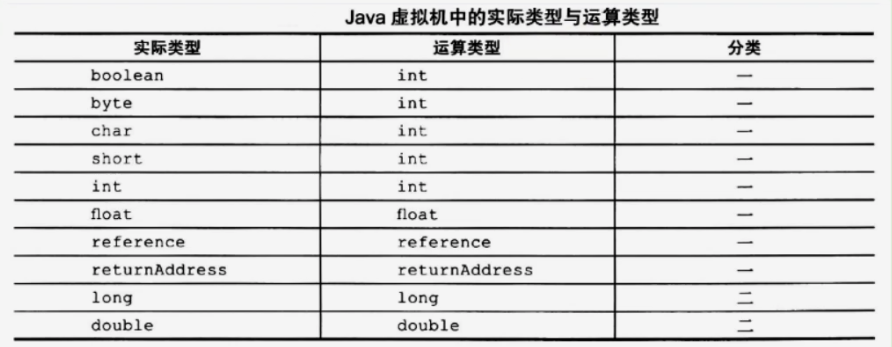

- 运算时的溢出
  - 数据运算可能会导致溢出
  - 例如两个很大的正整数相加，结果可能是一个负数。
  - 其实 Java 虚拟机规范并无明确规定过整形数据溢出的具体结果，仅规定了在处理整形数据时，只有除法指令以及求余指令中当出现除数为 0 时导致虚拟机抛出异常 ArithmeticException。
- 运算模式
  - 向最近接数舍入模式：
    - JVM 要求在进行浮点数计算时，所有运算结果都必须舍入到适当的精度
    - 非精确结果必须舍入为可被表示的最近接的精确值
    - 如果有两种可表示的形式与该值一样接近，将优先选择最低有效位为零的；
  - 向零舍入模式
    - 将浮点数转化为整数时，采用该模式，该模式将在目标数值类型中选择一个最接近但是不大于原值的数字作为最精确的舍入结果。
- NaN 的使用
  - 当一个操作产生溢出时，将会使用有符号数的无穷大表示
  - 如果某个操作结果没有明确的数学定义的话，将会使用 NaN 值来表示
  - 而且所有使用 NaN 值作为操作数的算数操作，结果都会返回 NaN。

    ```java
    @Test
    public void method1(){
        int i = 10;
        double j = i / 0.0;
        System.out.println(j);  // Infinity 无穷大

        double d1 = 0.0;
        double d2 = d1 / 0.0;
        System.out.println(d2);  // NaN: not a number

        System.out.println(10 / 0);  // java.lang.ArithmeticException: / by zero
    }
    ```

### 3.3.2. 算术指令与示例

> ### 所有算术指令

- 所有的算数指令包括：
  - 加法指令：iadd、ladd、fadd、dadd
  - 减法指令：isub、lsub、fsub、dsub
  - 乘法指令：imul、lmul、fmul、dmul
  - 除法指令：idiv、ldiv、fdiv、ddiv
  - 求余指令：irem、lrem、frem、drem // remainder：余数
  - 取反指令：ineg、lneg、fneg、dneg // negation：取反
  - 自增指令：iinc（**直接在局部变量表中自增**）
  - 位运算指令，又可分为：
    - 位移指令：ishl、ishr、iushr、lshl、lshr、lushr
    - 按位或指令：ior、lor
    - 按位与指令：iand、land
    - 按位异或指令：ixor、lxor
  - 比较指令：dcmpg、dcmpl、fcmpg、fcmpl、lcmp

> ### 示例

- 例 1
  ```java
  public void method2(){
      float i = 10;
      float j = -i;
      i = -j;
  }
  ```
  ```
  0 ldc #5 <10.0> // 将常量池中的 10.0压入栈
  2 fstore_1 // 将栈中的10.0出栈，存入局部变量表index为1的位置
  3 fload_1 // 将局部变量表index为1位置的数(10.0)压入栈
  4 fneg // 将栈中的数取负数 (10.0->-10.0)
  5 fstore_2 // 将栈中的-10.0出栈，存入局部变量表index为2的位置
  6 fload_2 // 将局部变量表index为2位置的数(-10.0)压入栈
  7 fneg // 将栈中的数取负数 (-10.0->10.0)
  8 fstore_1 // 将栈中的10.0出栈，存入局部变量表index为1的位置
  9 return
  ```
- 例 2
  ```java
  public void method3(int j){
      int i = 100;
      // i = i + 10;
      i += 10;
  }
  ```

  ```
  0 bipush 100
  2 istore_2
  3 iinc 2 by 10 // 该指令指的是局部变量表index为2的位置的值加10
  6 return
  ```

- 例 3
  ```java
  public void method3(int j){
      int i = 100;
      i = i + 10;
      // i += 10;
  }
  ```
  ```
  0 bipush 100
  2 istore_2
  3 iload_2
  4 bipush 10
  6 iadd
  7 istore_2
  8 return
  ```
- 例 4
  ```java
  public int method4(){
          int a = 80;
          int b = 7;
          int c = 10;
          return (a + b) * c;
      }
  ```

  ```
   0 bipush 80
   2 istore_1
   3 bipush 7
   5 istore_2
   6 bipush 10
   8 istore_3
   9 iload_1
  10 iload_2
  11 iadd
  12 iload_3
  13 imul
  14 ireturn
  ```

- 例 5
  ```java
  public int method5(int i ,int j){
      return ((i + j - 1) & ~(j - 1));
  }
  ```
  ```
   0 iload_1
   1 iload_2
   2 iadd // i+j
   3 iconst_1
   4 isub // (i+j-1)
   5 iload_2
   6 iconst_1
   7 isub // j-1
   8 iconst_m1
   9 ixor // 与-1进行异或操作，等同于取反操作
  10 iand // &操作
  11 ireturn
  ```
- 例 6
  ```java
  public static int bar(int i){
    return ((i+1)-2)*3/4;
  }
  ```

  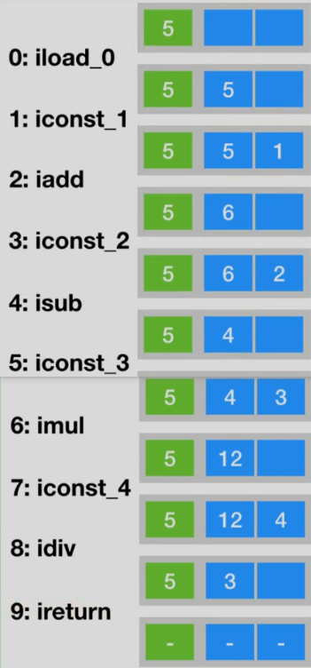

### 3.3.3. 自增操作

- 如果不涉及到赋值，**只是单纯的 i++ 和 ++i** ，从字节码的角度看，完全一样

  ```java
  //关于(前)++和(后)++
  public void method6(){
      int i = 10;
      i++;
      // ++i;
  }
  ```

  ```java
  //关于(前)++和(后)++
  public void method6(){
      int i = 10;
      ++i;
  }
  ```

  ```
  0 bipush 10
  2 istore_1
  3 iinc 1 by 1
  6 return
  ```

- 如果**涉及到赋值**， i++ 和 ++i ，从字节码角度看不一样。load 和 iinc 前后位置不同

  ```java
  public void method7(){
      int i = 10;
      int a = i++;

      int j = 20;
      int b = ++j;
  }
  ```

  ```
    0 bipush 10
    2 istore_1
    3 iload_1
    4 iinc 1 by 1
    7 istore_2
    8 bipush 20
  10 istore_3
  11 iinc 3 by 1
  14 iload_3
  15 istore 4
  17 return
  ```

- 如下操作

  ```java
  //思考
  public void method8() {
      int i = 10;
      i = i++;
      System.out.println(i);  // 10
  }
  ```

  ```
    0 bipush 10
    2 istore_1
    3 iload_1
    4 iinc 1 by 1
    7 istore_1
    8 getstatic #2 <java/lang/System.out>
  11 iload_1
  12 invokevirtual #5 <java/io/PrintStream.println>
  15 return
  ```

### 3.3.4. 比较指令说明

> 比较指令属于算术指令，但是详细说明放到控制转移指令处再详细说明

- 作用：
  - **比较栈顶两个元素的大小，并将比较结果入栈**
  - 主要用于比较 float 和 double 类型的，将 int 类型比较结果入栈
- 比较指令有：
  > 与前面的指令类似，首字符 d 表示 double 类型，f 表示 float，l 表示 long。
  - 指令：
    - dcmpg
    - dcmpl
    - fcmpg
    - fcmpl
    - lcmp
  - 说明：
    - 对于 double 和 float 类型的数字，由于 NaN 的存在，各有两个版本的比较指令
      - 以 float 为例，有 fcmpg、fcmpl 两个指令，他们的区别在于数字比较时，若遇到 NaN 值，处理结果不同。
      - 指令 dcmpg、dcmpl 也是类似的，
    - 指令 lcmp 针对 long 型整数，由于 long 型整数没有 NaN 值，故无需准备两套指令。
    - boolean 和引用数值类型不能比较大小，数值类型的数据才能比较大小
- 流程说明：
  - 指令 fcmpg、fcmpl 都从栈中弹出两个操作数，并将它们做比较
  - 设栈顶的元素为 v2，栈顶顺位第 2 位元素为 v1，若 v1 == v2，则压入 0；若`v1 > v2`，则压入 1；若`v1 < v2`，则压入-1。
  - 两个指令的区别之处在于，当遇到 NaN 值，fcmpg 会压入 1， 而 fcmpl 会压入 -1。

## 3.4. 类型转化指令

### 3.4.1. 基本说明

- 说明:类型转化指令可以将两种不同的数值类型进行相互转换
- 作用：
  - 这些转换操作一般用于实现用户代码的**显式类型转换**
  - 或者用来处理**字节码指令集中数据类型相关指令**无法与**数据类型**一一对应的问题。
- 转换流程
  - 栈中数据出栈
  - 类型转换
  - 转换结果入栈

- 复习：基本数据类型取值范围

  | 类型    | 字节长度 | 取值范围                                               |
  | ------- | -------- | ------------------------------------------------------ |
  | long    | 8 字节   | -9 223 372 036 854 775 808 ~ 9 223 372 036 854 775 807 |
  | int     | 4 字节   | -2 147 483 648 ~ 2 147 483 647                         |
  | short   | 2 字节   | -32 768 ~ 32 767                                       |
  | char    | 2 字节   |                                                        |
  | byte    | 1 字节   |                                                        |
  | boolean | 1 字节   | 大约 ±1.797 693 134 862 315 70E+308(15 位有效数字)     |
  | float   | 4 字节   | 大约 ±3.402 823 47E+38F(6~7 位有效数字)                |
  | double  | 8 字节   | 大约 ±1.797 693 134 862 315 70E+308(15 位有效数字)     |

### 3.4.2. 宽化类型转换（Widening Numeric Conversions）

- 转换规则：
  - Java 虚拟机直接支持以下数值的宽化类型转化（Widening Numeric Conversions，小范围类型向大范围类型的安全转化）
  - 也就是说，并不需要指令执行，包括：
    > **简化为：`int —> long --> float --> double`**
    - 从 int 类型到 long、float 或者 double 类型。对应的指令为：`i2l`、`i2f`、`i2d`
    - 从 long 类型到 float、double 类型。对应的指令为：`l2f`、`l2d`
    - 从 float 类型到 double 类型。对应指令为： `f2d`

  ```java
  //针对于宽化类型转换的基本测试
  public void upCast1() {
      int i = 10;
      long l = i;  // i2l
      float f = i;  // i2f
      double d = i;  // i2d

      float f1 = l;  // l2f
      double d1 = l;  // l2d

      double d2 = f1;  // f2d
  }
  ```

- 精度损失问题
  - 情况分类：
    - 宽化类型转换是不会因为超过目标类型最大值而丢失信息的
      - 例如，从 int 转换到 long，或者从 int 转换到 double
      - 都不会丢失任何信息，转换前后的值是精确相等的。
    - 从 int、long 类型数值转换到 float，或者 long 类型数值转换到 double 时，将可能发生精度丢失
      - 可能丢失掉几个最低有效位上的值，转换后的浮点数是根据 IEEE754 最接近舍入模式所得到的的正确整数值。
  - 异常问题：尽管宽化类型转换实际上可能发生精度丢失的，**但是这种转换永远不会导致 Java 虚拟机抛出运行时异常**。

  ```java
  //举例：精度损失的问题
  @Test
  public void upCast2() {
      int i = 123123123;
      float f = i;
      System.out.println(f);  // 123123120

      long l = 123123123123L;
      l = 123123123123123123L;
      double d = l;
      System.out.println(d);  // 123123123123123120
  }
  ```

- 补充说明: **从 byte、char 和 short 类型到 int 类型的宽化类型转换实际上是不存在的。**
  - 对于 byte 类型转为 int，虚拟机并没有做实质性的转化处理，**只是简单地通过操作数栈交换了两个数据**
  - 而将 byte 转为 long 时，使用的是`i2l`，可以看到在内部 byte 在这里已经等同于 int 类型处理，类似的还有 short 类型，这种处理方式有两个特点：
    - 一方面可以减少实际的数据类型
      - 如果为 short 和 byte 都准备一套指令，那么指令的数量就会大增
      - 而**虚拟机目前的设计上，只愿意使用一个字节表示指令，因此指令总数不能超过 256 个**
      - **为了节省指令资源**，将 short 和 byte 当做 int 处理也在情理之中。
    - 另一方面，由于局部变量表中的槽位固定为 32 位，无论是 byte 或者 short 存入局部变量表，都会占用 32 位空间。从这个角度说，也没有必要特意区分这几种数据类型。

  ```java
  //针对于byte、short等转换为容量大的类型时，将此类型看做int类型处理。
  public void upCast3(byte b) {
      int i = b;
      long l = b;  // i2l
      double d = b;  // i2d
  }

  public void upCast4(short s) {
      int i = s;
      long l = s;  // i2l
      float f = s;  // i2f
  }
  ```

### 3.4.3. 窄化类型转换（Narrowing Numeric Conversion）

- 转换规则:Java 虚拟机也直接支持以下**窄化类型转换**：
  - 从 int 类型至 byte、short 或者 char 类型。对应的指令有：`i2b`、`i2s`、`i2c`
  - 从 long 类型到 int 类型。对应的指令有：`l2i`
  - 从 float 类型到 int 或者 long 类型。对应的指令有：`f2i`、`f2l`
  - 从 double 类型到 int、long 或者 float 类型。对应的指令有：`d2i`、`d2l`、`d2f`

  ```java
  // 窄化类型转换
  // 基本的使用
  public void downCast1() {
      int i = 10;
      byte b = (byte) i;  // i2b
      short s = (short) i;  // i2s
      char c = (char) i;  // i2c

      long l = 10L;
      int i1 = (int) l;  // l2i
      byte b1 = (byte) l;  // l2i --> i2b
  }

  public void downCast2() {
      float f = 10;
      long l = (long) f;  // f2l
      int i = (int) f;  // f2i
      byte b = (byte) f;  // f2i --> i2b

      double d = 10;
      byte b1 = (byte) d;  // d2i --> i2b

  }

  public void downCast3() {
      short s = 10;
      byte b = (byte) s;  // i2b,把s当成i
  }
  ```

- 精度损失问题
  - 窄化类型转换可能会导致转换结果具有不同的正负号、不同的数量级，因此，转换过程很可能会导致数值丢失精度。
  - 异常情况：
    - 尽管数据类型窄化转换可能会发生上限溢出、下限溢出和精度丢失等情况
    - **但是 Java 虚拟机规范中明确规定数值类型的窄化转换指令永远不可能导致虚拟机抛出运行时异常**。
- 补充说明：窄化转换规律
  - 当将一个浮点数值窄化为整数类型 T（T 限于 int 或 long 类型之一）的时候，将遵循以下转换规则：
    - 如果浮点值是 NaN
      - 那么转换结果就是 int 或 long 类型的 0.
    - 如果浮点值不是无穷大的话
      - 浮点值使用 IEEE 754 的向零舍入模式取整，获得整数值 v
      - 如果 v 在目标类型 T（int 或 long）的表示范围之内，那转换结果就是 v
    - 如果浮点值是无穷大的话
      - 将根据 v 的符号，转换为 T 所能表示的最大或者最小正数
  - 当将一个 double 类型转换为 float 类型时，将遵循以下转换规则：
    - 通过向最接近数舍入模式舍入一个可以使用 float 类型表示的数字。最后结果根据下面 3 条规则判断：
      - 如果转换结果的绝对值太小而无法使用 float 来表示，将返回 float 类型的正负零。
      - 如果转换结果的绝对值太大而无法使用 float 来表示，将返回 float 类型的正负无穷大。
      - 对于 double 类型的 NaN 值将按规定转换为 float 类型的 NaN 值。

  ```java
  // 测试NaN,无穷大的情况
  @Test
  public void downCast5() {
      double d1 = Double.NaN;  // 0.0 / 0.0
      int i = (int) d1;
      System.out.println(d1);  // NaN
      System.out.println(i);  // 0

      double d2 = Double.POSITIVE_INFINITY; // Infinity
      long l = (long) d2;
      int j = (int) d2;
      System.out.println(l);  // Long.MAX_VALUE
      System.out.println(j);  // Integer.MAX_VALUE

      float f = (float) d2;
      System.out.println(f);  // Infinity

      float f1 = (float) d1;
      System.out.println(f1);  // NaN
  }
  ```

## 3.5. 对象的创建与访问指令

### 3.5.1. 创建指令

> 虽然类实例和数组都是对象，但 Java 虚拟机对类实例和数组的创建与操作使用了不同的字节码指令。

- 创建类实例的指令：`new`
  - 说明：它接收一个操作数，为指向常量池的索引，表示要创建的类型、执行完成后，将对象的引用压入栈。
  - 示例

    ```java
    public void newInstance() {
        Object obj = new Object();

        File file = new File("atguigu.avi");
    }
    ```

  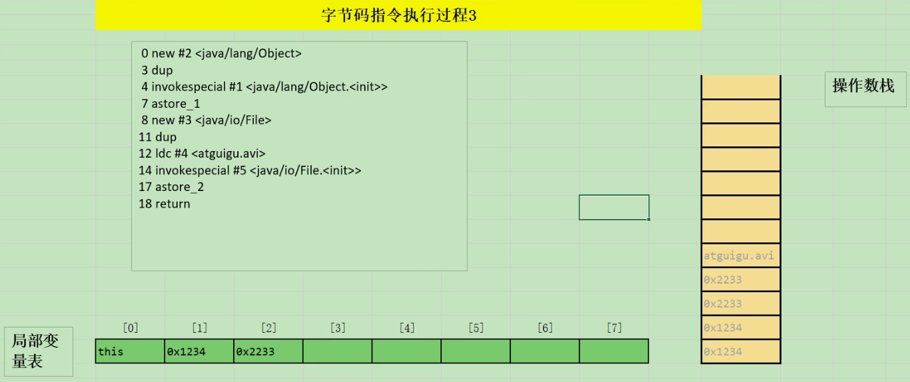

  > dup 是复制栈顶引用，因为之后调用`<init>`方法会消耗一个 <br />
  > File 的`<init>`方法有一个参数，因此除了对象引用出栈外，参数也要出栈

- 创建数组指令：
  - 指令
    - newarray：创建基本类型数组
    - anewarray：创建引用类型数组
    - multianewarray：创建多维数组
  - 示例

    ```java
    public void newArray() {
        int[] intArray = new int[10];  // newarray 10 (int)
        Object[] objArray = new Object[10];  // anewarray #2 <java/lang/Object>
        int[][] mintArray = new int[10][10];  // multianewarray #6 <[[I> dim 2

        String[][] strArray = new String[10][];  // anewarray #7 <[Ljava/lang/String;>
    }
    ```

    ```
      0 bipush 10
      2 newarray 10 (int)
      4 astore_1
      5 bipush 10
      7 anewarray #2 <java/lang/Object>
    10 astore_2
    11 bipush 10
    13 bipush 10
    15 multianewarray #6 <[[I> dim 2
    19 astore_3
    20 bipush 10
    22 anewarray #7 <[Ljava/lang/String;>
      // 没有使用multianewarray，是因为数据内部数据没有初始化
      // 当前创建的是一维
    25 astore 4
    27 return
    ```

### 3.5.2. 字段访问指令

- 说明：
  - 对象创建后，就可以通过对象访问指令获取对象实例或者数组实例中的字段或者数组元素。
- 种类：
  - 访问类字段（static 字段，或者称为类变量）的指令：
    - getstatic:包含一个操作数，为指向常量池的 Fieldref 索引
      - 获取常量池中的值
      - 入栈
    - putstatic
      - 要赋的值出栈
      - static_field 不需要入栈出栈，直接赋值
  - 访问类实例字段（非 static 字段，或者称为实例变量）的指令
    - getfield:包含一个操作数，为常量池中的 字段路径(字节码文件中是符号引用，运行时是具体引用)
      - 要操作的对象出栈
    - putfield:包含一个操作数，为常量池中的 字段路径(字节码文件中是符号引用，运行时是具体引用)
      - 要赋的值出栈，要操作的对象出栈
      - 执行 putfield 赋值

- 示例 1：
  - 以 getstatic 指令为例，它包含一个操作数，为指向常量池的 Fieldref 索引
  - 它的作用就是获取 Fieldref 指定的对象或者值，并将其压入操作数栈。

  ```java
  // 2.字段访问指令
  public void sayHello() {
      System.out.println("hello");
  }
  ```

  ```
  0 getstatic #8 <java/lang/System.out>
  3 ldc #9 <hello>
  5 invokevirtual #10 <java/io/PrintStream.println>
  8 return
  ```

  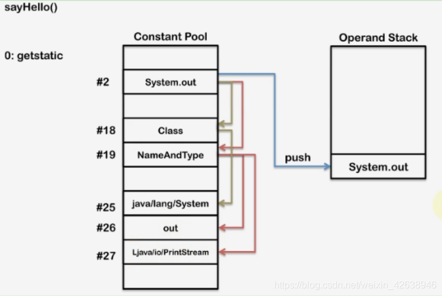

  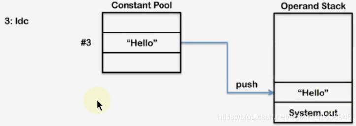

  

- 示例 2

  ```java
    class Order {
        int id;
        static String name;
    }

    public class NewTest {
        public void setOrderId() {
            Order order = new Order();
            order.id = 1001;
            System.out.println(order.id);

            Order.name = "ORDER";
            System.out.println(Order.name);
        }
    }
    ```

  > putfield：使用栈顶的 1001 和对象引用，把值赋给指定 filed

  

### 3.5.3. 数组操作指令

> ### 数组元素操作指令

- 数组操作指令主要有：
  - xastore
    - 说明：
      - 把一个数组元素加载到操作数栈的指令
      - 比如 saload、caload 分别表示压入 short 数组和 char 数组
    - 具体有：
      - baload
      - caload
      - saload
      - iaload
      - laload
      - faload
      - daload
      - aaload
    - 执行流程
      - 指令 xaload 在执行时，**要求操作数中栈顶元素为数组索引 i，栈顶顺位第二个元素为数组引用 a**
      - 该指令会弹出栈顶这两个元素，并将 a[i] 重新压入栈。
  - xaload
    > 这里的 store 修改的是**堆中**数组中的某个值，之前讲到的 store 修改的都是局部变量表中的内容
    - 将一个操作数栈的值存储到数组元素中的指令，以 iastore 为例，它用于给一个 int 数组的给定索引赋值
    - 具体有：
      - bastore
      - castore
      - sastore
      - iastore
      - lastore
      - fastore
      - dastore
      - aastore
    - 执行流程
      - 在 iastore 执行前，操作数栈顶需要以此准备 3 个元素：**值**、**索引**、**数组索引**(栈顶到栈底的顺序)
      - iastore 会弹出这 3 个值，并将值赋给数组中指定索引的位置。

  

- 示例1

  ```java
  // 3.数组操作指令
  public void setArray() {
      int[] intArray = new int[10];
      intArray[3] = 20;
      System.out.println(intArray[1]);
  }
  ```

  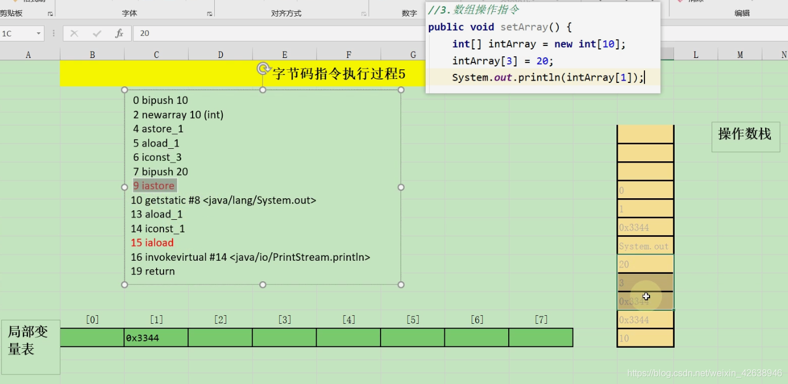

> ### 数组长度指令

- `arraylength`

  - 说明：返回数组长度的指令
  - 执行流程：该指令弹出栈顶的数组元素，获取数组的长度，将长度压入栈

  ```java
  public void arrLength() {

      double[] arr = new double[10];
      System.out.println(arr.length);
  }
  ```

  ```
    0 bipush 10
    2 newarray 7 (double)
    4 astore_1
    5 getstatic #8 <java/lang/System.out>
    8 aload_1
    9 arraylength
  10 invokevirtual #14 <java/io/PrintStream.println>
  13 return
  ```

### 3.5.4. 类型检查指令

- 检查类实例或数组或数组类型的指令
  - `checkcast`:
    - 用于检查类型强制转换是否可以进行。
    - 如果可以进行，那么 checkcast 指令不会改变操作数栈，否则它会抛出 ClassCastException 异常。
  - `instancdof`:
    - 用来判断给定对象是否是某一个类的实例
    - 它会将判断结果压入操作数栈。

- 示例

  ```java
  // 4.类型检查指令
  public String checkCast(Object obj) {
      if (obj instanceof String) {
          return (String) obj;
      } else {
          return null;
      }
  }
  ```

  ```
   0 aload_1
   1 instanceof #17 <java/lang/String>
   4 ifeq 12 (+8)
   7 aload_1
   8 checkcast #17 <java/lang/String>
  11 areturn
  12 aconst_null
  13 areturn
  ```

## 3.6. 方法调用与返回指令

### 3.6.1. 方法调用指令

- `invokeinterface`
  - 作用：**调用接口方法**
  - 过程：它会**在运行时搜索由特定对象所实现的这个接口方法**，并找出适合的方法进行调用。
  - 注意：
    - 接口中的 staitic 方法调用: invokestatic
    - 接口中的 default 方法调用: invokeinterface

  ```java
  // 方法调用指令: invokeinterface
  public void invoke3() {
      Thread t1 = new Thread();
      ((Runnable) t1).run();

      Comparable<Integer> com = null;
      com.compareTo(123);
  }
  ```

  ```
    0 new #4 <java/lang/Thread>
    3 dup
    4 invokespecial #5 <java/lang/Thread.<init>>
    7 astore_1
    8 aload_1
    9 invokeinterface #9 <java/lang/Runnable.run> count 1
  14 aconst_null
  15 astore_2
  16 aload_2
  17 bipush 123
  19 invokestatic #10 <java/lang/Integer.valueOf>
  22 invokeinterface #11 <java/lang/Comparable.compareTo> count 2
  27 pop
  28 return
  ```

  ```java
  public class InterfaceMethodTest {
      public static void main(String[] args) {
          AA aa = new BB();

          aa.method2();

          AA.method1();
      }
  }

  interface AA {
      public static void method1() {

      }

      public default void method2() {

      }
  }

  class BB implements AA {

  }
  ```

  ```
    0 new #2 <com/atguigu/java/BB>
    3 dup
    4 invokespecial #3 <com/atguigu/java/BB.<init>>
    7 astore_1
    8 aload_1
    9 invokeinterface #4 <com/atguigu/java/AA.method2> count 1
  14 invokestatic #5 <com/atguigu/java/AA.method1>
  17 return
  ```

- `invokespecial`
  - 作用：
    - 指令用于调用一些**小特殊处理的实例方法**
    - 包括**实例初始化方法（构造器）、私有方法和父类方法**
      > 不能够重写的方法
    - 这些方法都是**静态类型绑定**的，不会再调用时进行动态派发。

  ```java
  // 方法调用指令: invokespecial:静态分派
  public void invoke1() {
      // 情况1：类实例构造器方法：<init>()
      Date date = new Date();
      Thread t1 = new Thread();
      // 情况2：父类的方法
      super.toString();
      // 情况3：私有方法
      methodPrivate();
  }

  private void methodPrivate() {

  }
  ```

  ```
    0 new #2 <java/util/Date>
    3 dup
    4 invokespecial #3 <java/util/Date.<init>>
    7 astore_1
    8 new #4 <java/lang/Thread>
  11 dup
  12 invokespecial #5 <java/lang/Thread.<init>>
  15 astore_2
  16 aload_0
  17 invokespecial #6 <java/lang/Object.toString>
  20 pop
  21 aload_0
  22 invokespecial #7 <com/atguigu/java/MethodInvokeReturnTest.methodPrivate>
  25 return
  ```

- `invokestatic`
  - 作用：
    - 指令用于调用**类中的类方法（static 方法）**
    - 这是静态绑定的。
  - 注意：private 和 static 同时修饰时，static 优先，编译为 invokestatic

  ```java
  // 方法调用指令: invokestatic:静态分派
  public void invoke2() {
      methodStatic();
  }

  public static void methodStatic() {

  }
  ```

  ```
  0 invokestatic #8 <com/atguigu/java/MethodInvokeReturnTest.methodStatic>
  3 return
  ```

- `invokevirtual`
  - 作用：
    - 指令用于调用对象的实例方法
    - **根据对象的实际类型进行分派（虚方法分派），支持多态**
      > 也就是能够重新的方法
  - 这也是 Java 语言**最常见的方法分派方式**。

  ```java
  // 方法调用指令:invokevirtual:动态分派
  public void invoke4() {
      System.out.println("hello");

      Thread t1 = null;
      t1.run();
  }
  ```

  ```
    0 getstatic #12 <java/lang/System.out>
    3 ldc #13 <hello>
    5 invokevirtual #14 <java/io/PrintStream.println>
    8 aconst_null
    9 astore_1
  10 aload_1
  11 invokevirtual #15 <java/lang/Thread.run>
  14 return
  ```

- `invokedynamic`：
  - 出现时期：这个是 JDK 1.7 后新加入的指令
  - 作用：
    - 调用动态绑定方法
    - **用于在运行时动态解析出调用点限定符所引用的方法**，并执行该方法
  - 注意：
    - 前面 4 条调用指令的分配逻辑都固化在 java 虚拟机内部
    - 而 invokedynamic 指令的分派逻辑是由用户所设定的引导方法决定的。

### 3.6.2. 方法返回指令

- 说明
  - 执行时机：在方法调用结束之前，需要进行返回
  - 指令说明：
    - 方法返回指令是**根据返回值类型区分**的。
    - 包括 ireturn（当返回值是 boolean、byte、char、short 和 int 类型时使用）、lreturn、dreturn 和 areturn
    - 另外还有一条 return 指令供声明为 void 的方法，实例初始化方法以及类和接口的初始化方法使用。

    | 返回类型                          | 返回指令 |
    | --------------------------------- | -------- |
    | void                              | return   |
    | int（boolean、byte、char、short） | ireturn  |
    | long                              | lreturn  |
    | float                             | freturn  |
    | double                            | dreturn  |
    | reference                         | areturn  |

- 执行流程
  - 通过 ireturn 指令，**将当前函数操作数栈的栈顶元素弹出**
  - **并将这个元素压入调用者函数的操作栈中**（因为调用者非常关心函数的返回值）
  - **所有在当前函数操作栈中的其他元素都会被丢弃**
  - **注意**：如果当前返回的是 synchronized 方法，那么还会执行一个隐含的 monitorexit 指令，退出临界区。
  - 最后，会丢弃当前方法的整个帧，恢复调用者的帧，并将控制权转交给调用者。

- 示例

  ```java
  // 方法的返回指令
  public int returnInt() {
      int i = 500;
      return i;  // ireturn
  }

  public double returnDouble() {
      return 0.0;  // dreturn
  }

  public String returnString() {
      return "hello,world";  // areturn
  }

  public int[] returnArr() {
      return null;  // areturn
  }

  public float returnFloat() {
      int i = 10;
      return i;  // freturn
  }

  public byte returnByte() {
      return 0;  // ireturn
  }

  public void methodReturn() {
      int i = returnByte();
  }
  ```

## 3.7. 操作数栈管理指令

- 说明
  - 如同操作一个普通数据结构中的堆栈那样，JVM 提供的操作数栈管理指令，可以用于直接操作操作数栈的指令。
  - 这些指令属于**通用型**，对栈的压入或者弹出**无需指明数据类型**。

- 指令：
  - 弹出指令
    - 指令：
      - pop
      - pop2；
    - 作用：将一个或两个元素从栈顶弹出，并且直接废弃
    - 详细说明：
      - pop：将栈顶的 1 个 slot 数值出栈。例如 1 个 short 类型数值
      - pop2：将栈顶的 2 个 slot 数值出栈。例如 1 个 double 类型，或者 2 个 int 类型数据。
  - 复制压入指令
    - 指令：
      - dup
      - dup2
      - dup_x1
      - dup2_x1
      - dup_x2
      - dup2_x2
    - 作用：赋值栈顶的一个或者两个数值并将复制值或双份的复制值重新压入栈顶：
    - 详细说明:
      - 不带\_x 的指令：
        - 复制栈顶数据**并压入栈顶**。包括两个指令，dup 和 dup2。dup 的系数代表要复制的 slot 个数。
        - dup 开头的指令用于复制 1 个 slot 的数据。例如 1 个 int 或 1 个 reference 类型数据
        - dup2 开头的指令用于复制 2 个 slot 的数据。例如一个 long，或者 2 个 int，或 1 个 int + 1 个 float 类型的数据
      - 带\_x 的指令：
        - 复制栈顶数据**并插入栈顶以下的某个位置**
        - 对于带\_x 的复制插入指令，只要将指令的 dup 和 x 的系数相加，结果即为需要插入的位置。因此：
          - dup_x1 插入位置：1+1=2，即栈顶 2 个 slot 下面
          - dup_x2 插入位置：1+2=3，即栈顶 3 个 slot 下面
          - dup2_x1 插入位置：2+1=3，即栈顶 3 个 slot 下面
          - dup2_x2 插入位置：2+2=4，即栈顶 4 个 slot 下面
  - 交换指令：
    - 指令：swap
    - 作用：将栈最顶端的两个 slot 数值位置交换：
    - 注意：Java 虚拟机没有提供交换两个 64 位数据类型（long、double）数值的指令。
  - 特殊指令：
    - 指令：nop
    - 作用：
      - 是一个非常特殊的指令，它的字节码为 0x00
      - 和汇编语言中的 nop 一样，它表示什么都不做，这条指令一般用于调试、占位等。

- 示例

  ```java
  public void print() {
      Object obj = new Object();
      // String info = obj.toString();
      obj.toString();
  }
  ```

  ```
   0 new #3 <java/lang/Object>
   3 dup
   4 invokespecial #1 <java/lang/Object.<init>>
   7 astore_1
   8 aload_1
   9 invokevirtual #4 <java/lang/Object.toString>
  12 pop
  13 return
  ```

  ```java
  // 类似的
  public void foo() {
      bar();
  }

  public long bar() {
      return 0;
  }
  ```

  ```
  0 aload_0
  1 invokevirtual #5 <com/atguigu/java/StackOperateTest.bar> // 返回的数据会放到当前操作数栈中
  4 pop2 //也没有用到返回的值，所以直接pop就行
  5 return
  ```

  ```java
  public class StackOperateTest {

      public long nextIndex() {
          return index++;
      }

      private long index = 0;
  }
  ```

  ```
   0 aload_0
   1 dup
   2 getfield #2 <com/atguigu/java/StackOperateTest.index>
   5 dup2_x1
   6 lconst_1
   7 ladd
   8 putfield #2 <com/atguigu/java/StackOperateTest.index>
  11 lreturn
  ```

  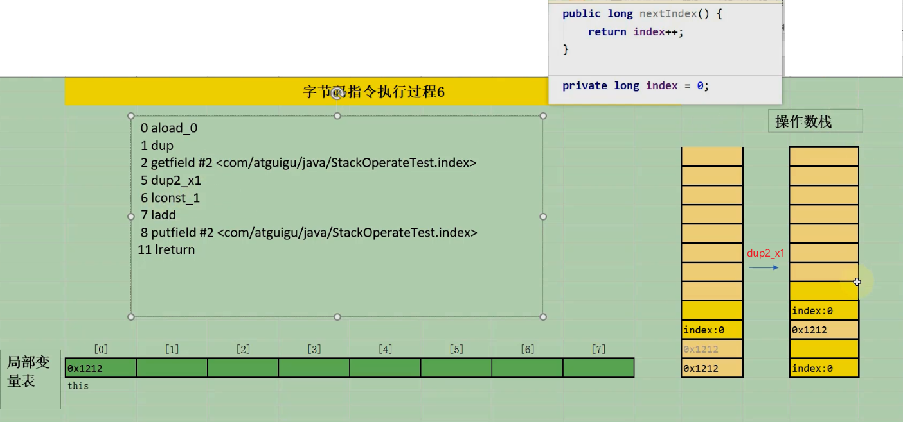

## 3.8. 控制转移指令

### 3.8.1. 整体说明

- 比较指令的说明：
  - 不能当作 int 类型的数值间的比较(float,double,long)
  - 比较结果为 int 类型(-1/1)
- 条件跳转指令：
  - 只与 0 或 null 的比较，比较后跳转
- 比较条件跳转指令：
  - int 或者能作为 int(byte,short)类型之间的比较+跳转。
  - 类比关系为：
    - 对于 float,double,double，`比较指令+条件跳转指令`
    - 等同于 int 和引用类型的 `比较条件跳转指令`
- 多条件分支跳转指令
  - 针对 switch case 进行设计
- 无条件跳转指令
  - 直接跳转

### 3.8.2. 比较指令的说明

> 算术指令->比较指令下查看

### 3.8.3. 条件跳转指令

- 使用说明
  - 条件跳转指令通常和比较指令结合使用
  - 在条件跳转指令执行前，一般可以先用比较指令进行栈顶元素的准备，然后进行条件跳转。

- 条件跳转指令
  - 指令：

    | 指令      | 含义                                 |
    | --------- | ------------------------------------ |
    | ifeq      | 当栈顶 int 类型数值等于 0 时跳转     |
    | ifne      | 当栈顶 int 类型数值不等于 0 时跳转   |
    | iflt      | 当栈顶 int 类型数值小于 0 时跳转     |
    | ifle      | 当栈顶 int 类型数值小于等于 0 时跳转 |
    | ifgt      | 当栈顶 int 类型数值大于 0 时跳转     |
    | ifge      | 当栈顶 int 类型数值大于等于 0 时跳转 |
    | ifnull    | 为 null 时跳转                       |
    | ifnonnull | 不为 null 时跳转                     |

  - 说明：
    - 这些指令都接受两个字节的操作数，用于计算跳转的位置（16 位有符号整数作为当前位置的 offset）。
  - 注意：
    - 条件跳转指令不包括 int 与 int 的比较。
    - 看下方的比较条件跳转指令
  - 执行流程
    - **弹出栈顶元素**
    - **测试它是否满足某一条件**
    - **如果满足条件，则跳到给定位置**

- **类型相关注意**
  > 由于各类型的比较操作最终都会转为 int 类型的比较操作，所以 Java 虚拟机提供的 int 类型的条件分支指令是最为丰富和强大的。
  - boolean、byte、char、short 类型的条件分支比较指令：
    - 都是使用 int 类型的比较指令完成的
  - long、float、double 类型的条件分支指令比较操作：
    - **会先执行相应类型的比较运算指令**
    - 运算指令会**返回一个整数型值到操作数栈中**
    - **随后再执行 int 类型的条件分支比较操作来完成整个分支跳转**。

- 示例 1：int 类型和 0 比较的话，直接使用条件跳转指令就行

  ```java
  // 1.条件跳转指令
  public void compare1() {
      int a = 0;
      if (a != 0) {
          a = 10;
      } else {
          a = 20;
      }
  }
  ```

  ```
   0 iconst_0
   1 istore_1
   2 iload_1
   3 ifeq 12 (+9)
   6 bipush 10
   8 istore_1
   9 goto 15 (+6)
  12 bipush 20
  14 istore_1
  15 return
  ```

- 示例 2：null 比较

  ```java
  public boolean compareNull(String str) {
      if (str == null) {
          return true;
      } else {
          return false;
      }
  }
  ```

  ```
  0 aload_1
  1 ifnonnull 6 (+5)
  4 iconst_1
  5 ireturn
  6 iconst_0
  7 ireturn
  ```

- 示例 3：比较指令同时使用

  ```java
  // 结合比较指令
  public void compare2() {
      float f1 = 9;
      float f2 = 10;
      System.out.println(f1 < f2);//true
  }
  ```

  

- 示例 4：不同数值类型比较

  ```java
  public void compare3() {
      int i1 = 10;
      long l1 = 20;
      System.out.println(i1 > l1);
  }
  ```

  ```
   0 bipush 10
   2 istore_1
   3 ldc2_w #6 <20>
   6 lstore_2
   7 getstatic #4 <java/lang/System.out>
  10 iload_1
  11 i2l
  12 lload_2
  13 lcmp
  14 ifle 21 (+7)
  17 iconst_1
  18 goto 22 (+4)
  21 iconst_0
  22 invokevirtual #5 <java/io/PrintStream.println>
  25 return
  ```

- 示例 5：与常量比较

  ```java
  public int compare4(double d) {
      if (d > 50.0) {
          return 1;
      } else {
          return -1;
      }
  }
  ```

  ```
   0 dload_1
   1 ldc2_w #8 <50.0>
   4 dcmpl
   5 ifle 10 (+5)
   8 iconst_1
   9 ireturn
  10 iconst_m1
  11 ireturn
  ```

### 3.8.4. 比较条件跳转指令

- 指令
  > 其中指令助记符加上"if\_"后，以字符"i"开头的指令针对 int 型整数操作（也包括 short 和 byte 类型） <br />
  > 以字符"a"开头的指令表示对象引用的比较。

  | 指令      | 含义                                                            |
  | --------- | --------------------------------------------------------------- |
  | if_icmpeq | 比较栈顶两 int 类型数值大小，当前者等于后者(栈顶对应元素)时跳转 |
  | if_icmpne | 比较栈顶两 int 类型数值大小，当前者不等于后者时跳转             |
  | if_icmplt | 比较栈顶两 int 类型数值大小，当前者小于后者时跳转               |
  | if_icmple | 比较栈顶两 int 类型数值大小，当前者小于等于后者时跳转           |
  | if_icmpgt | 比较栈顶两 int 类型数值大小，当前者大于后者时跳转               |
  | if_icmpge | 比较栈顶两 int 类型数值大小，当前者大于等于后者时跳转           |
  | if_acmpeq | 比较栈顶两引用类型数值，当结果相等时跳转                        |
  | if_acmpne | 比较栈顶两引用类型数值，当结果不相等时跳转                      |

- 执行流程：
  - 比较条件跳转指令类似于**比较指令和条件指令**的的结合体，它将比较和跳转两个步骤合二为一。
  - 这些指令都接收两个字节的操作数作为参数，用于计算跳转的位置
  - 同时在执行指令时，栈顶需要准备两个元素进行比较
  - 指令执行完成后，栈顶的两个元素被清空，且没有任何数据入栈
  - **如果预设条件成立，则执行跳转，否则，继续执行下一条语句。**

- 示例 1:普通 int 类型比较

  ```java
  // 2.比较条件跳转指令
  public void ifCompare1() {
      int i = 10;
      int j = 20;
      System.out.println(i > j);
  }
  ```

  ```
   0 bipush 10
   2 istore_1
   3 bipush 20
   5 istore_2
   6 getstatic #4 <java/lang/System.out>
   9 iload_1
  10 iload_2
  11 if_icmple 18 (+7)
  14 iconst_1
  15 goto 19 (+4)
  18 iconst_0
  19 invokevirtual #5 <java/io/PrintStream.println>
  22 return
  ```

- 示例 2：自动转为 int 类型比较

  ```java
  public void ifCompare2() {
      short s1 = 9;
      byte b1 = 10;
      System.out.println(s1 > b1);
  }
  ```

  ```
   0 bipush 9
   2 istore_1
   3 bipush 10
   5 istore_2
   6 getstatic #4 <java/lang/System.out>
   9 iload_1
  10 iload_2
  11 if_icmple 18 (+7)
  14 iconst_1
  15 goto 19 (+4)
  18 iconst_0
  19 invokevirtual #5 <java/io/PrintStream.println>
  22 return
  ```

- 示例 3：引用类型比较

  ```java
  public void ifCompare3() {
      Object obj1 = new Object();
      Object obj2 = new Object();
      System.out.println(obj1 == obj2);  // false
      System.out.println(obj1 != obj2);  // true
  }
  ```

  ```
   0 new #10 <java/lang/Object>
   3 dup
   4 invokespecial #1 <java/lang/Object.<init>>
   7 astore_1
   8 new #10 <java/lang/Object>
  11 dup
  12 invokespecial #1 <java/lang/Object.<init>>
  15 astore_2
  16 getstatic #4 <java/lang/System.out>
  19 aload_1
  20 aload_2
  21 if_acmpne 28 (+7)
  24 iconst_1
  25 goto 29 (+4)
  28 iconst_0
  29 invokevirtual #5 <java/io/PrintStream.println>
  32 getstatic #4 <java/lang/System.out>
  35 aload_1
  36 aload_2
  37 if_acmpeq 44 (+7)
  40 iconst_1
  41 goto 45 (+4)
  44 iconst_0
  45 invokevirtual #5 <java/io/PrintStream.println>
  48 return
  ```

### 3.8.5. 多条件分支跳转指令

- 指令：

  | 指令名称     | 描述                                |
  | ------------ | ----------------------------------- |
  | tableswitch  | 用于 switch 条件跳转，case 值连续   |
  | lookupswitch | 用于 switch 条件跳转，case 值不连续 |

- 详细说明：
  - tableswitch
    - 要求**多个条件分支是连续的**
    - 它**内部只存放起始值和终止值，以及若干个跳转偏移量**
    - 通过给定的操作数 index，可以立即定位到跳转偏移量位置
    - **因此效率比较高**。

    

  - lookupswitch
    - 内部**存放着各个离散的 case-offset 对**
    - 每次执行都要搜索全部的 case-offset 对，找到匹配的 case 值
    - 并根据对应的 offset 计算跳转地址
    - **因此效率比较低**。
    - 出于效率考虑，**将 case-offset 对按照 case 值大小排序**，

    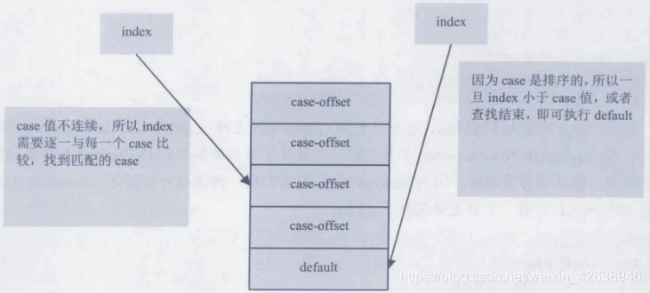

- 示例 1：case 值连续

  ```java
  // 3.多条件分支跳转
  public void swtich1(int select) {
      int num;
      switch (select) {
          case 1:
              num = 10;
              break;
          case 2:
              num = 20;
              //break;
          case 3:
              num = 30;
              break;
          default:
              num = 40;
      }
  }
  ```

  ```
   0 iload_1
   1 tableswitch 1 to 3	1:  28 (+27)
  						2:  34 (+33)
                          3:  37 (+36)
                          default:  43 (+42)
  28 bipush 10
  30 istore_2
  31 goto 46 (+15)
  34 bipush 20
  36 istore_2
  37 bipush 30
  39 istore_2
  40 goto 46 (+6)
  43 bipush 40
  45 istore_2
  46 return
  ```

- 示例 2：case 值不连续。乱序
  ```java
  public void swtich2(int select) {
      int num;
      switch (select) {
          case 100:
              num = 10;
              break;
          case 500:
              num = 20;
              break;
          case 200:
              num = 30;
              break;
          default:
              num = 40;
      }
  }
  ```
  ```
   0 iload_1
   1 lookupswitch 3
  				100:  36 (+35)
  				200:  48 (+47)
  				500:  42 (+41)
  				default:  54 (+53)
  36 bipush 10
  38 istore_2
  39 goto 57 (+18)
  42 bipush 20
  44 istore_2
  45 goto 57 (+12)
  48 bipush 30
  50 istore_2
  51 goto 57 (+6)
  54 bipush 40
  56 istore_2
  57 return
  ```

- 示例 3：字符串类型 case 值
  ```java
  // jdk7新特性：引入String类型
  public void swtich3(String season) {
      switch (season) {
          case "SPRING":
              break;
          case "SUMMER":
              break;
          case "AUTUMN":
              break;
          case "WINTER":
              break;
      }
  }
  ```
  ```
    0 aload_1
    1 astore_2
    2 iconst_m1
    3 istore_3
    4 aload_2
    5 invokevirtual #11 <java/lang/String.hashCode> // 先hash再匹配
    8 lookupswitch 4
                  -1842350579:  52 (+44)
                  -1837878353:  66 (+58)
                  -1734407483:  94 (+86)
                  1941980694:  80 (+72)
                  default:  105 (+97)
   // -------------------
   52 aload_2   // 变量字符串引用入栈
   53 ldc #12 <SPRING>  // case上的字符串引用入栈
   55 invokevirtual #13 <java/lang/String.equals> // 引用比较（因为字符串都存在字符串常量池中）
   // -------------------
   58 ifeq 105 (+47)
   61 iconst_0
   62 istore_3
   63 goto 105 (+42)
   66 aload_2
   67 ldc #14 <SUMMER>
   69 invokevirtual #13 <java/lang/String.equals>
   72 ifeq 105 (+33)
   75 iconst_1
   76 istore_3
   77 goto 105 (+28)
   80 aload_2
   81 ldc #15 <AUTUMN>
   83 invokevirtual #13 <java/lang/String.equals>
   86 ifeq 105 (+19)
   89 iconst_2
   90 istore_3
   91 goto 105 (+14)
   94 aload_2
   95 ldc #16 <WINTER>
   97 invokevirtual #13 <java/lang/String.equals>
  100 ifeq 105 (+5)
  103 iconst_3
  104 istore_3
  105 iload_3
  106 tableswitch 0 to 3	0:  136 (+30)
  						1:  139 (+33)
  						2:  142 (+36)
  						3:  145 (+39)
  						default:  145 (+39)
  136 goto 145 (+9)
  139 goto 145 (+6)
  142 goto 145 (+3)
  145 return
  ```

### 3.8.6. 无条件跳转指令

- 指令
  | 指令名称 | 描述 |
  | -------- | ------------------------------------------------------------ |
  | goto | 无条件跳转 |
  | got_w | 无条件跳转（宽索引） |
  | jsr | 跳转至指定 16 位 offset 位置，并将 jsr 下一条指令压入栈顶 |
  | jsr_w | 跳转至指定 32 位 offset 位置，并将 jsr_w 下一条指令压入栈顶 |
  | ret | 返回由指定的局部变量所给出的指令位置（一般与 jsr、jsr_w 联合使用） |

- 说明
  - 主要的无条件跳转指令：goto
    - 指令 goto 接收两个字节的操作数，共同组成一个带符号的整数
    - **用于指定指令的偏移量，指令执行的目的就是跳转到偏移量给定的为位置处**。
  - 其他无条件跳转指令
    - goto_w
      - 如果指令偏移量太大，超过双字节的带符号整数范围，则可以使用 goto_w
      - 它和 goto 有相同的作用，但是它接收 4 个字节的操作数，可以表示更大的范围。
    - 废弃指令：
      - 指令 jsr、jsr_w、ret 虽然也是无条件跳转，但主要用于 try-finally 语句，且已经被虚拟机逐渐废弃，故不再这里介绍。

- 示例 1：while 循环
  ```java
  // 4.无条件跳转指令
  public void whileInt() {
      int i = 0;
      while (i < 100) {
          String s = "atguigu.com";
          i++;
      }
  }
  ```
  ```
   0 iconst_0
   1 istore_1
   2 iload_1
   3 bipush 100
   5 if_icmpge 17 (+12)
   8 ldc #17 <atguigu.com>
  10 astore_2
  11 iinc 1 by 1
  14 goto 2 (-12)
  17 return
  ```

- 示例 2：while 循环+非 int 类型
  ```java
  public void whileDouble() {
      double d = 0.0;
      while (d < 100.1) {
          String s = "atguigu.com";
          d++;
      }
  }
  ```
  ```
   0 dconst_0
   1 dstore_1
   2 dload_1
   3 ldc2_w #18 <100.1>
   6 dcmpg
   7 ifge 20 (+13)
  10 ldc #17 <atguigu.com>
  12 astore_3
  13 dload_1
  14 dconst_1
  15 dadd
  16 dstore_1
  17 goto 2 (-15)
  20 return
  ```

- 示例 3：for 循环+short 类型
  ```java
  public void printFor() {
      short i;
      for (i = 0; i < 100; i++) {
          String s = "atguigu.com";
      }
  }
  ```
  ```
   0 iconst_0
   1 istore_1
   2 iload_1
   3 bipush 100
   5 if_icmpge 19 (+14)
   8 ldc #17 <atguigu.com>
  10 astore_2
  11 iload_1
  12 iconst_1
  13 iadd
  14 i2s // 窄化类型转换
  15 istore_1
  16 goto 2 (-14)
  19 return
  ```

- 示例 4：while 与 for 的作用域问题
  ```java
  public void test1(){
    int i = 0;
    while(i<100){
      i++;
    }
  }
  ```
  ```java
  public void test2(){
    for(int i = 0;i<100;i++){

    }
  }
  ```

  

  ```
  // 上面两个代码块的字节码完全相同
  // 只是因为语法作用域原因，for的话在循环外无法访问到i
  ```

## 3.9. 异常处理指令

### 3.9.1. 抛出异常指令

- 异常及异常的处理：
  - 显式抛出异常：异常对象的生成过程 —> throw（手动 / 自动） —> 指令：athrow
  - 运行时异常：异常的处理：抓抛模型。 try-catch-finally —> 使用异常表
    - **JVM 规范规定了许多运行时异常，这些异常会在其他 Java 虚拟机指令检测到异常状况时自动抛出**
    - **例如，在之前介绍的整数运算中，当除数为 0 时，虚拟机会在 idiv 或 ldiv 指令中抛出 ArithmeticException 异常。**
- 注意：
  - 正常情况下，操作数栈的压入弹出指令都是一条条指令完成的
  - 唯一的例外情况是在 **在抛异常时，Java 虚拟机会清除操作数栈上的所有内容，而后将异常实例压入调用者操作栈上**

- 示例 1：显示抛出
  ```java
  public void throwZero(int i) {
      if (i == 0) {
          throw new RuntimeException("参数值为0");
      }
  }
  ```
  ```
   0 iload_1
   1 ifne 14 (+13)
   4 new #2 <java/lang/RuntimeException>
   7 dup
   8 ldc #3 <参数值为0>
  10 invokespecial #4 <java/lang/RuntimeException.<init>>
  13 athrow
  14 return
  ```

- 示例 2：throws 后的异常会添加在和 code 并列的 Exceptions 属性中
  ```java
  public void throwOne(int i) throws RuntimeException, IOException {
      if (i == 1) {
          throw new RuntimeException("参数值为1");
      }
  }
  ```
  ```
   0 iload_1
   1 iconst_1
   2 if_icmpne 15 (+13)
   5 new #2 <java/lang/RuntimeException>
   8 dup
   9 ldc #5 <参数值为1>
  11 invokespecial #4 <java/lang/RuntimeException.<init>>
  14 athrow
  15 return
  ```

  

- 示例 3：对于系统已经定义好的异常，JVM 会自动抛出，如下的例子，我们在字节码中看不到 athrow
  ```java
  public void throwArithmetic() {
      int i = 10;
      int j = i / 0;
      System.out.println(j);
  }
  ```
  ```
   0 bipush 10
   2 istore_1
   3 iload_1
   4 iconst_0
   5 idiv
   6 istore_2
   7 getstatic #6 <java/lang/System.out>
  10 iload_2
  11 invokevirtual #7 <java/io/PrintStream.println>
  14 return
  ```

### 3.9.2. 异常处理和异常表

- **异常处理：**
  - 在 Java 虚拟机中，**异常处理**（catch 语句）不是由字节码指令来实现的（早期使用 jsr、ret 指令）
  - 而是**采用异常表来完成的**。

- **异常表：**
  - 说明：
    - 如果在一个方法定义了一个 try-catch 或者 try-finally 的异常处理，就会创建一个异常表
    - 它包含了每个异常处理或者 finally 块的信息。异常表保存了每个异常处理信息。比如：
  - 异常表包含信息
    - 起始位置
    - 结束位置
    - 被捕获的异常表在常量池中的索引
    - 程序计数器记录的异常处理的偏移地址

- 执行流程
  - **当一个异常被抛出时，JVM 会在当前方法里寻找一个匹配的处理**
    - 根据当前字节码位置和抛出异常类型
    - 去异常表中查响应的条目
  - **如果没有找到**
    - **这个方法会强制结束并弹出栈帧**
    - 并且异常会重新抛给上层调用的方法（在调用方法栈帧）
  - **如果找到了**
    - 将会按照异常表中指定的`handler pc`进行跳转

- 程序停止情况
  - 异常一层一层向上抛出
  - **不管什么时候抛出异常。如果异常处理最终匹配了所有异常类型，代码就会继续执行**
  - 这种情况下，如果方法结束后没有抛出异常，仍然执行 finally 块，在 return 之前，它直接跳到 finally 块来完成目标。
  - 如果在所有栈帧弹出前仍没有找到合适的异常处理，这个线程将终止
  - 如果这个异常在最后一个非守护线程里抛出，将导致 JVM 字节终止，比如这个线程是 main 线程。

- 示例 1：
  > 蓝色字节码是两个异常处理对应字节码，也就是异常表对应字节码 <br />
  > handler pc ：当发生异常是，跳转到哪里

  

- 示例 2：面试题
  ```java
  // 思考：如下方法返回结果为多少？   hello
  public static String func() {
      String str = "hello";
      try {
          return str;
      } finally {
          str = "atguigu";
      }
  }
  ```
  ```
    0 ldc #17 <hello>
    2 astore_0
    3 aload_0
    4 astore_1
    5 ldc #18 <atguigu>
    7 astore_0
    8 aload_1
    9 areturn
  10 astore_2
  11 ldc #18 <atguigu>
  13 astore_0
  14 aload_2
  15 athrow
  ```

  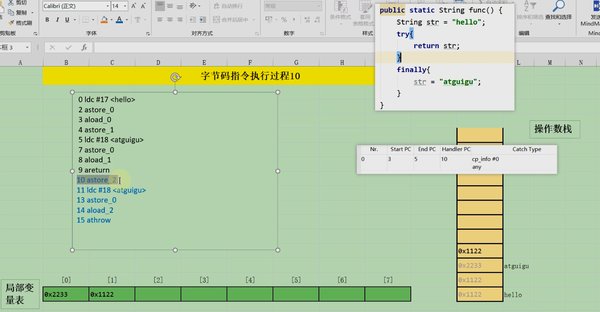

  > 蓝色字节码是两个异常处理对应字节码，也就是异常表和 finally 对应字节码 <br />
  > handler pc ：当发生异常是，跳转到哪里

## 3.10. 同步控制指令

### 3.10.1. 说明

- 种类：
  - **方法级的同步**
  - **方法内部一段指令序列的同步**
- 原理：
  - Java 虚拟机支持两种同步结构，这两种同步都是使用 `monitor` 来支持的。

### 3.10.2. 方法级的同步

- 实现：
  - 方法级的同步是隐式的
  - 即 **无需通过字节码指令来控制** ，它实现在方法调用和方法返回操作之中
- 声明方法：
  - 虚拟机可以从方法常量池的方法表结构中的 `ACC_SYNCHRONIZED` 访问标志的值一个方法是否声明为同步方法；
- 流程说明：
  - 当调用方法时，调用指令将会检查方法 ACC_SYNCHRONIZED 访问标志是否设置。
  - 如果设置了，执行线程将先持有同步锁，然后执行方法。
  - 在方法执行期间，执行线程持有同步锁，其他任何线程都无法再获得同一个锁。
  - **最后** 在方法完成时 **释放同步锁** 。
    - 正常完成
      - 正常执行完，释放锁
    - 非正常完成
      - 如果一个同步方法执行期间抛出了异常，并且在方法内部无法处理此异常
      - 那这个同步方法所持有的锁将在异常抛出的同步方法之外时自动释放。

- 示例：
  ```java
  private int i = 0;

  public synchronized void add() {
      i++;
  }
  ```
  ```
  0 aload_0
  1 dup
  2 getfield #2 <com/atguigu/java1/SynchronizedTest.i>
  5 iconst_1
  6 iadd
  7 putfield #2 <com/atguigu/java1/SynchronizedTest.i>
  10 return
  ```

  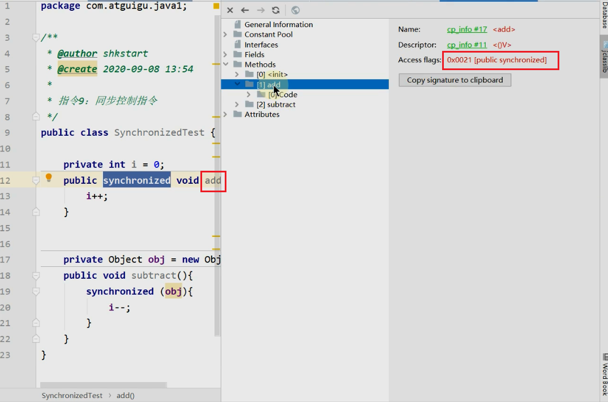

  - 这段代码和普通的无同步操作的代码没有什么不同，没有使用 monitorenter 和 monitorexit 进行同步区控制
  - 这是因为，对于同步方法而言，**当虚拟机通过方法的访问标识符判断一个同步方法时，会自动在方法调用前进行加锁**
  - 当同步方法执行完毕后，不管方法时正常结束还是有异常抛出，均会由虚拟机释放这个锁
  - 因此，对于同步方法而言，monitorenter 和 monitorexit 指令是隐式存在的，并未直接出现在字节码中。

### 3.10.3. 方法内指定序列的同步

- 实现：
  - 同步一段指令序列：通常由 Java 中的 `synchronized` 语句块来表示的
  - jvm 的指令集有两条指令来支持 synchronized 关键字的语义。
    - monitorenter 
    - monitorexit
- 命令执行流程说明：
  - 指令 monitorenter 和 monitorexit 在执行时，都需要**往操作数栈顶压入对象**
  - 执行 monitorenter 和 monitorexit 时会弹出对象
  - 之后 monitorenter 和 monitorexit 的锁定和释放都是**针对这个对象的监视器**进行的。
- 同步执行流程
  - 当一个线程进入同步代码块时，它使用 `monitorenter` 指令请求进入
    - 如果当前对象的监视器为 `0`，则它会被允许进入
    - 若为 `1`，则判断持有当前监视器的线程是否为自己
      - 如果是，则进入，否则进行等待，知道对象的监视器计数器为 0，才会被允许进入同步块。
  - 当线程退出同步代码块时，需要使用 `monitorexit` 声明退出
    - 在 Java 虚拟机中，任何对象都有一个监视器与之相关联，用来判断对象是否被锁定
    - 当监视器被持有后，对象处于锁定状态。

  

  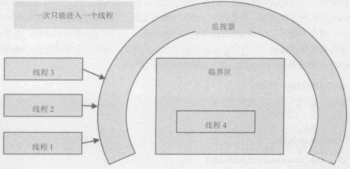
  > 监视器保护临界区代码不同时被多个线程访问 <br />
  > 只有当线程 4 离开临界区后，线程 1、2、3 才有可能进入。

- 注意：同步代码块自动生成异常处理
  - 目的：
    - 无论这个方法是正常结束还是异常结束
    - 编译器必须确保无论方法通过何种方式完成，方法中调用过的每条 monitorenter 指令都必须执行其对应的 monitorexit 指令
  - 处理
    - 为了保证在方法异常完成时 monitorenter 和 monitorexit 指令依然可以正确配对执行
    - **编译器会自动产生一个异常处理器，这个异常处理器声明可处理所有的异常** ，它的目的就是用来执行 monitorexit 指令。

- 举例：

  ```java
  public class SynchronizedTest {

      private int i = 0;

      public void subtract() {
          synchronized (obj) {
              i--;
          }
      }
  }
  ```

  
  > 蓝色部分为自动生成的异常处理

## 3.11. 面试题

```
知道字节码吗？字节码都有哪些？Integer x = 5;int y = 5;比较x==y要经过哪些步骤
```


# 4. 类的加载过程详解

## 4.1. 概述

- 概述：
  - 在Java中数据类型分为基本数据类型和引用数据类型
    - 基本数据类型由虚拟机预先定义
    - 引用数据类型则需要进行类的加载
  - 按照Java虚拟机规范，从class文件到加载到内存中的类，到类卸载出内存为止，它的整个生命周期包括7个阶段。

- 引用数据类型的生命周期

  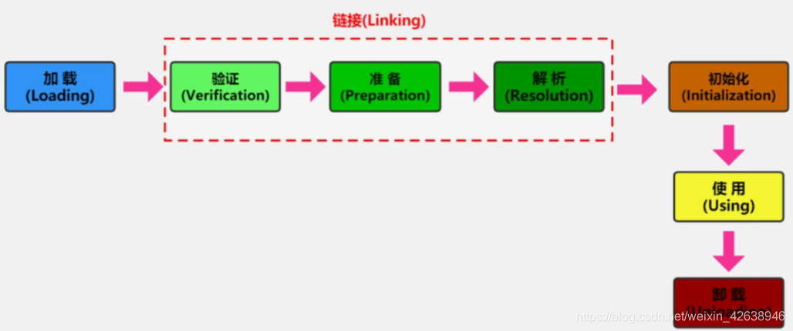

  > 其中，验证、准备、解析 3 个部分统称为链接（Linking）

- 类加载使用流程

  

## 4.2. Loading（加载）阶段

### 4.2.1. 概述

- **加载**
  - 目的：
    - **所谓加载，简而言之就是将Java类的字节码加载到机器内存中**
    - **并在内存中构建出Java的原型-------类模板对象**
  - 加载流程：
    - 通过类的全名，获取类的二进制数据流。
      > 对于类的二进制流数据，虚拟机可以通过多种途径产生或获得。（只要读取的字节码符合JVM规范即可）
      - 虚拟机可能通过文件系统读入一个class后缀的文件（**最常见**）
      - 读入jar、zip等归档数据包，提取类文件。
      - 事先存放在数据库中的类的二进制数据
      - 使用类似于HTTP之类的协议通过网络进行加载
      - 在运行时生成一段Class的二进制信息等。
    - 解析类的二进制数据流为**方法区内的数据结构**（Java类模型）
      - 如果输入数据不是ClassFile的结构，则会抛出ClassFormatError。
    - 创建java.lang.Class类的实例，表示该类型。 **作为方法区这个类的的各种数据的访问入口**

### 4.2.2. 类模板与Class实例

- **类模板**
  - 位置：加载的类在JVM中创建相应的类结构，类结构会存储在**方法区**
    > JDK1.8之前：永久代；JDK及以后：元空间
  - 说明：
    - 其实就是**Java类在JVM内存中的一个快照**
    - JVM将字节码文件解析出的常量池、类字段、类方法等信息等信息存储到类模板中
  - 作用：
    - JVM在运行期**通过类模板**而获取Java类中的任意信息，能够对Java类的成员变量进行遍历，也能进行Java方法的调用。
      > 而访问类模版则是通过Class实例这个接口，具体看下面
    - 反射的机制即基于这一基础。如果JVM没有将Java类的声明信息存储起来，则JVM在运行期也无法反射。

- **Class实例：**
  - 位置： **堆中**
  - 目的/作用：
    - 用来封装位于方法区的数据结构
    - java.lang.Class实例是**访问类型元数据的接口**，也是**实现反射的关键入口**
    - 通过Class类提供的接口，可以获得目标类所关联的.class文件中具体的数据结构：方法、字段等信息。
  - 创建时机：
    - 类将`.class`文件**加载至元空间后**，会**在堆中**创建一个java.lang.Class对象，
    - **该Class对象是在加载类的过程中创建**的
    - 每个类都对应一个Class类型的对象
  - 具体流程：（instanceKlass --> mirror: Class的实例）
    > **细节待补充**
  - 注意：Class类的构造方法是私有的，只有JVM能够创建。

- **图示：**

  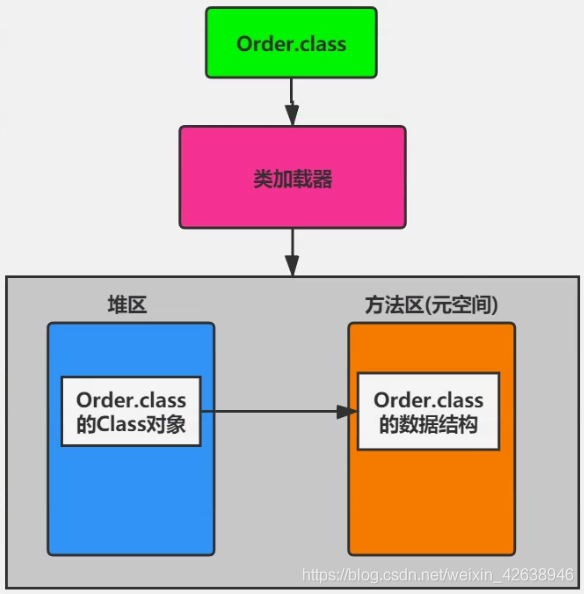

- **类模版和Class实例关系**：
  - java.lang.Class实例是**访问类型元数据的接口**
  - 也是 **实现反射的关键入口**
  - 外部可以通过访问Class对象来获取对应的类数据结构。

- 反射示例：通过Class对象获取类模版对象的数据结构
  ```java
  // 通过Class类，获得了java.lang.String类的所有方法信息，并打印方法访问标识符、描述符
  public class LoadingTest {
      public static void main(String[] args) {
          try {
              Class clazz = Class.forName("java.lang.String");
              // 获取当前运行时类声明的所有方法
              Method[] ms = clazz.getDeclaredMethods();
              for (Method m : ms) {
                  // 获取方法的修饰符
                  String mod = Modifier.toString(m.getModifiers());
                  System.out.print(mod + " ");
                  // 获取方法的返回值类型
                  String returnType = m.getReturnType().getSimpleName();
                  System.out.print(returnType + " ");
                  // 获取方法名
                  System.out.print(m.getName() + "(");
                  // 获取方法的参数列表
                  Class<?>[] ps = m.getParameterTypes();
                  if (ps.length == 0) System.out.print(')');
                  for (int i = 0; i < ps.length; i++) {
                      char end = (i == ps.length - 1) ? ')' : ',';
                      // 获取参数的类型
                      System.out.print(ps[i].getSimpleName() + end);
                  }
                  System.out.println();
              }
          } catch (ClassNotFoundException e) {
              e.printStackTrace();
          }
      }
  }
  ```

### 4.2.3. 数组类的加载

- 加载方式：
  - **数组本身并不是由类加载器负责创建的**
  - 而是**由JVM在运行时根据需要而直接创建**
  - 但**数组的元素类型仍然需要依靠类加载器去创建**
- 加载流程：
  - 如果数组的元素类型是引用类型，那么就遵循定义的加载过程递归加载和创建数组元素对应的类；
    > 比如 `String[]`需要先加载String
  - 之后JVM使用**指定的元素类型**和**数组维度**来创建新的数组类。
- 访问权限
  - 如果数组的元素类型是引用类型，数组类的可访问性就由元素类型的可访问性决定
  - 否则，如果是基本数据类型，数组类的可访问性被定义为public。

## 4.3. Linking链接阶段

### 4.3.1. Verification（验证）

- 执行时机：当类加载到系统后，就开始链接操作，验证是链接操作的第一步
- 提前检验的优点：链接阶段的验证虽然拖慢了加载速度，但是避免了在字节码运行时还需要进行各种检查。
- 目的： **它的目的是保证加载的字节码是合法、合理并且符合规范的。**

- 执行流程：
  > 验证的步骤比较复杂，实际要验证的项目也很繁多，大体上java虚拟机需要做以下检查，如图所示：

  

- **具体说明：**
  - **格式验证**
    - 目的：验证字节码格式
    - 执行环节：和 **加载阶段** 一起执行
    - 结果：会将二进制数据信息加载到方法区
    - 执行位置：无，此时还未加载入JVM
    - 验证项：
      - 是否以魔数0xcafebabe开头
      - 主版本和副版本号是否在当前Java虚拟机的支持范围
      - 数据中的每一项是否都拥有正确的长度
      - ...
  - **语义检查** :
    - 目的：判断在语义上是否不符合规范
    - 执行环节：链接阶段执行
    - 执行位置：方法区
    - 验证项：
      - 是否所有的类都有父类的存在（在Java里，除了Object外，其他类都应该有父类）
      - 是否一些被定义为final的方法或者类被重写或继承了
      - 非抽象类是否实心了所有抽象方法或接口方法
      - 是否存在不兼容的方法
        - 比如方法的签名除了返回值不同，其他都一样，这种方法会让虚拟机无从下手调度
        - abstract情况下的方法，不能是final类型
  - **字节码验证**:
    - 目的：它试图通过字节码流的分析，判断字节码是否可以被正确的执行
    - 执行环节：链接阶段执行
    - 执行位置：方法区
    - 验证项：
      - 在字节码执行的过程中，是否会跳转到一条不存在的指令
      - 函数的调用是否传递了正确类型的参数
      - 变量的赋值是不是给了正确的数据类型等。
      - 栈帧映射(StackMapTable)的检查
        - 栈映射帧（StackMapTable）位置：Code属性中的属性
        - 目的：用于检测在特定的字节码处，其局部变量表和操作数栈是否有着正确的数据类型
        - 注意：
          - 100%准确地判断一段字节码是否可以被安全执行是无法实现的
          - 因此，该过程只是尽可能地检查出可以预知的明显的问题
          - 如果在这个阶段无法通过检查，虚拟机也不会正确装在这个类
          - 但是，如果通过了这个阶段的检查，也不能说明这个类是完全没有问题的。
  - **符号引用的验证**
    - 目的：
      - Class文件在其常量池会通过字符串记录自己将要使用的其他类或者方法
      - 因此，在验证阶段， **虚拟机就会检查这些类或者方法是否确实存在** ，**并且当前类是否有权限访问这些数据**
    - 执行环节： **解析环节**
    - 执行位置：方法区
    - 表现：
      - 如果一个需要使用类无法在系统中找到，则会抛出NoClassDefFoundError
      - 如果一个方法无法被找到，则会抛出NoSuchMethodError。

### 4.3.2. Preparation（准备）

- 作用：
  - **为类的静态变量分配内存，并将其初始化为默认值**

  | 类型      | 默认初始值 |
  | --------- | ---------- |
  | byte      | (byte)0    |
  | short     | (short)0   |
  | int       | 0          |
  | long      | 0L         |
  | float     | 0.0f       |
  | double    | 0.0        |
  | char      | \u0000     |
  | boolean   | false      |
  | reference | null       |

  > 注意：Java并不支持boolean类型，内部实现是int，由于int的默认值是0，故对应的，boolean的默认值就是false。

- **注意**
  - **这里不包含基本数据类型的字段用static final修饰的情况，因为final在编译的时候就会分配了，准备阶段会显式赋值。**
    > 这里不会为实例变量初始化，类变量会分配在方法区中，而实例变量会在创建对象时随着对象一起分配到Java堆中。
  - 在这个阶段并不会像初始化阶段中那样会有初始化或者代码执行

  ```java
  /**
   * 过程二：链接阶段（以下都是针对static修饰的变量）
   * 基本数据类型：非 final 修饰的变量，在准备环节进行默认初始化赋值。
   *             final修饰以后，在准备环节直接进行显示赋值。
   * 
   * 拓展：如果使用字面量的方式定义一个字符串的常量的话，也是在准备环节直接进行显示赋值。
   */
  public class LinkingTest {
      private static long id;  // 准备阶段，默认初始化赋值为0
      private static final int num = 1; // 显示赋值，编译时就分配了
                                        // 存到常量池表中
                                        // 字段num下有ConstentValue属性
  
      public static final String constStr = "CONST";  // 显示赋值，编译时就分配了
                                                      // 存到常量池表中
                                                      // 字段constStr下有ConstentValue属性
      public static final String constStr1 = new String("CONST"); // 在之后的初始化阶段
                                                                  // <clinit>方法中赋值
  }
  ```

### 4.3.3. Reslution（解析）

- 执行时期： **初始化之后**
- 目的： **将类、接口、字段和方法的符号引用转为直接引用。**
- 说明
  - 符号引用就是一些字面量的引用，和虚拟机的内部数据结构和内存布局无关
  - 比较容易理解的就是在Class类文件中，通过常量池进行大量的符号引用
  - 但是在程序实际运行时，只有符号引用时不够的
  - 比如当如下println()方法被调用时，系统需要明确知道该方法的位置。

  ```
  举例：输出操作System.out.println()对应的字节码：

  invokevirtual # 24 <java/io/PrintStrem.println>
  ```

  
  

- 符号引用与直接引用
  - 对应关系
    - 所谓解析就是将符号引用转为直接引用
    - 也就得到类、字段、方法在内存中的指针或者偏移量
    - 以方法为例，
      - Java虚拟机为每个类都准备了一张方法表，将其所有的方法都列在表中
      - 当需要调用一个类的方法的时候，只要知道这个方法在方法表中的偏移量就可以直接调用该方法
      - **通过解析操作，符号引用就可以转变为目标方法在类中方法表中的位置，从而使得方法被成功调用。**
  - 相对关系
    - 因此，可以说，如果直接引用存在，那么可以肯定系统中存在该类、方法或者字段
    - 但只存在符号引用，不能确定系统中一定存在存在该结构。

- 字符串常量池与常量池项关系
  - 字符串常量在常量池中的表现：
    - **当在java代码中直接使用字符串常量时，就会在类中出现CONSTANT_String_info**
    - 它表示字符串常量，并且会引用一个`CONSTANT_UTF8_info`的常量项
  - 字符串常量在字符串常量池常量池中的表现：
    - **在Java虚拟机内部运行的常量池中，会维护一张字符串常量表（intern）**
    - **它会保存所有出现过的字符串常量，并且没有重复项**
    - **因为该表中没有重复项，所以任何字面量相同的字符串的String.intern()方法返回总是相等的**
  - 两者关系
    - **只要以`CONSTANT_String_info`形式出现的字符串都会在这张表中**
    - **使用String.intern()方法可以得到一个字符串在常量表中的引用**

## 4.4. Initialzation（初始化）阶段

### 4.4.1. 初始化概述

- 说明
  - 类的初始化是类加载的最后一个阶段
  - 如果前面的步骤都没有问题，那么便是类可以顺利装在到系统里
  - 此时，类才会开始执行Java字节码。 **到了初始化阶段，才真正开始执行类中定义的Java程序代码**

- 目的： **为类的静态变量赋予正确的初始值。**

- 作用： **初始化阶段的重要工作是执行类的初始化方法：`<clinit>`方法。**

- `<clinit>`方法
  - 限制：
    - 该方法仅能由Java编译器生成并由JVM调用
    - 程序开发者无法自定义一个同名的方法
    - 更无法直接在Java程序中调用该方法
      > 虽然该方法是由字节码指令组成的。
  - 组成
    > 以下 **搜集合并** 产生
    - **静态成员的赋值语句**
    - **static语句块**
  - 示例：基本示例
    ```java
    /**
      * 过程三：初始化阶段
      */
    public class InitializationTest {
        public static int id = 1;
        public static int number;
    
        static {
            number = 2;
            System.out.println("father static{}");
        }
    }
    ```
    ```
    // <clinit> 中的内容：

      0 iconst_1
      1 putstatic #2 <com/atguigu/java/InitializationTest.id>
      4 iconst_2
      5 putstatic #3 <com/atguigu/java/InitializationTest.number>
      8 getstatic #4 <java/lang/System.out>
    11 ldc #5 <father static{}>
    13 invokevirtual #6 <java/io/PrintStream.println>
    16 return
    ```

- 父类与子类`<clinit>`执行顺序
  - 说明
    - 在加载一个类之前，虚拟机总会试图加载该类的父类
    - 因此父类的`<clinit>` 总是在子类 `<clinit>` 之前被调用
    - 也就是说，父类的static块优先级高于子类。
  - 示例2：父类与子类`<clinit>`执行顺序

    ```java
    public class InitializationTest {
        public static int id = 1;
        public static int number;
    
        static {
            number = 2;
            System.out.println("father static{}");
        }
    }
    ```

    ```java
    public class SubInitialization extends InitializationTest {
        static {
            number = 4;  // number属性必须提前已经加载：一定会先加载父类。
            System.out.println("son static{}");
        }
    
        public static void main(String[] args) {
            System.out.println(number);
        }
    }
    ```

    ```log
    // 执行结果
    father static{}

    son static{}

    4
    ```

- 没有`<clinit>的情况`
  - 说明
    - 一个类中并没有声明任何的类变量，也没有静态代码块时
    - 一个类中声明类变量，但是没有明确使用类变量的初始化语句以及静态代码块来执行初始化操作时
    - 一个类中包含static final修饰的基本数据类型的字段，这些类字段初始化语句采用编译时常量表达式
  - 示例3：没有`<clinit>`方法的情况
    ```java
    /**
    * 哪些场景下，java编译器就不会生成<clinit>()方法
    */
    public class InitializationTest1 {
        // 场景1：对应非静态的字段，不管是否进行了显式赋值，都不会生成<clinit>()方法
        public int num = 1;
        // 场景2：静态的字段，没有显式的赋值，不会生成<clinit>()方法
        public static int num1;
        // 场景3：比如对于声明为static final的基本数据类型的字段，不管是否进行了显式赋值，都不会生成<clinit>()方法
        public static final int NUM2 = 1;
    }
    ```

### 4.4.2. 链接-准备阶段 与 初始化阶段

- 最终结论： **使用static + final修饰，且显示赋值中不涉及到方法或构造器调用的基本数据类型或String类型的显式赋值，是在链接阶段的准备环节进行。**

- 赋值时机总结：
  - 静态变量
    - 加final
      - 基本数据类型
        - **链接的准备阶段** 被显式赋值
      - String常量类型
        - **链接的准备阶段** 被显式赋值
      - 涉及方法和构造器调用
        - **初始化阶段** 被显示赋值赋值
    - 不加final
      - 在 **链接的准备阶段** **默认赋值**
      - 然后在 **初始化阶段** **显式赋值**
  - 非静态变量
    - 创建对象时初始化

- 示例：各种情况，重要
  ```java
  // 成员变量（非静态的）的赋值过程
    // ① 默认初始化 
    // ② 显式初始化 /代码块中初始化 
    // 构造器中初始化 
    // ④ 有了对象之后，可以“对象.属性”或"对象.方法"
  public class InitializationTest2 {
      public static int a = 1;  // 在链接阶段的准备环节默认赋值，在初始化阶段`<clinit>()`中显式赋值
      public static final int INT_CONSTANT = 10;  // 在链接阶段的准备环节显式赋值
  
      public static final Integer INTEGER_CONSTANT1 = Integer.valueOf(100);  // 在初始化阶段`<clinit>()`中显式赋值
      public static Integer INTEGER_CONSTANT2 = Integer.valueOf(1000);  // 在初始化阶段`<clinit>()`中显式赋值
  
      public static final String s0 = "helloworld0";  // 在链接阶段的准备环节显式赋值
      public static final String s1 = new String("helloworld1");  // 在初始化阶段`<clinit>()`中显式赋值
  
      public static String s2 = "helloworld2";  // 在链接阶段的准备环节默认赋值，在初始化阶段`<clinit>()`中显式赋值
  
      public static final int NUM1 = new Random().nextInt(10);  // 在初始化阶段`<clinit>()`中显式赋值
  }
  ```

### 4.4.3. clinit 方法的线程安全性与死锁

- 安全性：对于`<clinit>()` 方法的调用，也就是类的初始化，虚拟机会在内部确保其多线程环境中的安全性。

- 加锁：
  - 虚拟机会保证一个类的`<clinit>()` 方法在多线程中被正确地加锁、同步
  - 如果多个线程去同时初始化一个类，那么只会有一个线程去执行这个类的`<clinit>()` 方法
  - 其他线程都需要阻塞等待，直到活动线程执行`<clinit>()` 方法完毕。
    - 如果之前的线程成功加载了类，则等在队列中的线程就没有机会执行`<clinit>()` 方法了
    - 那么，当需要使用这个类时，虚拟机会直接返回给它已经准备好的信息。

- `<clinit>()`方法导致的死锁
  - **因为函数`<clinit>()` 带锁线程是安全的** 
  - 因此，如果在一个类中`<clinit>()` 方法中有耗时很长的操作，就可能造成多个线程阻塞，引发死锁
  - 并且这种死锁是很难发现的，因为看起来它们并没有可用的锁信息。

- **示例：加载类相互等待，死锁**

  ```java
  // A类加载需要先加载B类
  class StaticA {
      static {
          try {
              Thread.sleep(1000);
          } catch (InterruptedException e) {
          }
          try {
              Class.forName("com.atguigu.java1.StaticB");
          } catch (ClassNotFoundException e) {
              e.printStackTrace();
          }
          System.out.println("StaticA init OK");
      }
  }

  // B类加载需要先加载A类
  class StaticB {
      static {
          try {
              Thread.sleep(1000);
          } catch (InterruptedException e) {
          }
          try {
              Class.forName("com.atguigu.java1.StaticA");
          } catch (ClassNotFoundException e) {
              e.printStackTrace();
          }
          System.out.println("StaticB init OK");
      }
  }

  public class StaticDeadLockMain extends Thread {
      private char flag;

      public StaticDeadLockMain(char flag) {
          this.flag = flag;
          this.setName("Thread" + flag);
      }

      @Override
      public void run() {
          try {
              Class.forName("com.atguigu.java1.Static" + flag);
          } catch (ClassNotFoundException e) {
              e.printStackTrace();
          }
          System.out.println(getName() + " over");
      }

      public static void main(String[] args) throws InterruptedException {
          StaticDeadLockMain loadA = new StaticDeadLockMain('A');
          loadA.start();
          StaticDeadLockMain loadB = new StaticDeadLockMain('B');
          loadB.start();
      }
  }
  ```

### 4.4.4. 类的初始化情况

#### 4.4.4.1. 说明

- Java 对类的使用分为两种
  - 主动使用
    - 主动使用会调用`<clinit>()` 方法
  - 被动使用
    - 被动使用不会

- 查看类加载流程：
  - 添加参数：`-XX:+TraceClassLoading`
  - 或者加到junit上

    -

#### 4.4.4.2. 主动使用

- 装载时机
  - Class 只有在首次使用的时候才会被装载
  - Java 虚拟机不会无条件地装载 Class 类型
  - Java 虚拟机规定，一个类或接口在初次使用前，必须进行初始化，这里的使用，是指主动使用，主动使用只有以下几种情况
- 主动使用情况
  > （即：如果出现如下的情况，则会对类进行初始化操作。而初始化操作之前的加载、验证、准备已经完成。）
  - 1）当创建一个类的实例时，比如：
    - 使用 new 关键字
    - 反射
    - 克隆
    - 反序列化。
  - 2）当调用类的静态方法时，即当使用了字节码 invokestatic 指令。
  - 3）当使用类、接口的静态字段时（final 修饰特殊考虑）
    - 比如，使用 getstatic 或者 putstatic 指令。
      > 对应访问变量、赋值变量操作
    - 也就是访问在初始化阶段显式赋值的静态变量时
      > 具体看 **链接-准备阶段 和 初始化阶段** 一节
  - 4）当使用 java.reflect 包中的方法反射类的方法时。比如 Class.forName(“com.atguigu.java.Test”)
  - 5）当初始化子类时，如果发现其父类还没有进行初始化，则需要先触发其父类的初始化。
    - 但是这条规则并不适用于接口。
    - 当初始化一个类时，并不会先初始化它所实现的接口
    - 在初始化一个接口时，并不会初始化它的父接口
    - 因此，一个父接口并不会因为它的子接口或者实现类的初始化而初始化
    - **只有当程序首次使用特定的静态字段时，才会导致该接口的初始化**
  - 6）如果一个接口定义了 default 方法，那么直接实现或者间接实现该接口的类的初始化，该接口要在其之前被初始化。
  - 7）当虚拟机启动时，用户需要指定一个要执行的主类（包含 main()方法的那个类），虚拟机会先初始化这个主类。
    - JVM 启动的时候通过引导类加载器加载一个初始类
    - 这个类在调用 `public static void main(String[] args)`方法之前被链接和初始化
    - main方法的执行将依次导致所需的类的加载，链接和初始化。
  - 8）当初次调用 MethodHandle 实例时，初始化该 MethodHandle 指向的方法所在的类
    > jdk7时对动态性的支持 <br />
    > 涉及解析 REF_getStatic、REF_putStatic、REF_invokeStatic 方法句柄对应的类

- 示例1：（1）、（2）

  ```java
  public class ActiveUse1 {
      public static void main(String[] args) {
          Order order = new Order();  // 1
      }

      // 序列化的过程：
      @Test
      public void test1() {
          ObjectOutputStream oos = null;
          try {
              oos = new ObjectOutputStream(new FileOutputStream("order.dat"));

              oos.writeObject(new Order());
          } catch (IOException e) {
              e.printStackTrace();
          } finally {
              try {
                  if (oos != null)
                      oos.close();
              } catch (IOException e) {
                  e.printStackTrace();
              }
          }
      }

      // 反序列化的过程：（验证）  2
      @Test
      public void test2() {
          ObjectInputStream ois = null;
          try {
              ois = new ObjectInputStream(new FileInputStream("order.dat"));

              Order order = (Order) ois.readObject();
          } catch (Exception e) {
              e.printStackTrace();
          } finally {
              try {
                  if (ois != null)
                      ois.close();
              } catch (IOException e) {
                  e.printStackTrace();
              }
          }
      }

      @Test
      public void test3() {
          Order.method();
      }
  }

  class Order implements Serializable {
      static {
          System.out.println("Order类的初始化过程");
      }

      public static void method() {
          System.out.println("Order method()....");
      }
  }
  ```

- 示例2：（3）

  ```java
  public class ActiveUse2 {
      @Test
      public void test1() {
  //        System.out.println(User.num);  // 会导致 初始化。没有使用final修饰，需要在初始化阶段进行初始化
  //        System.out.println(User.num1);  // 不会导致 初始化，结合前面讲解的static final理解
          System.out.println(User.num2);  // 会导致 初始化。结合前面讲解的static final理解
      }

      @Test
      public void test2() {
  //        System.out.println(CompareA.NUM1);  // 不会导致 初始化
          System.out.println(CompareA.NUM2);  // 会导致 初始化
      }
  }

  class User {
      static {
          System.out.println("User类的初始化过程");
      }

      public static int num = 1;
      public static final int num1 = 1;
      public static final int num2 = new Random().nextInt(10);
  }

  interface CompareA {
      public static final Thread t = new Thread() {
          {
              System.out.println("CompareA的初始化");
          }
      };

      public static final int NUM1 = 1;
      public static final int NUM2 = new Random().nextInt(10);
  }
  ```

- 示例3： （4）、（5）、（6）、（7）

  ```java
  public class ActiveUse3 {
      static {
          System.out.println("ActiveUse3的初始化过程");
      }

      @Test
      public void test1() {  // 4.
          try {
              Class clazz = Class.forName("com.atguigu.java1.Order");
          } catch (ClassNotFoundException e) {
              e.printStackTrace();
          }
      }

      @Test
      public void test2() {  // 5.
          System.out.println(Son.num);
      }

      @Test
      public void test3() {  // 5，补充说明
          System.out.println(CompareC.NUM1);
      }

      @Test
      public void test4() {  // 6.
          System.out.println(Son.num);
      }

      public static void main(String[] args) {  // 7.
          System.out.println("hello");
      }
  }

  class Father {
      static {
          System.out.println("Father类的初始化过程");
      }
  }

  class Son extends Father implements CompareB {
      static {
          System.out.println("Son类的初始化过程");
      }

      public static int num = 1;
  }

  interface CompareB {
      public static final Thread t = new Thread() {
          {
              System.out.println("CompareB的初始化");
          }
      };

      public default void method1() {
          System.out.println("你好！");
      }
  }

  interface CompareC extends CompareB {
      public static final Thread t = new Thread() {
          {
              System.out.println("CompareC的初始化");
          }
      };

      public static final int NUM1 = new Random().nextInt();
  }
  ```

#### 4.4.4.3. 被动使用

- 说明：
  - **并不是在代码中出现的类，就一定被加载挥着初始化。如果不符合主动使用的条件，类就不会初始化。**
  - 除了主动使用情况，其他情况均属于被动使用
  - **被动使用不会引起类的初始化。**
- 被动使用情况
  - 1）当访问一个静态字段时，只有真正声明这个字段的类才会被初始化
    - 当通过子类引用父类的静态变量，不会导致子类的初始化
  - 2）通过数组定义引用类，不会触发此类的初始化
  - 3）引用**常量**不会触发此类或接口的初始化
    -  因为常量在链接阶段就已经被显式赋值了。
  - 4）调用 `ClassLoader` 类的 `loadClass()` 方法加载一个类，并不是对类的主动使用，不会导致类的初始化。

- 示例1：（1）、（2）

  ```java
  /**
    * 关于类的被动使用，即不会进行类的初始化操作，即不会调用`<clinit>()`
    *
    * 说明：没有初始化的类，不意味着没有加载！
    */
  public class PassiveUse1 {
      @Test
      public void test1() {  // 1.
          System.out.println(Child.num);  // 不会初始化 Child
      }

      @Test
      public void test2() {  // 2.
          Parent[] parents = new Parent[10];
          System.out.println(parents.getClass());  // 不会初始化 Parent
          System.out.println(parents.getClass().getSuperclass());

          parents[0] = new Parent();
          parents[1] = new Parent();
      }
  }

  class Parent {
      static {
          System.out.println("Parent的初始化过程");
      }

      public static int num = 1;
  }

  class Child extends Parent {
      static {
          System.out.println("Child的初始化过程");
      }
  }
  ```
- 示例2：（3）、（4）

  ```java
  /**
    * * 3. 引用常量不会触发此类或接口的初始化。因为常量在链接阶段就已经被显式赋值了。
    * * 4. 调用ClassLoader类的loadClass()方法加载一个类，并不是对类的主动使用，不会导致类的初始化。
    */
  public class PassiveUse2 {
      @Test
      public void test1() {  // 3.
  //        System.out.println(Person.NUM);  // 不会 初始化
          System.out.println(Person.NUM1);  // 会 初始化
      }

      @Test
      public void test2() {  // 3.
  //        System.out.println(SerialA.ID);  // 不会 初始化
          System.out.println(SerialA.ID1);  // 会 初始化
      }

      @Test
      public void test3() {  // 4.
          try {
              Class clazz = ClassLoader.getSystemClassLoader().loadClass("com.atguigu.java1.Person");
          } catch (ClassNotFoundException e) {
              e.printStackTrace();
          }
      }
  }

  class Person {
      static {
          System.out.println("Person类的初始化");
      }

      public static final int NUM = 1;  // 在链接过程的准备环节就被赋值为1了。
      public static final int NUM1 = new Random().nextInt(10);  // 此时的赋值操作需要在`<clinit>()`中执行
  }

  interface SerialA {
      public static final Thread t = new Thread() {
          {
              System.out.println("SerialA的初始化");
          }
      };

      int ID = 1;
      int ID1 = new Random().nextInt(10);  // 此时的赋值操作需要在`<clinit>()`中执行
  }
  ```

## 4.5. Using（使用）

开发人员可以在程序中访问和调用它的静态类成员信息（比如：静态字段、静态方法），或者使用 new 关键字为其创建对象实例。

## 4.6. Unloading（卸载）

### 4.6.1. 类、类的加载器、类的实例

- 关系
  - 类加载器-->类对象
    - 在类加载器的内部实现中，用一个 Java 集合来存放所加载类的引用
  - 类对象-->类加载器
    - 一个 Class 对象总是会引用它的类加载器
    - 调用 Class 对象的 getClassLoader()方法，就能获得它的类加载器
  - 类示例-->类对象
    - 在 Object 类中定义了 getClass()方法。这个方法返回代表对象所属类的 Class 对象的引用
    - 此外，所有的 Java 类都有一个静态属性 class，它代表这个类的 Class 对象

- 具体说明

  

  - loader1 变量和 obj 变量间接引用代表 Sample 类的 Class 对象
  - objClass 变量则直接引用它。

- 类的生命周期： 
  > 以上图示例为例
  - 开始时机：当 Sample 类被加载、连接和初始化后，它的生命周期就开始了
  - 结束时机：
    - **一个类何时结束生命周期，取决于代表它的 Class 对象何时结束生命周期。**
    - 当代表 Sample 类的 Class 对象不再被引用，即不可触及时，Class 对象就会结束生命周期
    - Sample 类**在方法区内的数据也会被卸载**，从而结束 Sample 类的生命周期。
  - 生命周期结束导火索：
    - 如果程序运行过程中，将上图左侧三个引用变量都置为 null，生命周期结束
  - **声明周期结束时回收顺序**：
    - Sample **对象**结束生命周期
    - MyClassLoader **类加载器对象**结束生命周期
    - 代表 Sample 类的 **Class 对象**也结束生命周期
    - Sample 类在方法区内的**类模版信息**二进制数据被卸载。

- 回收后再调用：
  - 当再次有需要时，会检查 Sample 类的 Class 对象是否存在
    > 可以通过哈希码查看是否存在同一个实例
  - 如果存在会直接使用，不会重新加载
  - 如果不存在 Sample 类会被重新加载
    - 在 Java 虚拟机的堆空间会生成代表 Sample 类的 Class 实例

### 4.6.2. 方法区的垃圾回收

> 可以稍微复习一下去

- 方法区的垃圾回收主要回收两部分内容
  - 常量池中废弃的常量 
    > 判定一个常量是否“废弃”还是相对简单的，
    - HotSpot 虚拟机对常量池的回收策略是很明确的
    - 只要常量池中的常量没有被人任何地方引用，就可以被回收。
  - 不再使用的类型。
    > 判定一个类型是否属于“不再被使用的类”的条件就比较苛刻了 <br />
    > 也就是说明堆中的类加载器和方法区的类型数据很难被回收
    - 三个条件
      - **该类所有的实例都已经被回收。**
        - **也就是说 Java 堆中不存在该类及其任何子类的实例。**
      - **加载该类的类加载器已经被回收**
        - **这个条件除非是经过精心设计的可替换类加载器的场景，如 OSGi、JSP 的重记载等**
        - **否则通常是很难达成的。**
      - **该类对应的 java.lang.Class 对象没有任何地方被引用，无法在任何地方通过反射访问该类的方法。**
    - 注意：
      - Java 虚拟机被允许对满足上述三个条件的无用类进行回收
      - 这里说的仅仅是“被允许”，而并不是和对象一样，没有引用了就必然回收。

### 4.6.3. 类的卸载

- 不同类加载器加载类型的卸载：
  - 启动类加载器（引导类加载器）加载的类型：
    - 在整个运行期间是**不可能被卸载的**（jvm 和 jls 规范）。
  - 被系统类加载器和扩展类加载器加载的类型：
    - 在运行期间**不太可能被卸载**
    - 因为系统类加载器实例或者扩展类加载器的实例基本上在整个运行期间总能直接或者间接访问的到
      - 系统类加载器和扩展类加载器加载的类型很多
      - 就算有一个类不使用了，还有很多由系统类加载器和扩展类加载加载出的类
      - 加载器就无法回收掉，那么类也无法回收掉
    - 其达到 unreachable 的可能性极小。

  - 被开发者自定义的类加载器实例加载的类型：
    - 只有在很简单的上下文环境中才可能被卸载
    - 而且一般还要借助强制调用虚拟机的垃圾收集功能才可以做到
    - 可以预想，稍微复杂点的应用场景
      - 比如：很多时候用户在开发自定义类加载器实例的时候采用缓存以提高系统性能
      - 采用缓存就不会卸载自定义类加载器，那么自定义类加载器加载的对象也无法卸载
    - 因此，被加载的类型在运行期间也是几乎不太可能被卸载的（至少卸载的时间是不确定的）。

- 结论
  - **一个已经被加载的类型被卸载的几率很小至少被卸载的时间是不确定的**
  - 同时我们可以看得出来，开发者在开发代码的时候， **不应该对虚拟机的类型卸载做任何价值社的前提，来实现系统特定功能**。

## 4.7. 面试题

- 蚂蚁金服
  - 描述一下 JVM 加载 Class 文件的原理机制？
  - 一面：类加载过程
- 百度
  - 类加载的时机
  - java 类加载机制？
  - 简述 Java 类加载机制
- 腾讯
  - JVM 中类的加载机制，类加载过程？
- 滴滴
  - JVM 类加载机制
- 美团
  - Java 类加载过程
  - 描述一下 jvm 加载 class 文件的原理机制
- 京东
  - 什么是类的加载？
  - 哪些情况会出发类的加载？
  - 讲一下 JVM 加载一个类的过程
  - JVM 的类加载机制是什么？


# 5. 再谈类的加载器

## 5.1. 概述

- 类加载器作用时期：加载阶段
- 类加载器作用：
  - 类加载器是JVM执行类加载机制的前提。
  - ClassLoader是Java的核心组件，所有Class都是由ClassLoader进行加载的
- 类加载器作用流程
  - 读取二进制数据：ClassLoader负责通过各种方式将二进制数据流读入JVM内部
  - 转换对象示例：转换为一个与目标类对应的java.lang.Class对象实例
  - 转交：然后交给Java虚拟机进行链接、初始化等操作
- 注意：
  - ClassLoader在整个装载阶段，只能影响到类的加载，而无法通过ClassLoader去改变类的链接和初始化行为
  - 至于它是否可以运行，则由Execution Engine决定

  

- 诞生与设计：
  - 开发初衷：类加载器最早出现在Java1.0版本中，那个时候只是为了单纯满足Java Applet应用而研发出来
  - 设计：
    - 如今类加载器却在OSGi（面向Java的动态模型系统）、字节码加密解密领域大放异彩
    - 这主要归功于Java虚拟机的设计者们当初在设计类加载器的时候，并没有考虑将它绑定在JVM内部
    - 这样做的好处就是能够更加灵活和动态执行类加载操作。

### 5.1.1. 类的加载分类

- 指JVM加载class文件到内存的方式有两种：
  - 显式加载
  - 隐式加载

- 显示加载
  - 在代码中通过调用ClassLoader加载class对象
  - 如直接使用`Class.forName(name)`或`this.getClass().getClassLoader().loadClass()`加载class对象。
  - 隐式加载
    - 不直接在代码中调用ClassLoader的方法加载class对象，而是通过虚拟机自动加载到内存中
    - 如在加载某个类的class文件时，该类的class文件中引用了另一个类的对象，此时额外引用的类将通过JVM自动被加载到内存中。

- 使用：在日常开发以上两种方式一般会混合使用。

  ```java
  package com.atguigu.java;
  
  public class User {
      private int id;
  
      @Override
      public String toString() {
          return "User{" +
                  "id=" + id +
                  '}';
      }
  }
  ```

  ```java
  public class UserTest {
      public static void main(String[] args) {
          User user = new User();  // 隐式加载
  
          try {
              Class clazz = Class.forName("com.atguigu.java.User");  // 显式加载
              ClassLoader.getSystemClassLoader().loadClass("com.atguigu.java.User");  // 显式加载
          } catch (ClassNotFoundException e) {
              e.printStackTrace();
          }
      }
  }
  ```

### 5.1.2. 类加载器必要性

### 5.1.3. 命名空间

### 5.1.4. 类加载机制的基本特征

## 5.2. 复习：类加载器分类

## 5.3. ClassLoader源码分析

## 5.4. 双亲委派模型

## 5.5. 沙箱安全机制

## 5.6. 自定义类加载器

## 5.7. Java9新特性 

## 5.8. 面试题

- 大厂面试题
  - 蚂蚁金服
    - 深入分析ClassLoader，双亲委派机制
    - 类加载器的双亲委派模型是什么？
    - 一面：双亲委派机制及使用原因
  - 百度
    - 都有哪些类加载器，这些类加载器都加载哪些文件？
    - 手写一个类加载器Demo
    - Class的forName(“java.lang.String”) 和 Class的getClassLoader()的loadClass(“java.lang.String”)有什么区别？
  - 腾讯
    - 什么是双亲委派机制？
    - 类加载器有哪些？
  - 小米
    - 双亲委派机制介绍一下
  - 滴滴
    - 简单说一下你了解的类加载器
    - 一面：讲一下双亲委派模型，以及其优点
  - 字节跳动
    - 什么是类加载器，类加载器有哪些？
  - 京东
    - 类加载器的双亲委派模型是什么？
    - 双亲委派机制可以打破吗？为什么？

