- <mark> [官方文档](https://docs.oracle.com/javase/8/docs/technotes/tools/windows/index.html) </mark>

# 1. 性能监控与调优概述

## 1.1. 调优背景

- 生产环境中的问题
  - 生产环境发生内存溢出该如何处理？
  - 生产环境应该给服务器分配多少内存合适？
  - 如何对垃圾回收器的性能进行调优？
  - 生产环境 CPU 负载飙高该如何处理？
  - 生产环境应该给应用分配多少线程合适？
  - 不加 log，如何确定请求是否执行了某一行代码？
  - 不加 log，如何实时查看某个方法的入参与返回值？

- 为什么要调优？
  - 防止出现 OOM
  - 解决 OOM
  - 减少 Full GC 出现的频率

- 不同阶段的考虑
  - 上线前:测试，jps降低，延迟，cpu使用率等问题
  - 项目运行阶段：线上出现 OOM，运行情况监控

## 1.2. 调优的概述

- 监控的依据
  - 运行日志
  - 异常堆栈
  - GC 日志
  - 线程快照
  - 堆转储快照

- 调优的大方向
  - 合理的编写代码
  - 充分并合理的使用硬件资源
  - 合理的进行 JVM 调优

## 1.3. 性能优化的步骤

- 第一步（发现问题）：**性能监控**
  - 说明：
    - 一种以非强行或者入侵方式**收集或查看**应用运行性能数据的活动
    - 监控通常是指一种在生产、质量评估或者开发环境下实施的带有**预防或主动性**的活动
  - 执行时期：
    - 当应用相关干系人提出性能问题却**没有提供足够多的线索时**，首先我们需要进行性能监控，随后是性能分析。
  - 发现的问题：
    - GC 频繁
    - CPU load 过高
    - OOM
    - 内存泄露
    - 死锁
    - 程序相应时间较长

- 第二步（排查问题）：**性能分析**
  - 说明：
    - 一种以**侵入方式**收集运行性能问题的答复结果，它会影响应用的吞吐量或响应性
    - 性能分析是针对性能问题的答复结果，关注的范围通常比性能监控更加集中
  - 执行环境：
    - 性能分析**很少在生产环境**下进行
    - 通常是在质量评估、**系统测试或者开发环境下进行**
  - 执行时期：
    - 是性能监控之后的步骤。
  - 行为：
    - 打印 GC 日志，通过 GCviewer 或者[gceasy](https://gceasy.io/)来分析日志信息
    - 灵活运用命令行工具，jstack、jmap、jinfo 等
    - dump 出堆文件，使用内存分析工具分析文件
    - 使用阿里 Arthas 或 jconsole，JVisualVM 来实时查看 JVM 状态
    - jstack 查看堆栈信息

- 第三步（解决问题）：**性能调优**
  - 说明：
    - 一种为改善应用响应性或吞吐量而更改参数、源代码、属性配置的活动
  - 执行时期：
    - 性能调优是在性能监控、性能分析之后的活动。
  - **性能调优的目的**
    - 减少 GC 的频率，以较少的内存获取更大的吞吐量和更低的延迟
  - 调优行为：
    - 适当增加内存，根据业务背景选择垃圾回收器
    - 优化代码，控制内存使用
    - 增加机器，分散节点压力
    - 合理设置线程池线程数量
    - 使用中间件提高程序效率，比如缓存，消息队列等
    - 其他…

    ```
    没有绝对的调优，具体问题具体分析
    ```

## 1.4. 评价指标

### 1.4.1. 停顿时间（或响应时间）

- 应用层面：
  - 提交请求和返回请求的响应之间使用的时间，一般比较关注平均响应时间。
  - 常用操作的响应时间列表

    | 操作                                | 响应时间 |
    | ----------------------------------- | -------- |
    | 打开一个站点                        | 几秒     |
    | 数据库查询一条记录（有索引）        | 十几毫秒 |
    | 机械硬盘一次寻址                    | 4 毫秒   |
    | 从机械硬盘顺序读取 1M 数据          | 2 毫秒   |
    | 从 SSD 磁盘顺序读取 1M 数据         | 0.3 毫秒 |
    | 从远程分布式换成 Redis 读取一个数据 | 0.5 毫秒 |
    | 从内存读取 1M 数据                  | 十几微秒 |
    | Java 程序本地方法调用               | 几微秒   |
    | 网络传输 2Kb 数据                   | 1 微秒   |

- 垃圾回收层面
  - 暂停时间：**执行垃圾收集时，程序的工作线程被暂停的时间
  - 参数： `-XX:MaxGCPauseMills`

### 1.4.2. 吞吐量

- 对单位时间内完成的工作量（请求）的度量
- 在 GC 中：运行用户代码的时间占总运行时间的比例（总运行时间：程序运行时间+内存回收的时间n）吞吐量为 **`1- 1/(1+n)`**
  > n为参数`-XX:GCTimeRatio`获取的值

### 1.4.3. 并发数

- 同一时刻，对服务器有实际交互的请求数。
- 1000 个人同时在线，估计并发数在 5%-15%之间，也就是同时并发量：50-150 之间。

### 1.4.4. 内存占用

- Java 堆区所占的内存大小
- 主要是堆

# 2. JVM监控及诊断工具-命令行

## 2.1. 概述

[文档](https://docs.oracle.com/javase/8/docs/technotes/tools/windows/index.html)

```
使用数据说明问题，使用知识分析问题，使用工具处理问题
无监控、不调优！
```

- Java作为最流行的编程语言之一，其应用性能诊断一直受到业界广泛关注
- 可能造成Java应用出现性能问题的因素非常多，例如
  - 线程控制
  - 磁盘读写
  - 数据库访问
  - 网络I/O
  - 垃圾收集
  - ... 
- 想要定位这些问题，一款优秀的性能诊断工具必不可少。

------

- 简单命令行工具
  - jdk的bin目录中还有一系列辅助工具。这些辅助工具用来获取目标JVM不同方面、不同层次的信息，帮助开发人员很好的解决Java应用程序的一些疑难杂症。

    

  - exe执行文件类似快捷键方式，具体程序信息在 `tools.jar`下
  - 这些命令对应的源码地址：[源码](https://hg.openjdk.java.net/jdk/jdk11/file/1ddf9a99e4ad/src/jdk.jcmd/share/classes/sun/tools)

## 2.2. jps:查看正在运行的java进程

### 2.2.1. 基本说明

- jps：Java Process Status
  - 显示指定系统内所有的HotSpot虚拟机进程（查看虚拟机进程信息），可用于查询正在运行的虚拟机进程。
  - 对于本地虚拟机进程来说，**进程的本地虚拟机ID与操作系统的进程ID是一致的**，是唯一的。

- 示例

  ```java
  public class ScannerTest {
      public static void main(String[] args) {
          Scanner scanner = new Scanner(System.in);
          String info = scanner.next();
      }
  }
  ```

  

  > 另外注意：每次jps执行都是一个新的进程

### 2.2.2. 语法与参数

- jps的进本语法：`jps [options] [hostid]`

- **[options]：**
  - -q：仅仅显示LVMID（local virtual machine id），即本地虚拟机唯一id。不显示主类的名称等。
  - -l：输出应用程序主类的全类名 或 如果执行的是jar包，则输出jar包的完整路径
  - -m：输出虚拟机进程启动时传递给主类main()的参数
  - -v：列出虚拟机进程启动时的JVM参数。比如：`-Xms100m -Xmx100m`是启动程序指定的JVM参数

  > 说明：以上参数可以综合使用。

- **[hostid]：**
  - RMI注册表中注册的主机名
  - 如果想要**远程监控主机上的java程序，需要安装jstatd**
  - 对于具有更严格的安全实践的网络场所而言，可以使用一个自定义的策略文件来显式对特定的可信主机或网络的访问，尽管 **这种技术很容易受到IP地址欺诈攻击**
  - 如果安全问题无法使用一个定制的策略文件来处理，那么最安全的操作是不运行jstatd服务器，而是本地使用jstat和jps工具。

- 注意
  - 如果某Java进程关闭了默认开启的`-XX UsePerfData`参数（即使用参数-XX:-UsePerfData），那么jps命令（以及下面介绍的jstat）将无法探知该Java进程

- 示例

  <details>
  <summary style="color:red;">展开</summary>

  - 示例1

    

  - 示例2
    - 在IDEA中配置参数如下：

      

    - 执行：

      ```shell
      jps -m > a.txt
      ```

    - 生成文件的内容如下，可以看到刚才输入的参数

      

  - 示例3
    - 在IDEA中配置参数如下：

      

    - 执行：

      ```shell
      jps -v > b.txt
      ```

    - 生成文件的内容如下，可以看到刚才输入的参数

      
  </details>

## 2.3. jstat:查看jvm统计信息

### 2.3.1. 基本说明

- jstat（JVM Statistics Monitoring Tool）：用于监视虚拟机各种运行状态信息的命令工具。它可以显示本地或者远程虚拟机中的类装载、内存、垃圾收集、JIT编译等运行数据。
- 在没有GUI图形界面，只提供了纯文本控制台环境的服务器上，它将是运行期间定位虚拟机性能问题的首选工具。常用于检测**垃圾回收**问题以及**内存泄露**问题。
- [官方文档](https://docs.oracle.com/javase/8/docs/technotes/tools/unix/jstat.html)

### 2.3.2. 基本语法

- 基本语法
  - options参数，用来指定展示哪方面的信息
  - interval参数：统计数据的周期
  - count参数：总查询次数
  - -t 参数：添加timestamp信息
  - -h 参数： 输出行信息

  ```shell
  jstat -<option> [-t] [-h<lines>] <vmid> [<interval> [<count>]]
  ```
  ```bash
  Usage: jstat -help|-options
        jstat -<option> [-t] [-h<lines>] <vmid> [<interval> [<count>]]

  Definitions:
    <option>      An option reported by the -options option
    <vmid>        Virtual Machine Identifier. A vmid takes the following form:
                      <lvmid>[@<hostname>[:<port>]]
                  Where <lvmid> is the local vm identifier for the target
                  Java virtual machine, typically a process id; <hostname> is
                  the name of the host running the target Java virtual machine;
                  and <port> is the port number for the rmiregistry on the
                  target host. See the jvmstat documentation for a more complete
                  description of the Virtual Machine Identifier.
    <lines>       Number of samples between header lines.
    <interval>    Sampling interval. The following forms are allowed:
                      <n>["ms"|"s"]
                  Where <n> is an integer and the suffix specifies the units as
                  milliseconds("ms") or seconds("s"). The default units are "ms".
    <count>       Number of samples to take before terminating.
    -J<flag>      Pass <flag> directly to the runtime system.
  ```

  

- 说明与示例

  ```java
  public class ScannerTest {
      public static void main(String[] args) {
          Scanner scanner = new Scanner(System.in);
          String info = scanner.next();
      }
  }
  ```

  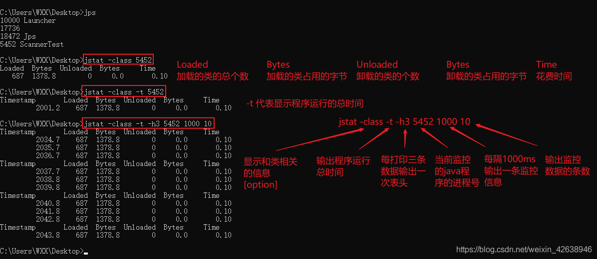

### 2.3.3. 所有参数

#### 2.3.3.1. options

- 测试代码

  ```java
  /**
    * -Xms60m -Xmx60m -XX:SurvivorRatio=8
    */
  public class GCTest {
      public static void main(String[] args) {
          ArrayList<byte[]> list = new ArrayList<>();
  
          for (int i = 0; i < 1000; i++) {
              byte[] arr = new byte[1024 * 100];  // 100KB
              list.add(arr);
              try {
                  Thread.sleep(120);
              } catch (InterruptedException e) {
                  e.printStackTrace();
              }
          }
      }
  }
  ```

> **类装载相关的：**

- -class：显示ClassLoader的相关信息：类的装载、卸载数量、总空间、类装载所消耗的时间等

 > **垃圾回收相关的：**

- -gc：显示与GC相关的堆信息。包括Eden区，两个Survivor区、老年代、永久代的用量、已用空间、GC时间合计等信息。

  

  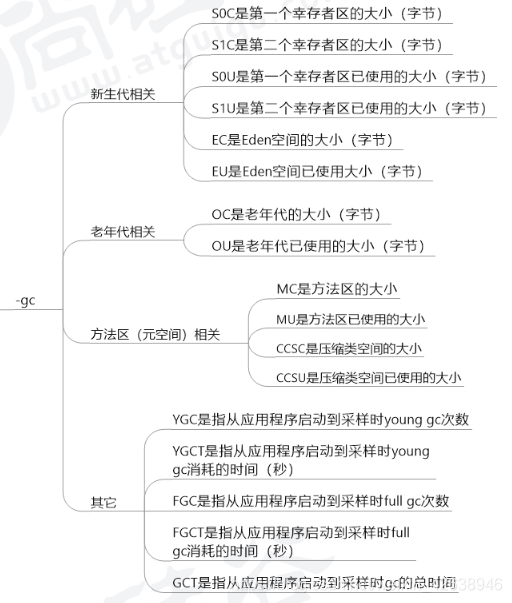

- -gccapacity：显示内容与-gc基本相同，但输出**主要关注Java堆各个区域使用的最大、最小空间**。

- -gcutil：显示内容与-gc基本相同，但输出**主要关注已使用空间占总空间的百分比**。

  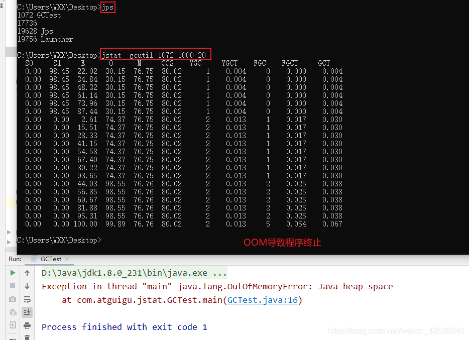

- -gccause：与-gcutil功能一样，但是**会额外输出导致最后一次或当前正在发生的GC产生的原因**。

  

- -gcnew：显示新生代GC状况

- -gcnewcapacity：显示内容与-gcnew基本相同，输出主要关注使用到的最大、最小空间。

- -gcold：显示老年代GC状况

- -gcoldcapacity：显示内容与-gcold基本相同，输出主要关注使用到的最大、最小空间。

- -gcpermcapacity：显示永久代用到的最大、最小空间。

> **JIT相关的：**

- -compiler：显示JIT编译器编译过的方法、耗时等信息
- -printcompilation：输出已被JIT编译的方法

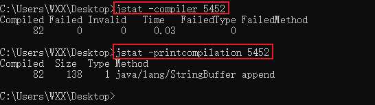

#### 2.3.3.2. 展示选项

- interval参数:用于指定输出统计数据的周期，单位为毫秒。即：查询间隔

- count参数:用于指定查询的总次数

- -t参数:可以在输出信息前面加上一个Timestamp列，显示程序的运行时间。单位：秒

- -h参数:可以在周期性数据输出时，输出多少行数据后输出一个表头信息

### 2.3.4. 经验之谈

- OOM隐患
  - 通过`-t`和`GCT`:
  - 比较Java进程的启动时间以及总GC时间（GCT列），或者两次测量的时间间隔以及总GC时间的增量，来得出GC时间栈运行时间的比例
  - 如果该比例超过20%，则说明目前堆的压力较大；如果该比例超过90%，则说明堆里几乎没有可用空间，随时都可能抛出OOM异常。

- 内存泄漏。
  - 第1步：在长时间运行的Java程序中，我们可以运行jstat命令连续获取多行性能数据，并取这几行数据中的OU列（即已占用的老年代内存）的最小值。
  - 第2步：
    - 然后，我们每隔一段较长的时间重复一次上述操作，来获取多组OU最小值
    - 如果这些值呈现上涨趋势，则说明该Java程序的老年代内存已使用量不断上涨，这意味着无法回收的对象在不断增加，因此有可能存在内存泄露。

  > 待做，shell脚本检测内存泄漏+报错

## 2.4. jinfo:实时查看和修改JVM配置参数

### 2.4.1. 基本说明

- jinfo（Configuration Info For Java）：查看虚拟机配置参数信息，也可以用于调整虚拟机的配置参数
- 在很多情况下，Java应用程序不会指定所有的Java虚拟机参数
  - 而此时，开发人员可能不知道某一个具体的Java虚拟机参数默认值
  - 在这种情况下，可能需要查找文档获取某个参数的默认值。这个查找过程可能是非常艰难的
  - 但是有了jinfo工具，开发人员可以很方便地找到Java虚拟机参数的当前值。
  - 同时也可以实时修改一些参数的值

- [官方文档](https://docs.oracle.com/en/java/javase/11/tools/jinfo.html)

### 2.4.2. 语法与参数

#### 2.4.2.1. 基本语法与参数

  ```shell
  jinfo [option] pid  # pid：进程的ID，必须加上
  ```

  ```
  Usage:
      jinfo [option] <pid>
          (to connect to running process)
      jinfo [option] <executable <core>
          (to connect to a core file)
      jinfo [option] [server_id@]<remote server IP or hostname>
          (to connect to remote debug server)

  where <option> is one of:
      -flag <name>         to print the value of the named VM flag
      -flag [+|-]<name>    to enable or disable the named VM flag
      -flag <name>=<value> to set the named VM flag to the given value
      -flags               to print VM flags
      -sysprops            to print Java system properties
      <no option>          to print both of the above
      -h | -help           to print this help message
  ```

- option列表：

  | 选项                    | 选项说明                                                                                    |
  | ----------------------- | ------------------------------------------------------------------------------------------- |
  | 查看： no option        | 输出全部参数和系统属性                                                                      |
  | 查看：-flag name        | 输出对应名称的参数                                                                          |
  | 查看： -flags           | 输出全部赋过值的参数                                                                        |
  | 查看： -sysprops        | 输出系统属性，可以由 System.getProperties()取得                                             |
  | 修改： -flag [±]name    | 针对 boolean 类型，开启或者关闭对应名称的参数， <br />只有被标为 manageable 的参数才可以被动态修改 |
  | 修改： -flag name=value | 针对非 boolean 类型，设置对应名称的参数                                                     |

#### 2.4.2.2. 示例：查看配置参数默认值


#### 2.4.2.3. 示例：修改配置参数值

> jinfo不仅可以查看运行时某一个Java虚拟机的实际取值，甚至可以在运行时修改部分参数，并使之立即生效。

- 注意：并非所有的参数都支持动态修改。参数只有被标记为manageable的flag可以实时修改。其实，这个修改能力是极其有限的。

  ```shell
  # 可以查看被标记为manageable的参数
  java -XX:+PrintFlagsFinal -version | grep manageable
  ```

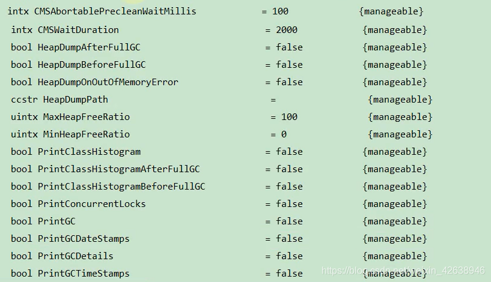


### 2.4.3. 拓展:查看所有jvm参数与值

```shell
  # 查看所有JVM参数启动的初始值
  java -XX:+PrintFlagsInitial
  # 查看所有JVM参数的最终值
  java -XX:+PrintFlagsFinal
  # 查看哪些已经被用户或者JVM设置过的详细的XX参数的名称和值
  java -XX:+PrintCommandLineFlags
```

## 2.5. jmap:导出内存映像文件&内存使用情况

### 2.5.1. 基本说明

- jmap（JVM Memory Map）：
  - 作用一方面是获取dump文件（堆转储快照文件，二进制文件）
  - 另一方面是获取目标Java进程的内存相关信息，包括Java堆各区域的使用情况、堆中对象的统计信息、类加载信息等。
- 开发人员可以在控制台中输入命令`jmap -help`查阅jmap工具的具体使用方式和一些标准选项配置
- [官方文档](https://docs.oracle.com/en/java/javase/11/tools/jmap.html)

### 2.5.2. 语法与参数

- 基本语法

  ```shell
  jmap [option] <pid>
  jmap [option] <executable <core>
  jmap [option] [server_id@]<remote server IP or hostname>
  ```
  ```bash
  Usage:
      jmap [option] <pid>
          (to connect to running process)
      jmap [option] <executable <core>
          (to connect to a core file)
      jmap [option] [server_id@]<remote server IP or hostname>
          (to connect to remote debug server)

  where <option> is one of:
      <none>               to print same info as Solaris pmap
      -heap                to print java heap summary
      -histo[:live]        to print histogram of java object heap; if the "live"
                          suboption is specified, only count live objects
      -clstats             to print class loader statistics
      -finalizerinfo       to print information on objects awaiting finalization
      -dump:<dump-options> to dump java heap in hprof binary format
                          dump-options:
                            live         dump only live objects; if not specified,
                                          all objects in the heap are dumped.
                            format=b     binary format
                            file=<file>  dump heap to <file>
                          Example: jmap -dump:live,format=b,file=heap.bin <pid>
      -F                   force. Use with -dump:<dump-options> <pid> or -histo
                          to force a heap dump or histogram when <pid> does not
                          respond. The "live" suboption is not supported
                          in this mode.
      -h | -help           to print this help message
      -J<flag>             to pass <flag> directly to the runtime system
  ```

- [option]。 注意：这些参数和linux下输入显示的命令多少会有些不同，包括也受jdk版本的影响。

  | 选项           | 作用                                                                                                 |
  | -------------- | ---------------------------------------------------------------------------------------------------- |
  | **-dump**      | 生成 dump 文件，`-dump:live`，只保存堆中存活的对象                                                   |
  | **-heap**      | 输出整个堆空间的统计信息，包括 GC 的使用、堆配置信息，以及内存的使用信息等                           |
  | **-histo**     | 输出堆空间中的对象的统计信息，包括类、实例数量和合计容量。 <br />`-histo:live`只统计堆中的存活对象   |
  | -finalizerinfo | 仅显示在 F-Queue 中等待 Finalizer 方法的对象。 <br />**仅 linux/solaris 平台有效**                   |
  | -permstat      | 以 ClassLoader 为统计口径输出**永久代**的内存状态信息。 <br />**仅 linux/solaris 平台有效**          |
  | -F             | 当虚拟机进程对-dump 选项没有任何响应时，强制执行生成 dump 文件。 <br />**仅 linux/solaris 平台有效** |
  | `-J <flag>`    | 传递参数给 jmap 命令启动的 jvm                                                                       |

### 2.5.3. 具体使用示例

#### 2.5.3.1. 使用1：导出内存映像文件

> **说明**

- 注意：
  - （1）通常在写Heap Dump文件前会触发一次Full GC，所以heap dump文件里保存的都是Full GC后留下的对象信息。
  - （2）由于生成dump文件比较耗时，因此大家需要耐心等待，尤其是大内存镜像生成的dump文件则需要耗费更长的时间来完成。

- 示例代码

  ```java
  /**
   * -Xms60m -Xmx60m -XX:SurvivorRatio=8
   */
  public class GCTest {
      public static void main(String[] args) {
          ArrayList<byte[]> list = new ArrayList<>();
  
          for (int i = 0; i < 1000; i++) {
              byte[] arr = new byte[1024 * 100];  // 100KB
              list.add(arr);
              try {
                  Thread.sleep(60);
              } catch (InterruptedException e) {
                  e.printStackTrace();
              }
          }
      }
  }
  ```

> **分为两种导出的方式**

- 手动的方式

  ```shell
  # format=b 是为了jmap生成的文件能和hprof文件匹配起来

  # 文件会越来越大
  jmap -dump:format=b,file=<filename.hprof> <pid>
  # 因为只抓取存活对象，未来得及回收的对象不会抓取，可能会越来越小
  jmap -dump:live,format=b,file=<filename.hprof> <pid>
  ```

  

  - 使用注意
    - 生产环境中的内存映像文件可能会很大
    - 加上`:live`比较好

- 自动的方式
  - 当程序发生OOM退出系统时，一些瞬时信息都随着程序的终止而消失，而OOM问题往往比较困难或者耗时。
  - 此时若能在OOM时，自动导出dump文件就显得非常迫切

  ```shell
  # 当程序发生OOM时，导出应用程序的当前堆快照
  -XX:+HeapDumpOnOutOfMemoryError
  # 可以指定堆快照的保存位置
  -XX:HeapDumpPath=<filename.hprof>
  ```
  ```shell
  # 比如：
  -Xms60m -Xmx60m -XX:SurvivorRatio=8 -XX:+HeapDumpOnOutOfMemoryError -XX:HeapDumpPath=d:\heap\oom.hprof
  ```
  - 操作示例

    <details>
    <summary style="color:red;">展开</summary>

    - 在IDEA中配置参数如下，执行程序，等到OOM是则会自动生成dump文件

      

    - 生成的oom.hprof文件如下：

      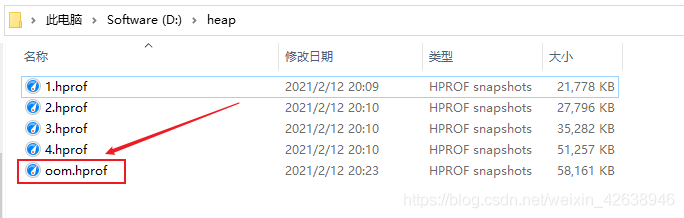
    </details>

#### 2.5.3.2. 使用2：显示堆内存相关信息

- `jmap -heap pid`
  - 获取**某一时刻**整个堆空间的统计信息
  - 包括GC的使用、堆配置信息，以及内存的使用信息等

  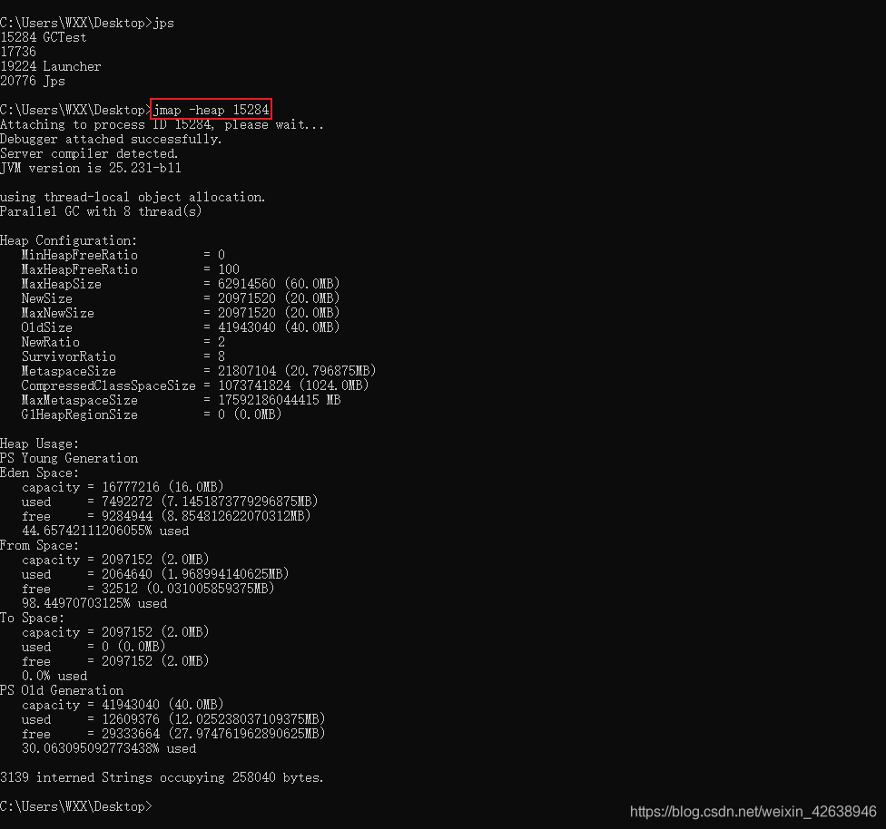

- `jmap -histo pid`
  - 获取某一时刻堆空间中的对象的统计信息
  - 包括类、实例数量和合计容量

  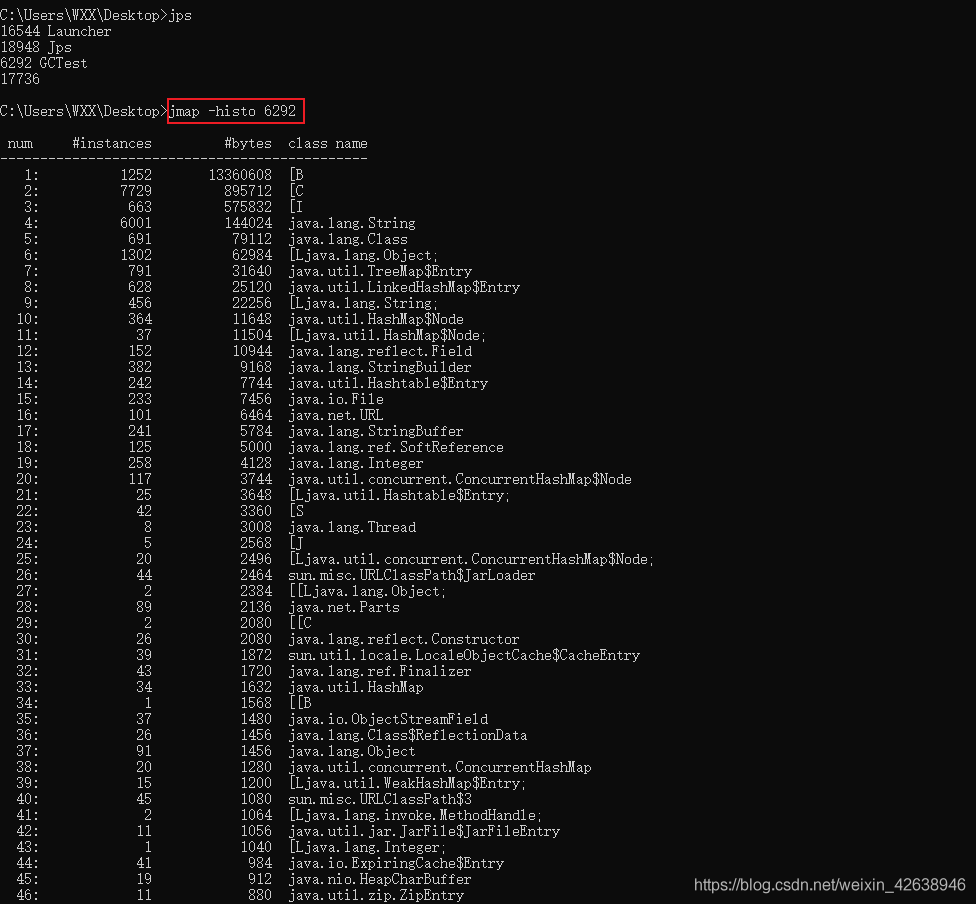

#### 2.5.3.3. 使用3：其他作用

- jmap -permstat pid
  - 查看系统的ClassLoader信息
- jmap -finalizerinfo
  - 查看堆积在finalizer队列中的对象

### 2.5.4. 注意

- 由于jmap将访问堆中的所有对象，为了保证在此过程中不被应用线程干扰，jmap需要借助安全点机制，让所有线程都停留在不改变堆中数据的状态
  > 安全点机制在GC是有提
- 也就是说，由jmap导出的堆快照必定是安全点位置的。 **这可能导致基于该堆快照的分析结果存在偏差**
- 举个例子，假设在编译生成的机器码中，某些对象的生命周期在两个安全点之间，那么`:live`选项将无法探知到这些对象。
- 另外，如果某个线程长时间无法跑到安全点，jmap将一直等下去。

## 2.6. jhat:JDK自带堆分析工具

> 基本不会使用

### 2.6.1. 基本说明

- jhat（JVM Heap Analysis Tool）：
  - Sun JDK提供的jhat命令与jmap命令搭配使用，用于分析jmap生成的heap dump文件（堆转储快照）。
  - jhat内置了一个微型的HTTP/HTML服务器，生成dump文件的分析结果后，用户可以在浏览器中分析查看结果（分析虚拟机转储快照信息）。
- 使用了jhat命令，就启动了一个http服务，端口是7000，即`http://localhost:7000/`，既可以在服务器里分析。
- 说明：**jhat命令在JDK9，JDK10中已经被删除，官方建议使用VisualVM代替**

### 2.6.2. 语法与参数

```
$ jhat -h
Usage:  jhat [-stack <bool>] [-refs <bool>] [-port <port>] [-baseline <file>] [-debug <int>] [-version] [-h|-help] <file>

        -J<flag>          Pass <flag> directly to the runtime system. For
                          example, -J-mx512m to use a maximum heap size of 512MB
        -stack false:     Turn off tracking object allocation call stack.
        -refs false:      Turn off tracking of references to objects
        -port <port>:     Set the port for the HTTP server.  Defaults to 7000
        -exclude <file>:  Specify a file that lists data members that should
                          be excluded from the reachableFrom query.
        -baseline <file>: Specify a baseline object dump.  Objects in
                          both heap dumps with the same ID and same class will
                          be marked as not being "new".
        -debug <int>:     Set debug level.
                            0:  No debug output
                            1:  Debug hprof file parsing
                            2:  Debug hprof file parsing, no server
        -version          Report version number
        -h|-help          Print this help and exit
        <file>            The file to read

For a dump file that contains multiple heap dumps,
you may specify which dump in the file
by appending "#<number>" to the file name, i.e. "foo.hprof#3".

All boolean options default to "true"
```


- 示例

  <details>
  <summary style="color:red;">展开</summary>

  - 启动服务器
    
  - 关于OQL语句：
    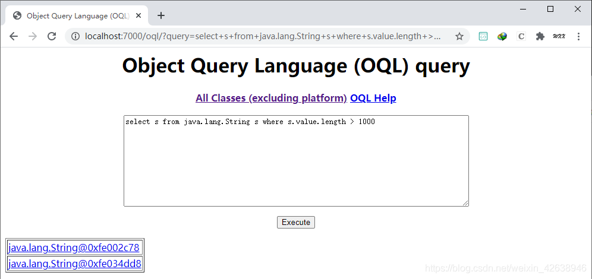
  </details>

## 2.7. jstack

### 2.7.1. 基本说明

- jstack（JVM Stack Trace）：
  - 用于生成虚拟机指定进程当前时刻的线程快照（虚拟机堆栈跟踪）。
  - 线程快照就是当前虚拟机内指定进程的每一条线程正在执行的方法堆栈的集合。
- 生成线程快照的作用：
  - 可用于定位线程出现长时间停顿的原因，如线程间死锁、死循环、请求外部资源导致的长时间等待问题。这些都是导致线程长时间停顿的常见原因
  - 也可以查看同步状态
  - 当线程出现停顿时，就可以用jstack显示各个线程调用的堆栈情况。
- 在thread dump中，要留意下面几种状态
  - **死锁，Deadlock（重点关注）**
  - **等待资源，Waiting on condition（重点关注）**
  - **等待获取监视器，Waiting on monitor entry（重点关注）**
  - **阻塞，Blocked（重点关注）**
  - 执行中，Runnable
  - 暂停，Suspended

### 2.7.2. 语法与参数

- 基本语法与参数

  ```
  Usage:
      jstack [-l] <pid>
          (to connect to running process)
      jstack -F [-m] [-l] <pid>
          (to connect to a hung process)
      jstack [-m] [-l] <executable> <core>
          (to connect to a core file)
      jstack [-m] [-l] [server_id@]<remote server IP or hostname>
          (to connect to a remote debug server)

  Options:
      -F  to force a thread dump. Use when jstack <pid> does not respond (process is hung)
      -m  to print both java and native frames (mixed mode)
      -l  long listing. Prints additional information about locks
      -h or -help to print this help message
  ```

- jstack远程管理的话，需要在远程程序的启动参数中增加：

  ```shell
  -Djava.rmi.server.hostname=......
  -Dcom.sun.management.jmxremote
  -Dcom.sun.management.jmxremote.port=8888
  -Dcom.sun.management.jmxremote.authenticate=false
  -Dcom.sun.management.jmxremote.ssl=false
  ```

- Java层面追踪当前进程中的所有的线程

  ```java
  public class AllStackTrace {
      public static void main(String[] args) {
          Map<Thread, StackTraceElement[]> all = Thread.getAllStackTraces();
          Set<Map.Entry<Thread, StackTraceElement[]>> entries = all.entrySet();
          for (Map.Entry<Thread, StackTraceElement[]> en : entries) {
              Thread t = en.getKey();
              StackTraceElement[] v = en.getValue();
              System.out.println("【Thread name is :" + t.getName() + "】");
              for (StackTraceElement s : v) {
                  System.out.println("\t" + s.toString());
              }
          }
      }
  }
  ```

### 2.7.3. 示例

<details>
<summary style="color:red;">代码展开</summary>

```java
/**
  * 演示线程的死锁问题
  */
public class ThreadDeadLock {

    public static void main(String[] args) {

        StringBuilder s1 = new StringBuilder();
        StringBuilder s2 = new StringBuilder();

        new Thread() {
            @Override
            public void run() {

                synchronized (s1) {
                    s1.append("a");
                    s2.append("1");
                    try {
                        Thread.sleep(100);
                    } catch (InterruptedException e) {
                        e.printStackTrace();
                    }
                    synchronized (s2) {
                        s1.append("b");
                        s2.append("2");
                        System.out.println(s1);
                        System.out.println(s2);
                    }
                }

            }
        }.start();

        new Thread(new Runnable() {
            @Override
            public void run() {

                synchronized (s2) {
                    s1.append("c");
                    s2.append("3");
                    try {
                        Thread.sleep(100);
                    } catch (InterruptedException e) {
                        e.printStackTrace();
                    }
                    synchronized (s1) {
                        s1.append("d");
                        s2.append("4");
                        System.out.println(s1);
                        System.out.println(s2);
                    }
                }
            }
        }).start();

        try {
            Thread.sleep(1000);
        } catch (InterruptedException e) {
            e.printStackTrace();
        }
    }
}
```
</details>

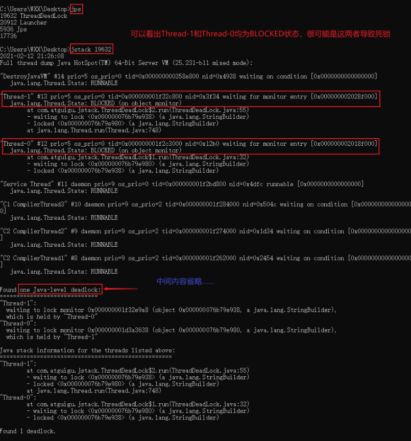

## 2.8. jcmd:多功能的命令行

### 2.8.1. 基本说明

- 在JDK1.7以后，新增了一个命令行工具jcmd
- 它是一个多功能的工具，**可以用来实现前面除了jstat之外所有命令的功能**。比如：
  - 导出堆，内存使用
  - 查看Java进程、导出线程信息
  - 执行GC、JVM运行时间等。
- jcmd拥有jmap的大部分功能，并且在Oracle的官方网站上页**推荐使用jcmd命令代替jmap命令**

### 2.8.2. 语法及参数

- 说明
  - `jcmd -h`:整体使用帮助
  - `jcmd <pid> help`:展示指定线程可执行的操作
  - `jcmd pid 具体命令` :执行具体命令

- 语法及参数
  ```
  Usage: jcmd <pid | main class> <command ...|PerfCounter.print|-f file>
    or: jcmd -l
    or: jcmd -h

    command must be a valid jcmd command for the selected jvm.
    Use the command "help" to see which commands are available.
    If the pid is 0, commands will be sent to all Java processes.
    The main class argument will be used to match (either partially
    or fully) the class used to start Java.
    If no options are given, lists Java processes (same as -p).

    PerfCounter.print display the counters exposed by this process
    -f  read and execute commands from the file
    -l  list JVM processes on the local machine
    -h  this help
  ```

- 示例

  ```shell
  # 使用如下命令可以替换jps，即列出所有的JVM进程，加不加-l运行结果一样
  jcmd -l
  # 针对指定的进程，列出支持的所有命令
  jcmd pid help
  # 显示指定进程的指令命令的数据
  jcmd pid 具体命令
  ```

  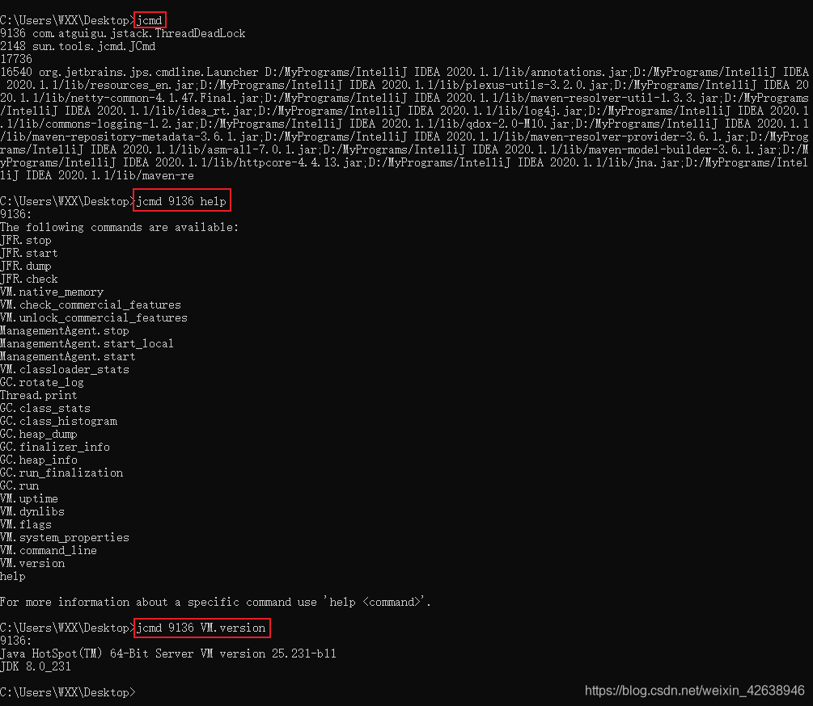

## 2.9. jstatd:远程主机信息收集

- 之前的命令值涉及到监控本机的Java应用程序，而在这些工具中，一些监控工具也支持对远程计算机的监控（如jps、jstat）。为了启用远程监控，则需要配合使用jstatd工具。
- 命令jstatd是一个**RMI服务端程序**，它的作用**相当于代理服务器**，建立本地计算机与远程监控工具的通信。jstatd服务器将本机的Java应用程序传递到远程计算机。


# 3. JVM监控及诊断工具=GUI

> **吃透一两款就行**

## 3.1. 概述

- 命令行工具的局限性
  - 无法获取方法级别的分析数据，如方法间的调用关系、各方法的调用次数和调用时间（这对定位应用性能瓶颈至关重要）。
  - 要求用户登录到目标Java应用所在的宿主机上，使用起来不方便。
  - 分析数据通过终端输出，结果展示不够直观。

- **图形化综合诊断工具**
  - **JDK自带的工具**
    - jconsole：
      - JDK自带的可视化监视工具。查看Java应用程序的运行概况、监控堆信息、永久代（元空间）使用情况、类加载情况等。
      - 位置：jdk\bin\jconsole.exe
    - Visual VM：
      - Visual VM是一个工具，它提供了一个可视化界面，用于查看Java虚拟机上运行的基于Java技术的应用程序的详细信息。
      - 位置：jdk\bin\jvisualvm.exe，也可以单独安装
    - JMC：
      - Java Mission Control，内置Java Flight Recorder
      - 能够以极低的性能开销收集Java虚拟机的性能数据。
      - HotSpot合并JRocket时带过来的，一部分功能也放到了jcmd中
  - **第三方工具**
    - MAT：
      - MAT（Memory Analyzer Tool）是基于Eclipse的内存分析工具，是一个快速、功能丰富的Java heap分析工具，它可以帮助我们查找内存泄露和减少内存消耗。
      - 可以以Eclipse的插件形式安装，也可以单独安装
      - 老牌工具
    - JProfiler：
      - 商业软件，需要付费，功能强大。
      - 可以单独安装，然后集成到IDEA中
    - Arthas：
      - Alibaba开源的Java诊断工具。深受开发者喜爱。
    - Btrace：
      - Java运行时追踪工具。可以在不停机的情况下，跟踪执行的方法调用、构造函数和系统内存等信息。

## 3.2. JConsole

### 3.2.1. 基本概述

- 从Java5开始，是JDK中自带的java监控和管理控制台。
- 用于对JVM中内存、线程和类等的监控，是一个基于JMX（java management extensions）的GUI性能监控工具。
- [官方教程](https://docs.oracle.com/javase/7/docs/technotes/guides/management/jconsole.html)

### 3.2.2. 启动

- 执行jdk/bin下的 jconsole.exe 即可
- 也可以配置到环境变量中

- 启动页面

  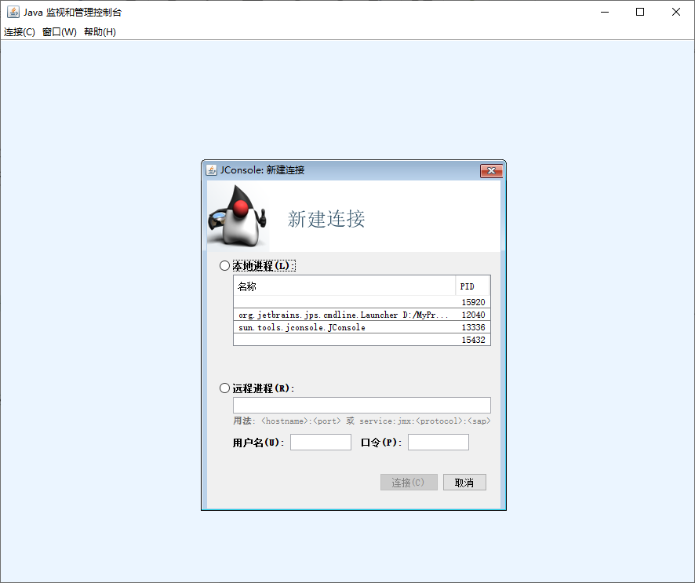

### 3.2.3. 三种连接方式

- Local
  - 使用 jConsole连接一个正在本地系统运行的JVM，并且执行程序和运行 jConsole的需要时同一个用户。
  - jConsole使用文件系统的授权通过RMI连接器连接到平台的MBean服务器上。
  - 这种从本地连接的监控能力只有Sun的JDK具有。

- Remote 
  - 使用下面的URL通过RMI连接器连接到一个JMX代理：`service:jmx:rmi:///jndi/rmi://hostName:portNum/jmsrmi`
  - jConsole为建立连接，需要在环境变量中设置mx.remote.credentials来指定用户名和密码，从而进行授权。

- Advanced
  - 使用一个特殊的URL链接JMX代理。
  - 一般情况使用自己定制的连接器而不是RMI提供的连接器来连接JMX代理，或者是一个使用JDK1.4的实现了JMX和JMX Remote的应用。

### 3.2.4. 主要作用

- 监控内存、监控线程、监控死锁、类加载与虚拟机信息

-  示例

  ```java
  /**
  * -Xms600m -Xmx600m -XX:SurvivorRatio=8
  */
  public class HeapInstanceTest {
      byte[] buffer = new byte[new Random().nextInt(1024 * 100)];

      public static void main(String[] args) {
          try {
              Thread.sleep(3000);
          } catch (InterruptedException e) {
              e.printStackTrace();
          }
          ArrayList<HeapInstanceTest> list = new ArrayList<HeapInstanceTest>();
          while (true) {
              list.add(new HeapInstanceTest());
              try {
                  Thread.sleep(10);
              } catch (InterruptedException e) {
                  e.printStackTrace();
              }
          }
      }
  }
  ```

  <details>
  <summary style="color:red;">查看图片(去自己跑一下最好)</summary>

  

  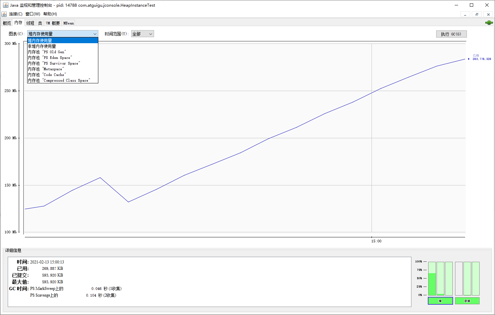

  > 内存区域会根据垃圾回收器的不同而改变

  

  > 可检测死锁

  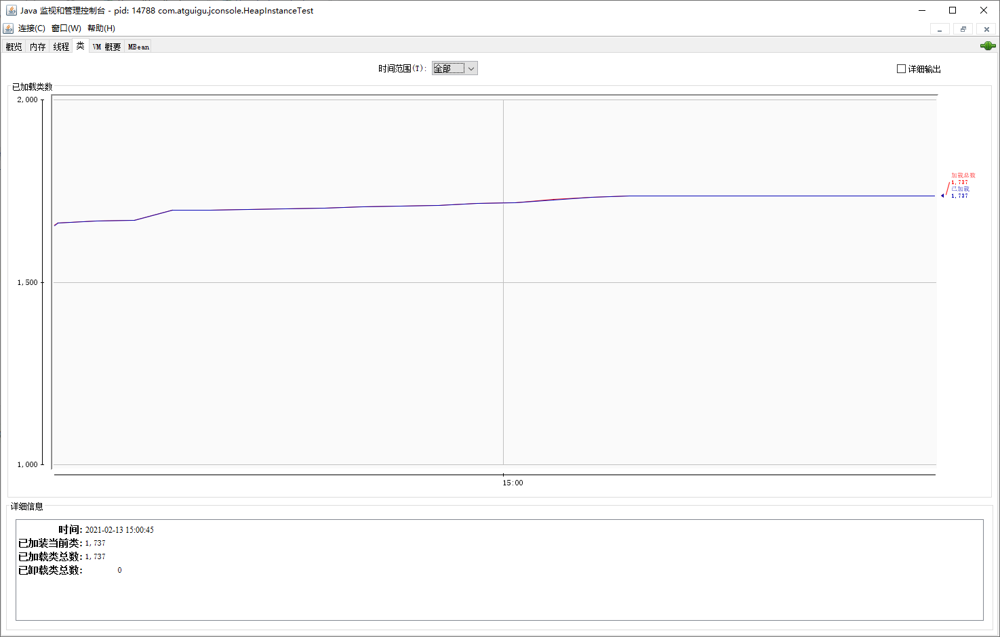

  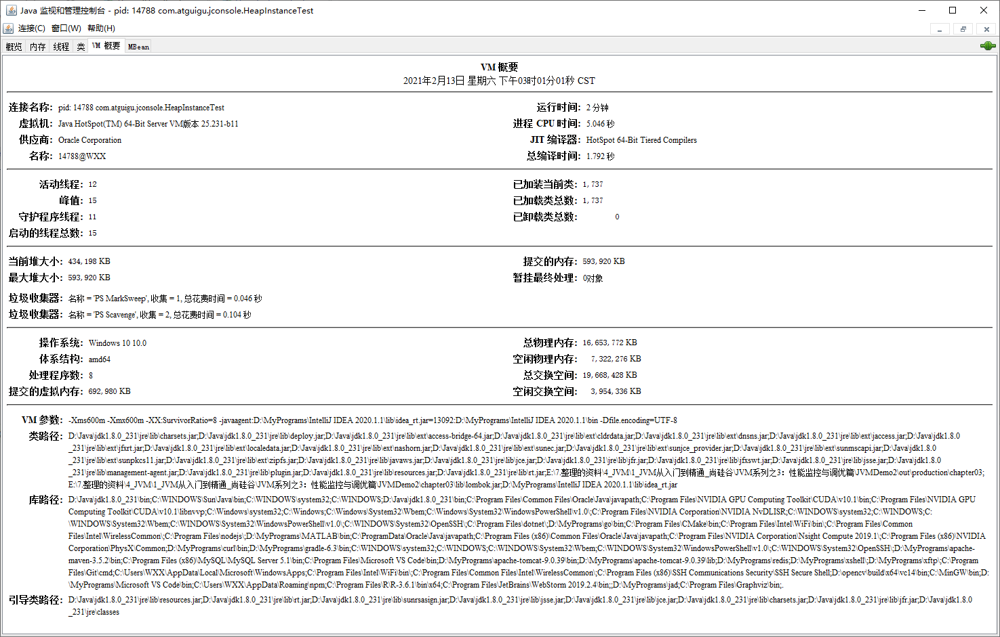
  </details>

## 3.3. Visual VM(jvisualvm)

> 取代 JConsole，必须学习

### 3.3.1. 基本概述

- Visual VM是一个功能强大的多合一故障诊断和性能监控的可视化工具。
- 它集成了多个JDK命令行工具
  - 使用Visual VM可用于显示虚拟机进程及进程的配置和环境信息（jps，jinfo）
  - 监视应用程序的CPU、GC、堆、方法区及线程的信息（jstat、jstack）
  - 可以取代jConsole。
- 在JDK 6 Update 7之后，Visual VM便作为JDK的一部分发布（VIsualVM在JDK/bin目录下，jvisualvm）
  - Visual VM 和 JDK/bin目录下的 jvisualvm是一个东西。
  - 此外，Visual VM也可以作为独立的软件安装。

- [Visual VM网址](https://visualvm.github.io/index.html)

### 3.3.2. Visual VM 插件

- 说明:Visual VM的一大特点是支持插件扩展，并且插件安装非常方便

- Visual VM 功能扩展插件
  - 既可以通过离线下载文件*.nbm，然后再Plugin对话框的已下载页面下，添加已下载的插件
  - 也可以在可用插件页面下，在线安装插件
  - **（这里建议安装上：VisualGC）**
  - [插件地址](https://visualvm.github.io/pluginscenters.html)

- IDEA集成VisualVM Launcher插件

  <details>
  <summary style="color:red;">展开</summary>

  

  > 重启后还需要做如下设置：

  
  </details>

### 3.3.3. 连接方式

- 本地连接
- 远程连接
  - 确定远程服务器的ip地址
  - 添加JMX(通过JMX技术具体监控远端服务器哪个Java进程)
  - 修改bin/catalina.sh文件，连接远程的tomcat
  - 在.../conf中添加jmxremote.access和jmxremote.password文件
  - 将服务器地址改为公网ip地址
  - 设置阿里云安全策略和防火墙策略
  - 启动tomcat,查看tomcat启动日志和端口监听
  - JMX中输入端口号、用户名、密码登录

### 3.3.4. 主要功能

#### 3.3.4.1. 说明

- 生成/读取堆内存快照
- 查看JVM参数和系统属性
- 查看运行中的虚拟机进程
- 生成/读取线程快照
- 程序资源的实时监控
- 其他功能：JMX代理连接、远程环境监控、CPU分析和内存分析

#### 3.3.4.2. 示例

- 演示代码

  ```java
  /**
   * -Xms600m -Xmx600m -XX:SurvivorRatio=8
   */
  public class OOMTest {
      public static void main(String[] args) {
          ArrayList<Picture> list = new ArrayList<>();
          while (true) {
              try {
                  Thread.sleep(5);
              } catch (InterruptedException e) {
                  e.printStackTrace();
              }
              list.add(new Picture(new Random().nextInt(100 * 50)));
          }
      }
  }
  
  class Picture {
      private byte[] pixels;
  
      public Picture(int length) {
          this.pixels = new byte[length];
      }
  }
  ```

- **概览**

  <details>
  <summary style="color:red;">展开</summary>

  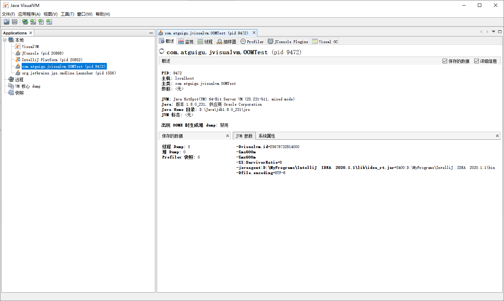

  

  

  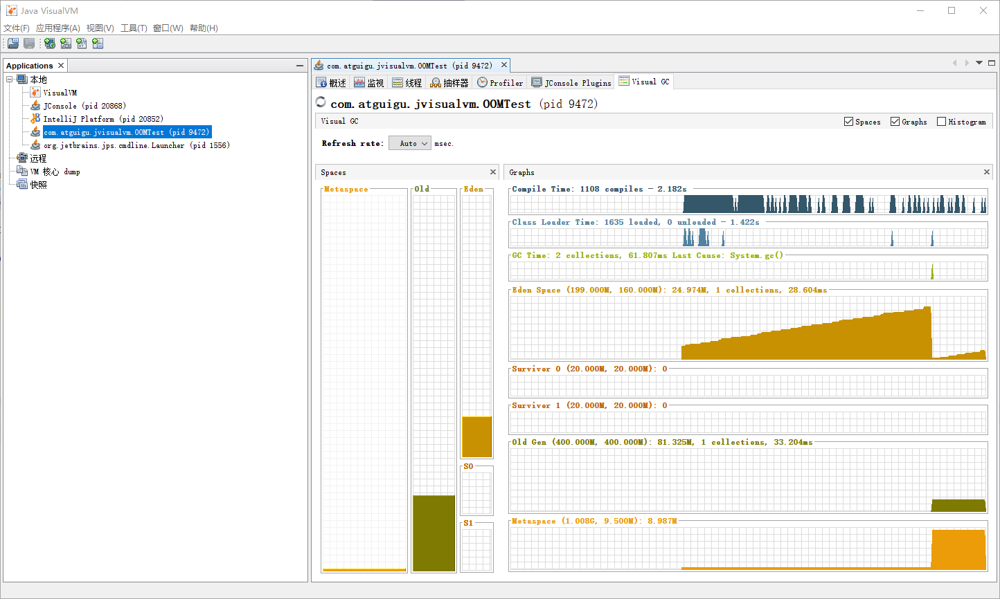
  </details>

- **生成和查看堆dump文件**

  <details>
  <summary style="color:red;">展开</summary>

  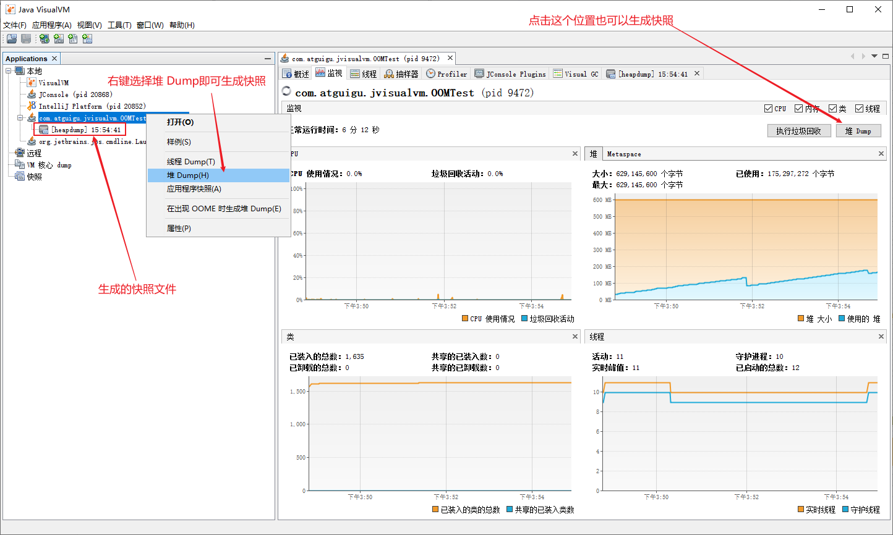

  > 然后在快照上右键即可将快照（.hprof文件）保存到磁盘：

  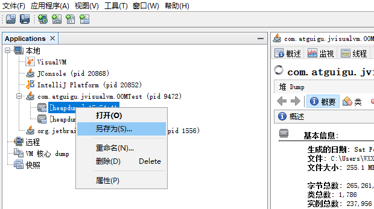

  > 通过选择：文件---->装入，可以导入刚才保存的.hprof文件：

  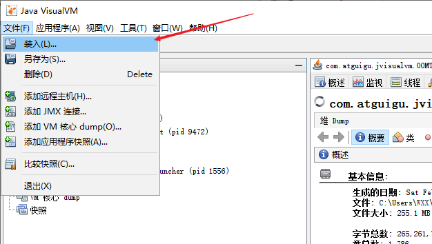

  > 分析堆dump文件

  
  </details>

- **生成和查看线程dump文件**

  <details>
  <summary style="color:red;">死锁示例代码与检测</summary>

  ```java
  /**
   * 演示线程的死锁问题
   */
  public class ThreadDeadLock {
  
      public static void main(String[] args) {
  
          StringBuilder s1 = new StringBuilder();
          StringBuilder s2 = new StringBuilder();
  
          new Thread() {
              @Override
              public void run() {
  
                  synchronized (s1) {
                      s1.append("a");
                      s2.append("1");
                      try {
                          Thread.sleep(100);
                      } catch (InterruptedException e) {
                          e.printStackTrace();
                      }
                      synchronized (s2) {
                          s1.append("b");
                          s2.append("2");
                          System.out.println(s1);
                          System.out.println(s2);
                      }
                  }
              }
          }.start();
  
          new Thread(new Runnable() {
              @Override
              public void run() {
  
                  synchronized (s2) {
                      s1.append("c");
                      s2.append("3");
                      try {
                          Thread.sleep(100);
                      } catch (InterruptedException e) {
                          e.printStackTrace();
                      }
                      synchronized (s1) {
                          s1.append("d");
                          s2.append("4");
                          System.out.println(s1);
                          System.out.println(s2);
                      }
                  }
              }
          }).start();
  
          try {
              Thread.sleep(1000);
          } catch (InterruptedException e) {
              e.printStackTrace();
          }
      }
  }
  ```

  
  </details>

- **CPU抽样和内存抽样**

  <details>
  <summary style="color:red;">展开</summary>

  

  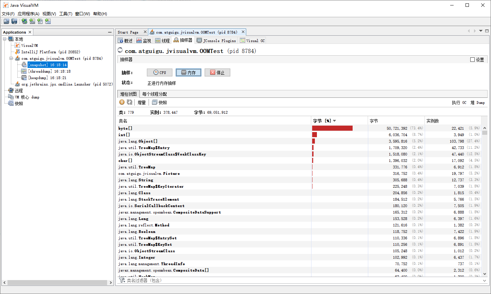
  </details>

## 3.4. eclipse MAT

> **dump文件分析，就用这个**

### 3.4.1. 概述

- MAT（Memory Analyzer Tool）工具是一款功能强大的Java堆内存分析工具。可以用于查找内存泄露以及查看内存消耗情况。
- MAT是基于Eclipse开发的，不仅可以单独使用，还可以作为插件的形式嵌入在Eclipse中使用。
- [下载地址](https://www.eclipse.org/mat/downloads.php)，下载之后解压可以直接使用，不用安装
- 两点说明
  - 说明1：
    - MAT不是一个万能工具，它并不能处理所有类型的堆转储文件。
    - 但是比较主流的厂家和格式，例如Sun，HP，SAP所采用的HPROF二进制堆转储文件，以及IBM的PHD堆转储文件等都能被很好的解析。
  - 说明2：
    - MAT最吸引人的还是能够快速地为开发人员生成**内存泄露报表**，方便定位问题和分析问题。
    - 虽然MAT有如此强大的功能，但是内存分析也没有简单到一键完成的程度，很多内存问题还是需要我们从MAT展现给我们的信息中通过经验和直觉来判断才能发现。

### 3.4.2. 获取dump文件(小结)

- dump文件内容

  ```
  MAT可以分析heap dump文件。
  进行内存分析时，只要获得了反应当前设备内存映像的hprof文件，通过MAT打开就可以直观的看到当前的内存信息。
  一般来说，这些内存信息包含：
  ```

  - 所有的对象信息，包括对象实例、成员变量、存储于栈中的基本数据类型值和存储于堆中的其他对象的引用值。
  - 所有的类信息，包括classloader、类名称、父类、静态变量等。
  - GCRoot到所有的这些对象的引用路径
  - 线程信息，包括线程的调用栈以及此线程的线程局部变量（TLS）

- 如何获取dump文件
  - 方法一：jmap工具生成，可以生成任意一个java进程的dump文件；
  - 方法二：通过配置JVM参数生成。
    - 选项`-XX:+HeapDumpOnOutOfMemoryError`或`-XX:+HeapDumpBeforeFullGC`
    - 选项`-XX:HeapDumpPath`所代表的含义就是当程序出现OutofMemory时，将会在相应的目录下生成一份dump文件。如果不指定选项`-XX:HeapDumpPath`则在当前目录下生成dump文件。
  - 方法三：使用VisualVM可以导出堆dump文件
  - 方法四：
    - 使用MAT既可以打开一个已有的快照，也可以通过MAT直接从活动Java程序中导出堆快照
    - 该功能将借助jps列出当前正在运行的Java进程，以供选择并获取快照。

### 3.4.3. 概念补充

#### 3.4.3.1. 深堆,浅堆,对象实际大小

>  **浅堆：**

- 浅堆（Shallow Heap）是指一个对象所消耗的内存。
- 在32位系统中，一个对象引用会占据4个字节，一个int类型会占据4个字节，long型变量占据8个字节。
- 根据堆快照格式不同，对象的大小可能会向8字节进行对齐。
- 以String为例：
  - 2个int值共占8个字节
  - 对象引用占用4字节，对象头占8字节
  - 合计20字节，向8字节对齐，故占24字节。（jdk7中）
  - 这24字节为String对象的浅堆大小。
  - 它与String的value实际取值无关，无论字符串长度如何，**浅堆大小始终是24字节**。

  | int  | hash32 | 0     |
  | ---- | ------ | ----- |
  | int  | hash   | 0     |
  | ref  | value  | hello |

> **深堆：**

- 保留集（Retained Set）：
  - 对象A的保留集指当对象A被垃圾回收后，可以被释放的所有对象集合（包括对象A本身）
  - 即对象A的保留集可以被认为是**只能通过**对象A被直接或者间接访问到的所有对象的集合。
  - 通俗的说，就是指仅被对象A所持有的对象的集合。

- 深堆（Retained Heap）：
  - 深堆是指对象的保留集中所有的对象的浅堆大小之和。
  - 注意：浅堆是指对象本身占用的内存，不包括其内部引用对象的大小。
  - 一个对象的深堆指**只能通过该对象**访问到的（直接或者间接）所有对象的浅堆之和
  - **即对象被回收后，可以释放的真实空间**

> **补充：对象的实际大小**

- 对象的实际大小定义为一个对象**所能触及的**所有对象的浅堆大小之和
- 也就是通常意义上我们所说的对象的大小。
- 与深堆相比，似乎这个在日常开发中更为直观和被人接收
- **但实际上，这个概念和垃圾回收无关**。

> **示例图**


- 那么对象**A的浅堆大小**只是A本身，不包含C和D
- 而**A的实际大小**为A、C、D三者之和
- 而**A的深堆大小**为A和D之和
  > 这是因为由于对象C还可以通过对象B访问到，因此不再对象A的深堆范围内。

> **图例2**

- GC Roots直接引用了A和B两个对象。

  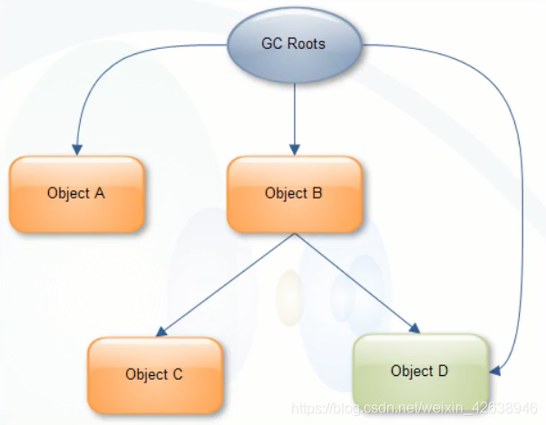

  - A对象的深堆大小 = A对象的浅堆大小
  - B对象的深堆大小 = B对象的浅堆大小 + C对象的浅堆大小

- 如果不包括GC Roots指向D对象的引用

  

  - B对象的深堆大小 = B对象的浅堆大小 + C对象的浅堆大小 + D对象的浅堆大小

> **通过案例分析深堆和浅堆的大小**

- 代码：
  ```java
  /**
  * 有一个学生浏览网页的记录程序，它将记录 每个学生访问过的网站地址。
  * 它由三个部分组成：Student、WebPage和StudentTrace三个类
  * -XX:+HeapDumpBeforeFullGC -XX:HeapDumpPath=d:\student.hprof
  */
  public class StudentTrace {
      
      static List<WebPage> webpages = new ArrayList<>();
      
      public static void createWebPages() {
          for (int i = 0; i < 100; i++) {
              WebPage wp = new WebPage();
              wp.setUrl("http://www." + Integer.toString(i) + ".com");
              wp.setContent(Integer.toString(i));
              webpages.add(wp);
          }
      }
  
      public static void main(String[] args) {
          
          createWebPages();  // 创建了100个网页
          // 创建3个学生对象
          Student st3 = new Student(3, "Tom");
          Student st5 = new Student(5, "Jerry");
          Student st7 = new Student(7, "Lily");
  
          for (int i = 0; i < webpages.size(); i++) {
              if (i % st3.getId() == 0) st3.visit(webpages.get(i));
              if (i % st5.getId() == 0) st5.visit(webpages.get(i));
              if (i % st7.getId() == 0) st7.visit(webpages.get(i));
          }
          webpages.clear();
          System.gc();
      }
  }
  
  // Student浅堆大小：4B(id) + 4B(name) + 4B(history) + 8B(对象头) = 20B --> 填充4B --> 24B
  class Student {
      private int id;
      private String name;
      private List<WebPage> history = new ArrayList<>();
  
      public Student(int id, String name) {
          super();
          this.id = id;
          this.name = name;
      }
  
      public int getId() { return id; }
      public void setId(int id) { this.id = id; }
      public String getName() { return name; }
      public void setName(String name) { this.name = name; }
      public List<WebPage> getHistory() { return history; }
      public void setHistory(List<WebPage> history) { this.history = history; }
      public void visit(WebPage wp) { if (wp != null) history.add(wp); }
  }
  
  class WebPage {
      private String url;
      private String content;
  
      public String getUrl() { return url; }
      public void setUrl(String url) { this.url = url; }
      public String getContent() { return content; }
      public void setContent(String content) { this.content = content; }
  }
  ```

- 深堆示例：
  

- 下面以Lily为例分析深堆的大小是如何计算出来的

  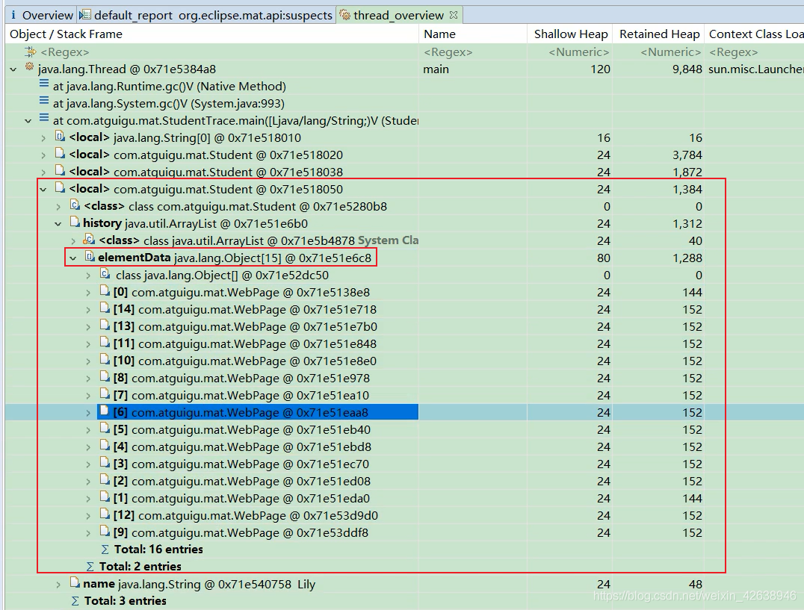

  

#### 3.4.3.2. 支配树

> 支配树的概念来自于图论

- MAT提供了一个称为支配树（Dominator Tree）的对象图
  - 支配树体现了对象实例间的支配关系
  - 在对象引用图中，所有指向对象B的路径都经过对象A，则认为**对象A支配对象B**
  - 如果对象A是离对象B最近的一个支配对象，则认为对象A为对象B的**直接支配者**
  - 支配树是基于对象间的引用图所建立的，它有以下基本性质：
    - 对象A的子树（所有被对象A支配的对象的集合）表示对象A的保留集（retained set），即深堆。
    - 如果对象A支配对象B，那么对象A的直接支配者也支配对象B。
    - 支配树的边与对象引用图的边不直接对应。

- 示例
  - 左图表示对象引用图，右图表示左图所对应的支配树

    

  - 对象A和B由根对象直接支配
  - 由于在到对象C的路径中，可以经过A，也可以经过B，因此对象C的直接支配者也是根对象。
  - 对象F和对象D相互引用，因为到对象F的所有路径必然经过对象D，因此，对象D是对象F的直接支配者
  - 而到对象D的所有路径中，必然经过对象C，即使是从对象F到对象D的引用，从根节点出发，也是经过对象C的，所以，对象D的直接支配者为对象C
  - 同理，对象E支配对象G。
  - 到达对象H可以通过对象D，也可以通过对象E，因此对象D和E都不能支配对象H，而经过对象C既可以到达对象D也可以到达E，因此对象C为对象H的直接支配者。

- 在MAT中，单击工具栏上的对象支配按钮，可以打开对象支配树视图。

  

  - 该截图显示上面代码示例中部分学生Lily的history队列的直接支配对象
  - 即当Lily对象被回收，也会一并回收的所有对象
  - 显然能被3或者5整除的网页不会出现在该列表中，因为他们同时被另外两名学生对象所引用。

  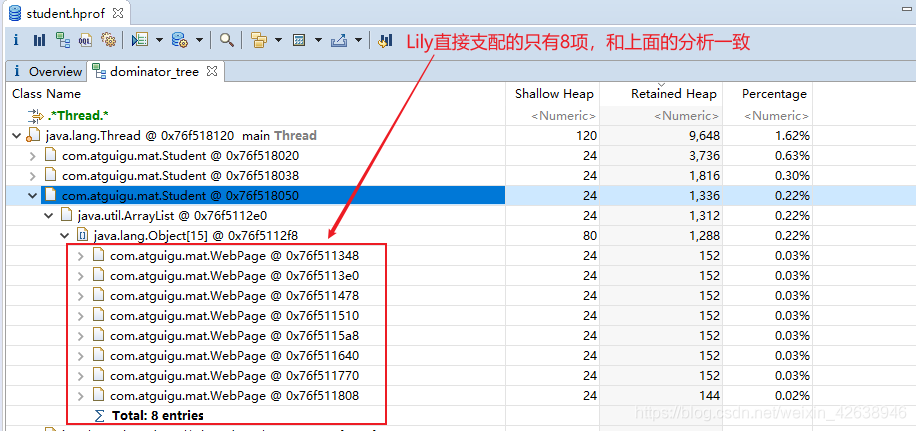

- 问题: <p style="color:red;"> 软，弱，虚引用表现？ </p>

### 3.4.4. 分析dump文件

#### 示例代码

```java
/**
  * -Xms600m -Xmx600m -XX:SurvivorRatio=8
  */
public class OOMTest {
    public static void main(String[] args) {
        ArrayList<Picture> list = new ArrayList<>();
        while (true) {
            try {
                Thread.sleep(5);
            } catch (InterruptedException e) {
                e.printStackTrace();
            }
            list.add(new Picture(new Random().nextInt(100 * 50)));
        }
    }
}

class Picture {
    private byte[] pixels;

    public Picture(int length) {
        this.pixels = new byte[length];
    }
}
```

#### 3.4.4.1. histogram

- 展示了各个类的实例数目以及这些实例的Shallow heap或Retainedheap的总和，
- 在这个界面可以进行：分组，排序，写正则表达式，两个.hprof的对比，查看对象被谁引用，…

#### 3.4.4.2. thread overview

- 查看系统中的Java线程、查看局部变量的信息。获取对象相互引用关系

- **注意：** 
  - thread overview中显示的才是引用关系
  - 支配树中显示的是支配关系

#### 3.4.4.3. 获取对象引用关系

### 3.4.5. 案例解析-tomcat堆溢出分析

- 查看报告

  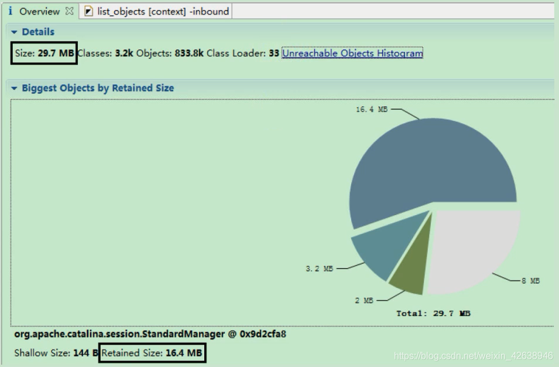

  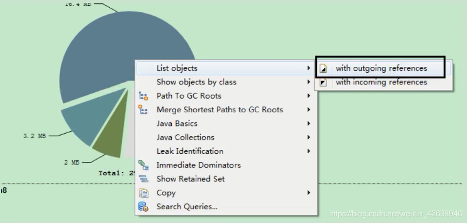

- session对象，它占用了17MB空间

  

- 可以看到sessions对象为ConcurrentHashMap，其内部分为16个Segment。从深堆大小看，每个Segment都比较平均，大约为1MB，合计17MB。

  

- 内部value，都是Session

  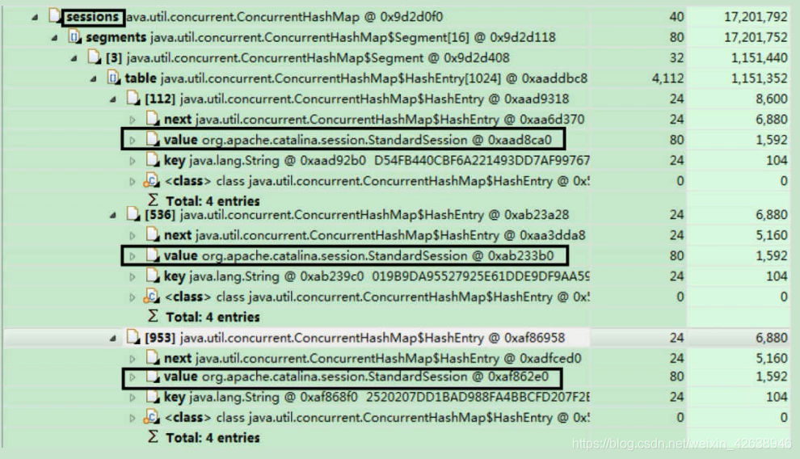

- 当前堆中含有9941个session，并且每一个session的深堆为1592字节，合计越15MB，达到当前堆大小的50%。

- QQL查询

  

- 查看属性：创建和结束时间

  

- 根据当前的session综述，可以计算每秒的平均压力：9941/((1403324677648-1403324645728)/1000) = 311次/秒。

  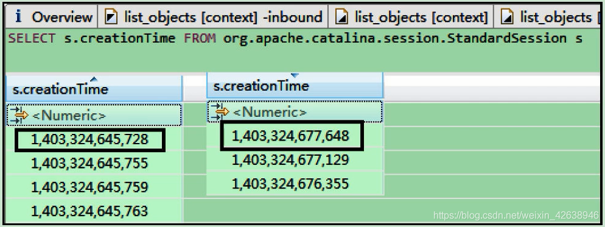

- 由此推断
  - 在发生Tomcat堆溢出时，Tomcat在连续的30秒的时间内，平均接收了约311次不同客户端的请求
  - 创建了合计9941个session。导致出现堆溢出

### 3.4.6. 补充：内存泄漏

#### 3.4.6.1. 概述

> **基本说明**

- 何为内存泄露（memory leak）
  - 可达性分析算法来判断对象是否是不再使用的对象，本质上是判断一个对象是否还被引用
  - 那么对于这种情况，由于代码的实现不同就会出现很多内存泄露问题（让JVM误认为此对象还在引用中，无法回收，造成内存泄露）。

  

- 内存泄露（memory leak）的理解

  - **严格来说** ， 
    - **只有对象不会再被程序用到了，但是GC用不能回收它们的情况，才叫内存泄露。**
  - **宽泛意义上** ，
    - **但实际情况很多时候一些不太好的实践（或疏忽）会导致对象的生命周期变得很长甚至导致OOM**
    - 也可以叫做内存泄露

> **示例说明**

- 对象X引用对象Y，X的生命周期比Y的生命周期长
- 那么当Y生命周期结束的时候，X依然引用着Y，这时候，垃圾回收是不会回收对象Y的
- 如果对象X还引用着生命周期比较短的A、B、C，对象A又引用着对象a、b、c
- 这样就可能造成大量无用的对象不能被回收，进而占据了内存资源，造成内存泄露，直至内存溢出。

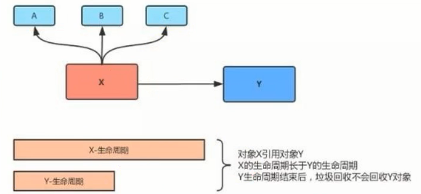

> **内存泄露与内存溢出的关系**

- 内存泄露（memory leak） 申请了内存用完了不释放
- 内存溢出（out of memory） 申请内存时，没有足够的内存可以使用；
- 内存泄露和内存溢出的关系：内存泄露的增多，最终导致内存溢出。

> **泄露的分类**

- **经常发生**：发生内存泄露的代码会被多次执行，每次执行，泄露一块内存；
- **偶然发生**：在某些特定情况下才会发生；(比如finally)
- **一次性**：内存泄露的方法只会被执行一次；
- **隐式泄露**：一直占着内存不释放，知道执行结束；严格的说这个不算内存泄露，因为最终释放掉了，但是如果执行时间特别长，也可能导致内存耗尽。

#### 3.4.6.2. 内存泄漏8种情况

> **1.静态集合类**

- 说明
  - 静态集合类，如HashMap、LinkedList等等
  - 如果这些容器为静态的，那么他们的生命周期与JVM程序一直，则容器中的对象在程序结束之前不会被释放，从而造成内存泄露
  - 简单而言，长生命周期的对象持有短生命周期对象的引用，尽管短生命周期的对象不再被使用，但是因为长生命周期对象持有它的引用而导致不能被回收。

- 示例代码

  <details>
  <summary style="color:red;">展开</summary>

   ```java
   public class MemeoryLeak {
       static List list = new ArrayList<>();
       
       public void oomTest() {
           Object obj = new Object();  // 局部变量
           list.add(obj);
       }
   }
   ```
  </details>

> **2.单例模式**

- 说明：
  - 单例模式，和静态集合导致内存泄露的原因类似，因为单例的静态特性，它的生命周期和JVM的生命周期一样长
  - 所以如果单例对象如果持有外部对象的引用，那么这个外部对象也不会被回收，那么就会造成内存泄露。

> **3.内部类持有外部类**

- 说明：
  - 如果一个外部类的实例对象的方法返回了一个内部类的实例对象，这个内部类对象被长期引用了
  - 即使那个外部类实例不再被使用，但是由于内部类持有外部类的实例对象，这个外部类对象将不会被垃圾回收，这也造成内存泄露。

> **4.各种连接，如数据库连接、网络连接和IO连接等**

- 说明：
  - 在对数据库进行操作的过程中，首先需要建立数据库的链接，当不再使用时，需要调用close方法来释放与数据库的连接
  - 只有连接被关闭后，垃圾回收器才会回收对应的对象。
  - 否则，如果在访问数据库的过程中，对Connection、Statement或ResultSet不显性地关闭，将会造成大量对象无法被回收，从而引起内存泄露。
- 示例代码

  <details>
  <summary style="color:red;">展开</summary>
   ```java
   public static void main(String[] args) {
       try {
           Connection conn = null;
           Class.forName("com.mysql.jdbc.Driver");
           conn = DriverManager.getConnection("url", "", "");
           Statement stmt = conn.createStatement();
           ResultSet rs = stmt.executeQuery("...");
       } catch (Exception e) {  // 异常日志
           
       } finally {
           // 1.关闭结果集
           // 2.关闭声明的对象
           // 3.关闭连接
       }
   }
   ```
  </details>

> **5.变量不合理的作用域**

- 说明：
  - 一般而言，一个变量的定义的作用范围大于其使用范围，很有可能造成内存泄露
  - 另一方面没有及时地把对象设置为null，很有可能导致内存泄露的发生。

- 示例代码
  <details>
  <summary style="color:red;">展开</summary>

   ```java
   public class UsingRandom {
       private String msg;
       public void receiveMsg() {
           readFromNet();  // 从网络上接收数据保存到msg中
           saveDB();  // 把msg保存到数据库中
       }
   }
   // 如上面这个伪代码，通过readReomNet方法把接收的消息保存在变量msg中，然后调用saveDB方法把msg的内容保存到数据库中，此时msg已经就没有用了
   // 由于msg的生命周期与对象的生命周期相同，此时msg还不能被回收，因此造成了内存泄露。
   // 实际上这个msg变量可以放在receiveMsg方法内部，当方法使用完，那么msg的生命周期也就结束，此时就可以回收了
   // 还有另一种方法，在使用完msg后，把msg设置为null，这样垃圾回收也会回收msg的内存空间。
   ```
  </details>

> **6.改变哈希值**

- 说明：
  - 当一个对象被存储进HashSet集合以后，就不能修改这个对象中那些参与计算的哈希值字段了
  - 否则，对象修改后的哈希值与最初存储进HashSet集合中的哈希值就不同了
  - 在这种情况下，即使contains方法使用该对象的当前引用作为参数去HashSet集合中检索对象，也将返回找不到对象结果
  - 这也会导致无法从HashSet集合中单独删除当前对象，造成内存泄露。
  - 这也是String为什么被设置为了不可变类型，我们可以放心地把String存入HashSet，或者把String当做HashMap的key值。

- 示例代码

  <details>
  <summary style="color:red;">展开</summary>

   ```java
   /**
    * 演示内存泄漏
    */
   public class ChangeHashCode {
       public static void main(String[] args) {
           HashSet set = new HashSet();
           Person p1 = new Person(1001, "AA");
           Person p2 = new Person(1002, "BB");
   
           set.add(p1);
           set.add(p2);
   
           p1.name = "CC";  // 导致了内存的泄漏
           set.remove(p1);  // 删除失败
           // [Person{id=1002, name='BB'}, Person{id=1001, name='CC'}]
           System.out.println(set);  
   
           set.add(new Person(1001, "CC"));
           // [Person{id=1002, name='BB'}, Person{id=1001, name='CC'}, Person{id=1001, name='CC'}]
           System.out.println(set);
   
           set.add(new Person(1001, "AA"));
           // [Person{id=1002, name='BB'}, Person{id=1001, name='CC'}, Person{id=1001, name='CC'}, Person{id=1001, name='AA'}]
           System.out.println(set);
       }
   }
   
   class Person {
       int id;
       String name;
   
       public Person(int id, String name) {
           this.id = id;
           this.name = name;
       }
   
       @Override
       public boolean equals(Object o) {
           if (this == o) return true;
           if (!(o instanceof Person)) return false;
           Person person = (Person) o;
           if (id != person.id) return false;
           return name != null ? name.equals(person.name) : person.name == null;
       }
   
       @Override
       public int hashCode() {
           int result = id;
           result = 31 * result + (name != null ? name.hashCode() : 0);
           return result;
       }
   
       @Override
       public String toString() {
           return "Person{" + "id=" + id + ", name='" + name + '\'' + '}';
       }
   }
   ```
  </details>

  <details>
  <summary style="color:red;">展开</summary>

   ```java
   /**
    * 演示内存泄漏
    *
    * @author shkstart
    * @create 14:47
    */
   public class ChangeHashCode1 {
       public static void main(String[] args) {
           HashSet<Point> hs = new HashSet<Point>();
           Point cc = new Point();
           cc.setX(10);  // hashCode = 41
           hs.add(cc);
   
           cc.setX(20);  // hashCode = 51  此行为导致了内存的泄漏
   
           System.out.println("hs.remove = " + hs.remove(cc));  // false
           hs.add(cc);
           System.out.println("hs.size = " + hs.size());  // size = 2
   
           System.out.println(hs);  // [Point{x=20}, Point{x=20}]
       }
   
   }
   
   class Point {
       int x;
   
       public int getX() {
           return x;
       }
   
       public void setX(int x) {
           this.x = x;
       }
   
       @Override
       public int hashCode() {
           final int prime = 31;
           int result = 1;
           result = prime * result + x;
           return result;
       }
   
       @Override
       public boolean equals(Object obj) {
           if (this == obj) return true;
           if (obj == null) return false;
           if (getClass() != obj.getClass()) return false;
           Point other = (Point) obj;
           if (x != other.x) return false;
           return true;
       }
   
       @Override
       public String toString() {
           return "Point{" + "x=" + x + '}';
       }
   }
   ```
  </details>

> **7.缓存泄露**

- 说明：
  - 内存泄露的另一个常见来源是缓存，一旦你把对象放入到缓存中，他就容易遗忘
    > 比如：之前项目在一次上线的时候，应用启动奇慢直到夯死
    > 就是因为代码中会加载一个表中的数据到缓存（内存）中，测试环境只有几百条数据，但是生产环境有几百万的数据。
  - 对于此问题，可以使用WeakHashMap代表缓存，此种Map的特点是，当除了自己有对key的引用外，此key没有其他引用那么此map会自动丢弃此值。

- 示例代码

  <details>
  <summary style="color:red;"></summary>

   ```java
   /**
    * 演示内存泄漏
    */
   public class MapTest {
       static Map wMap = new WeakHashMap();
       static Map map = new HashMap();
   
       public static void main(String[] args) throws Exception {
           init();
           System.out.println("---------------------------");
           testWeakHashMap();
           System.out.println("---------------------------");
           testHashMap();
       }
   
       public static void init() {
           String ref1 = new String("obejct1");
           String ref2 = new String("obejct2");
           String ref3 = new String("obejct3");
           String ref4 = new String("obejct4");
           wMap.put(ref1, "cacheObject1");
           wMap.put(ref2, "cacheObject2");
           map.put(ref3, "cacheObject3");
           map.put(ref4, "cacheObject4");
           System.out.println("String引用ref1，ref2，ref3，ref4 消失");
   
       }
   
       public static void testWeakHashMap() throws InterruptedException {
           System.out.println("WeakHashMap GC之前");
           for (Object o : wMap.entrySet()) System.out.println(o);
           System.gc();
           TimeUnit.SECONDS.sleep(2);
           System.out.println("WeakHashMap GC之后");
           for (Object o : wMap.entrySet()) System.out.println(o);
       }
   
       public static void testHashMap() throws InterruptedException {
           System.out.println("HashMap GC之前");
           for (Object o : map.entrySet()) System.out.println(o);
           System.gc();
           TimeUnit.SECONDS.sleep(2);
           System.out.println("HashMap GC之后");
           for (Object o : map.entrySet()) System.out.println(o);
       }
   
   }
   /**
    * 结果
    * String引用ref1，ref2，ref3，ref4 消失
    * ---------------------------
    * WeakHashMap GC之前
    * obejct2=cacheObject2
    * obejct1=cacheObject1
    * WeakHashMap GC之后
    * ---------------------------
    * HashMap GC之前
    * obejct4=cacheObject4
    * obejct3=cacheObject3
    * HashMap GC之后
    * obejct4=cacheObject4
    * obejct3=cacheObject3
    **/
   ```

  

  - 上面代码和图示主要演示了WeakHashMap如何自动释放缓存对象
  - 当init函数执行完成后，局部变量字符串引用obejct1，obejct2，obejct3，obejct4都会消失
  - 此时只有静态map中保存了对字符串对象的引用，可以看到，调用gc之后，HashMap没有被回收，而WeakHashMap里面的缓存被回收了。
  </details>

> **8.监听器和回调**

- 说明
  - 内存泄露的另一个常见来源是监听器和其他回调
  - 如果客户端在你实现的API中注册回调，却没有显式的取消，那么就会聚集
  - 需要确保回调立即被当做垃圾回收的最佳方法是只保存它的弱引用，例如将它们保存成为WeakHashMap中的键。

#### 3.4.6.3. 案例1-过期引用

> **1. 代码**

```java
public class Stack {
    private Object[] elements;
    private int size = 0;
    private static final int DEFAULT_INITIAL_CAPACITY = 16;

    public Stack() {
        elements = new Object[DEFAULT_INITIAL_CAPACITY];
    }

    public void push(Object e) {  // 入栈
        ensureCapacity();
        elements[size++] = e;
    }
    // 存在内存泄漏
    public Object pop() {  // 出栈
        if (size == 0) throw new EmptyStackException();
        return elements[--size];
    }

    /*public Object pop() {
        if (size == 0) throw new EmptyStackException();
        Object result = elements[--size];
        elements[size] = null;
        return result;
    }*/

    private void ensureCapacity() {
        if (elements.length == size) elements = Arrays.copyOf(elements, 2 * size + 1);
    }
}
```

> **2. 分析**

- 假设这个栈一致增长，增长后如下图所示：

  

- 当进行大量的pop操作时，由于引用未进行置空，gc是不会释放的

  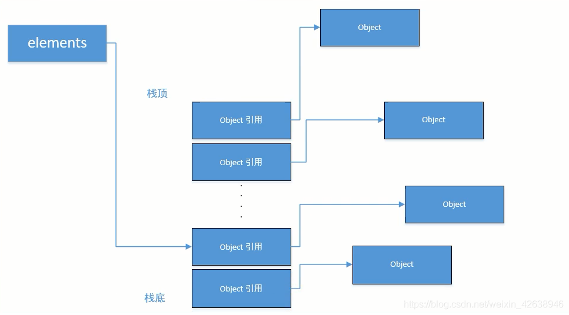

- 如果栈先增长，后收缩，那么从栈中弹出的对象将不会被当做垃圾被回收，即使程序不再使用栈中的这些对象，我们也不会回收
- 因为栈中仍然保存这些对象的引用，俗称**引用过期**，这个内存泄露相对较难发现。

> **3.解决办法**

- 将pop()这个函数改成如下函数即可：

  ```java
  public Object pop() {
      if (size == 0) throw new EmptyStackException();
      Object result = elements[--size];
      elements[size] = null;
      return result;
  }
  ```

#### 案例2

> **1.代码与说明**

- Android开发中的一个界面，当退出这个界面时，因为TestActivity中中存在未结束的线程，导致无法回收该类，造成内存泄露。

  ```java
  public class TestActivity extends Activity {
      private static final Object key = new Object();
      
      @Override
      protected void onCreate(Bundle savedInstanceState) {
          super.onCreate(savedInstanceState);
          setContentView(R.layout.activity_main);
          
          new Thread() {  // 匿名线程，退出页面是导致内存泄露
              public void run() {
                  synchronized (key) {
                      try {
                          key.wait();
                      } catch (InterruptedException e) {
                          e.printStackTrace();
                      }
                  }
              }
          }.start();
      }
  }
  ```

> **2.解决办法：**

- 使用线程时，一定要确保线程在周期性对象（如Activity）销毁时能正常结束
  - 如能正常结束，但是Activity销毁后还需要执行一段时间，也可能造成内存泄露
  - 此时可采用WeakReference方法来解决，另外在使用Hanlder的时候，如存在Delay操作，也可采用WeakReference；
- 使用Handler+HandlerThread时，记住在周期性对象销毁时调用looper.quit()方法。

### 3.4.7. 补充：QQL

> MAT支持一种类似于SQL的查询语言OQL（Object Query Language）。OQL使用类SQL语法，可以在堆中进行对象的查找和筛选。

- SELECT子句 在MAT中，Select子句的格式与SQL基本一致，用于指定要显示的列
  - Select子句中可以使用"*"，查看结果对象的引用实例（相当于outgoing references）。

    ```sql
    SELECT * FROM java.util.Vector v
    ```

  - 使用"OBJECTS"关键字，可以将返回结果集中的项以对象的形式显示。

    ```sql
    SELECT objects v.elementData FROM java.util.Vector v
    SELECT OBJECTS s.value FROM java.util.String s
    ```

  - 在Select子句中，使用"AS RETAINED SET"关键字可以得到所得对象的保留集。

    ```sql
    SELECT AS RETAINED SET * FROM com.atguigu.mat.Student
    ```

  - "DISTINCT"关键字用于在结果集中去除重复对象。

    ```sql
    SELECT DISTINCT OBJECTS classof(s) FROM java.lang.String s
    ```

- FROM子句
  - From子句用于指定查询范围，它可以指定类名、正则表达式或者对象地址。

    ```sql
    SELECT * FROM java.lang.String s
    ```

  - 下列使用正则表达式，限定搜索范围，输出所有com.atguigu包下所有类的实例

    ```sql
    SELECT * FROM "com\.atguigu\..*"
    ```

  - 也可以直接使用类的地址进行搜索。使用类的地址的好处是可以区分被不同ClassLoader加载的同一种类型。

    ```sql
    select * from 0x37a0b4d
    ```

- WHERE子句: Where子句用于指定OQL的查询条件。OQL查询将只返回满足Where子句指定条件的对象。 Where子句的格式和传统的SQL极为相似。

  - 下例返回长度大于10的char数组。

    ```sql
    SELECT * FROM char[] s WHERE s.@length>10
    ```

  - 下例返回包含"java"子字符串的所有字符串，使用"LIKE"操作符，"LIKE"操作符的操作参数为正则表达式。

    ```sql
    SELECT * FROM java.lang.String s WHERE toString(s) LIKE ".*java.*"
    ```

  - 下例返回所有value域不为null的字符串，使用"="操作符

    ```sql
    SELECT * FROM java.lang.String s where s.value!=null
    ```

  - Where子句支持多个条件的AND、OR运算。下例返回数组长度大于15，并且深堆大于1000字节的所有Vector对象

    ```sql
    SELECT * FROM java.util.Vector v WHERE v.elementData.@length>15 AND v.@retainedHeapSize>1000
    ```

- 内置对象和方法
  - OQL中可以访问堆内对象的属性，也可以访问堆内代理对象的属性。访问堆内对象的属性时，格式如下：

    ```sql
    # alias为对象名称
    [ <alias>. ] <field> . <field> . <field>
    ```

  - 访问`java.io.File`对象的path属性，并进一步访问path的value属性：

    ```sql
    SELECT toString(f.path.value) FROM java.io.File f
    ```

  - 下例显示了String对象的内容、objectid和objectAddress。

    ```sql
    SELECT s.toString(), s.@objectId, s.@objectAddress FROM java.lang.String s
    ```

  - 下例显示`java.util.Vector`内部数组的长度

    ```sql
    SELECT v.elementData.@length FROM java.util.Vector v
    ```

  - 下例显示了所有的`java.util.Vector`对象及其子类型

    ```sql
    select * from INSTANCEOF java.util.Vector
    ```

## 3.5. JProfiler

## 3.6. Arthas

## 3.7. Java Mission Control

## 3.8. 其他工具

# 4. JVM运行时参数

## 4.1. JVM参数类型

## 4.2. 常用JVM参数

# 5. GC日志分析

# 6. 面试题

- 支付宝
  - 支付宝三面：JVM 性能调优都做了什么？
- 小米
  - 有做过 JVM 内存优化吗？
  - 从 SQL、JVM、架构、数据库四个方面讲讲优化思路
- 蚂蚁金服
  - JVM 的编译优化
  - JVM 性能调优都做了什么
  - JVM 诊断工具用过哪些？
  - 二面：JVM 怎样调优，堆内存、栈空间设置多少合适
  - 三面：JVM 相关的分析工具使用过哪些？具体的性能优化步骤如何？
- 字节跳动
  - 三面：JVM 如何调优、参数怎么调？
- 拼多多
  - 从 SQL、JVM、架构、数据库四个方面讲讲优化思路
- 京东
  - JVM 诊断工具用过哪些？
  - 每秒几十万并发的秒杀系统为什么会频繁发生 GC？
  - 日均百万级交易系统如何优化 JVM？
  - 线上生产系统 OOM 如何监控及定位与解决？
  - 高并发系统如何基于 G1 垃圾回收器优化性能？

